# Model: aslanidi_atrial_model_2009(aslanidi_atrial_model_2009.cellml)
No of piecewises: 6
## Equation 1:
```
L_type_Ca_channel_d_L_gate__alpha_d_L = -50.0 * L_type_Ca_channel_d_L_gate__E10 / (-1.0 + exp(-0.20798668885191349 * L_type_Ca_channel_d_L_gate__E10)) - 16.719999999999999 * L_type_Ca_channel_d_L_gate__E0_alpha_d_L / (-1.0 + exp(-0.40000000000000002 * L_type_Ca_channel_d_L_gate__E0_alpha_d_L))
```
## New Eq:
```
L_type_Ca_channel_d_L_gate__alpha_d_L = ((fabs(10.0 + membrane__V) < 9.9999999999961231e-6) ? (0.00049999999999980616 / (-1.0 + exp(2.0798668885183286e-6)) + 50000.000000019383 * (10.00001 + membrane__V) * (-0.00049999999999980616 / (-1.0 + exp(2.0798668885183286e-6)) - 0.00049999999999980616 / (-1.0 + exp(-2.0798668885183286e-6)))) : (-50.0 * (10.0 + membrane__V) / (-1.0 + exp(-2.0798668885191347 - 0.20798668885191349 * membrane__V)))) + ((fabs(45.0 + membrane__V) < 1.0000000000010001e-5) ? (0.00016720000000016721 / (-1.0 + exp(4.0000000000040004e-6)) + 49999.999999949992 * (45.000010000000003 + membrane__V) * (-0.00016720000000016721 / (-1.0 + exp(4.0000000000040004e-6)) - 0.00016720000000016721 / (-1.0 + exp(-4.0000000000040004e-6)))) : (-16.719999999999999 * (45.0 + membrane__V) / (-1.0 + exp(-18.0 - 0.40000000000000002 * membrane__V))))
```
## Singularity point: -45.000000000000000

## Singularity point: -10.000000000000000
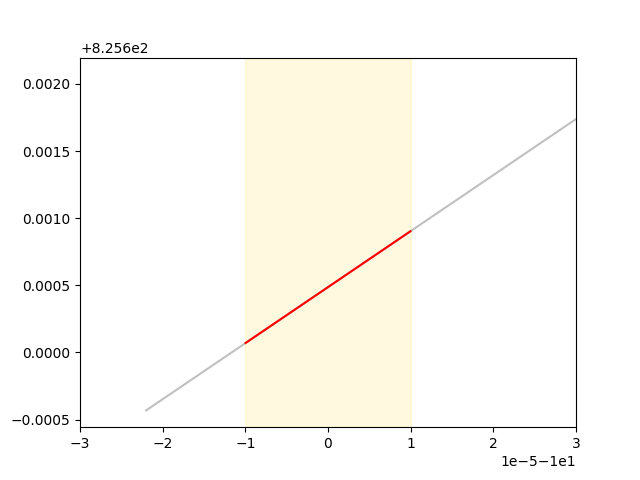

## Equation 2:
```
L_type_Ca_channel_d_L_gate__beta_d_L = 4.4800000000000004 * L_type_Ca_channel_d_L_gate__E0_beta_d_L / (-1.0 + exp(0.40000000000000002 * L_type_Ca_channel_d_L_gate__E0_beta_d_L))
```
## New Eq:
```
L_type_Ca_channel_d_L_gate__beta_d_L = ((fabs(5.0 + membrane__V) < 1.0000000000003062e-5) ? (-4.480000000001372e-5 / (-1.0 + exp(-4.0000000000012246e-6)) + 49999.999999984691 * (5.0000099999999996 + membrane__V) * (4.480000000001372e-5 / (-1.0 + exp(4.0000000000012246e-6)) + 4.480000000001372e-5 / (-1.0 + exp(-4.0000000000012246e-6)))) : (4.4800000000000004 * (5.0 + membrane__V) / (-1.0 + exp(2.0 + 0.40000000000000002 * membrane__V))))
```
## Singularity point: -5.0000000000000000


## Equation 3:
```
L_type_Ca_channel_f_L_gate__alpha_f_L = 8.4900000000000002 * L_type_Ca_channel_f_L_gate__E0_f_L / (-1.0 + exp(0.25 * L_type_Ca_channel_f_L_gate__E0_f_L))
```
## New Eq:
```
L_type_Ca_channel_f_L_gate__alpha_f_L = ((fabs(18.0 + membrane__V) < 1.0000000000010001e-5) ? (-8.490000000008491e-5 / (-1.0 + exp(-2.5000000000025002e-6)) + 49999.999999949992 * (18.00001 + membrane__V) * (8.490000000008491e-5 / (-1.0 + exp(2.5000000000025002e-6)) + 8.490000000008491e-5 / (-1.0 + exp(-2.5000000000025002e-6)))) : (8.4900000000000002 * (18.0 + membrane__V) / (-1.0 + exp(4.5 + 0.25 * membrane__V))))
```
## Singularity point: -18.000000000000000
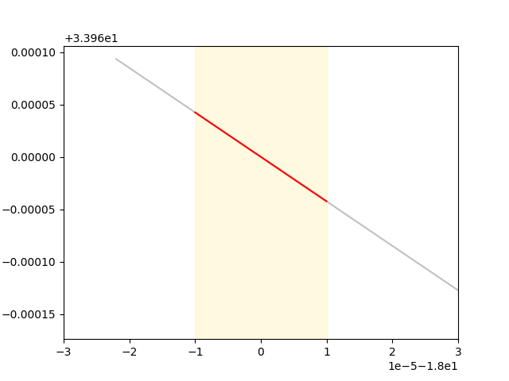

## Equation 4:
```
sodium_current_m_gate__alpha_m = -460.0 * sodium_current_m_gate__E0_m / (-1.0 + exp(-0.078907914463820727 * sodium_current_m_gate__E0_m))
```
## New Eq:
```
sodium_current_m_gate__alpha_m = ((fabs(44.399999999999999 + membrane__V) < 1.0000000000010001e-5) ? (0.0046000000000046004 / (-1.0 + exp(7.890791446389964e-7)) + 49999.999999949992 * (44.400010000000002 + membrane__V) * (-0.0046000000000046004 / (-1.0 + exp(7.890791446389964e-7)) - 0.0046000000000046004 / (-1.0 + exp(-7.890791446389964e-7)))) : (-460.0 * (44.399999999999999 + membrane__V) / (-1.0 + exp(-3.5035114021936398 - 0.078907914463820727 * membrane__V))))
```
## Singularity point: -44.399999999999999


## Equation 5:
```
sodium_current__i_Na = pow(membrane__F, 2) * pow(sodium_current_m_gate__m, 3) * (-1.0 + exp((-sodium_current__E_Na + membrane__V) * membrane__F / (membrane__R * membrane__T))) * (0.36499999999999999 * sodium_current_h2_gate__h2 + 0.63500000000000001 * sodium_current_h1_gate__h1) * cleft_space_ion_concentrations__Na_c * membrane__V * sodium_current__P_Na / ((-1.0 + exp(membrane__F * membrane__V / (membrane__R * membrane__T))) * membrane__R * membrane__T)
```
## New Eq:
```
sodium_current__i_Na = ((fabs(membrane__V) < 1.0000000000000001e-5) ? (49999.999999999993 * (1.0000000000000001e-5 + membrane__V) * (0.036356064910852921 * pow(sodium_current_m_gate__m, 3) * (-1.0 + exp(3.7679754693225947e-7 - log(cleft_space_ion_concentrations__Na_c / intracellular_ion_concentrations__Na_i))) * (0.36499999999999999 * sodium_current_h2_gate__h2 + 0.63500000000000001 * sodium_current_h1_gate__h1) * cleft_space_ion_concentrations__Na_c * sodium_current__P_Na / (-1.0 + exp(3.7679754693225947e-7)) + 0.036356064910852921 * pow(sodium_current_m_gate__m, 3) * (-1.0 + exp(-3.7679754693225947e-7 - log(cleft_space_ion_concentrations__Na_c / intracellular_ion_concentrations__Na_i))) * (0.36499999999999999 * sodium_current_h2_gate__h2 + 0.63500000000000001 * sodium_current_h1_gate__h1) * cleft_space_ion_concentrations__Na_c * sodium_current__P_Na / (-1.0 + exp(-3.7679754693225947e-7))) - 0.036356064910852921 * pow(sodium_current_m_gate__m, 3) * (-1.0 + exp(-3.7679754693225947e-7 - log(cleft_space_ion_concentrations__Na_c / intracellular_ion_concentrations__Na_i))) * (0.36499999999999999 * sodium_current_h2_gate__h2 + 0.63500000000000001 * sodium_current_h1_gate__h1) * cleft_space_ion_concentrations__Na_c * sodium_current__P_Na / (-1.0 + exp(-3.7679754693225947e-7))) : (3635.606491085292 * pow(sodium_current_m_gate__m, 3) * (-1.0 + exp(0.037679754693225945 * membrane__V - log(cleft_space_ion_concentrations__Na_c / intracellular_ion_concentrations__Na_i))) * (0.36499999999999999 * sodium_current_h2_gate__h2 + 0.63500000000000001 * sodium_current_h1_gate__h1) * cleft_space_ion_concentrations__Na_c * membrane__V * sodium_current__P_Na / (-1.0 + exp(0.037679754693225945 * membrane__V))))
```
## Singularity point: 0


# of singularities:  6
# Model: aslanidi_2009(aslanidi_Purkinje_model_2009.cellml)
No of piecewises: 4
## Equation 1:
```
i_Ks_xs1_gate__tau_xs1 = 1 / (7.6100000000000007e-5 * (44.600000000000001 + membrane__V) / (1.0 - exp(-444.66200000000003 - 9.9700000000000006 * membrane__V)) + 0.00036000000000000002 * (-0.55000000000000004 + membrane__V) / (-1.0 + exp(-0.070400000000000004 + 0.128 * membrane__V)))
```
## New Eq:
```
i_Ks_xs1_gate__tau_xs1 = 1 / (((fabs(44.600000000000001 + membrane__V) < 1.0000000000010001e-5) ? (-7.6100000000076117e-10 / (1.0 - exp(9.9700000000099717e-5)) + 49999.999999949992 * (44.600010000000005 + membrane__V) * (7.6100000000076117e-10 / (1.0 - exp(9.9700000000099717e-5)) + 7.6100000000076117e-10 / (1.0 - exp(-9.9700000000099717e-5)))) : (7.6100000000000007e-5 * (44.600000000000001 + membrane__V) / (1.0 - exp(-444.66200000000003 - 9.9700000000000006 * membrane__V)))) + ((fabs(-0.55000000000000004 + membrane__V) < 9.9999999999995925e-6) ? (-3.5999999999998536e-9 / (-1.0 + exp(-1.2799999999999479e-6)) + 50000.000000002037 * (-0.54999000000000009 + membrane__V) * (3.5999999999998536e-9 / (-1.0 + exp(1.2799999999999479e-6)) + 3.5999999999998536e-9 / (-1.0 + exp(-1.2799999999999479e-6)))) : (0.00036000000000000002 * (-0.55000000000000004 + membrane__V) / (-1.0 + exp(-0.070400000000000004 + 0.128 * membrane__V)))))
```
## Singularity point: 0.55000000000000004
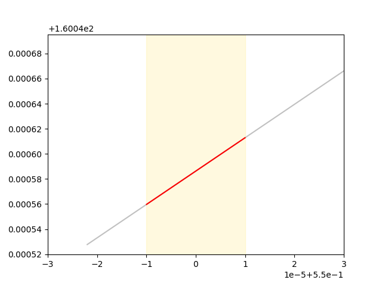
## Singularity point: -44.600000000000001


## Equation 2:
```
i_Ks_xs2_gate__tau_xs2 = 2.0 / (7.6100000000000007e-5 * (44.600000000000001 + membrane__V) / (1.0 - exp(-444.66200000000003 - 9.9700000000000006 * membrane__V)) + 0.00036000000000000002 * (-0.55000000000000004 + membrane__V) / (-1.0 + exp(-0.070400000000000004 + 0.128 * membrane__V)))
```
## New Eq:
```
i_Ks_xs2_gate__tau_xs2 = 2.0 / (((fabs(44.600000000000001 + membrane__V) < 1.0000000000010001e-5) ? (-7.6100000000076117e-10 / (1.0 - exp(9.9700000000099717e-5)) + 49999.999999949992 * (44.600010000000005 + membrane__V) * (7.6100000000076117e-10 / (1.0 - exp(9.9700000000099717e-5)) + 7.6100000000076117e-10 / (1.0 - exp(-9.9700000000099717e-5)))) : (7.6100000000000007e-5 * (44.600000000000001 + membrane__V) / (1.0 - exp(-444.66200000000003 - 9.9700000000000006 * membrane__V)))) + ((fabs(-0.55000000000000004 + membrane__V) < 9.9999999999995925e-6) ? (-3.5999999999998536e-9 / (-1.0 + exp(-1.2799999999999479e-6)) + 50000.000000002037 * (-0.54999000000000009 + membrane__V) * (3.5999999999998536e-9 / (-1.0 + exp(1.2799999999999479e-6)) + 3.5999999999998536e-9 / (-1.0 + exp(-1.2799999999999479e-6)))) : (0.00036000000000000002 * (-0.55000000000000004 + membrane__V) / (-1.0 + exp(-0.070400000000000004 + 0.128 * membrane__V)))))
```
## Singularity point: 0.55000000000000004
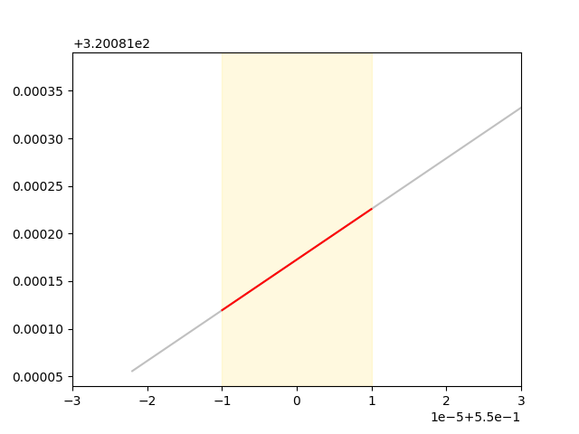
## Singularity point: -44.600000000000001
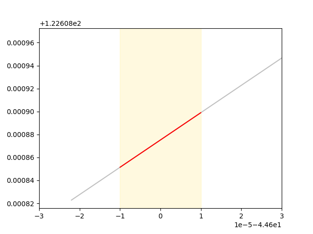

## Equation 3:
```
i_Na_L_m_L_gate__alpha_m_L = 0.32000000000000001 * (47.130000000000003 + membrane__V) / (1.0 - exp(-4.7130000000000001 - 0.10000000000000001 * membrane__V))
```
## New Eq:
```
i_Na_L_m_L_gate__alpha_m_L = ((fabs(47.130000000000003 + membrane__V) < 1.0000000000010001e-5) ? (-3.2000000000032004e-6 / (1.0 - exp(1.0000000000010001e-6)) + 49999.999999949992 * (47.130010000000006 + membrane__V) * (3.2000000000032004e-6 / (1.0 - exp(1.0000000000010001e-6)) + 3.2000000000032004e-6 / (1.0 - exp(-1.0000000000010001e-6)))) : (0.32000000000000001 * (47.130000000000003 + membrane__V) / (1.0 - exp(-4.7130000000000001 - 0.10000000000000001 * membrane__V))))
```
## Singularity point: -47.130000000000003


## Equation 4:
```
i_Na_m_gate__alpha_m = 0.32000000000000001 * (47.130000000000003 + membrane__V) / (1.0 - exp(-4.7130000000000001 - 0.10000000000000001 * membrane__V))
```
## New Eq:
```
i_Na_m_gate__alpha_m = ((fabs(47.130000000000003 + membrane__V) < 1.0000000000010001e-5) ? (-3.2000000000032004e-6 / (1.0 - exp(1.0000000000010001e-6)) + 49999.999999949992 * (47.130010000000006 + membrane__V) * (3.2000000000032004e-6 / (1.0 - exp(1.0000000000010001e-6)) + 3.2000000000032004e-6 / (1.0 - exp(-1.0000000000010001e-6)))) : (0.32000000000000001 * (47.130000000000003 + membrane__V) / (1.0 - exp(-4.7130000000000001 - 0.10000000000000001 * membrane__V))))
```
## Singularity point: -47.130000000000003


## Equation 5:
```
i_to_2__i_to_2_max = pow(i_to_2__z_Cl, 2) * pow(model_parameters__F, 2) * (-model_parameters__Cl_o * exp(-i_to_2__z_Cl * membrane__V * model_parameters__F / (model_parameters__R * model_parameters__T)) + intracellular_ion_concentrations__Cl_i) * i_to_2__p_Cl * membrane__V / ((1.0 - exp(-i_to_2__z_Cl * membrane__V * model_parameters__F / (model_parameters__R * model_parameters__T))) * model_parameters__Cm * model_parameters__R * model_parameters__T)
```
## New Eq:
```
i_to_2__i_to_2_max = ((fabs(membrane__V) < 1.0000000000000001e-5) ? (49999.999999999993 * (1.0000000000000001e-5 + membrane__V) * (1.4448004881001343e-8 * (-100.0 * exp(3.7435883507802622e-7) + intracellular_ion_concentrations__Cl_i) / (1.0 - exp(3.7435883507802622e-7)) + 1.4448004881001343e-8 * (-100.0 * exp(-3.7435883507802622e-7) + intracellular_ion_concentrations__Cl_i) / (1.0 - exp(-3.7435883507802622e-7))) - 1.4448004881001343e-8 * (-100.0 * exp(-3.7435883507802622e-7) + intracellular_ion_concentrations__Cl_i) / (1.0 - exp(-3.7435883507802622e-7))) : (0.0014448004881001341 * (-100.0 * exp(0.037435883507802616 * membrane__V) + intracellular_ion_concentrations__Cl_i) * membrane__V / (1.0 - exp(0.037435883507802616 * membrane__V))))
```
## Singularity point: 0


## Equation 6:
```
background_currents__i_Ca_b = pow(model_parameters__F, 2) * pow(model_parameters__z_Ca, 2) * (-model_parameters__Ca_o * model_parameters__gamma_Cao + Ca_i__Ca_i * model_parameters__gamma_Cai * exp(membrane__V * model_parameters__F * model_parameters__z_Ca / (model_parameters__R * model_parameters__T))) * background_currents__p_Ca_b * membrane__V / ((-1.0 + exp(membrane__V * model_parameters__F * model_parameters__z_Ca / (model_parameters__R * model_parameters__T))) * model_parameters__Cm * model_parameters__R * model_parameters__T)
```
## New Eq:
```
background_currents__i_Ca_b = ((fabs(membrane__V) < 1.0000000000000001e-5) ? (49999.999999999993 * (1.0000000000000001e-5 + membrane__V) * (2.8824983370007685e-8 * (-0.34100000000000003 * model_parameters__Ca_o + Ca_i__Ca_i * exp(7.4871767015605244e-7)) / (-1.0 + exp(7.4871767015605244e-7)) + 2.8824983370007685e-8 * (-0.34100000000000003 * model_parameters__Ca_o + Ca_i__Ca_i * exp(-7.4871767015605244e-7)) / (-1.0 + exp(-7.4871767015605244e-7))) - 2.8824983370007685e-8 * (-0.34100000000000003 * model_parameters__Ca_o + Ca_i__Ca_i * exp(-7.4871767015605244e-7)) / (-1.0 + exp(-7.4871767015605244e-7))) : (0.0028824983370007683 * (-0.34100000000000003 * model_parameters__Ca_o + Ca_i__Ca_i * exp(0.074871767015605231 * membrane__V)) * membrane__V / (-1.0 + exp(0.074871767015605231 * membrane__V))))
```
## Singularity point: 0


## Equation 7:
```
i_Ca_L__i_Ca_L_max = pow(model_parameters__F, 2) * pow(model_parameters__z_Ca, 2) * (-15.0 + membrane__V) * (-model_parameters__Ca_o * model_parameters__gamma_Cao + Ca_r__Ca_r * model_parameters__gamma_Cai * exp((-15.0 + membrane__V) * model_parameters__F * model_parameters__z_Ca / (model_parameters__R * model_parameters__T))) * i_Ca_L__p_Ca / ((-1.0 + exp((-15.0 + membrane__V) * model_parameters__F * model_parameters__z_Ca / (model_parameters__R * model_parameters__T))) * model_parameters__Cm * model_parameters__R * model_parameters__T)
```
## New Eq:
```
i_Ca_L__i_Ca_L_max = ((fabs(-15.0 + membrane__V) < 9.9999999999961231e-6) ? (50000.000000019383 * (-14.99999 + membrane__V) * (3.5108651860819653e-5 * (-0.34100000000000003 * model_parameters__Ca_o + Ca_r__Ca_r * exp(7.4871767015576212e-7)) / (-1.0 + exp(7.4871767015576212e-7)) + 3.5108651860819653e-5 * (-0.34100000000000003 * model_parameters__Ca_o + Ca_r__Ca_r * exp(-7.4871767015576212e-7)) / (-1.0 + exp(-7.4871767015576212e-7))) - 3.5108651860819653e-5 * (-0.34100000000000003 * model_parameters__Ca_o + Ca_r__Ca_r * exp(-7.4871767015576212e-7)) / (-1.0 + exp(-7.4871767015576212e-7))) : (3.510865186083326 * (-15.0 + membrane__V) * (-0.34100000000000003 * model_parameters__Ca_o + Ca_r__Ca_r * exp(-1.1230765052340785 + 0.074871767015605231 * membrane__V)) / (-1.0 + exp(-1.1230765052340785 + 0.074871767015605231 * membrane__V))))
```
## Singularity point: 15.000000000000000
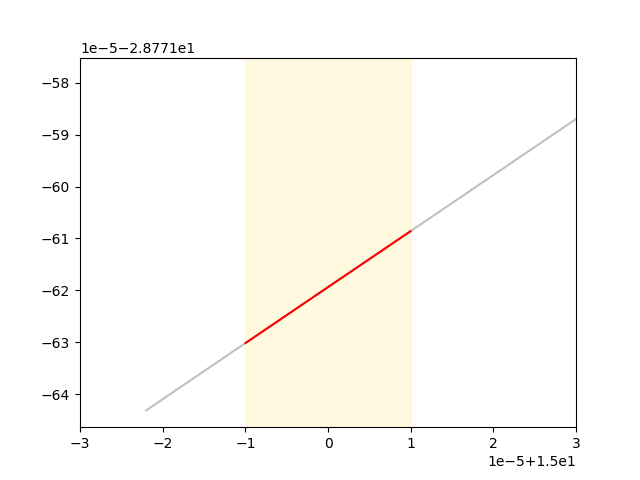

# of singularities:  9
# Model: beeler_reuter_model_1977(beeler_reuter_model_1977.cellml)
No of piecewises: 0
## Equation 1:
```
sodium_current_m_gate__alpha_m = -(47.0 + membrane__V) / (-1.0 + exp(-4.7000000000000002 - 0.10000000000000001 * membrane__V))
```
## New Eq:
```
sodium_current_m_gate__alpha_m = ((fabs(47.0 + membrane__V) < 1.0000000000010001e-5) ? (1.0000000000010001e-5 / (-1.0 + exp(1.0000000000010001e-6)) + 49999.999999949992 * (47.000010000000003 + membrane__V) * (-1.0000000000010001e-5 / (-1.0 + exp(1.0000000000010001e-6)) - 1.0000000000010001e-5 / (-1.0 + exp(-1.0000000000010001e-6)))) : (-(47.0 + membrane__V) / (-1.0 + exp(-4.7000000000000002 - 0.10000000000000001 * membrane__V))))
```
## Singularity point: -47.000000000000000


## Equation 2:
```
time_independent_outward_current__i_K1 = (4.0 * (-1.0 + exp(3.3999999999999999 + 0.040000000000000001 * membrane__V)) / (exp(2.1200000000000001 + 0.040000000000000001 * membrane__V) + exp(4.2400000000000002 + 0.080000000000000002 * membrane__V)) + 0.20000000000000001 * (23.0 + membrane__V) / (1.0 - exp(-0.92000000000000004 - 0.040000000000000001 * membrane__V))) * time_independent_outward_current__G_K1
```
## New Eq:
```
time_independent_outward_current__i_K1 = (4.0 * (-1 + exp(3.3999999999999999 + 0.040000000000000001 * membrane__V)) / (exp(2.1200000000000001 + 0.040000000000000001 * membrane__V) + exp(4.2400000000000002 + 0.080000000000000002 * membrane__V)) + ((fabs(23.0 + membrane__V) < 1.0000000000010001e-5) ? (-2.0000000000020002e-6 / (1.0 - exp(4.0000000000040005e-7)) + 49999.999999949992 * (23.00001 + membrane__V) * (2.0000000000020002e-6 / (1.0 - exp(4.0000000000040005e-7)) + 2.0000000000020002e-6 / (1.0 - exp(-4.0000000000040005e-7)))) : (0.20000000000000001 * (23.0 + membrane__V) / (1.0 - exp(-0.92000000000000004 - 0.040000000000000001 * membrane__V))))) * time_independent_outward_current__G_K1
```
## Singularity point: -23.000000000000000


# of singularities:  2
# Model: benson_epicardial_2008(benson_epicardial_2008.cellml)
No of piecewises: 7
## Equation 1:
```
ICaL__ibarca = 4.0 * (-15.0 + cell__V) * (-Environment__Ca_o * ICaL__gacao + Ca__Ca_ss * ICaL__gacai * exp(2.0 * (-15.0 + cell__V) * Environment__FonRT)) * Environment__F * Environment__FonRT * ICaL__pca / (-1.0 + exp(2.0 * (-15.0 + cell__V) * Environment__FonRT))
```
## New Eq:
```
ICaL__ibarca = ((fabs(-15.0 + cell__V) < 9.9999999999961231e-6) ? (50000.000000019383 * (-14.99999 + cell__V) * (0.1444800488099473 * (-0.34100000000000003 * Environment__Ca_o + Ca__Ca_ss * exp(7.4871767015570971e-7)) * ICaL__pca / (-1.0 + exp(7.4871767015570971e-7)) + 0.1444800488099473 * (-0.34100000000000003 * Environment__Ca_o + Ca__Ca_ss * exp(-7.4871767015570971e-7)) * ICaL__pca / (-1.0 + exp(-7.4871767015570971e-7))) - 0.1444800488099473 * (-0.34100000000000003 * Environment__Ca_o + Ca__Ca_ss * exp(-7.4871767015570971e-7)) * ICaL__pca / (-1.0 + exp(-7.4871767015570971e-7))) : (14448.004881000332 * (-15.0 + cell__V) * (-0.34100000000000003 * Environment__Ca_o + Ca__Ca_ss * exp(-1.1230765052339999 + 0.074871767015599999 * cell__V)) * ICaL__pca / (-1.0 + exp(-1.1230765052339999 + 0.074871767015599999 * cell__V))))
```
## Singularity point: 15.000000000000000


## Equation 2:
```
ICab__ICab = 7.9803360000000004e-7 * (-0.34100000000000003 * Environment__Ca_o + Ca__Ca_i * exp(2.0 * Environment__FonRT * cell__V)) * Environment__F * Environment__FonRT * cell__V / (-1.0 + exp(2.0 * Environment__FonRT * cell__V))
```
## New Eq:
```
ICab__ICab = ((fabs(cell__V) < 1.0000000000000001e-5) ? (49999.999999999993 * (1.0000000000000001e-5 + cell__V) * (2.882498337000567e-8 * (-0.34100000000000003 * Environment__Ca_o + Ca__Ca_i * exp(7.4871767015600003e-7)) / (-1.0 + exp(7.4871767015600003e-7)) + 2.882498337000567e-8 * (-0.34100000000000003 * Environment__Ca_o + Ca__Ca_i * exp(-7.4871767015600003e-7)) / (-1.0 + exp(-7.4871767015600003e-7))) - 2.882498337000567e-8 * (-0.34100000000000003 * Environment__Ca_o + Ca__Ca_i * exp(-7.4871767015600003e-7)) / (-1.0 + exp(-7.4871767015600003e-7))) : (0.0028824983370005666 * (-0.34100000000000003 * Environment__Ca_o + Ca__Ca_i * exp(0.074871767015599999 * cell__V)) * cell__V / (-1.0 + exp(0.074871767015599999 * cell__V))))
```
## Singularity point: 0


## Equation 3:
```
IKr__tauxr = 1 / (0.00029999999999999997 * (38.360799999999998 + cell__V) / (-1.0 + exp(5.8385137599999997 + 0.1522 * cell__V)) + 0.00059999999999999995 * (-1.7383999999999999 + cell__V) / (1.0 - exp(0.2364224 - 0.13600000000000001 * cell__V)))
```
## New Eq:
```
IKr__tauxr = 1 / (((fabs(38.360799999999998 + cell__V) < 1.0000000000010001e-5) ? (-3.0000000000030002e-9 / (-1.0 + exp(-1.5220000000015221e-6)) + 49999.999999949992 * (38.360810000000001 + cell__V) * (3.0000000000030002e-9 / (-1.0 + exp(1.5220000000015221e-6)) + 3.0000000000030002e-9 / (-1.0 + exp(-1.5220000000015221e-6)))) : (0.00029999999999999997 * (38.360799999999998 + cell__V) / (-1.0 + exp(5.8385137599999997 + 0.1522 * cell__V)))) + ((fabs(-1.7383999999999999 + cell__V) < 9.9999999999995925e-6) ? (-5.9999999999997551e-9 / (1.0 - exp(1.3599999999999446e-6)) + 50000.000000002037 * (-1.7383899999999999 + cell__V) * (5.9999999999997551e-9 / (1.0 - exp(1.3599999999999446e-6)) + 5.9999999999997551e-9 / (1.0 - exp(-1.3599999999999446e-6)))) : (0.00059999999999999995 * (-1.7383999999999999 + cell__V) / (1.0 - exp(0.2364224 - 0.13600000000000001 * cell__V)))))
```
## Singularity point: -38.360799999999998
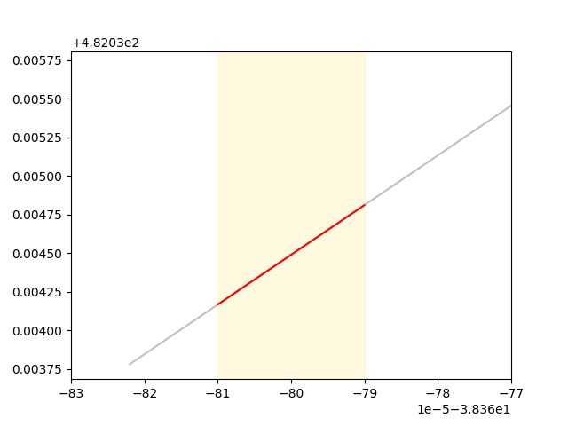
## Singularity point: 1.7383999999999999


## Equation 4:
```
IKs__tauxs = 1 / (7.6100000000000007e-5 * (44.600000000000001 + cell__V) / (1.0 - exp(-444.66200000000003 - 9.9700000000000006 * cell__V)) + 0.00036000000000000002 * (-0.55000000000000004 + cell__V) / (-1.0 + exp(-0.070400000000000004 + 0.128 * cell__V)))
```
## New Eq:
```
IKs__tauxs = 1 / (((fabs(44.600000000000001 + cell__V) < 1.0000000000010001e-5) ? (-7.6100000000076117e-10 / (1.0 - exp(9.9700000000099717e-5)) + 49999.999999949992 * (44.600010000000005 + cell__V) * (7.6100000000076117e-10 / (1.0 - exp(9.9700000000099717e-5)) + 7.6100000000076117e-10 / (1.0 - exp(-9.9700000000099717e-5)))) : (7.6100000000000007e-5 * (44.600000000000001 + cell__V) / (1.0 - exp(-444.66200000000003 - 9.9700000000000006 * cell__V)))) + ((fabs(-0.55000000000000004 + cell__V) < 9.9999999999995925e-6) ? (-3.5999999999998536e-9 / (-1.0 + exp(-1.2799999999999479e-6)) + 50000.000000002037 * (-0.54999000000000009 + cell__V) * (3.5999999999998536e-9 / (-1.0 + exp(1.2799999999999479e-6)) + 3.5999999999998536e-9 / (-1.0 + exp(-1.2799999999999479e-6)))) : (0.00036000000000000002 * (-0.55000000000000004 + cell__V) / (-1.0 + exp(-0.070400000000000004 + 0.128 * cell__V)))))
```
## Singularity point: -44.600000000000001
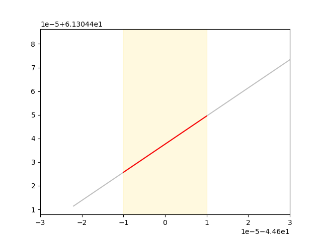
## Singularity point: 0.55000000000000004


## Equation 5:
```
INa__am = 0.32000000000000001 * (47.130000000000003 + cell__V) / (1.0 - exp(-4.7130000000000001 - 0.10000000000000001 * cell__V))
```
## New Eq:
```
INa__am = ((fabs(47.130000000000003 + cell__V) < 1.0000000000010001e-5) ? (-3.2000000000032004e-6 / (1.0 - exp(1.0000000000010001e-6)) + 49999.999999949992 * (47.130010000000006 + cell__V) * (3.2000000000032004e-6 / (1.0 - exp(1.0000000000010001e-6)) + 3.2000000000032004e-6 / (1.0 - exp(-1.0000000000010001e-6)))) : (0.32000000000000001 * (47.130000000000003 + cell__V) / (1.0 - exp(-4.7130000000000001 - 0.10000000000000001 * cell__V))))
```
## Singularity point: -47.130000000000003


## Equation 6:
```
INal__amL = 0.32000000000000001 * (47.130000000000003 + cell__V) / (1.0 - exp(-4.7130000000000001 - 0.10000000000000001 * cell__V))
```
## New Eq:
```
INal__amL = ((fabs(47.130000000000003 + cell__V) < 1.0000000000010001e-5) ? (-3.2000000000032004e-6 / (1.0 - exp(1.0000000000010001e-6)) + 49999.999999949992 * (47.130010000000006 + cell__V) * (3.2000000000032004e-6 / (1.0 - exp(1.0000000000010001e-6)) + 3.2000000000032004e-6 / (1.0 - exp(-1.0000000000010001e-6)))) : (0.32000000000000001 * (47.130000000000003 + cell__V) / (1.0 - exp(-4.7130000000000001 - 0.10000000000000001 * cell__V))))
```
## Singularity point: -47.130000000000003


## Equation 7:
```
Ito2__Ito2_max = (-Environment__Cl_o * exp(Environment__FonRT * cell__V) + Cl__Cl_i) * Environment__F * Environment__FonRT * Ito2__PCl * cell__V / (1.0 - exp(Environment__FonRT * cell__V))
```
## New Eq:
```
Ito2__Ito2_max = ((fabs(cell__V) < 1.0000000000000001e-5) ? (49999.999999999993 * (1.0000000000000001e-5 + cell__V) * (1.4448004881000333e-8 * (-100.0 * exp(3.7435883507800002e-7) + Cl__Cl_i) / (1.0 - exp(3.7435883507800002e-7)) + 1.4448004881000333e-8 * (-100.0 * exp(-3.7435883507800002e-7) + Cl__Cl_i) / (1.0 - exp(-3.7435883507800002e-7))) - 1.4448004881000333e-8 * (-100.0 * exp(-3.7435883507800002e-7) + Cl__Cl_i) / (1.0 - exp(-3.7435883507800002e-7))) : (0.001444800488100033 * (-100.0 * exp(0.0374358835078 * cell__V) + Cl__Cl_i) * cell__V / (1.0 - exp(0.0374358835078 * cell__V))))
```
## Singularity point: 0


# of singularities:  9
# Model: bernus_wilders_zemlin_verschelde_panfilov_2002_version01(bernus_wilders_zemlin_verschelde_panfilov_2002.cellml)
No of piecewises: 0
## Equation 1:
```
sodium_current_m_gate__alpha_m = 0.32000000000000001 * (47.130000000000003 + membrane__V) / (1.0 - exp(-4.7130000000000001 - 0.10000000000000001 * membrane__V))
```
## New Eq:
```
sodium_current_m_gate__alpha_m = ((fabs(47.130000000000003 + membrane__V) < 1.0000000000010001e-5) ? (-3.2000000000032004e-6 / (1.0 - exp(1.0000000000010001e-6)) + 49999.999999949992 * (47.130010000000006 + membrane__V) * (3.2000000000032004e-6 / (1.0 - exp(1.0000000000010001e-6)) + 3.2000000000032004e-6 / (1.0 - exp(-1.0000000000010001e-6)))) : (0.32000000000000001 * (47.130000000000003 + membrane__V) / (1.0 - exp(-4.7130000000000001 - 0.10000000000000001 * membrane__V))))
```
## Singularity point: -47.130000000000003


# of singularities:  1
# Model: bondarenko_2004_apical(bondarenko_szigeti_bett_kim_rasmusson_2004_apical.cellml)
No of piecewises: 0
## Equation 1:
```
slow_delayed_rectifier_potassium_current__alpha_n = 4.8133299999999997e-6 * (26.5 + membrane__V) / (1.0 - exp(-3.3919999999999999 - 0.128 * membrane__V))
```
## New Eq:
```
slow_delayed_rectifier_potassium_current__alpha_n = ((fabs(26.5 + membrane__V) < 1.0000000000010001e-5) ? (-4.8133300000048136e-11 / (1.0 - exp(1.2800000000012801e-6)) + 49999.999999949992 * (26.50001 + membrane__V) * (4.8133300000048136e-11 / (1.0 - exp(1.2800000000012801e-6)) + 4.8133300000048136e-11 / (1.0 - exp(-1.2800000000012801e-6)))) : (4.8133299999999997e-6 * (26.5 + membrane__V) / (1.0 - exp(-3.3919999999999999 - 0.128 * membrane__V))))
```
## Singularity point: -26.500000000000000
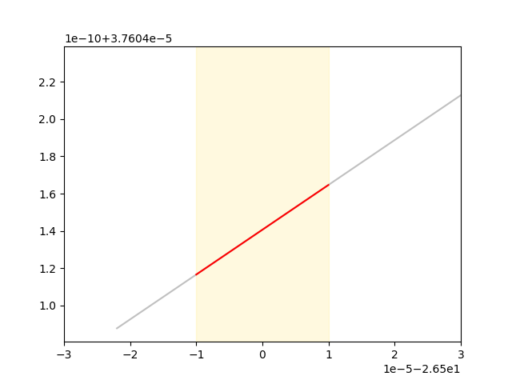

# of singularities:  1
# Model: bondarenko_2004_septum(bondarenko_szigeti_bett_kim_rasmusson_2004_septal.cellml)
No of piecewises: 0
## Equation 1:
```
slow_delayed_rectifier_potassium_current__alpha_n = 4.8133299999999997e-6 * (26.5 + membrane__V) / (1.0 - exp(-3.3919999999999999 - 0.128 * membrane__V))
```
## New Eq:
```
slow_delayed_rectifier_potassium_current__alpha_n = ((fabs(26.5 + membrane__V) < 1.0000000000010001e-5) ? (-4.8133300000048136e-11 / (1.0 - exp(1.2800000000012801e-6)) + 49999.999999949992 * (26.50001 + membrane__V) * (4.8133300000048136e-11 / (1.0 - exp(1.2800000000012801e-6)) + 4.8133300000048136e-11 / (1.0 - exp(-1.2800000000012801e-6)))) : (4.8133299999999997e-6 * (26.5 + membrane__V) / (1.0 - exp(-3.3919999999999999 - 0.128 * membrane__V))))
```
## Singularity point: -26.500000000000000


# of singularities:  1
# Model: bueno_2007(bueno_2007_endo.cellml)
No of piecewises: 5
# of singularities:  0
# Model: bueno_2007(bueno_2007_epi.cellml)
No of piecewises: 5
# of singularities:  0
# Model: Carro_Rodriguez_Laguna_Pueyo_CinC2010_EPI(carro_2011_endo.cellml)
No of piecewises: 4
## Equation 1:
```
L_Type_Calcium_Current__Ibar_Ca_j = (-Calcium_Concentrations__Ca_o + Calcium_Concentrations__Ca_j * exp(2.0 * membrane__FoRT * membrane__V)) * L_Type_Calcium_Current__P_scale * L_Type_Calcium_Current__p_Ca * membrane__FoRT * membrane__Frdy * membrane__V / (-1.0 + exp(2.0 * membrane__FoRT * membrane__V))
```
## New Eq:
```
L_Type_Calcium_Current__Ibar_Ca_j = ((fabs(membrane__V) < 1.0000000000000001e-5) ? (49999.999999999993 * (1.0000000000000001e-5 + membrane__V) * (7.1831868267118426e-6 * (-Calcium_Concentrations__Ca_o + Calcium_Concentrations__Ca_j * exp(7.4871767015605244e-7)) * L_Type_Calcium_Current__P_scale / (-1.0 + exp(7.4871767015605244e-7)) + 7.1831868267118426e-6 * (-Calcium_Concentrations__Ca_o + Calcium_Concentrations__Ca_j * exp(-7.4871767015605244e-7)) * L_Type_Calcium_Current__P_scale / (-1.0 + exp(-7.4871767015605244e-7))) - 7.1831868267118426e-6 * (-Calcium_Concentrations__Ca_o + Calcium_Concentrations__Ca_j * exp(-7.4871767015605244e-7)) * L_Type_Calcium_Current__P_scale / (-1.0 + exp(-7.4871767015605244e-7))) : (0.71831868267118426 * (-Calcium_Concentrations__Ca_o + Calcium_Concentrations__Ca_j * exp(0.074871767015605231 * membrane__V)) * L_Type_Calcium_Current__P_scale * membrane__V / (-1.0 + exp(0.074871767015605231 * membrane__V))))
```
## Singularity point: 0


## Equation 2:
```
L_Type_Calcium_Current__Ibar_Ca_sl = (-Calcium_Concentrations__Ca_o + Calcium_Concentrations__Ca_sl * exp(2.0 * membrane__FoRT * membrane__V)) * L_Type_Calcium_Current__P_scale * L_Type_Calcium_Current__p_Ca * membrane__FoRT * membrane__Frdy * membrane__V / (-1.0 + exp(2.0 * membrane__FoRT * membrane__V))
```
## New Eq:
```
L_Type_Calcium_Current__Ibar_Ca_sl = ((fabs(membrane__V) < 1.0000000000000001e-5) ? (49999.999999999993 * (1.0000000000000001e-5 + membrane__V) * (7.1831868267118426e-6 * (-Calcium_Concentrations__Ca_o + Calcium_Concentrations__Ca_sl * exp(7.4871767015605244e-7)) * L_Type_Calcium_Current__P_scale / (-1.0 + exp(7.4871767015605244e-7)) + 7.1831868267118426e-6 * (-Calcium_Concentrations__Ca_o + Calcium_Concentrations__Ca_sl * exp(-7.4871767015605244e-7)) * L_Type_Calcium_Current__P_scale / (-1.0 + exp(-7.4871767015605244e-7))) - 7.1831868267118426e-6 * (-Calcium_Concentrations__Ca_o + Calcium_Concentrations__Ca_sl * exp(-7.4871767015605244e-7)) * L_Type_Calcium_Current__P_scale / (-1.0 + exp(-7.4871767015605244e-7))) : (0.71831868267118426 * (-Calcium_Concentrations__Ca_o + Calcium_Concentrations__Ca_sl * exp(0.074871767015605231 * membrane__V)) * L_Type_Calcium_Current__P_scale * membrane__V / (-1.0 + exp(0.074871767015605231 * membrane__V))))
```
## Singularity point: 0
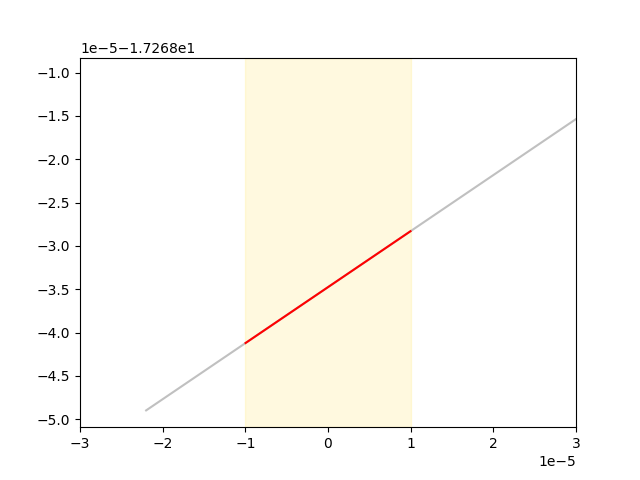

## Equation 3:
```
L_Type_Calcium_Current__Ibar_K = (-Potassium_Concentrations__K_o + Potassium_Concentrations__K_i * exp(membrane__FoRT * membrane__V)) * L_Type_Calcium_Current__P_scale * L_Type_Calcium_Current__p_K * membrane__FoRT * membrane__Frdy * membrane__V / (-1.0 + exp(membrane__FoRT * membrane__V))
```
## New Eq:
```
L_Type_Calcium_Current__Ibar_K = ((fabs(membrane__V) < 1.0000000000000001e-5) ? (49999.999999999993 * (1.0000000000000001e-5 + membrane__V) * (1.9748616671718713e-9 * (-Potassium_Concentrations__K_o + Potassium_Concentrations__K_i * exp(3.7435883507802622e-7)) * L_Type_Calcium_Current__P_scale / (-1.0 + exp(3.7435883507802622e-7)) + 1.9748616671718713e-9 * (-Potassium_Concentrations__K_o + Potassium_Concentrations__K_i * exp(-3.7435883507802622e-7)) * L_Type_Calcium_Current__P_scale / (-1.0 + exp(-3.7435883507802622e-7))) - 1.9748616671718713e-9 * (-Potassium_Concentrations__K_o + Potassium_Concentrations__K_i * exp(-3.7435883507802622e-7)) * L_Type_Calcium_Current__P_scale / (-1.0 + exp(-3.7435883507802622e-7))) : (0.00019748616671718709 * (-Potassium_Concentrations__K_o + Potassium_Concentrations__K_i * exp(0.037435883507802616 * membrane__V)) * L_Type_Calcium_Current__P_scale * membrane__V / (-1.0 + exp(0.037435883507802616 * membrane__V))))
```
## Singularity point: 0


## Equation 4:
```
L_Type_Calcium_Current__Ibar_Na_j = (-Sodium_Concentrations__Na_o + Sodium_Concentrations__Na_j * exp(membrane__FoRT * membrane__V)) * L_Type_Calcium_Current__P_scale * L_Type_Calcium_Current__p_Na * membrane__FoRT * membrane__Frdy * membrane__V / (-1.0 + exp(membrane__FoRT * membrane__V))
```
## New Eq:
```
L_Type_Calcium_Current__Ibar_Na_j = ((fabs(membrane__V) < 1.0000000000000001e-5) ? (49999.999999999993 * (1.0000000000000001e-5 + membrane__V) * (1.0971453706510395e-10 * (-Sodium_Concentrations__Na_o + Sodium_Concentrations__Na_j * exp(3.7435883507802622e-7)) * L_Type_Calcium_Current__P_scale / (-1.0 + exp(3.7435883507802622e-7)) + 1.0971453706510395e-10 * (-Sodium_Concentrations__Na_o + Sodium_Concentrations__Na_j * exp(-3.7435883507802622e-7)) * L_Type_Calcium_Current__P_scale / (-1.0 + exp(-3.7435883507802622e-7))) - 1.0971453706510395e-10 * (-Sodium_Concentrations__Na_o + Sodium_Concentrations__Na_j * exp(-3.7435883507802622e-7)) * L_Type_Calcium_Current__P_scale / (-1.0 + exp(-3.7435883507802622e-7))) : (1.0971453706510394e-5 * (-Sodium_Concentrations__Na_o + Sodium_Concentrations__Na_j * exp(0.037435883507802616 * membrane__V)) * L_Type_Calcium_Current__P_scale * membrane__V / (-1.0 + exp(0.037435883507802616 * membrane__V))))
```
## Singularity point: 0


## Equation 5:
```
L_Type_Calcium_Current__Ibar_Na_sl = (-Sodium_Concentrations__Na_o + Sodium_Concentrations__Na_sl * exp(membrane__FoRT * membrane__V)) * L_Type_Calcium_Current__P_scale * L_Type_Calcium_Current__p_Na * membrane__FoRT * membrane__Frdy * membrane__V / (-1.0 + exp(membrane__FoRT * membrane__V))
```
## New Eq:
```
L_Type_Calcium_Current__Ibar_Na_sl = ((fabs(membrane__V) < 1.0000000000000001e-5) ? (49999.999999999993 * (1.0000000000000001e-5 + membrane__V) * (1.0971453706510395e-10 * (-Sodium_Concentrations__Na_o + Sodium_Concentrations__Na_sl * exp(3.7435883507802622e-7)) * L_Type_Calcium_Current__P_scale / (-1.0 + exp(3.7435883507802622e-7)) + 1.0971453706510395e-10 * (-Sodium_Concentrations__Na_o + Sodium_Concentrations__Na_sl * exp(-3.7435883507802622e-7)) * L_Type_Calcium_Current__P_scale / (-1.0 + exp(-3.7435883507802622e-7))) - 1.0971453706510395e-10 * (-Sodium_Concentrations__Na_o + Sodium_Concentrations__Na_sl * exp(-3.7435883507802622e-7)) * L_Type_Calcium_Current__P_scale / (-1.0 + exp(-3.7435883507802622e-7))) : (1.0971453706510394e-5 * (-Sodium_Concentrations__Na_o + Sodium_Concentrations__Na_sl * exp(0.037435883507802616 * membrane__V)) * L_Type_Calcium_Current__P_scale * membrane__V / (-1.0 + exp(0.037435883507802616 * membrane__V))))
```
## Singularity point: 0


# of singularities:  5
# Model: Carro_Rodriguez_Laguna_Pueyo_CinC2010_EPI(carro_2011_epi.cellml)
No of piecewises: 4
## Equation 1:
```
L_Type_Calcium_Current__Ibar_Ca_j = (-Calcium_Concentrations__Ca_o + Calcium_Concentrations__Ca_j * exp(2.0 * membrane__FoRT * membrane__V)) * L_Type_Calcium_Current__P_scale * L_Type_Calcium_Current__p_Ca * membrane__FoRT * membrane__Frdy * membrane__V / (-1.0 + exp(2.0 * membrane__FoRT * membrane__V))
```
## New Eq:
```
L_Type_Calcium_Current__Ibar_Ca_j = ((fabs(membrane__V) < 1.0000000000000001e-5) ? (49999.999999999993 * (1.0000000000000001e-5 + membrane__V) * (7.1831868267118426e-6 * (-Calcium_Concentrations__Ca_o + Calcium_Concentrations__Ca_j * exp(7.4871767015605244e-7)) * L_Type_Calcium_Current__P_scale / (-1.0 + exp(7.4871767015605244e-7)) + 7.1831868267118426e-6 * (-Calcium_Concentrations__Ca_o + Calcium_Concentrations__Ca_j * exp(-7.4871767015605244e-7)) * L_Type_Calcium_Current__P_scale / (-1.0 + exp(-7.4871767015605244e-7))) - 7.1831868267118426e-6 * (-Calcium_Concentrations__Ca_o + Calcium_Concentrations__Ca_j * exp(-7.4871767015605244e-7)) * L_Type_Calcium_Current__P_scale / (-1.0 + exp(-7.4871767015605244e-7))) : (0.71831868267118426 * (-Calcium_Concentrations__Ca_o + Calcium_Concentrations__Ca_j * exp(0.074871767015605231 * membrane__V)) * L_Type_Calcium_Current__P_scale * membrane__V / (-1.0 + exp(0.074871767015605231 * membrane__V))))
```
## Singularity point: 0
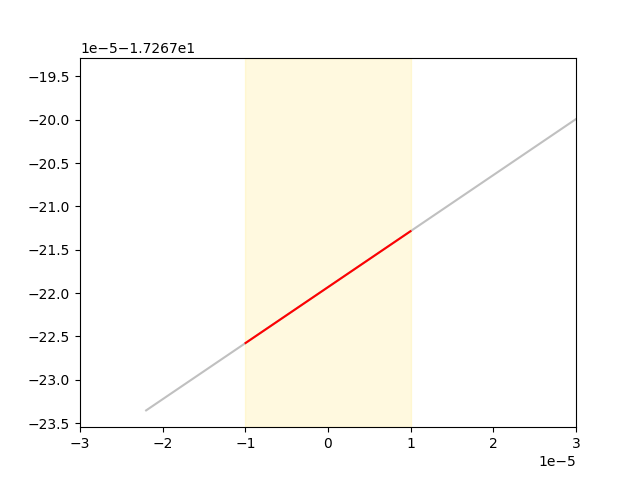

## Equation 2:
```
L_Type_Calcium_Current__Ibar_Ca_sl = (-Calcium_Concentrations__Ca_o + Calcium_Concentrations__Ca_sl * exp(2.0 * membrane__FoRT * membrane__V)) * L_Type_Calcium_Current__P_scale * L_Type_Calcium_Current__p_Ca * membrane__FoRT * membrane__Frdy * membrane__V / (-1.0 + exp(2.0 * membrane__FoRT * membrane__V))
```
## New Eq:
```
L_Type_Calcium_Current__Ibar_Ca_sl = ((fabs(membrane__V) < 1.0000000000000001e-5) ? (49999.999999999993 * (1.0000000000000001e-5 + membrane__V) * (7.1831868267118426e-6 * (-Calcium_Concentrations__Ca_o + Calcium_Concentrations__Ca_sl * exp(7.4871767015605244e-7)) * L_Type_Calcium_Current__P_scale / (-1.0 + exp(7.4871767015605244e-7)) + 7.1831868267118426e-6 * (-Calcium_Concentrations__Ca_o + Calcium_Concentrations__Ca_sl * exp(-7.4871767015605244e-7)) * L_Type_Calcium_Current__P_scale / (-1.0 + exp(-7.4871767015605244e-7))) - 7.1831868267118426e-6 * (-Calcium_Concentrations__Ca_o + Calcium_Concentrations__Ca_sl * exp(-7.4871767015605244e-7)) * L_Type_Calcium_Current__P_scale / (-1.0 + exp(-7.4871767015605244e-7))) : (0.71831868267118426 * (-Calcium_Concentrations__Ca_o + Calcium_Concentrations__Ca_sl * exp(0.074871767015605231 * membrane__V)) * L_Type_Calcium_Current__P_scale * membrane__V / (-1.0 + exp(0.074871767015605231 * membrane__V))))
```
## Singularity point: 0


## Equation 3:
```
L_Type_Calcium_Current__Ibar_K = (-Potassium_Concentrations__K_o + Potassium_Concentrations__K_i * exp(membrane__FoRT * membrane__V)) * L_Type_Calcium_Current__P_scale * L_Type_Calcium_Current__p_K * membrane__FoRT * membrane__Frdy * membrane__V / (-1.0 + exp(membrane__FoRT * membrane__V))
```
## New Eq:
```
L_Type_Calcium_Current__Ibar_K = ((fabs(membrane__V) < 1.0000000000000001e-5) ? (49999.999999999993 * (1.0000000000000001e-5 + membrane__V) * (1.9748616671718713e-9 * (-Potassium_Concentrations__K_o + Potassium_Concentrations__K_i * exp(3.7435883507802622e-7)) * L_Type_Calcium_Current__P_scale / (-1.0 + exp(3.7435883507802622e-7)) + 1.9748616671718713e-9 * (-Potassium_Concentrations__K_o + Potassium_Concentrations__K_i * exp(-3.7435883507802622e-7)) * L_Type_Calcium_Current__P_scale / (-1.0 + exp(-3.7435883507802622e-7))) - 1.9748616671718713e-9 * (-Potassium_Concentrations__K_o + Potassium_Concentrations__K_i * exp(-3.7435883507802622e-7)) * L_Type_Calcium_Current__P_scale / (-1.0 + exp(-3.7435883507802622e-7))) : (0.00019748616671718709 * (-Potassium_Concentrations__K_o + Potassium_Concentrations__K_i * exp(0.037435883507802616 * membrane__V)) * L_Type_Calcium_Current__P_scale * membrane__V / (-1.0 + exp(0.037435883507802616 * membrane__V))))
```
## Singularity point: 0


## Equation 4:
```
L_Type_Calcium_Current__Ibar_Na_j = (-Sodium_Concentrations__Na_o + Sodium_Concentrations__Na_j * exp(membrane__FoRT * membrane__V)) * L_Type_Calcium_Current__P_scale * L_Type_Calcium_Current__p_Na * membrane__FoRT * membrane__Frdy * membrane__V / (-1.0 + exp(membrane__FoRT * membrane__V))
```
## New Eq:
```
L_Type_Calcium_Current__Ibar_Na_j = ((fabs(membrane__V) < 1.0000000000000001e-5) ? (49999.999999999993 * (1.0000000000000001e-5 + membrane__V) * (1.0971453706510395e-10 * (-Sodium_Concentrations__Na_o + Sodium_Concentrations__Na_j * exp(3.7435883507802622e-7)) * L_Type_Calcium_Current__P_scale / (-1.0 + exp(3.7435883507802622e-7)) + 1.0971453706510395e-10 * (-Sodium_Concentrations__Na_o + Sodium_Concentrations__Na_j * exp(-3.7435883507802622e-7)) * L_Type_Calcium_Current__P_scale / (-1.0 + exp(-3.7435883507802622e-7))) - 1.0971453706510395e-10 * (-Sodium_Concentrations__Na_o + Sodium_Concentrations__Na_j * exp(-3.7435883507802622e-7)) * L_Type_Calcium_Current__P_scale / (-1.0 + exp(-3.7435883507802622e-7))) : (1.0971453706510394e-5 * (-Sodium_Concentrations__Na_o + Sodium_Concentrations__Na_j * exp(0.037435883507802616 * membrane__V)) * L_Type_Calcium_Current__P_scale * membrane__V / (-1.0 + exp(0.037435883507802616 * membrane__V))))
```
## Singularity point: 0


## Equation 5:
```
L_Type_Calcium_Current__Ibar_Na_sl = (-Sodium_Concentrations__Na_o + Sodium_Concentrations__Na_sl * exp(membrane__FoRT * membrane__V)) * L_Type_Calcium_Current__P_scale * L_Type_Calcium_Current__p_Na * membrane__FoRT * membrane__Frdy * membrane__V / (-1.0 + exp(membrane__FoRT * membrane__V))
```
## New Eq:
```
L_Type_Calcium_Current__Ibar_Na_sl = ((fabs(membrane__V) < 1.0000000000000001e-5) ? (49999.999999999993 * (1.0000000000000001e-5 + membrane__V) * (1.0971453706510395e-10 * (-Sodium_Concentrations__Na_o + Sodium_Concentrations__Na_sl * exp(3.7435883507802622e-7)) * L_Type_Calcium_Current__P_scale / (-1.0 + exp(3.7435883507802622e-7)) + 1.0971453706510395e-10 * (-Sodium_Concentrations__Na_o + Sodium_Concentrations__Na_sl * exp(-3.7435883507802622e-7)) * L_Type_Calcium_Current__P_scale / (-1.0 + exp(-3.7435883507802622e-7))) - 1.0971453706510395e-10 * (-Sodium_Concentrations__Na_o + Sodium_Concentrations__Na_sl * exp(-3.7435883507802622e-7)) * L_Type_Calcium_Current__P_scale / (-1.0 + exp(-3.7435883507802622e-7))) : (1.0971453706510394e-5 * (-Sodium_Concentrations__Na_o + Sodium_Concentrations__Na_sl * exp(0.037435883507802616 * membrane__V)) * L_Type_Calcium_Current__P_scale * membrane__V / (-1.0 + exp(0.037435883507802616 * membrane__V))))
```
## Singularity point: 0
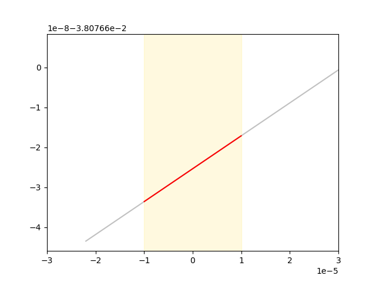

# of singularities:  5
# Model: clancy_rudy_2002(clancy_rudy_2002.cellml)
No of piecewises: 9
## Equation 1:
```
L_type_Ca_channel__I_CaCa = 4.0 * pow(membrane__F, 2) * (-L_type_Ca_channel__gamma_Cao * calcium_dynamics__Cao + L_type_Ca_channel__gamma_Cai * calcium_dynamics__Cai * exp(2.0 * membrane__F * membrane__V / (membrane__R * membrane__T))) * L_type_Ca_channel__P_Ca * L_type_Ca_channel__P_scale * membrane__V / ((-1.0 + exp(2.0 * membrane__F * membrane__V / (membrane__R * membrane__T))) * membrane__R * membrane__T)
```
## New Eq:
```
L_type_Ca_channel__I_CaCa = ((fabs(membrane__V) < 1.0000000000000001e-5) ? (49999.999999999993 * (1.0000000000000001e-5 + membrane__V) * (7.8019226357407251e-5 * (-0.34100000000000003 * calcium_dynamics__Cao + calcium_dynamics__Cai * exp(7.4871767015605244e-7)) * L_type_Ca_channel__P_scale / (-1.0 + exp(7.4871767015605244e-7)) + 7.8019226357407251e-5 * (-0.34100000000000003 * calcium_dynamics__Cao + calcium_dynamics__Cai * exp(-7.4871767015605244e-7)) * L_type_Ca_channel__P_scale / (-1.0 + exp(-7.4871767015605244e-7))) - 7.8019226357407251e-5 * (-0.34100000000000003 * calcium_dynamics__Cao + calcium_dynamics__Cai * exp(-7.4871767015605244e-7)) * L_type_Ca_channel__P_scale / (-1.0 + exp(-7.4871767015605244e-7))) : (7.8019226357407252 * (-0.34100000000000003 * calcium_dynamics__Cao + calcium_dynamics__Cai * exp(0.074871767015605231 * membrane__V)) * L_type_Ca_channel__P_scale * membrane__V / (-1.0 + exp(0.074871767015605231 * membrane__V))))
```
## Singularity point: 0


## Equation 2:
```
L_type_Ca_channel__I_CaK = pow(membrane__F, 2) * (-L_type_Ca_channel__gamma_Ko * ionic_concentrations__Ko + L_type_Ca_channel__gamma_Ki * ionic_concentrations__Ki * exp(membrane__F * membrane__V / (membrane__R * membrane__T))) * L_type_Ca_channel__P_K * L_type_Ca_channel__P_scale * membrane__V / ((-1.0 + exp(membrane__F * membrane__V / (membrane__R * membrane__T))) * membrane__R * membrane__T)
```
## New Eq:
```
L_type_Ca_channel__I_CaK = ((fabs(membrane__V) < 1.0000000000000001e-5) ? (49999.999999999993 * (1.0000000000000001e-5 + membrane__V) * (6.9711623550831478e-9 * (-0.75 * ionic_concentrations__Ko + 0.75 * ionic_concentrations__Ki * exp(3.7435883507802622e-7)) * L_type_Ca_channel__P_scale / (-1.0 + exp(3.7435883507802622e-7)) + 6.9711623550831478e-9 * (-0.75 * ionic_concentrations__Ko + 0.75 * ionic_concentrations__Ki * exp(-3.7435883507802622e-7)) * L_type_Ca_channel__P_scale / (-1.0 + exp(-3.7435883507802622e-7))) - 6.9711623550831478e-9 * (-0.75 * ionic_concentrations__Ko + 0.75 * ionic_concentrations__Ki * exp(-3.7435883507802622e-7)) * L_type_Ca_channel__P_scale / (-1.0 + exp(-3.7435883507802622e-7))) : (0.00069711623550831479 * (-0.75 * ionic_concentrations__Ko + 0.75 * ionic_concentrations__Ki * exp(0.037435883507802616 * membrane__V)) * L_type_Ca_channel__P_scale * membrane__V / (-1.0 + exp(0.037435883507802616 * membrane__V))))
```
## Singularity point: 0


## Equation 3:
```
L_type_Ca_channel__I_CaNa = pow(membrane__F, 2) * (-L_type_Ca_channel__gamma_Nao * ionic_concentrations__Nao + L_type_Ca_channel__gamma_Nai * ionic_concentrations__Nai * exp(membrane__F * membrane__V / (membrane__R * membrane__T))) * L_type_Ca_channel__P_Na * L_type_Ca_channel__P_scale * membrane__V / ((-1.0 + exp(membrane__F * membrane__V / (membrane__R * membrane__T))) * membrane__R * membrane__T)
```
## New Eq:
```
L_type_Ca_channel__I_CaNa = ((fabs(membrane__V) < 1.0000000000000001e-5) ? (49999.999999999993 * (1.0000000000000001e-5 + membrane__V) * (2.4381008236689766e-8 * (-0.75 * ionic_concentrations__Nao + 0.75 * ionic_concentrations__Nai * exp(3.7435883507802622e-7)) * L_type_Ca_channel__P_scale / (-1.0 + exp(3.7435883507802622e-7)) + 2.4381008236689766e-8 * (-0.75 * ionic_concentrations__Nao + 0.75 * ionic_concentrations__Nai * exp(-3.7435883507802622e-7)) * L_type_Ca_channel__P_scale / (-1.0 + exp(-3.7435883507802622e-7))) - 2.4381008236689766e-8 * (-0.75 * ionic_concentrations__Nao + 0.75 * ionic_concentrations__Nai * exp(-3.7435883507802622e-7)) * L_type_Ca_channel__P_scale / (-1.0 + exp(-3.7435883507802622e-7))) : (0.0024381008236689767 * (-0.75 * ionic_concentrations__Nao + 0.75 * ionic_concentrations__Nai * exp(0.037435883507802616 * membrane__V)) * L_type_Ca_channel__P_scale * membrane__V / (-1.0 + exp(0.037435883507802616 * membrane__V))))
```
## Singularity point: 0


## Equation 4:
```
L_type_Ca_channel_d_gate__tau_d = 0.028571428571428571 * (1.0 - exp(-1.6025641025641024 - 0.16025641025641024 * membrane__V)) * L_type_Ca_channel_d_gate__d_infinity / (10.0 + membrane__V)
```
## New Eq:
```
L_type_Ca_channel_d_gate__tau_d = ((fabs(10.0 + membrane__V) < 9.9999999999961231e-6) ? (50000.000000019383 * (10.00001 + membrane__V) * (2857.1428571439646 * (1.0 - exp(1.6025641025634812e-6)) / (1.0 + exp(1.6025641025634812e-6)) + 2857.1428571439646 * (1.0 - exp(-1.6025641025634812e-6)) / (1.0 + exp(-1.6025641025634812e-6))) - 2857.1428571439646 * (1.0 - exp(1.6025641025634812e-6)) / (1.0 + exp(1.6025641025634812e-6))) : (0.028571428571428571 * (1.0 - exp(-1.6025641025641024 - 0.16025641025641024 * membrane__V)) / ((1.0 + exp(-1.6025641025641024 - 0.16025641025641024 * membrane__V)) * (10.0 + membrane__V))))
```
## Singularity point: -10.000000000000000
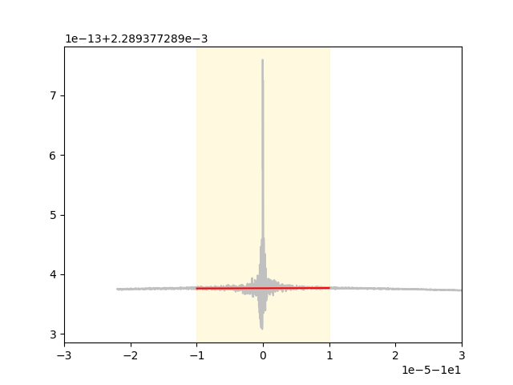

## Equation 5:
```
slow_delayed_rectifier_potassium_current_xs1_gate__tau_xs1 = 0.001 / (0.00013100000000000001 * (30.0 + membrane__V) / (-1.0 + exp(2.0609999999999999 + 0.068699999999999997 * membrane__V)) + 7.1899999999999999e-5 * (30.0 + membrane__V) / (1.0 - exp(-4.4399999999999995 - 0.14799999999999999 * membrane__V)))
```
## New Eq:
```
slow_delayed_rectifier_potassium_current_xs1_gate__tau_xs1 = 0.001 * ((fabs(30.0 + membrane__V) < 1.0000000000010001e-5) ? (1 / (-7.1900000000071903e-10 / (1.0 - exp(1.48000000000148e-6)) - 1.3100000000013103e-9 / (-1.0 + exp(-6.8700000000068699e-7)) + 49999.999999949992 * (30.00001 + membrane__V) * (7.1900000000071903e-10 / (1.0 - exp(1.48000000000148e-6)) + 7.1900000000071903e-10 / (1.0 - exp(-1.48000000000148e-6)) + 1.3100000000013103e-9 / (-1.0 + exp(6.8700000000068699e-7)) + 1.3100000000013103e-9 / (-1.0 + exp(-6.8700000000068699e-7))))) : (1 / (0.00013100000000000001 * (30.0 + membrane__V) / (-1.0 + exp(2.0609999999999999 + 0.068699999999999997 * membrane__V)) + 7.1899999999999999e-5 * (30.0 + membrane__V) / (1.0 - exp(-4.4399999999999995 - 0.14799999999999999 * membrane__V)))))
```
## Singularity point: -30.000000000000000


## Equation 6:
```
slow_delayed_rectifier_potassium_current_xs2_gate__tau_xs2 = 0.0040000000000000001 / (0.00013100000000000001 * (30.0 + membrane__V) / (-1.0 + exp(2.0609999999999999 + 0.068699999999999997 * membrane__V)) + 7.1899999999999999e-5 * (30.0 + membrane__V) / (1.0 - exp(-4.4399999999999995 - 0.14799999999999999 * membrane__V)))
```
## New Eq:
```
slow_delayed_rectifier_potassium_current_xs2_gate__tau_xs2 = 0.0040000000000000001 * ((fabs(30.0 + membrane__V) < 1.0000000000010001e-5) ? (1 / (-7.1900000000071903e-10 / (1.0 - exp(1.48000000000148e-6)) - 1.3100000000013103e-9 / (-1.0 + exp(-6.8700000000068699e-7)) + 49999.999999949992 * (30.00001 + membrane__V) * (7.1900000000071903e-10 / (1.0 - exp(1.48000000000148e-6)) + 7.1900000000071903e-10 / (1.0 - exp(-1.48000000000148e-6)) + 1.3100000000013103e-9 / (-1.0 + exp(6.8700000000068699e-7)) + 1.3100000000013103e-9 / (-1.0 + exp(-6.8700000000068699e-7))))) : (1 / (0.00013100000000000001 * (30.0 + membrane__V) / (-1.0 + exp(2.0609999999999999 + 0.068699999999999997 * membrane__V)) + 7.1899999999999999e-5 * (30.0 + membrane__V) / (1.0 - exp(-4.4399999999999995 - 0.14799999999999999 * membrane__V)))))
```
## Singularity point: -30.000000000000000
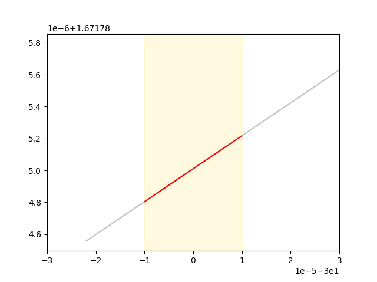

# of singularities:  6
# Model: Corrias_rabbit_purkinje_model(corrias_purkinje_2011.cellml)
No of piecewises: 0
## Equation 1:
```
x_ks__tau_x_ks = 1 / (0.00013100000000000001 * (30.0 + membrane__Vm) / (-1.0 + exp(2.0609999999999999 + 0.068699999999999997 * membrane__Vm)) + 7.1899999999999999e-5 * (30.0 + membrane__Vm) / (1.0 - exp(-4.4399999999999995 - 0.14799999999999999 * membrane__Vm)))
```
## New Eq:
```
x_ks__tau_x_ks = ((fabs(30.0 + membrane__Vm) < 1.0000000000010001e-5) ? (1 / (-7.1900000000071903e-10 / (1.0 - exp(1.48000000000148e-6)) - 1.3100000000013103e-9 / (-1.0 + exp(-6.8700000000068699e-7)) + 49999.999999949992 * (30.00001 + membrane__Vm) * (7.1900000000071903e-10 / (1.0 - exp(1.48000000000148e-6)) + 7.1900000000071903e-10 / (1.0 - exp(-1.48000000000148e-6)) + 1.3100000000013103e-9 / (-1.0 + exp(6.8700000000068699e-7)) + 1.3100000000013103e-9 / (-1.0 + exp(-6.8700000000068699e-7))))) : (1 / (0.00013100000000000001 * (30.0 + membrane__Vm) / (-1.0 + exp(2.0609999999999999 + 0.068699999999999997 * membrane__Vm)) + 7.1899999999999999e-5 * (30.0 + membrane__Vm) / (1.0 - exp(-4.4399999999999995 - 0.14799999999999999 * membrane__Vm)))))
```
## Singularity point: -30.000000000000000


## Equation 2:
```
y_kr__ykrv1 = 0.0013799999999999999 * (7.0 + membrane__Vm) / (1.0 - exp(-0.86099999999999999 - 0.123 * membrane__Vm))
```
## New Eq:
```
y_kr__ykrv1 = ((fabs(7.0 + membrane__Vm) < 1.0000000000003062e-5) ? (-1.3800000000004225e-8 / (1.0 - exp(1.2300000000003766e-6)) + 49999.999999984691 * (7.0000099999999996 + membrane__Vm) * (1.3800000000004225e-8 / (1.0 - exp(1.2300000000003766e-6)) + 1.3800000000004225e-8 / (1.0 - exp(-1.2300000000003766e-6)))) : (0.0013799999999999999 * (7.0 + membrane__Vm) / (1.0 - exp(-0.86099999999999999 - 0.123 * membrane__Vm))))
```
## Singularity point: -7.0000000000000000


## Equation 3:
```
y_kr__ykrv2 = 6.0999999999999999e-5 * (10.0 + membrane__Vm) / (-1.0 + exp(1.45 + 0.14499999999999999 * membrane__Vm))
```
## New Eq:
```
y_kr__ykrv2 = ((fabs(10.0 + membrane__Vm) < 9.9999999999961231e-6) ? (-6.0999999999976349e-10 / (-1.0 + exp(-1.4499999999994377e-6)) + 50000.000000019383 * (10.00001 + membrane__Vm) * (6.0999999999976349e-10 / (-1.0 + exp(1.4499999999994377e-6)) + 6.0999999999976349e-10 / (-1.0 + exp(-1.4499999999994377e-6)))) : (6.0999999999999999e-5 * (10.0 + membrane__Vm) / (-1.0 + exp(1.45 + 0.14499999999999999 * membrane__Vm))))
```
## Singularity point: -10.000000000000000
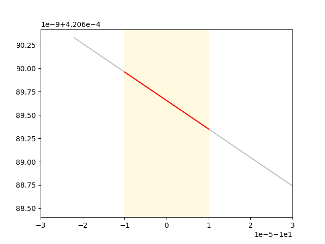

# of singularities:  3
# Model: courtemanche_1998(courtemanche_ramirez_nattel_1998.cellml)
No of piecewises: 4
## Equation 1:
```
Ca_release_current_from_JSR_w_gate__tau_w = 6.0 * (1.0 - exp(1.5800000000000001 - 0.20000000000000001 * membrane__V)) / ((1.0 + 0.29999999999999999 * exp(1.5800000000000001 - 0.20000000000000001 * membrane__V)) * (-7.9000000000000004 + membrane__V))
```
## New Eq:
```
Ca_release_current_from_JSR_w_gate__tau_w = ((fabs(-7.9000000000000004 + membrane__V) < 1.0000000000003062e-5) ? (49999.999999984691 * (-7.8999900000000007 + membrane__V) * (599999.9999998163 * (1.0 - exp(2.0000000000006123e-6)) / (1.0 + 0.29999999999999999 * exp(2.0000000000006123e-6)) + 599999.9999998163 * (1.0 - exp(-2.0000000000006123e-6)) / (1.0 + 0.29999999999999999 * exp(-2.0000000000006123e-6))) - 599999.9999998163 * (1.0 - exp(2.0000000000006123e-6)) / (1.0 + 0.29999999999999999 * exp(2.0000000000006123e-6))) : (6.0 * (1.0 - exp(1.5800000000000001 - 0.20000000000000001 * membrane__V)) / ((1.0 + 0.29999999999999999 * exp(1.5800000000000001 - 0.20000000000000001 * membrane__V)) * (-7.9000000000000004 + membrane__V))))
```
## Singularity point: 7.9000000000000004


## Equation 2:
```
L_type_Ca_channel_d_gate__tau_d = 28.571428571428569 * (1.0 - exp(-1.6025641025641024 - 0.16025641025641024 * membrane__V)) / ((1.0 + exp(-1.6025641025641024 - 0.16025641025641024 * membrane__V)) * (10.0 + membrane__V))
```
## New Eq:
```
L_type_Ca_channel_d_gate__tau_d = ((fabs(10.0 + membrane__V) < 9.9999999999961231e-6) ? (50000.000000019383 * (10.00001 + membrane__V) * (2857142.8571439646 * (1.0 - exp(1.6025641025634812e-6)) / (1.0 + exp(1.6025641025634812e-6)) + 2857142.8571439646 * (1.0 - exp(-1.6025641025634812e-6)) / (1.0 + exp(-1.6025641025634812e-6))) - 2857142.8571439646 * (1.0 - exp(1.6025641025634812e-6)) / (1.0 + exp(1.6025641025634812e-6))) : (28.571428571428569 * (1.0 - exp(-1.6025641025641024 - 0.16025641025641024 * membrane__V)) / ((1.0 + exp(-1.6025641025641024 - 0.16025641025641024 * membrane__V)) * (10.0 + membrane__V))))
```
## Singularity point: -10.000000000000000


## Equation 3:
```
fast_sodium_current_m_gate__alpha_m = 0.32000000000000001 * (47.130000000000003 + membrane__V) / (1.0 - exp(-4.7130000000000001 - 0.10000000000000001 * membrane__V))
```
## New Eq:
```
fast_sodium_current_m_gate__alpha_m = ((fabs(47.130000000000003 + membrane__V) < 1.0000000000010001e-5) ? (-3.2000000000032004e-6 / (1.0 - exp(1.0000000000010001e-6)) + 49999.999999949992 * (47.130010000000006 + membrane__V) * (3.2000000000032004e-6 / (1.0 - exp(1.0000000000010001e-6)) + 3.2000000000032004e-6 / (1.0 - exp(-1.0000000000010001e-6)))) : (0.32000000000000001 * (47.130000000000003 + membrane__V) / (1.0 - exp(-4.7130000000000001 - 0.10000000000000001 * membrane__V))))
```
## Singularity point: -47.130000000000003


## Equation 4:
```
rapid_delayed_rectifier_K_current_xr_gate__alpha_xr = 0.00029999999999999997 * (14.1 + membrane__V) / (1.0 - exp(-2.8199999999999998 - 0.20000000000000001 * membrane__V))
```
## New Eq:
```
rapid_delayed_rectifier_K_current_xr_gate__alpha_xr = ((fabs(14.1 + membrane__V) < 9.9999999999961231e-6) ? (-2.9999999999988366e-9 / (1.0 - exp(1.9999999999992245e-6)) + 50000.000000019383 * (14.100009999999999 + membrane__V) * (2.9999999999988366e-9 / (1.0 - exp(1.9999999999992245e-6)) + 2.9999999999988366e-9 / (1.0 - exp(-1.9999999999992245e-6)))) : (0.00029999999999999997 * (14.1 + membrane__V) / (1.0 - exp(-2.8199999999999998 - 0.20000000000000001 * membrane__V))))
```
## Singularity point: -14.100000000000000
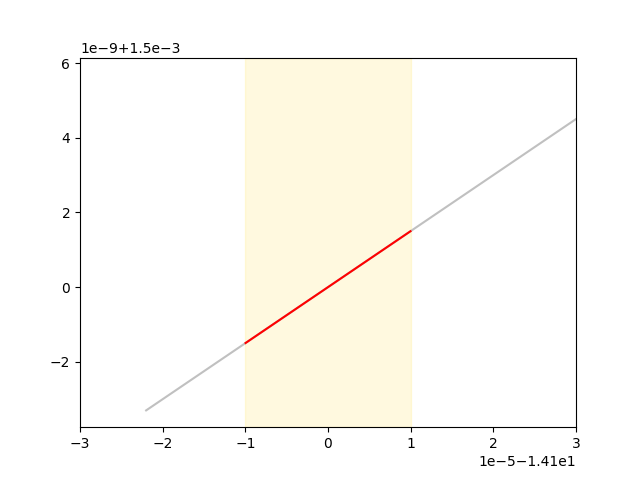

## Equation 5:
```
rapid_delayed_rectifier_K_current_xr_gate__beta_xr = 7.3898000000000003e-5 * (-3.3328000000000002 + membrane__V) / (-1.0 + exp(-0.65046743564221166 + 0.19517145812596365 * membrane__V))
```
## New Eq:
```
rapid_delayed_rectifier_K_current_xr_gate__beta_xr = ((fabs(-3.3328000000000002 + membrane__V) < 9.9999999999995925e-6) ? (-7.3897999999996988e-10 / (-1.0 + exp(-1.9517145812595569e-6)) + 50000.000000002037 * (-3.3327900000000001 + membrane__V) * (7.3897999999996988e-10 / (-1.0 + exp(1.9517145812595569e-6)) + 7.3897999999996988e-10 / (-1.0 + exp(-1.9517145812595569e-6)))) : (7.3898000000000003e-5 * (-3.3328000000000002 + membrane__V) / (-1.0 + exp(-0.65046743564221166 + 0.19517145812596365 * membrane__V))))
```
## Singularity point: 3.3328000000000002
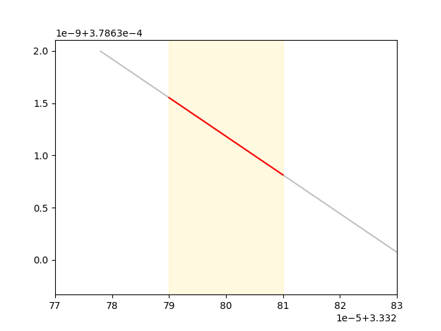

## Equation 6:
```
slow_delayed_rectifier_K_current_xs_gate__alpha_xs = 4.0000000000000003e-5 * (-19.899999999999999 + membrane__V) / (1.0 - exp(1.1705882352941175 - 0.058823529411764705 * membrane__V))
```
## New Eq:
```
slow_delayed_rectifier_K_current_xs_gate__alpha_xs = ((fabs(-19.899999999999999 + membrane__V) < 1.0000000000010001e-5) ? (-4.0000000000040006e-10 / (1.0 - exp(5.8823529411823538e-7)) + 49999.999999949992 * (-19.899989999999999 + membrane__V) * (4.0000000000040006e-10 / (1.0 - exp(5.8823529411823538e-7)) + 4.0000000000040006e-10 / (1.0 - exp(-5.8823529411823538e-7)))) : (4.0000000000000003e-5 * (-19.899999999999999 + membrane__V) / (1.0 - exp(1.1705882352941175 - 0.058823529411764705 * membrane__V))))
```
## Singularity point: 19.899999999999999
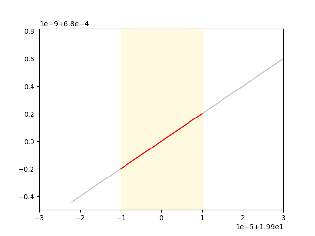

## Equation 7:
```
slow_delayed_rectifier_K_current_xs_gate__beta_xs = 3.4999999999999997e-5 * (-19.899999999999999 + membrane__V) / (-1.0 + exp(-2.2111111111111108 + 0.1111111111111111 * membrane__V))
```
## New Eq:
```
slow_delayed_rectifier_K_current_xs_gate__beta_xs = ((fabs(-19.899999999999999 + membrane__V) < 1.0000000000010001e-5) ? (-3.5000000000034998e-10 / (-1.0 + exp(-1.1111111111122223e-6)) + 49999.999999949992 * (-19.899989999999999 + membrane__V) * (3.5000000000034998e-10 / (-1.0 + exp(1.1111111111122223e-6)) + 3.5000000000034998e-10 / (-1.0 + exp(-1.1111111111122223e-6)))) : (3.4999999999999997e-5 * (-19.899999999999999 + membrane__V) / (-1.0 + exp(-2.2111111111111108 + 0.1111111111111111 * membrane__V))))
```
## Singularity point: 19.899999999999999


# of singularities:  7
# Model: davies_isap_2012(davies_isap_2012.cellml)
No of piecewises: 5
## Equation 1:
```
ICaL__ibarca = 4.0 * (-15.0 + cell__V) * (-Environment__Ca_o * ICaL__gacao + Ca__Ca_ss * ICaL__gacai * exp(2.0 * (-15.0 + cell__V) * Environment__FonRT)) * Environment__F * Environment__FonRT * ICaL__pca / (-1.0 + exp(2.0 * (-15.0 + cell__V) * Environment__FonRT))
```
## New Eq:
```
ICaL__ibarca = ((fabs(-15.0 + cell__V) < 9.9999999999961231e-6) ? (50000.000000019383 * (-14.99999 + cell__V) * (0.1444800488099473 * (-0.34100000000000003 * Environment__Ca_o + Ca__Ca_ss * exp(7.4871767015570971e-7)) * ICaL__pca / (-1.0 + exp(7.4871767015570971e-7)) + 0.1444800488099473 * (-0.34100000000000003 * Environment__Ca_o + Ca__Ca_ss * exp(-7.4871767015570971e-7)) * ICaL__pca / (-1.0 + exp(-7.4871767015570971e-7))) - 0.1444800488099473 * (-0.34100000000000003 * Environment__Ca_o + Ca__Ca_ss * exp(-7.4871767015570971e-7)) * ICaL__pca / (-1.0 + exp(-7.4871767015570971e-7))) : (14448.004881000332 * (-15.0 + cell__V) * (-0.34100000000000003 * Environment__Ca_o + Ca__Ca_ss * exp(-1.1230765052339999 + 0.074871767015599999 * cell__V)) * ICaL__pca / (-1.0 + exp(-1.1230765052339999 + 0.074871767015599999 * cell__V))))
```
## Singularity point: 15.000000000000000
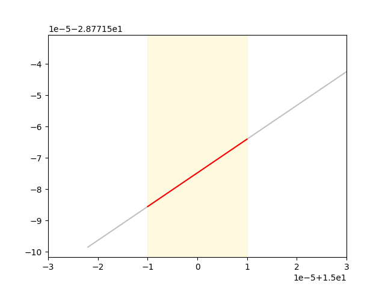

## Equation 2:
```
ICab__ICab = (-0.34100000000000003 * Environment__Ca_o + Ca__Ca_i * exp(2.0 * Environment__FonRT * cell__V)) * Environment__F * Environment__FonRT * ICab__GCab * cell__V / (-1.0 + exp(2.0 * Environment__FonRT * cell__V))
```
## New Eq:
```
ICab__ICab = ((fabs(cell__V) < 1.0000000000000001e-5) ? (49999.999999999993 * (1.0000000000000001e-5 + cell__V) * (0.036120012202500835 * (-0.34100000000000003 * Environment__Ca_o + Ca__Ca_i * exp(7.4871767015600003e-7)) * ICab__GCab / (-1.0 + exp(7.4871767015600003e-7)) + 0.036120012202500835 * (-0.34100000000000003 * Environment__Ca_o + Ca__Ca_i * exp(-7.4871767015600003e-7)) * ICab__GCab / (-1.0 + exp(-7.4871767015600003e-7))) - 0.036120012202500835 * (-0.34100000000000003 * Environment__Ca_o + Ca__Ca_i * exp(-7.4871767015600003e-7)) * ICab__GCab / (-1.0 + exp(-7.4871767015600003e-7))) : (3612.001220250083 * (-0.34100000000000003 * Environment__Ca_o + Ca__Ca_i * exp(0.074871767015599999 * cell__V)) * ICab__GCab * cell__V / (-1.0 + exp(0.074871767015599999 * cell__V))))
```
## Singularity point: 0


## Equation 3:
```
IKs__tauxs = 1 / (7.6100000000000007e-5 * (44.600000000000001 + cell__V) / (1.0 - exp(-444.66200000000003 - 9.9700000000000006 * cell__V)) + 0.00036000000000000002 * (-0.55000000000000004 + cell__V) / (-1.0 + exp(-0.070400000000000004 + 0.128 * cell__V)))
```
## New Eq:
```
IKs__tauxs = 1 / (((fabs(44.600000000000001 + cell__V) < 1.0000000000010001e-5) ? (-7.6100000000076117e-10 / (1.0 - exp(9.9700000000099717e-5)) + 49999.999999949992 * (44.600010000000005 + cell__V) * (7.6100000000076117e-10 / (1.0 - exp(9.9700000000099717e-5)) + 7.6100000000076117e-10 / (1.0 - exp(-9.9700000000099717e-5)))) : (7.6100000000000007e-5 * (44.600000000000001 + cell__V) / (1.0 - exp(-444.66200000000003 - 9.9700000000000006 * cell__V)))) + ((fabs(-0.55000000000000004 + cell__V) < 9.9999999999995925e-6) ? (-3.5999999999998536e-9 / (-1.0 + exp(-1.2799999999999479e-6)) + 50000.000000002037 * (-0.54999000000000009 + cell__V) * (3.5999999999998536e-9 / (-1.0 + exp(1.2799999999999479e-6)) + 3.5999999999998536e-9 / (-1.0 + exp(-1.2799999999999479e-6)))) : (0.00036000000000000002 * (-0.55000000000000004 + cell__V) / (-1.0 + exp(-0.070400000000000004 + 0.128 * cell__V)))))
```
## Singularity point: 0.55000000000000004

## Singularity point: -44.600000000000001


## Equation 4:
```
INa__am = 0.32000000000000001 * (47.130000000000003 + cell__V) / (1.0 - exp(-4.7130000000000001 - 0.10000000000000001 * cell__V))
```
## New Eq:
```
INa__am = ((fabs(47.130000000000003 + cell__V) < 1.0000000000010001e-5) ? (-3.2000000000032004e-6 / (1.0 - exp(1.0000000000010001e-6)) + 49999.999999949992 * (47.130010000000006 + cell__V) * (3.2000000000032004e-6 / (1.0 - exp(1.0000000000010001e-6)) + 3.2000000000032004e-6 / (1.0 - exp(-1.0000000000010001e-6)))) : (0.32000000000000001 * (47.130000000000003 + cell__V) / (1.0 - exp(-4.7130000000000001 - 0.10000000000000001 * cell__V))))
```
## Singularity point: -47.130000000000003


## Equation 5:
```
INal__amL = 0.32000000000000001 * (47.130000000000003 + cell__V) / (1.0 - exp(-4.7130000000000001 - 0.10000000000000001 * cell__V))
```
## New Eq:
```
INal__amL = ((fabs(47.130000000000003 + cell__V) < 1.0000000000010001e-5) ? (-3.2000000000032004e-6 / (1.0 - exp(1.0000000000010001e-6)) + 49999.999999949992 * (47.130010000000006 + cell__V) * (3.2000000000032004e-6 / (1.0 - exp(1.0000000000010001e-6)) + 3.2000000000032004e-6 / (1.0 - exp(-1.0000000000010001e-6)))) : (0.32000000000000001 * (47.130000000000003 + cell__V) / (1.0 - exp(-4.7130000000000001 - 0.10000000000000001 * cell__V))))
```
## Singularity point: -47.130000000000003
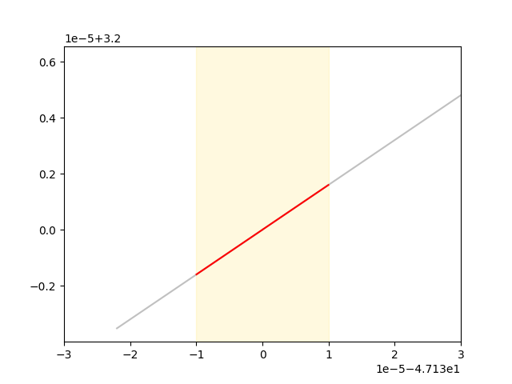

## Equation 6:
```
Ito2__Ito2_max = (-Environment__Cl_o * exp(Environment__FonRT * cell__V) + Cl__Cl_i) * Environment__F * Environment__FonRT * Ito2__PCl * cell__V / (1.0 - exp(Environment__FonRT * cell__V))
```
## New Eq:
```
Ito2__Ito2_max = ((fabs(cell__V) < 1.0000000000000001e-5) ? (49999.999999999993 * (1.0000000000000001e-5 + cell__V) * (0.036120012202500835 * (-Environment__Cl_o * exp(3.7435883507800002e-7) + Cl__Cl_i) * Ito2__PCl / (1.0 - exp(3.7435883507800002e-7)) + 0.036120012202500835 * (-Environment__Cl_o * exp(-3.7435883507800002e-7) + Cl__Cl_i) * Ito2__PCl / (1.0 - exp(-3.7435883507800002e-7))) - 0.036120012202500835 * (-Environment__Cl_o * exp(-3.7435883507800002e-7) + Cl__Cl_i) * Ito2__PCl / (1.0 - exp(-3.7435883507800002e-7))) : (3612.001220250083 * (-Environment__Cl_o * exp(0.0374358835078 * cell__V) + Cl__Cl_i) * Ito2__PCl * cell__V / (1.0 - exp(0.0374358835078 * cell__V))))
```
## Singularity point: 0


# of singularities:  7
# Model: decker_2009(decker_2009.cellml)
No of piecewises: 4
## Equation 1:
```
IKr_xr_gate__tau_xr = 1 / (0.00029999999999999997 * (38.360799999999998 + membrane__Vm) / (-1.0 + exp(5.8385137599999997 + 0.1522 * membrane__Vm)) + 0.00059999999999999995 * (-1.7383999999999999 + membrane__Vm) / (1.0 - exp(0.2364224 - 0.13600000000000001 * membrane__Vm)))
```
## New Eq:
```
IKr_xr_gate__tau_xr = 1 / (((fabs(38.360799999999998 + membrane__Vm) < 1.0000000000010001e-5) ? (-3.0000000000030002e-9 / (-1.0 + exp(-1.5220000000015221e-6)) + 49999.999999949992 * (38.360810000000001 + membrane__Vm) * (3.0000000000030002e-9 / (-1.0 + exp(1.5220000000015221e-6)) + 3.0000000000030002e-9 / (-1.0 + exp(-1.5220000000015221e-6)))) : (0.00029999999999999997 * (38.360799999999998 + membrane__Vm) / (-1.0 + exp(5.8385137599999997 + 0.1522 * membrane__Vm)))) + ((fabs(-1.7383999999999999 + membrane__Vm) < 9.9999999999995925e-6) ? (-5.9999999999997551e-9 / (1.0 - exp(1.3599999999999446e-6)) + 50000.000000002037 * (-1.7383899999999999 + membrane__Vm) * (5.9999999999997551e-9 / (1.0 - exp(1.3599999999999446e-6)) + 5.9999999999997551e-9 / (1.0 - exp(-1.3599999999999446e-6)))) : (0.00059999999999999995 * (-1.7383999999999999 + membrane__Vm) / (1.0 - exp(0.2364224 - 0.13600000000000001 * membrane__Vm)))))
```
## Singularity point: -38.360799999999998

## Singularity point: 1.7383999999999999
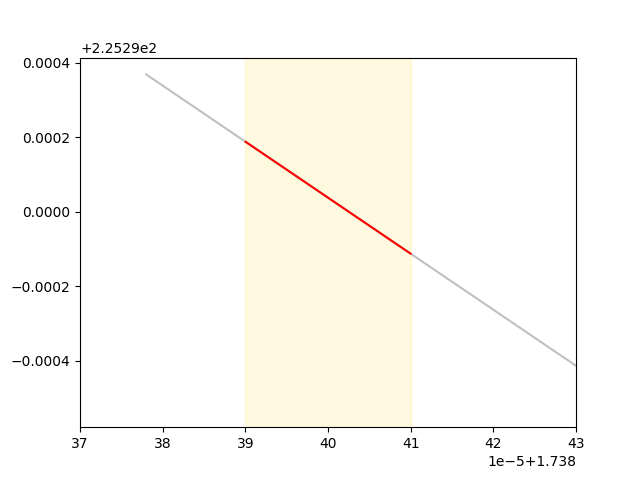

## Equation 2:
```
INaL_mL_gate__amL = 0.32000000000000001 * (47.130000000000003 + membrane__Vm) / (1.0 - exp(-4.7130000000000001 - 0.10000000000000001 * membrane__Vm))
```
## New Eq:
```
INaL_mL_gate__amL = ((fabs(47.130000000000003 + membrane__Vm) < 1.0000000000010001e-5) ? (-3.2000000000032004e-6 / (1.0 - exp(1.0000000000010001e-6)) + 49999.999999949992 * (47.130010000000006 + membrane__Vm) * (3.2000000000032004e-6 / (1.0 - exp(1.0000000000010001e-6)) + 3.2000000000032004e-6 / (1.0 - exp(-1.0000000000010001e-6)))) : (0.32000000000000001 * (47.130000000000003 + membrane__Vm) / (1.0 - exp(-4.7130000000000001 - 0.10000000000000001 * membrane__Vm))))
```
## Singularity point: -47.130000000000003


## Equation 3:
```
INa_m_gate__am = 0.32000000000000001 * (47.130000000000003 + membrane__Vm) / (1.0 - exp(-4.7130000000000001 - 0.10000000000000001 * membrane__Vm))
```
## New Eq:
```
INa_m_gate__am = ((fabs(47.130000000000003 + membrane__Vm) < 1.0000000000010001e-5) ? (-3.2000000000032004e-6 / (1.0 - exp(1.0000000000010001e-6)) + 49999.999999949992 * (47.130010000000006 + membrane__Vm) * (3.2000000000032004e-6 / (1.0 - exp(1.0000000000010001e-6)) + 3.2000000000032004e-6 / (1.0 - exp(-1.0000000000010001e-6)))) : (0.32000000000000001 * (47.130000000000003 + membrane__Vm) / (1.0 - exp(-4.7130000000000001 - 0.10000000000000001 * membrane__Vm))))
```
## Singularity point: -47.130000000000003


## Equation 4:
```
ICaL__ICaL_max = 4.0 * pow(model_parameters__F, 2) * (-ICaL__gamma_Cao * model_parameters__Ca_o + Ca__Ca_ss_CaL * ICaL__gamma_Cai * exp(2.0 * membrane__Vm * model_parameters__F / (model_parameters__R * model_parameters__T))) * ICaL__PCa * membrane__Vm / ((-1.0 + exp(2.0 * membrane__Vm * model_parameters__F / (model_parameters__R * model_parameters__T))) * model_parameters__R * model_parameters__T)
```
## New Eq:
```
ICaL__ICaL_max = ((fabs(membrane__Vm) < 1.0000000000000001e-5) ? (49999.999999999993 * (1.0000000000000001e-5 + membrane__Vm) * (0.14448004881001345 * (-0.34100000000000003 * model_parameters__Ca_o + Ca__Ca_ss_CaL * exp(7.4871767015605244e-7)) * ICaL__PCa / (-1.0 + exp(7.4871767015605244e-7)) + 0.14448004881001345 * (-0.34100000000000003 * model_parameters__Ca_o + Ca__Ca_ss_CaL * exp(-7.4871767015605244e-7)) * ICaL__PCa / (-1.0 + exp(-7.4871767015605244e-7))) - 0.14448004881001345 * (-0.34100000000000003 * model_parameters__Ca_o + Ca__Ca_ss_CaL * exp(-7.4871767015605244e-7)) * ICaL__PCa / (-1.0 + exp(-7.4871767015605244e-7))) : (14448.004881001343 * (-0.34100000000000003 * model_parameters__Ca_o + Ca__Ca_ss_CaL * exp(0.074871767015605231 * membrane__Vm)) * ICaL__PCa * membrane__Vm / (-1.0 + exp(0.074871767015605231 * membrane__Vm))))
```
## Singularity point: 0


## Equation 5:
```
ICab__ICab = 4.0 * pow(model_parameters__F, 2) * (-ICab__gamma_Ca_o * model_parameters__Ca_o + Ca__Ca_i * ICab__gamma_Ca_i * exp(2.0 * membrane__Vm * model_parameters__F / (model_parameters__R * model_parameters__T))) * ICab__PCab * membrane__Vm / ((-1.0 + exp(2.0 * membrane__Vm * model_parameters__F / (model_parameters__R * model_parameters__T))) * model_parameters__R * model_parameters__T)
```
## New Eq:
```
ICab__ICab = ((fabs(membrane__Vm) < 1.0000000000000001e-5) ? (49999.999999999993 * (1.0000000000000001e-5 + membrane__Vm) * (0.14448004881001345 * (-0.34100000000000003 * model_parameters__Ca_o + Ca__Ca_i * exp(7.4871767015605244e-7)) * ICab__PCab / (-1.0 + exp(7.4871767015605244e-7)) + 0.14448004881001345 * (-0.34100000000000003 * model_parameters__Ca_o + Ca__Ca_i * exp(-7.4871767015605244e-7)) * ICab__PCab / (-1.0 + exp(-7.4871767015605244e-7))) - 0.14448004881001345 * (-0.34100000000000003 * model_parameters__Ca_o + Ca__Ca_i * exp(-7.4871767015605244e-7)) * ICab__PCab / (-1.0 + exp(-7.4871767015605244e-7))) : (14448.004881001343 * (-0.34100000000000003 * model_parameters__Ca_o + Ca__Ca_i * exp(0.074871767015605231 * membrane__Vm)) * ICab__PCab * membrane__Vm / (-1.0 + exp(0.074871767015605231 * membrane__Vm))))
```
## Singularity point: 0


## Equation 6:
```
INab__INab = (-model_parameters__Na_o + Na__Na_i * exp(INab__phi)) * INab__PNab * INab__phi * model_parameters__F / (-1.0 + exp(INab__phi))
```
## New Eq:
```
INab__INab = ((fabs(membrane__Vm) < 1.0000000000000001e-5) ? (49999.999999999993 * (1.0000000000000001e-5 + membrane__Vm) * (0.036120012202503361 * (-model_parameters__Na_o + Na__Na_i * exp(3.7435883507802622e-7)) * INab__PNab / (-1.0 + exp(3.7435883507802622e-7)) + 0.036120012202503361 * (-model_parameters__Na_o + Na__Na_i * exp(-3.7435883507802622e-7)) * INab__PNab / (-1.0 + exp(-3.7435883507802622e-7))) - 0.036120012202503361 * (-model_parameters__Na_o + Na__Na_i * exp(-3.7435883507802622e-7)) * INab__PNab / (-1.0 + exp(-3.7435883507802622e-7))) : (3612.0012202503358 * (-model_parameters__Na_o + Na__Na_i * exp(0.037435883507802616 * membrane__Vm)) * INab__PNab * membrane__Vm / (-1.0 + exp(0.037435883507802616 * membrane__Vm))))
```
## Singularity point: 0


## Equation 7:
```
Ito2__Ito2_max = pow(Ito2__zCl, 2) * pow(model_parameters__F, 2) * (-model_parameters__Cl_o * exp(membrane__Vm * model_parameters__F / (model_parameters__R * model_parameters__T)) + Cl__Cl_i) * Ito2__PCl * membrane__Vm / ((1.0 - exp(membrane__Vm * model_parameters__F / (model_parameters__R * model_parameters__T))) * model_parameters__R * model_parameters__T)
```
## New Eq:
```
Ito2__Ito2_max = ((fabs(membrane__Vm) < 1.0000000000000001e-5) ? (49999.999999999993 * (1.0000000000000001e-5 + membrane__Vm) * (0.036120012202503361 * (-100.0 * exp(3.7435883507802622e-7) + Cl__Cl_i) * Ito2__PCl / (1.0 - exp(3.7435883507802622e-7)) + 0.036120012202503361 * (-100.0 * exp(-3.7435883507802622e-7) + Cl__Cl_i) * Ito2__PCl / (1.0 - exp(-3.7435883507802622e-7))) - 0.036120012202503361 * (-100.0 * exp(-3.7435883507802622e-7) + Cl__Cl_i) * Ito2__PCl / (1.0 - exp(-3.7435883507802622e-7))) : (3612.0012202503358 * (-100.0 * exp(0.037435883507802616 * membrane__Vm) + Cl__Cl_i) * Ito2__PCl * membrane__Vm / (1.0 - exp(0.037435883507802616 * membrane__Vm))))
```
## Singularity point: 0


# of singularities:  8
# Model: demir_model_1994(demir_model_1994.cellml)
No of piecewises: 0
## Equation 1:
```
L_type_Ca_channel_d_gate__alpha_d_L = -28.390000000000001 * (35.0 + membrane__V) / (-1.0 + exp(-14.0 - 0.40000000000000002 * membrane__V)) - 84.900000000000006 * membrane__V / (-1.0 + exp(-0.20799999999999999 * membrane__V))
```
## New Eq:
```
L_type_Ca_channel_d_gate__alpha_d_L = ((fabs(membrane__V) < 1.0000000000000001e-5) ? (0.00084900000000000015 / (-1.0 + exp(2.08e-6)) + 49999.999999999993 * (1.0000000000000001e-5 + membrane__V) * (-0.00084900000000000015 / (-1.0 + exp(2.08e-6)) - 0.00084900000000000015 / (-1.0 + exp(-2.08e-6)))) : (-84.900000000000006 * membrane__V / (-1.0 + exp(-0.20799999999999999 * membrane__V)))) + ((fabs(35.0 + membrane__V) < 1.0000000000010001e-5) ? (0.00028390000000028391 / (-1.0 + exp(4.0000000000040004e-6)) + 49999.999999949992 * (35.000010000000003 + membrane__V) * (-0.00028390000000028391 / (-1.0 + exp(4.0000000000040004e-6)) - 0.00028390000000028391 / (-1.0 + exp(-4.0000000000040004e-6)))) : (-28.390000000000001 * (35.0 + membrane__V) / (-1.0 + exp(-14.0 - 0.40000000000000002 * membrane__V))))
```
## Singularity point: -35.000000000000000
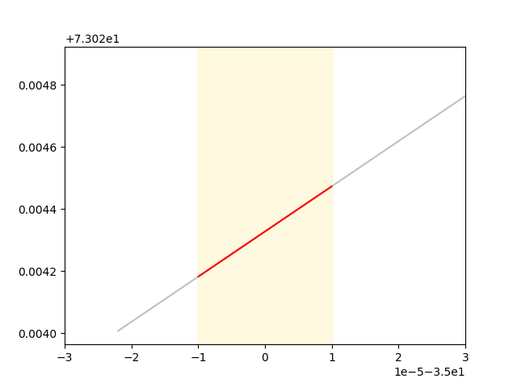
## Singularity point: 0


## Equation 2:
```
L_type_Ca_channel_d_gate__beta_d_L = 11.43 * (-5.0 + membrane__V) / (-1.0 + exp(-2.0 + 0.40000000000000002 * membrane__V))
```
## New Eq:
```
L_type_Ca_channel_d_gate__beta_d_L = ((fabs(-5.0 + membrane__V) < 1.0000000000003062e-5) ? (-0.00011430000000003499 / (-1.0 + exp(-4.0000000000012246e-6)) + 49999.999999984691 * (-4.9999900000000004 + membrane__V) * (0.00011430000000003499 / (-1.0 + exp(4.0000000000012246e-6)) + 0.00011430000000003499 / (-1.0 + exp(-4.0000000000012246e-6)))) : (11.43 * (-5.0 + membrane__V) / (-1.0 + exp(-2.0 + 0.40000000000000002 * membrane__V))))
```
## Singularity point: 5.0000000000000000
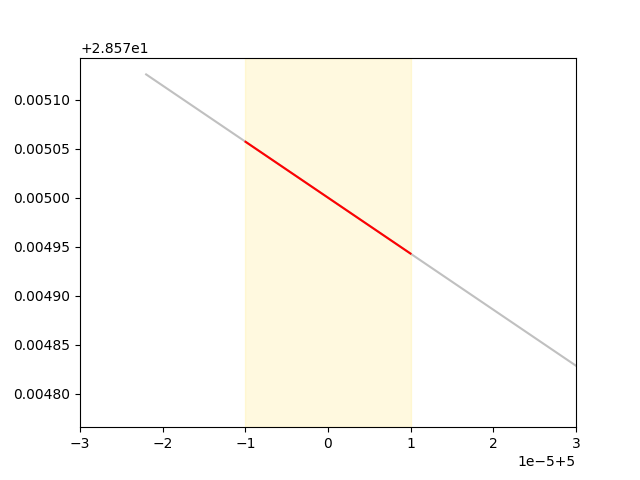

## Equation 3:
```
L_type_Ca_channel_f_gate__alpha_f_L = 3.75 * (28.0 + membrane__V) / (-1.0 + exp(7.0 + 0.25 * membrane__V))
```
## New Eq:
```
L_type_Ca_channel_f_gate__alpha_f_L = ((fabs(28.0 + membrane__V) < 1.0000000000010001e-5) ? (-3.7500000000037503e-5 / (-1.0 + exp(-2.5000000000025002e-6)) + 49999.999999949992 * (28.00001 + membrane__V) * (3.7500000000037503e-5 / (-1.0 + exp(2.5000000000025002e-6)) + 3.7500000000037503e-5 / (-1.0 + exp(-2.5000000000025002e-6)))) : (3.75 * (28.0 + membrane__V) / (-1.0 + exp(7.0 + 0.25 * membrane__V))))
```
## Singularity point: -28.000000000000000


## Equation 4:
```
sodium_current_m_gate__alpha_m = -824.0 * (51.899999999999999 + membrane__V) / (-1.0 + exp(-5.8314606741573032 - 0.11235955056179775 * membrane__V))
```
## New Eq:
```
sodium_current_m_gate__alpha_m = ((fabs(51.899999999999999 + membrane__V) < 1.0000000000010001e-5) ? (0.0082400000000082407 / (-1.0 + exp(1.1235955056191013e-6)) + 49999.999999949992 * (51.900010000000002 + membrane__V) * (-0.0082400000000082407 / (-1.0 + exp(1.1235955056191013e-6)) - 0.0082400000000082407 / (-1.0 + exp(-1.1235955056191013e-6)))) : (-824.0 * (51.899999999999999 + membrane__V) / (-1.0 + exp(-5.8314606741573032 - 0.11235955056179775 * membrane__V))))
```
## Singularity point: -51.899999999999999


## Equation 5:
```
sodium_current__i_Na = pow(membrane__F, 2) * pow(sodium_current_m_gate__m, 3) * (-1.0 + exp((-reversal_potentials__E_Na + membrane__V) * membrane__F / (membrane__R * membrane__T))) * cleft_space_equations__Na_c * membrane__V * sodium_current__P_Na * sodium_current_h_gate__h1 * sodium_current_h_gate__h2 / ((-1.0 + exp(membrane__F * membrane__V / (membrane__R * membrane__T))) * membrane__R * membrane__T)
```
## New Eq:
```
sodium_current__i_Na = ((fabs(membrane__V) < 1.0000000000000001e-5) ? (49999.999999999993 * (1.0000000000000001e-5 + membrane__V) * (0.036118217397063127 * pow(sodium_current_m_gate__m, 3) * (-1.0 + exp(3.7433890822745472e-7 - 1.0 * log(cleft_space_equations__Na_c / intracellular_concentrations_and_buffer_equations__Na_i))) * cleft_space_equations__Na_c * sodium_current__P_Na * sodium_current_h_gate__h1 * sodium_current_h_gate__h2 / (-1.0 + exp(3.7433890822745472e-7)) + 0.036118217397063127 * pow(sodium_current_m_gate__m, 3) * (-1.0 + exp(-3.7433890822745472e-7 - 1.0 * log(cleft_space_equations__Na_c / intracellular_concentrations_and_buffer_equations__Na_i))) * cleft_space_equations__Na_c * sodium_current__P_Na * sodium_current_h_gate__h1 * sodium_current_h_gate__h2 / (-1.0 + exp(-3.7433890822745472e-7))) - 0.036118217397063127 * pow(sodium_current_m_gate__m, 3) * (-1.0 + exp(-3.7433890822745472e-7 - 1.0 * log(cleft_space_equations__Na_c / intracellular_concentrations_and_buffer_equations__Na_i))) * cleft_space_equations__Na_c * sodium_current__P_Na * sodium_current_h_gate__h1 * sodium_current_h_gate__h2 / (-1.0 + exp(-3.7433890822745472e-7))) : (3611.8217397063127 * pow(sodium_current_m_gate__m, 3) * (-1.0 + exp(0.037433890822745473 * membrane__V - 1.0 * log(cleft_space_equations__Na_c / intracellular_concentrations_and_buffer_equations__Na_i))) * cleft_space_equations__Na_c * membrane__V * sodium_current__P_Na * sodium_current_h_gate__h1 * sodium_current_h_gate__h2 / (-1.0 + exp(0.037433890822745473 * membrane__V))))
```
## Singularity point: 0


# of singularities:  6
# Model: difrancesco_noble_model_1985(difrancesco_noble_model_1985.cellml)
No of piecewises: 0
## Equation 1:
```
fast_sodium_current_m_gate__alpha_m = 200.0 * (41.0 + membrane__V) / (1.0 - exp(-4.1000000000000005 - 0.10000000000000001 * membrane__V))
```
## New Eq:
```
fast_sodium_current_m_gate__alpha_m = ((fabs(41.0 + membrane__V) < 1.0000000000010001e-5) ? (-0.0020000000000020002 / (1.0 - exp(1.0000000000010001e-6)) + 49999.999999949992 * (41.000010000000003 + membrane__V) * (0.0020000000000020002 / (1.0 - exp(1.0000000000010001e-6)) + 0.0020000000000020002 / (1.0 - exp(-1.0000000000010001e-6)))) : (200.0 * (41.0 + membrane__V) / (1.0 - exp(-4.1000000000000005 - 0.10000000000000001 * membrane__V))))
```
## Singularity point: -41.000000000000000


## Equation 2:
```
hyperpolarising_activated_current_y_gate__beta_y = (42.0 + membrane__V) / (1.0 - exp(-8.4000000000000004 - 0.20000000000000001 * membrane__V))
```
## New Eq:
```
hyperpolarising_activated_current_y_gate__beta_y = ((fabs(42.0 + membrane__V) < 1.0000000000010001e-5) ? (-1.0000000000010001e-5 / (1.0 - exp(2.0000000000020002e-6)) + 49999.999999949992 * (42.000010000000003 + membrane__V) * (1.0000000000010001e-5 / (1.0 - exp(2.0000000000020002e-6)) + 1.0000000000010001e-5 / (1.0 - exp(-2.0000000000020002e-6)))) : ((42.0 + membrane__V) / (1.0 - exp(-8.4000000000000004 - 0.20000000000000001 * membrane__V))))
```
## Singularity point: -42.000000000000000


## Equation 3:
```
intracellular_calcium_concentration__alpha_p = 0.625 * (34.0 + membrane__V) / (-1.0 + exp(8.5 + 0.25 * membrane__V))
```
## New Eq:
```
intracellular_calcium_concentration__alpha_p = ((fabs(34.0 + membrane__V) < 1.0000000000010001e-5) ? (-6.2500000000062506e-6 / (-1.0 + exp(-2.5000000000025002e-6)) + 49999.999999949992 * (34.000010000000003 + membrane__V) * (6.2500000000062506e-6 / (-1.0 + exp(2.5000000000025002e-6)) + 6.2500000000062506e-6 / (-1.0 + exp(-2.5000000000025002e-6)))) : (0.625 * (34.0 + membrane__V) / (-1.0 + exp(8.5 + 0.25 * membrane__V))))
```
## Singularity point: -34.000000000000000


## Equation 4:
```
second_inward_current_d_gate__alpha_d = 30.0 * (19.0 + membrane__V) / (1.0 - exp(-4.75 - 0.25 * membrane__V))
```
## New Eq:
```
second_inward_current_d_gate__alpha_d = ((fabs(19.0 + membrane__V) < 1.0000000000010001e-5) ? (-0.00030000000000030003 / (1.0 - exp(2.5000000000025002e-6)) + 49999.999999949992 * (19.00001 + membrane__V) * (0.00030000000000030003 / (1.0 - exp(2.5000000000025002e-6)) + 0.00030000000000030003 / (1.0 - exp(-2.5000000000025002e-6)))) : (30.0 * (19.0 + membrane__V) / (1.0 - exp(-4.75 - 0.25 * membrane__V))))
```
## Singularity point: -19.000000000000000
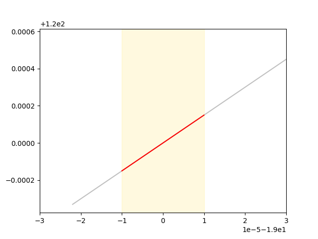

## Equation 5:
```
second_inward_current_d_gate__beta_d = 12.0 * (19.0 + membrane__V) / (-1.0 + exp(1.8999999999999999 + 0.10000000000000001 * membrane__V))
```
## New Eq:
```
second_inward_current_d_gate__beta_d = ((fabs(19.0 + membrane__V) < 1.0000000000010001e-5) ? (-0.00012000000000012001 / (-1.0 + exp(-1.0000000000010001e-6)) + 49999.999999949992 * (19.00001 + membrane__V) * (0.00012000000000012001 / (-1.0 + exp(1.0000000000010001e-6)) + 0.00012000000000012001 / (-1.0 + exp(-1.0000000000010001e-6)))) : (12.0 * (19.0 + membrane__V) / (-1.0 + exp(1.8999999999999999 + 0.10000000000000001 * membrane__V))))
```
## Singularity point: -19.000000000000000


## Equation 6:
```
second_inward_current_f_gate__alpha_f = 6.25 * (34.0 + membrane__V) / (-1.0 + exp(8.5 + 0.25 * membrane__V))
```
## New Eq:
```
second_inward_current_f_gate__alpha_f = ((fabs(34.0 + membrane__V) < 1.0000000000010001e-5) ? (-6.2500000000062506e-5 / (-1.0 + exp(-2.5000000000025002e-6)) + 49999.999999949992 * (34.000010000000003 + membrane__V) * (6.2500000000062506e-5 / (-1.0 + exp(2.5000000000025002e-6)) + 6.2500000000062506e-5 / (-1.0 + exp(-2.5000000000025002e-6)))) : (6.25 * (34.0 + membrane__V) / (-1.0 + exp(8.5 + 0.25 * membrane__V))))
```
## Singularity point: -34.000000000000000


## Equation 7:
```
second_inward_current__i_siCa = 4.0 * (-50.0 + membrane__V) * (intracellular_calcium_concentration__Cai * exp(100.0 / membrane__RTONF) - extracellular_calcium_concentration__Cao * exp(-2.0 * (-50.0 + membrane__V) / membrane__RTONF)) * second_inward_current__P_si * second_inward_current_d_gate__d * second_inward_current_f2_gate__f2 * second_inward_current_f_gate__f / ((1.0 - exp(-2.0 * (-50.0 + membrane__V) / membrane__RTONF)) * membrane__RTONF)
```
## New Eq:
```
second_inward_current__i_siCa = ((fabs(-50.0 + membrane__V) < 1.0000000000010001e-5) ? (49999.999999949992 * (-49.999989999999997 + membrane__V) * (1.4973556329113164e-6 * (intracellular_calcium_concentration__Cai * exp(3.7433890822745473) - extracellular_calcium_concentration__Cao * exp(7.4867781645565822e-7)) * second_inward_current__P_si * second_inward_current_d_gate__d * second_inward_current_f2_gate__f2 * second_inward_current_f_gate__f / (1.0 - exp(7.4867781645565822e-7)) + 1.4973556329113164e-6 * (intracellular_calcium_concentration__Cai * exp(3.7433890822745473) - extracellular_calcium_concentration__Cao * exp(-7.4867781645565822e-7)) * second_inward_current__P_si * second_inward_current_d_gate__d * second_inward_current_f2_gate__f2 * second_inward_current_f_gate__f / (1.0 - exp(-7.4867781645565822e-7))) - 1.4973556329113164e-6 * (intracellular_calcium_concentration__Cai * exp(3.7433890822745473) - extracellular_calcium_concentration__Cao * exp(7.4867781645565822e-7)) * second_inward_current__P_si * second_inward_current_d_gate__d * second_inward_current_f2_gate__f2 * second_inward_current_f_gate__f / (1.0 - exp(7.4867781645565822e-7))) : (0.14973556329098189 * (-50.0 + membrane__V) * (intracellular_calcium_concentration__Cai * exp(3.7433890822745473) - extracellular_calcium_concentration__Cao * exp(3.7433890822745473 - 0.074867781645490947 * membrane__V)) * second_inward_current__P_si * second_inward_current_d_gate__d * second_inward_current_f2_gate__f2 * second_inward_current_f_gate__f / (1.0 - exp(3.7433890822745473 - 0.074867781645490947 * membrane__V))))
```
## Singularity point: 50.000000000000000


## Equation 8:
```
second_inward_current__i_siK = 0.01 * (-50.0 + membrane__V) * (intracellular_potassium_concentration__Ki * exp(50.0 / membrane__RTONF) - extracellular_potassium_concentration__Kc * exp(-(-50.0 + membrane__V) / membrane__RTONF)) * second_inward_current__P_si * second_inward_current_d_gate__d * second_inward_current_f2_gate__f2 * second_inward_current_f_gate__f / ((1.0 - exp(-(-50.0 + membrane__V) / membrane__RTONF)) * membrane__RTONF)
```
## New Eq:
```
second_inward_current__i_siK = ((fabs(-50.0 + membrane__V) < 1.0000000000010001e-5) ? (49999.999999949992 * (-49.999989999999997 + membrane__V) * (3.7433890822782906e-9 * (intracellular_potassium_concentration__Ki * exp(1.8716945411372736) - extracellular_potassium_concentration__Kc * exp(3.7433890822782911e-7)) * second_inward_current__P_si * second_inward_current_d_gate__d * second_inward_current_f2_gate__f2 * second_inward_current_f_gate__f / (1.0 - exp(3.7433890822782911e-7)) + 3.7433890822782906e-9 * (intracellular_potassium_concentration__Ki * exp(1.8716945411372736) - extracellular_potassium_concentration__Kc * exp(-3.7433890822782911e-7)) * second_inward_current__P_si * second_inward_current_d_gate__d * second_inward_current_f2_gate__f2 * second_inward_current_f_gate__f / (1.0 - exp(-3.7433890822782911e-7))) - 3.7433890822782906e-9 * (intracellular_potassium_concentration__Ki * exp(1.8716945411372736) - extracellular_potassium_concentration__Kc * exp(3.7433890822782911e-7)) * second_inward_current__P_si * second_inward_current_d_gate__d * second_inward_current_f2_gate__f2 * second_inward_current_f_gate__f / (1.0 - exp(3.7433890822782911e-7))) : (0.00037433890822745472 * (-50.0 + membrane__V) * (intracellular_potassium_concentration__Ki * exp(1.8716945411372736) - extracellular_potassium_concentration__Kc * exp(1.8716945411372736 - 0.037433890822745473 * membrane__V)) * second_inward_current__P_si * second_inward_current_d_gate__d * second_inward_current_f2_gate__f2 * second_inward_current_f_gate__f / (1.0 - exp(1.8716945411372736 - 0.037433890822745473 * membrane__V))))
```
## Singularity point: 50.000000000000000


## Equation 9:
```
second_inward_current__i_siNa = 0.01 * (-50.0 + membrane__V) * (intracellular_sodium_concentration__Nai * exp(50.0 / membrane__RTONF) - extracellular_sodium_concentration__Nao * exp(-(-50.0 + membrane__V) / membrane__RTONF)) * second_inward_current__P_si * second_inward_current_d_gate__d * second_inward_current_f2_gate__f2 * second_inward_current_f_gate__f / ((1.0 - exp(-(-50.0 + membrane__V) / membrane__RTONF)) * membrane__RTONF)
```
## New Eq:
```
second_inward_current__i_siNa = ((fabs(-50.0 + membrane__V) < 1.0000000000010001e-5) ? (49999.999999949992 * (-49.999989999999997 + membrane__V) * (3.7433890822782906e-9 * (intracellular_sodium_concentration__Nai * exp(1.8716945411372736) - extracellular_sodium_concentration__Nao * exp(3.7433890822782911e-7)) * second_inward_current__P_si * second_inward_current_d_gate__d * second_inward_current_f2_gate__f2 * second_inward_current_f_gate__f / (1.0 - exp(3.7433890822782911e-7)) + 3.7433890822782906e-9 * (intracellular_sodium_concentration__Nai * exp(1.8716945411372736) - extracellular_sodium_concentration__Nao * exp(-3.7433890822782911e-7)) * second_inward_current__P_si * second_inward_current_d_gate__d * second_inward_current_f2_gate__f2 * second_inward_current_f_gate__f / (1.0 - exp(-3.7433890822782911e-7))) - 3.7433890822782906e-9 * (intracellular_sodium_concentration__Nai * exp(1.8716945411372736) - extracellular_sodium_concentration__Nao * exp(3.7433890822782911e-7)) * second_inward_current__P_si * second_inward_current_d_gate__d * second_inward_current_f2_gate__f2 * second_inward_current_f_gate__f / (1.0 - exp(3.7433890822782911e-7))) : (0.00037433890822745472 * (-50.0 + membrane__V) * (intracellular_sodium_concentration__Nai * exp(1.8716945411372736) - extracellular_sodium_concentration__Nao * exp(1.8716945411372736 - 0.037433890822745473 * membrane__V)) * second_inward_current__P_si * second_inward_current_d_gate__d * second_inward_current_f2_gate__f2 * second_inward_current_f_gate__f / (1.0 - exp(1.8716945411372736 - 0.037433890822745473 * membrane__V))))
```
## Singularity point: 50.000000000000000


## Equation 10:
```
transient_outward_current__i_to = (10.0 + membrane__V) * (0.20000000000000001 + extracellular_potassium_concentration__Kc / (extracellular_potassium_concentration__Kc + transient_outward_current__Km_to)) * (intracellular_potassium_concentration__Ki * exp(0.5 * membrane__V / membrane__RTONF) - extracellular_potassium_concentration__Kc * exp(-0.5 * membrane__V / membrane__RTONF)) * intracellular_calcium_concentration__Cai * transient_outward_current__g_to * transient_outward_current_s_gate__s / ((1.0 - exp(-2.0 - 0.20000000000000001 * membrane__V)) * (intracellular_calcium_concentration__Cai + transient_outward_current__Km_Ca))
```
## New Eq:
```
transient_outward_current__i_to = ((fabs(10.0 + membrane__V) < 9.9999999999961231e-6) ? (50000.000000019383 * (10.00001 + membrane__V) * (9.9999999999961231e-6 * (0.20000000000000001 + extracellular_potassium_concentration__Kc / (10.0 + extracellular_potassium_concentration__Kc)) * (intracellular_potassium_concentration__Ki * exp(-0.18716964128318148) - extracellular_potassium_concentration__Kc * exp(0.18716964128318148)) * intracellular_calcium_concentration__Cai * transient_outward_current__g_to * transient_outward_current_s_gate__s / ((1.0 - exp(1.9999999999992249e-6)) * (0.00050000000000000001 + intracellular_calcium_concentration__Cai)) + 9.9999999999961231e-6 * (0.20000000000000001 + extracellular_potassium_concentration__Kc / (10.0 + extracellular_potassium_concentration__Kc)) * (intracellular_potassium_concentration__Ki * exp(-0.18716926694427324) - extracellular_potassium_concentration__Kc * exp(0.18716926694427324)) * intracellular_calcium_concentration__Cai * transient_outward_current__g_to * transient_outward_current_s_gate__s / ((1.0 - exp(-1.9999999999992249e-6)) * (0.00050000000000000001 + intracellular_calcium_concentration__Cai))) - 9.9999999999961231e-6 * (0.20000000000000001 + extracellular_potassium_concentration__Kc / (10.0 + extracellular_potassium_concentration__Kc)) * (intracellular_potassium_concentration__Ki * exp(-0.18716964128318148) - extracellular_potassium_concentration__Kc * exp(0.18716964128318148)) * intracellular_calcium_concentration__Cai * transient_outward_current__g_to * transient_outward_current_s_gate__s / ((1.0 - exp(1.9999999999992249e-6)) * (0.00050000000000000001 + intracellular_calcium_concentration__Cai))) : ((10.0 + membrane__V) * (0.20000000000000001 + extracellular_potassium_concentration__Kc / (10.0 + extracellular_potassium_concentration__Kc)) * (intracellular_potassium_concentration__Ki * exp(0.018716945411372737 * membrane__V) - extracellular_potassium_concentration__Kc * exp(-0.018716945411372737 * membrane__V)) * intracellular_calcium_concentration__Cai * transient_outward_current__g_to * transient_outward_current_s_gate__s / ((1.0 - exp(-2.0 - 0.20000000000000001 * membrane__V)) * (0.00050000000000000001 + intracellular_calcium_concentration__Cai))))
```
## Singularity point: -10.000000000000000


# of singularities:  10
# Model: dokos_model_1996(dokos_model_1996.cellml)
No of piecewises: 0
## Equation 1:
```
fast_sodium_current_m_gate__alpha_m = 200.0 * (34.299999999999997 + membrane__E) / (1.0 - exp(-3.0869999999999997 - 0.089999999999999997 * membrane__E))
```
## New Eq:
```
fast_sodium_current_m_gate__alpha_m = ((fabs(34.299999999999997 + membrane__E) < 1.0000000000010001e-5) ? (-0.0020000000000020002 / (1.0 - exp(9.0000000000090004e-7)) + 49999.999999949992 * (34.30001 + membrane__E) * (0.0020000000000020002 / (1.0 - exp(9.0000000000090004e-7)) + 0.0020000000000020002 / (1.0 - exp(-9.0000000000090004e-7)))) : (200.0 * (34.299999999999997 + membrane__E) / (1.0 - exp(-3.0869999999999997 - 0.089999999999999997 * membrane__E))))
```
## Singularity point: -34.299999999999997


## Equation 2:
```
hyperpolarising_activated_current_y_gate__alpha_y = 0.35999999999999999 * (137.80000000000001 + membrane__E) / (-1.0 + exp(9.0948000000000011 + 0.066000000000000003 * membrane__E))
```
## New Eq:
```
hyperpolarising_activated_current_y_gate__alpha_y = ((fabs(137.80000000000001 + membrane__E) < 1.0000000000065512e-5) ? (-3.6000000000235842e-6 / (-1.0 + exp(-6.6000000000432382e-7)) + 49999.999999672436 * (137.80001000000001 + membrane__E) * (3.6000000000235842e-6 / (-1.0 + exp(6.6000000000432382e-7)) + 3.6000000000235842e-6 / (-1.0 + exp(-6.6000000000432382e-7)))) : (0.35999999999999999 * (137.80000000000001 + membrane__E) / (-1.0 + exp(9.0948000000000011 + 0.066000000000000003 * membrane__E))))
```
## Singularity point: -137.80000000000001
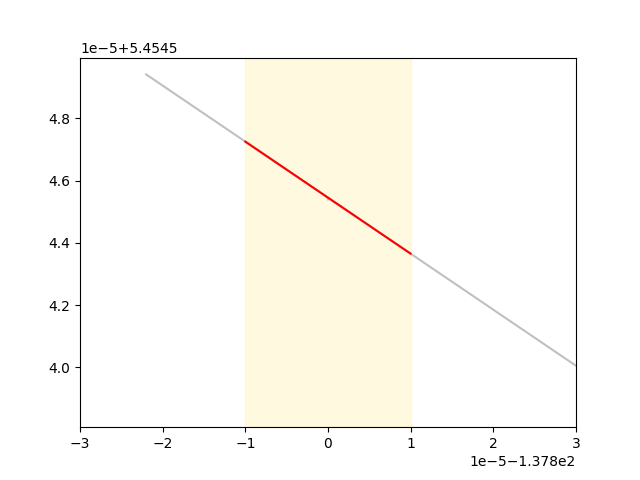

## Equation 3:
```
hyperpolarising_activated_current_y_gate__beta_y = 0.10000000000000001 * (76.299999999999997 + membrane__E) / (1.0 - exp(-16.023 - 0.20999999999999999 * membrane__E))
```
## New Eq:
```
hyperpolarising_activated_current_y_gate__beta_y = ((fabs(76.299999999999997 + membrane__E) < 9.9999999999544897e-6) ? (-9.9999999999544906e-7 / (1.0 - exp(2.0999999999904427e-6)) + 50000.000000227548 * (76.30001 + membrane__E) * (9.9999999999544906e-7 / (1.0 - exp(2.0999999999904427e-6)) + 9.9999999999544906e-7 / (1.0 - exp(-2.0999999999904427e-6)))) : (0.10000000000000001 * (76.299999999999997 + membrane__E) / (1.0 - exp(-16.023 - 0.20999999999999999 * membrane__E))))
```
## Singularity point: -76.299999999999997


# of singularities:  3
# Model: earm_noble_model_1990(earm_noble_model_1990.cellml)
No of piecewises: 4
## Equation 1:
```
L_type_calcium_current__i_Ca_L_Ca = 4.0 * (-50.0 + membrane__V) * (intracellular_calcium_concentration__Ca_i * exp(100.0 / membrane__RTONF) - extracellular_calcium_concentration__Ca_o * exp(2.0 * (50.0 - membrane__V) / membrane__RTONF)) * L_type_calcium_current__P_Ca_L * L_type_calcium_current_d_gate__d * L_type_calcium_current_f_Ca_gate__CaChon / ((1.0 - exp(2.0 * (50.0 - membrane__V) / membrane__RTONF)) * membrane__RTONF)
```
## New Eq:
```
L_type_calcium_current__i_Ca_L_Ca = ((fabs(-50.0 + membrane__V) < 1.0000000000010001e-5) ? (49999.999999949992 * (-49.999989999999997 + membrane__V) * (1.4973556329113164e-6 * (1.0 - L_type_calcium_current_f_Ca_gate__f_Ca) * (1.0 - intracellular_calcium_concentration__Ca_i / (0.001 + intracellular_calcium_concentration__Ca_i)) * (intracellular_calcium_concentration__Ca_i * exp(3.7433890822745473) - extracellular_calcium_concentration__Ca_o * exp(7.4867781645565822e-7)) * L_type_calcium_current__P_Ca_L * L_type_calcium_current_d_gate__d / (1.0 - exp(7.4867781645565822e-7)) + 1.4973556329113164e-6 * (1.0 - L_type_calcium_current_f_Ca_gate__f_Ca) * (1.0 - intracellular_calcium_concentration__Ca_i / (0.001 + intracellular_calcium_concentration__Ca_i)) * (intracellular_calcium_concentration__Ca_i * exp(3.7433890822745473) - extracellular_calcium_concentration__Ca_o * exp(-7.4867781645565822e-7)) * L_type_calcium_current__P_Ca_L * L_type_calcium_current_d_gate__d / (1.0 - exp(-7.4867781645565822e-7))) - 1.4973556329113164e-6 * (1.0 - L_type_calcium_current_f_Ca_gate__f_Ca) * (1.0 - intracellular_calcium_concentration__Ca_i / (0.001 + intracellular_calcium_concentration__Ca_i)) * (intracellular_calcium_concentration__Ca_i * exp(3.7433890822745473) - extracellular_calcium_concentration__Ca_o * exp(7.4867781645565822e-7)) * L_type_calcium_current__P_Ca_L * L_type_calcium_current_d_gate__d / (1.0 - exp(7.4867781645565822e-7))) : (0.14973556329098189 * (1.0 - L_type_calcium_current_f_Ca_gate__f_Ca) * (1.0 - intracellular_calcium_concentration__Ca_i / (0.001 + intracellular_calcium_concentration__Ca_i)) * (-50.0 + membrane__V) * (intracellular_calcium_concentration__Ca_i * exp(3.7433890822745473) - extracellular_calcium_concentration__Ca_o * exp(3.7433890822745473 - 0.074867781645490947 * membrane__V)) * L_type_calcium_current__P_Ca_L * L_type_calcium_current_d_gate__d / (1.0 - exp(3.7433890822745473 - 0.074867781645490947 * membrane__V))))
```
## Singularity point: 50.000000000000000


## Equation 2:
```
L_type_calcium_current__i_Ca_L_K = 0.002 * (-50.0 + membrane__V) * (intracellular_potassium_concentration__K_i * exp(50.0 / membrane__RTONF) - extracellular_potassium_concentration__K_c * exp((50.0 - membrane__V) / membrane__RTONF)) * L_type_calcium_current__P_Ca_L * L_type_calcium_current_d_gate__d * L_type_calcium_current_f_Ca_gate__CaChon / ((1.0 - exp((50.0 - membrane__V) / membrane__RTONF)) * membrane__RTONF)
```
## New Eq:
```
L_type_calcium_current__i_Ca_L_K = ((fabs(-50.0 + membrane__V) < 1.0000000000010001e-5) ? (49999.999999949992 * (-49.999989999999997 + membrane__V) * (7.486778164556582e-10 * (1.0 - L_type_calcium_current_f_Ca_gate__f_Ca) * (1.0 - intracellular_calcium_concentration__Ca_i / (0.001 + intracellular_calcium_concentration__Ca_i)) * (intracellular_potassium_concentration__K_i * exp(1.8716945411372736) - extracellular_potassium_concentration__K_c * exp(3.7433890822782911e-7)) * L_type_calcium_current__P_Ca_L * L_type_calcium_current_d_gate__d / (1.0 - exp(3.7433890822782911e-7)) + 7.486778164556582e-10 * (1.0 - L_type_calcium_current_f_Ca_gate__f_Ca) * (1.0 - intracellular_calcium_concentration__Ca_i / (0.001 + intracellular_calcium_concentration__Ca_i)) * (intracellular_potassium_concentration__K_i * exp(1.8716945411372736) - extracellular_potassium_concentration__K_c * exp(-3.7433890822782911e-7)) * L_type_calcium_current__P_Ca_L * L_type_calcium_current_d_gate__d / (1.0 - exp(-3.7433890822782911e-7))) - 7.486778164556582e-10 * (1.0 - L_type_calcium_current_f_Ca_gate__f_Ca) * (1.0 - intracellular_calcium_concentration__Ca_i / (0.001 + intracellular_calcium_concentration__Ca_i)) * (intracellular_potassium_concentration__K_i * exp(1.8716945411372736) - extracellular_potassium_concentration__K_c * exp(3.7433890822782911e-7)) * L_type_calcium_current__P_Ca_L * L_type_calcium_current_d_gate__d / (1.0 - exp(3.7433890822782911e-7))) : (7.4867781645490941e-5 * (1.0 - L_type_calcium_current_f_Ca_gate__f_Ca) * (1.0 - intracellular_calcium_concentration__Ca_i / (0.001 + intracellular_calcium_concentration__Ca_i)) * (-50.0 + membrane__V) * (intracellular_potassium_concentration__K_i * exp(1.8716945411372736) - extracellular_potassium_concentration__K_c * exp(1.8716945411372736 - 0.037433890822745473 * membrane__V)) * L_type_calcium_current__P_Ca_L * L_type_calcium_current_d_gate__d / (1.0 - exp(1.8716945411372736 - 0.037433890822745473 * membrane__V))))
```
## Singularity point: 50.000000000000000


## Equation 3:
```
L_type_calcium_current__i_Ca_L_Na = 0.01 * (-50.0 + membrane__V) * (intracellular_sodium_concentration__Na_i * exp(50.0 / membrane__RTONF) - extracellular_sodium_concentration__Na_o * exp((50.0 - membrane__V) / membrane__RTONF)) * L_type_calcium_current__P_Ca_L * L_type_calcium_current_d_gate__d * L_type_calcium_current_f_Ca_gate__CaChon / ((1.0 - exp((50.0 - membrane__V) / membrane__RTONF)) * membrane__RTONF)
```
## New Eq:
```
L_type_calcium_current__i_Ca_L_Na = ((fabs(-50.0 + membrane__V) < 1.0000000000010001e-5) ? (49999.999999949992 * (-49.999989999999997 + membrane__V) * (3.7433890822782906e-9 * (1.0 - L_type_calcium_current_f_Ca_gate__f_Ca) * (1.0 - intracellular_calcium_concentration__Ca_i / (0.001 + intracellular_calcium_concentration__Ca_i)) * (intracellular_sodium_concentration__Na_i * exp(1.8716945411372736) - extracellular_sodium_concentration__Na_o * exp(3.7433890822782911e-7)) * L_type_calcium_current__P_Ca_L * L_type_calcium_current_d_gate__d / (1.0 - exp(3.7433890822782911e-7)) + 3.7433890822782906e-9 * (1.0 - L_type_calcium_current_f_Ca_gate__f_Ca) * (1.0 - intracellular_calcium_concentration__Ca_i / (0.001 + intracellular_calcium_concentration__Ca_i)) * (intracellular_sodium_concentration__Na_i * exp(1.8716945411372736) - extracellular_sodium_concentration__Na_o * exp(-3.7433890822782911e-7)) * L_type_calcium_current__P_Ca_L * L_type_calcium_current_d_gate__d / (1.0 - exp(-3.7433890822782911e-7))) - 3.7433890822782906e-9 * (1.0 - L_type_calcium_current_f_Ca_gate__f_Ca) * (1.0 - intracellular_calcium_concentration__Ca_i / (0.001 + intracellular_calcium_concentration__Ca_i)) * (intracellular_sodium_concentration__Na_i * exp(1.8716945411372736) - extracellular_sodium_concentration__Na_o * exp(3.7433890822782911e-7)) * L_type_calcium_current__P_Ca_L * L_type_calcium_current_d_gate__d / (1.0 - exp(3.7433890822782911e-7))) : (0.00037433890822745472 * (1.0 - L_type_calcium_current_f_Ca_gate__f_Ca) * (1.0 - intracellular_calcium_concentration__Ca_i / (0.001 + intracellular_calcium_concentration__Ca_i)) * (-50.0 + membrane__V) * (intracellular_sodium_concentration__Na_i * exp(1.8716945411372736) - extracellular_sodium_concentration__Na_o * exp(1.8716945411372736 - 0.037433890822745473 * membrane__V)) * L_type_calcium_current__P_Ca_L * L_type_calcium_current_d_gate__d / (1.0 - exp(1.8716945411372736 - 0.037433890822745473 * membrane__V))))
```
## Singularity point: 50.000000000000000


# of singularities:  3
# Model: espinosa_model_1998(espinosa_model_1998_normal.cellml)
No of piecewises: 1
## Equation 1:
```
L_type_Ca_channel__i_Ca_L_Ca_ds = 4.0 * (-50.0 + membrane__V) * (intracellular_calcium_concentration__Ca_i * exp(100.0 * membrane__F / (membrane__R * membrane__T)) - extracellular_calcium_concentration__Ca_o * exp(2.0 * (50.0 - membrane__V) * membrane__F / (membrane__R * membrane__T))) * L_type_Ca_channel__FrICa * L_type_Ca_channel__P_Ca_L * L_type_Ca_channel_d_gate__d * L_type_Ca_channel_f2ds_gate__f2ds * L_type_Ca_channel_f_gate__f * membrane__F / ((1.0 - exp(2.0 * (50.0 - membrane__V) * membrane__F / (membrane__R * membrane__T))) * membrane__R * membrane__T)
```
## New Eq:
```
L_type_Ca_channel__i_Ca_L_Ca_ds = ((fabs(-50.0 + membrane__V) < 1.0000000000010001e-5) ? (49999.999999949992 * (-49.999989999999997 + membrane__V) * (1.4973556329113164e-6 * (intracellular_calcium_concentration__Ca_i * exp(3.7433890822745473) - extracellular_calcium_concentration__Ca_o * exp(7.4867781645565822e-7)) * L_type_Ca_channel__P_Ca_L * L_type_Ca_channel_d_gate__d * L_type_Ca_channel_f2ds_gate__f2ds * L_type_Ca_channel_f_gate__f / (1.0 - exp(7.4867781645565822e-7)) + 1.4973556329113164e-6 * (intracellular_calcium_concentration__Ca_i * exp(3.7433890822745473) - extracellular_calcium_concentration__Ca_o * exp(-7.4867781645565822e-7)) * L_type_Ca_channel__P_Ca_L * L_type_Ca_channel_d_gate__d * L_type_Ca_channel_f2ds_gate__f2ds * L_type_Ca_channel_f_gate__f / (1.0 - exp(-7.4867781645565822e-7))) - 1.4973556329113164e-6 * (intracellular_calcium_concentration__Ca_i * exp(3.7433890822745473) - extracellular_calcium_concentration__Ca_o * exp(7.4867781645565822e-7)) * L_type_Ca_channel__P_Ca_L * L_type_Ca_channel_d_gate__d * L_type_Ca_channel_f2ds_gate__f2ds * L_type_Ca_channel_f_gate__f / (1.0 - exp(7.4867781645565822e-7))) : (0.14973556329098189 * (-50.0 + membrane__V) * (intracellular_calcium_concentration__Ca_i * exp(3.7433890822745473) - extracellular_calcium_concentration__Ca_o * exp(3.7433890822745473 - 0.074867781645490947 * membrane__V)) * L_type_Ca_channel__P_Ca_L * L_type_Ca_channel_d_gate__d * L_type_Ca_channel_f2ds_gate__f2ds * L_type_Ca_channel_f_gate__f / (1.0 - exp(3.7433890822745473 - 0.074867781645490947 * membrane__V))))
```
## Singularity point: 50.000000000000000


## Equation 2:
```
L_type_Ca_channel__i_Ca_L_K_ds = (-50.0 + membrane__V) * (intracellular_potassium_concentration__K_i * exp(50.0 * membrane__F / (membrane__R * membrane__T)) - extracellular_potassium_concentration__K_o * exp((50.0 - membrane__V) * membrane__F / (membrane__R * membrane__T))) * L_type_Ca_channel__FrICa * L_type_Ca_channel__P_CaK * L_type_Ca_channel__P_Ca_L * L_type_Ca_channel_d_gate__d * L_type_Ca_channel_f2ds_gate__f2ds * L_type_Ca_channel_f_gate__f * membrane__F / ((1.0 - exp((50.0 - membrane__V) * membrane__F / (membrane__R * membrane__T))) * membrane__R * membrane__T)
```
## New Eq:
```
L_type_Ca_channel__i_Ca_L_K_ds = ((fabs(-50.0 + membrane__V) < 1.0000000000010001e-5) ? (49999.999999949992 * (-49.999989999999997 + membrane__V) * (1.1230167246834873e-9 * (intracellular_potassium_concentration__K_i * exp(1.8716945411372736) - extracellular_potassium_concentration__K_o * exp(3.7433890822782911e-7)) * L_type_Ca_channel__P_Ca_L * L_type_Ca_channel_d_gate__d * L_type_Ca_channel_f2ds_gate__f2ds * L_type_Ca_channel_f_gate__f / (1.0 - exp(3.7433890822782911e-7)) + 1.1230167246834873e-9 * (intracellular_potassium_concentration__K_i * exp(1.8716945411372736) - extracellular_potassium_concentration__K_o * exp(-3.7433890822782911e-7)) * L_type_Ca_channel__P_Ca_L * L_type_Ca_channel_d_gate__d * L_type_Ca_channel_f2ds_gate__f2ds * L_type_Ca_channel_f_gate__f / (1.0 - exp(-3.7433890822782911e-7))) - 1.1230167246834873e-9 * (intracellular_potassium_concentration__K_i * exp(1.8716945411372736) - extracellular_potassium_concentration__K_o * exp(3.7433890822782911e-7)) * L_type_Ca_channel__P_Ca_L * L_type_Ca_channel_d_gate__d * L_type_Ca_channel_f2ds_gate__f2ds * L_type_Ca_channel_f_gate__f / (1.0 - exp(3.7433890822782911e-7))) : (0.00011230167246823642 * (-50.0 + membrane__V) * (intracellular_potassium_concentration__K_i * exp(1.8716945411372736) - extracellular_potassium_concentration__K_o * exp(1.8716945411372736 - 0.037433890822745473 * membrane__V)) * L_type_Ca_channel__P_Ca_L * L_type_Ca_channel_d_gate__d * L_type_Ca_channel_f2ds_gate__f2ds * L_type_Ca_channel_f_gate__f / (1.0 - exp(1.8716945411372736 - 0.037433890822745473 * membrane__V))))
```
## Singularity point: 50.000000000000000
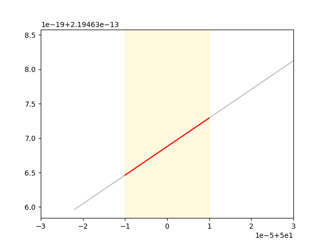

## Equation 3:
```
L_type_Ca_channel__i_Ca_L_Na_ds = (-50.0 + membrane__V) * (intracellular_sodium_concentration__Na_i * exp(50.0 * membrane__F / (membrane__R * membrane__T)) - extracellular_sodium_concentration__Na_o * exp((50.0 - membrane__V) * membrane__F / (membrane__R * membrane__T))) * L_type_Ca_channel__FrICa * L_type_Ca_channel__P_CaNa * L_type_Ca_channel__P_Ca_L * L_type_Ca_channel_d_gate__d * L_type_Ca_channel_f2ds_gate__f2ds * L_type_Ca_channel_f_gate__f * membrane__F / ((1.0 - exp((50.0 - membrane__V) * membrane__F / (membrane__R * membrane__T))) * membrane__R * membrane__T)
```
## New Eq:
```
L_type_Ca_channel__i_Ca_L_Na_ds = ((fabs(-50.0 + membrane__V) < 1.0000000000010001e-5) ? (49999.999999949992 * (-49.999989999999997 + membrane__V) * (3.7433890822782906e-9 * (intracellular_sodium_concentration__Na_i * exp(1.8716945411372736) - extracellular_sodium_concentration__Na_o * exp(3.7433890822782911e-7)) * L_type_Ca_channel__P_Ca_L * L_type_Ca_channel_d_gate__d * L_type_Ca_channel_f2ds_gate__f2ds * L_type_Ca_channel_f_gate__f / (1.0 - exp(3.7433890822782911e-7)) + 3.7433890822782906e-9 * (intracellular_sodium_concentration__Na_i * exp(1.8716945411372736) - extracellular_sodium_concentration__Na_o * exp(-3.7433890822782911e-7)) * L_type_Ca_channel__P_Ca_L * L_type_Ca_channel_d_gate__d * L_type_Ca_channel_f2ds_gate__f2ds * L_type_Ca_channel_f_gate__f / (1.0 - exp(-3.7433890822782911e-7))) - 3.7433890822782906e-9 * (intracellular_sodium_concentration__Na_i * exp(1.8716945411372736) - extracellular_sodium_concentration__Na_o * exp(3.7433890822782911e-7)) * L_type_Ca_channel__P_Ca_L * L_type_Ca_channel_d_gate__d * L_type_Ca_channel_f2ds_gate__f2ds * L_type_Ca_channel_f_gate__f / (1.0 - exp(3.7433890822782911e-7))) : (0.00037433890822745472 * (-50.0 + membrane__V) * (intracellular_sodium_concentration__Na_i * exp(1.8716945411372736) - extracellular_sodium_concentration__Na_o * exp(1.8716945411372736 - 0.037433890822745473 * membrane__V)) * L_type_Ca_channel__P_Ca_L * L_type_Ca_channel_d_gate__d * L_type_Ca_channel_f2ds_gate__f2ds * L_type_Ca_channel_f_gate__f / (1.0 - exp(1.8716945411372736 - 0.037433890822745473 * membrane__V))))
```
## Singularity point: 50.000000000000000
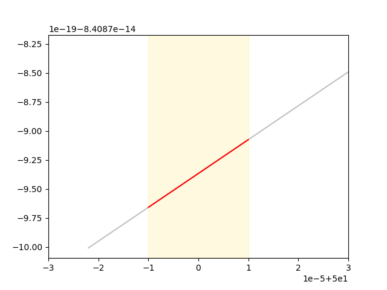

## Equation 4:
```
L_type_Ca_channel_d_gate__alpha_d = 30.0 * (4.0 + membrane__V) / (1.0 - exp(-1.3333333333333333 - 0.33333333333333331 * membrane__V))
```
## New Eq:
```
L_type_Ca_channel_d_gate__alpha_d = ((fabs(4.0 + membrane__V) < 1.0000000000001327e-5) ? (-0.00030000000000030003 / (1.0 - exp(3.3333333333366668e-6)) + 49999.999999993364 * (4.0000099999999996 + membrane__V) * (0.00030000000000030003 / (1.0 - exp(3.3333333333366668e-6)) + 0.00030000000000030003 / (1.0 - exp(-3.3333333333366668e-6)))) : (30.0 * (4.0 + membrane__V) / (1.0 - exp(-1.3333333333333333 - 0.33333333333333331 * membrane__V))))
```
## Singularity point: -4.0000000000000000
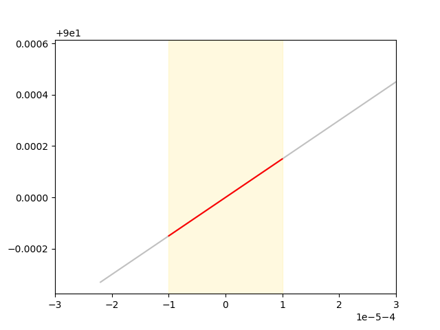

## Equation 5:
```
L_type_Ca_channel_d_gate__beta_d = 12.0 * (4.0 + membrane__V) / (-1.0 + exp(0.53333333333333333 + 0.13333333333333333 * membrane__V))
```
## New Eq:
```
L_type_Ca_channel_d_gate__beta_d = ((fabs(4.0 + membrane__V) < 1.0000000000001327e-5) ? (-0.00012000000000012001 / (-1.0 + exp(-1.3333333333346669e-6)) + 49999.999999993364 * (4.0000099999999996 + membrane__V) * (0.00012000000000012001 / (-1.0 + exp(1.3333333333346669e-6)) + 0.00012000000000012001 / (-1.0 + exp(-1.3333333333346669e-6)))) : (12.0 * (4.0 + membrane__V) / (-1.0 + exp(0.53333333333333333 + 0.13333333333333333 * membrane__V))))
```
## Singularity point: -4.0000000000000000
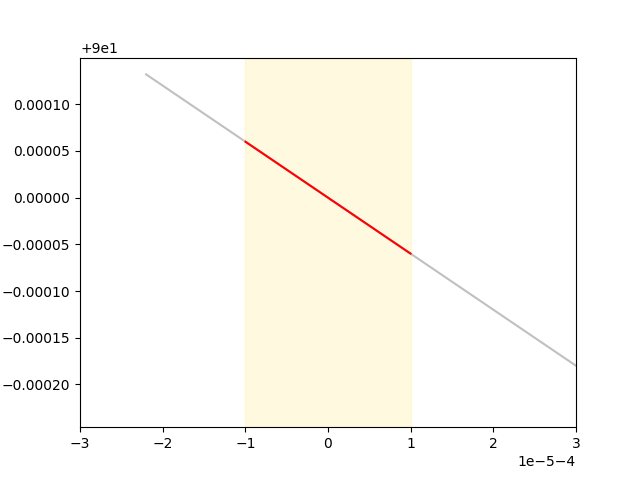

## Equation 6:
```
L_type_Ca_channel_f_gate__alpha_f = 6.25 * (24.0 + membrane__V) / (-1.0 + exp(4.3636363636363633 + 0.18181818181818182 * membrane__V))
```
## New Eq:
```
L_type_Ca_channel_f_gate__alpha_f = ((fabs(24.0 + membrane__V) < 1.0000000000010001e-5) ? (-6.2500000000062506e-5 / (-1.0 + exp(-1.8181818181836364e-6)) + 49999.999999949992 * (24.00001 + membrane__V) * (6.2500000000062506e-5 / (-1.0 + exp(1.8181818181836364e-6)) + 6.2500000000062506e-5 / (-1.0 + exp(-1.8181818181836364e-6)))) : (6.25 * (24.0 + membrane__V) / (-1.0 + exp(4.3636363636363633 + 0.18181818181818182 * membrane__V))))
```
## Singularity point: -24.000000000000000
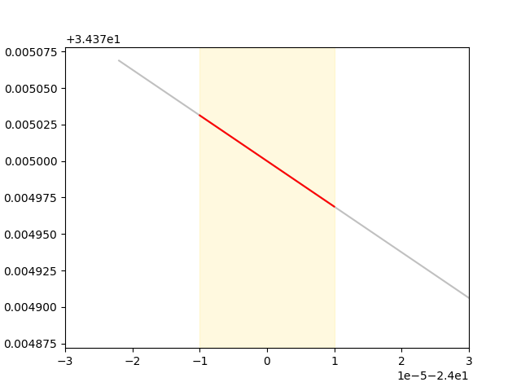

## Equation 7:
```
fast_sodium_current_m_gate__alpha_m = 200.0 * (41.0 + membrane__V) / (1.0 - exp(-4.1000000000000005 - 0.10000000000000001 * membrane__V))
```
## New Eq:
```
fast_sodium_current_m_gate__alpha_m = ((fabs(41.0 + membrane__V) < 1.0000000000010001e-5) ? (-0.0020000000000020002 / (1.0 - exp(1.0000000000010001e-6)) + 49999.999999949992 * (41.000010000000003 + membrane__V) * (0.0020000000000020002 / (1.0 - exp(1.0000000000010001e-6)) + 0.0020000000000020002 / (1.0 - exp(-1.0000000000010001e-6)))) : (200.0 * (41.0 + membrane__V) / (1.0 - exp(-4.1000000000000005 - 0.10000000000000001 * membrane__V))))
```
## Singularity point: -41.000000000000000


## Equation 8:
```
time_dependent_potassium_current_x_gate__alpha_x = 1.5 * (-18.0 + membrane__V) / (1.0 - exp(3.6000000000000001 - 0.20000000000000001 * membrane__V))
```
## New Eq:
```
time_dependent_potassium_current_x_gate__alpha_x = ((fabs(-18.0 + membrane__V) < 1.0000000000010001e-5) ? (-1.5000000000015001e-5 / (1.0 - exp(2.0000000000020002e-6)) + 49999.999999949992 * (-17.99999 + membrane__V) * (1.5000000000015001e-5 / (1.0 - exp(2.0000000000020002e-6)) + 1.5000000000015001e-5 / (1.0 - exp(-2.0000000000020002e-6)))) : (1.5 * (-18.0 + membrane__V) / (1.0 - exp(3.6000000000000001 - 0.20000000000000001 * membrane__V))))
```
## Singularity point: 18.000000000000000
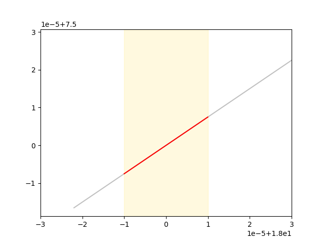

## Equation 9:
```
time_dependent_potassium_current_x_gate__beta_x = 0.53400000000000003 * (-18.0 + membrane__V) / (-1.0 + exp(-1.2 + 0.066666666666666666 * membrane__V))
```
## New Eq:
```
time_dependent_potassium_current_x_gate__beta_x = ((fabs(-18.0 + membrane__V) < 1.0000000000010001e-5) ? (-5.3400000000053402e-6 / (-1.0 + exp(-6.6666666666733343e-7)) + 49999.999999949992 * (-17.99999 + membrane__V) * (5.3400000000053402e-6 / (-1.0 + exp(6.6666666666733343e-7)) + 5.3400000000053402e-6 / (-1.0 + exp(-6.6666666666733343e-7)))) : (0.53400000000000003 * (-18.0 + membrane__V) / (-1.0 + exp(-1.2 + 0.066666666666666666 * membrane__V))))
```
## Singularity point: 18.000000000000000


# of singularities:  9
# Model: faber_rudy_2000(faber_rudy_2000.cellml)
No of piecewises: 13
## Equation 1:
```
L_type_Ca_channel__I_CaCa = 4.0 * pow(cell__F, 2) * (-L_type_Ca_channel__gamma_Cao * calcium_dynamics__Cao + L_type_Ca_channel__gamma_Cai * calcium_dynamics__Cai * exp(2.0 * cell__F * cell__V / (cell__R * cell__T))) * L_type_Ca_channel__P_Ca * cell__V / ((-1.0 + exp(2.0 * cell__F * cell__V / (cell__R * cell__T))) * cell__R * cell__T)
```
## New Eq:
```
L_type_Ca_channel__I_CaCa = ((fabs(cell__V) < 1.0000000000000001e-5) ? (49999.999999999993 * (1.0000000000000001e-5 + cell__V) * (0.14448004881001345 * (-0.34100000000000003 * calcium_dynamics__Cao + calcium_dynamics__Cai * exp(7.4871767015605244e-7)) * L_type_Ca_channel__P_Ca / (-1.0 + exp(7.4871767015605244e-7)) + 0.14448004881001345 * (-0.34100000000000003 * calcium_dynamics__Cao + calcium_dynamics__Cai * exp(-7.4871767015605244e-7)) * L_type_Ca_channel__P_Ca / (-1.0 + exp(-7.4871767015605244e-7))) - 0.14448004881001345 * (-0.34100000000000003 * calcium_dynamics__Cao + calcium_dynamics__Cai * exp(-7.4871767015605244e-7)) * L_type_Ca_channel__P_Ca / (-1.0 + exp(-7.4871767015605244e-7))) : (14448.004881001343 * (-0.34100000000000003 * calcium_dynamics__Cao + calcium_dynamics__Cai * exp(0.074871767015605231 * cell__V)) * L_type_Ca_channel__P_Ca * cell__V / (-1.0 + exp(0.074871767015605231 * cell__V))))
```
## Singularity point: 0
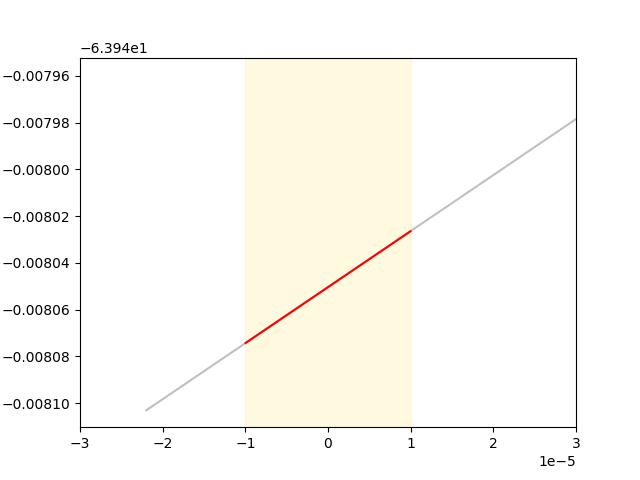

## Equation 2:
```
L_type_Ca_channel_d_gate__tau_d = 28.571428571428569 * (1.0 - exp(-1.6025641025641024 - 0.16025641025641024 * cell__V)) * L_type_Ca_channel_d_gate__d_infinity / (10.0 + cell__V)
```
## New Eq:
```
L_type_Ca_channel_d_gate__tau_d = ((fabs(10.0 + cell__V) < 9.9999999999961231e-6) ? (50000.000000019383 * (10.00001 + cell__V) * (2857142.8571439646 * (1.0 - exp(1.6025641025634812e-6)) / (1.0 + exp(1.6025641025634812e-6)) + 2857142.8571439646 * (1.0 - exp(-1.6025641025634812e-6)) / (1.0 + exp(-1.6025641025634812e-6))) - 2857142.8571439646 * (1.0 - exp(1.6025641025634812e-6)) / (1.0 + exp(1.6025641025634812e-6))) : (28.571428571428569 * (1.0 - exp(-1.6025641025641024 - 0.16025641025641024 * cell__V)) / ((1.0 + exp(-1.6025641025641024 - 0.16025641025641024 * cell__V)) * (10.0 + cell__V))))
```
## Singularity point: -10.000000000000000


## Equation 3:
```
fast_sodium_current_m_gate__alpha_m = 0.32000000000000001 * (47.130000000000003 + cell__V) / (1.0 - exp(-4.7130000000000001 - 0.10000000000000001 * cell__V))
```
## New Eq:
```
fast_sodium_current_m_gate__alpha_m = ((fabs(47.130000000000003 + cell__V) < 1.0000000000010001e-5) ? (-3.2000000000032004e-6 / (1.0 - exp(1.0000000000010001e-6)) + 49999.999999949992 * (47.130010000000006 + cell__V) * (3.2000000000032004e-6 / (1.0 - exp(1.0000000000010001e-6)) + 3.2000000000032004e-6 / (1.0 - exp(-1.0000000000010001e-6)))) : (0.32000000000000001 * (47.130000000000003 + cell__V) / (1.0 - exp(-4.7130000000000001 - 0.10000000000000001 * cell__V))))
```
## Singularity point: -47.130000000000003


## Equation 4:
```
L_type_Ca_channel__I_CaK = pow(cell__F, 2) * (-L_type_Ca_channel__gamma_Ko * ionic_concentrations__Ko + L_type_Ca_channel__gamma_Ki * ionic_concentrations__Ki * exp(cell__F * cell__V / (cell__R * cell__T))) * L_type_Ca_channel__P_K * cell__V / ((-1.0 + exp(cell__F * cell__V / (cell__R * cell__T))) * cell__R * cell__T)
```
## New Eq:
```
L_type_Ca_channel__I_CaK = ((fabs(cell__V) < 1.0000000000000001e-5) ? (49999.999999999993 * (1.0000000000000001e-5 + cell__V) * (6.9711623550831478e-9 * (-0.75 * ionic_concentrations__Ko + 0.75 * ionic_concentrations__Ki * exp(3.7435883507802622e-7)) / (-1.0 + exp(3.7435883507802622e-7)) + 6.9711623550831478e-9 * (-0.75 * ionic_concentrations__Ko + 0.75 * ionic_concentrations__Ki * exp(-3.7435883507802622e-7)) / (-1.0 + exp(-3.7435883507802622e-7))) - 6.9711623550831478e-9 * (-0.75 * ionic_concentrations__Ko + 0.75 * ionic_concentrations__Ki * exp(-3.7435883507802622e-7)) / (-1.0 + exp(-3.7435883507802622e-7))) : (0.00069711623550831479 * (-0.75 * ionic_concentrations__Ko + 0.75 * ionic_concentrations__Ki * exp(0.037435883507802616 * cell__V)) * cell__V / (-1.0 + exp(0.037435883507802616 * cell__V))))
```
## Singularity point: 0


## Equation 5:
```
L_type_Ca_channel__I_CaNa = pow(cell__F, 2) * (-L_type_Ca_channel__gamma_Nao * ionic_concentrations__Nao + L_type_Ca_channel__gamma_Nai * ionic_concentrations__Nai * exp(cell__F * cell__V / (cell__R * cell__T))) * L_type_Ca_channel__P_Na * cell__V / ((-1.0 + exp(cell__F * cell__V / (cell__R * cell__T))) * cell__R * cell__T)
```
## New Eq:
```
L_type_Ca_channel__I_CaNa = ((fabs(cell__V) < 1.0000000000000001e-5) ? (49999.999999999993 * (1.0000000000000001e-5 + cell__V) * (2.4381008236689766e-8 * (-0.75 * ionic_concentrations__Nao + 0.75 * ionic_concentrations__Nai * exp(3.7435883507802622e-7)) / (-1.0 + exp(3.7435883507802622e-7)) + 2.4381008236689766e-8 * (-0.75 * ionic_concentrations__Nao + 0.75 * ionic_concentrations__Nai * exp(-3.7435883507802622e-7)) / (-1.0 + exp(-3.7435883507802622e-7))) - 2.4381008236689766e-8 * (-0.75 * ionic_concentrations__Nao + 0.75 * ionic_concentrations__Nai * exp(-3.7435883507802622e-7)) / (-1.0 + exp(-3.7435883507802622e-7))) : (0.0024381008236689767 * (-0.75 * ionic_concentrations__Nao + 0.75 * ionic_concentrations__Nai * exp(0.037435883507802616 * cell__V)) * cell__V / (-1.0 + exp(0.037435883507802616 * cell__V))))
```
## Singularity point: 0


## Equation 6:
```
non_specific_calcium_activated_current__I_ns_K = pow(cell__F, 2) * (-L_type_Ca_channel__gamma_Ko * ionic_concentrations__Ko + L_type_Ca_channel__gamma_Ki * ionic_concentrations__Ki * exp(cell__F * cell__V / (cell__R * cell__T))) * cell__V * non_specific_calcium_activated_current__P_ns_Ca / ((-1.0 + exp(cell__F * cell__V / (cell__R * cell__T))) * cell__R * cell__T)
```
## New Eq:
```
non_specific_calcium_activated_current__I_ns_K = ((fabs(cell__V) < 1.0000000000000001e-5) ? (49999.999999999993 * (1.0000000000000001e-5 + cell__V) * (6.3210021354380874e-9 * (-0.75 * ionic_concentrations__Ko + 0.75 * ionic_concentrations__Ki * exp(3.7435883507802622e-7)) / (-1.0 + exp(3.7435883507802622e-7)) + 6.3210021354380874e-9 * (-0.75 * ionic_concentrations__Ko + 0.75 * ionic_concentrations__Ki * exp(-3.7435883507802622e-7)) / (-1.0 + exp(-3.7435883507802622e-7))) - 6.3210021354380874e-9 * (-0.75 * ionic_concentrations__Ko + 0.75 * ionic_concentrations__Ki * exp(-3.7435883507802622e-7)) / (-1.0 + exp(-3.7435883507802622e-7))) : (0.00063210021354380874 * (-0.75 * ionic_concentrations__Ko + 0.75 * ionic_concentrations__Ki * exp(0.037435883507802616 * cell__V)) * cell__V / (-1.0 + exp(0.037435883507802616 * cell__V))))
```
## Singularity point: 0


## Equation 7:
```
non_specific_calcium_activated_current__I_ns_Na = pow(cell__F, 2) * (-L_type_Ca_channel__gamma_Nao * ionic_concentrations__Nao + L_type_Ca_channel__gamma_Nai * ionic_concentrations__Nai * exp(cell__F * cell__V / (cell__R * cell__T))) * cell__V * non_specific_calcium_activated_current__P_ns_Ca / ((-1.0 + exp(cell__F * cell__V / (cell__R * cell__T))) * cell__R * cell__T)
```
## New Eq:
```
non_specific_calcium_activated_current__I_ns_Na = ((fabs(cell__V) < 1.0000000000000001e-5) ? (49999.999999999993 * (1.0000000000000001e-5 + cell__V) * (6.3210021354380874e-9 * (-0.75 * ionic_concentrations__Nao + 0.75 * ionic_concentrations__Nai * exp(3.7435883507802622e-7)) / (-1.0 + exp(3.7435883507802622e-7)) + 6.3210021354380874e-9 * (-0.75 * ionic_concentrations__Nao + 0.75 * ionic_concentrations__Nai * exp(-3.7435883507802622e-7)) / (-1.0 + exp(-3.7435883507802622e-7))) - 6.3210021354380874e-9 * (-0.75 * ionic_concentrations__Nao + 0.75 * ionic_concentrations__Nai * exp(-3.7435883507802622e-7)) / (-1.0 + exp(-3.7435883507802622e-7))) : (0.00063210021354380874 * (-0.75 * ionic_concentrations__Nao + 0.75 * ionic_concentrations__Nai * exp(0.037435883507802616 * cell__V)) * cell__V / (-1.0 + exp(0.037435883507802616 * cell__V))))
```
## Singularity point: 0


## Equation 8:
```
rapid_delayed_rectifier_potassium_current_xr_gate__tau_xr = 1 / (0.00060999999999999997 * (38.899999999999999 + cell__V) / (-1.0 + exp(5.6404999999999994 + 0.14499999999999999 * cell__V)) + 0.0013799999999999999 * (14.199999999999999 + cell__V) / (1.0 - exp(-1.7465999999999999 - 0.123 * cell__V)))
```
## New Eq:
```
rapid_delayed_rectifier_potassium_current_xr_gate__tau_xr = 1 / (((fabs(38.899999999999999 + cell__V) < 1.0000000000010001e-5) ? (-6.1000000000061005e-9 / (-1.0 + exp(-1.45000000000145e-6)) + 49999.999999949992 * (38.900010000000002 + cell__V) * (6.1000000000061005e-9 / (-1.0 + exp(1.45000000000145e-6)) + 6.1000000000061005e-9 / (-1.0 + exp(-1.45000000000145e-6)))) : (0.00060999999999999997 * (38.899999999999999 + cell__V) / (-1.0 + exp(5.6404999999999994 + 0.14499999999999999 * cell__V)))) + ((fabs(14.199999999999999 + cell__V) < 9.9999999999961231e-6) ? (-1.3799999999994649e-8 / (1.0 - exp(1.2299999999995232e-6)) + 50000.000000019383 * (14.200009999999999 + cell__V) * (1.3799999999994649e-8 / (1.0 - exp(1.2299999999995232e-6)) + 1.3799999999994649e-8 / (1.0 - exp(-1.2299999999995232e-6)))) : (0.0013799999999999999 * (14.199999999999999 + cell__V) / (1.0 - exp(-1.7465999999999999 - 0.123 * cell__V)))))
```
## Singularity point: -14.199999999999999

## Singularity point: -38.899999999999999


## Equation 9:
```
slow_delayed_rectifier_potassium_current_xs1_gate__tau_xs1 = 1 / (0.00013100000000000001 * (30.0 + cell__V) / (-1.0 + exp(2.0609999999999999 + 0.068699999999999997 * cell__V)) + 7.1899999999999999e-5 * (30.0 + cell__V) / (1.0 - exp(-4.4399999999999995 - 0.14799999999999999 * cell__V)))
```
## New Eq:
```
slow_delayed_rectifier_potassium_current_xs1_gate__tau_xs1 = ((fabs(30.0 + cell__V) < 1.0000000000010001e-5) ? (1 / (-7.1900000000071903e-10 / (1.0 - exp(1.48000000000148e-6)) - 1.3100000000013103e-9 / (-1.0 + exp(-6.8700000000068699e-7)) + 49999.999999949992 * (30.00001 + cell__V) * (7.1900000000071903e-10 / (1.0 - exp(1.48000000000148e-6)) + 7.1900000000071903e-10 / (1.0 - exp(-1.48000000000148e-6)) + 1.3100000000013103e-9 / (-1.0 + exp(6.8700000000068699e-7)) + 1.3100000000013103e-9 / (-1.0 + exp(-6.8700000000068699e-7))))) : (1 / (0.00013100000000000001 * (30.0 + cell__V) / (-1.0 + exp(2.0609999999999999 + 0.068699999999999997 * cell__V)) + 7.1899999999999999e-5 * (30.0 + cell__V) / (1.0 - exp(-4.4399999999999995 - 0.14799999999999999 * cell__V)))))
```
## Singularity point: -30.000000000000000


## Equation 10:
```
slow_delayed_rectifier_potassium_current_xs2_gate__tau_xs2 = 4.0 / (0.00013100000000000001 * (30.0 + cell__V) / (-1.0 + exp(2.0609999999999999 + 0.068699999999999997 * cell__V)) + 7.1899999999999999e-5 * (30.0 + cell__V) / (1.0 - exp(-4.4399999999999995 - 0.14799999999999999 * cell__V)))
```
## New Eq:
```
slow_delayed_rectifier_potassium_current_xs2_gate__tau_xs2 = 4.0 * ((fabs(30.0 + cell__V) < 1.0000000000010001e-5) ? (1 / (-7.1900000000071903e-10 / (1.0 - exp(1.48000000000148e-6)) - 1.3100000000013103e-9 / (-1.0 + exp(-6.8700000000068699e-7)) + 49999.999999949992 * (30.00001 + cell__V) * (7.1900000000071903e-10 / (1.0 - exp(1.48000000000148e-6)) + 7.1900000000071903e-10 / (1.0 - exp(-1.48000000000148e-6)) + 1.3100000000013103e-9 / (-1.0 + exp(6.8700000000068699e-7)) + 1.3100000000013103e-9 / (-1.0 + exp(-6.8700000000068699e-7))))) : (1 / (0.00013100000000000001 * (30.0 + cell__V) / (-1.0 + exp(2.0609999999999999 + 0.068699999999999997 * cell__V)) + 7.1899999999999999e-5 * (30.0 + cell__V) / (1.0 - exp(-4.4399999999999995 - 0.14799999999999999 * cell__V)))))
```
## Singularity point: -30.000000000000000
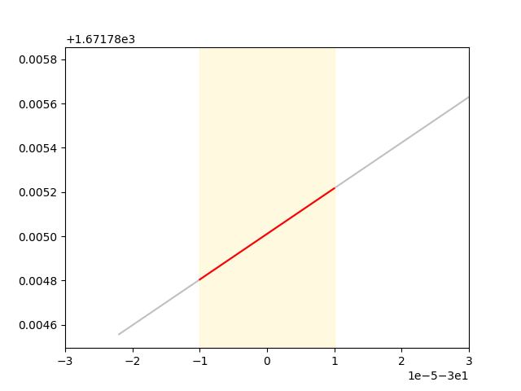

# of singularities:  11
# Model: fink_noble_giles_model_2008(fink_noble_giles_model_2008.cellml)
No of piecewises: 4
## Equation 1:
```
ICaL__i_CaL = pow(Environment__F, 2) * pow(ICaL__z, 2) * (-15.0 + cell__V) * (-Environment__Ca_o + 0.25 * Ca__Ca_ss * exp(2.0 * (-15.0 + cell__V) * Environment__F / (Environment__R * Environment__T))) * ICaL__g_CaL * iCaL_d_gate__d * iCaL_f2_gate__f2 * iCaL_fCass_gate__fCass * iCaL_f_gate__f / ((-1.0 + exp(2.0 * (-15.0 + cell__V) * Environment__F / (Environment__R * Environment__T))) * Environment__R * Environment__T)
```
## New Eq:
```
ICaL__i_CaL = ((fabs(-15.0 + cell__V) < 9.9999999999961231e-6) ? (50000.000000019383 * (-14.99999 + cell__V) * (0.1444728695881965 * (-Environment__Ca_o + 0.25 * Ca__Ca_ss * exp(7.4867781645461923e-7)) * ICaL__g_CaL * iCaL_d_gate__d * iCaL_f2_gate__f2 * iCaL_fCass_gate__fCass * iCaL_f_gate__f / (-1.0 + exp(7.4867781645461923e-7)) + 0.1444728695881965 * (-Environment__Ca_o + 0.25 * Ca__Ca_ss * exp(-7.4867781645461923e-7)) * ICaL__g_CaL * iCaL_d_gate__d * iCaL_f2_gate__f2 * iCaL_fCass_gate__fCass * iCaL_f_gate__f / (-1.0 + exp(-7.4867781645461923e-7))) - 0.1444728695881965 * (-Environment__Ca_o + 0.25 * Ca__Ca_ss * exp(-7.4867781645461923e-7)) * ICaL__g_CaL * iCaL_d_gate__d * iCaL_f2_gate__f2 * iCaL_fCass_gate__fCass * iCaL_f_gate__f / (-1.0 + exp(-7.4867781645461923e-7))) : (14447.286958825251 * (-15.0 + cell__V) * (-Environment__Ca_o + 0.25 * Ca__Ca_ss * exp(-1.1230167246823641 + 0.074867781645490947 * cell__V)) * ICaL__g_CaL * iCaL_d_gate__d * iCaL_f2_gate__f2 * iCaL_fCass_gate__fCass * iCaL_f_gate__f / (-1.0 + exp(-1.1230167246823641 + 0.074867781645490947 * cell__V))))
```
## Singularity point: 15.000000000000000
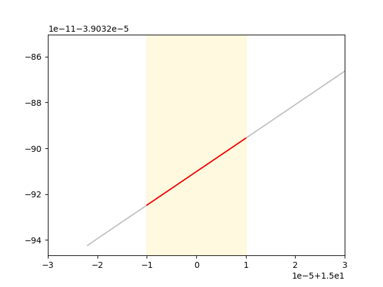

# of singularities:  1
# Model: fox_model_2001(fox_mcharg_gilmour_2002.cellml)
No of piecewises: 0
## Equation 1:
```
fast_sodium_current_m_gate__alpha_m = 0.32000000000000001 * fast_sodium_current_m_gate__E0_m / (1.0 - exp(-0.10000000000000001 * fast_sodium_current_m_gate__E0_m))
```
## New Eq:
```
fast_sodium_current_m_gate__alpha_m = ((fabs(47.130000000000003 + membrane__V) < 1.0000000000010001e-5) ? (-3.2000000000032004e-6 / (1.0 - exp(1.0000000000010001e-6)) + 49999.999999949992 * (47.130010000000006 + membrane__V) * (3.2000000000032004e-6 / (1.0 - exp(1.0000000000010001e-6)) + 3.2000000000032004e-6 / (1.0 - exp(-1.0000000000010001e-6)))) : (0.32000000000000001 * (47.130000000000003 + membrane__V) / (1.0 - exp(-4.7130000000000001 - 0.10000000000000001 * membrane__V))))
```
## Singularity point: -47.130000000000003


## Equation 2:
```
slow_activating_delayed_rectifiyer_K_current_X_ks_gate__tau_X_ks = 1 / (0.00013100000000000001 * (-10.0 + membrane__V) / (-1.0 + exp(-0.68699999999999994 + 0.068699999999999997 * membrane__V)) + 7.1899999999999999e-5 * (-10.0 + membrane__V) / (1.0 - exp(1.48 - 0.14799999999999999 * membrane__V)))
```
## New Eq:
```
slow_activating_delayed_rectifiyer_K_current_X_ks_gate__tau_X_ks = ((fabs(-10.0 + membrane__V) < 9.9999999999961231e-6) ? (1 / (-7.1899999999972124e-10 / (1.0 - exp(1.4799999999994262e-6)) - 1.3099999999994923e-9 / (-1.0 + exp(-6.8699999999973366e-7)) + 50000.000000019383 * (-9.9999900000000004 + membrane__V) * (7.1899999999972124e-10 / (1.0 - exp(1.4799999999994262e-6)) + 7.1899999999972124e-10 / (1.0 - exp(-1.4799999999994262e-6)) + 1.3099999999994923e-9 / (-1.0 + exp(6.8699999999973366e-7)) + 1.3099999999994923e-9 / (-1.0 + exp(-6.8699999999973366e-7))))) : (1 / (0.00013100000000000001 * (-10.0 + membrane__V) / (-1.0 + exp(-0.68699999999999994 + 0.068699999999999997 * membrane__V)) + 7.1899999999999999e-5 * (-10.0 + membrane__V) / (1.0 - exp(1.48 - 0.14799999999999999 * membrane__V)))))
```
## Singularity point: 10.000000000000000
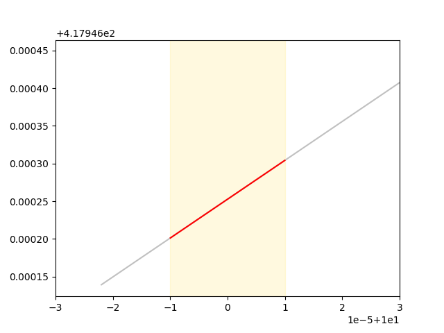

## Equation 3:
```
L_type_Ca_current__i_Ca_max = 4.0 * pow(membrane__F, 2) * (-0.34100000000000003 * standard_ionic_concentrations__Ca_o + calcium_dynamics__Ca_i * exp(2.0 * membrane__F * membrane__V / (membrane__R * membrane__T))) * L_type_Ca_current__P_Ca * membrane__V / ((-1.0 + exp(2.0 * membrane__F * membrane__V / (membrane__R * membrane__T))) * L_type_Ca_current__C_sc * membrane__R * membrane__T)
```
## New Eq:
```
L_type_Ca_current__i_Ca_max = ((fabs(membrane__V) < 1.0000000000000001e-5) ? (49999.999999999993 * (1.0000000000000001e-5 + membrane__V) * (0.00014452497536219513 * (-0.34100000000000003 * standard_ionic_concentrations__Ca_o + calcium_dynamics__Ca_i * exp(7.4883406923417174e-7)) * L_type_Ca_current__P_Ca / (-1.0 + exp(7.4883406923417174e-7)) + 0.00014452497536219513 * (-0.34100000000000003 * standard_ionic_concentrations__Ca_o + calcium_dynamics__Ca_i * exp(-7.4883406923417174e-7)) * L_type_Ca_current__P_Ca / (-1.0 + exp(-7.4883406923417174e-7))) - 0.00014452497536219513 * (-0.34100000000000003 * standard_ionic_concentrations__Ca_o + calcium_dynamics__Ca_i * exp(-7.4883406923417174e-7)) * L_type_Ca_current__P_Ca / (-1.0 + exp(-7.4883406923417174e-7))) : (14.452497536219512 * (-0.34100000000000003 * standard_ionic_concentrations__Ca_o + calcium_dynamics__Ca_i * exp(0.074883406923417162 * membrane__V)) * L_type_Ca_current__P_Ca * membrane__V / (-1.0 + exp(0.074883406923417162 * membrane__V))))
```
## Singularity point: 0


## Equation 4:
```
L_type_Ca_current__i_CaK = 1000.0 * pow(membrane__F, 2) * (-standard_ionic_concentrations__K_o + standard_ionic_concentrations__K_i * exp(membrane__F * membrane__V / (membrane__R * membrane__T))) * L_type_Ca_current__P_CaK * L_type_Ca_current_d_gate__d * L_type_Ca_current_f_Ca_gate__f_Ca * L_type_Ca_current_f_gate__f * membrane__V / ((1.0 + L_type_Ca_current__i_Ca_max / L_type_Ca_current__i_Ca_half) * (-1.0 + exp(membrane__F * membrane__V / (membrane__R * membrane__T))) * L_type_Ca_current__C_sc * membrane__R * membrane__T)
```
## New Eq:
```
L_type_Ca_current__i_CaK = ((fabs(membrane__V) < 1.0000000000000001e-5) ? (49999.999999999993 * (1.0000000000000001e-5 + membrane__V) * (2.0919990183677746e-8 * (-standard_ionic_concentrations__K_o + standard_ionic_concentrations__K_i * exp(3.7441703461708587e-7)) * L_type_Ca_current_d_gate__d * L_type_Ca_current_f_Ca_gate__f_Ca * L_type_Ca_current_f_gate__f / ((1.0 - 3.773584905660377 * L_type_Ca_current__i_Ca_max) * (-1.0 + exp(3.7441703461708587e-7))) + 2.0919990183677746e-8 * (-standard_ionic_concentrations__K_o + standard_ionic_concentrations__K_i * exp(-3.7441703461708587e-7)) * L_type_Ca_current_d_gate__d * L_type_Ca_current_f_Ca_gate__f_Ca * L_type_Ca_current_f_gate__f / ((1.0 - 3.773584905660377 * L_type_Ca_current__i_Ca_max) * (-1.0 + exp(-3.7441703461708587e-7)))) - 2.0919990183677746e-8 * (-standard_ionic_concentrations__K_o + standard_ionic_concentrations__K_i * exp(-3.7441703461708587e-7)) * L_type_Ca_current_d_gate__d * L_type_Ca_current_f_Ca_gate__f_Ca * L_type_Ca_current_f_gate__f / ((1.0 - 3.773584905660377 * L_type_Ca_current__i_Ca_max) * (-1.0 + exp(-3.7441703461708587e-7)))) : (0.0020919990183677745 * (-standard_ionic_concentrations__K_o + standard_ionic_concentrations__K_i * exp(0.037441703461708581 * membrane__V)) * L_type_Ca_current_d_gate__d * L_type_Ca_current_f_Ca_gate__f_Ca * L_type_Ca_current_f_gate__f * membrane__V / ((1.0 - 3.773584905660377 * L_type_Ca_current__i_Ca_max) * (-1.0 + exp(0.037441703461708581 * membrane__V)))))
```
## Singularity point: 0

## Singularity point: 0


# of singularities:  4
# Model: grandi_pasqualini_bers_2010(grandi_pasqualini_bers_2010_ss.cellml)
No of piecewises: 6
## Equation 1:
```
I_Ca__taud = 28.571428571428569 * (1.0 - exp(-0.83333333333333337 - 0.16666666666666666 * membrane_potential__V_m)) * I_Ca__dss / (5.0 + membrane_potential__V_m)
```
## New Eq:
```
I_Ca__taud = ((fabs(5.0 + membrane_potential__V_m) < 1.0000000000003062e-5) ? (49999.999999984691 * (5.0000099999999996 + membrane_potential__V_m) * (2857142.8571419818 * (1.0 - exp(1.666666666667177e-6)) / (1.0 + exp(1.666666666667177e-6)) + 2857142.8571419818 * (1.0 - exp(-1.666666666667177e-6)) / (1.0 + exp(-1.666666666667177e-6))) - 2857142.8571419818 * (1.0 - exp(1.666666666667177e-6)) / (1.0 + exp(1.666666666667177e-6))) : (28.571428571428569 * (1.0 - exp(-0.83333333333333337 - 0.16666666666666666 * membrane_potential__V_m)) / ((1.0 + exp(-0.83333333333333337 - 0.16666666666666666 * membrane_potential__V_m)) * (5.0 + membrane_potential__V_m))))
```
## Singularity point: -5.0000000000000000
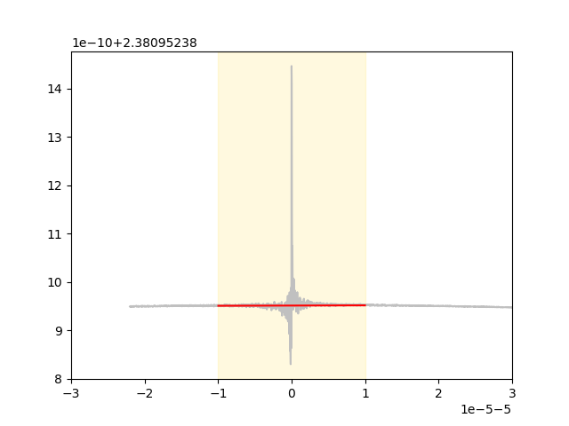

## Equation 2:
```
I_Ca__ibarca_j = 4.0 * (-0.34100000000000003 * parameters__Cao + 0.34100000000000003 * Ca_Concentrations__Ca_j * exp(2.0 * membrane_potential__V_m * parameters__FoRT)) * membrane_potential__V_m * parameters__FoRT * parameters__Frdy * parameters__pCa / (-1.0 + exp(2.0 * membrane_potential__V_m * parameters__FoRT))
```
## New Eq:
```
I_Ca__ibarca_j = ((fabs(membrane_potential__V_m) < 1.0000000000000001e-5) ? (49999.999999999993 * (1.0000000000000001e-5 + membrane_potential__V_m) * (2.1600000000000002e-8 * pow(parameters__Frdy, 2) * (-0.34100000000000003 * parameters__Cao + 0.34100000000000003 * Ca_Concentrations__Ca_j * exp(2.0000000000000002e-5 * parameters__Frdy / (parameters__R * parameters__Temp))) * parameters__pCa_max / ((-1.0 + exp(2.0000000000000002e-5 * parameters__Frdy / (parameters__R * parameters__Temp))) * parameters__R * parameters__Temp) + 2.1600000000000002e-8 * pow(parameters__Frdy, 2) * (-0.34100000000000003 * parameters__Cao + 0.34100000000000003 * Ca_Concentrations__Ca_j * exp(-2.0000000000000002e-5 * parameters__Frdy / (parameters__R * parameters__Temp))) * parameters__pCa_max / ((-1.0 + exp(-2.0000000000000002e-5 * parameters__Frdy / (parameters__R * parameters__Temp))) * parameters__R * parameters__Temp)) - 2.1600000000000002e-8 * pow(parameters__Frdy, 2) * (-0.34100000000000003 * parameters__Cao + 0.34100000000000003 * Ca_Concentrations__Ca_j * exp(-2.0000000000000002e-5 * parameters__Frdy / (parameters__R * parameters__Temp))) * parameters__pCa_max / ((-1.0 + exp(-2.0000000000000002e-5 * parameters__Frdy / (parameters__R * parameters__Temp))) * parameters__R * parameters__Temp)) : (0.00216 * pow(parameters__Frdy, 2) * (-0.34100000000000003 * parameters__Cao + 0.34100000000000003 * Ca_Concentrations__Ca_j * exp(2.0 * membrane_potential__V_m * parameters__Frdy / (parameters__R * parameters__Temp))) * membrane_potential__V_m * parameters__pCa_max / ((-1.0 + exp(2.0 * membrane_potential__V_m * parameters__Frdy / (parameters__R * parameters__Temp))) * parameters__R * parameters__Temp)))
```
## Singularity point: 0
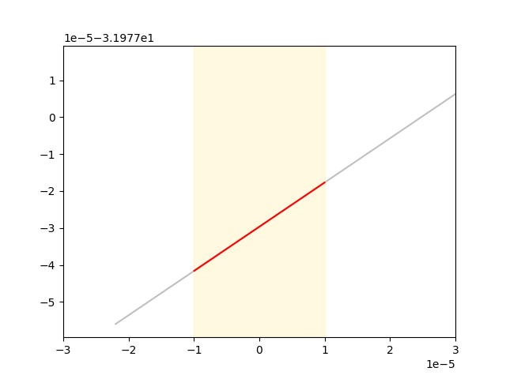

## Equation 3:
```
I_Ca__ibarca_sl = 4.0 * (-0.34100000000000003 * parameters__Cao + 0.34100000000000003 * Ca_Concentrations__Ca_sl * exp(2.0 * membrane_potential__V_m * parameters__FoRT)) * membrane_potential__V_m * parameters__FoRT * parameters__Frdy * parameters__pCa / (-1.0 + exp(2.0 * membrane_potential__V_m * parameters__FoRT))
```
## New Eq:
```
I_Ca__ibarca_sl = ((fabs(membrane_potential__V_m) < 1.0000000000000001e-5) ? (49999.999999999993 * (1.0000000000000001e-5 + membrane_potential__V_m) * (2.1600000000000002e-8 * pow(parameters__Frdy, 2) * (-0.34100000000000003 * parameters__Cao + 0.34100000000000003 * Ca_Concentrations__Ca_sl * exp(2.0000000000000002e-5 * parameters__Frdy / (parameters__R * parameters__Temp))) * parameters__pCa_max / ((-1.0 + exp(2.0000000000000002e-5 * parameters__Frdy / (parameters__R * parameters__Temp))) * parameters__R * parameters__Temp) + 2.1600000000000002e-8 * pow(parameters__Frdy, 2) * (-0.34100000000000003 * parameters__Cao + 0.34100000000000003 * Ca_Concentrations__Ca_sl * exp(-2.0000000000000002e-5 * parameters__Frdy / (parameters__R * parameters__Temp))) * parameters__pCa_max / ((-1.0 + exp(-2.0000000000000002e-5 * parameters__Frdy / (parameters__R * parameters__Temp))) * parameters__R * parameters__Temp)) - 2.1600000000000002e-8 * pow(parameters__Frdy, 2) * (-0.34100000000000003 * parameters__Cao + 0.34100000000000003 * Ca_Concentrations__Ca_sl * exp(-2.0000000000000002e-5 * parameters__Frdy / (parameters__R * parameters__Temp))) * parameters__pCa_max / ((-1.0 + exp(-2.0000000000000002e-5 * parameters__Frdy / (parameters__R * parameters__Temp))) * parameters__R * parameters__Temp)) : (0.00216 * pow(parameters__Frdy, 2) * (-0.34100000000000003 * parameters__Cao + 0.34100000000000003 * Ca_Concentrations__Ca_sl * exp(2.0 * membrane_potential__V_m * parameters__Frdy / (parameters__R * parameters__Temp))) * membrane_potential__V_m * parameters__pCa_max / ((-1.0 + exp(2.0 * membrane_potential__V_m * parameters__Frdy / (parameters__R * parameters__Temp))) * parameters__R * parameters__Temp)))
```
## Singularity point: 0


## Equation 4:
```
I_Ca__ibark = (-0.75 * parameters__Ko + 0.75 * K_Concentration__K_i * exp(membrane_potential__V_m * parameters__FoRT)) * membrane_potential__V_m * parameters__FoRT * parameters__Frdy * parameters__pK / (-1.0 + exp(membrane_potential__V_m * parameters__FoRT))
```
## New Eq:
```
I_Ca__ibark = ((fabs(membrane_potential__V_m) < 1.0000000000000001e-5) ? (49999.999999999993 * (1.0000000000000001e-5 + membrane_potential__V_m) * (1.3500000000000001e-12 * pow(parameters__Frdy, 2) * (-0.75 * parameters__Ko + 0.75 * K_Concentration__K_i * exp(1.0000000000000001e-5 * parameters__Frdy / (parameters__R * parameters__Temp))) / ((-1.0 + exp(1.0000000000000001e-5 * parameters__Frdy / (parameters__R * parameters__Temp))) * parameters__R * parameters__Temp) + 1.3500000000000001e-12 * pow(parameters__Frdy, 2) * (-0.75 * parameters__Ko + 0.75 * K_Concentration__K_i * exp(-1.0000000000000001e-5 * parameters__Frdy / (parameters__R * parameters__Temp))) / ((-1.0 + exp(-1.0000000000000001e-5 * parameters__Frdy / (parameters__R * parameters__Temp))) * parameters__R * parameters__Temp)) - 1.3500000000000001e-12 * pow(parameters__Frdy, 2) * (-0.75 * parameters__Ko + 0.75 * K_Concentration__K_i * exp(-1.0000000000000001e-5 * parameters__Frdy / (parameters__R * parameters__Temp))) / ((-1.0 + exp(-1.0000000000000001e-5 * parameters__Frdy / (parameters__R * parameters__Temp))) * parameters__R * parameters__Temp)) : (1.35e-7 * pow(parameters__Frdy, 2) * (-0.75 * parameters__Ko + 0.75 * K_Concentration__K_i * exp(membrane_potential__V_m * parameters__Frdy / (parameters__R * parameters__Temp))) * membrane_potential__V_m / ((-1.0 + exp(membrane_potential__V_m * parameters__Frdy / (parameters__R * parameters__Temp))) * parameters__R * parameters__Temp)))
```
## Singularity point: 0


## Equation 5:
```
I_Ca__ibarna_j = (-0.75 * parameters__Nao + 0.75 * Na_Concentrations__Na_j * exp(membrane_potential__V_m * parameters__FoRT)) * membrane_potential__V_m * parameters__FoRT * parameters__Frdy * parameters__pNa / (-1.0 + exp(membrane_potential__V_m * parameters__FoRT))
```
## New Eq:
```
I_Ca__ibarna_j = ((fabs(membrane_potential__V_m) < 1.0000000000000001e-5) ? (49999.999999999993 * (1.0000000000000001e-5 + membrane_potential__V_m) * (7.4999999999999996e-14 * pow(parameters__Frdy, 2) * (-0.75 * parameters__Nao + 0.75 * Na_Concentrations__Na_j * exp(1.0000000000000001e-5 * parameters__Frdy / (parameters__R * parameters__Temp))) / ((-1.0 + exp(1.0000000000000001e-5 * parameters__Frdy / (parameters__R * parameters__Temp))) * parameters__R * parameters__Temp) + 7.4999999999999996e-14 * pow(parameters__Frdy, 2) * (-0.75 * parameters__Nao + 0.75 * Na_Concentrations__Na_j * exp(-1.0000000000000001e-5 * parameters__Frdy / (parameters__R * parameters__Temp))) / ((-1.0 + exp(-1.0000000000000001e-5 * parameters__Frdy / (parameters__R * parameters__Temp))) * parameters__R * parameters__Temp)) - 7.4999999999999996e-14 * pow(parameters__Frdy, 2) * (-0.75 * parameters__Nao + 0.75 * Na_Concentrations__Na_j * exp(-1.0000000000000001e-5 * parameters__Frdy / (parameters__R * parameters__Temp))) / ((-1.0 + exp(-1.0000000000000001e-5 * parameters__Frdy / (parameters__R * parameters__Temp))) * parameters__R * parameters__Temp)) : (7.4999999999999993e-9 * pow(parameters__Frdy, 2) * (-0.75 * parameters__Nao + 0.75 * Na_Concentrations__Na_j * exp(membrane_potential__V_m * parameters__Frdy / (parameters__R * parameters__Temp))) * membrane_potential__V_m / ((-1.0 + exp(membrane_potential__V_m * parameters__Frdy / (parameters__R * parameters__Temp))) * parameters__R * parameters__Temp)))
```
## Singularity point: 0


## Equation 6:
```
I_Ca__ibarna_sl = (-0.75 * parameters__Nao + 0.75 * Na_Concentrations__Na_sl * exp(membrane_potential__V_m * parameters__FoRT)) * membrane_potential__V_m * parameters__FoRT * parameters__Frdy * parameters__pNa / (-1.0 + exp(membrane_potential__V_m * parameters__FoRT))
```
## New Eq:
```
I_Ca__ibarna_sl = ((fabs(membrane_potential__V_m) < 1.0000000000000001e-5) ? (49999.999999999993 * (1.0000000000000001e-5 + membrane_potential__V_m) * (7.4999999999999996e-14 * pow(parameters__Frdy, 2) * (-0.75 * parameters__Nao + 0.75 * Na_Concentrations__Na_sl * exp(1.0000000000000001e-5 * parameters__Frdy / (parameters__R * parameters__Temp))) / ((-1.0 + exp(1.0000000000000001e-5 * parameters__Frdy / (parameters__R * parameters__Temp))) * parameters__R * parameters__Temp) + 7.4999999999999996e-14 * pow(parameters__Frdy, 2) * (-0.75 * parameters__Nao + 0.75 * Na_Concentrations__Na_sl * exp(-1.0000000000000001e-5 * parameters__Frdy / (parameters__R * parameters__Temp))) / ((-1.0 + exp(-1.0000000000000001e-5 * parameters__Frdy / (parameters__R * parameters__Temp))) * parameters__R * parameters__Temp)) - 7.4999999999999996e-14 * pow(parameters__Frdy, 2) * (-0.75 * parameters__Nao + 0.75 * Na_Concentrations__Na_sl * exp(-1.0000000000000001e-5 * parameters__Frdy / (parameters__R * parameters__Temp))) / ((-1.0 + exp(-1.0000000000000001e-5 * parameters__Frdy / (parameters__R * parameters__Temp))) * parameters__R * parameters__Temp)) : (7.4999999999999993e-9 * pow(parameters__Frdy, 2) * (-0.75 * parameters__Nao + 0.75 * Na_Concentrations__Na_sl * exp(membrane_potential__V_m * parameters__Frdy / (parameters__R * parameters__Temp))) * membrane_potential__V_m / ((-1.0 + exp(membrane_potential__V_m * parameters__Frdy / (parameters__R * parameters__Temp))) * parameters__R * parameters__Temp)))
```
## Singularity point: 0


# of singularities:  6
# Model: grandi_pasqualini_bers_2010(grandi_pasqualini_bers_2010_ss_endo.cellml)
No of piecewises: 6
## Equation 1:
```
I_Ca__taud = 28.571428571428569 * (1.0 - exp(-0.83333333333333337 - 0.16666666666666666 * membrane_potential__V_m)) * I_Ca__dss / (5.0 + membrane_potential__V_m)
```
## New Eq:
```
I_Ca__taud = ((fabs(5.0 + membrane_potential__V_m) < 1.0000000000003062e-5) ? (49999.999999984691 * (5.0000099999999996 + membrane_potential__V_m) * (2857142.8571419818 * (1.0 - exp(1.666666666667177e-6)) / (1.0 + exp(1.666666666667177e-6)) + 2857142.8571419818 * (1.0 - exp(-1.666666666667177e-6)) / (1.0 + exp(-1.666666666667177e-6))) - 2857142.8571419818 * (1.0 - exp(1.666666666667177e-6)) / (1.0 + exp(1.666666666667177e-6))) : (28.571428571428569 * (1.0 - exp(-0.83333333333333337 - 0.16666666666666666 * membrane_potential__V_m)) / ((1.0 + exp(-0.83333333333333337 - 0.16666666666666666 * membrane_potential__V_m)) * (5.0 + membrane_potential__V_m))))
```
## Singularity point: -5.0000000000000000


## Equation 2:
```
I_Ca__ibarca_j = 4.0 * (-0.34100000000000003 * parameters__Cao + 0.34100000000000003 * Ca_Concentrations__Ca_j * exp(2.0 * membrane_potential__V_m * parameters__FoRT)) * membrane_potential__V_m * parameters__FoRT * parameters__Frdy * parameters__pCa / (-1.0 + exp(2.0 * membrane_potential__V_m * parameters__FoRT))
```
## New Eq:
```
I_Ca__ibarca_j = ((fabs(membrane_potential__V_m) < 1.0000000000000001e-5) ? (49999.999999999993 * (1.0000000000000001e-5 + membrane_potential__V_m) * (7.8019226357407251e-5 * (-0.34100000000000003 * parameters__Cao + 0.34100000000000003 * Ca_Concentrations__Ca_j * exp(7.4871767015605244e-7)) * parameters__pCa_max / (-1.0 + exp(7.4871767015605244e-7)) + 7.8019226357407251e-5 * (-0.34100000000000003 * parameters__Cao + 0.34100000000000003 * Ca_Concentrations__Ca_j * exp(-7.4871767015605244e-7)) * parameters__pCa_max / (-1.0 + exp(-7.4871767015605244e-7))) - 7.8019226357407251e-5 * (-0.34100000000000003 * parameters__Cao + 0.34100000000000003 * Ca_Concentrations__Ca_j * exp(-7.4871767015605244e-7)) * parameters__pCa_max / (-1.0 + exp(-7.4871767015605244e-7))) : (7.8019226357407252 * (-0.34100000000000003 * parameters__Cao + 0.34100000000000003 * Ca_Concentrations__Ca_j * exp(0.074871767015605231 * membrane_potential__V_m)) * membrane_potential__V_m * parameters__pCa_max / (-1.0 + exp(0.074871767015605231 * membrane_potential__V_m))))
```
## Singularity point: 0


## Equation 3:
```
I_Ca__ibarca_sl = 4.0 * (-0.34100000000000003 * parameters__Cao + 0.34100000000000003 * Ca_Concentrations__Ca_sl * exp(2.0 * membrane_potential__V_m * parameters__FoRT)) * membrane_potential__V_m * parameters__FoRT * parameters__Frdy * parameters__pCa / (-1.0 + exp(2.0 * membrane_potential__V_m * parameters__FoRT))
```
## New Eq:
```
I_Ca__ibarca_sl = ((fabs(membrane_potential__V_m) < 1.0000000000000001e-5) ? (49999.999999999993 * (1.0000000000000001e-5 + membrane_potential__V_m) * (7.8019226357407251e-5 * (-0.34100000000000003 * parameters__Cao + 0.34100000000000003 * Ca_Concentrations__Ca_sl * exp(7.4871767015605244e-7)) * parameters__pCa_max / (-1.0 + exp(7.4871767015605244e-7)) + 7.8019226357407251e-5 * (-0.34100000000000003 * parameters__Cao + 0.34100000000000003 * Ca_Concentrations__Ca_sl * exp(-7.4871767015605244e-7)) * parameters__pCa_max / (-1.0 + exp(-7.4871767015605244e-7))) - 7.8019226357407251e-5 * (-0.34100000000000003 * parameters__Cao + 0.34100000000000003 * Ca_Concentrations__Ca_sl * exp(-7.4871767015605244e-7)) * parameters__pCa_max / (-1.0 + exp(-7.4871767015605244e-7))) : (7.8019226357407252 * (-0.34100000000000003 * parameters__Cao + 0.34100000000000003 * Ca_Concentrations__Ca_sl * exp(0.074871767015605231 * membrane_potential__V_m)) * membrane_potential__V_m * parameters__pCa_max / (-1.0 + exp(0.074871767015605231 * membrane_potential__V_m))))
```
## Singularity point: 0


## Equation 4:
```
I_Ca__ibark = (-0.75 * parameters__Ko + 0.75 * K_Concentration__K_i * exp(membrane_potential__V_m * parameters__FoRT)) * membrane_potential__V_m * parameters__FoRT * parameters__Frdy * parameters__pK / (-1.0 + exp(membrane_potential__V_m * parameters__FoRT))
```
## New Eq:
```
I_Ca__ibark = ((fabs(membrane_potential__V_m) < 1.0000000000000001e-5) ? (49999.999999999993 * (1.0000000000000001e-5 + membrane_potential__V_m) * (4.876201647337954e-9 * (-0.75 * parameters__Ko + 0.75 * K_Concentration__K_i * exp(3.7435883507802622e-7)) / (-1.0 + exp(3.7435883507802622e-7)) + 4.876201647337954e-9 * (-0.75 * parameters__Ko + 0.75 * K_Concentration__K_i * exp(-3.7435883507802622e-7)) / (-1.0 + exp(-3.7435883507802622e-7))) - 4.876201647337954e-9 * (-0.75 * parameters__Ko + 0.75 * K_Concentration__K_i * exp(-3.7435883507802622e-7)) / (-1.0 + exp(-3.7435883507802622e-7))) : (0.00048762016473379531 * (-0.75 * parameters__Ko + 0.75 * K_Concentration__K_i * exp(0.037435883507802616 * membrane_potential__V_m)) * membrane_potential__V_m / (-1.0 + exp(0.037435883507802616 * membrane_potential__V_m))))
```
## Singularity point: 0


## Equation 5:
```
I_Ca__ibarna_j = (-0.75 * parameters__Nao + 0.75 * Na_Concentrations__Na_j * exp(membrane_potential__V_m * parameters__FoRT)) * membrane_potential__V_m * parameters__FoRT * parameters__Frdy * parameters__pNa / (-1.0 + exp(membrane_potential__V_m * parameters__FoRT))
```
## New Eq:
```
I_Ca__ibarna_j = ((fabs(membrane_potential__V_m) < 1.0000000000000001e-5) ? (49999.999999999993 * (1.0000000000000001e-5 + membrane_potential__V_m) * (2.7090009151877516e-10 * (-0.75 * parameters__Nao + 0.75 * Na_Concentrations__Na_j * exp(3.7435883507802622e-7)) / (-1.0 + exp(3.7435883507802622e-7)) + 2.7090009151877516e-10 * (-0.75 * parameters__Nao + 0.75 * Na_Concentrations__Na_j * exp(-3.7435883507802622e-7)) / (-1.0 + exp(-3.7435883507802622e-7))) - 2.7090009151877516e-10 * (-0.75 * parameters__Nao + 0.75 * Na_Concentrations__Na_j * exp(-3.7435883507802622e-7)) / (-1.0 + exp(-3.7435883507802622e-7))) : (2.7090009151877515e-5 * (-0.75 * parameters__Nao + 0.75 * Na_Concentrations__Na_j * exp(0.037435883507802616 * membrane_potential__V_m)) * membrane_potential__V_m / (-1.0 + exp(0.037435883507802616 * membrane_potential__V_m))))
```
## Singularity point: 0


## Equation 6:
```
I_Ca__ibarna_sl = (-0.75 * parameters__Nao + 0.75 * Na_Concentrations__Na_sl * exp(membrane_potential__V_m * parameters__FoRT)) * membrane_potential__V_m * parameters__FoRT * parameters__Frdy * parameters__pNa / (-1.0 + exp(membrane_potential__V_m * parameters__FoRT))
```
## New Eq:
```
I_Ca__ibarna_sl = ((fabs(membrane_potential__V_m) < 1.0000000000000001e-5) ? (49999.999999999993 * (1.0000000000000001e-5 + membrane_potential__V_m) * (2.7090009151877516e-10 * (-0.75 * parameters__Nao + 0.75 * Na_Concentrations__Na_sl * exp(3.7435883507802622e-7)) / (-1.0 + exp(3.7435883507802622e-7)) + 2.7090009151877516e-10 * (-0.75 * parameters__Nao + 0.75 * Na_Concentrations__Na_sl * exp(-3.7435883507802622e-7)) / (-1.0 + exp(-3.7435883507802622e-7))) - 2.7090009151877516e-10 * (-0.75 * parameters__Nao + 0.75 * Na_Concentrations__Na_sl * exp(-3.7435883507802622e-7)) / (-1.0 + exp(-3.7435883507802622e-7))) : (2.7090009151877515e-5 * (-0.75 * parameters__Nao + 0.75 * Na_Concentrations__Na_sl * exp(0.037435883507802616 * membrane_potential__V_m)) * membrane_potential__V_m / (-1.0 + exp(0.037435883507802616 * membrane_potential__V_m))))
```
## Singularity point: 0


# of singularities:  6
# Model: hilgemann_noble_model_1987(hilgemann_noble_model_1987.cellml)
No of piecewises: 0
## Equation 1:
```
fast_sodium_current_m_gate__alpha_m = 200.0 * (41.0 + membrane__V) / (1.0 - exp(-4.1000000000000005 - 0.10000000000000001 * membrane__V))
```
## New Eq:
```
fast_sodium_current_m_gate__alpha_m = ((fabs(41.0 + membrane__V) < 1.0000000000010001e-5) ? (-0.0020000000000020002 / (1.0 - exp(1.0000000000010001e-6)) + 49999.999999949992 * (41.000010000000003 + membrane__V) * (0.0020000000000020002 / (1.0 - exp(1.0000000000010001e-6)) + 0.0020000000000020002 / (1.0 - exp(-1.0000000000010001e-6)))) : (200.0 * (41.0 + membrane__V) / (1.0 - exp(-4.1000000000000005 - 0.10000000000000001 * membrane__V))))
```
## Singularity point: -41.000000000000000


## Equation 2:
```
second_inward_calcium_current_d_gate__alpha_d = 30.0 * (19.0 + membrane__V) / (1.0 - exp(-4.75 - 0.25 * membrane__V))
```
## New Eq:
```
second_inward_calcium_current_d_gate__alpha_d = ((fabs(19.0 + membrane__V) < 1.0000000000010001e-5) ? (-0.00030000000000030003 / (1.0 - exp(2.5000000000025002e-6)) + 49999.999999949992 * (19.00001 + membrane__V) * (0.00030000000000030003 / (1.0 - exp(2.5000000000025002e-6)) + 0.00030000000000030003 / (1.0 - exp(-2.5000000000025002e-6)))) : (30.0 * (19.0 + membrane__V) / (1.0 - exp(-4.75 - 0.25 * membrane__V))))
```
## Singularity point: -19.000000000000000


## Equation 3:
```
second_inward_calcium_current_d_gate__beta_d = 12.0 * (19.0 + membrane__V) / (-1.0 + exp(1.8999999999999999 + 0.10000000000000001 * membrane__V))
```
## New Eq:
```
second_inward_calcium_current_d_gate__beta_d = ((fabs(19.0 + membrane__V) < 1.0000000000010001e-5) ? (-0.00012000000000012001 / (-1.0 + exp(-1.0000000000010001e-6)) + 49999.999999949992 * (19.00001 + membrane__V) * (0.00012000000000012001 / (-1.0 + exp(1.0000000000010001e-6)) + 0.00012000000000012001 / (-1.0 + exp(-1.0000000000010001e-6)))) : (12.0 * (19.0 + membrane__V) / (-1.0 + exp(1.8999999999999999 + 0.10000000000000001 * membrane__V))))
```
## Singularity point: -19.000000000000000


## Equation 4:
```
second_inward_calcium_current_f_Ca_gate__alpha_f_Ca = 6.25 * (34.0 + membrane__V) / (-1.0 + exp(8.5 + 0.25 * membrane__V))
```
## New Eq:
```
second_inward_calcium_current_f_Ca_gate__alpha_f_Ca = ((fabs(34.0 + membrane__V) < 1.0000000000010001e-5) ? (-6.2500000000062506e-5 / (-1.0 + exp(-2.5000000000025002e-6)) + 49999.999999949992 * (34.000010000000003 + membrane__V) * (6.2500000000062506e-5 / (-1.0 + exp(2.5000000000025002e-6)) + 6.2500000000062506e-5 / (-1.0 + exp(-2.5000000000025002e-6)))) : (6.25 * (34.0 + membrane__V) / (-1.0 + exp(8.5 + 0.25 * membrane__V))))
```
## Singularity point: -34.000000000000000


## Equation 5:
```
second_inward_calcium_current__i_siCa = 4.0 * (-50.0 + membrane__V) * (intracellular_calcium_concentration__Ca_i * exp(100.0 / membrane__RTONF) - extracellular_calcium_concentration__Ca_o * exp(-2.0 * (-50.0 + membrane__V) / membrane__RTONF)) * second_inward_calcium_current__P_si * second_inward_calcium_current_d_gate__d * second_inward_calcium_current_f_Ca_gate__CaChon / ((1.0 - exp(-2.0 * (-50.0 + membrane__V) / membrane__RTONF)) * membrane__RTONF)
```
## New Eq:
```
second_inward_calcium_current__i_siCa = ((fabs(-50.0 + membrane__V) < 1.0000000000010001e-5) ? (49999.999999949992 * (-49.999989999999997 + membrane__V) * (1.4973556329113164e-6 * (1.0 - second_inward_calcium_current_f_Ca_gate__f_Ca) * (1.0 - intracellular_calcium_concentration__Ca_i / (0.001 + intracellular_calcium_concentration__Ca_i)) * (intracellular_calcium_concentration__Ca_i * exp(3.7433890822745473) - extracellular_calcium_concentration__Ca_o * exp(7.4867781645565822e-7)) * second_inward_calcium_current__P_si * second_inward_calcium_current_d_gate__d / (1.0 - exp(7.4867781645565822e-7)) + 1.4973556329113164e-6 * (1.0 - second_inward_calcium_current_f_Ca_gate__f_Ca) * (1.0 - intracellular_calcium_concentration__Ca_i / (0.001 + intracellular_calcium_concentration__Ca_i)) * (intracellular_calcium_concentration__Ca_i * exp(3.7433890822745473) - extracellular_calcium_concentration__Ca_o * exp(-7.4867781645565822e-7)) * second_inward_calcium_current__P_si * second_inward_calcium_current_d_gate__d / (1.0 - exp(-7.4867781645565822e-7))) - 1.4973556329113164e-6 * (1.0 - second_inward_calcium_current_f_Ca_gate__f_Ca) * (1.0 - intracellular_calcium_concentration__Ca_i / (0.001 + intracellular_calcium_concentration__Ca_i)) * (intracellular_calcium_concentration__Ca_i * exp(3.7433890822745473) - extracellular_calcium_concentration__Ca_o * exp(7.4867781645565822e-7)) * second_inward_calcium_current__P_si * second_inward_calcium_current_d_gate__d / (1.0 - exp(7.4867781645565822e-7))) : (0.14973556329098189 * (1.0 - second_inward_calcium_current_f_Ca_gate__f_Ca) * (1.0 - intracellular_calcium_concentration__Ca_i / (0.001 + intracellular_calcium_concentration__Ca_i)) * (-50.0 + membrane__V) * (intracellular_calcium_concentration__Ca_i * exp(3.7433890822745473) - extracellular_calcium_concentration__Ca_o * exp(3.7433890822745473 - 0.074867781645490947 * membrane__V)) * second_inward_calcium_current__P_si * second_inward_calcium_current_d_gate__d / (1.0 - exp(3.7433890822745473 - 0.074867781645490947 * membrane__V))))
```
## Singularity point: 50.000000000000000
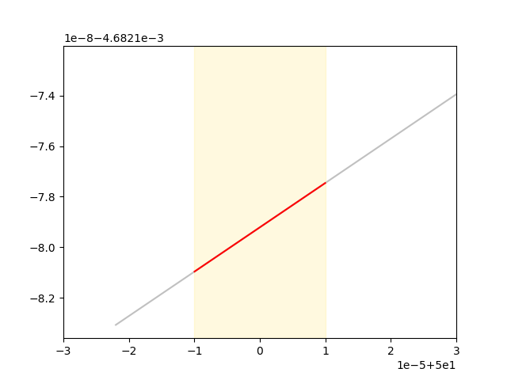

## Equation 6:
```
second_inward_calcium_current__i_siK = 0.002 * (-50.0 + membrane__V) * (intracellular_potassium_concentration__K_i * exp(50.0 / membrane__RTONF) - extracellular_potassium_concentration__K_c * exp(-(-50.0 + membrane__V) / membrane__RTONF)) * second_inward_calcium_current__P_si * second_inward_calcium_current_d_gate__d * second_inward_calcium_current_f_Ca_gate__CaChon / ((1.0 - exp(-(-50.0 + membrane__V) / membrane__RTONF)) * membrane__RTONF)
```
## New Eq:
```
second_inward_calcium_current__i_siK = ((fabs(-50.0 + membrane__V) < 1.0000000000010001e-5) ? (49999.999999949992 * (-49.999989999999997 + membrane__V) * (7.486778164556582e-10 * (1.0 - second_inward_calcium_current_f_Ca_gate__f_Ca) * (1.0 - intracellular_calcium_concentration__Ca_i / (0.001 + intracellular_calcium_concentration__Ca_i)) * (intracellular_potassium_concentration__K_i * exp(1.8716945411372736) - extracellular_potassium_concentration__K_c * exp(3.7433890822782911e-7)) * second_inward_calcium_current__P_si * second_inward_calcium_current_d_gate__d / (1.0 - exp(3.7433890822782911e-7)) + 7.486778164556582e-10 * (1.0 - second_inward_calcium_current_f_Ca_gate__f_Ca) * (1.0 - intracellular_calcium_concentration__Ca_i / (0.001 + intracellular_calcium_concentration__Ca_i)) * (intracellular_potassium_concentration__K_i * exp(1.8716945411372736) - extracellular_potassium_concentration__K_c * exp(-3.7433890822782911e-7)) * second_inward_calcium_current__P_si * second_inward_calcium_current_d_gate__d / (1.0 - exp(-3.7433890822782911e-7))) - 7.486778164556582e-10 * (1.0 - second_inward_calcium_current_f_Ca_gate__f_Ca) * (1.0 - intracellular_calcium_concentration__Ca_i / (0.001 + intracellular_calcium_concentration__Ca_i)) * (intracellular_potassium_concentration__K_i * exp(1.8716945411372736) - extracellular_potassium_concentration__K_c * exp(3.7433890822782911e-7)) * second_inward_calcium_current__P_si * second_inward_calcium_current_d_gate__d / (1.0 - exp(3.7433890822782911e-7))) : (7.4867781645490941e-5 * (1.0 - second_inward_calcium_current_f_Ca_gate__f_Ca) * (1.0 - intracellular_calcium_concentration__Ca_i / (0.001 + intracellular_calcium_concentration__Ca_i)) * (-50.0 + membrane__V) * (intracellular_potassium_concentration__K_i * exp(1.8716945411372736) - extracellular_potassium_concentration__K_c * exp(1.8716945411372736 - 0.037433890822745473 * membrane__V)) * second_inward_calcium_current__P_si * second_inward_calcium_current_d_gate__d / (1.0 - exp(1.8716945411372736 - 0.037433890822745473 * membrane__V))))
```
## Singularity point: 50.000000000000000


## Equation 7:
```
second_inward_calcium_current__i_siNa = 0.01 * (-50.0 + membrane__V) * (intracellular_sodium_concentration__Na_i * exp(50.0 / membrane__RTONF) - extracellular_sodium_concentration__Na_o * exp(-(-50.0 + membrane__V) / membrane__RTONF)) * second_inward_calcium_current__P_si * second_inward_calcium_current_d_gate__d * second_inward_calcium_current_f_Ca_gate__CaChon / ((1.0 - exp(-(-50.0 + membrane__V) / membrane__RTONF)) * membrane__RTONF)
```
## New Eq:
```
second_inward_calcium_current__i_siNa = ((fabs(-50.0 + membrane__V) < 1.0000000000010001e-5) ? (49999.999999949992 * (-49.999989999999997 + membrane__V) * (3.7433890822782906e-9 * (1.0 - second_inward_calcium_current_f_Ca_gate__f_Ca) * (1.0 - intracellular_calcium_concentration__Ca_i / (0.001 + intracellular_calcium_concentration__Ca_i)) * (intracellular_sodium_concentration__Na_i * exp(1.8716945411372736) - extracellular_sodium_concentration__Na_o * exp(3.7433890822782911e-7)) * second_inward_calcium_current__P_si * second_inward_calcium_current_d_gate__d / (1.0 - exp(3.7433890822782911e-7)) + 3.7433890822782906e-9 * (1.0 - second_inward_calcium_current_f_Ca_gate__f_Ca) * (1.0 - intracellular_calcium_concentration__Ca_i / (0.001 + intracellular_calcium_concentration__Ca_i)) * (intracellular_sodium_concentration__Na_i * exp(1.8716945411372736) - extracellular_sodium_concentration__Na_o * exp(-3.7433890822782911e-7)) * second_inward_calcium_current__P_si * second_inward_calcium_current_d_gate__d / (1.0 - exp(-3.7433890822782911e-7))) - 3.7433890822782906e-9 * (1.0 - second_inward_calcium_current_f_Ca_gate__f_Ca) * (1.0 - intracellular_calcium_concentration__Ca_i / (0.001 + intracellular_calcium_concentration__Ca_i)) * (intracellular_sodium_concentration__Na_i * exp(1.8716945411372736) - extracellular_sodium_concentration__Na_o * exp(3.7433890822782911e-7)) * second_inward_calcium_current__P_si * second_inward_calcium_current_d_gate__d / (1.0 - exp(3.7433890822782911e-7))) : (0.00037433890822745472 * (1.0 - second_inward_calcium_current_f_Ca_gate__f_Ca) * (1.0 - intracellular_calcium_concentration__Ca_i / (0.001 + intracellular_calcium_concentration__Ca_i)) * (-50.0 + membrane__V) * (intracellular_sodium_concentration__Na_i * exp(1.8716945411372736) - extracellular_sodium_concentration__Na_o * exp(1.8716945411372736 - 0.037433890822745473 * membrane__V)) * second_inward_calcium_current__P_si * second_inward_calcium_current_d_gate__d / (1.0 - exp(1.8716945411372736 - 0.037433890822745473 * membrane__V))))
```
## Singularity point: 50.000000000000000


# of singularities:  7
# Model: hodgkin_huxley_squid_axon_model_1952_modified(hodgkin_huxley_squid_axon_model_1952_modified.cellml)
No of piecewises: 0
## Equation 1:
```
potassium_channel_n_gate__alpha_n = -0.01 * (65.0 + membrane__V) / (-1.0 + exp(-6.5 - 0.10000000000000001 * membrane__V))
```
## New Eq:
```
potassium_channel_n_gate__alpha_n = ((fabs(65.0 + membrane__V) < 9.9999999999544897e-6) ? (9.9999999999544901e-8 / (-1.0 + exp(9.9999999999544906e-7)) + 50000.000000227548 * (65.000010000000003 + membrane__V) * (-9.9999999999544901e-8 / (-1.0 + exp(9.9999999999544906e-7)) - 9.9999999999544901e-8 / (-1.0 + exp(-9.9999999999544906e-7)))) : (-0.01 * (65.0 + membrane__V) / (-1.0 + exp(-6.5 - 0.10000000000000001 * membrane__V))))
```
## Singularity point: -65.000000000000000


## Equation 2:
```
sodium_channel_m_gate__alpha_m = -0.10000000000000001 * (50.0 + membrane__V) / (-1.0 + exp(-5.0 - 0.10000000000000001 * membrane__V))
```
## New Eq:
```
sodium_channel_m_gate__alpha_m = ((fabs(50.0 + membrane__V) < 1.0000000000010001e-5) ? (1.0000000000010001e-6 / (-1.0 + exp(1.0000000000010001e-6)) + 49999.999999949992 * (50.000010000000003 + membrane__V) * (-1.0000000000010001e-6 / (-1.0 + exp(1.0000000000010001e-6)) - 1.0000000000010001e-6 / (-1.0 + exp(-1.0000000000010001e-6)))) : (-0.10000000000000001 * (50.0 + membrane__V) / (-1.0 + exp(-5.0 - 0.10000000000000001 * membrane__V))))
```
## Singularity point: -50.000000000000000


# of singularities:  2
# Model: HundRudy2004_units(hund_rudy_2004.cellml)
No of piecewises: 7
## Equation 1:
```
ICaL__ibarca = 4.0 * (-15.0 + cell__V) * (-Environment__Ca_o * ICaL__gacao + Ca__Ca_ss * ICaL__gacai * exp(2.0 * (-15.0 + cell__V) * Environment__FonRT)) * Environment__F * Environment__FonRT * ICaL__pca / (-1.0 + exp(2.0 * (-15.0 + cell__V) * Environment__FonRT))
```
## New Eq:
```
ICaL__ibarca = ((fabs(-15.0 + cell__V) < 9.9999999999961231e-6) ? (50000.000000019383 * (-14.99999 + cell__V) * (0.1444800488099473 * (-0.34100000000000003 * Environment__Ca_o + Ca__Ca_ss * exp(7.4871767015570971e-7)) * ICaL__pca / (-1.0 + exp(7.4871767015570971e-7)) + 0.1444800488099473 * (-0.34100000000000003 * Environment__Ca_o + Ca__Ca_ss * exp(-7.4871767015570971e-7)) * ICaL__pca / (-1.0 + exp(-7.4871767015570971e-7))) - 0.1444800488099473 * (-0.34100000000000003 * Environment__Ca_o + Ca__Ca_ss * exp(-7.4871767015570971e-7)) * ICaL__pca / (-1.0 + exp(-7.4871767015570971e-7))) : (14448.004881000332 * (-15.0 + cell__V) * (-0.34100000000000003 * Environment__Ca_o + Ca__Ca_ss * exp(-1.1230765052339999 + 0.074871767015599999 * cell__V)) * ICaL__pca / (-1.0 + exp(-1.1230765052339999 + 0.074871767015599999 * cell__V))))
```
## Singularity point: 15.000000000000000


## Equation 2:
```
ICab__ICab = 7.9803360000000004e-7 * (-0.34100000000000003 * Environment__Ca_o + Ca__Ca_i * exp(2.0 * Environment__FonRT * cell__V)) * Environment__F * Environment__FonRT * cell__V / (-1.0 + exp(2.0 * Environment__FonRT * cell__V))
```
## New Eq:
```
ICab__ICab = ((fabs(cell__V) < 1.0000000000000001e-5) ? (49999.999999999993 * (1.0000000000000001e-5 + cell__V) * (2.882498337000567e-8 * (-0.34100000000000003 * Environment__Ca_o + Ca__Ca_i * exp(7.4871767015600003e-7)) / (-1.0 + exp(7.4871767015600003e-7)) + 2.882498337000567e-8 * (-0.34100000000000003 * Environment__Ca_o + Ca__Ca_i * exp(-7.4871767015600003e-7)) / (-1.0 + exp(-7.4871767015600003e-7))) - 2.882498337000567e-8 * (-0.34100000000000003 * Environment__Ca_o + Ca__Ca_i * exp(-7.4871767015600003e-7)) / (-1.0 + exp(-7.4871767015600003e-7))) : (0.0028824983370005666 * (-0.34100000000000003 * Environment__Ca_o + Ca__Ca_i * exp(0.074871767015599999 * cell__V)) * cell__V / (-1.0 + exp(0.074871767015599999 * cell__V))))
```
## Singularity point: 0


## Equation 3:
```
IKr__tauxr = 1 / (0.00029999999999999997 * (38.360799999999998 + cell__V) / (-1.0 + exp(5.8385137599999997 + 0.1522 * cell__V)) + 0.00059999999999999995 * (-1.7383999999999999 + cell__V) / (1.0 - exp(0.2364224 - 0.13600000000000001 * cell__V)))
```
## New Eq:
```
IKr__tauxr = 1 / (((fabs(38.360799999999998 + cell__V) < 1.0000000000010001e-5) ? (-3.0000000000030002e-9 / (-1.0 + exp(-1.5220000000015221e-6)) + 49999.999999949992 * (38.360810000000001 + cell__V) * (3.0000000000030002e-9 / (-1.0 + exp(1.5220000000015221e-6)) + 3.0000000000030002e-9 / (-1.0 + exp(-1.5220000000015221e-6)))) : (0.00029999999999999997 * (38.360799999999998 + cell__V) / (-1.0 + exp(5.8385137599999997 + 0.1522 * cell__V)))) + ((fabs(-1.7383999999999999 + cell__V) < 9.9999999999995925e-6) ? (-5.9999999999997551e-9 / (1.0 - exp(1.3599999999999446e-6)) + 50000.000000002037 * (-1.7383899999999999 + cell__V) * (5.9999999999997551e-9 / (1.0 - exp(1.3599999999999446e-6)) + 5.9999999999997551e-9 / (1.0 - exp(-1.3599999999999446e-6)))) : (0.00059999999999999995 * (-1.7383999999999999 + cell__V) / (1.0 - exp(0.2364224 - 0.13600000000000001 * cell__V)))))
```
## Singularity point: 1.7383999999999999

## Singularity point: -38.360799999999998


## Equation 4:
```
IKs__tauxs = 1 / (7.6100000000000007e-5 * (44.600000000000001 + cell__V) / (1.0 - exp(-444.66200000000003 - 9.9700000000000006 * cell__V)) + 0.00036000000000000002 * (-0.55000000000000004 + cell__V) / (-1.0 + exp(-0.070400000000000004 + 0.128 * cell__V)))
```
## New Eq:
```
IKs__tauxs = 1 / (((fabs(44.600000000000001 + cell__V) < 1.0000000000010001e-5) ? (-7.6100000000076117e-10 / (1.0 - exp(9.9700000000099717e-5)) + 49999.999999949992 * (44.600010000000005 + cell__V) * (7.6100000000076117e-10 / (1.0 - exp(9.9700000000099717e-5)) + 7.6100000000076117e-10 / (1.0 - exp(-9.9700000000099717e-5)))) : (7.6100000000000007e-5 * (44.600000000000001 + cell__V) / (1.0 - exp(-444.66200000000003 - 9.9700000000000006 * cell__V)))) + ((fabs(-0.55000000000000004 + cell__V) < 9.9999999999995925e-6) ? (-3.5999999999998536e-9 / (-1.0 + exp(-1.2799999999999479e-6)) + 50000.000000002037 * (-0.54999000000000009 + cell__V) * (3.5999999999998536e-9 / (-1.0 + exp(1.2799999999999479e-6)) + 3.5999999999998536e-9 / (-1.0 + exp(-1.2799999999999479e-6)))) : (0.00036000000000000002 * (-0.55000000000000004 + cell__V) / (-1.0 + exp(-0.070400000000000004 + 0.128 * cell__V)))))
```
## Singularity point: -44.600000000000001

## Singularity point: 0.55000000000000004


## Equation 5:
```
INa__am = 0.32000000000000001 * (47.130000000000003 + cell__V) / (1.0 - exp(-4.7130000000000001 - 0.10000000000000001 * cell__V))
```
## New Eq:
```
INa__am = ((fabs(47.130000000000003 + cell__V) < 1.0000000000010001e-5) ? (-3.2000000000032004e-6 / (1.0 - exp(1.0000000000010001e-6)) + 49999.999999949992 * (47.130010000000006 + cell__V) * (3.2000000000032004e-6 / (1.0 - exp(1.0000000000010001e-6)) + 3.2000000000032004e-6 / (1.0 - exp(-1.0000000000010001e-6)))) : (0.32000000000000001 * (47.130000000000003 + cell__V) / (1.0 - exp(-4.7130000000000001 - 0.10000000000000001 * cell__V))))
```
## Singularity point: -47.130000000000003


## Equation 6:
```
INal__amL = 0.32000000000000001 * (47.130000000000003 + cell__V) / (1.0 - exp(-4.7130000000000001 - 0.10000000000000001 * cell__V))
```
## New Eq:
```
INal__amL = ((fabs(47.130000000000003 + cell__V) < 1.0000000000010001e-5) ? (-3.2000000000032004e-6 / (1.0 - exp(1.0000000000010001e-6)) + 49999.999999949992 * (47.130010000000006 + cell__V) * (3.2000000000032004e-6 / (1.0 - exp(1.0000000000010001e-6)) + 3.2000000000032004e-6 / (1.0 - exp(-1.0000000000010001e-6)))) : (0.32000000000000001 * (47.130000000000003 + cell__V) / (1.0 - exp(-4.7130000000000001 - 0.10000000000000001 * cell__V))))
```
## Singularity point: -47.130000000000003


## Equation 7:
```
Ito2__Ito2_max = (-Environment__Cl_o * exp(Environment__FonRT * cell__V) + Cl__Cl_i) * Environment__F * Environment__FonRT * Ito2__PCl * cell__V / (1.0 - exp(Environment__FonRT * cell__V))
```
## New Eq:
```
Ito2__Ito2_max = ((fabs(cell__V) < 1.0000000000000001e-5) ? (49999.999999999993 * (1.0000000000000001e-5 + cell__V) * (1.4448004881000333e-8 * (-Environment__Cl_o * exp(3.7435883507800002e-7) + Cl__Cl_i) / (1.0 - exp(3.7435883507800002e-7)) + 1.4448004881000333e-8 * (-Environment__Cl_o * exp(-3.7435883507800002e-7) + Cl__Cl_i) / (1.0 - exp(-3.7435883507800002e-7))) - 1.4448004881000333e-8 * (-Environment__Cl_o * exp(-3.7435883507800002e-7) + Cl__Cl_i) / (1.0 - exp(-3.7435883507800002e-7))) : (0.001444800488100033 * (-Environment__Cl_o * exp(0.0374358835078 * cell__V) + Cl__Cl_i) * cell__V / (1.0 - exp(0.0374358835078 * cell__V))))
```
## Singularity point: 0


# of singularities:  9
# Model: iribe_model_2006(iribe_model_2006.cellml)
No of piecewises: 1
## Equation 1:
```
L_type_Ca_channel__i_Ca_L_Ca = 4.0 * (-50.0 + membrane_potential__V) * (intracellular_calcium_concentration__Ca_i * exp(100.0 * cell_parameters__F / (cell_parameters__R * cell_parameters__T)) - cell_parameters__Ca_o * exp(-2.0 * (-50.0 + membrane_potential__V) * cell_parameters__F / (cell_parameters__R * cell_parameters__T))) * L_type_Ca_channel__P_Ca_L_Ca * L_type_Ca_channel_d_gate__d * L_type_Ca_channel_f_gate__f * cell_parameters__F / ((1.0 - exp(-2.0 * (-50.0 + membrane_potential__V) * cell_parameters__F / (cell_parameters__R * cell_parameters__T))) * cell_parameters__R * cell_parameters__T)
```
## New Eq:
```
L_type_Ca_channel__i_Ca_L_Ca = ((fabs(-50.0 + membrane_potential__V) < 1.0000000000010001e-5) ? (49999.999999949992 * (-49.999989999999997 + membrane_potential__V) * (1.4973556329113164e-6 * (intracellular_calcium_concentration__Ca_i * exp(3.7433890822745473) - cell_parameters__Ca_o * exp(7.4867781645565822e-7)) * L_type_Ca_channel__P_Ca_L_Ca * L_type_Ca_channel_d_gate__d * L_type_Ca_channel_f_gate__f / (1.0 - exp(7.4867781645565822e-7)) + 1.4973556329113164e-6 * (intracellular_calcium_concentration__Ca_i * exp(3.7433890822745473) - cell_parameters__Ca_o * exp(-7.4867781645565822e-7)) * L_type_Ca_channel__P_Ca_L_Ca * L_type_Ca_channel_d_gate__d * L_type_Ca_channel_f_gate__f / (1.0 - exp(-7.4867781645565822e-7))) - 1.4973556329113164e-6 * (intracellular_calcium_concentration__Ca_i * exp(3.7433890822745473) - cell_parameters__Ca_o * exp(7.4867781645565822e-7)) * L_type_Ca_channel__P_Ca_L_Ca * L_type_Ca_channel_d_gate__d * L_type_Ca_channel_f_gate__f / (1.0 - exp(7.4867781645565822e-7))) : (0.14973556329098189 * (-50.0 + membrane_potential__V) * (intracellular_calcium_concentration__Ca_i * exp(3.7433890822745473) - cell_parameters__Ca_o * exp(3.7433890822745473 - 0.074867781645490947 * membrane_potential__V)) * L_type_Ca_channel__P_Ca_L_Ca * L_type_Ca_channel_d_gate__d * L_type_Ca_channel_f_gate__f / (1.0 - exp(3.7433890822745473 - 0.074867781645490947 * membrane_potential__V))))
```
## Singularity point: 50.000000000000000
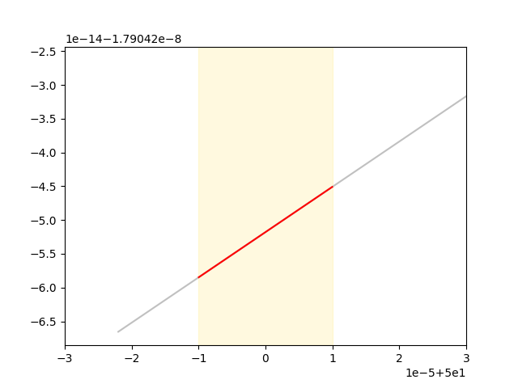

## Equation 2:
```
L_type_Ca_channel__i_Ca_L_K = 0.002 * (-50.0 + membrane_potential__V) * (intracellular_potassium_concentration__K_i * exp(50.0 * cell_parameters__F / (cell_parameters__R * cell_parameters__T)) - cell_parameters__K_o * exp((50.0 - membrane_potential__V) * cell_parameters__F / (cell_parameters__R * cell_parameters__T))) * L_type_Ca_channel__P_Ca_L_Ca * L_type_Ca_channel_d_gate__d * L_type_Ca_channel_f_gate__f * cell_parameters__F / ((1.0 - exp((50.0 - membrane_potential__V) * cell_parameters__F / (cell_parameters__R * cell_parameters__T))) * cell_parameters__R * cell_parameters__T)
```
## New Eq:
```
L_type_Ca_channel__i_Ca_L_K = ((fabs(-50.0 + membrane_potential__V) < 1.0000000000010001e-5) ? (49999.999999949992 * (-49.999989999999997 + membrane_potential__V) * (7.486778164556582e-10 * (intracellular_potassium_concentration__K_i * exp(1.8716945411372736) - cell_parameters__K_o * exp(3.7433890822782911e-7)) * L_type_Ca_channel__P_Ca_L_Ca * L_type_Ca_channel_d_gate__d * L_type_Ca_channel_f_gate__f / (1.0 - exp(3.7433890822782911e-7)) + 7.486778164556582e-10 * (intracellular_potassium_concentration__K_i * exp(1.8716945411372736) - cell_parameters__K_o * exp(-3.7433890822782911e-7)) * L_type_Ca_channel__P_Ca_L_Ca * L_type_Ca_channel_d_gate__d * L_type_Ca_channel_f_gate__f / (1.0 - exp(-3.7433890822782911e-7))) - 7.486778164556582e-10 * (intracellular_potassium_concentration__K_i * exp(1.8716945411372736) - cell_parameters__K_o * exp(3.7433890822782911e-7)) * L_type_Ca_channel__P_Ca_L_Ca * L_type_Ca_channel_d_gate__d * L_type_Ca_channel_f_gate__f / (1.0 - exp(3.7433890822782911e-7))) : (7.4867781645490941e-5 * (-50.0 + membrane_potential__V) * (intracellular_potassium_concentration__K_i * exp(1.8716945411372736) - cell_parameters__K_o * exp(1.8716945411372736 - 0.037433890822745473 * membrane_potential__V)) * L_type_Ca_channel__P_Ca_L_Ca * L_type_Ca_channel_d_gate__d * L_type_Ca_channel_f_gate__f / (1.0 - exp(1.8716945411372736 - 0.037433890822745473 * membrane_potential__V))))
```
## Singularity point: 50.000000000000000


## Equation 3:
```
L_type_Ca_channel__i_Ca_L_Na = 0.01 * (-50.0 + membrane_potential__V) * (intracellular_sodium_concentration__Na_i * exp(50.0 * cell_parameters__F / (cell_parameters__R * cell_parameters__T)) - cell_parameters__Na_o * exp((50.0 - membrane_potential__V) * cell_parameters__F / (cell_parameters__R * cell_parameters__T))) * L_type_Ca_channel__P_Ca_L_Ca * L_type_Ca_channel_d_gate__d * L_type_Ca_channel_f_gate__f * cell_parameters__F / ((1.0 - exp((50.0 - membrane_potential__V) * cell_parameters__F / (cell_parameters__R * cell_parameters__T))) * cell_parameters__R * cell_parameters__T)
```
## New Eq:
```
L_type_Ca_channel__i_Ca_L_Na = ((fabs(-50.0 + membrane_potential__V) < 1.0000000000010001e-5) ? (49999.999999949992 * (-49.999989999999997 + membrane_potential__V) * (3.7433890822782906e-9 * (intracellular_sodium_concentration__Na_i * exp(1.8716945411372736) - cell_parameters__Na_o * exp(3.7433890822782911e-7)) * L_type_Ca_channel__P_Ca_L_Ca * L_type_Ca_channel_d_gate__d * L_type_Ca_channel_f_gate__f / (1.0 - exp(3.7433890822782911e-7)) + 3.7433890822782906e-9 * (intracellular_sodium_concentration__Na_i * exp(1.8716945411372736) - cell_parameters__Na_o * exp(-3.7433890822782911e-7)) * L_type_Ca_channel__P_Ca_L_Ca * L_type_Ca_channel_d_gate__d * L_type_Ca_channel_f_gate__f / (1.0 - exp(-3.7433890822782911e-7))) - 3.7433890822782906e-9 * (intracellular_sodium_concentration__Na_i * exp(1.8716945411372736) - cell_parameters__Na_o * exp(3.7433890822782911e-7)) * L_type_Ca_channel__P_Ca_L_Ca * L_type_Ca_channel_d_gate__d * L_type_Ca_channel_f_gate__f / (1.0 - exp(3.7433890822782911e-7))) : (0.00037433890822745472 * (-50.0 + membrane_potential__V) * (intracellular_sodium_concentration__Na_i * exp(1.8716945411372736) - cell_parameters__Na_o * exp(1.8716945411372736 - 0.037433890822745473 * membrane_potential__V)) * L_type_Ca_channel__P_Ca_L_Ca * L_type_Ca_channel_d_gate__d * L_type_Ca_channel_f_gate__f / (1.0 - exp(1.8716945411372736 - 0.037433890822745473 * membrane_potential__V))))
```
## Singularity point: 50.000000000000000


## Equation 4:
```
L_type_Ca_channel_d_gate__alpha_d = 30.0 * (19.0 + membrane_potential__V) * L_type_Ca_channel_d_gate__speed_d / (1.0 - exp(-4.75 - 0.25 * membrane_potential__V))
```
## New Eq:
```
L_type_Ca_channel_d_gate__alpha_d = ((fabs(19.0 + membrane_potential__V) < 1.0000000000010001e-5) ? (-0.00090000000000090008 / (1.0 - exp(2.5000000000025002e-6)) + 49999.999999949992 * (19.00001 + membrane_potential__V) * (0.00090000000000090008 / (1.0 - exp(2.5000000000025002e-6)) + 0.00090000000000090008 / (1.0 - exp(-2.5000000000025002e-6)))) : (90.0 * (19.0 + membrane_potential__V) / (1.0 - exp(-4.75 - 0.25 * membrane_potential__V))))
```
## Singularity point: -19.000000000000000
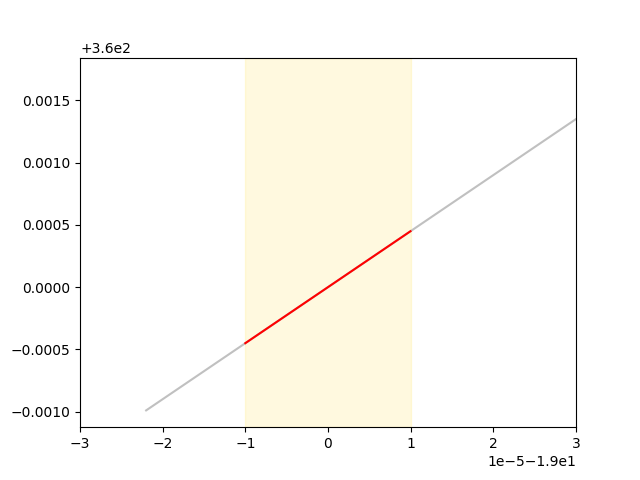

## Equation 5:
```
L_type_Ca_channel_d_gate__beta_d = -12.0 * (19.0 + membrane_potential__V) * L_type_Ca_channel_d_gate__speed_d / (1.0 - exp(1.8999999999999999 + 0.10000000000000001 * membrane_potential__V))
```
## New Eq:
```
L_type_Ca_channel_d_gate__beta_d = ((fabs(19.0 + membrane_potential__V) < 1.0000000000010001e-5) ? (0.00036000000000036003 / (1.0 - exp(-1.0000000000010001e-6)) + 49999.999999949992 * (19.00001 + membrane_potential__V) * (-0.00036000000000036003 / (1.0 - exp(1.0000000000010001e-6)) - 0.00036000000000036003 / (1.0 - exp(-1.0000000000010001e-6)))) : (-36.0 * (19.0 + membrane_potential__V) / (1.0 - exp(1.8999999999999999 + 0.10000000000000001 * membrane_potential__V))))
```
## Singularity point: -19.000000000000000
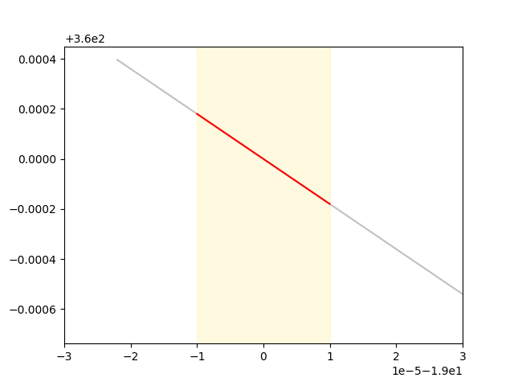

## Equation 6:
```
L_type_Ca_channel_f_gate__alpha_f = 6.25 * (34.0 + membrane_potential__V) * L_type_Ca_channel_f_gate__speed_f / (-1.0 + exp(8.5 + 0.25 * membrane_potential__V))
```
## New Eq:
```
L_type_Ca_channel_f_gate__alpha_f = ((fabs(34.0 + membrane_potential__V) < 1.0000000000010001e-5) ? (-3.1250000000031253e-5 / (-1.0 + exp(-2.5000000000025002e-6)) + 49999.999999949992 * (34.000010000000003 + membrane_potential__V) * (3.1250000000031253e-5 / (-1.0 + exp(2.5000000000025002e-6)) + 3.1250000000031253e-5 / (-1.0 + exp(-2.5000000000025002e-6)))) : (3.125 * (34.0 + membrane_potential__V) / (-1.0 + exp(8.5 + 0.25 * membrane_potential__V))))
```
## Singularity point: -34.000000000000000
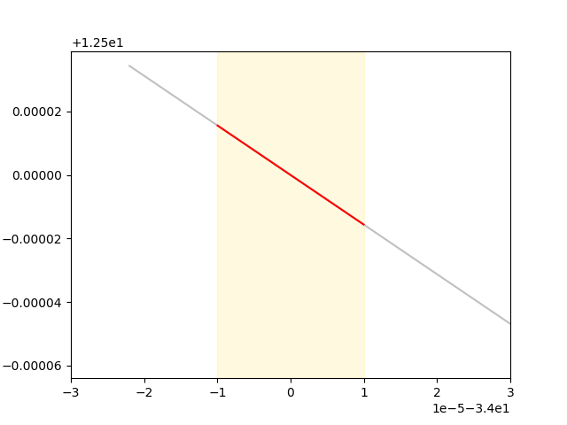

## Equation 7:
```
fast_sodium_current_m_gate__alpha_m = 200.0 * (41.0 + membrane_potential__V) / (1.0 - exp(-4.1000000000000005 - 0.10000000000000001 * membrane_potential__V))
```
## New Eq:
```
fast_sodium_current_m_gate__alpha_m = ((fabs(41.0 + membrane_potential__V) < 1.0000000000010001e-5) ? (-0.0020000000000020002 / (1.0 - exp(1.0000000000010001e-6)) + 49999.999999949992 * (41.000010000000003 + membrane_potential__V) * (0.0020000000000020002 / (1.0 - exp(1.0000000000010001e-6)) + 0.0020000000000020002 / (1.0 - exp(-1.0000000000010001e-6)))) : (200.0 * (41.0 + membrane_potential__V) / (1.0 - exp(-4.1000000000000005 - 0.10000000000000001 * membrane_potential__V))))
```
## Singularity point: -41.000000000000000


# of singularities:  7
# Model: IyerMazhariWinslow2004(iyer_2004.cellml)
No of piecewises: 1
## Equation 1:
```
COMPUTE_ICa_ICaK__ICamax = 4.0 * COMPUTE_ICa_ICaK__PCa * COMPUTE_ICa_ICaK__VFsq_over_RT * COMPUTE_ICa_ICaK__a1_Ca / COMPUTE_ICa_ICaK__a2_Ca
```
## New Eq:
```
COMPUTE_ICa_ICaK__ICamax = ((fabs(COMPUTE_CONCENTRATION_AND_VOLTAGE_DERIVATIVES__V) < 1.0000000000000001e-5) ? (49999.999999999993 * (1.0000000000000001e-5 + COMPUTE_CONCENTRATION_AND_VOLTAGE_DERIVATIVES__V) * (1.0115531588850311 * (0.001 * exp(7.487440110177876e-7) - 0.34100000000000003 * COMPUTE_CONCENTRATION_AND_VOLTAGE_DERIVATIVES__Cao) * COMPUTE_ICa_ICaK__PCa_max / (-1.0 + exp(7.487440110177876e-7)) + 1.0115531588850311 * (0.001 * exp(-7.487440110177876e-7) - 0.34100000000000003 * COMPUTE_CONCENTRATION_AND_VOLTAGE_DERIVATIVES__Cao) * COMPUTE_ICa_ICaK__PCa_max / (-1.0 + exp(-7.487440110177876e-7))) - 1.0115531588850311 * (0.001 * exp(-7.487440110177876e-7) - 0.34100000000000003 * COMPUTE_CONCENTRATION_AND_VOLTAGE_DERIVATIVES__Cao) * COMPUTE_ICa_ICaK__PCa_max / (-1.0 + exp(-7.487440110177876e-7))) : (101155.3158885031 * (0.001 * exp(0.074874401101778759 * COMPUTE_CONCENTRATION_AND_VOLTAGE_DERIVATIVES__V) - 0.34100000000000003 * COMPUTE_CONCENTRATION_AND_VOLTAGE_DERIVATIVES__Cao) * COMPUTE_CONCENTRATION_AND_VOLTAGE_DERIVATIVES__V * COMPUTE_ICa_ICaK__PCa_max / (-1.0 + exp(0.074874401101778759 * COMPUTE_CONCENTRATION_AND_VOLTAGE_DERIVATIVES__V))))
```
## Singularity point: 0
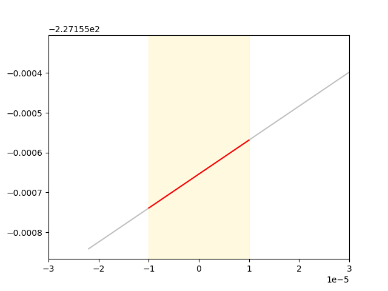

## Equation 2:
```
COMPUTE_ICa_ICaK__ICaK = COMPUTE_DERIVATIVES_OF_LTYPE_CHANNEL_STATES__Open * COMPUTE_DERIVATIVES_OF_LTYPE_CHANNEL_STATES__yCa * COMPUTE_ICa_ICaK__PKprime * COMPUTE_ICa_ICaK__VFsq_over_RT * COMPUTE_ICa_ICaK__a1_K / COMPUTE_ICa_ICaK__a2_K
```
## New Eq:
```
COMPUTE_ICa_ICaK__ICaK = ((fabs(COMPUTE_CONCENTRATION_AND_VOLTAGE_DERIVATIVES__V) < 1.0000000000000001e-5) ? (49999.999999999993 * (1.0000000000000001e-5 + COMPUTE_CONCENTRATION_AND_VOLTAGE_DERIVATIVES__V) * (1.156711037185033e-7 * (-COMPUTE_CONCENTRATION_AND_VOLTAGE_DERIVATIVES__Ko + COMPUTE_CONCENTRATION_AND_VOLTAGE_DERIVATIVES__Ki * exp(3.743720055088938e-7)) * COMPUTE_DERIVATIVES_OF_LTYPE_CHANNEL_STATES__Open * COMPUTE_DERIVATIVES_OF_LTYPE_CHANNEL_STATES__yCa / ((1.0 - 3.773584905660377 * COMPUTE_ICa_ICaK__Icabar) * (-1.0 + exp(3.743720055088938e-7))) + 1.156711037185033e-7 * (-COMPUTE_CONCENTRATION_AND_VOLTAGE_DERIVATIVES__Ko + COMPUTE_CONCENTRATION_AND_VOLTAGE_DERIVATIVES__Ki * exp(-3.743720055088938e-7)) * COMPUTE_DERIVATIVES_OF_LTYPE_CHANNEL_STATES__Open * COMPUTE_DERIVATIVES_OF_LTYPE_CHANNEL_STATES__yCa / ((1.0 - 3.773584905660377 * COMPUTE_ICa_ICaK__Icabar) * (-1.0 + exp(-3.743720055088938e-7)))) - 1.156711037185033e-7 * (-COMPUTE_CONCENTRATION_AND_VOLTAGE_DERIVATIVES__Ko + COMPUTE_CONCENTRATION_AND_VOLTAGE_DERIVATIVES__Ki * exp(-3.743720055088938e-7)) * COMPUTE_DERIVATIVES_OF_LTYPE_CHANNEL_STATES__Open * COMPUTE_DERIVATIVES_OF_LTYPE_CHANNEL_STATES__yCa / ((1.0 - 3.773584905660377 * COMPUTE_ICa_ICaK__Icabar) * (-1.0 + exp(-3.743720055088938e-7)))) : (0.01156711037185033 * (-COMPUTE_CONCENTRATION_AND_VOLTAGE_DERIVATIVES__Ko + COMPUTE_CONCENTRATION_AND_VOLTAGE_DERIVATIVES__Ki * exp(0.03743720055088938 * COMPUTE_CONCENTRATION_AND_VOLTAGE_DERIVATIVES__V)) * COMPUTE_CONCENTRATION_AND_VOLTAGE_DERIVATIVES__V * COMPUTE_DERIVATIVES_OF_LTYPE_CHANNEL_STATES__Open * COMPUTE_DERIVATIVES_OF_LTYPE_CHANNEL_STATES__yCa / ((1.0 - 3.773584905660377 * COMPUTE_ICa_ICaK__Icabar) * (-1.0 + exp(0.03743720055088938 * COMPUTE_CONCENTRATION_AND_VOLTAGE_DERIVATIVES__V)))))
```
## Singularity point: 0
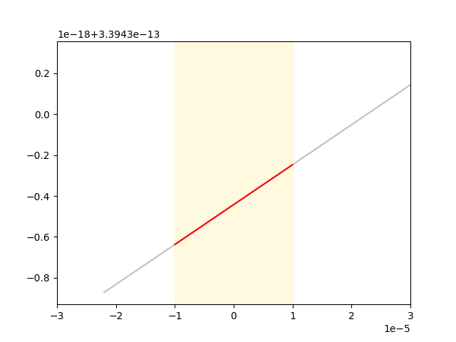
## Singularity point: 0


## Equation 3:
```
COMPUTE_INa_IKr_IKs_Ito1_IK1_INab_IKp__IKv14_K = COMPUTE_DERIVATIVES_OF_Kv1_4_CHANNEL_STATES__OKv14 * COMPUTE_INa_IKr_IKs_Ito1_IK1_INab_IKp__PKv14 * COMPUTE_INa_IKr_IKs_Ito1_IK1_INab_IKp__VFsq_over_RT * COMPUTE_INa_IKr_IKs_Ito1_IK1_INab_IKp__a1_K / COMPUTE_INa_IKr_IKs_Ito1_IK1_INab_IKp__a2
```
## New Eq:
```
COMPUTE_INa_IKr_IKs_Ito1_IK1_INab_IKp__IKv14_K = ((fabs(COMPUTE_CONCENTRATION_AND_VOLTAGE_DERIVATIVES__V) < 1.0000000000000001e-5) ? (49999.999999999993 * (1.0000000000000001e-5 + COMPUTE_CONCENTRATION_AND_VOLTAGE_DERIVATIVES__V) * (0.0040100857370085159 * (-COMPUTE_CONCENTRATION_AND_VOLTAGE_DERIVATIVES__Ko + COMPUTE_CONCENTRATION_AND_VOLTAGE_DERIVATIVES__Ki * exp(3.743720055088938e-7)) * COMPUTE_DERIVATIVES_OF_Kv1_4_CHANNEL_STATES__OKv14 * COMPUTE_INa_IKr_IKs_Ito1_IK1_INab_IKp__PtoSfactor / (-1.0 + exp(3.743720055088938e-7)) + 0.0040100857370085159 * (-COMPUTE_CONCENTRATION_AND_VOLTAGE_DERIVATIVES__Ko + COMPUTE_CONCENTRATION_AND_VOLTAGE_DERIVATIVES__Ki * exp(-3.743720055088938e-7)) * COMPUTE_DERIVATIVES_OF_Kv1_4_CHANNEL_STATES__OKv14 * COMPUTE_INa_IKr_IKs_Ito1_IK1_INab_IKp__PtoSfactor / (-1.0 + exp(-3.743720055088938e-7))) - 0.0040100857370085159 * (-COMPUTE_CONCENTRATION_AND_VOLTAGE_DERIVATIVES__Ko + COMPUTE_CONCENTRATION_AND_VOLTAGE_DERIVATIVES__Ki * exp(-3.743720055088938e-7)) * COMPUTE_DERIVATIVES_OF_Kv1_4_CHANNEL_STATES__OKv14 * COMPUTE_INa_IKr_IKs_Ito1_IK1_INab_IKp__PtoSfactor / (-1.0 + exp(-3.743720055088938e-7))) : (401.00857370085151 * (-COMPUTE_CONCENTRATION_AND_VOLTAGE_DERIVATIVES__Ko + COMPUTE_CONCENTRATION_AND_VOLTAGE_DERIVATIVES__Ki * exp(0.03743720055088938 * COMPUTE_CONCENTRATION_AND_VOLTAGE_DERIVATIVES__V)) * COMPUTE_CONCENTRATION_AND_VOLTAGE_DERIVATIVES__V * COMPUTE_DERIVATIVES_OF_Kv1_4_CHANNEL_STATES__OKv14 * COMPUTE_INa_IKr_IKs_Ito1_IK1_INab_IKp__PtoSfactor / (-1.0 + exp(0.03743720055088938 * COMPUTE_CONCENTRATION_AND_VOLTAGE_DERIVATIVES__V))))
```
## Singularity point: 0


## Equation 4:
```
COMPUTE_INa_IKr_IKs_Ito1_IK1_INab_IKp__IKv14_Na = 0.02 * COMPUTE_DERIVATIVES_OF_Kv1_4_CHANNEL_STATES__OKv14 * COMPUTE_INa_IKr_IKs_Ito1_IK1_INab_IKp__PKv14 * COMPUTE_INa_IKr_IKs_Ito1_IK1_INab_IKp__VFsq_over_RT * COMPUTE_INa_IKr_IKs_Ito1_IK1_INab_IKp__a1_Na / COMPUTE_INa_IKr_IKs_Ito1_IK1_INab_IKp__a2
```
## New Eq:
```
COMPUTE_INa_IKr_IKs_Ito1_IK1_INab_IKp__IKv14_Na = ((fabs(COMPUTE_CONCENTRATION_AND_VOLTAGE_DERIVATIVES__V) < 1.0000000000000001e-5) ? (49999.999999999993 * (1.0000000000000001e-5 + COMPUTE_CONCENTRATION_AND_VOLTAGE_DERIVATIVES__V) * (8.0201714740170315e-5 * (-COMPUTE_CONCENTRATION_AND_VOLTAGE_DERIVATIVES__Nao + COMPUTE_CONCENTRATION_AND_VOLTAGE_DERIVATIVES__Nai * exp(3.743720055088938e-7)) * COMPUTE_DERIVATIVES_OF_Kv1_4_CHANNEL_STATES__OKv14 * COMPUTE_INa_IKr_IKs_Ito1_IK1_INab_IKp__PtoSfactor / (-1.0 + exp(3.743720055088938e-7)) + 8.0201714740170315e-5 * (-COMPUTE_CONCENTRATION_AND_VOLTAGE_DERIVATIVES__Nao + COMPUTE_CONCENTRATION_AND_VOLTAGE_DERIVATIVES__Nai * exp(-3.743720055088938e-7)) * COMPUTE_DERIVATIVES_OF_Kv1_4_CHANNEL_STATES__OKv14 * COMPUTE_INa_IKr_IKs_Ito1_IK1_INab_IKp__PtoSfactor / (-1.0 + exp(-3.743720055088938e-7))) - 8.0201714740170315e-5 * (-COMPUTE_CONCENTRATION_AND_VOLTAGE_DERIVATIVES__Nao + COMPUTE_CONCENTRATION_AND_VOLTAGE_DERIVATIVES__Nai * exp(-3.743720055088938e-7)) * COMPUTE_DERIVATIVES_OF_Kv1_4_CHANNEL_STATES__OKv14 * COMPUTE_INa_IKr_IKs_Ito1_IK1_INab_IKp__PtoSfactor / (-1.0 + exp(-3.743720055088938e-7))) : (8.0201714740170313 * (-COMPUTE_CONCENTRATION_AND_VOLTAGE_DERIVATIVES__Nao + COMPUTE_CONCENTRATION_AND_VOLTAGE_DERIVATIVES__Nai * exp(0.03743720055088938 * COMPUTE_CONCENTRATION_AND_VOLTAGE_DERIVATIVES__V)) * COMPUTE_CONCENTRATION_AND_VOLTAGE_DERIVATIVES__V * COMPUTE_DERIVATIVES_OF_Kv1_4_CHANNEL_STATES__OKv14 * COMPUTE_INa_IKr_IKs_Ito1_IK1_INab_IKp__PtoSfactor / (-1.0 + exp(0.03743720055088938 * COMPUTE_CONCENTRATION_AND_VOLTAGE_DERIVATIVES__V))))
```
## Singularity point: 0


# of singularities:  4
# Model: iyer_model_2007(iyer_model_2007.cellml)
No of piecewises: 7
## Equation 1:
```
COMPUTE_INa_IKr_IKs_Ito1_IK1_INab_IKp__IKv14_K = COMPUTE_DERIVATIVES_OF_Kv1_4_CHANNEL_STATES__OKv14 * COMPUTE_INa_IKr_IKs_Ito1_IK1_INab_IKp__PKv14 * COMPUTE_INa_IKr_IKs_Ito1_IK1_INab_IKp__VFsq_over_RT * COMPUTE_INa_IKr_IKs_Ito1_IK1_INab_IKp__a1_K / COMPUTE_INa_IKr_IKs_Ito1_IK1_INab_IKp__a2
```
## New Eq:
```
COMPUTE_INa_IKr_IKs_Ito1_IK1_INab_IKp__IKv14_K = ((fabs(COMPUTE_CONCENTRATION_AND_VOLTAGE_DERIVATIVES__V) < 1.0000000000000001e-5) ? (49999.999999999993 * (1.0000000000000001e-5 + COMPUTE_CONCENTRATION_AND_VOLTAGE_DERIVATIVES__V) * (1.5031321966819391e-9 * (-COMPUTE_CONCENTRATION_AND_VOLTAGE_DERIVATIVES__Ko + COMPUTE_CONCENTRATION_AND_VOLTAGE_DERIVATIVES__Ki * exp(3.743720055088938e-7)) * COMPUTE_DERIVATIVES_OF_Kv1_4_CHANNEL_STATES__OKv14 / (-1.0 + exp(3.743720055088938e-7)) + 1.5031321966819391e-9 * (-COMPUTE_CONCENTRATION_AND_VOLTAGE_DERIVATIVES__Ko + COMPUTE_CONCENTRATION_AND_VOLTAGE_DERIVATIVES__Ki * exp(-3.743720055088938e-7)) * COMPUTE_DERIVATIVES_OF_Kv1_4_CHANNEL_STATES__OKv14 / (-1.0 + exp(-3.743720055088938e-7))) - 1.5031321966819391e-9 * (-COMPUTE_CONCENTRATION_AND_VOLTAGE_DERIVATIVES__Ko + COMPUTE_CONCENTRATION_AND_VOLTAGE_DERIVATIVES__Ki * exp(-3.743720055088938e-7)) * COMPUTE_DERIVATIVES_OF_Kv1_4_CHANNEL_STATES__OKv14 / (-1.0 + exp(-3.743720055088938e-7))) : (0.00015031321966819388 * (-COMPUTE_CONCENTRATION_AND_VOLTAGE_DERIVATIVES__Ko + COMPUTE_CONCENTRATION_AND_VOLTAGE_DERIVATIVES__Ki * exp(0.03743720055088938 * COMPUTE_CONCENTRATION_AND_VOLTAGE_DERIVATIVES__V)) * COMPUTE_CONCENTRATION_AND_VOLTAGE_DERIVATIVES__V * COMPUTE_DERIVATIVES_OF_Kv1_4_CHANNEL_STATES__OKv14 / (-1.0 + exp(0.03743720055088938 * COMPUTE_CONCENTRATION_AND_VOLTAGE_DERIVATIVES__V))))
```
## Singularity point: 0
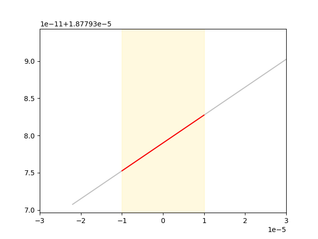

## Equation 2:
```
COMPUTE_INa_IKr_IKs_Ito1_IK1_INab_IKp__IKv14_Na = 0.02 * COMPUTE_DERIVATIVES_OF_Kv1_4_CHANNEL_STATES__OKv14 * COMPUTE_INa_IKr_IKs_Ito1_IK1_INab_IKp__PKv14 * COMPUTE_INa_IKr_IKs_Ito1_IK1_INab_IKp__VFsq_over_RT * COMPUTE_INa_IKr_IKs_Ito1_IK1_INab_IKp__a1_Na / COMPUTE_INa_IKr_IKs_Ito1_IK1_INab_IKp__a2
```
## New Eq:
```
COMPUTE_INa_IKr_IKs_Ito1_IK1_INab_IKp__IKv14_Na = ((fabs(COMPUTE_CONCENTRATION_AND_VOLTAGE_DERIVATIVES__V) < 1.0000000000000001e-5) ? (49999.999999999993 * (1.0000000000000001e-5 + COMPUTE_CONCENTRATION_AND_VOLTAGE_DERIVATIVES__V) * (3.0062643933638781e-11 * (-COMPUTE_CONCENTRATION_AND_VOLTAGE_DERIVATIVES__Nao + COMPUTE_CONCENTRATION_AND_VOLTAGE_DERIVATIVES__Nai * exp(3.743720055088938e-7)) * COMPUTE_DERIVATIVES_OF_Kv1_4_CHANNEL_STATES__OKv14 / (-1.0 + exp(3.743720055088938e-7)) + 3.0062643933638781e-11 * (-COMPUTE_CONCENTRATION_AND_VOLTAGE_DERIVATIVES__Nao + COMPUTE_CONCENTRATION_AND_VOLTAGE_DERIVATIVES__Nai * exp(-3.743720055088938e-7)) * COMPUTE_DERIVATIVES_OF_Kv1_4_CHANNEL_STATES__OKv14 / (-1.0 + exp(-3.743720055088938e-7))) - 3.0062643933638781e-11 * (-COMPUTE_CONCENTRATION_AND_VOLTAGE_DERIVATIVES__Nao + COMPUTE_CONCENTRATION_AND_VOLTAGE_DERIVATIVES__Nai * exp(-3.743720055088938e-7)) * COMPUTE_DERIVATIVES_OF_Kv1_4_CHANNEL_STATES__OKv14 / (-1.0 + exp(-3.743720055088938e-7))) : (3.006264393363878e-6 * (-COMPUTE_CONCENTRATION_AND_VOLTAGE_DERIVATIVES__Nao + COMPUTE_CONCENTRATION_AND_VOLTAGE_DERIVATIVES__Nai * exp(0.03743720055088938 * COMPUTE_CONCENTRATION_AND_VOLTAGE_DERIVATIVES__V)) * COMPUTE_CONCENTRATION_AND_VOLTAGE_DERIVATIVES__V * COMPUTE_DERIVATIVES_OF_Kv1_4_CHANNEL_STATES__OKv14 / (-1.0 + exp(0.03743720055088938 * COMPUTE_CONCENTRATION_AND_VOLTAGE_DERIVATIVES__V))))
```
## Singularity point: 0


## Equation 3:
```
COMPUTE_ICa_ICaK__ICamax = 4.0 * COMPUTE_ICa_ICaK__PCa * COMPUTE_ICa_ICaK__VFsq_over_RT * COMPUTE_ICa_ICaK__a1_Ca / COMPUTE_ICa_ICaK__a2_Ca
```
## New Eq:
```
COMPUTE_ICa_ICaK__ICamax = ((fabs(COMPUTE_CONCENTRATION_AND_VOLTAGE_DERIVATIVES__V) < 1.0000000000000001e-5) ? (49999.999999999993 * (1.0000000000000001e-5 + COMPUTE_CONCENTRATION_AND_VOLTAGE_DERIVATIVES__V) * (0.14450759412643302 * (0.001 * exp(7.487440110177876e-7) - 0.34100000000000003 * COMPUTE_CONCENTRATION_AND_VOLTAGE_DERIVATIVES__Cao) * COMPUTE_ICa_ICaK__PCa / (-1.0 + exp(7.487440110177876e-7)) + 0.14450759412643302 * (0.001 * exp(-7.487440110177876e-7) - 0.34100000000000003 * COMPUTE_CONCENTRATION_AND_VOLTAGE_DERIVATIVES__Cao) * COMPUTE_ICa_ICaK__PCa / (-1.0 + exp(-7.487440110177876e-7))) - 0.14450759412643302 * (0.001 * exp(-7.487440110177876e-7) - 0.34100000000000003 * COMPUTE_CONCENTRATION_AND_VOLTAGE_DERIVATIVES__Cao) * COMPUTE_ICa_ICaK__PCa / (-1.0 + exp(-7.487440110177876e-7))) : (14450.7594126433 * (0.001 * exp(0.074874401101778759 * COMPUTE_CONCENTRATION_AND_VOLTAGE_DERIVATIVES__V) - 0.34100000000000003 * COMPUTE_CONCENTRATION_AND_VOLTAGE_DERIVATIVES__Cao) * COMPUTE_CONCENTRATION_AND_VOLTAGE_DERIVATIVES__V * COMPUTE_ICa_ICaK__PCa / (-1.0 + exp(0.074874401101778759 * COMPUTE_CONCENTRATION_AND_VOLTAGE_DERIVATIVES__V))))
```
## Singularity point: 0


## Equation 4:
```
COMPUTE_ICa_ICaK__ICaK = COMPUTE_DERIVATIVES_OF_LTYPE_CHANNEL_STATES__Open * COMPUTE_DERIVATIVES_OF_LTYPE_CHANNEL_STATES__yCa * COMPUTE_ICa_ICaK__PKprime * COMPUTE_ICa_ICaK__VFsq_over_RT * COMPUTE_ICa_ICaK__a1_K / COMPUTE_ICa_ICaK__a2_K
```
## New Eq:
```
COMPUTE_ICa_ICaK__ICaK = ((fabs(COMPUTE_CONCENTRATION_AND_VOLTAGE_DERIVATIVES__V) < 1.0000000000000001e-5) ? (49999.999999999993 * (1.0000000000000001e-5 + COMPUTE_CONCENTRATION_AND_VOLTAGE_DERIVATIVES__V) * (1.156711037185033e-7 * (-COMPUTE_CONCENTRATION_AND_VOLTAGE_DERIVATIVES__Ko + COMPUTE_CONCENTRATION_AND_VOLTAGE_DERIVATIVES__Ki * exp(3.743720055088938e-7)) * COMPUTE_DERIVATIVES_OF_LTYPE_CHANNEL_STATES__Open * COMPUTE_DERIVATIVES_OF_LTYPE_CHANNEL_STATES__yCa / ((1.0 - 3.773584905660377 * COMPUTE_ICa_ICaK__Icabar) * (-1.0 + exp(3.743720055088938e-7))) + 1.156711037185033e-7 * (-COMPUTE_CONCENTRATION_AND_VOLTAGE_DERIVATIVES__Ko + COMPUTE_CONCENTRATION_AND_VOLTAGE_DERIVATIVES__Ki * exp(-3.743720055088938e-7)) * COMPUTE_DERIVATIVES_OF_LTYPE_CHANNEL_STATES__Open * COMPUTE_DERIVATIVES_OF_LTYPE_CHANNEL_STATES__yCa / ((1.0 - 3.773584905660377 * COMPUTE_ICa_ICaK__Icabar) * (-1.0 + exp(-3.743720055088938e-7)))) - 1.156711037185033e-7 * (-COMPUTE_CONCENTRATION_AND_VOLTAGE_DERIVATIVES__Ko + COMPUTE_CONCENTRATION_AND_VOLTAGE_DERIVATIVES__Ki * exp(-3.743720055088938e-7)) * COMPUTE_DERIVATIVES_OF_LTYPE_CHANNEL_STATES__Open * COMPUTE_DERIVATIVES_OF_LTYPE_CHANNEL_STATES__yCa / ((1.0 - 3.773584905660377 * COMPUTE_ICa_ICaK__Icabar) * (-1.0 + exp(-3.743720055088938e-7)))) : (0.01156711037185033 * (-COMPUTE_CONCENTRATION_AND_VOLTAGE_DERIVATIVES__Ko + COMPUTE_CONCENTRATION_AND_VOLTAGE_DERIVATIVES__Ki * exp(0.03743720055088938 * COMPUTE_CONCENTRATION_AND_VOLTAGE_DERIVATIVES__V)) * COMPUTE_CONCENTRATION_AND_VOLTAGE_DERIVATIVES__V * COMPUTE_DERIVATIVES_OF_LTYPE_CHANNEL_STATES__Open * COMPUTE_DERIVATIVES_OF_LTYPE_CHANNEL_STATES__yCa / ((1.0 - 3.773584905660377 * COMPUTE_ICa_ICaK__Icabar) * (-1.0 + exp(0.03743720055088938 * COMPUTE_CONCENTRATION_AND_VOLTAGE_DERIVATIVES__V)))))
```
## Singularity point: 0

## Singularity point: 0


# of singularities:  4
# Model: jafri_rice_winslow_1998(jafri_rice_winslow_model_1998.cellml)
No of piecewises: 4
## Equation 1:
```
L_type_Ca_channel__i_Ca_L_Ca_max = 4.0 * pow(membrane__F, 2) * (0.001 * exp(2.0 * membrane__F * membrane__V / (membrane__R * membrane__T)) - 0.34100000000000003 * ionic_concentrations__Cao) * L_type_Ca_channel__P_Ca * membrane__V / ((-1.0 + exp(2.0 * membrane__F * membrane__V / (membrane__R * membrane__T))) * membrane__R * membrane__T)
```
## New Eq:
```
L_type_Ca_channel__i_Ca_L_Ca_max = ((fabs(membrane__V) < 1.0000000000000001e-5) ? (49999.999999999993 * (1.0000000000000001e-5 + membrane__V) * (0.14555146023561638 * (0.001 * exp(7.5146605522028175e-7) - 0.34100000000000003 * ionic_concentrations__Cao) * L_type_Ca_channel__P_Ca / (-1.0 + exp(7.5146605522028175e-7)) + 0.14555146023561638 * (0.001 * exp(-7.5146605522028175e-7) - 0.34100000000000003 * ionic_concentrations__Cao) * L_type_Ca_channel__P_Ca / (-1.0 + exp(-7.5146605522028175e-7))) - 0.14555146023561638 * (0.001 * exp(-7.5146605522028175e-7) - 0.34100000000000003 * ionic_concentrations__Cao) * L_type_Ca_channel__P_Ca / (-1.0 + exp(-7.5146605522028175e-7))) : (14555.146023561636 * (0.001 * exp(0.075146605522028176 * membrane__V) - 0.34100000000000003 * ionic_concentrations__Cao) * L_type_Ca_channel__P_Ca * membrane__V / (-1.0 + exp(0.075146605522028176 * membrane__V))))
```
## Singularity point: 0


## Equation 2:
```
L_type_Ca_channel__i_Ca_L_K = pow(membrane__F, 2) * (-ionic_concentrations__Ko + ionic_concentrations__Ki * exp(membrane__F * membrane__V / (membrane__R * membrane__T))) * (L_type_Ca_channel__O + L_type_Ca_channel__O_Ca) * L_type_Ca_channel__p_k * L_type_Ca_channel_y_gate__y * membrane__V / ((-1.0 + exp(membrane__F * membrane__V / (membrane__R * membrane__T))) * membrane__R * membrane__T)
```
## New Eq:
```
L_type_Ca_channel__i_Ca_L_K = ((fabs(membrane__V) < 1.0000000000000001e-5) ? (49999.999999999993 * (1.0000000000000001e-5 + membrane__V) * (3.6387865058904099e-11 * (-ionic_concentrations__Ko + ionic_concentrations__Ki * exp(3.7573302761014087e-7)) * (L_type_Ca_channel__O + L_type_Ca_channel__O_Ca) * L_type_Ca_channel_y_gate__y / ((1.0 - 218.34061135371181 * L_type_Ca_channel__i_Ca_L_Ca_max) * (-1.0 + exp(3.7573302761014087e-7))) + 3.6387865058904099e-11 * (-ionic_concentrations__Ko + ionic_concentrations__Ki * exp(-3.7573302761014087e-7)) * (L_type_Ca_channel__O + L_type_Ca_channel__O_Ca) * L_type_Ca_channel_y_gate__y / ((1.0 - 218.34061135371181 * L_type_Ca_channel__i_Ca_L_Ca_max) * (-1.0 + exp(-3.7573302761014087e-7)))) - 3.6387865058904099e-11 * (-ionic_concentrations__Ko + ionic_concentrations__Ki * exp(-3.7573302761014087e-7)) * (L_type_Ca_channel__O + L_type_Ca_channel__O_Ca) * L_type_Ca_channel_y_gate__y / ((1.0 - 218.34061135371181 * L_type_Ca_channel__i_Ca_L_Ca_max) * (-1.0 + exp(-3.7573302761014087e-7)))) : (3.6387865058904094e-6 * (-ionic_concentrations__Ko + ionic_concentrations__Ki * exp(0.037573302761014088 * membrane__V)) * (L_type_Ca_channel__O + L_type_Ca_channel__O_Ca) * L_type_Ca_channel_y_gate__y * membrane__V / ((1.0 - 218.34061135371181 * L_type_Ca_channel__i_Ca_L_Ca_max) * (-1.0 + exp(0.037573302761014088 * membrane__V)))))
```
## Singularity point: 0
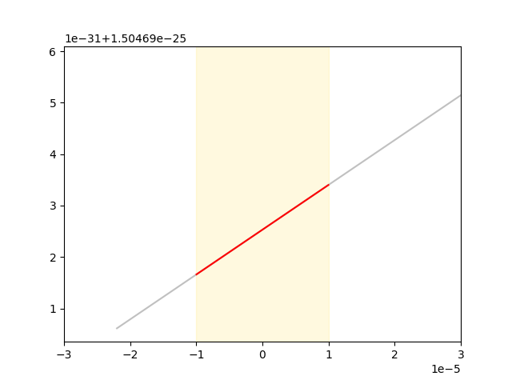
## Singularity point: 0


## Equation 3:
```
fast_sodium_current_m_gate__alpha_m = 0.32000000000000001 * (47.130000000000003 + membrane__V) / (1.0 - exp(-4.7130000000000001 - 0.10000000000000001 * membrane__V))
```
## New Eq:
```
fast_sodium_current_m_gate__alpha_m = ((fabs(47.130000000000003 + membrane__V) < 1.0000000000010001e-5) ? (-3.2000000000032004e-6 / (1.0 - exp(1.0000000000010001e-6)) + 49999.999999949992 * (47.130010000000006 + membrane__V) * (3.2000000000032004e-6 / (1.0 - exp(1.0000000000010001e-6)) + 3.2000000000032004e-6 / (1.0 - exp(-1.0000000000010001e-6)))) : (0.32000000000000001 * (47.130000000000003 + membrane__V) / (1.0 - exp(-4.7130000000000001 - 0.10000000000000001 * membrane__V))))
```
## Singularity point: -47.130000000000003


## Equation 4:
```
non_specific_calcium_activated_current__I_ns_K = pow(membrane__F, 2) * (-0.75 * ionic_concentrations__Ko + 0.75 * ionic_concentrations__Ki * exp(membrane__F * non_specific_calcium_activated_current__VnsCa / (membrane__R * membrane__T))) * non_specific_calcium_activated_current__P_ns_Ca * non_specific_calcium_activated_current__VnsCa / ((-1.0 + exp(membrane__F * non_specific_calcium_activated_current__VnsCa / (membrane__R * membrane__T))) * membrane__R * membrane__T)
```
## New Eq:
```
non_specific_calcium_activated_current__I_ns_K = ((fabs(-26.614641953637257 * log((ionic_concentrations__Ko + ionic_concentrations__Nao) / (ionic_concentrations__Ki + ionic_concentrations__Nai)) + membrane__V) < 1.0000000000000001e-5) ? (49999.999999999993 * (6.3678763853082168e-11 * (-0.75 * ionic_concentrations__Ko + 0.75 * ionic_concentrations__Ki * exp(3.7573302761014087e-7)) / (-1.0 + exp(3.7573302761014087e-7)) + 6.3678763853082168e-11 * (-0.75 * ionic_concentrations__Ko + 0.75 * ionic_concentrations__Ki * exp(-3.7573302761014087e-7)) / (-1.0 + exp(-3.7573302761014087e-7))) * (1.0000000000000001e-5 - 26.614641953637257 * log((ionic_concentrations__Ko + ionic_concentrations__Nao) / (ionic_concentrations__Ki + ionic_concentrations__Nai)) + membrane__V) - 6.3678763853082168e-11 * (-0.75 * ionic_concentrations__Ko + 0.75 * ionic_concentrations__Ki * exp(-3.7573302761014087e-7)) / (-1.0 + exp(-3.7573302761014087e-7))) : (6.3678763853082156e-6 * (-0.75 * ionic_concentrations__Ko + 0.75 * ionic_concentrations__Ki * exp(0.037573302761014088 * membrane__V - log((ionic_concentrations__Ko + ionic_concentrations__Nao) / (ionic_concentrations__Ki + ionic_concentrations__Nai)))) * (-26.614641953637257 * log((ionic_concentrations__Ko + ionic_concentrations__Nao) / (ionic_concentrations__Ki + ionic_concentrations__Nai)) + membrane__V) / (-1.0 + exp(0.037573302761014088 * membrane__V - log((ionic_concentrations__Ko + ionic_concentrations__Nao) / (ionic_concentrations__Ki + ionic_concentrations__Nai))))))
```
## Singularity point: -1.5174919438451304
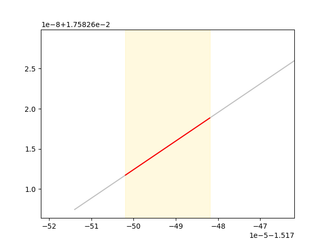

## Equation 5:
```
non_specific_calcium_activated_current__I_ns_Na = pow(membrane__F, 2) * (-0.75 * ionic_concentrations__Nao + 0.75 * ionic_concentrations__Nai * exp(membrane__F * non_specific_calcium_activated_current__VnsCa / (membrane__R * membrane__T))) * non_specific_calcium_activated_current__P_ns_Ca * non_specific_calcium_activated_current__VnsCa / ((-1.0 + exp(membrane__F * non_specific_calcium_activated_current__VnsCa / (membrane__R * membrane__T))) * membrane__R * membrane__T)
```
## New Eq:
```
non_specific_calcium_activated_current__I_ns_Na = ((fabs(-26.614641953637257 * log((ionic_concentrations__Ko + ionic_concentrations__Nao) / (ionic_concentrations__Ki + ionic_concentrations__Nai)) + membrane__V) < 1.0000000000000001e-5) ? (49999.999999999993 * (6.3678763853082168e-11 * (-0.75 * ionic_concentrations__Nao + 0.75 * ionic_concentrations__Nai * exp(3.7573302761014087e-7)) / (-1.0 + exp(3.7573302761014087e-7)) + 6.3678763853082168e-11 * (-0.75 * ionic_concentrations__Nao + 0.75 * ionic_concentrations__Nai * exp(-3.7573302761014087e-7)) / (-1.0 + exp(-3.7573302761014087e-7))) * (1.0000000000000001e-5 - 26.614641953637257 * log((ionic_concentrations__Ko + ionic_concentrations__Nao) / (ionic_concentrations__Ki + ionic_concentrations__Nai)) + membrane__V) - 6.3678763853082168e-11 * (-0.75 * ionic_concentrations__Nao + 0.75 * ionic_concentrations__Nai * exp(-3.7573302761014087e-7)) / (-1.0 + exp(-3.7573302761014087e-7))) : (6.3678763853082156e-6 * (-0.75 * ionic_concentrations__Nao + 0.75 * ionic_concentrations__Nai * exp(0.037573302761014088 * membrane__V - log((ionic_concentrations__Ko + ionic_concentrations__Nao) / (ionic_concentrations__Ki + ionic_concentrations__Nai)))) * (-26.614641953637257 * log((ionic_concentrations__Ko + ionic_concentrations__Nao) / (ionic_concentrations__Ki + ionic_concentrations__Nai)) + membrane__V) / (-1.0 + exp(0.037573302761014088 * membrane__V - log((ionic_concentrations__Ko + ionic_concentrations__Nao) / (ionic_concentrations__Ki + ionic_concentrations__Nai))))))
```
## Singularity point: -1.5174919438451304
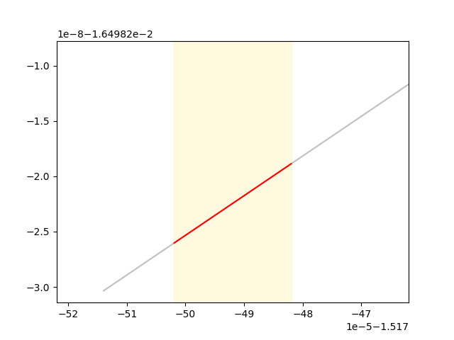

## Equation 6:
```
time_dependent_potassium_current_X_gate__alpha_X = 7.1899999999999999e-5 * (30.0 + membrane__V) / (1.0 - exp(-4.4399999999999995 - 0.14799999999999999 * membrane__V))
```
## New Eq:
```
time_dependent_potassium_current_X_gate__alpha_X = ((fabs(30.0 + membrane__V) < 1.0000000000010001e-5) ? (-7.1900000000071903e-10 / (1.0 - exp(1.48000000000148e-6)) + 49999.999999949992 * (30.00001 + membrane__V) * (7.1900000000071903e-10 / (1.0 - exp(1.48000000000148e-6)) + 7.1900000000071903e-10 / (1.0 - exp(-1.48000000000148e-6)))) : (7.1899999999999999e-5 * (30.0 + membrane__V) / (1.0 - exp(-4.4399999999999995 - 0.14799999999999999 * membrane__V))))
```
## Singularity point: -30.000000000000000


## Equation 7:
```
time_dependent_potassium_current_X_gate__beta_X = 0.00013100000000000001 * (30.0 + membrane__V) / (-1.0 + exp(2.0609999999999999 + 0.068699999999999997 * membrane__V))
```
## New Eq:
```
time_dependent_potassium_current_X_gate__beta_X = ((fabs(30.0 + membrane__V) < 1.0000000000010001e-5) ? (-1.3100000000013103e-9 / (-1.0 + exp(-6.8700000000068699e-7)) + 49999.999999949992 * (30.00001 + membrane__V) * (1.3100000000013103e-9 / (-1.0 + exp(6.8700000000068699e-7)) + 1.3100000000013103e-9 / (-1.0 + exp(-6.8700000000068699e-7)))) : (0.00013100000000000001 * (30.0 + membrane__V) / (-1.0 + exp(2.0609999999999999 + 0.068699999999999997 * membrane__V))))
```
## Singularity point: -30.000000000000000
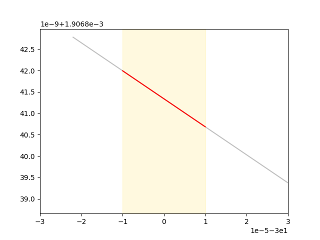

# of singularities:  7
# Model: kurata_model_2002(kurata_model_2002.cellml)
No of piecewises: 0
## Equation 1:
```
L_type_calcium_channel_current_d_gate__alpha_d = -0.028389999999999999 * (35.0 + membrane__V) / (-1.0 + exp(-14.0 - 0.40000000000000002 * membrane__V)) - 0.084900000000000003 * membrane__V / (-1.0 + exp(-0.20798668885191349 * membrane__V))
```
## New Eq:
```
L_type_calcium_channel_current_d_gate__alpha_d = ((fabs(35.0 + membrane__V) < 1.0000000000010001e-5) ? (2.8390000000028391e-7 / (-1.0 + exp(4.0000000000040004e-6)) + 49999.999999949992 * (35.000010000000003 + membrane__V) * (-2.8390000000028391e-7 / (-1.0 + exp(4.0000000000040004e-6)) - 2.8390000000028391e-7 / (-1.0 + exp(-4.0000000000040004e-6)))) : (-0.028389999999999999 * (35.0 + membrane__V) / (-1.0 + exp(-14.0 - 0.40000000000000002 * membrane__V)))) + ((fabs(membrane__V) < 1.0000000000000001e-5) ? (8.4900000000000015e-7 / (-1.0 + exp(2.079866888519135e-6)) + 49999.999999999993 * (1.0000000000000001e-5 + membrane__V) * (-8.4900000000000015e-7 / (-1.0 + exp(2.079866888519135e-6)) - 8.4900000000000015e-7 / (-1.0 + exp(-2.079866888519135e-6)))) : (-0.084900000000000003 * membrane__V / (-1.0 + exp(-0.20798668885191349 * membrane__V))))
```
## Singularity point: -35.000000000000000
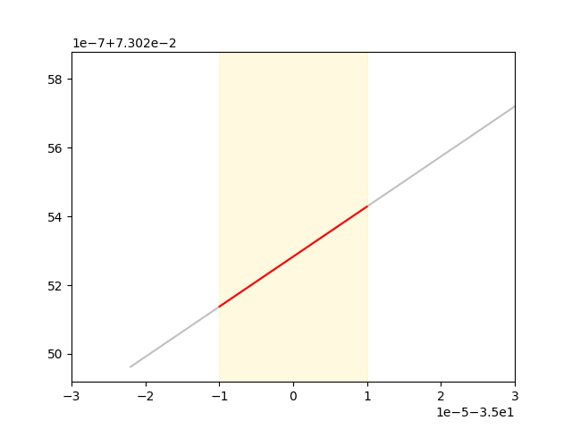
## Singularity point: 0


## Equation 2:
```
L_type_calcium_channel_current_d_gate__beta_d = 0.011429999999999999 * (-5.0 + membrane__V) / (-1.0 + exp(-2.0 + 0.40000000000000002 * membrane__V))
```
## New Eq:
```
L_type_calcium_channel_current_d_gate__beta_d = ((fabs(-5.0 + membrane__V) < 1.0000000000003062e-5) ? (-1.1430000000003499e-7 / (-1.0 + exp(-4.0000000000012246e-6)) + 49999.999999984691 * (-4.9999900000000004 + membrane__V) * (1.1430000000003499e-7 / (-1.0 + exp(4.0000000000012246e-6)) + 1.1430000000003499e-7 / (-1.0 + exp(-4.0000000000012246e-6)))) : (0.011429999999999999 * (-5.0 + membrane__V) / (-1.0 + exp(-2.0 + 0.40000000000000002 * membrane__V))))
```
## Singularity point: 5.0000000000000000


# of singularities:  3
# Model: lindblad_atrial_model_1996(lindblad_model_1996.cellml)
No of piecewises: 0
## Equation 1:
```
L_type_Ca_channel_d_L_gate__alpha_d_L = -50.0 * membrane__V / (-1.0 + exp(-0.20798668885191349 * membrane__V)) - 16.719999999999999 * L_type_Ca_channel_d_L_gate__E0_alpha_d_L / (-1.0 + exp(-0.40000000000000002 * L_type_Ca_channel_d_L_gate__E0_alpha_d_L))
```
## New Eq:
```
L_type_Ca_channel_d_L_gate__alpha_d_L = ((fabs(membrane__V) < 1.0000000000000001e-5) ? (0.00050000000000000001 / (-1.0 + exp(2.079866888519135e-6)) + 49999.999999999993 * (1.0000000000000001e-5 + membrane__V) * (-0.00050000000000000001 / (-1.0 + exp(2.079866888519135e-6)) - 0.00050000000000000001 / (-1.0 + exp(-2.079866888519135e-6)))) : (-50.0 * membrane__V / (-1.0 + exp(-0.20798668885191349 * membrane__V)))) + ((fabs(35.0 + membrane__V) < 1.0000000000010001e-5) ? (0.00016720000000016721 / (-1.0 + exp(4.0000000000040004e-6)) + 49999.999999949992 * (35.000010000000003 + membrane__V) * (-0.00016720000000016721 / (-1.0 + exp(4.0000000000040004e-6)) - 0.00016720000000016721 / (-1.0 + exp(-4.0000000000040004e-6)))) : (-16.719999999999999 * (35.0 + membrane__V) / (-1.0 + exp(-14.0 - 0.40000000000000002 * membrane__V))))
```
## Singularity point: 0
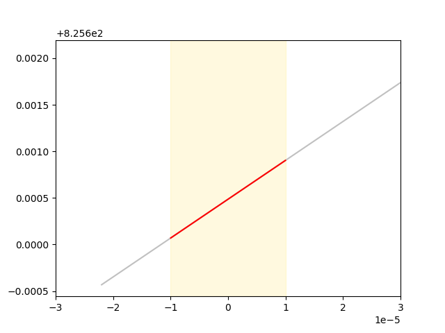
## Singularity point: -35.000000000000000
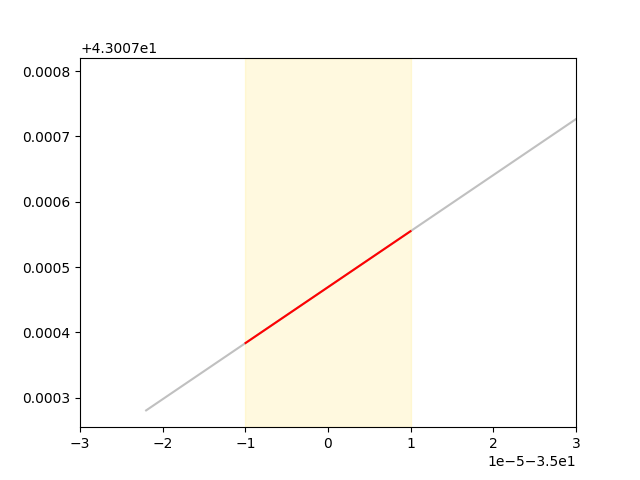

## Equation 2:
```
L_type_Ca_channel_d_L_gate__beta_d_L = 4.4800000000000004 * L_type_Ca_channel_d_L_gate__E0_beta_d_L / (-1.0 + exp(0.40000000000000002 * L_type_Ca_channel_d_L_gate__E0_beta_d_L))
```
## New Eq:
```
L_type_Ca_channel_d_L_gate__beta_d_L = ((fabs(-5.0 + membrane__V) < 1.0000000000003062e-5) ? (-4.480000000001372e-5 / (-1.0 + exp(-4.0000000000012246e-6)) + 49999.999999984691 * (-4.9999900000000004 + membrane__V) * (4.480000000001372e-5 / (-1.0 + exp(4.0000000000012246e-6)) + 4.480000000001372e-5 / (-1.0 + exp(-4.0000000000012246e-6)))) : (4.4800000000000004 * (-5.0 + membrane__V) / (-1.0 + exp(-2.0 + 0.40000000000000002 * membrane__V))))
```
## Singularity point: 5.0000000000000000
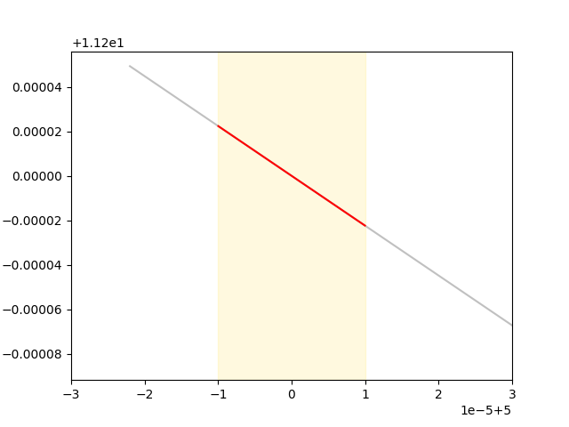

## Equation 3:
```
L_type_Ca_channel_f_L_gate__alpha_f_L = 8.4900000000000002 * L_type_Ca_channel_f_L_gate__E0_f_L / (-1.0 + exp(0.25 * L_type_Ca_channel_f_L_gate__E0_f_L))
```
## New Eq:
```
L_type_Ca_channel_f_L_gate__alpha_f_L = ((fabs(28.0 + membrane__V) < 1.0000000000010001e-5) ? (-8.490000000008491e-5 / (-1.0 + exp(-2.5000000000025002e-6)) + 49999.999999949992 * (28.00001 + membrane__V) * (8.490000000008491e-5 / (-1.0 + exp(2.5000000000025002e-6)) + 8.490000000008491e-5 / (-1.0 + exp(-2.5000000000025002e-6)))) : (8.4900000000000002 * (28.0 + membrane__V) / (-1.0 + exp(7.0 + 0.25 * membrane__V))))
```
## Singularity point: -28.000000000000000


## Equation 4:
```
sodium_current_m_gate__alpha_m = -460.0 * sodium_current_m_gate__E0_m / (-1.0 + exp(-0.078907914463820727 * sodium_current_m_gate__E0_m))
```
## New Eq:
```
sodium_current_m_gate__alpha_m = ((fabs(44.399999999999999 + membrane__V) < 1.0000000000010001e-5) ? (0.0046000000000046004 / (-1.0 + exp(7.890791446389964e-7)) + 49999.999999949992 * (44.400010000000002 + membrane__V) * (-0.0046000000000046004 / (-1.0 + exp(7.890791446389964e-7)) - 0.0046000000000046004 / (-1.0 + exp(-7.890791446389964e-7)))) : (-460.0 * (44.399999999999999 + membrane__V) / (-1.0 + exp(-3.5035114021936398 - 0.078907914463820727 * membrane__V))))
```
## Singularity point: -44.399999999999999


## Equation 5:
```
sodium_current__i_Na = pow(membrane__F, 2) * pow(sodium_current_m_gate__m, 3) * (-1.0 + exp((-sodium_current__E_Na + membrane__V) * membrane__F / (membrane__R * membrane__T))) * (0.36499999999999999 * sodium_current_h2_gate__h2 + 0.63500000000000001 * sodium_current_h1_gate__h1) * cleft_space_ion_concentrations__Na_c * membrane__V * sodium_current__P_Na / ((-1.0 + exp(membrane__F * membrane__V / (membrane__R * membrane__T))) * membrane__R * membrane__T)
```
## New Eq:
```
sodium_current__i_Na = ((fabs(membrane__V) < 1.0000000000000001e-5) ? (49999.999999999993 * (1.0000000000000001e-5 + membrane__V) * (0.03635275127626484 * pow(sodium_current_m_gate__m, 3) * (-1.0 + exp(3.7676968035880184e-7 - log(cleft_space_ion_concentrations__Na_c / intracellular_ion_concentrations__Na_i))) * (0.36499999999999999 * sodium_current_h2_gate__h2 + 0.63500000000000001 * sodium_current_h1_gate__h1) * cleft_space_ion_concentrations__Na_c * sodium_current__P_Na / (-1.0 + exp(3.7676968035880184e-7)) + 0.03635275127626484 * pow(sodium_current_m_gate__m, 3) * (-1.0 + exp(-3.7676968035880184e-7 - log(cleft_space_ion_concentrations__Na_c / intracellular_ion_concentrations__Na_i))) * (0.36499999999999999 * sodium_current_h2_gate__h2 + 0.63500000000000001 * sodium_current_h1_gate__h1) * cleft_space_ion_concentrations__Na_c * sodium_current__P_Na / (-1.0 + exp(-3.7676968035880184e-7))) - 0.03635275127626484 * pow(sodium_current_m_gate__m, 3) * (-1.0 + exp(-3.7676968035880184e-7 - log(cleft_space_ion_concentrations__Na_c / intracellular_ion_concentrations__Na_i))) * (0.36499999999999999 * sodium_current_h2_gate__h2 + 0.63500000000000001 * sodium_current_h1_gate__h1) * cleft_space_ion_concentrations__Na_c * sodium_current__P_Na / (-1.0 + exp(-3.7676968035880184e-7))) : (3635.2751276264835 * pow(sodium_current_m_gate__m, 3) * (-1.0 + exp(0.037676968035880179 * membrane__V - log(cleft_space_ion_concentrations__Na_c / intracellular_ion_concentrations__Na_i))) * (0.36499999999999999 * sodium_current_h2_gate__h2 + 0.63500000000000001 * sodium_current_h1_gate__h1) * cleft_space_ion_concentrations__Na_c * membrane__V * sodium_current__P_Na / (-1.0 + exp(0.037676968035880179 * membrane__V))))
```
## Singularity point: 0


# of singularities:  6
# Model: LivshitzRudy2007(livshitz_rudy_2007.cellml)
No of piecewises: 0
## Equation 1:
```
ICaL__ibarca = 4.0 * (-Environment__Ca_o * ICaL__gacao + Ca__Ca_i * ICaL__gacai * exp(2.0 * Environment__FonRT * cell__V)) * Environment__F * Environment__FonRT * ICaL__pca * cell__V / (-1.0 + exp(2.0 * Environment__FonRT * cell__V))
```
## New Eq:
```
ICaL__ibarca = ((fabs(cell__V) < 1.0000000000000001e-5) ? (49999.999999999993 * (1.0000000000000001e-5 + cell__V) * (0.14448004881001345 * (-0.34100000000000003 * Environment__Ca_o + (-0.040960000000000003 + 0.33333333333333331 * Ca__Ca_T + 0.66666666666666663 * sqrt(-0.00057837000000000014 + pow((0.12288 - Ca__Ca_T), 2) + 0.0086400000000000001 * Ca__Ca_T) * cos(0.33333333333333331 * acos(0.5 * pow((-0.00057837000000000014 + pow((0.12288 - Ca__Ca_T), 2) + 0.0086400000000000001 * Ca__Ca_T), (-1.5)) * (3.2130000000000006e-5 * Ca__Ca_T - 2.0 * pow((0.12288 - Ca__Ca_T), 3) + 9.0 * (0.12288 - Ca__Ca_T) * (0.00019279000000000003 - 0.0028800000000000002 * Ca__Ca_T))))) * exp(7.4871767015605244e-7)) * ICaL__pca / (-1.0 + exp(7.4871767015605244e-7)) + 0.14448004881001345 * (-0.34100000000000003 * Environment__Ca_o + (-0.040960000000000003 + 0.33333333333333331 * Ca__Ca_T + 0.66666666666666663 * sqrt(-0.00057837000000000014 + pow((0.12288 - Ca__Ca_T), 2) + 0.0086400000000000001 * Ca__Ca_T) * cos(0.33333333333333331 * acos(0.5 * pow((-0.00057837000000000014 + pow((0.12288 - Ca__Ca_T), 2) + 0.0086400000000000001 * Ca__Ca_T), (-1.5)) * (3.2130000000000006e-5 * Ca__Ca_T - 2.0 * pow((0.12288 - Ca__Ca_T), 3) + 9.0 * (0.12288 - Ca__Ca_T) * (0.00019279000000000003 - 0.0028800000000000002 * Ca__Ca_T))))) * exp(-7.4871767015605244e-7)) * ICaL__pca / (-1.0 + exp(-7.4871767015605244e-7))) - 0.14448004881001345 * (-0.34100000000000003 * Environment__Ca_o + (-0.040960000000000003 + 0.33333333333333331 * Ca__Ca_T + 0.66666666666666663 * sqrt(-0.00057837000000000014 + pow((0.12288 - Ca__Ca_T), 2) + 0.0086400000000000001 * Ca__Ca_T) * cos(0.33333333333333331 * acos(0.5 * pow((-0.00057837000000000014 + pow((0.12288 - Ca__Ca_T), 2) + 0.0086400000000000001 * Ca__Ca_T), (-1.5)) * (3.2130000000000006e-5 * Ca__Ca_T - 2.0 * pow((0.12288 - Ca__Ca_T), 3) + 9.0 * (0.12288 - Ca__Ca_T) * (0.00019279000000000003 - 0.0028800000000000002 * Ca__Ca_T))))) * exp(-7.4871767015605244e-7)) * ICaL__pca / (-1.0 + exp(-7.4871767015605244e-7))) : (14448.004881001343 * (-0.34100000000000003 * Environment__Ca_o + (-0.040960000000000003 + 0.33333333333333331 * Ca__Ca_T + 0.66666666666666663 * sqrt(-0.00057837000000000014 + pow((0.12288 - Ca__Ca_T), 2) + 0.0086400000000000001 * Ca__Ca_T) * cos(0.33333333333333331 * acos(0.5 * pow((-0.00057837000000000014 + pow((0.12288 - Ca__Ca_T), 2) + 0.0086400000000000001 * Ca__Ca_T), (-1.5)) * (3.2130000000000006e-5 * Ca__Ca_T - 2.0 * pow((0.12288 - Ca__Ca_T), 3) + 9.0 * (0.12288 - Ca__Ca_T) * (0.00019279000000000003 - 0.0028800000000000002 * Ca__Ca_T))))) * exp(0.074871767015605231 * cell__V)) * ICaL__pca * cell__V / (-1.0 + exp(0.074871767015605231 * cell__V))))
```
## Singularity point: 0
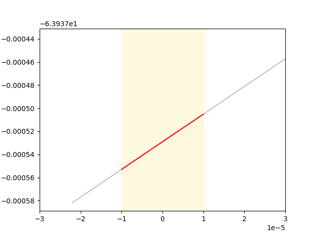

## Equation 2:
```
ICaL__ibark = (-Environment__K_o * ICaL__gako + ICaL__gaki * K__K_i * exp(Environment__FonRT * cell__V)) * Environment__F * Environment__FonRT * ICaL__pk * cell__V / (-1.0 + exp(Environment__FonRT * cell__V))
```
## New Eq:
```
ICaL__ibark = ((fabs(cell__V) < 1.0000000000000001e-5) ? (49999.999999999993 * (1.0000000000000001e-5 + cell__V) * (6.9711623550831478e-9 * (-0.75 * Environment__K_o + 0.75 * K__K_i * exp(3.7435883507802622e-7)) / (-1.0 + exp(3.7435883507802622e-7)) + 6.9711623550831478e-9 * (-0.75 * Environment__K_o + 0.75 * K__K_i * exp(-3.7435883507802622e-7)) / (-1.0 + exp(-3.7435883507802622e-7))) - 6.9711623550831478e-9 * (-0.75 * Environment__K_o + 0.75 * K__K_i * exp(-3.7435883507802622e-7)) / (-1.0 + exp(-3.7435883507802622e-7))) : (0.00069711623550831479 * (-0.75 * Environment__K_o + 0.75 * K__K_i * exp(0.037435883507802616 * cell__V)) * cell__V / (-1.0 + exp(0.037435883507802616 * cell__V))))
```
## Singularity point: 0


## Equation 3:
```
ICaL__ibarna = (-Environment__Na_o * ICaL__ganao + ICaL__ganai * Na__Na_i * exp(Environment__FonRT * cell__V)) * Environment__F * Environment__FonRT * ICaL__pna * cell__V / (-1.0 + exp(Environment__FonRT * cell__V))
```
## New Eq:
```
ICaL__ibarna = ((fabs(cell__V) < 1.0000000000000001e-5) ? (49999.999999999993 * (1.0000000000000001e-5 + cell__V) * (2.4381008236689766e-8 * (-0.75 * Environment__Na_o + 0.75 * Na__Na_i * exp(3.7435883507802622e-7)) / (-1.0 + exp(3.7435883507802622e-7)) + 2.4381008236689766e-8 * (-0.75 * Environment__Na_o + 0.75 * Na__Na_i * exp(-3.7435883507802622e-7)) / (-1.0 + exp(-3.7435883507802622e-7))) - 2.4381008236689766e-8 * (-0.75 * Environment__Na_o + 0.75 * Na__Na_i * exp(-3.7435883507802622e-7)) / (-1.0 + exp(-3.7435883507802622e-7))) : (0.0024381008236689767 * (-0.75 * Environment__Na_o + 0.75 * Na__Na_i * exp(0.037435883507802616 * cell__V)) * cell__V / (-1.0 + exp(0.037435883507802616 * cell__V))))
```
## Singularity point: 0


## Equation 4:
```
ICaL__taud = 28.571428571428569 * (1.0 - exp(-1.6025641025641024 - 0.16025641025641024 * cell__V)) * ICaL__dss0 / (10.0 + cell__V)
```
## New Eq:
```
ICaL__taud = ((fabs(10.0 + cell__V) < 9.9999999999961231e-6) ? (50000.000000019383 * (10.00001 + cell__V) * (2857142.8571439646 * (1.0 - exp(1.6025641025634812e-6)) / (1.0 + exp(1.6025641025634812e-6)) + 2857142.8571439646 * (1.0 - exp(-1.6025641025634812e-6)) / (1.0 + exp(-1.6025641025634812e-6))) - 2857142.8571439646 * (1.0 - exp(1.6025641025634812e-6)) / (1.0 + exp(1.6025641025634812e-6))) : (28.571428571428569 * (1.0 - exp(-1.6025641025641024 - 0.16025641025641024 * cell__V)) / ((1.0 + exp(-1.6025641025641024 - 0.16025641025641024 * cell__V)) * (10.0 + cell__V))))
```
## Singularity point: -10.000000000000000


## Equation 5:
```
IKr__tauxr = 1 / (0.00060999999999999997 * (38.899999999999999 + cell__V) / (-1.0 + exp(5.6404999999999994 + 0.14499999999999999 * cell__V)) + 0.0013799999999999999 * (14.199999999999999 + cell__V) / (1.0 - exp(-1.7465999999999999 - 0.123 * cell__V)))
```
## New Eq:
```
IKr__tauxr = 1 / (((fabs(38.899999999999999 + cell__V) < 1.0000000000010001e-5) ? (-6.1000000000061005e-9 / (-1.0 + exp(-1.45000000000145e-6)) + 49999.999999949992 * (38.900010000000002 + cell__V) * (6.1000000000061005e-9 / (-1.0 + exp(1.45000000000145e-6)) + 6.1000000000061005e-9 / (-1.0 + exp(-1.45000000000145e-6)))) : (0.00060999999999999997 * (38.899999999999999 + cell__V) / (-1.0 + exp(5.6404999999999994 + 0.14499999999999999 * cell__V)))) + ((fabs(14.199999999999999 + cell__V) < 9.9999999999961231e-6) ? (-1.3799999999994649e-8 / (1.0 - exp(1.2299999999995232e-6)) + 50000.000000019383 * (14.200009999999999 + cell__V) * (1.3799999999994649e-8 / (1.0 - exp(1.2299999999995232e-6)) + 1.3799999999994649e-8 / (1.0 - exp(-1.2299999999995232e-6)))) : (0.0013799999999999999 * (14.199999999999999 + cell__V) / (1.0 - exp(-1.7465999999999999 - 0.123 * cell__V)))))
```
## Singularity point: -38.899999999999999

## Singularity point: -14.199999999999999


## Equation 6:
```
IKs__tauxs = 1 / (0.00013100000000000001 * (30.0 + cell__V) / (-1.0 + exp(2.0609999999999999 + 0.068699999999999997 * cell__V)) + 7.1899999999999999e-5 * (30.0 + cell__V) / (1.0 - exp(-4.4399999999999995 - 0.14799999999999999 * cell__V)))
```
## New Eq:
```
IKs__tauxs = ((fabs(30.0 + cell__V) < 1.0000000000010001e-5) ? (1 / (-7.1900000000071903e-10 / (1.0 - exp(1.48000000000148e-6)) - 1.3100000000013103e-9 / (-1.0 + exp(-6.8700000000068699e-7)) + 49999.999999949992 * (30.00001 + cell__V) * (7.1900000000071903e-10 / (1.0 - exp(1.48000000000148e-6)) + 7.1900000000071903e-10 / (1.0 - exp(-1.48000000000148e-6)) + 1.3100000000013103e-9 / (-1.0 + exp(6.8700000000068699e-7)) + 1.3100000000013103e-9 / (-1.0 + exp(-6.8700000000068699e-7))))) : (1 / (0.00013100000000000001 * (30.0 + cell__V) / (-1.0 + exp(2.0609999999999999 + 0.068699999999999997 * cell__V)) + 7.1899999999999999e-5 * (30.0 + cell__V) / (1.0 - exp(-4.4399999999999995 - 0.14799999999999999 * cell__V)))))
```
## Singularity point: -30.000000000000000


## Equation 7:
```
INa__am = 0.32000000000000001 * (47.130000000000003 + cell__V) / (1.0 - exp(-4.7130000000000001 - 0.10000000000000001 * cell__V))
```
## New Eq:
```
INa__am = ((fabs(47.130000000000003 + cell__V) < 1.0000000000010001e-5) ? (-3.2000000000032004e-6 / (1.0 - exp(1.0000000000010001e-6)) + 49999.999999949992 * (47.130010000000006 + cell__V) * (3.2000000000032004e-6 / (1.0 - exp(1.0000000000010001e-6)) + 3.2000000000032004e-6 / (1.0 - exp(-1.0000000000010001e-6)))) : (0.32000000000000001 * (47.130000000000003 + cell__V) / (1.0 - exp(-4.7130000000000001 - 0.10000000000000001 * cell__V))))
```
## Singularity point: -47.130000000000003


# of singularities:  8
# Model: Li_Mouse_2010(li_mouse_2010.cellml)
No of piecewises: 2
## Equation 1:
```
L_type_calcium_current__i_CaL = -2.0 * (-calcium_concentration__Cass + cell__Cao * exp(-L_type_calcium_current__FVRT_Ca)) * L_type_calcium_current__FVRT_Ca * L_type_calcium_current__O * L_type_calcium_current__P_CaL * L_type_calcium_current__y_gate * cell__F * cell__Vss / ((1.0 - exp(-L_type_calcium_current__FVRT_Ca)) * cell__Acap * cell__Cm)
```
## New Eq:
```
L_type_calcium_current__i_CaL = ((fabs(cell__V) < 1.0000000000000001e-5) ? (49999.999999999993 * (1.0000000000000001e-5 + cell__V) * (-2.3079445283571577e-8 * (-calcium_concentration__Cass + cell__Cao * exp(7.5369662812530267e-7)) * L_type_calcium_current__O * L_type_calcium_current__P_CaL * L_type_calcium_current__y_gate / ((1.0 - exp(7.5369662812530267e-7)) * cell__Cm) - 2.3079445283571577e-8 * (-calcium_concentration__Cass + cell__Cao * exp(-7.5369662812530267e-7)) * L_type_calcium_current__O * L_type_calcium_current__P_CaL * L_type_calcium_current__y_gate / ((1.0 - exp(-7.5369662812530267e-7)) * cell__Cm)) + 2.3079445283571577e-8 * (-calcium_concentration__Cass + cell__Cao * exp(7.5369662812530267e-7)) * L_type_calcium_current__O * L_type_calcium_current__P_CaL * L_type_calcium_current__y_gate / ((1.0 - exp(7.5369662812530267e-7)) * cell__Cm)) : (-0.0023079445283571576 * (-calcium_concentration__Cass + cell__Cao * exp(-0.075369662812530269 * cell__V)) * L_type_calcium_current__O * L_type_calcium_current__P_CaL * L_type_calcium_current__y_gate * cell__V / ((1.0 - exp(-0.075369662812530269 * cell__V)) * cell__Cm)))
```
## Singularity point: 0


## Equation 2:
```
slow_delayed_rectifier_K_I__alpha_n = 4.8133299999999997e-6 * (26.5 + cell__V) / (1.0 - exp(-3.3919999999999999 - 0.128 * cell__V))
```
## New Eq:
```
slow_delayed_rectifier_K_I__alpha_n = ((fabs(26.5 + cell__V) < 1.0000000000010001e-5) ? (-4.8133300000048136e-11 / (1.0 - exp(1.2800000000012801e-6)) + 49999.999999949992 * (26.50001 + cell__V) * (4.8133300000048136e-11 / (1.0 - exp(1.2800000000012801e-6)) + 4.8133300000048136e-11 / (1.0 - exp(-1.2800000000012801e-6)))) : (4.8133299999999997e-6 * (26.5 + cell__V) / (1.0 - exp(-3.3919999999999999 - 0.128 * cell__V))))
```
## Singularity point: -26.500000000000000


# of singularities:  2
# Model: luo_rudy_1991(luo_rudy_1991.cellml)
No of piecewises: 5
## Equation 1:
```
fast_sodium_current_m_gate__alpha_m = 0.32000000000000001 * (47.130000000000003 + membrane__V) / (1.0 - exp(-4.7130000000000001 - 0.10000000000000001 * membrane__V))
```
## New Eq:
```
fast_sodium_current_m_gate__alpha_m = ((fabs(47.130000000000003 + membrane__V) < 1.0000000000010001e-5) ? (-3.2000000000032004e-6 / (1.0 - exp(1.0000000000010001e-6)) + 49999.999999949992 * (47.130010000000006 + membrane__V) * (3.2000000000032004e-6 / (1.0 - exp(1.0000000000010001e-6)) + 3.2000000000032004e-6 / (1.0 - exp(-1.0000000000010001e-6)))) : (0.32000000000000001 * (47.130000000000003 + membrane__V) / (1.0 - exp(-4.7130000000000001 - 0.10000000000000001 * membrane__V))))
```
## Singularity point: -47.130000000000003


## Equation 2:
```
time_dependent_potassium_current_Xi_gate__temp_Xi = 2.8370000000000002 * (-1.0 + exp(3.0800000000000001 + 0.040000000000000001 * membrane__V)) / (77.0 + membrane__V)
```
## New Eq:
```
time_dependent_potassium_current_Xi_gate__temp_Xi = ((fabs(77.0 + membrane__V) < 9.9999999999544897e-6) ? (283700.00000129116 - 283700.00000129116 * exp(-3.999999999981796e-7) + 50000.000000227548 * (77.000010000000003 + membrane__V) * (-567400.00000258232 + 283700.00000129116 * exp(3.999999999981796e-7) + 283700.00000129116 * exp(-3.999999999981796e-7))) : (2.8370000000000002 * (-1.0 + exp(3.0800000000000001 + 0.040000000000000001 * membrane__V)) / (77.0 + membrane__V)))
```
## Singularity point: -77.000000000000000
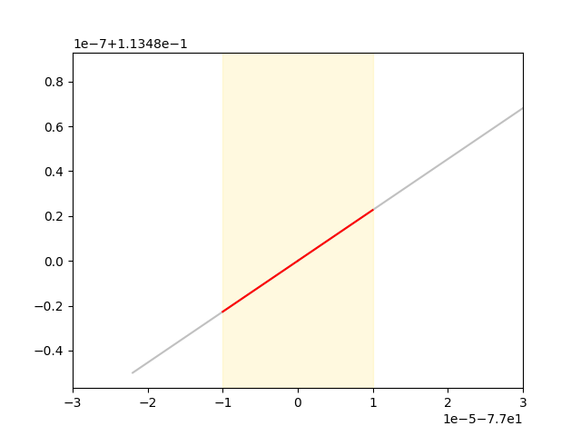

# of singularities:  2
# Model: luo_rudy_1994(luo_rudy_1994.cellml)
No of piecewises: 5
## Equation 1:
```
L_type_Ca_channel__I_CaCa = 4.0 * pow(membrane__F, 2) * (-L_type_Ca_channel__gamma_Cao * ionic_concentrations__Cao + L_type_Ca_channel__gamma_Cai * ionic_concentrations__Cai * exp(2.0 * membrane__F * membrane__V / (membrane__R * membrane__T))) * L_type_Ca_channel__P_Ca * membrane__V / ((-1.0 + exp(2.0 * membrane__F * membrane__V / (membrane__R * membrane__T))) * membrane__R * membrane__T)
```
## New Eq:
```
L_type_Ca_channel__I_CaCa = ((fabs(membrane__V) < 1.0000000000000001e-5) ? (49999.999999999993 * (1.0000000000000001e-5 + membrane__V) * (7.859778852723284e-7 * (-0.34000000000000002 * ionic_concentrations__Cao + ionic_concentrations__Cai * exp(7.5146605522028175e-7)) / (-1.0 + exp(7.5146605522028175e-7)) + 7.859778852723284e-7 * (-0.34000000000000002 * ionic_concentrations__Cao + ionic_concentrations__Cai * exp(-7.5146605522028175e-7)) / (-1.0 + exp(-7.5146605522028175e-7))) - 7.859778852723284e-7 * (-0.34000000000000002 * ionic_concentrations__Cao + ionic_concentrations__Cai * exp(-7.5146605522028175e-7)) / (-1.0 + exp(-7.5146605522028175e-7))) : (0.078597788527232842 * (-0.34000000000000002 * ionic_concentrations__Cao + ionic_concentrations__Cai * exp(0.075146605522028176 * membrane__V)) * membrane__V / (-1.0 + exp(0.075146605522028176 * membrane__V))))
```
## Singularity point: 0


## Equation 2:
```
L_type_Ca_channel__I_CaK = pow(membrane__F, 2) * (-L_type_Ca_channel__gamma_Ko * ionic_concentrations__Ko + L_type_Ca_channel__gamma_Ki * ionic_concentrations__Ki * exp(membrane__F * membrane__V / (membrane__R * membrane__T))) * L_type_Ca_channel__P_K * membrane__V / ((-1.0 + exp(membrane__F * membrane__V / (membrane__R * membrane__T))) * membrane__R * membrane__T)
```
## New Eq:
```
L_type_Ca_channel__I_CaK = ((fabs(membrane__V) < 1.0000000000000001e-5) ? (49999.999999999993 * (1.0000000000000001e-5 + membrane__V) * (7.0228579563684904e-11 * (-0.75 * ionic_concentrations__Ko + 0.75 * ionic_concentrations__Ki * exp(3.7573302761014087e-7)) / (-1.0 + exp(3.7573302761014087e-7)) + 7.0228579563684904e-11 * (-0.75 * ionic_concentrations__Ko + 0.75 * ionic_concentrations__Ki * exp(-3.7573302761014087e-7)) / (-1.0 + exp(-3.7573302761014087e-7))) - 7.0228579563684904e-11 * (-0.75 * ionic_concentrations__Ko + 0.75 * ionic_concentrations__Ki * exp(-3.7573302761014087e-7)) / (-1.0 + exp(-3.7573302761014087e-7))) : (7.0228579563684903e-6 * (-0.75 * ionic_concentrations__Ko + 0.75 * ionic_concentrations__Ki * exp(0.037573302761014088 * membrane__V)) * membrane__V / (-1.0 + exp(0.037573302761014088 * membrane__V))))
```
## Singularity point: 0


## Equation 3:
```
L_type_Ca_channel__I_CaNa = pow(membrane__F, 2) * (-L_type_Ca_channel__gamma_Nao * ionic_concentrations__Nao + L_type_Ca_channel__gamma_Nai * ionic_concentrations__Nai * exp(membrane__F * membrane__V / (membrane__R * membrane__T))) * L_type_Ca_channel__P_Na * membrane__V / ((-1.0 + exp(membrane__F * membrane__V / (membrane__R * membrane__T))) * membrane__R * membrane__T)
```
## New Eq:
```
L_type_Ca_channel__I_CaNa = ((fabs(membrane__V) < 1.0000000000000001e-5) ? (49999.999999999993 * (1.0000000000000001e-5 + membrane__V) * (2.4561808914760263e-10 * (-0.75 * ionic_concentrations__Nao + 0.75 * ionic_concentrations__Nai * exp(3.7573302761014087e-7)) / (-1.0 + exp(3.7573302761014087e-7)) + 2.4561808914760263e-10 * (-0.75 * ionic_concentrations__Nao + 0.75 * ionic_concentrations__Nai * exp(-3.7573302761014087e-7)) / (-1.0 + exp(-3.7573302761014087e-7))) - 2.4561808914760263e-10 * (-0.75 * ionic_concentrations__Nao + 0.75 * ionic_concentrations__Nai * exp(-3.7573302761014087e-7)) / (-1.0 + exp(-3.7573302761014087e-7))) : (2.4561808914760263e-5 * (-0.75 * ionic_concentrations__Nao + 0.75 * ionic_concentrations__Nai * exp(0.037573302761014088 * membrane__V)) * membrane__V / (-1.0 + exp(0.037573302761014088 * membrane__V))))
```
## Singularity point: 0


## Equation 4:
```
L_type_Ca_channel_d_gate__tau_d = 28.571428571428569 * (1.0 - exp(-1.6025641025641024 - 0.16025641025641024 * membrane__V)) * L_type_Ca_channel_d_gate__d_infinity / (10.0 + membrane__V)
```
## New Eq:
```
L_type_Ca_channel_d_gate__tau_d = ((fabs(10.0 + membrane__V) < 9.9999999999961231e-6) ? (50000.000000019383 * (10.00001 + membrane__V) * (2857142.8571439646 * (1.0 - exp(1.6025641025634812e-6)) / (1.0 + exp(1.6025641025634812e-6)) + 2857142.8571439646 * (1.0 - exp(-1.6025641025634812e-6)) / (1.0 + exp(-1.6025641025634812e-6))) - 2857142.8571439646 * (1.0 - exp(1.6025641025634812e-6)) / (1.0 + exp(1.6025641025634812e-6))) : (28.571428571428569 * (1.0 - exp(-1.6025641025641024 - 0.16025641025641024 * membrane__V)) / ((1.0 + exp(-1.6025641025641024 - 0.16025641025641024 * membrane__V)) * (10.0 + membrane__V))))
```
## Singularity point: -10.000000000000000
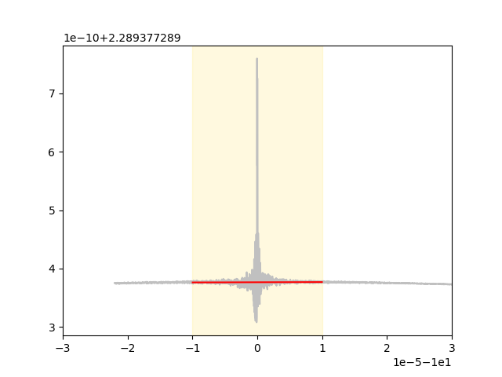

## Equation 5:
```
fast_sodium_current_m_gate__alpha_m = 0.32000000000000001 * (47.130000000000003 + membrane__V) / (1.0 - exp(-4.7130000000000001 - 0.10000000000000001 * membrane__V))
```
## New Eq:
```
fast_sodium_current_m_gate__alpha_m = ((fabs(47.130000000000003 + membrane__V) < 1.0000000000010001e-5) ? (-3.2000000000032004e-6 / (1.0 - exp(1.0000000000010001e-6)) + 49999.999999949992 * (47.130010000000006 + membrane__V) * (3.2000000000032004e-6 / (1.0 - exp(1.0000000000010001e-6)) + 3.2000000000032004e-6 / (1.0 - exp(-1.0000000000010001e-6)))) : (0.32000000000000001 * (47.130000000000003 + membrane__V) / (1.0 - exp(-4.7130000000000001 - 0.10000000000000001 * membrane__V))))
```
## Singularity point: -47.130000000000003


## Equation 6:
```
non_specific_calcium_activated_current__I_ns_K = pow(membrane__F, 2) * (-L_type_Ca_channel__gamma_Ko * ionic_concentrations__Ko + L_type_Ca_channel__gamma_Ki * ionic_concentrations__Ki * exp(membrane__F * non_specific_calcium_activated_current__Vns / (membrane__R * membrane__T))) * non_specific_calcium_activated_current__P_ns_Ca * non_specific_calcium_activated_current__Vns / ((-1.0 + exp(membrane__F * non_specific_calcium_activated_current__Vns / (membrane__R * membrane__T))) * membrane__R * membrane__T)
```
## New Eq:
```
non_specific_calcium_activated_current__I_ns_K = ((fabs(-26.614641953637257 * log((ionic_concentrations__Ko + ionic_concentrations__Nao) / (ionic_concentrations__Ki + ionic_concentrations__Nai)) + membrane__V) < 1.0000000000000001e-5) ? (49999.999999999993 * (6.3678763853082168e-11 * (-0.75 * ionic_concentrations__Ko + 0.75 * ionic_concentrations__Ki * exp(3.7573302761014087e-7)) / (-1.0 + exp(3.7573302761014087e-7)) + 6.3678763853082168e-11 * (-0.75 * ionic_concentrations__Ko + 0.75 * ionic_concentrations__Ki * exp(-3.7573302761014087e-7)) / (-1.0 + exp(-3.7573302761014087e-7))) * (1.0000000000000001e-5 - 26.614641953637257 * log((ionic_concentrations__Ko + ionic_concentrations__Nao) / (ionic_concentrations__Ki + ionic_concentrations__Nai)) + membrane__V) - 6.3678763853082168e-11 * (-0.75 * ionic_concentrations__Ko + 0.75 * ionic_concentrations__Ki * exp(-3.7573302761014087e-7)) / (-1.0 + exp(-3.7573302761014087e-7))) : (6.3678763853082156e-6 * (-0.75 * ionic_concentrations__Ko + 0.75 * ionic_concentrations__Ki * exp(0.037573302761014088 * membrane__V - log((ionic_concentrations__Ko + ionic_concentrations__Nao) / (ionic_concentrations__Ki + ionic_concentrations__Nai)))) * (-26.614641953637257 * log((ionic_concentrations__Ko + ionic_concentrations__Nao) / (ionic_concentrations__Ki + ionic_concentrations__Nai)) + membrane__V) / (-1.0 + exp(0.037573302761014088 * membrane__V - log((ionic_concentrations__Ko + ionic_concentrations__Nao) / (ionic_concentrations__Ki + ionic_concentrations__Nai))))))
```
## Singularity point: -1.7016484344348868
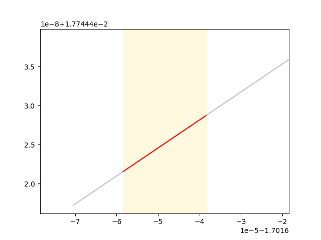

## Equation 7:
```
non_specific_calcium_activated_current__I_ns_Na = pow(membrane__F, 2) * (-L_type_Ca_channel__gamma_Nao * ionic_concentrations__Nao + L_type_Ca_channel__gamma_Nai * ionic_concentrations__Nai * exp(membrane__F * non_specific_calcium_activated_current__Vns / (membrane__R * membrane__T))) * non_specific_calcium_activated_current__P_ns_Ca * non_specific_calcium_activated_current__Vns / ((-1.0 + exp(membrane__F * non_specific_calcium_activated_current__Vns / (membrane__R * membrane__T))) * membrane__R * membrane__T)
```
## New Eq:
```
non_specific_calcium_activated_current__I_ns_Na = ((fabs(-26.614641953637257 * log((ionic_concentrations__Ko + ionic_concentrations__Nao) / (ionic_concentrations__Ki + ionic_concentrations__Nai)) + membrane__V) < 1.0000000000000001e-5) ? (49999.999999999993 * (6.3678763853082168e-11 * (-0.75 * ionic_concentrations__Nao + 0.75 * ionic_concentrations__Nai * exp(3.7573302761014087e-7)) / (-1.0 + exp(3.7573302761014087e-7)) + 6.3678763853082168e-11 * (-0.75 * ionic_concentrations__Nao + 0.75 * ionic_concentrations__Nai * exp(-3.7573302761014087e-7)) / (-1.0 + exp(-3.7573302761014087e-7))) * (1.0000000000000001e-5 - 26.614641953637257 * log((ionic_concentrations__Ko + ionic_concentrations__Nao) / (ionic_concentrations__Ki + ionic_concentrations__Nai)) + membrane__V) - 6.3678763853082168e-11 * (-0.75 * ionic_concentrations__Nao + 0.75 * ionic_concentrations__Nai * exp(-3.7573302761014087e-7)) / (-1.0 + exp(-3.7573302761014087e-7))) : (6.3678763853082156e-6 * (-0.75 * ionic_concentrations__Nao + 0.75 * ionic_concentrations__Nai * exp(0.037573302761014088 * membrane__V - log((ionic_concentrations__Ko + ionic_concentrations__Nao) / (ionic_concentrations__Ki + ionic_concentrations__Nai)))) * (-26.614641953637257 * log((ionic_concentrations__Ko + ionic_concentrations__Nao) / (ionic_concentrations__Ki + ionic_concentrations__Nai)) + membrane__V) / (-1.0 + exp(0.037573302761014088 * membrane__V - log((ionic_concentrations__Ko + ionic_concentrations__Nao) / (ionic_concentrations__Ki + ionic_concentrations__Nai))))))
```
## Singularity point: -1.7016484344348868
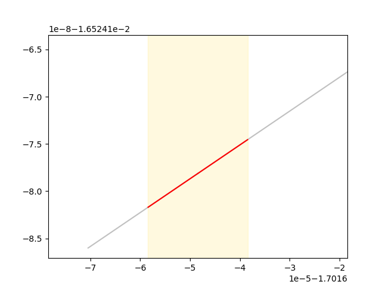

## Equation 8:
```
time_dependent_potassium_current_X_gate__alpha_X = 7.1899999999999999e-5 * (30.0 + membrane__V) / (1.0 - exp(-4.4399999999999995 - 0.14799999999999999 * membrane__V))
```
## New Eq:
```
time_dependent_potassium_current_X_gate__alpha_X = ((fabs(30.0 + membrane__V) < 1.0000000000010001e-5) ? (-7.1900000000071903e-10 / (1.0 - exp(1.48000000000148e-6)) + 49999.999999949992 * (30.00001 + membrane__V) * (7.1900000000071903e-10 / (1.0 - exp(1.48000000000148e-6)) + 7.1900000000071903e-10 / (1.0 - exp(-1.48000000000148e-6)))) : (7.1899999999999999e-5 * (30.0 + membrane__V) / (1.0 - exp(-4.4399999999999995 - 0.14799999999999999 * membrane__V))))
```
## Singularity point: -30.000000000000000


## Equation 9:
```
time_dependent_potassium_current_X_gate__beta_X = 0.00013100000000000001 * (30.0 + membrane__V) / (-1.0 + exp(2.0609999999999999 + 0.068699999999999997 * membrane__V))
```
## New Eq:
```
time_dependent_potassium_current_X_gate__beta_X = ((fabs(30.0 + membrane__V) < 1.0000000000010001e-5) ? (-1.3100000000013103e-9 / (-1.0 + exp(-6.8700000000068699e-7)) + 49999.999999949992 * (30.00001 + membrane__V) * (1.3100000000013103e-9 / (-1.0 + exp(6.8700000000068699e-7)) + 1.3100000000013103e-9 / (-1.0 + exp(-6.8700000000068699e-7)))) : (0.00013100000000000001 * (30.0 + membrane__V) / (-1.0 + exp(2.0609999999999999 + 0.068699999999999997 * membrane__V))))
```
## Singularity point: -30.000000000000000


# of singularities:  9
# Model: MahajanShiferaw2008_units(mahajan_shiferaw_2008.cellml)
No of piecewises: 5
## Equation 1:
```
ICaL__rxa = 4.0 * (-0.34100000000000003 * Environment__Ca_o + Ca__csm * exp(2.0 * Environment__FonRT * cell__V)) * Environment__F * Environment__FonRT * ICaL__pca * cell__V / (-1.0 + exp(2.0 * Environment__FonRT * cell__V))
```
## New Eq:
```
ICaL__rxa = ((fabs(cell__V) < 1.0000000000000001e-5) ? (49999.999999999993 * (1.0000000000000001e-5 + cell__V) * (4.0000000000000003e-5 * pow(Environment__F, 2) * (-0.34100000000000003 * Environment__Ca_o + 0.001 * Ca__Ca_submem * exp(2.0000000000000002e-5 * Environment__F / (Environment__R * Environment__T))) * ICaL__pca / ((-1.0 + exp(2.0000000000000002e-5 * Environment__F / (Environment__R * Environment__T))) * Environment__R * Environment__T) + 4.0000000000000003e-5 * pow(Environment__F, 2) * (-0.34100000000000003 * Environment__Ca_o + 0.001 * Ca__Ca_submem * exp(-2.0000000000000002e-5 * Environment__F / (Environment__R * Environment__T))) * ICaL__pca / ((-1.0 + exp(-2.0000000000000002e-5 * Environment__F / (Environment__R * Environment__T))) * Environment__R * Environment__T)) - 4.0000000000000003e-5 * pow(Environment__F, 2) * (-0.34100000000000003 * Environment__Ca_o + 0.001 * Ca__Ca_submem * exp(-2.0000000000000002e-5 * Environment__F / (Environment__R * Environment__T))) * ICaL__pca / ((-1.0 + exp(-2.0000000000000002e-5 * Environment__F / (Environment__R * Environment__T))) * Environment__R * Environment__T)) : (4.0 * pow(Environment__F, 2) * (-0.34100000000000003 * Environment__Ca_o + 0.001 * Ca__Ca_submem * exp(2.0 * Environment__F * cell__V / (Environment__R * Environment__T))) * ICaL__pca * cell__V / ((-1.0 + exp(2.0 * Environment__F * cell__V / (Environment__R * Environment__T))) * Environment__R * Environment__T)))
```
## Singularity point: 0


## Equation 2:
```
IKr__xkrv1 = 0.0013799999999999999 * (7.0 + cell__V) / (1.0 - exp(-0.86099999999999999 - 0.123 * cell__V))
```
## New Eq:
```
IKr__xkrv1 = ((fabs(7.0 + cell__V) < 1.0000000000003062e-5) ? (-1.3800000000004225e-8 / (1.0 - exp(1.2300000000003766e-6)) + 49999.999999984691 * (7.0000099999999996 + cell__V) * (1.3800000000004225e-8 / (1.0 - exp(1.2300000000003766e-6)) + 1.3800000000004225e-8 / (1.0 - exp(-1.2300000000003766e-6)))) : (0.0013799999999999999 * (7.0 + cell__V) / (1.0 - exp(-0.86099999999999999 - 0.123 * cell__V))))
```
## Singularity point: -7.0000000000000000


## Equation 3:
```
IKr__xkrv2 = 0.00060999999999999997 * (10.0 + cell__V) / (-1.0 + exp(1.45 + 0.14499999999999999 * cell__V))
```
## New Eq:
```
IKr__xkrv2 = ((fabs(10.0 + cell__V) < 9.9999999999961231e-6) ? (-6.0999999999976351e-9 / (-1.0 + exp(-1.4499999999994377e-6)) + 50000.000000019383 * (10.00001 + cell__V) * (6.0999999999976351e-9 / (-1.0 + exp(1.4499999999994377e-6)) + 6.0999999999976351e-9 / (-1.0 + exp(-1.4499999999994377e-6)))) : (0.00060999999999999997 * (10.0 + cell__V) / (-1.0 + exp(1.45 + 0.14499999999999999 * cell__V))))
```
## Singularity point: -10.000000000000000


## Equation 4:
```
IKs__tauxs1 = 1 / (0.00013100000000000001 * (30.0 + cell__V) / (-1.0 + exp(2.0609999999999999 + 0.068699999999999997 * cell__V)) + 7.1899999999999999e-5 * (30.0 + cell__V) / (1.0 - exp(-4.4399999999999995 - 0.14799999999999999 * cell__V)))
```
## New Eq:
```
IKs__tauxs1 = ((fabs(30.0 + cell__V) < 1.0000000000010001e-5) ? (1 / (-7.1900000000071903e-10 / (1.0 - exp(1.48000000000148e-6)) - 1.3100000000013103e-9 / (-1.0 + exp(-6.8700000000068699e-7)) + 49999.999999949992 * (30.00001 + cell__V) * (7.1900000000071903e-10 / (1.0 - exp(1.48000000000148e-6)) + 7.1900000000071903e-10 / (1.0 - exp(-1.48000000000148e-6)) + 1.3100000000013103e-9 / (-1.0 + exp(6.8700000000068699e-7)) + 1.3100000000013103e-9 / (-1.0 + exp(-6.8700000000068699e-7))))) : (1 / (0.00013100000000000001 * (30.0 + cell__V) / (-1.0 + exp(2.0609999999999999 + 0.068699999999999997 * cell__V)) + 7.1899999999999999e-5 * (30.0 + cell__V) / (1.0 - exp(-4.4399999999999995 - 0.14799999999999999 * cell__V)))))
```
## Singularity point: -30.000000000000000


## Equation 5:
```
INa__am = 0.32000000000000001 * (47.130000000000003 + cell__V) / (1.0 - exp(-4.7130000000000001 - 0.10000000000000001 * cell__V))
```
## New Eq:
```
INa__am = ((fabs(47.130000000000003 + cell__V) < 1.0000000000010001e-5) ? (-3.2000000000032004e-6 / (1.0 - exp(1.0000000000010001e-6)) + 49999.999999949992 * (47.130010000000006 + cell__V) * (3.2000000000032004e-6 / (1.0 - exp(1.0000000000010001e-6)) + 3.2000000000032004e-6 / (1.0 - exp(-1.0000000000010001e-6)))) : (0.32000000000000001 * (47.130000000000003 + cell__V) / (1.0 - exp(-4.7130000000000001 - 0.10000000000000001 * cell__V))))
```
## Singularity point: -47.130000000000003


# of singularities:  5
# Model: Maleckar(maleckar_model_2009.cellml)
No of piecewises: 0
## Equation 1:
```
sodium_current__i_Na = pow(membrane__F, 2) * pow(sodium_current_m_gate__m, 3) * (-1.0 + exp((-sodium_current__E_Na + membrane__V) * membrane__F / (membrane__R * membrane__T))) * (0.10000000000000001 * sodium_current_h2_gate__h2 + 0.90000000000000002 * sodium_current_h1_gate__h1) * cleft_space_ion_concentrations__Na_c * membrane__V * sodium_current__P_Na / ((-1.0 + exp(membrane__F * membrane__V / (membrane__R * membrane__T))) * membrane__R * membrane__T)
```
## New Eq:
```
sodium_current__i_Na = ((fabs(membrane__V) < 1.0000000000000001e-5) ? (49999.999999999993 * (1.0000000000000001e-5 + membrane__V) * (0.036575756957513313 * pow(sodium_current_m_gate__m, 3) * (-1.0 + exp(3.7907445518581069e-7 - log(cleft_space_ion_concentrations__Na_c / intracellular_ion_concentrations__Na_i))) * (0.10000000000000001 * sodium_current_h2_gate__h2 + 0.90000000000000002 * sodium_current_h1_gate__h1) * cleft_space_ion_concentrations__Na_c * sodium_current__P_Na / (-1.0 + exp(3.7907445518581063e-7)) + 0.036575756957513313 * pow(sodium_current_m_gate__m, 3) * (-1.0 + exp(-3.7907445518581069e-7 - log(cleft_space_ion_concentrations__Na_c / intracellular_ion_concentrations__Na_i))) * (0.10000000000000001 * sodium_current_h2_gate__h2 + 0.90000000000000002 * sodium_current_h1_gate__h1) * cleft_space_ion_concentrations__Na_c * sodium_current__P_Na / (-1.0 + exp(-3.7907445518581063e-7))) - 0.036575756957513313 * pow(sodium_current_m_gate__m, 3) * (-1.0 + exp(-3.7907445518581069e-7 - log(cleft_space_ion_concentrations__Na_c / intracellular_ion_concentrations__Na_i))) * (0.10000000000000001 * sodium_current_h2_gate__h2 + 0.90000000000000002 * sodium_current_h1_gate__h1) * cleft_space_ion_concentrations__Na_c * sodium_current__P_Na / (-1.0 + exp(-3.7907445518581063e-7))) : (3657.5756957513308 * pow(sodium_current_m_gate__m, 3) * (-1.0 + exp(0.037907445518581065 * membrane__V - log(cleft_space_ion_concentrations__Na_c / intracellular_ion_concentrations__Na_i))) * (0.10000000000000001 * sodium_current_h2_gate__h2 + 0.90000000000000002 * sodium_current_h1_gate__h1) * cleft_space_ion_concentrations__Na_c * membrane__V * sodium_current__P_Na / (-1.0 + exp(0.037907445518581065 * membrane__V))))
```
## Singularity point: 0
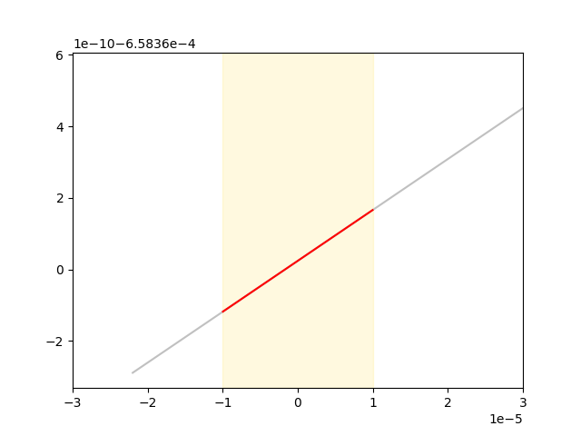

# of singularities:  1
# Model: maltsev_2009(maltsev_2009.cellml)
No of piecewises: 0
## Equation 1:
```
i_CaL_dL_gate__alpha_dL = -0.028389999999999999 * (35.0 + Vm__Vm) / (-1.0 + exp(-14.0 - 0.40000000000000002 * Vm__Vm)) - 0.084900000000000003 * Vm__Vm / (-1.0 + exp(-0.20833333333333334 * Vm__Vm))
```
## New Eq:
```
i_CaL_dL_gate__alpha_dL = ((fabs(35.0 + Vm__Vm) < 1.0000000000010001e-5) ? (2.8390000000028391e-7 / (-1.0 + exp(4.0000000000040004e-6)) + 49999.999999949992 * (35.000010000000003 + Vm__Vm) * (-2.8390000000028391e-7 / (-1.0 + exp(4.0000000000040004e-6)) - 2.8390000000028391e-7 / (-1.0 + exp(-4.0000000000040004e-6)))) : (-0.028389999999999999 * (35.0 + Vm__Vm) / (-1.0 + exp(-14.0 - 0.40000000000000002 * Vm__Vm)))) + ((fabs(Vm__Vm) < 1.0000000000000001e-5) ? (8.4900000000000015e-7 / (-1.0 + exp(2.0833333333333334e-6)) + 49999.999999999993 * (1.0000000000000001e-5 + Vm__Vm) * (-8.4900000000000015e-7 / (-1.0 + exp(2.0833333333333334e-6)) - 8.4900000000000015e-7 / (-1.0 + exp(-2.0833333333333334e-6)))) : (-0.084900000000000003 * Vm__Vm / (-1.0 + exp(-0.20833333333333334 * Vm__Vm))))
```
## Singularity point: 0

## Singularity point: -35.000000000000000
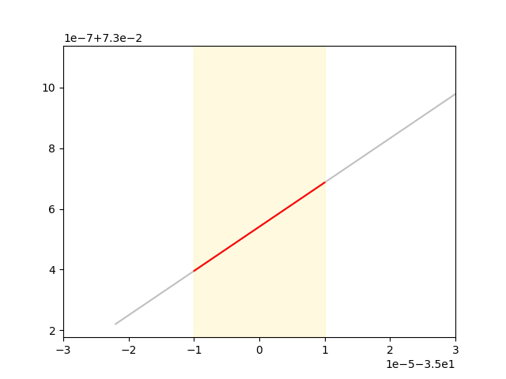

## Equation 2:
```
i_CaL_dL_gate__beta_dL = 0.011429999999999999 * (-5.0 + Vm__Vm) / (-1.0 + exp(-2.0 + 0.40000000000000002 * Vm__Vm))
```
## New Eq:
```
i_CaL_dL_gate__beta_dL = ((fabs(-5.0 + Vm__Vm) < 1.0000000000003062e-5) ? (-1.1430000000003499e-7 / (-1.0 + exp(-4.0000000000012246e-6)) + 49999.999999984691 * (-4.9999900000000004 + Vm__Vm) * (1.1430000000003499e-7 / (-1.0 + exp(4.0000000000012246e-6)) + 1.1430000000003499e-7 / (-1.0 + exp(-4.0000000000012246e-6)))) : (0.011429999999999999 * (-5.0 + Vm__Vm) / (-1.0 + exp(-2.0 + 0.40000000000000002 * Vm__Vm))))
```
## Singularity point: 5.0000000000000000
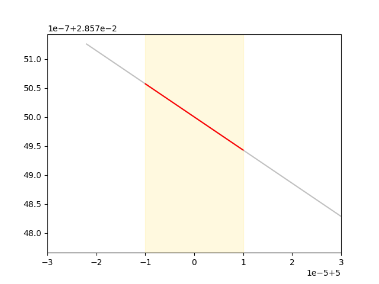

# of singularities:  3
# Model: matsuoka_model_2003(matsuoka_model_2003.cellml)
No of piecewises: 0
## Equation 1:
```
constant_field_equations__CF_Ca = 2.0 * (-external_ion_concentrations__Cao * exp(-2.0 * membrane__F * membrane__Vm / (membrane__R * membrane__T)) + internal_ion_concentrations__Cai) * membrane__F * membrane__Vm / ((1.0 - exp(-2.0 * membrane__F * membrane__Vm / (membrane__R * membrane__T))) * membrane__R * membrane__T)
```
## New Eq:
```
constant_field_equations__CF_Ca = ((fabs(membrane__Vm) < 1.0000000000000001e-5) ? (49999.999999999993 * (1.0000000000000001e-5 + membrane__Vm) * (7.487038460359592e-7 * (-0.026190000000000001 + 0.5 * sqrt(pow((0.052380000000000003 - internal_ion_concentrations__Ca_Total), 2) + 0.0095200000000000007 * internal_ion_concentrations__Ca_Total) + 0.5 * internal_ion_concentrations__Ca_Total - external_ion_concentrations__Cao * exp(7.487038460359592e-7)) / (1.0 - exp(7.487038460359592e-7)) + 7.487038460359592e-7 * (-0.026190000000000001 + 0.5 * sqrt(pow((0.052380000000000003 - internal_ion_concentrations__Ca_Total), 2) + 0.0095200000000000007 * internal_ion_concentrations__Ca_Total) + 0.5 * internal_ion_concentrations__Ca_Total - external_ion_concentrations__Cao * exp(-7.487038460359592e-7)) / (1.0 - exp(-7.487038460359592e-7))) - 7.487038460359592e-7 * (-0.026190000000000001 + 0.5 * sqrt(pow((0.052380000000000003 - internal_ion_concentrations__Ca_Total), 2) + 0.0095200000000000007 * internal_ion_concentrations__Ca_Total) + 0.5 * internal_ion_concentrations__Ca_Total - external_ion_concentrations__Cao * exp(7.487038460359592e-7)) / (1.0 - exp(7.487038460359592e-7))) : (0.074870384603595908 * (-0.026190000000000001 + 0.5 * sqrt(pow((0.052380000000000003 - internal_ion_concentrations__Ca_Total), 2) + 0.0095200000000000007 * internal_ion_concentrations__Ca_Total) + 0.5 * internal_ion_concentrations__Ca_Total - external_ion_concentrations__Cao * exp(-0.074870384603595908 * membrane__Vm)) * membrane__Vm / (1.0 - exp(-0.074870384603595908 * membrane__Vm))))
```
## Singularity point: 0


## Equation 2:
```
constant_field_equations__CF_K = (-external_ion_concentrations__Ko * exp(-membrane__F * membrane__Vm / (membrane__R * membrane__T)) + internal_ion_concentrations__Ki) * membrane__F * membrane__Vm / ((1.0 - exp(-membrane__F * membrane__Vm / (membrane__R * membrane__T))) * membrane__R * membrane__T)
```
## New Eq:
```
constant_field_equations__CF_K = ((fabs(membrane__Vm) < 1.0000000000000001e-5) ? (49999.999999999993 * (1.0000000000000001e-5 + membrane__Vm) * (3.743519230179796e-7 * (-external_ion_concentrations__Ko * exp(3.743519230179796e-7) + internal_ion_concentrations__Ki) / (1.0 - exp(3.743519230179796e-7)) + 3.743519230179796e-7 * (-external_ion_concentrations__Ko * exp(-3.743519230179796e-7) + internal_ion_concentrations__Ki) / (1.0 - exp(-3.743519230179796e-7))) - 3.743519230179796e-7 * (-external_ion_concentrations__Ko * exp(3.743519230179796e-7) + internal_ion_concentrations__Ki) / (1.0 - exp(3.743519230179796e-7))) : (0.037435192301797954 * (-external_ion_concentrations__Ko * exp(-0.037435192301797954 * membrane__Vm) + internal_ion_concentrations__Ki) * membrane__Vm / (1.0 - exp(-0.037435192301797954 * membrane__Vm))))
```
## Singularity point: 0
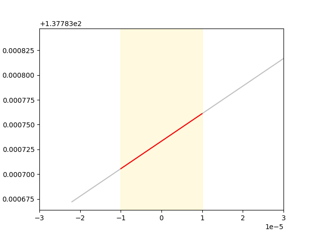

## Equation 3:
```
background_Kpl_current__i_Kpl = (3.0 + membrane__Vm) * background_Kpl_current__P_Kpl * constant_field_equations__CF_K / (1.0 - exp(-0.23076923076923078 - 0.076923076923076927 * membrane__Vm))
```
## New Eq:
```
background_Kpl_current__i_Kpl = ((fabs(3.0 + membrane__Vm) < 9.9999999999995925e-6) ? (50000.000000002037 * (3.0000100000000001 + membrane__Vm) * (8.3986538766452622e-10 * pow(external_ion_concentrations__Ko, 0.16) * constant_field_equations__CF_K / (1.0 - exp(7.6923076923073791e-7)) + 8.3986538766452622e-10 * pow(external_ion_concentrations__Ko, 0.16) * constant_field_equations__CF_K / (1.0 - exp(-7.6923076923073791e-7))) - 8.3986538766452622e-10 * pow(external_ion_concentrations__Ko, 0.16) * constant_field_equations__CF_K / (1.0 - exp(7.6923076923073791e-7))) : (8.3986538766456042e-5 * pow(external_ion_concentrations__Ko, 0.16) * (3.0 + membrane__Vm) * constant_field_equations__CF_K / (1.0 - exp(-0.23076923076923078 - 0.076923076923076927 * membrane__Vm))))
```
## Singularity point: 0

## Singularity point: -3.0000000000000000
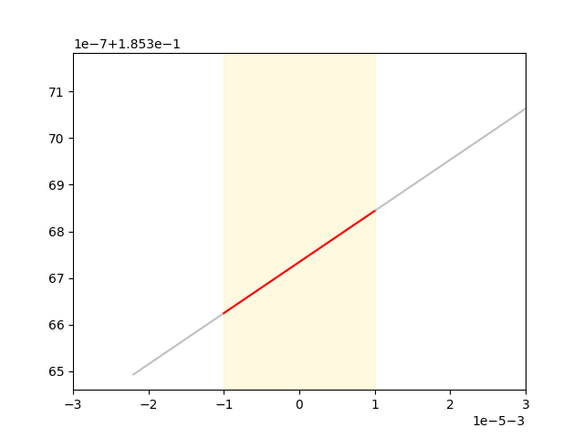

## Equation 4:
```
constant_field_equations__CF_Na = (-external_ion_concentrations__Nao * exp(-membrane__F * membrane__Vm / (membrane__R * membrane__T)) + internal_ion_concentrations__Nai) * membrane__F * membrane__Vm / ((1.0 - exp(-membrane__F * membrane__Vm / (membrane__R * membrane__T))) * membrane__R * membrane__T)
```
## New Eq:
```
constant_field_equations__CF_Na = ((fabs(membrane__Vm) < 1.0000000000000001e-5) ? (49999.999999999993 * (1.0000000000000001e-5 + membrane__Vm) * (3.743519230179796e-7 * (-external_ion_concentrations__Nao * exp(3.743519230179796e-7) + internal_ion_concentrations__Nai) / (1.0 - exp(3.743519230179796e-7)) + 3.743519230179796e-7 * (-external_ion_concentrations__Nao * exp(-3.743519230179796e-7) + internal_ion_concentrations__Nai) / (1.0 - exp(-3.743519230179796e-7))) - 3.743519230179796e-7 * (-external_ion_concentrations__Nao * exp(3.743519230179796e-7) + internal_ion_concentrations__Nai) / (1.0 - exp(3.743519230179796e-7))) : (0.037435192301797954 * (-external_ion_concentrations__Nao * exp(-0.037435192301797954 * membrane__Vm) + internal_ion_concentrations__Nai) * membrane__Vm / (1.0 - exp(-0.037435192301797954 * membrane__Vm))))
```
## Singularity point: 0
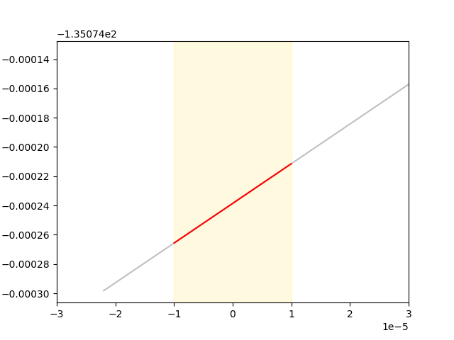

# of singularities:  4
# Model: mcallister_noble_tsien_1975_modelB(mcallister_noble_tsien_1975_b.cellml)
No of piecewises: 0
## Equation 1:
```
fast_sodium_current_m_gate__alpha_m = (47.0 + membrane__V) / (1.0 - exp(-4.7000000000000002 - 0.10000000000000001 * membrane__V))
```
## New Eq:
```
fast_sodium_current_m_gate__alpha_m = ((fabs(47.0 + membrane__V) < 1.0000000000010001e-5) ? (-1.0000000000065512e-5 / (1.0 - exp(1.0000000000065511e-6)) + 49999.999999949992 * (47.000010000000003 + membrane__V) * (1.0000000000065512e-5 / (1.0 - exp(1.0000000000065511e-6)) + 9.9999999999544897e-6 / (1.0 - exp(-9.9999999999544906e-7)))) : ((47.0 + membrane__V) / (1.0 - exp(-4.7000000000000002 - 0.10000000000000001 * membrane__V))))
```
## Singularity point: -47.000000000000000


## Equation 2:
```
pacemaker_potassium_current_s_gate__alpha_s = 0.001 * (-pacemaker_potassium_current_s_gate__E_s + membrane__V) / (1.0 - exp(0.20000000000000001 * pacemaker_potassium_current_s_gate__E_s - 0.20000000000000001 * membrane__V))
```
## New Eq:
```
pacemaker_potassium_current_s_gate__alpha_s = ((fabs(52.0 + membrane__V) < 1.0000000000010001e-5) ? (-1.0000000000010001e-8 / (1.0 - exp(2.0000000000020002e-6)) + 49999.999999949992 * (52.000010000000003 + membrane__V) * (1.0000000000010001e-8 / (1.0 - exp(2.0000000000020002e-6)) + 1.0000000000010001e-8 / (1.0 - exp(-2.0000000000020002e-6)))) : (0.001 * (52.0 + membrane__V) / (1.0 - exp(-10.4 - 0.20000000000000001 * membrane__V))))
```
## Singularity point: -52.000000000000000


## Equation 3:
```
secondary_inward_current_d_gate__alpha_d = 0.002 * (40.0 + membrane__V) / (1.0 - exp(-4.0 - 0.10000000000000001 * membrane__V))
```
## New Eq:
```
secondary_inward_current_d_gate__alpha_d = ((fabs(40.0 + membrane__V) < 1.0000000000010001e-5) ? (-2.0000000000020002e-8 / (1.0 - exp(1.0000000000010001e-6)) + 49999.999999949992 * (40.000010000000003 + membrane__V) * (2.0000000000020002e-8 / (1.0 - exp(1.0000000000010001e-6)) + 2.0000000000020002e-8 / (1.0 - exp(-1.0000000000010001e-6)))) : (0.002 * (40.0 + membrane__V) / (1.0 - exp(-4.0 - 0.10000000000000001 * membrane__V))))
```
## Singularity point: -40.000000000000000
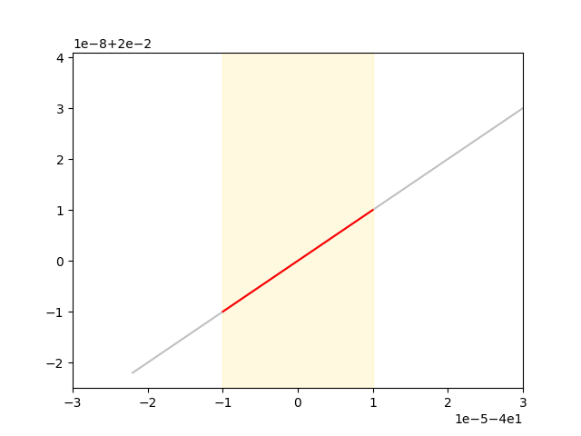

## Equation 4:
```
time_independent_outward_current__i_K1 = 0.35714285714285715 * pacemaker_potassium_current__I_K2 + 0.20000000000000001 * (-time_independent_outward_current__E_K1 + membrane__V) / (1.0 - exp(0.040000000000000001 * time_independent_outward_current__E_K1 - 0.040000000000000001 * membrane__V))
```
## New Eq:
```
time_independent_outward_current__i_K1 = (-1 + exp(4.4000000000000004 + 0.040000000000000001 * membrane__V)) / (exp(2.3999999999999999 + 0.040000000000000001 * membrane__V) + exp(4.7999999999999998 + 0.080000000000000002 * membrane__V)) + ((fabs(30.0 + membrane__V) < 1.0000000000010001e-5) ? (-2.0000000000020002e-6 / (1.0 - exp(4.0000000000040005e-7)) + 49999.999999949992 * (30.00001 + membrane__V) * (2.0000000000020002e-6 / (1.0 - exp(4.0000000000040005e-7)) + 2.0000000000020002e-6 / (1.0 - exp(-4.0000000000040005e-7)))) : (0.20000000000000001 * (30.0 + membrane__V) / (1.0 - exp(-1.2 - 0.040000000000000001 * membrane__V))))
```
## Singularity point: -30.000000000000000
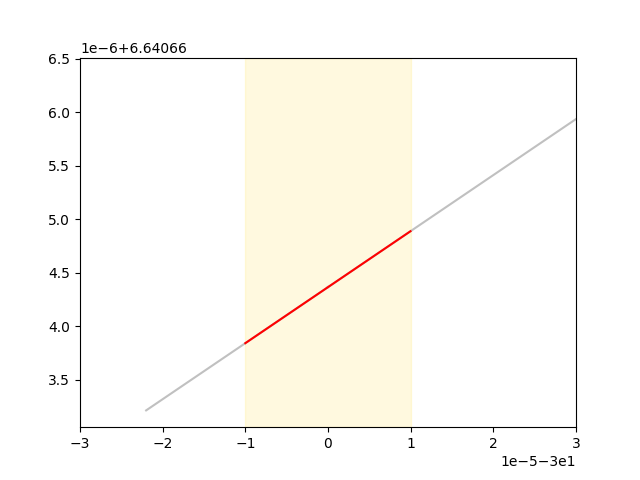

## Equation 5:
```
transient_chloride_current_q_gate__alpha_q = 0.0080000000000000002 * membrane__V / (1.0 - exp(-0.10000000000000001 * membrane__V))
```
## New Eq:
```
transient_chloride_current_q_gate__alpha_q = ((fabs(membrane__V) < 1.0000000000000001e-5) ? (-8.0000000000000002e-8 / (1.0 - exp(1.0000000000000002e-6)) + 49999.999999999993 * (1.0000000000000001e-5 + membrane__V) * (8.0000000000000002e-8 / (1.0 - exp(1.0000000000000002e-6)) + 8.0000000000000002e-8 / (1.0 - exp(-1.0000000000000002e-6)))) : (0.0080000000000000002 * membrane__V / (1.0 - exp(-0.10000000000000001 * membrane__V))))
```
## Singularity point: 0


# of singularities:  5
# Model: noble_model_1962(noble_model_1962.cellml)
No of piecewises: 0
## Equation 1:
```
potassium_channel_n_gate__alpha_n = 0.0001 * (-50.0 - membrane__V) / (-1.0 + exp(-5.0 - 0.10000000000000001 * membrane__V))
```
## New Eq:
```
potassium_channel_n_gate__alpha_n = ((fabs(50.0 + membrane__V) < 1.0000000000010001e-5) ? (1.0000000000010001e-9 / (-1.0 + exp(1.0000000000010001e-6)) + 49999.999999949992 * (50.000010000000003 + membrane__V) * (-1.0000000000010001e-9 / (-1.0 + exp(1.0000000000010001e-6)) - 1.0000000000010001e-9 / (-1.0 + exp(-1.0000000000010001e-6)))) : (0.0001 * (-50.0 - membrane__V) / (-1.0 + exp(-5.0 - 0.10000000000000001 * membrane__V))))
```
## Singularity point: -50.000000000000000


## Equation 2:
```
sodium_channel_m_gate__alpha_m = 0.10000000000000001 * (-48.0 - membrane__V) / (-1.0 + exp(-3.2000000000000002 - 0.066666666666666666 * membrane__V))
```
## New Eq:
```
sodium_channel_m_gate__alpha_m = ((fabs(48.0 + membrane__V) < 1.0000000000010001e-5) ? (1.0000000000010001e-6 / (-1.0 + exp(6.6666666666733343e-7)) + 49999.999999949992 * (48.000010000000003 + membrane__V) * (-1.0000000000010001e-6 / (-1.0 + exp(6.6666666666733343e-7)) - 1.0000000000010001e-6 / (-1.0 + exp(-6.6666666666733343e-7)))) : (0.10000000000000001 * (-48.0 - membrane__V) / (-1.0 + exp(-3.2000000000000002 - 0.066666666666666666 * membrane__V))))
```
## Singularity point: -48.000000000000000


## Equation 3:
```
sodium_channel_m_gate__beta_m = 0.12 * (8.0 + membrane__V) / (-1.0 + exp(1.6000000000000001 + 0.20000000000000001 * membrane__V))
```
## New Eq:
```
sodium_channel_m_gate__beta_m = ((fabs(8.0 + membrane__V) < 9.9999999999995925e-6) ? (-1.1999999999995347e-6 / (-1.0 + exp(-1.9999999999992245e-6)) + 50000.000000002037 * (8.0000099999999996 + membrane__V) * (1.1999999999995347e-6 / (-1.0 + exp(-1.9999999999992245e-6)) + 1.2000000000003673e-6 / (-1.0 + exp(2.0000000000006123e-6)))) : (0.12 * (8.0 + membrane__V) / (-1.0 + exp(1.6000000000000001 + 0.20000000000000001 * membrane__V))))
```
## Singularity point: -8.0000000000000000


# of singularities:  3
# Model: noble_model_1991(noble_model_1991.cellml)
No of piecewises: 0
## Equation 1:
```
L_type_Ca_channel__i_Ca_L_Ca = 4.0 * (-50.0 + membrane__V) * (intracellular_calcium_concentration__Ca_i * exp(100.0 * membrane__F / (membrane__R * membrane__T)) - extracellular_calcium_concentration__Ca_o * exp(2.0 * (50.0 - membrane__V) * membrane__F / (membrane__R * membrane__T))) * L_type_Ca_channel__P_Ca_L * L_type_Ca_channel_d_gate__d * L_type_Ca_channel_f_gate__f * membrane__F / ((1.0 - exp(2.0 * (50.0 - membrane__V) * membrane__F / (membrane__R * membrane__T))) * membrane__R * membrane__T)
```
## New Eq:
```
L_type_Ca_channel__i_Ca_L_Ca = ((fabs(-50.0 + membrane__V) < 1.0000000000010001e-5) ? (49999.999999949992 * (-49.999989999999997 + membrane__V) * (1.4973556329113164e-6 * (intracellular_calcium_concentration__Ca_i * exp(3.7433890822745473) - extracellular_calcium_concentration__Ca_o * exp(7.4867781645565822e-7)) * L_type_Ca_channel__P_Ca_L * L_type_Ca_channel_d_gate__d * L_type_Ca_channel_f_gate__f / (1.0 - exp(7.4867781645565822e-7)) + 1.4973556329113164e-6 * (intracellular_calcium_concentration__Ca_i * exp(3.7433890822745473) - extracellular_calcium_concentration__Ca_o * exp(-7.4867781645565822e-7)) * L_type_Ca_channel__P_Ca_L * L_type_Ca_channel_d_gate__d * L_type_Ca_channel_f_gate__f / (1.0 - exp(-7.4867781645565822e-7))) - 1.4973556329113164e-6 * (intracellular_calcium_concentration__Ca_i * exp(3.7433890822745473) - extracellular_calcium_concentration__Ca_o * exp(7.4867781645565822e-7)) * L_type_Ca_channel__P_Ca_L * L_type_Ca_channel_d_gate__d * L_type_Ca_channel_f_gate__f / (1.0 - exp(7.4867781645565822e-7))) : (0.14973556329098189 * (-50.0 + membrane__V) * (intracellular_calcium_concentration__Ca_i * exp(3.7433890822745473) - extracellular_calcium_concentration__Ca_o * exp(3.7433890822745473 - 0.074867781645490947 * membrane__V)) * L_type_Ca_channel__P_Ca_L * L_type_Ca_channel_d_gate__d * L_type_Ca_channel_f_gate__f / (1.0 - exp(3.7433890822745473 - 0.074867781645490947 * membrane__V))))
```
## Singularity point: 50.000000000000000


## Equation 2:
```
L_type_Ca_channel__i_Ca_L_K = (-50.0 + membrane__V) * (intracellular_potassium_concentration__K_i * exp(50.0 * membrane__F / (membrane__R * membrane__T)) - extracellular_potassium_concentration__K_o * exp((50.0 - membrane__V) * membrane__F / (membrane__R * membrane__T))) * L_type_Ca_channel__P_CaK * L_type_Ca_channel__P_Ca_L * L_type_Ca_channel_d_gate__d * L_type_Ca_channel_f_gate__f * membrane__F / ((1.0 - exp((50.0 - membrane__V) * membrane__F / (membrane__R * membrane__T))) * membrane__R * membrane__T)
```
## New Eq:
```
L_type_Ca_channel__i_Ca_L_K = ((fabs(-50.0 + membrane__V) < 1.0000000000010001e-5) ? (49999.999999949992 * (-49.999989999999997 + membrane__V) * (7.486778164556582e-10 * (intracellular_potassium_concentration__K_i * exp(1.8716945411372736) - extracellular_potassium_concentration__K_o * exp(3.7433890822782911e-7)) * L_type_Ca_channel__P_Ca_L * L_type_Ca_channel_d_gate__d * L_type_Ca_channel_f_gate__f / (1.0 - exp(3.7433890822782911e-7)) + 7.486778164556582e-10 * (intracellular_potassium_concentration__K_i * exp(1.8716945411372736) - extracellular_potassium_concentration__K_o * exp(-3.7433890822782911e-7)) * L_type_Ca_channel__P_Ca_L * L_type_Ca_channel_d_gate__d * L_type_Ca_channel_f_gate__f / (1.0 - exp(-3.7433890822782911e-7))) - 7.486778164556582e-10 * (intracellular_potassium_concentration__K_i * exp(1.8716945411372736) - extracellular_potassium_concentration__K_o * exp(3.7433890822782911e-7)) * L_type_Ca_channel__P_Ca_L * L_type_Ca_channel_d_gate__d * L_type_Ca_channel_f_gate__f / (1.0 - exp(3.7433890822782911e-7))) : (7.4867781645490941e-5 * (-50.0 + membrane__V) * (intracellular_potassium_concentration__K_i * exp(1.8716945411372736) - extracellular_potassium_concentration__K_o * exp(1.8716945411372736 - 0.037433890822745473 * membrane__V)) * L_type_Ca_channel__P_Ca_L * L_type_Ca_channel_d_gate__d * L_type_Ca_channel_f_gate__f / (1.0 - exp(1.8716945411372736 - 0.037433890822745473 * membrane__V))))
```
## Singularity point: 50.000000000000000
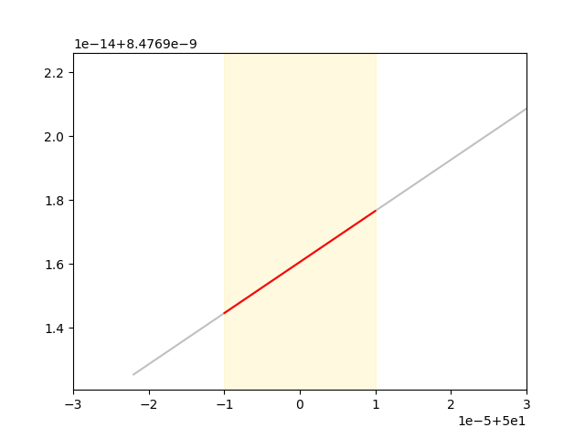

## Equation 3:
```
L_type_Ca_channel__i_Ca_L_Na = (-50.0 + membrane__V) * (intracellular_sodium_concentration__Na_i * exp(50.0 * membrane__F / (membrane__R * membrane__T)) - extracellular_sodium_concentration__Na_o * exp((50.0 - membrane__V) * membrane__F / (membrane__R * membrane__T))) * L_type_Ca_channel__P_CaNa * L_type_Ca_channel__P_Ca_L * L_type_Ca_channel_d_gate__d * L_type_Ca_channel_f_gate__f * membrane__F / ((1.0 - exp((50.0 - membrane__V) * membrane__F / (membrane__R * membrane__T))) * membrane__R * membrane__T)
```
## New Eq:
```
L_type_Ca_channel__i_Ca_L_Na = ((fabs(-50.0 + membrane__V) < 1.0000000000010001e-5) ? (49999.999999949992 * (-49.999989999999997 + membrane__V) * (3.7433890822782906e-9 * (intracellular_sodium_concentration__Na_i * exp(1.8716945411372736) - extracellular_sodium_concentration__Na_o * exp(3.7433890822782911e-7)) * L_type_Ca_channel__P_Ca_L * L_type_Ca_channel_d_gate__d * L_type_Ca_channel_f_gate__f / (1.0 - exp(3.7433890822782911e-7)) + 3.7433890822782906e-9 * (intracellular_sodium_concentration__Na_i * exp(1.8716945411372736) - extracellular_sodium_concentration__Na_o * exp(-3.7433890822782911e-7)) * L_type_Ca_channel__P_Ca_L * L_type_Ca_channel_d_gate__d * L_type_Ca_channel_f_gate__f / (1.0 - exp(-3.7433890822782911e-7))) - 3.7433890822782906e-9 * (intracellular_sodium_concentration__Na_i * exp(1.8716945411372736) - extracellular_sodium_concentration__Na_o * exp(3.7433890822782911e-7)) * L_type_Ca_channel__P_Ca_L * L_type_Ca_channel_d_gate__d * L_type_Ca_channel_f_gate__f / (1.0 - exp(3.7433890822782911e-7))) : (0.00037433890822745472 * (-50.0 + membrane__V) * (intracellular_sodium_concentration__Na_i * exp(1.8716945411372736) - extracellular_sodium_concentration__Na_o * exp(1.8716945411372736 - 0.037433890822745473 * membrane__V)) * L_type_Ca_channel__P_Ca_L * L_type_Ca_channel_d_gate__d * L_type_Ca_channel_f_gate__f / (1.0 - exp(1.8716945411372736 - 0.037433890822745473 * membrane__V))))
```
## Singularity point: 50.000000000000000


## Equation 4:
```
L_type_Ca_channel_d_gate__alpha_d = 30.0 * (19.0 + membrane__V) / (1.0 - exp(-4.75 - 0.25 * membrane__V))
```
## New Eq:
```
L_type_Ca_channel_d_gate__alpha_d = ((fabs(19.0 + membrane__V) < 1.0000000000010001e-5) ? (-0.00030000000000030003 / (1.0 - exp(2.5000000000025002e-6)) + 49999.999999949992 * (19.00001 + membrane__V) * (0.00030000000000030003 / (1.0 - exp(2.5000000000025002e-6)) + 0.00030000000000030003 / (1.0 - exp(-2.5000000000025002e-6)))) : (30.0 * (19.0 + membrane__V) / (1.0 - exp(-4.75 - 0.25 * membrane__V))))
```
## Singularity point: -19.000000000000000


## Equation 5:
```
L_type_Ca_channel_d_gate__beta_d = 12.0 * (19.0 + membrane__V) / (-1.0 + exp(1.8999999999999999 + 0.10000000000000001 * membrane__V))
```
## New Eq:
```
L_type_Ca_channel_d_gate__beta_d = ((fabs(19.0 + membrane__V) < 1.0000000000010001e-5) ? (-0.00012000000000012001 / (-1.0 + exp(-1.0000000000010001e-6)) + 49999.999999949992 * (19.00001 + membrane__V) * (0.00012000000000012001 / (-1.0 + exp(1.0000000000010001e-6)) + 0.00012000000000012001 / (-1.0 + exp(-1.0000000000010001e-6)))) : (12.0 * (19.0 + membrane__V) / (-1.0 + exp(1.8999999999999999 + 0.10000000000000001 * membrane__V))))
```
## Singularity point: -19.000000000000000


## Equation 6:
```
L_type_Ca_channel_f_gate__alpha_f = 6.25 * (34.0 + membrane__V) / (-1.0 + exp(8.5 + 0.25 * membrane__V))
```
## New Eq:
```
L_type_Ca_channel_f_gate__alpha_f = ((fabs(34.0 + membrane__V) < 1.0000000000010001e-5) ? (-6.2500000000062506e-5 / (-1.0 + exp(-2.5000000000025002e-6)) + 49999.999999949992 * (34.000010000000003 + membrane__V) * (6.2500000000062506e-5 / (-1.0 + exp(2.5000000000025002e-6)) + 6.2500000000062506e-5 / (-1.0 + exp(-2.5000000000025002e-6)))) : (6.25 * (34.0 + membrane__V) / (-1.0 + exp(8.5 + 0.25 * membrane__V))))
```
## Singularity point: -34.000000000000000


## Equation 7:
```
fast_sodium_current_m_gate__alpha_m = 200.0 * (41.0 + membrane__V) / (1.0 - exp(-4.1000000000000005 - 0.10000000000000001 * membrane__V))
```
## New Eq:
```
fast_sodium_current_m_gate__alpha_m = ((fabs(41.0 + membrane__V) < 1.0000000000010001e-5) ? (-0.0020000000000020002 / (1.0 - exp(1.0000000000010001e-6)) + 49999.999999949992 * (41.000010000000003 + membrane__V) * (0.0020000000000020002 / (1.0 - exp(1.0000000000010001e-6)) + 0.0020000000000020002 / (1.0 - exp(-1.0000000000010001e-6)))) : (200.0 * (41.0 + membrane__V) / (1.0 - exp(-4.1000000000000005 - 0.10000000000000001 * membrane__V))))
```
## Singularity point: -41.000000000000000


# of singularities:  7
# Model: noble_model_1998(noble_model_1998.cellml)
No of piecewises: 1
## Equation 1:
```
L_type_Ca_channel__i_Ca_L_Ca_ds = 4.0 * (-50.0 + membrane__V) * (intracellular_calcium_concentration__Ca_i * exp(100.0 * membrane__F / (membrane__R * membrane__T)) - extracellular_calcium_concentration__Ca_o * exp(2.0 * (50.0 - membrane__V) * membrane__F / (membrane__R * membrane__T))) * L_type_Ca_channel__FrICa * L_type_Ca_channel__P_Ca_L * L_type_Ca_channel_d_gate__d * L_type_Ca_channel_f2ds_gate__f2ds * L_type_Ca_channel_f_gate__f * membrane__F / ((1.0 - exp(2.0 * (50.0 - membrane__V) * membrane__F / (membrane__R * membrane__T))) * membrane__R * membrane__T)
```
## New Eq:
```
L_type_Ca_channel__i_Ca_L_Ca_ds = ((fabs(-50.0 + membrane__V) < 1.0000000000010001e-5) ? (49999.999999949992 * (-49.999989999999997 + membrane__V) * (1.4973556329113164e-6 * (intracellular_calcium_concentration__Ca_i * exp(3.7433890822745473) - extracellular_calcium_concentration__Ca_o * exp(7.4867781645565822e-7)) * L_type_Ca_channel__P_Ca_L * L_type_Ca_channel_d_gate__d * L_type_Ca_channel_f2ds_gate__f2ds * L_type_Ca_channel_f_gate__f / (1.0 - exp(7.4867781645565822e-7)) + 1.4973556329113164e-6 * (intracellular_calcium_concentration__Ca_i * exp(3.7433890822745473) - extracellular_calcium_concentration__Ca_o * exp(-7.4867781645565822e-7)) * L_type_Ca_channel__P_Ca_L * L_type_Ca_channel_d_gate__d * L_type_Ca_channel_f2ds_gate__f2ds * L_type_Ca_channel_f_gate__f / (1.0 - exp(-7.4867781645565822e-7))) - 1.4973556329113164e-6 * (intracellular_calcium_concentration__Ca_i * exp(3.7433890822745473) - extracellular_calcium_concentration__Ca_o * exp(7.4867781645565822e-7)) * L_type_Ca_channel__P_Ca_L * L_type_Ca_channel_d_gate__d * L_type_Ca_channel_f2ds_gate__f2ds * L_type_Ca_channel_f_gate__f / (1.0 - exp(7.4867781645565822e-7))) : (0.14973556329098189 * (-50.0 + membrane__V) * (intracellular_calcium_concentration__Ca_i * exp(3.7433890822745473) - extracellular_calcium_concentration__Ca_o * exp(3.7433890822745473 - 0.074867781645490947 * membrane__V)) * L_type_Ca_channel__P_Ca_L * L_type_Ca_channel_d_gate__d * L_type_Ca_channel_f2ds_gate__f2ds * L_type_Ca_channel_f_gate__f / (1.0 - exp(3.7433890822745473 - 0.074867781645490947 * membrane__V))))
```
## Singularity point: 50.000000000000000
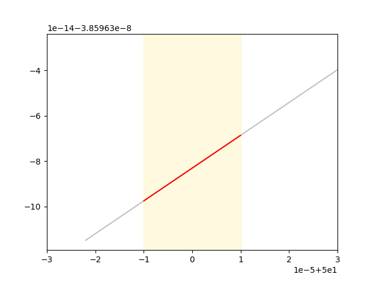

## Equation 2:
```
L_type_Ca_channel__i_Ca_L_K_ds = (-50.0 + membrane__V) * (intracellular_potassium_concentration__K_i * exp(50.0 * membrane__F / (membrane__R * membrane__T)) - extracellular_potassium_concentration__K_o * exp((50.0 - membrane__V) * membrane__F / (membrane__R * membrane__T))) * L_type_Ca_channel__FrICa * L_type_Ca_channel__P_CaK * L_type_Ca_channel__P_Ca_L * L_type_Ca_channel_d_gate__d * L_type_Ca_channel_f2ds_gate__f2ds * L_type_Ca_channel_f_gate__f * membrane__F / ((1.0 - exp((50.0 - membrane__V) * membrane__F / (membrane__R * membrane__T))) * membrane__R * membrane__T)
```
## New Eq:
```
L_type_Ca_channel__i_Ca_L_K_ds = ((fabs(-50.0 + membrane__V) < 1.0000000000010001e-5) ? (49999.999999949992 * (-49.999989999999997 + membrane__V) * (7.486778164556582e-10 * (intracellular_potassium_concentration__K_i * exp(1.8716945411372736) - extracellular_potassium_concentration__K_o * exp(3.7433890822782911e-7)) * L_type_Ca_channel__P_Ca_L * L_type_Ca_channel_d_gate__d * L_type_Ca_channel_f2ds_gate__f2ds * L_type_Ca_channel_f_gate__f / (1.0 - exp(3.7433890822782911e-7)) + 7.486778164556582e-10 * (intracellular_potassium_concentration__K_i * exp(1.8716945411372736) - extracellular_potassium_concentration__K_o * exp(-3.7433890822782911e-7)) * L_type_Ca_channel__P_Ca_L * L_type_Ca_channel_d_gate__d * L_type_Ca_channel_f2ds_gate__f2ds * L_type_Ca_channel_f_gate__f / (1.0 - exp(-3.7433890822782911e-7))) - 7.486778164556582e-10 * (intracellular_potassium_concentration__K_i * exp(1.8716945411372736) - extracellular_potassium_concentration__K_o * exp(3.7433890822782911e-7)) * L_type_Ca_channel__P_Ca_L * L_type_Ca_channel_d_gate__d * L_type_Ca_channel_f2ds_gate__f2ds * L_type_Ca_channel_f_gate__f / (1.0 - exp(3.7433890822782911e-7))) : (7.4867781645490941e-5 * (-50.0 + membrane__V) * (intracellular_potassium_concentration__K_i * exp(1.8716945411372736) - extracellular_potassium_concentration__K_o * exp(1.8716945411372736 - 0.037433890822745473 * membrane__V)) * L_type_Ca_channel__P_Ca_L * L_type_Ca_channel_d_gate__d * L_type_Ca_channel_f2ds_gate__f2ds * L_type_Ca_channel_f_gate__f / (1.0 - exp(1.8716945411372736 - 0.037433890822745473 * membrane__V))))
```
## Singularity point: 50.000000000000000
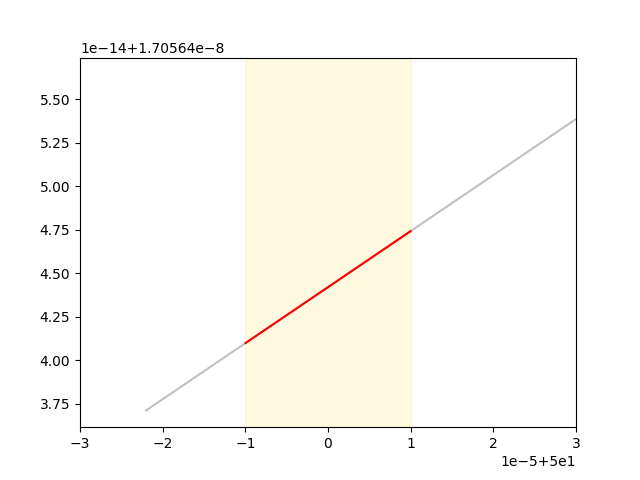

## Equation 3:
```
L_type_Ca_channel__i_Ca_L_Na_ds = (-50.0 + membrane__V) * (intracellular_sodium_concentration__Na_i * exp(50.0 * membrane__F / (membrane__R * membrane__T)) - extracellular_sodium_concentration__Na_o * exp((50.0 - membrane__V) * membrane__F / (membrane__R * membrane__T))) * L_type_Ca_channel__FrICa * L_type_Ca_channel__P_CaNa * L_type_Ca_channel__P_Ca_L * L_type_Ca_channel_d_gate__d * L_type_Ca_channel_f2ds_gate__f2ds * L_type_Ca_channel_f_gate__f * membrane__F / ((1.0 - exp((50.0 - membrane__V) * membrane__F / (membrane__R * membrane__T))) * membrane__R * membrane__T)
```
## New Eq:
```
L_type_Ca_channel__i_Ca_L_Na_ds = ((fabs(-50.0 + membrane__V) < 1.0000000000010001e-5) ? (49999.999999949992 * (-49.999989999999997 + membrane__V) * (3.7433890822782906e-9 * (intracellular_sodium_concentration__Na_i * exp(1.8716945411372736) - extracellular_sodium_concentration__Na_o * exp(3.7433890822782911e-7)) * L_type_Ca_channel__P_Ca_L * L_type_Ca_channel_d_gate__d * L_type_Ca_channel_f2ds_gate__f2ds * L_type_Ca_channel_f_gate__f / (1.0 - exp(3.7433890822782911e-7)) + 3.7433890822782906e-9 * (intracellular_sodium_concentration__Na_i * exp(1.8716945411372736) - extracellular_sodium_concentration__Na_o * exp(-3.7433890822782911e-7)) * L_type_Ca_channel__P_Ca_L * L_type_Ca_channel_d_gate__d * L_type_Ca_channel_f2ds_gate__f2ds * L_type_Ca_channel_f_gate__f / (1.0 - exp(-3.7433890822782911e-7))) - 3.7433890822782906e-9 * (intracellular_sodium_concentration__Na_i * exp(1.8716945411372736) - extracellular_sodium_concentration__Na_o * exp(3.7433890822782911e-7)) * L_type_Ca_channel__P_Ca_L * L_type_Ca_channel_d_gate__d * L_type_Ca_channel_f2ds_gate__f2ds * L_type_Ca_channel_f_gate__f / (1.0 - exp(3.7433890822782911e-7))) : (0.00037433890822745472 * (-50.0 + membrane__V) * (intracellular_sodium_concentration__Na_i * exp(1.8716945411372736) - extracellular_sodium_concentration__Na_o * exp(1.8716945411372736 - 0.037433890822745473 * membrane__V)) * L_type_Ca_channel__P_Ca_L * L_type_Ca_channel_d_gate__d * L_type_Ca_channel_f2ds_gate__f2ds * L_type_Ca_channel_f_gate__f / (1.0 - exp(1.8716945411372736 - 0.037433890822745473 * membrane__V))))
```
## Singularity point: 50.000000000000000


## Equation 4:
```
L_type_Ca_channel_d_gate__alpha_d = 30.0 * (19.0 + membrane__V) / (1.0 - exp(-4.75 - 0.25 * membrane__V))
```
## New Eq:
```
L_type_Ca_channel_d_gate__alpha_d = ((fabs(19.0 + membrane__V) < 1.0000000000010001e-5) ? (-0.00030000000000030003 / (1.0 - exp(2.5000000000025002e-6)) + 49999.999999949992 * (19.00001 + membrane__V) * (0.00030000000000030003 / (1.0 - exp(2.5000000000025002e-6)) + 0.00030000000000030003 / (1.0 - exp(-2.5000000000025002e-6)))) : (30.0 * (19.0 + membrane__V) / (1.0 - exp(-4.75 - 0.25 * membrane__V))))
```
## Singularity point: -19.000000000000000


## Equation 5:
```
L_type_Ca_channel_d_gate__beta_d = 12.0 * (19.0 + membrane__V) / (-1.0 + exp(1.8999999999999999 + 0.10000000000000001 * membrane__V))
```
## New Eq:
```
L_type_Ca_channel_d_gate__beta_d = ((fabs(19.0 + membrane__V) < 1.0000000000010001e-5) ? (-0.00012000000000012001 / (-1.0 + exp(-1.0000000000010001e-6)) + 49999.999999949992 * (19.00001 + membrane__V) * (0.00012000000000012001 / (-1.0 + exp(1.0000000000010001e-6)) + 0.00012000000000012001 / (-1.0 + exp(-1.0000000000010001e-6)))) : (12.0 * (19.0 + membrane__V) / (-1.0 + exp(1.8999999999999999 + 0.10000000000000001 * membrane__V))))
```
## Singularity point: -19.000000000000000


## Equation 6:
```
L_type_Ca_channel_f_gate__alpha_f = 6.25 * (34.0 + membrane__V) / (-1.0 + exp(8.5 + 0.25 * membrane__V))
```
## New Eq:
```
L_type_Ca_channel_f_gate__alpha_f = ((fabs(34.0 + membrane__V) < 1.0000000000010001e-5) ? (-6.2500000000062506e-5 / (-1.0 + exp(-2.5000000000025002e-6)) + 49999.999999949992 * (34.000010000000003 + membrane__V) * (6.2500000000062506e-5 / (-1.0 + exp(2.5000000000025002e-6)) + 6.2500000000062506e-5 / (-1.0 + exp(-2.5000000000025002e-6)))) : (6.25 * (34.0 + membrane__V) / (-1.0 + exp(8.5 + 0.25 * membrane__V))))
```
## Singularity point: -34.000000000000000


## Equation 7:
```
fast_sodium_current_m_gate__alpha_m = 200.0 * (41.0 + membrane__V) / (1.0 - exp(-4.1000000000000005 - 0.10000000000000001 * membrane__V))
```
## New Eq:
```
fast_sodium_current_m_gate__alpha_m = ((fabs(41.0 + membrane__V) < 1.0000000000010001e-5) ? (-0.0020000000000020002 / (1.0 - exp(1.0000000000010001e-6)) + 49999.999999949992 * (41.000010000000003 + membrane__V) * (0.0020000000000020002 / (1.0 - exp(1.0000000000010001e-6)) + 0.0020000000000020002 / (1.0 - exp(-1.0000000000010001e-6)))) : (200.0 * (41.0 + membrane__V) / (1.0 - exp(-4.1000000000000005 - 0.10000000000000001 * membrane__V))))
```
## Singularity point: -41.000000000000000
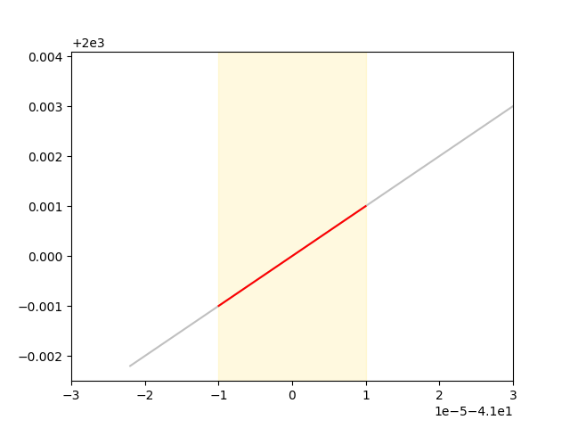

# of singularities:  7
# Model: noble_model_2001(noble_model_2001.cellml)
No of piecewises: 1
## Equation 1:
```
L_type_Ca_channel__i_Ca_L_Ca_cyt = 4.0 * (1.0 - L_type_Ca_channel__FrICa) * (-50.0 + membrane__V) * (intracellular_calcium_concentration__Ca_i * exp(100.0 * membrane__F / (membrane__R * membrane__T)) - extracellular_calcium_concentration__Ca_o * exp(2.0 * (50.0 - membrane__V) * membrane__F / (membrane__R * membrane__T))) * L_type_Ca_channel__P_Ca_L * L_type_Ca_channel_d_gate__d * L_type_Ca_channel_f_gate__CaChoncyt * membrane__F / ((1.0 - exp(2.0 * (50.0 - membrane__V) * membrane__F / (membrane__R * membrane__T))) * membrane__R * membrane__T)
```
## New Eq:
```
L_type_Ca_channel__i_Ca_L_Ca_cyt = ((fabs(-50.0 + membrane__V) < 1.0000000000010001e-5) ? (49999.999999949992 * (-49.999989999999997 + membrane__V) * (4.4920668987339499e-7 * (1.0 - L_type_Ca_channel_f_gate__f) * (1.0 - intracellular_calcium_concentration__Ca_i / (0.01 + intracellular_calcium_concentration__Ca_i)) * (intracellular_calcium_concentration__Ca_i * exp(3.7433890822745473) - extracellular_calcium_concentration__Ca_o * exp(7.4867781645565822e-7)) * L_type_Ca_channel__P_Ca_L * L_type_Ca_channel_d_gate__d / (1.0 - exp(7.4867781645565822e-7)) + 4.4920668987339499e-7 * (1.0 - L_type_Ca_channel_f_gate__f) * (1.0 - intracellular_calcium_concentration__Ca_i / (0.01 + intracellular_calcium_concentration__Ca_i)) * (intracellular_calcium_concentration__Ca_i * exp(3.7433890822745473) - extracellular_calcium_concentration__Ca_o * exp(-7.4867781645565822e-7)) * L_type_Ca_channel__P_Ca_L * L_type_Ca_channel_d_gate__d / (1.0 - exp(-7.4867781645565822e-7))) - 4.4920668987339499e-7 * (1.0 - L_type_Ca_channel_f_gate__f) * (1.0 - intracellular_calcium_concentration__Ca_i / (0.01 + intracellular_calcium_concentration__Ca_i)) * (intracellular_calcium_concentration__Ca_i * exp(3.7433890822745473) - extracellular_calcium_concentration__Ca_o * exp(7.4867781645565822e-7)) * L_type_Ca_channel__P_Ca_L * L_type_Ca_channel_d_gate__d / (1.0 - exp(7.4867781645565822e-7))) : (0.044920668987294569 * (1.0 - L_type_Ca_channel_f_gate__f) * (1.0 - intracellular_calcium_concentration__Ca_i / (0.01 + intracellular_calcium_concentration__Ca_i)) * (-50.0 + membrane__V) * (intracellular_calcium_concentration__Ca_i * exp(3.7433890822745473) - extracellular_calcium_concentration__Ca_o * exp(3.7433890822745473 - 0.074867781645490947 * membrane__V)) * L_type_Ca_channel__P_Ca_L * L_type_Ca_channel_d_gate__d / (1.0 - exp(3.7433890822745473 - 0.074867781645490947 * membrane__V))))
```
## Singularity point: 50.000000000000000


## Equation 2:
```
L_type_Ca_channel__i_Ca_L_Ca_ds = 4.0 * (-50.0 + membrane__V) * (intracellular_calcium_concentration__Ca_i * exp(100.0 * membrane__F / (membrane__R * membrane__T)) - extracellular_calcium_concentration__Ca_o * exp(2.0 * (50.0 - membrane__V) * membrane__F / (membrane__R * membrane__T))) * L_type_Ca_channel__FrICa * L_type_Ca_channel__P_Ca_L * L_type_Ca_channel_d_gate__d * L_type_Ca_channel_f_gate__CaChonds * membrane__F / ((1.0 - exp(2.0 * (50.0 - membrane__V) * membrane__F / (membrane__R * membrane__T))) * membrane__R * membrane__T)
```
## New Eq:
```
L_type_Ca_channel__i_Ca_L_Ca_ds = ((fabs(-50.0 + membrane__V) < 1.0000000000010001e-5) ? (49999.999999949992 * (-49.999989999999997 + membrane__V) * (1.0481489430379214e-6 * (1.0 - L_type_Ca_channel_f_gate__f) * (1.0 - intracellular_calcium_concentration__Ca_ds / (0.001 + intracellular_calcium_concentration__Ca_ds)) * (intracellular_calcium_concentration__Ca_i * exp(3.7433890822745473) - extracellular_calcium_concentration__Ca_o * exp(7.4867781645565822e-7)) * L_type_Ca_channel__P_Ca_L * L_type_Ca_channel_d_gate__d / (1.0 - exp(7.4867781645565822e-7)) + 1.0481489430379214e-6 * (1.0 - L_type_Ca_channel_f_gate__f) * (1.0 - intracellular_calcium_concentration__Ca_ds / (0.001 + intracellular_calcium_concentration__Ca_ds)) * (intracellular_calcium_concentration__Ca_i * exp(3.7433890822745473) - extracellular_calcium_concentration__Ca_o * exp(-7.4867781645565822e-7)) * L_type_Ca_channel__P_Ca_L * L_type_Ca_channel_d_gate__d / (1.0 - exp(-7.4867781645565822e-7))) - 1.0481489430379214e-6 * (1.0 - L_type_Ca_channel_f_gate__f) * (1.0 - intracellular_calcium_concentration__Ca_ds / (0.001 + intracellular_calcium_concentration__Ca_ds)) * (intracellular_calcium_concentration__Ca_i * exp(3.7433890822745473) - extracellular_calcium_concentration__Ca_o * exp(7.4867781645565822e-7)) * L_type_Ca_channel__P_Ca_L * L_type_Ca_channel_d_gate__d / (1.0 - exp(7.4867781645565822e-7))) : (0.10481489430368732 * (1.0 - L_type_Ca_channel_f_gate__f) * (1.0 - intracellular_calcium_concentration__Ca_ds / (0.001 + intracellular_calcium_concentration__Ca_ds)) * (-50.0 + membrane__V) * (intracellular_calcium_concentration__Ca_i * exp(3.7433890822745473) - extracellular_calcium_concentration__Ca_o * exp(3.7433890822745473 - 0.074867781645490947 * membrane__V)) * L_type_Ca_channel__P_Ca_L * L_type_Ca_channel_d_gate__d / (1.0 - exp(3.7433890822745473 - 0.074867781645490947 * membrane__V))))
```
## Singularity point: 50.000000000000000


## Equation 3:
```
L_type_Ca_channel__i_Ca_L_K_cyt = (1.0 - L_type_Ca_channel__FrICa) * (-50.0 + membrane__V) * (intracellular_potassium_concentration__K_i * exp(50.0 * membrane__F / (membrane__R * membrane__T)) - extracellular_potassium_concentration__K_o * exp((50.0 - membrane__V) * membrane__F / (membrane__R * membrane__T))) * L_type_Ca_channel__P_CaK * L_type_Ca_channel__P_Ca_L * L_type_Ca_channel_d_gate__d * L_type_Ca_channel_f_gate__CaChoncyt * membrane__F / ((1.0 - exp((50.0 - membrane__V) * membrane__F / (membrane__R * membrane__T))) * membrane__R * membrane__T)
```
## New Eq:
```
L_type_Ca_channel__i_Ca_L_K_cyt = ((fabs(-50.0 + membrane__V) < 1.0000000000010001e-5) ? (49999.999999949992 * (-49.999989999999997 + membrane__V) * (2.2460334493669749e-10 * (1.0 - L_type_Ca_channel_f_gate__f) * (1.0 - intracellular_calcium_concentration__Ca_i / (0.01 + intracellular_calcium_concentration__Ca_i)) * (intracellular_potassium_concentration__K_i * exp(1.8716945411372736) - extracellular_potassium_concentration__K_o * exp(3.7433890822782911e-7)) * L_type_Ca_channel__P_Ca_L * L_type_Ca_channel_d_gate__d / (1.0 - exp(3.7433890822782911e-7)) + 2.2460334493669749e-10 * (1.0 - L_type_Ca_channel_f_gate__f) * (1.0 - intracellular_calcium_concentration__Ca_i / (0.01 + intracellular_calcium_concentration__Ca_i)) * (intracellular_potassium_concentration__K_i * exp(1.8716945411372736) - extracellular_potassium_concentration__K_o * exp(-3.7433890822782911e-7)) * L_type_Ca_channel__P_Ca_L * L_type_Ca_channel_d_gate__d / (1.0 - exp(-3.7433890822782911e-7))) - 2.2460334493669749e-10 * (1.0 - L_type_Ca_channel_f_gate__f) * (1.0 - intracellular_calcium_concentration__Ca_i / (0.01 + intracellular_calcium_concentration__Ca_i)) * (intracellular_potassium_concentration__K_i * exp(1.8716945411372736) - extracellular_potassium_concentration__K_o * exp(3.7433890822782911e-7)) * L_type_Ca_channel__P_Ca_L * L_type_Ca_channel_d_gate__d / (1.0 - exp(3.7433890822782911e-7))) : (2.2460334493647287e-5 * (1.0 - L_type_Ca_channel_f_gate__f) * (1.0 - intracellular_calcium_concentration__Ca_i / (0.01 + intracellular_calcium_concentration__Ca_i)) * (-50.0 + membrane__V) * (intracellular_potassium_concentration__K_i * exp(1.8716945411372736) - extracellular_potassium_concentration__K_o * exp(1.8716945411372736 - 0.037433890822745473 * membrane__V)) * L_type_Ca_channel__P_Ca_L * L_type_Ca_channel_d_gate__d / (1.0 - exp(1.8716945411372736 - 0.037433890822745473 * membrane__V))))
```
## Singularity point: 50.000000000000000


## Equation 4:
```
L_type_Ca_channel__i_Ca_L_K_ds = (-50.0 + membrane__V) * (intracellular_potassium_concentration__K_i * exp(50.0 * membrane__F / (membrane__R * membrane__T)) - extracellular_potassium_concentration__K_o * exp((50.0 - membrane__V) * membrane__F / (membrane__R * membrane__T))) * L_type_Ca_channel__FrICa * L_type_Ca_channel__P_CaK * L_type_Ca_channel__P_Ca_L * L_type_Ca_channel_d_gate__d * L_type_Ca_channel_f_gate__CaChonds * membrane__F / ((1.0 - exp((50.0 - membrane__V) * membrane__F / (membrane__R * membrane__T))) * membrane__R * membrane__T)
```
## New Eq:
```
L_type_Ca_channel__i_Ca_L_K_ds = ((fabs(-50.0 + membrane__V) < 1.0000000000010001e-5) ? (49999.999999949992 * (-49.999989999999997 + membrane__V) * (5.2407447151896074e-10 * (1.0 - L_type_Ca_channel_f_gate__f) * (1.0 - intracellular_calcium_concentration__Ca_ds / (0.001 + intracellular_calcium_concentration__Ca_ds)) * (intracellular_potassium_concentration__K_i * exp(1.8716945411372736) - extracellular_potassium_concentration__K_o * exp(3.7433890822782911e-7)) * L_type_Ca_channel__P_Ca_L * L_type_Ca_channel_d_gate__d / (1.0 - exp(3.7433890822782911e-7)) + 5.2407447151896074e-10 * (1.0 - L_type_Ca_channel_f_gate__f) * (1.0 - intracellular_calcium_concentration__Ca_ds / (0.001 + intracellular_calcium_concentration__Ca_ds)) * (intracellular_potassium_concentration__K_i * exp(1.8716945411372736) - extracellular_potassium_concentration__K_o * exp(-3.7433890822782911e-7)) * L_type_Ca_channel__P_Ca_L * L_type_Ca_channel_d_gate__d / (1.0 - exp(-3.7433890822782911e-7))) - 5.2407447151896074e-10 * (1.0 - L_type_Ca_channel_f_gate__f) * (1.0 - intracellular_calcium_concentration__Ca_ds / (0.001 + intracellular_calcium_concentration__Ca_ds)) * (intracellular_potassium_concentration__K_i * exp(1.8716945411372736) - extracellular_potassium_concentration__K_o * exp(3.7433890822782911e-7)) * L_type_Ca_channel__P_Ca_L * L_type_Ca_channel_d_gate__d / (1.0 - exp(3.7433890822782911e-7))) : (5.2407447151843657e-5 * (1.0 - L_type_Ca_channel_f_gate__f) * (1.0 - intracellular_calcium_concentration__Ca_ds / (0.001 + intracellular_calcium_concentration__Ca_ds)) * (-50.0 + membrane__V) * (intracellular_potassium_concentration__K_i * exp(1.8716945411372736) - extracellular_potassium_concentration__K_o * exp(1.8716945411372736 - 0.037433890822745473 * membrane__V)) * L_type_Ca_channel__P_Ca_L * L_type_Ca_channel_d_gate__d / (1.0 - exp(1.8716945411372736 - 0.037433890822745473 * membrane__V))))
```
## Singularity point: 50.000000000000000
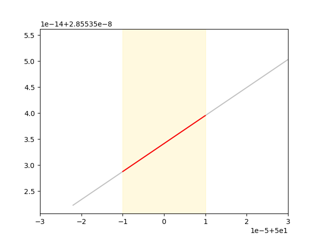

## Equation 5:
```
L_type_Ca_channel__i_Ca_L_Na_cyt = (1.0 - L_type_Ca_channel__FrICa) * (-50.0 + membrane__V) * (intracellular_sodium_concentration__Na_i * exp(50.0 * membrane__F / (membrane__R * membrane__T)) - extracellular_sodium_concentration__Na_o * exp((50.0 - membrane__V) * membrane__F / (membrane__R * membrane__T))) * L_type_Ca_channel__P_CaNa * L_type_Ca_channel__P_Ca_L * L_type_Ca_channel_d_gate__d * L_type_Ca_channel_f_gate__CaChoncyt * membrane__F / ((1.0 - exp((50.0 - membrane__V) * membrane__F / (membrane__R * membrane__T))) * membrane__R * membrane__T)
```
## New Eq:
```
L_type_Ca_channel__i_Ca_L_Na_cyt = ((fabs(-50.0 + membrane__V) < 1.0000000000010001e-5) ? (49999.999999949992 * (-49.999989999999997 + membrane__V) * (1.1230167246834875e-9 * (1.0 - L_type_Ca_channel_f_gate__f) * (1.0 - intracellular_calcium_concentration__Ca_i / (0.01 + intracellular_calcium_concentration__Ca_i)) * (intracellular_sodium_concentration__Na_i * exp(1.8716945411372736) - extracellular_sodium_concentration__Na_o * exp(3.7433890822782911e-7)) * L_type_Ca_channel__P_Ca_L * L_type_Ca_channel_d_gate__d / (1.0 - exp(3.7433890822782911e-7)) + 1.1230167246834875e-9 * (1.0 - L_type_Ca_channel_f_gate__f) * (1.0 - intracellular_calcium_concentration__Ca_i / (0.01 + intracellular_calcium_concentration__Ca_i)) * (intracellular_sodium_concentration__Na_i * exp(1.8716945411372736) - extracellular_sodium_concentration__Na_o * exp(-3.7433890822782911e-7)) * L_type_Ca_channel__P_Ca_L * L_type_Ca_channel_d_gate__d / (1.0 - exp(-3.7433890822782911e-7))) - 1.1230167246834875e-9 * (1.0 - L_type_Ca_channel_f_gate__f) * (1.0 - intracellular_calcium_concentration__Ca_i / (0.01 + intracellular_calcium_concentration__Ca_i)) * (intracellular_sodium_concentration__Na_i * exp(1.8716945411372736) - extracellular_sodium_concentration__Na_o * exp(3.7433890822782911e-7)) * L_type_Ca_channel__P_Ca_L * L_type_Ca_channel_d_gate__d / (1.0 - exp(3.7433890822782911e-7))) : (0.00011230167246823643 * (1.0 - L_type_Ca_channel_f_gate__f) * (1.0 - intracellular_calcium_concentration__Ca_i / (0.01 + intracellular_calcium_concentration__Ca_i)) * (-50.0 + membrane__V) * (intracellular_sodium_concentration__Na_i * exp(1.8716945411372736) - extracellular_sodium_concentration__Na_o * exp(1.8716945411372736 - 0.037433890822745473 * membrane__V)) * L_type_Ca_channel__P_Ca_L * L_type_Ca_channel_d_gate__d / (1.0 - exp(1.8716945411372736 - 0.037433890822745473 * membrane__V))))
```
## Singularity point: 50.000000000000000


## Equation 6:
```
L_type_Ca_channel__i_Ca_L_Na_ds = (-50.0 + membrane__V) * (intracellular_sodium_concentration__Na_i * exp(50.0 * membrane__F / (membrane__R * membrane__T)) - extracellular_sodium_concentration__Na_o * exp((50.0 - membrane__V) * membrane__F / (membrane__R * membrane__T))) * L_type_Ca_channel__FrICa * L_type_Ca_channel__P_CaNa * L_type_Ca_channel__P_Ca_L * L_type_Ca_channel_d_gate__d * L_type_Ca_channel_f_gate__CaChonds * membrane__F / ((1.0 - exp((50.0 - membrane__V) * membrane__F / (membrane__R * membrane__T))) * membrane__R * membrane__T)
```
## New Eq:
```
L_type_Ca_channel__i_Ca_L_Na_ds = ((fabs(-50.0 + membrane__V) < 1.0000000000010001e-5) ? (49999.999999949992 * (-49.999989999999997 + membrane__V) * (2.6203723575948035e-9 * (1.0 - L_type_Ca_channel_f_gate__f) * (1.0 - intracellular_calcium_concentration__Ca_ds / (0.001 + intracellular_calcium_concentration__Ca_ds)) * (intracellular_sodium_concentration__Na_i * exp(1.8716945411372736) - extracellular_sodium_concentration__Na_o * exp(3.7433890822782911e-7)) * L_type_Ca_channel__P_Ca_L * L_type_Ca_channel_d_gate__d / (1.0 - exp(3.7433890822782911e-7)) + 2.6203723575948035e-9 * (1.0 - L_type_Ca_channel_f_gate__f) * (1.0 - intracellular_calcium_concentration__Ca_ds / (0.001 + intracellular_calcium_concentration__Ca_ds)) * (intracellular_sodium_concentration__Na_i * exp(1.8716945411372736) - extracellular_sodium_concentration__Na_o * exp(-3.7433890822782911e-7)) * L_type_Ca_channel__P_Ca_L * L_type_Ca_channel_d_gate__d / (1.0 - exp(-3.7433890822782911e-7))) - 2.6203723575948035e-9 * (1.0 - L_type_Ca_channel_f_gate__f) * (1.0 - intracellular_calcium_concentration__Ca_ds / (0.001 + intracellular_calcium_concentration__Ca_ds)) * (intracellular_sodium_concentration__Na_i * exp(1.8716945411372736) - extracellular_sodium_concentration__Na_o * exp(3.7433890822782911e-7)) * L_type_Ca_channel__P_Ca_L * L_type_Ca_channel_d_gate__d / (1.0 - exp(3.7433890822782911e-7))) : (0.00026203723575921831 * (1.0 - L_type_Ca_channel_f_gate__f) * (1.0 - intracellular_calcium_concentration__Ca_ds / (0.001 + intracellular_calcium_concentration__Ca_ds)) * (-50.0 + membrane__V) * (intracellular_sodium_concentration__Na_i * exp(1.8716945411372736) - extracellular_sodium_concentration__Na_o * exp(1.8716945411372736 - 0.037433890822745473 * membrane__V)) * L_type_Ca_channel__P_Ca_L * L_type_Ca_channel_d_gate__d / (1.0 - exp(1.8716945411372736 - 0.037433890822745473 * membrane__V))))
```
## Singularity point: 50.000000000000000


## Equation 7:
```
L_type_Ca_channel_d_gate__alpha_d = 30.0 * (19.0 + membrane__V) / (1.0 - exp(-4.75 - 0.25 * membrane__V))
```
## New Eq:
```
L_type_Ca_channel_d_gate__alpha_d = ((fabs(19.0 + membrane__V) < 1.0000000000010001e-5) ? (-0.00030000000000030003 / (1.0 - exp(2.5000000000025002e-6)) + 49999.999999949992 * (19.00001 + membrane__V) * (0.00030000000000030003 / (1.0 - exp(2.5000000000025002e-6)) + 0.00030000000000030003 / (1.0 - exp(-2.5000000000025002e-6)))) : (30.0 * (19.0 + membrane__V) / (1.0 - exp(-4.75 - 0.25 * membrane__V))))
```
## Singularity point: -19.000000000000000


## Equation 8:
```
L_type_Ca_channel_d_gate__beta_d = 12.0 * (19.0 + membrane__V) / (-1.0 + exp(1.8999999999999999 + 0.10000000000000001 * membrane__V))
```
## New Eq:
```
L_type_Ca_channel_d_gate__beta_d = ((fabs(19.0 + membrane__V) < 1.0000000000010001e-5) ? (-0.00012000000000012001 / (-1.0 + exp(-1.0000000000010001e-6)) + 49999.999999949992 * (19.00001 + membrane__V) * (0.00012000000000012001 / (-1.0 + exp(1.0000000000010001e-6)) + 0.00012000000000012001 / (-1.0 + exp(-1.0000000000010001e-6)))) : (12.0 * (19.0 + membrane__V) / (-1.0 + exp(1.8999999999999999 + 0.10000000000000001 * membrane__V))))
```
## Singularity point: -19.000000000000000
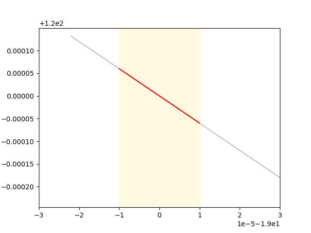

## Equation 9:
```
L_type_Ca_channel_f_gate__alpha_f = 6.25 * (34.0 + membrane__V) / (-1.0 + exp(8.5 + 0.25 * membrane__V))
```
## New Eq:
```
L_type_Ca_channel_f_gate__alpha_f = ((fabs(34.0 + membrane__V) < 1.0000000000010001e-5) ? (-6.2500000000062506e-5 / (-1.0 + exp(-2.5000000000025002e-6)) + 49999.999999949992 * (34.000010000000003 + membrane__V) * (6.2500000000062506e-5 / (-1.0 + exp(2.5000000000025002e-6)) + 6.2500000000062506e-5 / (-1.0 + exp(-2.5000000000025002e-6)))) : (6.25 * (34.0 + membrane__V) / (-1.0 + exp(8.5 + 0.25 * membrane__V))))
```
## Singularity point: -34.000000000000000


## Equation 10:
```
fast_sodium_current_m_gate__alpha_m = 200.0 * (41.0 + membrane__V) / (1.0 - exp(-4.1000000000000005 - 0.10000000000000001 * membrane__V))
```
## New Eq:
```
fast_sodium_current_m_gate__alpha_m = ((fabs(41.0 + membrane__V) < 1.0000000000010001e-5) ? (-0.0020000000000020002 / (1.0 - exp(1.0000000000010001e-6)) + 49999.999999949992 * (41.000010000000003 + membrane__V) * (0.0020000000000020002 / (1.0 - exp(1.0000000000010001e-6)) + 0.0020000000000020002 / (1.0 - exp(-1.0000000000010001e-6)))) : (200.0 * (41.0 + membrane__V) / (1.0 - exp(-4.1000000000000005 - 0.10000000000000001 * membrane__V))))
```
## Singularity point: -41.000000000000000


# of singularities:  10
# Model: NN_SAN_model_1984(noble_noble_SAN_model_1984.cellml)
No of piecewises: 0
## Equation 1:
```
fast_sodium_current_m_gate__alpha_m = 200.0 * (41.0 + membrane__V) / (1.0 - exp(-4.1000000000000005 - 0.10000000000000001 * membrane__V))
```
## New Eq:
```
fast_sodium_current_m_gate__alpha_m = ((fabs(41.0 + membrane__V) < 1.0000000000010001e-5) ? (-0.0020000000000020002 / (1.0 - exp(1.0000000000010001e-6)) + 49999.999999949992 * (41.000010000000003 + membrane__V) * (0.0020000000000020002 / (1.0 - exp(1.0000000000010001e-6)) + 0.0020000000000020002 / (1.0 - exp(-1.0000000000010001e-6)))) : (200.0 * (41.0 + membrane__V) / (1.0 - exp(-4.1000000000000005 - 0.10000000000000001 * membrane__V))))
```
## Singularity point: -41.000000000000000


## Equation 2:
```
hyperpolarising_activated_current_y_gate__beta_y = (52.0 + membrane__V) / (1.0 - exp(-10.4 - 0.20000000000000001 * membrane__V))
```
## New Eq:
```
hyperpolarising_activated_current_y_gate__beta_y = ((fabs(52.0 + membrane__V) < 1.0000000000010001e-5) ? (-1.0000000000010001e-5 / (1.0 - exp(2.0000000000020002e-6)) + 49999.999999949992 * (52.000010000000003 + membrane__V) * (1.0000000000010001e-5 / (1.0 - exp(2.0000000000020002e-6)) + 1.0000000000010001e-5 / (1.0 - exp(-2.0000000000020002e-6)))) : ((52.0 + membrane__V) / (1.0 - exp(-10.4 - 0.20000000000000001 * membrane__V))))
```
## Singularity point: -52.000000000000000


## Equation 3:
```
intracellular_calcium_concentration__alpha_p = 0.625 * intracellular_calcium_concentration__E0_p / (-1.0 + exp(0.25 * intracellular_calcium_concentration__E0_p))
```
## New Eq:
```
intracellular_calcium_concentration__alpha_p = ((fabs(64.0 + membrane__V) < 9.9999999999822453e-6) ? (-6.2499999999715561e-6 / (-1.0 + exp(-2.4999999999886224e-6)) + 50000.000000088774 * (64.000010000000003 + membrane__V) * (6.2499999999715561e-6 / (-1.0 + exp(-2.4999999999886224e-6)) + 6.2500000000062506e-6 / (-1.0 + exp(2.5000000000025002e-6)))) : (0.625 * (64.0 + membrane__V) / (-1.0 + exp(16.0 + 0.25 * membrane__V))))
```
## Singularity point: -64.000000000000000
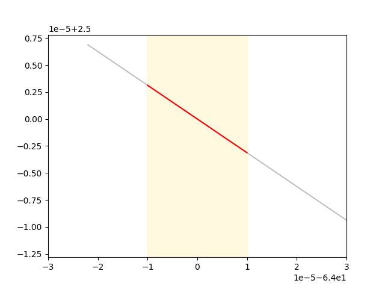

## Equation 4:
```
second_inward_current_d_gate__alpha_d = 30.0 * (19.0 + membrane__V) / (1.0 - exp(-4.75 - 0.25 * membrane__V))
```
## New Eq:
```
second_inward_current_d_gate__alpha_d = ((fabs(19.0 + membrane__V) < 1.0000000000010001e-5) ? (-0.00030000000000030003 / (1.0 - exp(2.5000000000025002e-6)) + 49999.999999949992 * (19.00001 + membrane__V) * (0.00030000000000030003 / (1.0 - exp(2.5000000000025002e-6)) + 0.00030000000000030003 / (1.0 - exp(-2.5000000000025002e-6)))) : (30.0 * (19.0 + membrane__V) / (1.0 - exp(-4.75 - 0.25 * membrane__V))))
```
## Singularity point: -19.000000000000000


## Equation 5:
```
second_inward_current_d_gate__beta_d = 12.0 * (19.0 + membrane__V) / (-1.0 + exp(1.8999999999999999 + 0.10000000000000001 * membrane__V))
```
## New Eq:
```
second_inward_current_d_gate__beta_d = ((fabs(19.0 + membrane__V) < 1.0000000000010001e-5) ? (-0.00012000000000012001 / (-1.0 + exp(-1.0000000000010001e-6)) + 49999.999999949992 * (19.00001 + membrane__V) * (0.00012000000000012001 / (-1.0 + exp(1.0000000000010001e-6)) + 0.00012000000000012001 / (-1.0 + exp(-1.0000000000010001e-6)))) : (12.0 * (19.0 + membrane__V) / (-1.0 + exp(1.8999999999999999 + 0.10000000000000001 * membrane__V))))
```
## Singularity point: -19.000000000000000


## Equation 6:
```
second_inward_current_f_gate__alpha_f = 6.25 * (34.0 + membrane__V) / (-1.0 + exp(8.5 + 0.25 * membrane__V))
```
## New Eq:
```
second_inward_current_f_gate__alpha_f = ((fabs(34.0 + membrane__V) < 1.0000000000010001e-5) ? (-6.2500000000062506e-5 / (-1.0 + exp(-2.5000000000025002e-6)) + 49999.999999949992 * (34.000010000000003 + membrane__V) * (6.2500000000062506e-5 / (-1.0 + exp(2.5000000000025002e-6)) + 6.2500000000062506e-5 / (-1.0 + exp(-2.5000000000025002e-6)))) : (6.25 * (34.0 + membrane__V) / (-1.0 + exp(8.5 + 0.25 * membrane__V))))
```
## Singularity point: -34.000000000000000


## Equation 7:
```
second_inward_current__i_siCa = 4.0 * (-50.0 + membrane__V) * (intracellular_calcium_concentration__Cai * exp(100.0 / membrane__RTONF) - extracellular_calcium_concentration__Cao * exp(-2.0 * (-50.0 + membrane__V) / membrane__RTONF)) * second_inward_current__P_si * second_inward_current_d_gate__d * second_inward_current_f2_gate__f2 * second_inward_current_f_gate__f / ((1.0 - exp(-2.0 * (-50.0 + membrane__V) / membrane__RTONF)) * membrane__RTONF)
```
## New Eq:
```
second_inward_current__i_siCa = ((fabs(-50.0 + membrane__V) < 1.0000000000010001e-5) ? (49999.999999949992 * (-49.999989999999997 + membrane__V) * (1.4973556329113164e-6 * (intracellular_calcium_concentration__Cai * exp(3.7433890822745473) - extracellular_calcium_concentration__Cao * exp(7.4867781645565822e-7)) * second_inward_current__P_si * second_inward_current_d_gate__d * second_inward_current_f2_gate__f2 * second_inward_current_f_gate__f / (1.0 - exp(7.4867781645565822e-7)) + 1.4973556329113164e-6 * (intracellular_calcium_concentration__Cai * exp(3.7433890822745473) - extracellular_calcium_concentration__Cao * exp(-7.4867781645565822e-7)) * second_inward_current__P_si * second_inward_current_d_gate__d * second_inward_current_f2_gate__f2 * second_inward_current_f_gate__f / (1.0 - exp(-7.4867781645565822e-7))) - 1.4973556329113164e-6 * (intracellular_calcium_concentration__Cai * exp(3.7433890822745473) - extracellular_calcium_concentration__Cao * exp(7.4867781645565822e-7)) * second_inward_current__P_si * second_inward_current_d_gate__d * second_inward_current_f2_gate__f2 * second_inward_current_f_gate__f / (1.0 - exp(7.4867781645565822e-7))) : (0.14973556329098189 * (-50.0 + membrane__V) * (intracellular_calcium_concentration__Cai * exp(3.7433890822745473) - extracellular_calcium_concentration__Cao * exp(3.7433890822745473 - 0.074867781645490947 * membrane__V)) * second_inward_current__P_si * second_inward_current_d_gate__d * second_inward_current_f2_gate__f2 * second_inward_current_f_gate__f / (1.0 - exp(3.7433890822745473 - 0.074867781645490947 * membrane__V))))
```
## Singularity point: 50.000000000000000
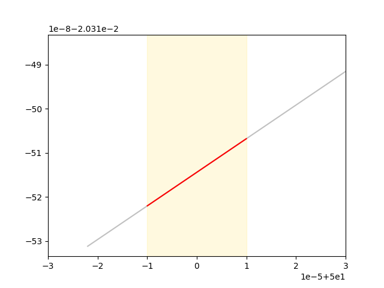

## Equation 8:
```
second_inward_current__i_siK = 0.01 * (-50.0 + membrane__V) * (intracellular_potassium_concentration__Ki * exp(50.0 / membrane__RTONF) - extracellular_potassium_concentration__Kc * exp(-(-50.0 + membrane__V) / membrane__RTONF)) * second_inward_current__P_si * second_inward_current_d_gate__d * second_inward_current_f2_gate__f2 * second_inward_current_f_gate__f / ((1.0 - exp(-(-50.0 + membrane__V) / membrane__RTONF)) * membrane__RTONF)
```
## New Eq:
```
second_inward_current__i_siK = ((fabs(-50.0 + membrane__V) < 1.0000000000010001e-5) ? (49999.999999949992 * (-49.999989999999997 + membrane__V) * (3.7433890822782906e-9 * (intracellular_potassium_concentration__Ki * exp(1.8716945411372736) - extracellular_potassium_concentration__Kc * exp(3.7433890822782911e-7)) * second_inward_current__P_si * second_inward_current_d_gate__d * second_inward_current_f2_gate__f2 * second_inward_current_f_gate__f / (1.0 - exp(3.7433890822782911e-7)) + 3.7433890822782906e-9 * (intracellular_potassium_concentration__Ki * exp(1.8716945411372736) - extracellular_potassium_concentration__Kc * exp(-3.7433890822782911e-7)) * second_inward_current__P_si * second_inward_current_d_gate__d * second_inward_current_f2_gate__f2 * second_inward_current_f_gate__f / (1.0 - exp(-3.7433890822782911e-7))) - 3.7433890822782906e-9 * (intracellular_potassium_concentration__Ki * exp(1.8716945411372736) - extracellular_potassium_concentration__Kc * exp(3.7433890822782911e-7)) * second_inward_current__P_si * second_inward_current_d_gate__d * second_inward_current_f2_gate__f2 * second_inward_current_f_gate__f / (1.0 - exp(3.7433890822782911e-7))) : (0.00037433890822745472 * (-50.0 + membrane__V) * (intracellular_potassium_concentration__Ki * exp(1.8716945411372736) - extracellular_potassium_concentration__Kc * exp(1.8716945411372736 - 0.037433890822745473 * membrane__V)) * second_inward_current__P_si * second_inward_current_d_gate__d * second_inward_current_f2_gate__f2 * second_inward_current_f_gate__f / (1.0 - exp(1.8716945411372736 - 0.037433890822745473 * membrane__V))))
```
## Singularity point: 50.000000000000000
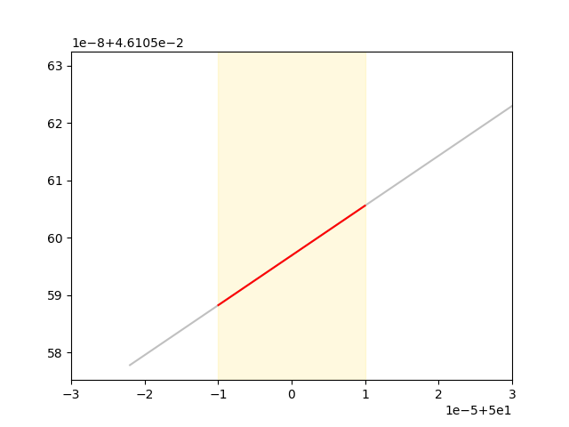

## Equation 9:
```
second_inward_current__i_siNa = 0.01 * (-50.0 + membrane__V) * (intracellular_sodium_concentration__Nai * exp(50.0 / membrane__RTONF) - extracellular_sodium_concentration__Nao * exp(-(-50.0 + membrane__V) / membrane__RTONF)) * second_inward_current__P_si * second_inward_current_d_gate__d * second_inward_current_f2_gate__f2 * second_inward_current_f_gate__f / ((1.0 - exp(-(-50.0 + membrane__V) / membrane__RTONF)) * membrane__RTONF)
```
## New Eq:
```
second_inward_current__i_siNa = ((fabs(-50.0 + membrane__V) < 1.0000000000010001e-5) ? (49999.999999949992 * (-49.999989999999997 + membrane__V) * (3.7433890822782906e-9 * (intracellular_sodium_concentration__Nai * exp(1.8716945411372736) - extracellular_sodium_concentration__Nao * exp(3.7433890822782911e-7)) * second_inward_current__P_si * second_inward_current_d_gate__d * second_inward_current_f2_gate__f2 * second_inward_current_f_gate__f / (1.0 - exp(3.7433890822782911e-7)) + 3.7433890822782906e-9 * (intracellular_sodium_concentration__Nai * exp(1.8716945411372736) - extracellular_sodium_concentration__Nao * exp(-3.7433890822782911e-7)) * second_inward_current__P_si * second_inward_current_d_gate__d * second_inward_current_f2_gate__f2 * second_inward_current_f_gate__f / (1.0 - exp(-3.7433890822782911e-7))) - 3.7433890822782906e-9 * (intracellular_sodium_concentration__Nai * exp(1.8716945411372736) - extracellular_sodium_concentration__Nao * exp(3.7433890822782911e-7)) * second_inward_current__P_si * second_inward_current_d_gate__d * second_inward_current_f2_gate__f2 * second_inward_current_f_gate__f / (1.0 - exp(3.7433890822782911e-7))) : (0.00037433890822745472 * (-50.0 + membrane__V) * (intracellular_sodium_concentration__Nai * exp(1.8716945411372736) - extracellular_sodium_concentration__Nao * exp(1.8716945411372736 - 0.037433890822745473 * membrane__V)) * second_inward_current__P_si * second_inward_current_d_gate__d * second_inward_current_f2_gate__f2 * second_inward_current_f_gate__f / (1.0 - exp(1.8716945411372736 - 0.037433890822745473 * membrane__V))))
```
## Singularity point: 50.000000000000000
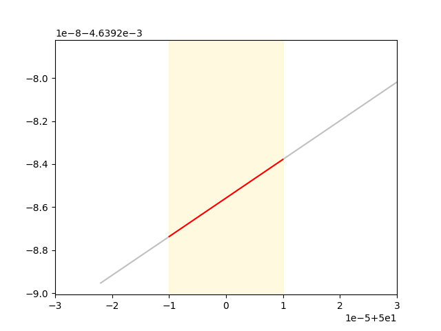

## Equation 10:
```
time_dependent_potassium_current_x_gate__alpha_x = 0.5 * (22.0 + membrane__V) / (1.0 - exp(-4.4000000000000004 - 0.20000000000000001 * membrane__V))
```
## New Eq:
```
time_dependent_potassium_current_x_gate__alpha_x = ((fabs(22.0 + membrane__V) < 1.0000000000010001e-5) ? (-5.0000000000050004e-6 / (1.0 - exp(2.0000000000020002e-6)) + 49999.999999949992 * (22.00001 + membrane__V) * (5.0000000000050004e-6 / (1.0 - exp(2.0000000000020002e-6)) + 5.0000000000050004e-6 / (1.0 - exp(-2.0000000000020002e-6)))) : (0.5 * (22.0 + membrane__V) / (1.0 - exp(-4.4000000000000004 - 0.20000000000000001 * membrane__V))))
```
## Singularity point: -22.000000000000000


## Equation 11:
```
time_dependent_potassium_current_x_gate__beta_x = 0.17799999999999999 * (22.0 + membrane__V) / (-1.0 + exp(1.4666666666666666 + 0.066666666666666666 * membrane__V))
```
## New Eq:
```
time_dependent_potassium_current_x_gate__beta_x = ((fabs(22.0 + membrane__V) < 1.0000000000010001e-5) ? (-1.7800000000017801e-6 / (-1.0 + exp(-6.6666666666733343e-7)) + 49999.999999949992 * (22.00001 + membrane__V) * (1.7800000000017801e-6 / (-1.0 + exp(6.6666666666733343e-7)) + 1.7800000000017801e-6 / (-1.0 + exp(-6.6666666666733343e-7)))) : (0.17799999999999999 * (22.0 + membrane__V) / (-1.0 + exp(1.4666666666666666 + 0.066666666666666666 * membrane__V))))
```
## Singularity point: -22.000000000000000


# of singularities:  11
# Model: Noble_SAN_model_1989(noble_SAN_model_1989.cellml)
No of piecewises: 0
## Equation 1:
```
fast_sodium_current_m_gate__alpha_m = 200.0 * (41.0 + membrane__V) / (1.0 - exp(-4.1000000000000005 - 0.10000000000000001 * membrane__V))
```
## New Eq:
```
fast_sodium_current_m_gate__alpha_m = ((fabs(41.0 + membrane__V) < 1.0000000000010001e-5) ? (-0.0020000000000020002 / (1.0 - exp(1.0000000000010001e-6)) + 49999.999999949992 * (41.000010000000003 + membrane__V) * (0.0020000000000020002 / (1.0 - exp(1.0000000000010001e-6)) + 0.0020000000000020002 / (1.0 - exp(-1.0000000000010001e-6)))) : (200.0 * (41.0 + membrane__V) / (1.0 - exp(-4.1000000000000005 - 0.10000000000000001 * membrane__V))))
```
## Singularity point: -41.000000000000000


## Equation 2:
```
intracellular_calcium_concentration__alpha_p = 0.625 * intracellular_calcium_concentration__E0_p / (-1.0 + exp(0.25 * intracellular_calcium_concentration__E0_p))
```
## New Eq:
```
intracellular_calcium_concentration__alpha_p = ((fabs(64.0 + membrane__V) < 9.9999999999822453e-6) ? (-6.2499999999715561e-6 / (-1.0 + exp(-2.4999999999886224e-6)) + 50000.000000088774 * (64.000010000000003 + membrane__V) * (6.2499999999715561e-6 / (-1.0 + exp(-2.4999999999886224e-6)) + 6.2500000000062506e-6 / (-1.0 + exp(2.5000000000025002e-6)))) : (0.625 * (64.0 + membrane__V) / (-1.0 + exp(16.0 + 0.25 * membrane__V))))
```
## Singularity point: -64.000000000000000


## Equation 3:
```
second_inward_current_d_gate__alpha_d = 30.0 * (19.0 + membrane__V) / (1.0 - exp(-4.75 - 0.25 * membrane__V))
```
## New Eq:
```
second_inward_current_d_gate__alpha_d = ((fabs(19.0 + membrane__V) < 1.0000000000010001e-5) ? (-0.00030000000000030003 / (1.0 - exp(2.5000000000025002e-6)) + 49999.999999949992 * (19.00001 + membrane__V) * (0.00030000000000030003 / (1.0 - exp(2.5000000000025002e-6)) + 0.00030000000000030003 / (1.0 - exp(-2.5000000000025002e-6)))) : (30.0 * (19.0 + membrane__V) / (1.0 - exp(-4.75 - 0.25 * membrane__V))))
```
## Singularity point: -19.000000000000000


## Equation 4:
```
second_inward_current_d_gate__beta_d = 12.0 * (19.0 + membrane__V) / (-1.0 + exp(1.8999999999999999 + 0.10000000000000001 * membrane__V))
```
## New Eq:
```
second_inward_current_d_gate__beta_d = ((fabs(19.0 + membrane__V) < 1.0000000000010001e-5) ? (-0.00012000000000012001 / (-1.0 + exp(-1.0000000000010001e-6)) + 49999.999999949992 * (19.00001 + membrane__V) * (0.00012000000000012001 / (-1.0 + exp(1.0000000000010001e-6)) + 0.00012000000000012001 / (-1.0 + exp(-1.0000000000010001e-6)))) : (12.0 * (19.0 + membrane__V) / (-1.0 + exp(1.8999999999999999 + 0.10000000000000001 * membrane__V))))
```
## Singularity point: -19.000000000000000


## Equation 5:
```
second_inward_current_f_gate__alpha_f = 6.25 * (34.0 + membrane__V) / (-1.0 + exp(8.5 + 0.25 * membrane__V))
```
## New Eq:
```
second_inward_current_f_gate__alpha_f = ((fabs(34.0 + membrane__V) < 1.0000000000010001e-5) ? (-6.2500000000062506e-5 / (-1.0 + exp(-2.5000000000025002e-6)) + 49999.999999949992 * (34.000010000000003 + membrane__V) * (6.2500000000062506e-5 / (-1.0 + exp(2.5000000000025002e-6)) + 6.2500000000062506e-5 / (-1.0 + exp(-2.5000000000025002e-6)))) : (6.25 * (34.0 + membrane__V) / (-1.0 + exp(8.5 + 0.25 * membrane__V))))
```
## Singularity point: -34.000000000000000


## Equation 6:
```
second_inward_current__i_siCa = 4.0 * (-50.0 + membrane__V) * (intracellular_calcium_concentration__Cai * exp(100.0 / membrane__RTONF) - extracellular_calcium_concentration__Cao * exp(-2.0 * (-50.0 + membrane__V) / membrane__RTONF)) * second_inward_current__P_si * second_inward_current_d_gate__d * second_inward_current_f2_gate__f2 * second_inward_current_f_gate__f / ((1.0 - exp(-2.0 * (-50.0 + membrane__V) / membrane__RTONF)) * membrane__RTONF)
```
## New Eq:
```
second_inward_current__i_siCa = ((fabs(-50.0 + membrane__V) < 1.0000000000010001e-5) ? (49999.999999949992 * (-49.999989999999997 + membrane__V) * (1.4973556329113164e-6 * (intracellular_calcium_concentration__Cai * exp(3.7433890822745473) - extracellular_calcium_concentration__Cao * exp(7.4867781645565822e-7)) * second_inward_current__P_si * second_inward_current_d_gate__d * second_inward_current_f2_gate__f2 * second_inward_current_f_gate__f / (1.0 - exp(7.4867781645565822e-7)) + 1.4973556329113164e-6 * (intracellular_calcium_concentration__Cai * exp(3.7433890822745473) - extracellular_calcium_concentration__Cao * exp(-7.4867781645565822e-7)) * second_inward_current__P_si * second_inward_current_d_gate__d * second_inward_current_f2_gate__f2 * second_inward_current_f_gate__f / (1.0 - exp(-7.4867781645565822e-7))) - 1.4973556329113164e-6 * (intracellular_calcium_concentration__Cai * exp(3.7433890822745473) - extracellular_calcium_concentration__Cao * exp(7.4867781645565822e-7)) * second_inward_current__P_si * second_inward_current_d_gate__d * second_inward_current_f2_gate__f2 * second_inward_current_f_gate__f / (1.0 - exp(7.4867781645565822e-7))) : (0.14973556329098189 * (-50.0 + membrane__V) * (intracellular_calcium_concentration__Cai * exp(3.7433890822745473) - extracellular_calcium_concentration__Cao * exp(3.7433890822745473 - 0.074867781645490947 * membrane__V)) * second_inward_current__P_si * second_inward_current_d_gate__d * second_inward_current_f2_gate__f2 * second_inward_current_f_gate__f / (1.0 - exp(3.7433890822745473 - 0.074867781645490947 * membrane__V))))
```
## Singularity point: 50.000000000000000


## Equation 7:
```
second_inward_current__i_siK = 0.01 * (-50.0 + membrane__V) * (intracellular_potassium_concentration__Ki * exp(50.0 / membrane__RTONF) - extracellular_potassium_concentration__Kc * exp(-(-50.0 + membrane__V) / membrane__RTONF)) * second_inward_current__P_si * second_inward_current_d_gate__d * second_inward_current_f2_gate__f2 * second_inward_current_f_gate__f / ((1.0 - exp(-(-50.0 + membrane__V) / membrane__RTONF)) * membrane__RTONF)
```
## New Eq:
```
second_inward_current__i_siK = ((fabs(-50.0 + membrane__V) < 1.0000000000010001e-5) ? (49999.999999949992 * (-49.999989999999997 + membrane__V) * (3.7433890822782906e-9 * (intracellular_potassium_concentration__Ki * exp(1.8716945411372736) - extracellular_potassium_concentration__Kc * exp(3.7433890822782911e-7)) * second_inward_current__P_si * second_inward_current_d_gate__d * second_inward_current_f2_gate__f2 * second_inward_current_f_gate__f / (1.0 - exp(3.7433890822782911e-7)) + 3.7433890822782906e-9 * (intracellular_potassium_concentration__Ki * exp(1.8716945411372736) - extracellular_potassium_concentration__Kc * exp(-3.7433890822782911e-7)) * second_inward_current__P_si * second_inward_current_d_gate__d * second_inward_current_f2_gate__f2 * second_inward_current_f_gate__f / (1.0 - exp(-3.7433890822782911e-7))) - 3.7433890822782906e-9 * (intracellular_potassium_concentration__Ki * exp(1.8716945411372736) - extracellular_potassium_concentration__Kc * exp(3.7433890822782911e-7)) * second_inward_current__P_si * second_inward_current_d_gate__d * second_inward_current_f2_gate__f2 * second_inward_current_f_gate__f / (1.0 - exp(3.7433890822782911e-7))) : (0.00037433890822745472 * (-50.0 + membrane__V) * (intracellular_potassium_concentration__Ki * exp(1.8716945411372736) - extracellular_potassium_concentration__Kc * exp(1.8716945411372736 - 0.037433890822745473 * membrane__V)) * second_inward_current__P_si * second_inward_current_d_gate__d * second_inward_current_f2_gate__f2 * second_inward_current_f_gate__f / (1.0 - exp(1.8716945411372736 - 0.037433890822745473 * membrane__V))))
```
## Singularity point: 50.000000000000000


## Equation 8:
```
second_inward_current__i_siNa = 0.01 * (-50.0 + membrane__V) * (intracellular_sodium_concentration__Nai * exp(50.0 / membrane__RTONF) - extracellular_sodium_concentration__Nao * exp(-(-50.0 + membrane__V) / membrane__RTONF)) * second_inward_current__P_si * second_inward_current_d_gate__d * second_inward_current_f2_gate__f2 * second_inward_current_f_gate__f / ((1.0 - exp(-(-50.0 + membrane__V) / membrane__RTONF)) * membrane__RTONF)
```
## New Eq:
```
second_inward_current__i_siNa = ((fabs(-50.0 + membrane__V) < 1.0000000000010001e-5) ? (49999.999999949992 * (-49.999989999999997 + membrane__V) * (3.7433890822782906e-9 * (intracellular_sodium_concentration__Nai * exp(1.8716945411372736) - extracellular_sodium_concentration__Nao * exp(3.7433890822782911e-7)) * second_inward_current__P_si * second_inward_current_d_gate__d * second_inward_current_f2_gate__f2 * second_inward_current_f_gate__f / (1.0 - exp(3.7433890822782911e-7)) + 3.7433890822782906e-9 * (intracellular_sodium_concentration__Nai * exp(1.8716945411372736) - extracellular_sodium_concentration__Nao * exp(-3.7433890822782911e-7)) * second_inward_current__P_si * second_inward_current_d_gate__d * second_inward_current_f2_gate__f2 * second_inward_current_f_gate__f / (1.0 - exp(-3.7433890822782911e-7))) - 3.7433890822782906e-9 * (intracellular_sodium_concentration__Nai * exp(1.8716945411372736) - extracellular_sodium_concentration__Nao * exp(3.7433890822782911e-7)) * second_inward_current__P_si * second_inward_current_d_gate__d * second_inward_current_f2_gate__f2 * second_inward_current_f_gate__f / (1.0 - exp(3.7433890822782911e-7))) : (0.00037433890822745472 * (-50.0 + membrane__V) * (intracellular_sodium_concentration__Nai * exp(1.8716945411372736) - extracellular_sodium_concentration__Nao * exp(1.8716945411372736 - 0.037433890822745473 * membrane__V)) * second_inward_current__P_si * second_inward_current_d_gate__d * second_inward_current_f2_gate__f2 * second_inward_current_f_gate__f / (1.0 - exp(1.8716945411372736 - 0.037433890822745473 * membrane__V))))
```
## Singularity point: 50.000000000000000
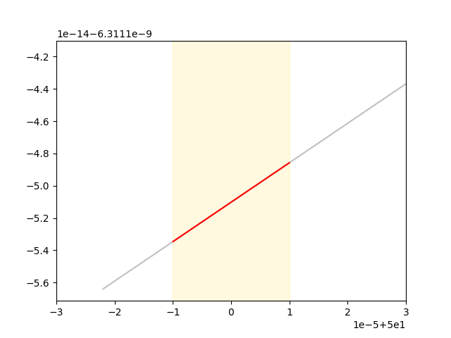

# of singularities:  8
# Model: nygren_atrial_model_1998(nygren_atrial_model_1998.cellml)
No of piecewises: 0
## Equation 1:
```
sodium_current__i_Na = pow(membrane__F, 2) * pow(sodium_current_m_gate__m, 3) * (-1.0 + exp((-sodium_current__E_Na + membrane__V) * membrane__F / (membrane__R * membrane__T))) * (0.10000000000000001 * sodium_current_h2_gate__h2 + 0.90000000000000002 * sodium_current_h1_gate__h1) * cleft_space_ion_concentrations__Na_c * membrane__V * sodium_current__P_Na / ((-1.0 + exp(membrane__F * membrane__V / (membrane__R * membrane__T))) * membrane__R * membrane__T)
```
## New Eq:
```
sodium_current__i_Na = ((fabs(membrane__V) < 1.0000000000000001e-5) ? (49999.999999999993 * (1.0000000000000001e-5 + membrane__V) * (0.036575756957513313 * pow(sodium_current_m_gate__m, 3) * (-1.0 + exp(3.7907445518581069e-7 - log(cleft_space_ion_concentrations__Na_c / intracellular_ion_concentrations__Na_i))) * (0.10000000000000001 * sodium_current_h2_gate__h2 + 0.90000000000000002 * sodium_current_h1_gate__h1) * cleft_space_ion_concentrations__Na_c * sodium_current__P_Na / (-1.0 + exp(3.7907445518581063e-7)) + 0.036575756957513313 * pow(sodium_current_m_gate__m, 3) * (-1.0 + exp(-3.7907445518581069e-7 - log(cleft_space_ion_concentrations__Na_c / intracellular_ion_concentrations__Na_i))) * (0.10000000000000001 * sodium_current_h2_gate__h2 + 0.90000000000000002 * sodium_current_h1_gate__h1) * cleft_space_ion_concentrations__Na_c * sodium_current__P_Na / (-1.0 + exp(-3.7907445518581063e-7))) - 0.036575756957513313 * pow(sodium_current_m_gate__m, 3) * (-1.0 + exp(-3.7907445518581069e-7 - log(cleft_space_ion_concentrations__Na_c / intracellular_ion_concentrations__Na_i))) * (0.10000000000000001 * sodium_current_h2_gate__h2 + 0.90000000000000002 * sodium_current_h1_gate__h1) * cleft_space_ion_concentrations__Na_c * sodium_current__P_Na / (-1.0 + exp(-3.7907445518581063e-7))) : (3657.5756957513308 * pow(sodium_current_m_gate__m, 3) * (-1.0 + exp(0.037907445518581065 * membrane__V - log(cleft_space_ion_concentrations__Na_c / intracellular_ion_concentrations__Na_i))) * (0.10000000000000001 * sodium_current_h2_gate__h2 + 0.90000000000000002 * sodium_current_h1_gate__h1) * cleft_space_ion_concentrations__Na_c * membrane__V * sodium_current__P_Na / (-1.0 + exp(0.037907445518581065 * membrane__V))))
```
## Singularity point: 0


# of singularities:  1
# Model: ohara_rudy_2011_endo(ohara_rudy_2011_endo.cellml)
No of piecewises: 16
## Equation 1:
```
ICaL__PhiCaK = (-0.75 * extracellular__ko + 0.75 * intracellular_ions__kss * exp(membrane__vfrt)) * membrane__vffrt / (-1.0 + exp(membrane__vfrt))
```
## New Eq:
```
ICaL__PhiCaK = ((fabs(membrane__v) < 1.0000000000000001e-5) ? (49999.999999999993 * (1.0000000000000001e-5 + membrane__v) * (1.0000000000000001e-5 * pow(physical_constants__F, 2) * (-0.75 * extracellular__ko + 0.75 * intracellular_ions__kss * exp(1.0000000000000001e-5 * physical_constants__F / (physical_constants__R * physical_constants__T))) / ((-1.0 + exp(1.0000000000000001e-5 * physical_constants__F / (physical_constants__R * physical_constants__T))) * physical_constants__R * physical_constants__T) + 1.0000000000000001e-5 * pow(physical_constants__F, 2) * (-0.75 * extracellular__ko + 0.75 * intracellular_ions__kss * exp(-1.0000000000000001e-5 * physical_constants__F / (physical_constants__R * physical_constants__T))) / ((-1.0 + exp(-1.0000000000000001e-5 * physical_constants__F / (physical_constants__R * physical_constants__T))) * physical_constants__R * physical_constants__T)) - 1.0000000000000001e-5 * pow(physical_constants__F, 2) * (-0.75 * extracellular__ko + 0.75 * intracellular_ions__kss * exp(-1.0000000000000001e-5 * physical_constants__F / (physical_constants__R * physical_constants__T))) / ((-1.0 + exp(-1.0000000000000001e-5 * physical_constants__F / (physical_constants__R * physical_constants__T))) * physical_constants__R * physical_constants__T)) : (pow(physical_constants__F, 2) * (-0.75 * extracellular__ko + 0.75 * intracellular_ions__kss * exp(membrane__v * physical_constants__F / (physical_constants__R * physical_constants__T))) * membrane__v / ((-1.0 + exp(membrane__v * physical_constants__F / (physical_constants__R * physical_constants__T))) * physical_constants__R * physical_constants__T)))
```
## Singularity point: 0


## Equation 2:
```
ICaL__PhiCaL = 4.0 * (-0.34100000000000003 * extracellular__cao + intracellular_ions__cass * exp(2.0 * membrane__vfrt)) * membrane__vffrt / (-1.0 + exp(2.0 * membrane__vfrt))
```
## New Eq:
```
ICaL__PhiCaL = ((fabs(membrane__v) < 1.0000000000000001e-5) ? (49999.999999999993 * (1.0000000000000001e-5 + membrane__v) * (4.0000000000000003e-5 * pow(physical_constants__F, 2) * (-0.34100000000000003 * extracellular__cao + intracellular_ions__cass * exp(2.0000000000000002e-5 * physical_constants__F / (physical_constants__R * physical_constants__T))) / ((-1.0 + exp(2.0000000000000002e-5 * physical_constants__F / (physical_constants__R * physical_constants__T))) * physical_constants__R * physical_constants__T) + 4.0000000000000003e-5 * pow(physical_constants__F, 2) * (-0.34100000000000003 * extracellular__cao + intracellular_ions__cass * exp(-2.0000000000000002e-5 * physical_constants__F / (physical_constants__R * physical_constants__T))) / ((-1.0 + exp(-2.0000000000000002e-5 * physical_constants__F / (physical_constants__R * physical_constants__T))) * physical_constants__R * physical_constants__T)) - 4.0000000000000003e-5 * pow(physical_constants__F, 2) * (-0.34100000000000003 * extracellular__cao + intracellular_ions__cass * exp(-2.0000000000000002e-5 * physical_constants__F / (physical_constants__R * physical_constants__T))) / ((-1.0 + exp(-2.0000000000000002e-5 * physical_constants__F / (physical_constants__R * physical_constants__T))) * physical_constants__R * physical_constants__T)) : (4.0 * pow(physical_constants__F, 2) * (-0.34100000000000003 * extracellular__cao + intracellular_ions__cass * exp(2.0 * membrane__v * physical_constants__F / (physical_constants__R * physical_constants__T))) * membrane__v / ((-1.0 + exp(2.0 * membrane__v * physical_constants__F / (physical_constants__R * physical_constants__T))) * physical_constants__R * physical_constants__T)))
```
## Singularity point: 0


## Equation 3:
```
ICaL__PhiCaNa = (-0.75 * extracellular__nao + 0.75 * intracellular_ions__nass * exp(membrane__vfrt)) * membrane__vffrt / (-1.0 + exp(membrane__vfrt))
```
## New Eq:
```
ICaL__PhiCaNa = ((fabs(membrane__v) < 1.0000000000000001e-5) ? (49999.999999999993 * (1.0000000000000001e-5 + membrane__v) * (1.0000000000000001e-5 * pow(physical_constants__F, 2) * (-0.75 * extracellular__nao + 0.75 * intracellular_ions__nass * exp(1.0000000000000001e-5 * physical_constants__F / (physical_constants__R * physical_constants__T))) / ((-1.0 + exp(1.0000000000000001e-5 * physical_constants__F / (physical_constants__R * physical_constants__T))) * physical_constants__R * physical_constants__T) + 1.0000000000000001e-5 * pow(physical_constants__F, 2) * (-0.75 * extracellular__nao + 0.75 * intracellular_ions__nass * exp(-1.0000000000000001e-5 * physical_constants__F / (physical_constants__R * physical_constants__T))) / ((-1.0 + exp(-1.0000000000000001e-5 * physical_constants__F / (physical_constants__R * physical_constants__T))) * physical_constants__R * physical_constants__T)) - 1.0000000000000001e-5 * pow(physical_constants__F, 2) * (-0.75 * extracellular__nao + 0.75 * intracellular_ions__nass * exp(-1.0000000000000001e-5 * physical_constants__F / (physical_constants__R * physical_constants__T))) / ((-1.0 + exp(-1.0000000000000001e-5 * physical_constants__F / (physical_constants__R * physical_constants__T))) * physical_constants__R * physical_constants__T)) : (pow(physical_constants__F, 2) * (-0.75 * extracellular__nao + 0.75 * intracellular_ions__nass * exp(membrane__v * physical_constants__F / (physical_constants__R * physical_constants__T))) * membrane__v / ((-1.0 + exp(membrane__v * physical_constants__F / (physical_constants__R * physical_constants__T))) * physical_constants__R * physical_constants__T)))
```
## Singularity point: 0


## Equation 4:
```
ICab__ICab = 4.0 * (-0.34100000000000003 * extracellular__cao + intracellular_ions__cai * exp(2.0 * membrane__vfrt)) * ICab__PCab * membrane__vffrt / (-1.0 + exp(2.0 * membrane__vfrt))
```
## New Eq:
```
ICab__ICab = ((fabs(membrane__v) < 1.0000000000000001e-5) ? (49999.999999999993 * (1.0000000000000001e-5 + membrane__v) * (4.0000000000000003e-5 * pow(physical_constants__F, 2) * (-0.34100000000000003 * extracellular__cao + intracellular_ions__cai * exp(2.0000000000000002e-5 * physical_constants__F / (physical_constants__R * physical_constants__T))) * ICab__PCab / ((-1.0 + exp(2.0000000000000002e-5 * physical_constants__F / (physical_constants__R * physical_constants__T))) * physical_constants__R * physical_constants__T) + 4.0000000000000003e-5 * pow(physical_constants__F, 2) * (-0.34100000000000003 * extracellular__cao + intracellular_ions__cai * exp(-2.0000000000000002e-5 * physical_constants__F / (physical_constants__R * physical_constants__T))) * ICab__PCab / ((-1.0 + exp(-2.0000000000000002e-5 * physical_constants__F / (physical_constants__R * physical_constants__T))) * physical_constants__R * physical_constants__T)) - 4.0000000000000003e-5 * pow(physical_constants__F, 2) * (-0.34100000000000003 * extracellular__cao + intracellular_ions__cai * exp(-2.0000000000000002e-5 * physical_constants__F / (physical_constants__R * physical_constants__T))) * ICab__PCab / ((-1.0 + exp(-2.0000000000000002e-5 * physical_constants__F / (physical_constants__R * physical_constants__T))) * physical_constants__R * physical_constants__T)) : (4.0 * pow(physical_constants__F, 2) * (-0.34100000000000003 * extracellular__cao + intracellular_ions__cai * exp(2.0 * membrane__v * physical_constants__F / (physical_constants__R * physical_constants__T))) * ICab__PCab * membrane__v / ((-1.0 + exp(2.0 * membrane__v * physical_constants__F / (physical_constants__R * physical_constants__T))) * physical_constants__R * physical_constants__T)))
```
## Singularity point: 0


## Equation 5:
```
INab__INab = (-extracellular__nao + intracellular_ions__nai * exp(membrane__vfrt)) * INab__PNab * membrane__vffrt / (-1.0 + exp(membrane__vfrt))
```
## New Eq:
```
INab__INab = ((fabs(membrane__v) < 1.0000000000000001e-5) ? (49999.999999999993 * (1.0000000000000001e-5 + membrane__v) * (3.7500000000000006e-15 * pow(physical_constants__F, 2) * (-extracellular__nao + intracellular_ions__nai * exp(1.0000000000000001e-5 * physical_constants__F / (physical_constants__R * physical_constants__T))) / ((-1.0 + exp(1.0000000000000001e-5 * physical_constants__F / (physical_constants__R * physical_constants__T))) * physical_constants__R * physical_constants__T) + 3.7500000000000006e-15 * pow(physical_constants__F, 2) * (-extracellular__nao + intracellular_ions__nai * exp(-1.0000000000000001e-5 * physical_constants__F / (physical_constants__R * physical_constants__T))) / ((-1.0 + exp(-1.0000000000000001e-5 * physical_constants__F / (physical_constants__R * physical_constants__T))) * physical_constants__R * physical_constants__T)) - 3.7500000000000006e-15 * pow(physical_constants__F, 2) * (-extracellular__nao + intracellular_ions__nai * exp(-1.0000000000000001e-5 * physical_constants__F / (physical_constants__R * physical_constants__T))) / ((-1.0 + exp(-1.0000000000000001e-5 * physical_constants__F / (physical_constants__R * physical_constants__T))) * physical_constants__R * physical_constants__T)) : (3.75e-10 * pow(physical_constants__F, 2) * (-extracellular__nao + intracellular_ions__nai * exp(membrane__v * physical_constants__F / (physical_constants__R * physical_constants__T))) * membrane__v / ((-1.0 + exp(membrane__v * physical_constants__F / (physical_constants__R * physical_constants__T))) * physical_constants__R * physical_constants__T)))
```
## Singularity point: 0
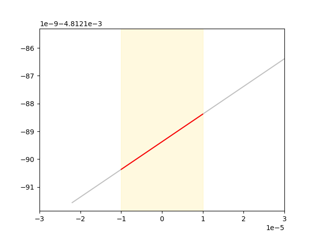

# of singularities:  5
# Model: ohara_rudy_2011_epi(ohara_rudy_2011_epi.cellml)
No of piecewises: 16
## Equation 1:
```
ICaL__PhiCaK = (-0.75 * extracellular__ko + 0.75 * intracellular_ions__kss * exp(membrane__vfrt)) * membrane__vffrt / (-1.0 + exp(membrane__vfrt))
```
## New Eq:
```
ICaL__PhiCaK = ((fabs(membrane__v) < 1.0000000000000001e-5) ? (49999.999999999993 * (1.0000000000000001e-5 + membrane__v) * (1.0000000000000001e-5 * pow(physical_constants__F, 2) * (-0.75 * extracellular__ko + 0.75 * intracellular_ions__kss * exp(1.0000000000000001e-5 * physical_constants__F / (physical_constants__R * physical_constants__T))) / ((-1.0 + exp(1.0000000000000001e-5 * physical_constants__F / (physical_constants__R * physical_constants__T))) * physical_constants__R * physical_constants__T) + 1.0000000000000001e-5 * pow(physical_constants__F, 2) * (-0.75 * extracellular__ko + 0.75 * intracellular_ions__kss * exp(-1.0000000000000001e-5 * physical_constants__F / (physical_constants__R * physical_constants__T))) / ((-1.0 + exp(-1.0000000000000001e-5 * physical_constants__F / (physical_constants__R * physical_constants__T))) * physical_constants__R * physical_constants__T)) - 1.0000000000000001e-5 * pow(physical_constants__F, 2) * (-0.75 * extracellular__ko + 0.75 * intracellular_ions__kss * exp(-1.0000000000000001e-5 * physical_constants__F / (physical_constants__R * physical_constants__T))) / ((-1.0 + exp(-1.0000000000000001e-5 * physical_constants__F / (physical_constants__R * physical_constants__T))) * physical_constants__R * physical_constants__T)) : (pow(physical_constants__F, 2) * (-0.75 * extracellular__ko + 0.75 * intracellular_ions__kss * exp(membrane__v * physical_constants__F / (physical_constants__R * physical_constants__T))) * membrane__v / ((-1.0 + exp(membrane__v * physical_constants__F / (physical_constants__R * physical_constants__T))) * physical_constants__R * physical_constants__T)))
```
## Singularity point: 0


## Equation 2:
```
ICaL__PhiCaL = 4.0 * (-0.34100000000000003 * extracellular__cao + intracellular_ions__cass * exp(2.0 * membrane__vfrt)) * membrane__vffrt / (-1.0 + exp(2.0 * membrane__vfrt))
```
## New Eq:
```
ICaL__PhiCaL = ((fabs(membrane__v) < 1.0000000000000001e-5) ? (49999.999999999993 * (1.0000000000000001e-5 + membrane__v) * (4.0000000000000003e-5 * pow(physical_constants__F, 2) * (-0.34100000000000003 * extracellular__cao + intracellular_ions__cass * exp(2.0000000000000002e-5 * physical_constants__F / (physical_constants__R * physical_constants__T))) / ((-1.0 + exp(2.0000000000000002e-5 * physical_constants__F / (physical_constants__R * physical_constants__T))) * physical_constants__R * physical_constants__T) + 4.0000000000000003e-5 * pow(physical_constants__F, 2) * (-0.34100000000000003 * extracellular__cao + intracellular_ions__cass * exp(-2.0000000000000002e-5 * physical_constants__F / (physical_constants__R * physical_constants__T))) / ((-1.0 + exp(-2.0000000000000002e-5 * physical_constants__F / (physical_constants__R * physical_constants__T))) * physical_constants__R * physical_constants__T)) - 4.0000000000000003e-5 * pow(physical_constants__F, 2) * (-0.34100000000000003 * extracellular__cao + intracellular_ions__cass * exp(-2.0000000000000002e-5 * physical_constants__F / (physical_constants__R * physical_constants__T))) / ((-1.0 + exp(-2.0000000000000002e-5 * physical_constants__F / (physical_constants__R * physical_constants__T))) * physical_constants__R * physical_constants__T)) : (4.0 * pow(physical_constants__F, 2) * (-0.34100000000000003 * extracellular__cao + intracellular_ions__cass * exp(2.0 * membrane__v * physical_constants__F / (physical_constants__R * physical_constants__T))) * membrane__v / ((-1.0 + exp(2.0 * membrane__v * physical_constants__F / (physical_constants__R * physical_constants__T))) * physical_constants__R * physical_constants__T)))
```
## Singularity point: 0


## Equation 3:
```
ICaL__PhiCaNa = (-0.75 * extracellular__nao + 0.75 * intracellular_ions__nass * exp(membrane__vfrt)) * membrane__vffrt / (-1.0 + exp(membrane__vfrt))
```
## New Eq:
```
ICaL__PhiCaNa = ((fabs(membrane__v) < 1.0000000000000001e-5) ? (49999.999999999993 * (1.0000000000000001e-5 + membrane__v) * (1.0000000000000001e-5 * pow(physical_constants__F, 2) * (-0.75 * extracellular__nao + 0.75 * intracellular_ions__nass * exp(1.0000000000000001e-5 * physical_constants__F / (physical_constants__R * physical_constants__T))) / ((-1.0 + exp(1.0000000000000001e-5 * physical_constants__F / (physical_constants__R * physical_constants__T))) * physical_constants__R * physical_constants__T) + 1.0000000000000001e-5 * pow(physical_constants__F, 2) * (-0.75 * extracellular__nao + 0.75 * intracellular_ions__nass * exp(-1.0000000000000001e-5 * physical_constants__F / (physical_constants__R * physical_constants__T))) / ((-1.0 + exp(-1.0000000000000001e-5 * physical_constants__F / (physical_constants__R * physical_constants__T))) * physical_constants__R * physical_constants__T)) - 1.0000000000000001e-5 * pow(physical_constants__F, 2) * (-0.75 * extracellular__nao + 0.75 * intracellular_ions__nass * exp(-1.0000000000000001e-5 * physical_constants__F / (physical_constants__R * physical_constants__T))) / ((-1.0 + exp(-1.0000000000000001e-5 * physical_constants__F / (physical_constants__R * physical_constants__T))) * physical_constants__R * physical_constants__T)) : (pow(physical_constants__F, 2) * (-0.75 * extracellular__nao + 0.75 * intracellular_ions__nass * exp(membrane__v * physical_constants__F / (physical_constants__R * physical_constants__T))) * membrane__v / ((-1.0 + exp(membrane__v * physical_constants__F / (physical_constants__R * physical_constants__T))) * physical_constants__R * physical_constants__T)))
```
## Singularity point: 0


## Equation 4:
```
ICab__ICab = 4.0 * (-0.34100000000000003 * extracellular__cao + intracellular_ions__cai * exp(2.0 * membrane__vfrt)) * ICab__PCab * membrane__vffrt / (-1.0 + exp(2.0 * membrane__vfrt))
```
## New Eq:
```
ICab__ICab = ((fabs(membrane__v) < 1.0000000000000001e-5) ? (49999.999999999993 * (1.0000000000000001e-5 + membrane__v) * (4.0000000000000003e-5 * pow(physical_constants__F, 2) * (-0.34100000000000003 * extracellular__cao + intracellular_ions__cai * exp(2.0000000000000002e-5 * physical_constants__F / (physical_constants__R * physical_constants__T))) * ICab__PCab / ((-1.0 + exp(2.0000000000000002e-5 * physical_constants__F / (physical_constants__R * physical_constants__T))) * physical_constants__R * physical_constants__T) + 4.0000000000000003e-5 * pow(physical_constants__F, 2) * (-0.34100000000000003 * extracellular__cao + intracellular_ions__cai * exp(-2.0000000000000002e-5 * physical_constants__F / (physical_constants__R * physical_constants__T))) * ICab__PCab / ((-1.0 + exp(-2.0000000000000002e-5 * physical_constants__F / (physical_constants__R * physical_constants__T))) * physical_constants__R * physical_constants__T)) - 4.0000000000000003e-5 * pow(physical_constants__F, 2) * (-0.34100000000000003 * extracellular__cao + intracellular_ions__cai * exp(-2.0000000000000002e-5 * physical_constants__F / (physical_constants__R * physical_constants__T))) * ICab__PCab / ((-1.0 + exp(-2.0000000000000002e-5 * physical_constants__F / (physical_constants__R * physical_constants__T))) * physical_constants__R * physical_constants__T)) : (4.0 * pow(physical_constants__F, 2) * (-0.34100000000000003 * extracellular__cao + intracellular_ions__cai * exp(2.0 * membrane__v * physical_constants__F / (physical_constants__R * physical_constants__T))) * ICab__PCab * membrane__v / ((-1.0 + exp(2.0 * membrane__v * physical_constants__F / (physical_constants__R * physical_constants__T))) * physical_constants__R * physical_constants__T)))
```
## Singularity point: 0


## Equation 5:
```
INab__INab = (-extracellular__nao + intracellular_ions__nai * exp(membrane__vfrt)) * INab__PNab * membrane__vffrt / (-1.0 + exp(membrane__vfrt))
```
## New Eq:
```
INab__INab = ((fabs(membrane__v) < 1.0000000000000001e-5) ? (49999.999999999993 * (1.0000000000000001e-5 + membrane__v) * (3.7500000000000006e-15 * pow(physical_constants__F, 2) * (-extracellular__nao + intracellular_ions__nai * exp(1.0000000000000001e-5 * physical_constants__F / (physical_constants__R * physical_constants__T))) / ((-1.0 + exp(1.0000000000000001e-5 * physical_constants__F / (physical_constants__R * physical_constants__T))) * physical_constants__R * physical_constants__T) + 3.7500000000000006e-15 * pow(physical_constants__F, 2) * (-extracellular__nao + intracellular_ions__nai * exp(-1.0000000000000001e-5 * physical_constants__F / (physical_constants__R * physical_constants__T))) / ((-1.0 + exp(-1.0000000000000001e-5 * physical_constants__F / (physical_constants__R * physical_constants__T))) * physical_constants__R * physical_constants__T)) - 3.7500000000000006e-15 * pow(physical_constants__F, 2) * (-extracellular__nao + intracellular_ions__nai * exp(-1.0000000000000001e-5 * physical_constants__F / (physical_constants__R * physical_constants__T))) / ((-1.0 + exp(-1.0000000000000001e-5 * physical_constants__F / (physical_constants__R * physical_constants__T))) * physical_constants__R * physical_constants__T)) : (3.75e-10 * pow(physical_constants__F, 2) * (-extracellular__nao + intracellular_ions__nai * exp(membrane__v * physical_constants__F / (physical_constants__R * physical_constants__T))) * membrane__v / ((-1.0 + exp(membrane__v * physical_constants__F / (physical_constants__R * physical_constants__T))) * physical_constants__R * physical_constants__T)))
```
## Singularity point: 0


# of singularities:  5
# Model: ohara_rudy_cipa_v1_2017(ohara_rudy_cipa_v1_2017.cellml)
No of piecewises: 16
## Equation 1:
```
ICaL__PhiCaK = (-0.75 * extracellular__ko + 0.75 * intracellular_ions__kss * exp(membrane__vfrt)) * membrane__vffrt / (-1.0 + exp(membrane__vfrt))
```
## New Eq:
```
ICaL__PhiCaK = ((fabs(membrane__v) < 1.0000000000000001e-5) ? (49999.999999999993 * (1.0000000000000001e-5 + membrane__v) * (3.7435883507802624e-12 * (-0.75 * extracellular__ko + 0.75 * intracellular_ions__kss * exp(3.7435883507802622e-7)) / (-1.0 + exp(3.7435883507802622e-7)) - 3.7435883507802624e-12 * (-0.75 * extracellular__ko + 0.75 * intracellular_ions__kss * exp(-3.7435883507802622e-7)) / (-1.0 + exp(-3.7435883507802622e-7))) + 3.7435883507802624e-12 * (-0.75 * extracellular__ko + 0.75 * intracellular_ions__kss * exp(-3.7435883507802622e-7)) / (-1.0 + exp(-3.7435883507802622e-7))) : (0.037435883507802616 * pow(membrane__v, 2) * (-0.75 * extracellular__ko + 0.75 * intracellular_ions__kss * exp(0.037435883507802616 * membrane__v)) / (-1.0 + exp(0.037435883507802616 * membrane__v))))
```
## Singularity point: 0
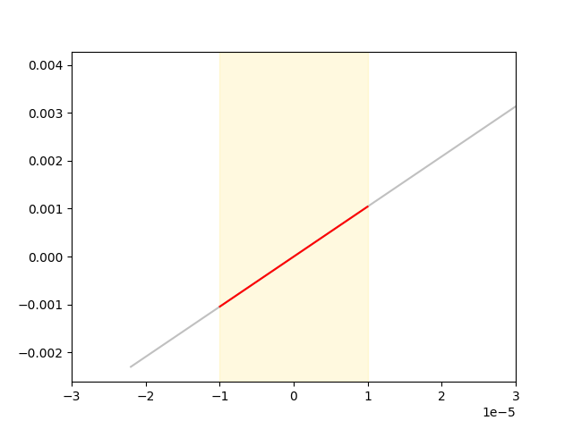

## Equation 2:
```
ICaL__PhiCaL = 4.0 * (-0.34100000000000003 * extracellular__cao + intracellular_ions__cass * exp(2.0 * membrane__vfrt)) * membrane__vffrt / (-1.0 + exp(2.0 * membrane__vfrt))
```
## New Eq:
```
ICaL__PhiCaL = ((fabs(membrane__v) < 1.0000000000000001e-5) ? (49999.999999999993 * (1.0000000000000001e-5 + membrane__v) * (1.497435340312105e-11 * (-0.34100000000000003 * extracellular__cao + intracellular_ions__cass * exp(7.4871767015605244e-7)) / (-1.0 + exp(7.4871767015605244e-7)) - 1.497435340312105e-11 * (-0.34100000000000003 * extracellular__cao + intracellular_ions__cass * exp(-7.4871767015605244e-7)) / (-1.0 + exp(-7.4871767015605244e-7))) + 1.497435340312105e-11 * (-0.34100000000000003 * extracellular__cao + intracellular_ions__cass * exp(-7.4871767015605244e-7)) / (-1.0 + exp(-7.4871767015605244e-7))) : (0.14974353403121046 * pow(membrane__v, 2) * (-0.34100000000000003 * extracellular__cao + intracellular_ions__cass * exp(0.074871767015605231 * membrane__v)) / (-1.0 + exp(0.074871767015605231 * membrane__v))))
```
## Singularity point: 0
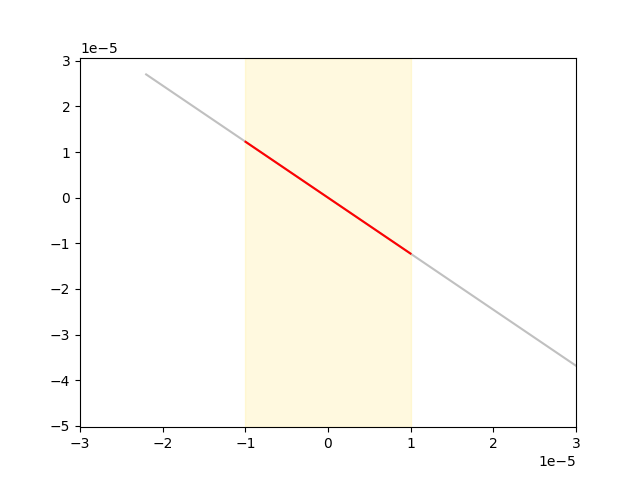

## Equation 3:
```
ICaL__PhiCaNa = (-0.75 * extracellular__nao + 0.75 * intracellular_ions__nass * exp(membrane__vfrt)) * membrane__vffrt / (-1.0 + exp(membrane__vfrt))
```
## New Eq:
```
ICaL__PhiCaNa = ((fabs(membrane__v) < 1.0000000000000001e-5) ? (49999.999999999993 * (1.0000000000000001e-5 + membrane__v) * (3.7435883507802624e-12 * (-0.75 * extracellular__nao + 0.75 * intracellular_ions__nass * exp(3.7435883507802622e-7)) / (-1.0 + exp(3.7435883507802622e-7)) - 3.7435883507802624e-12 * (-0.75 * extracellular__nao + 0.75 * intracellular_ions__nass * exp(-3.7435883507802622e-7)) / (-1.0 + exp(-3.7435883507802622e-7))) + 3.7435883507802624e-12 * (-0.75 * extracellular__nao + 0.75 * intracellular_ions__nass * exp(-3.7435883507802622e-7)) / (-1.0 + exp(-3.7435883507802622e-7))) : (0.037435883507802616 * pow(membrane__v, 2) * (-0.75 * extracellular__nao + 0.75 * intracellular_ions__nass * exp(0.037435883507802616 * membrane__v)) / (-1.0 + exp(0.037435883507802616 * membrane__v))))
```
## Singularity point: 0
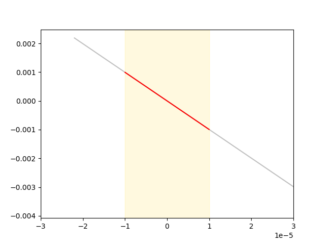

## Equation 4:
```
ICab__ICab = 4.0 * (-0.34100000000000003 * extracellular__cao + intracellular_ions__cai * exp(2.0 * membrane__vfrt)) * ICab__PCab * membrane__vffrt / (-1.0 + exp(2.0 * membrane__vfrt))
```
## New Eq:
```
ICab__ICab = ((fabs(membrane__v) < 1.0000000000000001e-5) ? (49999.999999999993 * (1.0000000000000001e-5 + membrane__v) * (1.497435340312105e-11 * (-0.34100000000000003 * extracellular__cao + intracellular_ions__cai * exp(7.4871767015605244e-7)) * ICab__PCab / (-1.0 + exp(7.4871767015605244e-7)) - 1.497435340312105e-11 * (-0.34100000000000003 * extracellular__cao + intracellular_ions__cai * exp(-7.4871767015605244e-7)) * ICab__PCab / (-1.0 + exp(-7.4871767015605244e-7))) + 1.497435340312105e-11 * (-0.34100000000000003 * extracellular__cao + intracellular_ions__cai * exp(-7.4871767015605244e-7)) * ICab__PCab / (-1.0 + exp(-7.4871767015605244e-7))) : (0.14974353403121046 * pow(membrane__v, 2) * (-0.34100000000000003 * extracellular__cao + intracellular_ions__cai * exp(0.074871767015605231 * membrane__v)) * ICab__PCab / (-1.0 + exp(0.074871767015605231 * membrane__v))))
```
## Singularity point: 0
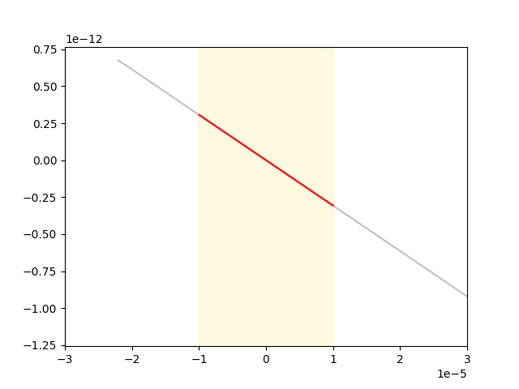

## Equation 5:
```
INab__INab = (-extracellular__nao + intracellular_ions__nai * exp(membrane__vfrt)) * INab__PNab * membrane__vffrt / (-1.0 + exp(membrane__vfrt))
```
## New Eq:
```
INab__INab = ((fabs(membrane__v) < 1.0000000000000001e-5) ? (49999.999999999993 * (1.0000000000000001e-5 + membrane__v) * (3.7435883507802624e-12 * (-extracellular__nao + intracellular_ions__nai * exp(3.7435883507802622e-7)) * INab__PNab / (-1.0 + exp(3.7435883507802622e-7)) - 3.7435883507802624e-12 * (-extracellular__nao + intracellular_ions__nai * exp(-3.7435883507802622e-7)) * INab__PNab / (-1.0 + exp(-3.7435883507802622e-7))) + 3.7435883507802624e-12 * (-extracellular__nao + intracellular_ions__nai * exp(-3.7435883507802622e-7)) * INab__PNab / (-1.0 + exp(-3.7435883507802622e-7))) : (0.037435883507802616 * pow(membrane__v, 2) * (-extracellular__nao + intracellular_ions__nai * exp(0.037435883507802616 * membrane__v)) * INab__PNab / (-1.0 + exp(0.037435883507802616 * membrane__v))))
```
## Singularity point: 0
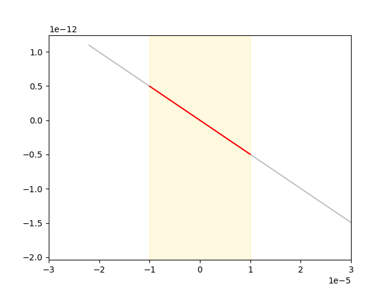

# of singularities:  5
# Model: paci_hyttinen_aaltosetala_severi_atrialVersion(paci_hyttinen_aaltosetala_severi_atrialVersion.cellml)
No of piecewises: 9
## Equation 1:
```
i_CaL__i_CaL = 4.0 * pow(model_parameters__F, 2) * (-0.34100000000000003 * model_parameters__Cao + calcium_dynamics__Cai * exp(2.0 * Membrane__Vm * model_parameters__F / (model_parameters__R * model_parameters__T))) * Membrane__Vm * i_CaL__g_CaL * i_CaL_d_gate__d * i_CaL_f1_gate__f1 * i_CaL_f2_gate__f2 * i_CaL_fCa_gate__fCa / ((-1.0 + exp(2.0 * Membrane__Vm * model_parameters__F / (model_parameters__R * model_parameters__T))) * model_parameters__R * model_parameters__T)
```
## New Eq:
```
i_CaL__i_CaL = ((fabs(Membrane__Vm) < 1.0000000000000001e-5) ? (49999.999999999993 * (1.0000000000000001e-5 + Membrane__Vm) * (44786.58957235828 * (-0.34100000000000003 * model_parameters__Cao + calcium_dynamics__Cai * exp(0.23209012310102192 / model_parameters__T)) * i_CaL__g_CaL * i_CaL_d_gate__d * i_CaL_f1_gate__f1 * i_CaL_f2_gate__f2 * i_CaL_fCa_gate__fCa / ((-1.0 + exp(0.23209012310102192 / model_parameters__T)) * model_parameters__T) + 44786.58957235828 * (-0.34100000000000003 * model_parameters__Cao + calcium_dynamics__Cai * exp(-0.23209012310102192 / model_parameters__T)) * i_CaL__g_CaL * i_CaL_d_gate__d * i_CaL_f1_gate__f1 * i_CaL_f2_gate__f2 * i_CaL_fCa_gate__fCa / ((-1.0 + exp(-0.23209012310102192 / model_parameters__T)) * model_parameters__T)) - 44786.58957235828 * (-0.34100000000000003 * model_parameters__Cao + calcium_dynamics__Cai * exp(-0.23209012310102192 / model_parameters__T)) * i_CaL__g_CaL * i_CaL_d_gate__d * i_CaL_f1_gate__f1 * i_CaL_f2_gate__f2 * i_CaL_fCa_gate__fCa / ((-1.0 + exp(-0.23209012310102192 / model_parameters__T)) * model_parameters__T)) : (4478658957.2358274 * (-0.34100000000000003 * model_parameters__Cao + calcium_dynamics__Cai * exp(23209.012310102189 * Membrane__Vm / model_parameters__T)) * Membrane__Vm * i_CaL__g_CaL * i_CaL_d_gate__d * i_CaL_f1_gate__f1 * i_CaL_f2_gate__f2 * i_CaL_fCa_gate__fCa / ((-1.0 + exp(23209.012310102189 * Membrane__Vm / model_parameters__T)) * model_parameters__T)))
```

# of singularities:  1
# Model: paci_hyttinen_aaltosetala_severi_ventricularVersion(paci_hyttinen_aaltosetala_severi_ventricularVersion.cellml)
No of piecewises: 13
## Equation 1:
```
i_CaL__i_CaL = 4.0 * pow(model_parameters__F, 2) * (-0.34100000000000003 * model_parameters__Cao + calcium_dynamics__Cai * exp(2.0 * Membrane__Vm * model_parameters__F / (model_parameters__R * model_parameters__T))) * Membrane__Vm * i_CaL__g_CaL * i_CaL_d_gate__d * i_CaL_f1_gate__f1 * i_CaL_f2_gate__f2 * i_CaL_fCa_gate__fCa / ((-1.0 + exp(2.0 * Membrane__Vm * model_parameters__F / (model_parameters__R * model_parameters__T))) * model_parameters__R * model_parameters__T)
```
## New Eq:
```
i_CaL__i_CaL = ((fabs(Membrane__Vm) < 1.0000000000000001e-5) ? (49999.999999999993 * (1.0000000000000001e-5 + Membrane__Vm) * (44786.58957235828 * (-0.34100000000000003 * model_parameters__Cao + calcium_dynamics__Cai * exp(0.23209012310102192 / model_parameters__T)) * i_CaL__g_CaL * i_CaL_d_gate__d * i_CaL_f1_gate__f1 * i_CaL_f2_gate__f2 * i_CaL_fCa_gate__fCa / ((-1.0 + exp(0.23209012310102192 / model_parameters__T)) * model_parameters__T) + 44786.58957235828 * (-0.34100000000000003 * model_parameters__Cao + calcium_dynamics__Cai * exp(-0.23209012310102192 / model_parameters__T)) * i_CaL__g_CaL * i_CaL_d_gate__d * i_CaL_f1_gate__f1 * i_CaL_f2_gate__f2 * i_CaL_fCa_gate__fCa / ((-1.0 + exp(-0.23209012310102192 / model_parameters__T)) * model_parameters__T)) - 44786.58957235828 * (-0.34100000000000003 * model_parameters__Cao + calcium_dynamics__Cai * exp(-0.23209012310102192 / model_parameters__T)) * i_CaL__g_CaL * i_CaL_d_gate__d * i_CaL_f1_gate__f1 * i_CaL_f2_gate__f2 * i_CaL_fCa_gate__fCa / ((-1.0 + exp(-0.23209012310102192 / model_parameters__T)) * model_parameters__T)) : (4478658957.2358274 * (-0.34100000000000003 * model_parameters__Cao + calcium_dynamics__Cai * exp(23209.012310102189 * Membrane__Vm / model_parameters__T)) * Membrane__Vm * i_CaL__g_CaL * i_CaL_d_gate__d * i_CaL_f1_gate__f1 * i_CaL_f2_gate__f2 * i_CaL_fCa_gate__fCa / ((-1.0 + exp(23209.012310102189 * Membrane__Vm / model_parameters__T)) * model_parameters__T)))
```

# of singularities:  1
# Model: pandit_clark_giles_demir_2001_version06_variant01(pandit_clark_giles_demir_2001_endocardial_cell.cellml)
No of piecewises: 2
## Equation 1:
```
sodium_current_m_gate__tau_m = 0.0013600000000000001 / (0.080000000000000002 * exp(-0.090909090909090912 * membrane__V) + 0.32000000000000001 * (47.130000000000003 + membrane__V) / (1.0 - exp(-4.7130000000000001 - 0.10000000000000001 * membrane__V)))
```
## New Eq:
```
sodium_current_m_gate__tau_m = 0.0013600000000000001 / (0.080000000000000002 * exp(-0.090909090909090912 * membrane__V) + ((fabs(47.130000000000003 + membrane__V) < 1.0000000000010001e-5) ? (-3.2000000000032004e-6 / (1.0 - exp(1.0000000000010001e-6)) + 49999.999999949992 * (47.130010000000006 + membrane__V) * (3.2000000000032004e-6 / (1.0 - exp(1.0000000000010001e-6)) + 3.2000000000032004e-6 / (1.0 - exp(-1.0000000000010001e-6)))) : (0.32000000000000001 * (47.130000000000003 + membrane__V) / (1.0 - exp(-4.7130000000000001 - 0.10000000000000001 * membrane__V)))))
```
## Singularity point: -47.130000000000003
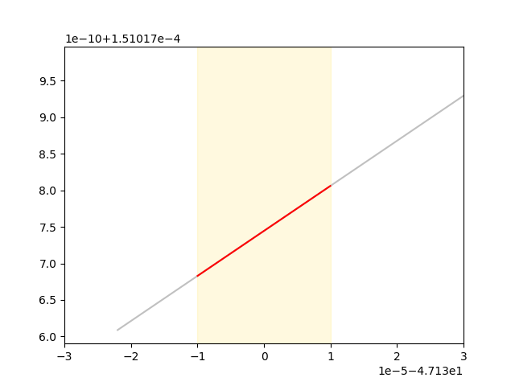

# of singularities:  1
# Model: pandit_clark_giles_demir_2001(pandit_clark_giles_demir_2001_epicardial_cell.cellml)
No of piecewises: 2
## Equation 1:
```
sodium_current_m_gate__tau_m = 0.0013600000000000001 / (0.080000000000000002 * exp(-0.090909090909090912 * membrane__V) + 0.32000000000000001 * (47.130000000000003 + membrane__V) / (1.0 - exp(-4.7130000000000001 - 0.10000000000000001 * membrane__V)))
```
## New Eq:
```
sodium_current_m_gate__tau_m = 0.0013600000000000001 / (0.080000000000000002 * exp(-0.090909090909090912 * membrane__V) + ((fabs(47.130000000000003 + membrane__V) < 1.0000000000010001e-5) ? (-3.2000000000032004e-6 / (1.0 - exp(1.0000000000010001e-6)) + 49999.999999949992 * (47.130010000000006 + membrane__V) * (3.2000000000032004e-6 / (1.0 - exp(1.0000000000010001e-6)) + 3.2000000000032004e-6 / (1.0 - exp(-1.0000000000010001e-6)))) : (0.32000000000000001 * (47.130000000000003 + membrane__V) / (1.0 - exp(-4.7130000000000001 - 0.10000000000000001 * membrane__V)))))
```
## Singularity point: -47.130000000000003


# of singularities:  1
# Model: pasek_simurda_christe_2006(pasek_simurda_christe_2006.cellml)
No of piecewises: 0
## Equation 1:
```
i_Nas_h_gate__beta_h = 18.77 * (64.400000000000006 + Vms__Vms) / (1.0 - exp(-14.168000000000001 - 0.22 * Vms__Vms))
```
## New Eq:
```
i_Nas_h_gate__beta_h = ((fabs(64.400000000000006 + Vms__Vms) < 9.9999999999544897e-6) ? (-0.00018769999999914577 / (1.0 - exp(2.1999999999899878e-6)) + 50000.000000227548 * (64.400010000000009 + Vms__Vms) * (0.00018769999999914577 / (1.0 - exp(2.1999999999899878e-6)) + 0.00018769999999914577 / (1.0 - exp(-2.1999999999899878e-6)))) : (18.77 * (64.400000000000006 + Vms__Vms) / (1.0 - exp(-14.168000000000001 - 0.22 * Vms__Vms))))
```
## Singularity point: -64.400000000000006
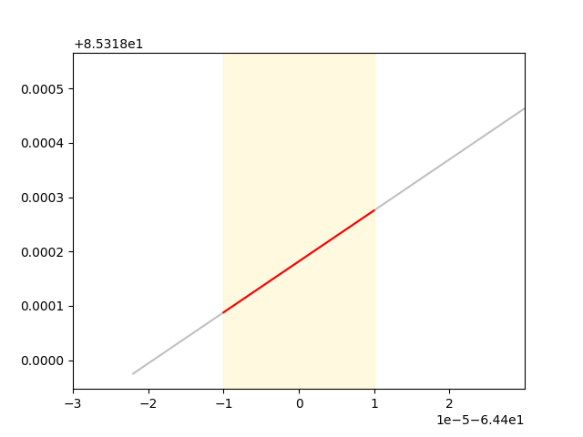

## Equation 2:
```
i_Nas_m_gate__alpha_m = 117.26000000000001 * (59.299999999999997 + Vms__Vms) / (1.0 - exp(-32.615000000000002 - 0.55000000000000004 * Vms__Vms))
```
## New Eq:
```
i_Nas_m_gate__alpha_m = ((fabs(59.299999999999997 + Vms__Vms) < 1.0000000000010001e-5) ? (-0.0011725999999946635 / (1.0 - exp(5.49999999997497e-6)) + 49999.999999949992 * (59.30001 + Vms__Vms) * (0.0011725999999946635 / (1.0 - exp(5.49999999997497e-6)) + 0.001172600000007682 / (1.0 - exp(-5.5000000000360318e-6)))) : (117.26000000000001 * (59.299999999999997 + Vms__Vms) / (1.0 - exp(-32.615000000000002 - 0.55000000000000004 * Vms__Vms))))
```
## Singularity point: -59.299999999999997
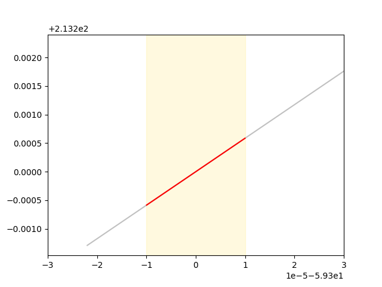

## Equation 3:
```
i_Cas__i_Cas = 4.0 * pow(model_parameters__F, 2) * (-0.34100000000000003 * model_parameters__Cae + ion_concentrations__Cass * exp(2.0 * Vms__Vms * model_parameters__F / (model_parameters__R * model_parameters__T))) * ((0.10000000000000001 - 0.10000000000000001 * i_Cas__Ccast) * i_Cas__C2 + (0.90000000000000002 + 0.10000000000000001 * i_Cas__Ccast) * i_Cas__C1) * Vms__Vms * i_Cas__Co * membrane_permeabilities__gCas / ((-1.0 + exp(2.0 * Vms__Vms * model_parameters__F / (model_parameters__R * model_parameters__T))) * model_parameters__R * model_parameters__T)
```
## New Eq:
```
i_Cas__i_Cas = ((fabs(Vms__Vms) < 1.0000000000000001e-5) ? (49999.999999999993 * (1.0000000000000001e-5 + Vms__Vms) * (4.1481478308756049e-10 * (-0.40920000000000001 + ion_concentrations__Cass * exp(7.8728915539782587e-7)) * ((0.10000000000000001 - 0.10000000000000001 * i_Cas__Ccast) * i_Cas__C2 + (0.90000000000000002 + 0.10000000000000001 * i_Cas__Ccast) * i_Cas__C1) * i_Cas__Co / (-1.0 + exp(7.8728915539782587e-7)) + 4.1481478308756049e-10 * (-0.40920000000000001 + ion_concentrations__Cass * exp(-7.8728915539782587e-7)) * ((0.10000000000000001 - 0.10000000000000001 * i_Cas__Ccast) * i_Cas__C2 + (0.90000000000000002 + 0.10000000000000001 * i_Cas__Ccast) * i_Cas__C1) * i_Cas__Co / (-1.0 + exp(-7.8728915539782587e-7))) - 4.1481478308756049e-10 * (-0.40920000000000001 + ion_concentrations__Cass * exp(-7.8728915539782587e-7)) * ((0.10000000000000001 - 0.10000000000000001 * i_Cas__Ccast) * i_Cas__C2 + (0.90000000000000002 + 0.10000000000000001 * i_Cas__Ccast) * i_Cas__C1) * i_Cas__Co / (-1.0 + exp(-7.8728915539782587e-7))) : (4.1481478308756044e-5 * (-0.40920000000000001 + ion_concentrations__Cass * exp(0.078728915539782576 * Vms__Vms)) * ((0.10000000000000001 - 0.10000000000000001 * i_Cas__Ccast) * i_Cas__C2 + (0.90000000000000002 + 0.10000000000000001 * i_Cas__Ccast) * i_Cas__C1) * Vms__Vms * i_Cas__Co / (-1.0 + exp(0.078728915539782576 * Vms__Vms))))
```
## Singularity point: 0


# of singularities:  3
# Model: pasek_model_2008(pasek_simurda_orchard_christe_2008.cellml)
No of piecewises: 0
## Equation 1:
```
i_Kr_s_xr_gate__tau_xr = 0.001 / (0.00060999999999999997 * (38.899999999999999 + Vm_s__Vm_s) / (-1.0 + exp(5.6404999999999994 + 0.14499999999999999 * Vm_s__Vm_s)) + 0.0013799999999999999 * (14.199999999999999 + Vm_s__Vm_s) / (1.0 - exp(-1.7465999999999999 - 0.123 * Vm_s__Vm_s)))
```
## New Eq:
```
i_Kr_s_xr_gate__tau_xr = 0.001 / (((fabs(38.899999999999999 + Vm_s__Vm_s) < 1.0000000000010001e-5) ? (-6.1000000000061005e-9 / (-1.0 + exp(-1.45000000000145e-6)) + 49999.999999949992 * (38.900010000000002 + Vm_s__Vm_s) * (6.1000000000061005e-9 / (-1.0 + exp(1.45000000000145e-6)) + 6.1000000000061005e-9 / (-1.0 + exp(-1.45000000000145e-6)))) : (0.00060999999999999997 * (38.899999999999999 + Vm_s__Vm_s) / (-1.0 + exp(5.6404999999999994 + 0.14499999999999999 * Vm_s__Vm_s)))) + ((fabs(14.199999999999999 + Vm_s__Vm_s) < 9.9999999999961231e-6) ? (-1.3799999999994649e-8 / (1.0 - exp(1.2299999999995232e-6)) + 50000.000000019383 * (14.200009999999999 + Vm_s__Vm_s) * (1.3799999999994649e-8 / (1.0 - exp(1.2299999999995232e-6)) + 1.3799999999994649e-8 / (1.0 - exp(-1.2299999999995232e-6)))) : (0.0013799999999999999 * (14.199999999999999 + Vm_s__Vm_s) / (1.0 - exp(-1.7465999999999999 - 0.123 * Vm_s__Vm_s)))))
```
## Singularity point: -14.199999999999999

## Singularity point: -38.899999999999999
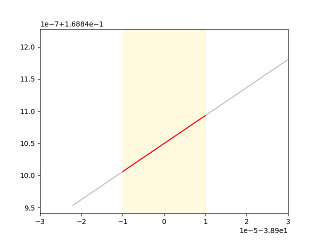

## Equation 2:
```
i_Ks_s_xs_gate__tau_xs = 0.001 / (0.00013100000000000001 * (30.0 + Vm_s__Vm_s) / (-1.0 + exp(2.0609999999999999 + 0.068699999999999997 * Vm_s__Vm_s)) + 7.1899999999999999e-5 * (30.0 + Vm_s__Vm_s) / (1.0 - exp(-4.4399999999999995 - 0.14799999999999999 * Vm_s__Vm_s)))
```
## New Eq:
```
i_Ks_s_xs_gate__tau_xs = 0.001 * ((fabs(30.0 + Vm_s__Vm_s) < 1.0000000000010001e-5) ? (1 / (-7.1900000000071903e-10 / (1.0 - exp(1.48000000000148e-6)) - 1.3100000000013103e-9 / (-1.0 + exp(-6.8700000000068699e-7)) + 49999.999999949992 * (30.00001 + Vm_s__Vm_s) * (7.1900000000071903e-10 / (1.0 - exp(1.48000000000148e-6)) + 7.1900000000071903e-10 / (1.0 - exp(-1.48000000000148e-6)) + 1.3100000000013103e-9 / (-1.0 + exp(6.8700000000068699e-7)) + 1.3100000000013103e-9 / (-1.0 + exp(-6.8700000000068699e-7))))) : (1 / (0.00013100000000000001 * (30.0 + Vm_s__Vm_s) / (-1.0 + exp(2.0609999999999999 + 0.068699999999999997 * Vm_s__Vm_s)) + 7.1899999999999999e-5 * (30.0 + Vm_s__Vm_s) / (1.0 - exp(-4.4399999999999995 - 0.14799999999999999 * Vm_s__Vm_s)))))
```
## Singularity point: -30.000000000000000


## Equation 3:
```
i_CaL_s__i_CaL_s = 4.0 * pow(model_parameters__F, 2) * (0.001 * exp(2.0 * Vm_s__Vm_s * model_parameters__F / (model_parameters__R * model_parameters__T)) - 0.34100000000000003 * model_parameters__Ca_e) * (i_CaL_s__Ccao + i_CaL_s__Co) * Vm_s__Vm_s * i_CaL_s_y_gate__y * membrane_permeabilities__P_CaL_s / ((-1.0 + exp(2.0 * Vm_s__Vm_s * model_parameters__F / (model_parameters__R * model_parameters__T))) * model_parameters__R * model_parameters__T)
```
## New Eq:
```
i_CaL_s__i_CaL_s = ((fabs(Vm_s__Vm_s) < 1.0000000000000001e-5) ? (49999.999999999993 * (1.0000000000000001e-5 + Vm_s__Vm_s) * (5.5630930863148488e-6 * (-0.61380000000000001 + 0.001 * exp(7.4919451884631814e-7)) * (i_CaL_s__Ccao + i_CaL_s__Co) * i_CaL_s_y_gate__y * membrane_permeabilities__P_CaL / (-1.0 + exp(7.4919451884631814e-7)) + 5.5630930863148488e-6 * (-0.61380000000000001 + 0.001 * exp(-7.4919451884631814e-7)) * (i_CaL_s__Ccao + i_CaL_s__Co) * i_CaL_s_y_gate__y * membrane_permeabilities__P_CaL / (-1.0 + exp(-7.4919451884631814e-7))) - 5.5630930863148488e-6 * (-0.61380000000000001 + 0.001 * exp(-7.4919451884631814e-7)) * (i_CaL_s__Ccao + i_CaL_s__Co) * i_CaL_s_y_gate__y * membrane_permeabilities__P_CaL / (-1.0 + exp(-7.4919451884631814e-7))) : (0.55630930863148487 * (-0.61380000000000001 + 0.001 * exp(0.07491945188463181 * Vm_s__Vm_s)) * (i_CaL_s__Ccao + i_CaL_s__Co) * Vm_s__Vm_s * i_CaL_s_y_gate__y * membrane_permeabilities__P_CaL / (-1.0 + exp(0.07491945188463181 * Vm_s__Vm_s))))
```
## Singularity point: 0
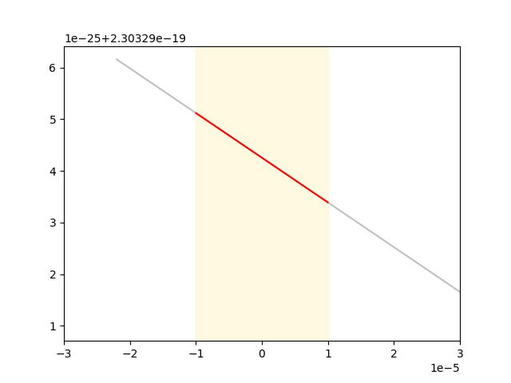

## Equation 4:
```
i_CaL_s__i_KL_s = pow(model_parameters__F, 2) * (-model_parameters__K_e + ion_concentrations__K_i * exp(Vm_s__Vm_s * model_parameters__F / (model_parameters__R * model_parameters__T))) * (i_CaL_s__Ccao + i_CaL_s__Co) * Vm_s__Vm_s * i_CaL_s_y_gate__y * membrane_permeabilities__P_KL_s / ((1.0 - 2.1834061135371177 * (i_CaL_s__i_CaL_s + i_CaL_t__i_CaL_t) / (model_parameters__Sms + model_parameters__Smt)) * (-1.0 + exp(Vm_s__Vm_s * model_parameters__F / (model_parameters__R * model_parameters__T))) * model_parameters__R * model_parameters__T)
```
## New Eq:
```
i_CaL_s__i_KL_s = ((fabs(Vm_s__Vm_s) < 1.0000000000000001e-5) ? (49999.999999999993 * (1.0000000000000001e-5 + Vm_s__Vm_s) * (6.6757117035778181e-12 * (-5.4000000000000004 + ion_concentrations__K_i * exp(3.7459725942315907e-7)) * (i_CaL_s__Ccao + i_CaL_s__Co) * i_CaL_s_y_gate__y / ((-1.0 + exp(3.7459725942315907e-7)) * (1.0 - 20430.198966619231 * i_CaL_s__i_CaL_s - 20205.350866353103 * (0.001 * exp(0.07491945188463181 * Vm_t__Vm_t) - 0.34100000000000003 * ion_concentrations__Ca_t) * (i_CaL_t__TCcao + i_CaL_t__TCo) * Vm_t__Vm_t * i_CaL_t_y_gate__y * membrane_permeabilities__P_CaL / (-1.0 + exp(0.07491945188463181 * Vm_t__Vm_t)))) + 6.6757117035778181e-12 * (-5.4000000000000004 + ion_concentrations__K_i * exp(-3.7459725942315907e-7)) * (i_CaL_s__Ccao + i_CaL_s__Co) * i_CaL_s_y_gate__y / ((-1.0 + exp(-3.7459725942315907e-7)) * (1.0 - 20430.198966619231 * i_CaL_s__i_CaL_s - 20205.350866353103 * (0.001 * exp(0.07491945188463181 * Vm_t__Vm_t) - 0.34100000000000003 * ion_concentrations__Ca_t) * (i_CaL_t__TCcao + i_CaL_t__TCo) * Vm_t__Vm_t * i_CaL_t_y_gate__y * membrane_permeabilities__P_CaL / (-1.0 + exp(0.07491945188463181 * Vm_t__Vm_t))))) - 6.6757117035778181e-12 * (-5.4000000000000004 + ion_concentrations__K_i * exp(-3.7459725942315907e-7)) * (i_CaL_s__Ccao + i_CaL_s__Co) * i_CaL_s_y_gate__y / ((-1.0 + exp(-3.7459725942315907e-7)) * (1.0 - 20430.198966619231 * i_CaL_s__i_CaL_s - 20205.350866353103 * (0.001 * exp(0.07491945188463181 * Vm_t__Vm_t) - 0.34100000000000003 * ion_concentrations__Ca_t) * (i_CaL_t__TCcao + i_CaL_t__TCo) * Vm_t__Vm_t * i_CaL_t_y_gate__y * membrane_permeabilities__P_CaL / (-1.0 + exp(0.07491945188463181 * Vm_t__Vm_t))))) : (6.6757117035778174e-7 * (-5.4000000000000004 + ion_concentrations__K_i * exp(0.037459725942315905 * Vm_s__Vm_s)) * (i_CaL_s__Ccao + i_CaL_s__Co) * Vm_s__Vm_s * i_CaL_s_y_gate__y / ((-1.0 + exp(0.037459725942315905 * Vm_s__Vm_s)) * (1.0 - 20430.198966619231 * i_CaL_s__i_CaL_s - 20205.350866353103 * (0.001 * exp(0.07491945188463181 * Vm_t__Vm_t) - 0.34100000000000003 * ion_concentrations__Ca_t) * (i_CaL_t__TCcao + i_CaL_t__TCo) * Vm_t__Vm_t * i_CaL_t_y_gate__y * membrane_permeabilities__P_CaL / (-1.0 + exp(0.07491945188463181 * Vm_t__Vm_t))))))
```
## Singularity point: 0
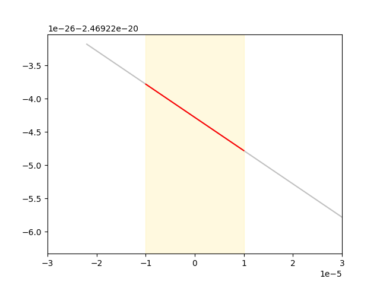
## Singularity point: 0


## Equation 5:
```
i_nsK_s__i_nsK_s = pow(model_parameters__F, 2) * (-0.75 * model_parameters__K_e + 0.75 * ion_concentrations__K_i * exp(Vm_s__Vm_s * model_parameters__F / (model_parameters__R * model_parameters__T))) * Vm_s__Vm_s * membrane_permeabilities__P_nsK_s / ((1.0 + 1.5625000000000003e-8 / pow(ion_concentrations__Ca_i, 3)) * (-1.0 + exp(Vm_s__Vm_s * model_parameters__F / (model_parameters__R * model_parameters__T))) * model_parameters__R * model_parameters__T)
```
## New Eq:
```
i_nsK_s__i_nsK_s = ((fabs(Vm_s__Vm_s) < 1.0000000000000001e-5) ? (49999.999999999993 * (1.0000000000000001e-5 + Vm_s__Vm_s) * (3.2045734132626156e-13 * (-4.0500000000000007 + 0.75 * ion_concentrations__K_i * exp(3.7459725942315907e-7)) / ((1.0 + 1.5625000000000003e-8 / pow(ion_concentrations__Ca_i, 3)) * (-1.0 + exp(3.7459725942315907e-7))) + 3.2045734132626156e-13 * (-4.0500000000000007 + 0.75 * ion_concentrations__K_i * exp(-3.7459725942315907e-7)) / ((1.0 + 1.5625000000000003e-8 / pow(ion_concentrations__Ca_i, 3)) * (-1.0 + exp(-3.7459725942315907e-7)))) - 3.2045734132626156e-13 * (-4.0500000000000007 + 0.75 * ion_concentrations__K_i * exp(-3.7459725942315907e-7)) / ((1.0 + 1.5625000000000003e-8 / pow(ion_concentrations__Ca_i, 3)) * (-1.0 + exp(-3.7459725942315907e-7)))) : (3.2045734132626158e-8 * (-4.0500000000000007 + 0.75 * ion_concentrations__K_i * exp(0.037459725942315905 * Vm_s__Vm_s)) * Vm_s__Vm_s / ((1.0 + 1.5625000000000003e-8 / pow(ion_concentrations__Ca_i, 3)) * (-1.0 + exp(0.037459725942315905 * Vm_s__Vm_s)))))
```
## Singularity point: 0


## Equation 6:
```
i_nsNa_s__i_nsNa_s = pow(model_parameters__F, 2) * (-0.75 * model_parameters__Na_e + 0.75 * ion_concentrations__Na_i * exp(Vm_s__Vm_s * model_parameters__F / (model_parameters__R * model_parameters__T))) * Vm_s__Vm_s * membrane_permeabilities__P_nsNa_s / ((1.0 + 1.5625000000000003e-8 / pow(ion_concentrations__Ca_i, 3)) * (-1.0 + exp(Vm_s__Vm_s * model_parameters__F / (model_parameters__R * model_parameters__T))) * model_parameters__R * model_parameters__T)
```
## New Eq:
```
i_nsNa_s__i_nsNa_s = ((fabs(Vm_s__Vm_s) < 1.0000000000000001e-5) ? (49999.999999999993 * (1.0000000000000001e-5 + Vm_s__Vm_s) * (3.2045734132626156e-13 * (-105.0 + 0.75 * ion_concentrations__Na_i * exp(3.7459725942315907e-7)) / ((1.0 + 1.5625000000000003e-8 / pow(ion_concentrations__Ca_i, 3)) * (-1.0 + exp(3.7459725942315907e-7))) + 3.2045734132626156e-13 * (-105.0 + 0.75 * ion_concentrations__Na_i * exp(-3.7459725942315907e-7)) / ((1.0 + 1.5625000000000003e-8 / pow(ion_concentrations__Ca_i, 3)) * (-1.0 + exp(-3.7459725942315907e-7)))) - 3.2045734132626156e-13 * (-105.0 + 0.75 * ion_concentrations__Na_i * exp(-3.7459725942315907e-7)) / ((1.0 + 1.5625000000000003e-8 / pow(ion_concentrations__Ca_i, 3)) * (-1.0 + exp(-3.7459725942315907e-7)))) : (3.2045734132626158e-8 * (-105.0 + 0.75 * ion_concentrations__Na_i * exp(0.037459725942315905 * Vm_s__Vm_s)) * Vm_s__Vm_s / ((1.0 + 1.5625000000000003e-8 / pow(ion_concentrations__Ca_i, 3)) * (-1.0 + exp(0.037459725942315905 * Vm_s__Vm_s)))))
```
## Singularity point: 0


# of singularities:  7
# Model: priebe_beuckelmann_1998(priebe_beuckelmann_1998.cellml)
No of piecewises: 20
## Equation 1:
```
INa_m_gate__alpha_m = 0.32000000000000001 * (47.130000000000003 + cell__V) / (1.0 - exp(-4.7130000000000001 - 0.10000000000000001 * cell__V))
```
## New Eq:
```
INa_m_gate__alpha_m = ((fabs(47.130000000000003 + cell__V) < 1.0000000000010001e-5) ? (-3.2000000000032004e-6 / (1.0 - exp(1.0000000000010001e-6)) + 49999.999999949992 * (47.130010000000006 + cell__V) * (3.2000000000032004e-6 / (1.0 - exp(1.0000000000010001e-6)) + 3.2000000000032004e-6 / (1.0 - exp(-1.0000000000010001e-6)))) : (0.32000000000000001 * (47.130000000000003 + cell__V) / (1.0 - exp(-4.7130000000000001 - 0.10000000000000001 * cell__V))))
```
## Singularity point: -47.130000000000003


# of singularities:  1
# Model: ramirez_2000(ramirez_nattel_courtemanche_2000.cellml)
No of piecewises: 4
## Equation 1:
```
fast_sodium_current_m_gate__alpha_m = 0.32000000000000001 * (47.130000000000003 + membrane__V) / (1.0 - exp(-4.7130000000000001 - 0.10000000000000001 * membrane__V))
```
## New Eq:
```
fast_sodium_current_m_gate__alpha_m = ((fabs(47.130000000000003 + membrane__V) < 1.0000000000010001e-5) ? (-3.2000000000032004e-6 / (1.0 - exp(1.0000000000010001e-6)) + 49999.999999949992 * (47.130010000000006 + membrane__V) * (3.2000000000032004e-6 / (1.0 - exp(1.0000000000010001e-6)) + 3.2000000000032004e-6 / (1.0 - exp(-1.0000000000010001e-6)))) : (0.32000000000000001 * (47.130000000000003 + membrane__V) / (1.0 - exp(-4.7130000000000001 - 0.10000000000000001 * membrane__V))))
```
## Singularity point: -47.130000000000003


## Equation 2:
```
rapid_delayed_rectifier_K_current_xr_gate__alpha_xr = 0.040000000000000001 * (-248.0 + membrane__V) / (1.0 - exp(8.8571428571428577 - 0.035714285714285712 * membrane__V))
```
## New Eq:
```
rapid_delayed_rectifier_K_current_xr_gate__alpha_xr = ((fabs(-248.0 + membrane__V) < 1.0000000000065512e-5) ? (-4.0000000000262049e-7 / (1.0 - exp(3.5714285714519687e-7)) + 49999.999999672436 * (-247.99999 + membrane__V) * (4.0000000000262049e-7 / (1.0 - exp(3.5714285714519687e-7)) + 4.0000000000262049e-7 / (1.0 - exp(-3.5714285714519687e-7)))) : (0.040000000000000001 * (-248.0 + membrane__V) / (1.0 - exp(8.8571428571428577 - 0.035714285714285712 * membrane__V))))
```
## Singularity point: 248.00000000000000
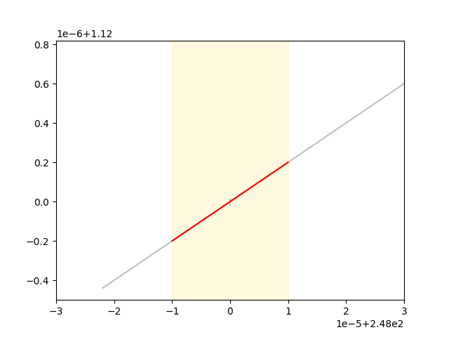

## Equation 3:
```
rapid_delayed_rectifier_K_current_xr_gate__beta_xr = 0.028000000000000001 * (163.0 + membrane__V) / (-1.0 + exp(7.7619047619047619 + 0.047619047619047616 * membrane__V))
```
## New Eq:
```
rapid_delayed_rectifier_K_current_xr_gate__beta_xr = ((fabs(163.0 + membrane__V) < 1.0000000000065512e-5) ? (-2.8000000000183432e-7 / (-1.0 + exp(-4.761904761935958e-7)) + 49999.999999672436 * (163.00001 + membrane__V) * (2.8000000000183432e-7 / (-1.0 + exp(4.761904761935958e-7)) + 2.8000000000183432e-7 / (-1.0 + exp(-4.761904761935958e-7)))) : (0.028000000000000001 * (163.0 + membrane__V) / (-1.0 + exp(7.7619047619047619 + 0.047619047619047616 * membrane__V))))
```
## Singularity point: -163.00000000000000
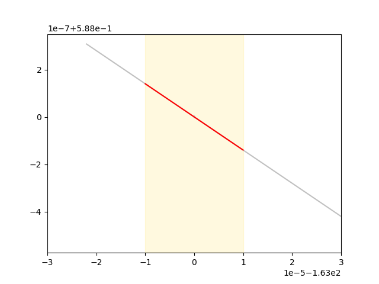

## Equation 4:
```
sarcolemmal_Ca_current_d_gate__tau_d = 28.571428571428569 * (1.0 - exp(-1.6025641025641024 - 0.16025641025641024 * membrane__V)) / ((1.0 + exp(-1.6025641025641024 - 0.16025641025641024 * membrane__V)) * (10.0 + membrane__V))
```
## New Eq:
```
sarcolemmal_Ca_current_d_gate__tau_d = ((fabs(10.0 + membrane__V) < 9.9999999999961231e-6) ? (50000.000000019383 * (10.00001 + membrane__V) * (2857142.8571439646 * (1.0 - exp(1.6025641025634812e-6)) / (1.0 + exp(1.6025641025634812e-6)) + 2857142.8571439646 * (1.0 - exp(-1.6025641025634812e-6)) / (1.0 + exp(-1.6025641025634812e-6))) - 2857142.8571439646 * (1.0 - exp(1.6025641025634812e-6)) / (1.0 + exp(1.6025641025634812e-6))) : (28.571428571428569 * (1.0 - exp(-1.6025641025641024 - 0.16025641025641024 * membrane__V)) / ((1.0 + exp(-1.6025641025641024 - 0.16025641025641024 * membrane__V)) * (10.0 + membrane__V))))
```
## Singularity point: -10.000000000000000


## Equation 5:
```
slow_delayed_rectifier_K_current_xs_gate__alpha_xs = 1.0000000000000001e-5 * (28.5 + membrane__V) / (1.0 - exp(-0.24782608695652175 - 0.0086956521739130436 * membrane__V))
```
## New Eq:
```
slow_delayed_rectifier_K_current_xs_gate__alpha_xs = ((fabs(28.5 + membrane__V) < 1.0000000000010001e-5) ? (-1.0000000000010001e-10 / (1.0 - exp(8.6956521739217404e-8)) + 49999.999999949992 * (28.50001 + membrane__V) * (1.0000000000010001e-10 / (1.0 - exp(8.6956521739217404e-8)) + 1.0000000000010001e-10 / (1.0 - exp(-8.6956521739217404e-8)))) : (1.0000000000000001e-5 * (28.5 + membrane__V) / (1.0 - exp(-0.24782608695652175 - 0.0086956521739130436 * membrane__V))))
```
## Singularity point: -28.500000000000000


## Equation 6:
```
slow_delayed_rectifier_K_current_xs_gate__beta_xs = 0.00023000000000000001 * (28.5 + membrane__V) / (-1.0 + exp(8.6363636363636367 + 0.30303030303030304 * membrane__V))
```
## New Eq:
```
slow_delayed_rectifier_K_current_xs_gate__beta_xs = ((fabs(28.5 + membrane__V) < 1.0000000000010001e-5) ? (-2.3000000000023003e-9 / (-1.0 + exp(-3.0303030303060612e-6)) + 49999.999999949992 * (28.50001 + membrane__V) * (2.3000000000023003e-9 / (-1.0 + exp(3.0303030303060612e-6)) + 2.3000000000023003e-9 / (-1.0 + exp(-3.0303030303060612e-6)))) : (0.00023000000000000001 * (28.5 + membrane__V) / (-1.0 + exp(8.6363636363636367 + 0.30303030303030304 * membrane__V))))
```
## Singularity point: -28.500000000000000
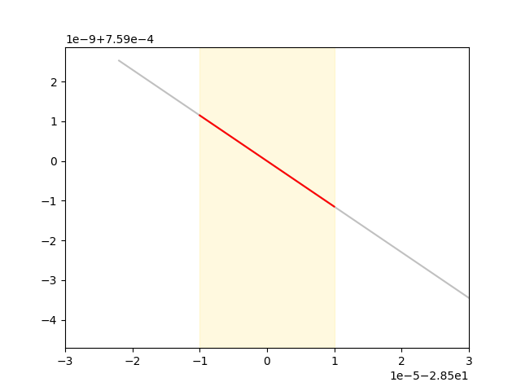

# of singularities:  6
# Model: sachse_model_2007(sachse_moreno_abildskov_2008_b.cellml)
No of piecewises: 0
## Equation 1:
```
I_Shkr__I_Shkr = pow(model_parameters__F, 2) * (-model_parameters__Ko * exp(-membrane__Vm * model_parameters__F / (model_parameters__R * model_parameters__T)) + model_parameters__Ki) * I_Shkr__OShkr * I_Shkr__PShkr * membrane__Vm / ((1.0 - exp(-membrane__Vm * model_parameters__F / (model_parameters__R * model_parameters__T))) * model_parameters__R * model_parameters__T)
```
## New Eq:
```
I_Shkr__I_Shkr = ((fabs(membrane__Vm) < 1.0000000000000001e-5) ? (49999.999999999993 * (1.0000000000000001e-5 + membrane__Vm) * (11.206077015643803 * (-model_parameters__Ko * exp(0.00011612515042117931 / model_parameters__T) + model_parameters__Ki) * I_Shkr__OShkr * I_Shkr__PShkr / ((1.0 - exp(0.00011612515042117931 / model_parameters__T)) * model_parameters__T) + 11.206077015643803 * (-model_parameters__Ko * exp(-0.00011612515042117931 / model_parameters__T) + model_parameters__Ki) * I_Shkr__OShkr * I_Shkr__PShkr / ((1.0 - exp(-0.00011612515042117931 / model_parameters__T)) * model_parameters__T)) - 11.206077015643803 * (-model_parameters__Ko * exp(0.00011612515042117931 / model_parameters__T) + model_parameters__Ki) * I_Shkr__OShkr * I_Shkr__PShkr / ((1.0 - exp(0.00011612515042117931 / model_parameters__T)) * model_parameters__T)) : (1120607.7015643802 * (-model_parameters__Ko * exp(-11.612515042117931 * membrane__Vm / model_parameters__T) + model_parameters__Ki) * I_Shkr__OShkr * I_Shkr__PShkr * membrane__Vm / ((1.0 - exp(-11.612515042117931 * membrane__Vm / model_parameters__T)) * model_parameters__T)))
```
## Singularity point: 0
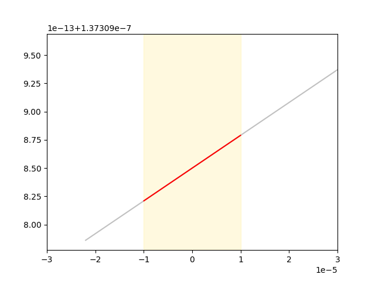

# of singularities:  1
# Model: sakmann_model_2000_epi(sakmann_model_2000_epi.cellml)
No of piecewises: 1
## Equation 1:
```
L_type_Ca_channel__i_Ca_L_Ca_ds = 4.0 * (-50.0 + membrane__V) * (intracellular_calcium_concentration__Ca_i * exp(100.0 * membrane__F / (membrane__R * membrane__T)) - extracellular_calcium_concentration__Ca_o * exp(2.0 * (50.0 - membrane__V) * membrane__F / (membrane__R * membrane__T))) * L_type_Ca_channel__FrICa * L_type_Ca_channel__P_Ca_L * L_type_Ca_channel_d_gate__d * L_type_Ca_channel_f2ds_gate__f2ds * L_type_Ca_channel_f_gate__f * membrane__F / ((1.0 - exp(2.0 * (50.0 - membrane__V) * membrane__F / (membrane__R * membrane__T))) * membrane__R * membrane__T)
```
## New Eq:
```
L_type_Ca_channel__i_Ca_L_Ca_ds = ((fabs(-50.0 + membrane__V) < 1.0000000000010001e-5) ? (49999.999999949992 * (-49.999989999999997 + membrane__V) * (1.647091196202448e-7 * (intracellular_calcium_concentration__Ca_i * exp(3.7433890822745473) - extracellular_calcium_concentration__Ca_o * exp(7.4867781645565822e-7)) * L_type_Ca_channel_d_gate__d * L_type_Ca_channel_f2ds_gate__f2ds * L_type_Ca_channel_f_gate__f / (1.0 - exp(7.4867781645565822e-7)) + 1.647091196202448e-7 * (intracellular_calcium_concentration__Ca_i * exp(3.7433890822745473) - extracellular_calcium_concentration__Ca_o * exp(-7.4867781645565822e-7)) * L_type_Ca_channel_d_gate__d * L_type_Ca_channel_f2ds_gate__f2ds * L_type_Ca_channel_f_gate__f / (1.0 - exp(-7.4867781645565822e-7))) - 1.647091196202448e-7 * (intracellular_calcium_concentration__Ca_i * exp(3.7433890822745473) - extracellular_calcium_concentration__Ca_o * exp(7.4867781645565822e-7)) * L_type_Ca_channel_d_gate__d * L_type_Ca_channel_f2ds_gate__f2ds * L_type_Ca_channel_f_gate__f / (1.0 - exp(7.4867781645565822e-7))) : (0.016470911962008009 * (-50.0 + membrane__V) * (intracellular_calcium_concentration__Ca_i * exp(3.7433890822745473) - extracellular_calcium_concentration__Ca_o * exp(3.7433890822745473 - 0.074867781645490947 * membrane__V)) * L_type_Ca_channel_d_gate__d * L_type_Ca_channel_f2ds_gate__f2ds * L_type_Ca_channel_f_gate__f / (1.0 - exp(3.7433890822745473 - 0.074867781645490947 * membrane__V))))
```
## Singularity point: 50.000000000000000
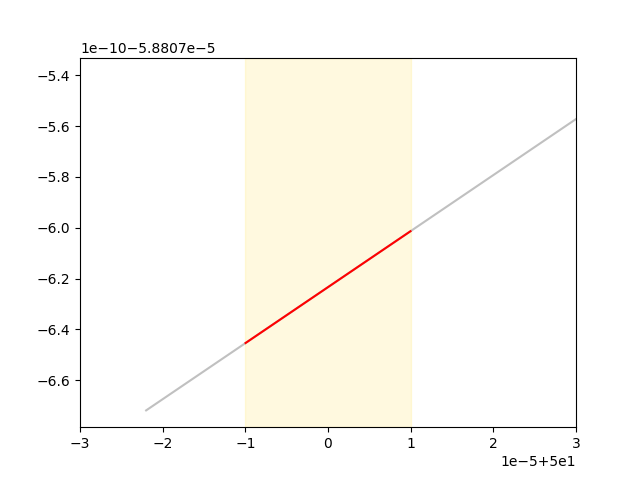

## Equation 2:
```
L_type_Ca_channel__i_Ca_L_K_ds = (-50.0 + membrane__V) * (intracellular_potassium_concentration__K_i * exp(50.0 * membrane__F / (membrane__R * membrane__T)) - extracellular_potassium_concentration__K_o * exp((50.0 - membrane__V) * membrane__F / (membrane__R * membrane__T))) * L_type_Ca_channel__FrICa * L_type_Ca_channel__P_CaK * L_type_Ca_channel__P_Ca_L * L_type_Ca_channel_d_gate__d * L_type_Ca_channel_f2ds_gate__f2ds * L_type_Ca_channel_f_gate__f * membrane__F / ((1.0 - exp((50.0 - membrane__V) * membrane__F / (membrane__R * membrane__T))) * membrane__R * membrane__T)
```
## New Eq:
```
L_type_Ca_channel__i_Ca_L_K_ds = ((fabs(-50.0 + membrane__V) < 1.0000000000010001e-5) ? (49999.999999949992 * (-49.999989999999997 + membrane__V) * (8.2354559810122397e-11 * (intracellular_potassium_concentration__K_i * exp(1.8716945411372736) - extracellular_potassium_concentration__K_o * exp(3.7433890822782911e-7)) * L_type_Ca_channel_d_gate__d * L_type_Ca_channel_f2ds_gate__f2ds * L_type_Ca_channel_f_gate__f / (1.0 - exp(3.7433890822782911e-7)) + 8.2354559810122397e-11 * (intracellular_potassium_concentration__K_i * exp(1.8716945411372736) - extracellular_potassium_concentration__K_o * exp(-3.7433890822782911e-7)) * L_type_Ca_channel_d_gate__d * L_type_Ca_channel_f2ds_gate__f2ds * L_type_Ca_channel_f_gate__f / (1.0 - exp(-3.7433890822782911e-7))) - 8.2354559810122397e-11 * (intracellular_potassium_concentration__K_i * exp(1.8716945411372736) - extracellular_potassium_concentration__K_o * exp(3.7433890822782911e-7)) * L_type_Ca_channel_d_gate__d * L_type_Ca_channel_f2ds_gate__f2ds * L_type_Ca_channel_f_gate__f / (1.0 - exp(3.7433890822782911e-7))) : (8.2354559810040044e-6 * (-50.0 + membrane__V) * (intracellular_potassium_concentration__K_i * exp(1.8716945411372736) - extracellular_potassium_concentration__K_o * exp(1.8716945411372736 - 0.037433890822745473 * membrane__V)) * L_type_Ca_channel_d_gate__d * L_type_Ca_channel_f2ds_gate__f2ds * L_type_Ca_channel_f_gate__f / (1.0 - exp(1.8716945411372736 - 0.037433890822745473 * membrane__V))))
```
## Singularity point: 50.000000000000000
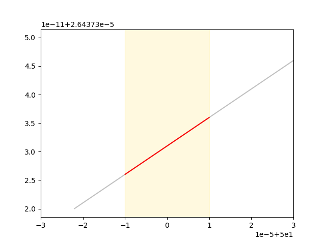

## Equation 3:
```
L_type_Ca_channel__i_Ca_L_Na_ds = (-50.0 + membrane__V) * (intracellular_sodium_concentration__Na_i * exp(50.0 * membrane__F / (membrane__R * membrane__T)) - extracellular_sodium_concentration__Na_o * exp((50.0 - membrane__V) * membrane__F / (membrane__R * membrane__T))) * L_type_Ca_channel__FrICa * L_type_Ca_channel__P_CaNa * L_type_Ca_channel__P_Ca_L * L_type_Ca_channel_d_gate__d * L_type_Ca_channel_f2ds_gate__f2ds * L_type_Ca_channel_f_gate__f * membrane__F / ((1.0 - exp((50.0 - membrane__V) * membrane__F / (membrane__R * membrane__T))) * membrane__R * membrane__T)
```
## New Eq:
```
L_type_Ca_channel__i_Ca_L_Na_ds = ((fabs(-50.0 + membrane__V) < 1.0000000000010001e-5) ? (49999.999999949992 * (-49.999989999999997 + membrane__V) * (4.1177279905061201e-10 * (intracellular_sodium_concentration__Na_i * exp(1.8716945411372736) - extracellular_sodium_concentration__Na_o * exp(3.7433890822782911e-7)) * L_type_Ca_channel_d_gate__d * L_type_Ca_channel_f2ds_gate__f2ds * L_type_Ca_channel_f_gate__f / (1.0 - exp(3.7433890822782911e-7)) + 4.1177279905061201e-10 * (intracellular_sodium_concentration__Na_i * exp(1.8716945411372736) - extracellular_sodium_concentration__Na_o * exp(-3.7433890822782911e-7)) * L_type_Ca_channel_d_gate__d * L_type_Ca_channel_f2ds_gate__f2ds * L_type_Ca_channel_f_gate__f / (1.0 - exp(-3.7433890822782911e-7))) - 4.1177279905061201e-10 * (intracellular_sodium_concentration__Na_i * exp(1.8716945411372736) - extracellular_sodium_concentration__Na_o * exp(3.7433890822782911e-7)) * L_type_Ca_channel_d_gate__d * L_type_Ca_channel_f2ds_gate__f2ds * L_type_Ca_channel_f_gate__f / (1.0 - exp(3.7433890822782911e-7))) : (4.1177279905020022e-5 * (-50.0 + membrane__V) * (intracellular_sodium_concentration__Na_i * exp(1.8716945411372736) - extracellular_sodium_concentration__Na_o * exp(1.8716945411372736 - 0.037433890822745473 * membrane__V)) * L_type_Ca_channel_d_gate__d * L_type_Ca_channel_f2ds_gate__f2ds * L_type_Ca_channel_f_gate__f / (1.0 - exp(1.8716945411372736 - 0.037433890822745473 * membrane__V))))
```
## Singularity point: 50.000000000000000


## Equation 4:
```
L_type_Ca_channel_d_gate__alpha_d = 30.0 * (19.0 + membrane__V) / (1.0 - exp(-2.6388888888888888 - 0.1388888888888889 * membrane__V))
```
## New Eq:
```
L_type_Ca_channel_d_gate__alpha_d = ((fabs(19.0 + membrane__V) < 1.0000000000010001e-5) ? (-0.00030000000000030003 / (1.0 - exp(1.3888888888902779e-6)) + 49999.999999949992 * (19.00001 + membrane__V) * (0.00030000000000030003 / (1.0 - exp(1.3888888888902779e-6)) + 0.00030000000000030003 / (1.0 - exp(-1.3888888888902779e-6)))) : (30.0 * (19.0 + membrane__V) / (1.0 - exp(-2.6388888888888888 - 0.1388888888888889 * membrane__V))))
```
## Singularity point: -19.000000000000000
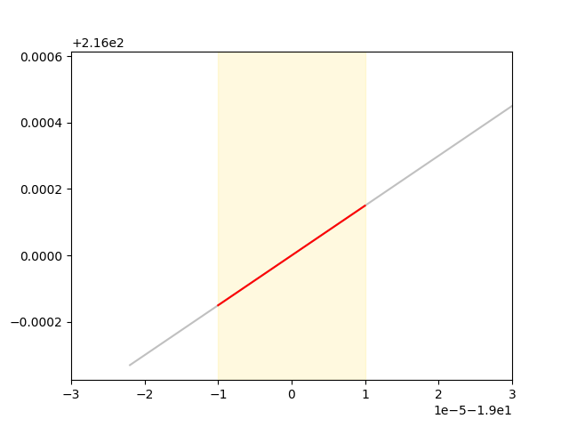

## Equation 5:
```
L_type_Ca_channel_d_gate__beta_d = 12.0 * (19.0 + membrane__V) / (-1.0 + exp(1.0555555555555556 + 0.055555555555555552 * membrane__V))
```
## New Eq:
```
L_type_Ca_channel_d_gate__beta_d = ((fabs(19.0 + membrane__V) < 1.0000000000010001e-5) ? (-0.00012000000000012001 / (-1.0 + exp(-5.5555555555611117e-7)) + 49999.999999949992 * (19.00001 + membrane__V) * (0.00012000000000012001 / (-1.0 + exp(5.5555555555611117e-7)) + 0.00012000000000012001 / (-1.0 + exp(-5.5555555555611117e-7)))) : (12.0 * (19.0 + membrane__V) / (-1.0 + exp(1.0555555555555556 + 0.055555555555555552 * membrane__V))))
```
## Singularity point: -19.000000000000000
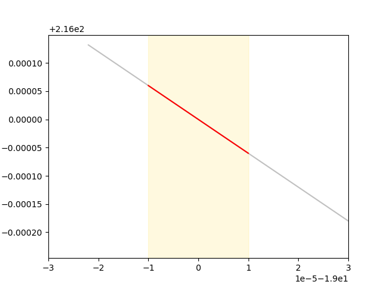

## Equation 6:
```
L_type_Ca_channel_f_gate__alpha_f = 6.25 * (34.0 + membrane__V) / (-1.0 + exp(6.666666666666667 + 0.19607843137254904 * membrane__V))
```
## New Eq:
```
L_type_Ca_channel_f_gate__alpha_f = ((fabs(34.0 + membrane__V) < 1.0000000000010001e-5) ? (-6.2500000000062506e-5 / (-1.0 + exp(-1.9607843137274515e-6)) + 49999.999999949992 * (34.000010000000003 + membrane__V) * (6.2500000000062506e-5 / (-1.0 + exp(1.9607843137274515e-6)) + 6.2500000000062506e-5 / (-1.0 + exp(-1.9607843137274515e-6)))) : (6.25 * (34.0 + membrane__V) / (-1.0 + exp(6.666666666666667 + 0.19607843137254904 * membrane__V))))
```
## Singularity point: -34.000000000000000
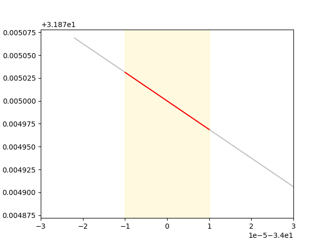

## Equation 7:
```
fast_sodium_current_m_gate__alpha_m = 200.0 * (41.0 + membrane__V) / (1.0 - exp(-4.1000000000000005 - 0.10000000000000001 * membrane__V))
```
## New Eq:
```
fast_sodium_current_m_gate__alpha_m = ((fabs(41.0 + membrane__V) < 1.0000000000010001e-5) ? (-0.0020000000000020002 / (1.0 - exp(1.0000000000010001e-6)) + 49999.999999949992 * (41.000010000000003 + membrane__V) * (0.0020000000000020002 / (1.0 - exp(1.0000000000010001e-6)) + 0.0020000000000020002 / (1.0 - exp(-1.0000000000010001e-6)))) : (200.0 * (41.0 + membrane__V) / (1.0 - exp(-4.1000000000000005 - 0.10000000000000001 * membrane__V))))
```
## Singularity point: -41.000000000000000


## Equation 8:
```
rapid_delayed_rectifier_potassium_current_xr_gate__tau_xr = 0.001 / (0.00060999999999999997 * (38.899999999999999 + membrane__V) / (-1.0 + exp(5.6404999999999994 + 0.14499999999999999 * membrane__V)) + 0.0013799999999999999 * (14.199999999999999 + membrane__V) / (1.0 - exp(-1.7465999999999999 - 0.123 * membrane__V)))
```
## New Eq:
```
rapid_delayed_rectifier_potassium_current_xr_gate__tau_xr = 0.001 / (((fabs(38.899999999999999 + membrane__V) < 1.0000000000010001e-5) ? (-6.1000000000061005e-9 / (-1.0 + exp(-1.45000000000145e-6)) + 49999.999999949992 * (38.900010000000002 + membrane__V) * (6.1000000000061005e-9 / (-1.0 + exp(1.45000000000145e-6)) + 6.1000000000061005e-9 / (-1.0 + exp(-1.45000000000145e-6)))) : (0.00060999999999999997 * (38.899999999999999 + membrane__V) / (-1.0 + exp(5.6404999999999994 + 0.14499999999999999 * membrane__V)))) + ((fabs(14.199999999999999 + membrane__V) < 9.9999999999961231e-6) ? (-1.3799999999994649e-8 / (1.0 - exp(1.2299999999995232e-6)) + 50000.000000019383 * (14.200009999999999 + membrane__V) * (1.3799999999994649e-8 / (1.0 - exp(1.2299999999995232e-6)) + 1.3799999999994649e-8 / (1.0 - exp(-1.2299999999995232e-6)))) : (0.0013799999999999999 * (14.199999999999999 + membrane__V) / (1.0 - exp(-1.7465999999999999 - 0.123 * membrane__V)))))
```
## Singularity point: -38.899999999999999

## Singularity point: -14.199999999999999
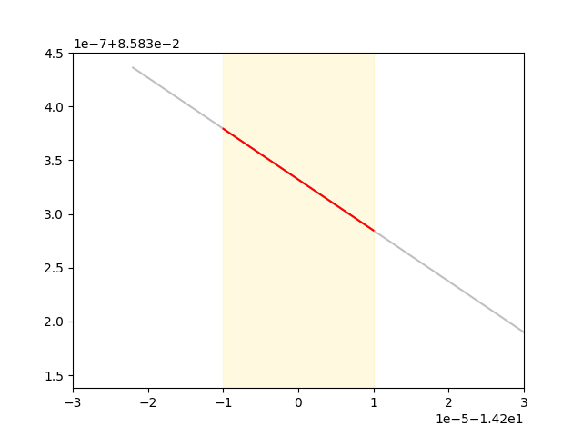

## Equation 9:
```
slow_delayed_rectifier_potassium_current_xs_gate__tau_xs = 0.001 / (0.00013100000000000001 * (30.0 + membrane__V) / (-1.0 + exp(2.0609999999999999 + 0.068699999999999997 * membrane__V)) + 7.1899999999999999e-5 * (30.0 + membrane__V) / (1.0 - exp(-4.4399999999999995 - 0.14799999999999999 * membrane__V)))
```
## New Eq:
```
slow_delayed_rectifier_potassium_current_xs_gate__tau_xs = 0.001 * ((fabs(30.0 + membrane__V) < 1.0000000000010001e-5) ? (1 / (-7.1900000000071903e-10 / (1.0 - exp(1.48000000000148e-6)) - 1.3100000000013103e-9 / (-1.0 + exp(-6.8700000000068699e-7)) + 49999.999999949992 * (30.00001 + membrane__V) * (7.1900000000071903e-10 / (1.0 - exp(1.48000000000148e-6)) + 7.1900000000071903e-10 / (1.0 - exp(-1.48000000000148e-6)) + 1.3100000000013103e-9 / (-1.0 + exp(6.8700000000068699e-7)) + 1.3100000000013103e-9 / (-1.0 + exp(-6.8700000000068699e-7))))) : (1 / (0.00013100000000000001 * (30.0 + membrane__V) / (-1.0 + exp(2.0609999999999999 + 0.068699999999999997 * membrane__V)) + 7.1899999999999999e-5 * (30.0 + membrane__V) / (1.0 - exp(-4.4399999999999995 - 0.14799999999999999 * membrane__V)))))
```
## Singularity point: -30.000000000000000
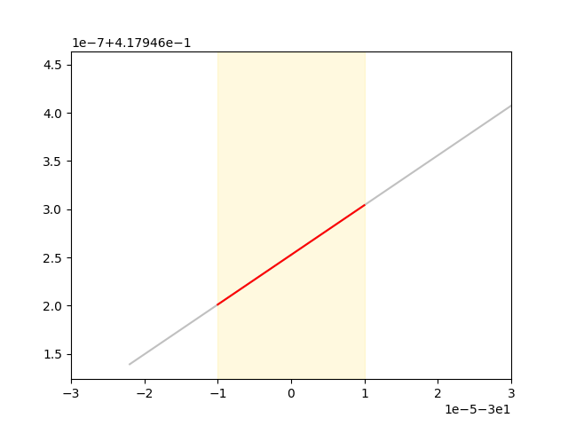

# of singularities:  10
# Model: shannon_wang_puglisi_weber_bers_2004_model_updated(shannon_wang_puglisi_weber_bers_2004.cellml)
No of piecewises: 4
## Equation 1:
```
ICaL_d_gate__tau_d = 28.571428571428569 * (1.0 - exp(-2.4166666666666665 - 0.16666666666666666 * cell__V)) * ICaL_d_gate__d_infinity / (14.5 + cell__V)
```
## New Eq:
```
ICaL_d_gate__tau_d = ((fabs(14.5 + cell__V) < 9.9999999999961231e-6) ? (50000.000000019383 * (14.50001 + cell__V) * (2857142.8571439646 * (1.0 - exp(1.6666666666660206e-6)) / (1.0 + exp(1.6666666666660206e-6)) + 2857142.8571439646 * (1.0 - exp(-1.6666666666660206e-6)) / (1.0 + exp(-1.6666666666660206e-6))) - 2857142.8571439646 * (1.0 - exp(1.6666666666660206e-6)) / (1.0 + exp(1.6666666666660206e-6))) : (28.571428571428569 * (1.0 - exp(-2.4166666666666665 - 0.16666666666666666 * cell__V)) / ((1.0 + exp(-2.4166666666666665 - 0.16666666666666666 * cell__V)) * (14.5 + cell__V))))
```
## Singularity point: -14.500000000000000
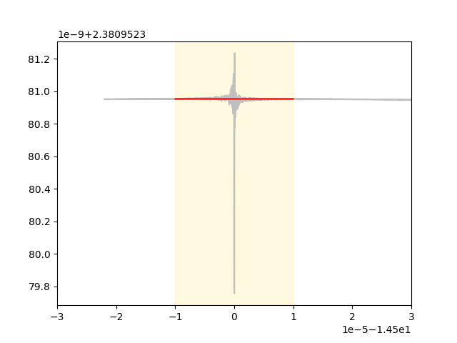

## Equation 2:
```
IKr_Xr_gate__tau_Xr = 1 / (0.00060999999999999997 * (10.0 + cell__V) / (-1.0 + exp(1.45 + 0.14499999999999999 * cell__V)) + 0.0013799999999999999 * (7.0 + cell__V) / (1.0 - exp(-0.86099999999999999 - 0.123 * cell__V)))
```
## New Eq:
```
IKr_Xr_gate__tau_Xr = 1 / (((fabs(7.0 + cell__V) < 1.0000000000003062e-5) ? (-1.3800000000004225e-8 / (1.0 - exp(1.2300000000003766e-6)) + 49999.999999984691 * (7.0000099999999996 + cell__V) * (1.3800000000004225e-8 / (1.0 - exp(1.2300000000003766e-6)) + 1.3800000000004225e-8 / (1.0 - exp(-1.2300000000003766e-6)))) : (0.0013799999999999999 * (7.0 + cell__V) / (1.0 - exp(-0.86099999999999999 - 0.123 * cell__V)))) + ((fabs(10.0 + cell__V) < 9.9999999999961231e-6) ? (-6.0999999999976351e-9 / (-1.0 + exp(-1.4499999999994377e-6)) + 50000.000000019383 * (10.00001 + cell__V) * (6.0999999999976351e-9 / (-1.0 + exp(1.4499999999994377e-6)) + 6.0999999999976351e-9 / (-1.0 + exp(-1.4499999999994377e-6)))) : (0.00060999999999999997 * (10.0 + cell__V) / (-1.0 + exp(1.45 + 0.14499999999999999 * cell__V)))))
```
## Singularity point: -10.000000000000000
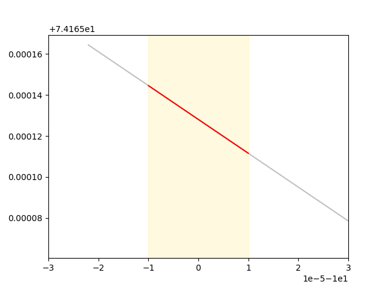
## Singularity point: -7.0000000000000000
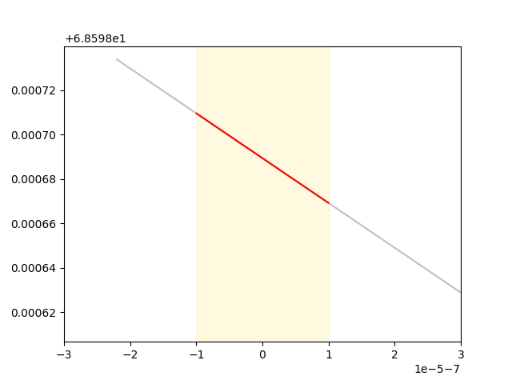

## Equation 3:
```
IKs_Xs_gate__tau_Xs = 1 / (0.00013100000000000001 * (30.0 + cell__V) / (-1.0 + exp(2.0609999999999999 + 0.068699999999999997 * cell__V)) + 7.1899999999999999e-5 * (30.0 + cell__V) / (1.0 - exp(-4.4399999999999995 - 0.14799999999999999 * cell__V)))
```
## New Eq:
```
IKs_Xs_gate__tau_Xs = ((fabs(30.0 + cell__V) < 1.0000000000010001e-5) ? (1 / (-7.1900000000071903e-10 / (1.0 - exp(1.48000000000148e-6)) - 1.3100000000013103e-9 / (-1.0 + exp(-6.8700000000068699e-7)) + 49999.999999949992 * (30.00001 + cell__V) * (7.1900000000071903e-10 / (1.0 - exp(1.48000000000148e-6)) + 7.1900000000071903e-10 / (1.0 - exp(-1.48000000000148e-6)) + 1.3100000000013103e-9 / (-1.0 + exp(6.8700000000068699e-7)) + 1.3100000000013103e-9 / (-1.0 + exp(-6.8700000000068699e-7))))) : (1 / (0.00013100000000000001 * (30.0 + cell__V) / (-1.0 + exp(2.0609999999999999 + 0.068699999999999997 * cell__V)) + 7.1899999999999999e-5 * (30.0 + cell__V) / (1.0 - exp(-4.4399999999999995 - 0.14799999999999999 * cell__V)))))
```
## Singularity point: -30.000000000000000


## Equation 4:
```
INa_m_gate__alpha_m = 0.32000000000000001 * (47.130000000000003 + cell__V) / (1.0 - exp(-4.7130000000000001 - 0.10000000000000001 * cell__V))
```
## New Eq:
```
INa_m_gate__alpha_m = ((fabs(47.130000000000003 + cell__V) < 1.0000000000010001e-5) ? (-3.2000000000032004e-6 / (1.0 - exp(1.0000000000010001e-6)) + 49999.999999949992 * (47.130010000000006 + cell__V) * (3.2000000000032004e-6 / (1.0 - exp(1.0000000000010001e-6)) + 3.2000000000032004e-6 / (1.0 - exp(-1.0000000000010001e-6)))) : (0.32000000000000001 * (47.130000000000003 + cell__V) / (1.0 - exp(-4.7130000000000001 - 0.10000000000000001 * cell__V))))
```
## Singularity point: -47.130000000000003


## Equation 5:
```
ICaL__i_CaL_Ca_SL = 4.0 * (-ICaL__gamma_Cao * model_parameters__Cao + Ca_buffer__Ca_SL * ICaL__gamma_Cai * exp(2.0 * cell__V * model_parameters__F / (model_parameters__R * model_parameters__T))) * ICaL__Fx_ICaL_SL * ICaL__PCa * ICaL__temp * ICaL_fCa_gate__fCa_SL / (-1.0 + exp(2.0 * cell__V * model_parameters__F / (model_parameters__R * model_parameters__T)))
```
## New Eq:
```
ICaL__i_CaL_Ca_SL = ((fabs(cell__V) < 1.0000000000000001e-5) ? (49999.999999999993 * (1.0000000000000001e-5 + cell__V) * (1.8000000000000003e-6 * pow(1.8, (-31.0 + 0.10000000000000001 * model_parameters__T)) * pow(model_parameters__F, 2) * (1.0 - ICaL_fCa_gate__fCaB_SL) * (-0.34100000000000003 * model_parameters__Cao + 0.34100000000000003 * Ca_buffer__Ca_SL * exp(2.0000000000000002e-5 * model_parameters__F / (model_parameters__R * model_parameters__T))) * ICaL__PCa * ICaL_d_gate__d * ICaL_f_gate__f / ((-1.0 + exp(2.0000000000000002e-5 * model_parameters__F / (model_parameters__R * model_parameters__T))) * model_parameters__R * model_parameters__T) + 1.8000000000000003e-6 * pow(1.8, (-31.0 + 0.10000000000000001 * model_parameters__T)) * pow(model_parameters__F, 2) * (1.0 - ICaL_fCa_gate__fCaB_SL) * (-0.34100000000000003 * model_parameters__Cao + 0.34100000000000003 * Ca_buffer__Ca_SL * exp(-2.0000000000000002e-5 * model_parameters__F / (model_parameters__R * model_parameters__T))) * ICaL__PCa * ICaL_d_gate__d * ICaL_f_gate__f / ((-1.0 + exp(-2.0000000000000002e-5 * model_parameters__F / (model_parameters__R * model_parameters__T))) * model_parameters__R * model_parameters__T)) - 1.8000000000000003e-6 * pow(1.8, (-31.0 + 0.10000000000000001 * model_parameters__T)) * pow(model_parameters__F, 2) * (1.0 - ICaL_fCa_gate__fCaB_SL) * (-0.34100000000000003 * model_parameters__Cao + 0.34100000000000003 * Ca_buffer__Ca_SL * exp(-2.0000000000000002e-5 * model_parameters__F / (model_parameters__R * model_parameters__T))) * ICaL__PCa * ICaL_d_gate__d * ICaL_f_gate__f / ((-1.0 + exp(-2.0000000000000002e-5 * model_parameters__F / (model_parameters__R * model_parameters__T))) * model_parameters__R * model_parameters__T)) : (0.18000000000000002 * pow(1.8, (-31.0 + 0.10000000000000001 * model_parameters__T)) * pow(model_parameters__F, 2) * (1.0 - ICaL_fCa_gate__fCaB_SL) * (-0.34100000000000003 * model_parameters__Cao + 0.34100000000000003 * Ca_buffer__Ca_SL * exp(2.0 * cell__V * model_parameters__F / (model_parameters__R * model_parameters__T))) * ICaL__PCa * ICaL_d_gate__d * ICaL_f_gate__f * cell__V / ((-1.0 + exp(2.0 * cell__V * model_parameters__F / (model_parameters__R * model_parameters__T))) * model_parameters__R * model_parameters__T)))
```
## Singularity point: 0


## Equation 6:
```
ICaL__i_CaL_Ca_jct = 4.0 * (-ICaL__gamma_Cao * model_parameters__Cao + Ca_buffer__Ca_jct * ICaL__gamma_Cai * exp(2.0 * cell__V * model_parameters__F / (model_parameters__R * model_parameters__T))) * ICaL__Fx_ICaL_jct * ICaL__PCa * ICaL__temp * ICaL_fCa_gate__fCa_jct / (-1.0 + exp(2.0 * cell__V * model_parameters__F / (model_parameters__R * model_parameters__T)))
```
## New Eq:
```
ICaL__i_CaL_Ca_jct = ((fabs(cell__V) < 1.0000000000000001e-5) ? (49999.999999999993 * (1.0000000000000001e-5 + cell__V) * (1.6200000000000001e-5 * pow(1.8, (-31.0 + 0.10000000000000001 * model_parameters__T)) * pow(model_parameters__F, 2) * (1.0 - ICaL_fCa_gate__fCaB_jct) * (-0.34100000000000003 * model_parameters__Cao + 0.34100000000000003 * Ca_buffer__Ca_jct * exp(2.0000000000000002e-5 * model_parameters__F / (model_parameters__R * model_parameters__T))) * ICaL__PCa * ICaL_d_gate__d * ICaL_f_gate__f / ((-1.0 + exp(2.0000000000000002e-5 * model_parameters__F / (model_parameters__R * model_parameters__T))) * model_parameters__R * model_parameters__T) + 1.6200000000000001e-5 * pow(1.8, (-31.0 + 0.10000000000000001 * model_parameters__T)) * pow(model_parameters__F, 2) * (1.0 - ICaL_fCa_gate__fCaB_jct) * (-0.34100000000000003 * model_parameters__Cao + 0.34100000000000003 * Ca_buffer__Ca_jct * exp(-2.0000000000000002e-5 * model_parameters__F / (model_parameters__R * model_parameters__T))) * ICaL__PCa * ICaL_d_gate__d * ICaL_f_gate__f / ((-1.0 + exp(-2.0000000000000002e-5 * model_parameters__F / (model_parameters__R * model_parameters__T))) * model_parameters__R * model_parameters__T)) - 1.6200000000000001e-5 * pow(1.8, (-31.0 + 0.10000000000000001 * model_parameters__T)) * pow(model_parameters__F, 2) * (1.0 - ICaL_fCa_gate__fCaB_jct) * (-0.34100000000000003 * model_parameters__Cao + 0.34100000000000003 * Ca_buffer__Ca_jct * exp(-2.0000000000000002e-5 * model_parameters__F / (model_parameters__R * model_parameters__T))) * ICaL__PCa * ICaL_d_gate__d * ICaL_f_gate__f / ((-1.0 + exp(-2.0000000000000002e-5 * model_parameters__F / (model_parameters__R * model_parameters__T))) * model_parameters__R * model_parameters__T)) : (1.6200000000000001 * pow(1.8, (-31.0 + 0.10000000000000001 * model_parameters__T)) * pow(model_parameters__F, 2) * (1.0 - ICaL_fCa_gate__fCaB_jct) * (-0.34100000000000003 * model_parameters__Cao + 0.34100000000000003 * Ca_buffer__Ca_jct * exp(2.0 * cell__V * model_parameters__F / (model_parameters__R * model_parameters__T))) * ICaL__PCa * ICaL_d_gate__d * ICaL_f_gate__f * cell__V / ((-1.0 + exp(2.0 * cell__V * model_parameters__F / (model_parameters__R * model_parameters__T))) * model_parameters__R * model_parameters__T)))
```
## Singularity point: 0


## Equation 7:
```
ICaL__i_CaL_K = (ICaL__Fx_ICaL_SL * ICaL_fCa_gate__fCa_SL + ICaL__Fx_ICaL_jct * ICaL_fCa_gate__fCa_jct) * (-ICaL__gamma_Ko * model_parameters__Ko + ICaL__gamma_Ki * model_parameters__Ki * exp(cell__V * model_parameters__F / (model_parameters__R * model_parameters__T))) * ICaL__PK * ICaL__temp / (-1.0 + exp(cell__V * model_parameters__F / (model_parameters__R * model_parameters__T)))
```
## New Eq:
```
ICaL__i_CaL_K = ((fabs(cell__V) < 1.0000000000000001e-5) ? (49999.999999999993 * (1.0000000000000001e-5 + cell__V) * (1.2150000000000002e-12 * pow(1.8, (-31.0 + 0.10000000000000001 * model_parameters__T)) * pow(model_parameters__F, 2) * (-0.75 * model_parameters__Ko + 0.75 * model_parameters__Ki * exp(1.0000000000000001e-5 * model_parameters__F / (model_parameters__R * model_parameters__T))) * (1.0 - 0.10000000000000001 * ICaL_fCa_gate__fCaB_SL - 0.90000000000000002 * ICaL_fCa_gate__fCaB_jct) * ICaL_d_gate__d * ICaL_f_gate__f / ((-1.0 + exp(1.0000000000000001e-5 * model_parameters__F / (model_parameters__R * model_parameters__T))) * model_parameters__R * model_parameters__T) + 1.2150000000000002e-12 * pow(1.8, (-31.0 + 0.10000000000000001 * model_parameters__T)) * pow(model_parameters__F, 2) * (-0.75 * model_parameters__Ko + 0.75 * model_parameters__Ki * exp(-1.0000000000000001e-5 * model_parameters__F / (model_parameters__R * model_parameters__T))) * (1.0 - 0.10000000000000001 * ICaL_fCa_gate__fCaB_SL - 0.90000000000000002 * ICaL_fCa_gate__fCaB_jct) * ICaL_d_gate__d * ICaL_f_gate__f / ((-1.0 + exp(-1.0000000000000001e-5 * model_parameters__F / (model_parameters__R * model_parameters__T))) * model_parameters__R * model_parameters__T)) - 1.2150000000000002e-12 * pow(1.8, (-31.0 + 0.10000000000000001 * model_parameters__T)) * pow(model_parameters__F, 2) * (-0.75 * model_parameters__Ko + 0.75 * model_parameters__Ki * exp(-1.0000000000000001e-5 * model_parameters__F / (model_parameters__R * model_parameters__T))) * (1.0 - 0.10000000000000001 * ICaL_fCa_gate__fCaB_SL - 0.90000000000000002 * ICaL_fCa_gate__fCaB_jct) * ICaL_d_gate__d * ICaL_f_gate__f / ((-1.0 + exp(-1.0000000000000001e-5 * model_parameters__F / (model_parameters__R * model_parameters__T))) * model_parameters__R * model_parameters__T)) : (1.215e-7 * pow(1.8, (-31.0 + 0.10000000000000001 * model_parameters__T)) * pow(model_parameters__F, 2) * (-0.75 * model_parameters__Ko + 0.75 * model_parameters__Ki * exp(cell__V * model_parameters__F / (model_parameters__R * model_parameters__T))) * (1.0 - 0.10000000000000001 * ICaL_fCa_gate__fCaB_SL - 0.90000000000000002 * ICaL_fCa_gate__fCaB_jct) * ICaL_d_gate__d * ICaL_f_gate__f * cell__V / ((-1.0 + exp(cell__V * model_parameters__F / (model_parameters__R * model_parameters__T))) * model_parameters__R * model_parameters__T)))
```
## Singularity point: 0


## Equation 8:
```
ICaL__i_CaL_Na_SL = (-ICaL__gamma_Nao * model_parameters__Nao + ICaL__gamma_Nai * Na_buffer__Na_SL * exp(cell__V * model_parameters__F / (model_parameters__R * model_parameters__T))) * ICaL__Fx_ICaL_SL * ICaL__PNa * ICaL__temp * ICaL_fCa_gate__fCa_SL / (-1.0 + exp(cell__V * model_parameters__F / (model_parameters__R * model_parameters__T)))
```
## New Eq:
```
ICaL__i_CaL_Na_SL = ((fabs(cell__V) < 1.0000000000000001e-5) ? (49999.999999999993 * (1.0000000000000001e-5 + cell__V) * (6.7500000000000004e-15 * pow(1.8, (-31.0 + 0.10000000000000001 * model_parameters__T)) * pow(model_parameters__F, 2) * (1.0 - ICaL_fCa_gate__fCaB_SL) * (-0.75 * model_parameters__Nao + 0.75 * Na_buffer__Na_SL * exp(1.0000000000000001e-5 * model_parameters__F / (model_parameters__R * model_parameters__T))) * ICaL_d_gate__d * ICaL_f_gate__f / ((-1.0 + exp(1.0000000000000001e-5 * model_parameters__F / (model_parameters__R * model_parameters__T))) * model_parameters__R * model_parameters__T) + 6.7500000000000004e-15 * pow(1.8, (-31.0 + 0.10000000000000001 * model_parameters__T)) * pow(model_parameters__F, 2) * (1.0 - ICaL_fCa_gate__fCaB_SL) * (-0.75 * model_parameters__Nao + 0.75 * Na_buffer__Na_SL * exp(-1.0000000000000001e-5 * model_parameters__F / (model_parameters__R * model_parameters__T))) * ICaL_d_gate__d * ICaL_f_gate__f / ((-1.0 + exp(-1.0000000000000001e-5 * model_parameters__F / (model_parameters__R * model_parameters__T))) * model_parameters__R * model_parameters__T)) - 6.7500000000000004e-15 * pow(1.8, (-31.0 + 0.10000000000000001 * model_parameters__T)) * pow(model_parameters__F, 2) * (1.0 - ICaL_fCa_gate__fCaB_SL) * (-0.75 * model_parameters__Nao + 0.75 * Na_buffer__Na_SL * exp(-1.0000000000000001e-5 * model_parameters__F / (model_parameters__R * model_parameters__T))) * ICaL_d_gate__d * ICaL_f_gate__f / ((-1.0 + exp(-1.0000000000000001e-5 * model_parameters__F / (model_parameters__R * model_parameters__T))) * model_parameters__R * model_parameters__T)) : (6.7499999999999994e-10 * pow(1.8, (-31.0 + 0.10000000000000001 * model_parameters__T)) * pow(model_parameters__F, 2) * (1.0 - ICaL_fCa_gate__fCaB_SL) * (-0.75 * model_parameters__Nao + 0.75 * Na_buffer__Na_SL * exp(cell__V * model_parameters__F / (model_parameters__R * model_parameters__T))) * ICaL_d_gate__d * ICaL_f_gate__f * cell__V / ((-1.0 + exp(cell__V * model_parameters__F / (model_parameters__R * model_parameters__T))) * model_parameters__R * model_parameters__T)))
```
## Singularity point: 0
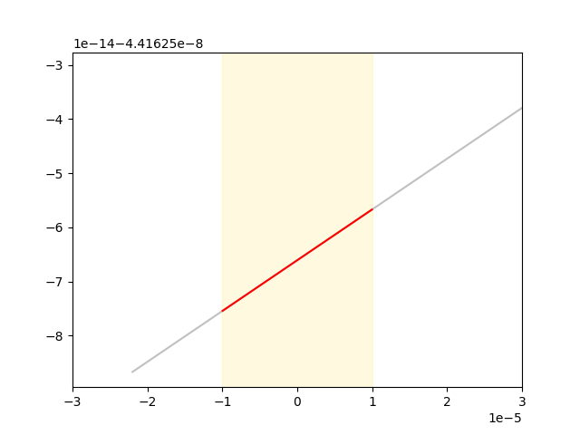

## Equation 9:
```
ICaL__i_CaL_Na_jct = (-ICaL__gamma_Nao * model_parameters__Nao + ICaL__gamma_Nai * Na_buffer__Na_jct * exp(cell__V * model_parameters__F / (model_parameters__R * model_parameters__T))) * ICaL__Fx_ICaL_jct * ICaL__PNa * ICaL__temp * ICaL_fCa_gate__fCa_jct / (-1.0 + exp(cell__V * model_parameters__F / (model_parameters__R * model_parameters__T)))
```
## New Eq:
```
ICaL__i_CaL_Na_jct = ((fabs(cell__V) < 1.0000000000000001e-5) ? (49999.999999999993 * (1.0000000000000001e-5 + cell__V) * (6.0750000000000006e-14 * pow(1.8, (-31.0 + 0.10000000000000001 * model_parameters__T)) * pow(model_parameters__F, 2) * (1.0 - ICaL_fCa_gate__fCaB_jct) * (-0.75 * model_parameters__Nao + 0.75 * Na_buffer__Na_jct * exp(1.0000000000000001e-5 * model_parameters__F / (model_parameters__R * model_parameters__T))) * ICaL_d_gate__d * ICaL_f_gate__f / ((-1.0 + exp(1.0000000000000001e-5 * model_parameters__F / (model_parameters__R * model_parameters__T))) * model_parameters__R * model_parameters__T) + 6.0750000000000006e-14 * pow(1.8, (-31.0 + 0.10000000000000001 * model_parameters__T)) * pow(model_parameters__F, 2) * (1.0 - ICaL_fCa_gate__fCaB_jct) * (-0.75 * model_parameters__Nao + 0.75 * Na_buffer__Na_jct * exp(-1.0000000000000001e-5 * model_parameters__F / (model_parameters__R * model_parameters__T))) * ICaL_d_gate__d * ICaL_f_gate__f / ((-1.0 + exp(-1.0000000000000001e-5 * model_parameters__F / (model_parameters__R * model_parameters__T))) * model_parameters__R * model_parameters__T)) - 6.0750000000000006e-14 * pow(1.8, (-31.0 + 0.10000000000000001 * model_parameters__T)) * pow(model_parameters__F, 2) * (1.0 - ICaL_fCa_gate__fCaB_jct) * (-0.75 * model_parameters__Nao + 0.75 * Na_buffer__Na_jct * exp(-1.0000000000000001e-5 * model_parameters__F / (model_parameters__R * model_parameters__T))) * ICaL_d_gate__d * ICaL_f_gate__f / ((-1.0 + exp(-1.0000000000000001e-5 * model_parameters__F / (model_parameters__R * model_parameters__T))) * model_parameters__R * model_parameters__T)) : (6.0749999999999998e-9 * pow(1.8, (-31.0 + 0.10000000000000001 * model_parameters__T)) * pow(model_parameters__F, 2) * (1.0 - ICaL_fCa_gate__fCaB_jct) * (-0.75 * model_parameters__Nao + 0.75 * Na_buffer__Na_jct * exp(cell__V * model_parameters__F / (model_parameters__R * model_parameters__T))) * ICaL_d_gate__d * ICaL_f_gate__f * cell__V / ((-1.0 + exp(cell__V * model_parameters__F / (model_parameters__R * model_parameters__T))) * model_parameters__R * model_parameters__T)))
```
## Singularity point: 0
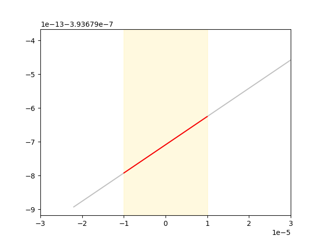

# of singularities:  10
# Model: stewart_zhang_model_2008(stewart_zhang_model_2008_ss.cellml)
No of piecewises: 4
## Equation 1:
```
L_type_Ca_current__i_CaL = 4.0 * pow(membrane__F, 2) * (-15.0 + membrane__V) * (-calcium_dynamics__Ca_o + 0.25 * calcium_dynamics__Ca_ss * exp(2.0 * (-15.0 + membrane__V) * membrane__F / (membrane__R * membrane__T))) * L_type_Ca_current__g_CaL * L_type_Ca_current_d_gate__d * L_type_Ca_current_f2_gate__f2 * L_type_Ca_current_fCass_gate__fCass * L_type_Ca_current_f_gate__f / ((-1.0 + exp(2.0 * (-15.0 + membrane__V) * membrane__F / (membrane__R * membrane__T))) * membrane__R * membrane__T)
```
## New Eq:
```
L_type_Ca_current__i_CaL = ((fabs(-15.0 + membrane__V) < 9.9999999999961231e-6) ? (50000.000000019383 * (-14.99999 + membrane__V) * (0.1444728695881965 * (-calcium_dynamics__Ca_o + 0.25 * calcium_dynamics__Ca_ss * exp(7.4867781645461923e-7)) * L_type_Ca_current__g_CaL * L_type_Ca_current_d_gate__d * L_type_Ca_current_f2_gate__f2 * L_type_Ca_current_fCass_gate__fCass * L_type_Ca_current_f_gate__f / (-1.0 + exp(7.4867781645461923e-7)) + 0.1444728695881965 * (-calcium_dynamics__Ca_o + 0.25 * calcium_dynamics__Ca_ss * exp(-7.4867781645461923e-7)) * L_type_Ca_current__g_CaL * L_type_Ca_current_d_gate__d * L_type_Ca_current_f2_gate__f2 * L_type_Ca_current_fCass_gate__fCass * L_type_Ca_current_f_gate__f / (-1.0 + exp(-7.4867781645461923e-7))) - 0.1444728695881965 * (-calcium_dynamics__Ca_o + 0.25 * calcium_dynamics__Ca_ss * exp(-7.4867781645461923e-7)) * L_type_Ca_current__g_CaL * L_type_Ca_current_d_gate__d * L_type_Ca_current_f2_gate__f2 * L_type_Ca_current_fCass_gate__fCass * L_type_Ca_current_f_gate__f / (-1.0 + exp(-7.4867781645461923e-7))) : (14447.286958825251 * (-15.0 + membrane__V) * (-calcium_dynamics__Ca_o + 0.25 * calcium_dynamics__Ca_ss * exp(-1.1230167246823641 + 0.074867781645490947 * membrane__V)) * L_type_Ca_current__g_CaL * L_type_Ca_current_d_gate__d * L_type_Ca_current_f2_gate__f2 * L_type_Ca_current_fCass_gate__fCass * L_type_Ca_current_f_gate__f / (-1.0 + exp(-1.1230167246823641 + 0.074867781645490947 * membrane__V))))
```
## Singularity point: 15.000000000000000
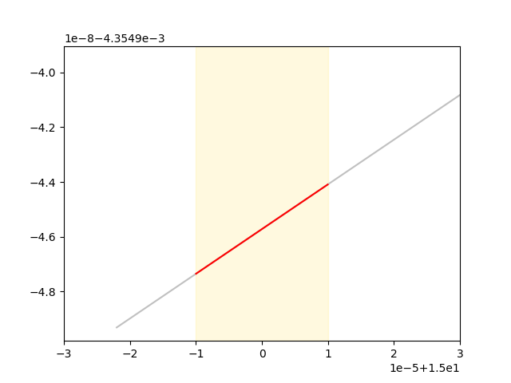

# of singularities:  1
# Model: tentusscher_model_2004_endo(ten_tusscher_model_2004_endo.cellml)
No of piecewises: 7
## Equation 1:
```
L_type_Ca_current__i_CaL = 4.0 * pow(membrane__F, 2) * (-0.34100000000000003 * calcium_dynamics__Ca_o + calcium_dynamics__Ca_i * exp(2.0 * membrane__F * membrane__V / (membrane__R * membrane__T))) * L_type_Ca_current__g_CaL * L_type_Ca_current_d_gate__d * L_type_Ca_current_fCa_gate__fCa * L_type_Ca_current_f_gate__f * membrane__V / ((-1.0 + exp(2.0 * membrane__F * membrane__V / (membrane__R * membrane__T))) * membrane__R * membrane__T)
```
## New Eq:
```
L_type_Ca_current__i_CaL = ((fabs(membrane__V) < 1.0000000000000001e-5) ? (49999.999999999993 * (1.0000000000000001e-5 + membrane__V) * (0.14447286958825251 * (-0.34100000000000003 * calcium_dynamics__Ca_o + calcium_dynamics__Ca_i * exp(7.4867781645490944e-7)) * L_type_Ca_current__g_CaL * L_type_Ca_current_d_gate__d * L_type_Ca_current_fCa_gate__fCa * L_type_Ca_current_f_gate__f / (-1.0 + exp(7.4867781645490944e-7)) + 0.14447286958825251 * (-0.34100000000000003 * calcium_dynamics__Ca_o + calcium_dynamics__Ca_i * exp(-7.4867781645490944e-7)) * L_type_Ca_current__g_CaL * L_type_Ca_current_d_gate__d * L_type_Ca_current_fCa_gate__fCa * L_type_Ca_current_f_gate__f / (-1.0 + exp(-7.4867781645490944e-7))) - 0.14447286958825251 * (-0.34100000000000003 * calcium_dynamics__Ca_o + calcium_dynamics__Ca_i * exp(-7.4867781645490944e-7)) * L_type_Ca_current__g_CaL * L_type_Ca_current_d_gate__d * L_type_Ca_current_fCa_gate__fCa * L_type_Ca_current_f_gate__f / (-1.0 + exp(-7.4867781645490944e-7))) : (14447.286958825251 * (-0.34100000000000003 * calcium_dynamics__Ca_o + calcium_dynamics__Ca_i * exp(0.074867781645490947 * membrane__V)) * L_type_Ca_current__g_CaL * L_type_Ca_current_d_gate__d * L_type_Ca_current_fCa_gate__fCa * L_type_Ca_current_f_gate__f * membrane__V / (-1.0 + exp(0.074867781645490947 * membrane__V))))
```
## Singularity point: 0


# of singularities:  1
# Model: tentusscher_model_2004_epi(ten_tusscher_model_2004_epi.cellml)
No of piecewises: 7
## Equation 1:
```
L_type_Ca_current__i_CaL = 4.0 * pow(membrane__F, 2) * (-0.34100000000000003 * calcium_dynamics__Ca_o + calcium_dynamics__Ca_i * exp(2.0 * membrane__F * membrane__V / (membrane__R * membrane__T))) * L_type_Ca_current__g_CaL * L_type_Ca_current_d_gate__d * L_type_Ca_current_fCa_gate__fCa * L_type_Ca_current_f_gate__f * membrane__V / ((-1.0 + exp(2.0 * membrane__F * membrane__V / (membrane__R * membrane__T))) * membrane__R * membrane__T)
```
## New Eq:
```
L_type_Ca_current__i_CaL = ((fabs(membrane__V) < 1.0000000000000001e-5) ? (49999.999999999993 * (1.0000000000000001e-5 + membrane__V) * (0.14447286958825251 * (-0.34100000000000003 * calcium_dynamics__Ca_o + calcium_dynamics__Ca_i * exp(7.4867781645490944e-7)) * L_type_Ca_current__g_CaL * L_type_Ca_current_d_gate__d * L_type_Ca_current_fCa_gate__fCa * L_type_Ca_current_f_gate__f / (-1.0 + exp(7.4867781645490944e-7)) + 0.14447286958825251 * (-0.34100000000000003 * calcium_dynamics__Ca_o + calcium_dynamics__Ca_i * exp(-7.4867781645490944e-7)) * L_type_Ca_current__g_CaL * L_type_Ca_current_d_gate__d * L_type_Ca_current_fCa_gate__fCa * L_type_Ca_current_f_gate__f / (-1.0 + exp(-7.4867781645490944e-7))) - 0.14447286958825251 * (-0.34100000000000003 * calcium_dynamics__Ca_o + calcium_dynamics__Ca_i * exp(-7.4867781645490944e-7)) * L_type_Ca_current__g_CaL * L_type_Ca_current_d_gate__d * L_type_Ca_current_fCa_gate__fCa * L_type_Ca_current_f_gate__f / (-1.0 + exp(-7.4867781645490944e-7))) : (14447.286958825251 * (-0.34100000000000003 * calcium_dynamics__Ca_o + calcium_dynamics__Ca_i * exp(0.074867781645490947 * membrane__V)) * L_type_Ca_current__g_CaL * L_type_Ca_current_d_gate__d * L_type_Ca_current_fCa_gate__fCa * L_type_Ca_current_f_gate__f * membrane__V / (-1.0 + exp(0.074867781645490947 * membrane__V))))
```
## Singularity point: 0


# of singularities:  1
# Model: tentusscher_model_2004_M(ten_tusscher_model_2004_M.cellml)
No of piecewises: 7
## Equation 1:
```
L_type_Ca_current__i_CaL = 4.0 * pow(membrane__F, 2) * (-0.34100000000000003 * calcium_dynamics__Ca_o + calcium_dynamics__Ca_i * exp(2.0 * membrane__F * membrane__V / (membrane__R * membrane__T))) * L_type_Ca_current__g_CaL * L_type_Ca_current_d_gate__d * L_type_Ca_current_fCa_gate__fCa * L_type_Ca_current_f_gate__f * membrane__V / ((-1.0 + exp(2.0 * membrane__F * membrane__V / (membrane__R * membrane__T))) * membrane__R * membrane__T)
```
## New Eq:
```
L_type_Ca_current__i_CaL = ((fabs(membrane__V) < 1.0000000000000001e-5) ? (49999.999999999993 * (1.0000000000000001e-5 + membrane__V) * (0.14447286958825251 * (-0.34100000000000003 * calcium_dynamics__Ca_o + calcium_dynamics__Ca_i * exp(7.4867781645490944e-7)) * L_type_Ca_current__g_CaL * L_type_Ca_current_d_gate__d * L_type_Ca_current_fCa_gate__fCa * L_type_Ca_current_f_gate__f / (-1.0 + exp(7.4867781645490944e-7)) + 0.14447286958825251 * (-0.34100000000000003 * calcium_dynamics__Ca_o + calcium_dynamics__Ca_i * exp(-7.4867781645490944e-7)) * L_type_Ca_current__g_CaL * L_type_Ca_current_d_gate__d * L_type_Ca_current_fCa_gate__fCa * L_type_Ca_current_f_gate__f / (-1.0 + exp(-7.4867781645490944e-7))) - 0.14447286958825251 * (-0.34100000000000003 * calcium_dynamics__Ca_o + calcium_dynamics__Ca_i * exp(-7.4867781645490944e-7)) * L_type_Ca_current__g_CaL * L_type_Ca_current_d_gate__d * L_type_Ca_current_fCa_gate__fCa * L_type_Ca_current_f_gate__f / (-1.0 + exp(-7.4867781645490944e-7))) : (14447.286958825251 * (-0.34100000000000003 * calcium_dynamics__Ca_o + calcium_dynamics__Ca_i * exp(0.074867781645490947 * membrane__V)) * L_type_Ca_current__g_CaL * L_type_Ca_current_d_gate__d * L_type_Ca_current_fCa_gate__fCa * L_type_Ca_current_f_gate__f * membrane__V / (-1.0 + exp(0.074867781645490947 * membrane__V))))
```
## Singularity point: 0


# of singularities:  1
# Model: tentusscher_model_2006_endo(ten_tusscher_model_2006_endo.cellml)
No of piecewises: 4
## Equation 1:
```
L_type_Ca_current__temp = (-15.0 + membrane__V) * (-calcium_dynamics__Ca_o + 0.25 * calcium_dynamics__Ca_ss * exp(2.0 * (-15.0 + membrane__V) * membrane__F / (membrane__R * membrane__T))) / (-1.0 + exp(2.0 * (-15.0 + membrane__V) * membrane__F / (membrane__R * membrane__T)))
```
## New Eq:
```
L_type_Ca_current__temp = ((fabs(-15.0 + membrane__V) < 9.9999999999961231e-6) ? (50000.000000019383 * (-14.99999 + membrane__V) * (9.9999999999961231e-6 * (-calcium_dynamics__Ca_o + 0.25 * calcium_dynamics__Ca_ss * exp(7.4867781645461923e-7)) / (-1.0 + exp(7.4867781645461923e-7)) + 9.9999999999961231e-6 * (-calcium_dynamics__Ca_o + 0.25 * calcium_dynamics__Ca_ss * exp(-7.4867781645461923e-7)) / (-1.0 + exp(-7.4867781645461923e-7))) - 9.9999999999961231e-6 * (-calcium_dynamics__Ca_o + 0.25 * calcium_dynamics__Ca_ss * exp(-7.4867781645461923e-7)) / (-1.0 + exp(-7.4867781645461923e-7))) : ((-15.0 + membrane__V) * (-calcium_dynamics__Ca_o + 0.25 * calcium_dynamics__Ca_ss * exp(-1.1230167246823641 + 0.074867781645490947 * membrane__V)) / (-1.0 + exp(-1.1230167246823641 + 0.074867781645490947 * membrane__V))))
```
## Singularity point: 15.000000000000000


# of singularities:  1
# Model: tentusscher_model_2006_epi(ten_tusscher_model_2006_epi.cellml)
No of piecewises: 4
## Equation 1:
```
L_type_Ca_current__temp = (-15.0 + membrane__V) * (-calcium_dynamics__Ca_o + 0.25 * calcium_dynamics__Ca_ss * exp(2.0 * (-15.0 + membrane__V) * membrane__F / (membrane__R * membrane__T))) / (-1.0 + exp(2.0 * (-15.0 + membrane__V) * membrane__F / (membrane__R * membrane__T)))
```
## New Eq:
```
L_type_Ca_current__temp = ((fabs(-15.0 + membrane__V) < 9.9999999999961231e-6) ? (50000.000000019383 * (-14.99999 + membrane__V) * (9.9999999999961231e-6 * (-calcium_dynamics__Ca_o + 0.25 * calcium_dynamics__Ca_ss * exp(1.9999999999992246e-5 * membrane__F / (membrane__R * membrane__T))) / (-1.0 + exp(1.9999999999992246e-5 * membrane__F / (membrane__R * membrane__T))) + 9.9999999999961231e-6 * (-calcium_dynamics__Ca_o + 0.25 * calcium_dynamics__Ca_ss * exp(-1.9999999999992246e-5 * membrane__F / (membrane__R * membrane__T))) / (-1.0 + exp(-1.9999999999992246e-5 * membrane__F / (membrane__R * membrane__T)))) - 9.9999999999961231e-6 * (-calcium_dynamics__Ca_o + 0.25 * calcium_dynamics__Ca_ss * exp(-1.9999999999992246e-5 * membrane__F / (membrane__R * membrane__T))) / (-1.0 + exp(-1.9999999999992246e-5 * membrane__F / (membrane__R * membrane__T)))) : ((-15.0 + membrane__V) * (-calcium_dynamics__Ca_o + 0.25 * calcium_dynamics__Ca_ss * exp(2.0 * (-15.0 + membrane__V) * membrane__F / (membrane__R * membrane__T))) / (-1.0 + exp(2.0 * (-15.0 + membrane__V) * membrane__F / (membrane__R * membrane__T)))))
```
## Singularity point: 15.000000000000000


# of singularities:  1
# Model: tentusscher_model_2006_M(ten_tusscher_model_2006_M.cellml)
No of piecewises: 4
## Equation 1:
```
L_type_Ca_current__temp = (-15.0 + membrane__V) * (-calcium_dynamics__Ca_o + 0.25 * calcium_dynamics__Ca_ss * exp(2.0 * (-15.0 + membrane__V) * membrane__F / (membrane__R * membrane__T))) / (-1.0 + exp(2.0 * (-15.0 + membrane__V) * membrane__F / (membrane__R * membrane__T)))
```
## New Eq:
```
L_type_Ca_current__temp = ((fabs(-15.0 + membrane__V) < 9.9999999999961231e-6) ? (50000.000000019383 * (-14.99999 + membrane__V) * (9.9999999999961231e-6 * (-calcium_dynamics__Ca_o + 0.25 * calcium_dynamics__Ca_ss * exp(7.4867781645461923e-7)) / (-1.0 + exp(7.4867781645461923e-7)) + 9.9999999999961231e-6 * (-calcium_dynamics__Ca_o + 0.25 * calcium_dynamics__Ca_ss * exp(-7.4867781645461923e-7)) / (-1.0 + exp(-7.4867781645461923e-7))) - 9.9999999999961231e-6 * (-calcium_dynamics__Ca_o + 0.25 * calcium_dynamics__Ca_ss * exp(-7.4867781645461923e-7)) / (-1.0 + exp(-7.4867781645461923e-7))) : ((-15.0 + membrane__V) * (-calcium_dynamics__Ca_o + 0.25 * calcium_dynamics__Ca_ss * exp(-1.1230167246823641 + 0.074867781645490947 * membrane__V)) / (-1.0 + exp(-1.1230167246823641 + 0.074867781645490947 * membrane__V))))
```
## Singularity point: 15.000000000000000
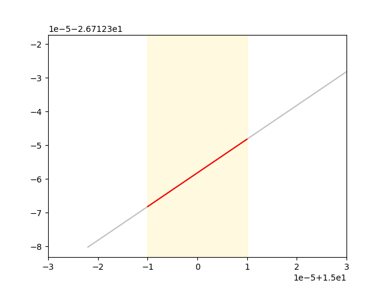

# of singularities:  1
# Model: Tomek_model13endo(ToRORd_fkatp_endo.cellml)
No of piecewises: 21
## Equation 1:
```
ICaL__PhiCaK_i = (-ICaL__gamma_ko * extracellular__ko + ICaL__gamma_ki * intracellular_ions__ki * exp(membrane__vfrt)) * membrane__vffrt / (-1.0 + exp(membrane__vfrt))
```
## New Eq:
```
ICaL__PhiCaK_i = ((fabs(membrane__v) < 1.0000000000000001e-5) ? (49999.999999999993 * (1.0000000000000001e-5 + membrane__v) * (1.0000000000000001e-5 * pow(physical_constants__F, 2) * (-extracellular__ko * exp(-2859.0635474831229 * pow(physical_constants__T, (-1.5)) * (-0.00014999999999999999 * extracellular__clo - 0.00014999999999999999 * extracellular__ko - 0.00014999999999999999 * extracellular__nao - 0.00059999999999999995 * extracellular__cao + 0.044721359549995794 * sqrt(0.25 * extracellular__clo + 0.25 * extracellular__ko + 0.25 * extracellular__nao + extracellular__cao) / (1.0 + 0.044721359549995794 * sqrt(0.25 * extracellular__clo + 0.25 * extracellular__ko + 0.25 * extracellular__nao + extracellular__cao)))) + intracellular_ions__ki * exp(-2859.0635474831229 * pow(physical_constants__T, (-1.5)) * (-0.00014999999999999999 * intracellular_ions__cli - 0.00014999999999999999 * intracellular_ions__ki - 0.00014999999999999999 * intracellular_ions__nai - 0.00059999999999999995 * intracellular_ions__cai + 0.044721359549995794 * sqrt(0.25 * intracellular_ions__cli + 0.25 * intracellular_ions__ki + 0.25 * intracellular_ions__nai + intracellular_ions__cai) / (1.0 + 0.044721359549995794 * sqrt(0.25 * intracellular_ions__cli + 0.25 * intracellular_ions__ki + 0.25 * intracellular_ions__nai + intracellular_ions__cai)))) * exp(1.0000000000000001e-5 * physical_constants__F / (physical_constants__R * physical_constants__T))) / ((-1.0 + exp(1.0000000000000001e-5 * physical_constants__F / (physical_constants__R * physical_constants__T))) * physical_constants__R * physical_constants__T) + 1.0000000000000001e-5 * pow(physical_constants__F, 2) * (-extracellular__ko * exp(-2859.0635474831229 * pow(physical_constants__T, (-1.5)) * (-0.00014999999999999999 * extracellular__clo - 0.00014999999999999999 * extracellular__ko - 0.00014999999999999999 * extracellular__nao - 0.00059999999999999995 * extracellular__cao + 0.044721359549995794 * sqrt(0.25 * extracellular__clo + 0.25 * extracellular__ko + 0.25 * extracellular__nao + extracellular__cao) / (1.0 + 0.044721359549995794 * sqrt(0.25 * extracellular__clo + 0.25 * extracellular__ko + 0.25 * extracellular__nao + extracellular__cao)))) + intracellular_ions__ki * exp(-2859.0635474831229 * pow(physical_constants__T, (-1.5)) * (-0.00014999999999999999 * intracellular_ions__cli - 0.00014999999999999999 * intracellular_ions__ki - 0.00014999999999999999 * intracellular_ions__nai - 0.00059999999999999995 * intracellular_ions__cai + 0.044721359549995794 * sqrt(0.25 * intracellular_ions__cli + 0.25 * intracellular_ions__ki + 0.25 * intracellular_ions__nai + intracellular_ions__cai) / (1.0 + 0.044721359549995794 * sqrt(0.25 * intracellular_ions__cli + 0.25 * intracellular_ions__ki + 0.25 * intracellular_ions__nai + intracellular_ions__cai)))) * exp(-1.0000000000000001e-5 * physical_constants__F / (physical_constants__R * physical_constants__T))) / ((-1.0 + exp(-1.0000000000000001e-5 * physical_constants__F / (physical_constants__R * physical_constants__T))) * physical_constants__R * physical_constants__T)) - 1.0000000000000001e-5 * pow(physical_constants__F, 2) * (-extracellular__ko * exp(-2859.0635474831229 * pow(physical_constants__T, (-1.5)) * (-0.00014999999999999999 * extracellular__clo - 0.00014999999999999999 * extracellular__ko - 0.00014999999999999999 * extracellular__nao - 0.00059999999999999995 * extracellular__cao + 0.044721359549995794 * sqrt(0.25 * extracellular__clo + 0.25 * extracellular__ko + 0.25 * extracellular__nao + extracellular__cao) / (1.0 + 0.044721359549995794 * sqrt(0.25 * extracellular__clo + 0.25 * extracellular__ko + 0.25 * extracellular__nao + extracellular__cao)))) + intracellular_ions__ki * exp(-2859.0635474831229 * pow(physical_constants__T, (-1.5)) * (-0.00014999999999999999 * intracellular_ions__cli - 0.00014999999999999999 * intracellular_ions__ki - 0.00014999999999999999 * intracellular_ions__nai - 0.00059999999999999995 * intracellular_ions__cai + 0.044721359549995794 * sqrt(0.25 * intracellular_ions__cli + 0.25 * intracellular_ions__ki + 0.25 * intracellular_ions__nai + intracellular_ions__cai) / (1.0 + 0.044721359549995794 * sqrt(0.25 * intracellular_ions__cli + 0.25 * intracellular_ions__ki + 0.25 * intracellular_ions__nai + intracellular_ions__cai)))) * exp(-1.0000000000000001e-5 * physical_constants__F / (physical_constants__R * physical_constants__T))) / ((-1.0 + exp(-1.0000000000000001e-5 * physical_constants__F / (physical_constants__R * physical_constants__T))) * physical_constants__R * physical_constants__T)) : (pow(physical_constants__F, 2) * (-extracellular__ko * exp(-2859.0635474831229 * pow(physical_constants__T, (-1.5)) * (-0.00014999999999999999 * extracellular__clo - 0.00014999999999999999 * extracellular__ko - 0.00014999999999999999 * extracellular__nao - 0.00059999999999999995 * extracellular__cao + 0.044721359549995794 * sqrt(0.25 * extracellular__clo + 0.25 * extracellular__ko + 0.25 * extracellular__nao + extracellular__cao) / (1.0 + 0.044721359549995794 * sqrt(0.25 * extracellular__clo + 0.25 * extracellular__ko + 0.25 * extracellular__nao + extracellular__cao)))) + intracellular_ions__ki * exp(-2859.0635474831229 * pow(physical_constants__T, (-1.5)) * (-0.00014999999999999999 * intracellular_ions__cli - 0.00014999999999999999 * intracellular_ions__ki - 0.00014999999999999999 * intracellular_ions__nai - 0.00059999999999999995 * intracellular_ions__cai + 0.044721359549995794 * sqrt(0.25 * intracellular_ions__cli + 0.25 * intracellular_ions__ki + 0.25 * intracellular_ions__nai + intracellular_ions__cai) / (1.0 + 0.044721359549995794 * sqrt(0.25 * intracellular_ions__cli + 0.25 * intracellular_ions__ki + 0.25 * intracellular_ions__nai + intracellular_ions__cai)))) * exp(membrane__v * physical_constants__F / (physical_constants__R * physical_constants__T))) * membrane__v / ((-1.0 + exp(membrane__v * physical_constants__F / (physical_constants__R * physical_constants__T))) * physical_constants__R * physical_constants__T)))
```
## Singularity point: 0


## Equation 2:
```
ICaL__PhiCaK_ss = (-ICaL__gamma_ko * extracellular__ko + ICaL__gamma_kss * intracellular_ions__kss * exp(membrane__vfrt)) * membrane__vffrt / (-1.0 + exp(membrane__vfrt))
```
## New Eq:
```
ICaL__PhiCaK_ss = ((fabs(membrane__v) < 1.0000000000000001e-5) ? (49999.999999999993 * (1.0000000000000001e-5 + membrane__v) * (1.0000000000000001e-5 * pow(physical_constants__F, 2) * (-extracellular__ko * exp(-2859.0635474831229 * pow(physical_constants__T, (-1.5)) * (-0.00014999999999999999 * extracellular__clo - 0.00014999999999999999 * extracellular__ko - 0.00014999999999999999 * extracellular__nao - 0.00059999999999999995 * extracellular__cao + 0.044721359549995794 * sqrt(0.25 * extracellular__clo + 0.25 * extracellular__ko + 0.25 * extracellular__nao + extracellular__cao) / (1.0 + 0.044721359549995794 * sqrt(0.25 * extracellular__clo + 0.25 * extracellular__ko + 0.25 * extracellular__nao + extracellular__cao)))) + intracellular_ions__kss * exp(-2859.0635474831229 * pow(physical_constants__T, (-1.5)) * (-0.00014999999999999999 * intracellular_ions__cli - 0.00014999999999999999 * intracellular_ions__kss - 0.00014999999999999999 * intracellular_ions__nass - 0.00059999999999999995 * intracellular_ions__cass + 0.044721359549995794 * sqrt(0.25 * intracellular_ions__cli + 0.25 * intracellular_ions__kss + 0.25 * intracellular_ions__nass + intracellular_ions__cass) / (1.0 + 0.044721359549995794 * sqrt(0.25 * intracellular_ions__cli + 0.25 * intracellular_ions__kss + 0.25 * intracellular_ions__nass + intracellular_ions__cass)))) * exp(1.0000000000000001e-5 * physical_constants__F / (physical_constants__R * physical_constants__T))) / ((-1.0 + exp(1.0000000000000001e-5 * physical_constants__F / (physical_constants__R * physical_constants__T))) * physical_constants__R * physical_constants__T) + 1.0000000000000001e-5 * pow(physical_constants__F, 2) * (-extracellular__ko * exp(-2859.0635474831229 * pow(physical_constants__T, (-1.5)) * (-0.00014999999999999999 * extracellular__clo - 0.00014999999999999999 * extracellular__ko - 0.00014999999999999999 * extracellular__nao - 0.00059999999999999995 * extracellular__cao + 0.044721359549995794 * sqrt(0.25 * extracellular__clo + 0.25 * extracellular__ko + 0.25 * extracellular__nao + extracellular__cao) / (1.0 + 0.044721359549995794 * sqrt(0.25 * extracellular__clo + 0.25 * extracellular__ko + 0.25 * extracellular__nao + extracellular__cao)))) + intracellular_ions__kss * exp(-2859.0635474831229 * pow(physical_constants__T, (-1.5)) * (-0.00014999999999999999 * intracellular_ions__cli - 0.00014999999999999999 * intracellular_ions__kss - 0.00014999999999999999 * intracellular_ions__nass - 0.00059999999999999995 * intracellular_ions__cass + 0.044721359549995794 * sqrt(0.25 * intracellular_ions__cli + 0.25 * intracellular_ions__kss + 0.25 * intracellular_ions__nass + intracellular_ions__cass) / (1.0 + 0.044721359549995794 * sqrt(0.25 * intracellular_ions__cli + 0.25 * intracellular_ions__kss + 0.25 * intracellular_ions__nass + intracellular_ions__cass)))) * exp(-1.0000000000000001e-5 * physical_constants__F / (physical_constants__R * physical_constants__T))) / ((-1.0 + exp(-1.0000000000000001e-5 * physical_constants__F / (physical_constants__R * physical_constants__T))) * physical_constants__R * physical_constants__T)) - 1.0000000000000001e-5 * pow(physical_constants__F, 2) * (-extracellular__ko * exp(-2859.0635474831229 * pow(physical_constants__T, (-1.5)) * (-0.00014999999999999999 * extracellular__clo - 0.00014999999999999999 * extracellular__ko - 0.00014999999999999999 * extracellular__nao - 0.00059999999999999995 * extracellular__cao + 0.044721359549995794 * sqrt(0.25 * extracellular__clo + 0.25 * extracellular__ko + 0.25 * extracellular__nao + extracellular__cao) / (1.0 + 0.044721359549995794 * sqrt(0.25 * extracellular__clo + 0.25 * extracellular__ko + 0.25 * extracellular__nao + extracellular__cao)))) + intracellular_ions__kss * exp(-2859.0635474831229 * pow(physical_constants__T, (-1.5)) * (-0.00014999999999999999 * intracellular_ions__cli - 0.00014999999999999999 * intracellular_ions__kss - 0.00014999999999999999 * intracellular_ions__nass - 0.00059999999999999995 * intracellular_ions__cass + 0.044721359549995794 * sqrt(0.25 * intracellular_ions__cli + 0.25 * intracellular_ions__kss + 0.25 * intracellular_ions__nass + intracellular_ions__cass) / (1.0 + 0.044721359549995794 * sqrt(0.25 * intracellular_ions__cli + 0.25 * intracellular_ions__kss + 0.25 * intracellular_ions__nass + intracellular_ions__cass)))) * exp(-1.0000000000000001e-5 * physical_constants__F / (physical_constants__R * physical_constants__T))) / ((-1.0 + exp(-1.0000000000000001e-5 * physical_constants__F / (physical_constants__R * physical_constants__T))) * physical_constants__R * physical_constants__T)) : (pow(physical_constants__F, 2) * (-extracellular__ko * exp(-2859.0635474831229 * pow(physical_constants__T, (-1.5)) * (-0.00014999999999999999 * extracellular__clo - 0.00014999999999999999 * extracellular__ko - 0.00014999999999999999 * extracellular__nao - 0.00059999999999999995 * extracellular__cao + 0.044721359549995794 * sqrt(0.25 * extracellular__clo + 0.25 * extracellular__ko + 0.25 * extracellular__nao + extracellular__cao) / (1.0 + 0.044721359549995794 * sqrt(0.25 * extracellular__clo + 0.25 * extracellular__ko + 0.25 * extracellular__nao + extracellular__cao)))) + intracellular_ions__kss * exp(-2859.0635474831229 * pow(physical_constants__T, (-1.5)) * (-0.00014999999999999999 * intracellular_ions__cli - 0.00014999999999999999 * intracellular_ions__kss - 0.00014999999999999999 * intracellular_ions__nass - 0.00059999999999999995 * intracellular_ions__cass + 0.044721359549995794 * sqrt(0.25 * intracellular_ions__cli + 0.25 * intracellular_ions__kss + 0.25 * intracellular_ions__nass + intracellular_ions__cass) / (1.0 + 0.044721359549995794 * sqrt(0.25 * intracellular_ions__cli + 0.25 * intracellular_ions__kss + 0.25 * intracellular_ions__nass + intracellular_ions__cass)))) * exp(membrane__v * physical_constants__F / (physical_constants__R * physical_constants__T))) * membrane__v / ((-1.0 + exp(membrane__v * physical_constants__F / (physical_constants__R * physical_constants__T))) * physical_constants__R * physical_constants__T)))
```
## Singularity point: 0


## Equation 3:
```
ICaL__PhiCaL_i = 4.0 * (-ICaL__gamma_cao * extracellular__cao + ICaL__gamma_cai * intracellular_ions__cai * exp(2.0 * membrane__vfrt)) * membrane__vffrt / (-1.0 + exp(2.0 * membrane__vfrt))
```
## New Eq:
```
ICaL__PhiCaL_i = ((fabs(membrane__v) < 1.0000000000000001e-5) ? (49999.999999999993 * (1.0000000000000001e-5 + membrane__v) * (4.0000000000000003e-5 * pow(physical_constants__F, 2) * (-extracellular__cao * exp(-11436.254189932491 * pow(physical_constants__T, (-1.5)) * (-0.00014999999999999999 * extracellular__clo - 0.00014999999999999999 * extracellular__ko - 0.00014999999999999999 * extracellular__nao - 0.00059999999999999995 * extracellular__cao + 0.044721359549995794 * sqrt(0.25 * extracellular__clo + 0.25 * extracellular__ko + 0.25 * extracellular__nao + extracellular__cao) / (1.0 + 0.044721359549995794 * sqrt(0.25 * extracellular__clo + 0.25 * extracellular__ko + 0.25 * extracellular__nao + extracellular__cao)))) + intracellular_ions__cai * exp(-11436.254189932491 * pow(physical_constants__T, (-1.5)) * (-0.00014999999999999999 * intracellular_ions__cli - 0.00014999999999999999 * intracellular_ions__ki - 0.00014999999999999999 * intracellular_ions__nai - 0.00059999999999999995 * intracellular_ions__cai + 0.044721359549995794 * sqrt(0.25 * intracellular_ions__cli + 0.25 * intracellular_ions__ki + 0.25 * intracellular_ions__nai + intracellular_ions__cai) / (1.0 + 0.044721359549995794 * sqrt(0.25 * intracellular_ions__cli + 0.25 * intracellular_ions__ki + 0.25 * intracellular_ions__nai + intracellular_ions__cai)))) * exp(2.0000000000000002e-5 * physical_constants__F / (physical_constants__R * physical_constants__T))) / ((-1.0 + exp(2.0000000000000002e-5 * physical_constants__F / (physical_constants__R * physical_constants__T))) * physical_constants__R * physical_constants__T) + 4.0000000000000003e-5 * pow(physical_constants__F, 2) * (-extracellular__cao * exp(-11436.254189932491 * pow(physical_constants__T, (-1.5)) * (-0.00014999999999999999 * extracellular__clo - 0.00014999999999999999 * extracellular__ko - 0.00014999999999999999 * extracellular__nao - 0.00059999999999999995 * extracellular__cao + 0.044721359549995794 * sqrt(0.25 * extracellular__clo + 0.25 * extracellular__ko + 0.25 * extracellular__nao + extracellular__cao) / (1.0 + 0.044721359549995794 * sqrt(0.25 * extracellular__clo + 0.25 * extracellular__ko + 0.25 * extracellular__nao + extracellular__cao)))) + intracellular_ions__cai * exp(-11436.254189932491 * pow(physical_constants__T, (-1.5)) * (-0.00014999999999999999 * intracellular_ions__cli - 0.00014999999999999999 * intracellular_ions__ki - 0.00014999999999999999 * intracellular_ions__nai - 0.00059999999999999995 * intracellular_ions__cai + 0.044721359549995794 * sqrt(0.25 * intracellular_ions__cli + 0.25 * intracellular_ions__ki + 0.25 * intracellular_ions__nai + intracellular_ions__cai) / (1.0 + 0.044721359549995794 * sqrt(0.25 * intracellular_ions__cli + 0.25 * intracellular_ions__ki + 0.25 * intracellular_ions__nai + intracellular_ions__cai)))) * exp(-2.0000000000000002e-5 * physical_constants__F / (physical_constants__R * physical_constants__T))) / ((-1.0 + exp(-2.0000000000000002e-5 * physical_constants__F / (physical_constants__R * physical_constants__T))) * physical_constants__R * physical_constants__T)) - 4.0000000000000003e-5 * pow(physical_constants__F, 2) * (-extracellular__cao * exp(-11436.254189932491 * pow(physical_constants__T, (-1.5)) * (-0.00014999999999999999 * extracellular__clo - 0.00014999999999999999 * extracellular__ko - 0.00014999999999999999 * extracellular__nao - 0.00059999999999999995 * extracellular__cao + 0.044721359549995794 * sqrt(0.25 * extracellular__clo + 0.25 * extracellular__ko + 0.25 * extracellular__nao + extracellular__cao) / (1.0 + 0.044721359549995794 * sqrt(0.25 * extracellular__clo + 0.25 * extracellular__ko + 0.25 * extracellular__nao + extracellular__cao)))) + intracellular_ions__cai * exp(-11436.254189932491 * pow(physical_constants__T, (-1.5)) * (-0.00014999999999999999 * intracellular_ions__cli - 0.00014999999999999999 * intracellular_ions__ki - 0.00014999999999999999 * intracellular_ions__nai - 0.00059999999999999995 * intracellular_ions__cai + 0.044721359549995794 * sqrt(0.25 * intracellular_ions__cli + 0.25 * intracellular_ions__ki + 0.25 * intracellular_ions__nai + intracellular_ions__cai) / (1.0 + 0.044721359549995794 * sqrt(0.25 * intracellular_ions__cli + 0.25 * intracellular_ions__ki + 0.25 * intracellular_ions__nai + intracellular_ions__cai)))) * exp(-2.0000000000000002e-5 * physical_constants__F / (physical_constants__R * physical_constants__T))) / ((-1.0 + exp(-2.0000000000000002e-5 * physical_constants__F / (physical_constants__R * physical_constants__T))) * physical_constants__R * physical_constants__T)) : (4.0 * pow(physical_constants__F, 2) * (-extracellular__cao * exp(-11436.254189932491 * pow(physical_constants__T, (-1.5)) * (-0.00014999999999999999 * extracellular__clo - 0.00014999999999999999 * extracellular__ko - 0.00014999999999999999 * extracellular__nao - 0.00059999999999999995 * extracellular__cao + 0.044721359549995794 * sqrt(0.25 * extracellular__clo + 0.25 * extracellular__ko + 0.25 * extracellular__nao + extracellular__cao) / (1.0 + 0.044721359549995794 * sqrt(0.25 * extracellular__clo + 0.25 * extracellular__ko + 0.25 * extracellular__nao + extracellular__cao)))) + intracellular_ions__cai * exp(-11436.254189932491 * pow(physical_constants__T, (-1.5)) * (-0.00014999999999999999 * intracellular_ions__cli - 0.00014999999999999999 * intracellular_ions__ki - 0.00014999999999999999 * intracellular_ions__nai - 0.00059999999999999995 * intracellular_ions__cai + 0.044721359549995794 * sqrt(0.25 * intracellular_ions__cli + 0.25 * intracellular_ions__ki + 0.25 * intracellular_ions__nai + intracellular_ions__cai) / (1.0 + 0.044721359549995794 * sqrt(0.25 * intracellular_ions__cli + 0.25 * intracellular_ions__ki + 0.25 * intracellular_ions__nai + intracellular_ions__cai)))) * exp(2.0 * membrane__v * physical_constants__F / (physical_constants__R * physical_constants__T))) * membrane__v / ((-1.0 + exp(2.0 * membrane__v * physical_constants__F / (physical_constants__R * physical_constants__T))) * physical_constants__R * physical_constants__T)))
```
## Singularity point: 0


## Equation 4:
```
ICaL__PhiCaL_ss = 4.0 * (-ICaL__gamma_cao * extracellular__cao + ICaL__gamma_cass * intracellular_ions__cass * exp(2.0 * membrane__vfrt)) * membrane__vffrt / (-1.0 + exp(2.0 * membrane__vfrt))
```
## New Eq:
```
ICaL__PhiCaL_ss = ((fabs(membrane__v) < 1.0000000000000001e-5) ? (49999.999999999993 * (1.0000000000000001e-5 + membrane__v) * (4.0000000000000003e-5 * pow(physical_constants__F, 2) * (-extracellular__cao * exp(-11436.254189932491 * pow(physical_constants__T, (-1.5)) * (-0.00014999999999999999 * extracellular__clo - 0.00014999999999999999 * extracellular__ko - 0.00014999999999999999 * extracellular__nao - 0.00059999999999999995 * extracellular__cao + 0.044721359549995794 * sqrt(0.25 * extracellular__clo + 0.25 * extracellular__ko + 0.25 * extracellular__nao + extracellular__cao) / (1.0 + 0.044721359549995794 * sqrt(0.25 * extracellular__clo + 0.25 * extracellular__ko + 0.25 * extracellular__nao + extracellular__cao)))) + intracellular_ions__cass * exp(-11436.254189932491 * pow(physical_constants__T, (-1.5)) * (-0.00014999999999999999 * intracellular_ions__cli - 0.00014999999999999999 * intracellular_ions__kss - 0.00014999999999999999 * intracellular_ions__nass - 0.00059999999999999995 * intracellular_ions__cass + 0.044721359549995794 * sqrt(0.25 * intracellular_ions__cli + 0.25 * intracellular_ions__kss + 0.25 * intracellular_ions__nass + intracellular_ions__cass) / (1.0 + 0.044721359549995794 * sqrt(0.25 * intracellular_ions__cli + 0.25 * intracellular_ions__kss + 0.25 * intracellular_ions__nass + intracellular_ions__cass)))) * exp(2.0000000000000002e-5 * physical_constants__F / (physical_constants__R * physical_constants__T))) / ((-1.0 + exp(2.0000000000000002e-5 * physical_constants__F / (physical_constants__R * physical_constants__T))) * physical_constants__R * physical_constants__T) + 4.0000000000000003e-5 * pow(physical_constants__F, 2) * (-extracellular__cao * exp(-11436.254189932491 * pow(physical_constants__T, (-1.5)) * (-0.00014999999999999999 * extracellular__clo - 0.00014999999999999999 * extracellular__ko - 0.00014999999999999999 * extracellular__nao - 0.00059999999999999995 * extracellular__cao + 0.044721359549995794 * sqrt(0.25 * extracellular__clo + 0.25 * extracellular__ko + 0.25 * extracellular__nao + extracellular__cao) / (1.0 + 0.044721359549995794 * sqrt(0.25 * extracellular__clo + 0.25 * extracellular__ko + 0.25 * extracellular__nao + extracellular__cao)))) + intracellular_ions__cass * exp(-11436.254189932491 * pow(physical_constants__T, (-1.5)) * (-0.00014999999999999999 * intracellular_ions__cli - 0.00014999999999999999 * intracellular_ions__kss - 0.00014999999999999999 * intracellular_ions__nass - 0.00059999999999999995 * intracellular_ions__cass + 0.044721359549995794 * sqrt(0.25 * intracellular_ions__cli + 0.25 * intracellular_ions__kss + 0.25 * intracellular_ions__nass + intracellular_ions__cass) / (1.0 + 0.044721359549995794 * sqrt(0.25 * intracellular_ions__cli + 0.25 * intracellular_ions__kss + 0.25 * intracellular_ions__nass + intracellular_ions__cass)))) * exp(-2.0000000000000002e-5 * physical_constants__F / (physical_constants__R * physical_constants__T))) / ((-1.0 + exp(-2.0000000000000002e-5 * physical_constants__F / (physical_constants__R * physical_constants__T))) * physical_constants__R * physical_constants__T)) - 4.0000000000000003e-5 * pow(physical_constants__F, 2) * (-extracellular__cao * exp(-11436.254189932491 * pow(physical_constants__T, (-1.5)) * (-0.00014999999999999999 * extracellular__clo - 0.00014999999999999999 * extracellular__ko - 0.00014999999999999999 * extracellular__nao - 0.00059999999999999995 * extracellular__cao + 0.044721359549995794 * sqrt(0.25 * extracellular__clo + 0.25 * extracellular__ko + 0.25 * extracellular__nao + extracellular__cao) / (1.0 + 0.044721359549995794 * sqrt(0.25 * extracellular__clo + 0.25 * extracellular__ko + 0.25 * extracellular__nao + extracellular__cao)))) + intracellular_ions__cass * exp(-11436.254189932491 * pow(physical_constants__T, (-1.5)) * (-0.00014999999999999999 * intracellular_ions__cli - 0.00014999999999999999 * intracellular_ions__kss - 0.00014999999999999999 * intracellular_ions__nass - 0.00059999999999999995 * intracellular_ions__cass + 0.044721359549995794 * sqrt(0.25 * intracellular_ions__cli + 0.25 * intracellular_ions__kss + 0.25 * intracellular_ions__nass + intracellular_ions__cass) / (1.0 + 0.044721359549995794 * sqrt(0.25 * intracellular_ions__cli + 0.25 * intracellular_ions__kss + 0.25 * intracellular_ions__nass + intracellular_ions__cass)))) * exp(-2.0000000000000002e-5 * physical_constants__F / (physical_constants__R * physical_constants__T))) / ((-1.0 + exp(-2.0000000000000002e-5 * physical_constants__F / (physical_constants__R * physical_constants__T))) * physical_constants__R * physical_constants__T)) : (4.0 * pow(physical_constants__F, 2) * (-extracellular__cao * exp(-11436.254189932491 * pow(physical_constants__T, (-1.5)) * (-0.00014999999999999999 * extracellular__clo - 0.00014999999999999999 * extracellular__ko - 0.00014999999999999999 * extracellular__nao - 0.00059999999999999995 * extracellular__cao + 0.044721359549995794 * sqrt(0.25 * extracellular__clo + 0.25 * extracellular__ko + 0.25 * extracellular__nao + extracellular__cao) / (1.0 + 0.044721359549995794 * sqrt(0.25 * extracellular__clo + 0.25 * extracellular__ko + 0.25 * extracellular__nao + extracellular__cao)))) + intracellular_ions__cass * exp(-11436.254189932491 * pow(physical_constants__T, (-1.5)) * (-0.00014999999999999999 * intracellular_ions__cli - 0.00014999999999999999 * intracellular_ions__kss - 0.00014999999999999999 * intracellular_ions__nass - 0.00059999999999999995 * intracellular_ions__cass + 0.044721359549995794 * sqrt(0.25 * intracellular_ions__cli + 0.25 * intracellular_ions__kss + 0.25 * intracellular_ions__nass + intracellular_ions__cass) / (1.0 + 0.044721359549995794 * sqrt(0.25 * intracellular_ions__cli + 0.25 * intracellular_ions__kss + 0.25 * intracellular_ions__nass + intracellular_ions__cass)))) * exp(2.0 * membrane__v * physical_constants__F / (physical_constants__R * physical_constants__T))) * membrane__v / ((-1.0 + exp(2.0 * membrane__v * physical_constants__F / (physical_constants__R * physical_constants__T))) * physical_constants__R * physical_constants__T)))
```
## Singularity point: 0


## Equation 5:
```
ICaL__PhiCaNa_i = (-ICaL__gamma_nao * extracellular__nao + ICaL__gamma_nai * intracellular_ions__nai * exp(membrane__vfrt)) * membrane__vffrt / (-1.0 + exp(membrane__vfrt))
```
## New Eq:
```
ICaL__PhiCaNa_i = ((fabs(membrane__v) < 1.0000000000000001e-5) ? (49999.999999999993 * (1.0000000000000001e-5 + membrane__v) * (1.0000000000000001e-5 * pow(physical_constants__F, 2) * (-extracellular__nao * exp(-2859.0635474831229 * pow(physical_constants__T, (-1.5)) * (-0.00014999999999999999 * extracellular__clo - 0.00014999999999999999 * extracellular__ko - 0.00014999999999999999 * extracellular__nao - 0.00059999999999999995 * extracellular__cao + 0.044721359549995794 * sqrt(0.25 * extracellular__clo + 0.25 * extracellular__ko + 0.25 * extracellular__nao + extracellular__cao) / (1.0 + 0.044721359549995794 * sqrt(0.25 * extracellular__clo + 0.25 * extracellular__ko + 0.25 * extracellular__nao + extracellular__cao)))) + intracellular_ions__nai * exp(-2859.0635474831229 * pow(physical_constants__T, (-1.5)) * (-0.00014999999999999999 * intracellular_ions__cli - 0.00014999999999999999 * intracellular_ions__ki - 0.00014999999999999999 * intracellular_ions__nai - 0.00059999999999999995 * intracellular_ions__cai + 0.044721359549995794 * sqrt(0.25 * intracellular_ions__cli + 0.25 * intracellular_ions__ki + 0.25 * intracellular_ions__nai + intracellular_ions__cai) / (1.0 + 0.044721359549995794 * sqrt(0.25 * intracellular_ions__cli + 0.25 * intracellular_ions__ki + 0.25 * intracellular_ions__nai + intracellular_ions__cai)))) * exp(1.0000000000000001e-5 * physical_constants__F / (physical_constants__R * physical_constants__T))) / ((-1.0 + exp(1.0000000000000001e-5 * physical_constants__F / (physical_constants__R * physical_constants__T))) * physical_constants__R * physical_constants__T) + 1.0000000000000001e-5 * pow(physical_constants__F, 2) * (-extracellular__nao * exp(-2859.0635474831229 * pow(physical_constants__T, (-1.5)) * (-0.00014999999999999999 * extracellular__clo - 0.00014999999999999999 * extracellular__ko - 0.00014999999999999999 * extracellular__nao - 0.00059999999999999995 * extracellular__cao + 0.044721359549995794 * sqrt(0.25 * extracellular__clo + 0.25 * extracellular__ko + 0.25 * extracellular__nao + extracellular__cao) / (1.0 + 0.044721359549995794 * sqrt(0.25 * extracellular__clo + 0.25 * extracellular__ko + 0.25 * extracellular__nao + extracellular__cao)))) + intracellular_ions__nai * exp(-2859.0635474831229 * pow(physical_constants__T, (-1.5)) * (-0.00014999999999999999 * intracellular_ions__cli - 0.00014999999999999999 * intracellular_ions__ki - 0.00014999999999999999 * intracellular_ions__nai - 0.00059999999999999995 * intracellular_ions__cai + 0.044721359549995794 * sqrt(0.25 * intracellular_ions__cli + 0.25 * intracellular_ions__ki + 0.25 * intracellular_ions__nai + intracellular_ions__cai) / (1.0 + 0.044721359549995794 * sqrt(0.25 * intracellular_ions__cli + 0.25 * intracellular_ions__ki + 0.25 * intracellular_ions__nai + intracellular_ions__cai)))) * exp(-1.0000000000000001e-5 * physical_constants__F / (physical_constants__R * physical_constants__T))) / ((-1.0 + exp(-1.0000000000000001e-5 * physical_constants__F / (physical_constants__R * physical_constants__T))) * physical_constants__R * physical_constants__T)) - 1.0000000000000001e-5 * pow(physical_constants__F, 2) * (-extracellular__nao * exp(-2859.0635474831229 * pow(physical_constants__T, (-1.5)) * (-0.00014999999999999999 * extracellular__clo - 0.00014999999999999999 * extracellular__ko - 0.00014999999999999999 * extracellular__nao - 0.00059999999999999995 * extracellular__cao + 0.044721359549995794 * sqrt(0.25 * extracellular__clo + 0.25 * extracellular__ko + 0.25 * extracellular__nao + extracellular__cao) / (1.0 + 0.044721359549995794 * sqrt(0.25 * extracellular__clo + 0.25 * extracellular__ko + 0.25 * extracellular__nao + extracellular__cao)))) + intracellular_ions__nai * exp(-2859.0635474831229 * pow(physical_constants__T, (-1.5)) * (-0.00014999999999999999 * intracellular_ions__cli - 0.00014999999999999999 * intracellular_ions__ki - 0.00014999999999999999 * intracellular_ions__nai - 0.00059999999999999995 * intracellular_ions__cai + 0.044721359549995794 * sqrt(0.25 * intracellular_ions__cli + 0.25 * intracellular_ions__ki + 0.25 * intracellular_ions__nai + intracellular_ions__cai) / (1.0 + 0.044721359549995794 * sqrt(0.25 * intracellular_ions__cli + 0.25 * intracellular_ions__ki + 0.25 * intracellular_ions__nai + intracellular_ions__cai)))) * exp(-1.0000000000000001e-5 * physical_constants__F / (physical_constants__R * physical_constants__T))) / ((-1.0 + exp(-1.0000000000000001e-5 * physical_constants__F / (physical_constants__R * physical_constants__T))) * physical_constants__R * physical_constants__T)) : (pow(physical_constants__F, 2) * (-extracellular__nao * exp(-2859.0635474831229 * pow(physical_constants__T, (-1.5)) * (-0.00014999999999999999 * extracellular__clo - 0.00014999999999999999 * extracellular__ko - 0.00014999999999999999 * extracellular__nao - 0.00059999999999999995 * extracellular__cao + 0.044721359549995794 * sqrt(0.25 * extracellular__clo + 0.25 * extracellular__ko + 0.25 * extracellular__nao + extracellular__cao) / (1.0 + 0.044721359549995794 * sqrt(0.25 * extracellular__clo + 0.25 * extracellular__ko + 0.25 * extracellular__nao + extracellular__cao)))) + intracellular_ions__nai * exp(-2859.0635474831229 * pow(physical_constants__T, (-1.5)) * (-0.00014999999999999999 * intracellular_ions__cli - 0.00014999999999999999 * intracellular_ions__ki - 0.00014999999999999999 * intracellular_ions__nai - 0.00059999999999999995 * intracellular_ions__cai + 0.044721359549995794 * sqrt(0.25 * intracellular_ions__cli + 0.25 * intracellular_ions__ki + 0.25 * intracellular_ions__nai + intracellular_ions__cai) / (1.0 + 0.044721359549995794 * sqrt(0.25 * intracellular_ions__cli + 0.25 * intracellular_ions__ki + 0.25 * intracellular_ions__nai + intracellular_ions__cai)))) * exp(membrane__v * physical_constants__F / (physical_constants__R * physical_constants__T))) * membrane__v / ((-1.0 + exp(membrane__v * physical_constants__F / (physical_constants__R * physical_constants__T))) * physical_constants__R * physical_constants__T)))
```
## Singularity point: 0


## Equation 6:
```
ICaL__PhiCaNa_ss = (-ICaL__gamma_nao * extracellular__nao + ICaL__gamma_nass * intracellular_ions__nass * exp(membrane__vfrt)) * membrane__vffrt / (-1.0 + exp(membrane__vfrt))
```
## New Eq:
```
ICaL__PhiCaNa_ss = ((fabs(membrane__v) < 1.0000000000000001e-5) ? (49999.999999999993 * (1.0000000000000001e-5 + membrane__v) * (1.0000000000000001e-5 * pow(physical_constants__F, 2) * (-extracellular__nao * exp(-2859.0635474831229 * pow(physical_constants__T, (-1.5)) * (-0.00014999999999999999 * extracellular__clo - 0.00014999999999999999 * extracellular__ko - 0.00014999999999999999 * extracellular__nao - 0.00059999999999999995 * extracellular__cao + 0.044721359549995794 * sqrt(0.25 * extracellular__clo + 0.25 * extracellular__ko + 0.25 * extracellular__nao + extracellular__cao) / (1.0 + 0.044721359549995794 * sqrt(0.25 * extracellular__clo + 0.25 * extracellular__ko + 0.25 * extracellular__nao + extracellular__cao)))) + intracellular_ions__nass * exp(-2859.0635474831229 * pow(physical_constants__T, (-1.5)) * (-0.00014999999999999999 * intracellular_ions__cli - 0.00014999999999999999 * intracellular_ions__kss - 0.00014999999999999999 * intracellular_ions__nass - 0.00059999999999999995 * intracellular_ions__cass + 0.044721359549995794 * sqrt(0.25 * intracellular_ions__cli + 0.25 * intracellular_ions__kss + 0.25 * intracellular_ions__nass + intracellular_ions__cass) / (1.0 + 0.044721359549995794 * sqrt(0.25 * intracellular_ions__cli + 0.25 * intracellular_ions__kss + 0.25 * intracellular_ions__nass + intracellular_ions__cass)))) * exp(1.0000000000000001e-5 * physical_constants__F / (physical_constants__R * physical_constants__T))) / ((-1.0 + exp(1.0000000000000001e-5 * physical_constants__F / (physical_constants__R * physical_constants__T))) * physical_constants__R * physical_constants__T) + 1.0000000000000001e-5 * pow(physical_constants__F, 2) * (-extracellular__nao * exp(-2859.0635474831229 * pow(physical_constants__T, (-1.5)) * (-0.00014999999999999999 * extracellular__clo - 0.00014999999999999999 * extracellular__ko - 0.00014999999999999999 * extracellular__nao - 0.00059999999999999995 * extracellular__cao + 0.044721359549995794 * sqrt(0.25 * extracellular__clo + 0.25 * extracellular__ko + 0.25 * extracellular__nao + extracellular__cao) / (1.0 + 0.044721359549995794 * sqrt(0.25 * extracellular__clo + 0.25 * extracellular__ko + 0.25 * extracellular__nao + extracellular__cao)))) + intracellular_ions__nass * exp(-2859.0635474831229 * pow(physical_constants__T, (-1.5)) * (-0.00014999999999999999 * intracellular_ions__cli - 0.00014999999999999999 * intracellular_ions__kss - 0.00014999999999999999 * intracellular_ions__nass - 0.00059999999999999995 * intracellular_ions__cass + 0.044721359549995794 * sqrt(0.25 * intracellular_ions__cli + 0.25 * intracellular_ions__kss + 0.25 * intracellular_ions__nass + intracellular_ions__cass) / (1.0 + 0.044721359549995794 * sqrt(0.25 * intracellular_ions__cli + 0.25 * intracellular_ions__kss + 0.25 * intracellular_ions__nass + intracellular_ions__cass)))) * exp(-1.0000000000000001e-5 * physical_constants__F / (physical_constants__R * physical_constants__T))) / ((-1.0 + exp(-1.0000000000000001e-5 * physical_constants__F / (physical_constants__R * physical_constants__T))) * physical_constants__R * physical_constants__T)) - 1.0000000000000001e-5 * pow(physical_constants__F, 2) * (-extracellular__nao * exp(-2859.0635474831229 * pow(physical_constants__T, (-1.5)) * (-0.00014999999999999999 * extracellular__clo - 0.00014999999999999999 * extracellular__ko - 0.00014999999999999999 * extracellular__nao - 0.00059999999999999995 * extracellular__cao + 0.044721359549995794 * sqrt(0.25 * extracellular__clo + 0.25 * extracellular__ko + 0.25 * extracellular__nao + extracellular__cao) / (1.0 + 0.044721359549995794 * sqrt(0.25 * extracellular__clo + 0.25 * extracellular__ko + 0.25 * extracellular__nao + extracellular__cao)))) + intracellular_ions__nass * exp(-2859.0635474831229 * pow(physical_constants__T, (-1.5)) * (-0.00014999999999999999 * intracellular_ions__cli - 0.00014999999999999999 * intracellular_ions__kss - 0.00014999999999999999 * intracellular_ions__nass - 0.00059999999999999995 * intracellular_ions__cass + 0.044721359549995794 * sqrt(0.25 * intracellular_ions__cli + 0.25 * intracellular_ions__kss + 0.25 * intracellular_ions__nass + intracellular_ions__cass) / (1.0 + 0.044721359549995794 * sqrt(0.25 * intracellular_ions__cli + 0.25 * intracellular_ions__kss + 0.25 * intracellular_ions__nass + intracellular_ions__cass)))) * exp(-1.0000000000000001e-5 * physical_constants__F / (physical_constants__R * physical_constants__T))) / ((-1.0 + exp(-1.0000000000000001e-5 * physical_constants__F / (physical_constants__R * physical_constants__T))) * physical_constants__R * physical_constants__T)) : (pow(physical_constants__F, 2) * (-extracellular__nao * exp(-2859.0635474831229 * pow(physical_constants__T, (-1.5)) * (-0.00014999999999999999 * extracellular__clo - 0.00014999999999999999 * extracellular__ko - 0.00014999999999999999 * extracellular__nao - 0.00059999999999999995 * extracellular__cao + 0.044721359549995794 * sqrt(0.25 * extracellular__clo + 0.25 * extracellular__ko + 0.25 * extracellular__nao + extracellular__cao) / (1.0 + 0.044721359549995794 * sqrt(0.25 * extracellular__clo + 0.25 * extracellular__ko + 0.25 * extracellular__nao + extracellular__cao)))) + intracellular_ions__nass * exp(-2859.0635474831229 * pow(physical_constants__T, (-1.5)) * (-0.00014999999999999999 * intracellular_ions__cli - 0.00014999999999999999 * intracellular_ions__kss - 0.00014999999999999999 * intracellular_ions__nass - 0.00059999999999999995 * intracellular_ions__cass + 0.044721359549995794 * sqrt(0.25 * intracellular_ions__cli + 0.25 * intracellular_ions__kss + 0.25 * intracellular_ions__nass + intracellular_ions__cass) / (1.0 + 0.044721359549995794 * sqrt(0.25 * intracellular_ions__cli + 0.25 * intracellular_ions__kss + 0.25 * intracellular_ions__nass + intracellular_ions__cass)))) * exp(membrane__v * physical_constants__F / (physical_constants__R * physical_constants__T))) * membrane__v / ((-1.0 + exp(membrane__v * physical_constants__F / (physical_constants__R * physical_constants__T))) * physical_constants__R * physical_constants__T)))
```
## Singularity point: 0
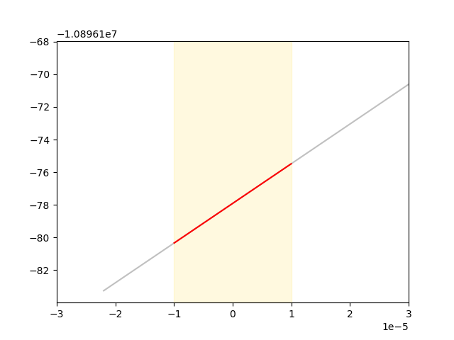

## Equation 7:
```
ICab__ICab = 4.0 * (-ICaL__gamma_cao * extracellular__cao + ICaL__gamma_cai * intracellular_ions__cai * exp(2.0 * membrane__vfrt)) * ICab__PCab * membrane__vffrt / (-1.0 + exp(2.0 * membrane__vfrt))
```
## New Eq:
```
ICab__ICab = ((fabs(membrane__v) < 1.0000000000000001e-5) ? (49999.999999999993 * (1.0000000000000001e-5 + membrane__v) * (2.3677600000000004e-12 * pow(physical_constants__F, 2) * (-extracellular__cao * exp(-11436.254189932491 * pow(physical_constants__T, (-1.5)) * (-0.00014999999999999999 * extracellular__clo - 0.00014999999999999999 * extracellular__ko - 0.00014999999999999999 * extracellular__nao - 0.00059999999999999995 * extracellular__cao + 0.044721359549995794 * sqrt(0.25 * extracellular__clo + 0.25 * extracellular__ko + 0.25 * extracellular__nao + extracellular__cao) / (1.0 + 0.044721359549995794 * sqrt(0.25 * extracellular__clo + 0.25 * extracellular__ko + 0.25 * extracellular__nao + extracellular__cao)))) + intracellular_ions__cai * exp(-11436.254189932491 * pow(physical_constants__T, (-1.5)) * (-0.00014999999999999999 * intracellular_ions__cli - 0.00014999999999999999 * intracellular_ions__ki - 0.00014999999999999999 * intracellular_ions__nai - 0.00059999999999999995 * intracellular_ions__cai + 0.044721359549995794 * sqrt(0.25 * intracellular_ions__cli + 0.25 * intracellular_ions__ki + 0.25 * intracellular_ions__nai + intracellular_ions__cai) / (1.0 + 0.044721359549995794 * sqrt(0.25 * intracellular_ions__cli + 0.25 * intracellular_ions__ki + 0.25 * intracellular_ions__nai + intracellular_ions__cai)))) * exp(2.0000000000000002e-5 * physical_constants__F / (physical_constants__R * physical_constants__T))) / ((-1.0 + exp(2.0000000000000002e-5 * physical_constants__F / (physical_constants__R * physical_constants__T))) * physical_constants__R * physical_constants__T) + 2.3677600000000004e-12 * pow(physical_constants__F, 2) * (-extracellular__cao * exp(-11436.254189932491 * pow(physical_constants__T, (-1.5)) * (-0.00014999999999999999 * extracellular__clo - 0.00014999999999999999 * extracellular__ko - 0.00014999999999999999 * extracellular__nao - 0.00059999999999999995 * extracellular__cao + 0.044721359549995794 * sqrt(0.25 * extracellular__clo + 0.25 * extracellular__ko + 0.25 * extracellular__nao + extracellular__cao) / (1.0 + 0.044721359549995794 * sqrt(0.25 * extracellular__clo + 0.25 * extracellular__ko + 0.25 * extracellular__nao + extracellular__cao)))) + intracellular_ions__cai * exp(-11436.254189932491 * pow(physical_constants__T, (-1.5)) * (-0.00014999999999999999 * intracellular_ions__cli - 0.00014999999999999999 * intracellular_ions__ki - 0.00014999999999999999 * intracellular_ions__nai - 0.00059999999999999995 * intracellular_ions__cai + 0.044721359549995794 * sqrt(0.25 * intracellular_ions__cli + 0.25 * intracellular_ions__ki + 0.25 * intracellular_ions__nai + intracellular_ions__cai) / (1.0 + 0.044721359549995794 * sqrt(0.25 * intracellular_ions__cli + 0.25 * intracellular_ions__ki + 0.25 * intracellular_ions__nai + intracellular_ions__cai)))) * exp(-2.0000000000000002e-5 * physical_constants__F / (physical_constants__R * physical_constants__T))) / ((-1.0 + exp(-2.0000000000000002e-5 * physical_constants__F / (physical_constants__R * physical_constants__T))) * physical_constants__R * physical_constants__T)) - 2.3677600000000004e-12 * pow(physical_constants__F, 2) * (-extracellular__cao * exp(-11436.254189932491 * pow(physical_constants__T, (-1.5)) * (-0.00014999999999999999 * extracellular__clo - 0.00014999999999999999 * extracellular__ko - 0.00014999999999999999 * extracellular__nao - 0.00059999999999999995 * extracellular__cao + 0.044721359549995794 * sqrt(0.25 * extracellular__clo + 0.25 * extracellular__ko + 0.25 * extracellular__nao + extracellular__cao) / (1.0 + 0.044721359549995794 * sqrt(0.25 * extracellular__clo + 0.25 * extracellular__ko + 0.25 * extracellular__nao + extracellular__cao)))) + intracellular_ions__cai * exp(-11436.254189932491 * pow(physical_constants__T, (-1.5)) * (-0.00014999999999999999 * intracellular_ions__cli - 0.00014999999999999999 * intracellular_ions__ki - 0.00014999999999999999 * intracellular_ions__nai - 0.00059999999999999995 * intracellular_ions__cai + 0.044721359549995794 * sqrt(0.25 * intracellular_ions__cli + 0.25 * intracellular_ions__ki + 0.25 * intracellular_ions__nai + intracellular_ions__cai) / (1.0 + 0.044721359549995794 * sqrt(0.25 * intracellular_ions__cli + 0.25 * intracellular_ions__ki + 0.25 * intracellular_ions__nai + intracellular_ions__cai)))) * exp(-2.0000000000000002e-5 * physical_constants__F / (physical_constants__R * physical_constants__T))) / ((-1.0 + exp(-2.0000000000000002e-5 * physical_constants__F / (physical_constants__R * physical_constants__T))) * physical_constants__R * physical_constants__T)) : (2.36776e-7 * pow(physical_constants__F, 2) * (-extracellular__cao * exp(-11436.254189932491 * pow(physical_constants__T, (-1.5)) * (-0.00014999999999999999 * extracellular__clo - 0.00014999999999999999 * extracellular__ko - 0.00014999999999999999 * extracellular__nao - 0.00059999999999999995 * extracellular__cao + 0.044721359549995794 * sqrt(0.25 * extracellular__clo + 0.25 * extracellular__ko + 0.25 * extracellular__nao + extracellular__cao) / (1.0 + 0.044721359549995794 * sqrt(0.25 * extracellular__clo + 0.25 * extracellular__ko + 0.25 * extracellular__nao + extracellular__cao)))) + intracellular_ions__cai * exp(-11436.254189932491 * pow(physical_constants__T, (-1.5)) * (-0.00014999999999999999 * intracellular_ions__cli - 0.00014999999999999999 * intracellular_ions__ki - 0.00014999999999999999 * intracellular_ions__nai - 0.00059999999999999995 * intracellular_ions__cai + 0.044721359549995794 * sqrt(0.25 * intracellular_ions__cli + 0.25 * intracellular_ions__ki + 0.25 * intracellular_ions__nai + intracellular_ions__cai) / (1.0 + 0.044721359549995794 * sqrt(0.25 * intracellular_ions__cli + 0.25 * intracellular_ions__ki + 0.25 * intracellular_ions__nai + intracellular_ions__cai)))) * exp(2.0 * membrane__v * physical_constants__F / (physical_constants__R * physical_constants__T))) * membrane__v / ((-1.0 + exp(2.0 * membrane__v * physical_constants__F / (physical_constants__R * physical_constants__T))) * physical_constants__R * physical_constants__T)))
```
## Singularity point: 0


## Equation 8:
```
INab__INab = (-extracellular__nao + intracellular_ions__nai * exp(membrane__vfrt)) * INab__PNab * membrane__vffrt / (-1.0 + exp(membrane__vfrt))
```
## New Eq:
```
INab__INab = ((fabs(membrane__v) < 1.0000000000000001e-5) ? (49999.999999999993 * (1.0000000000000001e-5 + membrane__v) * (1.9239000000000002e-14 * pow(physical_constants__F, 2) * (-extracellular__nao + intracellular_ions__nai * exp(1.0000000000000001e-5 * physical_constants__F / (physical_constants__R * physical_constants__T))) / ((-1.0 + exp(1.0000000000000001e-5 * physical_constants__F / (physical_constants__R * physical_constants__T))) * physical_constants__R * physical_constants__T) + 1.9239000000000002e-14 * pow(physical_constants__F, 2) * (-extracellular__nao + intracellular_ions__nai * exp(-1.0000000000000001e-5 * physical_constants__F / (physical_constants__R * physical_constants__T))) / ((-1.0 + exp(-1.0000000000000001e-5 * physical_constants__F / (physical_constants__R * physical_constants__T))) * physical_constants__R * physical_constants__T)) - 1.9239000000000002e-14 * pow(physical_constants__F, 2) * (-extracellular__nao + intracellular_ions__nai * exp(-1.0000000000000001e-5 * physical_constants__F / (physical_constants__R * physical_constants__T))) / ((-1.0 + exp(-1.0000000000000001e-5 * physical_constants__F / (physical_constants__R * physical_constants__T))) * physical_constants__R * physical_constants__T)) : (1.9238999999999999e-9 * pow(physical_constants__F, 2) * (-extracellular__nao + intracellular_ions__nai * exp(membrane__v * physical_constants__F / (physical_constants__R * physical_constants__T))) * membrane__v / ((-1.0 + exp(membrane__v * physical_constants__F / (physical_constants__R * physical_constants__T))) * physical_constants__R * physical_constants__T)))
```
## Singularity point: 0
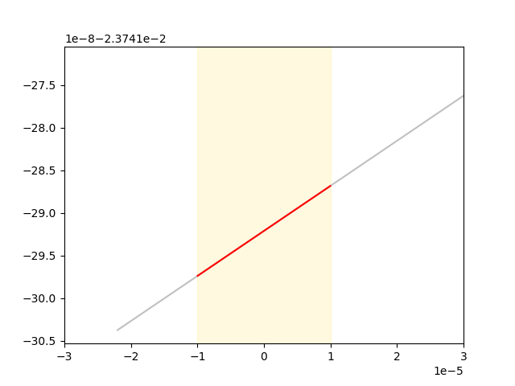

# of singularities:  8
# Model: Tomek_model13epi(ToRORd_fkatp_epi.cellml)
No of piecewises: 21
## Equation 1:
```
ICaL__PhiCaK_i = (-ICaL__gamma_ko * extracellular__ko + ICaL__gamma_ki * intracellular_ions__ki * exp(membrane__vfrt)) * membrane__vffrt / (-1.0 + exp(membrane__vfrt))
```
## New Eq:
```
ICaL__PhiCaK_i = ((fabs(membrane__v) < 1.0000000000000001e-5) ? (49999.999999999993 * (1.0000000000000001e-5 + membrane__v) * (1.0000000000000001e-5 * pow(physical_constants__F, 2) * (-extracellular__ko * exp(-2859.0635474831229 * pow(physical_constants__T, (-1.5)) * (-0.00014999999999999999 * extracellular__clo - 0.00014999999999999999 * extracellular__ko - 0.00014999999999999999 * extracellular__nao - 0.00059999999999999995 * extracellular__cao + 0.044721359549995794 * sqrt(0.25 * extracellular__clo + 0.25 * extracellular__ko + 0.25 * extracellular__nao + extracellular__cao) / (1.0 + 0.044721359549995794 * sqrt(0.25 * extracellular__clo + 0.25 * extracellular__ko + 0.25 * extracellular__nao + extracellular__cao)))) + intracellular_ions__ki * exp(-2859.0635474831229 * pow(physical_constants__T, (-1.5)) * (-0.00014999999999999999 * intracellular_ions__cli - 0.00014999999999999999 * intracellular_ions__ki - 0.00014999999999999999 * intracellular_ions__nai - 0.00059999999999999995 * intracellular_ions__cai + 0.044721359549995794 * sqrt(0.25 * intracellular_ions__cli + 0.25 * intracellular_ions__ki + 0.25 * intracellular_ions__nai + intracellular_ions__cai) / (1.0 + 0.044721359549995794 * sqrt(0.25 * intracellular_ions__cli + 0.25 * intracellular_ions__ki + 0.25 * intracellular_ions__nai + intracellular_ions__cai)))) * exp(1.0000000000000001e-5 * physical_constants__F / (physical_constants__R * physical_constants__T))) / ((-1.0 + exp(1.0000000000000001e-5 * physical_constants__F / (physical_constants__R * physical_constants__T))) * physical_constants__R * physical_constants__T) + 1.0000000000000001e-5 * pow(physical_constants__F, 2) * (-extracellular__ko * exp(-2859.0635474831229 * pow(physical_constants__T, (-1.5)) * (-0.00014999999999999999 * extracellular__clo - 0.00014999999999999999 * extracellular__ko - 0.00014999999999999999 * extracellular__nao - 0.00059999999999999995 * extracellular__cao + 0.044721359549995794 * sqrt(0.25 * extracellular__clo + 0.25 * extracellular__ko + 0.25 * extracellular__nao + extracellular__cao) / (1.0 + 0.044721359549995794 * sqrt(0.25 * extracellular__clo + 0.25 * extracellular__ko + 0.25 * extracellular__nao + extracellular__cao)))) + intracellular_ions__ki * exp(-2859.0635474831229 * pow(physical_constants__T, (-1.5)) * (-0.00014999999999999999 * intracellular_ions__cli - 0.00014999999999999999 * intracellular_ions__ki - 0.00014999999999999999 * intracellular_ions__nai - 0.00059999999999999995 * intracellular_ions__cai + 0.044721359549995794 * sqrt(0.25 * intracellular_ions__cli + 0.25 * intracellular_ions__ki + 0.25 * intracellular_ions__nai + intracellular_ions__cai) / (1.0 + 0.044721359549995794 * sqrt(0.25 * intracellular_ions__cli + 0.25 * intracellular_ions__ki + 0.25 * intracellular_ions__nai + intracellular_ions__cai)))) * exp(-1.0000000000000001e-5 * physical_constants__F / (physical_constants__R * physical_constants__T))) / ((-1.0 + exp(-1.0000000000000001e-5 * physical_constants__F / (physical_constants__R * physical_constants__T))) * physical_constants__R * physical_constants__T)) - 1.0000000000000001e-5 * pow(physical_constants__F, 2) * (-extracellular__ko * exp(-2859.0635474831229 * pow(physical_constants__T, (-1.5)) * (-0.00014999999999999999 * extracellular__clo - 0.00014999999999999999 * extracellular__ko - 0.00014999999999999999 * extracellular__nao - 0.00059999999999999995 * extracellular__cao + 0.044721359549995794 * sqrt(0.25 * extracellular__clo + 0.25 * extracellular__ko + 0.25 * extracellular__nao + extracellular__cao) / (1.0 + 0.044721359549995794 * sqrt(0.25 * extracellular__clo + 0.25 * extracellular__ko + 0.25 * extracellular__nao + extracellular__cao)))) + intracellular_ions__ki * exp(-2859.0635474831229 * pow(physical_constants__T, (-1.5)) * (-0.00014999999999999999 * intracellular_ions__cli - 0.00014999999999999999 * intracellular_ions__ki - 0.00014999999999999999 * intracellular_ions__nai - 0.00059999999999999995 * intracellular_ions__cai + 0.044721359549995794 * sqrt(0.25 * intracellular_ions__cli + 0.25 * intracellular_ions__ki + 0.25 * intracellular_ions__nai + intracellular_ions__cai) / (1.0 + 0.044721359549995794 * sqrt(0.25 * intracellular_ions__cli + 0.25 * intracellular_ions__ki + 0.25 * intracellular_ions__nai + intracellular_ions__cai)))) * exp(-1.0000000000000001e-5 * physical_constants__F / (physical_constants__R * physical_constants__T))) / ((-1.0 + exp(-1.0000000000000001e-5 * physical_constants__F / (physical_constants__R * physical_constants__T))) * physical_constants__R * physical_constants__T)) : (pow(physical_constants__F, 2) * (-extracellular__ko * exp(-2859.0635474831229 * pow(physical_constants__T, (-1.5)) * (-0.00014999999999999999 * extracellular__clo - 0.00014999999999999999 * extracellular__ko - 0.00014999999999999999 * extracellular__nao - 0.00059999999999999995 * extracellular__cao + 0.044721359549995794 * sqrt(0.25 * extracellular__clo + 0.25 * extracellular__ko + 0.25 * extracellular__nao + extracellular__cao) / (1.0 + 0.044721359549995794 * sqrt(0.25 * extracellular__clo + 0.25 * extracellular__ko + 0.25 * extracellular__nao + extracellular__cao)))) + intracellular_ions__ki * exp(-2859.0635474831229 * pow(physical_constants__T, (-1.5)) * (-0.00014999999999999999 * intracellular_ions__cli - 0.00014999999999999999 * intracellular_ions__ki - 0.00014999999999999999 * intracellular_ions__nai - 0.00059999999999999995 * intracellular_ions__cai + 0.044721359549995794 * sqrt(0.25 * intracellular_ions__cli + 0.25 * intracellular_ions__ki + 0.25 * intracellular_ions__nai + intracellular_ions__cai) / (1.0 + 0.044721359549995794 * sqrt(0.25 * intracellular_ions__cli + 0.25 * intracellular_ions__ki + 0.25 * intracellular_ions__nai + intracellular_ions__cai)))) * exp(membrane__v * physical_constants__F / (physical_constants__R * physical_constants__T))) * membrane__v / ((-1.0 + exp(membrane__v * physical_constants__F / (physical_constants__R * physical_constants__T))) * physical_constants__R * physical_constants__T)))
```
## Singularity point: 0
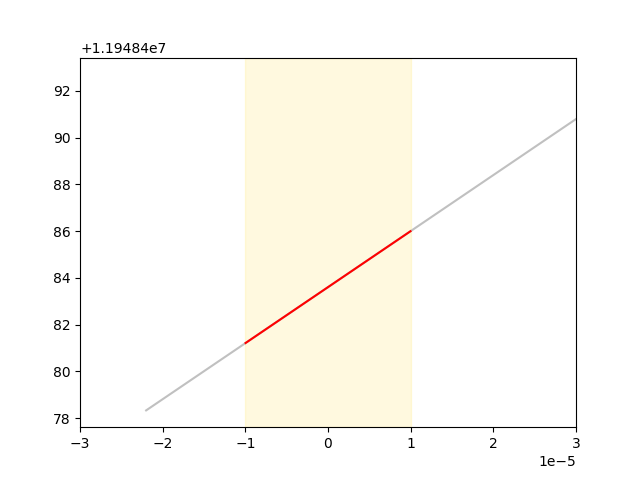

## Equation 2:
```
ICaL__PhiCaK_ss = (-ICaL__gamma_ko * extracellular__ko + ICaL__gamma_kss * intracellular_ions__kss * exp(membrane__vfrt)) * membrane__vffrt / (-1.0 + exp(membrane__vfrt))
```
## New Eq:
```
ICaL__PhiCaK_ss = ((fabs(membrane__v) < 1.0000000000000001e-5) ? (49999.999999999993 * (1.0000000000000001e-5 + membrane__v) * (1.0000000000000001e-5 * pow(physical_constants__F, 2) * (-extracellular__ko * exp(-2859.0635474831229 * pow(physical_constants__T, (-1.5)) * (-0.00014999999999999999 * extracellular__clo - 0.00014999999999999999 * extracellular__ko - 0.00014999999999999999 * extracellular__nao - 0.00059999999999999995 * extracellular__cao + 0.044721359549995794 * sqrt(0.25 * extracellular__clo + 0.25 * extracellular__ko + 0.25 * extracellular__nao + extracellular__cao) / (1.0 + 0.044721359549995794 * sqrt(0.25 * extracellular__clo + 0.25 * extracellular__ko + 0.25 * extracellular__nao + extracellular__cao)))) + intracellular_ions__kss * exp(-2859.0635474831229 * pow(physical_constants__T, (-1.5)) * (-0.00014999999999999999 * intracellular_ions__cli - 0.00014999999999999999 * intracellular_ions__kss - 0.00014999999999999999 * intracellular_ions__nass - 0.00059999999999999995 * intracellular_ions__cass + 0.044721359549995794 * sqrt(0.25 * intracellular_ions__cli + 0.25 * intracellular_ions__kss + 0.25 * intracellular_ions__nass + intracellular_ions__cass) / (1.0 + 0.044721359549995794 * sqrt(0.25 * intracellular_ions__cli + 0.25 * intracellular_ions__kss + 0.25 * intracellular_ions__nass + intracellular_ions__cass)))) * exp(1.0000000000000001e-5 * physical_constants__F / (physical_constants__R * physical_constants__T))) / ((-1.0 + exp(1.0000000000000001e-5 * physical_constants__F / (physical_constants__R * physical_constants__T))) * physical_constants__R * physical_constants__T) + 1.0000000000000001e-5 * pow(physical_constants__F, 2) * (-extracellular__ko * exp(-2859.0635474831229 * pow(physical_constants__T, (-1.5)) * (-0.00014999999999999999 * extracellular__clo - 0.00014999999999999999 * extracellular__ko - 0.00014999999999999999 * extracellular__nao - 0.00059999999999999995 * extracellular__cao + 0.044721359549995794 * sqrt(0.25 * extracellular__clo + 0.25 * extracellular__ko + 0.25 * extracellular__nao + extracellular__cao) / (1.0 + 0.044721359549995794 * sqrt(0.25 * extracellular__clo + 0.25 * extracellular__ko + 0.25 * extracellular__nao + extracellular__cao)))) + intracellular_ions__kss * exp(-2859.0635474831229 * pow(physical_constants__T, (-1.5)) * (-0.00014999999999999999 * intracellular_ions__cli - 0.00014999999999999999 * intracellular_ions__kss - 0.00014999999999999999 * intracellular_ions__nass - 0.00059999999999999995 * intracellular_ions__cass + 0.044721359549995794 * sqrt(0.25 * intracellular_ions__cli + 0.25 * intracellular_ions__kss + 0.25 * intracellular_ions__nass + intracellular_ions__cass) / (1.0 + 0.044721359549995794 * sqrt(0.25 * intracellular_ions__cli + 0.25 * intracellular_ions__kss + 0.25 * intracellular_ions__nass + intracellular_ions__cass)))) * exp(-1.0000000000000001e-5 * physical_constants__F / (physical_constants__R * physical_constants__T))) / ((-1.0 + exp(-1.0000000000000001e-5 * physical_constants__F / (physical_constants__R * physical_constants__T))) * physical_constants__R * physical_constants__T)) - 1.0000000000000001e-5 * pow(physical_constants__F, 2) * (-extracellular__ko * exp(-2859.0635474831229 * pow(physical_constants__T, (-1.5)) * (-0.00014999999999999999 * extracellular__clo - 0.00014999999999999999 * extracellular__ko - 0.00014999999999999999 * extracellular__nao - 0.00059999999999999995 * extracellular__cao + 0.044721359549995794 * sqrt(0.25 * extracellular__clo + 0.25 * extracellular__ko + 0.25 * extracellular__nao + extracellular__cao) / (1.0 + 0.044721359549995794 * sqrt(0.25 * extracellular__clo + 0.25 * extracellular__ko + 0.25 * extracellular__nao + extracellular__cao)))) + intracellular_ions__kss * exp(-2859.0635474831229 * pow(physical_constants__T, (-1.5)) * (-0.00014999999999999999 * intracellular_ions__cli - 0.00014999999999999999 * intracellular_ions__kss - 0.00014999999999999999 * intracellular_ions__nass - 0.00059999999999999995 * intracellular_ions__cass + 0.044721359549995794 * sqrt(0.25 * intracellular_ions__cli + 0.25 * intracellular_ions__kss + 0.25 * intracellular_ions__nass + intracellular_ions__cass) / (1.0 + 0.044721359549995794 * sqrt(0.25 * intracellular_ions__cli + 0.25 * intracellular_ions__kss + 0.25 * intracellular_ions__nass + intracellular_ions__cass)))) * exp(-1.0000000000000001e-5 * physical_constants__F / (physical_constants__R * physical_constants__T))) / ((-1.0 + exp(-1.0000000000000001e-5 * physical_constants__F / (physical_constants__R * physical_constants__T))) * physical_constants__R * physical_constants__T)) : (pow(physical_constants__F, 2) * (-extracellular__ko * exp(-2859.0635474831229 * pow(physical_constants__T, (-1.5)) * (-0.00014999999999999999 * extracellular__clo - 0.00014999999999999999 * extracellular__ko - 0.00014999999999999999 * extracellular__nao - 0.00059999999999999995 * extracellular__cao + 0.044721359549995794 * sqrt(0.25 * extracellular__clo + 0.25 * extracellular__ko + 0.25 * extracellular__nao + extracellular__cao) / (1.0 + 0.044721359549995794 * sqrt(0.25 * extracellular__clo + 0.25 * extracellular__ko + 0.25 * extracellular__nao + extracellular__cao)))) + intracellular_ions__kss * exp(-2859.0635474831229 * pow(physical_constants__T, (-1.5)) * (-0.00014999999999999999 * intracellular_ions__cli - 0.00014999999999999999 * intracellular_ions__kss - 0.00014999999999999999 * intracellular_ions__nass - 0.00059999999999999995 * intracellular_ions__cass + 0.044721359549995794 * sqrt(0.25 * intracellular_ions__cli + 0.25 * intracellular_ions__kss + 0.25 * intracellular_ions__nass + intracellular_ions__cass) / (1.0 + 0.044721359549995794 * sqrt(0.25 * intracellular_ions__cli + 0.25 * intracellular_ions__kss + 0.25 * intracellular_ions__nass + intracellular_ions__cass)))) * exp(membrane__v * physical_constants__F / (physical_constants__R * physical_constants__T))) * membrane__v / ((-1.0 + exp(membrane__v * physical_constants__F / (physical_constants__R * physical_constants__T))) * physical_constants__R * physical_constants__T)))
```
## Singularity point: 0


## Equation 3:
```
ICaL__PhiCaL_i = 4.0 * (-ICaL__gamma_cao * extracellular__cao + ICaL__gamma_cai * intracellular_ions__cai * exp(2.0 * membrane__vfrt)) * membrane__vffrt / (-1.0 + exp(2.0 * membrane__vfrt))
```
## New Eq:
```
ICaL__PhiCaL_i = ((fabs(membrane__v) < 1.0000000000000001e-5) ? (49999.999999999993 * (1.0000000000000001e-5 + membrane__v) * (4.0000000000000003e-5 * pow(physical_constants__F, 2) * (-extracellular__cao * exp(-11436.254189932491 * pow(physical_constants__T, (-1.5)) * (-0.00014999999999999999 * extracellular__clo - 0.00014999999999999999 * extracellular__ko - 0.00014999999999999999 * extracellular__nao - 0.00059999999999999995 * extracellular__cao + 0.044721359549995794 * sqrt(0.25 * extracellular__clo + 0.25 * extracellular__ko + 0.25 * extracellular__nao + extracellular__cao) / (1.0 + 0.044721359549995794 * sqrt(0.25 * extracellular__clo + 0.25 * extracellular__ko + 0.25 * extracellular__nao + extracellular__cao)))) + intracellular_ions__cai * exp(-11436.254189932491 * pow(physical_constants__T, (-1.5)) * (-0.00014999999999999999 * intracellular_ions__cli - 0.00014999999999999999 * intracellular_ions__ki - 0.00014999999999999999 * intracellular_ions__nai - 0.00059999999999999995 * intracellular_ions__cai + 0.044721359549995794 * sqrt(0.25 * intracellular_ions__cli + 0.25 * intracellular_ions__ki + 0.25 * intracellular_ions__nai + intracellular_ions__cai) / (1.0 + 0.044721359549995794 * sqrt(0.25 * intracellular_ions__cli + 0.25 * intracellular_ions__ki + 0.25 * intracellular_ions__nai + intracellular_ions__cai)))) * exp(2.0000000000000002e-5 * physical_constants__F / (physical_constants__R * physical_constants__T))) / ((-1.0 + exp(2.0000000000000002e-5 * physical_constants__F / (physical_constants__R * physical_constants__T))) * physical_constants__R * physical_constants__T) + 4.0000000000000003e-5 * pow(physical_constants__F, 2) * (-extracellular__cao * exp(-11436.254189932491 * pow(physical_constants__T, (-1.5)) * (-0.00014999999999999999 * extracellular__clo - 0.00014999999999999999 * extracellular__ko - 0.00014999999999999999 * extracellular__nao - 0.00059999999999999995 * extracellular__cao + 0.044721359549995794 * sqrt(0.25 * extracellular__clo + 0.25 * extracellular__ko + 0.25 * extracellular__nao + extracellular__cao) / (1.0 + 0.044721359549995794 * sqrt(0.25 * extracellular__clo + 0.25 * extracellular__ko + 0.25 * extracellular__nao + extracellular__cao)))) + intracellular_ions__cai * exp(-11436.254189932491 * pow(physical_constants__T, (-1.5)) * (-0.00014999999999999999 * intracellular_ions__cli - 0.00014999999999999999 * intracellular_ions__ki - 0.00014999999999999999 * intracellular_ions__nai - 0.00059999999999999995 * intracellular_ions__cai + 0.044721359549995794 * sqrt(0.25 * intracellular_ions__cli + 0.25 * intracellular_ions__ki + 0.25 * intracellular_ions__nai + intracellular_ions__cai) / (1.0 + 0.044721359549995794 * sqrt(0.25 * intracellular_ions__cli + 0.25 * intracellular_ions__ki + 0.25 * intracellular_ions__nai + intracellular_ions__cai)))) * exp(-2.0000000000000002e-5 * physical_constants__F / (physical_constants__R * physical_constants__T))) / ((-1.0 + exp(-2.0000000000000002e-5 * physical_constants__F / (physical_constants__R * physical_constants__T))) * physical_constants__R * physical_constants__T)) - 4.0000000000000003e-5 * pow(physical_constants__F, 2) * (-extracellular__cao * exp(-11436.254189932491 * pow(physical_constants__T, (-1.5)) * (-0.00014999999999999999 * extracellular__clo - 0.00014999999999999999 * extracellular__ko - 0.00014999999999999999 * extracellular__nao - 0.00059999999999999995 * extracellular__cao + 0.044721359549995794 * sqrt(0.25 * extracellular__clo + 0.25 * extracellular__ko + 0.25 * extracellular__nao + extracellular__cao) / (1.0 + 0.044721359549995794 * sqrt(0.25 * extracellular__clo + 0.25 * extracellular__ko + 0.25 * extracellular__nao + extracellular__cao)))) + intracellular_ions__cai * exp(-11436.254189932491 * pow(physical_constants__T, (-1.5)) * (-0.00014999999999999999 * intracellular_ions__cli - 0.00014999999999999999 * intracellular_ions__ki - 0.00014999999999999999 * intracellular_ions__nai - 0.00059999999999999995 * intracellular_ions__cai + 0.044721359549995794 * sqrt(0.25 * intracellular_ions__cli + 0.25 * intracellular_ions__ki + 0.25 * intracellular_ions__nai + intracellular_ions__cai) / (1.0 + 0.044721359549995794 * sqrt(0.25 * intracellular_ions__cli + 0.25 * intracellular_ions__ki + 0.25 * intracellular_ions__nai + intracellular_ions__cai)))) * exp(-2.0000000000000002e-5 * physical_constants__F / (physical_constants__R * physical_constants__T))) / ((-1.0 + exp(-2.0000000000000002e-5 * physical_constants__F / (physical_constants__R * physical_constants__T))) * physical_constants__R * physical_constants__T)) : (4.0 * pow(physical_constants__F, 2) * (-extracellular__cao * exp(-11436.254189932491 * pow(physical_constants__T, (-1.5)) * (-0.00014999999999999999 * extracellular__clo - 0.00014999999999999999 * extracellular__ko - 0.00014999999999999999 * extracellular__nao - 0.00059999999999999995 * extracellular__cao + 0.044721359549995794 * sqrt(0.25 * extracellular__clo + 0.25 * extracellular__ko + 0.25 * extracellular__nao + extracellular__cao) / (1.0 + 0.044721359549995794 * sqrt(0.25 * extracellular__clo + 0.25 * extracellular__ko + 0.25 * extracellular__nao + extracellular__cao)))) + intracellular_ions__cai * exp(-11436.254189932491 * pow(physical_constants__T, (-1.5)) * (-0.00014999999999999999 * intracellular_ions__cli - 0.00014999999999999999 * intracellular_ions__ki - 0.00014999999999999999 * intracellular_ions__nai - 0.00059999999999999995 * intracellular_ions__cai + 0.044721359549995794 * sqrt(0.25 * intracellular_ions__cli + 0.25 * intracellular_ions__ki + 0.25 * intracellular_ions__nai + intracellular_ions__cai) / (1.0 + 0.044721359549995794 * sqrt(0.25 * intracellular_ions__cli + 0.25 * intracellular_ions__ki + 0.25 * intracellular_ions__nai + intracellular_ions__cai)))) * exp(2.0 * membrane__v * physical_constants__F / (physical_constants__R * physical_constants__T))) * membrane__v / ((-1.0 + exp(2.0 * membrane__v * physical_constants__F / (physical_constants__R * physical_constants__T))) * physical_constants__R * physical_constants__T)))
```
## Singularity point: 0


## Equation 4:
```
ICaL__PhiCaL_ss = 4.0 * (-ICaL__gamma_cao * extracellular__cao + ICaL__gamma_cass * intracellular_ions__cass * exp(2.0 * membrane__vfrt)) * membrane__vffrt / (-1.0 + exp(2.0 * membrane__vfrt))
```
## New Eq:
```
ICaL__PhiCaL_ss = ((fabs(membrane__v) < 1.0000000000000001e-5) ? (49999.999999999993 * (1.0000000000000001e-5 + membrane__v) * (4.0000000000000003e-5 * pow(physical_constants__F, 2) * (-extracellular__cao * exp(-11436.254189932491 * pow(physical_constants__T, (-1.5)) * (-0.00014999999999999999 * extracellular__clo - 0.00014999999999999999 * extracellular__ko - 0.00014999999999999999 * extracellular__nao - 0.00059999999999999995 * extracellular__cao + 0.044721359549995794 * sqrt(0.25 * extracellular__clo + 0.25 * extracellular__ko + 0.25 * extracellular__nao + extracellular__cao) / (1.0 + 0.044721359549995794 * sqrt(0.25 * extracellular__clo + 0.25 * extracellular__ko + 0.25 * extracellular__nao + extracellular__cao)))) + intracellular_ions__cass * exp(-11436.254189932491 * pow(physical_constants__T, (-1.5)) * (-0.00014999999999999999 * intracellular_ions__cli - 0.00014999999999999999 * intracellular_ions__kss - 0.00014999999999999999 * intracellular_ions__nass - 0.00059999999999999995 * intracellular_ions__cass + 0.044721359549995794 * sqrt(0.25 * intracellular_ions__cli + 0.25 * intracellular_ions__kss + 0.25 * intracellular_ions__nass + intracellular_ions__cass) / (1.0 + 0.044721359549995794 * sqrt(0.25 * intracellular_ions__cli + 0.25 * intracellular_ions__kss + 0.25 * intracellular_ions__nass + intracellular_ions__cass)))) * exp(2.0000000000000002e-5 * physical_constants__F / (physical_constants__R * physical_constants__T))) / ((-1.0 + exp(2.0000000000000002e-5 * physical_constants__F / (physical_constants__R * physical_constants__T))) * physical_constants__R * physical_constants__T) + 4.0000000000000003e-5 * pow(physical_constants__F, 2) * (-extracellular__cao * exp(-11436.254189932491 * pow(physical_constants__T, (-1.5)) * (-0.00014999999999999999 * extracellular__clo - 0.00014999999999999999 * extracellular__ko - 0.00014999999999999999 * extracellular__nao - 0.00059999999999999995 * extracellular__cao + 0.044721359549995794 * sqrt(0.25 * extracellular__clo + 0.25 * extracellular__ko + 0.25 * extracellular__nao + extracellular__cao) / (1.0 + 0.044721359549995794 * sqrt(0.25 * extracellular__clo + 0.25 * extracellular__ko + 0.25 * extracellular__nao + extracellular__cao)))) + intracellular_ions__cass * exp(-11436.254189932491 * pow(physical_constants__T, (-1.5)) * (-0.00014999999999999999 * intracellular_ions__cli - 0.00014999999999999999 * intracellular_ions__kss - 0.00014999999999999999 * intracellular_ions__nass - 0.00059999999999999995 * intracellular_ions__cass + 0.044721359549995794 * sqrt(0.25 * intracellular_ions__cli + 0.25 * intracellular_ions__kss + 0.25 * intracellular_ions__nass + intracellular_ions__cass) / (1.0 + 0.044721359549995794 * sqrt(0.25 * intracellular_ions__cli + 0.25 * intracellular_ions__kss + 0.25 * intracellular_ions__nass + intracellular_ions__cass)))) * exp(-2.0000000000000002e-5 * physical_constants__F / (physical_constants__R * physical_constants__T))) / ((-1.0 + exp(-2.0000000000000002e-5 * physical_constants__F / (physical_constants__R * physical_constants__T))) * physical_constants__R * physical_constants__T)) - 4.0000000000000003e-5 * pow(physical_constants__F, 2) * (-extracellular__cao * exp(-11436.254189932491 * pow(physical_constants__T, (-1.5)) * (-0.00014999999999999999 * extracellular__clo - 0.00014999999999999999 * extracellular__ko - 0.00014999999999999999 * extracellular__nao - 0.00059999999999999995 * extracellular__cao + 0.044721359549995794 * sqrt(0.25 * extracellular__clo + 0.25 * extracellular__ko + 0.25 * extracellular__nao + extracellular__cao) / (1.0 + 0.044721359549995794 * sqrt(0.25 * extracellular__clo + 0.25 * extracellular__ko + 0.25 * extracellular__nao + extracellular__cao)))) + intracellular_ions__cass * exp(-11436.254189932491 * pow(physical_constants__T, (-1.5)) * (-0.00014999999999999999 * intracellular_ions__cli - 0.00014999999999999999 * intracellular_ions__kss - 0.00014999999999999999 * intracellular_ions__nass - 0.00059999999999999995 * intracellular_ions__cass + 0.044721359549995794 * sqrt(0.25 * intracellular_ions__cli + 0.25 * intracellular_ions__kss + 0.25 * intracellular_ions__nass + intracellular_ions__cass) / (1.0 + 0.044721359549995794 * sqrt(0.25 * intracellular_ions__cli + 0.25 * intracellular_ions__kss + 0.25 * intracellular_ions__nass + intracellular_ions__cass)))) * exp(-2.0000000000000002e-5 * physical_constants__F / (physical_constants__R * physical_constants__T))) / ((-1.0 + exp(-2.0000000000000002e-5 * physical_constants__F / (physical_constants__R * physical_constants__T))) * physical_constants__R * physical_constants__T)) : (4.0 * pow(physical_constants__F, 2) * (-extracellular__cao * exp(-11436.254189932491 * pow(physical_constants__T, (-1.5)) * (-0.00014999999999999999 * extracellular__clo - 0.00014999999999999999 * extracellular__ko - 0.00014999999999999999 * extracellular__nao - 0.00059999999999999995 * extracellular__cao + 0.044721359549995794 * sqrt(0.25 * extracellular__clo + 0.25 * extracellular__ko + 0.25 * extracellular__nao + extracellular__cao) / (1.0 + 0.044721359549995794 * sqrt(0.25 * extracellular__clo + 0.25 * extracellular__ko + 0.25 * extracellular__nao + extracellular__cao)))) + intracellular_ions__cass * exp(-11436.254189932491 * pow(physical_constants__T, (-1.5)) * (-0.00014999999999999999 * intracellular_ions__cli - 0.00014999999999999999 * intracellular_ions__kss - 0.00014999999999999999 * intracellular_ions__nass - 0.00059999999999999995 * intracellular_ions__cass + 0.044721359549995794 * sqrt(0.25 * intracellular_ions__cli + 0.25 * intracellular_ions__kss + 0.25 * intracellular_ions__nass + intracellular_ions__cass) / (1.0 + 0.044721359549995794 * sqrt(0.25 * intracellular_ions__cli + 0.25 * intracellular_ions__kss + 0.25 * intracellular_ions__nass + intracellular_ions__cass)))) * exp(2.0 * membrane__v * physical_constants__F / (physical_constants__R * physical_constants__T))) * membrane__v / ((-1.0 + exp(2.0 * membrane__v * physical_constants__F / (physical_constants__R * physical_constants__T))) * physical_constants__R * physical_constants__T)))
```
## Singularity point: 0
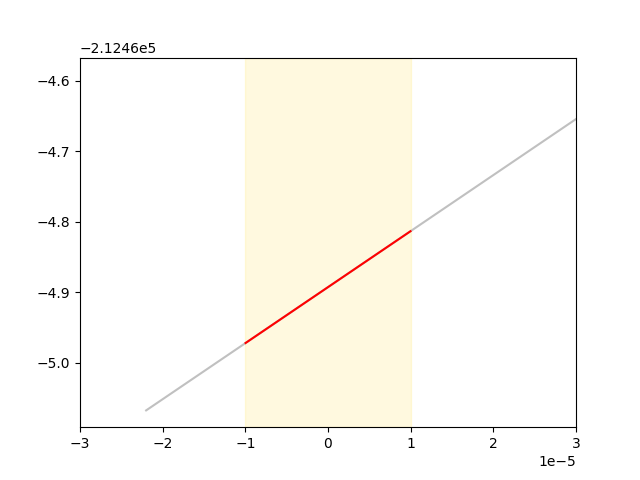

## Equation 5:
```
ICaL__PhiCaNa_i = (-ICaL__gamma_nao * extracellular__nao + ICaL__gamma_nai * intracellular_ions__nai * exp(membrane__vfrt)) * membrane__vffrt / (-1.0 + exp(membrane__vfrt))
```
## New Eq:
```
ICaL__PhiCaNa_i = ((fabs(membrane__v) < 1.0000000000000001e-5) ? (49999.999999999993 * (1.0000000000000001e-5 + membrane__v) * (1.0000000000000001e-5 * pow(physical_constants__F, 2) * (-extracellular__nao * exp(-2859.0635474831229 * pow(physical_constants__T, (-1.5)) * (-0.00014999999999999999 * extracellular__clo - 0.00014999999999999999 * extracellular__ko - 0.00014999999999999999 * extracellular__nao - 0.00059999999999999995 * extracellular__cao + 0.044721359549995794 * sqrt(0.25 * extracellular__clo + 0.25 * extracellular__ko + 0.25 * extracellular__nao + extracellular__cao) / (1.0 + 0.044721359549995794 * sqrt(0.25 * extracellular__clo + 0.25 * extracellular__ko + 0.25 * extracellular__nao + extracellular__cao)))) + intracellular_ions__nai * exp(-2859.0635474831229 * pow(physical_constants__T, (-1.5)) * (-0.00014999999999999999 * intracellular_ions__cli - 0.00014999999999999999 * intracellular_ions__ki - 0.00014999999999999999 * intracellular_ions__nai - 0.00059999999999999995 * intracellular_ions__cai + 0.044721359549995794 * sqrt(0.25 * intracellular_ions__cli + 0.25 * intracellular_ions__ki + 0.25 * intracellular_ions__nai + intracellular_ions__cai) / (1.0 + 0.044721359549995794 * sqrt(0.25 * intracellular_ions__cli + 0.25 * intracellular_ions__ki + 0.25 * intracellular_ions__nai + intracellular_ions__cai)))) * exp(1.0000000000000001e-5 * physical_constants__F / (physical_constants__R * physical_constants__T))) / ((-1.0 + exp(1.0000000000000001e-5 * physical_constants__F / (physical_constants__R * physical_constants__T))) * physical_constants__R * physical_constants__T) + 1.0000000000000001e-5 * pow(physical_constants__F, 2) * (-extracellular__nao * exp(-2859.0635474831229 * pow(physical_constants__T, (-1.5)) * (-0.00014999999999999999 * extracellular__clo - 0.00014999999999999999 * extracellular__ko - 0.00014999999999999999 * extracellular__nao - 0.00059999999999999995 * extracellular__cao + 0.044721359549995794 * sqrt(0.25 * extracellular__clo + 0.25 * extracellular__ko + 0.25 * extracellular__nao + extracellular__cao) / (1.0 + 0.044721359549995794 * sqrt(0.25 * extracellular__clo + 0.25 * extracellular__ko + 0.25 * extracellular__nao + extracellular__cao)))) + intracellular_ions__nai * exp(-2859.0635474831229 * pow(physical_constants__T, (-1.5)) * (-0.00014999999999999999 * intracellular_ions__cli - 0.00014999999999999999 * intracellular_ions__ki - 0.00014999999999999999 * intracellular_ions__nai - 0.00059999999999999995 * intracellular_ions__cai + 0.044721359549995794 * sqrt(0.25 * intracellular_ions__cli + 0.25 * intracellular_ions__ki + 0.25 * intracellular_ions__nai + intracellular_ions__cai) / (1.0 + 0.044721359549995794 * sqrt(0.25 * intracellular_ions__cli + 0.25 * intracellular_ions__ki + 0.25 * intracellular_ions__nai + intracellular_ions__cai)))) * exp(-1.0000000000000001e-5 * physical_constants__F / (physical_constants__R * physical_constants__T))) / ((-1.0 + exp(-1.0000000000000001e-5 * physical_constants__F / (physical_constants__R * physical_constants__T))) * physical_constants__R * physical_constants__T)) - 1.0000000000000001e-5 * pow(physical_constants__F, 2) * (-extracellular__nao * exp(-2859.0635474831229 * pow(physical_constants__T, (-1.5)) * (-0.00014999999999999999 * extracellular__clo - 0.00014999999999999999 * extracellular__ko - 0.00014999999999999999 * extracellular__nao - 0.00059999999999999995 * extracellular__cao + 0.044721359549995794 * sqrt(0.25 * extracellular__clo + 0.25 * extracellular__ko + 0.25 * extracellular__nao + extracellular__cao) / (1.0 + 0.044721359549995794 * sqrt(0.25 * extracellular__clo + 0.25 * extracellular__ko + 0.25 * extracellular__nao + extracellular__cao)))) + intracellular_ions__nai * exp(-2859.0635474831229 * pow(physical_constants__T, (-1.5)) * (-0.00014999999999999999 * intracellular_ions__cli - 0.00014999999999999999 * intracellular_ions__ki - 0.00014999999999999999 * intracellular_ions__nai - 0.00059999999999999995 * intracellular_ions__cai + 0.044721359549995794 * sqrt(0.25 * intracellular_ions__cli + 0.25 * intracellular_ions__ki + 0.25 * intracellular_ions__nai + intracellular_ions__cai) / (1.0 + 0.044721359549995794 * sqrt(0.25 * intracellular_ions__cli + 0.25 * intracellular_ions__ki + 0.25 * intracellular_ions__nai + intracellular_ions__cai)))) * exp(-1.0000000000000001e-5 * physical_constants__F / (physical_constants__R * physical_constants__T))) / ((-1.0 + exp(-1.0000000000000001e-5 * physical_constants__F / (physical_constants__R * physical_constants__T))) * physical_constants__R * physical_constants__T)) : (pow(physical_constants__F, 2) * (-extracellular__nao * exp(-2859.0635474831229 * pow(physical_constants__T, (-1.5)) * (-0.00014999999999999999 * extracellular__clo - 0.00014999999999999999 * extracellular__ko - 0.00014999999999999999 * extracellular__nao - 0.00059999999999999995 * extracellular__cao + 0.044721359549995794 * sqrt(0.25 * extracellular__clo + 0.25 * extracellular__ko + 0.25 * extracellular__nao + extracellular__cao) / (1.0 + 0.044721359549995794 * sqrt(0.25 * extracellular__clo + 0.25 * extracellular__ko + 0.25 * extracellular__nao + extracellular__cao)))) + intracellular_ions__nai * exp(-2859.0635474831229 * pow(physical_constants__T, (-1.5)) * (-0.00014999999999999999 * intracellular_ions__cli - 0.00014999999999999999 * intracellular_ions__ki - 0.00014999999999999999 * intracellular_ions__nai - 0.00059999999999999995 * intracellular_ions__cai + 0.044721359549995794 * sqrt(0.25 * intracellular_ions__cli + 0.25 * intracellular_ions__ki + 0.25 * intracellular_ions__nai + intracellular_ions__cai) / (1.0 + 0.044721359549995794 * sqrt(0.25 * intracellular_ions__cli + 0.25 * intracellular_ions__ki + 0.25 * intracellular_ions__nai + intracellular_ions__cai)))) * exp(membrane__v * physical_constants__F / (physical_constants__R * physical_constants__T))) * membrane__v / ((-1.0 + exp(membrane__v * physical_constants__F / (physical_constants__R * physical_constants__T))) * physical_constants__R * physical_constants__T)))
```
## Singularity point: 0
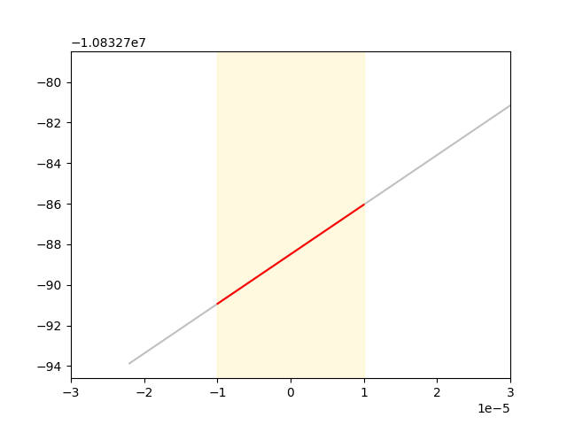

## Equation 6:
```
ICaL__PhiCaNa_ss = (-ICaL__gamma_nao * extracellular__nao + ICaL__gamma_nass * intracellular_ions__nass * exp(membrane__vfrt)) * membrane__vffrt / (-1.0 + exp(membrane__vfrt))
```
## New Eq:
```
ICaL__PhiCaNa_ss = ((fabs(membrane__v) < 1.0000000000000001e-5) ? (49999.999999999993 * (1.0000000000000001e-5 + membrane__v) * (1.0000000000000001e-5 * pow(physical_constants__F, 2) * (-extracellular__nao * exp(-2859.0635474831229 * pow(physical_constants__T, (-1.5)) * (-0.00014999999999999999 * extracellular__clo - 0.00014999999999999999 * extracellular__ko - 0.00014999999999999999 * extracellular__nao - 0.00059999999999999995 * extracellular__cao + 0.044721359549995794 * sqrt(0.25 * extracellular__clo + 0.25 * extracellular__ko + 0.25 * extracellular__nao + extracellular__cao) / (1.0 + 0.044721359549995794 * sqrt(0.25 * extracellular__clo + 0.25 * extracellular__ko + 0.25 * extracellular__nao + extracellular__cao)))) + intracellular_ions__nass * exp(-2859.0635474831229 * pow(physical_constants__T, (-1.5)) * (-0.00014999999999999999 * intracellular_ions__cli - 0.00014999999999999999 * intracellular_ions__kss - 0.00014999999999999999 * intracellular_ions__nass - 0.00059999999999999995 * intracellular_ions__cass + 0.044721359549995794 * sqrt(0.25 * intracellular_ions__cli + 0.25 * intracellular_ions__kss + 0.25 * intracellular_ions__nass + intracellular_ions__cass) / (1.0 + 0.044721359549995794 * sqrt(0.25 * intracellular_ions__cli + 0.25 * intracellular_ions__kss + 0.25 * intracellular_ions__nass + intracellular_ions__cass)))) * exp(1.0000000000000001e-5 * physical_constants__F / (physical_constants__R * physical_constants__T))) / ((-1.0 + exp(1.0000000000000001e-5 * physical_constants__F / (physical_constants__R * physical_constants__T))) * physical_constants__R * physical_constants__T) + 1.0000000000000001e-5 * pow(physical_constants__F, 2) * (-extracellular__nao * exp(-2859.0635474831229 * pow(physical_constants__T, (-1.5)) * (-0.00014999999999999999 * extracellular__clo - 0.00014999999999999999 * extracellular__ko - 0.00014999999999999999 * extracellular__nao - 0.00059999999999999995 * extracellular__cao + 0.044721359549995794 * sqrt(0.25 * extracellular__clo + 0.25 * extracellular__ko + 0.25 * extracellular__nao + extracellular__cao) / (1.0 + 0.044721359549995794 * sqrt(0.25 * extracellular__clo + 0.25 * extracellular__ko + 0.25 * extracellular__nao + extracellular__cao)))) + intracellular_ions__nass * exp(-2859.0635474831229 * pow(physical_constants__T, (-1.5)) * (-0.00014999999999999999 * intracellular_ions__cli - 0.00014999999999999999 * intracellular_ions__kss - 0.00014999999999999999 * intracellular_ions__nass - 0.00059999999999999995 * intracellular_ions__cass + 0.044721359549995794 * sqrt(0.25 * intracellular_ions__cli + 0.25 * intracellular_ions__kss + 0.25 * intracellular_ions__nass + intracellular_ions__cass) / (1.0 + 0.044721359549995794 * sqrt(0.25 * intracellular_ions__cli + 0.25 * intracellular_ions__kss + 0.25 * intracellular_ions__nass + intracellular_ions__cass)))) * exp(-1.0000000000000001e-5 * physical_constants__F / (physical_constants__R * physical_constants__T))) / ((-1.0 + exp(-1.0000000000000001e-5 * physical_constants__F / (physical_constants__R * physical_constants__T))) * physical_constants__R * physical_constants__T)) - 1.0000000000000001e-5 * pow(physical_constants__F, 2) * (-extracellular__nao * exp(-2859.0635474831229 * pow(physical_constants__T, (-1.5)) * (-0.00014999999999999999 * extracellular__clo - 0.00014999999999999999 * extracellular__ko - 0.00014999999999999999 * extracellular__nao - 0.00059999999999999995 * extracellular__cao + 0.044721359549995794 * sqrt(0.25 * extracellular__clo + 0.25 * extracellular__ko + 0.25 * extracellular__nao + extracellular__cao) / (1.0 + 0.044721359549995794 * sqrt(0.25 * extracellular__clo + 0.25 * extracellular__ko + 0.25 * extracellular__nao + extracellular__cao)))) + intracellular_ions__nass * exp(-2859.0635474831229 * pow(physical_constants__T, (-1.5)) * (-0.00014999999999999999 * intracellular_ions__cli - 0.00014999999999999999 * intracellular_ions__kss - 0.00014999999999999999 * intracellular_ions__nass - 0.00059999999999999995 * intracellular_ions__cass + 0.044721359549995794 * sqrt(0.25 * intracellular_ions__cli + 0.25 * intracellular_ions__kss + 0.25 * intracellular_ions__nass + intracellular_ions__cass) / (1.0 + 0.044721359549995794 * sqrt(0.25 * intracellular_ions__cli + 0.25 * intracellular_ions__kss + 0.25 * intracellular_ions__nass + intracellular_ions__cass)))) * exp(-1.0000000000000001e-5 * physical_constants__F / (physical_constants__R * physical_constants__T))) / ((-1.0 + exp(-1.0000000000000001e-5 * physical_constants__F / (physical_constants__R * physical_constants__T))) * physical_constants__R * physical_constants__T)) : (pow(physical_constants__F, 2) * (-extracellular__nao * exp(-2859.0635474831229 * pow(physical_constants__T, (-1.5)) * (-0.00014999999999999999 * extracellular__clo - 0.00014999999999999999 * extracellular__ko - 0.00014999999999999999 * extracellular__nao - 0.00059999999999999995 * extracellular__cao + 0.044721359549995794 * sqrt(0.25 * extracellular__clo + 0.25 * extracellular__ko + 0.25 * extracellular__nao + extracellular__cao) / (1.0 + 0.044721359549995794 * sqrt(0.25 * extracellular__clo + 0.25 * extracellular__ko + 0.25 * extracellular__nao + extracellular__cao)))) + intracellular_ions__nass * exp(-2859.0635474831229 * pow(physical_constants__T, (-1.5)) * (-0.00014999999999999999 * intracellular_ions__cli - 0.00014999999999999999 * intracellular_ions__kss - 0.00014999999999999999 * intracellular_ions__nass - 0.00059999999999999995 * intracellular_ions__cass + 0.044721359549995794 * sqrt(0.25 * intracellular_ions__cli + 0.25 * intracellular_ions__kss + 0.25 * intracellular_ions__nass + intracellular_ions__cass) / (1.0 + 0.044721359549995794 * sqrt(0.25 * intracellular_ions__cli + 0.25 * intracellular_ions__kss + 0.25 * intracellular_ions__nass + intracellular_ions__cass)))) * exp(membrane__v * physical_constants__F / (physical_constants__R * physical_constants__T))) * membrane__v / ((-1.0 + exp(membrane__v * physical_constants__F / (physical_constants__R * physical_constants__T))) * physical_constants__R * physical_constants__T)))
```
## Singularity point: 0


## Equation 7:
```
ICab__ICab = 4.0 * (-ICaL__gamma_cao * extracellular__cao + ICaL__gamma_cai * intracellular_ions__cai * exp(2.0 * membrane__vfrt)) * ICab__PCab * membrane__vffrt / (-1.0 + exp(2.0 * membrane__vfrt))
```
## New Eq:
```
ICab__ICab = ((fabs(membrane__v) < 1.0000000000000001e-5) ? (49999.999999999993 * (1.0000000000000001e-5 + membrane__v) * (2.3677600000000004e-12 * pow(physical_constants__F, 2) * (-extracellular__cao * exp(-11436.254189932491 * pow(physical_constants__T, (-1.5)) * (-0.00014999999999999999 * extracellular__clo - 0.00014999999999999999 * extracellular__ko - 0.00014999999999999999 * extracellular__nao - 0.00059999999999999995 * extracellular__cao + 0.044721359549995794 * sqrt(0.25 * extracellular__clo + 0.25 * extracellular__ko + 0.25 * extracellular__nao + extracellular__cao) / (1.0 + 0.044721359549995794 * sqrt(0.25 * extracellular__clo + 0.25 * extracellular__ko + 0.25 * extracellular__nao + extracellular__cao)))) + intracellular_ions__cai * exp(-11436.254189932491 * pow(physical_constants__T, (-1.5)) * (-0.00014999999999999999 * intracellular_ions__cli - 0.00014999999999999999 * intracellular_ions__ki - 0.00014999999999999999 * intracellular_ions__nai - 0.00059999999999999995 * intracellular_ions__cai + 0.044721359549995794 * sqrt(0.25 * intracellular_ions__cli + 0.25 * intracellular_ions__ki + 0.25 * intracellular_ions__nai + intracellular_ions__cai) / (1.0 + 0.044721359549995794 * sqrt(0.25 * intracellular_ions__cli + 0.25 * intracellular_ions__ki + 0.25 * intracellular_ions__nai + intracellular_ions__cai)))) * exp(2.0000000000000002e-5 * physical_constants__F / (physical_constants__R * physical_constants__T))) / ((-1.0 + exp(2.0000000000000002e-5 * physical_constants__F / (physical_constants__R * physical_constants__T))) * physical_constants__R * physical_constants__T) + 2.3677600000000004e-12 * pow(physical_constants__F, 2) * (-extracellular__cao * exp(-11436.254189932491 * pow(physical_constants__T, (-1.5)) * (-0.00014999999999999999 * extracellular__clo - 0.00014999999999999999 * extracellular__ko - 0.00014999999999999999 * extracellular__nao - 0.00059999999999999995 * extracellular__cao + 0.044721359549995794 * sqrt(0.25 * extracellular__clo + 0.25 * extracellular__ko + 0.25 * extracellular__nao + extracellular__cao) / (1.0 + 0.044721359549995794 * sqrt(0.25 * extracellular__clo + 0.25 * extracellular__ko + 0.25 * extracellular__nao + extracellular__cao)))) + intracellular_ions__cai * exp(-11436.254189932491 * pow(physical_constants__T, (-1.5)) * (-0.00014999999999999999 * intracellular_ions__cli - 0.00014999999999999999 * intracellular_ions__ki - 0.00014999999999999999 * intracellular_ions__nai - 0.00059999999999999995 * intracellular_ions__cai + 0.044721359549995794 * sqrt(0.25 * intracellular_ions__cli + 0.25 * intracellular_ions__ki + 0.25 * intracellular_ions__nai + intracellular_ions__cai) / (1.0 + 0.044721359549995794 * sqrt(0.25 * intracellular_ions__cli + 0.25 * intracellular_ions__ki + 0.25 * intracellular_ions__nai + intracellular_ions__cai)))) * exp(-2.0000000000000002e-5 * physical_constants__F / (physical_constants__R * physical_constants__T))) / ((-1.0 + exp(-2.0000000000000002e-5 * physical_constants__F / (physical_constants__R * physical_constants__T))) * physical_constants__R * physical_constants__T)) - 2.3677600000000004e-12 * pow(physical_constants__F, 2) * (-extracellular__cao * exp(-11436.254189932491 * pow(physical_constants__T, (-1.5)) * (-0.00014999999999999999 * extracellular__clo - 0.00014999999999999999 * extracellular__ko - 0.00014999999999999999 * extracellular__nao - 0.00059999999999999995 * extracellular__cao + 0.044721359549995794 * sqrt(0.25 * extracellular__clo + 0.25 * extracellular__ko + 0.25 * extracellular__nao + extracellular__cao) / (1.0 + 0.044721359549995794 * sqrt(0.25 * extracellular__clo + 0.25 * extracellular__ko + 0.25 * extracellular__nao + extracellular__cao)))) + intracellular_ions__cai * exp(-11436.254189932491 * pow(physical_constants__T, (-1.5)) * (-0.00014999999999999999 * intracellular_ions__cli - 0.00014999999999999999 * intracellular_ions__ki - 0.00014999999999999999 * intracellular_ions__nai - 0.00059999999999999995 * intracellular_ions__cai + 0.044721359549995794 * sqrt(0.25 * intracellular_ions__cli + 0.25 * intracellular_ions__ki + 0.25 * intracellular_ions__nai + intracellular_ions__cai) / (1.0 + 0.044721359549995794 * sqrt(0.25 * intracellular_ions__cli + 0.25 * intracellular_ions__ki + 0.25 * intracellular_ions__nai + intracellular_ions__cai)))) * exp(-2.0000000000000002e-5 * physical_constants__F / (physical_constants__R * physical_constants__T))) / ((-1.0 + exp(-2.0000000000000002e-5 * physical_constants__F / (physical_constants__R * physical_constants__T))) * physical_constants__R * physical_constants__T)) : (2.36776e-7 * pow(physical_constants__F, 2) * (-extracellular__cao * exp(-11436.254189932491 * pow(physical_constants__T, (-1.5)) * (-0.00014999999999999999 * extracellular__clo - 0.00014999999999999999 * extracellular__ko - 0.00014999999999999999 * extracellular__nao - 0.00059999999999999995 * extracellular__cao + 0.044721359549995794 * sqrt(0.25 * extracellular__clo + 0.25 * extracellular__ko + 0.25 * extracellular__nao + extracellular__cao) / (1.0 + 0.044721359549995794 * sqrt(0.25 * extracellular__clo + 0.25 * extracellular__ko + 0.25 * extracellular__nao + extracellular__cao)))) + intracellular_ions__cai * exp(-11436.254189932491 * pow(physical_constants__T, (-1.5)) * (-0.00014999999999999999 * intracellular_ions__cli - 0.00014999999999999999 * intracellular_ions__ki - 0.00014999999999999999 * intracellular_ions__nai - 0.00059999999999999995 * intracellular_ions__cai + 0.044721359549995794 * sqrt(0.25 * intracellular_ions__cli + 0.25 * intracellular_ions__ki + 0.25 * intracellular_ions__nai + intracellular_ions__cai) / (1.0 + 0.044721359549995794 * sqrt(0.25 * intracellular_ions__cli + 0.25 * intracellular_ions__ki + 0.25 * intracellular_ions__nai + intracellular_ions__cai)))) * exp(2.0 * membrane__v * physical_constants__F / (physical_constants__R * physical_constants__T))) * membrane__v / ((-1.0 + exp(2.0 * membrane__v * physical_constants__F / (physical_constants__R * physical_constants__T))) * physical_constants__R * physical_constants__T)))
```
## Singularity point: 0


## Equation 8:
```
INab__INab = (-extracellular__nao + intracellular_ions__nai * exp(membrane__vfrt)) * INab__PNab * membrane__vffrt / (-1.0 + exp(membrane__vfrt))
```
## New Eq:
```
INab__INab = ((fabs(membrane__v) < 1.0000000000000001e-5) ? (49999.999999999993 * (1.0000000000000001e-5 + membrane__v) * (1.9239000000000002e-14 * pow(physical_constants__F, 2) * (-extracellular__nao + intracellular_ions__nai * exp(1.0000000000000001e-5 * physical_constants__F / (physical_constants__R * physical_constants__T))) / ((-1.0 + exp(1.0000000000000001e-5 * physical_constants__F / (physical_constants__R * physical_constants__T))) * physical_constants__R * physical_constants__T) + 1.9239000000000002e-14 * pow(physical_constants__F, 2) * (-extracellular__nao + intracellular_ions__nai * exp(-1.0000000000000001e-5 * physical_constants__F / (physical_constants__R * physical_constants__T))) / ((-1.0 + exp(-1.0000000000000001e-5 * physical_constants__F / (physical_constants__R * physical_constants__T))) * physical_constants__R * physical_constants__T)) - 1.9239000000000002e-14 * pow(physical_constants__F, 2) * (-extracellular__nao + intracellular_ions__nai * exp(-1.0000000000000001e-5 * physical_constants__F / (physical_constants__R * physical_constants__T))) / ((-1.0 + exp(-1.0000000000000001e-5 * physical_constants__F / (physical_constants__R * physical_constants__T))) * physical_constants__R * physical_constants__T)) : (1.9238999999999999e-9 * pow(physical_constants__F, 2) * (-extracellular__nao + intracellular_ions__nai * exp(membrane__v * physical_constants__F / (physical_constants__R * physical_constants__T))) * membrane__v / ((-1.0 + exp(membrane__v * physical_constants__F / (physical_constants__R * physical_constants__T))) * physical_constants__R * physical_constants__T)))
```
## Singularity point: 0


# of singularities:  8
# Model: Trovato2020(Trovato2020.cellml)
No of piecewises: 2
## Equation 1:
```
ICaL__PhiCaK = (-0.75 * extracellular__ko + 0.75 * intracellular_ions__kss * exp(membrane__vfrt)) * membrane__vffrt / (-1.0 + exp(membrane__vfrt))
```
## New Eq:
```
ICaL__PhiCaK = ((fabs(membrane__v) < 1.0000000000000001e-5) ? (49999.999999999993 * (1.0000000000000001e-5 + membrane__v) * (1.0000000000000001e-5 * pow(physical_constants__F, 2) * (-0.75 * extracellular__ko + 0.75 * intracellular_ions__kss * exp(1.0000000000000001e-5 * physical_constants__F / (physical_constants__R * physical_constants__T))) / ((-1.0 + exp(1.0000000000000001e-5 * physical_constants__F / (physical_constants__R * physical_constants__T))) * physical_constants__R * physical_constants__T) + 1.0000000000000001e-5 * pow(physical_constants__F, 2) * (-0.75 * extracellular__ko + 0.75 * intracellular_ions__kss * exp(-1.0000000000000001e-5 * physical_constants__F / (physical_constants__R * physical_constants__T))) / ((-1.0 + exp(-1.0000000000000001e-5 * physical_constants__F / (physical_constants__R * physical_constants__T))) * physical_constants__R * physical_constants__T)) - 1.0000000000000001e-5 * pow(physical_constants__F, 2) * (-0.75 * extracellular__ko + 0.75 * intracellular_ions__kss * exp(-1.0000000000000001e-5 * physical_constants__F / (physical_constants__R * physical_constants__T))) / ((-1.0 + exp(-1.0000000000000001e-5 * physical_constants__F / (physical_constants__R * physical_constants__T))) * physical_constants__R * physical_constants__T)) : (pow(physical_constants__F, 2) * (-0.75 * extracellular__ko + 0.75 * intracellular_ions__kss * exp(membrane__v * physical_constants__F / (physical_constants__R * physical_constants__T))) * membrane__v / ((-1.0 + exp(membrane__v * physical_constants__F / (physical_constants__R * physical_constants__T))) * physical_constants__R * physical_constants__T)))
```
## Singularity point: 0


## Equation 2:
```
ICaL__PhiCaL = 4.0 * (-0.34100000000000003 * extracellular__cao + intracellular_ions__cass * exp(2.0 * membrane__vfrt)) * membrane__vffrt / (-1.0 + exp(2.0 * membrane__vfrt))
```
## New Eq:
```
ICaL__PhiCaL = ((fabs(membrane__v) < 1.0000000000000001e-5) ? (49999.999999999993 * (1.0000000000000001e-5 + membrane__v) * (4.0000000000000003e-5 * pow(physical_constants__F, 2) * (-0.34100000000000003 * extracellular__cao + intracellular_ions__cass * exp(2.0000000000000002e-5 * physical_constants__F / (physical_constants__R * physical_constants__T))) / ((-1.0 + exp(2.0000000000000002e-5 * physical_constants__F / (physical_constants__R * physical_constants__T))) * physical_constants__R * physical_constants__T) + 4.0000000000000003e-5 * pow(physical_constants__F, 2) * (-0.34100000000000003 * extracellular__cao + intracellular_ions__cass * exp(-2.0000000000000002e-5 * physical_constants__F / (physical_constants__R * physical_constants__T))) / ((-1.0 + exp(-2.0000000000000002e-5 * physical_constants__F / (physical_constants__R * physical_constants__T))) * physical_constants__R * physical_constants__T)) - 4.0000000000000003e-5 * pow(physical_constants__F, 2) * (-0.34100000000000003 * extracellular__cao + intracellular_ions__cass * exp(-2.0000000000000002e-5 * physical_constants__F / (physical_constants__R * physical_constants__T))) / ((-1.0 + exp(-2.0000000000000002e-5 * physical_constants__F / (physical_constants__R * physical_constants__T))) * physical_constants__R * physical_constants__T)) : (4.0 * pow(physical_constants__F, 2) * (-0.34100000000000003 * extracellular__cao + intracellular_ions__cass * exp(2.0 * membrane__v * physical_constants__F / (physical_constants__R * physical_constants__T))) * membrane__v / ((-1.0 + exp(2.0 * membrane__v * physical_constants__F / (physical_constants__R * physical_constants__T))) * physical_constants__R * physical_constants__T)))
```
## Singularity point: 0
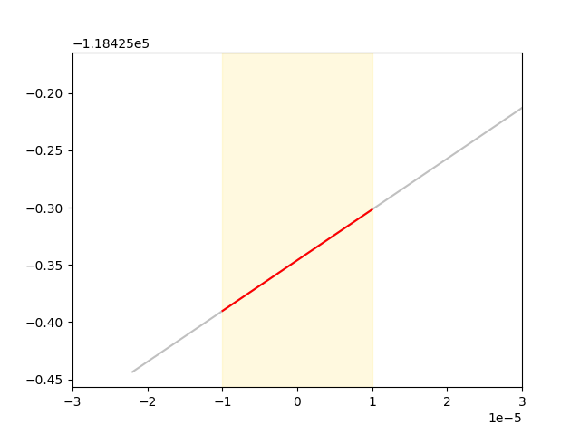

## Equation 3:
```
ICaL__PhiCaNa = (-0.75 * extracellular__nao + 0.75 * intracellular_ions__nass * exp(membrane__vfrt)) * membrane__vffrt / (-1.0 + exp(membrane__vfrt))
```
## New Eq:
```
ICaL__PhiCaNa = ((fabs(membrane__v) < 1.0000000000000001e-5) ? (49999.999999999993 * (1.0000000000000001e-5 + membrane__v) * (1.0000000000000001e-5 * pow(physical_constants__F, 2) * (-0.75 * extracellular__nao + 0.75 * intracellular_ions__nass * exp(1.0000000000000001e-5 * physical_constants__F / (physical_constants__R * physical_constants__T))) / ((-1.0 + exp(1.0000000000000001e-5 * physical_constants__F / (physical_constants__R * physical_constants__T))) * physical_constants__R * physical_constants__T) + 1.0000000000000001e-5 * pow(physical_constants__F, 2) * (-0.75 * extracellular__nao + 0.75 * intracellular_ions__nass * exp(-1.0000000000000001e-5 * physical_constants__F / (physical_constants__R * physical_constants__T))) / ((-1.0 + exp(-1.0000000000000001e-5 * physical_constants__F / (physical_constants__R * physical_constants__T))) * physical_constants__R * physical_constants__T)) - 1.0000000000000001e-5 * pow(physical_constants__F, 2) * (-0.75 * extracellular__nao + 0.75 * intracellular_ions__nass * exp(-1.0000000000000001e-5 * physical_constants__F / (physical_constants__R * physical_constants__T))) / ((-1.0 + exp(-1.0000000000000001e-5 * physical_constants__F / (physical_constants__R * physical_constants__T))) * physical_constants__R * physical_constants__T)) : (pow(physical_constants__F, 2) * (-0.75 * extracellular__nao + 0.75 * intracellular_ions__nass * exp(membrane__v * physical_constants__F / (physical_constants__R * physical_constants__T))) * membrane__v / ((-1.0 + exp(membrane__v * physical_constants__F / (physical_constants__R * physical_constants__T))) * physical_constants__R * physical_constants__T)))
```
## Singularity point: 0


## Equation 4:
```
ICab__ICab = 4.0 * (-0.34100000000000003 * extracellular__cao + intracellular_ions__casl * exp(2.0 * membrane__vfrt)) * ICab__PCab * membrane__vffrt / (-1.0 + exp(2.0 * membrane__vfrt))
```
## New Eq:
```
ICab__ICab = ((fabs(membrane__v) < 1.0000000000000001e-5) ? (49999.999999999993 * (1.0000000000000001e-5 + membrane__v) * (9.9999999999999998e-13 * pow(physical_constants__F, 2) * (-0.34100000000000003 * extracellular__cao + intracellular_ions__casl * exp(2.0000000000000002e-5 * physical_constants__F / (physical_constants__R * physical_constants__T))) / ((-1.0 + exp(2.0000000000000002e-5 * physical_constants__F / (physical_constants__R * physical_constants__T))) * physical_constants__R * physical_constants__T) + 9.9999999999999998e-13 * pow(physical_constants__F, 2) * (-0.34100000000000003 * extracellular__cao + intracellular_ions__casl * exp(-2.0000000000000002e-5 * physical_constants__F / (physical_constants__R * physical_constants__T))) / ((-1.0 + exp(-2.0000000000000002e-5 * physical_constants__F / (physical_constants__R * physical_constants__T))) * physical_constants__R * physical_constants__T)) - 9.9999999999999998e-13 * pow(physical_constants__F, 2) * (-0.34100000000000003 * extracellular__cao + intracellular_ions__casl * exp(-2.0000000000000002e-5 * physical_constants__F / (physical_constants__R * physical_constants__T))) / ((-1.0 + exp(-2.0000000000000002e-5 * physical_constants__F / (physical_constants__R * physical_constants__T))) * physical_constants__R * physical_constants__T)) : (9.9999999999999995e-8 * pow(physical_constants__F, 2) * (-0.34100000000000003 * extracellular__cao + intracellular_ions__casl * exp(2.0 * membrane__v * physical_constants__F / (physical_constants__R * physical_constants__T))) * membrane__v / ((-1.0 + exp(2.0 * membrane__v * physical_constants__F / (physical_constants__R * physical_constants__T))) * physical_constants__R * physical_constants__T)))
```
## Singularity point: 0


## Equation 5:
```
INab__INab = (-extracellular__nao + intracellular_ions__nasl * exp(membrane__vfrt)) * INab__PNab * membrane__vffrt / (-1.0 + exp(membrane__vfrt))
```
## New Eq:
```
INab__INab = ((fabs(membrane__v) < 1.0000000000000001e-5) ? (49999.999999999993 * (1.0000000000000001e-5 + membrane__v) * (9.3749999999999995e-15 * pow(physical_constants__F, 2) * (-extracellular__nao + intracellular_ions__nasl * exp(1.0000000000000001e-5 * physical_constants__F / (physical_constants__R * physical_constants__T))) / ((-1.0 + exp(1.0000000000000001e-5 * physical_constants__F / (physical_constants__R * physical_constants__T))) * physical_constants__R * physical_constants__T) + 9.3749999999999995e-15 * pow(physical_constants__F, 2) * (-extracellular__nao + intracellular_ions__nasl * exp(-1.0000000000000001e-5 * physical_constants__F / (physical_constants__R * physical_constants__T))) / ((-1.0 + exp(-1.0000000000000001e-5 * physical_constants__F / (physical_constants__R * physical_constants__T))) * physical_constants__R * physical_constants__T)) - 9.3749999999999995e-15 * pow(physical_constants__F, 2) * (-extracellular__nao + intracellular_ions__nasl * exp(-1.0000000000000001e-5 * physical_constants__F / (physical_constants__R * physical_constants__T))) / ((-1.0 + exp(-1.0000000000000001e-5 * physical_constants__F / (physical_constants__R * physical_constants__T))) * physical_constants__R * physical_constants__T)) : (9.3749999999999992e-10 * pow(physical_constants__F, 2) * (-extracellular__nao + intracellular_ions__nasl * exp(membrane__v * physical_constants__F / (physical_constants__R * physical_constants__T))) * membrane__v / ((-1.0 + exp(membrane__v * physical_constants__F / (physical_constants__R * physical_constants__T))) * physical_constants__R * physical_constants__T)))
```
## Singularity point: 0
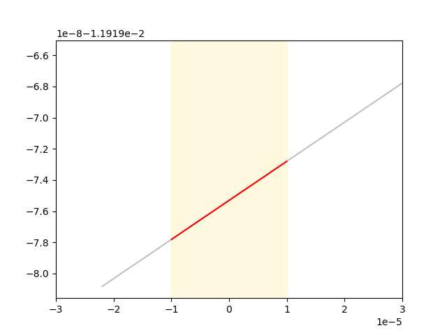

# of singularities:  5
# Model: viswanathan_model_1999_epi(viswanathan_model_1999_epi.cellml)
No of piecewises: 13
## Equation 1:
```
L_type_Ca_channel__I_CaCa = 4.0 * pow(membrane__F, 2) * (-L_type_Ca_channel__gamma_Cao * calcium_dynamics__Cao + L_type_Ca_channel__gamma_Cai * calcium_dynamics__Cai * exp(2.0 * membrane__F * membrane__V / (membrane__R * membrane__T))) * L_type_Ca_channel__P_Ca * membrane__V / ((-1.0 + exp(2.0 * membrane__F * membrane__V / (membrane__R * membrane__T))) * membrane__R * membrane__T)
```
## New Eq:
```
L_type_Ca_channel__I_CaCa = ((fabs(membrane__V) < 1.0000000000000001e-5) ? (49999.999999999993 * (1.0000000000000001e-5 + membrane__V) * (7.8019226357407251e-5 * (-0.34100000000000003 * calcium_dynamics__Cao + calcium_dynamics__Cai * exp(7.4871767015605244e-7)) / (-1.0 + exp(7.4871767015605244e-7)) + 7.8019226357407251e-5 * (-0.34100000000000003 * calcium_dynamics__Cao + calcium_dynamics__Cai * exp(-7.4871767015605244e-7)) / (-1.0 + exp(-7.4871767015605244e-7))) - 7.8019226357407251e-5 * (-0.34100000000000003 * calcium_dynamics__Cao + calcium_dynamics__Cai * exp(-7.4871767015605244e-7)) / (-1.0 + exp(-7.4871767015605244e-7))) : (7.8019226357407252 * (-0.34100000000000003 * calcium_dynamics__Cao + calcium_dynamics__Cai * exp(0.074871767015605231 * membrane__V)) * membrane__V / (-1.0 + exp(0.074871767015605231 * membrane__V))))
```
## Singularity point: 0
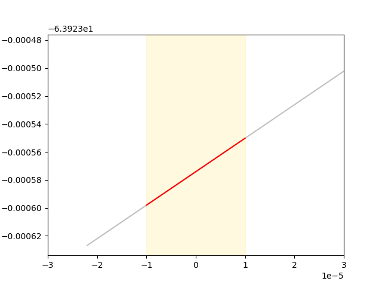

## Equation 2:
```
L_type_Ca_channel__I_CaK = pow(membrane__F, 2) * (-L_type_Ca_channel__gamma_Ko * ionic_concentrations__Ko + L_type_Ca_channel__gamma_Ki * ionic_concentrations__Ki * exp(membrane__F * membrane__V / (membrane__R * membrane__T))) * L_type_Ca_channel__P_K * membrane__V / ((-1.0 + exp(membrane__F * membrane__V / (membrane__R * membrane__T))) * membrane__R * membrane__T)
```
## New Eq:
```
L_type_Ca_channel__I_CaK = ((fabs(membrane__V) < 1.0000000000000001e-5) ? (49999.999999999993 * (1.0000000000000001e-5 + membrane__V) * (6.9711623550831478e-9 * (-0.75 * ionic_concentrations__Ko + 0.75 * ionic_concentrations__Ki * exp(3.7435883507802622e-7)) / (-1.0 + exp(3.7435883507802622e-7)) + 6.9711623550831478e-9 * (-0.75 * ionic_concentrations__Ko + 0.75 * ionic_concentrations__Ki * exp(-3.7435883507802622e-7)) / (-1.0 + exp(-3.7435883507802622e-7))) - 6.9711623550831478e-9 * (-0.75 * ionic_concentrations__Ko + 0.75 * ionic_concentrations__Ki * exp(-3.7435883507802622e-7)) / (-1.0 + exp(-3.7435883507802622e-7))) : (0.00069711623550831479 * (-0.75 * ionic_concentrations__Ko + 0.75 * ionic_concentrations__Ki * exp(0.037435883507802616 * membrane__V)) * membrane__V / (-1.0 + exp(0.037435883507802616 * membrane__V))))
```
## Singularity point: 0


## Equation 3:
```
L_type_Ca_channel__I_CaNa = pow(membrane__F, 2) * (-L_type_Ca_channel__gamma_Nao * ionic_concentrations__Nao + L_type_Ca_channel__gamma_Nai * ionic_concentrations__Nai * exp(membrane__F * membrane__V / (membrane__R * membrane__T))) * L_type_Ca_channel__P_Na * membrane__V / ((-1.0 + exp(membrane__F * membrane__V / (membrane__R * membrane__T))) * membrane__R * membrane__T)
```
## New Eq:
```
L_type_Ca_channel__I_CaNa = ((fabs(membrane__V) < 1.0000000000000001e-5) ? (49999.999999999993 * (1.0000000000000001e-5 + membrane__V) * (2.4381008236689766e-8 * (-0.75 * ionic_concentrations__Nao + 0.75 * ionic_concentrations__Nai * exp(3.7435883507802622e-7)) / (-1.0 + exp(3.7435883507802622e-7)) + 2.4381008236689766e-8 * (-0.75 * ionic_concentrations__Nao + 0.75 * ionic_concentrations__Nai * exp(-3.7435883507802622e-7)) / (-1.0 + exp(-3.7435883507802622e-7))) - 2.4381008236689766e-8 * (-0.75 * ionic_concentrations__Nao + 0.75 * ionic_concentrations__Nai * exp(-3.7435883507802622e-7)) / (-1.0 + exp(-3.7435883507802622e-7))) : (0.0024381008236689767 * (-0.75 * ionic_concentrations__Nao + 0.75 * ionic_concentrations__Nai * exp(0.037435883507802616 * membrane__V)) * membrane__V / (-1.0 + exp(0.037435883507802616 * membrane__V))))
```
## Singularity point: 0


## Equation 4:
```
L_type_Ca_channel_d_gate__tau_d = 0.028571428571428571 * (1.0 - exp(-1.6025641025641024 - 0.16025641025641024 * membrane__V)) * L_type_Ca_channel_d_gate__d_infinity / (10.0 + membrane__V)
```
## New Eq:
```
L_type_Ca_channel_d_gate__tau_d = ((fabs(10.0 + membrane__V) < 9.9999999999961231e-6) ? (50000.000000019383 * (10.00001 + membrane__V) * (2857.1428571439646 * (1.0 - exp(1.6025641025634812e-6)) / (1.0 + exp(1.6025641025634812e-6)) + 2857.1428571439646 * (1.0 - exp(-1.6025641025634812e-6)) / (1.0 + exp(-1.6025641025634812e-6))) - 2857.1428571439646 * (1.0 - exp(1.6025641025634812e-6)) / (1.0 + exp(1.6025641025634812e-6))) : (0.028571428571428571 * (1.0 - exp(-1.6025641025641024 - 0.16025641025641024 * membrane__V)) / ((1.0 + exp(-1.6025641025641024 - 0.16025641025641024 * membrane__V)) * (10.0 + membrane__V))))
```
## Singularity point: -10.000000000000000


## Equation 5:
```
fast_sodium_current_m_gate__alpha_m = 320.0 * (47.130000000000003 + membrane__V) / (1.0 - exp(-4.7130000000000001 - 0.10000000000000001 * membrane__V))
```
## New Eq:
```
fast_sodium_current_m_gate__alpha_m = ((fabs(47.130000000000003 + membrane__V) < 1.0000000000010001e-5) ? (-0.0032000000000032003 / (1.0 - exp(1.0000000000010001e-6)) + 49999.999999949992 * (47.130010000000006 + membrane__V) * (0.0032000000000032003 / (1.0 - exp(1.0000000000010001e-6)) + 0.0032000000000032003 / (1.0 - exp(-1.0000000000010001e-6)))) : (320.0 * (47.130000000000003 + membrane__V) / (1.0 - exp(-4.7130000000000001 - 0.10000000000000001 * membrane__V))))
```
## Singularity point: -47.130000000000003


## Equation 6:
```
rapid_delayed_rectifier_potassium_current_xr_gate__tau_xr = 0.001 / (0.00060999999999999997 * (38.899999999999999 + membrane__V) / (-1.0 + exp(5.6404999999999994 + 0.14499999999999999 * membrane__V)) + 0.0013799999999999999 * (14.199999999999999 + membrane__V) / (1.0 - exp(-1.7465999999999999 - 0.123 * membrane__V)))
```
## New Eq:
```
rapid_delayed_rectifier_potassium_current_xr_gate__tau_xr = 0.001 / (((fabs(38.899999999999999 + membrane__V) < 1.0000000000010001e-5) ? (-6.1000000000061005e-9 / (-1.0 + exp(-1.45000000000145e-6)) + 49999.999999949992 * (38.900010000000002 + membrane__V) * (6.1000000000061005e-9 / (-1.0 + exp(1.45000000000145e-6)) + 6.1000000000061005e-9 / (-1.0 + exp(-1.45000000000145e-6)))) : (0.00060999999999999997 * (38.899999999999999 + membrane__V) / (-1.0 + exp(5.6404999999999994 + 0.14499999999999999 * membrane__V)))) + ((fabs(14.199999999999999 + membrane__V) < 9.9999999999961231e-6) ? (-1.3799999999994649e-8 / (1.0 - exp(1.2299999999995232e-6)) + 50000.000000019383 * (14.200009999999999 + membrane__V) * (1.3799999999994649e-8 / (1.0 - exp(1.2299999999995232e-6)) + 1.3799999999994649e-8 / (1.0 - exp(-1.2299999999995232e-6)))) : (0.0013799999999999999 * (14.199999999999999 + membrane__V) / (1.0 - exp(-1.7465999999999999 - 0.123 * membrane__V)))))
```
## Singularity point: -38.899999999999999

## Singularity point: -14.199999999999999


## Equation 7:
```
slow_delayed_rectifier_potassium_current_xs1_gate__tau_xs1 = 0.001 / (0.00013100000000000001 * (30.0 + membrane__V) / (-1.0 + exp(2.0609999999999999 + 0.068699999999999997 * membrane__V)) + 7.1899999999999999e-5 * (30.0 + membrane__V) / (1.0 - exp(-4.4399999999999995 - 0.14799999999999999 * membrane__V)))
```
## New Eq:
```
slow_delayed_rectifier_potassium_current_xs1_gate__tau_xs1 = 0.001 * ((fabs(30.0 + membrane__V) < 1.0000000000010001e-5) ? (1 / (-7.1900000000071903e-10 / (1.0 - exp(1.48000000000148e-6)) - 1.3100000000013103e-9 / (-1.0 + exp(-6.8700000000068699e-7)) + 49999.999999949992 * (30.00001 + membrane__V) * (7.1900000000071903e-10 / (1.0 - exp(1.48000000000148e-6)) + 7.1900000000071903e-10 / (1.0 - exp(-1.48000000000148e-6)) + 1.3100000000013103e-9 / (-1.0 + exp(6.8700000000068699e-7)) + 1.3100000000013103e-9 / (-1.0 + exp(-6.8700000000068699e-7))))) : (1 / (0.00013100000000000001 * (30.0 + membrane__V) / (-1.0 + exp(2.0609999999999999 + 0.068699999999999997 * membrane__V)) + 7.1899999999999999e-5 * (30.0 + membrane__V) / (1.0 - exp(-4.4399999999999995 - 0.14799999999999999 * membrane__V)))))
```
## Singularity point: -30.000000000000000


## Equation 8:
```
slow_delayed_rectifier_potassium_current_xs2_gate__tau_xs2 = 0.0040000000000000001 / (0.00013100000000000001 * (30.0 + membrane__V) / (-1.0 + exp(2.0609999999999999 + 0.068699999999999997 * membrane__V)) + 7.1899999999999999e-5 * (30.0 + membrane__V) / (1.0 - exp(-4.4399999999999995 - 0.14799999999999999 * membrane__V)))
```
## New Eq:
```
slow_delayed_rectifier_potassium_current_xs2_gate__tau_xs2 = 0.0040000000000000001 * ((fabs(30.0 + membrane__V) < 1.0000000000010001e-5) ? (1 / (-7.1900000000071903e-10 / (1.0 - exp(1.48000000000148e-6)) - 1.3100000000013103e-9 / (-1.0 + exp(-6.8700000000068699e-7)) + 49999.999999949992 * (30.00001 + membrane__V) * (7.1900000000071903e-10 / (1.0 - exp(1.48000000000148e-6)) + 7.1900000000071903e-10 / (1.0 - exp(-1.48000000000148e-6)) + 1.3100000000013103e-9 / (-1.0 + exp(6.8700000000068699e-7)) + 1.3100000000013103e-9 / (-1.0 + exp(-6.8700000000068699e-7))))) : (1 / (0.00013100000000000001 * (30.0 + membrane__V) / (-1.0 + exp(2.0609999999999999 + 0.068699999999999997 * membrane__V)) + 7.1899999999999999e-5 * (30.0 + membrane__V) / (1.0 - exp(-4.4399999999999995 - 0.14799999999999999 * membrane__V)))))
```
## Singularity point: -30.000000000000000


# of singularities:  9
# Model: wang_model_2008(wang_sobie_2008.cellml)
No of piecewises: 4
## Equation 1:
```
calcium_activated_chloride_current__i_ClCa = pow(membrane__F, 2) * (-membrane__Cli + membrane__Clo * exp(membrane__F * membrane__V / (membrane__R * membrane__T))) * calcium_activated_chloride_current__P_ClCa * calcium_activated_chloride_current__f_ClCa * membrane__V / ((-1.0 + exp(membrane__F * membrane__V / (membrane__R * membrane__T))) * membrane__R * membrane__T)
```
## New Eq:
```
calcium_activated_chloride_current__i_ClCa = ((fabs(membrane__V) < 1.0000000000000001e-5) ? (49999.999999999993 * (1.0000000000000001e-5 + membrane__V) * (1.6091588988130315e-13 * pow(calcium_concentration__Cass, 3) * (-membrane__Cli + membrane__Clo * exp(3.8949423064193495e-7)) / (pow((1 + 0.25 * calcium_concentration__Cass), 3) * (-1.0 + exp(3.8949423064193495e-7))) + 1.6091588988130315e-13 * pow(calcium_concentration__Cass, 3) * (-membrane__Cli + membrane__Clo * exp(-3.8949423064193495e-7)) / (pow((1 + 0.25 * calcium_concentration__Cass), 3) * (-1.0 + exp(-3.8949423064193495e-7)))) - 1.6091588988130315e-13 * pow(calcium_concentration__Cass, 3) * (-membrane__Cli + membrane__Clo * exp(-3.8949423064193495e-7)) / (pow((1 + 0.25 * calcium_concentration__Cass), 3) * (-1.0 + exp(-3.8949423064193495e-7)))) : (1.6091588988130313e-8 * pow(calcium_concentration__Cass, 3) * (-membrane__Cli + membrane__Clo * exp(0.038949423064193495 * membrane__V)) * membrane__V / (pow((1 + 0.25 * calcium_concentration__Cass), 3) * (-1.0 + exp(0.038949423064193495 * membrane__V)))))
```
## Singularity point: 0


## Equation 2:
```
fast_sodium_current_m_gate__alpha_m = 0.32000000000000001 * (47.130000000000003 + membrane__V) / (1.0 - exp(-4.7130000000000001 - 0.10000000000000001 * membrane__V))
```
## New Eq:
```
fast_sodium_current_m_gate__alpha_m = ((fabs(47.130000000000003 + membrane__V) < 1.0000000000010001e-5) ? (-3.2000000000032004e-6 / (1.0 - exp(1.0000000000010001e-6)) + 49999.999999949992 * (47.130010000000006 + membrane__V) * (3.2000000000032004e-6 / (1.0 - exp(1.0000000000010001e-6)) + 3.2000000000032004e-6 / (1.0 - exp(-1.0000000000010001e-6)))) : (0.32000000000000001 * (47.130000000000003 + membrane__V) / (1.0 - exp(-4.7130000000000001 - 0.10000000000000001 * membrane__V))))
```
## Singularity point: -47.130000000000003


## Equation 3:
```
slow_delayed_rectifier_potassium_current__alpha_n = 4.8133299999999997e-6 * (26.5 + membrane__V) / (1.0 - exp(-3.3919999999999999 - 0.128 * membrane__V))
```
## New Eq:
```
slow_delayed_rectifier_potassium_current__alpha_n = ((fabs(26.5 + membrane__V) < 1.0000000000010001e-5) ? (-4.8133300000048136e-11 / (1.0 - exp(1.2800000000012801e-6)) + 49999.999999949992 * (26.50001 + membrane__V) * (4.8133300000048136e-11 / (1.0 - exp(1.2800000000012801e-6)) + 4.8133300000048136e-11 / (1.0 - exp(-1.2800000000012801e-6)))) : (4.8133299999999997e-6 * (26.5 + membrane__V) / (1.0 - exp(-3.3919999999999999 - 0.128 * membrane__V))))
```
## Singularity point: -26.500000000000000


# of singularities:  3
# Model: winslow_model_1999(winslow_model_1999.cellml)
No of piecewises: 5
## Equation 1:
```
fast_sodium_current_m_gate__alpha_m = 320.0 * (47.130000000000003 + membrane__V) / (1.0 - exp(-4.7130000000000001 - 0.10000000000000001 * membrane__V))
```
## New Eq:
```
fast_sodium_current_m_gate__alpha_m = ((fabs(47.130000000000003 + membrane__V) < 1.0000000000010001e-5) ? (-0.0032000000000032003 / (1.0 - exp(1.0000000000010001e-6)) + 49999.999999949992 * (47.130010000000006 + membrane__V) * (0.0032000000000032003 / (1.0 - exp(1.0000000000010001e-6)) + 0.0032000000000032003 / (1.0 - exp(-1.0000000000010001e-6)))) : (320.0 * (47.130000000000003 + membrane__V) / (1.0 - exp(-4.7130000000000001 - 0.10000000000000001 * membrane__V))))
```
## Singularity point: -47.130000000000003
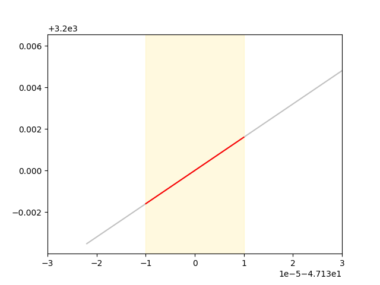

## Equation 2:
```
slow_activating_delayed_rectifiyer_K_current_X_ks_gate__tau_X_ks = 0.001 / (0.00013100000000000001 * (-10.0 + membrane__V) / (-1.0 + exp(-0.68699999999999994 + 0.068699999999999997 * membrane__V)) + 7.1899999999999999e-5 * (-10.0 + membrane__V) / (1.0 - exp(1.48 - 0.14799999999999999 * membrane__V)))
```
## New Eq:
```
slow_activating_delayed_rectifiyer_K_current_X_ks_gate__tau_X_ks = 0.001 * ((fabs(-10.0 + membrane__V) < 9.9999999999961231e-6) ? (1 / (-7.1899999999972124e-10 / (1.0 - exp(1.4799999999994262e-6)) - 1.3099999999994923e-9 / (-1.0 + exp(-6.8699999999973366e-7)) + 50000.000000019383 * (-9.9999900000000004 + membrane__V) * (7.1899999999972124e-10 / (1.0 - exp(1.4799999999994262e-6)) + 7.1899999999972124e-10 / (1.0 - exp(-1.4799999999994262e-6)) + 1.3099999999994923e-9 / (-1.0 + exp(6.8699999999973366e-7)) + 1.3099999999994923e-9 / (-1.0 + exp(-6.8699999999973366e-7))))) : (1 / (0.00013100000000000001 * (-10.0 + membrane__V) / (-1.0 + exp(-0.68699999999999994 + 0.068699999999999997 * membrane__V)) + 7.1899999999999999e-5 * (-10.0 + membrane__V) / (1.0 - exp(1.48 - 0.14799999999999999 * membrane__V)))))
```
## Singularity point: 10.000000000000000


## Equation 3:
```
L_type_Ca_current__i_Ca_max = 4000.0 * pow(membrane__F, 2) * (0.001 * exp(2.0 * membrane__F * membrane__V / (membrane__R * membrane__T)) - 0.34100000000000003 * standard_ionic_concentrations__Cao) * L_type_Ca_current__P_Ca * membrane__V / ((-1.0 + exp(2.0 * membrane__F * membrane__V / (membrane__R * membrane__T))) * membrane__R * membrane__T)
```
## New Eq:
```
L_type_Ca_current__i_Ca_max = ((fabs(membrane__V) < 1.0000000000000001e-5) ? (49999.999999999993 * (1.0000000000000001e-5 + membrane__V) * (0.14447286958825253 * (0.001 * exp(7.4867781645490955e-7) - 0.34100000000000003 * standard_ionic_concentrations__Cao) * L_type_Ca_current__P_Ca / (-1.0 + exp(7.4867781645490955e-7)) + 0.14447286958825253 * (0.001 * exp(-7.4867781645490955e-7) - 0.34100000000000003 * standard_ionic_concentrations__Cao) * L_type_Ca_current__P_Ca / (-1.0 + exp(-7.4867781645490955e-7))) - 0.14447286958825253 * (0.001 * exp(-7.4867781645490955e-7) - 0.34100000000000003 * standard_ionic_concentrations__Cao) * L_type_Ca_current__P_Ca / (-1.0 + exp(-7.4867781645490955e-7))) : (14447.286958825252 * (0.001 * exp(0.074867781645490947 * membrane__V) - 0.34100000000000003 * standard_ionic_concentrations__Cao) * L_type_Ca_current__P_Ca * membrane__V / (-1.0 + exp(0.074867781645490947 * membrane__V))))
```
## Singularity point: 0
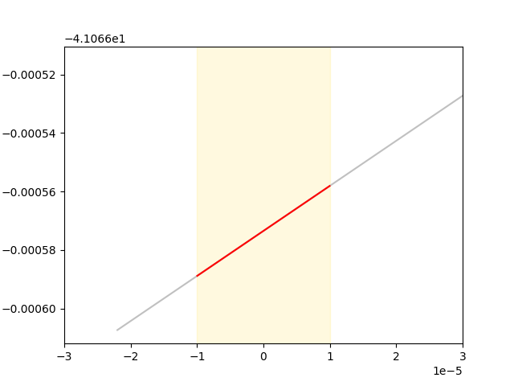

## Equation 4:
```
L_type_Ca_current__i_Ca_K = pow(membrane__F, 2) * (-standard_ionic_concentrations__Ko + intracellular_ion_concentrations__Ki * exp(membrane__F * membrane__V / (membrane__R * membrane__T))) * (L_type_Ca_current__O + L_type_Ca_current__O_Ca) * L_type_Ca_current__p_prime_k * L_type_Ca_current_y_gate__y * membrane__V / ((-1.0 + exp(membrane__F * membrane__V / (membrane__R * membrane__T))) * membrane__R * membrane__T)
```
## New Eq:
```
L_type_Ca_current__i_Ca_K = ((fabs(membrane__V) < 1.0000000000000001e-5) ? (49999.999999999993 * (1.0000000000000001e-5 + membrane__V) * (2.0912447872899553e-11 * (-standard_ionic_concentrations__Ko + intracellular_ion_concentrations__Ki * exp(3.7433890822745477e-7)) * (L_type_Ca_current__O + L_type_Ca_current__O_Ca) * L_type_Ca_current_y_gate__y / ((1.0 - 3.773584905660377 * L_type_Ca_current__i_Ca_max) * (-1.0 + exp(3.7433890822745477e-7))) + 2.0912447872899553e-11 * (-standard_ionic_concentrations__Ko + intracellular_ion_concentrations__Ki * exp(-3.7433890822745477e-7)) * (L_type_Ca_current__O + L_type_Ca_current__O_Ca) * L_type_Ca_current_y_gate__y / ((1.0 - 3.773584905660377 * L_type_Ca_current__i_Ca_max) * (-1.0 + exp(-3.7433890822745477e-7)))) - 2.0912447872899553e-11 * (-standard_ionic_concentrations__Ko + intracellular_ion_concentrations__Ki * exp(-3.7433890822745477e-7)) * (L_type_Ca_current__O + L_type_Ca_current__O_Ca) * L_type_Ca_current_y_gate__y / ((1.0 - 3.773584905660377 * L_type_Ca_current__i_Ca_max) * (-1.0 + exp(-3.7433890822745477e-7)))) : (2.0912447872899554e-6 * (-standard_ionic_concentrations__Ko + intracellular_ion_concentrations__Ki * exp(0.037433890822745473 * membrane__V)) * (L_type_Ca_current__O + L_type_Ca_current__O_Ca) * L_type_Ca_current_y_gate__y * membrane__V / ((1.0 - 3.773584905660377 * L_type_Ca_current__i_Ca_max) * (-1.0 + exp(0.037433890822745473 * membrane__V)))))
```
## Singularity point: 0

## Singularity point: 0


# of singularities:  4
# Model: zhang_SAN_model_2000_0D_capable(zhang_SAN_model_2000_0D_capable.cellml)
No of piecewises: 0
## Equation 1:
```
L_type_Ca_channel_d_gate__alpha_d_L = -28.390000000000001 * (35.0 + membrane__V) / (-1.0 + exp(-14.0 - 0.40000000000000002 * membrane__V)) - 84.900000000000006 * membrane__V / (-1.0 + exp(-0.20799999999999999 * membrane__V))
```
## New Eq:
```
L_type_Ca_channel_d_gate__alpha_d_L = ((fabs(membrane__V) < 1.0000000000000001e-5) ? (0.00084900000000000015 / (-1.0 + exp(2.08e-6)) + 49999.999999999993 * (1.0000000000000001e-5 + membrane__V) * (-0.00084900000000000015 / (-1.0 + exp(2.08e-6)) - 0.00084900000000000015 / (-1.0 + exp(-2.08e-6)))) : (-84.900000000000006 * membrane__V / (-1.0 + exp(-0.20799999999999999 * membrane__V)))) + ((fabs(35.0 + membrane__V) < 1.0000000000010001e-5) ? (0.00028390000000028391 / (-1.0 + exp(4.0000000000040004e-6)) + 49999.999999949992 * (35.000010000000003 + membrane__V) * (-0.00028390000000028391 / (-1.0 + exp(4.0000000000040004e-6)) - 0.00028390000000028391 / (-1.0 + exp(-4.0000000000040004e-6)))) : (-28.390000000000001 * (35.0 + membrane__V) / (-1.0 + exp(-14.0 - 0.40000000000000002 * membrane__V))))
```
## Singularity point: 0
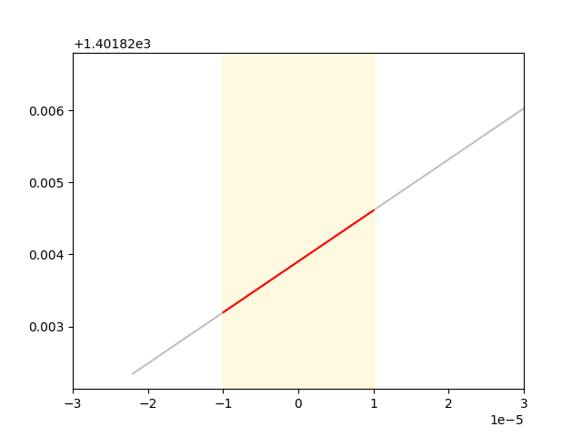
## Singularity point: -35.000000000000000


## Equation 2:
```
L_type_Ca_channel_d_gate__beta_d_L = 11.43 * (-5.0 + membrane__V) / (-1.0 + exp(-2.0 + 0.40000000000000002 * membrane__V))
```
## New Eq:
```
L_type_Ca_channel_d_gate__beta_d_L = ((fabs(-5.0 + membrane__V) < 1.0000000000003062e-5) ? (-0.00011430000000003499 / (-1.0 + exp(-4.0000000000012246e-6)) + 49999.999999984691 * (-4.9999900000000004 + membrane__V) * (0.00011430000000003499 / (-1.0 + exp(4.0000000000012246e-6)) + 0.00011430000000003499 / (-1.0 + exp(-4.0000000000012246e-6)))) : (11.43 * (-5.0 + membrane__V) / (-1.0 + exp(-2.0 + 0.40000000000000002 * membrane__V))))
```
## Singularity point: 5.0000000000000000


## Equation 3:
```
L_type_Ca_channel_f_gate__alpha_f_L = 3.75 * (28.0 + membrane__V) / (-1.0 + exp(7.0 + 0.25 * membrane__V))
```
## New Eq:
```
L_type_Ca_channel_f_gate__alpha_f_L = ((fabs(28.0 + membrane__V) < 1.0000000000010001e-5) ? (-3.7500000000037503e-5 / (-1.0 + exp(-2.5000000000025002e-6)) + 49999.999999949992 * (28.00001 + membrane__V) * (3.7500000000037503e-5 / (-1.0 + exp(2.5000000000025002e-6)) + 3.7500000000037503e-5 / (-1.0 + exp(-2.5000000000025002e-6)))) : (3.75 * (28.0 + membrane__V) / (-1.0 + exp(7.0 + 0.25 * membrane__V))))
```
## Singularity point: -28.000000000000000
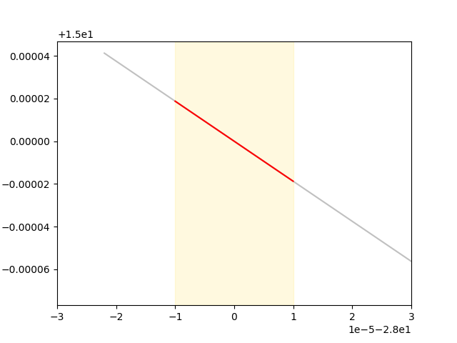

# of singularities:  4
