# Model: aslanidi_atrial_model_2009(aslanidi_atrial_model_2009.cellml)
load time: 4.1618351

*U*: 
-2.0798668885191347 - 0.20798668885191349 * membrane__V
*V for 1e-07 range* 
`-9.9999995191999993 - -10.000000480800001`
-10.000000000000000

*Singularity point: -10.000000000000000*

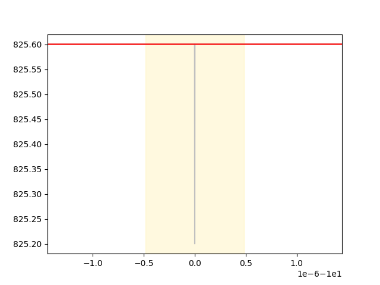
*U*: 
-18.0 - 0.40000000000000002 * membrane__V
*V for 1e-07 range* 
`-44.999999750000001 - -45.000000249999999`
-45.000000000000000

*Singularity point: -45.000000000000000*

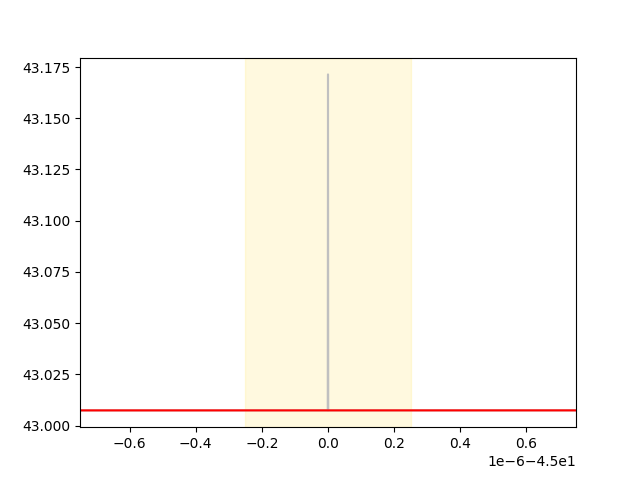
## Equation 1:
```
L_type_Ca_channel_d_L_gate__alpha_d_L = -50.0 * L_type_Ca_channel_d_L_gate__E10 / (-1.0 + exp(-0.20798668885191349 * L_type_Ca_channel_d_L_gate__E10)) - 16.719999999999999 * L_type_Ca_channel_d_L_gate__E0_alpha_d_L / (-1.0 + exp(-0.40000000000000002 * L_type_Ca_channel_d_L_gate__E0_alpha_d_L))
```
### Partially evaluated to: 
```
L_type_Ca_channel_d_L_gate__alpha_d_L = -50.0 * (10.0 + membrane__V) / (-1.0 + 0.12494684295098046 * exp(-0.20798668885191349 * membrane__V)) - 16.719999999999999 * (45.0 + membrane__V) / (-1.0 + 1.5229979744712629e-8 * exp(-0.40000000000000002 * membrane__V))
```
## New Eq:
```
L_type_Ca_channel_d_L_gate__alpha_d_L = ((fabs(10.0 + membrane__V) < 4.8080000000089163e-7) ? (1242.7001722212183 + 41.709968560833325 * membrane__V) : ((fabs(45.0 + membrane__V) < 2.5000000000718892e-7) ? (429.75968062441927 + 8.5944935844544048 * membrane__V) : (-50.0 * L_type_Ca_channel_d_L_gate__E10 / (-1.0 + exp(-0.20798668885191349 * L_type_Ca_channel_d_L_gate__E10)) - 16.719999999999999 * L_type_Ca_channel_d_L_gate__E0_alpha_d_L / (-1.0 + exp(-0.40000000000000002 * L_type_Ca_channel_d_L_gate__E0_alpha_d_L)))))
```

*U*: 
2.0 + 0.40000000000000002 * membrane__V
*V for 1e-07 range* 
`-5.0000002500000003 - -4.9999997499999997`
-5.0000000000000000

*Singularity point: -5.0000000000000000*


## Equation 2:
```
L_type_Ca_channel_d_L_gate__beta_d_L = 4.4800000000000004 * L_type_Ca_channel_d_L_gate__E0_beta_d_L / (-1.0 + exp(0.40000000000000002 * L_type_Ca_channel_d_L_gate__E0_beta_d_L))
```
### Partially evaluated to: 
```
L_type_Ca_channel_d_L_gate__beta_d_L = 4.4800000000000004 * (5.0 + membrane__V) / (-1.0 + 7.3890560989306504 * exp(0.40000000000000002 * membrane__V))
```
## New Eq:
```
L_type_Ca_channel_d_L_gate__beta_d_L = ((fabs(5.0 + membrane__V) < 2.5000000000025002e-7) ? (0.00020890531946092528 - 2.2399582189613714 * membrane__V) : (4.4800000000000004 * L_type_Ca_channel_d_L_gate__E0_beta_d_L / (-1.0 + exp(0.40000000000000002 * L_type_Ca_channel_d_L_gate__E0_beta_d_L))))
```

*U*: 
4.5 + 0.25 * membrane__V
*V for 1e-07 range* 
`-18.000000400000001 - -17.999999599999999`
-18.000000000000000

*Singularity point: -18.000000000000000*

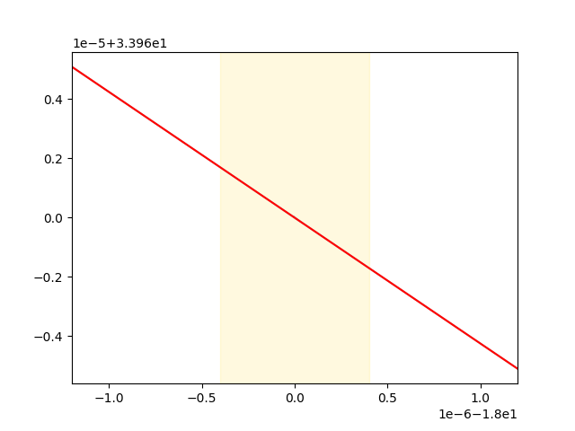
## Equation 3:
```
L_type_Ca_channel_f_L_gate__alpha_f_L = 8.4900000000000002 * L_type_Ca_channel_f_L_gate__E0_f_L / (-1.0 + exp(0.25 * L_type_Ca_channel_f_L_gate__E0_f_L))
```
### Partially evaluated to: 
```
L_type_Ca_channel_f_L_gate__alpha_f_L = 8.4900000000000002 * (18.0 + membrane__V) / (-1.0 + 90.017131300521811 * exp(0.25 * membrane__V))
```
## New Eq:
```
L_type_Ca_channel_f_L_gate__alpha_f_L = ((fabs(18.0 + membrane__V) < 4.0000000001150227e-7) ? (-42.448574776213569 - 4.2449208209089404 * membrane__V) : (8.4900000000000002 * L_type_Ca_channel_f_L_gate__E0_f_L / (-1.0 + exp(0.25 * L_type_Ca_channel_f_L_gate__E0_f_L))))
```

*U*: 
-3.5035114021936398 - 0.078907914463820727 * membrane__V
*V for 1e-07 range* 
`-44.399998732699999 - -44.400001267299999`
-44.399999999999999

*Singularity point: -44.399999999999999*


## Equation 4:
```
sodium_current_m_gate__alpha_m = -460.0 * sodium_current_m_gate__E0_m / (-1.0 + exp(-0.078907914463820727 * sodium_current_m_gate__E0_m))
```
### Partially evaluated to: 
```
sodium_current_m_gate__alpha_m = -460.0 * (44.399999999999999 + membrane__V) / (-1.0 + 0.030091534212260941 * exp(-0.078907914463820727 * membrane__V))
```
## New Eq:
```
sodium_current_m_gate__alpha_m = ((fabs(44.399999999999999 + membrane__V) < 1.2672999999963075e-6) ? (16043.161022403392 + 230.03560861286093 * membrane__V) : (-460.0 * sodium_current_m_gate__E0_m / (-1.0 + exp(-0.078907914463820727 * sodium_current_m_gate__E0_m))))
```

*U*: 
0.037679754693225945 * membrane__V
*V for 1e-07 range* 
`-2.6539450910485349e-6 - 2.6539450910485349e-6`

*Singularity point: 0*

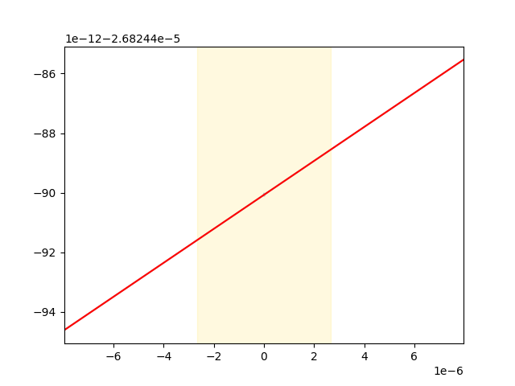
## Equation 5:
```
sodium_current__i_Na = pow(membrane__F, 2) * pow(sodium_current_m_gate__m, 3) * (-1.0 + exp((-sodium_current__E_Na + membrane__V) * membrane__F / (membrane__R * membrane__T))) * (0.36499999999999999 * sodium_current_h2_gate__h2 + 0.63500000000000001 * sodium_current_h1_gate__h1) * cleft_space_ion_concentrations__Na_c * membrane__V * sodium_current__P_Na / ((-1.0 + exp(membrane__F * membrane__V / (membrane__R * membrane__T))) * membrane__R * membrane__T)
```
### Partially evaluated to: 
```
sodium_current__i_Na = 3635.606491085292 * pow(sodium_current_m_gate__m, 3) * (-1.0 + pow((cleft_space_ion_concentrations__Na_c / intracellular_ion_concentrations__Na_i), (-1.0)) * exp(0.037679754693225945 * membrane__V)) * (0.36499999999999999 * sodium_current_h2_gate__h2 + 0.63500000000000001 * sodium_current_h1_gate__h1) * cleft_space_ion_concentrations__Na_c * membrane__V * sodium_current__P_Na / (-1.0 + exp(0.037679754693225945 * membrane__V))
```
## New Eq:
```
sodium_current__i_Na = ((fabs(membrane__V) < 2.6539450910485349e-6) ? ((0.5 + 188398.77346612973 * membrane__V) * (96486.995175057906 * pow(sodium_current_m_gate__m, 3) * (-1.0 + 1.0000001000000049 * pow((cleft_space_ion_concentrations__Na_c / intracellular_ion_concentrations__Na_i), (-1.0))) * (0.36499999999999999 * sodium_current_h2_gate__h2 + 0.63500000000000001 * sodium_current_h1_gate__h1) * cleft_space_ion_concentrations__Na_c * sodium_current__P_Na - 96487.00482441482 * pow(sodium_current_m_gate__m, 3) * (-1.0 + 0.99999990000000505 * pow((cleft_space_ion_concentrations__Na_c / intracellular_ion_concentrations__Na_i), (-1.0))) * (0.36499999999999999 * sodium_current_h2_gate__h2 + 0.63500000000000001 * sodium_current_h1_gate__h1) * cleft_space_ion_concentrations__Na_c * sodium_current__P_Na) + 96487.00482441482 * pow(sodium_current_m_gate__m, 3) * (-1.0 + 0.99999990000000505 * pow((cleft_space_ion_concentrations__Na_c / intracellular_ion_concentrations__Na_i), (-1.0))) * (0.36499999999999999 * sodium_current_h2_gate__h2 + 0.63500000000000001 * sodium_current_h1_gate__h1) * cleft_space_ion_concentrations__Na_c * sodium_current__P_Na) : (pow(membrane__F, 2) * pow(sodium_current_m_gate__m, 3) * (-1.0 + exp((-sodium_current__E_Na + membrane__V) * membrane__F / (membrane__R * membrane__T))) * (0.36499999999999999 * sodium_current_h2_gate__h2 + 0.63500000000000001 * sodium_current_h1_gate__h1) * cleft_space_ion_concentrations__Na_c * membrane__V * sodium_current__P_Na / ((-1.0 + exp(membrane__F * membrane__V / (membrane__R * membrane__T))) * membrane__R * membrane__T)))
```

singularity processing time: 34.8078314
# Model: aslanidi_2009(aslanidi_Purkinje_model_2009.cellml)
load time: 4.2362217000000015

*U*: 
-444.66200000000003 - 9.9700000000000006 * membrane__V
*V for 1e-07 range* 
`-44.599999989969909 - -44.600000010030094`
-44.600000000000001

*Singularity point: -44.600000000000001*

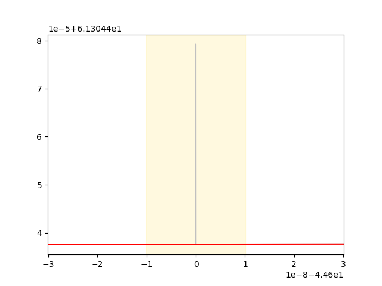
*U*: 
-0.070400000000000004 + 0.128 * membrane__V
*V for 1e-07 range* 
`0.54999921875000002 - 0.55000078125000007`
0.55000000000000005

*Singularity point: 0.55000000000000005*


## Equation 1:
```
i_Ks_xs1_gate__tau_xs1 = 1 / (7.6100000000000007e-5 * (44.600000000000001 + membrane__V) / (1.0 - exp(-444.66200000000003 - 9.9700000000000006 * membrane__V)) + 0.00036000000000000002 * (-0.55000000000000004 + membrane__V) / (-1.0 + exp(-0.070400000000000004 + 0.128 * membrane__V)))
```
### Partially evaluated to: 
```
i_Ks_xs1_gate__tau_xs1 = 1 / (7.6100000000000007e-5 * (44.600000000000001 + membrane__V) / (1.0 - 7.6868266637773744e-194 * exp(-9.9700000000000006 * membrane__V)) + 0.00036000000000000002 * (-0.55000000000000004 + membrane__V) / (-1.0 + 0.93202093695954691 * exp(0.128 * membrane__V)))
```
## New Eq:
```
i_Ks_xs1_gate__tau_xs1 = ((fabs(44.600000000000001 + membrane__V) < 1.0030090258350555e-8) ? (114.37134986698169 + 1.1898410825234575 * membrane__V) : ((fabs(-0.55000000000000004 + membrane__V) < 7.8124999999991396e-7) ? (158.57692829280447 + 2.6611963637893243 * membrane__V) : (1 / (7.6100000000000007e-5 * (44.600000000000001 + membrane__V) / (1.0 - exp(-444.66200000000003 - 9.9700000000000006 * membrane__V)) + 0.00036000000000000002 * (-0.55000000000000004 + membrane__V) / (-1.0 + exp(-0.070400000000000004 + 0.128 * membrane__V))))))
```

*U*: 
-444.66200000000003 - 9.9700000000000006 * membrane__V
*V for 1e-07 range* 
`-44.599999989969909 - -44.600000010030094`
-44.600000000000001

*Singularity point: -44.600000000000001*

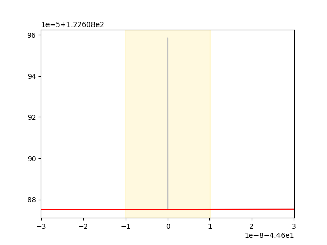
*U*: 
-0.070400000000000004 + 0.128 * membrane__V
*V for 1e-07 range* 
`0.54999921875000002 - 0.55000078125000007`
0.55000000000000005

*Singularity point: 0.55000000000000005*

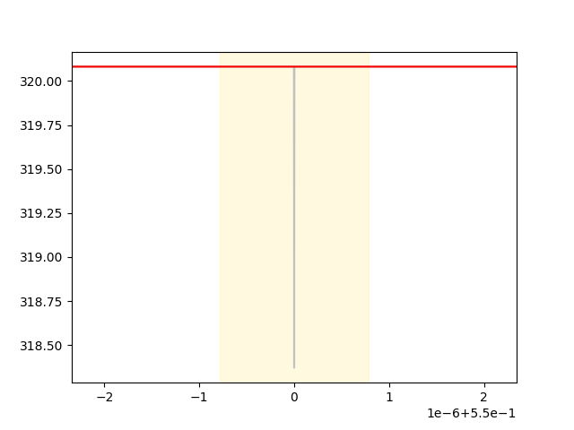
## Equation 2:
```
i_Ks_xs2_gate__tau_xs2 = 2.0 / (7.6100000000000007e-5 * (44.600000000000001 + membrane__V) / (1.0 - exp(-444.66200000000003 - 9.9700000000000006 * membrane__V)) + 0.00036000000000000002 * (-0.55000000000000004 + membrane__V) / (-1.0 + exp(-0.070400000000000004 + 0.128 * membrane__V)))
```
### Partially evaluated to: 
```
i_Ks_xs2_gate__tau_xs2 = 2.0 / (7.6100000000000007e-5 * (44.600000000000001 + membrane__V) / (1.0 - 7.6868266637773744e-194 * exp(-9.9700000000000006 * membrane__V)) + 0.00036000000000000002 * (-0.55000000000000004 + membrane__V) / (-1.0 + 0.93202093695954691 * exp(0.128 * membrane__V)))
```
## New Eq:
```
i_Ks_xs2_gate__tau_xs2 = ((fabs(44.600000000000001 + membrane__V) < 1.0030090258350555e-8) ? (228.74269973396338 + 2.3796821650469151 * membrane__V) : ((fabs(-0.55000000000000004 + membrane__V) < 7.8124999999991396e-7) ? (317.15385658560893 + 5.3223927275786487 * membrane__V) : (2.0 / (7.6100000000000007e-5 * (44.600000000000001 + membrane__V) / (1.0 - exp(-444.66200000000003 - 9.9700000000000006 * membrane__V)) + 0.00036000000000000002 * (-0.55000000000000004 + membrane__V) / (-1.0 + exp(-0.070400000000000004 + 0.128 * membrane__V))))))
```

*U*: 
-4.7130000000000001 - 0.10000000000000001 * membrane__V
*V for 1e-07 range* 
`-47.129999000000005 - -47.130001`
-47.130000000000003

*Singularity point: -47.130000000000003*


## Equation 3:
```
i_Na_L_m_L_gate__alpha_m_L = 0.32000000000000001 * (47.130000000000003 + membrane__V) / (1.0 - exp(-4.7130000000000001 - 0.10000000000000001 * membrane__V))
```
### Partially evaluated to: 
```
i_Na_L_m_L_gate__alpha_m_L = 0.32000000000000001 * (47.130000000000003 + membrane__V) / (1.0 - 0.00897780373069724 * exp(-0.10000000000000001 * membrane__V))
```
## New Eq:
```
i_Na_L_m_L_gate__alpha_m_L = ((fabs(47.130000000000003 + membrane__V) < 1.0000000000287557e-6) ? (10.740659346653775 + 0.15999701562995733 * membrane__V) : (0.32000000000000001 * (47.130000000000003 + membrane__V) / (1.0 - exp(-4.7130000000000001 - 0.10000000000000001 * membrane__V))))
```

*U*: 
-4.7130000000000001 - 0.10000000000000001 * membrane__V
*V for 1e-07 range* 
`-47.129999000000005 - -47.130001`
-47.130000000000003

*Singularity point: -47.130000000000003*


## Equation 4:
```
i_Na_m_gate__alpha_m = 0.32000000000000001 * (47.130000000000003 + membrane__V) / (1.0 - exp(-4.7130000000000001 - 0.10000000000000001 * membrane__V))
```
### Partially evaluated to: 
```
i_Na_m_gate__alpha_m = 0.32000000000000001 * (47.130000000000003 + membrane__V) / (1.0 - 0.00897780373069724 * exp(-0.10000000000000001 * membrane__V))
```
## New Eq:
```
i_Na_m_gate__alpha_m = ((fabs(47.130000000000003 + membrane__V) < 1.0000000000287557e-6) ? (10.740659346653775 + 0.15999701562995733 * membrane__V) : (0.32000000000000001 * (47.130000000000003 + membrane__V) / (1.0 - exp(-4.7130000000000001 - 0.10000000000000001 * membrane__V))))
```

*U*: 
0.037435883507802616 * membrane__V
*V for 1e-07 range* 
`-2.6712338705498262e-6 - 2.6712338705498262e-6`

*Singularity point: 0*


## Equation 5:
```
i_to_2__i_to_2_max = pow(i_to_2__z_Cl, 2) * pow(model_parameters__F, 2) * (-model_parameters__Cl_o * exp(-i_to_2__z_Cl * membrane__V * model_parameters__F / (model_parameters__R * model_parameters__T)) + intracellular_ion_concentrations__Cl_i) * i_to_2__p_Cl * membrane__V / ((1.0 - exp(-i_to_2__z_Cl * membrane__V * model_parameters__F / (model_parameters__R * model_parameters__T))) * model_parameters__Cm * model_parameters__R * model_parameters__T)
```
### Partially evaluated to: 
```
i_to_2__i_to_2_max = 0.0014448004881001341 * (-100.0 * exp(0.037435883507802616 * membrane__V) + intracellular_ion_concentrations__Cl_i) * membrane__V / (1.0 - exp(0.037435883507802616 * membrane__V))
```
## New Eq:
```
i_to_2__i_to_2_max = ((fabs(membrane__V) < 2.6712338705498262e-6) ? (3.8593998070325926 - 0.038594001929725924 * intracellular_ion_concentrations__Cl_i + (3.8591372370291865e-7 + 3.8596627630060887e-9 * intracellular_ion_concentrations__Cl_i) * (0.5 + 187179.41753901311 * membrane__V)) : (pow(i_to_2__z_Cl, 2) * pow(model_parameters__F, 2) * (-model_parameters__Cl_o * exp(-i_to_2__z_Cl * membrane__V * model_parameters__F / (model_parameters__R * model_parameters__T)) + intracellular_ion_concentrations__Cl_i) * i_to_2__p_Cl * membrane__V / ((1.0 - exp(-i_to_2__z_Cl * membrane__V * model_parameters__F / (model_parameters__R * model_parameters__T))) * model_parameters__Cm * model_parameters__R * model_parameters__T)))
```

*U*: 
0.074871767015605231 * membrane__V
*V for 1e-07 range* 
`-1.3356169352749131e-6 - 1.3356169352749131e-6`

*Singularity point: 0*

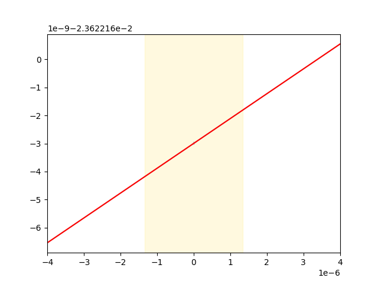
## Equation 6:
```
background_currents__i_Ca_b = pow(model_parameters__F, 2) * pow(model_parameters__z_Ca, 2) * (-model_parameters__Ca_o * model_parameters__gamma_Cao + Ca_i__Ca_i * model_parameters__gamma_Cai * exp(membrane__V * model_parameters__F * model_parameters__z_Ca / (model_parameters__R * model_parameters__T))) * background_currents__p_Ca_b * membrane__V / ((-1.0 + exp(membrane__V * model_parameters__F * model_parameters__z_Ca / (model_parameters__R * model_parameters__T))) * model_parameters__Cm * model_parameters__R * model_parameters__T)
```
### Partially evaluated to: 
```
background_currents__i_Ca_b = 0.0028824983370007683 * (-0.34100000000000003 * model_parameters__Ca_o + Ca_i__Ca_i * exp(0.074871767015605231 * membrane__V)) * membrane__V / (-1.0 + exp(0.074871767015605231 * membrane__V))
```
## New Eq:
```
background_currents__i_Ca_b = ((fabs(membrane__V) < 1.3356169352749131e-6) ? (0.038499134023069072 * Ca_i__Ca_i - 0.01312820601468709 * model_parameters__Ca_o + (0.5 + 374358.83507802623 * membrane__V) * (3.8496514776940535e-9 * Ca_i__Ca_i + 1.3129099177462428e-9 * model_parameters__Ca_o)) : (pow(model_parameters__F, 2) * pow(model_parameters__z_Ca, 2) * (-model_parameters__Ca_o * model_parameters__gamma_Cao + Ca_i__Ca_i * model_parameters__gamma_Cai * exp(membrane__V * model_parameters__F * model_parameters__z_Ca / (model_parameters__R * model_parameters__T))) * background_currents__p_Ca_b * membrane__V / ((-1.0 + exp(membrane__V * model_parameters__F * model_parameters__z_Ca / (model_parameters__R * model_parameters__T))) * model_parameters__Cm * model_parameters__R * model_parameters__T)))
```

*U*: 
-1.1230765052340785 + 0.074871767015605231 * membrane__V
*V for 1e-07 range* 
`14.999998664383064 - 15.000001335616936`
15.000000000000000

*Singularity point: 15.000000000000000*

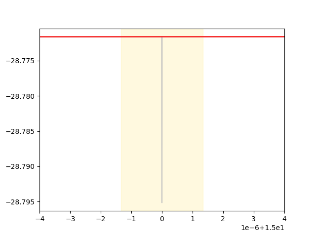
## Equation 7:
```
i_Ca_L__i_Ca_L_max = pow(model_parameters__F, 2) * pow(model_parameters__z_Ca, 2) * (-15.0 + membrane__V) * (-model_parameters__Ca_o * model_parameters__gamma_Cao + Ca_r__Ca_r * model_parameters__gamma_Cai * exp((-15.0 + membrane__V) * model_parameters__F * model_parameters__z_Ca / (model_parameters__R * model_parameters__T))) * i_Ca_L__p_Ca / ((-1.0 + exp((-15.0 + membrane__V) * model_parameters__F * model_parameters__z_Ca / (model_parameters__R * model_parameters__T))) * model_parameters__Cm * model_parameters__R * model_parameters__T)
```
### Partially evaluated to: 
```
i_Ca_L__i_Ca_L_max = 3.510865186083326 * (-15.0 + membrane__V) * (-0.34100000000000003 * model_parameters__Ca_o + 0.32527753564512535 * Ca_r__Ca_r * exp(0.074871767015605231 * membrane__V)) / (-1.0 + 0.32527753564512535 * exp(0.074871767015605231 * membrane__V))
```
## New Eq:
```
i_Ca_L__i_Ca_L_max = ((fabs(-15.0 + membrane__V) < 1.3356169352718439e-6) ? (46.891707654931523 * Ca_r__Ca_r - 15.990073909338962 * model_parameters__Ca_o + (-5615382.0261832969 + 374358.83507888648 * membrane__V) * (4.690071905177895e-6 * Ca_r__Ca_r + 1.598700102328765e-6 * model_parameters__Ca_o)) : (pow(model_parameters__F, 2) * pow(model_parameters__z_Ca, 2) * (-15.0 + membrane__V) * (-model_parameters__Ca_o * model_parameters__gamma_Cao + Ca_r__Ca_r * model_parameters__gamma_Cai * exp((-15.0 + membrane__V) * model_parameters__F * model_parameters__z_Ca / (model_parameters__R * model_parameters__T))) * i_Ca_L__p_Ca / ((-1.0 + exp((-15.0 + membrane__V) * model_parameters__F * model_parameters__z_Ca / (model_parameters__R * model_parameters__T))) * model_parameters__Cm * model_parameters__R * model_parameters__T)))
```

singularity processing time: 61.669836
# Model: beeler_reuter_model_1977(beeler_reuter_model_1977.cellml)
load time: 2.1143545000000046

*U*: 
3.3999999999999999 + 0.040000000000000001 * membrane__V
*V for 1e-07 range* 
`-85.000002499999994 - -84.999997500000006`
-85.000000000000000

*Singularity point: -85.000000000000000*

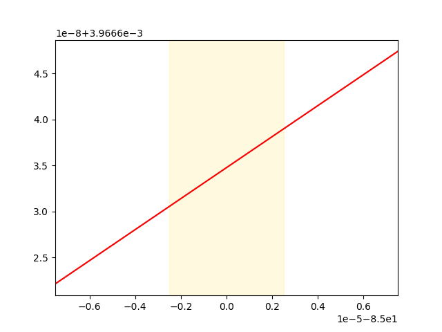
found U by substituting in paams! 
## Equation 1:
```
time_independent_outward_current__i_K1 = (4.0 * (-1.0 + exp(3.3999999999999999 + 0.040000000000000001 * membrane__V)) / (exp(2.1200000000000001 + 0.040000000000000001 * membrane__V) + exp(4.2400000000000002 + 0.080000000000000002 * membrane__V)) + time_independent_outward_current__temp_current) * time_independent_outward_current__G_K1
```
### Partially evaluated to: 
```
time_independent_outward_current__i_K1 = (4.0 * (-1.0 + 29.964100047397014 * exp(0.040000000000000001 * membrane__V)) / (8.3311374876876929 * exp(0.040000000000000001 * membrane__V) + 69.407851838755192 * exp(0.080000000000000002 * membrane__V)) + time_independent_outward_current__temp_current) * time_independent_outward_current__G_K1
```
## New Eq:
```
time_independent_outward_current__i_K1 = ((fabs(85.0 + membrane__V) < 2.500000000016378e-6) ? ((17000000.499888629 + 199999.99999868975 * membrane__V) * ((1.1256758988729463e-6 + time_independent_outward_current__temp_current) * time_independent_outward_current__G_K1 - (-1.1256760604306198e-6 + time_independent_outward_current__temp_current) * time_independent_outward_current__G_K1) + (-1.1256760604306198e-6 + time_independent_outward_current__temp_current) * time_independent_outward_current__G_K1) : ((4.0 * (-1.0 + exp(3.3999999999999999 + 0.040000000000000001 * membrane__V)) / (exp(2.1200000000000001 + 0.040000000000000001 * membrane__V) + exp(4.2400000000000002 + 0.080000000000000002 * membrane__V)) + time_independent_outward_current__temp_current) * time_independent_outward_current__G_K1))
```

singularity processing time: 12.06009970000001
# Model: benson_epicardial_2008(benson_epicardial_2008.cellml)
load time: 3.256151199999991

*U*: 
-1.1230765052339999 + 0.074871767015599999 * cell__V
*V for 1e-07 range* 
`14.999998664383064 - 15.000001335616936`
15.000000000000000

*Singularity point: 15.000000000000000*

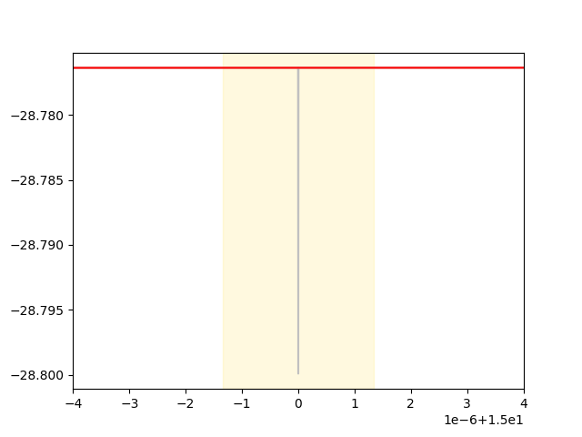
## Equation 1:
```
ICaL__ibarca = 4.0 * (-15.0 + cell__V) * (-Environment__Ca_o * ICaL__gacao + Ca__Ca_ss * ICaL__gacai * exp(2.0 * (-15.0 + cell__V) * Environment__FonRT)) * Environment__F * Environment__FonRT * ICaL__pca / (-1.0 + exp(2.0 * (-15.0 + cell__V) * Environment__FonRT))
```
### Partially evaluated to: 
```
ICaL__ibarca = 14448.004881000332 * (-15.0 + cell__V) * (-0.34100000000000003 * Environment__Ca_o + 0.32527753564515088 * Ca__Ca_ss * exp(0.074871767015599999 * cell__V)) * ICaL__pca / (-1.0 + 0.32527753564515088 * exp(0.074871767015599999 * cell__V))
```
## New Eq:
```
ICaL__ibarca = ((fabs(-15.0 + cell__V) < 1.3356169352718439e-6) ? ((-5615382.0261832969 + 374358.83507888648 * cell__V) * (192969.99035320638 * (1.0000001000000049 * Ca__Ca_ss - 0.34100000000000003 * Environment__Ca_o) * ICaL__pca - 192970.00964649895 * (0.99999990000000505 * Ca__Ca_ss - 0.34100000000000003 * Environment__Ca_o) * ICaL__pca) + 192970.00964649895 * (0.99999990000000505 * Ca__Ca_ss - 0.34100000000000003 * Environment__Ca_o) * ICaL__pca) : (4.0 * (-15.0 + cell__V) * (-Environment__Ca_o * ICaL__gacao + Ca__Ca_ss * ICaL__gacai * exp(2.0 * (-15.0 + cell__V) * Environment__FonRT)) * Environment__F * Environment__FonRT * ICaL__pca / (-1.0 + exp(2.0 * (-15.0 + cell__V) * Environment__FonRT))))
```

*U*: 
0.074871767015599999 * cell__V
*V for 1e-07 range* 
`-1.3356169352750065e-6 - 1.3356169352750065e-6`

*Singularity point: 0*

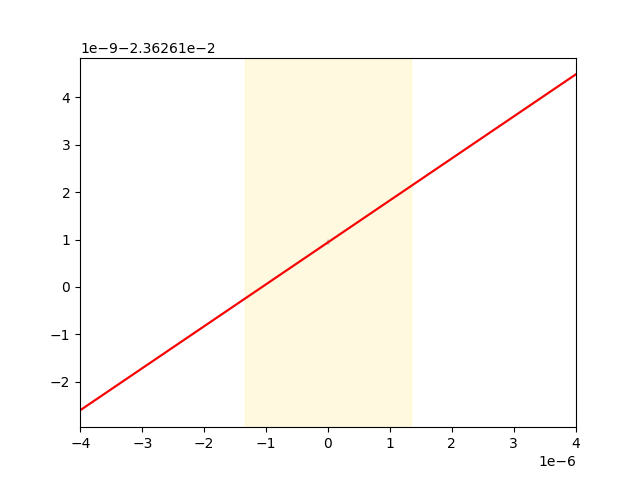
## Equation 2:
```
ICab__ICab = 7.9803360000000004e-7 * (-0.34100000000000003 * Environment__Ca_o + Ca__Ca_i * exp(2.0 * Environment__FonRT * cell__V)) * Environment__F * Environment__FonRT * cell__V / (-1.0 + exp(2.0 * Environment__FonRT * cell__V))
```
### Partially evaluated to: 
```
ICab__ICab = 0.0028824983370005666 * (-0.34100000000000003 * Environment__Ca_o + Ca__Ca_i * exp(0.074871767015599999 * cell__V)) * cell__V / (-1.0 + exp(0.074871767015599999 * cell__V))
```
## New Eq:
```
ICab__ICab = ((fabs(cell__V) < 1.3356169352750065e-6) ? (0.038499134023069072 * Ca__Ca_i - 0.01312820601468709 * Environment__Ca_o + (0.5 + 374358.83507800003 * cell__V) * (3.8496514776940535e-9 * Ca__Ca_i + 1.3129099177462428e-9 * Environment__Ca_o)) : (7.9803360000000004e-7 * (-0.34100000000000003 * Environment__Ca_o + Ca__Ca_i * exp(2.0 * Environment__FonRT * cell__V)) * Environment__F * Environment__FonRT * cell__V / (-1.0 + exp(2.0 * Environment__FonRT * cell__V))))
```

*U*: 
5.8385137599999997 + 0.1522 * cell__V
*V for 1e-07 range* 
`-38.360800657030218 - -38.360799342969777`
-38.360799999999998

*Singularity point: -38.360799999999998*


*U*: 
0.2364224 - 0.13600000000000001 * cell__V
*V for 1e-07 range* 
`1.7384007352941175 - 1.7383992647058824`
1.7383999999999999

*Singularity point: 1.7383999999999999*

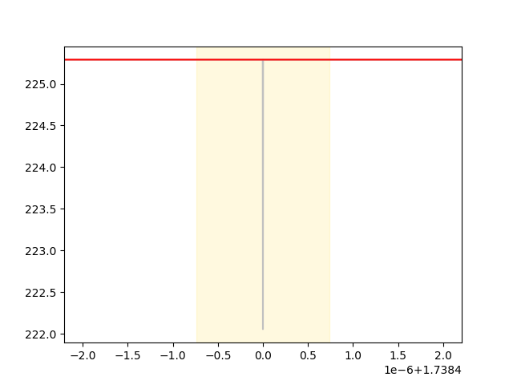
## Equation 3:
```
IKr__tauxr = 1 / (0.00029999999999999997 * (38.360799999999998 + cell__V) / (-1.0 + exp(5.8385137599999997 + 0.1522 * cell__V)) + 0.00059999999999999995 * (-1.7383999999999999 + cell__V) / (1.0 - exp(0.2364224 - 0.13600000000000001 * cell__V)))
```
### Partially evaluated to: 
```
IKr__tauxr = 1 / (0.00029999999999999997 * (38.360799999999998 + cell__V) / (-1.0 + 343.26878155836141 * exp(0.1522 * cell__V)) + 0.00059999999999999995 * (-1.7383999999999999 + cell__V) / (1.0 - 1.2667092551679247 * exp(-0.13600000000000001 * cell__V)))
```
## New Eq:
```
IKr__tauxr = ((fabs(38.360799999999998 + cell__V) < 6.5703022339436146e-7) ? (1716.304813235186 + 32.175301982615196 * cell__V) : ((fabs(-1.7383999999999999 + cell__V) < 7.3529411764774316e-7) ? (251.46025865610545 - 15.054199733736541 * cell__V) : (1 / (0.00029999999999999997 * (38.360799999999998 + cell__V) / (-1.0 + exp(5.8385137599999997 + 0.1522 * cell__V)) + 0.00059999999999999995 * (-1.7383999999999999 + cell__V) / (1.0 - exp(0.2364224 - 0.13600000000000001 * cell__V))))))
```

*U*: 
-444.66200000000003 - 9.9700000000000006 * cell__V
*V for 1e-07 range* 
`-44.599999989969909 - -44.600000010030094`
-44.600000000000001

*Singularity point: -44.600000000000001*


*U*: 
-0.070400000000000004 + 0.128 * cell__V
*V for 1e-07 range* 
`0.54999921875000002 - 0.55000078125000007`
0.55000000000000005

*Singularity point: 0.55000000000000005*


## Equation 4:
```
IKs__tauxs = 1 / (7.6100000000000007e-5 * (44.600000000000001 + cell__V) / (1.0 - exp(-444.66200000000003 - 9.9700000000000006 * cell__V)) + 0.00036000000000000002 * (-0.55000000000000004 + cell__V) / (-1.0 + exp(-0.070400000000000004 + 0.128 * cell__V)))
```
### Partially evaluated to: 
```
IKs__tauxs = 1 / (7.6100000000000007e-5 * (44.600000000000001 + cell__V) / (1.0 - 7.6868266637773744e-194 * exp(-9.9700000000000006 * cell__V)) + 0.00036000000000000002 * (-0.55000000000000004 + cell__V) / (-1.0 + 0.93202093695954691 * exp(0.128 * cell__V)))
```
## New Eq:
```
IKs__tauxs = ((fabs(44.600000000000001 + cell__V) < 1.0030090258350555e-8) ? (114.37134986698169 + 1.1898410825234575 * cell__V) : ((fabs(-0.55000000000000004 + cell__V) < 7.8124999999991396e-7) ? (158.57692829280447 + 2.6611963637893243 * cell__V) : (1 / (7.6100000000000007e-5 * (44.600000000000001 + cell__V) / (1.0 - exp(-444.66200000000003 - 9.9700000000000006 * cell__V)) + 0.00036000000000000002 * (-0.55000000000000004 + cell__V) / (-1.0 + exp(-0.070400000000000004 + 0.128 * cell__V))))))
```

*U*: 
-4.7130000000000001 - 0.10000000000000001 * cell__V
*V for 1e-07 range* 
`-47.129999000000005 - -47.130001`
-47.130000000000003

*Singularity point: -47.130000000000003*


## Equation 5:
```
INa__am = 0.32000000000000001 * (47.130000000000003 + cell__V) / (1.0 - exp(-4.7130000000000001 - 0.10000000000000001 * cell__V))
```
### Partially evaluated to: 
```
INa__am = 0.32000000000000001 * (47.130000000000003 + cell__V) / (1.0 - 0.00897780373069724 * exp(-0.10000000000000001 * cell__V))
```
## New Eq:
```
INa__am = ((fabs(47.130000000000003 + cell__V) < 1.0000000000287557e-6) ? (10.740659346653775 + 0.15999701562995733 * cell__V) : (0.32000000000000001 * (47.130000000000003 + cell__V) / (1.0 - exp(-4.7130000000000001 - 0.10000000000000001 * cell__V))))
```

*U*: 
-4.7130000000000001 - 0.10000000000000001 * cell__V
*V for 1e-07 range* 
`-47.129999000000005 - -47.130001`
-47.130000000000003

*Singularity point: -47.130000000000003*


## Equation 6:
```
INal__amL = 0.32000000000000001 * (47.130000000000003 + cell__V) / (1.0 - exp(-4.7130000000000001 - 0.10000000000000001 * cell__V))
```
### Partially evaluated to: 
```
INal__amL = 0.32000000000000001 * (47.130000000000003 + cell__V) / (1.0 - 0.00897780373069724 * exp(-0.10000000000000001 * cell__V))
```
## New Eq:
```
INal__amL = ((fabs(47.130000000000003 + cell__V) < 1.0000000000287557e-6) ? (10.740659346653775 + 0.15999701562995733 * cell__V) : (0.32000000000000001 * (47.130000000000003 + cell__V) / (1.0 - exp(-4.7130000000000001 - 0.10000000000000001 * cell__V))))
```

*U*: 
0.0374358835078 * cell__V
*V for 1e-07 range* 
`-2.671233870550013e-6 - 2.671233870550013e-6`

*Singularity point: 0*


## Equation 7:
```
Ito2__Ito2_max = (-Environment__Cl_o * exp(Environment__FonRT * cell__V) + Cl__Cl_i) * Environment__F * Environment__FonRT * Ito2__PCl * cell__V / (1.0 - exp(Environment__FonRT * cell__V))
```
### Partially evaluated to: 
```
Ito2__Ito2_max = 0.001444800488100033 * (-100.0 * exp(0.0374358835078 * cell__V) + Cl__Cl_i) * cell__V / (1.0 - exp(0.0374358835078 * cell__V))
```
## New Eq:
```
Ito2__Ito2_max = ((fabs(cell__V) < 2.671233870550013e-6) ? (3.8593998070325926 - 0.038594001929725924 * Cl__Cl_i + (0.5 + 187179.41753900002 * cell__V) * (3.8591372371332699e-7 + 3.8596627628976685e-9 * Cl__Cl_i)) : ((-Environment__Cl_o * exp(Environment__FonRT * cell__V) + Cl__Cl_i) * Environment__F * Environment__FonRT * Ito2__PCl * cell__V / (1.0 - exp(Environment__FonRT * cell__V))))
```

singularity processing time: 54.2320356
# Model: bernus_wilders_zemlin_verschelde_panfilov_2002_version01(bernus_wilders_zemlin_verschelde_panfilov_2002.cellml)
load time: 1.1144419000000028

*U*: 
-4.7130000000000001 - 0.10000000000000001 * membrane__V
*V for 1e-07 range* 
`-47.129999000000005 - -47.130001`
-47.130000000000003

*Singularity point: -47.130000000000003*


## Equation 1:
```
sodium_current_m_gate__alpha_m = 0.32000000000000001 * (47.130000000000003 + membrane__V) / (1.0 - exp(-4.7130000000000001 - 0.10000000000000001 * membrane__V))
```
### Partially evaluated to: 
```
sodium_current_m_gate__alpha_m = 0.32000000000000001 * (47.130000000000003 + membrane__V) / (1.0 - 0.00897780373069724 * exp(-0.10000000000000001 * membrane__V))
```
## New Eq:
```
sodium_current_m_gate__alpha_m = ((fabs(47.130000000000003 + membrane__V) < 1.0000000000287557e-6) ? (10.740659346653775 + 0.15999701562995733 * membrane__V) : (0.32000000000000001 * (47.130000000000003 + membrane__V) / (1.0 - exp(-4.7130000000000001 - 0.10000000000000001 * membrane__V))))
```

singularity processing time: 7.24581409999999
# Model: bondarenko_2004_apical(bondarenko_szigeti_bett_kim_rasmusson_2004_apical.cellml)
load time: 2.8658116999999947

*U*: 
-3.3919999999999999 - 0.128 * membrane__V
*V for 1e-07 range* 
`-26.499999218749998 - -26.500000781250002`
-26.500000000000000

*Singularity point: -26.500000000000000*

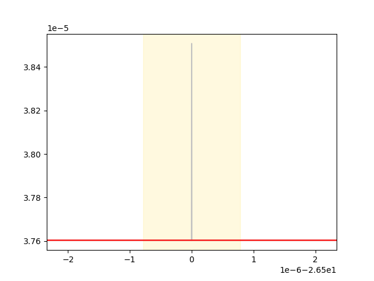
## Equation 1:
```
slow_delayed_rectifier_potassium_current__alpha_n = 4.8133299999999997e-6 * (26.5 + membrane__V) / (1.0 - exp(-3.3919999999999999 - 0.128 * membrane__V))
```
### Partially evaluated to: 
```
slow_delayed_rectifier_potassium_current__alpha_n = 4.8133299999999997e-6 * (26.5 + membrane__V) / (1.0 - 0.033641326918204616 * exp(-0.128 * membrane__V))
```
## New Eq:
```
slow_delayed_rectifier_potassium_current__alpha_n = ((fabs(26.5 + membrane__V) < 7.8124999999817923e-7) ? (0.00010137957354771978 + 2.4066201102800349e-6 * membrane__V) : (4.8133299999999997e-6 * (26.5 + membrane__V) / (1.0 - exp(-3.3919999999999999 - 0.128 * membrane__V))))
```

singularity processing time: 11.664085200000017
# Model: bondarenko_2004_septum(bondarenko_szigeti_bett_kim_rasmusson_2004_septal.cellml)
load time: 2.9610428000000013

*U*: 
-3.3919999999999999 - 0.128 * membrane__V
*V for 1e-07 range* 
`-26.499999218749998 - -26.500000781250002`
-26.500000000000000

*Singularity point: -26.500000000000000*


## Equation 1:
```
slow_delayed_rectifier_potassium_current__alpha_n = 4.8133299999999997e-6 * (26.5 + membrane__V) / (1.0 - exp(-3.3919999999999999 - 0.128 * membrane__V))
```
### Partially evaluated to: 
```
slow_delayed_rectifier_potassium_current__alpha_n = 4.8133299999999997e-6 * (26.5 + membrane__V) / (1.0 - 0.033641326918204616 * exp(-0.128 * membrane__V))
```
## New Eq:
```
slow_delayed_rectifier_potassium_current__alpha_n = ((fabs(26.5 + membrane__V) < 7.8124999999817923e-7) ? (0.00010137957354771978 + 2.4066201102800349e-6 * membrane__V) : (4.8133299999999997e-6 * (26.5 + membrane__V) / (1.0 - exp(-3.3919999999999999 - 0.128 * membrane__V))))
```

singularity processing time: 11.322307799999976
# Model: bueno_2007(bueno_2007_endo.cellml)
load time: 0.3372349999999926

singularity processing time: 0.03527289999999539
# Model: bueno_2007(bueno_2007_epi.cellml)
load time: 0.32744890000000737

singularity processing time: 0.034378599999996595
# Model: Carro_Rodriguez_Laguna_Pueyo_CinC2010_EPI(carro_2011_endo.cellml)
load time: 3.855651899999998

*U*: 
0.074871767015605231 * membrane__V
*V for 1e-07 range* 
`-1.3356169352749131e-6 - 1.3356169352749131e-6`

*Singularity point: 0*

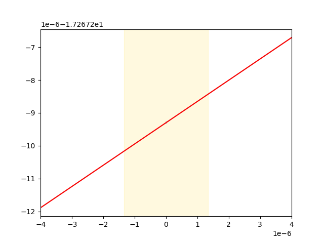
## Equation 1:
```
L_Type_Calcium_Current__Ibar_Ca_j = (-Calcium_Concentrations__Ca_o + Calcium_Concentrations__Ca_j * exp(2.0 * membrane__FoRT * membrane__V)) * L_Type_Calcium_Current__P_scale * L_Type_Calcium_Current__p_Ca * membrane__FoRT * membrane__Frdy * membrane__V / (-1.0 + exp(2.0 * membrane__FoRT * membrane__V))
```
### Partially evaluated to: 
```
L_Type_Calcium_Current__Ibar_Ca_j = 0.71831868267118426 * (-Calcium_Concentrations__Ca_o + Calcium_Concentrations__Ca_j * exp(0.074871767015605231 * membrane__V)) * L_Type_Calcium_Current__P_scale * membrane__V / (-1.0 + exp(0.074871767015605231 * membrane__V))
```
## New Eq:
```
L_Type_Calcium_Current__Ibar_Ca_j = ((fabs(membrane__V) < 1.3356169352749131e-6) ? ((0.5 + 374358.83507802623 * membrane__V) * (9.593985495241828 * (-Calcium_Concentrations__Ca_o + 1.0000001000000049 * Calcium_Concentrations__Ca_j) * L_Type_Calcium_Current__P_scale - 9.5939864547057443 * (-Calcium_Concentrations__Ca_o + 0.99999990000000505 * Calcium_Concentrations__Ca_j) * L_Type_Calcium_Current__P_scale) + 9.5939864547057443 * (-Calcium_Concentrations__Ca_o + 0.99999990000000505 * Calcium_Concentrations__Ca_j) * L_Type_Calcium_Current__P_scale) : ((-Calcium_Concentrations__Ca_o + Calcium_Concentrations__Ca_j * exp(2.0 * membrane__FoRT * membrane__V)) * L_Type_Calcium_Current__P_scale * L_Type_Calcium_Current__p_Ca * membrane__FoRT * membrane__Frdy * membrane__V / (-1.0 + exp(2.0 * membrane__FoRT * membrane__V))))
```

*U*: 
0.074871767015605231 * membrane__V
*V for 1e-07 range* 
`-1.3356169352749131e-6 - 1.3356169352749131e-6`

*Singularity point: 0*


## Equation 2:
```
L_Type_Calcium_Current__Ibar_Ca_sl = (-Calcium_Concentrations__Ca_o + Calcium_Concentrations__Ca_sl * exp(2.0 * membrane__FoRT * membrane__V)) * L_Type_Calcium_Current__P_scale * L_Type_Calcium_Current__p_Ca * membrane__FoRT * membrane__Frdy * membrane__V / (-1.0 + exp(2.0 * membrane__FoRT * membrane__V))
```
### Partially evaluated to: 
```
L_Type_Calcium_Current__Ibar_Ca_sl = 0.71831868267118426 * (-Calcium_Concentrations__Ca_o + Calcium_Concentrations__Ca_sl * exp(0.074871767015605231 * membrane__V)) * L_Type_Calcium_Current__P_scale * membrane__V / (-1.0 + exp(0.074871767015605231 * membrane__V))
```
## New Eq:
```
L_Type_Calcium_Current__Ibar_Ca_sl = ((fabs(membrane__V) < 1.3356169352749131e-6) ? ((0.5 + 374358.83507802623 * membrane__V) * (9.593985495241828 * (-Calcium_Concentrations__Ca_o + 1.0000001000000049 * Calcium_Concentrations__Ca_sl) * L_Type_Calcium_Current__P_scale - 9.5939864547057443 * (-Calcium_Concentrations__Ca_o + 0.99999990000000505 * Calcium_Concentrations__Ca_sl) * L_Type_Calcium_Current__P_scale) + 9.5939864547057443 * (-Calcium_Concentrations__Ca_o + 0.99999990000000505 * Calcium_Concentrations__Ca_sl) * L_Type_Calcium_Current__P_scale) : ((-Calcium_Concentrations__Ca_o + Calcium_Concentrations__Ca_sl * exp(2.0 * membrane__FoRT * membrane__V)) * L_Type_Calcium_Current__P_scale * L_Type_Calcium_Current__p_Ca * membrane__FoRT * membrane__Frdy * membrane__V / (-1.0 + exp(2.0 * membrane__FoRT * membrane__V))))
```

*U*: 
0.037435883507802616 * membrane__V
*V for 1e-07 range* 
`-2.6712338705498262e-6 - 2.6712338705498262e-6`

*Singularity point: 0*


## Equation 3:
```
L_Type_Calcium_Current__Ibar_K = (-Potassium_Concentrations__K_o + Potassium_Concentrations__K_i * exp(membrane__FoRT * membrane__V)) * L_Type_Calcium_Current__P_scale * L_Type_Calcium_Current__p_K * membrane__FoRT * membrane__Frdy * membrane__V / (-1.0 + exp(membrane__FoRT * membrane__V))
```
### Partially evaluated to: 
```
L_Type_Calcium_Current__Ibar_K = 0.00019748616671718709 * (-Potassium_Concentrations__K_o + Potassium_Concentrations__K_i * exp(0.037435883507802616 * membrane__V)) * L_Type_Calcium_Current__P_scale * membrane__V / (-1.0 + exp(0.037435883507802616 * membrane__V))
```
## New Eq:
```
L_Type_Calcium_Current__Ibar_K = ((fabs(membrane__V) < 2.6712338705498262e-6) ? ((0.5 + 187179.41753901311 * membrane__V) * (0.0052753171112017586 * (-Potassium_Concentrations__K_o + 1.0000001000000049 * Potassium_Concentrations__K_i) * L_Type_Calcium_Current__P_scale - 0.0052753176387694131 * (-Potassium_Concentrations__K_o + 0.99999990000000505 * Potassium_Concentrations__K_i) * L_Type_Calcium_Current__P_scale) + 0.0052753176387694131 * (-Potassium_Concentrations__K_o + 0.99999990000000505 * Potassium_Concentrations__K_i) * L_Type_Calcium_Current__P_scale) : ((-Potassium_Concentrations__K_o + Potassium_Concentrations__K_i * exp(membrane__FoRT * membrane__V)) * L_Type_Calcium_Current__P_scale * L_Type_Calcium_Current__p_K * membrane__FoRT * membrane__Frdy * membrane__V / (-1.0 + exp(membrane__FoRT * membrane__V))))
```

*U*: 
0.037435883507802616 * membrane__V
*V for 1e-07 range* 
`-2.6712338705498262e-6 - 2.6712338705498262e-6`

*Singularity point: 0*


## Equation 4:
```
L_Type_Calcium_Current__Ibar_Na_j = (-Sodium_Concentrations__Na_o + Sodium_Concentrations__Na_j * exp(membrane__FoRT * membrane__V)) * L_Type_Calcium_Current__P_scale * L_Type_Calcium_Current__p_Na * membrane__FoRT * membrane__Frdy * membrane__V / (-1.0 + exp(membrane__FoRT * membrane__V))
```
### Partially evaluated to: 
```
L_Type_Calcium_Current__Ibar_Na_j = 1.0971453706510394e-5 * (-Sodium_Concentrations__Na_o + Sodium_Concentrations__Na_j * exp(0.037435883507802616 * membrane__V)) * L_Type_Calcium_Current__P_scale * membrane__V / (-1.0 + exp(0.037435883507802616 * membrane__V))
```
## New Eq:
```
L_Type_Calcium_Current__Ibar_Na_j = ((fabs(membrane__V) < 2.6712338705498262e-6) ? ((0.5 + 187179.41753901311 * membrane__V) * (0.00029307317284454215 * (-Sodium_Concentrations__Na_o + 1.0000001000000049 * Sodium_Concentrations__Na_j) * L_Type_Calcium_Current__P_scale - 0.00029307320215385624 * (-Sodium_Concentrations__Na_o + 0.99999990000000505 * Sodium_Concentrations__Na_j) * L_Type_Calcium_Current__P_scale) + 0.00029307320215385624 * (-Sodium_Concentrations__Na_o + 0.99999990000000505 * Sodium_Concentrations__Na_j) * L_Type_Calcium_Current__P_scale) : ((-Sodium_Concentrations__Na_o + Sodium_Concentrations__Na_j * exp(membrane__FoRT * membrane__V)) * L_Type_Calcium_Current__P_scale * L_Type_Calcium_Current__p_Na * membrane__FoRT * membrane__Frdy * membrane__V / (-1.0 + exp(membrane__FoRT * membrane__V))))
```

*U*: 
0.037435883507802616 * membrane__V
*V for 1e-07 range* 
`-2.6712338705498262e-6 - 2.6712338705498262e-6`

*Singularity point: 0*


## Equation 5:
```
L_Type_Calcium_Current__Ibar_Na_sl = (-Sodium_Concentrations__Na_o + Sodium_Concentrations__Na_sl * exp(membrane__FoRT * membrane__V)) * L_Type_Calcium_Current__P_scale * L_Type_Calcium_Current__p_Na * membrane__FoRT * membrane__Frdy * membrane__V / (-1.0 + exp(membrane__FoRT * membrane__V))
```
### Partially evaluated to: 
```
L_Type_Calcium_Current__Ibar_Na_sl = 1.0971453706510394e-5 * (-Sodium_Concentrations__Na_o + Sodium_Concentrations__Na_sl * exp(0.037435883507802616 * membrane__V)) * L_Type_Calcium_Current__P_scale * membrane__V / (-1.0 + exp(0.037435883507802616 * membrane__V))
```
## New Eq:
```
L_Type_Calcium_Current__Ibar_Na_sl = ((fabs(membrane__V) < 2.6712338705498262e-6) ? ((0.5 + 187179.41753901311 * membrane__V) * (0.00029307317284454215 * (-Sodium_Concentrations__Na_o + 1.0000001000000049 * Sodium_Concentrations__Na_sl) * L_Type_Calcium_Current__P_scale - 0.00029307320215385624 * (-Sodium_Concentrations__Na_o + 0.99999990000000505 * Sodium_Concentrations__Na_sl) * L_Type_Calcium_Current__P_scale) + 0.00029307320215385624 * (-Sodium_Concentrations__Na_o + 0.99999990000000505 * Sodium_Concentrations__Na_sl) * L_Type_Calcium_Current__P_scale) : ((-Sodium_Concentrations__Na_o + Sodium_Concentrations__Na_sl * exp(membrane__FoRT * membrane__V)) * L_Type_Calcium_Current__P_scale * L_Type_Calcium_Current__p_Na * membrane__FoRT * membrane__Frdy * membrane__V / (-1.0 + exp(membrane__FoRT * membrane__V))))
```

singularity processing time: 28.545116000000007
# Model: Carro_Rodriguez_Laguna_Pueyo_CinC2010_EPI(carro_2011_epi.cellml)
load time: 3.734376200000014

*U*: 
0.074871767015605231 * membrane__V
*V for 1e-07 range* 
`-1.3356169352749131e-6 - 1.3356169352749131e-6`

*Singularity point: 0*


## Equation 1:
```
L_Type_Calcium_Current__Ibar_Ca_j = (-Calcium_Concentrations__Ca_o + Calcium_Concentrations__Ca_j * exp(2.0 * membrane__FoRT * membrane__V)) * L_Type_Calcium_Current__P_scale * L_Type_Calcium_Current__p_Ca * membrane__FoRT * membrane__Frdy * membrane__V / (-1.0 + exp(2.0 * membrane__FoRT * membrane__V))
```
### Partially evaluated to: 
```
L_Type_Calcium_Current__Ibar_Ca_j = 0.71831868267118426 * (-Calcium_Concentrations__Ca_o + Calcium_Concentrations__Ca_j * exp(0.074871767015605231 * membrane__V)) * L_Type_Calcium_Current__P_scale * membrane__V / (-1.0 + exp(0.074871767015605231 * membrane__V))
```
## New Eq:
```
L_Type_Calcium_Current__Ibar_Ca_j = ((fabs(membrane__V) < 1.3356169352749131e-6) ? ((0.5 + 374358.83507802623 * membrane__V) * (9.593985495241828 * (-Calcium_Concentrations__Ca_o + 1.0000001000000049 * Calcium_Concentrations__Ca_j) * L_Type_Calcium_Current__P_scale - 9.5939864547057443 * (-Calcium_Concentrations__Ca_o + 0.99999990000000505 * Calcium_Concentrations__Ca_j) * L_Type_Calcium_Current__P_scale) + 9.5939864547057443 * (-Calcium_Concentrations__Ca_o + 0.99999990000000505 * Calcium_Concentrations__Ca_j) * L_Type_Calcium_Current__P_scale) : ((-Calcium_Concentrations__Ca_o + Calcium_Concentrations__Ca_j * exp(2.0 * membrane__FoRT * membrane__V)) * L_Type_Calcium_Current__P_scale * L_Type_Calcium_Current__p_Ca * membrane__FoRT * membrane__Frdy * membrane__V / (-1.0 + exp(2.0 * membrane__FoRT * membrane__V))))
```

*U*: 
0.074871767015605231 * membrane__V
*V for 1e-07 range* 
`-1.3356169352749131e-6 - 1.3356169352749131e-6`

*Singularity point: 0*


## Equation 2:
```
L_Type_Calcium_Current__Ibar_Ca_sl = (-Calcium_Concentrations__Ca_o + Calcium_Concentrations__Ca_sl * exp(2.0 * membrane__FoRT * membrane__V)) * L_Type_Calcium_Current__P_scale * L_Type_Calcium_Current__p_Ca * membrane__FoRT * membrane__Frdy * membrane__V / (-1.0 + exp(2.0 * membrane__FoRT * membrane__V))
```
### Partially evaluated to: 
```
L_Type_Calcium_Current__Ibar_Ca_sl = 0.71831868267118426 * (-Calcium_Concentrations__Ca_o + Calcium_Concentrations__Ca_sl * exp(0.074871767015605231 * membrane__V)) * L_Type_Calcium_Current__P_scale * membrane__V / (-1.0 + exp(0.074871767015605231 * membrane__V))
```
## New Eq:
```
L_Type_Calcium_Current__Ibar_Ca_sl = ((fabs(membrane__V) < 1.3356169352749131e-6) ? ((0.5 + 374358.83507802623 * membrane__V) * (9.593985495241828 * (-Calcium_Concentrations__Ca_o + 1.0000001000000049 * Calcium_Concentrations__Ca_sl) * L_Type_Calcium_Current__P_scale - 9.5939864547057443 * (-Calcium_Concentrations__Ca_o + 0.99999990000000505 * Calcium_Concentrations__Ca_sl) * L_Type_Calcium_Current__P_scale) + 9.5939864547057443 * (-Calcium_Concentrations__Ca_o + 0.99999990000000505 * Calcium_Concentrations__Ca_sl) * L_Type_Calcium_Current__P_scale) : ((-Calcium_Concentrations__Ca_o + Calcium_Concentrations__Ca_sl * exp(2.0 * membrane__FoRT * membrane__V)) * L_Type_Calcium_Current__P_scale * L_Type_Calcium_Current__p_Ca * membrane__FoRT * membrane__Frdy * membrane__V / (-1.0 + exp(2.0 * membrane__FoRT * membrane__V))))
```

*U*: 
0.037435883507802616 * membrane__V
*V for 1e-07 range* 
`-2.6712338705498262e-6 - 2.6712338705498262e-6`

*Singularity point: 0*


## Equation 3:
```
L_Type_Calcium_Current__Ibar_K = (-Potassium_Concentrations__K_o + Potassium_Concentrations__K_i * exp(membrane__FoRT * membrane__V)) * L_Type_Calcium_Current__P_scale * L_Type_Calcium_Current__p_K * membrane__FoRT * membrane__Frdy * membrane__V / (-1.0 + exp(membrane__FoRT * membrane__V))
```
### Partially evaluated to: 
```
L_Type_Calcium_Current__Ibar_K = 0.00019748616671718709 * (-Potassium_Concentrations__K_o + Potassium_Concentrations__K_i * exp(0.037435883507802616 * membrane__V)) * L_Type_Calcium_Current__P_scale * membrane__V / (-1.0 + exp(0.037435883507802616 * membrane__V))
```
## New Eq:
```
L_Type_Calcium_Current__Ibar_K = ((fabs(membrane__V) < 2.6712338705498262e-6) ? ((0.5 + 187179.41753901311 * membrane__V) * (0.0052753171112017586 * (-Potassium_Concentrations__K_o + 1.0000001000000049 * Potassium_Concentrations__K_i) * L_Type_Calcium_Current__P_scale - 0.0052753176387694131 * (-Potassium_Concentrations__K_o + 0.99999990000000505 * Potassium_Concentrations__K_i) * L_Type_Calcium_Current__P_scale) + 0.0052753176387694131 * (-Potassium_Concentrations__K_o + 0.99999990000000505 * Potassium_Concentrations__K_i) * L_Type_Calcium_Current__P_scale) : ((-Potassium_Concentrations__K_o + Potassium_Concentrations__K_i * exp(membrane__FoRT * membrane__V)) * L_Type_Calcium_Current__P_scale * L_Type_Calcium_Current__p_K * membrane__FoRT * membrane__Frdy * membrane__V / (-1.0 + exp(membrane__FoRT * membrane__V))))
```

*U*: 
0.037435883507802616 * membrane__V
*V for 1e-07 range* 
`-2.6712338705498262e-6 - 2.6712338705498262e-6`

*Singularity point: 0*

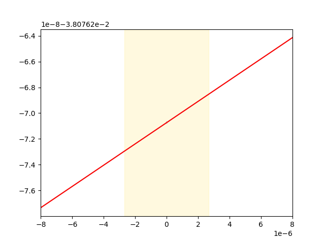
## Equation 4:
```
L_Type_Calcium_Current__Ibar_Na_j = (-Sodium_Concentrations__Na_o + Sodium_Concentrations__Na_j * exp(membrane__FoRT * membrane__V)) * L_Type_Calcium_Current__P_scale * L_Type_Calcium_Current__p_Na * membrane__FoRT * membrane__Frdy * membrane__V / (-1.0 + exp(membrane__FoRT * membrane__V))
```
### Partially evaluated to: 
```
L_Type_Calcium_Current__Ibar_Na_j = 1.0971453706510394e-5 * (-Sodium_Concentrations__Na_o + Sodium_Concentrations__Na_j * exp(0.037435883507802616 * membrane__V)) * L_Type_Calcium_Current__P_scale * membrane__V / (-1.0 + exp(0.037435883507802616 * membrane__V))
```
## New Eq:
```
L_Type_Calcium_Current__Ibar_Na_j = ((fabs(membrane__V) < 2.6712338705498262e-6) ? ((0.5 + 187179.41753901311 * membrane__V) * (0.00029307317284454215 * (-Sodium_Concentrations__Na_o + 1.0000001000000049 * Sodium_Concentrations__Na_j) * L_Type_Calcium_Current__P_scale - 0.00029307320215385624 * (-Sodium_Concentrations__Na_o + 0.99999990000000505 * Sodium_Concentrations__Na_j) * L_Type_Calcium_Current__P_scale) + 0.00029307320215385624 * (-Sodium_Concentrations__Na_o + 0.99999990000000505 * Sodium_Concentrations__Na_j) * L_Type_Calcium_Current__P_scale) : ((-Sodium_Concentrations__Na_o + Sodium_Concentrations__Na_j * exp(membrane__FoRT * membrane__V)) * L_Type_Calcium_Current__P_scale * L_Type_Calcium_Current__p_Na * membrane__FoRT * membrane__Frdy * membrane__V / (-1.0 + exp(membrane__FoRT * membrane__V))))
```

*U*: 
0.037435883507802616 * membrane__V
*V for 1e-07 range* 
`-2.6712338705498262e-6 - 2.6712338705498262e-6`

*Singularity point: 0*

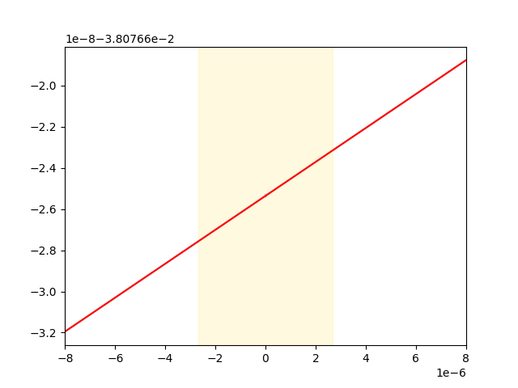
## Equation 5:
```
L_Type_Calcium_Current__Ibar_Na_sl = (-Sodium_Concentrations__Na_o + Sodium_Concentrations__Na_sl * exp(membrane__FoRT * membrane__V)) * L_Type_Calcium_Current__P_scale * L_Type_Calcium_Current__p_Na * membrane__FoRT * membrane__Frdy * membrane__V / (-1.0 + exp(membrane__FoRT * membrane__V))
```
### Partially evaluated to: 
```
L_Type_Calcium_Current__Ibar_Na_sl = 1.0971453706510394e-5 * (-Sodium_Concentrations__Na_o + Sodium_Concentrations__Na_sl * exp(0.037435883507802616 * membrane__V)) * L_Type_Calcium_Current__P_scale * membrane__V / (-1.0 + exp(0.037435883507802616 * membrane__V))
```
## New Eq:
```
L_Type_Calcium_Current__Ibar_Na_sl = ((fabs(membrane__V) < 2.6712338705498262e-6) ? ((0.5 + 187179.41753901311 * membrane__V) * (0.00029307317284454215 * (-Sodium_Concentrations__Na_o + 1.0000001000000049 * Sodium_Concentrations__Na_sl) * L_Type_Calcium_Current__P_scale - 0.00029307320215385624 * (-Sodium_Concentrations__Na_o + 0.99999990000000505 * Sodium_Concentrations__Na_sl) * L_Type_Calcium_Current__P_scale) + 0.00029307320215385624 * (-Sodium_Concentrations__Na_o + 0.99999990000000505 * Sodium_Concentrations__Na_sl) * L_Type_Calcium_Current__P_scale) : ((-Sodium_Concentrations__Na_o + Sodium_Concentrations__Na_sl * exp(membrane__FoRT * membrane__V)) * L_Type_Calcium_Current__P_scale * L_Type_Calcium_Current__p_Na * membrane__FoRT * membrane__Frdy * membrane__V / (-1.0 + exp(membrane__FoRT * membrane__V))))
```

singularity processing time: 27.745985100000013
# Model: clancy_rudy_2002(clancy_rudy_2002.cellml)
load time: 5.124302899999975

*U*: 
0.074871767015605231 * membrane__V
*V for 1e-07 range* 
`-1.3356169352749131e-6 - 1.3356169352749131e-6`

*Singularity point: 0*

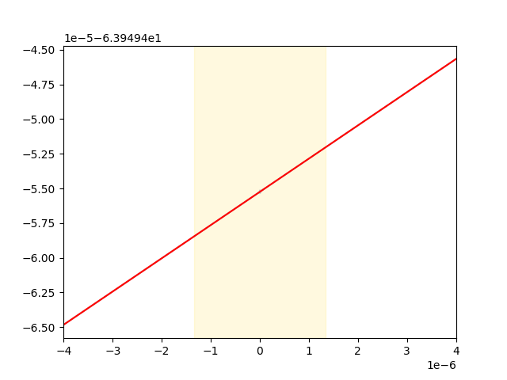
## Equation 1:
```
L_type_Ca_channel__I_CaCa = 4.0 * pow(membrane__F, 2) * (-L_type_Ca_channel__gamma_Cao * calcium_dynamics__Cao + L_type_Ca_channel__gamma_Cai * calcium_dynamics__Cai * exp(2.0 * membrane__F * membrane__V / (membrane__R * membrane__T))) * L_type_Ca_channel__P_Ca * L_type_Ca_channel__P_scale * membrane__V / ((-1.0 + exp(2.0 * membrane__F * membrane__V / (membrane__R * membrane__T))) * membrane__R * membrane__T)
```
### Partially evaluated to: 
```
L_type_Ca_channel__I_CaCa = 7.8019226357407252 * (-0.34100000000000003 * calcium_dynamics__Cao + calcium_dynamics__Cai * exp(0.074871767015605231 * membrane__V)) * L_type_Ca_channel__P_scale * membrane__V / (-1.0 + exp(0.074871767015605231 * membrane__V))
```
## New Eq:
```
L_type_Ca_channel__I_CaCa = ((fabs(membrane__V) < 1.3356169352749131e-6) ? ((0.5 + 374358.83507802623 * membrane__V) * (104.20379478917054 * (1.0000001000000049 * calcium_dynamics__Cai - 0.34100000000000003 * calcium_dynamics__Cao) * L_type_Ca_channel__P_scale - 104.20380521026001 * (0.99999990000000505 * calcium_dynamics__Cai - 0.34100000000000003 * calcium_dynamics__Cao) * L_type_Ca_channel__P_scale) + 104.20380521026001 * (0.99999990000000505 * calcium_dynamics__Cai - 0.34100000000000003 * calcium_dynamics__Cao) * L_type_Ca_channel__P_scale) : (4.0 * pow(membrane__F, 2) * (-L_type_Ca_channel__gamma_Cao * calcium_dynamics__Cao + L_type_Ca_channel__gamma_Cai * calcium_dynamics__Cai * exp(2.0 * membrane__F * membrane__V / (membrane__R * membrane__T))) * L_type_Ca_channel__P_Ca * L_type_Ca_channel__P_scale * membrane__V / ((-1.0 + exp(2.0 * membrane__F * membrane__V / (membrane__R * membrane__T))) * membrane__R * membrane__T)))
```

*U*: 
0.037435883507802616 * membrane__V
*V for 1e-07 range* 
`-2.6712338705498262e-6 - 2.6712338705498262e-6`

*Singularity point: 0*


## Equation 2:
```
L_type_Ca_channel__I_CaK = pow(membrane__F, 2) * (-L_type_Ca_channel__gamma_Ko * ionic_concentrations__Ko + L_type_Ca_channel__gamma_Ki * ionic_concentrations__Ki * exp(membrane__F * membrane__V / (membrane__R * membrane__T))) * L_type_Ca_channel__P_K * L_type_Ca_channel__P_scale * membrane__V / ((-1.0 + exp(membrane__F * membrane__V / (membrane__R * membrane__T))) * membrane__R * membrane__T)
```
### Partially evaluated to: 
```
L_type_Ca_channel__I_CaK = 0.00069711623550831479 * (-0.75 * ionic_concentrations__Ko + 0.75 * ionic_concentrations__Ki * exp(0.037435883507802616 * membrane__V)) * L_type_Ca_channel__P_scale * membrane__V / (-1.0 + exp(0.037435883507802616 * membrane__V))
```
## New Eq:
```
L_type_Ca_channel__I_CaK = ((fabs(membrane__V) < 2.6712338705498262e-6) ? ((0.5 + 187179.41753901311 * membrane__V) * (0.018621604068805479 * (0.75000007500000376 * ionic_concentrations__Ki - 0.75 * ionic_concentrations__Ko) * L_type_Ca_channel__P_scale - 0.018621605931092761 * (0.74999992500000379 * ionic_concentrations__Ki - 0.75 * ionic_concentrations__Ko) * L_type_Ca_channel__P_scale) + 0.018621605931092761 * (0.74999992500000379 * ionic_concentrations__Ki - 0.75 * ionic_concentrations__Ko) * L_type_Ca_channel__P_scale) : (pow(membrane__F, 2) * (-L_type_Ca_channel__gamma_Ko * ionic_concentrations__Ko + L_type_Ca_channel__gamma_Ki * ionic_concentrations__Ki * exp(membrane__F * membrane__V / (membrane__R * membrane__T))) * L_type_Ca_channel__P_K * L_type_Ca_channel__P_scale * membrane__V / ((-1.0 + exp(membrane__F * membrane__V / (membrane__R * membrane__T))) * membrane__R * membrane__T)))
```

*U*: 
0.037435883507802616 * membrane__V
*V for 1e-07 range* 
`-2.6712338705498262e-6 - 2.6712338705498262e-6`

*Singularity point: 0*


## Equation 3:
```
L_type_Ca_channel__I_CaNa = pow(membrane__F, 2) * (-L_type_Ca_channel__gamma_Nao * ionic_concentrations__Nao + L_type_Ca_channel__gamma_Nai * ionic_concentrations__Nai * exp(membrane__F * membrane__V / (membrane__R * membrane__T))) * L_type_Ca_channel__P_Na * L_type_Ca_channel__P_scale * membrane__V / ((-1.0 + exp(membrane__F * membrane__V / (membrane__R * membrane__T))) * membrane__R * membrane__T)
```
### Partially evaluated to: 
```
L_type_Ca_channel__I_CaNa = 0.0024381008236689767 * (-0.75 * ionic_concentrations__Nao + 0.75 * ionic_concentrations__Nai * exp(0.037435883507802616 * membrane__V)) * L_type_Ca_channel__P_scale * membrane__V / (-1.0 + exp(0.037435883507802616 * membrane__V))
```
## New Eq:
```
L_type_Ca_channel__I_CaNa = ((fabs(membrane__V) < 2.6712338705498262e-6) ? ((0.5 + 187179.41753901311 * membrane__V) * (0.065127371743231591 * (0.75000007500000376 * ionic_concentrations__Nai - 0.75 * ionic_concentrations__Nao) * L_type_Ca_channel__P_scale - 0.065127378256412502 * (0.74999992500000379 * ionic_concentrations__Nai - 0.75 * ionic_concentrations__Nao) * L_type_Ca_channel__P_scale) + 0.065127378256412502 * (0.74999992500000379 * ionic_concentrations__Nai - 0.75 * ionic_concentrations__Nao) * L_type_Ca_channel__P_scale) : (pow(membrane__F, 2) * (-L_type_Ca_channel__gamma_Nao * ionic_concentrations__Nao + L_type_Ca_channel__gamma_Nai * ionic_concentrations__Nai * exp(membrane__F * membrane__V / (membrane__R * membrane__T))) * L_type_Ca_channel__P_Na * L_type_Ca_channel__P_scale * membrane__V / ((-1.0 + exp(membrane__F * membrane__V / (membrane__R * membrane__T))) * membrane__R * membrane__T)))
```

*U*: 
2.0609999999999999 + 0.068699999999999997 * membrane__V
*V for 1e-07 range* 
`-30.000001455604075 - -29.999998544395925`
-30.000000000000000

*Singularity point: -30.000000000000000*


*U*: 
-4.4399999999999995 - 0.14799999999999999 * membrane__V
*V for 1e-07 range* 
`-29.999999324324325 - -30.000000675675675`
-30.000000000000000

*Singularity point: -30.000000000000000*


## Equation 4:
```
slow_delayed_rectifier_potassium_current_xs1_gate__tau_xs1 = 0.001 / (0.00013100000000000001 * (30.0 + membrane__V) / (-1.0 + exp(2.0609999999999999 + 0.068699999999999997 * membrane__V)) + 7.1899999999999999e-5 * (30.0 + membrane__V) / (1.0 - exp(-4.4399999999999995 - 0.14799999999999999 * membrane__V)))
```
### Partially evaluated to: 
```
slow_delayed_rectifier_potassium_current_xs1_gate__tau_xs1 = 0.001 / (0.00013100000000000001 * (30.0 + membrane__V) / (-1.0 + 7.8538197044216602 * exp(0.068699999999999997 * membrane__V)) + 7.1899999999999999e-5 * (30.0 + membrane__V) / (1.0 - 0.011795938519751569 * exp(-0.14799999999999999 * membrane__V)))
```
## New Eq:
```
slow_delayed_rectifier_potassium_current_xs1_gate__tau_xs1 = ((fabs(30.0 + membrane__V) < 1.455604075689676e-6) ? (0.57283278764504919 + 0.0051628844993798191 * membrane__V) : ((fabs(30.0 + membrane__V) < 6.7567567568760367e-7) ? (0.57277257883161203 + 0.0051608775388260067 * membrane__V) : (0.001 / (0.00013100000000000001 * (30.0 + membrane__V) / (-1.0 + exp(2.0609999999999999 + 0.068699999999999997 * membrane__V)) + 7.1899999999999999e-5 * (30.0 + membrane__V) / (1.0 - exp(-4.4399999999999995 - 0.14799999999999999 * membrane__V))))))
```

*U*: 
2.0609999999999999 + 0.068699999999999997 * membrane__V
*V for 1e-07 range* 
`-30.000001455604075 - -29.999998544395925`
-30.000000000000000

*Singularity point: -30.000000000000000*


*U*: 
-4.4399999999999995 - 0.14799999999999999 * membrane__V
*V for 1e-07 range* 
`-29.999999324324325 - -30.000000675675675`
-30.000000000000000

*Singularity point: -30.000000000000000*

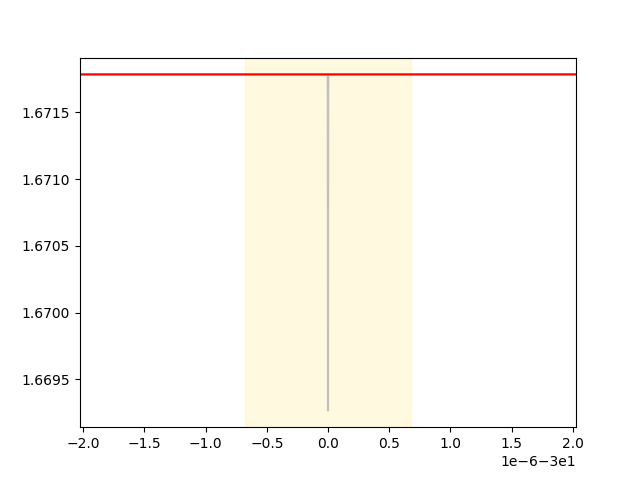
## Equation 5:
```
slow_delayed_rectifier_potassium_current_xs2_gate__tau_xs2 = 0.0040000000000000001 / (0.00013100000000000001 * (30.0 + membrane__V) / (-1.0 + exp(2.0609999999999999 + 0.068699999999999997 * membrane__V)) + 7.1899999999999999e-5 * (30.0 + membrane__V) / (1.0 - exp(-4.4399999999999995 - 0.14799999999999999 * membrane__V)))
```
### Partially evaluated to: 
```
slow_delayed_rectifier_potassium_current_xs2_gate__tau_xs2 = 0.0040000000000000001 / (0.00013100000000000001 * (30.0 + membrane__V) / (-1.0 + 7.8538197044216602 * exp(0.068699999999999997 * membrane__V)) + 7.1899999999999999e-5 * (30.0 + membrane__V) / (1.0 - 0.011795938519751569 * exp(-0.14799999999999999 * membrane__V)))
```
## New Eq:
```
slow_delayed_rectifier_potassium_current_xs2_gate__tau_xs2 = ((fabs(30.0 + membrane__V) < 1.455604075689676e-6) ? (2.2913311505801968 + 0.020651537997519277 * membrane__V) : ((fabs(30.0 + membrane__V) < 6.7567567568760367e-7) ? (2.2910903153264481 + 0.020643510155304027 * membrane__V) : (0.0040000000000000001 / (0.00013100000000000001 * (30.0 + membrane__V) / (-1.0 + exp(2.0609999999999999 + 0.068699999999999997 * membrane__V)) + 7.1899999999999999e-5 * (30.0 + membrane__V) / (1.0 - exp(-4.4399999999999995 - 0.14799999999999999 * membrane__V))))))
```

singularity processing time: 49.495566999999994
# Model: Corrias_rabbit_purkinje_model(corrias_purkinje_2011.cellml)
load time: 3.6083126000000334

singularity processing time: 4.046916899999985
# Model: courtemanche_1998(courtemanche_ramirez_nattel_1998.cellml)
load time: 3.5219384000000105

singularity processing time: 5.0386556999999925
# Model: davies_isap_2012(davies_isap_2012.cellml)
load time: 7.617194199999972

singularity processing time: 11.054059800000005
# Model: decker_2009(decker_2009.cellml)
load time: 9.019961899999998

singularity processing time: 18.590437700000052
# Model: demir_model_1994(demir_model_1994.cellml)
load time: 2.2936047999999687

*U*: 
-14.0 - 0.40000000000000002 * membrane__V
*V for 1e-07 range* 
`-34.999999750000001 - -35.000000249999999`
-35.000000000000000

*Singularity point: -35.000000000000000*

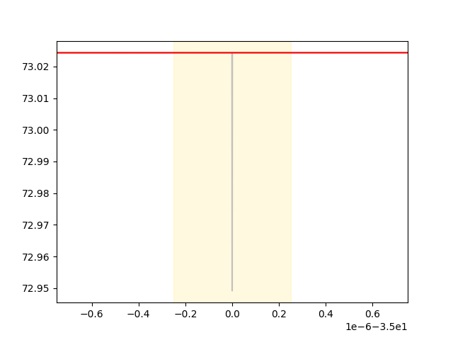
*U*: 
-0.20799999999999999 * membrane__V
*V for 1e-07 range* 
`4.8076923076923074e-7 - -4.8076923076923074e-7`

*Singularity point: 0*

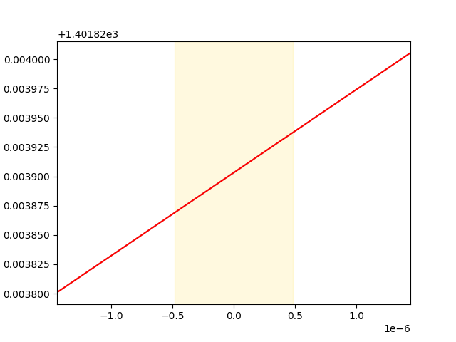
## Equation 1:
```
L_type_Ca_channel_d_gate__alpha_d_L = -28.390000000000001 * (35.0 + membrane__V) / (-1.0 + exp(-14.0 - 0.40000000000000002 * membrane__V)) - 84.900000000000006 * membrane__V / (-1.0 + exp(-0.20799999999999999 * membrane__V))
```
### Partially evaluated to: 
```
L_type_Ca_channel_d_gate__alpha_d_L = -28.390000000000001 * (35.0 + membrane__V) / (-1.0 + 8.3152871910356788e-7 * exp(-0.40000000000000002 * membrane__V)) - 84.900000000000006 * membrane__V / (-1.0 + exp(-0.20799999999999999 * membrane__V))
```
## New Eq:
```
L_type_Ca_channel_d_gate__alpha_d_L = ((fabs(35.0 + membrane__V) < 2.5000000000718892e-7) ? (582.44433142825267 + 14.554857261676066 * membrane__V) : ((fabs(membrane__V) < 4.8076923076923074e-7) ? (1401.8239031711605 + 70.842583267278769 * membrane__V) : (-28.390000000000001 * (35.0 + membrane__V) / (-1.0 + exp(-14.0 - 0.40000000000000002 * membrane__V)) - 84.900000000000006 * membrane__V / (-1.0 + exp(-0.20799999999999999 * membrane__V)))))
```

*U*: 
-2.0 + 0.40000000000000002 * membrane__V
*V for 1e-07 range* 
`4.9999997499999997 - 5.0000002500000003`
5.0000000000000000

*Singularity point: 5.0000000000000000*


## Equation 2:
```
L_type_Ca_channel_d_gate__beta_d_L = 11.43 * (-5.0 + membrane__V) / (-1.0 + exp(-2.0 + 0.40000000000000002 * membrane__V))
```
### Partially evaluated to: 
```
L_type_Ca_channel_d_gate__beta_d_L = 11.43 * (-5.0 + membrane__V) / (-1.0 + 0.13533528323661267 * exp(0.40000000000000002 * membrane__V))
```
## New Eq:
```
L_type_Ca_channel_d_gate__beta_d_L = ((fabs(-5.0 + membrane__V) < 2.5000000000025002e-7) ? (57.154423983533846 - 5.7158847966918849 * membrane__V) : (11.43 * (-5.0 + membrane__V) / (-1.0 + exp(-2.0 + 0.40000000000000002 * membrane__V))))
```

*U*: 
7.0 + 0.25 * membrane__V
*V for 1e-07 range* 
`-28.000000400000001 - -27.999999599999999`
-28.000000000000000

*Singularity point: -28.000000000000000*

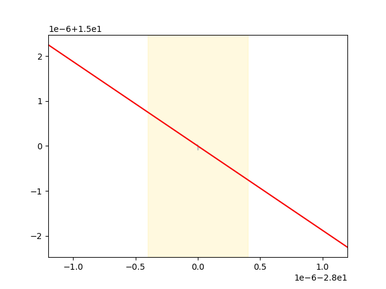
## Equation 3:
```
L_type_Ca_channel_f_gate__alpha_f_L = 3.75 * (28.0 + membrane__V) / (-1.0 + exp(7.0 + 0.25 * membrane__V))
```
### Partially evaluated to: 
```
L_type_Ca_channel_f_gate__alpha_f_L = 3.75 * (28.0 + membrane__V) / (-1.0 + 1096.6331584284585 * exp(0.25 * membrane__V))
```
## New Eq:
```
L_type_Ca_channel_f_gate__alpha_f_L = ((fabs(28.0 + membrane__V) < 4.0000000001150227e-7) ? (-37.512681700064675 - 1.8754529178594539 * membrane__V) : (3.75 * (28.0 + membrane__V) / (-1.0 + exp(7.0 + 0.25 * membrane__V))))
```

*U*: 
-5.8314606741573032 - 0.11235955056179775 * membrane__V
*V for 1e-07 range* 
`-51.899999109999996 - -51.900000890000001`
-51.899999999999999

*Singularity point: -51.899999999999999*

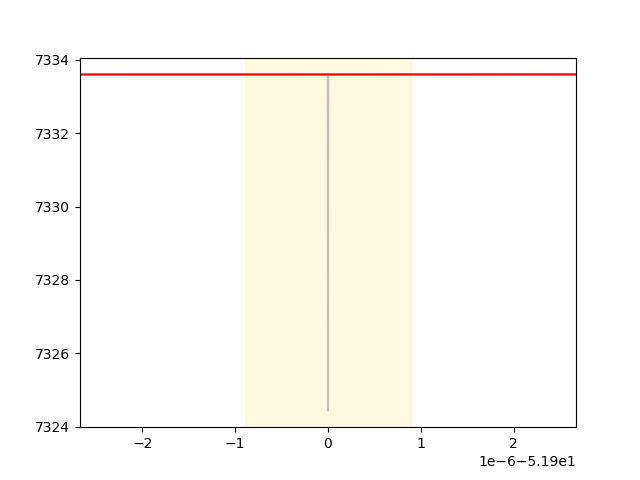
## Equation 4:
```
sodium_current_m_gate__alpha_m = -824.0 * (51.899999999999999 + membrane__V) / (-1.0 + exp(-5.8314606741573032 - 0.11235955056179775 * membrane__V))
```
### Partially evaluated to: 
```
sodium_current_m_gate__alpha_m = -824.0 * (51.899999999999999 + membrane__V) / (-1.0 + 0.0029337885398758403 * exp(-0.11235955056179775 * membrane__V))
```
## New Eq:
```
sodium_current_m_gate__alpha_m = ((fabs(51.899999999999999 + membrane__V) < 8.9000000000338808e-7) ? (28729.338058047499 + 412.24928821191992 * membrane__V) : (-824.0 * (51.899999999999999 + membrane__V) / (-1.0 + exp(-5.8314606741573032 - 0.11235955056179775 * membrane__V))))
```

*U*: 
0.037433890822745473 * membrane__V
*V for 1e-07 range* 
`-2.671376065969565e-6 - 2.671376065969565e-6`

*Singularity point: 0*

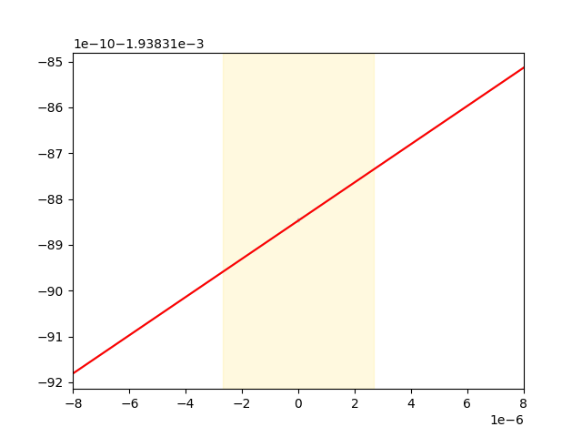
## Equation 5:
```
sodium_current__i_Na = pow(membrane__F, 2) * pow(sodium_current_m_gate__m, 3) * (-1.0 + exp((-reversal_potentials__E_Na + membrane__V) * membrane__F / (membrane__R * membrane__T))) * cleft_space_equations__Na_c * membrane__V * sodium_current__P_Na * sodium_current_h_gate__h1 * sodium_current_h_gate__h2 / ((-1.0 + exp(membrane__F * membrane__V / (membrane__R * membrane__T))) * membrane__R * membrane__T)
```
### Partially evaluated to: 
```
sodium_current__i_Na = 3611.8217397063127 * pow(sodium_current_m_gate__m, 3) * (-1.0 + pow((cleft_space_equations__Na_c / intracellular_concentrations_and_buffer_equations__Na_i), (-1.0)) * exp(0.037433890822745473 * membrane__V)) * cleft_space_equations__Na_c * membrane__V * sodium_current__P_Na * sodium_current_h_gate__h1 * sodium_current_h_gate__h2 / (-1.0 + exp(0.037433890822745473 * membrane__V))
```
## New Eq:
```
sodium_current__i_Na = ((fabs(membrane__V) < 2.671376065969565e-6) ? ((0.5 + 187169.45411372738 * membrane__V) * (96485.336675140832 * pow(sodium_current_m_gate__m, 3) * (-1.0 + 1.0000001000000049 * pow((cleft_space_equations__Na_c / intracellular_concentrations_and_buffer_equations__Na_i), (-1.0))) * cleft_space_equations__Na_c * sodium_current__P_Na * sodium_current_h_gate__h1 * sodium_current_h_gate__h2 - 96485.346324331898 * pow(sodium_current_m_gate__m, 3) * (-1.0 + 0.99999990000000505 * pow((cleft_space_equations__Na_c / intracellular_concentrations_and_buffer_equations__Na_i), (-1.0))) * cleft_space_equations__Na_c * sodium_current__P_Na * sodium_current_h_gate__h1 * sodium_current_h_gate__h2) + 96485.346324331898 * pow(sodium_current_m_gate__m, 3) * (-1.0 + 0.99999990000000505 * pow((cleft_space_equations__Na_c / intracellular_concentrations_and_buffer_equations__Na_i), (-1.0))) * cleft_space_equations__Na_c * sodium_current__P_Na * sodium_current_h_gate__h1 * sodium_current_h_gate__h2) : (pow(membrane__F, 2) * pow(sodium_current_m_gate__m, 3) * (-1.0 + exp((-reversal_potentials__E_Na + membrane__V) * membrane__F / (membrane__R * membrane__T))) * cleft_space_equations__Na_c * membrane__V * sodium_current__P_Na * sodium_current_h_gate__h1 * sodium_current_h_gate__h2 / ((-1.0 + exp(membrane__F * membrane__V / (membrane__R * membrane__T))) * membrane__R * membrane__T)))
```

singularity processing time: 30.954318
# Model: difrancesco_noble_model_1985(difrancesco_noble_model_1985.cellml)
load time: 2.5410323000000403

*U*: 
8.5 + 0.25 * membrane__V
*V for 1e-07 range* 
`-34.000000399999998 - -33.999999600000002`
-34.000000000000000

*Singularity point: -34.000000000000000*

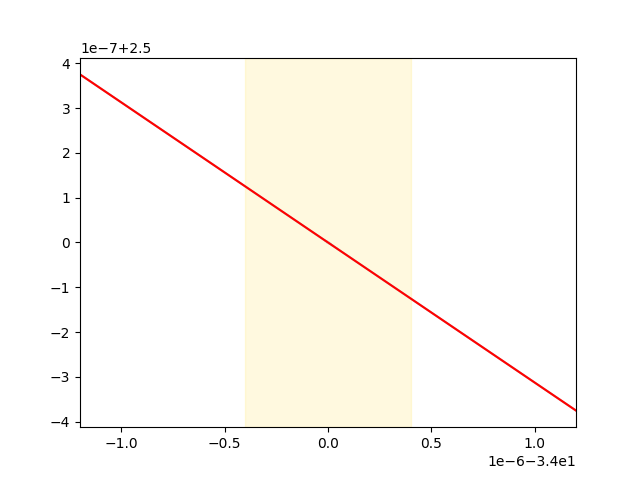
## Equation 1:
```
intracellular_calcium_concentration__alpha_p = 0.625 * (34.0 + membrane__V) / (-1.0 + exp(8.5 + 0.25 * membrane__V))
```
### Partially evaluated to: 
```
intracellular_calcium_concentration__alpha_p = 0.625 * (34.0 + membrane__V) / (-1.0 + 4914.7688402991344 * exp(0.25 * membrane__V))
```
## New Eq:
```
intracellular_calcium_concentration__alpha_p = ((fabs(34.0 + membrane__V) < 4.0000000001150227e-7) ? (-8.123880247150554 - 0.31246706609266356 * membrane__V) : (0.625 * (34.0 + membrane__V) / (-1.0 + exp(8.5 + 0.25 * membrane__V))))
```

*U*: 
3.7433890822745473 - 0.074867781645490947 * membrane__V
*V for 1e-07 range* 
`50.000001335688033 - 49.999998664311967`
50.000000000000000

*Singularity point: 50.000000000000000*


## Equation 2:
```
second_inward_current__i_siCa = 4.0 * (-50.0 + membrane__V) * (intracellular_calcium_concentration__Cai * exp(100.0 / membrane__RTONF) - extracellular_calcium_concentration__Cao * exp(-2.0 * (-50.0 + membrane__V) / membrane__RTONF)) * second_inward_current__P_si * second_inward_current_d_gate__d * second_inward_current_f2_gate__f2 * second_inward_current_f_gate__f / ((1.0 - exp(-2.0 * (-50.0 + membrane__V) / membrane__RTONF)) * membrane__RTONF)
```
### Partially evaluated to: 
```
second_inward_current__i_siCa = 0.14973556329098189 * (-50.0 + membrane__V) * (42.240905756816076 * intracellular_calcium_concentration__Cai - 42.240905756816076 * extracellular_calcium_concentration__Cao * exp(-0.074867781645490947 * membrane__V)) * second_inward_current__P_si * second_inward_current_d_gate__d * second_inward_current_f2_gate__f2 * second_inward_current_f_gate__f / (1.0 - 42.240905756816076 * exp(-0.074867781645490947 * membrane__V))
```
## New Eq:
```
second_inward_current__i_siCa = ((fabs(-50.0 + membrane__V) < 1.3356880329551402e-6) ? ((18716945.911788113 - 374338.90823576227 * membrane__V) * (1.9999998999780364 * (42.240905756816076 * intracellular_calcium_concentration__Cai - 1.0000001000000049 * extracellular_calcium_concentration__Cao) * second_inward_current__P_si * second_inward_current_d_gate__d * second_inward_current_f2_gate__f2 * second_inward_current_f_gate__f - 2.0000001000436947 * (42.240905756816076 * intracellular_calcium_concentration__Cai - 0.99999990000000505 * extracellular_calcium_concentration__Cao) * second_inward_current__P_si * second_inward_current_d_gate__d * second_inward_current_f2_gate__f2 * second_inward_current_f_gate__f) + 2.0000001000436947 * (42.240905756816076 * intracellular_calcium_concentration__Cai - 0.99999990000000505 * extracellular_calcium_concentration__Cao) * second_inward_current__P_si * second_inward_current_d_gate__d * second_inward_current_f2_gate__f2 * second_inward_current_f_gate__f) : (4.0 * (-50.0 + membrane__V) * (intracellular_calcium_concentration__Cai * exp(100.0 / membrane__RTONF) - extracellular_calcium_concentration__Cao * exp(-2.0 * (-50.0 + membrane__V) / membrane__RTONF)) * second_inward_current__P_si * second_inward_current_d_gate__d * second_inward_current_f2_gate__f2 * second_inward_current_f_gate__f / ((1.0 - exp(-2.0 * (-50.0 + membrane__V) / membrane__RTONF)) * membrane__RTONF)))
```

*U*: 
1.8716945411372736 - 0.037433890822745473 * membrane__V
*V for 1e-07 range* 
`50.000002671376066 - 49.999997328623934`
50.000000000000000

*Singularity point: 50.000000000000000*

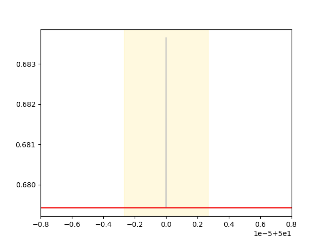
## Equation 3:
```
second_inward_current__i_siK = 0.01 * (-50.0 + membrane__V) * (intracellular_potassium_concentration__Ki * exp(50.0 / membrane__RTONF) - extracellular_potassium_concentration__Kc * exp(-(-50.0 + membrane__V) / membrane__RTONF)) * second_inward_current__P_si * second_inward_current_d_gate__d * second_inward_current_f2_gate__f2 * second_inward_current_f_gate__f / ((1.0 - exp(-(-50.0 + membrane__V) / membrane__RTONF)) * membrane__RTONF)
```
### Partially evaluated to: 
```
second_inward_current__i_siK = 0.00037433890822745472 * (-50.0 + membrane__V) * (6.4993004051833205 * intracellular_potassium_concentration__Ki - 6.4993004051833205 * extracellular_potassium_concentration__Kc * exp(-0.037433890822745473 * membrane__V)) * second_inward_current__P_si * second_inward_current_d_gate__d * second_inward_current_f2_gate__f2 * second_inward_current_f_gate__f / (1.0 - 6.4993004051833205 * exp(-0.037433890822745473 * membrane__V))
```
## New Eq:
```
second_inward_current__i_siK = ((fabs(-50.0 + membrane__V) < 2.6713760659657915e-6) ? ((9358473.2056995872 - 187169.45411399176 * membrane__V) * (0.0099999995000979811 * (6.4993004051833205 * intracellular_potassium_concentration__Ki - 1.0000001000000049 * extracellular_potassium_concentration__Kc) * second_inward_current__P_si * second_inward_current_d_gate__d * second_inward_current_f2_gate__f2 * second_inward_current_f_gate__f - 0.010000000500079329 * (6.4993004051833205 * intracellular_potassium_concentration__Ki - 0.99999990000000505 * extracellular_potassium_concentration__Kc) * second_inward_current__P_si * second_inward_current_d_gate__d * second_inward_current_f2_gate__f2 * second_inward_current_f_gate__f) + 0.010000000500079329 * (6.4993004051833205 * intracellular_potassium_concentration__Ki - 0.99999990000000505 * extracellular_potassium_concentration__Kc) * second_inward_current__P_si * second_inward_current_d_gate__d * second_inward_current_f2_gate__f2 * second_inward_current_f_gate__f) : (0.01 * (-50.0 + membrane__V) * (intracellular_potassium_concentration__Ki * exp(50.0 / membrane__RTONF) - extracellular_potassium_concentration__Kc * exp(-(-50.0 + membrane__V) / membrane__RTONF)) * second_inward_current__P_si * second_inward_current_d_gate__d * second_inward_current_f2_gate__f2 * second_inward_current_f_gate__f / ((1.0 - exp(-(-50.0 + membrane__V) / membrane__RTONF)) * membrane__RTONF)))
```

*U*: 
1.8716945411372736 - 0.037433890822745473 * membrane__V
*V for 1e-07 range* 
`50.000002671376066 - 49.999997328623934`
50.000000000000000

*Singularity point: 50.000000000000000*

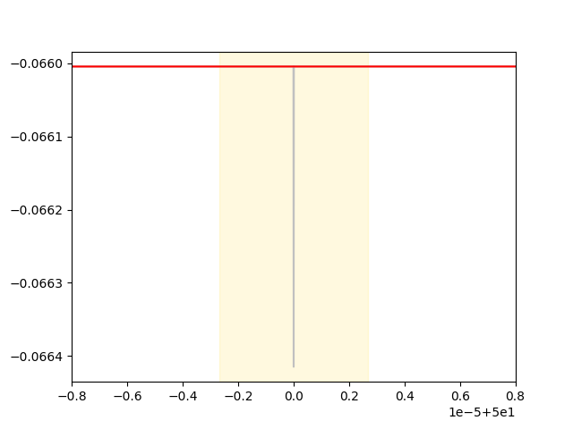
## Equation 4:
```
second_inward_current__i_siNa = 0.01 * (-50.0 + membrane__V) * (intracellular_sodium_concentration__Nai * exp(50.0 / membrane__RTONF) - extracellular_sodium_concentration__Nao * exp(-(-50.0 + membrane__V) / membrane__RTONF)) * second_inward_current__P_si * second_inward_current_d_gate__d * second_inward_current_f2_gate__f2 * second_inward_current_f_gate__f / ((1.0 - exp(-(-50.0 + membrane__V) / membrane__RTONF)) * membrane__RTONF)
```
### Partially evaluated to: 
```
second_inward_current__i_siNa = 0.00037433890822745472 * (-50.0 + membrane__V) * (6.4993004051833205 * intracellular_sodium_concentration__Nai - 6.4993004051833205 * extracellular_sodium_concentration__Nao * exp(-0.037433890822745473 * membrane__V)) * second_inward_current__P_si * second_inward_current_d_gate__d * second_inward_current_f2_gate__f2 * second_inward_current_f_gate__f / (1.0 - 6.4993004051833205 * exp(-0.037433890822745473 * membrane__V))
```
## New Eq:
```
second_inward_current__i_siNa = ((fabs(-50.0 + membrane__V) < 2.6713760659657915e-6) ? ((9358473.2056995872 - 187169.45411399176 * membrane__V) * (0.0099999995000979811 * (6.4993004051833205 * intracellular_sodium_concentration__Nai - 1.0000001000000049 * extracellular_sodium_concentration__Nao) * second_inward_current__P_si * second_inward_current_d_gate__d * second_inward_current_f2_gate__f2 * second_inward_current_f_gate__f - 0.010000000500079329 * (6.4993004051833205 * intracellular_sodium_concentration__Nai - 0.99999990000000505 * extracellular_sodium_concentration__Nao) * second_inward_current__P_si * second_inward_current_d_gate__d * second_inward_current_f2_gate__f2 * second_inward_current_f_gate__f) + 0.010000000500079329 * (6.4993004051833205 * intracellular_sodium_concentration__Nai - 0.99999990000000505 * extracellular_sodium_concentration__Nao) * second_inward_current__P_si * second_inward_current_d_gate__d * second_inward_current_f2_gate__f2 * second_inward_current_f_gate__f) : (0.01 * (-50.0 + membrane__V) * (intracellular_sodium_concentration__Nai * exp(50.0 / membrane__RTONF) - extracellular_sodium_concentration__Nao * exp(-(-50.0 + membrane__V) / membrane__RTONF)) * second_inward_current__P_si * second_inward_current_d_gate__d * second_inward_current_f2_gate__f2 * second_inward_current_f_gate__f / ((1.0 - exp(-(-50.0 + membrane__V) / membrane__RTONF)) * membrane__RTONF)))
```

*U*: 
-2.0 - 0.20000000000000001 * membrane__V
*V for 1e-07 range* 
`-9.9999994999999995 - -10.000000500000001`
-10.000000000000000

*Singularity point: -10.000000000000000*


## Equation 5:
```
transient_outward_current__i_to = (10.0 + membrane__V) * (0.20000000000000001 + extracellular_potassium_concentration__Kc / (extracellular_potassium_concentration__Kc + transient_outward_current__Km_to)) * (intracellular_potassium_concentration__Ki * exp(0.5 * membrane__V / membrane__RTONF) - extracellular_potassium_concentration__Kc * exp(-0.5 * membrane__V / membrane__RTONF)) * intracellular_calcium_concentration__Cai * transient_outward_current__g_to * transient_outward_current_s_gate__s / ((1.0 - exp(-2.0 - 0.20000000000000001 * membrane__V)) * (intracellular_calcium_concentration__Cai + transient_outward_current__Km_Ca))
```
### Partially evaluated to: 
```
transient_outward_current__i_to = (10.0 + membrane__V) * (0.20000000000000001 + extracellular_potassium_concentration__Kc / (10.0 + extracellular_potassium_concentration__Kc)) * (intracellular_potassium_concentration__Ki * exp(0.018716945411372737 * membrane__V) - extracellular_potassium_concentration__Kc * exp(-0.018716945411372737 * membrane__V)) * intracellular_calcium_concentration__Cai * transient_outward_current__g_to * transient_outward_current_s_gate__s / ((1.0 - 0.13533528323661267 * exp(-0.20000000000000001 * membrane__V)) * (0.00050000000000000001 + intracellular_calcium_concentration__Cai))
```
## New Eq:
```
transient_outward_current__i_to = ((fabs(10.0 + membrane__V) < 5.0000000000050004e-7) ? ((-9999999.4999899995 - 999999.99999899988 * membrane__V) * (4.9999997499743181 * (0.20000000000000001 + extracellular_potassium_concentration__Kc / (10.0 + extracellular_potassium_concentration__Kc)) * (0.82930318787909674 * intracellular_potassium_concentration__Ki - 1.2058316121483292 * extracellular_potassium_concentration__Kc) * intracellular_calcium_concentration__Cai * transient_outward_current__g_to * transient_outward_current_s_gate__s / (0.00050000000000000001 + intracellular_calcium_concentration__Cai) - 5.0000002500517278 * (0.20000000000000001 + extracellular_potassium_concentration__Kc / (10.0 + extracellular_potassium_concentration__Kc)) * (0.8293032034011194 * intracellular_potassium_concentration__Ki - 1.205831589578845 * extracellular_potassium_concentration__Kc) * intracellular_calcium_concentration__Cai * transient_outward_current__g_to * transient_outward_current_s_gate__s / (0.00050000000000000001 + intracellular_calcium_concentration__Cai)) + 5.0000002500517278 * (0.20000000000000001 + extracellular_potassium_concentration__Kc / (10.0 + extracellular_potassium_concentration__Kc)) * (0.8293032034011194 * intracellular_potassium_concentration__Ki - 1.205831589578845 * extracellular_potassium_concentration__Kc) * intracellular_calcium_concentration__Cai * transient_outward_current__g_to * transient_outward_current_s_gate__s / (0.00050000000000000001 + intracellular_calcium_concentration__Cai)) : ((10.0 + membrane__V) * (0.20000000000000001 + extracellular_potassium_concentration__Kc / (extracellular_potassium_concentration__Kc + transient_outward_current__Km_to)) * (intracellular_potassium_concentration__Ki * exp(0.5 * membrane__V / membrane__RTONF) - extracellular_potassium_concentration__Kc * exp(-0.5 * membrane__V / membrane__RTONF)) * intracellular_calcium_concentration__Cai * transient_outward_current__g_to * transient_outward_current_s_gate__s / ((1.0 - exp(-2.0 - 0.20000000000000001 * membrane__V)) * (intracellular_calcium_concentration__Cai + transient_outward_current__Km_Ca))))
```

singularity processing time: 26.572604000000013
# Model: dokos_model_1996(dokos_model_1996.cellml)
load time: 2.954701400000033

*U*: 
-3.0869999999999997 - 0.089999999999999997 * membrane__E
*V for 1e-07 range* 
`-34.299998888888886 - -34.300001111111108`
-34.299999999999997

*Singularity point: -34.299999999999997*


## Equation 1:
```
fast_sodium_current_m_gate__alpha_m = 200.0 * (34.299999999999997 + membrane__E) / (1.0 - exp(-3.0869999999999997 - 0.089999999999999997 * membrane__E))
```
### Partially evaluated to: 
```
fast_sodium_current_m_gate__alpha_m = 200.0 * (34.299999999999997 + membrane__E) / (1.0 - 0.045638665231542724 * exp(-0.089999999999999997 * membrane__E))
```
## New Eq:
```
fast_sodium_current_m_gate__alpha_m = ((fabs(34.299999999999997 + membrane__E) < 1.1111111111183902e-6) ? (5652.1582450498508 + 99.998134775225381 * membrane__E) : (200.0 * (34.299999999999997 + membrane__E) / (1.0 - exp(-3.0869999999999997 - 0.089999999999999997 * membrane__E))))
```

*U*: 
9.0948000000000011 + 0.066000000000000003 * membrane__E
*V for 1e-07 range* 
`-137.80000151515154 - -137.79999848484849`
-137.80000000000001

*Singularity point: -137.80000000000001*

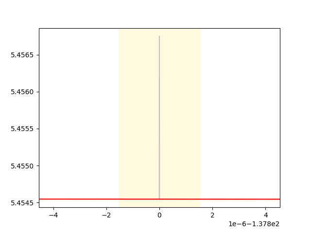
## Equation 2:
```
hyperpolarising_activated_current_y_gate__alpha_y = 0.35999999999999999 * (137.80000000000001 + membrane__E) / (-1.0 + exp(9.0948000000000011 + 0.066000000000000003 * membrane__E))
```
### Partially evaluated to: 
```
hyperpolarising_activated_current_y_gate__alpha_y = 0.35999999999999999 * (137.80000000000001 + membrane__E) / (-1.0 + 8908.846047390005 * exp(0.066000000000000003 * membrane__E))
```
## New Eq:
```
hyperpolarising_activated_current_y_gate__alpha_y = ((fabs(137.80000000000001 + membrane__E) < 1.5151515151412553e-6) ? (-19.312418027442355 - 0.17973122991416926 * membrane__E) : (0.35999999999999999 * (137.80000000000001 + membrane__E) / (-1.0 + exp(9.0948000000000011 + 0.066000000000000003 * membrane__E))))
```

*U*: 
-16.023 - 0.20999999999999999 * membrane__E
*V for 1e-07 range* 
`-76.299999523809518 - -76.300000476190476`
-76.299999999999997

*Singularity point: -76.299999999999997*


## Equation 3:
```
hyperpolarising_activated_current_y_gate__beta_y = 0.10000000000000001 * (76.299999999999997 + membrane__E) / (1.0 - exp(-16.023 - 0.20999999999999999 * membrane__E))
```
### Partially evaluated to: 
```
hyperpolarising_activated_current_y_gate__beta_y = 0.10000000000000001 * (76.299999999999997 + membrane__E) / (1.0 - 1.0997640435800299e-7 * exp(-0.20999999999999999 * membrane__E))
```
## New Eq:
```
hyperpolarising_activated_current_y_gate__beta_y = ((fabs(76.299999999999997 + membrane__E) < 4.761904762173863e-7) ? (4.3003447677384532 + 0.050119977608635506 * membrane__E) : (0.10000000000000001 * (76.299999999999997 + membrane__E) / (1.0 - exp(-16.023 - 0.20999999999999999 * membrane__E))))
```

singularity processing time: 25.249547300000017
# Model: earm_noble_model_1990(earm_noble_model_1990.cellml)
load time: 1.943007399999999

*U*: 
3.7433890822745473 - 0.074867781645490947 * membrane__V
*V for 1e-07 range* 
`50.000001335688033 - 49.999998664311967`
50.000000000000000

*Singularity point: 50.000000000000000*


## Equation 1:
```
L_type_calcium_current__i_Ca_L_Ca = 4.0 * (-50.0 + membrane__V) * (intracellular_calcium_concentration__Ca_i * exp(100.0 / membrane__RTONF) - extracellular_calcium_concentration__Ca_o * exp(2.0 * (50.0 - membrane__V) / membrane__RTONF)) * L_type_calcium_current__P_Ca_L * L_type_calcium_current_d_gate__d * L_type_calcium_current_f_Ca_gate__CaChon / ((1.0 - exp(2.0 * (50.0 - membrane__V) / membrane__RTONF)) * membrane__RTONF)
```
### Partially evaluated to: 
```
L_type_calcium_current__i_Ca_L_Ca = 0.14973556329098189 * (1.0 - L_type_calcium_current_f_Ca_gate__f_Ca) * (1.0 - intracellular_calcium_concentration__Ca_i / (0.001 + intracellular_calcium_concentration__Ca_i)) * (-50.0 + membrane__V) * (42.240905756816076 * intracellular_calcium_concentration__Ca_i - 42.240905756816076 * extracellular_calcium_concentration__Ca_o * exp(-0.074867781645490947 * membrane__V)) * L_type_calcium_current__P_Ca_L * L_type_calcium_current_d_gate__d / (1.0 - 42.240905756816076 * exp(-0.074867781645490947 * membrane__V))
```
## New Eq:
```
L_type_calcium_current__i_Ca_L_Ca = ((fabs(-50.0 + membrane__V) < 1.3356880329551402e-6) ? ((18716945.911788113 - 374338.90823576227 * membrane__V) * (1.9999998999780364 * (1.0 - L_type_calcium_current_f_Ca_gate__f_Ca) * (1.0 - intracellular_calcium_concentration__Ca_i / (0.001 + intracellular_calcium_concentration__Ca_i)) * (42.240905756816076 * intracellular_calcium_concentration__Ca_i - 1.0000001000000049 * extracellular_calcium_concentration__Ca_o) * L_type_calcium_current__P_Ca_L * L_type_calcium_current_d_gate__d - 2.0000001000436947 * (1.0 - L_type_calcium_current_f_Ca_gate__f_Ca) * (1.0 - intracellular_calcium_concentration__Ca_i / (0.001 + intracellular_calcium_concentration__Ca_i)) * (42.240905756816076 * intracellular_calcium_concentration__Ca_i - 0.99999990000000505 * extracellular_calcium_concentration__Ca_o) * L_type_calcium_current__P_Ca_L * L_type_calcium_current_d_gate__d) + 2.0000001000436947 * (1.0 - L_type_calcium_current_f_Ca_gate__f_Ca) * (1.0 - intracellular_calcium_concentration__Ca_i / (0.001 + intracellular_calcium_concentration__Ca_i)) * (42.240905756816076 * intracellular_calcium_concentration__Ca_i - 0.99999990000000505 * extracellular_calcium_concentration__Ca_o) * L_type_calcium_current__P_Ca_L * L_type_calcium_current_d_gate__d) : (4.0 * (-50.0 + membrane__V) * (intracellular_calcium_concentration__Ca_i * exp(100.0 / membrane__RTONF) - extracellular_calcium_concentration__Ca_o * exp(2.0 * (50.0 - membrane__V) / membrane__RTONF)) * L_type_calcium_current__P_Ca_L * L_type_calcium_current_d_gate__d * L_type_calcium_current_f_Ca_gate__CaChon / ((1.0 - exp(2.0 * (50.0 - membrane__V) / membrane__RTONF)) * membrane__RTONF)))
```

*U*: 
1.8716945411372736 - 0.037433890822745473 * membrane__V
*V for 1e-07 range* 
`50.000002671376066 - 49.999997328623934`
50.000000000000000

*Singularity point: 50.000000000000000*

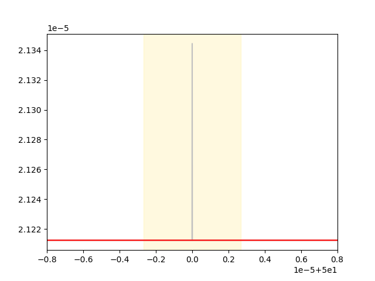
## Equation 2:
```
L_type_calcium_current__i_Ca_L_K = 0.002 * (-50.0 + membrane__V) * (intracellular_potassium_concentration__K_i * exp(50.0 / membrane__RTONF) - extracellular_potassium_concentration__K_c * exp((50.0 - membrane__V) / membrane__RTONF)) * L_type_calcium_current__P_Ca_L * L_type_calcium_current_d_gate__d * L_type_calcium_current_f_Ca_gate__CaChon / ((1.0 - exp((50.0 - membrane__V) / membrane__RTONF)) * membrane__RTONF)
```
### Partially evaluated to: 
```
L_type_calcium_current__i_Ca_L_K = 7.4867781645490941e-5 * (1.0 - L_type_calcium_current_f_Ca_gate__f_Ca) * (1.0 - intracellular_calcium_concentration__Ca_i / (0.001 + intracellular_calcium_concentration__Ca_i)) * (-50.0 + membrane__V) * (6.4993004051833205 * intracellular_potassium_concentration__K_i - 6.4993004051833205 * extracellular_potassium_concentration__K_c * exp(-0.037433890822745473 * membrane__V)) * L_type_calcium_current__P_Ca_L * L_type_calcium_current_d_gate__d / (1.0 - 6.4993004051833205 * exp(-0.037433890822745473 * membrane__V))
```
## New Eq:
```
L_type_calcium_current__i_Ca_L_K = ((fabs(-50.0 + membrane__V) < 2.6713760659657915e-6) ? ((9358473.2056995872 - 187169.45411399176 * membrane__V) * (0.0019999999000195963 * (1.0 - L_type_calcium_current_f_Ca_gate__f_Ca) * (1.0 - intracellular_calcium_concentration__Ca_i / (0.001 + intracellular_calcium_concentration__Ca_i)) * (6.4993004051833205 * intracellular_potassium_concentration__K_i - 1.0000001000000049 * extracellular_potassium_concentration__K_c) * L_type_calcium_current__P_Ca_L * L_type_calcium_current_d_gate__d - 0.0020000001000158659 * (1.0 - L_type_calcium_current_f_Ca_gate__f_Ca) * (1.0 - intracellular_calcium_concentration__Ca_i / (0.001 + intracellular_calcium_concentration__Ca_i)) * (6.4993004051833205 * intracellular_potassium_concentration__K_i - 0.99999990000000505 * extracellular_potassium_concentration__K_c) * L_type_calcium_current__P_Ca_L * L_type_calcium_current_d_gate__d) + 0.0020000001000158659 * (1.0 - L_type_calcium_current_f_Ca_gate__f_Ca) * (1.0 - intracellular_calcium_concentration__Ca_i / (0.001 + intracellular_calcium_concentration__Ca_i)) * (6.4993004051833205 * intracellular_potassium_concentration__K_i - 0.99999990000000505 * extracellular_potassium_concentration__K_c) * L_type_calcium_current__P_Ca_L * L_type_calcium_current_d_gate__d) : (0.002 * (-50.0 + membrane__V) * (intracellular_potassium_concentration__K_i * exp(50.0 / membrane__RTONF) - extracellular_potassium_concentration__K_c * exp((50.0 - membrane__V) / membrane__RTONF)) * L_type_calcium_current__P_Ca_L * L_type_calcium_current_d_gate__d * L_type_calcium_current_f_Ca_gate__CaChon / ((1.0 - exp((50.0 - membrane__V) / membrane__RTONF)) * membrane__RTONF)))
```

*U*: 
1.8716945411372736 - 0.037433890822745473 * membrane__V
*V for 1e-07 range* 
`50.000002671376066 - 49.999997328623934`
50.000000000000000

*Singularity point: 50.000000000000000*

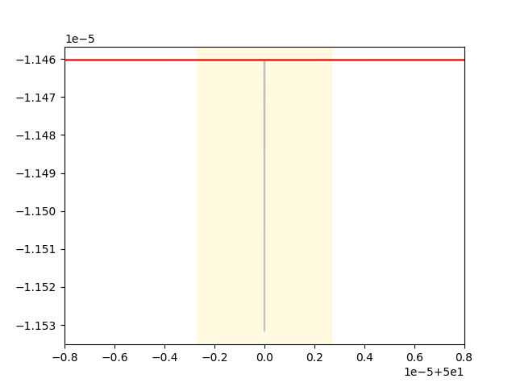
## Equation 3:
```
L_type_calcium_current__i_Ca_L_Na = 0.01 * (-50.0 + membrane__V) * (intracellular_sodium_concentration__Na_i * exp(50.0 / membrane__RTONF) - extracellular_sodium_concentration__Na_o * exp((50.0 - membrane__V) / membrane__RTONF)) * L_type_calcium_current__P_Ca_L * L_type_calcium_current_d_gate__d * L_type_calcium_current_f_Ca_gate__CaChon / ((1.0 - exp((50.0 - membrane__V) / membrane__RTONF)) * membrane__RTONF)
```
### Partially evaluated to: 
```
L_type_calcium_current__i_Ca_L_Na = 0.00037433890822745472 * (1.0 - L_type_calcium_current_f_Ca_gate__f_Ca) * (1.0 - intracellular_calcium_concentration__Ca_i / (0.001 + intracellular_calcium_concentration__Ca_i)) * (-50.0 + membrane__V) * (6.4993004051833205 * intracellular_sodium_concentration__Na_i - 6.4993004051833205 * extracellular_sodium_concentration__Na_o * exp(-0.037433890822745473 * membrane__V)) * L_type_calcium_current__P_Ca_L * L_type_calcium_current_d_gate__d / (1.0 - 6.4993004051833205 * exp(-0.037433890822745473 * membrane__V))
```
## New Eq:
```
L_type_calcium_current__i_Ca_L_Na = ((fabs(-50.0 + membrane__V) < 2.6713760659657915e-6) ? ((9358473.2056995872 - 187169.45411399176 * membrane__V) * (0.0099999995000979811 * (1.0 - L_type_calcium_current_f_Ca_gate__f_Ca) * (1.0 - intracellular_calcium_concentration__Ca_i / (0.001 + intracellular_calcium_concentration__Ca_i)) * (6.4993004051833205 * intracellular_sodium_concentration__Na_i - 1.0000001000000049 * extracellular_sodium_concentration__Na_o) * L_type_calcium_current__P_Ca_L * L_type_calcium_current_d_gate__d - 0.010000000500079329 * (1.0 - L_type_calcium_current_f_Ca_gate__f_Ca) * (1.0 - intracellular_calcium_concentration__Ca_i / (0.001 + intracellular_calcium_concentration__Ca_i)) * (6.4993004051833205 * intracellular_sodium_concentration__Na_i - 0.99999990000000505 * extracellular_sodium_concentration__Na_o) * L_type_calcium_current__P_Ca_L * L_type_calcium_current_d_gate__d) + 0.010000000500079329 * (1.0 - L_type_calcium_current_f_Ca_gate__f_Ca) * (1.0 - intracellular_calcium_concentration__Ca_i / (0.001 + intracellular_calcium_concentration__Ca_i)) * (6.4993004051833205 * intracellular_sodium_concentration__Na_i - 0.99999990000000505 * extracellular_sodium_concentration__Na_o) * L_type_calcium_current__P_Ca_L * L_type_calcium_current_d_gate__d) : (0.01 * (-50.0 + membrane__V) * (intracellular_sodium_concentration__Na_i * exp(50.0 / membrane__RTONF) - extracellular_sodium_concentration__Na_o * exp((50.0 - membrane__V) / membrane__RTONF)) * L_type_calcium_current__P_Ca_L * L_type_calcium_current_d_gate__d * L_type_calcium_current_f_Ca_gate__CaChon / ((1.0 - exp((50.0 - membrane__V) / membrane__RTONF)) * membrane__RTONF)))
```

singularity processing time: 15.63744029999998
# Model: espinosa_model_1998(espinosa_model_1998_normal.cellml)
load time: 4.343254000000002

*U*: 
3.7433890822745473 - 0.074867781645490947 * membrane__V
*V for 1e-07 range* 
`50.000001335688033 - 49.999998664311967`
50.000000000000000

*Singularity point: 50.000000000000000*

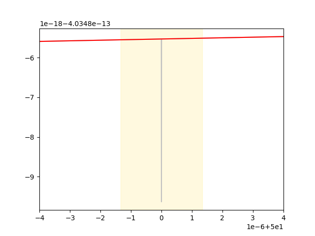
## Equation 1:
```
L_type_Ca_channel__i_Ca_L_Ca_ds = 4.0 * (-50.0 + membrane__V) * (intracellular_calcium_concentration__Ca_i * exp(100.0 * membrane__F / (membrane__R * membrane__T)) - extracellular_calcium_concentration__Ca_o * exp(2.0 * (50.0 - membrane__V) * membrane__F / (membrane__R * membrane__T))) * L_type_Ca_channel__FrICa * L_type_Ca_channel__P_Ca_L * L_type_Ca_channel_d_gate__d * L_type_Ca_channel_f2ds_gate__f2ds * L_type_Ca_channel_f_gate__f * membrane__F / ((1.0 - exp(2.0 * (50.0 - membrane__V) * membrane__F / (membrane__R * membrane__T))) * membrane__R * membrane__T)
```
### Partially evaluated to: 
```
L_type_Ca_channel__i_Ca_L_Ca_ds = 0.14973556329098189 * (-50.0 + membrane__V) * (42.240905756816076 * intracellular_calcium_concentration__Ca_i - 42.240905756816076 * extracellular_calcium_concentration__Ca_o * exp(-0.074867781645490947 * membrane__V)) * L_type_Ca_channel__P_Ca_L * L_type_Ca_channel_d_gate__d * L_type_Ca_channel_f2ds_gate__f2ds * L_type_Ca_channel_f_gate__f / (1.0 - 42.240905756816076 * exp(-0.074867781645490947 * membrane__V))
```
## New Eq:
```
L_type_Ca_channel__i_Ca_L_Ca_ds = ((fabs(-50.0 + membrane__V) < 1.3356880329551402e-6) ? ((18716945.911788113 - 374338.90823576227 * membrane__V) * (1.9999998999780364 * (42.240905756816076 * intracellular_calcium_concentration__Ca_i - 1.0000001000000049 * extracellular_calcium_concentration__Ca_o) * L_type_Ca_channel__P_Ca_L * L_type_Ca_channel_d_gate__d * L_type_Ca_channel_f2ds_gate__f2ds * L_type_Ca_channel_f_gate__f - 2.0000000999743057 * (42.240905756816076 * intracellular_calcium_concentration__Ca_i - 0.99999990000000505 * extracellular_calcium_concentration__Ca_o) * L_type_Ca_channel__P_Ca_L * L_type_Ca_channel_d_gate__d * L_type_Ca_channel_f2ds_gate__f2ds * L_type_Ca_channel_f_gate__f) + 2.0000000999743057 * (42.240905756816076 * intracellular_calcium_concentration__Ca_i - 0.99999990000000505 * extracellular_calcium_concentration__Ca_o) * L_type_Ca_channel__P_Ca_L * L_type_Ca_channel_d_gate__d * L_type_Ca_channel_f2ds_gate__f2ds * L_type_Ca_channel_f_gate__f) : (4.0 * (-50.0 + membrane__V) * (intracellular_calcium_concentration__Ca_i * exp(100.0 * membrane__F / (membrane__R * membrane__T)) - extracellular_calcium_concentration__Ca_o * exp(2.0 * (50.0 - membrane__V) * membrane__F / (membrane__R * membrane__T))) * L_type_Ca_channel__FrICa * L_type_Ca_channel__P_Ca_L * L_type_Ca_channel_d_gate__d * L_type_Ca_channel_f2ds_gate__f2ds * L_type_Ca_channel_f_gate__f * membrane__F / ((1.0 - exp(2.0 * (50.0 - membrane__V) * membrane__F / (membrane__R * membrane__T))) * membrane__R * membrane__T)))
```

*U*: 
1.8716945411372736 - 0.037433890822745473 * membrane__V
*V for 1e-07 range* 
`50.000002671376066 - 49.999997328623934`
50.000000000000000

*Singularity point: 50.000000000000000*

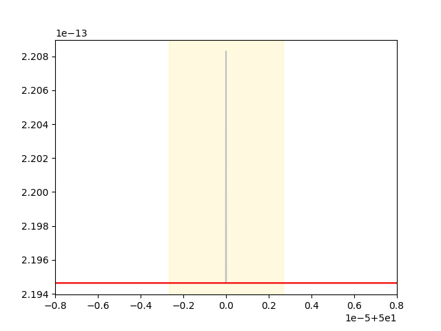
## Equation 2:
```
L_type_Ca_channel__i_Ca_L_K_ds = (-50.0 + membrane__V) * (intracellular_potassium_concentration__K_i * exp(50.0 * membrane__F / (membrane__R * membrane__T)) - extracellular_potassium_concentration__K_o * exp((50.0 - membrane__V) * membrane__F / (membrane__R * membrane__T))) * L_type_Ca_channel__FrICa * L_type_Ca_channel__P_CaK * L_type_Ca_channel__P_Ca_L * L_type_Ca_channel_d_gate__d * L_type_Ca_channel_f2ds_gate__f2ds * L_type_Ca_channel_f_gate__f * membrane__F / ((1.0 - exp((50.0 - membrane__V) * membrane__F / (membrane__R * membrane__T))) * membrane__R * membrane__T)
```
### Partially evaluated to: 
```
L_type_Ca_channel__i_Ca_L_K_ds = 0.00011230167246823642 * (-50.0 + membrane__V) * (6.4993004051833205 * intracellular_potassium_concentration__K_i - 6.4993004051833205 * extracellular_potassium_concentration__K_o * exp(-0.037433890822745473 * membrane__V)) * L_type_Ca_channel__P_Ca_L * L_type_Ca_channel_d_gate__d * L_type_Ca_channel_f2ds_gate__f2ds * L_type_Ca_channel_f_gate__f / (1.0 - 6.4993004051833205 * exp(-0.037433890822745473 * membrane__V))
```
## New Eq:
```
L_type_Ca_channel__i_Ca_L_K_ds = ((fabs(-50.0 + membrane__V) < 2.6713760659657915e-6) ? ((9358473.2056995872 - 187169.45411399176 * membrane__V) * (0.0029999998500293947 * (6.4993004051833205 * intracellular_potassium_concentration__K_i - 1.0000001000000049 * extracellular_potassium_concentration__K_o) * L_type_Ca_channel__P_Ca_L * L_type_Ca_channel_d_gate__d * L_type_Ca_channel_f2ds_gate__f2ds * L_type_Ca_channel_f_gate__f - 0.003000000150023799 * (6.4993004051833205 * intracellular_potassium_concentration__K_i - 0.99999990000000505 * extracellular_potassium_concentration__K_o) * L_type_Ca_channel__P_Ca_L * L_type_Ca_channel_d_gate__d * L_type_Ca_channel_f2ds_gate__f2ds * L_type_Ca_channel_f_gate__f) + 0.003000000150023799 * (6.4993004051833205 * intracellular_potassium_concentration__K_i - 0.99999990000000505 * extracellular_potassium_concentration__K_o) * L_type_Ca_channel__P_Ca_L * L_type_Ca_channel_d_gate__d * L_type_Ca_channel_f2ds_gate__f2ds * L_type_Ca_channel_f_gate__f) : ((-50.0 + membrane__V) * (intracellular_potassium_concentration__K_i * exp(50.0 * membrane__F / (membrane__R * membrane__T)) - extracellular_potassium_concentration__K_o * exp((50.0 - membrane__V) * membrane__F / (membrane__R * membrane__T))) * L_type_Ca_channel__FrICa * L_type_Ca_channel__P_CaK * L_type_Ca_channel__P_Ca_L * L_type_Ca_channel_d_gate__d * L_type_Ca_channel_f2ds_gate__f2ds * L_type_Ca_channel_f_gate__f * membrane__F / ((1.0 - exp((50.0 - membrane__V) * membrane__F / (membrane__R * membrane__T))) * membrane__R * membrane__T)))
```

*U*: 
1.8716945411372736 - 0.037433890822745473 * membrane__V
*V for 1e-07 range* 
`50.000002671376066 - 49.999997328623934`
50.000000000000000

*Singularity point: 50.000000000000000*


## Equation 3:
```
L_type_Ca_channel__i_Ca_L_Na_ds = (-50.0 + membrane__V) * (intracellular_sodium_concentration__Na_i * exp(50.0 * membrane__F / (membrane__R * membrane__T)) - extracellular_sodium_concentration__Na_o * exp((50.0 - membrane__V) * membrane__F / (membrane__R * membrane__T))) * L_type_Ca_channel__FrICa * L_type_Ca_channel__P_CaNa * L_type_Ca_channel__P_Ca_L * L_type_Ca_channel_d_gate__d * L_type_Ca_channel_f2ds_gate__f2ds * L_type_Ca_channel_f_gate__f * membrane__F / ((1.0 - exp((50.0 - membrane__V) * membrane__F / (membrane__R * membrane__T))) * membrane__R * membrane__T)
```
### Partially evaluated to: 
```
L_type_Ca_channel__i_Ca_L_Na_ds = 0.00037433890822745472 * (-50.0 + membrane__V) * (6.4993004051833205 * intracellular_sodium_concentration__Na_i - 6.4993004051833205 * extracellular_sodium_concentration__Na_o * exp(-0.037433890822745473 * membrane__V)) * L_type_Ca_channel__P_Ca_L * L_type_Ca_channel_d_gate__d * L_type_Ca_channel_f2ds_gate__f2ds * L_type_Ca_channel_f_gate__f / (1.0 - 6.4993004051833205 * exp(-0.037433890822745473 * membrane__V))
```
## New Eq:
```
L_type_Ca_channel__i_Ca_L_Na_ds = ((fabs(-50.0 + membrane__V) < 2.6713760659657915e-6) ? ((9358473.2056995872 - 187169.45411399176 * membrane__V) * (0.0099999995000979811 * (6.4993004051833205 * intracellular_sodium_concentration__Na_i - 1.0000001000000049 * extracellular_sodium_concentration__Na_o) * L_type_Ca_channel__P_Ca_L * L_type_Ca_channel_d_gate__d * L_type_Ca_channel_f2ds_gate__f2ds * L_type_Ca_channel_f_gate__f - 0.010000000500079329 * (6.4993004051833205 * intracellular_sodium_concentration__Na_i - 0.99999990000000505 * extracellular_sodium_concentration__Na_o) * L_type_Ca_channel__P_Ca_L * L_type_Ca_channel_d_gate__d * L_type_Ca_channel_f2ds_gate__f2ds * L_type_Ca_channel_f_gate__f) + 0.010000000500079329 * (6.4993004051833205 * intracellular_sodium_concentration__Na_i - 0.99999990000000505 * extracellular_sodium_concentration__Na_o) * L_type_Ca_channel__P_Ca_L * L_type_Ca_channel_d_gate__d * L_type_Ca_channel_f2ds_gate__f2ds * L_type_Ca_channel_f_gate__f) : ((-50.0 + membrane__V) * (intracellular_sodium_concentration__Na_i * exp(50.0 * membrane__F / (membrane__R * membrane__T)) - extracellular_sodium_concentration__Na_o * exp((50.0 - membrane__V) * membrane__F / (membrane__R * membrane__T))) * L_type_Ca_channel__FrICa * L_type_Ca_channel__P_CaNa * L_type_Ca_channel__P_Ca_L * L_type_Ca_channel_d_gate__d * L_type_Ca_channel_f2ds_gate__f2ds * L_type_Ca_channel_f_gate__f * membrane__F / ((1.0 - exp((50.0 - membrane__V) * membrane__F / (membrane__R * membrane__T))) * membrane__R * membrane__T)))
```

singularity processing time: 16.634559700000068
# Model: faber_rudy_2000(faber_rudy_2000.cellml)
load time: 4.388714400000026

*U*: 
0.074871767015605231 * cell__V
*V for 1e-07 range* 
`-1.3356169352749131e-6 - 1.3356169352749131e-6`

*Singularity point: 0*

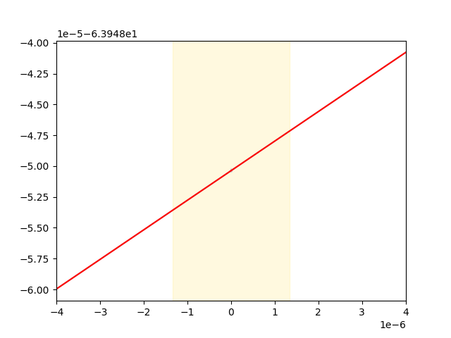
## Equation 1:
```
L_type_Ca_channel__I_CaCa = 4.0 * pow(cell__F, 2) * (-L_type_Ca_channel__gamma_Cao * calcium_dynamics__Cao + L_type_Ca_channel__gamma_Cai * calcium_dynamics__Cai * exp(2.0 * cell__F * cell__V / (cell__R * cell__T))) * L_type_Ca_channel__P_Ca * cell__V / ((-1.0 + exp(2.0 * cell__F * cell__V / (cell__R * cell__T))) * cell__R * cell__T)
```
### Partially evaluated to: 
```
L_type_Ca_channel__I_CaCa = 14448.004881001343 * (-0.34100000000000003 * calcium_dynamics__Cao + calcium_dynamics__Cai * exp(0.074871767015605231 * cell__V)) * L_type_Ca_channel__P_Ca * cell__V / (-1.0 + exp(0.074871767015605231 * cell__V))
```
## New Eq:
```
L_type_Ca_channel__I_CaCa = ((fabs(cell__V) < 1.3356169352749131e-6) ? ((0.5 + 374358.83507802623 * cell__V) * (192969.99035031584 * (1.0000001000000049 * calcium_dynamics__Cai - 0.34100000000000003 * calcium_dynamics__Cao) * L_type_Ca_channel__P_Ca - 192970.00964862964 * (0.99999990000000505 * calcium_dynamics__Cai - 0.34100000000000003 * calcium_dynamics__Cao) * L_type_Ca_channel__P_Ca) + 192970.00964862964 * (0.99999990000000505 * calcium_dynamics__Cai - 0.34100000000000003 * calcium_dynamics__Cao) * L_type_Ca_channel__P_Ca) : (4.0 * pow(cell__F, 2) * (-L_type_Ca_channel__gamma_Cao * calcium_dynamics__Cao + L_type_Ca_channel__gamma_Cai * calcium_dynamics__Cai * exp(2.0 * cell__F * cell__V / (cell__R * cell__T))) * L_type_Ca_channel__P_Ca * cell__V / ((-1.0 + exp(2.0 * cell__F * cell__V / (cell__R * cell__T))) * cell__R * cell__T)))
```

*U*: 
0.037435883507802616 * cell__V
*V for 1e-07 range* 
`-2.6712338705498262e-6 - 2.6712338705498262e-6`

*Singularity point: 0*

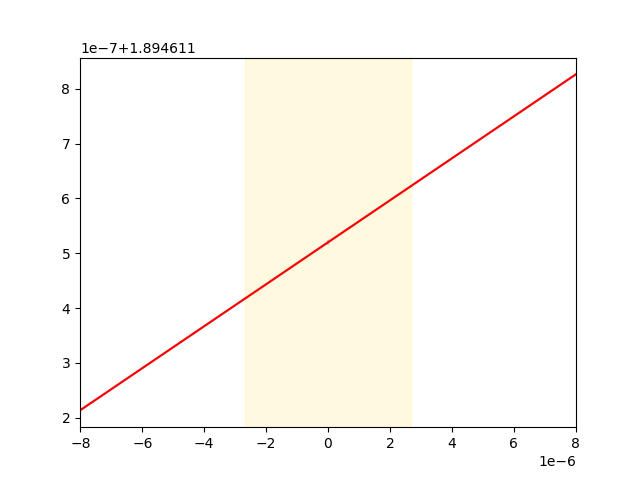
## Equation 2:
```
L_type_Ca_channel__I_CaK = pow(cell__F, 2) * (-L_type_Ca_channel__gamma_Ko * ionic_concentrations__Ko + L_type_Ca_channel__gamma_Ki * ionic_concentrations__Ki * exp(cell__F * cell__V / (cell__R * cell__T))) * L_type_Ca_channel__P_K * cell__V / ((-1.0 + exp(cell__F * cell__V / (cell__R * cell__T))) * cell__R * cell__T)
```
### Partially evaluated to: 
```
L_type_Ca_channel__I_CaK = 0.00069711623550831479 * (-0.75 * ionic_concentrations__Ko + 0.75 * ionic_concentrations__Ki * exp(0.037435883507802616 * cell__V)) * cell__V / (-1.0 + exp(0.037435883507802616 * cell__V))
```
## New Eq:
```
L_type_Ca_channel__I_CaK = ((fabs(cell__V) < 2.6712338705498262e-6) ? (0.013966203051699195 * ionic_concentrations__Ki - 0.01396620444831957 * ionic_concentrations__Ko + (0.5 + 187179.41753901311 * cell__V) * (1.3965252876774756e-9 * ionic_concentrations__Ki + 1.3967154623492758e-9 * ionic_concentrations__Ko)) : (pow(cell__F, 2) * (-L_type_Ca_channel__gamma_Ko * ionic_concentrations__Ko + L_type_Ca_channel__gamma_Ki * ionic_concentrations__Ki * exp(cell__F * cell__V / (cell__R * cell__T))) * L_type_Ca_channel__P_K * cell__V / ((-1.0 + exp(cell__F * cell__V / (cell__R * cell__T))) * cell__R * cell__T)))
```

*U*: 
0.037435883507802616 * cell__V
*V for 1e-07 range* 
`-2.6712338705498262e-6 - 2.6712338705498262e-6`

*Singularity point: 0*


## Equation 3:
```
L_type_Ca_channel__I_CaNa = pow(cell__F, 2) * (-L_type_Ca_channel__gamma_Nao * ionic_concentrations__Nao + L_type_Ca_channel__gamma_Nai * ionic_concentrations__Nai * exp(cell__F * cell__V / (cell__R * cell__T))) * L_type_Ca_channel__P_Na * cell__V / ((-1.0 + exp(cell__F * cell__V / (cell__R * cell__T))) * cell__R * cell__T)
```
### Partially evaluated to: 
```
L_type_Ca_channel__I_CaNa = 0.0024381008236689767 * (-0.75 * ionic_concentrations__Nao + 0.75 * ionic_concentrations__Nai * exp(0.037435883507802616 * cell__V)) * cell__V / (-1.0 + exp(0.037435883507802616 * cell__V))
```
## New Eq:
```
L_type_Ca_channel__I_CaNa = ((fabs(cell__V) < 2.6712338705498262e-6) ? (0.048845528807756257 * ionic_concentrations__Nai - 0.04884553369230938 * ionic_concentrations__Nao + (0.5 + 187179.41753901311 * cell__V) * (4.8842205656990899e-9 * ionic_concentrations__Nai + 4.8848856843753709e-9 * ionic_concentrations__Nao)) : (pow(cell__F, 2) * (-L_type_Ca_channel__gamma_Nao * ionic_concentrations__Nao + L_type_Ca_channel__gamma_Nai * ionic_concentrations__Nai * exp(cell__F * cell__V / (cell__R * cell__T))) * L_type_Ca_channel__P_Na * cell__V / ((-1.0 + exp(cell__F * cell__V / (cell__R * cell__T))) * cell__R * cell__T)))
```

*U*: 
0.037435883507802616 * cell__V
*V for 1e-07 range* 
`-2.6712338705498262e-6 - 2.6712338705498262e-6`

*Singularity point: 0*

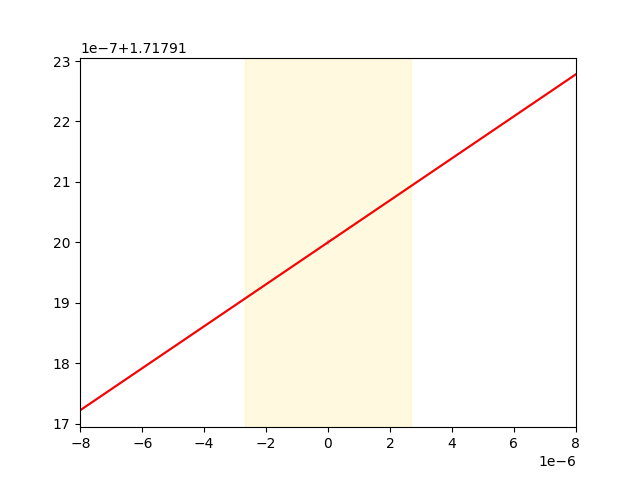
## Equation 4:
```
non_specific_calcium_activated_current__I_ns_K = pow(cell__F, 2) * (-L_type_Ca_channel__gamma_Ko * ionic_concentrations__Ko + L_type_Ca_channel__gamma_Ki * ionic_concentrations__Ki * exp(cell__F * cell__V / (cell__R * cell__T))) * cell__V * non_specific_calcium_activated_current__P_ns_Ca / ((-1.0 + exp(cell__F * cell__V / (cell__R * cell__T))) * cell__R * cell__T)
```
### Partially evaluated to: 
```
non_specific_calcium_activated_current__I_ns_K = 0.00063210021354380874 * (-0.75 * ionic_concentrations__Ko + 0.75 * ionic_concentrations__Ki * exp(0.037435883507802616 * cell__V)) * cell__V / (-1.0 + exp(0.037435883507802616 * cell__V))
```
## New Eq:
```
non_specific_calcium_activated_current__I_ns_K = ((fabs(cell__V) < 2.6712338705498262e-6) ? (0.012663655616825694 * ionic_concentrations__Ki - 0.012663656883191319 * ionic_concentrations__Ko + (0.5 + 187179.41753901311 * cell__V) * (1.2662794059164649e-9 * ionic_concentrations__Ki + 1.2664518440978203e-9 * ionic_concentrations__Ko)) : (pow(cell__F, 2) * (-L_type_Ca_channel__gamma_Ko * ionic_concentrations__Ko + L_type_Ca_channel__gamma_Ki * ionic_concentrations__Ki * exp(cell__F * cell__V / (cell__R * cell__T))) * cell__V * non_specific_calcium_activated_current__P_ns_Ca / ((-1.0 + exp(cell__F * cell__V / (cell__R * cell__T))) * cell__R * cell__T)))
```

*U*: 
0.037435883507802616 * cell__V
*V for 1e-07 range* 
`-2.6712338705498262e-6 - 2.6712338705498262e-6`

*Singularity point: 0*


## Equation 5:
```
non_specific_calcium_activated_current__I_ns_Na = pow(cell__F, 2) * (-L_type_Ca_channel__gamma_Nao * ionic_concentrations__Nao + L_type_Ca_channel__gamma_Nai * ionic_concentrations__Nai * exp(cell__F * cell__V / (cell__R * cell__T))) * cell__V * non_specific_calcium_activated_current__P_ns_Ca / ((-1.0 + exp(cell__F * cell__V / (cell__R * cell__T))) * cell__R * cell__T)
```
### Partially evaluated to: 
```
non_specific_calcium_activated_current__I_ns_Na = 0.00063210021354380874 * (-0.75 * ionic_concentrations__Nao + 0.75 * ionic_concentrations__Nai * exp(0.037435883507802616 * cell__V)) * cell__V / (-1.0 + exp(0.037435883507802616 * cell__V))
```
## New Eq:
```
non_specific_calcium_activated_current__I_ns_Na = ((fabs(cell__V) < 2.6712338705498262e-6) ? (0.012663655616825694 * ionic_concentrations__Nai - 0.012663656883191319 * ionic_concentrations__Nao + (0.5 + 187179.41753901311 * cell__V) * (1.2662794059164649e-9 * ionic_concentrations__Nai + 1.2664518440978203e-9 * ionic_concentrations__Nao)) : (pow(cell__F, 2) * (-L_type_Ca_channel__gamma_Nao * ionic_concentrations__Nao + L_type_Ca_channel__gamma_Nai * ionic_concentrations__Nai * exp(cell__F * cell__V / (cell__R * cell__T))) * cell__V * non_specific_calcium_activated_current__P_ns_Ca / ((-1.0 + exp(cell__F * cell__V / (cell__R * cell__T))) * cell__R * cell__T)))
```

*U*: 
5.6404999999999994 + 0.14499999999999999 * cell__V
*V for 1e-07 range* 
`-38.900000689655172 - -38.899999310344825`
-38.899999999999999

*Singularity point: -38.899999999999999*

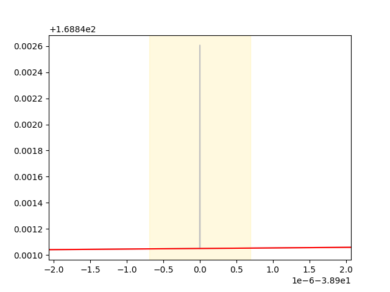
*U*: 
-1.7465999999999999 - 0.123 * cell__V
*V for 1e-07 range* 
`-14.199999186991869 - -14.200000813008129`
-14.199999999999999

*Singularity point: -14.199999999999999*

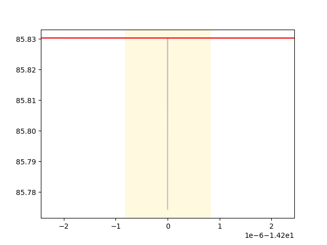
## Equation 6:
```
rapid_delayed_rectifier_potassium_current_xr_gate__tau_xr = 1 / (0.00060999999999999997 * (38.899999999999999 + cell__V) / (-1.0 + exp(5.6404999999999994 + 0.14499999999999999 * cell__V)) + 0.0013799999999999999 * (14.199999999999999 + cell__V) / (1.0 - exp(-1.7465999999999999 - 0.123 * cell__V)))
```
### Partially evaluated to: 
```
rapid_delayed_rectifier_potassium_current_xr_gate__tau_xr = 1 / (0.00060999999999999997 * (38.899999999999999 + cell__V) / (-1.0 + 281.60348502322194 * exp(0.14499999999999999 * cell__V)) + 0.0013799999999999999 * (14.199999999999999 + cell__V) / (1.0 - 0.17436578041087322 * exp(-0.123 * cell__V)))
```
## New Eq:
```
rapid_delayed_rectifier_potassium_current_xr_gate__tau_xr = ((fabs(38.899999999999999 + cell__V) < 6.896551724422384e-7) ? (337.97340791148793 + 4.3478755379172371 * cell__V) : ((fabs(14.199999999999999 + cell__V) < 8.1300813007528783e-7) ? (18.542688989745628 - 4.7385664159816567 * cell__V) : (1 / (0.00060999999999999997 * (38.899999999999999 + cell__V) / (-1.0 + exp(5.6404999999999994 + 0.14499999999999999 * cell__V)) + 0.0013799999999999999 * (14.199999999999999 + cell__V) / (1.0 - exp(-1.7465999999999999 - 0.123 * cell__V))))))
```

*U*: 
2.0609999999999999 + 0.068699999999999997 * cell__V
*V for 1e-07 range* 
`-30.000001455604075 - -29.999998544395925`
-30.000000000000000

*Singularity point: -30.000000000000000*

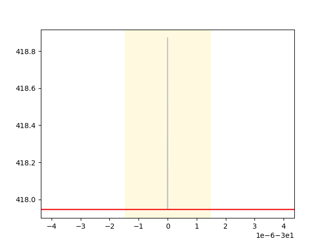
*U*: 
-4.4399999999999995 - 0.14799999999999999 * cell__V
*V for 1e-07 range* 
`-29.999999324324325 - -30.000000675675675`
-30.000000000000000

*Singularity point: -30.000000000000000*


## Equation 7:
```
slow_delayed_rectifier_potassium_current_xs1_gate__tau_xs1 = 1 / (0.00013100000000000001 * (30.0 + cell__V) / (-1.0 + exp(2.0609999999999999 + 0.068699999999999997 * cell__V)) + 7.1899999999999999e-5 * (30.0 + cell__V) / (1.0 - exp(-4.4399999999999995 - 0.14799999999999999 * cell__V)))
```
### Partially evaluated to: 
```
slow_delayed_rectifier_potassium_current_xs1_gate__tau_xs1 = 1 / (0.00013100000000000001 * (30.0 + cell__V) / (-1.0 + 7.8538197044216602 * exp(0.068699999999999997 * cell__V)) + 7.1899999999999999e-5 * (30.0 + cell__V) / (1.0 - 0.011795938519751569 * exp(-0.14799999999999999 * cell__V)))
```
## New Eq:
```
slow_delayed_rectifier_potassium_current_xs1_gate__tau_xs1 = ((fabs(30.0 + cell__V) < 1.455604075689676e-6) ? (572.83278764737304 + 5.1628844994572827 * cell__V) : ((fabs(30.0 + cell__V) < 6.7567567568760367e-7) ? (572.77257882806907 + 5.160877538707906 * cell__V) : (1 / (0.00013100000000000001 * (30.0 + cell__V) / (-1.0 + exp(2.0609999999999999 + 0.068699999999999997 * cell__V)) + 7.1899999999999999e-5 * (30.0 + cell__V) / (1.0 - exp(-4.4399999999999995 - 0.14799999999999999 * cell__V))))))
```

*U*: 
2.0609999999999999 + 0.068699999999999997 * cell__V
*V for 1e-07 range* 
`-30.000001455604075 - -29.999998544395925`
-30.000000000000000

*Singularity point: -30.000000000000000*

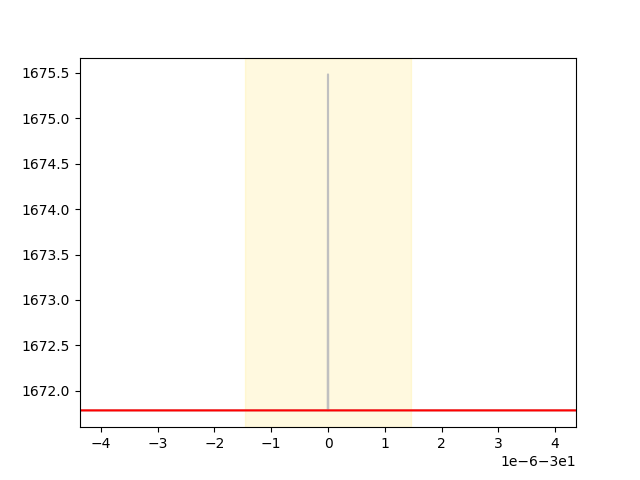
*U*: 
-4.4399999999999995 - 0.14799999999999999 * cell__V
*V for 1e-07 range* 
`-29.999999324324325 - -30.000000675675675`
-30.000000000000000

*Singularity point: -30.000000000000000*


## Equation 8:
```
slow_delayed_rectifier_potassium_current_xs2_gate__tau_xs2 = 4.0 / (0.00013100000000000001 * (30.0 + cell__V) / (-1.0 + exp(2.0609999999999999 + 0.068699999999999997 * cell__V)) + 7.1899999999999999e-5 * (30.0 + cell__V) / (1.0 - exp(-4.4399999999999995 - 0.14799999999999999 * cell__V)))
```
### Partially evaluated to: 
```
slow_delayed_rectifier_potassium_current_xs2_gate__tau_xs2 = 4.0 / (0.00013100000000000001 * (30.0 + cell__V) / (-1.0 + 7.8538197044216602 * exp(0.068699999999999997 * cell__V)) + 7.1899999999999999e-5 * (30.0 + cell__V) / (1.0 - 0.011795938519751569 * exp(-0.14799999999999999 * cell__V)))
```
## New Eq:
```
slow_delayed_rectifier_potassium_current_xs2_gate__tau_xs2 = ((fabs(30.0 + cell__V) < 1.455604075689676e-6) ? (2291.3311505894922 + 20.651537997829131 * cell__V) : ((fabs(30.0 + cell__V) < 6.7567567568760367e-7) ? (2291.0903153122763 + 20.643510154831624 * cell__V) : (4.0 / (0.00013100000000000001 * (30.0 + cell__V) / (-1.0 + exp(2.0609999999999999 + 0.068699999999999997 * cell__V)) + 7.1899999999999999e-5 * (30.0 + cell__V) / (1.0 - exp(-4.4399999999999995 - 0.14799999999999999 * cell__V))))))
```

singularity processing time: 67.34465740000007
# Model: fink_noble_giles_model_2008(fink_noble_giles_model_2008.cellml)
load time: 3.003689599999916

*U*: 
-1.1230167246823641 + 0.074867781645490947 * cell__V
*V for 1e-07 range* 
`14.999998664311967 - 15.000001335688033`
15.000000000000000

*Singularity point: 15.000000000000000*


## Equation 1:
```
ICaL__i_CaL = pow(Environment__F, 2) * pow(ICaL__z, 2) * (-15.0 + cell__V) * (-Environment__Ca_o + 0.25 * Ca__Ca_ss * exp(2.0 * (-15.0 + cell__V) * Environment__F / (Environment__R * Environment__T))) * ICaL__g_CaL * iCaL_d_gate__d * iCaL_f2_gate__f2 * iCaL_fCass_gate__fCass * iCaL_f_gate__f / ((-1.0 + exp(2.0 * (-15.0 + cell__V) * Environment__F / (Environment__R * Environment__T))) * Environment__R * Environment__T)
```
### Partially evaluated to: 
```
ICaL__i_CaL = 14447.286958825251 * (-15.0 + cell__V) * (-Environment__Ca_o + 0.081324245374225654 * Ca__Ca_ss * exp(0.074867781645490947 * cell__V)) * ICaL__g_CaL * iCaL_d_gate__d * iCaL_f2_gate__f2 * iCaL_fCass_gate__fCass * iCaL_f_gate__f / (-1.0 + 0.32529698149690262 * exp(0.074867781645490947 * cell__V))
```
## New Eq:
```
ICaL__i_CaL = ((fabs(-15.0 + cell__V) < 1.3356880329828957e-6) ? ((-5615083.1234197523 + 374338.90822798351 * cell__V) * (192970.6733533566 * (-Environment__Ca_o + 0.25000002500000124 * Ca__Ca_ss) * ICaL__g_CaL * iCaL_d_gate__d * iCaL_f2_gate__f2 * iCaL_fCass_gate__fCass * iCaL_f_gate__f - 192970.69265006497 * (-Environment__Ca_o + 0.24999997500000126 * Ca__Ca_ss) * ICaL__g_CaL * iCaL_d_gate__d * iCaL_f2_gate__f2 * iCaL_fCass_gate__fCass * iCaL_f_gate__f) + 192970.69265006497 * (-Environment__Ca_o + 0.24999997500000126 * Ca__Ca_ss) * ICaL__g_CaL * iCaL_d_gate__d * iCaL_f2_gate__f2 * iCaL_fCass_gate__fCass * iCaL_f_gate__f) : (pow(Environment__F, 2) * pow(ICaL__z, 2) * (-15.0 + cell__V) * (-Environment__Ca_o + 0.25 * Ca__Ca_ss * exp(2.0 * (-15.0 + cell__V) * Environment__F / (Environment__R * Environment__T))) * ICaL__g_CaL * iCaL_d_gate__d * iCaL_f2_gate__f2 * iCaL_fCass_gate__fCass * iCaL_f_gate__f / ((-1.0 + exp(2.0 * (-15.0 + cell__V) * Environment__F / (Environment__R * Environment__T))) * Environment__R * Environment__T)))
```

singularity processing time: 11.130029200000081
# Model: fox_model_2001(fox_mcharg_gilmour_2002.cellml)
load time: 2.0536247000000003

*U*: 
-4.7130000000000001 - 0.10000000000000001 * membrane__V
*V for 1e-07 range* 
`-47.129999000000005 - -47.130001`
-47.130000000000003

*Singularity point: -47.130000000000003*


## Equation 1:
```
fast_sodium_current_m_gate__alpha_m = 0.32000000000000001 * fast_sodium_current_m_gate__E0_m / (1.0 - exp(-0.10000000000000001 * fast_sodium_current_m_gate__E0_m))
```
### Partially evaluated to: 
```
fast_sodium_current_m_gate__alpha_m = 0.32000000000000001 * (47.130000000000003 + membrane__V) / (1.0 - 0.00897780373069724 * exp(-0.10000000000000001 * membrane__V))
```
## New Eq:
```
fast_sodium_current_m_gate__alpha_m = ((fabs(47.130000000000003 + membrane__V) < 1.0000000000287557e-6) ? (10.740659346653775 + 0.15999701562995733 * membrane__V) : (0.32000000000000001 * fast_sodium_current_m_gate__E0_m / (1.0 - exp(-0.10000000000000001 * fast_sodium_current_m_gate__E0_m))))
```

*U*: 
-0.68699999999999994 + 0.068699999999999997 * membrane__V
*V for 1e-07 range* 
`9.9999985443959236 - 10.000001455604076`
10.000000000000000

*Singularity point: 10.000000000000000*

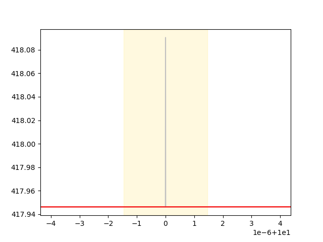
*U*: 
1.48 - 0.14799999999999999 * membrane__V
*V for 1e-07 range* 
`10.000000675675675 - 9.9999993243243246`
10.000000000000000

*Singularity point: 10.000000000000000*

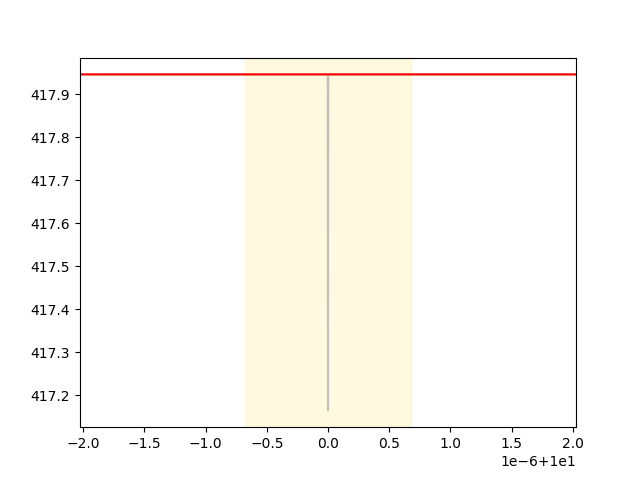
## Equation 2:
```
slow_activating_delayed_rectifiyer_K_current_X_ks_gate__tau_X_ks = 1 / (0.00013100000000000001 * (-10.0 + membrane__V) / (-1.0 + exp(-0.68699999999999994 + 0.068699999999999997 * membrane__V)) + 7.1899999999999999e-5 * (-10.0 + membrane__V) / (1.0 - exp(1.48 - 0.14799999999999999 * membrane__V)))
```
### Partially evaluated to: 
```
slow_activating_delayed_rectifiyer_K_current_X_ks_gate__tau_X_ks = 1 / (0.00013100000000000001 * (-10.0 + membrane__V) / (-1.0 + 0.50308305662435071 * exp(0.068699999999999997 * membrane__V)) + 7.1899999999999999e-5 * (-10.0 + membrane__V) / (1.0 - 4.3929456809187561 * exp(-0.14799999999999999 * membrane__V)))
```
## New Eq:
```
slow_activating_delayed_rectifiyer_K_current_X_ks_gate__tau_X_ks = ((fabs(-10.0 + membrane__V) < 1.4556040756966149e-6) ? (366.33867181902809 + 5.1607580843053666 * membrane__V) : ((fabs(-10.0 + membrane__V) < 6.7567567567372588e-7) ? (366.37264036781568 + 5.1573612296056446 * membrane__V) : (1 / (0.00013100000000000001 * (-10.0 + membrane__V) / (-1.0 + exp(-0.68699999999999994 + 0.068699999999999997 * membrane__V)) + 7.1899999999999999e-5 * (-10.0 + membrane__V) / (1.0 - exp(1.48 - 0.14799999999999999 * membrane__V))))))
```

*U*: 
0.074883406923417162 * membrane__V
*V for 1e-07 range* 
`-1.3354093264248704e-6 - 1.3354093264248704e-6`

*Singularity point: 0*


## Equation 3:
```
L_type_Ca_current__i_Ca_max = 4.0 * pow(membrane__F, 2) * (-0.34100000000000003 * standard_ionic_concentrations__Ca_o + calcium_dynamics__Ca_i * exp(2.0 * membrane__F * membrane__V / (membrane__R * membrane__T))) * L_type_Ca_current__P_Ca * membrane__V / ((-1.0 + exp(2.0 * membrane__F * membrane__V / (membrane__R * membrane__T))) * L_type_Ca_current__C_sc * membrane__R * membrane__T)
```
### Partially evaluated to: 
```
L_type_Ca_current__i_Ca_max = 14.452497536219512 * (-0.34100000000000003 * standard_ionic_concentrations__Ca_o + 1000.0 * calcium_dynamics__Ca_i_converted * exp(0.074883406923417162 * membrane__V)) * L_type_Ca_current__P_Ca * membrane__V / (-1.0 + exp(0.074883406923417162 * membrane__V))
```
## New Eq:
```
L_type_Ca_current__i_Ca_max = ((fabs(membrane__V) < 1.3354093264248704e-6) ? ((0.5 + 374417.03461708582 * membrane__V) * (192.99999034881566 * (1000.000100000005 * calcium_dynamics__Ca_i_converted - 0.34100000000000003 * standard_ionic_concentrations__Ca_o) * L_type_Ca_current__P_Ca - 193.00000965012967 * (999.99990000000503 * calcium_dynamics__Ca_i_converted - 0.34100000000000003 * standard_ionic_concentrations__Ca_o) * L_type_Ca_current__P_Ca) + 193.00000965012967 * (999.99990000000503 * calcium_dynamics__Ca_i_converted - 0.34100000000000003 * standard_ionic_concentrations__Ca_o) * L_type_Ca_current__P_Ca) : (4.0 * pow(membrane__F, 2) * (-0.34100000000000003 * standard_ionic_concentrations__Ca_o + calcium_dynamics__Ca_i * exp(2.0 * membrane__F * membrane__V / (membrane__R * membrane__T))) * L_type_Ca_current__P_Ca * membrane__V / ((-1.0 + exp(2.0 * membrane__F * membrane__V / (membrane__R * membrane__T))) * L_type_Ca_current__C_sc * membrane__R * membrane__T)))
```

*U*: 
0.037441703461708581 * membrane__V
*V for 1e-07 range* 
`-2.6708186528497407e-6 - 2.6708186528497407e-6`

*Singularity point: 0*

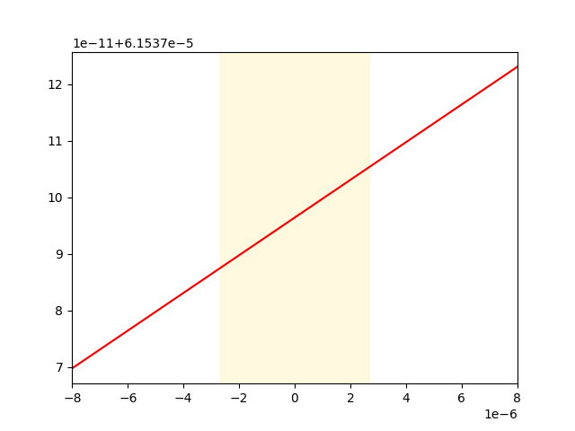
## Equation 4:
```
L_type_Ca_current__i_CaK = 1000.0 * pow(membrane__F, 2) * (-standard_ionic_concentrations__K_o + standard_ionic_concentrations__K_i * exp(membrane__F * membrane__V / (membrane__R * membrane__T))) * L_type_Ca_current__P_CaK * L_type_Ca_current_d_gate__d * L_type_Ca_current_f_Ca_gate__f_Ca * L_type_Ca_current_f_gate__f * membrane__V / ((1.0 + L_type_Ca_current__i_Ca_max / L_type_Ca_current__i_Ca_half) * (-1.0 + exp(membrane__F * membrane__V / (membrane__R * membrane__T))) * L_type_Ca_current__C_sc * membrane__R * membrane__T)
```
### Partially evaluated to: 
```
L_type_Ca_current__i_CaK = 0.0020919990183677745 * (-standard_ionic_concentrations__K_o + standard_ionic_concentrations__K_i * exp(0.037441703461708581 * membrane__V)) * L_type_Ca_current_d_gate__d * L_type_Ca_current_f_Ca_gate__f_Ca * L_type_Ca_current_f_gate__f * membrane__V / ((1.0 - 3.773584905660377 * L_type_Ca_current__i_Ca_max) * (-1.0 + exp(0.037441703461708581 * membrane__V)))
```
## New Eq:
```
L_type_Ca_current__i_CaK = ((fabs(membrane__V) < 2.6708186528497407e-6) ? ((0.5 + 187208.51730854291 * membrane__V) * (0.055873497205982128 * (-standard_ionic_concentrations__K_o + 1.0000001000000049 * standard_ionic_concentrations__K_i) * L_type_Ca_current_d_gate__d * L_type_Ca_current_f_Ca_gate__f_Ca * L_type_Ca_current_f_gate__f / (1.0 - 3.773584905660377 * L_type_Ca_current__i_Ca_max) - 0.055873502793712539 * (-standard_ionic_concentrations__K_o + 0.99999990000000505 * standard_ionic_concentrations__K_i) * L_type_Ca_current_d_gate__d * L_type_Ca_current_f_Ca_gate__f_Ca * L_type_Ca_current_f_gate__f / (1.0 - 3.773584905660377 * L_type_Ca_current__i_Ca_max)) + 0.055873502793712539 * (-standard_ionic_concentrations__K_o + 0.99999990000000505 * standard_ionic_concentrations__K_i) * L_type_Ca_current_d_gate__d * L_type_Ca_current_f_Ca_gate__f_Ca * L_type_Ca_current_f_gate__f / (1.0 - 3.773584905660377 * L_type_Ca_current__i_Ca_max)) : (1000.0 * pow(membrane__F, 2) * (-standard_ionic_concentrations__K_o + standard_ionic_concentrations__K_i * exp(membrane__F * membrane__V / (membrane__R * membrane__T))) * L_type_Ca_current__P_CaK * L_type_Ca_current_d_gate__d * L_type_Ca_current_f_Ca_gate__f_Ca * L_type_Ca_current_f_gate__f * membrane__V / ((1.0 + L_type_Ca_current__i_Ca_max / L_type_Ca_current__i_Ca_half) * (-1.0 + exp(membrane__F * membrane__V / (membrane__R * membrane__T))) * L_type_Ca_current__C_sc * membrane__R * membrane__T)))
```

singularity processing time: 32.51999220000005
# Model: grandi_pasqualini_bers_2010(grandi_pasqualini_bers_2010_ss.cellml)
load time: 3.854112999999984

*U*: 
-0.83333333333333337 - 0.16666666666666666 * membrane_potential__V_m
*V for 1e-07 range* 
`-4.9999994000000001 - -5.0000005999999999`
-5.0000000000000000

*Singularity point: -5.0000000000000000*

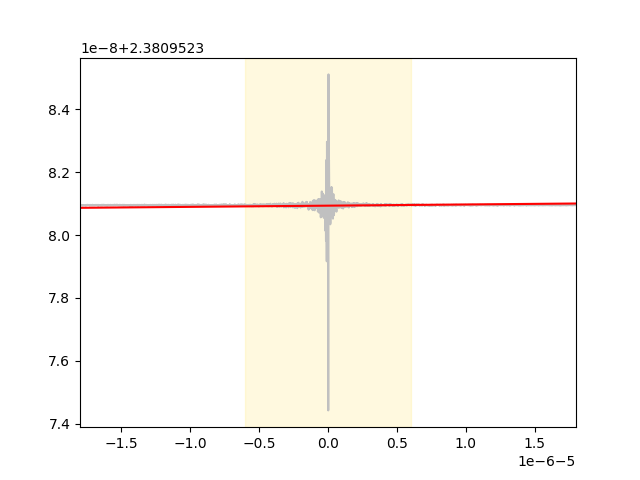
## Equation 1:
```
I_Ca__taud = 28.571428571428569 * (1.0 - exp(-0.83333333333333337 - 0.16666666666666666 * membrane_potential__V_m)) * I_Ca__dss / (5.0 + membrane_potential__V_m)
```
### Partially evaluated to: 
```
I_Ca__taud = 28.571428571428569 * (1.0 - 0.4345982085070782 * exp(-0.16666666666666666 * membrane_potential__V_m)) / ((1.0 + 0.4345982085070782 * exp(-0.16666666666666666 * membrane_potential__V_m)) * (5.0 + membrane_potential__V_m))
```
## New Eq:
```
I_Ca__taud = ((fabs(5.0 + membrane_potential__V_m) < 6.0000000000337561e-7) ? (2.3811429807569691 + 3.8119964360805626e-5 * membrane_potential__V_m) : (28.571428571428569 * (1.0 - exp(-0.83333333333333337 - 0.16666666666666666 * membrane_potential__V_m)) * I_Ca__dss / (5.0 + membrane_potential__V_m)))
```

*U*: 
0.074871767015605231 * membrane_potential__V_m
*V for 1e-07 range* 
`-1.3356169352749131e-6 - 1.3356169352749131e-6`

*Singularity point: 0*


found U by substituting in paams! 
## Equation 2:
```
I_Ca__ibarca_j = 4.0 * (-0.34100000000000003 * parameters__Cao + 0.34100000000000003 * Ca_Concentrations__Ca_j * exp(2.0 * membrane_potential__V_m * parameters__FoRT)) * membrane_potential__V_m * parameters__FoRT * parameters__Frdy * parameters__pCa / (-1.0 + exp(2.0 * membrane_potential__V_m * parameters__FoRT))
```
### Partially evaluated to: 
```
I_Ca__ibarca_j = 0.00216 * pow(parameters__Frdy, 2) * (-0.34100000000000003 * parameters__Cao + 0.34100000000000003 * Ca_Concentrations__Ca_j * exp(2.0 * membrane_potential__V_m * parameters__Frdy / (parameters__R * parameters__Temp))) * membrane_potential__V_m * parameters__pCa_max / ((-1.0 + exp(2.0 * membrane_potential__V_m * parameters__Frdy / (parameters__R * parameters__Temp))) * parameters__R * parameters__Temp)
```
## New Eq:
```
I_Ca__ibarca_j = ((fabs(membrane_potential__V_m) < 1.3356169352749131e-6) ? ((0.5 + 374358.83507802623 * membrane_potential__V_m) * (2.8849325801938123e-9 * pow(parameters__Frdy, 2) * (-0.34100000000000003 * parameters__Cao + 0.34100000000000003 * Ca_Concentrations__Ca_j * exp(2.6712338705498262e-6 * parameters__Frdy / (parameters__R * parameters__Temp))) * parameters__pCa_max / ((-1.0 + exp(2.6712338705498262e-6 * parameters__Frdy / (parameters__R * parameters__Temp))) * parameters__R * parameters__Temp) + 2.8849325801938123e-9 * pow(parameters__Frdy, 2) * (-0.34100000000000003 * parameters__Cao + 0.34100000000000003 * Ca_Concentrations__Ca_j * exp(-2.6712338705498262e-6 * parameters__Frdy / (parameters__R * parameters__Temp))) * parameters__pCa_max / ((-1.0 + exp(-2.6712338705498262e-6 * parameters__Frdy / (parameters__R * parameters__Temp))) * parameters__R * parameters__Temp)) - 2.8849325801938123e-9 * pow(parameters__Frdy, 2) * (-0.34100000000000003 * parameters__Cao + 0.34100000000000003 * Ca_Concentrations__Ca_j * exp(-2.6712338705498262e-6 * parameters__Frdy / (parameters__R * parameters__Temp))) * parameters__pCa_max / ((-1.0 + exp(-2.6712338705498262e-6 * parameters__Frdy / (parameters__R * parameters__Temp))) * parameters__R * parameters__Temp)) : (4.0 * (-0.34100000000000003 * parameters__Cao + 0.34100000000000003 * Ca_Concentrations__Ca_j * exp(2.0 * membrane_potential__V_m * parameters__FoRT)) * membrane_potential__V_m * parameters__FoRT * parameters__Frdy * parameters__pCa / (-1.0 + exp(2.0 * membrane_potential__V_m * parameters__FoRT))))
```

*U*: 
0.074871767015605231 * membrane_potential__V_m
*V for 1e-07 range* 
`-1.3356169352749131e-6 - 1.3356169352749131e-6`

*Singularity point: 0*


found U by substituting in paams! 
## Equation 3:
```
I_Ca__ibarca_sl = 4.0 * (-0.34100000000000003 * parameters__Cao + 0.34100000000000003 * Ca_Concentrations__Ca_sl * exp(2.0 * membrane_potential__V_m * parameters__FoRT)) * membrane_potential__V_m * parameters__FoRT * parameters__Frdy * parameters__pCa / (-1.0 + exp(2.0 * membrane_potential__V_m * parameters__FoRT))
```
### Partially evaluated to: 
```
I_Ca__ibarca_sl = 0.00216 * pow(parameters__Frdy, 2) * (-0.34100000000000003 * parameters__Cao + 0.34100000000000003 * Ca_Concentrations__Ca_sl * exp(2.0 * membrane_potential__V_m * parameters__Frdy / (parameters__R * parameters__Temp))) * membrane_potential__V_m * parameters__pCa_max / ((-1.0 + exp(2.0 * membrane_potential__V_m * parameters__Frdy / (parameters__R * parameters__Temp))) * parameters__R * parameters__Temp)
```
## New Eq:
```
I_Ca__ibarca_sl = ((fabs(membrane_potential__V_m) < 1.3356169352749131e-6) ? ((0.5 + 374358.83507802623 * membrane_potential__V_m) * (2.8849325801938123e-9 * pow(parameters__Frdy, 2) * (-0.34100000000000003 * parameters__Cao + 0.34100000000000003 * Ca_Concentrations__Ca_sl * exp(2.6712338705498262e-6 * parameters__Frdy / (parameters__R * parameters__Temp))) * parameters__pCa_max / ((-1.0 + exp(2.6712338705498262e-6 * parameters__Frdy / (parameters__R * parameters__Temp))) * parameters__R * parameters__Temp) + 2.8849325801938123e-9 * pow(parameters__Frdy, 2) * (-0.34100000000000003 * parameters__Cao + 0.34100000000000003 * Ca_Concentrations__Ca_sl * exp(-2.6712338705498262e-6 * parameters__Frdy / (parameters__R * parameters__Temp))) * parameters__pCa_max / ((-1.0 + exp(-2.6712338705498262e-6 * parameters__Frdy / (parameters__R * parameters__Temp))) * parameters__R * parameters__Temp)) - 2.8849325801938123e-9 * pow(parameters__Frdy, 2) * (-0.34100000000000003 * parameters__Cao + 0.34100000000000003 * Ca_Concentrations__Ca_sl * exp(-2.6712338705498262e-6 * parameters__Frdy / (parameters__R * parameters__Temp))) * parameters__pCa_max / ((-1.0 + exp(-2.6712338705498262e-6 * parameters__Frdy / (parameters__R * parameters__Temp))) * parameters__R * parameters__Temp)) : (4.0 * (-0.34100000000000003 * parameters__Cao + 0.34100000000000003 * Ca_Concentrations__Ca_sl * exp(2.0 * membrane_potential__V_m * parameters__FoRT)) * membrane_potential__V_m * parameters__FoRT * parameters__Frdy * parameters__pCa / (-1.0 + exp(2.0 * membrane_potential__V_m * parameters__FoRT))))
```

*U*: 
0.037435883507802616 * membrane_potential__V_m
*V for 1e-07 range* 
`-2.6712338705498262e-6 - 2.6712338705498262e-6`

*Singularity point: 0*

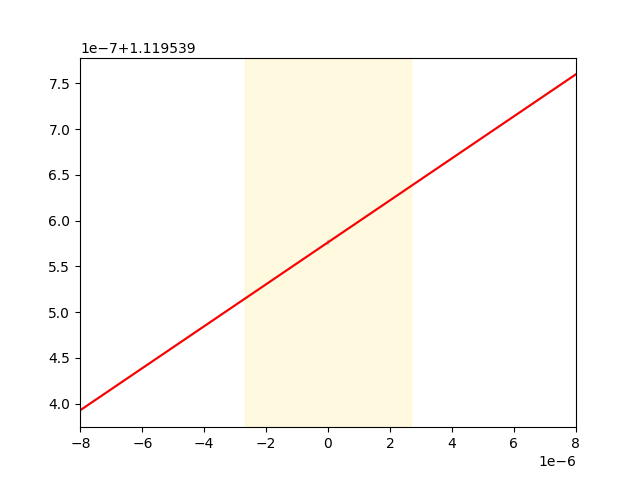
found U by substituting in paams! 
## Equation 4:
```
I_Ca__ibark = (-0.75 * parameters__Ko + 0.75 * K_Concentration__K_i * exp(membrane_potential__V_m * parameters__FoRT)) * membrane_potential__V_m * parameters__FoRT * parameters__Frdy * parameters__pK / (-1.0 + exp(membrane_potential__V_m * parameters__FoRT))
```
### Partially evaluated to: 
```
I_Ca__ibark = 1.35e-7 * pow(parameters__Frdy, 2) * (-0.75 * parameters__Ko + 0.75 * K_Concentration__K_i * exp(membrane_potential__V_m * parameters__Frdy / (parameters__R * parameters__Temp))) * membrane_potential__V_m / ((-1.0 + exp(membrane_potential__V_m * parameters__Frdy / (parameters__R * parameters__Temp))) * parameters__R * parameters__Temp)
```
## New Eq:
```
I_Ca__ibark = ((fabs(membrane_potential__V_m) < 2.6712338705498262e-6) ? ((0.5 + 187179.41753901311 * membrane_potential__V_m) * (3.6061657252422654e-13 * pow(parameters__Frdy, 2) * (-0.75 * parameters__Ko + 0.75 * K_Concentration__K_i * exp(2.6712338705498262e-6 * parameters__Frdy / (parameters__R * parameters__Temp))) / ((-1.0 + exp(2.6712338705498262e-6 * parameters__Frdy / (parameters__R * parameters__Temp))) * parameters__R * parameters__Temp) + 3.6061657252422654e-13 * pow(parameters__Frdy, 2) * (-0.75 * parameters__Ko + 0.75 * K_Concentration__K_i * exp(-2.6712338705498262e-6 * parameters__Frdy / (parameters__R * parameters__Temp))) / ((-1.0 + exp(-2.6712338705498262e-6 * parameters__Frdy / (parameters__R * parameters__Temp))) * parameters__R * parameters__Temp)) - 3.6061657252422654e-13 * pow(parameters__Frdy, 2) * (-0.75 * parameters__Ko + 0.75 * K_Concentration__K_i * exp(-2.6712338705498262e-6 * parameters__Frdy / (parameters__R * parameters__Temp))) / ((-1.0 + exp(-2.6712338705498262e-6 * parameters__Frdy / (parameters__R * parameters__Temp))) * parameters__R * parameters__Temp)) : ((-0.75 * parameters__Ko + 0.75 * K_Concentration__K_i * exp(membrane_potential__V_m * parameters__FoRT)) * membrane_potential__V_m * parameters__FoRT * parameters__Frdy * parameters__pK / (-1.0 + exp(membrane_potential__V_m * parameters__FoRT))))
```

*U*: 
0.037435883507802616 * membrane_potential__V_m
*V for 1e-07 range* 
`-2.6712338705498262e-6 - 2.6712338705498262e-6`

*Singularity point: 0*

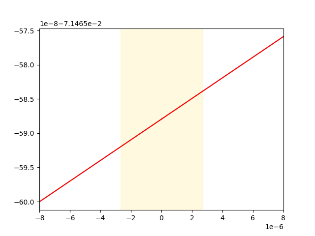
found U by substituting in paams! 
## Equation 5:
```
I_Ca__ibarna_j = (-0.75 * parameters__Nao + 0.75 * Na_Concentrations__Na_j * exp(membrane_potential__V_m * parameters__FoRT)) * membrane_potential__V_m * parameters__FoRT * parameters__Frdy * parameters__pNa / (-1.0 + exp(membrane_potential__V_m * parameters__FoRT))
```
### Partially evaluated to: 
```
I_Ca__ibarna_j = 7.4999999999999993e-9 * pow(parameters__Frdy, 2) * (-0.75 * parameters__Nao + 0.75 * Na_Concentrations__Na_j * exp(membrane_potential__V_m * parameters__Frdy / (parameters__R * parameters__Temp))) * membrane_potential__V_m / ((-1.0 + exp(membrane_potential__V_m * parameters__Frdy / (parameters__R * parameters__Temp))) * parameters__R * parameters__Temp)
```
## New Eq:
```
I_Ca__ibarna_j = ((fabs(membrane_potential__V_m) < 2.6712338705498262e-6) ? ((0.5 + 187179.41753901311 * membrane_potential__V_m) * (2.0034254029123696e-14 * pow(parameters__Frdy, 2) * (-0.75 * parameters__Nao + 0.75 * Na_Concentrations__Na_j * exp(2.6712338705498262e-6 * parameters__Frdy / (parameters__R * parameters__Temp))) / ((-1.0 + exp(2.6712338705498262e-6 * parameters__Frdy / (parameters__R * parameters__Temp))) * parameters__R * parameters__Temp) + 2.0034254029123696e-14 * pow(parameters__Frdy, 2) * (-0.75 * parameters__Nao + 0.75 * Na_Concentrations__Na_j * exp(-2.6712338705498262e-6 * parameters__Frdy / (parameters__R * parameters__Temp))) / ((-1.0 + exp(-2.6712338705498262e-6 * parameters__Frdy / (parameters__R * parameters__Temp))) * parameters__R * parameters__Temp)) - 2.0034254029123696e-14 * pow(parameters__Frdy, 2) * (-0.75 * parameters__Nao + 0.75 * Na_Concentrations__Na_j * exp(-2.6712338705498262e-6 * parameters__Frdy / (parameters__R * parameters__Temp))) / ((-1.0 + exp(-2.6712338705498262e-6 * parameters__Frdy / (parameters__R * parameters__Temp))) * parameters__R * parameters__Temp)) : ((-0.75 * parameters__Nao + 0.75 * Na_Concentrations__Na_j * exp(membrane_potential__V_m * parameters__FoRT)) * membrane_potential__V_m * parameters__FoRT * parameters__Frdy * parameters__pNa / (-1.0 + exp(membrane_potential__V_m * parameters__FoRT))))
```

*U*: 
0.037435883507802616 * membrane_potential__V_m
*V for 1e-07 range* 
`-2.6712338705498262e-6 - 2.6712338705498262e-6`

*Singularity point: 0*

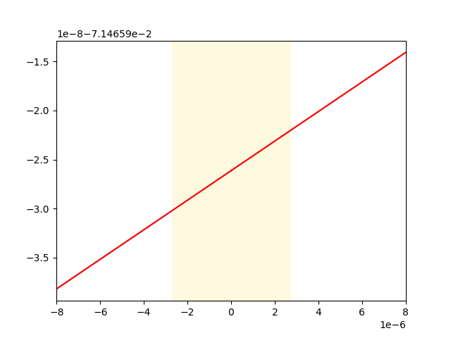
found U by substituting in paams! 
## Equation 6:
```
I_Ca__ibarna_sl = (-0.75 * parameters__Nao + 0.75 * Na_Concentrations__Na_sl * exp(membrane_potential__V_m * parameters__FoRT)) * membrane_potential__V_m * parameters__FoRT * parameters__Frdy * parameters__pNa / (-1.0 + exp(membrane_potential__V_m * parameters__FoRT))
```
### Partially evaluated to: 
```
I_Ca__ibarna_sl = 7.4999999999999993e-9 * pow(parameters__Frdy, 2) * (-0.75 * parameters__Nao + 0.75 * Na_Concentrations__Na_sl * exp(membrane_potential__V_m * parameters__Frdy / (parameters__R * parameters__Temp))) * membrane_potential__V_m / ((-1.0 + exp(membrane_potential__V_m * parameters__Frdy / (parameters__R * parameters__Temp))) * parameters__R * parameters__Temp)
```
## New Eq:
```
I_Ca__ibarna_sl = ((fabs(membrane_potential__V_m) < 2.6712338705498262e-6) ? ((0.5 + 187179.41753901311 * membrane_potential__V_m) * (2.0034254029123696e-14 * pow(parameters__Frdy, 2) * (-0.75 * parameters__Nao + 0.75 * Na_Concentrations__Na_sl * exp(2.6712338705498262e-6 * parameters__Frdy / (parameters__R * parameters__Temp))) / ((-1.0 + exp(2.6712338705498262e-6 * parameters__Frdy / (parameters__R * parameters__Temp))) * parameters__R * parameters__Temp) + 2.0034254029123696e-14 * pow(parameters__Frdy, 2) * (-0.75 * parameters__Nao + 0.75 * Na_Concentrations__Na_sl * exp(-2.6712338705498262e-6 * parameters__Frdy / (parameters__R * parameters__Temp))) / ((-1.0 + exp(-2.6712338705498262e-6 * parameters__Frdy / (parameters__R * parameters__Temp))) * parameters__R * parameters__Temp)) - 2.0034254029123696e-14 * pow(parameters__Frdy, 2) * (-0.75 * parameters__Nao + 0.75 * Na_Concentrations__Na_sl * exp(-2.6712338705498262e-6 * parameters__Frdy / (parameters__R * parameters__Temp))) / ((-1.0 + exp(-2.6712338705498262e-6 * parameters__Frdy / (parameters__R * parameters__Temp))) * parameters__R * parameters__Temp)) : ((-0.75 * parameters__Nao + 0.75 * Na_Concentrations__Na_sl * exp(membrane_potential__V_m * parameters__FoRT)) * membrane_potential__V_m * parameters__FoRT * parameters__Frdy * parameters__pNa / (-1.0 + exp(membrane_potential__V_m * parameters__FoRT))))
```

singularity processing time: 34.560459700000024
# Model: grandi_pasqualini_bers_2010(grandi_pasqualini_bers_2010_ss_endo.cellml)
load time: 3.7787662000000637

*U*: 
-0.83333333333333337 - 0.16666666666666666 * membrane_potential__V_m
*V for 1e-07 range* 
`-4.9999994000000001 - -5.0000005999999999`
-5.0000000000000000

*Singularity point: -5.0000000000000000*


## Equation 1:
```
I_Ca__taud = 28.571428571428569 * (1.0 - exp(-0.83333333333333337 - 0.16666666666666666 * membrane_potential__V_m)) * I_Ca__dss / (5.0 + membrane_potential__V_m)
```
### Partially evaluated to: 
```
I_Ca__taud = 28.571428571428569 * (1.0 - 0.4345982085070782 * exp(-0.16666666666666666 * membrane_potential__V_m)) / ((1.0 + 0.4345982085070782 * exp(-0.16666666666666666 * membrane_potential__V_m)) * (5.0 + membrane_potential__V_m))
```
## New Eq:
```
I_Ca__taud = ((fabs(5.0 + membrane_potential__V_m) < 6.0000000000337561e-7) ? (2.3811429807569691 + 3.8119964360805626e-5 * membrane_potential__V_m) : (28.571428571428569 * (1.0 - exp(-0.83333333333333337 - 0.16666666666666666 * membrane_potential__V_m)) * I_Ca__dss / (5.0 + membrane_potential__V_m)))
```

*U*: 
0.074871767015605231 * membrane_potential__V_m
*V for 1e-07 range* 
`-1.3356169352749131e-6 - 1.3356169352749131e-6`

*Singularity point: 0*


## Equation 2:
```
I_Ca__ibarca_j = 4.0 * (-0.34100000000000003 * parameters__Cao + 0.34100000000000003 * Ca_Concentrations__Ca_j * exp(2.0 * membrane_potential__V_m * parameters__FoRT)) * membrane_potential__V_m * parameters__FoRT * parameters__Frdy * parameters__pCa / (-1.0 + exp(2.0 * membrane_potential__V_m * parameters__FoRT))
```
### Partially evaluated to: 
```
I_Ca__ibarca_j = 7.8019226357407252 * (-0.34100000000000003 * parameters__Cao + 0.34100000000000003 * Ca_Concentrations__Ca_j * exp(0.074871767015605231 * membrane_potential__V_m)) * membrane_potential__V_m * parameters__pCa_max / (-1.0 + exp(0.074871767015605231 * membrane_potential__V_m))
```
## New Eq:
```
I_Ca__ibarca_j = ((fabs(membrane_potential__V_m) < 1.3356169352749131e-6) ? ((0.5 + 374358.83507802623 * membrane_potential__V_m) * (104.20379478917054 * (0.34100003410000174 * Ca_Concentrations__Ca_j - 0.34100000000000003 * parameters__Cao) * parameters__pCa_max - 104.20380521026001 * (0.34099996590000176 * Ca_Concentrations__Ca_j - 0.34100000000000003 * parameters__Cao) * parameters__pCa_max) + 104.20380521026001 * (0.34099996590000176 * Ca_Concentrations__Ca_j - 0.34100000000000003 * parameters__Cao) * parameters__pCa_max) : (4.0 * (-0.34100000000000003 * parameters__Cao + 0.34100000000000003 * Ca_Concentrations__Ca_j * exp(2.0 * membrane_potential__V_m * parameters__FoRT)) * membrane_potential__V_m * parameters__FoRT * parameters__Frdy * parameters__pCa / (-1.0 + exp(2.0 * membrane_potential__V_m * parameters__FoRT))))
```

*U*: 
0.074871767015605231 * membrane_potential__V_m
*V for 1e-07 range* 
`-1.3356169352749131e-6 - 1.3356169352749131e-6`

*Singularity point: 0*


## Equation 3:
```
I_Ca__ibarca_sl = 4.0 * (-0.34100000000000003 * parameters__Cao + 0.34100000000000003 * Ca_Concentrations__Ca_sl * exp(2.0 * membrane_potential__V_m * parameters__FoRT)) * membrane_potential__V_m * parameters__FoRT * parameters__Frdy * parameters__pCa / (-1.0 + exp(2.0 * membrane_potential__V_m * parameters__FoRT))
```
### Partially evaluated to: 
```
I_Ca__ibarca_sl = 7.8019226357407252 * (-0.34100000000000003 * parameters__Cao + 0.34100000000000003 * Ca_Concentrations__Ca_sl * exp(0.074871767015605231 * membrane_potential__V_m)) * membrane_potential__V_m * parameters__pCa_max / (-1.0 + exp(0.074871767015605231 * membrane_potential__V_m))
```
## New Eq:
```
I_Ca__ibarca_sl = ((fabs(membrane_potential__V_m) < 1.3356169352749131e-6) ? ((0.5 + 374358.83507802623 * membrane_potential__V_m) * (104.20379478917054 * (0.34100003410000174 * Ca_Concentrations__Ca_sl - 0.34100000000000003 * parameters__Cao) * parameters__pCa_max - 104.20380521026001 * (0.34099996590000176 * Ca_Concentrations__Ca_sl - 0.34100000000000003 * parameters__Cao) * parameters__pCa_max) + 104.20380521026001 * (0.34099996590000176 * Ca_Concentrations__Ca_sl - 0.34100000000000003 * parameters__Cao) * parameters__pCa_max) : (4.0 * (-0.34100000000000003 * parameters__Cao + 0.34100000000000003 * Ca_Concentrations__Ca_sl * exp(2.0 * membrane_potential__V_m * parameters__FoRT)) * membrane_potential__V_m * parameters__FoRT * parameters__Frdy * parameters__pCa / (-1.0 + exp(2.0 * membrane_potential__V_m * parameters__FoRT))))
```

*U*: 
0.037435883507802616 * membrane_potential__V_m
*V for 1e-07 range* 
`-2.6712338705498262e-6 - 2.6712338705498262e-6`

*Singularity point: 0*


## Equation 4:
```
I_Ca__ibark = (-0.75 * parameters__Ko + 0.75 * K_Concentration__K_i * exp(membrane_potential__V_m * parameters__FoRT)) * membrane_potential__V_m * parameters__FoRT * parameters__Frdy * parameters__pK / (-1.0 + exp(membrane_potential__V_m * parameters__FoRT))
```
### Partially evaluated to: 
```
I_Ca__ibark = 0.00048762016473379531 * (-0.75 * parameters__Ko + 0.75 * K_Concentration__K_i * exp(0.037435883507802616 * membrane_potential__V_m)) * membrane_potential__V_m / (-1.0 + exp(0.037435883507802616 * membrane_potential__V_m))
```
## New Eq:
```
I_Ca__ibark = ((fabs(membrane_potential__V_m) < 2.6712338705498262e-6) ? (0.009769105761551251 * K_Concentration__K_i - 0.0097691067384618763 * parameters__Ko + (0.5 + 187179.41753901311 * membrane_potential__V_m) * (9.7684411312626545e-10 * K_Concentration__K_i + 9.7697713687236367e-10 * parameters__Ko)) : ((-0.75 * parameters__Ko + 0.75 * K_Concentration__K_i * exp(membrane_potential__V_m * parameters__FoRT)) * membrane_potential__V_m * parameters__FoRT * parameters__Frdy * parameters__pK / (-1.0 + exp(membrane_potential__V_m * parameters__FoRT))))
```

*U*: 
0.037435883507802616 * membrane_potential__V_m
*V for 1e-07 range* 
`-2.6712338705498262e-6 - 2.6712338705498262e-6`

*Singularity point: 0*


## Equation 5:
```
I_Ca__ibarna_j = (-0.75 * parameters__Nao + 0.75 * Na_Concentrations__Na_j * exp(membrane_potential__V_m * parameters__FoRT)) * membrane_potential__V_m * parameters__FoRT * parameters__Frdy * parameters__pNa / (-1.0 + exp(membrane_potential__V_m * parameters__FoRT))
```
### Partially evaluated to: 
```
I_Ca__ibarna_j = 2.7090009151877515e-5 * (-0.75 * parameters__Nao + 0.75 * Na_Concentrations__Na_j * exp(0.037435883507802616 * membrane_potential__V_m)) * membrane_potential__V_m / (-1.0 + exp(0.037435883507802616 * membrane_potential__V_m))
```
## New Eq:
```
I_Ca__ibarna_j = ((fabs(membrane_potential__V_m) < 2.6712338705498262e-6) ? (0.00054272809786395828 * Na_Concentrations__Na_j - 0.00054272815213677087 * parameters__Nao + (0.5 + 187179.41753901311 * membrane_potential__V_m) * (5.4269117396468325e-11 * Na_Concentrations__Na_j + 5.4276507603926089e-11 * parameters__Nao)) : ((-0.75 * parameters__Nao + 0.75 * Na_Concentrations__Na_j * exp(membrane_potential__V_m * parameters__FoRT)) * membrane_potential__V_m * parameters__FoRT * parameters__Frdy * parameters__pNa / (-1.0 + exp(membrane_potential__V_m * parameters__FoRT))))
```

*U*: 
0.037435883507802616 * membrane_potential__V_m
*V for 1e-07 range* 
`-2.6712338705498262e-6 - 2.6712338705498262e-6`

*Singularity point: 0*


## Equation 6:
```
I_Ca__ibarna_sl = (-0.75 * parameters__Nao + 0.75 * Na_Concentrations__Na_sl * exp(membrane_potential__V_m * parameters__FoRT)) * membrane_potential__V_m * parameters__FoRT * parameters__Frdy * parameters__pNa / (-1.0 + exp(membrane_potential__V_m * parameters__FoRT))
```
### Partially evaluated to: 
```
I_Ca__ibarna_sl = 2.7090009151877515e-5 * (-0.75 * parameters__Nao + 0.75 * Na_Concentrations__Na_sl * exp(0.037435883507802616 * membrane_potential__V_m)) * membrane_potential__V_m / (-1.0 + exp(0.037435883507802616 * membrane_potential__V_m))
```
## New Eq:
```
I_Ca__ibarna_sl = ((fabs(membrane_potential__V_m) < 2.6712338705498262e-6) ? (0.00054272809786395828 * Na_Concentrations__Na_sl - 0.00054272815213677087 * parameters__Nao + (0.5 + 187179.41753901311 * membrane_potential__V_m) * (5.4269117396468325e-11 * Na_Concentrations__Na_sl + 5.4276507603926089e-11 * parameters__Nao)) : ((-0.75 * parameters__Nao + 0.75 * Na_Concentrations__Na_sl * exp(membrane_potential__V_m * parameters__FoRT)) * membrane_potential__V_m * parameters__FoRT * parameters__Frdy * parameters__pNa / (-1.0 + exp(membrane_potential__V_m * parameters__FoRT))))
```

singularity processing time: 33.0015439
# Model: hilgemann_noble_model_1987(hilgemann_noble_model_1987.cellml)
load time: 1.7964097000000265

*U*: 
3.7433890822745473 - 0.074867781645490947 * membrane__V
*V for 1e-07 range* 
`50.000001335688033 - 49.999998664311967`
50.000000000000000

*Singularity point: 50.000000000000000*


## Equation 1:
```
second_inward_calcium_current__i_siCa = 4.0 * (-50.0 + membrane__V) * (intracellular_calcium_concentration__Ca_i * exp(100.0 / membrane__RTONF) - extracellular_calcium_concentration__Ca_o * exp(-2.0 * (-50.0 + membrane__V) / membrane__RTONF)) * second_inward_calcium_current__P_si * second_inward_calcium_current_d_gate__d * second_inward_calcium_current_f_Ca_gate__CaChon / ((1.0 - exp(-2.0 * (-50.0 + membrane__V) / membrane__RTONF)) * membrane__RTONF)
```
### Partially evaluated to: 
```
second_inward_calcium_current__i_siCa = 0.14973556329098189 * (1.0 - second_inward_calcium_current_f_Ca_gate__f_Ca) * (1.0 - intracellular_calcium_concentration__Ca_i / (0.001 + intracellular_calcium_concentration__Ca_i)) * (-50.0 + membrane__V) * (42.240905756816076 * intracellular_calcium_concentration__Ca_i - 42.240905756816076 * extracellular_calcium_concentration__Ca_o * exp(-0.074867781645490947 * membrane__V)) * second_inward_calcium_current__P_si * second_inward_calcium_current_d_gate__d / (1.0 - 42.240905756816076 * exp(-0.074867781645490947 * membrane__V))
```
## New Eq:
```
second_inward_calcium_current__i_siCa = ((fabs(-50.0 + membrane__V) < 1.3356880329551402e-6) ? ((18716945.911788113 - 374338.90823576227 * membrane__V) * (1.9999998999780364 * (1.0 - second_inward_calcium_current_f_Ca_gate__f_Ca) * (1.0 - intracellular_calcium_concentration__Ca_i / (0.001 + intracellular_calcium_concentration__Ca_i)) * (42.240905756816076 * intracellular_calcium_concentration__Ca_i - 1.0000001000000049 * extracellular_calcium_concentration__Ca_o) * second_inward_calcium_current__P_si * second_inward_calcium_current_d_gate__d - 2.0000001000436947 * (1.0 - second_inward_calcium_current_f_Ca_gate__f_Ca) * (1.0 - intracellular_calcium_concentration__Ca_i / (0.001 + intracellular_calcium_concentration__Ca_i)) * (42.240905756816076 * intracellular_calcium_concentration__Ca_i - 0.99999990000000505 * extracellular_calcium_concentration__Ca_o) * second_inward_calcium_current__P_si * second_inward_calcium_current_d_gate__d) + 2.0000001000436947 * (1.0 - second_inward_calcium_current_f_Ca_gate__f_Ca) * (1.0 - intracellular_calcium_concentration__Ca_i / (0.001 + intracellular_calcium_concentration__Ca_i)) * (42.240905756816076 * intracellular_calcium_concentration__Ca_i - 0.99999990000000505 * extracellular_calcium_concentration__Ca_o) * second_inward_calcium_current__P_si * second_inward_calcium_current_d_gate__d) : (4.0 * (-50.0 + membrane__V) * (intracellular_calcium_concentration__Ca_i * exp(100.0 / membrane__RTONF) - extracellular_calcium_concentration__Ca_o * exp(-2.0 * (-50.0 + membrane__V) / membrane__RTONF)) * second_inward_calcium_current__P_si * second_inward_calcium_current_d_gate__d * second_inward_calcium_current_f_Ca_gate__CaChon / ((1.0 - exp(-2.0 * (-50.0 + membrane__V) / membrane__RTONF)) * membrane__RTONF)))
```

*U*: 
1.8716945411372736 - 0.037433890822745473 * membrane__V
*V for 1e-07 range* 
`50.000002671376066 - 49.999997328623934`
50.000000000000000

*Singularity point: 50.000000000000000*

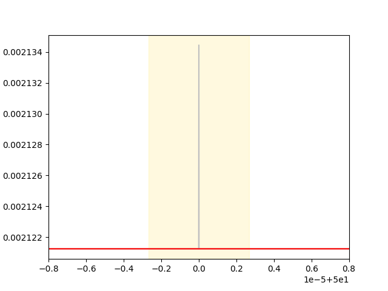
## Equation 2:
```
second_inward_calcium_current__i_siK = 0.002 * (-50.0 + membrane__V) * (intracellular_potassium_concentration__K_i * exp(50.0 / membrane__RTONF) - extracellular_potassium_concentration__K_c * exp(-(-50.0 + membrane__V) / membrane__RTONF)) * second_inward_calcium_current__P_si * second_inward_calcium_current_d_gate__d * second_inward_calcium_current_f_Ca_gate__CaChon / ((1.0 - exp(-(-50.0 + membrane__V) / membrane__RTONF)) * membrane__RTONF)
```
### Partially evaluated to: 
```
second_inward_calcium_current__i_siK = 7.4867781645490941e-5 * (1.0 - second_inward_calcium_current_f_Ca_gate__f_Ca) * (1.0 - intracellular_calcium_concentration__Ca_i / (0.001 + intracellular_calcium_concentration__Ca_i)) * (-50.0 + membrane__V) * (6.4993004051833205 * intracellular_potassium_concentration__K_i - 6.4993004051833205 * extracellular_potassium_concentration__K_c * exp(-0.037433890822745473 * membrane__V)) * second_inward_calcium_current__P_si * second_inward_calcium_current_d_gate__d / (1.0 - 6.4993004051833205 * exp(-0.037433890822745473 * membrane__V))
```
## New Eq:
```
second_inward_calcium_current__i_siK = ((fabs(-50.0 + membrane__V) < 2.6713760659657915e-6) ? ((9358473.2056995872 - 187169.45411399176 * membrane__V) * (0.0019999999000195963 * (1.0 - second_inward_calcium_current_f_Ca_gate__f_Ca) * (1.0 - intracellular_calcium_concentration__Ca_i / (0.001 + intracellular_calcium_concentration__Ca_i)) * (6.4993004051833205 * intracellular_potassium_concentration__K_i - 1.0000001000000049 * extracellular_potassium_concentration__K_c) * second_inward_calcium_current__P_si * second_inward_calcium_current_d_gate__d - 0.0020000001000158659 * (1.0 - second_inward_calcium_current_f_Ca_gate__f_Ca) * (1.0 - intracellular_calcium_concentration__Ca_i / (0.001 + intracellular_calcium_concentration__Ca_i)) * (6.4993004051833205 * intracellular_potassium_concentration__K_i - 0.99999990000000505 * extracellular_potassium_concentration__K_c) * second_inward_calcium_current__P_si * second_inward_calcium_current_d_gate__d) + 0.0020000001000158659 * (1.0 - second_inward_calcium_current_f_Ca_gate__f_Ca) * (1.0 - intracellular_calcium_concentration__Ca_i / (0.001 + intracellular_calcium_concentration__Ca_i)) * (6.4993004051833205 * intracellular_potassium_concentration__K_i - 0.99999990000000505 * extracellular_potassium_concentration__K_c) * second_inward_calcium_current__P_si * second_inward_calcium_current_d_gate__d) : (0.002 * (-50.0 + membrane__V) * (intracellular_potassium_concentration__K_i * exp(50.0 / membrane__RTONF) - extracellular_potassium_concentration__K_c * exp(-(-50.0 + membrane__V) / membrane__RTONF)) * second_inward_calcium_current__P_si * second_inward_calcium_current_d_gate__d * second_inward_calcium_current_f_Ca_gate__CaChon / ((1.0 - exp(-(-50.0 + membrane__V) / membrane__RTONF)) * membrane__RTONF)))
```

*U*: 
1.8716945411372736 - 0.037433890822745473 * membrane__V
*V for 1e-07 range* 
`50.000002671376066 - 49.999997328623934`
50.000000000000000

*Singularity point: 50.000000000000000*

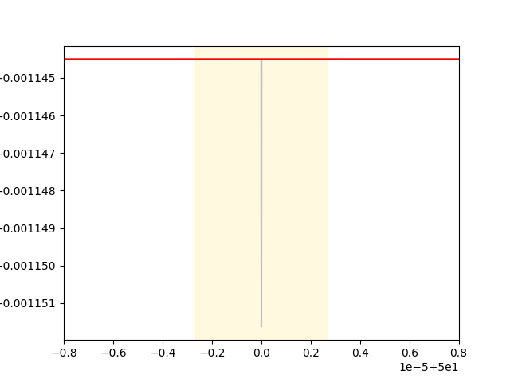
## Equation 3:
```
second_inward_calcium_current__i_siNa = 0.01 * (-50.0 + membrane__V) * (intracellular_sodium_concentration__Na_i * exp(50.0 / membrane__RTONF) - extracellular_sodium_concentration__Na_o * exp(-(-50.0 + membrane__V) / membrane__RTONF)) * second_inward_calcium_current__P_si * second_inward_calcium_current_d_gate__d * second_inward_calcium_current_f_Ca_gate__CaChon / ((1.0 - exp(-(-50.0 + membrane__V) / membrane__RTONF)) * membrane__RTONF)
```
### Partially evaluated to: 
```
second_inward_calcium_current__i_siNa = 0.00037433890822745472 * (1.0 - second_inward_calcium_current_f_Ca_gate__f_Ca) * (1.0 - intracellular_calcium_concentration__Ca_i / (0.001 + intracellular_calcium_concentration__Ca_i)) * (-50.0 + membrane__V) * (6.4993004051833205 * intracellular_sodium_concentration__Na_i - 6.4993004051833205 * extracellular_sodium_concentration__Na_o * exp(-0.037433890822745473 * membrane__V)) * second_inward_calcium_current__P_si * second_inward_calcium_current_d_gate__d / (1.0 - 6.4993004051833205 * exp(-0.037433890822745473 * membrane__V))
```
## New Eq:
```
second_inward_calcium_current__i_siNa = ((fabs(-50.0 + membrane__V) < 2.6713760659657915e-6) ? ((9358473.2056995872 - 187169.45411399176 * membrane__V) * (0.0099999995000979811 * (1.0 - second_inward_calcium_current_f_Ca_gate__f_Ca) * (1.0 - intracellular_calcium_concentration__Ca_i / (0.001 + intracellular_calcium_concentration__Ca_i)) * (6.4993004051833205 * intracellular_sodium_concentration__Na_i - 1.0000001000000049 * extracellular_sodium_concentration__Na_o) * second_inward_calcium_current__P_si * second_inward_calcium_current_d_gate__d - 0.010000000500079329 * (1.0 - second_inward_calcium_current_f_Ca_gate__f_Ca) * (1.0 - intracellular_calcium_concentration__Ca_i / (0.001 + intracellular_calcium_concentration__Ca_i)) * (6.4993004051833205 * intracellular_sodium_concentration__Na_i - 0.99999990000000505 * extracellular_sodium_concentration__Na_o) * second_inward_calcium_current__P_si * second_inward_calcium_current_d_gate__d) + 0.010000000500079329 * (1.0 - second_inward_calcium_current_f_Ca_gate__f_Ca) * (1.0 - intracellular_calcium_concentration__Ca_i / (0.001 + intracellular_calcium_concentration__Ca_i)) * (6.4993004051833205 * intracellular_sodium_concentration__Na_i - 0.99999990000000505 * extracellular_sodium_concentration__Na_o) * second_inward_calcium_current__P_si * second_inward_calcium_current_d_gate__d) : (0.01 * (-50.0 + membrane__V) * (intracellular_sodium_concentration__Na_i * exp(50.0 / membrane__RTONF) - extracellular_sodium_concentration__Na_o * exp(-(-50.0 + membrane__V) / membrane__RTONF)) * second_inward_calcium_current__P_si * second_inward_calcium_current_d_gate__d * second_inward_calcium_current_f_Ca_gate__CaChon / ((1.0 - exp(-(-50.0 + membrane__V) / membrane__RTONF)) * membrane__RTONF)))
```

singularity processing time: 15.390107899999975
# Model: hodgkin_huxley_squid_axon_model_1952_modified(hodgkin_huxley_squid_axon_model_1952_modified.cellml)
load time: 1.121430499999974

singularity processing time: 1.4567855999999892
# Model: HundRudy2004_units(hund_rudy_2004.cellml)
load time: 3.538530000000037

*U*: 
-1.1230765052339999 + 0.074871767015599999 * cell__V
*V for 1e-07 range* 
`14.999998664383064 - 15.000001335616936`
15.000000000000000

*Singularity point: 15.000000000000000*


## Equation 1:
```
ICaL__ibarca = 4.0 * (-15.0 + cell__V) * (-Environment__Ca_o * ICaL__gacao + Ca__Ca_ss * ICaL__gacai * exp(2.0 * (-15.0 + cell__V) * Environment__FonRT)) * Environment__F * Environment__FonRT * ICaL__pca / (-1.0 + exp(2.0 * (-15.0 + cell__V) * Environment__FonRT))
```
### Partially evaluated to: 
```
ICaL__ibarca = 14448.004881000332 * (-15.0 + cell__V) * (-0.34100000000000003 * Environment__Ca_o + 0.32527753564515088 * Ca__Ca_ss * exp(0.074871767015599999 * cell__V)) * ICaL__pca / (-1.0 + 0.32527753564515088 * exp(0.074871767015599999 * cell__V))
```
## New Eq:
```
ICaL__ibarca = ((fabs(-15.0 + cell__V) < 1.3356169352718439e-6) ? ((-5615382.0261832969 + 374358.83507888648 * cell__V) * (192969.99035320638 * (1.0000001000000049 * Ca__Ca_ss - 0.34100000000000003 * Environment__Ca_o) * ICaL__pca - 192970.00964649895 * (0.99999990000000505 * Ca__Ca_ss - 0.34100000000000003 * Environment__Ca_o) * ICaL__pca) + 192970.00964649895 * (0.99999990000000505 * Ca__Ca_ss - 0.34100000000000003 * Environment__Ca_o) * ICaL__pca) : (4.0 * (-15.0 + cell__V) * (-Environment__Ca_o * ICaL__gacao + Ca__Ca_ss * ICaL__gacai * exp(2.0 * (-15.0 + cell__V) * Environment__FonRT)) * Environment__F * Environment__FonRT * ICaL__pca / (-1.0 + exp(2.0 * (-15.0 + cell__V) * Environment__FonRT))))
```

*U*: 
0.074871767015599999 * cell__V
*V for 1e-07 range* 
`-1.3356169352750065e-6 - 1.3356169352750065e-6`

*Singularity point: 0*


## Equation 2:
```
ICab__ICab = 7.9803360000000004e-7 * (-0.34100000000000003 * Environment__Ca_o + Ca__Ca_i * exp(2.0 * Environment__FonRT * cell__V)) * Environment__F * Environment__FonRT * cell__V / (-1.0 + exp(2.0 * Environment__FonRT * cell__V))
```
### Partially evaluated to: 
```
ICab__ICab = 0.0028824983370005666 * (-0.34100000000000003 * Environment__Ca_o + Ca__Ca_i * exp(0.074871767015599999 * cell__V)) * cell__V / (-1.0 + exp(0.074871767015599999 * cell__V))
```
## New Eq:
```
ICab__ICab = ((fabs(cell__V) < 1.3356169352750065e-6) ? (0.038499134023069072 * Ca__Ca_i - 0.01312820601468709 * Environment__Ca_o + (0.5 + 374358.83507800003 * cell__V) * (3.8496514776940535e-9 * Ca__Ca_i + 1.3129099177462428e-9 * Environment__Ca_o)) : (7.9803360000000004e-7 * (-0.34100000000000003 * Environment__Ca_o + Ca__Ca_i * exp(2.0 * Environment__FonRT * cell__V)) * Environment__F * Environment__FonRT * cell__V / (-1.0 + exp(2.0 * Environment__FonRT * cell__V))))
```

*U*: 
5.8385137599999997 + 0.1522 * cell__V
*V for 1e-07 range* 
`-38.360800657030218 - -38.360799342969777`
-38.360799999999998

*Singularity point: -38.360799999999998*

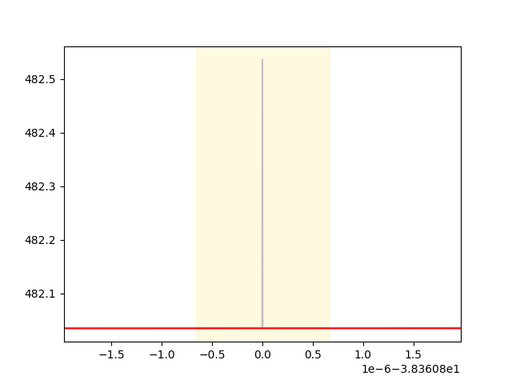
*U*: 
0.2364224 - 0.13600000000000001 * cell__V
*V for 1e-07 range* 
`1.7384007352941175 - 1.7383992647058824`
1.7383999999999999

*Singularity point: 1.7383999999999999*


## Equation 3:
```
IKr__tauxr = 1 / (0.00029999999999999997 * (38.360799999999998 + cell__V) / (-1.0 + exp(5.8385137599999997 + 0.1522 * cell__V)) + 0.00059999999999999995 * (-1.7383999999999999 + cell__V) / (1.0 - exp(0.2364224 - 0.13600000000000001 * cell__V)))
```
### Partially evaluated to: 
```
IKr__tauxr = 1 / (0.00029999999999999997 * (38.360799999999998 + cell__V) / (-1.0 + 343.26878155836141 * exp(0.1522 * cell__V)) + 0.00059999999999999995 * (-1.7383999999999999 + cell__V) / (1.0 - 1.2667092551679247 * exp(-0.13600000000000001 * cell__V)))
```
## New Eq:
```
IKr__tauxr = ((fabs(38.360799999999998 + cell__V) < 6.5703022339436146e-7) ? (1716.304813235186 + 32.175301982615196 * cell__V) : ((fabs(-1.7383999999999999 + cell__V) < 7.3529411764774316e-7) ? (251.46025865610545 - 15.054199733736541 * cell__V) : (1 / (0.00029999999999999997 * (38.360799999999998 + cell__V) / (-1.0 + exp(5.8385137599999997 + 0.1522 * cell__V)) + 0.00059999999999999995 * (-1.7383999999999999 + cell__V) / (1.0 - exp(0.2364224 - 0.13600000000000001 * cell__V))))))
```

*U*: 
-444.66200000000003 - 9.9700000000000006 * cell__V
*V for 1e-07 range* 
`-44.599999989969909 - -44.600000010030094`
-44.600000000000001

*Singularity point: -44.600000000000001*


*U*: 
-0.070400000000000004 + 0.128 * cell__V
*V for 1e-07 range* 
`0.54999921875000002 - 0.55000078125000007`
0.55000000000000005

*Singularity point: 0.55000000000000005*


## Equation 4:
```
IKs__tauxs = 1 / (7.6100000000000007e-5 * (44.600000000000001 + cell__V) / (1.0 - exp(-444.66200000000003 - 9.9700000000000006 * cell__V)) + 0.00036000000000000002 * (-0.55000000000000004 + cell__V) / (-1.0 + exp(-0.070400000000000004 + 0.128 * cell__V)))
```
### Partially evaluated to: 
```
IKs__tauxs = 1 / (7.6100000000000007e-5 * (44.600000000000001 + cell__V) / (1.0 - 7.6868266637773744e-194 * exp(-9.9700000000000006 * cell__V)) + 0.00036000000000000002 * (-0.55000000000000004 + cell__V) / (-1.0 + 0.93202093695954691 * exp(0.128 * cell__V)))
```
## New Eq:
```
IKs__tauxs = ((fabs(44.600000000000001 + cell__V) < 1.0030090258350555e-8) ? (114.37134986698169 + 1.1898410825234575 * cell__V) : ((fabs(-0.55000000000000004 + cell__V) < 7.8124999999991396e-7) ? (158.57692829280447 + 2.6611963637893243 * cell__V) : (1 / (7.6100000000000007e-5 * (44.600000000000001 + cell__V) / (1.0 - exp(-444.66200000000003 - 9.9700000000000006 * cell__V)) + 0.00036000000000000002 * (-0.55000000000000004 + cell__V) / (-1.0 + exp(-0.070400000000000004 + 0.128 * cell__V))))))
```

*U*: 
-4.7130000000000001 - 0.10000000000000001 * cell__V
*V for 1e-07 range* 
`-47.129999000000005 - -47.130001`
-47.130000000000003

*Singularity point: -47.130000000000003*


## Equation 5:
```
INa__am = 0.32000000000000001 * (47.130000000000003 + cell__V) / (1.0 - exp(-4.7130000000000001 - 0.10000000000000001 * cell__V))
```
### Partially evaluated to: 
```
INa__am = 0.32000000000000001 * (47.130000000000003 + cell__V) / (1.0 - 0.00897780373069724 * exp(-0.10000000000000001 * cell__V))
```
## New Eq:
```
INa__am = ((fabs(47.130000000000003 + cell__V) < 1.0000000000287557e-6) ? (10.740659346653775 + 0.15999701562995733 * cell__V) : (0.32000000000000001 * (47.130000000000003 + cell__V) / (1.0 - exp(-4.7130000000000001 - 0.10000000000000001 * cell__V))))
```

*U*: 
-4.7130000000000001 - 0.10000000000000001 * cell__V
*V for 1e-07 range* 
`-47.129999000000005 - -47.130001`
-47.130000000000003

*Singularity point: -47.130000000000003*


## Equation 6:
```
INal__amL = 0.32000000000000001 * (47.130000000000003 + cell__V) / (1.0 - exp(-4.7130000000000001 - 0.10000000000000001 * cell__V))
```
### Partially evaluated to: 
```
INal__amL = 0.32000000000000001 * (47.130000000000003 + cell__V) / (1.0 - 0.00897780373069724 * exp(-0.10000000000000001 * cell__V))
```
## New Eq:
```
INal__amL = ((fabs(47.130000000000003 + cell__V) < 1.0000000000287557e-6) ? (10.740659346653775 + 0.15999701562995733 * cell__V) : (0.32000000000000001 * (47.130000000000003 + cell__V) / (1.0 - exp(-4.7130000000000001 - 0.10000000000000001 * cell__V))))
```

*U*: 
0.0374358835078 * cell__V
*V for 1e-07 range* 
`-2.671233870550013e-6 - 2.671233870550013e-6`

*Singularity point: 0*


## Equation 7:
```
Ito2__Ito2_max = (-Environment__Cl_o * exp(Environment__FonRT * cell__V) + Cl__Cl_i) * Environment__F * Environment__FonRT * Ito2__PCl * cell__V / (1.0 - exp(Environment__FonRT * cell__V))
```
### Partially evaluated to: 
```
Ito2__Ito2_max = 0.001444800488100033 * (-Environment__Cl_o * exp(0.0374358835078 * cell__V) + Cl__Cl_i) * cell__V / (1.0 - exp(0.0374358835078 * cell__V))
```
## New Eq:
```
Ito2__Ito2_max = ((fabs(cell__V) < 2.671233870550013e-6) ? (0.03859399807032593 * Environment__Cl_o - 0.038594001929725924 * Cl__Cl_i + (0.5 + 187179.41753900002 * cell__V) * (3.8591372370942387e-9 * Environment__Cl_o + 3.8596627628976685e-9 * Cl__Cl_i)) : ((-Environment__Cl_o * exp(Environment__FonRT * cell__V) + Cl__Cl_i) * Environment__F * Environment__FonRT * Ito2__PCl * cell__V / (1.0 - exp(Environment__FonRT * cell__V))))
```

singularity processing time: 52.98996360000001
# Model: iribe_model_2006(iribe_model_2006.cellml)
load time: 4.832638200000019

*U*: 
3.7433890822745473 - 0.074867781645490947 * membrane_potential__V
*V for 1e-07 range* 
`50.000001335688033 - 49.999998664311967`
50.000000000000000

*Singularity point: 50.000000000000000*


## Equation 1:
```
L_type_Ca_channel__i_Ca_L_Ca = 4.0 * (-50.0 + membrane_potential__V) * (intracellular_calcium_concentration__Ca_i * exp(100.0 * cell_parameters__F / (cell_parameters__R * cell_parameters__T)) - cell_parameters__Ca_o * exp(-2.0 * (-50.0 + membrane_potential__V) * cell_parameters__F / (cell_parameters__R * cell_parameters__T))) * L_type_Ca_channel__P_Ca_L_Ca * L_type_Ca_channel_d_gate__d * L_type_Ca_channel_f_gate__f * cell_parameters__F / ((1.0 - exp(-2.0 * (-50.0 + membrane_potential__V) * cell_parameters__F / (cell_parameters__R * cell_parameters__T))) * cell_parameters__R * cell_parameters__T)
```
### Partially evaluated to: 
```
L_type_Ca_channel__i_Ca_L_Ca = 0.14973556329098189 * (-50.0 + membrane_potential__V) * (42.240905756816076 * intracellular_calcium_concentration__Ca_i - 42.240905756816076 * cell_parameters__Ca_o * exp(-0.074867781645490947 * membrane_potential__V)) * L_type_Ca_channel__P_Ca_L_Ca * L_type_Ca_channel_d_gate__d * L_type_Ca_channel_f_gate__f / (1.0 - 42.240905756816076 * exp(-0.074867781645490947 * membrane_potential__V))
```
## New Eq:
```
L_type_Ca_channel__i_Ca_L_Ca = ((fabs(-50.0 + membrane_potential__V) < 1.3356880329551402e-6) ? ((18716945.911788113 - 374338.90823576227 * membrane_potential__V) * (1.9999998999780364 * (42.240905756816076 * intracellular_calcium_concentration__Ca_i - 1.0000001000000049 * cell_parameters__Ca_o) * L_type_Ca_channel__P_Ca_L_Ca * L_type_Ca_channel_d_gate__d * L_type_Ca_channel_f_gate__f - 2.0000000999743057 * (42.240905756816076 * intracellular_calcium_concentration__Ca_i - 0.99999990000000505 * cell_parameters__Ca_o) * L_type_Ca_channel__P_Ca_L_Ca * L_type_Ca_channel_d_gate__d * L_type_Ca_channel_f_gate__f) + 2.0000000999743057 * (42.240905756816076 * intracellular_calcium_concentration__Ca_i - 0.99999990000000505 * cell_parameters__Ca_o) * L_type_Ca_channel__P_Ca_L_Ca * L_type_Ca_channel_d_gate__d * L_type_Ca_channel_f_gate__f) : (4.0 * (-50.0 + membrane_potential__V) * (intracellular_calcium_concentration__Ca_i * exp(100.0 * cell_parameters__F / (cell_parameters__R * cell_parameters__T)) - cell_parameters__Ca_o * exp(-2.0 * (-50.0 + membrane_potential__V) * cell_parameters__F / (cell_parameters__R * cell_parameters__T))) * L_type_Ca_channel__P_Ca_L_Ca * L_type_Ca_channel_d_gate__d * L_type_Ca_channel_f_gate__f * cell_parameters__F / ((1.0 - exp(-2.0 * (-50.0 + membrane_potential__V) * cell_parameters__F / (cell_parameters__R * cell_parameters__T))) * cell_parameters__R * cell_parameters__T)))
```

*U*: 
1.8716945411372736 - 0.037433890822745473 * membrane_potential__V
*V for 1e-07 range* 
`50.000002671376066 - 49.999997328623934`
50.000000000000000

*Singularity point: 50.000000000000000*

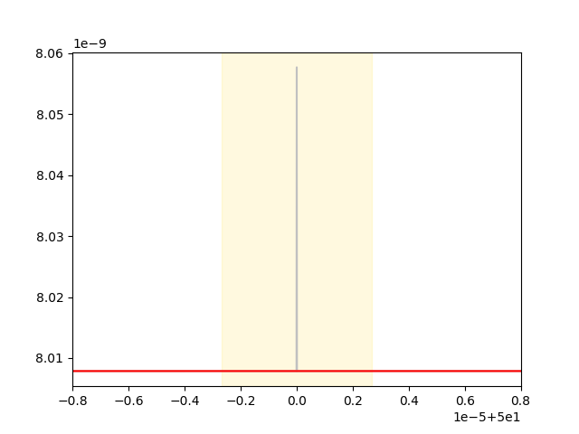
## Equation 2:
```
L_type_Ca_channel__i_Ca_L_K = 0.002 * (-50.0 + membrane_potential__V) * (intracellular_potassium_concentration__K_i * exp(50.0 * cell_parameters__F / (cell_parameters__R * cell_parameters__T)) - cell_parameters__K_o * exp((50.0 - membrane_potential__V) * cell_parameters__F / (cell_parameters__R * cell_parameters__T))) * L_type_Ca_channel__P_Ca_L_Ca * L_type_Ca_channel_d_gate__d * L_type_Ca_channel_f_gate__f * cell_parameters__F / ((1.0 - exp((50.0 - membrane_potential__V) * cell_parameters__F / (cell_parameters__R * cell_parameters__T))) * cell_parameters__R * cell_parameters__T)
```
### Partially evaluated to: 
```
L_type_Ca_channel__i_Ca_L_K = 7.4867781645490941e-5 * (-50.0 + membrane_potential__V) * (6.4993004051833205 * intracellular_potassium_concentration__K_i - 6.4993004051833205 * cell_parameters__K_o * exp(-0.037433890822745473 * membrane_potential__V)) * L_type_Ca_channel__P_Ca_L_Ca * L_type_Ca_channel_d_gate__d * L_type_Ca_channel_f_gate__f / (1.0 - 6.4993004051833205 * exp(-0.037433890822745473 * membrane_potential__V))
```
## New Eq:
```
L_type_Ca_channel__i_Ca_L_K = ((fabs(-50.0 + membrane_potential__V) < 2.6713760659657915e-6) ? ((9358473.2056995872 - 187169.45411399176 * membrane_potential__V) * (0.0019999999000195963 * (6.4993004051833205 * intracellular_potassium_concentration__K_i - 1.0000001000000049 * cell_parameters__K_o) * L_type_Ca_channel__P_Ca_L_Ca * L_type_Ca_channel_d_gate__d * L_type_Ca_channel_f_gate__f - 0.0020000001000158659 * (6.4993004051833205 * intracellular_potassium_concentration__K_i - 0.99999990000000505 * cell_parameters__K_o) * L_type_Ca_channel__P_Ca_L_Ca * L_type_Ca_channel_d_gate__d * L_type_Ca_channel_f_gate__f) + 0.0020000001000158659 * (6.4993004051833205 * intracellular_potassium_concentration__K_i - 0.99999990000000505 * cell_parameters__K_o) * L_type_Ca_channel__P_Ca_L_Ca * L_type_Ca_channel_d_gate__d * L_type_Ca_channel_f_gate__f) : (0.002 * (-50.0 + membrane_potential__V) * (intracellular_potassium_concentration__K_i * exp(50.0 * cell_parameters__F / (cell_parameters__R * cell_parameters__T)) - cell_parameters__K_o * exp((50.0 - membrane_potential__V) * cell_parameters__F / (cell_parameters__R * cell_parameters__T))) * L_type_Ca_channel__P_Ca_L_Ca * L_type_Ca_channel_d_gate__d * L_type_Ca_channel_f_gate__f * cell_parameters__F / ((1.0 - exp((50.0 - membrane_potential__V) * cell_parameters__F / (cell_parameters__R * cell_parameters__T))) * cell_parameters__R * cell_parameters__T)))
```

*U*: 
1.8716945411372736 - 0.037433890822745473 * membrane_potential__V
*V for 1e-07 range* 
`50.000002671376066 - 49.999997328623934`
50.000000000000000

*Singularity point: 50.000000000000000*


## Equation 3:
```
L_type_Ca_channel__i_Ca_L_Na = 0.01 * (-50.0 + membrane_potential__V) * (intracellular_sodium_concentration__Na_i * exp(50.0 * cell_parameters__F / (cell_parameters__R * cell_parameters__T)) - cell_parameters__Na_o * exp((50.0 - membrane_potential__V) * cell_parameters__F / (cell_parameters__R * cell_parameters__T))) * L_type_Ca_channel__P_Ca_L_Ca * L_type_Ca_channel_d_gate__d * L_type_Ca_channel_f_gate__f * cell_parameters__F / ((1.0 - exp((50.0 - membrane_potential__V) * cell_parameters__F / (cell_parameters__R * cell_parameters__T))) * cell_parameters__R * cell_parameters__T)
```
### Partially evaluated to: 
```
L_type_Ca_channel__i_Ca_L_Na = 0.00037433890822745472 * (-50.0 + membrane_potential__V) * (6.4993004051833205 * intracellular_sodium_concentration__Na_i - 6.4993004051833205 * cell_parameters__Na_o * exp(-0.037433890822745473 * membrane_potential__V)) * L_type_Ca_channel__P_Ca_L_Ca * L_type_Ca_channel_d_gate__d * L_type_Ca_channel_f_gate__f / (1.0 - 6.4993004051833205 * exp(-0.037433890822745473 * membrane_potential__V))
```
## New Eq:
```
L_type_Ca_channel__i_Ca_L_Na = ((fabs(-50.0 + membrane_potential__V) < 2.6713760659657915e-6) ? ((9358473.2056995872 - 187169.45411399176 * membrane_potential__V) * (0.0099999995000979811 * (6.4993004051833205 * intracellular_sodium_concentration__Na_i - 1.0000001000000049 * cell_parameters__Na_o) * L_type_Ca_channel__P_Ca_L_Ca * L_type_Ca_channel_d_gate__d * L_type_Ca_channel_f_gate__f - 0.010000000500079329 * (6.4993004051833205 * intracellular_sodium_concentration__Na_i - 0.99999990000000505 * cell_parameters__Na_o) * L_type_Ca_channel__P_Ca_L_Ca * L_type_Ca_channel_d_gate__d * L_type_Ca_channel_f_gate__f) + 0.010000000500079329 * (6.4993004051833205 * intracellular_sodium_concentration__Na_i - 0.99999990000000505 * cell_parameters__Na_o) * L_type_Ca_channel__P_Ca_L_Ca * L_type_Ca_channel_d_gate__d * L_type_Ca_channel_f_gate__f) : (0.01 * (-50.0 + membrane_potential__V) * (intracellular_sodium_concentration__Na_i * exp(50.0 * cell_parameters__F / (cell_parameters__R * cell_parameters__T)) - cell_parameters__Na_o * exp((50.0 - membrane_potential__V) * cell_parameters__F / (cell_parameters__R * cell_parameters__T))) * L_type_Ca_channel__P_Ca_L_Ca * L_type_Ca_channel_d_gate__d * L_type_Ca_channel_f_gate__f * cell_parameters__F / ((1.0 - exp((50.0 - membrane_potential__V) * cell_parameters__F / (cell_parameters__R * cell_parameters__T))) * cell_parameters__R * cell_parameters__T)))
```

singularity processing time: 15.899950499999932
# Model: IyerMazhariWinslow2004(iyer_2004.cellml)
load time: 3.1246177000000444

*U*: 
0.074874401101778759 * COMPUTE_CONCENTRATION_AND_VOLTAGE_DERIVATIVES__V
*V for 1e-07 range* 
`-1.3355699481865283e-6 - 1.3355699481865283e-6`

*Singularity point: 0*


## Equation 1:
```
COMPUTE_ICa_ICaK__ICamax = 4.0 * COMPUTE_ICa_ICaK__PCa * COMPUTE_ICa_ICaK__VFsq_over_RT * COMPUTE_ICa_ICaK__a1_Ca / COMPUTE_ICa_ICaK__a2_Ca
```
### Partially evaluated to: 
```
COMPUTE_ICa_ICaK__ICamax = 101155.3158885031 * (0.001 * exp(0.074874401101778759 * COMPUTE_CONCENTRATION_AND_VOLTAGE_DERIVATIVES__V) - 0.34100000000000003 * COMPUTE_CONCENTRATION_AND_VOLTAGE_DERIVATIVES__Cao) * COMPUTE_CONCENTRATION_AND_VOLTAGE_DERIVATIVES__V * COMPUTE_ICa_ICaK__PCa_max / (-1.0 + exp(0.074874401101778759 * COMPUTE_CONCENTRATION_AND_VOLTAGE_DERIVATIVES__V))
```
## New Eq:
```
COMPUTE_ICa_ICaK__ICamax = ((fabs(COMPUTE_CONCENTRATION_AND_VOLTAGE_DERIVATIVES__V) < 1.3355699481865283e-6) ? ((0.5 + 374372.00550889381 * COMPUTE_CONCENTRATION_AND_VOLTAGE_DERIVATIVES__V) * (1350999.9324417096 * (0.001000000100000005 - 0.34100000000000003 * COMPUTE_CONCENTRATION_AND_VOLTAGE_DERIVATIVES__Cao) * COMPUTE_ICa_ICaK__PCa_max - 1351000.0675509076 * (0.00099999990000000497 - 0.34100000000000003 * COMPUTE_CONCENTRATION_AND_VOLTAGE_DERIVATIVES__Cao) * COMPUTE_ICa_ICaK__PCa_max) + 1351000.0675509076 * (0.00099999990000000497 - 0.34100000000000003 * COMPUTE_CONCENTRATION_AND_VOLTAGE_DERIVATIVES__Cao) * COMPUTE_ICa_ICaK__PCa_max) : (4.0 * COMPUTE_ICa_ICaK__PCa * COMPUTE_ICa_ICaK__VFsq_over_RT * COMPUTE_ICa_ICaK__a1_Ca / COMPUTE_ICa_ICaK__a2_Ca))
```

*U*: 
0.03743720055088938 * COMPUTE_CONCENTRATION_AND_VOLTAGE_DERIVATIVES__V
*V for 1e-07 range* 
`-2.6711398963730566e-6 - 2.6711398963730566e-6`

*Singularity point: 0*


## Equation 2:
```
COMPUTE_ICa_ICaK__ICaK = COMPUTE_DERIVATIVES_OF_LTYPE_CHANNEL_STATES__Open * COMPUTE_DERIVATIVES_OF_LTYPE_CHANNEL_STATES__yCa * COMPUTE_ICa_ICaK__PKprime * COMPUTE_ICa_ICaK__VFsq_over_RT * COMPUTE_ICa_ICaK__a1_K / COMPUTE_ICa_ICaK__a2_K
```
### Partially evaluated to: 
```
COMPUTE_ICa_ICaK__ICaK = 0.01156711037185033 * (-COMPUTE_CONCENTRATION_AND_VOLTAGE_DERIVATIVES__Ko + COMPUTE_CONCENTRATION_AND_VOLTAGE_DERIVATIVES__Ki * exp(0.03743720055088938 * COMPUTE_CONCENTRATION_AND_VOLTAGE_DERIVATIVES__V)) * COMPUTE_CONCENTRATION_AND_VOLTAGE_DERIVATIVES__V * COMPUTE_DERIVATIVES_OF_LTYPE_CHANNEL_STATES__Open * COMPUTE_DERIVATIVES_OF_LTYPE_CHANNEL_STATES__yCa / ((1.0 - 3.773584905660377 * COMPUTE_ICa_ICaK__Icabar) * (-1.0 + exp(0.03743720055088938 * COMPUTE_CONCENTRATION_AND_VOLTAGE_DERIVATIVES__V)))
```
## New Eq:
```
COMPUTE_ICa_ICaK__ICaK = ((fabs(COMPUTE_CONCENTRATION_AND_VOLTAGE_DERIVATIVES__V) < 2.6711398963730566e-6) ? ((0.5 + 187186.0027544469 * COMPUTE_CONCENTRATION_AND_VOLTAGE_DERIVATIVES__V) * (0.30897368454941898 * (-COMPUTE_CONCENTRATION_AND_VOLTAGE_DERIVATIVES__Ko + 1.0000001000000049 * COMPUTE_CONCENTRATION_AND_VOLTAGE_DERIVATIVES__Ki) * COMPUTE_DERIVATIVES_OF_LTYPE_CHANNEL_STATES__Open * COMPUTE_DERIVATIVES_OF_LTYPE_CHANNEL_STATES__yCa / (1.0 - 3.773584905660377 * COMPUTE_ICa_ICaK__Icabar) - 0.30897371544889257 * (-COMPUTE_CONCENTRATION_AND_VOLTAGE_DERIVATIVES__Ko + 0.99999990000000505 * COMPUTE_CONCENTRATION_AND_VOLTAGE_DERIVATIVES__Ki) * COMPUTE_DERIVATIVES_OF_LTYPE_CHANNEL_STATES__Open * COMPUTE_DERIVATIVES_OF_LTYPE_CHANNEL_STATES__yCa / (1.0 - 3.773584905660377 * COMPUTE_ICa_ICaK__Icabar)) + 0.30897371544889257 * (-COMPUTE_CONCENTRATION_AND_VOLTAGE_DERIVATIVES__Ko + 0.99999990000000505 * COMPUTE_CONCENTRATION_AND_VOLTAGE_DERIVATIVES__Ki) * COMPUTE_DERIVATIVES_OF_LTYPE_CHANNEL_STATES__Open * COMPUTE_DERIVATIVES_OF_LTYPE_CHANNEL_STATES__yCa / (1.0 - 3.773584905660377 * COMPUTE_ICa_ICaK__Icabar)) : (COMPUTE_DERIVATIVES_OF_LTYPE_CHANNEL_STATES__Open * COMPUTE_DERIVATIVES_OF_LTYPE_CHANNEL_STATES__yCa * COMPUTE_ICa_ICaK__PKprime * COMPUTE_ICa_ICaK__VFsq_over_RT * COMPUTE_ICa_ICaK__a1_K / COMPUTE_ICa_ICaK__a2_K))
```

*U*: 
0.03743720055088938 * COMPUTE_CONCENTRATION_AND_VOLTAGE_DERIVATIVES__V
*V for 1e-07 range* 
`-2.6711398963730566e-6 - 2.6711398963730566e-6`

*Singularity point: 0*


## Equation 3:
```
COMPUTE_INa_IKr_IKs_Ito1_IK1_INab_IKp__IKv14_K = COMPUTE_DERIVATIVES_OF_Kv1_4_CHANNEL_STATES__OKv14 * COMPUTE_INa_IKr_IKs_Ito1_IK1_INab_IKp__PKv14 * COMPUTE_INa_IKr_IKs_Ito1_IK1_INab_IKp__VFsq_over_RT * COMPUTE_INa_IKr_IKs_Ito1_IK1_INab_IKp__a1_K / COMPUTE_INa_IKr_IKs_Ito1_IK1_INab_IKp__a2
```
### Partially evaluated to: 
```
COMPUTE_INa_IKr_IKs_Ito1_IK1_INab_IKp__IKv14_K = 401.00857370085151 * (-COMPUTE_CONCENTRATION_AND_VOLTAGE_DERIVATIVES__Ko + COMPUTE_CONCENTRATION_AND_VOLTAGE_DERIVATIVES__Ki * exp(0.03743720055088938 * COMPUTE_CONCENTRATION_AND_VOLTAGE_DERIVATIVES__V)) * COMPUTE_CONCENTRATION_AND_VOLTAGE_DERIVATIVES__V * COMPUTE_DERIVATIVES_OF_Kv1_4_CHANNEL_STATES__OKv14 * COMPUTE_INa_IKr_IKs_Ito1_IK1_INab_IKp__PtoSfactor / (-1.0 + exp(0.03743720055088938 * COMPUTE_CONCENTRATION_AND_VOLTAGE_DERIVATIVES__V))
```
## New Eq:
```
COMPUTE_INa_IKr_IKs_Ito1_IK1_INab_IKp__IKv14_K = ((fabs(COMPUTE_CONCENTRATION_AND_VOLTAGE_DERIVATIVES__V) < 2.6711398963730566e-6) ? ((0.5 + 187186.0027544469 * COMPUTE_CONCENTRATION_AND_VOLTAGE_DERIVATIVES__V) * (10711.499464359267 * (-COMPUTE_CONCENTRATION_AND_VOLTAGE_DERIVATIVES__Ko + 1.0000001000000049 * COMPUTE_CONCENTRATION_AND_VOLTAGE_DERIVATIVES__Ki) * COMPUTE_DERIVATIVES_OF_Kv1_4_CHANNEL_STATES__OKv14 * COMPUTE_INa_IKr_IKs_Ito1_IK1_INab_IKp__PtoSfactor - 10711.500535582196 * (-COMPUTE_CONCENTRATION_AND_VOLTAGE_DERIVATIVES__Ko + 0.99999990000000505 * COMPUTE_CONCENTRATION_AND_VOLTAGE_DERIVATIVES__Ki) * COMPUTE_DERIVATIVES_OF_Kv1_4_CHANNEL_STATES__OKv14 * COMPUTE_INa_IKr_IKs_Ito1_IK1_INab_IKp__PtoSfactor) + 10711.500535582196 * (-COMPUTE_CONCENTRATION_AND_VOLTAGE_DERIVATIVES__Ko + 0.99999990000000505 * COMPUTE_CONCENTRATION_AND_VOLTAGE_DERIVATIVES__Ki) * COMPUTE_DERIVATIVES_OF_Kv1_4_CHANNEL_STATES__OKv14 * COMPUTE_INa_IKr_IKs_Ito1_IK1_INab_IKp__PtoSfactor) : (COMPUTE_DERIVATIVES_OF_Kv1_4_CHANNEL_STATES__OKv14 * COMPUTE_INa_IKr_IKs_Ito1_IK1_INab_IKp__PKv14 * COMPUTE_INa_IKr_IKs_Ito1_IK1_INab_IKp__VFsq_over_RT * COMPUTE_INa_IKr_IKs_Ito1_IK1_INab_IKp__a1_K / COMPUTE_INa_IKr_IKs_Ito1_IK1_INab_IKp__a2))
```

*U*: 
0.03743720055088938 * COMPUTE_CONCENTRATION_AND_VOLTAGE_DERIVATIVES__V
*V for 1e-07 range* 
`-2.6711398963730566e-6 - 2.6711398963730566e-6`

*Singularity point: 0*


## Equation 4:
```
COMPUTE_INa_IKr_IKs_Ito1_IK1_INab_IKp__IKv14_Na = 0.02 * COMPUTE_DERIVATIVES_OF_Kv1_4_CHANNEL_STATES__OKv14 * COMPUTE_INa_IKr_IKs_Ito1_IK1_INab_IKp__PKv14 * COMPUTE_INa_IKr_IKs_Ito1_IK1_INab_IKp__VFsq_over_RT * COMPUTE_INa_IKr_IKs_Ito1_IK1_INab_IKp__a1_Na / COMPUTE_INa_IKr_IKs_Ito1_IK1_INab_IKp__a2
```
### Partially evaluated to: 
```
COMPUTE_INa_IKr_IKs_Ito1_IK1_INab_IKp__IKv14_Na = 8.0201714740170313 * (-COMPUTE_CONCENTRATION_AND_VOLTAGE_DERIVATIVES__Nao + COMPUTE_CONCENTRATION_AND_VOLTAGE_DERIVATIVES__Nai * exp(0.03743720055088938 * COMPUTE_CONCENTRATION_AND_VOLTAGE_DERIVATIVES__V)) * COMPUTE_CONCENTRATION_AND_VOLTAGE_DERIVATIVES__V * COMPUTE_DERIVATIVES_OF_Kv1_4_CHANNEL_STATES__OKv14 * COMPUTE_INa_IKr_IKs_Ito1_IK1_INab_IKp__PtoSfactor / (-1.0 + exp(0.03743720055088938 * COMPUTE_CONCENTRATION_AND_VOLTAGE_DERIVATIVES__V))
```
## New Eq:
```
COMPUTE_INa_IKr_IKs_Ito1_IK1_INab_IKp__IKv14_Na = ((fabs(COMPUTE_CONCENTRATION_AND_VOLTAGE_DERIVATIVES__V) < 2.6711398963730566e-6) ? ((0.5 + 187186.0027544469 * COMPUTE_CONCENTRATION_AND_VOLTAGE_DERIVATIVES__V) * (214.22998928718533 * (-COMPUTE_CONCENTRATION_AND_VOLTAGE_DERIVATIVES__Nao + 1.0000001000000049 * COMPUTE_CONCENTRATION_AND_VOLTAGE_DERIVATIVES__Nai) * COMPUTE_DERIVATIVES_OF_Kv1_4_CHANNEL_STATES__OKv14 * COMPUTE_INa_IKr_IKs_Ito1_IK1_INab_IKp__PtoSfactor - 214.2300107116439 * (-COMPUTE_CONCENTRATION_AND_VOLTAGE_DERIVATIVES__Nao + 0.99999990000000505 * COMPUTE_CONCENTRATION_AND_VOLTAGE_DERIVATIVES__Nai) * COMPUTE_DERIVATIVES_OF_Kv1_4_CHANNEL_STATES__OKv14 * COMPUTE_INa_IKr_IKs_Ito1_IK1_INab_IKp__PtoSfactor) + 214.2300107116439 * (-COMPUTE_CONCENTRATION_AND_VOLTAGE_DERIVATIVES__Nao + 0.99999990000000505 * COMPUTE_CONCENTRATION_AND_VOLTAGE_DERIVATIVES__Nai) * COMPUTE_DERIVATIVES_OF_Kv1_4_CHANNEL_STATES__OKv14 * COMPUTE_INa_IKr_IKs_Ito1_IK1_INab_IKp__PtoSfactor) : (0.02 * COMPUTE_DERIVATIVES_OF_Kv1_4_CHANNEL_STATES__OKv14 * COMPUTE_INa_IKr_IKs_Ito1_IK1_INab_IKp__PKv14 * COMPUTE_INa_IKr_IKs_Ito1_IK1_INab_IKp__VFsq_over_RT * COMPUTE_INa_IKr_IKs_Ito1_IK1_INab_IKp__a1_Na / COMPUTE_INa_IKr_IKs_Ito1_IK1_INab_IKp__a2))
```

singularity processing time: 35.05835390000004
# Model: iyer_model_2007(iyer_model_2007.cellml)
load time: 3.2353173999999854

*U*: 
0.03743720055088938 * COMPUTE_CONCENTRATION_AND_VOLTAGE_DERIVATIVES__V
*V for 1e-07 range* 
`-2.6711398963730566e-6 - 2.6711398963730566e-6`

*Singularity point: 0*


## Equation 1:
```
COMPUTE_INa_IKr_IKs_Ito1_IK1_INab_IKp__IKv14_K = COMPUTE_DERIVATIVES_OF_Kv1_4_CHANNEL_STATES__OKv14 * COMPUTE_INa_IKr_IKs_Ito1_IK1_INab_IKp__PKv14 * COMPUTE_INa_IKr_IKs_Ito1_IK1_INab_IKp__VFsq_over_RT * COMPUTE_INa_IKr_IKs_Ito1_IK1_INab_IKp__a1_K / COMPUTE_INa_IKr_IKs_Ito1_IK1_INab_IKp__a2
```
### Partially evaluated to: 
```
COMPUTE_INa_IKr_IKs_Ito1_IK1_INab_IKp__IKv14_K = 0.00015031321966819388 * (-COMPUTE_CONCENTRATION_AND_VOLTAGE_DERIVATIVES__Ko + COMPUTE_CONCENTRATION_AND_VOLTAGE_DERIVATIVES__Ki * exp(0.03743720055088938 * COMPUTE_CONCENTRATION_AND_VOLTAGE_DERIVATIVES__V)) * COMPUTE_CONCENTRATION_AND_VOLTAGE_DERIVATIVES__V * COMPUTE_DERIVATIVES_OF_Kv1_4_CHANNEL_STATES__OKv14 / (-1.0 + exp(0.03743720055088938 * COMPUTE_CONCENTRATION_AND_VOLTAGE_DERIVATIVES__V))
```
## New Eq:
```
COMPUTE_INa_IKr_IKs_Ito1_IK1_INab_IKp__IKv14_K = ((fabs(COMPUTE_CONCENTRATION_AND_VOLTAGE_DERIVATIVES__V) < 2.6711398963730566e-6) ? ((0.5 + 187186.0027544469 * COMPUTE_CONCENTRATION_AND_VOLTAGE_DERIVATIVES__V) * (0.0040150761793015417 * (-COMPUTE_CONCENTRATION_AND_VOLTAGE_DERIVATIVES__Ko + 1.0000001000000049 * COMPUTE_CONCENTRATION_AND_VOLTAGE_DERIVATIVES__Ki) * COMPUTE_DERIVATIVES_OF_Kv1_4_CHANNEL_STATES__OKv14 - 0.0040150765808365163 * (-COMPUTE_CONCENTRATION_AND_VOLTAGE_DERIVATIVES__Ko + 0.99999990000000505 * COMPUTE_CONCENTRATION_AND_VOLTAGE_DERIVATIVES__Ki) * COMPUTE_DERIVATIVES_OF_Kv1_4_CHANNEL_STATES__OKv14) + 0.0040150765808365163 * (-COMPUTE_CONCENTRATION_AND_VOLTAGE_DERIVATIVES__Ko + 0.99999990000000505 * COMPUTE_CONCENTRATION_AND_VOLTAGE_DERIVATIVES__Ki) * COMPUTE_DERIVATIVES_OF_Kv1_4_CHANNEL_STATES__OKv14) : (COMPUTE_DERIVATIVES_OF_Kv1_4_CHANNEL_STATES__OKv14 * COMPUTE_INa_IKr_IKs_Ito1_IK1_INab_IKp__PKv14 * COMPUTE_INa_IKr_IKs_Ito1_IK1_INab_IKp__VFsq_over_RT * COMPUTE_INa_IKr_IKs_Ito1_IK1_INab_IKp__a1_K / COMPUTE_INa_IKr_IKs_Ito1_IK1_INab_IKp__a2))
```

*U*: 
0.03743720055088938 * COMPUTE_CONCENTRATION_AND_VOLTAGE_DERIVATIVES__V
*V for 1e-07 range* 
`-2.6711398963730566e-6 - 2.6711398963730566e-6`

*Singularity point: 0*

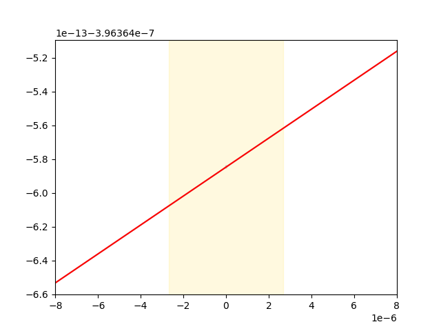
## Equation 2:
```
COMPUTE_INa_IKr_IKs_Ito1_IK1_INab_IKp__IKv14_Na = 0.02 * COMPUTE_DERIVATIVES_OF_Kv1_4_CHANNEL_STATES__OKv14 * COMPUTE_INa_IKr_IKs_Ito1_IK1_INab_IKp__PKv14 * COMPUTE_INa_IKr_IKs_Ito1_IK1_INab_IKp__VFsq_over_RT * COMPUTE_INa_IKr_IKs_Ito1_IK1_INab_IKp__a1_Na / COMPUTE_INa_IKr_IKs_Ito1_IK1_INab_IKp__a2
```
### Partially evaluated to: 
```
COMPUTE_INa_IKr_IKs_Ito1_IK1_INab_IKp__IKv14_Na = 3.006264393363878e-6 * (-COMPUTE_CONCENTRATION_AND_VOLTAGE_DERIVATIVES__Nao + COMPUTE_CONCENTRATION_AND_VOLTAGE_DERIVATIVES__Nai * exp(0.03743720055088938 * COMPUTE_CONCENTRATION_AND_VOLTAGE_DERIVATIVES__V)) * COMPUTE_CONCENTRATION_AND_VOLTAGE_DERIVATIVES__V * COMPUTE_DERIVATIVES_OF_Kv1_4_CHANNEL_STATES__OKv14 / (-1.0 + exp(0.03743720055088938 * COMPUTE_CONCENTRATION_AND_VOLTAGE_DERIVATIVES__V))
```
## New Eq:
```
COMPUTE_INa_IKr_IKs_Ito1_IK1_INab_IKp__IKv14_Na = ((fabs(COMPUTE_CONCENTRATION_AND_VOLTAGE_DERIVATIVES__V) < 2.6711398963730566e-6) ? ((0.5 + 187186.0027544469 * COMPUTE_CONCENTRATION_AND_VOLTAGE_DERIVATIVES__V) * (8.0301523586030844e-5 * (-COMPUTE_CONCENTRATION_AND_VOLTAGE_DERIVATIVES__Nao + 1.0000001000000049 * COMPUTE_CONCENTRATION_AND_VOLTAGE_DERIVATIVES__Nai) * COMPUTE_DERIVATIVES_OF_Kv1_4_CHANNEL_STATES__OKv14 - 8.0301531616730322e-5 * (-COMPUTE_CONCENTRATION_AND_VOLTAGE_DERIVATIVES__Nao + 0.99999990000000505 * COMPUTE_CONCENTRATION_AND_VOLTAGE_DERIVATIVES__Nai) * COMPUTE_DERIVATIVES_OF_Kv1_4_CHANNEL_STATES__OKv14) + 8.0301531616730322e-5 * (-COMPUTE_CONCENTRATION_AND_VOLTAGE_DERIVATIVES__Nao + 0.99999990000000505 * COMPUTE_CONCENTRATION_AND_VOLTAGE_DERIVATIVES__Nai) * COMPUTE_DERIVATIVES_OF_Kv1_4_CHANNEL_STATES__OKv14) : (0.02 * COMPUTE_DERIVATIVES_OF_Kv1_4_CHANNEL_STATES__OKv14 * COMPUTE_INa_IKr_IKs_Ito1_IK1_INab_IKp__PKv14 * COMPUTE_INa_IKr_IKs_Ito1_IK1_INab_IKp__VFsq_over_RT * COMPUTE_INa_IKr_IKs_Ito1_IK1_INab_IKp__a1_Na / COMPUTE_INa_IKr_IKs_Ito1_IK1_INab_IKp__a2))
```

*U*: 
0.074874401101778759 * COMPUTE_CONCENTRATION_AND_VOLTAGE_DERIVATIVES__V
*V for 1e-07 range* 
`-1.3355699481865283e-6 - 1.3355699481865283e-6`

*Singularity point: 0*


## Equation 3:
```
COMPUTE_ICa_ICaK__ICamax = 4.0 * COMPUTE_ICa_ICaK__PCa * COMPUTE_ICa_ICaK__VFsq_over_RT * COMPUTE_ICa_ICaK__a1_Ca / COMPUTE_ICa_ICaK__a2_Ca
```
### Partially evaluated to: 
```
COMPUTE_ICa_ICaK__ICamax = 101155.3158885031 * (0.001 * exp(0.074874401101778759 * COMPUTE_CONCENTRATION_AND_VOLTAGE_DERIVATIVES__V) - 0.34100000000000003 * COMPUTE_CONCENTRATION_AND_VOLTAGE_DERIVATIVES__Cao) * COMPUTE_CONCENTRATION_AND_VOLTAGE_DERIVATIVES__V * COMPUTE_ICa_ICaK__PCa_max / (-1.0 + exp(0.074874401101778759 * COMPUTE_CONCENTRATION_AND_VOLTAGE_DERIVATIVES__V))
```
## New Eq:
```
COMPUTE_ICa_ICaK__ICamax = ((fabs(COMPUTE_CONCENTRATION_AND_VOLTAGE_DERIVATIVES__V) < 1.3355699481865283e-6) ? ((0.5 + 374372.00550889381 * COMPUTE_CONCENTRATION_AND_VOLTAGE_DERIVATIVES__V) * (1350999.9324417096 * (0.001000000100000005 - 0.34100000000000003 * COMPUTE_CONCENTRATION_AND_VOLTAGE_DERIVATIVES__Cao) * COMPUTE_ICa_ICaK__PCa_max - 1351000.0675509076 * (0.00099999990000000497 - 0.34100000000000003 * COMPUTE_CONCENTRATION_AND_VOLTAGE_DERIVATIVES__Cao) * COMPUTE_ICa_ICaK__PCa_max) + 1351000.0675509076 * (0.00099999990000000497 - 0.34100000000000003 * COMPUTE_CONCENTRATION_AND_VOLTAGE_DERIVATIVES__Cao) * COMPUTE_ICa_ICaK__PCa_max) : (4.0 * COMPUTE_ICa_ICaK__PCa * COMPUTE_ICa_ICaK__VFsq_over_RT * COMPUTE_ICa_ICaK__a1_Ca / COMPUTE_ICa_ICaK__a2_Ca))
```

*U*: 
0.03743720055088938 * COMPUTE_CONCENTRATION_AND_VOLTAGE_DERIVATIVES__V
*V for 1e-07 range* 
`-2.6711398963730566e-6 - 2.6711398963730566e-6`

*Singularity point: 0*


## Equation 4:
```
COMPUTE_ICa_ICaK__ICaK = COMPUTE_DERIVATIVES_OF_LTYPE_CHANNEL_STATES__Open * COMPUTE_DERIVATIVES_OF_LTYPE_CHANNEL_STATES__yCa * COMPUTE_ICa_ICaK__PKprime * COMPUTE_ICa_ICaK__VFsq_over_RT * COMPUTE_ICa_ICaK__a1_K / COMPUTE_ICa_ICaK__a2_K
```
### Partially evaluated to: 
```
COMPUTE_ICa_ICaK__ICaK = 0.01156711037185033 * (-COMPUTE_CONCENTRATION_AND_VOLTAGE_DERIVATIVES__Ko + COMPUTE_CONCENTRATION_AND_VOLTAGE_DERIVATIVES__Ki * exp(0.03743720055088938 * COMPUTE_CONCENTRATION_AND_VOLTAGE_DERIVATIVES__V)) * COMPUTE_CONCENTRATION_AND_VOLTAGE_DERIVATIVES__V * COMPUTE_DERIVATIVES_OF_LTYPE_CHANNEL_STATES__Open * COMPUTE_DERIVATIVES_OF_LTYPE_CHANNEL_STATES__yCa / ((1.0 - 3.773584905660377 * COMPUTE_ICa_ICaK__Icabar) * (-1.0 + exp(0.03743720055088938 * COMPUTE_CONCENTRATION_AND_VOLTAGE_DERIVATIVES__V)))
```
## New Eq:
```
COMPUTE_ICa_ICaK__ICaK = ((fabs(COMPUTE_CONCENTRATION_AND_VOLTAGE_DERIVATIVES__V) < 2.6711398963730566e-6) ? ((0.5 + 187186.0027544469 * COMPUTE_CONCENTRATION_AND_VOLTAGE_DERIVATIVES__V) * (0.30897368454941898 * (-COMPUTE_CONCENTRATION_AND_VOLTAGE_DERIVATIVES__Ko + 1.0000001000000049 * COMPUTE_CONCENTRATION_AND_VOLTAGE_DERIVATIVES__Ki) * COMPUTE_DERIVATIVES_OF_LTYPE_CHANNEL_STATES__Open * COMPUTE_DERIVATIVES_OF_LTYPE_CHANNEL_STATES__yCa / (1.0 - 3.773584905660377 * COMPUTE_ICa_ICaK__Icabar) - 0.30897371544889257 * (-COMPUTE_CONCENTRATION_AND_VOLTAGE_DERIVATIVES__Ko + 0.99999990000000505 * COMPUTE_CONCENTRATION_AND_VOLTAGE_DERIVATIVES__Ki) * COMPUTE_DERIVATIVES_OF_LTYPE_CHANNEL_STATES__Open * COMPUTE_DERIVATIVES_OF_LTYPE_CHANNEL_STATES__yCa / (1.0 - 3.773584905660377 * COMPUTE_ICa_ICaK__Icabar)) + 0.30897371544889257 * (-COMPUTE_CONCENTRATION_AND_VOLTAGE_DERIVATIVES__Ko + 0.99999990000000505 * COMPUTE_CONCENTRATION_AND_VOLTAGE_DERIVATIVES__Ki) * COMPUTE_DERIVATIVES_OF_LTYPE_CHANNEL_STATES__Open * COMPUTE_DERIVATIVES_OF_LTYPE_CHANNEL_STATES__yCa / (1.0 - 3.773584905660377 * COMPUTE_ICa_ICaK__Icabar)) : (COMPUTE_DERIVATIVES_OF_LTYPE_CHANNEL_STATES__Open * COMPUTE_DERIVATIVES_OF_LTYPE_CHANNEL_STATES__yCa * COMPUTE_ICa_ICaK__PKprime * COMPUTE_ICa_ICaK__VFsq_over_RT * COMPUTE_ICa_ICaK__a1_K / COMPUTE_ICa_ICaK__a2_K))
```

singularity processing time: 34.32415449999996
# Model: jafri_rice_winslow_1998(jafri_rice_winslow_model_1998.cellml)
load time: 3.1196977999999262

*U*: 
0.075146605522028176 * membrane__V
*V for 1e-07 range* 
`-1.3307320976818627e-6 - 1.3307320976818627e-6`

*Singularity point: 0*

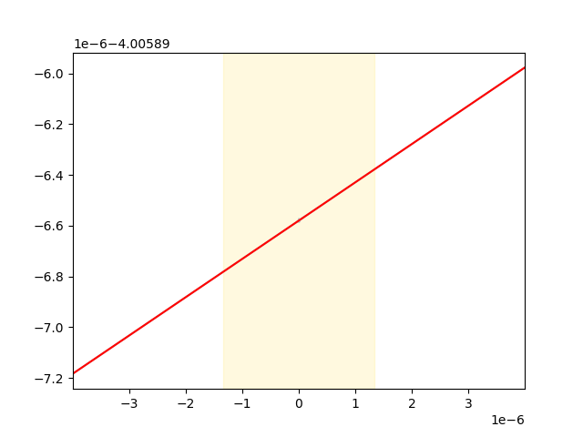
## Equation 1:
```
L_type_Ca_channel__i_Ca_L_Ca_max = 4.0 * pow(membrane__F, 2) * (0.001 * exp(2.0 * membrane__F * membrane__V / (membrane__R * membrane__T)) - 0.34100000000000003 * ionic_concentrations__Cao) * L_type_Ca_channel__P_Ca * membrane__V / ((-1.0 + exp(2.0 * membrane__F * membrane__V / (membrane__R * membrane__T))) * membrane__R * membrane__T)
```
### Partially evaluated to: 
```
L_type_Ca_channel__i_Ca_L_Ca_max = 14555.146023561636 * (0.001 * exp(0.075146605522028176 * membrane__V) - 0.34100000000000003 * ionic_concentrations__Cao) * L_type_Ca_channel__P_Ca * membrane__V / (-1.0 + exp(0.075146605522028176 * membrane__V))
```
## New Eq:
```
L_type_Ca_channel__i_Ca_L_Ca_max = ((fabs(membrane__V) < 1.3307320976818627e-6) ? ((0.5 + 375733.02761014085 * membrane__V) * (193689.99031431141 * (0.001000000100000005 - 0.34100000000000003 * ionic_concentrations__Cao) * L_type_Ca_channel__P_Ca - 193690.00968463012 * (0.00099999990000000497 - 0.34100000000000003 * ionic_concentrations__Cao) * L_type_Ca_channel__P_Ca) + 193690.00968463012 * (0.00099999990000000497 - 0.34100000000000003 * ionic_concentrations__Cao) * L_type_Ca_channel__P_Ca) : (4.0 * pow(membrane__F, 2) * (0.001 * exp(2.0 * membrane__F * membrane__V / (membrane__R * membrane__T)) - 0.34100000000000003 * ionic_concentrations__Cao) * L_type_Ca_channel__P_Ca * membrane__V / ((-1.0 + exp(2.0 * membrane__F * membrane__V / (membrane__R * membrane__T))) * membrane__R * membrane__T)))
```

*U*: 
0.037573302761014088 * membrane__V
*V for 1e-07 range* 
`-2.6614641953637254e-6 - 2.6614641953637254e-6`

*Singularity point: 0*

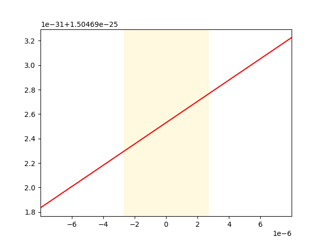
## Equation 2:
```
L_type_Ca_channel__i_Ca_L_K = pow(membrane__F, 2) * (-ionic_concentrations__Ko + ionic_concentrations__Ki * exp(membrane__F * membrane__V / (membrane__R * membrane__T))) * (L_type_Ca_channel__O + L_type_Ca_channel__O_Ca) * L_type_Ca_channel__p_k * L_type_Ca_channel_y_gate__y * membrane__V / ((-1.0 + exp(membrane__F * membrane__V / (membrane__R * membrane__T))) * membrane__R * membrane__T)
```
### Partially evaluated to: 
```
L_type_Ca_channel__i_Ca_L_K = 3.6387865058904094e-6 * (-ionic_concentrations__Ko + ionic_concentrations__Ki * exp(0.037573302761014088 * membrane__V)) * (L_type_Ca_channel__O + L_type_Ca_channel__O_Ca) * L_type_Ca_channel_y_gate__y * membrane__V / ((1.0 - 218.34061135371181 * L_type_Ca_channel__i_Ca_L_Ca_max) * (-1.0 + exp(0.037573302761014088 * membrane__V)))
```
## New Eq:
```
L_type_Ca_channel__i_Ca_L_K = ((fabs(membrane__V) < 2.6614641953637254e-6) ? ((0.5 + 187866.51380507043 * membrane__V) * (9.6844995157155706e-5 * (-ionic_concentrations__Ko + 1.0000001000000049 * ionic_concentrations__Ki) * (L_type_Ca_channel__O + L_type_Ca_channel__O_Ca) * L_type_Ca_channel_y_gate__y / (1.0 - 218.34061135371181 * L_type_Ca_channel__i_Ca_L_Ca_max) - 9.6845004842315065e-5 * (-ionic_concentrations__Ko + 0.99999990000000505 * ionic_concentrations__Ki) * (L_type_Ca_channel__O + L_type_Ca_channel__O_Ca) * L_type_Ca_channel_y_gate__y / (1.0 - 218.34061135371181 * L_type_Ca_channel__i_Ca_L_Ca_max)) + 9.6845004842315065e-5 * (-ionic_concentrations__Ko + 0.99999990000000505 * ionic_concentrations__Ki) * (L_type_Ca_channel__O + L_type_Ca_channel__O_Ca) * L_type_Ca_channel_y_gate__y / (1.0 - 218.34061135371181 * L_type_Ca_channel__i_Ca_L_Ca_max)) : (pow(membrane__F, 2) * (-ionic_concentrations__Ko + ionic_concentrations__Ki * exp(membrane__F * membrane__V / (membrane__R * membrane__T))) * (L_type_Ca_channel__O + L_type_Ca_channel__O_Ca) * L_type_Ca_channel__p_k * L_type_Ca_channel_y_gate__y * membrane__V / ((-1.0 + exp(membrane__F * membrane__V / (membrane__R * membrane__T))) * membrane__R * membrane__T)))
```

*U*: 
-4.7130000000000001 - 0.10000000000000001 * membrane__V
*V for 1e-07 range* 
`-47.129999000000005 - -47.130001`
-47.130000000000003

*Singularity point: -47.130000000000003*


## Equation 3:
```
fast_sodium_current_m_gate__alpha_m = 0.32000000000000001 * (47.130000000000003 + membrane__V) / (1.0 - exp(-4.7130000000000001 - 0.10000000000000001 * membrane__V))
```
### Partially evaluated to: 
```
fast_sodium_current_m_gate__alpha_m = 0.32000000000000001 * (47.130000000000003 + membrane__V) / (1.0 - 0.00897780373069724 * exp(-0.10000000000000001 * membrane__V))
```
## New Eq:
```
fast_sodium_current_m_gate__alpha_m = ((fabs(47.130000000000003 + membrane__V) < 1.0000000000287557e-6) ? (10.740659346653775 + 0.15999701562995733 * membrane__V) : (0.32000000000000001 * (47.130000000000003 + membrane__V) / (1.0 - exp(-4.7130000000000001 - 0.10000000000000001 * membrane__V))))
```

*U*: 
-4.4399999999999995 - 0.14799999999999999 * membrane__V
*V for 1e-07 range* 
`-29.999999324324325 - -30.000000675675675`
-30.000000000000000

*Singularity point: -30.000000000000000*

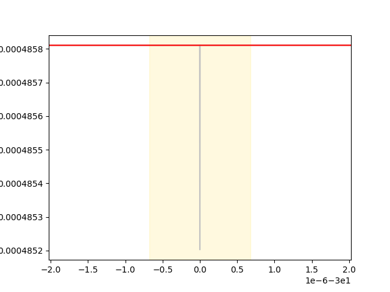
## Equation 4:
```
time_dependent_potassium_current_X_gate__alpha_X = 7.1899999999999999e-5 * (30.0 + membrane__V) / (1.0 - exp(-4.4399999999999995 - 0.14799999999999999 * membrane__V))
```
### Partially evaluated to: 
```
time_dependent_potassium_current_X_gate__alpha_X = 7.1899999999999999e-5 * (30.0 + membrane__V) / (1.0 - 0.011795938519751569 * exp(-0.14799999999999999 * membrane__V))
```
## New Eq:
```
time_dependent_potassium_current_X_gate__alpha_X = ((fabs(30.0 + membrane__V) < 6.7567567568760367e-7) ? (0.0015642906942750271 + 3.5949329448916726e-5 * membrane__V) : (7.1899999999999999e-5 * (30.0 + membrane__V) / (1.0 - exp(-4.4399999999999995 - 0.14799999999999999 * membrane__V))))
```

*U*: 
2.0609999999999999 + 0.068699999999999997 * membrane__V
*V for 1e-07 range* 
`-30.000001455604075 - -29.999998544395925`
-30.000000000000000

*Singularity point: -30.000000000000000*

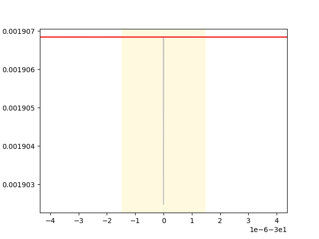
## Equation 5:
```
time_dependent_potassium_current_X_gate__beta_X = 0.00013100000000000001 * (30.0 + membrane__V) / (-1.0 + exp(2.0609999999999999 + 0.068699999999999997 * membrane__V))
```
### Partially evaluated to: 
```
time_dependent_potassium_current_X_gate__beta_X = 0.00013100000000000001 * (30.0 + membrane__V) / (-1.0 + 7.8538197044216602 * exp(0.068699999999999997 * membrane__V))
```
## New Eq:
```
time_dependent_potassium_current_X_gate__beta_X = ((fabs(30.0 + membrane__V) < 1.455604075689676e-6) ? (-5.8292445698129997e-5 - 6.550445949487985e-5 * membrane__V) : (0.00013100000000000001 * (30.0 + membrane__V) / (-1.0 + exp(2.0609999999999999 + 0.068699999999999997 * membrane__V))))
```

singularity processing time: 27.413112499999897
# Model: kurata_model_2002(kurata_model_2002.cellml)
load time: 3.8078506000000516

*U*: 
-14.0 - 0.40000000000000002 * membrane__V
*V for 1e-07 range* 
`-34.999999750000001 - -35.000000249999999`
-35.000000000000000

*Singularity point: -35.000000000000000*


*U*: 
-0.20798668885191349 * membrane__V
*V for 1e-07 range* 
`4.8079999999999991e-7 - -4.8079999999999991e-7`

*Singularity point: 0*

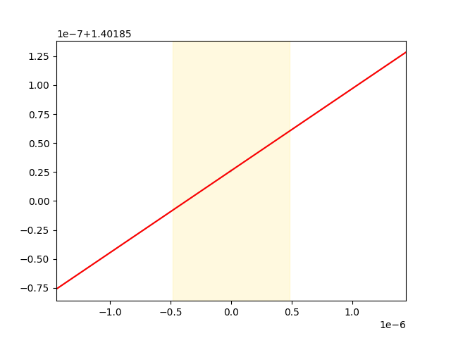
## Equation 1:
```
L_type_calcium_channel_current_d_gate__alpha_d = -0.028389999999999999 * (35.0 + membrane__V) / (-1.0 + exp(-14.0 - 0.40000000000000002 * membrane__V)) - 0.084900000000000003 * membrane__V / (-1.0 + exp(-0.20798668885191349 * membrane__V))
```
### Partially evaluated to: 
```
L_type_calcium_channel_current_d_gate__alpha_d = -0.028389999999999999 * (35.0 + membrane__V) / (-1.0 + 8.3152871910356788e-7 * exp(-0.40000000000000002 * membrane__V)) - 0.084900000000000003 * membrane__V / (-1.0 + exp(-0.20798668885191349 * membrane__V))
```
## New Eq:
```
L_type_calcium_channel_current_d_gate__alpha_d = ((fabs(35.0 + membrane__V) < 2.5000000000718892e-7) ? (0.58245034224539016 + 0.014555001695227986 * membrane__V) : ((fabs(membrane__V) < 4.8079999999999991e-7) ? (1.4018500262480833 + 0.07084258326779995 * membrane__V) : (-0.028389999999999999 * (35.0 + membrane__V) / (-1.0 + exp(-14.0 - 0.40000000000000002 * membrane__V)) - 0.084900000000000003 * membrane__V / (-1.0 + exp(-0.20798668885191349 * membrane__V)))))
```

*U*: 
-2.0 + 0.40000000000000002 * membrane__V
*V for 1e-07 range* 
`4.9999997499999997 - 5.0000002500000003`
5.0000000000000000

*Singularity point: 5.0000000000000000*


## Equation 2:
```
L_type_calcium_channel_current_d_gate__beta_d = 0.011429999999999999 * (-5.0 + membrane__V) / (-1.0 + exp(-2.0 + 0.40000000000000002 * membrane__V))
```
### Partially evaluated to: 
```
L_type_calcium_channel_current_d_gate__beta_d = 0.011429999999999999 * (-5.0 + membrane__V) / (-1.0 + 0.1353352832366127 * exp(0.40000000000000002 * membrane__V))
```
## New Eq:
```
L_type_calcium_channel_current_d_gate__beta_d = ((fabs(-5.0 + membrane__V) < 2.5000000000025002e-7) ? (0.05714946701212998 - 0.0057148934023615412 * membrane__V) : (0.011429999999999999 * (-5.0 + membrane__V) / (-1.0 + exp(-2.0 + 0.40000000000000002 * membrane__V))))
```

singularity processing time: 23.236396600000035
# Model: lindblad_atrial_model_1996(lindblad_model_1996.cellml)
load time: 3.4010866000000988

*U*: 
-0.20798668885191349 * membrane__V
*V for 1e-07 range* 
`4.8079999999999991e-7 - -4.8079999999999991e-7`

*Singularity point: 0*

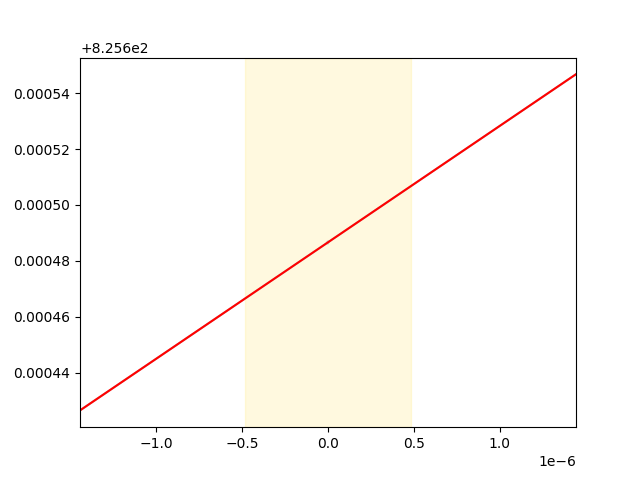
*U*: 
-14.0 - 0.40000000000000002 * membrane__V
*V for 1e-07 range* 
`-34.999999750000001 - -35.000000249999999`
-35.000000000000000

*Singularity point: -35.000000000000000*

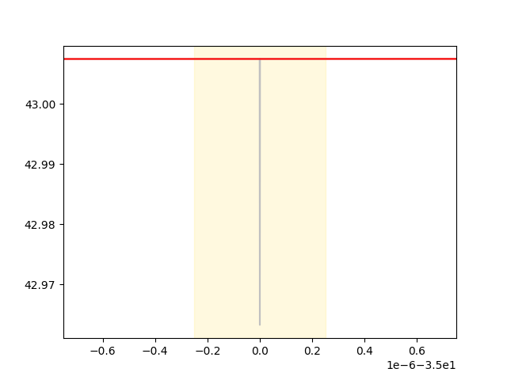
## Equation 1:
```
L_type_Ca_channel_d_L_gate__alpha_d_L = -50.0 * membrane__V / (-1.0 + exp(-0.20798668885191349 * membrane__V)) - 16.719999999999999 * L_type_Ca_channel_d_L_gate__E0_alpha_d_L / (-1.0 + exp(-0.40000000000000002 * L_type_Ca_channel_d_L_gate__E0_alpha_d_L))
```
### Partially evaluated to: 
```
L_type_Ca_channel_d_L_gate__alpha_d_L = -50.0 * membrane__V / (-1.0 + exp(-0.20798668885191349 * membrane__V)) - 16.719999999999999 * (35.0 + membrane__V) / (-1.0 + 8.3152871910356788e-7 * exp(-0.40000000000000002 * membrane__V))
```
## New Eq:
```
L_type_Ca_channel_d_L_gate__alpha_d_L = ((fabs(membrane__V) < 4.8079999999999991e-7) ? (825.6004866103541 + 41.721521355128345 * membrane__V) : ((fabs(35.0 + membrane__V) < 2.5000000000718892e-7) ? (343.02799564590515 + 8.5720150377643662 * membrane__V) : (-50.0 * membrane__V / (-1.0 + exp(-0.20798668885191349 * membrane__V)) - 16.719999999999999 * L_type_Ca_channel_d_L_gate__E0_alpha_d_L / (-1.0 + exp(-0.40000000000000002 * L_type_Ca_channel_d_L_gate__E0_alpha_d_L)))))
```

*U*: 
-2.0 + 0.40000000000000002 * membrane__V
*V for 1e-07 range* 
`4.9999997499999997 - 5.0000002500000003`
5.0000000000000000

*Singularity point: 5.0000000000000000*

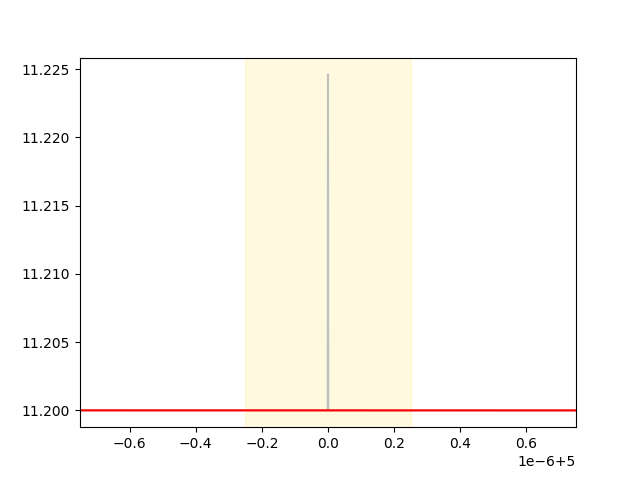
## Equation 2:
```
L_type_Ca_channel_d_L_gate__beta_d_L = 4.4800000000000004 * L_type_Ca_channel_d_L_gate__E0_beta_d_L / (-1.0 + exp(0.40000000000000002 * L_type_Ca_channel_d_L_gate__E0_beta_d_L))
```
### Partially evaluated to: 
```
L_type_Ca_channel_d_L_gate__beta_d_L = 4.4800000000000004 * (-5.0 + membrane__V) / (-1.0 + 0.1353352832366127 * exp(0.40000000000000002 * membrane__V))
```
## New Eq:
```
L_type_Ca_channel_d_L_gate__beta_d_L = ((fabs(-5.0 + membrane__V) < 2.5000000000025002e-7) ? (22.399791094933175 - 2.2399582189613714 * membrane__V) : (4.4800000000000004 * L_type_Ca_channel_d_L_gate__E0_beta_d_L / (-1.0 + exp(0.40000000000000002 * L_type_Ca_channel_d_L_gate__E0_beta_d_L))))
```

*U*: 
7.0 + 0.25 * membrane__V
*V for 1e-07 range* 
`-28.000000400000001 - -27.999999599999999`
-28.000000000000000

*Singularity point: -28.000000000000000*

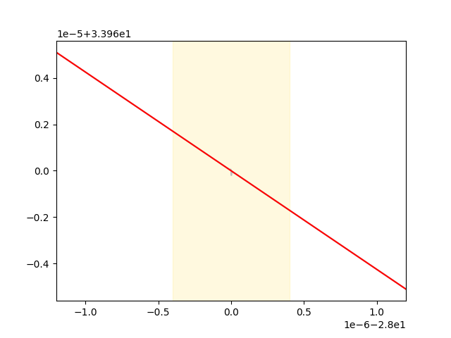
## Equation 3:
```
L_type_Ca_channel_f_L_gate__alpha_f_L = 8.4900000000000002 * L_type_Ca_channel_f_L_gate__E0_f_L / (-1.0 + exp(0.25 * L_type_Ca_channel_f_L_gate__E0_f_L))
```
### Partially evaluated to: 
```
L_type_Ca_channel_f_L_gate__alpha_f_L = 8.4900000000000002 * (28.0 + membrane__V) / (-1.0 + 1096.6331584284585 * exp(0.25 * membrane__V))
```
## New Eq:
```
L_type_Ca_channel_f_L_gate__alpha_f_L = ((fabs(28.0 + membrane__V) < 4.0000000001150227e-7) ? (-84.928711368359671 - 4.2460254060128486 * membrane__V) : (8.4900000000000002 * L_type_Ca_channel_f_L_gate__E0_f_L / (-1.0 + exp(0.25 * L_type_Ca_channel_f_L_gate__E0_f_L))))
```

*U*: 
-3.5035114021936398 - 0.078907914463820727 * membrane__V
*V for 1e-07 range* 
`-44.399998732699999 - -44.400001267299999`
-44.399999999999999

*Singularity point: -44.399999999999999*

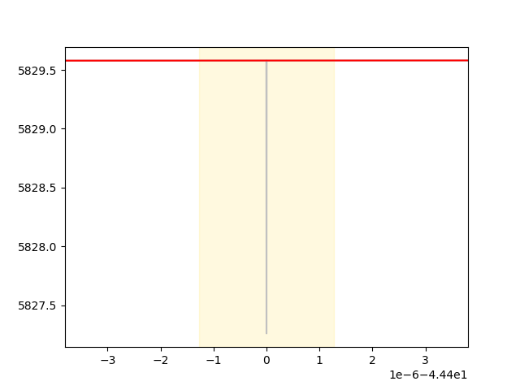
## Equation 4:
```
sodium_current_m_gate__alpha_m = -460.0 * sodium_current_m_gate__E0_m / (-1.0 + exp(-0.078907914463820727 * sodium_current_m_gate__E0_m))
```
### Partially evaluated to: 
```
sodium_current_m_gate__alpha_m = -460.0 * (44.399999999999999 + membrane__V) / (-1.0 + 0.030091534212260941 * exp(-0.078907914463820727 * membrane__V))
```
## New Eq:
```
sodium_current_m_gate__alpha_m = ((fabs(44.399999999999999 + membrane__V) < 1.2672999999963075e-6) ? (16043.161022403392 + 230.03560861286093 * membrane__V) : (-460.0 * sodium_current_m_gate__E0_m / (-1.0 + exp(-0.078907914463820727 * sodium_current_m_gate__E0_m))))
```

*U*: 
0.037676968035880179 * membrane__V
*V for 1e-07 range* 
`-2.6541413816729869e-6 - 2.6541413816729869e-6`

*Singularity point: 0*

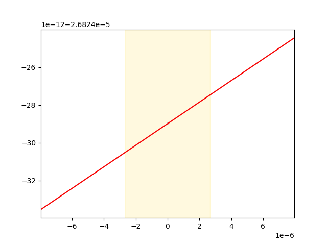
## Equation 5:
```
sodium_current__i_Na = pow(membrane__F, 2) * pow(sodium_current_m_gate__m, 3) * (-1.0 + exp((-sodium_current__E_Na + membrane__V) * membrane__F / (membrane__R * membrane__T))) * (0.36499999999999999 * sodium_current_h2_gate__h2 + 0.63500000000000001 * sodium_current_h1_gate__h1) * cleft_space_ion_concentrations__Na_c * membrane__V * sodium_current__P_Na / ((-1.0 + exp(membrane__F * membrane__V / (membrane__R * membrane__T))) * membrane__R * membrane__T)
```
### Partially evaluated to: 
```
sodium_current__i_Na = 3635.2751276264835 * pow(sodium_current_m_gate__m, 3) * (-1.0 + pow((cleft_space_ion_concentrations__Na_c / intracellular_ion_concentrations__Na_i), (-1.0)) * exp(0.037676968035880179 * membrane__V)) * (0.36499999999999999 * sodium_current_h2_gate__h2 + 0.63500000000000001 * sodium_current_h1_gate__h1) * cleft_space_ion_concentrations__Na_c * membrane__V * sodium_current__P_Na / (-1.0 + exp(0.037676968035880179 * membrane__V))
```
## New Eq:
```
sodium_current__i_Na = ((fabs(membrane__V) < 2.6541413816729869e-6) ? ((0.5 + 188384.84017940093 * membrane__V) * (96485.336675140832 * pow(sodium_current_m_gate__m, 3) * (-1.0 + 1.0000001000000049 * pow((cleft_space_ion_concentrations__Na_c / intracellular_ion_concentrations__Na_i), (-1.0))) * (0.36499999999999999 * sodium_current_h2_gate__h2 + 0.63500000000000001 * sodium_current_h1_gate__h1) * cleft_space_ion_concentrations__Na_c * sodium_current__P_Na - 96485.346324331898 * pow(sodium_current_m_gate__m, 3) * (-1.0 + 0.99999990000000505 * pow((cleft_space_ion_concentrations__Na_c / intracellular_ion_concentrations__Na_i), (-1.0))) * (0.36499999999999999 * sodium_current_h2_gate__h2 + 0.63500000000000001 * sodium_current_h1_gate__h1) * cleft_space_ion_concentrations__Na_c * sodium_current__P_Na) + 96485.346324331898 * pow(sodium_current_m_gate__m, 3) * (-1.0 + 0.99999990000000505 * pow((cleft_space_ion_concentrations__Na_c / intracellular_ion_concentrations__Na_i), (-1.0))) * (0.36499999999999999 * sodium_current_h2_gate__h2 + 0.63500000000000001 * sodium_current_h1_gate__h1) * cleft_space_ion_concentrations__Na_c * sodium_current__P_Na) : (pow(membrane__F, 2) * pow(sodium_current_m_gate__m, 3) * (-1.0 + exp((-sodium_current__E_Na + membrane__V) * membrane__F / (membrane__R * membrane__T))) * (0.36499999999999999 * sodium_current_h2_gate__h2 + 0.63500000000000001 * sodium_current_h1_gate__h1) * cleft_space_ion_concentrations__Na_c * membrane__V * sodium_current__P_Na / ((-1.0 + exp(membrane__F * membrane__V / (membrane__R * membrane__T))) * membrane__R * membrane__T)))
```

singularity processing time: 32.265297999999916
# Model: LivshitzRudy2007(livshitz_rudy_2007.cellml)
load time: 2.341873200000009

*U*: 
0.074871767015605231 * cell__V
*V for 1e-07 range* 
`-1.3356169352749131e-6 - 1.3356169352749131e-6`

*Singularity point: 0*

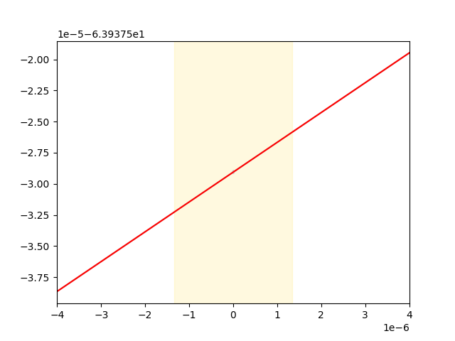
## Equation 1:
```
ICaL__ibarca = 4.0 * (-Environment__Ca_o * ICaL__gacao + Ca__Ca_i * ICaL__gacai * exp(2.0 * Environment__FonRT * cell__V)) * Environment__F * Environment__FonRT * ICaL__pca * cell__V / (-1.0 + exp(2.0 * Environment__FonRT * cell__V))
```
### Partially evaluated to: 
```
ICaL__ibarca = 14448.004881001343 * (-0.34100000000000003 * Environment__Ca_o + (-0.040960000000000003 + 0.33333333333333331 * Ca__Ca_T + 0.66666666666666663 * sqrt(-0.00057837000000000014 + pow((0.12288 - Ca__Ca_T), 2) + 0.0086400000000000001 * Ca__Ca_T) * cos(0.33333333333333331 * acos(0.5 * pow((-0.00057837000000000014 + pow((0.12288 - Ca__Ca_T), 2) + 0.0086400000000000001 * Ca__Ca_T), (-1.5)) * (3.2130000000000006e-5 * Ca__Ca_T - 2.0 * pow((0.12288 - Ca__Ca_T), 3) + 9.0 * (0.12288 - Ca__Ca_T) * (0.00019279000000000003 - 0.0028800000000000002 * Ca__Ca_T))))) * exp(0.074871767015605231 * cell__V)) * ICaL__pca * cell__V / (-1.0 + exp(0.074871767015605231 * cell__V))
```
## New Eq:
```
ICaL__ibarca = ((fabs(cell__V) < 1.3356169352749131e-6) ? ((0.5 + 374358.83507802623 * cell__V) * (192969.99035031584 * (-0.040960004096000209 + 0.33333336666666835 * Ca__Ca_T - 0.34100000000000003 * Environment__Ca_o + 0.6666667333333367 * sqrt(-0.00057837000000000014 + pow((0.12288 - Ca__Ca_T), 2) + 0.0086400000000000001 * Ca__Ca_T) * cos(0.33333333333333331 * acos(0.5 * pow((-0.00057837000000000014 + pow((0.12288 - Ca__Ca_T), 2) + 0.0086400000000000001 * Ca__Ca_T), (-1.5)) * (3.2130000000000006e-5 * Ca__Ca_T - 2.0 * pow((0.12288 - Ca__Ca_T), 3) + 9.0 * (0.12288 - Ca__Ca_T) * (0.00019279000000000003 - 0.0028800000000000002 * Ca__Ca_T))))) * ICaL__pca - 192970.00964862964 * (-0.040959995904000207 + 0.33333330000000166 * Ca__Ca_T - 0.34100000000000003 * Environment__Ca_o + 0.66666660000000333 * sqrt(-0.00057837000000000014 + pow((0.12288 - Ca__Ca_T), 2) + 0.0086400000000000001 * Ca__Ca_T) * cos(0.33333333333333331 * acos(0.5 * pow((-0.00057837000000000014 + pow((0.12288 - Ca__Ca_T), 2) + 0.0086400000000000001 * Ca__Ca_T), (-1.5)) * (3.2130000000000006e-5 * Ca__Ca_T - 2.0 * pow((0.12288 - Ca__Ca_T), 3) + 9.0 * (0.12288 - Ca__Ca_T) * (0.00019279000000000003 - 0.0028800000000000002 * Ca__Ca_T))))) * ICaL__pca) + 192970.00964862964 * (-0.040959995904000207 + 0.33333330000000166 * Ca__Ca_T - 0.34100000000000003 * Environment__Ca_o + 0.66666660000000333 * sqrt(-0.00057837000000000014 + pow((0.12288 - Ca__Ca_T), 2) + 0.0086400000000000001 * Ca__Ca_T) * cos(0.33333333333333331 * acos(0.5 * pow((-0.00057837000000000014 + pow((0.12288 - Ca__Ca_T), 2) + 0.0086400000000000001 * Ca__Ca_T), (-1.5)) * (3.2130000000000006e-5 * Ca__Ca_T - 2.0 * pow((0.12288 - Ca__Ca_T), 3) + 9.0 * (0.12288 - Ca__Ca_T) * (0.00019279000000000003 - 0.0028800000000000002 * Ca__Ca_T))))) * ICaL__pca) : (4.0 * (-Environment__Ca_o * ICaL__gacao + Ca__Ca_i * ICaL__gacai * exp(2.0 * Environment__FonRT * cell__V)) * Environment__F * Environment__FonRT * ICaL__pca * cell__V / (-1.0 + exp(2.0 * Environment__FonRT * cell__V))))
```

*U*: 
0.037435883507802616 * cell__V
*V for 1e-07 range* 
`-2.6712338705498262e-6 - 2.6712338705498262e-6`

*Singularity point: 0*


## Equation 2:
```
ICaL__ibark = (-Environment__K_o * ICaL__gako + ICaL__gaki * K__K_i * exp(Environment__FonRT * cell__V)) * Environment__F * Environment__FonRT * ICaL__pk * cell__V / (-1.0 + exp(Environment__FonRT * cell__V))
```
### Partially evaluated to: 
```
ICaL__ibark = 0.00069711623550831479 * (-0.75 * Environment__K_o + 0.75 * K__K_i * exp(0.037435883507802616 * cell__V)) * cell__V / (-1.0 + exp(0.037435883507802616 * cell__V))
```
## New Eq:
```
ICaL__ibark = ((fabs(cell__V) < 2.6712338705498262e-6) ? (0.013966203051699195 * K__K_i - 0.01396620444831957 * Environment__K_o + (0.5 + 187179.41753901311 * cell__V) * (1.3965252876774756e-9 * K__K_i + 1.3967154623492758e-9 * Environment__K_o)) : ((-Environment__K_o * ICaL__gako + ICaL__gaki * K__K_i * exp(Environment__FonRT * cell__V)) * Environment__F * Environment__FonRT * ICaL__pk * cell__V / (-1.0 + exp(Environment__FonRT * cell__V))))
```

*U*: 
0.037435883507802616 * cell__V
*V for 1e-07 range* 
`-2.6712338705498262e-6 - 2.6712338705498262e-6`

*Singularity point: 0*

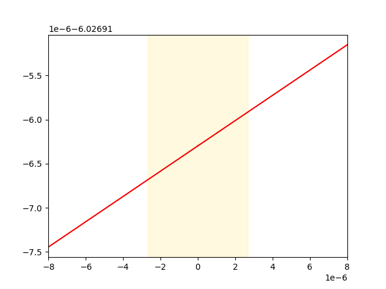
## Equation 3:
```
ICaL__ibarna = (-Environment__Na_o * ICaL__ganao + ICaL__ganai * Na__Na_i * exp(Environment__FonRT * cell__V)) * Environment__F * Environment__FonRT * ICaL__pna * cell__V / (-1.0 + exp(Environment__FonRT * cell__V))
```
### Partially evaluated to: 
```
ICaL__ibarna = 0.0024381008236689767 * (-0.75 * Environment__Na_o + 0.75 * Na__Na_i * exp(0.037435883507802616 * cell__V)) * cell__V / (-1.0 + exp(0.037435883507802616 * cell__V))
```
## New Eq:
```
ICaL__ibarna = ((fabs(cell__V) < 2.6712338705498262e-6) ? (0.048845528807756257 * Na__Na_i - 0.04884553369230938 * Environment__Na_o + (0.5 + 187179.41753901311 * cell__V) * (4.8842205656990899e-9 * Na__Na_i + 4.8848856843753709e-9 * Environment__Na_o)) : ((-Environment__Na_o * ICaL__ganao + ICaL__ganai * Na__Na_i * exp(Environment__FonRT * cell__V)) * Environment__F * Environment__FonRT * ICaL__pna * cell__V / (-1.0 + exp(Environment__FonRT * cell__V))))
```

*U*: 
-1.6025641025641024 - 0.16025641025641024 * cell__V
*V for 1e-07 range* 
`-9.9999993759999999 - -10.000000624`
-10.000000000000000

*Singularity point: -10.000000000000000*

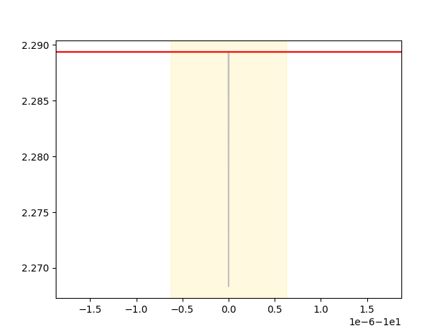
## Equation 4:
```
ICaL__taud = 28.571428571428569 * (1.0 - exp(-1.6025641025641024 - 0.16025641025641024 * cell__V)) * ICaL__dss0 / (10.0 + cell__V)
```
### Partially evaluated to: 
```
ICaL__taud = 28.571428571428569 * (1.0 - 0.20137949774492364 * exp(-0.16025641025641024 * cell__V)) / ((1.0 + 0.20137949774492364 * exp(-0.16025641025641024 * cell__V)) * (10.0 + cell__V))
```
## New Eq:
```
ICaL__taud = ((fabs(10.0 + cell__V) < 6.2399999999074307e-7) ? (2.2890932816357754 - 2.8400773208874076e-5 * cell__V) : (28.571428571428569 * (1.0 - exp(-1.6025641025641024 - 0.16025641025641024 * cell__V)) * ICaL__dss0 / (10.0 + cell__V)))
```

*U*: 
5.6404999999999994 + 0.14499999999999999 * cell__V
*V for 1e-07 range* 
`-38.900000689655172 - -38.899999310344825`
-38.899999999999999

*Singularity point: -38.899999999999999*


*U*: 
-1.7465999999999999 - 0.123 * cell__V
*V for 1e-07 range* 
`-14.199999186991869 - -14.200000813008129`
-14.199999999999999

*Singularity point: -14.199999999999999*


## Equation 5:
```
IKr__tauxr = 1 / (0.00060999999999999997 * (38.899999999999999 + cell__V) / (-1.0 + exp(5.6404999999999994 + 0.14499999999999999 * cell__V)) + 0.0013799999999999999 * (14.199999999999999 + cell__V) / (1.0 - exp(-1.7465999999999999 - 0.123 * cell__V)))
```
### Partially evaluated to: 
```
IKr__tauxr = 1 / (0.00060999999999999997 * (38.899999999999999 + cell__V) / (-1.0 + 281.60348502322194 * exp(0.14499999999999999 * cell__V)) + 0.0013799999999999999 * (14.199999999999999 + cell__V) / (1.0 - 0.17436578041087322 * exp(-0.123 * cell__V)))
```
## New Eq:
```
IKr__tauxr = ((fabs(38.899999999999999 + cell__V) < 6.896551724422384e-7) ? (337.97340791148793 + 4.3478755379172371 * cell__V) : ((fabs(14.199999999999999 + cell__V) < 8.1300813007528783e-7) ? (18.542688989745628 - 4.7385664159816567 * cell__V) : (1 / (0.00060999999999999997 * (38.899999999999999 + cell__V) / (-1.0 + exp(5.6404999999999994 + 0.14499999999999999 * cell__V)) + 0.0013799999999999999 * (14.199999999999999 + cell__V) / (1.0 - exp(-1.7465999999999999 - 0.123 * cell__V))))))
```

*U*: 
2.0609999999999999 + 0.068699999999999997 * cell__V
*V for 1e-07 range* 
`-30.000001455604075 - -29.999998544395925`
-30.000000000000000

*Singularity point: -30.000000000000000*


*U*: 
-4.4399999999999995 - 0.14799999999999999 * cell__V
*V for 1e-07 range* 
`-29.999999324324325 - -30.000000675675675`
-30.000000000000000

*Singularity point: -30.000000000000000*


## Equation 6:
```
IKs__tauxs = 1 / (0.00013100000000000001 * (30.0 + cell__V) / (-1.0 + exp(2.0609999999999999 + 0.068699999999999997 * cell__V)) + 7.1899999999999999e-5 * (30.0 + cell__V) / (1.0 - exp(-4.4399999999999995 - 0.14799999999999999 * cell__V)))
```
### Partially evaluated to: 
```
IKs__tauxs = 1 / (0.00013100000000000001 * (30.0 + cell__V) / (-1.0 + 7.8538197044216602 * exp(0.068699999999999997 * cell__V)) + 7.1899999999999999e-5 * (30.0 + cell__V) / (1.0 - 0.011795938519751569 * exp(-0.14799999999999999 * cell__V)))
```
## New Eq:
```
IKs__tauxs = ((fabs(30.0 + cell__V) < 1.455604075689676e-6) ? (572.83278764737304 + 5.1628844994572827 * cell__V) : ((fabs(30.0 + cell__V) < 6.7567567568760367e-7) ? (572.77257882806907 + 5.160877538707906 * cell__V) : (1 / (0.00013100000000000001 * (30.0 + cell__V) / (-1.0 + exp(2.0609999999999999 + 0.068699999999999997 * cell__V)) + 7.1899999999999999e-5 * (30.0 + cell__V) / (1.0 - exp(-4.4399999999999995 - 0.14799999999999999 * cell__V))))))
```

*U*: 
-4.7130000000000001 - 0.10000000000000001 * cell__V
*V for 1e-07 range* 
`-47.129999000000005 - -47.130001`
-47.130000000000003

*Singularity point: -47.130000000000003*


## Equation 7:
```
INa__am = 0.32000000000000001 * (47.130000000000003 + cell__V) / (1.0 - exp(-4.7130000000000001 - 0.10000000000000001 * cell__V))
```
### Partially evaluated to: 
```
INa__am = 0.32000000000000001 * (47.130000000000003 + cell__V) / (1.0 - 0.00897780373069724 * exp(-0.10000000000000001 * cell__V))
```
## New Eq:
```
INa__am = ((fabs(47.130000000000003 + cell__V) < 1.0000000000287557e-6) ? (10.740659346653775 + 0.15999701562995733 * cell__V) : (0.32000000000000001 * (47.130000000000003 + cell__V) / (1.0 - exp(-4.7130000000000001 - 0.10000000000000001 * cell__V))))
```

singularity processing time: 56.096470299999964
# Model: Li_Mouse_2010(li_mouse_2010.cellml)
load time: 2.728662100000065

*U*: 
-3.3919999999999999 - 0.128 * cell__V
*V for 1e-07 range* 
`-26.499999218749998 - -26.500000781250002`
-26.500000000000000

*Singularity point: -26.500000000000000*


## Equation 1:
```
slow_delayed_rectifier_K_I__alpha_n = 4.8133299999999997e-6 * (26.5 + cell__V) / (1.0 - exp(-3.3919999999999999 - 0.128 * cell__V))
```
### Partially evaluated to: 
```
slow_delayed_rectifier_K_I__alpha_n = 4.8133299999999997e-6 * (26.5 + cell__V) / (1.0 - 0.033641326918204616 * exp(-0.128 * cell__V))
```
## New Eq:
```
slow_delayed_rectifier_K_I__alpha_n = ((fabs(26.5 + cell__V) < 7.8124999999817923e-7) ? (0.00010137957354771978 + 2.4066201102800349e-6 * cell__V) : (4.8133299999999997e-6 * (26.5 + cell__V) / (1.0 - exp(-3.3919999999999999 - 0.128 * cell__V))))
```

singularity processing time: 9.768428500000027
# Model: luo_rudy_1991(luo_rudy_1991.cellml)
load time: 1.8099177000001418

singularity processing time: 3.09850809999989
# Model: luo_rudy_1994(luo_rudy_1994.cellml)
load time: 2.3313309000000118

*U*: 
0.075146605522028176 * membrane__V
*V for 1e-07 range* 
`-1.3307320976818627e-6 - 1.3307320976818627e-6`

*Singularity point: 0*

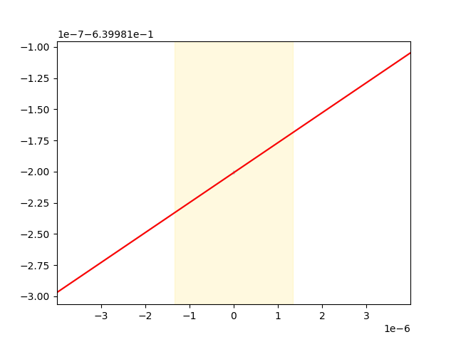
## Equation 1:
```
L_type_Ca_channel__I_CaCa = 4.0 * pow(membrane__F, 2) * (-L_type_Ca_channel__gamma_Cao * ionic_concentrations__Cao + L_type_Ca_channel__gamma_Cai * ionic_concentrations__Cai * exp(2.0 * membrane__F * membrane__V / (membrane__R * membrane__T))) * L_type_Ca_channel__P_Ca * membrane__V / ((-1.0 + exp(2.0 * membrane__F * membrane__V / (membrane__R * membrane__T))) * membrane__R * membrane__T)
```
### Partially evaluated to: 
```
L_type_Ca_channel__I_CaCa = 0.078597788527232842 * (-0.34000000000000002 * ionic_concentrations__Cao + ionic_concentrations__Cai * exp(0.075146605522028176 * membrane__V)) * membrane__V / (-1.0 + exp(0.075146605522028176 * membrane__V))
```
## New Eq:
```
L_type_Ca_channel__I_CaCa = ((fabs(membrane__V) < 1.3307320976818627e-6) ? (1.0459259477044027 * ionic_concentrations__Cai - 0.35561485778098095 * ionic_concentrations__Cao + (0.5 + 375733.02761014085 * membrane__V) * (1.0458547892826242e-7 * ionic_concentrations__Cai + 3.5563905164109205e-8 * ionic_concentrations__Cao)) : (4.0 * pow(membrane__F, 2) * (-L_type_Ca_channel__gamma_Cao * ionic_concentrations__Cao + L_type_Ca_channel__gamma_Cai * ionic_concentrations__Cai * exp(2.0 * membrane__F * membrane__V / (membrane__R * membrane__T))) * L_type_Ca_channel__P_Ca * membrane__V / ((-1.0 + exp(2.0 * membrane__F * membrane__V / (membrane__R * membrane__T))) * membrane__R * membrane__T)))
```

*U*: 
0.037573302761014088 * membrane__V
*V for 1e-07 range* 
`-2.6614641953637254e-6 - 2.6614641953637254e-6`

*Singularity point: 0*

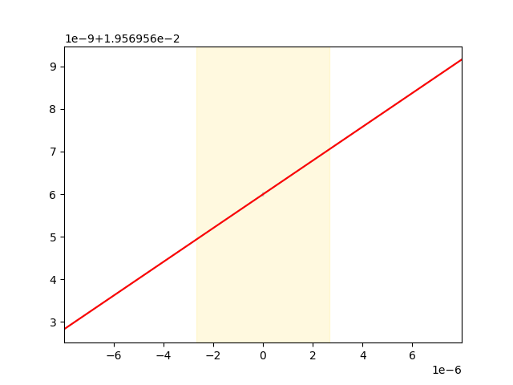
## Equation 2:
```
L_type_Ca_channel__I_CaK = pow(membrane__F, 2) * (-L_type_Ca_channel__gamma_Ko * ionic_concentrations__Ko + L_type_Ca_channel__gamma_Ki * ionic_concentrations__Ki * exp(membrane__F * membrane__V / (membrane__R * membrane__T))) * L_type_Ca_channel__P_K * membrane__V / ((-1.0 + exp(membrane__F * membrane__V / (membrane__R * membrane__T))) * membrane__R * membrane__T)
```
### Partially evaluated to: 
```
L_type_Ca_channel__I_CaK = 7.0228579563684903e-6 * (-0.75 * ionic_concentrations__Ko + 0.75 * ionic_concentrations__Ki * exp(0.037573302761014088 * membrane__V)) * membrane__V / (-1.0 + exp(0.037573302761014088 * membrane__V))
```
## New Eq:
```
L_type_Ca_channel__I_CaK = ((fabs(membrane__V) < 2.6614641953637254e-6) ? (0.00014018313049093731 * ionic_concentrations__Ki - 0.00014018314450925108 * ionic_concentrations__Ko + (0.5 + 187866.51380507043 * membrane__V) * (1.4017359328870883e-11 * ionic_concentrations__Ki + 1.4019268171404112e-11 * ionic_concentrations__Ko)) : (pow(membrane__F, 2) * (-L_type_Ca_channel__gamma_Ko * ionic_concentrations__Ko + L_type_Ca_channel__gamma_Ki * ionic_concentrations__Ki * exp(membrane__F * membrane__V / (membrane__R * membrane__T))) * L_type_Ca_channel__P_K * membrane__V / ((-1.0 + exp(membrane__F * membrane__V / (membrane__R * membrane__T))) * membrane__R * membrane__T)))
```

*U*: 
0.037573302761014088 * membrane__V
*V for 1e-07 range* 
`-2.6614641953637254e-6 - 2.6614641953637254e-6`

*Singularity point: 0*

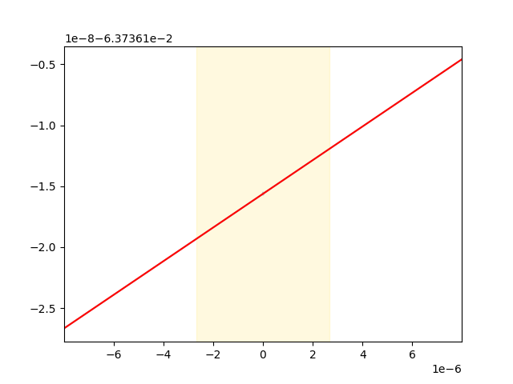
## Equation 3:
```
L_type_Ca_channel__I_CaNa = pow(membrane__F, 2) * (-L_type_Ca_channel__gamma_Nao * ionic_concentrations__Nao + L_type_Ca_channel__gamma_Nai * ionic_concentrations__Nai * exp(membrane__F * membrane__V / (membrane__R * membrane__T))) * L_type_Ca_channel__P_Na * membrane__V / ((-1.0 + exp(membrane__F * membrane__V / (membrane__R * membrane__T))) * membrane__R * membrane__T)
```
### Partially evaluated to: 
```
L_type_Ca_channel__I_CaNa = 2.4561808914760263e-5 * (-0.75 * ionic_concentrations__Nao + 0.75 * ionic_concentrations__Nai * exp(0.037573302761014088 * membrane__V)) * membrane__V / (-1.0 + exp(0.037573302761014088 * membrane__V))
```
## New Eq:
```
L_type_Ca_channel__I_CaNa = ((fabs(membrane__V) < 2.6614641953637254e-6) ? (0.0004902777879864388 * ionic_concentrations__Nai - 0.00049027783701421999 * ionic_concentrations__Nao + (0.5 + 187866.51380507043 * membrane__V) * (4.90311192525867e-11 * ionic_concentrations__Nao + 4.9024443248063467e-11 * ionic_concentrations__Nai)) : (pow(membrane__F, 2) * (-L_type_Ca_channel__gamma_Nao * ionic_concentrations__Nao + L_type_Ca_channel__gamma_Nai * ionic_concentrations__Nai * exp(membrane__F * membrane__V / (membrane__R * membrane__T))) * L_type_Ca_channel__P_Na * membrane__V / ((-1.0 + exp(membrane__F * membrane__V / (membrane__R * membrane__T))) * membrane__R * membrane__T)))
```

*U*: 
-1.6025641025641024 - 0.16025641025641024 * membrane__V
*V for 1e-07 range* 
`-9.9999993759999999 - -10.000000624`
-10.000000000000000

*Singularity point: -10.000000000000000*


## Equation 4:
```
L_type_Ca_channel_d_gate__tau_d = 28.571428571428569 * (1.0 - exp(-1.6025641025641024 - 0.16025641025641024 * membrane__V)) * L_type_Ca_channel_d_gate__d_infinity / (10.0 + membrane__V)
```
### Partially evaluated to: 
```
L_type_Ca_channel_d_gate__tau_d = 28.571428571428569 * (1.0 - 0.20137949774492364 * exp(-0.16025641025641024 * membrane__V)) / ((1.0 + 0.20137949774492364 * exp(-0.16025641025641024 * membrane__V)) * (10.0 + membrane__V))
```
## New Eq:
```
L_type_Ca_channel_d_gate__tau_d = ((fabs(10.0 + membrane__V) < 6.2399999999074307e-7) ? (2.2890932816357754 - 2.8400773208874076e-5 * membrane__V) : (28.571428571428569 * (1.0 - exp(-1.6025641025641024 - 0.16025641025641024 * membrane__V)) * L_type_Ca_channel_d_gate__d_infinity / (10.0 + membrane__V)))
```

*U*: 
-4.7130000000000001 - 0.10000000000000001 * membrane__V
*V for 1e-07 range* 
`-47.129999000000005 - -47.130001`
-47.130000000000003

*Singularity point: -47.130000000000003*


## Equation 5:
```
fast_sodium_current_m_gate__alpha_m = 0.32000000000000001 * (47.130000000000003 + membrane__V) / (1.0 - exp(-4.7130000000000001 - 0.10000000000000001 * membrane__V))
```
### Partially evaluated to: 
```
fast_sodium_current_m_gate__alpha_m = 0.32000000000000001 * (47.130000000000003 + membrane__V) / (1.0 - 0.00897780373069724 * exp(-0.10000000000000001 * membrane__V))
```
## New Eq:
```
fast_sodium_current_m_gate__alpha_m = ((fabs(47.130000000000003 + membrane__V) < 1.0000000000287557e-6) ? (10.740659346653775 + 0.15999701562995733 * membrane__V) : (0.32000000000000001 * (47.130000000000003 + membrane__V) / (1.0 - exp(-4.7130000000000001 - 0.10000000000000001 * membrane__V))))
```

*U*: 
0.037573302761014088 * membrane__V + log(0.0068775790921595595 * pow((1 / (ionic_concentrations__Ki + ionic_concentrations__Nai)), (-1.0)))
*V for 1e-07 range* 
`-2.6614641953637254e-6 - 26.614641953637257 * log(0.0068775790921595595 * pow((1 / (ionic_concentrations__Ki + ionic_concentrations__Nai)), (-1.0))) - 2.6614641953637254e-6 - 26.614641953637257 * log(0.0068775790921595595 * pow((1 / (ionic_concentrations__Ki + ionic_concentrations__Nai)), (-1.0)))`
-26.614641953637255*log(0.0068775790921595598*(1/(_ionic_concentrations$Ki + _ionic_concentrations$Nai))**(-1.0))

*Singularity point: -26.614641953637255*log(0.0068775790921595598*(1/(_ionic_concentrations$Ki + _ionic_concentrations$Nai))**(-1.0))*


found U by substituting in paams! 
## Equation 6:
```
non_specific_calcium_activated_current__I_ns_K = pow(membrane__F, 2) * (-L_type_Ca_channel__gamma_Ko * ionic_concentrations__Ko + L_type_Ca_channel__gamma_Ki * ionic_concentrations__Ki * exp(membrane__F * non_specific_calcium_activated_current__Vns / (membrane__R * membrane__T))) * non_specific_calcium_activated_current__P_ns_Ca * non_specific_calcium_activated_current__Vns / ((-1.0 + exp(membrane__F * non_specific_calcium_activated_current__Vns / (membrane__R * membrane__T))) * membrane__R * membrane__T)
```
### Partially evaluated to: 
```
non_specific_calcium_activated_current__I_ns_K = 6.3678763853082156e-6 * (-0.75 * ionic_concentrations__Ko + 0.75 * pow(((ionic_concentrations__Ko + ionic_concentrations__Nao) / (ionic_concentrations__Ki + ionic_concentrations__Nai)), (-1.0)) * ionic_concentrations__Ki * exp(0.037573302761014088 * membrane__V)) * (-26.614641953637257 * log((ionic_concentrations__Ko + ionic_concentrations__Nao) / (ionic_concentrations__Ki + ionic_concentrations__Nai)) + membrane__V) / (-1.0 + pow(((ionic_concentrations__Ko + ionic_concentrations__Nao) / (ionic_concentrations__Ki + ionic_concentrations__Nai)), (-1.0)) * exp(0.037573302761014088 * membrane__V))
```
## New Eq:
```
non_specific_calcium_activated_current__I_ns_K = ((fabs(26.614641953637257 * log(0.0068775790921595595 * pow((1 / (ionic_concentrations__Ki + ionic_concentrations__Nai)), (-1.0))) + membrane__V) < 2.6614641953637254e-6) ? ((6.3678763853082156e-6 * (-0.75 * ionic_concentrations__Ko + 109.05001090500055 * pow(pow((1 / (ionic_concentrations__Ki + ionic_concentrations__Nai)), (-1.0)), (-1.0)) * pow(((ionic_concentrations__Ko + ionic_concentrations__Nao) / (ionic_concentrations__Ki + ionic_concentrations__Nai)), (-1.0)) * ionic_concentrations__Ki) * (2.6614641953637254e-6 - 26.614641953637257 * log(0.0068775790921595595 * pow((1 / (ionic_concentrations__Ki + ionic_concentrations__Nai)), (-1.0))) - 26.614641953637257 * log((ionic_concentrations__Ko + ionic_concentrations__Nao) / (ionic_concentrations__Ki + ionic_concentrations__Nai))) / (-1.0 + 145.40001454000074 * pow(pow((1 / (ionic_concentrations__Ki + ionic_concentrations__Nai)), (-1.0)), (-1.0)) * pow(((ionic_concentrations__Ko + ionic_concentrations__Nao) / (ionic_concentrations__Ki + ionic_concentrations__Nai)), (-1.0))) - 6.3678763853082156e-6 * (-0.75 * ionic_concentrations__Ko + 109.04998909500054 * pow(pow((1 / (ionic_concentrations__Ki + ionic_concentrations__Nai)), (-1.0)), (-1.0)) * pow(((ionic_concentrations__Ko + ionic_concentrations__Nao) / (ionic_concentrations__Ki + ionic_concentrations__Nai)), (-1.0)) * ionic_concentrations__Ki) * (-2.6614641953637254e-6 - 26.614641953637257 * log(0.0068775790921595595 * pow((1 / (ionic_concentrations__Ki + ionic_concentrations__Nai)), (-1.0))) - 26.614641953637257 * log((ionic_concentrations__Ko + ionic_concentrations__Nao) / (ionic_concentrations__Ki + ionic_concentrations__Nai))) / (-1.0 + 145.39998546000072 * pow(pow((1 / (ionic_concentrations__Ki + ionic_concentrations__Nai)), (-1.0)), (-1.0)) * pow(((ionic_concentrations__Ko + ionic_concentrations__Nao) / (ionic_concentrations__Ki + ionic_concentrations__Nai)), (-1.0)))) * (0.5 + 187866.51380507043 * membrane__V + 5000000.0 * log(0.0068775790921595595 * pow((1 / (ionic_concentrations__Ki + ionic_concentrations__Nai)), (-1.0)))) + 6.3678763853082156e-6 * (-0.75 * ionic_concentrations__Ko + 109.04998909500054 * pow(pow((1 / (ionic_concentrations__Ki + ionic_concentrations__Nai)), (-1.0)), (-1.0)) * pow(((ionic_concentrations__Ko + ionic_concentrations__Nao) / (ionic_concentrations__Ki + ionic_concentrations__Nai)), (-1.0)) * ionic_concentrations__Ki) * (-2.6614641953637254e-6 - 26.614641953637257 * log(0.0068775790921595595 * pow((1 / (ionic_concentrations__Ki + ionic_concentrations__Nai)), (-1.0))) - 26.614641953637257 * log((ionic_concentrations__Ko + ionic_concentrations__Nao) / (ionic_concentrations__Ki + ionic_concentrations__Nai))) / (-1.0 + 145.39998546000072 * pow(pow((1 / (ionic_concentrations__Ki + ionic_concentrations__Nai)), (-1.0)), (-1.0)) * pow(((ionic_concentrations__Ko + ionic_concentrations__Nao) / (ionic_concentrations__Ki + ionic_concentrations__Nai)), (-1.0)))) : (pow(membrane__F, 2) * (-L_type_Ca_channel__gamma_Ko * ionic_concentrations__Ko + L_type_Ca_channel__gamma_Ki * ionic_concentrations__Ki * exp(membrane__F * non_specific_calcium_activated_current__Vns / (membrane__R * membrane__T))) * non_specific_calcium_activated_current__P_ns_Ca * non_specific_calcium_activated_current__Vns / ((-1.0 + exp(membrane__F * non_specific_calcium_activated_current__Vns / (membrane__R * membrane__T))) * membrane__R * membrane__T)))
```

*U*: 
0.037573302761014088 * membrane__V + log(0.0068775790921595595 * pow((1 / (ionic_concentrations__Ki + ionic_concentrations__Nai)), (-1.0)))
*V for 1e-07 range* 
`-2.6614641953637254e-6 - 26.614641953637257 * log(0.0068775790921595595 * pow((1 / (ionic_concentrations__Ki + ionic_concentrations__Nai)), (-1.0))) - 2.6614641953637254e-6 - 26.614641953637257 * log(0.0068775790921595595 * pow((1 / (ionic_concentrations__Ki + ionic_concentrations__Nai)), (-1.0)))`
-26.614641953637255*log(0.0068775790921595598*(1/(_ionic_concentrations$Ki + _ionic_concentrations$Nai))**(-1.0))

*Singularity point: -26.614641953637255*log(0.0068775790921595598*(1/(_ionic_concentrations$Ki + _ionic_concentrations$Nai))**(-1.0))*

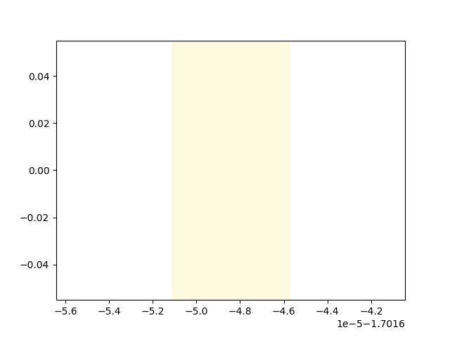
found U by substituting in paams! 
## Equation 7:
```
non_specific_calcium_activated_current__I_ns_Na = pow(membrane__F, 2) * (-L_type_Ca_channel__gamma_Nao * ionic_concentrations__Nao + L_type_Ca_channel__gamma_Nai * ionic_concentrations__Nai * exp(membrane__F * non_specific_calcium_activated_current__Vns / (membrane__R * membrane__T))) * non_specific_calcium_activated_current__P_ns_Ca * non_specific_calcium_activated_current__Vns / ((-1.0 + exp(membrane__F * non_specific_calcium_activated_current__Vns / (membrane__R * membrane__T))) * membrane__R * membrane__T)
```
### Partially evaluated to: 
```
non_specific_calcium_activated_current__I_ns_Na = 6.3678763853082156e-6 * (-0.75 * ionic_concentrations__Nao + 0.75 * pow(((ionic_concentrations__Ko + ionic_concentrations__Nao) / (ionic_concentrations__Ki + ionic_concentrations__Nai)), (-1.0)) * ionic_concentrations__Nai * exp(0.037573302761014088 * membrane__V)) * (-26.614641953637257 * log((ionic_concentrations__Ko + ionic_concentrations__Nao) / (ionic_concentrations__Ki + ionic_concentrations__Nai)) + membrane__V) / (-1.0 + pow(((ionic_concentrations__Ko + ionic_concentrations__Nao) / (ionic_concentrations__Ki + ionic_concentrations__Nai)), (-1.0)) * exp(0.037573302761014088 * membrane__V))
```
## New Eq:
```
non_specific_calcium_activated_current__I_ns_Na = ((fabs(26.614641953637257 * log(0.0068775790921595595 * pow((1 / (ionic_concentrations__Ki + ionic_concentrations__Nai)), (-1.0))) + membrane__V) < 2.6614641953637254e-6) ? ((6.3678763853082156e-6 * (-0.75 * ionic_concentrations__Nao + 109.05001090500055 * pow(pow((1 / (ionic_concentrations__Ki + ionic_concentrations__Nai)), (-1.0)), (-1.0)) * pow(((ionic_concentrations__Ko + ionic_concentrations__Nao) / (ionic_concentrations__Ki + ionic_concentrations__Nai)), (-1.0)) * ionic_concentrations__Nai) * (2.6614641953637254e-6 - 26.614641953637257 * log(0.0068775790921595595 * pow((1 / (ionic_concentrations__Ki + ionic_concentrations__Nai)), (-1.0))) - 26.614641953637257 * log((ionic_concentrations__Ko + ionic_concentrations__Nao) / (ionic_concentrations__Ki + ionic_concentrations__Nai))) / (-1.0 + 145.40001454000074 * pow(pow((1 / (ionic_concentrations__Ki + ionic_concentrations__Nai)), (-1.0)), (-1.0)) * pow(((ionic_concentrations__Ko + ionic_concentrations__Nao) / (ionic_concentrations__Ki + ionic_concentrations__Nai)), (-1.0))) - 6.3678763853082156e-6 * (-0.75 * ionic_concentrations__Nao + 109.04998909500054 * pow(pow((1 / (ionic_concentrations__Ki + ionic_concentrations__Nai)), (-1.0)), (-1.0)) * pow(((ionic_concentrations__Ko + ionic_concentrations__Nao) / (ionic_concentrations__Ki + ionic_concentrations__Nai)), (-1.0)) * ionic_concentrations__Nai) * (-2.6614641953637254e-6 - 26.614641953637257 * log(0.0068775790921595595 * pow((1 / (ionic_concentrations__Ki + ionic_concentrations__Nai)), (-1.0))) - 26.614641953637257 * log((ionic_concentrations__Ko + ionic_concentrations__Nao) / (ionic_concentrations__Ki + ionic_concentrations__Nai))) / (-1.0 + 145.39998546000072 * pow(pow((1 / (ionic_concentrations__Ki + ionic_concentrations__Nai)), (-1.0)), (-1.0)) * pow(((ionic_concentrations__Ko + ionic_concentrations__Nao) / (ionic_concentrations__Ki + ionic_concentrations__Nai)), (-1.0)))) * (0.5 + 187866.51380507043 * membrane__V + 5000000.0 * log(0.0068775790921595595 * pow((1 / (ionic_concentrations__Ki + ionic_concentrations__Nai)), (-1.0)))) + 6.3678763853082156e-6 * (-0.75 * ionic_concentrations__Nao + 109.04998909500054 * pow(pow((1 / (ionic_concentrations__Ki + ionic_concentrations__Nai)), (-1.0)), (-1.0)) * pow(((ionic_concentrations__Ko + ionic_concentrations__Nao) / (ionic_concentrations__Ki + ionic_concentrations__Nai)), (-1.0)) * ionic_concentrations__Nai) * (-2.6614641953637254e-6 - 26.614641953637257 * log(0.0068775790921595595 * pow((1 / (ionic_concentrations__Ki + ionic_concentrations__Nai)), (-1.0))) - 26.614641953637257 * log((ionic_concentrations__Ko + ionic_concentrations__Nao) / (ionic_concentrations__Ki + ionic_concentrations__Nai))) / (-1.0 + 145.39998546000072 * pow(pow((1 / (ionic_concentrations__Ki + ionic_concentrations__Nai)), (-1.0)), (-1.0)) * pow(((ionic_concentrations__Ko + ionic_concentrations__Nao) / (ionic_concentrations__Ki + ionic_concentrations__Nai)), (-1.0)))) : (pow(membrane__F, 2) * (-L_type_Ca_channel__gamma_Nao * ionic_concentrations__Nao + L_type_Ca_channel__gamma_Nai * ionic_concentrations__Nai * exp(membrane__F * non_specific_calcium_activated_current__Vns / (membrane__R * membrane__T))) * non_specific_calcium_activated_current__P_ns_Ca * non_specific_calcium_activated_current__Vns / ((-1.0 + exp(membrane__F * non_specific_calcium_activated_current__Vns / (membrane__R * membrane__T))) * membrane__R * membrane__T)))
```

*U*: 
-4.4399999999999995 - 0.14799999999999999 * membrane__V
*V for 1e-07 range* 
`-29.999999324324325 - -30.000000675675675`
-30.000000000000000

*Singularity point: -30.000000000000000*


## Equation 8:
```
time_dependent_potassium_current_X_gate__alpha_X = 7.1899999999999999e-5 * (30.0 + membrane__V) / (1.0 - exp(-4.4399999999999995 - 0.14799999999999999 * membrane__V))
```
### Partially evaluated to: 
```
time_dependent_potassium_current_X_gate__alpha_X = 7.1899999999999999e-5 * (30.0 + membrane__V) / (1.0 - 0.011795938519751569 * exp(-0.14799999999999999 * membrane__V))
```
## New Eq:
```
time_dependent_potassium_current_X_gate__alpha_X = ((fabs(30.0 + membrane__V) < 6.7567567568760367e-7) ? (0.0015642906942750271 + 3.5949329448916726e-5 * membrane__V) : (7.1899999999999999e-5 * (30.0 + membrane__V) / (1.0 - exp(-4.4399999999999995 - 0.14799999999999999 * membrane__V))))
```

*U*: 
2.0609999999999999 + 0.068699999999999997 * membrane__V
*V for 1e-07 range* 
`-30.000001455604075 - -29.999998544395925`
-30.000000000000000

*Singularity point: -30.000000000000000*


## Equation 9:
```
time_dependent_potassium_current_X_gate__beta_X = 0.00013100000000000001 * (30.0 + membrane__V) / (-1.0 + exp(2.0609999999999999 + 0.068699999999999997 * membrane__V))
```
### Partially evaluated to: 
```
time_dependent_potassium_current_X_gate__beta_X = 0.00013100000000000001 * (30.0 + membrane__V) / (-1.0 + 7.8538197044216602 * exp(0.068699999999999997 * membrane__V))
```
## New Eq:
```
time_dependent_potassium_current_X_gate__beta_X = ((fabs(30.0 + membrane__V) < 1.455604075689676e-6) ? (-5.8292445698129997e-5 - 6.550445949487985e-5 * membrane__V) : (0.00013100000000000001 * (30.0 + membrane__V) / (-1.0 + exp(2.0609999999999999 + 0.068699999999999997 * membrane__V))))
```

singularity processing time: 64.96174700000006
# Model: MahajanShiferaw2008_units(mahajan_shiferaw_2008.cellml)
load time: 2.997227300000077

singularity processing time: 8.11599450000017
# Model: Maleckar(maleckar_model_2009.cellml)
load time: 2.643457699999999

*U*: 
0.037907445518581065 * membrane__V
*V for 1e-07 range* 
`-2.6380041870925613e-6 - 2.6380041870925613e-6`

*Singularity point: 0*

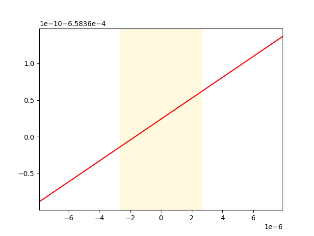
## Equation 1:
```
sodium_current__i_Na = pow(membrane__F, 2) * pow(sodium_current_m_gate__m, 3) * (-1.0 + exp((-sodium_current__E_Na + membrane__V) * membrane__F / (membrane__R * membrane__T))) * (0.10000000000000001 * sodium_current_h2_gate__h2 + 0.90000000000000002 * sodium_current_h1_gate__h1) * cleft_space_ion_concentrations__Na_c * membrane__V * sodium_current__P_Na / ((-1.0 + exp(membrane__F * membrane__V / (membrane__R * membrane__T))) * membrane__R * membrane__T)
```
### Partially evaluated to: 
```
sodium_current__i_Na = 3657.5756957513308 * pow(sodium_current_m_gate__m, 3) * (-1.0 + pow((cleft_space_ion_concentrations__Na_c / intracellular_ion_concentrations__Na_i), (-1.0)) * exp(0.037907445518581065 * membrane__V)) * (0.10000000000000001 * sodium_current_h2_gate__h2 + 0.90000000000000002 * sodium_current_h1_gate__h1) * cleft_space_ion_concentrations__Na_c * membrane__V * sodium_current__P_Na / (-1.0 + exp(0.037907445518581065 * membrane__V))
```
## New Eq:
```
sodium_current__i_Na = ((fabs(membrane__V) < 2.6380041870925613e-6) ? ((0.5 + 189537.22759290531 * membrane__V) * (96486.995175057906 * pow(sodium_current_m_gate__m, 3) * (-1.0 + 1.0000001000000049 * pow((cleft_space_ion_concentrations__Na_c / intracellular_ion_concentrations__Na_i), (-1.0))) * (0.10000000000000001 * sodium_current_h2_gate__h2 + 0.90000000000000002 * sodium_current_h1_gate__h1) * cleft_space_ion_concentrations__Na_c * sodium_current__P_Na - 96487.00482441482 * pow(sodium_current_m_gate__m, 3) * (-1.0 + 0.99999990000000505 * pow((cleft_space_ion_concentrations__Na_c / intracellular_ion_concentrations__Na_i), (-1.0))) * (0.10000000000000001 * sodium_current_h2_gate__h2 + 0.90000000000000002 * sodium_current_h1_gate__h1) * cleft_space_ion_concentrations__Na_c * sodium_current__P_Na) + 96487.00482441482 * pow(sodium_current_m_gate__m, 3) * (-1.0 + 0.99999990000000505 * pow((cleft_space_ion_concentrations__Na_c / intracellular_ion_concentrations__Na_i), (-1.0))) * (0.10000000000000001 * sodium_current_h2_gate__h2 + 0.90000000000000002 * sodium_current_h1_gate__h1) * cleft_space_ion_concentrations__Na_c * sodium_current__P_Na) : (pow(membrane__F, 2) * pow(sodium_current_m_gate__m, 3) * (-1.0 + exp((-sodium_current__E_Na + membrane__V) * membrane__F / (membrane__R * membrane__T))) * (0.10000000000000001 * sodium_current_h2_gate__h2 + 0.90000000000000002 * sodium_current_h1_gate__h1) * cleft_space_ion_concentrations__Na_c * membrane__V * sodium_current__P_Na / ((-1.0 + exp(membrane__F * membrane__V / (membrane__R * membrane__T))) * membrane__R * membrane__T)))
```

singularity processing time: 9.29082859999994
# Model: maltsev_2009(maltsev_2009.cellml)
load time: 3.7750487000000703

singularity processing time: 7.943520199999966
# Model: matsuoka_model_2003(matsuoka_model_2003.cellml)
load time: 4.190191200000072

singularity processing time: 18.9973301
# Model: mcallister_noble_tsien_1975_modelB(mcallister_noble_tsien_1975_b.cellml)
load time: 0.5121315999999752

*U*: 
-4.7000000000000002 - 0.10000000000000001 * membrane__V
*V for 1e-07 range* 
`-46.999999000000003 - -47.000000999999997`
-47.000000000000000

*Singularity point: -47.000000000000000*


## Equation 1:
```
fast_sodium_current_m_gate__alpha_m = (47.0 + membrane__V) / (1.0 - exp(-4.7000000000000002 - 0.10000000000000001 * membrane__V))
```
### Partially evaluated to: 
```
fast_sodium_current_m_gate__alpha_m = (47.0 + membrane__V) / (1.0 - 0.0090952771016958173 * exp(-0.10000000000000001 * membrane__V))
```
## New Eq:
```
fast_sodium_current_m_gate__alpha_m = ((fabs(47.0 + membrane__V) < 1.0000000000287557e-6) ? (33.473471429544091 + 0.49943556232980213 * membrane__V) : ((47.0 + membrane__V) / (1.0 - exp(-4.7000000000000002 - 0.10000000000000001 * membrane__V))))
```

*U*: 
4.4000000000000004 + 0.040000000000000001 * membrane__V
*V for 1e-07 range* 
`-110.00000249999999 - -109.99999750000001`
-110.00000000000000

*Singularity point: -110.00000000000000*

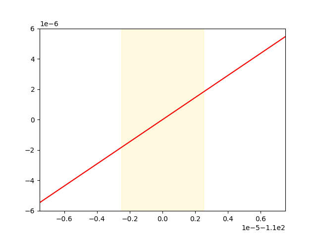
## Equation 2:
```
pacemaker_potassium_current__I_K2 = 2.7999999999999998 * (-1.0 + exp(0.040000000000000001 * membrane__V - 0.040000000000000001 * pacemaker_potassium_current__E_K)) / (exp(2.3999999999999999 + 0.040000000000000001 * membrane__V) + exp(4.7999999999999998 + 0.080000000000000002 * membrane__V))
```
### Partially evaluated to: 
```
pacemaker_potassium_current__I_K2 = 2.7999999999999998 * (-1.0 + 81.450868664968112 * exp(0.040000000000000001 * membrane__V)) / (11.023176380641601 * exp(0.040000000000000001 * membrane__V) + 121.51041751873488 * exp(0.080000000000000002 * membrane__V))
```
## New Eq:
```
pacemaker_potassium_current__I_K2 = ((fabs(110.0 + membrane__V) < 2.5000000000718892e-6) ? (80.181751138485723 + 0.72892501034987123 * membrane__V) : (2.7999999999999998 * (-1.0 + exp(0.040000000000000001 * membrane__V - 0.040000000000000001 * pacemaker_potassium_current__E_K)) / (exp(2.3999999999999999 + 0.040000000000000001 * membrane__V) + exp(4.7999999999999998 + 0.080000000000000002 * membrane__V))))
```

*U*: 
-10.4 - 0.20000000000000001 * membrane__V
*V for 1e-07 range* 
`-51.999999500000001 - -52.000000499999999`
-52.000000000000000

*Singularity point: -52.000000000000000*

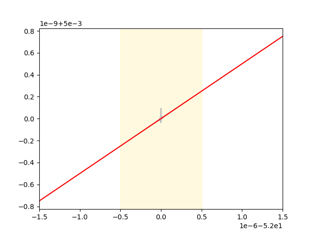
## Equation 3:
```
pacemaker_potassium_current_s_gate__alpha_s = 0.001 * (-pacemaker_potassium_current_s_gate__E_s + membrane__V) / (1.0 - exp(0.20000000000000001 * pacemaker_potassium_current_s_gate__E_s - 0.20000000000000001 * membrane__V))
```
### Partially evaluated to: 
```
pacemaker_potassium_current_s_gate__alpha_s = 0.001 * (52.0 + membrane__V) / (1.0 - 3.0432483008403618e-5 * exp(-0.20000000000000001 * membrane__V))
```
## New Eq:
```
pacemaker_potassium_current_s_gate__alpha_s = ((fabs(52.0 + membrane__V) < 5.0000000001437783e-7) ? (0.031001770179215845 + 0.00050003404190883079 * membrane__V) : (0.001 * (-pacemaker_potassium_current_s_gate__E_s + membrane__V) / (1.0 - exp(0.20000000000000001 * pacemaker_potassium_current_s_gate__E_s - 0.20000000000000001 * membrane__V))))
```

*U*: 
-4.0 - 0.10000000000000001 * membrane__V
*V for 1e-07 range* 
`-39.999999000000003 - -40.000000999999997`
-40.000000000000000

*Singularity point: -40.000000000000000*

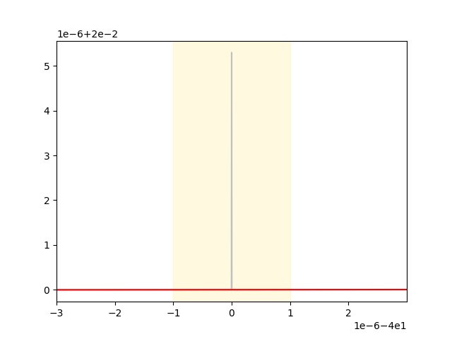
## Equation 4:
```
secondary_inward_current_d_gate__alpha_d = 0.002 * (40.0 + membrane__V) / (1.0 - exp(-4.0 - 0.10000000000000001 * membrane__V))
```
### Partially evaluated to: 
```
secondary_inward_current_d_gate__alpha_d = 0.002 * (40.0 + membrane__V) / (1.0 - 0.018315638888734175 * exp(-0.10000000000000001 * membrane__V))
```
## New Eq:
```
secondary_inward_current_d_gate__alpha_d = ((fabs(40.0 + membrane__V) < 1.0000000000010001e-6) ? (0.060004805025466103 + 0.0010001201256310134 * membrane__V) : (0.002 * (40.0 + membrane__V) / (1.0 - exp(-4.0 - 0.10000000000000001 * membrane__V))))
```

*U*: 
-1.2 - 0.040000000000000001 * membrane__V
*V for 1e-07 range* 
`-29.999997499999999 - -30.000002500000001`
-30.000000000000000

*Singularity point: -30.000000000000000*

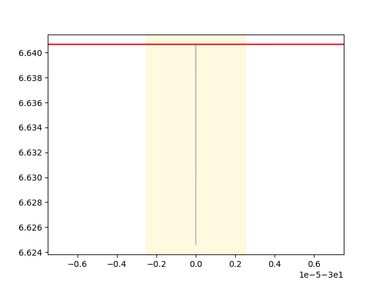
## Equation 5:
```
time_independent_outward_current__i_K1 = 0.35714285714285715 * pacemaker_potassium_current__I_K2 + 0.20000000000000001 * (-time_independent_outward_current__E_K1 + membrane__V) / (1.0 - exp(0.040000000000000001 * time_independent_outward_current__E_K1 - 0.040000000000000001 * membrane__V))
```
### Partially evaluated to: 
```
time_independent_outward_current__i_K1 = 0.35714285714285715 * pacemaker_potassium_current__I_K2 + 0.20000000000000001 * (30.0 + membrane__V) / (1.0 - 0.30119421191220208 * exp(-0.040000000000000001 * membrane__V))
```
## New Eq:
```
time_independent_outward_current__i_K1 = ((fabs(30.0 + membrane__V) < 2.4999999999886224e-6) ? (7.9996838347213313 + 0.35714285714285715 * pacemaker_potassium_current__I_K2 + 0.099989461157145992 * membrane__V) : (0.35714285714285715 * pacemaker_potassium_current__I_K2 + 0.20000000000000001 * (-time_independent_outward_current__E_K1 + membrane__V) / (1.0 - exp(0.040000000000000001 * time_independent_outward_current__E_K1 - 0.040000000000000001 * membrane__V))))
```

*U*: 
-0.10000000000000001 * membrane__V
*V for 1e-07 range* 
`9.9999999999999995e-7 - -9.9999999999999995e-7`

*Singularity point: 0*

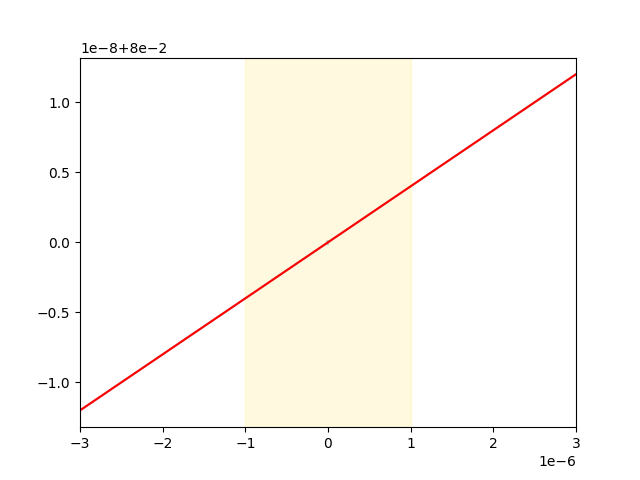
## Equation 6:
```
transient_chloride_current_q_gate__alpha_q = 0.0080000000000000002 * membrane__V / (1.0 - exp(-0.10000000000000001 * membrane__V))
```
### Partially evaluated to: 
```
transient_chloride_current_q_gate__alpha_q = 0.0080000000000000002 * membrane__V / (1.0 - exp(-0.10000000000000001 * membrane__V))
```
## New Eq:
```
transient_chloride_current_q_gate__alpha_q = ((fabs(membrane__V) < 9.9999999999999995e-7) ? (0.079999999999781413 + 0.0040002723356025172 * membrane__V) : (0.0080000000000000002 * membrane__V / (1.0 - exp(-0.10000000000000001 * membrane__V))))
```

singularity processing time: 28.344030900000007
# Model: noble_model_1962(noble_model_1962.cellml)
load time: 0.2484254000000874

*U*: 
-5.0 - 0.10000000000000001 * membrane__V
*V for 1e-07 range* 
`-49.999999000000003 - -50.000000999999997`
-50.000000000000000

*Singularity point: -50.000000000000000*

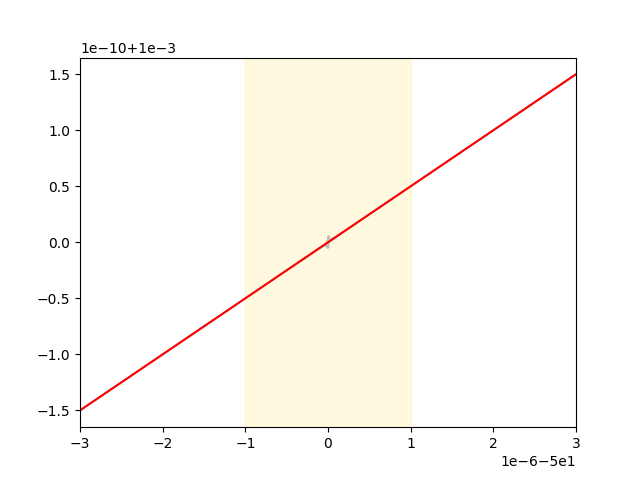
## Equation 1:
```
potassium_channel_n_gate__alpha_n = 0.0001 * (-50.0 - membrane__V) / (-1.0 + exp(-5.0 - 0.10000000000000001 * membrane__V))
```
### Partially evaluated to: 
```
potassium_channel_n_gate__alpha_n = 0.0001 * (-50.0 - membrane__V) / (-1.0 + 0.006737946999085467 * exp(-0.10000000000000001 * membrane__V))
```
## New Eq:
```
potassium_channel_n_gate__alpha_n = ((fabs(50.0 + membrane__V) < 1.0000000000287557e-6) ? (0.0034999533691648242 + 4.9999067383209703e-5 * membrane__V) : (0.0001 * (-50.0 - membrane__V) / (-1.0 + exp(-5.0 - 0.10000000000000001 * membrane__V))))
```

*U*: 
-3.2000000000000002 - 0.066666666666666666 * membrane__V
*V for 1e-07 range* 
`-47.999998499999997 - -48.000001500000003`
-48.000000000000000

*Singularity point: -48.000000000000000*

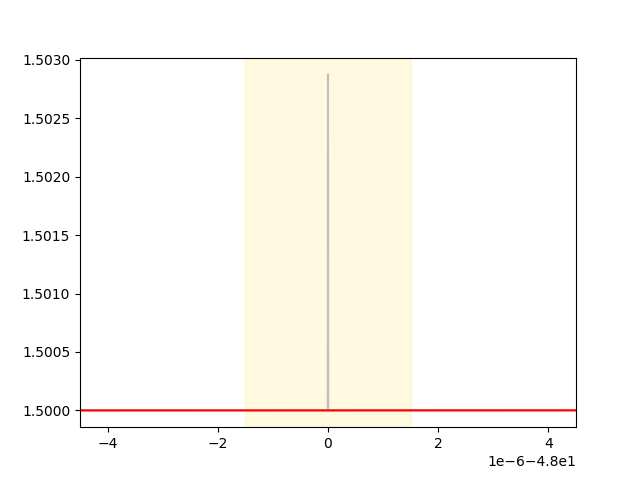
## Equation 2:
```
sodium_channel_m_gate__alpha_m = 0.10000000000000001 * (-48.0 - membrane__V) / (-1.0 + exp(-3.2000000000000002 - 0.066666666666666666 * membrane__V))
```
### Partially evaluated to: 
```
sodium_channel_m_gate__alpha_m = 0.10000000000000001 * (-48.0 - membrane__V) / (-1.0 + 0.040762203978366218 * exp(-0.066666666666666666 * membrane__V))
```
## New Eq:
```
sodium_channel_m_gate__alpha_m = ((fabs(48.0 + membrane__V) < 1.5000000000153779e-6) ? (3.8996915565219568 + 0.049993574094243487 * membrane__V) : (0.10000000000000001 * (-48.0 - membrane__V) / (-1.0 + exp(-3.2000000000000002 - 0.066666666666666666 * membrane__V))))
```

*U*: 
1.6000000000000001 + 0.20000000000000001 * membrane__V
*V for 1e-07 range* 
`-8.0000005000000005 - -7.9999995000000004`
-8.0000000000000000

*Singularity point: -8.0000000000000000*

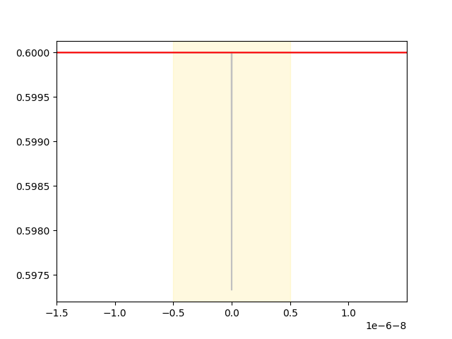
## Equation 3:
```
sodium_channel_m_gate__beta_m = 0.12 * (8.0 + membrane__V) / (-1.0 + exp(1.6000000000000001 + 0.20000000000000001 * membrane__V))
```
### Partially evaluated to: 
```
sodium_channel_m_gate__beta_m = 0.12 * (8.0 + membrane__V) / (-1.0 + 4.9530324243951149 * exp(0.20000000000000001 * membrane__V))
```
## New Eq:
```
sodium_channel_m_gate__beta_m = ((fabs(8.0 + membrane__V) < 4.999999999970306e-7) ? (0.11994233969551868 - 0.060007207538385607 * membrane__V) : (0.12 * (8.0 + membrane__V) / (-1.0 + exp(1.6000000000000001 + 0.20000000000000001 * membrane__V))))
```

singularity processing time: 12.170573600000125
# Model: noble_model_1991(noble_model_1991.cellml)
load time: 2.747084900000118

*U*: 
3.7433890822745473 - 0.074867781645490947 * membrane__V
*V for 1e-07 range* 
`50.000001335688033 - 49.999998664311967`
50.000000000000000

*Singularity point: 50.000000000000000*

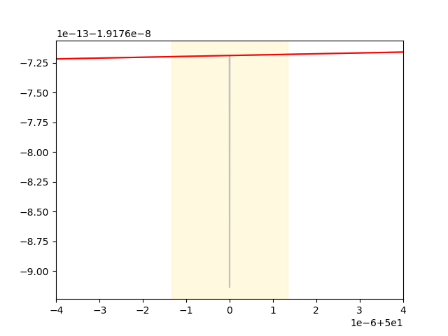
## Equation 1:
```
L_type_Ca_channel__i_Ca_L_Ca = 4.0 * (-50.0 + membrane__V) * (intracellular_calcium_concentration__Ca_i * exp(100.0 * membrane__F / (membrane__R * membrane__T)) - extracellular_calcium_concentration__Ca_o * exp(2.0 * (50.0 - membrane__V) * membrane__F / (membrane__R * membrane__T))) * L_type_Ca_channel__P_Ca_L * L_type_Ca_channel_d_gate__d * L_type_Ca_channel_f_gate__f * membrane__F / ((1.0 - exp(2.0 * (50.0 - membrane__V) * membrane__F / (membrane__R * membrane__T))) * membrane__R * membrane__T)
```
### Partially evaluated to: 
```
L_type_Ca_channel__i_Ca_L_Ca = 0.14973556329098189 * (-50.0 + membrane__V) * (42.240905756816076 * intracellular_calcium_concentration__Ca_i - 42.240905756816076 * extracellular_calcium_concentration__Ca_o * exp(-0.074867781645490947 * membrane__V)) * L_type_Ca_channel__P_Ca_L * L_type_Ca_channel_d_gate__d * L_type_Ca_channel_f_gate__f / (1.0 - 42.240905756816076 * exp(-0.074867781645490947 * membrane__V))
```
## New Eq:
```
L_type_Ca_channel__i_Ca_L_Ca = ((fabs(-50.0 + membrane__V) < 1.3356880329551402e-6) ? ((18716945.911788113 - 374338.90823576227 * membrane__V) * (1.9999998999780364 * (42.240905756816076 * intracellular_calcium_concentration__Ca_i - 1.0000001000000049 * extracellular_calcium_concentration__Ca_o) * L_type_Ca_channel__P_Ca_L * L_type_Ca_channel_d_gate__d * L_type_Ca_channel_f_gate__f - 2.0000000999743057 * (42.240905756816076 * intracellular_calcium_concentration__Ca_i - 0.99999990000000505 * extracellular_calcium_concentration__Ca_o) * L_type_Ca_channel__P_Ca_L * L_type_Ca_channel_d_gate__d * L_type_Ca_channel_f_gate__f) + 2.0000000999743057 * (42.240905756816076 * intracellular_calcium_concentration__Ca_i - 0.99999990000000505 * extracellular_calcium_concentration__Ca_o) * L_type_Ca_channel__P_Ca_L * L_type_Ca_channel_d_gate__d * L_type_Ca_channel_f_gate__f) : (4.0 * (-50.0 + membrane__V) * (intracellular_calcium_concentration__Ca_i * exp(100.0 * membrane__F / (membrane__R * membrane__T)) - extracellular_calcium_concentration__Ca_o * exp(2.0 * (50.0 - membrane__V) * membrane__F / (membrane__R * membrane__T))) * L_type_Ca_channel__P_Ca_L * L_type_Ca_channel_d_gate__d * L_type_Ca_channel_f_gate__f * membrane__F / ((1.0 - exp(2.0 * (50.0 - membrane__V) * membrane__F / (membrane__R * membrane__T))) * membrane__R * membrane__T)))
```

*U*: 
1.8716945411372736 - 0.037433890822745473 * membrane__V
*V for 1e-07 range* 
`50.000002671376066 - 49.999997328623934`
50.000000000000000

*Singularity point: 50.000000000000000*


## Equation 2:
```
L_type_Ca_channel__i_Ca_L_K = (-50.0 + membrane__V) * (intracellular_potassium_concentration__K_i * exp(50.0 * membrane__F / (membrane__R * membrane__T)) - extracellular_potassium_concentration__K_o * exp((50.0 - membrane__V) * membrane__F / (membrane__R * membrane__T))) * L_type_Ca_channel__P_CaK * L_type_Ca_channel__P_Ca_L * L_type_Ca_channel_d_gate__d * L_type_Ca_channel_f_gate__f * membrane__F / ((1.0 - exp((50.0 - membrane__V) * membrane__F / (membrane__R * membrane__T))) * membrane__R * membrane__T)
```
### Partially evaluated to: 
```
L_type_Ca_channel__i_Ca_L_K = 7.4867781645490941e-5 * (-50.0 + membrane__V) * (6.4993004051833205 * intracellular_potassium_concentration__K_i - 6.4993004051833205 * extracellular_potassium_concentration__K_o * exp(-0.037433890822745473 * membrane__V)) * L_type_Ca_channel__P_Ca_L * L_type_Ca_channel_d_gate__d * L_type_Ca_channel_f_gate__f / (1.0 - 6.4993004051833205 * exp(-0.037433890822745473 * membrane__V))
```
## New Eq:
```
L_type_Ca_channel__i_Ca_L_K = ((fabs(-50.0 + membrane__V) < 2.6713760659657915e-6) ? ((9358473.2056995872 - 187169.45411399176 * membrane__V) * (0.0019999999000195963 * (6.4993004051833205 * intracellular_potassium_concentration__K_i - 1.0000001000000049 * extracellular_potassium_concentration__K_o) * L_type_Ca_channel__P_Ca_L * L_type_Ca_channel_d_gate__d * L_type_Ca_channel_f_gate__f - 0.0020000001000158659 * (6.4993004051833205 * intracellular_potassium_concentration__K_i - 0.99999990000000505 * extracellular_potassium_concentration__K_o) * L_type_Ca_channel__P_Ca_L * L_type_Ca_channel_d_gate__d * L_type_Ca_channel_f_gate__f) + 0.0020000001000158659 * (6.4993004051833205 * intracellular_potassium_concentration__K_i - 0.99999990000000505 * extracellular_potassium_concentration__K_o) * L_type_Ca_channel__P_Ca_L * L_type_Ca_channel_d_gate__d * L_type_Ca_channel_f_gate__f) : ((-50.0 + membrane__V) * (intracellular_potassium_concentration__K_i * exp(50.0 * membrane__F / (membrane__R * membrane__T)) - extracellular_potassium_concentration__K_o * exp((50.0 - membrane__V) * membrane__F / (membrane__R * membrane__T))) * L_type_Ca_channel__P_CaK * L_type_Ca_channel__P_Ca_L * L_type_Ca_channel_d_gate__d * L_type_Ca_channel_f_gate__f * membrane__F / ((1.0 - exp((50.0 - membrane__V) * membrane__F / (membrane__R * membrane__T))) * membrane__R * membrane__T)))
```

*U*: 
1.8716945411372736 - 0.037433890822745473 * membrane__V
*V for 1e-07 range* 
`50.000002671376066 - 49.999997328623934`
50.000000000000000

*Singularity point: 50.000000000000000*

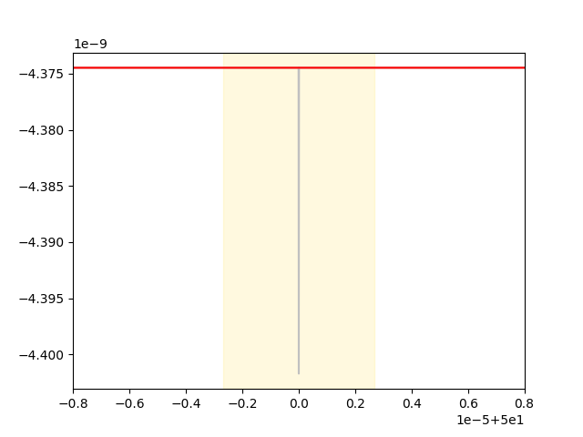
## Equation 3:
```
L_type_Ca_channel__i_Ca_L_Na = (-50.0 + membrane__V) * (intracellular_sodium_concentration__Na_i * exp(50.0 * membrane__F / (membrane__R * membrane__T)) - extracellular_sodium_concentration__Na_o * exp((50.0 - membrane__V) * membrane__F / (membrane__R * membrane__T))) * L_type_Ca_channel__P_CaNa * L_type_Ca_channel__P_Ca_L * L_type_Ca_channel_d_gate__d * L_type_Ca_channel_f_gate__f * membrane__F / ((1.0 - exp((50.0 - membrane__V) * membrane__F / (membrane__R * membrane__T))) * membrane__R * membrane__T)
```
### Partially evaluated to: 
```
L_type_Ca_channel__i_Ca_L_Na = 0.00037433890822745472 * (-50.0 + membrane__V) * (6.4993004051833205 * intracellular_sodium_concentration__Na_i - 6.4993004051833205 * extracellular_sodium_concentration__Na_o * exp(-0.037433890822745473 * membrane__V)) * L_type_Ca_channel__P_Ca_L * L_type_Ca_channel_d_gate__d * L_type_Ca_channel_f_gate__f / (1.0 - 6.4993004051833205 * exp(-0.037433890822745473 * membrane__V))
```
## New Eq:
```
L_type_Ca_channel__i_Ca_L_Na = ((fabs(-50.0 + membrane__V) < 2.6713760659657915e-6) ? ((9358473.2056995872 - 187169.45411399176 * membrane__V) * (0.0099999995000979811 * (6.4993004051833205 * intracellular_sodium_concentration__Na_i - 1.0000001000000049 * extracellular_sodium_concentration__Na_o) * L_type_Ca_channel__P_Ca_L * L_type_Ca_channel_d_gate__d * L_type_Ca_channel_f_gate__f - 0.010000000500079329 * (6.4993004051833205 * intracellular_sodium_concentration__Na_i - 0.99999990000000505 * extracellular_sodium_concentration__Na_o) * L_type_Ca_channel__P_Ca_L * L_type_Ca_channel_d_gate__d * L_type_Ca_channel_f_gate__f) + 0.010000000500079329 * (6.4993004051833205 * intracellular_sodium_concentration__Na_i - 0.99999990000000505 * extracellular_sodium_concentration__Na_o) * L_type_Ca_channel__P_Ca_L * L_type_Ca_channel_d_gate__d * L_type_Ca_channel_f_gate__f) : ((-50.0 + membrane__V) * (intracellular_sodium_concentration__Na_i * exp(50.0 * membrane__F / (membrane__R * membrane__T)) - extracellular_sodium_concentration__Na_o * exp((50.0 - membrane__V) * membrane__F / (membrane__R * membrane__T))) * L_type_Ca_channel__P_CaNa * L_type_Ca_channel__P_Ca_L * L_type_Ca_channel_d_gate__d * L_type_Ca_channel_f_gate__f * membrane__F / ((1.0 - exp((50.0 - membrane__V) * membrane__F / (membrane__R * membrane__T))) * membrane__R * membrane__T)))
```

singularity processing time: 15.597101300000077
# Model: noble_model_1998(noble_model_1998.cellml)
load time: 4.014018799999803

*U*: 
3.7433890822745473 - 0.074867781645490947 * membrane__V
*V for 1e-07 range* 
`50.000001335688033 - 49.999998664311967`
50.000000000000000

*Singularity point: 50.000000000000000*


## Equation 1:
```
L_type_Ca_channel__i_Ca_L_Ca_ds = 4.0 * (-50.0 + membrane__V) * (intracellular_calcium_concentration__Ca_i * exp(100.0 * membrane__F / (membrane__R * membrane__T)) - extracellular_calcium_concentration__Ca_o * exp(2.0 * (50.0 - membrane__V) * membrane__F / (membrane__R * membrane__T))) * L_type_Ca_channel__FrICa * L_type_Ca_channel__P_Ca_L * L_type_Ca_channel_d_gate__d * L_type_Ca_channel_f2ds_gate__f2ds * L_type_Ca_channel_f_gate__f * membrane__F / ((1.0 - exp(2.0 * (50.0 - membrane__V) * membrane__F / (membrane__R * membrane__T))) * membrane__R * membrane__T)
```
### Partially evaluated to: 
```
L_type_Ca_channel__i_Ca_L_Ca_ds = 0.14973556329098189 * (-50.0 + membrane__V) * (42.240905756816076 * intracellular_calcium_concentration__Ca_i - 42.240905756816076 * extracellular_calcium_concentration__Ca_o * exp(-0.074867781645490947 * membrane__V)) * L_type_Ca_channel__P_Ca_L * L_type_Ca_channel_d_gate__d * L_type_Ca_channel_f2ds_gate__f2ds * L_type_Ca_channel_f_gate__f / (1.0 - 42.240905756816076 * exp(-0.074867781645490947 * membrane__V))
```
## New Eq:
```
L_type_Ca_channel__i_Ca_L_Ca_ds = ((fabs(-50.0 + membrane__V) < 1.3356880329551402e-6) ? ((18716945.911788113 - 374338.90823576227 * membrane__V) * (1.9999998999780364 * (42.240905756816076 * intracellular_calcium_concentration__Ca_i - 1.0000001000000049 * extracellular_calcium_concentration__Ca_o) * L_type_Ca_channel__P_Ca_L * L_type_Ca_channel_d_gate__d * L_type_Ca_channel_f2ds_gate__f2ds * L_type_Ca_channel_f_gate__f - 2.0000000999743057 * (42.240905756816076 * intracellular_calcium_concentration__Ca_i - 0.99999990000000505 * extracellular_calcium_concentration__Ca_o) * L_type_Ca_channel__P_Ca_L * L_type_Ca_channel_d_gate__d * L_type_Ca_channel_f2ds_gate__f2ds * L_type_Ca_channel_f_gate__f) + 2.0000000999743057 * (42.240905756816076 * intracellular_calcium_concentration__Ca_i - 0.99999990000000505 * extracellular_calcium_concentration__Ca_o) * L_type_Ca_channel__P_Ca_L * L_type_Ca_channel_d_gate__d * L_type_Ca_channel_f2ds_gate__f2ds * L_type_Ca_channel_f_gate__f) : (4.0 * (-50.0 + membrane__V) * (intracellular_calcium_concentration__Ca_i * exp(100.0 * membrane__F / (membrane__R * membrane__T)) - extracellular_calcium_concentration__Ca_o * exp(2.0 * (50.0 - membrane__V) * membrane__F / (membrane__R * membrane__T))) * L_type_Ca_channel__FrICa * L_type_Ca_channel__P_Ca_L * L_type_Ca_channel_d_gate__d * L_type_Ca_channel_f2ds_gate__f2ds * L_type_Ca_channel_f_gate__f * membrane__F / ((1.0 - exp(2.0 * (50.0 - membrane__V) * membrane__F / (membrane__R * membrane__T))) * membrane__R * membrane__T)))
```

*U*: 
1.8716945411372736 - 0.037433890822745473 * membrane__V
*V for 1e-07 range* 
`50.000002671376066 - 49.999997328623934`
50.000000000000000

*Singularity point: 50.000000000000000*


## Equation 2:
```
L_type_Ca_channel__i_Ca_L_K_ds = (-50.0 + membrane__V) * (intracellular_potassium_concentration__K_i * exp(50.0 * membrane__F / (membrane__R * membrane__T)) - extracellular_potassium_concentration__K_o * exp((50.0 - membrane__V) * membrane__F / (membrane__R * membrane__T))) * L_type_Ca_channel__FrICa * L_type_Ca_channel__P_CaK * L_type_Ca_channel__P_Ca_L * L_type_Ca_channel_d_gate__d * L_type_Ca_channel_f2ds_gate__f2ds * L_type_Ca_channel_f_gate__f * membrane__F / ((1.0 - exp((50.0 - membrane__V) * membrane__F / (membrane__R * membrane__T))) * membrane__R * membrane__T)
```
### Partially evaluated to: 
```
L_type_Ca_channel__i_Ca_L_K_ds = 7.4867781645490941e-5 * (-50.0 + membrane__V) * (6.4993004051833205 * intracellular_potassium_concentration__K_i - 6.4993004051833205 * extracellular_potassium_concentration__K_o * exp(-0.037433890822745473 * membrane__V)) * L_type_Ca_channel__P_Ca_L * L_type_Ca_channel_d_gate__d * L_type_Ca_channel_f2ds_gate__f2ds * L_type_Ca_channel_f_gate__f / (1.0 - 6.4993004051833205 * exp(-0.037433890822745473 * membrane__V))
```
## New Eq:
```
L_type_Ca_channel__i_Ca_L_K_ds = ((fabs(-50.0 + membrane__V) < 2.6713760659657915e-6) ? ((9358473.2056995872 - 187169.45411399176 * membrane__V) * (0.0019999999000195963 * (6.4993004051833205 * intracellular_potassium_concentration__K_i - 1.0000001000000049 * extracellular_potassium_concentration__K_o) * L_type_Ca_channel__P_Ca_L * L_type_Ca_channel_d_gate__d * L_type_Ca_channel_f2ds_gate__f2ds * L_type_Ca_channel_f_gate__f - 0.0020000001000158659 * (6.4993004051833205 * intracellular_potassium_concentration__K_i - 0.99999990000000505 * extracellular_potassium_concentration__K_o) * L_type_Ca_channel__P_Ca_L * L_type_Ca_channel_d_gate__d * L_type_Ca_channel_f2ds_gate__f2ds * L_type_Ca_channel_f_gate__f) + 0.0020000001000158659 * (6.4993004051833205 * intracellular_potassium_concentration__K_i - 0.99999990000000505 * extracellular_potassium_concentration__K_o) * L_type_Ca_channel__P_Ca_L * L_type_Ca_channel_d_gate__d * L_type_Ca_channel_f2ds_gate__f2ds * L_type_Ca_channel_f_gate__f) : ((-50.0 + membrane__V) * (intracellular_potassium_concentration__K_i * exp(50.0 * membrane__F / (membrane__R * membrane__T)) - extracellular_potassium_concentration__K_o * exp((50.0 - membrane__V) * membrane__F / (membrane__R * membrane__T))) * L_type_Ca_channel__FrICa * L_type_Ca_channel__P_CaK * L_type_Ca_channel__P_Ca_L * L_type_Ca_channel_d_gate__d * L_type_Ca_channel_f2ds_gate__f2ds * L_type_Ca_channel_f_gate__f * membrane__F / ((1.0 - exp((50.0 - membrane__V) * membrane__F / (membrane__R * membrane__T))) * membrane__R * membrane__T)))
```

*U*: 
1.8716945411372736 - 0.037433890822745473 * membrane__V
*V for 1e-07 range* 
`50.000002671376066 - 49.999997328623934`
50.000000000000000

*Singularity point: 50.000000000000000*


## Equation 3:
```
L_type_Ca_channel__i_Ca_L_Na_ds = (-50.0 + membrane__V) * (intracellular_sodium_concentration__Na_i * exp(50.0 * membrane__F / (membrane__R * membrane__T)) - extracellular_sodium_concentration__Na_o * exp((50.0 - membrane__V) * membrane__F / (membrane__R * membrane__T))) * L_type_Ca_channel__FrICa * L_type_Ca_channel__P_CaNa * L_type_Ca_channel__P_Ca_L * L_type_Ca_channel_d_gate__d * L_type_Ca_channel_f2ds_gate__f2ds * L_type_Ca_channel_f_gate__f * membrane__F / ((1.0 - exp((50.0 - membrane__V) * membrane__F / (membrane__R * membrane__T))) * membrane__R * membrane__T)
```
### Partially evaluated to: 
```
L_type_Ca_channel__i_Ca_L_Na_ds = 0.00037433890822745472 * (-50.0 + membrane__V) * (6.4993004051833205 * intracellular_sodium_concentration__Na_i - 6.4993004051833205 * extracellular_sodium_concentration__Na_o * exp(-0.037433890822745473 * membrane__V)) * L_type_Ca_channel__P_Ca_L * L_type_Ca_channel_d_gate__d * L_type_Ca_channel_f2ds_gate__f2ds * L_type_Ca_channel_f_gate__f / (1.0 - 6.4993004051833205 * exp(-0.037433890822745473 * membrane__V))
```
## New Eq:
```
L_type_Ca_channel__i_Ca_L_Na_ds = ((fabs(-50.0 + membrane__V) < 2.6713760659657915e-6) ? ((9358473.2056995872 - 187169.45411399176 * membrane__V) * (0.0099999995000979811 * (6.4993004051833205 * intracellular_sodium_concentration__Na_i - 1.0000001000000049 * extracellular_sodium_concentration__Na_o) * L_type_Ca_channel__P_Ca_L * L_type_Ca_channel_d_gate__d * L_type_Ca_channel_f2ds_gate__f2ds * L_type_Ca_channel_f_gate__f - 0.010000000500079329 * (6.4993004051833205 * intracellular_sodium_concentration__Na_i - 0.99999990000000505 * extracellular_sodium_concentration__Na_o) * L_type_Ca_channel__P_Ca_L * L_type_Ca_channel_d_gate__d * L_type_Ca_channel_f2ds_gate__f2ds * L_type_Ca_channel_f_gate__f) + 0.010000000500079329 * (6.4993004051833205 * intracellular_sodium_concentration__Na_i - 0.99999990000000505 * extracellular_sodium_concentration__Na_o) * L_type_Ca_channel__P_Ca_L * L_type_Ca_channel_d_gate__d * L_type_Ca_channel_f2ds_gate__f2ds * L_type_Ca_channel_f_gate__f) : ((-50.0 + membrane__V) * (intracellular_sodium_concentration__Na_i * exp(50.0 * membrane__F / (membrane__R * membrane__T)) - extracellular_sodium_concentration__Na_o * exp((50.0 - membrane__V) * membrane__F / (membrane__R * membrane__T))) * L_type_Ca_channel__FrICa * L_type_Ca_channel__P_CaNa * L_type_Ca_channel__P_Ca_L * L_type_Ca_channel_d_gate__d * L_type_Ca_channel_f2ds_gate__f2ds * L_type_Ca_channel_f_gate__f * membrane__F / ((1.0 - exp((50.0 - membrane__V) * membrane__F / (membrane__R * membrane__T))) * membrane__R * membrane__T)))
```

singularity processing time: 16.13031860000001
# Model: noble_model_2001(noble_model_2001.cellml)
load time: 4.087223300000005

*U*: 
3.7433890822745473 - 0.074867781645490947 * membrane__V
*V for 1e-07 range* 
`50.000001335688033 - 49.999998664311967`
50.000000000000000

*Singularity point: 50.000000000000000*

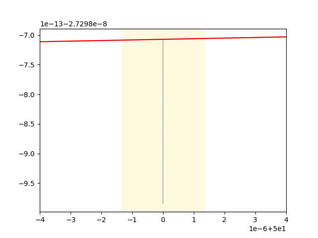
## Equation 1:
```
L_type_Ca_channel__i_Ca_L_Ca_cyt = 4.0 * (1.0 - L_type_Ca_channel__FrICa) * (-50.0 + membrane__V) * (intracellular_calcium_concentration__Ca_i * exp(100.0 * membrane__F / (membrane__R * membrane__T)) - extracellular_calcium_concentration__Ca_o * exp(2.0 * (50.0 - membrane__V) * membrane__F / (membrane__R * membrane__T))) * L_type_Ca_channel__P_Ca_L * L_type_Ca_channel_d_gate__d * L_type_Ca_channel_f_gate__CaChoncyt * membrane__F / ((1.0 - exp(2.0 * (50.0 - membrane__V) * membrane__F / (membrane__R * membrane__T))) * membrane__R * membrane__T)
```
### Partially evaluated to: 
```
L_type_Ca_channel__i_Ca_L_Ca_cyt = 0.044920668987294569 * (1.0 - L_type_Ca_channel_f_gate__f) * (1.0 - intracellular_calcium_concentration__Ca_i / (0.01 + intracellular_calcium_concentration__Ca_i)) * (-50.0 + membrane__V) * (42.240905756816076 * intracellular_calcium_concentration__Ca_i - 42.240905756816076 * extracellular_calcium_concentration__Ca_o * exp(-0.074867781645490947 * membrane__V)) * L_type_Ca_channel__P_Ca_L * L_type_Ca_channel_d_gate__d / (1.0 - 42.240905756816076 * exp(-0.074867781645490947 * membrane__V))
```
## New Eq:
```
L_type_Ca_channel__i_Ca_L_Ca_cyt = ((fabs(-50.0 + membrane__V) < 1.3356880329551402e-6) ? ((18716945.911788113 - 374338.90823576227 * membrane__V) * (0.59999996999341099 * (1.0 - L_type_Ca_channel_f_gate__f) * (1.0 - intracellular_calcium_concentration__Ca_i / (0.01 + intracellular_calcium_concentration__Ca_i)) * (42.240905756816076 * intracellular_calcium_concentration__Ca_i - 1.0000001000000049 * extracellular_calcium_concentration__Ca_o) * L_type_Ca_channel__P_Ca_L * L_type_Ca_channel_d_gate__d - 0.60000002999229185 * (1.0 - L_type_Ca_channel_f_gate__f) * (1.0 - intracellular_calcium_concentration__Ca_i / (0.01 + intracellular_calcium_concentration__Ca_i)) * (42.240905756816076 * intracellular_calcium_concentration__Ca_i - 0.99999990000000505 * extracellular_calcium_concentration__Ca_o) * L_type_Ca_channel__P_Ca_L * L_type_Ca_channel_d_gate__d) + 0.60000002999229185 * (1.0 - L_type_Ca_channel_f_gate__f) * (1.0 - intracellular_calcium_concentration__Ca_i / (0.01 + intracellular_calcium_concentration__Ca_i)) * (42.240905756816076 * intracellular_calcium_concentration__Ca_i - 0.99999990000000505 * extracellular_calcium_concentration__Ca_o) * L_type_Ca_channel__P_Ca_L * L_type_Ca_channel_d_gate__d) : (4.0 * (1.0 - L_type_Ca_channel__FrICa) * (-50.0 + membrane__V) * (intracellular_calcium_concentration__Ca_i * exp(100.0 * membrane__F / (membrane__R * membrane__T)) - extracellular_calcium_concentration__Ca_o * exp(2.0 * (50.0 - membrane__V) * membrane__F / (membrane__R * membrane__T))) * L_type_Ca_channel__P_Ca_L * L_type_Ca_channel_d_gate__d * L_type_Ca_channel_f_gate__CaChoncyt * membrane__F / ((1.0 - exp(2.0 * (50.0 - membrane__V) * membrane__F / (membrane__R * membrane__T))) * membrane__R * membrane__T)))
```

*U*: 
3.7433890822745473 - 0.074867781645490947 * membrane__V
*V for 1e-07 range* 
`50.000001335688033 - 49.999998664311967`
50.000000000000000

*Singularity point: 50.000000000000000*

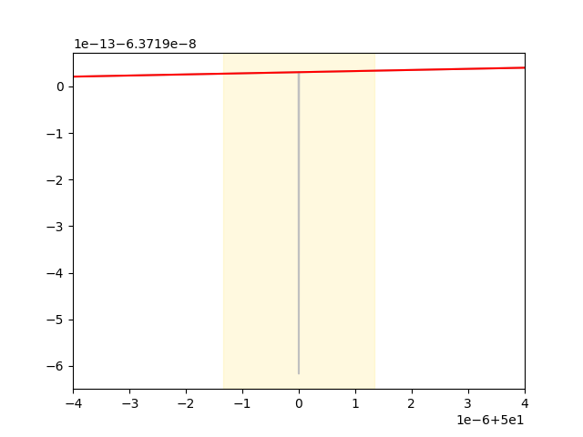
## Equation 2:
```
L_type_Ca_channel__i_Ca_L_Ca_ds = 4.0 * (-50.0 + membrane__V) * (intracellular_calcium_concentration__Ca_i * exp(100.0 * membrane__F / (membrane__R * membrane__T)) - extracellular_calcium_concentration__Ca_o * exp(2.0 * (50.0 - membrane__V) * membrane__F / (membrane__R * membrane__T))) * L_type_Ca_channel__FrICa * L_type_Ca_channel__P_Ca_L * L_type_Ca_channel_d_gate__d * L_type_Ca_channel_f_gate__CaChonds * membrane__F / ((1.0 - exp(2.0 * (50.0 - membrane__V) * membrane__F / (membrane__R * membrane__T))) * membrane__R * membrane__T)
```
### Partially evaluated to: 
```
L_type_Ca_channel__i_Ca_L_Ca_ds = 0.10481489430368732 * (1.0 - L_type_Ca_channel_f_gate__f) * (1.0 - intracellular_calcium_concentration__Ca_ds / (0.001 + intracellular_calcium_concentration__Ca_ds)) * (-50.0 + membrane__V) * (42.240905756816076 * intracellular_calcium_concentration__Ca_i - 42.240905756816076 * extracellular_calcium_concentration__Ca_o * exp(-0.074867781645490947 * membrane__V)) * L_type_Ca_channel__P_Ca_L * L_type_Ca_channel_d_gate__d / (1.0 - 42.240905756816076 * exp(-0.074867781645490947 * membrane__V))
```
## New Eq:
```
L_type_Ca_channel__i_Ca_L_Ca_ds = ((fabs(-50.0 + membrane__V) < 1.3356880329551402e-6) ? ((18716945.911788113 - 374338.90823576227 * membrane__V) * (1.3999999299846253 * (1.0 - L_type_Ca_channel_f_gate__f) * (1.0 - intracellular_calcium_concentration__Ca_ds / (0.001 + intracellular_calcium_concentration__Ca_ds)) * (42.240905756816076 * intracellular_calcium_concentration__Ca_i - 1.0000001000000049 * extracellular_calcium_concentration__Ca_o) * L_type_Ca_channel__P_Ca_L * L_type_Ca_channel_d_gate__d - 1.4000000699820141 * (1.0 - L_type_Ca_channel_f_gate__f) * (1.0 - intracellular_calcium_concentration__Ca_ds / (0.001 + intracellular_calcium_concentration__Ca_ds)) * (42.240905756816076 * intracellular_calcium_concentration__Ca_i - 0.99999990000000505 * extracellular_calcium_concentration__Ca_o) * L_type_Ca_channel__P_Ca_L * L_type_Ca_channel_d_gate__d) + 1.4000000699820141 * (1.0 - L_type_Ca_channel_f_gate__f) * (1.0 - intracellular_calcium_concentration__Ca_ds / (0.001 + intracellular_calcium_concentration__Ca_ds)) * (42.240905756816076 * intracellular_calcium_concentration__Ca_i - 0.99999990000000505 * extracellular_calcium_concentration__Ca_o) * L_type_Ca_channel__P_Ca_L * L_type_Ca_channel_d_gate__d) : (4.0 * (-50.0 + membrane__V) * (intracellular_calcium_concentration__Ca_i * exp(100.0 * membrane__F / (membrane__R * membrane__T)) - extracellular_calcium_concentration__Ca_o * exp(2.0 * (50.0 - membrane__V) * membrane__F / (membrane__R * membrane__T))) * L_type_Ca_channel__FrICa * L_type_Ca_channel__P_Ca_L * L_type_Ca_channel_d_gate__d * L_type_Ca_channel_f_gate__CaChonds * membrane__F / ((1.0 - exp(2.0 * (50.0 - membrane__V) * membrane__F / (membrane__R * membrane__T))) * membrane__R * membrane__T)))
```

*U*: 
1.8716945411372736 - 0.037433890822745473 * membrane__V
*V for 1e-07 range* 
`50.000002671376066 - 49.999997328623934`
50.000000000000000

*Singularity point: 50.000000000000000*


## Equation 3:
```
L_type_Ca_channel__i_Ca_L_K_cyt = (1.0 - L_type_Ca_channel__FrICa) * (-50.0 + membrane__V) * (intracellular_potassium_concentration__K_i * exp(50.0 * membrane__F / (membrane__R * membrane__T)) - extracellular_potassium_concentration__K_o * exp((50.0 - membrane__V) * membrane__F / (membrane__R * membrane__T))) * L_type_Ca_channel__P_CaK * L_type_Ca_channel__P_Ca_L * L_type_Ca_channel_d_gate__d * L_type_Ca_channel_f_gate__CaChoncyt * membrane__F / ((1.0 - exp((50.0 - membrane__V) * membrane__F / (membrane__R * membrane__T))) * membrane__R * membrane__T)
```
### Partially evaluated to: 
```
L_type_Ca_channel__i_Ca_L_K_cyt = 2.2460334493647287e-5 * (1.0 - L_type_Ca_channel_f_gate__f) * (1.0 - intracellular_calcium_concentration__Ca_i / (0.01 + intracellular_calcium_concentration__Ca_i)) * (-50.0 + membrane__V) * (6.4993004051833205 * intracellular_potassium_concentration__K_i - 6.4993004051833205 * extracellular_potassium_concentration__K_o * exp(-0.037433890822745473 * membrane__V)) * L_type_Ca_channel__P_Ca_L * L_type_Ca_channel_d_gate__d / (1.0 - 6.4993004051833205 * exp(-0.037433890822745473 * membrane__V))
```
## New Eq:
```
L_type_Ca_channel__i_Ca_L_K_cyt = ((fabs(-50.0 + membrane__V) < 2.6713760659657915e-6) ? ((9358473.2056995872 - 187169.45411399176 * membrane__V) * (0.00059999997000587905 * (1.0 - L_type_Ca_channel_f_gate__f) * (1.0 - intracellular_calcium_concentration__Ca_i / (0.01 + intracellular_calcium_concentration__Ca_i)) * (6.4993004051833205 * intracellular_potassium_concentration__K_i - 1.0000001000000049 * extracellular_potassium_concentration__K_o) * L_type_Ca_channel__P_Ca_L * L_type_Ca_channel_d_gate__d - 0.00060000003000475991 * (1.0 - L_type_Ca_channel_f_gate__f) * (1.0 - intracellular_calcium_concentration__Ca_i / (0.01 + intracellular_calcium_concentration__Ca_i)) * (6.4993004051833205 * intracellular_potassium_concentration__K_i - 0.99999990000000505 * extracellular_potassium_concentration__K_o) * L_type_Ca_channel__P_Ca_L * L_type_Ca_channel_d_gate__d) + 0.00060000003000475991 * (1.0 - L_type_Ca_channel_f_gate__f) * (1.0 - intracellular_calcium_concentration__Ca_i / (0.01 + intracellular_calcium_concentration__Ca_i)) * (6.4993004051833205 * intracellular_potassium_concentration__K_i - 0.99999990000000505 * extracellular_potassium_concentration__K_o) * L_type_Ca_channel__P_Ca_L * L_type_Ca_channel_d_gate__d) : ((1.0 - L_type_Ca_channel__FrICa) * (-50.0 + membrane__V) * (intracellular_potassium_concentration__K_i * exp(50.0 * membrane__F / (membrane__R * membrane__T)) - extracellular_potassium_concentration__K_o * exp((50.0 - membrane__V) * membrane__F / (membrane__R * membrane__T))) * L_type_Ca_channel__P_CaK * L_type_Ca_channel__P_Ca_L * L_type_Ca_channel_d_gate__d * L_type_Ca_channel_f_gate__CaChoncyt * membrane__F / ((1.0 - exp((50.0 - membrane__V) * membrane__F / (membrane__R * membrane__T))) * membrane__R * membrane__T)))
```

*U*: 
1.8716945411372736 - 0.037433890822745473 * membrane__V
*V for 1e-07 range* 
`50.000002671376066 - 49.999997328623934`
50.000000000000000

*Singularity point: 50.000000000000000*

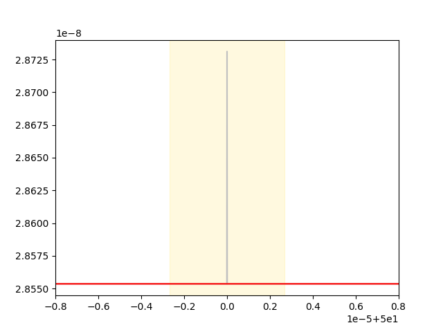
## Equation 4:
```
L_type_Ca_channel__i_Ca_L_K_ds = (-50.0 + membrane__V) * (intracellular_potassium_concentration__K_i * exp(50.0 * membrane__F / (membrane__R * membrane__T)) - extracellular_potassium_concentration__K_o * exp((50.0 - membrane__V) * membrane__F / (membrane__R * membrane__T))) * L_type_Ca_channel__FrICa * L_type_Ca_channel__P_CaK * L_type_Ca_channel__P_Ca_L * L_type_Ca_channel_d_gate__d * L_type_Ca_channel_f_gate__CaChonds * membrane__F / ((1.0 - exp((50.0 - membrane__V) * membrane__F / (membrane__R * membrane__T))) * membrane__R * membrane__T)
```
### Partially evaluated to: 
```
L_type_Ca_channel__i_Ca_L_K_ds = 5.2407447151843657e-5 * (1.0 - L_type_Ca_channel_f_gate__f) * (1.0 - intracellular_calcium_concentration__Ca_ds / (0.001 + intracellular_calcium_concentration__Ca_ds)) * (-50.0 + membrane__V) * (6.4993004051833205 * intracellular_potassium_concentration__K_i - 6.4993004051833205 * extracellular_potassium_concentration__K_o * exp(-0.037433890822745473 * membrane__V)) * L_type_Ca_channel__P_Ca_L * L_type_Ca_channel_d_gate__d / (1.0 - 6.4993004051833205 * exp(-0.037433890822745473 * membrane__V))
```
## New Eq:
```
L_type_Ca_channel__i_Ca_L_K_ds = ((fabs(-50.0 + membrane__V) < 2.6713760659657915e-6) ? ((9358473.2056995872 - 187169.45411399176 * membrane__V) * (0.0013999999300137174 * (1.0 - L_type_Ca_channel_f_gate__f) * (1.0 - intracellular_calcium_concentration__Ca_ds / (0.001 + intracellular_calcium_concentration__Ca_ds)) * (6.4993004051833205 * intracellular_potassium_concentration__K_i - 1.0000001000000049 * extracellular_potassium_concentration__K_o) * L_type_Ca_channel__P_Ca_L * L_type_Ca_channel_d_gate__d - 0.0014000000700111061 * (1.0 - L_type_Ca_channel_f_gate__f) * (1.0 - intracellular_calcium_concentration__Ca_ds / (0.001 + intracellular_calcium_concentration__Ca_ds)) * (6.4993004051833205 * intracellular_potassium_concentration__K_i - 0.99999990000000505 * extracellular_potassium_concentration__K_o) * L_type_Ca_channel__P_Ca_L * L_type_Ca_channel_d_gate__d) + 0.0014000000700111061 * (1.0 - L_type_Ca_channel_f_gate__f) * (1.0 - intracellular_calcium_concentration__Ca_ds / (0.001 + intracellular_calcium_concentration__Ca_ds)) * (6.4993004051833205 * intracellular_potassium_concentration__K_i - 0.99999990000000505 * extracellular_potassium_concentration__K_o) * L_type_Ca_channel__P_Ca_L * L_type_Ca_channel_d_gate__d) : ((-50.0 + membrane__V) * (intracellular_potassium_concentration__K_i * exp(50.0 * membrane__F / (membrane__R * membrane__T)) - extracellular_potassium_concentration__K_o * exp((50.0 - membrane__V) * membrane__F / (membrane__R * membrane__T))) * L_type_Ca_channel__FrICa * L_type_Ca_channel__P_CaK * L_type_Ca_channel__P_Ca_L * L_type_Ca_channel_d_gate__d * L_type_Ca_channel_f_gate__CaChonds * membrane__F / ((1.0 - exp((50.0 - membrane__V) * membrane__F / (membrane__R * membrane__T))) * membrane__R * membrane__T)))
```

*U*: 
1.8716945411372736 - 0.037433890822745473 * membrane__V
*V for 1e-07 range* 
`50.000002671376066 - 49.999997328623934`
50.000000000000000

*Singularity point: 50.000000000000000*

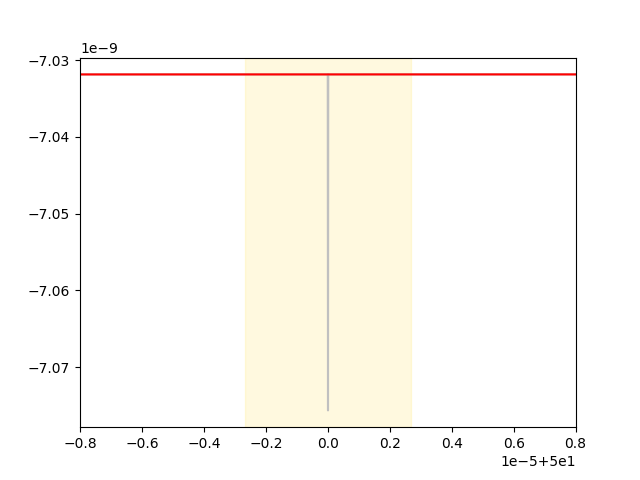
## Equation 5:
```
L_type_Ca_channel__i_Ca_L_Na_cyt = (1.0 - L_type_Ca_channel__FrICa) * (-50.0 + membrane__V) * (intracellular_sodium_concentration__Na_i * exp(50.0 * membrane__F / (membrane__R * membrane__T)) - extracellular_sodium_concentration__Na_o * exp((50.0 - membrane__V) * membrane__F / (membrane__R * membrane__T))) * L_type_Ca_channel__P_CaNa * L_type_Ca_channel__P_Ca_L * L_type_Ca_channel_d_gate__d * L_type_Ca_channel_f_gate__CaChoncyt * membrane__F / ((1.0 - exp((50.0 - membrane__V) * membrane__F / (membrane__R * membrane__T))) * membrane__R * membrane__T)
```
### Partially evaluated to: 
```
L_type_Ca_channel__i_Ca_L_Na_cyt = 0.00011230167246823643 * (1.0 - L_type_Ca_channel_f_gate__f) * (1.0 - intracellular_calcium_concentration__Ca_i / (0.01 + intracellular_calcium_concentration__Ca_i)) * (-50.0 + membrane__V) * (6.4993004051833205 * intracellular_sodium_concentration__Na_i - 6.4993004051833205 * extracellular_sodium_concentration__Na_o * exp(-0.037433890822745473 * membrane__V)) * L_type_Ca_channel__P_Ca_L * L_type_Ca_channel_d_gate__d / (1.0 - 6.4993004051833205 * exp(-0.037433890822745473 * membrane__V))
```
## New Eq:
```
L_type_Ca_channel__i_Ca_L_Na_cyt = ((fabs(-50.0 + membrane__V) < 2.6713760659657915e-6) ? ((9358473.2056995872 - 187169.45411399176 * membrane__V) * (0.0029999998500293951 * (1.0 - L_type_Ca_channel_f_gate__f) * (1.0 - intracellular_calcium_concentration__Ca_i / (0.01 + intracellular_calcium_concentration__Ca_i)) * (6.4993004051833205 * intracellular_sodium_concentration__Na_i - 1.0000001000000049 * extracellular_sodium_concentration__Na_o) * L_type_Ca_channel__P_Ca_L * L_type_Ca_channel_d_gate__d - 0.0030000001500237994 * (1.0 - L_type_Ca_channel_f_gate__f) * (1.0 - intracellular_calcium_concentration__Ca_i / (0.01 + intracellular_calcium_concentration__Ca_i)) * (6.4993004051833205 * intracellular_sodium_concentration__Na_i - 0.99999990000000505 * extracellular_sodium_concentration__Na_o) * L_type_Ca_channel__P_Ca_L * L_type_Ca_channel_d_gate__d) + 0.0030000001500237994 * (1.0 - L_type_Ca_channel_f_gate__f) * (1.0 - intracellular_calcium_concentration__Ca_i / (0.01 + intracellular_calcium_concentration__Ca_i)) * (6.4993004051833205 * intracellular_sodium_concentration__Na_i - 0.99999990000000505 * extracellular_sodium_concentration__Na_o) * L_type_Ca_channel__P_Ca_L * L_type_Ca_channel_d_gate__d) : ((1.0 - L_type_Ca_channel__FrICa) * (-50.0 + membrane__V) * (intracellular_sodium_concentration__Na_i * exp(50.0 * membrane__F / (membrane__R * membrane__T)) - extracellular_sodium_concentration__Na_o * exp((50.0 - membrane__V) * membrane__F / (membrane__R * membrane__T))) * L_type_Ca_channel__P_CaNa * L_type_Ca_channel__P_Ca_L * L_type_Ca_channel_d_gate__d * L_type_Ca_channel_f_gate__CaChoncyt * membrane__F / ((1.0 - exp((50.0 - membrane__V) * membrane__F / (membrane__R * membrane__T))) * membrane__R * membrane__T)))
```

*U*: 
1.8716945411372736 - 0.037433890822745473 * membrane__V
*V for 1e-07 range* 
`50.000002671376066 - 49.999997328623934`
50.000000000000000

*Singularity point: 50.000000000000000*


## Equation 6:
```
L_type_Ca_channel__i_Ca_L_Na_ds = (-50.0 + membrane__V) * (intracellular_sodium_concentration__Na_i * exp(50.0 * membrane__F / (membrane__R * membrane__T)) - extracellular_sodium_concentration__Na_o * exp((50.0 - membrane__V) * membrane__F / (membrane__R * membrane__T))) * L_type_Ca_channel__FrICa * L_type_Ca_channel__P_CaNa * L_type_Ca_channel__P_Ca_L * L_type_Ca_channel_d_gate__d * L_type_Ca_channel_f_gate__CaChonds * membrane__F / ((1.0 - exp((50.0 - membrane__V) * membrane__F / (membrane__R * membrane__T))) * membrane__R * membrane__T)
```
### Partially evaluated to: 
```
L_type_Ca_channel__i_Ca_L_Na_ds = 0.00026203723575921831 * (1.0 - L_type_Ca_channel_f_gate__f) * (1.0 - intracellular_calcium_concentration__Ca_ds / (0.001 + intracellular_calcium_concentration__Ca_ds)) * (-50.0 + membrane__V) * (6.4993004051833205 * intracellular_sodium_concentration__Na_i - 6.4993004051833205 * extracellular_sodium_concentration__Na_o * exp(-0.037433890822745473 * membrane__V)) * L_type_Ca_channel__P_Ca_L * L_type_Ca_channel_d_gate__d / (1.0 - 6.4993004051833205 * exp(-0.037433890822745473 * membrane__V))
```
## New Eq:
```
L_type_Ca_channel__i_Ca_L_Na_ds = ((fabs(-50.0 + membrane__V) < 2.6713760659657915e-6) ? ((9358473.2056995872 - 187169.45411399176 * membrane__V) * (0.0069999996500685864 * (1.0 - L_type_Ca_channel_f_gate__f) * (1.0 - intracellular_calcium_concentration__Ca_ds / (0.001 + intracellular_calcium_concentration__Ca_ds)) * (6.4993004051833205 * intracellular_sodium_concentration__Na_i - 1.0000001000000049 * extracellular_sodium_concentration__Na_o) * L_type_Ca_channel__P_Ca_L * L_type_Ca_channel_d_gate__d - 0.0070000003500555298 * (1.0 - L_type_Ca_channel_f_gate__f) * (1.0 - intracellular_calcium_concentration__Ca_ds / (0.001 + intracellular_calcium_concentration__Ca_ds)) * (6.4993004051833205 * intracellular_sodium_concentration__Na_i - 0.99999990000000505 * extracellular_sodium_concentration__Na_o) * L_type_Ca_channel__P_Ca_L * L_type_Ca_channel_d_gate__d) + 0.0070000003500555298 * (1.0 - L_type_Ca_channel_f_gate__f) * (1.0 - intracellular_calcium_concentration__Ca_ds / (0.001 + intracellular_calcium_concentration__Ca_ds)) * (6.4993004051833205 * intracellular_sodium_concentration__Na_i - 0.99999990000000505 * extracellular_sodium_concentration__Na_o) * L_type_Ca_channel__P_Ca_L * L_type_Ca_channel_d_gate__d) : ((-50.0 + membrane__V) * (intracellular_sodium_concentration__Na_i * exp(50.0 * membrane__F / (membrane__R * membrane__T)) - extracellular_sodium_concentration__Na_o * exp((50.0 - membrane__V) * membrane__F / (membrane__R * membrane__T))) * L_type_Ca_channel__FrICa * L_type_Ca_channel__P_CaNa * L_type_Ca_channel__P_Ca_L * L_type_Ca_channel_d_gate__d * L_type_Ca_channel_f_gate__CaChonds * membrane__F / ((1.0 - exp((50.0 - membrane__V) * membrane__F / (membrane__R * membrane__T))) * membrane__R * membrane__T)))
```

singularity processing time: 29.524849399999994
# Model: NN_SAN_model_1984(noble_noble_SAN_model_1984.cellml)
load time: 1.847481499999958

*U*: 
16.0 + 0.25 * membrane__V
*V for 1e-07 range* 
`-64.000000400000005 - -63.999999600000002`
-64.000000000000000

*Singularity point: -64.000000000000000*

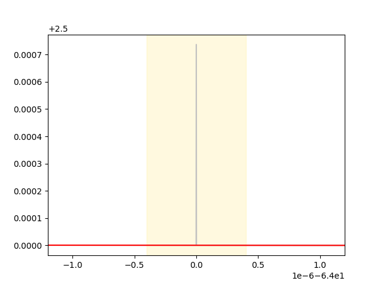
## Equation 1:
```
intracellular_calcium_concentration__alpha_p = 0.625 * intracellular_calcium_concentration__E0_p / (-1.0 + exp(0.25 * intracellular_calcium_concentration__E0_p))
```
### Partially evaluated to: 
```
intracellular_calcium_concentration__alpha_p = 0.625 * (64.0 + membrane__V) / (-1.0 + 8886110.5205078721 * exp(0.25 * membrane__V))
```
## New Eq:
```
intracellular_calcium_concentration__alpha_p = ((fabs(64.0 + membrane__V) < 4.0000000001150227e-7) ? (-17.501361677138188 - 0.31252127620562309 * membrane__V) : (0.625 * intracellular_calcium_concentration__E0_p / (-1.0 + exp(0.25 * intracellular_calcium_concentration__E0_p))))
```

*U*: 
3.7433890822745473 - 0.074867781645490947 * membrane__V
*V for 1e-07 range* 
`50.000001335688033 - 49.999998664311967`
50.000000000000000

*Singularity point: 50.000000000000000*

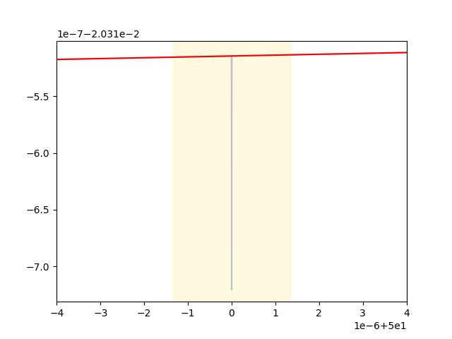
## Equation 2:
```
second_inward_current__i_siCa = 4.0 * (-50.0 + membrane__V) * (intracellular_calcium_concentration__Cai * exp(100.0 / membrane__RTONF) - extracellular_calcium_concentration__Cao * exp(-2.0 * (-50.0 + membrane__V) / membrane__RTONF)) * second_inward_current__P_si * second_inward_current_d_gate__d * second_inward_current_f2_gate__f2 * second_inward_current_f_gate__f / ((1.0 - exp(-2.0 * (-50.0 + membrane__V) / membrane__RTONF)) * membrane__RTONF)
```
### Partially evaluated to: 
```
second_inward_current__i_siCa = 0.14973556329098189 * (-50.0 + membrane__V) * (42.240905756816076 * intracellular_calcium_concentration__Cai - 42.240905756816076 * extracellular_calcium_concentration__Cao * exp(-0.074867781645490947 * membrane__V)) * second_inward_current__P_si * second_inward_current_d_gate__d * second_inward_current_f2_gate__f2 * second_inward_current_f_gate__f / (1.0 - 42.240905756816076 * exp(-0.074867781645490947 * membrane__V))
```
## New Eq:
```
second_inward_current__i_siCa = ((fabs(-50.0 + membrane__V) < 1.3356880329551402e-6) ? ((18716945.911788113 - 374338.90823576227 * membrane__V) * (1.9999998999780364 * (42.240905756816076 * intracellular_calcium_concentration__Cai - 1.0000001000000049 * extracellular_calcium_concentration__Cao) * second_inward_current__P_si * second_inward_current_d_gate__d * second_inward_current_f2_gate__f2 * second_inward_current_f_gate__f - 2.0000001000436947 * (42.240905756816076 * intracellular_calcium_concentration__Cai - 0.99999990000000505 * extracellular_calcium_concentration__Cao) * second_inward_current__P_si * second_inward_current_d_gate__d * second_inward_current_f2_gate__f2 * second_inward_current_f_gate__f) + 2.0000001000436947 * (42.240905756816076 * intracellular_calcium_concentration__Cai - 0.99999990000000505 * extracellular_calcium_concentration__Cao) * second_inward_current__P_si * second_inward_current_d_gate__d * second_inward_current_f2_gate__f2 * second_inward_current_f_gate__f) : (4.0 * (-50.0 + membrane__V) * (intracellular_calcium_concentration__Cai * exp(100.0 / membrane__RTONF) - extracellular_calcium_concentration__Cao * exp(-2.0 * (-50.0 + membrane__V) / membrane__RTONF)) * second_inward_current__P_si * second_inward_current_d_gate__d * second_inward_current_f2_gate__f2 * second_inward_current_f_gate__f / ((1.0 - exp(-2.0 * (-50.0 + membrane__V) / membrane__RTONF)) * membrane__RTONF)))
```

*U*: 
1.8716945411372736 - 0.037433890822745473 * membrane__V
*V for 1e-07 range* 
`50.000002671376066 - 49.999997328623934`
50.000000000000000

*Singularity point: 50.000000000000000*

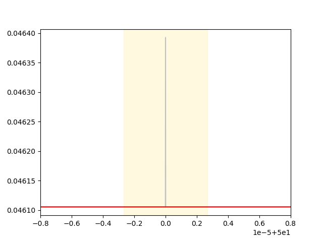
## Equation 3:
```
second_inward_current__i_siK = 0.01 * (-50.0 + membrane__V) * (intracellular_potassium_concentration__Ki * exp(50.0 / membrane__RTONF) - extracellular_potassium_concentration__Kc * exp(-(-50.0 + membrane__V) / membrane__RTONF)) * second_inward_current__P_si * second_inward_current_d_gate__d * second_inward_current_f2_gate__f2 * second_inward_current_f_gate__f / ((1.0 - exp(-(-50.0 + membrane__V) / membrane__RTONF)) * membrane__RTONF)
```
### Partially evaluated to: 
```
second_inward_current__i_siK = 0.00037433890822745472 * (-50.0 + membrane__V) * (6.4993004051833205 * intracellular_potassium_concentration__Ki - 6.4993004051833205 * extracellular_potassium_concentration__Kc * exp(-0.037433890822745473 * membrane__V)) * second_inward_current__P_si * second_inward_current_d_gate__d * second_inward_current_f2_gate__f2 * second_inward_current_f_gate__f / (1.0 - 6.4993004051833205 * exp(-0.037433890822745473 * membrane__V))
```
## New Eq:
```
second_inward_current__i_siK = ((fabs(-50.0 + membrane__V) < 2.6713760659657915e-6) ? ((9358473.2056995872 - 187169.45411399176 * membrane__V) * (0.0099999995000979811 * (6.4993004051833205 * intracellular_potassium_concentration__Ki - 1.0000001000000049 * extracellular_potassium_concentration__Kc) * second_inward_current__P_si * second_inward_current_d_gate__d * second_inward_current_f2_gate__f2 * second_inward_current_f_gate__f - 0.010000000500079329 * (6.4993004051833205 * intracellular_potassium_concentration__Ki - 0.99999990000000505 * extracellular_potassium_concentration__Kc) * second_inward_current__P_si * second_inward_current_d_gate__d * second_inward_current_f2_gate__f2 * second_inward_current_f_gate__f) + 0.010000000500079329 * (6.4993004051833205 * intracellular_potassium_concentration__Ki - 0.99999990000000505 * extracellular_potassium_concentration__Kc) * second_inward_current__P_si * second_inward_current_d_gate__d * second_inward_current_f2_gate__f2 * second_inward_current_f_gate__f) : (0.01 * (-50.0 + membrane__V) * (intracellular_potassium_concentration__Ki * exp(50.0 / membrane__RTONF) - extracellular_potassium_concentration__Kc * exp(-(-50.0 + membrane__V) / membrane__RTONF)) * second_inward_current__P_si * second_inward_current_d_gate__d * second_inward_current_f2_gate__f2 * second_inward_current_f_gate__f / ((1.0 - exp(-(-50.0 + membrane__V) / membrane__RTONF)) * membrane__RTONF)))
```

*U*: 
1.8716945411372736 - 0.037433890822745473 * membrane__V
*V for 1e-07 range* 
`50.000002671376066 - 49.999997328623934`
50.000000000000000

*Singularity point: 50.000000000000000*

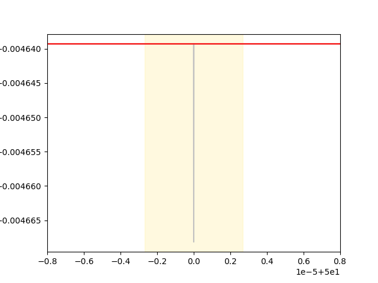
## Equation 4:
```
second_inward_current__i_siNa = 0.01 * (-50.0 + membrane__V) * (intracellular_sodium_concentration__Nai * exp(50.0 / membrane__RTONF) - extracellular_sodium_concentration__Nao * exp(-(-50.0 + membrane__V) / membrane__RTONF)) * second_inward_current__P_si * second_inward_current_d_gate__d * second_inward_current_f2_gate__f2 * second_inward_current_f_gate__f / ((1.0 - exp(-(-50.0 + membrane__V) / membrane__RTONF)) * membrane__RTONF)
```
### Partially evaluated to: 
```
second_inward_current__i_siNa = 0.00037433890822745472 * (-50.0 + membrane__V) * (6.4993004051833205 * intracellular_sodium_concentration__Nai - 6.4993004051833205 * extracellular_sodium_concentration__Nao * exp(-0.037433890822745473 * membrane__V)) * second_inward_current__P_si * second_inward_current_d_gate__d * second_inward_current_f2_gate__f2 * second_inward_current_f_gate__f / (1.0 - 6.4993004051833205 * exp(-0.037433890822745473 * membrane__V))
```
## New Eq:
```
second_inward_current__i_siNa = ((fabs(-50.0 + membrane__V) < 2.6713760659657915e-6) ? ((9358473.2056995872 - 187169.45411399176 * membrane__V) * (0.0099999995000979811 * (6.4993004051833205 * intracellular_sodium_concentration__Nai - 1.0000001000000049 * extracellular_sodium_concentration__Nao) * second_inward_current__P_si * second_inward_current_d_gate__d * second_inward_current_f2_gate__f2 * second_inward_current_f_gate__f - 0.010000000500079329 * (6.4993004051833205 * intracellular_sodium_concentration__Nai - 0.99999990000000505 * extracellular_sodium_concentration__Nao) * second_inward_current__P_si * second_inward_current_d_gate__d * second_inward_current_f2_gate__f2 * second_inward_current_f_gate__f) + 0.010000000500079329 * (6.4993004051833205 * intracellular_sodium_concentration__Nai - 0.99999990000000505 * extracellular_sodium_concentration__Nao) * second_inward_current__P_si * second_inward_current_d_gate__d * second_inward_current_f2_gate__f2 * second_inward_current_f_gate__f) : (0.01 * (-50.0 + membrane__V) * (intracellular_sodium_concentration__Nai * exp(50.0 / membrane__RTONF) - extracellular_sodium_concentration__Nao * exp(-(-50.0 + membrane__V) / membrane__RTONF)) * second_inward_current__P_si * second_inward_current_d_gate__d * second_inward_current_f2_gate__f2 * second_inward_current_f_gate__f / ((1.0 - exp(-(-50.0 + membrane__V) / membrane__RTONF)) * membrane__RTONF)))
```

singularity processing time: 18.92942519999997
# Model: Noble_SAN_model_1989(noble_SAN_model_1989.cellml)
load time: 1.8239478999998937

*U*: 
16.0 + 0.25 * membrane__V
*V for 1e-07 range* 
`-64.000000400000005 - -63.999999600000002`
-64.000000000000000

*Singularity point: -64.000000000000000*


## Equation 1:
```
intracellular_calcium_concentration__alpha_p = 0.625 * intracellular_calcium_concentration__E0_p / (-1.0 + exp(0.25 * intracellular_calcium_concentration__E0_p))
```
### Partially evaluated to: 
```
intracellular_calcium_concentration__alpha_p = 0.625 * (64.0 + membrane__V) / (-1.0 + 8886110.5205078721 * exp(0.25 * membrane__V))
```
## New Eq:
```
intracellular_calcium_concentration__alpha_p = ((fabs(64.0 + membrane__V) < 4.0000000001150227e-7) ? (-17.501361677138188 - 0.31252127620562309 * membrane__V) : (0.625 * intracellular_calcium_concentration__E0_p / (-1.0 + exp(0.25 * intracellular_calcium_concentration__E0_p))))
```

*U*: 
3.7433890822745473 - 0.074867781645490947 * membrane__V
*V for 1e-07 range* 
`50.000001335688033 - 49.999998664311967`
50.000000000000000

*Singularity point: 50.000000000000000*


## Equation 2:
```
second_inward_current__i_siCa = 4.0 * (-50.0 + membrane__V) * (intracellular_calcium_concentration__Cai * exp(100.0 / membrane__RTONF) - extracellular_calcium_concentration__Cao * exp(-2.0 * (-50.0 + membrane__V) / membrane__RTONF)) * second_inward_current__P_si * second_inward_current_d_gate__d * second_inward_current_f2_gate__f2 * second_inward_current_f_gate__f / ((1.0 - exp(-2.0 * (-50.0 + membrane__V) / membrane__RTONF)) * membrane__RTONF)
```
### Partially evaluated to: 
```
second_inward_current__i_siCa = 0.14973556329098189 * (-50.0 + membrane__V) * (42.240905756816076 * intracellular_calcium_concentration__Cai - 42.240905756816076 * extracellular_calcium_concentration__Cao * exp(-0.074867781645490947 * membrane__V)) * second_inward_current__P_si * second_inward_current_d_gate__d * second_inward_current_f2_gate__f2 * second_inward_current_f_gate__f / (1.0 - 42.240905756816076 * exp(-0.074867781645490947 * membrane__V))
```
## New Eq:
```
second_inward_current__i_siCa = ((fabs(-50.0 + membrane__V) < 1.3356880329551402e-6) ? ((18716945.911788113 - 374338.90823576227 * membrane__V) * (1.9999998999780364 * (42.240905756816076 * intracellular_calcium_concentration__Cai - 1.0000001000000049 * extracellular_calcium_concentration__Cao) * second_inward_current__P_si * second_inward_current_d_gate__d * second_inward_current_f2_gate__f2 * second_inward_current_f_gate__f - 2.0000001000436947 * (42.240905756816076 * intracellular_calcium_concentration__Cai - 0.99999990000000505 * extracellular_calcium_concentration__Cao) * second_inward_current__P_si * second_inward_current_d_gate__d * second_inward_current_f2_gate__f2 * second_inward_current_f_gate__f) + 2.0000001000436947 * (42.240905756816076 * intracellular_calcium_concentration__Cai - 0.99999990000000505 * extracellular_calcium_concentration__Cao) * second_inward_current__P_si * second_inward_current_d_gate__d * second_inward_current_f2_gate__f2 * second_inward_current_f_gate__f) : (4.0 * (-50.0 + membrane__V) * (intracellular_calcium_concentration__Cai * exp(100.0 / membrane__RTONF) - extracellular_calcium_concentration__Cao * exp(-2.0 * (-50.0 + membrane__V) / membrane__RTONF)) * second_inward_current__P_si * second_inward_current_d_gate__d * second_inward_current_f2_gate__f2 * second_inward_current_f_gate__f / ((1.0 - exp(-2.0 * (-50.0 + membrane__V) / membrane__RTONF)) * membrane__RTONF)))
```

*U*: 
1.8716945411372736 - 0.037433890822745473 * membrane__V
*V for 1e-07 range* 
`50.000002671376066 - 49.999997328623934`
50.000000000000000

*Singularity point: 50.000000000000000*


## Equation 3:
```
second_inward_current__i_siK = 0.01 * (-50.0 + membrane__V) * (intracellular_potassium_concentration__Ki * exp(50.0 / membrane__RTONF) - extracellular_potassium_concentration__Kc * exp(-(-50.0 + membrane__V) / membrane__RTONF)) * second_inward_current__P_si * second_inward_current_d_gate__d * second_inward_current_f2_gate__f2 * second_inward_current_f_gate__f / ((1.0 - exp(-(-50.0 + membrane__V) / membrane__RTONF)) * membrane__RTONF)
```
### Partially evaluated to: 
```
second_inward_current__i_siK = 0.00037433890822745472 * (-50.0 + membrane__V) * (6.4993004051833205 * intracellular_potassium_concentration__Ki - 6.4993004051833205 * extracellular_potassium_concentration__Kc * exp(-0.037433890822745473 * membrane__V)) * second_inward_current__P_si * second_inward_current_d_gate__d * second_inward_current_f2_gate__f2 * second_inward_current_f_gate__f / (1.0 - 6.4993004051833205 * exp(-0.037433890822745473 * membrane__V))
```
## New Eq:
```
second_inward_current__i_siK = ((fabs(-50.0 + membrane__V) < 2.6713760659657915e-6) ? ((9358473.2056995872 - 187169.45411399176 * membrane__V) * (0.0099999995000979811 * (6.4993004051833205 * intracellular_potassium_concentration__Ki - 1.0000001000000049 * extracellular_potassium_concentration__Kc) * second_inward_current__P_si * second_inward_current_d_gate__d * second_inward_current_f2_gate__f2 * second_inward_current_f_gate__f - 0.010000000500079329 * (6.4993004051833205 * intracellular_potassium_concentration__Ki - 0.99999990000000505 * extracellular_potassium_concentration__Kc) * second_inward_current__P_si * second_inward_current_d_gate__d * second_inward_current_f2_gate__f2 * second_inward_current_f_gate__f) + 0.010000000500079329 * (6.4993004051833205 * intracellular_potassium_concentration__Ki - 0.99999990000000505 * extracellular_potassium_concentration__Kc) * second_inward_current__P_si * second_inward_current_d_gate__d * second_inward_current_f2_gate__f2 * second_inward_current_f_gate__f) : (0.01 * (-50.0 + membrane__V) * (intracellular_potassium_concentration__Ki * exp(50.0 / membrane__RTONF) - extracellular_potassium_concentration__Kc * exp(-(-50.0 + membrane__V) / membrane__RTONF)) * second_inward_current__P_si * second_inward_current_d_gate__d * second_inward_current_f2_gate__f2 * second_inward_current_f_gate__f / ((1.0 - exp(-(-50.0 + membrane__V) / membrane__RTONF)) * membrane__RTONF)))
```

*U*: 
1.8716945411372736 - 0.037433890822745473 * membrane__V
*V for 1e-07 range* 
`50.000002671376066 - 49.999997328623934`
50.000000000000000

*Singularity point: 50.000000000000000*


## Equation 4:
```
second_inward_current__i_siNa = 0.01 * (-50.0 + membrane__V) * (intracellular_sodium_concentration__Nai * exp(50.0 / membrane__RTONF) - extracellular_sodium_concentration__Nao * exp(-(-50.0 + membrane__V) / membrane__RTONF)) * second_inward_current__P_si * second_inward_current_d_gate__d * second_inward_current_f2_gate__f2 * second_inward_current_f_gate__f / ((1.0 - exp(-(-50.0 + membrane__V) / membrane__RTONF)) * membrane__RTONF)
```
### Partially evaluated to: 
```
second_inward_current__i_siNa = 0.00037433890822745472 * (-50.0 + membrane__V) * (6.4993004051833205 * intracellular_sodium_concentration__Nai - 6.4993004051833205 * extracellular_sodium_concentration__Nao * exp(-0.037433890822745473 * membrane__V)) * second_inward_current__P_si * second_inward_current_d_gate__d * second_inward_current_f2_gate__f2 * second_inward_current_f_gate__f / (1.0 - 6.4993004051833205 * exp(-0.037433890822745473 * membrane__V))
```
## New Eq:
```
second_inward_current__i_siNa = ((fabs(-50.0 + membrane__V) < 2.6713760659657915e-6) ? ((9358473.2056995872 - 187169.45411399176 * membrane__V) * (0.0099999995000979811 * (6.4993004051833205 * intracellular_sodium_concentration__Nai - 1.0000001000000049 * extracellular_sodium_concentration__Nao) * second_inward_current__P_si * second_inward_current_d_gate__d * second_inward_current_f2_gate__f2 * second_inward_current_f_gate__f - 0.010000000500079329 * (6.4993004051833205 * intracellular_sodium_concentration__Nai - 0.99999990000000505 * extracellular_sodium_concentration__Nao) * second_inward_current__P_si * second_inward_current_d_gate__d * second_inward_current_f2_gate__f2 * second_inward_current_f_gate__f) + 0.010000000500079329 * (6.4993004051833205 * intracellular_sodium_concentration__Nai - 0.99999990000000505 * extracellular_sodium_concentration__Nao) * second_inward_current__P_si * second_inward_current_d_gate__d * second_inward_current_f2_gate__f2 * second_inward_current_f_gate__f) : (0.01 * (-50.0 + membrane__V) * (intracellular_sodium_concentration__Nai * exp(50.0 / membrane__RTONF) - extracellular_sodium_concentration__Nao * exp(-(-50.0 + membrane__V) / membrane__RTONF)) * second_inward_current__P_si * second_inward_current_d_gate__d * second_inward_current_f2_gate__f2 * second_inward_current_f_gate__f / ((1.0 - exp(-(-50.0 + membrane__V) / membrane__RTONF)) * membrane__RTONF)))
```

singularity processing time: 19.139781399999947
# Model: nygren_atrial_model_1998(nygren_atrial_model_1998.cellml)
load time: 3.0072929999998905

*U*: 
0.037907445518581065 * membrane__V
*V for 1e-07 range* 
`-2.6380041870925613e-6 - 2.6380041870925613e-6`

*Singularity point: 0*

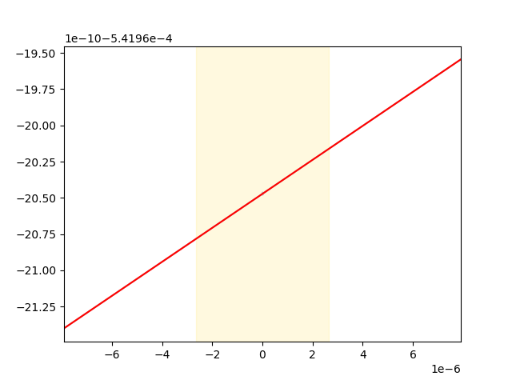
## Equation 1:
```
sodium_current__i_Na = pow(membrane__F, 2) * pow(sodium_current_m_gate__m, 3) * (-1.0 + exp((-sodium_current__E_Na + membrane__V) * membrane__F / (membrane__R * membrane__T))) * (0.10000000000000001 * sodium_current_h2_gate__h2 + 0.90000000000000002 * sodium_current_h1_gate__h1) * cleft_space_ion_concentrations__Na_c * membrane__V * sodium_current__P_Na / ((-1.0 + exp(membrane__F * membrane__V / (membrane__R * membrane__T))) * membrane__R * membrane__T)
```
### Partially evaluated to: 
```
sodium_current__i_Na = 3657.5756957513308 * pow(sodium_current_m_gate__m, 3) * (-1.0 + pow((cleft_space_ion_concentrations__Na_c / intracellular_ion_concentrations__Na_i), (-1.0)) * exp(0.037907445518581065 * membrane__V)) * (0.10000000000000001 * sodium_current_h2_gate__h2 + 0.90000000000000002 * sodium_current_h1_gate__h1) * cleft_space_ion_concentrations__Na_c * membrane__V * sodium_current__P_Na / (-1.0 + exp(0.037907445518581065 * membrane__V))
```
## New Eq:
```
sodium_current__i_Na = ((fabs(membrane__V) < 2.6380041870925613e-6) ? ((0.5 + 189537.22759290531 * membrane__V) * (96486.995175057906 * pow(sodium_current_m_gate__m, 3) * (-1.0 + 1.0000001000000049 * pow((cleft_space_ion_concentrations__Na_c / intracellular_ion_concentrations__Na_i), (-1.0))) * (0.10000000000000001 * sodium_current_h2_gate__h2 + 0.90000000000000002 * sodium_current_h1_gate__h1) * cleft_space_ion_concentrations__Na_c * sodium_current__P_Na - 96487.00482441482 * pow(sodium_current_m_gate__m, 3) * (-1.0 + 0.99999990000000505 * pow((cleft_space_ion_concentrations__Na_c / intracellular_ion_concentrations__Na_i), (-1.0))) * (0.10000000000000001 * sodium_current_h2_gate__h2 + 0.90000000000000002 * sodium_current_h1_gate__h1) * cleft_space_ion_concentrations__Na_c * sodium_current__P_Na) + 96487.00482441482 * pow(sodium_current_m_gate__m, 3) * (-1.0 + 0.99999990000000505 * pow((cleft_space_ion_concentrations__Na_c / intracellular_ion_concentrations__Na_i), (-1.0))) * (0.10000000000000001 * sodium_current_h2_gate__h2 + 0.90000000000000002 * sodium_current_h1_gate__h1) * cleft_space_ion_concentrations__Na_c * sodium_current__P_Na) : (pow(membrane__F, 2) * pow(sodium_current_m_gate__m, 3) * (-1.0 + exp((-sodium_current__E_Na + membrane__V) * membrane__F / (membrane__R * membrane__T))) * (0.10000000000000001 * sodium_current_h2_gate__h2 + 0.90000000000000002 * sodium_current_h1_gate__h1) * cleft_space_ion_concentrations__Na_c * membrane__V * sodium_current__P_Na / ((-1.0 + exp(membrane__F * membrane__V / (membrane__R * membrane__T))) * membrane__R * membrane__T)))
```

singularity processing time: 8.699540200000001
# Model: ohara_rudy_2011_endo(ohara_rudy_2011_endo.cellml)
load time: 5.211182600000029

*U*: 
0.037435883507802616 * membrane__v
*V for 1e-07 range* 
`-2.6712338705498262e-6 - 2.6712338705498262e-6`

*Singularity point: 0*


found U by substituting in paams! 
## Equation 1:
```
ICaL__PhiCaK = (-0.75 * extracellular__ko + 0.75 * intracellular_ions__kss * exp(membrane__vfrt)) * membrane__vffrt / (-1.0 + exp(membrane__vfrt))
```
### Partially evaluated to: 
```
ICaL__PhiCaK = pow(physical_constants__F, 2) * (-0.75 * extracellular__ko + 0.75 * intracellular_ions__kss * exp(membrane__v * physical_constants__F / (physical_constants__R * physical_constants__T))) * membrane__v / ((-1.0 + exp(membrane__v * physical_constants__F / (physical_constants__R * physical_constants__T))) * physical_constants__R * physical_constants__T)
```
## New Eq:
```
ICaL__PhiCaK = ((fabs(membrane__v) < 2.6712338705498262e-6) ? ((0.5 + 187179.41753901311 * membrane__v) * (2.6712338705498262e-6 * pow(physical_constants__F, 2) * (-0.75 * extracellular__ko + 0.75 * intracellular_ions__kss * exp(2.6712338705498262e-6 * physical_constants__F / (physical_constants__R * physical_constants__T))) / ((-1.0 + exp(2.6712338705498262e-6 * physical_constants__F / (physical_constants__R * physical_constants__T))) * physical_constants__R * physical_constants__T) + 2.6712338705498262e-6 * pow(physical_constants__F, 2) * (-0.75 * extracellular__ko + 0.75 * intracellular_ions__kss * exp(-2.6712338705498262e-6 * physical_constants__F / (physical_constants__R * physical_constants__T))) / ((-1.0 + exp(-2.6712338705498262e-6 * physical_constants__F / (physical_constants__R * physical_constants__T))) * physical_constants__R * physical_constants__T)) - 2.6712338705498262e-6 * pow(physical_constants__F, 2) * (-0.75 * extracellular__ko + 0.75 * intracellular_ions__kss * exp(-2.6712338705498262e-6 * physical_constants__F / (physical_constants__R * physical_constants__T))) / ((-1.0 + exp(-2.6712338705498262e-6 * physical_constants__F / (physical_constants__R * physical_constants__T))) * physical_constants__R * physical_constants__T)) : ((-0.75 * extracellular__ko + 0.75 * intracellular_ions__kss * exp(membrane__vfrt)) * membrane__vffrt / (-1.0 + exp(membrane__vfrt))))
```

*U*: 
0.074871767015605231 * membrane__v
*V for 1e-07 range* 
`-1.3356169352749131e-6 - 1.3356169352749131e-6`

*Singularity point: 0*

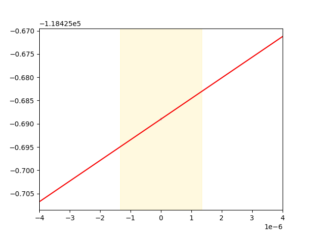
found U by substituting in paams! 
## Equation 2:
```
ICaL__PhiCaL = 4.0 * (-0.34100000000000003 * extracellular__cao + intracellular_ions__cass * exp(2.0 * membrane__vfrt)) * membrane__vffrt / (-1.0 + exp(2.0 * membrane__vfrt))
```
### Partially evaluated to: 
```
ICaL__PhiCaL = 4.0 * pow(physical_constants__F, 2) * (-0.34100000000000003 * extracellular__cao + intracellular_ions__cass * exp(2.0 * membrane__v * physical_constants__F / (physical_constants__R * physical_constants__T))) * membrane__v / ((-1.0 + exp(2.0 * membrane__v * physical_constants__F / (physical_constants__R * physical_constants__T))) * physical_constants__R * physical_constants__T)
```
## New Eq:
```
ICaL__PhiCaL = ((fabs(membrane__v) < 1.3356169352749131e-6) ? ((0.5 + 374358.83507802623 * membrane__v) * (5.3424677410996524e-6 * pow(physical_constants__F, 2) * (-0.34100000000000003 * extracellular__cao + intracellular_ions__cass * exp(2.6712338705498262e-6 * physical_constants__F / (physical_constants__R * physical_constants__T))) / ((-1.0 + exp(2.6712338705498262e-6 * physical_constants__F / (physical_constants__R * physical_constants__T))) * physical_constants__R * physical_constants__T) + 5.3424677410996524e-6 * pow(physical_constants__F, 2) * (-0.34100000000000003 * extracellular__cao + intracellular_ions__cass * exp(-2.6712338705498262e-6 * physical_constants__F / (physical_constants__R * physical_constants__T))) / ((-1.0 + exp(-2.6712338705498262e-6 * physical_constants__F / (physical_constants__R * physical_constants__T))) * physical_constants__R * physical_constants__T)) - 5.3424677410996524e-6 * pow(physical_constants__F, 2) * (-0.34100000000000003 * extracellular__cao + intracellular_ions__cass * exp(-2.6712338705498262e-6 * physical_constants__F / (physical_constants__R * physical_constants__T))) / ((-1.0 + exp(-2.6712338705498262e-6 * physical_constants__F / (physical_constants__R * physical_constants__T))) * physical_constants__R * physical_constants__T)) : (4.0 * (-0.34100000000000003 * extracellular__cao + intracellular_ions__cass * exp(2.0 * membrane__vfrt)) * membrane__vffrt / (-1.0 + exp(2.0 * membrane__vfrt))))
```

*U*: 
0.037435883507802616 * membrane__v
*V for 1e-07 range* 
`-2.6712338705498262e-6 - 2.6712338705498262e-6`

*Singularity point: 0*

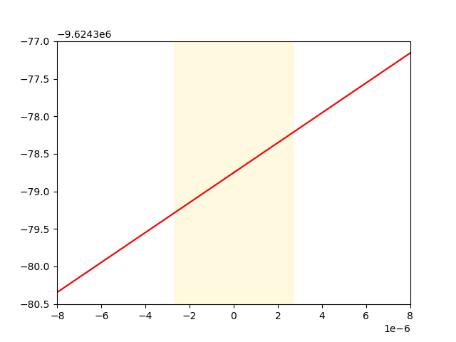
found U by substituting in paams! 
## Equation 3:
```
ICaL__PhiCaNa = (-0.75 * extracellular__nao + 0.75 * intracellular_ions__nass * exp(membrane__vfrt)) * membrane__vffrt / (-1.0 + exp(membrane__vfrt))
```
### Partially evaluated to: 
```
ICaL__PhiCaNa = pow(physical_constants__F, 2) * (-0.75 * extracellular__nao + 0.75 * intracellular_ions__nass * exp(membrane__v * physical_constants__F / (physical_constants__R * physical_constants__T))) * membrane__v / ((-1.0 + exp(membrane__v * physical_constants__F / (physical_constants__R * physical_constants__T))) * physical_constants__R * physical_constants__T)
```
## New Eq:
```
ICaL__PhiCaNa = ((fabs(membrane__v) < 2.6712338705498262e-6) ? ((0.5 + 187179.41753901311 * membrane__v) * (2.6712338705498262e-6 * pow(physical_constants__F, 2) * (-0.75 * extracellular__nao + 0.75 * intracellular_ions__nass * exp(2.6712338705498262e-6 * physical_constants__F / (physical_constants__R * physical_constants__T))) / ((-1.0 + exp(2.6712338705498262e-6 * physical_constants__F / (physical_constants__R * physical_constants__T))) * physical_constants__R * physical_constants__T) + 2.6712338705498262e-6 * pow(physical_constants__F, 2) * (-0.75 * extracellular__nao + 0.75 * intracellular_ions__nass * exp(-2.6712338705498262e-6 * physical_constants__F / (physical_constants__R * physical_constants__T))) / ((-1.0 + exp(-2.6712338705498262e-6 * physical_constants__F / (physical_constants__R * physical_constants__T))) * physical_constants__R * physical_constants__T)) - 2.6712338705498262e-6 * pow(physical_constants__F, 2) * (-0.75 * extracellular__nao + 0.75 * intracellular_ions__nass * exp(-2.6712338705498262e-6 * physical_constants__F / (physical_constants__R * physical_constants__T))) / ((-1.0 + exp(-2.6712338705498262e-6 * physical_constants__F / (physical_constants__R * physical_constants__T))) * physical_constants__R * physical_constants__T)) : ((-0.75 * extracellular__nao + 0.75 * intracellular_ions__nass * exp(membrane__vfrt)) * membrane__vffrt / (-1.0 + exp(membrane__vfrt))))
```

*U*: 
0.074871767015605231 * membrane__v
*V for 1e-07 range* 
`-1.3356169352749131e-6 - 1.3356169352749131e-6`

*Singularity point: 0*


found U by substituting in paams! 
## Equation 4:
```
ICab__ICab = 4.0 * (-0.34100000000000003 * extracellular__cao + intracellular_ions__cai * exp(2.0 * membrane__vfrt)) * ICab__PCab * membrane__vffrt / (-1.0 + exp(2.0 * membrane__vfrt))
```
### Partially evaluated to: 
```
ICab__ICab = 4.0 * pow(physical_constants__F, 2) * (-0.34100000000000003 * extracellular__cao + intracellular_ions__cai * exp(2.0 * membrane__v * physical_constants__F / (physical_constants__R * physical_constants__T))) * ICab__PCab * membrane__v / ((-1.0 + exp(2.0 * membrane__v * physical_constants__F / (physical_constants__R * physical_constants__T))) * physical_constants__R * physical_constants__T)
```
## New Eq:
```
ICab__ICab = ((fabs(membrane__v) < 1.3356169352749131e-6) ? ((0.5 + 374358.83507802623 * membrane__v) * (5.3424677410996524e-6 * pow(physical_constants__F, 2) * (-0.34100000000000003 * extracellular__cao + intracellular_ions__cai * exp(2.6712338705498262e-6 * physical_constants__F / (physical_constants__R * physical_constants__T))) * ICab__PCab / ((-1.0 + exp(2.6712338705498262e-6 * physical_constants__F / (physical_constants__R * physical_constants__T))) * physical_constants__R * physical_constants__T) + 5.3424677410996524e-6 * pow(physical_constants__F, 2) * (-0.34100000000000003 * extracellular__cao + intracellular_ions__cai * exp(-2.6712338705498262e-6 * physical_constants__F / (physical_constants__R * physical_constants__T))) * ICab__PCab / ((-1.0 + exp(-2.6712338705498262e-6 * physical_constants__F / (physical_constants__R * physical_constants__T))) * physical_constants__R * physical_constants__T)) - 5.3424677410996524e-6 * pow(physical_constants__F, 2) * (-0.34100000000000003 * extracellular__cao + intracellular_ions__cai * exp(-2.6712338705498262e-6 * physical_constants__F / (physical_constants__R * physical_constants__T))) * ICab__PCab / ((-1.0 + exp(-2.6712338705498262e-6 * physical_constants__F / (physical_constants__R * physical_constants__T))) * physical_constants__R * physical_constants__T)) : (4.0 * (-0.34100000000000003 * extracellular__cao + intracellular_ions__cai * exp(2.0 * membrane__vfrt)) * ICab__PCab * membrane__vffrt / (-1.0 + exp(2.0 * membrane__vfrt))))
```

*U*: 
0.037435883507802616 * membrane__v
*V for 1e-07 range* 
`-2.6712338705498262e-6 - 2.6712338705498262e-6`

*Singularity point: 0*

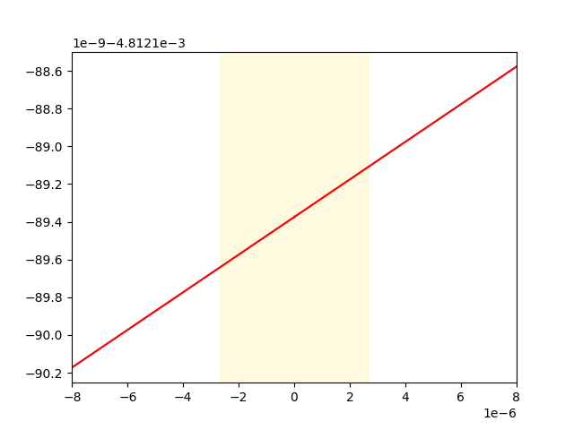
found U by substituting in paams! 
## Equation 5:
```
INab__INab = (-extracellular__nao + intracellular_ions__nai * exp(membrane__vfrt)) * INab__PNab * membrane__vffrt / (-1.0 + exp(membrane__vfrt))
```
### Partially evaluated to: 
```
INab__INab = 3.75e-10 * pow(physical_constants__F, 2) * (-extracellular__nao + intracellular_ions__nai * exp(membrane__v * physical_constants__F / (physical_constants__R * physical_constants__T))) * membrane__v / ((-1.0 + exp(membrane__v * physical_constants__F / (physical_constants__R * physical_constants__T))) * physical_constants__R * physical_constants__T)
```
## New Eq:
```
INab__INab = ((fabs(membrane__v) < 2.6712338705498262e-6) ? ((0.5 + 187179.41753901311 * membrane__v) * (1.0017127014561849e-15 * pow(physical_constants__F, 2) * (-extracellular__nao + intracellular_ions__nai * exp(2.6712338705498262e-6 * physical_constants__F / (physical_constants__R * physical_constants__T))) / ((-1.0 + exp(2.6712338705498262e-6 * physical_constants__F / (physical_constants__R * physical_constants__T))) * physical_constants__R * physical_constants__T) + 1.0017127014561849e-15 * pow(physical_constants__F, 2) * (-extracellular__nao + intracellular_ions__nai * exp(-2.6712338705498262e-6 * physical_constants__F / (physical_constants__R * physical_constants__T))) / ((-1.0 + exp(-2.6712338705498262e-6 * physical_constants__F / (physical_constants__R * physical_constants__T))) * physical_constants__R * physical_constants__T)) - 1.0017127014561849e-15 * pow(physical_constants__F, 2) * (-extracellular__nao + intracellular_ions__nai * exp(-2.6712338705498262e-6 * physical_constants__F / (physical_constants__R * physical_constants__T))) / ((-1.0 + exp(-2.6712338705498262e-6 * physical_constants__F / (physical_constants__R * physical_constants__T))) * physical_constants__R * physical_constants__T)) : ((-extracellular__nao + intracellular_ions__nai * exp(membrane__vfrt)) * INab__PNab * membrane__vffrt / (-1.0 + exp(membrane__vfrt))))
```

singularity processing time: 136.38563959999988
# Model: ohara_rudy_2011_epi(ohara_rudy_2011_epi.cellml)
load time: 5.119581800000105

*U*: 
0.037435883507802616 * membrane__v
*V for 1e-07 range* 
`-2.6712338705498262e-6 - 2.6712338705498262e-6`

*Singularity point: 0*

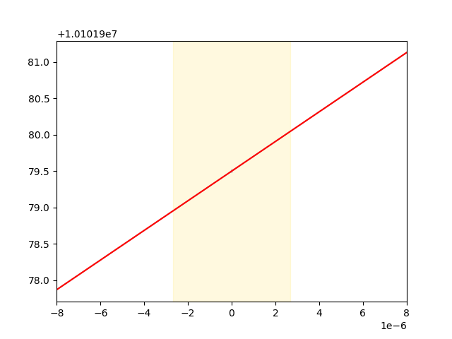
found U by substituting in paams! 
## Equation 1:
```
ICaL__PhiCaK = (-0.75 * extracellular__ko + 0.75 * intracellular_ions__kss * exp(membrane__vfrt)) * membrane__vffrt / (-1.0 + exp(membrane__vfrt))
```
### Partially evaluated to: 
```
ICaL__PhiCaK = pow(physical_constants__F, 2) * (-0.75 * extracellular__ko + 0.75 * intracellular_ions__kss * exp(membrane__v * physical_constants__F / (physical_constants__R * physical_constants__T))) * membrane__v / ((-1.0 + exp(membrane__v * physical_constants__F / (physical_constants__R * physical_constants__T))) * physical_constants__R * physical_constants__T)
```
## New Eq:
```
ICaL__PhiCaK = ((fabs(membrane__v) < 2.6712338705498262e-6) ? ((0.5 + 187179.41753901311 * membrane__v) * (2.6712338705498262e-6 * pow(physical_constants__F, 2) * (-0.75 * extracellular__ko + 0.75 * intracellular_ions__kss * exp(2.6712338705498262e-6 * physical_constants__F / (physical_constants__R * physical_constants__T))) / ((-1.0 + exp(2.6712338705498262e-6 * physical_constants__F / (physical_constants__R * physical_constants__T))) * physical_constants__R * physical_constants__T) + 2.6712338705498262e-6 * pow(physical_constants__F, 2) * (-0.75 * extracellular__ko + 0.75 * intracellular_ions__kss * exp(-2.6712338705498262e-6 * physical_constants__F / (physical_constants__R * physical_constants__T))) / ((-1.0 + exp(-2.6712338705498262e-6 * physical_constants__F / (physical_constants__R * physical_constants__T))) * physical_constants__R * physical_constants__T)) - 2.6712338705498262e-6 * pow(physical_constants__F, 2) * (-0.75 * extracellular__ko + 0.75 * intracellular_ions__kss * exp(-2.6712338705498262e-6 * physical_constants__F / (physical_constants__R * physical_constants__T))) / ((-1.0 + exp(-2.6712338705498262e-6 * physical_constants__F / (physical_constants__R * physical_constants__T))) * physical_constants__R * physical_constants__T)) : ((-0.75 * extracellular__ko + 0.75 * intracellular_ions__kss * exp(membrane__vfrt)) * membrane__vffrt / (-1.0 + exp(membrane__vfrt))))
```

*U*: 
0.074871767015605231 * membrane__v
*V for 1e-07 range* 
`-1.3356169352749131e-6 - 1.3356169352749131e-6`

*Singularity point: 0*


found U by substituting in paams! 
## Equation 2:
```
ICaL__PhiCaL = 4.0 * (-0.34100000000000003 * extracellular__cao + intracellular_ions__cass * exp(2.0 * membrane__vfrt)) * membrane__vffrt / (-1.0 + exp(2.0 * membrane__vfrt))
```
### Partially evaluated to: 
```
ICaL__PhiCaL = 4.0 * pow(physical_constants__F, 2) * (-0.34100000000000003 * extracellular__cao + intracellular_ions__cass * exp(2.0 * membrane__v * physical_constants__F / (physical_constants__R * physical_constants__T))) * membrane__v / ((-1.0 + exp(2.0 * membrane__v * physical_constants__F / (physical_constants__R * physical_constants__T))) * physical_constants__R * physical_constants__T)
```
## New Eq:
```
ICaL__PhiCaL = ((fabs(membrane__v) < 1.3356169352749131e-6) ? ((0.5 + 374358.83507802623 * membrane__v) * (5.3424677410996524e-6 * pow(physical_constants__F, 2) * (-0.34100000000000003 * extracellular__cao + intracellular_ions__cass * exp(2.6712338705498262e-6 * physical_constants__F / (physical_constants__R * physical_constants__T))) / ((-1.0 + exp(2.6712338705498262e-6 * physical_constants__F / (physical_constants__R * physical_constants__T))) * physical_constants__R * physical_constants__T) + 5.3424677410996524e-6 * pow(physical_constants__F, 2) * (-0.34100000000000003 * extracellular__cao + intracellular_ions__cass * exp(-2.6712338705498262e-6 * physical_constants__F / (physical_constants__R * physical_constants__T))) / ((-1.0 + exp(-2.6712338705498262e-6 * physical_constants__F / (physical_constants__R * physical_constants__T))) * physical_constants__R * physical_constants__T)) - 5.3424677410996524e-6 * pow(physical_constants__F, 2) * (-0.34100000000000003 * extracellular__cao + intracellular_ions__cass * exp(-2.6712338705498262e-6 * physical_constants__F / (physical_constants__R * physical_constants__T))) / ((-1.0 + exp(-2.6712338705498262e-6 * physical_constants__F / (physical_constants__R * physical_constants__T))) * physical_constants__R * physical_constants__T)) : (4.0 * (-0.34100000000000003 * extracellular__cao + intracellular_ions__cass * exp(2.0 * membrane__vfrt)) * membrane__vffrt / (-1.0 + exp(2.0 * membrane__vfrt))))
```

*U*: 
0.037435883507802616 * membrane__v
*V for 1e-07 range* 
`-2.6712338705498262e-6 - 2.6712338705498262e-6`

*Singularity point: 0*


found U by substituting in paams! 
## Equation 3:
```
ICaL__PhiCaNa = (-0.75 * extracellular__nao + 0.75 * intracellular_ions__nass * exp(membrane__vfrt)) * membrane__vffrt / (-1.0 + exp(membrane__vfrt))
```
### Partially evaluated to: 
```
ICaL__PhiCaNa = pow(physical_constants__F, 2) * (-0.75 * extracellular__nao + 0.75 * intracellular_ions__nass * exp(membrane__v * physical_constants__F / (physical_constants__R * physical_constants__T))) * membrane__v / ((-1.0 + exp(membrane__v * physical_constants__F / (physical_constants__R * physical_constants__T))) * physical_constants__R * physical_constants__T)
```
## New Eq:
```
ICaL__PhiCaNa = ((fabs(membrane__v) < 2.6712338705498262e-6) ? ((0.5 + 187179.41753901311 * membrane__v) * (2.6712338705498262e-6 * pow(physical_constants__F, 2) * (-0.75 * extracellular__nao + 0.75 * intracellular_ions__nass * exp(2.6712338705498262e-6 * physical_constants__F / (physical_constants__R * physical_constants__T))) / ((-1.0 + exp(2.6712338705498262e-6 * physical_constants__F / (physical_constants__R * physical_constants__T))) * physical_constants__R * physical_constants__T) + 2.6712338705498262e-6 * pow(physical_constants__F, 2) * (-0.75 * extracellular__nao + 0.75 * intracellular_ions__nass * exp(-2.6712338705498262e-6 * physical_constants__F / (physical_constants__R * physical_constants__T))) / ((-1.0 + exp(-2.6712338705498262e-6 * physical_constants__F / (physical_constants__R * physical_constants__T))) * physical_constants__R * physical_constants__T)) - 2.6712338705498262e-6 * pow(physical_constants__F, 2) * (-0.75 * extracellular__nao + 0.75 * intracellular_ions__nass * exp(-2.6712338705498262e-6 * physical_constants__F / (physical_constants__R * physical_constants__T))) / ((-1.0 + exp(-2.6712338705498262e-6 * physical_constants__F / (physical_constants__R * physical_constants__T))) * physical_constants__R * physical_constants__T)) : ((-0.75 * extracellular__nao + 0.75 * intracellular_ions__nass * exp(membrane__vfrt)) * membrane__vffrt / (-1.0 + exp(membrane__vfrt))))
```

*U*: 
0.074871767015605231 * membrane__v
*V for 1e-07 range* 
`-1.3356169352749131e-6 - 1.3356169352749131e-6`

*Singularity point: 0*

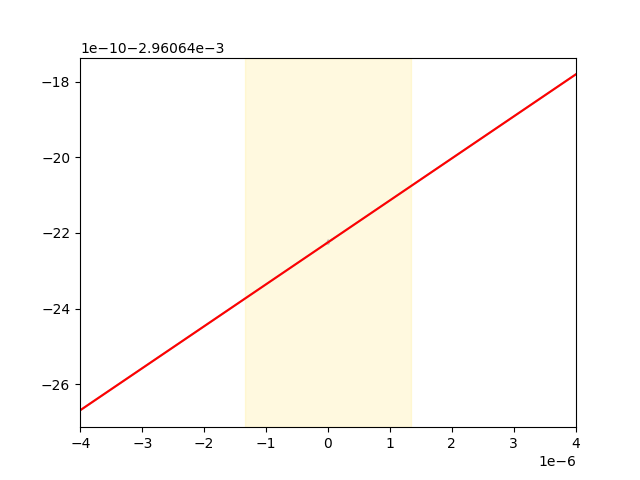
found U by substituting in paams! 
## Equation 4:
```
ICab__ICab = 4.0 * (-0.34100000000000003 * extracellular__cao + intracellular_ions__cai * exp(2.0 * membrane__vfrt)) * ICab__PCab * membrane__vffrt / (-1.0 + exp(2.0 * membrane__vfrt))
```
### Partially evaluated to: 
```
ICab__ICab = 4.0 * pow(physical_constants__F, 2) * (-0.34100000000000003 * extracellular__cao + intracellular_ions__cai * exp(2.0 * membrane__v * physical_constants__F / (physical_constants__R * physical_constants__T))) * ICab__PCab * membrane__v / ((-1.0 + exp(2.0 * membrane__v * physical_constants__F / (physical_constants__R * physical_constants__T))) * physical_constants__R * physical_constants__T)
```
## New Eq:
```
ICab__ICab = ((fabs(membrane__v) < 1.3356169352749131e-6) ? ((0.5 + 374358.83507802623 * membrane__v) * (5.3424677410996524e-6 * pow(physical_constants__F, 2) * (-0.34100000000000003 * extracellular__cao + intracellular_ions__cai * exp(2.6712338705498262e-6 * physical_constants__F / (physical_constants__R * physical_constants__T))) * ICab__PCab / ((-1.0 + exp(2.6712338705498262e-6 * physical_constants__F / (physical_constants__R * physical_constants__T))) * physical_constants__R * physical_constants__T) + 5.3424677410996524e-6 * pow(physical_constants__F, 2) * (-0.34100000000000003 * extracellular__cao + intracellular_ions__cai * exp(-2.6712338705498262e-6 * physical_constants__F / (physical_constants__R * physical_constants__T))) * ICab__PCab / ((-1.0 + exp(-2.6712338705498262e-6 * physical_constants__F / (physical_constants__R * physical_constants__T))) * physical_constants__R * physical_constants__T)) - 5.3424677410996524e-6 * pow(physical_constants__F, 2) * (-0.34100000000000003 * extracellular__cao + intracellular_ions__cai * exp(-2.6712338705498262e-6 * physical_constants__F / (physical_constants__R * physical_constants__T))) * ICab__PCab / ((-1.0 + exp(-2.6712338705498262e-6 * physical_constants__F / (physical_constants__R * physical_constants__T))) * physical_constants__R * physical_constants__T)) : (4.0 * (-0.34100000000000003 * extracellular__cao + intracellular_ions__cai * exp(2.0 * membrane__vfrt)) * ICab__PCab * membrane__vffrt / (-1.0 + exp(2.0 * membrane__vfrt))))
```

*U*: 
0.037435883507802616 * membrane__v
*V for 1e-07 range* 
`-2.6712338705498262e-6 - 2.6712338705498262e-6`

*Singularity point: 0*


found U by substituting in paams! 
## Equation 5:
```
INab__INab = (-extracellular__nao + intracellular_ions__nai * exp(membrane__vfrt)) * INab__PNab * membrane__vffrt / (-1.0 + exp(membrane__vfrt))
```
### Partially evaluated to: 
```
INab__INab = 3.75e-10 * pow(physical_constants__F, 2) * (-extracellular__nao + intracellular_ions__nai * exp(membrane__v * physical_constants__F / (physical_constants__R * physical_constants__T))) * membrane__v / ((-1.0 + exp(membrane__v * physical_constants__F / (physical_constants__R * physical_constants__T))) * physical_constants__R * physical_constants__T)
```
## New Eq:
```
INab__INab = ((fabs(membrane__v) < 2.6712338705498262e-6) ? ((0.5 + 187179.41753901311 * membrane__v) * (1.0017127014561849e-15 * pow(physical_constants__F, 2) * (-extracellular__nao + intracellular_ions__nai * exp(2.6712338705498262e-6 * physical_constants__F / (physical_constants__R * physical_constants__T))) / ((-1.0 + exp(2.6712338705498262e-6 * physical_constants__F / (physical_constants__R * physical_constants__T))) * physical_constants__R * physical_constants__T) + 1.0017127014561849e-15 * pow(physical_constants__F, 2) * (-extracellular__nao + intracellular_ions__nai * exp(-2.6712338705498262e-6 * physical_constants__F / (physical_constants__R * physical_constants__T))) / ((-1.0 + exp(-2.6712338705498262e-6 * physical_constants__F / (physical_constants__R * physical_constants__T))) * physical_constants__R * physical_constants__T)) - 1.0017127014561849e-15 * pow(physical_constants__F, 2) * (-extracellular__nao + intracellular_ions__nai * exp(-2.6712338705498262e-6 * physical_constants__F / (physical_constants__R * physical_constants__T))) / ((-1.0 + exp(-2.6712338705498262e-6 * physical_constants__F / (physical_constants__R * physical_constants__T))) * physical_constants__R * physical_constants__T)) : ((-extracellular__nao + intracellular_ions__nai * exp(membrane__vfrt)) * INab__PNab * membrane__vffrt / (-1.0 + exp(membrane__vfrt))))
```

singularity processing time: 131.80328289999989
# Model: ohara_rudy_cipa_v1_2017(ohara_rudy_cipa_v1_2017.cellml)
load time: 10.095974399999932

singularity processing time: 107.45333830000004
# Model: paci_hyttinen_aaltosetala_severi_atrialVersion(paci_hyttinen_aaltosetala_severi_atrialVersion.cellml)
load time: 3.7073307999999088

*U*: 
0.074867781645490933 * Membrane__Vm_converted
*V for 1e-07 range* 
`-1.3356880329847825e-6 - 1.3356880329847825e-6`

*Singularity point: 0*


found U by substituting in paams! 
## Equation 1:
```
i_CaL__i_CaL = 4.0 * pow(model_parameters__F, 2) * (-0.34100000000000003 * model_parameters__Cao + calcium_dynamics__Cai * exp(2.0 * Membrane__Vm * model_parameters__F / (model_parameters__R * model_parameters__T))) * Membrane__Vm * i_CaL__g_CaL * i_CaL_d_gate__d * i_CaL_f1_gate__f1 * i_CaL_f2_gate__f2 * i_CaL_fCa_gate__fCa / ((-1.0 + exp(2.0 * Membrane__Vm * model_parameters__F / (model_parameters__R * model_parameters__T))) * model_parameters__R * model_parameters__T)
```
### Partially evaluated to: 
```
i_CaL__i_CaL = 4478658.9572358271 * (-0.34100000000000003 * model_parameters__Cao + calcium_dynamics__Cai * exp(23.209012310102192 * Membrane__Vm_converted / model_parameters__T)) * Membrane__Vm_converted * i_CaL__g_CaL * i_CaL_d_gate__d * i_CaL_f1_gate__f1 * i_CaL_f2_gate__f2 * i_CaL_fCa_gate__fCa / ((-1.0 + exp(23.209012310102192 * Membrane__Vm_converted / model_parameters__T)) * model_parameters__T)
```
## New Eq:
```
i_CaL__i_CaL = ((fabs(Membrane__Vm_converted) < 1.3356880329847825e-6) ? ((0.5 + 374338.9082274547 * Membrane__Vm_converted) * (5.9820911729999997 * (-0.34100000000000003 * model_parameters__Cao + calcium_dynamics__Cai * exp(3.1000000000000001e-5 / model_parameters__T)) * i_CaL__g_CaL * i_CaL_d_gate__d * i_CaL_f1_gate__f1 * i_CaL_f2_gate__f2 * i_CaL_fCa_gate__fCa / ((-1.0 + exp(3.1000000000000001e-5 / model_parameters__T)) * model_parameters__T) + 5.9820911729999997 * (-0.34100000000000003 * model_parameters__Cao + calcium_dynamics__Cai * exp(-3.1000000000000001e-5 / model_parameters__T)) * i_CaL__g_CaL * i_CaL_d_gate__d * i_CaL_f1_gate__f1 * i_CaL_f2_gate__f2 * i_CaL_fCa_gate__fCa / ((-1.0 + exp(-3.1000000000000001e-5 / model_parameters__T)) * model_parameters__T)) - 5.9820911729999997 * (-0.34100000000000003 * model_parameters__Cao + calcium_dynamics__Cai * exp(-3.1000000000000001e-5 / model_parameters__T)) * i_CaL__g_CaL * i_CaL_d_gate__d * i_CaL_f1_gate__f1 * i_CaL_f2_gate__f2 * i_CaL_fCa_gate__fCa / ((-1.0 + exp(-3.1000000000000001e-5 / model_parameters__T)) * model_parameters__T)) : (4.0 * pow(model_parameters__F, 2) * (-0.34100000000000003 * model_parameters__Cao + calcium_dynamics__Cai * exp(2.0 * Membrane__Vm * model_parameters__F / (model_parameters__R * model_parameters__T))) * Membrane__Vm * i_CaL__g_CaL * i_CaL_d_gate__d * i_CaL_f1_gate__f1 * i_CaL_f2_gate__f2 * i_CaL_fCa_gate__fCa / ((-1.0 + exp(2.0 * Membrane__Vm * model_parameters__F / (model_parameters__R * model_parameters__T))) * model_parameters__R * model_parameters__T)))
```

singularity processing time: 10.690425000000005
# Model: paci_hyttinen_aaltosetala_severi_ventricularVersion(paci_hyttinen_aaltosetala_severi_ventricularVersion.cellml)
load time: 3.1075126000000637

*U*: 
0.074867781645490933 * Membrane__Vm_converted
*V for 1e-07 range* 
`-1.3356880329847825e-6 - 1.3356880329847825e-6`

*Singularity point: 0*


found U by substituting in paams! 
## Equation 1:
```
i_CaL__i_CaL = 4.0 * pow(model_parameters__F, 2) * (-0.34100000000000003 * model_parameters__Cao + calcium_dynamics__Cai * exp(2.0 * Membrane__Vm * model_parameters__F / (model_parameters__R * model_parameters__T))) * Membrane__Vm * i_CaL__g_CaL * i_CaL_d_gate__d * i_CaL_f1_gate__f1 * i_CaL_f2_gate__f2 * i_CaL_fCa_gate__fCa / ((-1.0 + exp(2.0 * Membrane__Vm * model_parameters__F / (model_parameters__R * model_parameters__T))) * model_parameters__R * model_parameters__T)
```
### Partially evaluated to: 
```
i_CaL__i_CaL = 4478658.9572358271 * (-0.34100000000000003 * model_parameters__Cao + calcium_dynamics__Cai * exp(23.209012310102192 * Membrane__Vm_converted / model_parameters__T)) * Membrane__Vm_converted * i_CaL__g_CaL * i_CaL_d_gate__d * i_CaL_f1_gate__f1 * i_CaL_f2_gate__f2 * i_CaL_fCa_gate__fCa / ((-1.0 + exp(23.209012310102192 * Membrane__Vm_converted / model_parameters__T)) * model_parameters__T)
```
## New Eq:
```
i_CaL__i_CaL = ((fabs(Membrane__Vm_converted) < 1.3356880329847825e-6) ? ((0.5 + 374338.9082274547 * Membrane__Vm_converted) * (5.9820911729999997 * (-0.34100000000000003 * model_parameters__Cao + calcium_dynamics__Cai * exp(3.1000000000000001e-5 / model_parameters__T)) * i_CaL__g_CaL * i_CaL_d_gate__d * i_CaL_f1_gate__f1 * i_CaL_f2_gate__f2 * i_CaL_fCa_gate__fCa / ((-1.0 + exp(3.1000000000000001e-5 / model_parameters__T)) * model_parameters__T) + 5.9820911729999997 * (-0.34100000000000003 * model_parameters__Cao + calcium_dynamics__Cai * exp(-3.1000000000000001e-5 / model_parameters__T)) * i_CaL__g_CaL * i_CaL_d_gate__d * i_CaL_f1_gate__f1 * i_CaL_f2_gate__f2 * i_CaL_fCa_gate__fCa / ((-1.0 + exp(-3.1000000000000001e-5 / model_parameters__T)) * model_parameters__T)) - 5.9820911729999997 * (-0.34100000000000003 * model_parameters__Cao + calcium_dynamics__Cai * exp(-3.1000000000000001e-5 / model_parameters__T)) * i_CaL__g_CaL * i_CaL_d_gate__d * i_CaL_f1_gate__f1 * i_CaL_f2_gate__f2 * i_CaL_fCa_gate__fCa / ((-1.0 + exp(-3.1000000000000001e-5 / model_parameters__T)) * model_parameters__T)) : (4.0 * pow(model_parameters__F, 2) * (-0.34100000000000003 * model_parameters__Cao + calcium_dynamics__Cai * exp(2.0 * Membrane__Vm * model_parameters__F / (model_parameters__R * model_parameters__T))) * Membrane__Vm * i_CaL__g_CaL * i_CaL_d_gate__d * i_CaL_f1_gate__f1 * i_CaL_f2_gate__f2 * i_CaL_fCa_gate__fCa / ((-1.0 + exp(2.0 * Membrane__Vm * model_parameters__F / (model_parameters__R * model_parameters__T))) * model_parameters__R * model_parameters__T)))
```

singularity processing time: 10.83688640000014
# Model: pandit_clark_giles_demir_2001_version06_variant01(pandit_clark_giles_demir_2001_endocardial_cell.cellml)
load time: 2.8092521000000943

*U*: 
-4.7130000000000001 - 0.10000000000000001 * membrane__V
*V for 1e-07 range* 
`-47.129999000000005 - -47.130001`
-47.130000000000003

*Singularity point: -47.130000000000003*

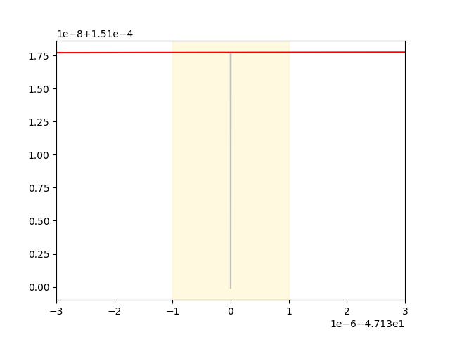
## Equation 1:
```
sodium_current_m_gate__tau_m = 0.0013600000000000001 / (0.080000000000000002 * exp(-0.090909090909090912 * membrane__V) + 0.32000000000000001 * (47.130000000000003 + membrane__V) / (1.0 - exp(-4.7130000000000001 - 0.10000000000000001 * membrane__V)))
```
### Partially evaluated to: 
```
sodium_current_m_gate__tau_m = 0.0013600000000000001 / (0.080000000000000002 * exp(-0.090909090909090912 * membrane__V) + 0.32000000000000001 * (47.130000000000003 + membrane__V) / (1.0 - 0.00897780373069724 * exp(-0.10000000000000001 * membrane__V)))
```
## New Eq:
```
sodium_current_m_gate__tau_m = ((fabs(47.130000000000003 + membrane__V) < 1.0000000000287557e-6) ? (0.00044169056969278785 + 6.1674692386356341e-6 * membrane__V) : (0.0013600000000000001 / (0.080000000000000002 * exp(-0.090909090909090912 * membrane__V) + 0.32000000000000001 * (47.130000000000003 + membrane__V) / (1.0 - exp(-4.7130000000000001 - 0.10000000000000001 * membrane__V)))))
```

singularity processing time: 11.023020299999871
# Model: pandit_clark_giles_demir_2001(pandit_clark_giles_demir_2001_epicardial_cell.cellml)
load time: 2.91952839999999

*U*: 
-4.7130000000000001 - 0.10000000000000001 * membrane__V
*V for 1e-07 range* 
`-47.129999000000005 - -47.130001`
-47.130000000000003

*Singularity point: -47.130000000000003*


## Equation 1:
```
sodium_current_m_gate__tau_m = 0.0013600000000000001 / (0.080000000000000002 * exp(-0.090909090909090912 * membrane__V) + 0.32000000000000001 * (47.130000000000003 + membrane__V) / (1.0 - exp(-4.7130000000000001 - 0.10000000000000001 * membrane__V)))
```
### Partially evaluated to: 
```
sodium_current_m_gate__tau_m = 0.0013600000000000001 / (0.080000000000000002 * exp(-0.090909090909090912 * membrane__V) + 0.32000000000000001 * (47.130000000000003 + membrane__V) / (1.0 - 0.00897780373069724 * exp(-0.10000000000000001 * membrane__V)))
```
## New Eq:
```
sodium_current_m_gate__tau_m = ((fabs(47.130000000000003 + membrane__V) < 1.0000000000287557e-6) ? (0.00044169056969278785 + 6.1674692386356341e-6 * membrane__V) : (0.0013600000000000001 / (0.080000000000000002 * exp(-0.090909090909090912 * membrane__V) + 0.32000000000000001 * (47.130000000000003 + membrane__V) / (1.0 - exp(-4.7130000000000001 - 0.10000000000000001 * membrane__V)))))
```

singularity processing time: 10.912135199999966
# Model: pasek_simurda_christe_2006(pasek_simurda_christe_2006.cellml)
load time: 5.223888700000089

*U*: 
-14.168000000000001 - 0.22 * Vms__Vms
*V for 1e-07 range* 
`-64.399999545454548 - -64.400000454545463`
-64.400000000000006

*Singularity point: -64.400000000000006*

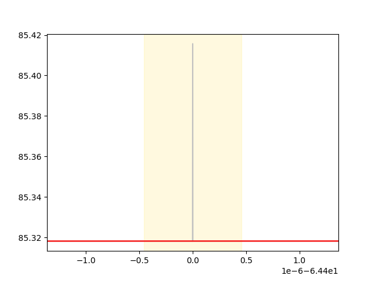
## Equation 1:
```
i_Nas_h_gate__beta_h = 18.77 * (64.400000000000006 + Vms__Vms) / (1.0 - exp(-14.168000000000001 - 0.22 * Vms__Vms))
```
### Partially evaluated to: 
```
i_Nas_h_gate__beta_h = 18.77 * (64.400000000000006 + Vms__Vms) / (1.0 - 7.0293599134462264e-7 * exp(-0.22 * Vms__Vms))
```
## New Eq:
```
i_Nas_h_gate__beta_h = ((fabs(64.400000000000006 + Vms__Vms) < 4.5454545455347883e-7) ? (688.22468177315966 + 9.3619021732228997 * Vms__Vms) : (18.77 * (64.400000000000006 + Vms__Vms) / (1.0 - exp(-14.168000000000001 - 0.22 * Vms__Vms))))
```

*U*: 
-32.615000000000002 - 0.55000000000000004 * Vms__Vms
*V for 1e-07 range* 
`-59.299999818181817 - -59.300000181818177`
-59.299999999999997

*Singularity point: -59.299999999999997*

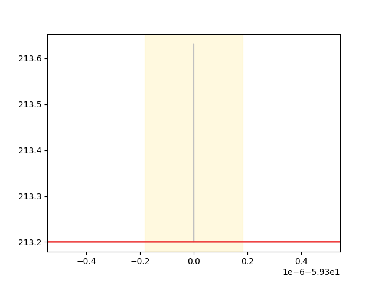
## Equation 2:
```
i_Nas_m_gate__alpha_m = 117.26000000000001 * (59.299999999999997 + Vms__Vms) / (1.0 - exp(-32.615000000000002 - 0.55000000000000004 * Vms__Vms))
```
### Partially evaluated to: 
```
i_Nas_m_gate__alpha_m = 117.26000000000001 * (59.299999999999997 + Vms__Vms) / (1.0 - 6.8467658008076711e-15 * exp(-0.55000000000000004 * Vms__Vms))
```
## New Eq:
```
i_Nas_m_gate__alpha_m = ((fabs(59.299999999999997 + Vms__Vms) < 1.8181818181584042e-7) ? (3700.5090895302751 + 58.807910447524897 * Vms__Vms) : (117.26000000000001 * (59.299999999999997 + Vms__Vms) / (1.0 - exp(-32.615000000000002 - 0.55000000000000004 * Vms__Vms))))
```

*U*: 
0.078728915539782576 * Vms__Vms
*V for 1e-07 range* 
`-1.2701813471502589e-6 - 1.2701813471502589e-6`

*Singularity point: 0*

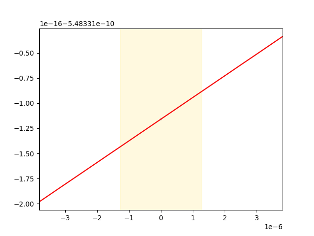
## Equation 3:
```
i_Cas__i_Cas = 4.0 * pow(model_parameters__F, 2) * (-0.34100000000000003 * model_parameters__Cae + ion_concentrations__Cass * exp(2.0 * Vms__Vms * model_parameters__F / (model_parameters__R * model_parameters__T))) * ((0.10000000000000001 - 0.10000000000000001 * i_Cas__Ccast) * i_Cas__C2 + (0.90000000000000002 + 0.10000000000000001 * i_Cas__Ccast) * i_Cas__C1) * Vms__Vms * i_Cas__Co * membrane_permeabilities__gCas / ((-1.0 + exp(2.0 * Vms__Vms * model_parameters__F / (model_parameters__R * model_parameters__T))) * model_parameters__R * model_parameters__T)
```
### Partially evaluated to: 
```
i_Cas__i_Cas = 4.1481478308756044e-5 * (-0.40920000000000001 + ion_concentrations__Cass * exp(0.078728915539782576 * Vms__Vms)) * ((0.10000000000000001 - 0.10000000000000001 * i_Cas__Ccast) * i_Cas__C2 + (0.90000000000000002 + 0.10000000000000001 * i_Cas__Ccast) * i_Cas__C1) * Vms__Vms * i_Cas__Co / (-1.0 + exp(0.078728915539782576 * Vms__Vms))
```
## New Eq:
```
i_Cas__i_Cas = ((fabs(Vms__Vms) < 1.2701813471502589e-6) ? ((0.5 + 393644.57769891288 * Vms__Vms) * (0.00052688997365226678 * (-0.40920000000000001 + 1.0000001000000049 * ion_concentrations__Cass) * ((0.10000000000000001 - 0.10000000000000001 * i_Cas__Ccast) * i_Cas__C2 + (0.90000000000000002 + 0.10000000000000001 * i_Cas__Ccast) * i_Cas__C1) * i_Cas__Co - 0.00052689002634485405 * (-0.40920000000000001 + 0.99999990000000505 * ion_concentrations__Cass) * ((0.10000000000000001 - 0.10000000000000001 * i_Cas__Ccast) * i_Cas__C2 + (0.90000000000000002 + 0.10000000000000001 * i_Cas__Ccast) * i_Cas__C1) * i_Cas__Co) + 0.00052689002634485405 * (-0.40920000000000001 + 0.99999990000000505 * ion_concentrations__Cass) * ((0.10000000000000001 - 0.10000000000000001 * i_Cas__Ccast) * i_Cas__C2 + (0.90000000000000002 + 0.10000000000000001 * i_Cas__Ccast) * i_Cas__C1) * i_Cas__Co) : (4.0 * pow(model_parameters__F, 2) * (-0.34100000000000003 * model_parameters__Cae + ion_concentrations__Cass * exp(2.0 * Vms__Vms * model_parameters__F / (model_parameters__R * model_parameters__T))) * ((0.10000000000000001 - 0.10000000000000001 * i_Cas__Ccast) * i_Cas__C2 + (0.90000000000000002 + 0.10000000000000001 * i_Cas__Ccast) * i_Cas__C1) * Vms__Vms * i_Cas__Co * membrane_permeabilities__gCas / ((-1.0 + exp(2.0 * Vms__Vms * model_parameters__F / (model_parameters__R * model_parameters__T))) * model_parameters__R * model_parameters__T)))
```

singularity processing time: 19.253995799999984
# Model: pasek_model_2008(pasek_simurda_orchard_christe_2008.cellml)
load time: 7.791143600000169

*U*: 
5.6404999999999994 + 0.14499999999999999 * Vm_s__Vm_s
*V for 1e-07 range* 
`-38.900000689655172 - -38.899999310344825`
-38.899999999999999

*Singularity point: -38.899999999999999*

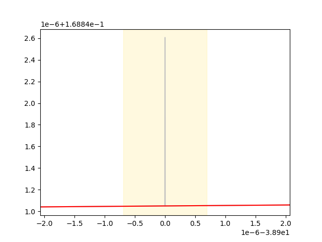
*U*: 
-1.7465999999999999 - 0.123 * Vm_s__Vm_s
*V for 1e-07 range* 
`-14.199999186991869 - -14.200000813008129`
-14.199999999999999

*Singularity point: -14.199999999999999*

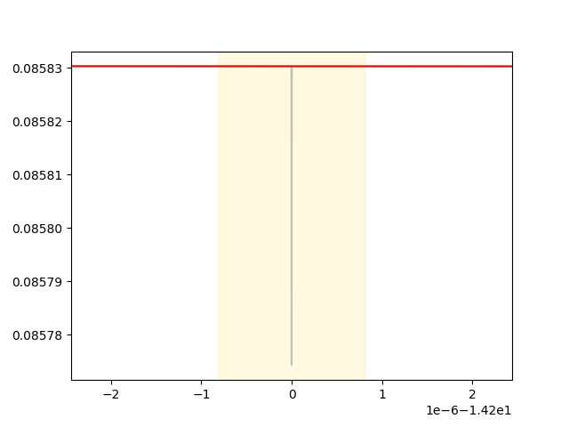
## Equation 1:
```
i_Kr_s_xr_gate__tau_xr = 0.001 / (0.00060999999999999997 * (38.899999999999999 + Vm_s__Vm_s) / (-1.0 + exp(5.6404999999999994 + 0.14499999999999999 * Vm_s__Vm_s)) + 0.0013799999999999999 * (14.199999999999999 + Vm_s__Vm_s) / (1.0 - exp(-1.7465999999999999 - 0.123 * Vm_s__Vm_s)))
```
### Partially evaluated to: 
```
i_Kr_s_xr_gate__tau_xr = 0.001 / (0.00060999999999999997 * (38.899999999999999 + Vm_s__Vm_s) / (-1.0 + 281.60348502322194 * exp(0.14499999999999999 * Vm_s__Vm_s)) + 0.0013799999999999999 * (14.199999999999999 + Vm_s__Vm_s) / (1.0 - 0.17436578041087322 * exp(-0.123 * Vm_s__Vm_s)))
```
## New Eq:
```
i_Kr_s_xr_gate__tau_xr = ((fabs(38.899999999999999 + Vm_s__Vm_s) < 6.896551724422384e-7) ? (0.33797340791378733 + 0.0043478755379763477 * Vm_s__Vm_s) : ((fabs(14.199999999999999 + Vm_s__Vm_s) < 8.1300813007528783e-7) ? (0.018542688989639584 - 0.0047385664159891247 * Vm_s__Vm_s) : (0.001 / (0.00060999999999999997 * (38.899999999999999 + Vm_s__Vm_s) / (-1.0 + exp(5.6404999999999994 + 0.14499999999999999 * Vm_s__Vm_s)) + 0.0013799999999999999 * (14.199999999999999 + Vm_s__Vm_s) / (1.0 - exp(-1.7465999999999999 - 0.123 * Vm_s__Vm_s))))))
```

*U*: 
2.0609999999999999 + 0.068699999999999997 * Vm_s__Vm_s
*V for 1e-07 range* 
`-30.000001455604075 - -29.999998544395925`
-30.000000000000000

*Singularity point: -30.000000000000000*


*U*: 
-4.4399999999999995 - 0.14799999999999999 * Vm_s__Vm_s
*V for 1e-07 range* 
`-29.999999324324325 - -30.000000675675675`
-30.000000000000000

*Singularity point: -30.000000000000000*


## Equation 2:
```
i_Ks_s_xs_gate__tau_xs = 0.001 / (0.00013100000000000001 * (30.0 + Vm_s__Vm_s) / (-1.0 + exp(2.0609999999999999 + 0.068699999999999997 * Vm_s__Vm_s)) + 7.1899999999999999e-5 * (30.0 + Vm_s__Vm_s) / (1.0 - exp(-4.4399999999999995 - 0.14799999999999999 * Vm_s__Vm_s)))
```
### Partially evaluated to: 
```
i_Ks_s_xs_gate__tau_xs = 0.001 / (0.00013100000000000001 * (30.0 + Vm_s__Vm_s) / (-1.0 + 7.8538197044216602 * exp(0.068699999999999997 * Vm_s__Vm_s)) + 7.1899999999999999e-5 * (30.0 + Vm_s__Vm_s) / (1.0 - 0.011795938519751569 * exp(-0.14799999999999999 * Vm_s__Vm_s)))
```
## New Eq:
```
i_Ks_s_xs_gate__tau_xs = ((fabs(30.0 + Vm_s__Vm_s) < 1.455604075689676e-6) ? (0.57283278764504919 + 0.0051628844993798191 * Vm_s__Vm_s) : ((fabs(30.0 + Vm_s__Vm_s) < 6.7567567568760367e-7) ? (0.57277257883161203 + 0.0051608775388260067 * Vm_s__Vm_s) : (0.001 / (0.00013100000000000001 * (30.0 + Vm_s__Vm_s) / (-1.0 + exp(2.0609999999999999 + 0.068699999999999997 * Vm_s__Vm_s)) + 7.1899999999999999e-5 * (30.0 + Vm_s__Vm_s) / (1.0 - exp(-4.4399999999999995 - 0.14799999999999999 * Vm_s__Vm_s))))))
```

*U*: 
0.07491945188463181 * Vm_s__Vm_s
*V for 1e-07 range* 
`-1.3347668393782383e-6 - 1.3347668393782383e-6`

*Singularity point: 0*

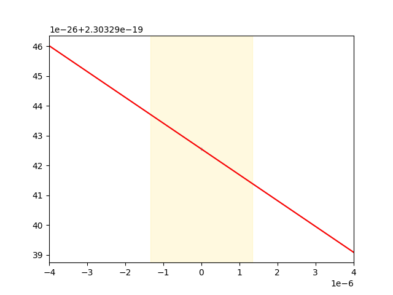
## Equation 3:
```
i_CaL_s__i_CaL_s = 4.0 * pow(model_parameters__F, 2) * (0.001 * exp(2.0 * Vm_s__Vm_s * model_parameters__F / (model_parameters__R * model_parameters__T)) - 0.34100000000000003 * model_parameters__Ca_e) * (i_CaL_s__Ccao + i_CaL_s__Co) * Vm_s__Vm_s * i_CaL_s_y_gate__y * membrane_permeabilities__P_CaL_s / ((-1.0 + exp(2.0 * Vm_s__Vm_s * model_parameters__F / (model_parameters__R * model_parameters__T))) * model_parameters__R * model_parameters__T)
```
### Partially evaluated to: 
```
i_CaL_s__i_CaL_s = 0.55630930863148487 * (-0.61380000000000001 + 0.001 * exp(0.07491945188463181 * Vm_s__Vm_s)) * (i_CaL_s__Ccao + i_CaL_s__Co) * Vm_s__Vm_s * i_CaL_s_y_gate__y * membrane_permeabilities__P_CaL / (-1.0 + exp(0.07491945188463181 * Vm_s__Vm_s))
```
## New Eq:
```
i_CaL_s__i_CaL_s = ((fabs(Vm_s__Vm_s) < 1.3347668393782383e-6) ? (-4.5503050657059205 * (i_CaL_s__Ccao + i_CaL_s__Co) * i_CaL_s_y_gate__y * membrane_permeabilities__P_CaL + 4.5654655042581815e-7 * (0.5 + 374597.25942315906 * Vm_s__Vm_s) * (i_CaL_s__Ccao + i_CaL_s__Co) * i_CaL_s_y_gate__y * membrane_permeabilities__P_CaL) : (4.0 * pow(model_parameters__F, 2) * (0.001 * exp(2.0 * Vm_s__Vm_s * model_parameters__F / (model_parameters__R * model_parameters__T)) - 0.34100000000000003 * model_parameters__Ca_e) * (i_CaL_s__Ccao + i_CaL_s__Co) * Vm_s__Vm_s * i_CaL_s_y_gate__y * membrane_permeabilities__P_CaL_s / ((-1.0 + exp(2.0 * Vm_s__Vm_s * model_parameters__F / (model_parameters__R * model_parameters__T))) * model_parameters__R * model_parameters__T)))
```

*U*: 
0.037459725942315905 * Vm_s__Vm_s
*V for 1e-07 range* 
`-2.6695336787564767e-6 - 2.6695336787564767e-6`

*Singularity point: 0*

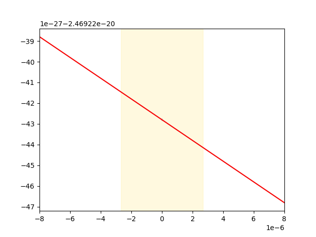
## Equation 4:
```
i_CaL_s__i_KL_s = pow(model_parameters__F, 2) * (-model_parameters__K_e + ion_concentrations__K_i * exp(Vm_s__Vm_s * model_parameters__F / (model_parameters__R * model_parameters__T))) * (i_CaL_s__Ccao + i_CaL_s__Co) * Vm_s__Vm_s * i_CaL_s_y_gate__y * membrane_permeabilities__P_KL_s / ((1.0 - 2.1834061135371177 * (i_CaL_s__i_CaL_s + i_CaL_t__i_CaL_t) / (model_parameters__Sms + model_parameters__Smt)) * (-1.0 + exp(Vm_s__Vm_s * model_parameters__F / (model_parameters__R * model_parameters__T))) * model_parameters__R * model_parameters__T)
```
### Partially evaluated to: 
```
i_CaL_s__i_KL_s = 6.6757117035778174e-7 * (-5.4000000000000004 + ion_concentrations__K_i * exp(0.037459725942315905 * Vm_s__Vm_s)) * (i_CaL_s__Ccao + i_CaL_s__Co) * Vm_s__Vm_s * i_CaL_s_y_gate__y / ((-1.0 + exp(0.037459725942315905 * Vm_s__Vm_s)) * (1.0 - 20430.198966619231 * i_CaL_s__i_CaL_s - 20205.350866353103 * (0.001 * exp(0.07491945188463181 * Vm_t__Vm_t) - 0.34100000000000003 * ion_concentrations__Ca_t) * (i_CaL_t__TCcao + i_CaL_t__TCo) * Vm_t__Vm_t * i_CaL_t_y_gate__y * membrane_permeabilities__P_CaL / (-1.0 + exp(0.07491945188463181 * Vm_t__Vm_t))))
```
## New Eq:
```
i_CaL_s__i_KL_s = ((fabs(Vm_s__Vm_s) < 2.6695336787564767e-6) ? ((0.5 + 187298.62971157953 * Vm_s__Vm_s) * (1.7821036331208537e-5 * (-5.4000000000000004 + 1.0000001000000049 * ion_concentrations__K_i) * (i_CaL_s__Ccao + i_CaL_s__Co) * i_CaL_s_y_gate__y / (1.0 - 20430.198966619231 * i_CaL_s__i_CaL_s - 20205.350866353103 * (0.001 * exp(0.07491945188463181 * Vm_t__Vm_t) - 0.34100000000000003 * ion_concentrations__Ca_t) * (i_CaL_t__TCcao + i_CaL_t__TCo) * Vm_t__Vm_t * i_CaL_t_y_gate__y * membrane_permeabilities__P_CaL / (-1.0 + exp(0.07491945188463181 * Vm_t__Vm_t))) - 1.782103811343359e-5 * (-5.4000000000000004 + 0.99999990000000505 * ion_concentrations__K_i) * (i_CaL_s__Ccao + i_CaL_s__Co) * i_CaL_s_y_gate__y / (1.0 - 20430.198966619231 * i_CaL_s__i_CaL_s - 20205.350866353103 * (0.001 * exp(0.07491945188463181 * Vm_t__Vm_t) - 0.34100000000000003 * ion_concentrations__Ca_t) * (i_CaL_t__TCcao + i_CaL_t__TCo) * Vm_t__Vm_t * i_CaL_t_y_gate__y * membrane_permeabilities__P_CaL / (-1.0 + exp(0.07491945188463181 * Vm_t__Vm_t)))) + 1.782103811343359e-5 * (-5.4000000000000004 + 0.99999990000000505 * ion_concentrations__K_i) * (i_CaL_s__Ccao + i_CaL_s__Co) * i_CaL_s_y_gate__y / (1.0 - 20430.198966619231 * i_CaL_s__i_CaL_s - 20205.350866353103 * (0.001 * exp(0.07491945188463181 * Vm_t__Vm_t) - 0.34100000000000003 * ion_concentrations__Ca_t) * (i_CaL_t__TCcao + i_CaL_t__TCo) * Vm_t__Vm_t * i_CaL_t_y_gate__y * membrane_permeabilities__P_CaL / (-1.0 + exp(0.07491945188463181 * Vm_t__Vm_t)))) : (pow(model_parameters__F, 2) * (-model_parameters__K_e + ion_concentrations__K_i * exp(Vm_s__Vm_s * model_parameters__F / (model_parameters__R * model_parameters__T))) * (i_CaL_s__Ccao + i_CaL_s__Co) * Vm_s__Vm_s * i_CaL_s_y_gate__y * membrane_permeabilities__P_KL_s / ((1.0 - 2.1834061135371177 * (i_CaL_s__i_CaL_s + i_CaL_t__i_CaL_t) / (model_parameters__Sms + model_parameters__Smt)) * (-1.0 + exp(Vm_s__Vm_s * model_parameters__F / (model_parameters__R * model_parameters__T))) * model_parameters__R * model_parameters__T)))
```

*U*: 
0.037459725942315905 * Vm_s__Vm_s
*V for 1e-07 range* 
`-2.6695336787564767e-6 - 2.6695336787564767e-6`

*Singularity point: 0*

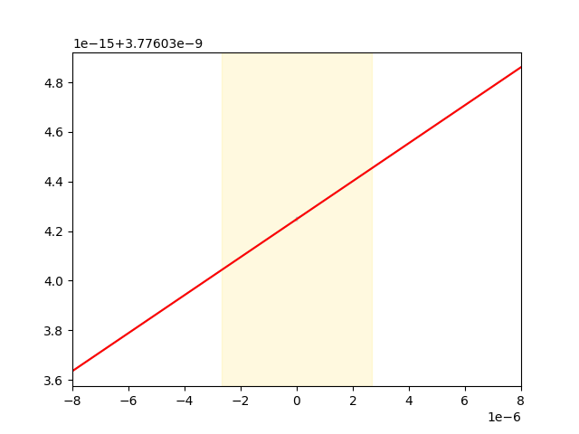
## Equation 5:
```
i_nsK_s__i_nsK_s = pow(model_parameters__F, 2) * (-0.75 * model_parameters__K_e + 0.75 * ion_concentrations__K_i * exp(Vm_s__Vm_s * model_parameters__F / (model_parameters__R * model_parameters__T))) * Vm_s__Vm_s * membrane_permeabilities__P_nsK_s / ((1.0 + 1.5625000000000003e-8 / pow(ion_concentrations__Ca_i, 3)) * (-1.0 + exp(Vm_s__Vm_s * model_parameters__F / (model_parameters__R * model_parameters__T))) * model_parameters__R * model_parameters__T)
```
### Partially evaluated to: 
```
i_nsK_s__i_nsK_s = 3.2045734132626158e-8 * (-4.0500000000000007 + 0.75 * ion_concentrations__K_i * exp(0.037459725942315905 * Vm_s__Vm_s)) * Vm_s__Vm_s / ((1.0 + 1.5625000000000003e-8 / pow(ion_concentrations__Ca_i, 3)) * (-1.0 + exp(0.037459725942315905 * Vm_s__Vm_s)))
```
## New Eq:
```
i_nsK_s__i_nsK_s = ((fabs(Vm_s__Vm_s) < 2.6695336787564767e-6) ? ((0.5 + 187298.62971157953 * Vm_s__Vm_s) * (8.5547162249638204e-7 * (-4.0500000000000007 + 0.75000007500000376 * ion_concentrations__K_i) / (1.0 + 1.5625000000000003e-8 / pow(ion_concentrations__Ca_i, 3)) - 8.5547170804937289e-7 * (-4.0500000000000007 + 0.74999992500000379 * ion_concentrations__K_i) / (1.0 + 1.5625000000000003e-8 / pow(ion_concentrations__Ca_i, 3))) + 8.5547170804937289e-7 * (-4.0500000000000007 + 0.74999992500000379 * ion_concentrations__K_i) / (1.0 + 1.5625000000000003e-8 / pow(ion_concentrations__Ca_i, 3))) : (pow(model_parameters__F, 2) * (-0.75 * model_parameters__K_e + 0.75 * ion_concentrations__K_i * exp(Vm_s__Vm_s * model_parameters__F / (model_parameters__R * model_parameters__T))) * Vm_s__Vm_s * membrane_permeabilities__P_nsK_s / ((1.0 + 1.5625000000000003e-8 / pow(ion_concentrations__Ca_i, 3)) * (-1.0 + exp(Vm_s__Vm_s * model_parameters__F / (model_parameters__R * model_parameters__T))) * model_parameters__R * model_parameters__T)))
```

*U*: 
0.037459725942315905 * Vm_s__Vm_s
*V for 1e-07 range* 
`-2.6695336787564767e-6 - 2.6695336787564767e-6`

*Singularity point: 0*


## Equation 6:
```
i_nsNa_s__i_nsNa_s = pow(model_parameters__F, 2) * (-0.75 * model_parameters__Na_e + 0.75 * ion_concentrations__Na_i * exp(Vm_s__Vm_s * model_parameters__F / (model_parameters__R * model_parameters__T))) * Vm_s__Vm_s * membrane_permeabilities__P_nsNa_s / ((1.0 + 1.5625000000000003e-8 / pow(ion_concentrations__Ca_i, 3)) * (-1.0 + exp(Vm_s__Vm_s * model_parameters__F / (model_parameters__R * model_parameters__T))) * model_parameters__R * model_parameters__T)
```
### Partially evaluated to: 
```
i_nsNa_s__i_nsNa_s = 3.2045734132626158e-8 * (-105.0 + 0.75 * ion_concentrations__Na_i * exp(0.037459725942315905 * Vm_s__Vm_s)) * Vm_s__Vm_s / ((1.0 + 1.5625000000000003e-8 / pow(ion_concentrations__Ca_i, 3)) * (-1.0 + exp(0.037459725942315905 * Vm_s__Vm_s)))
```
## New Eq:
```
i_nsNa_s__i_nsNa_s = ((fabs(Vm_s__Vm_s) < 2.6695336787564767e-6) ? ((0.5 + 187298.62971157953 * Vm_s__Vm_s) * (8.5547162249638204e-7 * (-105.0 + 0.75000007500000376 * ion_concentrations__Na_i) / (1.0 + 1.5625000000000003e-8 / pow(ion_concentrations__Ca_i, 3)) - 8.5547170804937289e-7 * (-105.0 + 0.74999992500000379 * ion_concentrations__Na_i) / (1.0 + 1.5625000000000003e-8 / pow(ion_concentrations__Ca_i, 3))) + 8.5547170804937289e-7 * (-105.0 + 0.74999992500000379 * ion_concentrations__Na_i) / (1.0 + 1.5625000000000003e-8 / pow(ion_concentrations__Ca_i, 3))) : (pow(model_parameters__F, 2) * (-0.75 * model_parameters__Na_e + 0.75 * ion_concentrations__Na_i * exp(Vm_s__Vm_s * model_parameters__F / (model_parameters__R * model_parameters__T))) * Vm_s__Vm_s * membrane_permeabilities__P_nsNa_s / ((1.0 + 1.5625000000000003e-8 / pow(ion_concentrations__Ca_i, 3)) * (-1.0 + exp(Vm_s__Vm_s * model_parameters__F / (model_parameters__R * model_parameters__T))) * model_parameters__R * model_parameters__T)))
```

singularity processing time: 63.64043179999999
# Model: priebe_beuckelmann_1998(priebe_beuckelmann_1998.cellml)
load time: 3.4008684999998877

singularity processing time: 4.707306500000186
# Model: ramirez_2000(ramirez_nattel_courtemanche_2000.cellml)
load time: 2.933249700000033

*U*: 
-4.7130000000000001 - 0.10000000000000001 * membrane__V
*V for 1e-07 range* 
`-47.129999000000005 - -47.130001`
-47.130000000000003

*Singularity point: -47.130000000000003*


## Equation 1:
```
fast_sodium_current_m_gate__alpha_m = 0.32000000000000001 * (47.130000000000003 + membrane__V) / (1.0 - exp(-4.7130000000000001 - 0.10000000000000001 * membrane__V))
```
### Partially evaluated to: 
```
fast_sodium_current_m_gate__alpha_m = 0.32000000000000001 * (47.130000000000003 + membrane__V) / (1.0 - 0.00897780373069724 * exp(-0.10000000000000001 * membrane__V))
```
## New Eq:
```
fast_sodium_current_m_gate__alpha_m = ((fabs(47.130000000000003 + membrane__V) < 1.0000000000287557e-6) ? (10.740659346653775 + 0.15999701562995733 * membrane__V) : (0.32000000000000001 * (47.130000000000003 + membrane__V) / (1.0 - exp(-4.7130000000000001 - 0.10000000000000001 * membrane__V))))
```

*U*: 
8.8571428571428577 - 0.035714285714285712 * membrane__V
*V for 1e-07 range* 
`248.0000028 - 247.9999972`
248.00000000000000

*Singularity point: 248.00000000000000*

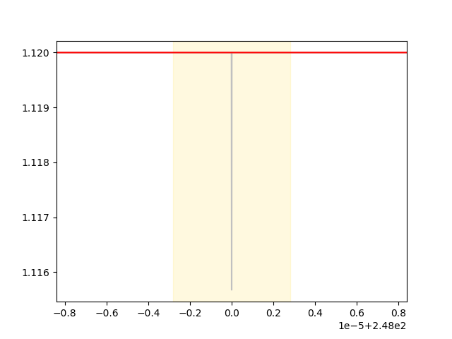
## Equation 2:
```
rapid_delayed_rectifier_K_current_xr_gate__alpha_xr = 0.040000000000000001 * (-248.0 + membrane__V) / (1.0 - exp(8.8571428571428577 - 0.035714285714285712 * membrane__V))
```
### Partially evaluated to: 
```
rapid_delayed_rectifier_K_current_xr_gate__alpha_xr = 0.040000000000000001 * (-248.0 + membrane__V) / (1.0 - 7024.3843766360014 * exp(-0.035714285714285712 * membrane__V))
```
## New Eq:
```
rapid_delayed_rectifier_K_current_xr_gate__alpha_xr = ((fabs(-248.0 + membrane__V) < 2.8000000000805159e-6) ? (-3.8394772730067741 + 0.019997892229866036 * membrane__V) : (0.040000000000000001 * (-248.0 + membrane__V) / (1.0 - exp(8.8571428571428577 - 0.035714285714285712 * membrane__V))))
```

*U*: 
7.7619047619047619 + 0.047619047619047616 * membrane__V
*V for 1e-07 range* 
`-163.00000209999999 - -162.99999790000001`
-163.00000000000000

*Singularity point: -163.00000000000000*

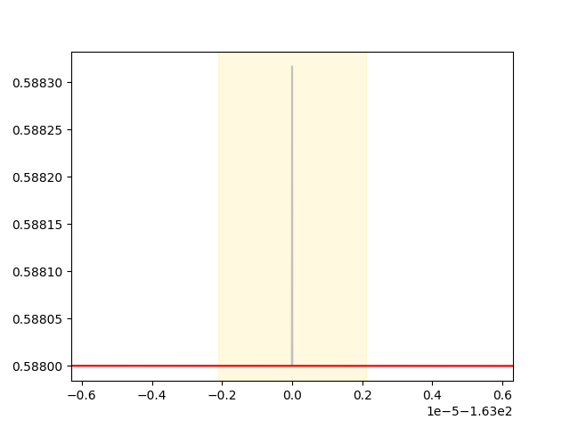
## Equation 3:
```
rapid_delayed_rectifier_K_current_xr_gate__beta_xr = 0.028000000000000001 * (163.0 + membrane__V) / (-1.0 + exp(7.7619047619047619 + 0.047619047619047616 * membrane__V))
```
### Partially evaluated to: 
```
rapid_delayed_rectifier_K_current_xr_gate__beta_xr = 0.028000000000000001 * (163.0 + membrane__V) / (-1.0 + 2349.375346735635 * exp(0.047619047619047616 * membrane__V))
```
## New Eq:
```
rapid_delayed_rectifier_K_current_xr_gate__beta_xr = ((fabs(163.0 + membrane__V) < 2.1000000000048757e-6) ? (-1.6935238702842588 - 0.013997078958813297 * membrane__V) : (0.028000000000000001 * (163.0 + membrane__V) / (-1.0 + exp(7.7619047619047619 + 0.047619047619047616 * membrane__V))))
```

*U*: 
-1.6025641025641024 - 0.16025641025641024 * membrane__V
*V for 1e-07 range* 
`-9.9999993759999999 - -10.000000624`
-10.000000000000000

*Singularity point: -10.000000000000000*


## Equation 4:
```
sarcolemmal_Ca_current_d_gate__tau_d = 28.571428571428569 * (1.0 - exp(-1.6025641025641024 - 0.16025641025641024 * membrane__V)) / ((1.0 + exp(-1.6025641025641024 - 0.16025641025641024 * membrane__V)) * (10.0 + membrane__V))
```
### Partially evaluated to: 
```
sarcolemmal_Ca_current_d_gate__tau_d = 28.571428571428569 * (1.0 - 0.20137949774492364 * exp(-0.16025641025641024 * membrane__V)) / ((1.0 + 0.20137949774492364 * exp(-0.16025641025641024 * membrane__V)) * (10.0 + membrane__V))
```
## New Eq:
```
sarcolemmal_Ca_current_d_gate__tau_d = ((fabs(10.0 + membrane__V) < 6.2399999999074307e-7) ? (2.2890932816357754 - 2.8400773208874076e-5 * membrane__V) : (28.571428571428569 * (1.0 - exp(-1.6025641025641024 - 0.16025641025641024 * membrane__V)) / ((1.0 + exp(-1.6025641025641024 - 0.16025641025641024 * membrane__V)) * (10.0 + membrane__V))))
```

*U*: 
-0.24782608695652175 - 0.0086956521739130436 * membrane__V
*V for 1e-07 range* 
`-28.499988500000001 - -28.500011499999999`
-28.500000000000000

*Singularity point: -28.500000000000000*

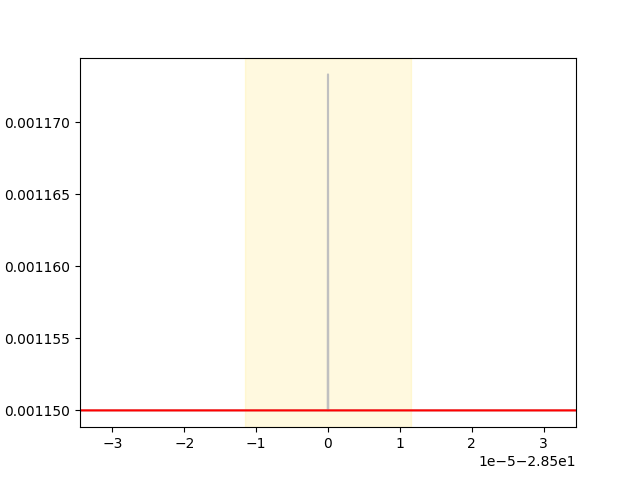
## Equation 5:
```
slow_delayed_rectifier_K_current_xs_gate__alpha_xs = 1.0000000000000001e-5 * (28.5 + membrane__V) / (1.0 - exp(-0.24782608695652175 - 0.0086956521739130436 * membrane__V))
```
### Partially evaluated to: 
```
slow_delayed_rectifier_K_current_xs_gate__alpha_xs = 1.0000000000000001e-5 * (28.5 + membrane__V) / (1.0 - 0.78049566985274699 * exp(-0.0086956521739130436 * membrane__V))
```
## New Eq:
```
slow_delayed_rectifier_K_current_xs_gate__alpha_xs = ((fabs(28.5 + membrane__V) < 1.1500000000011501e-5) ? (0.001292513141229454 + 5.0004610958402108e-6 * membrane__V) : (1.0000000000000001e-5 * (28.5 + membrane__V) / (1.0 - exp(-0.24782608695652175 - 0.0086956521739130436 * membrane__V))))
```

*U*: 
8.6363636363636367 + 0.30303030303030304 * membrane__V
*V for 1e-07 range* 
`-28.500000329999999 - -28.499999670000001`
-28.500000000000000

*Singularity point: -28.500000000000000*

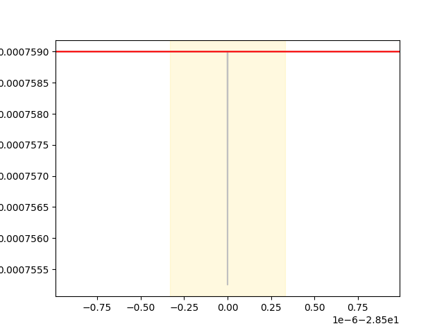
## Equation 6:
```
slow_delayed_rectifier_K_current_xs_gate__beta_xs = 0.00023000000000000001 * (28.5 + membrane__V) / (-1.0 + exp(8.6363636363636367 + 0.30303030303030304 * membrane__V))
```
### Partially evaluated to: 
```
slow_delayed_rectifier_K_current_xs_gate__beta_xs = 0.00023000000000000001 * (28.5 + membrane__V) / (-1.0 + 5632.8095935605706 * exp(0.30303030303030304 * membrane__V))
```
## New Eq:
```
slow_delayed_rectifier_K_current_xs_gate__beta_xs = ((fabs(28.5 + membrane__V) < 3.300000000205916e-7) ? (-0.0025181545891350336 - 0.00011498788032142353 * membrane__V) : (0.00023000000000000001 * (28.5 + membrane__V) / (-1.0 + exp(8.6363636363636367 + 0.30303030303030304 * membrane__V))))
```

singularity processing time: 28.432490000000143
# Model: sachse_model_2007(sachse_moreno_abildskov_2008_b.cellml)
load time: 0.40468620000001465

*U*: 
-11.612515042117931 * membrane__Vm / model_parameters__T
*V for 1e-07 range* 
`8.6113989637305703e-9 * model_parameters__T - -8.6113989637305703e-9 * model_parameters__T`

*Singularity point: 0*


## Equation 1:
```
I_Shkr__I_Shkr = pow(model_parameters__F, 2) * (-model_parameters__Ko * exp(-membrane__Vm * model_parameters__F / (model_parameters__R * model_parameters__T)) + model_parameters__Ki) * I_Shkr__OShkr * I_Shkr__PShkr * membrane__Vm / ((1.0 - exp(-membrane__Vm * model_parameters__F / (model_parameters__R * model_parameters__T))) * model_parameters__R * model_parameters__T)
```
### Partially evaluated to: 
```
I_Shkr__I_Shkr = 1120607.7015643802 * (-model_parameters__Ko * exp(-11.612515042117931 * membrane__Vm / model_parameters__T) + model_parameters__Ki) * I_Shkr__OShkr * I_Shkr__PShkr * membrane__Vm / ((1.0 - exp(-11.612515042117931 * membrane__Vm / model_parameters__T)) * model_parameters__T)
```
## New Eq:
```
I_Shkr__I_Shkr = ((fabs(membrane__Vm) < 8.6113989637305703e-9 * fabs(model_parameters__T)) ? (96500.004825064825 * (-0.99999990000000505 * model_parameters__Ko + model_parameters__Ki) * I_Shkr__OShkr * I_Shkr__PShkr - 58062575.210589655 * (-8.6113989637305703e-9 * model_parameters__T + membrane__Vm) * (96499.995174407828 * (-1.0000001000000049 * model_parameters__Ko + model_parameters__Ki) * I_Shkr__OShkr * I_Shkr__PShkr - 96500.004825064825 * (-0.99999990000000505 * model_parameters__Ko + model_parameters__Ki) * I_Shkr__OShkr * I_Shkr__PShkr) / model_parameters__T) : (pow(model_parameters__F, 2) * (-model_parameters__Ko * exp(-membrane__Vm * model_parameters__F / (model_parameters__R * model_parameters__T)) + model_parameters__Ki) * I_Shkr__OShkr * I_Shkr__PShkr * membrane__Vm / ((1.0 - exp(-membrane__Vm * model_parameters__F / (model_parameters__R * model_parameters__T))) * model_parameters__R * model_parameters__T)))
```

singularity processing time: 5.16705039999988
# Model: sakmann_model_2000_epi(sakmann_model_2000_epi.cellml)
load time: 4.669749200000069

*U*: 
3.7433890822745473 - 0.074867781645490947 * membrane__V
*V for 1e-07 range* 
`50.000001335688033 - 49.999998664311967`
50.000000000000000

*Singularity point: 50.000000000000000*

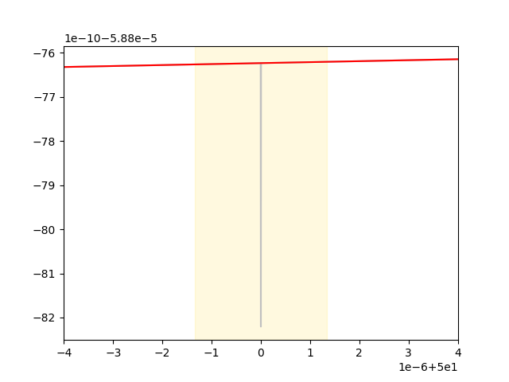
## Equation 1:
```
L_type_Ca_channel__i_Ca_L_Ca_ds = 4.0 * (-50.0 + membrane__V) * (intracellular_calcium_concentration__Ca_i * exp(100.0 * membrane__F / (membrane__R * membrane__T)) - extracellular_calcium_concentration__Ca_o * exp(2.0 * (50.0 - membrane__V) * membrane__F / (membrane__R * membrane__T))) * L_type_Ca_channel__FrICa * L_type_Ca_channel__P_Ca_L * L_type_Ca_channel_d_gate__d * L_type_Ca_channel_f2ds_gate__f2ds * L_type_Ca_channel_f_gate__f * membrane__F / ((1.0 - exp(2.0 * (50.0 - membrane__V) * membrane__F / (membrane__R * membrane__T))) * membrane__R * membrane__T)
```
### Partially evaluated to: 
```
L_type_Ca_channel__i_Ca_L_Ca_ds = 0.016470911962008009 * (-50.0 + membrane__V) * (42.240905756816076 * intracellular_calcium_concentration__Ca_i - 42.240905756816076 * extracellular_calcium_concentration__Ca_o * exp(-0.074867781645490947 * membrane__V)) * L_type_Ca_channel_d_gate__d * L_type_Ca_channel_f2ds_gate__f2ds * L_type_Ca_channel_f_gate__f / (1.0 - 42.240905756816076 * exp(-0.074867781645490947 * membrane__V))
```
## New Eq:
```
L_type_Ca_channel__i_Ca_L_Ca_ds = ((fabs(-50.0 + membrane__V) < 1.3356880329551402e-6) ? ((18716945.911788113 - 374338.90823576227 * membrane__V) * (0.219999988997584 * (42.240905756816076 * intracellular_calcium_concentration__Ca_i - 1.0000001000000049 * extracellular_calcium_concentration__Ca_o) * L_type_Ca_channel_d_gate__d * L_type_Ca_channel_f2ds_gate__f2ds * L_type_Ca_channel_f_gate__f - 0.22000001099717365 * (42.240905756816076 * intracellular_calcium_concentration__Ca_i - 0.99999990000000505 * extracellular_calcium_concentration__Ca_o) * L_type_Ca_channel_d_gate__d * L_type_Ca_channel_f2ds_gate__f2ds * L_type_Ca_channel_f_gate__f) + 0.22000001099717365 * (42.240905756816076 * intracellular_calcium_concentration__Ca_i - 0.99999990000000505 * extracellular_calcium_concentration__Ca_o) * L_type_Ca_channel_d_gate__d * L_type_Ca_channel_f2ds_gate__f2ds * L_type_Ca_channel_f_gate__f) : (4.0 * (-50.0 + membrane__V) * (intracellular_calcium_concentration__Ca_i * exp(100.0 * membrane__F / (membrane__R * membrane__T)) - extracellular_calcium_concentration__Ca_o * exp(2.0 * (50.0 - membrane__V) * membrane__F / (membrane__R * membrane__T))) * L_type_Ca_channel__FrICa * L_type_Ca_channel__P_Ca_L * L_type_Ca_channel_d_gate__d * L_type_Ca_channel_f2ds_gate__f2ds * L_type_Ca_channel_f_gate__f * membrane__F / ((1.0 - exp(2.0 * (50.0 - membrane__V) * membrane__F / (membrane__R * membrane__T))) * membrane__R * membrane__T)))
```

*U*: 
1.8716945411372736 - 0.037433890822745473 * membrane__V
*V for 1e-07 range* 
`50.000002671376066 - 49.999997328623934`
50.000000000000000

*Singularity point: 50.000000000000000*

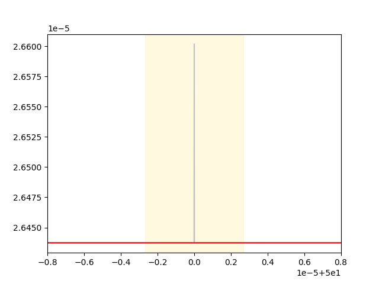
## Equation 2:
```
L_type_Ca_channel__i_Ca_L_K_ds = (-50.0 + membrane__V) * (intracellular_potassium_concentration__K_i * exp(50.0 * membrane__F / (membrane__R * membrane__T)) - extracellular_potassium_concentration__K_o * exp((50.0 - membrane__V) * membrane__F / (membrane__R * membrane__T))) * L_type_Ca_channel__FrICa * L_type_Ca_channel__P_CaK * L_type_Ca_channel__P_Ca_L * L_type_Ca_channel_d_gate__d * L_type_Ca_channel_f2ds_gate__f2ds * L_type_Ca_channel_f_gate__f * membrane__F / ((1.0 - exp((50.0 - membrane__V) * membrane__F / (membrane__R * membrane__T))) * membrane__R * membrane__T)
```
### Partially evaluated to: 
```
L_type_Ca_channel__i_Ca_L_K_ds = 8.2354559810040044e-6 * (-50.0 + membrane__V) * (6.4993004051833205 * intracellular_potassium_concentration__K_i - 6.4993004051833205 * extracellular_potassium_concentration__K_o * exp(-0.037433890822745473 * membrane__V)) * L_type_Ca_channel_d_gate__d * L_type_Ca_channel_f2ds_gate__f2ds * L_type_Ca_channel_f_gate__f / (1.0 - 6.4993004051833205 * exp(-0.037433890822745473 * membrane__V))
```
## New Eq:
```
L_type_Ca_channel__i_Ca_L_K_ds = ((fabs(-50.0 + membrane__V) < 2.6713760659657915e-6) ? ((9358473.2056995872 - 187169.45411399176 * membrane__V) * (0.00021999998900215561 * (6.4993004051833205 * intracellular_potassium_concentration__K_i - 1.0000001000000049 * extracellular_potassium_concentration__K_o) * L_type_Ca_channel_d_gate__d * L_type_Ca_channel_f2ds_gate__f2ds * L_type_Ca_channel_f_gate__f - 0.00022000001100174526 * (6.4993004051833205 * intracellular_potassium_concentration__K_i - 0.99999990000000505 * extracellular_potassium_concentration__K_o) * L_type_Ca_channel_d_gate__d * L_type_Ca_channel_f2ds_gate__f2ds * L_type_Ca_channel_f_gate__f) + 0.00022000001100174526 * (6.4993004051833205 * intracellular_potassium_concentration__K_i - 0.99999990000000505 * extracellular_potassium_concentration__K_o) * L_type_Ca_channel_d_gate__d * L_type_Ca_channel_f2ds_gate__f2ds * L_type_Ca_channel_f_gate__f) : ((-50.0 + membrane__V) * (intracellular_potassium_concentration__K_i * exp(50.0 * membrane__F / (membrane__R * membrane__T)) - extracellular_potassium_concentration__K_o * exp((50.0 - membrane__V) * membrane__F / (membrane__R * membrane__T))) * L_type_Ca_channel__FrICa * L_type_Ca_channel__P_CaK * L_type_Ca_channel__P_Ca_L * L_type_Ca_channel_d_gate__d * L_type_Ca_channel_f2ds_gate__f2ds * L_type_Ca_channel_f_gate__f * membrane__F / ((1.0 - exp((50.0 - membrane__V) * membrane__F / (membrane__R * membrane__T))) * membrane__R * membrane__T)))
```

*U*: 
1.8716945411372736 - 0.037433890822745473 * membrane__V
*V for 1e-07 range* 
`50.000002671376066 - 49.999997328623934`
50.000000000000000

*Singularity point: 50.000000000000000*


## Equation 3:
```
L_type_Ca_channel__i_Ca_L_Na_ds = (-50.0 + membrane__V) * (intracellular_sodium_concentration__Na_i * exp(50.0 * membrane__F / (membrane__R * membrane__T)) - extracellular_sodium_concentration__Na_o * exp((50.0 - membrane__V) * membrane__F / (membrane__R * membrane__T))) * L_type_Ca_channel__FrICa * L_type_Ca_channel__P_CaNa * L_type_Ca_channel__P_Ca_L * L_type_Ca_channel_d_gate__d * L_type_Ca_channel_f2ds_gate__f2ds * L_type_Ca_channel_f_gate__f * membrane__F / ((1.0 - exp((50.0 - membrane__V) * membrane__F / (membrane__R * membrane__T))) * membrane__R * membrane__T)
```
### Partially evaluated to: 
```
L_type_Ca_channel__i_Ca_L_Na_ds = 4.1177279905020022e-5 * (-50.0 + membrane__V) * (6.4993004051833205 * intracellular_sodium_concentration__Na_i - 6.4993004051833205 * extracellular_sodium_concentration__Na_o * exp(-0.037433890822745473 * membrane__V)) * L_type_Ca_channel_d_gate__d * L_type_Ca_channel_f2ds_gate__f2ds * L_type_Ca_channel_f_gate__f / (1.0 - 6.4993004051833205 * exp(-0.037433890822745473 * membrane__V))
```
## New Eq:
```
L_type_Ca_channel__i_Ca_L_Na_ds = ((fabs(-50.0 + membrane__V) < 2.6713760659657915e-6) ? ((9358473.2056995872 - 187169.45411399176 * membrane__V) * (0.0010999999450107779 * (6.4993004051833205 * intracellular_sodium_concentration__Na_i - 1.0000001000000049 * extracellular_sodium_concentration__Na_o) * L_type_Ca_channel_d_gate__d * L_type_Ca_channel_f2ds_gate__f2ds * L_type_Ca_channel_f_gate__f - 0.0011000000550087262 * (6.4993004051833205 * intracellular_sodium_concentration__Na_i - 0.99999990000000505 * extracellular_sodium_concentration__Na_o) * L_type_Ca_channel_d_gate__d * L_type_Ca_channel_f2ds_gate__f2ds * L_type_Ca_channel_f_gate__f) + 0.0011000000550087262 * (6.4993004051833205 * intracellular_sodium_concentration__Na_i - 0.99999990000000505 * extracellular_sodium_concentration__Na_o) * L_type_Ca_channel_d_gate__d * L_type_Ca_channel_f2ds_gate__f2ds * L_type_Ca_channel_f_gate__f) : ((-50.0 + membrane__V) * (intracellular_sodium_concentration__Na_i * exp(50.0 * membrane__F / (membrane__R * membrane__T)) - extracellular_sodium_concentration__Na_o * exp((50.0 - membrane__V) * membrane__F / (membrane__R * membrane__T))) * L_type_Ca_channel__FrICa * L_type_Ca_channel__P_CaNa * L_type_Ca_channel__P_Ca_L * L_type_Ca_channel_d_gate__d * L_type_Ca_channel_f2ds_gate__f2ds * L_type_Ca_channel_f_gate__f * membrane__F / ((1.0 - exp((50.0 - membrane__V) * membrane__F / (membrane__R * membrane__T))) * membrane__R * membrane__T)))
```

*U*: 
5.6404999999999994 + 0.14499999999999999 * membrane__V
*V for 1e-07 range* 
`-38.900000689655172 - -38.899999310344825`
-38.899999999999999

*Singularity point: -38.899999999999999*


*U*: 
-1.7465999999999999 - 0.123 * membrane__V
*V for 1e-07 range* 
`-14.199999186991869 - -14.200000813008129`
-14.199999999999999

*Singularity point: -14.199999999999999*


## Equation 4:
```
rapid_delayed_rectifier_potassium_current_xr_gate__tau_xr = 0.001 / (0.00060999999999999997 * (38.899999999999999 + membrane__V) / (-1.0 + exp(5.6404999999999994 + 0.14499999999999999 * membrane__V)) + 0.0013799999999999999 * (14.199999999999999 + membrane__V) / (1.0 - exp(-1.7465999999999999 - 0.123 * membrane__V)))
```
### Partially evaluated to: 
```
rapid_delayed_rectifier_potassium_current_xr_gate__tau_xr = 0.001 / (0.00060999999999999997 * (38.899999999999999 + membrane__V) / (-1.0 + 281.60348502322194 * exp(0.14499999999999999 * membrane__V)) + 0.0013799999999999999 * (14.199999999999999 + membrane__V) / (1.0 - 0.17436578041087322 * exp(-0.123 * membrane__V)))
```
## New Eq:
```
rapid_delayed_rectifier_potassium_current_xr_gate__tau_xr = ((fabs(38.899999999999999 + membrane__V) < 6.896551724422384e-7) ? (0.33797340791378733 + 0.0043478755379763477 * membrane__V) : ((fabs(14.199999999999999 + membrane__V) < 8.1300813007528783e-7) ? (0.018542688989639584 - 0.0047385664159891247 * membrane__V) : (0.001 / (0.00060999999999999997 * (38.899999999999999 + membrane__V) / (-1.0 + exp(5.6404999999999994 + 0.14499999999999999 * membrane__V)) + 0.0013799999999999999 * (14.199999999999999 + membrane__V) / (1.0 - exp(-1.7465999999999999 - 0.123 * membrane__V))))))
```

*U*: 
2.0609999999999999 + 0.068699999999999997 * membrane__V
*V for 1e-07 range* 
`-30.000001455604075 - -29.999998544395925`
-30.000000000000000

*Singularity point: -30.000000000000000*


*U*: 
-4.4399999999999995 - 0.14799999999999999 * membrane__V
*V for 1e-07 range* 
`-29.999999324324325 - -30.000000675675675`
-30.000000000000000

*Singularity point: -30.000000000000000*


## Equation 5:
```
slow_delayed_rectifier_potassium_current_xs_gate__tau_xs = 0.001 / (0.00013100000000000001 * (30.0 + membrane__V) / (-1.0 + exp(2.0609999999999999 + 0.068699999999999997 * membrane__V)) + 7.1899999999999999e-5 * (30.0 + membrane__V) / (1.0 - exp(-4.4399999999999995 - 0.14799999999999999 * membrane__V)))
```
### Partially evaluated to: 
```
slow_delayed_rectifier_potassium_current_xs_gate__tau_xs = 0.001 / (0.00013100000000000001 * (30.0 + membrane__V) / (-1.0 + 7.8538197044216602 * exp(0.068699999999999997 * membrane__V)) + 7.1899999999999999e-5 * (30.0 + membrane__V) / (1.0 - 0.011795938519751569 * exp(-0.14799999999999999 * membrane__V)))
```
## New Eq:
```
slow_delayed_rectifier_potassium_current_xs_gate__tau_xs = ((fabs(30.0 + membrane__V) < 1.455604075689676e-6) ? (0.57283278764504919 + 0.0051628844993798191 * membrane__V) : ((fabs(30.0 + membrane__V) < 6.7567567568760367e-7) ? (0.57277257883161203 + 0.0051608775388260067 * membrane__V) : (0.001 / (0.00013100000000000001 * (30.0 + membrane__V) / (-1.0 + exp(2.0609999999999999 + 0.068699999999999997 * membrane__V)) + 7.1899999999999999e-5 * (30.0 + membrane__V) / (1.0 - exp(-4.4399999999999995 - 0.14799999999999999 * membrane__V))))))
```

singularity processing time: 42.50169600000004
# Model: shannon_wang_puglisi_weber_bers_2004_model_updated(shannon_wang_puglisi_weber_bers_2004.cellml)
load time: 3.914516100000128

*U*: 
-2.4166666666666665 - 0.16666666666666666 * cell__V
*V for 1e-07 range* 
`-14.4999994 - -14.5000006`
-14.500000000000000

*Singularity point: -14.500000000000000*

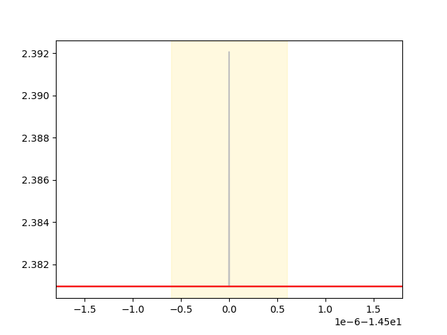
## Equation 1:
```
ICaL_d_gate__tau_d = 28.571428571428569 * (1.0 - exp(-2.4166666666666665 - 0.16666666666666666 * cell__V)) * ICaL_d_gate__d_infinity / (14.5 + cell__V)
```
### Partially evaluated to: 
```
ICaL_d_gate__tau_d = 28.571428571428569 * (1.0 - 0.089218517409260095 * exp(-0.16666666666666666 * cell__V)) / ((1.0 + 0.089218517409260095 * exp(-0.16666666666666666 * cell__V)) * (14.5 + cell__V))
```
## New Eq:
```
ICaL_d_gate__tau_d = ((fabs(14.5 + cell__V) < 5.9999999999643672e-7) ? (2.3811724022743461 + 1.517388356177485e-5 * cell__V) : (28.571428571428569 * (1.0 - exp(-2.4166666666666665 - 0.16666666666666666 * cell__V)) * ICaL_d_gate__d_infinity / (14.5 + cell__V)))
```

*U*: 
1.45 + 0.14499999999999999 * cell__V
*V for 1e-07 range* 
`-10.000000689655172 - -9.9999993103448279`
-10.000000000000000

*Singularity point: -10.000000000000000*

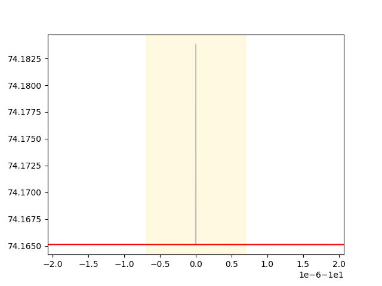
*U*: 
-0.86099999999999999 - 0.123 * cell__V
*V for 1e-07 range* 
`-6.9999991869918698 - -7.0000008130081302`
-7.0000000000000000

*Singularity point: -7.0000000000000000*

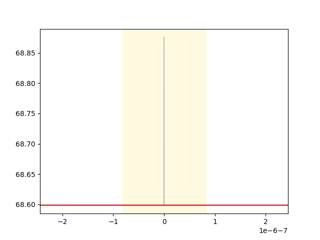
## Equation 2:
```
IKr_Xr_gate__tau_Xr = 1 / (0.00060999999999999997 * (10.0 + cell__V) / (-1.0 + exp(1.45 + 0.14499999999999999 * cell__V)) + 0.0013799999999999999 * (7.0 + cell__V) / (1.0 - exp(-0.86099999999999999 - 0.123 * cell__V)))
```
### Partially evaluated to: 
```
IKr_Xr_gate__tau_Xr = 1 / (0.00060999999999999997 * (10.0 + cell__V) / (-1.0 + 4.2631145151688168 * exp(0.14499999999999999 * cell__V)) + 0.0013799999999999999 * (7.0 + cell__V) / (1.0 - 0.42273913174596284 * exp(-0.123 * cell__V)))
```
## New Eq:
```
IKr_Xr_gate__tau_Xr = ((fabs(10.0 + cell__V) < 6.8965517241448282e-7) ? (57.63372556604515 - 1.6531402515296398 * cell__V) : ((fabs(7.0 + cell__V) < 8.1300813008222672e-7) ? (54.471279194743971 - 2.0182014615038097 * cell__V) : (1 / (0.00060999999999999997 * (10.0 + cell__V) / (-1.0 + exp(1.45 + 0.14499999999999999 * cell__V)) + 0.0013799999999999999 * (7.0 + cell__V) / (1.0 - exp(-0.86099999999999999 - 0.123 * cell__V))))))
```

*U*: 
2.0609999999999999 + 0.068699999999999997 * cell__V
*V for 1e-07 range* 
`-30.000001455604075 - -29.999998544395925`
-30.000000000000000

*Singularity point: -30.000000000000000*


*U*: 
-4.4399999999999995 - 0.14799999999999999 * cell__V
*V for 1e-07 range* 
`-29.999999324324325 - -30.000000675675675`
-30.000000000000000

*Singularity point: -30.000000000000000*


## Equation 3:
```
IKs_Xs_gate__tau_Xs = 1 / (0.00013100000000000001 * (30.0 + cell__V) / (-1.0 + exp(2.0609999999999999 + 0.068699999999999997 * cell__V)) + 7.1899999999999999e-5 * (30.0 + cell__V) / (1.0 - exp(-4.4399999999999995 - 0.14799999999999999 * cell__V)))
```
### Partially evaluated to: 
```
IKs_Xs_gate__tau_Xs = 1 / (0.00013100000000000001 * (30.0 + cell__V) / (-1.0 + 7.8538197044216602 * exp(0.068699999999999997 * cell__V)) + 7.1899999999999999e-5 * (30.0 + cell__V) / (1.0 - 0.011795938519751569 * exp(-0.14799999999999999 * cell__V)))
```
## New Eq:
```
IKs_Xs_gate__tau_Xs = ((fabs(30.0 + cell__V) < 1.455604075689676e-6) ? (572.83278764737304 + 5.1628844994572827 * cell__V) : ((fabs(30.0 + cell__V) < 6.7567567568760367e-7) ? (572.77257882806907 + 5.160877538707906 * cell__V) : (1 / (0.00013100000000000001 * (30.0 + cell__V) / (-1.0 + exp(2.0609999999999999 + 0.068699999999999997 * cell__V)) + 7.1899999999999999e-5 * (30.0 + cell__V) / (1.0 - exp(-4.4399999999999995 - 0.14799999999999999 * cell__V))))))
```

*U*: 
-4.7130000000000001 - 0.10000000000000001 * cell__V
*V for 1e-07 range* 
`-47.129999000000005 - -47.130001`
-47.130000000000003

*Singularity point: -47.130000000000003*


## Equation 4:
```
INa_m_gate__alpha_m = 0.32000000000000001 * (47.130000000000003 + cell__V) / (1.0 - exp(-4.7130000000000001 - 0.10000000000000001 * cell__V))
```
### Partially evaluated to: 
```
INa_m_gate__alpha_m = 0.32000000000000001 * (47.130000000000003 + cell__V) / (1.0 - 0.00897780373069724 * exp(-0.10000000000000001 * cell__V))
```
## New Eq:
```
INa_m_gate__alpha_m = ((fabs(47.130000000000003 + cell__V) < 1.0000000000287557e-6) ? (10.740659346653775 + 0.15999701562995733 * cell__V) : (0.32000000000000001 * (47.130000000000003 + cell__V) / (1.0 - exp(-4.7130000000000001 - 0.10000000000000001 * cell__V))))
```

*U*: 
0.074870384603595908 * cell__V
*V for 1e-07 range* 
`-1.3356415961992688e-6 - 1.3356415961992688e-6`

*Singularity point: 0*

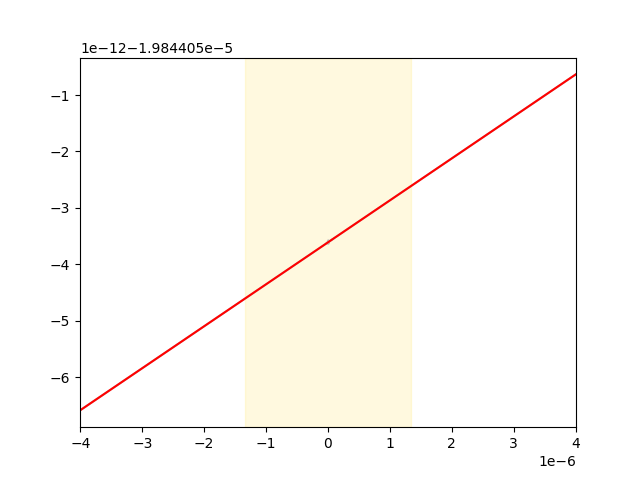
found U by substituting in paams! 
## Equation 5:
```
ICaL__i_CaL_Ca_SL = 4.0 * (-ICaL__gamma_Cao * model_parameters__Cao + Ca_buffer__Ca_SL * ICaL__gamma_Cai * exp(2.0 * cell__V * model_parameters__F / (model_parameters__R * model_parameters__T))) * ICaL__Fx_ICaL_SL * ICaL__PCa * ICaL__temp * ICaL_fCa_gate__fCa_SL / (-1.0 + exp(2.0 * cell__V * model_parameters__F / (model_parameters__R * model_parameters__T)))
```
### Partially evaluated to: 
```
ICaL__i_CaL_Ca_SL = 0.18000000000000002 * pow(1.8, (-31.0 + 0.10000000000000001 * model_parameters__T)) * pow(model_parameters__F, 2) * (1.0 - ICaL_fCa_gate__fCaB_SL) * (-0.34100000000000003 * model_parameters__Cao + 0.34100000000000003 * Ca_buffer__Ca_SL * exp(2.0 * cell__V * model_parameters__F / (model_parameters__R * model_parameters__T))) * ICaL__PCa * ICaL_d_gate__d * ICaL_f_gate__f * cell__V / ((-1.0 + exp(2.0 * cell__V * model_parameters__F / (model_parameters__R * model_parameters__T))) * model_parameters__R * model_parameters__T)
```
## New Eq:
```
ICaL__i_CaL_Ca_SL = ((fabs(cell__V) < 1.3356415961992688e-6) ? ((0.5 + 374351.92301797954 * cell__V) * (2.404154873158684e-7 * pow(1.8, (-31.0 + 0.10000000000000001 * model_parameters__T)) * pow(model_parameters__F, 2) * (1.0 - ICaL_fCa_gate__fCaB_SL) * (-0.34100000000000003 * model_parameters__Cao + 0.34100000000000003 * Ca_buffer__Ca_SL * exp(2.6712831923985376e-6 * model_parameters__F / (model_parameters__R * model_parameters__T))) * ICaL__PCa * ICaL_d_gate__d * ICaL_f_gate__f / ((-1.0 + exp(2.6712831923985376e-6 * model_parameters__F / (model_parameters__R * model_parameters__T))) * model_parameters__R * model_parameters__T) + 2.404154873158684e-7 * pow(1.8, (-31.0 + 0.10000000000000001 * model_parameters__T)) * pow(model_parameters__F, 2) * (1.0 - ICaL_fCa_gate__fCaB_SL) * (-0.34100000000000003 * model_parameters__Cao + 0.34100000000000003 * Ca_buffer__Ca_SL * exp(-2.6712831923985376e-6 * model_parameters__F / (model_parameters__R * model_parameters__T))) * ICaL__PCa * ICaL_d_gate__d * ICaL_f_gate__f / ((-1.0 + exp(-2.6712831923985376e-6 * model_parameters__F / (model_parameters__R * model_parameters__T))) * model_parameters__R * model_parameters__T)) - 2.404154873158684e-7 * pow(1.8, (-31.0 + 0.10000000000000001 * model_parameters__T)) * pow(model_parameters__F, 2) * (1.0 - ICaL_fCa_gate__fCaB_SL) * (-0.34100000000000003 * model_parameters__Cao + 0.34100000000000003 * Ca_buffer__Ca_SL * exp(-2.6712831923985376e-6 * model_parameters__F / (model_parameters__R * model_parameters__T))) * ICaL__PCa * ICaL_d_gate__d * ICaL_f_gate__f / ((-1.0 + exp(-2.6712831923985376e-6 * model_parameters__F / (model_parameters__R * model_parameters__T))) * model_parameters__R * model_parameters__T)) : (4.0 * (-ICaL__gamma_Cao * model_parameters__Cao + Ca_buffer__Ca_SL * ICaL__gamma_Cai * exp(2.0 * cell__V * model_parameters__F / (model_parameters__R * model_parameters__T))) * ICaL__Fx_ICaL_SL * ICaL__PCa * ICaL__temp * ICaL_fCa_gate__fCa_SL / (-1.0 + exp(2.0 * cell__V * model_parameters__F / (model_parameters__R * model_parameters__T)))))
```

*U*: 
0.074870384603595908 * cell__V
*V for 1e-07 range* 
`-1.3356415961992688e-6 - 1.3356415961992688e-6`

*Singularity point: 0*

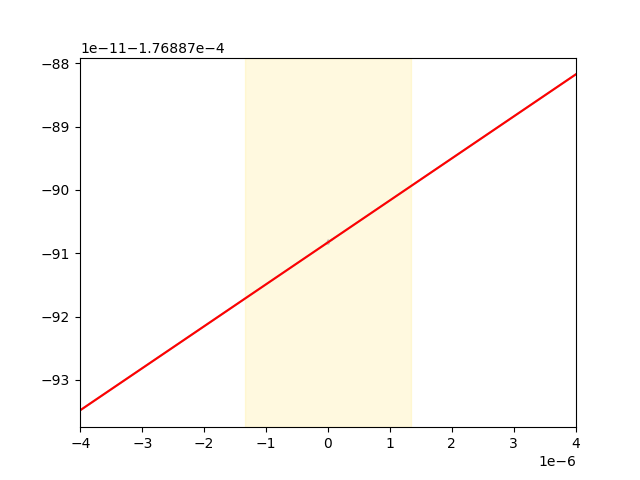
found U by substituting in paams! 
## Equation 6:
```
ICaL__i_CaL_Ca_jct = 4.0 * (-ICaL__gamma_Cao * model_parameters__Cao + Ca_buffer__Ca_jct * ICaL__gamma_Cai * exp(2.0 * cell__V * model_parameters__F / (model_parameters__R * model_parameters__T))) * ICaL__Fx_ICaL_jct * ICaL__PCa * ICaL__temp * ICaL_fCa_gate__fCa_jct / (-1.0 + exp(2.0 * cell__V * model_parameters__F / (model_parameters__R * model_parameters__T)))
```
### Partially evaluated to: 
```
ICaL__i_CaL_Ca_jct = 1.6200000000000001 * pow(1.8, (-31.0 + 0.10000000000000001 * model_parameters__T)) * pow(model_parameters__F, 2) * (1.0 - ICaL_fCa_gate__fCaB_jct) * (-0.34100000000000003 * model_parameters__Cao + 0.34100000000000003 * Ca_buffer__Ca_jct * exp(2.0 * cell__V * model_parameters__F / (model_parameters__R * model_parameters__T))) * ICaL__PCa * ICaL_d_gate__d * ICaL_f_gate__f * cell__V / ((-1.0 + exp(2.0 * cell__V * model_parameters__F / (model_parameters__R * model_parameters__T))) * model_parameters__R * model_parameters__T)
```
## New Eq:
```
ICaL__i_CaL_Ca_jct = ((fabs(cell__V) < 1.3356415961992688e-6) ? ((0.5 + 374351.92301797954 * cell__V) * (2.1637393858428153e-6 * pow(1.8, (-31.0 + 0.10000000000000001 * model_parameters__T)) * pow(model_parameters__F, 2) * (1.0 - ICaL_fCa_gate__fCaB_jct) * (-0.34100000000000003 * model_parameters__Cao + 0.34100000000000003 * Ca_buffer__Ca_jct * exp(2.6712831923985376e-6 * model_parameters__F / (model_parameters__R * model_parameters__T))) * ICaL__PCa * ICaL_d_gate__d * ICaL_f_gate__f / ((-1.0 + exp(2.6712831923985376e-6 * model_parameters__F / (model_parameters__R * model_parameters__T))) * model_parameters__R * model_parameters__T) + 2.1637393858428153e-6 * pow(1.8, (-31.0 + 0.10000000000000001 * model_parameters__T)) * pow(model_parameters__F, 2) * (1.0 - ICaL_fCa_gate__fCaB_jct) * (-0.34100000000000003 * model_parameters__Cao + 0.34100000000000003 * Ca_buffer__Ca_jct * exp(-2.6712831923985376e-6 * model_parameters__F / (model_parameters__R * model_parameters__T))) * ICaL__PCa * ICaL_d_gate__d * ICaL_f_gate__f / ((-1.0 + exp(-2.6712831923985376e-6 * model_parameters__F / (model_parameters__R * model_parameters__T))) * model_parameters__R * model_parameters__T)) - 2.1637393858428153e-6 * pow(1.8, (-31.0 + 0.10000000000000001 * model_parameters__T)) * pow(model_parameters__F, 2) * (1.0 - ICaL_fCa_gate__fCaB_jct) * (-0.34100000000000003 * model_parameters__Cao + 0.34100000000000003 * Ca_buffer__Ca_jct * exp(-2.6712831923985376e-6 * model_parameters__F / (model_parameters__R * model_parameters__T))) * ICaL__PCa * ICaL_d_gate__d * ICaL_f_gate__f / ((-1.0 + exp(-2.6712831923985376e-6 * model_parameters__F / (model_parameters__R * model_parameters__T))) * model_parameters__R * model_parameters__T)) : (4.0 * (-ICaL__gamma_Cao * model_parameters__Cao + Ca_buffer__Ca_jct * ICaL__gamma_Cai * exp(2.0 * cell__V * model_parameters__F / (model_parameters__R * model_parameters__T))) * ICaL__Fx_ICaL_jct * ICaL__PCa * ICaL__temp * ICaL_fCa_gate__fCa_jct / (-1.0 + exp(2.0 * cell__V * model_parameters__F / (model_parameters__R * model_parameters__T)))))
```

*U*: 
0.037435192301797954 * cell__V
*V for 1e-07 range* 
`-2.6712831923985376e-6 - 2.6712831923985376e-6`

*Singularity point: 0*


found U by substituting in paams! 
## Equation 7:
```
ICaL__i_CaL_K = (ICaL__Fx_ICaL_SL * ICaL_fCa_gate__fCa_SL + ICaL__Fx_ICaL_jct * ICaL_fCa_gate__fCa_jct) * (-ICaL__gamma_Ko * model_parameters__Ko + ICaL__gamma_Ki * model_parameters__Ki * exp(cell__V * model_parameters__F / (model_parameters__R * model_parameters__T))) * ICaL__PK * ICaL__temp / (-1.0 + exp(cell__V * model_parameters__F / (model_parameters__R * model_parameters__T)))
```
### Partially evaluated to: 
```
ICaL__i_CaL_K = 1.215e-7 * pow(1.8, (-31.0 + 0.10000000000000001 * model_parameters__T)) * pow(model_parameters__F, 2) * (-0.75 * model_parameters__Ko + 0.75 * model_parameters__Ki * exp(cell__V * model_parameters__F / (model_parameters__R * model_parameters__T))) * (1.0 - 0.10000000000000001 * ICaL_fCa_gate__fCaB_SL - 0.90000000000000002 * ICaL_fCa_gate__fCaB_jct) * ICaL_d_gate__d * ICaL_f_gate__f * cell__V / ((-1.0 + exp(cell__V * model_parameters__F / (model_parameters__R * model_parameters__T))) * model_parameters__R * model_parameters__T)
```
## New Eq:
```
ICaL__i_CaL_K = ((fabs(cell__V) < 2.6712831923985376e-6) ? ((0.5 + 187175.96150898977 * cell__V) * (3.2456090787642232e-13 * pow(1.8, (-31.0 + 0.10000000000000001 * model_parameters__T)) * pow(model_parameters__F, 2) * (-0.75 * model_parameters__Ko + 0.75 * model_parameters__Ki * exp(2.6712831923985376e-6 * model_parameters__F / (model_parameters__R * model_parameters__T))) * (1.0 - 0.10000000000000001 * ICaL_fCa_gate__fCaB_SL - 0.90000000000000002 * ICaL_fCa_gate__fCaB_jct) * ICaL_d_gate__d * ICaL_f_gate__f / ((-1.0 + exp(2.6712831923985376e-6 * model_parameters__F / (model_parameters__R * model_parameters__T))) * model_parameters__R * model_parameters__T) + 3.2456090787642232e-13 * pow(1.8, (-31.0 + 0.10000000000000001 * model_parameters__T)) * pow(model_parameters__F, 2) * (-0.75 * model_parameters__Ko + 0.75 * model_parameters__Ki * exp(-2.6712831923985376e-6 * model_parameters__F / (model_parameters__R * model_parameters__T))) * (1.0 - 0.10000000000000001 * ICaL_fCa_gate__fCaB_SL - 0.90000000000000002 * ICaL_fCa_gate__fCaB_jct) * ICaL_d_gate__d * ICaL_f_gate__f / ((-1.0 + exp(-2.6712831923985376e-6 * model_parameters__F / (model_parameters__R * model_parameters__T))) * model_parameters__R * model_parameters__T)) - 3.2456090787642232e-13 * pow(1.8, (-31.0 + 0.10000000000000001 * model_parameters__T)) * pow(model_parameters__F, 2) * (-0.75 * model_parameters__Ko + 0.75 * model_parameters__Ki * exp(-2.6712831923985376e-6 * model_parameters__F / (model_parameters__R * model_parameters__T))) * (1.0 - 0.10000000000000001 * ICaL_fCa_gate__fCaB_SL - 0.90000000000000002 * ICaL_fCa_gate__fCaB_jct) * ICaL_d_gate__d * ICaL_f_gate__f / ((-1.0 + exp(-2.6712831923985376e-6 * model_parameters__F / (model_parameters__R * model_parameters__T))) * model_parameters__R * model_parameters__T)) : ((ICaL__Fx_ICaL_SL * ICaL_fCa_gate__fCa_SL + ICaL__Fx_ICaL_jct * ICaL_fCa_gate__fCa_jct) * (-ICaL__gamma_Ko * model_parameters__Ko + ICaL__gamma_Ki * model_parameters__Ki * exp(cell__V * model_parameters__F / (model_parameters__R * model_parameters__T))) * ICaL__PK * ICaL__temp / (-1.0 + exp(cell__V * model_parameters__F / (model_parameters__R * model_parameters__T)))))
```

*U*: 
0.037435192301797954 * cell__V
*V for 1e-07 range* 
`-2.6712831923985376e-6 - 2.6712831923985376e-6`

*Singularity point: 0*

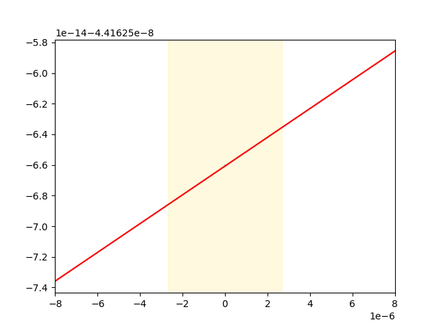
found U by substituting in paams! 
## Equation 8:
```
ICaL__i_CaL_Na_SL = (-ICaL__gamma_Nao * model_parameters__Nao + ICaL__gamma_Nai * Na_buffer__Na_SL * exp(cell__V * model_parameters__F / (model_parameters__R * model_parameters__T))) * ICaL__Fx_ICaL_SL * ICaL__PNa * ICaL__temp * ICaL_fCa_gate__fCa_SL / (-1.0 + exp(cell__V * model_parameters__F / (model_parameters__R * model_parameters__T)))
```
### Partially evaluated to: 
```
ICaL__i_CaL_Na_SL = 6.7499999999999994e-10 * pow(1.8, (-31.0 + 0.10000000000000001 * model_parameters__T)) * pow(model_parameters__F, 2) * (1.0 - ICaL_fCa_gate__fCaB_SL) * (-0.75 * model_parameters__Nao + 0.75 * Na_buffer__Na_SL * exp(cell__V * model_parameters__F / (model_parameters__R * model_parameters__T))) * ICaL_d_gate__d * ICaL_f_gate__f * cell__V / ((-1.0 + exp(cell__V * model_parameters__F / (model_parameters__R * model_parameters__T))) * model_parameters__R * model_parameters__T)
```
## New Eq:
```
ICaL__i_CaL_Na_SL = ((fabs(cell__V) < 2.6712831923985376e-6) ? ((0.5 + 187175.96150898977 * cell__V) * (1.8031161548690127e-15 * pow(1.8, (-31.0 + 0.10000000000000001 * model_parameters__T)) * pow(model_parameters__F, 2) * (1.0 - ICaL_fCa_gate__fCaB_SL) * (-0.75 * model_parameters__Nao + 0.75 * Na_buffer__Na_SL * exp(2.6712831923985376e-6 * model_parameters__F / (model_parameters__R * model_parameters__T))) * ICaL_d_gate__d * ICaL_f_gate__f / ((-1.0 + exp(2.6712831923985376e-6 * model_parameters__F / (model_parameters__R * model_parameters__T))) * model_parameters__R * model_parameters__T) + 1.8031161548690127e-15 * pow(1.8, (-31.0 + 0.10000000000000001 * model_parameters__T)) * pow(model_parameters__F, 2) * (1.0 - ICaL_fCa_gate__fCaB_SL) * (-0.75 * model_parameters__Nao + 0.75 * Na_buffer__Na_SL * exp(-2.6712831923985376e-6 * model_parameters__F / (model_parameters__R * model_parameters__T))) * ICaL_d_gate__d * ICaL_f_gate__f / ((-1.0 + exp(-2.6712831923985376e-6 * model_parameters__F / (model_parameters__R * model_parameters__T))) * model_parameters__R * model_parameters__T)) - 1.8031161548690127e-15 * pow(1.8, (-31.0 + 0.10000000000000001 * model_parameters__T)) * pow(model_parameters__F, 2) * (1.0 - ICaL_fCa_gate__fCaB_SL) * (-0.75 * model_parameters__Nao + 0.75 * Na_buffer__Na_SL * exp(-2.6712831923985376e-6 * model_parameters__F / (model_parameters__R * model_parameters__T))) * ICaL_d_gate__d * ICaL_f_gate__f / ((-1.0 + exp(-2.6712831923985376e-6 * model_parameters__F / (model_parameters__R * model_parameters__T))) * model_parameters__R * model_parameters__T)) : ((-ICaL__gamma_Nao * model_parameters__Nao + ICaL__gamma_Nai * Na_buffer__Na_SL * exp(cell__V * model_parameters__F / (model_parameters__R * model_parameters__T))) * ICaL__Fx_ICaL_SL * ICaL__PNa * ICaL__temp * ICaL_fCa_gate__fCa_SL / (-1.0 + exp(cell__V * model_parameters__F / (model_parameters__R * model_parameters__T)))))
```

*U*: 
0.037435192301797954 * cell__V
*V for 1e-07 range* 
`-2.6712831923985376e-6 - 2.6712831923985376e-6`

*Singularity point: 0*

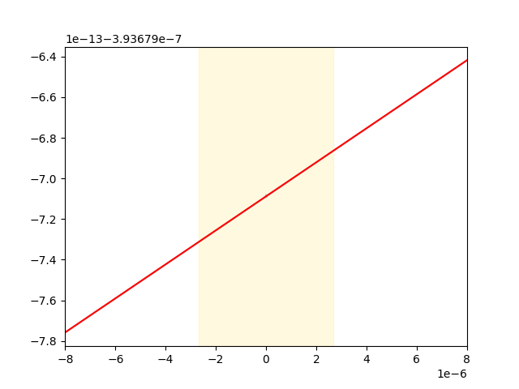
found U by substituting in paams! 
## Equation 9:
```
ICaL__i_CaL_Na_jct = (-ICaL__gamma_Nao * model_parameters__Nao + ICaL__gamma_Nai * Na_buffer__Na_jct * exp(cell__V * model_parameters__F / (model_parameters__R * model_parameters__T))) * ICaL__Fx_ICaL_jct * ICaL__PNa * ICaL__temp * ICaL_fCa_gate__fCa_jct / (-1.0 + exp(cell__V * model_parameters__F / (model_parameters__R * model_parameters__T)))
```
### Partially evaluated to: 
```
ICaL__i_CaL_Na_jct = 6.0749999999999998e-9 * pow(1.8, (-31.0 + 0.10000000000000001 * model_parameters__T)) * pow(model_parameters__F, 2) * (1.0 - ICaL_fCa_gate__fCaB_jct) * (-0.75 * model_parameters__Nao + 0.75 * Na_buffer__Na_jct * exp(cell__V * model_parameters__F / (model_parameters__R * model_parameters__T))) * ICaL_d_gate__d * ICaL_f_gate__f * cell__V / ((-1.0 + exp(cell__V * model_parameters__F / (model_parameters__R * model_parameters__T))) * model_parameters__R * model_parameters__T)
```
## New Eq:
```
ICaL__i_CaL_Na_jct = ((fabs(cell__V) < 2.6712831923985376e-6) ? ((0.5 + 187175.96150898977 * cell__V) * (1.6228045393821114e-14 * pow(1.8, (-31.0 + 0.10000000000000001 * model_parameters__T)) * pow(model_parameters__F, 2) * (1.0 - ICaL_fCa_gate__fCaB_jct) * (-0.75 * model_parameters__Nao + 0.75 * Na_buffer__Na_jct * exp(2.6712831923985376e-6 * model_parameters__F / (model_parameters__R * model_parameters__T))) * ICaL_d_gate__d * ICaL_f_gate__f / ((-1.0 + exp(2.6712831923985376e-6 * model_parameters__F / (model_parameters__R * model_parameters__T))) * model_parameters__R * model_parameters__T) + 1.6228045393821114e-14 * pow(1.8, (-31.0 + 0.10000000000000001 * model_parameters__T)) * pow(model_parameters__F, 2) * (1.0 - ICaL_fCa_gate__fCaB_jct) * (-0.75 * model_parameters__Nao + 0.75 * Na_buffer__Na_jct * exp(-2.6712831923985376e-6 * model_parameters__F / (model_parameters__R * model_parameters__T))) * ICaL_d_gate__d * ICaL_f_gate__f / ((-1.0 + exp(-2.6712831923985376e-6 * model_parameters__F / (model_parameters__R * model_parameters__T))) * model_parameters__R * model_parameters__T)) - 1.6228045393821114e-14 * pow(1.8, (-31.0 + 0.10000000000000001 * model_parameters__T)) * pow(model_parameters__F, 2) * (1.0 - ICaL_fCa_gate__fCaB_jct) * (-0.75 * model_parameters__Nao + 0.75 * Na_buffer__Na_jct * exp(-2.6712831923985376e-6 * model_parameters__F / (model_parameters__R * model_parameters__T))) * ICaL_d_gate__d * ICaL_f_gate__f / ((-1.0 + exp(-2.6712831923985376e-6 * model_parameters__F / (model_parameters__R * model_parameters__T))) * model_parameters__R * model_parameters__T)) : ((-ICaL__gamma_Nao * model_parameters__Nao + ICaL__gamma_Nai * Na_buffer__Na_jct * exp(cell__V * model_parameters__F / (model_parameters__R * model_parameters__T))) * ICaL__Fx_ICaL_jct * ICaL__PNa * ICaL__temp * ICaL_fCa_gate__fCa_jct / (-1.0 + exp(cell__V * model_parameters__F / (model_parameters__R * model_parameters__T)))))
```

singularity processing time: 61.57480480000004
# Model: stewart_zhang_model_2008(stewart_zhang_model_2008_ss.cellml)
load time: 3.002222100000381

*U*: 
-1.1230167246823641 + 0.074867781645490947 * membrane__V
*V for 1e-07 range* 
`14.999998664311967 - 15.000001335688033`
15.000000000000000

*Singularity point: 15.000000000000000*

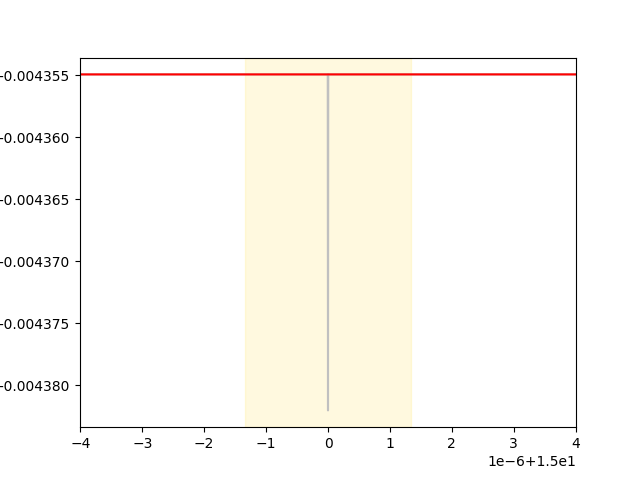
## Equation 1:
```
L_type_Ca_current__i_CaL = 4.0 * pow(membrane__F, 2) * (-15.0 + membrane__V) * (-calcium_dynamics__Ca_o + 0.25 * calcium_dynamics__Ca_ss * exp(2.0 * (-15.0 + membrane__V) * membrane__F / (membrane__R * membrane__T))) * L_type_Ca_current__g_CaL * L_type_Ca_current_d_gate__d * L_type_Ca_current_f2_gate__f2 * L_type_Ca_current_fCass_gate__fCass * L_type_Ca_current_f_gate__f / ((-1.0 + exp(2.0 * (-15.0 + membrane__V) * membrane__F / (membrane__R * membrane__T))) * membrane__R * membrane__T)
```
### Partially evaluated to: 
```
L_type_Ca_current__i_CaL = 14447.286958825251 * (-15.0 + membrane__V) * (-calcium_dynamics__Ca_o + 0.081324245374225654 * calcium_dynamics__Ca_ss * exp(0.074867781645490947 * membrane__V)) * L_type_Ca_current__g_CaL * L_type_Ca_current_d_gate__d * L_type_Ca_current_f2_gate__f2 * L_type_Ca_current_fCass_gate__fCass * L_type_Ca_current_f_gate__f / (-1.0 + 0.32529698149690262 * exp(0.074867781645490947 * membrane__V))
```
## New Eq:
```
L_type_Ca_current__i_CaL = ((fabs(-15.0 + membrane__V) < 1.3356880329828957e-6) ? ((-5615083.1234197523 + 374338.90822798351 * membrane__V) * (192970.6733533566 * (-calcium_dynamics__Ca_o + 0.25000002500000124 * calcium_dynamics__Ca_ss) * L_type_Ca_current__g_CaL * L_type_Ca_current_d_gate__d * L_type_Ca_current_f2_gate__f2 * L_type_Ca_current_fCass_gate__fCass * L_type_Ca_current_f_gate__f - 192970.69265006497 * (-calcium_dynamics__Ca_o + 0.24999997500000126 * calcium_dynamics__Ca_ss) * L_type_Ca_current__g_CaL * L_type_Ca_current_d_gate__d * L_type_Ca_current_f2_gate__f2 * L_type_Ca_current_fCass_gate__fCass * L_type_Ca_current_f_gate__f) + 192970.69265006497 * (-calcium_dynamics__Ca_o + 0.24999997500000126 * calcium_dynamics__Ca_ss) * L_type_Ca_current__g_CaL * L_type_Ca_current_d_gate__d * L_type_Ca_current_f2_gate__f2 * L_type_Ca_current_fCass_gate__fCass * L_type_Ca_current_f_gate__f) : (4.0 * pow(membrane__F, 2) * (-15.0 + membrane__V) * (-calcium_dynamics__Ca_o + 0.25 * calcium_dynamics__Ca_ss * exp(2.0 * (-15.0 + membrane__V) * membrane__F / (membrane__R * membrane__T))) * L_type_Ca_current__g_CaL * L_type_Ca_current_d_gate__d * L_type_Ca_current_f2_gate__f2 * L_type_Ca_current_fCass_gate__fCass * L_type_Ca_current_f_gate__f / ((-1.0 + exp(2.0 * (-15.0 + membrane__V) * membrane__F / (membrane__R * membrane__T))) * membrane__R * membrane__T)))
```

singularity processing time: 9.199496599999748
# Model: tentusscher_model_2004_endo(ten_tusscher_model_2004_endo.cellml)
load time: 2.3550654999999097

*U*: 
0.074867781645490947 * membrane__V
*V for 1e-07 range* 
`-1.3356880329847825e-6 - 1.3356880329847825e-6`

*Singularity point: 0*


## Equation 1:
```
L_type_Ca_current__i_CaL = 4.0 * pow(membrane__F, 2) * (-0.34100000000000003 * calcium_dynamics__Ca_o + calcium_dynamics__Ca_i * exp(2.0 * membrane__F * membrane__V / (membrane__R * membrane__T))) * L_type_Ca_current__g_CaL * L_type_Ca_current_d_gate__d * L_type_Ca_current_fCa_gate__fCa * L_type_Ca_current_f_gate__f * membrane__V / ((-1.0 + exp(2.0 * membrane__F * membrane__V / (membrane__R * membrane__T))) * membrane__R * membrane__T)
```
### Partially evaluated to: 
```
L_type_Ca_current__i_CaL = 14447.286958825251 * (-0.34100000000000003 * calcium_dynamics__Ca_o + calcium_dynamics__Ca_i * exp(0.074867781645490947 * membrane__V)) * L_type_Ca_current__g_CaL * L_type_Ca_current_d_gate__d * L_type_Ca_current_fCa_gate__fCa * L_type_Ca_current_f_gate__f * membrane__V / (-1.0 + exp(0.074867781645490947 * membrane__V))
```
## New Eq:
```
L_type_Ca_current__i_CaL = ((fabs(membrane__V) < 1.3356880329847825e-6) ? ((0.5 + 374338.90822745475 * membrane__V) * (192970.67335028166 * (1.0000001000000049 * calcium_dynamics__Ca_i - 0.34100000000000003 * calcium_dynamics__Ca_o) * L_type_Ca_current__g_CaL * L_type_Ca_current_d_gate__d * L_type_Ca_current_fCa_gate__fCa * L_type_Ca_current_f_gate__f - 192970.6926486638 * (0.99999990000000505 * calcium_dynamics__Ca_i - 0.34100000000000003 * calcium_dynamics__Ca_o) * L_type_Ca_current__g_CaL * L_type_Ca_current_d_gate__d * L_type_Ca_current_fCa_gate__fCa * L_type_Ca_current_f_gate__f) + 192970.6926486638 * (0.99999990000000505 * calcium_dynamics__Ca_i - 0.34100000000000003 * calcium_dynamics__Ca_o) * L_type_Ca_current__g_CaL * L_type_Ca_current_d_gate__d * L_type_Ca_current_fCa_gate__fCa * L_type_Ca_current_f_gate__f) : (4.0 * pow(membrane__F, 2) * (-0.34100000000000003 * calcium_dynamics__Ca_o + calcium_dynamics__Ca_i * exp(2.0 * membrane__F * membrane__V / (membrane__R * membrane__T))) * L_type_Ca_current__g_CaL * L_type_Ca_current_d_gate__d * L_type_Ca_current_fCa_gate__fCa * L_type_Ca_current_f_gate__f * membrane__V / ((-1.0 + exp(2.0 * membrane__F * membrane__V / (membrane__R * membrane__T))) * membrane__R * membrane__T)))
```

singularity processing time: 8.868487399999594
# Model: tentusscher_model_2004_epi(ten_tusscher_model_2004_epi.cellml)
load time: 2.9031239999999343

singularity processing time: 5.759537200000068
# Model: tentusscher_model_2004_M(ten_tusscher_model_2004_M.cellml)
load time: 2.330522799999926

*U*: 
0.074867781645490947 * membrane__V
*V for 1e-07 range* 
`-1.3356880329847825e-6 - 1.3356880329847825e-6`

*Singularity point: 0*

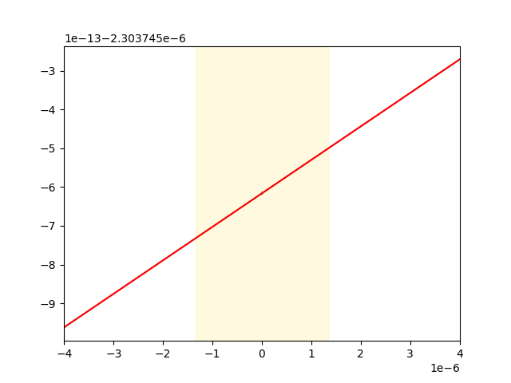
## Equation 1:
```
L_type_Ca_current__i_CaL = 4.0 * pow(membrane__F, 2) * (-0.34100000000000003 * calcium_dynamics__Ca_o + calcium_dynamics__Ca_i * exp(2.0 * membrane__F * membrane__V / (membrane__R * membrane__T))) * L_type_Ca_current__g_CaL * L_type_Ca_current_d_gate__d * L_type_Ca_current_fCa_gate__fCa * L_type_Ca_current_f_gate__f * membrane__V / ((-1.0 + exp(2.0 * membrane__F * membrane__V / (membrane__R * membrane__T))) * membrane__R * membrane__T)
```
### Partially evaluated to: 
```
L_type_Ca_current__i_CaL = 14447.286958825251 * (-0.34100000000000003 * calcium_dynamics__Ca_o + calcium_dynamics__Ca_i * exp(0.074867781645490947 * membrane__V)) * L_type_Ca_current__g_CaL * L_type_Ca_current_d_gate__d * L_type_Ca_current_fCa_gate__fCa * L_type_Ca_current_f_gate__f * membrane__V / (-1.0 + exp(0.074867781645490947 * membrane__V))
```
## New Eq:
```
L_type_Ca_current__i_CaL = ((fabs(membrane__V) < 1.3356880329847825e-6) ? ((0.5 + 374338.90822745475 * membrane__V) * (192970.67335028166 * (1.0000001000000049 * calcium_dynamics__Ca_i - 0.34100000000000003 * calcium_dynamics__Ca_o) * L_type_Ca_current__g_CaL * L_type_Ca_current_d_gate__d * L_type_Ca_current_fCa_gate__fCa * L_type_Ca_current_f_gate__f - 192970.6926486638 * (0.99999990000000505 * calcium_dynamics__Ca_i - 0.34100000000000003 * calcium_dynamics__Ca_o) * L_type_Ca_current__g_CaL * L_type_Ca_current_d_gate__d * L_type_Ca_current_fCa_gate__fCa * L_type_Ca_current_f_gate__f) + 192970.6926486638 * (0.99999990000000505 * calcium_dynamics__Ca_i - 0.34100000000000003 * calcium_dynamics__Ca_o) * L_type_Ca_current__g_CaL * L_type_Ca_current_d_gate__d * L_type_Ca_current_fCa_gate__fCa * L_type_Ca_current_f_gate__f) : (4.0 * pow(membrane__F, 2) * (-0.34100000000000003 * calcium_dynamics__Ca_o + calcium_dynamics__Ca_i * exp(2.0 * membrane__F * membrane__V / (membrane__R * membrane__T))) * L_type_Ca_current__g_CaL * L_type_Ca_current_d_gate__d * L_type_Ca_current_fCa_gate__fCa * L_type_Ca_current_f_gate__f * membrane__V / ((-1.0 + exp(2.0 * membrane__F * membrane__V / (membrane__R * membrane__T))) * membrane__R * membrane__T)))
```

singularity processing time: 9.291339699999753
# Model: tentusscher_model_2006_endo(ten_tusscher_model_2006_endo.cellml)
load time: 2.473233600000185

singularity processing time: 5.34704180000017
# Model: tentusscher_model_2006_epi(ten_tusscher_model_2006_epi.cellml)
load time: 2.5586057000000437

singularity processing time: 5.440682999999808
# Model: tentusscher_model_2006_M(ten_tusscher_model_2006_M.cellml)
load time: 2.7523777999999766

singularity processing time: 6.128993100000116
# Model: Tomek_model13endo(ToRORd_fkatp_endo.cellml)
load time: 5.868072300000222

*U*: 
0.037435883507802616 * membrane__v
*V for 1e-07 range* 
`-2.6712338705498262e-6 - 2.6712338705498262e-6`

*Singularity point: 0*

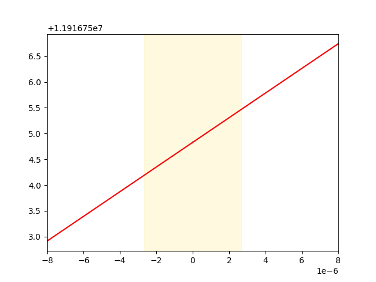
found U by substituting in paams! 
## Equation 1:
```
ICaL__PhiCaK_i = (-ICaL__gamma_ko * extracellular__ko + ICaL__gamma_ki * intracellular_ions__ki * exp(membrane__vfrt)) * membrane__vffrt / (-1.0 + exp(membrane__vfrt))
```
### Partially evaluated to: 
```
ICaL__PhiCaK_i = pow(physical_constants__F, 2) * (-extracellular__ko * exp(-2859.0635474831229 * pow(physical_constants__T, (-1.5)) * (-0.00014999999999999999 * extracellular__clo - 0.00014999999999999999 * extracellular__ko - 0.00014999999999999999 * extracellular__nao - 0.00059999999999999995 * extracellular__cao + 0.044721359549995794 * sqrt(0.25 * extracellular__clo + 0.25 * extracellular__ko + 0.25 * extracellular__nao + extracellular__cao) / (1.0 + 0.044721359549995794 * sqrt(0.25 * extracellular__clo + 0.25 * extracellular__ko + 0.25 * extracellular__nao + extracellular__cao)))) + intracellular_ions__ki * exp(-2859.0635474831229 * pow(physical_constants__T, (-1.5)) * (-0.00014999999999999999 * intracellular_ions__cli - 0.00014999999999999999 * intracellular_ions__ki - 0.00014999999999999999 * intracellular_ions__nai - 0.00059999999999999995 * intracellular_ions__cai + 0.044721359549995794 * sqrt(0.25 * intracellular_ions__cli + 0.25 * intracellular_ions__ki + 0.25 * intracellular_ions__nai + intracellular_ions__cai) / (1.0 + 0.044721359549995794 * sqrt(0.25 * intracellular_ions__cli + 0.25 * intracellular_ions__ki + 0.25 * intracellular_ions__nai + intracellular_ions__cai)))) * exp(membrane__v * physical_constants__F / (physical_constants__R * physical_constants__T))) * membrane__v / ((-1.0 + exp(membrane__v * physical_constants__F / (physical_constants__R * physical_constants__T))) * physical_constants__R * physical_constants__T)
```
## New Eq:
```
ICaL__PhiCaK_i = ((fabs(membrane__v) < 2.6712338705498262e-6) ? ((0.5 + 187179.41753901311 * membrane__v) * (2.6712338705498262e-6 * pow(physical_constants__F, 2) * (-extracellular__ko * exp(-2859.0635474831229 * pow(physical_constants__T, (-1.5)) * (-0.00014999999999999999 * extracellular__clo - 0.00014999999999999999 * extracellular__ko - 0.00014999999999999999 * extracellular__nao - 0.00059999999999999995 * extracellular__cao + 0.044721359549995794 * sqrt(0.25 * extracellular__clo + 0.25 * extracellular__ko + 0.25 * extracellular__nao + extracellular__cao) / (1.0 + 0.044721359549995794 * sqrt(0.25 * extracellular__clo + 0.25 * extracellular__ko + 0.25 * extracellular__nao + extracellular__cao)))) + intracellular_ions__ki * exp(-2859.0635474831229 * pow(physical_constants__T, (-1.5)) * (-0.00014999999999999999 * intracellular_ions__cli - 0.00014999999999999999 * intracellular_ions__ki - 0.00014999999999999999 * intracellular_ions__nai - 0.00059999999999999995 * intracellular_ions__cai + 0.044721359549995794 * sqrt(0.25 * intracellular_ions__cli + 0.25 * intracellular_ions__ki + 0.25 * intracellular_ions__nai + intracellular_ions__cai) / (1.0 + 0.044721359549995794 * sqrt(0.25 * intracellular_ions__cli + 0.25 * intracellular_ions__ki + 0.25 * intracellular_ions__nai + intracellular_ions__cai)))) * exp(2.6712338705498262e-6 * physical_constants__F / (physical_constants__R * physical_constants__T))) / ((-1.0 + exp(2.6712338705498262e-6 * physical_constants__F / (physical_constants__R * physical_constants__T))) * physical_constants__R * physical_constants__T) + 2.6712338705498262e-6 * pow(physical_constants__F, 2) * (-extracellular__ko * exp(-2859.0635474831229 * pow(physical_constants__T, (-1.5)) * (-0.00014999999999999999 * extracellular__clo - 0.00014999999999999999 * extracellular__ko - 0.00014999999999999999 * extracellular__nao - 0.00059999999999999995 * extracellular__cao + 0.044721359549995794 * sqrt(0.25 * extracellular__clo + 0.25 * extracellular__ko + 0.25 * extracellular__nao + extracellular__cao) / (1.0 + 0.044721359549995794 * sqrt(0.25 * extracellular__clo + 0.25 * extracellular__ko + 0.25 * extracellular__nao + extracellular__cao)))) + intracellular_ions__ki * exp(-2859.0635474831229 * pow(physical_constants__T, (-1.5)) * (-0.00014999999999999999 * intracellular_ions__cli - 0.00014999999999999999 * intracellular_ions__ki - 0.00014999999999999999 * intracellular_ions__nai - 0.00059999999999999995 * intracellular_ions__cai + 0.044721359549995794 * sqrt(0.25 * intracellular_ions__cli + 0.25 * intracellular_ions__ki + 0.25 * intracellular_ions__nai + intracellular_ions__cai) / (1.0 + 0.044721359549995794 * sqrt(0.25 * intracellular_ions__cli + 0.25 * intracellular_ions__ki + 0.25 * intracellular_ions__nai + intracellular_ions__cai)))) * exp(-2.6712338705498262e-6 * physical_constants__F / (physical_constants__R * physical_constants__T))) / ((-1.0 + exp(-2.6712338705498262e-6 * physical_constants__F / (physical_constants__R * physical_constants__T))) * physical_constants__R * physical_constants__T)) - 2.6712338705498262e-6 * pow(physical_constants__F, 2) * (-extracellular__ko * exp(-2859.0635474831229 * pow(physical_constants__T, (-1.5)) * (-0.00014999999999999999 * extracellular__clo - 0.00014999999999999999 * extracellular__ko - 0.00014999999999999999 * extracellular__nao - 0.00059999999999999995 * extracellular__cao + 0.044721359549995794 * sqrt(0.25 * extracellular__clo + 0.25 * extracellular__ko + 0.25 * extracellular__nao + extracellular__cao) / (1.0 + 0.044721359549995794 * sqrt(0.25 * extracellular__clo + 0.25 * extracellular__ko + 0.25 * extracellular__nao + extracellular__cao)))) + intracellular_ions__ki * exp(-2859.0635474831229 * pow(physical_constants__T, (-1.5)) * (-0.00014999999999999999 * intracellular_ions__cli - 0.00014999999999999999 * intracellular_ions__ki - 0.00014999999999999999 * intracellular_ions__nai - 0.00059999999999999995 * intracellular_ions__cai + 0.044721359549995794 * sqrt(0.25 * intracellular_ions__cli + 0.25 * intracellular_ions__ki + 0.25 * intracellular_ions__nai + intracellular_ions__cai) / (1.0 + 0.044721359549995794 * sqrt(0.25 * intracellular_ions__cli + 0.25 * intracellular_ions__ki + 0.25 * intracellular_ions__nai + intracellular_ions__cai)))) * exp(-2.6712338705498262e-6 * physical_constants__F / (physical_constants__R * physical_constants__T))) / ((-1.0 + exp(-2.6712338705498262e-6 * physical_constants__F / (physical_constants__R * physical_constants__T))) * physical_constants__R * physical_constants__T)) : ((-ICaL__gamma_ko * extracellular__ko + ICaL__gamma_ki * intracellular_ions__ki * exp(membrane__vfrt)) * membrane__vffrt / (-1.0 + exp(membrane__vfrt))))
```

*U*: 
0.037435883507802616 * membrane__v
*V for 1e-07 range* 
`-2.6712338705498262e-6 - 2.6712338705498262e-6`

*Singularity point: 0*


found U by substituting in paams! 
## Equation 2:
```
ICaL__PhiCaK_ss = (-ICaL__gamma_ko * extracellular__ko + ICaL__gamma_kss * intracellular_ions__kss * exp(membrane__vfrt)) * membrane__vffrt / (-1.0 + exp(membrane__vfrt))
```
### Partially evaluated to: 
```
ICaL__PhiCaK_ss = pow(physical_constants__F, 2) * (-extracellular__ko * exp(-2859.0635474831229 * pow(physical_constants__T, (-1.5)) * (-0.00014999999999999999 * extracellular__clo - 0.00014999999999999999 * extracellular__ko - 0.00014999999999999999 * extracellular__nao - 0.00059999999999999995 * extracellular__cao + 0.044721359549995794 * sqrt(0.25 * extracellular__clo + 0.25 * extracellular__ko + 0.25 * extracellular__nao + extracellular__cao) / (1.0 + 0.044721359549995794 * sqrt(0.25 * extracellular__clo + 0.25 * extracellular__ko + 0.25 * extracellular__nao + extracellular__cao)))) + intracellular_ions__kss * exp(-2859.0635474831229 * pow(physical_constants__T, (-1.5)) * (-0.00014999999999999999 * intracellular_ions__cli - 0.00014999999999999999 * intracellular_ions__kss - 0.00014999999999999999 * intracellular_ions__nass - 0.00059999999999999995 * intracellular_ions__cass + 0.044721359549995794 * sqrt(0.25 * intracellular_ions__cli + 0.25 * intracellular_ions__kss + 0.25 * intracellular_ions__nass + intracellular_ions__cass) / (1.0 + 0.044721359549995794 * sqrt(0.25 * intracellular_ions__cli + 0.25 * intracellular_ions__kss + 0.25 * intracellular_ions__nass + intracellular_ions__cass)))) * exp(membrane__v * physical_constants__F / (physical_constants__R * physical_constants__T))) * membrane__v / ((-1.0 + exp(membrane__v * physical_constants__F / (physical_constants__R * physical_constants__T))) * physical_constants__R * physical_constants__T)
```
## New Eq:
```
ICaL__PhiCaK_ss = ((fabs(membrane__v) < 2.6712338705498262e-6) ? ((0.5 + 187179.41753901311 * membrane__v) * (2.6712338705498262e-6 * pow(physical_constants__F, 2) * (-extracellular__ko * exp(-2859.0635474831229 * pow(physical_constants__T, (-1.5)) * (-0.00014999999999999999 * extracellular__clo - 0.00014999999999999999 * extracellular__ko - 0.00014999999999999999 * extracellular__nao - 0.00059999999999999995 * extracellular__cao + 0.044721359549995794 * sqrt(0.25 * extracellular__clo + 0.25 * extracellular__ko + 0.25 * extracellular__nao + extracellular__cao) / (1.0 + 0.044721359549995794 * sqrt(0.25 * extracellular__clo + 0.25 * extracellular__ko + 0.25 * extracellular__nao + extracellular__cao)))) + intracellular_ions__kss * exp(-2859.0635474831229 * pow(physical_constants__T, (-1.5)) * (-0.00014999999999999999 * intracellular_ions__cli - 0.00014999999999999999 * intracellular_ions__kss - 0.00014999999999999999 * intracellular_ions__nass - 0.00059999999999999995 * intracellular_ions__cass + 0.044721359549995794 * sqrt(0.25 * intracellular_ions__cli + 0.25 * intracellular_ions__kss + 0.25 * intracellular_ions__nass + intracellular_ions__cass) / (1.0 + 0.044721359549995794 * sqrt(0.25 * intracellular_ions__cli + 0.25 * intracellular_ions__kss + 0.25 * intracellular_ions__nass + intracellular_ions__cass)))) * exp(2.6712338705498262e-6 * physical_constants__F / (physical_constants__R * physical_constants__T))) / ((-1.0 + exp(2.6712338705498262e-6 * physical_constants__F / (physical_constants__R * physical_constants__T))) * physical_constants__R * physical_constants__T) + 2.6712338705498262e-6 * pow(physical_constants__F, 2) * (-extracellular__ko * exp(-2859.0635474831229 * pow(physical_constants__T, (-1.5)) * (-0.00014999999999999999 * extracellular__clo - 0.00014999999999999999 * extracellular__ko - 0.00014999999999999999 * extracellular__nao - 0.00059999999999999995 * extracellular__cao + 0.044721359549995794 * sqrt(0.25 * extracellular__clo + 0.25 * extracellular__ko + 0.25 * extracellular__nao + extracellular__cao) / (1.0 + 0.044721359549995794 * sqrt(0.25 * extracellular__clo + 0.25 * extracellular__ko + 0.25 * extracellular__nao + extracellular__cao)))) + intracellular_ions__kss * exp(-2859.0635474831229 * pow(physical_constants__T, (-1.5)) * (-0.00014999999999999999 * intracellular_ions__cli - 0.00014999999999999999 * intracellular_ions__kss - 0.00014999999999999999 * intracellular_ions__nass - 0.00059999999999999995 * intracellular_ions__cass + 0.044721359549995794 * sqrt(0.25 * intracellular_ions__cli + 0.25 * intracellular_ions__kss + 0.25 * intracellular_ions__nass + intracellular_ions__cass) / (1.0 + 0.044721359549995794 * sqrt(0.25 * intracellular_ions__cli + 0.25 * intracellular_ions__kss + 0.25 * intracellular_ions__nass + intracellular_ions__cass)))) * exp(-2.6712338705498262e-6 * physical_constants__F / (physical_constants__R * physical_constants__T))) / ((-1.0 + exp(-2.6712338705498262e-6 * physical_constants__F / (physical_constants__R * physical_constants__T))) * physical_constants__R * physical_constants__T)) - 2.6712338705498262e-6 * pow(physical_constants__F, 2) * (-extracellular__ko * exp(-2859.0635474831229 * pow(physical_constants__T, (-1.5)) * (-0.00014999999999999999 * extracellular__clo - 0.00014999999999999999 * extracellular__ko - 0.00014999999999999999 * extracellular__nao - 0.00059999999999999995 * extracellular__cao + 0.044721359549995794 * sqrt(0.25 * extracellular__clo + 0.25 * extracellular__ko + 0.25 * extracellular__nao + extracellular__cao) / (1.0 + 0.044721359549995794 * sqrt(0.25 * extracellular__clo + 0.25 * extracellular__ko + 0.25 * extracellular__nao + extracellular__cao)))) + intracellular_ions__kss * exp(-2859.0635474831229 * pow(physical_constants__T, (-1.5)) * (-0.00014999999999999999 * intracellular_ions__cli - 0.00014999999999999999 * intracellular_ions__kss - 0.00014999999999999999 * intracellular_ions__nass - 0.00059999999999999995 * intracellular_ions__cass + 0.044721359549995794 * sqrt(0.25 * intracellular_ions__cli + 0.25 * intracellular_ions__kss + 0.25 * intracellular_ions__nass + intracellular_ions__cass) / (1.0 + 0.044721359549995794 * sqrt(0.25 * intracellular_ions__cli + 0.25 * intracellular_ions__kss + 0.25 * intracellular_ions__nass + intracellular_ions__cass)))) * exp(-2.6712338705498262e-6 * physical_constants__F / (physical_constants__R * physical_constants__T))) / ((-1.0 + exp(-2.6712338705498262e-6 * physical_constants__F / (physical_constants__R * physical_constants__T))) * physical_constants__R * physical_constants__T)) : ((-ICaL__gamma_ko * extracellular__ko + ICaL__gamma_kss * intracellular_ions__kss * exp(membrane__vfrt)) * membrane__vffrt / (-1.0 + exp(membrane__vfrt))))
```

*U*: 
0.074871767015605231 * membrane__v
*V for 1e-07 range* 
`-1.3356169352749131e-6 - 1.3356169352749131e-6`

*Singularity point: 0*


found U by substituting in paams! 
## Equation 3:
```
ICaL__PhiCaL_i = 4.0 * (-ICaL__gamma_cao * extracellular__cao + ICaL__gamma_cai * intracellular_ions__cai * exp(2.0 * membrane__vfrt)) * membrane__vffrt / (-1.0 + exp(2.0 * membrane__vfrt))
```
### Partially evaluated to: 
```
ICaL__PhiCaL_i = 4.0 * pow(physical_constants__F, 2) * (-extracellular__cao * exp(-11436.254189932491 * pow(physical_constants__T, (-1.5)) * (-0.00014999999999999999 * extracellular__clo - 0.00014999999999999999 * extracellular__ko - 0.00014999999999999999 * extracellular__nao - 0.00059999999999999995 * extracellular__cao + 0.044721359549995794 * sqrt(0.25 * extracellular__clo + 0.25 * extracellular__ko + 0.25 * extracellular__nao + extracellular__cao) / (1.0 + 0.044721359549995794 * sqrt(0.25 * extracellular__clo + 0.25 * extracellular__ko + 0.25 * extracellular__nao + extracellular__cao)))) + intracellular_ions__cai * exp(-11436.254189932491 * pow(physical_constants__T, (-1.5)) * (-0.00014999999999999999 * intracellular_ions__cli - 0.00014999999999999999 * intracellular_ions__ki - 0.00014999999999999999 * intracellular_ions__nai - 0.00059999999999999995 * intracellular_ions__cai + 0.044721359549995794 * sqrt(0.25 * intracellular_ions__cli + 0.25 * intracellular_ions__ki + 0.25 * intracellular_ions__nai + intracellular_ions__cai) / (1.0 + 0.044721359549995794 * sqrt(0.25 * intracellular_ions__cli + 0.25 * intracellular_ions__ki + 0.25 * intracellular_ions__nai + intracellular_ions__cai)))) * exp(2.0 * membrane__v * physical_constants__F / (physical_constants__R * physical_constants__T))) * membrane__v / ((-1.0 + exp(2.0 * membrane__v * physical_constants__F / (physical_constants__R * physical_constants__T))) * physical_constants__R * physical_constants__T)
```
## New Eq:
```
ICaL__PhiCaL_i = ((fabs(membrane__v) < 1.3356169352749131e-6) ? ((0.5 + 374358.83507802623 * membrane__v) * (5.3424677410996524e-6 * pow(physical_constants__F, 2) * (-extracellular__cao * exp(-11436.254189932491 * pow(physical_constants__T, (-1.5)) * (-0.00014999999999999999 * extracellular__clo - 0.00014999999999999999 * extracellular__ko - 0.00014999999999999999 * extracellular__nao - 0.00059999999999999995 * extracellular__cao + 0.044721359549995794 * sqrt(0.25 * extracellular__clo + 0.25 * extracellular__ko + 0.25 * extracellular__nao + extracellular__cao) / (1.0 + 0.044721359549995794 * sqrt(0.25 * extracellular__clo + 0.25 * extracellular__ko + 0.25 * extracellular__nao + extracellular__cao)))) + intracellular_ions__cai * exp(-11436.254189932491 * pow(physical_constants__T, (-1.5)) * (-0.00014999999999999999 * intracellular_ions__cli - 0.00014999999999999999 * intracellular_ions__ki - 0.00014999999999999999 * intracellular_ions__nai - 0.00059999999999999995 * intracellular_ions__cai + 0.044721359549995794 * sqrt(0.25 * intracellular_ions__cli + 0.25 * intracellular_ions__ki + 0.25 * intracellular_ions__nai + intracellular_ions__cai) / (1.0 + 0.044721359549995794 * sqrt(0.25 * intracellular_ions__cli + 0.25 * intracellular_ions__ki + 0.25 * intracellular_ions__nai + intracellular_ions__cai)))) * exp(2.6712338705498262e-6 * physical_constants__F / (physical_constants__R * physical_constants__T))) / ((-1.0 + exp(2.6712338705498262e-6 * physical_constants__F / (physical_constants__R * physical_constants__T))) * physical_constants__R * physical_constants__T) + 5.3424677410996524e-6 * pow(physical_constants__F, 2) * (-extracellular__cao * exp(-11436.254189932491 * pow(physical_constants__T, (-1.5)) * (-0.00014999999999999999 * extracellular__clo - 0.00014999999999999999 * extracellular__ko - 0.00014999999999999999 * extracellular__nao - 0.00059999999999999995 * extracellular__cao + 0.044721359549995794 * sqrt(0.25 * extracellular__clo + 0.25 * extracellular__ko + 0.25 * extracellular__nao + extracellular__cao) / (1.0 + 0.044721359549995794 * sqrt(0.25 * extracellular__clo + 0.25 * extracellular__ko + 0.25 * extracellular__nao + extracellular__cao)))) + intracellular_ions__cai * exp(-11436.254189932491 * pow(physical_constants__T, (-1.5)) * (-0.00014999999999999999 * intracellular_ions__cli - 0.00014999999999999999 * intracellular_ions__ki - 0.00014999999999999999 * intracellular_ions__nai - 0.00059999999999999995 * intracellular_ions__cai + 0.044721359549995794 * sqrt(0.25 * intracellular_ions__cli + 0.25 * intracellular_ions__ki + 0.25 * intracellular_ions__nai + intracellular_ions__cai) / (1.0 + 0.044721359549995794 * sqrt(0.25 * intracellular_ions__cli + 0.25 * intracellular_ions__ki + 0.25 * intracellular_ions__nai + intracellular_ions__cai)))) * exp(-2.6712338705498262e-6 * physical_constants__F / (physical_constants__R * physical_constants__T))) / ((-1.0 + exp(-2.6712338705498262e-6 * physical_constants__F / (physical_constants__R * physical_constants__T))) * physical_constants__R * physical_constants__T)) - 5.3424677410996524e-6 * pow(physical_constants__F, 2) * (-extracellular__cao * exp(-11436.254189932491 * pow(physical_constants__T, (-1.5)) * (-0.00014999999999999999 * extracellular__clo - 0.00014999999999999999 * extracellular__ko - 0.00014999999999999999 * extracellular__nao - 0.00059999999999999995 * extracellular__cao + 0.044721359549995794 * sqrt(0.25 * extracellular__clo + 0.25 * extracellular__ko + 0.25 * extracellular__nao + extracellular__cao) / (1.0 + 0.044721359549995794 * sqrt(0.25 * extracellular__clo + 0.25 * extracellular__ko + 0.25 * extracellular__nao + extracellular__cao)))) + intracellular_ions__cai * exp(-11436.254189932491 * pow(physical_constants__T, (-1.5)) * (-0.00014999999999999999 * intracellular_ions__cli - 0.00014999999999999999 * intracellular_ions__ki - 0.00014999999999999999 * intracellular_ions__nai - 0.00059999999999999995 * intracellular_ions__cai + 0.044721359549995794 * sqrt(0.25 * intracellular_ions__cli + 0.25 * intracellular_ions__ki + 0.25 * intracellular_ions__nai + intracellular_ions__cai) / (1.0 + 0.044721359549995794 * sqrt(0.25 * intracellular_ions__cli + 0.25 * intracellular_ions__ki + 0.25 * intracellular_ions__nai + intracellular_ions__cai)))) * exp(-2.6712338705498262e-6 * physical_constants__F / (physical_constants__R * physical_constants__T))) / ((-1.0 + exp(-2.6712338705498262e-6 * physical_constants__F / (physical_constants__R * physical_constants__T))) * physical_constants__R * physical_constants__T)) : (4.0 * (-ICaL__gamma_cao * extracellular__cao + ICaL__gamma_cai * intracellular_ions__cai * exp(2.0 * membrane__vfrt)) * membrane__vffrt / (-1.0 + exp(2.0 * membrane__vfrt))))
```

*U*: 
0.074871767015605231 * membrane__v
*V for 1e-07 range* 
`-1.3356169352749131e-6 - 1.3356169352749131e-6`

*Singularity point: 0*

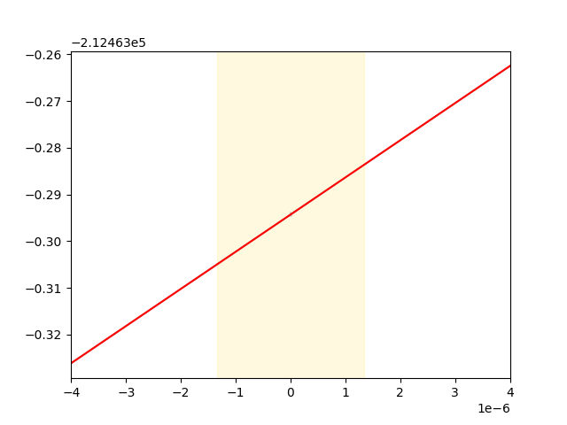
found U by substituting in paams! 
## Equation 4:
```
ICaL__PhiCaL_ss = 4.0 * (-ICaL__gamma_cao * extracellular__cao + ICaL__gamma_cass * intracellular_ions__cass * exp(2.0 * membrane__vfrt)) * membrane__vffrt / (-1.0 + exp(2.0 * membrane__vfrt))
```
### Partially evaluated to: 
```
ICaL__PhiCaL_ss = 4.0 * pow(physical_constants__F, 2) * (-extracellular__cao * exp(-11436.254189932491 * pow(physical_constants__T, (-1.5)) * (-0.00014999999999999999 * extracellular__clo - 0.00014999999999999999 * extracellular__ko - 0.00014999999999999999 * extracellular__nao - 0.00059999999999999995 * extracellular__cao + 0.044721359549995794 * sqrt(0.25 * extracellular__clo + 0.25 * extracellular__ko + 0.25 * extracellular__nao + extracellular__cao) / (1.0 + 0.044721359549995794 * sqrt(0.25 * extracellular__clo + 0.25 * extracellular__ko + 0.25 * extracellular__nao + extracellular__cao)))) + intracellular_ions__cass * exp(-11436.254189932491 * pow(physical_constants__T, (-1.5)) * (-0.00014999999999999999 * intracellular_ions__cli - 0.00014999999999999999 * intracellular_ions__kss - 0.00014999999999999999 * intracellular_ions__nass - 0.00059999999999999995 * intracellular_ions__cass + 0.044721359549995794 * sqrt(0.25 * intracellular_ions__cli + 0.25 * intracellular_ions__kss + 0.25 * intracellular_ions__nass + intracellular_ions__cass) / (1.0 + 0.044721359549995794 * sqrt(0.25 * intracellular_ions__cli + 0.25 * intracellular_ions__kss + 0.25 * intracellular_ions__nass + intracellular_ions__cass)))) * exp(2.0 * membrane__v * physical_constants__F / (physical_constants__R * physical_constants__T))) * membrane__v / ((-1.0 + exp(2.0 * membrane__v * physical_constants__F / (physical_constants__R * physical_constants__T))) * physical_constants__R * physical_constants__T)
```
## New Eq:
```
ICaL__PhiCaL_ss = ((fabs(membrane__v) < 1.3356169352749131e-6) ? ((0.5 + 374358.83507802623 * membrane__v) * (5.3424677410996524e-6 * pow(physical_constants__F, 2) * (-extracellular__cao * exp(-11436.254189932491 * pow(physical_constants__T, (-1.5)) * (-0.00014999999999999999 * extracellular__clo - 0.00014999999999999999 * extracellular__ko - 0.00014999999999999999 * extracellular__nao - 0.00059999999999999995 * extracellular__cao + 0.044721359549995794 * sqrt(0.25 * extracellular__clo + 0.25 * extracellular__ko + 0.25 * extracellular__nao + extracellular__cao) / (1.0 + 0.044721359549995794 * sqrt(0.25 * extracellular__clo + 0.25 * extracellular__ko + 0.25 * extracellular__nao + extracellular__cao)))) + intracellular_ions__cass * exp(-11436.254189932491 * pow(physical_constants__T, (-1.5)) * (-0.00014999999999999999 * intracellular_ions__cli - 0.00014999999999999999 * intracellular_ions__kss - 0.00014999999999999999 * intracellular_ions__nass - 0.00059999999999999995 * intracellular_ions__cass + 0.044721359549995794 * sqrt(0.25 * intracellular_ions__cli + 0.25 * intracellular_ions__kss + 0.25 * intracellular_ions__nass + intracellular_ions__cass) / (1.0 + 0.044721359549995794 * sqrt(0.25 * intracellular_ions__cli + 0.25 * intracellular_ions__kss + 0.25 * intracellular_ions__nass + intracellular_ions__cass)))) * exp(2.6712338705498262e-6 * physical_constants__F / (physical_constants__R * physical_constants__T))) / ((-1.0 + exp(2.6712338705498262e-6 * physical_constants__F / (physical_constants__R * physical_constants__T))) * physical_constants__R * physical_constants__T) + 5.3424677410996524e-6 * pow(physical_constants__F, 2) * (-extracellular__cao * exp(-11436.254189932491 * pow(physical_constants__T, (-1.5)) * (-0.00014999999999999999 * extracellular__clo - 0.00014999999999999999 * extracellular__ko - 0.00014999999999999999 * extracellular__nao - 0.00059999999999999995 * extracellular__cao + 0.044721359549995794 * sqrt(0.25 * extracellular__clo + 0.25 * extracellular__ko + 0.25 * extracellular__nao + extracellular__cao) / (1.0 + 0.044721359549995794 * sqrt(0.25 * extracellular__clo + 0.25 * extracellular__ko + 0.25 * extracellular__nao + extracellular__cao)))) + intracellular_ions__cass * exp(-11436.254189932491 * pow(physical_constants__T, (-1.5)) * (-0.00014999999999999999 * intracellular_ions__cli - 0.00014999999999999999 * intracellular_ions__kss - 0.00014999999999999999 * intracellular_ions__nass - 0.00059999999999999995 * intracellular_ions__cass + 0.044721359549995794 * sqrt(0.25 * intracellular_ions__cli + 0.25 * intracellular_ions__kss + 0.25 * intracellular_ions__nass + intracellular_ions__cass) / (1.0 + 0.044721359549995794 * sqrt(0.25 * intracellular_ions__cli + 0.25 * intracellular_ions__kss + 0.25 * intracellular_ions__nass + intracellular_ions__cass)))) * exp(-2.6712338705498262e-6 * physical_constants__F / (physical_constants__R * physical_constants__T))) / ((-1.0 + exp(-2.6712338705498262e-6 * physical_constants__F / (physical_constants__R * physical_constants__T))) * physical_constants__R * physical_constants__T)) - 5.3424677410996524e-6 * pow(physical_constants__F, 2) * (-extracellular__cao * exp(-11436.254189932491 * pow(physical_constants__T, (-1.5)) * (-0.00014999999999999999 * extracellular__clo - 0.00014999999999999999 * extracellular__ko - 0.00014999999999999999 * extracellular__nao - 0.00059999999999999995 * extracellular__cao + 0.044721359549995794 * sqrt(0.25 * extracellular__clo + 0.25 * extracellular__ko + 0.25 * extracellular__nao + extracellular__cao) / (1.0 + 0.044721359549995794 * sqrt(0.25 * extracellular__clo + 0.25 * extracellular__ko + 0.25 * extracellular__nao + extracellular__cao)))) + intracellular_ions__cass * exp(-11436.254189932491 * pow(physical_constants__T, (-1.5)) * (-0.00014999999999999999 * intracellular_ions__cli - 0.00014999999999999999 * intracellular_ions__kss - 0.00014999999999999999 * intracellular_ions__nass - 0.00059999999999999995 * intracellular_ions__cass + 0.044721359549995794 * sqrt(0.25 * intracellular_ions__cli + 0.25 * intracellular_ions__kss + 0.25 * intracellular_ions__nass + intracellular_ions__cass) / (1.0 + 0.044721359549995794 * sqrt(0.25 * intracellular_ions__cli + 0.25 * intracellular_ions__kss + 0.25 * intracellular_ions__nass + intracellular_ions__cass)))) * exp(-2.6712338705498262e-6 * physical_constants__F / (physical_constants__R * physical_constants__T))) / ((-1.0 + exp(-2.6712338705498262e-6 * physical_constants__F / (physical_constants__R * physical_constants__T))) * physical_constants__R * physical_constants__T)) : (4.0 * (-ICaL__gamma_cao * extracellular__cao + ICaL__gamma_cass * intracellular_ions__cass * exp(2.0 * membrane__vfrt)) * membrane__vffrt / (-1.0 + exp(2.0 * membrane__vfrt))))
```

*U*: 
0.037435883507802616 * membrane__v
*V for 1e-07 range* 
`-2.6712338705498262e-6 - 2.6712338705498262e-6`

*Singularity point: 0*

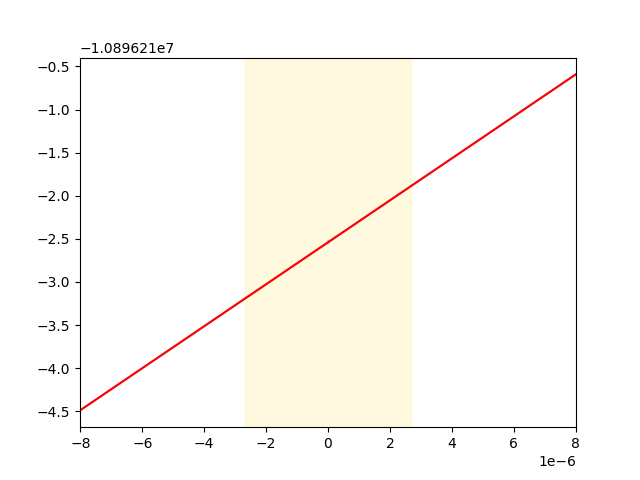
found U by substituting in paams! 
## Equation 5:
```
ICaL__PhiCaNa_i = (-ICaL__gamma_nao * extracellular__nao + ICaL__gamma_nai * intracellular_ions__nai * exp(membrane__vfrt)) * membrane__vffrt / (-1.0 + exp(membrane__vfrt))
```
### Partially evaluated to: 
```
ICaL__PhiCaNa_i = pow(physical_constants__F, 2) * (-extracellular__nao * exp(-2859.0635474831229 * pow(physical_constants__T, (-1.5)) * (-0.00014999999999999999 * extracellular__clo - 0.00014999999999999999 * extracellular__ko - 0.00014999999999999999 * extracellular__nao - 0.00059999999999999995 * extracellular__cao + 0.044721359549995794 * sqrt(0.25 * extracellular__clo + 0.25 * extracellular__ko + 0.25 * extracellular__nao + extracellular__cao) / (1.0 + 0.044721359549995794 * sqrt(0.25 * extracellular__clo + 0.25 * extracellular__ko + 0.25 * extracellular__nao + extracellular__cao)))) + intracellular_ions__nai * exp(-2859.0635474831229 * pow(physical_constants__T, (-1.5)) * (-0.00014999999999999999 * intracellular_ions__cli - 0.00014999999999999999 * intracellular_ions__ki - 0.00014999999999999999 * intracellular_ions__nai - 0.00059999999999999995 * intracellular_ions__cai + 0.044721359549995794 * sqrt(0.25 * intracellular_ions__cli + 0.25 * intracellular_ions__ki + 0.25 * intracellular_ions__nai + intracellular_ions__cai) / (1.0 + 0.044721359549995794 * sqrt(0.25 * intracellular_ions__cli + 0.25 * intracellular_ions__ki + 0.25 * intracellular_ions__nai + intracellular_ions__cai)))) * exp(membrane__v * physical_constants__F / (physical_constants__R * physical_constants__T))) * membrane__v / ((-1.0 + exp(membrane__v * physical_constants__F / (physical_constants__R * physical_constants__T))) * physical_constants__R * physical_constants__T)
```
## New Eq:
```
ICaL__PhiCaNa_i = ((fabs(membrane__v) < 2.6712338705498262e-6) ? ((0.5 + 187179.41753901311 * membrane__v) * (2.6712338705498262e-6 * pow(physical_constants__F, 2) * (-extracellular__nao * exp(-2859.0635474831229 * pow(physical_constants__T, (-1.5)) * (-0.00014999999999999999 * extracellular__clo - 0.00014999999999999999 * extracellular__ko - 0.00014999999999999999 * extracellular__nao - 0.00059999999999999995 * extracellular__cao + 0.044721359549995794 * sqrt(0.25 * extracellular__clo + 0.25 * extracellular__ko + 0.25 * extracellular__nao + extracellular__cao) / (1.0 + 0.044721359549995794 * sqrt(0.25 * extracellular__clo + 0.25 * extracellular__ko + 0.25 * extracellular__nao + extracellular__cao)))) + intracellular_ions__nai * exp(-2859.0635474831229 * pow(physical_constants__T, (-1.5)) * (-0.00014999999999999999 * intracellular_ions__cli - 0.00014999999999999999 * intracellular_ions__ki - 0.00014999999999999999 * intracellular_ions__nai - 0.00059999999999999995 * intracellular_ions__cai + 0.044721359549995794 * sqrt(0.25 * intracellular_ions__cli + 0.25 * intracellular_ions__ki + 0.25 * intracellular_ions__nai + intracellular_ions__cai) / (1.0 + 0.044721359549995794 * sqrt(0.25 * intracellular_ions__cli + 0.25 * intracellular_ions__ki + 0.25 * intracellular_ions__nai + intracellular_ions__cai)))) * exp(2.6712338705498262e-6 * physical_constants__F / (physical_constants__R * physical_constants__T))) / ((-1.0 + exp(2.6712338705498262e-6 * physical_constants__F / (physical_constants__R * physical_constants__T))) * physical_constants__R * physical_constants__T) + 2.6712338705498262e-6 * pow(physical_constants__F, 2) * (-extracellular__nao * exp(-2859.0635474831229 * pow(physical_constants__T, (-1.5)) * (-0.00014999999999999999 * extracellular__clo - 0.00014999999999999999 * extracellular__ko - 0.00014999999999999999 * extracellular__nao - 0.00059999999999999995 * extracellular__cao + 0.044721359549995794 * sqrt(0.25 * extracellular__clo + 0.25 * extracellular__ko + 0.25 * extracellular__nao + extracellular__cao) / (1.0 + 0.044721359549995794 * sqrt(0.25 * extracellular__clo + 0.25 * extracellular__ko + 0.25 * extracellular__nao + extracellular__cao)))) + intracellular_ions__nai * exp(-2859.0635474831229 * pow(physical_constants__T, (-1.5)) * (-0.00014999999999999999 * intracellular_ions__cli - 0.00014999999999999999 * intracellular_ions__ki - 0.00014999999999999999 * intracellular_ions__nai - 0.00059999999999999995 * intracellular_ions__cai + 0.044721359549995794 * sqrt(0.25 * intracellular_ions__cli + 0.25 * intracellular_ions__ki + 0.25 * intracellular_ions__nai + intracellular_ions__cai) / (1.0 + 0.044721359549995794 * sqrt(0.25 * intracellular_ions__cli + 0.25 * intracellular_ions__ki + 0.25 * intracellular_ions__nai + intracellular_ions__cai)))) * exp(-2.6712338705498262e-6 * physical_constants__F / (physical_constants__R * physical_constants__T))) / ((-1.0 + exp(-2.6712338705498262e-6 * physical_constants__F / (physical_constants__R * physical_constants__T))) * physical_constants__R * physical_constants__T)) - 2.6712338705498262e-6 * pow(physical_constants__F, 2) * (-extracellular__nao * exp(-2859.0635474831229 * pow(physical_constants__T, (-1.5)) * (-0.00014999999999999999 * extracellular__clo - 0.00014999999999999999 * extracellular__ko - 0.00014999999999999999 * extracellular__nao - 0.00059999999999999995 * extracellular__cao + 0.044721359549995794 * sqrt(0.25 * extracellular__clo + 0.25 * extracellular__ko + 0.25 * extracellular__nao + extracellular__cao) / (1.0 + 0.044721359549995794 * sqrt(0.25 * extracellular__clo + 0.25 * extracellular__ko + 0.25 * extracellular__nao + extracellular__cao)))) + intracellular_ions__nai * exp(-2859.0635474831229 * pow(physical_constants__T, (-1.5)) * (-0.00014999999999999999 * intracellular_ions__cli - 0.00014999999999999999 * intracellular_ions__ki - 0.00014999999999999999 * intracellular_ions__nai - 0.00059999999999999995 * intracellular_ions__cai + 0.044721359549995794 * sqrt(0.25 * intracellular_ions__cli + 0.25 * intracellular_ions__ki + 0.25 * intracellular_ions__nai + intracellular_ions__cai) / (1.0 + 0.044721359549995794 * sqrt(0.25 * intracellular_ions__cli + 0.25 * intracellular_ions__ki + 0.25 * intracellular_ions__nai + intracellular_ions__cai)))) * exp(-2.6712338705498262e-6 * physical_constants__F / (physical_constants__R * physical_constants__T))) / ((-1.0 + exp(-2.6712338705498262e-6 * physical_constants__F / (physical_constants__R * physical_constants__T))) * physical_constants__R * physical_constants__T)) : ((-ICaL__gamma_nao * extracellular__nao + ICaL__gamma_nai * intracellular_ions__nai * exp(membrane__vfrt)) * membrane__vffrt / (-1.0 + exp(membrane__vfrt))))
```

*U*: 
0.037435883507802616 * membrane__v
*V for 1e-07 range* 
`-2.6712338705498262e-6 - 2.6712338705498262e-6`

*Singularity point: 0*

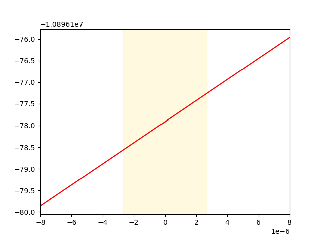
found U by substituting in paams! 
## Equation 6:
```
ICaL__PhiCaNa_ss = (-ICaL__gamma_nao * extracellular__nao + ICaL__gamma_nass * intracellular_ions__nass * exp(membrane__vfrt)) * membrane__vffrt / (-1.0 + exp(membrane__vfrt))
```
### Partially evaluated to: 
```
ICaL__PhiCaNa_ss = pow(physical_constants__F, 2) * (-extracellular__nao * exp(-2859.0635474831229 * pow(physical_constants__T, (-1.5)) * (-0.00014999999999999999 * extracellular__clo - 0.00014999999999999999 * extracellular__ko - 0.00014999999999999999 * extracellular__nao - 0.00059999999999999995 * extracellular__cao + 0.044721359549995794 * sqrt(0.25 * extracellular__clo + 0.25 * extracellular__ko + 0.25 * extracellular__nao + extracellular__cao) / (1.0 + 0.044721359549995794 * sqrt(0.25 * extracellular__clo + 0.25 * extracellular__ko + 0.25 * extracellular__nao + extracellular__cao)))) + intracellular_ions__nass * exp(-2859.0635474831229 * pow(physical_constants__T, (-1.5)) * (-0.00014999999999999999 * intracellular_ions__cli - 0.00014999999999999999 * intracellular_ions__kss - 0.00014999999999999999 * intracellular_ions__nass - 0.00059999999999999995 * intracellular_ions__cass + 0.044721359549995794 * sqrt(0.25 * intracellular_ions__cli + 0.25 * intracellular_ions__kss + 0.25 * intracellular_ions__nass + intracellular_ions__cass) / (1.0 + 0.044721359549995794 * sqrt(0.25 * intracellular_ions__cli + 0.25 * intracellular_ions__kss + 0.25 * intracellular_ions__nass + intracellular_ions__cass)))) * exp(membrane__v * physical_constants__F / (physical_constants__R * physical_constants__T))) * membrane__v / ((-1.0 + exp(membrane__v * physical_constants__F / (physical_constants__R * physical_constants__T))) * physical_constants__R * physical_constants__T)
```
## New Eq:
```
ICaL__PhiCaNa_ss = ((fabs(membrane__v) < 2.6712338705498262e-6) ? ((0.5 + 187179.41753901311 * membrane__v) * (2.6712338705498262e-6 * pow(physical_constants__F, 2) * (-extracellular__nao * exp(-2859.0635474831229 * pow(physical_constants__T, (-1.5)) * (-0.00014999999999999999 * extracellular__clo - 0.00014999999999999999 * extracellular__ko - 0.00014999999999999999 * extracellular__nao - 0.00059999999999999995 * extracellular__cao + 0.044721359549995794 * sqrt(0.25 * extracellular__clo + 0.25 * extracellular__ko + 0.25 * extracellular__nao + extracellular__cao) / (1.0 + 0.044721359549995794 * sqrt(0.25 * extracellular__clo + 0.25 * extracellular__ko + 0.25 * extracellular__nao + extracellular__cao)))) + intracellular_ions__nass * exp(-2859.0635474831229 * pow(physical_constants__T, (-1.5)) * (-0.00014999999999999999 * intracellular_ions__cli - 0.00014999999999999999 * intracellular_ions__kss - 0.00014999999999999999 * intracellular_ions__nass - 0.00059999999999999995 * intracellular_ions__cass + 0.044721359549995794 * sqrt(0.25 * intracellular_ions__cli + 0.25 * intracellular_ions__kss + 0.25 * intracellular_ions__nass + intracellular_ions__cass) / (1.0 + 0.044721359549995794 * sqrt(0.25 * intracellular_ions__cli + 0.25 * intracellular_ions__kss + 0.25 * intracellular_ions__nass + intracellular_ions__cass)))) * exp(2.6712338705498262e-6 * physical_constants__F / (physical_constants__R * physical_constants__T))) / ((-1.0 + exp(2.6712338705498262e-6 * physical_constants__F / (physical_constants__R * physical_constants__T))) * physical_constants__R * physical_constants__T) + 2.6712338705498262e-6 * pow(physical_constants__F, 2) * (-extracellular__nao * exp(-2859.0635474831229 * pow(physical_constants__T, (-1.5)) * (-0.00014999999999999999 * extracellular__clo - 0.00014999999999999999 * extracellular__ko - 0.00014999999999999999 * extracellular__nao - 0.00059999999999999995 * extracellular__cao + 0.044721359549995794 * sqrt(0.25 * extracellular__clo + 0.25 * extracellular__ko + 0.25 * extracellular__nao + extracellular__cao) / (1.0 + 0.044721359549995794 * sqrt(0.25 * extracellular__clo + 0.25 * extracellular__ko + 0.25 * extracellular__nao + extracellular__cao)))) + intracellular_ions__nass * exp(-2859.0635474831229 * pow(physical_constants__T, (-1.5)) * (-0.00014999999999999999 * intracellular_ions__cli - 0.00014999999999999999 * intracellular_ions__kss - 0.00014999999999999999 * intracellular_ions__nass - 0.00059999999999999995 * intracellular_ions__cass + 0.044721359549995794 * sqrt(0.25 * intracellular_ions__cli + 0.25 * intracellular_ions__kss + 0.25 * intracellular_ions__nass + intracellular_ions__cass) / (1.0 + 0.044721359549995794 * sqrt(0.25 * intracellular_ions__cli + 0.25 * intracellular_ions__kss + 0.25 * intracellular_ions__nass + intracellular_ions__cass)))) * exp(-2.6712338705498262e-6 * physical_constants__F / (physical_constants__R * physical_constants__T))) / ((-1.0 + exp(-2.6712338705498262e-6 * physical_constants__F / (physical_constants__R * physical_constants__T))) * physical_constants__R * physical_constants__T)) - 2.6712338705498262e-6 * pow(physical_constants__F, 2) * (-extracellular__nao * exp(-2859.0635474831229 * pow(physical_constants__T, (-1.5)) * (-0.00014999999999999999 * extracellular__clo - 0.00014999999999999999 * extracellular__ko - 0.00014999999999999999 * extracellular__nao - 0.00059999999999999995 * extracellular__cao + 0.044721359549995794 * sqrt(0.25 * extracellular__clo + 0.25 * extracellular__ko + 0.25 * extracellular__nao + extracellular__cao) / (1.0 + 0.044721359549995794 * sqrt(0.25 * extracellular__clo + 0.25 * extracellular__ko + 0.25 * extracellular__nao + extracellular__cao)))) + intracellular_ions__nass * exp(-2859.0635474831229 * pow(physical_constants__T, (-1.5)) * (-0.00014999999999999999 * intracellular_ions__cli - 0.00014999999999999999 * intracellular_ions__kss - 0.00014999999999999999 * intracellular_ions__nass - 0.00059999999999999995 * intracellular_ions__cass + 0.044721359549995794 * sqrt(0.25 * intracellular_ions__cli + 0.25 * intracellular_ions__kss + 0.25 * intracellular_ions__nass + intracellular_ions__cass) / (1.0 + 0.044721359549995794 * sqrt(0.25 * intracellular_ions__cli + 0.25 * intracellular_ions__kss + 0.25 * intracellular_ions__nass + intracellular_ions__cass)))) * exp(-2.6712338705498262e-6 * physical_constants__F / (physical_constants__R * physical_constants__T))) / ((-1.0 + exp(-2.6712338705498262e-6 * physical_constants__F / (physical_constants__R * physical_constants__T))) * physical_constants__R * physical_constants__T)) : ((-ICaL__gamma_nao * extracellular__nao + ICaL__gamma_nass * intracellular_ions__nass * exp(membrane__vfrt)) * membrane__vffrt / (-1.0 + exp(membrane__vfrt))))
```

*U*: 
0.074871767015605231 * membrane__v
*V for 1e-07 range* 
`-1.3356169352749131e-6 - 1.3356169352749131e-6`

*Singularity point: 0*

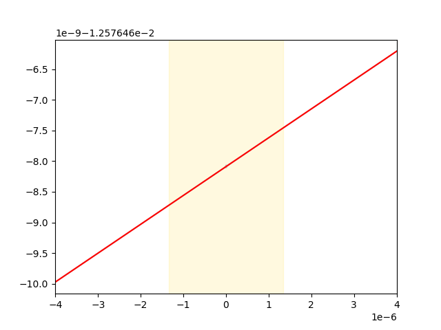
found U by substituting in paams! 
## Equation 7:
```
ICab__ICab = 4.0 * (-ICaL__gamma_cao * extracellular__cao + ICaL__gamma_cai * intracellular_ions__cai * exp(2.0 * membrane__vfrt)) * ICab__PCab * membrane__vffrt / (-1.0 + exp(2.0 * membrane__vfrt))
```
### Partially evaluated to: 
```
ICab__ICab = 2.36776e-7 * pow(physical_constants__F, 2) * (-extracellular__cao * exp(-11436.254189932491 * pow(physical_constants__T, (-1.5)) * (-0.00014999999999999999 * extracellular__clo - 0.00014999999999999999 * extracellular__ko - 0.00014999999999999999 * extracellular__nao - 0.00059999999999999995 * extracellular__cao + 0.044721359549995794 * sqrt(0.25 * extracellular__clo + 0.25 * extracellular__ko + 0.25 * extracellular__nao + extracellular__cao) / (1.0 + 0.044721359549995794 * sqrt(0.25 * extracellular__clo + 0.25 * extracellular__ko + 0.25 * extracellular__nao + extracellular__cao)))) + intracellular_ions__cai * exp(-11436.254189932491 * pow(physical_constants__T, (-1.5)) * (-0.00014999999999999999 * intracellular_ions__cli - 0.00014999999999999999 * intracellular_ions__ki - 0.00014999999999999999 * intracellular_ions__nai - 0.00059999999999999995 * intracellular_ions__cai + 0.044721359549995794 * sqrt(0.25 * intracellular_ions__cli + 0.25 * intracellular_ions__ki + 0.25 * intracellular_ions__nai + intracellular_ions__cai) / (1.0 + 0.044721359549995794 * sqrt(0.25 * intracellular_ions__cli + 0.25 * intracellular_ions__ki + 0.25 * intracellular_ions__nai + intracellular_ions__cai)))) * exp(2.0 * membrane__v * physical_constants__F / (physical_constants__R * physical_constants__T))) * membrane__v / ((-1.0 + exp(2.0 * membrane__v * physical_constants__F / (physical_constants__R * physical_constants__T))) * physical_constants__R * physical_constants__T)
```
## New Eq:
```
ICab__ICab = ((fabs(membrane__v) < 1.3356169352749131e-6) ? ((0.5 + 374358.83507802623 * membrane__v) * (3.1624203546665282e-13 * pow(physical_constants__F, 2) * (-extracellular__cao * exp(-11436.254189932491 * pow(physical_constants__T, (-1.5)) * (-0.00014999999999999999 * extracellular__clo - 0.00014999999999999999 * extracellular__ko - 0.00014999999999999999 * extracellular__nao - 0.00059999999999999995 * extracellular__cao + 0.044721359549995794 * sqrt(0.25 * extracellular__clo + 0.25 * extracellular__ko + 0.25 * extracellular__nao + extracellular__cao) / (1.0 + 0.044721359549995794 * sqrt(0.25 * extracellular__clo + 0.25 * extracellular__ko + 0.25 * extracellular__nao + extracellular__cao)))) + intracellular_ions__cai * exp(-11436.254189932491 * pow(physical_constants__T, (-1.5)) * (-0.00014999999999999999 * intracellular_ions__cli - 0.00014999999999999999 * intracellular_ions__ki - 0.00014999999999999999 * intracellular_ions__nai - 0.00059999999999999995 * intracellular_ions__cai + 0.044721359549995794 * sqrt(0.25 * intracellular_ions__cli + 0.25 * intracellular_ions__ki + 0.25 * intracellular_ions__nai + intracellular_ions__cai) / (1.0 + 0.044721359549995794 * sqrt(0.25 * intracellular_ions__cli + 0.25 * intracellular_ions__ki + 0.25 * intracellular_ions__nai + intracellular_ions__cai)))) * exp(2.6712338705498262e-6 * physical_constants__F / (physical_constants__R * physical_constants__T))) / ((-1.0 + exp(2.6712338705498262e-6 * physical_constants__F / (physical_constants__R * physical_constants__T))) * physical_constants__R * physical_constants__T) + 3.1624203546665282e-13 * pow(physical_constants__F, 2) * (-extracellular__cao * exp(-11436.254189932491 * pow(physical_constants__T, (-1.5)) * (-0.00014999999999999999 * extracellular__clo - 0.00014999999999999999 * extracellular__ko - 0.00014999999999999999 * extracellular__nao - 0.00059999999999999995 * extracellular__cao + 0.044721359549995794 * sqrt(0.25 * extracellular__clo + 0.25 * extracellular__ko + 0.25 * extracellular__nao + extracellular__cao) / (1.0 + 0.044721359549995794 * sqrt(0.25 * extracellular__clo + 0.25 * extracellular__ko + 0.25 * extracellular__nao + extracellular__cao)))) + intracellular_ions__cai * exp(-11436.254189932491 * pow(physical_constants__T, (-1.5)) * (-0.00014999999999999999 * intracellular_ions__cli - 0.00014999999999999999 * intracellular_ions__ki - 0.00014999999999999999 * intracellular_ions__nai - 0.00059999999999999995 * intracellular_ions__cai + 0.044721359549995794 * sqrt(0.25 * intracellular_ions__cli + 0.25 * intracellular_ions__ki + 0.25 * intracellular_ions__nai + intracellular_ions__cai) / (1.0 + 0.044721359549995794 * sqrt(0.25 * intracellular_ions__cli + 0.25 * intracellular_ions__ki + 0.25 * intracellular_ions__nai + intracellular_ions__cai)))) * exp(-2.6712338705498262e-6 * physical_constants__F / (physical_constants__R * physical_constants__T))) / ((-1.0 + exp(-2.6712338705498262e-6 * physical_constants__F / (physical_constants__R * physical_constants__T))) * physical_constants__R * physical_constants__T)) - 3.1624203546665282e-13 * pow(physical_constants__F, 2) * (-extracellular__cao * exp(-11436.254189932491 * pow(physical_constants__T, (-1.5)) * (-0.00014999999999999999 * extracellular__clo - 0.00014999999999999999 * extracellular__ko - 0.00014999999999999999 * extracellular__nao - 0.00059999999999999995 * extracellular__cao + 0.044721359549995794 * sqrt(0.25 * extracellular__clo + 0.25 * extracellular__ko + 0.25 * extracellular__nao + extracellular__cao) / (1.0 + 0.044721359549995794 * sqrt(0.25 * extracellular__clo + 0.25 * extracellular__ko + 0.25 * extracellular__nao + extracellular__cao)))) + intracellular_ions__cai * exp(-11436.254189932491 * pow(physical_constants__T, (-1.5)) * (-0.00014999999999999999 * intracellular_ions__cli - 0.00014999999999999999 * intracellular_ions__ki - 0.00014999999999999999 * intracellular_ions__nai - 0.00059999999999999995 * intracellular_ions__cai + 0.044721359549995794 * sqrt(0.25 * intracellular_ions__cli + 0.25 * intracellular_ions__ki + 0.25 * intracellular_ions__nai + intracellular_ions__cai) / (1.0 + 0.044721359549995794 * sqrt(0.25 * intracellular_ions__cli + 0.25 * intracellular_ions__ki + 0.25 * intracellular_ions__nai + intracellular_ions__cai)))) * exp(-2.6712338705498262e-6 * physical_constants__F / (physical_constants__R * physical_constants__T))) / ((-1.0 + exp(-2.6712338705498262e-6 * physical_constants__F / (physical_constants__R * physical_constants__T))) * physical_constants__R * physical_constants__T)) : (4.0 * (-ICaL__gamma_cao * extracellular__cao + ICaL__gamma_cai * intracellular_ions__cai * exp(2.0 * membrane__vfrt)) * ICab__PCab * membrane__vffrt / (-1.0 + exp(2.0 * membrane__vfrt))))
```

*U*: 
0.037435883507802616 * membrane__v
*V for 1e-07 range* 
`-2.6712338705498262e-6 - 2.6712338705498262e-6`

*Singularity point: 0*


found U by substituting in paams! 
## Equation 8:
```
INab__INab = (-extracellular__nao + intracellular_ions__nai * exp(membrane__vfrt)) * INab__PNab * membrane__vffrt / (-1.0 + exp(membrane__vfrt))
```
### Partially evaluated to: 
```
INab__INab = 1.9238999999999999e-9 * pow(physical_constants__F, 2) * (-extracellular__nao + intracellular_ions__nai * exp(membrane__v * physical_constants__F / (physical_constants__R * physical_constants__T))) * membrane__v / ((-1.0 + exp(membrane__v * physical_constants__F / (physical_constants__R * physical_constants__T))) * physical_constants__R * physical_constants__T)
```
## New Eq:
```
INab__INab = ((fabs(membrane__v) < 2.6712338705498262e-6) ? ((0.5 + 187179.41753901311 * membrane__v) * (5.1391868435508108e-15 * pow(physical_constants__F, 2) * (-extracellular__nao + intracellular_ions__nai * exp(2.6712338705498262e-6 * physical_constants__F / (physical_constants__R * physical_constants__T))) / ((-1.0 + exp(2.6712338705498262e-6 * physical_constants__F / (physical_constants__R * physical_constants__T))) * physical_constants__R * physical_constants__T) + 5.1391868435508108e-15 * pow(physical_constants__F, 2) * (-extracellular__nao + intracellular_ions__nai * exp(-2.6712338705498262e-6 * physical_constants__F / (physical_constants__R * physical_constants__T))) / ((-1.0 + exp(-2.6712338705498262e-6 * physical_constants__F / (physical_constants__R * physical_constants__T))) * physical_constants__R * physical_constants__T)) - 5.1391868435508108e-15 * pow(physical_constants__F, 2) * (-extracellular__nao + intracellular_ions__nai * exp(-2.6712338705498262e-6 * physical_constants__F / (physical_constants__R * physical_constants__T))) / ((-1.0 + exp(-2.6712338705498262e-6 * physical_constants__F / (physical_constants__R * physical_constants__T))) * physical_constants__R * physical_constants__T)) : ((-extracellular__nao + intracellular_ions__nai * exp(membrane__vfrt)) * INab__PNab * membrane__vffrt / (-1.0 + exp(membrane__vfrt))))
```

singularity processing time: 151.7938524000001
# Model: Tomek_model13epi(ToRORd_fkatp_epi.cellml)
load time: 5.950271499999872

*U*: 
0.037435883507802616 * membrane__v
*V for 1e-07 range* 
`-2.6712338705498262e-6 - 2.6712338705498262e-6`

*Singularity point: 0*


found U by substituting in paams! 
## Equation 1:
```
ICaL__PhiCaK_i = (-ICaL__gamma_ko * extracellular__ko + ICaL__gamma_ki * intracellular_ions__ki * exp(membrane__vfrt)) * membrane__vffrt / (-1.0 + exp(membrane__vfrt))
```
### Partially evaluated to: 
```
ICaL__PhiCaK_i = pow(physical_constants__F, 2) * (-extracellular__ko * exp(-2859.0635474831229 * pow(physical_constants__T, (-1.5)) * (-0.00014999999999999999 * extracellular__clo - 0.00014999999999999999 * extracellular__ko - 0.00014999999999999999 * extracellular__nao - 0.00059999999999999995 * extracellular__cao + 0.044721359549995794 * sqrt(0.25 * extracellular__clo + 0.25 * extracellular__ko + 0.25 * extracellular__nao + extracellular__cao) / (1.0 + 0.044721359549995794 * sqrt(0.25 * extracellular__clo + 0.25 * extracellular__ko + 0.25 * extracellular__nao + extracellular__cao)))) + intracellular_ions__ki * exp(-2859.0635474831229 * pow(physical_constants__T, (-1.5)) * (-0.00014999999999999999 * intracellular_ions__cli - 0.00014999999999999999 * intracellular_ions__ki - 0.00014999999999999999 * intracellular_ions__nai - 0.00059999999999999995 * intracellular_ions__cai + 0.044721359549995794 * sqrt(0.25 * intracellular_ions__cli + 0.25 * intracellular_ions__ki + 0.25 * intracellular_ions__nai + intracellular_ions__cai) / (1.0 + 0.044721359549995794 * sqrt(0.25 * intracellular_ions__cli + 0.25 * intracellular_ions__ki + 0.25 * intracellular_ions__nai + intracellular_ions__cai)))) * exp(membrane__v * physical_constants__F / (physical_constants__R * physical_constants__T))) * membrane__v / ((-1.0 + exp(membrane__v * physical_constants__F / (physical_constants__R * physical_constants__T))) * physical_constants__R * physical_constants__T)
```
## New Eq:
```
ICaL__PhiCaK_i = ((fabs(membrane__v) < 2.6712338705498262e-6) ? ((0.5 + 187179.41753901311 * membrane__v) * (2.6712338705498262e-6 * pow(physical_constants__F, 2) * (-extracellular__ko * exp(-2859.0635474831229 * pow(physical_constants__T, (-1.5)) * (-0.00014999999999999999 * extracellular__clo - 0.00014999999999999999 * extracellular__ko - 0.00014999999999999999 * extracellular__nao - 0.00059999999999999995 * extracellular__cao + 0.044721359549995794 * sqrt(0.25 * extracellular__clo + 0.25 * extracellular__ko + 0.25 * extracellular__nao + extracellular__cao) / (1.0 + 0.044721359549995794 * sqrt(0.25 * extracellular__clo + 0.25 * extracellular__ko + 0.25 * extracellular__nao + extracellular__cao)))) + intracellular_ions__ki * exp(-2859.0635474831229 * pow(physical_constants__T, (-1.5)) * (-0.00014999999999999999 * intracellular_ions__cli - 0.00014999999999999999 * intracellular_ions__ki - 0.00014999999999999999 * intracellular_ions__nai - 0.00059999999999999995 * intracellular_ions__cai + 0.044721359549995794 * sqrt(0.25 * intracellular_ions__cli + 0.25 * intracellular_ions__ki + 0.25 * intracellular_ions__nai + intracellular_ions__cai) / (1.0 + 0.044721359549995794 * sqrt(0.25 * intracellular_ions__cli + 0.25 * intracellular_ions__ki + 0.25 * intracellular_ions__nai + intracellular_ions__cai)))) * exp(2.6712338705498262e-6 * physical_constants__F / (physical_constants__R * physical_constants__T))) / ((-1.0 + exp(2.6712338705498262e-6 * physical_constants__F / (physical_constants__R * physical_constants__T))) * physical_constants__R * physical_constants__T) + 2.6712338705498262e-6 * pow(physical_constants__F, 2) * (-extracellular__ko * exp(-2859.0635474831229 * pow(physical_constants__T, (-1.5)) * (-0.00014999999999999999 * extracellular__clo - 0.00014999999999999999 * extracellular__ko - 0.00014999999999999999 * extracellular__nao - 0.00059999999999999995 * extracellular__cao + 0.044721359549995794 * sqrt(0.25 * extracellular__clo + 0.25 * extracellular__ko + 0.25 * extracellular__nao + extracellular__cao) / (1.0 + 0.044721359549995794 * sqrt(0.25 * extracellular__clo + 0.25 * extracellular__ko + 0.25 * extracellular__nao + extracellular__cao)))) + intracellular_ions__ki * exp(-2859.0635474831229 * pow(physical_constants__T, (-1.5)) * (-0.00014999999999999999 * intracellular_ions__cli - 0.00014999999999999999 * intracellular_ions__ki - 0.00014999999999999999 * intracellular_ions__nai - 0.00059999999999999995 * intracellular_ions__cai + 0.044721359549995794 * sqrt(0.25 * intracellular_ions__cli + 0.25 * intracellular_ions__ki + 0.25 * intracellular_ions__nai + intracellular_ions__cai) / (1.0 + 0.044721359549995794 * sqrt(0.25 * intracellular_ions__cli + 0.25 * intracellular_ions__ki + 0.25 * intracellular_ions__nai + intracellular_ions__cai)))) * exp(-2.6712338705498262e-6 * physical_constants__F / (physical_constants__R * physical_constants__T))) / ((-1.0 + exp(-2.6712338705498262e-6 * physical_constants__F / (physical_constants__R * physical_constants__T))) * physical_constants__R * physical_constants__T)) - 2.6712338705498262e-6 * pow(physical_constants__F, 2) * (-extracellular__ko * exp(-2859.0635474831229 * pow(physical_constants__T, (-1.5)) * (-0.00014999999999999999 * extracellular__clo - 0.00014999999999999999 * extracellular__ko - 0.00014999999999999999 * extracellular__nao - 0.00059999999999999995 * extracellular__cao + 0.044721359549995794 * sqrt(0.25 * extracellular__clo + 0.25 * extracellular__ko + 0.25 * extracellular__nao + extracellular__cao) / (1.0 + 0.044721359549995794 * sqrt(0.25 * extracellular__clo + 0.25 * extracellular__ko + 0.25 * extracellular__nao + extracellular__cao)))) + intracellular_ions__ki * exp(-2859.0635474831229 * pow(physical_constants__T, (-1.5)) * (-0.00014999999999999999 * intracellular_ions__cli - 0.00014999999999999999 * intracellular_ions__ki - 0.00014999999999999999 * intracellular_ions__nai - 0.00059999999999999995 * intracellular_ions__cai + 0.044721359549995794 * sqrt(0.25 * intracellular_ions__cli + 0.25 * intracellular_ions__ki + 0.25 * intracellular_ions__nai + intracellular_ions__cai) / (1.0 + 0.044721359549995794 * sqrt(0.25 * intracellular_ions__cli + 0.25 * intracellular_ions__ki + 0.25 * intracellular_ions__nai + intracellular_ions__cai)))) * exp(-2.6712338705498262e-6 * physical_constants__F / (physical_constants__R * physical_constants__T))) / ((-1.0 + exp(-2.6712338705498262e-6 * physical_constants__F / (physical_constants__R * physical_constants__T))) * physical_constants__R * physical_constants__T)) : ((-ICaL__gamma_ko * extracellular__ko + ICaL__gamma_ki * intracellular_ions__ki * exp(membrane__vfrt)) * membrane__vffrt / (-1.0 + exp(membrane__vfrt))))
```

*U*: 
0.037435883507802616 * membrane__v
*V for 1e-07 range* 
`-2.6712338705498262e-6 - 2.6712338705498262e-6`

*Singularity point: 0*

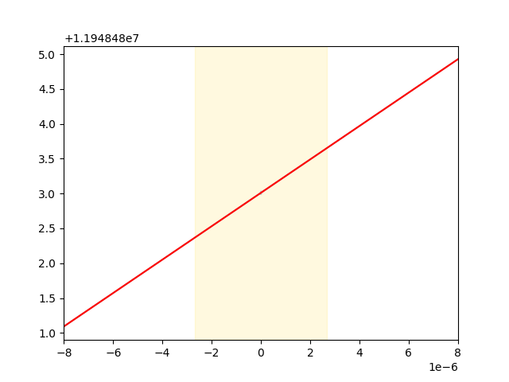
found U by substituting in paams! 
## Equation 2:
```
ICaL__PhiCaK_ss = (-ICaL__gamma_ko * extracellular__ko + ICaL__gamma_kss * intracellular_ions__kss * exp(membrane__vfrt)) * membrane__vffrt / (-1.0 + exp(membrane__vfrt))
```
### Partially evaluated to: 
```
ICaL__PhiCaK_ss = pow(physical_constants__F, 2) * (-extracellular__ko * exp(-2859.0635474831229 * pow(physical_constants__T, (-1.5)) * (-0.00014999999999999999 * extracellular__clo - 0.00014999999999999999 * extracellular__ko - 0.00014999999999999999 * extracellular__nao - 0.00059999999999999995 * extracellular__cao + 0.044721359549995794 * sqrt(0.25 * extracellular__clo + 0.25 * extracellular__ko + 0.25 * extracellular__nao + extracellular__cao) / (1.0 + 0.044721359549995794 * sqrt(0.25 * extracellular__clo + 0.25 * extracellular__ko + 0.25 * extracellular__nao + extracellular__cao)))) + intracellular_ions__kss * exp(-2859.0635474831229 * pow(physical_constants__T, (-1.5)) * (-0.00014999999999999999 * intracellular_ions__cli - 0.00014999999999999999 * intracellular_ions__kss - 0.00014999999999999999 * intracellular_ions__nass - 0.00059999999999999995 * intracellular_ions__cass + 0.044721359549995794 * sqrt(0.25 * intracellular_ions__cli + 0.25 * intracellular_ions__kss + 0.25 * intracellular_ions__nass + intracellular_ions__cass) / (1.0 + 0.044721359549995794 * sqrt(0.25 * intracellular_ions__cli + 0.25 * intracellular_ions__kss + 0.25 * intracellular_ions__nass + intracellular_ions__cass)))) * exp(membrane__v * physical_constants__F / (physical_constants__R * physical_constants__T))) * membrane__v / ((-1.0 + exp(membrane__v * physical_constants__F / (physical_constants__R * physical_constants__T))) * physical_constants__R * physical_constants__T)
```
## New Eq:
```
ICaL__PhiCaK_ss = ((fabs(membrane__v) < 2.6712338705498262e-6) ? ((0.5 + 187179.41753901311 * membrane__v) * (2.6712338705498262e-6 * pow(physical_constants__F, 2) * (-extracellular__ko * exp(-2859.0635474831229 * pow(physical_constants__T, (-1.5)) * (-0.00014999999999999999 * extracellular__clo - 0.00014999999999999999 * extracellular__ko - 0.00014999999999999999 * extracellular__nao - 0.00059999999999999995 * extracellular__cao + 0.044721359549995794 * sqrt(0.25 * extracellular__clo + 0.25 * extracellular__ko + 0.25 * extracellular__nao + extracellular__cao) / (1.0 + 0.044721359549995794 * sqrt(0.25 * extracellular__clo + 0.25 * extracellular__ko + 0.25 * extracellular__nao + extracellular__cao)))) + intracellular_ions__kss * exp(-2859.0635474831229 * pow(physical_constants__T, (-1.5)) * (-0.00014999999999999999 * intracellular_ions__cli - 0.00014999999999999999 * intracellular_ions__kss - 0.00014999999999999999 * intracellular_ions__nass - 0.00059999999999999995 * intracellular_ions__cass + 0.044721359549995794 * sqrt(0.25 * intracellular_ions__cli + 0.25 * intracellular_ions__kss + 0.25 * intracellular_ions__nass + intracellular_ions__cass) / (1.0 + 0.044721359549995794 * sqrt(0.25 * intracellular_ions__cli + 0.25 * intracellular_ions__kss + 0.25 * intracellular_ions__nass + intracellular_ions__cass)))) * exp(2.6712338705498262e-6 * physical_constants__F / (physical_constants__R * physical_constants__T))) / ((-1.0 + exp(2.6712338705498262e-6 * physical_constants__F / (physical_constants__R * physical_constants__T))) * physical_constants__R * physical_constants__T) + 2.6712338705498262e-6 * pow(physical_constants__F, 2) * (-extracellular__ko * exp(-2859.0635474831229 * pow(physical_constants__T, (-1.5)) * (-0.00014999999999999999 * extracellular__clo - 0.00014999999999999999 * extracellular__ko - 0.00014999999999999999 * extracellular__nao - 0.00059999999999999995 * extracellular__cao + 0.044721359549995794 * sqrt(0.25 * extracellular__clo + 0.25 * extracellular__ko + 0.25 * extracellular__nao + extracellular__cao) / (1.0 + 0.044721359549995794 * sqrt(0.25 * extracellular__clo + 0.25 * extracellular__ko + 0.25 * extracellular__nao + extracellular__cao)))) + intracellular_ions__kss * exp(-2859.0635474831229 * pow(physical_constants__T, (-1.5)) * (-0.00014999999999999999 * intracellular_ions__cli - 0.00014999999999999999 * intracellular_ions__kss - 0.00014999999999999999 * intracellular_ions__nass - 0.00059999999999999995 * intracellular_ions__cass + 0.044721359549995794 * sqrt(0.25 * intracellular_ions__cli + 0.25 * intracellular_ions__kss + 0.25 * intracellular_ions__nass + intracellular_ions__cass) / (1.0 + 0.044721359549995794 * sqrt(0.25 * intracellular_ions__cli + 0.25 * intracellular_ions__kss + 0.25 * intracellular_ions__nass + intracellular_ions__cass)))) * exp(-2.6712338705498262e-6 * physical_constants__F / (physical_constants__R * physical_constants__T))) / ((-1.0 + exp(-2.6712338705498262e-6 * physical_constants__F / (physical_constants__R * physical_constants__T))) * physical_constants__R * physical_constants__T)) - 2.6712338705498262e-6 * pow(physical_constants__F, 2) * (-extracellular__ko * exp(-2859.0635474831229 * pow(physical_constants__T, (-1.5)) * (-0.00014999999999999999 * extracellular__clo - 0.00014999999999999999 * extracellular__ko - 0.00014999999999999999 * extracellular__nao - 0.00059999999999999995 * extracellular__cao + 0.044721359549995794 * sqrt(0.25 * extracellular__clo + 0.25 * extracellular__ko + 0.25 * extracellular__nao + extracellular__cao) / (1.0 + 0.044721359549995794 * sqrt(0.25 * extracellular__clo + 0.25 * extracellular__ko + 0.25 * extracellular__nao + extracellular__cao)))) + intracellular_ions__kss * exp(-2859.0635474831229 * pow(physical_constants__T, (-1.5)) * (-0.00014999999999999999 * intracellular_ions__cli - 0.00014999999999999999 * intracellular_ions__kss - 0.00014999999999999999 * intracellular_ions__nass - 0.00059999999999999995 * intracellular_ions__cass + 0.044721359549995794 * sqrt(0.25 * intracellular_ions__cli + 0.25 * intracellular_ions__kss + 0.25 * intracellular_ions__nass + intracellular_ions__cass) / (1.0 + 0.044721359549995794 * sqrt(0.25 * intracellular_ions__cli + 0.25 * intracellular_ions__kss + 0.25 * intracellular_ions__nass + intracellular_ions__cass)))) * exp(-2.6712338705498262e-6 * physical_constants__F / (physical_constants__R * physical_constants__T))) / ((-1.0 + exp(-2.6712338705498262e-6 * physical_constants__F / (physical_constants__R * physical_constants__T))) * physical_constants__R * physical_constants__T)) : ((-ICaL__gamma_ko * extracellular__ko + ICaL__gamma_kss * intracellular_ions__kss * exp(membrane__vfrt)) * membrane__vffrt / (-1.0 + exp(membrane__vfrt))))
```

*U*: 
0.074871767015605231 * membrane__v
*V for 1e-07 range* 
`-1.3356169352749131e-6 - 1.3356169352749131e-6`

*Singularity point: 0*


found U by substituting in paams! 
## Equation 3:
```
ICaL__PhiCaL_i = 4.0 * (-ICaL__gamma_cao * extracellular__cao + ICaL__gamma_cai * intracellular_ions__cai * exp(2.0 * membrane__vfrt)) * membrane__vffrt / (-1.0 + exp(2.0 * membrane__vfrt))
```
### Partially evaluated to: 
```
ICaL__PhiCaL_i = 4.0 * pow(physical_constants__F, 2) * (-extracellular__cao * exp(-11436.254189932491 * pow(physical_constants__T, (-1.5)) * (-0.00014999999999999999 * extracellular__clo - 0.00014999999999999999 * extracellular__ko - 0.00014999999999999999 * extracellular__nao - 0.00059999999999999995 * extracellular__cao + 0.044721359549995794 * sqrt(0.25 * extracellular__clo + 0.25 * extracellular__ko + 0.25 * extracellular__nao + extracellular__cao) / (1.0 + 0.044721359549995794 * sqrt(0.25 * extracellular__clo + 0.25 * extracellular__ko + 0.25 * extracellular__nao + extracellular__cao)))) + intracellular_ions__cai * exp(-11436.254189932491 * pow(physical_constants__T, (-1.5)) * (-0.00014999999999999999 * intracellular_ions__cli - 0.00014999999999999999 * intracellular_ions__ki - 0.00014999999999999999 * intracellular_ions__nai - 0.00059999999999999995 * intracellular_ions__cai + 0.044721359549995794 * sqrt(0.25 * intracellular_ions__cli + 0.25 * intracellular_ions__ki + 0.25 * intracellular_ions__nai + intracellular_ions__cai) / (1.0 + 0.044721359549995794 * sqrt(0.25 * intracellular_ions__cli + 0.25 * intracellular_ions__ki + 0.25 * intracellular_ions__nai + intracellular_ions__cai)))) * exp(2.0 * membrane__v * physical_constants__F / (physical_constants__R * physical_constants__T))) * membrane__v / ((-1.0 + exp(2.0 * membrane__v * physical_constants__F / (physical_constants__R * physical_constants__T))) * physical_constants__R * physical_constants__T)
```
## New Eq:
```
ICaL__PhiCaL_i = ((fabs(membrane__v) < 1.3356169352749131e-6) ? ((0.5 + 374358.83507802623 * membrane__v) * (5.3424677410996524e-6 * pow(physical_constants__F, 2) * (-extracellular__cao * exp(-11436.254189932491 * pow(physical_constants__T, (-1.5)) * (-0.00014999999999999999 * extracellular__clo - 0.00014999999999999999 * extracellular__ko - 0.00014999999999999999 * extracellular__nao - 0.00059999999999999995 * extracellular__cao + 0.044721359549995794 * sqrt(0.25 * extracellular__clo + 0.25 * extracellular__ko + 0.25 * extracellular__nao + extracellular__cao) / (1.0 + 0.044721359549995794 * sqrt(0.25 * extracellular__clo + 0.25 * extracellular__ko + 0.25 * extracellular__nao + extracellular__cao)))) + intracellular_ions__cai * exp(-11436.254189932491 * pow(physical_constants__T, (-1.5)) * (-0.00014999999999999999 * intracellular_ions__cli - 0.00014999999999999999 * intracellular_ions__ki - 0.00014999999999999999 * intracellular_ions__nai - 0.00059999999999999995 * intracellular_ions__cai + 0.044721359549995794 * sqrt(0.25 * intracellular_ions__cli + 0.25 * intracellular_ions__ki + 0.25 * intracellular_ions__nai + intracellular_ions__cai) / (1.0 + 0.044721359549995794 * sqrt(0.25 * intracellular_ions__cli + 0.25 * intracellular_ions__ki + 0.25 * intracellular_ions__nai + intracellular_ions__cai)))) * exp(2.6712338705498262e-6 * physical_constants__F / (physical_constants__R * physical_constants__T))) / ((-1.0 + exp(2.6712338705498262e-6 * physical_constants__F / (physical_constants__R * physical_constants__T))) * physical_constants__R * physical_constants__T) + 5.3424677410996524e-6 * pow(physical_constants__F, 2) * (-extracellular__cao * exp(-11436.254189932491 * pow(physical_constants__T, (-1.5)) * (-0.00014999999999999999 * extracellular__clo - 0.00014999999999999999 * extracellular__ko - 0.00014999999999999999 * extracellular__nao - 0.00059999999999999995 * extracellular__cao + 0.044721359549995794 * sqrt(0.25 * extracellular__clo + 0.25 * extracellular__ko + 0.25 * extracellular__nao + extracellular__cao) / (1.0 + 0.044721359549995794 * sqrt(0.25 * extracellular__clo + 0.25 * extracellular__ko + 0.25 * extracellular__nao + extracellular__cao)))) + intracellular_ions__cai * exp(-11436.254189932491 * pow(physical_constants__T, (-1.5)) * (-0.00014999999999999999 * intracellular_ions__cli - 0.00014999999999999999 * intracellular_ions__ki - 0.00014999999999999999 * intracellular_ions__nai - 0.00059999999999999995 * intracellular_ions__cai + 0.044721359549995794 * sqrt(0.25 * intracellular_ions__cli + 0.25 * intracellular_ions__ki + 0.25 * intracellular_ions__nai + intracellular_ions__cai) / (1.0 + 0.044721359549995794 * sqrt(0.25 * intracellular_ions__cli + 0.25 * intracellular_ions__ki + 0.25 * intracellular_ions__nai + intracellular_ions__cai)))) * exp(-2.6712338705498262e-6 * physical_constants__F / (physical_constants__R * physical_constants__T))) / ((-1.0 + exp(-2.6712338705498262e-6 * physical_constants__F / (physical_constants__R * physical_constants__T))) * physical_constants__R * physical_constants__T)) - 5.3424677410996524e-6 * pow(physical_constants__F, 2) * (-extracellular__cao * exp(-11436.254189932491 * pow(physical_constants__T, (-1.5)) * (-0.00014999999999999999 * extracellular__clo - 0.00014999999999999999 * extracellular__ko - 0.00014999999999999999 * extracellular__nao - 0.00059999999999999995 * extracellular__cao + 0.044721359549995794 * sqrt(0.25 * extracellular__clo + 0.25 * extracellular__ko + 0.25 * extracellular__nao + extracellular__cao) / (1.0 + 0.044721359549995794 * sqrt(0.25 * extracellular__clo + 0.25 * extracellular__ko + 0.25 * extracellular__nao + extracellular__cao)))) + intracellular_ions__cai * exp(-11436.254189932491 * pow(physical_constants__T, (-1.5)) * (-0.00014999999999999999 * intracellular_ions__cli - 0.00014999999999999999 * intracellular_ions__ki - 0.00014999999999999999 * intracellular_ions__nai - 0.00059999999999999995 * intracellular_ions__cai + 0.044721359549995794 * sqrt(0.25 * intracellular_ions__cli + 0.25 * intracellular_ions__ki + 0.25 * intracellular_ions__nai + intracellular_ions__cai) / (1.0 + 0.044721359549995794 * sqrt(0.25 * intracellular_ions__cli + 0.25 * intracellular_ions__ki + 0.25 * intracellular_ions__nai + intracellular_ions__cai)))) * exp(-2.6712338705498262e-6 * physical_constants__F / (physical_constants__R * physical_constants__T))) / ((-1.0 + exp(-2.6712338705498262e-6 * physical_constants__F / (physical_constants__R * physical_constants__T))) * physical_constants__R * physical_constants__T)) : (4.0 * (-ICaL__gamma_cao * extracellular__cao + ICaL__gamma_cai * intracellular_ions__cai * exp(2.0 * membrane__vfrt)) * membrane__vffrt / (-1.0 + exp(2.0 * membrane__vfrt))))
```

*U*: 
0.074871767015605231 * membrane__v
*V for 1e-07 range* 
`-1.3356169352749131e-6 - 1.3356169352749131e-6`

*Singularity point: 0*

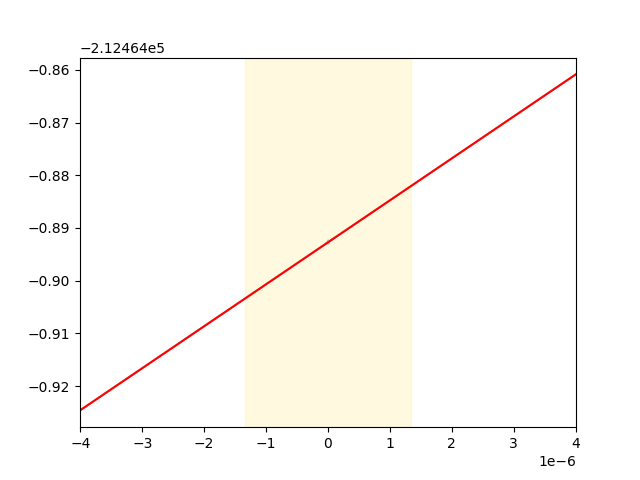
found U by substituting in paams! 
## Equation 4:
```
ICaL__PhiCaL_ss = 4.0 * (-ICaL__gamma_cao * extracellular__cao + ICaL__gamma_cass * intracellular_ions__cass * exp(2.0 * membrane__vfrt)) * membrane__vffrt / (-1.0 + exp(2.0 * membrane__vfrt))
```
### Partially evaluated to: 
```
ICaL__PhiCaL_ss = 4.0 * pow(physical_constants__F, 2) * (-extracellular__cao * exp(-11436.254189932491 * pow(physical_constants__T, (-1.5)) * (-0.00014999999999999999 * extracellular__clo - 0.00014999999999999999 * extracellular__ko - 0.00014999999999999999 * extracellular__nao - 0.00059999999999999995 * extracellular__cao + 0.044721359549995794 * sqrt(0.25 * extracellular__clo + 0.25 * extracellular__ko + 0.25 * extracellular__nao + extracellular__cao) / (1.0 + 0.044721359549995794 * sqrt(0.25 * extracellular__clo + 0.25 * extracellular__ko + 0.25 * extracellular__nao + extracellular__cao)))) + intracellular_ions__cass * exp(-11436.254189932491 * pow(physical_constants__T, (-1.5)) * (-0.00014999999999999999 * intracellular_ions__cli - 0.00014999999999999999 * intracellular_ions__kss - 0.00014999999999999999 * intracellular_ions__nass - 0.00059999999999999995 * intracellular_ions__cass + 0.044721359549995794 * sqrt(0.25 * intracellular_ions__cli + 0.25 * intracellular_ions__kss + 0.25 * intracellular_ions__nass + intracellular_ions__cass) / (1.0 + 0.044721359549995794 * sqrt(0.25 * intracellular_ions__cli + 0.25 * intracellular_ions__kss + 0.25 * intracellular_ions__nass + intracellular_ions__cass)))) * exp(2.0 * membrane__v * physical_constants__F / (physical_constants__R * physical_constants__T))) * membrane__v / ((-1.0 + exp(2.0 * membrane__v * physical_constants__F / (physical_constants__R * physical_constants__T))) * physical_constants__R * physical_constants__T)
```
## New Eq:
```
ICaL__PhiCaL_ss = ((fabs(membrane__v) < 1.3356169352749131e-6) ? ((0.5 + 374358.83507802623 * membrane__v) * (5.3424677410996524e-6 * pow(physical_constants__F, 2) * (-extracellular__cao * exp(-11436.254189932491 * pow(physical_constants__T, (-1.5)) * (-0.00014999999999999999 * extracellular__clo - 0.00014999999999999999 * extracellular__ko - 0.00014999999999999999 * extracellular__nao - 0.00059999999999999995 * extracellular__cao + 0.044721359549995794 * sqrt(0.25 * extracellular__clo + 0.25 * extracellular__ko + 0.25 * extracellular__nao + extracellular__cao) / (1.0 + 0.044721359549995794 * sqrt(0.25 * extracellular__clo + 0.25 * extracellular__ko + 0.25 * extracellular__nao + extracellular__cao)))) + intracellular_ions__cass * exp(-11436.254189932491 * pow(physical_constants__T, (-1.5)) * (-0.00014999999999999999 * intracellular_ions__cli - 0.00014999999999999999 * intracellular_ions__kss - 0.00014999999999999999 * intracellular_ions__nass - 0.00059999999999999995 * intracellular_ions__cass + 0.044721359549995794 * sqrt(0.25 * intracellular_ions__cli + 0.25 * intracellular_ions__kss + 0.25 * intracellular_ions__nass + intracellular_ions__cass) / (1.0 + 0.044721359549995794 * sqrt(0.25 * intracellular_ions__cli + 0.25 * intracellular_ions__kss + 0.25 * intracellular_ions__nass + intracellular_ions__cass)))) * exp(2.6712338705498262e-6 * physical_constants__F / (physical_constants__R * physical_constants__T))) / ((-1.0 + exp(2.6712338705498262e-6 * physical_constants__F / (physical_constants__R * physical_constants__T))) * physical_constants__R * physical_constants__T) + 5.3424677410996524e-6 * pow(physical_constants__F, 2) * (-extracellular__cao * exp(-11436.254189932491 * pow(physical_constants__T, (-1.5)) * (-0.00014999999999999999 * extracellular__clo - 0.00014999999999999999 * extracellular__ko - 0.00014999999999999999 * extracellular__nao - 0.00059999999999999995 * extracellular__cao + 0.044721359549995794 * sqrt(0.25 * extracellular__clo + 0.25 * extracellular__ko + 0.25 * extracellular__nao + extracellular__cao) / (1.0 + 0.044721359549995794 * sqrt(0.25 * extracellular__clo + 0.25 * extracellular__ko + 0.25 * extracellular__nao + extracellular__cao)))) + intracellular_ions__cass * exp(-11436.254189932491 * pow(physical_constants__T, (-1.5)) * (-0.00014999999999999999 * intracellular_ions__cli - 0.00014999999999999999 * intracellular_ions__kss - 0.00014999999999999999 * intracellular_ions__nass - 0.00059999999999999995 * intracellular_ions__cass + 0.044721359549995794 * sqrt(0.25 * intracellular_ions__cli + 0.25 * intracellular_ions__kss + 0.25 * intracellular_ions__nass + intracellular_ions__cass) / (1.0 + 0.044721359549995794 * sqrt(0.25 * intracellular_ions__cli + 0.25 * intracellular_ions__kss + 0.25 * intracellular_ions__nass + intracellular_ions__cass)))) * exp(-2.6712338705498262e-6 * physical_constants__F / (physical_constants__R * physical_constants__T))) / ((-1.0 + exp(-2.6712338705498262e-6 * physical_constants__F / (physical_constants__R * physical_constants__T))) * physical_constants__R * physical_constants__T)) - 5.3424677410996524e-6 * pow(physical_constants__F, 2) * (-extracellular__cao * exp(-11436.254189932491 * pow(physical_constants__T, (-1.5)) * (-0.00014999999999999999 * extracellular__clo - 0.00014999999999999999 * extracellular__ko - 0.00014999999999999999 * extracellular__nao - 0.00059999999999999995 * extracellular__cao + 0.044721359549995794 * sqrt(0.25 * extracellular__clo + 0.25 * extracellular__ko + 0.25 * extracellular__nao + extracellular__cao) / (1.0 + 0.044721359549995794 * sqrt(0.25 * extracellular__clo + 0.25 * extracellular__ko + 0.25 * extracellular__nao + extracellular__cao)))) + intracellular_ions__cass * exp(-11436.254189932491 * pow(physical_constants__T, (-1.5)) * (-0.00014999999999999999 * intracellular_ions__cli - 0.00014999999999999999 * intracellular_ions__kss - 0.00014999999999999999 * intracellular_ions__nass - 0.00059999999999999995 * intracellular_ions__cass + 0.044721359549995794 * sqrt(0.25 * intracellular_ions__cli + 0.25 * intracellular_ions__kss + 0.25 * intracellular_ions__nass + intracellular_ions__cass) / (1.0 + 0.044721359549995794 * sqrt(0.25 * intracellular_ions__cli + 0.25 * intracellular_ions__kss + 0.25 * intracellular_ions__nass + intracellular_ions__cass)))) * exp(-2.6712338705498262e-6 * physical_constants__F / (physical_constants__R * physical_constants__T))) / ((-1.0 + exp(-2.6712338705498262e-6 * physical_constants__F / (physical_constants__R * physical_constants__T))) * physical_constants__R * physical_constants__T)) : (4.0 * (-ICaL__gamma_cao * extracellular__cao + ICaL__gamma_cass * intracellular_ions__cass * exp(2.0 * membrane__vfrt)) * membrane__vffrt / (-1.0 + exp(2.0 * membrane__vfrt))))
```

*U*: 
0.037435883507802616 * membrane__v
*V for 1e-07 range* 
`-2.6712338705498262e-6 - 2.6712338705498262e-6`

*Singularity point: 0*

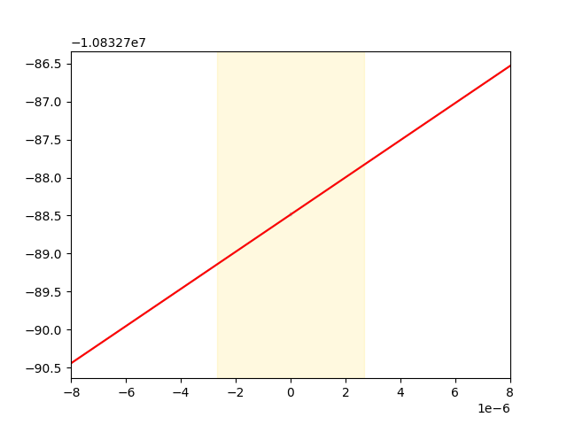
found U by substituting in paams! 
## Equation 5:
```
ICaL__PhiCaNa_i = (-ICaL__gamma_nao * extracellular__nao + ICaL__gamma_nai * intracellular_ions__nai * exp(membrane__vfrt)) * membrane__vffrt / (-1.0 + exp(membrane__vfrt))
```
### Partially evaluated to: 
```
ICaL__PhiCaNa_i = pow(physical_constants__F, 2) * (-extracellular__nao * exp(-2859.0635474831229 * pow(physical_constants__T, (-1.5)) * (-0.00014999999999999999 * extracellular__clo - 0.00014999999999999999 * extracellular__ko - 0.00014999999999999999 * extracellular__nao - 0.00059999999999999995 * extracellular__cao + 0.044721359549995794 * sqrt(0.25 * extracellular__clo + 0.25 * extracellular__ko + 0.25 * extracellular__nao + extracellular__cao) / (1.0 + 0.044721359549995794 * sqrt(0.25 * extracellular__clo + 0.25 * extracellular__ko + 0.25 * extracellular__nao + extracellular__cao)))) + intracellular_ions__nai * exp(-2859.0635474831229 * pow(physical_constants__T, (-1.5)) * (-0.00014999999999999999 * intracellular_ions__cli - 0.00014999999999999999 * intracellular_ions__ki - 0.00014999999999999999 * intracellular_ions__nai - 0.00059999999999999995 * intracellular_ions__cai + 0.044721359549995794 * sqrt(0.25 * intracellular_ions__cli + 0.25 * intracellular_ions__ki + 0.25 * intracellular_ions__nai + intracellular_ions__cai) / (1.0 + 0.044721359549995794 * sqrt(0.25 * intracellular_ions__cli + 0.25 * intracellular_ions__ki + 0.25 * intracellular_ions__nai + intracellular_ions__cai)))) * exp(membrane__v * physical_constants__F / (physical_constants__R * physical_constants__T))) * membrane__v / ((-1.0 + exp(membrane__v * physical_constants__F / (physical_constants__R * physical_constants__T))) * physical_constants__R * physical_constants__T)
```
## New Eq:
```
ICaL__PhiCaNa_i = ((fabs(membrane__v) < 2.6712338705498262e-6) ? ((0.5 + 187179.41753901311 * membrane__v) * (2.6712338705498262e-6 * pow(physical_constants__F, 2) * (-extracellular__nao * exp(-2859.0635474831229 * pow(physical_constants__T, (-1.5)) * (-0.00014999999999999999 * extracellular__clo - 0.00014999999999999999 * extracellular__ko - 0.00014999999999999999 * extracellular__nao - 0.00059999999999999995 * extracellular__cao + 0.044721359549995794 * sqrt(0.25 * extracellular__clo + 0.25 * extracellular__ko + 0.25 * extracellular__nao + extracellular__cao) / (1.0 + 0.044721359549995794 * sqrt(0.25 * extracellular__clo + 0.25 * extracellular__ko + 0.25 * extracellular__nao + extracellular__cao)))) + intracellular_ions__nai * exp(-2859.0635474831229 * pow(physical_constants__T, (-1.5)) * (-0.00014999999999999999 * intracellular_ions__cli - 0.00014999999999999999 * intracellular_ions__ki - 0.00014999999999999999 * intracellular_ions__nai - 0.00059999999999999995 * intracellular_ions__cai + 0.044721359549995794 * sqrt(0.25 * intracellular_ions__cli + 0.25 * intracellular_ions__ki + 0.25 * intracellular_ions__nai + intracellular_ions__cai) / (1.0 + 0.044721359549995794 * sqrt(0.25 * intracellular_ions__cli + 0.25 * intracellular_ions__ki + 0.25 * intracellular_ions__nai + intracellular_ions__cai)))) * exp(2.6712338705498262e-6 * physical_constants__F / (physical_constants__R * physical_constants__T))) / ((-1.0 + exp(2.6712338705498262e-6 * physical_constants__F / (physical_constants__R * physical_constants__T))) * physical_constants__R * physical_constants__T) + 2.6712338705498262e-6 * pow(physical_constants__F, 2) * (-extracellular__nao * exp(-2859.0635474831229 * pow(physical_constants__T, (-1.5)) * (-0.00014999999999999999 * extracellular__clo - 0.00014999999999999999 * extracellular__ko - 0.00014999999999999999 * extracellular__nao - 0.00059999999999999995 * extracellular__cao + 0.044721359549995794 * sqrt(0.25 * extracellular__clo + 0.25 * extracellular__ko + 0.25 * extracellular__nao + extracellular__cao) / (1.0 + 0.044721359549995794 * sqrt(0.25 * extracellular__clo + 0.25 * extracellular__ko + 0.25 * extracellular__nao + extracellular__cao)))) + intracellular_ions__nai * exp(-2859.0635474831229 * pow(physical_constants__T, (-1.5)) * (-0.00014999999999999999 * intracellular_ions__cli - 0.00014999999999999999 * intracellular_ions__ki - 0.00014999999999999999 * intracellular_ions__nai - 0.00059999999999999995 * intracellular_ions__cai + 0.044721359549995794 * sqrt(0.25 * intracellular_ions__cli + 0.25 * intracellular_ions__ki + 0.25 * intracellular_ions__nai + intracellular_ions__cai) / (1.0 + 0.044721359549995794 * sqrt(0.25 * intracellular_ions__cli + 0.25 * intracellular_ions__ki + 0.25 * intracellular_ions__nai + intracellular_ions__cai)))) * exp(-2.6712338705498262e-6 * physical_constants__F / (physical_constants__R * physical_constants__T))) / ((-1.0 + exp(-2.6712338705498262e-6 * physical_constants__F / (physical_constants__R * physical_constants__T))) * physical_constants__R * physical_constants__T)) - 2.6712338705498262e-6 * pow(physical_constants__F, 2) * (-extracellular__nao * exp(-2859.0635474831229 * pow(physical_constants__T, (-1.5)) * (-0.00014999999999999999 * extracellular__clo - 0.00014999999999999999 * extracellular__ko - 0.00014999999999999999 * extracellular__nao - 0.00059999999999999995 * extracellular__cao + 0.044721359549995794 * sqrt(0.25 * extracellular__clo + 0.25 * extracellular__ko + 0.25 * extracellular__nao + extracellular__cao) / (1.0 + 0.044721359549995794 * sqrt(0.25 * extracellular__clo + 0.25 * extracellular__ko + 0.25 * extracellular__nao + extracellular__cao)))) + intracellular_ions__nai * exp(-2859.0635474831229 * pow(physical_constants__T, (-1.5)) * (-0.00014999999999999999 * intracellular_ions__cli - 0.00014999999999999999 * intracellular_ions__ki - 0.00014999999999999999 * intracellular_ions__nai - 0.00059999999999999995 * intracellular_ions__cai + 0.044721359549995794 * sqrt(0.25 * intracellular_ions__cli + 0.25 * intracellular_ions__ki + 0.25 * intracellular_ions__nai + intracellular_ions__cai) / (1.0 + 0.044721359549995794 * sqrt(0.25 * intracellular_ions__cli + 0.25 * intracellular_ions__ki + 0.25 * intracellular_ions__nai + intracellular_ions__cai)))) * exp(-2.6712338705498262e-6 * physical_constants__F / (physical_constants__R * physical_constants__T))) / ((-1.0 + exp(-2.6712338705498262e-6 * physical_constants__F / (physical_constants__R * physical_constants__T))) * physical_constants__R * physical_constants__T)) : ((-ICaL__gamma_nao * extracellular__nao + ICaL__gamma_nai * intracellular_ions__nai * exp(membrane__vfrt)) * membrane__vffrt / (-1.0 + exp(membrane__vfrt))))
```

*U*: 
0.037435883507802616 * membrane__v
*V for 1e-07 range* 
`-2.6712338705498262e-6 - 2.6712338705498262e-6`

*Singularity point: 0*

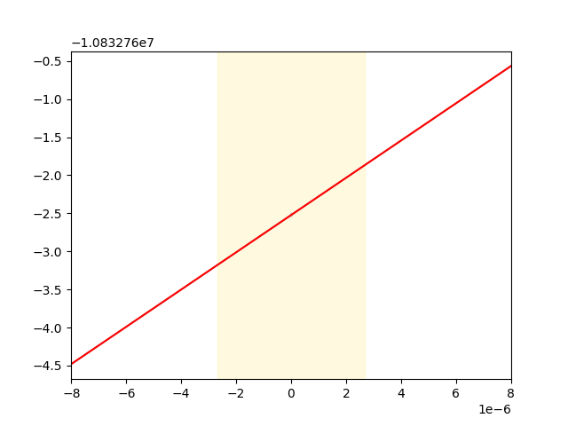
found U by substituting in paams! 
## Equation 6:
```
ICaL__PhiCaNa_ss = (-ICaL__gamma_nao * extracellular__nao + ICaL__gamma_nass * intracellular_ions__nass * exp(membrane__vfrt)) * membrane__vffrt / (-1.0 + exp(membrane__vfrt))
```
### Partially evaluated to: 
```
ICaL__PhiCaNa_ss = pow(physical_constants__F, 2) * (-extracellular__nao * exp(-2859.0635474831229 * pow(physical_constants__T, (-1.5)) * (-0.00014999999999999999 * extracellular__clo - 0.00014999999999999999 * extracellular__ko - 0.00014999999999999999 * extracellular__nao - 0.00059999999999999995 * extracellular__cao + 0.044721359549995794 * sqrt(0.25 * extracellular__clo + 0.25 * extracellular__ko + 0.25 * extracellular__nao + extracellular__cao) / (1.0 + 0.044721359549995794 * sqrt(0.25 * extracellular__clo + 0.25 * extracellular__ko + 0.25 * extracellular__nao + extracellular__cao)))) + intracellular_ions__nass * exp(-2859.0635474831229 * pow(physical_constants__T, (-1.5)) * (-0.00014999999999999999 * intracellular_ions__cli - 0.00014999999999999999 * intracellular_ions__kss - 0.00014999999999999999 * intracellular_ions__nass - 0.00059999999999999995 * intracellular_ions__cass + 0.044721359549995794 * sqrt(0.25 * intracellular_ions__cli + 0.25 * intracellular_ions__kss + 0.25 * intracellular_ions__nass + intracellular_ions__cass) / (1.0 + 0.044721359549995794 * sqrt(0.25 * intracellular_ions__cli + 0.25 * intracellular_ions__kss + 0.25 * intracellular_ions__nass + intracellular_ions__cass)))) * exp(membrane__v * physical_constants__F / (physical_constants__R * physical_constants__T))) * membrane__v / ((-1.0 + exp(membrane__v * physical_constants__F / (physical_constants__R * physical_constants__T))) * physical_constants__R * physical_constants__T)
```
## New Eq:
```
ICaL__PhiCaNa_ss = ((fabs(membrane__v) < 2.6712338705498262e-6) ? ((0.5 + 187179.41753901311 * membrane__v) * (2.6712338705498262e-6 * pow(physical_constants__F, 2) * (-extracellular__nao * exp(-2859.0635474831229 * pow(physical_constants__T, (-1.5)) * (-0.00014999999999999999 * extracellular__clo - 0.00014999999999999999 * extracellular__ko - 0.00014999999999999999 * extracellular__nao - 0.00059999999999999995 * extracellular__cao + 0.044721359549995794 * sqrt(0.25 * extracellular__clo + 0.25 * extracellular__ko + 0.25 * extracellular__nao + extracellular__cao) / (1.0 + 0.044721359549995794 * sqrt(0.25 * extracellular__clo + 0.25 * extracellular__ko + 0.25 * extracellular__nao + extracellular__cao)))) + intracellular_ions__nass * exp(-2859.0635474831229 * pow(physical_constants__T, (-1.5)) * (-0.00014999999999999999 * intracellular_ions__cli - 0.00014999999999999999 * intracellular_ions__kss - 0.00014999999999999999 * intracellular_ions__nass - 0.00059999999999999995 * intracellular_ions__cass + 0.044721359549995794 * sqrt(0.25 * intracellular_ions__cli + 0.25 * intracellular_ions__kss + 0.25 * intracellular_ions__nass + intracellular_ions__cass) / (1.0 + 0.044721359549995794 * sqrt(0.25 * intracellular_ions__cli + 0.25 * intracellular_ions__kss + 0.25 * intracellular_ions__nass + intracellular_ions__cass)))) * exp(2.6712338705498262e-6 * physical_constants__F / (physical_constants__R * physical_constants__T))) / ((-1.0 + exp(2.6712338705498262e-6 * physical_constants__F / (physical_constants__R * physical_constants__T))) * physical_constants__R * physical_constants__T) + 2.6712338705498262e-6 * pow(physical_constants__F, 2) * (-extracellular__nao * exp(-2859.0635474831229 * pow(physical_constants__T, (-1.5)) * (-0.00014999999999999999 * extracellular__clo - 0.00014999999999999999 * extracellular__ko - 0.00014999999999999999 * extracellular__nao - 0.00059999999999999995 * extracellular__cao + 0.044721359549995794 * sqrt(0.25 * extracellular__clo + 0.25 * extracellular__ko + 0.25 * extracellular__nao + extracellular__cao) / (1.0 + 0.044721359549995794 * sqrt(0.25 * extracellular__clo + 0.25 * extracellular__ko + 0.25 * extracellular__nao + extracellular__cao)))) + intracellular_ions__nass * exp(-2859.0635474831229 * pow(physical_constants__T, (-1.5)) * (-0.00014999999999999999 * intracellular_ions__cli - 0.00014999999999999999 * intracellular_ions__kss - 0.00014999999999999999 * intracellular_ions__nass - 0.00059999999999999995 * intracellular_ions__cass + 0.044721359549995794 * sqrt(0.25 * intracellular_ions__cli + 0.25 * intracellular_ions__kss + 0.25 * intracellular_ions__nass + intracellular_ions__cass) / (1.0 + 0.044721359549995794 * sqrt(0.25 * intracellular_ions__cli + 0.25 * intracellular_ions__kss + 0.25 * intracellular_ions__nass + intracellular_ions__cass)))) * exp(-2.6712338705498262e-6 * physical_constants__F / (physical_constants__R * physical_constants__T))) / ((-1.0 + exp(-2.6712338705498262e-6 * physical_constants__F / (physical_constants__R * physical_constants__T))) * physical_constants__R * physical_constants__T)) - 2.6712338705498262e-6 * pow(physical_constants__F, 2) * (-extracellular__nao * exp(-2859.0635474831229 * pow(physical_constants__T, (-1.5)) * (-0.00014999999999999999 * extracellular__clo - 0.00014999999999999999 * extracellular__ko - 0.00014999999999999999 * extracellular__nao - 0.00059999999999999995 * extracellular__cao + 0.044721359549995794 * sqrt(0.25 * extracellular__clo + 0.25 * extracellular__ko + 0.25 * extracellular__nao + extracellular__cao) / (1.0 + 0.044721359549995794 * sqrt(0.25 * extracellular__clo + 0.25 * extracellular__ko + 0.25 * extracellular__nao + extracellular__cao)))) + intracellular_ions__nass * exp(-2859.0635474831229 * pow(physical_constants__T, (-1.5)) * (-0.00014999999999999999 * intracellular_ions__cli - 0.00014999999999999999 * intracellular_ions__kss - 0.00014999999999999999 * intracellular_ions__nass - 0.00059999999999999995 * intracellular_ions__cass + 0.044721359549995794 * sqrt(0.25 * intracellular_ions__cli + 0.25 * intracellular_ions__kss + 0.25 * intracellular_ions__nass + intracellular_ions__cass) / (1.0 + 0.044721359549995794 * sqrt(0.25 * intracellular_ions__cli + 0.25 * intracellular_ions__kss + 0.25 * intracellular_ions__nass + intracellular_ions__cass)))) * exp(-2.6712338705498262e-6 * physical_constants__F / (physical_constants__R * physical_constants__T))) / ((-1.0 + exp(-2.6712338705498262e-6 * physical_constants__F / (physical_constants__R * physical_constants__T))) * physical_constants__R * physical_constants__T)) : ((-ICaL__gamma_nao * extracellular__nao + ICaL__gamma_nass * intracellular_ions__nass * exp(membrane__vfrt)) * membrane__vffrt / (-1.0 + exp(membrane__vfrt))))
```

*U*: 
0.074871767015605231 * membrane__v
*V for 1e-07 range* 
`-1.3356169352749131e-6 - 1.3356169352749131e-6`

*Singularity point: 0*


found U by substituting in paams! 
## Equation 7:
```
ICab__ICab = 4.0 * (-ICaL__gamma_cao * extracellular__cao + ICaL__gamma_cai * intracellular_ions__cai * exp(2.0 * membrane__vfrt)) * ICab__PCab * membrane__vffrt / (-1.0 + exp(2.0 * membrane__vfrt))
```
### Partially evaluated to: 
```
ICab__ICab = 2.36776e-7 * pow(physical_constants__F, 2) * (-extracellular__cao * exp(-11436.254189932491 * pow(physical_constants__T, (-1.5)) * (-0.00014999999999999999 * extracellular__clo - 0.00014999999999999999 * extracellular__ko - 0.00014999999999999999 * extracellular__nao - 0.00059999999999999995 * extracellular__cao + 0.044721359549995794 * sqrt(0.25 * extracellular__clo + 0.25 * extracellular__ko + 0.25 * extracellular__nao + extracellular__cao) / (1.0 + 0.044721359549995794 * sqrt(0.25 * extracellular__clo + 0.25 * extracellular__ko + 0.25 * extracellular__nao + extracellular__cao)))) + intracellular_ions__cai * exp(-11436.254189932491 * pow(physical_constants__T, (-1.5)) * (-0.00014999999999999999 * intracellular_ions__cli - 0.00014999999999999999 * intracellular_ions__ki - 0.00014999999999999999 * intracellular_ions__nai - 0.00059999999999999995 * intracellular_ions__cai + 0.044721359549995794 * sqrt(0.25 * intracellular_ions__cli + 0.25 * intracellular_ions__ki + 0.25 * intracellular_ions__nai + intracellular_ions__cai) / (1.0 + 0.044721359549995794 * sqrt(0.25 * intracellular_ions__cli + 0.25 * intracellular_ions__ki + 0.25 * intracellular_ions__nai + intracellular_ions__cai)))) * exp(2.0 * membrane__v * physical_constants__F / (physical_constants__R * physical_constants__T))) * membrane__v / ((-1.0 + exp(2.0 * membrane__v * physical_constants__F / (physical_constants__R * physical_constants__T))) * physical_constants__R * physical_constants__T)
```
## New Eq:
```
ICab__ICab = ((fabs(membrane__v) < 1.3356169352749131e-6) ? ((0.5 + 374358.83507802623 * membrane__v) * (3.1624203546665282e-13 * pow(physical_constants__F, 2) * (-extracellular__cao * exp(-11436.254189932491 * pow(physical_constants__T, (-1.5)) * (-0.00014999999999999999 * extracellular__clo - 0.00014999999999999999 * extracellular__ko - 0.00014999999999999999 * extracellular__nao - 0.00059999999999999995 * extracellular__cao + 0.044721359549995794 * sqrt(0.25 * extracellular__clo + 0.25 * extracellular__ko + 0.25 * extracellular__nao + extracellular__cao) / (1.0 + 0.044721359549995794 * sqrt(0.25 * extracellular__clo + 0.25 * extracellular__ko + 0.25 * extracellular__nao + extracellular__cao)))) + intracellular_ions__cai * exp(-11436.254189932491 * pow(physical_constants__T, (-1.5)) * (-0.00014999999999999999 * intracellular_ions__cli - 0.00014999999999999999 * intracellular_ions__ki - 0.00014999999999999999 * intracellular_ions__nai - 0.00059999999999999995 * intracellular_ions__cai + 0.044721359549995794 * sqrt(0.25 * intracellular_ions__cli + 0.25 * intracellular_ions__ki + 0.25 * intracellular_ions__nai + intracellular_ions__cai) / (1.0 + 0.044721359549995794 * sqrt(0.25 * intracellular_ions__cli + 0.25 * intracellular_ions__ki + 0.25 * intracellular_ions__nai + intracellular_ions__cai)))) * exp(2.6712338705498262e-6 * physical_constants__F / (physical_constants__R * physical_constants__T))) / ((-1.0 + exp(2.6712338705498262e-6 * physical_constants__F / (physical_constants__R * physical_constants__T))) * physical_constants__R * physical_constants__T) + 3.1624203546665282e-13 * pow(physical_constants__F, 2) * (-extracellular__cao * exp(-11436.254189932491 * pow(physical_constants__T, (-1.5)) * (-0.00014999999999999999 * extracellular__clo - 0.00014999999999999999 * extracellular__ko - 0.00014999999999999999 * extracellular__nao - 0.00059999999999999995 * extracellular__cao + 0.044721359549995794 * sqrt(0.25 * extracellular__clo + 0.25 * extracellular__ko + 0.25 * extracellular__nao + extracellular__cao) / (1.0 + 0.044721359549995794 * sqrt(0.25 * extracellular__clo + 0.25 * extracellular__ko + 0.25 * extracellular__nao + extracellular__cao)))) + intracellular_ions__cai * exp(-11436.254189932491 * pow(physical_constants__T, (-1.5)) * (-0.00014999999999999999 * intracellular_ions__cli - 0.00014999999999999999 * intracellular_ions__ki - 0.00014999999999999999 * intracellular_ions__nai - 0.00059999999999999995 * intracellular_ions__cai + 0.044721359549995794 * sqrt(0.25 * intracellular_ions__cli + 0.25 * intracellular_ions__ki + 0.25 * intracellular_ions__nai + intracellular_ions__cai) / (1.0 + 0.044721359549995794 * sqrt(0.25 * intracellular_ions__cli + 0.25 * intracellular_ions__ki + 0.25 * intracellular_ions__nai + intracellular_ions__cai)))) * exp(-2.6712338705498262e-6 * physical_constants__F / (physical_constants__R * physical_constants__T))) / ((-1.0 + exp(-2.6712338705498262e-6 * physical_constants__F / (physical_constants__R * physical_constants__T))) * physical_constants__R * physical_constants__T)) - 3.1624203546665282e-13 * pow(physical_constants__F, 2) * (-extracellular__cao * exp(-11436.254189932491 * pow(physical_constants__T, (-1.5)) * (-0.00014999999999999999 * extracellular__clo - 0.00014999999999999999 * extracellular__ko - 0.00014999999999999999 * extracellular__nao - 0.00059999999999999995 * extracellular__cao + 0.044721359549995794 * sqrt(0.25 * extracellular__clo + 0.25 * extracellular__ko + 0.25 * extracellular__nao + extracellular__cao) / (1.0 + 0.044721359549995794 * sqrt(0.25 * extracellular__clo + 0.25 * extracellular__ko + 0.25 * extracellular__nao + extracellular__cao)))) + intracellular_ions__cai * exp(-11436.254189932491 * pow(physical_constants__T, (-1.5)) * (-0.00014999999999999999 * intracellular_ions__cli - 0.00014999999999999999 * intracellular_ions__ki - 0.00014999999999999999 * intracellular_ions__nai - 0.00059999999999999995 * intracellular_ions__cai + 0.044721359549995794 * sqrt(0.25 * intracellular_ions__cli + 0.25 * intracellular_ions__ki + 0.25 * intracellular_ions__nai + intracellular_ions__cai) / (1.0 + 0.044721359549995794 * sqrt(0.25 * intracellular_ions__cli + 0.25 * intracellular_ions__ki + 0.25 * intracellular_ions__nai + intracellular_ions__cai)))) * exp(-2.6712338705498262e-6 * physical_constants__F / (physical_constants__R * physical_constants__T))) / ((-1.0 + exp(-2.6712338705498262e-6 * physical_constants__F / (physical_constants__R * physical_constants__T))) * physical_constants__R * physical_constants__T)) : (4.0 * (-ICaL__gamma_cao * extracellular__cao + ICaL__gamma_cai * intracellular_ions__cai * exp(2.0 * membrane__vfrt)) * ICab__PCab * membrane__vffrt / (-1.0 + exp(2.0 * membrane__vfrt))))
```

*U*: 
0.037435883507802616 * membrane__v
*V for 1e-07 range* 
`-2.6712338705498262e-6 - 2.6712338705498262e-6`

*Singularity point: 0*

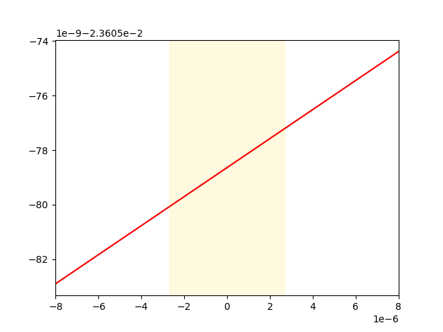
found U by substituting in paams! 
## Equation 8:
```
INab__INab = (-extracellular__nao + intracellular_ions__nai * exp(membrane__vfrt)) * INab__PNab * membrane__vffrt / (-1.0 + exp(membrane__vfrt))
```
### Partially evaluated to: 
```
INab__INab = 1.9238999999999999e-9 * pow(physical_constants__F, 2) * (-extracellular__nao + intracellular_ions__nai * exp(membrane__v * physical_constants__F / (physical_constants__R * physical_constants__T))) * membrane__v / ((-1.0 + exp(membrane__v * physical_constants__F / (physical_constants__R * physical_constants__T))) * physical_constants__R * physical_constants__T)
```
## New Eq:
```
INab__INab = ((fabs(membrane__v) < 2.6712338705498262e-6) ? ((0.5 + 187179.41753901311 * membrane__v) * (5.1391868435508108e-15 * pow(physical_constants__F, 2) * (-extracellular__nao + intracellular_ions__nai * exp(2.6712338705498262e-6 * physical_constants__F / (physical_constants__R * physical_constants__T))) / ((-1.0 + exp(2.6712338705498262e-6 * physical_constants__F / (physical_constants__R * physical_constants__T))) * physical_constants__R * physical_constants__T) + 5.1391868435508108e-15 * pow(physical_constants__F, 2) * (-extracellular__nao + intracellular_ions__nai * exp(-2.6712338705498262e-6 * physical_constants__F / (physical_constants__R * physical_constants__T))) / ((-1.0 + exp(-2.6712338705498262e-6 * physical_constants__F / (physical_constants__R * physical_constants__T))) * physical_constants__R * physical_constants__T)) - 5.1391868435508108e-15 * pow(physical_constants__F, 2) * (-extracellular__nao + intracellular_ions__nai * exp(-2.6712338705498262e-6 * physical_constants__F / (physical_constants__R * physical_constants__T))) / ((-1.0 + exp(-2.6712338705498262e-6 * physical_constants__F / (physical_constants__R * physical_constants__T))) * physical_constants__R * physical_constants__T)) : ((-extracellular__nao + intracellular_ions__nai * exp(membrane__vfrt)) * INab__PNab * membrane__vffrt / (-1.0 + exp(membrane__vfrt))))
```

singularity processing time: 154.4827206
# Model: Trovato2020(Trovato2020.cellml)
load time: 5.314231800000016

*U*: 
0.037435883507802616 * membrane__v
*V for 1e-07 range* 
`-2.6712338705498262e-6 - 2.6712338705498262e-6`

*Singularity point: 0*

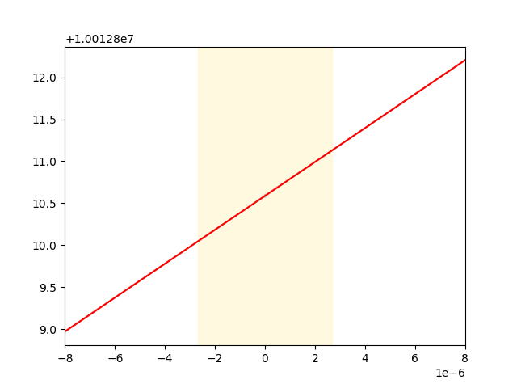
found U by substituting in paams! 
## Equation 1:
```
ICaL__PhiCaK = (-0.75 * extracellular__ko + 0.75 * intracellular_ions__kss * exp(membrane__vfrt)) * membrane__vffrt / (-1.0 + exp(membrane__vfrt))
```
### Partially evaluated to: 
```
ICaL__PhiCaK = pow(physical_constants__F, 2) * (-0.75 * extracellular__ko + 0.75 * intracellular_ions__kss * exp(membrane__v * physical_constants__F / (physical_constants__R * physical_constants__T))) * membrane__v / ((-1.0 + exp(membrane__v * physical_constants__F / (physical_constants__R * physical_constants__T))) * physical_constants__R * physical_constants__T)
```
## New Eq:
```
ICaL__PhiCaK = ((fabs(membrane__v) < 2.6712338705498262e-6) ? ((0.5 + 187179.41753901311 * membrane__v) * (2.6712338705498262e-6 * pow(physical_constants__F, 2) * (-0.75 * extracellular__ko + 0.75 * intracellular_ions__kss * exp(2.6712338705498262e-6 * physical_constants__F / (physical_constants__R * physical_constants__T))) / ((-1.0 + exp(2.6712338705498262e-6 * physical_constants__F / (physical_constants__R * physical_constants__T))) * physical_constants__R * physical_constants__T) + 2.6712338705498262e-6 * pow(physical_constants__F, 2) * (-0.75 * extracellular__ko + 0.75 * intracellular_ions__kss * exp(-2.6712338705498262e-6 * physical_constants__F / (physical_constants__R * physical_constants__T))) / ((-1.0 + exp(-2.6712338705498262e-6 * physical_constants__F / (physical_constants__R * physical_constants__T))) * physical_constants__R * physical_constants__T)) - 2.6712338705498262e-6 * pow(physical_constants__F, 2) * (-0.75 * extracellular__ko + 0.75 * intracellular_ions__kss * exp(-2.6712338705498262e-6 * physical_constants__F / (physical_constants__R * physical_constants__T))) / ((-1.0 + exp(-2.6712338705498262e-6 * physical_constants__F / (physical_constants__R * physical_constants__T))) * physical_constants__R * physical_constants__T)) : ((-0.75 * extracellular__ko + 0.75 * intracellular_ions__kss * exp(membrane__vfrt)) * membrane__vffrt / (-1.0 + exp(membrane__vfrt))))
```

*U*: 
0.074871767015605231 * membrane__v
*V for 1e-07 range* 
`-1.3356169352749131e-6 - 1.3356169352749131e-6`

*Singularity point: 0*

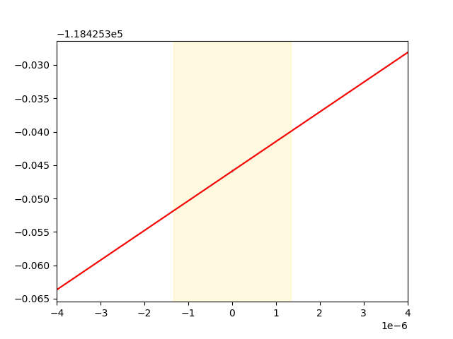
found U by substituting in paams! 
## Equation 2:
```
ICaL__PhiCaL = 4.0 * (-0.34100000000000003 * extracellular__cao + intracellular_ions__cass * exp(2.0 * membrane__vfrt)) * membrane__vffrt / (-1.0 + exp(2.0 * membrane__vfrt))
```
### Partially evaluated to: 
```
ICaL__PhiCaL = 4.0 * pow(physical_constants__F, 2) * (-0.34100000000000003 * extracellular__cao + intracellular_ions__cass * exp(2.0 * membrane__v * physical_constants__F / (physical_constants__R * physical_constants__T))) * membrane__v / ((-1.0 + exp(2.0 * membrane__v * physical_constants__F / (physical_constants__R * physical_constants__T))) * physical_constants__R * physical_constants__T)
```
## New Eq:
```
ICaL__PhiCaL = ((fabs(membrane__v) < 1.3356169352749131e-6) ? ((0.5 + 374358.83507802623 * membrane__v) * (5.3424677410996524e-6 * pow(physical_constants__F, 2) * (-0.34100000000000003 * extracellular__cao + intracellular_ions__cass * exp(2.6712338705498262e-6 * physical_constants__F / (physical_constants__R * physical_constants__T))) / ((-1.0 + exp(2.6712338705498262e-6 * physical_constants__F / (physical_constants__R * physical_constants__T))) * physical_constants__R * physical_constants__T) + 5.3424677410996524e-6 * pow(physical_constants__F, 2) * (-0.34100000000000003 * extracellular__cao + intracellular_ions__cass * exp(-2.6712338705498262e-6 * physical_constants__F / (physical_constants__R * physical_constants__T))) / ((-1.0 + exp(-2.6712338705498262e-6 * physical_constants__F / (physical_constants__R * physical_constants__T))) * physical_constants__R * physical_constants__T)) - 5.3424677410996524e-6 * pow(physical_constants__F, 2) * (-0.34100000000000003 * extracellular__cao + intracellular_ions__cass * exp(-2.6712338705498262e-6 * physical_constants__F / (physical_constants__R * physical_constants__T))) / ((-1.0 + exp(-2.6712338705498262e-6 * physical_constants__F / (physical_constants__R * physical_constants__T))) * physical_constants__R * physical_constants__T)) : (4.0 * (-0.34100000000000003 * extracellular__cao + intracellular_ions__cass * exp(2.0 * membrane__vfrt)) * membrane__vffrt / (-1.0 + exp(2.0 * membrane__vfrt))))
```

*U*: 
0.037435883507802616 * membrane__v
*V for 1e-07 range* 
`-2.6712338705498262e-6 - 2.6712338705498262e-6`

*Singularity point: 0*

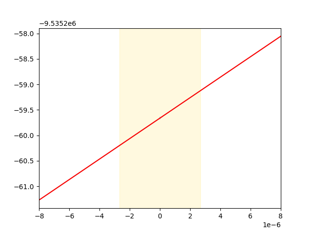
found U by substituting in paams! 
## Equation 3:
```
ICaL__PhiCaNa = (-0.75 * extracellular__nao + 0.75 * intracellular_ions__nass * exp(membrane__vfrt)) * membrane__vffrt / (-1.0 + exp(membrane__vfrt))
```
### Partially evaluated to: 
```
ICaL__PhiCaNa = pow(physical_constants__F, 2) * (-0.75 * extracellular__nao + 0.75 * intracellular_ions__nass * exp(membrane__v * physical_constants__F / (physical_constants__R * physical_constants__T))) * membrane__v / ((-1.0 + exp(membrane__v * physical_constants__F / (physical_constants__R * physical_constants__T))) * physical_constants__R * physical_constants__T)
```
## New Eq:
```
ICaL__PhiCaNa = ((fabs(membrane__v) < 2.6712338705498262e-6) ? ((0.5 + 187179.41753901311 * membrane__v) * (2.6712338705498262e-6 * pow(physical_constants__F, 2) * (-0.75 * extracellular__nao + 0.75 * intracellular_ions__nass * exp(2.6712338705498262e-6 * physical_constants__F / (physical_constants__R * physical_constants__T))) / ((-1.0 + exp(2.6712338705498262e-6 * physical_constants__F / (physical_constants__R * physical_constants__T))) * physical_constants__R * physical_constants__T) + 2.6712338705498262e-6 * pow(physical_constants__F, 2) * (-0.75 * extracellular__nao + 0.75 * intracellular_ions__nass * exp(-2.6712338705498262e-6 * physical_constants__F / (physical_constants__R * physical_constants__T))) / ((-1.0 + exp(-2.6712338705498262e-6 * physical_constants__F / (physical_constants__R * physical_constants__T))) * physical_constants__R * physical_constants__T)) - 2.6712338705498262e-6 * pow(physical_constants__F, 2) * (-0.75 * extracellular__nao + 0.75 * intracellular_ions__nass * exp(-2.6712338705498262e-6 * physical_constants__F / (physical_constants__R * physical_constants__T))) / ((-1.0 + exp(-2.6712338705498262e-6 * physical_constants__F / (physical_constants__R * physical_constants__T))) * physical_constants__R * physical_constants__T)) : ((-0.75 * extracellular__nao + 0.75 * intracellular_ions__nass * exp(membrane__vfrt)) * membrane__vffrt / (-1.0 + exp(membrane__vfrt))))
```

*U*: 
0.074871767015605231 * membrane__v
*V for 1e-07 range* 
`-1.3356169352749131e-6 - 1.3356169352749131e-6`

*Singularity point: 0*

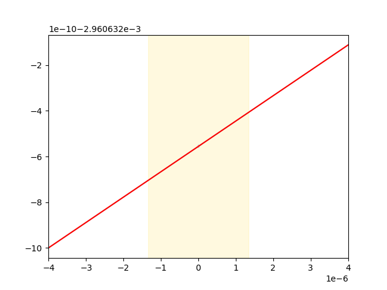
found U by substituting in paams! 
## Equation 4:
```
ICab__ICab = 4.0 * (-0.34100000000000003 * extracellular__cao + intracellular_ions__casl * exp(2.0 * membrane__vfrt)) * ICab__PCab * membrane__vffrt / (-1.0 + exp(2.0 * membrane__vfrt))
```
### Partially evaluated to: 
```
ICab__ICab = 9.9999999999999995e-8 * pow(physical_constants__F, 2) * (-0.34100000000000003 * extracellular__cao + intracellular_ions__casl * exp(2.0 * membrane__v * physical_constants__F / (physical_constants__R * physical_constants__T))) * membrane__v / ((-1.0 + exp(2.0 * membrane__v * physical_constants__F / (physical_constants__R * physical_constants__T))) * physical_constants__R * physical_constants__T)
```
## New Eq:
```
ICab__ICab = ((fabs(membrane__v) < 1.3356169352749131e-6) ? ((0.5 + 374358.83507802623 * membrane__v) * (1.335616935274913e-13 * pow(physical_constants__F, 2) * (-0.34100000000000003 * extracellular__cao + intracellular_ions__casl * exp(2.6712338705498262e-6 * physical_constants__F / (physical_constants__R * physical_constants__T))) / ((-1.0 + exp(2.6712338705498262e-6 * physical_constants__F / (physical_constants__R * physical_constants__T))) * physical_constants__R * physical_constants__T) + 1.335616935274913e-13 * pow(physical_constants__F, 2) * (-0.34100000000000003 * extracellular__cao + intracellular_ions__casl * exp(-2.6712338705498262e-6 * physical_constants__F / (physical_constants__R * physical_constants__T))) / ((-1.0 + exp(-2.6712338705498262e-6 * physical_constants__F / (physical_constants__R * physical_constants__T))) * physical_constants__R * physical_constants__T)) - 1.335616935274913e-13 * pow(physical_constants__F, 2) * (-0.34100000000000003 * extracellular__cao + intracellular_ions__casl * exp(-2.6712338705498262e-6 * physical_constants__F / (physical_constants__R * physical_constants__T))) / ((-1.0 + exp(-2.6712338705498262e-6 * physical_constants__F / (physical_constants__R * physical_constants__T))) * physical_constants__R * physical_constants__T)) : (4.0 * (-0.34100000000000003 * extracellular__cao + intracellular_ions__casl * exp(2.0 * membrane__vfrt)) * ICab__PCab * membrane__vffrt / (-1.0 + exp(2.0 * membrane__vfrt))))
```

*U*: 
0.037435883507802616 * membrane__v
*V for 1e-07 range* 
`-2.6712338705498262e-6 - 2.6712338705498262e-6`

*Singularity point: 0*

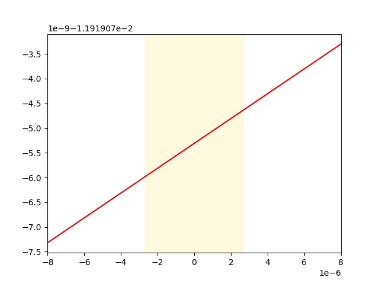
found U by substituting in paams! 
## Equation 5:
```
INab__INab = (-extracellular__nao + intracellular_ions__nasl * exp(membrane__vfrt)) * INab__PNab * membrane__vffrt / (-1.0 + exp(membrane__vfrt))
```
### Partially evaluated to: 
```
INab__INab = 9.3749999999999992e-10 * pow(physical_constants__F, 2) * (-extracellular__nao + intracellular_ions__nasl * exp(membrane__v * physical_constants__F / (physical_constants__R * physical_constants__T))) * membrane__v / ((-1.0 + exp(membrane__v * physical_constants__F / (physical_constants__R * physical_constants__T))) * physical_constants__R * physical_constants__T)
```
## New Eq:
```
INab__INab = ((fabs(membrane__v) < 2.6712338705498262e-6) ? ((0.5 + 187179.41753901311 * membrane__v) * (2.5042817536404619e-15 * pow(physical_constants__F, 2) * (-extracellular__nao + intracellular_ions__nasl * exp(2.6712338705498262e-6 * physical_constants__F / (physical_constants__R * physical_constants__T))) / ((-1.0 + exp(2.6712338705498262e-6 * physical_constants__F / (physical_constants__R * physical_constants__T))) * physical_constants__R * physical_constants__T) + 2.5042817536404619e-15 * pow(physical_constants__F, 2) * (-extracellular__nao + intracellular_ions__nasl * exp(-2.6712338705498262e-6 * physical_constants__F / (physical_constants__R * physical_constants__T))) / ((-1.0 + exp(-2.6712338705498262e-6 * physical_constants__F / (physical_constants__R * physical_constants__T))) * physical_constants__R * physical_constants__T)) - 2.5042817536404619e-15 * pow(physical_constants__F, 2) * (-extracellular__nao + intracellular_ions__nasl * exp(-2.6712338705498262e-6 * physical_constants__F / (physical_constants__R * physical_constants__T))) / ((-1.0 + exp(-2.6712338705498262e-6 * physical_constants__F / (physical_constants__R * physical_constants__T))) * physical_constants__R * physical_constants__T)) : ((-extracellular__nao + intracellular_ions__nasl * exp(membrane__vfrt)) * INab__PNab * membrane__vffrt / (-1.0 + exp(membrane__vfrt))))
```

singularity processing time: 127.98352699999987
# Model: viswanathan_model_1999_epi(viswanathan_model_1999_epi.cellml)
load time: 4.468320099999801

*U*: 
0.074871767015605231 * membrane__V
*V for 1e-07 range* 
`-1.3356169352749131e-6 - 1.3356169352749131e-6`

*Singularity point: 0*

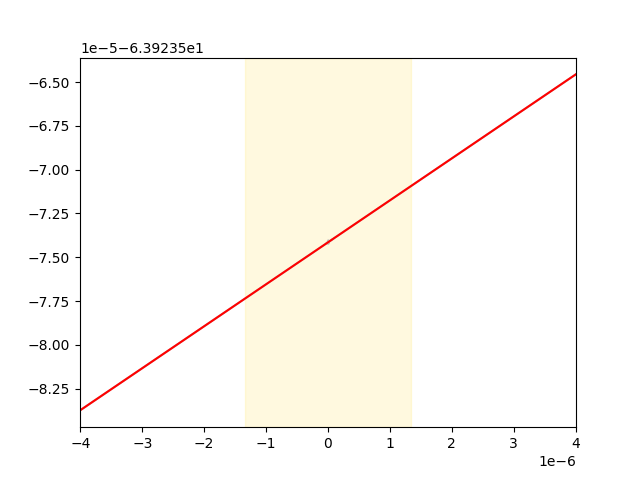
## Equation 1:
```
L_type_Ca_channel__I_CaCa = 4.0 * pow(membrane__F, 2) * (-L_type_Ca_channel__gamma_Cao * calcium_dynamics__Cao + L_type_Ca_channel__gamma_Cai * calcium_dynamics__Cai * exp(2.0 * membrane__F * membrane__V / (membrane__R * membrane__T))) * L_type_Ca_channel__P_Ca * membrane__V / ((-1.0 + exp(2.0 * membrane__F * membrane__V / (membrane__R * membrane__T))) * membrane__R * membrane__T)
```
### Partially evaluated to: 
```
L_type_Ca_channel__I_CaCa = 7.8019226357407252 * (-0.34100000000000003 * calcium_dynamics__Cao + calcium_dynamics__Cai * exp(0.074871767015605231 * membrane__V)) * membrane__V / (-1.0 + exp(0.074871767015605231 * membrane__V))
```
## New Eq:
```
L_type_Ca_channel__I_CaCa = ((fabs(membrane__V) < 1.3356169352749131e-6) ? (104.20379478988001 * calcium_dynamics__Cai - 35.533497576698664 * calcium_dynamics__Cao + (0.5 + 374358.83507802623 * membrane__V) * (3.5535915058337864e-6 * calcium_dynamics__Cao + 1.0419670540051662e-5 * calcium_dynamics__Cai)) : (4.0 * pow(membrane__F, 2) * (-L_type_Ca_channel__gamma_Cao * calcium_dynamics__Cao + L_type_Ca_channel__gamma_Cai * calcium_dynamics__Cai * exp(2.0 * membrane__F * membrane__V / (membrane__R * membrane__T))) * L_type_Ca_channel__P_Ca * membrane__V / ((-1.0 + exp(2.0 * membrane__F * membrane__V / (membrane__R * membrane__T))) * membrane__R * membrane__T)))
```

*U*: 
0.037435883507802616 * membrane__V
*V for 1e-07 range* 
`-2.6712338705498262e-6 - 2.6712338705498262e-6`

*Singularity point: 0*

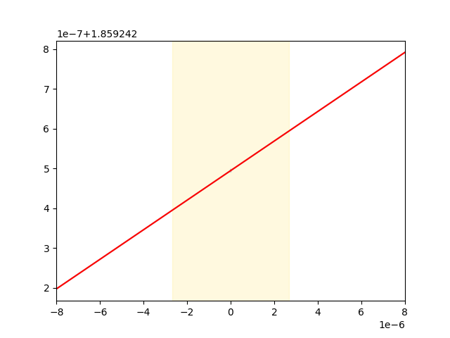
## Equation 2:
```
L_type_Ca_channel__I_CaK = pow(membrane__F, 2) * (-L_type_Ca_channel__gamma_Ko * ionic_concentrations__Ko + L_type_Ca_channel__gamma_Ki * ionic_concentrations__Ki * exp(membrane__F * membrane__V / (membrane__R * membrane__T))) * L_type_Ca_channel__P_K * membrane__V / ((-1.0 + exp(membrane__F * membrane__V / (membrane__R * membrane__T))) * membrane__R * membrane__T)
```
### Partially evaluated to: 
```
L_type_Ca_channel__I_CaK = 0.00069711623550831479 * (-0.75 * ionic_concentrations__Ko + 0.75 * ionic_concentrations__Ki * exp(0.037435883507802616 * membrane__V)) * membrane__V / (-1.0 + exp(0.037435883507802616 * membrane__V))
```
## New Eq:
```
L_type_Ca_channel__I_CaK = ((fabs(membrane__V) < 2.6712338705498262e-6) ? (0.013966203051699195 * ionic_concentrations__Ki - 0.01396620444831957 * ionic_concentrations__Ko + (0.5 + 187179.41753901311 * membrane__V) * (1.3965252876774756e-9 * ionic_concentrations__Ki + 1.3967154623492758e-9 * ionic_concentrations__Ko)) : (pow(membrane__F, 2) * (-L_type_Ca_channel__gamma_Ko * ionic_concentrations__Ko + L_type_Ca_channel__gamma_Ki * ionic_concentrations__Ki * exp(membrane__F * membrane__V / (membrane__R * membrane__T))) * L_type_Ca_channel__P_K * membrane__V / ((-1.0 + exp(membrane__F * membrane__V / (membrane__R * membrane__T))) * membrane__R * membrane__T)))
```

*U*: 
0.037435883507802616 * membrane__V
*V for 1e-07 range* 
`-2.6712338705498262e-6 - 2.6712338705498262e-6`

*Singularity point: 0*


## Equation 3:
```
L_type_Ca_channel__I_CaNa = pow(membrane__F, 2) * (-L_type_Ca_channel__gamma_Nao * ionic_concentrations__Nao + L_type_Ca_channel__gamma_Nai * ionic_concentrations__Nai * exp(membrane__F * membrane__V / (membrane__R * membrane__T))) * L_type_Ca_channel__P_Na * membrane__V / ((-1.0 + exp(membrane__F * membrane__V / (membrane__R * membrane__T))) * membrane__R * membrane__T)
```
### Partially evaluated to: 
```
L_type_Ca_channel__I_CaNa = 0.0024381008236689767 * (-0.75 * ionic_concentrations__Nao + 0.75 * ionic_concentrations__Nai * exp(0.037435883507802616 * membrane__V)) * membrane__V / (-1.0 + exp(0.037435883507802616 * membrane__V))
```
## New Eq:
```
L_type_Ca_channel__I_CaNa = ((fabs(membrane__V) < 2.6712338705498262e-6) ? (0.048845528807756257 * ionic_concentrations__Nai - 0.04884553369230938 * ionic_concentrations__Nao + (0.5 + 187179.41753901311 * membrane__V) * (4.8842205656990899e-9 * ionic_concentrations__Nai + 4.8848856843753709e-9 * ionic_concentrations__Nao)) : (pow(membrane__F, 2) * (-L_type_Ca_channel__gamma_Nao * ionic_concentrations__Nao + L_type_Ca_channel__gamma_Nai * ionic_concentrations__Nai * exp(membrane__F * membrane__V / (membrane__R * membrane__T))) * L_type_Ca_channel__P_Na * membrane__V / ((-1.0 + exp(membrane__F * membrane__V / (membrane__R * membrane__T))) * membrane__R * membrane__T)))
```

*U*: 
5.6404999999999994 + 0.14499999999999999 * membrane__V
*V for 1e-07 range* 
`-38.900000689655172 - -38.899999310344825`
-38.899999999999999

*Singularity point: -38.899999999999999*


*U*: 
-1.7465999999999999 - 0.123 * membrane__V
*V for 1e-07 range* 
`-14.199999186991869 - -14.200000813008129`
-14.199999999999999

*Singularity point: -14.199999999999999*


## Equation 4:
```
rapid_delayed_rectifier_potassium_current_xr_gate__tau_xr = 0.001 / (0.00060999999999999997 * (38.899999999999999 + membrane__V) / (-1.0 + exp(5.6404999999999994 + 0.14499999999999999 * membrane__V)) + 0.0013799999999999999 * (14.199999999999999 + membrane__V) / (1.0 - exp(-1.7465999999999999 - 0.123 * membrane__V)))
```
### Partially evaluated to: 
```
rapid_delayed_rectifier_potassium_current_xr_gate__tau_xr = 0.001 / (0.00060999999999999997 * (38.899999999999999 + membrane__V) / (-1.0 + 281.60348502322194 * exp(0.14499999999999999 * membrane__V)) + 0.0013799999999999999 * (14.199999999999999 + membrane__V) / (1.0 - 0.17436578041087322 * exp(-0.123 * membrane__V)))
```
## New Eq:
```
rapid_delayed_rectifier_potassium_current_xr_gate__tau_xr = ((fabs(38.899999999999999 + membrane__V) < 6.896551724422384e-7) ? (0.33797340791378733 + 0.0043478755379763477 * membrane__V) : ((fabs(14.199999999999999 + membrane__V) < 8.1300813007528783e-7) ? (0.018542688989639584 - 0.0047385664159891247 * membrane__V) : (0.001 / (0.00060999999999999997 * (38.899999999999999 + membrane__V) / (-1.0 + exp(5.6404999999999994 + 0.14499999999999999 * membrane__V)) + 0.0013799999999999999 * (14.199999999999999 + membrane__V) / (1.0 - exp(-1.7465999999999999 - 0.123 * membrane__V))))))
```

*U*: 
2.0609999999999999 + 0.068699999999999997 * membrane__V
*V for 1e-07 range* 
`-30.000001455604075 - -29.999998544395925`
-30.000000000000000

*Singularity point: -30.000000000000000*


*U*: 
-4.4399999999999995 - 0.14799999999999999 * membrane__V
*V for 1e-07 range* 
`-29.999999324324325 - -30.000000675675675`
-30.000000000000000

*Singularity point: -30.000000000000000*


## Equation 5:
```
slow_delayed_rectifier_potassium_current_xs1_gate__tau_xs1 = 0.001 / (0.00013100000000000001 * (30.0 + membrane__V) / (-1.0 + exp(2.0609999999999999 + 0.068699999999999997 * membrane__V)) + 7.1899999999999999e-5 * (30.0 + membrane__V) / (1.0 - exp(-4.4399999999999995 - 0.14799999999999999 * membrane__V)))
```
### Partially evaluated to: 
```
slow_delayed_rectifier_potassium_current_xs1_gate__tau_xs1 = 0.001 / (0.00013100000000000001 * (30.0 + membrane__V) / (-1.0 + 7.8538197044216602 * exp(0.068699999999999997 * membrane__V)) + 7.1899999999999999e-5 * (30.0 + membrane__V) / (1.0 - 0.011795938519751569 * exp(-0.14799999999999999 * membrane__V)))
```
## New Eq:
```
slow_delayed_rectifier_potassium_current_xs1_gate__tau_xs1 = ((fabs(30.0 + membrane__V) < 1.455604075689676e-6) ? (0.57283278764504919 + 0.0051628844993798191 * membrane__V) : ((fabs(30.0 + membrane__V) < 6.7567567568760367e-7) ? (0.57277257883161203 + 0.0051608775388260067 * membrane__V) : (0.001 / (0.00013100000000000001 * (30.0 + membrane__V) / (-1.0 + exp(2.0609999999999999 + 0.068699999999999997 * membrane__V)) + 7.1899999999999999e-5 * (30.0 + membrane__V) / (1.0 - exp(-4.4399999999999995 - 0.14799999999999999 * membrane__V))))))
```

*U*: 
2.0609999999999999 + 0.068699999999999997 * membrane__V
*V for 1e-07 range* 
`-30.000001455604075 - -29.999998544395925`
-30.000000000000000

*Singularity point: -30.000000000000000*


*U*: 
-4.4399999999999995 - 0.14799999999999999 * membrane__V
*V for 1e-07 range* 
`-29.999999324324325 - -30.000000675675675`
-30.000000000000000

*Singularity point: -30.000000000000000*


## Equation 6:
```
slow_delayed_rectifier_potassium_current_xs2_gate__tau_xs2 = 0.0040000000000000001 / (0.00013100000000000001 * (30.0 + membrane__V) / (-1.0 + exp(2.0609999999999999 + 0.068699999999999997 * membrane__V)) + 7.1899999999999999e-5 * (30.0 + membrane__V) / (1.0 - exp(-4.4399999999999995 - 0.14799999999999999 * membrane__V)))
```
### Partially evaluated to: 
```
slow_delayed_rectifier_potassium_current_xs2_gate__tau_xs2 = 0.0040000000000000001 / (0.00013100000000000001 * (30.0 + membrane__V) / (-1.0 + 7.8538197044216602 * exp(0.068699999999999997 * membrane__V)) + 7.1899999999999999e-5 * (30.0 + membrane__V) / (1.0 - 0.011795938519751569 * exp(-0.14799999999999999 * membrane__V)))
```
## New Eq:
```
slow_delayed_rectifier_potassium_current_xs2_gate__tau_xs2 = ((fabs(30.0 + membrane__V) < 1.455604075689676e-6) ? (2.2913311505801968 + 0.020651537997519277 * membrane__V) : ((fabs(30.0 + membrane__V) < 6.7567567568760367e-7) ? (2.2910903153264481 + 0.020643510155304027 * membrane__V) : (0.0040000000000000001 / (0.00013100000000000001 * (30.0 + membrane__V) / (-1.0 + exp(2.0609999999999999 + 0.068699999999999997 * membrane__V)) + 7.1899999999999999e-5 * (30.0 + membrane__V) / (1.0 - exp(-4.4399999999999995 - 0.14799999999999999 * membrane__V))))))
```

singularity processing time: 59.732705700000224
# Model: wang_model_2008(wang_sobie_2008.cellml)
load time: 2.648952200000167

*U*: 
0.038949423064193495 * membrane__V
*V for 1e-07 range* 
`-2.5674321243523316e-6 - 2.5674321243523316e-6`

*Singularity point: 0*


## Equation 1:
```
calcium_activated_chloride_current__i_ClCa = pow(membrane__F, 2) * (-membrane__Cli + membrane__Clo * exp(membrane__F * membrane__V / (membrane__R * membrane__T))) * calcium_activated_chloride_current__P_ClCa * calcium_activated_chloride_current__f_ClCa * membrane__V / ((-1.0 + exp(membrane__F * membrane__V / (membrane__R * membrane__T))) * membrane__R * membrane__T)
```
### Partially evaluated to: 
```
calcium_activated_chloride_current__i_ClCa = 1.02986169524034e-6 * pow((calcium_concentration__Cass / (4.0 + calcium_concentration__Cass)), 3.0) * (-membrane__Cli + membrane__Clo * exp(0.038949423064193495 * membrane__V)) * membrane__V / (-1.0 + exp(0.038949423064193495 * membrane__V))
```
## New Eq:
```
calcium_activated_chloride_current__i_ClCa = ((fabs(membrane__V) < 2.5674321243523316e-6) ? ((0.5 + 194747.11532096748 * membrane__V) * (2.6440998677787742e-5 * pow((calcium_concentration__Cass / (4.0 + calcium_concentration__Cass)), 3.0) * (-membrane__Cli + 1.0000001000000049 * membrane__Clo) - 2.6441001322067764e-5 * pow((calcium_concentration__Cass / (4.0 + calcium_concentration__Cass)), 3.0) * (-membrane__Cli + 0.99999990000000505 * membrane__Clo)) + 2.6441001322067764e-5 * pow((calcium_concentration__Cass / (4.0 + calcium_concentration__Cass)), 3.0) * (-membrane__Cli + 0.99999990000000505 * membrane__Clo)) : (pow(membrane__F, 2) * (-membrane__Cli + membrane__Clo * exp(membrane__F * membrane__V / (membrane__R * membrane__T))) * calcium_activated_chloride_current__P_ClCa * calcium_activated_chloride_current__f_ClCa * membrane__V / ((-1.0 + exp(membrane__F * membrane__V / (membrane__R * membrane__T))) * membrane__R * membrane__T)))
```

*U*: 
-4.7130000000000001 - 0.10000000000000001 * membrane__V
*V for 1e-07 range* 
`-47.129999000000005 - -47.130001`
-47.130000000000003

*Singularity point: -47.130000000000003*


## Equation 2:
```
fast_sodium_current_m_gate__alpha_m = 0.32000000000000001 * (47.130000000000003 + membrane__V) / (1.0 - exp(-4.7130000000000001 - 0.10000000000000001 * membrane__V))
```
### Partially evaluated to: 
```
fast_sodium_current_m_gate__alpha_m = 0.32000000000000001 * (47.130000000000003 + membrane__V) / (1.0 - 0.00897780373069724 * exp(-0.10000000000000001 * membrane__V))
```
## New Eq:
```
fast_sodium_current_m_gate__alpha_m = ((fabs(47.130000000000003 + membrane__V) < 1.0000000000287557e-6) ? (10.740659346653775 + 0.15999701562995733 * membrane__V) : (0.32000000000000001 * (47.130000000000003 + membrane__V) / (1.0 - exp(-4.7130000000000001 - 0.10000000000000001 * membrane__V))))
```

*U*: 
-3.3919999999999999 - 0.128 * membrane__V
*V for 1e-07 range* 
`-26.499999218749998 - -26.500000781250002`
-26.500000000000000

*Singularity point: -26.500000000000000*


## Equation 3:
```
slow_delayed_rectifier_potassium_current__alpha_n = 4.8133299999999997e-6 * (26.5 + membrane__V) / (1.0 - exp(-3.3919999999999999 - 0.128 * membrane__V))
```
### Partially evaluated to: 
```
slow_delayed_rectifier_potassium_current__alpha_n = 4.8133299999999997e-6 * (26.5 + membrane__V) / (1.0 - 0.033641326918204616 * exp(-0.128 * membrane__V))
```
## New Eq:
```
slow_delayed_rectifier_potassium_current__alpha_n = ((fabs(26.5 + membrane__V) < 7.8124999999817923e-7) ? (0.00010137957354771978 + 2.4066201102800349e-6 * membrane__V) : (4.8133299999999997e-6 * (26.5 + membrane__V) / (1.0 - exp(-3.3919999999999999 - 0.128 * membrane__V))))
```

singularity processing time: 16.738600500000302
# Model: winslow_model_1999(winslow_model_1999.cellml)
load time: 3.9955120999998144

*U*: 
-0.68699999999999994 + 0.068699999999999997 * membrane__V
*V for 1e-07 range* 
`9.9999985443959236 - 10.000001455604076`
10.000000000000000

*Singularity point: 10.000000000000000*


*U*: 
1.48 - 0.14799999999999999 * membrane__V
*V for 1e-07 range* 
`10.000000675675675 - 9.9999993243243246`
10.000000000000000

*Singularity point: 10.000000000000000*


## Equation 1:
```
slow_activating_delayed_rectifiyer_K_current_X_ks_gate__tau_X_ks = 0.001 / (0.00013100000000000001 * (-10.0 + membrane__V) / (-1.0 + exp(-0.68699999999999994 + 0.068699999999999997 * membrane__V)) + 7.1899999999999999e-5 * (-10.0 + membrane__V) / (1.0 - exp(1.48 - 0.14799999999999999 * membrane__V)))
```
### Partially evaluated to: 
```
slow_activating_delayed_rectifiyer_K_current_X_ks_gate__tau_X_ks = 0.001 / (0.00013100000000000001 * (-10.0 + membrane__V) / (-1.0 + 0.50308305662435071 * exp(0.068699999999999997 * membrane__V)) + 7.1899999999999999e-5 * (-10.0 + membrane__V) / (1.0 - 4.3929456809187561 * exp(-0.14799999999999999 * membrane__V)))
```
## New Eq:
```
slow_activating_delayed_rectifiyer_K_current_X_ks_gate__tau_X_ks = ((fabs(-10.0 + membrane__V) < 1.4556040756966149e-6) ? (0.36633867181831303 + 0.0051607580843768715 * membrane__V) : ((fabs(-10.0 + membrane__V) < 6.7567567567372588e-7) ? (0.36637264036730222 + 0.0051573612296569923 * membrane__V) : (0.001 / (0.00013100000000000001 * (-10.0 + membrane__V) / (-1.0 + exp(-0.68699999999999994 + 0.068699999999999997 * membrane__V)) + 7.1899999999999999e-5 * (-10.0 + membrane__V) / (1.0 - exp(1.48 - 0.14799999999999999 * membrane__V))))))
```

*U*: 
0.074867781645490947 * membrane__V
*V for 1e-07 range* 
`-1.3356880329847825e-6 - 1.3356880329847825e-6`

*Singularity point: 0*


## Equation 2:
```
L_type_Ca_current__i_Ca_max = 4000.0 * pow(membrane__F, 2) * (0.001 * exp(2.0 * membrane__F * membrane__V / (membrane__R * membrane__T)) - 0.34100000000000003 * standard_ionic_concentrations__Cao) * L_type_Ca_current__P_Ca * membrane__V / ((-1.0 + exp(2.0 * membrane__F * membrane__V / (membrane__R * membrane__T))) * membrane__R * membrane__T)
```
### Partially evaluated to: 
```
L_type_Ca_current__i_Ca_max = 14447.286958825252 * (0.001 * exp(0.074867781645490947 * membrane__V) - 0.34100000000000003 * standard_ionic_concentrations__Cao) * L_type_Ca_current__P_Ca * membrane__V / (-1.0 + exp(0.074867781645490947 * membrane__V))
```
## New Eq:
```
L_type_Ca_current__i_Ca_max = ((fabs(membrane__V) < 1.3356880329847825e-6) ? ((0.5 + 374338.90822745475 * membrane__V) * (192970.67335028169 * (0.001000000100000005 - 0.34100000000000003 * standard_ionic_concentrations__Cao) * L_type_Ca_current__P_Ca - 192970.6926486638 * (0.00099999990000000497 - 0.34100000000000003 * standard_ionic_concentrations__Cao) * L_type_Ca_current__P_Ca) + 192970.6926486638 * (0.00099999990000000497 - 0.34100000000000003 * standard_ionic_concentrations__Cao) * L_type_Ca_current__P_Ca) : (4000.0 * pow(membrane__F, 2) * (0.001 * exp(2.0 * membrane__F * membrane__V / (membrane__R * membrane__T)) - 0.34100000000000003 * standard_ionic_concentrations__Cao) * L_type_Ca_current__P_Ca * membrane__V / ((-1.0 + exp(2.0 * membrane__F * membrane__V / (membrane__R * membrane__T))) * membrane__R * membrane__T)))
```

*U*: 
0.037433890822745473 * membrane__V
*V for 1e-07 range* 
`-2.671376065969565e-6 - 2.671376065969565e-6`

*Singularity point: 0*

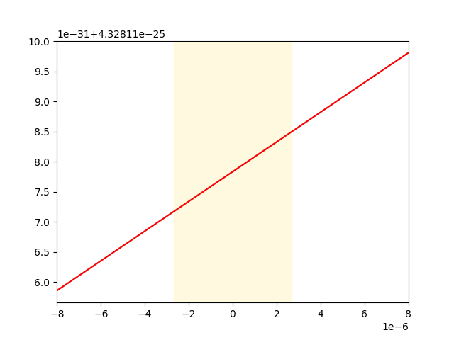
## Equation 3:
```
L_type_Ca_current__i_Ca_K = pow(membrane__F, 2) * (-standard_ionic_concentrations__Ko + intracellular_ion_concentrations__Ki * exp(membrane__F * membrane__V / (membrane__R * membrane__T))) * (L_type_Ca_current__O + L_type_Ca_current__O_Ca) * L_type_Ca_current__p_prime_k * L_type_Ca_current_y_gate__y * membrane__V / ((-1.0 + exp(membrane__F * membrane__V / (membrane__R * membrane__T))) * membrane__R * membrane__T)
```
### Partially evaluated to: 
```
L_type_Ca_current__i_Ca_K = 2.0912447872899554e-6 * (-standard_ionic_concentrations__Ko + intracellular_ion_concentrations__Ki * exp(0.037433890822745473 * membrane__V)) * (L_type_Ca_current__O + L_type_Ca_current__O_Ca) * L_type_Ca_current_y_gate__y * membrane__V / ((1.0 - 3.773584905660377 * L_type_Ca_current__i_Ca_max) * (-1.0 + exp(0.037433890822745473 * membrane__V)))
```
## New Eq:
```
L_type_Ca_current__i_Ca_K = ((fabs(membrane__V) < 2.671376065969565e-6) ? ((0.5 + 187169.45411372738 * membrane__V) * (5.5865009934906543e-5 * (-standard_ionic_concentrations__Ko + 1.0000001000000049 * intracellular_ion_concentrations__Ki) * (L_type_Ca_current__O + L_type_Ca_current__O_Ca) * L_type_Ca_current_y_gate__y / (1.0 - 3.773584905660377 * L_type_Ca_current__i_Ca_max) - 5.5865015521788168e-5 * (-standard_ionic_concentrations__Ko + 0.99999990000000505 * intracellular_ion_concentrations__Ki) * (L_type_Ca_current__O + L_type_Ca_current__O_Ca) * L_type_Ca_current_y_gate__y / (1.0 - 3.773584905660377 * L_type_Ca_current__i_Ca_max)) + 5.5865015521788168e-5 * (-standard_ionic_concentrations__Ko + 0.99999990000000505 * intracellular_ion_concentrations__Ki) * (L_type_Ca_current__O + L_type_Ca_current__O_Ca) * L_type_Ca_current_y_gate__y / (1.0 - 3.773584905660377 * L_type_Ca_current__i_Ca_max)) : (pow(membrane__F, 2) * (-standard_ionic_concentrations__Ko + intracellular_ion_concentrations__Ki * exp(membrane__F * membrane__V / (membrane__R * membrane__T))) * (L_type_Ca_current__O + L_type_Ca_current__O_Ca) * L_type_Ca_current__p_prime_k * L_type_Ca_current_y_gate__y * membrane__V / ((-1.0 + exp(membrane__F * membrane__V / (membrane__R * membrane__T))) * membrane__R * membrane__T)))
```

singularity processing time: 29.754486099999667
# Model: zhang_SAN_model_2000_0D_capable(zhang_SAN_model_2000_0D_capable.cellml)
load time: 4.507529900000009

*U*: 
-14.0 - 0.40000000000000002 * membrane__V
*V for 1e-07 range* 
`-34.999999750000001 - -35.000000249999999`
-35.000000000000000

*Singularity point: -35.000000000000000*


*U*: 
-0.20799999999999999 * membrane__V
*V for 1e-07 range* 
`4.8076923076923074e-7 - -4.8076923076923074e-7`

*Singularity point: 0*


## Equation 1:
```
L_type_Ca_channel_d_gate__alpha_d_L = -28.390000000000001 * (35.0 + membrane__V) / (-1.0 + exp(-14.0 - 0.40000000000000002 * membrane__V)) - 84.900000000000006 * membrane__V / (-1.0 + exp(-0.20799999999999999 * membrane__V))
```
### Partially evaluated to: 
```
L_type_Ca_channel_d_gate__alpha_d_L = -28.390000000000001 * (35.0 + membrane__V) / (-1.0 + 8.3152871910356788e-7 * exp(-0.40000000000000002 * membrane__V)) - 84.900000000000006 * membrane__V / (-1.0 + exp(-0.20799999999999999 * membrane__V))
```
## New Eq:
```
L_type_Ca_channel_d_gate__alpha_d_L = ((fabs(35.0 + membrane__V) < 2.5000000000718892e-7) ? (582.44433142825267 + 14.554857261676066 * membrane__V) : ((fabs(membrane__V) < 4.8076923076923074e-7) ? (1401.8239031711605 + 70.842583267278769 * membrane__V) : (-28.390000000000001 * (35.0 + membrane__V) / (-1.0 + exp(-14.0 - 0.40000000000000002 * membrane__V)) - 84.900000000000006 * membrane__V / (-1.0 + exp(-0.20799999999999999 * membrane__V)))))
```

*U*: 
-2.0 + 0.40000000000000002 * membrane__V
*V for 1e-07 range* 
`4.9999997499999997 - 5.0000002500000003`
5.0000000000000000

*Singularity point: 5.0000000000000000*

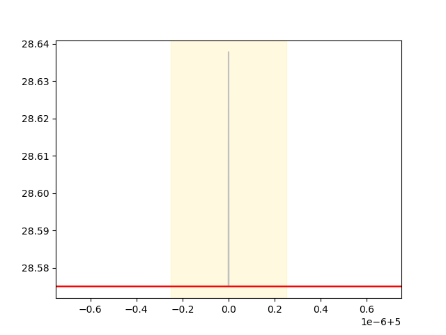
## Equation 2:
```
L_type_Ca_channel_d_gate__beta_d_L = 11.43 * (-5.0 + membrane__V) / (-1.0 + exp(-2.0 + 0.40000000000000002 * membrane__V))
```
### Partially evaluated to: 
```
L_type_Ca_channel_d_gate__beta_d_L = 11.43 * (-5.0 + membrane__V) / (-1.0 + 0.13533528323661267 * exp(0.40000000000000002 * membrane__V))
```
## New Eq:
```
L_type_Ca_channel_d_gate__beta_d_L = ((fabs(-5.0 + membrane__V) < 2.5000000000025002e-7) ? (57.154423983533846 - 5.7158847966918849 * membrane__V) : (11.43 * (-5.0 + membrane__V) / (-1.0 + exp(-2.0 + 0.40000000000000002 * membrane__V))))
```

*U*: 
7.0 + 0.25 * membrane__V
*V for 1e-07 range* 
`-28.000000400000001 - -27.999999599999999`
-28.000000000000000

*Singularity point: -28.000000000000000*


## Equation 3:
```
L_type_Ca_channel_f_gate__alpha_f_L = 3.75 * (28.0 + membrane__V) / (-1.0 + exp(7.0 + 0.25 * membrane__V))
```
### Partially evaluated to: 
```
L_type_Ca_channel_f_gate__alpha_f_L = 3.75 * (28.0 + membrane__V) / (-1.0 + 1096.6331584284585 * exp(0.25 * membrane__V))
```
## New Eq:
```
L_type_Ca_channel_f_gate__alpha_f_L = ((fabs(28.0 + membrane__V) < 4.0000000001150227e-7) ? (-37.512681700064675 - 1.8754529178594539 * membrane__V) : (3.75 * (28.0 + membrane__V) / (-1.0 + exp(7.0 + 0.25 * membrane__V))))
```

singularity processing time: 22.782404900000074
average processing time:31.05977849620253
