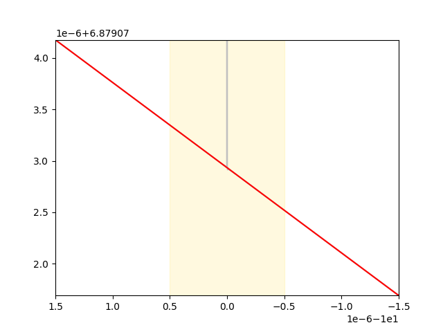
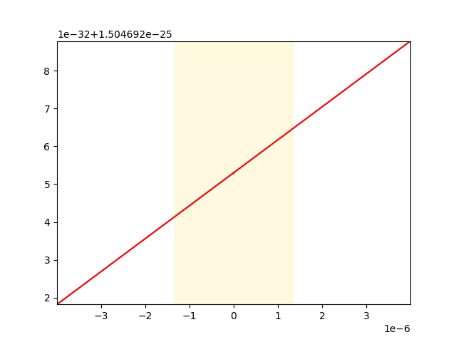

# Model: difrancesco_noble_model_1985
## Equation 5:
```
transient_outward_current__i_to = (10.0 + membrane__V) * (0.20000000000000001 + extracellular_potassium_concentration__Kc / (extracellular_potassium_concentration__Kc + transient_outward_current__Km_to)) * (intracellular_potassium_concentration__Ki * exp(0.5 * membrane__V / membrane__RTONF) - extracellular_potassium_concentration__Kc * exp(-0.5 * membrane__V / membrane__RTONF)) * intracellular_calcium_concentration__Cai * transient_outward_current__g_to * transient_outward_current_s_gate__s / ((1.0 - 0.13533528323661267 * exp(-0.20000000000000001 * membrane__V)) * (intracellular_calcium_concentration__Cai + transient_outward_current__Km_Ca))
```
### Partially evaluated to: 
```
transient_outward_current__i_to = 0.012363636363636365 * (10.0 + membrane__V) * (140.0 * exp(0.018716945411372737 * membrane__V) - 4.0 * exp(-0.018716945411372737 * membrane__V)) / (1.0 - 0.13533528323661267 * exp(-0.20000000000000001 * membrane__V))
```
### Singulariy points detected:
{-10.000000000000000}
0.012363636363636365*(_membrane$V + 10.0)*(140.0*exp(0.018716945411372736*_membrane$V) - 4.0*exp(-0.018716945411372736*_membrane$V))/(1.0 - 0.13533528323661268*exp(-0.20000000000000001*_membrane$V))
####A + B:
`-0.49454545454545462 / (exp(0.018716945411372737 * membrane__V) - 0.13533528323661267 * exp(-0.18128305458862728 * membrane__V)) + 17.309090909090912 * exp(0.018716945411372737 * membrane__V) / (1.0 - 0.13533528323661267 * exp(-0.20000000000000001 * membrane__V)) + 1.7309090909090912 * membrane__V * exp(0.018716945411372737 * membrane__V) / (1.0 - 0.13533528323661267 * exp(-0.20000000000000001 * membrane__V))`
`-0.049454545454545459 * membrane__V / (exp(0.018716945411372737 * membrane__V) - 0.13533528323661267 * exp(-0.18128305458862728 * membrane__V))`

1.7309090909090912*_membrane$V*exp(0.018716945411372736*_membrane$V)/(1.0 - 0.13533528323661268*exp(-0.20000000000000001*_membrane$V)) - 0.49454545454545462/(1.0*exp(0.018716945411372736*_membrane$V) - 0.13533528323661268*exp(-0.18128305458862728*_membrane$V)) + 17.309090909090912*exp(0.018716945411372736*_membrane$V)/(1.0 - 0.13533528323661268*exp(-0.20000000000000001*_membrane$V))
####A + B:
`17.309090909090912 * exp(0.018716945411372737 * membrane__V) / (1.0 - 0.13533528323661267 * exp(-0.20000000000000001 * membrane__V)) + 1.7309090909090912 * membrane__V * exp(0.018716945411372737 * membrane__V) / (1.0 - 0.13533528323661267 * exp(-0.20000000000000001 * membrane__V))`
`-0.49454545454545462 / (exp(0.018716945411372737 * membrane__V) - 0.13533528323661267 * exp(-0.18128305458862728 * membrane__V))`

1.7309090909090912*_membrane$V*exp(0.018716945411372736*_membrane$V)/(1.0 - 0.13533528323661268*exp(-0.20000000000000001*_membrane$V)) + 17.309090909090912*exp(0.018716945411372736*_membrane$V)/(1.0 - 0.13533528323661268*exp(-0.20000000000000001*_membrane$V))
####A + B:
`17.309090909090912 * exp(0.018716945411372737 * membrane__V) / (1.0 - 0.13533528323661267 * exp(-0.20000000000000001 * membrane__V))`
`1.7309090909090912 * membrane__V * exp(0.018716945411372737 * membrane__V) / (1.0 - 0.13533528323661267 * exp(-0.20000000000000001 * membrane__V))`

17.309090909090912*exp(0.018716945411372736*_membrane$V)/(1.0 - 0.13533528323661268*exp(-0.20000000000000001*_membrane$V))
*U*
`-2.0 - 0.20000000000000001 * membrane__V`

*V for 1e-07 range* 
`-9.9999994999999995 - -10.000000500000001`

*Singularity point: -10.000000000000000*


1.7309090909090912*_membrane$V*exp(0.018716945411372736*_membrane$V)/(1.0 - 0.13533528323661268*exp(-0.20000000000000001*_membrane$V))
*U*
`-2.0 - 0.20000000000000001 * membrane__V`

*V for 1e-07 range* 
`-9.9999994999999995 - -10.000000500000001`

*Singularity point: -10.000000000000000*


-0.49454545454545462/(1.0*exp(0.018716945411372736*_membrane$V) - 0.13533528323661268*exp(-0.18128305458862728*_membrane$V))
#### float * A

1/(1.0*exp(0.018716945411372736*_membrane$V) - 0.13533528323661268*exp(-0.18128305458862728*_membrane$V))
####1 / A

-0.049454545454545462*_membrane$V/(1.0*exp(0.018716945411372736*_membrane$V) - 0.13533528323661268*exp(-0.18128305458862728*_membrane$V))
#### float * A

1/(1.0*exp(0.018716945411372736*_membrane$V) - 0.13533528323661268*exp(-0.18128305458862728*_membrane$V))
####1 / A

# Model: grandi2010
## Equation 6:
```
cell__taud = 28.571428571428569 * (1.0 - 0.4345982085070782 * exp(-0.16666666666666666 * cell__sVm)) * cell__dss / (5.0 + cell__sVm)
```
### Partially evaluated to: 
```
cell__taud = 28.571428571428569 * (1.0 - 0.4345982085070782 * exp(-0.16666666666666666 * cell__sVm)) / ((1.0 + 0.4345982085070782 * exp(-0.16666666666666666 * cell__sVm)) * (5.0 + cell__sVm))
```
### Singulariy points detected:
{-5.0000000000000000}
28.571428571428569*(1.0 - 0.43459820850707822*exp(-0.16666666666666667*_cell$sVm))/((1.0 + 0.43459820850707822*exp(-0.16666666666666667*_cell$sVm))*(_cell$sVm + 5.0))
####A + B:
`28.571428571428569 / (5.0 + cell__sVm + 2.1729910425353913 * exp(-0.16666666666666666 * cell__sVm) + 0.4345982085070782 * cell__sVm * exp(-0.16666666666666666 * cell__sVm))`
`-12.417091671630805 / (2.1729910425353913 + 5.0 * exp(0.16666666666666666 * cell__sVm) + 0.4345982085070782 * cell__sVm + cell__sVm * exp(0.16666666666666666 * cell__sVm))`

# Model: jafri_rice_winslow_1998
## Equation 2:
```
L_type_Ca_channel__i_Ca_L_K = pow(membrane__F, 2) * (-ionic_concentrations__Ko + ionic_concentrations__Ki * exp(membrane__F * membrane__V / (membrane__R * membrane__T))) * (L_type_Ca_channel__O + L_type_Ca_channel__O_Ca) * L_type_Ca_channel__p_k * L_type_Ca_channel_y_gate__y * membrane__V / ((-1.0 + exp(membrane__F * membrane__V / (membrane__R * membrane__T))) * membrane__R * membrane__T)
```
### Partially evaluated to: 
```
L_type_Ca_channel__i_Ca_L_K = 3.5789092431332635e-26 * (-5.4000000000000004 + 143.727 * exp(0.037573302761014088 * membrane__V)) * membrane__V / ((1.0 - 107.25680748803607 * (-0.61380000000000001 + 0.001 * exp(0.075146605522028176 * membrane__V)) * membrane__V / (-1.0 + exp(0.075146605522028176 * membrane__V))) * (-1.0 + exp(0.037573302761014088 * membrane__V)))
```
### Singulariy points detected:
{0}
3.5789092431332636e-26*_membrane$V*(143.727*exp(0.037573302761014085*_membrane$V) - 5.4)/((-107.25680748803608*_membrane$V*(0.001*exp(0.075146605522028171*_membrane$V) - 0.61380000000000006)/(exp(0.075146605522028171*_membrane$V) - 1.0) + 1.0)*(exp(0.037573302761014085*_membrane$V) - 1.0))
####A + B:
`-1.9326109912919624e-25 * membrane__V / (-1.0 + exp(0.037573302761014088 * membrane__V) - 65.83422843615655 * membrane__V / (-1.0 + exp(0.075146605522028176 * membrane__V)) + 65.83422843615655 * membrane__V * exp(0.037573302761014088 * membrane__V) / (-1.0 + exp(0.075146605522028176 * membrane__V)) + 0.10725680748803608 * membrane__V * exp(0.075146605522028176 * membrane__V) / (-1.0 + exp(0.075146605522028176 * membrane__V)) - 0.10725680748803608 * membrane__V * exp(0.11271990828304225 * membrane__V) / (-1.0 + exp(0.075146605522028176 * membrane__V)))`
`5.143858887878146e-24 * membrane__V * exp(0.037573302761014088 * membrane__V) / (-1.0 + exp(0.037573302761014088 * membrane__V) - 65.83422843615655 * membrane__V / (-1.0 + exp(0.075146605522028176 * membrane__V)) + 65.83422843615655 * membrane__V * exp(0.037573302761014088 * membrane__V) / (-1.0 + exp(0.075146605522028176 * membrane__V)) + 0.10725680748803608 * membrane__V * exp(0.075146605522028176 * membrane__V) / (-1.0 + exp(0.075146605522028176 * membrane__V)) - 0.10725680748803608 * membrane__V * exp(0.11271990828304225 * membrane__V) / (-1.0 + exp(0.075146605522028176 * membrane__V)))`

-1.9326109912919625e-25*_membrane$V/(65.834228436156553*_membrane$V*exp(0.037573302761014085*_membrane$V)/(exp(0.075146605522028171*_membrane$V) - 1.0) + 0.10725680748803608*_membrane$V*exp(0.075146605522028171*_membrane$V)/(exp(0.075146605522028171*_membrane$V) - 1.0) - 0.10725680748803608*_membrane$V*exp(0.11271990828304226*_membrane$V)/(exp(0.075146605522028171*_membrane$V) - 1.0) - 65.834228436156553*_membrane$V/(exp(0.075146605522028171*_membrane$V) - 1.0) + 1.0*exp(0.037573302761014085*_membrane$V) - 1.0)
#### float * A

1/(65.834228436156553*_membrane$V*exp(0.037573302761014085*_membrane$V)/(exp(0.075146605522028171*_membrane$V) - 1.0) + 0.10725680748803608*_membrane$V*exp(0.075146605522028171*_membrane$V)/(exp(0.075146605522028171*_membrane$V) - 1.0) - 0.10725680748803608*_membrane$V*exp(0.11271990828304226*_membrane$V)/(exp(0.075146605522028171*_membrane$V) - 1.0) - 65.834228436156553*_membrane$V/(exp(0.075146605522028171*_membrane$V) - 1.0) + 1.0*exp(0.037573302761014085*_membrane$V) - 1.0)
####1 / A

65.834228436156553*_membrane$V*exp(0.037573302761014085*_membrane$V)/(exp(0.075146605522028171*_membrane$V) - 1.0) + 0.10725680748803608*_membrane$V*exp(0.075146605522028171*_membrane$V)/(exp(0.075146605522028171*_membrane$V) - 1.0) - 0.10725680748803608*_membrane$V*exp(0.11271990828304226*_membrane$V)/(exp(0.075146605522028171*_membrane$V) - 1.0) - 65.834228436156553*_membrane$V/(exp(0.075146605522028171*_membrane$V) - 1.0) + 1.0*exp(0.037573302761014085*_membrane$V) - 1.0
####A + B:
`-1.0 + exp(0.037573302761014088 * membrane__V) - 65.83422843615655 * membrane__V / (-1.0 + exp(0.075146605522028176 * membrane__V)) + 65.83422843615655 * membrane__V * exp(0.037573302761014088 * membrane__V) / (-1.0 + exp(0.075146605522028176 * membrane__V)) + 0.10725680748803608 * membrane__V * exp(0.075146605522028176 * membrane__V) / (-1.0 + exp(0.075146605522028176 * membrane__V))`
`-0.10725680748803608 * membrane__V * exp(0.11271990828304225 * membrane__V) / (-1.0 + exp(0.075146605522028176 * membrane__V))`

65.834228436156553*_membrane$V*exp(0.037573302761014085*_membrane$V)/(exp(0.075146605522028171*_membrane$V) - 1.0) + 0.10725680748803608*_membrane$V*exp(0.075146605522028171*_membrane$V)/(exp(0.075146605522028171*_membrane$V) - 1.0) - 65.834228436156553*_membrane$V/(exp(0.075146605522028171*_membrane$V) - 1.0) + 1.0*exp(0.037573302761014085*_membrane$V) - 1.0
####A + B:
`-1.0 + exp(0.037573302761014088 * membrane__V) - 65.83422843615655 * membrane__V / (-1.0 + exp(0.075146605522028176 * membrane__V)) + 65.83422843615655 * membrane__V * exp(0.037573302761014088 * membrane__V) / (-1.0 + exp(0.075146605522028176 * membrane__V))`
`0.10725680748803608 * membrane__V * exp(0.075146605522028176 * membrane__V) / (-1.0 + exp(0.075146605522028176 * membrane__V))`

65.834228436156553*_membrane$V*exp(0.037573302761014085*_membrane$V)/(exp(0.075146605522028171*_membrane$V) - 1.0) - 65.834228436156553*_membrane$V/(exp(0.075146605522028171*_membrane$V) - 1.0) + 1.0*exp(0.037573302761014085*_membrane$V) - 1.0
####A + B:
`-1.0 + exp(0.037573302761014088 * membrane__V) - 65.83422843615655 * membrane__V / (-1.0 + exp(0.075146605522028176 * membrane__V))`
`65.83422843615655 * membrane__V * exp(0.037573302761014088 * membrane__V) / (-1.0 + exp(0.075146605522028176 * membrane__V))`

-65.834228436156553*_membrane$V/(exp(0.075146605522028171*_membrane$V) - 1.0) + 1.0*exp(0.037573302761014085*_membrane$V) - 1.0
####A + B:
`-1.0 + exp(0.037573302761014088 * membrane__V)`
`-65.83422843615655 * membrane__V / (-1.0 + exp(0.075146605522028176 * membrane__V))`

-65.834228436156553*_membrane$V/(exp(0.075146605522028171*_membrane$V) - 1.0)
*U*
`0.075146605522028176 * membrane__V`

*V for 1e-07 range* 
`-1.3307320976818627e-6 - 1.3307320976818627e-6`

*Singularity point: 0*


65.834228436156553*_membrane$V*exp(0.037573302761014085*_membrane$V)/(exp(0.075146605522028171*_membrane$V) - 1.0)
*U*
`0.075146605522028176 * membrane__V`

*V for 1e-07 range* 
`-1.3307320976818627e-6 - 1.3307320976818627e-6`

*Singularity point: 0*


0.10725680748803608*_membrane$V*exp(0.075146605522028171*_membrane$V)/(exp(0.075146605522028171*_membrane$V) - 1.0)
*U*
`0.075146605522028176 * membrane__V`

*V for 1e-07 range* 
`-1.3307320976818627e-6 - 1.3307320976818627e-6`

*Singularity point: 0*


-0.10725680748803608*_membrane$V*exp(0.11271990828304226*_membrane$V)/(exp(0.075146605522028171*_membrane$V) - 1.0)
*U*
`0.075146605522028176 * membrane__V`

*V for 1e-07 range* 
`-1.3307320976818627e-6 - 1.3307320976818627e-6`

*Singularity point: 0*


5.1438588878781459e-24*_membrane$V*exp(0.037573302761014085*_membrane$V)/(65.834228436156553*_membrane$V*exp(0.037573302761014085*_membrane$V)/(exp(0.075146605522028171*_membrane$V) - 1.0) + 0.10725680748803608*_membrane$V*exp(0.075146605522028171*_membrane$V)/(exp(0.075146605522028171*_membrane$V) - 1.0) - 0.10725680748803608*_membrane$V*exp(0.11271990828304226*_membrane$V)/(exp(0.075146605522028171*_membrane$V) - 1.0) - 65.834228436156553*_membrane$V/(exp(0.075146605522028171*_membrane$V) - 1.0) + 1.0*exp(0.037573302761014085*_membrane$V) - 1.0)
#### float * A

1/(65.834228436156553*_membrane$V*exp(0.037573302761014085*_membrane$V)/(exp(0.075146605522028171*_membrane$V) - 1.0) + 0.10725680748803608*_membrane$V*exp(0.075146605522028171*_membrane$V)/(exp(0.075146605522028171*_membrane$V) - 1.0) - 0.10725680748803608*_membrane$V*exp(0.11271990828304226*_membrane$V)/(exp(0.075146605522028171*_membrane$V) - 1.0) - 65.834228436156553*_membrane$V/(exp(0.075146605522028171*_membrane$V) - 1.0) + 1.0*exp(0.037573302761014085*_membrane$V) - 1.0)
####1 / A

65.834228436156553*_membrane$V*exp(0.037573302761014085*_membrane$V)/(exp(0.075146605522028171*_membrane$V) - 1.0) + 0.10725680748803608*_membrane$V*exp(0.075146605522028171*_membrane$V)/(exp(0.075146605522028171*_membrane$V) - 1.0) - 0.10725680748803608*_membrane$V*exp(0.11271990828304226*_membrane$V)/(exp(0.075146605522028171*_membrane$V) - 1.0) - 65.834228436156553*_membrane$V/(exp(0.075146605522028171*_membrane$V) - 1.0) + 1.0*exp(0.037573302761014085*_membrane$V) - 1.0
####A + B:
`-1.0 + exp(0.037573302761014088 * membrane__V) - 65.83422843615655 * membrane__V / (-1.0 + exp(0.075146605522028176 * membrane__V)) + 65.83422843615655 * membrane__V * exp(0.037573302761014088 * membrane__V) / (-1.0 + exp(0.075146605522028176 * membrane__V)) + 0.10725680748803608 * membrane__V * exp(0.075146605522028176 * membrane__V) / (-1.0 + exp(0.075146605522028176 * membrane__V))`
`-0.10725680748803608 * membrane__V * exp(0.11271990828304225 * membrane__V) / (-1.0 + exp(0.075146605522028176 * membrane__V))`

65.834228436156553*_membrane$V*exp(0.037573302761014085*_membrane$V)/(exp(0.075146605522028171*_membrane$V) - 1.0) + 0.10725680748803608*_membrane$V*exp(0.075146605522028171*_membrane$V)/(exp(0.075146605522028171*_membrane$V) - 1.0) - 65.834228436156553*_membrane$V/(exp(0.075146605522028171*_membrane$V) - 1.0) + 1.0*exp(0.037573302761014085*_membrane$V) - 1.0
####A + B:
`-1.0 + exp(0.037573302761014088 * membrane__V) - 65.83422843615655 * membrane__V / (-1.0 + exp(0.075146605522028176 * membrane__V)) + 65.83422843615655 * membrane__V * exp(0.037573302761014088 * membrane__V) / (-1.0 + exp(0.075146605522028176 * membrane__V))`
`0.10725680748803608 * membrane__V * exp(0.075146605522028176 * membrane__V) / (-1.0 + exp(0.075146605522028176 * membrane__V))`

65.834228436156553*_membrane$V*exp(0.037573302761014085*_membrane$V)/(exp(0.075146605522028171*_membrane$V) - 1.0) - 65.834228436156553*_membrane$V/(exp(0.075146605522028171*_membrane$V) - 1.0) + 1.0*exp(0.037573302761014085*_membrane$V) - 1.0
####A + B:
`-1.0 + exp(0.037573302761014088 * membrane__V) - 65.83422843615655 * membrane__V / (-1.0 + exp(0.075146605522028176 * membrane__V))`
`65.83422843615655 * membrane__V * exp(0.037573302761014088 * membrane__V) / (-1.0 + exp(0.075146605522028176 * membrane__V))`

-65.834228436156553*_membrane$V/(exp(0.075146605522028171*_membrane$V) - 1.0) + 1.0*exp(0.037573302761014085*_membrane$V) - 1.0
####A + B:
`-1.0 + exp(0.037573302761014088 * membrane__V)`
`-65.83422843615655 * membrane__V / (-1.0 + exp(0.075146605522028176 * membrane__V))`

-65.834228436156553*_membrane$V/(exp(0.075146605522028171*_membrane$V) - 1.0)
*U*
`0.075146605522028176 * membrane__V`

*V for 1e-07 range* 
`-1.3307320976818627e-6 - 1.3307320976818627e-6`

*Singularity point: 0*


65.834228436156553*_membrane$V*exp(0.037573302761014085*_membrane$V)/(exp(0.075146605522028171*_membrane$V) - 1.0)
*U*
`0.075146605522028176 * membrane__V`

*V for 1e-07 range* 
`-1.3307320976818627e-6 - 1.3307320976818627e-6`

*Singularity point: 0*


0.10725680748803608*_membrane$V*exp(0.075146605522028171*_membrane$V)/(exp(0.075146605522028171*_membrane$V) - 1.0)
*U*
`0.075146605522028176 * membrane__V`

*V for 1e-07 range* 
`-1.3307320976818627e-6 - 1.3307320976818627e-6`

*Singularity point: 0*


-0.10725680748803608*_membrane$V*exp(0.11271990828304226*_membrane$V)/(exp(0.075146605522028171*_membrane$V) - 1.0)
*U*
`0.075146605522028176 * membrane__V`

*V for 1e-07 range* 
`-1.3307320976818627e-6 - 1.3307320976818627e-6`

*Singularity point: 0*


# Model: shannon_wang_puglisi_weber_bers_2004_model_updated
## Equation 1:
```
ICaL_d_gate__tau_d = 28.571428571428569 * (1.0 - 0.089218517409260095 * exp(-0.16666666666666666 * cell__V)) * ICaL_d_gate__d_infinity / (14.5 + cell__V)
```
### Partially evaluated to: 
```
ICaL_d_gate__tau_d = 28.571428571428569 * (1.0 - 0.089218517409260095 * exp(-0.16666666666666666 * cell__V)) / ((1.0 + 0.089218517409260095 * exp(-0.16666666666666666 * cell__V)) * (14.5 + cell__V))
```
### Singulariy points detected:
{-14.500000000000000}
28.571428571428569*(1.0 - 0.089218517409260101*exp(-0.16666666666666667*_cell$V))/((1.0 + 0.089218517409260101*exp(-0.16666666666666667*_cell$V))*(_cell$V + 14.5))
####A + B:
`28.571428571428569 / (14.5 + cell__V + 1.2936685024342716 * exp(-0.16666666666666666 * cell__V) + 0.089218517409260095 * cell__V * exp(-0.16666666666666666 * cell__V))`
`-2.5491004974074314 / (1.2936685024342716 + 14.5 * exp(0.16666666666666666 * cell__V) + 0.089218517409260095 * cell__V + cell__V * exp(0.16666666666666666 * cell__V))`

# Model: zhang_SAN_model_2000_0D_capable
