# Model: davies_isap_2012
## Equation 1:
```
ICaL__ibarca = 4.0 * (-15.0 + cell__V) * (-Environment__Ca_o * ICaL__gacao + Ca__Ca_ss * ICaL__gacai * exp(2.0 * (-15.0 + cell__V) * Environment__FonRT)) * Environment__F * Environment__FonRT * ICaL__pca / (-1.0 + exp(2.0 * (-15.0 + cell__V) * Environment__FonRT))
```
### Partially evaluated to: 
```
ICaL__ibarca = 3.5108651860830804 * (-15.0 + cell__V) * (-0.61380000000000001 + 7.3230071611651398e-5 * exp(0.074871767015599999 * cell__V)) / (-1.0 + 0.32527753564515088 * exp(0.074871767015599999 * cell__V))

```
### Singulariy points detected:
{15.000000000000000}

*Singularity point: 15.000000000000000*


## Equation 2:
```
ICab__ICab = (-0.34100000000000003 * Environment__Ca_o + Ca__Ca_i * exp(2.0 * Environment__FonRT * cell__V)) * Environment__F * Environment__FonRT * ICab__GCab * cell__V / (-1.0 + exp(2.0 * Environment__FonRT * cell__V))
```
### Partially evaluated to: 
```
ICab__ICab = 0.0028824983370005666 * (-0.61380000000000001 + 0.00022376833123175801 * exp(0.074871767015599999 * cell__V)) * cell__V / (-1.0 + exp(0.074871767015599999 * cell__V))
```
### Singulariy points detected:
{0}

*Singularity point: 0*


## Equation 3:
```
IKs__tauxs = 1 / (7.6100000000000007e-5 * (44.600000000000001 + cell__V) / (1.0 - 7.6868266637773744e-194 * exp(-9.9700000000000006 * cell__V)) + 0.00036000000000000002 * (-0.55000000000000004 + cell__V) / (-1.0 + 0.93202093695954691 * exp(0.128 * cell__V)))
```
### Partially evaluated to: 
```
IKs__tauxs = 1 / (7.6100000000000007e-5 * (44.600000000000001 + cell__V) / (1.0 - 7.6868266637773744e-194 * exp(-9.9700000000000006 * cell__V)) + 0.00036000000000000002 * (-0.55000000000000004 + cell__V) / (-1.0 + 0.93202093695954691 * exp(0.128 * cell__V)))
```
### Singulariy points detected:
{0.55000000000000005, -44.600000000000001}

*Singularity point: 0.55000000000000005*

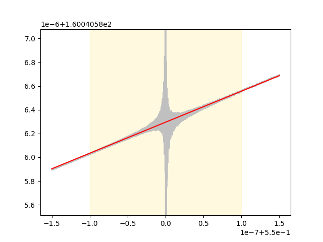

*Singularity point: -44.600000000000001*

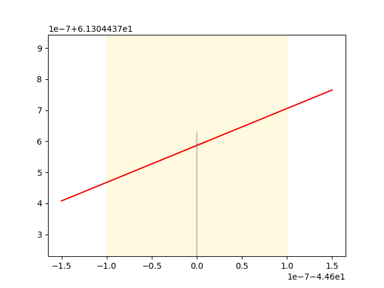

## Equation 4:
```
INa__am = 0.32000000000000001 * (47.130000000000003 + cell__V) / (1.0 - 0.00897780373069724 * exp(-0.10000000000000001 * cell__V))
```
### Partially evaluated to: 
```
INa__am = 0.32000000000000001 * (47.130000000000003 + cell__V) / (1.0 - 0.00897780373069724 * exp(-0.10000000000000001 * cell__V))
```
### Singulariy points detected:
{-47.130000000000003}

*Singularity point: -47.130000000000003*


## Equation 5:
```
INal__amL = 0.32000000000000001 * (47.130000000000003 + cell__V) / (1.0 - 0.00897780373069724 * exp(-0.10000000000000001 * cell__V))
```
### Partially evaluated to: 
```
INal__amL = 0.32000000000000001 * (47.130000000000003 + cell__V) / (1.0 - 0.00897780373069724 * exp(-0.10000000000000001 * cell__V))
```
### Singulariy points detected:
{-47.130000000000003}

*Singularity point: -47.130000000000003*


## Equation 6:
```
Ito2__Ito2_max = (-Environment__Cl_o * exp(Environment__FonRT * cell__V) + Cl__Cl_i) * Environment__F * Environment__FonRT * Ito2__PCl * cell__V / (1.0 - exp(Environment__FonRT * cell__V))
```
### Partially evaluated to: 
```
Ito2__Ito2_max = 0.001444800488100033 * (20.154379247109599 - 154.59999999999999 * exp(0.0374358835078 * cell__V)) * cell__V / (1.0 - exp(0.0374358835078 * cell__V))
```
### Singulariy points detected:
{0}

*Singularity point: 0*

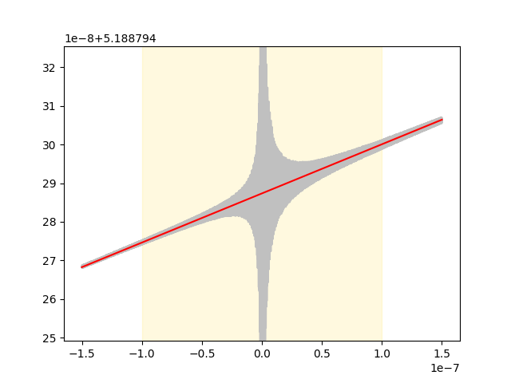


# Model: aslanidi_model_2009
## Equation 1:
```
sodium_current__i_Na = pow(membrane__F, 2) * pow(sodium_current_m_gate__m, 3) * (-1.0 + exp((-sodium_current__E_Na + membrane__V) * membrane__F / (membrane__R * membrane__T))) * (0.36499999999999999 * sodium_current_h2_gate__h2 + 0.63500000000000001 * sodium_current_h1_gate__h1) * cleft_space_ion_concentrations__Na_c * membrane__V * sodium_current__P_Na / ((-1.0 + exp(membrane__F * membrane__V / (membrane__R * membrane__T))) * membrane__R * membrane__T)
```
### Partially evaluated to: 
```
sodium_current__i_Na = 1.075255537963801e-6 * (-1.0 + 0.060000000000000005 * exp(0.037679754693225945 * membrane__V)) * membrane__V / (-1.0 + exp(0.037679754693225945 * membrane__V))
```
### Singulariy points detected:
{0}

*Singularity point: 0*

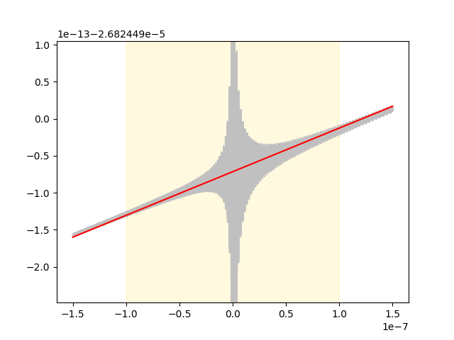

# Model: beeler_reuter_model_1977
## Equation 1:
```
sodium_current_m_gate__alpha_m = -(47.0 + membrane__V) / (-1.0 + 0.0090952771016958155 * exp(-0.10000000000000001 * membrane__V))
```
### Partially evaluated to: 
```
sodium_current_m_gate__alpha_m = -(47.0 + membrane__V) / (-1.0 + 0.0090952771016958155 * exp(-0.10000000000000001 * membrane__V))
```
### Singulariy points detected:
{-47.000000000000000}

*Singularity point: -47.000000000000000*

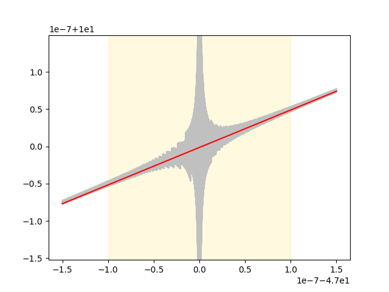

## Equation 2:
```
time_independent_outward_current__i_K1 = 0.014 * (-1.0 + 29.964100047397014 * exp(0.040000000000000001 * membrane__V)) / (8.3311374876876929 * exp(0.040000000000000001 * membrane__V) + 69.407851838755192 * exp(0.080000000000000002 * membrane__V)) + 0.0007000000000000001 * (23.0 + membrane__V) / (1.0 - 0.39851904108451419 * exp(-0.040000000000000001 * membrane__V))
```
### Partially evaluated to: 
```
time_independent_outward_current__i_K1 = 0.014 * (-1.0 + 29.964100047397014 * exp(0.040000000000000001 * membrane__V)) / (8.3311374876876929 * exp(0.040000000000000001 * membrane__V) + 69.407851838755192 * exp(0.080000000000000002 * membrane__V)) + 0.0007000000000000001 * (23.0 + membrane__V) / (1.0 - 0.39851904108451419 * exp(-0.040000000000000001 * membrane__V))
```
### Singulariy points detected:
{-23.000000000000000}

*Singularity point: -23.000000000000000*

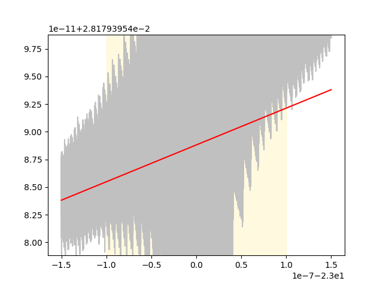

# Model: bondarenko_model_2004_apex
## Equation 1:
```
slow_delayed_rectifier_potassium_current__alpha_n = 4.8133299999999997e-6 * (26.5 + membrane__V) / (1.0 - 0.033641326918204616 * exp(-0.128 * membrane__V))
```
### Partially evaluated to: 
```
slow_delayed_rectifier_potassium_current__alpha_n = 4.8133299999999997e-6 * (26.5 + membrane__V) / (1.0 - 0.033641326918204616 * exp(-0.128 * membrane__V))
```
### Singulariy points detected:
{-26.500000000000000}

*Singularity point: -26.500000000000000*

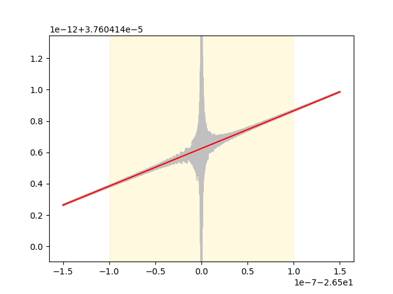

# Model: courtemanche_ramirez_nattel_model_1998
## Equation 1:
```
Ca_release_current_from_JSR_w_gate__tau_w = ((fabs(-7.9000000000000004 + membrane__V) < 1.0e-10) ? (0.92307692307692313) : (6.0 * (1.0 - 4.854955811237434 * exp(-0.20000000000000001 * membrane__V)) / ((1.0 + 1.4564867433712301 * exp(-0.20000000000000001 * membrane__V)) * (-7.9000000000000004 + membrane__V))))
```
### Partially evaluated to: 
```
Ca_release_current_from_JSR_w_gate__tau_w = ((fabs(-7.9000000000000004 + membrane__V) < 1.0e-10) ? (0.92307692307692313) : (6.0 * (1.0 - 4.854955811237434 * exp(-0.20000000000000001 * membrane__V)) / ((1.0 + 1.4564867433712301 * exp(-0.20000000000000001 * membrane__V)) * (-7.9000000000000004 + membrane__V))))
```
### Singulariy points detected:
{7.9000000000000004}

*Singularity point: 7.9000000000000004*

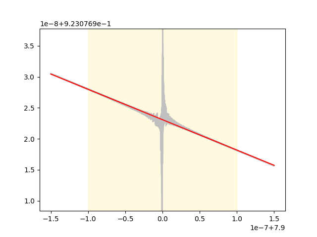

## Equation 2:
```
L_type_Ca_channel_d_gate__tau_d = ((fabs(10.0 + membrane__V) < 1.0e-10) ? (4.5789999999999997 / (1.0 + 0.20137949774492364 * exp(-0.16025641025641024 * membrane__V))) : (28.571428571428569 * (1.0 - 0.20137949774492364 * exp(-0.16025641025641024 * membrane__V)) / ((1.0 + 0.20137949774492364 * exp(-0.16025641025641024 * membrane__V)) * (10.0 + membrane__V))))
```
### Partially evaluated to: 
```
L_type_Ca_channel_d_gate__tau_d = ((fabs(10.0 + membrane__V) < 1.0e-10) ? (4.5789999999999997 / (1.0 + 0.20137949774492364 * exp(-0.16025641025641024 * membrane__V))) : (28.571428571428569 * (1.0 - 0.20137949774492364 * exp(-0.16025641025641024 * membrane__V)) / ((1.0 + 0.20137949774492364 * exp(-0.16025641025641024 * membrane__V)) * (10.0 + membrane__V))))
```
### Singulariy points detected:
{-10.000000000000000}

*Singularity point: -10.000000000000000*


## Equation 3:
```
fast_sodium_current_m_gate__alpha_m = ((membrane__V == (-47.130000000000003)) ? (3.2000000000000002) : (0.32000000000000001 * (47.130000000000003 + membrane__V) / (1.0 - 0.00897780373069724 * exp(-0.10000000000000001 * membrane__V))))
```
### Partially evaluated to: 
```
fast_sodium_current_m_gate__alpha_m = ((membrane__V == (-47.130000000000003)) ? (3.2000000000000002) : (0.32000000000000001 * (47.130000000000003 + membrane__V) / (1.0 - 0.00897780373069724 * exp(-0.10000000000000001 * membrane__V))))
```
### Singulariy points detected:
{-47.130000000000003}

*Singularity point: -47.130000000000003*


## Equation 4:
```
rapid_delayed_rectifier_K_current_xr_gate__alpha_xr = ((fabs(14.1 + membrane__V) < 1.0e-10) ? (0.0015) : (0.00029999999999999997 * (14.1 + membrane__V) / (1.0 - 0.059605942708939361 * exp(-0.20000000000000001 * membrane__V))))
```
### Partially evaluated to: 
```
rapid_delayed_rectifier_K_current_xr_gate__alpha_xr = ((fabs(14.1 + membrane__V) < 1.0e-10) ? (0.0015) : (0.00029999999999999997 * (14.1 + membrane__V) / (1.0 - 0.059605942708939361 * exp(-0.20000000000000001 * membrane__V))))
```
### Singulariy points detected:
{-14.100000000000000}

*Singularity point: -14.100000000000000*

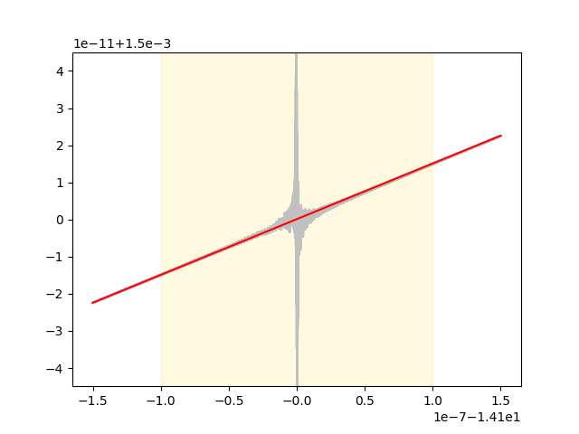

## Equation 5:
```
rapid_delayed_rectifier_K_current_xr_gate__beta_xr = ((fabs(-3.3328000000000002 + membrane__V) < 1.0e-10) ? (0.00037836118) : (7.3898000000000003e-5 * (-3.3328000000000002 + membrane__V) / (-1.0 + 0.52180181098168432 * exp(0.19517145812596365 * membrane__V))))
```
### Partially evaluated to: 
```
rapid_delayed_rectifier_K_current_xr_gate__beta_xr = ((fabs(-3.3328000000000002 + membrane__V) < 1.0e-10) ? (0.00037836118) : (7.3898000000000003e-5 * (-3.3328000000000002 + membrane__V) / (-1.0 + 0.52180181098168432 * exp(0.19517145812596365 * membrane__V))))
```
### Singulariy points detected:
{3.3328000000000002}

*Singularity point: 3.3328000000000002*

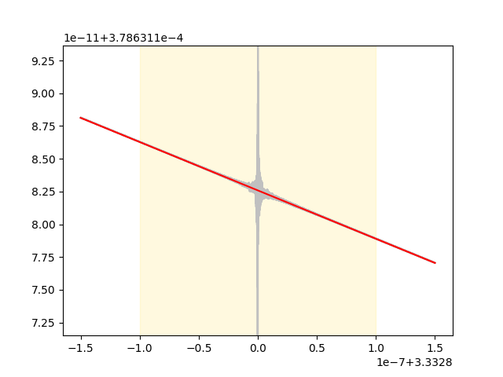

## Equation 6:
```
slow_delayed_rectifier_K_current_xs_gate__alpha_xs = ((fabs(-19.899999999999999 + membrane__V) < 1.0e-10) ? (0.00068000000000000005) : (4.0000000000000003e-5 * (-19.899999999999999 + membrane__V) / (1.0 - 3.2238884858633599 * exp(-0.058823529411764705 * membrane__V))))
```
### Partially evaluated to: 
```
slow_delayed_rectifier_K_current_xs_gate__alpha_xs = ((fabs(-19.899999999999999 + membrane__V) < 1.0e-10) ? (0.00068000000000000005) : (4.0000000000000003e-5 * (-19.899999999999999 + membrane__V) / (1.0 - 3.2238884858633599 * exp(-0.058823529411764705 * membrane__V))))
```
### Singulariy points detected:
{19.899999999999999}

*Singularity point: 19.899999999999999*

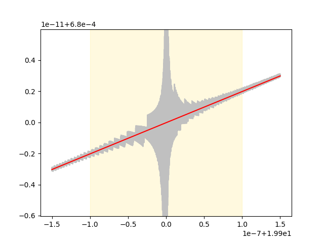

## Equation 7:
```
slow_delayed_rectifier_K_current_xs_gate__beta_xs = ((fabs(-19.899999999999999 + membrane__V) < 1.0e-10) ? (0.00031500000000000001) : (3.4999999999999997e-5 * (-19.899999999999999 + membrane__V) / (-1.0 + 0.10957882659742624 * exp(0.1111111111111111 * membrane__V))))
```
### Partially evaluated to: 
```
slow_delayed_rectifier_K_current_xs_gate__beta_xs = ((fabs(-19.899999999999999 + membrane__V) < 1.0e-10) ? (0.00031500000000000001) : (3.4999999999999997e-5 * (-19.899999999999999 + membrane__V) / (-1.0 + 0.10957882659742624 * exp(0.1111111111111111 * membrane__V))))
```
### Singulariy points detected:
{19.899999999999999}

*Singularity point: 19.899999999999999*

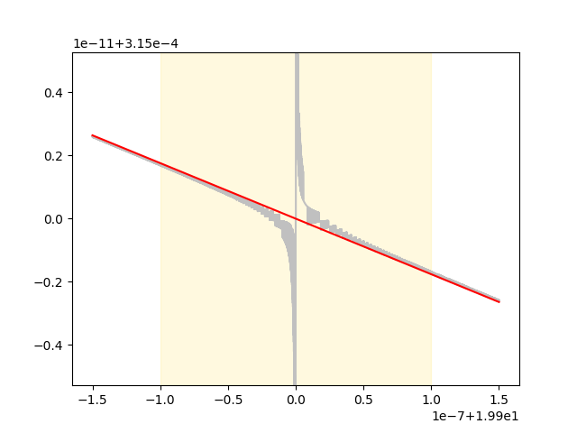

# Model: decker_2009
## Equation 1:
```
IKr_xr_gate__tau_xr = 1 / (0.00029999999999999997 * (38.360799999999998 + membrane__Vm) / (-1.0 + 343.26878155836141 * exp(0.1522 * membrane__Vm)) + 0.00059999999999999995 * (-1.7383999999999999 + membrane__Vm) / (1.0 - 1.2667092551679247 * exp(-0.13600000000000001 * membrane__Vm)))
```
### Partially evaluated to: 
```
IKr_xr_gate__tau_xr = 1 / (0.00029999999999999997 * (38.360799999999998 + membrane__Vm) / (-1.0 + 343.26878155836141 * exp(0.1522 * membrane__Vm)) + 0.00059999999999999995 * (-1.7383999999999999 + membrane__Vm) / (1.0 - 1.2667092551679247 * exp(-0.13600000000000001 * membrane__Vm)))
```
### Singulariy points detected:
{-38.360799999999998}

*Singularity point: -38.360799999999998*

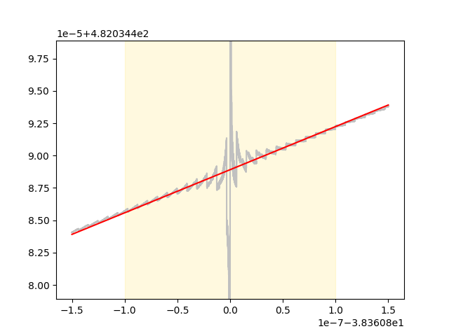

## Equation 2:
```
INaL_mL_gate__amL = 0.32000000000000001 * (47.130000000000003 + membrane__Vm) / (1.0 - 0.00897780373069724 * exp(-0.10000000000000001 * membrane__Vm))
```
### Partially evaluated to: 
```
INaL_mL_gate__amL = 0.32000000000000001 * (47.130000000000003 + membrane__Vm) / (1.0 - 0.00897780373069724 * exp(-0.10000000000000001 * membrane__Vm))
```
### Singulariy points detected:
{-47.130000000000003}

*Singularity point: -47.130000000000003*


## Equation 3:
```
INa_m_gate__am = 0.32000000000000001 * (47.130000000000003 + membrane__Vm) / (1.0 - 0.00897780373069724 * exp(-0.10000000000000001 * membrane__Vm))
```
### Partially evaluated to: 
```
INa_m_gate__am = 0.32000000000000001 * (47.130000000000003 + membrane__Vm) / (1.0 - 0.00897780373069724 * exp(-0.10000000000000001 * membrane__Vm))
```
### Singulariy points detected:
{-47.130000000000003}

*Singularity point: -47.130000000000003*


## Equation 4:
```
ICaL__ICaL_max = 4.0 * pow(model_parameters__F, 2) * (-ICaL__gamma_Cao * model_parameters__Ca_o + Ca__Ca_ss_CaL * ICaL__gamma_Cai * exp(2.0 * membrane__Vm * model_parameters__F / (model_parameters__R * model_parameters__T))) * ICaL__PCa * membrane__Vm / ((-1.0 + exp(2.0 * membrane__Vm * model_parameters__F / (model_parameters__R * model_parameters__T))) * model_parameters__R * model_parameters__T)
```
### Partially evaluated to: 
```
ICaL__ICaL_max = 2.2470468725164396 * (-0.61380000000000001 + 9.6154499999999996e-5 * exp(0.074873319003313496 * membrane__Vm)) * membrane__Vm / (-1.0 + exp(0.074873319003313496 * membrane__Vm))
```
### Singulariy points detected:
{0}

*Singularity point: 0*


## Equation 5:
```
ICab__ICab = 4.0 * pow(model_parameters__F, 2) * (-ICab__gamma_Ca_o * model_parameters__Ca_o + Ca__Ca_i * ICab__gamma_Ca_i * exp(2.0 * membrane__Vm * model_parameters__F / (model_parameters__R * model_parameters__T))) * ICab__PCab * membrane__Vm / ((-1.0 + exp(2.0 * membrane__Vm * model_parameters__F / (model_parameters__R * model_parameters__T))) * model_parameters__R * model_parameters__T)
```
### Partially evaluated to: 
```
ICab__ICab = 0.0028826178386108462 * (-0.61380000000000001 + 7.0994499999999999e-5 * exp(0.074873319003313496 * membrane__Vm)) * membrane__Vm / (-1.0 + exp(0.074873319003313496 * membrane__Vm))
```
### Singulariy points detected:
{0}

*Singularity point: 0*


## Equation 6:
```
Ito2__Ito2_max = pow(Ito2__zCl, 2) * pow(model_parameters__F, 2) * (-model_parameters__Cl_o * exp(membrane__Vm * model_parameters__F / (model_parameters__R * model_parameters__T)) + Cl__Cl_i) * Ito2__PCl * membrane__Vm / ((1.0 - exp(membrane__Vm * model_parameters__F / (model_parameters__R * model_parameters__T))) * model_parameters__R * model_parameters__T)
```
### Partially evaluated to: 
```
Ito2__Ito2_max = 0.0032509358688027189 * (20.268419999999999 - 100.0 * exp(0.037436659501656748 * membrane__Vm)) * membrane__Vm / (1.0 - exp(0.037436659501656748 * membrane__Vm))
```
### Singulariy points detected:
{0}

*Singularity point: 0*

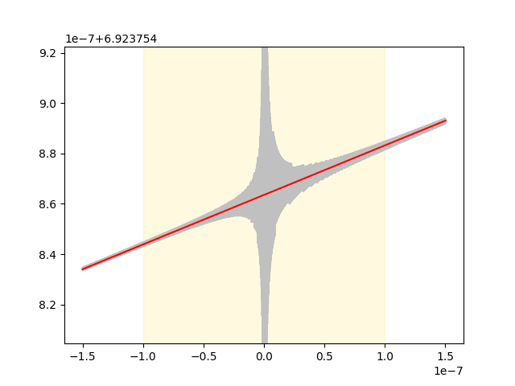

# Model: demir_model_1994
## Equation 1:
```
L_type_Ca_channel_d_gate__alpha_d_L = -28.390000000000001 * (35.0 + membrane__V) / (-1.0 + 8.3152871910356788e-7 * exp(-0.40000000000000002 * membrane__V)) - 84.900000000000006 * membrane__V / (-1.0 + exp(-0.20799999999999999 * membrane__V))
```
### Partially evaluated to: 
```
L_type_Ca_channel_d_gate__alpha_d_L = -28.390000000000001 * (35.0 + membrane__V) / (-1.0 + 8.3152871910356788e-7 * exp(-0.40000000000000002 * membrane__V)) - 84.900000000000006 * membrane__V / (-1.0 + exp(-0.20799999999999999 * membrane__V))
```
### Singulariy points detected:
{0, -35.000000000000000}

*Singularity point: 0*


*Singularity point: -35.000000000000000*

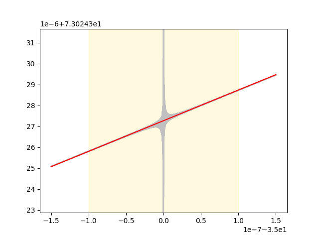

## Equation 2:
```
L_type_Ca_channel_d_gate__beta_d_L = 11.43 * (-5.0 + membrane__V) / (-1.0 + 0.13533528323661267 * exp(0.40000000000000002 * membrane__V))
```
### Partially evaluated to: 
```
L_type_Ca_channel_d_gate__beta_d_L = 11.43 * (-5.0 + membrane__V) / (-1.0 + 0.13533528323661267 * exp(0.40000000000000002 * membrane__V))
```
### Singulariy points detected:
{5.0000000000000000}

*Singularity point: 5.0000000000000000*


## Equation 3:
```
L_type_Ca_channel_f_gate__alpha_f_L = 3.75 * (28.0 + membrane__V) / (-1.0 + 1096.6331584284585 * exp(0.25 * membrane__V))
```
### Partially evaluated to: 
```
L_type_Ca_channel_f_gate__alpha_f_L = 3.75 * (28.0 + membrane__V) / (-1.0 + 1096.6331584284585 * exp(0.25 * membrane__V))
```
### Singulariy points detected:
{-28.000000000000000}

*Singularity point: -28.000000000000000*

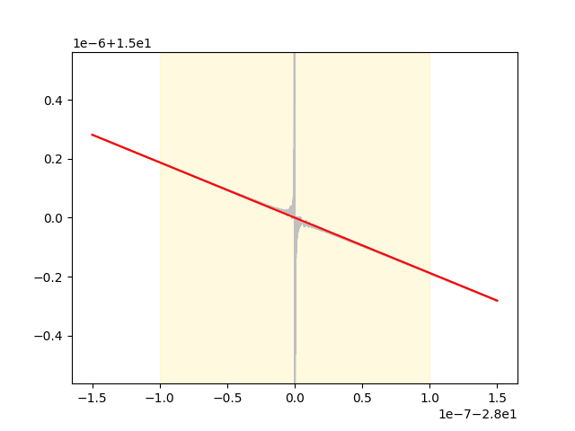

## Equation 4:
```
sodium_current_m_gate__alpha_m = -824.0 * (51.899999999999999 + membrane__V) / (-1.0 + 0.0029337885398758403 * exp(-0.11235955056179775 * membrane__V))
```
### Partially evaluated to: 
```
sodium_current_m_gate__alpha_m = -824.0 * (51.899999999999999 + membrane__V) / (-1.0 + 0.0029337885398758403 * exp(-0.11235955056179775 * membrane__V))
```
### Singulariy points detected:
{-51.899999999999999}

*Singularity point: -51.899999999999999*

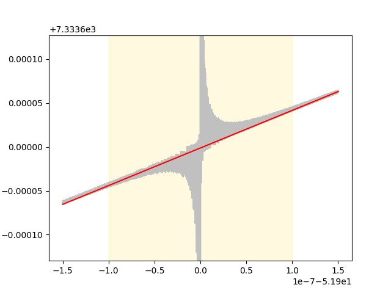

## Equation 5:
```
sodium_current__i_Na = pow(membrane__F, 2) * pow(sodium_current_m_gate__m, 3) * (-1.0 + exp((-reversal_potentials__E_Na + membrane__V) * membrane__F / (membrane__R * membrane__T))) * cleft_space_equations__Na_c * membrane__V * sodium_current__P_Na * sodium_current_h_gate__h1 * sodium_current_h_gate__h2 / ((-1.0 + exp(membrane__F * membrane__V / (membrane__R * membrane__T))) * membrane__R * membrane__T)
```
### Partially evaluated to: 
```
sodium_current__i_Na = 7.7961374618353206e-5 * (-1.0 + 0.069297886839030043 * exp(0.037433890822745473 * membrane__V)) * membrane__V / (-1.0 + exp(0.037433890822745473 * membrane__V))
```
### Singulariy points detected:
{0}

*Singularity point: 0*


# Model: difrancesco_noble_model_1985
## Equation 1:
```
intracellular_calcium_concentration__alpha_p = 0.625 * (34.0 + membrane__V) / (-1.0 + 4914.7688402991344 * exp(0.25 * membrane__V))
```
### Partially evaluated to: 
```
intracellular_calcium_concentration__alpha_p = 0.625 * (34.0 + membrane__V) / (-1.0 + 4914.7688402991344 * exp(0.25 * membrane__V))
```
### Singulariy points detected:
{-34.000000000000000}

*Singularity point: -34.000000000000000*

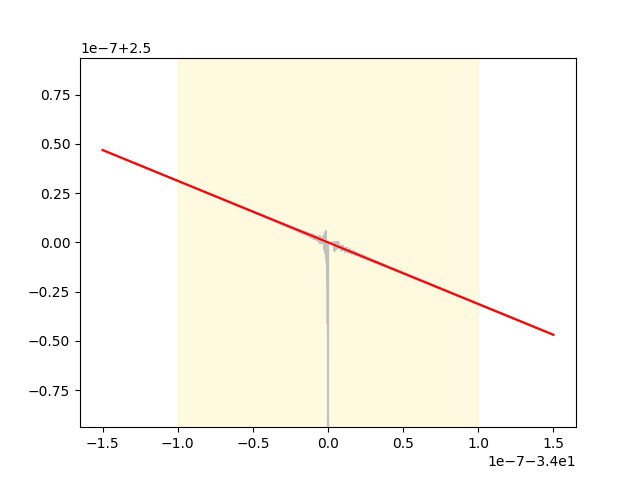

## Equation 2:
```
second_inward_current__i_siCa = 4.0 * (-50.0 + membrane__V) * (intracellular_calcium_concentration__Cai * exp(100.0 / membrane__RTONF) - extracellular_calcium_concentration__Cao * exp(-2.0 * (-50.0 + membrane__V) / membrane__RTONF)) * second_inward_current__P_si * second_inward_current_d_gate__d * second_inward_current_f2_gate__f2 * second_inward_current_f_gate__f / ((1.0 - exp(-2.0 * (-50.0 + membrane__V) / membrane__RTONF)) * membrane__RTONF)
```
### Partially evaluated to: 
```
second_inward_current__i_siCa = 0.011230167246823642 * (0.002112045287840804 - 84.481811513632152 * exp(-0.074867781645490947 * membrane__V)) * (-50.0 + membrane__V) / (1.0 - 42.240905756816076 * exp(-0.074867781645490947 * membrane__V))
```
### Singulariy points detected:
{50.000000000000000}

*Singularity point: 50.000000000000000*


## Equation 3:
```
second_inward_current__i_siK = 0.01 * (-50.0 + membrane__V) * (intracellular_potassium_concentration__Ki * exp(50.0 / membrane__RTONF) - extracellular_potassium_concentration__Kc * exp(-(-50.0 + membrane__V) / membrane__RTONF)) * second_inward_current__P_si * second_inward_current_d_gate__d * second_inward_current_f2_gate__f2 * second_inward_current_f_gate__f / ((1.0 - exp(-(-50.0 + membrane__V) / membrane__RTONF)) * membrane__RTONF)
```
### Partially evaluated to: 
```
second_inward_current__i_siK = 2.8075418117059104e-5 * (909.90205672566492 - 25.997201620733282 * exp(-0.037433890822745473 * membrane__V)) * (-50.0 + membrane__V) / (1.0 - 6.4993004051833205 * exp(-0.037433890822745473 * membrane__V))
```
### Singulariy points detected:
{50.000000000000000}

*Singularity point: 50.000000000000000*

 

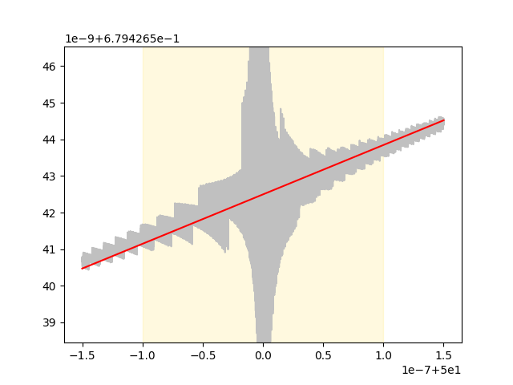

## Equation 4:
```
second_inward_current__i_siNa = 0.01 * (-50.0 + membrane__V) * (intracellular_sodium_concentration__Nai * exp(50.0 / membrane__RTONF) - extracellular_sodium_concentration__Nao * exp(-(-50.0 + membrane__V) / membrane__RTONF)) * second_inward_current__P_si * second_inward_current_d_gate__d * second_inward_current_f2_gate__f2 * second_inward_current_f_gate__f / ((1.0 - exp(-(-50.0 + membrane__V) / membrane__RTONF)) * membrane__RTONF)
```
### Partially evaluated to: 
```
second_inward_current__i_siNa = 2.8075418117059104e-5 * (51.994403241466564 - 909.90205672566492 * exp(-0.037433890822745473 * membrane__V)) * (-50.0 + membrane__V) / (1.0 - 6.4993004051833205 * exp(-0.037433890822745473 * membrane__V))
```
### Singulariy points detected:
{50.000000000000000}

*Singularity point: 50.000000000000000*

 

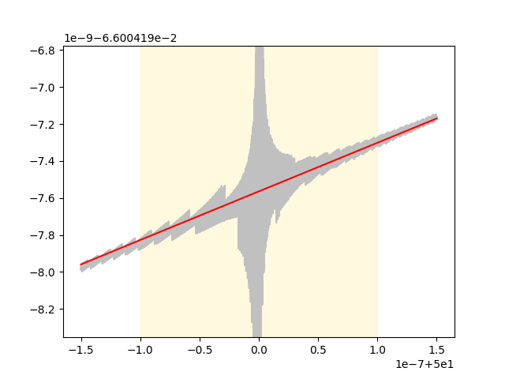

## Equation 5:
```
transient_outward_current__i_to = (10.0 + membrane__V) * (0.20000000000000001 + extracellular_potassium_concentration__Kc / (extracellular_potassium_concentration__Kc + transient_outward_current__Km_to)) * (intracellular_potassium_concentration__Ki * exp(0.5 * membrane__V / membrane__RTONF) - extracellular_potassium_concentration__Kc * exp(-0.5 * membrane__V / membrane__RTONF)) * intracellular_calcium_concentration__Cai * transient_outward_current__g_to * transient_outward_current_s_gate__s / ((1.0 - 0.13533528323661267 * exp(-0.20000000000000001 * membrane__V)) * (intracellular_calcium_concentration__Cai + transient_outward_current__Km_Ca))
```
### Partially evaluated to: 
```
transient_outward_current__i_to = 0.012363636363636365 * (10.0 + membrane__V) * (140.0 * exp(0.018716945411372737 * membrane__V) - 4.0 * exp(-0.018716945411372737 * membrane__V)) / (1.0 - 0.13533528323661267 * exp(-0.20000000000000001 * membrane__V))
```
### Singulariy points detected:
{-10.000000000000000}

*Singularity point: -10.000000000000000*

 

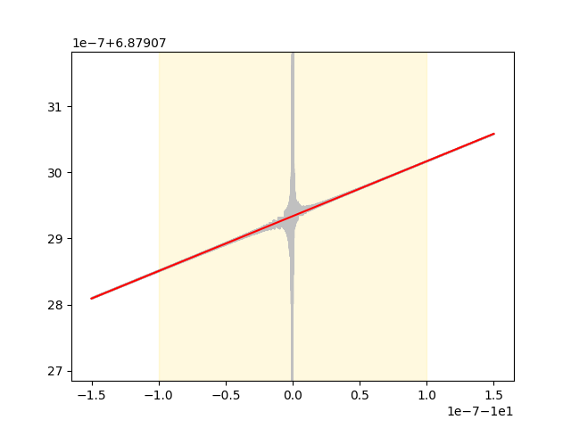

# Model: dokos_model_1996
## Equation 1:
```
fast_sodium_current_m_gate__alpha_m = 200.0 * (34.299999999999997 + membrane__E) / (1.0 - 0.045638665231542724 * exp(-0.089999999999999997 * membrane__E))
```
### Partially evaluated to: 
```
fast_sodium_current_m_gate__alpha_m = 200.0 * (34.299999999999997 + membrane__E) / (1.0 - 0.045638665231542724 * exp(-0.089999999999999997 * membrane__E))
```
### Singulariy points detected:
{-34.299999999999997}

*Singularity point: -34.299999999999997*

 

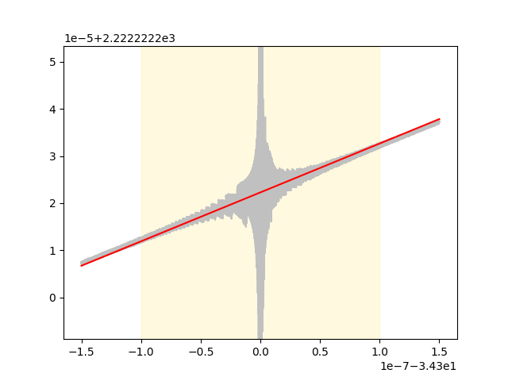

## Equation 2:
```
hyperpolarising_activated_current_y_gate__alpha_y = 0.35999999999999999 * (137.80000000000001 + membrane__E) / (-1.0 + 8908.846047390005 * exp(0.066000000000000003 * membrane__E))
```
### Partially evaluated to: 
```
hyperpolarising_activated_current_y_gate__alpha_y = 0.35999999999999999 * (137.80000000000001 + membrane__E) / (-1.0 + 8908.846047390005 * exp(0.066000000000000003 * membrane__E))
```
### Singulariy points detected:
{-137.80000000000001}

*Singularity point: -137.80000000000001*

 

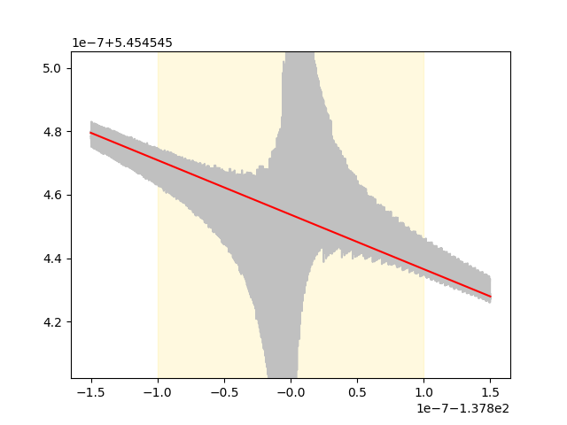

## Equation 3:
```
hyperpolarising_activated_current_y_gate__beta_y = 0.10000000000000001 * (76.299999999999997 + membrane__E) / (1.0 - 1.0997640435800299e-7 * exp(-0.20999999999999999 * membrane__E))
```
### Partially evaluated to: 
```
hyperpolarising_activated_current_y_gate__beta_y = 0.10000000000000001 * (76.299999999999997 + membrane__E) / (1.0 - 1.0997640435800299e-7 * exp(-0.20999999999999999 * membrane__E))
```
### Singulariy points detected:
{-76.299999999999997}

*Singularity point: -76.299999999999997*

 

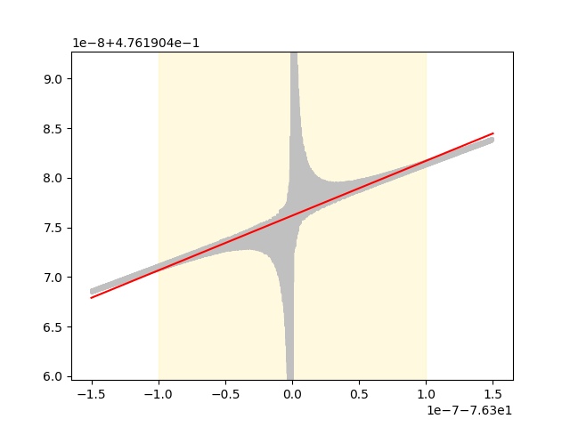

# Model: earm_noble_model_1990
## Equation 1:
```
L_type_calcium_current__i_Ca_L_Ca = 4.0 * (-50.0 + membrane__V) * (intracellular_calcium_concentration__Ca_i * exp(100.0 / membrane__RTONF) - extracellular_calcium_concentration__Ca_o * exp(2.0 * (50.0 - membrane__V) / membrane__RTONF)) * L_type_calcium_current__P_Ca_L * L_type_calcium_current_d_gate__d * L_type_calcium_current_f_Ca_gate__CaChon / ((1.0 - exp(2.0 * (50.0 - membrane__V) / membrane__RTONF)) * membrane__RTONF)
```
### Partially evaluated to: 
```
L_type_calcium_current__i_Ca_L_Ca = 1.753092114768179e-6 * (0.0004224090575681608 - 84.481811513632152 * exp(-0.074867781645490947 * membrane__V)) * (-50.0 + membrane__V) / (1.0 - 42.240905756816076 * exp(-0.074867781645490947 * membrane__V))
```
### Singulariy points detected:
{50.000000000000000}

*Singularity point: 50.000000000000000*

 


## Equation 2:
```
L_type_calcium_current__i_Ca_L_K = 0.002 * (-50.0 + membrane__V) * (intracellular_potassium_concentration__K_i * exp(50.0 / membrane__RTONF) - extracellular_potassium_concentration__K_c * exp((50.0 - membrane__V) / membrane__RTONF)) * L_type_calcium_current__P_Ca_L * L_type_calcium_current_d_gate__d * L_type_calcium_current_f_Ca_gate__CaChon / ((1.0 - exp((50.0 - membrane__V) / membrane__RTONF)) * membrane__RTONF)
```
### Partially evaluated to: 
```
L_type_calcium_current__i_Ca_L_K = 8.7654605738408946e-10 * (909.90205672566492 - 25.997201620733282 * exp(-0.037433890822745473 * membrane__V)) * (-50.0 + membrane__V) / (1.0 - 6.4993004051833205 * exp(-0.037433890822745473 * membrane__V))
```
### Singulariy points detected:
{50.000000000000000}

*Singularity point: 50.000000000000000*

 

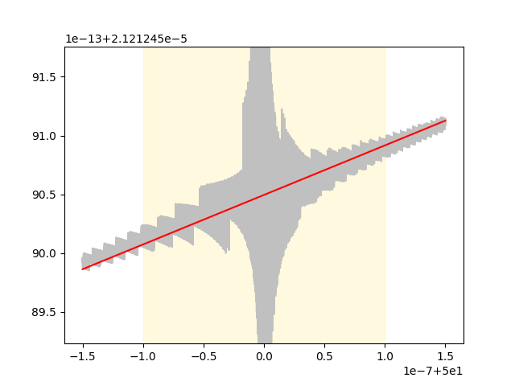

## Equation 3:
```
L_type_calcium_current__i_Ca_L_Na = 0.01 * (-50.0 + membrane__V) * (intracellular_sodium_concentration__Na_i * exp(50.0 / membrane__RTONF) - extracellular_sodium_concentration__Na_o * exp((50.0 - membrane__V) / membrane__RTONF)) * L_type_calcium_current__P_Ca_L * L_type_calcium_current_d_gate__d * L_type_calcium_current_f_Ca_gate__CaChon / ((1.0 - exp((50.0 - membrane__V) / membrane__RTONF)) * membrane__RTONF)
```
### Partially evaluated to: 
```
L_type_calcium_current__i_Ca_L_Na = 4.3827302869204476e-9 * (42.115466625587921 - 909.90205672566492 * exp(-0.037433890822745473 * membrane__V)) * (-50.0 + membrane__V) / (1.0 - 6.4993004051833205 * exp(-0.037433890822745473 * membrane__V))
```
### Singulariy points detected:
{50.000000000000000}

*Singularity point: 50.000000000000000*

 


# Model: espinosa_model_1998_normal
## Equation 1:
```
L_type_Ca_channel__i_Ca_L_Ca_cyt = 4.0 * (1.0 - L_type_Ca_channel__FrICa) * (-50.0 + membrane__V) * (intracellular_calcium_concentration__Ca_i * exp(100.0 * membrane__F / (membrane__R * membrane__T)) - extracellular_calcium_concentration__Ca_o * exp(2.0 * (50.0 - membrane__V) * membrane__F / (membrane__R * membrane__T))) * L_type_Ca_channel__P_Ca_L * L_type_Ca_channel_d_gate__d * L_type_Ca_channel_f2_gate__f2 * L_type_Ca_channel_f_gate__f * membrane__F / ((1.0 - exp(2.0 * (50.0 - membrane__V) * membrane__F / (membrane__R * membrane__T))) * membrane__R * membrane__T)
```
### Partially evaluated to: 
```
L_type_Ca_channel__i_Ca_L_Ca_cyt = 0
```
### Singulariy points detected:
{50.000000000000000}

*Singularity point: 50.000000000000000*

 


## Equation 2:
```
L_type_Ca_channel__i_Ca_L_Ca_ds = 4.0 * (-50.0 + membrane__V) * (intracellular_calcium_concentration__Ca_i * exp(100.0 * membrane__F / (membrane__R * membrane__T)) - extracellular_calcium_concentration__Ca_o * exp(2.0 * (50.0 - membrane__V) * membrane__F / (membrane__R * membrane__T))) * L_type_Ca_channel__FrICa * L_type_Ca_channel__P_Ca_L * L_type_Ca_channel_d_gate__d * L_type_Ca_channel_f2ds_gate__f2ds * L_type_Ca_channel_f_gate__f * membrane__F / ((1.0 - exp(2.0 * (50.0 - membrane__V) * membrane__F / (membrane__R * membrane__T))) * membrane__R * membrane__T)
```
### Partially evaluated to: 
```
L_type_Ca_channel__i_Ca_L_Ca_ds = 1.2097697357220065e-14 * (0.0029903731135140078 - 105.6022643920402 * exp(-0.074867781645490947 * membrane__V)) * (-50.0 + membrane__V) / (1.0 - 42.240905756816076 * exp(-0.074867781645490947 * membrane__V))
```
### Singulariy points detected:
{50.000000000000000}

*Singularity point: 50.000000000000000*

 


## Equation 3:
```
L_type_Ca_channel__i_Ca_L_K_cyt = (1.0 - L_type_Ca_channel__FrICa) * (-50.0 + membrane__V) * (intracellular_potassium_concentration__K_i * exp(50.0 * membrane__F / (membrane__R * membrane__T)) - extracellular_potassium_concentration__K_o * exp((50.0 - membrane__V) * membrane__F / (membrane__R * membrane__T))) * L_type_Ca_channel__P_CaK * L_type_Ca_channel__P_Ca_L * L_type_Ca_channel_d_gate__d * L_type_Ca_channel_f2_gate__f2 * L_type_Ca_channel_f_gate__f * membrane__F / ((1.0 - exp((50.0 - membrane__V) * membrane__F / (membrane__R * membrane__T))) * membrane__R * membrane__T)
```
### Partially evaluated to: 
```
L_type_Ca_channel__i_Ca_L_K_cyt = 0
```
### Singulariy points detected:
{50.000000000000000}

*Singularity point: 50.000000000000000*

 


## Equation 4:
```
L_type_Ca_channel__i_Ca_L_K_ds = (-50.0 + membrane__V) * (intracellular_potassium_concentration__K_i * exp(50.0 * membrane__F / (membrane__R * membrane__T)) - extracellular_potassium_concentration__K_o * exp((50.0 - membrane__V) * membrane__F / (membrane__R * membrane__T))) * L_type_Ca_channel__FrICa * L_type_Ca_channel__P_CaK * L_type_Ca_channel__P_Ca_L * L_type_Ca_channel_d_gate__d * L_type_Ca_channel_f2ds_gate__f2ds * L_type_Ca_channel_f_gate__f * membrane__F / ((1.0 - exp((50.0 - membrane__V) * membrane__F / (membrane__R * membrane__T))) * membrane__R * membrane__T)
```
### Partially evaluated to: 
```
L_type_Ca_channel__i_Ca_L_K_ds = 9.0732730179150498e-18 * (910.76841346967581 - 34.576946283656916 * exp(-0.037433890822745473 * membrane__V)) * (-50.0 + membrane__V) / (1.0 - 6.4993004051833205 * exp(-0.037433890822745473 * membrane__V))
```
### Singulariy points detected:
{50.000000000000000}

*Singularity point: 50.000000000000000*

 

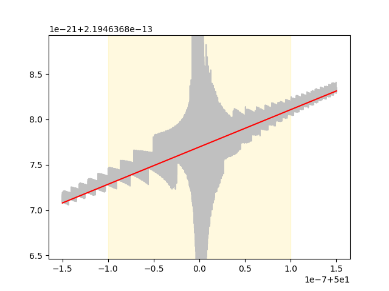

## Equation 5:
```
L_type_Ca_channel__i_Ca_L_Na_cyt = (1.0 - L_type_Ca_channel__FrICa) * (-50.0 + membrane__V) * (intracellular_sodium_concentration__Na_i * exp(50.0 * membrane__F / (membrane__R * membrane__T)) - extracellular_sodium_concentration__Na_o * exp((50.0 - membrane__V) * membrane__F / (membrane__R * membrane__T))) * L_type_Ca_channel__P_CaNa * L_type_Ca_channel__P_Ca_L * L_type_Ca_channel_d_gate__d * L_type_Ca_channel_f2_gate__f2 * L_type_Ca_channel_f_gate__f * membrane__F / ((1.0 - exp((50.0 - membrane__V) * membrane__F / (membrane__R * membrane__T))) * membrane__R * membrane__T)
```
### Partially evaluated to: 
```
L_type_Ca_channel__i_Ca_L_Na_cyt = 0
```
### Singulariy points detected:
{50.000000000000000}

*Singularity point: 50.000000000000000*

 


## Equation 6:
```
L_type_Ca_channel__i_Ca_L_Na_ds = (-50.0 + membrane__V) * (intracellular_sodium_concentration__Na_i * exp(50.0 * membrane__F / (membrane__R * membrane__T)) - extracellular_sodium_concentration__Na_o * exp((50.0 - membrane__V) * membrane__F / (membrane__R * membrane__T))) * L_type_Ca_channel__FrICa * L_type_Ca_channel__P_CaNa * L_type_Ca_channel__P_Ca_L * L_type_Ca_channel_d_gate__d * L_type_Ca_channel_f2ds_gate__f2ds * L_type_Ca_channel_f_gate__f * membrane__F / ((1.0 - exp((50.0 - membrane__V) * membrane__F / (membrane__R * membrane__T))) * membrane__R * membrane__T)
```
### Partially evaluated to: 
```
L_type_Ca_channel__i_Ca_L_Na_ds = 3.0244243393050165e-17 * (44.422718269427996 - 965.1461101697231 * exp(-0.037433890822745473 * membrane__V)) * (-50.0 + membrane__V) / (1.0 - 6.4993004051833205 * exp(-0.037433890822745473 * membrane__V))
```
### Singulariy points detected:
{50.000000000000000}

*Singularity point: 50.000000000000000*

 

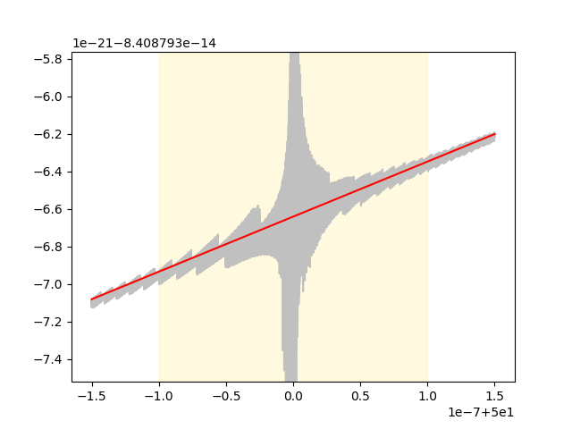

# Model: LR_Dynamic_model_2000
## Equation 1:
```
L_type_Ca_channel__I_CaCa = 4.0 * pow(membrane__F, 2) * (-L_type_Ca_channel__gamma_Cao * calcium_dynamics__Cao + L_type_Ca_channel__gamma_Cai * calcium_dynamics__Cai * exp(2.0 * membrane__F * membrane__V / (membrane__R * membrane__T))) * L_type_Ca_channel__P_Ca * membrane__V / ((-1.0 + exp(2.0 * membrane__F * membrane__V / (membrane__R * membrane__T))) * membrane__R * membrane__T)
```
### Partially evaluated to: 
```
L_type_Ca_channel__I_CaCa = 7.8019226357407252 * (-0.61380000000000001 + 6.0000000000000002e-5 * exp(0.074871767015605231 * membrane__V)) * membrane__V / (-1.0 + exp(0.074871767015605231 * membrane__V))
```
### Singulariy points detected:
{0}

*Singularity point: 0*

 


## Equation 2:
```
L_type_Ca_channel__I_CaK = pow(membrane__F, 2) * (-L_type_Ca_channel__gamma_Ko * ionic_concentrations__Ko + L_type_Ca_channel__gamma_Ki * ionic_concentrations__Ki * exp(membrane__F * membrane__V / (membrane__R * membrane__T))) * L_type_Ca_channel__P_K * membrane__V / ((-1.0 + exp(membrane__F * membrane__V / (membrane__R * membrane__T))) * membrane__R * membrane__T)
```
### Partially evaluated to: 
```
L_type_Ca_channel__I_CaK = 0.00069711623550831479 * (-3.375 + 105.89999999999999 * exp(0.037435883507802616 * membrane__V)) * membrane__V / (-1.0 + exp(0.037435883507802616 * membrane__V))
```
### Singulariy points detected:
{0}

*Singularity point: 0*

 

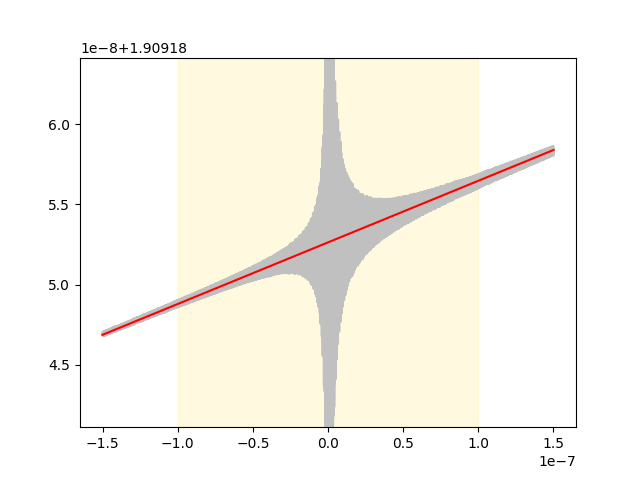

## Equation 3:
```
L_type_Ca_channel__I_CaNa = pow(membrane__F, 2) * (-L_type_Ca_channel__gamma_Nao * ionic_concentrations__Nao + L_type_Ca_channel__gamma_Nai * ionic_concentrations__Nai * exp(membrane__F * membrane__V / (membrane__R * membrane__T))) * L_type_Ca_channel__P_Na * membrane__V / ((-1.0 + exp(membrane__F * membrane__V / (membrane__R * membrane__T))) * membrane__R * membrane__T)
```
### Partially evaluated to: 
```
L_type_Ca_channel__I_CaNa = 0.0024381008236689767 * (-99.0 + 6.75 * exp(0.037435883507802616 * membrane__V)) * membrane__V / (-1.0 + exp(0.037435883507802616 * membrane__V))
```
### Singulariy points detected:
{0}

*Singularity point: 0*

 


## Equation 4:
```
non_specific_calcium_activated_current__I_ns_K = pow(membrane__F, 2) * (-L_type_Ca_channel__gamma_Ko * ionic_concentrations__Ko + L_type_Ca_channel__gamma_Ki * ionic_concentrations__Ki * exp(membrane__F * membrane__V / (membrane__R * membrane__T))) * membrane__V * non_specific_calcium_activated_current__P_ns_Ca / ((-1.0 + exp(membrane__F * membrane__V / (membrane__R * membrane__T))) * membrane__R * membrane__T)
```
### Partially evaluated to: 
```
non_specific_calcium_activated_current__I_ns_K = 0
```
### Singulariy points detected:
{0}

*Singularity point: 0*

 


## Equation 5:
```
non_specific_calcium_activated_current__I_ns_Na = pow(membrane__F, 2) * (-L_type_Ca_channel__gamma_Nao * ionic_concentrations__Nao + L_type_Ca_channel__gamma_Nai * ionic_concentrations__Nai * exp(membrane__F * membrane__V / (membrane__R * membrane__T))) * membrane__V * non_specific_calcium_activated_current__P_ns_Ca / ((-1.0 + exp(membrane__F * membrane__V / (membrane__R * membrane__T))) * membrane__R * membrane__T)
```
### Partially evaluated to: 
```
non_specific_calcium_activated_current__I_ns_Na = 0
```
### Singulariy points detected:
{0}

*Singularity point: 0*

 

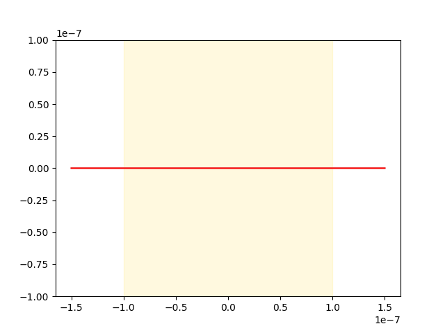

## Equation 6:
```
rapid_delayed_rectifier_potassium_current_xr_gate__tau_xr = 0.001 / (0.00060999999999999997 * (38.899999999999999 + membrane__V) / (-1.0 + 281.60348502322194 * exp(0.14499999999999999 * membrane__V)) + 0.0013799999999999999 * (14.199999999999999 + membrane__V) / (1.0 - 0.17436578041087322 * exp(-0.123 * membrane__V)))
```
### Partially evaluated to: 
```
rapid_delayed_rectifier_potassium_current_xr_gate__tau_xr = 0.001 / (0.00060999999999999997 * (38.899999999999999 + membrane__V) / (-1.0 + 281.60348502322194 * exp(0.14499999999999999 * membrane__V)) + 0.0013799999999999999 * (14.199999999999999 + membrane__V) / (1.0 - 0.17436578041087322 * exp(-0.123 * membrane__V)))
```
### Singulariy points detected:
{-38.899999999999999, -14.199999999999999}

*Singularity point: -38.899999999999999*

 


*Singularity point: -14.199999999999999*

 

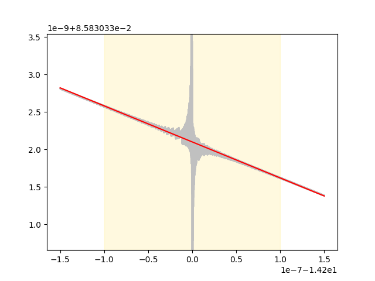

## Equation 7:
```
slow_delayed_rectifier_potassium_current_xs1_gate__tau_xs1 = 0.001 / (0.00013100000000000001 * (30.0 + membrane__V) / (-1.0 + 7.8538197044216602 * exp(0.068699999999999997 * membrane__V)) + 7.1899999999999999e-5 * (30.0 + membrane__V) / (1.0 - 0.011795938519751569 * exp(-0.14799999999999999 * membrane__V)))
```
### Partially evaluated to: 
```
slow_delayed_rectifier_potassium_current_xs1_gate__tau_xs1 = 0.001 / (0.00013100000000000001 * (30.0 + membrane__V) / (-1.0 + 7.8538197044216602 * exp(0.068699999999999997 * membrane__V)) + 7.1899999999999999e-5 * (30.0 + membrane__V) / (1.0 - 0.011795938519751569 * exp(-0.14799999999999999 * membrane__V)))
```
### Singulariy points detected:
{-30.000000000000000}

*Singularity point: -30.000000000000000*

 

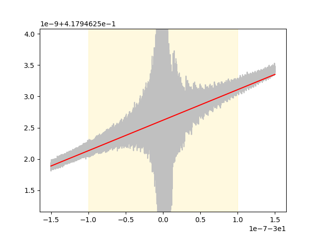

## Equation 8:
```
slow_delayed_rectifier_potassium_current_xs2_gate__tau_xs2 = 0.0040000000000000001 / (0.00013100000000000001 * (30.0 + membrane__V) / (-1.0 + 7.8538197044216602 * exp(0.068699999999999997 * membrane__V)) + 7.1899999999999999e-5 * (30.0 + membrane__V) / (1.0 - 0.011795938519751569 * exp(-0.14799999999999999 * membrane__V)))
```
### Partially evaluated to: 
```
slow_delayed_rectifier_potassium_current_xs2_gate__tau_xs2 = 0.0040000000000000001 / (0.00013100000000000001 * (30.0 + membrane__V) / (-1.0 + 7.8538197044216602 * exp(0.068699999999999997 * membrane__V)) + 7.1899999999999999e-5 * (30.0 + membrane__V) / (1.0 - 0.011795938519751569 * exp(-0.14799999999999999 * membrane__V)))
```
### Singulariy points detected:
{-30.000000000000000}

*Singularity point: -30.000000000000000*

 

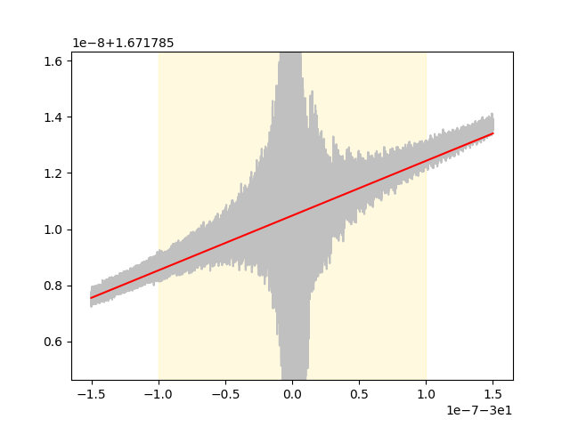

# Model: fink_noble_giles_model_2008
## Equation 1:
```
ICaL__i_CaL = pow(Environment__F, 2) * pow(ICaL__z, 2) * (-15.0 + cell__V) * (-Environment__Ca_o + 0.25 * Ca__Ca_ss * exp(2.0 * (-15.0 + cell__V) * Environment__F / (Environment__R * Environment__T))) * ICaL__g_CaL * iCaL_d_gate__d * iCaL_f2_gate__f2 * iCaL_fCass_gate__fCass * iCaL_f_gate__f / ((-1.0 + exp(2.0 * (-15.0 + cell__V) * Environment__F / (Environment__R * Environment__T))) * Environment__R * Environment__T)
```
### Partially evaluated to: 
```
ICaL__i_CaL = 1.4611882740722476e-6 * (-2.0 + 1.5394679649340915e-5 * exp(0.074867781645490947 * cell__V)) * (-15.0 + cell__V) / (-1.0 + 0.32529698149690262 * exp(0.074867781645490947 * cell__V))
```
### Singulariy points detected:
{15.000000000000000}

*Singularity point: 15.000000000000000*

 


# Model: grandi2010
## Equation 1:
```
cell__ibarca_j = 4.0 * (-0.34100000000000003 * cell__Cao + 0.34100000000000003 * cell__sCaj * exp(2.0 * cell__FoRT * cell__sVm)) * cell__FoRT * cell__Frdy * cell__pCa * cell__sVm / (-1.0 + exp(2.0 * cell__FoRT * cell__sVm))
```
### Partially evaluated to: 
```
cell__ibarca_j = 3.9009613178703626 * (-0.61380000000000001 + 5.9896099577487976e-5 * exp(0.074871767015605231 * cell__sVm)) * cell__sVm / (-1.0 + exp(0.074871767015605231 * cell__sVm))
```
### Singulariy points detected:
{0}

*Singularity point: 0*

 


## Equation 2:
```
cell__ibarca_sl = 4.0 * (-0.34100000000000003 * cell__Cao + 0.34100000000000003 * cell__sCasl * exp(2.0 * cell__FoRT * cell__sVm)) * cell__FoRT * cell__Frdy * cell__pCa * cell__sVm / (-1.0 + exp(2.0 * cell__FoRT * cell__sVm))
```
### Partially evaluated to: 
```
cell__ibarca_sl = 3.9009613178703626 * (-0.61380000000000001 + 3.6014568509600627e-5 * exp(0.074871767015605231 * cell__sVm)) * cell__sVm / (-1.0 + exp(0.074871767015605231 * cell__sVm))
```
### Singulariy points detected:
{0}

*Singularity point: 0*

 


## Equation 3:
```
cell__ibark = (-0.75 * cell__Ko + 0.75 * cell__sKi * exp(cell__FoRT * cell__sVm)) * cell__FoRT * cell__Frdy * cell__pK * cell__sVm / (-1.0 + exp(cell__FoRT * cell__sVm))
```
### Partially evaluated to: 
```
cell__ibark = 0.00048762016473379531 * (-4.0500000000000007 + 90.0 * exp(0.037435883507802616 * cell__sVm)) * cell__sVm / (-1.0 + exp(0.037435883507802616 * cell__sVm))
```
### Singulariy points detected:
{0}

*Singularity point: 0*

 


## Equation 4:
```
cell__ibarna_j = (-0.75 * cell__Nao + 0.75 * cell__sNaj * exp(cell__FoRT * cell__sVm)) * cell__FoRT * cell__Frdy * cell__pNa * cell__sVm / (-1.0 + exp(cell__FoRT * cell__sVm))
```
### Partially evaluated to: 
```
cell__ibarna_j = 2.7090009151877515e-5 * (-105.0 + 6.1605827729220159 * exp(0.037435883507802616 * cell__sVm)) * cell__sVm / (-1.0 + exp(0.037435883507802616 * cell__sVm))
```
### Singulariy points detected:
{0}

*Singularity point: 0*

 

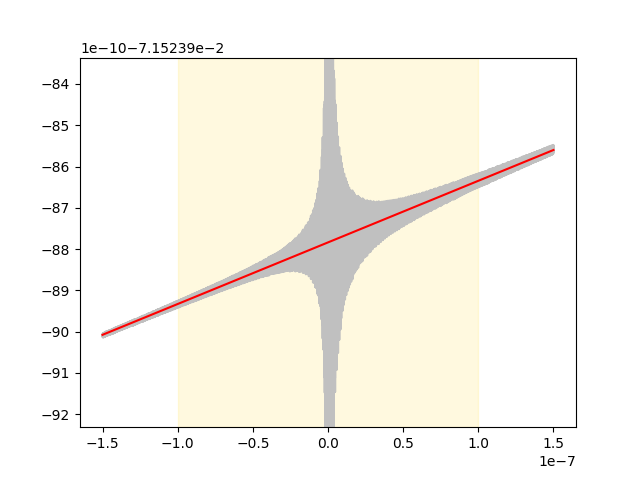

## Equation 5:
```
cell__ibarna_sl = (-0.75 * cell__Nao + 0.75 * cell__sNasl * exp(cell__FoRT * cell__sVm)) * cell__FoRT * cell__Frdy * cell__pNa * cell__sVm / (-1.0 + exp(cell__FoRT * cell__sVm))
```
### Partially evaluated to: 
```
cell__ibarna_sl = 2.7090009151877515e-5 * (-105.0 + 6.159920956184167 * exp(0.037435883507802616 * cell__sVm)) * cell__sVm / (-1.0 + exp(0.037435883507802616 * cell__sVm))
```
### Singulariy points detected:
{0}

*Singularity point: 0*

 


## Equation 6:
```
cell__taud = 28.571428571428569 * (1.0 - 0.4345982085070782 * exp(-0.16666666666666666 * cell__sVm)) * cell__dss / (5.0 + cell__sVm)
```
### Partially evaluated to: 
```
cell__taud = 28.571428571428569 * (1.0 - 0.4345982085070782 * exp(-0.16666666666666666 * cell__sVm)) / ((1.0 + 0.4345982085070782 * exp(-0.16666666666666666 * cell__sVm)) * (5.0 + cell__sVm))
```
### Singulariy points detected:
{-5.0000000000000000}

*Singularity point: -5.0000000000000000*

 

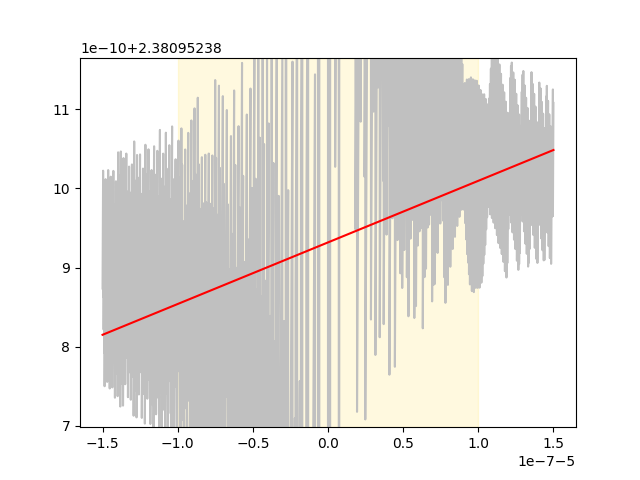

# Model: hilgemann_noble_model_1987
## Equation 1:
```
second_inward_calcium_current__i_siCa = 4.0 * (-50.0 + membrane__V) * (intracellular_calcium_concentration__Ca_i * exp(100.0 / membrane__RTONF) - extracellular_calcium_concentration__Ca_o * exp(-2.0 * (-50.0 + membrane__V) / membrane__RTONF)) * second_inward_calcium_current__P_si * second_inward_calcium_current_d_gate__d * second_inward_calcium_current_f_Ca_gate__CaChon / ((1.0 - exp(-2.0 * (-50.0 + membrane__V) / membrane__RTONF)) * membrane__RTONF)
```
### Partially evaluated to: 
```
second_inward_calcium_current__i_siCa = 0.00017530921147681789 * (0.0004224090575681608 - 84.481811513632152 * exp(-0.074867781645490947 * membrane__V)) * (-50.0 + membrane__V) / (1.0 - 42.240905756816076 * exp(-0.074867781645490947 * membrane__V))
```
### Singulariy points detected:
{50.000000000000000}

*Singularity point: 50.000000000000000*

 

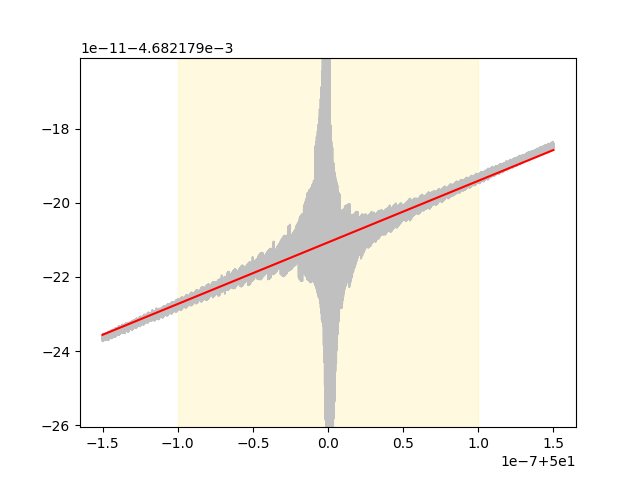

## Equation 2:
```
second_inward_calcium_current__i_siK = 0.002 * (-50.0 + membrane__V) * (intracellular_potassium_concentration__K_i * exp(50.0 / membrane__RTONF) - extracellular_potassium_concentration__K_c * exp(-(-50.0 + membrane__V) / membrane__RTONF)) * second_inward_calcium_current__P_si * second_inward_calcium_current_d_gate__d * second_inward_calcium_current_f_Ca_gate__CaChon / ((1.0 - exp(-(-50.0 + membrane__V) / membrane__RTONF)) * membrane__RTONF)
```
### Partially evaluated to: 
```
second_inward_calcium_current__i_siK = 8.7654605738408949e-8 * (909.90205672566492 - 25.997201620733282 * exp(-0.037433890822745473 * membrane__V)) * (-50.0 + membrane__V) / (1.0 - 6.4993004051833205 * exp(-0.037433890822745473 * membrane__V))
```
### Singulariy points detected:
{50.000000000000000}

*Singularity point: 50.000000000000000*

 


## Equation 3:
```
second_inward_calcium_current__i_siNa = 0.01 * (-50.0 + membrane__V) * (intracellular_sodium_concentration__Na_i * exp(50.0 / membrane__RTONF) - extracellular_sodium_concentration__Na_o * exp(-(-50.0 + membrane__V) / membrane__RTONF)) * second_inward_calcium_current__P_si * second_inward_calcium_current_d_gate__d * second_inward_calcium_current_f_Ca_gate__CaChon / ((1.0 - exp(-(-50.0 + membrane__V) / membrane__RTONF)) * membrane__RTONF)
```
### Partially evaluated to: 
```
second_inward_calcium_current__i_siNa = 4.382730286920447e-7 * (42.245452633691585 - 909.90205672566492 * exp(-0.037433890822745473 * membrane__V)) * (-50.0 + membrane__V) / (1.0 - 6.4993004051833205 * exp(-0.037433890822745473 * membrane__V))
```
### Singulariy points detected:
{50.000000000000000}

*Singularity point: 50.000000000000000*

 


# Model: hodgkin_huxley_squid_axon_model_1952_modified
## Equation 1:
```
potassium_channel_n_gate__alpha_n = -0.01 * (65.0 + membrane__V) / (-1.0 + 0.0015034391929775724 * exp(-0.10000000000000001 * membrane__V))
```
### Partially evaluated to: 
```
potassium_channel_n_gate__alpha_n = -0.01 * (65.0 + membrane__V) / (-1.0 + 0.0015034391929775724 * exp(-0.10000000000000001 * membrane__V))
```
### Singulariy points detected:
{-65.000000000000000}

*Singularity point: -65.000000000000000*

 

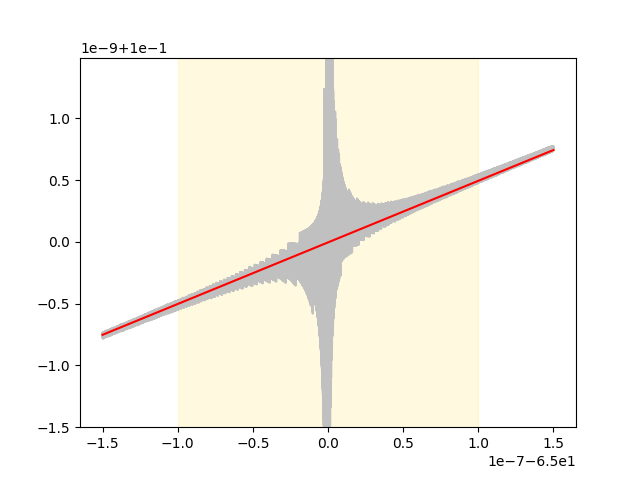

## Equation 2:
```
sodium_channel_m_gate__alpha_m = -0.10000000000000001 * (50.0 + membrane__V) / (-1.0 + 0.006737946999085467 * exp(-0.10000000000000001 * membrane__V))
```
### Partially evaluated to: 
```
sodium_channel_m_gate__alpha_m = -0.10000000000000001 * (50.0 + membrane__V) / (-1.0 + 0.006737946999085467 * exp(-0.10000000000000001 * membrane__V))
```
### Singulariy points detected:
{-50.000000000000000}

*Singularity point: -50.000000000000000*

 

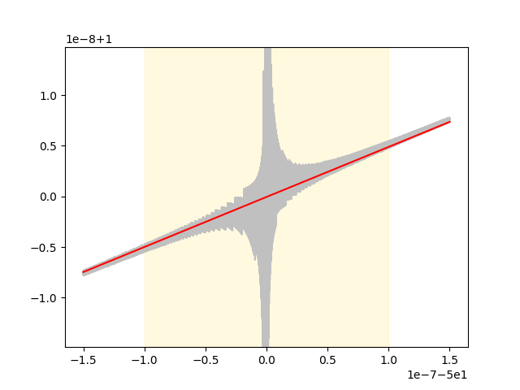

# Model: hund_rudy_2004
## Equation 1:
```
ICaL__ibarca = 4.0 * (-15.0 + cell__V) * (-Environment__Ca_o * ICaL__gacao + Ca__Ca_ss * ICaL__gacai * exp(2.0 * (-15.0 + cell__V) * Environment__FonRT)) * Environment__F * Environment__FonRT * ICaL__G_CaL_mult * ICaL__pca / (-1.0 + exp(2.0 * (-15.0 + cell__V) * Environment__FonRT))
```
### Partially evaluated to: 
```
ICaL__ibarca = 3.5108651860830804 * (-15.0 + cell__V) * (-0.61380000000000001 + 3.9915668384485928e-5 * exp(0.074871767015599999 * cell__V)) / (-1.0 + 0.32527753564515088 * exp(0.074871767015599999 * cell__V))
```
### Singulariy points detected:
{15.000000000000000}

*Singularity point: 15.000000000000000*

 

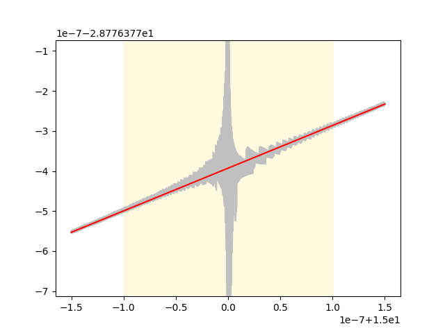

## Equation 2:
```
ICab__ICab = 7.9803360000000004e-7 * (-0.34100000000000003 * Environment__Ca_o + Ca__Ca_i * exp(2.0 * Environment__FonRT * cell__V)) * Environment__F * Environment__FonRT * cell__V / (-1.0 + exp(2.0 * Environment__FonRT * cell__V))
```
### Partially evaluated to: 
```
ICab__ICab = 0.0028824983370005666 * (-0.61380000000000001 + 0.00012131665999999999 * exp(0.074871767015599999 * cell__V)) * cell__V / (-1.0 + exp(0.074871767015599999 * cell__V))
```
### Singulariy points detected:
{0}

*Singularity point: 0*

 


## Equation 3:
```
IKr__tauxr = 1 / (0.00029999999999999997 * (38.360799999999998 + cell__V) / (-1.0 + 343.26878155836141 * exp(0.1522 * cell__V)) + 0.00059999999999999995 * (-1.7383999999999999 + cell__V) / (1.0 - 1.2667092551679247 * exp(-0.13600000000000001 * cell__V)))
```
### Partially evaluated to: 
```
IKr__tauxr = 1 / (0.00029999999999999997 * (38.360799999999998 + cell__V) / (-1.0 + 343.26878155836141 * exp(0.1522 * cell__V)) + 0.00059999999999999995 * (-1.7383999999999999 + cell__V) / (1.0 - 1.2667092551679247 * exp(-0.13600000000000001 * cell__V)))
```
### Singulariy points detected:
{-38.360799999999998}

*Singularity point: -38.360799999999998*

 


## Equation 4:
```
IKs__tauxs = 1 / (7.6100000000000007e-5 * (44.600000000000001 + cell__V) / (1.0 - 7.6868266637773744e-194 * exp(-9.9700000000000006 * cell__V)) + 0.00036000000000000002 * (-0.55000000000000004 + cell__V) / (-1.0 + 0.93202093695954691 * exp(0.128 * cell__V)))
```
### Partially evaluated to: 
```
IKs__tauxs = 1 / (7.6100000000000007e-5 * (44.600000000000001 + cell__V) / (1.0 - 7.6868266637773744e-194 * exp(-9.9700000000000006 * cell__V)) + 0.00036000000000000002 * (-0.55000000000000004 + cell__V) / (-1.0 + 0.93202093695954691 * exp(0.128 * cell__V)))
```
### Singulariy points detected:
{-44.600000000000001, 0.55000000000000005}

*Singularity point: -44.600000000000001*

 


*Singularity point: 0.55000000000000005*

 


## Equation 5:
```
INa__am = 0.32000000000000001 * (47.130000000000003 + cell__V) / (1.0 - 0.00897780373069724 * exp(-0.10000000000000001 * cell__V))
```
### Partially evaluated to: 
```
INa__am = 0.32000000000000001 * (47.130000000000003 + cell__V) / (1.0 - 0.00897780373069724 * exp(-0.10000000000000001 * cell__V))
```
### Singulariy points detected:
{-47.130000000000003}

*Singularity point: -47.130000000000003*

 

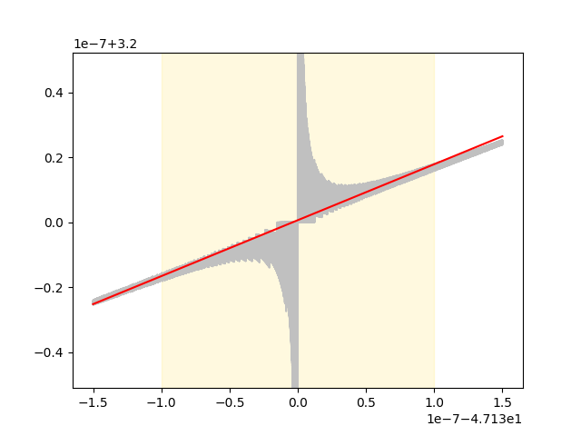

## Equation 6:
```
INal__amL = 0.32000000000000001 * (47.130000000000003 + cell__V) / (1.0 - 0.00897780373069724 * exp(-0.10000000000000001 * cell__V))
```
### Partially evaluated to: 
```
INal__amL = 0.32000000000000001 * (47.130000000000003 + cell__V) / (1.0 - 0.00897780373069724 * exp(-0.10000000000000001 * cell__V))
```
### Singulariy points detected:
{-47.130000000000003}

*Singularity point: -47.130000000000003*

 


## Equation 7:
```
Ito2__Ito2_max = (-Environment__Cl_o * exp(Environment__FonRT * cell__V) + Cl__Cl_i) * Environment__F * Environment__FonRT * Ito2__PCl * cell__V / (1.0 - exp(Environment__FonRT * cell__V))
```
### Partially evaluated to: 
```
Ito2__Ito2_max = 0.001444800488100033 * (15.59207157178 - 100.0 * exp(0.0374358835078 * cell__V)) * cell__V / (1.0 - exp(0.0374358835078 * cell__V))
```
### Singulariy points detected:
{0}

*Singularity point: 0*

 


# Model: iribe_model_2006
## Equation 1:
```
L_type_Ca_channel__i_Ca_L_Ca = 4.0 * (-50.0 + membrane_potential__V) * (intracellular_calcium_concentration__Ca_i * exp(100.0 * cell_parameters__F / (cell_parameters__R * cell_parameters__T)) - cell_parameters__Ca_o * exp(-2.0 * (-50.0 + membrane_potential__V) * cell_parameters__F / (cell_parameters__R * cell_parameters__T))) * L_type_Ca_channel__P_Ca_L_Ca * L_type_Ca_channel_d_gate__d * L_type_Ca_channel_f_gate__f * cell_parameters__F / ((1.0 - exp(-2.0 * (-50.0 + membrane_potential__V) * cell_parameters__F / (cell_parameters__R * cell_parameters__T))) * cell_parameters__R * cell_parameters__T)
```
### Partially evaluated to: 
```
L_type_Ca_channel__i_Ca_L_Ca = 6.7036611685372591e-10 * (0.00041860737605004732 - 84.481811513632152 * exp(-0.074867781645490947 * membrane_potential__V)) * (-50.0 + membrane_potential__V) / (1.0 - 42.240905756816076 * exp(-0.074867781645490947 * membrane_potential__V))
```
### Singulariy points detected:
{50.000000000000000}

*Singularity point: 50.000000000000000*

 

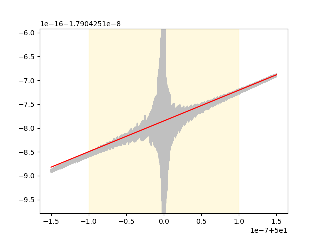

## Equation 2:
```
L_type_Ca_channel__i_Ca_L_K = 0.002 * (-50.0 + membrane_potential__V) * (intracellular_potassium_concentration__K_i * exp(50.0 * cell_parameters__F / (cell_parameters__R * cell_parameters__T)) - cell_parameters__K_o * exp((50.0 - membrane_potential__V) * cell_parameters__F / (cell_parameters__R * cell_parameters__T))) * L_type_Ca_channel__P_Ca_L_Ca * L_type_Ca_channel_d_gate__d * L_type_Ca_channel_f_gate__f * cell_parameters__F / ((1.0 - exp((50.0 - membrane_potential__V) * cell_parameters__F / (cell_parameters__R * cell_parameters__T))) * cell_parameters__R * cell_parameters__T)
```
### Partially evaluated to: 
```
L_type_Ca_channel__i_Ca_L_K = 3.3518305842686299e-13 * (898.33330200443856 - 25.997201620733282 * exp(-0.037433890822745473 * membrane_potential__V)) * (-50.0 + membrane_potential__V) / (1.0 - 6.4993004051833205 * exp(-0.037433890822745473 * membrane_potential__V))
```
### Singulariy points detected:
{50.000000000000000}

*Singularity point: 50.000000000000000*

 

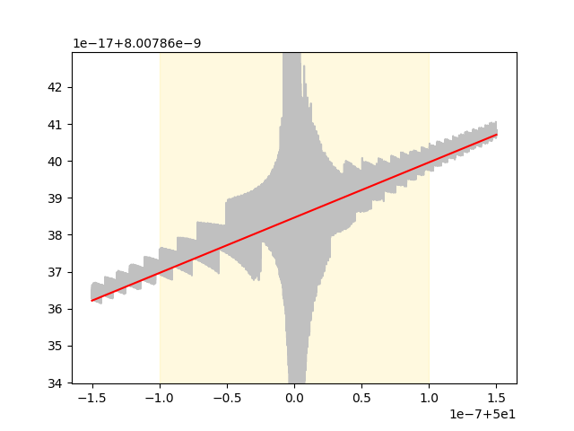

## Equation 3:
```
L_type_Ca_channel__i_Ca_L_Na = 0.01 * (-50.0 + membrane_potential__V) * (intracellular_sodium_concentration__Na_i * exp(50.0 * cell_parameters__F / (cell_parameters__R * cell_parameters__T)) - cell_parameters__Na_o * exp((50.0 - membrane_potential__V) * cell_parameters__F / (cell_parameters__R * cell_parameters__T))) * L_type_Ca_channel__P_Ca_L_Ca * L_type_Ca_channel_d_gate__d * L_type_Ca_channel_f_gate__f * cell_parameters__F / ((1.0 - exp((50.0 - membrane_potential__V) * cell_parameters__F / (cell_parameters__R * cell_parameters__T))) * cell_parameters__R * cell_parameters__T)
```
### Partially evaluated to: 
```
L_type_Ca_channel__i_Ca_L_Na = 1.6759152921343148e-12 * (37.722589481724512 - 909.90205672566492 * exp(-0.037433890822745473 * membrane_potential__V)) * (-50.0 + membrane_potential__V) / (1.0 - 6.4993004051833205 * exp(-0.037433890822745473 * membrane_potential__V))
```
### Singulariy points detected:
{50.000000000000000}

*Singularity point: 50.000000000000000*

 

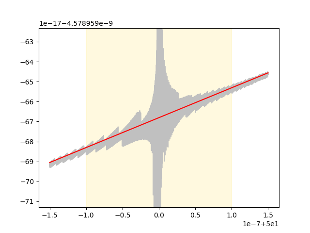

# Model: iyer_model_2004
# Model: iyer_model_2007
# Model: jafri_rice_winslow_1998
## Equation 1:
```
L_type_Ca_channel__i_Ca_L_Ca_max = 4.0 * pow(membrane__F, 2) * (0.001 * exp(2.0 * membrane__F * membrane__V / (membrane__R * membrane__T)) - 0.34100000000000003 * ionic_concentrations__Cao) * L_type_Ca_channel__P_Ca * membrane__V / ((-1.0 + exp(2.0 * membrane__F * membrane__V / (membrane__R * membrane__T))) * membrane__R * membrane__T)
```
### Partially evaluated to: 
```
L_type_Ca_channel__i_Ca_L_Ca_max = 0.49123617829520522 * (-0.61380000000000001 + 0.001 * exp(0.075146605522028176 * membrane__V)) * membrane__V / (-1.0 + exp(0.075146605522028176 * membrane__V))
```
### Singulariy points detected:
{0}

*Singularity point: 0*

 

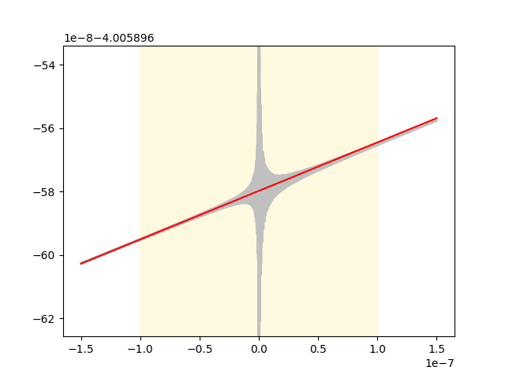

## Equation 2:
```
L_type_Ca_channel__i_Ca_L_K = pow(membrane__F, 2) * (-ionic_concentrations__Ko + ionic_concentrations__Ki * exp(membrane__F * membrane__V / (membrane__R * membrane__T))) * (L_type_Ca_channel__O + L_type_Ca_channel__O_Ca) * L_type_Ca_channel__p_k * L_type_Ca_channel_y_gate__y * membrane__V / ((-1.0 + exp(membrane__F * membrane__V / (membrane__R * membrane__T))) * membrane__R * membrane__T)
```
### Partially evaluated to: 
```
L_type_Ca_channel__i_Ca_L_K = 3.5789092431332635e-26 * (-5.4000000000000004 + 143.727 * exp(0.037573302761014088 * membrane__V)) * membrane__V / ((1.0 - 107.25680748803607 * (-0.61380000000000001 + 0.001 * exp(0.075146605522028176 * membrane__V)) * membrane__V / (-1.0 + exp(0.075146605522028176 * membrane__V))) * (-1.0 + exp(0.037573302761014088 * membrane__V)))
```
### Singulariy points detected:
{0}

*Singularity point: 0*

 

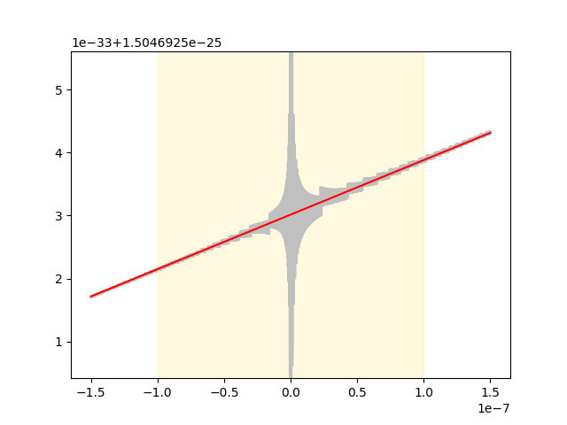

## Equation 3:
```
fast_sodium_current_m_gate__alpha_m = 0.32000000000000001 * (47.130000000000003 + membrane__V) / (1.0 - 0.00897780373069724 * exp(-0.10000000000000001 * membrane__V))
```
### Partially evaluated to: 
```
fast_sodium_current_m_gate__alpha_m = 0.32000000000000001 * (47.130000000000003 + membrane__V) / (1.0 - 0.00897780373069724 * exp(-0.10000000000000001 * membrane__V))
```
### Singulariy points detected:
{-47.130000000000003}

*Singularity point: -47.130000000000003*

 


## Equation 4:
```
time_dependent_potassium_current_X_gate__alpha_X = 7.1899999999999999e-5 * (30.0 + membrane__V) / (1.0 - 0.011795938519751569 * exp(-0.14799999999999999 * membrane__V))
```
### Partially evaluated to: 
```
time_dependent_potassium_current_X_gate__alpha_X = 7.1899999999999999e-5 * (30.0 + membrane__V) / (1.0 - 0.011795938519751569 * exp(-0.14799999999999999 * membrane__V))
```
### Singulariy points detected:
{-30.000000000000000}

*Singularity point: -30.000000000000000*

 

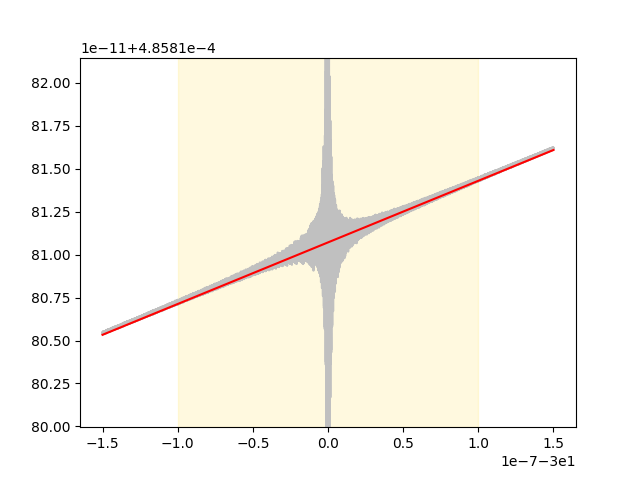

## Equation 5:
```
time_dependent_potassium_current_X_gate__beta_X = 0.00013100000000000001 * (30.0 + membrane__V) / (-1.0 + 7.8538197044216602 * exp(0.068699999999999997 * membrane__V))
```
### Partially evaluated to: 
```
time_dependent_potassium_current_X_gate__beta_X = 0.00013100000000000001 * (30.0 + membrane__V) / (-1.0 + 7.8538197044216602 * exp(0.068699999999999997 * membrane__V))
```
### Singulariy points detected:
{-30.000000000000000}

*Singularity point: -30.000000000000000*

 

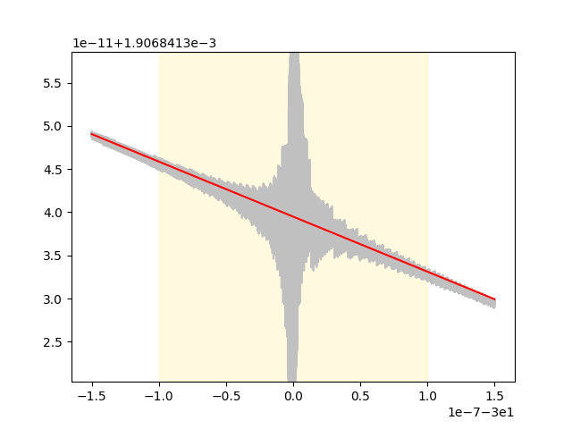

# Model: kurata_model_2002
## Equation 1:
```
L_type_calcium_channel_current_d_gate__alpha_d = -0.028389999999999999 * (35.0 + membrane__V) / (-1.0 + 8.3152871910356788e-7 * exp(-0.40000000000000002 * membrane__V)) - 0.084900000000000003 * membrane__V / (-1.0 + exp(-0.20798668885191349 * membrane__V))
```
### Partially evaluated to: 
```
L_type_calcium_channel_current_d_gate__alpha_d = -0.028389999999999999 * (35.0 + membrane__V) / (-1.0 + 8.3152871910356788e-7 * exp(-0.40000000000000002 * membrane__V)) - 0.084900000000000003 * membrane__V / (-1.0 + exp(-0.20798668885191349 * membrane__V))
```
### Singulariy points detected:
{0, -35.000000000000000}

*Singularity point: 0*

 

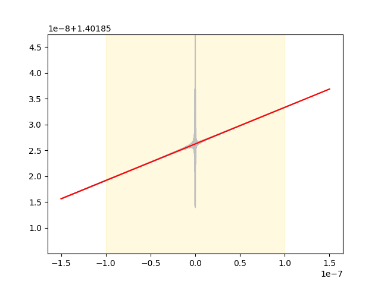

*Singularity point: -35.000000000000000*

 

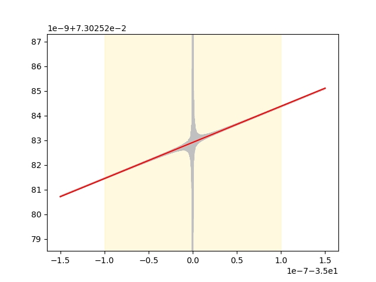

## Equation 2:
```
L_type_calcium_channel_current_d_gate__beta_d = 0.011429999999999999 * (-5.0 + membrane__V) / (-1.0 + 0.1353352832366127 * exp(0.40000000000000002 * membrane__V))
```
### Partially evaluated to: 
```
L_type_calcium_channel_current_d_gate__beta_d = 0.011429999999999999 * (-5.0 + membrane__V) / (-1.0 + 0.1353352832366127 * exp(0.40000000000000002 * membrane__V))
```
### Singulariy points detected:
{5.0000000000000000}

*Singularity point: 5.0000000000000000*

 


# Model: LivshitzRudy2007
## Equation 1:
```
ICaL__ibarca = 4.0 * (-Environment__Ca_o * ICaL__gacao + Ca__Ca_i * ICaL__gacai * exp(2.0 * Environment__FonRT * cell__V)) * Environment__F * Environment__FonRT * ICaL__G_CaL_mult * ICaL__pca * cell__V / (-1.0 + exp(2.0 * Environment__FonRT * cell__V))
```
### Partially evaluated to: 
```
ICaL__ibarca = 7.8019226357407252 * (-0.61380000000000001 + 0.00021845056935893161 * exp(0.074871767015605231 * cell__V)) * cell__V / (-1.0 + exp(0.074871767015605231 * cell__V))
```
### Singulariy points detected:
{0}

*Singularity point: 0*

 


## Equation 2:
```
ICaL__ibark = (-Environment__K_o * ICaL__gako + ICaL__gaki * K__K_i * exp(Environment__FonRT * cell__V)) * Environment__F * Environment__FonRT * ICaL__G_CaL_mult * ICaL__pk * cell__V / (-1.0 + exp(Environment__FonRT * cell__V))
```
### Partially evaluated to: 
```
ICaL__ibark = 0.00069711623550831479 * (-3.375 + 104.79818557737076 * exp(0.037435883507802616 * cell__V)) * cell__V / (-1.0 + exp(0.037435883507802616 * cell__V))
```
### Singulariy points detected:
{0}

*Singularity point: 0*

 

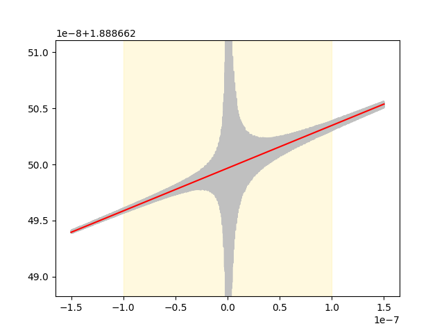

## Equation 3:
```
ICaL__ibarna = (-Environment__Na_o * ICaL__ganao + ICaL__ganai * Na__Na_i * exp(Environment__FonRT * cell__V)) * Environment__F * Environment__FonRT * ICaL__G_CaL_mult * ICaL__pna * cell__V / (-1.0 + exp(Environment__FonRT * cell__V))
```
### Partially evaluated to: 
```
ICaL__ibarna = 0.0024381008236689767 * (-105.0 + 12.459554485166251 * exp(0.037435883507802616 * cell__V)) * cell__V / (-1.0 + exp(0.037435883507802616 * cell__V))
```
### Singulariy points detected:
{0}

*Singularity point: 0*

 

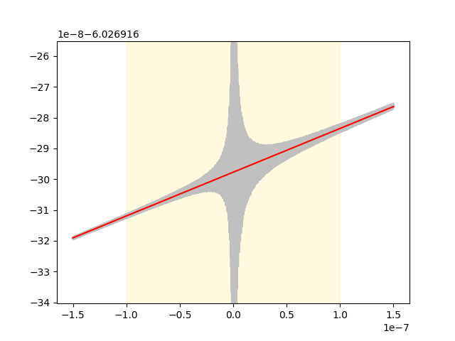

## Equation 4:
```
ICaL__taud = 28.571428571428569 * (1.0 - 0.20137949774492364 * exp(-0.16025641025641024 * cell__V)) * ICaL__dss0 / (10.0 + cell__V)
```
### Partially evaluated to: 
```
ICaL__taud = 28.571428571428569 * (1.0 - 0.20137949774492364 * exp(-0.16025641025641024 * cell__V)) / ((1.0 + 0.20137949774492364 * exp(-0.16025641025641024 * cell__V)) * (10.0 + cell__V))
```
### Singulariy points detected:
{-10.000000000000000}

*Singularity point: -10.000000000000000*

 

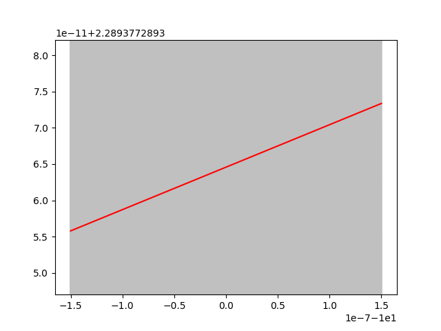

## Equation 5:
```
IKr__tauxr = 1 / (0.00060999999999999997 * (38.899999999999999 + cell__V) / (-1.0 + 281.60348502322194 * exp(0.14499999999999999 * cell__V)) + 0.0013799999999999999 * (14.199999999999999 + cell__V) / (1.0 - 0.17436578041087322 * exp(-0.123 * cell__V)))
```
### Partially evaluated to: 
```
IKr__tauxr = 1 / (0.00060999999999999997 * (38.899999999999999 + cell__V) / (-1.0 + 281.60348502322194 * exp(0.14499999999999999 * cell__V)) + 0.0013799999999999999 * (14.199999999999999 + cell__V) / (1.0 - 0.17436578041087322 * exp(-0.123 * cell__V)))
```
### Singulariy points detected:
{-38.899999999999999, -14.199999999999999}

*Singularity point: -38.899999999999999*

 


*Singularity point: -14.199999999999999*

 


## Equation 6:
```
IKs__tauxs = 1 / (0.00013100000000000001 * (30.0 + cell__V) / (-1.0 + 7.8538197044216602 * exp(0.068699999999999997 * cell__V)) + 7.1899999999999999e-5 * (30.0 + cell__V) / (1.0 - 0.011795938519751569 * exp(-0.14799999999999999 * cell__V)))
```
### Partially evaluated to: 
```
IKs__tauxs = 1 / (0.00013100000000000001 * (30.0 + cell__V) / (-1.0 + 7.8538197044216602 * exp(0.068699999999999997 * cell__V)) + 7.1899999999999999e-5 * (30.0 + cell__V) / (1.0 - 0.011795938519751569 * exp(-0.14799999999999999 * cell__V)))
```
### Singulariy points detected:
{-30.000000000000000}

*Singularity point: -30.000000000000000*

 


## Equation 7:
```
INa__am = 0.32000000000000001 * (47.130000000000003 + cell__V) / (1.0 - 0.00897780373069724 * exp(-0.10000000000000001 * cell__V))
```
### Partially evaluated to: 
```
INa__am = 0.32000000000000001 * (47.130000000000003 + cell__V) / (1.0 - 0.00897780373069724 * exp(-0.10000000000000001 * cell__V))
```
### Singulariy points detected:
{-47.130000000000003}

*Singularity point: -47.130000000000003*

 


# Model: Li_Mouse_2010
## Equation 1:
```
slow_delayed_rectifier_K_I__alpha_n = 4.8133299999999997e-6 * (26.5 + cell__V) / (1.0 - 0.033641326918204616 * exp(-0.128 * cell__V))
```
### Partially evaluated to: 
```
slow_delayed_rectifier_K_I__alpha_n = 4.8133299999999997e-6 * (26.5 + cell__V) / (1.0 - 0.033641326918204616 * exp(-0.128 * cell__V))
```
### Singulariy points detected:
{-26.500000000000000}

*Singularity point: -26.500000000000000*

 


# Model: luo_rudy_1994
## Equation 1:
```
L_type_Ca_channel__I_CaCa = 4.0 * pow(membrane__F, 2) * (-L_type_Ca_channel__gamma_Cao * ionic_concentrations__Cao + L_type_Ca_channel__gamma_Cai * ionic_concentrations__Cai * exp(2.0 * membrane__F * membrane__V / (membrane__R * membrane__T))) * L_type_Ca_channel__P_Ca * membrane__V / ((-1.0 + exp(2.0 * membrane__F * membrane__V / (membrane__R * membrane__T))) * membrane__R * membrane__T)
```
### Partially evaluated to: 
```
L_type_Ca_channel__I_CaCa = 0.078597788527232842 * (-0.6120000000000001 + 0.00012 * exp(0.075146605522028176 * membrane__V)) * membrane__V / (-1.0 + exp(0.075146605522028176 * membrane__V))
```
### Singulariy points detected:
{0}

*Singularity point: 0*

 

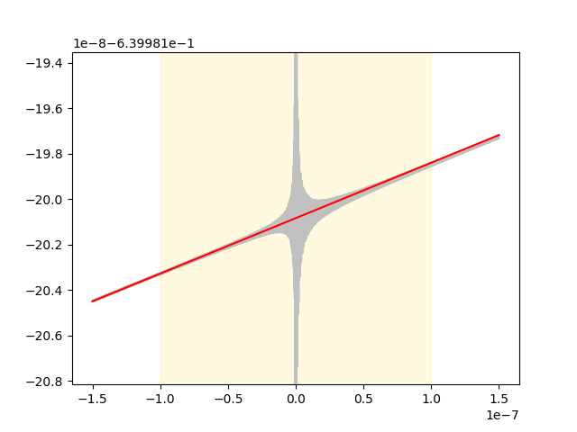

## Equation 2:
```
L_type_Ca_channel__I_CaK = pow(membrane__F, 2) * (-L_type_Ca_channel__gamma_Ko * ionic_concentrations__Ko + L_type_Ca_channel__gamma_Ki * ionic_concentrations__Ki * exp(membrane__F * membrane__V / (membrane__R * membrane__T))) * L_type_Ca_channel__P_K * membrane__V / ((-1.0 + exp(membrane__F * membrane__V / (membrane__R * membrane__T))) * membrane__R * membrane__T)
```
### Partially evaluated to: 
```
L_type_Ca_channel__I_CaK = 7.0228579563684903e-6 * (-4.0500000000000007 + 108.75 * exp(0.037573302761014088 * membrane__V)) * membrane__V / (-1.0 + exp(0.037573302761014088 * membrane__V))
```
### Singulariy points detected:
{0}

*Singularity point: 0*

 


## Equation 3:
```
L_type_Ca_channel__I_CaNa = pow(membrane__F, 2) * (-L_type_Ca_channel__gamma_Nao * ionic_concentrations__Nao + L_type_Ca_channel__gamma_Nai * ionic_concentrations__Nai * exp(membrane__F * membrane__V / (membrane__R * membrane__T))) * L_type_Ca_channel__P_Na * membrane__V / ((-1.0 + exp(membrane__F * membrane__V / (membrane__R * membrane__T))) * membrane__R * membrane__T)
```
### Partially evaluated to: 
```
L_type_Ca_channel__I_CaNa = 2.4561808914760263e-5 * (-105.0 + 7.5 * exp(0.037573302761014088 * membrane__V)) * membrane__V / (-1.0 + exp(0.037573302761014088 * membrane__V))
```
### Singulariy points detected:
{0}

*Singularity point: 0*

 


## Equation 4:
```
L_type_Ca_channel_d_gate__tau_d = 28.571428571428569 * (1.0 - 0.20137949774492364 * exp(-0.16025641025641024 * membrane__V)) * L_type_Ca_channel_d_gate__d_infinity / (10.0 + membrane__V)
```
### Partially evaluated to: 
```
L_type_Ca_channel_d_gate__tau_d = 28.571428571428569 * (1.0 - 0.20137949774492364 * exp(-0.16025641025641024 * membrane__V)) / ((1.0 + 0.20137949774492364 * exp(-0.16025641025641024 * membrane__V)) * (10.0 + membrane__V))
```
### Singulariy points detected:
{-10.000000000000000}

*Singularity point: -10.000000000000000*

 


## Equation 5:
```
fast_sodium_current_m_gate__alpha_m = 0.32000000000000001 * (47.130000000000003 + membrane__V) / (1.0 - 0.00897780373069724 * exp(-0.10000000000000001 * membrane__V))
```
### Partially evaluated to: 
```
fast_sodium_current_m_gate__alpha_m = 0.32000000000000001 * (47.130000000000003 + membrane__V) / (1.0 - 0.00897780373069724 * exp(-0.10000000000000001 * membrane__V))
```
### Singulariy points detected:
{-47.130000000000003}

*Singularity point: -47.130000000000003*

 


## Equation 6:
```
time_dependent_potassium_current_X_gate__alpha_X = 7.1899999999999999e-5 * (30.0 + membrane__V) / (1.0 - 0.011795938519751569 * exp(-0.14799999999999999 * membrane__V))
```
### Partially evaluated to: 
```
time_dependent_potassium_current_X_gate__alpha_X = 7.1899999999999999e-5 * (30.0 + membrane__V) / (1.0 - 0.011795938519751569 * exp(-0.14799999999999999 * membrane__V))
```
### Singulariy points detected:
{-30.000000000000000}

*Singularity point: -30.000000000000000*

 


## Equation 7:
```
time_dependent_potassium_current_X_gate__beta_X = 0.00013100000000000001 * (30.0 + membrane__V) / (-1.0 + 7.8538197044216602 * exp(0.068699999999999997 * membrane__V))
```
### Partially evaluated to: 
```
time_dependent_potassium_current_X_gate__beta_X = 0.00013100000000000001 * (30.0 + membrane__V) / (-1.0 + 7.8538197044216602 * exp(0.068699999999999997 * membrane__V))
```
### Singulariy points detected:
{-30.000000000000000}

*Singularity point: -30.000000000000000*

 


# Model: mahajan_shiferaw_model_2008
## Equation 1:
```
IKr__xkrv1 = ((fabs(7.0 + cell__V) > 0.001) ? (0.0013799999999999999 * (7.0 + cell__V) / (1.0 - 0.42273913174596284 * exp(-0.123 * cell__V))) : (0.011219512195121951))
```
### Partially evaluated to: 
```
IKr__xkrv1 = ((fabs(7.0 + cell__V) > 0.001) ? (0.0013799999999999999 * (7.0 + cell__V) / (1.0 - 0.42273913174596284 * exp(-0.123 * cell__V))) : (0.011219512195121951))
```
### Singulariy points detected:
{-7.0000000000000000}

*Singularity point: -7.0000000000000000*

 

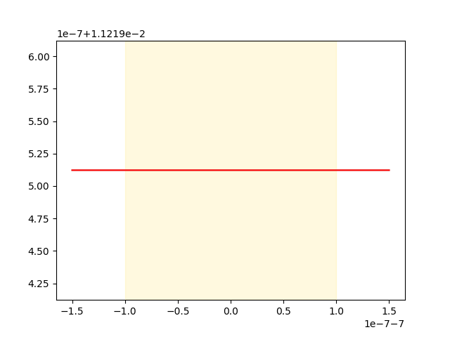

## Equation 2:
```
IKr__xkrv2 = ((fabs(10.0 + cell__V) > 0.001) ? (0.00060999999999999997 * (10.0 + cell__V) / (-1.0 + 4.2631145151688168 * exp(0.14499999999999999 * cell__V))) : (0.0042068965517241376))
```
### Partially evaluated to: 
```
IKr__xkrv2 = ((fabs(10.0 + cell__V) > 0.001) ? (0.00060999999999999997 * (10.0 + cell__V) / (-1.0 + 4.2631145151688168 * exp(0.14499999999999999 * cell__V))) : (0.0042068965517241376))
```
### Singulariy points detected:
{-10.000000000000000}

*Singularity point: -10.000000000000000*

 

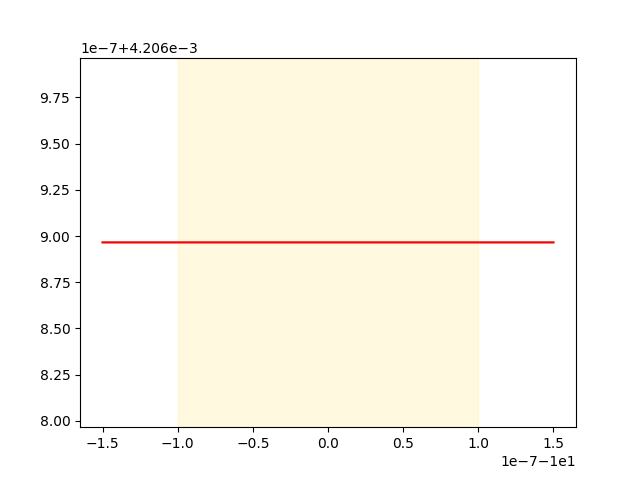

## Equation 3:
```
IKs__tauxs1 = ((fabs(30.0 + cell__V) < 0.014556040756914121) ? (417.94625266107982) : (1 / (0.00013100000000000001 * (30.0 + cell__V) / (-1.0 + 7.8538197044216602 * exp(0.068699999999999997 * cell__V)) + 7.1899999999999999e-5 * (30.0 + cell__V) / (1.0 - 0.011795938519751569 * exp(-0.14799999999999999 * cell__V)))))
```
### Partially evaluated to: 
```
IKs__tauxs1 = ((fabs(30.0 + cell__V) < 0.014556040756914121) ? (417.94625266107982) : (1 / (0.00013100000000000001 * (30.0 + cell__V) / (-1.0 + 7.8538197044216602 * exp(0.068699999999999997 * cell__V)) + 7.1899999999999999e-5 * (30.0 + cell__V) / (1.0 - 0.011795938519751569 * exp(-0.14799999999999999 * cell__V)))))
```
### Singulariy points detected:
{-30.000000000000000}

*Singularity point: -30.000000000000000*

 

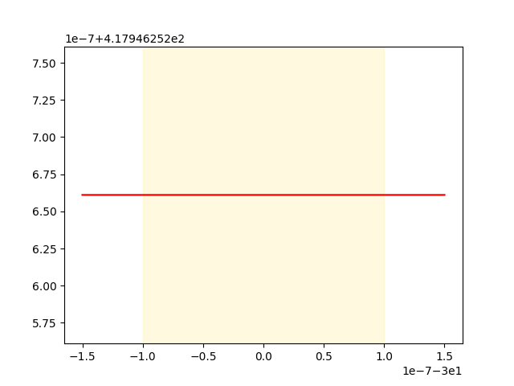

## Equation 4:
```
INa__am = ((fabs(47.130000000000003 + cell__V) > 0.001) ? (0.32000000000000001 * (47.130000000000003 + cell__V) / (1.0 - 0.00897780373069724 * exp(-0.10000000000000001 * cell__V))) : (3.2000000000000002))
```
### Partially evaluated to: 
```
INa__am = ((fabs(47.130000000000003 + cell__V) > 0.001) ? (0.32000000000000001 * (47.130000000000003 + cell__V) / (1.0 - 0.00897780373069724 * exp(-0.10000000000000001 * cell__V))) : (3.2000000000000002))
```
### Singulariy points detected:
{-47.130000000000003}

*Singularity point: -47.130000000000003*

 

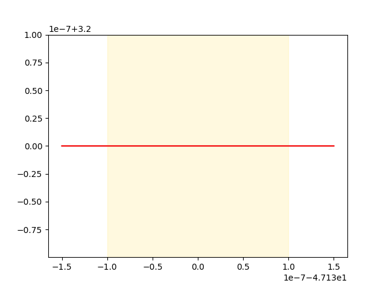

# Model: matsuoka_model_2003
## Equation 1:
```
constant_field_equations__CF_Ca = ((membrane__Vm == 0) ? (-external_ion_concentrations__Cao) : (2.0 * (-external_ion_concentrations__Cao * exp(-2.0 * membrane__F * membrane__Vm / (membrane__R * membrane__T)) + internal_ion_concentrations__Cai) * membrane__F * membrane__Vm / ((1.0 - exp(-2.0 * membrane__F * membrane__Vm / (membrane__R * membrane__T))) * membrane__R * membrane__T)))
```
### Partially evaluated to: 
```
constant_field_equations__CF_Ca = ((membrane__Vm == 0) ? (-1.8) : (0.074870384603595908 * (1.8391362547043745e-5 - 1.8 * exp(-0.074870384603595908 * membrane__Vm)) * membrane__Vm / (1.0 - exp(-0.074870384603595908 * membrane__Vm))))
```
### Singulariy points detected:
{0}

*Singularity point: 0*

 

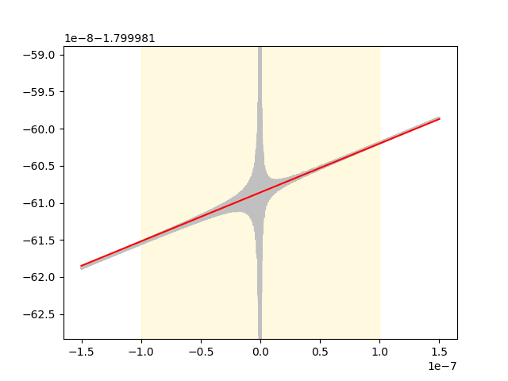

## Equation 2:
```
constant_field_equations__CF_K = ((membrane__Vm == 0) ? (internal_ion_concentrations__Ki) : ((-external_ion_concentrations__Ko * exp(-membrane__F * membrane__Vm / (membrane__R * membrane__T)) + internal_ion_concentrations__Ki) * membrane__F * membrane__Vm / ((1.0 - exp(-membrane__F * membrane__Vm / (membrane__R * membrane__T))) * membrane__R * membrane__T)))
```
### Partially evaluated to: 
```
constant_field_equations__CF_K = ((membrane__Vm == 0) ? (143.18373330004491) : (0.037435192301797954 * (143.18373330004491 - 5.4000000000000004 * exp(-0.037435192301797954 * membrane__Vm)) * membrane__Vm / (1.0 - exp(-0.037435192301797954 * membrane__Vm))))
```
### Singulariy points detected:
{0}

*Singularity point: 0*

 

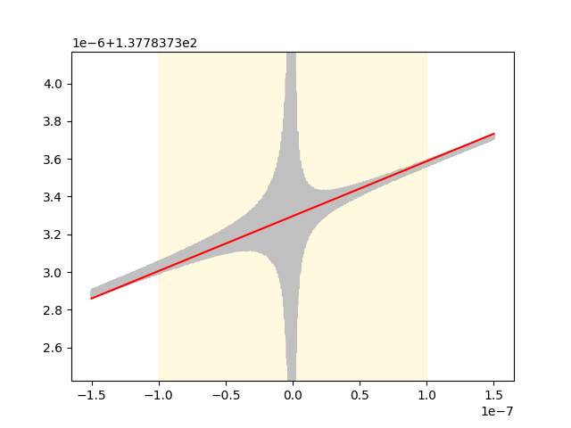

## Equation 3:
```
background_Kpl_current__i_Kpl = ((membrane__Vm == (-3.0)) ? (13.0077 * background_Kpl_current__P_Kpl * constant_field_equations__CF_K) : ((3.0 + membrane__Vm) * background_Kpl_current__P_Kpl * constant_field_equations__CF_K / (1.0 - 0.79392265781795135 * exp(-0.076923076923076927 * membrane__Vm))))
```
### Partially evaluated to: 
```
background_Kpl_current__i_Kpl = ((membrane__Vm == (-3.0)) ? (5.3564032599450697e-5 * (143.18373330004491 - 5.4000000000000004 * exp(-0.037435192301797954 * membrane__Vm)) * membrane__Vm / (1.0 - exp(-0.037435192301797954 * membrane__Vm))) : ((membrane__Vm == 0) ? (0.01575021066300494 * (3.0 + membrane__Vm) / (1.0 - 0.79392265781795135 * exp(-0.076923076923076927 * membrane__Vm))) : (4.1178711531977753e-6 * (3.0 + membrane__Vm) * (143.18373330004491 - 5.4000000000000004 * exp(-0.037435192301797954 * membrane__Vm)) * membrane__Vm / ((1.0 - exp(-0.037435192301797954 * membrane__Vm)) * (1.0 - 0.79392265781795135 * exp(-0.076923076923076927 * membrane__Vm))))))
```
### Singulariy points detected:
{-3.0000000000000000}

*Singularity point: -3.0000000000000000*

 

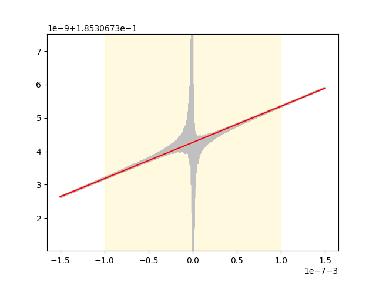

## Equation 4:
```
constant_field_equations__CF_Na = ((membrane__Vm == 0) ? (-external_ion_concentrations__Nao) : ((-external_ion_concentrations__Nao * exp(-membrane__F * membrane__Vm / (membrane__R * membrane__T)) + internal_ion_concentrations__Nai) * membrane__F * membrane__Vm / ((1.0 - exp(-membrane__F * membrane__Vm / (membrane__R * membrane__T))) * membrane__R * membrane__T)))
```
### Partially evaluated to: 
```
constant_field_equations__CF_Na = ((membrane__Vm == 0) ? (-140.0) : (0.037435192301797954 * (4.9257614396820246 - 140.0 * exp(-0.037435192301797954 * membrane__Vm)) * membrane__Vm / (1.0 - exp(-0.037435192301797954 * membrane__Vm))))
```
### Singulariy points detected:
{0}

*Singularity point: 0*

 

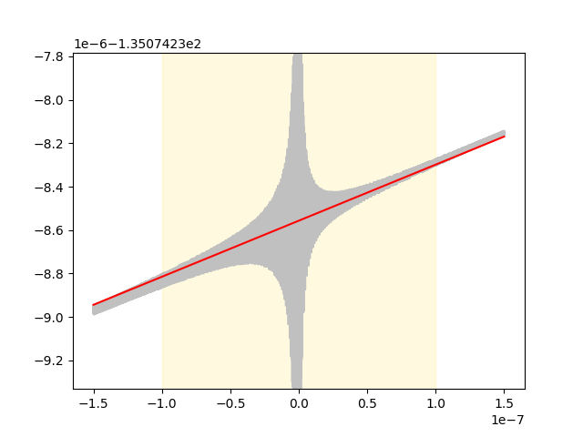

# Model: luo_rudy_1991
# Model: noble_model_1991
## Equation 1:
```
L_type_Ca_channel__i_Ca_L_Ca = 4.0 * (-50.0 + membrane__V) * (intracellular_calcium_concentration__Ca_i * exp(100.0 * membrane__F / (membrane__R * membrane__T)) - extracellular_calcium_concentration__Ca_o * exp(2.0 * (50.0 - membrane__V) * membrane__F / (membrane__R * membrane__T))) * L_type_Ca_channel__P_Ca_L * L_type_Ca_channel_d_gate__d * L_type_Ca_channel_f_gate__f * membrane__F / ((1.0 - exp(2.0 * (50.0 - membrane__V) * membrane__F / (membrane__R * membrane__T))) * membrane__R * membrane__T)
```
### Partially evaluated to: 
```
L_type_Ca_channel__i_Ca_L_Ca = 0
```
### Singulariy points detected:
{50.000000000000000}

*Singularity point: 50.000000000000000*

 


## Equation 2:
```
L_type_Ca_channel__i_Ca_L_K = (-50.0 + membrane__V) * (intracellular_potassium_concentration__K_i * exp(50.0 * membrane__F / (membrane__R * membrane__T)) - extracellular_potassium_concentration__K_o * exp((50.0 - membrane__V) * membrane__F / (membrane__R * membrane__T))) * L_type_Ca_channel__P_CaK * L_type_Ca_channel__P_Ca_L * L_type_Ca_channel_d_gate__d * L_type_Ca_channel_f_gate__f * membrane__F / ((1.0 - exp((50.0 - membrane__V) * membrane__F / (membrane__R * membrane__T))) * membrane__R * membrane__T)
```
### Partially evaluated to: 
```
L_type_Ca_channel__i_Ca_L_K = 0
```
### Singulariy points detected:
{50.000000000000000}

*Singularity point: 50.000000000000000*

 


## Equation 3:
```
L_type_Ca_channel__i_Ca_L_Na = (-50.0 + membrane__V) * (intracellular_sodium_concentration__Na_i * exp(50.0 * membrane__F / (membrane__R * membrane__T)) - extracellular_sodium_concentration__Na_o * exp((50.0 - membrane__V) * membrane__F / (membrane__R * membrane__T))) * L_type_Ca_channel__P_CaNa * L_type_Ca_channel__P_Ca_L * L_type_Ca_channel_d_gate__d * L_type_Ca_channel_f_gate__f * membrane__F / ((1.0 - exp((50.0 - membrane__V) * membrane__F / (membrane__R * membrane__T))) * membrane__R * membrane__T)
```
### Partially evaluated to: 
```
L_type_Ca_channel__i_Ca_L_Na = 0
```
### Singulariy points detected:
{50.000000000000000}

*Singularity point: 50.000000000000000*

 


# Model: noble_model_1998
## Equation 1:
```
L_type_Ca_channel__i_Ca_L_Ca_cyt = 4.0 * (1.0 - L_type_Ca_channel__FrICa) * (-50.0 + membrane__V) * (intracellular_calcium_concentration__Ca_i * exp(100.0 * membrane__F / (membrane__R * membrane__T)) - extracellular_calcium_concentration__Ca_o * exp(2.0 * (50.0 - membrane__V) * membrane__F / (membrane__R * membrane__T))) * L_type_Ca_channel__P_Ca_L * L_type_Ca_channel_d_gate__d * L_type_Ca_channel_f2_gate__f2 * L_type_Ca_channel_f_gate__f * membrane__F / ((1.0 - exp(2.0 * (50.0 - membrane__V) * membrane__F / (membrane__R * membrane__T))) * membrane__R * membrane__T)
```
### Partially evaluated to: 
```
L_type_Ca_channel__i_Ca_L_Ca_cyt = 0
```
### Singulariy points detected:
{50.000000000000000}

*Singularity point: 50.000000000000000*

 


## Equation 2:
```
L_type_Ca_channel__i_Ca_L_Ca_ds = 4.0 * (-50.0 + membrane__V) * (intracellular_calcium_concentration__Ca_i * exp(100.0 * membrane__F / (membrane__R * membrane__T)) - extracellular_calcium_concentration__Ca_o * exp(2.0 * (50.0 - membrane__V) * membrane__F / (membrane__R * membrane__T))) * L_type_Ca_channel__FrICa * L_type_Ca_channel__P_Ca_L * L_type_Ca_channel_d_gate__d * L_type_Ca_channel_f2ds_gate__f2ds * L_type_Ca_channel_f_gate__f * membrane__F / ((1.0 - exp(2.0 * (50.0 - membrane__V) * membrane__F / (membrane__R * membrane__T))) * membrane__R * membrane__T)
```
### Partially evaluated to: 
```
L_type_Ca_channel__i_Ca_L_Ca_ds = 0
```
### Singulariy points detected:
{50.000000000000000}

*Singularity point: 50.000000000000000*

 


## Equation 3:
```
L_type_Ca_channel__i_Ca_L_K_cyt = (1.0 - L_type_Ca_channel__FrICa) * (-50.0 + membrane__V) * (intracellular_potassium_concentration__K_i * exp(50.0 * membrane__F / (membrane__R * membrane__T)) - extracellular_potassium_concentration__K_o * exp((50.0 - membrane__V) * membrane__F / (membrane__R * membrane__T))) * L_type_Ca_channel__P_CaK * L_type_Ca_channel__P_Ca_L * L_type_Ca_channel_d_gate__d * L_type_Ca_channel_f2_gate__f2 * L_type_Ca_channel_f_gate__f * membrane__F / ((1.0 - exp((50.0 - membrane__V) * membrane__F / (membrane__R * membrane__T))) * membrane__R * membrane__T)
```
### Partially evaluated to: 
```
L_type_Ca_channel__i_Ca_L_K_cyt = 0
```
### Singulariy points detected:
{50.000000000000000}

*Singularity point: 50.000000000000000*

 


## Equation 4:
```
L_type_Ca_channel__i_Ca_L_K_ds = (-50.0 + membrane__V) * (intracellular_potassium_concentration__K_i * exp(50.0 * membrane__F / (membrane__R * membrane__T)) - extracellular_potassium_concentration__K_o * exp((50.0 - membrane__V) * membrane__F / (membrane__R * membrane__T))) * L_type_Ca_channel__FrICa * L_type_Ca_channel__P_CaK * L_type_Ca_channel__P_Ca_L * L_type_Ca_channel_d_gate__d * L_type_Ca_channel_f2ds_gate__f2ds * L_type_Ca_channel_f_gate__f * membrane__F / ((1.0 - exp((50.0 - membrane__V) * membrane__F / (membrane__R * membrane__T))) * membrane__R * membrane__T)
```
### Partially evaluated to: 
```
L_type_Ca_channel__i_Ca_L_K_ds = 0
```
### Singulariy points detected:
{50.000000000000000}

*Singularity point: 50.000000000000000*

 


## Equation 5:
```
L_type_Ca_channel__i_Ca_L_Na_cyt = (1.0 - L_type_Ca_channel__FrICa) * (-50.0 + membrane__V) * (intracellular_sodium_concentration__Na_i * exp(50.0 * membrane__F / (membrane__R * membrane__T)) - extracellular_sodium_concentration__Na_o * exp((50.0 - membrane__V) * membrane__F / (membrane__R * membrane__T))) * L_type_Ca_channel__P_CaNa * L_type_Ca_channel__P_Ca_L * L_type_Ca_channel_d_gate__d * L_type_Ca_channel_f2_gate__f2 * L_type_Ca_channel_f_gate__f * membrane__F / ((1.0 - exp((50.0 - membrane__V) * membrane__F / (membrane__R * membrane__T))) * membrane__R * membrane__T)
```
### Partially evaluated to: 
```
L_type_Ca_channel__i_Ca_L_Na_cyt = 0
```
### Singulariy points detected:
{50.000000000000000}

*Singularity point: 50.000000000000000*

 


## Equation 6:
```
L_type_Ca_channel__i_Ca_L_Na_ds = (-50.0 + membrane__V) * (intracellular_sodium_concentration__Na_i * exp(50.0 * membrane__F / (membrane__R * membrane__T)) - extracellular_sodium_concentration__Na_o * exp((50.0 - membrane__V) * membrane__F / (membrane__R * membrane__T))) * L_type_Ca_channel__FrICa * L_type_Ca_channel__P_CaNa * L_type_Ca_channel__P_Ca_L * L_type_Ca_channel_d_gate__d * L_type_Ca_channel_f2ds_gate__f2ds * L_type_Ca_channel_f_gate__f * membrane__F / ((1.0 - exp((50.0 - membrane__V) * membrane__F / (membrane__R * membrane__T))) * membrane__R * membrane__T)
```
### Partially evaluated to: 
```
L_type_Ca_channel__i_Ca_L_Na_ds = 0
```
### Singulariy points detected:
{50.000000000000000}

*Singularity point: 50.000000000000000*

 


# Model: NN_SAN_model_1984
## Equation 1:
```
second_inward_current__i_siCa = 4.0 * (-50.0 + membrane__V) * (intracellular_calcium_concentration__Cai * exp(100.0 / membrane__RTONF) - extracellular_calcium_concentration__Cao * exp(-2.0 * (-50.0 + membrane__V) / membrane__RTONF)) * second_inward_current__P_si * second_inward_current_d_gate__d * second_inward_current_f2_gate__f2 * second_inward_current_f_gate__f / ((1.0 - exp(-2.0 * (-50.0 + membrane__V) / membrane__RTONF)) * membrane__RTONF)
```
### Partially evaluated to: 
```
second_inward_current__i_siCa = 0.00076123407928412891 * (0.0024499725338953324 - 84.481811513632152 * exp(-0.074867781645490947 * membrane__V)) * (-50.0 + membrane__V) / (1.0 - 42.240905756816076 * exp(-0.074867781645490947 * membrane__V))
```
### Singulariy points detected:
{50.000000000000000}

*Singularity point: 50.000000000000000*

 

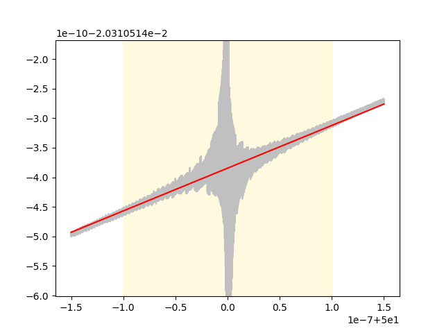

## Equation 2:
```
second_inward_current__i_siK = 0.01 * (-50.0 + membrane__V) * (intracellular_potassium_concentration__Ki * exp(50.0 / membrane__RTONF) - extracellular_potassium_concentration__Kc * exp(-(-50.0 + membrane__V) / membrane__RTONF)) * second_inward_current__P_si * second_inward_current_d_gate__d * second_inward_current_f2_gate__f2 * second_inward_current_f_gate__f / ((1.0 - exp(-(-50.0 + membrane__V) / membrane__RTONF)) * membrane__RTONF)
```
### Partially evaluated to: 
```
second_inward_current__i_siK = 1.9030851982103224e-6 * (909.90205672566492 - 19.497901215549962 * exp(-0.037433890822745473 * membrane__V)) * (-50.0 + membrane__V) / (1.0 - 6.4993004051833205 * exp(-0.037433890822745473 * membrane__V))
```
### Singulariy points detected:
{50.000000000000000}

*Singularity point: 50.000000000000000*

 

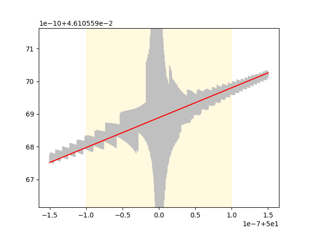

## Equation 3:
```
second_inward_current__i_siNa = 0.01 * (-50.0 + membrane__V) * (intracellular_sodium_concentration__Nai * exp(50.0 / membrane__RTONF) - extracellular_sodium_concentration__Nao * exp(-(-50.0 + membrane__V) / membrane__RTONF)) * second_inward_current__P_si * second_inward_current_d_gate__d * second_inward_current_f2_gate__f2 * second_inward_current_f_gate__f / ((1.0 - exp(-(-50.0 + membrane__V) / membrane__RTONF)) * membrane__RTONF)
```
### Partially evaluated to: 
```
second_inward_current__i_siNa = 1.9030851982103224e-6 * (48.744753038874904 - 909.90205672566492 * exp(-0.037433890822745473 * membrane__V)) * (-50.0 + membrane__V) / (1.0 - 6.4993004051833205 * exp(-0.037433890822745473 * membrane__V))
```
### Singulariy points detected:
{50.000000000000000}

*Singularity point: 50.000000000000000*

 

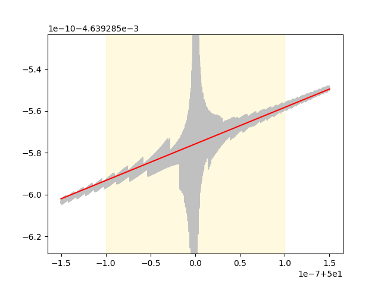

# Model: Noble_SAN_model_1989
## Equation 1:
```
second_inward_current__i_siCa = 4.0 * (-50.0 + membrane__V) * (intracellular_calcium_concentration__Cai * exp(100.0 / membrane__RTONF) - extracellular_calcium_concentration__Cao * exp(-2.0 * (-50.0 + membrane__V) / membrane__RTONF)) * second_inward_current__P_si * second_inward_current_d_gate__d * second_inward_current_f2_gate__f2 * second_inward_current_f_gate__f / ((1.0 - exp(-2.0 * (-50.0 + membrane__V) / membrane__RTONF)) * membrane__RTONF)
```
### Partially evaluated to: 
```
second_inward_current__i_siCa = 0
```
### Singulariy points detected:
{50.000000000000000}

*Singularity point: 50.000000000000000*

 


## Equation 2:
```
second_inward_current__i_siK = 0.01 * (-50.0 + membrane__V) * (intracellular_potassium_concentration__Ki * exp(50.0 / membrane__RTONF) - extracellular_potassium_concentration__Kc * exp(-(-50.0 + membrane__V) / membrane__RTONF)) * second_inward_current__P_si * second_inward_current_d_gate__d * second_inward_current_f2_gate__f2 * second_inward_current_f_gate__f / ((1.0 - exp(-(-50.0 + membrane__V) / membrane__RTONF)) * membrane__RTONF)
```
### Partially evaluated to: 
```
second_inward_current__i_siK = 0
```
### Singulariy points detected:
{50.000000000000000}

*Singularity point: 50.000000000000000*

 


## Equation 3:
```
second_inward_current__i_siNa = 0.01 * (-50.0 + membrane__V) * (intracellular_sodium_concentration__Nai * exp(50.0 / membrane__RTONF) - extracellular_sodium_concentration__Nao * exp(-(-50.0 + membrane__V) / membrane__RTONF)) * second_inward_current__P_si * second_inward_current_d_gate__d * second_inward_current_f2_gate__f2 * second_inward_current_f_gate__f / ((1.0 - exp(-(-50.0 + membrane__V) / membrane__RTONF)) * membrane__RTONF)
```
### Partially evaluated to: 
```
second_inward_current__i_siNa = 0
```
### Singulariy points detected:
{50.000000000000000}

*Singularity point: 50.000000000000000*

 


# Model: nygren_atrial_model_1998
## Equation 1:
```
sodium_current__i_Na = pow(membrane__F, 2) * pow(sodium_current_m_gate__m, 3) * (-1.0 + exp((-sodium_current__E_Na + membrane__V) * membrane__F / (membrane__R * membrane__T))) * (0.10000000000000001 * sodium_current_h2_gate__h2 + 0.90000000000000002 * sodium_current_h1_gate__h1) * cleft_space_ion_concentrations__Na_c * membrane__V * sodium_current__P_Na / ((-1.0 + exp(membrane__F * membrane__V / (membrane__R * membrane__T))) * membrane__R * membrane__T)
```
### Partially evaluated to: 
```
sodium_current__i_Na = 2.1991428764888377e-5 * (-1.0 + 0.065799816938566749 * exp(0.037907445518581065 * membrane__V)) * membrane__V / (-1.0 + exp(0.037907445518581065 * membrane__V))
```
### Singulariy points detected:
{0}

*Singularity point: 0*

 

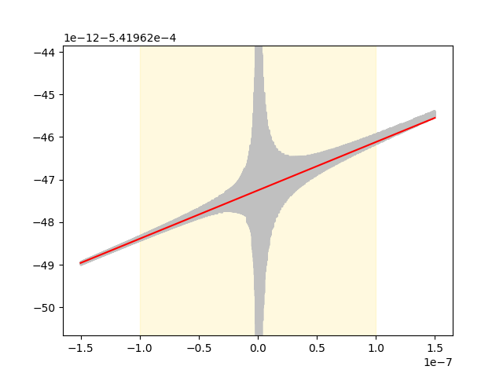

## Equation 2:
```
sodium_potassium_pump__i_NaK = pow(intracellular_ion_concentrations__Na_i, 1.5) * (150.0 + membrane__V) * cleft_space_ion_concentrations__K_c * sodium_potassium_pump__i_NaK_max / ((200.0 + membrane__V) * (pow(intracellular_ion_concentrations__Na_i, 1.5) + pow(sodium_potassium_pump__k_NaK_Na, 1.5)) * (cleft_space_ion_concentrations__K_c + sodium_potassium_pump__k_NaK_K))
```
### Partially evaluated to: 
```
sodium_potassium_pump__i_NaK = 24.281503485861936 * (150.0 + membrane__V) / (200.0 + membrane__V)
```
### Singulariy points detected:
{-200.00000000000000}

*Singularity point: -200.00000000000000*

 

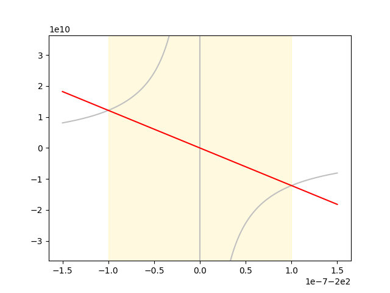

# Model: paci_hyttinen_aaltosetala_severi_ventricularVersion
# Model: pandit_model_2001_epi
## Equation 1:
```
sodium_current_m_gate__tau_m = 0.0013600000000000001 / (0.080000000000000002 * exp(-0.090909090909090912 * membrane__V) + 0.32000000000000001 * (47.130000000000003 + membrane__V) / (1.0 - 0.00897780373069724 * exp(-0.10000000000000001 * membrane__V)))
```
### Partially evaluated to: 
```
sodium_current_m_gate__tau_m = 0.0013600000000000001 / (0.080000000000000002 * exp(-0.090909090909090912 * membrane__V) + 0.32000000000000001 * (47.130000000000003 + membrane__V) / (1.0 - 0.00897780373069724 * exp(-0.10000000000000001 * membrane__V)))
```
### Singulariy points detected:
{-47.130000000000003}

*Singularity point: -47.130000000000003*

 

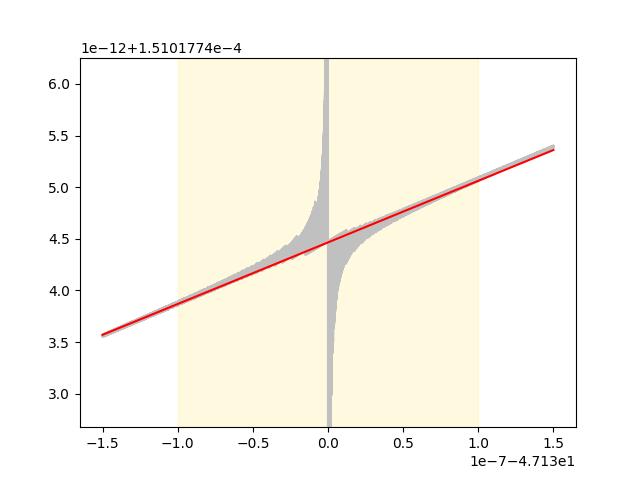

# Model: priebe_beuckelmann_model_1998
## Equation 1:
```
INa_m_gate__alpha_m = ((fabs(47.130000000000003 + cell__V) > 0.001) ? (0.32000000000000001 * (47.130000000000003 + cell__V) / (1.0 - 0.00897780373069724 * exp(-0.10000000000000001 * cell__V))) : (3.2000000000000002))
```
### Partially evaluated to: 
```
INa_m_gate__alpha_m = ((fabs(47.130000000000003 + cell__V) > 0.001) ? (0.32000000000000001 * (47.130000000000003 + cell__V) / (1.0 - 0.00897780373069724 * exp(-0.10000000000000001 * cell__V))) : (3.2000000000000002))
```
### Singulariy points detected:
{-47.130000000000003}

*Singularity point: -47.130000000000003*

 


# Model: sachse_model_2007
## Equation 1:
```
I_Shkr__I_Shkr = pow(model_parameters__F, 2) * (-model_parameters__Ko * exp(-membrane__Vm * model_parameters__F / (model_parameters__R * model_parameters__T)) + model_parameters__Ki) * I_Shkr__OShkr * I_Shkr__PShkr * membrane__Vm / ((1.0 - exp(-membrane__Vm * model_parameters__F / (model_parameters__R * model_parameters__T))) * model_parameters__R * model_parameters__T)
```
### Partially evaluated to: 
```
I_Shkr__I_Shkr = 0
```
### Singulariy points detected:
{0}

*Singularity point: 0*

 


# Model: sakmann_model_2000_epi
## Equation 1:
```
L_type_Ca_channel__i_Ca_L_Ca_cyt = 4.0 * (1.0 - L_type_Ca_channel__FrICa) * (-50.0 + membrane__V) * (intracellular_calcium_concentration__Ca_i * exp(100.0 * membrane__F / (membrane__R * membrane__T)) - extracellular_calcium_concentration__Ca_o * exp(2.0 * (50.0 - membrane__V) * membrane__F / (membrane__R * membrane__T))) * L_type_Ca_channel__P_Ca_L * L_type_Ca_channel_d_gate__d * L_type_Ca_channel_f2_gate__f2 * L_type_Ca_channel_f_gate__f * membrane__F / ((1.0 - exp(2.0 * (50.0 - membrane__V) * membrane__F / (membrane__R * membrane__T))) * membrane__R * membrane__T)
```
### Partially evaluated to: 
```
L_type_Ca_channel__i_Ca_L_Ca_cyt = 0
```
### Singulariy points detected:
{50.000000000000000}

*Singularity point: 50.000000000000000*

 


## Equation 2:
```
L_type_Ca_channel__i_Ca_L_Ca_ds = 4.0 * (-50.0 + membrane__V) * (intracellular_calcium_concentration__Ca_i * exp(100.0 * membrane__F / (membrane__R * membrane__T)) - extracellular_calcium_concentration__Ca_o * exp(2.0 * (50.0 - membrane__V) * membrane__F / (membrane__R * membrane__T))) * L_type_Ca_channel__FrICa * L_type_Ca_channel__P_Ca_L * L_type_Ca_channel_d_gate__d * L_type_Ca_channel_f2ds_gate__f2ds * L_type_Ca_channel_f_gate__f * membrane__F / ((1.0 - exp(2.0 * (50.0 - membrane__V) * membrane__F / (membrane__R * membrane__T))) * membrane__R * membrane__T)
```
### Partially evaluated to: 
```
L_type_Ca_channel__i_Ca_L_Ca_ds = 2.203930365375749e-6 * (0.0022979052731707948 - 84.481811513632152 * exp(-0.074867781645490947 * membrane__V)) * (-50.0 + membrane__V) / (1.0 - 42.240905756816076 * exp(-0.074867781645490947 * membrane__V))
```
### Singulariy points detected:
{50.000000000000000}

*Singularity point: 50.000000000000000*

 

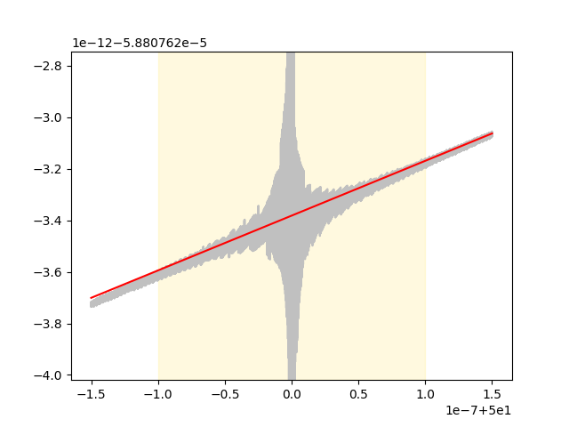

## Equation 3:
```
L_type_Ca_channel__i_Ca_L_K_cyt = (1.0 - L_type_Ca_channel__FrICa) * (-50.0 + membrane__V) * (intracellular_potassium_concentration__K_i * exp(50.0 * membrane__F / (membrane__R * membrane__T)) - extracellular_potassium_concentration__K_o * exp((50.0 - membrane__V) * membrane__F / (membrane__R * membrane__T))) * L_type_Ca_channel__P_CaK * L_type_Ca_channel__P_Ca_L * L_type_Ca_channel_d_gate__d * L_type_Ca_channel_f2_gate__f2 * L_type_Ca_channel_f_gate__f * membrane__F / ((1.0 - exp((50.0 - membrane__V) * membrane__F / (membrane__R * membrane__T))) * membrane__R * membrane__T)
```
### Partially evaluated to: 
```
L_type_Ca_channel__i_Ca_L_K_cyt = 0
```
### Singulariy points detected:
{50.000000000000000}

*Singularity point: 50.000000000000000*

 

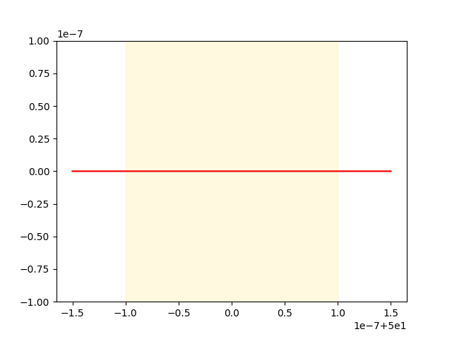

## Equation 4:
```
L_type_Ca_channel__i_Ca_L_K_ds = (-50.0 + membrane__V) * (intracellular_potassium_concentration__K_i * exp(50.0 * membrane__F / (membrane__R * membrane__T)) - extracellular_potassium_concentration__K_o * exp((50.0 - membrane__V) * membrane__F / (membrane__R * membrane__T))) * L_type_Ca_channel__FrICa * L_type_Ca_channel__P_CaK * L_type_Ca_channel__P_Ca_L * L_type_Ca_channel_d_gate__d * L_type_Ca_channel_f2ds_gate__f2ds * L_type_Ca_channel_f_gate__f * membrane__F / ((1.0 - exp((50.0 - membrane__V) * membrane__F / (membrane__R * membrane__T))) * membrane__R * membrane__T)
```
### Partially evaluated to: 
```
L_type_Ca_channel__i_Ca_L_K_ds = 1.1019651826878747e-9 * (902.07933822526627 - 25.997201620733282 * exp(-0.037433890822745473 * membrane__V)) * (-50.0 + membrane__V) / (1.0 - 6.4993004051833205 * exp(-0.037433890822745473 * membrane__V))
```
### Singulariy points detected:
{50.000000000000000}

*Singularity point: 50.000000000000000*

 

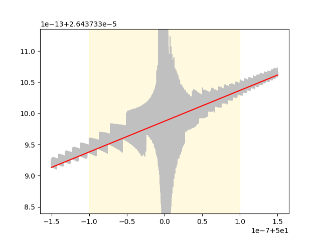

## Equation 5:
```
L_type_Ca_channel__i_Ca_L_Na_cyt = (1.0 - L_type_Ca_channel__FrICa) * (-50.0 + membrane__V) * (intracellular_sodium_concentration__Na_i * exp(50.0 * membrane__F / (membrane__R * membrane__T)) - extracellular_sodium_concentration__Na_o * exp((50.0 - membrane__V) * membrane__F / (membrane__R * membrane__T))) * L_type_Ca_channel__P_CaNa * L_type_Ca_channel__P_Ca_L * L_type_Ca_channel_d_gate__d * L_type_Ca_channel_f2_gate__f2 * L_type_Ca_channel_f_gate__f * membrane__F / ((1.0 - exp((50.0 - membrane__V) * membrane__F / (membrane__R * membrane__T))) * membrane__R * membrane__T)
```
### Partially evaluated to: 
```
L_type_Ca_channel__i_Ca_L_Na_cyt = 0
```
### Singulariy points detected:
{50.000000000000000}

*Singularity point: 50.000000000000000*

 


## Equation 6:
```
L_type_Ca_channel__i_Ca_L_Na_ds = (-50.0 + membrane__V) * (intracellular_sodium_concentration__Na_i * exp(50.0 * membrane__F / (membrane__R * membrane__T)) - extracellular_sodium_concentration__Na_o * exp((50.0 - membrane__V) * membrane__F / (membrane__R * membrane__T))) * L_type_Ca_channel__FrICa * L_type_Ca_channel__P_CaNa * L_type_Ca_channel__P_Ca_L * L_type_Ca_channel_d_gate__d * L_type_Ca_channel_f2ds_gate__f2ds * L_type_Ca_channel_f_gate__f * membrane__F / ((1.0 - exp((50.0 - membrane__V) * membrane__F / (membrane__R * membrane__T))) * membrane__R * membrane__T)
```
### Partially evaluated to: 
```
L_type_Ca_channel__i_Ca_L_Na_ds = 5.5098259134393731e-9 * (36.807947485213347 - 909.90205672566492 * exp(-0.037433890822745473 * membrane__V)) * (-50.0 + membrane__V) / (1.0 - 6.4993004051833205 * exp(-0.037433890822745473 * membrane__V))
```
### Singulariy points detected:
{50.000000000000000}

*Singularity point: 50.000000000000000*

 


## Equation 7:
```
rapid_delayed_rectifier_potassium_current_xr_gate__tau_xr = 0.001 / (0.00060999999999999997 * (38.899999999999999 + membrane__V) / (-1.0 + 281.60348502322194 * exp(0.14499999999999999 * membrane__V)) + 0.0013799999999999999 * (14.199999999999999 + membrane__V) / (1.0 - 0.17436578041087322 * exp(-0.123 * membrane__V)))
```
### Partially evaluated to: 
```
rapid_delayed_rectifier_potassium_current_xr_gate__tau_xr = 0.001 / (0.00060999999999999997 * (38.899999999999999 + membrane__V) / (-1.0 + 281.60348502322194 * exp(0.14499999999999999 * membrane__V)) + 0.0013799999999999999 * (14.199999999999999 + membrane__V) / (1.0 - 0.17436578041087322 * exp(-0.123 * membrane__V)))
```
### Singulariy points detected:
{-38.899999999999999, -14.199999999999999}

*Singularity point: -38.899999999999999*

 


*Singularity point: -14.199999999999999*

 


## Equation 8:
```
slow_delayed_rectifier_potassium_current_xs_gate__tau_xs = 0.001 / (0.00013100000000000001 * (30.0 + membrane__V) / (-1.0 + 7.8538197044216602 * exp(0.068699999999999997 * membrane__V)) + 7.1899999999999999e-5 * (30.0 + membrane__V) / (1.0 - 0.011795938519751569 * exp(-0.14799999999999999 * membrane__V)))
```
### Partially evaluated to: 
```
slow_delayed_rectifier_potassium_current_xs_gate__tau_xs = 0.001 / (0.00013100000000000001 * (30.0 + membrane__V) / (-1.0 + 7.8538197044216602 * exp(0.068699999999999997 * membrane__V)) + 7.1899999999999999e-5 * (30.0 + membrane__V) / (1.0 - 0.011795938519751569 * exp(-0.14799999999999999 * membrane__V)))
```
### Singulariy points detected:
{-30.000000000000000}

*Singularity point: -30.000000000000000*

 


# Model: shannon_wang_puglisi_weber_bers_2004_model_updated
## Equation 1:
```
ICaL_d_gate__tau_d = 28.571428571428569 * (1.0 - 0.089218517409260095 * exp(-0.16666666666666666 * cell__V)) * ICaL_d_gate__d_infinity / (14.5 + cell__V)
```
### Partially evaluated to: 
```
ICaL_d_gate__tau_d = 28.571428571428569 * (1.0 - 0.089218517409260095 * exp(-0.16666666666666666 * cell__V)) / ((1.0 + 0.089218517409260095 * exp(-0.16666666666666666 * cell__V)) * (14.5 + cell__V))
```
### Singulariy points detected:
{-14.500000000000000}

*Singularity point: -14.500000000000000*

 

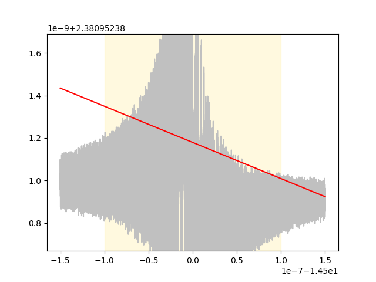

## Equation 2:
```
IKr_Xr_gate__tau_Xr = 1 / (0.00060999999999999997 * (10.0 + cell__V) / (-1.0 + 4.2631145151688168 * exp(0.14499999999999999 * cell__V)) + 0.0013799999999999999 * (7.0 + cell__V) / (1.0 - 0.42273913174596284 * exp(-0.123 * cell__V)))
```
### Partially evaluated to: 
```
IKr_Xr_gate__tau_Xr = 1 / (0.00060999999999999997 * (10.0 + cell__V) / (-1.0 + 4.2631145151688168 * exp(0.14499999999999999 * cell__V)) + 0.0013799999999999999 * (7.0 + cell__V) / (1.0 - 0.42273913174596284 * exp(-0.123 * cell__V)))
```
### Singulariy points detected:
{-10.000000000000000, -7.0000000000000000}

*Singularity point: -10.000000000000000*

 

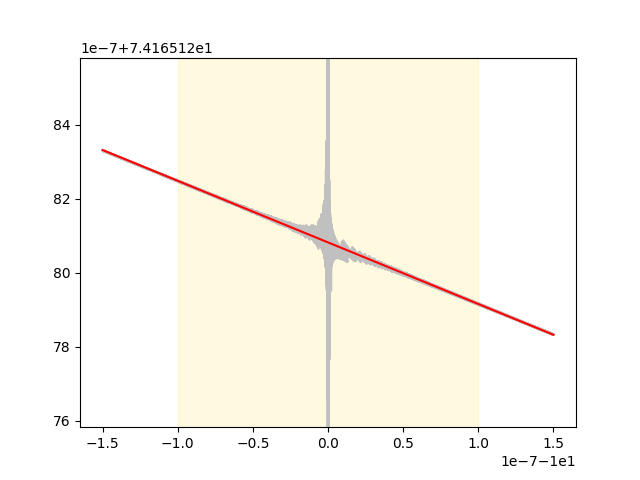

*Singularity point: -7.0000000000000000*

 

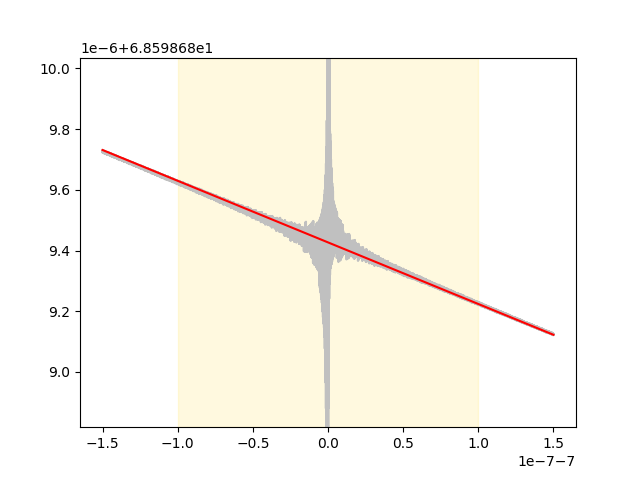

## Equation 3:
```
IKs_Xs_gate__tau_Xs = 1 / (0.00013100000000000001 * (30.0 + cell__V) / (-1.0 + 7.8538197044216602 * exp(0.068699999999999997 * cell__V)) + 7.1899999999999999e-5 * (30.0 + cell__V) / (1.0 - 0.011795938519751569 * exp(-0.14799999999999999 * cell__V)))
```
### Partially evaluated to: 
```
IKs_Xs_gate__tau_Xs = 1 / (0.00013100000000000001 * (30.0 + cell__V) / (-1.0 + 7.8538197044216602 * exp(0.068699999999999997 * cell__V)) + 7.1899999999999999e-5 * (30.0 + cell__V) / (1.0 - 0.011795938519751569 * exp(-0.14799999999999999 * cell__V)))
```
### Singulariy points detected:
{-30.000000000000000}

*Singularity point: -30.000000000000000*

 


## Equation 4:
```
INa_m_gate__alpha_m = 0.32000000000000001 * (47.130000000000003 + cell__V) / (1.0 - 0.00897780373069724 * exp(-0.10000000000000001 * cell__V))
```
### Partially evaluated to: 
```
INa_m_gate__alpha_m = 0.32000000000000001 * (47.130000000000003 + cell__V) / (1.0 - 0.00897780373069724 * exp(-0.10000000000000001 * cell__V))
```
### Singulariy points detected:
{-47.130000000000003}

*Singularity point: -47.130000000000003*

 


## Equation 5:
```
ICaL__i_CaL_Ca_SL = 4.0 * (-ICaL__gamma_Cao * model_parameters__Cao + Ca_buffer__Ca_SL * ICaL__gamma_Cai * exp(2.0 * cell__V * model_parameters__F / (model_parameters__R * model_parameters__T))) * ICaL__Fx_ICaL_SL * ICaL__PCa * ICaL__temp * ICaL_fCa_gate__fCa_SL / (-1.0 + exp(2.0 * cell__V * model_parameters__F / (model_parameters__R * model_parameters__T)))
```
### Partially evaluated to: 
```
ICaL__i_CaL_Ca_SL = 2.4206884569550026e-6 * (-0.61380000000000001 + 3.5795216745958792e-5 * exp(0.074870384603595908 * cell__V)) * cell__V / (-1.0 + exp(0.074870384603595908 * cell__V))
```
### Singulariy points detected:
{0}

*Singularity point: 0*

 

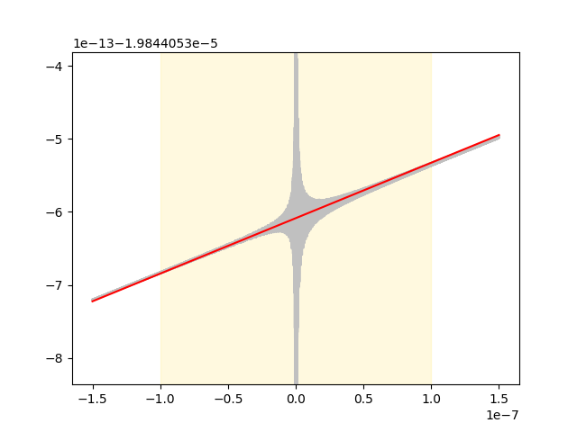

## Equation 6:
```
ICaL__i_CaL_Ca_jct = 4.0 * (-ICaL__gamma_Cao * model_parameters__Cao + Ca_buffer__Ca_jct * ICaL__gamma_Cai * exp(2.0 * cell__V * model_parameters__F / (model_parameters__R * model_parameters__T))) * ICaL__Fx_ICaL_jct * ICaL__PCa * ICaL__temp * ICaL_fCa_gate__fCa_jct / (-1.0 + exp(2.0 * cell__V * model_parameters__F / (model_parameters__R * model_parameters__T)))
```
### Partially evaluated to: 
```
ICaL__i_CaL_Ca_jct = 2.157860280473536e-5 * (-0.61380000000000001 + 5.9349397044773433e-5 * exp(0.074870384603595908 * cell__V)) * cell__V / (-1.0 + exp(0.074870384603595908 * cell__V))
```
### Singulariy points detected:
{0}

*Singularity point: 0*

 


## Equation 7:
```
ICaL__i_CaL_K = (ICaL__Fx_ICaL_SL * ICaL_fCa_gate__fCa_SL + ICaL__Fx_ICaL_jct * ICaL_fCa_gate__fCa_jct) * (-ICaL__gamma_Ko * model_parameters__Ko + ICaL__gamma_Ki * model_parameters__Ki * exp(cell__V * model_parameters__F / (model_parameters__R * model_parameters__T))) * ICaL__PK * ICaL__temp / (-1.0 + exp(cell__V * model_parameters__F / (model_parameters__R * model_parameters__T)))
```
### Partially evaluated to: 
```
ICaL__i_CaL_K = 2.9999114077112956e-9 * (-4.0500000000000007 + 101.25 * exp(0.037435192301797954 * cell__V)) * cell__V / (-1.0 + exp(0.037435192301797954 * cell__V))
```
### Singulariy points detected:
{0}

*Singularity point: 0*

 

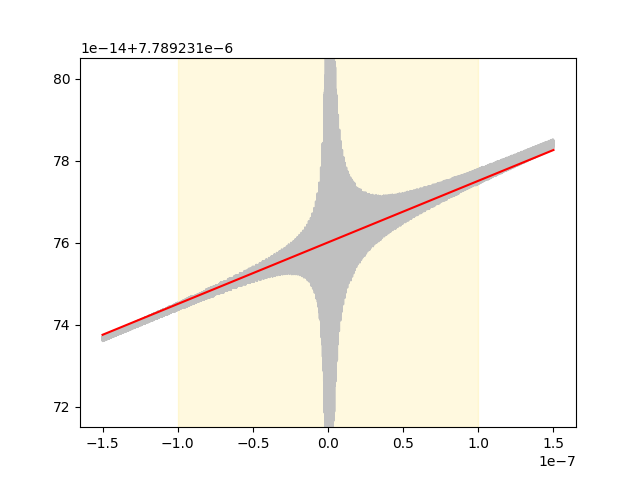

## Equation 8:
```
ICaL__i_CaL_Na_SL = (-ICaL__gamma_Nao * model_parameters__Nao + ICaL__gamma_Nai * Na_buffer__Na_SL * exp(cell__V * model_parameters__F / (model_parameters__R * model_parameters__T))) * ICaL__Fx_ICaL_SL * ICaL__PNa * ICaL__temp * ICaL_fCa_gate__fCa_SL / (-1.0 + exp(cell__V * model_parameters__F / (model_parameters__R * model_parameters__T)))
```
### Partially evaluated to: 
```
ICaL__i_CaL_Na_SL = 1.6810336506631961e-11 * (-105.0 + 6.6537144904403025 * exp(0.037435192301797954 * cell__V)) * cell__V / (-1.0 + exp(0.037435192301797954 * cell__V))
```
### Singulariy points detected:
{0}

*Singularity point: 0*

 

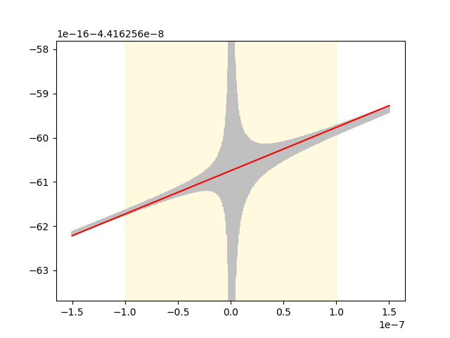

## Equation 9:
```
ICaL__i_CaL_Na_jct = (-ICaL__gamma_Nao * model_parameters__Nao + ICaL__gamma_Nai * Na_buffer__Na_jct * exp(cell__V * model_parameters__F / (model_parameters__R * model_parameters__T))) * ICaL__Fx_ICaL_jct * ICaL__PNa * ICaL__temp * ICaL_fCa_gate__fCa_jct / (-1.0 + exp(cell__V * model_parameters__F / (model_parameters__R * model_parameters__T)))
```
### Partially evaluated to: 
```
ICaL__i_CaL_Na_jct = 1.4985140836621777e-10 * (-105.0 + 6.6527387631683705 * exp(0.037435192301797954 * cell__V)) * cell__V / (-1.0 + exp(0.037435192301797954 * cell__V))
```
### Singulariy points detected:
{0}

*Singularity point: 0*

 


# Model: stewart_zhang_model_2008
## Equation 1:
```
L_type_Ca_current__i_CaL = 4.0 * pow(membrane__F, 2) * (-15.0 + membrane__V) * (-calcium_dynamics__Ca_o + 0.25 * calcium_dynamics__Ca_ss * exp(2.0 * (-15.0 + membrane__V) * membrane__F / (membrane__R * membrane__T))) * L_type_Ca_current__g_CaL * L_type_Ca_current_d_gate__d * L_type_Ca_current_f2_gate__f2 * L_type_Ca_current_fCass_gate__fCass * L_type_Ca_current_f_gate__f / ((-1.0 + exp(2.0 * (-15.0 + membrane__V) * membrane__F / (membrane__R * membrane__T))) * membrane__R * membrane__T)
```
### Partially evaluated to: 
```
L_type_Ca_current__i_CaL = 0.00016303166834423906 * (-2.0 + 3.6337194739638214e-5 * exp(0.074867781645490947 * membrane__V)) * (-15.0 + membrane__V) / (-1.0 + 0.32529698149690262 * exp(0.074867781645490947 * membrane__V))
```
### Singulariy points detected:
{15.000000000000000}

*Singularity point: 15.000000000000000*

 

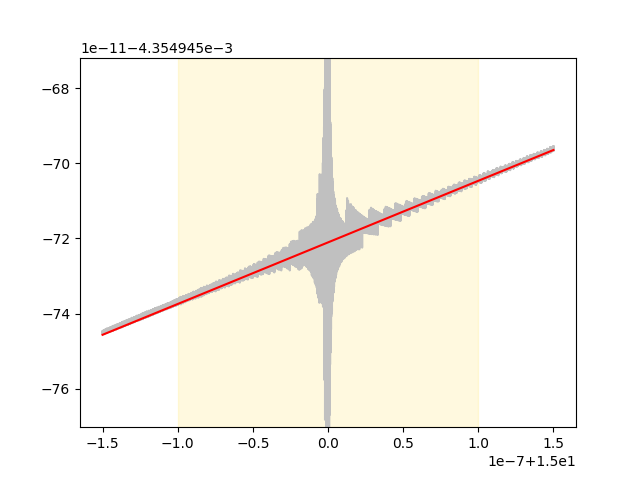

# Model: tentusscher_model_2004_endo
## Equation 1:
```
L_type_Ca_current__i_CaL = 4.0 * pow(membrane__F, 2) * (-0.34100000000000003 * calcium_dynamics__Ca_o + calcium_dynamics__Ca_i * exp(2.0 * membrane__F * membrane__V / (membrane__R * membrane__T))) * L_type_Ca_current__g_CaL * L_type_Ca_current_d_gate__d * L_type_Ca_current_fCa_gate__fCa * L_type_Ca_current_f_gate__f * membrane__V / ((-1.0 + exp(2.0 * membrane__F * membrane__V / (membrane__R * membrane__T))) * membrane__R * membrane__T)
```
### Partially evaluated to: 
```
L_type_Ca_current__i_CaL = 0
```
### Singulariy points detected:
{0}

*Singularity point: 0*

 


# Model: tentusscher_model_2004_epi
## Equation 1:
```
L_type_Ca_current__i_CaL = 4.0 * pow(membrane__F, 2) * (-0.34100000000000003 * calcium_dynamics__Ca_o + calcium_dynamics__Ca_i * exp(2.0 * membrane__F * membrane__V / (membrane__R * membrane__T))) * L_type_Ca_current__g_CaL * L_type_Ca_current_d_gate__d * L_type_Ca_current_fCa_gate__fCa * L_type_Ca_current_f_gate__f * membrane__V / ((-1.0 + exp(2.0 * membrane__F * membrane__V / (membrane__R * membrane__T))) * membrane__R * membrane__T)
```
### Partially evaluated to: 
```
L_type_Ca_current__i_CaL = 4.9724340271963296e-5 * (-0.68200000000000005 + 6.6200990301269099e-5 * exp(0.074867781645490947 * membrane__V)) * membrane__V / (-1.0 + exp(0.074867781645490947 * membrane__V))
```
### Singulariy points detected:
{0}

*Singularity point: 0*

 


# Model: tentusscher_panfilov_2006_epi
## Equation 1:
```
L_type_Ca_current__i_CaL = 4.0 * pow(membrane__F, 2) * (-15.0 + membrane__V) * (-calcium_dynamics__Ca_o + 0.25 * calcium_dynamics__Ca_ss * exp(2.0 * (-15.0 + membrane__V) * membrane__F / (membrane__R * membrane__T))) * L_type_Ca_current__g_CaL * L_type_Ca_current_d_gate__d * L_type_Ca_current_f2_gate__f2 * L_type_Ca_current_fCass_gate__fCass * L_type_Ca_current_f_gate__f / ((-1.0 + exp(2.0 * (-15.0 + membrane__V) * membrane__F / (membrane__R * membrane__T))) * membrane__R * membrane__T)
```
### Partially evaluated to: 
```
L_type_Ca_current__i_CaL = 1.485367413663972e-5 * (-2.0 + 2.9276728334721234e-5 * exp(0.074867781645490947 * membrane__V)) * (-15.0 + membrane__V) / (-1.0 + 0.32529698149690262 * exp(0.074867781645490947 * membrane__V))
```
### Singulariy points detected:
{15.000000000000000}

*Singularity point: 15.000000000000000*

<<<<<<< HEAD
 

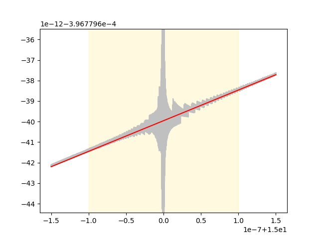

# Model: viswanathan_model_1999_epi
## Equation 1:
```
L_type_Ca_channel__I_CaCa = 4.0 * pow(membrane__F, 2) * (-L_type_Ca_channel__gamma_Cao * calcium_dynamics__Cao + L_type_Ca_channel__gamma_Cai * calcium_dynamics__Cai * exp(2.0 * membrane__F * membrane__V / (membrane__R * membrane__T))) * L_type_Ca_channel__P_Ca * membrane__V / ((-1.0 + exp(2.0 * membrane__F * membrane__V / (membrane__R * membrane__T))) * membrane__R * membrane__T)
```
### Partially evaluated to: 
```
L_type_Ca_channel__I_CaCa = 7.8019226357407252 * (-0.61380000000000001 + 0.00035237000000000002 * exp(0.074871767015605231 * membrane__V)) * membrane__V / (-1.0 + exp(0.074871767015605231 * membrane__V))
```
### Singulariy points detected:
{0}

*Singularity point: 0*

 


## Equation 2:
```
L_type_Ca_channel__I_CaK = pow(membrane__F, 2) * (-L_type_Ca_channel__gamma_Ko * ionic_concentrations__Ko + L_type_Ca_channel__gamma_Ki * ionic_concentrations__Ki * exp(membrane__F * membrane__V / (membrane__R * membrane__T))) * L_type_Ca_channel__P_K * membrane__V / ((-1.0 + exp(membrane__F * membrane__V / (membrane__R * membrane__T))) * membrane__R * membrane__T)
```
### Partially evaluated to: 
```
L_type_Ca_channel__I_CaK = 0.00069711623550831479 * (-3.375 + 103.2183 * exp(0.037435883507802616 * membrane__V)) * membrane__V / (-1.0 + exp(0.037435883507802616 * membrane__V))
```
### Singulariy points detected:
{0}

*Singularity point: 0*

 


## Equation 3:
```
L_type_Ca_channel__I_CaNa = pow(membrane__F, 2) * (-L_type_Ca_channel__gamma_Nao * ionic_concentrations__Nao + L_type_Ca_channel__gamma_Nai * ionic_concentrations__Nai * exp(membrane__F * membrane__V / (membrane__R * membrane__T))) * L_type_Ca_channel__P_Na * membrane__V / ((-1.0 + exp(membrane__F * membrane__V / (membrane__R * membrane__T))) * membrane__R * membrane__T)
```
### Partially evaluated to: 
```
L_type_Ca_channel__I_CaNa = 0.0024381008236689767 * (-99.0 + 11.756126774999998 * exp(0.037435883507802616 * membrane__V)) * membrane__V / (-1.0 + exp(0.037435883507802616 * membrane__V))
```
### Singulariy points detected:
{0}

*Singularity point: 0*

 


## Equation 4:
```
non_specific_calcium_activated_current__I_ns_K = pow(membrane__F, 2) * (-L_type_Ca_channel__gamma_Ko * ionic_concentrations__Ko + L_type_Ca_channel__gamma_Ki * ionic_concentrations__Ki * exp(membrane__F * membrane__V / (membrane__R * membrane__T))) * membrane__V * non_specific_calcium_activated_current__P_ns_Ca / ((-1.0 + exp(membrane__F * membrane__V / (membrane__R * membrane__T))) * membrane__R * membrane__T)
```
### Partially evaluated to: 
```
non_specific_calcium_activated_current__I_ns_K = 0
```
### Singulariy points detected:
{0}

*Singularity point: 0*

 


## Equation 5:
```
non_specific_calcium_activated_current__I_ns_Na = pow(membrane__F, 2) * (-L_type_Ca_channel__gamma_Nao * ionic_concentrations__Nao + L_type_Ca_channel__gamma_Nai * ionic_concentrations__Nai * exp(membrane__F * membrane__V / (membrane__R * membrane__T))) * membrane__V * non_specific_calcium_activated_current__P_ns_Ca / ((-1.0 + exp(membrane__F * membrane__V / (membrane__R * membrane__T))) * membrane__R * membrane__T)
```
### Partially evaluated to: 
```
non_specific_calcium_activated_current__I_ns_Na = 0
```
### Singulariy points detected:
{0}

*Singularity point: 0*

 


## Equation 6:
```
rapid_delayed_rectifier_potassium_current_xr_gate__tau_xr = 0.001 / (0.00060999999999999997 * (38.899999999999999 + membrane__V) / (-1.0 + 281.60348502322194 * exp(0.14499999999999999 * membrane__V)) + 0.0013799999999999999 * (14.199999999999999 + membrane__V) / (1.0 - 0.17436578041087322 * exp(-0.123 * membrane__V)))
```
### Partially evaluated to: 
```
rapid_delayed_rectifier_potassium_current_xr_gate__tau_xr = 0.001 / (0.00060999999999999997 * (38.899999999999999 + membrane__V) / (-1.0 + 281.60348502322194 * exp(0.14499999999999999 * membrane__V)) + 0.0013799999999999999 * (14.199999999999999 + membrane__V) / (1.0 - 0.17436578041087322 * exp(-0.123 * membrane__V)))
```
### Singulariy points detected:
{-38.899999999999999, -14.199999999999999}

*Singularity point: -38.899999999999999*

 

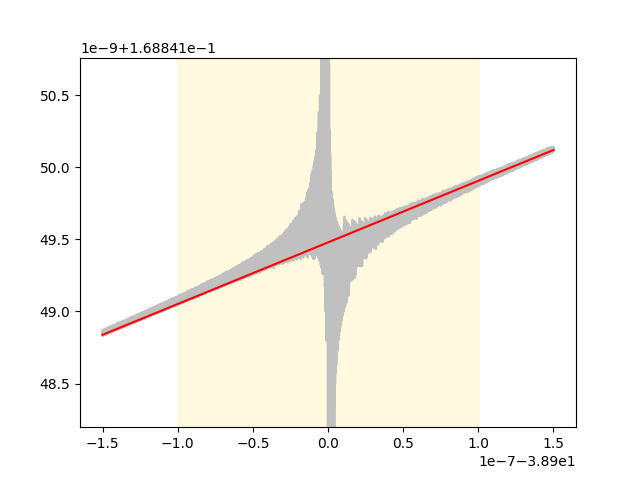

*Singularity point: -14.199999999999999*

 


## Equation 7:
```
slow_delayed_rectifier_potassium_current_xs1_gate__tau_xs1 = 0.001 / (0.00013100000000000001 * (30.0 + membrane__V) / (-1.0 + 7.8538197044216602 * exp(0.068699999999999997 * membrane__V)) + 7.1899999999999999e-5 * (30.0 + membrane__V) / (1.0 - 0.011795938519751569 * exp(-0.14799999999999999 * membrane__V)))
```
### Partially evaluated to: 
```
slow_delayed_rectifier_potassium_current_xs1_gate__tau_xs1 = 0.001 / (0.00013100000000000001 * (30.0 + membrane__V) / (-1.0 + 7.8538197044216602 * exp(0.068699999999999997 * membrane__V)) + 7.1899999999999999e-5 * (30.0 + membrane__V) / (1.0 - 0.011795938519751569 * exp(-0.14799999999999999 * membrane__V)))
```
### Singulariy points detected:
{-30.000000000000000}

*Singularity point: -30.000000000000000*

 


## Equation 8:
```
slow_delayed_rectifier_potassium_current_xs2_gate__tau_xs2 = 0.0040000000000000001 / (0.00013100000000000001 * (30.0 + membrane__V) / (-1.0 + 7.8538197044216602 * exp(0.068699999999999997 * membrane__V)) + 7.1899999999999999e-5 * (30.0 + membrane__V) / (1.0 - 0.011795938519751569 * exp(-0.14799999999999999 * membrane__V)))
```
### Partially evaluated to: 
```
slow_delayed_rectifier_potassium_current_xs2_gate__tau_xs2 = 0.0040000000000000001 / (0.00013100000000000001 * (30.0 + membrane__V) / (-1.0 + 7.8538197044216602 * exp(0.068699999999999997 * membrane__V)) + 7.1899999999999999e-5 * (30.0 + membrane__V) / (1.0 - 0.011795938519751569 * exp(-0.14799999999999999 * membrane__V)))
```
### Singulariy points detected:
{-30.000000000000000}

*Singularity point: -30.000000000000000*

 


# Model: winslow_model_1999
## Equation 1:
```
slow_activating_delayed_rectifiyer_K_current_X_ks_gate__tau_X_ks = 0.001 / (0.00013100000000000001 * (-10.0 + membrane__V) / (-1.0 + 0.50308305662435071 * exp(0.068699999999999997 * membrane__V)) + 7.1899999999999999e-5 * (-10.0 + membrane__V) / (1.0 - 4.3929456809187561 * exp(-0.14799999999999999 * membrane__V)))
```
### Partially evaluated to: 
```
slow_activating_delayed_rectifiyer_K_current_X_ks_gate__tau_X_ks = 0.001 / (0.00013100000000000001 * (-10.0 + membrane__V) / (-1.0 + 0.50308305662435071 * exp(0.068699999999999997 * membrane__V)) + 7.1899999999999999e-5 * (-10.0 + membrane__V) / (1.0 - 4.3929456809187561 * exp(-0.14799999999999999 * membrane__V)))
```
### Singulariy points detected:
{10.000000000000000, 10.000000000000000}

*Singularity point: 10.000000000000000*

 

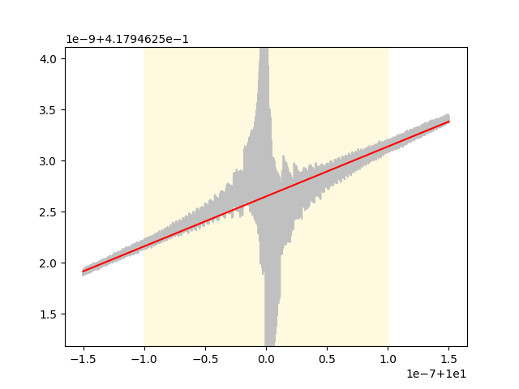

*Singularity point: 10.000000000000000*

 

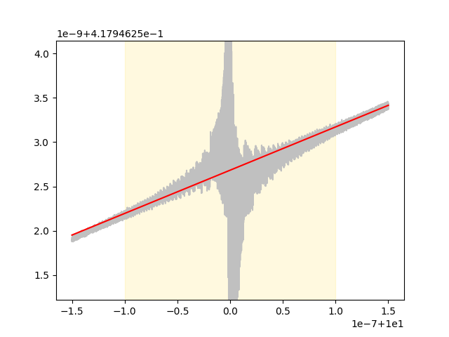

## Equation 2:
```
L_type_Ca_current__i_Ca_max = 4000.0 * pow(membrane__F, 2) * (0.001 * exp(2.0 * membrane__F * membrane__V / (membrane__R * membrane__T)) - 0.34100000000000003 * standard_ionic_concentrations__Cao) * L_type_Ca_current__P_Ca * membrane__V / ((-1.0 + exp(2.0 * membrane__F * membrane__V / (membrane__R * membrane__T))) * membrane__R * membrane__T)
```
### Partially evaluated to: 
```
L_type_Ca_current__i_Ca_max = 4.5147771746328917 * (-0.68200000000000005 + 0.001 * exp(0.074867781645490947 * membrane__V)) * membrane__V / (-1.0 + exp(0.074867781645490947 * membrane__V))
```
### Singulariy points detected:
{0}

*Singularity point: 0*

 

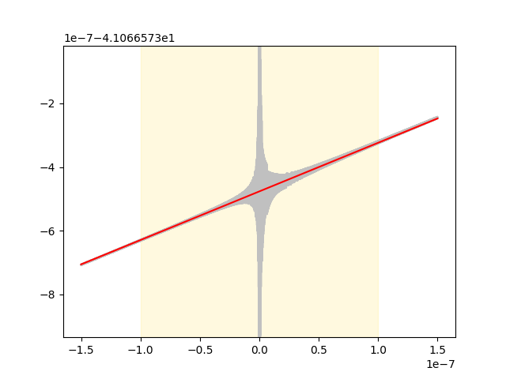

## Equation 3:
```
L_type_Ca_current__i_Ca_K = pow(membrane__F, 2) * (-standard_ionic_concentrations__Ko + intracellular_ion_concentrations__Ki * exp(membrane__F * membrane__V / (membrane__R * membrane__T))) * (L_type_Ca_current__O + L_type_Ca_current__O_Ca) * L_type_Ca_current__p_prime_k * L_type_Ca_current_y_gate__y * membrane__V / ((-1.0 + exp(membrane__F * membrane__V / (membrane__R * membrane__T))) * membrane__R * membrane__T)
```
### Partially evaluated to: 
```
L_type_Ca_current__i_Ca_K = 1.6430234988970467e-26 * (-4.0 + 157.80000000000001 * exp(0.037433890822745473 * membrane__V)) * membrane__V / ((1.0 - 17.036894998614684 * (-0.68200000000000005 + 0.001 * exp(0.074867781645490947 * membrane__V)) * membrane__V / (-1.0 + exp(0.074867781645490947 * membrane__V))) * (-1.0 + exp(0.037433890822745473 * membrane__V)))
```
### Singulariy points detected:
{0}

*Singularity point: 0*

 

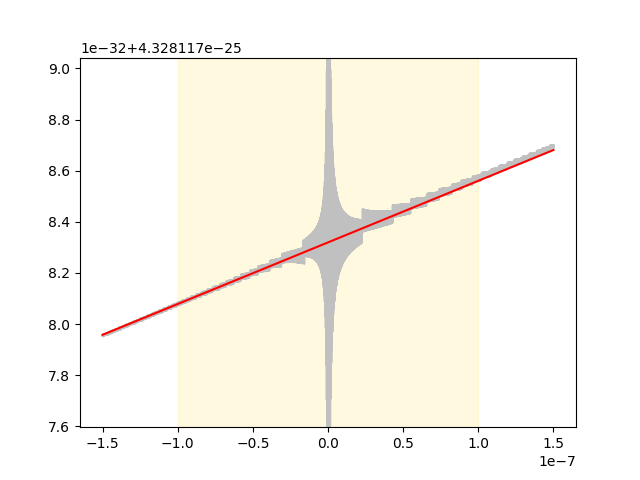

# Model: zhang_SAN_model_2000_0D_capable
## Equation 1:
```
L_type_Ca_channel_d_gate__alpha_d_L = -28.390000000000001 * (35.0 + membrane__V) / (-1.0 + 8.3152871910356788e-7 * exp(-0.40000000000000002 * membrane__V)) - 84.900000000000006 * membrane__V / (-1.0 + exp(-0.20799999999999999 * membrane__V))
```
### Partially evaluated to: 
```
L_type_Ca_channel_d_gate__alpha_d_L = -28.390000000000001 * (35.0 + membrane__V) / (-1.0 + 8.3152871910356788e-7 * exp(-0.40000000000000002 * membrane__V)) - 84.900000000000006 * membrane__V / (-1.0 + exp(-0.20799999999999999 * membrane__V))
```
### Singulariy points detected:
{0, -35.000000000000000}

*Singularity point: 0*

 

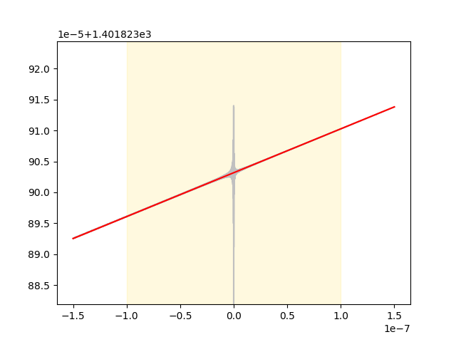

*Singularity point: -35.000000000000000*

 


## Equation 2:
```
L_type_Ca_channel_d_gate__beta_d_L = 11.43 * (-5.0 + membrane__V) / (-1.0 + 0.13533528323661267 * exp(0.40000000000000002 * membrane__V))
```
### Partially evaluated to: 
```
L_type_Ca_channel_d_gate__beta_d_L = 11.43 * (-5.0 + membrane__V) / (-1.0 + 0.13533528323661267 * exp(0.40000000000000002 * membrane__V))
```
### Singulariy points detected:
{5.0000000000000000}

*Singularity point: 5.0000000000000000*

 

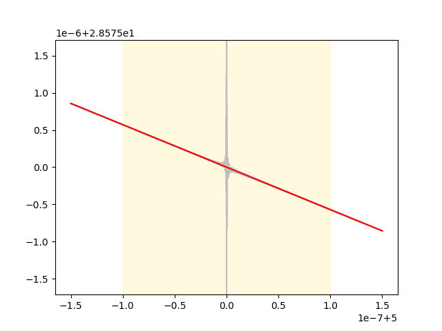

## Equation 3:
```
L_type_Ca_channel_f_gate__alpha_f_L = 3.75 * (28.0 + membrane__V) / (-1.0 + 1096.6331584284585 * exp(0.25 * membrane__V))
```
### Partially evaluated to: 
```
L_type_Ca_channel_f_gate__alpha_f_L = 3.75 * (28.0 + membrane__V) / (-1.0 + 1096.6331584284585 * exp(0.25 * membrane__V))
```
### Singulariy points detected:
{-28.000000000000000}

*Singularity point: -28.000000000000000*

 


## Equation 4:
```
sodium_current__i_Na = pow(membrane__F, 2) * pow(sodium_current_m_gate__m, 3) * (-1.0 + exp((-reversal_and_equilibrium_potentials__E_Na + membrane__V) * membrane__F / (membrane__R * membrane__T))) * ionic_concentrations__Na_o * membrane__V * sodium_current__g_Na * sodium_current_h_gate__h / ((-1.0 + exp(membrane__F * membrane__V / (membrane__R * membrane__T))) * membrane__R * membrane__T)
```
### Partially evaluated to: 
```
sodium_current__i_Na = 0
```
### Singulariy points detected:
{0}

*Singularity point: 0*

 


# Model: zhang_SAN_model_2000_all
## Equation 1:
```
L_type_Ca_channel_d_gate__alpha_d_L = ((membrane__Version == 0) ? (-84.900000000000006 * membrane__V / (-1.0 + exp(-0.20799999999999999 * membrane__V)) - 28.379999999999999 * (35.0 + membrane__V) / (-1.0 + 8.3152871910356788e-7 * exp(-0.40000000000000002 * membrane__V))) : ((membrane__Version == 1.0) ? (-28.390000000000001 * (35.0 + membrane__V) / (-1.0 + 8.3152871910356788e-7 * exp(-0.40000000000000002 * membrane__V)) - 84.900000000000006 * membrane__V / (-1.0 + exp(-0.20799999999999999 * membrane__V))) : (-84.900000000000006 * membrane__V / (-1.0 + exp(-0.20799999999999999 * membrane__V)) - 28.399999999999999 * (35.0 + membrane__V) / (-1.0 + 8.3152871910356788e-7 * exp(-0.40000000000000002 * membrane__V)))))
```
### Partially evaluated to: 
```
L_type_Ca_channel_d_gate__alpha_d_L = -28.390000000000001 * (35.0 + membrane__V) / (-1.0 + 8.3152871910356788e-7 * exp(-0.40000000000000002 * membrane__V)) - 84.900000000000006 * membrane__V / (-1.0 + exp(-0.20799999999999999 * membrane__V))
```
### Singulariy points detected:
{0, -35.000000000000000}

*Singularity point: 0*

 


*Singularity point: -35.000000000000000*

 


## Equation 2:
```
L_type_Ca_channel_d_gate__beta_d_L = ((membrane__Version == 1.0) ? (11.43 * (-5.0 + membrane__V) / (-1.0 + 0.13533528323661267 * exp(0.40000000000000002 * membrane__V))) : (11.42 * (-5.0 + membrane__V) / (-1.0 + 0.13533528323661267 * exp(0.40000000000000002 * membrane__V))))
```
### Partially evaluated to: 
```
L_type_Ca_channel_d_gate__beta_d_L = 11.43 * (-5.0 + membrane__V) / (-1.0 + 0.13533528323661267 * exp(0.40000000000000002 * membrane__V))
```
### Singulariy points detected:
{5.0000000000000000}

*Singularity point: 5.0000000000000000*

 


## Equation 3:
```
L_type_Ca_channel_f_gate__alpha_f_L = ((membrane__Version == 1.0) ? (3.75 * (28.0 + membrane__V) / (-1.0 + 1096.6331584284585 * exp(0.25 * membrane__V))) : (3.1200000000000001 * (28.0 + membrane__V) / (-1.0 + 1096.6331584284585 * exp(0.25 * membrane__V))))
```
### Partially evaluated to: 
```
L_type_Ca_channel_f_gate__alpha_f_L = 3.75 * (28.0 + membrane__V) / (-1.0 + 1096.6331584284585 * exp(0.25 * membrane__V))
```
### Singulariy points detected:
{-28.000000000000000}

*Singularity point: -28.000000000000000*

 


## Equation 4:
```
sodium_current__i_Na = pow(membrane__F, 2) * pow(sodium_current_m_gate__m, 3) * (-1.0 + exp((-reversal_and_equilibrium_potentials__E_Na + membrane__V) * membrane__F / (membrane__R * membrane__T))) * ionic_concentrations__Na_o * membrane__V * sodium_current__g_Na * sodium_current_h_gate__h / ((-1.0 + exp(membrane__F * membrane__V / (membrane__R * membrane__T))) * membrane__R * membrane__T)
```
### Partially evaluated to: 
```
sodium_current__i_Na = 0
```
### Singulariy points detected:
{0}

*Singularity point: 0*

 


=======
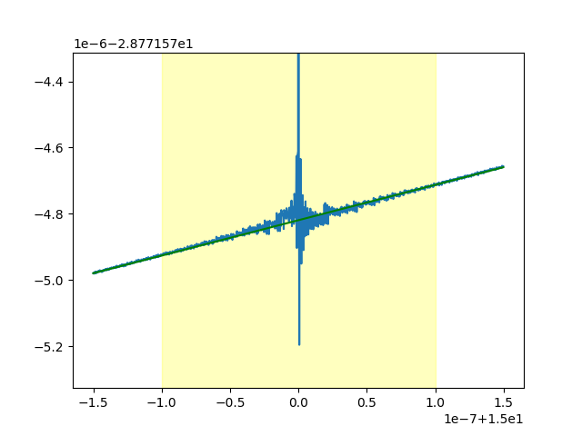
>>>>>>> 4886894fca087044cd81974dd4ceabd738d6a410
