# Model: aslanidi_atrial_model_2009(aslanidi_atrial_model_2009.cellml)
No of piecewises: 6
## Equation 1:
```
L_type_Ca_channel_d_L_gate__alpha_d_L = -50.0 * (10.0 + membrane__V) / (-1.0 + exp(-2.0798668885191347 - 0.20798668885191349 * membrane__V)) - 16.719999999999999 * (45.0 + membrane__V) / (-1.0 + exp(-18.0 - 0.40000000000000002 * membrane__V))
```
## New Eq:
```
L_type_Ca_channel_d_L_gate__alpha_d_L = ((fabs(10.0 + membrane__V) < 4.8080000000089163e-7) ? (-2.4039999999697637e-5 / (-1.0 + exp(-9.9999999999406119e-8)) + (-10399333.942576388 - 1039933.4442576389 * membrane__V) * (2.4040000000391526e-5 / (-1.0 + exp(9.9999999999406119e-8)) + 2.4039999999697637e-5 / (-1.0 + exp(-9.9999999999406119e-8)))) : (-50.0 * (10.0 + membrane__V) / (-1.0 + exp(-2.0798668885191347 - 0.20798668885191349 * membrane__V)))) + ((fabs(45.0 + membrane__V) < 2.5000000000718892e-7) ? (-4.1800000005842713e-6 / (-1.0 + exp(-1.0000000000287557e-7)) + (-89999999.497411996 - 1999999.9999424887 * membrane__V) * (4.1800000005842713e-6 / (-1.0 + exp(-1.0000000000287557e-7)) + 4.1799999996561256e-6 / (-1.0 + exp(1.0000000000287557e-7)))) : (-16.719999999999999 * (45.0 + membrane__V) / (-1.0 + exp(-18.0 - 0.40000000000000002 * membrane__V))))
```
## Singularity point: -10.000000000000000
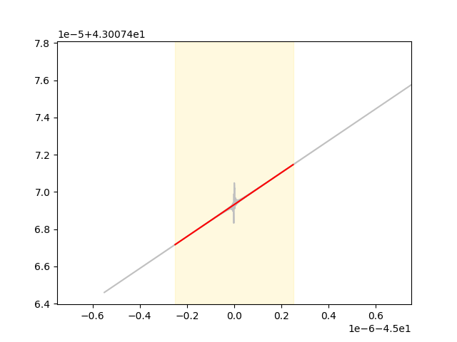

## Singularity point: -45.000000000000000


## Equation 2:
```
L_type_Ca_channel_d_L_gate__beta_d_L = 4.4800000000000004 * (5.0 + membrane__V) / (-1.0 + exp(2.0 + 0.40000000000000002 * membrane__V))
```
## New Eq:
```
L_type_Ca_channel_d_L_gate__beta_d_L = ((fabs(5.0 + membrane__V) < 2.5000000000025002e-7) ? (-1.1200000000011203e-6 / (-1.0 + exp(-9.9999999999406119e-8)) + (10000000.499989999 + 1999999.9999979998 * membrane__V) * (1.1200000000011203e-6 / (-1.0 + exp(9.9999999999406119e-8)) + 1.1200000000011203e-6 / (-1.0 + exp(-9.9999999999406119e-8)))) : (4.4800000000000004 * (5.0 + membrane__V) / (-1.0 + exp(2.0 + 0.40000000000000002 * membrane__V))))
```
## Singularity point: -5.0000000000000000


## Equation 3:
```
L_type_Ca_channel_f_L_gate__alpha_f_L = 8.4900000000000002 * (18.0 + membrane__V) / (-1.0 + exp(4.5 + 0.25 * membrane__V))
```
## New Eq:
```
L_type_Ca_channel_f_L_gate__alpha_f_L = ((fabs(18.0 + membrane__V) < 4.0000000001150227e-7) ? (-3.3960000000976542e-6 / (-1.0 + exp(-1.0000000000287557e-7)) + (22500000.499352999 + 1249999.9999640554 * membrane__V) * (3.3960000000976542e-6 / (-1.0 + exp(1.0000000000287557e-7)) + 3.3960000000976542e-6 / (-1.0 + exp(-1.0000000000287557e-7)))) : (8.4900000000000002 * (18.0 + membrane__V) / (-1.0 + exp(4.5 + 0.25 * membrane__V))))
```
## Singularity point: -18.000000000000000
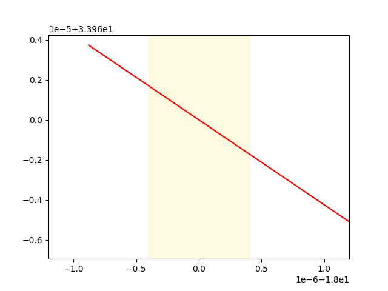


## Equation 4:
```
sodium_current_m_gate__alpha_m = -460.0 * (44.399999999999999 + membrane__V) / (-1.0 + exp(-3.5035114021936398 - 0.078907914463820727 * membrane__V))
```
## New Eq:
```
sodium_current_m_gate__alpha_m = ((fabs(44.399999999999999 + membrane__V) < 1.2672999999963075e-6) ? (-0.00058295799999830145 / (-1.0 + exp(-9.9999999999406119e-8)) + (-17517556.511019241 - 394539.57232025318 * membrane__V) * (0.00058295799999830145 / (-1.0 + exp(9.9999999999406119e-8)) + 0.00058295799999830145 / (-1.0 + exp(-9.9999999999406119e-8)))) : (-460.0 * (44.399999999999999 + membrane__V) / (-1.0 + exp(-3.5035114021936398 - 0.078907914463820727 * membrane__V))))
```
## Singularity point: -44.399999999999999
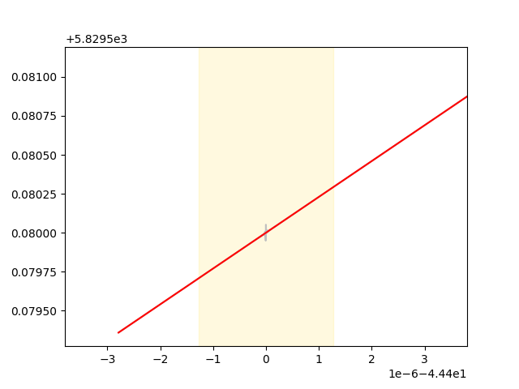


## Equation 5:
```
sodium_current__i_Na = 3635.606491085292 * pow(sodium_current_m_gate__m, 3) * (-1.0 + exp(0.037679754693225945 * membrane__V - log(cleft_space_ion_concentrations__Na_c / intracellular_ion_concentrations__Na_i))) * (0.36499999999999999 * sodium_current_h2_gate__h2 + 0.63500000000000001 * sodium_current_h1_gate__h1) * cleft_space_ion_concentrations__Na_c * membrane__V * sodium_current__P_Na / (-1.0 + exp(0.037679754693225945 * membrane__V))
```
## New Eq:
```
sodium_current__i_Na = ((fabs(membrane__V) < 2.6539450910485349e-6) ? ((0.5 + 188398.77346612973 * membrane__V) * (0.0096486999999999996 * pow(sodium_current_m_gate__m, 3) * (-1.0 + exp(9.9999999999999995e-8 - log(cleft_space_ion_concentrations__Na_c / intracellular_ion_concentrations__Na_i))) * (0.36499999999999999 * sodium_current_h2_gate__h2 + 0.63500000000000001 * sodium_current_h1_gate__h1) * cleft_space_ion_concentrations__Na_c * sodium_current__P_Na / (-1.0 + exp(9.9999999999999995e-8)) + 0.0096486999999999996 * pow(sodium_current_m_gate__m, 3) * (-1.0 + exp(-9.9999999999999995e-8 - log(cleft_space_ion_concentrations__Na_c / intracellular_ion_concentrations__Na_i))) * (0.36499999999999999 * sodium_current_h2_gate__h2 + 0.63500000000000001 * sodium_current_h1_gate__h1) * cleft_space_ion_concentrations__Na_c * sodium_current__P_Na / (-1.0 + exp(-9.9999999999999995e-8))) - 0.0096486999999999996 * pow(sodium_current_m_gate__m, 3) * (-1.0 + exp(-9.9999999999999995e-8 - log(cleft_space_ion_concentrations__Na_c / intracellular_ion_concentrations__Na_i))) * (0.36499999999999999 * sodium_current_h2_gate__h2 + 0.63500000000000001 * sodium_current_h1_gate__h1) * cleft_space_ion_concentrations__Na_c * sodium_current__P_Na / (-1.0 + exp(-9.9999999999999995e-8))) : (3635.606491085292 * pow(sodium_current_m_gate__m, 3) * (-1.0 + exp(0.037679754693225945 * membrane__V - log(cleft_space_ion_concentrations__Na_c / intracellular_ion_concentrations__Na_i))) * (0.36499999999999999 * sodium_current_h2_gate__h2 + 0.63500000000000001 * sodium_current_h1_gate__h1) * cleft_space_ion_concentrations__Na_c * membrane__V * sodium_current__P_Na / (-1.0 + exp(0.037679754693225945 * membrane__V))))
```
## Singularity point: 0


# of singularities:  6
singularity processing time: 32.6968881
# Model: aslanidi_2009(aslanidi_Purkinje_model_2009.cellml)
No of piecewises: 4
## Equation 1:
```
i_Ks_xs1_gate__tau_xs1 = 1 / (7.6100000000000007e-5 * (44.600000000000001 + membrane__V) / (1.0 - exp(-444.66200000000003 - 9.9700000000000006 * membrane__V)) + 0.00036000000000000002 * (-0.55000000000000004 + membrane__V) / (-1.0 + exp(-0.070400000000000004 + 0.128 * membrane__V)))
```
## New Eq:
```
i_Ks_xs1_gate__tau_xs1 = 1 / (((fabs(44.600000000000001 + membrane__V) < 1.0030090258350555e-8) ? (7.6328986866047728e-13 / (1.0 - exp(-9.9999999836342113e-8)) + (-2223310002.262351 - 49850000.061936118 * membrane__V) * (-7.6328986866047728e-13 / (1.0 - exp(9.9999999836342113e-8)) - 7.6328986866047728e-13 / (1.0 - exp(-9.9999999836342113e-8)))) : (7.6100000000000007e-5 * (44.600000000000001 + membrane__V) / (1.0 - exp(-444.66200000000003 - 9.9700000000000006 * membrane__V)))) + ((fabs(-0.55000000000000004 + membrane__V) < 7.8124999999948028e-7) ? (-2.8124999999965681e-10 / (-1.0 + exp(-9.9999999999948221e-8)) + (-351999.50000023417 + 640000.00000042573 * membrane__V) * (2.8124999999996902e-10 / (-1.0 + exp(9.9999999999948221e-8)) + 2.8124999999965681e-10 / (-1.0 + exp(-9.9999999999948221e-8)))) : (0.00036000000000000002 * (-0.55000000000000004 + membrane__V) / (-1.0 + exp(-0.070400000000000004 + 0.128 * membrane__V)))))
```
## Singularity point: -44.600000000000001
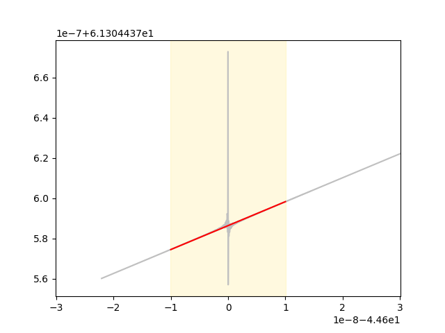

## Singularity point: 0.55000000000000004
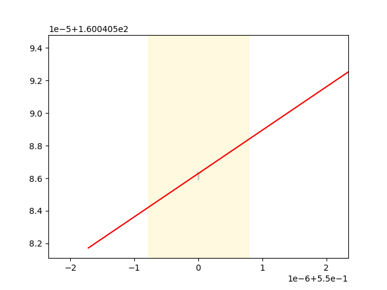


## Equation 2:
```
i_Ks_xs2_gate__tau_xs2 = 2.0 / (7.6100000000000007e-5 * (44.600000000000001 + membrane__V) / (1.0 - exp(-444.66200000000003 - 9.9700000000000006 * membrane__V)) + 0.00036000000000000002 * (-0.55000000000000004 + membrane__V) / (-1.0 + exp(-0.070400000000000004 + 0.128 * membrane__V)))
```
## New Eq:
```
i_Ks_xs2_gate__tau_xs2 = 2.0 / (((fabs(44.600000000000001 + membrane__V) < 1.0030090258350555e-8) ? (7.6328986866047728e-13 / (1.0 - exp(-9.9999999836342113e-8)) + (-2223310002.262351 - 49850000.061936118 * membrane__V) * (-7.6328986866047728e-13 / (1.0 - exp(9.9999999836342113e-8)) - 7.6328986866047728e-13 / (1.0 - exp(-9.9999999836342113e-8)))) : (7.6100000000000007e-5 * (44.600000000000001 + membrane__V) / (1.0 - exp(-444.66200000000003 - 9.9700000000000006 * membrane__V)))) + ((fabs(-0.55000000000000004 + membrane__V) < 7.8124999999948028e-7) ? (-2.8124999999965681e-10 / (-1.0 + exp(-9.9999999999948221e-8)) + (-351999.50000023417 + 640000.00000042573 * membrane__V) * (2.8124999999996902e-10 / (-1.0 + exp(9.9999999999948221e-8)) + 2.8124999999965681e-10 / (-1.0 + exp(-9.9999999999948221e-8)))) : (0.00036000000000000002 * (-0.55000000000000004 + membrane__V) / (-1.0 + exp(-0.070400000000000004 + 0.128 * membrane__V)))))
```
## Singularity point: -44.600000000000001
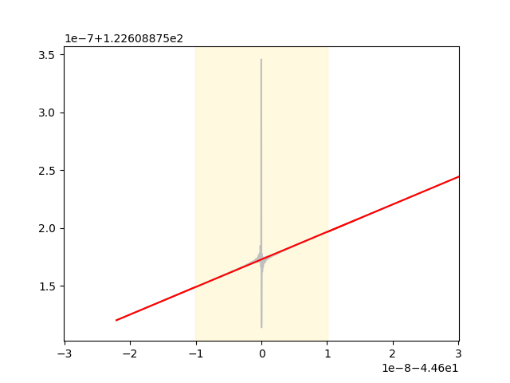

## Singularity point: 0.55000000000000004
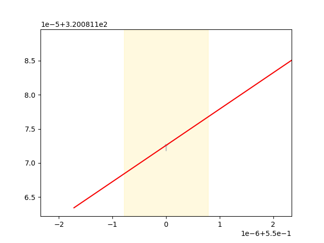


## Equation 3:
```
i_Na_L_m_L_gate__alpha_m_L = 0.32000000000000001 * (47.130000000000003 + membrane__V) / (1.0 - exp(-4.7130000000000001 - 0.10000000000000001 * membrane__V))
```
## New Eq:
```
i_Na_L_m_L_gate__alpha_m_L = ((fabs(47.130000000000003 + membrane__V) < 1.0000000000287557e-6) ? (3.200000000092018e-7 / (1.0 - exp(-1.0000000000287557e-7)) + (-23564999.499322373 - 499999.99998562218 * membrane__V) * (-3.200000000092018e-7 / (1.0 - exp(1.0000000000287557e-7)) - 3.200000000092018e-7 / (1.0 - exp(-1.0000000000287557e-7)))) : (0.32000000000000001 * (47.130000000000003 + membrane__V) / (1.0 - exp(-4.7130000000000001 - 0.10000000000000001 * membrane__V))))
```
## Singularity point: -47.130000000000003
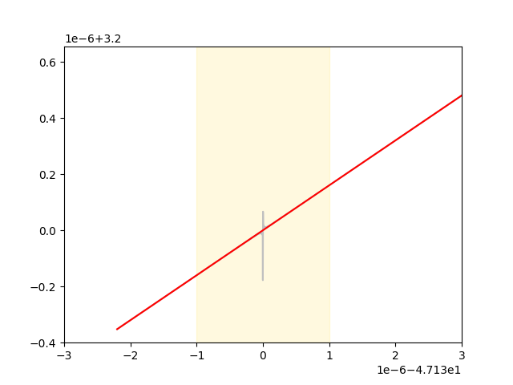


## Equation 4:
```
i_Na_m_gate__alpha_m = 0.32000000000000001 * (47.130000000000003 + membrane__V) / (1.0 - exp(-4.7130000000000001 - 0.10000000000000001 * membrane__V))
```
## New Eq:
```
i_Na_m_gate__alpha_m = ((fabs(47.130000000000003 + membrane__V) < 1.0000000000287557e-6) ? (3.200000000092018e-7 / (1.0 - exp(-1.0000000000287557e-7)) + (-23564999.499322373 - 499999.99998562218 * membrane__V) * (-3.200000000092018e-7 / (1.0 - exp(1.0000000000287557e-7)) - 3.200000000092018e-7 / (1.0 - exp(-1.0000000000287557e-7)))) : (0.32000000000000001 * (47.130000000000003 + membrane__V) / (1.0 - exp(-4.7130000000000001 - 0.10000000000000001 * membrane__V))))
```
## Singularity point: -47.130000000000003


## Equation 5:
```
i_to_2__i_to_2_max = 0.0014448004881001341 * (-100.0 * exp(0.037435883507802616 * membrane__V) + intracellular_ion_concentrations__Cl_i) * membrane__V / (1.0 - exp(0.037435883507802616 * membrane__V))
```
## New Eq:
```
i_to_2__i_to_2_max = ((fabs(membrane__V) < 2.6712338705498262e-6) ? ((0.5 + 187179.41753901311 * membrane__V) * (3.8593999999999993e-9 * (-100.0 * exp(9.9999999999999995e-8) + intracellular_ion_concentrations__Cl_i) / (1.0 - exp(9.9999999999999995e-8)) + 3.8593999999999993e-9 * (-100.0 * exp(-9.9999999999999995e-8) + intracellular_ion_concentrations__Cl_i) / (1.0 - exp(-9.9999999999999995e-8))) - 3.8593999999999993e-9 * (-100.0 * exp(-9.9999999999999995e-8) + intracellular_ion_concentrations__Cl_i) / (1.0 - exp(-9.9999999999999995e-8))) : (0.0014448004881001341 * (-100.0 * exp(0.037435883507802616 * membrane__V) + intracellular_ion_concentrations__Cl_i) * membrane__V / (1.0 - exp(0.037435883507802616 * membrane__V))))
```
## Singularity point: 0
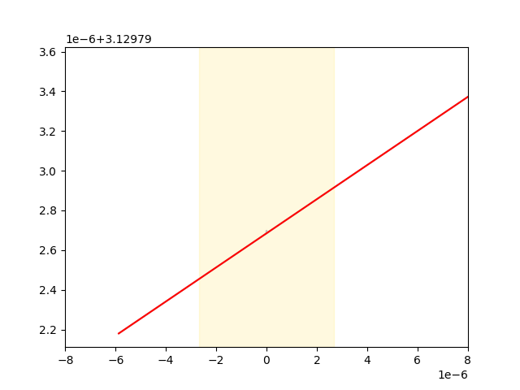


## Equation 6:
```
background_currents__i_Ca_b = 0.0028824983370007683 * (-0.34100000000000003 * model_parameters__Ca_o + Ca_i__Ca_i * exp(0.074871767015605231 * membrane__V)) * membrane__V / (-1.0 + exp(0.074871767015605231 * membrane__V))
```
## New Eq:
```
background_currents__i_Ca_b = ((fabs(membrane__V) < 1.3356169352749131e-6) ? ((0.5 + 374358.83507802623 * membrane__V) * (3.8499135947999997e-9 * (-0.34100000000000003 * model_parameters__Ca_o + Ca_i__Ca_i * exp(9.9999999999999995e-8)) / (-1.0 + exp(9.9999999999999995e-8)) + 3.8499135947999997e-9 * (-0.34100000000000003 * model_parameters__Ca_o + Ca_i__Ca_i * exp(-9.9999999999999995e-8)) / (-1.0 + exp(-9.9999999999999995e-8))) - 3.8499135947999997e-9 * (-0.34100000000000003 * model_parameters__Ca_o + Ca_i__Ca_i * exp(-9.9999999999999995e-8)) / (-1.0 + exp(-9.9999999999999995e-8))) : (0.0028824983370007683 * (-0.34100000000000003 * model_parameters__Ca_o + Ca_i__Ca_i * exp(0.074871767015605231 * membrane__V)) * membrane__V / (-1.0 + exp(0.074871767015605231 * membrane__V))))
```
## Singularity point: 0


## Equation 7:
```
i_Ca_L__i_Ca_L_max = 3.510865186083326 * (-15.0 + membrane__V) * (-0.34100000000000003 * model_parameters__Ca_o + Ca_r__Ca_r * exp(-1.1230765052340785 + 0.074871767015605231 * membrane__V)) / (-1.0 + exp(-1.1230765052340785 + 0.074871767015605231 * membrane__V))
```
## New Eq:
```
i_Ca_L__i_Ca_L_max = ((fabs(-15.0 + membrane__V) < 1.3356169352718439e-6) ? ((-5615382.0261832969 + 374358.83507888648 * membrane__V) * (4.6891709999892238e-6 * (-0.34100000000000003 * model_parameters__Ca_o + Ca_r__Ca_r * exp(9.9999999999406119e-8)) / (-1.0 + exp(9.9999999999406119e-8)) + 4.6891709999892238e-6 * (-0.34100000000000003 * model_parameters__Ca_o + Ca_r__Ca_r * exp(-9.9999999999406119e-8)) / (-1.0 + exp(-9.9999999999406119e-8))) - 4.6891709999892238e-6 * (-0.34100000000000003 * model_parameters__Ca_o + Ca_r__Ca_r * exp(-9.9999999999406119e-8)) / (-1.0 + exp(-9.9999999999406119e-8))) : (3.510865186083326 * (-15.0 + membrane__V) * (-0.34100000000000003 * model_parameters__Ca_o + Ca_r__Ca_r * exp(-1.1230765052340785 + 0.074871767015605231 * membrane__V)) / (-1.0 + exp(-1.1230765052340785 + 0.074871767015605231 * membrane__V))))
```
## Singularity point: 15.000000000000000
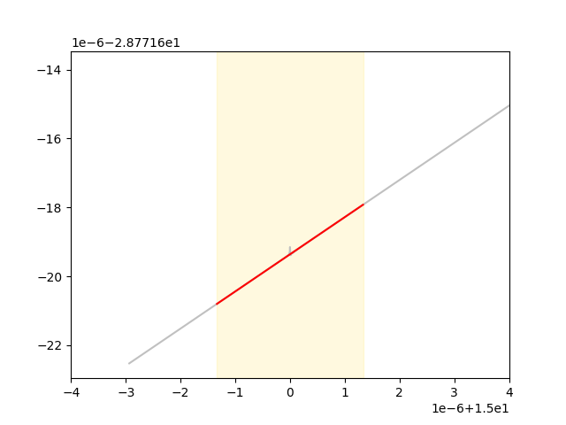


# of singularities:  9
singularity processing time: 56.4180523
# Model: beeler_reuter_model_1977(beeler_reuter_model_1977.cellml)
No of piecewises: 0
## Equation 1:
```
sodium_current_m_gate__alpha_m = -(47.0 + membrane__V) / (-1.0 + exp(-4.7000000000000002 - 0.10000000000000001 * membrane__V))
```
## New Eq:
```
sodium_current_m_gate__alpha_m = ((fabs(47.0 + membrane__V) < 1.0000000000287557e-6) ? (-1.0000000000287557e-6 / (-1.0 + exp(-1.0000000000287557e-7)) + (-23499999.499324244 - 499999.99998562218 * membrane__V) * (1.0000000000287557e-6 / (-1.0 + exp(1.0000000000287557e-7)) + 1.0000000000287557e-6 / (-1.0 + exp(-1.0000000000287557e-7)))) : (-(47.0 + membrane__V) / (-1.0 + exp(-4.7000000000000002 - 0.10000000000000001 * membrane__V))))
```
## Singularity point: -47.000000000000000
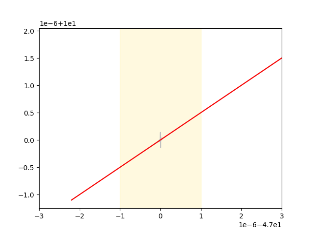


## Equation 2:
```
time_independent_outward_current__i_K1 = (4.0 * (-1.0 + exp(3.3999999999999999 + 0.040000000000000001 * membrane__V)) / (exp(2.1200000000000001 + 0.040000000000000001 * membrane__V) + exp(4.2400000000000002 + 0.080000000000000002 * membrane__V)) + 0.20000000000000001 * (23.0 + membrane__V) / (1.0 - exp(-0.92000000000000004 - 0.040000000000000001 * membrane__V))) * time_independent_outward_current__G_K1
```
## New Eq:
```
time_independent_outward_current__i_K1 = (4.0 * (-1.0 + exp(3.3999999999999999 + 0.040000000000000001 * membrane__V)) / (exp(2.1200000000000001 + 0.040000000000000001 * membrane__V) + exp(4.2400000000000002 + 0.080000000000000002 * membrane__V)) + ((fabs(23.0 + membrane__V) < 2.500000000016378e-6) ? (5.0000000000327567e-7 / (1.0 - exp(-1.0000000000027348e-7)) + (-4599999.4999698643 - 199999.99999868975 * membrane__V) * (-5.0000000000327567e-7 / (1.0 - exp(1.0000000000027348e-7)) - 5.0000000000327567e-7 / (1.0 - exp(-1.0000000000027348e-7)))) : (0.20000000000000001 * (23.0 + membrane__V) / (1.0 - exp(-0.92000000000000004 - 0.040000000000000001 * membrane__V))))) * time_independent_outward_current__G_K1
```
## Singularity point: -23.000000000000000
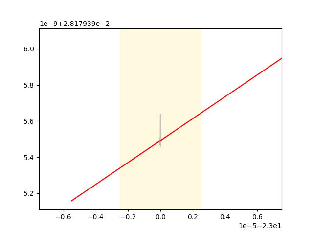


# of singularities:  2
singularity processing time: 13.1791336
# Model: benson_epicardial_2008(benson_epicardial_2008.cellml)
No of piecewises: 7
## Equation 1:
```
ICaL__ibarca = 14448.004881000332 * (-15.0 + cell__V) * (-0.34100000000000003 * Environment__Ca_o + Ca__Ca_ss * exp(-1.1230765052339999 + 0.074871767015599999 * cell__V)) * ICaL__pca / (-1.0 + exp(-1.1230765052339999 + 0.074871767015599999 * cell__V))
```
## New Eq:
```
ICaL__ibarca = ((fabs(-15.0 + cell__V) < 1.3356169352718439e-6) ? ((-5615382.0261832969 + 374358.83507888648 * cell__V) * (0.019296999999954306 * (-0.34100000000000003 * Environment__Ca_o + Ca__Ca_ss * exp(9.9999999999406119e-8)) * ICaL__pca / (-1.0 + exp(9.9999999999406119e-8)) + 0.019296999999954306 * (-0.34100000000000003 * Environment__Ca_o + Ca__Ca_ss * exp(-9.9999999999406119e-8)) * ICaL__pca / (-1.0 + exp(-9.9999999999406119e-8))) - 0.019296999999954306 * (-0.34100000000000003 * Environment__Ca_o + Ca__Ca_ss * exp(-9.9999999999406119e-8)) * ICaL__pca / (-1.0 + exp(-9.9999999999406119e-8))) : (14448.004881000332 * (-15.0 + cell__V) * (-0.34100000000000003 * Environment__Ca_o + Ca__Ca_ss * exp(-1.1230765052339999 + 0.074871767015599999 * cell__V)) * ICaL__pca / (-1.0 + exp(-1.1230765052339999 + 0.074871767015599999 * cell__V))))
```
## Singularity point: 15.000000000000000


## Equation 2:
```
ICab__ICab = 0.0028824983370005666 * (-0.34100000000000003 * Environment__Ca_o + Ca__Ca_i * exp(0.074871767015599999 * cell__V)) * cell__V / (-1.0 + exp(0.074871767015599999 * cell__V))
```
## New Eq:
```
ICab__ICab = ((fabs(cell__V) < 1.3356169352750065e-6) ? ((0.5 + 374358.83507800003 * cell__V) * (3.8499135947999997e-9 * (-0.34100000000000003 * Environment__Ca_o + Ca__Ca_i * exp(9.9999999999999995e-8)) / (-1.0 + exp(9.9999999999999995e-8)) + 3.8499135947999997e-9 * (-0.34100000000000003 * Environment__Ca_o + Ca__Ca_i * exp(-9.9999999999999995e-8)) / (-1.0 + exp(-9.9999999999999995e-8))) - 3.8499135947999997e-9 * (-0.34100000000000003 * Environment__Ca_o + Ca__Ca_i * exp(-9.9999999999999995e-8)) / (-1.0 + exp(-9.9999999999999995e-8))) : (0.0028824983370005666 * (-0.34100000000000003 * Environment__Ca_o + Ca__Ca_i * exp(0.074871767015599999 * cell__V)) * cell__V / (-1.0 + exp(0.074871767015599999 * cell__V))))
```
## Singularity point: 0


## Equation 3:
```
IKr__tauxr = 1 / (0.00029999999999999997 * (38.360799999999998 + cell__V) / (-1.0 + exp(5.8385137599999997 + 0.1522 * cell__V)) + 0.00059999999999999995 * (-1.7383999999999999 + cell__V) / (1.0 - exp(0.2364224 - 0.13600000000000001 * cell__V)))
```
## New Eq:
```
IKr__tauxr = 1 / (((fabs(-1.7383999999999999 + cell__V) < 7.352941176468758e-7) ? (4.4117647058812543e-10 / (1.0 - exp(-1.0000000000005664e-7)) + (1182112.5000002943 - 680000.00000016927 * cell__V) * (-4.4117647058812543e-10 / (1.0 - exp(1.0000000000005664e-7)) - 4.4117647058812543e-10 / (1.0 - exp(-1.0000000000005664e-7)))) : (0.00059999999999999995 * (-1.7383999999999999 + cell__V) / (1.0 - exp(0.2364224 - 0.13600000000000001 * cell__V)))) + ((fabs(38.360799999999998 + cell__V) < 6.5703022339436146e-7) ? (-1.9710906701830842e-10 / (-1.0 + exp(-1.0000000000287557e-7)) + (29192569.299818475 + 760999.99999526795 * cell__V) * (1.9710906701830842e-10 / (-1.0 + exp(1.0000000000287557e-7)) + 1.9710906701830842e-10 / (-1.0 + exp(-1.0000000000287557e-7)))) : (0.00029999999999999997 * (38.360799999999998 + cell__V) / (-1.0 + exp(5.8385137599999997 + 0.1522 * cell__V)))))
```
## Singularity point: -38.360799999999998
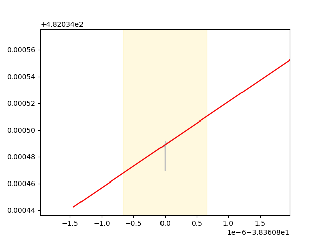

## Singularity point: 1.7383999999999999
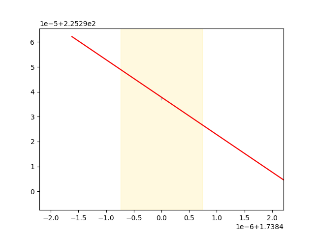


## Equation 4:
```
IKs__tauxs = 1 / (7.6100000000000007e-5 * (44.600000000000001 + cell__V) / (1.0 - exp(-444.66200000000003 - 9.9700000000000006 * cell__V)) + 0.00036000000000000002 * (-0.55000000000000004 + cell__V) / (-1.0 + exp(-0.070400000000000004 + 0.128 * cell__V)))
```
## New Eq:
```
IKs__tauxs = 1 / (((fabs(44.600000000000001 + cell__V) < 1.0030090258350555e-8) ? (7.6328986866047728e-13 / (1.0 - exp(-9.9999999836342113e-8)) + (-2223310002.262351 - 49850000.061936118 * cell__V) * (-7.6328986866047728e-13 / (1.0 - exp(9.9999999836342113e-8)) - 7.6328986866047728e-13 / (1.0 - exp(-9.9999999836342113e-8)))) : (7.6100000000000007e-5 * (44.600000000000001 + cell__V) / (1.0 - exp(-444.66200000000003 - 9.9700000000000006 * cell__V)))) + ((fabs(-0.55000000000000004 + cell__V) < 7.8124999999948028e-7) ? (-2.8124999999965681e-10 / (-1.0 + exp(-9.9999999999948221e-8)) + (-351999.50000023417 + 640000.00000042573 * cell__V) * (2.8124999999996902e-10 / (-1.0 + exp(9.9999999999948221e-8)) + 2.8124999999965681e-10 / (-1.0 + exp(-9.9999999999948221e-8)))) : (0.00036000000000000002 * (-0.55000000000000004 + cell__V) / (-1.0 + exp(-0.070400000000000004 + 0.128 * cell__V)))))
```
## Singularity point: 0.55000000000000004


## Singularity point: -44.600000000000001
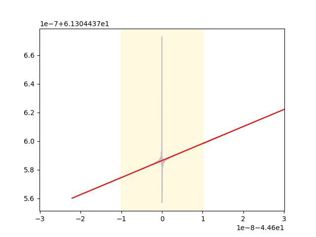


## Equation 5:
```
INa__am = 0.32000000000000001 * (47.130000000000003 + cell__V) / (1.0 - exp(-4.7130000000000001 - 0.10000000000000001 * cell__V))
```
## New Eq:
```
INa__am = ((fabs(47.130000000000003 + cell__V) < 1.0000000000287557e-6) ? (3.200000000092018e-7 / (1.0 - exp(-1.0000000000287557e-7)) + (-23564999.499322373 - 499999.99998562218 * cell__V) * (-3.200000000092018e-7 / (1.0 - exp(1.0000000000287557e-7)) - 3.200000000092018e-7 / (1.0 - exp(-1.0000000000287557e-7)))) : (0.32000000000000001 * (47.130000000000003 + cell__V) / (1.0 - exp(-4.7130000000000001 - 0.10000000000000001 * cell__V))))
```
## Singularity point: -47.130000000000003


## Equation 6:
```
INal__amL = 0.32000000000000001 * (47.130000000000003 + cell__V) / (1.0 - exp(-4.7130000000000001 - 0.10000000000000001 * cell__V))
```
## New Eq:
```
INal__amL = ((fabs(47.130000000000003 + cell__V) < 1.0000000000287557e-6) ? (3.200000000092018e-7 / (1.0 - exp(-1.0000000000287557e-7)) + (-23564999.499322373 - 499999.99998562218 * cell__V) * (-3.200000000092018e-7 / (1.0 - exp(1.0000000000287557e-7)) - 3.200000000092018e-7 / (1.0 - exp(-1.0000000000287557e-7)))) : (0.32000000000000001 * (47.130000000000003 + cell__V) / (1.0 - exp(-4.7130000000000001 - 0.10000000000000001 * cell__V))))
```
## Singularity point: -47.130000000000003


## Equation 7:
```
Ito2__Ito2_max = 0.001444800488100033 * (-100.0 * exp(0.0374358835078 * cell__V) + Cl__Cl_i) * cell__V / (1.0 - exp(0.0374358835078 * cell__V))
```
## New Eq:
```
Ito2__Ito2_max = ((fabs(cell__V) < 2.671233870550013e-6) ? ((0.5 + 187179.41753900002 * cell__V) * (3.8593999999999993e-9 * (-100.0 * exp(9.9999999999999995e-8) + Cl__Cl_i) / (1.0 - exp(9.9999999999999995e-8)) + 3.8593999999999993e-9 * (-100.0 * exp(-9.9999999999999995e-8) + Cl__Cl_i) / (1.0 - exp(-9.9999999999999995e-8))) - 3.8593999999999993e-9 * (-100.0 * exp(-9.9999999999999995e-8) + Cl__Cl_i) / (1.0 - exp(-9.9999999999999995e-8))) : (0.001444800488100033 * (-100.0 * exp(0.0374358835078 * cell__V) + Cl__Cl_i) * cell__V / (1.0 - exp(0.0374358835078 * cell__V))))
```
## Singularity point: 0


# of singularities:  9
singularity processing time: 55.05925880000001
# Model: bernus_wilders_zemlin_verschelde_panfilov_2002_version01(bernus_wilders_zemlin_verschelde_panfilov_2002.cellml)
No of piecewises: 0
## Equation 1:
```
sodium_current_m_gate__alpha_m = 0.32000000000000001 * (47.130000000000003 + membrane__V) / (1.0 - exp(-4.7130000000000001 - 0.10000000000000001 * membrane__V))
```
## New Eq:
```
sodium_current_m_gate__alpha_m = ((fabs(47.130000000000003 + membrane__V) < 1.0000000000287557e-6) ? (3.200000000092018e-7 / (1.0 - exp(-1.0000000000287557e-7)) + (-23564999.499322373 - 499999.99998562218 * membrane__V) * (-3.200000000092018e-7 / (1.0 - exp(1.0000000000287557e-7)) - 3.200000000092018e-7 / (1.0 - exp(-1.0000000000287557e-7)))) : (0.32000000000000001 * (47.130000000000003 + membrane__V) / (1.0 - exp(-4.7130000000000001 - 0.10000000000000001 * membrane__V))))
```
## Singularity point: -47.130000000000003


# of singularities:  1
singularity processing time: 5.065618700000016
# Model: bondarenko_2004_apical(bondarenko_szigeti_bett_kim_rasmusson_2004_apical.cellml)
No of piecewises: 0
## Equation 1:
```
slow_delayed_rectifier_potassium_current__alpha_n = 4.8133299999999997e-6 * (26.5 + membrane__V) / (1.0 - exp(-3.3919999999999999 - 0.128 * membrane__V))
```
## New Eq:
```
slow_delayed_rectifier_potassium_current__alpha_n = ((fabs(26.5 + membrane__V) < 7.8124999999817923e-7) ? (3.7604140624912359e-12 / (1.0 - exp(-9.9999999999406119e-8)) + (-16959999.500039525 - 640000.00000149151 * membrane__V) * (-3.7604140624912359e-12 / (1.0 - exp(9.9999999999406119e-8)) - 3.7604140624912359e-12 / (1.0 - exp(-9.9999999999406119e-8)))) : (4.8133299999999997e-6 * (26.5 + membrane__V) / (1.0 - exp(-3.3919999999999999 - 0.128 * membrane__V))))
```
## Singularity point: -26.500000000000000
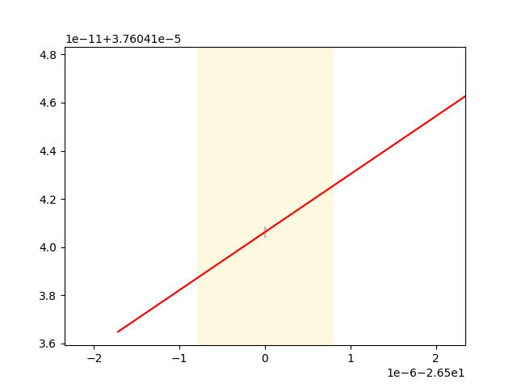


# of singularities:  1
singularity processing time: 5.1898166
# Model: bondarenko_2004_septum(bondarenko_szigeti_bett_kim_rasmusson_2004_septal.cellml)
No of piecewises: 0
## Equation 1:
```
slow_delayed_rectifier_potassium_current__alpha_n = 4.8133299999999997e-6 * (26.5 + membrane__V) / (1.0 - exp(-3.3919999999999999 - 0.128 * membrane__V))
```
## New Eq:
```
slow_delayed_rectifier_potassium_current__alpha_n = ((fabs(26.5 + membrane__V) < 7.8124999999817923e-7) ? (3.7604140624912359e-12 / (1.0 - exp(-9.9999999999406119e-8)) + (-16959999.500039525 - 640000.00000149151 * membrane__V) * (-3.7604140624912359e-12 / (1.0 - exp(9.9999999999406119e-8)) - 3.7604140624912359e-12 / (1.0 - exp(-9.9999999999406119e-8)))) : (4.8133299999999997e-6 * (26.5 + membrane__V) / (1.0 - exp(-3.3919999999999999 - 0.128 * membrane__V))))
```
## Singularity point: -26.500000000000000


# of singularities:  1
singularity processing time: 4.9488001
# Model: bueno_2007(bueno_2007_endo.cellml)
No of piecewises: 5
# of singularities:  0
singularity processing time: 0.018475600000016357
# Model: bueno_2007(bueno_2007_epi.cellml)
No of piecewises: 5
# of singularities:  0
singularity processing time: 0.019359699999995428
# Model: Carro_Rodriguez_Laguna_Pueyo_CinC2010_EPI(carro_2011_endo.cellml)
No of piecewises: 4
## Equation 1:
```
L_Type_Calcium_Current__Ibar_Ca_j = 0.71831868267118426 * (-Calcium_Concentrations__Ca_o + Calcium_Concentrations__Ca_j * exp(0.074871767015605231 * membrane__V)) * L_Type_Calcium_Current__P_scale * membrane__V / (-1.0 + exp(0.074871767015605231 * membrane__V))
```
## New Eq:
```
L_Type_Calcium_Current__Ibar_Ca_j = ((fabs(membrane__V) < 1.3356169352749131e-6) ? ((0.5 + 374358.83507802623 * membrane__V) * (9.5939859749999992e-7 * (-Calcium_Concentrations__Ca_o + Calcium_Concentrations__Ca_j * exp(9.9999999999999995e-8)) * L_Type_Calcium_Current__P_scale / (-1.0 + exp(9.9999999999999995e-8)) + 9.5939859749999992e-7 * (-Calcium_Concentrations__Ca_o + Calcium_Concentrations__Ca_j * exp(-9.9999999999999995e-8)) * L_Type_Calcium_Current__P_scale / (-1.0 + exp(-9.9999999999999995e-8))) - 9.5939859749999992e-7 * (-Calcium_Concentrations__Ca_o + Calcium_Concentrations__Ca_j * exp(-9.9999999999999995e-8)) * L_Type_Calcium_Current__P_scale / (-1.0 + exp(-9.9999999999999995e-8))) : (0.71831868267118426 * (-Calcium_Concentrations__Ca_o + Calcium_Concentrations__Ca_j * exp(0.074871767015605231 * membrane__V)) * L_Type_Calcium_Current__P_scale * membrane__V / (-1.0 + exp(0.074871767015605231 * membrane__V))))
```
## Singularity point: 0


## Equation 2:
```
L_Type_Calcium_Current__Ibar_Ca_sl = 0.71831868267118426 * (-Calcium_Concentrations__Ca_o + Calcium_Concentrations__Ca_sl * exp(0.074871767015605231 * membrane__V)) * L_Type_Calcium_Current__P_scale * membrane__V / (-1.0 + exp(0.074871767015605231 * membrane__V))
```
## New Eq:
```
L_Type_Calcium_Current__Ibar_Ca_sl = ((fabs(membrane__V) < 1.3356169352749131e-6) ? ((0.5 + 374358.83507802623 * membrane__V) * (9.5939859749999992e-7 * (-Calcium_Concentrations__Ca_o + Calcium_Concentrations__Ca_sl * exp(9.9999999999999995e-8)) * L_Type_Calcium_Current__P_scale / (-1.0 + exp(9.9999999999999995e-8)) + 9.5939859749999992e-7 * (-Calcium_Concentrations__Ca_o + Calcium_Concentrations__Ca_sl * exp(-9.9999999999999995e-8)) * L_Type_Calcium_Current__P_scale / (-1.0 + exp(-9.9999999999999995e-8))) - 9.5939859749999992e-7 * (-Calcium_Concentrations__Ca_o + Calcium_Concentrations__Ca_sl * exp(-9.9999999999999995e-8)) * L_Type_Calcium_Current__P_scale / (-1.0 + exp(-9.9999999999999995e-8))) : (0.71831868267118426 * (-Calcium_Concentrations__Ca_o + Calcium_Concentrations__Ca_sl * exp(0.074871767015605231 * membrane__V)) * L_Type_Calcium_Current__P_scale * membrane__V / (-1.0 + exp(0.074871767015605231 * membrane__V))))
```
## Singularity point: 0
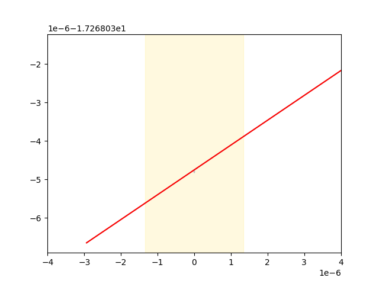


## Equation 3:
```
L_Type_Calcium_Current__Ibar_K = 0.00019748616671718709 * (-Potassium_Concentrations__K_o + Potassium_Concentrations__K_i * exp(0.037435883507802616 * membrane__V)) * L_Type_Calcium_Current__P_scale * membrane__V / (-1.0 + exp(0.037435883507802616 * membrane__V))
```
## New Eq:
```
L_Type_Calcium_Current__Ibar_K = ((fabs(membrane__V) < 2.6712338705498262e-6) ? ((0.5 + 187179.41753901311 * membrane__V) * (5.2753173749999997e-10 * (-Potassium_Concentrations__K_o + Potassium_Concentrations__K_i * exp(9.9999999999999995e-8)) * L_Type_Calcium_Current__P_scale / (-1.0 + exp(9.9999999999999995e-8)) + 5.2753173749999997e-10 * (-Potassium_Concentrations__K_o + Potassium_Concentrations__K_i * exp(-9.9999999999999995e-8)) * L_Type_Calcium_Current__P_scale / (-1.0 + exp(-9.9999999999999995e-8))) - 5.2753173749999997e-10 * (-Potassium_Concentrations__K_o + Potassium_Concentrations__K_i * exp(-9.9999999999999995e-8)) * L_Type_Calcium_Current__P_scale / (-1.0 + exp(-9.9999999999999995e-8))) : (0.00019748616671718709 * (-Potassium_Concentrations__K_o + Potassium_Concentrations__K_i * exp(0.037435883507802616 * membrane__V)) * L_Type_Calcium_Current__P_scale * membrane__V / (-1.0 + exp(0.037435883507802616 * membrane__V))))
```
## Singularity point: 0


## Equation 4:
```
L_Type_Calcium_Current__Ibar_Na_j = 1.0971453706510394e-5 * (-Sodium_Concentrations__Na_o + Sodium_Concentrations__Na_j * exp(0.037435883507802616 * membrane__V)) * L_Type_Calcium_Current__P_scale * membrane__V / (-1.0 + exp(0.037435883507802616 * membrane__V))
```
## New Eq:
```
L_Type_Calcium_Current__Ibar_Na_j = ((fabs(membrane__V) < 2.6712338705498262e-6) ? ((0.5 + 187179.41753901311 * membrane__V) * (2.9307318749999998e-11 * (-Sodium_Concentrations__Na_o + Sodium_Concentrations__Na_j * exp(9.9999999999999995e-8)) * L_Type_Calcium_Current__P_scale / (-1.0 + exp(9.9999999999999995e-8)) + 2.9307318749999998e-11 * (-Sodium_Concentrations__Na_o + Sodium_Concentrations__Na_j * exp(-9.9999999999999995e-8)) * L_Type_Calcium_Current__P_scale / (-1.0 + exp(-9.9999999999999995e-8))) - 2.9307318749999998e-11 * (-Sodium_Concentrations__Na_o + Sodium_Concentrations__Na_j * exp(-9.9999999999999995e-8)) * L_Type_Calcium_Current__P_scale / (-1.0 + exp(-9.9999999999999995e-8))) : (1.0971453706510394e-5 * (-Sodium_Concentrations__Na_o + Sodium_Concentrations__Na_j * exp(0.037435883507802616 * membrane__V)) * L_Type_Calcium_Current__P_scale * membrane__V / (-1.0 + exp(0.037435883507802616 * membrane__V))))
```
## Singularity point: 0


## Equation 5:
```
L_Type_Calcium_Current__Ibar_Na_sl = 1.0971453706510394e-5 * (-Sodium_Concentrations__Na_o + Sodium_Concentrations__Na_sl * exp(0.037435883507802616 * membrane__V)) * L_Type_Calcium_Current__P_scale * membrane__V / (-1.0 + exp(0.037435883507802616 * membrane__V))
```
## New Eq:
```
L_Type_Calcium_Current__Ibar_Na_sl = ((fabs(membrane__V) < 2.6712338705498262e-6) ? ((0.5 + 187179.41753901311 * membrane__V) * (2.9307318749999998e-11 * (-Sodium_Concentrations__Na_o + Sodium_Concentrations__Na_sl * exp(9.9999999999999995e-8)) * L_Type_Calcium_Current__P_scale / (-1.0 + exp(9.9999999999999995e-8)) + 2.9307318749999998e-11 * (-Sodium_Concentrations__Na_o + Sodium_Concentrations__Na_sl * exp(-9.9999999999999995e-8)) * L_Type_Calcium_Current__P_scale / (-1.0 + exp(-9.9999999999999995e-8))) - 2.9307318749999998e-11 * (-Sodium_Concentrations__Na_o + Sodium_Concentrations__Na_sl * exp(-9.9999999999999995e-8)) * L_Type_Calcium_Current__P_scale / (-1.0 + exp(-9.9999999999999995e-8))) : (1.0971453706510394e-5 * (-Sodium_Concentrations__Na_o + Sodium_Concentrations__Na_sl * exp(0.037435883507802616 * membrane__V)) * L_Type_Calcium_Current__P_scale * membrane__V / (-1.0 + exp(0.037435883507802616 * membrane__V))))
```
## Singularity point: 0


# of singularities:  5
singularity processing time: 21.61869199999998
# Model: Carro_Rodriguez_Laguna_Pueyo_CinC2010_EPI(carro_2011_epi.cellml)
No of piecewises: 4
## Equation 1:
```
L_Type_Calcium_Current__Ibar_Ca_j = 0.71831868267118426 * (-Calcium_Concentrations__Ca_o + Calcium_Concentrations__Ca_j * exp(0.074871767015605231 * membrane__V)) * L_Type_Calcium_Current__P_scale * membrane__V / (-1.0 + exp(0.074871767015605231 * membrane__V))
```
## New Eq:
```
L_Type_Calcium_Current__Ibar_Ca_j = ((fabs(membrane__V) < 1.3356169352749131e-6) ? ((0.5 + 374358.83507802623 * membrane__V) * (9.5939859749999992e-7 * (-Calcium_Concentrations__Ca_o + Calcium_Concentrations__Ca_j * exp(9.9999999999999995e-8)) * L_Type_Calcium_Current__P_scale / (-1.0 + exp(9.9999999999999995e-8)) + 9.5939859749999992e-7 * (-Calcium_Concentrations__Ca_o + Calcium_Concentrations__Ca_j * exp(-9.9999999999999995e-8)) * L_Type_Calcium_Current__P_scale / (-1.0 + exp(-9.9999999999999995e-8))) - 9.5939859749999992e-7 * (-Calcium_Concentrations__Ca_o + Calcium_Concentrations__Ca_j * exp(-9.9999999999999995e-8)) * L_Type_Calcium_Current__P_scale / (-1.0 + exp(-9.9999999999999995e-8))) : (0.71831868267118426 * (-Calcium_Concentrations__Ca_o + Calcium_Concentrations__Ca_j * exp(0.074871767015605231 * membrane__V)) * L_Type_Calcium_Current__P_scale * membrane__V / (-1.0 + exp(0.074871767015605231 * membrane__V))))
```
## Singularity point: 0


## Equation 2:
```
L_Type_Calcium_Current__Ibar_Ca_sl = 0.71831868267118426 * (-Calcium_Concentrations__Ca_o + Calcium_Concentrations__Ca_sl * exp(0.074871767015605231 * membrane__V)) * L_Type_Calcium_Current__P_scale * membrane__V / (-1.0 + exp(0.074871767015605231 * membrane__V))
```
## New Eq:
```
L_Type_Calcium_Current__Ibar_Ca_sl = ((fabs(membrane__V) < 1.3356169352749131e-6) ? ((0.5 + 374358.83507802623 * membrane__V) * (9.5939859749999992e-7 * (-Calcium_Concentrations__Ca_o + Calcium_Concentrations__Ca_sl * exp(9.9999999999999995e-8)) * L_Type_Calcium_Current__P_scale / (-1.0 + exp(9.9999999999999995e-8)) + 9.5939859749999992e-7 * (-Calcium_Concentrations__Ca_o + Calcium_Concentrations__Ca_sl * exp(-9.9999999999999995e-8)) * L_Type_Calcium_Current__P_scale / (-1.0 + exp(-9.9999999999999995e-8))) - 9.5939859749999992e-7 * (-Calcium_Concentrations__Ca_o + Calcium_Concentrations__Ca_sl * exp(-9.9999999999999995e-8)) * L_Type_Calcium_Current__P_scale / (-1.0 + exp(-9.9999999999999995e-8))) : (0.71831868267118426 * (-Calcium_Concentrations__Ca_o + Calcium_Concentrations__Ca_sl * exp(0.074871767015605231 * membrane__V)) * L_Type_Calcium_Current__P_scale * membrane__V / (-1.0 + exp(0.074871767015605231 * membrane__V))))
```
## Singularity point: 0


## Equation 3:
```
L_Type_Calcium_Current__Ibar_K = 0.00019748616671718709 * (-Potassium_Concentrations__K_o + Potassium_Concentrations__K_i * exp(0.037435883507802616 * membrane__V)) * L_Type_Calcium_Current__P_scale * membrane__V / (-1.0 + exp(0.037435883507802616 * membrane__V))
```
## New Eq:
```
L_Type_Calcium_Current__Ibar_K = ((fabs(membrane__V) < 2.6712338705498262e-6) ? ((0.5 + 187179.41753901311 * membrane__V) * (5.2753173749999997e-10 * (-Potassium_Concentrations__K_o + Potassium_Concentrations__K_i * exp(9.9999999999999995e-8)) * L_Type_Calcium_Current__P_scale / (-1.0 + exp(9.9999999999999995e-8)) + 5.2753173749999997e-10 * (-Potassium_Concentrations__K_o + Potassium_Concentrations__K_i * exp(-9.9999999999999995e-8)) * L_Type_Calcium_Current__P_scale / (-1.0 + exp(-9.9999999999999995e-8))) - 5.2753173749999997e-10 * (-Potassium_Concentrations__K_o + Potassium_Concentrations__K_i * exp(-9.9999999999999995e-8)) * L_Type_Calcium_Current__P_scale / (-1.0 + exp(-9.9999999999999995e-8))) : (0.00019748616671718709 * (-Potassium_Concentrations__K_o + Potassium_Concentrations__K_i * exp(0.037435883507802616 * membrane__V)) * L_Type_Calcium_Current__P_scale * membrane__V / (-1.0 + exp(0.037435883507802616 * membrane__V))))
```
## Singularity point: 0


## Equation 4:
```
L_Type_Calcium_Current__Ibar_Na_j = 1.0971453706510394e-5 * (-Sodium_Concentrations__Na_o + Sodium_Concentrations__Na_j * exp(0.037435883507802616 * membrane__V)) * L_Type_Calcium_Current__P_scale * membrane__V / (-1.0 + exp(0.037435883507802616 * membrane__V))
```
## New Eq:
```
L_Type_Calcium_Current__Ibar_Na_j = ((fabs(membrane__V) < 2.6712338705498262e-6) ? ((0.5 + 187179.41753901311 * membrane__V) * (2.9307318749999998e-11 * (-Sodium_Concentrations__Na_o + Sodium_Concentrations__Na_j * exp(9.9999999999999995e-8)) * L_Type_Calcium_Current__P_scale / (-1.0 + exp(9.9999999999999995e-8)) + 2.9307318749999998e-11 * (-Sodium_Concentrations__Na_o + Sodium_Concentrations__Na_j * exp(-9.9999999999999995e-8)) * L_Type_Calcium_Current__P_scale / (-1.0 + exp(-9.9999999999999995e-8))) - 2.9307318749999998e-11 * (-Sodium_Concentrations__Na_o + Sodium_Concentrations__Na_j * exp(-9.9999999999999995e-8)) * L_Type_Calcium_Current__P_scale / (-1.0 + exp(-9.9999999999999995e-8))) : (1.0971453706510394e-5 * (-Sodium_Concentrations__Na_o + Sodium_Concentrations__Na_j * exp(0.037435883507802616 * membrane__V)) * L_Type_Calcium_Current__P_scale * membrane__V / (-1.0 + exp(0.037435883507802616 * membrane__V))))
```
## Singularity point: 0


## Equation 5:
```
L_Type_Calcium_Current__Ibar_Na_sl = 1.0971453706510394e-5 * (-Sodium_Concentrations__Na_o + Sodium_Concentrations__Na_sl * exp(0.037435883507802616 * membrane__V)) * L_Type_Calcium_Current__P_scale * membrane__V / (-1.0 + exp(0.037435883507802616 * membrane__V))
```
## New Eq:
```
L_Type_Calcium_Current__Ibar_Na_sl = ((fabs(membrane__V) < 2.6712338705498262e-6) ? ((0.5 + 187179.41753901311 * membrane__V) * (2.9307318749999998e-11 * (-Sodium_Concentrations__Na_o + Sodium_Concentrations__Na_sl * exp(9.9999999999999995e-8)) * L_Type_Calcium_Current__P_scale / (-1.0 + exp(9.9999999999999995e-8)) + 2.9307318749999998e-11 * (-Sodium_Concentrations__Na_o + Sodium_Concentrations__Na_sl * exp(-9.9999999999999995e-8)) * L_Type_Calcium_Current__P_scale / (-1.0 + exp(-9.9999999999999995e-8))) - 2.9307318749999998e-11 * (-Sodium_Concentrations__Na_o + Sodium_Concentrations__Na_sl * exp(-9.9999999999999995e-8)) * L_Type_Calcium_Current__P_scale / (-1.0 + exp(-9.9999999999999995e-8))) : (1.0971453706510394e-5 * (-Sodium_Concentrations__Na_o + Sodium_Concentrations__Na_sl * exp(0.037435883507802616 * membrane__V)) * L_Type_Calcium_Current__P_scale * membrane__V / (-1.0 + exp(0.037435883507802616 * membrane__V))))
```
## Singularity point: 0


# of singularities:  5
singularity processing time: 22.696348900000004
# Model: clancy_rudy_2002(clancy_rudy_2002.cellml)
No of piecewises: 9
## Equation 1:
```
L_type_Ca_channel__I_CaCa = 7.8019226357407252 * (-0.34100000000000003 * calcium_dynamics__Cao + calcium_dynamics__Cai * exp(0.074871767015605231 * membrane__V)) * L_type_Ca_channel__P_scale * membrane__V / (-1.0 + exp(0.074871767015605231 * membrane__V))
```
## New Eq:
```
L_type_Ca_channel__I_CaCa = ((fabs(membrane__V) < 1.3356169352749131e-6) ? ((0.5 + 374358.83507802623 * membrane__V) * (1.042038e-5 * (-0.34100000000000003 * calcium_dynamics__Cao + calcium_dynamics__Cai * exp(9.9999999999999995e-8)) * L_type_Ca_channel__P_scale / (-1.0 + exp(9.9999999999999995e-8)) + 1.042038e-5 * (-0.34100000000000003 * calcium_dynamics__Cao + calcium_dynamics__Cai * exp(-9.9999999999999995e-8)) * L_type_Ca_channel__P_scale / (-1.0 + exp(-9.9999999999999995e-8))) - 1.042038e-5 * (-0.34100000000000003 * calcium_dynamics__Cao + calcium_dynamics__Cai * exp(-9.9999999999999995e-8)) * L_type_Ca_channel__P_scale / (-1.0 + exp(-9.9999999999999995e-8))) : (7.8019226357407252 * (-0.34100000000000003 * calcium_dynamics__Cao + calcium_dynamics__Cai * exp(0.074871767015605231 * membrane__V)) * L_type_Ca_channel__P_scale * membrane__V / (-1.0 + exp(0.074871767015605231 * membrane__V))))
```
## Singularity point: 0


## Equation 2:
```
L_type_Ca_channel__I_CaK = 0.00069711623550831479 * (-0.75 * ionic_concentrations__Ko + 0.75 * ionic_concentrations__Ki * exp(0.037435883507802616 * membrane__V)) * L_type_Ca_channel__P_scale * membrane__V / (-1.0 + exp(0.037435883507802616 * membrane__V))
```
## New Eq:
```
L_type_Ca_channel__I_CaK = ((fabs(membrane__V) < 2.6712338705498262e-6) ? ((0.5 + 187179.41753901311 * membrane__V) * (1.8621604999999999e-9 * (-0.75 * ionic_concentrations__Ko + 0.75 * ionic_concentrations__Ki * exp(9.9999999999999995e-8)) * L_type_Ca_channel__P_scale / (-1.0 + exp(9.9999999999999995e-8)) + 1.8621604999999999e-9 * (-0.75 * ionic_concentrations__Ko + 0.75 * ionic_concentrations__Ki * exp(-9.9999999999999995e-8)) * L_type_Ca_channel__P_scale / (-1.0 + exp(-9.9999999999999995e-8))) - 1.8621604999999999e-9 * (-0.75 * ionic_concentrations__Ko + 0.75 * ionic_concentrations__Ki * exp(-9.9999999999999995e-8)) * L_type_Ca_channel__P_scale / (-1.0 + exp(-9.9999999999999995e-8))) : (0.00069711623550831479 * (-0.75 * ionic_concentrations__Ko + 0.75 * ionic_concentrations__Ki * exp(0.037435883507802616 * membrane__V)) * L_type_Ca_channel__P_scale * membrane__V / (-1.0 + exp(0.037435883507802616 * membrane__V))))
```
## Singularity point: 0


## Equation 3:
```
L_type_Ca_channel__I_CaNa = 0.0024381008236689767 * (-0.75 * ionic_concentrations__Nao + 0.75 * ionic_concentrations__Nai * exp(0.037435883507802616 * membrane__V)) * L_type_Ca_channel__P_scale * membrane__V / (-1.0 + exp(0.037435883507802616 * membrane__V))
```
## New Eq:
```
L_type_Ca_channel__I_CaNa = ((fabs(membrane__V) < 2.6712338705498262e-6) ? ((0.5 + 187179.41753901311 * membrane__V) * (6.5127375e-9 * (-0.75 * ionic_concentrations__Nao + 0.75 * ionic_concentrations__Nai * exp(9.9999999999999995e-8)) * L_type_Ca_channel__P_scale / (-1.0 + exp(9.9999999999999995e-8)) + 6.5127375e-9 * (-0.75 * ionic_concentrations__Nao + 0.75 * ionic_concentrations__Nai * exp(-9.9999999999999995e-8)) * L_type_Ca_channel__P_scale / (-1.0 + exp(-9.9999999999999995e-8))) - 6.5127375e-9 * (-0.75 * ionic_concentrations__Nao + 0.75 * ionic_concentrations__Nai * exp(-9.9999999999999995e-8)) * L_type_Ca_channel__P_scale / (-1.0 + exp(-9.9999999999999995e-8))) : (0.0024381008236689767 * (-0.75 * ionic_concentrations__Nao + 0.75 * ionic_concentrations__Nai * exp(0.037435883507802616 * membrane__V)) * L_type_Ca_channel__P_scale * membrane__V / (-1.0 + exp(0.037435883507802616 * membrane__V))))
```
## Singularity point: 0
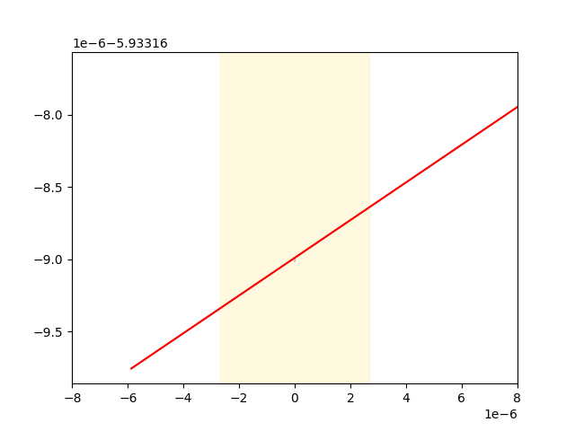


## Equation 4:
```
L_type_Ca_channel_d_gate__tau_d = 0.028571428571428571 * (1.0 - exp(-1.6025641025641024 - 0.16025641025641024 * membrane__V)) / ((1.0 + exp(-1.6025641025641024 - 0.16025641025641024 * membrane__V)) * (10.0 + membrane__V))
```
## New Eq:
```
L_type_Ca_channel_d_gate__tau_d = ((fabs(10.0 + membrane__V) < 6.2399999999074307e-7) ? ((-8012820.0129393814 - 801282.05129393819 * membrane__V) * (-45787.545788225034 * (1.0 - exp(9.9999999997671396e-8)) / (1.0 + exp(9.9999999997671396e-8)) - 45787.545788225034 * (1.0 - exp(-9.9999999997671396e-8)) / (1.0 + exp(-9.9999999997671396e-8))) + 45787.545788225034 * (1.0 - exp(-9.9999999997671396e-8)) / (1.0 + exp(-9.9999999997671396e-8))) : (0.028571428571428571 * (1.0 - exp(-1.6025641025641024 - 0.16025641025641024 * membrane__V)) / ((1.0 + exp(-1.6025641025641024 - 0.16025641025641024 * membrane__V)) * (10.0 + membrane__V))))
```
## Singularity point: -10.000000000000000
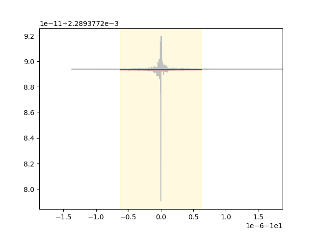


## Equation 5:
```
slow_delayed_rectifier_potassium_current_xs1_gate__tau_xs1 = 0.001 / (0.00013100000000000001 * (30.0 + membrane__V) / (-1.0 + exp(2.0609999999999999 + 0.068699999999999997 * membrane__V)) + 7.1899999999999999e-5 * (30.0 + membrane__V) / (1.0 - exp(-4.4399999999999995 - 0.14799999999999999 * membrane__V)))
```
## New Eq:
```
slow_delayed_rectifier_potassium_current_xs1_gate__tau_xs1 = 0.001 * ((fabs(30.0 + membrane__V) < 1.455604075689676e-6) ? (1 / (-1.0465793304208771e-10 / (1.0 - exp(2.1542940320529169e-7)) - 1.9068413391534758e-10 / (-1.0 + exp(-9.9999999999406119e-8)) + (10305000.50001229 + 343500.00000040967 * membrane__V) * (1.0465793304208771e-10 / (1.0 - exp(2.1542940320529169e-7)) + 1.0465793304208771e-10 / (1.0 - exp(-2.1542940320529169e-7)) + 1.9068413391534758e-10 / (-1.0 + exp(9.9999999999406119e-8)) + 1.9068413391534758e-10 / (-1.0 + exp(-9.9999999999406119e-8))))) : (1 / (0.00013100000000000001 * (30.0 + membrane__V) / (-1.0 + exp(2.0609999999999999 + 0.068699999999999997 * membrane__V)) + 7.1899999999999999e-5 * (30.0 + membrane__V) / (1.0 - exp(-4.4399999999999995 - 0.14799999999999999 * membrane__V)))))
```
## Singularity point: -30.000000000000000


## Equation 6:
```
slow_delayed_rectifier_potassium_current_xs2_gate__tau_xs2 = 0.0040000000000000001 / (0.00013100000000000001 * (30.0 + membrane__V) / (-1.0 + exp(2.0609999999999999 + 0.068699999999999997 * membrane__V)) + 7.1899999999999999e-5 * (30.0 + membrane__V) / (1.0 - exp(-4.4399999999999995 - 0.14799999999999999 * membrane__V)))
```
## New Eq:
```
slow_delayed_rectifier_potassium_current_xs2_gate__tau_xs2 = 0.0040000000000000001 * ((fabs(30.0 + membrane__V) < 1.455604075689676e-6) ? (1 / (-1.0465793304208771e-10 / (1.0 - exp(2.1542940320529169e-7)) - 1.9068413391534758e-10 / (-1.0 + exp(-9.9999999999406119e-8)) + (10305000.50001229 + 343500.00000040967 * membrane__V) * (1.0465793304208771e-10 / (1.0 - exp(2.1542940320529169e-7)) + 1.0465793304208771e-10 / (1.0 - exp(-2.1542940320529169e-7)) + 1.9068413391534758e-10 / (-1.0 + exp(9.9999999999406119e-8)) + 1.9068413391534758e-10 / (-1.0 + exp(-9.9999999999406119e-8))))) : (1 / (0.00013100000000000001 * (30.0 + membrane__V) / (-1.0 + exp(2.0609999999999999 + 0.068699999999999997 * membrane__V)) + 7.1899999999999999e-5 * (30.0 + membrane__V) / (1.0 - exp(-4.4399999999999995 - 0.14799999999999999 * membrane__V)))))
```
## Singularity point: -30.000000000000000
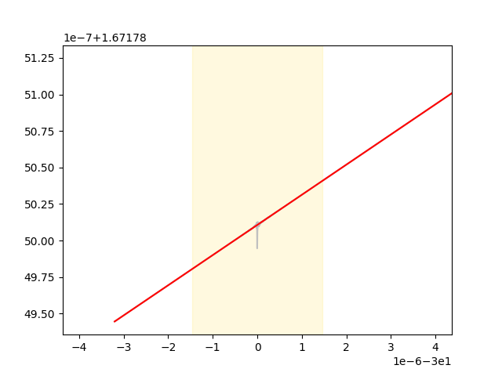


# of singularities:  6
singularity processing time: 35.659117200000026
# Model: Corrias_rabbit_purkinje_model(corrias_purkinje_2011.cellml)
No of piecewises: 0
## Equation 1:
```
x_ks__tau_x_ks = 1 / (0.00013100000000000001 * (30.0 + membrane__Vm) / (-1.0 + exp(2.0609999999999999 + 0.068699999999999997 * membrane__Vm)) + 7.1899999999999999e-5 * (30.0 + membrane__Vm) / (1.0 - exp(-4.4399999999999995 - 0.14799999999999999 * membrane__Vm)))
```
## New Eq:
```
x_ks__tau_x_ks = ((fabs(30.0 + membrane__Vm) < 1.455604075689676e-6) ? (1 / (-1.0465793304208771e-10 / (1.0 - exp(2.1542940320529169e-7)) - 1.9068413391534758e-10 / (-1.0 + exp(-9.9999999999406119e-8)) + (10305000.50001229 + 343500.00000040967 * membrane__Vm) * (1.0465793304208771e-10 / (1.0 - exp(2.1542940320529169e-7)) + 1.0465793304208771e-10 / (1.0 - exp(-2.1542940320529169e-7)) + 1.9068413391534758e-10 / (-1.0 + exp(9.9999999999406119e-8)) + 1.9068413391534758e-10 / (-1.0 + exp(-9.9999999999406119e-8))))) : (1 / (0.00013100000000000001 * (30.0 + membrane__Vm) / (-1.0 + exp(2.0609999999999999 + 0.068699999999999997 * membrane__Vm)) + 7.1899999999999999e-5 * (30.0 + membrane__Vm) / (1.0 - exp(-4.4399999999999995 - 0.14799999999999999 * membrane__Vm)))))
```
## Singularity point: -30.000000000000000


## Equation 2:
```
y_kr__ykrv1 = 0.0013799999999999999 * (7.0 + membrane__Vm) / (1.0 - exp(-0.86099999999999999 - 0.123 * membrane__Vm))
```
## New Eq:
```
y_kr__ykrv1 = ((fabs(7.0 + membrane__Vm) < 8.1300813008222672e-7) ? (1.1219512195134727e-9 / (1.0 - exp(-1.0000000000027348e-7)) + (-4304999.4999950975 - 614999.99999929965 * membrane__Vm) * (-1.1219512195134727e-9 / (1.0 - exp(1.0000000000027348e-7)) - 1.1219512195134727e-9 / (1.0 - exp(-1.0000000000027348e-7)))) : (0.0013799999999999999 * (7.0 + membrane__Vm) / (1.0 - exp(-0.86099999999999999 - 0.123 * membrane__Vm))))
```
## Singularity point: -7.0000000000000000


## Equation 3:
```
y_kr__ykrv2 = 6.0999999999999999e-5 * (10.0 + membrane__Vm) / (-1.0 + exp(1.45 + 0.14499999999999999 * membrane__Vm))
```
## New Eq:
```
y_kr__ykrv2 = ((fabs(10.0 + membrane__Vm) < 6.8965517241448282e-7) ? (-4.2068965517283451e-11 / (-1.0 + exp(-9.9999999999406119e-8)) + (7250000.4999927497 + 724999.99999927497 * membrane__Vm) * (4.2068965517283451e-11 / (-1.0 + exp(9.9999999999406119e-8)) + 4.2068965517283451e-11 / (-1.0 + exp(-9.9999999999406119e-8)))) : (6.0999999999999999e-5 * (10.0 + membrane__Vm) / (-1.0 + exp(1.45 + 0.14499999999999999 * membrane__Vm))))
```
## Singularity point: -10.000000000000000
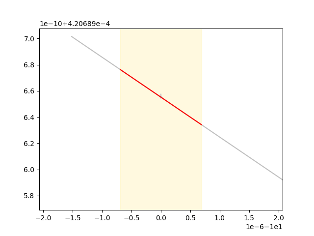


# of singularities:  3
singularity processing time: 16.086731199999974
# Model: courtemanche_1998(courtemanche_ramirez_nattel_1998.cellml)
No of piecewises: 4
## Equation 1:
```
Ca_release_current_from_JSR_w_gate__tau_w = 6.0 * (1.0 - exp(1.5800000000000001 - 0.20000000000000001 * membrane__V)) / ((1.0 + 0.29999999999999999 * exp(1.5800000000000001 - 0.20000000000000001 * membrane__V)) * (-7.9000000000000004 + membrane__V))
```
## New Eq:
```
Ca_release_current_from_JSR_w_gate__tau_w = ((fabs(-7.9000000000000004 + membrane__V) < 4.999999999970306e-7) ? ((7900000.5000469172 - 1000000.0000059388 * membrane__V) * (-11999999.999987999 * (1.0 - exp(9.9999999999406119e-8)) / (1.0 + 0.29999999999999999 * exp(9.9999999999406119e-8)) - 12000000.000154532 * (1.0 - exp(-9.9999999999406119e-8)) / (1.0 + 0.29999999999999999 * exp(-9.9999999999406119e-8))) + 12000000.000154532 * (1.0 - exp(-9.9999999999406119e-8)) / (1.0 + 0.29999999999999999 * exp(-9.9999999999406119e-8))) : (6.0 * (1.0 - exp(1.5800000000000001 - 0.20000000000000001 * membrane__V)) / ((1.0 + 0.29999999999999999 * exp(1.5800000000000001 - 0.20000000000000001 * membrane__V)) * (-7.9000000000000004 + membrane__V))))
```
## Singularity point: 7.9000000000000004
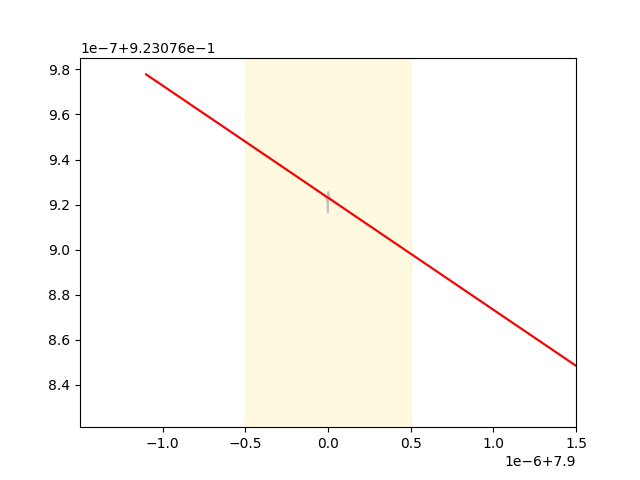


## Equation 2:
```
L_type_Ca_channel_d_gate__tau_d = 28.571428571428569 * (1.0 - exp(-1.6025641025641024 - 0.16025641025641024 * membrane__V)) / ((1.0 + exp(-1.6025641025641024 - 0.16025641025641024 * membrane__V)) * (10.0 + membrane__V))
```
## New Eq:
```
L_type_Ca_channel_d_gate__tau_d = ((fabs(10.0 + membrane__V) < 6.2399999999074307e-7) ? ((-8012820.0129393814 - 801282.05129393819 * membrane__V) * (-45787545.788225032 * (1.0 - exp(9.9999999997671396e-8)) / (1.0 + exp(9.9999999997671396e-8)) - 45787545.788225032 * (1.0 - exp(-9.9999999997671396e-8)) / (1.0 + exp(-9.9999999997671396e-8))) + 45787545.788225032 * (1.0 - exp(-9.9999999997671396e-8)) / (1.0 + exp(-9.9999999997671396e-8))) : (28.571428571428569 * (1.0 - exp(-1.6025641025641024 - 0.16025641025641024 * membrane__V)) / ((1.0 + exp(-1.6025641025641024 - 0.16025641025641024 * membrane__V)) * (10.0 + membrane__V))))
```
## Singularity point: -10.000000000000000
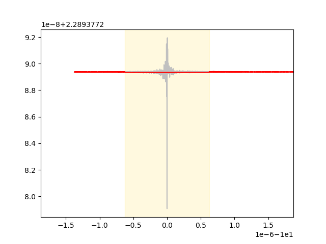


## Equation 3:
```
fast_sodium_current_m_gate__alpha_m = 0.32000000000000001 * (47.130000000000003 + membrane__V) / (1.0 - exp(-4.7130000000000001 - 0.10000000000000001 * membrane__V))
```
## New Eq:
```
fast_sodium_current_m_gate__alpha_m = ((fabs(47.130000000000003 + membrane__V) < 1.0000000000287557e-6) ? (3.200000000092018e-7 / (1.0 - exp(-1.0000000000287557e-7)) + (-23564999.499322373 - 499999.99998562218 * membrane__V) * (-3.200000000092018e-7 / (1.0 - exp(1.0000000000287557e-7)) - 3.200000000092018e-7 / (1.0 - exp(-1.0000000000287557e-7)))) : (0.32000000000000001 * (47.130000000000003 + membrane__V) / (1.0 - exp(-4.7130000000000001 - 0.10000000000000001 * membrane__V))))
```
## Singularity point: -47.130000000000003


## Equation 4:
```
rapid_delayed_rectifier_K_current_xr_gate__alpha_xr = 0.00029999999999999997 * (14.1 + membrane__V) / (1.0 - exp(-2.8199999999999998 - 0.20000000000000001 * membrane__V))
```
## New Eq:
```
rapid_delayed_rectifier_K_current_xr_gate__alpha_xr = ((fabs(14.1 + membrane__V) < 4.9999999999356115e-7) ? (1.4999999999598667e-10 / (1.0 - exp(-9.9999999999406119e-8)) + (-14099999.500181574 - 1000000.0000128777 * membrane__V) * (-1.5000000000015e-10 / (1.0 - exp(9.9999999999406119e-8)) - 1.4999999999598667e-10 / (1.0 - exp(-9.9999999999406119e-8)))) : (0.00029999999999999997 * (14.1 + membrane__V) / (1.0 - exp(-2.8199999999999998 - 0.20000000000000001 * membrane__V))))
```
## Singularity point: -14.100000000000000
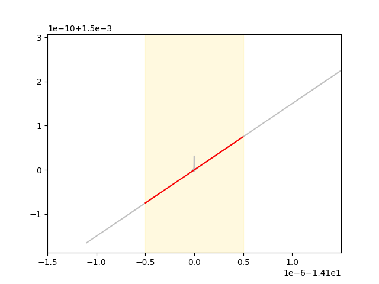


## Equation 5:
```
rapid_delayed_rectifier_K_current_xr_gate__beta_xr = 7.3898000000000003e-5 * (-3.3328000000000002 + membrane__V) / (-1.0 + exp(-0.65046743564221166 + 0.19517145812596365 * membrane__V))
```
## New Eq:
```
rapid_delayed_rectifier_K_current_xr_gate__beta_xr = ((fabs(-3.3328000000000002 + membrane__V) < 5.1237000000051158e-7) ? (-3.7863118260037805e-11 / (-1.0 + exp(-1.0000000000027348e-7)) + (-3252336.6782078114 + 975857.29062884394 * membrane__V) * (3.7863118260037805e-11 / (-1.0 + exp(1.0000000000027348e-7)) + 3.7863118260037805e-11 / (-1.0 + exp(-1.0000000000027348e-7)))) : (7.3898000000000003e-5 * (-3.3328000000000002 + membrane__V) / (-1.0 + exp(-0.65046743564221166 + 0.19517145812596365 * membrane__V))))
```
## Singularity point: 3.3328000000000002
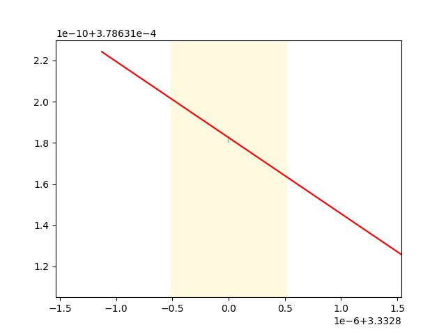


## Equation 6:
```
slow_delayed_rectifier_K_current_xs_gate__alpha_xs = 4.0000000000000003e-5 * (-19.899999999999999 + membrane__V) / (1.0 - exp(1.1705882352941175 - 0.058823529411764705 * membrane__V))
```
## New Eq:
```
slow_delayed_rectifier_K_current_xs_gate__alpha_xs = ((fabs(-19.899999999999999 + membrane__V) < 1.6999999999933735e-6) ? (6.7999999999734951e-11 / (1.0 - exp(-9.9999999999406119e-8)) + (5852941.6764934026 - 294117.64705997001 * membrane__V) * (-6.7999999999734951e-11 / (1.0 - exp(9.9999999999406119e-8)) - 6.7999999999734951e-11 / (1.0 - exp(-9.9999999999406119e-8)))) : (4.0000000000000003e-5 * (-19.899999999999999 + membrane__V) / (1.0 - exp(1.1705882352941175 - 0.058823529411764705 * membrane__V))))
```
## Singularity point: 19.899999999999999
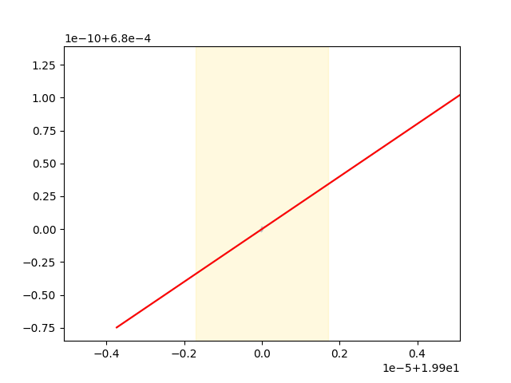


## Equation 7:
```
slow_delayed_rectifier_K_current_xs_gate__beta_xs = 3.4999999999999997e-5 * (-19.899999999999999 + membrane__V) / (-1.0 + exp(-2.2111111111111108 + 0.1111111111111111 * membrane__V))
```
## New Eq:
```
slow_delayed_rectifier_K_current_xs_gate__beta_xs = ((fabs(-19.899999999999999 + membrane__V) < 8.9999999999812452e-7) ? (-3.1499999999934357e-11 / (-1.0 + exp(-9.9999999999406119e-8)) + (-11055555.055578593 + 555555.55555671325 * membrane__V) * (3.1499999999934357e-11 / (-1.0 + exp(9.9999999999406119e-8)) + 3.1499999999934357e-11 / (-1.0 + exp(-9.9999999999406119e-8)))) : (3.4999999999999997e-5 * (-19.899999999999999 + membrane__V) / (-1.0 + exp(-2.2111111111111108 + 0.1111111111111111 * membrane__V))))
```
## Singularity point: 19.899999999999999
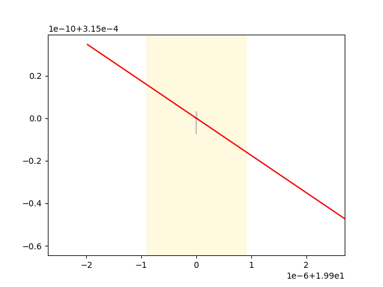


# of singularities:  7
singularity processing time: 31.10824180000003
# Model: davies_isap_2012(davies_isap_2012.cellml)
No of piecewises: 5
## Equation 1:
```
ICaL__ibarca = 14448.004881000332 * (-15.0 + cell__V) * (-0.34100000000000003 * Environment__Ca_o + Ca__Ca_ss * exp(-1.1230765052339999 + 0.074871767015599999 * cell__V)) * ICaL__pca / (-1.0 + exp(-1.1230765052339999 + 0.074871767015599999 * cell__V))
```
## New Eq:
```
ICaL__ibarca = ((fabs(-15.0 + cell__V) < 1.3356169352718439e-6) ? ((-5615382.0261832969 + 374358.83507888648 * cell__V) * (0.019296999999954306 * (-0.34100000000000003 * Environment__Ca_o + Ca__Ca_ss * exp(9.9999999999406119e-8)) * ICaL__pca / (-1.0 + exp(9.9999999999406119e-8)) + 0.019296999999954306 * (-0.34100000000000003 * Environment__Ca_o + Ca__Ca_ss * exp(-9.9999999999406119e-8)) * ICaL__pca / (-1.0 + exp(-9.9999999999406119e-8))) - 0.019296999999954306 * (-0.34100000000000003 * Environment__Ca_o + Ca__Ca_ss * exp(-9.9999999999406119e-8)) * ICaL__pca / (-1.0 + exp(-9.9999999999406119e-8))) : (14448.004881000332 * (-15.0 + cell__V) * (-0.34100000000000003 * Environment__Ca_o + Ca__Ca_ss * exp(-1.1230765052339999 + 0.074871767015599999 * cell__V)) * ICaL__pca / (-1.0 + exp(-1.1230765052339999 + 0.074871767015599999 * cell__V))))
```
## Singularity point: 15.000000000000000
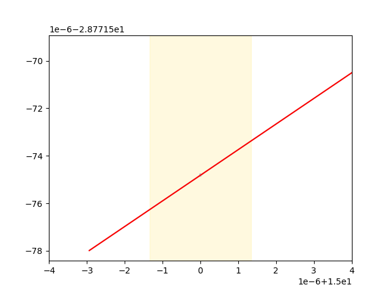


## Equation 2:
```
ICab__ICab = 3612.001220250083 * (-0.34100000000000003 * Environment__Ca_o + Ca__Ca_i * exp(0.074871767015599999 * cell__V)) * ICab__GCab * cell__V / (-1.0 + exp(0.074871767015599999 * cell__V))
```
## New Eq:
```
ICab__ICab = ((fabs(cell__V) < 1.3356169352750065e-6) ? ((0.5 + 374358.83507800003 * cell__V) * (0.0048242499999999995 * (-0.34100000000000003 * Environment__Ca_o + Ca__Ca_i * exp(9.9999999999999995e-8)) * ICab__GCab / (-1.0 + exp(9.9999999999999995e-8)) + 0.0048242499999999995 * (-0.34100000000000003 * Environment__Ca_o + Ca__Ca_i * exp(-9.9999999999999995e-8)) * ICab__GCab / (-1.0 + exp(-9.9999999999999995e-8))) - 0.0048242499999999995 * (-0.34100000000000003 * Environment__Ca_o + Ca__Ca_i * exp(-9.9999999999999995e-8)) * ICab__GCab / (-1.0 + exp(-9.9999999999999995e-8))) : (3612.001220250083 * (-0.34100000000000003 * Environment__Ca_o + Ca__Ca_i * exp(0.074871767015599999 * cell__V)) * ICab__GCab * cell__V / (-1.0 + exp(0.074871767015599999 * cell__V))))
```
## Singularity point: 0


## Equation 3:
```
IKs__tauxs = 1 / (7.6100000000000007e-5 * (44.600000000000001 + cell__V) / (1.0 - exp(-444.66200000000003 - 9.9700000000000006 * cell__V)) + 0.00036000000000000002 * (-0.55000000000000004 + cell__V) / (-1.0 + exp(-0.070400000000000004 + 0.128 * cell__V)))
```
## New Eq:
```
IKs__tauxs = 1 / (((fabs(44.600000000000001 + cell__V) < 1.0030090258350555e-8) ? (7.6328986866047728e-13 / (1.0 - exp(-9.9999999836342113e-8)) + (-2223310002.262351 - 49850000.061936118 * cell__V) * (-7.6328986866047728e-13 / (1.0 - exp(9.9999999836342113e-8)) - 7.6328986866047728e-13 / (1.0 - exp(-9.9999999836342113e-8)))) : (7.6100000000000007e-5 * (44.600000000000001 + cell__V) / (1.0 - exp(-444.66200000000003 - 9.9700000000000006 * cell__V)))) + ((fabs(-0.55000000000000004 + cell__V) < 7.8124999999948028e-7) ? (-2.8124999999965681e-10 / (-1.0 + exp(-9.9999999999948221e-8)) + (-351999.50000023417 + 640000.00000042573 * cell__V) * (2.8124999999996902e-10 / (-1.0 + exp(9.9999999999948221e-8)) + 2.8124999999965681e-10 / (-1.0 + exp(-9.9999999999948221e-8)))) : (0.00036000000000000002 * (-0.55000000000000004 + cell__V) / (-1.0 + exp(-0.070400000000000004 + 0.128 * cell__V)))))
```
## Singularity point: -44.600000000000001


## Singularity point: 0.55000000000000004


## Equation 4:
```
INa__am = 0.32000000000000001 * (47.130000000000003 + cell__V) / (1.0 - exp(-4.7130000000000001 - 0.10000000000000001 * cell__V))
```
## New Eq:
```
INa__am = ((fabs(47.130000000000003 + cell__V) < 1.0000000000287557e-6) ? (3.200000000092018e-7 / (1.0 - exp(-1.0000000000287557e-7)) + (-23564999.499322373 - 499999.99998562218 * cell__V) * (-3.200000000092018e-7 / (1.0 - exp(1.0000000000287557e-7)) - 3.200000000092018e-7 / (1.0 - exp(-1.0000000000287557e-7)))) : (0.32000000000000001 * (47.130000000000003 + cell__V) / (1.0 - exp(-4.7130000000000001 - 0.10000000000000001 * cell__V))))
```
## Singularity point: -47.130000000000003


## Equation 5:
```
INal__amL = 0.32000000000000001 * (47.130000000000003 + cell__V) / (1.0 - exp(-4.7130000000000001 - 0.10000000000000001 * cell__V))
```
## New Eq:
```
INal__amL = ((fabs(47.130000000000003 + cell__V) < 1.0000000000287557e-6) ? (3.200000000092018e-7 / (1.0 - exp(-1.0000000000287557e-7)) + (-23564999.499322373 - 499999.99998562218 * cell__V) * (-3.200000000092018e-7 / (1.0 - exp(1.0000000000287557e-7)) - 3.200000000092018e-7 / (1.0 - exp(-1.0000000000287557e-7)))) : (0.32000000000000001 * (47.130000000000003 + cell__V) / (1.0 - exp(-4.7130000000000001 - 0.10000000000000001 * cell__V))))
```
## Singularity point: -47.130000000000003


## Equation 6:
```
Ito2__Ito2_max = 3612.001220250083 * (-Environment__Cl_o * exp(0.0374358835078 * cell__V) + Cl__Cl_i) * Ito2__PCl * cell__V / (1.0 - exp(0.0374358835078 * cell__V))
```
## New Eq:
```
Ito2__Ito2_max = ((fabs(cell__V) < 2.671233870550013e-6) ? ((0.5 + 187179.41753900002 * cell__V) * (0.0096484999999999991 * (-Environment__Cl_o * exp(9.9999999999999995e-8) + Cl__Cl_i) * Ito2__PCl / (1.0 - exp(9.9999999999999995e-8)) + 0.0096484999999999991 * (-Environment__Cl_o * exp(-9.9999999999999995e-8) + Cl__Cl_i) * Ito2__PCl / (1.0 - exp(-9.9999999999999995e-8))) - 0.0096484999999999991 * (-Environment__Cl_o * exp(-9.9999999999999995e-8) + Cl__Cl_i) * Ito2__PCl / (1.0 - exp(-9.9999999999999995e-8))) : (3612.001220250083 * (-Environment__Cl_o * exp(0.0374358835078 * cell__V) + Cl__Cl_i) * Ito2__PCl * cell__V / (1.0 - exp(0.0374358835078 * cell__V))))
```
## Singularity point: 0
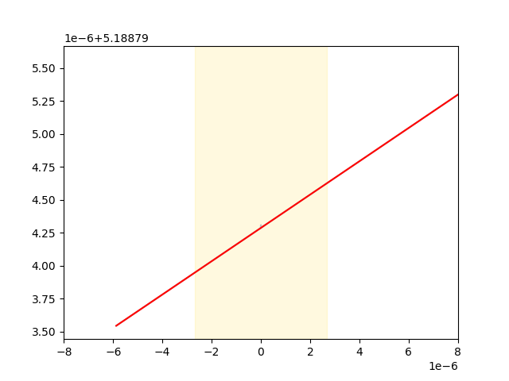


# of singularities:  7
singularity processing time: 39.69720619999998
# Model: decker_2009(decker_2009.cellml)
No of piecewises: 4
## Equation 1:
```
IKr_xr_gate__tau_xr = 1 / (0.00029999999999999997 * (38.360799999999998 + membrane__Vm) / (-1.0 + exp(5.8385137599999997 + 0.1522 * membrane__Vm)) + 0.00059999999999999995 * (-1.7383999999999999 + membrane__Vm) / (1.0 - exp(0.2364224 - 0.13600000000000001 * membrane__Vm)))
```
## New Eq:
```
IKr_xr_gate__tau_xr = 1 / (((fabs(-1.7383999999999999 + membrane__Vm) < 7.352941176468758e-7) ? (4.4117647058812543e-10 / (1.0 - exp(-1.0000000000005664e-7)) + (1182112.5000002943 - 680000.00000016927 * membrane__Vm) * (-4.4117647058812543e-10 / (1.0 - exp(1.0000000000005664e-7)) - 4.4117647058812543e-10 / (1.0 - exp(-1.0000000000005664e-7)))) : (0.00059999999999999995 * (-1.7383999999999999 + membrane__Vm) / (1.0 - exp(0.2364224 - 0.13600000000000001 * membrane__Vm)))) + ((fabs(38.360799999999998 + membrane__Vm) < 6.5703022339436146e-7) ? (-1.9710906701830842e-10 / (-1.0 + exp(-1.0000000000287557e-7)) + (29192569.299818475 + 760999.99999526795 * membrane__Vm) * (1.9710906701830842e-10 / (-1.0 + exp(1.0000000000287557e-7)) + 1.9710906701830842e-10 / (-1.0 + exp(-1.0000000000287557e-7)))) : (0.00029999999999999997 * (38.360799999999998 + membrane__Vm) / (-1.0 + exp(5.8385137599999997 + 0.1522 * membrane__Vm)))))
```
## Singularity point: 1.7383999999999999


## Singularity point: -38.360799999999998
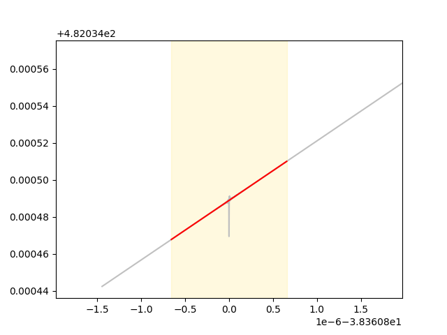


## Equation 2:
```
INaL_mL_gate__amL = 0.32000000000000001 * (47.130000000000003 + membrane__Vm) / (1.0 - exp(-4.7130000000000001 - 0.10000000000000001 * membrane__Vm))
```
## New Eq:
```
INaL_mL_gate__amL = ((fabs(47.130000000000003 + membrane__Vm) < 1.0000000000287557e-6) ? (3.200000000092018e-7 / (1.0 - exp(-1.0000000000287557e-7)) + (-23564999.499322373 - 499999.99998562218 * membrane__Vm) * (-3.200000000092018e-7 / (1.0 - exp(1.0000000000287557e-7)) - 3.200000000092018e-7 / (1.0 - exp(-1.0000000000287557e-7)))) : (0.32000000000000001 * (47.130000000000003 + membrane__Vm) / (1.0 - exp(-4.7130000000000001 - 0.10000000000000001 * membrane__Vm))))
```
## Singularity point: -47.130000000000003


## Equation 3:
```
INa_m_gate__am = 0.32000000000000001 * (47.130000000000003 + membrane__Vm) / (1.0 - exp(-4.7130000000000001 - 0.10000000000000001 * membrane__Vm))
```
## New Eq:
```
INa_m_gate__am = ((fabs(47.130000000000003 + membrane__Vm) < 1.0000000000287557e-6) ? (3.200000000092018e-7 / (1.0 - exp(-1.0000000000287557e-7)) + (-23564999.499322373 - 499999.99998562218 * membrane__Vm) * (-3.200000000092018e-7 / (1.0 - exp(1.0000000000287557e-7)) - 3.200000000092018e-7 / (1.0 - exp(-1.0000000000287557e-7)))) : (0.32000000000000001 * (47.130000000000003 + membrane__Vm) / (1.0 - exp(-4.7130000000000001 - 0.10000000000000001 * membrane__Vm))))
```
## Singularity point: -47.130000000000003


## Equation 4:
```
ICaL__ICaL_max = 14448.004881001343 * (-0.34100000000000003 * model_parameters__Ca_o + Ca__Ca_ss_CaL * exp(0.074871767015605231 * membrane__Vm)) * ICaL__PCa * membrane__Vm / (-1.0 + exp(0.074871767015605231 * membrane__Vm))
```
## New Eq:
```
ICaL__ICaL_max = ((fabs(membrane__Vm) < 1.3356169352749131e-6) ? ((0.5 + 374358.83507802623 * membrane__Vm) * (0.019296999999999998 * (-0.34100000000000003 * model_parameters__Ca_o + Ca__Ca_ss_CaL * exp(9.9999999999999995e-8)) * ICaL__PCa / (-1.0 + exp(9.9999999999999995e-8)) + 0.019296999999999998 * (-0.34100000000000003 * model_parameters__Ca_o + Ca__Ca_ss_CaL * exp(-9.9999999999999995e-8)) * ICaL__PCa / (-1.0 + exp(-9.9999999999999995e-8))) - 0.019296999999999998 * (-0.34100000000000003 * model_parameters__Ca_o + Ca__Ca_ss_CaL * exp(-9.9999999999999995e-8)) * ICaL__PCa / (-1.0 + exp(-9.9999999999999995e-8))) : (14448.004881001343 * (-0.34100000000000003 * model_parameters__Ca_o + Ca__Ca_ss_CaL * exp(0.074871767015605231 * membrane__Vm)) * ICaL__PCa * membrane__Vm / (-1.0 + exp(0.074871767015605231 * membrane__Vm))))
```
## Singularity point: 0


## Equation 5:
```
ICab__ICab = 14448.004881001343 * (-0.34100000000000003 * model_parameters__Ca_o + Ca__Ca_i * exp(0.074871767015605231 * membrane__Vm)) * ICab__PCab * membrane__Vm / (-1.0 + exp(0.074871767015605231 * membrane__Vm))
```
## New Eq:
```
ICab__ICab = ((fabs(membrane__Vm) < 1.3356169352749131e-6) ? ((0.5 + 374358.83507802623 * membrane__Vm) * (0.019296999999999998 * (-0.34100000000000003 * model_parameters__Ca_o + Ca__Ca_i * exp(9.9999999999999995e-8)) * ICab__PCab / (-1.0 + exp(9.9999999999999995e-8)) + 0.019296999999999998 * (-0.34100000000000003 * model_parameters__Ca_o + Ca__Ca_i * exp(-9.9999999999999995e-8)) * ICab__PCab / (-1.0 + exp(-9.9999999999999995e-8))) - 0.019296999999999998 * (-0.34100000000000003 * model_parameters__Ca_o + Ca__Ca_i * exp(-9.9999999999999995e-8)) * ICab__PCab / (-1.0 + exp(-9.9999999999999995e-8))) : (14448.004881001343 * (-0.34100000000000003 * model_parameters__Ca_o + Ca__Ca_i * exp(0.074871767015605231 * membrane__Vm)) * ICab__PCab * membrane__Vm / (-1.0 + exp(0.074871767015605231 * membrane__Vm))))
```
## Singularity point: 0
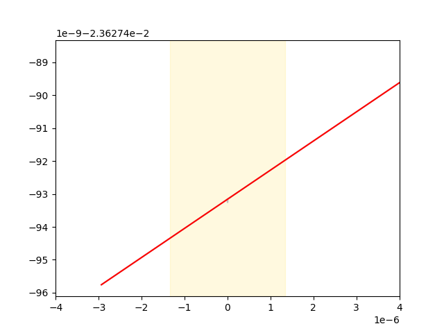


## Equation 6:
```
INab__INab = 3612.0012202503358 * (-model_parameters__Na_o + Na__Na_i * exp(0.037435883507802616 * membrane__Vm)) * INab__PNab * membrane__Vm / (-1.0 + exp(0.037435883507802616 * membrane__Vm))
```
## New Eq:
```
INab__INab = ((fabs(membrane__Vm) < 2.6712338705498262e-6) ? ((0.5 + 187179.41753901311 * membrane__Vm) * (0.0096484999999999991 * (-model_parameters__Na_o + Na__Na_i * exp(9.9999999999999995e-8)) * INab__PNab / (-1.0 + exp(9.9999999999999995e-8)) + 0.0096484999999999991 * (-model_parameters__Na_o + Na__Na_i * exp(-9.9999999999999995e-8)) * INab__PNab / (-1.0 + exp(-9.9999999999999995e-8))) - 0.0096484999999999991 * (-model_parameters__Na_o + Na__Na_i * exp(-9.9999999999999995e-8)) * INab__PNab / (-1.0 + exp(-9.9999999999999995e-8))) : (3612.0012202503358 * (-model_parameters__Na_o + Na__Na_i * exp(0.037435883507802616 * membrane__Vm)) * INab__PNab * membrane__Vm / (-1.0 + exp(0.037435883507802616 * membrane__Vm))))
```
## Singularity point: 0


## Equation 7:
```
Ito2__Ito2_max = 3612.0012202503358 * (-100.0 * exp(0.037435883507802616 * membrane__Vm) + Cl__Cl_i) * Ito2__PCl * membrane__Vm / (1.0 - exp(0.037435883507802616 * membrane__Vm))
```
## New Eq:
```
Ito2__Ito2_max = ((fabs(membrane__Vm) < 2.6712338705498262e-6) ? ((0.5 + 187179.41753901311 * membrane__Vm) * (0.0096484999999999991 * (-100.0 * exp(9.9999999999999995e-8) + Cl__Cl_i) * Ito2__PCl / (1.0 - exp(9.9999999999999995e-8)) + 0.0096484999999999991 * (-100.0 * exp(-9.9999999999999995e-8) + Cl__Cl_i) * Ito2__PCl / (1.0 - exp(-9.9999999999999995e-8))) - 0.0096484999999999991 * (-100.0 * exp(-9.9999999999999995e-8) + Cl__Cl_i) * Ito2__PCl / (1.0 - exp(-9.9999999999999995e-8))) : (3612.0012202503358 * (-100.0 * exp(0.037435883507802616 * membrane__Vm) + Cl__Cl_i) * Ito2__PCl * membrane__Vm / (1.0 - exp(0.037435883507802616 * membrane__Vm))))
```
## Singularity point: 0
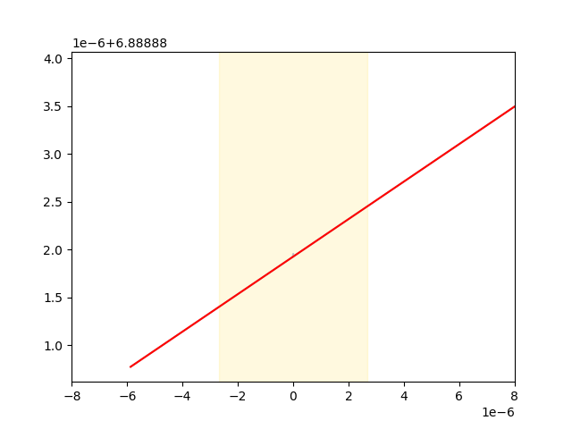


# of singularities:  8
singularity processing time: 44.02244619999999
# Model: demir_model_1994(demir_model_1994.cellml)
No of piecewises: 0
## Equation 1:
```
L_type_Ca_channel_d_gate__alpha_d_L = -28.390000000000001 * (35.0 + membrane__V) / (-1.0 + exp(-14.0 - 0.40000000000000002 * membrane__V)) - 84.900000000000006 * membrane__V / (-1.0 + exp(-0.20799999999999999 * membrane__V))
```
## New Eq:
```
L_type_Ca_channel_d_gate__alpha_d_L = ((fabs(membrane__V) < 4.8076923076923074e-7) ? (-4.0817307692307694e-5 / (-1.0 + exp(-9.9999999999999995e-8)) + (0.5 - 1040000.0 * membrane__V) * (4.0817307692307694e-5 / (-1.0 + exp(9.9999999999999995e-8)) + 4.0817307692307694e-5 / (-1.0 + exp(-9.9999999999999995e-8)))) : (-84.900000000000006 * membrane__V / (-1.0 + exp(-0.20799999999999999 * membrane__V)))) + ((fabs(35.0 + membrane__V) < 2.5000000000718892e-7) ? (-7.097500000992074e-6 / (-1.0 + exp(-1.0000000001675335e-7)) + (-69999999.497987106 - 1999999.9999424887 * membrane__V) * (7.0974999994161125e-6 / (-1.0 + exp(9.9999999988997779e-8)) + 7.097500000992074e-6 / (-1.0 + exp(-1.0000000001675335e-7)))) : (-28.390000000000001 * (35.0 + membrane__V) / (-1.0 + exp(-14.0 - 0.40000000000000002 * membrane__V))))
```
## Singularity point: 0


## Singularity point: -35.000000000000000


## Equation 2:
```
L_type_Ca_channel_d_gate__beta_d_L = 11.43 * (-5.0 + membrane__V) / (-1.0 + exp(-2.0 + 0.40000000000000002 * membrane__V))
```
## New Eq:
```
L_type_Ca_channel_d_gate__beta_d_L = ((fabs(-5.0 + membrane__V) < 2.5000000000025002e-7) ? (-2.8575000000028576e-6 / (-1.0 + exp(-9.9999999999406119e-8)) + (-9999999.4999899995 + 1999999.9999979998 * membrane__V) * (2.8575000000028576e-6 / (-1.0 + exp(9.9999999999406119e-8)) + 2.8575000000028576e-6 / (-1.0 + exp(-9.9999999999406119e-8)))) : (11.43 * (-5.0 + membrane__V) / (-1.0 + exp(-2.0 + 0.40000000000000002 * membrane__V))))
```
## Singularity point: 5.0000000000000000


## Equation 3:
```
L_type_Ca_channel_f_gate__alpha_f_L = 3.75 * (28.0 + membrane__V) / (-1.0 + exp(7.0 + 0.25 * membrane__V))
```
## New Eq:
```
L_type_Ca_channel_f_gate__alpha_f_L = ((fabs(28.0 + membrane__V) < 4.0000000001150227e-7) ? (-1.5000000000431335e-6 / (-1.0 + exp(-1.0000000000287557e-7)) + (35000000.498993553 + 1249999.9999640554 * membrane__V) * (1.5000000000431335e-6 / (-1.0 + exp(1.0000000000287557e-7)) + 1.5000000000431335e-6 / (-1.0 + exp(-1.0000000000287557e-7)))) : (3.75 * (28.0 + membrane__V) / (-1.0 + exp(7.0 + 0.25 * membrane__V))))
```
## Singularity point: -28.000000000000000
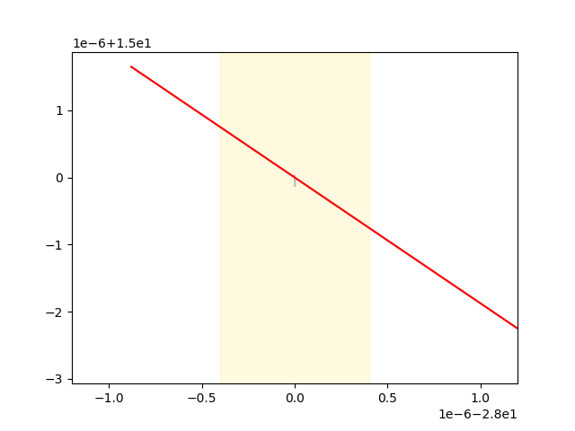


## Equation 4:
```
sodium_current_m_gate__alpha_m = -824.0 * (51.899999999999999 + membrane__V) / (-1.0 + exp(-5.8314606741573032 - 0.11235955056179775 * membrane__V))
```
## New Eq:
```
sodium_current_m_gate__alpha_m = ((fabs(51.899999999999999 + membrane__V) < 8.9000000000338808e-7) ? (-0.00073336000002566237 / (-1.0 + exp(-1.0000000000287557e-7)) + (-29157302.870675519 - 561797.75280685013 * membrane__V) * (0.00073336000002566237 / (-1.0 + exp(-1.0000000000287557e-7)) + 0.00073335999997992118 / (-1.0 + exp(1.0000000000287557e-7)))) : (-824.0 * (51.899999999999999 + membrane__V) / (-1.0 + exp(-5.8314606741573032 - 0.11235955056179775 * membrane__V))))
```
## Singularity point: -51.899999999999999
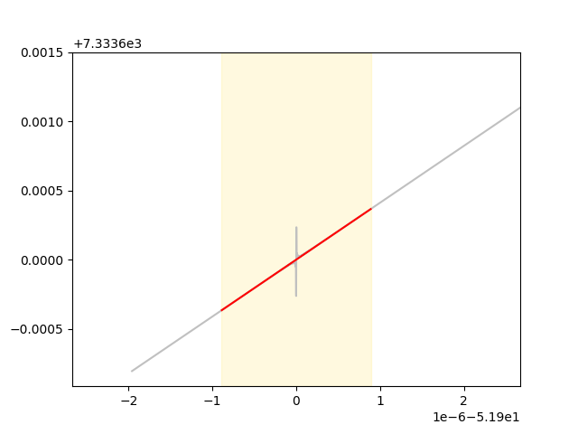


## Equation 5:
```
sodium_current__i_Na = 3611.8217397063127 * pow(sodium_current_m_gate__m, 3) * (-1.0 + exp(0.037433890822745473 * membrane__V - 1.0 * log(cleft_space_equations__Na_c / intracellular_concentrations_and_buffer_equations__Na_i))) * cleft_space_equations__Na_c * membrane__V * sodium_current__P_Na * sodium_current_h_gate__h1 * sodium_current_h_gate__h2 / (-1.0 + exp(0.037433890822745473 * membrane__V))
```
## New Eq:
```
sodium_current__i_Na = ((fabs(membrane__V) < 2.671376065969565e-6) ? ((0.5 + 187169.45411372738 * membrane__V) * (0.0096485341499999988 * pow(sodium_current_m_gate__m, 3) * (-1.0 + exp(9.9999999999999995e-8 - 1.0 * log(cleft_space_equations__Na_c / intracellular_concentrations_and_buffer_equations__Na_i))) * cleft_space_equations__Na_c * sodium_current__P_Na * sodium_current_h_gate__h1 * sodium_current_h_gate__h2 / (-1.0 + exp(9.9999999999999995e-8)) + 0.0096485341499999988 * pow(sodium_current_m_gate__m, 3) * (-1.0 + exp(-9.9999999999999995e-8 - 1.0 * log(cleft_space_equations__Na_c / intracellular_concentrations_and_buffer_equations__Na_i))) * cleft_space_equations__Na_c * sodium_current__P_Na * sodium_current_h_gate__h1 * sodium_current_h_gate__h2 / (-1.0 + exp(-9.9999999999999995e-8))) - 0.0096485341499999988 * pow(sodium_current_m_gate__m, 3) * (-1.0 + exp(-9.9999999999999995e-8 - 1.0 * log(cleft_space_equations__Na_c / intracellular_concentrations_and_buffer_equations__Na_i))) * cleft_space_equations__Na_c * sodium_current__P_Na * sodium_current_h_gate__h1 * sodium_current_h_gate__h2 / (-1.0 + exp(-9.9999999999999995e-8))) : (3611.8217397063127 * pow(sodium_current_m_gate__m, 3) * (-1.0 + exp(0.037433890822745473 * membrane__V - 1.0 * log(cleft_space_equations__Na_c / intracellular_concentrations_and_buffer_equations__Na_i))) * cleft_space_equations__Na_c * membrane__V * sodium_current__P_Na * sodium_current_h_gate__h1 * sodium_current_h_gate__h2 / (-1.0 + exp(0.037433890822745473 * membrane__V))))
```
## Singularity point: 0


# of singularities:  6
singularity processing time: 30.273177599999997
# Model: difrancesco_noble_model_1985(difrancesco_noble_model_1985.cellml)
No of piecewises: 0
## Equation 1:
```
fast_sodium_current_m_gate__alpha_m = 200.0 * (41.0 + membrane__V) / (1.0 - exp(-4.1000000000000005 - 0.10000000000000001 * membrane__V))
```
## New Eq:
```
fast_sodium_current_m_gate__alpha_m = ((fabs(41.0 + membrane__V) < 1.0000000000287557e-6) ? (0.00020000000000575113 / (1.0 - exp(-1.0000000000287557e-7)) + (-20499999.49941051 - 499999.99998562218 * membrane__V) * (-0.00020000000000575113 / (1.0 - exp(1.0000000000287557e-7)) - 0.00020000000000575113 / (1.0 - exp(-1.0000000000287557e-7)))) : (200.0 * (41.0 + membrane__V) / (1.0 - exp(-4.1000000000000005 - 0.10000000000000001 * membrane__V))))
```
## Singularity point: -41.000000000000000


## Equation 2:
```
hyperpolarising_activated_current_y_gate__beta_y = (42.0 + membrane__V) / (1.0 - exp(-8.4000000000000004 - 0.20000000000000001 * membrane__V))
```
## New Eq:
```
hyperpolarising_activated_current_y_gate__beta_y = ((fabs(42.0 + membrane__V) < 5.0000000001437783e-7) ? (5.0000000001437783e-7 / (1.0 - exp(-1.0000000000287557e-7)) + (-41999999.498792261 - 999999.99997124437 * membrane__V) * (-5.0000000001437783e-7 / (1.0 - exp(1.0000000000287557e-7)) - 5.0000000001437783e-7 / (1.0 - exp(-1.0000000000287557e-7)))) : ((42.0 + membrane__V) / (1.0 - exp(-8.4000000000000004 - 0.20000000000000001 * membrane__V))))
```
## Singularity point: -42.000000000000000


## Equation 3:
```
intracellular_calcium_concentration__alpha_p = 0.625 * (34.0 + membrane__V) / (-1.0 + exp(8.5 + 0.25 * membrane__V))
```
## New Eq:
```
intracellular_calcium_concentration__alpha_p = ((fabs(34.0 + membrane__V) < 4.0000000001150227e-7) ? (-2.5000000000718892e-7 / (-1.0 + exp(-1.0000000000287557e-7)) + (42500000.498777881 + 1249999.9999640554 * membrane__V) * (2.5000000000718892e-7 / (-1.0 + exp(1.0000000000287557e-7)) + 2.5000000000718892e-7 / (-1.0 + exp(-1.0000000000287557e-7)))) : (0.625 * (34.0 + membrane__V) / (-1.0 + exp(8.5 + 0.25 * membrane__V))))
```
## Singularity point: -34.000000000000000


## Equation 4:
```
second_inward_current_d_gate__alpha_d = 30.0 * (19.0 + membrane__V) / (1.0 - exp(-4.75 - 0.25 * membrane__V))
```
## New Eq:
```
second_inward_current_d_gate__alpha_d = ((fabs(19.0 + membrane__V) < 4.0000000001150227e-7) ? (1.2000000000345068e-5 / (1.0 - exp(-1.0000000000287557e-7)) + (-23749999.499317054 - 1249999.9999640554 * membrane__V) * (-1.2000000000345068e-5 / (1.0 - exp(1.0000000000287557e-7)) - 1.2000000000345068e-5 / (1.0 - exp(-1.0000000000287557e-7)))) : (30.0 * (19.0 + membrane__V) / (1.0 - exp(-4.75 - 0.25 * membrane__V))))
```
## Singularity point: -19.000000000000000


## Equation 5:
```
second_inward_current_d_gate__beta_d = 12.0 * (19.0 + membrane__V) / (-1.0 + exp(1.8999999999999999 + 0.10000000000000001 * membrane__V))
```
## New Eq:
```
second_inward_current_d_gate__beta_d = ((fabs(19.0 + membrane__V) < 9.999999999871223e-7) ? (-1.1999999999678934e-5 / (-1.0 + exp(-9.9999999997671396e-8)) + (9500000.5001223385 + 500000.00000643887 * membrane__V) * (1.1999999999678934e-5 / (-1.0 + exp(-9.9999999997671396e-8)) + 1.2000000000012001e-5 / (-1.0 + exp(9.9999999999406119e-8)))) : (12.0 * (19.0 + membrane__V) / (-1.0 + exp(1.8999999999999999 + 0.10000000000000001 * membrane__V))))
```
## Singularity point: -19.000000000000000


## Equation 6:
```
second_inward_current_f_gate__alpha_f = 6.25 * (34.0 + membrane__V) / (-1.0 + exp(8.5 + 0.25 * membrane__V))
```
## New Eq:
```
second_inward_current_f_gate__alpha_f = ((fabs(34.0 + membrane__V) < 4.0000000001150227e-7) ? (-2.5000000000718892e-6 / (-1.0 + exp(-1.0000000000287557e-7)) + (42500000.498777881 + 1249999.9999640554 * membrane__V) * (2.5000000000718892e-6 / (-1.0 + exp(1.0000000000287557e-7)) + 2.5000000000718892e-6 / (-1.0 + exp(-1.0000000000287557e-7)))) : (6.25 * (34.0 + membrane__V) / (-1.0 + exp(8.5 + 0.25 * membrane__V))))
```
## Singularity point: -34.000000000000000


## Equation 7:
```
second_inward_current__i_siCa = 0.14973556329098189 * (-50.0 + membrane__V) * (intracellular_calcium_concentration__Cai * exp(3.7433890822745473) - extracellular_calcium_concentration__Cao * exp(3.7433890822745473 - 0.074867781645490947 * membrane__V)) * second_inward_current__P_si * second_inward_current_d_gate__d * second_inward_current_f2_gate__f2 * second_inward_current_f_gate__f / (1.0 - exp(3.7433890822745473 - 0.074867781645490947 * membrane__V))
```
## New Eq:
```
second_inward_current__i_siCa = ((fabs(-50.0 + membrane__V) < 1.3356880329551402e-6) ? ((18716945.911788113 - 374338.90823576227 * membrane__V) * (-1.9999999999556149e-7 * (intracellular_calcium_concentration__Cai * exp(3.7433890822745473) - extracellular_calcium_concentration__Cao * exp(9.9999999999406119e-8)) * second_inward_current__P_si * second_inward_current_d_gate__d * second_inward_current_f2_gate__f2 * second_inward_current_f_gate__f / (1.0 - exp(9.9999999999406119e-8)) - 1.9999999999556149e-7 * (intracellular_calcium_concentration__Cai * exp(3.7433890822745473) - extracellular_calcium_concentration__Cao * exp(-9.9999999995936673e-8)) * second_inward_current__P_si * second_inward_current_d_gate__d * second_inward_current_f2_gate__f2 * second_inward_current_f_gate__f / (1.0 - exp(-9.9999999995936673e-8))) + 1.9999999999556149e-7 * (intracellular_calcium_concentration__Cai * exp(3.7433890822745473) - extracellular_calcium_concentration__Cao * exp(-9.9999999995936673e-8)) * second_inward_current__P_si * second_inward_current_d_gate__d * second_inward_current_f2_gate__f2 * second_inward_current_f_gate__f / (1.0 - exp(-9.9999999995936673e-8))) : (0.14973556329098189 * (-50.0 + membrane__V) * (intracellular_calcium_concentration__Cai * exp(3.7433890822745473) - extracellular_calcium_concentration__Cao * exp(3.7433890822745473 - 0.074867781645490947 * membrane__V)) * second_inward_current__P_si * second_inward_current_d_gate__d * second_inward_current_f2_gate__f2 * second_inward_current_f_gate__f / (1.0 - exp(3.7433890822745473 - 0.074867781645490947 * membrane__V))))
```
## Singularity point: 50.000000000000000
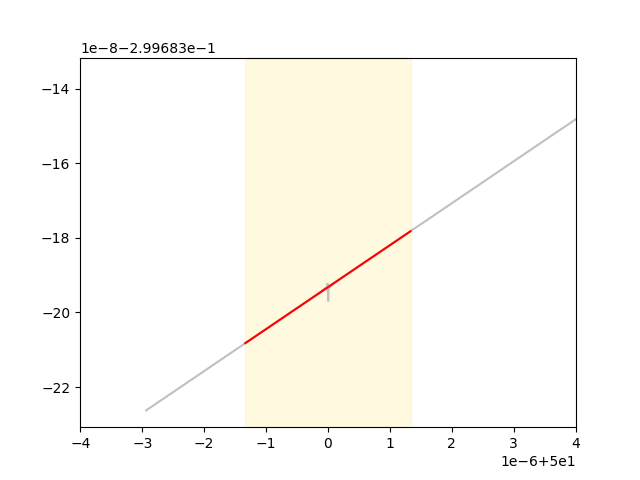


## Equation 8:
```
second_inward_current__i_siK = 0.00037433890822745472 * (-50.0 + membrane__V) * (intracellular_potassium_concentration__Ki * exp(1.8716945411372736) - extracellular_potassium_concentration__Kc * exp(1.8716945411372736 - 0.037433890822745473 * membrane__V)) * second_inward_current__P_si * second_inward_current_d_gate__d * second_inward_current_f2_gate__f2 * second_inward_current_f_gate__f / (1.0 - exp(1.8716945411372736 - 0.037433890822745473 * membrane__V))
```
## New Eq:
```
second_inward_current__i_siK = ((fabs(-50.0 + membrane__V) < 2.6713760659657915e-6) ? ((9358473.2056995872 - 187169.45411399176 * membrane__V) * (-9.9999999999858744e-10 * (intracellular_potassium_concentration__Ki * exp(1.8716945411372736) - extracellular_potassium_concentration__Kc * exp(9.9999999999406119e-8)) * second_inward_current__P_si * second_inward_current_d_gate__d * second_inward_current_f2_gate__f2 * second_inward_current_f_gate__f / (1.0 - exp(9.9999999999406119e-8)) - 9.9999999999858744e-10 * (intracellular_potassium_concentration__Ki * exp(1.8716945411372736) - extracellular_potassium_concentration__Kc * exp(-9.9999999999406119e-8)) * second_inward_current__P_si * second_inward_current_d_gate__d * second_inward_current_f2_gate__f2 * second_inward_current_f_gate__f / (1.0 - exp(-9.9999999999406119e-8))) + 9.9999999999858744e-10 * (intracellular_potassium_concentration__Ki * exp(1.8716945411372736) - extracellular_potassium_concentration__Kc * exp(-9.9999999999406119e-8)) * second_inward_current__P_si * second_inward_current_d_gate__d * second_inward_current_f2_gate__f2 * second_inward_current_f_gate__f / (1.0 - exp(-9.9999999999406119e-8))) : (0.00037433890822745472 * (-50.0 + membrane__V) * (intracellular_potassium_concentration__Ki * exp(1.8716945411372736) - extracellular_potassium_concentration__Kc * exp(1.8716945411372736 - 0.037433890822745473 * membrane__V)) * second_inward_current__P_si * second_inward_current_d_gate__d * second_inward_current_f2_gate__f2 * second_inward_current_f_gate__f / (1.0 - exp(1.8716945411372736 - 0.037433890822745473 * membrane__V))))
```
## Singularity point: 50.000000000000000


## Equation 9:
```
second_inward_current__i_siNa = 0.00037433890822745472 * (-50.0 + membrane__V) * (intracellular_sodium_concentration__Nai * exp(1.8716945411372736) - extracellular_sodium_concentration__Nao * exp(1.8716945411372736 - 0.037433890822745473 * membrane__V)) * second_inward_current__P_si * second_inward_current_d_gate__d * second_inward_current_f2_gate__f2 * second_inward_current_f_gate__f / (1.0 - exp(1.8716945411372736 - 0.037433890822745473 * membrane__V))
```
## New Eq:
```
second_inward_current__i_siNa = ((fabs(-50.0 + membrane__V) < 2.6713760659657915e-6) ? ((9358473.2056995872 - 187169.45411399176 * membrane__V) * (-9.9999999999858744e-10 * (intracellular_sodium_concentration__Nai * exp(1.8716945411372736) - extracellular_sodium_concentration__Nao * exp(9.9999999999406119e-8)) * second_inward_current__P_si * second_inward_current_d_gate__d * second_inward_current_f2_gate__f2 * second_inward_current_f_gate__f / (1.0 - exp(9.9999999999406119e-8)) - 9.9999999999858744e-10 * (intracellular_sodium_concentration__Nai * exp(1.8716945411372736) - extracellular_sodium_concentration__Nao * exp(-9.9999999999406119e-8)) * second_inward_current__P_si * second_inward_current_d_gate__d * second_inward_current_f2_gate__f2 * second_inward_current_f_gate__f / (1.0 - exp(-9.9999999999406119e-8))) + 9.9999999999858744e-10 * (intracellular_sodium_concentration__Nai * exp(1.8716945411372736) - extracellular_sodium_concentration__Nao * exp(-9.9999999999406119e-8)) * second_inward_current__P_si * second_inward_current_d_gate__d * second_inward_current_f2_gate__f2 * second_inward_current_f_gate__f / (1.0 - exp(-9.9999999999406119e-8))) : (0.00037433890822745472 * (-50.0 + membrane__V) * (intracellular_sodium_concentration__Nai * exp(1.8716945411372736) - extracellular_sodium_concentration__Nao * exp(1.8716945411372736 - 0.037433890822745473 * membrane__V)) * second_inward_current__P_si * second_inward_current_d_gate__d * second_inward_current_f2_gate__f2 * second_inward_current_f_gate__f / (1.0 - exp(1.8716945411372736 - 0.037433890822745473 * membrane__V))))
```
## Singularity point: 50.000000000000000
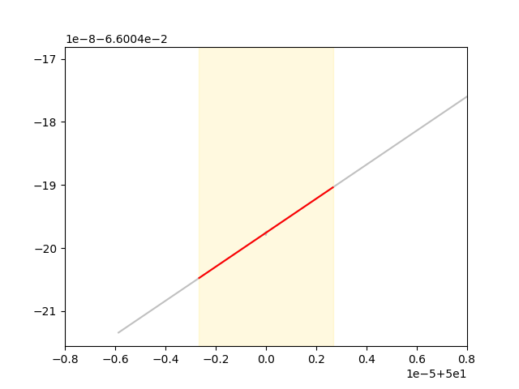


## Equation 10:
```
transient_outward_current__i_to = (10.0 + membrane__V) * (0.20000000000000001 + extracellular_potassium_concentration__Kc / (10.0 + extracellular_potassium_concentration__Kc)) * (intracellular_potassium_concentration__Ki * exp(0.018716945411372737 * membrane__V) - extracellular_potassium_concentration__Kc * exp(-0.018716945411372737 * membrane__V)) * intracellular_calcium_concentration__Cai * transient_outward_current__g_to * transient_outward_current_s_gate__s / ((1.0 - exp(-2.0 - 0.20000000000000001 * membrane__V)) * (0.00050000000000000001 + intracellular_calcium_concentration__Cai))
```
## New Eq:
```
transient_outward_current__i_to = ((fabs(10.0 + membrane__V) < 5.0000000000050004e-7) ? ((-9999999.4999899995 - 999999.99999899988 * membrane__V) * (-5.0000000000050004e-7 * (0.20000000000000001 + extracellular_potassium_concentration__Kc / (10.0 + extracellular_potassium_concentration__Kc)) * (intracellular_potassium_concentration__Ki * exp(-0.18716946347220006) - extracellular_potassium_concentration__Kc * exp(0.18716946347220006)) * intracellular_calcium_concentration__Cai * transient_outward_current__g_to * transient_outward_current_s_gate__s / ((1.0 - exp(9.9999999999406119e-8)) * (0.00050000000000000001 + intracellular_calcium_concentration__Cai)) - 5.0000000000050004e-7 * (0.20000000000000001 + extracellular_potassium_concentration__Kc / (10.0 + extracellular_potassium_concentration__Kc)) * (intracellular_potassium_concentration__Ki * exp(-0.18716944475525465) - extracellular_potassium_concentration__Kc * exp(0.18716944475525465)) * intracellular_calcium_concentration__Cai * transient_outward_current__g_to * transient_outward_current_s_gate__s / ((1.0 - exp(-9.9999999999406119e-8)) * (0.00050000000000000001 + intracellular_calcium_concentration__Cai))) + 5.0000000000050004e-7 * (0.20000000000000001 + extracellular_potassium_concentration__Kc / (10.0 + extracellular_potassium_concentration__Kc)) * (intracellular_potassium_concentration__Ki * exp(-0.18716944475525465) - extracellular_potassium_concentration__Kc * exp(0.18716944475525465)) * intracellular_calcium_concentration__Cai * transient_outward_current__g_to * transient_outward_current_s_gate__s / ((1.0 - exp(-9.9999999999406119e-8)) * (0.00050000000000000001 + intracellular_calcium_concentration__Cai))) : ((10.0 + membrane__V) * (0.20000000000000001 + extracellular_potassium_concentration__Kc / (10.0 + extracellular_potassium_concentration__Kc)) * (intracellular_potassium_concentration__Ki * exp(0.018716945411372737 * membrane__V) - extracellular_potassium_concentration__Kc * exp(-0.018716945411372737 * membrane__V)) * intracellular_calcium_concentration__Cai * transient_outward_current__g_to * transient_outward_current_s_gate__s / ((1.0 - exp(-2.0 - 0.20000000000000001 * membrane__V)) * (0.00050000000000000001 + intracellular_calcium_concentration__Cai))))
```
## Singularity point: -10.000000000000000


# of singularities:  10
singularity processing time: 45.300418200000024
# Model: dokos_model_1996(dokos_model_1996.cellml)
No of piecewises: 0
## Equation 1:
```
fast_sodium_current_m_gate__alpha_m = 200.0 * (34.299999999999997 + membrane__E) / (1.0 - exp(-3.0869999999999997 - 0.089999999999999997 * membrane__E))
```
## New Eq:
```
fast_sodium_current_m_gate__alpha_m = ((fabs(34.299999999999997 + membrane__E) < 1.1111111111183902e-6) ? (0.00022222222222367805 / (1.0 - exp(-9.9999999999406119e-8)) + (-15434999.499898881 - 449999.99999705196 * membrane__E) * (-0.00022222222222367805 / (1.0 - exp(9.9999999999406119e-8)) - 0.00022222222222367805 / (1.0 - exp(-9.9999999999406119e-8)))) : (200.0 * (34.299999999999997 + membrane__E) / (1.0 - exp(-3.0869999999999997 - 0.089999999999999997 * membrane__E))))
```
## Singularity point: -34.299999999999997
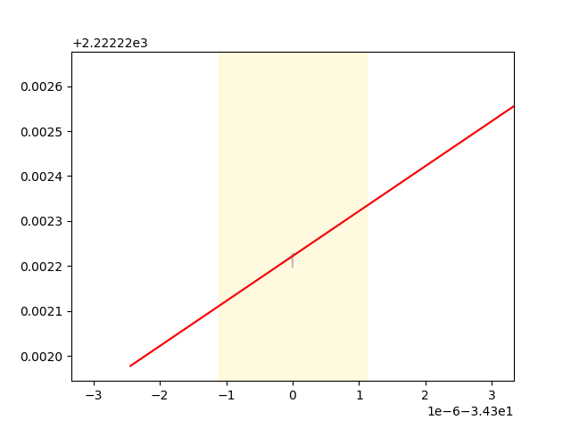


## Equation 2:
```
hyperpolarising_activated_current_y_gate__alpha_y = 0.35999999999999999 * (137.80000000000001 + membrane__E) / (-1.0 + exp(9.0948000000000011 + 0.066000000000000003 * membrane__E))
```
## New Eq:
```
hyperpolarising_activated_current_y_gate__alpha_y = ((fabs(137.80000000000001 + membrane__E) < 1.5151515151412553e-6) ? (-5.4545454545085189e-7 / (-1.0 + exp(-1.0000000000287557e-7)) + (45474000.500307932 + 330000.00000223459 * membrane__E) * (5.4545454545085189e-7 / (-1.0 + exp(9.9999999988997779e-8)) + 5.4545454545085189e-7 / (-1.0 + exp(-1.0000000000287557e-7)))) : (0.35999999999999999 * (137.80000000000001 + membrane__E) / (-1.0 + exp(9.0948000000000011 + 0.066000000000000003 * membrane__E))))
```
## Singularity point: -137.80000000000001
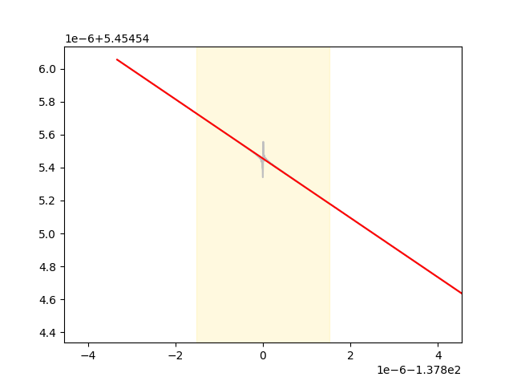


## Equation 3:
```
hyperpolarising_activated_current_y_gate__beta_y = 0.10000000000000001 * (76.299999999999997 + membrane__E) / (1.0 - exp(-16.023 - 0.20999999999999999 * membrane__E))
```
## New Eq:
```
hyperpolarising_activated_current_y_gate__beta_y = ((fabs(76.299999999999997 + membrane__E) < 4.761904762173863e-7) ? (4.7619047627289747e-8 / (1.0 - exp(-1.0000000000287557e-7)) + (-80114999.495472595 - 1049999.9999406631 * membrane__E) * (-4.7619047627289747e-8 / (1.0 - exp(-1.0000000000287557e-7)) - 4.7619047616187521e-8 / (1.0 - exp(1.0000000000287557e-7)))) : (0.10000000000000001 * (76.299999999999997 + membrane__E) / (1.0 - exp(-16.023 - 0.20999999999999999 * membrane__E))))
```
## Singularity point: -76.299999999999997
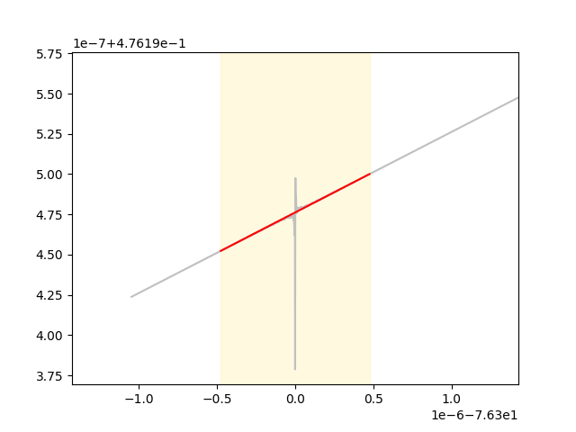


# of singularities:  3
singularity processing time: 18.562601299999983
# Model: earm_noble_model_1990(earm_noble_model_1990.cellml)
No of piecewises: 4
## Equation 1:
```
L_type_calcium_current__i_Ca_L_Ca = 0.14973556329098189 * (1.0 - L_type_calcium_current_f_Ca_gate__f_Ca) * (1.0 - intracellular_calcium_concentration__Ca_i / (0.001 + intracellular_calcium_concentration__Ca_i)) * (-50.0 + membrane__V) * (intracellular_calcium_concentration__Ca_i * exp(3.7433890822745473) - extracellular_calcium_concentration__Ca_o * exp(3.7433890822745473 - 0.074867781645490947 * membrane__V)) * L_type_calcium_current__P_Ca_L * L_type_calcium_current_d_gate__d / (1.0 - exp(3.7433890822745473 - 0.074867781645490947 * membrane__V))
```
## New Eq:
```
L_type_calcium_current__i_Ca_L_Ca = ((fabs(-50.0 + membrane__V) < 1.3356880329551402e-6) ? ((18716945.911788113 - 374338.90823576227 * membrane__V) * (-1.9999999999556149e-7 * (1.0 - L_type_calcium_current_f_Ca_gate__f_Ca) * (1.0 - intracellular_calcium_concentration__Ca_i / (0.001 + intracellular_calcium_concentration__Ca_i)) * (intracellular_calcium_concentration__Ca_i * exp(3.7433890822745473) - extracellular_calcium_concentration__Ca_o * exp(9.9999999999406119e-8)) * L_type_calcium_current__P_Ca_L * L_type_calcium_current_d_gate__d / (1.0 - exp(9.9999999999406119e-8)) - 1.9999999999556149e-7 * (1.0 - L_type_calcium_current_f_Ca_gate__f_Ca) * (1.0 - intracellular_calcium_concentration__Ca_i / (0.001 + intracellular_calcium_concentration__Ca_i)) * (intracellular_calcium_concentration__Ca_i * exp(3.7433890822745473) - extracellular_calcium_concentration__Ca_o * exp(-9.9999999995936673e-8)) * L_type_calcium_current__P_Ca_L * L_type_calcium_current_d_gate__d / (1.0 - exp(-9.9999999995936673e-8))) + 1.9999999999556149e-7 * (1.0 - L_type_calcium_current_f_Ca_gate__f_Ca) * (1.0 - intracellular_calcium_concentration__Ca_i / (0.001 + intracellular_calcium_concentration__Ca_i)) * (intracellular_calcium_concentration__Ca_i * exp(3.7433890822745473) - extracellular_calcium_concentration__Ca_o * exp(-9.9999999995936673e-8)) * L_type_calcium_current__P_Ca_L * L_type_calcium_current_d_gate__d / (1.0 - exp(-9.9999999995936673e-8))) : (0.14973556329098189 * (1.0 - L_type_calcium_current_f_Ca_gate__f_Ca) * (1.0 - intracellular_calcium_concentration__Ca_i / (0.001 + intracellular_calcium_concentration__Ca_i)) * (-50.0 + membrane__V) * (intracellular_calcium_concentration__Ca_i * exp(3.7433890822745473) - extracellular_calcium_concentration__Ca_o * exp(3.7433890822745473 - 0.074867781645490947 * membrane__V)) * L_type_calcium_current__P_Ca_L * L_type_calcium_current_d_gate__d / (1.0 - exp(3.7433890822745473 - 0.074867781645490947 * membrane__V))))
```
## Singularity point: 50.000000000000000
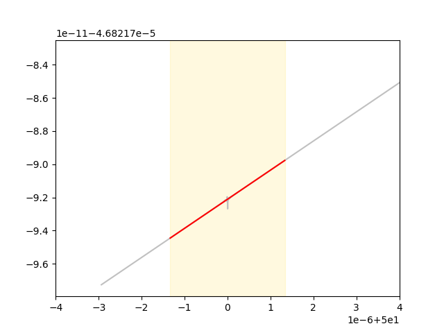


## Equation 2:
```
L_type_calcium_current__i_Ca_L_K = 7.4867781645490941e-5 * (1.0 - L_type_calcium_current_f_Ca_gate__f_Ca) * (1.0 - intracellular_calcium_concentration__Ca_i / (0.001 + intracellular_calcium_concentration__Ca_i)) * (-50.0 + membrane__V) * (intracellular_potassium_concentration__K_i * exp(1.8716945411372736) - extracellular_potassium_concentration__K_c * exp(1.8716945411372736 - 0.037433890822745473 * membrane__V)) * L_type_calcium_current__P_Ca_L * L_type_calcium_current_d_gate__d / (1.0 - exp(1.8716945411372736 - 0.037433890822745473 * membrane__V))
```
## New Eq:
```
L_type_calcium_current__i_Ca_L_K = ((fabs(-50.0 + membrane__V) < 2.6713760659657915e-6) ? ((9358473.2056995872 - 187169.45411399176 * membrane__V) * (-1.999999999997175e-10 * (1.0 - L_type_calcium_current_f_Ca_gate__f_Ca) * (1.0 - intracellular_calcium_concentration__Ca_i / (0.001 + intracellular_calcium_concentration__Ca_i)) * (intracellular_potassium_concentration__K_i * exp(1.8716945411372736) - extracellular_potassium_concentration__K_c * exp(9.9999999999406119e-8)) * L_type_calcium_current__P_Ca_L * L_type_calcium_current_d_gate__d / (1.0 - exp(9.9999999999406119e-8)) - 1.999999999997175e-10 * (1.0 - L_type_calcium_current_f_Ca_gate__f_Ca) * (1.0 - intracellular_calcium_concentration__Ca_i / (0.001 + intracellular_calcium_concentration__Ca_i)) * (intracellular_potassium_concentration__K_i * exp(1.8716945411372736) - extracellular_potassium_concentration__K_c * exp(-9.9999999999406119e-8)) * L_type_calcium_current__P_Ca_L * L_type_calcium_current_d_gate__d / (1.0 - exp(-9.9999999999406119e-8))) + 1.999999999997175e-10 * (1.0 - L_type_calcium_current_f_Ca_gate__f_Ca) * (1.0 - intracellular_calcium_concentration__Ca_i / (0.001 + intracellular_calcium_concentration__Ca_i)) * (intracellular_potassium_concentration__K_i * exp(1.8716945411372736) - extracellular_potassium_concentration__K_c * exp(-9.9999999999406119e-8)) * L_type_calcium_current__P_Ca_L * L_type_calcium_current_d_gate__d / (1.0 - exp(-9.9999999999406119e-8))) : (7.4867781645490941e-5 * (1.0 - L_type_calcium_current_f_Ca_gate__f_Ca) * (1.0 - intracellular_calcium_concentration__Ca_i / (0.001 + intracellular_calcium_concentration__Ca_i)) * (-50.0 + membrane__V) * (intracellular_potassium_concentration__K_i * exp(1.8716945411372736) - extracellular_potassium_concentration__K_c * exp(1.8716945411372736 - 0.037433890822745473 * membrane__V)) * L_type_calcium_current__P_Ca_L * L_type_calcium_current_d_gate__d / (1.0 - exp(1.8716945411372736 - 0.037433890822745473 * membrane__V))))
```
## Singularity point: 50.000000000000000


## Equation 3:
```
L_type_calcium_current__i_Ca_L_Na = 0.00037433890822745472 * (1.0 - L_type_calcium_current_f_Ca_gate__f_Ca) * (1.0 - intracellular_calcium_concentration__Ca_i / (0.001 + intracellular_calcium_concentration__Ca_i)) * (-50.0 + membrane__V) * (intracellular_sodium_concentration__Na_i * exp(1.8716945411372736) - extracellular_sodium_concentration__Na_o * exp(1.8716945411372736 - 0.037433890822745473 * membrane__V)) * L_type_calcium_current__P_Ca_L * L_type_calcium_current_d_gate__d / (1.0 - exp(1.8716945411372736 - 0.037433890822745473 * membrane__V))
```
## New Eq:
```
L_type_calcium_current__i_Ca_L_Na = ((fabs(-50.0 + membrane__V) < 2.6713760659657915e-6) ? ((9358473.2056995872 - 187169.45411399176 * membrane__V) * (-9.9999999999858744e-10 * (1.0 - L_type_calcium_current_f_Ca_gate__f_Ca) * (1.0 - intracellular_calcium_concentration__Ca_i / (0.001 + intracellular_calcium_concentration__Ca_i)) * (intracellular_sodium_concentration__Na_i * exp(1.8716945411372736) - extracellular_sodium_concentration__Na_o * exp(9.9999999999406119e-8)) * L_type_calcium_current__P_Ca_L * L_type_calcium_current_d_gate__d / (1.0 - exp(9.9999999999406119e-8)) - 9.9999999999858744e-10 * (1.0 - L_type_calcium_current_f_Ca_gate__f_Ca) * (1.0 - intracellular_calcium_concentration__Ca_i / (0.001 + intracellular_calcium_concentration__Ca_i)) * (intracellular_sodium_concentration__Na_i * exp(1.8716945411372736) - extracellular_sodium_concentration__Na_o * exp(-9.9999999999406119e-8)) * L_type_calcium_current__P_Ca_L * L_type_calcium_current_d_gate__d / (1.0 - exp(-9.9999999999406119e-8))) + 9.9999999999858744e-10 * (1.0 - L_type_calcium_current_f_Ca_gate__f_Ca) * (1.0 - intracellular_calcium_concentration__Ca_i / (0.001 + intracellular_calcium_concentration__Ca_i)) * (intracellular_sodium_concentration__Na_i * exp(1.8716945411372736) - extracellular_sodium_concentration__Na_o * exp(-9.9999999999406119e-8)) * L_type_calcium_current__P_Ca_L * L_type_calcium_current_d_gate__d / (1.0 - exp(-9.9999999999406119e-8))) : (0.00037433890822745472 * (1.0 - L_type_calcium_current_f_Ca_gate__f_Ca) * (1.0 - intracellular_calcium_concentration__Ca_i / (0.001 + intracellular_calcium_concentration__Ca_i)) * (-50.0 + membrane__V) * (intracellular_sodium_concentration__Na_i * exp(1.8716945411372736) - extracellular_sodium_concentration__Na_o * exp(1.8716945411372736 - 0.037433890822745473 * membrane__V)) * L_type_calcium_current__P_Ca_L * L_type_calcium_current_d_gate__d / (1.0 - exp(1.8716945411372736 - 0.037433890822745473 * membrane__V))))
```
## Singularity point: 50.000000000000000


# of singularities:  3
singularity processing time: 14.374727699999994
# Model: espinosa_model_1998(espinosa_model_1998_normal.cellml)
No of piecewises: 1
## Equation 1:
```
L_type_Ca_channel__i_Ca_L_Ca_ds = 0.14973556329098189 * (-50.0 + membrane__V) * (intracellular_calcium_concentration__Ca_i * exp(3.7433890822745473) - extracellular_calcium_concentration__Ca_o * exp(3.7433890822745473 - 0.074867781645490947 * membrane__V)) * L_type_Ca_channel__P_Ca_L * L_type_Ca_channel_d_gate__d * L_type_Ca_channel_f2ds_gate__f2ds * L_type_Ca_channel_f_gate__f / (1.0 - exp(3.7433890822745473 - 0.074867781645490947 * membrane__V))
```
## New Eq:
```
L_type_Ca_channel__i_Ca_L_Ca_ds = ((fabs(-50.0 + membrane__V) < 1.3356880329551402e-6) ? ((18716945.911788113 - 374338.90823576227 * membrane__V) * (-1.9999999999556149e-7 * (intracellular_calcium_concentration__Ca_i * exp(3.7433890822745473) - extracellular_calcium_concentration__Ca_o * exp(9.9999999999406119e-8)) * L_type_Ca_channel__P_Ca_L * L_type_Ca_channel_d_gate__d * L_type_Ca_channel_f2ds_gate__f2ds * L_type_Ca_channel_f_gate__f / (1.0 - exp(9.9999999999406119e-8)) - 1.9999999999556149e-7 * (intracellular_calcium_concentration__Ca_i * exp(3.7433890822745473) - extracellular_calcium_concentration__Ca_o * exp(-9.9999999999406119e-8)) * L_type_Ca_channel__P_Ca_L * L_type_Ca_channel_d_gate__d * L_type_Ca_channel_f2ds_gate__f2ds * L_type_Ca_channel_f_gate__f / (1.0 - exp(-9.9999999999406119e-8))) + 1.9999999999556149e-7 * (intracellular_calcium_concentration__Ca_i * exp(3.7433890822745473) - extracellular_calcium_concentration__Ca_o * exp(-9.9999999999406119e-8)) * L_type_Ca_channel__P_Ca_L * L_type_Ca_channel_d_gate__d * L_type_Ca_channel_f2ds_gate__f2ds * L_type_Ca_channel_f_gate__f / (1.0 - exp(-9.9999999999406119e-8))) : (0.14973556329098189 * (-50.0 + membrane__V) * (intracellular_calcium_concentration__Ca_i * exp(3.7433890822745473) - extracellular_calcium_concentration__Ca_o * exp(3.7433890822745473 - 0.074867781645490947 * membrane__V)) * L_type_Ca_channel__P_Ca_L * L_type_Ca_channel_d_gate__d * L_type_Ca_channel_f2ds_gate__f2ds * L_type_Ca_channel_f_gate__f / (1.0 - exp(3.7433890822745473 - 0.074867781645490947 * membrane__V))))
```
## Singularity point: 50.000000000000000


## Equation 2:
```
L_type_Ca_channel__i_Ca_L_K_ds = 0.00011230167246823642 * (-50.0 + membrane__V) * (intracellular_potassium_concentration__K_i * exp(1.8716945411372736) - extracellular_potassium_concentration__K_o * exp(1.8716945411372736 - 0.037433890822745473 * membrane__V)) * L_type_Ca_channel__P_Ca_L * L_type_Ca_channel_d_gate__d * L_type_Ca_channel_f2ds_gate__f2ds * L_type_Ca_channel_f_gate__f / (1.0 - exp(1.8716945411372736 - 0.037433890822745473 * membrane__V))
```
## New Eq:
```
L_type_Ca_channel__i_Ca_L_K_ds = ((fabs(-50.0 + membrane__V) < 2.6713760659657915e-6) ? ((9358473.2056995872 - 187169.45411399176 * membrane__V) * (-2.9999999999957622e-10 * (intracellular_potassium_concentration__K_i * exp(1.8716945411372736) - extracellular_potassium_concentration__K_o * exp(9.9999999999406119e-8)) * L_type_Ca_channel__P_Ca_L * L_type_Ca_channel_d_gate__d * L_type_Ca_channel_f2ds_gate__f2ds * L_type_Ca_channel_f_gate__f / (1.0 - exp(9.9999999999406119e-8)) - 2.9999999999957622e-10 * (intracellular_potassium_concentration__K_i * exp(1.8716945411372736) - extracellular_potassium_concentration__K_o * exp(-9.9999999999406119e-8)) * L_type_Ca_channel__P_Ca_L * L_type_Ca_channel_d_gate__d * L_type_Ca_channel_f2ds_gate__f2ds * L_type_Ca_channel_f_gate__f / (1.0 - exp(-9.9999999999406119e-8))) + 2.9999999999957622e-10 * (intracellular_potassium_concentration__K_i * exp(1.8716945411372736) - extracellular_potassium_concentration__K_o * exp(-9.9999999999406119e-8)) * L_type_Ca_channel__P_Ca_L * L_type_Ca_channel_d_gate__d * L_type_Ca_channel_f2ds_gate__f2ds * L_type_Ca_channel_f_gate__f / (1.0 - exp(-9.9999999999406119e-8))) : (0.00011230167246823642 * (-50.0 + membrane__V) * (intracellular_potassium_concentration__K_i * exp(1.8716945411372736) - extracellular_potassium_concentration__K_o * exp(1.8716945411372736 - 0.037433890822745473 * membrane__V)) * L_type_Ca_channel__P_Ca_L * L_type_Ca_channel_d_gate__d * L_type_Ca_channel_f2ds_gate__f2ds * L_type_Ca_channel_f_gate__f / (1.0 - exp(1.8716945411372736 - 0.037433890822745473 * membrane__V))))
```
## Singularity point: 50.000000000000000
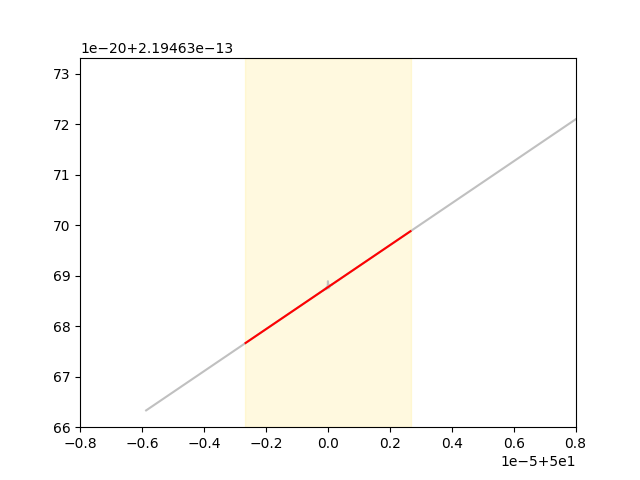


## Equation 3:
```
L_type_Ca_channel__i_Ca_L_Na_ds = 0.00037433890822745472 * (-50.0 + membrane__V) * (intracellular_sodium_concentration__Na_i * exp(1.8716945411372736) - extracellular_sodium_concentration__Na_o * exp(1.8716945411372736 - 0.037433890822745473 * membrane__V)) * L_type_Ca_channel__P_Ca_L * L_type_Ca_channel_d_gate__d * L_type_Ca_channel_f2ds_gate__f2ds * L_type_Ca_channel_f_gate__f / (1.0 - exp(1.8716945411372736 - 0.037433890822745473 * membrane__V))
```
## New Eq:
```
L_type_Ca_channel__i_Ca_L_Na_ds = ((fabs(-50.0 + membrane__V) < 2.6713760659657915e-6) ? ((9358473.2056995872 - 187169.45411399176 * membrane__V) * (-9.9999999999858744e-10 * (intracellular_sodium_concentration__Na_i * exp(1.8716945411372736) - extracellular_sodium_concentration__Na_o * exp(9.9999999999406119e-8)) * L_type_Ca_channel__P_Ca_L * L_type_Ca_channel_d_gate__d * L_type_Ca_channel_f2ds_gate__f2ds * L_type_Ca_channel_f_gate__f / (1.0 - exp(9.9999999999406119e-8)) - 9.9999999999858744e-10 * (intracellular_sodium_concentration__Na_i * exp(1.8716945411372736) - extracellular_sodium_concentration__Na_o * exp(-9.9999999999406119e-8)) * L_type_Ca_channel__P_Ca_L * L_type_Ca_channel_d_gate__d * L_type_Ca_channel_f2ds_gate__f2ds * L_type_Ca_channel_f_gate__f / (1.0 - exp(-9.9999999999406119e-8))) + 9.9999999999858744e-10 * (intracellular_sodium_concentration__Na_i * exp(1.8716945411372736) - extracellular_sodium_concentration__Na_o * exp(-9.9999999999406119e-8)) * L_type_Ca_channel__P_Ca_L * L_type_Ca_channel_d_gate__d * L_type_Ca_channel_f2ds_gate__f2ds * L_type_Ca_channel_f_gate__f / (1.0 - exp(-9.9999999999406119e-8))) : (0.00037433890822745472 * (-50.0 + membrane__V) * (intracellular_sodium_concentration__Na_i * exp(1.8716945411372736) - extracellular_sodium_concentration__Na_o * exp(1.8716945411372736 - 0.037433890822745473 * membrane__V)) * L_type_Ca_channel__P_Ca_L * L_type_Ca_channel_d_gate__d * L_type_Ca_channel_f2ds_gate__f2ds * L_type_Ca_channel_f_gate__f / (1.0 - exp(1.8716945411372736 - 0.037433890822745473 * membrane__V))))
```
## Singularity point: 50.000000000000000
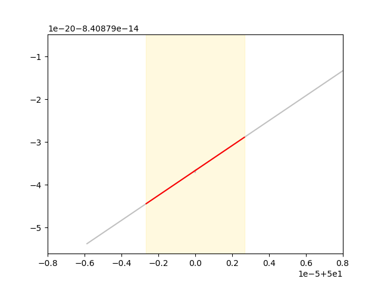


## Equation 4:
```
L_type_Ca_channel_d_gate__alpha_d = 30.0 * (4.0 + membrane__V) / (1.0 - exp(-1.3333333333333333 - 0.33333333333333331 * membrane__V))
```
## New Eq:
```
L_type_Ca_channel_d_gate__alpha_d = ((fabs(4.0 + membrane__V) < 2.9999999999648364e-7) ? (8.9999999999465508e-6 / (1.0 - exp(-9.9999999999406119e-8)) + (-6666666.1667448077 - 1666666.6666862019 * membrane__V) * (-8.9999999998424673e-6 / (1.0 - exp(9.9999999997671396e-8)) - 8.9999999999465508e-6 / (1.0 - exp(-9.9999999999406119e-8)))) : (30.0 * (4.0 + membrane__V) / (1.0 - exp(-1.3333333333333333 - 0.33333333333333331 * membrane__V))))
```
## Singularity point: -4.0000000000000000
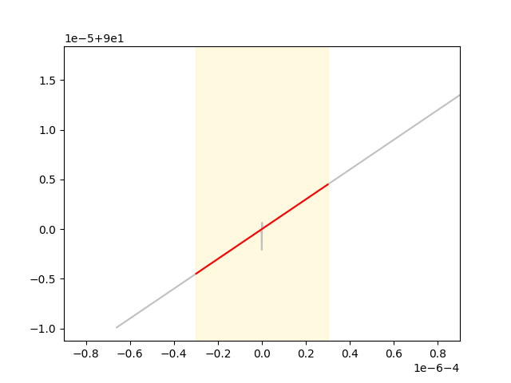


## Equation 5:
```
L_type_Ca_channel_d_gate__beta_d = 12.0 * (4.0 + membrane__V) / (-1.0 + exp(0.53333333333333333 + 0.13333333333333333 * membrane__V))
```
## New Eq:
```
L_type_Ca_channel_d_gate__beta_d = ((fabs(4.0 + membrane__V) < 7.5000000000075007e-7) ? (-9.0000000000090008e-6 / (-1.0 + exp(-1.0000000000027348e-7)) + (2666667.1666639997 + 666666.66666599992 * membrane__V) * (9.0000000000090008e-6 / (-1.0 + exp(1.0000000000027348e-7)) + 9.0000000000090008e-6 / (-1.0 + exp(-1.0000000000027348e-7)))) : (12.0 * (4.0 + membrane__V) / (-1.0 + exp(0.53333333333333333 + 0.13333333333333333 * membrane__V))))
```
## Singularity point: -4.0000000000000000
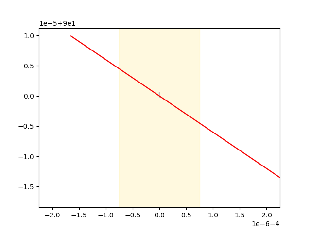


## Equation 6:
```
L_type_Ca_channel_f_gate__alpha_f = 6.25 * (24.0 + membrane__V) / (-1.0 + exp(4.3636363636363633 + 0.18181818181818182 * membrane__V))
```
## New Eq:
```
L_type_Ca_channel_f_gate__alpha_f = ((fabs(24.0 + membrane__V) < 5.5000000001581562e-7) ? (-3.4375000000988476e-6 / (-1.0 + exp(-1.0000000000287557e-7)) + (21818182.317554422 + 909090.90906476753 * membrane__V) * (3.4375000000988476e-6 / (-1.0 + exp(1.0000000000287557e-7)) + 3.4375000000988476e-6 / (-1.0 + exp(-1.0000000000287557e-7)))) : (6.25 * (24.0 + membrane__V) / (-1.0 + exp(4.3636363636363633 + 0.18181818181818182 * membrane__V))))
```
## Singularity point: -24.000000000000000
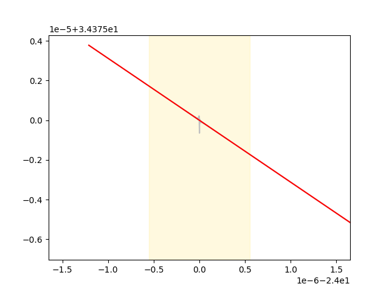


## Equation 7:
```
fast_sodium_current_m_gate__alpha_m = 200.0 * (41.0 + membrane__V) / (1.0 - exp(-4.1000000000000005 - 0.10000000000000001 * membrane__V))
```
## New Eq:
```
fast_sodium_current_m_gate__alpha_m = ((fabs(41.0 + membrane__V) < 1.0000000000287557e-6) ? (0.00020000000000575113 / (1.0 - exp(-1.0000000000287557e-7)) + (-20499999.49941051 - 499999.99998562218 * membrane__V) * (-0.00020000000000575113 / (1.0 - exp(1.0000000000287557e-7)) - 0.00020000000000575113 / (1.0 - exp(-1.0000000000287557e-7)))) : (200.0 * (41.0 + membrane__V) / (1.0 - exp(-4.1000000000000005 - 0.10000000000000001 * membrane__V))))
```
## Singularity point: -41.000000000000000


## Equation 8:
```
time_dependent_potassium_current_x_gate__alpha_x = 1.5 * (-18.0 + membrane__V) / (1.0 - exp(3.6000000000000001 - 0.20000000000000001 * membrane__V))
```
## New Eq:
```
time_dependent_potassium_current_x_gate__alpha_x = ((fabs(-18.0 + membrane__V) < 5.0000000000050004e-7) ? (7.5000000002156675e-7 / (1.0 - exp(-1.0000000000287557e-7)) + (18000000.499981999 - 999999.99999899988 * membrane__V) * (-7.5000000002156675e-7 / (1.0 - exp(-1.0000000000287557e-7)) - 7.4999999997993338e-7 / (1.0 - exp(9.9999999999406119e-8)))) : (1.5 * (-18.0 + membrane__V) / (1.0 - exp(3.6000000000000001 - 0.20000000000000001 * membrane__V))))
```
## Singularity point: 18.000000000000000
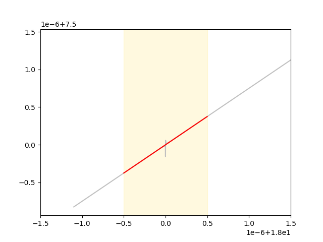


## Equation 9:
```
time_dependent_potassium_current_x_gate__beta_x = 0.53400000000000003 * (-18.0 + membrane__V) / (-1.0 + exp(-1.2 + 0.066666666666666666 * membrane__V))
```
## New Eq:
```
time_dependent_potassium_current_x_gate__beta_x = ((fabs(-18.0 + membrane__V) < 1.4999999999876223e-6) ? (-8.0099999999339032e-7 / (-1.0 + exp(-9.9999999999406119e-8)) + (-5999999.500049511 + 333333.33333608392 * membrane__V) * (8.0099999999339032e-7 / (-1.0 + exp(9.9999999999406119e-8)) + 8.0099999999339032e-7 / (-1.0 + exp(-9.9999999999406119e-8)))) : (0.53400000000000003 * (-18.0 + membrane__V) / (-1.0 + exp(-1.2 + 0.066666666666666666 * membrane__V))))
```
## Singularity point: 18.000000000000000
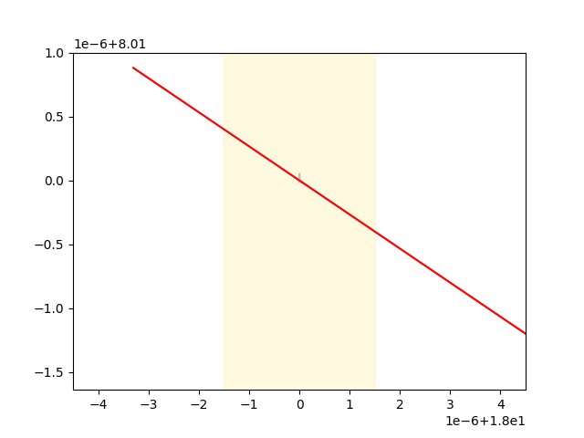


# of singularities:  9
singularity processing time: 43.317373599999996
# Model: faber_rudy_2000(faber_rudy_2000.cellml)
No of piecewises: 13
## Equation 1:
```
L_type_Ca_channel__I_CaCa = 14448.004881001343 * (-0.34100000000000003 * calcium_dynamics__Cao + calcium_dynamics__Cai * exp(0.074871767015605231 * cell__V)) * L_type_Ca_channel__P_Ca * cell__V / (-1.0 + exp(0.074871767015605231 * cell__V))
```
## New Eq:
```
L_type_Ca_channel__I_CaCa = ((fabs(cell__V) < 1.3356169352749131e-6) ? ((0.5 + 374358.83507802623 * cell__V) * (0.019296999999999998 * (-0.34100000000000003 * calcium_dynamics__Cao + calcium_dynamics__Cai * exp(9.9999999999999995e-8)) * L_type_Ca_channel__P_Ca / (-1.0 + exp(9.9999999999999995e-8)) + 0.019296999999999998 * (-0.34100000000000003 * calcium_dynamics__Cao + calcium_dynamics__Cai * exp(-9.9999999999999995e-8)) * L_type_Ca_channel__P_Ca / (-1.0 + exp(-9.9999999999999995e-8))) - 0.019296999999999998 * (-0.34100000000000003 * calcium_dynamics__Cao + calcium_dynamics__Cai * exp(-9.9999999999999995e-8)) * L_type_Ca_channel__P_Ca / (-1.0 + exp(-9.9999999999999995e-8))) : (14448.004881001343 * (-0.34100000000000003 * calcium_dynamics__Cao + calcium_dynamics__Cai * exp(0.074871767015605231 * cell__V)) * L_type_Ca_channel__P_Ca * cell__V / (-1.0 + exp(0.074871767015605231 * cell__V))))
```
## Singularity point: 0


## Equation 2:
```
L_type_Ca_channel_d_gate__tau_d = 28.571428571428569 * (1.0 - exp(-1.6025641025641024 - 0.16025641025641024 * cell__V)) / ((1.0 + exp(-1.6025641025641024 - 0.16025641025641024 * cell__V)) * (10.0 + cell__V))
```
## New Eq:
```
L_type_Ca_channel_d_gate__tau_d = ((fabs(10.0 + cell__V) < 6.2399999999074307e-7) ? ((-8012820.0129393814 - 801282.05129393819 * cell__V) * (-45787545.788225032 * (1.0 - exp(9.9999999997671396e-8)) / (1.0 + exp(9.9999999997671396e-8)) - 45787545.788225032 * (1.0 - exp(-9.9999999997671396e-8)) / (1.0 + exp(-9.9999999997671396e-8))) + 45787545.788225032 * (1.0 - exp(-9.9999999997671396e-8)) / (1.0 + exp(-9.9999999997671396e-8))) : (28.571428571428569 * (1.0 - exp(-1.6025641025641024 - 0.16025641025641024 * cell__V)) / ((1.0 + exp(-1.6025641025641024 - 0.16025641025641024 * cell__V)) * (10.0 + cell__V))))
```
## Singularity point: -10.000000000000000
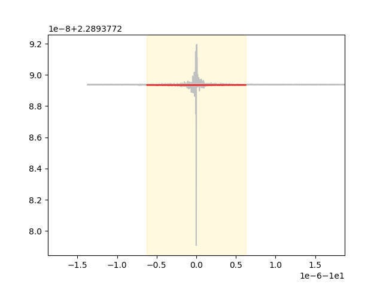


## Equation 3:
```
fast_sodium_current_m_gate__alpha_m = 0.32000000000000001 * (47.130000000000003 + cell__V) / (1.0 - exp(-4.7130000000000001 - 0.10000000000000001 * cell__V))
```
## New Eq:
```
fast_sodium_current_m_gate__alpha_m = ((fabs(47.130000000000003 + cell__V) < 1.0000000000287557e-6) ? (3.200000000092018e-7 / (1.0 - exp(-1.0000000000287557e-7)) + (-23564999.499322373 - 499999.99998562218 * cell__V) * (-3.200000000092018e-7 / (1.0 - exp(1.0000000000287557e-7)) - 3.200000000092018e-7 / (1.0 - exp(-1.0000000000287557e-7)))) : (0.32000000000000001 * (47.130000000000003 + cell__V) / (1.0 - exp(-4.7130000000000001 - 0.10000000000000001 * cell__V))))
```
## Singularity point: -47.130000000000003


## Equation 4:
```
L_type_Ca_channel__I_CaK = 0.00069711623550831479 * (-0.75 * ionic_concentrations__Ko + 0.75 * ionic_concentrations__Ki * exp(0.037435883507802616 * cell__V)) * cell__V / (-1.0 + exp(0.037435883507802616 * cell__V))
```
## New Eq:
```
L_type_Ca_channel__I_CaK = ((fabs(cell__V) < 2.6712338705498262e-6) ? ((0.5 + 187179.41753901311 * cell__V) * (1.8621604999999999e-9 * (-0.75 * ionic_concentrations__Ko + 0.75 * ionic_concentrations__Ki * exp(9.9999999999999995e-8)) / (-1.0 + exp(9.9999999999999995e-8)) + 1.8621604999999999e-9 * (-0.75 * ionic_concentrations__Ko + 0.75 * ionic_concentrations__Ki * exp(-9.9999999999999995e-8)) / (-1.0 + exp(-9.9999999999999995e-8))) - 1.8621604999999999e-9 * (-0.75 * ionic_concentrations__Ko + 0.75 * ionic_concentrations__Ki * exp(-9.9999999999999995e-8)) / (-1.0 + exp(-9.9999999999999995e-8))) : (0.00069711623550831479 * (-0.75 * ionic_concentrations__Ko + 0.75 * ionic_concentrations__Ki * exp(0.037435883507802616 * cell__V)) * cell__V / (-1.0 + exp(0.037435883507802616 * cell__V))))
```
## Singularity point: 0


## Equation 5:
```
L_type_Ca_channel__I_CaNa = 0.0024381008236689767 * (-0.75 * ionic_concentrations__Nao + 0.75 * ionic_concentrations__Nai * exp(0.037435883507802616 * cell__V)) * cell__V / (-1.0 + exp(0.037435883507802616 * cell__V))
```
## New Eq:
```
L_type_Ca_channel__I_CaNa = ((fabs(cell__V) < 2.6712338705498262e-6) ? ((0.5 + 187179.41753901311 * cell__V) * (6.5127375e-9 * (-0.75 * ionic_concentrations__Nao + 0.75 * ionic_concentrations__Nai * exp(9.9999999999999995e-8)) / (-1.0 + exp(9.9999999999999995e-8)) + 6.5127375e-9 * (-0.75 * ionic_concentrations__Nao + 0.75 * ionic_concentrations__Nai * exp(-9.9999999999999995e-8)) / (-1.0 + exp(-9.9999999999999995e-8))) - 6.5127375e-9 * (-0.75 * ionic_concentrations__Nao + 0.75 * ionic_concentrations__Nai * exp(-9.9999999999999995e-8)) / (-1.0 + exp(-9.9999999999999995e-8))) : (0.0024381008236689767 * (-0.75 * ionic_concentrations__Nao + 0.75 * ionic_concentrations__Nai * exp(0.037435883507802616 * cell__V)) * cell__V / (-1.0 + exp(0.037435883507802616 * cell__V))))
```
## Singularity point: 0
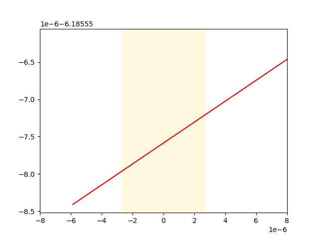


## Equation 6:
```
non_specific_calcium_activated_current__I_ns_K = 0.00063210021354380874 * (-0.75 * ionic_concentrations__Ko + 0.75 * ionic_concentrations__Ki * exp(0.037435883507802616 * cell__V)) * cell__V / (-1.0 + exp(0.037435883507802616 * cell__V))
```
## New Eq:
```
non_specific_calcium_activated_current__I_ns_K = ((fabs(cell__V) < 2.6712338705498262e-6) ? ((0.5 + 187179.41753901311 * cell__V) * (1.6884874999999999e-9 * (-0.75 * ionic_concentrations__Ko + 0.75 * ionic_concentrations__Ki * exp(9.9999999999999995e-8)) / (-1.0 + exp(9.9999999999999995e-8)) + 1.6884874999999999e-9 * (-0.75 * ionic_concentrations__Ko + 0.75 * ionic_concentrations__Ki * exp(-9.9999999999999995e-8)) / (-1.0 + exp(-9.9999999999999995e-8))) - 1.6884874999999999e-9 * (-0.75 * ionic_concentrations__Ko + 0.75 * ionic_concentrations__Ki * exp(-9.9999999999999995e-8)) / (-1.0 + exp(-9.9999999999999995e-8))) : (0.00063210021354380874 * (-0.75 * ionic_concentrations__Ko + 0.75 * ionic_concentrations__Ki * exp(0.037435883507802616 * cell__V)) * cell__V / (-1.0 + exp(0.037435883507802616 * cell__V))))
```
## Singularity point: 0
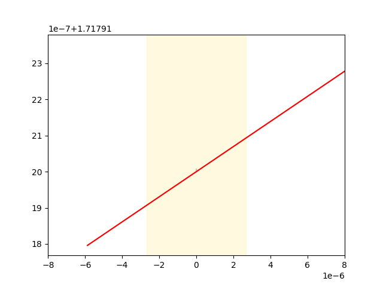


## Equation 7:
```
non_specific_calcium_activated_current__I_ns_Na = 0.00063210021354380874 * (-0.75 * ionic_concentrations__Nao + 0.75 * ionic_concentrations__Nai * exp(0.037435883507802616 * cell__V)) * cell__V / (-1.0 + exp(0.037435883507802616 * cell__V))
```
## New Eq:
```
non_specific_calcium_activated_current__I_ns_Na = ((fabs(cell__V) < 2.6712338705498262e-6) ? ((0.5 + 187179.41753901311 * cell__V) * (1.6884874999999999e-9 * (-0.75 * ionic_concentrations__Nao + 0.75 * ionic_concentrations__Nai * exp(9.9999999999999995e-8)) / (-1.0 + exp(9.9999999999999995e-8)) + 1.6884874999999999e-9 * (-0.75 * ionic_concentrations__Nao + 0.75 * ionic_concentrations__Nai * exp(-9.9999999999999995e-8)) / (-1.0 + exp(-9.9999999999999995e-8))) - 1.6884874999999999e-9 * (-0.75 * ionic_concentrations__Nao + 0.75 * ionic_concentrations__Nai * exp(-9.9999999999999995e-8)) / (-1.0 + exp(-9.9999999999999995e-8))) : (0.00063210021354380874 * (-0.75 * ionic_concentrations__Nao + 0.75 * ionic_concentrations__Nai * exp(0.037435883507802616 * cell__V)) * cell__V / (-1.0 + exp(0.037435883507802616 * cell__V))))
```
## Singularity point: 0


## Equation 8:
```
rapid_delayed_rectifier_potassium_current_xr_gate__tau_xr = 1 / (0.00060999999999999997 * (38.899999999999999 + cell__V) / (-1.0 + exp(5.6404999999999994 + 0.14499999999999999 * cell__V)) + 0.0013799999999999999 * (14.199999999999999 + cell__V) / (1.0 - exp(-1.7465999999999999 - 0.123 * cell__V)))
```
## New Eq:
```
rapid_delayed_rectifier_potassium_current_xr_gate__tau_xr = 1 / (((fabs(14.199999999999999 + cell__V) < 8.1300813007528783e-7) ? (1.1219512195134727e-9 / (1.0 - exp(-9.9999999999406119e-8)) + (-8732999.5000645891 - 615000.00000454858 * cell__V) * (-1.1219512194943214e-9 / (1.0 - exp(9.9999999999406119e-8)) - 1.1219512195134727e-9 / (1.0 - exp(-9.9999999999406119e-8)))) : (0.0013799999999999999 * (14.199999999999999 + cell__V) / (1.0 - exp(-1.7465999999999999 - 0.123 * cell__V)))) + ((fabs(38.899999999999999 + cell__V) < 6.896551724422384e-7) ? (-4.2068965517283451e-10 / (-1.0 + exp(-1.0000000000287557e-7)) + (28202500.498836767 + 724999.99997009686 * cell__V) * (4.2068965517283451e-10 / (-1.0 + exp(-1.0000000000287557e-7)) + 4.2068965520669629e-10 / (-1.0 + exp(1.0000000000287557e-7)))) : (0.00060999999999999997 * (38.899999999999999 + cell__V) / (-1.0 + exp(5.6404999999999994 + 0.14499999999999999 * cell__V)))))
```
## Singularity point: -38.899999999999999
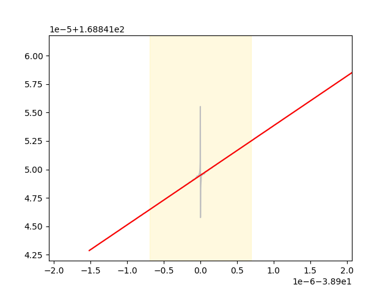

## Singularity point: -14.199999999999999
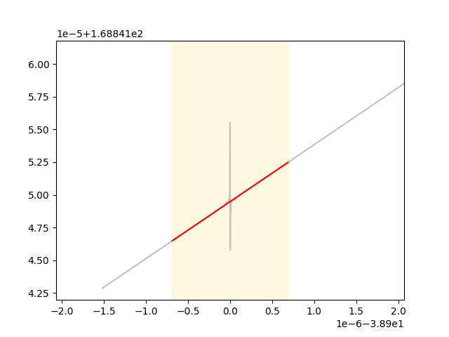


## Equation 9:
```
slow_delayed_rectifier_potassium_current_xs1_gate__tau_xs1 = 1 / (0.00013100000000000001 * (30.0 + cell__V) / (-1.0 + exp(2.0609999999999999 + 0.068699999999999997 * cell__V)) + 7.1899999999999999e-5 * (30.0 + cell__V) / (1.0 - exp(-4.4399999999999995 - 0.14799999999999999 * cell__V)))
```
## New Eq:
```
slow_delayed_rectifier_potassium_current_xs1_gate__tau_xs1 = ((fabs(30.0 + cell__V) < 1.455604075689676e-6) ? (1 / (-1.0465793304208771e-10 / (1.0 - exp(2.1542940320529169e-7)) - 1.9068413391534758e-10 / (-1.0 + exp(-9.9999999999406119e-8)) + (10305000.50001229 + 343500.00000040967 * cell__V) * (1.0465793304208771e-10 / (1.0 - exp(2.1542940320529169e-7)) + 1.0465793304208771e-10 / (1.0 - exp(-2.1542940320529169e-7)) + 1.9068413391534758e-10 / (-1.0 + exp(9.9999999999406119e-8)) + 1.9068413391534758e-10 / (-1.0 + exp(-9.9999999999406119e-8))))) : (1 / (0.00013100000000000001 * (30.0 + cell__V) / (-1.0 + exp(2.0609999999999999 + 0.068699999999999997 * cell__V)) + 7.1899999999999999e-5 * (30.0 + cell__V) / (1.0 - exp(-4.4399999999999995 - 0.14799999999999999 * cell__V)))))
```
## Singularity point: -30.000000000000000


## Equation 10:
```
slow_delayed_rectifier_potassium_current_xs2_gate__tau_xs2 = 4.0 / (0.00013100000000000001 * (30.0 + cell__V) / (-1.0 + exp(2.0609999999999999 + 0.068699999999999997 * cell__V)) + 7.1899999999999999e-5 * (30.0 + cell__V) / (1.0 - exp(-4.4399999999999995 - 0.14799999999999999 * cell__V)))
```
## New Eq:
```
slow_delayed_rectifier_potassium_current_xs2_gate__tau_xs2 = 4.0 * ((fabs(30.0 + cell__V) < 1.455604075689676e-6) ? (1 / (-1.0465793304208771e-10 / (1.0 - exp(2.1542940320529169e-7)) - 1.9068413391534758e-10 / (-1.0 + exp(-9.9999999999406119e-8)) + (10305000.50001229 + 343500.00000040967 * cell__V) * (1.0465793304208771e-10 / (1.0 - exp(2.1542940320529169e-7)) + 1.0465793304208771e-10 / (1.0 - exp(-2.1542940320529169e-7)) + 1.9068413391534758e-10 / (-1.0 + exp(9.9999999999406119e-8)) + 1.9068413391534758e-10 / (-1.0 + exp(-9.9999999999406119e-8))))) : (1 / (0.00013100000000000001 * (30.0 + cell__V) / (-1.0 + exp(2.0609999999999999 + 0.068699999999999997 * cell__V)) + 7.1899999999999999e-5 * (30.0 + cell__V) / (1.0 - exp(-4.4399999999999995 - 0.14799999999999999 * cell__V)))))
```
## Singularity point: -30.000000000000000
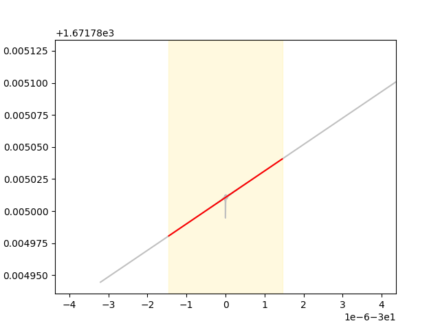


# of singularities:  11
singularity processing time: 65.35734520000005
# Model: fink_noble_giles_model_2008(fink_noble_giles_model_2008.cellml)
No of piecewises: 4
## Equation 1:
```
ICaL__i_CaL = 14447.286958825251 * (-15.0 + cell__V) * (-Environment__Ca_o + 0.25 * Ca__Ca_ss * exp(-1.1230167246823641 + 0.074867781645490947 * cell__V)) * ICaL__g_CaL * iCaL_d_gate__d * iCaL_f2_gate__f2 * iCaL_fCass_gate__fCass * iCaL_f_gate__f / (-1.0 + exp(-1.1230167246823641 + 0.074867781645490947 * cell__V))
```
## New Eq:
```
ICaL__i_CaL = ((fabs(-15.0 + cell__V) < 1.3356880329828957e-6) ? ((-5615083.1234197523 + 374338.90822798351 * cell__V) * (0.019297068299972742 * (-Environment__Ca_o + 0.25 * Ca__Ca_ss * exp(9.9999999999406119e-8)) * ICaL__g_CaL * iCaL_d_gate__d * iCaL_f2_gate__f2 * iCaL_fCass_gate__fCass * iCaL_f_gate__f / (-1.0 + exp(9.9999999999406119e-8)) + 0.019297068299972742 * (-Environment__Ca_o + 0.25 * Ca__Ca_ss * exp(-9.9999999999406119e-8)) * ICaL__g_CaL * iCaL_d_gate__d * iCaL_f2_gate__f2 * iCaL_fCass_gate__fCass * iCaL_f_gate__f / (-1.0 + exp(-9.9999999999406119e-8))) - 0.019297068299972742 * (-Environment__Ca_o + 0.25 * Ca__Ca_ss * exp(-9.9999999999406119e-8)) * ICaL__g_CaL * iCaL_d_gate__d * iCaL_f2_gate__f2 * iCaL_fCass_gate__fCass * iCaL_f_gate__f / (-1.0 + exp(-9.9999999999406119e-8))) : (14447.286958825251 * (-15.0 + cell__V) * (-Environment__Ca_o + 0.25 * Ca__Ca_ss * exp(-1.1230167246823641 + 0.074867781645490947 * cell__V)) * ICaL__g_CaL * iCaL_d_gate__d * iCaL_f2_gate__f2 * iCaL_fCass_gate__fCass * iCaL_f_gate__f / (-1.0 + exp(-1.1230167246823641 + 0.074867781645490947 * cell__V))))
```
## Singularity point: 15.000000000000000
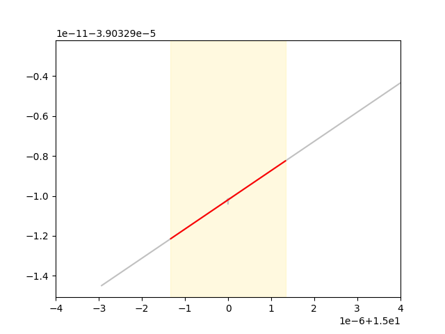


# of singularities:  1
singularity processing time: 6.0758763000000044
# Model: fox_model_2001(fox_mcharg_gilmour_2002.cellml)
No of piecewises: 0
## Equation 1:
```
fast_sodium_current_m_gate__alpha_m = 0.32000000000000001 * (47.130000000000003 + membrane__V) / (1.0 - exp(-4.7130000000000001 - 0.10000000000000001 * membrane__V))
```
## New Eq:
```
fast_sodium_current_m_gate__alpha_m = ((fabs(47.130000000000003 + membrane__V) < 1.0000000000287557e-6) ? (3.200000000092018e-7 / (1.0 - exp(-1.0000000000287557e-7)) + (-23564999.499322373 - 499999.99998562218 * membrane__V) * (-3.200000000092018e-7 / (1.0 - exp(1.0000000000287557e-7)) - 3.200000000092018e-7 / (1.0 - exp(-1.0000000000287557e-7)))) : (0.32000000000000001 * (47.130000000000003 + membrane__V) / (1.0 - exp(-4.7130000000000001 - 0.10000000000000001 * membrane__V))))
```
## Singularity point: -47.130000000000003


## Equation 2:
```
slow_activating_delayed_rectifiyer_K_current_X_ks_gate__tau_X_ks = 1 / (0.00013100000000000001 * (-10.0 + membrane__V) / (-1.0 + exp(-0.68699999999999994 + 0.068699999999999997 * membrane__V)) + 7.1899999999999999e-5 * (-10.0 + membrane__V) / (1.0 - exp(1.48 - 0.14799999999999999 * membrane__V)))
```
## New Eq:
```
slow_activating_delayed_rectifiyer_K_current_X_ks_gate__tau_X_ks = ((fabs(-10.0 + membrane__V) < 1.455604075689676e-6) ? (1 / (-1.0465793304208771e-10 / (1.0 - exp(2.1542940320182224e-7)) - 1.9068413391534758e-10 / (-1.0 + exp(-1.0000000000027348e-7)) + (-3434999.5000040964 + 343500.00000040967 * membrane__V) * (1.0465793304208771e-10 / (1.0 - exp(2.1542940320182224e-7)) + 1.0465793304208771e-10 / (1.0 - exp(-2.1542940320182224e-7)) + 1.9068413391534758e-10 / (-1.0 + exp(1.0000000000027348e-7)) + 1.9068413391534758e-10 / (-1.0 + exp(-1.0000000000027348e-7))))) : (1 / (0.00013100000000000001 * (-10.0 + membrane__V) / (-1.0 + exp(-0.68699999999999994 + 0.068699999999999997 * membrane__V)) + 7.1899999999999999e-5 * (-10.0 + membrane__V) / (1.0 - exp(1.48 - 0.14799999999999999 * membrane__V)))))
```
## Singularity point: 10.000000000000000
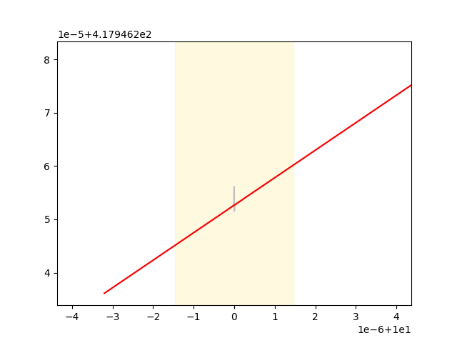


## Equation 3:
```
L_type_Ca_current__i_Ca_max = 14.452497536219512 * (-0.34100000000000003 * standard_ionic_concentrations__Ca_o + 1000.0 * calcium_dynamics__Ca_i_converted * exp(0.074883406923417162 * membrane__V)) * L_type_Ca_current__P_Ca * membrane__V / (-1.0 + exp(0.074883406923417162 * membrane__V))
```
## New Eq:
```
L_type_Ca_current__i_Ca_max = ((fabs(membrane__V) < 1.3354093264248704e-6) ? ((0.5 + 374417.03461708582 * membrane__V) * (1.9299999999999998e-5 * (-0.34100000000000003 * standard_ionic_concentrations__Ca_o + 1000.0 * calcium_dynamics__Ca_i_converted * exp(9.9999999999999995e-8)) * L_type_Ca_current__P_Ca / (-1.0 + exp(9.9999999999999995e-8)) + 1.9299999999999998e-5 * (-0.34100000000000003 * standard_ionic_concentrations__Ca_o + 1000.0 * calcium_dynamics__Ca_i_converted * exp(-9.9999999999999995e-8)) * L_type_Ca_current__P_Ca / (-1.0 + exp(-9.9999999999999995e-8))) - 1.9299999999999998e-5 * (-0.34100000000000003 * standard_ionic_concentrations__Ca_o + 1000.0 * calcium_dynamics__Ca_i_converted * exp(-9.9999999999999995e-8)) * L_type_Ca_current__P_Ca / (-1.0 + exp(-9.9999999999999995e-8))) : (14.452497536219512 * (-0.34100000000000003 * standard_ionic_concentrations__Ca_o + 1000.0 * calcium_dynamics__Ca_i_converted * exp(0.074883406923417162 * membrane__V)) * L_type_Ca_current__P_Ca * membrane__V / (-1.0 + exp(0.074883406923417162 * membrane__V))))
```
## Singularity point: 0


## Equation 4:
```
L_type_Ca_current__i_CaK = 0.0020919990183677745 * (-standard_ionic_concentrations__K_o + standard_ionic_concentrations__K_i * exp(0.037441703461708581 * membrane__V)) * L_type_Ca_current_d_gate__d * L_type_Ca_current_f_Ca_gate__f_Ca * L_type_Ca_current_f_gate__f * membrane__V / ((1.0 - 3.773584905660377 * L_type_Ca_current__i_Ca_max) * (-1.0 + exp(0.037441703461708581 * membrane__V)))
```
## New Eq:
```
L_type_Ca_current__i_CaK = ((fabs(membrane__V) < 2.6708186528497407e-6) ? ((0.5 + 187208.51730854291 * membrane__V) * (5.5873499999999997e-9 * (-standard_ionic_concentrations__K_o + standard_ionic_concentrations__K_i * exp(9.9999999999999995e-8)) * L_type_Ca_current_d_gate__d * L_type_Ca_current_f_Ca_gate__f_Ca * L_type_Ca_current_f_gate__f / ((1.0 - 3.773584905660377 * L_type_Ca_current__i_Ca_max) * (-1.0 + exp(9.9999999999999995e-8))) + 5.5873499999999997e-9 * (-standard_ionic_concentrations__K_o + standard_ionic_concentrations__K_i * exp(-9.9999999999999995e-8)) * L_type_Ca_current_d_gate__d * L_type_Ca_current_f_Ca_gate__f_Ca * L_type_Ca_current_f_gate__f / ((1.0 - 3.773584905660377 * L_type_Ca_current__i_Ca_max) * (-1.0 + exp(-9.9999999999999995e-8)))) - 5.5873499999999997e-9 * (-standard_ionic_concentrations__K_o + standard_ionic_concentrations__K_i * exp(-9.9999999999999995e-8)) * L_type_Ca_current_d_gate__d * L_type_Ca_current_f_Ca_gate__f_Ca * L_type_Ca_current_f_gate__f / ((1.0 - 3.773584905660377 * L_type_Ca_current__i_Ca_max) * (-1.0 + exp(-9.9999999999999995e-8)))) : (0.0020919990183677745 * (-standard_ionic_concentrations__K_o + standard_ionic_concentrations__K_i * exp(0.037441703461708581 * membrane__V)) * L_type_Ca_current_d_gate__d * L_type_Ca_current_f_Ca_gate__f_Ca * L_type_Ca_current_f_gate__f * membrane__V / ((1.0 - 3.773584905660377 * L_type_Ca_current__i_Ca_max) * (-1.0 + exp(0.037441703461708581 * membrane__V)))))
```
## Singularity point: 0


# of singularities:  4
singularity processing time: 23.929204000000027
# Model: grandi_pasqualini_bers_2010(grandi_pasqualini_bers_2010_ss.cellml)
No of piecewises: 6
## Equation 1:
```
I_Ca__taud = 28.571428571428569 * (1.0 - exp(-0.83333333333333337 - 0.16666666666666666 * membrane_potential__V_m)) / ((1.0 + exp(-0.83333333333333337 - 0.16666666666666666 * membrane_potential__V_m)) * (5.0 + membrane_potential__V_m))
```
## New Eq:
```
I_Ca__taud = ((fabs(5.0 + membrane_potential__V_m) < 6.0000000000337561e-7) ? ((-4166666.1666432251 - 833333.33332864498 * membrane_potential__V_m) * (-47619047.618779711 * (1.0 - exp(1.0000000000027348e-7)) / (1.0 + exp(1.0000000000027348e-7)) - 47619047.618779711 * (1.0 - exp(-1.0000000000114084e-7)) / (1.0 + exp(-1.0000000000114084e-7))) + 47619047.618779711 * (1.0 - exp(-1.0000000000114084e-7)) / (1.0 + exp(-1.0000000000114084e-7))) : (28.571428571428569 * (1.0 - exp(-0.83333333333333337 - 0.16666666666666666 * membrane_potential__V_m)) / ((1.0 + exp(-0.83333333333333337 - 0.16666666666666666 * membrane_potential__V_m)) * (5.0 + membrane_potential__V_m))))
```
## Singularity point: -5.0000000000000000


## Equation 2:
```
I_Ca__ibarca_j = 0.00216 * pow(parameters__Frdy, 2) * (-0.34100000000000003 * parameters__Cao + 0.34100000000000003 * Ca_Concentrations__Ca_j * exp(2.0 * membrane_potential__V_m * parameters__Frdy / (parameters__R * parameters__Temp))) * membrane_potential__V_m * parameters__pCa_max / ((-1.0 + exp(2.0 * membrane_potential__V_m * parameters__Frdy / (parameters__R * parameters__Temp))) * parameters__R * parameters__Temp)
```
## New Eq:
```
I_Ca__ibarca_j = ((fabs(membrane_potential__V_m) < 4.9999999999999998e-8 * fabs(parameters__R * parameters__Temp / parameters__Frdy)) ? (-1.08e-10 * (-0.34100000000000003 * parameters__Cao + 0.34100000000000003 * Ca_Concentrations__Ca_j * exp(-9.9999999999999995e-8)) * parameters__Frdy * parameters__pCa_max / (-1.0 + exp(-9.9999999999999995e-8)) + 10000000.0 * (4.9999999999999998e-8 * parameters__R * parameters__Temp / parameters__Frdy + membrane_potential__V_m) * (1.08e-10 * (-0.34100000000000003 * parameters__Cao + 0.34100000000000003 * Ca_Concentrations__Ca_j * exp(9.9999999999999995e-8)) * parameters__Frdy * parameters__pCa_max / (-1.0 + exp(9.9999999999999995e-8)) + 1.08e-10 * (-0.34100000000000003 * parameters__Cao + 0.34100000000000003 * Ca_Concentrations__Ca_j * exp(-9.9999999999999995e-8)) * parameters__Frdy * parameters__pCa_max / (-1.0 + exp(-9.9999999999999995e-8))) * parameters__Frdy / (parameters__R * parameters__Temp)) : (0.00216 * pow(parameters__Frdy, 2) * (-0.34100000000000003 * parameters__Cao + 0.34100000000000003 * Ca_Concentrations__Ca_j * exp(2.0 * membrane_potential__V_m * parameters__Frdy / (parameters__R * parameters__Temp))) * membrane_potential__V_m * parameters__pCa_max / ((-1.0 + exp(2.0 * membrane_potential__V_m * parameters__Frdy / (parameters__R * parameters__Temp))) * parameters__R * parameters__Temp)))
```
## Singularity point: 0


## Equation 3:
```
I_Ca__ibarca_sl = 0.00216 * pow(parameters__Frdy, 2) * (-0.34100000000000003 * parameters__Cao + 0.34100000000000003 * Ca_Concentrations__Ca_sl * exp(2.0 * membrane_potential__V_m * parameters__Frdy / (parameters__R * parameters__Temp))) * membrane_potential__V_m * parameters__pCa_max / ((-1.0 + exp(2.0 * membrane_potential__V_m * parameters__Frdy / (parameters__R * parameters__Temp))) * parameters__R * parameters__Temp)
```
## New Eq:
```
I_Ca__ibarca_sl = ((fabs(membrane_potential__V_m) < 4.9999999999999998e-8 * fabs(parameters__R * parameters__Temp / parameters__Frdy)) ? (-1.08e-10 * (-0.34100000000000003 * parameters__Cao + 0.34100000000000003 * Ca_Concentrations__Ca_sl * exp(-9.9999999999999995e-8)) * parameters__Frdy * parameters__pCa_max / (-1.0 + exp(-9.9999999999999995e-8)) + 10000000.0 * (4.9999999999999998e-8 * parameters__R * parameters__Temp / parameters__Frdy + membrane_potential__V_m) * (1.08e-10 * (-0.34100000000000003 * parameters__Cao + 0.34100000000000003 * Ca_Concentrations__Ca_sl * exp(9.9999999999999995e-8)) * parameters__Frdy * parameters__pCa_max / (-1.0 + exp(9.9999999999999995e-8)) + 1.08e-10 * (-0.34100000000000003 * parameters__Cao + 0.34100000000000003 * Ca_Concentrations__Ca_sl * exp(-9.9999999999999995e-8)) * parameters__Frdy * parameters__pCa_max / (-1.0 + exp(-9.9999999999999995e-8))) * parameters__Frdy / (parameters__R * parameters__Temp)) : (0.00216 * pow(parameters__Frdy, 2) * (-0.34100000000000003 * parameters__Cao + 0.34100000000000003 * Ca_Concentrations__Ca_sl * exp(2.0 * membrane_potential__V_m * parameters__Frdy / (parameters__R * parameters__Temp))) * membrane_potential__V_m * parameters__pCa_max / ((-1.0 + exp(2.0 * membrane_potential__V_m * parameters__Frdy / (parameters__R * parameters__Temp))) * parameters__R * parameters__Temp)))
```
## Singularity point: 0


## Equation 4:
```
I_Ca__ibark = 1.35e-7 * pow(parameters__Frdy, 2) * (-0.75 * parameters__Ko + 0.75 * K_Concentration__K_i * exp(membrane_potential__V_m * parameters__Frdy / (parameters__R * parameters__Temp))) * membrane_potential__V_m / ((-1.0 + exp(membrane_potential__V_m * parameters__Frdy / (parameters__R * parameters__Temp))) * parameters__R * parameters__Temp)
```
## New Eq:
```
I_Ca__ibark = ((fabs(membrane_potential__V_m) < 9.9999999999999995e-8 * fabs(parameters__R * parameters__Temp / parameters__Frdy)) ? (-1.3499999999999999e-14 * (-0.75 * parameters__Ko + 0.75 * K_Concentration__K_i * exp(-9.9999999999999995e-8)) * parameters__Frdy / (-1.0 + exp(-9.9999999999999995e-8)) + 5000000.0 * (9.9999999999999995e-8 * parameters__R * parameters__Temp / parameters__Frdy + membrane_potential__V_m) * (1.3499999999999999e-14 * (-0.75 * parameters__Ko + 0.75 * K_Concentration__K_i * exp(9.9999999999999995e-8)) * parameters__Frdy / (-1.0 + exp(9.9999999999999995e-8)) + 1.3499999999999999e-14 * (-0.75 * parameters__Ko + 0.75 * K_Concentration__K_i * exp(-9.9999999999999995e-8)) * parameters__Frdy / (-1.0 + exp(-9.9999999999999995e-8))) * parameters__Frdy / (parameters__R * parameters__Temp)) : (1.35e-7 * pow(parameters__Frdy, 2) * (-0.75 * parameters__Ko + 0.75 * K_Concentration__K_i * exp(membrane_potential__V_m * parameters__Frdy / (parameters__R * parameters__Temp))) * membrane_potential__V_m / ((-1.0 + exp(membrane_potential__V_m * parameters__Frdy / (parameters__R * parameters__Temp))) * parameters__R * parameters__Temp)))
```
## Singularity point: 0
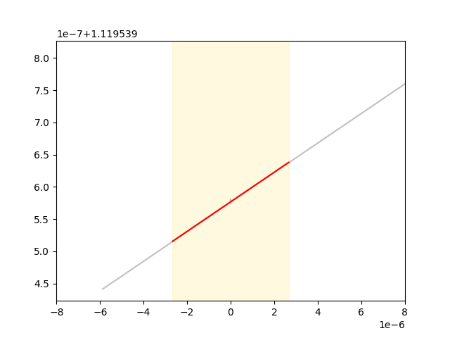


## Equation 5:
```
I_Ca__ibarna_j = 7.4999999999999993e-9 * pow(parameters__Frdy, 2) * (-0.75 * parameters__Nao + 0.75 * Na_Concentrations__Na_j * exp(membrane_potential__V_m * parameters__Frdy / (parameters__R * parameters__Temp))) * membrane_potential__V_m / ((-1.0 + exp(membrane_potential__V_m * parameters__Frdy / (parameters__R * parameters__Temp))) * parameters__R * parameters__Temp)
```
## New Eq:
```
I_Ca__ibarna_j = ((fabs(membrane_potential__V_m) < 9.9999999999999995e-8 * fabs(parameters__R * parameters__Temp / parameters__Frdy)) ? (-7.4999999999999986e-16 * (-0.75 * parameters__Nao + 0.75 * Na_Concentrations__Na_j * exp(-9.9999999999999995e-8)) * parameters__Frdy / (-1.0 + exp(-9.9999999999999995e-8)) + 5000000.0 * (9.9999999999999995e-8 * parameters__R * parameters__Temp / parameters__Frdy + membrane_potential__V_m) * (7.4999999999999986e-16 * (-0.75 * parameters__Nao + 0.75 * Na_Concentrations__Na_j * exp(9.9999999999999995e-8)) * parameters__Frdy / (-1.0 + exp(9.9999999999999995e-8)) + 7.4999999999999986e-16 * (-0.75 * parameters__Nao + 0.75 * Na_Concentrations__Na_j * exp(-9.9999999999999995e-8)) * parameters__Frdy / (-1.0 + exp(-9.9999999999999995e-8))) * parameters__Frdy / (parameters__R * parameters__Temp)) : (7.4999999999999993e-9 * pow(parameters__Frdy, 2) * (-0.75 * parameters__Nao + 0.75 * Na_Concentrations__Na_j * exp(membrane_potential__V_m * parameters__Frdy / (parameters__R * parameters__Temp))) * membrane_potential__V_m / ((-1.0 + exp(membrane_potential__V_m * parameters__Frdy / (parameters__R * parameters__Temp))) * parameters__R * parameters__Temp)))
```
## Singularity point: 0


## Equation 6:
```
I_Ca__ibarna_sl = 7.4999999999999993e-9 * pow(parameters__Frdy, 2) * (-0.75 * parameters__Nao + 0.75 * Na_Concentrations__Na_sl * exp(membrane_potential__V_m * parameters__Frdy / (parameters__R * parameters__Temp))) * membrane_potential__V_m / ((-1.0 + exp(membrane_potential__V_m * parameters__Frdy / (parameters__R * parameters__Temp))) * parameters__R * parameters__Temp)
```
## New Eq:
```
I_Ca__ibarna_sl = ((fabs(membrane_potential__V_m) < 9.9999999999999995e-8 * fabs(parameters__R * parameters__Temp / parameters__Frdy)) ? (-7.4999999999999986e-16 * (-0.75 * parameters__Nao + 0.75 * Na_Concentrations__Na_sl * exp(-9.9999999999999995e-8)) * parameters__Frdy / (-1.0 + exp(-9.9999999999999995e-8)) + 5000000.0 * (9.9999999999999995e-8 * parameters__R * parameters__Temp / parameters__Frdy + membrane_potential__V_m) * (7.4999999999999986e-16 * (-0.75 * parameters__Nao + 0.75 * Na_Concentrations__Na_sl * exp(9.9999999999999995e-8)) * parameters__Frdy / (-1.0 + exp(9.9999999999999995e-8)) + 7.4999999999999986e-16 * (-0.75 * parameters__Nao + 0.75 * Na_Concentrations__Na_sl * exp(-9.9999999999999995e-8)) * parameters__Frdy / (-1.0 + exp(-9.9999999999999995e-8))) * parameters__Frdy / (parameters__R * parameters__Temp)) : (7.4999999999999993e-9 * pow(parameters__Frdy, 2) * (-0.75 * parameters__Nao + 0.75 * Na_Concentrations__Na_sl * exp(membrane_potential__V_m * parameters__Frdy / (parameters__R * parameters__Temp))) * membrane_potential__V_m / ((-1.0 + exp(membrane_potential__V_m * parameters__Frdy / (parameters__R * parameters__Temp))) * parameters__R * parameters__Temp)))
```
## Singularity point: 0


# of singularities:  6
singularity processing time: 26.462398699999994
# Model: grandi_pasqualini_bers_2010(grandi_pasqualini_bers_2010_ss_endo.cellml)
No of piecewises: 6
## Equation 1:
```
I_Ca__taud = 28.571428571428569 * (1.0 - exp(-0.83333333333333337 - 0.16666666666666666 * membrane_potential__V_m)) / ((1.0 + exp(-0.83333333333333337 - 0.16666666666666666 * membrane_potential__V_m)) * (5.0 + membrane_potential__V_m))
```
## New Eq:
```
I_Ca__taud = ((fabs(5.0 + membrane_potential__V_m) < 6.0000000000337561e-7) ? ((-4166666.1666432251 - 833333.33332864498 * membrane_potential__V_m) * (-47619047.618779711 * (1.0 - exp(1.0000000000027348e-7)) / (1.0 + exp(1.0000000000027348e-7)) - 47619047.618779711 * (1.0 - exp(-1.0000000000114084e-7)) / (1.0 + exp(-1.0000000000114084e-7))) + 47619047.618779711 * (1.0 - exp(-1.0000000000114084e-7)) / (1.0 + exp(-1.0000000000114084e-7))) : (28.571428571428569 * (1.0 - exp(-0.83333333333333337 - 0.16666666666666666 * membrane_potential__V_m)) / ((1.0 + exp(-0.83333333333333337 - 0.16666666666666666 * membrane_potential__V_m)) * (5.0 + membrane_potential__V_m))))
```
## Singularity point: -5.0000000000000000
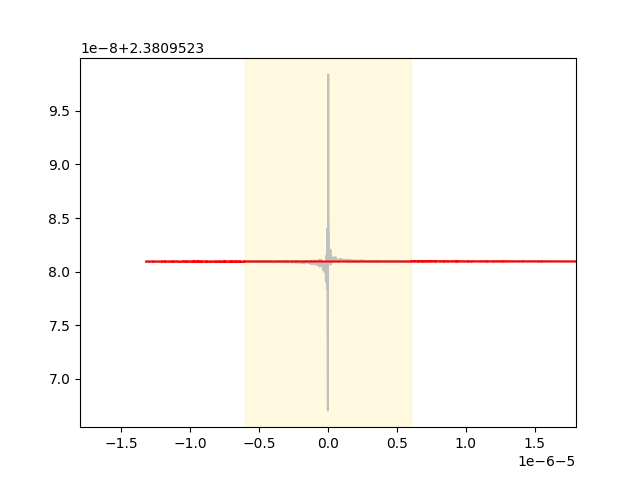


## Equation 2:
```
I_Ca__ibarca_j = 7.8019226357407252 * (-0.34100000000000003 * parameters__Cao + 0.34100000000000003 * Ca_Concentrations__Ca_j * exp(0.074871767015605231 * membrane_potential__V_m)) * membrane_potential__V_m * parameters__pCa_max / (-1.0 + exp(0.074871767015605231 * membrane_potential__V_m))
```
## New Eq:
```
I_Ca__ibarca_j = ((fabs(membrane_potential__V_m) < 1.3356169352749131e-6) ? ((0.5 + 374358.83507802623 * membrane_potential__V_m) * (1.042038e-5 * (-0.34100000000000003 * parameters__Cao + 0.34100000000000003 * Ca_Concentrations__Ca_j * exp(9.9999999999999995e-8)) * parameters__pCa_max / (-1.0 + exp(9.9999999999999995e-8)) + 1.042038e-5 * (-0.34100000000000003 * parameters__Cao + 0.34100000000000003 * Ca_Concentrations__Ca_j * exp(-9.9999999999999995e-8)) * parameters__pCa_max / (-1.0 + exp(-9.9999999999999995e-8))) - 1.042038e-5 * (-0.34100000000000003 * parameters__Cao + 0.34100000000000003 * Ca_Concentrations__Ca_j * exp(-9.9999999999999995e-8)) * parameters__pCa_max / (-1.0 + exp(-9.9999999999999995e-8))) : (7.8019226357407252 * (-0.34100000000000003 * parameters__Cao + 0.34100000000000003 * Ca_Concentrations__Ca_j * exp(0.074871767015605231 * membrane_potential__V_m)) * membrane_potential__V_m * parameters__pCa_max / (-1.0 + exp(0.074871767015605231 * membrane_potential__V_m))))
```
## Singularity point: 0


## Equation 3:
```
I_Ca__ibarca_sl = 7.8019226357407252 * (-0.34100000000000003 * parameters__Cao + 0.34100000000000003 * Ca_Concentrations__Ca_sl * exp(0.074871767015605231 * membrane_potential__V_m)) * membrane_potential__V_m * parameters__pCa_max / (-1.0 + exp(0.074871767015605231 * membrane_potential__V_m))
```
## New Eq:
```
I_Ca__ibarca_sl = ((fabs(membrane_potential__V_m) < 1.3356169352749131e-6) ? ((0.5 + 374358.83507802623 * membrane_potential__V_m) * (1.042038e-5 * (-0.34100000000000003 * parameters__Cao + 0.34100000000000003 * Ca_Concentrations__Ca_sl * exp(9.9999999999999995e-8)) * parameters__pCa_max / (-1.0 + exp(9.9999999999999995e-8)) + 1.042038e-5 * (-0.34100000000000003 * parameters__Cao + 0.34100000000000003 * Ca_Concentrations__Ca_sl * exp(-9.9999999999999995e-8)) * parameters__pCa_max / (-1.0 + exp(-9.9999999999999995e-8))) - 1.042038e-5 * (-0.34100000000000003 * parameters__Cao + 0.34100000000000003 * Ca_Concentrations__Ca_sl * exp(-9.9999999999999995e-8)) * parameters__pCa_max / (-1.0 + exp(-9.9999999999999995e-8))) : (7.8019226357407252 * (-0.34100000000000003 * parameters__Cao + 0.34100000000000003 * Ca_Concentrations__Ca_sl * exp(0.074871767015605231 * membrane_potential__V_m)) * membrane_potential__V_m * parameters__pCa_max / (-1.0 + exp(0.074871767015605231 * membrane_potential__V_m))))
```
## Singularity point: 0


## Equation 4:
```
I_Ca__ibark = 0.00048762016473379531 * (-0.75 * parameters__Ko + 0.75 * K_Concentration__K_i * exp(0.037435883507802616 * membrane_potential__V_m)) * membrane_potential__V_m / (-1.0 + exp(0.037435883507802616 * membrane_potential__V_m))
```
## New Eq:
```
I_Ca__ibark = ((fabs(membrane_potential__V_m) < 2.6712338705498262e-6) ? ((0.5 + 187179.41753901311 * membrane_potential__V_m) * (1.3025475e-9 * (-0.75 * parameters__Ko + 0.75 * K_Concentration__K_i * exp(9.9999999999999995e-8)) / (-1.0 + exp(9.9999999999999995e-8)) + 1.3025475e-9 * (-0.75 * parameters__Ko + 0.75 * K_Concentration__K_i * exp(-9.9999999999999995e-8)) / (-1.0 + exp(-9.9999999999999995e-8))) - 1.3025475e-9 * (-0.75 * parameters__Ko + 0.75 * K_Concentration__K_i * exp(-9.9999999999999995e-8)) / (-1.0 + exp(-9.9999999999999995e-8))) : (0.00048762016473379531 * (-0.75 * parameters__Ko + 0.75 * K_Concentration__K_i * exp(0.037435883507802616 * membrane_potential__V_m)) * membrane_potential__V_m / (-1.0 + exp(0.037435883507802616 * membrane_potential__V_m))))
```
## Singularity point: 0


## Equation 5:
```
I_Ca__ibarna_j = 2.7090009151877515e-5 * (-0.75 * parameters__Nao + 0.75 * Na_Concentrations__Na_j * exp(0.037435883507802616 * membrane_potential__V_m)) * membrane_potential__V_m / (-1.0 + exp(0.037435883507802616 * membrane_potential__V_m))
```
## New Eq:
```
I_Ca__ibarna_j = ((fabs(membrane_potential__V_m) < 2.6712338705498262e-6) ? ((0.5 + 187179.41753901311 * membrane_potential__V_m) * (7.236374999999999e-11 * (-0.75 * parameters__Nao + 0.75 * Na_Concentrations__Na_j * exp(9.9999999999999995e-8)) / (-1.0 + exp(9.9999999999999995e-8)) + 7.236374999999999e-11 * (-0.75 * parameters__Nao + 0.75 * Na_Concentrations__Na_j * exp(-9.9999999999999995e-8)) / (-1.0 + exp(-9.9999999999999995e-8))) - 7.236374999999999e-11 * (-0.75 * parameters__Nao + 0.75 * Na_Concentrations__Na_j * exp(-9.9999999999999995e-8)) / (-1.0 + exp(-9.9999999999999995e-8))) : (2.7090009151877515e-5 * (-0.75 * parameters__Nao + 0.75 * Na_Concentrations__Na_j * exp(0.037435883507802616 * membrane_potential__V_m)) * membrane_potential__V_m / (-1.0 + exp(0.037435883507802616 * membrane_potential__V_m))))
```
## Singularity point: 0


## Equation 6:
```
I_Ca__ibarna_sl = 2.7090009151877515e-5 * (-0.75 * parameters__Nao + 0.75 * Na_Concentrations__Na_sl * exp(0.037435883507802616 * membrane_potential__V_m)) * membrane_potential__V_m / (-1.0 + exp(0.037435883507802616 * membrane_potential__V_m))
```
## New Eq:
```
I_Ca__ibarna_sl = ((fabs(membrane_potential__V_m) < 2.6712338705498262e-6) ? ((0.5 + 187179.41753901311 * membrane_potential__V_m) * (7.236374999999999e-11 * (-0.75 * parameters__Nao + 0.75 * Na_Concentrations__Na_sl * exp(9.9999999999999995e-8)) / (-1.0 + exp(9.9999999999999995e-8)) + 7.236374999999999e-11 * (-0.75 * parameters__Nao + 0.75 * Na_Concentrations__Na_sl * exp(-9.9999999999999995e-8)) / (-1.0 + exp(-9.9999999999999995e-8))) - 7.236374999999999e-11 * (-0.75 * parameters__Nao + 0.75 * Na_Concentrations__Na_sl * exp(-9.9999999999999995e-8)) / (-1.0 + exp(-9.9999999999999995e-8))) : (2.7090009151877515e-5 * (-0.75 * parameters__Nao + 0.75 * Na_Concentrations__Na_sl * exp(0.037435883507802616 * membrane_potential__V_m)) * membrane_potential__V_m / (-1.0 + exp(0.037435883507802616 * membrane_potential__V_m))))
```
## Singularity point: 0


# of singularities:  6
singularity processing time: 26.167097099999978
# Model: hilgemann_noble_model_1987(hilgemann_noble_model_1987.cellml)
No of piecewises: 0
## Equation 1:
```
fast_sodium_current_m_gate__alpha_m = 200.0 * (41.0 + membrane__V) / (1.0 - exp(-4.1000000000000005 - 0.10000000000000001 * membrane__V))
```
## New Eq:
```
fast_sodium_current_m_gate__alpha_m = ((fabs(41.0 + membrane__V) < 1.0000000000287557e-6) ? (0.00020000000000575113 / (1.0 - exp(-1.0000000000287557e-7)) + (-20499999.49941051 - 499999.99998562218 * membrane__V) * (-0.00020000000000575113 / (1.0 - exp(1.0000000000287557e-7)) - 0.00020000000000575113 / (1.0 - exp(-1.0000000000287557e-7)))) : (200.0 * (41.0 + membrane__V) / (1.0 - exp(-4.1000000000000005 - 0.10000000000000001 * membrane__V))))
```
## Singularity point: -41.000000000000000


## Equation 2:
```
second_inward_calcium_current_d_gate__alpha_d = 30.0 * (19.0 + membrane__V) / (1.0 - exp(-4.75 - 0.25 * membrane__V))
```
## New Eq:
```
second_inward_calcium_current_d_gate__alpha_d = ((fabs(19.0 + membrane__V) < 4.0000000001150227e-7) ? (1.2000000000345068e-5 / (1.0 - exp(-1.0000000000287557e-7)) + (-23749999.499317054 - 1249999.9999640554 * membrane__V) * (-1.2000000000345068e-5 / (1.0 - exp(1.0000000000287557e-7)) - 1.2000000000345068e-5 / (1.0 - exp(-1.0000000000287557e-7)))) : (30.0 * (19.0 + membrane__V) / (1.0 - exp(-4.75 - 0.25 * membrane__V))))
```
## Singularity point: -19.000000000000000


## Equation 3:
```
second_inward_calcium_current_d_gate__beta_d = 12.0 * (19.0 + membrane__V) / (-1.0 + exp(1.8999999999999999 + 0.10000000000000001 * membrane__V))
```
## New Eq:
```
second_inward_calcium_current_d_gate__beta_d = ((fabs(19.0 + membrane__V) < 9.999999999871223e-7) ? (-1.1999999999678934e-5 / (-1.0 + exp(-9.9999999997671396e-8)) + (9500000.5001223385 + 500000.00000643887 * membrane__V) * (1.1999999999678934e-5 / (-1.0 + exp(-9.9999999997671396e-8)) + 1.2000000000012001e-5 / (-1.0 + exp(9.9999999999406119e-8)))) : (12.0 * (19.0 + membrane__V) / (-1.0 + exp(1.8999999999999999 + 0.10000000000000001 * membrane__V))))
```
## Singularity point: -19.000000000000000


## Equation 4:
```
second_inward_calcium_current_f_Ca_gate__alpha_f_Ca = 6.25 * (34.0 + membrane__V) / (-1.0 + exp(8.5 + 0.25 * membrane__V))
```
## New Eq:
```
second_inward_calcium_current_f_Ca_gate__alpha_f_Ca = ((fabs(34.0 + membrane__V) < 4.0000000001150227e-7) ? (-2.5000000000718892e-6 / (-1.0 + exp(-1.0000000000287557e-7)) + (42500000.498777881 + 1249999.9999640554 * membrane__V) * (2.5000000000718892e-6 / (-1.0 + exp(1.0000000000287557e-7)) + 2.5000000000718892e-6 / (-1.0 + exp(-1.0000000000287557e-7)))) : (6.25 * (34.0 + membrane__V) / (-1.0 + exp(8.5 + 0.25 * membrane__V))))
```
## Singularity point: -34.000000000000000


## Equation 5:
```
second_inward_calcium_current__i_siCa = 0.14973556329098189 * (1.0 - second_inward_calcium_current_f_Ca_gate__f_Ca) * (1.0 - intracellular_calcium_concentration__Ca_i / (0.001 + intracellular_calcium_concentration__Ca_i)) * (-50.0 + membrane__V) * (intracellular_calcium_concentration__Ca_i * exp(3.7433890822745473) - extracellular_calcium_concentration__Ca_o * exp(3.7433890822745473 - 0.074867781645490947 * membrane__V)) * second_inward_calcium_current__P_si * second_inward_calcium_current_d_gate__d / (1.0 - exp(3.7433890822745473 - 0.074867781645490947 * membrane__V))
```
## New Eq:
```
second_inward_calcium_current__i_siCa = ((fabs(-50.0 + membrane__V) < 1.3356880329551402e-6) ? ((18716945.911788113 - 374338.90823576227 * membrane__V) * (-1.9999999999556149e-7 * (1.0 - second_inward_calcium_current_f_Ca_gate__f_Ca) * (1.0 - intracellular_calcium_concentration__Ca_i / (0.001 + intracellular_calcium_concentration__Ca_i)) * (intracellular_calcium_concentration__Ca_i * exp(3.7433890822745473) - extracellular_calcium_concentration__Ca_o * exp(9.9999999999406119e-8)) * second_inward_calcium_current__P_si * second_inward_calcium_current_d_gate__d / (1.0 - exp(9.9999999999406119e-8)) - 1.9999999999556149e-7 * (1.0 - second_inward_calcium_current_f_Ca_gate__f_Ca) * (1.0 - intracellular_calcium_concentration__Ca_i / (0.001 + intracellular_calcium_concentration__Ca_i)) * (intracellular_calcium_concentration__Ca_i * exp(3.7433890822745473) - extracellular_calcium_concentration__Ca_o * exp(-9.9999999995936673e-8)) * second_inward_calcium_current__P_si * second_inward_calcium_current_d_gate__d / (1.0 - exp(-9.9999999995936673e-8))) + 1.9999999999556149e-7 * (1.0 - second_inward_calcium_current_f_Ca_gate__f_Ca) * (1.0 - intracellular_calcium_concentration__Ca_i / (0.001 + intracellular_calcium_concentration__Ca_i)) * (intracellular_calcium_concentration__Ca_i * exp(3.7433890822745473) - extracellular_calcium_concentration__Ca_o * exp(-9.9999999995936673e-8)) * second_inward_calcium_current__P_si * second_inward_calcium_current_d_gate__d / (1.0 - exp(-9.9999999995936673e-8))) : (0.14973556329098189 * (1.0 - second_inward_calcium_current_f_Ca_gate__f_Ca) * (1.0 - intracellular_calcium_concentration__Ca_i / (0.001 + intracellular_calcium_concentration__Ca_i)) * (-50.0 + membrane__V) * (intracellular_calcium_concentration__Ca_i * exp(3.7433890822745473) - extracellular_calcium_concentration__Ca_o * exp(3.7433890822745473 - 0.074867781645490947 * membrane__V)) * second_inward_calcium_current__P_si * second_inward_calcium_current_d_gate__d / (1.0 - exp(3.7433890822745473 - 0.074867781645490947 * membrane__V))))
```
## Singularity point: 50.000000000000000
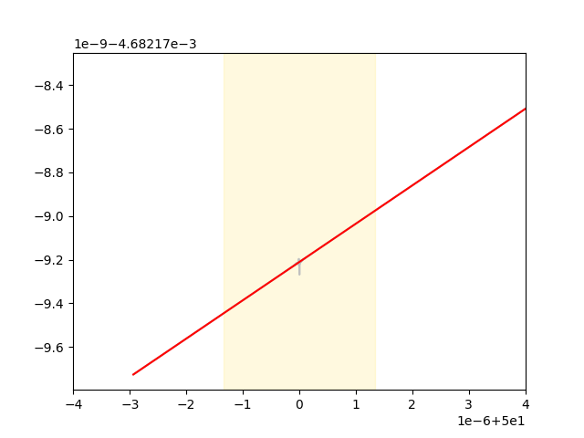


## Equation 6:
```
second_inward_calcium_current__i_siK = 7.4867781645490941e-5 * (1.0 - second_inward_calcium_current_f_Ca_gate__f_Ca) * (1.0 - intracellular_calcium_concentration__Ca_i / (0.001 + intracellular_calcium_concentration__Ca_i)) * (-50.0 + membrane__V) * (intracellular_potassium_concentration__K_i * exp(1.8716945411372736) - extracellular_potassium_concentration__K_c * exp(1.8716945411372736 - 0.037433890822745473 * membrane__V)) * second_inward_calcium_current__P_si * second_inward_calcium_current_d_gate__d / (1.0 - exp(1.8716945411372736 - 0.037433890822745473 * membrane__V))
```
## New Eq:
```
second_inward_calcium_current__i_siK = ((fabs(-50.0 + membrane__V) < 2.6713760659657915e-6) ? ((9358473.2056995872 - 187169.45411399176 * membrane__V) * (-1.999999999997175e-10 * (1.0 - second_inward_calcium_current_f_Ca_gate__f_Ca) * (1.0 - intracellular_calcium_concentration__Ca_i / (0.001 + intracellular_calcium_concentration__Ca_i)) * (intracellular_potassium_concentration__K_i * exp(1.8716945411372736) - extracellular_potassium_concentration__K_c * exp(9.9999999999406119e-8)) * second_inward_calcium_current__P_si * second_inward_calcium_current_d_gate__d / (1.0 - exp(9.9999999999406119e-8)) - 1.999999999997175e-10 * (1.0 - second_inward_calcium_current_f_Ca_gate__f_Ca) * (1.0 - intracellular_calcium_concentration__Ca_i / (0.001 + intracellular_calcium_concentration__Ca_i)) * (intracellular_potassium_concentration__K_i * exp(1.8716945411372736) - extracellular_potassium_concentration__K_c * exp(-9.9999999999406119e-8)) * second_inward_calcium_current__P_si * second_inward_calcium_current_d_gate__d / (1.0 - exp(-9.9999999999406119e-8))) + 1.999999999997175e-10 * (1.0 - second_inward_calcium_current_f_Ca_gate__f_Ca) * (1.0 - intracellular_calcium_concentration__Ca_i / (0.001 + intracellular_calcium_concentration__Ca_i)) * (intracellular_potassium_concentration__K_i * exp(1.8716945411372736) - extracellular_potassium_concentration__K_c * exp(-9.9999999999406119e-8)) * second_inward_calcium_current__P_si * second_inward_calcium_current_d_gate__d / (1.0 - exp(-9.9999999999406119e-8))) : (7.4867781645490941e-5 * (1.0 - second_inward_calcium_current_f_Ca_gate__f_Ca) * (1.0 - intracellular_calcium_concentration__Ca_i / (0.001 + intracellular_calcium_concentration__Ca_i)) * (-50.0 + membrane__V) * (intracellular_potassium_concentration__K_i * exp(1.8716945411372736) - extracellular_potassium_concentration__K_c * exp(1.8716945411372736 - 0.037433890822745473 * membrane__V)) * second_inward_calcium_current__P_si * second_inward_calcium_current_d_gate__d / (1.0 - exp(1.8716945411372736 - 0.037433890822745473 * membrane__V))))
```
## Singularity point: 50.000000000000000


## Equation 7:
```
second_inward_calcium_current__i_siNa = 0.00037433890822745472 * (1.0 - second_inward_calcium_current_f_Ca_gate__f_Ca) * (1.0 - intracellular_calcium_concentration__Ca_i / (0.001 + intracellular_calcium_concentration__Ca_i)) * (-50.0 + membrane__V) * (intracellular_sodium_concentration__Na_i * exp(1.8716945411372736) - extracellular_sodium_concentration__Na_o * exp(1.8716945411372736 - 0.037433890822745473 * membrane__V)) * second_inward_calcium_current__P_si * second_inward_calcium_current_d_gate__d / (1.0 - exp(1.8716945411372736 - 0.037433890822745473 * membrane__V))
```
## New Eq:
```
second_inward_calcium_current__i_siNa = ((fabs(-50.0 + membrane__V) < 2.6713760659657915e-6) ? ((9358473.2056995872 - 187169.45411399176 * membrane__V) * (-9.9999999999858744e-10 * (1.0 - second_inward_calcium_current_f_Ca_gate__f_Ca) * (1.0 - intracellular_calcium_concentration__Ca_i / (0.001 + intracellular_calcium_concentration__Ca_i)) * (intracellular_sodium_concentration__Na_i * exp(1.8716945411372736) - extracellular_sodium_concentration__Na_o * exp(9.9999999999406119e-8)) * second_inward_calcium_current__P_si * second_inward_calcium_current_d_gate__d / (1.0 - exp(9.9999999999406119e-8)) - 9.9999999999858744e-10 * (1.0 - second_inward_calcium_current_f_Ca_gate__f_Ca) * (1.0 - intracellular_calcium_concentration__Ca_i / (0.001 + intracellular_calcium_concentration__Ca_i)) * (intracellular_sodium_concentration__Na_i * exp(1.8716945411372736) - extracellular_sodium_concentration__Na_o * exp(-9.9999999999406119e-8)) * second_inward_calcium_current__P_si * second_inward_calcium_current_d_gate__d / (1.0 - exp(-9.9999999999406119e-8))) + 9.9999999999858744e-10 * (1.0 - second_inward_calcium_current_f_Ca_gate__f_Ca) * (1.0 - intracellular_calcium_concentration__Ca_i / (0.001 + intracellular_calcium_concentration__Ca_i)) * (intracellular_sodium_concentration__Na_i * exp(1.8716945411372736) - extracellular_sodium_concentration__Na_o * exp(-9.9999999999406119e-8)) * second_inward_calcium_current__P_si * second_inward_calcium_current_d_gate__d / (1.0 - exp(-9.9999999999406119e-8))) : (0.00037433890822745472 * (1.0 - second_inward_calcium_current_f_Ca_gate__f_Ca) * (1.0 - intracellular_calcium_concentration__Ca_i / (0.001 + intracellular_calcium_concentration__Ca_i)) * (-50.0 + membrane__V) * (intracellular_sodium_concentration__Na_i * exp(1.8716945411372736) - extracellular_sodium_concentration__Na_o * exp(1.8716945411372736 - 0.037433890822745473 * membrane__V)) * second_inward_calcium_current__P_si * second_inward_calcium_current_d_gate__d / (1.0 - exp(1.8716945411372736 - 0.037433890822745473 * membrane__V))))
```
## Singularity point: 50.000000000000000


# of singularities:  7
singularity processing time: 30.19873419999999
# Model: hodgkin_huxley_squid_axon_model_1952_modified(hodgkin_huxley_squid_axon_model_1952_modified.cellml)
No of piecewises: 0
## Equation 1:
```
potassium_channel_n_gate__alpha_n = -0.01 * (65.0 + membrane__V) / (-1.0 + exp(-6.5 - 0.10000000000000001 * membrane__V))
```
## New Eq:
```
potassium_channel_n_gate__alpha_n = ((fabs(65.0 + membrane__V) < 1.0000000000287557e-6) ? (-1.0000000000287556e-8 / (-1.0 + exp(-1.0000000000287557e-7)) + (-32499999.49906544 - 499999.99998562218 * membrane__V) * (1.0000000000287556e-8 / (-1.0 + exp(1.0000000000287557e-7)) + 1.0000000000287556e-8 / (-1.0 + exp(-1.0000000000287557e-7)))) : (-0.01 * (65.0 + membrane__V) / (-1.0 + exp(-6.5 - 0.10000000000000001 * membrane__V))))
```
## Singularity point: -65.000000000000000
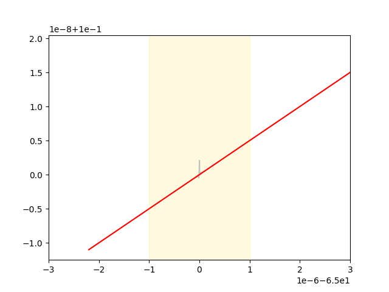


## Equation 2:
```
sodium_channel_m_gate__alpha_m = -0.10000000000000001 * (50.0 + membrane__V) / (-1.0 + exp(-5.0 - 0.10000000000000001 * membrane__V))
```
## New Eq:
```
sodium_channel_m_gate__alpha_m = ((fabs(50.0 + membrane__V) < 1.0000000000287557e-6) ? (-1.0000000000287557e-7 / (-1.0 + exp(-1.0000000000287557e-7)) + (-24999999.499281108 - 499999.99998562218 * membrane__V) * (1.0000000000287557e-7 / (-1.0 + exp(1.0000000000287557e-7)) + 1.0000000000287557e-7 / (-1.0 + exp(-1.0000000000287557e-7)))) : (-0.10000000000000001 * (50.0 + membrane__V) / (-1.0 + exp(-5.0 - 0.10000000000000001 * membrane__V))))
```
## Singularity point: -50.000000000000000
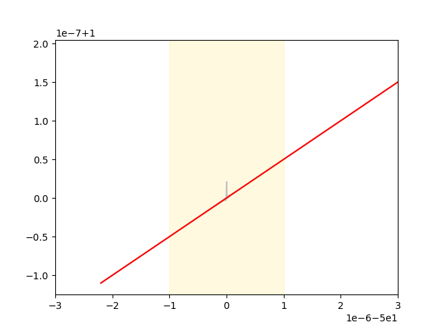


# of singularities:  2
singularity processing time: 7.969396000000074
# Model: HundRudy2004_units(hund_rudy_2004.cellml)
No of piecewises: 7
## Equation 1:
```
ICaL__ibarca = 14448.004881000332 * (-15.0 + cell__V) * (-0.34100000000000003 * Environment__Ca_o + Ca__Ca_ss * exp(-1.1230765052339999 + 0.074871767015599999 * cell__V)) * ICaL__pca / (-1.0 + exp(-1.1230765052339999 + 0.074871767015599999 * cell__V))
```
## New Eq:
```
ICaL__ibarca = ((fabs(-15.0 + cell__V) < 1.3356169352718439e-6) ? ((-5615382.0261832969 + 374358.83507888648 * cell__V) * (0.019296999999954306 * (-0.34100000000000003 * Environment__Ca_o + Ca__Ca_ss * exp(9.9999999999406119e-8)) * ICaL__pca / (-1.0 + exp(9.9999999999406119e-8)) + 0.019296999999954306 * (-0.34100000000000003 * Environment__Ca_o + Ca__Ca_ss * exp(-9.9999999999406119e-8)) * ICaL__pca / (-1.0 + exp(-9.9999999999406119e-8))) - 0.019296999999954306 * (-0.34100000000000003 * Environment__Ca_o + Ca__Ca_ss * exp(-9.9999999999406119e-8)) * ICaL__pca / (-1.0 + exp(-9.9999999999406119e-8))) : (14448.004881000332 * (-15.0 + cell__V) * (-0.34100000000000003 * Environment__Ca_o + Ca__Ca_ss * exp(-1.1230765052339999 + 0.074871767015599999 * cell__V)) * ICaL__pca / (-1.0 + exp(-1.1230765052339999 + 0.074871767015599999 * cell__V))))
```
## Singularity point: 15.000000000000000


## Equation 2:
```
ICab__ICab = 0.0028824983370005666 * (-0.34100000000000003 * Environment__Ca_o + Ca__Ca_i * exp(0.074871767015599999 * cell__V)) * cell__V / (-1.0 + exp(0.074871767015599999 * cell__V))
```
## New Eq:
```
ICab__ICab = ((fabs(cell__V) < 1.3356169352750065e-6) ? ((0.5 + 374358.83507800003 * cell__V) * (3.8499135947999997e-9 * (-0.34100000000000003 * Environment__Ca_o + Ca__Ca_i * exp(9.9999999999999995e-8)) / (-1.0 + exp(9.9999999999999995e-8)) + 3.8499135947999997e-9 * (-0.34100000000000003 * Environment__Ca_o + Ca__Ca_i * exp(-9.9999999999999995e-8)) / (-1.0 + exp(-9.9999999999999995e-8))) - 3.8499135947999997e-9 * (-0.34100000000000003 * Environment__Ca_o + Ca__Ca_i * exp(-9.9999999999999995e-8)) / (-1.0 + exp(-9.9999999999999995e-8))) : (0.0028824983370005666 * (-0.34100000000000003 * Environment__Ca_o + Ca__Ca_i * exp(0.074871767015599999 * cell__V)) * cell__V / (-1.0 + exp(0.074871767015599999 * cell__V))))
```
## Singularity point: 0


## Equation 3:
```
IKr__tauxr = 1 / (0.00029999999999999997 * (38.360799999999998 + cell__V) / (-1.0 + exp(5.8385137599999997 + 0.1522 * cell__V)) + 0.00059999999999999995 * (-1.7383999999999999 + cell__V) / (1.0 - exp(0.2364224 - 0.13600000000000001 * cell__V)))
```
## New Eq:
```
IKr__tauxr = 1 / (((fabs(-1.7383999999999999 + cell__V) < 7.352941176468758e-7) ? (4.4117647058812543e-10 / (1.0 - exp(-1.0000000000005664e-7)) + (1182112.5000002943 - 680000.00000016927 * cell__V) * (-4.4117647058812543e-10 / (1.0 - exp(1.0000000000005664e-7)) - 4.4117647058812543e-10 / (1.0 - exp(-1.0000000000005664e-7)))) : (0.00059999999999999995 * (-1.7383999999999999 + cell__V) / (1.0 - exp(0.2364224 - 0.13600000000000001 * cell__V)))) + ((fabs(38.360799999999998 + cell__V) < 6.5703022339436146e-7) ? (-1.9710906701830842e-10 / (-1.0 + exp(-1.0000000000287557e-7)) + (29192569.299818475 + 760999.99999526795 * cell__V) * (1.9710906701830842e-10 / (-1.0 + exp(1.0000000000287557e-7)) + 1.9710906701830842e-10 / (-1.0 + exp(-1.0000000000287557e-7)))) : (0.00029999999999999997 * (38.360799999999998 + cell__V) / (-1.0 + exp(5.8385137599999997 + 0.1522 * cell__V)))))
```
## Singularity point: 1.7383999999999999


## Singularity point: -38.360799999999998


## Equation 4:
```
IKs__tauxs = 1 / (7.6100000000000007e-5 * (44.600000000000001 + cell__V) / (1.0 - exp(-444.66200000000003 - 9.9700000000000006 * cell__V)) + 0.00036000000000000002 * (-0.55000000000000004 + cell__V) / (-1.0 + exp(-0.070400000000000004 + 0.128 * cell__V)))
```
## New Eq:
```
IKs__tauxs = 1 / (((fabs(44.600000000000001 + cell__V) < 1.0030090258350555e-8) ? (7.6328986866047728e-13 / (1.0 - exp(-9.9999999836342113e-8)) + (-2223310002.262351 - 49850000.061936118 * cell__V) * (-7.6328986866047728e-13 / (1.0 - exp(9.9999999836342113e-8)) - 7.6328986866047728e-13 / (1.0 - exp(-9.9999999836342113e-8)))) : (7.6100000000000007e-5 * (44.600000000000001 + cell__V) / (1.0 - exp(-444.66200000000003 - 9.9700000000000006 * cell__V)))) + ((fabs(-0.55000000000000004 + cell__V) < 7.8124999999948028e-7) ? (-2.8124999999965681e-10 / (-1.0 + exp(-9.9999999999948221e-8)) + (-351999.50000023417 + 640000.00000042573 * cell__V) * (2.8124999999996902e-10 / (-1.0 + exp(9.9999999999948221e-8)) + 2.8124999999965681e-10 / (-1.0 + exp(-9.9999999999948221e-8)))) : (0.00036000000000000002 * (-0.55000000000000004 + cell__V) / (-1.0 + exp(-0.070400000000000004 + 0.128 * cell__V)))))
```
## Singularity point: -44.600000000000001


## Singularity point: 0.55000000000000004


## Equation 5:
```
INa__am = 0.32000000000000001 * (47.130000000000003 + cell__V) / (1.0 - exp(-4.7130000000000001 - 0.10000000000000001 * cell__V))
```
## New Eq:
```
INa__am = ((fabs(47.130000000000003 + cell__V) < 1.0000000000287557e-6) ? (3.200000000092018e-7 / (1.0 - exp(-1.0000000000287557e-7)) + (-23564999.499322373 - 499999.99998562218 * cell__V) * (-3.200000000092018e-7 / (1.0 - exp(1.0000000000287557e-7)) - 3.200000000092018e-7 / (1.0 - exp(-1.0000000000287557e-7)))) : (0.32000000000000001 * (47.130000000000003 + cell__V) / (1.0 - exp(-4.7130000000000001 - 0.10000000000000001 * cell__V))))
```
## Singularity point: -47.130000000000003


## Equation 6:
```
INal__amL = 0.32000000000000001 * (47.130000000000003 + cell__V) / (1.0 - exp(-4.7130000000000001 - 0.10000000000000001 * cell__V))
```
## New Eq:
```
INal__amL = ((fabs(47.130000000000003 + cell__V) < 1.0000000000287557e-6) ? (3.200000000092018e-7 / (1.0 - exp(-1.0000000000287557e-7)) + (-23564999.499322373 - 499999.99998562218 * cell__V) * (-3.200000000092018e-7 / (1.0 - exp(1.0000000000287557e-7)) - 3.200000000092018e-7 / (1.0 - exp(-1.0000000000287557e-7)))) : (0.32000000000000001 * (47.130000000000003 + cell__V) / (1.0 - exp(-4.7130000000000001 - 0.10000000000000001 * cell__V))))
```
## Singularity point: -47.130000000000003


## Equation 7:
```
Ito2__Ito2_max = 0.001444800488100033 * (-Environment__Cl_o * exp(0.0374358835078 * cell__V) + Cl__Cl_i) * cell__V / (1.0 - exp(0.0374358835078 * cell__V))
```
## New Eq:
```
Ito2__Ito2_max = ((fabs(cell__V) < 2.671233870550013e-6) ? ((0.5 + 187179.41753900002 * cell__V) * (3.8593999999999993e-9 * (-Environment__Cl_o * exp(9.9999999999999995e-8) + Cl__Cl_i) / (1.0 - exp(9.9999999999999995e-8)) + 3.8593999999999993e-9 * (-Environment__Cl_o * exp(-9.9999999999999995e-8) + Cl__Cl_i) / (1.0 - exp(-9.9999999999999995e-8))) - 3.8593999999999993e-9 * (-Environment__Cl_o * exp(-9.9999999999999995e-8) + Cl__Cl_i) / (1.0 - exp(-9.9999999999999995e-8))) : (0.001444800488100033 * (-Environment__Cl_o * exp(0.0374358835078 * cell__V) + Cl__Cl_i) * cell__V / (1.0 - exp(0.0374358835078 * cell__V))))
```
## Singularity point: 0


# of singularities:  9
singularity processing time: 56.45156439999994
# Model: iribe_model_2006(iribe_model_2006.cellml)
No of piecewises: 1
## Equation 1:
```
L_type_Ca_channel__i_Ca_L_Ca = 0.14973556329098189 * (-50.0 + membrane_potential__V) * (intracellular_calcium_concentration__Ca_i * exp(3.7433890822745473) - cell_parameters__Ca_o * exp(3.7433890822745473 - 0.074867781645490947 * membrane_potential__V)) * L_type_Ca_channel__P_Ca_L_Ca * L_type_Ca_channel_d_gate__d * L_type_Ca_channel_f_gate__f / (1.0 - exp(3.7433890822745473 - 0.074867781645490947 * membrane_potential__V))
```
## New Eq:
```
L_type_Ca_channel__i_Ca_L_Ca = ((fabs(-50.0 + membrane_potential__V) < 1.3356880329551402e-6) ? ((18716945.911788113 - 374338.90823576227 * membrane_potential__V) * (-1.9999999999556149e-7 * (intracellular_calcium_concentration__Ca_i * exp(3.7433890822745473) - cell_parameters__Ca_o * exp(9.9999999999406119e-8)) * L_type_Ca_channel__P_Ca_L_Ca * L_type_Ca_channel_d_gate__d * L_type_Ca_channel_f_gate__f / (1.0 - exp(9.9999999999406119e-8)) - 1.9999999999556149e-7 * (intracellular_calcium_concentration__Ca_i * exp(3.7433890822745473) - cell_parameters__Ca_o * exp(-9.9999999999406119e-8)) * L_type_Ca_channel__P_Ca_L_Ca * L_type_Ca_channel_d_gate__d * L_type_Ca_channel_f_gate__f / (1.0 - exp(-9.9999999999406119e-8))) + 1.9999999999556149e-7 * (intracellular_calcium_concentration__Ca_i * exp(3.7433890822745473) - cell_parameters__Ca_o * exp(-9.9999999999406119e-8)) * L_type_Ca_channel__P_Ca_L_Ca * L_type_Ca_channel_d_gate__d * L_type_Ca_channel_f_gate__f / (1.0 - exp(-9.9999999999406119e-8))) : (0.14973556329098189 * (-50.0 + membrane_potential__V) * (intracellular_calcium_concentration__Ca_i * exp(3.7433890822745473) - cell_parameters__Ca_o * exp(3.7433890822745473 - 0.074867781645490947 * membrane_potential__V)) * L_type_Ca_channel__P_Ca_L_Ca * L_type_Ca_channel_d_gate__d * L_type_Ca_channel_f_gate__f / (1.0 - exp(3.7433890822745473 - 0.074867781645490947 * membrane_potential__V))))
```
## Singularity point: 50.000000000000000


## Equation 2:
```
L_type_Ca_channel__i_Ca_L_K = 7.4867781645490941e-5 * (-50.0 + membrane_potential__V) * (intracellular_potassium_concentration__K_i * exp(1.8716945411372736) - cell_parameters__K_o * exp(1.8716945411372736 - 0.037433890822745473 * membrane_potential__V)) * L_type_Ca_channel__P_Ca_L_Ca * L_type_Ca_channel_d_gate__d * L_type_Ca_channel_f_gate__f / (1.0 - exp(1.8716945411372736 - 0.037433890822745473 * membrane_potential__V))
```
## New Eq:
```
L_type_Ca_channel__i_Ca_L_K = ((fabs(-50.0 + membrane_potential__V) < 2.6713760659657915e-6) ? ((9358473.2056995872 - 187169.45411399176 * membrane_potential__V) * (-1.999999999997175e-10 * (intracellular_potassium_concentration__K_i * exp(1.8716945411372736) - cell_parameters__K_o * exp(9.9999999999406119e-8)) * L_type_Ca_channel__P_Ca_L_Ca * L_type_Ca_channel_d_gate__d * L_type_Ca_channel_f_gate__f / (1.0 - exp(9.9999999999406119e-8)) - 1.999999999997175e-10 * (intracellular_potassium_concentration__K_i * exp(1.8716945411372736) - cell_parameters__K_o * exp(-9.9999999999406119e-8)) * L_type_Ca_channel__P_Ca_L_Ca * L_type_Ca_channel_d_gate__d * L_type_Ca_channel_f_gate__f / (1.0 - exp(-9.9999999999406119e-8))) + 1.999999999997175e-10 * (intracellular_potassium_concentration__K_i * exp(1.8716945411372736) - cell_parameters__K_o * exp(-9.9999999999406119e-8)) * L_type_Ca_channel__P_Ca_L_Ca * L_type_Ca_channel_d_gate__d * L_type_Ca_channel_f_gate__f / (1.0 - exp(-9.9999999999406119e-8))) : (7.4867781645490941e-5 * (-50.0 + membrane_potential__V) * (intracellular_potassium_concentration__K_i * exp(1.8716945411372736) - cell_parameters__K_o * exp(1.8716945411372736 - 0.037433890822745473 * membrane_potential__V)) * L_type_Ca_channel__P_Ca_L_Ca * L_type_Ca_channel_d_gate__d * L_type_Ca_channel_f_gate__f / (1.0 - exp(1.8716945411372736 - 0.037433890822745473 * membrane_potential__V))))
```
## Singularity point: 50.000000000000000


## Equation 3:
```
L_type_Ca_channel__i_Ca_L_Na = 0.00037433890822745472 * (-50.0 + membrane_potential__V) * (intracellular_sodium_concentration__Na_i * exp(1.8716945411372736) - cell_parameters__Na_o * exp(1.8716945411372736 - 0.037433890822745473 * membrane_potential__V)) * L_type_Ca_channel__P_Ca_L_Ca * L_type_Ca_channel_d_gate__d * L_type_Ca_channel_f_gate__f / (1.0 - exp(1.8716945411372736 - 0.037433890822745473 * membrane_potential__V))
```
## New Eq:
```
L_type_Ca_channel__i_Ca_L_Na = ((fabs(-50.0 + membrane_potential__V) < 2.6713760659657915e-6) ? ((9358473.2056995872 - 187169.45411399176 * membrane_potential__V) * (-9.9999999999858744e-10 * (intracellular_sodium_concentration__Na_i * exp(1.8716945411372736) - cell_parameters__Na_o * exp(9.9999999999406119e-8)) * L_type_Ca_channel__P_Ca_L_Ca * L_type_Ca_channel_d_gate__d * L_type_Ca_channel_f_gate__f / (1.0 - exp(9.9999999999406119e-8)) - 9.9999999999858744e-10 * (intracellular_sodium_concentration__Na_i * exp(1.8716945411372736) - cell_parameters__Na_o * exp(-9.9999999999406119e-8)) * L_type_Ca_channel__P_Ca_L_Ca * L_type_Ca_channel_d_gate__d * L_type_Ca_channel_f_gate__f / (1.0 - exp(-9.9999999999406119e-8))) + 9.9999999999858744e-10 * (intracellular_sodium_concentration__Na_i * exp(1.8716945411372736) - cell_parameters__Na_o * exp(-9.9999999999406119e-8)) * L_type_Ca_channel__P_Ca_L_Ca * L_type_Ca_channel_d_gate__d * L_type_Ca_channel_f_gate__f / (1.0 - exp(-9.9999999999406119e-8))) : (0.00037433890822745472 * (-50.0 + membrane_potential__V) * (intracellular_sodium_concentration__Na_i * exp(1.8716945411372736) - cell_parameters__Na_o * exp(1.8716945411372736 - 0.037433890822745473 * membrane_potential__V)) * L_type_Ca_channel__P_Ca_L_Ca * L_type_Ca_channel_d_gate__d * L_type_Ca_channel_f_gate__f / (1.0 - exp(1.8716945411372736 - 0.037433890822745473 * membrane_potential__V))))
```
## Singularity point: 50.000000000000000
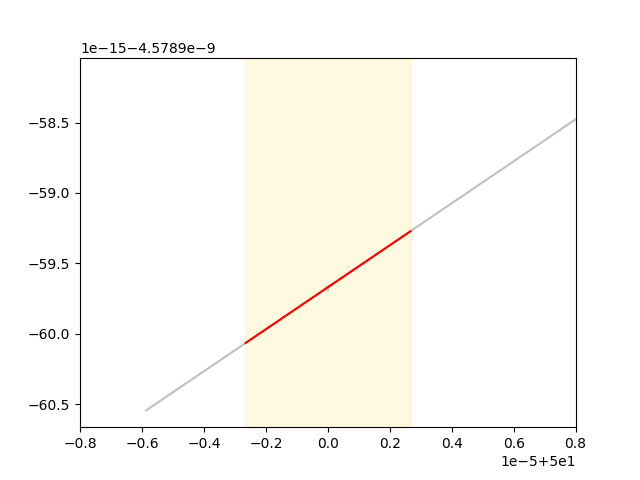


## Equation 4:
```
L_type_Ca_channel_d_gate__alpha_d = 90.0 * (19.0 + membrane_potential__V) / (1.0 - exp(-4.75 - 0.25 * membrane_potential__V))
```
## New Eq:
```
L_type_Ca_channel_d_gate__alpha_d = ((fabs(19.0 + membrane_potential__V) < 4.0000000001150227e-7) ? (3.6000000001035204e-5 / (1.0 - exp(-1.0000000000287557e-7)) + (-23749999.499317054 - 1249999.9999640554 * membrane_potential__V) * (-3.6000000001035204e-5 / (1.0 - exp(1.0000000000287557e-7)) - 3.6000000001035204e-5 / (1.0 - exp(-1.0000000000287557e-7)))) : (90.0 * (19.0 + membrane_potential__V) / (1.0 - exp(-4.75 - 0.25 * membrane_potential__V))))
```
## Singularity point: -19.000000000000000
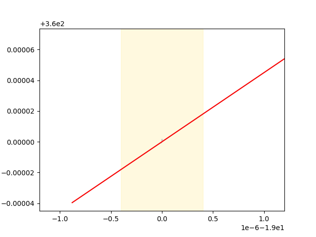


## Equation 5:
```
L_type_Ca_channel_d_gate__beta_d = -36.0 * (19.0 + membrane_potential__V) / (1.0 - exp(1.8999999999999999 + 0.10000000000000001 * membrane_potential__V))
```
## New Eq:
```
L_type_Ca_channel_d_gate__beta_d = ((fabs(19.0 + membrane_potential__V) < 9.999999999871223e-7) ? (3.5999999999036802e-5 / (1.0 - exp(-9.9999999997671396e-8)) + (9500000.5001223385 + 500000.00000643887 * membrane_potential__V) * (-3.5999999999036802e-5 / (1.0 - exp(-9.9999999997671396e-8)) - 3.6000000000036003e-5 / (1.0 - exp(9.9999999999406119e-8)))) : (-36.0 * (19.0 + membrane_potential__V) / (1.0 - exp(1.8999999999999999 + 0.10000000000000001 * membrane_potential__V))))
```
## Singularity point: -19.000000000000000
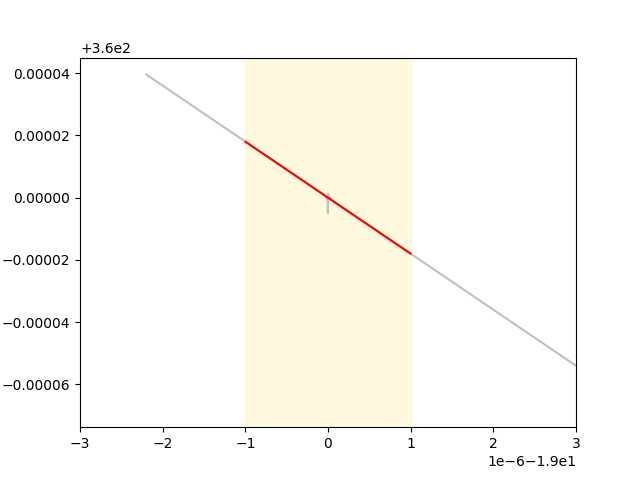


## Equation 6:
```
L_type_Ca_channel_f_gate__alpha_f = 3.125 * (34.0 + membrane_potential__V) / (-1.0 + exp(8.5 + 0.25 * membrane_potential__V))
```
## New Eq:
```
L_type_Ca_channel_f_gate__alpha_f = ((fabs(34.0 + membrane_potential__V) < 4.0000000001150227e-7) ? (-1.2500000000359446e-6 / (-1.0 + exp(-1.0000000000287557e-7)) + (42500000.498777881 + 1249999.9999640554 * membrane_potential__V) * (1.2500000000359446e-6 / (-1.0 + exp(1.0000000000287557e-7)) + 1.2500000000359446e-6 / (-1.0 + exp(-1.0000000000287557e-7)))) : (3.125 * (34.0 + membrane_potential__V) / (-1.0 + exp(8.5 + 0.25 * membrane_potential__V))))
```
## Singularity point: -34.000000000000000
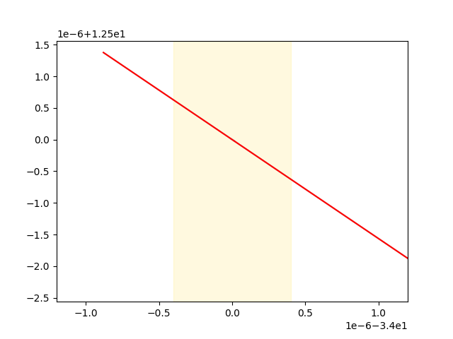


## Equation 7:
```
fast_sodium_current_m_gate__alpha_m = 200.0 * (41.0 + membrane_potential__V) / (1.0 - exp(-4.1000000000000005 - 0.10000000000000001 * membrane_potential__V))
```
## New Eq:
```
fast_sodium_current_m_gate__alpha_m = ((fabs(41.0 + membrane_potential__V) < 1.0000000000287557e-6) ? (0.00020000000000575113 / (1.0 - exp(-1.0000000000287557e-7)) + (-20499999.49941051 - 499999.99998562218 * membrane_potential__V) * (-0.00020000000000575113 / (1.0 - exp(1.0000000000287557e-7)) - 0.00020000000000575113 / (1.0 - exp(-1.0000000000287557e-7)))) : (200.0 * (41.0 + membrane_potential__V) / (1.0 - exp(-4.1000000000000005 - 0.10000000000000001 * membrane_potential__V))))
```
## Singularity point: -41.000000000000000


# of singularities:  7
singularity processing time: 30.658928500000002
# Model: IyerMazhariWinslow2004(iyer_2004.cellml)
No of piecewises: 1
## Equation 1:
```
COMPUTE_ICa_ICaK__ICamax = 101155.3158885031 * (0.001 * exp(0.074874401101778759 * COMPUTE_CONCENTRATION_AND_VOLTAGE_DERIVATIVES__V) - 0.34100000000000003 * COMPUTE_CONCENTRATION_AND_VOLTAGE_DERIVATIVES__Cao) * COMPUTE_CONCENTRATION_AND_VOLTAGE_DERIVATIVES__V * COMPUTE_ICa_ICaK__PCa_max / (-1.0 + exp(0.074874401101778759 * COMPUTE_CONCENTRATION_AND_VOLTAGE_DERIVATIVES__V))
```
## New Eq:
```
COMPUTE_ICa_ICaK__ICamax = ((fabs(COMPUTE_CONCENTRATION_AND_VOLTAGE_DERIVATIVES__V) < 1.3355699481865283e-6) ? ((0.5 + 374372.00550889381 * COMPUTE_CONCENTRATION_AND_VOLTAGE_DERIVATIVES__V) * (0.1351 * (0.001 * exp(9.9999999999999995e-8) - 0.34100000000000003 * COMPUTE_CONCENTRATION_AND_VOLTAGE_DERIVATIVES__Cao) * COMPUTE_ICa_ICaK__PCa_max / (-1.0 + exp(9.9999999999999995e-8)) + 0.1351 * (0.001 * exp(-9.9999999999999995e-8) - 0.34100000000000003 * COMPUTE_CONCENTRATION_AND_VOLTAGE_DERIVATIVES__Cao) * COMPUTE_ICa_ICaK__PCa_max / (-1.0 + exp(-9.9999999999999995e-8))) - 0.1351 * (0.001 * exp(-9.9999999999999995e-8) - 0.34100000000000003 * COMPUTE_CONCENTRATION_AND_VOLTAGE_DERIVATIVES__Cao) * COMPUTE_ICa_ICaK__PCa_max / (-1.0 + exp(-9.9999999999999995e-8))) : (101155.3158885031 * (0.001 * exp(0.074874401101778759 * COMPUTE_CONCENTRATION_AND_VOLTAGE_DERIVATIVES__V) - 0.34100000000000003 * COMPUTE_CONCENTRATION_AND_VOLTAGE_DERIVATIVES__Cao) * COMPUTE_CONCENTRATION_AND_VOLTAGE_DERIVATIVES__V * COMPUTE_ICa_ICaK__PCa_max / (-1.0 + exp(0.074874401101778759 * COMPUTE_CONCENTRATION_AND_VOLTAGE_DERIVATIVES__V))))
```
## Singularity point: 0


## Equation 2:
```
COMPUTE_ICa_ICaK__ICaK = 0.01156711037185033 * (-COMPUTE_CONCENTRATION_AND_VOLTAGE_DERIVATIVES__Ko + COMPUTE_CONCENTRATION_AND_VOLTAGE_DERIVATIVES__Ki * exp(0.03743720055088938 * COMPUTE_CONCENTRATION_AND_VOLTAGE_DERIVATIVES__V)) * COMPUTE_CONCENTRATION_AND_VOLTAGE_DERIVATIVES__V * COMPUTE_DERIVATIVES_OF_LTYPE_CHANNEL_STATES__Open * COMPUTE_DERIVATIVES_OF_LTYPE_CHANNEL_STATES__yCa / ((1.0 - 3.773584905660377 * COMPUTE_ICa_ICaK__Icabar) * (-1.0 + exp(0.03743720055088938 * COMPUTE_CONCENTRATION_AND_VOLTAGE_DERIVATIVES__V)))
```
## New Eq:
```
COMPUTE_ICa_ICaK__ICaK = ((fabs(COMPUTE_CONCENTRATION_AND_VOLTAGE_DERIVATIVES__V) < 2.6711398963730566e-6) ? ((0.5 + 187186.0027544469 * COMPUTE_CONCENTRATION_AND_VOLTAGE_DERIVATIVES__V) * (3.0897370000000001e-8 * (-COMPUTE_CONCENTRATION_AND_VOLTAGE_DERIVATIVES__Ko + COMPUTE_CONCENTRATION_AND_VOLTAGE_DERIVATIVES__Ki * exp(9.9999999999999995e-8)) * COMPUTE_DERIVATIVES_OF_LTYPE_CHANNEL_STATES__Open * COMPUTE_DERIVATIVES_OF_LTYPE_CHANNEL_STATES__yCa / ((1.0 - 3.773584905660377 * COMPUTE_ICa_ICaK__Icabar) * (-1.0 + exp(9.9999999999999995e-8))) + 3.0897370000000001e-8 * (-COMPUTE_CONCENTRATION_AND_VOLTAGE_DERIVATIVES__Ko + COMPUTE_CONCENTRATION_AND_VOLTAGE_DERIVATIVES__Ki * exp(-9.9999999999999995e-8)) * COMPUTE_DERIVATIVES_OF_LTYPE_CHANNEL_STATES__Open * COMPUTE_DERIVATIVES_OF_LTYPE_CHANNEL_STATES__yCa / ((1.0 - 3.773584905660377 * COMPUTE_ICa_ICaK__Icabar) * (-1.0 + exp(-9.9999999999999995e-8)))) - 3.0897370000000001e-8 * (-COMPUTE_CONCENTRATION_AND_VOLTAGE_DERIVATIVES__Ko + COMPUTE_CONCENTRATION_AND_VOLTAGE_DERIVATIVES__Ki * exp(-9.9999999999999995e-8)) * COMPUTE_DERIVATIVES_OF_LTYPE_CHANNEL_STATES__Open * COMPUTE_DERIVATIVES_OF_LTYPE_CHANNEL_STATES__yCa / ((1.0 - 3.773584905660377 * COMPUTE_ICa_ICaK__Icabar) * (-1.0 + exp(-9.9999999999999995e-8)))) : (0.01156711037185033 * (-COMPUTE_CONCENTRATION_AND_VOLTAGE_DERIVATIVES__Ko + COMPUTE_CONCENTRATION_AND_VOLTAGE_DERIVATIVES__Ki * exp(0.03743720055088938 * COMPUTE_CONCENTRATION_AND_VOLTAGE_DERIVATIVES__V)) * COMPUTE_CONCENTRATION_AND_VOLTAGE_DERIVATIVES__V * COMPUTE_DERIVATIVES_OF_LTYPE_CHANNEL_STATES__Open * COMPUTE_DERIVATIVES_OF_LTYPE_CHANNEL_STATES__yCa / ((1.0 - 3.773584905660377 * COMPUTE_ICa_ICaK__Icabar) * (-1.0 + exp(0.03743720055088938 * COMPUTE_CONCENTRATION_AND_VOLTAGE_DERIVATIVES__V)))))
```
## Singularity point: 0


## Equation 3:
```
COMPUTE_INa_IKr_IKs_Ito1_IK1_INab_IKp__IKv14_K = 401.00857370085151 * (-COMPUTE_CONCENTRATION_AND_VOLTAGE_DERIVATIVES__Ko + COMPUTE_CONCENTRATION_AND_VOLTAGE_DERIVATIVES__Ki * exp(0.03743720055088938 * COMPUTE_CONCENTRATION_AND_VOLTAGE_DERIVATIVES__V)) * COMPUTE_CONCENTRATION_AND_VOLTAGE_DERIVATIVES__V * COMPUTE_DERIVATIVES_OF_Kv1_4_CHANNEL_STATES__OKv14 * COMPUTE_INa_IKr_IKs_Ito1_IK1_INab_IKp__PtoSfactor / (-1.0 + exp(0.03743720055088938 * COMPUTE_CONCENTRATION_AND_VOLTAGE_DERIVATIVES__V))
```
## New Eq:
```
COMPUTE_INa_IKr_IKs_Ito1_IK1_INab_IKp__IKv14_K = ((fabs(COMPUTE_CONCENTRATION_AND_VOLTAGE_DERIVATIVES__V) < 2.6711398963730566e-6) ? ((0.5 + 187186.0027544469 * COMPUTE_CONCENTRATION_AND_VOLTAGE_DERIVATIVES__V) * (0.0010711499999999999 * (-COMPUTE_CONCENTRATION_AND_VOLTAGE_DERIVATIVES__Ko + COMPUTE_CONCENTRATION_AND_VOLTAGE_DERIVATIVES__Ki * exp(9.9999999999999995e-8)) * COMPUTE_DERIVATIVES_OF_Kv1_4_CHANNEL_STATES__OKv14 * COMPUTE_INa_IKr_IKs_Ito1_IK1_INab_IKp__PtoSfactor / (-1.0 + exp(9.9999999999999995e-8)) + 0.0010711499999999999 * (-COMPUTE_CONCENTRATION_AND_VOLTAGE_DERIVATIVES__Ko + COMPUTE_CONCENTRATION_AND_VOLTAGE_DERIVATIVES__Ki * exp(-9.9999999999999995e-8)) * COMPUTE_DERIVATIVES_OF_Kv1_4_CHANNEL_STATES__OKv14 * COMPUTE_INa_IKr_IKs_Ito1_IK1_INab_IKp__PtoSfactor / (-1.0 + exp(-9.9999999999999995e-8))) - 0.0010711499999999999 * (-COMPUTE_CONCENTRATION_AND_VOLTAGE_DERIVATIVES__Ko + COMPUTE_CONCENTRATION_AND_VOLTAGE_DERIVATIVES__Ki * exp(-9.9999999999999995e-8)) * COMPUTE_DERIVATIVES_OF_Kv1_4_CHANNEL_STATES__OKv14 * COMPUTE_INa_IKr_IKs_Ito1_IK1_INab_IKp__PtoSfactor / (-1.0 + exp(-9.9999999999999995e-8))) : (401.00857370085151 * (-COMPUTE_CONCENTRATION_AND_VOLTAGE_DERIVATIVES__Ko + COMPUTE_CONCENTRATION_AND_VOLTAGE_DERIVATIVES__Ki * exp(0.03743720055088938 * COMPUTE_CONCENTRATION_AND_VOLTAGE_DERIVATIVES__V)) * COMPUTE_CONCENTRATION_AND_VOLTAGE_DERIVATIVES__V * COMPUTE_DERIVATIVES_OF_Kv1_4_CHANNEL_STATES__OKv14 * COMPUTE_INa_IKr_IKs_Ito1_IK1_INab_IKp__PtoSfactor / (-1.0 + exp(0.03743720055088938 * COMPUTE_CONCENTRATION_AND_VOLTAGE_DERIVATIVES__V))))
```
## Singularity point: 0


## Equation 4:
```
COMPUTE_INa_IKr_IKs_Ito1_IK1_INab_IKp__IKv14_Na = 8.0201714740170313 * (-COMPUTE_CONCENTRATION_AND_VOLTAGE_DERIVATIVES__Nao + COMPUTE_CONCENTRATION_AND_VOLTAGE_DERIVATIVES__Nai * exp(0.03743720055088938 * COMPUTE_CONCENTRATION_AND_VOLTAGE_DERIVATIVES__V)) * COMPUTE_CONCENTRATION_AND_VOLTAGE_DERIVATIVES__V * COMPUTE_DERIVATIVES_OF_Kv1_4_CHANNEL_STATES__OKv14 * COMPUTE_INa_IKr_IKs_Ito1_IK1_INab_IKp__PtoSfactor / (-1.0 + exp(0.03743720055088938 * COMPUTE_CONCENTRATION_AND_VOLTAGE_DERIVATIVES__V))
```
## New Eq:
```
COMPUTE_INa_IKr_IKs_Ito1_IK1_INab_IKp__IKv14_Na = ((fabs(COMPUTE_CONCENTRATION_AND_VOLTAGE_DERIVATIVES__V) < 2.6711398963730566e-6) ? ((0.5 + 187186.0027544469 * COMPUTE_CONCENTRATION_AND_VOLTAGE_DERIVATIVES__V) * (2.1422999999999998e-5 * (-COMPUTE_CONCENTRATION_AND_VOLTAGE_DERIVATIVES__Nao + COMPUTE_CONCENTRATION_AND_VOLTAGE_DERIVATIVES__Nai * exp(9.9999999999999995e-8)) * COMPUTE_DERIVATIVES_OF_Kv1_4_CHANNEL_STATES__OKv14 * COMPUTE_INa_IKr_IKs_Ito1_IK1_INab_IKp__PtoSfactor / (-1.0 + exp(9.9999999999999995e-8)) + 2.1422999999999998e-5 * (-COMPUTE_CONCENTRATION_AND_VOLTAGE_DERIVATIVES__Nao + COMPUTE_CONCENTRATION_AND_VOLTAGE_DERIVATIVES__Nai * exp(-9.9999999999999995e-8)) * COMPUTE_DERIVATIVES_OF_Kv1_4_CHANNEL_STATES__OKv14 * COMPUTE_INa_IKr_IKs_Ito1_IK1_INab_IKp__PtoSfactor / (-1.0 + exp(-9.9999999999999995e-8))) - 2.1422999999999998e-5 * (-COMPUTE_CONCENTRATION_AND_VOLTAGE_DERIVATIVES__Nao + COMPUTE_CONCENTRATION_AND_VOLTAGE_DERIVATIVES__Nai * exp(-9.9999999999999995e-8)) * COMPUTE_DERIVATIVES_OF_Kv1_4_CHANNEL_STATES__OKv14 * COMPUTE_INa_IKr_IKs_Ito1_IK1_INab_IKp__PtoSfactor / (-1.0 + exp(-9.9999999999999995e-8))) : (8.0201714740170313 * (-COMPUTE_CONCENTRATION_AND_VOLTAGE_DERIVATIVES__Nao + COMPUTE_CONCENTRATION_AND_VOLTAGE_DERIVATIVES__Nai * exp(0.03743720055088938 * COMPUTE_CONCENTRATION_AND_VOLTAGE_DERIVATIVES__V)) * COMPUTE_CONCENTRATION_AND_VOLTAGE_DERIVATIVES__V * COMPUTE_DERIVATIVES_OF_Kv1_4_CHANNEL_STATES__OKv14 * COMPUTE_INa_IKr_IKs_Ito1_IK1_INab_IKp__PtoSfactor / (-1.0 + exp(0.03743720055088938 * COMPUTE_CONCENTRATION_AND_VOLTAGE_DERIVATIVES__V))))
```
## Singularity point: 0


# of singularities:  4
singularity processing time: 21.602508700000044
# Model: iyer_model_2007(iyer_model_2007.cellml)
No of piecewises: 7
## Equation 1:
```
COMPUTE_INa_IKr_IKs_Ito1_IK1_INab_IKp__IKv14_K = 0.00015031321966819388 * (-COMPUTE_CONCENTRATION_AND_VOLTAGE_DERIVATIVES__Ko + COMPUTE_CONCENTRATION_AND_VOLTAGE_DERIVATIVES__Ki * exp(0.03743720055088938 * COMPUTE_CONCENTRATION_AND_VOLTAGE_DERIVATIVES__V)) * COMPUTE_CONCENTRATION_AND_VOLTAGE_DERIVATIVES__V * COMPUTE_DERIVATIVES_OF_Kv1_4_CHANNEL_STATES__OKv14 / (-1.0 + exp(0.03743720055088938 * COMPUTE_CONCENTRATION_AND_VOLTAGE_DERIVATIVES__V))
```
## New Eq:
```
COMPUTE_INa_IKr_IKs_Ito1_IK1_INab_IKp__IKv14_K = ((fabs(COMPUTE_CONCENTRATION_AND_VOLTAGE_DERIVATIVES__V) < 2.6711398963730566e-6) ? ((0.5 + 187186.0027544469 * COMPUTE_CONCENTRATION_AND_VOLTAGE_DERIVATIVES__V) * (4.0150763800799996e-10 * (-COMPUTE_CONCENTRATION_AND_VOLTAGE_DERIVATIVES__Ko + COMPUTE_CONCENTRATION_AND_VOLTAGE_DERIVATIVES__Ki * exp(9.9999999999999995e-8)) * COMPUTE_DERIVATIVES_OF_Kv1_4_CHANNEL_STATES__OKv14 / (-1.0 + exp(9.9999999999999995e-8)) + 4.0150763800799996e-10 * (-COMPUTE_CONCENTRATION_AND_VOLTAGE_DERIVATIVES__Ko + COMPUTE_CONCENTRATION_AND_VOLTAGE_DERIVATIVES__Ki * exp(-9.9999999999999995e-8)) * COMPUTE_DERIVATIVES_OF_Kv1_4_CHANNEL_STATES__OKv14 / (-1.0 + exp(-9.9999999999999995e-8))) - 4.0150763800799996e-10 * (-COMPUTE_CONCENTRATION_AND_VOLTAGE_DERIVATIVES__Ko + COMPUTE_CONCENTRATION_AND_VOLTAGE_DERIVATIVES__Ki * exp(-9.9999999999999995e-8)) * COMPUTE_DERIVATIVES_OF_Kv1_4_CHANNEL_STATES__OKv14 / (-1.0 + exp(-9.9999999999999995e-8))) : (0.00015031321966819388 * (-COMPUTE_CONCENTRATION_AND_VOLTAGE_DERIVATIVES__Ko + COMPUTE_CONCENTRATION_AND_VOLTAGE_DERIVATIVES__Ki * exp(0.03743720055088938 * COMPUTE_CONCENTRATION_AND_VOLTAGE_DERIVATIVES__V)) * COMPUTE_CONCENTRATION_AND_VOLTAGE_DERIVATIVES__V * COMPUTE_DERIVATIVES_OF_Kv1_4_CHANNEL_STATES__OKv14 / (-1.0 + exp(0.03743720055088938 * COMPUTE_CONCENTRATION_AND_VOLTAGE_DERIVATIVES__V))))
```
## Singularity point: 0


## Equation 2:
```
COMPUTE_INa_IKr_IKs_Ito1_IK1_INab_IKp__IKv14_Na = 3.006264393363878e-6 * (-COMPUTE_CONCENTRATION_AND_VOLTAGE_DERIVATIVES__Nao + COMPUTE_CONCENTRATION_AND_VOLTAGE_DERIVATIVES__Nai * exp(0.03743720055088938 * COMPUTE_CONCENTRATION_AND_VOLTAGE_DERIVATIVES__V)) * COMPUTE_CONCENTRATION_AND_VOLTAGE_DERIVATIVES__V * COMPUTE_DERIVATIVES_OF_Kv1_4_CHANNEL_STATES__OKv14 / (-1.0 + exp(0.03743720055088938 * COMPUTE_CONCENTRATION_AND_VOLTAGE_DERIVATIVES__V))
```
## New Eq:
```
COMPUTE_INa_IKr_IKs_Ito1_IK1_INab_IKp__IKv14_Na = ((fabs(COMPUTE_CONCENTRATION_AND_VOLTAGE_DERIVATIVES__V) < 2.6711398963730566e-6) ? ((0.5 + 187186.0027544469 * COMPUTE_CONCENTRATION_AND_VOLTAGE_DERIVATIVES__V) * (8.030152760159999e-12 * (-COMPUTE_CONCENTRATION_AND_VOLTAGE_DERIVATIVES__Nao + COMPUTE_CONCENTRATION_AND_VOLTAGE_DERIVATIVES__Nai * exp(9.9999999999999995e-8)) * COMPUTE_DERIVATIVES_OF_Kv1_4_CHANNEL_STATES__OKv14 / (-1.0 + exp(9.9999999999999995e-8)) + 8.030152760159999e-12 * (-COMPUTE_CONCENTRATION_AND_VOLTAGE_DERIVATIVES__Nao + COMPUTE_CONCENTRATION_AND_VOLTAGE_DERIVATIVES__Nai * exp(-9.9999999999999995e-8)) * COMPUTE_DERIVATIVES_OF_Kv1_4_CHANNEL_STATES__OKv14 / (-1.0 + exp(-9.9999999999999995e-8))) - 8.030152760159999e-12 * (-COMPUTE_CONCENTRATION_AND_VOLTAGE_DERIVATIVES__Nao + COMPUTE_CONCENTRATION_AND_VOLTAGE_DERIVATIVES__Nai * exp(-9.9999999999999995e-8)) * COMPUTE_DERIVATIVES_OF_Kv1_4_CHANNEL_STATES__OKv14 / (-1.0 + exp(-9.9999999999999995e-8))) : (3.006264393363878e-6 * (-COMPUTE_CONCENTRATION_AND_VOLTAGE_DERIVATIVES__Nao + COMPUTE_CONCENTRATION_AND_VOLTAGE_DERIVATIVES__Nai * exp(0.03743720055088938 * COMPUTE_CONCENTRATION_AND_VOLTAGE_DERIVATIVES__V)) * COMPUTE_CONCENTRATION_AND_VOLTAGE_DERIVATIVES__V * COMPUTE_DERIVATIVES_OF_Kv1_4_CHANNEL_STATES__OKv14 / (-1.0 + exp(0.03743720055088938 * COMPUTE_CONCENTRATION_AND_VOLTAGE_DERIVATIVES__V))))
```
## Singularity point: 0


## Equation 3:
```
COMPUTE_ICa_ICaK__ICamax = 14450.7594126433 * (0.001 * exp(0.074874401101778759 * COMPUTE_CONCENTRATION_AND_VOLTAGE_DERIVATIVES__V) - 0.34100000000000003 * COMPUTE_CONCENTRATION_AND_VOLTAGE_DERIVATIVES__Cao) * COMPUTE_CONCENTRATION_AND_VOLTAGE_DERIVATIVES__V * COMPUTE_ICa_ICaK__PCa / (-1.0 + exp(0.074874401101778759 * COMPUTE_CONCENTRATION_AND_VOLTAGE_DERIVATIVES__V))
```
## New Eq:
```
COMPUTE_ICa_ICaK__ICamax = ((fabs(COMPUTE_CONCENTRATION_AND_VOLTAGE_DERIVATIVES__V) < 1.3355699481865283e-6) ? ((0.5 + 374372.00550889381 * COMPUTE_CONCENTRATION_AND_VOLTAGE_DERIVATIVES__V) * (0.019299999999999998 * (0.001 * exp(9.9999999999999995e-8) - 0.34100000000000003 * COMPUTE_CONCENTRATION_AND_VOLTAGE_DERIVATIVES__Cao) * COMPUTE_ICa_ICaK__PCa / (-1.0 + exp(9.9999999999999995e-8)) + 0.019299999999999998 * (0.001 * exp(-9.9999999999999995e-8) - 0.34100000000000003 * COMPUTE_CONCENTRATION_AND_VOLTAGE_DERIVATIVES__Cao) * COMPUTE_ICa_ICaK__PCa / (-1.0 + exp(-9.9999999999999995e-8))) - 0.019299999999999998 * (0.001 * exp(-9.9999999999999995e-8) - 0.34100000000000003 * COMPUTE_CONCENTRATION_AND_VOLTAGE_DERIVATIVES__Cao) * COMPUTE_ICa_ICaK__PCa / (-1.0 + exp(-9.9999999999999995e-8))) : (14450.7594126433 * (0.001 * exp(0.074874401101778759 * COMPUTE_CONCENTRATION_AND_VOLTAGE_DERIVATIVES__V) - 0.34100000000000003 * COMPUTE_CONCENTRATION_AND_VOLTAGE_DERIVATIVES__Cao) * COMPUTE_CONCENTRATION_AND_VOLTAGE_DERIVATIVES__V * COMPUTE_ICa_ICaK__PCa / (-1.0 + exp(0.074874401101778759 * COMPUTE_CONCENTRATION_AND_VOLTAGE_DERIVATIVES__V))))
```
## Singularity point: 0


## Equation 4:
```
COMPUTE_ICa_ICaK__ICaK = 0.01156711037185033 * (-COMPUTE_CONCENTRATION_AND_VOLTAGE_DERIVATIVES__Ko + COMPUTE_CONCENTRATION_AND_VOLTAGE_DERIVATIVES__Ki * exp(0.03743720055088938 * COMPUTE_CONCENTRATION_AND_VOLTAGE_DERIVATIVES__V)) * COMPUTE_CONCENTRATION_AND_VOLTAGE_DERIVATIVES__V * COMPUTE_DERIVATIVES_OF_LTYPE_CHANNEL_STATES__Open * COMPUTE_DERIVATIVES_OF_LTYPE_CHANNEL_STATES__yCa / ((1.0 - 3.773584905660377 * COMPUTE_ICa_ICaK__Icabar) * (-1.0 + exp(0.03743720055088938 * COMPUTE_CONCENTRATION_AND_VOLTAGE_DERIVATIVES__V)))
```
## New Eq:
```
COMPUTE_ICa_ICaK__ICaK = ((fabs(COMPUTE_CONCENTRATION_AND_VOLTAGE_DERIVATIVES__V) < 2.6711398963730566e-6) ? ((0.5 + 187186.0027544469 * COMPUTE_CONCENTRATION_AND_VOLTAGE_DERIVATIVES__V) * (3.0897370000000001e-8 * (-COMPUTE_CONCENTRATION_AND_VOLTAGE_DERIVATIVES__Ko + COMPUTE_CONCENTRATION_AND_VOLTAGE_DERIVATIVES__Ki * exp(9.9999999999999995e-8)) * COMPUTE_DERIVATIVES_OF_LTYPE_CHANNEL_STATES__Open * COMPUTE_DERIVATIVES_OF_LTYPE_CHANNEL_STATES__yCa / ((1.0 - 3.773584905660377 * COMPUTE_ICa_ICaK__Icabar) * (-1.0 + exp(9.9999999999999995e-8))) + 3.0897370000000001e-8 * (-COMPUTE_CONCENTRATION_AND_VOLTAGE_DERIVATIVES__Ko + COMPUTE_CONCENTRATION_AND_VOLTAGE_DERIVATIVES__Ki * exp(-9.9999999999999995e-8)) * COMPUTE_DERIVATIVES_OF_LTYPE_CHANNEL_STATES__Open * COMPUTE_DERIVATIVES_OF_LTYPE_CHANNEL_STATES__yCa / ((1.0 - 3.773584905660377 * COMPUTE_ICa_ICaK__Icabar) * (-1.0 + exp(-9.9999999999999995e-8)))) - 3.0897370000000001e-8 * (-COMPUTE_CONCENTRATION_AND_VOLTAGE_DERIVATIVES__Ko + COMPUTE_CONCENTRATION_AND_VOLTAGE_DERIVATIVES__Ki * exp(-9.9999999999999995e-8)) * COMPUTE_DERIVATIVES_OF_LTYPE_CHANNEL_STATES__Open * COMPUTE_DERIVATIVES_OF_LTYPE_CHANNEL_STATES__yCa / ((1.0 - 3.773584905660377 * COMPUTE_ICa_ICaK__Icabar) * (-1.0 + exp(-9.9999999999999995e-8)))) : (0.01156711037185033 * (-COMPUTE_CONCENTRATION_AND_VOLTAGE_DERIVATIVES__Ko + COMPUTE_CONCENTRATION_AND_VOLTAGE_DERIVATIVES__Ki * exp(0.03743720055088938 * COMPUTE_CONCENTRATION_AND_VOLTAGE_DERIVATIVES__V)) * COMPUTE_CONCENTRATION_AND_VOLTAGE_DERIVATIVES__V * COMPUTE_DERIVATIVES_OF_LTYPE_CHANNEL_STATES__Open * COMPUTE_DERIVATIVES_OF_LTYPE_CHANNEL_STATES__yCa / ((1.0 - 3.773584905660377 * COMPUTE_ICa_ICaK__Icabar) * (-1.0 + exp(0.03743720055088938 * COMPUTE_CONCENTRATION_AND_VOLTAGE_DERIVATIVES__V)))))
```
## Singularity point: 0


# of singularities:  4
singularity processing time: 21.213530399999968
# Model: jafri_rice_winslow_1998(jafri_rice_winslow_model_1998.cellml)
No of piecewises: 4
## Equation 1:
```
L_type_Ca_channel__i_Ca_L_Ca_max = 14555.146023561636 * (0.001 * exp(0.075146605522028176 * membrane__V) - 0.34100000000000003 * ionic_concentrations__Cao) * L_type_Ca_channel__P_Ca * membrane__V / (-1.0 + exp(0.075146605522028176 * membrane__V))
```
## New Eq:
```
L_type_Ca_channel__i_Ca_L_Ca_max = ((fabs(membrane__V) < 1.3307320976818627e-6) ? ((0.5 + 375733.02761014085 * membrane__V) * (0.019369000000000001 * (0.001 * exp(9.9999999999999995e-8) - 0.34100000000000003 * ionic_concentrations__Cao) * L_type_Ca_channel__P_Ca / (-1.0 + exp(9.9999999999999995e-8)) + 0.019369000000000001 * (0.001 * exp(-9.9999999999999995e-8) - 0.34100000000000003 * ionic_concentrations__Cao) * L_type_Ca_channel__P_Ca / (-1.0 + exp(-9.9999999999999995e-8))) - 0.019369000000000001 * (0.001 * exp(-9.9999999999999995e-8) - 0.34100000000000003 * ionic_concentrations__Cao) * L_type_Ca_channel__P_Ca / (-1.0 + exp(-9.9999999999999995e-8))) : (14555.146023561636 * (0.001 * exp(0.075146605522028176 * membrane__V) - 0.34100000000000003 * ionic_concentrations__Cao) * L_type_Ca_channel__P_Ca * membrane__V / (-1.0 + exp(0.075146605522028176 * membrane__V))))
```
## Singularity point: 0


## Equation 2:
```
L_type_Ca_channel__i_Ca_L_K = 3.6387865058904094e-6 * (-ionic_concentrations__Ko + ionic_concentrations__Ki * exp(0.037573302761014088 * membrane__V)) * (L_type_Ca_channel__O + L_type_Ca_channel__O_Ca) * L_type_Ca_channel_y_gate__y * membrane__V / ((1.0 - 218.34061135371181 * L_type_Ca_channel__i_Ca_L_Ca_max) * (-1.0 + exp(0.037573302761014088 * membrane__V)))
```
## New Eq:
```
L_type_Ca_channel__i_Ca_L_K = ((fabs(membrane__V) < 2.6614641953637254e-6) ? ((0.5 + 187866.51380507043 * membrane__V) * (9.6845000000000006e-12 * (-ionic_concentrations__Ko + ionic_concentrations__Ki * exp(9.9999999999999995e-8)) * (L_type_Ca_channel__O + L_type_Ca_channel__O_Ca) * L_type_Ca_channel_y_gate__y / ((1.0 - 218.34061135371181 * L_type_Ca_channel__i_Ca_L_Ca_max) * (-1.0 + exp(9.9999999999999995e-8))) + 9.6845000000000006e-12 * (-ionic_concentrations__Ko + ionic_concentrations__Ki * exp(-9.9999999999999995e-8)) * (L_type_Ca_channel__O + L_type_Ca_channel__O_Ca) * L_type_Ca_channel_y_gate__y / ((1.0 - 218.34061135371181 * L_type_Ca_channel__i_Ca_L_Ca_max) * (-1.0 + exp(-9.9999999999999995e-8)))) - 9.6845000000000006e-12 * (-ionic_concentrations__Ko + ionic_concentrations__Ki * exp(-9.9999999999999995e-8)) * (L_type_Ca_channel__O + L_type_Ca_channel__O_Ca) * L_type_Ca_channel_y_gate__y / ((1.0 - 218.34061135371181 * L_type_Ca_channel__i_Ca_L_Ca_max) * (-1.0 + exp(-9.9999999999999995e-8)))) : (3.6387865058904094e-6 * (-ionic_concentrations__Ko + ionic_concentrations__Ki * exp(0.037573302761014088 * membrane__V)) * (L_type_Ca_channel__O + L_type_Ca_channel__O_Ca) * L_type_Ca_channel_y_gate__y * membrane__V / ((1.0 - 218.34061135371181 * L_type_Ca_channel__i_Ca_L_Ca_max) * (-1.0 + exp(0.037573302761014088 * membrane__V)))))
```
## Singularity point: 0
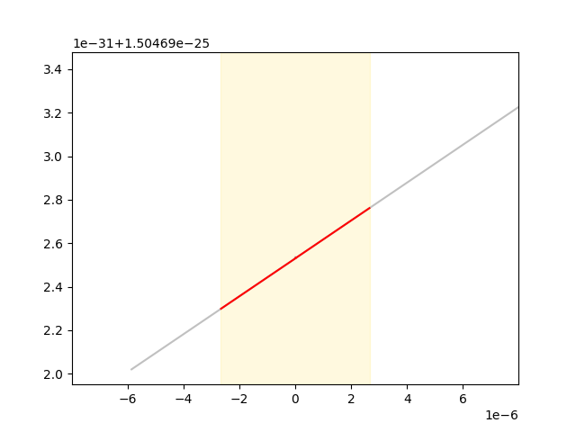


## Equation 3:
```
fast_sodium_current_m_gate__alpha_m = 0.32000000000000001 * (47.130000000000003 + membrane__V) / (1.0 - exp(-4.7130000000000001 - 0.10000000000000001 * membrane__V))
```
## New Eq:
```
fast_sodium_current_m_gate__alpha_m = ((fabs(47.130000000000003 + membrane__V) < 1.0000000000287557e-6) ? (3.200000000092018e-7 / (1.0 - exp(-1.0000000000287557e-7)) + (-23564999.499322373 - 499999.99998562218 * membrane__V) * (-3.200000000092018e-7 / (1.0 - exp(1.0000000000287557e-7)) - 3.200000000092018e-7 / (1.0 - exp(-1.0000000000287557e-7)))) : (0.32000000000000001 * (47.130000000000003 + membrane__V) / (1.0 - exp(-4.7130000000000001 - 0.10000000000000001 * membrane__V))))
```
## Singularity point: -47.130000000000003


## Equation 4:
```
non_specific_calcium_activated_current__I_ns_K = 6.3678763853082156e-6 * (-0.75 * ionic_concentrations__Ko + 0.75 * ionic_concentrations__Ki * exp(0.037573302761014088 * membrane__V - log((ionic_concentrations__Ko + ionic_concentrations__Nao) / (ionic_concentrations__Ki + ionic_concentrations__Nai)))) * (-26.614641953637257 * log((ionic_concentrations__Ko + ionic_concentrations__Nao) / (ionic_concentrations__Ki + ionic_concentrations__Nai)) + membrane__V) / (-1.0 + exp(0.037573302761014088 * membrane__V - log((ionic_concentrations__Ko + ionic_concentrations__Nao) / (ionic_concentrations__Ki + ionic_concentrations__Nai))))
```
## New Eq:
```
non_specific_calcium_activated_current__I_ns_K = ((fabs(-26.614641953637257 * log((ionic_concentrations__Ko + ionic_concentrations__Nao) / (ionic_concentrations__Ki + ionic_concentrations__Nai)) + membrane__V) < 2.6614641953637254e-6) ? ((1.6947874999999998e-11 * (-0.75 * ionic_concentrations__Ko + 0.75 * ionic_concentrations__Ki * exp(9.9999999999999995e-8)) / (-1.0 + exp(9.9999999999999995e-8)) + 1.6947874999999998e-11 * (-0.75 * ionic_concentrations__Ko + 0.75 * ionic_concentrations__Ki * exp(-9.9999999999999995e-8)) / (-1.0 + exp(-9.9999999999999995e-8))) * (0.5 + 187866.51380507043 * membrane__V - 5000000.0 * log((ionic_concentrations__Ko + ionic_concentrations__Nao) / (ionic_concentrations__Ki + ionic_concentrations__Nai))) - 1.6947874999999998e-11 * (-0.75 * ionic_concentrations__Ko + 0.75 * ionic_concentrations__Ki * exp(-9.9999999999999995e-8)) / (-1.0 + exp(-9.9999999999999995e-8))) : (6.3678763853082156e-6 * (-0.75 * ionic_concentrations__Ko + 0.75 * ionic_concentrations__Ki * exp(0.037573302761014088 * membrane__V - log((ionic_concentrations__Ko + ionic_concentrations__Nao) / (ionic_concentrations__Ki + ionic_concentrations__Nai)))) * (-26.614641953637257 * log((ionic_concentrations__Ko + ionic_concentrations__Nao) / (ionic_concentrations__Ki + ionic_concentrations__Nai)) + membrane__V) / (-1.0 + exp(0.037573302761014088 * membrane__V - log((ionic_concentrations__Ko + ionic_concentrations__Nao) / (ionic_concentrations__Ki + ionic_concentrations__Nai))))))
```
## Singularity point: -1.5174919438451304
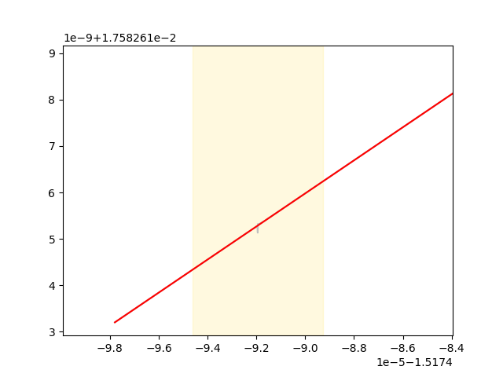


## Equation 5:
```
non_specific_calcium_activated_current__I_ns_Na = 6.3678763853082156e-6 * (-0.75 * ionic_concentrations__Nao + 0.75 * ionic_concentrations__Nai * exp(0.037573302761014088 * membrane__V - log((ionic_concentrations__Ko + ionic_concentrations__Nao) / (ionic_concentrations__Ki + ionic_concentrations__Nai)))) * (-26.614641953637257 * log((ionic_concentrations__Ko + ionic_concentrations__Nao) / (ionic_concentrations__Ki + ionic_concentrations__Nai)) + membrane__V) / (-1.0 + exp(0.037573302761014088 * membrane__V - log((ionic_concentrations__Ko + ionic_concentrations__Nao) / (ionic_concentrations__Ki + ionic_concentrations__Nai))))
```
## New Eq:
```
non_specific_calcium_activated_current__I_ns_Na = ((fabs(-26.614641953637257 * log((ionic_concentrations__Ko + ionic_concentrations__Nao) / (ionic_concentrations__Ki + ionic_concentrations__Nai)) + membrane__V) < 2.6614641953637254e-6) ? ((1.6947874999999998e-11 * (-0.75 * ionic_concentrations__Nao + 0.75 * ionic_concentrations__Nai * exp(9.9999999999999995e-8)) / (-1.0 + exp(9.9999999999999995e-8)) + 1.6947874999999998e-11 * (-0.75 * ionic_concentrations__Nao + 0.75 * ionic_concentrations__Nai * exp(-9.9999999999999995e-8)) / (-1.0 + exp(-9.9999999999999995e-8))) * (0.5 + 187866.51380507043 * membrane__V - 5000000.0 * log((ionic_concentrations__Ko + ionic_concentrations__Nao) / (ionic_concentrations__Ki + ionic_concentrations__Nai))) - 1.6947874999999998e-11 * (-0.75 * ionic_concentrations__Nao + 0.75 * ionic_concentrations__Nai * exp(-9.9999999999999995e-8)) / (-1.0 + exp(-9.9999999999999995e-8))) : (6.3678763853082156e-6 * (-0.75 * ionic_concentrations__Nao + 0.75 * ionic_concentrations__Nai * exp(0.037573302761014088 * membrane__V - log((ionic_concentrations__Ko + ionic_concentrations__Nao) / (ionic_concentrations__Ki + ionic_concentrations__Nai)))) * (-26.614641953637257 * log((ionic_concentrations__Ko + ionic_concentrations__Nao) / (ionic_concentrations__Ki + ionic_concentrations__Nai)) + membrane__V) / (-1.0 + exp(0.037573302761014088 * membrane__V - log((ionic_concentrations__Ko + ionic_concentrations__Nao) / (ionic_concentrations__Ki + ionic_concentrations__Nai))))))
```
## Singularity point: -1.5174919438451304
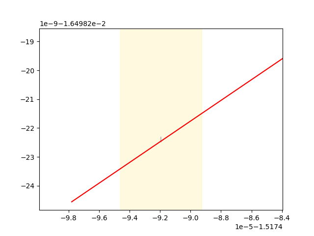


## Equation 6:
```
time_dependent_potassium_current_X_gate__alpha_X = 7.1899999999999999e-5 * (30.0 + membrane__V) / (1.0 - exp(-4.4399999999999995 - 0.14799999999999999 * membrane__V))
```
## New Eq:
```
time_dependent_potassium_current_X_gate__alpha_X = ((fabs(30.0 + membrane__V) < 6.7567567568760367e-7) ? (4.8581081081938701e-11 / (1.0 - exp(-1.0000000000287557e-7)) + (-22199999.499608092 - 739999.99998693645 * membrane__V) * (-4.8581081081938701e-11 / (1.0 - exp(1.0000000000287557e-7)) - 4.8581081081938701e-11 / (1.0 - exp(-1.0000000000287557e-7)))) : (7.1899999999999999e-5 * (30.0 + membrane__V) / (1.0 - exp(-4.4399999999999995 - 0.14799999999999999 * membrane__V))))
```
## Singularity point: -30.000000000000000
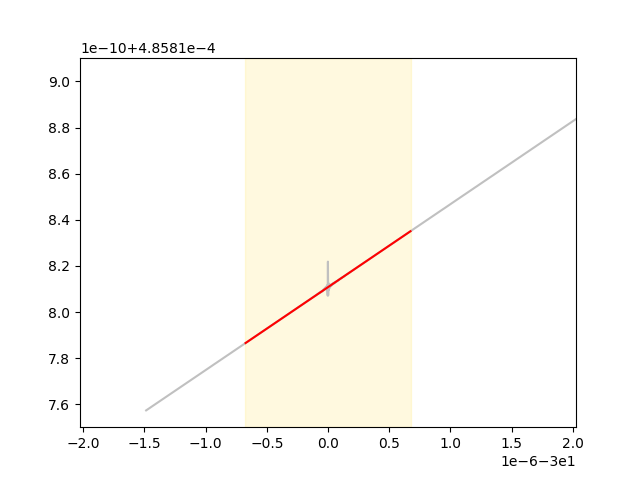


## Equation 7:
```
time_dependent_potassium_current_X_gate__beta_X = 0.00013100000000000001 * (30.0 + membrane__V) / (-1.0 + exp(2.0609999999999999 + 0.068699999999999997 * membrane__V))
```
## New Eq:
```
time_dependent_potassium_current_X_gate__beta_X = ((fabs(30.0 + membrane__V) < 1.455604075689676e-6) ? (-1.9068413391534758e-10 / (-1.0 + exp(-9.9999999999406119e-8)) + (10305000.50001229 + 343500.00000040967 * membrane__V) * (1.9068413391534758e-10 / (-1.0 + exp(9.9999999999406119e-8)) + 1.9068413391534758e-10 / (-1.0 + exp(-9.9999999999406119e-8)))) : (0.00013100000000000001 * (30.0 + membrane__V) / (-1.0 + exp(2.0609999999999999 + 0.068699999999999997 * membrane__V))))
```
## Singularity point: -30.000000000000000
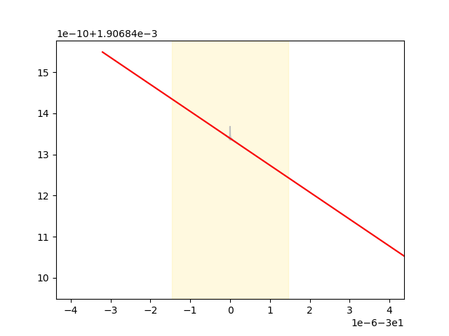


# of singularities:  7
singularity processing time: 33.9836037
# Model: kurata_model_2002(kurata_model_2002.cellml)
No of piecewises: 0
## Equation 1:
```
L_type_calcium_channel_current_d_gate__alpha_d = -0.028389999999999999 * (35.0 + membrane__V) / (-1.0 + exp(-14.0 - 0.40000000000000002 * membrane__V)) - 0.084900000000000003 * membrane__V / (-1.0 + exp(-0.20798668885191349 * membrane__V))
```
## New Eq:
```
L_type_calcium_channel_current_d_gate__alpha_d = ((fabs(35.0 + membrane__V) < 2.5000000000718892e-7) ? (-7.0975000009920736e-9 / (-1.0 + exp(-1.0000000001675335e-7)) + (-69999999.497987106 - 1999999.9999424887 * membrane__V) * (7.0975000009920736e-9 / (-1.0 + exp(-1.0000000001675335e-7)) + 7.0974999994161126e-9 / (-1.0 + exp(9.9999999988997779e-8)))) : (-0.028389999999999999 * (35.0 + membrane__V) / (-1.0 + exp(-14.0 - 0.40000000000000002 * membrane__V)))) + ((fabs(membrane__V) < 4.8079999999999991e-7) ? (-4.0819919999999999e-8 / (-1.0 + exp(-9.9999999999999995e-8)) + (0.5 - 1039933.4442595674 * membrane__V) * (4.0819919999999999e-8 / (-1.0 + exp(9.9999999999999995e-8)) + 4.0819919999999999e-8 / (-1.0 + exp(-9.9999999999999995e-8)))) : (-0.084900000000000003 * membrane__V / (-1.0 + exp(-0.20798668885191349 * membrane__V))))
```
## Singularity point: 0
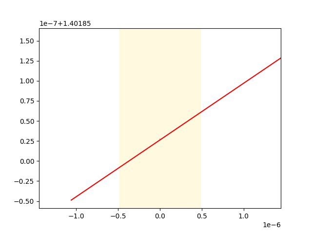

## Singularity point: -35.000000000000000


## Equation 2:
```
L_type_calcium_channel_current_d_gate__beta_d = 0.011429999999999999 * (-5.0 + membrane__V) / (-1.0 + exp(-2.0 + 0.40000000000000002 * membrane__V))
```
## New Eq:
```
L_type_calcium_channel_current_d_gate__beta_d = ((fabs(-5.0 + membrane__V) < 2.5000000000025002e-7) ? (-2.8575000000028576e-9 / (-1.0 + exp(-9.9999999999406119e-8)) + (-9999999.4999899995 + 1999999.9999979998 * membrane__V) * (2.8575000000028576e-9 / (-1.0 + exp(9.9999999999406119e-8)) + 2.8575000000028576e-9 / (-1.0 + exp(-9.9999999999406119e-8)))) : (0.011429999999999999 * (-5.0 + membrane__V) / (-1.0 + exp(-2.0 + 0.40000000000000002 * membrane__V))))
```
## Singularity point: 5.0000000000000000
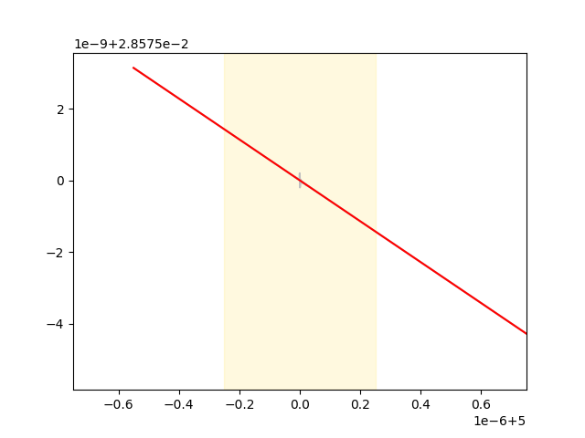


# of singularities:  3
singularity processing time: 20.461515100000042
# Model: lindblad_atrial_model_1996(lindblad_model_1996.cellml)
No of piecewises: 0
## Equation 1:
```
L_type_Ca_channel_d_L_gate__alpha_d_L = -50.0 * membrane__V / (-1.0 + exp(-0.20798668885191349 * membrane__V)) - 16.719999999999999 * (35.0 + membrane__V) / (-1.0 + exp(-14.0 - 0.40000000000000002 * membrane__V))
```
## New Eq:
```
L_type_Ca_channel_d_L_gate__alpha_d_L = ((fabs(35.0 + membrane__V) < 2.5000000000718892e-7) ? (-4.1800000005842713e-6 / (-1.0 + exp(-1.0000000001675335e-7)) + (-69999999.497987106 - 1999999.9999424887 * membrane__V) * (4.1800000005842713e-6 / (-1.0 + exp(-1.0000000001675335e-7)) + 4.1799999996561256e-6 / (-1.0 + exp(9.9999999988997779e-8)))) : (-16.719999999999999 * (35.0 + membrane__V) / (-1.0 + exp(-14.0 - 0.40000000000000002 * membrane__V)))) + ((fabs(membrane__V) < 4.8079999999999991e-7) ? (-2.4039999999999997e-5 / (-1.0 + exp(-9.9999999999999995e-8)) + (0.5 - 1039933.4442595674 * membrane__V) * (2.4039999999999997e-5 / (-1.0 + exp(9.9999999999999995e-8)) + 2.4039999999999997e-5 / (-1.0 + exp(-9.9999999999999995e-8)))) : (-50.0 * membrane__V / (-1.0 + exp(-0.20798668885191349 * membrane__V))))
```
## Singularity point: -35.000000000000000
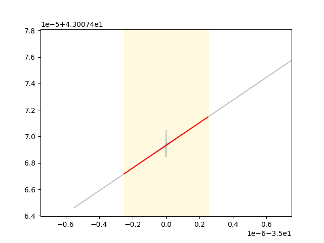

## Singularity point: 0
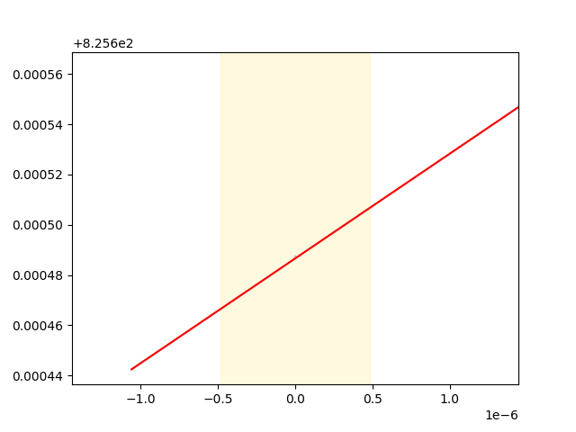


## Equation 2:
```
L_type_Ca_channel_d_L_gate__beta_d_L = 4.4800000000000004 * (-5.0 + membrane__V) / (-1.0 + exp(-2.0 + 0.40000000000000002 * membrane__V))
```
## New Eq:
```
L_type_Ca_channel_d_L_gate__beta_d_L = ((fabs(-5.0 + membrane__V) < 2.5000000000025002e-7) ? (-1.1200000000011203e-6 / (-1.0 + exp(-9.9999999999406119e-8)) + (-9999999.4999899995 + 1999999.9999979998 * membrane__V) * (1.1200000000011203e-6 / (-1.0 + exp(9.9999999999406119e-8)) + 1.1200000000011203e-6 / (-1.0 + exp(-9.9999999999406119e-8)))) : (4.4800000000000004 * (-5.0 + membrane__V) / (-1.0 + exp(-2.0 + 0.40000000000000002 * membrane__V))))
```
## Singularity point: 5.0000000000000000
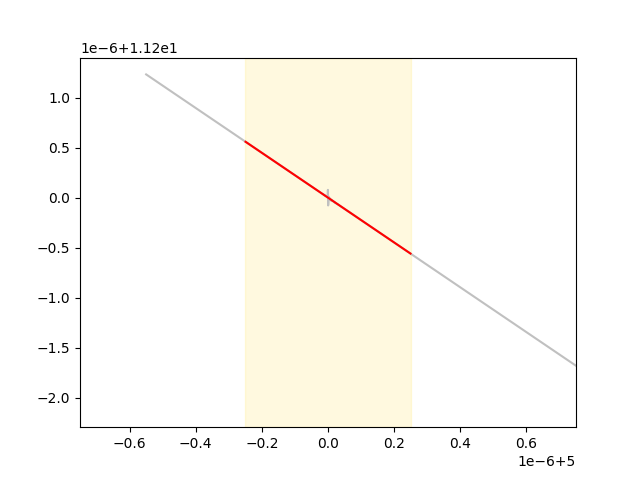


## Equation 3:
```
L_type_Ca_channel_f_L_gate__alpha_f_L = 8.4900000000000002 * (28.0 + membrane__V) / (-1.0 + exp(7.0 + 0.25 * membrane__V))
```
## New Eq:
```
L_type_Ca_channel_f_L_gate__alpha_f_L = ((fabs(28.0 + membrane__V) < 4.0000000001150227e-7) ? (-3.3960000000976542e-6 / (-1.0 + exp(-1.0000000000287557e-7)) + (35000000.498993553 + 1249999.9999640554 * membrane__V) * (3.3960000000976542e-6 / (-1.0 + exp(1.0000000000287557e-7)) + 3.3960000000976542e-6 / (-1.0 + exp(-1.0000000000287557e-7)))) : (8.4900000000000002 * (28.0 + membrane__V) / (-1.0 + exp(7.0 + 0.25 * membrane__V))))
```
## Singularity point: -28.000000000000000


## Equation 4:
```
sodium_current_m_gate__alpha_m = -460.0 * (44.399999999999999 + membrane__V) / (-1.0 + exp(-3.5035114021936398 - 0.078907914463820727 * membrane__V))
```
## New Eq:
```
sodium_current_m_gate__alpha_m = ((fabs(44.399999999999999 + membrane__V) < 1.2672999999963075e-6) ? (-0.00058295799999830145 / (-1.0 + exp(-9.9999999999406119e-8)) + (-17517556.511019241 - 394539.57232025318 * membrane__V) * (0.00058295799999830145 / (-1.0 + exp(9.9999999999406119e-8)) + 0.00058295799999830145 / (-1.0 + exp(-9.9999999999406119e-8)))) : (-460.0 * (44.399999999999999 + membrane__V) / (-1.0 + exp(-3.5035114021936398 - 0.078907914463820727 * membrane__V))))
```
## Singularity point: -44.399999999999999


## Equation 5:
```
sodium_current__i_Na = 3635.2751276264835 * pow(sodium_current_m_gate__m, 3) * (-1.0 + exp(0.037676968035880179 * membrane__V - log(cleft_space_ion_concentrations__Na_c / intracellular_ion_concentrations__Na_i))) * (0.36499999999999999 * sodium_current_h2_gate__h2 + 0.63500000000000001 * sodium_current_h1_gate__h1) * cleft_space_ion_concentrations__Na_c * membrane__V * sodium_current__P_Na / (-1.0 + exp(0.037676968035880179 * membrane__V))
```
## New Eq:
```
sodium_current__i_Na = ((fabs(membrane__V) < 2.6541413816729869e-6) ? ((0.5 + 188384.84017940093 * membrane__V) * (0.0096485341499999988 * pow(sodium_current_m_gate__m, 3) * (-1.0 + exp(9.9999999999999995e-8 - log(cleft_space_ion_concentrations__Na_c / intracellular_ion_concentrations__Na_i))) * (0.36499999999999999 * sodium_current_h2_gate__h2 + 0.63500000000000001 * sodium_current_h1_gate__h1) * cleft_space_ion_concentrations__Na_c * sodium_current__P_Na / (-1.0 + exp(9.9999999999999995e-8)) + 0.0096485341499999988 * pow(sodium_current_m_gate__m, 3) * (-1.0 + exp(-9.9999999999999995e-8 - log(cleft_space_ion_concentrations__Na_c / intracellular_ion_concentrations__Na_i))) * (0.36499999999999999 * sodium_current_h2_gate__h2 + 0.63500000000000001 * sodium_current_h1_gate__h1) * cleft_space_ion_concentrations__Na_c * sodium_current__P_Na / (-1.0 + exp(-9.9999999999999995e-8))) - 0.0096485341499999988 * pow(sodium_current_m_gate__m, 3) * (-1.0 + exp(-9.9999999999999995e-8 - log(cleft_space_ion_concentrations__Na_c / intracellular_ion_concentrations__Na_i))) * (0.36499999999999999 * sodium_current_h2_gate__h2 + 0.63500000000000001 * sodium_current_h1_gate__h1) * cleft_space_ion_concentrations__Na_c * sodium_current__P_Na / (-1.0 + exp(-9.9999999999999995e-8))) : (3635.2751276264835 * pow(sodium_current_m_gate__m, 3) * (-1.0 + exp(0.037676968035880179 * membrane__V - log(cleft_space_ion_concentrations__Na_c / intracellular_ion_concentrations__Na_i))) * (0.36499999999999999 * sodium_current_h2_gate__h2 + 0.63500000000000001 * sodium_current_h1_gate__h1) * cleft_space_ion_concentrations__Na_c * membrane__V * sodium_current__P_Na / (-1.0 + exp(0.037676968035880179 * membrane__V))))
```
## Singularity point: 0


# of singularities:  6
singularity processing time: 31.368180000000052
# Model: LivshitzRudy2007(livshitz_rudy_2007.cellml)
No of piecewises: 0
## Equation 1:
```
ICaL__ibarca = 14448.004881001343 * (-0.34100000000000003 * Environment__Ca_o + (-0.040960000000000003 + 0.33333333333333331 * Ca__Ca_T + 0.66666666666666663 * sqrt(-0.00057837000000000014 + pow((0.12288 - Ca__Ca_T), 2) + 0.0086400000000000001 * Ca__Ca_T) * cos(0.33333333333333331 * acos(0.5 * pow((-0.00057837000000000014 + pow((0.12288 - Ca__Ca_T), 2) + 0.0086400000000000001 * Ca__Ca_T), (-1.5)) * (3.2130000000000006e-5 * Ca__Ca_T - 2.0 * pow((0.12288 - Ca__Ca_T), 3) + 9.0 * (0.12288 - Ca__Ca_T) * (0.00019279000000000003 - 0.0028800000000000002 * Ca__Ca_T))))) * exp(0.074871767015605231 * cell__V)) * ICaL__pca * cell__V / (-1.0 + exp(0.074871767015605231 * cell__V))
```
## New Eq:
```
ICaL__ibarca = ((fabs(cell__V) < 1.3356169352749131e-6) ? ((0.5 + 374358.83507802623 * cell__V) * (0.019296999999999998 * (-0.34100000000000003 * Environment__Ca_o + (-0.040960000000000003 + 0.33333333333333331 * Ca__Ca_T + 0.66666666666666663 * sqrt(-0.00057837000000000014 + pow((0.12288 - Ca__Ca_T), 2) + 0.0086400000000000001 * Ca__Ca_T) * cos(0.33333333333333331 * acos(0.5 * pow((-0.00057837000000000014 + pow((0.12288 - Ca__Ca_T), 2) + 0.0086400000000000001 * Ca__Ca_T), (-1.5)) * (3.2130000000000006e-5 * Ca__Ca_T - 2.0 * pow((0.12288 - Ca__Ca_T), 3) + 9.0 * (0.12288 - Ca__Ca_T) * (0.00019279000000000003 - 0.0028800000000000002 * Ca__Ca_T))))) * exp(9.9999999999999995e-8)) * ICaL__pca / (-1.0 + exp(9.9999999999999995e-8)) + 0.019296999999999998 * (-0.34100000000000003 * Environment__Ca_o + (-0.040960000000000003 + 0.33333333333333331 * Ca__Ca_T + 0.66666666666666663 * sqrt(-0.00057837000000000014 + pow((0.12288 - Ca__Ca_T), 2) + 0.0086400000000000001 * Ca__Ca_T) * cos(0.33333333333333331 * acos(0.5 * pow((-0.00057837000000000014 + pow((0.12288 - Ca__Ca_T), 2) + 0.0086400000000000001 * Ca__Ca_T), (-1.5)) * (3.2130000000000006e-5 * Ca__Ca_T - 2.0 * pow((0.12288 - Ca__Ca_T), 3) + 9.0 * (0.12288 - Ca__Ca_T) * (0.00019279000000000003 - 0.0028800000000000002 * Ca__Ca_T))))) * exp(-9.9999999999999995e-8)) * ICaL__pca / (-1.0 + exp(-9.9999999999999995e-8))) - 0.019296999999999998 * (-0.34100000000000003 * Environment__Ca_o + (-0.040960000000000003 + 0.33333333333333331 * Ca__Ca_T + 0.66666666666666663 * sqrt(-0.00057837000000000014 + pow((0.12288 - Ca__Ca_T), 2) + 0.0086400000000000001 * Ca__Ca_T) * cos(0.33333333333333331 * acos(0.5 * pow((-0.00057837000000000014 + pow((0.12288 - Ca__Ca_T), 2) + 0.0086400000000000001 * Ca__Ca_T), (-1.5)) * (3.2130000000000006e-5 * Ca__Ca_T - 2.0 * pow((0.12288 - Ca__Ca_T), 3) + 9.0 * (0.12288 - Ca__Ca_T) * (0.00019279000000000003 - 0.0028800000000000002 * Ca__Ca_T))))) * exp(-9.9999999999999995e-8)) * ICaL__pca / (-1.0 + exp(-9.9999999999999995e-8))) : (14448.004881001343 * (-0.34100000000000003 * Environment__Ca_o + (-0.040960000000000003 + 0.33333333333333331 * Ca__Ca_T + 0.66666666666666663 * sqrt(-0.00057837000000000014 + pow((0.12288 - Ca__Ca_T), 2) + 0.0086400000000000001 * Ca__Ca_T) * cos(0.33333333333333331 * acos(0.5 * pow((-0.00057837000000000014 + pow((0.12288 - Ca__Ca_T), 2) + 0.0086400000000000001 * Ca__Ca_T), (-1.5)) * (3.2130000000000006e-5 * Ca__Ca_T - 2.0 * pow((0.12288 - Ca__Ca_T), 3) + 9.0 * (0.12288 - Ca__Ca_T) * (0.00019279000000000003 - 0.0028800000000000002 * Ca__Ca_T))))) * exp(0.074871767015605231 * cell__V)) * ICaL__pca * cell__V / (-1.0 + exp(0.074871767015605231 * cell__V))))
```
## Singularity point: 0


## Equation 2:
```
ICaL__ibark = 0.00069711623550831479 * (-0.75 * Environment__K_o + 0.75 * K__K_i * exp(0.037435883507802616 * cell__V)) * cell__V / (-1.0 + exp(0.037435883507802616 * cell__V))
```
## New Eq:
```
ICaL__ibark = ((fabs(cell__V) < 2.6712338705498262e-6) ? ((0.5 + 187179.41753901311 * cell__V) * (1.8621604999999999e-9 * (-0.75 * Environment__K_o + 0.75 * K__K_i * exp(9.9999999999999995e-8)) / (-1.0 + exp(9.9999999999999995e-8)) + 1.8621604999999999e-9 * (-0.75 * Environment__K_o + 0.75 * K__K_i * exp(-9.9999999999999995e-8)) / (-1.0 + exp(-9.9999999999999995e-8))) - 1.8621604999999999e-9 * (-0.75 * Environment__K_o + 0.75 * K__K_i * exp(-9.9999999999999995e-8)) / (-1.0 + exp(-9.9999999999999995e-8))) : (0.00069711623550831479 * (-0.75 * Environment__K_o + 0.75 * K__K_i * exp(0.037435883507802616 * cell__V)) * cell__V / (-1.0 + exp(0.037435883507802616 * cell__V))))
```
## Singularity point: 0


## Equation 3:
```
ICaL__ibarna = 0.0024381008236689767 * (-0.75 * Environment__Na_o + 0.75 * Na__Na_i * exp(0.037435883507802616 * cell__V)) * cell__V / (-1.0 + exp(0.037435883507802616 * cell__V))
```
## New Eq:
```
ICaL__ibarna = ((fabs(cell__V) < 2.6712338705498262e-6) ? ((0.5 + 187179.41753901311 * cell__V) * (6.5127375e-9 * (-0.75 * Environment__Na_o + 0.75 * Na__Na_i * exp(9.9999999999999995e-8)) / (-1.0 + exp(9.9999999999999995e-8)) + 6.5127375e-9 * (-0.75 * Environment__Na_o + 0.75 * Na__Na_i * exp(-9.9999999999999995e-8)) / (-1.0 + exp(-9.9999999999999995e-8))) - 6.5127375e-9 * (-0.75 * Environment__Na_o + 0.75 * Na__Na_i * exp(-9.9999999999999995e-8)) / (-1.0 + exp(-9.9999999999999995e-8))) : (0.0024381008236689767 * (-0.75 * Environment__Na_o + 0.75 * Na__Na_i * exp(0.037435883507802616 * cell__V)) * cell__V / (-1.0 + exp(0.037435883507802616 * cell__V))))
```
## Singularity point: 0


## Equation 4:
```
ICaL__taud = 28.571428571428569 * (1.0 - exp(-1.6025641025641024 - 0.16025641025641024 * cell__V)) / ((1.0 + exp(-1.6025641025641024 - 0.16025641025641024 * cell__V)) * (10.0 + cell__V))
```
## New Eq:
```
ICaL__taud = ((fabs(10.0 + cell__V) < 6.2399999999074307e-7) ? ((-8012820.0129393814 - 801282.05129393819 * cell__V) * (-45787545.788225032 * (1.0 - exp(9.9999999997671396e-8)) / (1.0 + exp(9.9999999997671396e-8)) - 45787545.788225032 * (1.0 - exp(-9.9999999997671396e-8)) / (1.0 + exp(-9.9999999997671396e-8))) + 45787545.788225032 * (1.0 - exp(-9.9999999997671396e-8)) / (1.0 + exp(-9.9999999997671396e-8))) : (28.571428571428569 * (1.0 - exp(-1.6025641025641024 - 0.16025641025641024 * cell__V)) / ((1.0 + exp(-1.6025641025641024 - 0.16025641025641024 * cell__V)) * (10.0 + cell__V))))
```
## Singularity point: -10.000000000000000


## Equation 5:
```
IKr__tauxr = 1 / (0.00060999999999999997 * (38.899999999999999 + cell__V) / (-1.0 + exp(5.6404999999999994 + 0.14499999999999999 * cell__V)) + 0.0013799999999999999 * (14.199999999999999 + cell__V) / (1.0 - exp(-1.7465999999999999 - 0.123 * cell__V)))
```
## New Eq:
```
IKr__tauxr = 1 / (((fabs(14.199999999999999 + cell__V) < 8.1300813007528783e-7) ? (1.1219512195134727e-9 / (1.0 - exp(-9.9999999999406119e-8)) + (-8732999.5000645891 - 615000.00000454858 * cell__V) * (-1.1219512194943214e-9 / (1.0 - exp(9.9999999999406119e-8)) - 1.1219512195134727e-9 / (1.0 - exp(-9.9999999999406119e-8)))) : (0.0013799999999999999 * (14.199999999999999 + cell__V) / (1.0 - exp(-1.7465999999999999 - 0.123 * cell__V)))) + ((fabs(38.899999999999999 + cell__V) < 6.896551724422384e-7) ? (-4.2068965517283451e-10 / (-1.0 + exp(-1.0000000000287557e-7)) + (28202500.498836767 + 724999.99997009686 * cell__V) * (4.2068965517283451e-10 / (-1.0 + exp(-1.0000000000287557e-7)) + 4.2068965520669629e-10 / (-1.0 + exp(1.0000000000287557e-7)))) : (0.00060999999999999997 * (38.899999999999999 + cell__V) / (-1.0 + exp(5.6404999999999994 + 0.14499999999999999 * cell__V)))))
```
## Singularity point: -38.899999999999999


## Singularity point: -14.199999999999999
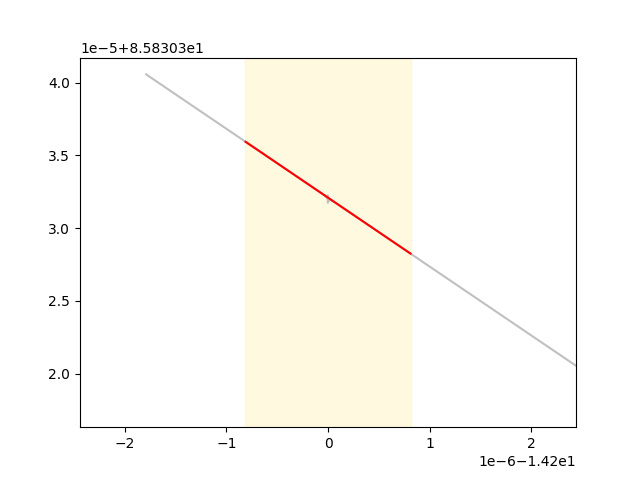


## Equation 6:
```
IKs__tauxs = 1 / (0.00013100000000000001 * (30.0 + cell__V) / (-1.0 + exp(2.0609999999999999 + 0.068699999999999997 * cell__V)) + 7.1899999999999999e-5 * (30.0 + cell__V) / (1.0 - exp(-4.4399999999999995 - 0.14799999999999999 * cell__V)))
```
## New Eq:
```
IKs__tauxs = ((fabs(30.0 + cell__V) < 1.455604075689676e-6) ? (1 / (-1.0465793304208771e-10 / (1.0 - exp(2.1542940320529169e-7)) - 1.9068413391534758e-10 / (-1.0 + exp(-9.9999999999406119e-8)) + (10305000.50001229 + 343500.00000040967 * cell__V) * (1.0465793304208771e-10 / (1.0 - exp(2.1542940320529169e-7)) + 1.0465793304208771e-10 / (1.0 - exp(-2.1542940320529169e-7)) + 1.9068413391534758e-10 / (-1.0 + exp(9.9999999999406119e-8)) + 1.9068413391534758e-10 / (-1.0 + exp(-9.9999999999406119e-8))))) : (1 / (0.00013100000000000001 * (30.0 + cell__V) / (-1.0 + exp(2.0609999999999999 + 0.068699999999999997 * cell__V)) + 7.1899999999999999e-5 * (30.0 + cell__V) / (1.0 - exp(-4.4399999999999995 - 0.14799999999999999 * cell__V)))))
```
## Singularity point: -30.000000000000000


## Equation 7:
```
INa__am = 0.32000000000000001 * (47.130000000000003 + cell__V) / (1.0 - exp(-4.7130000000000001 - 0.10000000000000001 * cell__V))
```
## New Eq:
```
INa__am = ((fabs(47.130000000000003 + cell__V) < 1.0000000000287557e-6) ? (3.200000000092018e-7 / (1.0 - exp(-1.0000000000287557e-7)) + (-23564999.499322373 - 499999.99998562218 * cell__V) * (-3.200000000092018e-7 / (1.0 - exp(1.0000000000287557e-7)) - 3.200000000092018e-7 / (1.0 - exp(-1.0000000000287557e-7)))) : (0.32000000000000001 * (47.130000000000003 + cell__V) / (1.0 - exp(-4.7130000000000001 - 0.10000000000000001 * cell__V))))
```
## Singularity point: -47.130000000000003


# of singularities:  8
singularity processing time: 47.44414219999999
# Model: Li_Mouse_2010(li_mouse_2010.cellml)
No of piecewises: 2
## Equation 1:
```
L_type_calcium_current__i_CaL = -0.0023079445283571576 * (-calcium_concentration__Cass + cell__Cao * exp(-0.075369662812530269 * cell__V)) * L_type_calcium_current__O * L_type_calcium_current__P_CaL * L_type_calcium_current__y_gate * cell__V / ((1.0 - exp(-0.075369662812530269 * cell__V)) * cell__Cm)
```
## New Eq:
```
L_type_calcium_current__i_CaL = ((fabs(cell__V) < 1.3267937823834197e-6) ? ((0.5 - 376848.31406265136 * cell__V) * (3.0621664503101105e-9 * (-calcium_concentration__Cass + cell__Cao * exp(9.9999999999999995e-8)) * L_type_calcium_current__O * L_type_calcium_current__P_CaL * L_type_calcium_current__y_gate / ((1.0 - exp(9.9999999999999995e-8)) * cell__Cm) + 3.0621664503101105e-9 * (-calcium_concentration__Cass + cell__Cao * exp(-9.9999999999999995e-8)) * L_type_calcium_current__O * L_type_calcium_current__P_CaL * L_type_calcium_current__y_gate / ((1.0 - exp(-9.9999999999999995e-8)) * cell__Cm)) - 3.0621664503101105e-9 * (-calcium_concentration__Cass + cell__Cao * exp(-9.9999999999999995e-8)) * L_type_calcium_current__O * L_type_calcium_current__P_CaL * L_type_calcium_current__y_gate / ((1.0 - exp(-9.9999999999999995e-8)) * cell__Cm)) : (-0.0023079445283571576 * (-calcium_concentration__Cass + cell__Cao * exp(-0.075369662812530269 * cell__V)) * L_type_calcium_current__O * L_type_calcium_current__P_CaL * L_type_calcium_current__y_gate * cell__V / ((1.0 - exp(-0.075369662812530269 * cell__V)) * cell__Cm)))
```
## Singularity point: 0


## Equation 2:
```
slow_delayed_rectifier_K_I__alpha_n = 4.8133299999999997e-6 * (26.5 + cell__V) / (1.0 - exp(-3.3919999999999999 - 0.128 * cell__V))
```
## New Eq:
```
slow_delayed_rectifier_K_I__alpha_n = ((fabs(26.5 + cell__V) < 7.8124999999817923e-7) ? (3.7604140624912359e-12 / (1.0 - exp(-9.9999999999406119e-8)) + (-16959999.500039525 - 640000.00000149151 * cell__V) * (-3.7604140624912359e-12 / (1.0 - exp(9.9999999999406119e-8)) - 3.7604140624912359e-12 / (1.0 - exp(-9.9999999999406119e-8)))) : (4.8133299999999997e-6 * (26.5 + cell__V) / (1.0 - exp(-3.3919999999999999 - 0.128 * cell__V))))
```
## Singularity point: -26.500000000000000


# of singularities:  2
singularity processing time: 8.9834057999999
# Model: luo_rudy_1991(luo_rudy_1991.cellml)
No of piecewises: 5
## Equation 1:
```
fast_sodium_current_m_gate__alpha_m = 0.32000000000000001 * (47.130000000000003 + membrane__V) / (1.0 - exp(-4.7130000000000001 - 0.10000000000000001 * membrane__V))
```
## New Eq:
```
fast_sodium_current_m_gate__alpha_m = ((fabs(47.130000000000003 + membrane__V) < 1.0000000000287557e-6) ? (3.200000000092018e-7 / (1.0 - exp(-1.0000000000287557e-7)) + (-23564999.499322373 - 499999.99998562218 * membrane__V) * (-3.200000000092018e-7 / (1.0 - exp(1.0000000000287557e-7)) - 3.200000000092018e-7 / (1.0 - exp(-1.0000000000287557e-7)))) : (0.32000000000000001 * (47.130000000000003 + membrane__V) / (1.0 - exp(-4.7130000000000001 - 0.10000000000000001 * membrane__V))))
```
## Singularity point: -47.130000000000003


## Equation 2:
```
time_dependent_potassium_current_Xi_gate__temp_Xi = 2.8370000000000002 * (-1.0 + exp(3.0800000000000001 + 0.040000000000000001 * membrane__V)) / (77.0 + membrane__V)
```
## New Eq:
```
time_dependent_potassium_current_Xi_gate__temp_Xi = ((fabs(77.0 + membrane__V) < 2.500000000016378e-6) ? (1134799.9999925657 - 1134799.9999925657 * exp(-9.9999999999406119e-8) + (15400000.499899112 + 199999.99999868975 * membrane__V) * (-2269599.9999851314 + 1134799.9999925657 * exp(9.9999999999406119e-8) + 1134799.9999925657 * exp(-9.9999999999406119e-8))) : (2.8370000000000002 * (-1.0 + exp(3.0800000000000001 + 0.040000000000000001 * membrane__V)) / (77.0 + membrane__V)))
```
## Singularity point: -77.000000000000000


# of singularities:  2
singularity processing time: 8.763110500000039
# Model: luo_rudy_1994(luo_rudy_1994.cellml)
No of piecewises: 5
## Equation 1:
```
L_type_Ca_channel__I_CaCa = 0.078597788527232842 * (-0.34000000000000002 * ionic_concentrations__Cao + ionic_concentrations__Cai * exp(0.075146605522028176 * membrane__V)) * membrane__V / (-1.0 + exp(0.075146605522028176 * membrane__V))
```
## New Eq:
```
L_type_Ca_channel__I_CaCa = ((fabs(membrane__V) < 1.3307320976818627e-6) ? ((0.5 + 375733.02761014085 * membrane__V) * (1.0459259999999999e-7 * (-0.34000000000000002 * ionic_concentrations__Cao + ionic_concentrations__Cai * exp(9.9999999999999995e-8)) / (-1.0 + exp(9.9999999999999995e-8)) + 1.0459259999999999e-7 * (-0.34000000000000002 * ionic_concentrations__Cao + ionic_concentrations__Cai * exp(-9.9999999999999995e-8)) / (-1.0 + exp(-9.9999999999999995e-8))) - 1.0459259999999999e-7 * (-0.34000000000000002 * ionic_concentrations__Cao + ionic_concentrations__Cai * exp(-9.9999999999999995e-8)) / (-1.0 + exp(-9.9999999999999995e-8))) : (0.078597788527232842 * (-0.34000000000000002 * ionic_concentrations__Cao + ionic_concentrations__Cai * exp(0.075146605522028176 * membrane__V)) * membrane__V / (-1.0 + exp(0.075146605522028176 * membrane__V))))
```
## Singularity point: 0
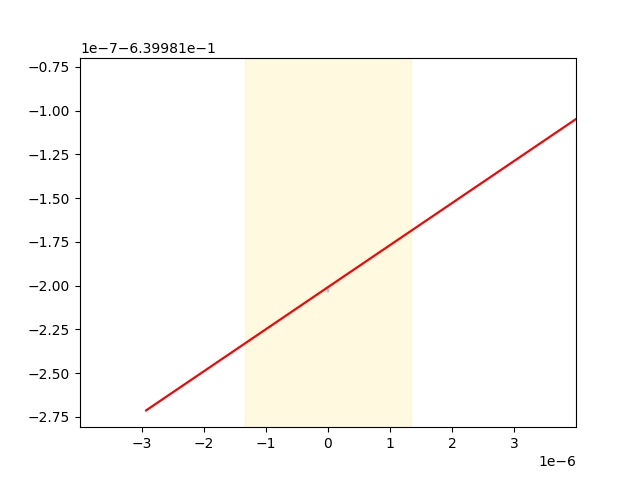


## Equation 2:
```
L_type_Ca_channel__I_CaK = 7.0228579563684903e-6 * (-0.75 * ionic_concentrations__Ko + 0.75 * ionic_concentrations__Ki * exp(0.037573302761014088 * membrane__V)) * membrane__V / (-1.0 + exp(0.037573302761014088 * membrane__V))
```
## New Eq:
```
L_type_Ca_channel__I_CaK = ((fabs(membrane__V) < 2.6614641953637254e-6) ? ((0.5 + 187866.51380507043 * membrane__V) * (1.8691085000000002e-11 * (-0.75 * ionic_concentrations__Ko + 0.75 * ionic_concentrations__Ki * exp(9.9999999999999995e-8)) / (-1.0 + exp(9.9999999999999995e-8)) + 1.8691085000000002e-11 * (-0.75 * ionic_concentrations__Ko + 0.75 * ionic_concentrations__Ki * exp(-9.9999999999999995e-8)) / (-1.0 + exp(-9.9999999999999995e-8))) - 1.8691085000000002e-11 * (-0.75 * ionic_concentrations__Ko + 0.75 * ionic_concentrations__Ki * exp(-9.9999999999999995e-8)) / (-1.0 + exp(-9.9999999999999995e-8))) : (7.0228579563684903e-6 * (-0.75 * ionic_concentrations__Ko + 0.75 * ionic_concentrations__Ki * exp(0.037573302761014088 * membrane__V)) * membrane__V / (-1.0 + exp(0.037573302761014088 * membrane__V))))
```
## Singularity point: 0


## Equation 3:
```
L_type_Ca_channel__I_CaNa = 2.4561808914760263e-5 * (-0.75 * ionic_concentrations__Nao + 0.75 * ionic_concentrations__Nai * exp(0.037573302761014088 * membrane__V)) * membrane__V / (-1.0 + exp(0.037573302761014088 * membrane__V))
```
## New Eq:
```
L_type_Ca_channel__I_CaNa = ((fabs(membrane__V) < 2.6614641953637254e-6) ? ((0.5 + 187866.51380507043 * membrane__V) * (6.5370374999999993e-11 * (-0.75 * ionic_concentrations__Nao + 0.75 * ionic_concentrations__Nai * exp(9.9999999999999995e-8)) / (-1.0 + exp(9.9999999999999995e-8)) + 6.5370374999999993e-11 * (-0.75 * ionic_concentrations__Nao + 0.75 * ionic_concentrations__Nai * exp(-9.9999999999999995e-8)) / (-1.0 + exp(-9.9999999999999995e-8))) - 6.5370374999999993e-11 * (-0.75 * ionic_concentrations__Nao + 0.75 * ionic_concentrations__Nai * exp(-9.9999999999999995e-8)) / (-1.0 + exp(-9.9999999999999995e-8))) : (2.4561808914760263e-5 * (-0.75 * ionic_concentrations__Nao + 0.75 * ionic_concentrations__Nai * exp(0.037573302761014088 * membrane__V)) * membrane__V / (-1.0 + exp(0.037573302761014088 * membrane__V))))
```
## Singularity point: 0


## Equation 4:
```
L_type_Ca_channel_d_gate__tau_d = 28.571428571428569 * (1.0 - exp(-1.6025641025641024 - 0.16025641025641024 * membrane__V)) / ((1.0 + exp(-1.6025641025641024 - 0.16025641025641024 * membrane__V)) * (10.0 + membrane__V))
```
## New Eq:
```
L_type_Ca_channel_d_gate__tau_d = ((fabs(10.0 + membrane__V) < 6.2399999999074307e-7) ? ((-8012820.0129393814 - 801282.05129393819 * membrane__V) * (-45787545.788225032 * (1.0 - exp(9.9999999997671396e-8)) / (1.0 + exp(9.9999999997671396e-8)) - 45787545.788225032 * (1.0 - exp(-9.9999999997671396e-8)) / (1.0 + exp(-9.9999999997671396e-8))) + 45787545.788225032 * (1.0 - exp(-9.9999999997671396e-8)) / (1.0 + exp(-9.9999999997671396e-8))) : (28.571428571428569 * (1.0 - exp(-1.6025641025641024 - 0.16025641025641024 * membrane__V)) / ((1.0 + exp(-1.6025641025641024 - 0.16025641025641024 * membrane__V)) * (10.0 + membrane__V))))
```
## Singularity point: -10.000000000000000


## Equation 5:
```
fast_sodium_current_m_gate__alpha_m = 0.32000000000000001 * (47.130000000000003 + membrane__V) / (1.0 - exp(-4.7130000000000001 - 0.10000000000000001 * membrane__V))
```
## New Eq:
```
fast_sodium_current_m_gate__alpha_m = ((fabs(47.130000000000003 + membrane__V) < 1.0000000000287557e-6) ? (3.200000000092018e-7 / (1.0 - exp(-1.0000000000287557e-7)) + (-23564999.499322373 - 499999.99998562218 * membrane__V) * (-3.200000000092018e-7 / (1.0 - exp(1.0000000000287557e-7)) - 3.200000000092018e-7 / (1.0 - exp(-1.0000000000287557e-7)))) : (0.32000000000000001 * (47.130000000000003 + membrane__V) / (1.0 - exp(-4.7130000000000001 - 0.10000000000000001 * membrane__V))))
```
## Singularity point: -47.130000000000003


## Equation 6:
```
non_specific_calcium_activated_current__I_ns_K = 6.3678763853082156e-6 * (-0.75 * ionic_concentrations__Ko + 0.75 * ionic_concentrations__Ki * exp(0.037573302761014088 * membrane__V - log((ionic_concentrations__Ko + ionic_concentrations__Nao) / (ionic_concentrations__Ki + ionic_concentrations__Nai)))) * (-26.614641953637257 * log((ionic_concentrations__Ko + ionic_concentrations__Nao) / (ionic_concentrations__Ki + ionic_concentrations__Nai)) + membrane__V) / (-1.0 + exp(0.037573302761014088 * membrane__V - log((ionic_concentrations__Ko + ionic_concentrations__Nao) / (ionic_concentrations__Ki + ionic_concentrations__Nai))))
```
## New Eq:
```
non_specific_calcium_activated_current__I_ns_K = ((fabs(-26.614641953637257 * log((ionic_concentrations__Ko + ionic_concentrations__Nao) / (ionic_concentrations__Ki + ionic_concentrations__Nai)) + membrane__V) < 2.6614641953637254e-6) ? ((1.6947874999999998e-11 * (-0.75 * ionic_concentrations__Ko + 0.75 * ionic_concentrations__Ki * exp(9.9999999999999995e-8)) / (-1.0 + exp(9.9999999999999995e-8)) + 1.6947874999999998e-11 * (-0.75 * ionic_concentrations__Ko + 0.75 * ionic_concentrations__Ki * exp(-9.9999999999999995e-8)) / (-1.0 + exp(-9.9999999999999995e-8))) * (0.5 + 187866.51380507043 * membrane__V - 5000000.0 * log((ionic_concentrations__Ko + ionic_concentrations__Nao) / (ionic_concentrations__Ki + ionic_concentrations__Nai))) - 1.6947874999999998e-11 * (-0.75 * ionic_concentrations__Ko + 0.75 * ionic_concentrations__Ki * exp(-9.9999999999999995e-8)) / (-1.0 + exp(-9.9999999999999995e-8))) : (6.3678763853082156e-6 * (-0.75 * ionic_concentrations__Ko + 0.75 * ionic_concentrations__Ki * exp(0.037573302761014088 * membrane__V - log((ionic_concentrations__Ko + ionic_concentrations__Nao) / (ionic_concentrations__Ki + ionic_concentrations__Nai)))) * (-26.614641953637257 * log((ionic_concentrations__Ko + ionic_concentrations__Nao) / (ionic_concentrations__Ki + ionic_concentrations__Nai)) + membrane__V) / (-1.0 + exp(0.037573302761014088 * membrane__V - log((ionic_concentrations__Ko + ionic_concentrations__Nao) / (ionic_concentrations__Ki + ionic_concentrations__Nai))))))
```
## Singularity point: -1.7016484344348868
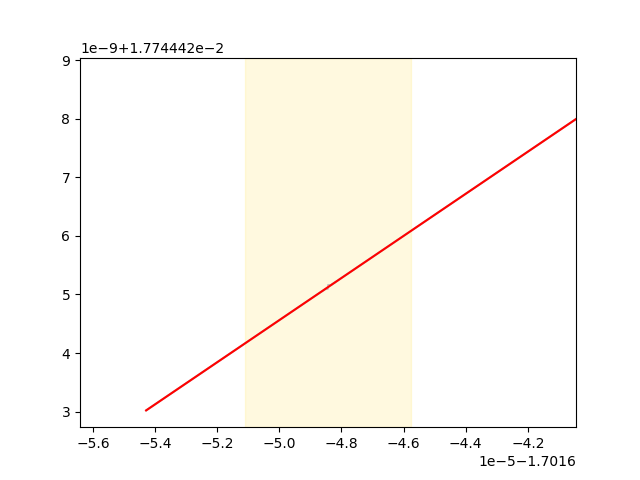


## Equation 7:
```
non_specific_calcium_activated_current__I_ns_Na = 6.3678763853082156e-6 * (-0.75 * ionic_concentrations__Nao + 0.75 * ionic_concentrations__Nai * exp(0.037573302761014088 * membrane__V - log((ionic_concentrations__Ko + ionic_concentrations__Nao) / (ionic_concentrations__Ki + ionic_concentrations__Nai)))) * (-26.614641953637257 * log((ionic_concentrations__Ko + ionic_concentrations__Nao) / (ionic_concentrations__Ki + ionic_concentrations__Nai)) + membrane__V) / (-1.0 + exp(0.037573302761014088 * membrane__V - log((ionic_concentrations__Ko + ionic_concentrations__Nao) / (ionic_concentrations__Ki + ionic_concentrations__Nai))))
```
## New Eq:
```
non_specific_calcium_activated_current__I_ns_Na = ((fabs(-26.614641953637257 * log((ionic_concentrations__Ko + ionic_concentrations__Nao) / (ionic_concentrations__Ki + ionic_concentrations__Nai)) + membrane__V) < 2.6614641953637254e-6) ? ((1.6947874999999998e-11 * (-0.75 * ionic_concentrations__Nao + 0.75 * ionic_concentrations__Nai * exp(9.9999999999999995e-8)) / (-1.0 + exp(9.9999999999999995e-8)) + 1.6947874999999998e-11 * (-0.75 * ionic_concentrations__Nao + 0.75 * ionic_concentrations__Nai * exp(-9.9999999999999995e-8)) / (-1.0 + exp(-9.9999999999999995e-8))) * (0.5 + 187866.51380507043 * membrane__V - 5000000.0 * log((ionic_concentrations__Ko + ionic_concentrations__Nao) / (ionic_concentrations__Ki + ionic_concentrations__Nai))) - 1.6947874999999998e-11 * (-0.75 * ionic_concentrations__Nao + 0.75 * ionic_concentrations__Nai * exp(-9.9999999999999995e-8)) / (-1.0 + exp(-9.9999999999999995e-8))) : (6.3678763853082156e-6 * (-0.75 * ionic_concentrations__Nao + 0.75 * ionic_concentrations__Nai * exp(0.037573302761014088 * membrane__V - log((ionic_concentrations__Ko + ionic_concentrations__Nao) / (ionic_concentrations__Ki + ionic_concentrations__Nai)))) * (-26.614641953637257 * log((ionic_concentrations__Ko + ionic_concentrations__Nao) / (ionic_concentrations__Ki + ionic_concentrations__Nai)) + membrane__V) / (-1.0 + exp(0.037573302761014088 * membrane__V - log((ionic_concentrations__Ko + ionic_concentrations__Nao) / (ionic_concentrations__Ki + ionic_concentrations__Nai))))))
```
## Singularity point: -1.7016484344348868
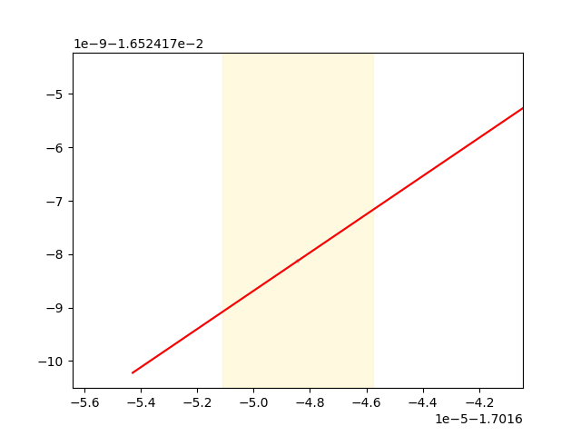


## Equation 8:
```
time_dependent_potassium_current_X_gate__alpha_X = 7.1899999999999999e-5 * (30.0 + membrane__V) / (1.0 - exp(-4.4399999999999995 - 0.14799999999999999 * membrane__V))
```
## New Eq:
```
time_dependent_potassium_current_X_gate__alpha_X = ((fabs(30.0 + membrane__V) < 6.7567567568760367e-7) ? (4.8581081081938701e-11 / (1.0 - exp(-1.0000000000287557e-7)) + (-22199999.499608092 - 739999.99998693645 * membrane__V) * (-4.8581081081938701e-11 / (1.0 - exp(1.0000000000287557e-7)) - 4.8581081081938701e-11 / (1.0 - exp(-1.0000000000287557e-7)))) : (7.1899999999999999e-5 * (30.0 + membrane__V) / (1.0 - exp(-4.4399999999999995 - 0.14799999999999999 * membrane__V))))
```
## Singularity point: -30.000000000000000
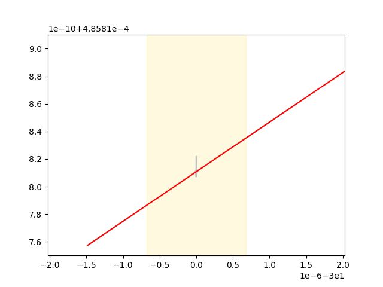


## Equation 9:
```
time_dependent_potassium_current_X_gate__beta_X = 0.00013100000000000001 * (30.0 + membrane__V) / (-1.0 + exp(2.0609999999999999 + 0.068699999999999997 * membrane__V))
```
## New Eq:
```
time_dependent_potassium_current_X_gate__beta_X = ((fabs(30.0 + membrane__V) < 1.455604075689676e-6) ? (-1.9068413391534758e-10 / (-1.0 + exp(-9.9999999999406119e-8)) + (10305000.50001229 + 343500.00000040967 * membrane__V) * (1.9068413391534758e-10 / (-1.0 + exp(9.9999999999406119e-8)) + 1.9068413391534758e-10 / (-1.0 + exp(-9.9999999999406119e-8)))) : (0.00013100000000000001 * (30.0 + membrane__V) / (-1.0 + exp(2.0609999999999999 + 0.068699999999999997 * membrane__V))))
```
## Singularity point: -30.000000000000000


# of singularities:  9
singularity processing time: 38.79988690000005
# Model: MahajanShiferaw2008_units(mahajan_shiferaw_2008.cellml)
No of piecewises: 5
## Equation 1:
```
ICaL__rxa = 4.0 * pow(Environment__F, 2) * (-0.34100000000000003 * Environment__Ca_o + 0.001 * Ca__Ca_submem * exp(2.0 * Environment__F * cell__V / (Environment__R * Environment__T))) * ICaL__pca * cell__V / ((-1.0 + exp(2.0 * Environment__F * cell__V / (Environment__R * Environment__T))) * Environment__R * Environment__T)
```
## New Eq:
```
ICaL__rxa = ((fabs(cell__V) < 4.9999999999999998e-8 * fabs(Environment__R * Environment__T / Environment__F)) ? (-1.9999999999999999e-7 * (-0.34100000000000003 * Environment__Ca_o + 0.001 * Ca__Ca_submem * exp(-9.9999999999999995e-8)) * Environment__F * ICaL__pca / (-1.0 + exp(-9.9999999999999995e-8)) + 10000000.0 * (4.9999999999999998e-8 * Environment__R * Environment__T / Environment__F + cell__V) * (1.9999999999999999e-7 * (-0.34100000000000003 * Environment__Ca_o + 0.001 * Ca__Ca_submem * exp(9.9999999999999995e-8)) * Environment__F * ICaL__pca / (-1.0 + exp(9.9999999999999995e-8)) + 1.9999999999999999e-7 * (-0.34100000000000003 * Environment__Ca_o + 0.001 * Ca__Ca_submem * exp(-9.9999999999999995e-8)) * Environment__F * ICaL__pca / (-1.0 + exp(-9.9999999999999995e-8))) * Environment__F / (Environment__R * Environment__T)) : (4.0 * pow(Environment__F, 2) * (-0.34100000000000003 * Environment__Ca_o + 0.001 * Ca__Ca_submem * exp(2.0 * Environment__F * cell__V / (Environment__R * Environment__T))) * ICaL__pca * cell__V / ((-1.0 + exp(2.0 * Environment__F * cell__V / (Environment__R * Environment__T))) * Environment__R * Environment__T)))
```
## Singularity point: 0
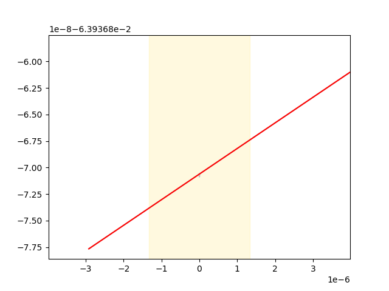


## Equation 2:
```
IKr__xkrv1 = 0.0013799999999999999 * (7.0 + cell__V) / (1.0 - exp(-0.86099999999999999 - 0.123 * cell__V))
```
## New Eq:
```
IKr__xkrv1 = ((fabs(7.0 + cell__V) < 8.1300813008222672e-7) ? (1.1219512195134727e-9 / (1.0 - exp(-1.0000000000027348e-7)) + (-4304999.4999950975 - 614999.99999929965 * cell__V) * (-1.1219512195134727e-9 / (1.0 - exp(1.0000000000027348e-7)) - 1.1219512195134727e-9 / (1.0 - exp(-1.0000000000027348e-7)))) : (0.0013799999999999999 * (7.0 + cell__V) / (1.0 - exp(-0.86099999999999999 - 0.123 * cell__V))))
```
## Singularity point: -7.0000000000000000


## Equation 3:
```
IKr__xkrv2 = 0.00060999999999999997 * (10.0 + cell__V) / (-1.0 + exp(1.45 + 0.14499999999999999 * cell__V))
```
## New Eq:
```
IKr__xkrv2 = ((fabs(10.0 + cell__V) < 6.8965517241448282e-7) ? (-4.2068965517283451e-10 / (-1.0 + exp(-9.9999999999406119e-8)) + (7250000.4999927497 + 724999.99999927497 * cell__V) * (4.2068965517283451e-10 / (-1.0 + exp(9.9999999999406119e-8)) + 4.2068965517283451e-10 / (-1.0 + exp(-9.9999999999406119e-8)))) : (0.00060999999999999997 * (10.0 + cell__V) / (-1.0 + exp(1.45 + 0.14499999999999999 * cell__V))))
```
## Singularity point: -10.000000000000000
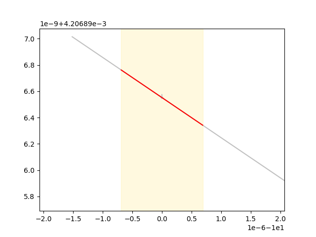


## Equation 4:
```
IKs__tauxs1 = 1 / (0.00013100000000000001 * (30.0 + cell__V) / (-1.0 + exp(2.0609999999999999 + 0.068699999999999997 * cell__V)) + 7.1899999999999999e-5 * (30.0 + cell__V) / (1.0 - exp(-4.4399999999999995 - 0.14799999999999999 * cell__V)))
```
## New Eq:
```
IKs__tauxs1 = ((fabs(30.0 + cell__V) < 1.455604075689676e-6) ? (1 / (-1.0465793304208771e-10 / (1.0 - exp(2.1542940320529169e-7)) - 1.9068413391534758e-10 / (-1.0 + exp(-9.9999999999406119e-8)) + (10305000.50001229 + 343500.00000040967 * cell__V) * (1.0465793304208771e-10 / (1.0 - exp(2.1542940320529169e-7)) + 1.0465793304208771e-10 / (1.0 - exp(-2.1542940320529169e-7)) + 1.9068413391534758e-10 / (-1.0 + exp(9.9999999999406119e-8)) + 1.9068413391534758e-10 / (-1.0 + exp(-9.9999999999406119e-8))))) : (1 / (0.00013100000000000001 * (30.0 + cell__V) / (-1.0 + exp(2.0609999999999999 + 0.068699999999999997 * cell__V)) + 7.1899999999999999e-5 * (30.0 + cell__V) / (1.0 - exp(-4.4399999999999995 - 0.14799999999999999 * cell__V)))))
```
## Singularity point: -30.000000000000000
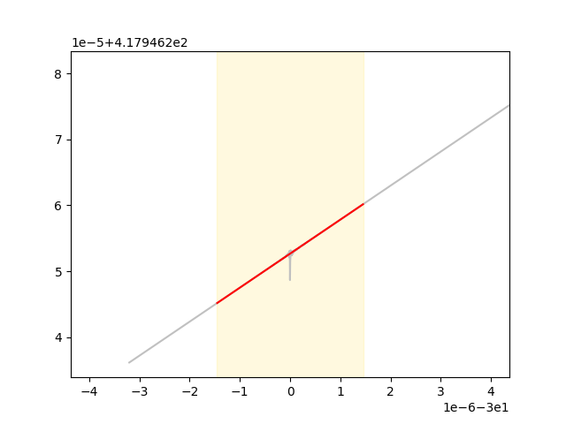


## Equation 5:
```
INa__am = 0.32000000000000001 * (47.130000000000003 + cell__V) / (1.0 - exp(-4.7130000000000001 - 0.10000000000000001 * cell__V))
```
## New Eq:
```
INa__am = ((fabs(47.130000000000003 + cell__V) < 1.0000000000287557e-6) ? (3.200000000092018e-7 / (1.0 - exp(-1.0000000000287557e-7)) + (-23564999.499322373 - 499999.99998562218 * cell__V) * (-3.200000000092018e-7 / (1.0 - exp(1.0000000000287557e-7)) - 3.200000000092018e-7 / (1.0 - exp(-1.0000000000287557e-7)))) : (0.32000000000000001 * (47.130000000000003 + cell__V) / (1.0 - exp(-4.7130000000000001 - 0.10000000000000001 * cell__V))))
```
## Singularity point: -47.130000000000003


# of singularities:  5
singularity processing time: 25.05776579999997
# Model: Maleckar(maleckar_model_2009.cellml)
No of piecewises: 0
## Equation 1:
```
sodium_current__i_Na = 3657.5756957513308 * pow(sodium_current_m_gate__m, 3) * (-1.0 + exp(0.037907445518581065 * membrane__V - log(cleft_space_ion_concentrations__Na_c / intracellular_ion_concentrations__Na_i))) * (0.10000000000000001 * sodium_current_h2_gate__h2 + 0.90000000000000002 * sodium_current_h1_gate__h1) * cleft_space_ion_concentrations__Na_c * membrane__V * sodium_current__P_Na / (-1.0 + exp(0.037907445518581065 * membrane__V))
```
## New Eq:
```
sodium_current__i_Na = ((fabs(membrane__V) < 2.6380041870925613e-6) ? ((0.5 + 189537.22759290531 * membrane__V) * (0.0096486999999999996 * pow(sodium_current_m_gate__m, 3) * (-1.0 + exp(9.9999999999999995e-8 - log(cleft_space_ion_concentrations__Na_c / intracellular_ion_concentrations__Na_i))) * (0.10000000000000001 * sodium_current_h2_gate__h2 + 0.90000000000000002 * sodium_current_h1_gate__h1) * cleft_space_ion_concentrations__Na_c * sodium_current__P_Na / (-1.0 + exp(9.9999999999999995e-8)) + 0.0096486999999999996 * pow(sodium_current_m_gate__m, 3) * (-1.0 + exp(-9.9999999999999995e-8 - log(cleft_space_ion_concentrations__Na_c / intracellular_ion_concentrations__Na_i))) * (0.10000000000000001 * sodium_current_h2_gate__h2 + 0.90000000000000002 * sodium_current_h1_gate__h1) * cleft_space_ion_concentrations__Na_c * sodium_current__P_Na / (-1.0 + exp(-9.9999999999999995e-8))) - 0.0096486999999999996 * pow(sodium_current_m_gate__m, 3) * (-1.0 + exp(-9.9999999999999995e-8 - log(cleft_space_ion_concentrations__Na_c / intracellular_ion_concentrations__Na_i))) * (0.10000000000000001 * sodium_current_h2_gate__h2 + 0.90000000000000002 * sodium_current_h1_gate__h1) * cleft_space_ion_concentrations__Na_c * sodium_current__P_Na / (-1.0 + exp(-9.9999999999999995e-8))) : (3657.5756957513308 * pow(sodium_current_m_gate__m, 3) * (-1.0 + exp(0.037907445518581065 * membrane__V - log(cleft_space_ion_concentrations__Na_c / intracellular_ion_concentrations__Na_i))) * (0.10000000000000001 * sodium_current_h2_gate__h2 + 0.90000000000000002 * sodium_current_h1_gate__h1) * cleft_space_ion_concentrations__Na_c * membrane__V * sodium_current__P_Na / (-1.0 + exp(0.037907445518581065 * membrane__V))))
```
## Singularity point: 0
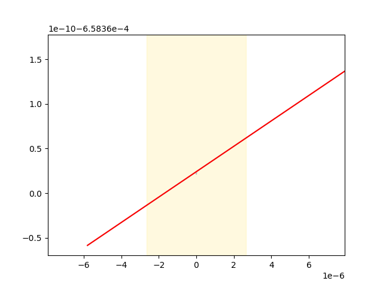


# of singularities:  1
singularity processing time: 5.1796589000000495
# Model: maltsev_2009(maltsev_2009.cellml)
No of piecewises: 0
## Equation 1:
```
i_CaL_dL_gate__alpha_dL = -0.028389999999999999 * (35.0 + Vm__Vm) / (-1.0 + exp(-14.0 - 0.40000000000000002 * Vm__Vm)) - 0.084900000000000003 * Vm__Vm / (-1.0 + exp(-0.20833333333333334 * Vm__Vm))
```
## New Eq:
```
i_CaL_dL_gate__alpha_dL = ((fabs(35.0 + Vm__Vm) < 2.5000000000718892e-7) ? (-7.0975000009920736e-9 / (-1.0 + exp(-1.0000000001675335e-7)) + (-69999999.497987106 - 1999999.9999424887 * Vm__Vm) * (7.0975000009920736e-9 / (-1.0 + exp(-1.0000000001675335e-7)) + 7.0974999994161126e-9 / (-1.0 + exp(9.9999999988997779e-8)))) : (-0.028389999999999999 * (35.0 + Vm__Vm) / (-1.0 + exp(-14.0 - 0.40000000000000002 * Vm__Vm)))) + ((fabs(Vm__Vm) < 4.7999999999999996e-7) ? (-4.0752e-8 / (-1.0 + exp(-9.9999999999999995e-8)) + (0.5 - 1041666.6666666667 * Vm__Vm) * (4.0752e-8 / (-1.0 + exp(9.9999999999999995e-8)) + 4.0752e-8 / (-1.0 + exp(-9.9999999999999995e-8)))) : (-0.084900000000000003 * Vm__Vm / (-1.0 + exp(-0.20833333333333334 * Vm__Vm))))
```
## Singularity point: 0


## Singularity point: -35.000000000000000


## Equation 2:
```
i_CaL_dL_gate__beta_dL = 0.011429999999999999 * (-5.0 + Vm__Vm) / (-1.0 + exp(-2.0 + 0.40000000000000002 * Vm__Vm))
```
## New Eq:
```
i_CaL_dL_gate__beta_dL = ((fabs(-5.0 + Vm__Vm) < 2.5000000000025002e-7) ? (-2.8575000000028576e-9 / (-1.0 + exp(-9.9999999999406119e-8)) + (-9999999.4999899995 + 1999999.9999979998 * Vm__Vm) * (2.8575000000028576e-9 / (-1.0 + exp(9.9999999999406119e-8)) + 2.8575000000028576e-9 / (-1.0 + exp(-9.9999999999406119e-8)))) : (0.011429999999999999 * (-5.0 + Vm__Vm) / (-1.0 + exp(-2.0 + 0.40000000000000002 * Vm__Vm))))
```
## Singularity point: 5.0000000000000000
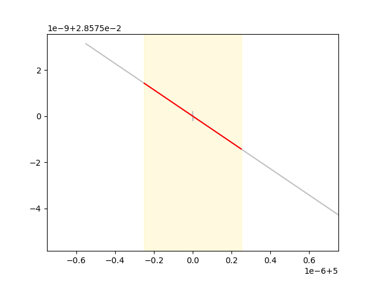


# of singularities:  3
singularity processing time: 20.223820400000022
# Model: matsuoka_model_2003(matsuoka_model_2003.cellml)
No of piecewises: 0
## Equation 1:
```
constant_field_equations__CF_Ca = 0.074870384603595908 * (-0.026190000000000001 + 0.5 * sqrt(pow((0.052380000000000003 - internal_ion_concentrations__Ca_Total), 2) + 0.0095200000000000007 * internal_ion_concentrations__Ca_Total) + 0.5 * internal_ion_concentrations__Ca_Total - external_ion_concentrations__Cao * exp(-0.074870384603595908 * membrane__Vm)) * membrane__Vm / (1.0 - exp(-0.074870384603595908 * membrane__Vm))
```
## New Eq:
```
constant_field_equations__CF_Ca = ((fabs(membrane__Vm) < 1.3356415961992688e-6) ? ((0.5 - 374351.92301797954 * membrane__Vm) * (-9.9999999999999995e-8 * (-0.026190000000000001 + 0.5 * sqrt(pow((0.052380000000000003 - internal_ion_concentrations__Ca_Total), 2) + 0.0095200000000000007 * internal_ion_concentrations__Ca_Total) + 0.5 * internal_ion_concentrations__Ca_Total - external_ion_concentrations__Cao * exp(9.9999999999999995e-8)) / (1.0 - exp(9.9999999999999995e-8)) - 9.9999999999999995e-8 * (-0.026190000000000001 + 0.5 * sqrt(pow((0.052380000000000003 - internal_ion_concentrations__Ca_Total), 2) + 0.0095200000000000007 * internal_ion_concentrations__Ca_Total) + 0.5 * internal_ion_concentrations__Ca_Total - external_ion_concentrations__Cao * exp(-9.9999999999999995e-8)) / (1.0 - exp(-9.9999999999999995e-8))) + 9.9999999999999995e-8 * (-0.026190000000000001 + 0.5 * sqrt(pow((0.052380000000000003 - internal_ion_concentrations__Ca_Total), 2) + 0.0095200000000000007 * internal_ion_concentrations__Ca_Total) + 0.5 * internal_ion_concentrations__Ca_Total - external_ion_concentrations__Cao * exp(-9.9999999999999995e-8)) / (1.0 - exp(-9.9999999999999995e-8))) : (0.074870384603595908 * (-0.026190000000000001 + 0.5 * sqrt(pow((0.052380000000000003 - internal_ion_concentrations__Ca_Total), 2) + 0.0095200000000000007 * internal_ion_concentrations__Ca_Total) + 0.5 * internal_ion_concentrations__Ca_Total - external_ion_concentrations__Cao * exp(-0.074870384603595908 * membrane__Vm)) * membrane__Vm / (1.0 - exp(-0.074870384603595908 * membrane__Vm))))
```
## Singularity point: 0


## Equation 2:
```
constant_field_equations__CF_K = 0.037435192301797954 * (-external_ion_concentrations__Ko * exp(-0.037435192301797954 * membrane__Vm) + internal_ion_concentrations__Ki) * membrane__Vm / (1.0 - exp(-0.037435192301797954 * membrane__Vm))
```
## New Eq:
```
constant_field_equations__CF_K = ((fabs(membrane__Vm) < 2.6712831923985376e-6) ? ((0.5 - 187175.96150898977 * membrane__Vm) * (-9.9999999999999995e-8 * (-external_ion_concentrations__Ko * exp(9.9999999999999995e-8) + internal_ion_concentrations__Ki) / (1.0 - exp(9.9999999999999995e-8)) - 9.9999999999999995e-8 * (-external_ion_concentrations__Ko * exp(-9.9999999999999995e-8) + internal_ion_concentrations__Ki) / (1.0 - exp(-9.9999999999999995e-8))) + 9.9999999999999995e-8 * (-external_ion_concentrations__Ko * exp(-9.9999999999999995e-8) + internal_ion_concentrations__Ki) / (1.0 - exp(-9.9999999999999995e-8))) : (0.037435192301797954 * (-external_ion_concentrations__Ko * exp(-0.037435192301797954 * membrane__Vm) + internal_ion_concentrations__Ki) * membrane__Vm / (1.0 - exp(-0.037435192301797954 * membrane__Vm))))
```
## Singularity point: 0


## Equation 3:
```
background_Kpl_current__i_Kpl = 8.3986538766456042e-5 * pow(external_ion_concentrations__Ko, 0.16) * (3.0 + membrane__Vm) * constant_field_equations__CF_K / (1.0 - exp(-0.23076923076923078 - 0.076923076923076927 * membrane__Vm))
```
## New Eq:
```
background_Kpl_current__i_Kpl = ((fabs(3.0 + membrane__Vm) < 1.3000000000009532e-6) ? ((-1153845.6538453079 - 384615.38461510261 * membrane__Vm) * (-1.0918250039632722e-10 * pow(external_ion_concentrations__Ko, 0.16) * constant_field_equations__CF_K / (1.0 - exp(-1.0000000000005664e-7)) - 1.091825003966186e-10 * pow(external_ion_concentrations__Ko, 0.16) * constant_field_equations__CF_K / (1.0 - exp(1.0000000000005664e-7))) + 1.0918250039632722e-10 * pow(external_ion_concentrations__Ko, 0.16) * constant_field_equations__CF_K / (1.0 - exp(-1.0000000000005664e-7))) : (8.3986538766456042e-5 * pow(external_ion_concentrations__Ko, 0.16) * (3.0 + membrane__Vm) * constant_field_equations__CF_K / (1.0 - exp(-0.23076923076923078 - 0.076923076923076927 * membrane__Vm))))
```
## Singularity point: -3.0000000000000000


## Equation 4:
```
constant_field_equations__CF_Na = 0.037435192301797954 * (-external_ion_concentrations__Nao * exp(-0.037435192301797954 * membrane__Vm) + internal_ion_concentrations__Nai) * membrane__Vm / (1.0 - exp(-0.037435192301797954 * membrane__Vm))
```
## New Eq:
```
constant_field_equations__CF_Na = ((fabs(membrane__Vm) < 2.6712831923985376e-6) ? ((0.5 - 187175.96150898977 * membrane__Vm) * (-9.9999999999999995e-8 * (-external_ion_concentrations__Nao * exp(9.9999999999999995e-8) + internal_ion_concentrations__Nai) / (1.0 - exp(9.9999999999999995e-8)) - 9.9999999999999995e-8 * (-external_ion_concentrations__Nao * exp(-9.9999999999999995e-8) + internal_ion_concentrations__Nai) / (1.0 - exp(-9.9999999999999995e-8))) + 9.9999999999999995e-8 * (-external_ion_concentrations__Nao * exp(-9.9999999999999995e-8) + internal_ion_concentrations__Nai) / (1.0 - exp(-9.9999999999999995e-8))) : (0.037435192301797954 * (-external_ion_concentrations__Nao * exp(-0.037435192301797954 * membrane__Vm) + internal_ion_concentrations__Nai) * membrane__Vm / (1.0 - exp(-0.037435192301797954 * membrane__Vm))))
```
## Singularity point: 0


# of singularities:  4
singularity processing time: 22.528536900000063
# Model: mcallister_noble_tsien_1975_modelB(mcallister_noble_tsien_1975_b.cellml)
No of piecewises: 0
## Equation 1:
```
fast_sodium_current_m_gate__alpha_m = (47.0 + membrane__V) / (1.0 - exp(-4.7000000000000002 - 0.10000000000000001 * membrane__V))
```
## New Eq:
```
fast_sodium_current_m_gate__alpha_m = ((fabs(47.0 + membrane__V) < 1.0000000000287557e-6) ? (9.9999999997324451e-7 / (1.0 - exp(-1.0000000000287557e-7)) + (-23499999.499324244 - 499999.99998562218 * membrane__V) * (-9.9999999997324451e-7 / (1.0 - exp(-1.0000000000287557e-7)) - 1.0000000000842668e-6 / (1.0 - exp(1.0000000000287557e-7)))) : ((47.0 + membrane__V) / (1.0 - exp(-4.7000000000000002 - 0.10000000000000001 * membrane__V))))
```
## Singularity point: -47.000000000000000


## Equation 2:
```
pacemaker_potassium_current_s_gate__alpha_s = 0.001 * (52.0 + membrane__V) / (1.0 - exp(-10.4 - 0.20000000000000001 * membrane__V))
```
## New Eq:
```
pacemaker_potassium_current_s_gate__alpha_s = ((fabs(52.0 + membrane__V) < 5.0000000001437783e-7) ? (5.0000000001437788e-10 / (1.0 - exp(-1.0000000000287557e-7)) + (-51999999.498504706 - 999999.99997124437 * membrane__V) * (-5.0000000001437788e-10 / (1.0 - exp(1.0000000000287557e-7)) - 5.0000000001437788e-10 / (1.0 - exp(-1.0000000000287557e-7)))) : (0.001 * (52.0 + membrane__V) / (1.0 - exp(-10.4 - 0.20000000000000001 * membrane__V))))
```
## Singularity point: -52.000000000000000


## Equation 3:
```
secondary_inward_current_d_gate__alpha_d = 0.002 * (40.0 + membrane__V) / (1.0 - exp(-4.0 - 0.10000000000000001 * membrane__V))
```
## New Eq:
```
secondary_inward_current_d_gate__alpha_d = ((fabs(40.0 + membrane__V) < 1.0000000000010001e-6) ? (1.999999999946489e-9 / (1.0 - exp(-9.9999999995936673e-8)) + (-19999999.499979999 - 499999.99999949994 * membrane__V) * (-1.999999999946489e-9 / (1.0 - exp(-9.9999999995936673e-8)) - 2.0000000000575115e-9 / (1.0 - exp(1.0000000000287557e-7)))) : (0.002 * (40.0 + membrane__V) / (1.0 - exp(-4.0 - 0.10000000000000001 * membrane__V))))
```
## Singularity point: -40.000000000000000
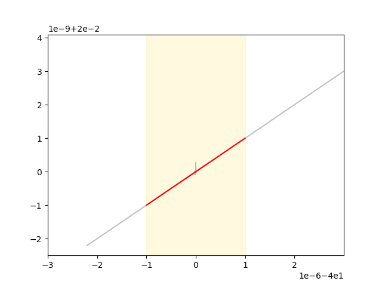


## Equation 4:
```
time_independent_outward_current__i_K1 = (-1.0 + exp(4.4000000000000004 + 0.040000000000000001 * membrane__V)) / (exp(2.3999999999999999 + 0.040000000000000001 * membrane__V) + exp(4.7999999999999998 + 0.080000000000000002 * membrane__V)) + 0.20000000000000001 * (30.0 + membrane__V) / (1.0 - exp(-1.2 - 0.040000000000000001 * membrane__V))
```
## New Eq:
```
time_independent_outward_current__i_K1 = (-1.0 + exp(4.4000000000000004 + 0.040000000000000001 * membrane__V)) / (exp(2.3999999999999999 + 0.040000000000000001 * membrane__V) + exp(4.7999999999999998 + 0.080000000000000002 * membrane__V)) + ((fabs(30.0 + membrane__V) < 2.4999999999886224e-6) ? (4.9999999999772453e-7 / (1.0 - exp(-9.9999999999406119e-8)) + (-5999999.5000273064 - 200000.00000091019 * membrane__V) * (-4.9999999999772453e-7 / (1.0 - exp(9.9999999999406119e-8)) - 4.9999999999772453e-7 / (1.0 - exp(-9.9999999999406119e-8)))) : (0.20000000000000001 * (30.0 + membrane__V) / (1.0 - exp(-1.2 - 0.040000000000000001 * membrane__V))))
```
## Singularity point: -30.000000000000000


## Equation 5:
```
transient_chloride_current_q_gate__alpha_q = 0.0080000000000000002 * membrane__V / (1.0 - exp(-0.10000000000000001 * membrane__V))
```
## New Eq:
```
transient_chloride_current_q_gate__alpha_q = ((fabs(membrane__V) < 9.9999999999999995e-7) ? (7.9999999999999988e-9 / (1.0 - exp(-9.9999999999999995e-8)) + (0.5 - 500000.00000000006 * membrane__V) * (-7.9999999999999988e-9 / (1.0 - exp(9.9999999999999995e-8)) - 7.9999999999999988e-9 / (1.0 - exp(-9.9999999999999995e-8)))) : (0.0080000000000000002 * membrane__V / (1.0 - exp(-0.10000000000000001 * membrane__V))))
```
## Singularity point: 0


# of singularities:  5
singularity processing time: 25.00041280000005
# Model: noble_model_1962(noble_model_1962.cellml)
No of piecewises: 0
## Equation 1:
```
potassium_channel_n_gate__alpha_n = 0.0001 * (-50.0 - membrane__V) / (-1.0 + exp(-5.0 - 0.10000000000000001 * membrane__V))
```
## New Eq:
```
potassium_channel_n_gate__alpha_n = ((fabs(50.0 + membrane__V) < 1.0000000000287557e-6) ? (-1.0000000000287557e-10 / (-1.0 + exp(-1.0000000000287557e-7)) + (-24999999.499281108 - 499999.99998562218 * membrane__V) * (1.0000000000287557e-10 / (-1.0 + exp(1.0000000000287557e-7)) + 1.0000000000287557e-10 / (-1.0 + exp(-1.0000000000287557e-7)))) : (0.0001 * (-50.0 - membrane__V) / (-1.0 + exp(-5.0 - 0.10000000000000001 * membrane__V))))
```
## Singularity point: -50.000000000000000


## Equation 2:
```
sodium_channel_m_gate__alpha_m = 0.10000000000000001 * (-48.0 - membrane__V) / (-1.0 + exp(-3.2000000000000002 - 0.066666666666666666 * membrane__V))
```
## New Eq:
```
sodium_channel_m_gate__alpha_m = ((fabs(48.0 + membrane__V) < 1.5000000000153779e-6) ? (-1.4999999999876224e-7 / (-1.0 + exp(-9.9999999999406119e-8)) + (-15999999.499835968 - 333333.333329916 * membrane__V) * (1.5000000000431335e-7 / (-1.0 + exp(1.0000000000287557e-7)) + 1.4999999999876224e-7 / (-1.0 + exp(-9.9999999999406119e-8)))) : (0.10000000000000001 * (-48.0 - membrane__V) / (-1.0 + exp(-3.2000000000000002 - 0.066666666666666666 * membrane__V))))
```
## Singularity point: -48.000000000000000
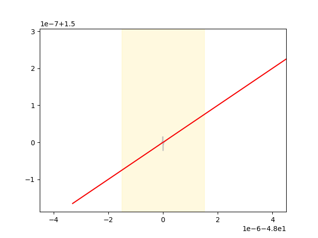


## Equation 3:
```
sodium_channel_m_gate__beta_m = 0.12 * (8.0 + membrane__V) / (-1.0 + exp(1.6000000000000001 + 0.20000000000000001 * membrane__V))
```
## New Eq:
```
sodium_channel_m_gate__beta_m = ((fabs(8.0 + membrane__V) < 4.999999999970306e-7) ? (-6.0000000000060002e-8 / (-1.0 + exp(-9.9999999999406119e-8)) + (8000000.5000475105 + 1000000.0000059388 * membrane__V) * (6.0000000000060002e-8 / (-1.0 + exp(-9.9999999999406119e-8)) + 5.9999999999227342e-8 / (-1.0 + exp(9.9999999999406119e-8)))) : (0.12 * (8.0 + membrane__V) / (-1.0 + exp(1.6000000000000001 + 0.20000000000000001 * membrane__V))))
```
## Singularity point: -8.0000000000000000
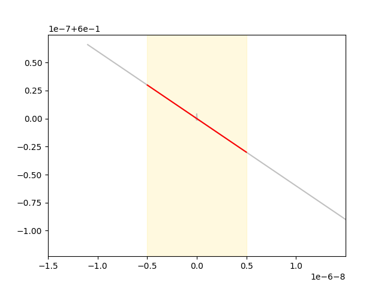


# of singularities:  3
singularity processing time: 12.992072199999939
# Model: noble_model_1991(noble_model_1991.cellml)
No of piecewises: 0
## Equation 1:
```
L_type_Ca_channel__i_Ca_L_Ca = 0.14973556329098189 * (-50.0 + membrane__V) * (intracellular_calcium_concentration__Ca_i * exp(3.7433890822745473) - extracellular_calcium_concentration__Ca_o * exp(3.7433890822745473 - 0.074867781645490947 * membrane__V)) * L_type_Ca_channel__P_Ca_L * L_type_Ca_channel_d_gate__d * L_type_Ca_channel_f_gate__f / (1.0 - exp(3.7433890822745473 - 0.074867781645490947 * membrane__V))
```
## New Eq:
```
L_type_Ca_channel__i_Ca_L_Ca = ((fabs(-50.0 + membrane__V) < 1.3356880329551402e-6) ? ((18716945.911788113 - 374338.90823576227 * membrane__V) * (-1.9999999999556149e-7 * (intracellular_calcium_concentration__Ca_i * exp(3.7433890822745473) - extracellular_calcium_concentration__Ca_o * exp(9.9999999999406119e-8)) * L_type_Ca_channel__P_Ca_L * L_type_Ca_channel_d_gate__d * L_type_Ca_channel_f_gate__f / (1.0 - exp(9.9999999999406119e-8)) - 1.9999999999556149e-7 * (intracellular_calcium_concentration__Ca_i * exp(3.7433890822745473) - extracellular_calcium_concentration__Ca_o * exp(-9.9999999999406119e-8)) * L_type_Ca_channel__P_Ca_L * L_type_Ca_channel_d_gate__d * L_type_Ca_channel_f_gate__f / (1.0 - exp(-9.9999999999406119e-8))) + 1.9999999999556149e-7 * (intracellular_calcium_concentration__Ca_i * exp(3.7433890822745473) - extracellular_calcium_concentration__Ca_o * exp(-9.9999999999406119e-8)) * L_type_Ca_channel__P_Ca_L * L_type_Ca_channel_d_gate__d * L_type_Ca_channel_f_gate__f / (1.0 - exp(-9.9999999999406119e-8))) : (0.14973556329098189 * (-50.0 + membrane__V) * (intracellular_calcium_concentration__Ca_i * exp(3.7433890822745473) - extracellular_calcium_concentration__Ca_o * exp(3.7433890822745473 - 0.074867781645490947 * membrane__V)) * L_type_Ca_channel__P_Ca_L * L_type_Ca_channel_d_gate__d * L_type_Ca_channel_f_gate__f / (1.0 - exp(3.7433890822745473 - 0.074867781645490947 * membrane__V))))
```
## Singularity point: 50.000000000000000


## Equation 2:
```
L_type_Ca_channel__i_Ca_L_K = 7.4867781645490941e-5 * (-50.0 + membrane__V) * (intracellular_potassium_concentration__K_i * exp(1.8716945411372736) - extracellular_potassium_concentration__K_o * exp(1.8716945411372736 - 0.037433890822745473 * membrane__V)) * L_type_Ca_channel__P_Ca_L * L_type_Ca_channel_d_gate__d * L_type_Ca_channel_f_gate__f / (1.0 - exp(1.8716945411372736 - 0.037433890822745473 * membrane__V))
```
## New Eq:
```
L_type_Ca_channel__i_Ca_L_K = ((fabs(-50.0 + membrane__V) < 2.6713760659657915e-6) ? ((9358473.2056995872 - 187169.45411399176 * membrane__V) * (-1.999999999997175e-10 * (intracellular_potassium_concentration__K_i * exp(1.8716945411372736) - extracellular_potassium_concentration__K_o * exp(9.9999999999406119e-8)) * L_type_Ca_channel__P_Ca_L * L_type_Ca_channel_d_gate__d * L_type_Ca_channel_f_gate__f / (1.0 - exp(9.9999999999406119e-8)) - 1.999999999997175e-10 * (intracellular_potassium_concentration__K_i * exp(1.8716945411372736) - extracellular_potassium_concentration__K_o * exp(-9.9999999999406119e-8)) * L_type_Ca_channel__P_Ca_L * L_type_Ca_channel_d_gate__d * L_type_Ca_channel_f_gate__f / (1.0 - exp(-9.9999999999406119e-8))) + 1.999999999997175e-10 * (intracellular_potassium_concentration__K_i * exp(1.8716945411372736) - extracellular_potassium_concentration__K_o * exp(-9.9999999999406119e-8)) * L_type_Ca_channel__P_Ca_L * L_type_Ca_channel_d_gate__d * L_type_Ca_channel_f_gate__f / (1.0 - exp(-9.9999999999406119e-8))) : (7.4867781645490941e-5 * (-50.0 + membrane__V) * (intracellular_potassium_concentration__K_i * exp(1.8716945411372736) - extracellular_potassium_concentration__K_o * exp(1.8716945411372736 - 0.037433890822745473 * membrane__V)) * L_type_Ca_channel__P_Ca_L * L_type_Ca_channel_d_gate__d * L_type_Ca_channel_f_gate__f / (1.0 - exp(1.8716945411372736 - 0.037433890822745473 * membrane__V))))
```
## Singularity point: 50.000000000000000


## Equation 3:
```
L_type_Ca_channel__i_Ca_L_Na = 0.00037433890822745472 * (-50.0 + membrane__V) * (intracellular_sodium_concentration__Na_i * exp(1.8716945411372736) - extracellular_sodium_concentration__Na_o * exp(1.8716945411372736 - 0.037433890822745473 * membrane__V)) * L_type_Ca_channel__P_Ca_L * L_type_Ca_channel_d_gate__d * L_type_Ca_channel_f_gate__f / (1.0 - exp(1.8716945411372736 - 0.037433890822745473 * membrane__V))
```
## New Eq:
```
L_type_Ca_channel__i_Ca_L_Na = ((fabs(-50.0 + membrane__V) < 2.6713760659657915e-6) ? ((9358473.2056995872 - 187169.45411399176 * membrane__V) * (-9.9999999999858744e-10 * (intracellular_sodium_concentration__Na_i * exp(1.8716945411372736) - extracellular_sodium_concentration__Na_o * exp(9.9999999999406119e-8)) * L_type_Ca_channel__P_Ca_L * L_type_Ca_channel_d_gate__d * L_type_Ca_channel_f_gate__f / (1.0 - exp(9.9999999999406119e-8)) - 9.9999999999858744e-10 * (intracellular_sodium_concentration__Na_i * exp(1.8716945411372736) - extracellular_sodium_concentration__Na_o * exp(-9.9999999999406119e-8)) * L_type_Ca_channel__P_Ca_L * L_type_Ca_channel_d_gate__d * L_type_Ca_channel_f_gate__f / (1.0 - exp(-9.9999999999406119e-8))) + 9.9999999999858744e-10 * (intracellular_sodium_concentration__Na_i * exp(1.8716945411372736) - extracellular_sodium_concentration__Na_o * exp(-9.9999999999406119e-8)) * L_type_Ca_channel__P_Ca_L * L_type_Ca_channel_d_gate__d * L_type_Ca_channel_f_gate__f / (1.0 - exp(-9.9999999999406119e-8))) : (0.00037433890822745472 * (-50.0 + membrane__V) * (intracellular_sodium_concentration__Na_i * exp(1.8716945411372736) - extracellular_sodium_concentration__Na_o * exp(1.8716945411372736 - 0.037433890822745473 * membrane__V)) * L_type_Ca_channel__P_Ca_L * L_type_Ca_channel_d_gate__d * L_type_Ca_channel_f_gate__f / (1.0 - exp(1.8716945411372736 - 0.037433890822745473 * membrane__V))))
```
## Singularity point: 50.000000000000000
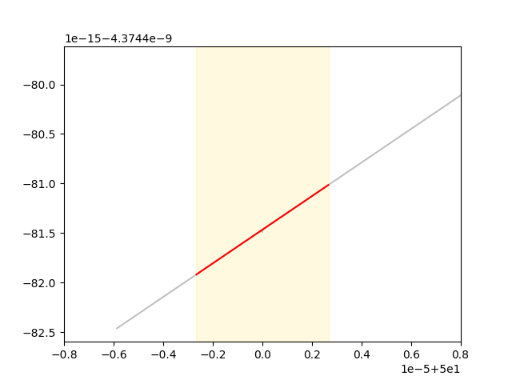


## Equation 4:
```
L_type_Ca_channel_d_gate__alpha_d = 30.0 * (19.0 + membrane__V) / (1.0 - exp(-4.75 - 0.25 * membrane__V))
```
## New Eq:
```
L_type_Ca_channel_d_gate__alpha_d = ((fabs(19.0 + membrane__V) < 4.0000000001150227e-7) ? (1.2000000000345068e-5 / (1.0 - exp(-1.0000000000287557e-7)) + (-23749999.499317054 - 1249999.9999640554 * membrane__V) * (-1.2000000000345068e-5 / (1.0 - exp(1.0000000000287557e-7)) - 1.2000000000345068e-5 / (1.0 - exp(-1.0000000000287557e-7)))) : (30.0 * (19.0 + membrane__V) / (1.0 - exp(-4.75 - 0.25 * membrane__V))))
```
## Singularity point: -19.000000000000000
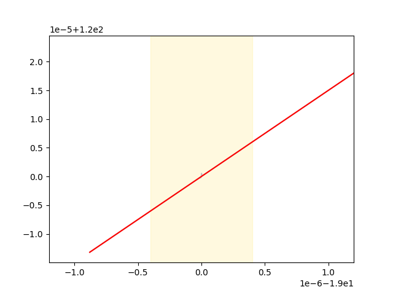


## Equation 5:
```
L_type_Ca_channel_d_gate__beta_d = 12.0 * (19.0 + membrane__V) / (-1.0 + exp(1.8999999999999999 + 0.10000000000000001 * membrane__V))
```
## New Eq:
```
L_type_Ca_channel_d_gate__beta_d = ((fabs(19.0 + membrane__V) < 9.999999999871223e-7) ? (-1.1999999999678934e-5 / (-1.0 + exp(-9.9999999997671396e-8)) + (9500000.5001223385 + 500000.00000643887 * membrane__V) * (1.1999999999678934e-5 / (-1.0 + exp(-9.9999999997671396e-8)) + 1.2000000000012001e-5 / (-1.0 + exp(9.9999999999406119e-8)))) : (12.0 * (19.0 + membrane__V) / (-1.0 + exp(1.8999999999999999 + 0.10000000000000001 * membrane__V))))
```
## Singularity point: -19.000000000000000
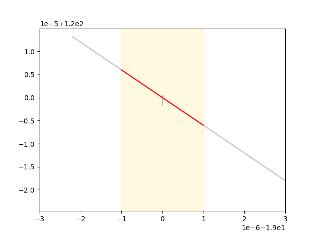


## Equation 6:
```
L_type_Ca_channel_f_gate__alpha_f = 6.25 * (34.0 + membrane__V) / (-1.0 + exp(8.5 + 0.25 * membrane__V))
```
## New Eq:
```
L_type_Ca_channel_f_gate__alpha_f = ((fabs(34.0 + membrane__V) < 4.0000000001150227e-7) ? (-2.5000000000718892e-6 / (-1.0 + exp(-1.0000000000287557e-7)) + (42500000.498777881 + 1249999.9999640554 * membrane__V) * (2.5000000000718892e-6 / (-1.0 + exp(1.0000000000287557e-7)) + 2.5000000000718892e-6 / (-1.0 + exp(-1.0000000000287557e-7)))) : (6.25 * (34.0 + membrane__V) / (-1.0 + exp(8.5 + 0.25 * membrane__V))))
```
## Singularity point: -34.000000000000000


## Equation 7:
```
fast_sodium_current_m_gate__alpha_m = 200.0 * (41.0 + membrane__V) / (1.0 - exp(-4.1000000000000005 - 0.10000000000000001 * membrane__V))
```
## New Eq:
```
fast_sodium_current_m_gate__alpha_m = ((fabs(41.0 + membrane__V) < 1.0000000000287557e-6) ? (0.00020000000000575113 / (1.0 - exp(-1.0000000000287557e-7)) + (-20499999.49941051 - 499999.99998562218 * membrane__V) * (-0.00020000000000575113 / (1.0 - exp(1.0000000000287557e-7)) - 0.00020000000000575113 / (1.0 - exp(-1.0000000000287557e-7)))) : (200.0 * (41.0 + membrane__V) / (1.0 - exp(-4.1000000000000005 - 0.10000000000000001 * membrane__V))))
```
## Singularity point: -41.000000000000000


# of singularities:  7
singularity processing time: 30.143349100000023
# Model: noble_model_1998(noble_model_1998.cellml)
No of piecewises: 1
## Equation 1:
```
L_type_Ca_channel__i_Ca_L_Ca_ds = 0.14973556329098189 * (-50.0 + membrane__V) * (intracellular_calcium_concentration__Ca_i * exp(3.7433890822745473) - extracellular_calcium_concentration__Ca_o * exp(3.7433890822745473 - 0.074867781645490947 * membrane__V)) * L_type_Ca_channel__P_Ca_L * L_type_Ca_channel_d_gate__d * L_type_Ca_channel_f2ds_gate__f2ds * L_type_Ca_channel_f_gate__f / (1.0 - exp(3.7433890822745473 - 0.074867781645490947 * membrane__V))
```
## New Eq:
```
L_type_Ca_channel__i_Ca_L_Ca_ds = ((fabs(-50.0 + membrane__V) < 1.3356880329551402e-6) ? ((18716945.911788113 - 374338.90823576227 * membrane__V) * (-1.9999999999556149e-7 * (intracellular_calcium_concentration__Ca_i * exp(3.7433890822745473) - extracellular_calcium_concentration__Ca_o * exp(9.9999999999406119e-8)) * L_type_Ca_channel__P_Ca_L * L_type_Ca_channel_d_gate__d * L_type_Ca_channel_f2ds_gate__f2ds * L_type_Ca_channel_f_gate__f / (1.0 - exp(9.9999999999406119e-8)) - 1.9999999999556149e-7 * (intracellular_calcium_concentration__Ca_i * exp(3.7433890822745473) - extracellular_calcium_concentration__Ca_o * exp(-9.9999999999406119e-8)) * L_type_Ca_channel__P_Ca_L * L_type_Ca_channel_d_gate__d * L_type_Ca_channel_f2ds_gate__f2ds * L_type_Ca_channel_f_gate__f / (1.0 - exp(-9.9999999999406119e-8))) + 1.9999999999556149e-7 * (intracellular_calcium_concentration__Ca_i * exp(3.7433890822745473) - extracellular_calcium_concentration__Ca_o * exp(-9.9999999999406119e-8)) * L_type_Ca_channel__P_Ca_L * L_type_Ca_channel_d_gate__d * L_type_Ca_channel_f2ds_gate__f2ds * L_type_Ca_channel_f_gate__f / (1.0 - exp(-9.9999999999406119e-8))) : (0.14973556329098189 * (-50.0 + membrane__V) * (intracellular_calcium_concentration__Ca_i * exp(3.7433890822745473) - extracellular_calcium_concentration__Ca_o * exp(3.7433890822745473 - 0.074867781645490947 * membrane__V)) * L_type_Ca_channel__P_Ca_L * L_type_Ca_channel_d_gate__d * L_type_Ca_channel_f2ds_gate__f2ds * L_type_Ca_channel_f_gate__f / (1.0 - exp(3.7433890822745473 - 0.074867781645490947 * membrane__V))))
```
## Singularity point: 50.000000000000000
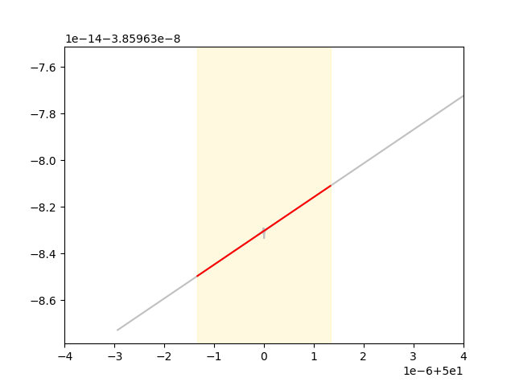


## Equation 2:
```
L_type_Ca_channel__i_Ca_L_K_ds = 7.4867781645490941e-5 * (-50.0 + membrane__V) * (intracellular_potassium_concentration__K_i * exp(1.8716945411372736) - extracellular_potassium_concentration__K_o * exp(1.8716945411372736 - 0.037433890822745473 * membrane__V)) * L_type_Ca_channel__P_Ca_L * L_type_Ca_channel_d_gate__d * L_type_Ca_channel_f2ds_gate__f2ds * L_type_Ca_channel_f_gate__f / (1.0 - exp(1.8716945411372736 - 0.037433890822745473 * membrane__V))
```
## New Eq:
```
L_type_Ca_channel__i_Ca_L_K_ds = ((fabs(-50.0 + membrane__V) < 2.6713760659657915e-6) ? ((9358473.2056995872 - 187169.45411399176 * membrane__V) * (-1.999999999997175e-10 * (intracellular_potassium_concentration__K_i * exp(1.8716945411372736) - extracellular_potassium_concentration__K_o * exp(9.9999999999406119e-8)) * L_type_Ca_channel__P_Ca_L * L_type_Ca_channel_d_gate__d * L_type_Ca_channel_f2ds_gate__f2ds * L_type_Ca_channel_f_gate__f / (1.0 - exp(9.9999999999406119e-8)) - 1.999999999997175e-10 * (intracellular_potassium_concentration__K_i * exp(1.8716945411372736) - extracellular_potassium_concentration__K_o * exp(-9.9999999999406119e-8)) * L_type_Ca_channel__P_Ca_L * L_type_Ca_channel_d_gate__d * L_type_Ca_channel_f2ds_gate__f2ds * L_type_Ca_channel_f_gate__f / (1.0 - exp(-9.9999999999406119e-8))) + 1.999999999997175e-10 * (intracellular_potassium_concentration__K_i * exp(1.8716945411372736) - extracellular_potassium_concentration__K_o * exp(-9.9999999999406119e-8)) * L_type_Ca_channel__P_Ca_L * L_type_Ca_channel_d_gate__d * L_type_Ca_channel_f2ds_gate__f2ds * L_type_Ca_channel_f_gate__f / (1.0 - exp(-9.9999999999406119e-8))) : (7.4867781645490941e-5 * (-50.0 + membrane__V) * (intracellular_potassium_concentration__K_i * exp(1.8716945411372736) - extracellular_potassium_concentration__K_o * exp(1.8716945411372736 - 0.037433890822745473 * membrane__V)) * L_type_Ca_channel__P_Ca_L * L_type_Ca_channel_d_gate__d * L_type_Ca_channel_f2ds_gate__f2ds * L_type_Ca_channel_f_gate__f / (1.0 - exp(1.8716945411372736 - 0.037433890822745473 * membrane__V))))
```
## Singularity point: 50.000000000000000
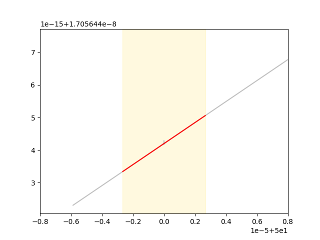


## Equation 3:
```
L_type_Ca_channel__i_Ca_L_Na_ds = 0.00037433890822745472 * (-50.0 + membrane__V) * (intracellular_sodium_concentration__Na_i * exp(1.8716945411372736) - extracellular_sodium_concentration__Na_o * exp(1.8716945411372736 - 0.037433890822745473 * membrane__V)) * L_type_Ca_channel__P_Ca_L * L_type_Ca_channel_d_gate__d * L_type_Ca_channel_f2ds_gate__f2ds * L_type_Ca_channel_f_gate__f / (1.0 - exp(1.8716945411372736 - 0.037433890822745473 * membrane__V))
```
## New Eq:
```
L_type_Ca_channel__i_Ca_L_Na_ds = ((fabs(-50.0 + membrane__V) < 2.6713760659657915e-6) ? ((9358473.2056995872 - 187169.45411399176 * membrane__V) * (-9.9999999999858744e-10 * (intracellular_sodium_concentration__Na_i * exp(1.8716945411372736) - extracellular_sodium_concentration__Na_o * exp(9.9999999999406119e-8)) * L_type_Ca_channel__P_Ca_L * L_type_Ca_channel_d_gate__d * L_type_Ca_channel_f2ds_gate__f2ds * L_type_Ca_channel_f_gate__f / (1.0 - exp(9.9999999999406119e-8)) - 9.9999999999858744e-10 * (intracellular_sodium_concentration__Na_i * exp(1.8716945411372736) - extracellular_sodium_concentration__Na_o * exp(-9.9999999999406119e-8)) * L_type_Ca_channel__P_Ca_L * L_type_Ca_channel_d_gate__d * L_type_Ca_channel_f2ds_gate__f2ds * L_type_Ca_channel_f_gate__f / (1.0 - exp(-9.9999999999406119e-8))) + 9.9999999999858744e-10 * (intracellular_sodium_concentration__Na_i * exp(1.8716945411372736) - extracellular_sodium_concentration__Na_o * exp(-9.9999999999406119e-8)) * L_type_Ca_channel__P_Ca_L * L_type_Ca_channel_d_gate__d * L_type_Ca_channel_f2ds_gate__f2ds * L_type_Ca_channel_f_gate__f / (1.0 - exp(-9.9999999999406119e-8))) : (0.00037433890822745472 * (-50.0 + membrane__V) * (intracellular_sodium_concentration__Na_i * exp(1.8716945411372736) - extracellular_sodium_concentration__Na_o * exp(1.8716945411372736 - 0.037433890822745473 * membrane__V)) * L_type_Ca_channel__P_Ca_L * L_type_Ca_channel_d_gate__d * L_type_Ca_channel_f2ds_gate__f2ds * L_type_Ca_channel_f_gate__f / (1.0 - exp(1.8716945411372736 - 0.037433890822745473 * membrane__V))))
```
## Singularity point: 50.000000000000000
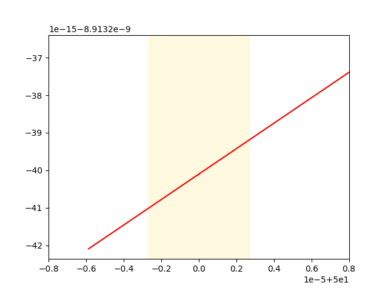


## Equation 4:
```
L_type_Ca_channel_d_gate__alpha_d = 30.0 * (19.0 + membrane__V) / (1.0 - exp(-4.75 - 0.25 * membrane__V))
```
## New Eq:
```
L_type_Ca_channel_d_gate__alpha_d = ((fabs(19.0 + membrane__V) < 4.0000000001150227e-7) ? (1.2000000000345068e-5 / (1.0 - exp(-1.0000000000287557e-7)) + (-23749999.499317054 - 1249999.9999640554 * membrane__V) * (-1.2000000000345068e-5 / (1.0 - exp(1.0000000000287557e-7)) - 1.2000000000345068e-5 / (1.0 - exp(-1.0000000000287557e-7)))) : (30.0 * (19.0 + membrane__V) / (1.0 - exp(-4.75 - 0.25 * membrane__V))))
```
## Singularity point: -19.000000000000000


## Equation 5:
```
L_type_Ca_channel_d_gate__beta_d = 12.0 * (19.0 + membrane__V) / (-1.0 + exp(1.8999999999999999 + 0.10000000000000001 * membrane__V))
```
## New Eq:
```
L_type_Ca_channel_d_gate__beta_d = ((fabs(19.0 + membrane__V) < 9.999999999871223e-7) ? (-1.1999999999678934e-5 / (-1.0 + exp(-9.9999999997671396e-8)) + (9500000.5001223385 + 500000.00000643887 * membrane__V) * (1.1999999999678934e-5 / (-1.0 + exp(-9.9999999997671396e-8)) + 1.2000000000012001e-5 / (-1.0 + exp(9.9999999999406119e-8)))) : (12.0 * (19.0 + membrane__V) / (-1.0 + exp(1.8999999999999999 + 0.10000000000000001 * membrane__V))))
```
## Singularity point: -19.000000000000000


## Equation 6:
```
L_type_Ca_channel_f_gate__alpha_f = 6.25 * (34.0 + membrane__V) / (-1.0 + exp(8.5 + 0.25 * membrane__V))
```
## New Eq:
```
L_type_Ca_channel_f_gate__alpha_f = ((fabs(34.0 + membrane__V) < 4.0000000001150227e-7) ? (-2.5000000000718892e-6 / (-1.0 + exp(-1.0000000000287557e-7)) + (42500000.498777881 + 1249999.9999640554 * membrane__V) * (2.5000000000718892e-6 / (-1.0 + exp(1.0000000000287557e-7)) + 2.5000000000718892e-6 / (-1.0 + exp(-1.0000000000287557e-7)))) : (6.25 * (34.0 + membrane__V) / (-1.0 + exp(8.5 + 0.25 * membrane__V))))
```
## Singularity point: -34.000000000000000


## Equation 7:
```
fast_sodium_current_m_gate__alpha_m = 200.0 * (41.0 + membrane__V) / (1.0 - exp(-4.1000000000000005 - 0.10000000000000001 * membrane__V))
```
## New Eq:
```
fast_sodium_current_m_gate__alpha_m = ((fabs(41.0 + membrane__V) < 1.0000000000287557e-6) ? (0.00020000000000575113 / (1.0 - exp(-1.0000000000287557e-7)) + (-20499999.49941051 - 499999.99998562218 * membrane__V) * (-0.00020000000000575113 / (1.0 - exp(1.0000000000287557e-7)) - 0.00020000000000575113 / (1.0 - exp(-1.0000000000287557e-7)))) : (200.0 * (41.0 + membrane__V) / (1.0 - exp(-4.1000000000000005 - 0.10000000000000001 * membrane__V))))
```
## Singularity point: -41.000000000000000


# of singularities:  7
singularity processing time: 30.430151099999875
# Model: noble_model_2001(noble_model_2001.cellml)
No of piecewises: 1
## Equation 1:
```
L_type_Ca_channel__i_Ca_L_Ca_cyt = 0.044920668987294569 * (1.0 - L_type_Ca_channel_f_gate__f) * (1.0 - intracellular_calcium_concentration__Ca_i / (0.01 + intracellular_calcium_concentration__Ca_i)) * (-50.0 + membrane__V) * (intracellular_calcium_concentration__Ca_i * exp(3.7433890822745473) - extracellular_calcium_concentration__Ca_o * exp(3.7433890822745473 - 0.074867781645490947 * membrane__V)) * L_type_Ca_channel__P_Ca_L * L_type_Ca_channel_d_gate__d / (1.0 - exp(3.7433890822745473 - 0.074867781645490947 * membrane__V))
```
## New Eq:
```
L_type_Ca_channel__i_Ca_L_Ca_cyt = ((fabs(-50.0 + membrane__V) < 1.3356880329551402e-6) ? ((18716945.911788113 - 374338.90823576227 * membrane__V) * (-5.9999999998668459e-8 * (1.0 - L_type_Ca_channel_f_gate__f) * (1.0 - intracellular_calcium_concentration__Ca_i / (0.01 + intracellular_calcium_concentration__Ca_i)) * (intracellular_calcium_concentration__Ca_i * exp(3.7433890822745473) - extracellular_calcium_concentration__Ca_o * exp(9.9999999999406119e-8)) * L_type_Ca_channel__P_Ca_L * L_type_Ca_channel_d_gate__d / (1.0 - exp(9.9999999999406119e-8)) - 5.9999999998668459e-8 * (1.0 - L_type_Ca_channel_f_gate__f) * (1.0 - intracellular_calcium_concentration__Ca_i / (0.01 + intracellular_calcium_concentration__Ca_i)) * (intracellular_calcium_concentration__Ca_i * exp(3.7433890822745473) - extracellular_calcium_concentration__Ca_o * exp(-9.9999999999406119e-8)) * L_type_Ca_channel__P_Ca_L * L_type_Ca_channel_d_gate__d / (1.0 - exp(-9.9999999999406119e-8))) + 5.9999999998668459e-8 * (1.0 - L_type_Ca_channel_f_gate__f) * (1.0 - intracellular_calcium_concentration__Ca_i / (0.01 + intracellular_calcium_concentration__Ca_i)) * (intracellular_calcium_concentration__Ca_i * exp(3.7433890822745473) - extracellular_calcium_concentration__Ca_o * exp(-9.9999999999406119e-8)) * L_type_Ca_channel__P_Ca_L * L_type_Ca_channel_d_gate__d / (1.0 - exp(-9.9999999999406119e-8))) : (0.044920668987294569 * (1.0 - L_type_Ca_channel_f_gate__f) * (1.0 - intracellular_calcium_concentration__Ca_i / (0.01 + intracellular_calcium_concentration__Ca_i)) * (-50.0 + membrane__V) * (intracellular_calcium_concentration__Ca_i * exp(3.7433890822745473) - extracellular_calcium_concentration__Ca_o * exp(3.7433890822745473 - 0.074867781645490947 * membrane__V)) * L_type_Ca_channel__P_Ca_L * L_type_Ca_channel_d_gate__d / (1.0 - exp(3.7433890822745473 - 0.074867781645490947 * membrane__V))))
```
## Singularity point: 50.000000000000000


## Equation 2:
```
L_type_Ca_channel__i_Ca_L_Ca_ds = 0.10481489430368732 * (1.0 - L_type_Ca_channel_f_gate__f) * (1.0 - intracellular_calcium_concentration__Ca_ds / (0.001 + intracellular_calcium_concentration__Ca_ds)) * (-50.0 + membrane__V) * (intracellular_calcium_concentration__Ca_i * exp(3.7433890822745473) - extracellular_calcium_concentration__Ca_o * exp(3.7433890822745473 - 0.074867781645490947 * membrane__V)) * L_type_Ca_channel__P_Ca_L * L_type_Ca_channel_d_gate__d / (1.0 - exp(3.7433890822745473 - 0.074867781645490947 * membrane__V))
```
## New Eq:
```
L_type_Ca_channel__i_Ca_L_Ca_ds = ((fabs(-50.0 + membrane__V) < 1.3356880329551402e-6) ? ((18716945.911788113 - 374338.90823576227 * membrane__V) * (-1.3999999999689304e-7 * (1.0 - L_type_Ca_channel_f_gate__f) * (1.0 - intracellular_calcium_concentration__Ca_ds / (0.001 + intracellular_calcium_concentration__Ca_ds)) * (intracellular_calcium_concentration__Ca_i * exp(3.7433890822745473) - extracellular_calcium_concentration__Ca_o * exp(9.9999999999406119e-8)) * L_type_Ca_channel__P_Ca_L * L_type_Ca_channel_d_gate__d / (1.0 - exp(9.9999999999406119e-8)) - 1.3999999999689304e-7 * (1.0 - L_type_Ca_channel_f_gate__f) * (1.0 - intracellular_calcium_concentration__Ca_ds / (0.001 + intracellular_calcium_concentration__Ca_ds)) * (intracellular_calcium_concentration__Ca_i * exp(3.7433890822745473) - extracellular_calcium_concentration__Ca_o * exp(-9.9999999999406119e-8)) * L_type_Ca_channel__P_Ca_L * L_type_Ca_channel_d_gate__d / (1.0 - exp(-9.9999999999406119e-8))) + 1.3999999999689304e-7 * (1.0 - L_type_Ca_channel_f_gate__f) * (1.0 - intracellular_calcium_concentration__Ca_ds / (0.001 + intracellular_calcium_concentration__Ca_ds)) * (intracellular_calcium_concentration__Ca_i * exp(3.7433890822745473) - extracellular_calcium_concentration__Ca_o * exp(-9.9999999999406119e-8)) * L_type_Ca_channel__P_Ca_L * L_type_Ca_channel_d_gate__d / (1.0 - exp(-9.9999999999406119e-8))) : (0.10481489430368732 * (1.0 - L_type_Ca_channel_f_gate__f) * (1.0 - intracellular_calcium_concentration__Ca_ds / (0.001 + intracellular_calcium_concentration__Ca_ds)) * (-50.0 + membrane__V) * (intracellular_calcium_concentration__Ca_i * exp(3.7433890822745473) - extracellular_calcium_concentration__Ca_o * exp(3.7433890822745473 - 0.074867781645490947 * membrane__V)) * L_type_Ca_channel__P_Ca_L * L_type_Ca_channel_d_gate__d / (1.0 - exp(3.7433890822745473 - 0.074867781645490947 * membrane__V))))
```
## Singularity point: 50.000000000000000
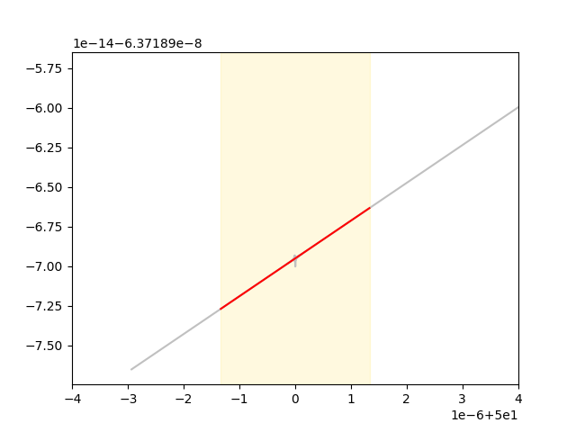


## Equation 3:
```
L_type_Ca_channel__i_Ca_L_K_cyt = 2.2460334493647287e-5 * (1.0 - L_type_Ca_channel_f_gate__f) * (1.0 - intracellular_calcium_concentration__Ca_i / (0.01 + intracellular_calcium_concentration__Ca_i)) * (-50.0 + membrane__V) * (intracellular_potassium_concentration__K_i * exp(1.8716945411372736) - extracellular_potassium_concentration__K_o * exp(1.8716945411372736 - 0.037433890822745473 * membrane__V)) * L_type_Ca_channel__P_Ca_L * L_type_Ca_channel_d_gate__d / (1.0 - exp(1.8716945411372736 - 0.037433890822745473 * membrane__V))
```
## New Eq:
```
L_type_Ca_channel__i_Ca_L_K_cyt = ((fabs(-50.0 + membrane__V) < 2.6713760659657915e-6) ? ((9358473.2056995872 - 187169.45411399176 * membrane__V) * (-5.9999999999915252e-11 * (1.0 - L_type_Ca_channel_f_gate__f) * (1.0 - intracellular_calcium_concentration__Ca_i / (0.01 + intracellular_calcium_concentration__Ca_i)) * (intracellular_potassium_concentration__K_i * exp(1.8716945411372736) - extracellular_potassium_concentration__K_o * exp(9.9999999999406119e-8)) * L_type_Ca_channel__P_Ca_L * L_type_Ca_channel_d_gate__d / (1.0 - exp(9.9999999999406119e-8)) - 5.9999999999915252e-11 * (1.0 - L_type_Ca_channel_f_gate__f) * (1.0 - intracellular_calcium_concentration__Ca_i / (0.01 + intracellular_calcium_concentration__Ca_i)) * (intracellular_potassium_concentration__K_i * exp(1.8716945411372736) - extracellular_potassium_concentration__K_o * exp(-9.9999999999406119e-8)) * L_type_Ca_channel__P_Ca_L * L_type_Ca_channel_d_gate__d / (1.0 - exp(-9.9999999999406119e-8))) + 5.9999999999915252e-11 * (1.0 - L_type_Ca_channel_f_gate__f) * (1.0 - intracellular_calcium_concentration__Ca_i / (0.01 + intracellular_calcium_concentration__Ca_i)) * (intracellular_potassium_concentration__K_i * exp(1.8716945411372736) - extracellular_potassium_concentration__K_o * exp(-9.9999999999406119e-8)) * L_type_Ca_channel__P_Ca_L * L_type_Ca_channel_d_gate__d / (1.0 - exp(-9.9999999999406119e-8))) : (2.2460334493647287e-5 * (1.0 - L_type_Ca_channel_f_gate__f) * (1.0 - intracellular_calcium_concentration__Ca_i / (0.01 + intracellular_calcium_concentration__Ca_i)) * (-50.0 + membrane__V) * (intracellular_potassium_concentration__K_i * exp(1.8716945411372736) - extracellular_potassium_concentration__K_o * exp(1.8716945411372736 - 0.037433890822745473 * membrane__V)) * L_type_Ca_channel__P_Ca_L * L_type_Ca_channel_d_gate__d / (1.0 - exp(1.8716945411372736 - 0.037433890822745473 * membrane__V))))
```
## Singularity point: 50.000000000000000
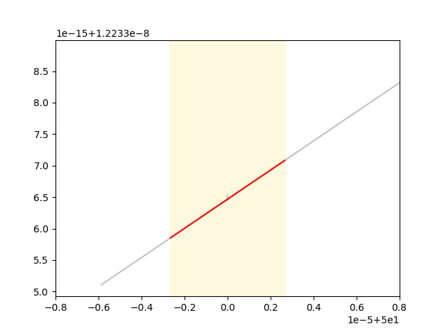


## Equation 4:
```
L_type_Ca_channel__i_Ca_L_K_ds = 5.2407447151843657e-5 * (1.0 - L_type_Ca_channel_f_gate__f) * (1.0 - intracellular_calcium_concentration__Ca_ds / (0.001 + intracellular_calcium_concentration__Ca_ds)) * (-50.0 + membrane__V) * (intracellular_potassium_concentration__K_i * exp(1.8716945411372736) - extracellular_potassium_concentration__K_o * exp(1.8716945411372736 - 0.037433890822745473 * membrane__V)) * L_type_Ca_channel__P_Ca_L * L_type_Ca_channel_d_gate__d / (1.0 - exp(1.8716945411372736 - 0.037433890822745473 * membrane__V))
```
## New Eq:
```
L_type_Ca_channel__i_Ca_L_K_ds = ((fabs(-50.0 + membrane__V) < 2.6713760659657915e-6) ? ((9358473.2056995872 - 187169.45411399176 * membrane__V) * (-1.3999999999980223e-10 * (1.0 - L_type_Ca_channel_f_gate__f) * (1.0 - intracellular_calcium_concentration__Ca_ds / (0.001 + intracellular_calcium_concentration__Ca_ds)) * (intracellular_potassium_concentration__K_i * exp(1.8716945411372736) - extracellular_potassium_concentration__K_o * exp(9.9999999999406119e-8)) * L_type_Ca_channel__P_Ca_L * L_type_Ca_channel_d_gate__d / (1.0 - exp(9.9999999999406119e-8)) - 1.3999999999980223e-10 * (1.0 - L_type_Ca_channel_f_gate__f) * (1.0 - intracellular_calcium_concentration__Ca_ds / (0.001 + intracellular_calcium_concentration__Ca_ds)) * (intracellular_potassium_concentration__K_i * exp(1.8716945411372736) - extracellular_potassium_concentration__K_o * exp(-9.9999999999406119e-8)) * L_type_Ca_channel__P_Ca_L * L_type_Ca_channel_d_gate__d / (1.0 - exp(-9.9999999999406119e-8))) + 1.3999999999980223e-10 * (1.0 - L_type_Ca_channel_f_gate__f) * (1.0 - intracellular_calcium_concentration__Ca_ds / (0.001 + intracellular_calcium_concentration__Ca_ds)) * (intracellular_potassium_concentration__K_i * exp(1.8716945411372736) - extracellular_potassium_concentration__K_o * exp(-9.9999999999406119e-8)) * L_type_Ca_channel__P_Ca_L * L_type_Ca_channel_d_gate__d / (1.0 - exp(-9.9999999999406119e-8))) : (5.2407447151843657e-5 * (1.0 - L_type_Ca_channel_f_gate__f) * (1.0 - intracellular_calcium_concentration__Ca_ds / (0.001 + intracellular_calcium_concentration__Ca_ds)) * (-50.0 + membrane__V) * (intracellular_potassium_concentration__K_i * exp(1.8716945411372736) - extracellular_potassium_concentration__K_o * exp(1.8716945411372736 - 0.037433890822745473 * membrane__V)) * L_type_Ca_channel__P_Ca_L * L_type_Ca_channel_d_gate__d / (1.0 - exp(1.8716945411372736 - 0.037433890822745473 * membrane__V))))
```
## Singularity point: 50.000000000000000


## Equation 5:
```
L_type_Ca_channel__i_Ca_L_Na_cyt = 0.00011230167246823643 * (1.0 - L_type_Ca_channel_f_gate__f) * (1.0 - intracellular_calcium_concentration__Ca_i / (0.01 + intracellular_calcium_concentration__Ca_i)) * (-50.0 + membrane__V) * (intracellular_sodium_concentration__Na_i * exp(1.8716945411372736) - extracellular_sodium_concentration__Na_o * exp(1.8716945411372736 - 0.037433890822745473 * membrane__V)) * L_type_Ca_channel__P_Ca_L * L_type_Ca_channel_d_gate__d / (1.0 - exp(1.8716945411372736 - 0.037433890822745473 * membrane__V))
```
## New Eq:
```
L_type_Ca_channel__i_Ca_L_Na_cyt = ((fabs(-50.0 + membrane__V) < 2.6713760659657915e-6) ? ((9358473.2056995872 - 187169.45411399176 * membrane__V) * (-2.9999999999957627e-10 * (1.0 - L_type_Ca_channel_f_gate__f) * (1.0 - intracellular_calcium_concentration__Ca_i / (0.01 + intracellular_calcium_concentration__Ca_i)) * (intracellular_sodium_concentration__Na_i * exp(1.8716945411372736) - extracellular_sodium_concentration__Na_o * exp(9.9999999999406119e-8)) * L_type_Ca_channel__P_Ca_L * L_type_Ca_channel_d_gate__d / (1.0 - exp(9.9999999999406119e-8)) - 2.9999999999957627e-10 * (1.0 - L_type_Ca_channel_f_gate__f) * (1.0 - intracellular_calcium_concentration__Ca_i / (0.01 + intracellular_calcium_concentration__Ca_i)) * (intracellular_sodium_concentration__Na_i * exp(1.8716945411372736) - extracellular_sodium_concentration__Na_o * exp(-9.9999999999406119e-8)) * L_type_Ca_channel__P_Ca_L * L_type_Ca_channel_d_gate__d / (1.0 - exp(-9.9999999999406119e-8))) + 2.9999999999957627e-10 * (1.0 - L_type_Ca_channel_f_gate__f) * (1.0 - intracellular_calcium_concentration__Ca_i / (0.01 + intracellular_calcium_concentration__Ca_i)) * (intracellular_sodium_concentration__Na_i * exp(1.8716945411372736) - extracellular_sodium_concentration__Na_o * exp(-9.9999999999406119e-8)) * L_type_Ca_channel__P_Ca_L * L_type_Ca_channel_d_gate__d / (1.0 - exp(-9.9999999999406119e-8))) : (0.00011230167246823643 * (1.0 - L_type_Ca_channel_f_gate__f) * (1.0 - intracellular_calcium_concentration__Ca_i / (0.01 + intracellular_calcium_concentration__Ca_i)) * (-50.0 + membrane__V) * (intracellular_sodium_concentration__Na_i * exp(1.8716945411372736) - extracellular_sodium_concentration__Na_o * exp(1.8716945411372736 - 0.037433890822745473 * membrane__V)) * L_type_Ca_channel__P_Ca_L * L_type_Ca_channel_d_gate__d / (1.0 - exp(1.8716945411372736 - 0.037433890822745473 * membrane__V))))
```
## Singularity point: 50.000000000000000
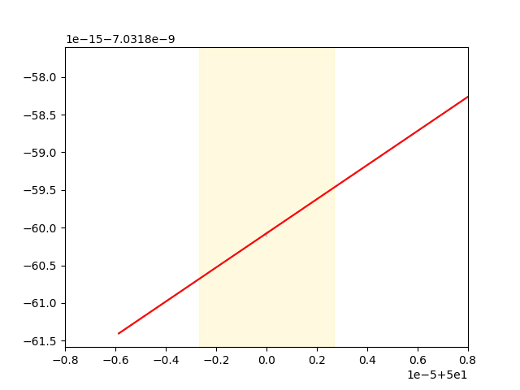


## Equation 6:
```
L_type_Ca_channel__i_Ca_L_Na_ds = 0.00026203723575921831 * (1.0 - L_type_Ca_channel_f_gate__f) * (1.0 - intracellular_calcium_concentration__Ca_ds / (0.001 + intracellular_calcium_concentration__Ca_ds)) * (-50.0 + membrane__V) * (intracellular_sodium_concentration__Na_i * exp(1.8716945411372736) - extracellular_sodium_concentration__Na_o * exp(1.8716945411372736 - 0.037433890822745473 * membrane__V)) * L_type_Ca_channel__P_Ca_L * L_type_Ca_channel_d_gate__d / (1.0 - exp(1.8716945411372736 - 0.037433890822745473 * membrane__V))
```
## New Eq:
```
L_type_Ca_channel__i_Ca_L_Na_ds = ((fabs(-50.0 + membrane__V) < 2.6713760659657915e-6) ? ((9358473.2056995872 - 187169.45411399176 * membrane__V) * (-6.9999999999901117e-10 * (1.0 - L_type_Ca_channel_f_gate__f) * (1.0 - intracellular_calcium_concentration__Ca_ds / (0.001 + intracellular_calcium_concentration__Ca_ds)) * (intracellular_sodium_concentration__Na_i * exp(1.8716945411372736) - extracellular_sodium_concentration__Na_o * exp(9.9999999999406119e-8)) * L_type_Ca_channel__P_Ca_L * L_type_Ca_channel_d_gate__d / (1.0 - exp(9.9999999999406119e-8)) - 6.9999999999901117e-10 * (1.0 - L_type_Ca_channel_f_gate__f) * (1.0 - intracellular_calcium_concentration__Ca_ds / (0.001 + intracellular_calcium_concentration__Ca_ds)) * (intracellular_sodium_concentration__Na_i * exp(1.8716945411372736) - extracellular_sodium_concentration__Na_o * exp(-9.9999999999406119e-8)) * L_type_Ca_channel__P_Ca_L * L_type_Ca_channel_d_gate__d / (1.0 - exp(-9.9999999999406119e-8))) + 6.9999999999901117e-10 * (1.0 - L_type_Ca_channel_f_gate__f) * (1.0 - intracellular_calcium_concentration__Ca_ds / (0.001 + intracellular_calcium_concentration__Ca_ds)) * (intracellular_sodium_concentration__Na_i * exp(1.8716945411372736) - extracellular_sodium_concentration__Na_o * exp(-9.9999999999406119e-8)) * L_type_Ca_channel__P_Ca_L * L_type_Ca_channel_d_gate__d / (1.0 - exp(-9.9999999999406119e-8))) : (0.00026203723575921831 * (1.0 - L_type_Ca_channel_f_gate__f) * (1.0 - intracellular_calcium_concentration__Ca_ds / (0.001 + intracellular_calcium_concentration__Ca_ds)) * (-50.0 + membrane__V) * (intracellular_sodium_concentration__Na_i * exp(1.8716945411372736) - extracellular_sodium_concentration__Na_o * exp(1.8716945411372736 - 0.037433890822745473 * membrane__V)) * L_type_Ca_channel__P_Ca_L * L_type_Ca_channel_d_gate__d / (1.0 - exp(1.8716945411372736 - 0.037433890822745473 * membrane__V))))
```
## Singularity point: 50.000000000000000


## Equation 7:
```
L_type_Ca_channel_d_gate__alpha_d = 30.0 * (19.0 + membrane__V) / (1.0 - exp(-4.75 - 0.25 * membrane__V))
```
## New Eq:
```
L_type_Ca_channel_d_gate__alpha_d = ((fabs(19.0 + membrane__V) < 4.0000000001150227e-7) ? (1.2000000000345068e-5 / (1.0 - exp(-1.0000000000287557e-7)) + (-23749999.499317054 - 1249999.9999640554 * membrane__V) * (-1.2000000000345068e-5 / (1.0 - exp(1.0000000000287557e-7)) - 1.2000000000345068e-5 / (1.0 - exp(-1.0000000000287557e-7)))) : (30.0 * (19.0 + membrane__V) / (1.0 - exp(-4.75 - 0.25 * membrane__V))))
```
## Singularity point: -19.000000000000000


## Equation 8:
```
L_type_Ca_channel_d_gate__beta_d = 12.0 * (19.0 + membrane__V) / (-1.0 + exp(1.8999999999999999 + 0.10000000000000001 * membrane__V))
```
## New Eq:
```
L_type_Ca_channel_d_gate__beta_d = ((fabs(19.0 + membrane__V) < 9.999999999871223e-7) ? (-1.1999999999678934e-5 / (-1.0 + exp(-9.9999999997671396e-8)) + (9500000.5001223385 + 500000.00000643887 * membrane__V) * (1.1999999999678934e-5 / (-1.0 + exp(-9.9999999997671396e-8)) + 1.2000000000012001e-5 / (-1.0 + exp(9.9999999999406119e-8)))) : (12.0 * (19.0 + membrane__V) / (-1.0 + exp(1.8999999999999999 + 0.10000000000000001 * membrane__V))))
```
## Singularity point: -19.000000000000000
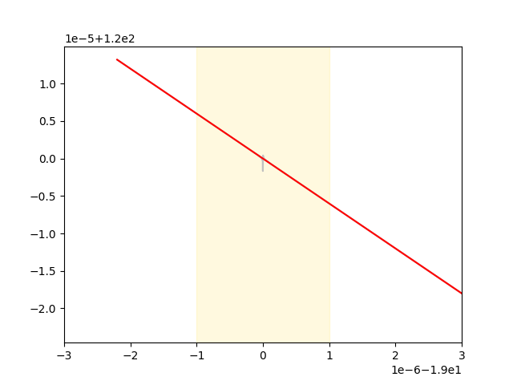


## Equation 9:
```
L_type_Ca_channel_f_gate__alpha_f = 6.25 * (34.0 + membrane__V) / (-1.0 + exp(8.5 + 0.25 * membrane__V))
```
## New Eq:
```
L_type_Ca_channel_f_gate__alpha_f = ((fabs(34.0 + membrane__V) < 4.0000000001150227e-7) ? (-2.5000000000718892e-6 / (-1.0 + exp(-1.0000000000287557e-7)) + (42500000.498777881 + 1249999.9999640554 * membrane__V) * (2.5000000000718892e-6 / (-1.0 + exp(1.0000000000287557e-7)) + 2.5000000000718892e-6 / (-1.0 + exp(-1.0000000000287557e-7)))) : (6.25 * (34.0 + membrane__V) / (-1.0 + exp(8.5 + 0.25 * membrane__V))))
```
## Singularity point: -34.000000000000000


## Equation 10:
```
fast_sodium_current_m_gate__alpha_m = 200.0 * (41.0 + membrane__V) / (1.0 - exp(-4.1000000000000005 - 0.10000000000000001 * membrane__V))
```
## New Eq:
```
fast_sodium_current_m_gate__alpha_m = ((fabs(41.0 + membrane__V) < 1.0000000000287557e-6) ? (0.00020000000000575113 / (1.0 - exp(-1.0000000000287557e-7)) + (-20499999.49941051 - 499999.99998562218 * membrane__V) * (-0.00020000000000575113 / (1.0 - exp(1.0000000000287557e-7)) - 0.00020000000000575113 / (1.0 - exp(-1.0000000000287557e-7)))) : (200.0 * (41.0 + membrane__V) / (1.0 - exp(-4.1000000000000005 - 0.10000000000000001 * membrane__V))))
```
## Singularity point: -41.000000000000000


# of singularities:  10
singularity processing time: 44.42110730000013
# Model: NN_SAN_model_1984(noble_noble_SAN_model_1984.cellml)
No of piecewises: 0
## Equation 1:
```
fast_sodium_current_m_gate__alpha_m = 200.0 * (41.0 + membrane__V) / (1.0 - exp(-4.1000000000000005 - 0.10000000000000001 * membrane__V))
```
## New Eq:
```
fast_sodium_current_m_gate__alpha_m = ((fabs(41.0 + membrane__V) < 1.0000000000287557e-6) ? (0.00020000000000575113 / (1.0 - exp(-1.0000000000287557e-7)) + (-20499999.49941051 - 499999.99998562218 * membrane__V) * (-0.00020000000000575113 / (1.0 - exp(1.0000000000287557e-7)) - 0.00020000000000575113 / (1.0 - exp(-1.0000000000287557e-7)))) : (200.0 * (41.0 + membrane__V) / (1.0 - exp(-4.1000000000000005 - 0.10000000000000001 * membrane__V))))
```
## Singularity point: -41.000000000000000


## Equation 2:
```
hyperpolarising_activated_current_y_gate__beta_y = (52.0 + membrane__V) / (1.0 - exp(-10.4 - 0.20000000000000001 * membrane__V))
```
## New Eq:
```
hyperpolarising_activated_current_y_gate__beta_y = ((fabs(52.0 + membrane__V) < 5.0000000001437783e-7) ? (5.0000000001437783e-7 / (1.0 - exp(-1.0000000000287557e-7)) + (-51999999.498504706 - 999999.99997124437 * membrane__V) * (-5.0000000001437783e-7 / (1.0 - exp(1.0000000000287557e-7)) - 5.0000000001437783e-7 / (1.0 - exp(-1.0000000000287557e-7)))) : ((52.0 + membrane__V) / (1.0 - exp(-10.4 - 0.20000000000000001 * membrane__V))))
```
## Singularity point: -52.000000000000000


## Equation 3:
```
intracellular_calcium_concentration__alpha_p = 0.625 * (64.0 + membrane__V) / (-1.0 + exp(16.0 + 0.25 * membrane__V))
```
## New Eq:
```
intracellular_calcium_concentration__alpha_p = ((fabs(64.0 + membrane__V) < 4.0000000001150227e-7) ? (-2.5000000000718892e-7 / (-1.0 + exp(-1.0000000000287557e-7)) + (80000000.497699544 + 1249999.9999640554 * membrane__V) * (2.5000000000718892e-7 / (-1.0 + exp(1.0000000000287557e-7)) + 2.5000000000718892e-7 / (-1.0 + exp(-1.0000000000287557e-7)))) : (0.625 * (64.0 + membrane__V) / (-1.0 + exp(16.0 + 0.25 * membrane__V))))
```
## Singularity point: -64.000000000000000
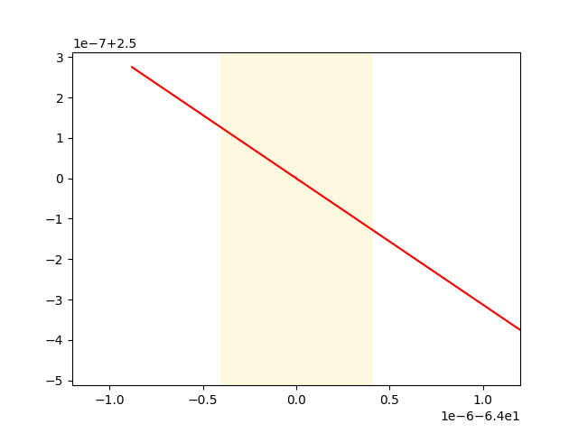


## Equation 4:
```
second_inward_current_d_gate__alpha_d = 30.0 * (19.0 + membrane__V) / (1.0 - exp(-4.75 - 0.25 * membrane__V))
```
## New Eq:
```
second_inward_current_d_gate__alpha_d = ((fabs(19.0 + membrane__V) < 4.0000000001150227e-7) ? (1.2000000000345068e-5 / (1.0 - exp(-1.0000000000287557e-7)) + (-23749999.499317054 - 1249999.9999640554 * membrane__V) * (-1.2000000000345068e-5 / (1.0 - exp(1.0000000000287557e-7)) - 1.2000000000345068e-5 / (1.0 - exp(-1.0000000000287557e-7)))) : (30.0 * (19.0 + membrane__V) / (1.0 - exp(-4.75 - 0.25 * membrane__V))))
```
## Singularity point: -19.000000000000000


## Equation 5:
```
second_inward_current_d_gate__beta_d = 12.0 * (19.0 + membrane__V) / (-1.0 + exp(1.8999999999999999 + 0.10000000000000001 * membrane__V))
```
## New Eq:
```
second_inward_current_d_gate__beta_d = ((fabs(19.0 + membrane__V) < 9.999999999871223e-7) ? (-1.1999999999678934e-5 / (-1.0 + exp(-9.9999999997671396e-8)) + (9500000.5001223385 + 500000.00000643887 * membrane__V) * (1.1999999999678934e-5 / (-1.0 + exp(-9.9999999997671396e-8)) + 1.2000000000012001e-5 / (-1.0 + exp(9.9999999999406119e-8)))) : (12.0 * (19.0 + membrane__V) / (-1.0 + exp(1.8999999999999999 + 0.10000000000000001 * membrane__V))))
```
## Singularity point: -19.000000000000000


## Equation 6:
```
second_inward_current_f_gate__alpha_f = 6.25 * (34.0 + membrane__V) / (-1.0 + exp(8.5 + 0.25 * membrane__V))
```
## New Eq:
```
second_inward_current_f_gate__alpha_f = ((fabs(34.0 + membrane__V) < 4.0000000001150227e-7) ? (-2.5000000000718892e-6 / (-1.0 + exp(-1.0000000000287557e-7)) + (42500000.498777881 + 1249999.9999640554 * membrane__V) * (2.5000000000718892e-6 / (-1.0 + exp(1.0000000000287557e-7)) + 2.5000000000718892e-6 / (-1.0 + exp(-1.0000000000287557e-7)))) : (6.25 * (34.0 + membrane__V) / (-1.0 + exp(8.5 + 0.25 * membrane__V))))
```
## Singularity point: -34.000000000000000
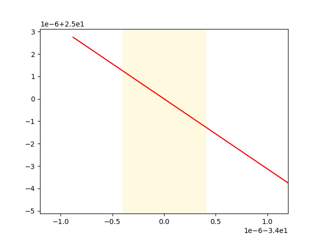


## Equation 7:
```
second_inward_current__i_siCa = 0.14973556329098189 * (-50.0 + membrane__V) * (intracellular_calcium_concentration__Cai * exp(3.7433890822745473) - extracellular_calcium_concentration__Cao * exp(3.7433890822745473 - 0.074867781645490947 * membrane__V)) * second_inward_current__P_si * second_inward_current_d_gate__d * second_inward_current_f2_gate__f2 * second_inward_current_f_gate__f / (1.0 - exp(3.7433890822745473 - 0.074867781645490947 * membrane__V))
```
## New Eq:
```
second_inward_current__i_siCa = ((fabs(-50.0 + membrane__V) < 1.3356880329551402e-6) ? ((18716945.911788113 - 374338.90823576227 * membrane__V) * (-1.9999999999556149e-7 * (intracellular_calcium_concentration__Cai * exp(3.7433890822745473) - extracellular_calcium_concentration__Cao * exp(9.9999999999406119e-8)) * second_inward_current__P_si * second_inward_current_d_gate__d * second_inward_current_f2_gate__f2 * second_inward_current_f_gate__f / (1.0 - exp(9.9999999999406119e-8)) - 1.9999999999556149e-7 * (intracellular_calcium_concentration__Cai * exp(3.7433890822745473) - extracellular_calcium_concentration__Cao * exp(-9.9999999995936673e-8)) * second_inward_current__P_si * second_inward_current_d_gate__d * second_inward_current_f2_gate__f2 * second_inward_current_f_gate__f / (1.0 - exp(-9.9999999995936673e-8))) + 1.9999999999556149e-7 * (intracellular_calcium_concentration__Cai * exp(3.7433890822745473) - extracellular_calcium_concentration__Cao * exp(-9.9999999995936673e-8)) * second_inward_current__P_si * second_inward_current_d_gate__d * second_inward_current_f2_gate__f2 * second_inward_current_f_gate__f / (1.0 - exp(-9.9999999995936673e-8))) : (0.14973556329098189 * (-50.0 + membrane__V) * (intracellular_calcium_concentration__Cai * exp(3.7433890822745473) - extracellular_calcium_concentration__Cao * exp(3.7433890822745473 - 0.074867781645490947 * membrane__V)) * second_inward_current__P_si * second_inward_current_d_gate__d * second_inward_current_f2_gate__f2 * second_inward_current_f_gate__f / (1.0 - exp(3.7433890822745473 - 0.074867781645490947 * membrane__V))))
```
## Singularity point: 50.000000000000000


## Equation 8:
```
second_inward_current__i_siK = 0.00037433890822745472 * (-50.0 + membrane__V) * (intracellular_potassium_concentration__Ki * exp(1.8716945411372736) - extracellular_potassium_concentration__Kc * exp(1.8716945411372736 - 0.037433890822745473 * membrane__V)) * second_inward_current__P_si * second_inward_current_d_gate__d * second_inward_current_f2_gate__f2 * second_inward_current_f_gate__f / (1.0 - exp(1.8716945411372736 - 0.037433890822745473 * membrane__V))
```
## New Eq:
```
second_inward_current__i_siK = ((fabs(-50.0 + membrane__V) < 2.6713760659657915e-6) ? ((9358473.2056995872 - 187169.45411399176 * membrane__V) * (-9.9999999999858744e-10 * (intracellular_potassium_concentration__Ki * exp(1.8716945411372736) - extracellular_potassium_concentration__Kc * exp(9.9999999999406119e-8)) * second_inward_current__P_si * second_inward_current_d_gate__d * second_inward_current_f2_gate__f2 * second_inward_current_f_gate__f / (1.0 - exp(9.9999999999406119e-8)) - 9.9999999999858744e-10 * (intracellular_potassium_concentration__Ki * exp(1.8716945411372736) - extracellular_potassium_concentration__Kc * exp(-9.9999999999406119e-8)) * second_inward_current__P_si * second_inward_current_d_gate__d * second_inward_current_f2_gate__f2 * second_inward_current_f_gate__f / (1.0 - exp(-9.9999999999406119e-8))) + 9.9999999999858744e-10 * (intracellular_potassium_concentration__Ki * exp(1.8716945411372736) - extracellular_potassium_concentration__Kc * exp(-9.9999999999406119e-8)) * second_inward_current__P_si * second_inward_current_d_gate__d * second_inward_current_f2_gate__f2 * second_inward_current_f_gate__f / (1.0 - exp(-9.9999999999406119e-8))) : (0.00037433890822745472 * (-50.0 + membrane__V) * (intracellular_potassium_concentration__Ki * exp(1.8716945411372736) - extracellular_potassium_concentration__Kc * exp(1.8716945411372736 - 0.037433890822745473 * membrane__V)) * second_inward_current__P_si * second_inward_current_d_gate__d * second_inward_current_f2_gate__f2 * second_inward_current_f_gate__f / (1.0 - exp(1.8716945411372736 - 0.037433890822745473 * membrane__V))))
```
## Singularity point: 50.000000000000000
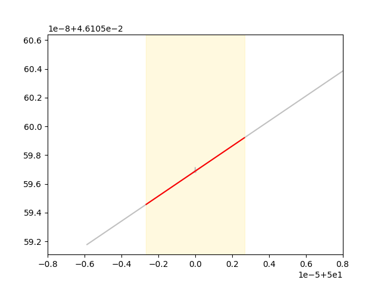


## Equation 9:
```
second_inward_current__i_siNa = 0.00037433890822745472 * (-50.0 + membrane__V) * (intracellular_sodium_concentration__Nai * exp(1.8716945411372736) - extracellular_sodium_concentration__Nao * exp(1.8716945411372736 - 0.037433890822745473 * membrane__V)) * second_inward_current__P_si * second_inward_current_d_gate__d * second_inward_current_f2_gate__f2 * second_inward_current_f_gate__f / (1.0 - exp(1.8716945411372736 - 0.037433890822745473 * membrane__V))
```
## New Eq:
```
second_inward_current__i_siNa = ((fabs(-50.0 + membrane__V) < 2.6713760659657915e-6) ? ((9358473.2056995872 - 187169.45411399176 * membrane__V) * (-9.9999999999858744e-10 * (intracellular_sodium_concentration__Nai * exp(1.8716945411372736) - extracellular_sodium_concentration__Nao * exp(9.9999999999406119e-8)) * second_inward_current__P_si * second_inward_current_d_gate__d * second_inward_current_f2_gate__f2 * second_inward_current_f_gate__f / (1.0 - exp(9.9999999999406119e-8)) - 9.9999999999858744e-10 * (intracellular_sodium_concentration__Nai * exp(1.8716945411372736) - extracellular_sodium_concentration__Nao * exp(-9.9999999999406119e-8)) * second_inward_current__P_si * second_inward_current_d_gate__d * second_inward_current_f2_gate__f2 * second_inward_current_f_gate__f / (1.0 - exp(-9.9999999999406119e-8))) + 9.9999999999858744e-10 * (intracellular_sodium_concentration__Nai * exp(1.8716945411372736) - extracellular_sodium_concentration__Nao * exp(-9.9999999999406119e-8)) * second_inward_current__P_si * second_inward_current_d_gate__d * second_inward_current_f2_gate__f2 * second_inward_current_f_gate__f / (1.0 - exp(-9.9999999999406119e-8))) : (0.00037433890822745472 * (-50.0 + membrane__V) * (intracellular_sodium_concentration__Nai * exp(1.8716945411372736) - extracellular_sodium_concentration__Nao * exp(1.8716945411372736 - 0.037433890822745473 * membrane__V)) * second_inward_current__P_si * second_inward_current_d_gate__d * second_inward_current_f2_gate__f2 * second_inward_current_f_gate__f / (1.0 - exp(1.8716945411372736 - 0.037433890822745473 * membrane__V))))
```
## Singularity point: 50.000000000000000
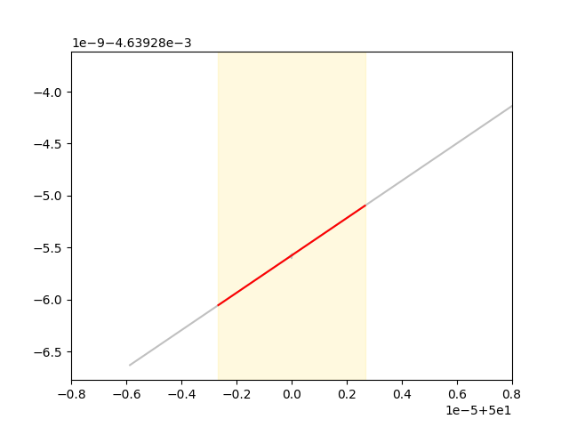


## Equation 10:
```
time_dependent_potassium_current_x_gate__alpha_x = 0.5 * (22.0 + membrane__V) / (1.0 - exp(-4.4000000000000004 - 0.20000000000000001 * membrane__V))
```
## New Eq:
```
time_dependent_potassium_current_x_gate__alpha_x = ((fabs(22.0 + membrane__V) < 5.0000000001437783e-7) ? (2.5000000000718892e-7 / (1.0 - exp(-1.0000000000287557e-7)) + (-21999999.499367375 - 999999.99997124437 * membrane__V) * (-2.5000000000718892e-7 / (1.0 - exp(1.0000000000287557e-7)) - 2.5000000000718892e-7 / (1.0 - exp(-1.0000000000287557e-7)))) : (0.5 * (22.0 + membrane__V) / (1.0 - exp(-4.4000000000000004 - 0.20000000000000001 * membrane__V))))
```
## Singularity point: -22.000000000000000
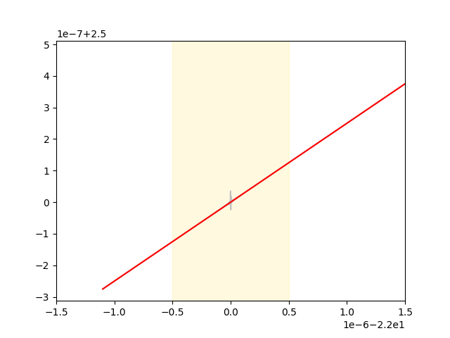


## Equation 11:
```
time_dependent_potassium_current_x_gate__beta_x = 0.17799999999999999 * (22.0 + membrane__V) / (-1.0 + exp(1.4666666666666666 + 0.066666666666666666 * membrane__V))
```
## New Eq:
```
time_dependent_potassium_current_x_gate__beta_x = ((fabs(22.0 + membrane__V) < 1.4999999999876223e-6) ? (-2.6699999999779676e-7 / (-1.0 + exp(-9.9999999999406119e-8)) + (7333333.8333938466 + 333333.33333608392 * membrane__V) * (2.6699999999779676e-7 / (-1.0 + exp(9.9999999997671396e-8)) + 2.6699999999779676e-7 / (-1.0 + exp(-9.9999999999406119e-8)))) : (0.17799999999999999 * (22.0 + membrane__V) / (-1.0 + exp(1.4666666666666666 + 0.066666666666666666 * membrane__V))))
```
## Singularity point: -22.000000000000000


# of singularities:  11
singularity processing time: 45.53173099999981
# Model: Noble_SAN_model_1989(noble_SAN_model_1989.cellml)
No of piecewises: 0
## Equation 1:
```
fast_sodium_current_m_gate__alpha_m = 200.0 * (41.0 + membrane__V) / (1.0 - exp(-4.1000000000000005 - 0.10000000000000001 * membrane__V))
```
## New Eq:
```
fast_sodium_current_m_gate__alpha_m = ((fabs(41.0 + membrane__V) < 1.0000000000287557e-6) ? (0.00020000000000575113 / (1.0 - exp(-1.0000000000287557e-7)) + (-20499999.49941051 - 499999.99998562218 * membrane__V) * (-0.00020000000000575113 / (1.0 - exp(1.0000000000287557e-7)) - 0.00020000000000575113 / (1.0 - exp(-1.0000000000287557e-7)))) : (200.0 * (41.0 + membrane__V) / (1.0 - exp(-4.1000000000000005 - 0.10000000000000001 * membrane__V))))
```
## Singularity point: -41.000000000000000


## Equation 2:
```
intracellular_calcium_concentration__alpha_p = 0.625 * (64.0 + membrane__V) / (-1.0 + exp(16.0 + 0.25 * membrane__V))
```
## New Eq:
```
intracellular_calcium_concentration__alpha_p = ((fabs(64.0 + membrane__V) < 4.0000000001150227e-7) ? (-2.5000000000718892e-7 / (-1.0 + exp(-1.0000000000287557e-7)) + (80000000.497699544 + 1249999.9999640554 * membrane__V) * (2.5000000000718892e-7 / (-1.0 + exp(1.0000000000287557e-7)) + 2.5000000000718892e-7 / (-1.0 + exp(-1.0000000000287557e-7)))) : (0.625 * (64.0 + membrane__V) / (-1.0 + exp(16.0 + 0.25 * membrane__V))))
```
## Singularity point: -64.000000000000000


## Equation 3:
```
second_inward_current_d_gate__alpha_d = 30.0 * (19.0 + membrane__V) / (1.0 - exp(-4.75 - 0.25 * membrane__V))
```
## New Eq:
```
second_inward_current_d_gate__alpha_d = ((fabs(19.0 + membrane__V) < 4.0000000001150227e-7) ? (1.2000000000345068e-5 / (1.0 - exp(-1.0000000000287557e-7)) + (-23749999.499317054 - 1249999.9999640554 * membrane__V) * (-1.2000000000345068e-5 / (1.0 - exp(1.0000000000287557e-7)) - 1.2000000000345068e-5 / (1.0 - exp(-1.0000000000287557e-7)))) : (30.0 * (19.0 + membrane__V) / (1.0 - exp(-4.75 - 0.25 * membrane__V))))
```
## Singularity point: -19.000000000000000


## Equation 4:
```
second_inward_current_d_gate__beta_d = 12.0 * (19.0 + membrane__V) / (-1.0 + exp(1.8999999999999999 + 0.10000000000000001 * membrane__V))
```
## New Eq:
```
second_inward_current_d_gate__beta_d = ((fabs(19.0 + membrane__V) < 9.999999999871223e-7) ? (-1.1999999999678934e-5 / (-1.0 + exp(-9.9999999997671396e-8)) + (9500000.5001223385 + 500000.00000643887 * membrane__V) * (1.1999999999678934e-5 / (-1.0 + exp(-9.9999999997671396e-8)) + 1.2000000000012001e-5 / (-1.0 + exp(9.9999999999406119e-8)))) : (12.0 * (19.0 + membrane__V) / (-1.0 + exp(1.8999999999999999 + 0.10000000000000001 * membrane__V))))
```
## Singularity point: -19.000000000000000


## Equation 5:
```
second_inward_current_f_gate__alpha_f = 6.25 * (34.0 + membrane__V) / (-1.0 + exp(8.5 + 0.25 * membrane__V))
```
## New Eq:
```
second_inward_current_f_gate__alpha_f = ((fabs(34.0 + membrane__V) < 4.0000000001150227e-7) ? (-2.5000000000718892e-6 / (-1.0 + exp(-1.0000000000287557e-7)) + (42500000.498777881 + 1249999.9999640554 * membrane__V) * (2.5000000000718892e-6 / (-1.0 + exp(1.0000000000287557e-7)) + 2.5000000000718892e-6 / (-1.0 + exp(-1.0000000000287557e-7)))) : (6.25 * (34.0 + membrane__V) / (-1.0 + exp(8.5 + 0.25 * membrane__V))))
```
## Singularity point: -34.000000000000000


## Equation 6:
```
second_inward_current__i_siCa = 0.14973556329098189 * (-50.0 + membrane__V) * (intracellular_calcium_concentration__Cai * exp(3.7433890822745473) - extracellular_calcium_concentration__Cao * exp(3.7433890822745473 - 0.074867781645490947 * membrane__V)) * second_inward_current__P_si * second_inward_current_d_gate__d * second_inward_current_f2_gate__f2 * second_inward_current_f_gate__f / (1.0 - exp(3.7433890822745473 - 0.074867781645490947 * membrane__V))
```
## New Eq:
```
second_inward_current__i_siCa = ((fabs(-50.0 + membrane__V) < 1.3356880329551402e-6) ? ((18716945.911788113 - 374338.90823576227 * membrane__V) * (-1.9999999999556149e-7 * (intracellular_calcium_concentration__Cai * exp(3.7433890822745473) - extracellular_calcium_concentration__Cao * exp(9.9999999999406119e-8)) * second_inward_current__P_si * second_inward_current_d_gate__d * second_inward_current_f2_gate__f2 * second_inward_current_f_gate__f / (1.0 - exp(9.9999999999406119e-8)) - 1.9999999999556149e-7 * (intracellular_calcium_concentration__Cai * exp(3.7433890822745473) - extracellular_calcium_concentration__Cao * exp(-9.9999999995936673e-8)) * second_inward_current__P_si * second_inward_current_d_gate__d * second_inward_current_f2_gate__f2 * second_inward_current_f_gate__f / (1.0 - exp(-9.9999999995936673e-8))) + 1.9999999999556149e-7 * (intracellular_calcium_concentration__Cai * exp(3.7433890822745473) - extracellular_calcium_concentration__Cao * exp(-9.9999999995936673e-8)) * second_inward_current__P_si * second_inward_current_d_gate__d * second_inward_current_f2_gate__f2 * second_inward_current_f_gate__f / (1.0 - exp(-9.9999999995936673e-8))) : (0.14973556329098189 * (-50.0 + membrane__V) * (intracellular_calcium_concentration__Cai * exp(3.7433890822745473) - extracellular_calcium_concentration__Cao * exp(3.7433890822745473 - 0.074867781645490947 * membrane__V)) * second_inward_current__P_si * second_inward_current_d_gate__d * second_inward_current_f2_gate__f2 * second_inward_current_f_gate__f / (1.0 - exp(3.7433890822745473 - 0.074867781645490947 * membrane__V))))
```
## Singularity point: 50.000000000000000


## Equation 7:
```
second_inward_current__i_siK = 0.00037433890822745472 * (-50.0 + membrane__V) * (intracellular_potassium_concentration__Ki * exp(1.8716945411372736) - extracellular_potassium_concentration__Kc * exp(1.8716945411372736 - 0.037433890822745473 * membrane__V)) * second_inward_current__P_si * second_inward_current_d_gate__d * second_inward_current_f2_gate__f2 * second_inward_current_f_gate__f / (1.0 - exp(1.8716945411372736 - 0.037433890822745473 * membrane__V))
```
## New Eq:
```
second_inward_current__i_siK = ((fabs(-50.0 + membrane__V) < 2.6713760659657915e-6) ? ((9358473.2056995872 - 187169.45411399176 * membrane__V) * (-9.9999999999858744e-10 * (intracellular_potassium_concentration__Ki * exp(1.8716945411372736) - extracellular_potassium_concentration__Kc * exp(9.9999999999406119e-8)) * second_inward_current__P_si * second_inward_current_d_gate__d * second_inward_current_f2_gate__f2 * second_inward_current_f_gate__f / (1.0 - exp(9.9999999999406119e-8)) - 9.9999999999858744e-10 * (intracellular_potassium_concentration__Ki * exp(1.8716945411372736) - extracellular_potassium_concentration__Kc * exp(-9.9999999999406119e-8)) * second_inward_current__P_si * second_inward_current_d_gate__d * second_inward_current_f2_gate__f2 * second_inward_current_f_gate__f / (1.0 - exp(-9.9999999999406119e-8))) + 9.9999999999858744e-10 * (intracellular_potassium_concentration__Ki * exp(1.8716945411372736) - extracellular_potassium_concentration__Kc * exp(-9.9999999999406119e-8)) * second_inward_current__P_si * second_inward_current_d_gate__d * second_inward_current_f2_gate__f2 * second_inward_current_f_gate__f / (1.0 - exp(-9.9999999999406119e-8))) : (0.00037433890822745472 * (-50.0 + membrane__V) * (intracellular_potassium_concentration__Ki * exp(1.8716945411372736) - extracellular_potassium_concentration__Kc * exp(1.8716945411372736 - 0.037433890822745473 * membrane__V)) * second_inward_current__P_si * second_inward_current_d_gate__d * second_inward_current_f2_gate__f2 * second_inward_current_f_gate__f / (1.0 - exp(1.8716945411372736 - 0.037433890822745473 * membrane__V))))
```
## Singularity point: 50.000000000000000
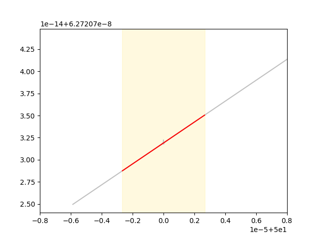


## Equation 8:
```
second_inward_current__i_siNa = 0.00037433890822745472 * (-50.0 + membrane__V) * (intracellular_sodium_concentration__Nai * exp(1.8716945411372736) - extracellular_sodium_concentration__Nao * exp(1.8716945411372736 - 0.037433890822745473 * membrane__V)) * second_inward_current__P_si * second_inward_current_d_gate__d * second_inward_current_f2_gate__f2 * second_inward_current_f_gate__f / (1.0 - exp(1.8716945411372736 - 0.037433890822745473 * membrane__V))
```
## New Eq:
```
second_inward_current__i_siNa = ((fabs(-50.0 + membrane__V) < 2.6713760659657915e-6) ? ((9358473.2056995872 - 187169.45411399176 * membrane__V) * (-9.9999999999858744e-10 * (intracellular_sodium_concentration__Nai * exp(1.8716945411372736) - extracellular_sodium_concentration__Nao * exp(9.9999999999406119e-8)) * second_inward_current__P_si * second_inward_current_d_gate__d * second_inward_current_f2_gate__f2 * second_inward_current_f_gate__f / (1.0 - exp(9.9999999999406119e-8)) - 9.9999999999858744e-10 * (intracellular_sodium_concentration__Nai * exp(1.8716945411372736) - extracellular_sodium_concentration__Nao * exp(-9.9999999999406119e-8)) * second_inward_current__P_si * second_inward_current_d_gate__d * second_inward_current_f2_gate__f2 * second_inward_current_f_gate__f / (1.0 - exp(-9.9999999999406119e-8))) + 9.9999999999858744e-10 * (intracellular_sodium_concentration__Nai * exp(1.8716945411372736) - extracellular_sodium_concentration__Nao * exp(-9.9999999999406119e-8)) * second_inward_current__P_si * second_inward_current_d_gate__d * second_inward_current_f2_gate__f2 * second_inward_current_f_gate__f / (1.0 - exp(-9.9999999999406119e-8))) : (0.00037433890822745472 * (-50.0 + membrane__V) * (intracellular_sodium_concentration__Nai * exp(1.8716945411372736) - extracellular_sodium_concentration__Nao * exp(1.8716945411372736 - 0.037433890822745473 * membrane__V)) * second_inward_current__P_si * second_inward_current_d_gate__d * second_inward_current_f2_gate__f2 * second_inward_current_f_gate__f / (1.0 - exp(1.8716945411372736 - 0.037433890822745473 * membrane__V))))
```
## Singularity point: 50.000000000000000
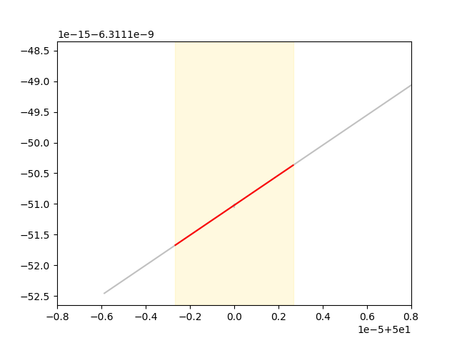


# of singularities:  8
singularity processing time: 33.881742799999984
# Model: nygren_atrial_model_1998(nygren_atrial_model_1998.cellml)
No of piecewises: 0
## Equation 1:
```
sodium_current__i_Na = 3657.5756957513308 * pow(sodium_current_m_gate__m, 3) * (-1.0 + exp(0.037907445518581065 * membrane__V - log(cleft_space_ion_concentrations__Na_c / intracellular_ion_concentrations__Na_i))) * (0.10000000000000001 * sodium_current_h2_gate__h2 + 0.90000000000000002 * sodium_current_h1_gate__h1) * cleft_space_ion_concentrations__Na_c * membrane__V * sodium_current__P_Na / (-1.0 + exp(0.037907445518581065 * membrane__V))
```
## New Eq:
```
sodium_current__i_Na = ((fabs(membrane__V) < 2.6380041870925613e-6) ? ((0.5 + 189537.22759290531 * membrane__V) * (0.0096486999999999996 * pow(sodium_current_m_gate__m, 3) * (-1.0 + exp(9.9999999999999995e-8 - log(cleft_space_ion_concentrations__Na_c / intracellular_ion_concentrations__Na_i))) * (0.10000000000000001 * sodium_current_h2_gate__h2 + 0.90000000000000002 * sodium_current_h1_gate__h1) * cleft_space_ion_concentrations__Na_c * sodium_current__P_Na / (-1.0 + exp(9.9999999999999995e-8)) + 0.0096486999999999996 * pow(sodium_current_m_gate__m, 3) * (-1.0 + exp(-9.9999999999999995e-8 - log(cleft_space_ion_concentrations__Na_c / intracellular_ion_concentrations__Na_i))) * (0.10000000000000001 * sodium_current_h2_gate__h2 + 0.90000000000000002 * sodium_current_h1_gate__h1) * cleft_space_ion_concentrations__Na_c * sodium_current__P_Na / (-1.0 + exp(-9.9999999999999995e-8))) - 0.0096486999999999996 * pow(sodium_current_m_gate__m, 3) * (-1.0 + exp(-9.9999999999999995e-8 - log(cleft_space_ion_concentrations__Na_c / intracellular_ion_concentrations__Na_i))) * (0.10000000000000001 * sodium_current_h2_gate__h2 + 0.90000000000000002 * sodium_current_h1_gate__h1) * cleft_space_ion_concentrations__Na_c * sodium_current__P_Na / (-1.0 + exp(-9.9999999999999995e-8))) : (3657.5756957513308 * pow(sodium_current_m_gate__m, 3) * (-1.0 + exp(0.037907445518581065 * membrane__V - log(cleft_space_ion_concentrations__Na_c / intracellular_ion_concentrations__Na_i))) * (0.10000000000000001 * sodium_current_h2_gate__h2 + 0.90000000000000002 * sodium_current_h1_gate__h1) * cleft_space_ion_concentrations__Na_c * membrane__V * sodium_current__P_Na / (-1.0 + exp(0.037907445518581065 * membrane__V))))
```
## Singularity point: 0


# of singularities:  1
singularity processing time: 4.74365899999998
# Model: ohara_rudy_2011_endo(ohara_rudy_2011_endo.cellml)
No of piecewises: 16
## Equation 1:
```
ICaL__PhiCaK = pow(physical_constants__F, 2) * (-0.75 * extracellular__ko + 0.75 * intracellular_ions__kss * exp(membrane__v * physical_constants__F / (physical_constants__R * physical_constants__T))) * membrane__v / ((-1.0 + exp(membrane__v * physical_constants__F / (physical_constants__R * physical_constants__T))) * physical_constants__R * physical_constants__T)
```
## New Eq:
```
ICaL__PhiCaK = ((fabs(membrane__v) < 9.9999999999999995e-8 * fabs(physical_constants__R * physical_constants__T / physical_constants__F)) ? (-9.9999999999999995e-8 * (-0.75 * extracellular__ko + 0.75 * intracellular_ions__kss * exp(-9.9999999999999995e-8)) * physical_constants__F / (-1.0 + exp(-9.9999999999999995e-8)) + 5000000.0 * (9.9999999999999995e-8 * (-0.75 * extracellular__ko + 0.75 * intracellular_ions__kss * exp(9.9999999999999995e-8)) * physical_constants__F / (-1.0 + exp(9.9999999999999995e-8)) + 9.9999999999999995e-8 * (-0.75 * extracellular__ko + 0.75 * intracellular_ions__kss * exp(-9.9999999999999995e-8)) * physical_constants__F / (-1.0 + exp(-9.9999999999999995e-8))) * (9.9999999999999995e-8 * physical_constants__R * physical_constants__T / physical_constants__F + membrane__v) * physical_constants__F / (physical_constants__R * physical_constants__T)) : (pow(physical_constants__F, 2) * (-0.75 * extracellular__ko + 0.75 * intracellular_ions__kss * exp(membrane__v * physical_constants__F / (physical_constants__R * physical_constants__T))) * membrane__v / ((-1.0 + exp(membrane__v * physical_constants__F / (physical_constants__R * physical_constants__T))) * physical_constants__R * physical_constants__T)))
```
## Singularity point: 0


## Equation 2:
```
ICaL__PhiCaL = 4.0 * pow(physical_constants__F, 2) * (-0.34100000000000003 * extracellular__cao + intracellular_ions__cass * exp(2.0 * membrane__v * physical_constants__F / (physical_constants__R * physical_constants__T))) * membrane__v / ((-1.0 + exp(2.0 * membrane__v * physical_constants__F / (physical_constants__R * physical_constants__T))) * physical_constants__R * physical_constants__T)
```
## New Eq:
```
ICaL__PhiCaL = ((fabs(membrane__v) < 4.9999999999999998e-8 * fabs(physical_constants__R * physical_constants__T / physical_constants__F)) ? (-1.9999999999999999e-7 * (-0.34100000000000003 * extracellular__cao + intracellular_ions__cass * exp(-9.9999999999999995e-8)) * physical_constants__F / (-1.0 + exp(-9.9999999999999995e-8)) + 10000000.0 * (4.9999999999999998e-8 * physical_constants__R * physical_constants__T / physical_constants__F + membrane__v) * (1.9999999999999999e-7 * (-0.34100000000000003 * extracellular__cao + intracellular_ions__cass * exp(9.9999999999999995e-8)) * physical_constants__F / (-1.0 + exp(9.9999999999999995e-8)) + 1.9999999999999999e-7 * (-0.34100000000000003 * extracellular__cao + intracellular_ions__cass * exp(-9.9999999999999995e-8)) * physical_constants__F / (-1.0 + exp(-9.9999999999999995e-8))) * physical_constants__F / (physical_constants__R * physical_constants__T)) : (4.0 * pow(physical_constants__F, 2) * (-0.34100000000000003 * extracellular__cao + intracellular_ions__cass * exp(2.0 * membrane__v * physical_constants__F / (physical_constants__R * physical_constants__T))) * membrane__v / ((-1.0 + exp(2.0 * membrane__v * physical_constants__F / (physical_constants__R * physical_constants__T))) * physical_constants__R * physical_constants__T)))
```
## Singularity point: 0
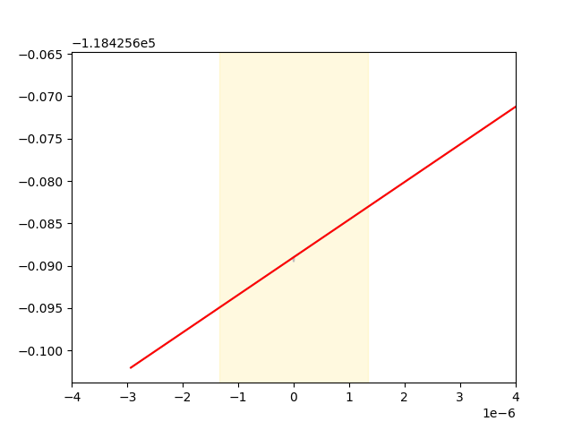


## Equation 3:
```
ICaL__PhiCaNa = pow(physical_constants__F, 2) * (-0.75 * extracellular__nao + 0.75 * intracellular_ions__nass * exp(membrane__v * physical_constants__F / (physical_constants__R * physical_constants__T))) * membrane__v / ((-1.0 + exp(membrane__v * physical_constants__F / (physical_constants__R * physical_constants__T))) * physical_constants__R * physical_constants__T)
```
## New Eq:
```
ICaL__PhiCaNa = ((fabs(membrane__v) < 9.9999999999999995e-8 * fabs(physical_constants__R * physical_constants__T / physical_constants__F)) ? (-9.9999999999999995e-8 * (-0.75 * extracellular__nao + 0.75 * intracellular_ions__nass * exp(-9.9999999999999995e-8)) * physical_constants__F / (-1.0 + exp(-9.9999999999999995e-8)) + 5000000.0 * (9.9999999999999995e-8 * (-0.75 * extracellular__nao + 0.75 * intracellular_ions__nass * exp(9.9999999999999995e-8)) * physical_constants__F / (-1.0 + exp(9.9999999999999995e-8)) + 9.9999999999999995e-8 * (-0.75 * extracellular__nao + 0.75 * intracellular_ions__nass * exp(-9.9999999999999995e-8)) * physical_constants__F / (-1.0 + exp(-9.9999999999999995e-8))) * (9.9999999999999995e-8 * physical_constants__R * physical_constants__T / physical_constants__F + membrane__v) * physical_constants__F / (physical_constants__R * physical_constants__T)) : (pow(physical_constants__F, 2) * (-0.75 * extracellular__nao + 0.75 * intracellular_ions__nass * exp(membrane__v * physical_constants__F / (physical_constants__R * physical_constants__T))) * membrane__v / ((-1.0 + exp(membrane__v * physical_constants__F / (physical_constants__R * physical_constants__T))) * physical_constants__R * physical_constants__T)))
```
## Singularity point: 0
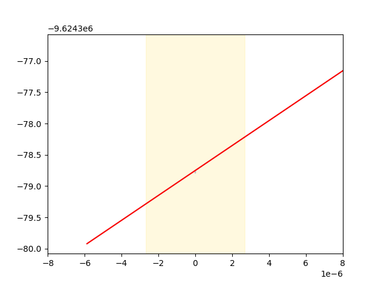


## Equation 4:
```
ICab__ICab = 4.0 * pow(physical_constants__F, 2) * (-0.34100000000000003 * extracellular__cao + intracellular_ions__cai * exp(2.0 * membrane__v * physical_constants__F / (physical_constants__R * physical_constants__T))) * ICab__PCab * membrane__v / ((-1.0 + exp(2.0 * membrane__v * physical_constants__F / (physical_constants__R * physical_constants__T))) * physical_constants__R * physical_constants__T)
```
## New Eq:
```
ICab__ICab = ((fabs(membrane__v) < 4.9999999999999998e-8 * fabs(physical_constants__R * physical_constants__T / physical_constants__F)) ? (-1.9999999999999999e-7 * (-0.34100000000000003 * extracellular__cao + intracellular_ions__cai * exp(-9.9999999999999995e-8)) * ICab__PCab * physical_constants__F / (-1.0 + exp(-9.9999999999999995e-8)) + 10000000.0 * (4.9999999999999998e-8 * physical_constants__R * physical_constants__T / physical_constants__F + membrane__v) * (1.9999999999999999e-7 * (-0.34100000000000003 * extracellular__cao + intracellular_ions__cai * exp(9.9999999999999995e-8)) * ICab__PCab * physical_constants__F / (-1.0 + exp(9.9999999999999995e-8)) + 1.9999999999999999e-7 * (-0.34100000000000003 * extracellular__cao + intracellular_ions__cai * exp(-9.9999999999999995e-8)) * ICab__PCab * physical_constants__F / (-1.0 + exp(-9.9999999999999995e-8))) * physical_constants__F / (physical_constants__R * physical_constants__T)) : (4.0 * pow(physical_constants__F, 2) * (-0.34100000000000003 * extracellular__cao + intracellular_ions__cai * exp(2.0 * membrane__v * physical_constants__F / (physical_constants__R * physical_constants__T))) * ICab__PCab * membrane__v / ((-1.0 + exp(2.0 * membrane__v * physical_constants__F / (physical_constants__R * physical_constants__T))) * physical_constants__R * physical_constants__T)))
```
## Singularity point: 0


## Equation 5:
```
INab__INab = 3.75e-10 * pow(physical_constants__F, 2) * (-extracellular__nao + intracellular_ions__nai * exp(membrane__v * physical_constants__F / (physical_constants__R * physical_constants__T))) * membrane__v / ((-1.0 + exp(membrane__v * physical_constants__F / (physical_constants__R * physical_constants__T))) * physical_constants__R * physical_constants__T)
```
## New Eq:
```
INab__INab = ((fabs(membrane__v) < 9.9999999999999995e-8 * fabs(physical_constants__R * physical_constants__T / physical_constants__F)) ? (-3.7499999999999999e-17 * (-extracellular__nao + intracellular_ions__nai * exp(-9.9999999999999995e-8)) * physical_constants__F / (-1.0 + exp(-9.9999999999999995e-8)) + 5000000.0 * (9.9999999999999995e-8 * physical_constants__R * physical_constants__T / physical_constants__F + membrane__v) * (3.7499999999999999e-17 * (-extracellular__nao + intracellular_ions__nai * exp(9.9999999999999995e-8)) * physical_constants__F / (-1.0 + exp(9.9999999999999995e-8)) + 3.7499999999999999e-17 * (-extracellular__nao + intracellular_ions__nai * exp(-9.9999999999999995e-8)) * physical_constants__F / (-1.0 + exp(-9.9999999999999995e-8))) * physical_constants__F / (physical_constants__R * physical_constants__T)) : (3.75e-10 * pow(physical_constants__F, 2) * (-extracellular__nao + intracellular_ions__nai * exp(membrane__v * physical_constants__F / (physical_constants__R * physical_constants__T))) * membrane__v / ((-1.0 + exp(membrane__v * physical_constants__F / (physical_constants__R * physical_constants__T))) * physical_constants__R * physical_constants__T)))
```
## Singularity point: 0
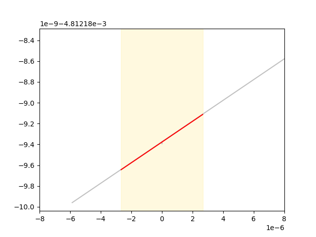


# of singularities:  5
singularity processing time: 68.50927550000006
# Model: ohara_rudy_2011_epi(ohara_rudy_2011_epi.cellml)
No of piecewises: 16
## Equation 1:
```
ICaL__PhiCaK = pow(physical_constants__F, 2) * (-0.75 * extracellular__ko + 0.75 * intracellular_ions__kss * exp(membrane__v * physical_constants__F / (physical_constants__R * physical_constants__T))) * membrane__v / ((-1.0 + exp(membrane__v * physical_constants__F / (physical_constants__R * physical_constants__T))) * physical_constants__R * physical_constants__T)
```
## New Eq:
```
ICaL__PhiCaK = ((fabs(membrane__v) < 9.9999999999999995e-8 * fabs(physical_constants__R * physical_constants__T / physical_constants__F)) ? (-9.9999999999999995e-8 * (-0.75 * extracellular__ko + 0.75 * intracellular_ions__kss * exp(-9.9999999999999995e-8)) * physical_constants__F / (-1.0 + exp(-9.9999999999999995e-8)) + 5000000.0 * (9.9999999999999995e-8 * (-0.75 * extracellular__ko + 0.75 * intracellular_ions__kss * exp(9.9999999999999995e-8)) * physical_constants__F / (-1.0 + exp(9.9999999999999995e-8)) + 9.9999999999999995e-8 * (-0.75 * extracellular__ko + 0.75 * intracellular_ions__kss * exp(-9.9999999999999995e-8)) * physical_constants__F / (-1.0 + exp(-9.9999999999999995e-8))) * (9.9999999999999995e-8 * physical_constants__R * physical_constants__T / physical_constants__F + membrane__v) * physical_constants__F / (physical_constants__R * physical_constants__T)) : (pow(physical_constants__F, 2) * (-0.75 * extracellular__ko + 0.75 * intracellular_ions__kss * exp(membrane__v * physical_constants__F / (physical_constants__R * physical_constants__T))) * membrane__v / ((-1.0 + exp(membrane__v * physical_constants__F / (physical_constants__R * physical_constants__T))) * physical_constants__R * physical_constants__T)))
```
## Singularity point: 0


## Equation 2:
```
ICaL__PhiCaL = 4.0 * pow(physical_constants__F, 2) * (-0.34100000000000003 * extracellular__cao + intracellular_ions__cass * exp(2.0 * membrane__v * physical_constants__F / (physical_constants__R * physical_constants__T))) * membrane__v / ((-1.0 + exp(2.0 * membrane__v * physical_constants__F / (physical_constants__R * physical_constants__T))) * physical_constants__R * physical_constants__T)
```
## New Eq:
```
ICaL__PhiCaL = ((fabs(membrane__v) < 4.9999999999999998e-8 * fabs(physical_constants__R * physical_constants__T / physical_constants__F)) ? (-1.9999999999999999e-7 * (-0.34100000000000003 * extracellular__cao + intracellular_ions__cass * exp(-9.9999999999999995e-8)) * physical_constants__F / (-1.0 + exp(-9.9999999999999995e-8)) + 10000000.0 * (4.9999999999999998e-8 * physical_constants__R * physical_constants__T / physical_constants__F + membrane__v) * (1.9999999999999999e-7 * (-0.34100000000000003 * extracellular__cao + intracellular_ions__cass * exp(9.9999999999999995e-8)) * physical_constants__F / (-1.0 + exp(9.9999999999999995e-8)) + 1.9999999999999999e-7 * (-0.34100000000000003 * extracellular__cao + intracellular_ions__cass * exp(-9.9999999999999995e-8)) * physical_constants__F / (-1.0 + exp(-9.9999999999999995e-8))) * physical_constants__F / (physical_constants__R * physical_constants__T)) : (4.0 * pow(physical_constants__F, 2) * (-0.34100000000000003 * extracellular__cao + intracellular_ions__cass * exp(2.0 * membrane__v * physical_constants__F / (physical_constants__R * physical_constants__T))) * membrane__v / ((-1.0 + exp(2.0 * membrane__v * physical_constants__F / (physical_constants__R * physical_constants__T))) * physical_constants__R * physical_constants__T)))
```
## Singularity point: 0


## Equation 3:
```
ICaL__PhiCaNa = pow(physical_constants__F, 2) * (-0.75 * extracellular__nao + 0.75 * intracellular_ions__nass * exp(membrane__v * physical_constants__F / (physical_constants__R * physical_constants__T))) * membrane__v / ((-1.0 + exp(membrane__v * physical_constants__F / (physical_constants__R * physical_constants__T))) * physical_constants__R * physical_constants__T)
```
## New Eq:
```
ICaL__PhiCaNa = ((fabs(membrane__v) < 9.9999999999999995e-8 * fabs(physical_constants__R * physical_constants__T / physical_constants__F)) ? (-9.9999999999999995e-8 * (-0.75 * extracellular__nao + 0.75 * intracellular_ions__nass * exp(-9.9999999999999995e-8)) * physical_constants__F / (-1.0 + exp(-9.9999999999999995e-8)) + 5000000.0 * (9.9999999999999995e-8 * (-0.75 * extracellular__nao + 0.75 * intracellular_ions__nass * exp(9.9999999999999995e-8)) * physical_constants__F / (-1.0 + exp(9.9999999999999995e-8)) + 9.9999999999999995e-8 * (-0.75 * extracellular__nao + 0.75 * intracellular_ions__nass * exp(-9.9999999999999995e-8)) * physical_constants__F / (-1.0 + exp(-9.9999999999999995e-8))) * (9.9999999999999995e-8 * physical_constants__R * physical_constants__T / physical_constants__F + membrane__v) * physical_constants__F / (physical_constants__R * physical_constants__T)) : (pow(physical_constants__F, 2) * (-0.75 * extracellular__nao + 0.75 * intracellular_ions__nass * exp(membrane__v * physical_constants__F / (physical_constants__R * physical_constants__T))) * membrane__v / ((-1.0 + exp(membrane__v * physical_constants__F / (physical_constants__R * physical_constants__T))) * physical_constants__R * physical_constants__T)))
```
## Singularity point: 0


## Equation 4:
```
ICab__ICab = 4.0 * pow(physical_constants__F, 2) * (-0.34100000000000003 * extracellular__cao + intracellular_ions__cai * exp(2.0 * membrane__v * physical_constants__F / (physical_constants__R * physical_constants__T))) * ICab__PCab * membrane__v / ((-1.0 + exp(2.0 * membrane__v * physical_constants__F / (physical_constants__R * physical_constants__T))) * physical_constants__R * physical_constants__T)
```
## New Eq:
```
ICab__ICab = ((fabs(membrane__v) < 4.9999999999999998e-8 * fabs(physical_constants__R * physical_constants__T / physical_constants__F)) ? (-1.9999999999999999e-7 * (-0.34100000000000003 * extracellular__cao + intracellular_ions__cai * exp(-9.9999999999999995e-8)) * ICab__PCab * physical_constants__F / (-1.0 + exp(-9.9999999999999995e-8)) + 10000000.0 * (4.9999999999999998e-8 * physical_constants__R * physical_constants__T / physical_constants__F + membrane__v) * (1.9999999999999999e-7 * (-0.34100000000000003 * extracellular__cao + intracellular_ions__cai * exp(9.9999999999999995e-8)) * ICab__PCab * physical_constants__F / (-1.0 + exp(9.9999999999999995e-8)) + 1.9999999999999999e-7 * (-0.34100000000000003 * extracellular__cao + intracellular_ions__cai * exp(-9.9999999999999995e-8)) * ICab__PCab * physical_constants__F / (-1.0 + exp(-9.9999999999999995e-8))) * physical_constants__F / (physical_constants__R * physical_constants__T)) : (4.0 * pow(physical_constants__F, 2) * (-0.34100000000000003 * extracellular__cao + intracellular_ions__cai * exp(2.0 * membrane__v * physical_constants__F / (physical_constants__R * physical_constants__T))) * ICab__PCab * membrane__v / ((-1.0 + exp(2.0 * membrane__v * physical_constants__F / (physical_constants__R * physical_constants__T))) * physical_constants__R * physical_constants__T)))
```
## Singularity point: 0


## Equation 5:
```
INab__INab = 3.75e-10 * pow(physical_constants__F, 2) * (-extracellular__nao + intracellular_ions__nai * exp(membrane__v * physical_constants__F / (physical_constants__R * physical_constants__T))) * membrane__v / ((-1.0 + exp(membrane__v * physical_constants__F / (physical_constants__R * physical_constants__T))) * physical_constants__R * physical_constants__T)
```
## New Eq:
```
INab__INab = ((fabs(membrane__v) < 9.9999999999999995e-8 * fabs(physical_constants__R * physical_constants__T / physical_constants__F)) ? (-3.7499999999999999e-17 * (-extracellular__nao + intracellular_ions__nai * exp(-9.9999999999999995e-8)) * physical_constants__F / (-1.0 + exp(-9.9999999999999995e-8)) + 5000000.0 * (9.9999999999999995e-8 * physical_constants__R * physical_constants__T / physical_constants__F + membrane__v) * (3.7499999999999999e-17 * (-extracellular__nao + intracellular_ions__nai * exp(9.9999999999999995e-8)) * physical_constants__F / (-1.0 + exp(9.9999999999999995e-8)) + 3.7499999999999999e-17 * (-extracellular__nao + intracellular_ions__nai * exp(-9.9999999999999995e-8)) * physical_constants__F / (-1.0 + exp(-9.9999999999999995e-8))) * physical_constants__F / (physical_constants__R * physical_constants__T)) : (3.75e-10 * pow(physical_constants__F, 2) * (-extracellular__nao + intracellular_ions__nai * exp(membrane__v * physical_constants__F / (physical_constants__R * physical_constants__T))) * membrane__v / ((-1.0 + exp(membrane__v * physical_constants__F / (physical_constants__R * physical_constants__T))) * physical_constants__R * physical_constants__T)))
```
## Singularity point: 0


# of singularities:  5
singularity processing time: 68.75146789999985
# Model: ohara_rudy_cipa_v1_2017(ohara_rudy_cipa_v1_2017.cellml)
No of piecewises: 16
## Equation 1:
```
ICaL__PhiCaK = 0.037435883507802616 * pow(membrane__v, 2) * (-0.75 * extracellular__ko + 0.75 * intracellular_ions__kss * exp(0.037435883507802616 * membrane__v)) / (-1.0 + exp(0.037435883507802616 * membrane__v))
```
## New Eq:
```
ICaL__PhiCaK = ((fabs(membrane__v) < 2.6712338705498262e-6) ? ((0.5 + 187179.41753901311 * membrane__v) * (2.671233870549826e-13 * (-0.75 * extracellular__ko + 0.75 * intracellular_ions__kss * exp(9.9999999999999995e-8)) / (-1.0 + exp(9.9999999999999995e-8)) - 2.671233870549826e-13 * (-0.75 * extracellular__ko + 0.75 * intracellular_ions__kss * exp(-9.9999999999999995e-8)) / (-1.0 + exp(-9.9999999999999995e-8))) + 2.671233870549826e-13 * (-0.75 * extracellular__ko + 0.75 * intracellular_ions__kss * exp(-9.9999999999999995e-8)) / (-1.0 + exp(-9.9999999999999995e-8))) : (0.037435883507802616 * pow(membrane__v, 2) * (-0.75 * extracellular__ko + 0.75 * intracellular_ions__kss * exp(0.037435883507802616 * membrane__v)) / (-1.0 + exp(0.037435883507802616 * membrane__v))))
```
## Singularity point: 0
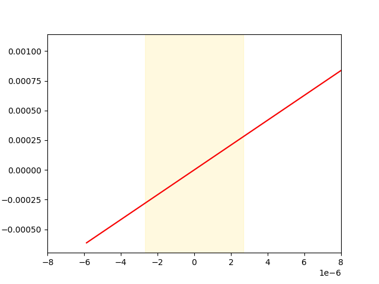


## Equation 2:
```
ICaL__PhiCaL = 0.14974353403121046 * pow(membrane__v, 2) * (-0.34100000000000003 * extracellular__cao + intracellular_ions__cass * exp(0.074871767015605231 * membrane__v)) / (-1.0 + exp(0.074871767015605231 * membrane__v))
```
## New Eq:
```
ICaL__PhiCaL = ((fabs(membrane__v) < 1.3356169352749131e-6) ? ((0.5 + 374358.83507802623 * membrane__v) * (2.671233870549826e-13 * (-0.34100000000000003 * extracellular__cao + intracellular_ions__cass * exp(9.9999999999999995e-8)) / (-1.0 + exp(9.9999999999999995e-8)) - 2.671233870549826e-13 * (-0.34100000000000003 * extracellular__cao + intracellular_ions__cass * exp(-9.9999999999999995e-8)) / (-1.0 + exp(-9.9999999999999995e-8))) + 2.671233870549826e-13 * (-0.34100000000000003 * extracellular__cao + intracellular_ions__cass * exp(-9.9999999999999995e-8)) / (-1.0 + exp(-9.9999999999999995e-8))) : (0.14974353403121046 * pow(membrane__v, 2) * (-0.34100000000000003 * extracellular__cao + intracellular_ions__cass * exp(0.074871767015605231 * membrane__v)) / (-1.0 + exp(0.074871767015605231 * membrane__v))))
```
## Singularity point: 0


## Equation 3:
```
ICaL__PhiCaNa = 0.037435883507802616 * pow(membrane__v, 2) * (-0.75 * extracellular__nao + 0.75 * intracellular_ions__nass * exp(0.037435883507802616 * membrane__v)) / (-1.0 + exp(0.037435883507802616 * membrane__v))
```
## New Eq:
```
ICaL__PhiCaNa = ((fabs(membrane__v) < 2.6712338705498262e-6) ? ((0.5 + 187179.41753901311 * membrane__v) * (2.671233870549826e-13 * (-0.75 * extracellular__nao + 0.75 * intracellular_ions__nass * exp(9.9999999999999995e-8)) / (-1.0 + exp(9.9999999999999995e-8)) - 2.671233870549826e-13 * (-0.75 * extracellular__nao + 0.75 * intracellular_ions__nass * exp(-9.9999999999999995e-8)) / (-1.0 + exp(-9.9999999999999995e-8))) + 2.671233870549826e-13 * (-0.75 * extracellular__nao + 0.75 * intracellular_ions__nass * exp(-9.9999999999999995e-8)) / (-1.0 + exp(-9.9999999999999995e-8))) : (0.037435883507802616 * pow(membrane__v, 2) * (-0.75 * extracellular__nao + 0.75 * intracellular_ions__nass * exp(0.037435883507802616 * membrane__v)) / (-1.0 + exp(0.037435883507802616 * membrane__v))))
```
## Singularity point: 0
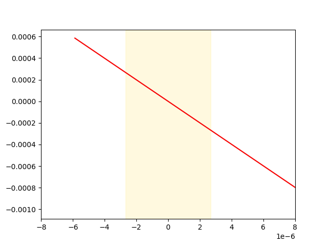


## Equation 4:
```
ICab__ICab = 0.14974353403121046 * pow(membrane__v, 2) * (-0.34100000000000003 * extracellular__cao + intracellular_ions__cai * exp(0.074871767015605231 * membrane__v)) * ICab__PCab / (-1.0 + exp(0.074871767015605231 * membrane__v))
```
## New Eq:
```
ICab__ICab = ((fabs(membrane__v) < 1.3356169352749131e-6) ? ((0.5 + 374358.83507802623 * membrane__v) * (2.671233870549826e-13 * (-0.34100000000000003 * extracellular__cao + intracellular_ions__cai * exp(9.9999999999999995e-8)) * ICab__PCab / (-1.0 + exp(9.9999999999999995e-8)) - 2.671233870549826e-13 * (-0.34100000000000003 * extracellular__cao + intracellular_ions__cai * exp(-9.9999999999999995e-8)) * ICab__PCab / (-1.0 + exp(-9.9999999999999995e-8))) + 2.671233870549826e-13 * (-0.34100000000000003 * extracellular__cao + intracellular_ions__cai * exp(-9.9999999999999995e-8)) * ICab__PCab / (-1.0 + exp(-9.9999999999999995e-8))) : (0.14974353403121046 * pow(membrane__v, 2) * (-0.34100000000000003 * extracellular__cao + intracellular_ions__cai * exp(0.074871767015605231 * membrane__v)) * ICab__PCab / (-1.0 + exp(0.074871767015605231 * membrane__v))))
```
## Singularity point: 0
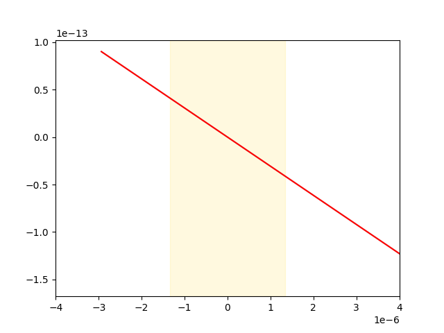


## Equation 5:
```
INab__INab = 0.037435883507802616 * pow(membrane__v, 2) * (-extracellular__nao + intracellular_ions__nai * exp(0.037435883507802616 * membrane__v)) * INab__PNab / (-1.0 + exp(0.037435883507802616 * membrane__v))
```
## New Eq:
```
INab__INab = ((fabs(membrane__v) < 2.6712338705498262e-6) ? ((0.5 + 187179.41753901311 * membrane__v) * (2.671233870549826e-13 * (-extracellular__nao + intracellular_ions__nai * exp(9.9999999999999995e-8)) * INab__PNab / (-1.0 + exp(9.9999999999999995e-8)) - 2.671233870549826e-13 * (-extracellular__nao + intracellular_ions__nai * exp(-9.9999999999999995e-8)) * INab__PNab / (-1.0 + exp(-9.9999999999999995e-8))) + 2.671233870549826e-13 * (-extracellular__nao + intracellular_ions__nai * exp(-9.9999999999999995e-8)) * INab__PNab / (-1.0 + exp(-9.9999999999999995e-8))) : (0.037435883507802616 * pow(membrane__v, 2) * (-extracellular__nao + intracellular_ions__nai * exp(0.037435883507802616 * membrane__v)) * INab__PNab / (-1.0 + exp(0.037435883507802616 * membrane__v))))
```
## Singularity point: 0


# of singularities:  5
singularity processing time: 59.822379400000045
# Model: paci_hyttinen_aaltosetala_severi_atrialVersion(paci_hyttinen_aaltosetala_severi_atrialVersion.cellml)
No of piecewises: 9
## Equation 1:
```
i_CaL__i_CaL = 4478658.9572358271 * (-0.34100000000000003 * model_parameters__Cao + calcium_dynamics__Cai * exp(23.209012310102192 * Membrane__Vm_converted / model_parameters__T)) * Membrane__Vm_converted * i_CaL__g_CaL * i_CaL_d_gate__d * i_CaL_f1_gate__f1 * i_CaL_f2_gate__f2 * i_CaL_fCa_gate__fCa / ((-1.0 + exp(23.209012310102192 * Membrane__Vm_converted / model_parameters__T)) * model_parameters__T)
```
## New Eq:
```
i_CaL__i_CaL = ((fabs(Membrane__Vm_converted) < 4.30867107414446e-9 * fabs(model_parameters__T)) ? (116045061.55051096 * (4.30867107414446e-9 * model_parameters__T + Membrane__Vm_converted) * (0.019297068299999998 * (-0.34100000000000003 * model_parameters__Cao + calcium_dynamics__Cai * exp(9.9999999999999995e-8)) * i_CaL__g_CaL * i_CaL_d_gate__d * i_CaL_f1_gate__f1 * i_CaL_f2_gate__f2 * i_CaL_fCa_gate__fCa / (-1.0 + exp(9.9999999999999995e-8)) + 0.019297068299999998 * (-0.34100000000000003 * model_parameters__Cao + calcium_dynamics__Cai * exp(-9.9999999999999995e-8)) * i_CaL__g_CaL * i_CaL_d_gate__d * i_CaL_f1_gate__f1 * i_CaL_f2_gate__f2 * i_CaL_fCa_gate__fCa / (-1.0 + exp(-9.9999999999999995e-8))) / model_parameters__T - 0.019297068299999998 * (-0.34100000000000003 * model_parameters__Cao + calcium_dynamics__Cai * exp(-9.9999999999999995e-8)) * i_CaL__g_CaL * i_CaL_d_gate__d * i_CaL_f1_gate__f1 * i_CaL_f2_gate__f2 * i_CaL_fCa_gate__fCa / (-1.0 + exp(-9.9999999999999995e-8))) : (4478658.9572358271 * (-0.34100000000000003 * model_parameters__Cao + calcium_dynamics__Cai * exp(23.209012310102192 * Membrane__Vm_converted / model_parameters__T)) * Membrane__Vm_converted * i_CaL__g_CaL * i_CaL_d_gate__d * i_CaL_f1_gate__f1 * i_CaL_f2_gate__f2 * i_CaL_fCa_gate__fCa / ((-1.0 + exp(23.209012310102192 * Membrane__Vm_converted / model_parameters__T)) * model_parameters__T)))
```
## Singularity point: 0
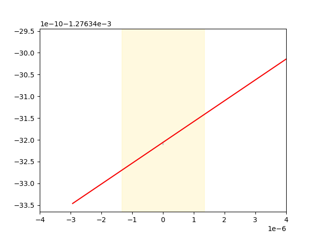


# of singularities:  1
singularity processing time: 5.643278999999893
# Model: paci_hyttinen_aaltosetala_severi_ventricularVersion(paci_hyttinen_aaltosetala_severi_ventricularVersion.cellml)
No of piecewises: 13
## Equation 1:
```
i_CaL__i_CaL = 4478658.9572358271 * (-0.34100000000000003 * model_parameters__Cao + calcium_dynamics__Cai * exp(23.209012310102192 * Membrane__Vm_converted / model_parameters__T)) * Membrane__Vm_converted * i_CaL__g_CaL * i_CaL_d_gate__d * i_CaL_f1_gate__f1 * i_CaL_f2_gate__f2 * i_CaL_fCa_gate__fCa / ((-1.0 + exp(23.209012310102192 * Membrane__Vm_converted / model_parameters__T)) * model_parameters__T)
```
## New Eq:
```
i_CaL__i_CaL = ((fabs(Membrane__Vm_converted) < 4.30867107414446e-9 * fabs(model_parameters__T)) ? (116045061.55051096 * (4.30867107414446e-9 * model_parameters__T + Membrane__Vm_converted) * (0.019297068299999998 * (-0.34100000000000003 * model_parameters__Cao + calcium_dynamics__Cai * exp(9.9999999999999995e-8)) * i_CaL__g_CaL * i_CaL_d_gate__d * i_CaL_f1_gate__f1 * i_CaL_f2_gate__f2 * i_CaL_fCa_gate__fCa / (-1.0 + exp(9.9999999999999995e-8)) + 0.019297068299999998 * (-0.34100000000000003 * model_parameters__Cao + calcium_dynamics__Cai * exp(-9.9999999999999995e-8)) * i_CaL__g_CaL * i_CaL_d_gate__d * i_CaL_f1_gate__f1 * i_CaL_f2_gate__f2 * i_CaL_fCa_gate__fCa / (-1.0 + exp(-9.9999999999999995e-8))) / model_parameters__T - 0.019297068299999998 * (-0.34100000000000003 * model_parameters__Cao + calcium_dynamics__Cai * exp(-9.9999999999999995e-8)) * i_CaL__g_CaL * i_CaL_d_gate__d * i_CaL_f1_gate__f1 * i_CaL_f2_gate__f2 * i_CaL_fCa_gate__fCa / (-1.0 + exp(-9.9999999999999995e-8))) : (4478658.9572358271 * (-0.34100000000000003 * model_parameters__Cao + calcium_dynamics__Cai * exp(23.209012310102192 * Membrane__Vm_converted / model_parameters__T)) * Membrane__Vm_converted * i_CaL__g_CaL * i_CaL_d_gate__d * i_CaL_f1_gate__f1 * i_CaL_f2_gate__f2 * i_CaL_fCa_gate__fCa / ((-1.0 + exp(23.209012310102192 * Membrane__Vm_converted / model_parameters__T)) * model_parameters__T)))
```
## Singularity point: 0


# of singularities:  1
singularity processing time: 5.6447730999998385
# Model: pandit_clark_giles_demir_2001_version06_variant01(pandit_clark_giles_demir_2001_endocardial_cell.cellml)
No of piecewises: 2
## Equation 1:
```
sodium_current_m_gate__tau_m = 0.0013600000000000001 / (0.080000000000000002 * exp(-0.090909090909090912 * membrane__V) + 0.32000000000000001 * (47.130000000000003 + membrane__V) / (1.0 - exp(-4.7130000000000001 - 0.10000000000000001 * membrane__V)))
```
## New Eq:
```
sodium_current_m_gate__tau_m = 0.0013600000000000001 / (0.080000000000000002 * exp(-0.090909090909090912 * membrane__V) + ((fabs(47.130000000000003 + membrane__V) < 1.0000000000287557e-6) ? (3.200000000092018e-7 / (1.0 - exp(-1.0000000000287557e-7)) + (-23564999.499322373 - 499999.99998562218 * membrane__V) * (-3.200000000092018e-7 / (1.0 - exp(1.0000000000287557e-7)) - 3.200000000092018e-7 / (1.0 - exp(-1.0000000000287557e-7)))) : (0.32000000000000001 * (47.130000000000003 + membrane__V) / (1.0 - exp(-4.7130000000000001 - 0.10000000000000001 * membrane__V)))))
```
## Singularity point: -47.130000000000003


# of singularities:  1
singularity processing time: 7.690037999999959
# Model: pandit_clark_giles_demir_2001(pandit_clark_giles_demir_2001_epicardial_cell.cellml)
No of piecewises: 2
## Equation 1:
```
sodium_current_m_gate__tau_m = 0.0013600000000000001 / (0.080000000000000002 * exp(-0.090909090909090912 * membrane__V) + 0.32000000000000001 * (47.130000000000003 + membrane__V) / (1.0 - exp(-4.7130000000000001 - 0.10000000000000001 * membrane__V)))
```
## New Eq:
```
sodium_current_m_gate__tau_m = 0.0013600000000000001 / (0.080000000000000002 * exp(-0.090909090909090912 * membrane__V) + ((fabs(47.130000000000003 + membrane__V) < 1.0000000000287557e-6) ? (3.200000000092018e-7 / (1.0 - exp(-1.0000000000287557e-7)) + (-23564999.499322373 - 499999.99998562218 * membrane__V) * (-3.200000000092018e-7 / (1.0 - exp(1.0000000000287557e-7)) - 3.200000000092018e-7 / (1.0 - exp(-1.0000000000287557e-7)))) : (0.32000000000000001 * (47.130000000000003 + membrane__V) / (1.0 - exp(-4.7130000000000001 - 0.10000000000000001 * membrane__V)))))
```
## Singularity point: -47.130000000000003
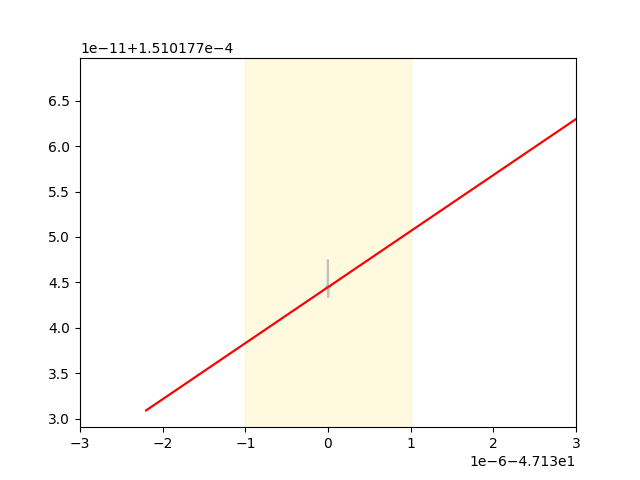


# of singularities:  1
singularity processing time: 7.5264250000000175
# Model: pasek_simurda_christe_2006(pasek_simurda_christe_2006.cellml)
No of piecewises: 0
## Equation 1:
```
i_Nas_h_gate__beta_h = 18.77 * (64.400000000000006 + Vms__Vms) / (1.0 - exp(-14.168000000000001 - 0.22 * Vms__Vms))
```
## New Eq:
```
i_Nas_h_gate__beta_h = ((fabs(64.400000000000006 + Vms__Vms) < 4.5454545455347883e-7) ? (8.5318181809268536e-6 / (1.0 - exp(-1.0000000000287557e-7)) + (-70839999.498749435 - 1099999.9999805812 * Vms__Vms) * (-8.5318181809268536e-6 / (1.0 - exp(-1.0000000000287557e-7)) - 8.531818183010741e-6 / (1.0 - exp(1.0000000000287557e-7)))) : (18.77 * (64.400000000000006 + Vms__Vms) / (1.0 - exp(-14.168000000000001 - 0.22 * Vms__Vms))))
```
## Singularity point: -64.400000000000006
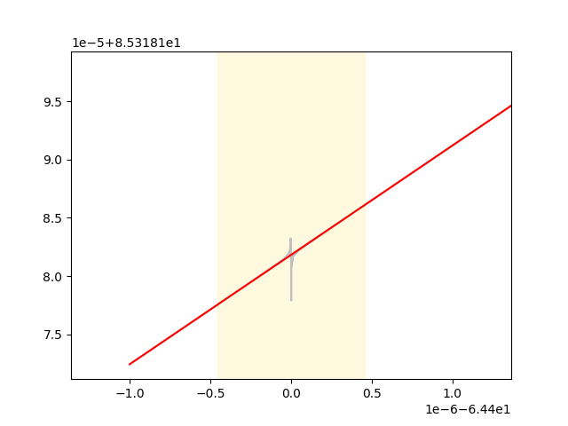


## Equation 2:
```
i_Nas_m_gate__alpha_m = 117.26000000000001 * (59.299999999999997 + Vms__Vms) / (1.0 - exp(-32.615000000000002 - 0.55000000000000004 * Vms__Vms))
```
## New Eq:
```
i_Nas_m_gate__alpha_m = ((fabs(59.299999999999997 + Vms__Vms) < 1.8181818181584042e-7) ? (2.1320000002980068e-5 / (1.0 - exp(-1.0000000000287557e-7)) + (-163074999.50210002 - 2750000.0000354135 * Vms__Vms) * (-2.131999999647083e-5 / (1.0 - exp(1.0000000000287557e-7)) - 2.1320000002980068e-5 / (1.0 - exp(-1.0000000000287557e-7)))) : (117.26000000000001 * (59.299999999999997 + Vms__Vms) / (1.0 - exp(-32.615000000000002 - 0.55000000000000004 * Vms__Vms))))
```
## Singularity point: -59.299999999999997
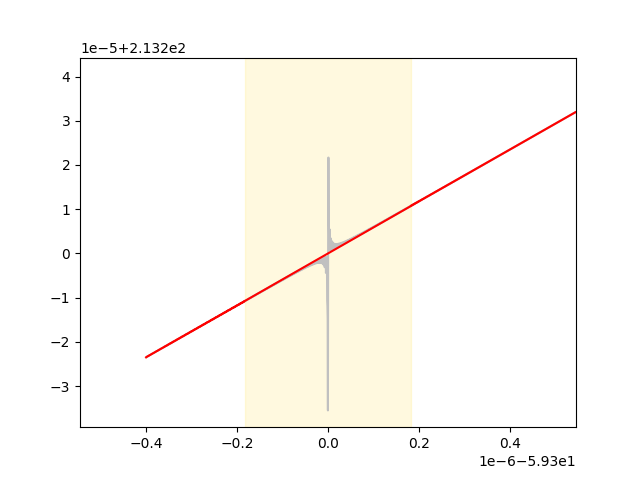


## Equation 3:
```
i_Cas__i_Cas = 4.1481478308756044e-5 * (-0.40920000000000001 + ion_concentrations__Cass * exp(0.078728915539782576 * Vms__Vms)) * ((0.10000000000000001 - 0.10000000000000001 * i_Cas__Ccast) * i_Cas__C2 + (0.90000000000000002 + 0.10000000000000001 * i_Cas__Ccast) * i_Cas__C1) * Vms__Vms * i_Cas__Co / (-1.0 + exp(0.078728915539782576 * Vms__Vms))
```
## New Eq:
```
i_Cas__i_Cas = ((fabs(Vms__Vms) < 1.2701813471502589e-6) ? ((0.5 + 393644.57769891288 * Vms__Vms) * (5.2689000000000005e-11 * (-0.40920000000000001 + ion_concentrations__Cass * exp(9.9999999999999995e-8)) * ((0.10000000000000001 - 0.10000000000000001 * i_Cas__Ccast) * i_Cas__C2 + (0.90000000000000002 + 0.10000000000000001 * i_Cas__Ccast) * i_Cas__C1) * i_Cas__Co / (-1.0 + exp(9.9999999999999995e-8)) + 5.2689000000000005e-11 * (-0.40920000000000001 + ion_concentrations__Cass * exp(-9.9999999999999995e-8)) * ((0.10000000000000001 - 0.10000000000000001 * i_Cas__Ccast) * i_Cas__C2 + (0.90000000000000002 + 0.10000000000000001 * i_Cas__Ccast) * i_Cas__C1) * i_Cas__Co / (-1.0 + exp(-9.9999999999999995e-8))) - 5.2689000000000005e-11 * (-0.40920000000000001 + ion_concentrations__Cass * exp(-9.9999999999999995e-8)) * ((0.10000000000000001 - 0.10000000000000001 * i_Cas__Ccast) * i_Cas__C2 + (0.90000000000000002 + 0.10000000000000001 * i_Cas__Ccast) * i_Cas__C1) * i_Cas__Co / (-1.0 + exp(-9.9999999999999995e-8))) : (4.1481478308756044e-5 * (-0.40920000000000001 + ion_concentrations__Cass * exp(0.078728915539782576 * Vms__Vms)) * ((0.10000000000000001 - 0.10000000000000001 * i_Cas__Ccast) * i_Cas__C2 + (0.90000000000000002 + 0.10000000000000001 * i_Cas__Ccast) * i_Cas__C1) * Vms__Vms * i_Cas__Co / (-1.0 + exp(0.078728915539782576 * Vms__Vms))))
```
## Singularity point: 0
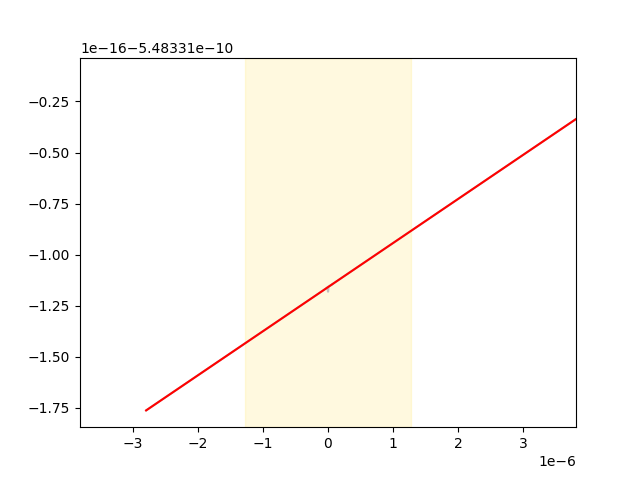


# of singularities:  3
singularity processing time: 13.674824700000045
# Model: pasek_model_2008(pasek_simurda_orchard_christe_2008.cellml)
No of piecewises: 0
## Equation 1:
```
i_Kr_s_xr_gate__tau_xr = 0.001 / (0.00060999999999999997 * (38.899999999999999 + Vm_s__Vm_s) / (-1.0 + exp(5.6404999999999994 + 0.14499999999999999 * Vm_s__Vm_s)) + 0.0013799999999999999 * (14.199999999999999 + Vm_s__Vm_s) / (1.0 - exp(-1.7465999999999999 - 0.123 * Vm_s__Vm_s)))
```
## New Eq:
```
i_Kr_s_xr_gate__tau_xr = 0.001 / (((fabs(14.199999999999999 + Vm_s__Vm_s) < 8.1300813007528783e-7) ? (1.1219512195134727e-9 / (1.0 - exp(-9.9999999999406119e-8)) + (-8732999.5000645891 - 615000.00000454858 * Vm_s__Vm_s) * (-1.1219512194943214e-9 / (1.0 - exp(9.9999999999406119e-8)) - 1.1219512195134727e-9 / (1.0 - exp(-9.9999999999406119e-8)))) : (0.0013799999999999999 * (14.199999999999999 + Vm_s__Vm_s) / (1.0 - exp(-1.7465999999999999 - 0.123 * Vm_s__Vm_s)))) + ((fabs(38.899999999999999 + Vm_s__Vm_s) < 6.896551724422384e-7) ? (-4.2068965517283451e-10 / (-1.0 + exp(-1.0000000000287557e-7)) + (28202500.498836767 + 724999.99997009686 * Vm_s__Vm_s) * (4.2068965517283451e-10 / (-1.0 + exp(-1.0000000000287557e-7)) + 4.2068965520669629e-10 / (-1.0 + exp(1.0000000000287557e-7)))) : (0.00060999999999999997 * (38.899999999999999 + Vm_s__Vm_s) / (-1.0 + exp(5.6404999999999994 + 0.14499999999999999 * Vm_s__Vm_s)))))
```
## Singularity point: -38.899999999999999


## Singularity point: -14.199999999999999
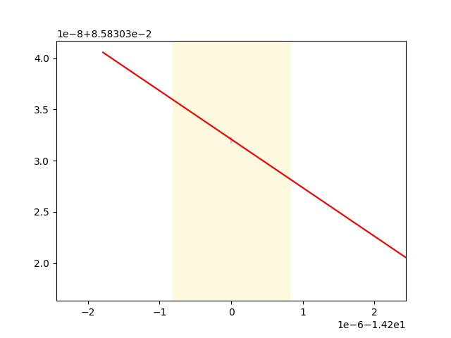


## Equation 2:
```
i_Ks_s_xs_gate__tau_xs = 0.001 / (0.00013100000000000001 * (30.0 + Vm_s__Vm_s) / (-1.0 + exp(2.0609999999999999 + 0.068699999999999997 * Vm_s__Vm_s)) + 7.1899999999999999e-5 * (30.0 + Vm_s__Vm_s) / (1.0 - exp(-4.4399999999999995 - 0.14799999999999999 * Vm_s__Vm_s)))
```
## New Eq:
```
i_Ks_s_xs_gate__tau_xs = 0.001 * ((fabs(30.0 + Vm_s__Vm_s) < 1.455604075689676e-6) ? (1 / (-1.0465793304208771e-10 / (1.0 - exp(2.1542940320529169e-7)) - 1.9068413391534758e-10 / (-1.0 + exp(-9.9999999999406119e-8)) + (10305000.50001229 + 343500.00000040967 * Vm_s__Vm_s) * (1.0465793304208771e-10 / (1.0 - exp(2.1542940320529169e-7)) + 1.0465793304208771e-10 / (1.0 - exp(-2.1542940320529169e-7)) + 1.9068413391534758e-10 / (-1.0 + exp(9.9999999999406119e-8)) + 1.9068413391534758e-10 / (-1.0 + exp(-9.9999999999406119e-8))))) : (1 / (0.00013100000000000001 * (30.0 + Vm_s__Vm_s) / (-1.0 + exp(2.0609999999999999 + 0.068699999999999997 * Vm_s__Vm_s)) + 7.1899999999999999e-5 * (30.0 + Vm_s__Vm_s) / (1.0 - exp(-4.4399999999999995 - 0.14799999999999999 * Vm_s__Vm_s)))))
```
## Singularity point: -30.000000000000000


## Equation 3:
```
i_CaL_s__i_CaL_s = 0.55630930863148487 * (-0.61380000000000001 + 0.001 * exp(0.07491945188463181 * Vm_s__Vm_s)) * (i_CaL_s__Ccao + i_CaL_s__Co) * Vm_s__Vm_s * i_CaL_s_y_gate__y * membrane_permeabilities__P_CaL / (-1.0 + exp(0.07491945188463181 * Vm_s__Vm_s))
```
## New Eq:
```
i_CaL_s__i_CaL_s = ((fabs(Vm_s__Vm_s) < 1.3347668393782383e-6) ? ((0.5 + 374597.25942315906 * Vm_s__Vm_s) * (7.425432175987399e-7 * (-0.61380000000000001 + 0.001 * exp(9.9999999999999995e-8)) * (i_CaL_s__Ccao + i_CaL_s__Co) * i_CaL_s_y_gate__y * membrane_permeabilities__P_CaL / (-1.0 + exp(9.9999999999999995e-8)) + 7.425432175987399e-7 * (-0.61380000000000001 + 0.001 * exp(-9.9999999999999995e-8)) * (i_CaL_s__Ccao + i_CaL_s__Co) * i_CaL_s_y_gate__y * membrane_permeabilities__P_CaL / (-1.0 + exp(-9.9999999999999995e-8))) - 7.425432175987399e-7 * (-0.61380000000000001 + 0.001 * exp(-9.9999999999999995e-8)) * (i_CaL_s__Ccao + i_CaL_s__Co) * i_CaL_s_y_gate__y * membrane_permeabilities__P_CaL / (-1.0 + exp(-9.9999999999999995e-8))) : (0.55630930863148487 * (-0.61380000000000001 + 0.001 * exp(0.07491945188463181 * Vm_s__Vm_s)) * (i_CaL_s__Ccao + i_CaL_s__Co) * Vm_s__Vm_s * i_CaL_s_y_gate__y * membrane_permeabilities__P_CaL / (-1.0 + exp(0.07491945188463181 * Vm_s__Vm_s))))
```
## Singularity point: 0
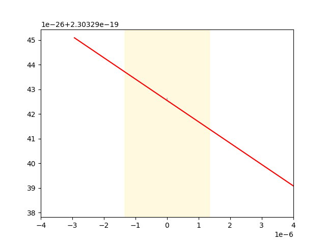


## Equation 4:
```
i_CaL_s__i_KL_s = 6.6757117035778174e-7 * (-5.4000000000000004 + ion_concentrations__K_i * exp(0.037459725942315905 * Vm_s__Vm_s)) * (i_CaL_s__Ccao + i_CaL_s__Co) * Vm_s__Vm_s * i_CaL_s_y_gate__y / ((-1.0 + exp(0.037459725942315905 * Vm_s__Vm_s)) * (1.0 - 20430.198966619231 * i_CaL_s__i_CaL_s - 20205.350866353103 * (0.001 * exp(0.07491945188463181 * Vm_t__Vm_t) - 0.34100000000000003 * ion_concentrations__Ca_t) * (i_CaL_t__TCcao + i_CaL_t__TCo) * Vm_t__Vm_t * i_CaL_t_y_gate__y * membrane_permeabilities__P_CaL / (-1.0 + exp(0.07491945188463181 * Vm_t__Vm_t))))
```
## New Eq:
```
i_CaL_s__i_KL_s = ((fabs(Vm_s__Vm_s) < 2.6695336787564767e-6) ? ((0.5 + 187298.62971157953 * Vm_s__Vm_s) * (1.7821037222369756e-12 * (-5.4000000000000004 + ion_concentrations__K_i * exp(9.9999999999999995e-8)) * (i_CaL_s__Ccao + i_CaL_s__Co) * i_CaL_s_y_gate__y / ((-1.0 + exp(9.9999999999999995e-8)) * (1.0 - 20430.198966619231 * i_CaL_s__i_CaL_s - 20205.350866353103 * (0.001 * exp(0.07491945188463181 * Vm_t__Vm_t) - 0.34100000000000003 * ion_concentrations__Ca_t) * (i_CaL_t__TCcao + i_CaL_t__TCo) * Vm_t__Vm_t * i_CaL_t_y_gate__y * membrane_permeabilities__P_CaL / (-1.0 + exp(0.07491945188463181 * Vm_t__Vm_t)))) + 1.7821037222369756e-12 * (-5.4000000000000004 + ion_concentrations__K_i * exp(-9.9999999999999995e-8)) * (i_CaL_s__Ccao + i_CaL_s__Co) * i_CaL_s_y_gate__y / ((-1.0 + exp(-9.9999999999999995e-8)) * (1.0 - 20430.198966619231 * i_CaL_s__i_CaL_s - 20205.350866353103 * (0.001 * exp(0.07491945188463181 * Vm_t__Vm_t) - 0.34100000000000003 * ion_concentrations__Ca_t) * (i_CaL_t__TCcao + i_CaL_t__TCo) * Vm_t__Vm_t * i_CaL_t_y_gate__y * membrane_permeabilities__P_CaL / (-1.0 + exp(0.07491945188463181 * Vm_t__Vm_t))))) - 1.7821037222369756e-12 * (-5.4000000000000004 + ion_concentrations__K_i * exp(-9.9999999999999995e-8)) * (i_CaL_s__Ccao + i_CaL_s__Co) * i_CaL_s_y_gate__y / ((-1.0 + exp(-9.9999999999999995e-8)) * (1.0 - 20430.198966619231 * i_CaL_s__i_CaL_s - 20205.350866353103 * (0.001 * exp(0.07491945188463181 * Vm_t__Vm_t) - 0.34100000000000003 * ion_concentrations__Ca_t) * (i_CaL_t__TCcao + i_CaL_t__TCo) * Vm_t__Vm_t * i_CaL_t_y_gate__y * membrane_permeabilities__P_CaL / (-1.0 + exp(0.07491945188463181 * Vm_t__Vm_t))))) : (6.6757117035778174e-7 * (-5.4000000000000004 + ion_concentrations__K_i * exp(0.037459725942315905 * Vm_s__Vm_s)) * (i_CaL_s__Ccao + i_CaL_s__Co) * Vm_s__Vm_s * i_CaL_s_y_gate__y / ((-1.0 + exp(0.037459725942315905 * Vm_s__Vm_s)) * (1.0 - 20430.198966619231 * i_CaL_s__i_CaL_s - 20205.350866353103 * (0.001 * exp(0.07491945188463181 * Vm_t__Vm_t) - 0.34100000000000003 * ion_concentrations__Ca_t) * (i_CaL_t__TCcao + i_CaL_t__TCo) * Vm_t__Vm_t * i_CaL_t_y_gate__y * membrane_permeabilities__P_CaL / (-1.0 + exp(0.07491945188463181 * Vm_t__Vm_t))))))
```
## Singularity point: 0


## Equation 5:
```
i_nsK_s__i_nsK_s = 3.2045734132626158e-8 * (-4.0500000000000007 + 0.75 * ion_concentrations__K_i * exp(0.037459725942315905 * Vm_s__Vm_s)) * Vm_s__Vm_s / ((1.0 + 1.5625000000000003e-8 / pow(ion_concentrations__Ca_i, 3)) * (-1.0 + exp(0.037459725942315905 * Vm_s__Vm_s)))
```
## New Eq:
```
i_nsK_s__i_nsK_s = ((fabs(Vm_s__Vm_s) < 2.6695336787564767e-6) ? ((0.5 + 187298.62971157953 * Vm_s__Vm_s) * (8.554716652752149e-14 * (-4.0500000000000007 + 0.75 * ion_concentrations__K_i * exp(9.9999999999999995e-8)) / ((1.0 + 1.5625000000000003e-8 / pow(ion_concentrations__Ca_i, 3)) * (-1.0 + exp(9.9999999999999995e-8))) + 8.554716652752149e-14 * (-4.0500000000000007 + 0.75 * ion_concentrations__K_i * exp(-9.9999999999999995e-8)) / ((1.0 + 1.5625000000000003e-8 / pow(ion_concentrations__Ca_i, 3)) * (-1.0 + exp(-9.9999999999999995e-8)))) - 8.554716652752149e-14 * (-4.0500000000000007 + 0.75 * ion_concentrations__K_i * exp(-9.9999999999999995e-8)) / ((1.0 + 1.5625000000000003e-8 / pow(ion_concentrations__Ca_i, 3)) * (-1.0 + exp(-9.9999999999999995e-8)))) : (3.2045734132626158e-8 * (-4.0500000000000007 + 0.75 * ion_concentrations__K_i * exp(0.037459725942315905 * Vm_s__Vm_s)) * Vm_s__Vm_s / ((1.0 + 1.5625000000000003e-8 / pow(ion_concentrations__Ca_i, 3)) * (-1.0 + exp(0.037459725942315905 * Vm_s__Vm_s)))))
```
## Singularity point: 0
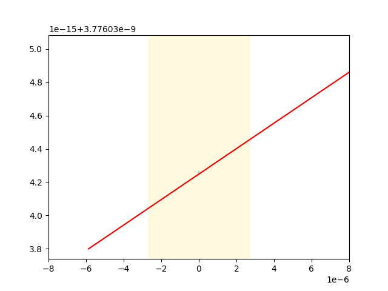


## Equation 6:
```
i_nsNa_s__i_nsNa_s = 3.2045734132626158e-8 * (-105.0 + 0.75 * ion_concentrations__Na_i * exp(0.037459725942315905 * Vm_s__Vm_s)) * Vm_s__Vm_s / ((1.0 + 1.5625000000000003e-8 / pow(ion_concentrations__Ca_i, 3)) * (-1.0 + exp(0.037459725942315905 * Vm_s__Vm_s)))
```
## New Eq:
```
i_nsNa_s__i_nsNa_s = ((fabs(Vm_s__Vm_s) < 2.6695336787564767e-6) ? ((0.5 + 187298.62971157953 * Vm_s__Vm_s) * (8.554716652752149e-14 * (-105.0 + 0.75 * ion_concentrations__Na_i * exp(9.9999999999999995e-8)) / ((1.0 + 1.5625000000000003e-8 / pow(ion_concentrations__Ca_i, 3)) * (-1.0 + exp(9.9999999999999995e-8))) + 8.554716652752149e-14 * (-105.0 + 0.75 * ion_concentrations__Na_i * exp(-9.9999999999999995e-8)) / ((1.0 + 1.5625000000000003e-8 / pow(ion_concentrations__Ca_i, 3)) * (-1.0 + exp(-9.9999999999999995e-8)))) - 8.554716652752149e-14 * (-105.0 + 0.75 * ion_concentrations__Na_i * exp(-9.9999999999999995e-8)) / ((1.0 + 1.5625000000000003e-8 / pow(ion_concentrations__Ca_i, 3)) * (-1.0 + exp(-9.9999999999999995e-8)))) : (3.2045734132626158e-8 * (-105.0 + 0.75 * ion_concentrations__Na_i * exp(0.037459725942315905 * Vm_s__Vm_s)) * Vm_s__Vm_s / ((1.0 + 1.5625000000000003e-8 / pow(ion_concentrations__Ca_i, 3)) * (-1.0 + exp(0.037459725942315905 * Vm_s__Vm_s)))))
```
## Singularity point: 0


# of singularities:  7
singularity processing time: 46.11860180000008
# Model: priebe_beuckelmann_1998(priebe_beuckelmann_1998.cellml)
No of piecewises: 20
## Equation 1:
```
INa_m_gate__alpha_m = 0.32000000000000001 * (47.130000000000003 + cell__V) / (1.0 - exp(-4.7130000000000001 - 0.10000000000000001 * cell__V))
```
## New Eq:
```
INa_m_gate__alpha_m = ((fabs(47.130000000000003 + cell__V) < 1.0000000000287557e-6) ? (3.200000000092018e-7 / (1.0 - exp(-1.0000000000287557e-7)) + (-23564999.499322373 - 499999.99998562218 * cell__V) * (-3.200000000092018e-7 / (1.0 - exp(1.0000000000287557e-7)) - 3.200000000092018e-7 / (1.0 - exp(-1.0000000000287557e-7)))) : (0.32000000000000001 * (47.130000000000003 + cell__V) / (1.0 - exp(-4.7130000000000001 - 0.10000000000000001 * cell__V))))
```
## Singularity point: -47.130000000000003


# of singularities:  1
singularity processing time: 5.053916000000072
# Model: ramirez_2000(ramirez_nattel_courtemanche_2000.cellml)
No of piecewises: 4
## Equation 1:
```
fast_sodium_current_m_gate__alpha_m = 0.32000000000000001 * (47.130000000000003 + membrane__V) / (1.0 - exp(-4.7130000000000001 - 0.10000000000000001 * membrane__V))
```
## New Eq:
```
fast_sodium_current_m_gate__alpha_m = ((fabs(47.130000000000003 + membrane__V) < 1.0000000000287557e-6) ? (3.200000000092018e-7 / (1.0 - exp(-1.0000000000287557e-7)) + (-23564999.499322373 - 499999.99998562218 * membrane__V) * (-3.200000000092018e-7 / (1.0 - exp(1.0000000000287557e-7)) - 3.200000000092018e-7 / (1.0 - exp(-1.0000000000287557e-7)))) : (0.32000000000000001 * (47.130000000000003 + membrane__V) / (1.0 - exp(-4.7130000000000001 - 0.10000000000000001 * membrane__V))))
```
## Singularity point: -47.130000000000003


## Equation 2:
```
rapid_delayed_rectifier_K_current_xr_gate__alpha_xr = 0.040000000000000001 * (-248.0 + membrane__V) / (1.0 - exp(8.8571428571428577 - 0.035714285714285712 * membrane__V))
```
## New Eq:
```
rapid_delayed_rectifier_K_current_xr_gate__alpha_xr = ((fabs(-248.0 + membrane__V) < 2.8000000000805159e-6) ? (1.1200000000322064e-7 / (1.0 - exp(-1.0000000000287557e-7)) + (44285714.784440823 - 178571.42856629365 * membrane__V) * (-1.1200000000322064e-7 / (1.0 - exp(1.0000000000287557e-7)) - 1.1200000000322064e-7 / (1.0 - exp(-1.0000000000287557e-7)))) : (0.040000000000000001 * (-248.0 + membrane__V) / (1.0 - exp(8.8571428571428577 - 0.035714285714285712 * membrane__V))))
```
## Singularity point: 248.00000000000000
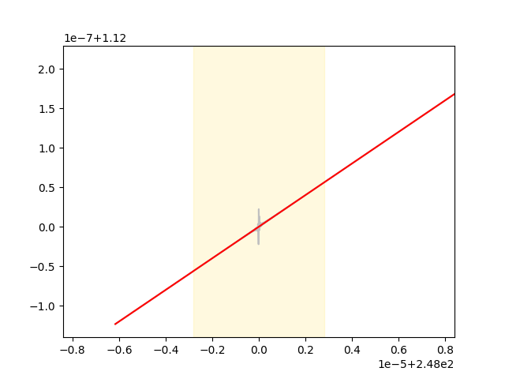


## Equation 3:
```
rapid_delayed_rectifier_K_current_xr_gate__beta_xr = 0.028000000000000001 * (163.0 + membrane__V) / (-1.0 + exp(7.7619047619047619 + 0.047619047619047616 * membrane__V))
```
## New Eq:
```
rapid_delayed_rectifier_K_current_xr_gate__beta_xr = ((fabs(163.0 + membrane__V) < 2.1000000000048757e-6) ? (-5.8799999997027897e-8 / (-1.0 + exp(-9.9999999995936673e-8)) + (38809524.309433699 + 238095.23809468528 * membrane__V) * (5.8799999997027897e-8 / (-1.0 + exp(-9.9999999995936673e-8)) + 5.8800000003245146e-8 / (-1.0 + exp(1.0000000000287557e-7)))) : (0.028000000000000001 * (163.0 + membrane__V) / (-1.0 + exp(7.7619047619047619 + 0.047619047619047616 * membrane__V))))
```
## Singularity point: -163.00000000000000
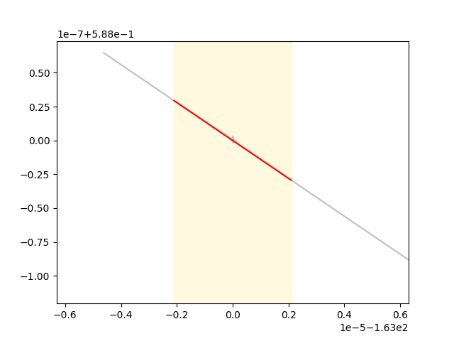


## Equation 4:
```
sarcolemmal_Ca_current_d_gate__tau_d = 28.571428571428569 * (1.0 - exp(-1.6025641025641024 - 0.16025641025641024 * membrane__V)) / ((1.0 + exp(-1.6025641025641024 - 0.16025641025641024 * membrane__V)) * (10.0 + membrane__V))
```
## New Eq:
```
sarcolemmal_Ca_current_d_gate__tau_d = ((fabs(10.0 + membrane__V) < 6.2399999999074307e-7) ? ((-8012820.0129393814 - 801282.05129393819 * membrane__V) * (-45787545.788225032 * (1.0 - exp(9.9999999997671396e-8)) / (1.0 + exp(9.9999999997671396e-8)) - 45787545.788225032 * (1.0 - exp(-9.9999999997671396e-8)) / (1.0 + exp(-9.9999999997671396e-8))) + 45787545.788225032 * (1.0 - exp(-9.9999999997671396e-8)) / (1.0 + exp(-9.9999999997671396e-8))) : (28.571428571428569 * (1.0 - exp(-1.6025641025641024 - 0.16025641025641024 * membrane__V)) / ((1.0 + exp(-1.6025641025641024 - 0.16025641025641024 * membrane__V)) * (10.0 + membrane__V))))
```
## Singularity point: -10.000000000000000


## Equation 5:
```
slow_delayed_rectifier_K_current_xs_gate__alpha_xs = 1.0000000000000001e-5 * (28.5 + membrane__V) / (1.0 - exp(-0.24782608695652175 - 0.0086956521739130436 * membrane__V))
```
## New Eq:
```
slow_delayed_rectifier_K_current_xs_gate__alpha_xs = ((fabs(28.5 + membrane__V) < 1.1500000000011501e-5) ? (1.1499999999997625e-10 / (1.0 - exp(-1.0000000000005664e-7)) + (-1239129.9347813695 - 43478.260869521735 * membrane__V) * (-1.1500000000025379e-10 / (1.0 - exp(1.0000000000027348e-7)) - 1.1499999999997625e-10 / (1.0 - exp(-1.0000000000005664e-7)))) : (1.0000000000000001e-5 * (28.5 + membrane__V) / (1.0 - exp(-0.24782608695652175 - 0.0086956521739130436 * membrane__V))))
```
## Singularity point: -28.500000000000000


## Equation 6:
```
slow_delayed_rectifier_K_current_xs_gate__beta_xs = 0.00023000000000000001 * (28.5 + membrane__V) / (-1.0 + exp(8.6363636363636367 + 0.30303030303030304 * membrane__V))
```
## New Eq:
```
slow_delayed_rectifier_K_current_xs_gate__beta_xs = ((fabs(28.5 + membrane__V) < 3.300000000205916e-7) ? (-7.5900000004736066e-11 / (-1.0 + exp(-1.0000000000287557e-7)) + (43181818.679123692 + 1515151.5150569715 * membrane__V) * (7.5900000004736066e-11 / (-1.0 + exp(1.0000000000287557e-7)) + 7.5900000004736066e-11 / (-1.0 + exp(-1.0000000000287557e-7)))) : (0.00023000000000000001 * (28.5 + membrane__V) / (-1.0 + exp(8.6363636363636367 + 0.30303030303030304 * membrane__V))))
```
## Singularity point: -28.500000000000000
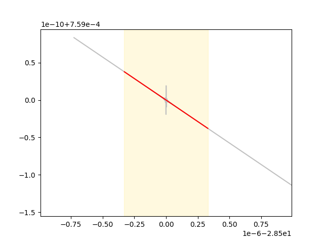


# of singularities:  6
singularity processing time: 25.196226000000024
# Model: sachse_model_2007(sachse_moreno_abildskov_2008_b.cellml)
No of piecewises: 0
## Equation 1:
```
I_Shkr__I_Shkr = 1120607.7015643802 * (-model_parameters__Ko * exp(-11.612515042117931 * membrane__Vm / model_parameters__T) + model_parameters__Ki) * I_Shkr__OShkr * I_Shkr__PShkr * membrane__Vm / ((1.0 - exp(-11.612515042117931 * membrane__Vm / model_parameters__T)) * model_parameters__T)
```
## New Eq:
```
I_Shkr__I_Shkr = ((fabs(membrane__Vm) < 8.6113989637305703e-9 * fabs(model_parameters__T)) ? (-58062575.210589655 * (-8.6113989637305703e-9 * model_parameters__T + membrane__Vm) * (-0.0096499999999999989 * (-model_parameters__Ko * exp(9.9999999999999995e-8) + model_parameters__Ki) * I_Shkr__OShkr * I_Shkr__PShkr / (1.0 - exp(9.9999999999999995e-8)) - 0.0096499999999999989 * (-model_parameters__Ko * exp(-9.9999999999999995e-8) + model_parameters__Ki) * I_Shkr__OShkr * I_Shkr__PShkr / (1.0 - exp(-9.9999999999999995e-8))) / model_parameters__T + 0.0096499999999999989 * (-model_parameters__Ko * exp(-9.9999999999999995e-8) + model_parameters__Ki) * I_Shkr__OShkr * I_Shkr__PShkr / (1.0 - exp(-9.9999999999999995e-8))) : (1120607.7015643802 * (-model_parameters__Ko * exp(-11.612515042117931 * membrane__Vm / model_parameters__T) + model_parameters__Ki) * I_Shkr__OShkr * I_Shkr__PShkr * membrane__Vm / ((1.0 - exp(-11.612515042117931 * membrane__Vm / model_parameters__T)) * model_parameters__T)))
```
## Singularity point: 0


# of singularities:  1
singularity processing time: 4.026057000000037
# Model: sakmann_model_2000_epi(sakmann_model_2000_epi.cellml)
No of piecewises: 1
## Equation 1:
```
L_type_Ca_channel__i_Ca_L_Ca_ds = 0.016470911962008009 * (-50.0 + membrane__V) * (intracellular_calcium_concentration__Ca_i * exp(3.7433890822745473) - extracellular_calcium_concentration__Ca_o * exp(3.7433890822745473 - 0.074867781645490947 * membrane__V)) * L_type_Ca_channel_d_gate__d * L_type_Ca_channel_f2ds_gate__f2ds * L_type_Ca_channel_f_gate__f / (1.0 - exp(3.7433890822745473 - 0.074867781645490947 * membrane__V))
```
## New Eq:
```
L_type_Ca_channel__i_Ca_L_Ca_ds = ((fabs(-50.0 + membrane__V) < 1.3356880329551402e-6) ? ((18716945.911788113 - 374338.90823576227 * membrane__V) * (-2.1999999999511763e-8 * (intracellular_calcium_concentration__Ca_i * exp(3.7433890822745473) - extracellular_calcium_concentration__Ca_o * exp(9.9999999999406119e-8)) * L_type_Ca_channel_d_gate__d * L_type_Ca_channel_f2ds_gate__f2ds * L_type_Ca_channel_f_gate__f / (1.0 - exp(9.9999999999406119e-8)) - 2.1999999999511763e-8 * (intracellular_calcium_concentration__Ca_i * exp(3.7433890822745473) - extracellular_calcium_concentration__Ca_o * exp(-9.9999999999406119e-8)) * L_type_Ca_channel_d_gate__d * L_type_Ca_channel_f2ds_gate__f2ds * L_type_Ca_channel_f_gate__f / (1.0 - exp(-9.9999999999406119e-8))) + 2.1999999999511763e-8 * (intracellular_calcium_concentration__Ca_i * exp(3.7433890822745473) - extracellular_calcium_concentration__Ca_o * exp(-9.9999999999406119e-8)) * L_type_Ca_channel_d_gate__d * L_type_Ca_channel_f2ds_gate__f2ds * L_type_Ca_channel_f_gate__f / (1.0 - exp(-9.9999999999406119e-8))) : (0.016470911962008009 * (-50.0 + membrane__V) * (intracellular_calcium_concentration__Ca_i * exp(3.7433890822745473) - extracellular_calcium_concentration__Ca_o * exp(3.7433890822745473 - 0.074867781645490947 * membrane__V)) * L_type_Ca_channel_d_gate__d * L_type_Ca_channel_f2ds_gate__f2ds * L_type_Ca_channel_f_gate__f / (1.0 - exp(3.7433890822745473 - 0.074867781645490947 * membrane__V))))
```
## Singularity point: 50.000000000000000
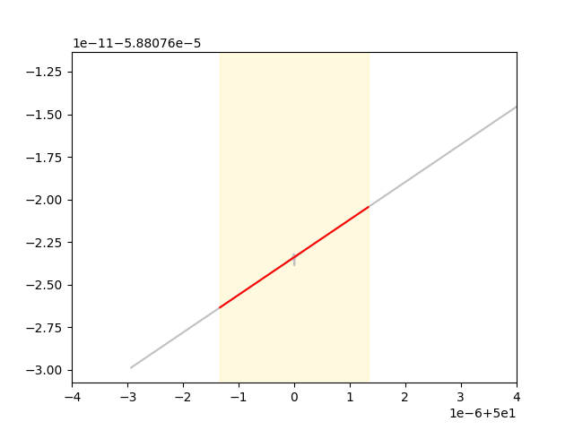


## Equation 2:
```
L_type_Ca_channel__i_Ca_L_K_ds = 8.2354559810040044e-6 * (-50.0 + membrane__V) * (intracellular_potassium_concentration__K_i * exp(1.8716945411372736) - extracellular_potassium_concentration__K_o * exp(1.8716945411372736 - 0.037433890822745473 * membrane__V)) * L_type_Ca_channel_d_gate__d * L_type_Ca_channel_f2ds_gate__f2ds * L_type_Ca_channel_f_gate__f / (1.0 - exp(1.8716945411372736 - 0.037433890822745473 * membrane__V))
```
## New Eq:
```
L_type_Ca_channel__i_Ca_L_K_ds = ((fabs(-50.0 + membrane__V) < 2.6713760659657915e-6) ? ((9358473.2056995872 - 187169.45411399176 * membrane__V) * (-2.1999999999968924e-11 * (intracellular_potassium_concentration__K_i * exp(1.8716945411372736) - extracellular_potassium_concentration__K_o * exp(9.9999999999406119e-8)) * L_type_Ca_channel_d_gate__d * L_type_Ca_channel_f2ds_gate__f2ds * L_type_Ca_channel_f_gate__f / (1.0 - exp(9.9999999999406119e-8)) - 2.1999999999968924e-11 * (intracellular_potassium_concentration__K_i * exp(1.8716945411372736) - extracellular_potassium_concentration__K_o * exp(-9.9999999999406119e-8)) * L_type_Ca_channel_d_gate__d * L_type_Ca_channel_f2ds_gate__f2ds * L_type_Ca_channel_f_gate__f / (1.0 - exp(-9.9999999999406119e-8))) + 2.1999999999968924e-11 * (intracellular_potassium_concentration__K_i * exp(1.8716945411372736) - extracellular_potassium_concentration__K_o * exp(-9.9999999999406119e-8)) * L_type_Ca_channel_d_gate__d * L_type_Ca_channel_f2ds_gate__f2ds * L_type_Ca_channel_f_gate__f / (1.0 - exp(-9.9999999999406119e-8))) : (8.2354559810040044e-6 * (-50.0 + membrane__V) * (intracellular_potassium_concentration__K_i * exp(1.8716945411372736) - extracellular_potassium_concentration__K_o * exp(1.8716945411372736 - 0.037433890822745473 * membrane__V)) * L_type_Ca_channel_d_gate__d * L_type_Ca_channel_f2ds_gate__f2ds * L_type_Ca_channel_f_gate__f / (1.0 - exp(1.8716945411372736 - 0.037433890822745473 * membrane__V))))
```
## Singularity point: 50.000000000000000


## Equation 3:
```
L_type_Ca_channel__i_Ca_L_Na_ds = 4.1177279905020022e-5 * (-50.0 + membrane__V) * (intracellular_sodium_concentration__Na_i * exp(1.8716945411372736) - extracellular_sodium_concentration__Na_o * exp(1.8716945411372736 - 0.037433890822745473 * membrane__V)) * L_type_Ca_channel_d_gate__d * L_type_Ca_channel_f2ds_gate__f2ds * L_type_Ca_channel_f_gate__f / (1.0 - exp(1.8716945411372736 - 0.037433890822745473 * membrane__V))
```
## New Eq:
```
L_type_Ca_channel__i_Ca_L_Na_ds = ((fabs(-50.0 + membrane__V) < 2.6713760659657915e-6) ? ((9358473.2056995872 - 187169.45411399176 * membrane__V) * (-1.0999999999984461e-10 * (intracellular_sodium_concentration__Na_i * exp(1.8716945411372736) - extracellular_sodium_concentration__Na_o * exp(9.9999999999406119e-8)) * L_type_Ca_channel_d_gate__d * L_type_Ca_channel_f2ds_gate__f2ds * L_type_Ca_channel_f_gate__f / (1.0 - exp(9.9999999999406119e-8)) - 1.0999999999984461e-10 * (intracellular_sodium_concentration__Na_i * exp(1.8716945411372736) - extracellular_sodium_concentration__Na_o * exp(-9.9999999999406119e-8)) * L_type_Ca_channel_d_gate__d * L_type_Ca_channel_f2ds_gate__f2ds * L_type_Ca_channel_f_gate__f / (1.0 - exp(-9.9999999999406119e-8))) + 1.0999999999984461e-10 * (intracellular_sodium_concentration__Na_i * exp(1.8716945411372736) - extracellular_sodium_concentration__Na_o * exp(-9.9999999999406119e-8)) * L_type_Ca_channel_d_gate__d * L_type_Ca_channel_f2ds_gate__f2ds * L_type_Ca_channel_f_gate__f / (1.0 - exp(-9.9999999999406119e-8))) : (4.1177279905020022e-5 * (-50.0 + membrane__V) * (intracellular_sodium_concentration__Na_i * exp(1.8716945411372736) - extracellular_sodium_concentration__Na_o * exp(1.8716945411372736 - 0.037433890822745473 * membrane__V)) * L_type_Ca_channel_d_gate__d * L_type_Ca_channel_f2ds_gate__f2ds * L_type_Ca_channel_f_gate__f / (1.0 - exp(1.8716945411372736 - 0.037433890822745473 * membrane__V))))
```
## Singularity point: 50.000000000000000


## Equation 4:
```
L_type_Ca_channel_d_gate__alpha_d = 30.0 * (19.0 + membrane__V) / (1.0 - exp(-2.6388888888888888 - 0.1388888888888889 * membrane__V))
```
## New Eq:
```
L_type_Ca_channel_d_gate__alpha_d = ((fabs(19.0 + membrane__V) < 7.1999999999572406e-7) ? (2.1599999999455388e-5 / (1.0 - exp(-9.9999999999406119e-8)) + (-13194443.944522804 - 694444.44444856863 * membrane__V) * (-2.1600000000288055e-5 / (1.0 - exp(9.9999999999406119e-8)) - 2.1599999999455388e-5 / (1.0 - exp(-9.9999999999406119e-8)))) : (30.0 * (19.0 + membrane__V) / (1.0 - exp(-2.6388888888888888 - 0.1388888888888889 * membrane__V))))
```
## Singularity point: -19.000000000000000


## Equation 5:
```
L_type_Ca_channel_d_gate__beta_d = 12.0 * (19.0 + membrane__V) / (-1.0 + exp(1.0555555555555556 + 0.055555555555555552 * membrane__V))
```
## New Eq:
```
L_type_Ca_channel_d_gate__beta_d = ((fabs(19.0 + membrane__V) < 1.799999999996249e-6) ? (-2.1599999999954989e-5 / (-1.0 + exp(-9.9999999999406119e-8)) + (5277778.277788776 + 277777.77777835663 * membrane__V) * (2.1599999999954989e-5 / (-1.0 + exp(9.9999999999406119e-8)) + 2.1599999999954989e-5 / (-1.0 + exp(-9.9999999999406119e-8)))) : (12.0 * (19.0 + membrane__V) / (-1.0 + exp(1.0555555555555556 + 0.055555555555555552 * membrane__V))))
```
## Singularity point: -19.000000000000000


## Equation 6:
```
L_type_Ca_channel_f_gate__alpha_f = 6.25 * (34.0 + membrane__V) / (-1.0 + exp(6.666666666666667 + 0.19607843137254904 * membrane__V))
```
## New Eq:
```
L_type_Ca_channel_f_gate__alpha_f = ((fabs(34.0 + membrane__V) < 5.1000000000911427e-7) ? (-3.1875000000569642e-6 / (-1.0 + exp(-1.0000000000287557e-7)) + (33333333.832737628 + 980392.15684522444 * membrane__V) * (3.1875000000569642e-6 / (-1.0 + exp(1.0000000000287557e-7)) + 3.1875000000569642e-6 / (-1.0 + exp(-1.0000000000287557e-7)))) : (6.25 * (34.0 + membrane__V) / (-1.0 + exp(6.666666666666667 + 0.19607843137254904 * membrane__V))))
```
## Singularity point: -34.000000000000000
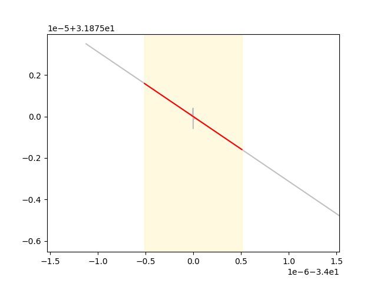


## Equation 7:
```
fast_sodium_current_m_gate__alpha_m = 200.0 * (41.0 + membrane__V) / (1.0 - exp(-4.1000000000000005 - 0.10000000000000001 * membrane__V))
```
## New Eq:
```
fast_sodium_current_m_gate__alpha_m = ((fabs(41.0 + membrane__V) < 1.0000000000287557e-6) ? (0.00020000000000575113 / (1.0 - exp(-1.0000000000287557e-7)) + (-20499999.49941051 - 499999.99998562218 * membrane__V) * (-0.00020000000000575113 / (1.0 - exp(1.0000000000287557e-7)) - 0.00020000000000575113 / (1.0 - exp(-1.0000000000287557e-7)))) : (200.0 * (41.0 + membrane__V) / (1.0 - exp(-4.1000000000000005 - 0.10000000000000001 * membrane__V))))
```
## Singularity point: -41.000000000000000


## Equation 8:
```
rapid_delayed_rectifier_potassium_current_xr_gate__tau_xr = 0.001 / (0.00060999999999999997 * (38.899999999999999 + membrane__V) / (-1.0 + exp(5.6404999999999994 + 0.14499999999999999 * membrane__V)) + 0.0013799999999999999 * (14.199999999999999 + membrane__V) / (1.0 - exp(-1.7465999999999999 - 0.123 * membrane__V)))
```
## New Eq:
```
rapid_delayed_rectifier_potassium_current_xr_gate__tau_xr = 0.001 / (((fabs(14.199999999999999 + membrane__V) < 8.1300813007528783e-7) ? (1.1219512195134727e-9 / (1.0 - exp(-9.9999999999406119e-8)) + (-8732999.5000645891 - 615000.00000454858 * membrane__V) * (-1.1219512194943214e-9 / (1.0 - exp(9.9999999999406119e-8)) - 1.1219512195134727e-9 / (1.0 - exp(-9.9999999999406119e-8)))) : (0.0013799999999999999 * (14.199999999999999 + membrane__V) / (1.0 - exp(-1.7465999999999999 - 0.123 * membrane__V)))) + ((fabs(38.899999999999999 + membrane__V) < 6.896551724422384e-7) ? (-4.2068965517283451e-10 / (-1.0 + exp(-1.0000000000287557e-7)) + (28202500.498836767 + 724999.99997009686 * membrane__V) * (4.2068965517283451e-10 / (-1.0 + exp(-1.0000000000287557e-7)) + 4.2068965520669629e-10 / (-1.0 + exp(1.0000000000287557e-7)))) : (0.00060999999999999997 * (38.899999999999999 + membrane__V) / (-1.0 + exp(5.6404999999999994 + 0.14499999999999999 * membrane__V)))))
```
## Singularity point: -14.199999999999999


## Singularity point: -38.899999999999999


## Equation 9:
```
slow_delayed_rectifier_potassium_current_xs_gate__tau_xs = 0.001 / (0.00013100000000000001 * (30.0 + membrane__V) / (-1.0 + exp(2.0609999999999999 + 0.068699999999999997 * membrane__V)) + 7.1899999999999999e-5 * (30.0 + membrane__V) / (1.0 - exp(-4.4399999999999995 - 0.14799999999999999 * membrane__V)))
```
## New Eq:
```
slow_delayed_rectifier_potassium_current_xs_gate__tau_xs = 0.001 * ((fabs(30.0 + membrane__V) < 1.455604075689676e-6) ? (1 / (-1.0465793304208771e-10 / (1.0 - exp(2.1542940320529169e-7)) - 1.9068413391534758e-10 / (-1.0 + exp(-9.9999999999406119e-8)) + (10305000.50001229 + 343500.00000040967 * membrane__V) * (1.0465793304208771e-10 / (1.0 - exp(2.1542940320529169e-7)) + 1.0465793304208771e-10 / (1.0 - exp(-2.1542940320529169e-7)) + 1.9068413391534758e-10 / (-1.0 + exp(9.9999999999406119e-8)) + 1.9068413391534758e-10 / (-1.0 + exp(-9.9999999999406119e-8))))) : (1 / (0.00013100000000000001 * (30.0 + membrane__V) / (-1.0 + exp(2.0609999999999999 + 0.068699999999999997 * membrane__V)) + 7.1899999999999999e-5 * (30.0 + membrane__V) / (1.0 - exp(-4.4399999999999995 - 0.14799999999999999 * membrane__V)))))
```
## Singularity point: -30.000000000000000


# of singularities:  10
singularity processing time: 54.19783440000015
# Model: shannon_wang_puglisi_weber_bers_2004_model_updated(shannon_wang_puglisi_weber_bers_2004.cellml)
No of piecewises: 4
## Equation 1:
```
ICaL_d_gate__tau_d = 28.571428571428569 * (1.0 - exp(-2.4166666666666665 - 0.16666666666666666 * cell__V)) / ((1.0 + exp(-2.4166666666666665 - 0.16666666666666666 * cell__V)) * (14.5 + cell__V))
```
## New Eq:
```
ICaL_d_gate__tau_d = ((fabs(14.5 + cell__V) < 5.9999999999643672e-7) ? ((-12083332.833405094 - 833333.3333382823 * cell__V) * (-47619047.619881123 * (1.0 - exp(-9.9999999999406119e-8)) / (1.0 + exp(-9.9999999999406119e-8)) - 47619047.618779711 * (1.0 - exp(9.9999999999406119e-8)) / (1.0 + exp(9.9999999999406119e-8))) + 47619047.619881123 * (1.0 - exp(-9.9999999999406119e-8)) / (1.0 + exp(-9.9999999999406119e-8))) : (28.571428571428569 * (1.0 - exp(-2.4166666666666665 - 0.16666666666666666 * cell__V)) / ((1.0 + exp(-2.4166666666666665 - 0.16666666666666666 * cell__V)) * (14.5 + cell__V))))
```
## Singularity point: -14.500000000000000


## Equation 2:
```
IKr_Xr_gate__tau_Xr = 1 / (0.00060999999999999997 * (10.0 + cell__V) / (-1.0 + exp(1.45 + 0.14499999999999999 * cell__V)) + 0.0013799999999999999 * (7.0 + cell__V) / (1.0 - exp(-0.86099999999999999 - 0.123 * cell__V)))
```
## New Eq:
```
IKr_Xr_gate__tau_Xr = 1 / (((fabs(7.0 + cell__V) < 8.1300813008222672e-7) ? (1.1219512195134727e-9 / (1.0 - exp(-1.0000000000027348e-7)) + (-4304999.4999950975 - 614999.99999929965 * cell__V) * (-1.1219512195134727e-9 / (1.0 - exp(1.0000000000027348e-7)) - 1.1219512195134727e-9 / (1.0 - exp(-1.0000000000027348e-7)))) : (0.0013799999999999999 * (7.0 + cell__V) / (1.0 - exp(-0.86099999999999999 - 0.123 * cell__V)))) + ((fabs(10.0 + cell__V) < 6.8965517241448282e-7) ? (-4.2068965517283451e-10 / (-1.0 + exp(-9.9999999999406119e-8)) + (7250000.4999927497 + 724999.99999927497 * cell__V) * (4.2068965517283451e-10 / (-1.0 + exp(9.9999999999406119e-8)) + 4.2068965517283451e-10 / (-1.0 + exp(-9.9999999999406119e-8)))) : (0.00060999999999999997 * (10.0 + cell__V) / (-1.0 + exp(1.45 + 0.14499999999999999 * cell__V)))))
```
## Singularity point: -10.000000000000000
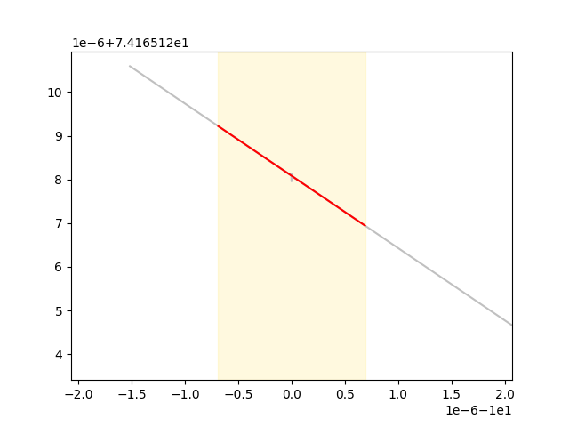

## Singularity point: -7.0000000000000000
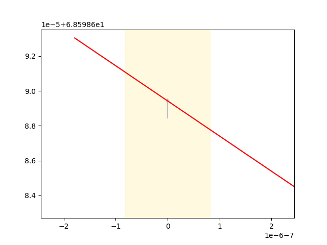


## Equation 3:
```
IKs_Xs_gate__tau_Xs = 1 / (0.00013100000000000001 * (30.0 + cell__V) / (-1.0 + exp(2.0609999999999999 + 0.068699999999999997 * cell__V)) + 7.1899999999999999e-5 * (30.0 + cell__V) / (1.0 - exp(-4.4399999999999995 - 0.14799999999999999 * cell__V)))
```
## New Eq:
```
IKs_Xs_gate__tau_Xs = ((fabs(30.0 + cell__V) < 1.455604075689676e-6) ? (1 / (-1.0465793304208771e-10 / (1.0 - exp(2.1542940320529169e-7)) - 1.9068413391534758e-10 / (-1.0 + exp(-9.9999999999406119e-8)) + (10305000.50001229 + 343500.00000040967 * cell__V) * (1.0465793304208771e-10 / (1.0 - exp(2.1542940320529169e-7)) + 1.0465793304208771e-10 / (1.0 - exp(-2.1542940320529169e-7)) + 1.9068413391534758e-10 / (-1.0 + exp(9.9999999999406119e-8)) + 1.9068413391534758e-10 / (-1.0 + exp(-9.9999999999406119e-8))))) : (1 / (0.00013100000000000001 * (30.0 + cell__V) / (-1.0 + exp(2.0609999999999999 + 0.068699999999999997 * cell__V)) + 7.1899999999999999e-5 * (30.0 + cell__V) / (1.0 - exp(-4.4399999999999995 - 0.14799999999999999 * cell__V)))))
```
## Singularity point: -30.000000000000000


## Equation 4:
```
INa_m_gate__alpha_m = 0.32000000000000001 * (47.130000000000003 + cell__V) / (1.0 - exp(-4.7130000000000001 - 0.10000000000000001 * cell__V))
```
## New Eq:
```
INa_m_gate__alpha_m = ((fabs(47.130000000000003 + cell__V) < 1.0000000000287557e-6) ? (3.200000000092018e-7 / (1.0 - exp(-1.0000000000287557e-7)) + (-23564999.499322373 - 499999.99998562218 * cell__V) * (-3.200000000092018e-7 / (1.0 - exp(1.0000000000287557e-7)) - 3.200000000092018e-7 / (1.0 - exp(-1.0000000000287557e-7)))) : (0.32000000000000001 * (47.130000000000003 + cell__V) / (1.0 - exp(-4.7130000000000001 - 0.10000000000000001 * cell__V))))
```
## Singularity point: -47.130000000000003


## Equation 5:
```
ICaL__i_CaL_Ca_SL = 0.18000000000000002 * pow(1.8, (-31.0 + 0.10000000000000001 * model_parameters__T)) * pow(model_parameters__F, 2) * (1.0 - ICaL_fCa_gate__fCaB_SL) * (-0.34100000000000003 * model_parameters__Cao + 0.34100000000000003 * Ca_buffer__Ca_SL * exp(2.0 * cell__V * model_parameters__F / (model_parameters__R * model_parameters__T))) * ICaL__PCa * ICaL_d_gate__d * ICaL_f_gate__f * cell__V / ((-1.0 + exp(2.0 * cell__V * model_parameters__F / (model_parameters__R * model_parameters__T))) * model_parameters__R * model_parameters__T)
```
## New Eq:
```
ICaL__i_CaL_Ca_SL = ((fabs(cell__V) < 4.9999999999999998e-8 * fabs(model_parameters__R * model_parameters__T / model_parameters__F)) ? (10000000.0 * (4.9999999999999998e-8 * model_parameters__R * model_parameters__T / model_parameters__F + cell__V) * (8.9999999999999995e-9 * pow(1.8, (-31.0 + 0.10000000000000001 * model_parameters__T)) * (1.0 - ICaL_fCa_gate__fCaB_SL) * (-0.34100000000000003 * model_parameters__Cao + 0.34100000000000003 * Ca_buffer__Ca_SL * exp(9.9999999999999995e-8)) * ICaL__PCa * ICaL_d_gate__d * ICaL_f_gate__f * model_parameters__F / (-1.0 + exp(9.9999999999999995e-8)) + 8.9999999999999995e-9 * pow(1.8, (-31.0 + 0.10000000000000001 * model_parameters__T)) * (1.0 - ICaL_fCa_gate__fCaB_SL) * (-0.34100000000000003 * model_parameters__Cao + 0.34100000000000003 * Ca_buffer__Ca_SL * exp(-9.9999999999999995e-8)) * ICaL__PCa * ICaL_d_gate__d * ICaL_f_gate__f * model_parameters__F / (-1.0 + exp(-9.9999999999999995e-8))) * model_parameters__F / (model_parameters__R * model_parameters__T) - 8.9999999999999995e-9 * pow(1.8, (-31.0 + 0.10000000000000001 * model_parameters__T)) * (1.0 - ICaL_fCa_gate__fCaB_SL) * (-0.34100000000000003 * model_parameters__Cao + 0.34100000000000003 * Ca_buffer__Ca_SL * exp(-9.9999999999999995e-8)) * ICaL__PCa * ICaL_d_gate__d * ICaL_f_gate__f * model_parameters__F / (-1.0 + exp(-9.9999999999999995e-8))) : (0.18000000000000002 * pow(1.8, (-31.0 + 0.10000000000000001 * model_parameters__T)) * pow(model_parameters__F, 2) * (1.0 - ICaL_fCa_gate__fCaB_SL) * (-0.34100000000000003 * model_parameters__Cao + 0.34100000000000003 * Ca_buffer__Ca_SL * exp(2.0 * cell__V * model_parameters__F / (model_parameters__R * model_parameters__T))) * ICaL__PCa * ICaL_d_gate__d * ICaL_f_gate__f * cell__V / ((-1.0 + exp(2.0 * cell__V * model_parameters__F / (model_parameters__R * model_parameters__T))) * model_parameters__R * model_parameters__T)))
```
## Singularity point: 0


## Equation 6:
```
ICaL__i_CaL_Ca_jct = 1.6200000000000001 * pow(1.8, (-31.0 + 0.10000000000000001 * model_parameters__T)) * pow(model_parameters__F, 2) * (1.0 - ICaL_fCa_gate__fCaB_jct) * (-0.34100000000000003 * model_parameters__Cao + 0.34100000000000003 * Ca_buffer__Ca_jct * exp(2.0 * cell__V * model_parameters__F / (model_parameters__R * model_parameters__T))) * ICaL__PCa * ICaL_d_gate__d * ICaL_f_gate__f * cell__V / ((-1.0 + exp(2.0 * cell__V * model_parameters__F / (model_parameters__R * model_parameters__T))) * model_parameters__R * model_parameters__T)
```
## New Eq:
```
ICaL__i_CaL_Ca_jct = ((fabs(cell__V) < 4.9999999999999998e-8 * fabs(model_parameters__R * model_parameters__T / model_parameters__F)) ? (10000000.0 * (4.9999999999999998e-8 * model_parameters__R * model_parameters__T / model_parameters__F + cell__V) * (8.0999999999999997e-8 * pow(1.8, (-31.0 + 0.10000000000000001 * model_parameters__T)) * (1.0 - ICaL_fCa_gate__fCaB_jct) * (-0.34100000000000003 * model_parameters__Cao + 0.34100000000000003 * Ca_buffer__Ca_jct * exp(9.9999999999999995e-8)) * ICaL__PCa * ICaL_d_gate__d * ICaL_f_gate__f * model_parameters__F / (-1.0 + exp(9.9999999999999995e-8)) + 8.0999999999999997e-8 * pow(1.8, (-31.0 + 0.10000000000000001 * model_parameters__T)) * (1.0 - ICaL_fCa_gate__fCaB_jct) * (-0.34100000000000003 * model_parameters__Cao + 0.34100000000000003 * Ca_buffer__Ca_jct * exp(-9.9999999999999995e-8)) * ICaL__PCa * ICaL_d_gate__d * ICaL_f_gate__f * model_parameters__F / (-1.0 + exp(-9.9999999999999995e-8))) * model_parameters__F / (model_parameters__R * model_parameters__T) - 8.0999999999999997e-8 * pow(1.8, (-31.0 + 0.10000000000000001 * model_parameters__T)) * (1.0 - ICaL_fCa_gate__fCaB_jct) * (-0.34100000000000003 * model_parameters__Cao + 0.34100000000000003 * Ca_buffer__Ca_jct * exp(-9.9999999999999995e-8)) * ICaL__PCa * ICaL_d_gate__d * ICaL_f_gate__f * model_parameters__F / (-1.0 + exp(-9.9999999999999995e-8))) : (1.6200000000000001 * pow(1.8, (-31.0 + 0.10000000000000001 * model_parameters__T)) * pow(model_parameters__F, 2) * (1.0 - ICaL_fCa_gate__fCaB_jct) * (-0.34100000000000003 * model_parameters__Cao + 0.34100000000000003 * Ca_buffer__Ca_jct * exp(2.0 * cell__V * model_parameters__F / (model_parameters__R * model_parameters__T))) * ICaL__PCa * ICaL_d_gate__d * ICaL_f_gate__f * cell__V / ((-1.0 + exp(2.0 * cell__V * model_parameters__F / (model_parameters__R * model_parameters__T))) * model_parameters__R * model_parameters__T)))
```
## Singularity point: 0


## Equation 7:
```
ICaL__i_CaL_K = 1.215e-7 * pow(1.8, (-31.0 + 0.10000000000000001 * model_parameters__T)) * pow(model_parameters__F, 2) * (-0.75 * model_parameters__Ko + 0.75 * model_parameters__Ki * exp(cell__V * model_parameters__F / (model_parameters__R * model_parameters__T))) * (1.0 - 0.10000000000000001 * ICaL_fCa_gate__fCaB_SL - 0.90000000000000002 * ICaL_fCa_gate__fCaB_jct) * ICaL_d_gate__d * ICaL_f_gate__f * cell__V / ((-1.0 + exp(cell__V * model_parameters__F / (model_parameters__R * model_parameters__T))) * model_parameters__R * model_parameters__T)
```
## New Eq:
```
ICaL__i_CaL_K = ((fabs(cell__V) < 9.9999999999999995e-8 * fabs(model_parameters__R * model_parameters__T / model_parameters__F)) ? (5000000.0 * (9.9999999999999995e-8 * model_parameters__R * model_parameters__T / model_parameters__F + cell__V) * (1.2150000000000001e-14 * pow(1.8, (-31.0 + 0.10000000000000001 * model_parameters__T)) * (-0.75 * model_parameters__Ko + 0.75 * model_parameters__Ki * exp(9.9999999999999995e-8)) * (1.0 - 0.10000000000000001 * ICaL_fCa_gate__fCaB_SL - 0.90000000000000002 * ICaL_fCa_gate__fCaB_jct) * ICaL_d_gate__d * ICaL_f_gate__f * model_parameters__F / (-1.0 + exp(9.9999999999999995e-8)) + 1.2150000000000001e-14 * pow(1.8, (-31.0 + 0.10000000000000001 * model_parameters__T)) * (-0.75 * model_parameters__Ko + 0.75 * model_parameters__Ki * exp(-9.9999999999999995e-8)) * (1.0 - 0.10000000000000001 * ICaL_fCa_gate__fCaB_SL - 0.90000000000000002 * ICaL_fCa_gate__fCaB_jct) * ICaL_d_gate__d * ICaL_f_gate__f * model_parameters__F / (-1.0 + exp(-9.9999999999999995e-8))) * model_parameters__F / (model_parameters__R * model_parameters__T) - 1.2150000000000001e-14 * pow(1.8, (-31.0 + 0.10000000000000001 * model_parameters__T)) * (-0.75 * model_parameters__Ko + 0.75 * model_parameters__Ki * exp(-9.9999999999999995e-8)) * (1.0 - 0.10000000000000001 * ICaL_fCa_gate__fCaB_SL - 0.90000000000000002 * ICaL_fCa_gate__fCaB_jct) * ICaL_d_gate__d * ICaL_f_gate__f * model_parameters__F / (-1.0 + exp(-9.9999999999999995e-8))) : (1.215e-7 * pow(1.8, (-31.0 + 0.10000000000000001 * model_parameters__T)) * pow(model_parameters__F, 2) * (-0.75 * model_parameters__Ko + 0.75 * model_parameters__Ki * exp(cell__V * model_parameters__F / (model_parameters__R * model_parameters__T))) * (1.0 - 0.10000000000000001 * ICaL_fCa_gate__fCaB_SL - 0.90000000000000002 * ICaL_fCa_gate__fCaB_jct) * ICaL_d_gate__d * ICaL_f_gate__f * cell__V / ((-1.0 + exp(cell__V * model_parameters__F / (model_parameters__R * model_parameters__T))) * model_parameters__R * model_parameters__T)))
```
## Singularity point: 0
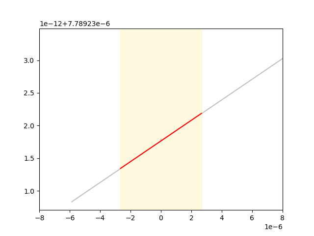


## Equation 8:
```
ICaL__i_CaL_Na_SL = 6.7499999999999994e-10 * pow(1.8, (-31.0 + 0.10000000000000001 * model_parameters__T)) * pow(model_parameters__F, 2) * (1.0 - ICaL_fCa_gate__fCaB_SL) * (-0.75 * model_parameters__Nao + 0.75 * Na_buffer__Na_SL * exp(cell__V * model_parameters__F / (model_parameters__R * model_parameters__T))) * ICaL_d_gate__d * ICaL_f_gate__f * cell__V / ((-1.0 + exp(cell__V * model_parameters__F / (model_parameters__R * model_parameters__T))) * model_parameters__R * model_parameters__T)
```
## New Eq:
```
ICaL__i_CaL_Na_SL = ((fabs(cell__V) < 9.9999999999999995e-8 * fabs(model_parameters__R * model_parameters__T / model_parameters__F)) ? (5000000.0 * (9.9999999999999995e-8 * model_parameters__R * model_parameters__T / model_parameters__F + cell__V) * (6.75e-17 * pow(1.8, (-31.0 + 0.10000000000000001 * model_parameters__T)) * (1.0 - ICaL_fCa_gate__fCaB_SL) * (-0.75 * model_parameters__Nao + 0.75 * Na_buffer__Na_SL * exp(9.9999999999999995e-8)) * ICaL_d_gate__d * ICaL_f_gate__f * model_parameters__F / (-1.0 + exp(9.9999999999999995e-8)) + 6.75e-17 * pow(1.8, (-31.0 + 0.10000000000000001 * model_parameters__T)) * (1.0 - ICaL_fCa_gate__fCaB_SL) * (-0.75 * model_parameters__Nao + 0.75 * Na_buffer__Na_SL * exp(-9.9999999999999995e-8)) * ICaL_d_gate__d * ICaL_f_gate__f * model_parameters__F / (-1.0 + exp(-9.9999999999999995e-8))) * model_parameters__F / (model_parameters__R * model_parameters__T) - 6.75e-17 * pow(1.8, (-31.0 + 0.10000000000000001 * model_parameters__T)) * (1.0 - ICaL_fCa_gate__fCaB_SL) * (-0.75 * model_parameters__Nao + 0.75 * Na_buffer__Na_SL * exp(-9.9999999999999995e-8)) * ICaL_d_gate__d * ICaL_f_gate__f * model_parameters__F / (-1.0 + exp(-9.9999999999999995e-8))) : (6.7499999999999994e-10 * pow(1.8, (-31.0 + 0.10000000000000001 * model_parameters__T)) * pow(model_parameters__F, 2) * (1.0 - ICaL_fCa_gate__fCaB_SL) * (-0.75 * model_parameters__Nao + 0.75 * Na_buffer__Na_SL * exp(cell__V * model_parameters__F / (model_parameters__R * model_parameters__T))) * ICaL_d_gate__d * ICaL_f_gate__f * cell__V / ((-1.0 + exp(cell__V * model_parameters__F / (model_parameters__R * model_parameters__T))) * model_parameters__R * model_parameters__T)))
```
## Singularity point: 0
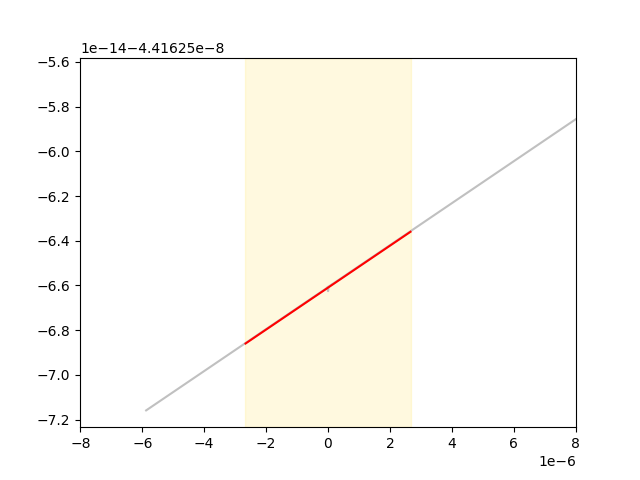


## Equation 9:
```
ICaL__i_CaL_Na_jct = 6.0749999999999998e-9 * pow(1.8, (-31.0 + 0.10000000000000001 * model_parameters__T)) * pow(model_parameters__F, 2) * (1.0 - ICaL_fCa_gate__fCaB_jct) * (-0.75 * model_parameters__Nao + 0.75 * Na_buffer__Na_jct * exp(cell__V * model_parameters__F / (model_parameters__R * model_parameters__T))) * ICaL_d_gate__d * ICaL_f_gate__f * cell__V / ((-1.0 + exp(cell__V * model_parameters__F / (model_parameters__R * model_parameters__T))) * model_parameters__R * model_parameters__T)
```
## New Eq:
```
ICaL__i_CaL_Na_jct = ((fabs(cell__V) < 9.9999999999999995e-8 * fabs(model_parameters__R * model_parameters__T / model_parameters__F)) ? (5000000.0 * (9.9999999999999995e-8 * model_parameters__R * model_parameters__T / model_parameters__F + cell__V) * (6.0749999999999991e-16 * pow(1.8, (-31.0 + 0.10000000000000001 * model_parameters__T)) * (1.0 - ICaL_fCa_gate__fCaB_jct) * (-0.75 * model_parameters__Nao + 0.75 * Na_buffer__Na_jct * exp(9.9999999999999995e-8)) * ICaL_d_gate__d * ICaL_f_gate__f * model_parameters__F / (-1.0 + exp(9.9999999999999995e-8)) + 6.0749999999999991e-16 * pow(1.8, (-31.0 + 0.10000000000000001 * model_parameters__T)) * (1.0 - ICaL_fCa_gate__fCaB_jct) * (-0.75 * model_parameters__Nao + 0.75 * Na_buffer__Na_jct * exp(-9.9999999999999995e-8)) * ICaL_d_gate__d * ICaL_f_gate__f * model_parameters__F / (-1.0 + exp(-9.9999999999999995e-8))) * model_parameters__F / (model_parameters__R * model_parameters__T) - 6.0749999999999991e-16 * pow(1.8, (-31.0 + 0.10000000000000001 * model_parameters__T)) * (1.0 - ICaL_fCa_gate__fCaB_jct) * (-0.75 * model_parameters__Nao + 0.75 * Na_buffer__Na_jct * exp(-9.9999999999999995e-8)) * ICaL_d_gate__d * ICaL_f_gate__f * model_parameters__F / (-1.0 + exp(-9.9999999999999995e-8))) : (6.0749999999999998e-9 * pow(1.8, (-31.0 + 0.10000000000000001 * model_parameters__T)) * pow(model_parameters__F, 2) * (1.0 - ICaL_fCa_gate__fCaB_jct) * (-0.75 * model_parameters__Nao + 0.75 * Na_buffer__Na_jct * exp(cell__V * model_parameters__F / (model_parameters__R * model_parameters__T))) * ICaL_d_gate__d * ICaL_f_gate__f * cell__V / ((-1.0 + exp(cell__V * model_parameters__F / (model_parameters__R * model_parameters__T))) * model_parameters__R * model_parameters__T)))
```
## Singularity point: 0


# of singularities:  10
singularity processing time: 55.13438560000009
# Model: stewart_zhang_model_2008(stewart_zhang_model_2008_ss.cellml)
No of piecewises: 4
## Equation 1:
```
L_type_Ca_current__i_CaL = 14447.286958825251 * (-15.0 + membrane__V) * (-calcium_dynamics__Ca_o + 0.25 * calcium_dynamics__Ca_ss * exp(-1.1230167246823641 + 0.074867781645490947 * membrane__V)) * L_type_Ca_current__g_CaL * L_type_Ca_current_d_gate__d * L_type_Ca_current_f2_gate__f2 * L_type_Ca_current_fCass_gate__fCass * L_type_Ca_current_f_gate__f / (-1.0 + exp(-1.1230167246823641 + 0.074867781645490947 * membrane__V))
```
## New Eq:
```
L_type_Ca_current__i_CaL = ((fabs(-15.0 + membrane__V) < 1.3356880329828957e-6) ? ((-5615083.1234197523 + 374338.90822798351 * membrane__V) * (0.019297068299972742 * (-calcium_dynamics__Ca_o + 0.25 * calcium_dynamics__Ca_ss * exp(9.9999999999406119e-8)) * L_type_Ca_current__g_CaL * L_type_Ca_current_d_gate__d * L_type_Ca_current_f2_gate__f2 * L_type_Ca_current_fCass_gate__fCass * L_type_Ca_current_f_gate__f / (-1.0 + exp(9.9999999999406119e-8)) + 0.019297068299972742 * (-calcium_dynamics__Ca_o + 0.25 * calcium_dynamics__Ca_ss * exp(-9.9999999999406119e-8)) * L_type_Ca_current__g_CaL * L_type_Ca_current_d_gate__d * L_type_Ca_current_f2_gate__f2 * L_type_Ca_current_fCass_gate__fCass * L_type_Ca_current_f_gate__f / (-1.0 + exp(-9.9999999999406119e-8))) - 0.019297068299972742 * (-calcium_dynamics__Ca_o + 0.25 * calcium_dynamics__Ca_ss * exp(-9.9999999999406119e-8)) * L_type_Ca_current__g_CaL * L_type_Ca_current_d_gate__d * L_type_Ca_current_f2_gate__f2 * L_type_Ca_current_fCass_gate__fCass * L_type_Ca_current_f_gate__f / (-1.0 + exp(-9.9999999999406119e-8))) : (14447.286958825251 * (-15.0 + membrane__V) * (-calcium_dynamics__Ca_o + 0.25 * calcium_dynamics__Ca_ss * exp(-1.1230167246823641 + 0.074867781645490947 * membrane__V)) * L_type_Ca_current__g_CaL * L_type_Ca_current_d_gate__d * L_type_Ca_current_f2_gate__f2 * L_type_Ca_current_fCass_gate__fCass * L_type_Ca_current_f_gate__f / (-1.0 + exp(-1.1230167246823641 + 0.074867781645490947 * membrane__V))))
```
## Singularity point: 15.000000000000000


# of singularities:  1
singularity processing time: 5.6847832999999355
# Model: tentusscher_model_2004_endo(ten_tusscher_model_2004_endo.cellml)
No of piecewises: 7
## Equation 1:
```
L_type_Ca_current__i_CaL = 14447.286958825251 * (-0.34100000000000003 * calcium_dynamics__Ca_o + calcium_dynamics__Ca_i * exp(0.074867781645490947 * membrane__V)) * L_type_Ca_current__g_CaL * L_type_Ca_current_d_gate__d * L_type_Ca_current_fCa_gate__fCa * L_type_Ca_current_f_gate__f * membrane__V / (-1.0 + exp(0.074867781645490947 * membrane__V))
```
## New Eq:
```
L_type_Ca_current__i_CaL = ((fabs(membrane__V) < 1.3356880329847825e-6) ? ((0.5 + 374338.90822745475 * membrane__V) * (0.019297068299999998 * (-0.34100000000000003 * calcium_dynamics__Ca_o + calcium_dynamics__Ca_i * exp(9.9999999999999995e-8)) * L_type_Ca_current__g_CaL * L_type_Ca_current_d_gate__d * L_type_Ca_current_fCa_gate__fCa * L_type_Ca_current_f_gate__f / (-1.0 + exp(9.9999999999999995e-8)) + 0.019297068299999998 * (-0.34100000000000003 * calcium_dynamics__Ca_o + calcium_dynamics__Ca_i * exp(-9.9999999999999995e-8)) * L_type_Ca_current__g_CaL * L_type_Ca_current_d_gate__d * L_type_Ca_current_fCa_gate__fCa * L_type_Ca_current_f_gate__f / (-1.0 + exp(-9.9999999999999995e-8))) - 0.019297068299999998 * (-0.34100000000000003 * calcium_dynamics__Ca_o + calcium_dynamics__Ca_i * exp(-9.9999999999999995e-8)) * L_type_Ca_current__g_CaL * L_type_Ca_current_d_gate__d * L_type_Ca_current_fCa_gate__fCa * L_type_Ca_current_f_gate__f / (-1.0 + exp(-9.9999999999999995e-8))) : (14447.286958825251 * (-0.34100000000000003 * calcium_dynamics__Ca_o + calcium_dynamics__Ca_i * exp(0.074867781645490947 * membrane__V)) * L_type_Ca_current__g_CaL * L_type_Ca_current_d_gate__d * L_type_Ca_current_fCa_gate__fCa * L_type_Ca_current_f_gate__f * membrane__V / (-1.0 + exp(0.074867781645490947 * membrane__V))))
```
## Singularity point: 0


# of singularities:  1
singularity processing time: 4.729239600000028
# Model: tentusscher_model_2004_epi(ten_tusscher_model_2004_epi.cellml)
No of piecewises: 7
## Equation 1:
```
L_type_Ca_current__i_CaL = 14447.286958825251 * (-0.34100000000000003 * calcium_dynamics__Ca_o + calcium_dynamics__Ca_i * exp(0.074867781645490947 * membrane__V)) * L_type_Ca_current__g_CaL * L_type_Ca_current_d_gate__d * L_type_Ca_current_fCa_gate__fCa * L_type_Ca_current_f_gate__f * membrane__V / (-1.0 + exp(0.074867781645490947 * membrane__V))
```
## New Eq:
```
L_type_Ca_current__i_CaL = ((fabs(membrane__V) < 1.3356880329847825e-6) ? ((0.5 + 374338.90822745475 * membrane__V) * (0.019297068299999998 * (-0.34100000000000003 * calcium_dynamics__Ca_o + calcium_dynamics__Ca_i * exp(9.9999999999999995e-8)) * L_type_Ca_current__g_CaL * L_type_Ca_current_d_gate__d * L_type_Ca_current_fCa_gate__fCa * L_type_Ca_current_f_gate__f / (-1.0 + exp(9.9999999999999995e-8)) + 0.019297068299999998 * (-0.34100000000000003 * calcium_dynamics__Ca_o + calcium_dynamics__Ca_i * exp(-9.9999999999999995e-8)) * L_type_Ca_current__g_CaL * L_type_Ca_current_d_gate__d * L_type_Ca_current_fCa_gate__fCa * L_type_Ca_current_f_gate__f / (-1.0 + exp(-9.9999999999999995e-8))) - 0.019297068299999998 * (-0.34100000000000003 * calcium_dynamics__Ca_o + calcium_dynamics__Ca_i * exp(-9.9999999999999995e-8)) * L_type_Ca_current__g_CaL * L_type_Ca_current_d_gate__d * L_type_Ca_current_fCa_gate__fCa * L_type_Ca_current_f_gate__f / (-1.0 + exp(-9.9999999999999995e-8))) : (14447.286958825251 * (-0.34100000000000003 * calcium_dynamics__Ca_o + calcium_dynamics__Ca_i * exp(0.074867781645490947 * membrane__V)) * L_type_Ca_current__g_CaL * L_type_Ca_current_d_gate__d * L_type_Ca_current_fCa_gate__fCa * L_type_Ca_current_f_gate__f * membrane__V / (-1.0 + exp(0.074867781645490947 * membrane__V))))
```
## Singularity point: 0


# of singularities:  1
singularity processing time: 5.635011599999871
# Model: tentusscher_model_2004_M(ten_tusscher_model_2004_M.cellml)
No of piecewises: 7
## Equation 1:
```
L_type_Ca_current__i_CaL = 14447.286958825251 * (-0.34100000000000003 * calcium_dynamics__Ca_o + calcium_dynamics__Ca_i * exp(0.074867781645490947 * membrane__V)) * L_type_Ca_current__g_CaL * L_type_Ca_current_d_gate__d * L_type_Ca_current_fCa_gate__fCa * L_type_Ca_current_f_gate__f * membrane__V / (-1.0 + exp(0.074867781645490947 * membrane__V))
```
## New Eq:
```
L_type_Ca_current__i_CaL = ((fabs(membrane__V) < 1.3356880329847825e-6) ? ((0.5 + 374338.90822745475 * membrane__V) * (0.019297068299999998 * (-0.34100000000000003 * calcium_dynamics__Ca_o + calcium_dynamics__Ca_i * exp(9.9999999999999995e-8)) * L_type_Ca_current__g_CaL * L_type_Ca_current_d_gate__d * L_type_Ca_current_fCa_gate__fCa * L_type_Ca_current_f_gate__f / (-1.0 + exp(9.9999999999999995e-8)) + 0.019297068299999998 * (-0.34100000000000003 * calcium_dynamics__Ca_o + calcium_dynamics__Ca_i * exp(-9.9999999999999995e-8)) * L_type_Ca_current__g_CaL * L_type_Ca_current_d_gate__d * L_type_Ca_current_fCa_gate__fCa * L_type_Ca_current_f_gate__f / (-1.0 + exp(-9.9999999999999995e-8))) - 0.019297068299999998 * (-0.34100000000000003 * calcium_dynamics__Ca_o + calcium_dynamics__Ca_i * exp(-9.9999999999999995e-8)) * L_type_Ca_current__g_CaL * L_type_Ca_current_d_gate__d * L_type_Ca_current_fCa_gate__fCa * L_type_Ca_current_f_gate__f / (-1.0 + exp(-9.9999999999999995e-8))) : (14447.286958825251 * (-0.34100000000000003 * calcium_dynamics__Ca_o + calcium_dynamics__Ca_i * exp(0.074867781645490947 * membrane__V)) * L_type_Ca_current__g_CaL * L_type_Ca_current_d_gate__d * L_type_Ca_current_fCa_gate__fCa * L_type_Ca_current_f_gate__f * membrane__V / (-1.0 + exp(0.074867781645490947 * membrane__V))))
```
## Singularity point: 0


# of singularities:  1
singularity processing time: 5.289575100000093
# Model: tentusscher_model_2006_endo(ten_tusscher_model_2006_endo.cellml)
No of piecewises: 4
## Equation 1:
```
L_type_Ca_current__temp = (-15.0 + membrane__V) * (-calcium_dynamics__Ca_o + 0.25 * calcium_dynamics__Ca_ss * exp(-1.1230167246823641 + 0.074867781645490947 * membrane__V)) / (-1.0 + exp(-1.1230167246823641 + 0.074867781645490947 * membrane__V))
```
## New Eq:
```
L_type_Ca_current__temp = ((fabs(-15.0 + membrane__V) < 1.3356880329828957e-6) ? ((-5615083.1234197523 + 374338.90822798351 * membrane__V) * (1.3356880329828957e-6 * (-calcium_dynamics__Ca_o + 0.25 * calcium_dynamics__Ca_ss * exp(9.9999999999406119e-8)) / (-1.0 + exp(9.9999999999406119e-8)) + 1.3356880329828957e-6 * (-calcium_dynamics__Ca_o + 0.25 * calcium_dynamics__Ca_ss * exp(-9.9999999999406119e-8)) / (-1.0 + exp(-9.9999999999406119e-8))) - 1.3356880329828957e-6 * (-calcium_dynamics__Ca_o + 0.25 * calcium_dynamics__Ca_ss * exp(-9.9999999999406119e-8)) / (-1.0 + exp(-9.9999999999406119e-8))) : ((-15.0 + membrane__V) * (-calcium_dynamics__Ca_o + 0.25 * calcium_dynamics__Ca_ss * exp(-1.1230167246823641 + 0.074867781645490947 * membrane__V)) / (-1.0 + exp(-1.1230167246823641 + 0.074867781645490947 * membrane__V))))
```
## Singularity point: 15.000000000000000


# of singularities:  1
singularity processing time: 5.291159999999991
# Model: tentusscher_model_2006_epi(ten_tusscher_model_2006_epi.cellml)
No of piecewises: 4
## Equation 1:
```
L_type_Ca_current__temp = (-15.0 + membrane__V) * (-calcium_dynamics__Ca_o + 0.25 * calcium_dynamics__Ca_ss * exp(2.0 * (-15.0 + membrane__V) * membrane__F / (membrane__R * membrane__T))) / (-1.0 + exp(2.0 * (-15.0 + membrane__V) * membrane__F / (membrane__R * membrane__T)))
```
## New Eq:
```
L_type_Ca_current__temp = ((fabs(-15.0 + membrane__V) < 4.9999999999999998e-8 * fabs(membrane__R * membrane__T / membrane__F)) ? (10000000.0 * (4.9999999999999998e-8 * (-calcium_dynamics__Ca_o + 0.25 * calcium_dynamics__Ca_ss * exp(9.9999999999999995e-8)) * membrane__R * membrane__T / ((-1.0 + exp(9.9999999999999995e-8)) * membrane__F) + 4.9999999999999998e-8 * (-calcium_dynamics__Ca_o + 0.25 * calcium_dynamics__Ca_ss * exp(-9.9999999999999995e-8)) * membrane__R * membrane__T / ((-1.0 + exp(-9.9999999999999995e-8)) * membrane__F)) * (-15.0 + 4.9999999999999998e-8 * membrane__R * membrane__T / membrane__F + membrane__V) * membrane__F / (membrane__R * membrane__T) - 4.9999999999999998e-8 * (-calcium_dynamics__Ca_o + 0.25 * calcium_dynamics__Ca_ss * exp(-9.9999999999999995e-8)) * membrane__R * membrane__T / ((-1.0 + exp(-9.9999999999999995e-8)) * membrane__F)) : ((-15.0 + membrane__V) * (-calcium_dynamics__Ca_o + 0.25 * calcium_dynamics__Ca_ss * exp(2.0 * (-15.0 + membrane__V) * membrane__F / (membrane__R * membrane__T))) / (-1.0 + exp(2.0 * (-15.0 + membrane__V) * membrane__F / (membrane__R * membrane__T)))))
```
## Singularity point: 15.000000000000000


# of singularities:  1
singularity processing time: 6.351947800000062
# Model: tentusscher_model_2006_M(ten_tusscher_model_2006_M.cellml)
No of piecewises: 4
## Equation 1:
```
L_type_Ca_current__temp = (-15.0 + membrane__V) * (-calcium_dynamics__Ca_o + 0.25 * calcium_dynamics__Ca_ss * exp(-1.1230167246823641 + 0.074867781645490947 * membrane__V)) / (-1.0 + exp(-1.1230167246823641 + 0.074867781645490947 * membrane__V))
```
## New Eq:
```
L_type_Ca_current__temp = ((fabs(-15.0 + membrane__V) < 1.3356880329828957e-6) ? ((-5615083.1234197523 + 374338.90822798351 * membrane__V) * (1.3356880329828957e-6 * (-calcium_dynamics__Ca_o + 0.25 * calcium_dynamics__Ca_ss * exp(9.9999999999406119e-8)) / (-1.0 + exp(9.9999999999406119e-8)) + 1.3356880329828957e-6 * (-calcium_dynamics__Ca_o + 0.25 * calcium_dynamics__Ca_ss * exp(-9.9999999999406119e-8)) / (-1.0 + exp(-9.9999999999406119e-8))) - 1.3356880329828957e-6 * (-calcium_dynamics__Ca_o + 0.25 * calcium_dynamics__Ca_ss * exp(-9.9999999999406119e-8)) / (-1.0 + exp(-9.9999999999406119e-8))) : ((-15.0 + membrane__V) * (-calcium_dynamics__Ca_o + 0.25 * calcium_dynamics__Ca_ss * exp(-1.1230167246823641 + 0.074867781645490947 * membrane__V)) / (-1.0 + exp(-1.1230167246823641 + 0.074867781645490947 * membrane__V))))
```
## Singularity point: 15.000000000000000
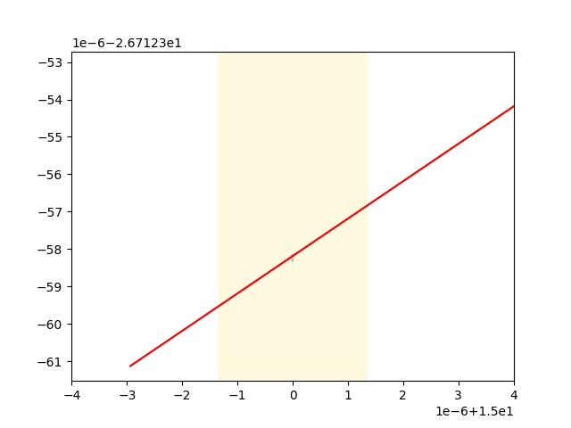


# of singularities:  1
singularity processing time: 5.947621099999878
# Model: Tomek_model13endo(ToRORd_fkatp_endo.cellml)
No of piecewises: 21
## Equation 1:
```
ICaL__PhiCaK_i = pow(physical_constants__F, 2) * (-extracellular__ko * exp(-2859.0635474831229 * pow(physical_constants__T, (-1.5)) * (-0.00014999999999999999 * extracellular__clo - 0.00014999999999999999 * extracellular__ko - 0.00014999999999999999 * extracellular__nao - 0.00059999999999999995 * extracellular__cao + 0.044721359549995794 * sqrt(0.25 * extracellular__clo + 0.25 * extracellular__ko + 0.25 * extracellular__nao + extracellular__cao) / (1.0 + 0.044721359549995794 * sqrt(0.25 * extracellular__clo + 0.25 * extracellular__ko + 0.25 * extracellular__nao + extracellular__cao)))) + intracellular_ions__ki * exp(-2859.0635474831229 * pow(physical_constants__T, (-1.5)) * (-0.00014999999999999999 * intracellular_ions__cli - 0.00014999999999999999 * intracellular_ions__ki - 0.00014999999999999999 * intracellular_ions__nai - 0.00059999999999999995 * intracellular_ions__cai + 0.044721359549995794 * sqrt(0.25 * intracellular_ions__cli + 0.25 * intracellular_ions__ki + 0.25 * intracellular_ions__nai + intracellular_ions__cai) / (1.0 + 0.044721359549995794 * sqrt(0.25 * intracellular_ions__cli + 0.25 * intracellular_ions__ki + 0.25 * intracellular_ions__nai + intracellular_ions__cai)))) * exp(membrane__v * physical_constants__F / (physical_constants__R * physical_constants__T))) * membrane__v / ((-1.0 + exp(membrane__v * physical_constants__F / (physical_constants__R * physical_constants__T))) * physical_constants__R * physical_constants__T)
```
## New Eq:
```
ICaL__PhiCaK_i = ((fabs(membrane__v) < 9.9999999999999995e-8 * fabs(physical_constants__R * physical_constants__T / physical_constants__F)) ? (-9.9999999999999995e-8 * (-extracellular__ko * exp(-2859.0635474831229 * pow(physical_constants__T, (-1.5)) * (-0.00014999999999999999 * extracellular__clo - 0.00014999999999999999 * extracellular__ko - 0.00014999999999999999 * extracellular__nao - 0.00059999999999999995 * extracellular__cao + 0.044721359549995794 * sqrt(0.25 * extracellular__clo + 0.25 * extracellular__ko + 0.25 * extracellular__nao + extracellular__cao) / (1.0 + 0.044721359549995794 * sqrt(0.25 * extracellular__clo + 0.25 * extracellular__ko + 0.25 * extracellular__nao + extracellular__cao)))) + intracellular_ions__ki * exp(-9.9999999999999995e-8) * exp(-2859.0635474831229 * pow(physical_constants__T, (-1.5)) * (-0.00014999999999999999 * intracellular_ions__cli - 0.00014999999999999999 * intracellular_ions__ki - 0.00014999999999999999 * intracellular_ions__nai - 0.00059999999999999995 * intracellular_ions__cai + 0.044721359549995794 * sqrt(0.25 * intracellular_ions__cli + 0.25 * intracellular_ions__ki + 0.25 * intracellular_ions__nai + intracellular_ions__cai) / (1.0 + 0.044721359549995794 * sqrt(0.25 * intracellular_ions__cli + 0.25 * intracellular_ions__ki + 0.25 * intracellular_ions__nai + intracellular_ions__cai))))) * physical_constants__F / (-1.0 + exp(-9.9999999999999995e-8)) + 5000000.0 * (9.9999999999999995e-8 * (-extracellular__ko * exp(-2859.0635474831229 * pow(physical_constants__T, (-1.5)) * (-0.00014999999999999999 * extracellular__clo - 0.00014999999999999999 * extracellular__ko - 0.00014999999999999999 * extracellular__nao - 0.00059999999999999995 * extracellular__cao + 0.044721359549995794 * sqrt(0.25 * extracellular__clo + 0.25 * extracellular__ko + 0.25 * extracellular__nao + extracellular__cao) / (1.0 + 0.044721359549995794 * sqrt(0.25 * extracellular__clo + 0.25 * extracellular__ko + 0.25 * extracellular__nao + extracellular__cao)))) + intracellular_ions__ki * exp(9.9999999999999995e-8) * exp(-2859.0635474831229 * pow(physical_constants__T, (-1.5)) * (-0.00014999999999999999 * intracellular_ions__cli - 0.00014999999999999999 * intracellular_ions__ki - 0.00014999999999999999 * intracellular_ions__nai - 0.00059999999999999995 * intracellular_ions__cai + 0.044721359549995794 * sqrt(0.25 * intracellular_ions__cli + 0.25 * intracellular_ions__ki + 0.25 * intracellular_ions__nai + intracellular_ions__cai) / (1.0 + 0.044721359549995794 * sqrt(0.25 * intracellular_ions__cli + 0.25 * intracellular_ions__ki + 0.25 * intracellular_ions__nai + intracellular_ions__cai))))) * physical_constants__F / (-1.0 + exp(9.9999999999999995e-8)) + 9.9999999999999995e-8 * (-extracellular__ko * exp(-2859.0635474831229 * pow(physical_constants__T, (-1.5)) * (-0.00014999999999999999 * extracellular__clo - 0.00014999999999999999 * extracellular__ko - 0.00014999999999999999 * extracellular__nao - 0.00059999999999999995 * extracellular__cao + 0.044721359549995794 * sqrt(0.25 * extracellular__clo + 0.25 * extracellular__ko + 0.25 * extracellular__nao + extracellular__cao) / (1.0 + 0.044721359549995794 * sqrt(0.25 * extracellular__clo + 0.25 * extracellular__ko + 0.25 * extracellular__nao + extracellular__cao)))) + intracellular_ions__ki * exp(-9.9999999999999995e-8) * exp(-2859.0635474831229 * pow(physical_constants__T, (-1.5)) * (-0.00014999999999999999 * intracellular_ions__cli - 0.00014999999999999999 * intracellular_ions__ki - 0.00014999999999999999 * intracellular_ions__nai - 0.00059999999999999995 * intracellular_ions__cai + 0.044721359549995794 * sqrt(0.25 * intracellular_ions__cli + 0.25 * intracellular_ions__ki + 0.25 * intracellular_ions__nai + intracellular_ions__cai) / (1.0 + 0.044721359549995794 * sqrt(0.25 * intracellular_ions__cli + 0.25 * intracellular_ions__ki + 0.25 * intracellular_ions__nai + intracellular_ions__cai))))) * physical_constants__F / (-1.0 + exp(-9.9999999999999995e-8))) * (9.9999999999999995e-8 * physical_constants__R * physical_constants__T / physical_constants__F + membrane__v) * physical_constants__F / (physical_constants__R * physical_constants__T)) : (pow(physical_constants__F, 2) * (-extracellular__ko * exp(-2859.0635474831229 * pow(physical_constants__T, (-1.5)) * (-0.00014999999999999999 * extracellular__clo - 0.00014999999999999999 * extracellular__ko - 0.00014999999999999999 * extracellular__nao - 0.00059999999999999995 * extracellular__cao + 0.044721359549995794 * sqrt(0.25 * extracellular__clo + 0.25 * extracellular__ko + 0.25 * extracellular__nao + extracellular__cao) / (1.0 + 0.044721359549995794 * sqrt(0.25 * extracellular__clo + 0.25 * extracellular__ko + 0.25 * extracellular__nao + extracellular__cao)))) + intracellular_ions__ki * exp(-2859.0635474831229 * pow(physical_constants__T, (-1.5)) * (-0.00014999999999999999 * intracellular_ions__cli - 0.00014999999999999999 * intracellular_ions__ki - 0.00014999999999999999 * intracellular_ions__nai - 0.00059999999999999995 * intracellular_ions__cai + 0.044721359549995794 * sqrt(0.25 * intracellular_ions__cli + 0.25 * intracellular_ions__ki + 0.25 * intracellular_ions__nai + intracellular_ions__cai) / (1.0 + 0.044721359549995794 * sqrt(0.25 * intracellular_ions__cli + 0.25 * intracellular_ions__ki + 0.25 * intracellular_ions__nai + intracellular_ions__cai)))) * exp(membrane__v * physical_constants__F / (physical_constants__R * physical_constants__T))) * membrane__v / ((-1.0 + exp(membrane__v * physical_constants__F / (physical_constants__R * physical_constants__T))) * physical_constants__R * physical_constants__T)))
```
## Singularity point: 0
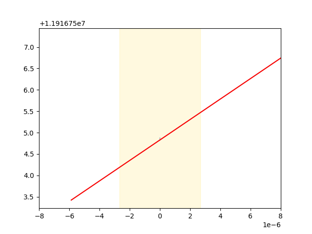


## Equation 2:
```
ICaL__PhiCaK_ss = pow(physical_constants__F, 2) * (-extracellular__ko * exp(-2859.0635474831229 * pow(physical_constants__T, (-1.5)) * (-0.00014999999999999999 * extracellular__clo - 0.00014999999999999999 * extracellular__ko - 0.00014999999999999999 * extracellular__nao - 0.00059999999999999995 * extracellular__cao + 0.044721359549995794 * sqrt(0.25 * extracellular__clo + 0.25 * extracellular__ko + 0.25 * extracellular__nao + extracellular__cao) / (1.0 + 0.044721359549995794 * sqrt(0.25 * extracellular__clo + 0.25 * extracellular__ko + 0.25 * extracellular__nao + extracellular__cao)))) + intracellular_ions__kss * exp(-2859.0635474831229 * pow(physical_constants__T, (-1.5)) * (-0.00014999999999999999 * intracellular_ions__cli - 0.00014999999999999999 * intracellular_ions__kss - 0.00014999999999999999 * intracellular_ions__nass - 0.00059999999999999995 * intracellular_ions__cass + 0.044721359549995794 * sqrt(0.25 * intracellular_ions__cli + 0.25 * intracellular_ions__kss + 0.25 * intracellular_ions__nass + intracellular_ions__cass) / (1.0 + 0.044721359549995794 * sqrt(0.25 * intracellular_ions__cli + 0.25 * intracellular_ions__kss + 0.25 * intracellular_ions__nass + intracellular_ions__cass)))) * exp(membrane__v * physical_constants__F / (physical_constants__R * physical_constants__T))) * membrane__v / ((-1.0 + exp(membrane__v * physical_constants__F / (physical_constants__R * physical_constants__T))) * physical_constants__R * physical_constants__T)
```
## New Eq:
```
ICaL__PhiCaK_ss = ((fabs(membrane__v) < 9.9999999999999995e-8 * fabs(physical_constants__R * physical_constants__T / physical_constants__F)) ? (-9.9999999999999995e-8 * (-extracellular__ko * exp(-2859.0635474831229 * pow(physical_constants__T, (-1.5)) * (-0.00014999999999999999 * extracellular__clo - 0.00014999999999999999 * extracellular__ko - 0.00014999999999999999 * extracellular__nao - 0.00059999999999999995 * extracellular__cao + 0.044721359549995794 * sqrt(0.25 * extracellular__clo + 0.25 * extracellular__ko + 0.25 * extracellular__nao + extracellular__cao) / (1.0 + 0.044721359549995794 * sqrt(0.25 * extracellular__clo + 0.25 * extracellular__ko + 0.25 * extracellular__nao + extracellular__cao)))) + intracellular_ions__kss * exp(-9.9999999999999995e-8) * exp(-2859.0635474831229 * pow(physical_constants__T, (-1.5)) * (-0.00014999999999999999 * intracellular_ions__cli - 0.00014999999999999999 * intracellular_ions__kss - 0.00014999999999999999 * intracellular_ions__nass - 0.00059999999999999995 * intracellular_ions__cass + 0.044721359549995794 * sqrt(0.25 * intracellular_ions__cli + 0.25 * intracellular_ions__kss + 0.25 * intracellular_ions__nass + intracellular_ions__cass) / (1.0 + 0.044721359549995794 * sqrt(0.25 * intracellular_ions__cli + 0.25 * intracellular_ions__kss + 0.25 * intracellular_ions__nass + intracellular_ions__cass))))) * physical_constants__F / (-1.0 + exp(-9.9999999999999995e-8)) + 5000000.0 * (9.9999999999999995e-8 * (-extracellular__ko * exp(-2859.0635474831229 * pow(physical_constants__T, (-1.5)) * (-0.00014999999999999999 * extracellular__clo - 0.00014999999999999999 * extracellular__ko - 0.00014999999999999999 * extracellular__nao - 0.00059999999999999995 * extracellular__cao + 0.044721359549995794 * sqrt(0.25 * extracellular__clo + 0.25 * extracellular__ko + 0.25 * extracellular__nao + extracellular__cao) / (1.0 + 0.044721359549995794 * sqrt(0.25 * extracellular__clo + 0.25 * extracellular__ko + 0.25 * extracellular__nao + extracellular__cao)))) + intracellular_ions__kss * exp(9.9999999999999995e-8) * exp(-2859.0635474831229 * pow(physical_constants__T, (-1.5)) * (-0.00014999999999999999 * intracellular_ions__cli - 0.00014999999999999999 * intracellular_ions__kss - 0.00014999999999999999 * intracellular_ions__nass - 0.00059999999999999995 * intracellular_ions__cass + 0.044721359549995794 * sqrt(0.25 * intracellular_ions__cli + 0.25 * intracellular_ions__kss + 0.25 * intracellular_ions__nass + intracellular_ions__cass) / (1.0 + 0.044721359549995794 * sqrt(0.25 * intracellular_ions__cli + 0.25 * intracellular_ions__kss + 0.25 * intracellular_ions__nass + intracellular_ions__cass))))) * physical_constants__F / (-1.0 + exp(9.9999999999999995e-8)) + 9.9999999999999995e-8 * (-extracellular__ko * exp(-2859.0635474831229 * pow(physical_constants__T, (-1.5)) * (-0.00014999999999999999 * extracellular__clo - 0.00014999999999999999 * extracellular__ko - 0.00014999999999999999 * extracellular__nao - 0.00059999999999999995 * extracellular__cao + 0.044721359549995794 * sqrt(0.25 * extracellular__clo + 0.25 * extracellular__ko + 0.25 * extracellular__nao + extracellular__cao) / (1.0 + 0.044721359549995794 * sqrt(0.25 * extracellular__clo + 0.25 * extracellular__ko + 0.25 * extracellular__nao + extracellular__cao)))) + intracellular_ions__kss * exp(-9.9999999999999995e-8) * exp(-2859.0635474831229 * pow(physical_constants__T, (-1.5)) * (-0.00014999999999999999 * intracellular_ions__cli - 0.00014999999999999999 * intracellular_ions__kss - 0.00014999999999999999 * intracellular_ions__nass - 0.00059999999999999995 * intracellular_ions__cass + 0.044721359549995794 * sqrt(0.25 * intracellular_ions__cli + 0.25 * intracellular_ions__kss + 0.25 * intracellular_ions__nass + intracellular_ions__cass) / (1.0 + 0.044721359549995794 * sqrt(0.25 * intracellular_ions__cli + 0.25 * intracellular_ions__kss + 0.25 * intracellular_ions__nass + intracellular_ions__cass))))) * physical_constants__F / (-1.0 + exp(-9.9999999999999995e-8))) * (9.9999999999999995e-8 * physical_constants__R * physical_constants__T / physical_constants__F + membrane__v) * physical_constants__F / (physical_constants__R * physical_constants__T)) : (pow(physical_constants__F, 2) * (-extracellular__ko * exp(-2859.0635474831229 * pow(physical_constants__T, (-1.5)) * (-0.00014999999999999999 * extracellular__clo - 0.00014999999999999999 * extracellular__ko - 0.00014999999999999999 * extracellular__nao - 0.00059999999999999995 * extracellular__cao + 0.044721359549995794 * sqrt(0.25 * extracellular__clo + 0.25 * extracellular__ko + 0.25 * extracellular__nao + extracellular__cao) / (1.0 + 0.044721359549995794 * sqrt(0.25 * extracellular__clo + 0.25 * extracellular__ko + 0.25 * extracellular__nao + extracellular__cao)))) + intracellular_ions__kss * exp(-2859.0635474831229 * pow(physical_constants__T, (-1.5)) * (-0.00014999999999999999 * intracellular_ions__cli - 0.00014999999999999999 * intracellular_ions__kss - 0.00014999999999999999 * intracellular_ions__nass - 0.00059999999999999995 * intracellular_ions__cass + 0.044721359549995794 * sqrt(0.25 * intracellular_ions__cli + 0.25 * intracellular_ions__kss + 0.25 * intracellular_ions__nass + intracellular_ions__cass) / (1.0 + 0.044721359549995794 * sqrt(0.25 * intracellular_ions__cli + 0.25 * intracellular_ions__kss + 0.25 * intracellular_ions__nass + intracellular_ions__cass)))) * exp(membrane__v * physical_constants__F / (physical_constants__R * physical_constants__T))) * membrane__v / ((-1.0 + exp(membrane__v * physical_constants__F / (physical_constants__R * physical_constants__T))) * physical_constants__R * physical_constants__T)))
```
## Singularity point: 0


## Equation 3:
```
ICaL__PhiCaL_i = 4.0 * pow(physical_constants__F, 2) * (-extracellular__cao * exp(-11436.254189932491 * pow(physical_constants__T, (-1.5)) * (-0.00014999999999999999 * extracellular__clo - 0.00014999999999999999 * extracellular__ko - 0.00014999999999999999 * extracellular__nao - 0.00059999999999999995 * extracellular__cao + 0.044721359549995794 * sqrt(0.25 * extracellular__clo + 0.25 * extracellular__ko + 0.25 * extracellular__nao + extracellular__cao) / (1.0 + 0.044721359549995794 * sqrt(0.25 * extracellular__clo + 0.25 * extracellular__ko + 0.25 * extracellular__nao + extracellular__cao)))) + intracellular_ions__cai * exp(-11436.254189932491 * pow(physical_constants__T, (-1.5)) * (-0.00014999999999999999 * intracellular_ions__cli - 0.00014999999999999999 * intracellular_ions__ki - 0.00014999999999999999 * intracellular_ions__nai - 0.00059999999999999995 * intracellular_ions__cai + 0.044721359549995794 * sqrt(0.25 * intracellular_ions__cli + 0.25 * intracellular_ions__ki + 0.25 * intracellular_ions__nai + intracellular_ions__cai) / (1.0 + 0.044721359549995794 * sqrt(0.25 * intracellular_ions__cli + 0.25 * intracellular_ions__ki + 0.25 * intracellular_ions__nai + intracellular_ions__cai)))) * exp(2.0 * membrane__v * physical_constants__F / (physical_constants__R * physical_constants__T))) * membrane__v / ((-1.0 + exp(2.0 * membrane__v * physical_constants__F / (physical_constants__R * physical_constants__T))) * physical_constants__R * physical_constants__T)
```
## New Eq:
```
ICaL__PhiCaL_i = ((fabs(membrane__v) < 4.9999999999999998e-8 * fabs(physical_constants__R * physical_constants__T / physical_constants__F)) ? (-1.9999999999999999e-7 * (-extracellular__cao * exp(-11436.254189932491 * pow(physical_constants__T, (-1.5)) * (-0.00014999999999999999 * extracellular__clo - 0.00014999999999999999 * extracellular__ko - 0.00014999999999999999 * extracellular__nao - 0.00059999999999999995 * extracellular__cao + 0.044721359549995794 * sqrt(0.25 * extracellular__clo + 0.25 * extracellular__ko + 0.25 * extracellular__nao + extracellular__cao) / (1.0 + 0.044721359549995794 * sqrt(0.25 * extracellular__clo + 0.25 * extracellular__ko + 0.25 * extracellular__nao + extracellular__cao)))) + intracellular_ions__cai * exp(-9.9999999999999995e-8) * exp(-11436.254189932491 * pow(physical_constants__T, (-1.5)) * (-0.00014999999999999999 * intracellular_ions__cli - 0.00014999999999999999 * intracellular_ions__ki - 0.00014999999999999999 * intracellular_ions__nai - 0.00059999999999999995 * intracellular_ions__cai + 0.044721359549995794 * sqrt(0.25 * intracellular_ions__cli + 0.25 * intracellular_ions__ki + 0.25 * intracellular_ions__nai + intracellular_ions__cai) / (1.0 + 0.044721359549995794 * sqrt(0.25 * intracellular_ions__cli + 0.25 * intracellular_ions__ki + 0.25 * intracellular_ions__nai + intracellular_ions__cai))))) * physical_constants__F / (-1.0 + exp(-9.9999999999999995e-8)) + 10000000.0 * (4.9999999999999998e-8 * physical_constants__R * physical_constants__T / physical_constants__F + membrane__v) * (1.9999999999999999e-7 * (-extracellular__cao * exp(-11436.254189932491 * pow(physical_constants__T, (-1.5)) * (-0.00014999999999999999 * extracellular__clo - 0.00014999999999999999 * extracellular__ko - 0.00014999999999999999 * extracellular__nao - 0.00059999999999999995 * extracellular__cao + 0.044721359549995794 * sqrt(0.25 * extracellular__clo + 0.25 * extracellular__ko + 0.25 * extracellular__nao + extracellular__cao) / (1.0 + 0.044721359549995794 * sqrt(0.25 * extracellular__clo + 0.25 * extracellular__ko + 0.25 * extracellular__nao + extracellular__cao)))) + intracellular_ions__cai * exp(9.9999999999999995e-8) * exp(-11436.254189932491 * pow(physical_constants__T, (-1.5)) * (-0.00014999999999999999 * intracellular_ions__cli - 0.00014999999999999999 * intracellular_ions__ki - 0.00014999999999999999 * intracellular_ions__nai - 0.00059999999999999995 * intracellular_ions__cai + 0.044721359549995794 * sqrt(0.25 * intracellular_ions__cli + 0.25 * intracellular_ions__ki + 0.25 * intracellular_ions__nai + intracellular_ions__cai) / (1.0 + 0.044721359549995794 * sqrt(0.25 * intracellular_ions__cli + 0.25 * intracellular_ions__ki + 0.25 * intracellular_ions__nai + intracellular_ions__cai))))) * physical_constants__F / (-1.0 + exp(9.9999999999999995e-8)) + 1.9999999999999999e-7 * (-extracellular__cao * exp(-11436.254189932491 * pow(physical_constants__T, (-1.5)) * (-0.00014999999999999999 * extracellular__clo - 0.00014999999999999999 * extracellular__ko - 0.00014999999999999999 * extracellular__nao - 0.00059999999999999995 * extracellular__cao + 0.044721359549995794 * sqrt(0.25 * extracellular__clo + 0.25 * extracellular__ko + 0.25 * extracellular__nao + extracellular__cao) / (1.0 + 0.044721359549995794 * sqrt(0.25 * extracellular__clo + 0.25 * extracellular__ko + 0.25 * extracellular__nao + extracellular__cao)))) + intracellular_ions__cai * exp(-9.9999999999999995e-8) * exp(-11436.254189932491 * pow(physical_constants__T, (-1.5)) * (-0.00014999999999999999 * intracellular_ions__cli - 0.00014999999999999999 * intracellular_ions__ki - 0.00014999999999999999 * intracellular_ions__nai - 0.00059999999999999995 * intracellular_ions__cai + 0.044721359549995794 * sqrt(0.25 * intracellular_ions__cli + 0.25 * intracellular_ions__ki + 0.25 * intracellular_ions__nai + intracellular_ions__cai) / (1.0 + 0.044721359549995794 * sqrt(0.25 * intracellular_ions__cli + 0.25 * intracellular_ions__ki + 0.25 * intracellular_ions__nai + intracellular_ions__cai))))) * physical_constants__F / (-1.0 + exp(-9.9999999999999995e-8))) * physical_constants__F / (physical_constants__R * physical_constants__T)) : (4.0 * pow(physical_constants__F, 2) * (-extracellular__cao * exp(-11436.254189932491 * pow(physical_constants__T, (-1.5)) * (-0.00014999999999999999 * extracellular__clo - 0.00014999999999999999 * extracellular__ko - 0.00014999999999999999 * extracellular__nao - 0.00059999999999999995 * extracellular__cao + 0.044721359549995794 * sqrt(0.25 * extracellular__clo + 0.25 * extracellular__ko + 0.25 * extracellular__nao + extracellular__cao) / (1.0 + 0.044721359549995794 * sqrt(0.25 * extracellular__clo + 0.25 * extracellular__ko + 0.25 * extracellular__nao + extracellular__cao)))) + intracellular_ions__cai * exp(-11436.254189932491 * pow(physical_constants__T, (-1.5)) * (-0.00014999999999999999 * intracellular_ions__cli - 0.00014999999999999999 * intracellular_ions__ki - 0.00014999999999999999 * intracellular_ions__nai - 0.00059999999999999995 * intracellular_ions__cai + 0.044721359549995794 * sqrt(0.25 * intracellular_ions__cli + 0.25 * intracellular_ions__ki + 0.25 * intracellular_ions__nai + intracellular_ions__cai) / (1.0 + 0.044721359549995794 * sqrt(0.25 * intracellular_ions__cli + 0.25 * intracellular_ions__ki + 0.25 * intracellular_ions__nai + intracellular_ions__cai)))) * exp(2.0 * membrane__v * physical_constants__F / (physical_constants__R * physical_constants__T))) * membrane__v / ((-1.0 + exp(2.0 * membrane__v * physical_constants__F / (physical_constants__R * physical_constants__T))) * physical_constants__R * physical_constants__T)))
```
## Singularity point: 0


## Equation 4:
```
ICaL__PhiCaL_ss = 4.0 * pow(physical_constants__F, 2) * (-extracellular__cao * exp(-11436.254189932491 * pow(physical_constants__T, (-1.5)) * (-0.00014999999999999999 * extracellular__clo - 0.00014999999999999999 * extracellular__ko - 0.00014999999999999999 * extracellular__nao - 0.00059999999999999995 * extracellular__cao + 0.044721359549995794 * sqrt(0.25 * extracellular__clo + 0.25 * extracellular__ko + 0.25 * extracellular__nao + extracellular__cao) / (1.0 + 0.044721359549995794 * sqrt(0.25 * extracellular__clo + 0.25 * extracellular__ko + 0.25 * extracellular__nao + extracellular__cao)))) + intracellular_ions__cass * exp(-11436.254189932491 * pow(physical_constants__T, (-1.5)) * (-0.00014999999999999999 * intracellular_ions__cli - 0.00014999999999999999 * intracellular_ions__kss - 0.00014999999999999999 * intracellular_ions__nass - 0.00059999999999999995 * intracellular_ions__cass + 0.044721359549995794 * sqrt(0.25 * intracellular_ions__cli + 0.25 * intracellular_ions__kss + 0.25 * intracellular_ions__nass + intracellular_ions__cass) / (1.0 + 0.044721359549995794 * sqrt(0.25 * intracellular_ions__cli + 0.25 * intracellular_ions__kss + 0.25 * intracellular_ions__nass + intracellular_ions__cass)))) * exp(2.0 * membrane__v * physical_constants__F / (physical_constants__R * physical_constants__T))) * membrane__v / ((-1.0 + exp(2.0 * membrane__v * physical_constants__F / (physical_constants__R * physical_constants__T))) * physical_constants__R * physical_constants__T)
```
## New Eq:
```
ICaL__PhiCaL_ss = ((fabs(membrane__v) < 4.9999999999999998e-8 * fabs(physical_constants__R * physical_constants__T / physical_constants__F)) ? (-1.9999999999999999e-7 * (-extracellular__cao * exp(-11436.254189932491 * pow(physical_constants__T, (-1.5)) * (-0.00014999999999999999 * extracellular__clo - 0.00014999999999999999 * extracellular__ko - 0.00014999999999999999 * extracellular__nao - 0.00059999999999999995 * extracellular__cao + 0.044721359549995794 * sqrt(0.25 * extracellular__clo + 0.25 * extracellular__ko + 0.25 * extracellular__nao + extracellular__cao) / (1.0 + 0.044721359549995794 * sqrt(0.25 * extracellular__clo + 0.25 * extracellular__ko + 0.25 * extracellular__nao + extracellular__cao)))) + intracellular_ions__cass * exp(-9.9999999999999995e-8) * exp(-11436.254189932491 * pow(physical_constants__T, (-1.5)) * (-0.00014999999999999999 * intracellular_ions__cli - 0.00014999999999999999 * intracellular_ions__kss - 0.00014999999999999999 * intracellular_ions__nass - 0.00059999999999999995 * intracellular_ions__cass + 0.044721359549995794 * sqrt(0.25 * intracellular_ions__cli + 0.25 * intracellular_ions__kss + 0.25 * intracellular_ions__nass + intracellular_ions__cass) / (1.0 + 0.044721359549995794 * sqrt(0.25 * intracellular_ions__cli + 0.25 * intracellular_ions__kss + 0.25 * intracellular_ions__nass + intracellular_ions__cass))))) * physical_constants__F / (-1.0 + exp(-9.9999999999999995e-8)) + 10000000.0 * (4.9999999999999998e-8 * physical_constants__R * physical_constants__T / physical_constants__F + membrane__v) * (1.9999999999999999e-7 * (-extracellular__cao * exp(-11436.254189932491 * pow(physical_constants__T, (-1.5)) * (-0.00014999999999999999 * extracellular__clo - 0.00014999999999999999 * extracellular__ko - 0.00014999999999999999 * extracellular__nao - 0.00059999999999999995 * extracellular__cao + 0.044721359549995794 * sqrt(0.25 * extracellular__clo + 0.25 * extracellular__ko + 0.25 * extracellular__nao + extracellular__cao) / (1.0 + 0.044721359549995794 * sqrt(0.25 * extracellular__clo + 0.25 * extracellular__ko + 0.25 * extracellular__nao + extracellular__cao)))) + intracellular_ions__cass * exp(9.9999999999999995e-8) * exp(-11436.254189932491 * pow(physical_constants__T, (-1.5)) * (-0.00014999999999999999 * intracellular_ions__cli - 0.00014999999999999999 * intracellular_ions__kss - 0.00014999999999999999 * intracellular_ions__nass - 0.00059999999999999995 * intracellular_ions__cass + 0.044721359549995794 * sqrt(0.25 * intracellular_ions__cli + 0.25 * intracellular_ions__kss + 0.25 * intracellular_ions__nass + intracellular_ions__cass) / (1.0 + 0.044721359549995794 * sqrt(0.25 * intracellular_ions__cli + 0.25 * intracellular_ions__kss + 0.25 * intracellular_ions__nass + intracellular_ions__cass))))) * physical_constants__F / (-1.0 + exp(9.9999999999999995e-8)) + 1.9999999999999999e-7 * (-extracellular__cao * exp(-11436.254189932491 * pow(physical_constants__T, (-1.5)) * (-0.00014999999999999999 * extracellular__clo - 0.00014999999999999999 * extracellular__ko - 0.00014999999999999999 * extracellular__nao - 0.00059999999999999995 * extracellular__cao + 0.044721359549995794 * sqrt(0.25 * extracellular__clo + 0.25 * extracellular__ko + 0.25 * extracellular__nao + extracellular__cao) / (1.0 + 0.044721359549995794 * sqrt(0.25 * extracellular__clo + 0.25 * extracellular__ko + 0.25 * extracellular__nao + extracellular__cao)))) + intracellular_ions__cass * exp(-9.9999999999999995e-8) * exp(-11436.254189932491 * pow(physical_constants__T, (-1.5)) * (-0.00014999999999999999 * intracellular_ions__cli - 0.00014999999999999999 * intracellular_ions__kss - 0.00014999999999999999 * intracellular_ions__nass - 0.00059999999999999995 * intracellular_ions__cass + 0.044721359549995794 * sqrt(0.25 * intracellular_ions__cli + 0.25 * intracellular_ions__kss + 0.25 * intracellular_ions__nass + intracellular_ions__cass) / (1.0 + 0.044721359549995794 * sqrt(0.25 * intracellular_ions__cli + 0.25 * intracellular_ions__kss + 0.25 * intracellular_ions__nass + intracellular_ions__cass))))) * physical_constants__F / (-1.0 + exp(-9.9999999999999995e-8))) * physical_constants__F / (physical_constants__R * physical_constants__T)) : (4.0 * pow(physical_constants__F, 2) * (-extracellular__cao * exp(-11436.254189932491 * pow(physical_constants__T, (-1.5)) * (-0.00014999999999999999 * extracellular__clo - 0.00014999999999999999 * extracellular__ko - 0.00014999999999999999 * extracellular__nao - 0.00059999999999999995 * extracellular__cao + 0.044721359549995794 * sqrt(0.25 * extracellular__clo + 0.25 * extracellular__ko + 0.25 * extracellular__nao + extracellular__cao) / (1.0 + 0.044721359549995794 * sqrt(0.25 * extracellular__clo + 0.25 * extracellular__ko + 0.25 * extracellular__nao + extracellular__cao)))) + intracellular_ions__cass * exp(-11436.254189932491 * pow(physical_constants__T, (-1.5)) * (-0.00014999999999999999 * intracellular_ions__cli - 0.00014999999999999999 * intracellular_ions__kss - 0.00014999999999999999 * intracellular_ions__nass - 0.00059999999999999995 * intracellular_ions__cass + 0.044721359549995794 * sqrt(0.25 * intracellular_ions__cli + 0.25 * intracellular_ions__kss + 0.25 * intracellular_ions__nass + intracellular_ions__cass) / (1.0 + 0.044721359549995794 * sqrt(0.25 * intracellular_ions__cli + 0.25 * intracellular_ions__kss + 0.25 * intracellular_ions__nass + intracellular_ions__cass)))) * exp(2.0 * membrane__v * physical_constants__F / (physical_constants__R * physical_constants__T))) * membrane__v / ((-1.0 + exp(2.0 * membrane__v * physical_constants__F / (physical_constants__R * physical_constants__T))) * physical_constants__R * physical_constants__T)))
```
## Singularity point: 0
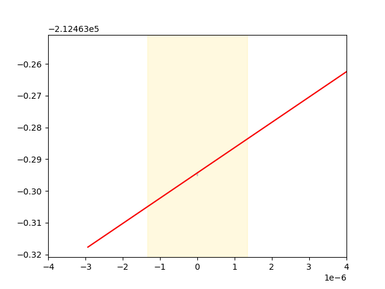


## Equation 5:
```
ICaL__PhiCaNa_i = pow(physical_constants__F, 2) * (-extracellular__nao * exp(-2859.0635474831229 * pow(physical_constants__T, (-1.5)) * (-0.00014999999999999999 * extracellular__clo - 0.00014999999999999999 * extracellular__ko - 0.00014999999999999999 * extracellular__nao - 0.00059999999999999995 * extracellular__cao + 0.044721359549995794 * sqrt(0.25 * extracellular__clo + 0.25 * extracellular__ko + 0.25 * extracellular__nao + extracellular__cao) / (1.0 + 0.044721359549995794 * sqrt(0.25 * extracellular__clo + 0.25 * extracellular__ko + 0.25 * extracellular__nao + extracellular__cao)))) + intracellular_ions__nai * exp(-2859.0635474831229 * pow(physical_constants__T, (-1.5)) * (-0.00014999999999999999 * intracellular_ions__cli - 0.00014999999999999999 * intracellular_ions__ki - 0.00014999999999999999 * intracellular_ions__nai - 0.00059999999999999995 * intracellular_ions__cai + 0.044721359549995794 * sqrt(0.25 * intracellular_ions__cli + 0.25 * intracellular_ions__ki + 0.25 * intracellular_ions__nai + intracellular_ions__cai) / (1.0 + 0.044721359549995794 * sqrt(0.25 * intracellular_ions__cli + 0.25 * intracellular_ions__ki + 0.25 * intracellular_ions__nai + intracellular_ions__cai)))) * exp(membrane__v * physical_constants__F / (physical_constants__R * physical_constants__T))) * membrane__v / ((-1.0 + exp(membrane__v * physical_constants__F / (physical_constants__R * physical_constants__T))) * physical_constants__R * physical_constants__T)
```
## New Eq:
```
ICaL__PhiCaNa_i = ((fabs(membrane__v) < 9.9999999999999995e-8 * fabs(physical_constants__R * physical_constants__T / physical_constants__F)) ? (-9.9999999999999995e-8 * (-extracellular__nao * exp(-2859.0635474831229 * pow(physical_constants__T, (-1.5)) * (-0.00014999999999999999 * extracellular__clo - 0.00014999999999999999 * extracellular__ko - 0.00014999999999999999 * extracellular__nao - 0.00059999999999999995 * extracellular__cao + 0.044721359549995794 * sqrt(0.25 * extracellular__clo + 0.25 * extracellular__ko + 0.25 * extracellular__nao + extracellular__cao) / (1.0 + 0.044721359549995794 * sqrt(0.25 * extracellular__clo + 0.25 * extracellular__ko + 0.25 * extracellular__nao + extracellular__cao)))) + intracellular_ions__nai * exp(-9.9999999999999995e-8) * exp(-2859.0635474831229 * pow(physical_constants__T, (-1.5)) * (-0.00014999999999999999 * intracellular_ions__cli - 0.00014999999999999999 * intracellular_ions__ki - 0.00014999999999999999 * intracellular_ions__nai - 0.00059999999999999995 * intracellular_ions__cai + 0.044721359549995794 * sqrt(0.25 * intracellular_ions__cli + 0.25 * intracellular_ions__ki + 0.25 * intracellular_ions__nai + intracellular_ions__cai) / (1.0 + 0.044721359549995794 * sqrt(0.25 * intracellular_ions__cli + 0.25 * intracellular_ions__ki + 0.25 * intracellular_ions__nai + intracellular_ions__cai))))) * physical_constants__F / (-1.0 + exp(-9.9999999999999995e-8)) + 5000000.0 * (9.9999999999999995e-8 * (-extracellular__nao * exp(-2859.0635474831229 * pow(physical_constants__T, (-1.5)) * (-0.00014999999999999999 * extracellular__clo - 0.00014999999999999999 * extracellular__ko - 0.00014999999999999999 * extracellular__nao - 0.00059999999999999995 * extracellular__cao + 0.044721359549995794 * sqrt(0.25 * extracellular__clo + 0.25 * extracellular__ko + 0.25 * extracellular__nao + extracellular__cao) / (1.0 + 0.044721359549995794 * sqrt(0.25 * extracellular__clo + 0.25 * extracellular__ko + 0.25 * extracellular__nao + extracellular__cao)))) + intracellular_ions__nai * exp(9.9999999999999995e-8) * exp(-2859.0635474831229 * pow(physical_constants__T, (-1.5)) * (-0.00014999999999999999 * intracellular_ions__cli - 0.00014999999999999999 * intracellular_ions__ki - 0.00014999999999999999 * intracellular_ions__nai - 0.00059999999999999995 * intracellular_ions__cai + 0.044721359549995794 * sqrt(0.25 * intracellular_ions__cli + 0.25 * intracellular_ions__ki + 0.25 * intracellular_ions__nai + intracellular_ions__cai) / (1.0 + 0.044721359549995794 * sqrt(0.25 * intracellular_ions__cli + 0.25 * intracellular_ions__ki + 0.25 * intracellular_ions__nai + intracellular_ions__cai))))) * physical_constants__F / (-1.0 + exp(9.9999999999999995e-8)) + 9.9999999999999995e-8 * (-extracellular__nao * exp(-2859.0635474831229 * pow(physical_constants__T, (-1.5)) * (-0.00014999999999999999 * extracellular__clo - 0.00014999999999999999 * extracellular__ko - 0.00014999999999999999 * extracellular__nao - 0.00059999999999999995 * extracellular__cao + 0.044721359549995794 * sqrt(0.25 * extracellular__clo + 0.25 * extracellular__ko + 0.25 * extracellular__nao + extracellular__cao) / (1.0 + 0.044721359549995794 * sqrt(0.25 * extracellular__clo + 0.25 * extracellular__ko + 0.25 * extracellular__nao + extracellular__cao)))) + intracellular_ions__nai * exp(-9.9999999999999995e-8) * exp(-2859.0635474831229 * pow(physical_constants__T, (-1.5)) * (-0.00014999999999999999 * intracellular_ions__cli - 0.00014999999999999999 * intracellular_ions__ki - 0.00014999999999999999 * intracellular_ions__nai - 0.00059999999999999995 * intracellular_ions__cai + 0.044721359549995794 * sqrt(0.25 * intracellular_ions__cli + 0.25 * intracellular_ions__ki + 0.25 * intracellular_ions__nai + intracellular_ions__cai) / (1.0 + 0.044721359549995794 * sqrt(0.25 * intracellular_ions__cli + 0.25 * intracellular_ions__ki + 0.25 * intracellular_ions__nai + intracellular_ions__cai))))) * physical_constants__F / (-1.0 + exp(-9.9999999999999995e-8))) * (9.9999999999999995e-8 * physical_constants__R * physical_constants__T / physical_constants__F + membrane__v) * physical_constants__F / (physical_constants__R * physical_constants__T)) : (pow(physical_constants__F, 2) * (-extracellular__nao * exp(-2859.0635474831229 * pow(physical_constants__T, (-1.5)) * (-0.00014999999999999999 * extracellular__clo - 0.00014999999999999999 * extracellular__ko - 0.00014999999999999999 * extracellular__nao - 0.00059999999999999995 * extracellular__cao + 0.044721359549995794 * sqrt(0.25 * extracellular__clo + 0.25 * extracellular__ko + 0.25 * extracellular__nao + extracellular__cao) / (1.0 + 0.044721359549995794 * sqrt(0.25 * extracellular__clo + 0.25 * extracellular__ko + 0.25 * extracellular__nao + extracellular__cao)))) + intracellular_ions__nai * exp(-2859.0635474831229 * pow(physical_constants__T, (-1.5)) * (-0.00014999999999999999 * intracellular_ions__cli - 0.00014999999999999999 * intracellular_ions__ki - 0.00014999999999999999 * intracellular_ions__nai - 0.00059999999999999995 * intracellular_ions__cai + 0.044721359549995794 * sqrt(0.25 * intracellular_ions__cli + 0.25 * intracellular_ions__ki + 0.25 * intracellular_ions__nai + intracellular_ions__cai) / (1.0 + 0.044721359549995794 * sqrt(0.25 * intracellular_ions__cli + 0.25 * intracellular_ions__ki + 0.25 * intracellular_ions__nai + intracellular_ions__cai)))) * exp(membrane__v * physical_constants__F / (physical_constants__R * physical_constants__T))) * membrane__v / ((-1.0 + exp(membrane__v * physical_constants__F / (physical_constants__R * physical_constants__T))) * physical_constants__R * physical_constants__T)))
```
## Singularity point: 0


## Equation 6:
```
ICaL__PhiCaNa_ss = pow(physical_constants__F, 2) * (-extracellular__nao * exp(-2859.0635474831229 * pow(physical_constants__T, (-1.5)) * (-0.00014999999999999999 * extracellular__clo - 0.00014999999999999999 * extracellular__ko - 0.00014999999999999999 * extracellular__nao - 0.00059999999999999995 * extracellular__cao + 0.044721359549995794 * sqrt(0.25 * extracellular__clo + 0.25 * extracellular__ko + 0.25 * extracellular__nao + extracellular__cao) / (1.0 + 0.044721359549995794 * sqrt(0.25 * extracellular__clo + 0.25 * extracellular__ko + 0.25 * extracellular__nao + extracellular__cao)))) + intracellular_ions__nass * exp(-2859.0635474831229 * pow(physical_constants__T, (-1.5)) * (-0.00014999999999999999 * intracellular_ions__cli - 0.00014999999999999999 * intracellular_ions__kss - 0.00014999999999999999 * intracellular_ions__nass - 0.00059999999999999995 * intracellular_ions__cass + 0.044721359549995794 * sqrt(0.25 * intracellular_ions__cli + 0.25 * intracellular_ions__kss + 0.25 * intracellular_ions__nass + intracellular_ions__cass) / (1.0 + 0.044721359549995794 * sqrt(0.25 * intracellular_ions__cli + 0.25 * intracellular_ions__kss + 0.25 * intracellular_ions__nass + intracellular_ions__cass)))) * exp(membrane__v * physical_constants__F / (physical_constants__R * physical_constants__T))) * membrane__v / ((-1.0 + exp(membrane__v * physical_constants__F / (physical_constants__R * physical_constants__T))) * physical_constants__R * physical_constants__T)
```
## New Eq:
```
ICaL__PhiCaNa_ss = ((fabs(membrane__v) < 9.9999999999999995e-8 * fabs(physical_constants__R * physical_constants__T / physical_constants__F)) ? (-9.9999999999999995e-8 * (-extracellular__nao * exp(-2859.0635474831229 * pow(physical_constants__T, (-1.5)) * (-0.00014999999999999999 * extracellular__clo - 0.00014999999999999999 * extracellular__ko - 0.00014999999999999999 * extracellular__nao - 0.00059999999999999995 * extracellular__cao + 0.044721359549995794 * sqrt(0.25 * extracellular__clo + 0.25 * extracellular__ko + 0.25 * extracellular__nao + extracellular__cao) / (1.0 + 0.044721359549995794 * sqrt(0.25 * extracellular__clo + 0.25 * extracellular__ko + 0.25 * extracellular__nao + extracellular__cao)))) + intracellular_ions__nass * exp(-9.9999999999999995e-8) * exp(-2859.0635474831229 * pow(physical_constants__T, (-1.5)) * (-0.00014999999999999999 * intracellular_ions__cli - 0.00014999999999999999 * intracellular_ions__kss - 0.00014999999999999999 * intracellular_ions__nass - 0.00059999999999999995 * intracellular_ions__cass + 0.044721359549995794 * sqrt(0.25 * intracellular_ions__cli + 0.25 * intracellular_ions__kss + 0.25 * intracellular_ions__nass + intracellular_ions__cass) / (1.0 + 0.044721359549995794 * sqrt(0.25 * intracellular_ions__cli + 0.25 * intracellular_ions__kss + 0.25 * intracellular_ions__nass + intracellular_ions__cass))))) * physical_constants__F / (-1.0 + exp(-9.9999999999999995e-8)) + 5000000.0 * (9.9999999999999995e-8 * (-extracellular__nao * exp(-2859.0635474831229 * pow(physical_constants__T, (-1.5)) * (-0.00014999999999999999 * extracellular__clo - 0.00014999999999999999 * extracellular__ko - 0.00014999999999999999 * extracellular__nao - 0.00059999999999999995 * extracellular__cao + 0.044721359549995794 * sqrt(0.25 * extracellular__clo + 0.25 * extracellular__ko + 0.25 * extracellular__nao + extracellular__cao) / (1.0 + 0.044721359549995794 * sqrt(0.25 * extracellular__clo + 0.25 * extracellular__ko + 0.25 * extracellular__nao + extracellular__cao)))) + intracellular_ions__nass * exp(9.9999999999999995e-8) * exp(-2859.0635474831229 * pow(physical_constants__T, (-1.5)) * (-0.00014999999999999999 * intracellular_ions__cli - 0.00014999999999999999 * intracellular_ions__kss - 0.00014999999999999999 * intracellular_ions__nass - 0.00059999999999999995 * intracellular_ions__cass + 0.044721359549995794 * sqrt(0.25 * intracellular_ions__cli + 0.25 * intracellular_ions__kss + 0.25 * intracellular_ions__nass + intracellular_ions__cass) / (1.0 + 0.044721359549995794 * sqrt(0.25 * intracellular_ions__cli + 0.25 * intracellular_ions__kss + 0.25 * intracellular_ions__nass + intracellular_ions__cass))))) * physical_constants__F / (-1.0 + exp(9.9999999999999995e-8)) + 9.9999999999999995e-8 * (-extracellular__nao * exp(-2859.0635474831229 * pow(physical_constants__T, (-1.5)) * (-0.00014999999999999999 * extracellular__clo - 0.00014999999999999999 * extracellular__ko - 0.00014999999999999999 * extracellular__nao - 0.00059999999999999995 * extracellular__cao + 0.044721359549995794 * sqrt(0.25 * extracellular__clo + 0.25 * extracellular__ko + 0.25 * extracellular__nao + extracellular__cao) / (1.0 + 0.044721359549995794 * sqrt(0.25 * extracellular__clo + 0.25 * extracellular__ko + 0.25 * extracellular__nao + extracellular__cao)))) + intracellular_ions__nass * exp(-9.9999999999999995e-8) * exp(-2859.0635474831229 * pow(physical_constants__T, (-1.5)) * (-0.00014999999999999999 * intracellular_ions__cli - 0.00014999999999999999 * intracellular_ions__kss - 0.00014999999999999999 * intracellular_ions__nass - 0.00059999999999999995 * intracellular_ions__cass + 0.044721359549995794 * sqrt(0.25 * intracellular_ions__cli + 0.25 * intracellular_ions__kss + 0.25 * intracellular_ions__nass + intracellular_ions__cass) / (1.0 + 0.044721359549995794 * sqrt(0.25 * intracellular_ions__cli + 0.25 * intracellular_ions__kss + 0.25 * intracellular_ions__nass + intracellular_ions__cass))))) * physical_constants__F / (-1.0 + exp(-9.9999999999999995e-8))) * (9.9999999999999995e-8 * physical_constants__R * physical_constants__T / physical_constants__F + membrane__v) * physical_constants__F / (physical_constants__R * physical_constants__T)) : (pow(physical_constants__F, 2) * (-extracellular__nao * exp(-2859.0635474831229 * pow(physical_constants__T, (-1.5)) * (-0.00014999999999999999 * extracellular__clo - 0.00014999999999999999 * extracellular__ko - 0.00014999999999999999 * extracellular__nao - 0.00059999999999999995 * extracellular__cao + 0.044721359549995794 * sqrt(0.25 * extracellular__clo + 0.25 * extracellular__ko + 0.25 * extracellular__nao + extracellular__cao) / (1.0 + 0.044721359549995794 * sqrt(0.25 * extracellular__clo + 0.25 * extracellular__ko + 0.25 * extracellular__nao + extracellular__cao)))) + intracellular_ions__nass * exp(-2859.0635474831229 * pow(physical_constants__T, (-1.5)) * (-0.00014999999999999999 * intracellular_ions__cli - 0.00014999999999999999 * intracellular_ions__kss - 0.00014999999999999999 * intracellular_ions__nass - 0.00059999999999999995 * intracellular_ions__cass + 0.044721359549995794 * sqrt(0.25 * intracellular_ions__cli + 0.25 * intracellular_ions__kss + 0.25 * intracellular_ions__nass + intracellular_ions__cass) / (1.0 + 0.044721359549995794 * sqrt(0.25 * intracellular_ions__cli + 0.25 * intracellular_ions__kss + 0.25 * intracellular_ions__nass + intracellular_ions__cass)))) * exp(membrane__v * physical_constants__F / (physical_constants__R * physical_constants__T))) * membrane__v / ((-1.0 + exp(membrane__v * physical_constants__F / (physical_constants__R * physical_constants__T))) * physical_constants__R * physical_constants__T)))
```
## Singularity point: 0
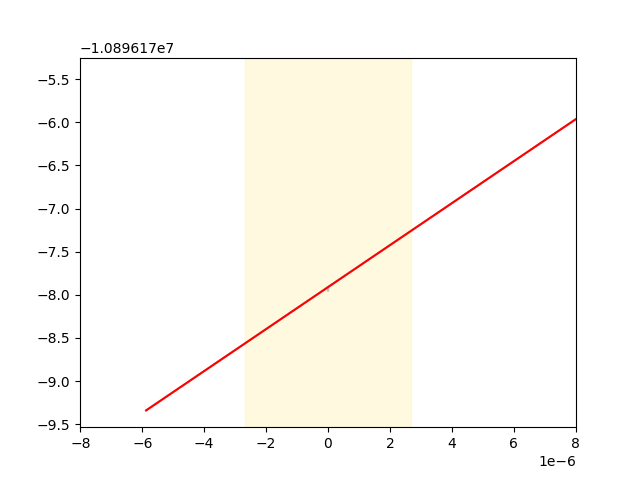


## Equation 7:
```
ICab__ICab = 2.36776e-7 * pow(physical_constants__F, 2) * (-extracellular__cao * exp(-11436.254189932491 * pow(physical_constants__T, (-1.5)) * (-0.00014999999999999999 * extracellular__clo - 0.00014999999999999999 * extracellular__ko - 0.00014999999999999999 * extracellular__nao - 0.00059999999999999995 * extracellular__cao + 0.044721359549995794 * sqrt(0.25 * extracellular__clo + 0.25 * extracellular__ko + 0.25 * extracellular__nao + extracellular__cao) / (1.0 + 0.044721359549995794 * sqrt(0.25 * extracellular__clo + 0.25 * extracellular__ko + 0.25 * extracellular__nao + extracellular__cao)))) + intracellular_ions__cai * exp(-11436.254189932491 * pow(physical_constants__T, (-1.5)) * (-0.00014999999999999999 * intracellular_ions__cli - 0.00014999999999999999 * intracellular_ions__ki - 0.00014999999999999999 * intracellular_ions__nai - 0.00059999999999999995 * intracellular_ions__cai + 0.044721359549995794 * sqrt(0.25 * intracellular_ions__cli + 0.25 * intracellular_ions__ki + 0.25 * intracellular_ions__nai + intracellular_ions__cai) / (1.0 + 0.044721359549995794 * sqrt(0.25 * intracellular_ions__cli + 0.25 * intracellular_ions__ki + 0.25 * intracellular_ions__nai + intracellular_ions__cai)))) * exp(2.0 * membrane__v * physical_constants__F / (physical_constants__R * physical_constants__T))) * membrane__v / ((-1.0 + exp(2.0 * membrane__v * physical_constants__F / (physical_constants__R * physical_constants__T))) * physical_constants__R * physical_constants__T)
```
## New Eq:
```
ICab__ICab = ((fabs(membrane__v) < 4.9999999999999998e-8 * fabs(physical_constants__R * physical_constants__T / physical_constants__F)) ? (-1.18388e-14 * (-extracellular__cao * exp(-11436.254189932491 * pow(physical_constants__T, (-1.5)) * (-0.00014999999999999999 * extracellular__clo - 0.00014999999999999999 * extracellular__ko - 0.00014999999999999999 * extracellular__nao - 0.00059999999999999995 * extracellular__cao + 0.044721359549995794 * sqrt(0.25 * extracellular__clo + 0.25 * extracellular__ko + 0.25 * extracellular__nao + extracellular__cao) / (1.0 + 0.044721359549995794 * sqrt(0.25 * extracellular__clo + 0.25 * extracellular__ko + 0.25 * extracellular__nao + extracellular__cao)))) + intracellular_ions__cai * exp(-9.9999999999999995e-8) * exp(-11436.254189932491 * pow(physical_constants__T, (-1.5)) * (-0.00014999999999999999 * intracellular_ions__cli - 0.00014999999999999999 * intracellular_ions__ki - 0.00014999999999999999 * intracellular_ions__nai - 0.00059999999999999995 * intracellular_ions__cai + 0.044721359549995794 * sqrt(0.25 * intracellular_ions__cli + 0.25 * intracellular_ions__ki + 0.25 * intracellular_ions__nai + intracellular_ions__cai) / (1.0 + 0.044721359549995794 * sqrt(0.25 * intracellular_ions__cli + 0.25 * intracellular_ions__ki + 0.25 * intracellular_ions__nai + intracellular_ions__cai))))) * physical_constants__F / (-1.0 + exp(-9.9999999999999995e-8)) + 10000000.0 * (4.9999999999999998e-8 * physical_constants__R * physical_constants__T / physical_constants__F + membrane__v) * (1.18388e-14 * (-extracellular__cao * exp(-11436.254189932491 * pow(physical_constants__T, (-1.5)) * (-0.00014999999999999999 * extracellular__clo - 0.00014999999999999999 * extracellular__ko - 0.00014999999999999999 * extracellular__nao - 0.00059999999999999995 * extracellular__cao + 0.044721359549995794 * sqrt(0.25 * extracellular__clo + 0.25 * extracellular__ko + 0.25 * extracellular__nao + extracellular__cao) / (1.0 + 0.044721359549995794 * sqrt(0.25 * extracellular__clo + 0.25 * extracellular__ko + 0.25 * extracellular__nao + extracellular__cao)))) + intracellular_ions__cai * exp(9.9999999999999995e-8) * exp(-11436.254189932491 * pow(physical_constants__T, (-1.5)) * (-0.00014999999999999999 * intracellular_ions__cli - 0.00014999999999999999 * intracellular_ions__ki - 0.00014999999999999999 * intracellular_ions__nai - 0.00059999999999999995 * intracellular_ions__cai + 0.044721359549995794 * sqrt(0.25 * intracellular_ions__cli + 0.25 * intracellular_ions__ki + 0.25 * intracellular_ions__nai + intracellular_ions__cai) / (1.0 + 0.044721359549995794 * sqrt(0.25 * intracellular_ions__cli + 0.25 * intracellular_ions__ki + 0.25 * intracellular_ions__nai + intracellular_ions__cai))))) * physical_constants__F / (-1.0 + exp(9.9999999999999995e-8)) + 1.18388e-14 * (-extracellular__cao * exp(-11436.254189932491 * pow(physical_constants__T, (-1.5)) * (-0.00014999999999999999 * extracellular__clo - 0.00014999999999999999 * extracellular__ko - 0.00014999999999999999 * extracellular__nao - 0.00059999999999999995 * extracellular__cao + 0.044721359549995794 * sqrt(0.25 * extracellular__clo + 0.25 * extracellular__ko + 0.25 * extracellular__nao + extracellular__cao) / (1.0 + 0.044721359549995794 * sqrt(0.25 * extracellular__clo + 0.25 * extracellular__ko + 0.25 * extracellular__nao + extracellular__cao)))) + intracellular_ions__cai * exp(-9.9999999999999995e-8) * exp(-11436.254189932491 * pow(physical_constants__T, (-1.5)) * (-0.00014999999999999999 * intracellular_ions__cli - 0.00014999999999999999 * intracellular_ions__ki - 0.00014999999999999999 * intracellular_ions__nai - 0.00059999999999999995 * intracellular_ions__cai + 0.044721359549995794 * sqrt(0.25 * intracellular_ions__cli + 0.25 * intracellular_ions__ki + 0.25 * intracellular_ions__nai + intracellular_ions__cai) / (1.0 + 0.044721359549995794 * sqrt(0.25 * intracellular_ions__cli + 0.25 * intracellular_ions__ki + 0.25 * intracellular_ions__nai + intracellular_ions__cai))))) * physical_constants__F / (-1.0 + exp(-9.9999999999999995e-8))) * physical_constants__F / (physical_constants__R * physical_constants__T)) : (2.36776e-7 * pow(physical_constants__F, 2) * (-extracellular__cao * exp(-11436.254189932491 * pow(physical_constants__T, (-1.5)) * (-0.00014999999999999999 * extracellular__clo - 0.00014999999999999999 * extracellular__ko - 0.00014999999999999999 * extracellular__nao - 0.00059999999999999995 * extracellular__cao + 0.044721359549995794 * sqrt(0.25 * extracellular__clo + 0.25 * extracellular__ko + 0.25 * extracellular__nao + extracellular__cao) / (1.0 + 0.044721359549995794 * sqrt(0.25 * extracellular__clo + 0.25 * extracellular__ko + 0.25 * extracellular__nao + extracellular__cao)))) + intracellular_ions__cai * exp(-11436.254189932491 * pow(physical_constants__T, (-1.5)) * (-0.00014999999999999999 * intracellular_ions__cli - 0.00014999999999999999 * intracellular_ions__ki - 0.00014999999999999999 * intracellular_ions__nai - 0.00059999999999999995 * intracellular_ions__cai + 0.044721359549995794 * sqrt(0.25 * intracellular_ions__cli + 0.25 * intracellular_ions__ki + 0.25 * intracellular_ions__nai + intracellular_ions__cai) / (1.0 + 0.044721359549995794 * sqrt(0.25 * intracellular_ions__cli + 0.25 * intracellular_ions__ki + 0.25 * intracellular_ions__nai + intracellular_ions__cai)))) * exp(2.0 * membrane__v * physical_constants__F / (physical_constants__R * physical_constants__T))) * membrane__v / ((-1.0 + exp(2.0 * membrane__v * physical_constants__F / (physical_constants__R * physical_constants__T))) * physical_constants__R * physical_constants__T)))
```
## Singularity point: 0


## Equation 8:
```
INab__INab = 1.9238999999999999e-9 * pow(physical_constants__F, 2) * (-extracellular__nao + intracellular_ions__nai * exp(membrane__v * physical_constants__F / (physical_constants__R * physical_constants__T))) * membrane__v / ((-1.0 + exp(membrane__v * physical_constants__F / (physical_constants__R * physical_constants__T))) * physical_constants__R * physical_constants__T)
```
## New Eq:
```
INab__INab = ((fabs(membrane__v) < 9.9999999999999995e-8 * fabs(physical_constants__R * physical_constants__T / physical_constants__F)) ? (-1.9238999999999998e-16 * (-extracellular__nao + intracellular_ions__nai * exp(-9.9999999999999995e-8)) * physical_constants__F / (-1.0 + exp(-9.9999999999999995e-8)) + 5000000.0 * (9.9999999999999995e-8 * physical_constants__R * physical_constants__T / physical_constants__F + membrane__v) * (1.9238999999999998e-16 * (-extracellular__nao + intracellular_ions__nai * exp(9.9999999999999995e-8)) * physical_constants__F / (-1.0 + exp(9.9999999999999995e-8)) + 1.9238999999999998e-16 * (-extracellular__nao + intracellular_ions__nai * exp(-9.9999999999999995e-8)) * physical_constants__F / (-1.0 + exp(-9.9999999999999995e-8))) * physical_constants__F / (physical_constants__R * physical_constants__T)) : (1.9238999999999999e-9 * pow(physical_constants__F, 2) * (-extracellular__nao + intracellular_ions__nai * exp(membrane__v * physical_constants__F / (physical_constants__R * physical_constants__T))) * membrane__v / ((-1.0 + exp(membrane__v * physical_constants__F / (physical_constants__R * physical_constants__T))) * physical_constants__R * physical_constants__T)))
```
## Singularity point: 0


# of singularities:  8
singularity processing time: 83.76233469999988
# Model: Tomek_model13epi(ToRORd_fkatp_epi.cellml)
No of piecewises: 21
## Equation 1:
```
ICaL__PhiCaK_i = pow(physical_constants__F, 2) * (-extracellular__ko * exp(-2859.0635474831229 * pow(physical_constants__T, (-1.5)) * (-0.00014999999999999999 * extracellular__clo - 0.00014999999999999999 * extracellular__ko - 0.00014999999999999999 * extracellular__nao - 0.00059999999999999995 * extracellular__cao + 0.044721359549995794 * sqrt(0.25 * extracellular__clo + 0.25 * extracellular__ko + 0.25 * extracellular__nao + extracellular__cao) / (1.0 + 0.044721359549995794 * sqrt(0.25 * extracellular__clo + 0.25 * extracellular__ko + 0.25 * extracellular__nao + extracellular__cao)))) + intracellular_ions__ki * exp(-2859.0635474831229 * pow(physical_constants__T, (-1.5)) * (-0.00014999999999999999 * intracellular_ions__cli - 0.00014999999999999999 * intracellular_ions__ki - 0.00014999999999999999 * intracellular_ions__nai - 0.00059999999999999995 * intracellular_ions__cai + 0.044721359549995794 * sqrt(0.25 * intracellular_ions__cli + 0.25 * intracellular_ions__ki + 0.25 * intracellular_ions__nai + intracellular_ions__cai) / (1.0 + 0.044721359549995794 * sqrt(0.25 * intracellular_ions__cli + 0.25 * intracellular_ions__ki + 0.25 * intracellular_ions__nai + intracellular_ions__cai)))) * exp(membrane__v * physical_constants__F / (physical_constants__R * physical_constants__T))) * membrane__v / ((-1.0 + exp(membrane__v * physical_constants__F / (physical_constants__R * physical_constants__T))) * physical_constants__R * physical_constants__T)
```
## New Eq:
```
ICaL__PhiCaK_i = ((fabs(membrane__v) < 9.9999999999999995e-8 * fabs(physical_constants__R * physical_constants__T / physical_constants__F)) ? (-9.9999999999999995e-8 * (-extracellular__ko * exp(-2859.0635474831229 * pow(physical_constants__T, (-1.5)) * (-0.00014999999999999999 * extracellular__clo - 0.00014999999999999999 * extracellular__ko - 0.00014999999999999999 * extracellular__nao - 0.00059999999999999995 * extracellular__cao + 0.044721359549995794 * sqrt(0.25 * extracellular__clo + 0.25 * extracellular__ko + 0.25 * extracellular__nao + extracellular__cao) / (1.0 + 0.044721359549995794 * sqrt(0.25 * extracellular__clo + 0.25 * extracellular__ko + 0.25 * extracellular__nao + extracellular__cao)))) + intracellular_ions__ki * exp(-9.9999999999999995e-8) * exp(-2859.0635474831229 * pow(physical_constants__T, (-1.5)) * (-0.00014999999999999999 * intracellular_ions__cli - 0.00014999999999999999 * intracellular_ions__ki - 0.00014999999999999999 * intracellular_ions__nai - 0.00059999999999999995 * intracellular_ions__cai + 0.044721359549995794 * sqrt(0.25 * intracellular_ions__cli + 0.25 * intracellular_ions__ki + 0.25 * intracellular_ions__nai + intracellular_ions__cai) / (1.0 + 0.044721359549995794 * sqrt(0.25 * intracellular_ions__cli + 0.25 * intracellular_ions__ki + 0.25 * intracellular_ions__nai + intracellular_ions__cai))))) * physical_constants__F / (-1.0 + exp(-9.9999999999999995e-8)) + 5000000.0 * (9.9999999999999995e-8 * (-extracellular__ko * exp(-2859.0635474831229 * pow(physical_constants__T, (-1.5)) * (-0.00014999999999999999 * extracellular__clo - 0.00014999999999999999 * extracellular__ko - 0.00014999999999999999 * extracellular__nao - 0.00059999999999999995 * extracellular__cao + 0.044721359549995794 * sqrt(0.25 * extracellular__clo + 0.25 * extracellular__ko + 0.25 * extracellular__nao + extracellular__cao) / (1.0 + 0.044721359549995794 * sqrt(0.25 * extracellular__clo + 0.25 * extracellular__ko + 0.25 * extracellular__nao + extracellular__cao)))) + intracellular_ions__ki * exp(9.9999999999999995e-8) * exp(-2859.0635474831229 * pow(physical_constants__T, (-1.5)) * (-0.00014999999999999999 * intracellular_ions__cli - 0.00014999999999999999 * intracellular_ions__ki - 0.00014999999999999999 * intracellular_ions__nai - 0.00059999999999999995 * intracellular_ions__cai + 0.044721359549995794 * sqrt(0.25 * intracellular_ions__cli + 0.25 * intracellular_ions__ki + 0.25 * intracellular_ions__nai + intracellular_ions__cai) / (1.0 + 0.044721359549995794 * sqrt(0.25 * intracellular_ions__cli + 0.25 * intracellular_ions__ki + 0.25 * intracellular_ions__nai + intracellular_ions__cai))))) * physical_constants__F / (-1.0 + exp(9.9999999999999995e-8)) + 9.9999999999999995e-8 * (-extracellular__ko * exp(-2859.0635474831229 * pow(physical_constants__T, (-1.5)) * (-0.00014999999999999999 * extracellular__clo - 0.00014999999999999999 * extracellular__ko - 0.00014999999999999999 * extracellular__nao - 0.00059999999999999995 * extracellular__cao + 0.044721359549995794 * sqrt(0.25 * extracellular__clo + 0.25 * extracellular__ko + 0.25 * extracellular__nao + extracellular__cao) / (1.0 + 0.044721359549995794 * sqrt(0.25 * extracellular__clo + 0.25 * extracellular__ko + 0.25 * extracellular__nao + extracellular__cao)))) + intracellular_ions__ki * exp(-9.9999999999999995e-8) * exp(-2859.0635474831229 * pow(physical_constants__T, (-1.5)) * (-0.00014999999999999999 * intracellular_ions__cli - 0.00014999999999999999 * intracellular_ions__ki - 0.00014999999999999999 * intracellular_ions__nai - 0.00059999999999999995 * intracellular_ions__cai + 0.044721359549995794 * sqrt(0.25 * intracellular_ions__cli + 0.25 * intracellular_ions__ki + 0.25 * intracellular_ions__nai + intracellular_ions__cai) / (1.0 + 0.044721359549995794 * sqrt(0.25 * intracellular_ions__cli + 0.25 * intracellular_ions__ki + 0.25 * intracellular_ions__nai + intracellular_ions__cai))))) * physical_constants__F / (-1.0 + exp(-9.9999999999999995e-8))) * (9.9999999999999995e-8 * physical_constants__R * physical_constants__T / physical_constants__F + membrane__v) * physical_constants__F / (physical_constants__R * physical_constants__T)) : (pow(physical_constants__F, 2) * (-extracellular__ko * exp(-2859.0635474831229 * pow(physical_constants__T, (-1.5)) * (-0.00014999999999999999 * extracellular__clo - 0.00014999999999999999 * extracellular__ko - 0.00014999999999999999 * extracellular__nao - 0.00059999999999999995 * extracellular__cao + 0.044721359549995794 * sqrt(0.25 * extracellular__clo + 0.25 * extracellular__ko + 0.25 * extracellular__nao + extracellular__cao) / (1.0 + 0.044721359549995794 * sqrt(0.25 * extracellular__clo + 0.25 * extracellular__ko + 0.25 * extracellular__nao + extracellular__cao)))) + intracellular_ions__ki * exp(-2859.0635474831229 * pow(physical_constants__T, (-1.5)) * (-0.00014999999999999999 * intracellular_ions__cli - 0.00014999999999999999 * intracellular_ions__ki - 0.00014999999999999999 * intracellular_ions__nai - 0.00059999999999999995 * intracellular_ions__cai + 0.044721359549995794 * sqrt(0.25 * intracellular_ions__cli + 0.25 * intracellular_ions__ki + 0.25 * intracellular_ions__nai + intracellular_ions__cai) / (1.0 + 0.044721359549995794 * sqrt(0.25 * intracellular_ions__cli + 0.25 * intracellular_ions__ki + 0.25 * intracellular_ions__nai + intracellular_ions__cai)))) * exp(membrane__v * physical_constants__F / (physical_constants__R * physical_constants__T))) * membrane__v / ((-1.0 + exp(membrane__v * physical_constants__F / (physical_constants__R * physical_constants__T))) * physical_constants__R * physical_constants__T)))
```
## Singularity point: 0
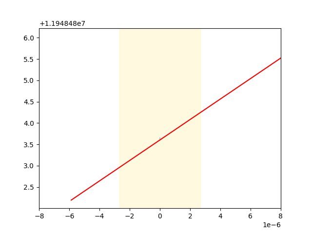


## Equation 2:
```
ICaL__PhiCaK_ss = pow(physical_constants__F, 2) * (-extracellular__ko * exp(-2859.0635474831229 * pow(physical_constants__T, (-1.5)) * (-0.00014999999999999999 * extracellular__clo - 0.00014999999999999999 * extracellular__ko - 0.00014999999999999999 * extracellular__nao - 0.00059999999999999995 * extracellular__cao + 0.044721359549995794 * sqrt(0.25 * extracellular__clo + 0.25 * extracellular__ko + 0.25 * extracellular__nao + extracellular__cao) / (1.0 + 0.044721359549995794 * sqrt(0.25 * extracellular__clo + 0.25 * extracellular__ko + 0.25 * extracellular__nao + extracellular__cao)))) + intracellular_ions__kss * exp(-2859.0635474831229 * pow(physical_constants__T, (-1.5)) * (-0.00014999999999999999 * intracellular_ions__cli - 0.00014999999999999999 * intracellular_ions__kss - 0.00014999999999999999 * intracellular_ions__nass - 0.00059999999999999995 * intracellular_ions__cass + 0.044721359549995794 * sqrt(0.25 * intracellular_ions__cli + 0.25 * intracellular_ions__kss + 0.25 * intracellular_ions__nass + intracellular_ions__cass) / (1.0 + 0.044721359549995794 * sqrt(0.25 * intracellular_ions__cli + 0.25 * intracellular_ions__kss + 0.25 * intracellular_ions__nass + intracellular_ions__cass)))) * exp(membrane__v * physical_constants__F / (physical_constants__R * physical_constants__T))) * membrane__v / ((-1.0 + exp(membrane__v * physical_constants__F / (physical_constants__R * physical_constants__T))) * physical_constants__R * physical_constants__T)
```
## New Eq:
```
ICaL__PhiCaK_ss = ((fabs(membrane__v) < 9.9999999999999995e-8 * fabs(physical_constants__R * physical_constants__T / physical_constants__F)) ? (-9.9999999999999995e-8 * (-extracellular__ko * exp(-2859.0635474831229 * pow(physical_constants__T, (-1.5)) * (-0.00014999999999999999 * extracellular__clo - 0.00014999999999999999 * extracellular__ko - 0.00014999999999999999 * extracellular__nao - 0.00059999999999999995 * extracellular__cao + 0.044721359549995794 * sqrt(0.25 * extracellular__clo + 0.25 * extracellular__ko + 0.25 * extracellular__nao + extracellular__cao) / (1.0 + 0.044721359549995794 * sqrt(0.25 * extracellular__clo + 0.25 * extracellular__ko + 0.25 * extracellular__nao + extracellular__cao)))) + intracellular_ions__kss * exp(-9.9999999999999995e-8) * exp(-2859.0635474831229 * pow(physical_constants__T, (-1.5)) * (-0.00014999999999999999 * intracellular_ions__cli - 0.00014999999999999999 * intracellular_ions__kss - 0.00014999999999999999 * intracellular_ions__nass - 0.00059999999999999995 * intracellular_ions__cass + 0.044721359549995794 * sqrt(0.25 * intracellular_ions__cli + 0.25 * intracellular_ions__kss + 0.25 * intracellular_ions__nass + intracellular_ions__cass) / (1.0 + 0.044721359549995794 * sqrt(0.25 * intracellular_ions__cli + 0.25 * intracellular_ions__kss + 0.25 * intracellular_ions__nass + intracellular_ions__cass))))) * physical_constants__F / (-1.0 + exp(-9.9999999999999995e-8)) + 5000000.0 * (9.9999999999999995e-8 * (-extracellular__ko * exp(-2859.0635474831229 * pow(physical_constants__T, (-1.5)) * (-0.00014999999999999999 * extracellular__clo - 0.00014999999999999999 * extracellular__ko - 0.00014999999999999999 * extracellular__nao - 0.00059999999999999995 * extracellular__cao + 0.044721359549995794 * sqrt(0.25 * extracellular__clo + 0.25 * extracellular__ko + 0.25 * extracellular__nao + extracellular__cao) / (1.0 + 0.044721359549995794 * sqrt(0.25 * extracellular__clo + 0.25 * extracellular__ko + 0.25 * extracellular__nao + extracellular__cao)))) + intracellular_ions__kss * exp(9.9999999999999995e-8) * exp(-2859.0635474831229 * pow(physical_constants__T, (-1.5)) * (-0.00014999999999999999 * intracellular_ions__cli - 0.00014999999999999999 * intracellular_ions__kss - 0.00014999999999999999 * intracellular_ions__nass - 0.00059999999999999995 * intracellular_ions__cass + 0.044721359549995794 * sqrt(0.25 * intracellular_ions__cli + 0.25 * intracellular_ions__kss + 0.25 * intracellular_ions__nass + intracellular_ions__cass) / (1.0 + 0.044721359549995794 * sqrt(0.25 * intracellular_ions__cli + 0.25 * intracellular_ions__kss + 0.25 * intracellular_ions__nass + intracellular_ions__cass))))) * physical_constants__F / (-1.0 + exp(9.9999999999999995e-8)) + 9.9999999999999995e-8 * (-extracellular__ko * exp(-2859.0635474831229 * pow(physical_constants__T, (-1.5)) * (-0.00014999999999999999 * extracellular__clo - 0.00014999999999999999 * extracellular__ko - 0.00014999999999999999 * extracellular__nao - 0.00059999999999999995 * extracellular__cao + 0.044721359549995794 * sqrt(0.25 * extracellular__clo + 0.25 * extracellular__ko + 0.25 * extracellular__nao + extracellular__cao) / (1.0 + 0.044721359549995794 * sqrt(0.25 * extracellular__clo + 0.25 * extracellular__ko + 0.25 * extracellular__nao + extracellular__cao)))) + intracellular_ions__kss * exp(-9.9999999999999995e-8) * exp(-2859.0635474831229 * pow(physical_constants__T, (-1.5)) * (-0.00014999999999999999 * intracellular_ions__cli - 0.00014999999999999999 * intracellular_ions__kss - 0.00014999999999999999 * intracellular_ions__nass - 0.00059999999999999995 * intracellular_ions__cass + 0.044721359549995794 * sqrt(0.25 * intracellular_ions__cli + 0.25 * intracellular_ions__kss + 0.25 * intracellular_ions__nass + intracellular_ions__cass) / (1.0 + 0.044721359549995794 * sqrt(0.25 * intracellular_ions__cli + 0.25 * intracellular_ions__kss + 0.25 * intracellular_ions__nass + intracellular_ions__cass))))) * physical_constants__F / (-1.0 + exp(-9.9999999999999995e-8))) * (9.9999999999999995e-8 * physical_constants__R * physical_constants__T / physical_constants__F + membrane__v) * physical_constants__F / (physical_constants__R * physical_constants__T)) : (pow(physical_constants__F, 2) * (-extracellular__ko * exp(-2859.0635474831229 * pow(physical_constants__T, (-1.5)) * (-0.00014999999999999999 * extracellular__clo - 0.00014999999999999999 * extracellular__ko - 0.00014999999999999999 * extracellular__nao - 0.00059999999999999995 * extracellular__cao + 0.044721359549995794 * sqrt(0.25 * extracellular__clo + 0.25 * extracellular__ko + 0.25 * extracellular__nao + extracellular__cao) / (1.0 + 0.044721359549995794 * sqrt(0.25 * extracellular__clo + 0.25 * extracellular__ko + 0.25 * extracellular__nao + extracellular__cao)))) + intracellular_ions__kss * exp(-2859.0635474831229 * pow(physical_constants__T, (-1.5)) * (-0.00014999999999999999 * intracellular_ions__cli - 0.00014999999999999999 * intracellular_ions__kss - 0.00014999999999999999 * intracellular_ions__nass - 0.00059999999999999995 * intracellular_ions__cass + 0.044721359549995794 * sqrt(0.25 * intracellular_ions__cli + 0.25 * intracellular_ions__kss + 0.25 * intracellular_ions__nass + intracellular_ions__cass) / (1.0 + 0.044721359549995794 * sqrt(0.25 * intracellular_ions__cli + 0.25 * intracellular_ions__kss + 0.25 * intracellular_ions__nass + intracellular_ions__cass)))) * exp(membrane__v * physical_constants__F / (physical_constants__R * physical_constants__T))) * membrane__v / ((-1.0 + exp(membrane__v * physical_constants__F / (physical_constants__R * physical_constants__T))) * physical_constants__R * physical_constants__T)))
```
## Singularity point: 0


## Equation 3:
```
ICaL__PhiCaL_i = 4.0 * pow(physical_constants__F, 2) * (-extracellular__cao * exp(-11436.254189932491 * pow(physical_constants__T, (-1.5)) * (-0.00014999999999999999 * extracellular__clo - 0.00014999999999999999 * extracellular__ko - 0.00014999999999999999 * extracellular__nao - 0.00059999999999999995 * extracellular__cao + 0.044721359549995794 * sqrt(0.25 * extracellular__clo + 0.25 * extracellular__ko + 0.25 * extracellular__nao + extracellular__cao) / (1.0 + 0.044721359549995794 * sqrt(0.25 * extracellular__clo + 0.25 * extracellular__ko + 0.25 * extracellular__nao + extracellular__cao)))) + intracellular_ions__cai * exp(-11436.254189932491 * pow(physical_constants__T, (-1.5)) * (-0.00014999999999999999 * intracellular_ions__cli - 0.00014999999999999999 * intracellular_ions__ki - 0.00014999999999999999 * intracellular_ions__nai - 0.00059999999999999995 * intracellular_ions__cai + 0.044721359549995794 * sqrt(0.25 * intracellular_ions__cli + 0.25 * intracellular_ions__ki + 0.25 * intracellular_ions__nai + intracellular_ions__cai) / (1.0 + 0.044721359549995794 * sqrt(0.25 * intracellular_ions__cli + 0.25 * intracellular_ions__ki + 0.25 * intracellular_ions__nai + intracellular_ions__cai)))) * exp(2.0 * membrane__v * physical_constants__F / (physical_constants__R * physical_constants__T))) * membrane__v / ((-1.0 + exp(2.0 * membrane__v * physical_constants__F / (physical_constants__R * physical_constants__T))) * physical_constants__R * physical_constants__T)
```
## New Eq:
```
ICaL__PhiCaL_i = ((fabs(membrane__v) < 4.9999999999999998e-8 * fabs(physical_constants__R * physical_constants__T / physical_constants__F)) ? (-1.9999999999999999e-7 * (-extracellular__cao * exp(-11436.254189932491 * pow(physical_constants__T, (-1.5)) * (-0.00014999999999999999 * extracellular__clo - 0.00014999999999999999 * extracellular__ko - 0.00014999999999999999 * extracellular__nao - 0.00059999999999999995 * extracellular__cao + 0.044721359549995794 * sqrt(0.25 * extracellular__clo + 0.25 * extracellular__ko + 0.25 * extracellular__nao + extracellular__cao) / (1.0 + 0.044721359549995794 * sqrt(0.25 * extracellular__clo + 0.25 * extracellular__ko + 0.25 * extracellular__nao + extracellular__cao)))) + intracellular_ions__cai * exp(-9.9999999999999995e-8) * exp(-11436.254189932491 * pow(physical_constants__T, (-1.5)) * (-0.00014999999999999999 * intracellular_ions__cli - 0.00014999999999999999 * intracellular_ions__ki - 0.00014999999999999999 * intracellular_ions__nai - 0.00059999999999999995 * intracellular_ions__cai + 0.044721359549995794 * sqrt(0.25 * intracellular_ions__cli + 0.25 * intracellular_ions__ki + 0.25 * intracellular_ions__nai + intracellular_ions__cai) / (1.0 + 0.044721359549995794 * sqrt(0.25 * intracellular_ions__cli + 0.25 * intracellular_ions__ki + 0.25 * intracellular_ions__nai + intracellular_ions__cai))))) * physical_constants__F / (-1.0 + exp(-9.9999999999999995e-8)) + 10000000.0 * (4.9999999999999998e-8 * physical_constants__R * physical_constants__T / physical_constants__F + membrane__v) * (1.9999999999999999e-7 * (-extracellular__cao * exp(-11436.254189932491 * pow(physical_constants__T, (-1.5)) * (-0.00014999999999999999 * extracellular__clo - 0.00014999999999999999 * extracellular__ko - 0.00014999999999999999 * extracellular__nao - 0.00059999999999999995 * extracellular__cao + 0.044721359549995794 * sqrt(0.25 * extracellular__clo + 0.25 * extracellular__ko + 0.25 * extracellular__nao + extracellular__cao) / (1.0 + 0.044721359549995794 * sqrt(0.25 * extracellular__clo + 0.25 * extracellular__ko + 0.25 * extracellular__nao + extracellular__cao)))) + intracellular_ions__cai * exp(9.9999999999999995e-8) * exp(-11436.254189932491 * pow(physical_constants__T, (-1.5)) * (-0.00014999999999999999 * intracellular_ions__cli - 0.00014999999999999999 * intracellular_ions__ki - 0.00014999999999999999 * intracellular_ions__nai - 0.00059999999999999995 * intracellular_ions__cai + 0.044721359549995794 * sqrt(0.25 * intracellular_ions__cli + 0.25 * intracellular_ions__ki + 0.25 * intracellular_ions__nai + intracellular_ions__cai) / (1.0 + 0.044721359549995794 * sqrt(0.25 * intracellular_ions__cli + 0.25 * intracellular_ions__ki + 0.25 * intracellular_ions__nai + intracellular_ions__cai))))) * physical_constants__F / (-1.0 + exp(9.9999999999999995e-8)) + 1.9999999999999999e-7 * (-extracellular__cao * exp(-11436.254189932491 * pow(physical_constants__T, (-1.5)) * (-0.00014999999999999999 * extracellular__clo - 0.00014999999999999999 * extracellular__ko - 0.00014999999999999999 * extracellular__nao - 0.00059999999999999995 * extracellular__cao + 0.044721359549995794 * sqrt(0.25 * extracellular__clo + 0.25 * extracellular__ko + 0.25 * extracellular__nao + extracellular__cao) / (1.0 + 0.044721359549995794 * sqrt(0.25 * extracellular__clo + 0.25 * extracellular__ko + 0.25 * extracellular__nao + extracellular__cao)))) + intracellular_ions__cai * exp(-9.9999999999999995e-8) * exp(-11436.254189932491 * pow(physical_constants__T, (-1.5)) * (-0.00014999999999999999 * intracellular_ions__cli - 0.00014999999999999999 * intracellular_ions__ki - 0.00014999999999999999 * intracellular_ions__nai - 0.00059999999999999995 * intracellular_ions__cai + 0.044721359549995794 * sqrt(0.25 * intracellular_ions__cli + 0.25 * intracellular_ions__ki + 0.25 * intracellular_ions__nai + intracellular_ions__cai) / (1.0 + 0.044721359549995794 * sqrt(0.25 * intracellular_ions__cli + 0.25 * intracellular_ions__ki + 0.25 * intracellular_ions__nai + intracellular_ions__cai))))) * physical_constants__F / (-1.0 + exp(-9.9999999999999995e-8))) * physical_constants__F / (physical_constants__R * physical_constants__T)) : (4.0 * pow(physical_constants__F, 2) * (-extracellular__cao * exp(-11436.254189932491 * pow(physical_constants__T, (-1.5)) * (-0.00014999999999999999 * extracellular__clo - 0.00014999999999999999 * extracellular__ko - 0.00014999999999999999 * extracellular__nao - 0.00059999999999999995 * extracellular__cao + 0.044721359549995794 * sqrt(0.25 * extracellular__clo + 0.25 * extracellular__ko + 0.25 * extracellular__nao + extracellular__cao) / (1.0 + 0.044721359549995794 * sqrt(0.25 * extracellular__clo + 0.25 * extracellular__ko + 0.25 * extracellular__nao + extracellular__cao)))) + intracellular_ions__cai * exp(-11436.254189932491 * pow(physical_constants__T, (-1.5)) * (-0.00014999999999999999 * intracellular_ions__cli - 0.00014999999999999999 * intracellular_ions__ki - 0.00014999999999999999 * intracellular_ions__nai - 0.00059999999999999995 * intracellular_ions__cai + 0.044721359549995794 * sqrt(0.25 * intracellular_ions__cli + 0.25 * intracellular_ions__ki + 0.25 * intracellular_ions__nai + intracellular_ions__cai) / (1.0 + 0.044721359549995794 * sqrt(0.25 * intracellular_ions__cli + 0.25 * intracellular_ions__ki + 0.25 * intracellular_ions__nai + intracellular_ions__cai)))) * exp(2.0 * membrane__v * physical_constants__F / (physical_constants__R * physical_constants__T))) * membrane__v / ((-1.0 + exp(2.0 * membrane__v * physical_constants__F / (physical_constants__R * physical_constants__T))) * physical_constants__R * physical_constants__T)))
```
## Singularity point: 0
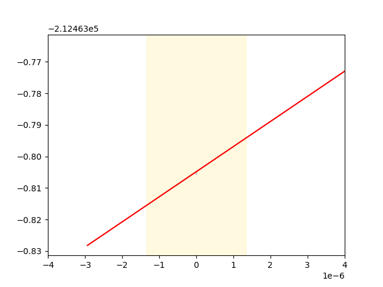


## Equation 4:
```
ICaL__PhiCaL_ss = 4.0 * pow(physical_constants__F, 2) * (-extracellular__cao * exp(-11436.254189932491 * pow(physical_constants__T, (-1.5)) * (-0.00014999999999999999 * extracellular__clo - 0.00014999999999999999 * extracellular__ko - 0.00014999999999999999 * extracellular__nao - 0.00059999999999999995 * extracellular__cao + 0.044721359549995794 * sqrt(0.25 * extracellular__clo + 0.25 * extracellular__ko + 0.25 * extracellular__nao + extracellular__cao) / (1.0 + 0.044721359549995794 * sqrt(0.25 * extracellular__clo + 0.25 * extracellular__ko + 0.25 * extracellular__nao + extracellular__cao)))) + intracellular_ions__cass * exp(-11436.254189932491 * pow(physical_constants__T, (-1.5)) * (-0.00014999999999999999 * intracellular_ions__cli - 0.00014999999999999999 * intracellular_ions__kss - 0.00014999999999999999 * intracellular_ions__nass - 0.00059999999999999995 * intracellular_ions__cass + 0.044721359549995794 * sqrt(0.25 * intracellular_ions__cli + 0.25 * intracellular_ions__kss + 0.25 * intracellular_ions__nass + intracellular_ions__cass) / (1.0 + 0.044721359549995794 * sqrt(0.25 * intracellular_ions__cli + 0.25 * intracellular_ions__kss + 0.25 * intracellular_ions__nass + intracellular_ions__cass)))) * exp(2.0 * membrane__v * physical_constants__F / (physical_constants__R * physical_constants__T))) * membrane__v / ((-1.0 + exp(2.0 * membrane__v * physical_constants__F / (physical_constants__R * physical_constants__T))) * physical_constants__R * physical_constants__T)
```
## New Eq:
```
ICaL__PhiCaL_ss = ((fabs(membrane__v) < 4.9999999999999998e-8 * fabs(physical_constants__R * physical_constants__T / physical_constants__F)) ? (-1.9999999999999999e-7 * (-extracellular__cao * exp(-11436.254189932491 * pow(physical_constants__T, (-1.5)) * (-0.00014999999999999999 * extracellular__clo - 0.00014999999999999999 * extracellular__ko - 0.00014999999999999999 * extracellular__nao - 0.00059999999999999995 * extracellular__cao + 0.044721359549995794 * sqrt(0.25 * extracellular__clo + 0.25 * extracellular__ko + 0.25 * extracellular__nao + extracellular__cao) / (1.0 + 0.044721359549995794 * sqrt(0.25 * extracellular__clo + 0.25 * extracellular__ko + 0.25 * extracellular__nao + extracellular__cao)))) + intracellular_ions__cass * exp(-9.9999999999999995e-8) * exp(-11436.254189932491 * pow(physical_constants__T, (-1.5)) * (-0.00014999999999999999 * intracellular_ions__cli - 0.00014999999999999999 * intracellular_ions__kss - 0.00014999999999999999 * intracellular_ions__nass - 0.00059999999999999995 * intracellular_ions__cass + 0.044721359549995794 * sqrt(0.25 * intracellular_ions__cli + 0.25 * intracellular_ions__kss + 0.25 * intracellular_ions__nass + intracellular_ions__cass) / (1.0 + 0.044721359549995794 * sqrt(0.25 * intracellular_ions__cli + 0.25 * intracellular_ions__kss + 0.25 * intracellular_ions__nass + intracellular_ions__cass))))) * physical_constants__F / (-1.0 + exp(-9.9999999999999995e-8)) + 10000000.0 * (4.9999999999999998e-8 * physical_constants__R * physical_constants__T / physical_constants__F + membrane__v) * (1.9999999999999999e-7 * (-extracellular__cao * exp(-11436.254189932491 * pow(physical_constants__T, (-1.5)) * (-0.00014999999999999999 * extracellular__clo - 0.00014999999999999999 * extracellular__ko - 0.00014999999999999999 * extracellular__nao - 0.00059999999999999995 * extracellular__cao + 0.044721359549995794 * sqrt(0.25 * extracellular__clo + 0.25 * extracellular__ko + 0.25 * extracellular__nao + extracellular__cao) / (1.0 + 0.044721359549995794 * sqrt(0.25 * extracellular__clo + 0.25 * extracellular__ko + 0.25 * extracellular__nao + extracellular__cao)))) + intracellular_ions__cass * exp(9.9999999999999995e-8) * exp(-11436.254189932491 * pow(physical_constants__T, (-1.5)) * (-0.00014999999999999999 * intracellular_ions__cli - 0.00014999999999999999 * intracellular_ions__kss - 0.00014999999999999999 * intracellular_ions__nass - 0.00059999999999999995 * intracellular_ions__cass + 0.044721359549995794 * sqrt(0.25 * intracellular_ions__cli + 0.25 * intracellular_ions__kss + 0.25 * intracellular_ions__nass + intracellular_ions__cass) / (1.0 + 0.044721359549995794 * sqrt(0.25 * intracellular_ions__cli + 0.25 * intracellular_ions__kss + 0.25 * intracellular_ions__nass + intracellular_ions__cass))))) * physical_constants__F / (-1.0 + exp(9.9999999999999995e-8)) + 1.9999999999999999e-7 * (-extracellular__cao * exp(-11436.254189932491 * pow(physical_constants__T, (-1.5)) * (-0.00014999999999999999 * extracellular__clo - 0.00014999999999999999 * extracellular__ko - 0.00014999999999999999 * extracellular__nao - 0.00059999999999999995 * extracellular__cao + 0.044721359549995794 * sqrt(0.25 * extracellular__clo + 0.25 * extracellular__ko + 0.25 * extracellular__nao + extracellular__cao) / (1.0 + 0.044721359549995794 * sqrt(0.25 * extracellular__clo + 0.25 * extracellular__ko + 0.25 * extracellular__nao + extracellular__cao)))) + intracellular_ions__cass * exp(-9.9999999999999995e-8) * exp(-11436.254189932491 * pow(physical_constants__T, (-1.5)) * (-0.00014999999999999999 * intracellular_ions__cli - 0.00014999999999999999 * intracellular_ions__kss - 0.00014999999999999999 * intracellular_ions__nass - 0.00059999999999999995 * intracellular_ions__cass + 0.044721359549995794 * sqrt(0.25 * intracellular_ions__cli + 0.25 * intracellular_ions__kss + 0.25 * intracellular_ions__nass + intracellular_ions__cass) / (1.0 + 0.044721359549995794 * sqrt(0.25 * intracellular_ions__cli + 0.25 * intracellular_ions__kss + 0.25 * intracellular_ions__nass + intracellular_ions__cass))))) * physical_constants__F / (-1.0 + exp(-9.9999999999999995e-8))) * physical_constants__F / (physical_constants__R * physical_constants__T)) : (4.0 * pow(physical_constants__F, 2) * (-extracellular__cao * exp(-11436.254189932491 * pow(physical_constants__T, (-1.5)) * (-0.00014999999999999999 * extracellular__clo - 0.00014999999999999999 * extracellular__ko - 0.00014999999999999999 * extracellular__nao - 0.00059999999999999995 * extracellular__cao + 0.044721359549995794 * sqrt(0.25 * extracellular__clo + 0.25 * extracellular__ko + 0.25 * extracellular__nao + extracellular__cao) / (1.0 + 0.044721359549995794 * sqrt(0.25 * extracellular__clo + 0.25 * extracellular__ko + 0.25 * extracellular__nao + extracellular__cao)))) + intracellular_ions__cass * exp(-11436.254189932491 * pow(physical_constants__T, (-1.5)) * (-0.00014999999999999999 * intracellular_ions__cli - 0.00014999999999999999 * intracellular_ions__kss - 0.00014999999999999999 * intracellular_ions__nass - 0.00059999999999999995 * intracellular_ions__cass + 0.044721359549995794 * sqrt(0.25 * intracellular_ions__cli + 0.25 * intracellular_ions__kss + 0.25 * intracellular_ions__nass + intracellular_ions__cass) / (1.0 + 0.044721359549995794 * sqrt(0.25 * intracellular_ions__cli + 0.25 * intracellular_ions__kss + 0.25 * intracellular_ions__nass + intracellular_ions__cass)))) * exp(2.0 * membrane__v * physical_constants__F / (physical_constants__R * physical_constants__T))) * membrane__v / ((-1.0 + exp(2.0 * membrane__v * physical_constants__F / (physical_constants__R * physical_constants__T))) * physical_constants__R * physical_constants__T)))
```
## Singularity point: 0
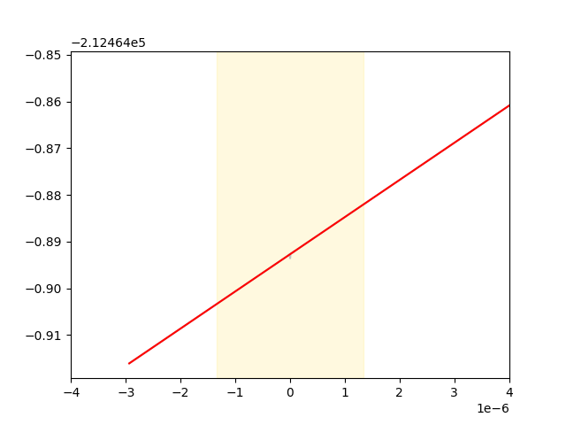


## Equation 5:
```
ICaL__PhiCaNa_i = pow(physical_constants__F, 2) * (-extracellular__nao * exp(-2859.0635474831229 * pow(physical_constants__T, (-1.5)) * (-0.00014999999999999999 * extracellular__clo - 0.00014999999999999999 * extracellular__ko - 0.00014999999999999999 * extracellular__nao - 0.00059999999999999995 * extracellular__cao + 0.044721359549995794 * sqrt(0.25 * extracellular__clo + 0.25 * extracellular__ko + 0.25 * extracellular__nao + extracellular__cao) / (1.0 + 0.044721359549995794 * sqrt(0.25 * extracellular__clo + 0.25 * extracellular__ko + 0.25 * extracellular__nao + extracellular__cao)))) + intracellular_ions__nai * exp(-2859.0635474831229 * pow(physical_constants__T, (-1.5)) * (-0.00014999999999999999 * intracellular_ions__cli - 0.00014999999999999999 * intracellular_ions__ki - 0.00014999999999999999 * intracellular_ions__nai - 0.00059999999999999995 * intracellular_ions__cai + 0.044721359549995794 * sqrt(0.25 * intracellular_ions__cli + 0.25 * intracellular_ions__ki + 0.25 * intracellular_ions__nai + intracellular_ions__cai) / (1.0 + 0.044721359549995794 * sqrt(0.25 * intracellular_ions__cli + 0.25 * intracellular_ions__ki + 0.25 * intracellular_ions__nai + intracellular_ions__cai)))) * exp(membrane__v * physical_constants__F / (physical_constants__R * physical_constants__T))) * membrane__v / ((-1.0 + exp(membrane__v * physical_constants__F / (physical_constants__R * physical_constants__T))) * physical_constants__R * physical_constants__T)
```
## New Eq:
```
ICaL__PhiCaNa_i = ((fabs(membrane__v) < 9.9999999999999995e-8 * fabs(physical_constants__R * physical_constants__T / physical_constants__F)) ? (-9.9999999999999995e-8 * (-extracellular__nao * exp(-2859.0635474831229 * pow(physical_constants__T, (-1.5)) * (-0.00014999999999999999 * extracellular__clo - 0.00014999999999999999 * extracellular__ko - 0.00014999999999999999 * extracellular__nao - 0.00059999999999999995 * extracellular__cao + 0.044721359549995794 * sqrt(0.25 * extracellular__clo + 0.25 * extracellular__ko + 0.25 * extracellular__nao + extracellular__cao) / (1.0 + 0.044721359549995794 * sqrt(0.25 * extracellular__clo + 0.25 * extracellular__ko + 0.25 * extracellular__nao + extracellular__cao)))) + intracellular_ions__nai * exp(-9.9999999999999995e-8) * exp(-2859.0635474831229 * pow(physical_constants__T, (-1.5)) * (-0.00014999999999999999 * intracellular_ions__cli - 0.00014999999999999999 * intracellular_ions__ki - 0.00014999999999999999 * intracellular_ions__nai - 0.00059999999999999995 * intracellular_ions__cai + 0.044721359549995794 * sqrt(0.25 * intracellular_ions__cli + 0.25 * intracellular_ions__ki + 0.25 * intracellular_ions__nai + intracellular_ions__cai) / (1.0 + 0.044721359549995794 * sqrt(0.25 * intracellular_ions__cli + 0.25 * intracellular_ions__ki + 0.25 * intracellular_ions__nai + intracellular_ions__cai))))) * physical_constants__F / (-1.0 + exp(-9.9999999999999995e-8)) + 5000000.0 * (9.9999999999999995e-8 * (-extracellular__nao * exp(-2859.0635474831229 * pow(physical_constants__T, (-1.5)) * (-0.00014999999999999999 * extracellular__clo - 0.00014999999999999999 * extracellular__ko - 0.00014999999999999999 * extracellular__nao - 0.00059999999999999995 * extracellular__cao + 0.044721359549995794 * sqrt(0.25 * extracellular__clo + 0.25 * extracellular__ko + 0.25 * extracellular__nao + extracellular__cao) / (1.0 + 0.044721359549995794 * sqrt(0.25 * extracellular__clo + 0.25 * extracellular__ko + 0.25 * extracellular__nao + extracellular__cao)))) + intracellular_ions__nai * exp(9.9999999999999995e-8) * exp(-2859.0635474831229 * pow(physical_constants__T, (-1.5)) * (-0.00014999999999999999 * intracellular_ions__cli - 0.00014999999999999999 * intracellular_ions__ki - 0.00014999999999999999 * intracellular_ions__nai - 0.00059999999999999995 * intracellular_ions__cai + 0.044721359549995794 * sqrt(0.25 * intracellular_ions__cli + 0.25 * intracellular_ions__ki + 0.25 * intracellular_ions__nai + intracellular_ions__cai) / (1.0 + 0.044721359549995794 * sqrt(0.25 * intracellular_ions__cli + 0.25 * intracellular_ions__ki + 0.25 * intracellular_ions__nai + intracellular_ions__cai))))) * physical_constants__F / (-1.0 + exp(9.9999999999999995e-8)) + 9.9999999999999995e-8 * (-extracellular__nao * exp(-2859.0635474831229 * pow(physical_constants__T, (-1.5)) * (-0.00014999999999999999 * extracellular__clo - 0.00014999999999999999 * extracellular__ko - 0.00014999999999999999 * extracellular__nao - 0.00059999999999999995 * extracellular__cao + 0.044721359549995794 * sqrt(0.25 * extracellular__clo + 0.25 * extracellular__ko + 0.25 * extracellular__nao + extracellular__cao) / (1.0 + 0.044721359549995794 * sqrt(0.25 * extracellular__clo + 0.25 * extracellular__ko + 0.25 * extracellular__nao + extracellular__cao)))) + intracellular_ions__nai * exp(-9.9999999999999995e-8) * exp(-2859.0635474831229 * pow(physical_constants__T, (-1.5)) * (-0.00014999999999999999 * intracellular_ions__cli - 0.00014999999999999999 * intracellular_ions__ki - 0.00014999999999999999 * intracellular_ions__nai - 0.00059999999999999995 * intracellular_ions__cai + 0.044721359549995794 * sqrt(0.25 * intracellular_ions__cli + 0.25 * intracellular_ions__ki + 0.25 * intracellular_ions__nai + intracellular_ions__cai) / (1.0 + 0.044721359549995794 * sqrt(0.25 * intracellular_ions__cli + 0.25 * intracellular_ions__ki + 0.25 * intracellular_ions__nai + intracellular_ions__cai))))) * physical_constants__F / (-1.0 + exp(-9.9999999999999995e-8))) * (9.9999999999999995e-8 * physical_constants__R * physical_constants__T / physical_constants__F + membrane__v) * physical_constants__F / (physical_constants__R * physical_constants__T)) : (pow(physical_constants__F, 2) * (-extracellular__nao * exp(-2859.0635474831229 * pow(physical_constants__T, (-1.5)) * (-0.00014999999999999999 * extracellular__clo - 0.00014999999999999999 * extracellular__ko - 0.00014999999999999999 * extracellular__nao - 0.00059999999999999995 * extracellular__cao + 0.044721359549995794 * sqrt(0.25 * extracellular__clo + 0.25 * extracellular__ko + 0.25 * extracellular__nao + extracellular__cao) / (1.0 + 0.044721359549995794 * sqrt(0.25 * extracellular__clo + 0.25 * extracellular__ko + 0.25 * extracellular__nao + extracellular__cao)))) + intracellular_ions__nai * exp(-2859.0635474831229 * pow(physical_constants__T, (-1.5)) * (-0.00014999999999999999 * intracellular_ions__cli - 0.00014999999999999999 * intracellular_ions__ki - 0.00014999999999999999 * intracellular_ions__nai - 0.00059999999999999995 * intracellular_ions__cai + 0.044721359549995794 * sqrt(0.25 * intracellular_ions__cli + 0.25 * intracellular_ions__ki + 0.25 * intracellular_ions__nai + intracellular_ions__cai) / (1.0 + 0.044721359549995794 * sqrt(0.25 * intracellular_ions__cli + 0.25 * intracellular_ions__ki + 0.25 * intracellular_ions__nai + intracellular_ions__cai)))) * exp(membrane__v * physical_constants__F / (physical_constants__R * physical_constants__T))) * membrane__v / ((-1.0 + exp(membrane__v * physical_constants__F / (physical_constants__R * physical_constants__T))) * physical_constants__R * physical_constants__T)))
```
## Singularity point: 0


## Equation 6:
```
ICaL__PhiCaNa_ss = pow(physical_constants__F, 2) * (-extracellular__nao * exp(-2859.0635474831229 * pow(physical_constants__T, (-1.5)) * (-0.00014999999999999999 * extracellular__clo - 0.00014999999999999999 * extracellular__ko - 0.00014999999999999999 * extracellular__nao - 0.00059999999999999995 * extracellular__cao + 0.044721359549995794 * sqrt(0.25 * extracellular__clo + 0.25 * extracellular__ko + 0.25 * extracellular__nao + extracellular__cao) / (1.0 + 0.044721359549995794 * sqrt(0.25 * extracellular__clo + 0.25 * extracellular__ko + 0.25 * extracellular__nao + extracellular__cao)))) + intracellular_ions__nass * exp(-2859.0635474831229 * pow(physical_constants__T, (-1.5)) * (-0.00014999999999999999 * intracellular_ions__cli - 0.00014999999999999999 * intracellular_ions__kss - 0.00014999999999999999 * intracellular_ions__nass - 0.00059999999999999995 * intracellular_ions__cass + 0.044721359549995794 * sqrt(0.25 * intracellular_ions__cli + 0.25 * intracellular_ions__kss + 0.25 * intracellular_ions__nass + intracellular_ions__cass) / (1.0 + 0.044721359549995794 * sqrt(0.25 * intracellular_ions__cli + 0.25 * intracellular_ions__kss + 0.25 * intracellular_ions__nass + intracellular_ions__cass)))) * exp(membrane__v * physical_constants__F / (physical_constants__R * physical_constants__T))) * membrane__v / ((-1.0 + exp(membrane__v * physical_constants__F / (physical_constants__R * physical_constants__T))) * physical_constants__R * physical_constants__T)
```
## New Eq:
```
ICaL__PhiCaNa_ss = ((fabs(membrane__v) < 9.9999999999999995e-8 * fabs(physical_constants__R * physical_constants__T / physical_constants__F)) ? (-9.9999999999999995e-8 * (-extracellular__nao * exp(-2859.0635474831229 * pow(physical_constants__T, (-1.5)) * (-0.00014999999999999999 * extracellular__clo - 0.00014999999999999999 * extracellular__ko - 0.00014999999999999999 * extracellular__nao - 0.00059999999999999995 * extracellular__cao + 0.044721359549995794 * sqrt(0.25 * extracellular__clo + 0.25 * extracellular__ko + 0.25 * extracellular__nao + extracellular__cao) / (1.0 + 0.044721359549995794 * sqrt(0.25 * extracellular__clo + 0.25 * extracellular__ko + 0.25 * extracellular__nao + extracellular__cao)))) + intracellular_ions__nass * exp(-9.9999999999999995e-8) * exp(-2859.0635474831229 * pow(physical_constants__T, (-1.5)) * (-0.00014999999999999999 * intracellular_ions__cli - 0.00014999999999999999 * intracellular_ions__kss - 0.00014999999999999999 * intracellular_ions__nass - 0.00059999999999999995 * intracellular_ions__cass + 0.044721359549995794 * sqrt(0.25 * intracellular_ions__cli + 0.25 * intracellular_ions__kss + 0.25 * intracellular_ions__nass + intracellular_ions__cass) / (1.0 + 0.044721359549995794 * sqrt(0.25 * intracellular_ions__cli + 0.25 * intracellular_ions__kss + 0.25 * intracellular_ions__nass + intracellular_ions__cass))))) * physical_constants__F / (-1.0 + exp(-9.9999999999999995e-8)) + 5000000.0 * (9.9999999999999995e-8 * (-extracellular__nao * exp(-2859.0635474831229 * pow(physical_constants__T, (-1.5)) * (-0.00014999999999999999 * extracellular__clo - 0.00014999999999999999 * extracellular__ko - 0.00014999999999999999 * extracellular__nao - 0.00059999999999999995 * extracellular__cao + 0.044721359549995794 * sqrt(0.25 * extracellular__clo + 0.25 * extracellular__ko + 0.25 * extracellular__nao + extracellular__cao) / (1.0 + 0.044721359549995794 * sqrt(0.25 * extracellular__clo + 0.25 * extracellular__ko + 0.25 * extracellular__nao + extracellular__cao)))) + intracellular_ions__nass * exp(9.9999999999999995e-8) * exp(-2859.0635474831229 * pow(physical_constants__T, (-1.5)) * (-0.00014999999999999999 * intracellular_ions__cli - 0.00014999999999999999 * intracellular_ions__kss - 0.00014999999999999999 * intracellular_ions__nass - 0.00059999999999999995 * intracellular_ions__cass + 0.044721359549995794 * sqrt(0.25 * intracellular_ions__cli + 0.25 * intracellular_ions__kss + 0.25 * intracellular_ions__nass + intracellular_ions__cass) / (1.0 + 0.044721359549995794 * sqrt(0.25 * intracellular_ions__cli + 0.25 * intracellular_ions__kss + 0.25 * intracellular_ions__nass + intracellular_ions__cass))))) * physical_constants__F / (-1.0 + exp(9.9999999999999995e-8)) + 9.9999999999999995e-8 * (-extracellular__nao * exp(-2859.0635474831229 * pow(physical_constants__T, (-1.5)) * (-0.00014999999999999999 * extracellular__clo - 0.00014999999999999999 * extracellular__ko - 0.00014999999999999999 * extracellular__nao - 0.00059999999999999995 * extracellular__cao + 0.044721359549995794 * sqrt(0.25 * extracellular__clo + 0.25 * extracellular__ko + 0.25 * extracellular__nao + extracellular__cao) / (1.0 + 0.044721359549995794 * sqrt(0.25 * extracellular__clo + 0.25 * extracellular__ko + 0.25 * extracellular__nao + extracellular__cao)))) + intracellular_ions__nass * exp(-9.9999999999999995e-8) * exp(-2859.0635474831229 * pow(physical_constants__T, (-1.5)) * (-0.00014999999999999999 * intracellular_ions__cli - 0.00014999999999999999 * intracellular_ions__kss - 0.00014999999999999999 * intracellular_ions__nass - 0.00059999999999999995 * intracellular_ions__cass + 0.044721359549995794 * sqrt(0.25 * intracellular_ions__cli + 0.25 * intracellular_ions__kss + 0.25 * intracellular_ions__nass + intracellular_ions__cass) / (1.0 + 0.044721359549995794 * sqrt(0.25 * intracellular_ions__cli + 0.25 * intracellular_ions__kss + 0.25 * intracellular_ions__nass + intracellular_ions__cass))))) * physical_constants__F / (-1.0 + exp(-9.9999999999999995e-8))) * (9.9999999999999995e-8 * physical_constants__R * physical_constants__T / physical_constants__F + membrane__v) * physical_constants__F / (physical_constants__R * physical_constants__T)) : (pow(physical_constants__F, 2) * (-extracellular__nao * exp(-2859.0635474831229 * pow(physical_constants__T, (-1.5)) * (-0.00014999999999999999 * extracellular__clo - 0.00014999999999999999 * extracellular__ko - 0.00014999999999999999 * extracellular__nao - 0.00059999999999999995 * extracellular__cao + 0.044721359549995794 * sqrt(0.25 * extracellular__clo + 0.25 * extracellular__ko + 0.25 * extracellular__nao + extracellular__cao) / (1.0 + 0.044721359549995794 * sqrt(0.25 * extracellular__clo + 0.25 * extracellular__ko + 0.25 * extracellular__nao + extracellular__cao)))) + intracellular_ions__nass * exp(-2859.0635474831229 * pow(physical_constants__T, (-1.5)) * (-0.00014999999999999999 * intracellular_ions__cli - 0.00014999999999999999 * intracellular_ions__kss - 0.00014999999999999999 * intracellular_ions__nass - 0.00059999999999999995 * intracellular_ions__cass + 0.044721359549995794 * sqrt(0.25 * intracellular_ions__cli + 0.25 * intracellular_ions__kss + 0.25 * intracellular_ions__nass + intracellular_ions__cass) / (1.0 + 0.044721359549995794 * sqrt(0.25 * intracellular_ions__cli + 0.25 * intracellular_ions__kss + 0.25 * intracellular_ions__nass + intracellular_ions__cass)))) * exp(membrane__v * physical_constants__F / (physical_constants__R * physical_constants__T))) * membrane__v / ((-1.0 + exp(membrane__v * physical_constants__F / (physical_constants__R * physical_constants__T))) * physical_constants__R * physical_constants__T)))
```
## Singularity point: 0


## Equation 7:
```
ICab__ICab = 2.36776e-7 * pow(physical_constants__F, 2) * (-extracellular__cao * exp(-11436.254189932491 * pow(physical_constants__T, (-1.5)) * (-0.00014999999999999999 * extracellular__clo - 0.00014999999999999999 * extracellular__ko - 0.00014999999999999999 * extracellular__nao - 0.00059999999999999995 * extracellular__cao + 0.044721359549995794 * sqrt(0.25 * extracellular__clo + 0.25 * extracellular__ko + 0.25 * extracellular__nao + extracellular__cao) / (1.0 + 0.044721359549995794 * sqrt(0.25 * extracellular__clo + 0.25 * extracellular__ko + 0.25 * extracellular__nao + extracellular__cao)))) + intracellular_ions__cai * exp(-11436.254189932491 * pow(physical_constants__T, (-1.5)) * (-0.00014999999999999999 * intracellular_ions__cli - 0.00014999999999999999 * intracellular_ions__ki - 0.00014999999999999999 * intracellular_ions__nai - 0.00059999999999999995 * intracellular_ions__cai + 0.044721359549995794 * sqrt(0.25 * intracellular_ions__cli + 0.25 * intracellular_ions__ki + 0.25 * intracellular_ions__nai + intracellular_ions__cai) / (1.0 + 0.044721359549995794 * sqrt(0.25 * intracellular_ions__cli + 0.25 * intracellular_ions__ki + 0.25 * intracellular_ions__nai + intracellular_ions__cai)))) * exp(2.0 * membrane__v * physical_constants__F / (physical_constants__R * physical_constants__T))) * membrane__v / ((-1.0 + exp(2.0 * membrane__v * physical_constants__F / (physical_constants__R * physical_constants__T))) * physical_constants__R * physical_constants__T)
```
## New Eq:
```
ICab__ICab = ((fabs(membrane__v) < 4.9999999999999998e-8 * fabs(physical_constants__R * physical_constants__T / physical_constants__F)) ? (-1.18388e-14 * (-extracellular__cao * exp(-11436.254189932491 * pow(physical_constants__T, (-1.5)) * (-0.00014999999999999999 * extracellular__clo - 0.00014999999999999999 * extracellular__ko - 0.00014999999999999999 * extracellular__nao - 0.00059999999999999995 * extracellular__cao + 0.044721359549995794 * sqrt(0.25 * extracellular__clo + 0.25 * extracellular__ko + 0.25 * extracellular__nao + extracellular__cao) / (1.0 + 0.044721359549995794 * sqrt(0.25 * extracellular__clo + 0.25 * extracellular__ko + 0.25 * extracellular__nao + extracellular__cao)))) + intracellular_ions__cai * exp(-9.9999999999999995e-8) * exp(-11436.254189932491 * pow(physical_constants__T, (-1.5)) * (-0.00014999999999999999 * intracellular_ions__cli - 0.00014999999999999999 * intracellular_ions__ki - 0.00014999999999999999 * intracellular_ions__nai - 0.00059999999999999995 * intracellular_ions__cai + 0.044721359549995794 * sqrt(0.25 * intracellular_ions__cli + 0.25 * intracellular_ions__ki + 0.25 * intracellular_ions__nai + intracellular_ions__cai) / (1.0 + 0.044721359549995794 * sqrt(0.25 * intracellular_ions__cli + 0.25 * intracellular_ions__ki + 0.25 * intracellular_ions__nai + intracellular_ions__cai))))) * physical_constants__F / (-1.0 + exp(-9.9999999999999995e-8)) + 10000000.0 * (4.9999999999999998e-8 * physical_constants__R * physical_constants__T / physical_constants__F + membrane__v) * (1.18388e-14 * (-extracellular__cao * exp(-11436.254189932491 * pow(physical_constants__T, (-1.5)) * (-0.00014999999999999999 * extracellular__clo - 0.00014999999999999999 * extracellular__ko - 0.00014999999999999999 * extracellular__nao - 0.00059999999999999995 * extracellular__cao + 0.044721359549995794 * sqrt(0.25 * extracellular__clo + 0.25 * extracellular__ko + 0.25 * extracellular__nao + extracellular__cao) / (1.0 + 0.044721359549995794 * sqrt(0.25 * extracellular__clo + 0.25 * extracellular__ko + 0.25 * extracellular__nao + extracellular__cao)))) + intracellular_ions__cai * exp(9.9999999999999995e-8) * exp(-11436.254189932491 * pow(physical_constants__T, (-1.5)) * (-0.00014999999999999999 * intracellular_ions__cli - 0.00014999999999999999 * intracellular_ions__ki - 0.00014999999999999999 * intracellular_ions__nai - 0.00059999999999999995 * intracellular_ions__cai + 0.044721359549995794 * sqrt(0.25 * intracellular_ions__cli + 0.25 * intracellular_ions__ki + 0.25 * intracellular_ions__nai + intracellular_ions__cai) / (1.0 + 0.044721359549995794 * sqrt(0.25 * intracellular_ions__cli + 0.25 * intracellular_ions__ki + 0.25 * intracellular_ions__nai + intracellular_ions__cai))))) * physical_constants__F / (-1.0 + exp(9.9999999999999995e-8)) + 1.18388e-14 * (-extracellular__cao * exp(-11436.254189932491 * pow(physical_constants__T, (-1.5)) * (-0.00014999999999999999 * extracellular__clo - 0.00014999999999999999 * extracellular__ko - 0.00014999999999999999 * extracellular__nao - 0.00059999999999999995 * extracellular__cao + 0.044721359549995794 * sqrt(0.25 * extracellular__clo + 0.25 * extracellular__ko + 0.25 * extracellular__nao + extracellular__cao) / (1.0 + 0.044721359549995794 * sqrt(0.25 * extracellular__clo + 0.25 * extracellular__ko + 0.25 * extracellular__nao + extracellular__cao)))) + intracellular_ions__cai * exp(-9.9999999999999995e-8) * exp(-11436.254189932491 * pow(physical_constants__T, (-1.5)) * (-0.00014999999999999999 * intracellular_ions__cli - 0.00014999999999999999 * intracellular_ions__ki - 0.00014999999999999999 * intracellular_ions__nai - 0.00059999999999999995 * intracellular_ions__cai + 0.044721359549995794 * sqrt(0.25 * intracellular_ions__cli + 0.25 * intracellular_ions__ki + 0.25 * intracellular_ions__nai + intracellular_ions__cai) / (1.0 + 0.044721359549995794 * sqrt(0.25 * intracellular_ions__cli + 0.25 * intracellular_ions__ki + 0.25 * intracellular_ions__nai + intracellular_ions__cai))))) * physical_constants__F / (-1.0 + exp(-9.9999999999999995e-8))) * physical_constants__F / (physical_constants__R * physical_constants__T)) : (2.36776e-7 * pow(physical_constants__F, 2) * (-extracellular__cao * exp(-11436.254189932491 * pow(physical_constants__T, (-1.5)) * (-0.00014999999999999999 * extracellular__clo - 0.00014999999999999999 * extracellular__ko - 0.00014999999999999999 * extracellular__nao - 0.00059999999999999995 * extracellular__cao + 0.044721359549995794 * sqrt(0.25 * extracellular__clo + 0.25 * extracellular__ko + 0.25 * extracellular__nao + extracellular__cao) / (1.0 + 0.044721359549995794 * sqrt(0.25 * extracellular__clo + 0.25 * extracellular__ko + 0.25 * extracellular__nao + extracellular__cao)))) + intracellular_ions__cai * exp(-11436.254189932491 * pow(physical_constants__T, (-1.5)) * (-0.00014999999999999999 * intracellular_ions__cli - 0.00014999999999999999 * intracellular_ions__ki - 0.00014999999999999999 * intracellular_ions__nai - 0.00059999999999999995 * intracellular_ions__cai + 0.044721359549995794 * sqrt(0.25 * intracellular_ions__cli + 0.25 * intracellular_ions__ki + 0.25 * intracellular_ions__nai + intracellular_ions__cai) / (1.0 + 0.044721359549995794 * sqrt(0.25 * intracellular_ions__cli + 0.25 * intracellular_ions__ki + 0.25 * intracellular_ions__nai + intracellular_ions__cai)))) * exp(2.0 * membrane__v * physical_constants__F / (physical_constants__R * physical_constants__T))) * membrane__v / ((-1.0 + exp(2.0 * membrane__v * physical_constants__F / (physical_constants__R * physical_constants__T))) * physical_constants__R * physical_constants__T)))
```
## Singularity point: 0


## Equation 8:
```
INab__INab = 1.9238999999999999e-9 * pow(physical_constants__F, 2) * (-extracellular__nao + intracellular_ions__nai * exp(membrane__v * physical_constants__F / (physical_constants__R * physical_constants__T))) * membrane__v / ((-1.0 + exp(membrane__v * physical_constants__F / (physical_constants__R * physical_constants__T))) * physical_constants__R * physical_constants__T)
```
## New Eq:
```
INab__INab = ((fabs(membrane__v) < 9.9999999999999995e-8 * fabs(physical_constants__R * physical_constants__T / physical_constants__F)) ? (-1.9238999999999998e-16 * (-extracellular__nao + intracellular_ions__nai * exp(-9.9999999999999995e-8)) * physical_constants__F / (-1.0 + exp(-9.9999999999999995e-8)) + 5000000.0 * (9.9999999999999995e-8 * physical_constants__R * physical_constants__T / physical_constants__F + membrane__v) * (1.9238999999999998e-16 * (-extracellular__nao + intracellular_ions__nai * exp(9.9999999999999995e-8)) * physical_constants__F / (-1.0 + exp(9.9999999999999995e-8)) + 1.9238999999999998e-16 * (-extracellular__nao + intracellular_ions__nai * exp(-9.9999999999999995e-8)) * physical_constants__F / (-1.0 + exp(-9.9999999999999995e-8))) * physical_constants__F / (physical_constants__R * physical_constants__T)) : (1.9238999999999999e-9 * pow(physical_constants__F, 2) * (-extracellular__nao + intracellular_ions__nai * exp(membrane__v * physical_constants__F / (physical_constants__R * physical_constants__T))) * membrane__v / ((-1.0 + exp(membrane__v * physical_constants__F / (physical_constants__R * physical_constants__T))) * physical_constants__R * physical_constants__T)))
```
## Singularity point: 0


# of singularities:  8
singularity processing time: 83.9979274999996
# Model: Trovato2020(Trovato2020.cellml)
No of piecewises: 2
## Equation 1:
```
ICaL__PhiCaK = pow(physical_constants__F, 2) * (-0.75 * extracellular__ko + 0.75 * intracellular_ions__kss * exp(membrane__v * physical_constants__F / (physical_constants__R * physical_constants__T))) * membrane__v / ((-1.0 + exp(membrane__v * physical_constants__F / (physical_constants__R * physical_constants__T))) * physical_constants__R * physical_constants__T)
```
## New Eq:
```
ICaL__PhiCaK = ((fabs(membrane__v) < 9.9999999999999995e-8 * fabs(physical_constants__R * physical_constants__T / physical_constants__F)) ? (-9.9999999999999995e-8 * (-0.75 * extracellular__ko + 0.75 * intracellular_ions__kss * exp(-9.9999999999999995e-8)) * physical_constants__F / (-1.0 + exp(-9.9999999999999995e-8)) + 5000000.0 * (9.9999999999999995e-8 * (-0.75 * extracellular__ko + 0.75 * intracellular_ions__kss * exp(9.9999999999999995e-8)) * physical_constants__F / (-1.0 + exp(9.9999999999999995e-8)) + 9.9999999999999995e-8 * (-0.75 * extracellular__ko + 0.75 * intracellular_ions__kss * exp(-9.9999999999999995e-8)) * physical_constants__F / (-1.0 + exp(-9.9999999999999995e-8))) * (9.9999999999999995e-8 * physical_constants__R * physical_constants__T / physical_constants__F + membrane__v) * physical_constants__F / (physical_constants__R * physical_constants__T)) : (pow(physical_constants__F, 2) * (-0.75 * extracellular__ko + 0.75 * intracellular_ions__kss * exp(membrane__v * physical_constants__F / (physical_constants__R * physical_constants__T))) * membrane__v / ((-1.0 + exp(membrane__v * physical_constants__F / (physical_constants__R * physical_constants__T))) * physical_constants__R * physical_constants__T)))
```
## Singularity point: 0
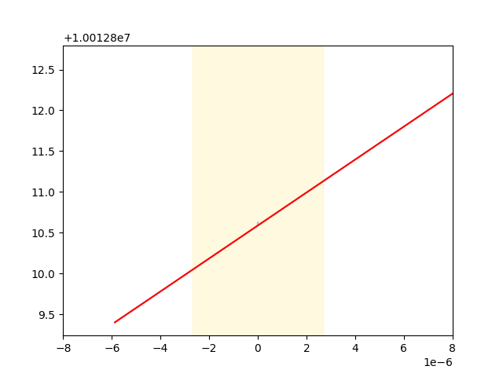


## Equation 2:
```
ICaL__PhiCaL = 4.0 * pow(physical_constants__F, 2) * (-0.34100000000000003 * extracellular__cao + intracellular_ions__cass * exp(2.0 * membrane__v * physical_constants__F / (physical_constants__R * physical_constants__T))) * membrane__v / ((-1.0 + exp(2.0 * membrane__v * physical_constants__F / (physical_constants__R * physical_constants__T))) * physical_constants__R * physical_constants__T)
```
## New Eq:
```
ICaL__PhiCaL = ((fabs(membrane__v) < 4.9999999999999998e-8 * fabs(physical_constants__R * physical_constants__T / physical_constants__F)) ? (-1.9999999999999999e-7 * (-0.34100000000000003 * extracellular__cao + intracellular_ions__cass * exp(-9.9999999999999995e-8)) * physical_constants__F / (-1.0 + exp(-9.9999999999999995e-8)) + 10000000.0 * (4.9999999999999998e-8 * physical_constants__R * physical_constants__T / physical_constants__F + membrane__v) * (1.9999999999999999e-7 * (-0.34100000000000003 * extracellular__cao + intracellular_ions__cass * exp(9.9999999999999995e-8)) * physical_constants__F / (-1.0 + exp(9.9999999999999995e-8)) + 1.9999999999999999e-7 * (-0.34100000000000003 * extracellular__cao + intracellular_ions__cass * exp(-9.9999999999999995e-8)) * physical_constants__F / (-1.0 + exp(-9.9999999999999995e-8))) * physical_constants__F / (physical_constants__R * physical_constants__T)) : (4.0 * pow(physical_constants__F, 2) * (-0.34100000000000003 * extracellular__cao + intracellular_ions__cass * exp(2.0 * membrane__v * physical_constants__F / (physical_constants__R * physical_constants__T))) * membrane__v / ((-1.0 + exp(2.0 * membrane__v * physical_constants__F / (physical_constants__R * physical_constants__T))) * physical_constants__R * physical_constants__T)))
```
## Singularity point: 0
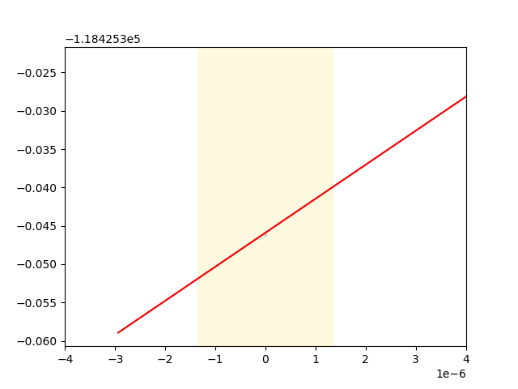


## Equation 3:
```
ICaL__PhiCaNa = pow(physical_constants__F, 2) * (-0.75 * extracellular__nao + 0.75 * intracellular_ions__nass * exp(membrane__v * physical_constants__F / (physical_constants__R * physical_constants__T))) * membrane__v / ((-1.0 + exp(membrane__v * physical_constants__F / (physical_constants__R * physical_constants__T))) * physical_constants__R * physical_constants__T)
```
## New Eq:
```
ICaL__PhiCaNa = ((fabs(membrane__v) < 9.9999999999999995e-8 * fabs(physical_constants__R * physical_constants__T / physical_constants__F)) ? (-9.9999999999999995e-8 * (-0.75 * extracellular__nao + 0.75 * intracellular_ions__nass * exp(-9.9999999999999995e-8)) * physical_constants__F / (-1.0 + exp(-9.9999999999999995e-8)) + 5000000.0 * (9.9999999999999995e-8 * (-0.75 * extracellular__nao + 0.75 * intracellular_ions__nass * exp(9.9999999999999995e-8)) * physical_constants__F / (-1.0 + exp(9.9999999999999995e-8)) + 9.9999999999999995e-8 * (-0.75 * extracellular__nao + 0.75 * intracellular_ions__nass * exp(-9.9999999999999995e-8)) * physical_constants__F / (-1.0 + exp(-9.9999999999999995e-8))) * (9.9999999999999995e-8 * physical_constants__R * physical_constants__T / physical_constants__F + membrane__v) * physical_constants__F / (physical_constants__R * physical_constants__T)) : (pow(physical_constants__F, 2) * (-0.75 * extracellular__nao + 0.75 * intracellular_ions__nass * exp(membrane__v * physical_constants__F / (physical_constants__R * physical_constants__T))) * membrane__v / ((-1.0 + exp(membrane__v * physical_constants__F / (physical_constants__R * physical_constants__T))) * physical_constants__R * physical_constants__T)))
```
## Singularity point: 0


## Equation 4:
```
ICab__ICab = 9.9999999999999995e-8 * pow(physical_constants__F, 2) * (-0.34100000000000003 * extracellular__cao + intracellular_ions__casl * exp(2.0 * membrane__v * physical_constants__F / (physical_constants__R * physical_constants__T))) * membrane__v / ((-1.0 + exp(2.0 * membrane__v * physical_constants__F / (physical_constants__R * physical_constants__T))) * physical_constants__R * physical_constants__T)
```
## New Eq:
```
ICab__ICab = ((fabs(membrane__v) < 4.9999999999999998e-8 * fabs(physical_constants__R * physical_constants__T / physical_constants__F)) ? (-4.9999999999999992e-15 * (-0.34100000000000003 * extracellular__cao + intracellular_ions__casl * exp(-9.9999999999999995e-8)) * physical_constants__F / (-1.0 + exp(-9.9999999999999995e-8)) + 10000000.0 * (4.9999999999999998e-8 * physical_constants__R * physical_constants__T / physical_constants__F + membrane__v) * (4.9999999999999992e-15 * (-0.34100000000000003 * extracellular__cao + intracellular_ions__casl * exp(9.9999999999999995e-8)) * physical_constants__F / (-1.0 + exp(9.9999999999999995e-8)) + 4.9999999999999992e-15 * (-0.34100000000000003 * extracellular__cao + intracellular_ions__casl * exp(-9.9999999999999995e-8)) * physical_constants__F / (-1.0 + exp(-9.9999999999999995e-8))) * physical_constants__F / (physical_constants__R * physical_constants__T)) : (9.9999999999999995e-8 * pow(physical_constants__F, 2) * (-0.34100000000000003 * extracellular__cao + intracellular_ions__casl * exp(2.0 * membrane__v * physical_constants__F / (physical_constants__R * physical_constants__T))) * membrane__v / ((-1.0 + exp(2.0 * membrane__v * physical_constants__F / (physical_constants__R * physical_constants__T))) * physical_constants__R * physical_constants__T)))
```
## Singularity point: 0


## Equation 5:
```
INab__INab = 9.3749999999999992e-10 * pow(physical_constants__F, 2) * (-extracellular__nao + intracellular_ions__nasl * exp(membrane__v * physical_constants__F / (physical_constants__R * physical_constants__T))) * membrane__v / ((-1.0 + exp(membrane__v * physical_constants__F / (physical_constants__R * physical_constants__T))) * physical_constants__R * physical_constants__T)
```
## New Eq:
```
INab__INab = ((fabs(membrane__v) < 9.9999999999999995e-8 * fabs(physical_constants__R * physical_constants__T / physical_constants__F)) ? (-9.3749999999999983e-17 * (-extracellular__nao + intracellular_ions__nasl * exp(-9.9999999999999995e-8)) * physical_constants__F / (-1.0 + exp(-9.9999999999999995e-8)) + 5000000.0 * (9.9999999999999995e-8 * physical_constants__R * physical_constants__T / physical_constants__F + membrane__v) * (9.3749999999999983e-17 * (-extracellular__nao + intracellular_ions__nasl * exp(9.9999999999999995e-8)) * physical_constants__F / (-1.0 + exp(9.9999999999999995e-8)) + 9.3749999999999983e-17 * (-extracellular__nao + intracellular_ions__nasl * exp(-9.9999999999999995e-8)) * physical_constants__F / (-1.0 + exp(-9.9999999999999995e-8))) * physical_constants__F / (physical_constants__R * physical_constants__T)) : (9.3749999999999992e-10 * pow(physical_constants__F, 2) * (-extracellular__nao + intracellular_ions__nasl * exp(membrane__v * physical_constants__F / (physical_constants__R * physical_constants__T))) * membrane__v / ((-1.0 + exp(membrane__v * physical_constants__F / (physical_constants__R * physical_constants__T))) * physical_constants__R * physical_constants__T)))
```
## Singularity point: 0
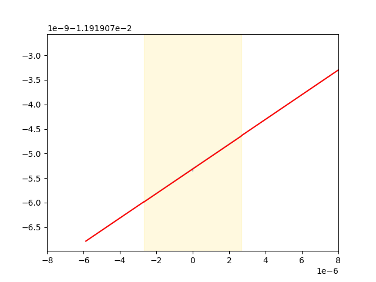


# of singularities:  5
singularity processing time: 68.6765260000002
# Model: viswanathan_model_1999_epi(viswanathan_model_1999_epi.cellml)
No of piecewises: 13
## Equation 1:
```
L_type_Ca_channel__I_CaCa = 7.8019226357407252 * (-0.34100000000000003 * calcium_dynamics__Cao + calcium_dynamics__Cai * exp(0.074871767015605231 * membrane__V)) * membrane__V / (-1.0 + exp(0.074871767015605231 * membrane__V))
```
## New Eq:
```
L_type_Ca_channel__I_CaCa = ((fabs(membrane__V) < 1.3356169352749131e-6) ? ((0.5 + 374358.83507802623 * membrane__V) * (1.042038e-5 * (-0.34100000000000003 * calcium_dynamics__Cao + calcium_dynamics__Cai * exp(9.9999999999999995e-8)) / (-1.0 + exp(9.9999999999999995e-8)) + 1.042038e-5 * (-0.34100000000000003 * calcium_dynamics__Cao + calcium_dynamics__Cai * exp(-9.9999999999999995e-8)) / (-1.0 + exp(-9.9999999999999995e-8))) - 1.042038e-5 * (-0.34100000000000003 * calcium_dynamics__Cao + calcium_dynamics__Cai * exp(-9.9999999999999995e-8)) / (-1.0 + exp(-9.9999999999999995e-8))) : (7.8019226357407252 * (-0.34100000000000003 * calcium_dynamics__Cao + calcium_dynamics__Cai * exp(0.074871767015605231 * membrane__V)) * membrane__V / (-1.0 + exp(0.074871767015605231 * membrane__V))))
```
## Singularity point: 0


## Equation 2:
```
L_type_Ca_channel__I_CaK = 0.00069711623550831479 * (-0.75 * ionic_concentrations__Ko + 0.75 * ionic_concentrations__Ki * exp(0.037435883507802616 * membrane__V)) * membrane__V / (-1.0 + exp(0.037435883507802616 * membrane__V))
```
## New Eq:
```
L_type_Ca_channel__I_CaK = ((fabs(membrane__V) < 2.6712338705498262e-6) ? ((0.5 + 187179.41753901311 * membrane__V) * (1.8621604999999999e-9 * (-0.75 * ionic_concentrations__Ko + 0.75 * ionic_concentrations__Ki * exp(9.9999999999999995e-8)) / (-1.0 + exp(9.9999999999999995e-8)) + 1.8621604999999999e-9 * (-0.75 * ionic_concentrations__Ko + 0.75 * ionic_concentrations__Ki * exp(-9.9999999999999995e-8)) / (-1.0 + exp(-9.9999999999999995e-8))) - 1.8621604999999999e-9 * (-0.75 * ionic_concentrations__Ko + 0.75 * ionic_concentrations__Ki * exp(-9.9999999999999995e-8)) / (-1.0 + exp(-9.9999999999999995e-8))) : (0.00069711623550831479 * (-0.75 * ionic_concentrations__Ko + 0.75 * ionic_concentrations__Ki * exp(0.037435883507802616 * membrane__V)) * membrane__V / (-1.0 + exp(0.037435883507802616 * membrane__V))))
```
## Singularity point: 0


## Equation 3:
```
L_type_Ca_channel__I_CaNa = 0.0024381008236689767 * (-0.75 * ionic_concentrations__Nao + 0.75 * ionic_concentrations__Nai * exp(0.037435883507802616 * membrane__V)) * membrane__V / (-1.0 + exp(0.037435883507802616 * membrane__V))
```
## New Eq:
```
L_type_Ca_channel__I_CaNa = ((fabs(membrane__V) < 2.6712338705498262e-6) ? ((0.5 + 187179.41753901311 * membrane__V) * (6.5127375e-9 * (-0.75 * ionic_concentrations__Nao + 0.75 * ionic_concentrations__Nai * exp(9.9999999999999995e-8)) / (-1.0 + exp(9.9999999999999995e-8)) + 6.5127375e-9 * (-0.75 * ionic_concentrations__Nao + 0.75 * ionic_concentrations__Nai * exp(-9.9999999999999995e-8)) / (-1.0 + exp(-9.9999999999999995e-8))) - 6.5127375e-9 * (-0.75 * ionic_concentrations__Nao + 0.75 * ionic_concentrations__Nai * exp(-9.9999999999999995e-8)) / (-1.0 + exp(-9.9999999999999995e-8))) : (0.0024381008236689767 * (-0.75 * ionic_concentrations__Nao + 0.75 * ionic_concentrations__Nai * exp(0.037435883507802616 * membrane__V)) * membrane__V / (-1.0 + exp(0.037435883507802616 * membrane__V))))
```
## Singularity point: 0


## Equation 4:
```
L_type_Ca_channel_d_gate__tau_d = 0.028571428571428571 * (1.0 - exp(-1.6025641025641024 - 0.16025641025641024 * membrane__V)) / ((1.0 + exp(-1.6025641025641024 - 0.16025641025641024 * membrane__V)) * (10.0 + membrane__V))
```
## New Eq:
```
L_type_Ca_channel_d_gate__tau_d = ((fabs(10.0 + membrane__V) < 6.2399999999074307e-7) ? ((-8012820.0129393814 - 801282.05129393819 * membrane__V) * (-45787.545788225034 * (1.0 - exp(9.9999999997671396e-8)) / (1.0 + exp(9.9999999997671396e-8)) - 45787.545788225034 * (1.0 - exp(-9.9999999997671396e-8)) / (1.0 + exp(-9.9999999997671396e-8))) + 45787.545788225034 * (1.0 - exp(-9.9999999997671396e-8)) / (1.0 + exp(-9.9999999997671396e-8))) : (0.028571428571428571 * (1.0 - exp(-1.6025641025641024 - 0.16025641025641024 * membrane__V)) / ((1.0 + exp(-1.6025641025641024 - 0.16025641025641024 * membrane__V)) * (10.0 + membrane__V))))
```
## Singularity point: -10.000000000000000
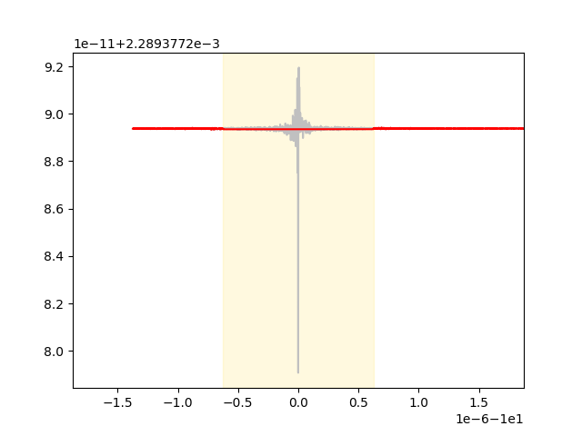


## Equation 5:
```
fast_sodium_current_m_gate__alpha_m = 320.0 * (47.130000000000003 + membrane__V) / (1.0 - exp(-4.7130000000000001 - 0.10000000000000001 * membrane__V))
```
## New Eq:
```
fast_sodium_current_m_gate__alpha_m = ((fabs(47.130000000000003 + membrane__V) < 1.0000000000287557e-6) ? (0.00032000000000920181 / (1.0 - exp(-1.0000000000287557e-7)) + (-23564999.499322373 - 499999.99998562218 * membrane__V) * (-0.00032000000000920181 / (1.0 - exp(1.0000000000287557e-7)) - 0.00032000000000920181 / (1.0 - exp(-1.0000000000287557e-7)))) : (320.0 * (47.130000000000003 + membrane__V) / (1.0 - exp(-4.7130000000000001 - 0.10000000000000001 * membrane__V))))
```
## Singularity point: -47.130000000000003
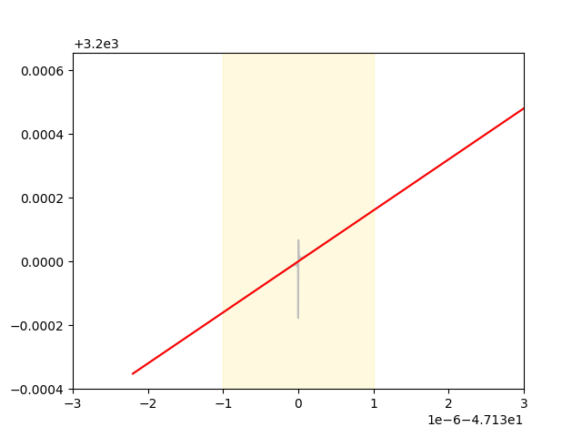


## Equation 6:
```
rapid_delayed_rectifier_potassium_current_xr_gate__tau_xr = 0.001 / (0.00060999999999999997 * (38.899999999999999 + membrane__V) / (-1.0 + exp(5.6404999999999994 + 0.14499999999999999 * membrane__V)) + 0.0013799999999999999 * (14.199999999999999 + membrane__V) / (1.0 - exp(-1.7465999999999999 - 0.123 * membrane__V)))
```
## New Eq:
```
rapid_delayed_rectifier_potassium_current_xr_gate__tau_xr = 0.001 / (((fabs(14.199999999999999 + membrane__V) < 8.1300813007528783e-7) ? (1.1219512195134727e-9 / (1.0 - exp(-9.9999999999406119e-8)) + (-8732999.5000645891 - 615000.00000454858 * membrane__V) * (-1.1219512194943214e-9 / (1.0 - exp(9.9999999999406119e-8)) - 1.1219512195134727e-9 / (1.0 - exp(-9.9999999999406119e-8)))) : (0.0013799999999999999 * (14.199999999999999 + membrane__V) / (1.0 - exp(-1.7465999999999999 - 0.123 * membrane__V)))) + ((fabs(38.899999999999999 + membrane__V) < 6.896551724422384e-7) ? (-4.2068965517283451e-10 / (-1.0 + exp(-1.0000000000287557e-7)) + (28202500.498836767 + 724999.99997009686 * membrane__V) * (4.2068965517283451e-10 / (-1.0 + exp(-1.0000000000287557e-7)) + 4.2068965520669629e-10 / (-1.0 + exp(1.0000000000287557e-7)))) : (0.00060999999999999997 * (38.899999999999999 + membrane__V) / (-1.0 + exp(5.6404999999999994 + 0.14499999999999999 * membrane__V)))))
```
## Singularity point: -14.199999999999999


## Singularity point: -38.899999999999999


## Equation 7:
```
slow_delayed_rectifier_potassium_current_xs1_gate__tau_xs1 = 0.001 / (0.00013100000000000001 * (30.0 + membrane__V) / (-1.0 + exp(2.0609999999999999 + 0.068699999999999997 * membrane__V)) + 7.1899999999999999e-5 * (30.0 + membrane__V) / (1.0 - exp(-4.4399999999999995 - 0.14799999999999999 * membrane__V)))
```
## New Eq:
```
slow_delayed_rectifier_potassium_current_xs1_gate__tau_xs1 = 0.001 * ((fabs(30.0 + membrane__V) < 1.455604075689676e-6) ? (1 / (-1.0465793304208771e-10 / (1.0 - exp(2.1542940320529169e-7)) - 1.9068413391534758e-10 / (-1.0 + exp(-9.9999999999406119e-8)) + (10305000.50001229 + 343500.00000040967 * membrane__V) * (1.0465793304208771e-10 / (1.0 - exp(2.1542940320529169e-7)) + 1.0465793304208771e-10 / (1.0 - exp(-2.1542940320529169e-7)) + 1.9068413391534758e-10 / (-1.0 + exp(9.9999999999406119e-8)) + 1.9068413391534758e-10 / (-1.0 + exp(-9.9999999999406119e-8))))) : (1 / (0.00013100000000000001 * (30.0 + membrane__V) / (-1.0 + exp(2.0609999999999999 + 0.068699999999999997 * membrane__V)) + 7.1899999999999999e-5 * (30.0 + membrane__V) / (1.0 - exp(-4.4399999999999995 - 0.14799999999999999 * membrane__V)))))
```
## Singularity point: -30.000000000000000


## Equation 8:
```
slow_delayed_rectifier_potassium_current_xs2_gate__tau_xs2 = 0.0040000000000000001 / (0.00013100000000000001 * (30.0 + membrane__V) / (-1.0 + exp(2.0609999999999999 + 0.068699999999999997 * membrane__V)) + 7.1899999999999999e-5 * (30.0 + membrane__V) / (1.0 - exp(-4.4399999999999995 - 0.14799999999999999 * membrane__V)))
```
## New Eq:
```
slow_delayed_rectifier_potassium_current_xs2_gate__tau_xs2 = 0.0040000000000000001 * ((fabs(30.0 + membrane__V) < 1.455604075689676e-6) ? (1 / (-1.0465793304208771e-10 / (1.0 - exp(2.1542940320529169e-7)) - 1.9068413391534758e-10 / (-1.0 + exp(-9.9999999999406119e-8)) + (10305000.50001229 + 343500.00000040967 * membrane__V) * (1.0465793304208771e-10 / (1.0 - exp(2.1542940320529169e-7)) + 1.0465793304208771e-10 / (1.0 - exp(-2.1542940320529169e-7)) + 1.9068413391534758e-10 / (-1.0 + exp(9.9999999999406119e-8)) + 1.9068413391534758e-10 / (-1.0 + exp(-9.9999999999406119e-8))))) : (1 / (0.00013100000000000001 * (30.0 + membrane__V) / (-1.0 + exp(2.0609999999999999 + 0.068699999999999997 * membrane__V)) + 7.1899999999999999e-5 * (30.0 + membrane__V) / (1.0 - exp(-4.4399999999999995 - 0.14799999999999999 * membrane__V)))))
```
## Singularity point: -30.000000000000000


# of singularities:  9
singularity processing time: 54.776526300000114
# Model: wang_model_2008(wang_sobie_2008.cellml)
No of piecewises: 4
## Equation 1:
```
calcium_activated_chloride_current__i_ClCa = 1.6091588988130313e-8 * pow(calcium_concentration__Cass, 3) * (-membrane__Cli + membrane__Clo * exp(0.038949423064193495 * membrane__V)) * membrane__V / (pow((1 + 0.25 * calcium_concentration__Cass), 3) * (-1.0 + exp(0.038949423064193495 * membrane__V)))
```
## New Eq:
```
calcium_activated_chloride_current__i_ClCa = ((fabs(membrane__V) < 2.5674321243523316e-6) ? ((0.5 + 194747.11532096748 * membrane__V) * (4.1314062499999994e-14 * pow(calcium_concentration__Cass, 3) * (-membrane__Cli + membrane__Clo * exp(9.9999999999999995e-8)) / (pow((1 + 0.25 * calcium_concentration__Cass), 3) * (-1.0 + exp(9.9999999999999995e-8))) + 4.1314062499999994e-14 * pow(calcium_concentration__Cass, 3) * (-membrane__Cli + membrane__Clo * exp(-9.9999999999999995e-8)) / (pow((1 + 0.25 * calcium_concentration__Cass), 3) * (-1.0 + exp(-9.9999999999999995e-8)))) - 4.1314062499999994e-14 * pow(calcium_concentration__Cass, 3) * (-membrane__Cli + membrane__Clo * exp(-9.9999999999999995e-8)) / (pow((1 + 0.25 * calcium_concentration__Cass), 3) * (-1.0 + exp(-9.9999999999999995e-8)))) : (1.6091588988130313e-8 * pow(calcium_concentration__Cass, 3) * (-membrane__Cli + membrane__Clo * exp(0.038949423064193495 * membrane__V)) * membrane__V / (pow((1 + 0.25 * calcium_concentration__Cass), 3) * (-1.0 + exp(0.038949423064193495 * membrane__V)))))
```
## Singularity point: 0


## Equation 2:
```
fast_sodium_current_m_gate__alpha_m = 0.32000000000000001 * (47.130000000000003 + membrane__V) / (1.0 - exp(-4.7130000000000001 - 0.10000000000000001 * membrane__V))
```
## New Eq:
```
fast_sodium_current_m_gate__alpha_m = ((fabs(47.130000000000003 + membrane__V) < 1.0000000000287557e-6) ? (3.200000000092018e-7 / (1.0 - exp(-1.0000000000287557e-7)) + (-23564999.499322373 - 499999.99998562218 * membrane__V) * (-3.200000000092018e-7 / (1.0 - exp(1.0000000000287557e-7)) - 3.200000000092018e-7 / (1.0 - exp(-1.0000000000287557e-7)))) : (0.32000000000000001 * (47.130000000000003 + membrane__V) / (1.0 - exp(-4.7130000000000001 - 0.10000000000000001 * membrane__V))))
```
## Singularity point: -47.130000000000003


## Equation 3:
```
slow_delayed_rectifier_potassium_current__alpha_n = 4.8133299999999997e-6 * (26.5 + membrane__V) / (1.0 - exp(-3.3919999999999999 - 0.128 * membrane__V))
```
## New Eq:
```
slow_delayed_rectifier_potassium_current__alpha_n = ((fabs(26.5 + membrane__V) < 7.8124999999817923e-7) ? (3.7604140624912359e-12 / (1.0 - exp(-9.9999999999406119e-8)) + (-16959999.500039525 - 640000.00000149151 * membrane__V) * (-3.7604140624912359e-12 / (1.0 - exp(9.9999999999406119e-8)) - 3.7604140624912359e-12 / (1.0 - exp(-9.9999999999406119e-8)))) : (4.8133299999999997e-6 * (26.5 + membrane__V) / (1.0 - exp(-3.3919999999999999 - 0.128 * membrane__V))))
```
## Singularity point: -26.500000000000000


# of singularities:  3
singularity processing time: 12.510395000000244
# Model: winslow_model_1999(winslow_model_1999.cellml)
No of piecewises: 5
## Equation 1:
```
fast_sodium_current_m_gate__alpha_m = 320.0 * (47.130000000000003 + membrane__V) / (1.0 - exp(-4.7130000000000001 - 0.10000000000000001 * membrane__V))
```
## New Eq:
```
fast_sodium_current_m_gate__alpha_m = ((fabs(47.130000000000003 + membrane__V) < 1.0000000000287557e-6) ? (0.00032000000000920181 / (1.0 - exp(-1.0000000000287557e-7)) + (-23564999.499322373 - 499999.99998562218 * membrane__V) * (-0.00032000000000920181 / (1.0 - exp(1.0000000000287557e-7)) - 0.00032000000000920181 / (1.0 - exp(-1.0000000000287557e-7)))) : (320.0 * (47.130000000000003 + membrane__V) / (1.0 - exp(-4.7130000000000001 - 0.10000000000000001 * membrane__V))))
```
## Singularity point: -47.130000000000003


## Equation 2:
```
slow_activating_delayed_rectifiyer_K_current_X_ks_gate__tau_X_ks = 0.001 / (0.00013100000000000001 * (-10.0 + membrane__V) / (-1.0 + exp(-0.68699999999999994 + 0.068699999999999997 * membrane__V)) + 7.1899999999999999e-5 * (-10.0 + membrane__V) / (1.0 - exp(1.48 - 0.14799999999999999 * membrane__V)))
```
## New Eq:
```
slow_activating_delayed_rectifiyer_K_current_X_ks_gate__tau_X_ks = 0.001 * ((fabs(-10.0 + membrane__V) < 1.455604075689676e-6) ? (1 / (-1.0465793304208771e-10 / (1.0 - exp(2.1542940320182224e-7)) - 1.9068413391534758e-10 / (-1.0 + exp(-1.0000000000027348e-7)) + (-3434999.5000040964 + 343500.00000040967 * membrane__V) * (1.0465793304208771e-10 / (1.0 - exp(2.1542940320182224e-7)) + 1.0465793304208771e-10 / (1.0 - exp(-2.1542940320182224e-7)) + 1.9068413391534758e-10 / (-1.0 + exp(1.0000000000027348e-7)) + 1.9068413391534758e-10 / (-1.0 + exp(-1.0000000000027348e-7))))) : (1 / (0.00013100000000000001 * (-10.0 + membrane__V) / (-1.0 + exp(-0.68699999999999994 + 0.068699999999999997 * membrane__V)) + 7.1899999999999999e-5 * (-10.0 + membrane__V) / (1.0 - exp(1.48 - 0.14799999999999999 * membrane__V)))))
```
## Singularity point: 10.000000000000000


## Equation 3:
```
L_type_Ca_current__i_Ca_max = 14447.286958825252 * (0.001 * exp(0.074867781645490947 * membrane__V) - 0.34100000000000003 * standard_ionic_concentrations__Cao) * L_type_Ca_current__P_Ca * membrane__V / (-1.0 + exp(0.074867781645490947 * membrane__V))
```
## New Eq:
```
L_type_Ca_current__i_Ca_max = ((fabs(membrane__V) < 1.3356880329847825e-6) ? ((0.5 + 374338.90822745475 * membrane__V) * (0.019297068300000001 * (0.001 * exp(9.9999999999999995e-8) - 0.34100000000000003 * standard_ionic_concentrations__Cao) * L_type_Ca_current__P_Ca / (-1.0 + exp(9.9999999999999995e-8)) + 0.019297068300000001 * (0.001 * exp(-9.9999999999999995e-8) - 0.34100000000000003 * standard_ionic_concentrations__Cao) * L_type_Ca_current__P_Ca / (-1.0 + exp(-9.9999999999999995e-8))) - 0.019297068300000001 * (0.001 * exp(-9.9999999999999995e-8) - 0.34100000000000003 * standard_ionic_concentrations__Cao) * L_type_Ca_current__P_Ca / (-1.0 + exp(-9.9999999999999995e-8))) : (14447.286958825252 * (0.001 * exp(0.074867781645490947 * membrane__V) - 0.34100000000000003 * standard_ionic_concentrations__Cao) * L_type_Ca_current__P_Ca * membrane__V / (-1.0 + exp(0.074867781645490947 * membrane__V))))
```
## Singularity point: 0


## Equation 4:
```
L_type_Ca_current__i_Ca_K = 2.0912447872899554e-6 * (-standard_ionic_concentrations__Ko + intracellular_ion_concentrations__Ki * exp(0.037433890822745473 * membrane__V)) * (L_type_Ca_current__O + L_type_Ca_current__O_Ca) * L_type_Ca_current_y_gate__y * membrane__V / ((1.0 - 3.773584905660377 * L_type_Ca_current__i_Ca_max) * (-1.0 + exp(0.037433890822745473 * membrane__V)))
```
## New Eq:
```
L_type_Ca_current__i_Ca_K = ((fabs(membrane__V) < 2.671376065969565e-6) ? ((0.5 + 187169.45411372738 * membrane__V) * (5.5865012728500001e-12 * (-standard_ionic_concentrations__Ko + intracellular_ion_concentrations__Ki * exp(9.9999999999999995e-8)) * (L_type_Ca_current__O + L_type_Ca_current__O_Ca) * L_type_Ca_current_y_gate__y / ((1.0 - 3.773584905660377 * L_type_Ca_current__i_Ca_max) * (-1.0 + exp(9.9999999999999995e-8))) + 5.5865012728500001e-12 * (-standard_ionic_concentrations__Ko + intracellular_ion_concentrations__Ki * exp(-9.9999999999999995e-8)) * (L_type_Ca_current__O + L_type_Ca_current__O_Ca) * L_type_Ca_current_y_gate__y / ((1.0 - 3.773584905660377 * L_type_Ca_current__i_Ca_max) * (-1.0 + exp(-9.9999999999999995e-8)))) - 5.5865012728500001e-12 * (-standard_ionic_concentrations__Ko + intracellular_ion_concentrations__Ki * exp(-9.9999999999999995e-8)) * (L_type_Ca_current__O + L_type_Ca_current__O_Ca) * L_type_Ca_current_y_gate__y / ((1.0 - 3.773584905660377 * L_type_Ca_current__i_Ca_max) * (-1.0 + exp(-9.9999999999999995e-8)))) : (2.0912447872899554e-6 * (-standard_ionic_concentrations__Ko + intracellular_ion_concentrations__Ki * exp(0.037433890822745473 * membrane__V)) * (L_type_Ca_current__O + L_type_Ca_current__O_Ca) * L_type_Ca_current_y_gate__y * membrane__V / ((1.0 - 3.773584905660377 * L_type_Ca_current__i_Ca_max) * (-1.0 + exp(0.037433890822745473 * membrane__V)))))
```
## Singularity point: 0


# of singularities:  4
singularity processing time: 23.749503300000015
# Model: zhang_SAN_model_2000_0D_capable(zhang_SAN_model_2000_0D_capable.cellml)
No of piecewises: 0
## Equation 1:
```
L_type_Ca_channel_d_gate__alpha_d_L = -28.390000000000001 * (35.0 + membrane__V) / (-1.0 + exp(-14.0 - 0.40000000000000002 * membrane__V)) - 84.900000000000006 * membrane__V / (-1.0 + exp(-0.20799999999999999 * membrane__V))
```
## New Eq:
```
L_type_Ca_channel_d_gate__alpha_d_L = ((fabs(membrane__V) < 4.8076923076923074e-7) ? (-4.0817307692307694e-5 / (-1.0 + exp(-9.9999999999999995e-8)) + (0.5 - 1040000.0 * membrane__V) * (4.0817307692307694e-5 / (-1.0 + exp(9.9999999999999995e-8)) + 4.0817307692307694e-5 / (-1.0 + exp(-9.9999999999999995e-8)))) : (-84.900000000000006 * membrane__V / (-1.0 + exp(-0.20799999999999999 * membrane__V)))) + ((fabs(35.0 + membrane__V) < 2.5000000000718892e-7) ? (-7.097500000992074e-6 / (-1.0 + exp(-1.0000000001675335e-7)) + (-69999999.497987106 - 1999999.9999424887 * membrane__V) * (7.0974999994161125e-6 / (-1.0 + exp(9.9999999988997779e-8)) + 7.097500000992074e-6 / (-1.0 + exp(-1.0000000001675335e-7)))) : (-28.390000000000001 * (35.0 + membrane__V) / (-1.0 + exp(-14.0 - 0.40000000000000002 * membrane__V))))
```
## Singularity point: 0
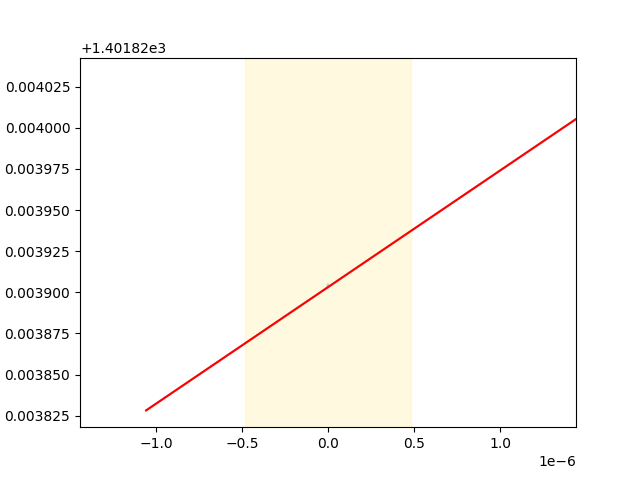

## Singularity point: -35.000000000000000
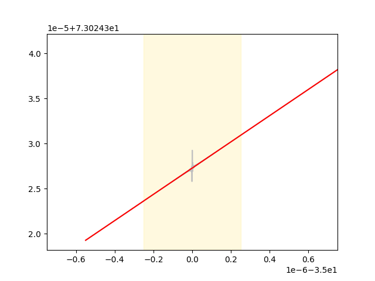


## Equation 2:
```
L_type_Ca_channel_d_gate__beta_d_L = 11.43 * (-5.0 + membrane__V) / (-1.0 + exp(-2.0 + 0.40000000000000002 * membrane__V))
```
## New Eq:
```
L_type_Ca_channel_d_gate__beta_d_L = ((fabs(-5.0 + membrane__V) < 2.5000000000025002e-7) ? (-2.8575000000028576e-6 / (-1.0 + exp(-9.9999999999406119e-8)) + (-9999999.4999899995 + 1999999.9999979998 * membrane__V) * (2.8575000000028576e-6 / (-1.0 + exp(9.9999999999406119e-8)) + 2.8575000000028576e-6 / (-1.0 + exp(-9.9999999999406119e-8)))) : (11.43 * (-5.0 + membrane__V) / (-1.0 + exp(-2.0 + 0.40000000000000002 * membrane__V))))
```
## Singularity point: 5.0000000000000000


## Equation 3:
```
L_type_Ca_channel_f_gate__alpha_f_L = 3.75 * (28.0 + membrane__V) / (-1.0 + exp(7.0 + 0.25 * membrane__V))
```
## New Eq:
```
L_type_Ca_channel_f_gate__alpha_f_L = ((fabs(28.0 + membrane__V) < 4.0000000001150227e-7) ? (-1.5000000000431335e-6 / (-1.0 + exp(-1.0000000000287557e-7)) + (35000000.498993553 + 1249999.9999640554 * membrane__V) * (1.5000000000431335e-6 / (-1.0 + exp(1.0000000000287557e-7)) + 1.5000000000431335e-6 / (-1.0 + exp(-1.0000000000287557e-7)))) : (3.75 * (28.0 + membrane__V) / (-1.0 + exp(7.0 + 0.25 * membrane__V))))
```
## Singularity point: -28.000000000000000


# of singularities:  4
singularity processing time: 21.658677500000067
average processing time:27.296045982278482
