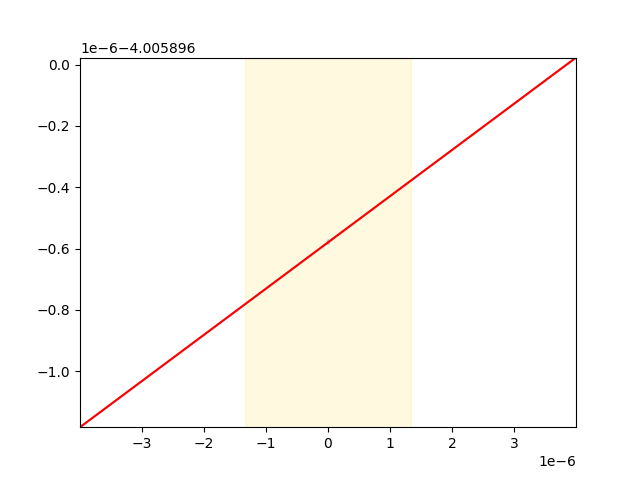
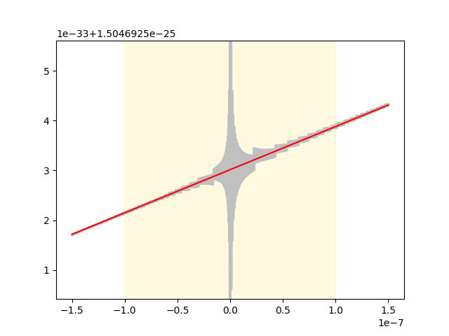
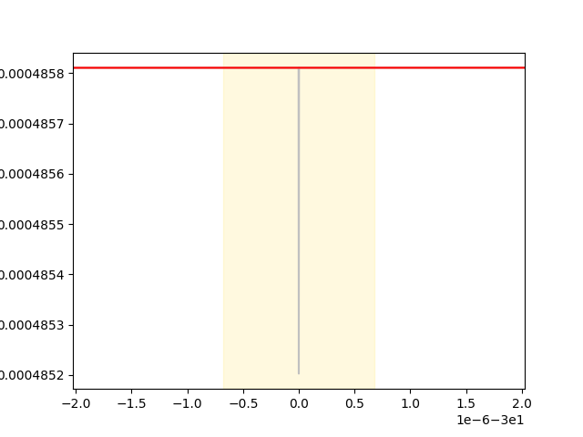
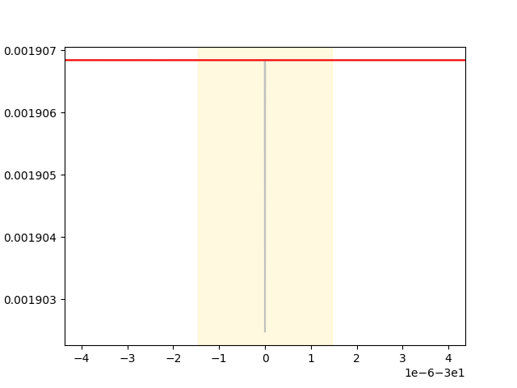

# Model: jafri_rice_winslow_1998(jafri_rice_winslow_model_1998.cellml)
153
## Equation 1:
```
L_type_Ca_channel__i_Ca_L_Ca_max = 4.0 * pow(membrane__F, 2) * (0.001 * exp(2.0 * membrane__F * membrane__V / (membrane__R * membrane__T)) - 0.34100000000000003 * ionic_concentrations__Cao) * L_type_Ca_channel__P_Ca * membrane__V / ((-1.0 + exp(2.0 * membrane__F * membrane__V / (membrane__R * membrane__T))) * membrane__R * membrane__T)
```
### Partially evaluated to: 
```
L_type_Ca_channel__i_Ca_L_Ca_max = 4.0 * pow(membrane__F, 2) * (0.001 * exp(2.0 * membrane__F * membrane__V / (membrane__R * membrane__T)) - 0.34100000000000003 * ionic_concentrations__Cao) * L_type_Ca_channel__P_Ca * membrane__V / ((-1.0 + exp(2.0 * membrane__F * membrane__V / (membrane__R * membrane__T))) * membrane__R * membrane__T)
```
### Singulariy points detected:

{0}
#### float * A

####Failed to find U symbolicly!

<class 'sympy.core.mul.Mul'>
_membrane$F**2*_L_type_Ca_channel$P_Ca*_membrane$V*(-0.34100000000000003*_ionic_concentrations$Cao + 0.001*exp(2.0*_membrane$F*_membrane$V/(_membrane$R*_membrane$T)))/(_membrane$R*_membrane$T*(exp(2.0*_membrane$F*_membrane$V/(_membrane$R*_membrane$T)) - 1.0))

*try substituting parameters*

*U*
`0.075146605522028176 * membrane__V`

*V for 1e-07 range* 
`-1.3307320976818627e-6 - 1.3307320976818627e-6`

*Singularity point: 0*


## New Eq:
((fabs(membrane__V) < 1.3307320976818627e-6) ? ((0.5 + 375733.02761014085 * membrane__V) * (5.3229283907274507e-6 * pow(membrane__F, 2) * (0.001 * exp(2.6614641953637254e-6 * membrane__F / (membrane__R * membrane__T)) - 0.34100000000000003 * ionic_concentrations__Cao) * L_type_Ca_channel__P_Ca / ((-1.0 + exp(2.6614641953637254e-6 * membrane__F / (membrane__R * membrane__T))) * membrane__R * membrane__T) + 5.3229283907274507e-6 * pow(membrane__F, 2) * (0.001 * exp(-2.6614641953637254e-6 * membrane__F / (membrane__R * membrane__T)) - 0.34100000000000003 * ionic_concentrations__Cao) * L_type_Ca_channel__P_Ca / ((-1.0 + exp(-2.6614641953637254e-6 * membrane__F / (membrane__R * membrane__T))) * membrane__R * membrane__T)) - 5.3229283907274507e-6 * pow(membrane__F, 2) * (0.001 * exp(-2.6614641953637254e-6 * membrane__F / (membrane__R * membrane__T)) - 0.34100000000000003 * ionic_concentrations__Cao) * L_type_Ca_channel__P_Ca / ((-1.0 + exp(-2.6614641953637254e-6 * membrane__F / (membrane__R * membrane__T))) * membrane__R * membrane__T)) : (4.0 * pow(membrane__F, 2) * (0.001 * exp(2.0 * membrane__F * membrane__V / (membrane__R * membrane__T)) - 0.34100000000000003 * ionic_concentrations__Cao) * L_type_Ca_channel__P_Ca * membrane__V / ((-1.0 + exp(2.0 * membrane__F * membrane__V / (membrane__R * membrane__T))) * membrane__R * membrane__T)))

## Equation 2:
```
L_type_Ca_channel__i_Ca_L_K = pow(membrane__F, 2) * (-ionic_concentrations__Ko + ionic_concentrations__Ki * exp(membrane__F * membrane__V / (membrane__R * membrane__T))) * (L_type_Ca_channel__O + L_type_Ca_channel__O_Ca) * L_type_Ca_channel__p_k * L_type_Ca_channel_y_gate__y * membrane__V / ((-1.0 + exp(membrane__F * membrane__V / (membrane__R * membrane__T))) * membrane__R * membrane__T)
```
### Partially evaluated to: 
```
L_type_Ca_channel__i_Ca_L_K = pow(membrane__F, 2) * (-ionic_concentrations__Ko + ionic_concentrations__Ki * exp(membrane__F * membrane__V / (membrane__R * membrane__T))) * (L_type_Ca_channel__O + L_type_Ca_channel__O_Ca) * L_type_Ca_channel__p_k * L_type_Ca_channel_y_gate__y * membrane__V / ((-1.0 + exp(membrane__F * membrane__V / (membrane__R * membrane__T))) * membrane__R * membrane__T)
```
### Singulariy points detected:

{0}
####Failed to find U symbolicly!

<class 'sympy.core.mul.Mul'>
_membrane$F**2*_L_type_Ca_channel$p_k*_L_type_Ca_channel_y_gate$y*_membrane$V*(_L_type_Ca_channel$O + _L_type_Ca_channel$O_Ca)*(_ionic_concentrations$Ki*exp(_membrane$F*_membrane$V/(_membrane$R*_membrane$T)) - _ionic_concentrations$Ko)/(_membrane$R*_membrane$T*(exp(_membrane$F*_membrane$V/(_membrane$R*_membrane$T)) - 1.0))

*try substituting parameters*

*U*
`0.037573302761014088 * membrane__V`

*V for 1e-07 range* 
`-2.6614641953637254e-6 - 2.6614641953637254e-6`

*Singularity point: 0*


## New Eq:
((fabs(membrane__V) < 2.6614641953637254e-6) ? ((0.5 + 187866.51380507043 * membrane__V) * (2.6614641953637254e-6 * pow(membrane__F, 2) * (-ionic_concentrations__Ko + ionic_concentrations__Ki * exp(2.6614641953637254e-6 * membrane__F / (membrane__R * membrane__T))) * (L_type_Ca_channel__O + L_type_Ca_channel__O_Ca) * L_type_Ca_channel__p_k * L_type_Ca_channel_y_gate__y / ((-1.0 + exp(2.6614641953637254e-6 * membrane__F / (membrane__R * membrane__T))) * membrane__R * membrane__T) + 2.6614641953637254e-6 * pow(membrane__F, 2) * (-ionic_concentrations__Ko + ionic_concentrations__Ki * exp(-2.6614641953637254e-6 * membrane__F / (membrane__R * membrane__T))) * (L_type_Ca_channel__O + L_type_Ca_channel__O_Ca) * L_type_Ca_channel__p_k * L_type_Ca_channel_y_gate__y / ((-1.0 + exp(-2.6614641953637254e-6 * membrane__F / (membrane__R * membrane__T))) * membrane__R * membrane__T)) - 2.6614641953637254e-6 * pow(membrane__F, 2) * (-ionic_concentrations__Ko + ionic_concentrations__Ki * exp(-2.6614641953637254e-6 * membrane__F / (membrane__R * membrane__T))) * (L_type_Ca_channel__O + L_type_Ca_channel__O_Ca) * L_type_Ca_channel__p_k * L_type_Ca_channel_y_gate__y / ((-1.0 + exp(-2.6614641953637254e-6 * membrane__F / (membrane__R * membrane__T))) * membrane__R * membrane__T)) : (pow(membrane__F, 2) * (-ionic_concentrations__Ko + ionic_concentrations__Ki * exp(membrane__F * membrane__V / (membrane__R * membrane__T))) * (L_type_Ca_channel__O + L_type_Ca_channel__O_Ca) * L_type_Ca_channel__p_k * L_type_Ca_channel_y_gate__y * membrane__V / ((-1.0 + exp(membrane__F * membrane__V / (membrane__R * membrane__T))) * membrane__R * membrane__T)))

fast_sodium_current_h_gate__alpha_h = ((membrane__V < -40.0) ? (0.13500000000000001 * exp(-11.764705882352942 + 0.14705882352941177 * fast_sodium_current__shift_INa_inact - 0.14705882352941177 * membrane__V)) : (0))

####Piecewise!!

fast_sodium_current_h_gate__beta_h = ((membrane__V < -40.0) ? (310000.0 * exp(0.34999999999999998 * membrane__V - 0.34999999999999998 * fast_sodium_current__shift_INa_inact) + 3.5600000000000001 * exp(0.079000000000000001 * membrane__V - 0.079000000000000001 * fast_sodium_current__shift_INa_inact)) : (7.6923076923076916 / (1.0 + exp(-0.96036036036036043 + 0.0900900900900901 * fast_sodium_current__shift_INa_inact - 0.0900900900900901 * membrane__V))))

####Piecewise!!

fast_sodium_current_j_gate__alpha_j = ((membrane__V < -40.0) ? ((37.780000000000001 + membrane__V) * (-127140.0 * exp(0.24440000000000001 * membrane__V - 0.24440000000000001 * fast_sodium_current__shift_INa_inact) - 3.4740000000000003e-5 * exp(0.043909999999999998 * fast_sodium_current__shift_INa_inact - 0.043909999999999998 * membrane__V)) / (1.0 + exp(24.640530000000002 + 0.311 * membrane__V - 0.311 * fast_sodium_current__shift_INa_inact))) : (0))

####Piecewise!!

fast_sodium_current_j_gate__beta_j = ((membrane__V < -40.0) ? (0.1212 * exp(0.01052 * fast_sodium_current__shift_INa_inact - 0.01052 * membrane__V) / (1.0 + exp(-5.5312920000000005 + 0.13780000000000001 * fast_sodium_current__shift_INa_inact - 0.13780000000000001 * membrane__V))) : (0.29999999999999999 * exp(2.5349999999999999e-7 * fast_sodium_current__shift_INa_inact - 2.5349999999999999e-7 * membrane__V) / (1.0 + exp(-3.2000000000000002 + 0.10000000000000001 * fast_sodium_current__shift_INa_inact - 0.10000000000000001 * membrane__V))))

####Piecewise!!

## Equation 3:
```
fast_sodium_current_m_gate__alpha_m = 0.32000000000000001 * (47.130000000000003 + membrane__V) / (1.0 - exp(-4.7130000000000001 - 0.10000000000000001 * membrane__V))
```
### Partially evaluated to: 
```
fast_sodium_current_m_gate__alpha_m = 0.32000000000000001 * (47.130000000000003 + membrane__V) / (1.0 - exp(-4.7130000000000001 - 0.10000000000000001 * membrane__V))
```
### Singulariy points detected:

{-47.130000000000003}
*U*
`-4.7130000000000001 - 0.10000000000000001 * membrane__V`

*V for 1e-07 range* 
`-47.130001 - -47.129999000000005`

*Singularity point: -47.130000000000003*


## New Eq:
((fabs(47.130000000000003 + membrane__V) < 1.0000000000287557e-6) ? (-3.200000000092018e-7 / (1.0 - exp(1.0000000000287557e-7)) + (23565000.499322373 + 499999.99998562218 * membrane__V) * (3.200000000092018e-7 / (1.0 - exp(1.0000000000287557e-7)) + 3.200000000092018e-7 / (1.0 - exp(-1.0000000000287557e-7)))) : (0.32000000000000001 * (47.130000000000003 + membrane__V) / (1.0 - exp(-4.7130000000000001 - 0.10000000000000001 * membrane__V))))

## Equation 4:
```
non_specific_calcium_activated_current__I_ns_K = pow(membrane__F, 2) * (-0.75 * ionic_concentrations__Ko + 0.75 * ionic_concentrations__Ki * exp(membrane__F * non_specific_calcium_activated_current__VnsCa / (membrane__R * membrane__T))) * non_specific_calcium_activated_current__P_ns_Ca * non_specific_calcium_activated_current__VnsCa / ((-1.0 + exp(membrane__F * non_specific_calcium_activated_current__VnsCa / (membrane__R * membrane__T))) * membrane__R * membrane__T)
```
### Partially evaluated to: 
```
non_specific_calcium_activated_current__I_ns_K = 6.3678763853082156e-6 * (-non_specific_calcium_activated_current__EnsCa + membrane__V) * (-0.75 * ionic_concentrations__Ko + 0.75 * ionic_concentrations__Ki * exp(0.037573302761014088 * membrane__V - 0.037573302761014088 * non_specific_calcium_activated_current__EnsCa)) / (-1.0 + exp(0.037573302761014088 * membrane__V - 0.037573302761014088 * non_specific_calcium_activated_current__EnsCa))
```
### Singulariy points detected:

{1.0*_non_specific_calcium_activated_current$EnsCa}
*U*
`0.037573302761014088 * membrane__V - 0.037573302761014088 * non_specific_calcium_activated_current__EnsCa`

*V for 1e-07 range* 
`-2.6614641953637254e-6 + non_specific_calcium_activated_current__EnsCa - 2.6614641953637254e-6 + non_specific_calcium_activated_current__EnsCa`

*Singularity point: 1.0*_non_specific_calcium_activated_current$EnsCa*


## New Eq:
((fabs(-non_specific_calcium_activated_current__EnsCa + membrane__V) < 2.6614641953637254e-6) ? (0.00012710905614463227 * ionic_concentrations__Ki - 0.00012710906885553852 * ionic_concentrations__Ko + (1.2710040841965042e-11 * ionic_concentrations__Ki + 1.2711771657866275e-11 * ionic_concentrations__Ko) * (0.5 + 187866.51380507043 * membrane__V - 187866.51380507043 * non_specific_calcium_activated_current__EnsCa)) : (pow(membrane__F, 2) * (-0.75 * ionic_concentrations__Ko + 0.75 * ionic_concentrations__Ki * exp(membrane__F * non_specific_calcium_activated_current__VnsCa / (membrane__R * membrane__T))) * non_specific_calcium_activated_current__P_ns_Ca * non_specific_calcium_activated_current__VnsCa / ((-1.0 + exp(membrane__F * non_specific_calcium_activated_current__VnsCa / (membrane__R * membrane__T))) * membrane__R * membrane__T)))

## Equation 5:
```
non_specific_calcium_activated_current__I_ns_Na = pow(membrane__F, 2) * (-0.75 * ionic_concentrations__Nao + 0.75 * ionic_concentrations__Nai * exp(membrane__F * non_specific_calcium_activated_current__VnsCa / (membrane__R * membrane__T))) * non_specific_calcium_activated_current__P_ns_Ca * non_specific_calcium_activated_current__VnsCa / ((-1.0 + exp(membrane__F * non_specific_calcium_activated_current__VnsCa / (membrane__R * membrane__T))) * membrane__R * membrane__T)
```
### Partially evaluated to: 
```
non_specific_calcium_activated_current__I_ns_Na = 6.3678763853082156e-6 * (-non_specific_calcium_activated_current__EnsCa + membrane__V) * (-0.75 * ionic_concentrations__Nao + 0.75 * ionic_concentrations__Nai * exp(0.037573302761014088 * membrane__V - 0.037573302761014088 * non_specific_calcium_activated_current__EnsCa)) / (-1.0 + exp(0.037573302761014088 * membrane__V - 0.037573302761014088 * non_specific_calcium_activated_current__EnsCa))
```
### Singulariy points detected:

{1.0*_non_specific_calcium_activated_current$EnsCa}
*U*
`0.037573302761014088 * membrane__V - 0.037573302761014088 * non_specific_calcium_activated_current__EnsCa`

*V for 1e-07 range* 
`-2.6614641953637254e-6 + non_specific_calcium_activated_current__EnsCa - 2.6614641953637254e-6 + non_specific_calcium_activated_current__EnsCa`

*Singularity point: 1.0*_non_specific_calcium_activated_current$EnsCa*


## New Eq:
((fabs(-non_specific_calcium_activated_current__EnsCa + membrane__V) < 2.6614641953637254e-6) ? (0.00012710905614463227 * ionic_concentrations__Nai - 0.00012710906885553852 * ionic_concentrations__Nao + (1.2710040841965042e-11 * ionic_concentrations__Nai + 1.2711771657866275e-11 * ionic_concentrations__Nao) * (0.5 + 187866.51380507043 * membrane__V - 187866.51380507043 * non_specific_calcium_activated_current__EnsCa)) : (pow(membrane__F, 2) * (-0.75 * ionic_concentrations__Nao + 0.75 * ionic_concentrations__Nai * exp(membrane__F * non_specific_calcium_activated_current__VnsCa / (membrane__R * membrane__T))) * non_specific_calcium_activated_current__P_ns_Ca * non_specific_calcium_activated_current__VnsCa / ((-1.0 + exp(membrane__F * non_specific_calcium_activated_current__VnsCa / (membrane__R * membrane__T))) * membrane__R * membrane__T)))

Singularities cannot be found trying with parameter ICs
Singularities cannot be found trying with parameter ICs
Singularities cannot be found trying with parameter ICs
Singularities cannot be found trying with parameter ICs
Singularities cannot be found trying with parameter ICs
Singularities cannot be found trying with parameter ICs
Singularities cannot be found trying with parameter ICs
Singularities cannot be found trying with parameter ICs
Singularities cannot be found trying with parameter ICs
## Equation 6:
```
time_dependent_potassium_current_X_gate__alpha_X = 7.1899999999999999e-5 * (30.0 + membrane__V) / (1.0 - exp(-4.4399999999999995 - 0.14799999999999999 * membrane__V))
```
### Partially evaluated to: 
```
time_dependent_potassium_current_X_gate__alpha_X = 7.1899999999999999e-5 * (30.0 + membrane__V) / (1.0 - exp(-4.4399999999999995 - 0.14799999999999999 * membrane__V))
```
### Singulariy points detected:

{-30.000000000000000}
*U*
`-4.4399999999999995 - 0.14799999999999999 * membrane__V`

*V for 1e-07 range* 
`-30.000000675675675 - -29.999999324324325`

*Singularity point: -30.000000000000000*


## New Eq:
((fabs(30.0 + membrane__V) < 6.7567567568760367e-7) ? (-4.8581081081938701e-11 / (1.0 - exp(1.0000000000287557e-7)) + (22200000.499608092 + 739999.99998693645 * membrane__V) * (4.8581081081938701e-11 / (1.0 - exp(1.0000000000287557e-7)) + 4.8581081081938701e-11 / (1.0 - exp(-1.0000000000287557e-7)))) : (7.1899999999999999e-5 * (30.0 + membrane__V) / (1.0 - exp(-4.4399999999999995 - 0.14799999999999999 * membrane__V))))

## Equation 7:
```
time_dependent_potassium_current_X_gate__beta_X = 0.00013100000000000001 * (30.0 + membrane__V) / (-1.0 + exp(2.0609999999999999 + 0.068699999999999997 * membrane__V))
```
### Partially evaluated to: 
```
time_dependent_potassium_current_X_gate__beta_X = 0.00013100000000000001 * (30.0 + membrane__V) / (-1.0 + exp(2.0609999999999999 + 0.068699999999999997 * membrane__V))
```
### Singulariy points detected:

{-30.000000000000000}
*U*
`2.0609999999999999 + 0.068699999999999997 * membrane__V`

*V for 1e-07 range* 
`-30.000001455604075 - -29.999998544395925`

*Singularity point: -30.000000000000000*


## New Eq:
((fabs(30.0 + membrane__V) < 1.455604075689676e-6) ? (-1.9068413391534758e-10 / (-1.0 + exp(-9.9999999999406119e-8)) + (10305000.50001229 + 343500.00000040967 * membrane__V) * (1.9068413391534758e-10 / (-1.0 + exp(9.9999999999406119e-8)) + 1.9068413391534758e-10 / (-1.0 + exp(-9.9999999999406119e-8)))) : (0.00013100000000000001 * (30.0 + membrane__V) / (-1.0 + exp(2.0609999999999999 + 0.068699999999999997 * membrane__V))))

Singularities cannot be found trying with parameter ICs
Singularities cannot be found trying with parameter ICs
Singularities cannot be found trying with parameter ICs
Singularities cannot be found trying with parameter ICs
Singularities cannot be found trying with parameter ICs
Singularities cannot be found trying with parameter ICs
Singularities cannot be found trying with parameter ICs
Singularities cannot be found trying with parameter ICs
Singularities cannot be found trying with parameter ICs
