# Model: aslanidi_atrial_model_2009(aslanidi_atrial_model_2009.cellml)
## Equation 1:
```
sodium_current__i_Na = pow(membrane__F, 2) * pow(sodium_current_m_gate__m, 3) * (-1.0 + exp((-sodium_current__E_Na + membrane__V) * membrane__F / (membrane__R * membrane__T))) * (0.36499999999999999 * sodium_current_h2_gate__h2 + 0.63500000000000001 * sodium_current_h1_gate__h1) * cleft_space_ion_concentrations__Na_c * membrane__V * sodium_current__P_Na / ((-1.0 + exp(membrane__F * membrane__V / (membrane__R * membrane__T))) * membrane__R * membrane__T)
```
### Partially evaluated to: 
```
sodium_current__i_Na = 3635.606491085292 * pow(sodium_current_m_gate__m, 3) * (-1.0 + pow((cleft_space_ion_concentrations__Na_c / intracellular_ion_concentrations__Na_i), (-1.0)) * exp(0.037679754693225945 * membrane__V)) * (0.36499999999999999 * sodium_current_h2_gate__h2 + 0.63500000000000001 * sodium_current_h1_gate__h1) * cleft_space_ion_concentrations__Na_c * membrane__V * sodium_current__P_Na / (-1.0 + exp(0.037679754693225945 * membrane__V))
```
### Singulariy points detected:

{0}
*U*
`0.037679754693225945 * membrane__V`

*V for 1e-07 range* 
`-2.6539450910485349e-6 - 2.6539450910485349e-6`

*Singularity point: 0*

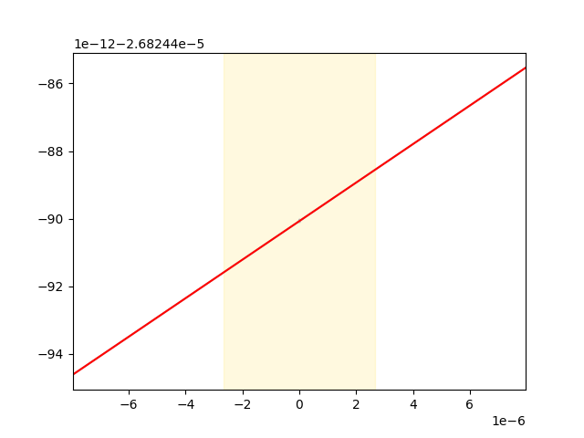
## New Eq:
((fabs(membrane__V) < 2.6539450910485349e-6) ? ((0.5 + 188398.77346612973 * membrane__V) * (0.0096486999999999996 * pow(sodium_current_m_gate__m, 3) * (-1.0 + exp(9.9999999999999995e-8 - log(cleft_space_ion_concentrations__Na_c / intracellular_ion_concentrations__Na_i))) * (0.36499999999999999 * sodium_current_h2_gate__h2 + 0.63500000000000001 * sodium_current_h1_gate__h1) * cleft_space_ion_concentrations__Na_c * sodium_current__P_Na / (-1.0 + exp(9.9999999999999995e-8)) + 0.0096486999999999996 * pow(sodium_current_m_gate__m, 3) * (-1.0 + exp(-9.9999999999999995e-8 - log(cleft_space_ion_concentrations__Na_c / intracellular_ion_concentrations__Na_i))) * (0.36499999999999999 * sodium_current_h2_gate__h2 + 0.63500000000000001 * sodium_current_h1_gate__h1) * cleft_space_ion_concentrations__Na_c * sodium_current__P_Na / (-1.0 + exp(-9.9999999999999995e-8))) - 0.0096486999999999996 * pow(sodium_current_m_gate__m, 3) * (-1.0 + exp(-9.9999999999999995e-8 - log(cleft_space_ion_concentrations__Na_c / intracellular_ion_concentrations__Na_i))) * (0.36499999999999999 * sodium_current_h2_gate__h2 + 0.63500000000000001 * sodium_current_h1_gate__h1) * cleft_space_ion_concentrations__Na_c * sodium_current__P_Na / (-1.0 + exp(-9.9999999999999995e-8))) : (pow(membrane__F, 2) * pow(sodium_current_m_gate__m, 3) * (-1.0 + exp((-sodium_current__E_Na + membrane__V) * membrane__F / (membrane__R * membrane__T))) * (0.36499999999999999 * sodium_current_h2_gate__h2 + 0.63500000000000001 * sodium_current_h1_gate__h1) * cleft_space_ion_concentrations__Na_c * membrane__V * sodium_current__P_Na / ((-1.0 + exp(membrane__F * membrane__V / (membrane__R * membrane__T))) * membrane__R * membrane__T)))

# Model: aslanidi_2009(aslanidi_Purkinje_model_2009.cellml)
## Equation 1:
```
i_Ks_xs1_gate__tau_xs1 = 1 / (7.6100000000000007e-5 * (44.600000000000001 + membrane__V) / (1.0 - 7.6868266637773744e-194 * exp(-9.9700000000000006 * membrane__V)) + 0.00036000000000000002 * (-0.55000000000000004 + membrane__V) / (-1.0 + 0.93202093695954691 * exp(0.128 * membrane__V)))
```
### Partially evaluated to: 
```
i_Ks_xs1_gate__tau_xs1 = 1 / (7.6100000000000007e-5 * (44.600000000000001 + membrane__V) / (1.0 - 7.6868266637773744e-194 * exp(-9.9700000000000006 * membrane__V)) + 0.00036000000000000002 * (-0.55000000000000004 + membrane__V) / (-1.0 + 0.93202093695954691 * exp(0.128 * membrane__V)))
```
### Singulariy points detected:

{0.55000000000000005, -44.600000000000001}
#### float * A

####1 / A


####A + B:

`7.6100000000000007e-5 * (44.600000000000001 + membrane__V) / (1.0 - 7.6868266637773744e-194 * exp(-9.9700000000000006 * membrane__V))`
`0.00036000000000000002 * (-0.55000000000000004 + membrane__V) / (-1.0 + 0.93202093695954691 * exp(0.128 * membrane__V))`

*U*
`-444.66200000000003 - 9.9700000000000006 * membrane__V`

*V for 1e-07 range* 
`-44.600000010030094 - -44.599999989969909`

*Singularity point: -44.600000000000001*

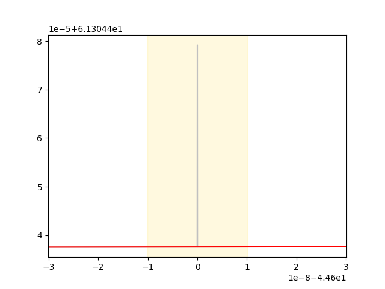
*U*
`-0.070400000000000004 + 0.128 * membrane__V`

*V for 1e-07 range* 
`0.54999921875000002 - 0.55000078125000007`

*Singularity point: 0.55000000000000005*


## New Eq:
((fabs(44.600000000000001 + membrane__V) < 1.0030090258350555e-8) ? (1 / (-0.016254000003610835 / (-1.0 + exp(-5.7792000012838516)) - 7.6328986866047728e-13 / (1.0 - exp(9.9999999836342113e-8))) + (2223310003.262351 + 49850000.061936118 * membrane__V) * (1 / (7.6328986866047728e-13 / (1.0 - exp(-9.9999999836342113e-8)) - 0.016253999996389171 / (-1.0 + exp(-5.7791999987161491))) - 1 / (-0.016254000003610835 / (-1.0 + exp(-5.7792000012838516)) - 7.6328986866047728e-13 / (1.0 - exp(9.9999999836342113e-8))))) : ((fabs(-0.55000000000000004 + membrane__V) < 7.8124999999557715e-7) ? (1 / (0.0034359149405468756 / (1.0 - exp(-450.14549221093756)) - 2.8124999999903229e-10 / (-1.0 + exp(-9.999999999962296e-8))) + (-351999.50000003882 + 640000.00000007043 * membrane__V) * (1 / (2.812500000009058e-10 / (-1.0 + exp(1.0000000000027348e-7)) + 0.0034359150594531255 / (1.0 - exp(-450.14550778906255))) - 1 / (0.0034359149405468756 / (1.0 - exp(-450.14549221093756)) - 2.8124999999903229e-10 / (-1.0 + exp(-9.999999999962296e-8))))) : (1 / (7.6100000000000007e-5 * (44.600000000000001 + membrane__V) / (1.0 - exp(-444.66200000000003 - 9.9700000000000006 * membrane__V)) + 0.00036000000000000002 * (-0.55000000000000004 + membrane__V) / (-1.0 + exp(-0.070400000000000004 + 0.128 * membrane__V))))))

## Equation 2:
```
i_Ks_xs2_gate__tau_xs2 = 2.0 / (7.6100000000000007e-5 * (44.600000000000001 + membrane__V) / (1.0 - 7.6868266637773744e-194 * exp(-9.9700000000000006 * membrane__V)) + 0.00036000000000000002 * (-0.55000000000000004 + membrane__V) / (-1.0 + 0.93202093695954691 * exp(0.128 * membrane__V)))
```
### Partially evaluated to: 
```
i_Ks_xs2_gate__tau_xs2 = 2.0 / (7.6100000000000007e-5 * (44.600000000000001 + membrane__V) / (1.0 - 7.6868266637773744e-194 * exp(-9.9700000000000006 * membrane__V)) + 0.00036000000000000002 * (-0.55000000000000004 + membrane__V) / (-1.0 + 0.93202093695954691 * exp(0.128 * membrane__V)))
```
### Singulariy points detected:

{0.55000000000000005, -44.600000000000001}
#### float * A

####1 / A


####A + B:

`7.6100000000000007e-5 * (44.600000000000001 + membrane__V) / (1.0 - 7.6868266637773744e-194 * exp(-9.9700000000000006 * membrane__V))`
`0.00036000000000000002 * (-0.55000000000000004 + membrane__V) / (-1.0 + 0.93202093695954691 * exp(0.128 * membrane__V))`

*U*
`-444.66200000000003 - 9.9700000000000006 * membrane__V`

*V for 1e-07 range* 
`-44.600000010030094 - -44.599999989969909`

*Singularity point: -44.600000000000001*

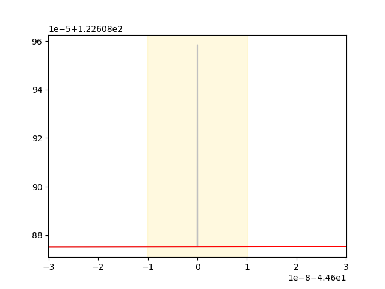
*U*
`-0.070400000000000004 + 0.128 * membrane__V`

*V for 1e-07 range* 
`0.54999921875000002 - 0.55000078125000007`

*Singularity point: 0.55000000000000005*

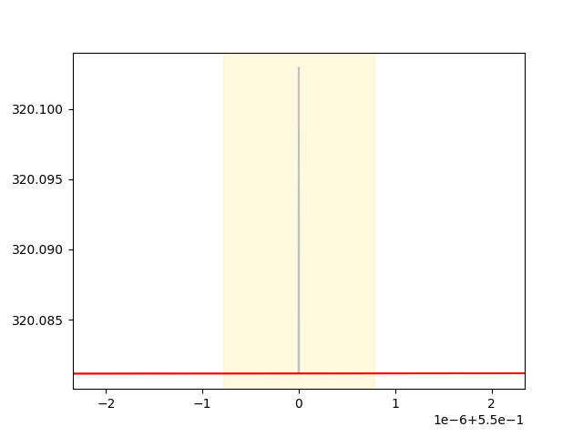
## New Eq:
((fabs(44.600000000000001 + membrane__V) < 1.0030090258350555e-8) ? (2.0 / (-0.016254000003610835 / (-1.0 + exp(-5.7792000012838516)) - 7.6328986866047728e-13 / (1.0 - exp(9.9999999836342113e-8))) + (2223310003.262351 + 49850000.061936118 * membrane__V) * (2.0 / (7.6328986866047728e-13 / (1.0 - exp(-9.9999999836342113e-8)) - 0.016253999996389171 / (-1.0 + exp(-5.7791999987161491))) - 2.0 / (-0.016254000003610835 / (-1.0 + exp(-5.7792000012838516)) - 7.6328986866047728e-13 / (1.0 - exp(9.9999999836342113e-8))))) : ((fabs(-0.55000000000000004 + membrane__V) < 7.8124999999557715e-7) ? (2.0 / (0.0034359149405468756 / (1.0 - exp(-450.14549221093756)) - 2.8124999999903229e-10 / (-1.0 + exp(-9.999999999962296e-8))) + (-351999.50000003882 + 640000.00000007043 * membrane__V) * (2.0 / (2.812500000009058e-10 / (-1.0 + exp(1.0000000000027348e-7)) + 0.0034359150594531255 / (1.0 - exp(-450.14550778906255))) - 2.0 / (0.0034359149405468756 / (1.0 - exp(-450.14549221093756)) - 2.8124999999903229e-10 / (-1.0 + exp(-9.999999999962296e-8))))) : (2.0 / (7.6100000000000007e-5 * (44.600000000000001 + membrane__V) / (1.0 - exp(-444.66200000000003 - 9.9700000000000006 * membrane__V)) + 0.00036000000000000002 * (-0.55000000000000004 + membrane__V) / (-1.0 + exp(-0.070400000000000004 + 0.128 * membrane__V))))))

## Equation 3:
```
i_Na_L_m_L_gate__alpha_m_L = 0.32000000000000001 * (47.130000000000003 + membrane__V) / (1.0 - 0.00897780373069724 * exp(-0.10000000000000001 * membrane__V))
```
### Partially evaluated to: 
```
i_Na_L_m_L_gate__alpha_m_L = 0.32000000000000001 * (47.130000000000003 + membrane__V) / (1.0 - 0.00897780373069724 * exp(-0.10000000000000001 * membrane__V))
```
### Singulariy points detected:

{-47.130000000000003}
*U*
`-4.7130000000000001 - 0.10000000000000001 * membrane__V`

*V for 1e-07 range* 
`-47.130001 - -47.129999000000005`

*Singularity point: -47.130000000000003*


## New Eq:
((fabs(47.130000000000003 + membrane__V) < 1.0000000000287557e-6) ? (-3.200000000092018e-7 / (1.0 - exp(1.0000000000287557e-7)) + (23565000.499322373 + 499999.99998562218 * membrane__V) * (3.200000000092018e-7 / (1.0 - exp(1.0000000000287557e-7)) + 3.200000000092018e-7 / (1.0 - exp(-1.0000000000287557e-7)))) : (0.32000000000000001 * (47.130000000000003 + membrane__V) / (1.0 - exp(-4.7130000000000001 - 0.10000000000000001 * membrane__V))))

## Equation 4:
```
i_Na_m_gate__alpha_m = 0.32000000000000001 * (47.130000000000003 + membrane__V) / (1.0 - 0.00897780373069724 * exp(-0.10000000000000001 * membrane__V))
```
### Partially evaluated to: 
```
i_Na_m_gate__alpha_m = 0.32000000000000001 * (47.130000000000003 + membrane__V) / (1.0 - 0.00897780373069724 * exp(-0.10000000000000001 * membrane__V))
```
### Singulariy points detected:

{-47.130000000000003}
*U*
`-4.7130000000000001 - 0.10000000000000001 * membrane__V`

*V for 1e-07 range* 
`-47.130001 - -47.129999000000005`

*Singularity point: -47.130000000000003*

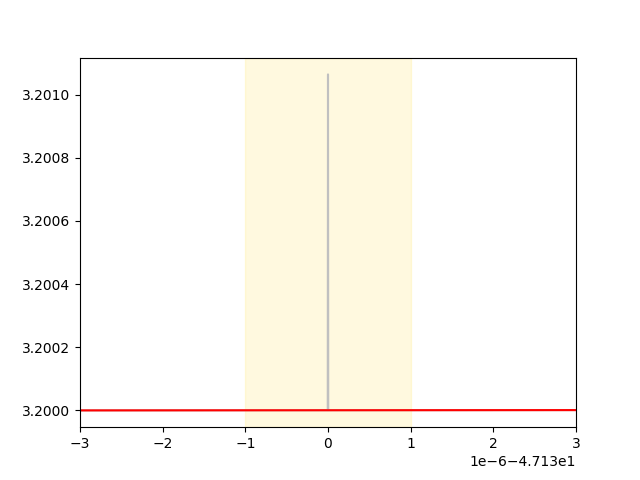
## New Eq:
((fabs(47.130000000000003 + membrane__V) < 1.0000000000287557e-6) ? (-3.200000000092018e-7 / (1.0 - exp(1.0000000000287557e-7)) + (23565000.499322373 + 499999.99998562218 * membrane__V) * (3.200000000092018e-7 / (1.0 - exp(1.0000000000287557e-7)) + 3.200000000092018e-7 / (1.0 - exp(-1.0000000000287557e-7)))) : (0.32000000000000001 * (47.130000000000003 + membrane__V) / (1.0 - exp(-4.7130000000000001 - 0.10000000000000001 * membrane__V))))

## Equation 5:
```
i_to_2__i_to_2_max = pow(i_to_2__z_Cl, 2) * pow(model_parameters__F, 2) * (-model_parameters__Cl_o * exp(-i_to_2__z_Cl * membrane__V * model_parameters__F / (model_parameters__R * model_parameters__T)) + intracellular_ion_concentrations__Cl_i) * i_to_2__p_Cl * membrane__V / ((1.0 - exp(-i_to_2__z_Cl * membrane__V * model_parameters__F / (model_parameters__R * model_parameters__T))) * model_parameters__Cm * model_parameters__R * model_parameters__T)
```
### Partially evaluated to: 
```
i_to_2__i_to_2_max = 0.0014448004881001341 * (-100.0 * exp(0.037435883507802616 * membrane__V) + intracellular_ion_concentrations__Cl_i) * membrane__V / (1.0 - exp(0.037435883507802616 * membrane__V))
```
### Singulariy points detected:

{0}
*U*
`0.037435883507802616 * membrane__V`

*V for 1e-07 range* 
`-2.6712338705498262e-6 - 2.6712338705498262e-6`

*Singularity point: 0*


## New Eq:
((fabs(membrane__V) < 2.6712338705498262e-6) ? ((0.5 + 187179.41753901311 * membrane__V) * (3.8593999999999993e-9 * (-100.0 * exp(9.9999999999999995e-8) + intracellular_ion_concentrations__Cl_i) / (1.0 - exp(9.9999999999999995e-8)) + 3.8593999999999993e-9 * (-100.0 * exp(-9.9999999999999995e-8) + intracellular_ion_concentrations__Cl_i) / (1.0 - exp(-9.9999999999999995e-8))) - 3.8593999999999993e-9 * (-100.0 * exp(-9.9999999999999995e-8) + intracellular_ion_concentrations__Cl_i) / (1.0 - exp(-9.9999999999999995e-8))) : (pow(i_to_2__z_Cl, 2) * pow(model_parameters__F, 2) * (-model_parameters__Cl_o * exp(-i_to_2__z_Cl * membrane__V * model_parameters__F / (model_parameters__R * model_parameters__T)) + intracellular_ion_concentrations__Cl_i) * i_to_2__p_Cl * membrane__V / ((1.0 - exp(-i_to_2__z_Cl * membrane__V * model_parameters__F / (model_parameters__R * model_parameters__T))) * model_parameters__Cm * model_parameters__R * model_parameters__T)))

## Equation 6:
```
background_currents__i_Ca_b = pow(model_parameters__F, 2) * pow(model_parameters__z_Ca, 2) * (-model_parameters__Ca_o * model_parameters__gamma_Cao + Ca_i__Ca_i * model_parameters__gamma_Cai * exp(membrane__V * model_parameters__F * model_parameters__z_Ca / (model_parameters__R * model_parameters__T))) * background_currents__p_Ca_b * membrane__V / ((-1.0 + exp(membrane__V * model_parameters__F * model_parameters__z_Ca / (model_parameters__R * model_parameters__T))) * model_parameters__Cm * model_parameters__R * model_parameters__T)
```
### Partially evaluated to: 
```
background_currents__i_Ca_b = 0.0028824983370007683 * (-0.34100000000000003 * model_parameters__Ca_o + Ca_i__Ca_i * exp(0.074871767015605231 * membrane__V)) * membrane__V / (-1.0 + exp(0.074871767015605231 * membrane__V))
```
### Singulariy points detected:

{0}
*U*
`0.074871767015605231 * membrane__V`

*V for 1e-07 range* 
`-1.3356169352749131e-6 - 1.3356169352749131e-6`

*Singularity point: 0*

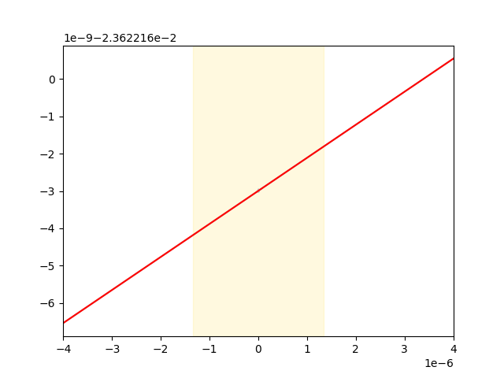
## New Eq:
((fabs(membrane__V) < 1.3356169352749131e-6) ? ((0.5 + 374358.83507802623 * membrane__V) * (3.8499135947999997e-9 * (-0.34100000000000003 * model_parameters__Ca_o + Ca_i__Ca_i * exp(9.9999999999999995e-8)) / (-1.0 + exp(9.9999999999999995e-8)) + 3.8499135947999997e-9 * (-0.34100000000000003 * model_parameters__Ca_o + Ca_i__Ca_i * exp(-9.9999999999999995e-8)) / (-1.0 + exp(-9.9999999999999995e-8))) - 3.8499135947999997e-9 * (-0.34100000000000003 * model_parameters__Ca_o + Ca_i__Ca_i * exp(-9.9999999999999995e-8)) / (-1.0 + exp(-9.9999999999999995e-8))) : (pow(model_parameters__F, 2) * pow(model_parameters__z_Ca, 2) * (-model_parameters__Ca_o * model_parameters__gamma_Cao + Ca_i__Ca_i * model_parameters__gamma_Cai * exp(membrane__V * model_parameters__F * model_parameters__z_Ca / (model_parameters__R * model_parameters__T))) * background_currents__p_Ca_b * membrane__V / ((-1.0 + exp(membrane__V * model_parameters__F * model_parameters__z_Ca / (model_parameters__R * model_parameters__T))) * model_parameters__Cm * model_parameters__R * model_parameters__T)))

## Equation 7:
```
i_Ca_L__i_Ca_L_max = pow(model_parameters__F, 2) * pow(model_parameters__z_Ca, 2) * (-15.0 + membrane__V) * (-model_parameters__Ca_o * model_parameters__gamma_Cao + Ca_r__Ca_r * model_parameters__gamma_Cai * exp((-15.0 + membrane__V) * model_parameters__F * model_parameters__z_Ca / (model_parameters__R * model_parameters__T))) * i_Ca_L__p_Ca / ((-1.0 + exp((-15.0 + membrane__V) * model_parameters__F * model_parameters__z_Ca / (model_parameters__R * model_parameters__T))) * model_parameters__Cm * model_parameters__R * model_parameters__T)
```
### Partially evaluated to: 
```
i_Ca_L__i_Ca_L_max = 3.510865186083326 * (-15.0 + membrane__V) * (-0.34100000000000003 * model_parameters__Ca_o + 0.32527753564512535 * Ca_r__Ca_r * exp(0.074871767015605231 * membrane__V)) / (-1.0 + 0.32527753564512535 * exp(0.074871767015605231 * membrane__V))
```
### Singulariy points detected:

{15.000000000000000}
*U*
`-1.1230765052340785 + 0.074871767015605231 * membrane__V`

*V for 1e-07 range* 
`14.999998664383064 - 15.000001335616936`

*Singularity point: 15.000000000000000*

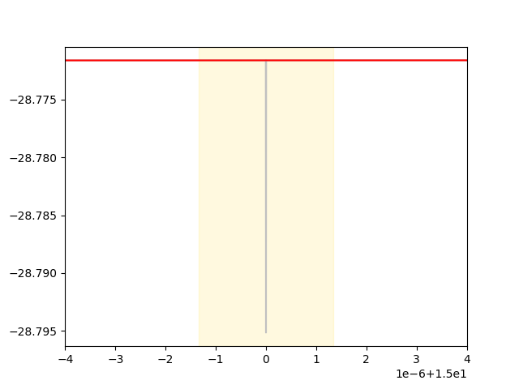
## New Eq:
((fabs(-15.0 + membrane__V) < 1.3356169352718439e-6) ? ((-5615382.0261832969 + 374358.83507888648 * membrane__V) * (4.6891709999892238e-6 * (-0.34100000000000003 * model_parameters__Ca_o + Ca_r__Ca_r * exp(9.9999999999406119e-8)) / (-1.0 + exp(9.9999999999406119e-8)) + 4.6891709999892238e-6 * (-0.34100000000000003 * model_parameters__Ca_o + Ca_r__Ca_r * exp(-9.9999999999406119e-8)) / (-1.0 + exp(-9.9999999999406119e-8))) - 4.6891709999892238e-6 * (-0.34100000000000003 * model_parameters__Ca_o + Ca_r__Ca_r * exp(-9.9999999999406119e-8)) / (-1.0 + exp(-9.9999999999406119e-8))) : (pow(model_parameters__F, 2) * pow(model_parameters__z_Ca, 2) * (-15.0 + membrane__V) * (-model_parameters__Ca_o * model_parameters__gamma_Cao + Ca_r__Ca_r * model_parameters__gamma_Cai * exp((-15.0 + membrane__V) * model_parameters__F * model_parameters__z_Ca / (model_parameters__R * model_parameters__T))) * i_Ca_L__p_Ca / ((-1.0 + exp((-15.0 + membrane__V) * model_parameters__F * model_parameters__z_Ca / (model_parameters__R * model_parameters__T))) * model_parameters__Cm * model_parameters__R * model_parameters__T)))

# Model: beeler_reuter_model_1977(beeler_reuter_model_1977.cellml)
# Model: benson_epicardial_2008(benson_epicardial_2008.cellml)
## Equation 1:
```
ICaL__ibarca = 4.0 * (-15.0 + cell__V) * (-Environment__Ca_o * ICaL__gacao + Ca__Ca_ss * ICaL__gacai * exp(2.0 * (-15.0 + cell__V) * Environment__FonRT)) * Environment__F * Environment__FonRT * ICaL__pca / (-1.0 + exp(2.0 * (-15.0 + cell__V) * Environment__FonRT))
```
### Partially evaluated to: 
```
ICaL__ibarca = 14448.004881000332 * (-15.0 + cell__V) * (-0.34100000000000003 * Environment__Ca_o + 0.32527753564515088 * Ca__Ca_ss * exp(0.074871767015599999 * cell__V)) * ICaL__pca / (-1.0 + 0.32527753564515088 * exp(0.074871767015599999 * cell__V))
```
### Singulariy points detected:

{15.000000000000000}
*U*
`-1.1230765052339999 + 0.074871767015599999 * cell__V`

*V for 1e-07 range* 
`14.999998664383064 - 15.000001335616936`

*Singularity point: 15.000000000000000*

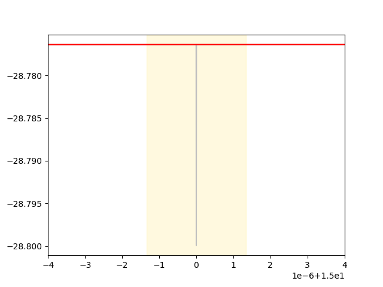
## New Eq:
((fabs(-15.0 + cell__V) < 1.3356169352718439e-6) ? ((-5615382.0261832969 + 374358.83507888648 * cell__V) * (0.019296999999954306 * (-0.34100000000000003 * Environment__Ca_o + Ca__Ca_ss * exp(9.9999999999406119e-8)) * ICaL__pca / (-1.0 + exp(9.9999999999406119e-8)) + 0.019296999999954306 * (-0.34100000000000003 * Environment__Ca_o + Ca__Ca_ss * exp(-9.9999999999406119e-8)) * ICaL__pca / (-1.0 + exp(-9.9999999999406119e-8))) - 0.019296999999954306 * (-0.34100000000000003 * Environment__Ca_o + Ca__Ca_ss * exp(-9.9999999999406119e-8)) * ICaL__pca / (-1.0 + exp(-9.9999999999406119e-8))) : (4.0 * (-15.0 + cell__V) * (-Environment__Ca_o * ICaL__gacao + Ca__Ca_ss * ICaL__gacai * exp(2.0 * (-15.0 + cell__V) * Environment__FonRT)) * Environment__F * Environment__FonRT * ICaL__pca / (-1.0 + exp(2.0 * (-15.0 + cell__V) * Environment__FonRT))))

## Equation 2:
```
ICab__ICab = 7.9803360000000004e-7 * (-0.34100000000000003 * Environment__Ca_o + Ca__Ca_i * exp(2.0 * Environment__FonRT * cell__V)) * Environment__F * Environment__FonRT * cell__V / (-1.0 + exp(2.0 * Environment__FonRT * cell__V))
```
### Partially evaluated to: 
```
ICab__ICab = 0.0028824983370005666 * (-0.34100000000000003 * Environment__Ca_o + Ca__Ca_i * exp(0.074871767015599999 * cell__V)) * cell__V / (-1.0 + exp(0.074871767015599999 * cell__V))
```
### Singulariy points detected:

{0}
*U*
`0.074871767015599999 * cell__V`

*V for 1e-07 range* 
`-1.3356169352750065e-6 - 1.3356169352750065e-6`

*Singularity point: 0*

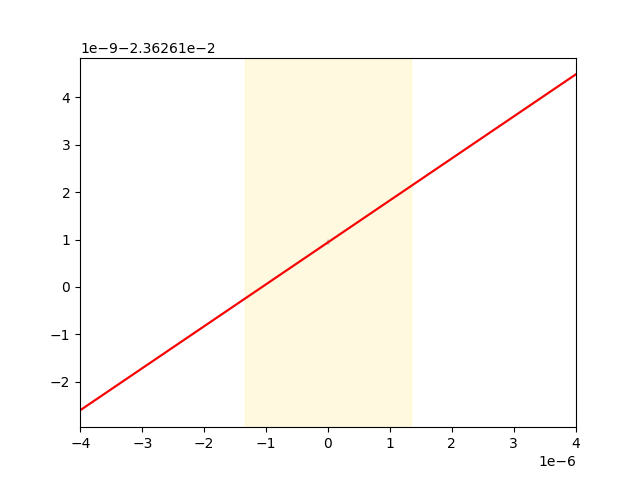
## New Eq:
((fabs(cell__V) < 1.3356169352750065e-6) ? ((0.5 + 374358.83507800003 * cell__V) * (3.8499135947999997e-9 * (-0.34100000000000003 * Environment__Ca_o + Ca__Ca_i * exp(9.9999999999999995e-8)) / (-1.0 + exp(9.9999999999999995e-8)) + 3.8499135947999997e-9 * (-0.34100000000000003 * Environment__Ca_o + Ca__Ca_i * exp(-9.9999999999999995e-8)) / (-1.0 + exp(-9.9999999999999995e-8))) - 3.8499135947999997e-9 * (-0.34100000000000003 * Environment__Ca_o + Ca__Ca_i * exp(-9.9999999999999995e-8)) / (-1.0 + exp(-9.9999999999999995e-8))) : (7.9803360000000004e-7 * (-0.34100000000000003 * Environment__Ca_o + Ca__Ca_i * exp(2.0 * Environment__FonRT * cell__V)) * Environment__F * Environment__FonRT * cell__V / (-1.0 + exp(2.0 * Environment__FonRT * cell__V))))

## Equation 3:
```
IKr__tauxr = 1 / (0.00029999999999999997 * (38.360799999999998 + cell__V) / (-1.0 + 343.26878155836141 * exp(0.1522 * cell__V)) + 0.00059999999999999995 * (-1.7383999999999999 + cell__V) / (1.0 - 1.2667092551679247 * exp(-0.13600000000000001 * cell__V)))
```
### Partially evaluated to: 
```
IKr__tauxr = 1 / (0.00029999999999999997 * (38.360799999999998 + cell__V) / (-1.0 + 343.26878155836141 * exp(0.1522 * cell__V)) + 0.00059999999999999995 * (-1.7383999999999999 + cell__V) / (1.0 - 1.2667092551679247 * exp(-0.13600000000000001 * cell__V)))
```
### Singulariy points detected:

{-38.360799999999998, 1.7383999999999999}
#### float * A

####1 / A


####A + B:

`0.00059999999999999995 * (-1.7383999999999999 + cell__V) / (1.0 - 1.2667092551679247 * exp(-0.13600000000000001 * cell__V))`
`0.00029999999999999997 * (38.360799999999998 + cell__V) / (-1.0 + 343.26878155836141 * exp(0.1522 * cell__V))`

*U*
`0.2364224 - 0.13600000000000001 * cell__V`

*V for 1e-07 range* 
`1.7383992647058824 - 1.7384007352941175`

*Singularity point: 1.7383999999999999*


*U*
`5.8385137599999997 + 0.1522 * cell__V`

*V for 1e-07 range* 
`-38.360800657030218 - -38.360799342969777`

*Singularity point: -38.360799999999998*

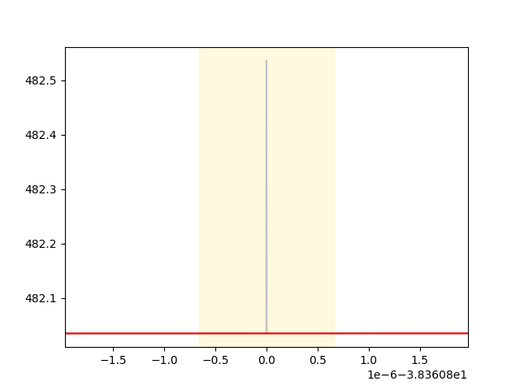
## New Eq:
((fabs(-1.7383999999999999 + cell__V) < 7.3529411765034525e-7) ? (1 / (0.012029759779411764 / (-1.0 + exp(6.1030981280882353)) - 4.4117647058708463e-10 / (1.0 - exp(9.99999999998398e-8))) + (-1182111.4999988999 + 679999.99999936717 * cell__V) * (1 / (0.012029760220588234 / (-1.0 + exp(6.1030983519117648)) + 4.4117647059020713e-10 / (1.0 - exp(-1.0000000000049032e-7))) - 1 / (0.012029759779411764 / (-1.0 + exp(6.1030981280882353)) - 4.4117647058708463e-10 / (1.0 - exp(9.99999999998398e-8))))) : ((fabs(38.360799999999998 + cell__V) < 6.5703022339436146e-7) ? (1 / (-1.9710906701830842e-10 / (-1.0 + exp(-1.0000000000287557e-7)) - 0.024059520394218131 / (1.0 - exp(5.4534912893561103))) + (29192569.299818475 + 760999.99999526795 * cell__V) * (1 / (1.9710906701830842e-10 / (-1.0 + exp(1.0000000000287557e-7)) - 0.024059519605781864 / (1.0 - exp(5.4534911106438893))) - 1 / (-1.9710906701830842e-10 / (-1.0 + exp(-1.0000000000287557e-7)) - 0.024059520394218131 / (1.0 - exp(5.4534912893561103))))) : (1 / (0.00029999999999999997 * (38.360799999999998 + cell__V) / (-1.0 + exp(5.8385137599999997 + 0.1522 * cell__V)) + 0.00059999999999999995 * (-1.7383999999999999 + cell__V) / (1.0 - exp(0.2364224 - 0.13600000000000001 * cell__V))))))

## Equation 4:
```
IKs__tauxs = 1 / (7.6100000000000007e-5 * (44.600000000000001 + cell__V) / (1.0 - 7.6868266637773744e-194 * exp(-9.9700000000000006 * cell__V)) + 0.00036000000000000002 * (-0.55000000000000004 + cell__V) / (-1.0 + 0.93202093695954691 * exp(0.128 * cell__V)))
```
### Partially evaluated to: 
```
IKs__tauxs = 1 / (7.6100000000000007e-5 * (44.600000000000001 + cell__V) / (1.0 - 7.6868266637773744e-194 * exp(-9.9700000000000006 * cell__V)) + 0.00036000000000000002 * (-0.55000000000000004 + cell__V) / (-1.0 + 0.93202093695954691 * exp(0.128 * cell__V)))
```
### Singulariy points detected:

{0.55000000000000005, -44.600000000000001}
#### float * A

####1 / A


####A + B:

`7.6100000000000007e-5 * (44.600000000000001 + cell__V) / (1.0 - 7.6868266637773744e-194 * exp(-9.9700000000000006 * cell__V))`
`0.00036000000000000002 * (-0.55000000000000004 + cell__V) / (-1.0 + 0.93202093695954691 * exp(0.128 * cell__V))`

*U*
`-444.66200000000003 - 9.9700000000000006 * cell__V`

*V for 1e-07 range* 
`-44.600000010030094 - -44.599999989969909`

*Singularity point: -44.600000000000001*


*U*
`-0.070400000000000004 + 0.128 * cell__V`

*V for 1e-07 range* 
`0.54999921875000002 - 0.55000078125000007`

*Singularity point: 0.55000000000000005*

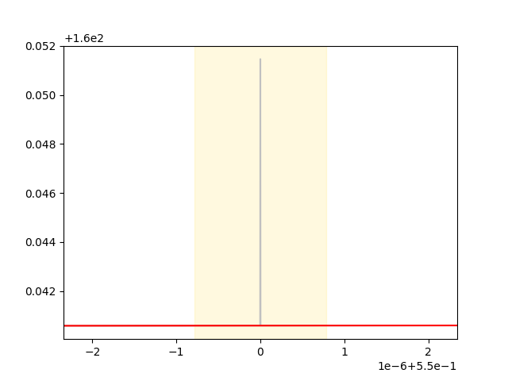
## New Eq:
((fabs(44.600000000000001 + cell__V) < 1.0030090258350555e-8) ? (1 / (-0.016254000003610835 / (-1.0 + exp(-5.7792000012838516)) - 7.6328986866047728e-13 / (1.0 - exp(9.9999999836342113e-8))) + (2223310003.262351 + 49850000.061936118 * cell__V) * (1 / (7.6328986866047728e-13 / (1.0 - exp(-9.9999999836342113e-8)) - 0.016253999996389171 / (-1.0 + exp(-5.7791999987161491))) - 1 / (-0.016254000003610835 / (-1.0 + exp(-5.7792000012838516)) - 7.6328986866047728e-13 / (1.0 - exp(9.9999999836342113e-8))))) : ((fabs(-0.55000000000000004 + cell__V) < 7.8124999999557715e-7) ? (1 / (0.0034359149405468756 / (1.0 - exp(-450.14549221093756)) - 2.8124999999903229e-10 / (-1.0 + exp(-9.999999999962296e-8))) + (-351999.50000003882 + 640000.00000007043 * cell__V) * (1 / (2.812500000009058e-10 / (-1.0 + exp(1.0000000000027348e-7)) + 0.0034359150594531255 / (1.0 - exp(-450.14550778906255))) - 1 / (0.0034359149405468756 / (1.0 - exp(-450.14549221093756)) - 2.8124999999903229e-10 / (-1.0 + exp(-9.999999999962296e-8))))) : (1 / (7.6100000000000007e-5 * (44.600000000000001 + cell__V) / (1.0 - exp(-444.66200000000003 - 9.9700000000000006 * cell__V)) + 0.00036000000000000002 * (-0.55000000000000004 + cell__V) / (-1.0 + exp(-0.070400000000000004 + 0.128 * cell__V))))))

## Equation 5:
```
INa__am = 0.32000000000000001 * (47.130000000000003 + cell__V) / (1.0 - 0.00897780373069724 * exp(-0.10000000000000001 * cell__V))
```
### Partially evaluated to: 
```
INa__am = 0.32000000000000001 * (47.130000000000003 + cell__V) / (1.0 - 0.00897780373069724 * exp(-0.10000000000000001 * cell__V))
```
### Singulariy points detected:

{-47.130000000000003}
*U*
`-4.7130000000000001 - 0.10000000000000001 * cell__V`

*V for 1e-07 range* 
`-47.130001 - -47.129999000000005`

*Singularity point: -47.130000000000003*


## New Eq:
((fabs(47.130000000000003 + cell__V) < 1.0000000000287557e-6) ? (-3.200000000092018e-7 / (1.0 - exp(1.0000000000287557e-7)) + (23565000.499322373 + 499999.99998562218 * cell__V) * (3.200000000092018e-7 / (1.0 - exp(1.0000000000287557e-7)) + 3.200000000092018e-7 / (1.0 - exp(-1.0000000000287557e-7)))) : (0.32000000000000001 * (47.130000000000003 + cell__V) / (1.0 - exp(-4.7130000000000001 - 0.10000000000000001 * cell__V))))

## Equation 6:
```
INal__amL = 0.32000000000000001 * (47.130000000000003 + cell__V) / (1.0 - 0.00897780373069724 * exp(-0.10000000000000001 * cell__V))
```
### Partially evaluated to: 
```
INal__amL = 0.32000000000000001 * (47.130000000000003 + cell__V) / (1.0 - 0.00897780373069724 * exp(-0.10000000000000001 * cell__V))
```
### Singulariy points detected:

{-47.130000000000003}
*U*
`-4.7130000000000001 - 0.10000000000000001 * cell__V`

*V for 1e-07 range* 
`-47.130001 - -47.129999000000005`

*Singularity point: -47.130000000000003*


## New Eq:
((fabs(47.130000000000003 + cell__V) < 1.0000000000287557e-6) ? (-3.200000000092018e-7 / (1.0 - exp(1.0000000000287557e-7)) + (23565000.499322373 + 499999.99998562218 * cell__V) * (3.200000000092018e-7 / (1.0 - exp(1.0000000000287557e-7)) + 3.200000000092018e-7 / (1.0 - exp(-1.0000000000287557e-7)))) : (0.32000000000000001 * (47.130000000000003 + cell__V) / (1.0 - exp(-4.7130000000000001 - 0.10000000000000001 * cell__V))))

## Equation 7:
```
Ito2__Ito2_max = (-Environment__Cl_o * exp(Environment__FonRT * cell__V) + Cl__Cl_i) * Environment__F * Environment__FonRT * Ito2__PCl * cell__V / (1.0 - exp(Environment__FonRT * cell__V))
```
### Partially evaluated to: 
```
Ito2__Ito2_max = 0.001444800488100033 * (-100.0 * exp(0.0374358835078 * cell__V) + Cl__Cl_i) * cell__V / (1.0 - exp(0.0374358835078 * cell__V))
```
### Singulariy points detected:

{0}
*U*
`0.0374358835078 * cell__V`

*V for 1e-07 range* 
`-2.671233870550013e-6 - 2.671233870550013e-6`

*Singularity point: 0*


## New Eq:
((fabs(cell__V) < 2.671233870550013e-6) ? ((0.5 + 187179.41753900002 * cell__V) * (3.8593999999999993e-9 * (-100.0 * exp(9.9999999999999995e-8) + Cl__Cl_i) / (1.0 - exp(9.9999999999999995e-8)) + 3.8593999999999993e-9 * (-100.0 * exp(-9.9999999999999995e-8) + Cl__Cl_i) / (1.0 - exp(-9.9999999999999995e-8))) - 3.8593999999999993e-9 * (-100.0 * exp(-9.9999999999999995e-8) + Cl__Cl_i) / (1.0 - exp(-9.9999999999999995e-8))) : ((-Environment__Cl_o * exp(Environment__FonRT * cell__V) + Cl__Cl_i) * Environment__F * Environment__FonRT * Ito2__PCl * cell__V / (1.0 - exp(Environment__FonRT * cell__V))))

# Model: bernus_wilders_zemlin_verschelde_panfilov_2002_version01(bernus_wilders_zemlin_verschelde_panfilov_2002.cellml)
## Equation 1:
```
sodium_current_m_gate__alpha_m = 0.32000000000000001 * (47.130000000000003 + membrane__V) / (1.0 - 0.00897780373069724 * exp(-0.10000000000000001 * membrane__V))
```
### Partially evaluated to: 
```
sodium_current_m_gate__alpha_m = 0.32000000000000001 * (47.130000000000003 + membrane__V) / (1.0 - 0.00897780373069724 * exp(-0.10000000000000001 * membrane__V))
```
### Singulariy points detected:

{-47.130000000000003}
*U*
`-4.7130000000000001 - 0.10000000000000001 * membrane__V`

*V for 1e-07 range* 
`-47.130001 - -47.129999000000005`

*Singularity point: -47.130000000000003*


## New Eq:
((fabs(47.130000000000003 + membrane__V) < 1.0000000000287557e-6) ? (-3.200000000092018e-7 / (1.0 - exp(1.0000000000287557e-7)) + (23565000.499322373 + 499999.99998562218 * membrane__V) * (3.200000000092018e-7 / (1.0 - exp(1.0000000000287557e-7)) + 3.200000000092018e-7 / (1.0 - exp(-1.0000000000287557e-7)))) : (0.32000000000000001 * (47.130000000000003 + membrane__V) / (1.0 - exp(-4.7130000000000001 - 0.10000000000000001 * membrane__V))))

# Model: bondarenko_2004_apical(bondarenko_szigeti_bett_kim_rasmusson_2004_apical.cellml)
## Equation 1:
```
slow_delayed_rectifier_potassium_current__alpha_n = 4.8133299999999997e-6 * (26.5 + membrane__V) / (1.0 - 0.033641326918204616 * exp(-0.128 * membrane__V))
```
### Partially evaluated to: 
```
slow_delayed_rectifier_potassium_current__alpha_n = 4.8133299999999997e-6 * (26.5 + membrane__V) / (1.0 - 0.033641326918204616 * exp(-0.128 * membrane__V))
```
### Singulariy points detected:

{-26.500000000000000}
*U*
`-3.3919999999999999 - 0.128 * membrane__V`

*V for 1e-07 range* 
`-26.500000781250002 - -26.499999218749998`

*Singularity point: -26.500000000000000*

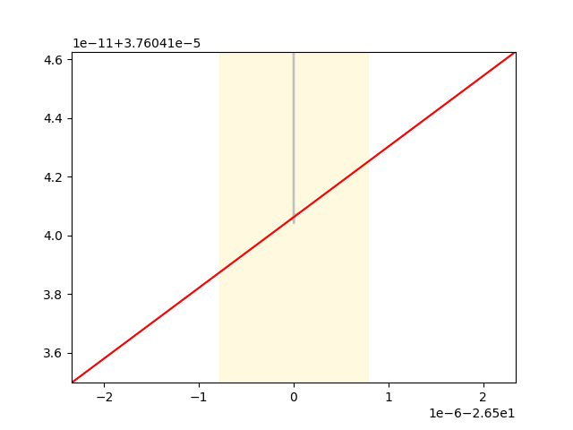
## New Eq:
((fabs(26.5 + membrane__V) < 7.8124999999817923e-7) ? (-3.7604140624912359e-12 / (1.0 - exp(9.9999999999406119e-8)) + (16960000.500039525 + 640000.00000149151 * membrane__V) * (3.7604140624912359e-12 / (1.0 - exp(9.9999999999406119e-8)) + 3.7604140624912359e-12 / (1.0 - exp(-9.9999999999406119e-8)))) : (4.8133299999999997e-6 * (26.5 + membrane__V) / (1.0 - exp(-3.3919999999999999 - 0.128 * membrane__V))))

# Model: bondarenko_2004_septum(bondarenko_szigeti_bett_kim_rasmusson_2004_septal.cellml)
## Equation 1:
```
slow_delayed_rectifier_potassium_current__alpha_n = 4.8133299999999997e-6 * (26.5 + membrane__V) / (1.0 - 0.033641326918204616 * exp(-0.128 * membrane__V))
```
### Partially evaluated to: 
```
slow_delayed_rectifier_potassium_current__alpha_n = 4.8133299999999997e-6 * (26.5 + membrane__V) / (1.0 - 0.033641326918204616 * exp(-0.128 * membrane__V))
```
### Singulariy points detected:

{-26.500000000000000}
*U*
`-3.3919999999999999 - 0.128 * membrane__V`

*V for 1e-07 range* 
`-26.500000781250002 - -26.499999218749998`

*Singularity point: -26.500000000000000*

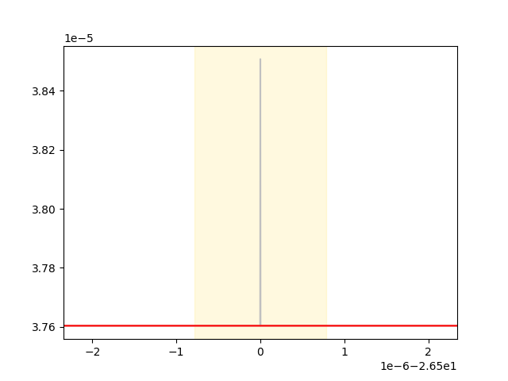
## New Eq:
((fabs(26.5 + membrane__V) < 7.8124999999817923e-7) ? (-3.7604140624912359e-12 / (1.0 - exp(9.9999999999406119e-8)) + (16960000.500039525 + 640000.00000149151 * membrane__V) * (3.7604140624912359e-12 / (1.0 - exp(9.9999999999406119e-8)) + 3.7604140624912359e-12 / (1.0 - exp(-9.9999999999406119e-8)))) : (4.8133299999999997e-6 * (26.5 + membrane__V) / (1.0 - exp(-3.3919999999999999 - 0.128 * membrane__V))))

# Model: bueno_2007(bueno_2007_endo.cellml)
# Model: bueno_2007(bueno_2007_epi.cellml)
# Model: Carro_Rodriguez_Laguna_Pueyo_CinC2010_EPI(carro_2011_endo.cellml)
## Equation 1:
```
L_Type_Calcium_Current__Ibar_Ca_j = (-Calcium_Concentrations__Ca_o + Calcium_Concentrations__Ca_j * exp(2.0 * membrane__FoRT * membrane__V)) * L_Type_Calcium_Current__P_scale * L_Type_Calcium_Current__p_Ca * membrane__FoRT * membrane__Frdy * membrane__V / (-1.0 + exp(2.0 * membrane__FoRT * membrane__V))
```
### Partially evaluated to: 
```
L_Type_Calcium_Current__Ibar_Ca_j = 0.71831868267118426 * (-Calcium_Concentrations__Ca_o + Calcium_Concentrations__Ca_j * exp(0.074871767015605231 * membrane__V)) * L_Type_Calcium_Current__P_scale * membrane__V / (-1.0 + exp(0.074871767015605231 * membrane__V))
```
### Singulariy points detected:

{0}
*U*
`0.074871767015605231 * membrane__V`

*V for 1e-07 range* 
`-1.3356169352749131e-6 - 1.3356169352749131e-6`

*Singularity point: 0*


## New Eq:
((fabs(membrane__V) < 1.3356169352749131e-6) ? ((0.5 + 374358.83507802623 * membrane__V) * (9.5939859749999992e-7 * (-Calcium_Concentrations__Ca_o + Calcium_Concentrations__Ca_j * exp(9.9999999999999995e-8)) * L_Type_Calcium_Current__P_scale / (-1.0 + exp(9.9999999999999995e-8)) + 9.5939859749999992e-7 * (-Calcium_Concentrations__Ca_o + Calcium_Concentrations__Ca_j * exp(-9.9999999999999995e-8)) * L_Type_Calcium_Current__P_scale / (-1.0 + exp(-9.9999999999999995e-8))) - 9.5939859749999992e-7 * (-Calcium_Concentrations__Ca_o + Calcium_Concentrations__Ca_j * exp(-9.9999999999999995e-8)) * L_Type_Calcium_Current__P_scale / (-1.0 + exp(-9.9999999999999995e-8))) : ((-Calcium_Concentrations__Ca_o + Calcium_Concentrations__Ca_j * exp(2.0 * membrane__FoRT * membrane__V)) * L_Type_Calcium_Current__P_scale * L_Type_Calcium_Current__p_Ca * membrane__FoRT * membrane__Frdy * membrane__V / (-1.0 + exp(2.0 * membrane__FoRT * membrane__V))))

## Equation 2:
```
L_Type_Calcium_Current__Ibar_Ca_sl = (-Calcium_Concentrations__Ca_o + Calcium_Concentrations__Ca_sl * exp(2.0 * membrane__FoRT * membrane__V)) * L_Type_Calcium_Current__P_scale * L_Type_Calcium_Current__p_Ca * membrane__FoRT * membrane__Frdy * membrane__V / (-1.0 + exp(2.0 * membrane__FoRT * membrane__V))
```
### Partially evaluated to: 
```
L_Type_Calcium_Current__Ibar_Ca_sl = 0.71831868267118426 * (-Calcium_Concentrations__Ca_o + Calcium_Concentrations__Ca_sl * exp(0.074871767015605231 * membrane__V)) * L_Type_Calcium_Current__P_scale * membrane__V / (-1.0 + exp(0.074871767015605231 * membrane__V))
```
### Singulariy points detected:

{0}
*U*
`0.074871767015605231 * membrane__V`

*V for 1e-07 range* 
`-1.3356169352749131e-6 - 1.3356169352749131e-6`

*Singularity point: 0*


## New Eq:
((fabs(membrane__V) < 1.3356169352749131e-6) ? ((0.5 + 374358.83507802623 * membrane__V) * (9.5939859749999992e-7 * (-Calcium_Concentrations__Ca_o + Calcium_Concentrations__Ca_sl * exp(9.9999999999999995e-8)) * L_Type_Calcium_Current__P_scale / (-1.0 + exp(9.9999999999999995e-8)) + 9.5939859749999992e-7 * (-Calcium_Concentrations__Ca_o + Calcium_Concentrations__Ca_sl * exp(-9.9999999999999995e-8)) * L_Type_Calcium_Current__P_scale / (-1.0 + exp(-9.9999999999999995e-8))) - 9.5939859749999992e-7 * (-Calcium_Concentrations__Ca_o + Calcium_Concentrations__Ca_sl * exp(-9.9999999999999995e-8)) * L_Type_Calcium_Current__P_scale / (-1.0 + exp(-9.9999999999999995e-8))) : ((-Calcium_Concentrations__Ca_o + Calcium_Concentrations__Ca_sl * exp(2.0 * membrane__FoRT * membrane__V)) * L_Type_Calcium_Current__P_scale * L_Type_Calcium_Current__p_Ca * membrane__FoRT * membrane__Frdy * membrane__V / (-1.0 + exp(2.0 * membrane__FoRT * membrane__V))))

## Equation 3:
```
L_Type_Calcium_Current__Ibar_K = (-Potassium_Concentrations__K_o + Potassium_Concentrations__K_i * exp(membrane__FoRT * membrane__V)) * L_Type_Calcium_Current__P_scale * L_Type_Calcium_Current__p_K * membrane__FoRT * membrane__Frdy * membrane__V / (-1.0 + exp(membrane__FoRT * membrane__V))
```
### Partially evaluated to: 
```
L_Type_Calcium_Current__Ibar_K = 0.00019748616671718709 * (-Potassium_Concentrations__K_o + Potassium_Concentrations__K_i * exp(0.037435883507802616 * membrane__V)) * L_Type_Calcium_Current__P_scale * membrane__V / (-1.0 + exp(0.037435883507802616 * membrane__V))
```
### Singulariy points detected:

{0}
*U*
`0.037435883507802616 * membrane__V`

*V for 1e-07 range* 
`-2.6712338705498262e-6 - 2.6712338705498262e-6`

*Singularity point: 0*


## New Eq:
((fabs(membrane__V) < 2.6712338705498262e-6) ? ((0.5 + 187179.41753901311 * membrane__V) * (5.2753173749999997e-10 * (-Potassium_Concentrations__K_o + Potassium_Concentrations__K_i * exp(9.9999999999999995e-8)) * L_Type_Calcium_Current__P_scale / (-1.0 + exp(9.9999999999999995e-8)) + 5.2753173749999997e-10 * (-Potassium_Concentrations__K_o + Potassium_Concentrations__K_i * exp(-9.9999999999999995e-8)) * L_Type_Calcium_Current__P_scale / (-1.0 + exp(-9.9999999999999995e-8))) - 5.2753173749999997e-10 * (-Potassium_Concentrations__K_o + Potassium_Concentrations__K_i * exp(-9.9999999999999995e-8)) * L_Type_Calcium_Current__P_scale / (-1.0 + exp(-9.9999999999999995e-8))) : ((-Potassium_Concentrations__K_o + Potassium_Concentrations__K_i * exp(membrane__FoRT * membrane__V)) * L_Type_Calcium_Current__P_scale * L_Type_Calcium_Current__p_K * membrane__FoRT * membrane__Frdy * membrane__V / (-1.0 + exp(membrane__FoRT * membrane__V))))

## Equation 4:
```
L_Type_Calcium_Current__Ibar_Na_j = (-Sodium_Concentrations__Na_o + Sodium_Concentrations__Na_j * exp(membrane__FoRT * membrane__V)) * L_Type_Calcium_Current__P_scale * L_Type_Calcium_Current__p_Na * membrane__FoRT * membrane__Frdy * membrane__V / (-1.0 + exp(membrane__FoRT * membrane__V))
```
### Partially evaluated to: 
```
L_Type_Calcium_Current__Ibar_Na_j = 1.0971453706510394e-5 * (-Sodium_Concentrations__Na_o + Sodium_Concentrations__Na_j * exp(0.037435883507802616 * membrane__V)) * L_Type_Calcium_Current__P_scale * membrane__V / (-1.0 + exp(0.037435883507802616 * membrane__V))
```
### Singulariy points detected:

{0}
*U*
`0.037435883507802616 * membrane__V`

*V for 1e-07 range* 
`-2.6712338705498262e-6 - 2.6712338705498262e-6`

*Singularity point: 0*

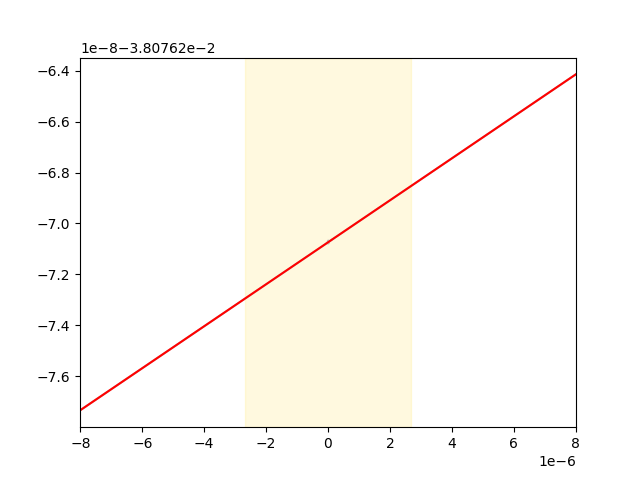
## New Eq:
((fabs(membrane__V) < 2.6712338705498262e-6) ? ((0.5 + 187179.41753901311 * membrane__V) * (2.9307318749999998e-11 * (-Sodium_Concentrations__Na_o + Sodium_Concentrations__Na_j * exp(9.9999999999999995e-8)) * L_Type_Calcium_Current__P_scale / (-1.0 + exp(9.9999999999999995e-8)) + 2.9307318749999998e-11 * (-Sodium_Concentrations__Na_o + Sodium_Concentrations__Na_j * exp(-9.9999999999999995e-8)) * L_Type_Calcium_Current__P_scale / (-1.0 + exp(-9.9999999999999995e-8))) - 2.9307318749999998e-11 * (-Sodium_Concentrations__Na_o + Sodium_Concentrations__Na_j * exp(-9.9999999999999995e-8)) * L_Type_Calcium_Current__P_scale / (-1.0 + exp(-9.9999999999999995e-8))) : ((-Sodium_Concentrations__Na_o + Sodium_Concentrations__Na_j * exp(membrane__FoRT * membrane__V)) * L_Type_Calcium_Current__P_scale * L_Type_Calcium_Current__p_Na * membrane__FoRT * membrane__Frdy * membrane__V / (-1.0 + exp(membrane__FoRT * membrane__V))))

## Equation 5:
```
L_Type_Calcium_Current__Ibar_Na_sl = (-Sodium_Concentrations__Na_o + Sodium_Concentrations__Na_sl * exp(membrane__FoRT * membrane__V)) * L_Type_Calcium_Current__P_scale * L_Type_Calcium_Current__p_Na * membrane__FoRT * membrane__Frdy * membrane__V / (-1.0 + exp(membrane__FoRT * membrane__V))
```
### Partially evaluated to: 
```
L_Type_Calcium_Current__Ibar_Na_sl = 1.0971453706510394e-5 * (-Sodium_Concentrations__Na_o + Sodium_Concentrations__Na_sl * exp(0.037435883507802616 * membrane__V)) * L_Type_Calcium_Current__P_scale * membrane__V / (-1.0 + exp(0.037435883507802616 * membrane__V))
```
### Singulariy points detected:

{0}
*U*
`0.037435883507802616 * membrane__V`

*V for 1e-07 range* 
`-2.6712338705498262e-6 - 2.6712338705498262e-6`

*Singularity point: 0*


## New Eq:
((fabs(membrane__V) < 2.6712338705498262e-6) ? ((0.5 + 187179.41753901311 * membrane__V) * (2.9307318749999998e-11 * (-Sodium_Concentrations__Na_o + Sodium_Concentrations__Na_sl * exp(9.9999999999999995e-8)) * L_Type_Calcium_Current__P_scale / (-1.0 + exp(9.9999999999999995e-8)) + 2.9307318749999998e-11 * (-Sodium_Concentrations__Na_o + Sodium_Concentrations__Na_sl * exp(-9.9999999999999995e-8)) * L_Type_Calcium_Current__P_scale / (-1.0 + exp(-9.9999999999999995e-8))) - 2.9307318749999998e-11 * (-Sodium_Concentrations__Na_o + Sodium_Concentrations__Na_sl * exp(-9.9999999999999995e-8)) * L_Type_Calcium_Current__P_scale / (-1.0 + exp(-9.9999999999999995e-8))) : ((-Sodium_Concentrations__Na_o + Sodium_Concentrations__Na_sl * exp(membrane__FoRT * membrane__V)) * L_Type_Calcium_Current__P_scale * L_Type_Calcium_Current__p_Na * membrane__FoRT * membrane__Frdy * membrane__V / (-1.0 + exp(membrane__FoRT * membrane__V))))

# Model: Carro_Rodriguez_Laguna_Pueyo_CinC2010_EPI(carro_2011_epi.cellml)
## Equation 1:
```
L_Type_Calcium_Current__Ibar_Ca_j = (-Calcium_Concentrations__Ca_o + Calcium_Concentrations__Ca_j * exp(2.0 * membrane__FoRT * membrane__V)) * L_Type_Calcium_Current__P_scale * L_Type_Calcium_Current__p_Ca * membrane__FoRT * membrane__Frdy * membrane__V / (-1.0 + exp(2.0 * membrane__FoRT * membrane__V))
```
### Partially evaluated to: 
```
L_Type_Calcium_Current__Ibar_Ca_j = 0.71831868267118426 * (-Calcium_Concentrations__Ca_o + Calcium_Concentrations__Ca_j * exp(0.074871767015605231 * membrane__V)) * L_Type_Calcium_Current__P_scale * membrane__V / (-1.0 + exp(0.074871767015605231 * membrane__V))
```
### Singulariy points detected:

{0}
*U*
`0.074871767015605231 * membrane__V`

*V for 1e-07 range* 
`-1.3356169352749131e-6 - 1.3356169352749131e-6`

*Singularity point: 0*


## New Eq:
((fabs(membrane__V) < 1.3356169352749131e-6) ? ((0.5 + 374358.83507802623 * membrane__V) * (9.5939859749999992e-7 * (-Calcium_Concentrations__Ca_o + Calcium_Concentrations__Ca_j * exp(9.9999999999999995e-8)) * L_Type_Calcium_Current__P_scale / (-1.0 + exp(9.9999999999999995e-8)) + 9.5939859749999992e-7 * (-Calcium_Concentrations__Ca_o + Calcium_Concentrations__Ca_j * exp(-9.9999999999999995e-8)) * L_Type_Calcium_Current__P_scale / (-1.0 + exp(-9.9999999999999995e-8))) - 9.5939859749999992e-7 * (-Calcium_Concentrations__Ca_o + Calcium_Concentrations__Ca_j * exp(-9.9999999999999995e-8)) * L_Type_Calcium_Current__P_scale / (-1.0 + exp(-9.9999999999999995e-8))) : ((-Calcium_Concentrations__Ca_o + Calcium_Concentrations__Ca_j * exp(2.0 * membrane__FoRT * membrane__V)) * L_Type_Calcium_Current__P_scale * L_Type_Calcium_Current__p_Ca * membrane__FoRT * membrane__Frdy * membrane__V / (-1.0 + exp(2.0 * membrane__FoRT * membrane__V))))

## Equation 2:
```
L_Type_Calcium_Current__Ibar_Ca_sl = (-Calcium_Concentrations__Ca_o + Calcium_Concentrations__Ca_sl * exp(2.0 * membrane__FoRT * membrane__V)) * L_Type_Calcium_Current__P_scale * L_Type_Calcium_Current__p_Ca * membrane__FoRT * membrane__Frdy * membrane__V / (-1.0 + exp(2.0 * membrane__FoRT * membrane__V))
```
### Partially evaluated to: 
```
L_Type_Calcium_Current__Ibar_Ca_sl = 0.71831868267118426 * (-Calcium_Concentrations__Ca_o + Calcium_Concentrations__Ca_sl * exp(0.074871767015605231 * membrane__V)) * L_Type_Calcium_Current__P_scale * membrane__V / (-1.0 + exp(0.074871767015605231 * membrane__V))
```
### Singulariy points detected:

{0}
*U*
`0.074871767015605231 * membrane__V`

*V for 1e-07 range* 
`-1.3356169352749131e-6 - 1.3356169352749131e-6`

*Singularity point: 0*


## New Eq:
((fabs(membrane__V) < 1.3356169352749131e-6) ? ((0.5 + 374358.83507802623 * membrane__V) * (9.5939859749999992e-7 * (-Calcium_Concentrations__Ca_o + Calcium_Concentrations__Ca_sl * exp(9.9999999999999995e-8)) * L_Type_Calcium_Current__P_scale / (-1.0 + exp(9.9999999999999995e-8)) + 9.5939859749999992e-7 * (-Calcium_Concentrations__Ca_o + Calcium_Concentrations__Ca_sl * exp(-9.9999999999999995e-8)) * L_Type_Calcium_Current__P_scale / (-1.0 + exp(-9.9999999999999995e-8))) - 9.5939859749999992e-7 * (-Calcium_Concentrations__Ca_o + Calcium_Concentrations__Ca_sl * exp(-9.9999999999999995e-8)) * L_Type_Calcium_Current__P_scale / (-1.0 + exp(-9.9999999999999995e-8))) : ((-Calcium_Concentrations__Ca_o + Calcium_Concentrations__Ca_sl * exp(2.0 * membrane__FoRT * membrane__V)) * L_Type_Calcium_Current__P_scale * L_Type_Calcium_Current__p_Ca * membrane__FoRT * membrane__Frdy * membrane__V / (-1.0 + exp(2.0 * membrane__FoRT * membrane__V))))

## Equation 3:
```
L_Type_Calcium_Current__Ibar_K = (-Potassium_Concentrations__K_o + Potassium_Concentrations__K_i * exp(membrane__FoRT * membrane__V)) * L_Type_Calcium_Current__P_scale * L_Type_Calcium_Current__p_K * membrane__FoRT * membrane__Frdy * membrane__V / (-1.0 + exp(membrane__FoRT * membrane__V))
```
### Partially evaluated to: 
```
L_Type_Calcium_Current__Ibar_K = 0.00019748616671718709 * (-Potassium_Concentrations__K_o + Potassium_Concentrations__K_i * exp(0.037435883507802616 * membrane__V)) * L_Type_Calcium_Current__P_scale * membrane__V / (-1.0 + exp(0.037435883507802616 * membrane__V))
```
### Singulariy points detected:

{0}
*U*
`0.037435883507802616 * membrane__V`

*V for 1e-07 range* 
`-2.6712338705498262e-6 - 2.6712338705498262e-6`

*Singularity point: 0*


## New Eq:
((fabs(membrane__V) < 2.6712338705498262e-6) ? ((0.5 + 187179.41753901311 * membrane__V) * (5.2753173749999997e-10 * (-Potassium_Concentrations__K_o + Potassium_Concentrations__K_i * exp(9.9999999999999995e-8)) * L_Type_Calcium_Current__P_scale / (-1.0 + exp(9.9999999999999995e-8)) + 5.2753173749999997e-10 * (-Potassium_Concentrations__K_o + Potassium_Concentrations__K_i * exp(-9.9999999999999995e-8)) * L_Type_Calcium_Current__P_scale / (-1.0 + exp(-9.9999999999999995e-8))) - 5.2753173749999997e-10 * (-Potassium_Concentrations__K_o + Potassium_Concentrations__K_i * exp(-9.9999999999999995e-8)) * L_Type_Calcium_Current__P_scale / (-1.0 + exp(-9.9999999999999995e-8))) : ((-Potassium_Concentrations__K_o + Potassium_Concentrations__K_i * exp(membrane__FoRT * membrane__V)) * L_Type_Calcium_Current__P_scale * L_Type_Calcium_Current__p_K * membrane__FoRT * membrane__Frdy * membrane__V / (-1.0 + exp(membrane__FoRT * membrane__V))))

## Equation 4:
```
L_Type_Calcium_Current__Ibar_Na_j = (-Sodium_Concentrations__Na_o + Sodium_Concentrations__Na_j * exp(membrane__FoRT * membrane__V)) * L_Type_Calcium_Current__P_scale * L_Type_Calcium_Current__p_Na * membrane__FoRT * membrane__Frdy * membrane__V / (-1.0 + exp(membrane__FoRT * membrane__V))
```
### Partially evaluated to: 
```
L_Type_Calcium_Current__Ibar_Na_j = 1.0971453706510394e-5 * (-Sodium_Concentrations__Na_o + Sodium_Concentrations__Na_j * exp(0.037435883507802616 * membrane__V)) * L_Type_Calcium_Current__P_scale * membrane__V / (-1.0 + exp(0.037435883507802616 * membrane__V))
```
### Singulariy points detected:

{0}
*U*
`0.037435883507802616 * membrane__V`

*V for 1e-07 range* 
`-2.6712338705498262e-6 - 2.6712338705498262e-6`

*Singularity point: 0*


## New Eq:
((fabs(membrane__V) < 2.6712338705498262e-6) ? ((0.5 + 187179.41753901311 * membrane__V) * (2.9307318749999998e-11 * (-Sodium_Concentrations__Na_o + Sodium_Concentrations__Na_j * exp(9.9999999999999995e-8)) * L_Type_Calcium_Current__P_scale / (-1.0 + exp(9.9999999999999995e-8)) + 2.9307318749999998e-11 * (-Sodium_Concentrations__Na_o + Sodium_Concentrations__Na_j * exp(-9.9999999999999995e-8)) * L_Type_Calcium_Current__P_scale / (-1.0 + exp(-9.9999999999999995e-8))) - 2.9307318749999998e-11 * (-Sodium_Concentrations__Na_o + Sodium_Concentrations__Na_j * exp(-9.9999999999999995e-8)) * L_Type_Calcium_Current__P_scale / (-1.0 + exp(-9.9999999999999995e-8))) : ((-Sodium_Concentrations__Na_o + Sodium_Concentrations__Na_j * exp(membrane__FoRT * membrane__V)) * L_Type_Calcium_Current__P_scale * L_Type_Calcium_Current__p_Na * membrane__FoRT * membrane__Frdy * membrane__V / (-1.0 + exp(membrane__FoRT * membrane__V))))

## Equation 5:
```
L_Type_Calcium_Current__Ibar_Na_sl = (-Sodium_Concentrations__Na_o + Sodium_Concentrations__Na_sl * exp(membrane__FoRT * membrane__V)) * L_Type_Calcium_Current__P_scale * L_Type_Calcium_Current__p_Na * membrane__FoRT * membrane__Frdy * membrane__V / (-1.0 + exp(membrane__FoRT * membrane__V))
```
### Partially evaluated to: 
```
L_Type_Calcium_Current__Ibar_Na_sl = 1.0971453706510394e-5 * (-Sodium_Concentrations__Na_o + Sodium_Concentrations__Na_sl * exp(0.037435883507802616 * membrane__V)) * L_Type_Calcium_Current__P_scale * membrane__V / (-1.0 + exp(0.037435883507802616 * membrane__V))
```
### Singulariy points detected:

{0}
*U*
`0.037435883507802616 * membrane__V`

*V for 1e-07 range* 
`-2.6712338705498262e-6 - 2.6712338705498262e-6`

*Singularity point: 0*


## New Eq:
((fabs(membrane__V) < 2.6712338705498262e-6) ? ((0.5 + 187179.41753901311 * membrane__V) * (2.9307318749999998e-11 * (-Sodium_Concentrations__Na_o + Sodium_Concentrations__Na_sl * exp(9.9999999999999995e-8)) * L_Type_Calcium_Current__P_scale / (-1.0 + exp(9.9999999999999995e-8)) + 2.9307318749999998e-11 * (-Sodium_Concentrations__Na_o + Sodium_Concentrations__Na_sl * exp(-9.9999999999999995e-8)) * L_Type_Calcium_Current__P_scale / (-1.0 + exp(-9.9999999999999995e-8))) - 2.9307318749999998e-11 * (-Sodium_Concentrations__Na_o + Sodium_Concentrations__Na_sl * exp(-9.9999999999999995e-8)) * L_Type_Calcium_Current__P_scale / (-1.0 + exp(-9.9999999999999995e-8))) : ((-Sodium_Concentrations__Na_o + Sodium_Concentrations__Na_sl * exp(membrane__FoRT * membrane__V)) * L_Type_Calcium_Current__P_scale * L_Type_Calcium_Current__p_Na * membrane__FoRT * membrane__Frdy * membrane__V / (-1.0 + exp(membrane__FoRT * membrane__V))))

# Model: clancy_rudy_2002(clancy_rudy_2002.cellml)
## Equation 1:
```
L_type_Ca_channel__I_CaCa = 4.0 * pow(membrane__F, 2) * (-L_type_Ca_channel__gamma_Cao * calcium_dynamics__Cao + L_type_Ca_channel__gamma_Cai * calcium_dynamics__Cai * exp(2.0 * membrane__F * membrane__V / (membrane__R * membrane__T))) * L_type_Ca_channel__P_Ca * L_type_Ca_channel__P_scale * membrane__V / ((-1.0 + exp(2.0 * membrane__F * membrane__V / (membrane__R * membrane__T))) * membrane__R * membrane__T)
```
### Partially evaluated to: 
```
L_type_Ca_channel__I_CaCa = 7.8019226357407252 * (-0.34100000000000003 * calcium_dynamics__Cao + calcium_dynamics__Cai * exp(0.074871767015605231 * membrane__V)) * L_type_Ca_channel__P_scale * membrane__V / (-1.0 + exp(0.074871767015605231 * membrane__V))
```
### Singulariy points detected:

{0}
*U*
`0.074871767015605231 * membrane__V`

*V for 1e-07 range* 
`-1.3356169352749131e-6 - 1.3356169352749131e-6`

*Singularity point: 0*

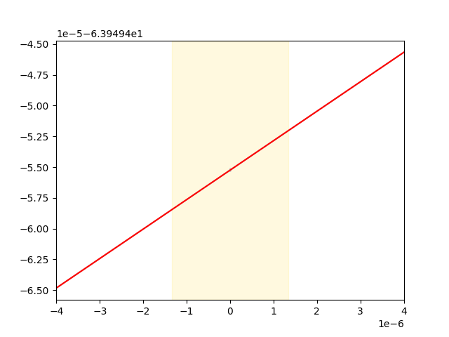
## New Eq:
((fabs(membrane__V) < 1.3356169352749131e-6) ? ((0.5 + 374358.83507802623 * membrane__V) * (1.042038e-5 * (-0.34100000000000003 * calcium_dynamics__Cao + calcium_dynamics__Cai * exp(9.9999999999999995e-8)) * L_type_Ca_channel__P_scale / (-1.0 + exp(9.9999999999999995e-8)) + 1.042038e-5 * (-0.34100000000000003 * calcium_dynamics__Cao + calcium_dynamics__Cai * exp(-9.9999999999999995e-8)) * L_type_Ca_channel__P_scale / (-1.0 + exp(-9.9999999999999995e-8))) - 1.042038e-5 * (-0.34100000000000003 * calcium_dynamics__Cao + calcium_dynamics__Cai * exp(-9.9999999999999995e-8)) * L_type_Ca_channel__P_scale / (-1.0 + exp(-9.9999999999999995e-8))) : (4.0 * pow(membrane__F, 2) * (-L_type_Ca_channel__gamma_Cao * calcium_dynamics__Cao + L_type_Ca_channel__gamma_Cai * calcium_dynamics__Cai * exp(2.0 * membrane__F * membrane__V / (membrane__R * membrane__T))) * L_type_Ca_channel__P_Ca * L_type_Ca_channel__P_scale * membrane__V / ((-1.0 + exp(2.0 * membrane__F * membrane__V / (membrane__R * membrane__T))) * membrane__R * membrane__T)))

## Equation 2:
```
L_type_Ca_channel__I_CaK = pow(membrane__F, 2) * (-L_type_Ca_channel__gamma_Ko * ionic_concentrations__Ko + L_type_Ca_channel__gamma_Ki * ionic_concentrations__Ki * exp(membrane__F * membrane__V / (membrane__R * membrane__T))) * L_type_Ca_channel__P_K * L_type_Ca_channel__P_scale * membrane__V / ((-1.0 + exp(membrane__F * membrane__V / (membrane__R * membrane__T))) * membrane__R * membrane__T)
```
### Partially evaluated to: 
```
L_type_Ca_channel__I_CaK = 0.00069711623550831479 * (-0.75 * ionic_concentrations__Ko + 0.75 * ionic_concentrations__Ki * exp(0.037435883507802616 * membrane__V)) * L_type_Ca_channel__P_scale * membrane__V / (-1.0 + exp(0.037435883507802616 * membrane__V))
```
### Singulariy points detected:

{0}
*U*
`0.037435883507802616 * membrane__V`

*V for 1e-07 range* 
`-2.6712338705498262e-6 - 2.6712338705498262e-6`

*Singularity point: 0*


## New Eq:
((fabs(membrane__V) < 2.6712338705498262e-6) ? ((0.5 + 187179.41753901311 * membrane__V) * (1.8621604999999999e-9 * (-0.75 * ionic_concentrations__Ko + 0.75 * ionic_concentrations__Ki * exp(9.9999999999999995e-8)) * L_type_Ca_channel__P_scale / (-1.0 + exp(9.9999999999999995e-8)) + 1.8621604999999999e-9 * (-0.75 * ionic_concentrations__Ko + 0.75 * ionic_concentrations__Ki * exp(-9.9999999999999995e-8)) * L_type_Ca_channel__P_scale / (-1.0 + exp(-9.9999999999999995e-8))) - 1.8621604999999999e-9 * (-0.75 * ionic_concentrations__Ko + 0.75 * ionic_concentrations__Ki * exp(-9.9999999999999995e-8)) * L_type_Ca_channel__P_scale / (-1.0 + exp(-9.9999999999999995e-8))) : (pow(membrane__F, 2) * (-L_type_Ca_channel__gamma_Ko * ionic_concentrations__Ko + L_type_Ca_channel__gamma_Ki * ionic_concentrations__Ki * exp(membrane__F * membrane__V / (membrane__R * membrane__T))) * L_type_Ca_channel__P_K * L_type_Ca_channel__P_scale * membrane__V / ((-1.0 + exp(membrane__F * membrane__V / (membrane__R * membrane__T))) * membrane__R * membrane__T)))

## Equation 3:
```
L_type_Ca_channel__I_CaNa = pow(membrane__F, 2) * (-L_type_Ca_channel__gamma_Nao * ionic_concentrations__Nao + L_type_Ca_channel__gamma_Nai * ionic_concentrations__Nai * exp(membrane__F * membrane__V / (membrane__R * membrane__T))) * L_type_Ca_channel__P_Na * L_type_Ca_channel__P_scale * membrane__V / ((-1.0 + exp(membrane__F * membrane__V / (membrane__R * membrane__T))) * membrane__R * membrane__T)
```
### Partially evaluated to: 
```
L_type_Ca_channel__I_CaNa = 0.0024381008236689767 * (-0.75 * ionic_concentrations__Nao + 0.75 * ionic_concentrations__Nai * exp(0.037435883507802616 * membrane__V)) * L_type_Ca_channel__P_scale * membrane__V / (-1.0 + exp(0.037435883507802616 * membrane__V))
```
### Singulariy points detected:

{0}
*U*
`0.037435883507802616 * membrane__V`

*V for 1e-07 range* 
`-2.6712338705498262e-6 - 2.6712338705498262e-6`

*Singularity point: 0*


## New Eq:
((fabs(membrane__V) < 2.6712338705498262e-6) ? ((0.5 + 187179.41753901311 * membrane__V) * (6.5127375e-9 * (-0.75 * ionic_concentrations__Nao + 0.75 * ionic_concentrations__Nai * exp(9.9999999999999995e-8)) * L_type_Ca_channel__P_scale / (-1.0 + exp(9.9999999999999995e-8)) + 6.5127375e-9 * (-0.75 * ionic_concentrations__Nao + 0.75 * ionic_concentrations__Nai * exp(-9.9999999999999995e-8)) * L_type_Ca_channel__P_scale / (-1.0 + exp(-9.9999999999999995e-8))) - 6.5127375e-9 * (-0.75 * ionic_concentrations__Nao + 0.75 * ionic_concentrations__Nai * exp(-9.9999999999999995e-8)) * L_type_Ca_channel__P_scale / (-1.0 + exp(-9.9999999999999995e-8))) : (pow(membrane__F, 2) * (-L_type_Ca_channel__gamma_Nao * ionic_concentrations__Nao + L_type_Ca_channel__gamma_Nai * ionic_concentrations__Nai * exp(membrane__F * membrane__V / (membrane__R * membrane__T))) * L_type_Ca_channel__P_Na * L_type_Ca_channel__P_scale * membrane__V / ((-1.0 + exp(membrane__F * membrane__V / (membrane__R * membrane__T))) * membrane__R * membrane__T)))

## Equation 4:
```
non_specific_calcium_activated_current__I_ns_K = pow(membrane__F, 2) * (-L_type_Ca_channel__gamma_Ko * ionic_concentrations__Ko + L_type_Ca_channel__gamma_Ki * ionic_concentrations__Ki * exp(membrane__F * membrane__V / (membrane__R * membrane__T))) * membrane__V * non_specific_calcium_activated_current__P_ns_Ca / ((-1.0 + exp(membrane__F * membrane__V / (membrane__R * membrane__T))) * membrane__R * membrane__T)
```
### Partially evaluated to: 
```
non_specific_calcium_activated_current__I_ns_K = 0
```
### Singulariy points detected:

{0}
#### Eq == 0!
## Equation 5:
```
non_specific_calcium_activated_current__I_ns_Na = pow(membrane__F, 2) * (-L_type_Ca_channel__gamma_Nao * ionic_concentrations__Nao + L_type_Ca_channel__gamma_Nai * ionic_concentrations__Nai * exp(membrane__F * membrane__V / (membrane__R * membrane__T))) * membrane__V * non_specific_calcium_activated_current__P_ns_Ca / ((-1.0 + exp(membrane__F * membrane__V / (membrane__R * membrane__T))) * membrane__R * membrane__T)
```
### Partially evaluated to: 
```
non_specific_calcium_activated_current__I_ns_Na = 0
```
### Singulariy points detected:

{0}
#### Eq == 0!
## Equation 6:
```
slow_delayed_rectifier_potassium_current_xs1_gate__tau_xs1 = 0.001 / (0.00013100000000000001 * (30.0 + membrane__V) / (-1.0 + 7.8538197044216602 * exp(0.068699999999999997 * membrane__V)) + 7.1899999999999999e-5 * (30.0 + membrane__V) / (1.0 - 0.011795938519751569 * exp(-0.14799999999999999 * membrane__V)))
```
### Partially evaluated to: 
```
slow_delayed_rectifier_potassium_current_xs1_gate__tau_xs1 = 0.001 / (0.00013100000000000001 * (30.0 + membrane__V) / (-1.0 + 7.8538197044216602 * exp(0.068699999999999997 * membrane__V)) + 7.1899999999999999e-5 * (30.0 + membrane__V) / (1.0 - 0.011795938519751569 * exp(-0.14799999999999999 * membrane__V)))
```
### Singulariy points detected:

{-30.000000000000000}
#### float * A

####1 / A


####A + B:

`7.1899999999999999e-5 * (30.0 + membrane__V) / (1.0 - 0.011795938519751569 * exp(-0.14799999999999999 * membrane__V))`
`0.00013100000000000001 * (30.0 + membrane__V) / (-1.0 + 7.8538197044216602 * exp(0.068699999999999997 * membrane__V))`

*U*
`-4.4399999999999995 - 0.14799999999999999 * membrane__V`

*V for 1e-07 range* 
`-30.000000675675675 - -29.999999324324325`

*Singularity point: -30.000000000000000*

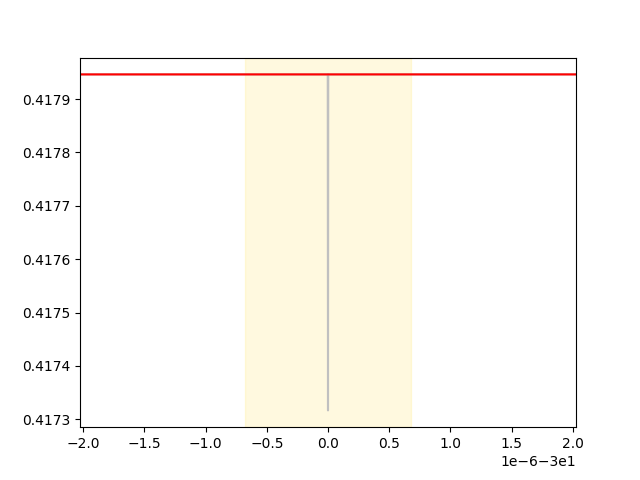
## New Eq:
((fabs(30.0 + membrane__V) < 6.7567567568760367e-7) ? (0.001 / (-8.8513513515076093e-11 / (-1.0 + exp(-4.6418918920460017e-8)) - 4.8581081081938701e-11 / (1.0 - exp(1.0000000000287557e-7))) + (22200000.499608092 + 739999.99998693645 * membrane__V) * (0.001 / (8.8513513515076093e-11 / (-1.0 + exp(4.6418918920460017e-8)) + 4.8581081081938701e-11 / (1.0 - exp(-1.0000000000287557e-7))) - 0.001 / (-8.8513513515076093e-11 / (-1.0 + exp(-4.6418918920460017e-8)) - 4.8581081081938701e-11 / (1.0 - exp(1.0000000000287557e-7))))) : (0.001 / (0.00013100000000000001 * (30.0 + membrane__V) / (-1.0 + exp(2.0609999999999999 + 0.068699999999999997 * membrane__V)) + 7.1899999999999999e-5 * (30.0 + membrane__V) / (1.0 - exp(-4.4399999999999995 - 0.14799999999999999 * membrane__V)))))

## Equation 7:
```
slow_delayed_rectifier_potassium_current_xs2_gate__tau_xs2 = 0.0040000000000000001 / (0.00013100000000000001 * (30.0 + membrane__V) / (-1.0 + 7.8538197044216602 * exp(0.068699999999999997 * membrane__V)) + 7.1899999999999999e-5 * (30.0 + membrane__V) / (1.0 - 0.011795938519751569 * exp(-0.14799999999999999 * membrane__V)))
```
### Partially evaluated to: 
```
slow_delayed_rectifier_potassium_current_xs2_gate__tau_xs2 = 0.0040000000000000001 / (0.00013100000000000001 * (30.0 + membrane__V) / (-1.0 + 7.8538197044216602 * exp(0.068699999999999997 * membrane__V)) + 7.1899999999999999e-5 * (30.0 + membrane__V) / (1.0 - 0.011795938519751569 * exp(-0.14799999999999999 * membrane__V)))
```
### Singulariy points detected:

{-30.000000000000000}
#### float * A

####1 / A


####A + B:

`7.1899999999999999e-5 * (30.0 + membrane__V) / (1.0 - 0.011795938519751569 * exp(-0.14799999999999999 * membrane__V))`
`0.00013100000000000001 * (30.0 + membrane__V) / (-1.0 + 7.8538197044216602 * exp(0.068699999999999997 * membrane__V))`

*U*
`-4.4399999999999995 - 0.14799999999999999 * membrane__V`

*V for 1e-07 range* 
`-30.000000675675675 - -29.999999324324325`

*Singularity point: -30.000000000000000*

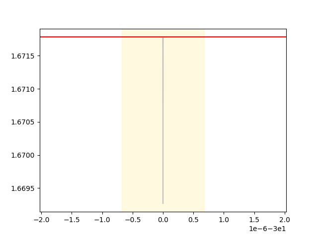
## New Eq:
((fabs(30.0 + membrane__V) < 6.7567567568760367e-7) ? (0.0040000000000000001 / (-8.8513513515076093e-11 / (-1.0 + exp(-4.6418918920460017e-8)) - 4.8581081081938701e-11 / (1.0 - exp(1.0000000000287557e-7))) + (22200000.499608092 + 739999.99998693645 * membrane__V) * (0.0040000000000000001 / (8.8513513515076093e-11 / (-1.0 + exp(4.6418918920460017e-8)) + 4.8581081081938701e-11 / (1.0 - exp(-1.0000000000287557e-7))) - 0.0040000000000000001 / (-8.8513513515076093e-11 / (-1.0 + exp(-4.6418918920460017e-8)) - 4.8581081081938701e-11 / (1.0 - exp(1.0000000000287557e-7))))) : (0.0040000000000000001 / (0.00013100000000000001 * (30.0 + membrane__V) / (-1.0 + exp(2.0609999999999999 + 0.068699999999999997 * membrane__V)) + 7.1899999999999999e-5 * (30.0 + membrane__V) / (1.0 - exp(-4.4399999999999995 - 0.14799999999999999 * membrane__V)))))

# Model: Corrias_rabbit_purkinje_model(corrias_purkinje_2011.cellml)
## Equation 1:
```
x_ks__tau_x_ks = ((fabs(30.0 + membrane__Vm) < 0.014500000000000001) ? (417.94619999999998) : (1 / (0.00013100000000000001 * (30.0 + membrane__Vm) / (-1.0 + 7.8538197044216602 * exp(0.068699999999999997 * membrane__Vm)) + 7.1899999999999999e-5 * (30.0 + membrane__Vm) / (1.0 - 0.011795938519751569 * exp(-0.14799999999999999 * membrane__Vm)))))
```
### Partially evaluated to: 
```
x_ks__tau_x_ks = ((fabs(30.0 + membrane__Vm) < 0.014500000000000001) ? (417.94619999999998) : (1 / (0.00013100000000000001 * (30.0 + membrane__Vm) / (-1.0 + 7.8538197044216602 * exp(0.068699999999999997 * membrane__Vm)) + 7.1899999999999999e-5 * (30.0 + membrane__Vm) / (1.0 - 0.011795938519751569 * exp(-0.14799999999999999 * membrane__Vm)))))
```
### Singulariy points detected:

{-30.000000000000000}
####Piecewise!
## Equation 2:
```
y_kr__ykrv1 = ((fabs(7.0 + membrane__Vm) > 0.001) ? (0.0013799999999999999 * (7.0 + membrane__Vm) / (1.0 - 0.42273913174596284 * exp(-0.123 * membrane__Vm))) : (0.011219512195121951))
```
### Partially evaluated to: 
```
y_kr__ykrv1 = ((fabs(7.0 + membrane__Vm) > 0.001) ? (0.0013799999999999999 * (7.0 + membrane__Vm) / (1.0 - 0.42273913174596284 * exp(-0.123 * membrane__Vm))) : (0.011219512195121951))
```
### Singulariy points detected:

{-7.0000000000000000}
####Piecewise!
## Equation 3:
```
y_kr__ykrv2 = ((fabs(10.0 + membrane__Vm) > 0.001) ? (6.0999999999999999e-5 * (10.0 + membrane__Vm) / (-1.0 + 4.2631145151688168 * exp(0.14499999999999999 * membrane__Vm))) : (0.0042068965517241376))
```
### Partially evaluated to: 
```
y_kr__ykrv2 = ((fabs(10.0 + membrane__Vm) > 0.001) ? (6.0999999999999999e-5 * (10.0 + membrane__Vm) / (-1.0 + 4.2631145151688168 * exp(0.14499999999999999 * membrane__Vm))) : (0.0042068965517241376))
```
### Singulariy points detected:

{-10.000000000000000}
####Piecewise!
# Model: courtemanche_1998(courtemanche_ramirez_nattel_1998.cellml)
## Equation 1:
```
Ca_release_current_from_JSR_w_gate__tau_w = ((fabs(-7.9000000000000004 + membrane__V) < 1.0e-10) ? (0.92307692307692313) : (6.0 * (1.0 - 4.854955811237434 * exp(-0.20000000000000001 * membrane__V)) / ((1.0 + 1.4564867433712301 * exp(-0.20000000000000001 * membrane__V)) * (-7.9000000000000004 + membrane__V))))
```
### Partially evaluated to: 
```
Ca_release_current_from_JSR_w_gate__tau_w = ((fabs(-7.9000000000000004 + membrane__V) < 1.0e-10) ? (0.92307692307692313) : (6.0 * (1.0 - 4.854955811237434 * exp(-0.20000000000000001 * membrane__V)) / ((1.0 + 1.4564867433712301 * exp(-0.20000000000000001 * membrane__V)) * (-7.9000000000000004 + membrane__V))))
```
### Singulariy points detected:

{7.9000000000000004}
####Piecewise!
## Equation 2:
```
L_type_Ca_channel_d_gate__tau_d = ((fabs(10.0 + membrane__V) < 1.0e-10) ? (4.5789999999999997 / (1.0 + 0.20137949774492364 * exp(-0.16025641025641024 * membrane__V))) : (28.571428571428569 * (1.0 - 0.20137949774492364 * exp(-0.16025641025641024 * membrane__V)) / ((1.0 + 0.20137949774492364 * exp(-0.16025641025641024 * membrane__V)) * (10.0 + membrane__V))))
```
### Partially evaluated to: 
```
L_type_Ca_channel_d_gate__tau_d = ((fabs(10.0 + membrane__V) < 1.0e-10) ? (4.5789999999999997 / (1.0 + 0.20137949774492364 * exp(-0.16025641025641024 * membrane__V))) : (28.571428571428569 * (1.0 - 0.20137949774492364 * exp(-0.16025641025641024 * membrane__V)) / ((1.0 + 0.20137949774492364 * exp(-0.16025641025641024 * membrane__V)) * (10.0 + membrane__V))))
```
### Singulariy points detected:

{-10.000000000000000}
####Piecewise!
## Equation 3:
```
fast_sodium_current_m_gate__alpha_m = ((membrane__V == (-47.130000000000003)) ? (3.2000000000000002) : (0.32000000000000001 * (47.130000000000003 + membrane__V) / (1.0 - 0.00897780373069724 * exp(-0.10000000000000001 * membrane__V))))
```
### Partially evaluated to: 
```
fast_sodium_current_m_gate__alpha_m = ((membrane__V == (-47.130000000000003)) ? (3.2000000000000002) : (0.32000000000000001 * (47.130000000000003 + membrane__V) / (1.0 - 0.00897780373069724 * exp(-0.10000000000000001 * membrane__V))))
```
### Singulariy points detected:

{-47.130000000000003}
####Piecewise!
## Equation 4:
```
rapid_delayed_rectifier_K_current_xr_gate__alpha_xr = ((fabs(14.1 + membrane__V) < 1.0e-10) ? (0.0015) : (0.00029999999999999997 * (14.1 + membrane__V) / (1.0 - 0.059605942708939361 * exp(-0.20000000000000001 * membrane__V))))
```
### Partially evaluated to: 
```
rapid_delayed_rectifier_K_current_xr_gate__alpha_xr = ((fabs(14.1 + membrane__V) < 1.0e-10) ? (0.0015) : (0.00029999999999999997 * (14.1 + membrane__V) / (1.0 - 0.059605942708939361 * exp(-0.20000000000000001 * membrane__V))))
```
### Singulariy points detected:

{-14.100000000000000}
####Piecewise!
## Equation 5:
```
rapid_delayed_rectifier_K_current_xr_gate__beta_xr = ((fabs(-3.3328000000000002 + membrane__V) < 1.0e-10) ? (0.00037836118) : (7.3898000000000003e-5 * (-3.3328000000000002 + membrane__V) / (-1.0 + 0.52180181098168432 * exp(0.19517145812596365 * membrane__V))))
```
### Partially evaluated to: 
```
rapid_delayed_rectifier_K_current_xr_gate__beta_xr = ((fabs(-3.3328000000000002 + membrane__V) < 1.0e-10) ? (0.00037836118) : (7.3898000000000003e-5 * (-3.3328000000000002 + membrane__V) / (-1.0 + 0.52180181098168432 * exp(0.19517145812596365 * membrane__V))))
```
### Singulariy points detected:

{3.3328000000000002}
####Piecewise!
## Equation 6:
```
slow_delayed_rectifier_K_current_xs_gate__alpha_xs = ((fabs(-19.899999999999999 + membrane__V) < 1.0e-10) ? (0.00068000000000000005) : (4.0000000000000003e-5 * (-19.899999999999999 + membrane__V) / (1.0 - 3.2238884858633599 * exp(-0.058823529411764705 * membrane__V))))
```
### Partially evaluated to: 
```
slow_delayed_rectifier_K_current_xs_gate__alpha_xs = ((fabs(-19.899999999999999 + membrane__V) < 1.0e-10) ? (0.00068000000000000005) : (4.0000000000000003e-5 * (-19.899999999999999 + membrane__V) / (1.0 - 3.2238884858633599 * exp(-0.058823529411764705 * membrane__V))))
```
### Singulariy points detected:

{19.899999999999999}
####Piecewise!
## Equation 7:
```
slow_delayed_rectifier_K_current_xs_gate__beta_xs = ((fabs(-19.899999999999999 + membrane__V) < 1.0e-10) ? (0.00031500000000000001) : (3.4999999999999997e-5 * (-19.899999999999999 + membrane__V) / (-1.0 + 0.10957882659742624 * exp(0.1111111111111111 * membrane__V))))
```
### Partially evaluated to: 
```
slow_delayed_rectifier_K_current_xs_gate__beta_xs = ((fabs(-19.899999999999999 + membrane__V) < 1.0e-10) ? (0.00031500000000000001) : (3.4999999999999997e-5 * (-19.899999999999999 + membrane__V) / (-1.0 + 0.10957882659742624 * exp(0.1111111111111111 * membrane__V))))
```
### Singulariy points detected:

{19.899999999999999}
####Piecewise!
# Model: davies_isap_2012(davies_isap_2012.cellml)
# Model: decker_2009(decker_2009.cellml)
# Model: demir_model_1994(demir_model_1994.cellml)
## Equation 1:
```
L_type_Ca_channel_d_gate__alpha_d_L = -28.390000000000001 * (35.0 + membrane__V) / (-1.0 + 8.3152871910356788e-7 * exp(-0.40000000000000002 * membrane__V)) - 84.900000000000006 * membrane__V / (-1.0 + exp(-0.20799999999999999 * membrane__V))
```
### Partially evaluated to: 
```
L_type_Ca_channel_d_gate__alpha_d_L = -28.390000000000001 * (35.0 + membrane__V) / (-1.0 + 8.3152871910356788e-7 * exp(-0.40000000000000002 * membrane__V)) - 84.900000000000006 * membrane__V / (-1.0 + exp(-0.20799999999999999 * membrane__V))
```
### Singulariy points detected:

{0, -35.000000000000000}
####A + B:

`84.900000000000006 * membrane__V / (1.0 - exp(-0.20799999999999999 * membrane__V))`
`-28.390000000000001 * (35.0 + membrane__V) / (-1.0 + 8.3152871910356788e-7 * exp(-0.40000000000000002 * membrane__V))`

*U*
`0.20799999999999999 * membrane__V`

*V for 1e-07 range* 
`-4.8076923076923074e-7 - 4.8076923076923074e-7`

*Singularity point: 0*

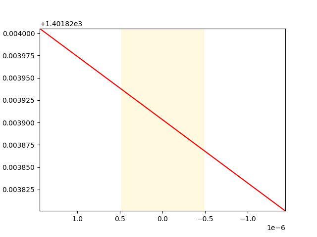
*U*
`-14.0 - 0.40000000000000002 * membrane__V`

*V for 1e-07 range* 
`-35.000000249999999 - -34.999999750000001`

*Singularity point: -35.000000000000000*

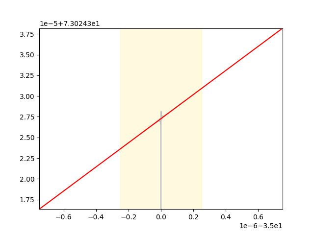
## New Eq:
((fabs(membrane__V) < 4.8076923076923074e-7) ? (4.0817307692307694e-5 / (-1.0 + exp(9.9999999999999995e-8)) - 993.64998635096151 / (-1.0 + exp(-13.999999807692308)) + (0.5 + 1040000.0 * membrane__V) * (993.64998635096151 / (-1.0 + exp(-13.999999807692308)) - 993.65001364903844 / (-1.0 + exp(-14.000000192307692)) - 4.0817307692307694e-5 / (-1.0 + exp(9.9999999999999995e-8)) - 4.0817307692307694e-5 / (-1.0 + exp(-9.9999999999999995e-8)))) : ((fabs(35.0 + membrane__V) < 2.5000000003494449e-7) ? (7.0974999994161125e-6 / (-1.0 + exp(9.9999999988997779e-8)) + 2971.5000212250002 / (-1.0 + exp(7.2800000519999992)) + (70000000.497987106 + 1999999.9999424887 * membrane__V) * (2971.4999787750003 / (-1.0 + exp(7.2799999479999995)) - 7.0974999994161125e-6 / (-1.0 + exp(9.9999999988997779e-8)) - 2971.5000212250002 / (-1.0 + exp(7.2800000519999992)) - 7.097500000992074e-6 / (-1.0 + exp(-1.0000000001675335e-7)))) : (-28.390000000000001 * (35.0 + membrane__V) / (-1.0 + exp(-14.0 - 0.40000000000000002 * membrane__V)) - 84.900000000000006 * membrane__V / (-1.0 + exp(-0.20799999999999999 * membrane__V)))))

## Equation 2:
```
L_type_Ca_channel_d_gate__beta_d_L = 11.43 * (-5.0 + membrane__V) / (-1.0 + 0.13533528323661267 * exp(0.40000000000000002 * membrane__V))
```
### Partially evaluated to: 
```
L_type_Ca_channel_d_gate__beta_d_L = 11.43 * (-5.0 + membrane__V) / (-1.0 + 0.13533528323661267 * exp(0.40000000000000002 * membrane__V))
```
### Singulariy points detected:

{5.0000000000000000}
*U*
`-2.0 + 0.40000000000000002 * membrane__V`

*V for 1e-07 range* 
`4.9999997499999997 - 5.0000002500000003`

*Singularity point: 5.0000000000000000*


## New Eq:
((fabs(-5.0 + membrane__V) < 2.5000000000025002e-7) ? (-2.8575000000028576e-6 / (-1.0 + exp(-9.9999999999406119e-8)) + (-9999999.4999899995 + 1999999.9999979998 * membrane__V) * (2.8575000000028576e-6 / (-1.0 + exp(9.9999999999406119e-8)) + 2.8575000000028576e-6 / (-1.0 + exp(-9.9999999999406119e-8)))) : (11.43 * (-5.0 + membrane__V) / (-1.0 + exp(-2.0 + 0.40000000000000002 * membrane__V))))

## Equation 3:
```
L_type_Ca_channel_f_gate__alpha_f_L = 3.75 * (28.0 + membrane__V) / (-1.0 + 1096.6331584284585 * exp(0.25 * membrane__V))
```
### Partially evaluated to: 
```
L_type_Ca_channel_f_gate__alpha_f_L = 3.75 * (28.0 + membrane__V) / (-1.0 + 1096.6331584284585 * exp(0.25 * membrane__V))
```
### Singulariy points detected:

{-28.000000000000000}
*U*
`7.0 + 0.25 * membrane__V`

*V for 1e-07 range* 
`-28.000000400000001 - -27.999999599999999`

*Singularity point: -28.000000000000000*

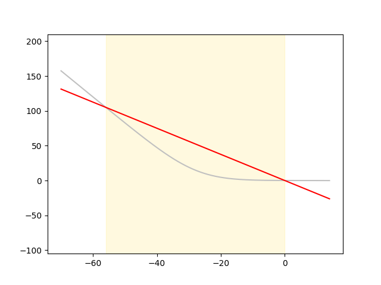
## New Eq:
((fabs(28.0 + membrane__V) < 4.0000000001150227e-7) ? (-1.5000000000431335e-6 / (-1.0 + exp(-1.0000000000287557e-7)) + (35000000.498993553 + 1249999.9999640554 * membrane__V) * (1.5000000000431335e-6 / (-1.0 + exp(1.0000000000287557e-7)) + 1.5000000000431335e-6 / (-1.0 + exp(-1.0000000000287557e-7)))) : (3.75 * (28.0 + membrane__V) / (-1.0 + exp(7.0 + 0.25 * membrane__V))))

## Equation 4:
```
sodium_current_m_gate__alpha_m = -824.0 * (51.899999999999999 + membrane__V) / (-1.0 + 0.0029337885398758403 * exp(-0.11235955056179775 * membrane__V))
```
### Partially evaluated to: 
```
sodium_current_m_gate__alpha_m = -824.0 * (51.899999999999999 + membrane__V) / (-1.0 + 0.0029337885398758403 * exp(-0.11235955056179775 * membrane__V))
```
### Singulariy points detected:

{-51.899999999999999}
*U*
`-5.8314606741573032 - 0.11235955056179775 * membrane__V`

*V for 1e-07 range* 
`-51.900000890000001 - -51.899999109999996`

*Singularity point: -51.899999999999999*

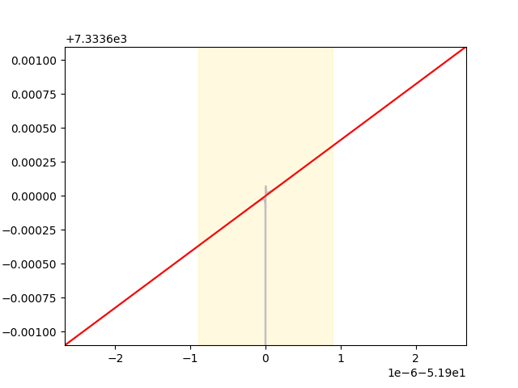
## New Eq:
((fabs(51.899999999999999 + membrane__V) < 8.8999999997563251e-7) ? (0.00073335999997992118 / (-1.0 + exp(1.0000000000287557e-7)) + (29157303.870675519 + 561797.75280685013 * membrane__V) * (-0.00073336000002566237 / (-1.0 + exp(-1.0000000000287557e-7)) - 0.00073335999997992118 / (-1.0 + exp(1.0000000000287557e-7)))) : (-824.0 * (51.899999999999999 + membrane__V) / (-1.0 + exp(-5.8314606741573032 - 0.11235955056179775 * membrane__V))))

## Equation 5:
```
sodium_current__i_Na = pow(membrane__F, 2) * pow(sodium_current_m_gate__m, 3) * (-1.0 + exp((-reversal_potentials__E_Na + membrane__V) * membrane__F / (membrane__R * membrane__T))) * cleft_space_equations__Na_c * membrane__V * sodium_current__P_Na * sodium_current_h_gate__h1 * sodium_current_h_gate__h2 / ((-1.0 + exp(membrane__F * membrane__V / (membrane__R * membrane__T))) * membrane__R * membrane__T)
```
### Partially evaluated to: 
```
sodium_current__i_Na = 3611.8217397063127 * pow(sodium_current_m_gate__m, 3) * (-1.0 + pow((cleft_space_equations__Na_c / intracellular_concentrations_and_buffer_equations__Na_i), (-1.0)) * exp(0.037433890822745473 * membrane__V)) * cleft_space_equations__Na_c * membrane__V * sodium_current__P_Na * sodium_current_h_gate__h1 * sodium_current_h_gate__h2 / (-1.0 + exp(0.037433890822745473 * membrane__V))
```
### Singulariy points detected:

{0}
*U*
`0.037433890822745473 * membrane__V`

*V for 1e-07 range* 
`-2.671376065969565e-6 - 2.671376065969565e-6`

*Singularity point: 0*

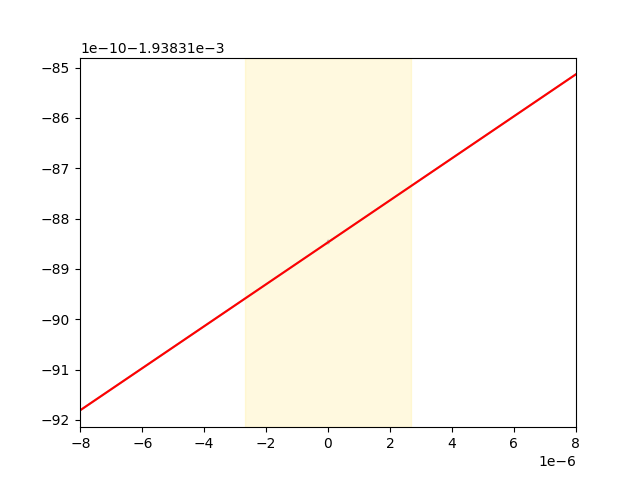
## New Eq:
((fabs(membrane__V) < 2.671376065969565e-6) ? ((0.5 + 187169.45411372738 * membrane__V) * (0.0096485341499999988 * pow(sodium_current_m_gate__m, 3) * (-1.0 + exp(9.9999999999999995e-8 - 1.0 * log(cleft_space_equations__Na_c / intracellular_concentrations_and_buffer_equations__Na_i))) * cleft_space_equations__Na_c * sodium_current__P_Na * sodium_current_h_gate__h1 * sodium_current_h_gate__h2 / (-1.0 + exp(9.9999999999999995e-8)) + 0.0096485341499999988 * pow(sodium_current_m_gate__m, 3) * (-1.0 + exp(-9.9999999999999995e-8 - 1.0 * log(cleft_space_equations__Na_c / intracellular_concentrations_and_buffer_equations__Na_i))) * cleft_space_equations__Na_c * sodium_current__P_Na * sodium_current_h_gate__h1 * sodium_current_h_gate__h2 / (-1.0 + exp(-9.9999999999999995e-8))) - 0.0096485341499999988 * pow(sodium_current_m_gate__m, 3) * (-1.0 + exp(-9.9999999999999995e-8 - 1.0 * log(cleft_space_equations__Na_c / intracellular_concentrations_and_buffer_equations__Na_i))) * cleft_space_equations__Na_c * sodium_current__P_Na * sodium_current_h_gate__h1 * sodium_current_h_gate__h2 / (-1.0 + exp(-9.9999999999999995e-8))) : (pow(membrane__F, 2) * pow(sodium_current_m_gate__m, 3) * (-1.0 + exp((-reversal_potentials__E_Na + membrane__V) * membrane__F / (membrane__R * membrane__T))) * cleft_space_equations__Na_c * membrane__V * sodium_current__P_Na * sodium_current_h_gate__h1 * sodium_current_h_gate__h2 / ((-1.0 + exp(membrane__F * membrane__V / (membrane__R * membrane__T))) * membrane__R * membrane__T)))

# Model: difrancesco_noble_model_1985(difrancesco_noble_model_1985.cellml)
## Equation 1:
```
intracellular_calcium_concentration__alpha_p = 0.625 * (34.0 + membrane__V) / (-1.0 + 4914.7688402991344 * exp(0.25 * membrane__V))
```
### Partially evaluated to: 
```
intracellular_calcium_concentration__alpha_p = 0.625 * (34.0 + membrane__V) / (-1.0 + 4914.7688402991344 * exp(0.25 * membrane__V))
```
### Singulariy points detected:

{-34.000000000000000}
*U*
`8.5 + 0.25 * membrane__V`

*V for 1e-07 range* 
`-34.000000399999998 - -33.999999600000002`

*Singularity point: -34.000000000000000*

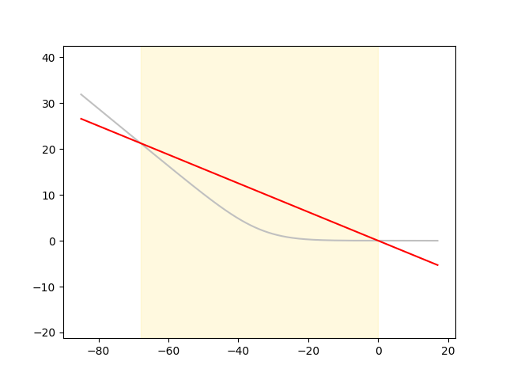
## New Eq:
((fabs(34.0 + membrane__V) < 4.0000000001150227e-7) ? (-2.5000000000718892e-7 / (-1.0 + exp(-1.0000000000287557e-7)) + (42500000.498777881 + 1249999.9999640554 * membrane__V) * (2.5000000000718892e-7 / (-1.0 + exp(1.0000000000287557e-7)) + 2.5000000000718892e-7 / (-1.0 + exp(-1.0000000000287557e-7)))) : (0.625 * (34.0 + membrane__V) / (-1.0 + exp(8.5 + 0.25 * membrane__V))))

## Equation 2:
```
second_inward_current__i_siCa = 4.0 * (-50.0 + membrane__V) * (intracellular_calcium_concentration__Cai * exp(100.0 / membrane__RTONF) - extracellular_calcium_concentration__Cao * exp(-2.0 * (-50.0 + membrane__V) / membrane__RTONF)) * second_inward_current__P_si * second_inward_current_d_gate__d * second_inward_current_f2_gate__f2 * second_inward_current_f_gate__f / ((1.0 - exp(-2.0 * (-50.0 + membrane__V) / membrane__RTONF)) * membrane__RTONF)
```
### Partially evaluated to: 
```
second_inward_current__i_siCa = 0.14973556329098189 * (-50.0 + membrane__V) * (42.240905756816076 * intracellular_calcium_concentration__Cai - 42.240905756816076 * extracellular_calcium_concentration__Cao * exp(-0.074867781645490947 * membrane__V)) * second_inward_current__P_si * second_inward_current_d_gate__d * second_inward_current_f2_gate__f2 * second_inward_current_f_gate__f / (1.0 - 42.240905756816076 * exp(-0.074867781645490947 * membrane__V))
```
### Singulariy points detected:

{50.000000000000000}
*U*
`3.7433890822745473 - 0.074867781645490947 * membrane__V`

*V for 1e-07 range* 
`49.999998664311967 - 50.000001335688033`

*Singularity point: 50.000000000000000*


## New Eq:
((fabs(-50.0 + membrane__V) < 1.3356880329551402e-6) ? ((-18716944.911788113 + 374338.90823576227 * membrane__V) * (1.9999999999556149e-7 * (intracellular_calcium_concentration__Cai * exp(3.7433890822745473) - extracellular_calcium_concentration__Cao * exp(9.9999999999406119e-8)) * second_inward_current__P_si * second_inward_current_d_gate__d * second_inward_current_f2_gate__f2 * second_inward_current_f_gate__f / (1.0 - exp(9.9999999999406119e-8)) + 1.9999999999556149e-7 * (intracellular_calcium_concentration__Cai * exp(3.7433890822745473) - extracellular_calcium_concentration__Cao * exp(-9.9999999995936673e-8)) * second_inward_current__P_si * second_inward_current_d_gate__d * second_inward_current_f2_gate__f2 * second_inward_current_f_gate__f / (1.0 - exp(-9.9999999995936673e-8))) - 1.9999999999556149e-7 * (intracellular_calcium_concentration__Cai * exp(3.7433890822745473) - extracellular_calcium_concentration__Cao * exp(9.9999999999406119e-8)) * second_inward_current__P_si * second_inward_current_d_gate__d * second_inward_current_f2_gate__f2 * second_inward_current_f_gate__f / (1.0 - exp(9.9999999999406119e-8))) : (4.0 * (-50.0 + membrane__V) * (intracellular_calcium_concentration__Cai * exp(100.0 / membrane__RTONF) - extracellular_calcium_concentration__Cao * exp(-2.0 * (-50.0 + membrane__V) / membrane__RTONF)) * second_inward_current__P_si * second_inward_current_d_gate__d * second_inward_current_f2_gate__f2 * second_inward_current_f_gate__f / ((1.0 - exp(-2.0 * (-50.0 + membrane__V) / membrane__RTONF)) * membrane__RTONF)))

## Equation 3:
```
second_inward_current__i_siK = 0.01 * (-50.0 + membrane__V) * (intracellular_potassium_concentration__Ki * exp(50.0 / membrane__RTONF) - extracellular_potassium_concentration__Kc * exp(-(-50.0 + membrane__V) / membrane__RTONF)) * second_inward_current__P_si * second_inward_current_d_gate__d * second_inward_current_f2_gate__f2 * second_inward_current_f_gate__f / ((1.0 - exp(-(-50.0 + membrane__V) / membrane__RTONF)) * membrane__RTONF)
```
### Partially evaluated to: 
```
second_inward_current__i_siK = 0.00037433890822745472 * (-50.0 + membrane__V) * (6.4993004051833205 * intracellular_potassium_concentration__Ki - 6.4993004051833205 * extracellular_potassium_concentration__Kc * exp(-0.037433890822745473 * membrane__V)) * second_inward_current__P_si * second_inward_current_d_gate__d * second_inward_current_f2_gate__f2 * second_inward_current_f_gate__f / (1.0 - 6.4993004051833205 * exp(-0.037433890822745473 * membrane__V))
```
### Singulariy points detected:

{50.000000000000000}
*U*
`1.8716945411372736 - 0.037433890822745473 * membrane__V`

*V for 1e-07 range* 
`49.999997328623934 - 50.000002671376066`

*Singularity point: 50.000000000000000*

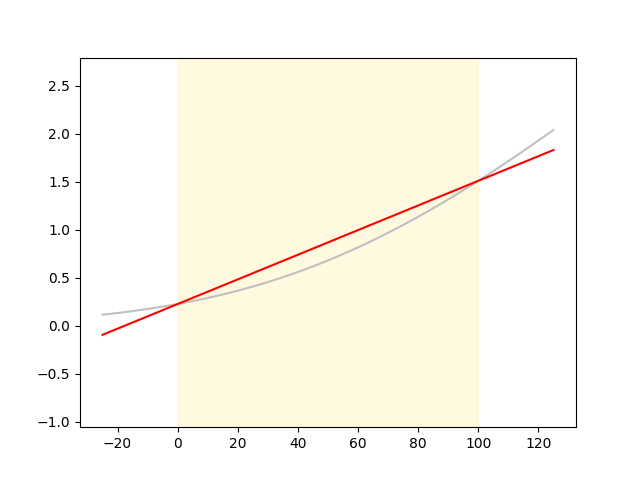
## New Eq:
((fabs(-50.0 + membrane__V) < 2.6713760659657915e-6) ? ((-9358472.2056995872 + 187169.45411399176 * membrane__V) * (9.9999999999858744e-10 * (intracellular_potassium_concentration__Ki * exp(1.8716945411372736) - extracellular_potassium_concentration__Kc * exp(9.9999999999406119e-8)) * second_inward_current__P_si * second_inward_current_d_gate__d * second_inward_current_f2_gate__f2 * second_inward_current_f_gate__f / (1.0 - exp(9.9999999999406119e-8)) + 9.9999999999858744e-10 * (intracellular_potassium_concentration__Ki * exp(1.8716945411372736) - extracellular_potassium_concentration__Kc * exp(-9.9999999999406119e-8)) * second_inward_current__P_si * second_inward_current_d_gate__d * second_inward_current_f2_gate__f2 * second_inward_current_f_gate__f / (1.0 - exp(-9.9999999999406119e-8))) - 9.9999999999858744e-10 * (intracellular_potassium_concentration__Ki * exp(1.8716945411372736) - extracellular_potassium_concentration__Kc * exp(9.9999999999406119e-8)) * second_inward_current__P_si * second_inward_current_d_gate__d * second_inward_current_f2_gate__f2 * second_inward_current_f_gate__f / (1.0 - exp(9.9999999999406119e-8))) : (0.01 * (-50.0 + membrane__V) * (intracellular_potassium_concentration__Ki * exp(50.0 / membrane__RTONF) - extracellular_potassium_concentration__Kc * exp(-(-50.0 + membrane__V) / membrane__RTONF)) * second_inward_current__P_si * second_inward_current_d_gate__d * second_inward_current_f2_gate__f2 * second_inward_current_f_gate__f / ((1.0 - exp(-(-50.0 + membrane__V) / membrane__RTONF)) * membrane__RTONF)))

## Equation 4:
```
second_inward_current__i_siNa = 0.01 * (-50.0 + membrane__V) * (intracellular_sodium_concentration__Nai * exp(50.0 / membrane__RTONF) - extracellular_sodium_concentration__Nao * exp(-(-50.0 + membrane__V) / membrane__RTONF)) * second_inward_current__P_si * second_inward_current_d_gate__d * second_inward_current_f2_gate__f2 * second_inward_current_f_gate__f / ((1.0 - exp(-(-50.0 + membrane__V) / membrane__RTONF)) * membrane__RTONF)
```
### Partially evaluated to: 
```
second_inward_current__i_siNa = 0.00037433890822745472 * (-50.0 + membrane__V) * (6.4993004051833205 * intracellular_sodium_concentration__Nai - 6.4993004051833205 * extracellular_sodium_concentration__Nao * exp(-0.037433890822745473 * membrane__V)) * second_inward_current__P_si * second_inward_current_d_gate__d * second_inward_current_f2_gate__f2 * second_inward_current_f_gate__f / (1.0 - 6.4993004051833205 * exp(-0.037433890822745473 * membrane__V))
```
### Singulariy points detected:

{50.000000000000000}
*U*
`1.8716945411372736 - 0.037433890822745473 * membrane__V`

*V for 1e-07 range* 
`49.999997328623934 - 50.000002671376066`

*Singularity point: 50.000000000000000*

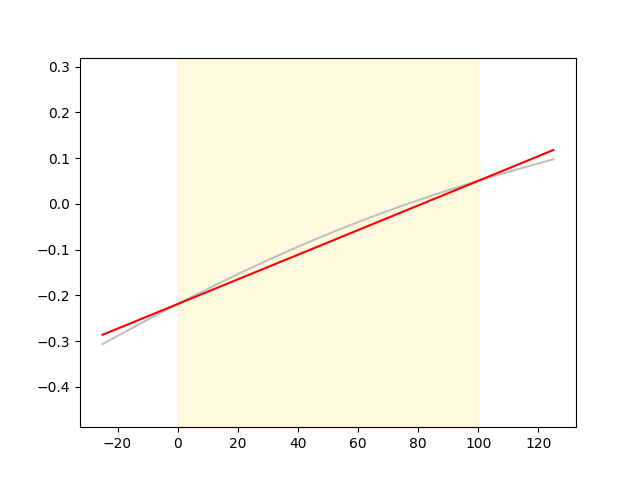
## New Eq:
((fabs(-50.0 + membrane__V) < 2.6713760659657915e-6) ? ((-9358472.2056995872 + 187169.45411399176 * membrane__V) * (9.9999999999858744e-10 * (intracellular_sodium_concentration__Nai * exp(1.8716945411372736) - extracellular_sodium_concentration__Nao * exp(9.9999999999406119e-8)) * second_inward_current__P_si * second_inward_current_d_gate__d * second_inward_current_f2_gate__f2 * second_inward_current_f_gate__f / (1.0 - exp(9.9999999999406119e-8)) + 9.9999999999858744e-10 * (intracellular_sodium_concentration__Nai * exp(1.8716945411372736) - extracellular_sodium_concentration__Nao * exp(-9.9999999999406119e-8)) * second_inward_current__P_si * second_inward_current_d_gate__d * second_inward_current_f2_gate__f2 * second_inward_current_f_gate__f / (1.0 - exp(-9.9999999999406119e-8))) - 9.9999999999858744e-10 * (intracellular_sodium_concentration__Nai * exp(1.8716945411372736) - extracellular_sodium_concentration__Nao * exp(9.9999999999406119e-8)) * second_inward_current__P_si * second_inward_current_d_gate__d * second_inward_current_f2_gate__f2 * second_inward_current_f_gate__f / (1.0 - exp(9.9999999999406119e-8))) : (0.01 * (-50.0 + membrane__V) * (intracellular_sodium_concentration__Nai * exp(50.0 / membrane__RTONF) - extracellular_sodium_concentration__Nao * exp(-(-50.0 + membrane__V) / membrane__RTONF)) * second_inward_current__P_si * second_inward_current_d_gate__d * second_inward_current_f2_gate__f2 * second_inward_current_f_gate__f / ((1.0 - exp(-(-50.0 + membrane__V) / membrane__RTONF)) * membrane__RTONF)))

## Equation 5:
```
transient_outward_current__i_to = (10.0 + membrane__V) * (0.20000000000000001 + extracellular_potassium_concentration__Kc / (extracellular_potassium_concentration__Kc + transient_outward_current__Km_to)) * (intracellular_potassium_concentration__Ki * exp(0.5 * membrane__V / membrane__RTONF) - extracellular_potassium_concentration__Kc * exp(-0.5 * membrane__V / membrane__RTONF)) * intracellular_calcium_concentration__Cai * transient_outward_current__g_to * transient_outward_current_s_gate__s / ((1.0 - 0.13533528323661267 * exp(-0.20000000000000001 * membrane__V)) * (intracellular_calcium_concentration__Cai + transient_outward_current__Km_Ca))
```
### Partially evaluated to: 
```
transient_outward_current__i_to = (10.0 + membrane__V) * (0.20000000000000001 + extracellular_potassium_concentration__Kc / (10.0 + extracellular_potassium_concentration__Kc)) * (intracellular_potassium_concentration__Ki * exp(0.018716945411372737 * membrane__V) - extracellular_potassium_concentration__Kc * exp(-0.018716945411372737 * membrane__V)) * intracellular_calcium_concentration__Cai * transient_outward_current__g_to * transient_outward_current_s_gate__s / ((1.0 - 0.13533528323661267 * exp(-0.20000000000000001 * membrane__V)) * (0.00050000000000000001 + intracellular_calcium_concentration__Cai))
```
### Singulariy points detected:

{-10.000000000000000}
*U*
`-2.0 - 0.20000000000000001 * membrane__V`

*V for 1e-07 range* 
`-10.000000500000001 - -9.9999994999999995`

*Singularity point: -10.000000000000000*

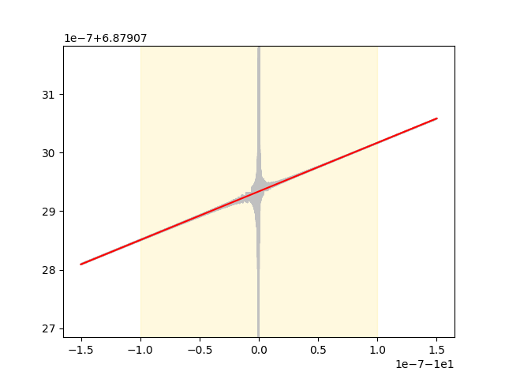
## New Eq:
((fabs(10.0 + membrane__V) < 5.0000000000050004e-7) ? ((10000000.499989999 + 999999.99999899988 * membrane__V) * (5.0000000000050004e-7 * (0.20000000000000001 + extracellular_potassium_concentration__Kc / (10.0 + extracellular_potassium_concentration__Kc)) * (intracellular_potassium_concentration__Ki * exp(-0.18716946347220006) - extracellular_potassium_concentration__Kc * exp(0.18716946347220006)) * intracellular_calcium_concentration__Cai * transient_outward_current__g_to * transient_outward_current_s_gate__s / ((1.0 - exp(9.9999999999406119e-8)) * (0.00050000000000000001 + intracellular_calcium_concentration__Cai)) + 5.0000000000050004e-7 * (0.20000000000000001 + extracellular_potassium_concentration__Kc / (10.0 + extracellular_potassium_concentration__Kc)) * (intracellular_potassium_concentration__Ki * exp(-0.18716944475525465) - extracellular_potassium_concentration__Kc * exp(0.18716944475525465)) * intracellular_calcium_concentration__Cai * transient_outward_current__g_to * transient_outward_current_s_gate__s / ((1.0 - exp(-9.9999999999406119e-8)) * (0.00050000000000000001 + intracellular_calcium_concentration__Cai))) - 5.0000000000050004e-7 * (0.20000000000000001 + extracellular_potassium_concentration__Kc / (10.0 + extracellular_potassium_concentration__Kc)) * (intracellular_potassium_concentration__Ki * exp(-0.18716946347220006) - extracellular_potassium_concentration__Kc * exp(0.18716946347220006)) * intracellular_calcium_concentration__Cai * transient_outward_current__g_to * transient_outward_current_s_gate__s / ((1.0 - exp(9.9999999999406119e-8)) * (0.00050000000000000001 + intracellular_calcium_concentration__Cai))) : ((10.0 + membrane__V) * (0.20000000000000001 + extracellular_potassium_concentration__Kc / (extracellular_potassium_concentration__Kc + transient_outward_current__Km_to)) * (intracellular_potassium_concentration__Ki * exp(0.5 * membrane__V / membrane__RTONF) - extracellular_potassium_concentration__Kc * exp(-0.5 * membrane__V / membrane__RTONF)) * intracellular_calcium_concentration__Cai * transient_outward_current__g_to * transient_outward_current_s_gate__s / ((1.0 - exp(-2.0 - 0.20000000000000001 * membrane__V)) * (intracellular_calcium_concentration__Cai + transient_outward_current__Km_Ca))))

# Model: dokos_model_1996(dokos_model_1996.cellml)
## Equation 1:
```
fast_sodium_current_m_gate__alpha_m = 200.0 * (34.299999999999997 + membrane__E) / (1.0 - 0.045638665231542724 * exp(-0.089999999999999997 * membrane__E))
```
### Partially evaluated to: 
```
fast_sodium_current_m_gate__alpha_m = 200.0 * (34.299999999999997 + membrane__E) / (1.0 - 0.045638665231542724 * exp(-0.089999999999999997 * membrane__E))
```
### Singulariy points detected:

{-34.299999999999997}
*U*
`-3.0869999999999997 - 0.089999999999999997 * membrane__E`

*V for 1e-07 range* 
`-34.300001111111108 - -34.299998888888886`

*Singularity point: -34.299999999999997*

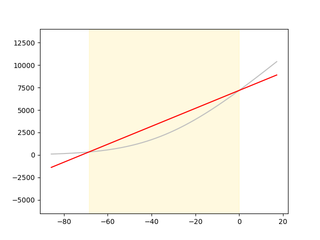
## New Eq:
((fabs(34.299999999999997 + membrane__E) < 1.1111111111183902e-6) ? (-0.00022222222222367805 / (1.0 - exp(9.9999999999406119e-8)) + (15435000.499898881 + 449999.99999705196 * membrane__E) * (0.00022222222222367805 / (1.0 - exp(9.9999999999406119e-8)) + 0.00022222222222367805 / (1.0 - exp(-9.9999999999406119e-8)))) : (200.0 * (34.299999999999997 + membrane__E) / (1.0 - exp(-3.0869999999999997 - 0.089999999999999997 * membrane__E))))

## Equation 2:
```
hyperpolarising_activated_current_y_gate__alpha_y = 0.35999999999999999 * (137.80000000000001 + membrane__E) / (-1.0 + 8908.846047390005 * exp(0.066000000000000003 * membrane__E))
```
### Partially evaluated to: 
```
hyperpolarising_activated_current_y_gate__alpha_y = 0.35999999999999999 * (137.80000000000001 + membrane__E) / (-1.0 + 8908.846047390005 * exp(0.066000000000000003 * membrane__E))
```
### Singulariy points detected:

{-137.80000000000001}
*U*
`9.0948000000000011 + 0.066000000000000003 * membrane__E`

*V for 1e-07 range* 
`-137.80000151515154 - -137.79999848484849`

*Singularity point: -137.80000000000001*

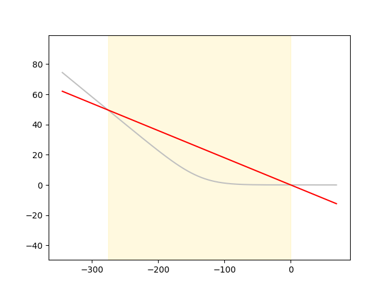
## New Eq:
((fabs(137.80000000000001 + membrane__E) < 1.5151515151412553e-6) ? (-5.4545454545085189e-7 / (-1.0 + exp(-1.0000000000287557e-7)) + (45474000.500307932 + 330000.00000223459 * membrane__E) * (5.4545454545085189e-7 / (-1.0 + exp(9.9999999988997779e-8)) + 5.4545454545085189e-7 / (-1.0 + exp(-1.0000000000287557e-7)))) : (0.35999999999999999 * (137.80000000000001 + membrane__E) / (-1.0 + exp(9.0948000000000011 + 0.066000000000000003 * membrane__E))))

## Equation 3:
```
hyperpolarising_activated_current_y_gate__beta_y = 0.10000000000000001 * (76.299999999999997 + membrane__E) / (1.0 - 1.0997640435800299e-7 * exp(-0.20999999999999999 * membrane__E))
```
### Partially evaluated to: 
```
hyperpolarising_activated_current_y_gate__beta_y = 0.10000000000000001 * (76.299999999999997 + membrane__E) / (1.0 - 1.0997640435800299e-7 * exp(-0.20999999999999999 * membrane__E))
```
### Singulariy points detected:

{-76.299999999999997}
*U*
`-16.023 - 0.20999999999999999 * membrane__E`

*V for 1e-07 range* 
`-76.300000476190476 - -76.299999523809518`

*Singularity point: -76.299999999999997*

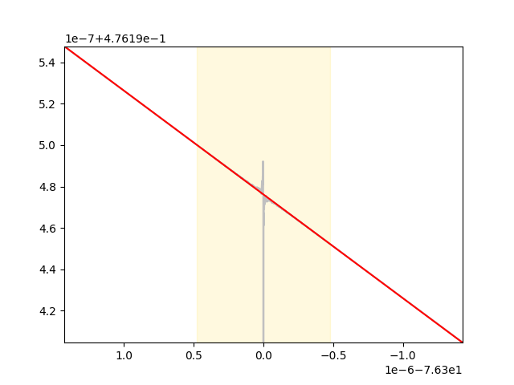
## New Eq:
((fabs(76.299999999999997 + membrane__E) < 4.7619047616187515e-7) ? (-4.7619047616187521e-8 / (1.0 - exp(1.0000000000287557e-7)) + (80115000.495472595 + 1049999.9999406631 * membrane__E) * (4.7619047627289747e-8 / (1.0 - exp(-1.0000000000287557e-7)) + 4.7619047616187521e-8 / (1.0 - exp(1.0000000000287557e-7)))) : (0.10000000000000001 * (76.299999999999997 + membrane__E) / (1.0 - exp(-16.023 - 0.20999999999999999 * membrane__E))))

# Model: earm_noble_model_1990(earm_noble_model_1990.cellml)
## Equation 1:
```
L_type_calcium_current__i_Ca_L_Ca = 4.0 * (-50.0 + membrane__V) * (intracellular_calcium_concentration__Ca_i * exp(100.0 / membrane__RTONF) - extracellular_calcium_concentration__Ca_o * exp(2.0 * (50.0 - membrane__V) / membrane__RTONF)) * L_type_calcium_current__P_Ca_L * L_type_calcium_current_d_gate__d * L_type_calcium_current_f_Ca_gate__CaChon / ((1.0 - exp(2.0 * (50.0 - membrane__V) / membrane__RTONF)) * membrane__RTONF)
```
### Partially evaluated to: 
```
L_type_calcium_current__i_Ca_L_Ca = 0.14973556329098189 * (1.0 - L_type_calcium_current_f_Ca_gate__f_Ca) * (1.0 - intracellular_calcium_concentration__Ca_i / (0.001 + intracellular_calcium_concentration__Ca_i)) * (-50.0 + membrane__V) * (42.240905756816076 * intracellular_calcium_concentration__Ca_i - 42.240905756816076 * extracellular_calcium_concentration__Ca_o * exp(-0.074867781645490947 * membrane__V)) * L_type_calcium_current__P_Ca_L * L_type_calcium_current_d_gate__d / (1.0 - 42.240905756816076 * exp(-0.074867781645490947 * membrane__V))
```
### Singulariy points detected:

{50.000000000000000}
*U*
`3.7433890822745473 - 0.074867781645490947 * membrane__V`

*V for 1e-07 range* 
`49.999998664311967 - 50.000001335688033`

*Singularity point: 50.000000000000000*

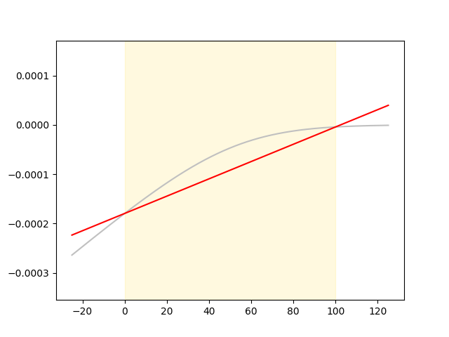
## New Eq:
((fabs(-50.0 + membrane__V) < 1.3356880329551402e-6) ? ((-18716944.911788113 + 374338.90823576227 * membrane__V) * (1.9999999999556149e-7 * (1.0 - L_type_calcium_current_f_Ca_gate__f_Ca) * (1.0 - intracellular_calcium_concentration__Ca_i / (0.001 + intracellular_calcium_concentration__Ca_i)) * (intracellular_calcium_concentration__Ca_i * exp(3.7433890822745473) - extracellular_calcium_concentration__Ca_o * exp(9.9999999999406119e-8)) * L_type_calcium_current__P_Ca_L * L_type_calcium_current_d_gate__d / (1.0 - exp(9.9999999999406119e-8)) + 1.9999999999556149e-7 * (1.0 - L_type_calcium_current_f_Ca_gate__f_Ca) * (1.0 - intracellular_calcium_concentration__Ca_i / (0.001 + intracellular_calcium_concentration__Ca_i)) * (intracellular_calcium_concentration__Ca_i * exp(3.7433890822745473) - extracellular_calcium_concentration__Ca_o * exp(-9.9999999995936673e-8)) * L_type_calcium_current__P_Ca_L * L_type_calcium_current_d_gate__d / (1.0 - exp(-9.9999999995936673e-8))) - 1.9999999999556149e-7 * (1.0 - L_type_calcium_current_f_Ca_gate__f_Ca) * (1.0 - intracellular_calcium_concentration__Ca_i / (0.001 + intracellular_calcium_concentration__Ca_i)) * (intracellular_calcium_concentration__Ca_i * exp(3.7433890822745473) - extracellular_calcium_concentration__Ca_o * exp(9.9999999999406119e-8)) * L_type_calcium_current__P_Ca_L * L_type_calcium_current_d_gate__d / (1.0 - exp(9.9999999999406119e-8))) : (4.0 * (-50.0 + membrane__V) * (intracellular_calcium_concentration__Ca_i * exp(100.0 / membrane__RTONF) - extracellular_calcium_concentration__Ca_o * exp(2.0 * (50.0 - membrane__V) / membrane__RTONF)) * L_type_calcium_current__P_Ca_L * L_type_calcium_current_d_gate__d * L_type_calcium_current_f_Ca_gate__CaChon / ((1.0 - exp(2.0 * (50.0 - membrane__V) / membrane__RTONF)) * membrane__RTONF)))

## Equation 2:
```
L_type_calcium_current__i_Ca_L_K = 0.002 * (-50.0 + membrane__V) * (intracellular_potassium_concentration__K_i * exp(50.0 / membrane__RTONF) - extracellular_potassium_concentration__K_c * exp((50.0 - membrane__V) / membrane__RTONF)) * L_type_calcium_current__P_Ca_L * L_type_calcium_current_d_gate__d * L_type_calcium_current_f_Ca_gate__CaChon / ((1.0 - exp((50.0 - membrane__V) / membrane__RTONF)) * membrane__RTONF)
```
### Partially evaluated to: 
```
L_type_calcium_current__i_Ca_L_K = 7.4867781645490941e-5 * (1.0 - L_type_calcium_current_f_Ca_gate__f_Ca) * (1.0 - intracellular_calcium_concentration__Ca_i / (0.001 + intracellular_calcium_concentration__Ca_i)) * (-50.0 + membrane__V) * (6.4993004051833205 * intracellular_potassium_concentration__K_i - 6.4993004051833205 * extracellular_potassium_concentration__K_c * exp(-0.037433890822745473 * membrane__V)) * L_type_calcium_current__P_Ca_L * L_type_calcium_current_d_gate__d / (1.0 - 6.4993004051833205 * exp(-0.037433890822745473 * membrane__V))
```
### Singulariy points detected:

{50.000000000000000}
*U*
`1.8716945411372736 - 0.037433890822745473 * membrane__V`

*V for 1e-07 range* 
`49.999997328623934 - 50.000002671376066`

*Singularity point: 50.000000000000000*

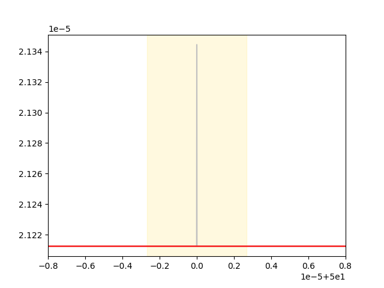
## New Eq:
((fabs(-50.0 + membrane__V) < 2.6713760659657915e-6) ? ((-9358472.2056995872 + 187169.45411399176 * membrane__V) * (1.999999999997175e-10 * (1.0 - L_type_calcium_current_f_Ca_gate__f_Ca) * (1.0 - intracellular_calcium_concentration__Ca_i / (0.001 + intracellular_calcium_concentration__Ca_i)) * (intracellular_potassium_concentration__K_i * exp(1.8716945411372736) - extracellular_potassium_concentration__K_c * exp(9.9999999999406119e-8)) * L_type_calcium_current__P_Ca_L * L_type_calcium_current_d_gate__d / (1.0 - exp(9.9999999999406119e-8)) + 1.999999999997175e-10 * (1.0 - L_type_calcium_current_f_Ca_gate__f_Ca) * (1.0 - intracellular_calcium_concentration__Ca_i / (0.001 + intracellular_calcium_concentration__Ca_i)) * (intracellular_potassium_concentration__K_i * exp(1.8716945411372736) - extracellular_potassium_concentration__K_c * exp(-9.9999999999406119e-8)) * L_type_calcium_current__P_Ca_L * L_type_calcium_current_d_gate__d / (1.0 - exp(-9.9999999999406119e-8))) - 1.999999999997175e-10 * (1.0 - L_type_calcium_current_f_Ca_gate__f_Ca) * (1.0 - intracellular_calcium_concentration__Ca_i / (0.001 + intracellular_calcium_concentration__Ca_i)) * (intracellular_potassium_concentration__K_i * exp(1.8716945411372736) - extracellular_potassium_concentration__K_c * exp(9.9999999999406119e-8)) * L_type_calcium_current__P_Ca_L * L_type_calcium_current_d_gate__d / (1.0 - exp(9.9999999999406119e-8))) : (0.002 * (-50.0 + membrane__V) * (intracellular_potassium_concentration__K_i * exp(50.0 / membrane__RTONF) - extracellular_potassium_concentration__K_c * exp((50.0 - membrane__V) / membrane__RTONF)) * L_type_calcium_current__P_Ca_L * L_type_calcium_current_d_gate__d * L_type_calcium_current_f_Ca_gate__CaChon / ((1.0 - exp((50.0 - membrane__V) / membrane__RTONF)) * membrane__RTONF)))

## Equation 3:
```
L_type_calcium_current__i_Ca_L_Na = 0.01 * (-50.0 + membrane__V) * (intracellular_sodium_concentration__Na_i * exp(50.0 / membrane__RTONF) - extracellular_sodium_concentration__Na_o * exp((50.0 - membrane__V) / membrane__RTONF)) * L_type_calcium_current__P_Ca_L * L_type_calcium_current_d_gate__d * L_type_calcium_current_f_Ca_gate__CaChon / ((1.0 - exp((50.0 - membrane__V) / membrane__RTONF)) * membrane__RTONF)
```
### Partially evaluated to: 
```
L_type_calcium_current__i_Ca_L_Na = 0.00037433890822745472 * (1.0 - L_type_calcium_current_f_Ca_gate__f_Ca) * (1.0 - intracellular_calcium_concentration__Ca_i / (0.001 + intracellular_calcium_concentration__Ca_i)) * (-50.0 + membrane__V) * (6.4993004051833205 * intracellular_sodium_concentration__Na_i - 6.4993004051833205 * extracellular_sodium_concentration__Na_o * exp(-0.037433890822745473 * membrane__V)) * L_type_calcium_current__P_Ca_L * L_type_calcium_current_d_gate__d / (1.0 - 6.4993004051833205 * exp(-0.037433890822745473 * membrane__V))
```
### Singulariy points detected:

{50.000000000000000}
*U*
`1.8716945411372736 - 0.037433890822745473 * membrane__V`

*V for 1e-07 range* 
`49.999997328623934 - 50.000002671376066`

*Singularity point: 50.000000000000000*

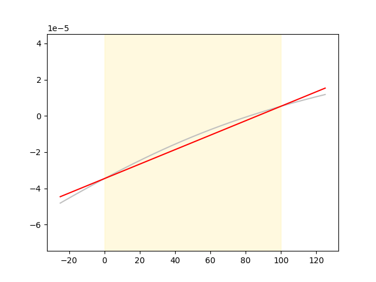
## New Eq:
((fabs(-50.0 + membrane__V) < 2.6713760659657915e-6) ? ((-9358472.2056995872 + 187169.45411399176 * membrane__V) * (9.9999999999858744e-10 * (1.0 - L_type_calcium_current_f_Ca_gate__f_Ca) * (1.0 - intracellular_calcium_concentration__Ca_i / (0.001 + intracellular_calcium_concentration__Ca_i)) * (intracellular_sodium_concentration__Na_i * exp(1.8716945411372736) - extracellular_sodium_concentration__Na_o * exp(9.9999999999406119e-8)) * L_type_calcium_current__P_Ca_L * L_type_calcium_current_d_gate__d / (1.0 - exp(9.9999999999406119e-8)) + 9.9999999999858744e-10 * (1.0 - L_type_calcium_current_f_Ca_gate__f_Ca) * (1.0 - intracellular_calcium_concentration__Ca_i / (0.001 + intracellular_calcium_concentration__Ca_i)) * (intracellular_sodium_concentration__Na_i * exp(1.8716945411372736) - extracellular_sodium_concentration__Na_o * exp(-9.9999999999406119e-8)) * L_type_calcium_current__P_Ca_L * L_type_calcium_current_d_gate__d / (1.0 - exp(-9.9999999999406119e-8))) - 9.9999999999858744e-10 * (1.0 - L_type_calcium_current_f_Ca_gate__f_Ca) * (1.0 - intracellular_calcium_concentration__Ca_i / (0.001 + intracellular_calcium_concentration__Ca_i)) * (intracellular_sodium_concentration__Na_i * exp(1.8716945411372736) - extracellular_sodium_concentration__Na_o * exp(9.9999999999406119e-8)) * L_type_calcium_current__P_Ca_L * L_type_calcium_current_d_gate__d / (1.0 - exp(9.9999999999406119e-8))) : (0.01 * (-50.0 + membrane__V) * (intracellular_sodium_concentration__Na_i * exp(50.0 / membrane__RTONF) - extracellular_sodium_concentration__Na_o * exp((50.0 - membrane__V) / membrane__RTONF)) * L_type_calcium_current__P_Ca_L * L_type_calcium_current_d_gate__d * L_type_calcium_current_f_Ca_gate__CaChon / ((1.0 - exp((50.0 - membrane__V) / membrane__RTONF)) * membrane__RTONF)))

# Model: espinosa_model_1998(espinosa_model_1998_normal.cellml)
## Equation 1:
```
L_type_Ca_channel__i_Ca_L_Ca_cyt = 4.0 * (1.0 - L_type_Ca_channel__FrICa) * (-50.0 + membrane__V) * (intracellular_calcium_concentration__Ca_i * exp(100.0 * membrane__F / (membrane__R * membrane__T)) - extracellular_calcium_concentration__Ca_o * exp(2.0 * (50.0 - membrane__V) * membrane__F / (membrane__R * membrane__T))) * L_type_Ca_channel__P_Ca_L * L_type_Ca_channel_d_gate__d * L_type_Ca_channel_f2_gate__f2 * L_type_Ca_channel_f_gate__f * membrane__F / ((1.0 - exp(2.0 * (50.0 - membrane__V) * membrane__F / (membrane__R * membrane__T))) * membrane__R * membrane__T)
```
### Partially evaluated to: 
```
L_type_Ca_channel__i_Ca_L_Ca_cyt = 0
```
### Singulariy points detected:

{50.000000000000000}
#### Eq == 0!
## Equation 2:
```
L_type_Ca_channel__i_Ca_L_Ca_ds = 4.0 * (-50.0 + membrane__V) * (intracellular_calcium_concentration__Ca_i * exp(100.0 * membrane__F / (membrane__R * membrane__T)) - extracellular_calcium_concentration__Ca_o * exp(2.0 * (50.0 - membrane__V) * membrane__F / (membrane__R * membrane__T))) * L_type_Ca_channel__FrICa * L_type_Ca_channel__P_Ca_L * L_type_Ca_channel_d_gate__d * L_type_Ca_channel_f2ds_gate__f2ds * L_type_Ca_channel_f_gate__f * membrane__F / ((1.0 - exp(2.0 * (50.0 - membrane__V) * membrane__F / (membrane__R * membrane__T))) * membrane__R * membrane__T)
```
### Partially evaluated to: 
```
L_type_Ca_channel__i_Ca_L_Ca_ds = 0.14973556329098189 * (-50.0 + membrane__V) * (42.240905756816076 * intracellular_calcium_concentration__Ca_i - 42.240905756816076 * extracellular_calcium_concentration__Ca_o * exp(-0.074867781645490947 * membrane__V)) * L_type_Ca_channel__P_Ca_L * L_type_Ca_channel_d_gate__d * L_type_Ca_channel_f2ds_gate__f2ds * L_type_Ca_channel_f_gate__f / (1.0 - 42.240905756816076 * exp(-0.074867781645490947 * membrane__V))
```
### Singulariy points detected:

{50.000000000000000}
*U*
`3.7433890822745473 - 0.074867781645490947 * membrane__V`

*V for 1e-07 range* 
`49.999998664311967 - 50.000001335688033`

*Singularity point: 50.000000000000000*

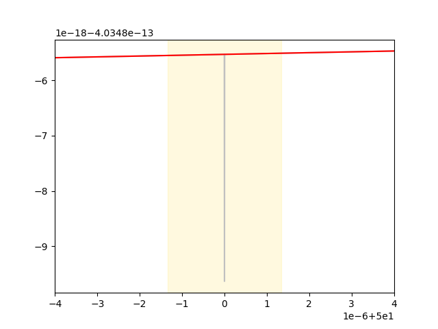
## New Eq:
((fabs(-50.0 + membrane__V) < 1.3356880329551402e-6) ? ((-18716944.911788113 + 374338.90823576227 * membrane__V) * (1.9999999999556149e-7 * (intracellular_calcium_concentration__Ca_i * exp(3.7433890822745473) - extracellular_calcium_concentration__Ca_o * exp(9.9999999999406119e-8)) * L_type_Ca_channel__P_Ca_L * L_type_Ca_channel_d_gate__d * L_type_Ca_channel_f2ds_gate__f2ds * L_type_Ca_channel_f_gate__f / (1.0 - exp(9.9999999999406119e-8)) + 1.9999999999556149e-7 * (intracellular_calcium_concentration__Ca_i * exp(3.7433890822745473) - extracellular_calcium_concentration__Ca_o * exp(-9.9999999999406119e-8)) * L_type_Ca_channel__P_Ca_L * L_type_Ca_channel_d_gate__d * L_type_Ca_channel_f2ds_gate__f2ds * L_type_Ca_channel_f_gate__f / (1.0 - exp(-9.9999999999406119e-8))) - 1.9999999999556149e-7 * (intracellular_calcium_concentration__Ca_i * exp(3.7433890822745473) - extracellular_calcium_concentration__Ca_o * exp(9.9999999999406119e-8)) * L_type_Ca_channel__P_Ca_L * L_type_Ca_channel_d_gate__d * L_type_Ca_channel_f2ds_gate__f2ds * L_type_Ca_channel_f_gate__f / (1.0 - exp(9.9999999999406119e-8))) : (4.0 * (-50.0 + membrane__V) * (intracellular_calcium_concentration__Ca_i * exp(100.0 * membrane__F / (membrane__R * membrane__T)) - extracellular_calcium_concentration__Ca_o * exp(2.0 * (50.0 - membrane__V) * membrane__F / (membrane__R * membrane__T))) * L_type_Ca_channel__FrICa * L_type_Ca_channel__P_Ca_L * L_type_Ca_channel_d_gate__d * L_type_Ca_channel_f2ds_gate__f2ds * L_type_Ca_channel_f_gate__f * membrane__F / ((1.0 - exp(2.0 * (50.0 - membrane__V) * membrane__F / (membrane__R * membrane__T))) * membrane__R * membrane__T)))

## Equation 3:
```
L_type_Ca_channel__i_Ca_L_K_cyt = (1.0 - L_type_Ca_channel__FrICa) * (-50.0 + membrane__V) * (intracellular_potassium_concentration__K_i * exp(50.0 * membrane__F / (membrane__R * membrane__T)) - extracellular_potassium_concentration__K_o * exp((50.0 - membrane__V) * membrane__F / (membrane__R * membrane__T))) * L_type_Ca_channel__P_CaK * L_type_Ca_channel__P_Ca_L * L_type_Ca_channel_d_gate__d * L_type_Ca_channel_f2_gate__f2 * L_type_Ca_channel_f_gate__f * membrane__F / ((1.0 - exp((50.0 - membrane__V) * membrane__F / (membrane__R * membrane__T))) * membrane__R * membrane__T)
```
### Partially evaluated to: 
```
L_type_Ca_channel__i_Ca_L_K_cyt = 0
```
### Singulariy points detected:

{50.000000000000000}
#### Eq == 0!
## Equation 4:
```
L_type_Ca_channel__i_Ca_L_K_ds = (-50.0 + membrane__V) * (intracellular_potassium_concentration__K_i * exp(50.0 * membrane__F / (membrane__R * membrane__T)) - extracellular_potassium_concentration__K_o * exp((50.0 - membrane__V) * membrane__F / (membrane__R * membrane__T))) * L_type_Ca_channel__FrICa * L_type_Ca_channel__P_CaK * L_type_Ca_channel__P_Ca_L * L_type_Ca_channel_d_gate__d * L_type_Ca_channel_f2ds_gate__f2ds * L_type_Ca_channel_f_gate__f * membrane__F / ((1.0 - exp((50.0 - membrane__V) * membrane__F / (membrane__R * membrane__T))) * membrane__R * membrane__T)
```
### Partially evaluated to: 
```
L_type_Ca_channel__i_Ca_L_K_ds = 0.00011230167246823642 * (-50.0 + membrane__V) * (6.4993004051833205 * intracellular_potassium_concentration__K_i - 6.4993004051833205 * extracellular_potassium_concentration__K_o * exp(-0.037433890822745473 * membrane__V)) * L_type_Ca_channel__P_Ca_L * L_type_Ca_channel_d_gate__d * L_type_Ca_channel_f2ds_gate__f2ds * L_type_Ca_channel_f_gate__f / (1.0 - 6.4993004051833205 * exp(-0.037433890822745473 * membrane__V))
```
### Singulariy points detected:

{50.000000000000000}
*U*
`1.8716945411372736 - 0.037433890822745473 * membrane__V`

*V for 1e-07 range* 
`49.999997328623934 - 50.000002671376066`

*Singularity point: 50.000000000000000*

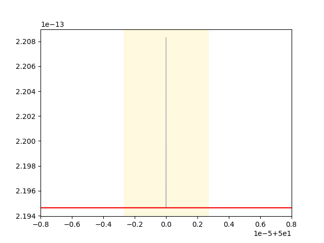
## New Eq:
((fabs(-50.0 + membrane__V) < 2.6713760659657915e-6) ? ((-9358472.2056995872 + 187169.45411399176 * membrane__V) * (2.9999999999957622e-10 * (intracellular_potassium_concentration__K_i * exp(1.8716945411372736) - extracellular_potassium_concentration__K_o * exp(9.9999999999406119e-8)) * L_type_Ca_channel__P_Ca_L * L_type_Ca_channel_d_gate__d * L_type_Ca_channel_f2ds_gate__f2ds * L_type_Ca_channel_f_gate__f / (1.0 - exp(9.9999999999406119e-8)) + 2.9999999999957622e-10 * (intracellular_potassium_concentration__K_i * exp(1.8716945411372736) - extracellular_potassium_concentration__K_o * exp(-9.9999999999406119e-8)) * L_type_Ca_channel__P_Ca_L * L_type_Ca_channel_d_gate__d * L_type_Ca_channel_f2ds_gate__f2ds * L_type_Ca_channel_f_gate__f / (1.0 - exp(-9.9999999999406119e-8))) - 2.9999999999957622e-10 * (intracellular_potassium_concentration__K_i * exp(1.8716945411372736) - extracellular_potassium_concentration__K_o * exp(9.9999999999406119e-8)) * L_type_Ca_channel__P_Ca_L * L_type_Ca_channel_d_gate__d * L_type_Ca_channel_f2ds_gate__f2ds * L_type_Ca_channel_f_gate__f / (1.0 - exp(9.9999999999406119e-8))) : ((-50.0 + membrane__V) * (intracellular_potassium_concentration__K_i * exp(50.0 * membrane__F / (membrane__R * membrane__T)) - extracellular_potassium_concentration__K_o * exp((50.0 - membrane__V) * membrane__F / (membrane__R * membrane__T))) * L_type_Ca_channel__FrICa * L_type_Ca_channel__P_CaK * L_type_Ca_channel__P_Ca_L * L_type_Ca_channel_d_gate__d * L_type_Ca_channel_f2ds_gate__f2ds * L_type_Ca_channel_f_gate__f * membrane__F / ((1.0 - exp((50.0 - membrane__V) * membrane__F / (membrane__R * membrane__T))) * membrane__R * membrane__T)))

## Equation 5:
```
L_type_Ca_channel__i_Ca_L_Na_cyt = (1.0 - L_type_Ca_channel__FrICa) * (-50.0 + membrane__V) * (intracellular_sodium_concentration__Na_i * exp(50.0 * membrane__F / (membrane__R * membrane__T)) - extracellular_sodium_concentration__Na_o * exp((50.0 - membrane__V) * membrane__F / (membrane__R * membrane__T))) * L_type_Ca_channel__P_CaNa * L_type_Ca_channel__P_Ca_L * L_type_Ca_channel_d_gate__d * L_type_Ca_channel_f2_gate__f2 * L_type_Ca_channel_f_gate__f * membrane__F / ((1.0 - exp((50.0 - membrane__V) * membrane__F / (membrane__R * membrane__T))) * membrane__R * membrane__T)
```
### Partially evaluated to: 
```
L_type_Ca_channel__i_Ca_L_Na_cyt = 0
```
### Singulariy points detected:

{50.000000000000000}
#### Eq == 0!
## Equation 6:
```
L_type_Ca_channel__i_Ca_L_Na_ds = (-50.0 + membrane__V) * (intracellular_sodium_concentration__Na_i * exp(50.0 * membrane__F / (membrane__R * membrane__T)) - extracellular_sodium_concentration__Na_o * exp((50.0 - membrane__V) * membrane__F / (membrane__R * membrane__T))) * L_type_Ca_channel__FrICa * L_type_Ca_channel__P_CaNa * L_type_Ca_channel__P_Ca_L * L_type_Ca_channel_d_gate__d * L_type_Ca_channel_f2ds_gate__f2ds * L_type_Ca_channel_f_gate__f * membrane__F / ((1.0 - exp((50.0 - membrane__V) * membrane__F / (membrane__R * membrane__T))) * membrane__R * membrane__T)
```
### Partially evaluated to: 
```
L_type_Ca_channel__i_Ca_L_Na_ds = 0.00037433890822745472 * (-50.0 + membrane__V) * (6.4993004051833205 * intracellular_sodium_concentration__Na_i - 6.4993004051833205 * extracellular_sodium_concentration__Na_o * exp(-0.037433890822745473 * membrane__V)) * L_type_Ca_channel__P_Ca_L * L_type_Ca_channel_d_gate__d * L_type_Ca_channel_f2ds_gate__f2ds * L_type_Ca_channel_f_gate__f / (1.0 - 6.4993004051833205 * exp(-0.037433890822745473 * membrane__V))
```
### Singulariy points detected:

{50.000000000000000}
*U*
`1.8716945411372736 - 0.037433890822745473 * membrane__V`

*V for 1e-07 range* 
`49.999997328623934 - 50.000002671376066`

*Singularity point: 50.000000000000000*


## New Eq:
((fabs(-50.0 + membrane__V) < 2.6713760659657915e-6) ? ((-9358472.2056995872 + 187169.45411399176 * membrane__V) * (9.9999999999858744e-10 * (intracellular_sodium_concentration__Na_i * exp(1.8716945411372736) - extracellular_sodium_concentration__Na_o * exp(9.9999999999406119e-8)) * L_type_Ca_channel__P_Ca_L * L_type_Ca_channel_d_gate__d * L_type_Ca_channel_f2ds_gate__f2ds * L_type_Ca_channel_f_gate__f / (1.0 - exp(9.9999999999406119e-8)) + 9.9999999999858744e-10 * (intracellular_sodium_concentration__Na_i * exp(1.8716945411372736) - extracellular_sodium_concentration__Na_o * exp(-9.9999999999406119e-8)) * L_type_Ca_channel__P_Ca_L * L_type_Ca_channel_d_gate__d * L_type_Ca_channel_f2ds_gate__f2ds * L_type_Ca_channel_f_gate__f / (1.0 - exp(-9.9999999999406119e-8))) - 9.9999999999858744e-10 * (intracellular_sodium_concentration__Na_i * exp(1.8716945411372736) - extracellular_sodium_concentration__Na_o * exp(9.9999999999406119e-8)) * L_type_Ca_channel__P_Ca_L * L_type_Ca_channel_d_gate__d * L_type_Ca_channel_f2ds_gate__f2ds * L_type_Ca_channel_f_gate__f / (1.0 - exp(9.9999999999406119e-8))) : ((-50.0 + membrane__V) * (intracellular_sodium_concentration__Na_i * exp(50.0 * membrane__F / (membrane__R * membrane__T)) - extracellular_sodium_concentration__Na_o * exp((50.0 - membrane__V) * membrane__F / (membrane__R * membrane__T))) * L_type_Ca_channel__FrICa * L_type_Ca_channel__P_CaNa * L_type_Ca_channel__P_Ca_L * L_type_Ca_channel_d_gate__d * L_type_Ca_channel_f2ds_gate__f2ds * L_type_Ca_channel_f_gate__f * membrane__F / ((1.0 - exp((50.0 - membrane__V) * membrane__F / (membrane__R * membrane__T))) * membrane__R * membrane__T)))

# Model: faber_rudy_2000(faber_rudy_2000.cellml)
## Equation 1:
```
L_type_Ca_channel__I_CaCa = 4.0 * pow(cell__F, 2) * (-L_type_Ca_channel__gamma_Cao * calcium_dynamics__Cao + L_type_Ca_channel__gamma_Cai * calcium_dynamics__Cai * exp(2.0 * cell__F * cell__V / (cell__R * cell__T))) * L_type_Ca_channel__P_Ca * cell__V / ((-1.0 + exp(2.0 * cell__F * cell__V / (cell__R * cell__T))) * cell__R * cell__T)
```
### Partially evaluated to: 
```
L_type_Ca_channel__I_CaCa = 14448.004881001343 * (-0.34100000000000003 * calcium_dynamics__Cao + calcium_dynamics__Cai * exp(0.074871767015605231 * cell__V)) * L_type_Ca_channel__P_Ca * cell__V / (-1.0 + exp(0.074871767015605231 * cell__V))
```
### Singulariy points detected:

{0}
*U*
`0.074871767015605231 * cell__V`

*V for 1e-07 range* 
`-1.3356169352749131e-6 - 1.3356169352749131e-6`

*Singularity point: 0*

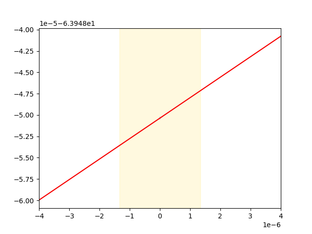
## New Eq:
((fabs(cell__V) < 1.3356169352749131e-6) ? ((0.5 + 374358.83507802623 * cell__V) * (0.019296999999999998 * (-0.34100000000000003 * calcium_dynamics__Cao + calcium_dynamics__Cai * exp(9.9999999999999995e-8)) * L_type_Ca_channel__P_Ca / (-1.0 + exp(9.9999999999999995e-8)) + 0.019296999999999998 * (-0.34100000000000003 * calcium_dynamics__Cao + calcium_dynamics__Cai * exp(-9.9999999999999995e-8)) * L_type_Ca_channel__P_Ca / (-1.0 + exp(-9.9999999999999995e-8))) - 0.019296999999999998 * (-0.34100000000000003 * calcium_dynamics__Cao + calcium_dynamics__Cai * exp(-9.9999999999999995e-8)) * L_type_Ca_channel__P_Ca / (-1.0 + exp(-9.9999999999999995e-8))) : (4.0 * pow(cell__F, 2) * (-L_type_Ca_channel__gamma_Cao * calcium_dynamics__Cao + L_type_Ca_channel__gamma_Cai * calcium_dynamics__Cai * exp(2.0 * cell__F * cell__V / (cell__R * cell__T))) * L_type_Ca_channel__P_Ca * cell__V / ((-1.0 + exp(2.0 * cell__F * cell__V / (cell__R * cell__T))) * cell__R * cell__T)))

## Equation 2:
```
L_type_Ca_channel__I_CaK = pow(cell__F, 2) * (-L_type_Ca_channel__gamma_Ko * ionic_concentrations__Ko + L_type_Ca_channel__gamma_Ki * ionic_concentrations__Ki * exp(cell__F * cell__V / (cell__R * cell__T))) * L_type_Ca_channel__P_K * cell__V / ((-1.0 + exp(cell__F * cell__V / (cell__R * cell__T))) * cell__R * cell__T)
```
### Partially evaluated to: 
```
L_type_Ca_channel__I_CaK = 0.00069711623550831479 * (-0.75 * ionic_concentrations__Ko + 0.75 * ionic_concentrations__Ki * exp(0.037435883507802616 * cell__V)) * cell__V / (-1.0 + exp(0.037435883507802616 * cell__V))
```
### Singulariy points detected:

{0}
*U*
`0.037435883507802616 * cell__V`

*V for 1e-07 range* 
`-2.6712338705498262e-6 - 2.6712338705498262e-6`

*Singularity point: 0*

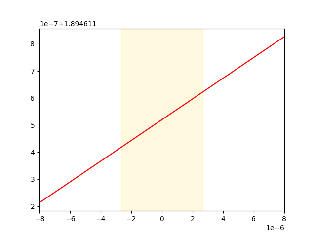
## New Eq:
((fabs(cell__V) < 2.6712338705498262e-6) ? ((0.5 + 187179.41753901311 * cell__V) * (1.8621604999999999e-9 * (-0.75 * ionic_concentrations__Ko + 0.75 * ionic_concentrations__Ki * exp(9.9999999999999995e-8)) / (-1.0 + exp(9.9999999999999995e-8)) + 1.8621604999999999e-9 * (-0.75 * ionic_concentrations__Ko + 0.75 * ionic_concentrations__Ki * exp(-9.9999999999999995e-8)) / (-1.0 + exp(-9.9999999999999995e-8))) - 1.8621604999999999e-9 * (-0.75 * ionic_concentrations__Ko + 0.75 * ionic_concentrations__Ki * exp(-9.9999999999999995e-8)) / (-1.0 + exp(-9.9999999999999995e-8))) : (pow(cell__F, 2) * (-L_type_Ca_channel__gamma_Ko * ionic_concentrations__Ko + L_type_Ca_channel__gamma_Ki * ionic_concentrations__Ki * exp(cell__F * cell__V / (cell__R * cell__T))) * L_type_Ca_channel__P_K * cell__V / ((-1.0 + exp(cell__F * cell__V / (cell__R * cell__T))) * cell__R * cell__T)))

## Equation 3:
```
L_type_Ca_channel__I_CaNa = pow(cell__F, 2) * (-L_type_Ca_channel__gamma_Nao * ionic_concentrations__Nao + L_type_Ca_channel__gamma_Nai * ionic_concentrations__Nai * exp(cell__F * cell__V / (cell__R * cell__T))) * L_type_Ca_channel__P_Na * cell__V / ((-1.0 + exp(cell__F * cell__V / (cell__R * cell__T))) * cell__R * cell__T)
```
### Partially evaluated to: 
```
L_type_Ca_channel__I_CaNa = 0.0024381008236689767 * (-0.75 * ionic_concentrations__Nao + 0.75 * ionic_concentrations__Nai * exp(0.037435883507802616 * cell__V)) * cell__V / (-1.0 + exp(0.037435883507802616 * cell__V))
```
### Singulariy points detected:

{0}
*U*
`0.037435883507802616 * cell__V`

*V for 1e-07 range* 
`-2.6712338705498262e-6 - 2.6712338705498262e-6`

*Singularity point: 0*


## New Eq:
((fabs(cell__V) < 2.6712338705498262e-6) ? ((0.5 + 187179.41753901311 * cell__V) * (6.5127375e-9 * (-0.75 * ionic_concentrations__Nao + 0.75 * ionic_concentrations__Nai * exp(9.9999999999999995e-8)) / (-1.0 + exp(9.9999999999999995e-8)) + 6.5127375e-9 * (-0.75 * ionic_concentrations__Nao + 0.75 * ionic_concentrations__Nai * exp(-9.9999999999999995e-8)) / (-1.0 + exp(-9.9999999999999995e-8))) - 6.5127375e-9 * (-0.75 * ionic_concentrations__Nao + 0.75 * ionic_concentrations__Nai * exp(-9.9999999999999995e-8)) / (-1.0 + exp(-9.9999999999999995e-8))) : (pow(cell__F, 2) * (-L_type_Ca_channel__gamma_Nao * ionic_concentrations__Nao + L_type_Ca_channel__gamma_Nai * ionic_concentrations__Nai * exp(cell__F * cell__V / (cell__R * cell__T))) * L_type_Ca_channel__P_Na * cell__V / ((-1.0 + exp(cell__F * cell__V / (cell__R * cell__T))) * cell__R * cell__T)))

## Equation 4:
```
non_specific_calcium_activated_current__I_ns_K = pow(cell__F, 2) * (-L_type_Ca_channel__gamma_Ko * ionic_concentrations__Ko + L_type_Ca_channel__gamma_Ki * ionic_concentrations__Ki * exp(cell__F * cell__V / (cell__R * cell__T))) * cell__V * non_specific_calcium_activated_current__P_ns_Ca / ((-1.0 + exp(cell__F * cell__V / (cell__R * cell__T))) * cell__R * cell__T)
```
### Partially evaluated to: 
```
non_specific_calcium_activated_current__I_ns_K = 0.00063210021354380874 * (-0.75 * ionic_concentrations__Ko + 0.75 * ionic_concentrations__Ki * exp(0.037435883507802616 * cell__V)) * cell__V / (-1.0 + exp(0.037435883507802616 * cell__V))
```
### Singulariy points detected:

{0}
*U*
`0.037435883507802616 * cell__V`

*V for 1e-07 range* 
`-2.6712338705498262e-6 - 2.6712338705498262e-6`

*Singularity point: 0*

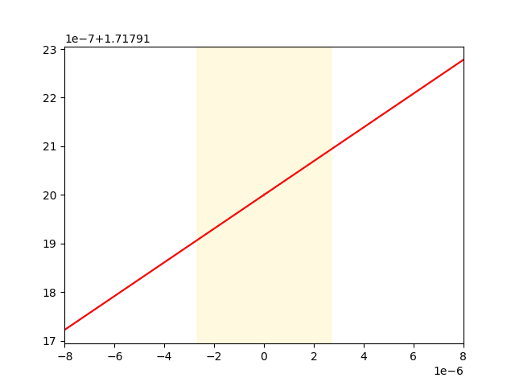
## New Eq:
((fabs(cell__V) < 2.6712338705498262e-6) ? ((0.5 + 187179.41753901311 * cell__V) * (1.6884874999999999e-9 * (-0.75 * ionic_concentrations__Ko + 0.75 * ionic_concentrations__Ki * exp(9.9999999999999995e-8)) / (-1.0 + exp(9.9999999999999995e-8)) + 1.6884874999999999e-9 * (-0.75 * ionic_concentrations__Ko + 0.75 * ionic_concentrations__Ki * exp(-9.9999999999999995e-8)) / (-1.0 + exp(-9.9999999999999995e-8))) - 1.6884874999999999e-9 * (-0.75 * ionic_concentrations__Ko + 0.75 * ionic_concentrations__Ki * exp(-9.9999999999999995e-8)) / (-1.0 + exp(-9.9999999999999995e-8))) : (pow(cell__F, 2) * (-L_type_Ca_channel__gamma_Ko * ionic_concentrations__Ko + L_type_Ca_channel__gamma_Ki * ionic_concentrations__Ki * exp(cell__F * cell__V / (cell__R * cell__T))) * cell__V * non_specific_calcium_activated_current__P_ns_Ca / ((-1.0 + exp(cell__F * cell__V / (cell__R * cell__T))) * cell__R * cell__T)))

## Equation 5:
```
non_specific_calcium_activated_current__I_ns_Na = pow(cell__F, 2) * (-L_type_Ca_channel__gamma_Nao * ionic_concentrations__Nao + L_type_Ca_channel__gamma_Nai * ionic_concentrations__Nai * exp(cell__F * cell__V / (cell__R * cell__T))) * cell__V * non_specific_calcium_activated_current__P_ns_Ca / ((-1.0 + exp(cell__F * cell__V / (cell__R * cell__T))) * cell__R * cell__T)
```
### Partially evaluated to: 
```
non_specific_calcium_activated_current__I_ns_Na = 0.00063210021354380874 * (-0.75 * ionic_concentrations__Nao + 0.75 * ionic_concentrations__Nai * exp(0.037435883507802616 * cell__V)) * cell__V / (-1.0 + exp(0.037435883507802616 * cell__V))
```
### Singulariy points detected:

{0}
*U*
`0.037435883507802616 * cell__V`

*V for 1e-07 range* 
`-2.6712338705498262e-6 - 2.6712338705498262e-6`

*Singularity point: 0*


## New Eq:
((fabs(cell__V) < 2.6712338705498262e-6) ? ((0.5 + 187179.41753901311 * cell__V) * (1.6884874999999999e-9 * (-0.75 * ionic_concentrations__Nao + 0.75 * ionic_concentrations__Nai * exp(9.9999999999999995e-8)) / (-1.0 + exp(9.9999999999999995e-8)) + 1.6884874999999999e-9 * (-0.75 * ionic_concentrations__Nao + 0.75 * ionic_concentrations__Nai * exp(-9.9999999999999995e-8)) / (-1.0 + exp(-9.9999999999999995e-8))) - 1.6884874999999999e-9 * (-0.75 * ionic_concentrations__Nao + 0.75 * ionic_concentrations__Nai * exp(-9.9999999999999995e-8)) / (-1.0 + exp(-9.9999999999999995e-8))) : (pow(cell__F, 2) * (-L_type_Ca_channel__gamma_Nao * ionic_concentrations__Nao + L_type_Ca_channel__gamma_Nai * ionic_concentrations__Nai * exp(cell__F * cell__V / (cell__R * cell__T))) * cell__V * non_specific_calcium_activated_current__P_ns_Ca / ((-1.0 + exp(cell__F * cell__V / (cell__R * cell__T))) * cell__R * cell__T)))

## Equation 6:
```
rapid_delayed_rectifier_potassium_current_xr_gate__tau_xr = 1 / (0.00060999999999999997 * (38.899999999999999 + cell__V) / (-1.0 + 281.60348502322194 * exp(0.14499999999999999 * cell__V)) + 0.0013799999999999999 * (14.199999999999999 + cell__V) / (1.0 - 0.17436578041087322 * exp(-0.123 * cell__V)))
```
### Partially evaluated to: 
```
rapid_delayed_rectifier_potassium_current_xr_gate__tau_xr = 1 / (0.00060999999999999997 * (38.899999999999999 + cell__V) / (-1.0 + 281.60348502322194 * exp(0.14499999999999999 * cell__V)) + 0.0013799999999999999 * (14.199999999999999 + cell__V) / (1.0 - 0.17436578041087322 * exp(-0.123 * cell__V)))
```
### Singulariy points detected:

{-14.199999999999999, -38.899999999999999}
#### float * A

####1 / A


####A + B:

`0.0013799999999999999 * (14.199999999999999 + cell__V) / (1.0 - 0.17436578041087322 * exp(-0.123 * cell__V))`
`0.00060999999999999997 * (38.899999999999999 + cell__V) / (-1.0 + 281.60348502322194 * exp(0.14499999999999999 * cell__V))`

*U*
`-1.7465999999999999 - 0.123 * cell__V`

*V for 1e-07 range* 
`-14.200000813008129 - -14.199999186991869`

*Singularity point: -14.199999999999999*

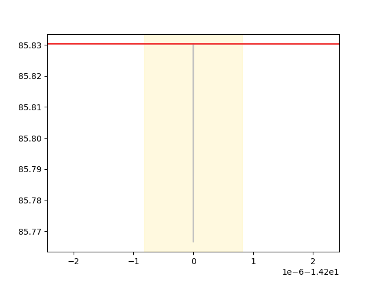
*U*
`5.6404999999999994 + 0.14499999999999999 * cell__V`

*V for 1e-07 range* 
`-38.900000689655172 - -38.899999310344825`

*Singularity point: -38.899999999999999*

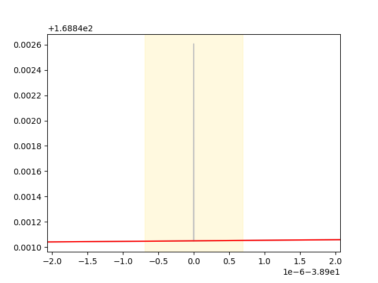
## New Eq:
((fabs(14.199999999999999 + cell__V) < 8.1300813006834893e-7) ? (1 / (0.015066999504065039 / (-1.0 + exp(3.5814998821138206)) - 1.1219512194943214e-9 / (1.0 - exp(9.9999999999406119e-8))) + (8733000.5000645891 + 615000.00000454858 * cell__V) * (1 / (1.1219512195134727e-9 / (1.0 - exp(-9.9999999999406119e-8)) + 0.015067000495934959 / (-1.0 + exp(3.5815001178861787))) - 1 / (0.015066999504065039 / (-1.0 + exp(3.5814998821138206)) - 1.1219512194943214e-9 / (1.0 - exp(9.9999999999406119e-8))))) : ((fabs(38.899999999999999 + cell__V) < 6.8965517246999397e-7) ? (1 / (-0.034086000951724135 / (1.0 - exp(3.0381000848275859)) - 4.2068965517283451e-10 / (-1.0 + exp(-1.0000000000287557e-7))) + (28202500.498836767 + 724999.99997009686 * cell__V) * (1 / (4.2068965520669629e-10 / (-1.0 + exp(1.0000000000287557e-7)) - 0.034085999048275861 / (1.0 - exp(3.0380999151724137))) - 1 / (-0.034086000951724135 / (1.0 - exp(3.0381000848275859)) - 4.2068965517283451e-10 / (-1.0 + exp(-1.0000000000287557e-7))))) : (1 / (0.00060999999999999997 * (38.899999999999999 + cell__V) / (-1.0 + exp(5.6404999999999994 + 0.14499999999999999 * cell__V)) + 0.0013799999999999999 * (14.199999999999999 + cell__V) / (1.0 - exp(-1.7465999999999999 - 0.123 * cell__V))))))

## Equation 7:
```
slow_delayed_rectifier_potassium_current_xs1_gate__tau_xs1 = 1 / (0.00013100000000000001 * (30.0 + cell__V) / (-1.0 + 7.8538197044216602 * exp(0.068699999999999997 * cell__V)) + 7.1899999999999999e-5 * (30.0 + cell__V) / (1.0 - 0.011795938519751569 * exp(-0.14799999999999999 * cell__V)))
```
### Partially evaluated to: 
```
slow_delayed_rectifier_potassium_current_xs1_gate__tau_xs1 = 1 / (0.00013100000000000001 * (30.0 + cell__V) / (-1.0 + 7.8538197044216602 * exp(0.068699999999999997 * cell__V)) + 7.1899999999999999e-5 * (30.0 + cell__V) / (1.0 - 0.011795938519751569 * exp(-0.14799999999999999 * cell__V)))
```
### Singulariy points detected:

{-30.000000000000000}
#### float * A

####1 / A


####A + B:

`7.1899999999999999e-5 * (30.0 + cell__V) / (1.0 - 0.011795938519751569 * exp(-0.14799999999999999 * cell__V))`
`0.00013100000000000001 * (30.0 + cell__V) / (-1.0 + 7.8538197044216602 * exp(0.068699999999999997 * cell__V))`

*U*
`-4.4399999999999995 - 0.14799999999999999 * cell__V`

*V for 1e-07 range* 
`-30.000000675675675 - -29.999999324324325`

*Singularity point: -30.000000000000000*


## New Eq:
((fabs(30.0 + cell__V) < 6.7567567568760367e-7) ? (1 / (-8.8513513515076093e-11 / (-1.0 + exp(-4.6418918920460017e-8)) - 4.8581081081938701e-11 / (1.0 - exp(1.0000000000287557e-7))) + (22200000.499608092 + 739999.99998693645 * cell__V) * (1 / (8.8513513515076093e-11 / (-1.0 + exp(4.6418918920460017e-8)) + 4.8581081081938701e-11 / (1.0 - exp(-1.0000000000287557e-7))) - 1 / (-8.8513513515076093e-11 / (-1.0 + exp(-4.6418918920460017e-8)) - 4.8581081081938701e-11 / (1.0 - exp(1.0000000000287557e-7))))) : (1 / (0.00013100000000000001 * (30.0 + cell__V) / (-1.0 + exp(2.0609999999999999 + 0.068699999999999997 * cell__V)) + 7.1899999999999999e-5 * (30.0 + cell__V) / (1.0 - exp(-4.4399999999999995 - 0.14799999999999999 * cell__V)))))

## Equation 8:
```
slow_delayed_rectifier_potassium_current_xs2_gate__tau_xs2 = 4.0 / (0.00013100000000000001 * (30.0 + cell__V) / (-1.0 + 7.8538197044216602 * exp(0.068699999999999997 * cell__V)) + 7.1899999999999999e-5 * (30.0 + cell__V) / (1.0 - 0.011795938519751569 * exp(-0.14799999999999999 * cell__V)))
```
### Partially evaluated to: 
```
slow_delayed_rectifier_potassium_current_xs2_gate__tau_xs2 = 4.0 / (0.00013100000000000001 * (30.0 + cell__V) / (-1.0 + 7.8538197044216602 * exp(0.068699999999999997 * cell__V)) + 7.1899999999999999e-5 * (30.0 + cell__V) / (1.0 - 0.011795938519751569 * exp(-0.14799999999999999 * cell__V)))
```
### Singulariy points detected:

{-30.000000000000000}
#### float * A

####1 / A


####A + B:

`7.1899999999999999e-5 * (30.0 + cell__V) / (1.0 - 0.011795938519751569 * exp(-0.14799999999999999 * cell__V))`
`0.00013100000000000001 * (30.0 + cell__V) / (-1.0 + 7.8538197044216602 * exp(0.068699999999999997 * cell__V))`

*U*
`-4.4399999999999995 - 0.14799999999999999 * cell__V`

*V for 1e-07 range* 
`-30.000000675675675 - -29.999999324324325`

*Singularity point: -30.000000000000000*


## New Eq:
((fabs(30.0 + cell__V) < 6.7567567568760367e-7) ? (4.0 / (-8.8513513515076093e-11 / (-1.0 + exp(-4.6418918920460017e-8)) - 4.8581081081938701e-11 / (1.0 - exp(1.0000000000287557e-7))) + (22200000.499608092 + 739999.99998693645 * cell__V) * (4.0 / (8.8513513515076093e-11 / (-1.0 + exp(4.6418918920460017e-8)) + 4.8581081081938701e-11 / (1.0 - exp(-1.0000000000287557e-7))) - 4.0 / (-8.8513513515076093e-11 / (-1.0 + exp(-4.6418918920460017e-8)) - 4.8581081081938701e-11 / (1.0 - exp(1.0000000000287557e-7))))) : (4.0 / (0.00013100000000000001 * (30.0 + cell__V) / (-1.0 + exp(2.0609999999999999 + 0.068699999999999997 * cell__V)) + 7.1899999999999999e-5 * (30.0 + cell__V) / (1.0 - exp(-4.4399999999999995 - 0.14799999999999999 * cell__V)))))

# Model: fink_noble_giles_model_2008(fink_noble_giles_model_2008.cellml)
## Equation 1:
```
ICaL__i_CaL = pow(Environment__F, 2) * pow(ICaL__z, 2) * (-15.0 + cell__V) * (-Environment__Ca_o + 0.25 * Ca__Ca_ss * exp(2.0 * (-15.0 + cell__V) * Environment__F / (Environment__R * Environment__T))) * ICaL__g_CaL * iCaL_d_gate__d * iCaL_f2_gate__f2 * iCaL_fCass_gate__fCass * iCaL_f_gate__f / ((-1.0 + exp(2.0 * (-15.0 + cell__V) * Environment__F / (Environment__R * Environment__T))) * Environment__R * Environment__T)
```
### Partially evaluated to: 
```
ICaL__i_CaL = 14447.286958825251 * (-15.0 + cell__V) * (-Environment__Ca_o + 0.081324245374225654 * Ca__Ca_ss * exp(0.074867781645490947 * cell__V)) * ICaL__g_CaL * iCaL_d_gate__d * iCaL_f2_gate__f2 * iCaL_fCass_gate__fCass * iCaL_f_gate__f / (-1.0 + 0.32529698149690262 * exp(0.074867781645490947 * cell__V))
```
### Singulariy points detected:

{15.000000000000000}
*U*
`-1.1230167246823641 + 0.074867781645490947 * cell__V`

*V for 1e-07 range* 
`14.999998664311967 - 15.000001335688033`

*Singularity point: 15.000000000000000*

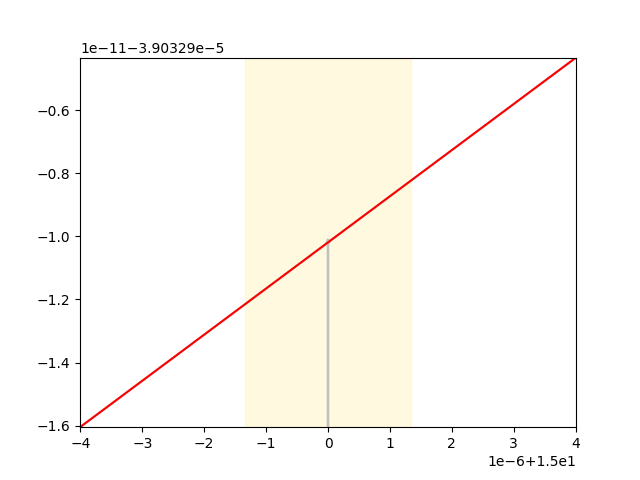
## New Eq:
((fabs(-15.0 + cell__V) < 1.3356880329828957e-6) ? ((-5615083.1234197523 + 374338.90822798351 * cell__V) * (0.019297068299972742 * (-Environment__Ca_o + 0.25 * Ca__Ca_ss * exp(9.9999999999406119e-8)) * ICaL__g_CaL * iCaL_d_gate__d * iCaL_f2_gate__f2 * iCaL_fCass_gate__fCass * iCaL_f_gate__f / (-1.0 + exp(9.9999999999406119e-8)) + 0.019297068299972742 * (-Environment__Ca_o + 0.25 * Ca__Ca_ss * exp(-9.9999999999406119e-8)) * ICaL__g_CaL * iCaL_d_gate__d * iCaL_f2_gate__f2 * iCaL_fCass_gate__fCass * iCaL_f_gate__f / (-1.0 + exp(-9.9999999999406119e-8))) - 0.019297068299972742 * (-Environment__Ca_o + 0.25 * Ca__Ca_ss * exp(-9.9999999999406119e-8)) * ICaL__g_CaL * iCaL_d_gate__d * iCaL_f2_gate__f2 * iCaL_fCass_gate__fCass * iCaL_f_gate__f / (-1.0 + exp(-9.9999999999406119e-8))) : (pow(Environment__F, 2) * pow(ICaL__z, 2) * (-15.0 + cell__V) * (-Environment__Ca_o + 0.25 * Ca__Ca_ss * exp(2.0 * (-15.0 + cell__V) * Environment__F / (Environment__R * Environment__T))) * ICaL__g_CaL * iCaL_d_gate__d * iCaL_f2_gate__f2 * iCaL_fCass_gate__fCass * iCaL_f_gate__f / ((-1.0 + exp(2.0 * (-15.0 + cell__V) * Environment__F / (Environment__R * Environment__T))) * Environment__R * Environment__T)))

# Model: fox_model_2001(fox_mcharg_gilmour_2002.cellml)
## Equation 1:
```
slow_activating_delayed_rectifiyer_K_current_X_ks_gate__tau_X_ks = 1 / (0.00013100000000000001 * (-10.0 + membrane__V) / (-1.0 + 0.50308305662435071 * exp(0.068699999999999997 * membrane__V)) + 7.1899999999999999e-5 * (-10.0 + membrane__V) / (1.0 - 4.3929456809187561 * exp(-0.14799999999999999 * membrane__V)))
```
### Partially evaluated to: 
```
slow_activating_delayed_rectifiyer_K_current_X_ks_gate__tau_X_ks = 1 / (0.00013100000000000001 * (-10.0 + membrane__V) / (-1.0 + 0.50308305662435071 * exp(0.068699999999999997 * membrane__V)) + 7.1899999999999999e-5 * (-10.0 + membrane__V) / (1.0 - 4.3929456809187561 * exp(-0.14799999999999999 * membrane__V)))
```
### Singulariy points detected:

{10.000000000000000, 10.000000000000000}
*U*
`-1.48 + 0.14799999999999999 * membrane__V`

*V for 1e-07 range* 
`9.9999993243243246 - 10.000000675675675`

*Singularity point: 10.000000000000000*

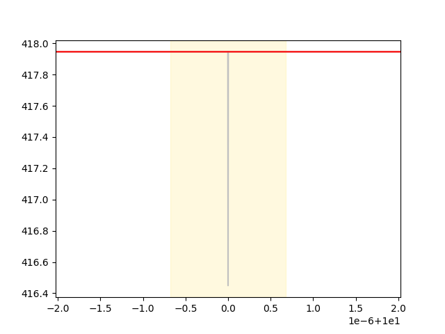

*Singularity point: 10.000000000000000*


## New Eq:
(((membrane__V > 9.9999993243243246) && (membrane__V < 10.000000675675675)) ? (1 / (-4.8581081080940889e-11 / (1.0 - exp(9.9999999999406119e-8)) - 8.8513513513258105e-11 / (-1.0 + exp(-4.6418918918725294e-8))) + (-7399999.5000213543 + 740000.00000213541 * membrane__V) * (1 / (4.8581081080940889e-11 / (1.0 - exp(-9.9999999999406119e-8)) + 8.8513513513258105e-11 / (-1.0 + exp(4.6418918918725294e-8))) - 1 / (-4.8581081080940889e-11 / (1.0 - exp(9.9999999999406119e-8)) - 8.8513513513258105e-11 / (-1.0 + exp(-4.6418918918725294e-8))))) : (1 / (0.00013100000000000001 * (-10.0 + membrane__V) / (-1.0 + exp(-0.68699999999999994 + 0.068699999999999997 * membrane__V)) + 7.1899999999999999e-5 * (-10.0 + membrane__V) / (1.0 - exp(1.48 - 0.14799999999999999 * membrane__V)))))

## Equation 2:
```
L_type_Ca_current__i_Ca_max = 4.0 * pow(membrane__F, 2) * (-0.34100000000000003 * standard_ionic_concentrations__Ca_o + calcium_dynamics__Ca_i * exp(2.0 * membrane__F * membrane__V / (membrane__R * membrane__T))) * L_type_Ca_current__P_Ca * membrane__V / ((-1.0 + exp(2.0 * membrane__F * membrane__V / (membrane__R * membrane__T))) * L_type_Ca_current__C_sc * membrane__R * membrane__T)
```
### Partially evaluated to: 
```
L_type_Ca_current__i_Ca_max = 14.452497536219512 * (-0.34100000000000003 * standard_ionic_concentrations__Ca_o + 1000.0 * calcium_dynamics__Ca_i_converted * exp(0.074883406923417162 * membrane__V)) * L_type_Ca_current__P_Ca * membrane__V / (-1.0 + exp(0.074883406923417162 * membrane__V))
```
### Singulariy points detected:

{0}
*U*
`0.074883406923417162 * membrane__V`

*V for 1e-07 range* 
`-1.3354093264248704e-6 - 1.3354093264248704e-6`

*Singularity point: 0*


## New Eq:
((fabs(membrane__V) < 1.3354093264248704e-6) ? ((0.5 + 374417.03461708582 * membrane__V) * (1.9299999999999998e-5 * (-0.34100000000000003 * standard_ionic_concentrations__Ca_o + 1000.0 * calcium_dynamics__Ca_i_converted * exp(9.9999999999999995e-8)) * L_type_Ca_current__P_Ca / (-1.0 + exp(9.9999999999999995e-8)) + 1.9299999999999998e-5 * (-0.34100000000000003 * standard_ionic_concentrations__Ca_o + 1000.0 * calcium_dynamics__Ca_i_converted * exp(-9.9999999999999995e-8)) * L_type_Ca_current__P_Ca / (-1.0 + exp(-9.9999999999999995e-8))) - 1.9299999999999998e-5 * (-0.34100000000000003 * standard_ionic_concentrations__Ca_o + 1000.0 * calcium_dynamics__Ca_i_converted * exp(-9.9999999999999995e-8)) * L_type_Ca_current__P_Ca / (-1.0 + exp(-9.9999999999999995e-8))) : (4.0 * pow(membrane__F, 2) * (-0.34100000000000003 * standard_ionic_concentrations__Ca_o + calcium_dynamics__Ca_i * exp(2.0 * membrane__F * membrane__V / (membrane__R * membrane__T))) * L_type_Ca_current__P_Ca * membrane__V / ((-1.0 + exp(2.0 * membrane__F * membrane__V / (membrane__R * membrane__T))) * L_type_Ca_current__C_sc * membrane__R * membrane__T)))

## Equation 3:
```
L_type_Ca_current__i_CaK = 1000.0 * pow(membrane__F, 2) * (-standard_ionic_concentrations__K_o + standard_ionic_concentrations__K_i * exp(membrane__F * membrane__V / (membrane__R * membrane__T))) * L_type_Ca_current__P_CaK * L_type_Ca_current_d_gate__d * L_type_Ca_current_f_Ca_gate__f_Ca * L_type_Ca_current_f_gate__f * membrane__V / ((1.0 + L_type_Ca_current__i_Ca_max / L_type_Ca_current__i_Ca_half) * (-1.0 + exp(membrane__F * membrane__V / (membrane__R * membrane__T))) * L_type_Ca_current__C_sc * membrane__R * membrane__T)
```
### Partially evaluated to: 
```
L_type_Ca_current__i_CaK = 0.0020919990183677745 * (-standard_ionic_concentrations__K_o + standard_ionic_concentrations__K_i * exp(0.037441703461708581 * membrane__V)) * L_type_Ca_current_d_gate__d * L_type_Ca_current_f_Ca_gate__f_Ca * L_type_Ca_current_f_gate__f * membrane__V / ((1.0 - 54.537726551771748 * (-0.34100000000000003 * standard_ionic_concentrations__Ca_o + 1000.0 * calcium_dynamics__Ca_i_converted * exp(0.074883406923417162 * membrane__V)) * L_type_Ca_current__P_Ca * membrane__V / (-1.0 + exp(0.074883406923417162 * membrane__V))) * (-1.0 + exp(0.037441703461708581 * membrane__V)))
```
### Singulariy points detected:

{0}
*U*
`0.037441703461708581 * membrane__V`

*V for 1e-07 range* 
`-2.6708186528497407e-6 - 2.6708186528497407e-6`

*Singularity point: 0*

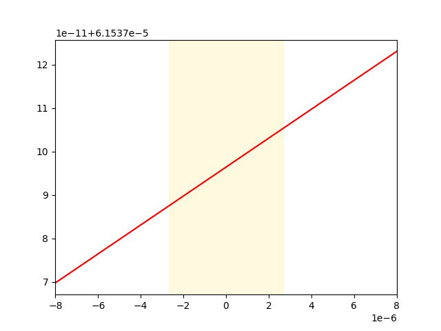
## New Eq:
((fabs(membrane__V) < 2.6708186528497407e-6) ? ((0.5 + 187208.51730854291 * membrane__V) * (5.5873499999999997e-9 * (-standard_ionic_concentrations__K_o + standard_ionic_concentrations__K_i * exp(-9.9999999999999995e-8)) * L_type_Ca_current_d_gate__d * L_type_Ca_current_f_Ca_gate__f_Ca * L_type_Ca_current_f_gate__f / ((1.0 + 0.00014566037735849055 * (-0.34100000000000003 * standard_ionic_concentrations__Ca_o + 1000.0 * calcium_dynamics__Ca_i_converted * exp(-1.9999999999999999e-7)) * L_type_Ca_current__P_Ca / (-1.0 + exp(-1.9999999999999999e-7))) * (-1.0 + exp(-9.9999999999999995e-8))) + 5.5873499999999997e-9 * (-standard_ionic_concentrations__K_o + standard_ionic_concentrations__K_i * exp(9.9999999999999995e-8)) * L_type_Ca_current_d_gate__d * L_type_Ca_current_f_Ca_gate__f_Ca * L_type_Ca_current_f_gate__f / ((1.0 - 0.00014566037735849055 * (-0.34100000000000003 * standard_ionic_concentrations__Ca_o + 1000.0 * calcium_dynamics__Ca_i_converted * exp(1.9999999999999999e-7)) * L_type_Ca_current__P_Ca / (-1.0 + exp(1.9999999999999999e-7))) * (-1.0 + exp(9.9999999999999995e-8)))) - 5.5873499999999997e-9 * (-standard_ionic_concentrations__K_o + standard_ionic_concentrations__K_i * exp(-9.9999999999999995e-8)) * L_type_Ca_current_d_gate__d * L_type_Ca_current_f_Ca_gate__f_Ca * L_type_Ca_current_f_gate__f / ((1.0 + 0.00014566037735849055 * (-0.34100000000000003 * standard_ionic_concentrations__Ca_o + 1000.0 * calcium_dynamics__Ca_i_converted * exp(-1.9999999999999999e-7)) * L_type_Ca_current__P_Ca / (-1.0 + exp(-1.9999999999999999e-7))) * (-1.0 + exp(-9.9999999999999995e-8)))) : (1000.0 * pow(membrane__F, 2) * (-standard_ionic_concentrations__K_o + standard_ionic_concentrations__K_i * exp(membrane__F * membrane__V / (membrane__R * membrane__T))) * L_type_Ca_current__P_CaK * L_type_Ca_current_d_gate__d * L_type_Ca_current_f_Ca_gate__f_Ca * L_type_Ca_current_f_gate__f * membrane__V / ((1.0 + L_type_Ca_current__i_Ca_max / L_type_Ca_current__i_Ca_half) * (-1.0 + exp(membrane__F * membrane__V / (membrane__R * membrane__T))) * L_type_Ca_current__C_sc * membrane__R * membrane__T)))

# Model: grandi_pasqualini_bers_2010(grandi_pasqualini_bers_2010_ss.cellml)
## Equation 1:
```
I_Ca__taud = 28.571428571428569 * (1.0 - 0.4345982085070782 * exp(-0.16666666666666666 * membrane_potential__V_m)) * I_Ca__dss / (5.0 + membrane_potential__V_m)
```
### Partially evaluated to: 
```
I_Ca__taud = 28.571428571428569 * (1.0 - 0.4345982085070782 * exp(-0.16666666666666666 * membrane_potential__V_m)) / ((1.0 + 0.4345982085070782 * exp(-0.16666666666666666 * membrane_potential__V_m)) * (5.0 + membrane_potential__V_m))
```
### Singulariy points detected:

{-5.0000000000000000}
*U*
`-0.83333333333333337 - 0.16666666666666666 * membrane_potential__V_m`

*V for 1e-07 range* 
`-5.0000005999999999 - -4.9999994000000001`

*Singularity point: -5.0000000000000000*

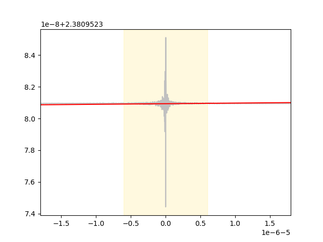
## New Eq:
((fabs(5.0 + membrane_potential__V_m) < 6.0000000000337561e-7) ? ((4166667.1666432251 + 833333.33332864498 * membrane_potential__V_m) * (47619047.618779711 * (1.0 - exp(1.0000000000027348e-7)) / (1.0 + exp(1.0000000000027348e-7)) + 47619047.618779711 * (1.0 - exp(-1.0000000000114084e-7)) / (1.0 + exp(-1.0000000000114084e-7))) - 47619047.618779711 * (1.0 - exp(1.0000000000027348e-7)) / (1.0 + exp(1.0000000000027348e-7))) : (28.571428571428569 * (1.0 - exp(-0.83333333333333337 - 0.16666666666666666 * membrane_potential__V_m)) * I_Ca__dss / (5.0 + membrane_potential__V_m)))

## Equation 2:
```
I_Ca__ibarca_j = 4.0 * (-0.34100000000000003 * parameters__Cao + 0.34100000000000003 * Ca_Concentrations__Ca_j * exp(2.0 * membrane_potential__V_m * parameters__FoRT)) * membrane_potential__V_m * parameters__FoRT * parameters__Frdy * parameters__pCa / (-1.0 + exp(2.0 * membrane_potential__V_m * parameters__FoRT))
```
### Partially evaluated to: 
```
I_Ca__ibarca_j = 0.00216 * pow(parameters__Frdy, 2) * (-0.34100000000000003 * parameters__Cao + 0.34100000000000003 * Ca_Concentrations__Ca_j * exp(2.0 * membrane_potential__V_m * parameters__Frdy / (parameters__R * parameters__Temp))) * membrane_potential__V_m * parameters__pCa_max / ((-1.0 + exp(2.0 * membrane_potential__V_m * parameters__Frdy / (parameters__R * parameters__Temp))) * parameters__R * parameters__Temp)
```
### Singulariy points detected:

{0}
#### float * A

####Failed!

<class 'sympy.core.mul.Mul'>
_parameters$Frdy**2*_membrane_potential$V_m*_parameters$pCa_max*(0.34100000000000003*_Ca_Concentrations$Ca_j*exp(2.0*_membrane_potential$V_m*_parameters$Frdy/(_parameters$R*_parameters$Temp)) - 0.34100000000000003*_parameters$Cao)/(_parameters$R*_parameters$Temp*(exp(2.0*_membrane_potential$V_m*_parameters$Frdy/(_parameters$R*_parameters$Temp)) - 1.0))

*try substituting parameters*

*U*
`0.074871767015605231 * membrane_potential__V_m`

*V for 1e-07 range* 
`-1.3356169352749131e-6 - 1.3356169352749131e-6`

*Singularity point: 0*

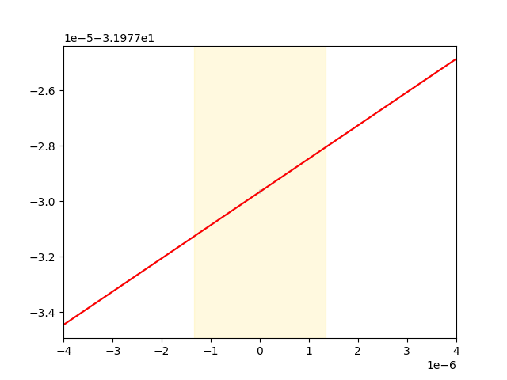
## New Eq:
((fabs(membrane_potential__V_m) < 1.3356169352749131e-6) ? ((0.5 + 374358.83507802623 * membrane_potential__V_m) * (2.8849325801938123e-9 * pow(parameters__Frdy, 2) * (-0.34100000000000003 * parameters__Cao + 0.34100000000000003 * Ca_Concentrations__Ca_j * exp(2.6712338705498262e-6 * parameters__Frdy / (parameters__R * parameters__Temp))) * parameters__pCa_max / ((-1.0 + exp(2.6712338705498262e-6 * parameters__Frdy / (parameters__R * parameters__Temp))) * parameters__R * parameters__Temp) + 2.8849325801938123e-9 * pow(parameters__Frdy, 2) * (-0.34100000000000003 * parameters__Cao + 0.34100000000000003 * Ca_Concentrations__Ca_j * exp(-2.6712338705498262e-6 * parameters__Frdy / (parameters__R * parameters__Temp))) * parameters__pCa_max / ((-1.0 + exp(-2.6712338705498262e-6 * parameters__Frdy / (parameters__R * parameters__Temp))) * parameters__R * parameters__Temp)) - 2.8849325801938123e-9 * pow(parameters__Frdy, 2) * (-0.34100000000000003 * parameters__Cao + 0.34100000000000003 * Ca_Concentrations__Ca_j * exp(-2.6712338705498262e-6 * parameters__Frdy / (parameters__R * parameters__Temp))) * parameters__pCa_max / ((-1.0 + exp(-2.6712338705498262e-6 * parameters__Frdy / (parameters__R * parameters__Temp))) * parameters__R * parameters__Temp)) : (4.0 * (-0.34100000000000003 * parameters__Cao + 0.34100000000000003 * Ca_Concentrations__Ca_j * exp(2.0 * membrane_potential__V_m * parameters__FoRT)) * membrane_potential__V_m * parameters__FoRT * parameters__Frdy * parameters__pCa / (-1.0 + exp(2.0 * membrane_potential__V_m * parameters__FoRT))))

## Equation 3:
```
I_Ca__ibarca_sl = 4.0 * (-0.34100000000000003 * parameters__Cao + 0.34100000000000003 * Ca_Concentrations__Ca_sl * exp(2.0 * membrane_potential__V_m * parameters__FoRT)) * membrane_potential__V_m * parameters__FoRT * parameters__Frdy * parameters__pCa / (-1.0 + exp(2.0 * membrane_potential__V_m * parameters__FoRT))
```
### Partially evaluated to: 
```
I_Ca__ibarca_sl = 0.00216 * pow(parameters__Frdy, 2) * (-0.34100000000000003 * parameters__Cao + 0.34100000000000003 * Ca_Concentrations__Ca_sl * exp(2.0 * membrane_potential__V_m * parameters__Frdy / (parameters__R * parameters__Temp))) * membrane_potential__V_m * parameters__pCa_max / ((-1.0 + exp(2.0 * membrane_potential__V_m * parameters__Frdy / (parameters__R * parameters__Temp))) * parameters__R * parameters__Temp)
```
### Singulariy points detected:

{0}
#### float * A

####Failed!

<class 'sympy.core.mul.Mul'>
_parameters$Frdy**2*_membrane_potential$V_m*_parameters$pCa_max*(0.34100000000000003*_Ca_Concentrations$Ca_sl*exp(2.0*_membrane_potential$V_m*_parameters$Frdy/(_parameters$R*_parameters$Temp)) - 0.34100000000000003*_parameters$Cao)/(_parameters$R*_parameters$Temp*(exp(2.0*_membrane_potential$V_m*_parameters$Frdy/(_parameters$R*_parameters$Temp)) - 1.0))

*try substituting parameters*

*U*
`0.074871767015605231 * membrane_potential__V_m`

*V for 1e-07 range* 
`-1.3356169352749131e-6 - 1.3356169352749131e-6`

*Singularity point: 0*


## New Eq:
((fabs(membrane_potential__V_m) < 1.3356169352749131e-6) ? ((0.5 + 374358.83507802623 * membrane_potential__V_m) * (2.8849325801938123e-9 * pow(parameters__Frdy, 2) * (-0.34100000000000003 * parameters__Cao + 0.34100000000000003 * Ca_Concentrations__Ca_sl * exp(2.6712338705498262e-6 * parameters__Frdy / (parameters__R * parameters__Temp))) * parameters__pCa_max / ((-1.0 + exp(2.6712338705498262e-6 * parameters__Frdy / (parameters__R * parameters__Temp))) * parameters__R * parameters__Temp) + 2.8849325801938123e-9 * pow(parameters__Frdy, 2) * (-0.34100000000000003 * parameters__Cao + 0.34100000000000003 * Ca_Concentrations__Ca_sl * exp(-2.6712338705498262e-6 * parameters__Frdy / (parameters__R * parameters__Temp))) * parameters__pCa_max / ((-1.0 + exp(-2.6712338705498262e-6 * parameters__Frdy / (parameters__R * parameters__Temp))) * parameters__R * parameters__Temp)) - 2.8849325801938123e-9 * pow(parameters__Frdy, 2) * (-0.34100000000000003 * parameters__Cao + 0.34100000000000003 * Ca_Concentrations__Ca_sl * exp(-2.6712338705498262e-6 * parameters__Frdy / (parameters__R * parameters__Temp))) * parameters__pCa_max / ((-1.0 + exp(-2.6712338705498262e-6 * parameters__Frdy / (parameters__R * parameters__Temp))) * parameters__R * parameters__Temp)) : (4.0 * (-0.34100000000000003 * parameters__Cao + 0.34100000000000003 * Ca_Concentrations__Ca_sl * exp(2.0 * membrane_potential__V_m * parameters__FoRT)) * membrane_potential__V_m * parameters__FoRT * parameters__Frdy * parameters__pCa / (-1.0 + exp(2.0 * membrane_potential__V_m * parameters__FoRT))))

## Equation 4:
```
I_Ca__ibark = (-0.75 * parameters__Ko + 0.75 * K_Concentration__K_i * exp(membrane_potential__V_m * parameters__FoRT)) * membrane_potential__V_m * parameters__FoRT * parameters__Frdy * parameters__pK / (-1.0 + exp(membrane_potential__V_m * parameters__FoRT))
```
### Partially evaluated to: 
```
I_Ca__ibark = 1.35e-7 * pow(parameters__Frdy, 2) * (-0.75 * parameters__Ko + 0.75 * K_Concentration__K_i * exp(membrane_potential__V_m * parameters__Frdy / (parameters__R * parameters__Temp))) * membrane_potential__V_m / ((-1.0 + exp(membrane_potential__V_m * parameters__Frdy / (parameters__R * parameters__Temp))) * parameters__R * parameters__Temp)
```
### Singulariy points detected:

{0}
#### float * A

####Failed!

<class 'sympy.core.mul.Mul'>
_parameters$Frdy**2*_membrane_potential$V_m*(0.75*_K_Concentration$K_i*exp(_membrane_potential$V_m*_parameters$Frdy/(_parameters$R*_parameters$Temp)) - 0.75*_parameters$Ko)/(_parameters$R*_parameters$Temp*(exp(_membrane_potential$V_m*_parameters$Frdy/(_parameters$R*_parameters$Temp)) - 1.0))

*try substituting parameters*

*U*
`0.037435883507802616 * membrane_potential__V_m`

*V for 1e-07 range* 
`-2.6712338705498262e-6 - 2.6712338705498262e-6`

*Singularity point: 0*

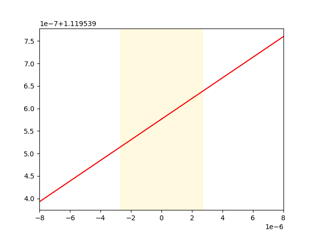
## New Eq:
((fabs(membrane_potential__V_m) < 2.6712338705498262e-6) ? ((0.5 + 187179.41753901311 * membrane_potential__V_m) * (3.6061657252422654e-13 * pow(parameters__Frdy, 2) * (-0.75 * parameters__Ko + 0.75 * K_Concentration__K_i * exp(2.6712338705498262e-6 * parameters__Frdy / (parameters__R * parameters__Temp))) / ((-1.0 + exp(2.6712338705498262e-6 * parameters__Frdy / (parameters__R * parameters__Temp))) * parameters__R * parameters__Temp) + 3.6061657252422654e-13 * pow(parameters__Frdy, 2) * (-0.75 * parameters__Ko + 0.75 * K_Concentration__K_i * exp(-2.6712338705498262e-6 * parameters__Frdy / (parameters__R * parameters__Temp))) / ((-1.0 + exp(-2.6712338705498262e-6 * parameters__Frdy / (parameters__R * parameters__Temp))) * parameters__R * parameters__Temp)) - 3.6061657252422654e-13 * pow(parameters__Frdy, 2) * (-0.75 * parameters__Ko + 0.75 * K_Concentration__K_i * exp(-2.6712338705498262e-6 * parameters__Frdy / (parameters__R * parameters__Temp))) / ((-1.0 + exp(-2.6712338705498262e-6 * parameters__Frdy / (parameters__R * parameters__Temp))) * parameters__R * parameters__Temp)) : ((-0.75 * parameters__Ko + 0.75 * K_Concentration__K_i * exp(membrane_potential__V_m * parameters__FoRT)) * membrane_potential__V_m * parameters__FoRT * parameters__Frdy * parameters__pK / (-1.0 + exp(membrane_potential__V_m * parameters__FoRT))))

## Equation 5:
```
I_Ca__ibarna_j = (-0.75 * parameters__Nao + 0.75 * Na_Concentrations__Na_j * exp(membrane_potential__V_m * parameters__FoRT)) * membrane_potential__V_m * parameters__FoRT * parameters__Frdy * parameters__pNa / (-1.0 + exp(membrane_potential__V_m * parameters__FoRT))
```
### Partially evaluated to: 
```
I_Ca__ibarna_j = 7.4999999999999993e-9 * pow(parameters__Frdy, 2) * (-0.75 * parameters__Nao + 0.75 * Na_Concentrations__Na_j * exp(membrane_potential__V_m * parameters__Frdy / (parameters__R * parameters__Temp))) * membrane_potential__V_m / ((-1.0 + exp(membrane_potential__V_m * parameters__Frdy / (parameters__R * parameters__Temp))) * parameters__R * parameters__Temp)
```
### Singulariy points detected:

{0}
#### float * A

####Failed!

<class 'sympy.core.mul.Mul'>
_parameters$Frdy**2*_membrane_potential$V_m*(0.75*_Na_Concentrations$Na_j*exp(_membrane_potential$V_m*_parameters$Frdy/(_parameters$R*_parameters$Temp)) - 0.75*_parameters$Nao)/(_parameters$R*_parameters$Temp*(exp(_membrane_potential$V_m*_parameters$Frdy/(_parameters$R*_parameters$Temp)) - 1.0))

*try substituting parameters*

*U*
`0.037435883507802616 * membrane_potential__V_m`

*V for 1e-07 range* 
`-2.6712338705498262e-6 - 2.6712338705498262e-6`

*Singularity point: 0*

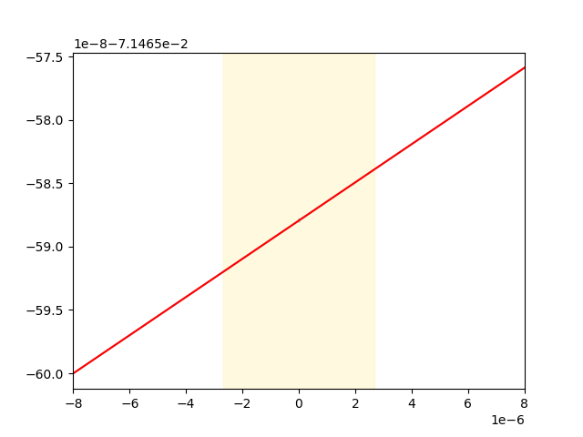
## New Eq:
((fabs(membrane_potential__V_m) < 2.6712338705498262e-6) ? ((0.5 + 187179.41753901311 * membrane_potential__V_m) * (2.0034254029123696e-14 * pow(parameters__Frdy, 2) * (-0.75 * parameters__Nao + 0.75 * Na_Concentrations__Na_j * exp(2.6712338705498262e-6 * parameters__Frdy / (parameters__R * parameters__Temp))) / ((-1.0 + exp(2.6712338705498262e-6 * parameters__Frdy / (parameters__R * parameters__Temp))) * parameters__R * parameters__Temp) + 2.0034254029123696e-14 * pow(parameters__Frdy, 2) * (-0.75 * parameters__Nao + 0.75 * Na_Concentrations__Na_j * exp(-2.6712338705498262e-6 * parameters__Frdy / (parameters__R * parameters__Temp))) / ((-1.0 + exp(-2.6712338705498262e-6 * parameters__Frdy / (parameters__R * parameters__Temp))) * parameters__R * parameters__Temp)) - 2.0034254029123696e-14 * pow(parameters__Frdy, 2) * (-0.75 * parameters__Nao + 0.75 * Na_Concentrations__Na_j * exp(-2.6712338705498262e-6 * parameters__Frdy / (parameters__R * parameters__Temp))) / ((-1.0 + exp(-2.6712338705498262e-6 * parameters__Frdy / (parameters__R * parameters__Temp))) * parameters__R * parameters__Temp)) : ((-0.75 * parameters__Nao + 0.75 * Na_Concentrations__Na_j * exp(membrane_potential__V_m * parameters__FoRT)) * membrane_potential__V_m * parameters__FoRT * parameters__Frdy * parameters__pNa / (-1.0 + exp(membrane_potential__V_m * parameters__FoRT))))

## Equation 6:
```
I_Ca__ibarna_sl = (-0.75 * parameters__Nao + 0.75 * Na_Concentrations__Na_sl * exp(membrane_potential__V_m * parameters__FoRT)) * membrane_potential__V_m * parameters__FoRT * parameters__Frdy * parameters__pNa / (-1.0 + exp(membrane_potential__V_m * parameters__FoRT))
```
### Partially evaluated to: 
```
I_Ca__ibarna_sl = 7.4999999999999993e-9 * pow(parameters__Frdy, 2) * (-0.75 * parameters__Nao + 0.75 * Na_Concentrations__Na_sl * exp(membrane_potential__V_m * parameters__Frdy / (parameters__R * parameters__Temp))) * membrane_potential__V_m / ((-1.0 + exp(membrane_potential__V_m * parameters__Frdy / (parameters__R * parameters__Temp))) * parameters__R * parameters__Temp)
```
### Singulariy points detected:

{0}
#### float * A

####Failed!

<class 'sympy.core.mul.Mul'>
_parameters$Frdy**2*_membrane_potential$V_m*(0.75*_Na_Concentrations$Na_sl*exp(_membrane_potential$V_m*_parameters$Frdy/(_parameters$R*_parameters$Temp)) - 0.75*_parameters$Nao)/(_parameters$R*_parameters$Temp*(exp(_membrane_potential$V_m*_parameters$Frdy/(_parameters$R*_parameters$Temp)) - 1.0))

*try substituting parameters*

*U*
`0.037435883507802616 * membrane_potential__V_m`

*V for 1e-07 range* 
`-2.6712338705498262e-6 - 2.6712338705498262e-6`

*Singularity point: 0*

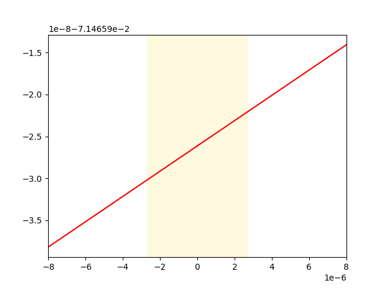
## New Eq:
((fabs(membrane_potential__V_m) < 2.6712338705498262e-6) ? ((0.5 + 187179.41753901311 * membrane_potential__V_m) * (2.0034254029123696e-14 * pow(parameters__Frdy, 2) * (-0.75 * parameters__Nao + 0.75 * Na_Concentrations__Na_sl * exp(2.6712338705498262e-6 * parameters__Frdy / (parameters__R * parameters__Temp))) / ((-1.0 + exp(2.6712338705498262e-6 * parameters__Frdy / (parameters__R * parameters__Temp))) * parameters__R * parameters__Temp) + 2.0034254029123696e-14 * pow(parameters__Frdy, 2) * (-0.75 * parameters__Nao + 0.75 * Na_Concentrations__Na_sl * exp(-2.6712338705498262e-6 * parameters__Frdy / (parameters__R * parameters__Temp))) / ((-1.0 + exp(-2.6712338705498262e-6 * parameters__Frdy / (parameters__R * parameters__Temp))) * parameters__R * parameters__Temp)) - 2.0034254029123696e-14 * pow(parameters__Frdy, 2) * (-0.75 * parameters__Nao + 0.75 * Na_Concentrations__Na_sl * exp(-2.6712338705498262e-6 * parameters__Frdy / (parameters__R * parameters__Temp))) / ((-1.0 + exp(-2.6712338705498262e-6 * parameters__Frdy / (parameters__R * parameters__Temp))) * parameters__R * parameters__Temp)) : ((-0.75 * parameters__Nao + 0.75 * Na_Concentrations__Na_sl * exp(membrane_potential__V_m * parameters__FoRT)) * membrane_potential__V_m * parameters__FoRT * parameters__Frdy * parameters__pNa / (-1.0 + exp(membrane_potential__V_m * parameters__FoRT))))

# Model: grandi_pasqualini_bers_2010(grandi_pasqualini_bers_2010_ss_endo.cellml)
## Equation 1:
```
I_Ca__taud = 28.571428571428569 * (1.0 - 0.4345982085070782 * exp(-0.16666666666666666 * membrane_potential__V_m)) * I_Ca__dss / (5.0 + membrane_potential__V_m)
```
### Partially evaluated to: 
```
I_Ca__taud = 28.571428571428569 * (1.0 - 0.4345982085070782 * exp(-0.16666666666666666 * membrane_potential__V_m)) / ((1.0 + 0.4345982085070782 * exp(-0.16666666666666666 * membrane_potential__V_m)) * (5.0 + membrane_potential__V_m))
```
### Singulariy points detected:

{-5.0000000000000000}
*U*
`-0.83333333333333337 - 0.16666666666666666 * membrane_potential__V_m`

*V for 1e-07 range* 
`-5.0000005999999999 - -4.9999994000000001`

*Singularity point: -5.0000000000000000*


## New Eq:
((fabs(5.0 + membrane_potential__V_m) < 6.0000000000337561e-7) ? ((4166667.1666432251 + 833333.33332864498 * membrane_potential__V_m) * (47619047.618779711 * (1.0 - exp(1.0000000000027348e-7)) / (1.0 + exp(1.0000000000027348e-7)) + 47619047.618779711 * (1.0 - exp(-1.0000000000114084e-7)) / (1.0 + exp(-1.0000000000114084e-7))) - 47619047.618779711 * (1.0 - exp(1.0000000000027348e-7)) / (1.0 + exp(1.0000000000027348e-7))) : (28.571428571428569 * (1.0 - exp(-0.83333333333333337 - 0.16666666666666666 * membrane_potential__V_m)) * I_Ca__dss / (5.0 + membrane_potential__V_m)))

## Equation 2:
```
I_Ca__ibarca_j = 4.0 * (-0.34100000000000003 * parameters__Cao + 0.34100000000000003 * Ca_Concentrations__Ca_j * exp(2.0 * membrane_potential__V_m * parameters__FoRT)) * membrane_potential__V_m * parameters__FoRT * parameters__Frdy * parameters__pCa / (-1.0 + exp(2.0 * membrane_potential__V_m * parameters__FoRT))
```
### Partially evaluated to: 
```
I_Ca__ibarca_j = 7.8019226357407252 * (-0.34100000000000003 * parameters__Cao + 0.34100000000000003 * Ca_Concentrations__Ca_j * exp(0.074871767015605231 * membrane_potential__V_m)) * membrane_potential__V_m * parameters__pCa_max / (-1.0 + exp(0.074871767015605231 * membrane_potential__V_m))
```
### Singulariy points detected:

{0}
*U*
`0.074871767015605231 * membrane_potential__V_m`

*V for 1e-07 range* 
`-1.3356169352749131e-6 - 1.3356169352749131e-6`

*Singularity point: 0*


## New Eq:
((fabs(membrane_potential__V_m) < 1.3356169352749131e-6) ? ((0.5 + 374358.83507802623 * membrane_potential__V_m) * (1.042038e-5 * (-0.34100000000000003 * parameters__Cao + 0.34100000000000003 * Ca_Concentrations__Ca_j * exp(9.9999999999999995e-8)) * parameters__pCa_max / (-1.0 + exp(9.9999999999999995e-8)) + 1.042038e-5 * (-0.34100000000000003 * parameters__Cao + 0.34100000000000003 * Ca_Concentrations__Ca_j * exp(-9.9999999999999995e-8)) * parameters__pCa_max / (-1.0 + exp(-9.9999999999999995e-8))) - 1.042038e-5 * (-0.34100000000000003 * parameters__Cao + 0.34100000000000003 * Ca_Concentrations__Ca_j * exp(-9.9999999999999995e-8)) * parameters__pCa_max / (-1.0 + exp(-9.9999999999999995e-8))) : (4.0 * (-0.34100000000000003 * parameters__Cao + 0.34100000000000003 * Ca_Concentrations__Ca_j * exp(2.0 * membrane_potential__V_m * parameters__FoRT)) * membrane_potential__V_m * parameters__FoRT * parameters__Frdy * parameters__pCa / (-1.0 + exp(2.0 * membrane_potential__V_m * parameters__FoRT))))

## Equation 3:
```
I_Ca__ibarca_sl = 4.0 * (-0.34100000000000003 * parameters__Cao + 0.34100000000000003 * Ca_Concentrations__Ca_sl * exp(2.0 * membrane_potential__V_m * parameters__FoRT)) * membrane_potential__V_m * parameters__FoRT * parameters__Frdy * parameters__pCa / (-1.0 + exp(2.0 * membrane_potential__V_m * parameters__FoRT))
```
### Partially evaluated to: 
```
I_Ca__ibarca_sl = 7.8019226357407252 * (-0.34100000000000003 * parameters__Cao + 0.34100000000000003 * Ca_Concentrations__Ca_sl * exp(0.074871767015605231 * membrane_potential__V_m)) * membrane_potential__V_m * parameters__pCa_max / (-1.0 + exp(0.074871767015605231 * membrane_potential__V_m))
```
### Singulariy points detected:

{0}
*U*
`0.074871767015605231 * membrane_potential__V_m`

*V for 1e-07 range* 
`-1.3356169352749131e-6 - 1.3356169352749131e-6`

*Singularity point: 0*


## New Eq:
((fabs(membrane_potential__V_m) < 1.3356169352749131e-6) ? ((0.5 + 374358.83507802623 * membrane_potential__V_m) * (1.042038e-5 * (-0.34100000000000003 * parameters__Cao + 0.34100000000000003 * Ca_Concentrations__Ca_sl * exp(9.9999999999999995e-8)) * parameters__pCa_max / (-1.0 + exp(9.9999999999999995e-8)) + 1.042038e-5 * (-0.34100000000000003 * parameters__Cao + 0.34100000000000003 * Ca_Concentrations__Ca_sl * exp(-9.9999999999999995e-8)) * parameters__pCa_max / (-1.0 + exp(-9.9999999999999995e-8))) - 1.042038e-5 * (-0.34100000000000003 * parameters__Cao + 0.34100000000000003 * Ca_Concentrations__Ca_sl * exp(-9.9999999999999995e-8)) * parameters__pCa_max / (-1.0 + exp(-9.9999999999999995e-8))) : (4.0 * (-0.34100000000000003 * parameters__Cao + 0.34100000000000003 * Ca_Concentrations__Ca_sl * exp(2.0 * membrane_potential__V_m * parameters__FoRT)) * membrane_potential__V_m * parameters__FoRT * parameters__Frdy * parameters__pCa / (-1.0 + exp(2.0 * membrane_potential__V_m * parameters__FoRT))))

## Equation 4:
```
I_Ca__ibark = (-0.75 * parameters__Ko + 0.75 * K_Concentration__K_i * exp(membrane_potential__V_m * parameters__FoRT)) * membrane_potential__V_m * parameters__FoRT * parameters__Frdy * parameters__pK / (-1.0 + exp(membrane_potential__V_m * parameters__FoRT))
```
### Partially evaluated to: 
```
I_Ca__ibark = 0.00048762016473379531 * (-0.75 * parameters__Ko + 0.75 * K_Concentration__K_i * exp(0.037435883507802616 * membrane_potential__V_m)) * membrane_potential__V_m / (-1.0 + exp(0.037435883507802616 * membrane_potential__V_m))
```
### Singulariy points detected:

{0}
*U*
`0.037435883507802616 * membrane_potential__V_m`

*V for 1e-07 range* 
`-2.6712338705498262e-6 - 2.6712338705498262e-6`

*Singularity point: 0*


## New Eq:
((fabs(membrane_potential__V_m) < 2.6712338705498262e-6) ? ((0.5 + 187179.41753901311 * membrane_potential__V_m) * (1.3025475e-9 * (-0.75 * parameters__Ko + 0.75 * K_Concentration__K_i * exp(9.9999999999999995e-8)) / (-1.0 + exp(9.9999999999999995e-8)) + 1.3025475e-9 * (-0.75 * parameters__Ko + 0.75 * K_Concentration__K_i * exp(-9.9999999999999995e-8)) / (-1.0 + exp(-9.9999999999999995e-8))) - 1.3025475e-9 * (-0.75 * parameters__Ko + 0.75 * K_Concentration__K_i * exp(-9.9999999999999995e-8)) / (-1.0 + exp(-9.9999999999999995e-8))) : ((-0.75 * parameters__Ko + 0.75 * K_Concentration__K_i * exp(membrane_potential__V_m * parameters__FoRT)) * membrane_potential__V_m * parameters__FoRT * parameters__Frdy * parameters__pK / (-1.0 + exp(membrane_potential__V_m * parameters__FoRT))))

## Equation 5:
```
I_Ca__ibarna_j = (-0.75 * parameters__Nao + 0.75 * Na_Concentrations__Na_j * exp(membrane_potential__V_m * parameters__FoRT)) * membrane_potential__V_m * parameters__FoRT * parameters__Frdy * parameters__pNa / (-1.0 + exp(membrane_potential__V_m * parameters__FoRT))
```
### Partially evaluated to: 
```
I_Ca__ibarna_j = 2.7090009151877515e-5 * (-0.75 * parameters__Nao + 0.75 * Na_Concentrations__Na_j * exp(0.037435883507802616 * membrane_potential__V_m)) * membrane_potential__V_m / (-1.0 + exp(0.037435883507802616 * membrane_potential__V_m))
```
### Singulariy points detected:

{0}
*U*
`0.037435883507802616 * membrane_potential__V_m`

*V for 1e-07 range* 
`-2.6712338705498262e-6 - 2.6712338705498262e-6`

*Singularity point: 0*


## New Eq:
((fabs(membrane_potential__V_m) < 2.6712338705498262e-6) ? ((0.5 + 187179.41753901311 * membrane_potential__V_m) * (7.236374999999999e-11 * (-0.75 * parameters__Nao + 0.75 * Na_Concentrations__Na_j * exp(9.9999999999999995e-8)) / (-1.0 + exp(9.9999999999999995e-8)) + 7.236374999999999e-11 * (-0.75 * parameters__Nao + 0.75 * Na_Concentrations__Na_j * exp(-9.9999999999999995e-8)) / (-1.0 + exp(-9.9999999999999995e-8))) - 7.236374999999999e-11 * (-0.75 * parameters__Nao + 0.75 * Na_Concentrations__Na_j * exp(-9.9999999999999995e-8)) / (-1.0 + exp(-9.9999999999999995e-8))) : ((-0.75 * parameters__Nao + 0.75 * Na_Concentrations__Na_j * exp(membrane_potential__V_m * parameters__FoRT)) * membrane_potential__V_m * parameters__FoRT * parameters__Frdy * parameters__pNa / (-1.0 + exp(membrane_potential__V_m * parameters__FoRT))))

## Equation 6:
```
I_Ca__ibarna_sl = (-0.75 * parameters__Nao + 0.75 * Na_Concentrations__Na_sl * exp(membrane_potential__V_m * parameters__FoRT)) * membrane_potential__V_m * parameters__FoRT * parameters__Frdy * parameters__pNa / (-1.0 + exp(membrane_potential__V_m * parameters__FoRT))
```
### Partially evaluated to: 
```
I_Ca__ibarna_sl = 2.7090009151877515e-5 * (-0.75 * parameters__Nao + 0.75 * Na_Concentrations__Na_sl * exp(0.037435883507802616 * membrane_potential__V_m)) * membrane_potential__V_m / (-1.0 + exp(0.037435883507802616 * membrane_potential__V_m))
```
### Singulariy points detected:

{0}
*U*
`0.037435883507802616 * membrane_potential__V_m`

*V for 1e-07 range* 
`-2.6712338705498262e-6 - 2.6712338705498262e-6`

*Singularity point: 0*


## New Eq:
((fabs(membrane_potential__V_m) < 2.6712338705498262e-6) ? ((0.5 + 187179.41753901311 * membrane_potential__V_m) * (7.236374999999999e-11 * (-0.75 * parameters__Nao + 0.75 * Na_Concentrations__Na_sl * exp(9.9999999999999995e-8)) / (-1.0 + exp(9.9999999999999995e-8)) + 7.236374999999999e-11 * (-0.75 * parameters__Nao + 0.75 * Na_Concentrations__Na_sl * exp(-9.9999999999999995e-8)) / (-1.0 + exp(-9.9999999999999995e-8))) - 7.236374999999999e-11 * (-0.75 * parameters__Nao + 0.75 * Na_Concentrations__Na_sl * exp(-9.9999999999999995e-8)) / (-1.0 + exp(-9.9999999999999995e-8))) : ((-0.75 * parameters__Nao + 0.75 * Na_Concentrations__Na_sl * exp(membrane_potential__V_m * parameters__FoRT)) * membrane_potential__V_m * parameters__FoRT * parameters__Frdy * parameters__pNa / (-1.0 + exp(membrane_potential__V_m * parameters__FoRT))))

# Model: hilgemann_noble_model_1987(hilgemann_noble_model_1987.cellml)
## Equation 1:
```
second_inward_calcium_current__i_siCa = 4.0 * (-50.0 + membrane__V) * (intracellular_calcium_concentration__Ca_i * exp(100.0 / membrane__RTONF) - extracellular_calcium_concentration__Ca_o * exp(-2.0 * (-50.0 + membrane__V) / membrane__RTONF)) * second_inward_calcium_current__P_si * second_inward_calcium_current_d_gate__d * second_inward_calcium_current_f_Ca_gate__CaChon / ((1.0 - exp(-2.0 * (-50.0 + membrane__V) / membrane__RTONF)) * membrane__RTONF)
```
### Partially evaluated to: 
```
second_inward_calcium_current__i_siCa = 0.14973556329098189 * (1.0 - second_inward_calcium_current_f_Ca_gate__f_Ca) * (1.0 - intracellular_calcium_concentration__Ca_i / (0.001 + intracellular_calcium_concentration__Ca_i)) * (-50.0 + membrane__V) * (42.240905756816076 * intracellular_calcium_concentration__Ca_i - 42.240905756816076 * extracellular_calcium_concentration__Ca_o * exp(-0.074867781645490947 * membrane__V)) * second_inward_calcium_current__P_si * second_inward_calcium_current_d_gate__d / (1.0 - 42.240905756816076 * exp(-0.074867781645490947 * membrane__V))
```
### Singulariy points detected:

{50.000000000000000}
*U*
`3.7433890822745473 - 0.074867781645490947 * membrane__V`

*V for 1e-07 range* 
`49.999998664311967 - 50.000001335688033`

*Singularity point: 50.000000000000000*

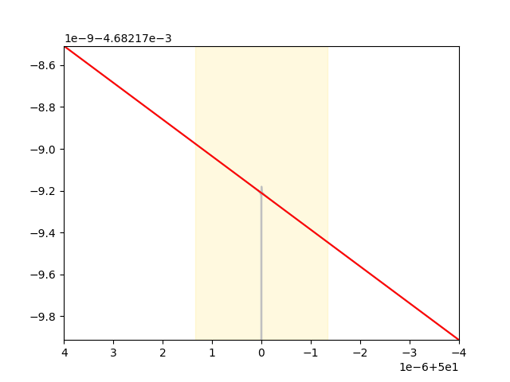
## New Eq:
((fabs(-50.0 + membrane__V) < 1.3356880329551402e-6) ? ((-18716944.911788113 + 374338.90823576227 * membrane__V) * (1.9999999999556149e-7 * (1.0 - second_inward_calcium_current_f_Ca_gate__f_Ca) * (1.0 - intracellular_calcium_concentration__Ca_i / (0.001 + intracellular_calcium_concentration__Ca_i)) * (intracellular_calcium_concentration__Ca_i * exp(3.7433890822745473) - extracellular_calcium_concentration__Ca_o * exp(9.9999999999406119e-8)) * second_inward_calcium_current__P_si * second_inward_calcium_current_d_gate__d / (1.0 - exp(9.9999999999406119e-8)) + 1.9999999999556149e-7 * (1.0 - second_inward_calcium_current_f_Ca_gate__f_Ca) * (1.0 - intracellular_calcium_concentration__Ca_i / (0.001 + intracellular_calcium_concentration__Ca_i)) * (intracellular_calcium_concentration__Ca_i * exp(3.7433890822745473) - extracellular_calcium_concentration__Ca_o * exp(-9.9999999995936673e-8)) * second_inward_calcium_current__P_si * second_inward_calcium_current_d_gate__d / (1.0 - exp(-9.9999999995936673e-8))) - 1.9999999999556149e-7 * (1.0 - second_inward_calcium_current_f_Ca_gate__f_Ca) * (1.0 - intracellular_calcium_concentration__Ca_i / (0.001 + intracellular_calcium_concentration__Ca_i)) * (intracellular_calcium_concentration__Ca_i * exp(3.7433890822745473) - extracellular_calcium_concentration__Ca_o * exp(9.9999999999406119e-8)) * second_inward_calcium_current__P_si * second_inward_calcium_current_d_gate__d / (1.0 - exp(9.9999999999406119e-8))) : (4.0 * (-50.0 + membrane__V) * (intracellular_calcium_concentration__Ca_i * exp(100.0 / membrane__RTONF) - extracellular_calcium_concentration__Ca_o * exp(-2.0 * (-50.0 + membrane__V) / membrane__RTONF)) * second_inward_calcium_current__P_si * second_inward_calcium_current_d_gate__d * second_inward_calcium_current_f_Ca_gate__CaChon / ((1.0 - exp(-2.0 * (-50.0 + membrane__V) / membrane__RTONF)) * membrane__RTONF)))

## Equation 2:
```
second_inward_calcium_current__i_siK = 0.002 * (-50.0 + membrane__V) * (intracellular_potassium_concentration__K_i * exp(50.0 / membrane__RTONF) - extracellular_potassium_concentration__K_c * exp(-(-50.0 + membrane__V) / membrane__RTONF)) * second_inward_calcium_current__P_si * second_inward_calcium_current_d_gate__d * second_inward_calcium_current_f_Ca_gate__CaChon / ((1.0 - exp(-(-50.0 + membrane__V) / membrane__RTONF)) * membrane__RTONF)
```
### Partially evaluated to: 
```
second_inward_calcium_current__i_siK = 7.4867781645490941e-5 * (1.0 - second_inward_calcium_current_f_Ca_gate__f_Ca) * (1.0 - intracellular_calcium_concentration__Ca_i / (0.001 + intracellular_calcium_concentration__Ca_i)) * (-50.0 + membrane__V) * (6.4993004051833205 * intracellular_potassium_concentration__K_i - 6.4993004051833205 * extracellular_potassium_concentration__K_c * exp(-0.037433890822745473 * membrane__V)) * second_inward_calcium_current__P_si * second_inward_calcium_current_d_gate__d / (1.0 - 6.4993004051833205 * exp(-0.037433890822745473 * membrane__V))
```
### Singulariy points detected:

{50.000000000000000}
*U*
`1.8716945411372736 - 0.037433890822745473 * membrane__V`

*V for 1e-07 range* 
`49.999997328623934 - 50.000002671376066`

*Singularity point: 50.000000000000000*

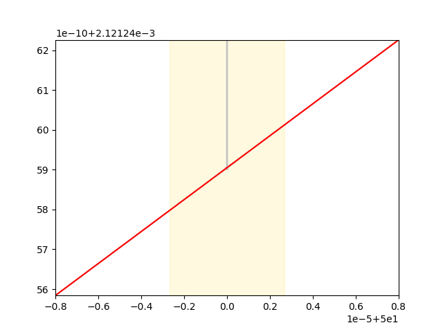
## New Eq:
((fabs(-50.0 + membrane__V) < 2.6713760659657915e-6) ? ((-9358472.2056995872 + 187169.45411399176 * membrane__V) * (1.999999999997175e-10 * (1.0 - second_inward_calcium_current_f_Ca_gate__f_Ca) * (1.0 - intracellular_calcium_concentration__Ca_i / (0.001 + intracellular_calcium_concentration__Ca_i)) * (intracellular_potassium_concentration__K_i * exp(1.8716945411372736) - extracellular_potassium_concentration__K_c * exp(9.9999999999406119e-8)) * second_inward_calcium_current__P_si * second_inward_calcium_current_d_gate__d / (1.0 - exp(9.9999999999406119e-8)) + 1.999999999997175e-10 * (1.0 - second_inward_calcium_current_f_Ca_gate__f_Ca) * (1.0 - intracellular_calcium_concentration__Ca_i / (0.001 + intracellular_calcium_concentration__Ca_i)) * (intracellular_potassium_concentration__K_i * exp(1.8716945411372736) - extracellular_potassium_concentration__K_c * exp(-9.9999999999406119e-8)) * second_inward_calcium_current__P_si * second_inward_calcium_current_d_gate__d / (1.0 - exp(-9.9999999999406119e-8))) - 1.999999999997175e-10 * (1.0 - second_inward_calcium_current_f_Ca_gate__f_Ca) * (1.0 - intracellular_calcium_concentration__Ca_i / (0.001 + intracellular_calcium_concentration__Ca_i)) * (intracellular_potassium_concentration__K_i * exp(1.8716945411372736) - extracellular_potassium_concentration__K_c * exp(9.9999999999406119e-8)) * second_inward_calcium_current__P_si * second_inward_calcium_current_d_gate__d / (1.0 - exp(9.9999999999406119e-8))) : (0.002 * (-50.0 + membrane__V) * (intracellular_potassium_concentration__K_i * exp(50.0 / membrane__RTONF) - extracellular_potassium_concentration__K_c * exp(-(-50.0 + membrane__V) / membrane__RTONF)) * second_inward_calcium_current__P_si * second_inward_calcium_current_d_gate__d * second_inward_calcium_current_f_Ca_gate__CaChon / ((1.0 - exp(-(-50.0 + membrane__V) / membrane__RTONF)) * membrane__RTONF)))

## Equation 3:
```
second_inward_calcium_current__i_siNa = 0.01 * (-50.0 + membrane__V) * (intracellular_sodium_concentration__Na_i * exp(50.0 / membrane__RTONF) - extracellular_sodium_concentration__Na_o * exp(-(-50.0 + membrane__V) / membrane__RTONF)) * second_inward_calcium_current__P_si * second_inward_calcium_current_d_gate__d * second_inward_calcium_current_f_Ca_gate__CaChon / ((1.0 - exp(-(-50.0 + membrane__V) / membrane__RTONF)) * membrane__RTONF)
```
### Partially evaluated to: 
```
second_inward_calcium_current__i_siNa = 0.00037433890822745472 * (1.0 - second_inward_calcium_current_f_Ca_gate__f_Ca) * (1.0 - intracellular_calcium_concentration__Ca_i / (0.001 + intracellular_calcium_concentration__Ca_i)) * (-50.0 + membrane__V) * (6.4993004051833205 * intracellular_sodium_concentration__Na_i - 6.4993004051833205 * extracellular_sodium_concentration__Na_o * exp(-0.037433890822745473 * membrane__V)) * second_inward_calcium_current__P_si * second_inward_calcium_current_d_gate__d / (1.0 - 6.4993004051833205 * exp(-0.037433890822745473 * membrane__V))
```
### Singulariy points detected:

{50.000000000000000}
*U*
`1.8716945411372736 - 0.037433890822745473 * membrane__V`

*V for 1e-07 range* 
`49.999997328623934 - 50.000002671376066`

*Singularity point: 50.000000000000000*


## New Eq:
((fabs(-50.0 + membrane__V) < 2.6713760659657915e-6) ? ((-9358472.2056995872 + 187169.45411399176 * membrane__V) * (9.9999999999858744e-10 * (1.0 - second_inward_calcium_current_f_Ca_gate__f_Ca) * (1.0 - intracellular_calcium_concentration__Ca_i / (0.001 + intracellular_calcium_concentration__Ca_i)) * (intracellular_sodium_concentration__Na_i * exp(1.8716945411372736) - extracellular_sodium_concentration__Na_o * exp(9.9999999999406119e-8)) * second_inward_calcium_current__P_si * second_inward_calcium_current_d_gate__d / (1.0 - exp(9.9999999999406119e-8)) + 9.9999999999858744e-10 * (1.0 - second_inward_calcium_current_f_Ca_gate__f_Ca) * (1.0 - intracellular_calcium_concentration__Ca_i / (0.001 + intracellular_calcium_concentration__Ca_i)) * (intracellular_sodium_concentration__Na_i * exp(1.8716945411372736) - extracellular_sodium_concentration__Na_o * exp(-9.9999999999406119e-8)) * second_inward_calcium_current__P_si * second_inward_calcium_current_d_gate__d / (1.0 - exp(-9.9999999999406119e-8))) - 9.9999999999858744e-10 * (1.0 - second_inward_calcium_current_f_Ca_gate__f_Ca) * (1.0 - intracellular_calcium_concentration__Ca_i / (0.001 + intracellular_calcium_concentration__Ca_i)) * (intracellular_sodium_concentration__Na_i * exp(1.8716945411372736) - extracellular_sodium_concentration__Na_o * exp(9.9999999999406119e-8)) * second_inward_calcium_current__P_si * second_inward_calcium_current_d_gate__d / (1.0 - exp(9.9999999999406119e-8))) : (0.01 * (-50.0 + membrane__V) * (intracellular_sodium_concentration__Na_i * exp(50.0 / membrane__RTONF) - extracellular_sodium_concentration__Na_o * exp(-(-50.0 + membrane__V) / membrane__RTONF)) * second_inward_calcium_current__P_si * second_inward_calcium_current_d_gate__d * second_inward_calcium_current_f_Ca_gate__CaChon / ((1.0 - exp(-(-50.0 + membrane__V) / membrane__RTONF)) * membrane__RTONF)))

# Model: hodgkin_huxley_squid_axon_model_1952_modified(hodgkin_huxley_squid_axon_model_1952_modified.cellml)
# Model: HundRudy2004_units(hund_rudy_2004.cellml)
## Equation 1:
```
ICaL__ibarca = 4.0 * (-15.0 + cell__V) * (-Environment__Ca_o * ICaL__gacao + Ca__Ca_ss * ICaL__gacai * exp(2.0 * (-15.0 + cell__V) * Environment__FonRT)) * Environment__F * Environment__FonRT * ICaL__pca / (-1.0 + exp(2.0 * (-15.0 + cell__V) * Environment__FonRT))
```
### Partially evaluated to: 
```
ICaL__ibarca = 14448.004881000332 * (-15.0 + cell__V) * (-0.34100000000000003 * Environment__Ca_o + 0.32527753564515088 * Ca__Ca_ss * exp(0.074871767015599999 * cell__V)) * ICaL__pca / (-1.0 + 0.32527753564515088 * exp(0.074871767015599999 * cell__V))
```
### Singulariy points detected:

{15.000000000000000}
*U*
`-1.1230765052339999 + 0.074871767015599999 * cell__V`

*V for 1e-07 range* 
`14.999998664383064 - 15.000001335616936`

*Singularity point: 15.000000000000000*


## New Eq:
((fabs(-15.0 + cell__V) < 1.3356169352718439e-6) ? ((-5615382.0261832969 + 374358.83507888648 * cell__V) * (0.019296999999954306 * (-0.34100000000000003 * Environment__Ca_o + Ca__Ca_ss * exp(9.9999999999406119e-8)) * ICaL__pca / (-1.0 + exp(9.9999999999406119e-8)) + 0.019296999999954306 * (-0.34100000000000003 * Environment__Ca_o + Ca__Ca_ss * exp(-9.9999999999406119e-8)) * ICaL__pca / (-1.0 + exp(-9.9999999999406119e-8))) - 0.019296999999954306 * (-0.34100000000000003 * Environment__Ca_o + Ca__Ca_ss * exp(-9.9999999999406119e-8)) * ICaL__pca / (-1.0 + exp(-9.9999999999406119e-8))) : (4.0 * (-15.0 + cell__V) * (-Environment__Ca_o * ICaL__gacao + Ca__Ca_ss * ICaL__gacai * exp(2.0 * (-15.0 + cell__V) * Environment__FonRT)) * Environment__F * Environment__FonRT * ICaL__pca / (-1.0 + exp(2.0 * (-15.0 + cell__V) * Environment__FonRT))))

## Equation 2:
```
ICab__ICab = 7.9803360000000004e-7 * (-0.34100000000000003 * Environment__Ca_o + Ca__Ca_i * exp(2.0 * Environment__FonRT * cell__V)) * Environment__F * Environment__FonRT * cell__V / (-1.0 + exp(2.0 * Environment__FonRT * cell__V))
```
### Partially evaluated to: 
```
ICab__ICab = 0.0028824983370005666 * (-0.34100000000000003 * Environment__Ca_o + Ca__Ca_i * exp(0.074871767015599999 * cell__V)) * cell__V / (-1.0 + exp(0.074871767015599999 * cell__V))
```
### Singulariy points detected:

{0}
*U*
`0.074871767015599999 * cell__V`

*V for 1e-07 range* 
`-1.3356169352750065e-6 - 1.3356169352750065e-6`

*Singularity point: 0*


## New Eq:
((fabs(cell__V) < 1.3356169352750065e-6) ? ((0.5 + 374358.83507800003 * cell__V) * (3.8499135947999997e-9 * (-0.34100000000000003 * Environment__Ca_o + Ca__Ca_i * exp(9.9999999999999995e-8)) / (-1.0 + exp(9.9999999999999995e-8)) + 3.8499135947999997e-9 * (-0.34100000000000003 * Environment__Ca_o + Ca__Ca_i * exp(-9.9999999999999995e-8)) / (-1.0 + exp(-9.9999999999999995e-8))) - 3.8499135947999997e-9 * (-0.34100000000000003 * Environment__Ca_o + Ca__Ca_i * exp(-9.9999999999999995e-8)) / (-1.0 + exp(-9.9999999999999995e-8))) : (7.9803360000000004e-7 * (-0.34100000000000003 * Environment__Ca_o + Ca__Ca_i * exp(2.0 * Environment__FonRT * cell__V)) * Environment__F * Environment__FonRT * cell__V / (-1.0 + exp(2.0 * Environment__FonRT * cell__V))))

## Equation 3:
```
IKr__tauxr = 1 / (0.00029999999999999997 * (38.360799999999998 + cell__V) / (-1.0 + 343.26878155836141 * exp(0.1522 * cell__V)) + 0.00059999999999999995 * (-1.7383999999999999 + cell__V) / (1.0 - 1.2667092551679247 * exp(-0.13600000000000001 * cell__V)))
```
### Partially evaluated to: 
```
IKr__tauxr = 1 / (0.00029999999999999997 * (38.360799999999998 + cell__V) / (-1.0 + 343.26878155836141 * exp(0.1522 * cell__V)) + 0.00059999999999999995 * (-1.7383999999999999 + cell__V) / (1.0 - 1.2667092551679247 * exp(-0.13600000000000001 * cell__V)))
```
### Singulariy points detected:

{-38.360799999999998, 1.7383999999999999}
#### float * A

####1 / A


####A + B:

`0.00059999999999999995 * (-1.7383999999999999 + cell__V) / (1.0 - 1.2667092551679247 * exp(-0.13600000000000001 * cell__V))`
`0.00029999999999999997 * (38.360799999999998 + cell__V) / (-1.0 + 343.26878155836141 * exp(0.1522 * cell__V))`

*U*
`0.2364224 - 0.13600000000000001 * cell__V`

*V for 1e-07 range* 
`1.7383992647058824 - 1.7384007352941175`

*Singularity point: 1.7383999999999999*


*U*
`5.8385137599999997 + 0.1522 * cell__V`

*V for 1e-07 range* 
`-38.360800657030218 - -38.360799342969777`

*Singularity point: -38.360799999999998*


## New Eq:
((fabs(-1.7383999999999999 + cell__V) < 7.3529411765034525e-7) ? (1 / (0.012029759779411764 / (-1.0 + exp(6.1030981280882353)) - 4.4117647058708463e-10 / (1.0 - exp(9.99999999998398e-8))) + (-1182111.4999988999 + 679999.99999936717 * cell__V) * (1 / (0.012029760220588234 / (-1.0 + exp(6.1030983519117648)) + 4.4117647059020713e-10 / (1.0 - exp(-1.0000000000049032e-7))) - 1 / (0.012029759779411764 / (-1.0 + exp(6.1030981280882353)) - 4.4117647058708463e-10 / (1.0 - exp(9.99999999998398e-8))))) : ((fabs(38.360799999999998 + cell__V) < 6.5703022339436146e-7) ? (1 / (-1.9710906701830842e-10 / (-1.0 + exp(-1.0000000000287557e-7)) - 0.024059520394218131 / (1.0 - exp(5.4534912893561103))) + (29192569.299818475 + 760999.99999526795 * cell__V) * (1 / (1.9710906701830842e-10 / (-1.0 + exp(1.0000000000287557e-7)) - 0.024059519605781864 / (1.0 - exp(5.4534911106438893))) - 1 / (-1.9710906701830842e-10 / (-1.0 + exp(-1.0000000000287557e-7)) - 0.024059520394218131 / (1.0 - exp(5.4534912893561103))))) : (1 / (0.00029999999999999997 * (38.360799999999998 + cell__V) / (-1.0 + exp(5.8385137599999997 + 0.1522 * cell__V)) + 0.00059999999999999995 * (-1.7383999999999999 + cell__V) / (1.0 - exp(0.2364224 - 0.13600000000000001 * cell__V))))))

## Equation 4:
```
IKs__tauxs = 1 / (7.6100000000000007e-5 * (44.600000000000001 + cell__V) / (1.0 - 7.6868266637773744e-194 * exp(-9.9700000000000006 * cell__V)) + 0.00036000000000000002 * (-0.55000000000000004 + cell__V) / (-1.0 + 0.93202093695954691 * exp(0.128 * cell__V)))
```
### Partially evaluated to: 
```
IKs__tauxs = 1 / (7.6100000000000007e-5 * (44.600000000000001 + cell__V) / (1.0 - 7.6868266637773744e-194 * exp(-9.9700000000000006 * cell__V)) + 0.00036000000000000002 * (-0.55000000000000004 + cell__V) / (-1.0 + 0.93202093695954691 * exp(0.128 * cell__V)))
```
### Singulariy points detected:

{0.55000000000000005, -44.600000000000001}
#### float * A

####1 / A


####A + B:

`7.6100000000000007e-5 * (44.600000000000001 + cell__V) / (1.0 - 7.6868266637773744e-194 * exp(-9.9700000000000006 * cell__V))`
`0.00036000000000000002 * (-0.55000000000000004 + cell__V) / (-1.0 + 0.93202093695954691 * exp(0.128 * cell__V))`

*U*
`-444.66200000000003 - 9.9700000000000006 * cell__V`

*V for 1e-07 range* 
`-44.600000010030094 - -44.599999989969909`

*Singularity point: -44.600000000000001*


*U*
`-0.070400000000000004 + 0.128 * cell__V`

*V for 1e-07 range* 
`0.54999921875000002 - 0.55000078125000007`

*Singularity point: 0.55000000000000005*


## New Eq:
((fabs(44.600000000000001 + cell__V) < 1.0030090258350555e-8) ? (1 / (-0.016254000003610835 / (-1.0 + exp(-5.7792000012838516)) - 7.6328986866047728e-13 / (1.0 - exp(9.9999999836342113e-8))) + (2223310003.262351 + 49850000.061936118 * cell__V) * (1 / (7.6328986866047728e-13 / (1.0 - exp(-9.9999999836342113e-8)) - 0.016253999996389171 / (-1.0 + exp(-5.7791999987161491))) - 1 / (-0.016254000003610835 / (-1.0 + exp(-5.7792000012838516)) - 7.6328986866047728e-13 / (1.0 - exp(9.9999999836342113e-8))))) : ((fabs(-0.55000000000000004 + cell__V) < 7.8124999999557715e-7) ? (1 / (0.0034359149405468756 / (1.0 - exp(-450.14549221093756)) - 2.8124999999903229e-10 / (-1.0 + exp(-9.999999999962296e-8))) + (-351999.50000003882 + 640000.00000007043 * cell__V) * (1 / (2.812500000009058e-10 / (-1.0 + exp(1.0000000000027348e-7)) + 0.0034359150594531255 / (1.0 - exp(-450.14550778906255))) - 1 / (0.0034359149405468756 / (1.0 - exp(-450.14549221093756)) - 2.8124999999903229e-10 / (-1.0 + exp(-9.999999999962296e-8))))) : (1 / (7.6100000000000007e-5 * (44.600000000000001 + cell__V) / (1.0 - exp(-444.66200000000003 - 9.9700000000000006 * cell__V)) + 0.00036000000000000002 * (-0.55000000000000004 + cell__V) / (-1.0 + exp(-0.070400000000000004 + 0.128 * cell__V))))))

## Equation 5:
```
INa__am = 0.32000000000000001 * (47.130000000000003 + cell__V) / (1.0 - 0.00897780373069724 * exp(-0.10000000000000001 * cell__V))
```
### Partially evaluated to: 
```
INa__am = 0.32000000000000001 * (47.130000000000003 + cell__V) / (1.0 - 0.00897780373069724 * exp(-0.10000000000000001 * cell__V))
```
### Singulariy points detected:

{-47.130000000000003}
*U*
`-4.7130000000000001 - 0.10000000000000001 * cell__V`

*V for 1e-07 range* 
`-47.130001 - -47.129999000000005`

*Singularity point: -47.130000000000003*


## New Eq:
((fabs(47.130000000000003 + cell__V) < 1.0000000000287557e-6) ? (-3.200000000092018e-7 / (1.0 - exp(1.0000000000287557e-7)) + (23565000.499322373 + 499999.99998562218 * cell__V) * (3.200000000092018e-7 / (1.0 - exp(1.0000000000287557e-7)) + 3.200000000092018e-7 / (1.0 - exp(-1.0000000000287557e-7)))) : (0.32000000000000001 * (47.130000000000003 + cell__V) / (1.0 - exp(-4.7130000000000001 - 0.10000000000000001 * cell__V))))

## Equation 6:
```
INal__amL = 0.32000000000000001 * (47.130000000000003 + cell__V) / (1.0 - 0.00897780373069724 * exp(-0.10000000000000001 * cell__V))
```
### Partially evaluated to: 
```
INal__amL = 0.32000000000000001 * (47.130000000000003 + cell__V) / (1.0 - 0.00897780373069724 * exp(-0.10000000000000001 * cell__V))
```
### Singulariy points detected:

{-47.130000000000003}
*U*
`-4.7130000000000001 - 0.10000000000000001 * cell__V`

*V for 1e-07 range* 
`-47.130001 - -47.129999000000005`

*Singularity point: -47.130000000000003*


## New Eq:
((fabs(47.130000000000003 + cell__V) < 1.0000000000287557e-6) ? (-3.200000000092018e-7 / (1.0 - exp(1.0000000000287557e-7)) + (23565000.499322373 + 499999.99998562218 * cell__V) * (3.200000000092018e-7 / (1.0 - exp(1.0000000000287557e-7)) + 3.200000000092018e-7 / (1.0 - exp(-1.0000000000287557e-7)))) : (0.32000000000000001 * (47.130000000000003 + cell__V) / (1.0 - exp(-4.7130000000000001 - 0.10000000000000001 * cell__V))))

## Equation 7:
```
Ito2__Ito2_max = (-Environment__Cl_o * exp(Environment__FonRT * cell__V) + Cl__Cl_i) * Environment__F * Environment__FonRT * Ito2__PCl * cell__V / (1.0 - exp(Environment__FonRT * cell__V))
```
### Partially evaluated to: 
```
Ito2__Ito2_max = 0.001444800488100033 * (-Environment__Cl_o * exp(0.0374358835078 * cell__V) + Cl__Cl_i) * cell__V / (1.0 - exp(0.0374358835078 * cell__V))
```
### Singulariy points detected:

{0}
*U*
`0.0374358835078 * cell__V`

*V for 1e-07 range* 
`-2.671233870550013e-6 - 2.671233870550013e-6`

*Singularity point: 0*


## New Eq:
((fabs(cell__V) < 2.671233870550013e-6) ? ((0.5 + 187179.41753900002 * cell__V) * (3.8593999999999993e-9 * (-Environment__Cl_o * exp(9.9999999999999995e-8) + Cl__Cl_i) / (1.0 - exp(9.9999999999999995e-8)) + 3.8593999999999993e-9 * (-Environment__Cl_o * exp(-9.9999999999999995e-8) + Cl__Cl_i) / (1.0 - exp(-9.9999999999999995e-8))) - 3.8593999999999993e-9 * (-Environment__Cl_o * exp(-9.9999999999999995e-8) + Cl__Cl_i) / (1.0 - exp(-9.9999999999999995e-8))) : ((-Environment__Cl_o * exp(Environment__FonRT * cell__V) + Cl__Cl_i) * Environment__F * Environment__FonRT * Ito2__PCl * cell__V / (1.0 - exp(Environment__FonRT * cell__V))))

# Model: iribe_model_2006(iribe_model_2006.cellml)
## Equation 1:
```
L_type_Ca_channel__i_Ca_L_Ca = 4.0 * (-50.0 + membrane_potential__V) * (intracellular_calcium_concentration__Ca_i * exp(100.0 * cell_parameters__F / (cell_parameters__R * cell_parameters__T)) - cell_parameters__Ca_o * exp(-2.0 * (-50.0 + membrane_potential__V) * cell_parameters__F / (cell_parameters__R * cell_parameters__T))) * L_type_Ca_channel__P_Ca_L_Ca * L_type_Ca_channel_d_gate__d * L_type_Ca_channel_f_gate__f * cell_parameters__F / ((1.0 - exp(-2.0 * (-50.0 + membrane_potential__V) * cell_parameters__F / (cell_parameters__R * cell_parameters__T))) * cell_parameters__R * cell_parameters__T)
```
### Partially evaluated to: 
```
L_type_Ca_channel__i_Ca_L_Ca = 0.14973556329098189 * (-50.0 + membrane_potential__V) * (42.240905756816076 * intracellular_calcium_concentration__Ca_i - 42.240905756816076 * cell_parameters__Ca_o * exp(-0.074867781645490947 * membrane_potential__V)) * L_type_Ca_channel__P_Ca_L_Ca * L_type_Ca_channel_d_gate__d * L_type_Ca_channel_f_gate__f / (1.0 - 42.240905756816076 * exp(-0.074867781645490947 * membrane_potential__V))
```
### Singulariy points detected:

{50.000000000000000}
*U*
`3.7433890822745473 - 0.074867781645490947 * membrane_potential__V`

*V for 1e-07 range* 
`49.999998664311967 - 50.000001335688033`

*Singularity point: 50.000000000000000*


## New Eq:
((fabs(-50.0 + membrane_potential__V) < 1.3356880329551402e-6) ? ((-18716944.911788113 + 374338.90823576227 * membrane_potential__V) * (1.9999999999556149e-7 * (intracellular_calcium_concentration__Ca_i * exp(3.7433890822745473) - cell_parameters__Ca_o * exp(9.9999999999406119e-8)) * L_type_Ca_channel__P_Ca_L_Ca * L_type_Ca_channel_d_gate__d * L_type_Ca_channel_f_gate__f / (1.0 - exp(9.9999999999406119e-8)) + 1.9999999999556149e-7 * (intracellular_calcium_concentration__Ca_i * exp(3.7433890822745473) - cell_parameters__Ca_o * exp(-9.9999999999406119e-8)) * L_type_Ca_channel__P_Ca_L_Ca * L_type_Ca_channel_d_gate__d * L_type_Ca_channel_f_gate__f / (1.0 - exp(-9.9999999999406119e-8))) - 1.9999999999556149e-7 * (intracellular_calcium_concentration__Ca_i * exp(3.7433890822745473) - cell_parameters__Ca_o * exp(9.9999999999406119e-8)) * L_type_Ca_channel__P_Ca_L_Ca * L_type_Ca_channel_d_gate__d * L_type_Ca_channel_f_gate__f / (1.0 - exp(9.9999999999406119e-8))) : (4.0 * (-50.0 + membrane_potential__V) * (intracellular_calcium_concentration__Ca_i * exp(100.0 * cell_parameters__F / (cell_parameters__R * cell_parameters__T)) - cell_parameters__Ca_o * exp(-2.0 * (-50.0 + membrane_potential__V) * cell_parameters__F / (cell_parameters__R * cell_parameters__T))) * L_type_Ca_channel__P_Ca_L_Ca * L_type_Ca_channel_d_gate__d * L_type_Ca_channel_f_gate__f * cell_parameters__F / ((1.0 - exp(-2.0 * (-50.0 + membrane_potential__V) * cell_parameters__F / (cell_parameters__R * cell_parameters__T))) * cell_parameters__R * cell_parameters__T)))

## Equation 2:
```
L_type_Ca_channel__i_Ca_L_K = 0.002 * (-50.0 + membrane_potential__V) * (intracellular_potassium_concentration__K_i * exp(50.0 * cell_parameters__F / (cell_parameters__R * cell_parameters__T)) - cell_parameters__K_o * exp((50.0 - membrane_potential__V) * cell_parameters__F / (cell_parameters__R * cell_parameters__T))) * L_type_Ca_channel__P_Ca_L_Ca * L_type_Ca_channel_d_gate__d * L_type_Ca_channel_f_gate__f * cell_parameters__F / ((1.0 - exp((50.0 - membrane_potential__V) * cell_parameters__F / (cell_parameters__R * cell_parameters__T))) * cell_parameters__R * cell_parameters__T)
```
### Partially evaluated to: 
```
L_type_Ca_channel__i_Ca_L_K = 7.4867781645490941e-5 * (-50.0 + membrane_potential__V) * (6.4993004051833205 * intracellular_potassium_concentration__K_i - 6.4993004051833205 * cell_parameters__K_o * exp(-0.037433890822745473 * membrane_potential__V)) * L_type_Ca_channel__P_Ca_L_Ca * L_type_Ca_channel_d_gate__d * L_type_Ca_channel_f_gate__f / (1.0 - 6.4993004051833205 * exp(-0.037433890822745473 * membrane_potential__V))
```
### Singulariy points detected:

{50.000000000000000}
*U*
`1.8716945411372736 - 0.037433890822745473 * membrane_potential__V`

*V for 1e-07 range* 
`49.999997328623934 - 50.000002671376066`

*Singularity point: 50.000000000000000*


## New Eq:
((fabs(-50.0 + membrane_potential__V) < 2.6713760659657915e-6) ? ((-9358472.2056995872 + 187169.45411399176 * membrane_potential__V) * (1.999999999997175e-10 * (intracellular_potassium_concentration__K_i * exp(1.8716945411372736) - cell_parameters__K_o * exp(9.9999999999406119e-8)) * L_type_Ca_channel__P_Ca_L_Ca * L_type_Ca_channel_d_gate__d * L_type_Ca_channel_f_gate__f / (1.0 - exp(9.9999999999406119e-8)) + 1.999999999997175e-10 * (intracellular_potassium_concentration__K_i * exp(1.8716945411372736) - cell_parameters__K_o * exp(-9.9999999999406119e-8)) * L_type_Ca_channel__P_Ca_L_Ca * L_type_Ca_channel_d_gate__d * L_type_Ca_channel_f_gate__f / (1.0 - exp(-9.9999999999406119e-8))) - 1.999999999997175e-10 * (intracellular_potassium_concentration__K_i * exp(1.8716945411372736) - cell_parameters__K_o * exp(9.9999999999406119e-8)) * L_type_Ca_channel__P_Ca_L_Ca * L_type_Ca_channel_d_gate__d * L_type_Ca_channel_f_gate__f / (1.0 - exp(9.9999999999406119e-8))) : (0.002 * (-50.0 + membrane_potential__V) * (intracellular_potassium_concentration__K_i * exp(50.0 * cell_parameters__F / (cell_parameters__R * cell_parameters__T)) - cell_parameters__K_o * exp((50.0 - membrane_potential__V) * cell_parameters__F / (cell_parameters__R * cell_parameters__T))) * L_type_Ca_channel__P_Ca_L_Ca * L_type_Ca_channel_d_gate__d * L_type_Ca_channel_f_gate__f * cell_parameters__F / ((1.0 - exp((50.0 - membrane_potential__V) * cell_parameters__F / (cell_parameters__R * cell_parameters__T))) * cell_parameters__R * cell_parameters__T)))

## Equation 3:
```
L_type_Ca_channel__i_Ca_L_Na = 0.01 * (-50.0 + membrane_potential__V) * (intracellular_sodium_concentration__Na_i * exp(50.0 * cell_parameters__F / (cell_parameters__R * cell_parameters__T)) - cell_parameters__Na_o * exp((50.0 - membrane_potential__V) * cell_parameters__F / (cell_parameters__R * cell_parameters__T))) * L_type_Ca_channel__P_Ca_L_Ca * L_type_Ca_channel_d_gate__d * L_type_Ca_channel_f_gate__f * cell_parameters__F / ((1.0 - exp((50.0 - membrane_potential__V) * cell_parameters__F / (cell_parameters__R * cell_parameters__T))) * cell_parameters__R * cell_parameters__T)
```
### Partially evaluated to: 
```
L_type_Ca_channel__i_Ca_L_Na = 0.00037433890822745472 * (-50.0 + membrane_potential__V) * (6.4993004051833205 * intracellular_sodium_concentration__Na_i - 6.4993004051833205 * cell_parameters__Na_o * exp(-0.037433890822745473 * membrane_potential__V)) * L_type_Ca_channel__P_Ca_L_Ca * L_type_Ca_channel_d_gate__d * L_type_Ca_channel_f_gate__f / (1.0 - 6.4993004051833205 * exp(-0.037433890822745473 * membrane_potential__V))
```
### Singulariy points detected:

{50.000000000000000}
*U*
`1.8716945411372736 - 0.037433890822745473 * membrane_potential__V`

*V for 1e-07 range* 
`49.999997328623934 - 50.000002671376066`

*Singularity point: 50.000000000000000*


## New Eq:
((fabs(-50.0 + membrane_potential__V) < 2.6713760659657915e-6) ? ((-9358472.2056995872 + 187169.45411399176 * membrane_potential__V) * (9.9999999999858744e-10 * (intracellular_sodium_concentration__Na_i * exp(1.8716945411372736) - cell_parameters__Na_o * exp(9.9999999999406119e-8)) * L_type_Ca_channel__P_Ca_L_Ca * L_type_Ca_channel_d_gate__d * L_type_Ca_channel_f_gate__f / (1.0 - exp(9.9999999999406119e-8)) + 9.9999999999858744e-10 * (intracellular_sodium_concentration__Na_i * exp(1.8716945411372736) - cell_parameters__Na_o * exp(-9.9999999999406119e-8)) * L_type_Ca_channel__P_Ca_L_Ca * L_type_Ca_channel_d_gate__d * L_type_Ca_channel_f_gate__f / (1.0 - exp(-9.9999999999406119e-8))) - 9.9999999999858744e-10 * (intracellular_sodium_concentration__Na_i * exp(1.8716945411372736) - cell_parameters__Na_o * exp(9.9999999999406119e-8)) * L_type_Ca_channel__P_Ca_L_Ca * L_type_Ca_channel_d_gate__d * L_type_Ca_channel_f_gate__f / (1.0 - exp(9.9999999999406119e-8))) : (0.01 * (-50.0 + membrane_potential__V) * (intracellular_sodium_concentration__Na_i * exp(50.0 * cell_parameters__F / (cell_parameters__R * cell_parameters__T)) - cell_parameters__Na_o * exp((50.0 - membrane_potential__V) * cell_parameters__F / (cell_parameters__R * cell_parameters__T))) * L_type_Ca_channel__P_Ca_L_Ca * L_type_Ca_channel_d_gate__d * L_type_Ca_channel_f_gate__f * cell_parameters__F / ((1.0 - exp((50.0 - membrane_potential__V) * cell_parameters__F / (cell_parameters__R * cell_parameters__T))) * cell_parameters__R * cell_parameters__T)))

# Model: IyerMazhariWinslow2004(iyer_2004.cellml)
# Model: iyer_model_2007(iyer_model_2007.cellml)
# Model: jafri_rice_winslow_1998(jafri_rice_winslow_model_1998.cellml)
## Equation 1:
```
L_type_Ca_channel__i_Ca_L_Ca_max = 4.0 * pow(membrane__F, 2) * (0.001 * exp(2.0 * membrane__F * membrane__V / (membrane__R * membrane__T)) - 0.34100000000000003 * ionic_concentrations__Cao) * L_type_Ca_channel__P_Ca * membrane__V / ((-1.0 + exp(2.0 * membrane__F * membrane__V / (membrane__R * membrane__T))) * membrane__R * membrane__T)
```
### Partially evaluated to: 
```
L_type_Ca_channel__i_Ca_L_Ca_max = 14555.146023561636 * (0.001 * exp(0.075146605522028176 * membrane__V) - 0.34100000000000003 * ionic_concentrations__Cao) * L_type_Ca_channel__P_Ca * membrane__V / (-1.0 + exp(0.075146605522028176 * membrane__V))
```
### Singulariy points detected:

{0}
*U*
`0.075146605522028176 * membrane__V`

*V for 1e-07 range* 
`-1.3307320976818627e-6 - 1.3307320976818627e-6`

*Singularity point: 0*


## New Eq:
((fabs(membrane__V) < 1.3307320976818627e-6) ? ((0.5 + 375733.02761014085 * membrane__V) * (0.019369000000000001 * (0.001 * exp(9.9999999999999995e-8) - 0.34100000000000003 * ionic_concentrations__Cao) * L_type_Ca_channel__P_Ca / (-1.0 + exp(9.9999999999999995e-8)) + 0.019369000000000001 * (0.001 * exp(-9.9999999999999995e-8) - 0.34100000000000003 * ionic_concentrations__Cao) * L_type_Ca_channel__P_Ca / (-1.0 + exp(-9.9999999999999995e-8))) - 0.019369000000000001 * (0.001 * exp(-9.9999999999999995e-8) - 0.34100000000000003 * ionic_concentrations__Cao) * L_type_Ca_channel__P_Ca / (-1.0 + exp(-9.9999999999999995e-8))) : (4.0 * pow(membrane__F, 2) * (0.001 * exp(2.0 * membrane__F * membrane__V / (membrane__R * membrane__T)) - 0.34100000000000003 * ionic_concentrations__Cao) * L_type_Ca_channel__P_Ca * membrane__V / ((-1.0 + exp(2.0 * membrane__F * membrane__V / (membrane__R * membrane__T))) * membrane__R * membrane__T)))

## Equation 2:
```
L_type_Ca_channel__i_Ca_L_K = pow(membrane__F, 2) * (-ionic_concentrations__Ko + ionic_concentrations__Ki * exp(membrane__F * membrane__V / (membrane__R * membrane__T))) * (L_type_Ca_channel__O + L_type_Ca_channel__O_Ca) * L_type_Ca_channel__p_k * L_type_Ca_channel_y_gate__y * membrane__V / ((-1.0 + exp(membrane__F * membrane__V / (membrane__R * membrane__T))) * membrane__R * membrane__T)
```
### Partially evaluated to: 
```
L_type_Ca_channel__i_Ca_L_K = 3.6387865058904094e-6 * (-ionic_concentrations__Ko + ionic_concentrations__Ki * exp(0.037573302761014088 * membrane__V)) * (L_type_Ca_channel__O + L_type_Ca_channel__O_Ca) * L_type_Ca_channel_y_gate__y * membrane__V / ((1.0 - 3177979.4811269948 * (0.001 * exp(0.075146605522028176 * membrane__V) - 0.34100000000000003 * ionic_concentrations__Cao) * L_type_Ca_channel__P_Ca * membrane__V / (-1.0 + exp(0.075146605522028176 * membrane__V))) * (-1.0 + exp(0.037573302761014088 * membrane__V)))
```
### Singulariy points detected:

{0}
*U*
`0.037573302761014088 * membrane__V`

*V for 1e-07 range* 
`-2.6614641953637254e-6 - 2.6614641953637254e-6`

*Singularity point: 0*


## New Eq:
((fabs(membrane__V) < 2.6614641953637254e-6) ? ((0.5 + 187866.51380507043 * membrane__V) * (9.6845000000000006e-12 * (-ionic_concentrations__Ko + ionic_concentrations__Ki * exp(-9.9999999999999995e-8)) * (L_type_Ca_channel__O + L_type_Ca_channel__O_Ca) * L_type_Ca_channel_y_gate__y / ((1.0 + 8.4580786026200876 * (0.001 * exp(-1.9999999999999999e-7) - 0.34100000000000003 * ionic_concentrations__Cao) * L_type_Ca_channel__P_Ca / (-1.0 + exp(-1.9999999999999999e-7))) * (-1.0 + exp(-9.9999999999999995e-8))) + 9.6845000000000006e-12 * (-ionic_concentrations__Ko + ionic_concentrations__Ki * exp(9.9999999999999995e-8)) * (L_type_Ca_channel__O + L_type_Ca_channel__O_Ca) * L_type_Ca_channel_y_gate__y / ((1.0 - 8.4580786026200876 * (0.001 * exp(1.9999999999999999e-7) - 0.34100000000000003 * ionic_concentrations__Cao) * L_type_Ca_channel__P_Ca / (-1.0 + exp(1.9999999999999999e-7))) * (-1.0 + exp(9.9999999999999995e-8)))) - 9.6845000000000006e-12 * (-ionic_concentrations__Ko + ionic_concentrations__Ki * exp(-9.9999999999999995e-8)) * (L_type_Ca_channel__O + L_type_Ca_channel__O_Ca) * L_type_Ca_channel_y_gate__y / ((1.0 + 8.4580786026200876 * (0.001 * exp(-1.9999999999999999e-7) - 0.34100000000000003 * ionic_concentrations__Cao) * L_type_Ca_channel__P_Ca / (-1.0 + exp(-1.9999999999999999e-7))) * (-1.0 + exp(-9.9999999999999995e-8)))) : (pow(membrane__F, 2) * (-ionic_concentrations__Ko + ionic_concentrations__Ki * exp(membrane__F * membrane__V / (membrane__R * membrane__T))) * (L_type_Ca_channel__O + L_type_Ca_channel__O_Ca) * L_type_Ca_channel__p_k * L_type_Ca_channel_y_gate__y * membrane__V / ((-1.0 + exp(membrane__F * membrane__V / (membrane__R * membrane__T))) * membrane__R * membrane__T)))

## Equation 3:
```
fast_sodium_current_m_gate__alpha_m = 0.32000000000000001 * (47.130000000000003 + membrane__V) / (1.0 - 0.00897780373069724 * exp(-0.10000000000000001 * membrane__V))
```
### Partially evaluated to: 
```
fast_sodium_current_m_gate__alpha_m = 0.32000000000000001 * (47.130000000000003 + membrane__V) / (1.0 - 0.00897780373069724 * exp(-0.10000000000000001 * membrane__V))
```
### Singulariy points detected:

{-47.130000000000003}
*U*
`-4.7130000000000001 - 0.10000000000000001 * membrane__V`

*V for 1e-07 range* 
`-47.130001 - -47.129999000000005`

*Singularity point: -47.130000000000003*


## New Eq:
((fabs(47.130000000000003 + membrane__V) < 1.0000000000287557e-6) ? (-3.200000000092018e-7 / (1.0 - exp(1.0000000000287557e-7)) + (23565000.499322373 + 499999.99998562218 * membrane__V) * (3.200000000092018e-7 / (1.0 - exp(1.0000000000287557e-7)) + 3.200000000092018e-7 / (1.0 - exp(-1.0000000000287557e-7)))) : (0.32000000000000001 * (47.130000000000003 + membrane__V) / (1.0 - exp(-4.7130000000000001 - 0.10000000000000001 * membrane__V))))

## Equation 4:
```
time_dependent_potassium_current_X_gate__alpha_X = 7.1899999999999999e-5 * (30.0 + membrane__V) / (1.0 - 0.011795938519751569 * exp(-0.14799999999999999 * membrane__V))
```
### Partially evaluated to: 
```
time_dependent_potassium_current_X_gate__alpha_X = 7.1899999999999999e-5 * (30.0 + membrane__V) / (1.0 - 0.011795938519751569 * exp(-0.14799999999999999 * membrane__V))
```
### Singulariy points detected:

{-30.000000000000000}
*U*
`-4.4399999999999995 - 0.14799999999999999 * membrane__V`

*V for 1e-07 range* 
`-30.000000675675675 - -29.999999324324325`

*Singularity point: -30.000000000000000*


## New Eq:
((fabs(30.0 + membrane__V) < 6.7567567568760367e-7) ? (-4.8581081081938701e-11 / (1.0 - exp(1.0000000000287557e-7)) + (22200000.499608092 + 739999.99998693645 * membrane__V) * (4.8581081081938701e-11 / (1.0 - exp(1.0000000000287557e-7)) + 4.8581081081938701e-11 / (1.0 - exp(-1.0000000000287557e-7)))) : (7.1899999999999999e-5 * (30.0 + membrane__V) / (1.0 - exp(-4.4399999999999995 - 0.14799999999999999 * membrane__V))))

## Equation 5:
```
time_dependent_potassium_current_X_gate__beta_X = 0.00013100000000000001 * (30.0 + membrane__V) / (-1.0 + 7.8538197044216602 * exp(0.068699999999999997 * membrane__V))
```
### Partially evaluated to: 
```
time_dependent_potassium_current_X_gate__beta_X = 0.00013100000000000001 * (30.0 + membrane__V) / (-1.0 + 7.8538197044216602 * exp(0.068699999999999997 * membrane__V))
```
### Singulariy points detected:

{-30.000000000000000}
*U*
`2.0609999999999999 + 0.068699999999999997 * membrane__V`

*V for 1e-07 range* 
`-30.000001455604075 - -29.999998544395925`

*Singularity point: -30.000000000000000*


## New Eq:
((fabs(30.0 + membrane__V) < 1.455604075689676e-6) ? (-1.9068413391534758e-10 / (-1.0 + exp(-9.9999999999406119e-8)) + (10305000.50001229 + 343500.00000040967 * membrane__V) * (1.9068413391534758e-10 / (-1.0 + exp(9.9999999999406119e-8)) + 1.9068413391534758e-10 / (-1.0 + exp(-9.9999999999406119e-8)))) : (0.00013100000000000001 * (30.0 + membrane__V) / (-1.0 + exp(2.0609999999999999 + 0.068699999999999997 * membrane__V))))

# Model: kurata_model_2002(kurata_model_2002.cellml)
## Equation 1:
```
L_type_calcium_channel_current_d_gate__alpha_d = -0.028389999999999999 * (35.0 + membrane__V) / (-1.0 + 8.3152871910356788e-7 * exp(-0.40000000000000002 * membrane__V)) - 0.084900000000000003 * membrane__V / (-1.0 + exp(-0.20798668885191349 * membrane__V))
```
### Partially evaluated to: 
```
L_type_calcium_channel_current_d_gate__alpha_d = -0.028389999999999999 * (35.0 + membrane__V) / (-1.0 + 8.3152871910356788e-7 * exp(-0.40000000000000002 * membrane__V)) - 0.084900000000000003 * membrane__V / (-1.0 + exp(-0.20798668885191349 * membrane__V))
```
### Singulariy points detected:

{0, -35.000000000000000}
####A + B:

`0.084900000000000003 * membrane__V / (1.0 - exp(-0.20798668885191349 * membrane__V))`
`-0.028389999999999999 * (35.0 + membrane__V) / (-1.0 + 8.3152871910356788e-7 * exp(-0.40000000000000002 * membrane__V))`

*U*
`0.20798668885191349 * membrane__V`

*V for 1e-07 range* 
`-4.8079999999999991e-7 - 4.8079999999999991e-7`

*Singularity point: 0*

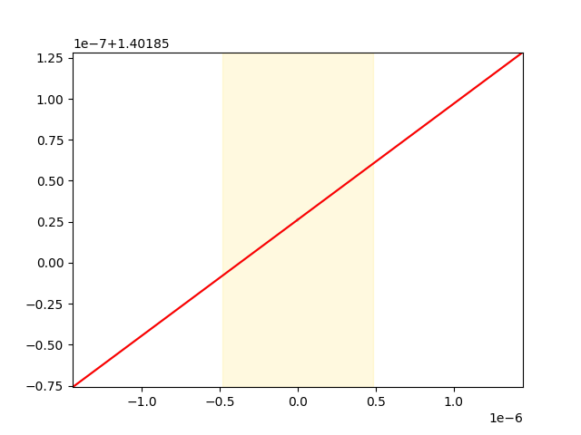
*U*
`-14.0 - 0.40000000000000002 * membrane__V`

*V for 1e-07 range* 
`-35.000000249999999 - -34.999999750000001`

*Singularity point: -35.000000000000000*


## New Eq:
((fabs(membrane__V) < 4.8079999999999991e-7) ? (4.0819919999999999e-8 / (-1.0 + exp(9.9999999999999995e-8)) - 0.99364998635008794 / (-1.0 + exp(-13.99999980768)) + (0.5 + 1039933.4442595674 * membrane__V) * (0.99364998635008794 / (-1.0 + exp(-13.99999980768)) - 0.9936500136499119 / (-1.0 + exp(-14.00000019232)) - 4.0819919999999999e-8 / (-1.0 + exp(9.9999999999999995e-8)) - 4.0819919999999999e-8 / (-1.0 + exp(-9.9999999999999995e-8)))) : ((fabs(35.0 + membrane__V) < 2.5000000003494449e-7) ? (2.9715000212250002 / (-1.0 + exp(7.2795341618136442)) + 7.0974999994161126e-9 / (-1.0 + exp(9.9999999988997779e-8)) + (70000000.497987106 + 1999999.9999424887 * membrane__V) * (2.9714999787750003 / (-1.0 + exp(7.2795340578202996)) - 7.0975000009920736e-9 / (-1.0 + exp(-1.0000000001675335e-7)) - 2.9715000212250002 / (-1.0 + exp(7.2795341618136442)) - 7.0974999994161126e-9 / (-1.0 + exp(9.9999999988997779e-8)))) : (-0.028389999999999999 * (35.0 + membrane__V) / (-1.0 + exp(-14.0 - 0.40000000000000002 * membrane__V)) - 0.084900000000000003 * membrane__V / (-1.0 + exp(-0.20798668885191349 * membrane__V)))))

## Equation 2:
```
L_type_calcium_channel_current_d_gate__beta_d = 0.011429999999999999 * (-5.0 + membrane__V) / (-1.0 + 0.1353352832366127 * exp(0.40000000000000002 * membrane__V))
```
### Partially evaluated to: 
```
L_type_calcium_channel_current_d_gate__beta_d = 0.011429999999999999 * (-5.0 + membrane__V) / (-1.0 + 0.1353352832366127 * exp(0.40000000000000002 * membrane__V))
```
### Singulariy points detected:

{5.0000000000000000}
*U*
`-2.0 + 0.40000000000000002 * membrane__V`

*V for 1e-07 range* 
`4.9999997499999997 - 5.0000002500000003`

*Singularity point: 5.0000000000000000*

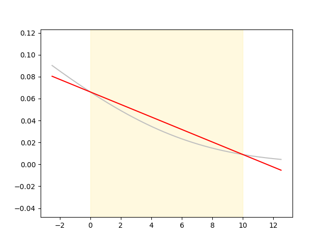
## New Eq:
((fabs(-5.0 + membrane__V) < 2.5000000000025002e-7) ? (-2.8575000000028576e-9 / (-1.0 + exp(-9.9999999999406119e-8)) + (-9999999.4999899995 + 1999999.9999979998 * membrane__V) * (2.8575000000028576e-9 / (-1.0 + exp(9.9999999999406119e-8)) + 2.8575000000028576e-9 / (-1.0 + exp(-9.9999999999406119e-8)))) : (0.011429999999999999 * (-5.0 + membrane__V) / (-1.0 + exp(-2.0 + 0.40000000000000002 * membrane__V))))

# Model: lindblad_atrial_model_1996(lindblad_model_1996.cellml)
## Equation 1:
```
L_type_Ca_channel_d_L_gate__alpha_d_L = -50.0 * membrane__V / (-1.0 + exp(-0.20798668885191349 * membrane__V)) - 16.719999999999999 * L_type_Ca_channel_d_L_gate__E0_alpha_d_L / (-1.0 + exp(-0.40000000000000002 * L_type_Ca_channel_d_L_gate__E0_alpha_d_L))
```
### Partially evaluated to: 
```
L_type_Ca_channel_d_L_gate__alpha_d_L = -50.0 * membrane__V / (-1.0 + exp(-0.20798668885191349 * membrane__V)) - 16.719999999999999 * (35.0 + membrane__V) / (-1.0 + 8.3152871910356788e-7 * exp(-0.40000000000000002 * membrane__V))
```
### Singulariy points detected:

{0}
####A + B:

`50.0 * membrane__V / (1.0 - exp(-0.20798668885191349 * membrane__V))`
`-16.719999999999999 * (35.0 + membrane__V) / (-1.0 + 8.3152871910356788e-7 * exp(-0.40000000000000002 * membrane__V))`

*U*
`0.20798668885191349 * membrane__V`

*V for 1e-07 range* 
`-4.8079999999999991e-7 - 4.8079999999999991e-7`

*Singularity point: 0*

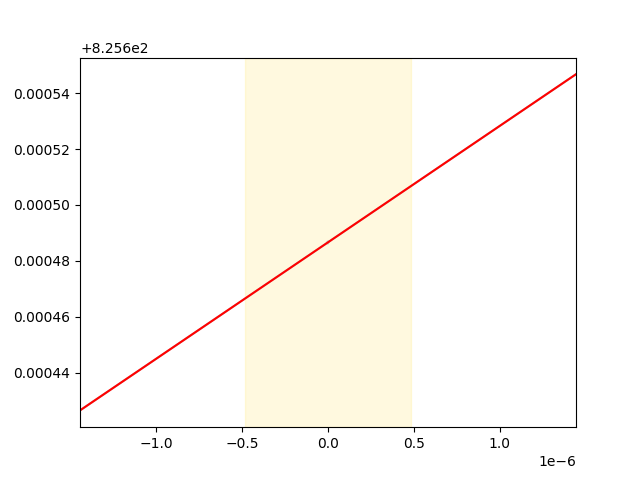
*U*
`-14.0 - 0.40000000000000002 * membrane__V`

*V for 1e-07 range* 
`-35.000000249999999 - -34.999999750000001`

*Singularity point: -35.000000000000000*

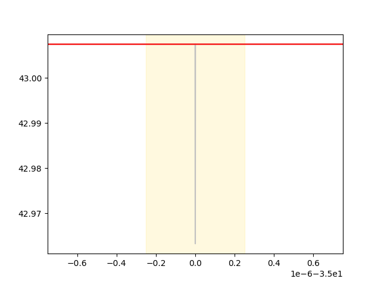
## New Eq:
((fabs(membrane__V) < 4.8079999999999991e-7) ? (2.4039999999999997e-5 / (-1.0 + exp(9.9999999999999995e-8)) - 585.19999196102401 / (-1.0 + exp(-13.99999980768)) + (0.5 + 1039933.4442595674 * membrane__V) * (585.19999196102401 / (-1.0 + exp(-13.99999980768)) - 2.4039999999999997e-5 / (-1.0 + exp(9.9999999999999995e-8)) - 2.4039999999999997e-5 / (-1.0 + exp(-9.9999999999999995e-8)) - 585.20000803897597 / (-1.0 + exp(-14.00000019232)))) : ((fabs(35.0 + membrane__V) < 2.5000000003494449e-7) ? (4.1799999996561256e-6 / (-1.0 + exp(9.9999999988997779e-8)) + 1750.0000124999999 / (-1.0 + exp(7.2795341618136442)) + (70000000.497987106 + 1999999.9999424887 * membrane__V) * (1749.9999875000001 / (-1.0 + exp(7.2795340578202996)) - 4.1800000005842713e-6 / (-1.0 + exp(-1.0000000001675335e-7)) - 4.1799999996561256e-6 / (-1.0 + exp(9.9999999988997779e-8)) - 1750.0000124999999 / (-1.0 + exp(7.2795341618136442)))) : (-50.0 * membrane__V / (-1.0 + exp(-0.20798668885191349 * membrane__V)) - 16.719999999999999 * L_type_Ca_channel_d_L_gate__E0_alpha_d_L / (-1.0 + exp(-0.40000000000000002 * L_type_Ca_channel_d_L_gate__E0_alpha_d_L)))))

## Equation 2:
```
sodium_current__i_Na = pow(membrane__F, 2) * pow(sodium_current_m_gate__m, 3) * (-1.0 + exp((-sodium_current__E_Na + membrane__V) * membrane__F / (membrane__R * membrane__T))) * (0.36499999999999999 * sodium_current_h2_gate__h2 + 0.63500000000000001 * sodium_current_h1_gate__h1) * cleft_space_ion_concentrations__Na_c * membrane__V * sodium_current__P_Na / ((-1.0 + exp(membrane__F * membrane__V / (membrane__R * membrane__T))) * membrane__R * membrane__T)
```
### Partially evaluated to: 
```
sodium_current__i_Na = 3635.2751276264835 * pow(sodium_current_m_gate__m, 3) * (-1.0 + pow((cleft_space_ion_concentrations__Na_c / intracellular_ion_concentrations__Na_i), (-1.0)) * exp(0.037676968035880179 * membrane__V)) * (0.36499999999999999 * sodium_current_h2_gate__h2 + 0.63500000000000001 * sodium_current_h1_gate__h1) * cleft_space_ion_concentrations__Na_c * membrane__V * sodium_current__P_Na / (-1.0 + exp(0.037676968035880179 * membrane__V))
```
### Singulariy points detected:

{0}
*U*
`0.037676968035880179 * membrane__V`

*V for 1e-07 range* 
`-2.6541413816729869e-6 - 2.6541413816729869e-6`

*Singularity point: 0*

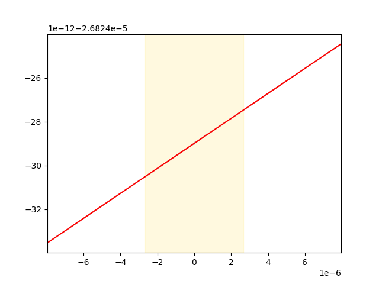
## New Eq:
((fabs(membrane__V) < 2.6541413816729869e-6) ? ((0.5 + 188384.84017940093 * membrane__V) * (0.0096485341499999988 * pow(sodium_current_m_gate__m, 3) * (-1.0 + exp(9.9999999999999995e-8 - log(cleft_space_ion_concentrations__Na_c / intracellular_ion_concentrations__Na_i))) * (0.36499999999999999 * sodium_current_h2_gate__h2 + 0.63500000000000001 * sodium_current_h1_gate__h1) * cleft_space_ion_concentrations__Na_c * sodium_current__P_Na / (-1.0 + exp(9.9999999999999995e-8)) + 0.0096485341499999988 * pow(sodium_current_m_gate__m, 3) * (-1.0 + exp(-9.9999999999999995e-8 - log(cleft_space_ion_concentrations__Na_c / intracellular_ion_concentrations__Na_i))) * (0.36499999999999999 * sodium_current_h2_gate__h2 + 0.63500000000000001 * sodium_current_h1_gate__h1) * cleft_space_ion_concentrations__Na_c * sodium_current__P_Na / (-1.0 + exp(-9.9999999999999995e-8))) - 0.0096485341499999988 * pow(sodium_current_m_gate__m, 3) * (-1.0 + exp(-9.9999999999999995e-8 - log(cleft_space_ion_concentrations__Na_c / intracellular_ion_concentrations__Na_i))) * (0.36499999999999999 * sodium_current_h2_gate__h2 + 0.63500000000000001 * sodium_current_h1_gate__h1) * cleft_space_ion_concentrations__Na_c * sodium_current__P_Na / (-1.0 + exp(-9.9999999999999995e-8))) : (pow(membrane__F, 2) * pow(sodium_current_m_gate__m, 3) * (-1.0 + exp((-sodium_current__E_Na + membrane__V) * membrane__F / (membrane__R * membrane__T))) * (0.36499999999999999 * sodium_current_h2_gate__h2 + 0.63500000000000001 * sodium_current_h1_gate__h1) * cleft_space_ion_concentrations__Na_c * membrane__V * sodium_current__P_Na / ((-1.0 + exp(membrane__F * membrane__V / (membrane__R * membrane__T))) * membrane__R * membrane__T)))

# Model: LivshitzRudy2007(livshitz_rudy_2007.cellml)
## Equation 1:
```
ICaL__ibarca = 4.0 * (-Environment__Ca_o * ICaL__gacao + Ca__Ca_i * ICaL__gacai * exp(2.0 * Environment__FonRT * cell__V)) * Environment__F * Environment__FonRT * ICaL__pca * cell__V / (-1.0 + exp(2.0 * Environment__FonRT * cell__V))
```
### Partially evaluated to: 
```
ICaL__ibarca = 14448.004881001343 * (-0.34100000000000003 * Environment__Ca_o + (-0.040960000000000003 + 0.33333333333333331 * Ca__Ca_T + 0.66666666666666663 * sqrt(-0.00057837000000000014 + pow((0.12288 - Ca__Ca_T), 2) + 0.0086400000000000001 * Ca__Ca_T) * cos(0.33333333333333331 * acos(0.5 * pow((-0.00057837000000000014 + pow((0.12288 - Ca__Ca_T), 2) + 0.0086400000000000001 * Ca__Ca_T), (-1.5)) * (3.2130000000000006e-5 * Ca__Ca_T - 2.0 * pow((0.12288 - Ca__Ca_T), 3) + 9.0 * (0.12288 - Ca__Ca_T) * (0.00019279000000000003 - 0.0028800000000000002 * Ca__Ca_T))))) * exp(0.074871767015605231 * cell__V)) * ICaL__pca * cell__V / (-1.0 + exp(0.074871767015605231 * cell__V))
```
### Singulariy points detected:

{0}
*U*
`0.074871767015605231 * cell__V`

*V for 1e-07 range* 
`-1.3356169352749131e-6 - 1.3356169352749131e-6`

*Singularity point: 0*

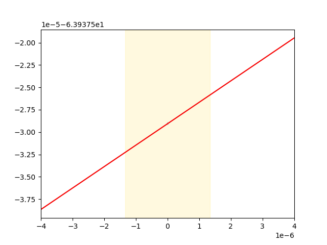
## New Eq:
((fabs(cell__V) < 1.3356169352749131e-6) ? ((0.5 + 374358.83507802623 * cell__V) * (0.019296999999999998 * (-0.34100000000000003 * Environment__Ca_o + (-0.040960000000000003 + 0.33333333333333331 * Ca__Ca_T + 0.66666666666666663 * sqrt(-0.00057837000000000014 + pow((0.12288 - Ca__Ca_T), 2) + 0.0086400000000000001 * Ca__Ca_T) * cos(0.33333333333333331 * acos(0.5 * pow((-0.00057837000000000014 + pow((0.12288 - Ca__Ca_T), 2) + 0.0086400000000000001 * Ca__Ca_T), (-1.5)) * (3.2130000000000006e-5 * Ca__Ca_T - 2.0 * pow((0.12288 - Ca__Ca_T), 3) + 9.0 * (0.12288 - Ca__Ca_T) * (0.00019279000000000003 - 0.0028800000000000002 * Ca__Ca_T))))) * exp(9.9999999999999995e-8)) * ICaL__pca / (-1.0 + exp(9.9999999999999995e-8)) + 0.019296999999999998 * (-0.34100000000000003 * Environment__Ca_o + (-0.040960000000000003 + 0.33333333333333331 * Ca__Ca_T + 0.66666666666666663 * sqrt(-0.00057837000000000014 + pow((0.12288 - Ca__Ca_T), 2) + 0.0086400000000000001 * Ca__Ca_T) * cos(0.33333333333333331 * acos(0.5 * pow((-0.00057837000000000014 + pow((0.12288 - Ca__Ca_T), 2) + 0.0086400000000000001 * Ca__Ca_T), (-1.5)) * (3.2130000000000006e-5 * Ca__Ca_T - 2.0 * pow((0.12288 - Ca__Ca_T), 3) + 9.0 * (0.12288 - Ca__Ca_T) * (0.00019279000000000003 - 0.0028800000000000002 * Ca__Ca_T))))) * exp(-9.9999999999999995e-8)) * ICaL__pca / (-1.0 + exp(-9.9999999999999995e-8))) - 0.019296999999999998 * (-0.34100000000000003 * Environment__Ca_o + (-0.040960000000000003 + 0.33333333333333331 * Ca__Ca_T + 0.66666666666666663 * sqrt(-0.00057837000000000014 + pow((0.12288 - Ca__Ca_T), 2) + 0.0086400000000000001 * Ca__Ca_T) * cos(0.33333333333333331 * acos(0.5 * pow((-0.00057837000000000014 + pow((0.12288 - Ca__Ca_T), 2) + 0.0086400000000000001 * Ca__Ca_T), (-1.5)) * (3.2130000000000006e-5 * Ca__Ca_T - 2.0 * pow((0.12288 - Ca__Ca_T), 3) + 9.0 * (0.12288 - Ca__Ca_T) * (0.00019279000000000003 - 0.0028800000000000002 * Ca__Ca_T))))) * exp(-9.9999999999999995e-8)) * ICaL__pca / (-1.0 + exp(-9.9999999999999995e-8))) : (4.0 * (-Environment__Ca_o * ICaL__gacao + Ca__Ca_i * ICaL__gacai * exp(2.0 * Environment__FonRT * cell__V)) * Environment__F * Environment__FonRT * ICaL__pca * cell__V / (-1.0 + exp(2.0 * Environment__FonRT * cell__V))))

## Equation 2:
```
ICaL__ibark = (-Environment__K_o * ICaL__gako + ICaL__gaki * K__K_i * exp(Environment__FonRT * cell__V)) * Environment__F * Environment__FonRT * ICaL__pk * cell__V / (-1.0 + exp(Environment__FonRT * cell__V))
```
### Partially evaluated to: 
```
ICaL__ibark = 0.00069711623550831479 * (-0.75 * Environment__K_o + 0.75 * K__K_i * exp(0.037435883507802616 * cell__V)) * cell__V / (-1.0 + exp(0.037435883507802616 * cell__V))
```
### Singulariy points detected:

{0}
*U*
`0.037435883507802616 * cell__V`

*V for 1e-07 range* 
`-2.6712338705498262e-6 - 2.6712338705498262e-6`

*Singularity point: 0*

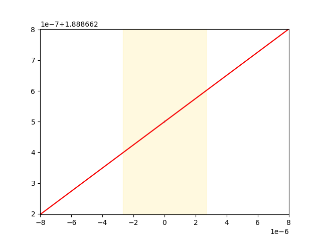
## New Eq:
((fabs(cell__V) < 2.6712338705498262e-6) ? ((0.5 + 187179.41753901311 * cell__V) * (1.8621604999999999e-9 * (-0.75 * Environment__K_o + 0.75 * K__K_i * exp(9.9999999999999995e-8)) / (-1.0 + exp(9.9999999999999995e-8)) + 1.8621604999999999e-9 * (-0.75 * Environment__K_o + 0.75 * K__K_i * exp(-9.9999999999999995e-8)) / (-1.0 + exp(-9.9999999999999995e-8))) - 1.8621604999999999e-9 * (-0.75 * Environment__K_o + 0.75 * K__K_i * exp(-9.9999999999999995e-8)) / (-1.0 + exp(-9.9999999999999995e-8))) : ((-Environment__K_o * ICaL__gako + ICaL__gaki * K__K_i * exp(Environment__FonRT * cell__V)) * Environment__F * Environment__FonRT * ICaL__pk * cell__V / (-1.0 + exp(Environment__FonRT * cell__V))))

## Equation 3:
```
ICaL__ibarna = (-Environment__Na_o * ICaL__ganao + ICaL__ganai * Na__Na_i * exp(Environment__FonRT * cell__V)) * Environment__F * Environment__FonRT * ICaL__pna * cell__V / (-1.0 + exp(Environment__FonRT * cell__V))
```
### Partially evaluated to: 
```
ICaL__ibarna = 0.0024381008236689767 * (-0.75 * Environment__Na_o + 0.75 * Na__Na_i * exp(0.037435883507802616 * cell__V)) * cell__V / (-1.0 + exp(0.037435883507802616 * cell__V))
```
### Singulariy points detected:

{0}
*U*
`0.037435883507802616 * cell__V`

*V for 1e-07 range* 
`-2.6712338705498262e-6 - 2.6712338705498262e-6`

*Singularity point: 0*

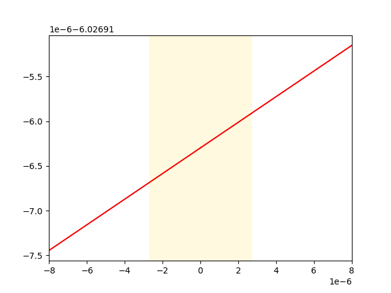
## New Eq:
((fabs(cell__V) < 2.6712338705498262e-6) ? ((0.5 + 187179.41753901311 * cell__V) * (6.5127375e-9 * (-0.75 * Environment__Na_o + 0.75 * Na__Na_i * exp(9.9999999999999995e-8)) / (-1.0 + exp(9.9999999999999995e-8)) + 6.5127375e-9 * (-0.75 * Environment__Na_o + 0.75 * Na__Na_i * exp(-9.9999999999999995e-8)) / (-1.0 + exp(-9.9999999999999995e-8))) - 6.5127375e-9 * (-0.75 * Environment__Na_o + 0.75 * Na__Na_i * exp(-9.9999999999999995e-8)) / (-1.0 + exp(-9.9999999999999995e-8))) : ((-Environment__Na_o * ICaL__ganao + ICaL__ganai * Na__Na_i * exp(Environment__FonRT * cell__V)) * Environment__F * Environment__FonRT * ICaL__pna * cell__V / (-1.0 + exp(Environment__FonRT * cell__V))))

## Equation 4:
```
ICaL__taud = 28.571428571428569 * (1.0 - 0.20137949774492364 * exp(-0.16025641025641024 * cell__V)) * ICaL__dss0 / (10.0 + cell__V)
```
### Partially evaluated to: 
```
ICaL__taud = 28.571428571428569 * (1.0 - 0.20137949774492364 * exp(-0.16025641025641024 * cell__V)) / ((1.0 + 0.20137949774492364 * exp(-0.16025641025641024 * cell__V)) * (10.0 + cell__V))
```
### Singulariy points detected:

{-10.000000000000000}
*U*
`-1.6025641025641024 - 0.16025641025641024 * cell__V`

*V for 1e-07 range* 
`-10.000000624 - -9.9999993759999999`

*Singularity point: -10.000000000000000*

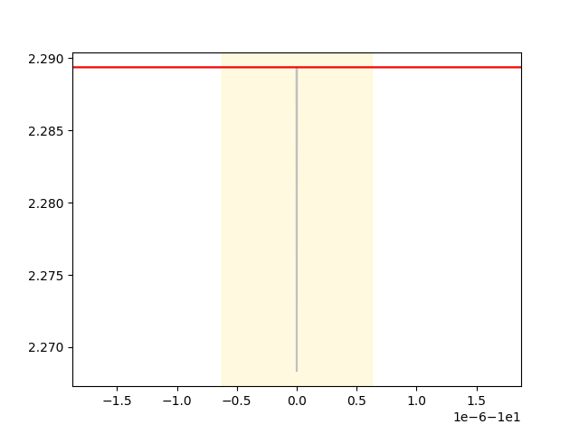
## New Eq:
((fabs(10.0 + cell__V) < 6.2399999999074307e-7) ? ((8012821.0129393814 + 801282.05129393819 * cell__V) * (45787545.788225032 * (1.0 - exp(9.9999999997671396e-8)) / (1.0 + exp(9.9999999997671396e-8)) + 45787545.788225032 * (1.0 - exp(-9.9999999997671396e-8)) / (1.0 + exp(-9.9999999997671396e-8))) - 45787545.788225032 * (1.0 - exp(9.9999999997671396e-8)) / (1.0 + exp(9.9999999997671396e-8))) : (28.571428571428569 * (1.0 - exp(-1.6025641025641024 - 0.16025641025641024 * cell__V)) * ICaL__dss0 / (10.0 + cell__V)))

## Equation 5:
```
IKr__tauxr = 1 / (0.00060999999999999997 * (38.899999999999999 + cell__V) / (-1.0 + 281.60348502322194 * exp(0.14499999999999999 * cell__V)) + 0.0013799999999999999 * (14.199999999999999 + cell__V) / (1.0 - 0.17436578041087322 * exp(-0.123 * cell__V)))
```
### Partially evaluated to: 
```
IKr__tauxr = 1 / (0.00060999999999999997 * (38.899999999999999 + cell__V) / (-1.0 + 281.60348502322194 * exp(0.14499999999999999 * cell__V)) + 0.0013799999999999999 * (14.199999999999999 + cell__V) / (1.0 - 0.17436578041087322 * exp(-0.123 * cell__V)))
```
### Singulariy points detected:

{-14.199999999999999, -38.899999999999999}
#### float * A

####1 / A


####A + B:

`0.0013799999999999999 * (14.199999999999999 + cell__V) / (1.0 - 0.17436578041087322 * exp(-0.123 * cell__V))`
`0.00060999999999999997 * (38.899999999999999 + cell__V) / (-1.0 + 281.60348502322194 * exp(0.14499999999999999 * cell__V))`

*U*
`-1.7465999999999999 - 0.123 * cell__V`

*V for 1e-07 range* 
`-14.200000813008129 - -14.199999186991869`

*Singularity point: -14.199999999999999*

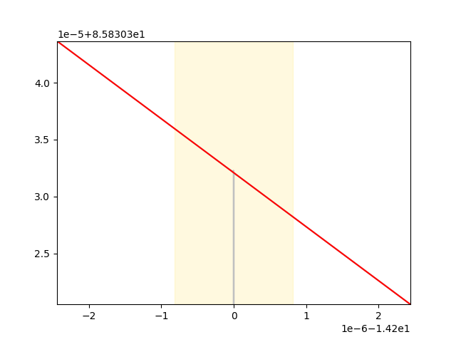
*U*
`5.6404999999999994 + 0.14499999999999999 * cell__V`

*V for 1e-07 range* 
`-38.900000689655172 - -38.899999310344825`

*Singularity point: -38.899999999999999*


## New Eq:
((fabs(14.199999999999999 + cell__V) < 8.1300813006834893e-7) ? (1 / (0.015066999504065039 / (-1.0 + exp(3.5814998821138206)) - 1.1219512194943214e-9 / (1.0 - exp(9.9999999999406119e-8))) + (8733000.5000645891 + 615000.00000454858 * cell__V) * (1 / (1.1219512195134727e-9 / (1.0 - exp(-9.9999999999406119e-8)) + 0.015067000495934959 / (-1.0 + exp(3.5815001178861787))) - 1 / (0.015066999504065039 / (-1.0 + exp(3.5814998821138206)) - 1.1219512194943214e-9 / (1.0 - exp(9.9999999999406119e-8))))) : ((fabs(38.899999999999999 + cell__V) < 6.8965517246999397e-7) ? (1 / (-0.034086000951724135 / (1.0 - exp(3.0381000848275859)) - 4.2068965517283451e-10 / (-1.0 + exp(-1.0000000000287557e-7))) + (28202500.498836767 + 724999.99997009686 * cell__V) * (1 / (4.2068965520669629e-10 / (-1.0 + exp(1.0000000000287557e-7)) - 0.034085999048275861 / (1.0 - exp(3.0380999151724137))) - 1 / (-0.034086000951724135 / (1.0 - exp(3.0381000848275859)) - 4.2068965517283451e-10 / (-1.0 + exp(-1.0000000000287557e-7))))) : (1 / (0.00060999999999999997 * (38.899999999999999 + cell__V) / (-1.0 + exp(5.6404999999999994 + 0.14499999999999999 * cell__V)) + 0.0013799999999999999 * (14.199999999999999 + cell__V) / (1.0 - exp(-1.7465999999999999 - 0.123 * cell__V))))))

## Equation 6:
```
IKs__tauxs = 1 / (0.00013100000000000001 * (30.0 + cell__V) / (-1.0 + 7.8538197044216602 * exp(0.068699999999999997 * cell__V)) + 7.1899999999999999e-5 * (30.0 + cell__V) / (1.0 - 0.011795938519751569 * exp(-0.14799999999999999 * cell__V)))
```
### Partially evaluated to: 
```
IKs__tauxs = 1 / (0.00013100000000000001 * (30.0 + cell__V) / (-1.0 + 7.8538197044216602 * exp(0.068699999999999997 * cell__V)) + 7.1899999999999999e-5 * (30.0 + cell__V) / (1.0 - 0.011795938519751569 * exp(-0.14799999999999999 * cell__V)))
```
### Singulariy points detected:

{-30.000000000000000}
#### float * A

####1 / A


####A + B:

`7.1899999999999999e-5 * (30.0 + cell__V) / (1.0 - 0.011795938519751569 * exp(-0.14799999999999999 * cell__V))`
`0.00013100000000000001 * (30.0 + cell__V) / (-1.0 + 7.8538197044216602 * exp(0.068699999999999997 * cell__V))`

*U*
`-4.4399999999999995 - 0.14799999999999999 * cell__V`

*V for 1e-07 range* 
`-30.000000675675675 - -29.999999324324325`

*Singularity point: -30.000000000000000*

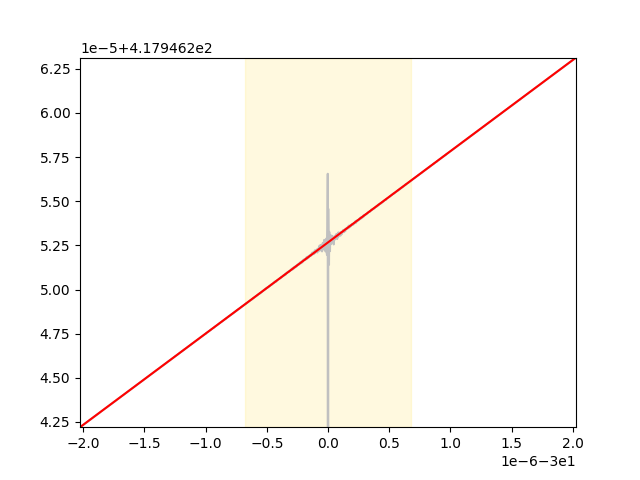
## New Eq:
((fabs(30.0 + cell__V) < 6.7567567568760367e-7) ? (1 / (-8.8513513515076093e-11 / (-1.0 + exp(-4.6418918920460017e-8)) - 4.8581081081938701e-11 / (1.0 - exp(1.0000000000287557e-7))) + (22200000.499608092 + 739999.99998693645 * cell__V) * (1 / (8.8513513515076093e-11 / (-1.0 + exp(4.6418918920460017e-8)) + 4.8581081081938701e-11 / (1.0 - exp(-1.0000000000287557e-7))) - 1 / (-8.8513513515076093e-11 / (-1.0 + exp(-4.6418918920460017e-8)) - 4.8581081081938701e-11 / (1.0 - exp(1.0000000000287557e-7))))) : (1 / (0.00013100000000000001 * (30.0 + cell__V) / (-1.0 + exp(2.0609999999999999 + 0.068699999999999997 * cell__V)) + 7.1899999999999999e-5 * (30.0 + cell__V) / (1.0 - exp(-4.4399999999999995 - 0.14799999999999999 * cell__V)))))

## Equation 7:
```
INa__am = 0.32000000000000001 * (47.130000000000003 + cell__V) / (1.0 - 0.00897780373069724 * exp(-0.10000000000000001 * cell__V))
```
### Partially evaluated to: 
```
INa__am = 0.32000000000000001 * (47.130000000000003 + cell__V) / (1.0 - 0.00897780373069724 * exp(-0.10000000000000001 * cell__V))
```
### Singulariy points detected:

{-47.130000000000003}
*U*
`-4.7130000000000001 - 0.10000000000000001 * cell__V`

*V for 1e-07 range* 
`-47.130001 - -47.129999000000005`

*Singularity point: -47.130000000000003*


## New Eq:
((fabs(47.130000000000003 + cell__V) < 1.0000000000287557e-6) ? (-3.200000000092018e-7 / (1.0 - exp(1.0000000000287557e-7)) + (23565000.499322373 + 499999.99998562218 * cell__V) * (3.200000000092018e-7 / (1.0 - exp(1.0000000000287557e-7)) + 3.200000000092018e-7 / (1.0 - exp(-1.0000000000287557e-7)))) : (0.32000000000000001 * (47.130000000000003 + cell__V) / (1.0 - exp(-4.7130000000000001 - 0.10000000000000001 * cell__V))))

# Model: Li_Mouse_2010(li_mouse_2010.cellml)
## Equation 1:
```
slow_delayed_rectifier_K_I__alpha_n = 4.8133299999999997e-6 * (26.5 + cell__V) / (1.0 - 0.033641326918204616 * exp(-0.128 * cell__V))
```
### Partially evaluated to: 
```
slow_delayed_rectifier_K_I__alpha_n = 4.8133299999999997e-6 * (26.5 + cell__V) / (1.0 - 0.033641326918204616 * exp(-0.128 * cell__V))
```
### Singulariy points detected:

{-26.500000000000000}
*U*
`-3.3919999999999999 - 0.128 * cell__V`

*V for 1e-07 range* 
`-26.500000781250002 - -26.499999218749998`

*Singularity point: -26.500000000000000*

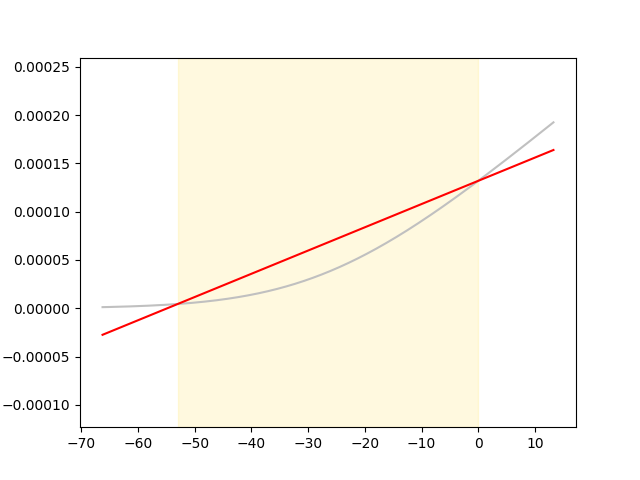
## New Eq:
((fabs(26.5 + cell__V) < 7.8124999999817923e-7) ? (-3.7604140624912359e-12 / (1.0 - exp(9.9999999999406119e-8)) + (16960000.500039525 + 640000.00000149151 * cell__V) * (3.7604140624912359e-12 / (1.0 - exp(9.9999999999406119e-8)) + 3.7604140624912359e-12 / (1.0 - exp(-9.9999999999406119e-8)))) : (4.8133299999999997e-6 * (26.5 + cell__V) / (1.0 - exp(-3.3919999999999999 - 0.128 * cell__V))))

# Model: luo_rudy_1991(luo_rudy_1991.cellml)
# Model: luo_rudy_1994(luo_rudy_1994.cellml)
## Equation 1:
```
L_type_Ca_channel__I_CaCa = 4.0 * pow(membrane__F, 2) * (-L_type_Ca_channel__gamma_Cao * ionic_concentrations__Cao + L_type_Ca_channel__gamma_Cai * ionic_concentrations__Cai * exp(2.0 * membrane__F * membrane__V / (membrane__R * membrane__T))) * L_type_Ca_channel__P_Ca * membrane__V / ((-1.0 + exp(2.0 * membrane__F * membrane__V / (membrane__R * membrane__T))) * membrane__R * membrane__T)
```
### Partially evaluated to: 
```
L_type_Ca_channel__I_CaCa = 0.078597788527232842 * (-0.34000000000000002 * ionic_concentrations__Cao + ionic_concentrations__Cai * exp(0.075146605522028176 * membrane__V)) * membrane__V / (-1.0 + exp(0.075146605522028176 * membrane__V))
```
### Singulariy points detected:

{0}
*U*
`0.075146605522028176 * membrane__V`

*V for 1e-07 range* 
`-1.3307320976818627e-6 - 1.3307320976818627e-6`

*Singularity point: 0*

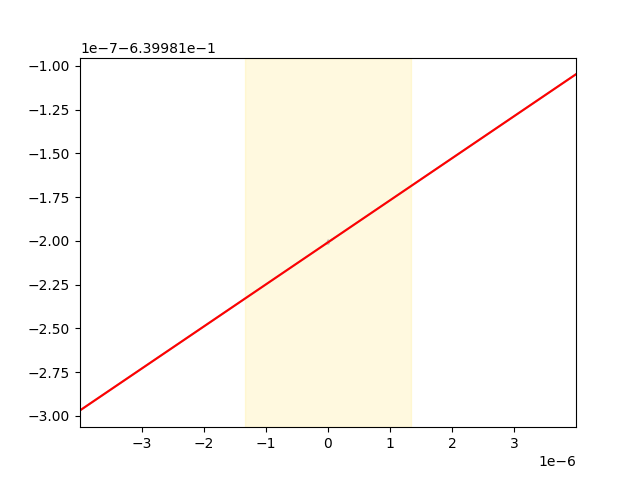
## New Eq:
((fabs(membrane__V) < 1.3307320976818627e-6) ? ((0.5 + 375733.02761014085 * membrane__V) * (1.0459259999999999e-7 * (-0.34000000000000002 * ionic_concentrations__Cao + ionic_concentrations__Cai * exp(9.9999999999999995e-8)) / (-1.0 + exp(9.9999999999999995e-8)) + 1.0459259999999999e-7 * (-0.34000000000000002 * ionic_concentrations__Cao + ionic_concentrations__Cai * exp(-9.9999999999999995e-8)) / (-1.0 + exp(-9.9999999999999995e-8))) - 1.0459259999999999e-7 * (-0.34000000000000002 * ionic_concentrations__Cao + ionic_concentrations__Cai * exp(-9.9999999999999995e-8)) / (-1.0 + exp(-9.9999999999999995e-8))) : (4.0 * pow(membrane__F, 2) * (-L_type_Ca_channel__gamma_Cao * ionic_concentrations__Cao + L_type_Ca_channel__gamma_Cai * ionic_concentrations__Cai * exp(2.0 * membrane__F * membrane__V / (membrane__R * membrane__T))) * L_type_Ca_channel__P_Ca * membrane__V / ((-1.0 + exp(2.0 * membrane__F * membrane__V / (membrane__R * membrane__T))) * membrane__R * membrane__T)))

## Equation 2:
```
L_type_Ca_channel__I_CaK = pow(membrane__F, 2) * (-L_type_Ca_channel__gamma_Ko * ionic_concentrations__Ko + L_type_Ca_channel__gamma_Ki * ionic_concentrations__Ki * exp(membrane__F * membrane__V / (membrane__R * membrane__T))) * L_type_Ca_channel__P_K * membrane__V / ((-1.0 + exp(membrane__F * membrane__V / (membrane__R * membrane__T))) * membrane__R * membrane__T)
```
### Partially evaluated to: 
```
L_type_Ca_channel__I_CaK = 7.0228579563684903e-6 * (-0.75 * ionic_concentrations__Ko + 0.75 * ionic_concentrations__Ki * exp(0.037573302761014088 * membrane__V)) * membrane__V / (-1.0 + exp(0.037573302761014088 * membrane__V))
```
### Singulariy points detected:

{0}
*U*
`0.037573302761014088 * membrane__V`

*V for 1e-07 range* 
`-2.6614641953637254e-6 - 2.6614641953637254e-6`

*Singularity point: 0*

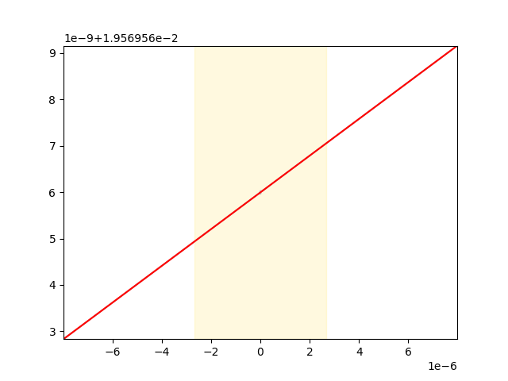
## New Eq:
((fabs(membrane__V) < 2.6614641953637254e-6) ? ((0.5 + 187866.51380507043 * membrane__V) * (1.8691085000000002e-11 * (-0.75 * ionic_concentrations__Ko + 0.75 * ionic_concentrations__Ki * exp(9.9999999999999995e-8)) / (-1.0 + exp(9.9999999999999995e-8)) + 1.8691085000000002e-11 * (-0.75 * ionic_concentrations__Ko + 0.75 * ionic_concentrations__Ki * exp(-9.9999999999999995e-8)) / (-1.0 + exp(-9.9999999999999995e-8))) - 1.8691085000000002e-11 * (-0.75 * ionic_concentrations__Ko + 0.75 * ionic_concentrations__Ki * exp(-9.9999999999999995e-8)) / (-1.0 + exp(-9.9999999999999995e-8))) : (pow(membrane__F, 2) * (-L_type_Ca_channel__gamma_Ko * ionic_concentrations__Ko + L_type_Ca_channel__gamma_Ki * ionic_concentrations__Ki * exp(membrane__F * membrane__V / (membrane__R * membrane__T))) * L_type_Ca_channel__P_K * membrane__V / ((-1.0 + exp(membrane__F * membrane__V / (membrane__R * membrane__T))) * membrane__R * membrane__T)))

## Equation 3:
```
L_type_Ca_channel__I_CaNa = pow(membrane__F, 2) * (-L_type_Ca_channel__gamma_Nao * ionic_concentrations__Nao + L_type_Ca_channel__gamma_Nai * ionic_concentrations__Nai * exp(membrane__F * membrane__V / (membrane__R * membrane__T))) * L_type_Ca_channel__P_Na * membrane__V / ((-1.0 + exp(membrane__F * membrane__V / (membrane__R * membrane__T))) * membrane__R * membrane__T)
```
### Partially evaluated to: 
```
L_type_Ca_channel__I_CaNa = 2.4561808914760263e-5 * (-0.75 * ionic_concentrations__Nao + 0.75 * ionic_concentrations__Nai * exp(0.037573302761014088 * membrane__V)) * membrane__V / (-1.0 + exp(0.037573302761014088 * membrane__V))
```
### Singulariy points detected:

{0}
*U*
`0.037573302761014088 * membrane__V`

*V for 1e-07 range* 
`-2.6614641953637254e-6 - 2.6614641953637254e-6`

*Singularity point: 0*

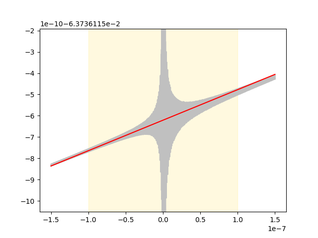
## New Eq:
((fabs(membrane__V) < 2.6614641953637254e-6) ? ((0.5 + 187866.51380507043 * membrane__V) * (6.5370374999999993e-11 * (-0.75 * ionic_concentrations__Nao + 0.75 * ionic_concentrations__Nai * exp(9.9999999999999995e-8)) / (-1.0 + exp(9.9999999999999995e-8)) + 6.5370374999999993e-11 * (-0.75 * ionic_concentrations__Nao + 0.75 * ionic_concentrations__Nai * exp(-9.9999999999999995e-8)) / (-1.0 + exp(-9.9999999999999995e-8))) - 6.5370374999999993e-11 * (-0.75 * ionic_concentrations__Nao + 0.75 * ionic_concentrations__Nai * exp(-9.9999999999999995e-8)) / (-1.0 + exp(-9.9999999999999995e-8))) : (pow(membrane__F, 2) * (-L_type_Ca_channel__gamma_Nao * ionic_concentrations__Nao + L_type_Ca_channel__gamma_Nai * ionic_concentrations__Nai * exp(membrane__F * membrane__V / (membrane__R * membrane__T))) * L_type_Ca_channel__P_Na * membrane__V / ((-1.0 + exp(membrane__F * membrane__V / (membrane__R * membrane__T))) * membrane__R * membrane__T)))

## Equation 4:
```
L_type_Ca_channel_d_gate__tau_d = 28.571428571428569 * (1.0 - 0.20137949774492364 * exp(-0.16025641025641024 * membrane__V)) * L_type_Ca_channel_d_gate__d_infinity / (10.0 + membrane__V)
```
### Partially evaluated to: 
```
L_type_Ca_channel_d_gate__tau_d = 28.571428571428569 * (1.0 - 0.20137949774492364 * exp(-0.16025641025641024 * membrane__V)) / ((1.0 + 0.20137949774492364 * exp(-0.16025641025641024 * membrane__V)) * (10.0 + membrane__V))
```
### Singulariy points detected:

{-10.000000000000000}
*U*
`-1.6025641025641024 - 0.16025641025641024 * membrane__V`

*V for 1e-07 range* 
`-10.000000624 - -9.9999993759999999`

*Singularity point: -10.000000000000000*

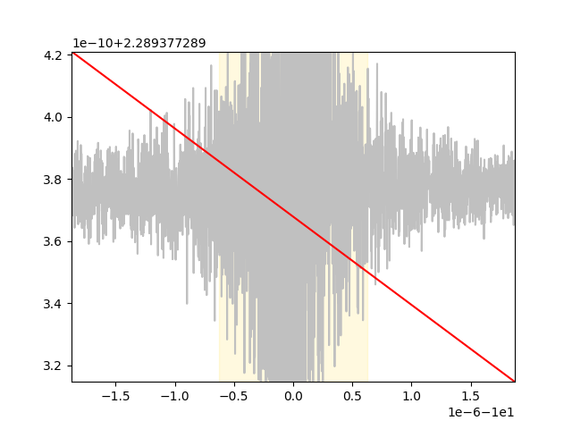
## New Eq:
((fabs(10.0 + membrane__V) < 6.2399999999074307e-7) ? ((8012821.0129393814 + 801282.05129393819 * membrane__V) * (45787545.788225032 * (1.0 - exp(9.9999999997671396e-8)) / (1.0 + exp(9.9999999997671396e-8)) + 45787545.788225032 * (1.0 - exp(-9.9999999997671396e-8)) / (1.0 + exp(-9.9999999997671396e-8))) - 45787545.788225032 * (1.0 - exp(9.9999999997671396e-8)) / (1.0 + exp(9.9999999997671396e-8))) : (28.571428571428569 * (1.0 - exp(-1.6025641025641024 - 0.16025641025641024 * membrane__V)) * L_type_Ca_channel_d_gate__d_infinity / (10.0 + membrane__V)))

## Equation 5:
```
fast_sodium_current_m_gate__alpha_m = 0.32000000000000001 * (47.130000000000003 + membrane__V) / (1.0 - 0.00897780373069724 * exp(-0.10000000000000001 * membrane__V))
```
### Partially evaluated to: 
```
fast_sodium_current_m_gate__alpha_m = 0.32000000000000001 * (47.130000000000003 + membrane__V) / (1.0 - 0.00897780373069724 * exp(-0.10000000000000001 * membrane__V))
```
### Singulariy points detected:

{-47.130000000000003}
*U*
`-4.7130000000000001 - 0.10000000000000001 * membrane__V`

*V for 1e-07 range* 
`-47.130001 - -47.129999000000005`

*Singularity point: -47.130000000000003*


## New Eq:
((fabs(47.130000000000003 + membrane__V) < 1.0000000000287557e-6) ? (-3.200000000092018e-7 / (1.0 - exp(1.0000000000287557e-7)) + (23565000.499322373 + 499999.99998562218 * membrane__V) * (3.200000000092018e-7 / (1.0 - exp(1.0000000000287557e-7)) + 3.200000000092018e-7 / (1.0 - exp(-1.0000000000287557e-7)))) : (0.32000000000000001 * (47.130000000000003 + membrane__V) / (1.0 - exp(-4.7130000000000001 - 0.10000000000000001 * membrane__V))))

## Equation 6:
```
time_dependent_potassium_current_X_gate__alpha_X = 7.1899999999999999e-5 * (30.0 + membrane__V) / (1.0 - 0.011795938519751569 * exp(-0.14799999999999999 * membrane__V))
```
### Partially evaluated to: 
```
time_dependent_potassium_current_X_gate__alpha_X = 7.1899999999999999e-5 * (30.0 + membrane__V) / (1.0 - 0.011795938519751569 * exp(-0.14799999999999999 * membrane__V))
```
### Singulariy points detected:

{-30.000000000000000}
*U*
`-4.4399999999999995 - 0.14799999999999999 * membrane__V`

*V for 1e-07 range* 
`-30.000000675675675 - -29.999999324324325`

*Singularity point: -30.000000000000000*


## New Eq:
((fabs(30.0 + membrane__V) < 6.7567567568760367e-7) ? (-4.8581081081938701e-11 / (1.0 - exp(1.0000000000287557e-7)) + (22200000.499608092 + 739999.99998693645 * membrane__V) * (4.8581081081938701e-11 / (1.0 - exp(1.0000000000287557e-7)) + 4.8581081081938701e-11 / (1.0 - exp(-1.0000000000287557e-7)))) : (7.1899999999999999e-5 * (30.0 + membrane__V) / (1.0 - exp(-4.4399999999999995 - 0.14799999999999999 * membrane__V))))

## Equation 7:
```
time_dependent_potassium_current_X_gate__beta_X = 0.00013100000000000001 * (30.0 + membrane__V) / (-1.0 + 7.8538197044216602 * exp(0.068699999999999997 * membrane__V))
```
### Partially evaluated to: 
```
time_dependent_potassium_current_X_gate__beta_X = 0.00013100000000000001 * (30.0 + membrane__V) / (-1.0 + 7.8538197044216602 * exp(0.068699999999999997 * membrane__V))
```
### Singulariy points detected:

{-30.000000000000000}
*U*
`2.0609999999999999 + 0.068699999999999997 * membrane__V`

*V for 1e-07 range* 
`-30.000001455604075 - -29.999998544395925`

*Singularity point: -30.000000000000000*

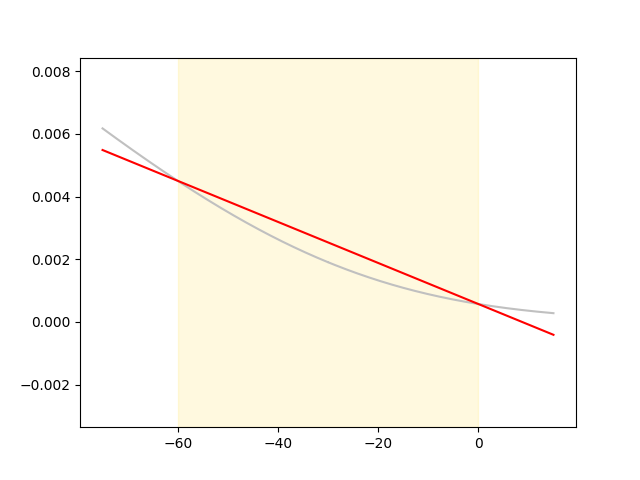
## New Eq:
((fabs(30.0 + membrane__V) < 1.455604075689676e-6) ? (-1.9068413391534758e-10 / (-1.0 + exp(-9.9999999999406119e-8)) + (10305000.50001229 + 343500.00000040967 * membrane__V) * (1.9068413391534758e-10 / (-1.0 + exp(9.9999999999406119e-8)) + 1.9068413391534758e-10 / (-1.0 + exp(-9.9999999999406119e-8)))) : (0.00013100000000000001 * (30.0 + membrane__V) / (-1.0 + exp(2.0609999999999999 + 0.068699999999999997 * membrane__V))))

# Model: MahajanShiferaw2008_units(mahajan_shiferaw_2008.cellml)
## Equation 1:
```
IKr__xkrv1 = ((fabs(7.0 + cell__V) > 0.001) ? (0.0013799999999999999 * (7.0 + cell__V) / (1.0 - 0.42273913174596284 * exp(-0.123 * cell__V))) : (0.011219512195121951))
```
### Partially evaluated to: 
```
IKr__xkrv1 = ((fabs(7.0 + cell__V) > 0.001) ? (0.0013799999999999999 * (7.0 + cell__V) / (1.0 - 0.42273913174596284 * exp(-0.123 * cell__V))) : (0.011219512195121951))
```
### Singulariy points detected:

{-7.0000000000000000}
####Piecewise!
## Equation 2:
```
IKr__xkrv2 = ((fabs(10.0 + cell__V) > 0.001) ? (0.00060999999999999997 * (10.0 + cell__V) / (-1.0 + 4.2631145151688168 * exp(0.14499999999999999 * cell__V))) : (0.0042068965517241376))
```
### Partially evaluated to: 
```
IKr__xkrv2 = ((fabs(10.0 + cell__V) > 0.001) ? (0.00060999999999999997 * (10.0 + cell__V) / (-1.0 + 4.2631145151688168 * exp(0.14499999999999999 * cell__V))) : (0.0042068965517241376))
```
### Singulariy points detected:

{-10.000000000000000}
####Piecewise!
## Equation 3:
```
IKs__tauxs1 = ((fabs(30.0 + cell__V) < 0.014556040756914121) ? (417.94625266107982) : (1 / (0.00013100000000000001 * (30.0 + cell__V) / (-1.0 + 7.8538197044216602 * exp(0.068699999999999997 * cell__V)) + 7.1899999999999999e-5 * (30.0 + cell__V) / (1.0 - 0.011795938519751569 * exp(-0.14799999999999999 * cell__V)))))
```
### Partially evaluated to: 
```
IKs__tauxs1 = ((fabs(30.0 + cell__V) < 0.014556040756914121) ? (417.94625266107982) : (1 / (0.00013100000000000001 * (30.0 + cell__V) / (-1.0 + 7.8538197044216602 * exp(0.068699999999999997 * cell__V)) + 7.1899999999999999e-5 * (30.0 + cell__V) / (1.0 - 0.011795938519751569 * exp(-0.14799999999999999 * cell__V)))))
```
### Singulariy points detected:

{-30.000000000000000}
####Piecewise!
## Equation 4:
```
INa__am = ((fabs(47.130000000000003 + cell__V) > 0.001) ? (0.32000000000000001 * (47.130000000000003 + cell__V) / (1.0 - 0.00897780373069724 * exp(-0.10000000000000001 * cell__V))) : (3.2000000000000002))
```
### Partially evaluated to: 
```
INa__am = ((fabs(47.130000000000003 + cell__V) > 0.001) ? (0.32000000000000001 * (47.130000000000003 + cell__V) / (1.0 - 0.00897780373069724 * exp(-0.10000000000000001 * cell__V))) : (3.2000000000000002))
```
### Singulariy points detected:

{-47.130000000000003}
####Piecewise!
# Model: Maleckar(maleckar_model_2009.cellml)
## Equation 1:
```
sodium_current__i_Na = pow(membrane__F, 2) * pow(sodium_current_m_gate__m, 3) * (-1.0 + exp((-sodium_current__E_Na + membrane__V) * membrane__F / (membrane__R * membrane__T))) * (0.10000000000000001 * sodium_current_h2_gate__h2 + 0.90000000000000002 * sodium_current_h1_gate__h1) * cleft_space_ion_concentrations__Na_c * membrane__V * sodium_current__P_Na / ((-1.0 + exp(membrane__F * membrane__V / (membrane__R * membrane__T))) * membrane__R * membrane__T)
```
### Partially evaluated to: 
```
sodium_current__i_Na = 3657.5756957513308 * pow(sodium_current_m_gate__m, 3) * (-1.0 + pow((cleft_space_ion_concentrations__Na_c / intracellular_ion_concentrations__Na_i), (-1.0)) * exp(0.037907445518581065 * membrane__V)) * (0.10000000000000001 * sodium_current_h2_gate__h2 + 0.90000000000000002 * sodium_current_h1_gate__h1) * cleft_space_ion_concentrations__Na_c * membrane__V * sodium_current__P_Na / (-1.0 + exp(0.037907445518581065 * membrane__V))
```
### Singulariy points detected:

{0}
*U*
`0.037907445518581065 * membrane__V`

*V for 1e-07 range* 
`-2.6380041870925613e-6 - 2.6380041870925613e-6`

*Singularity point: 0*

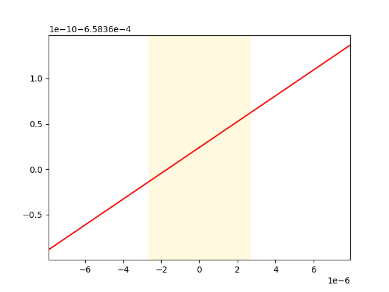
## New Eq:
((fabs(membrane__V) < 2.6380041870925613e-6) ? ((0.5 + 189537.22759290531 * membrane__V) * (0.0096486999999999996 * pow(sodium_current_m_gate__m, 3) * (-1.0 + exp(9.9999999999999995e-8 - log(cleft_space_ion_concentrations__Na_c / intracellular_ion_concentrations__Na_i))) * (0.10000000000000001 * sodium_current_h2_gate__h2 + 0.90000000000000002 * sodium_current_h1_gate__h1) * cleft_space_ion_concentrations__Na_c * sodium_current__P_Na / (-1.0 + exp(9.9999999999999995e-8)) + 0.0096486999999999996 * pow(sodium_current_m_gate__m, 3) * (-1.0 + exp(-9.9999999999999995e-8 - log(cleft_space_ion_concentrations__Na_c / intracellular_ion_concentrations__Na_i))) * (0.10000000000000001 * sodium_current_h2_gate__h2 + 0.90000000000000002 * sodium_current_h1_gate__h1) * cleft_space_ion_concentrations__Na_c * sodium_current__P_Na / (-1.0 + exp(-9.9999999999999995e-8))) - 0.0096486999999999996 * pow(sodium_current_m_gate__m, 3) * (-1.0 + exp(-9.9999999999999995e-8 - log(cleft_space_ion_concentrations__Na_c / intracellular_ion_concentrations__Na_i))) * (0.10000000000000001 * sodium_current_h2_gate__h2 + 0.90000000000000002 * sodium_current_h1_gate__h1) * cleft_space_ion_concentrations__Na_c * sodium_current__P_Na / (-1.0 + exp(-9.9999999999999995e-8))) : (pow(membrane__F, 2) * pow(sodium_current_m_gate__m, 3) * (-1.0 + exp((-sodium_current__E_Na + membrane__V) * membrane__F / (membrane__R * membrane__T))) * (0.10000000000000001 * sodium_current_h2_gate__h2 + 0.90000000000000002 * sodium_current_h1_gate__h1) * cleft_space_ion_concentrations__Na_c * membrane__V * sodium_current__P_Na / ((-1.0 + exp(membrane__F * membrane__V / (membrane__R * membrane__T))) * membrane__R * membrane__T)))

## Equation 2:
```
sodium_potassium_pump__i_NaK = (150.0 + membrane__V) * cleft_space_ion_concentrations__K_c * sodium_potassium_pump__i_NaK_max * sodium_potassium_pump__pow_Na_i_15 / ((200.0 + membrane__V) * (cleft_space_ion_concentrations__K_c + sodium_potassium_pump__K_NaK_K) * (sodium_potassium_pump__pow_K_NaK_Na_15 + sodium_potassium_pump__pow_Na_i_15))
```
### Partially evaluated to: 
```
sodium_potassium_pump__i_NaK = pow(intracellular_ion_concentrations__Na_i, 1.5) * (150.0 + membrane__V) * cleft_space_ion_concentrations__K_c * sodium_potassium_pump__i_NaK_max / ((1.0 + cleft_space_ion_concentrations__K_c) * (200.0 + membrane__V) * (36.482900000000001 + pow(intracellular_ion_concentrations__Na_i, 1.5)))
```
### Singulariy points detected:

{-200.00000000000000}
####Failed!

<class 'sympy.core.mul.Mul'>
_intracellular_ion_concentrations$Na_i**1.5*_cleft_space_ion_concentrations$K_c*_sodium_potassium_pump$i_NaK_max*(_membrane$V + 150.0)/((_intracellular_ion_concentrations$Na_i**1.5 + 36.482900000000001)*(_cleft_space_ion_concentrations$K_c + 1.0)*(_membrane$V + 200.0))

*try substituting parameters*

#### float * A

####Failed!

<class 'sympy.core.mul.Mul'>
_intracellular_ion_concentrations$Na_i**1.5*_cleft_space_ion_concentrations$K_c*(_membrane$V + 150.0)/((_intracellular_ion_concentrations$Na_i**1.5 + 36.482900000000001)*(_cleft_space_ion_concentrations$K_c + 1.0)*(_membrane$V + 200.0))
# Model: maltsev_2009(maltsev_2009.cellml)
# Model: matsuoka_model_2003(matsuoka_model_2003.cellml)
## Equation 1:
```
constant_field_equations__CF_Ca = ((membrane__Vm == 0) ? (-external_ion_concentrations__Cao) : (2.0 * (-external_ion_concentrations__Cao * exp(-2.0 * membrane__F * membrane__Vm / (membrane__R * membrane__T)) + internal_ion_concentrations__Cai) * membrane__F * membrane__Vm / ((1.0 - exp(-2.0 * membrane__F * membrane__Vm / (membrane__R * membrane__T))) * membrane__R * membrane__T)))
```
### Partially evaluated to: 
```
constant_field_equations__CF_Ca = ((membrane__Vm == 0) ? (-external_ion_concentrations__Cao) : (0.074870384603595908 * (-0.026190000000000001 + 0.5 * sqrt(pow((0.052380000000000003 - internal_ion_concentrations__Ca_Total), 2) + 0.0095200000000000007 * internal_ion_concentrations__Ca_Total) + 0.5 * internal_ion_concentrations__Ca_Total - external_ion_concentrations__Cao * exp(-0.074870384603595908 * membrane__Vm)) * membrane__Vm / (1.0 - exp(-0.074870384603595908 * membrane__Vm))))
```
### Singulariy points detected:

{0}
####Piecewise!
## Equation 2:
```
constant_field_equations__CF_K = ((membrane__Vm == 0) ? (internal_ion_concentrations__Ki) : ((-external_ion_concentrations__Ko * exp(-membrane__F * membrane__Vm / (membrane__R * membrane__T)) + internal_ion_concentrations__Ki) * membrane__F * membrane__Vm / ((1.0 - exp(-membrane__F * membrane__Vm / (membrane__R * membrane__T))) * membrane__R * membrane__T)))
```
### Partially evaluated to: 
```
constant_field_equations__CF_K = ((membrane__Vm == 0) ? (internal_ion_concentrations__Ki) : (0.037435192301797954 * (-external_ion_concentrations__Ko * exp(-0.037435192301797954 * membrane__Vm) + internal_ion_concentrations__Ki) * membrane__Vm / (1.0 - exp(-0.037435192301797954 * membrane__Vm))))
```
### Singulariy points detected:

{0}
####Piecewise!
## Equation 3:
```
background_Kpl_current__i_Kpl = ((membrane__Vm == (-3.0)) ? (13.0077 * background_Kpl_current__P_Kpl * constant_field_equations__CF_K) : ((3.0 + membrane__Vm) * background_Kpl_current__P_Kpl * constant_field_equations__CF_K / (1.0 - 0.79392265781795135 * exp(-0.076923076923076927 * membrane__Vm))))
```
### Partially evaluated to: 
```
background_Kpl_current__i_Kpl = ((membrane__Vm == (-3.0)) ? (4.0896888185468013e-5 * pow(external_ion_concentrations__Ko, 0.16) * (-external_ion_concentrations__Ko * exp(-0.037435192301797954 * membrane__Vm) + internal_ion_concentrations__Ki) * membrane__Vm / (1.0 - exp(-0.037435192301797954 * membrane__Vm))) : ((membrane__Vm == 0) ? (8.3986538766456042e-5 * pow(external_ion_concentrations__Ko, 0.16) * (3.0 + membrane__Vm) * internal_ion_concentrations__Ki / (1.0 - 0.79392265781795135 * exp(-0.076923076923076927 * membrane__Vm))) : (3.1440522294846908e-6 * pow(external_ion_concentrations__Ko, 0.16) * (3.0 + membrane__Vm) * (-external_ion_concentrations__Ko * exp(-0.037435192301797954 * membrane__Vm) + internal_ion_concentrations__Ki) * membrane__Vm / ((1.0 - exp(-0.037435192301797954 * membrane__Vm)) * (1.0 - 0.79392265781795135 * exp(-0.076923076923076927 * membrane__Vm))))))
```
### Singulariy points detected:

{-3.0000000000000000}
####Piecewise!
## Equation 4:
```
constant_field_equations__CF_Na = ((membrane__Vm == 0) ? (-external_ion_concentrations__Nao) : ((-external_ion_concentrations__Nao * exp(-membrane__F * membrane__Vm / (membrane__R * membrane__T)) + internal_ion_concentrations__Nai) * membrane__F * membrane__Vm / ((1.0 - exp(-membrane__F * membrane__Vm / (membrane__R * membrane__T))) * membrane__R * membrane__T)))
```
### Partially evaluated to: 
```
constant_field_equations__CF_Na = ((membrane__Vm == 0) ? (-external_ion_concentrations__Nao) : (0.037435192301797954 * (-external_ion_concentrations__Nao * exp(-0.037435192301797954 * membrane__Vm) + internal_ion_concentrations__Nai) * membrane__Vm / (1.0 - exp(-0.037435192301797954 * membrane__Vm))))
```
### Singulariy points detected:

{0}
####Piecewise!
# Model: mcallister_noble_tsien_1975_modelB(mcallister_noble_tsien_1975_b.cellml)
## Equation 1:
```
fast_sodium_current_m_gate__alpha_m = (47.0 + membrane__V) / (1.0 - 0.0090952771016958173 * exp(-0.10000000000000001 * membrane__V))
```
### Partially evaluated to: 
```
fast_sodium_current_m_gate__alpha_m = (47.0 + membrane__V) / (1.0 - 0.0090952771016958173 * exp(-0.10000000000000001 * membrane__V))
```
### Singulariy points detected:

{-47.000000000000000}
*U*
`-4.7000000000000002 - 0.10000000000000001 * membrane__V`

*V for 1e-07 range* 
`-47.000000999999997 - -46.999999000000003`

*Singularity point: -47.000000000000000*

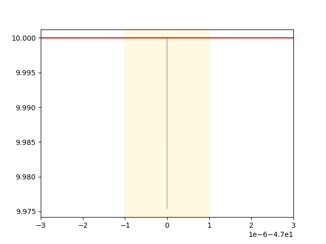
## New Eq:
((fabs(47.0 + membrane__V) < 1.0000000000287557e-6) ? (-1.0000000000842668e-6 / (1.0 - exp(1.0000000000287557e-7)) + (23500000.499324244 + 499999.99998562218 * membrane__V) * (9.9999999997324451e-7 / (1.0 - exp(-1.0000000000287557e-7)) + 1.0000000000842668e-6 / (1.0 - exp(1.0000000000287557e-7)))) : ((47.0 + membrane__V) / (1.0 - exp(-4.7000000000000002 - 0.10000000000000001 * membrane__V))))

## Equation 2:
```
pacemaker_potassium_current_s_gate__alpha_s = 0.001 * (-pacemaker_potassium_current_s_gate__E_s + membrane__V) / (1.0 - exp(0.20000000000000001 * pacemaker_potassium_current_s_gate__E_s - 0.20000000000000001 * membrane__V))
```
### Partially evaluated to: 
```
pacemaker_potassium_current_s_gate__alpha_s = 0.001 * (52.0 + membrane__V) / (1.0 - 3.0432483008403618e-5 * exp(-0.20000000000000001 * membrane__V))
```
### Singulariy points detected:

{1.0*_pacemaker_potassium_current_s_gate$E_s}
*U*
`-10.4 - 0.20000000000000001 * membrane__V`

*V for 1e-07 range* 
`-52.000000499999999 - -51.999999500000001`

*Singularity point: -52.000000000000000*

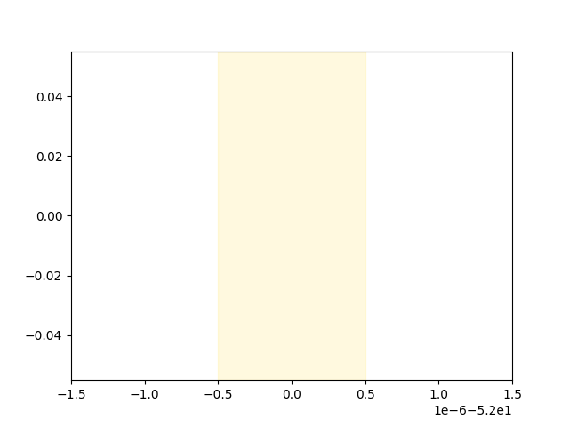
## New Eq:
((51.999999500000001 + pacemaker_potassium_current_s_gate__E_s < -fabs(-pacemaker_potassium_current_s_gate__E_s + membrane__V)) ? (-5.0000000001437788e-10 / (1.0 - exp(1.0000000000287557e-7)) + (52000000.498504706 + 999999.99997124437 * membrane__V) * (5.0000000001437788e-10 / (1.0 - exp(1.0000000000287557e-7)) + 5.0000000001437788e-10 / (1.0 - exp(-1.0000000000287557e-7)))) : (0.001 * (-pacemaker_potassium_current_s_gate__E_s + membrane__V) / (1.0 - exp(0.20000000000000001 * pacemaker_potassium_current_s_gate__E_s - 0.20000000000000001 * membrane__V))))

## Equation 3:
```
secondary_inward_current_d_gate__alpha_d = 0.002 * (40.0 + membrane__V) / (1.0 - 0.018315638888734175 * exp(-0.10000000000000001 * membrane__V))
```
### Partially evaluated to: 
```
secondary_inward_current_d_gate__alpha_d = 0.002 * (40.0 + membrane__V) / (1.0 - 0.018315638888734175 * exp(-0.10000000000000001 * membrane__V))
```
### Singulariy points detected:

{-40.000000000000000}
*U*
`-4.0 - 0.10000000000000001 * membrane__V`

*V for 1e-07 range* 
`-40.000000999999997 - -39.999999000000003`

*Singularity point: -40.000000000000000*

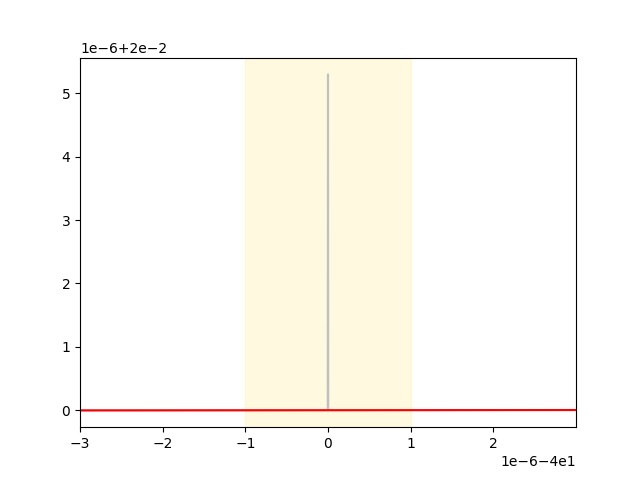
## New Eq:
((fabs(40.0 + membrane__V) < 9.9999999997324451e-7) ? (-2.0000000000575115e-9 / (1.0 - exp(1.0000000000287557e-7)) + (20000000.499979999 + 499999.99999949994 * membrane__V) * (1.999999999946489e-9 / (1.0 - exp(-9.9999999995936673e-8)) + 2.0000000000575115e-9 / (1.0 - exp(1.0000000000287557e-7)))) : (0.002 * (40.0 + membrane__V) / (1.0 - exp(-4.0 - 0.10000000000000001 * membrane__V))))

## Equation 4:
```
time_independent_outward_current__i_K1 = 0.35714285714285715 * pacemaker_potassium_current__I_K2 + 0.20000000000000001 * (-time_independent_outward_current__E_K1 + membrane__V) / (1.0 - exp(0.040000000000000001 * time_independent_outward_current__E_K1 - 0.040000000000000001 * membrane__V))
```
### Partially evaluated to: 
```
time_independent_outward_current__i_K1 = (-1.0 + 81.450868664968112 * exp(0.040000000000000001 * membrane__V)) / (11.023176380641601 * exp(0.040000000000000001 * membrane__V) + 121.51041751873488 * exp(0.080000000000000002 * membrane__V)) + 0.20000000000000001 * (30.0 + membrane__V) / (1.0 - 0.30119421191220208 * exp(-0.040000000000000001 * membrane__V))
```
### Singulariy points detected:

{1.0*_time_independent_outward_current$E_K1}
####A + B:

`0.20000000000000001 * (30.0 + membrane__V) / (1.0 - 0.30119421191220208 * exp(-0.040000000000000001 * membrane__V))`
`(-1.0 + 81.450868664968112 * exp(0.040000000000000001 * membrane__V)) / (11.023176380641601 * exp(0.040000000000000001 * membrane__V) + 121.51041751873488 * exp(0.080000000000000002 * membrane__V))`

*U*
`-1.2 - 0.040000000000000001 * membrane__V`

*V for 1e-07 range* 
`-30.000002500000001 - -29.999997499999999`

*Singularity point: -30.000000000000000*

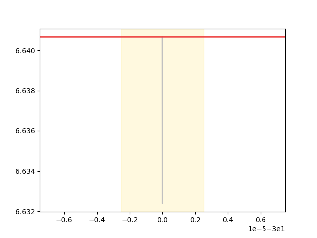
## New Eq:
((fabs(30.0 + membrane__V) < 2.500000000016378e-6) ? (-4.9999999999772453e-7 / (1.0 - exp(9.9999999999406119e-8)) + (6000000.5000273064 + 200000.00000091019 * membrane__V) * (4.9999999999772453e-7 / (1.0 - exp(9.9999999999406119e-8)) + 4.9999999999772453e-7 / (1.0 - exp(-9.9999999999406119e-8)) + (-1.0 + exp(3.2000001)) / (exp(1.2000001) + exp(2.4000002)) - (-1.0 + exp(3.1999998999999999)) / (exp(1.1999998999999999) + exp(2.3999997999999998))) + (-1.0 + exp(3.1999998999999999)) / (exp(1.1999998999999999) + exp(2.3999997999999998))) : (0.35714285714285715 * pacemaker_potassium_current__I_K2 + 0.20000000000000001 * (-time_independent_outward_current__E_K1 + membrane__V) / (1.0 - exp(0.040000000000000001 * time_independent_outward_current__E_K1 - 0.040000000000000001 * membrane__V))))

## Equation 5:
```
transient_chloride_current_q_gate__alpha_q = 0.0080000000000000002 * membrane__V / (1.0 - exp(-0.10000000000000001 * membrane__V))
```
### Partially evaluated to: 
```
transient_chloride_current_q_gate__alpha_q = 0.0080000000000000002 * membrane__V / (1.0 - exp(-0.10000000000000001 * membrane__V))
```
### Singulariy points detected:

{0}
*U*
`0.10000000000000001 * membrane__V`

*V for 1e-07 range* 
`-9.9999999999999995e-7 - 9.9999999999999995e-7`

*Singularity point: 0*

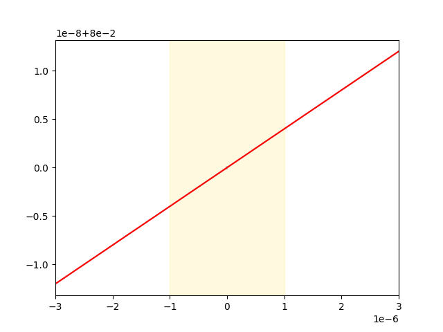
## New Eq:
((fabs(membrane__V) < 9.9999999999999995e-7) ? (-7.9999999999999988e-9 / (1.0 - exp(9.9999999999999995e-8)) + (0.5 + 500000.00000000006 * membrane__V) * (7.9999999999999988e-9 / (1.0 - exp(9.9999999999999995e-8)) + 7.9999999999999988e-9 / (1.0 - exp(-9.9999999999999995e-8)))) : (0.0080000000000000002 * membrane__V / (1.0 - exp(-0.10000000000000001 * membrane__V))))

# Model: noble_model_1962(noble_model_1962.cellml)
## Equation 1:
```
potassium_channel_n_gate__alpha_n = 0.0001 * (-50.0 - membrane__V) / (-1.0 + 0.006737946999085467 * exp(-0.10000000000000001 * membrane__V))
```
### Partially evaluated to: 
```
potassium_channel_n_gate__alpha_n = 0.0001 * (-50.0 - membrane__V) / (-1.0 + 0.006737946999085467 * exp(-0.10000000000000001 * membrane__V))
```
### Singulariy points detected:

{-50.000000000000000}
*U*
`-5.0 - 0.10000000000000001 * membrane__V`

*V for 1e-07 range* 
`-50.000000999999997 - -49.999999000000003`

*Singularity point: -50.000000000000000*

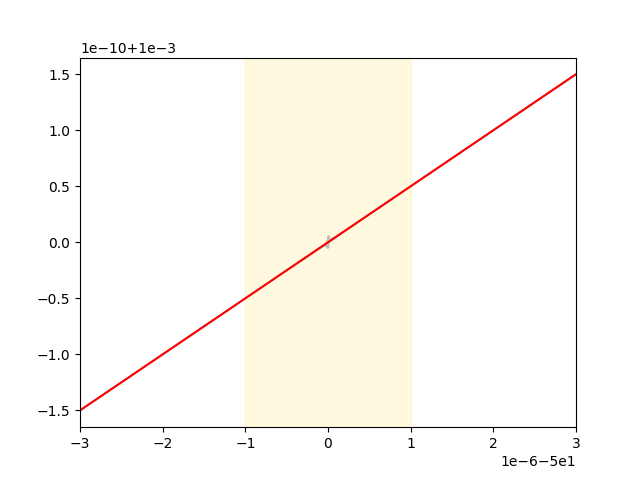
## New Eq:
((fabs(50.0 + membrane__V) < 1.0000000000287557e-6) ? (1.0000000000287557e-10 / (-1.0 + exp(1.0000000000287557e-7)) + (25000000.499281108 + 499999.99998562218 * membrane__V) * (-1.0000000000287557e-10 / (-1.0 + exp(1.0000000000287557e-7)) - 1.0000000000287557e-10 / (-1.0 + exp(-1.0000000000287557e-7)))) : (0.0001 * (-50.0 - membrane__V) / (-1.0 + exp(-5.0 - 0.10000000000000001 * membrane__V))))

## Equation 2:
```
sodium_channel_m_gate__alpha_m = 0.10000000000000001 * (-48.0 - membrane__V) / (-1.0 + 0.040762203978366218 * exp(-0.066666666666666666 * membrane__V))
```
### Partially evaluated to: 
```
sodium_channel_m_gate__alpha_m = 0.10000000000000001 * (-48.0 - membrane__V) / (-1.0 + 0.040762203978366218 * exp(-0.066666666666666666 * membrane__V))
```
### Singulariy points detected:

{-48.000000000000000}
*U*
`-3.2000000000000002 - 0.066666666666666666 * membrane__V`

*V for 1e-07 range* 
`-48.000001500000003 - -47.999998499999997`

*Singularity point: -48.000000000000000*

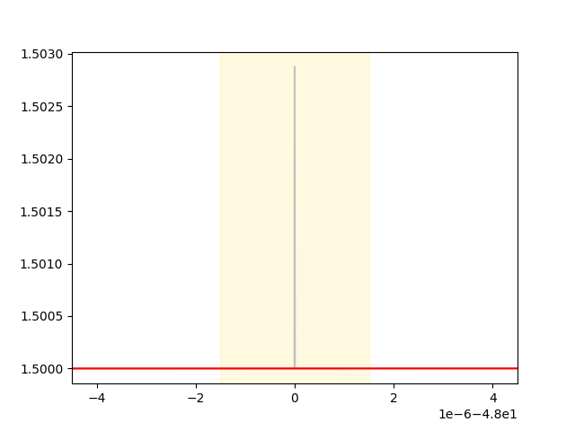
## New Eq:
((fabs(48.0 + membrane__V) < 1.4999999999876223e-6) ? (1.5000000000431335e-7 / (-1.0 + exp(1.0000000000287557e-7)) + (16000000.499835968 + 333333.333329916 * membrane__V) * (-1.5000000000431335e-7 / (-1.0 + exp(1.0000000000287557e-7)) - 1.4999999999876224e-7 / (-1.0 + exp(-9.9999999999406119e-8)))) : (0.10000000000000001 * (-48.0 - membrane__V) / (-1.0 + exp(-3.2000000000000002 - 0.066666666666666666 * membrane__V))))

## Equation 3:
```
sodium_channel_m_gate__beta_m = 0.12 * (8.0 + membrane__V) / (-1.0 + 4.9530324243951149 * exp(0.20000000000000001 * membrane__V))
```
### Partially evaluated to: 
```
sodium_channel_m_gate__beta_m = 0.12 * (8.0 + membrane__V) / (-1.0 + 4.9530324243951149 * exp(0.20000000000000001 * membrane__V))
```
### Singulariy points detected:

{-8.0000000000000000}
*U*
`1.6000000000000001 + 0.20000000000000001 * membrane__V`

*V for 1e-07 range* 
`-8.0000005000000005 - -7.9999995000000004`

*Singularity point: -8.0000000000000000*

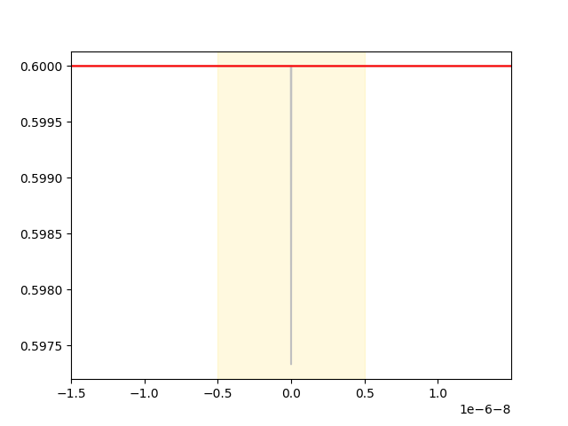
## New Eq:
((fabs(8.0 + membrane__V) < 4.9999999999356115e-7) ? (-6.0000000000060002e-8 / (-1.0 + exp(-9.9999999999406119e-8)) + (8000000.5000475105 + 1000000.0000059388 * membrane__V) * (6.0000000000060002e-8 / (-1.0 + exp(-9.9999999999406119e-8)) + 5.9999999999227342e-8 / (-1.0 + exp(9.9999999999406119e-8)))) : (0.12 * (8.0 + membrane__V) / (-1.0 + exp(1.6000000000000001 + 0.20000000000000001 * membrane__V))))

# Model: noble_model_1991(noble_model_1991.cellml)
## Equation 1:
```
L_type_Ca_channel__i_Ca_L_Ca = 4.0 * (-50.0 + membrane__V) * (intracellular_calcium_concentration__Ca_i * exp(100.0 * membrane__F / (membrane__R * membrane__T)) - extracellular_calcium_concentration__Ca_o * exp(2.0 * (50.0 - membrane__V) * membrane__F / (membrane__R * membrane__T))) * L_type_Ca_channel__P_Ca_L * L_type_Ca_channel_d_gate__d * L_type_Ca_channel_f_gate__f * membrane__F / ((1.0 - exp(2.0 * (50.0 - membrane__V) * membrane__F / (membrane__R * membrane__T))) * membrane__R * membrane__T)
```
### Partially evaluated to: 
```
L_type_Ca_channel__i_Ca_L_Ca = 0.14973556329098189 * (-50.0 + membrane__V) * (42.240905756816076 * intracellular_calcium_concentration__Ca_i - 42.240905756816076 * extracellular_calcium_concentration__Ca_o * exp(-0.074867781645490947 * membrane__V)) * L_type_Ca_channel__P_Ca_L * L_type_Ca_channel_d_gate__d * L_type_Ca_channel_f_gate__f / (1.0 - 42.240905756816076 * exp(-0.074867781645490947 * membrane__V))
```
### Singulariy points detected:

{50.000000000000000}
*U*
`3.7433890822745473 - 0.074867781645490947 * membrane__V`

*V for 1e-07 range* 
`49.999998664311967 - 50.000001335688033`

*Singularity point: 50.000000000000000*

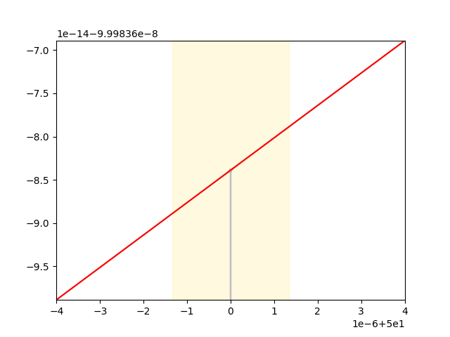
## New Eq:
((fabs(-50.0 + membrane__V) < 1.3356880329551402e-6) ? ((-18716944.911788113 + 374338.90823576227 * membrane__V) * (1.9999999999556149e-7 * (intracellular_calcium_concentration__Ca_i * exp(3.7433890822745473) - extracellular_calcium_concentration__Ca_o * exp(9.9999999999406119e-8)) * L_type_Ca_channel__P_Ca_L * L_type_Ca_channel_d_gate__d * L_type_Ca_channel_f_gate__f / (1.0 - exp(9.9999999999406119e-8)) + 1.9999999999556149e-7 * (intracellular_calcium_concentration__Ca_i * exp(3.7433890822745473) - extracellular_calcium_concentration__Ca_o * exp(-9.9999999999406119e-8)) * L_type_Ca_channel__P_Ca_L * L_type_Ca_channel_d_gate__d * L_type_Ca_channel_f_gate__f / (1.0 - exp(-9.9999999999406119e-8))) - 1.9999999999556149e-7 * (intracellular_calcium_concentration__Ca_i * exp(3.7433890822745473) - extracellular_calcium_concentration__Ca_o * exp(9.9999999999406119e-8)) * L_type_Ca_channel__P_Ca_L * L_type_Ca_channel_d_gate__d * L_type_Ca_channel_f_gate__f / (1.0 - exp(9.9999999999406119e-8))) : (4.0 * (-50.0 + membrane__V) * (intracellular_calcium_concentration__Ca_i * exp(100.0 * membrane__F / (membrane__R * membrane__T)) - extracellular_calcium_concentration__Ca_o * exp(2.0 * (50.0 - membrane__V) * membrane__F / (membrane__R * membrane__T))) * L_type_Ca_channel__P_Ca_L * L_type_Ca_channel_d_gate__d * L_type_Ca_channel_f_gate__f * membrane__F / ((1.0 - exp(2.0 * (50.0 - membrane__V) * membrane__F / (membrane__R * membrane__T))) * membrane__R * membrane__T)))

## Equation 2:
```
L_type_Ca_channel__i_Ca_L_K = (-50.0 + membrane__V) * (intracellular_potassium_concentration__K_i * exp(50.0 * membrane__F / (membrane__R * membrane__T)) - extracellular_potassium_concentration__K_o * exp((50.0 - membrane__V) * membrane__F / (membrane__R * membrane__T))) * L_type_Ca_channel__P_CaK * L_type_Ca_channel__P_Ca_L * L_type_Ca_channel_d_gate__d * L_type_Ca_channel_f_gate__f * membrane__F / ((1.0 - exp((50.0 - membrane__V) * membrane__F / (membrane__R * membrane__T))) * membrane__R * membrane__T)
```
### Partially evaluated to: 
```
L_type_Ca_channel__i_Ca_L_K = 7.4867781645490941e-5 * (-50.0 + membrane__V) * (6.4993004051833205 * intracellular_potassium_concentration__K_i - 6.4993004051833205 * extracellular_potassium_concentration__K_o * exp(-0.037433890822745473 * membrane__V)) * L_type_Ca_channel__P_Ca_L * L_type_Ca_channel_d_gate__d * L_type_Ca_channel_f_gate__f / (1.0 - 6.4993004051833205 * exp(-0.037433890822745473 * membrane__V))
```
### Singulariy points detected:

{50.000000000000000}
*U*
`1.8716945411372736 - 0.037433890822745473 * membrane__V`

*V for 1e-07 range* 
`49.999997328623934 - 50.000002671376066`

*Singularity point: 50.000000000000000*

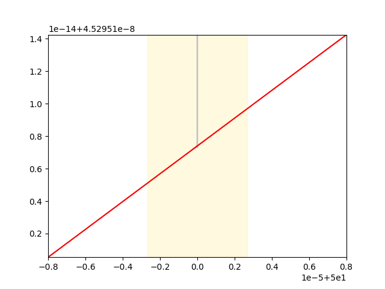
## New Eq:
((fabs(-50.0 + membrane__V) < 2.6713760659657915e-6) ? ((-9358472.2056995872 + 187169.45411399176 * membrane__V) * (1.999999999997175e-10 * (intracellular_potassium_concentration__K_i * exp(1.8716945411372736) - extracellular_potassium_concentration__K_o * exp(9.9999999999406119e-8)) * L_type_Ca_channel__P_Ca_L * L_type_Ca_channel_d_gate__d * L_type_Ca_channel_f_gate__f / (1.0 - exp(9.9999999999406119e-8)) + 1.999999999997175e-10 * (intracellular_potassium_concentration__K_i * exp(1.8716945411372736) - extracellular_potassium_concentration__K_o * exp(-9.9999999999406119e-8)) * L_type_Ca_channel__P_Ca_L * L_type_Ca_channel_d_gate__d * L_type_Ca_channel_f_gate__f / (1.0 - exp(-9.9999999999406119e-8))) - 1.999999999997175e-10 * (intracellular_potassium_concentration__K_i * exp(1.8716945411372736) - extracellular_potassium_concentration__K_o * exp(9.9999999999406119e-8)) * L_type_Ca_channel__P_Ca_L * L_type_Ca_channel_d_gate__d * L_type_Ca_channel_f_gate__f / (1.0 - exp(9.9999999999406119e-8))) : ((-50.0 + membrane__V) * (intracellular_potassium_concentration__K_i * exp(50.0 * membrane__F / (membrane__R * membrane__T)) - extracellular_potassium_concentration__K_o * exp((50.0 - membrane__V) * membrane__F / (membrane__R * membrane__T))) * L_type_Ca_channel__P_CaK * L_type_Ca_channel__P_Ca_L * L_type_Ca_channel_d_gate__d * L_type_Ca_channel_f_gate__f * membrane__F / ((1.0 - exp((50.0 - membrane__V) * membrane__F / (membrane__R * membrane__T))) * membrane__R * membrane__T)))

## Equation 3:
```
L_type_Ca_channel__i_Ca_L_Na = (-50.0 + membrane__V) * (intracellular_sodium_concentration__Na_i * exp(50.0 * membrane__F / (membrane__R * membrane__T)) - extracellular_sodium_concentration__Na_o * exp((50.0 - membrane__V) * membrane__F / (membrane__R * membrane__T))) * L_type_Ca_channel__P_CaNa * L_type_Ca_channel__P_Ca_L * L_type_Ca_channel_d_gate__d * L_type_Ca_channel_f_gate__f * membrane__F / ((1.0 - exp((50.0 - membrane__V) * membrane__F / (membrane__R * membrane__T))) * membrane__R * membrane__T)
```
### Partially evaluated to: 
```
L_type_Ca_channel__i_Ca_L_Na = 0.00037433890822745472 * (-50.0 + membrane__V) * (6.4993004051833205 * intracellular_sodium_concentration__Na_i - 6.4993004051833205 * extracellular_sodium_concentration__Na_o * exp(-0.037433890822745473 * membrane__V)) * L_type_Ca_channel__P_Ca_L * L_type_Ca_channel_d_gate__d * L_type_Ca_channel_f_gate__f / (1.0 - 6.4993004051833205 * exp(-0.037433890822745473 * membrane__V))
```
### Singulariy points detected:

{50.000000000000000}
*U*
`1.8716945411372736 - 0.037433890822745473 * membrane__V`

*V for 1e-07 range* 
`49.999997328623934 - 50.000002671376066`

*Singularity point: 50.000000000000000*

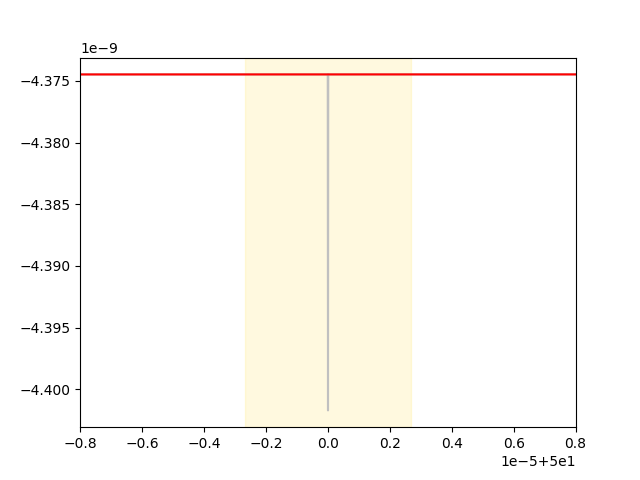
## New Eq:
((fabs(-50.0 + membrane__V) < 2.6713760659657915e-6) ? ((-9358472.2056995872 + 187169.45411399176 * membrane__V) * (9.9999999999858744e-10 * (intracellular_sodium_concentration__Na_i * exp(1.8716945411372736) - extracellular_sodium_concentration__Na_o * exp(9.9999999999406119e-8)) * L_type_Ca_channel__P_Ca_L * L_type_Ca_channel_d_gate__d * L_type_Ca_channel_f_gate__f / (1.0 - exp(9.9999999999406119e-8)) + 9.9999999999858744e-10 * (intracellular_sodium_concentration__Na_i * exp(1.8716945411372736) - extracellular_sodium_concentration__Na_o * exp(-9.9999999999406119e-8)) * L_type_Ca_channel__P_Ca_L * L_type_Ca_channel_d_gate__d * L_type_Ca_channel_f_gate__f / (1.0 - exp(-9.9999999999406119e-8))) - 9.9999999999858744e-10 * (intracellular_sodium_concentration__Na_i * exp(1.8716945411372736) - extracellular_sodium_concentration__Na_o * exp(9.9999999999406119e-8)) * L_type_Ca_channel__P_Ca_L * L_type_Ca_channel_d_gate__d * L_type_Ca_channel_f_gate__f / (1.0 - exp(9.9999999999406119e-8))) : ((-50.0 + membrane__V) * (intracellular_sodium_concentration__Na_i * exp(50.0 * membrane__F / (membrane__R * membrane__T)) - extracellular_sodium_concentration__Na_o * exp((50.0 - membrane__V) * membrane__F / (membrane__R * membrane__T))) * L_type_Ca_channel__P_CaNa * L_type_Ca_channel__P_Ca_L * L_type_Ca_channel_d_gate__d * L_type_Ca_channel_f_gate__f * membrane__F / ((1.0 - exp((50.0 - membrane__V) * membrane__F / (membrane__R * membrane__T))) * membrane__R * membrane__T)))

# Model: noble_model_1998(noble_model_1998.cellml)
## Equation 1:
```
L_type_Ca_channel__i_Ca_L_Ca_cyt = 4.0 * (1.0 - L_type_Ca_channel__FrICa) * (-50.0 + membrane__V) * (intracellular_calcium_concentration__Ca_i * exp(100.0 * membrane__F / (membrane__R * membrane__T)) - extracellular_calcium_concentration__Ca_o * exp(2.0 * (50.0 - membrane__V) * membrane__F / (membrane__R * membrane__T))) * L_type_Ca_channel__P_Ca_L * L_type_Ca_channel_d_gate__d * L_type_Ca_channel_f2_gate__f2 * L_type_Ca_channel_f_gate__f * membrane__F / ((1.0 - exp(2.0 * (50.0 - membrane__V) * membrane__F / (membrane__R * membrane__T))) * membrane__R * membrane__T)
```
### Partially evaluated to: 
```
L_type_Ca_channel__i_Ca_L_Ca_cyt = 0
```
### Singulariy points detected:

{50.000000000000000}
#### Eq == 0!
## Equation 2:
```
L_type_Ca_channel__i_Ca_L_Ca_ds = 4.0 * (-50.0 + membrane__V) * (intracellular_calcium_concentration__Ca_i * exp(100.0 * membrane__F / (membrane__R * membrane__T)) - extracellular_calcium_concentration__Ca_o * exp(2.0 * (50.0 - membrane__V) * membrane__F / (membrane__R * membrane__T))) * L_type_Ca_channel__FrICa * L_type_Ca_channel__P_Ca_L * L_type_Ca_channel_d_gate__d * L_type_Ca_channel_f2ds_gate__f2ds * L_type_Ca_channel_f_gate__f * membrane__F / ((1.0 - exp(2.0 * (50.0 - membrane__V) * membrane__F / (membrane__R * membrane__T))) * membrane__R * membrane__T)
```
### Partially evaluated to: 
```
L_type_Ca_channel__i_Ca_L_Ca_ds = 0.14973556329098189 * (-50.0 + membrane__V) * (42.240905756816076 * intracellular_calcium_concentration__Ca_i - 42.240905756816076 * extracellular_calcium_concentration__Ca_o * exp(-0.074867781645490947 * membrane__V)) * L_type_Ca_channel__P_Ca_L * L_type_Ca_channel_d_gate__d * L_type_Ca_channel_f2ds_gate__f2ds * L_type_Ca_channel_f_gate__f / (1.0 - 42.240905756816076 * exp(-0.074867781645490947 * membrane__V))
```
### Singulariy points detected:

{50.000000000000000}
*U*
`3.7433890822745473 - 0.074867781645490947 * membrane__V`

*V for 1e-07 range* 
`49.999998664311967 - 50.000001335688033`

*Singularity point: 50.000000000000000*

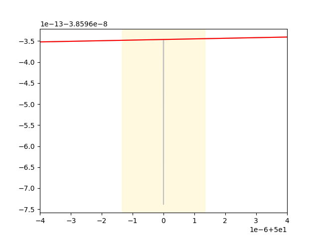
## New Eq:
((fabs(-50.0 + membrane__V) < 1.3356880329551402e-6) ? ((-18716944.911788113 + 374338.90823576227 * membrane__V) * (1.9999999999556149e-7 * (intracellular_calcium_concentration__Ca_i * exp(3.7433890822745473) - extracellular_calcium_concentration__Ca_o * exp(9.9999999999406119e-8)) * L_type_Ca_channel__P_Ca_L * L_type_Ca_channel_d_gate__d * L_type_Ca_channel_f2ds_gate__f2ds * L_type_Ca_channel_f_gate__f / (1.0 - exp(9.9999999999406119e-8)) + 1.9999999999556149e-7 * (intracellular_calcium_concentration__Ca_i * exp(3.7433890822745473) - extracellular_calcium_concentration__Ca_o * exp(-9.9999999999406119e-8)) * L_type_Ca_channel__P_Ca_L * L_type_Ca_channel_d_gate__d * L_type_Ca_channel_f2ds_gate__f2ds * L_type_Ca_channel_f_gate__f / (1.0 - exp(-9.9999999999406119e-8))) - 1.9999999999556149e-7 * (intracellular_calcium_concentration__Ca_i * exp(3.7433890822745473) - extracellular_calcium_concentration__Ca_o * exp(9.9999999999406119e-8)) * L_type_Ca_channel__P_Ca_L * L_type_Ca_channel_d_gate__d * L_type_Ca_channel_f2ds_gate__f2ds * L_type_Ca_channel_f_gate__f / (1.0 - exp(9.9999999999406119e-8))) : (4.0 * (-50.0 + membrane__V) * (intracellular_calcium_concentration__Ca_i * exp(100.0 * membrane__F / (membrane__R * membrane__T)) - extracellular_calcium_concentration__Ca_o * exp(2.0 * (50.0 - membrane__V) * membrane__F / (membrane__R * membrane__T))) * L_type_Ca_channel__FrICa * L_type_Ca_channel__P_Ca_L * L_type_Ca_channel_d_gate__d * L_type_Ca_channel_f2ds_gate__f2ds * L_type_Ca_channel_f_gate__f * membrane__F / ((1.0 - exp(2.0 * (50.0 - membrane__V) * membrane__F / (membrane__R * membrane__T))) * membrane__R * membrane__T)))

## Equation 3:
```
L_type_Ca_channel__i_Ca_L_K_cyt = (1.0 - L_type_Ca_channel__FrICa) * (-50.0 + membrane__V) * (intracellular_potassium_concentration__K_i * exp(50.0 * membrane__F / (membrane__R * membrane__T)) - extracellular_potassium_concentration__K_o * exp((50.0 - membrane__V) * membrane__F / (membrane__R * membrane__T))) * L_type_Ca_channel__P_CaK * L_type_Ca_channel__P_Ca_L * L_type_Ca_channel_d_gate__d * L_type_Ca_channel_f2_gate__f2 * L_type_Ca_channel_f_gate__f * membrane__F / ((1.0 - exp((50.0 - membrane__V) * membrane__F / (membrane__R * membrane__T))) * membrane__R * membrane__T)
```
### Partially evaluated to: 
```
L_type_Ca_channel__i_Ca_L_K_cyt = 0
```
### Singulariy points detected:

{50.000000000000000}
#### Eq == 0!
## Equation 4:
```
L_type_Ca_channel__i_Ca_L_K_ds = (-50.0 + membrane__V) * (intracellular_potassium_concentration__K_i * exp(50.0 * membrane__F / (membrane__R * membrane__T)) - extracellular_potassium_concentration__K_o * exp((50.0 - membrane__V) * membrane__F / (membrane__R * membrane__T))) * L_type_Ca_channel__FrICa * L_type_Ca_channel__P_CaK * L_type_Ca_channel__P_Ca_L * L_type_Ca_channel_d_gate__d * L_type_Ca_channel_f2ds_gate__f2ds * L_type_Ca_channel_f_gate__f * membrane__F / ((1.0 - exp((50.0 - membrane__V) * membrane__F / (membrane__R * membrane__T))) * membrane__R * membrane__T)
```
### Partially evaluated to: 
```
L_type_Ca_channel__i_Ca_L_K_ds = 7.4867781645490941e-5 * (-50.0 + membrane__V) * (6.4993004051833205 * intracellular_potassium_concentration__K_i - 6.4993004051833205 * extracellular_potassium_concentration__K_o * exp(-0.037433890822745473 * membrane__V)) * L_type_Ca_channel__P_Ca_L * L_type_Ca_channel_d_gate__d * L_type_Ca_channel_f2ds_gate__f2ds * L_type_Ca_channel_f_gate__f / (1.0 - 6.4993004051833205 * exp(-0.037433890822745473 * membrane__V))
```
### Singulariy points detected:

{50.000000000000000}
*U*
`1.8716945411372736 - 0.037433890822745473 * membrane__V`

*V for 1e-07 range* 
`49.999997328623934 - 50.000002671376066`

*Singularity point: 50.000000000000000*


## New Eq:
((fabs(-50.0 + membrane__V) < 2.6713760659657915e-6) ? ((-9358472.2056995872 + 187169.45411399176 * membrane__V) * (1.999999999997175e-10 * (intracellular_potassium_concentration__K_i * exp(1.8716945411372736) - extracellular_potassium_concentration__K_o * exp(9.9999999999406119e-8)) * L_type_Ca_channel__P_Ca_L * L_type_Ca_channel_d_gate__d * L_type_Ca_channel_f2ds_gate__f2ds * L_type_Ca_channel_f_gate__f / (1.0 - exp(9.9999999999406119e-8)) + 1.999999999997175e-10 * (intracellular_potassium_concentration__K_i * exp(1.8716945411372736) - extracellular_potassium_concentration__K_o * exp(-9.9999999999406119e-8)) * L_type_Ca_channel__P_Ca_L * L_type_Ca_channel_d_gate__d * L_type_Ca_channel_f2ds_gate__f2ds * L_type_Ca_channel_f_gate__f / (1.0 - exp(-9.9999999999406119e-8))) - 1.999999999997175e-10 * (intracellular_potassium_concentration__K_i * exp(1.8716945411372736) - extracellular_potassium_concentration__K_o * exp(9.9999999999406119e-8)) * L_type_Ca_channel__P_Ca_L * L_type_Ca_channel_d_gate__d * L_type_Ca_channel_f2ds_gate__f2ds * L_type_Ca_channel_f_gate__f / (1.0 - exp(9.9999999999406119e-8))) : ((-50.0 + membrane__V) * (intracellular_potassium_concentration__K_i * exp(50.0 * membrane__F / (membrane__R * membrane__T)) - extracellular_potassium_concentration__K_o * exp((50.0 - membrane__V) * membrane__F / (membrane__R * membrane__T))) * L_type_Ca_channel__FrICa * L_type_Ca_channel__P_CaK * L_type_Ca_channel__P_Ca_L * L_type_Ca_channel_d_gate__d * L_type_Ca_channel_f2ds_gate__f2ds * L_type_Ca_channel_f_gate__f * membrane__F / ((1.0 - exp((50.0 - membrane__V) * membrane__F / (membrane__R * membrane__T))) * membrane__R * membrane__T)))

## Equation 5:
```
L_type_Ca_channel__i_Ca_L_Na_cyt = (1.0 - L_type_Ca_channel__FrICa) * (-50.0 + membrane__V) * (intracellular_sodium_concentration__Na_i * exp(50.0 * membrane__F / (membrane__R * membrane__T)) - extracellular_sodium_concentration__Na_o * exp((50.0 - membrane__V) * membrane__F / (membrane__R * membrane__T))) * L_type_Ca_channel__P_CaNa * L_type_Ca_channel__P_Ca_L * L_type_Ca_channel_d_gate__d * L_type_Ca_channel_f2_gate__f2 * L_type_Ca_channel_f_gate__f * membrane__F / ((1.0 - exp((50.0 - membrane__V) * membrane__F / (membrane__R * membrane__T))) * membrane__R * membrane__T)
```
### Partially evaluated to: 
```
L_type_Ca_channel__i_Ca_L_Na_cyt = 0
```
### Singulariy points detected:

{50.000000000000000}
#### Eq == 0!
## Equation 6:
```
L_type_Ca_channel__i_Ca_L_Na_ds = (-50.0 + membrane__V) * (intracellular_sodium_concentration__Na_i * exp(50.0 * membrane__F / (membrane__R * membrane__T)) - extracellular_sodium_concentration__Na_o * exp((50.0 - membrane__V) * membrane__F / (membrane__R * membrane__T))) * L_type_Ca_channel__FrICa * L_type_Ca_channel__P_CaNa * L_type_Ca_channel__P_Ca_L * L_type_Ca_channel_d_gate__d * L_type_Ca_channel_f2ds_gate__f2ds * L_type_Ca_channel_f_gate__f * membrane__F / ((1.0 - exp((50.0 - membrane__V) * membrane__F / (membrane__R * membrane__T))) * membrane__R * membrane__T)
```
### Partially evaluated to: 
```
L_type_Ca_channel__i_Ca_L_Na_ds = 0.00037433890822745472 * (-50.0 + membrane__V) * (6.4993004051833205 * intracellular_sodium_concentration__Na_i - 6.4993004051833205 * extracellular_sodium_concentration__Na_o * exp(-0.037433890822745473 * membrane__V)) * L_type_Ca_channel__P_Ca_L * L_type_Ca_channel_d_gate__d * L_type_Ca_channel_f2ds_gate__f2ds * L_type_Ca_channel_f_gate__f / (1.0 - 6.4993004051833205 * exp(-0.037433890822745473 * membrane__V))
```
### Singulariy points detected:

{50.000000000000000}
*U*
`1.8716945411372736 - 0.037433890822745473 * membrane__V`

*V for 1e-07 range* 
`49.999997328623934 - 50.000002671376066`

*Singularity point: 50.000000000000000*

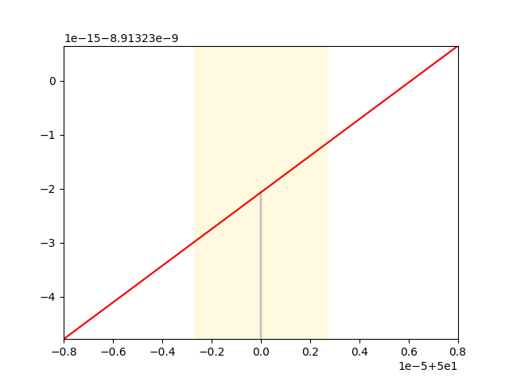
## New Eq:
((fabs(-50.0 + membrane__V) < 2.6713760659657915e-6) ? ((-9358472.2056995872 + 187169.45411399176 * membrane__V) * (9.9999999999858744e-10 * (intracellular_sodium_concentration__Na_i * exp(1.8716945411372736) - extracellular_sodium_concentration__Na_o * exp(9.9999999999406119e-8)) * L_type_Ca_channel__P_Ca_L * L_type_Ca_channel_d_gate__d * L_type_Ca_channel_f2ds_gate__f2ds * L_type_Ca_channel_f_gate__f / (1.0 - exp(9.9999999999406119e-8)) + 9.9999999999858744e-10 * (intracellular_sodium_concentration__Na_i * exp(1.8716945411372736) - extracellular_sodium_concentration__Na_o * exp(-9.9999999999406119e-8)) * L_type_Ca_channel__P_Ca_L * L_type_Ca_channel_d_gate__d * L_type_Ca_channel_f2ds_gate__f2ds * L_type_Ca_channel_f_gate__f / (1.0 - exp(-9.9999999999406119e-8))) - 9.9999999999858744e-10 * (intracellular_sodium_concentration__Na_i * exp(1.8716945411372736) - extracellular_sodium_concentration__Na_o * exp(9.9999999999406119e-8)) * L_type_Ca_channel__P_Ca_L * L_type_Ca_channel_d_gate__d * L_type_Ca_channel_f2ds_gate__f2ds * L_type_Ca_channel_f_gate__f / (1.0 - exp(9.9999999999406119e-8))) : ((-50.0 + membrane__V) * (intracellular_sodium_concentration__Na_i * exp(50.0 * membrane__F / (membrane__R * membrane__T)) - extracellular_sodium_concentration__Na_o * exp((50.0 - membrane__V) * membrane__F / (membrane__R * membrane__T))) * L_type_Ca_channel__FrICa * L_type_Ca_channel__P_CaNa * L_type_Ca_channel__P_Ca_L * L_type_Ca_channel_d_gate__d * L_type_Ca_channel_f2ds_gate__f2ds * L_type_Ca_channel_f_gate__f * membrane__F / ((1.0 - exp((50.0 - membrane__V) * membrane__F / (membrane__R * membrane__T))) * membrane__R * membrane__T)))

# Model: noble_model_2001(noble_model_2001.cellml)
## Equation 1:
```
L_type_Ca_channel__i_Ca_L_Ca_cyt = 4.0 * (1.0 - L_type_Ca_channel__FrICa) * (-50.0 + membrane__V) * (intracellular_calcium_concentration__Ca_i * exp(100.0 * membrane__F / (membrane__R * membrane__T)) - extracellular_calcium_concentration__Ca_o * exp(2.0 * (50.0 - membrane__V) * membrane__F / (membrane__R * membrane__T))) * L_type_Ca_channel__P_Ca_L * L_type_Ca_channel_d_gate__d * L_type_Ca_channel_f_gate__CaChoncyt * membrane__F / ((1.0 - exp(2.0 * (50.0 - membrane__V) * membrane__F / (membrane__R * membrane__T))) * membrane__R * membrane__T)
```
### Partially evaluated to: 
```
L_type_Ca_channel__i_Ca_L_Ca_cyt = 0.044920668987294569 * (1.0 - L_type_Ca_channel_f_gate__f) * (1.0 - intracellular_calcium_concentration__Ca_i / (0.01 + intracellular_calcium_concentration__Ca_i)) * (-50.0 + membrane__V) * (42.240905756816076 * intracellular_calcium_concentration__Ca_i - 42.240905756816076 * extracellular_calcium_concentration__Ca_o * exp(-0.074867781645490947 * membrane__V)) * L_type_Ca_channel__P_Ca_L * L_type_Ca_channel_d_gate__d / (1.0 - 42.240905756816076 * exp(-0.074867781645490947 * membrane__V))
```
### Singulariy points detected:

{50.000000000000000}
*U*
`3.7433890822745473 - 0.074867781645490947 * membrane__V`

*V for 1e-07 range* 
`49.999998664311967 - 50.000001335688033`

*Singularity point: 50.000000000000000*

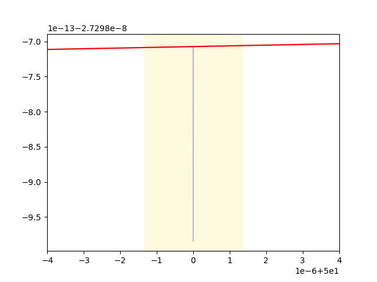
## New Eq:
((fabs(-50.0 + membrane__V) < 1.3356880329551402e-6) ? ((-18716944.911788113 + 374338.90823576227 * membrane__V) * (5.9999999998668459e-8 * (1.0 - L_type_Ca_channel_f_gate__f) * (1.0 - intracellular_calcium_concentration__Ca_i / (0.01 + intracellular_calcium_concentration__Ca_i)) * (intracellular_calcium_concentration__Ca_i * exp(3.7433890822745473) - extracellular_calcium_concentration__Ca_o * exp(9.9999999999406119e-8)) * L_type_Ca_channel__P_Ca_L * L_type_Ca_channel_d_gate__d / (1.0 - exp(9.9999999999406119e-8)) + 5.9999999998668459e-8 * (1.0 - L_type_Ca_channel_f_gate__f) * (1.0 - intracellular_calcium_concentration__Ca_i / (0.01 + intracellular_calcium_concentration__Ca_i)) * (intracellular_calcium_concentration__Ca_i * exp(3.7433890822745473) - extracellular_calcium_concentration__Ca_o * exp(-9.9999999999406119e-8)) * L_type_Ca_channel__P_Ca_L * L_type_Ca_channel_d_gate__d / (1.0 - exp(-9.9999999999406119e-8))) - 5.9999999998668459e-8 * (1.0 - L_type_Ca_channel_f_gate__f) * (1.0 - intracellular_calcium_concentration__Ca_i / (0.01 + intracellular_calcium_concentration__Ca_i)) * (intracellular_calcium_concentration__Ca_i * exp(3.7433890822745473) - extracellular_calcium_concentration__Ca_o * exp(9.9999999999406119e-8)) * L_type_Ca_channel__P_Ca_L * L_type_Ca_channel_d_gate__d / (1.0 - exp(9.9999999999406119e-8))) : (4.0 * (1.0 - L_type_Ca_channel__FrICa) * (-50.0 + membrane__V) * (intracellular_calcium_concentration__Ca_i * exp(100.0 * membrane__F / (membrane__R * membrane__T)) - extracellular_calcium_concentration__Ca_o * exp(2.0 * (50.0 - membrane__V) * membrane__F / (membrane__R * membrane__T))) * L_type_Ca_channel__P_Ca_L * L_type_Ca_channel_d_gate__d * L_type_Ca_channel_f_gate__CaChoncyt * membrane__F / ((1.0 - exp(2.0 * (50.0 - membrane__V) * membrane__F / (membrane__R * membrane__T))) * membrane__R * membrane__T)))

## Equation 2:
```
L_type_Ca_channel__i_Ca_L_Ca_ds = 4.0 * (-50.0 + membrane__V) * (intracellular_calcium_concentration__Ca_i * exp(100.0 * membrane__F / (membrane__R * membrane__T)) - extracellular_calcium_concentration__Ca_o * exp(2.0 * (50.0 - membrane__V) * membrane__F / (membrane__R * membrane__T))) * L_type_Ca_channel__FrICa * L_type_Ca_channel__P_Ca_L * L_type_Ca_channel_d_gate__d * L_type_Ca_channel_f_gate__CaChonds * membrane__F / ((1.0 - exp(2.0 * (50.0 - membrane__V) * membrane__F / (membrane__R * membrane__T))) * membrane__R * membrane__T)
```
### Partially evaluated to: 
```
L_type_Ca_channel__i_Ca_L_Ca_ds = 0.10481489430368732 * (1.0 - L_type_Ca_channel_f_gate__f) * (1.0 - intracellular_calcium_concentration__Ca_ds / (0.001 + intracellular_calcium_concentration__Ca_ds)) * (-50.0 + membrane__V) * (42.240905756816076 * intracellular_calcium_concentration__Ca_i - 42.240905756816076 * extracellular_calcium_concentration__Ca_o * exp(-0.074867781645490947 * membrane__V)) * L_type_Ca_channel__P_Ca_L * L_type_Ca_channel_d_gate__d / (1.0 - 42.240905756816076 * exp(-0.074867781645490947 * membrane__V))
```
### Singulariy points detected:

{50.000000000000000}
*U*
`3.7433890822745473 - 0.074867781645490947 * membrane__V`

*V for 1e-07 range* 
`49.999998664311967 - 50.000001335688033`

*Singularity point: 50.000000000000000*

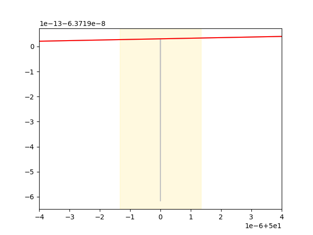
## New Eq:
((fabs(-50.0 + membrane__V) < 1.3356880329551402e-6) ? ((-18716944.911788113 + 374338.90823576227 * membrane__V) * (1.3999999999689304e-7 * (1.0 - L_type_Ca_channel_f_gate__f) * (1.0 - intracellular_calcium_concentration__Ca_ds / (0.001 + intracellular_calcium_concentration__Ca_ds)) * (intracellular_calcium_concentration__Ca_i * exp(3.7433890822745473) - extracellular_calcium_concentration__Ca_o * exp(9.9999999999406119e-8)) * L_type_Ca_channel__P_Ca_L * L_type_Ca_channel_d_gate__d / (1.0 - exp(9.9999999999406119e-8)) + 1.3999999999689304e-7 * (1.0 - L_type_Ca_channel_f_gate__f) * (1.0 - intracellular_calcium_concentration__Ca_ds / (0.001 + intracellular_calcium_concentration__Ca_ds)) * (intracellular_calcium_concentration__Ca_i * exp(3.7433890822745473) - extracellular_calcium_concentration__Ca_o * exp(-9.9999999999406119e-8)) * L_type_Ca_channel__P_Ca_L * L_type_Ca_channel_d_gate__d / (1.0 - exp(-9.9999999999406119e-8))) - 1.3999999999689304e-7 * (1.0 - L_type_Ca_channel_f_gate__f) * (1.0 - intracellular_calcium_concentration__Ca_ds / (0.001 + intracellular_calcium_concentration__Ca_ds)) * (intracellular_calcium_concentration__Ca_i * exp(3.7433890822745473) - extracellular_calcium_concentration__Ca_o * exp(9.9999999999406119e-8)) * L_type_Ca_channel__P_Ca_L * L_type_Ca_channel_d_gate__d / (1.0 - exp(9.9999999999406119e-8))) : (4.0 * (-50.0 + membrane__V) * (intracellular_calcium_concentration__Ca_i * exp(100.0 * membrane__F / (membrane__R * membrane__T)) - extracellular_calcium_concentration__Ca_o * exp(2.0 * (50.0 - membrane__V) * membrane__F / (membrane__R * membrane__T))) * L_type_Ca_channel__FrICa * L_type_Ca_channel__P_Ca_L * L_type_Ca_channel_d_gate__d * L_type_Ca_channel_f_gate__CaChonds * membrane__F / ((1.0 - exp(2.0 * (50.0 - membrane__V) * membrane__F / (membrane__R * membrane__T))) * membrane__R * membrane__T)))

## Equation 3:
```
L_type_Ca_channel__i_Ca_L_K_cyt = (1.0 - L_type_Ca_channel__FrICa) * (-50.0 + membrane__V) * (intracellular_potassium_concentration__K_i * exp(50.0 * membrane__F / (membrane__R * membrane__T)) - extracellular_potassium_concentration__K_o * exp((50.0 - membrane__V) * membrane__F / (membrane__R * membrane__T))) * L_type_Ca_channel__P_CaK * L_type_Ca_channel__P_Ca_L * L_type_Ca_channel_d_gate__d * L_type_Ca_channel_f_gate__CaChoncyt * membrane__F / ((1.0 - exp((50.0 - membrane__V) * membrane__F / (membrane__R * membrane__T))) * membrane__R * membrane__T)
```
### Partially evaluated to: 
```
L_type_Ca_channel__i_Ca_L_K_cyt = 2.2460334493647287e-5 * (1.0 - L_type_Ca_channel_f_gate__f) * (1.0 - intracellular_calcium_concentration__Ca_i / (0.01 + intracellular_calcium_concentration__Ca_i)) * (-50.0 + membrane__V) * (6.4993004051833205 * intracellular_potassium_concentration__K_i - 6.4993004051833205 * extracellular_potassium_concentration__K_o * exp(-0.037433890822745473 * membrane__V)) * L_type_Ca_channel__P_Ca_L * L_type_Ca_channel_d_gate__d / (1.0 - 6.4993004051833205 * exp(-0.037433890822745473 * membrane__V))
```
### Singulariy points detected:

{50.000000000000000}
*U*
`1.8716945411372736 - 0.037433890822745473 * membrane__V`

*V for 1e-07 range* 
`49.999997328623934 - 50.000002671376066`

*Singularity point: 50.000000000000000*


## New Eq:
((fabs(-50.0 + membrane__V) < 2.6713760659657915e-6) ? ((-9358472.2056995872 + 187169.45411399176 * membrane__V) * (5.9999999999915252e-11 * (1.0 - L_type_Ca_channel_f_gate__f) * (1.0 - intracellular_calcium_concentration__Ca_i / (0.01 + intracellular_calcium_concentration__Ca_i)) * (intracellular_potassium_concentration__K_i * exp(1.8716945411372736) - extracellular_potassium_concentration__K_o * exp(9.9999999999406119e-8)) * L_type_Ca_channel__P_Ca_L * L_type_Ca_channel_d_gate__d / (1.0 - exp(9.9999999999406119e-8)) + 5.9999999999915252e-11 * (1.0 - L_type_Ca_channel_f_gate__f) * (1.0 - intracellular_calcium_concentration__Ca_i / (0.01 + intracellular_calcium_concentration__Ca_i)) * (intracellular_potassium_concentration__K_i * exp(1.8716945411372736) - extracellular_potassium_concentration__K_o * exp(-9.9999999999406119e-8)) * L_type_Ca_channel__P_Ca_L * L_type_Ca_channel_d_gate__d / (1.0 - exp(-9.9999999999406119e-8))) - 5.9999999999915252e-11 * (1.0 - L_type_Ca_channel_f_gate__f) * (1.0 - intracellular_calcium_concentration__Ca_i / (0.01 + intracellular_calcium_concentration__Ca_i)) * (intracellular_potassium_concentration__K_i * exp(1.8716945411372736) - extracellular_potassium_concentration__K_o * exp(9.9999999999406119e-8)) * L_type_Ca_channel__P_Ca_L * L_type_Ca_channel_d_gate__d / (1.0 - exp(9.9999999999406119e-8))) : ((1.0 - L_type_Ca_channel__FrICa) * (-50.0 + membrane__V) * (intracellular_potassium_concentration__K_i * exp(50.0 * membrane__F / (membrane__R * membrane__T)) - extracellular_potassium_concentration__K_o * exp((50.0 - membrane__V) * membrane__F / (membrane__R * membrane__T))) * L_type_Ca_channel__P_CaK * L_type_Ca_channel__P_Ca_L * L_type_Ca_channel_d_gate__d * L_type_Ca_channel_f_gate__CaChoncyt * membrane__F / ((1.0 - exp((50.0 - membrane__V) * membrane__F / (membrane__R * membrane__T))) * membrane__R * membrane__T)))

## Equation 4:
```
L_type_Ca_channel__i_Ca_L_K_ds = (-50.0 + membrane__V) * (intracellular_potassium_concentration__K_i * exp(50.0 * membrane__F / (membrane__R * membrane__T)) - extracellular_potassium_concentration__K_o * exp((50.0 - membrane__V) * membrane__F / (membrane__R * membrane__T))) * L_type_Ca_channel__FrICa * L_type_Ca_channel__P_CaK * L_type_Ca_channel__P_Ca_L * L_type_Ca_channel_d_gate__d * L_type_Ca_channel_f_gate__CaChonds * membrane__F / ((1.0 - exp((50.0 - membrane__V) * membrane__F / (membrane__R * membrane__T))) * membrane__R * membrane__T)
```
### Partially evaluated to: 
```
L_type_Ca_channel__i_Ca_L_K_ds = 5.2407447151843657e-5 * (1.0 - L_type_Ca_channel_f_gate__f) * (1.0 - intracellular_calcium_concentration__Ca_ds / (0.001 + intracellular_calcium_concentration__Ca_ds)) * (-50.0 + membrane__V) * (6.4993004051833205 * intracellular_potassium_concentration__K_i - 6.4993004051833205 * extracellular_potassium_concentration__K_o * exp(-0.037433890822745473 * membrane__V)) * L_type_Ca_channel__P_Ca_L * L_type_Ca_channel_d_gate__d / (1.0 - 6.4993004051833205 * exp(-0.037433890822745473 * membrane__V))
```
### Singulariy points detected:

{50.000000000000000}
*U*
`1.8716945411372736 - 0.037433890822745473 * membrane__V`

*V for 1e-07 range* 
`49.999997328623934 - 50.000002671376066`

*Singularity point: 50.000000000000000*

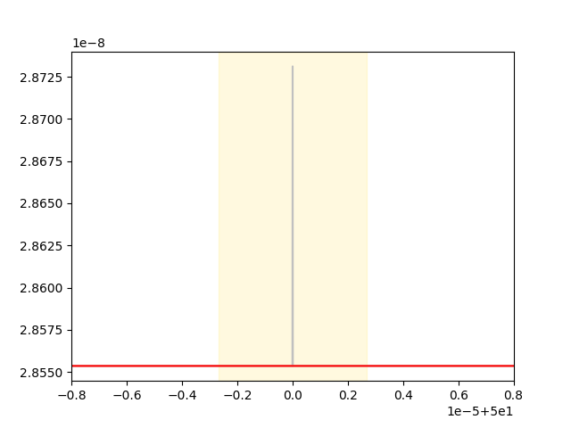
## New Eq:
((fabs(-50.0 + membrane__V) < 2.6713760659657915e-6) ? ((-9358472.2056995872 + 187169.45411399176 * membrane__V) * (1.3999999999980223e-10 * (1.0 - L_type_Ca_channel_f_gate__f) * (1.0 - intracellular_calcium_concentration__Ca_ds / (0.001 + intracellular_calcium_concentration__Ca_ds)) * (intracellular_potassium_concentration__K_i * exp(1.8716945411372736) - extracellular_potassium_concentration__K_o * exp(9.9999999999406119e-8)) * L_type_Ca_channel__P_Ca_L * L_type_Ca_channel_d_gate__d / (1.0 - exp(9.9999999999406119e-8)) + 1.3999999999980223e-10 * (1.0 - L_type_Ca_channel_f_gate__f) * (1.0 - intracellular_calcium_concentration__Ca_ds / (0.001 + intracellular_calcium_concentration__Ca_ds)) * (intracellular_potassium_concentration__K_i * exp(1.8716945411372736) - extracellular_potassium_concentration__K_o * exp(-9.9999999999406119e-8)) * L_type_Ca_channel__P_Ca_L * L_type_Ca_channel_d_gate__d / (1.0 - exp(-9.9999999999406119e-8))) - 1.3999999999980223e-10 * (1.0 - L_type_Ca_channel_f_gate__f) * (1.0 - intracellular_calcium_concentration__Ca_ds / (0.001 + intracellular_calcium_concentration__Ca_ds)) * (intracellular_potassium_concentration__K_i * exp(1.8716945411372736) - extracellular_potassium_concentration__K_o * exp(9.9999999999406119e-8)) * L_type_Ca_channel__P_Ca_L * L_type_Ca_channel_d_gate__d / (1.0 - exp(9.9999999999406119e-8))) : ((-50.0 + membrane__V) * (intracellular_potassium_concentration__K_i * exp(50.0 * membrane__F / (membrane__R * membrane__T)) - extracellular_potassium_concentration__K_o * exp((50.0 - membrane__V) * membrane__F / (membrane__R * membrane__T))) * L_type_Ca_channel__FrICa * L_type_Ca_channel__P_CaK * L_type_Ca_channel__P_Ca_L * L_type_Ca_channel_d_gate__d * L_type_Ca_channel_f_gate__CaChonds * membrane__F / ((1.0 - exp((50.0 - membrane__V) * membrane__F / (membrane__R * membrane__T))) * membrane__R * membrane__T)))

## Equation 5:
```
L_type_Ca_channel__i_Ca_L_Na_cyt = (1.0 - L_type_Ca_channel__FrICa) * (-50.0 + membrane__V) * (intracellular_sodium_concentration__Na_i * exp(50.0 * membrane__F / (membrane__R * membrane__T)) - extracellular_sodium_concentration__Na_o * exp((50.0 - membrane__V) * membrane__F / (membrane__R * membrane__T))) * L_type_Ca_channel__P_CaNa * L_type_Ca_channel__P_Ca_L * L_type_Ca_channel_d_gate__d * L_type_Ca_channel_f_gate__CaChoncyt * membrane__F / ((1.0 - exp((50.0 - membrane__V) * membrane__F / (membrane__R * membrane__T))) * membrane__R * membrane__T)
```
### Partially evaluated to: 
```
L_type_Ca_channel__i_Ca_L_Na_cyt = 0.00011230167246823643 * (1.0 - L_type_Ca_channel_f_gate__f) * (1.0 - intracellular_calcium_concentration__Ca_i / (0.01 + intracellular_calcium_concentration__Ca_i)) * (-50.0 + membrane__V) * (6.4993004051833205 * intracellular_sodium_concentration__Na_i - 6.4993004051833205 * extracellular_sodium_concentration__Na_o * exp(-0.037433890822745473 * membrane__V)) * L_type_Ca_channel__P_Ca_L * L_type_Ca_channel_d_gate__d / (1.0 - 6.4993004051833205 * exp(-0.037433890822745473 * membrane__V))
```
### Singulariy points detected:

{50.000000000000000}
*U*
`1.8716945411372736 - 0.037433890822745473 * membrane__V`

*V for 1e-07 range* 
`49.999997328623934 - 50.000002671376066`

*Singularity point: 50.000000000000000*

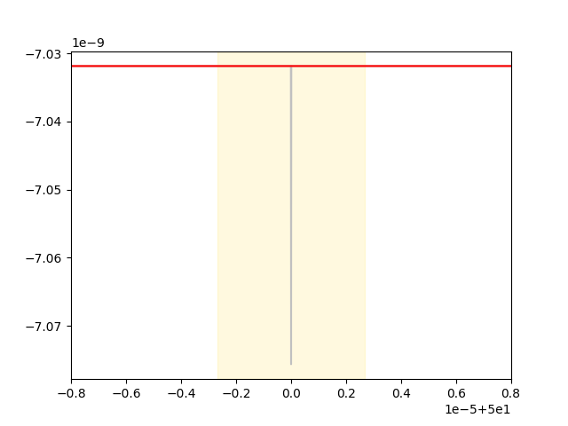
## New Eq:
((fabs(-50.0 + membrane__V) < 2.6713760659657915e-6) ? ((-9358472.2056995872 + 187169.45411399176 * membrane__V) * (2.9999999999957627e-10 * (1.0 - L_type_Ca_channel_f_gate__f) * (1.0 - intracellular_calcium_concentration__Ca_i / (0.01 + intracellular_calcium_concentration__Ca_i)) * (intracellular_sodium_concentration__Na_i * exp(1.8716945411372736) - extracellular_sodium_concentration__Na_o * exp(9.9999999999406119e-8)) * L_type_Ca_channel__P_Ca_L * L_type_Ca_channel_d_gate__d / (1.0 - exp(9.9999999999406119e-8)) + 2.9999999999957627e-10 * (1.0 - L_type_Ca_channel_f_gate__f) * (1.0 - intracellular_calcium_concentration__Ca_i / (0.01 + intracellular_calcium_concentration__Ca_i)) * (intracellular_sodium_concentration__Na_i * exp(1.8716945411372736) - extracellular_sodium_concentration__Na_o * exp(-9.9999999999406119e-8)) * L_type_Ca_channel__P_Ca_L * L_type_Ca_channel_d_gate__d / (1.0 - exp(-9.9999999999406119e-8))) - 2.9999999999957627e-10 * (1.0 - L_type_Ca_channel_f_gate__f) * (1.0 - intracellular_calcium_concentration__Ca_i / (0.01 + intracellular_calcium_concentration__Ca_i)) * (intracellular_sodium_concentration__Na_i * exp(1.8716945411372736) - extracellular_sodium_concentration__Na_o * exp(9.9999999999406119e-8)) * L_type_Ca_channel__P_Ca_L * L_type_Ca_channel_d_gate__d / (1.0 - exp(9.9999999999406119e-8))) : ((1.0 - L_type_Ca_channel__FrICa) * (-50.0 + membrane__V) * (intracellular_sodium_concentration__Na_i * exp(50.0 * membrane__F / (membrane__R * membrane__T)) - extracellular_sodium_concentration__Na_o * exp((50.0 - membrane__V) * membrane__F / (membrane__R * membrane__T))) * L_type_Ca_channel__P_CaNa * L_type_Ca_channel__P_Ca_L * L_type_Ca_channel_d_gate__d * L_type_Ca_channel_f_gate__CaChoncyt * membrane__F / ((1.0 - exp((50.0 - membrane__V) * membrane__F / (membrane__R * membrane__T))) * membrane__R * membrane__T)))

## Equation 6:
```
L_type_Ca_channel__i_Ca_L_Na_ds = (-50.0 + membrane__V) * (intracellular_sodium_concentration__Na_i * exp(50.0 * membrane__F / (membrane__R * membrane__T)) - extracellular_sodium_concentration__Na_o * exp((50.0 - membrane__V) * membrane__F / (membrane__R * membrane__T))) * L_type_Ca_channel__FrICa * L_type_Ca_channel__P_CaNa * L_type_Ca_channel__P_Ca_L * L_type_Ca_channel_d_gate__d * L_type_Ca_channel_f_gate__CaChonds * membrane__F / ((1.0 - exp((50.0 - membrane__V) * membrane__F / (membrane__R * membrane__T))) * membrane__R * membrane__T)
```
### Partially evaluated to: 
```
L_type_Ca_channel__i_Ca_L_Na_ds = 0.00026203723575921831 * (1.0 - L_type_Ca_channel_f_gate__f) * (1.0 - intracellular_calcium_concentration__Ca_ds / (0.001 + intracellular_calcium_concentration__Ca_ds)) * (-50.0 + membrane__V) * (6.4993004051833205 * intracellular_sodium_concentration__Na_i - 6.4993004051833205 * extracellular_sodium_concentration__Na_o * exp(-0.037433890822745473 * membrane__V)) * L_type_Ca_channel__P_Ca_L * L_type_Ca_channel_d_gate__d / (1.0 - 6.4993004051833205 * exp(-0.037433890822745473 * membrane__V))
```
### Singulariy points detected:

{50.000000000000000}
*U*
`1.8716945411372736 - 0.037433890822745473 * membrane__V`

*V for 1e-07 range* 
`49.999997328623934 - 50.000002671376066`

*Singularity point: 50.000000000000000*


## New Eq:
((fabs(-50.0 + membrane__V) < 2.6713760659657915e-6) ? ((-9358472.2056995872 + 187169.45411399176 * membrane__V) * (6.9999999999901117e-10 * (1.0 - L_type_Ca_channel_f_gate__f) * (1.0 - intracellular_calcium_concentration__Ca_ds / (0.001 + intracellular_calcium_concentration__Ca_ds)) * (intracellular_sodium_concentration__Na_i * exp(1.8716945411372736) - extracellular_sodium_concentration__Na_o * exp(9.9999999999406119e-8)) * L_type_Ca_channel__P_Ca_L * L_type_Ca_channel_d_gate__d / (1.0 - exp(9.9999999999406119e-8)) + 6.9999999999901117e-10 * (1.0 - L_type_Ca_channel_f_gate__f) * (1.0 - intracellular_calcium_concentration__Ca_ds / (0.001 + intracellular_calcium_concentration__Ca_ds)) * (intracellular_sodium_concentration__Na_i * exp(1.8716945411372736) - extracellular_sodium_concentration__Na_o * exp(-9.9999999999406119e-8)) * L_type_Ca_channel__P_Ca_L * L_type_Ca_channel_d_gate__d / (1.0 - exp(-9.9999999999406119e-8))) - 6.9999999999901117e-10 * (1.0 - L_type_Ca_channel_f_gate__f) * (1.0 - intracellular_calcium_concentration__Ca_ds / (0.001 + intracellular_calcium_concentration__Ca_ds)) * (intracellular_sodium_concentration__Na_i * exp(1.8716945411372736) - extracellular_sodium_concentration__Na_o * exp(9.9999999999406119e-8)) * L_type_Ca_channel__P_Ca_L * L_type_Ca_channel_d_gate__d / (1.0 - exp(9.9999999999406119e-8))) : ((-50.0 + membrane__V) * (intracellular_sodium_concentration__Na_i * exp(50.0 * membrane__F / (membrane__R * membrane__T)) - extracellular_sodium_concentration__Na_o * exp((50.0 - membrane__V) * membrane__F / (membrane__R * membrane__T))) * L_type_Ca_channel__FrICa * L_type_Ca_channel__P_CaNa * L_type_Ca_channel__P_Ca_L * L_type_Ca_channel_d_gate__d * L_type_Ca_channel_f_gate__CaChonds * membrane__F / ((1.0 - exp((50.0 - membrane__V) * membrane__F / (membrane__R * membrane__T))) * membrane__R * membrane__T)))

# Model: NN_SAN_model_1984(noble_noble_SAN_model_1984.cellml)
## Equation 1:
```
second_inward_current__i_siCa = 4.0 * (-50.0 + membrane__V) * (intracellular_calcium_concentration__Cai * exp(100.0 / membrane__RTONF) - extracellular_calcium_concentration__Cao * exp(-2.0 * (-50.0 + membrane__V) / membrane__RTONF)) * second_inward_current__P_si * second_inward_current_d_gate__d * second_inward_current_f2_gate__f2 * second_inward_current_f_gate__f / ((1.0 - exp(-2.0 * (-50.0 + membrane__V) / membrane__RTONF)) * membrane__RTONF)
```
### Partially evaluated to: 
```
second_inward_current__i_siCa = 0.14973556329098189 * (-50.0 + membrane__V) * (42.240905756816076 * intracellular_calcium_concentration__Cai - 42.240905756816076 * extracellular_calcium_concentration__Cao * exp(-0.074867781645490947 * membrane__V)) * second_inward_current__P_si * second_inward_current_d_gate__d * second_inward_current_f2_gate__f2 * second_inward_current_f_gate__f / (1.0 - 42.240905756816076 * exp(-0.074867781645490947 * membrane__V))
```
### Singulariy points detected:

{50.000000000000000}
*U*
`3.7433890822745473 - 0.074867781645490947 * membrane__V`

*V for 1e-07 range* 
`49.999998664311967 - 50.000001335688033`

*Singularity point: 50.000000000000000*

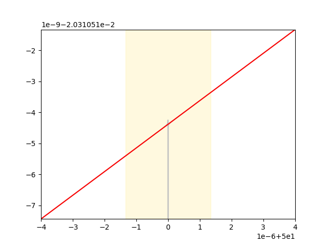
## New Eq:
((fabs(-50.0 + membrane__V) < 1.3356880329551402e-6) ? ((-18716944.911788113 + 374338.90823576227 * membrane__V) * (1.9999999999556149e-7 * (intracellular_calcium_concentration__Cai * exp(3.7433890822745473) - extracellular_calcium_concentration__Cao * exp(9.9999999999406119e-8)) * second_inward_current__P_si * second_inward_current_d_gate__d * second_inward_current_f2_gate__f2 * second_inward_current_f_gate__f / (1.0 - exp(9.9999999999406119e-8)) + 1.9999999999556149e-7 * (intracellular_calcium_concentration__Cai * exp(3.7433890822745473) - extracellular_calcium_concentration__Cao * exp(-9.9999999995936673e-8)) * second_inward_current__P_si * second_inward_current_d_gate__d * second_inward_current_f2_gate__f2 * second_inward_current_f_gate__f / (1.0 - exp(-9.9999999995936673e-8))) - 1.9999999999556149e-7 * (intracellular_calcium_concentration__Cai * exp(3.7433890822745473) - extracellular_calcium_concentration__Cao * exp(9.9999999999406119e-8)) * second_inward_current__P_si * second_inward_current_d_gate__d * second_inward_current_f2_gate__f2 * second_inward_current_f_gate__f / (1.0 - exp(9.9999999999406119e-8))) : (4.0 * (-50.0 + membrane__V) * (intracellular_calcium_concentration__Cai * exp(100.0 / membrane__RTONF) - extracellular_calcium_concentration__Cao * exp(-2.0 * (-50.0 + membrane__V) / membrane__RTONF)) * second_inward_current__P_si * second_inward_current_d_gate__d * second_inward_current_f2_gate__f2 * second_inward_current_f_gate__f / ((1.0 - exp(-2.0 * (-50.0 + membrane__V) / membrane__RTONF)) * membrane__RTONF)))

## Equation 2:
```
second_inward_current__i_siK = 0.01 * (-50.0 + membrane__V) * (intracellular_potassium_concentration__Ki * exp(50.0 / membrane__RTONF) - extracellular_potassium_concentration__Kc * exp(-(-50.0 + membrane__V) / membrane__RTONF)) * second_inward_current__P_si * second_inward_current_d_gate__d * second_inward_current_f2_gate__f2 * second_inward_current_f_gate__f / ((1.0 - exp(-(-50.0 + membrane__V) / membrane__RTONF)) * membrane__RTONF)
```
### Partially evaluated to: 
```
second_inward_current__i_siK = 0.00037433890822745472 * (-50.0 + membrane__V) * (6.4993004051833205 * intracellular_potassium_concentration__Ki - 6.4993004051833205 * extracellular_potassium_concentration__Kc * exp(-0.037433890822745473 * membrane__V)) * second_inward_current__P_si * second_inward_current_d_gate__d * second_inward_current_f2_gate__f2 * second_inward_current_f_gate__f / (1.0 - 6.4993004051833205 * exp(-0.037433890822745473 * membrane__V))
```
### Singulariy points detected:

{50.000000000000000}
*U*
`1.8716945411372736 - 0.037433890822745473 * membrane__V`

*V for 1e-07 range* 
`49.999997328623934 - 50.000002671376066`

*Singularity point: 50.000000000000000*

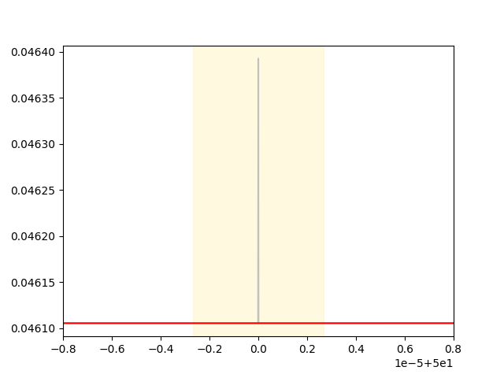
## New Eq:
((fabs(-50.0 + membrane__V) < 2.6713760659657915e-6) ? ((-9358472.2056995872 + 187169.45411399176 * membrane__V) * (9.9999999999858744e-10 * (intracellular_potassium_concentration__Ki * exp(1.8716945411372736) - extracellular_potassium_concentration__Kc * exp(9.9999999999406119e-8)) * second_inward_current__P_si * second_inward_current_d_gate__d * second_inward_current_f2_gate__f2 * second_inward_current_f_gate__f / (1.0 - exp(9.9999999999406119e-8)) + 9.9999999999858744e-10 * (intracellular_potassium_concentration__Ki * exp(1.8716945411372736) - extracellular_potassium_concentration__Kc * exp(-9.9999999999406119e-8)) * second_inward_current__P_si * second_inward_current_d_gate__d * second_inward_current_f2_gate__f2 * second_inward_current_f_gate__f / (1.0 - exp(-9.9999999999406119e-8))) - 9.9999999999858744e-10 * (intracellular_potassium_concentration__Ki * exp(1.8716945411372736) - extracellular_potassium_concentration__Kc * exp(9.9999999999406119e-8)) * second_inward_current__P_si * second_inward_current_d_gate__d * second_inward_current_f2_gate__f2 * second_inward_current_f_gate__f / (1.0 - exp(9.9999999999406119e-8))) : (0.01 * (-50.0 + membrane__V) * (intracellular_potassium_concentration__Ki * exp(50.0 / membrane__RTONF) - extracellular_potassium_concentration__Kc * exp(-(-50.0 + membrane__V) / membrane__RTONF)) * second_inward_current__P_si * second_inward_current_d_gate__d * second_inward_current_f2_gate__f2 * second_inward_current_f_gate__f / ((1.0 - exp(-(-50.0 + membrane__V) / membrane__RTONF)) * membrane__RTONF)))

## Equation 3:
```
second_inward_current__i_siNa = 0.01 * (-50.0 + membrane__V) * (intracellular_sodium_concentration__Nai * exp(50.0 / membrane__RTONF) - extracellular_sodium_concentration__Nao * exp(-(-50.0 + membrane__V) / membrane__RTONF)) * second_inward_current__P_si * second_inward_current_d_gate__d * second_inward_current_f2_gate__f2 * second_inward_current_f_gate__f / ((1.0 - exp(-(-50.0 + membrane__V) / membrane__RTONF)) * membrane__RTONF)
```
### Partially evaluated to: 
```
second_inward_current__i_siNa = 0.00037433890822745472 * (-50.0 + membrane__V) * (6.4993004051833205 * intracellular_sodium_concentration__Nai - 6.4993004051833205 * extracellular_sodium_concentration__Nao * exp(-0.037433890822745473 * membrane__V)) * second_inward_current__P_si * second_inward_current_d_gate__d * second_inward_current_f2_gate__f2 * second_inward_current_f_gate__f / (1.0 - 6.4993004051833205 * exp(-0.037433890822745473 * membrane__V))
```
### Singulariy points detected:

{50.000000000000000}
*U*
`1.8716945411372736 - 0.037433890822745473 * membrane__V`

*V for 1e-07 range* 
`49.999997328623934 - 50.000002671376066`

*Singularity point: 50.000000000000000*


## New Eq:
((fabs(-50.0 + membrane__V) < 2.6713760659657915e-6) ? ((-9358472.2056995872 + 187169.45411399176 * membrane__V) * (9.9999999999858744e-10 * (intracellular_sodium_concentration__Nai * exp(1.8716945411372736) - extracellular_sodium_concentration__Nao * exp(9.9999999999406119e-8)) * second_inward_current__P_si * second_inward_current_d_gate__d * second_inward_current_f2_gate__f2 * second_inward_current_f_gate__f / (1.0 - exp(9.9999999999406119e-8)) + 9.9999999999858744e-10 * (intracellular_sodium_concentration__Nai * exp(1.8716945411372736) - extracellular_sodium_concentration__Nao * exp(-9.9999999999406119e-8)) * second_inward_current__P_si * second_inward_current_d_gate__d * second_inward_current_f2_gate__f2 * second_inward_current_f_gate__f / (1.0 - exp(-9.9999999999406119e-8))) - 9.9999999999858744e-10 * (intracellular_sodium_concentration__Nai * exp(1.8716945411372736) - extracellular_sodium_concentration__Nao * exp(9.9999999999406119e-8)) * second_inward_current__P_si * second_inward_current_d_gate__d * second_inward_current_f2_gate__f2 * second_inward_current_f_gate__f / (1.0 - exp(9.9999999999406119e-8))) : (0.01 * (-50.0 + membrane__V) * (intracellular_sodium_concentration__Nai * exp(50.0 / membrane__RTONF) - extracellular_sodium_concentration__Nao * exp(-(-50.0 + membrane__V) / membrane__RTONF)) * second_inward_current__P_si * second_inward_current_d_gate__d * second_inward_current_f2_gate__f2 * second_inward_current_f_gate__f / ((1.0 - exp(-(-50.0 + membrane__V) / membrane__RTONF)) * membrane__RTONF)))

# Model: Noble_SAN_model_1989(noble_SAN_model_1989.cellml)
## Equation 1:
```
second_inward_current__i_siCa = 4.0 * (-50.0 + membrane__V) * (intracellular_calcium_concentration__Cai * exp(100.0 / membrane__RTONF) - extracellular_calcium_concentration__Cao * exp(-2.0 * (-50.0 + membrane__V) / membrane__RTONF)) * second_inward_current__P_si * second_inward_current_d_gate__d * second_inward_current_f2_gate__f2 * second_inward_current_f_gate__f / ((1.0 - exp(-2.0 * (-50.0 + membrane__V) / membrane__RTONF)) * membrane__RTONF)
```
### Partially evaluated to: 
```
second_inward_current__i_siCa = 0.14973556329098189 * (-50.0 + membrane__V) * (42.240905756816076 * intracellular_calcium_concentration__Cai - 42.240905756816076 * extracellular_calcium_concentration__Cao * exp(-0.074867781645490947 * membrane__V)) * second_inward_current__P_si * second_inward_current_d_gate__d * second_inward_current_f2_gate__f2 * second_inward_current_f_gate__f / (1.0 - 42.240905756816076 * exp(-0.074867781645490947 * membrane__V))
```
### Singulariy points detected:

{50.000000000000000}
*U*
`3.7433890822745473 - 0.074867781645490947 * membrane__V`

*V for 1e-07 range* 
`49.999998664311967 - 50.000001335688033`

*Singularity point: 50.000000000000000*

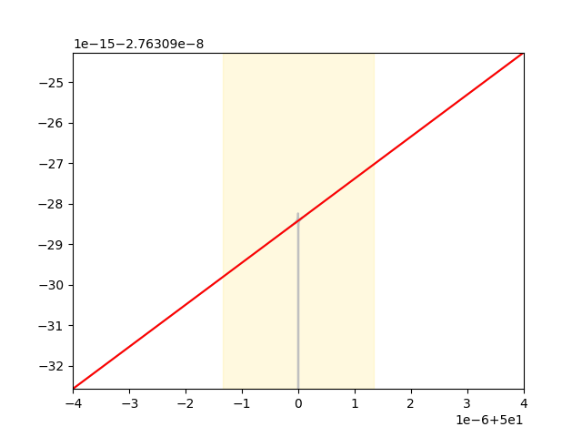
## New Eq:
((fabs(-50.0 + membrane__V) < 1.3356880329551402e-6) ? ((-18716944.911788113 + 374338.90823576227 * membrane__V) * (1.9999999999556149e-7 * (intracellular_calcium_concentration__Cai * exp(3.7433890822745473) - extracellular_calcium_concentration__Cao * exp(9.9999999999406119e-8)) * second_inward_current__P_si * second_inward_current_d_gate__d * second_inward_current_f2_gate__f2 * second_inward_current_f_gate__f / (1.0 - exp(9.9999999999406119e-8)) + 1.9999999999556149e-7 * (intracellular_calcium_concentration__Cai * exp(3.7433890822745473) - extracellular_calcium_concentration__Cao * exp(-9.9999999995936673e-8)) * second_inward_current__P_si * second_inward_current_d_gate__d * second_inward_current_f2_gate__f2 * second_inward_current_f_gate__f / (1.0 - exp(-9.9999999995936673e-8))) - 1.9999999999556149e-7 * (intracellular_calcium_concentration__Cai * exp(3.7433890822745473) - extracellular_calcium_concentration__Cao * exp(9.9999999999406119e-8)) * second_inward_current__P_si * second_inward_current_d_gate__d * second_inward_current_f2_gate__f2 * second_inward_current_f_gate__f / (1.0 - exp(9.9999999999406119e-8))) : (4.0 * (-50.0 + membrane__V) * (intracellular_calcium_concentration__Cai * exp(100.0 / membrane__RTONF) - extracellular_calcium_concentration__Cao * exp(-2.0 * (-50.0 + membrane__V) / membrane__RTONF)) * second_inward_current__P_si * second_inward_current_d_gate__d * second_inward_current_f2_gate__f2 * second_inward_current_f_gate__f / ((1.0 - exp(-2.0 * (-50.0 + membrane__V) / membrane__RTONF)) * membrane__RTONF)))

## Equation 2:
```
second_inward_current__i_siK = 0.01 * (-50.0 + membrane__V) * (intracellular_potassium_concentration__Ki * exp(50.0 / membrane__RTONF) - extracellular_potassium_concentration__Kc * exp(-(-50.0 + membrane__V) / membrane__RTONF)) * second_inward_current__P_si * second_inward_current_d_gate__d * second_inward_current_f2_gate__f2 * second_inward_current_f_gate__f / ((1.0 - exp(-(-50.0 + membrane__V) / membrane__RTONF)) * membrane__RTONF)
```
### Partially evaluated to: 
```
second_inward_current__i_siK = 0.00037433890822745472 * (-50.0 + membrane__V) * (6.4993004051833205 * intracellular_potassium_concentration__Ki - 6.4993004051833205 * extracellular_potassium_concentration__Kc * exp(-0.037433890822745473 * membrane__V)) * second_inward_current__P_si * second_inward_current_d_gate__d * second_inward_current_f2_gate__f2 * second_inward_current_f_gate__f / (1.0 - 6.4993004051833205 * exp(-0.037433890822745473 * membrane__V))
```
### Singulariy points detected:

{50.000000000000000}
*U*
`1.8716945411372736 - 0.037433890822745473 * membrane__V`

*V for 1e-07 range* 
`49.999997328623934 - 50.000002671376066`

*Singularity point: 50.000000000000000*

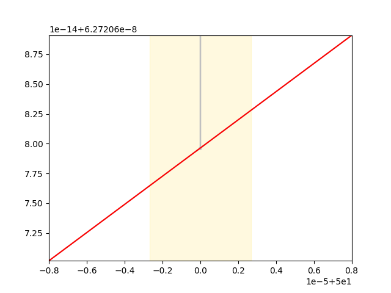
## New Eq:
((fabs(-50.0 + membrane__V) < 2.6713760659657915e-6) ? ((-9358472.2056995872 + 187169.45411399176 * membrane__V) * (9.9999999999858744e-10 * (intracellular_potassium_concentration__Ki * exp(1.8716945411372736) - extracellular_potassium_concentration__Kc * exp(9.9999999999406119e-8)) * second_inward_current__P_si * second_inward_current_d_gate__d * second_inward_current_f2_gate__f2 * second_inward_current_f_gate__f / (1.0 - exp(9.9999999999406119e-8)) + 9.9999999999858744e-10 * (intracellular_potassium_concentration__Ki * exp(1.8716945411372736) - extracellular_potassium_concentration__Kc * exp(-9.9999999999406119e-8)) * second_inward_current__P_si * second_inward_current_d_gate__d * second_inward_current_f2_gate__f2 * second_inward_current_f_gate__f / (1.0 - exp(-9.9999999999406119e-8))) - 9.9999999999858744e-10 * (intracellular_potassium_concentration__Ki * exp(1.8716945411372736) - extracellular_potassium_concentration__Kc * exp(9.9999999999406119e-8)) * second_inward_current__P_si * second_inward_current_d_gate__d * second_inward_current_f2_gate__f2 * second_inward_current_f_gate__f / (1.0 - exp(9.9999999999406119e-8))) : (0.01 * (-50.0 + membrane__V) * (intracellular_potassium_concentration__Ki * exp(50.0 / membrane__RTONF) - extracellular_potassium_concentration__Kc * exp(-(-50.0 + membrane__V) / membrane__RTONF)) * second_inward_current__P_si * second_inward_current_d_gate__d * second_inward_current_f2_gate__f2 * second_inward_current_f_gate__f / ((1.0 - exp(-(-50.0 + membrane__V) / membrane__RTONF)) * membrane__RTONF)))

## Equation 3:
```
second_inward_current__i_siNa = 0.01 * (-50.0 + membrane__V) * (intracellular_sodium_concentration__Nai * exp(50.0 / membrane__RTONF) - extracellular_sodium_concentration__Nao * exp(-(-50.0 + membrane__V) / membrane__RTONF)) * second_inward_current__P_si * second_inward_current_d_gate__d * second_inward_current_f2_gate__f2 * second_inward_current_f_gate__f / ((1.0 - exp(-(-50.0 + membrane__V) / membrane__RTONF)) * membrane__RTONF)
```
### Partially evaluated to: 
```
second_inward_current__i_siNa = 0.00037433890822745472 * (-50.0 + membrane__V) * (6.4993004051833205 * intracellular_sodium_concentration__Nai - 6.4993004051833205 * extracellular_sodium_concentration__Nao * exp(-0.037433890822745473 * membrane__V)) * second_inward_current__P_si * second_inward_current_d_gate__d * second_inward_current_f2_gate__f2 * second_inward_current_f_gate__f / (1.0 - 6.4993004051833205 * exp(-0.037433890822745473 * membrane__V))
```
### Singulariy points detected:

{50.000000000000000}
*U*
`1.8716945411372736 - 0.037433890822745473 * membrane__V`

*V for 1e-07 range* 
`49.999997328623934 - 50.000002671376066`

*Singularity point: 50.000000000000000*

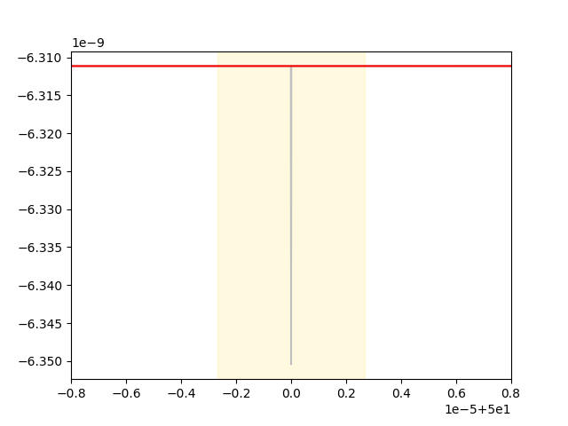
## New Eq:
((fabs(-50.0 + membrane__V) < 2.6713760659657915e-6) ? ((-9358472.2056995872 + 187169.45411399176 * membrane__V) * (9.9999999999858744e-10 * (intracellular_sodium_concentration__Nai * exp(1.8716945411372736) - extracellular_sodium_concentration__Nao * exp(9.9999999999406119e-8)) * second_inward_current__P_si * second_inward_current_d_gate__d * second_inward_current_f2_gate__f2 * second_inward_current_f_gate__f / (1.0 - exp(9.9999999999406119e-8)) + 9.9999999999858744e-10 * (intracellular_sodium_concentration__Nai * exp(1.8716945411372736) - extracellular_sodium_concentration__Nao * exp(-9.9999999999406119e-8)) * second_inward_current__P_si * second_inward_current_d_gate__d * second_inward_current_f2_gate__f2 * second_inward_current_f_gate__f / (1.0 - exp(-9.9999999999406119e-8))) - 9.9999999999858744e-10 * (intracellular_sodium_concentration__Nai * exp(1.8716945411372736) - extracellular_sodium_concentration__Nao * exp(9.9999999999406119e-8)) * second_inward_current__P_si * second_inward_current_d_gate__d * second_inward_current_f2_gate__f2 * second_inward_current_f_gate__f / (1.0 - exp(9.9999999999406119e-8))) : (0.01 * (-50.0 + membrane__V) * (intracellular_sodium_concentration__Nai * exp(50.0 / membrane__RTONF) - extracellular_sodium_concentration__Nao * exp(-(-50.0 + membrane__V) / membrane__RTONF)) * second_inward_current__P_si * second_inward_current_d_gate__d * second_inward_current_f2_gate__f2 * second_inward_current_f_gate__f / ((1.0 - exp(-(-50.0 + membrane__V) / membrane__RTONF)) * membrane__RTONF)))

# Model: nygren_atrial_model_1998(nygren_atrial_model_1998.cellml)
## Equation 1:
```
sodium_current__i_Na = pow(membrane__F, 2) * pow(sodium_current_m_gate__m, 3) * (-1.0 + exp((-sodium_current__E_Na + membrane__V) * membrane__F / (membrane__R * membrane__T))) * (0.10000000000000001 * sodium_current_h2_gate__h2 + 0.90000000000000002 * sodium_current_h1_gate__h1) * cleft_space_ion_concentrations__Na_c * membrane__V * sodium_current__P_Na / ((-1.0 + exp(membrane__F * membrane__V / (membrane__R * membrane__T))) * membrane__R * membrane__T)
```
### Partially evaluated to: 
```
sodium_current__i_Na = 3657.5756957513308 * pow(sodium_current_m_gate__m, 3) * (-1.0 + pow((cleft_space_ion_concentrations__Na_c / intracellular_ion_concentrations__Na_i), (-1.0)) * exp(0.037907445518581065 * membrane__V)) * (0.10000000000000001 * sodium_current_h2_gate__h2 + 0.90000000000000002 * sodium_current_h1_gate__h1) * cleft_space_ion_concentrations__Na_c * membrane__V * sodium_current__P_Na / (-1.0 + exp(0.037907445518581065 * membrane__V))
```
### Singulariy points detected:

{0}
*U*
`0.037907445518581065 * membrane__V`

*V for 1e-07 range* 
`-2.6380041870925613e-6 - 2.6380041870925613e-6`

*Singularity point: 0*

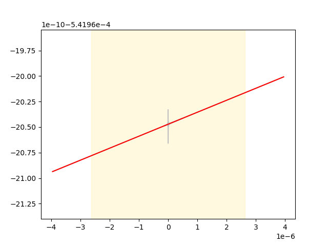
## New Eq:
((fabs(membrane__V) < 2.6380041870925613e-6) ? ((0.5 + 189537.22759290531 * membrane__V) * (0.0096486999999999996 * pow(sodium_current_m_gate__m, 3) * (-1.0 + exp(9.9999999999999995e-8 - log(cleft_space_ion_concentrations__Na_c / intracellular_ion_concentrations__Na_i))) * (0.10000000000000001 * sodium_current_h2_gate__h2 + 0.90000000000000002 * sodium_current_h1_gate__h1) * cleft_space_ion_concentrations__Na_c * sodium_current__P_Na / (-1.0 + exp(9.9999999999999995e-8)) + 0.0096486999999999996 * pow(sodium_current_m_gate__m, 3) * (-1.0 + exp(-9.9999999999999995e-8 - log(cleft_space_ion_concentrations__Na_c / intracellular_ion_concentrations__Na_i))) * (0.10000000000000001 * sodium_current_h2_gate__h2 + 0.90000000000000002 * sodium_current_h1_gate__h1) * cleft_space_ion_concentrations__Na_c * sodium_current__P_Na / (-1.0 + exp(-9.9999999999999995e-8))) - 0.0096486999999999996 * pow(sodium_current_m_gate__m, 3) * (-1.0 + exp(-9.9999999999999995e-8 - log(cleft_space_ion_concentrations__Na_c / intracellular_ion_concentrations__Na_i))) * (0.10000000000000001 * sodium_current_h2_gate__h2 + 0.90000000000000002 * sodium_current_h1_gate__h1) * cleft_space_ion_concentrations__Na_c * sodium_current__P_Na / (-1.0 + exp(-9.9999999999999995e-8))) : (pow(membrane__F, 2) * pow(sodium_current_m_gate__m, 3) * (-1.0 + exp((-sodium_current__E_Na + membrane__V) * membrane__F / (membrane__R * membrane__T))) * (0.10000000000000001 * sodium_current_h2_gate__h2 + 0.90000000000000002 * sodium_current_h1_gate__h1) * cleft_space_ion_concentrations__Na_c * membrane__V * sodium_current__P_Na / ((-1.0 + exp(membrane__F * membrane__V / (membrane__R * membrane__T))) * membrane__R * membrane__T)))

## Equation 2:
```
sodium_potassium_pump__i_NaK = pow(intracellular_ion_concentrations__Na_i, 1.5) * (150.0 + membrane__V) * cleft_space_ion_concentrations__K_c * sodium_potassium_pump__i_NaK_max / ((200.0 + membrane__V) * (pow(intracellular_ion_concentrations__Na_i, 1.5) + pow(sodium_potassium_pump__k_NaK_Na, 1.5)) * (cleft_space_ion_concentrations__K_c + sodium_potassium_pump__k_NaK_K))
```
### Partially evaluated to: 
```
sodium_potassium_pump__i_NaK = 70.825299999999999 * pow(intracellular_ion_concentrations__Na_i, 1.5) * (150.0 + membrane__V) * cleft_space_ion_concentrations__K_c / ((1.0 + cleft_space_ion_concentrations__K_c) * (200.0 + membrane__V) * (36.4828726939094 + pow(intracellular_ion_concentrations__Na_i, 1.5)))
```
### Singulariy points detected:

{-200.00000000000000}
#### float * A

####Failed!

<class 'sympy.core.mul.Mul'>
_intracellular_ion_concentrations$Na_i**1.5*_cleft_space_ion_concentrations$K_c*(_membrane$V + 150.0)/((_intracellular_ion_concentrations$Na_i**1.5 + 36.482872693909398)*(_cleft_space_ion_concentrations$K_c + 1.0)*(_membrane$V + 200.0))

*try substituting parameters*

#### float * A

####Failed!

<class 'sympy.core.mul.Mul'>
_intracellular_ion_concentrations$Na_i**1.5*_cleft_space_ion_concentrations$K_c*(_membrane$V + 150.0)/((_intracellular_ion_concentrations$Na_i**1.5 + 36.482872693909398)*(_cleft_space_ion_concentrations$K_c + 1.0)*(_membrane$V + 200.0))
# Model: ohara_rudy_2011_endo(ohara_rudy_2011_endo.cellml)
# Model: ohara_rudy_2011_epi(ohara_rudy_2011_epi.cellml)
# Model: ohara_rudy_cipa_v1_2017(ohara_rudy_cipa_v1_2017.cellml)
# Model: paci_hyttinen_aaltosetala_severi_atrialVersion(paci_hyttinen_aaltosetala_severi_atrialVersion.cellml)
# Model: paci_hyttinen_aaltosetala_severi_ventricularVersion(paci_hyttinen_aaltosetala_severi_ventricularVersion.cellml)
# Model: pandit_clark_giles_demir_2001_version06_variant01(pandit_clark_giles_demir_2001_endocardial_cell.cellml)
## Equation 1:
```
sodium_current_m_gate__tau_m = 0.0013600000000000001 / (0.080000000000000002 * exp(-0.090909090909090912 * membrane__V) + 0.32000000000000001 * (47.130000000000003 + membrane__V) / (1.0 - 0.00897780373069724 * exp(-0.10000000000000001 * membrane__V)))
```
### Partially evaluated to: 
```
sodium_current_m_gate__tau_m = 0.0013600000000000001 / (0.080000000000000002 * exp(-0.090909090909090912 * membrane__V) + 0.32000000000000001 * (47.130000000000003 + membrane__V) / (1.0 - 0.00897780373069724 * exp(-0.10000000000000001 * membrane__V)))
```
### Singulariy points detected:

{-47.130000000000003}
#### float * A

####1 / A


####A + B:

`0.080000000000000002 * exp(-0.090909090909090912 * membrane__V)`
`0.32000000000000001 * (47.130000000000003 + membrane__V) / (1.0 - 0.00897780373069724 * exp(-0.10000000000000001 * membrane__V))`

*U*
`-4.7130000000000001 - 0.10000000000000001 * membrane__V`

*V for 1e-07 range* 
`-47.130001 - -47.129999000000005`

*Singularity point: -47.130000000000003*

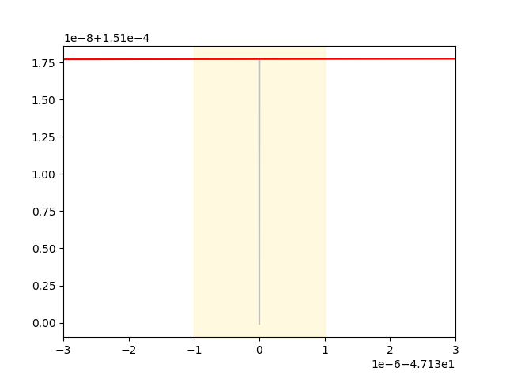
## New Eq:
((fabs(47.130000000000003 + membrane__V) < 1.0000000000287557e-6) ? (0.0013600000000000001 / (0.080000000000000002 * exp(4.284545545454546) - 3.200000000092018e-7 / (1.0 - exp(1.0000000000287557e-7))) + (23565000.499322373 + 499999.99998562218 * membrane__V) * (0.0013600000000000001 / (0.080000000000000002 * exp(4.2845453636363642) + 3.200000000092018e-7 / (1.0 - exp(-1.0000000000287557e-7))) - 0.0013600000000000001 / (0.080000000000000002 * exp(4.284545545454546) - 3.200000000092018e-7 / (1.0 - exp(1.0000000000287557e-7))))) : (0.0013600000000000001 / (0.080000000000000002 * exp(-0.090909090909090912 * membrane__V) + 0.32000000000000001 * (47.130000000000003 + membrane__V) / (1.0 - exp(-4.7130000000000001 - 0.10000000000000001 * membrane__V)))))

# Model: pandit_clark_giles_demir_2001(pandit_clark_giles_demir_2001_epicardial_cell.cellml)
## Equation 1:
```
sodium_current_m_gate__tau_m = 0.0013600000000000001 / (0.080000000000000002 * exp(-0.090909090909090912 * membrane__V) + 0.32000000000000001 * (47.130000000000003 + membrane__V) / (1.0 - 0.00897780373069724 * exp(-0.10000000000000001 * membrane__V)))
```
### Partially evaluated to: 
```
sodium_current_m_gate__tau_m = 0.0013600000000000001 / (0.080000000000000002 * exp(-0.090909090909090912 * membrane__V) + 0.32000000000000001 * (47.130000000000003 + membrane__V) / (1.0 - 0.00897780373069724 * exp(-0.10000000000000001 * membrane__V)))
```
### Singulariy points detected:

{-47.130000000000003}
#### float * A

####1 / A


####A + B:

`0.080000000000000002 * exp(-0.090909090909090912 * membrane__V)`
`0.32000000000000001 * (47.130000000000003 + membrane__V) / (1.0 - 0.00897780373069724 * exp(-0.10000000000000001 * membrane__V))`

*U*
`-4.7130000000000001 - 0.10000000000000001 * membrane__V`

*V for 1e-07 range* 
`-47.130001 - -47.129999000000005`

*Singularity point: -47.130000000000003*


## New Eq:
((fabs(47.130000000000003 + membrane__V) < 1.0000000000287557e-6) ? (0.0013600000000000001 / (0.080000000000000002 * exp(4.284545545454546) - 3.200000000092018e-7 / (1.0 - exp(1.0000000000287557e-7))) + (23565000.499322373 + 499999.99998562218 * membrane__V) * (0.0013600000000000001 / (0.080000000000000002 * exp(4.2845453636363642) + 3.200000000092018e-7 / (1.0 - exp(-1.0000000000287557e-7))) - 0.0013600000000000001 / (0.080000000000000002 * exp(4.284545545454546) - 3.200000000092018e-7 / (1.0 - exp(1.0000000000287557e-7))))) : (0.0013600000000000001 / (0.080000000000000002 * exp(-0.090909090909090912 * membrane__V) + 0.32000000000000001 * (47.130000000000003 + membrane__V) / (1.0 - exp(-4.7130000000000001 - 0.10000000000000001 * membrane__V)))))

# Model: pasek_simurda_christe_2006(pasek_simurda_christe_2006.cellml)
## Equation 1:
```
i_Nas_h_gate__beta_h = 18.77 * (64.400000000000006 + Vms__Vms) / (1.0 - 7.0293599134462264e-7 * exp(-0.22 * Vms__Vms))
```
### Partially evaluated to: 
```
i_Nas_h_gate__beta_h = 18.77 * (64.400000000000006 + Vms__Vms) / (1.0 - 7.0293599134462264e-7 * exp(-0.22 * Vms__Vms))
```
### Singulariy points detected:

{-64.400000000000006}
*U*
`-14.168000000000001 - 0.22 * Vms__Vms`

*V for 1e-07 range* 
`-64.400000454545463 - -64.399999545454548`

*Singularity point: -64.400000000000006*

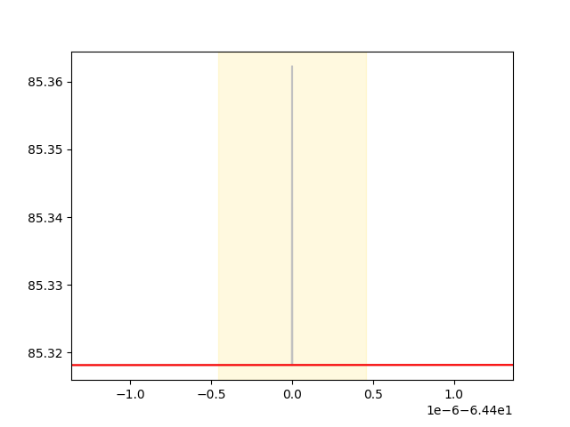
## New Eq:
((fabs(64.400000000000006 + Vms__Vms) < 4.5454545460898998e-7) ? (-8.531818183010741e-6 / (1.0 - exp(1.0000000000287557e-7)) + (70840000.498749435 + 1099999.9999805812 * Vms__Vms) * (8.5318181809268536e-6 / (1.0 - exp(-1.0000000000287557e-7)) + 8.531818183010741e-6 / (1.0 - exp(1.0000000000287557e-7)))) : (18.77 * (64.400000000000006 + Vms__Vms) / (1.0 - exp(-14.168000000000001 - 0.22 * Vms__Vms))))

## Equation 2:
```
i_Nas_m_gate__alpha_m = 117.26000000000001 * (59.299999999999997 + Vms__Vms) / (1.0 - 6.8467658008076711e-15 * exp(-0.55000000000000004 * Vms__Vms))
```
### Partially evaluated to: 
```
i_Nas_m_gate__alpha_m = 117.26000000000001 * (59.299999999999997 + Vms__Vms) / (1.0 - 6.8467658008076711e-15 * exp(-0.55000000000000004 * Vms__Vms))
```
### Singulariy points detected:

{-59.299999999999997}
*U*
`-32.615000000000002 - 0.55000000000000004 * Vms__Vms`

*V for 1e-07 range* 
`-59.300000181818177 - -59.299999818181817`

*Singularity point: -59.299999999999997*

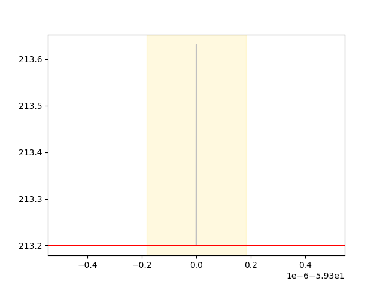
## New Eq:
((fabs(59.299999999999997 + Vms__Vms) < 1.8181818178808484e-7) ? (-2.131999999647083e-5 / (1.0 - exp(1.0000000000287557e-7)) + (163075000.50210002 + 2750000.0000354135 * Vms__Vms) * (2.131999999647083e-5 / (1.0 - exp(1.0000000000287557e-7)) + 2.1320000002980068e-5 / (1.0 - exp(-1.0000000000287557e-7)))) : (117.26000000000001 * (59.299999999999997 + Vms__Vms) / (1.0 - exp(-32.615000000000002 - 0.55000000000000004 * Vms__Vms))))

## Equation 3:
```
i_Cas__i_Cas = 4.0 * pow(model_parameters__F, 2) * (-0.34100000000000003 * model_parameters__Cae + ion_concentrations__Cass * exp(2.0 * Vms__Vms * model_parameters__F / (model_parameters__R * model_parameters__T))) * ((0.10000000000000001 - 0.10000000000000001 * i_Cas__Ccast) * i_Cas__C2 + (0.90000000000000002 + 0.10000000000000001 * i_Cas__Ccast) * i_Cas__C1) * Vms__Vms * i_Cas__Co * membrane_permeabilities__gCas / ((-1.0 + exp(2.0 * Vms__Vms * model_parameters__F / (model_parameters__R * model_parameters__T))) * model_parameters__R * model_parameters__T)
```
### Partially evaluated to: 
```
i_Cas__i_Cas = 4.1481478308756044e-5 * (-0.40920000000000001 + ion_concentrations__Cass * exp(0.078728915539782576 * Vms__Vms)) * ((0.10000000000000001 - 0.10000000000000001 * i_Cas__Ccast) * i_Cas__C2 + (0.90000000000000002 + 0.10000000000000001 * i_Cas__Ccast) * i_Cas__C1) * Vms__Vms * i_Cas__Co / (-1.0 + exp(0.078728915539782576 * Vms__Vms))
```
### Singulariy points detected:

{0}
*U*
`0.078728915539782576 * Vms__Vms`

*V for 1e-07 range* 
`-1.2701813471502589e-6 - 1.2701813471502589e-6`

*Singularity point: 0*

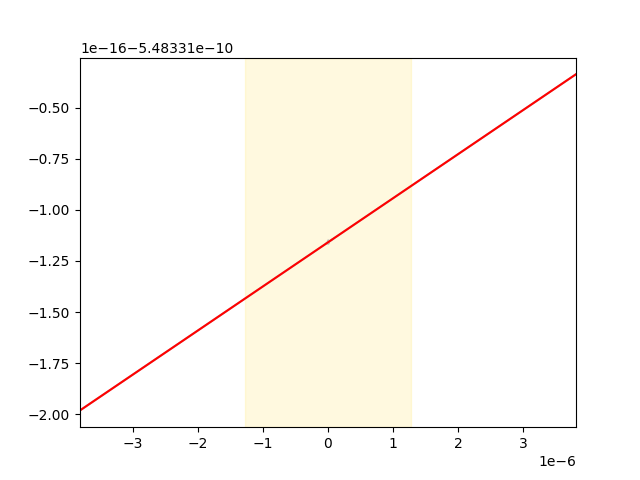
## New Eq:
((fabs(Vms__Vms) < 1.2701813471502589e-6) ? ((0.5 + 393644.57769891288 * Vms__Vms) * (5.2689000000000005e-11 * (-0.40920000000000001 + ion_concentrations__Cass * exp(9.9999999999999995e-8)) * ((0.10000000000000001 - 0.10000000000000001 * i_Cas__Ccast) * i_Cas__C2 + (0.90000000000000002 + 0.10000000000000001 * i_Cas__Ccast) * i_Cas__C1) * i_Cas__Co / (-1.0 + exp(9.9999999999999995e-8)) + 5.2689000000000005e-11 * (-0.40920000000000001 + ion_concentrations__Cass * exp(-9.9999999999999995e-8)) * ((0.10000000000000001 - 0.10000000000000001 * i_Cas__Ccast) * i_Cas__C2 + (0.90000000000000002 + 0.10000000000000001 * i_Cas__Ccast) * i_Cas__C1) * i_Cas__Co / (-1.0 + exp(-9.9999999999999995e-8))) - 5.2689000000000005e-11 * (-0.40920000000000001 + ion_concentrations__Cass * exp(-9.9999999999999995e-8)) * ((0.10000000000000001 - 0.10000000000000001 * i_Cas__Ccast) * i_Cas__C2 + (0.90000000000000002 + 0.10000000000000001 * i_Cas__Ccast) * i_Cas__C1) * i_Cas__Co / (-1.0 + exp(-9.9999999999999995e-8))) : (4.0 * pow(model_parameters__F, 2) * (-0.34100000000000003 * model_parameters__Cae + ion_concentrations__Cass * exp(2.0 * Vms__Vms * model_parameters__F / (model_parameters__R * model_parameters__T))) * ((0.10000000000000001 - 0.10000000000000001 * i_Cas__Ccast) * i_Cas__C2 + (0.90000000000000002 + 0.10000000000000001 * i_Cas__Ccast) * i_Cas__C1) * Vms__Vms * i_Cas__Co * membrane_permeabilities__gCas / ((-1.0 + exp(2.0 * Vms__Vms * model_parameters__F / (model_parameters__R * model_parameters__T))) * model_parameters__R * model_parameters__T)))

Singularities failed Trying parially evaluated
EmptySet

# Model: pasek_model_2008(pasek_simurda_orchard_christe_2008.cellml)
## Equation 1:
```
i_Kr_s_xr_gate__tau_xr = 0.001 / (0.00060999999999999997 * (38.899999999999999 + Vm_s__Vm_s) / (-1.0 + 281.60348502322194 * exp(0.14499999999999999 * Vm_s__Vm_s)) + 0.0013799999999999999 * (14.199999999999999 + Vm_s__Vm_s) / (1.0 - 0.17436578041087322 * exp(-0.123 * Vm_s__Vm_s)))
```
### Partially evaluated to: 
```
i_Kr_s_xr_gate__tau_xr = 0.001 / (0.00060999999999999997 * (38.899999999999999 + Vm_s__Vm_s) / (-1.0 + 281.60348502322194 * exp(0.14499999999999999 * Vm_s__Vm_s)) + 0.0013799999999999999 * (14.199999999999999 + Vm_s__Vm_s) / (1.0 - 0.17436578041087322 * exp(-0.123 * Vm_s__Vm_s)))
```
### Singulariy points detected:

{-14.199999999999999, -38.899999999999999}
#### float * A

####1 / A


####A + B:

`0.0013799999999999999 * (14.199999999999999 + Vm_s__Vm_s) / (1.0 - 0.17436578041087322 * exp(-0.123 * Vm_s__Vm_s))`
`0.00060999999999999997 * (38.899999999999999 + Vm_s__Vm_s) / (-1.0 + 281.60348502322194 * exp(0.14499999999999999 * Vm_s__Vm_s))`

*U*
`-1.7465999999999999 - 0.123 * Vm_s__Vm_s`

*V for 1e-07 range* 
`-14.200000813008129 - -14.199999186991869`

*Singularity point: -14.199999999999999*

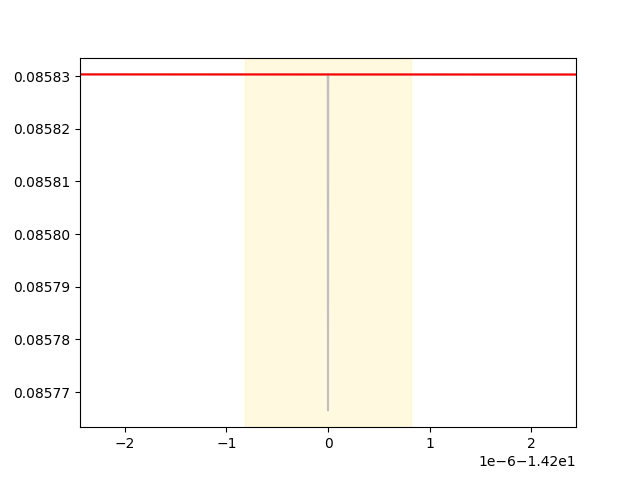
*U*
`5.6404999999999994 + 0.14499999999999999 * Vm_s__Vm_s`

*V for 1e-07 range* 
`-38.900000689655172 - -38.899999310344825`

*Singularity point: -38.899999999999999*

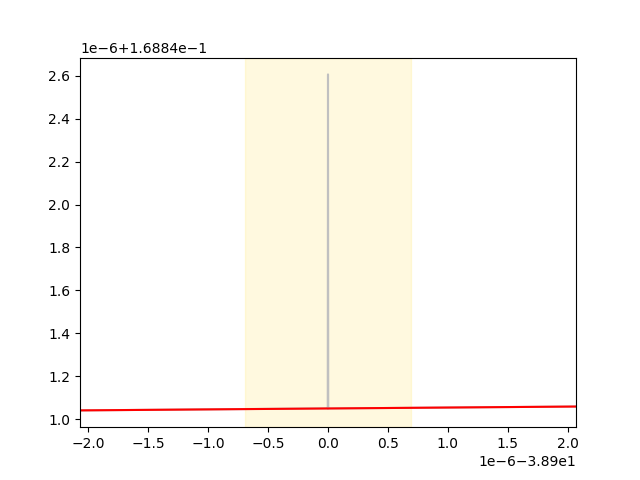
## New Eq:
((fabs(14.199999999999999 + Vm_s__Vm_s) < 8.1300813006834893e-7) ? (0.001 / (0.015066999504065039 / (-1.0 + exp(3.5814998821138206)) - 1.1219512194943214e-9 / (1.0 - exp(9.9999999999406119e-8))) + (8733000.5000645891 + 615000.00000454858 * Vm_s__Vm_s) * (0.001 / (1.1219512195134727e-9 / (1.0 - exp(-9.9999999999406119e-8)) + 0.015067000495934959 / (-1.0 + exp(3.5815001178861787))) - 0.001 / (0.015066999504065039 / (-1.0 + exp(3.5814998821138206)) - 1.1219512194943214e-9 / (1.0 - exp(9.9999999999406119e-8))))) : ((fabs(38.899999999999999 + Vm_s__Vm_s) < 6.8965517246999397e-7) ? (0.001 / (-0.034086000951724135 / (1.0 - exp(3.0381000848275859)) - 4.2068965517283451e-10 / (-1.0 + exp(-1.0000000000287557e-7))) + (28202500.498836767 + 724999.99997009686 * Vm_s__Vm_s) * (0.001 / (4.2068965520669629e-10 / (-1.0 + exp(1.0000000000287557e-7)) - 0.034085999048275861 / (1.0 - exp(3.0380999151724137))) - 0.001 / (-0.034086000951724135 / (1.0 - exp(3.0381000848275859)) - 4.2068965517283451e-10 / (-1.0 + exp(-1.0000000000287557e-7))))) : (0.001 / (0.00060999999999999997 * (38.899999999999999 + Vm_s__Vm_s) / (-1.0 + exp(5.6404999999999994 + 0.14499999999999999 * Vm_s__Vm_s)) + 0.0013799999999999999 * (14.199999999999999 + Vm_s__Vm_s) / (1.0 - exp(-1.7465999999999999 - 0.123 * Vm_s__Vm_s))))))

## Equation 2:
```
i_Ks_s_xs_gate__tau_xs = 0.001 / (0.00013100000000000001 * (30.0 + Vm_s__Vm_s) / (-1.0 + 7.8538197044216602 * exp(0.068699999999999997 * Vm_s__Vm_s)) + 7.1899999999999999e-5 * (30.0 + Vm_s__Vm_s) / (1.0 - 0.011795938519751569 * exp(-0.14799999999999999 * Vm_s__Vm_s)))
```
### Partially evaluated to: 
```
i_Ks_s_xs_gate__tau_xs = 0.001 / (0.00013100000000000001 * (30.0 + Vm_s__Vm_s) / (-1.0 + 7.8538197044216602 * exp(0.068699999999999997 * Vm_s__Vm_s)) + 7.1899999999999999e-5 * (30.0 + Vm_s__Vm_s) / (1.0 - 0.011795938519751569 * exp(-0.14799999999999999 * Vm_s__Vm_s)))
```
### Singulariy points detected:

{-30.000000000000000}
#### float * A

####1 / A


####A + B:

`7.1899999999999999e-5 * (30.0 + Vm_s__Vm_s) / (1.0 - 0.011795938519751569 * exp(-0.14799999999999999 * Vm_s__Vm_s))`
`0.00013100000000000001 * (30.0 + Vm_s__Vm_s) / (-1.0 + 7.8538197044216602 * exp(0.068699999999999997 * Vm_s__Vm_s))`

*U*
`-4.4399999999999995 - 0.14799999999999999 * Vm_s__Vm_s`

*V for 1e-07 range* 
`-30.000000675675675 - -29.999999324324325`

*Singularity point: -30.000000000000000*


## New Eq:
((fabs(30.0 + Vm_s__Vm_s) < 6.7567567568760367e-7) ? (0.001 / (-8.8513513515076093e-11 / (-1.0 + exp(-4.6418918920460017e-8)) - 4.8581081081938701e-11 / (1.0 - exp(1.0000000000287557e-7))) + (22200000.499608092 + 739999.99998693645 * Vm_s__Vm_s) * (0.001 / (8.8513513515076093e-11 / (-1.0 + exp(4.6418918920460017e-8)) + 4.8581081081938701e-11 / (1.0 - exp(-1.0000000000287557e-7))) - 0.001 / (-8.8513513515076093e-11 / (-1.0 + exp(-4.6418918920460017e-8)) - 4.8581081081938701e-11 / (1.0 - exp(1.0000000000287557e-7))))) : (0.001 / (0.00013100000000000001 * (30.0 + Vm_s__Vm_s) / (-1.0 + exp(2.0609999999999999 + 0.068699999999999997 * Vm_s__Vm_s)) + 7.1899999999999999e-5 * (30.0 + Vm_s__Vm_s) / (1.0 - exp(-4.4399999999999995 - 0.14799999999999999 * Vm_s__Vm_s)))))

## Equation 3:
```
i_CaL_s__i_CaL_s = 4.0 * pow(model_parameters__F, 2) * (0.001 * exp(2.0 * Vm_s__Vm_s * model_parameters__F / (model_parameters__R * model_parameters__T)) - 0.34100000000000003 * model_parameters__Ca_e) * (i_CaL_s__Ccao + i_CaL_s__Co) * Vm_s__Vm_s * i_CaL_s_y_gate__y * membrane_permeabilities__P_CaL_s / ((-1.0 + exp(2.0 * Vm_s__Vm_s * model_parameters__F / (model_parameters__R * model_parameters__T))) * model_parameters__R * model_parameters__T)
```
### Partially evaluated to: 
```
i_CaL_s__i_CaL_s = 0.55630930863148487 * (-0.61380000000000001 + 0.001 * exp(0.07491945188463181 * Vm_s__Vm_s)) * (i_CaL_s__Ccao + i_CaL_s__Co) * Vm_s__Vm_s * i_CaL_s_y_gate__y * membrane_permeabilities__P_CaL / (-1.0 + exp(0.07491945188463181 * Vm_s__Vm_s))
```
### Singulariy points detected:

{0}
*U*
`0.07491945188463181 * Vm_s__Vm_s`

*V for 1e-07 range* 
`-1.3347668393782383e-6 - 1.3347668393782383e-6`

*Singularity point: 0*

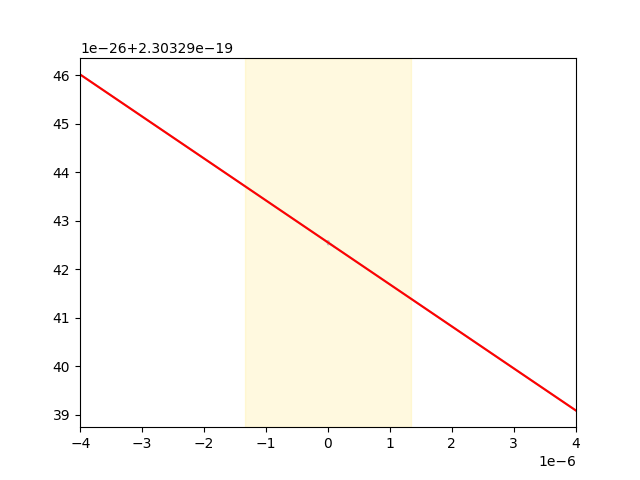
## New Eq:
((fabs(Vm_s__Vm_s) < 1.3347668393782383e-6) ? ((0.5 + 374597.25942315906 * Vm_s__Vm_s) * (7.425432175987399e-7 * (-0.61380000000000001 + 0.001 * exp(9.9999999999999995e-8)) * (i_CaL_s__Ccao + i_CaL_s__Co) * i_CaL_s_y_gate__y * membrane_permeabilities__P_CaL / (-1.0 + exp(9.9999999999999995e-8)) + 7.425432175987399e-7 * (-0.61380000000000001 + 0.001 * exp(-9.9999999999999995e-8)) * (i_CaL_s__Ccao + i_CaL_s__Co) * i_CaL_s_y_gate__y * membrane_permeabilities__P_CaL / (-1.0 + exp(-9.9999999999999995e-8))) - 7.425432175987399e-7 * (-0.61380000000000001 + 0.001 * exp(-9.9999999999999995e-8)) * (i_CaL_s__Ccao + i_CaL_s__Co) * i_CaL_s_y_gate__y * membrane_permeabilities__P_CaL / (-1.0 + exp(-9.9999999999999995e-8))) : (4.0 * pow(model_parameters__F, 2) * (0.001 * exp(2.0 * Vm_s__Vm_s * model_parameters__F / (model_parameters__R * model_parameters__T)) - 0.34100000000000003 * model_parameters__Ca_e) * (i_CaL_s__Ccao + i_CaL_s__Co) * Vm_s__Vm_s * i_CaL_s_y_gate__y * membrane_permeabilities__P_CaL_s / ((-1.0 + exp(2.0 * Vm_s__Vm_s * model_parameters__F / (model_parameters__R * model_parameters__T))) * model_parameters__R * model_parameters__T)))

## Equation 4:
```
i_CaL_s__i_KL_s = pow(model_parameters__F, 2) * (-model_parameters__K_e + ion_concentrations__K_i * exp(Vm_s__Vm_s * model_parameters__F / (model_parameters__R * model_parameters__T))) * (i_CaL_s__Ccao + i_CaL_s__Co) * Vm_s__Vm_s * i_CaL_s_y_gate__y * membrane_permeabilities__P_KL_s / ((1.0 - 2.1834061135371177 * (i_CaL_s__i_CaL_s + i_CaL_t__i_CaL_t) / (model_parameters__Sms + model_parameters__Smt)) * (-1.0 + exp(Vm_s__Vm_s * model_parameters__F / (model_parameters__R * model_parameters__T))) * model_parameters__R * model_parameters__T)
```
### Partially evaluated to: 
```
i_CaL_s__i_KL_s = 6.6757117035778174e-7 * (-5.4000000000000004 + ion_concentrations__K_i * exp(0.037459725942315905 * Vm_s__Vm_s)) * (i_CaL_s__Ccao + i_CaL_s__Co) * Vm_s__Vm_s * i_CaL_s_y_gate__y / ((-1.0 + exp(0.037459725942315905 * Vm_s__Vm_s)) * (1.0 - 20205.350866353103 * (0.001 * exp(0.07491945188463181 * Vm_t__Vm_t) - 0.34100000000000003 * ion_concentrations__Ca_t) * (i_CaL_t__TCcao + i_CaL_t__TCo) * Vm_t__Vm_t * i_CaL_t_y_gate__y * membrane_permeabilities__P_CaL / (-1.0 + exp(0.07491945188463181 * Vm_t__Vm_t)) - 11365.509862323619 * (-0.61380000000000001 + 0.001 * exp(0.07491945188463181 * Vm_s__Vm_s)) * (i_CaL_s__Ccao + i_CaL_s__Co) * Vm_s__Vm_s * i_CaL_s_y_gate__y * membrane_permeabilities__P_CaL / (-1.0 + exp(0.07491945188463181 * Vm_s__Vm_s))))
```
### Singulariy points detected:

{0}
*U*
`0.037459725942315905 * Vm_s__Vm_s`

*V for 1e-07 range* 
`-2.6695336787564767e-6 - 2.6695336787564767e-6`

*Singularity point: 0*

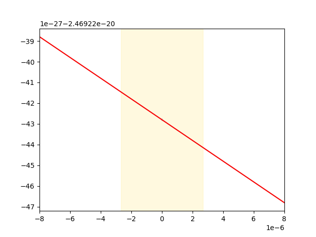
## New Eq:
((fabs(Vm_s__Vm_s) < 2.6695336787564767e-6) ? ((0.5 + 187298.62971157953 * Vm_s__Vm_s) * (1.7821037222369756e-12 * (-5.4000000000000004 + ion_concentrations__K_i * exp(9.9999999999999995e-8)) * (i_CaL_s__Ccao + i_CaL_s__Co) * i_CaL_s_y_gate__y / ((-1.0 + exp(9.9999999999999995e-8)) * (1.0 - 0.030340611353711786 * (-0.61380000000000001 + 0.001 * exp(1.9999999999999999e-7)) * (i_CaL_s__Ccao + i_CaL_s__Co) * i_CaL_s_y_gate__y * membrane_permeabilities__P_CaL / (-1.0 + exp(1.9999999999999999e-7)) - 20205.350866353103 * (0.001 * exp(0.07491945188463181 * Vm_t__Vm_t) - 0.34100000000000003 * ion_concentrations__Ca_t) * (i_CaL_t__TCcao + i_CaL_t__TCo) * Vm_t__Vm_t * i_CaL_t_y_gate__y * membrane_permeabilities__P_CaL / (-1.0 + exp(0.07491945188463181 * Vm_t__Vm_t)))) + 1.7821037222369756e-12 * (-5.4000000000000004 + ion_concentrations__K_i * exp(-9.9999999999999995e-8)) * (i_CaL_s__Ccao + i_CaL_s__Co) * i_CaL_s_y_gate__y / ((-1.0 + exp(-9.9999999999999995e-8)) * (1.0 + 0.030340611353711786 * (-0.61380000000000001 + 0.001 * exp(-1.9999999999999999e-7)) * (i_CaL_s__Ccao + i_CaL_s__Co) * i_CaL_s_y_gate__y * membrane_permeabilities__P_CaL / (-1.0 + exp(-1.9999999999999999e-7)) - 20205.350866353103 * (0.001 * exp(0.07491945188463181 * Vm_t__Vm_t) - 0.34100000000000003 * ion_concentrations__Ca_t) * (i_CaL_t__TCcao + i_CaL_t__TCo) * Vm_t__Vm_t * i_CaL_t_y_gate__y * membrane_permeabilities__P_CaL / (-1.0 + exp(0.07491945188463181 * Vm_t__Vm_t))))) - 1.7821037222369756e-12 * (-5.4000000000000004 + ion_concentrations__K_i * exp(-9.9999999999999995e-8)) * (i_CaL_s__Ccao + i_CaL_s__Co) * i_CaL_s_y_gate__y / ((-1.0 + exp(-9.9999999999999995e-8)) * (1.0 + 0.030340611353711786 * (-0.61380000000000001 + 0.001 * exp(-1.9999999999999999e-7)) * (i_CaL_s__Ccao + i_CaL_s__Co) * i_CaL_s_y_gate__y * membrane_permeabilities__P_CaL / (-1.0 + exp(-1.9999999999999999e-7)) - 20205.350866353103 * (0.001 * exp(0.07491945188463181 * Vm_t__Vm_t) - 0.34100000000000003 * ion_concentrations__Ca_t) * (i_CaL_t__TCcao + i_CaL_t__TCo) * Vm_t__Vm_t * i_CaL_t_y_gate__y * membrane_permeabilities__P_CaL / (-1.0 + exp(0.07491945188463181 * Vm_t__Vm_t))))) : (pow(model_parameters__F, 2) * (-model_parameters__K_e + ion_concentrations__K_i * exp(Vm_s__Vm_s * model_parameters__F / (model_parameters__R * model_parameters__T))) * (i_CaL_s__Ccao + i_CaL_s__Co) * Vm_s__Vm_s * i_CaL_s_y_gate__y * membrane_permeabilities__P_KL_s / ((1.0 - 2.1834061135371177 * (i_CaL_s__i_CaL_s + i_CaL_t__i_CaL_t) / (model_parameters__Sms + model_parameters__Smt)) * (-1.0 + exp(Vm_s__Vm_s * model_parameters__F / (model_parameters__R * model_parameters__T))) * model_parameters__R * model_parameters__T)))

## Equation 5:
```
i_nsK_s__i_nsK_s = pow(model_parameters__F, 2) * (-0.75 * model_parameters__K_e + 0.75 * ion_concentrations__K_i * exp(Vm_s__Vm_s * model_parameters__F / (model_parameters__R * model_parameters__T))) * Vm_s__Vm_s * membrane_permeabilities__P_nsK_s / ((1.0 + 1.5625000000000003e-8 / pow(ion_concentrations__Ca_i, 3)) * (-1.0 + exp(Vm_s__Vm_s * model_parameters__F / (model_parameters__R * model_parameters__T))) * model_parameters__R * model_parameters__T)
```
### Partially evaluated to: 
```
i_nsK_s__i_nsK_s = 3.2045734132626158e-8 * (-4.0500000000000007 + 0.75 * ion_concentrations__K_i * exp(0.037459725942315905 * Vm_s__Vm_s)) * Vm_s__Vm_s / ((1.0 + 1.5625000000000003e-8 / pow(ion_concentrations__Ca_i, 3)) * (-1.0 + exp(0.037459725942315905 * Vm_s__Vm_s)))
```
### Singulariy points detected:

{0}
*U*
`0.037459725942315905 * Vm_s__Vm_s`

*V for 1e-07 range* 
`-2.6695336787564767e-6 - 2.6695336787564767e-6`

*Singularity point: 0*

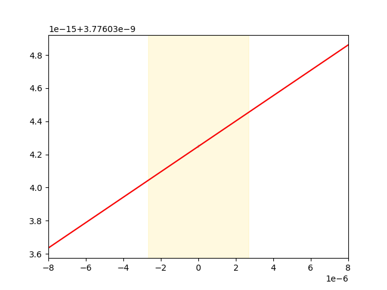
## New Eq:
((fabs(Vm_s__Vm_s) < 2.6695336787564767e-6) ? ((0.5 + 187298.62971157953 * Vm_s__Vm_s) * (8.554716652752149e-14 * (-4.0500000000000007 + 0.75 * ion_concentrations__K_i * exp(9.9999999999999995e-8)) / ((1.0 + 1.5625000000000003e-8 / pow(ion_concentrations__Ca_i, 3)) * (-1.0 + exp(9.9999999999999995e-8))) + 8.554716652752149e-14 * (-4.0500000000000007 + 0.75 * ion_concentrations__K_i * exp(-9.9999999999999995e-8)) / ((1.0 + 1.5625000000000003e-8 / pow(ion_concentrations__Ca_i, 3)) * (-1.0 + exp(-9.9999999999999995e-8)))) - 8.554716652752149e-14 * (-4.0500000000000007 + 0.75 * ion_concentrations__K_i * exp(-9.9999999999999995e-8)) / ((1.0 + 1.5625000000000003e-8 / pow(ion_concentrations__Ca_i, 3)) * (-1.0 + exp(-9.9999999999999995e-8)))) : (pow(model_parameters__F, 2) * (-0.75 * model_parameters__K_e + 0.75 * ion_concentrations__K_i * exp(Vm_s__Vm_s * model_parameters__F / (model_parameters__R * model_parameters__T))) * Vm_s__Vm_s * membrane_permeabilities__P_nsK_s / ((1.0 + 1.5625000000000003e-8 / pow(ion_concentrations__Ca_i, 3)) * (-1.0 + exp(Vm_s__Vm_s * model_parameters__F / (model_parameters__R * model_parameters__T))) * model_parameters__R * model_parameters__T)))

## Equation 6:
```
i_nsNa_s__i_nsNa_s = pow(model_parameters__F, 2) * (-0.75 * model_parameters__Na_e + 0.75 * ion_concentrations__Na_i * exp(Vm_s__Vm_s * model_parameters__F / (model_parameters__R * model_parameters__T))) * Vm_s__Vm_s * membrane_permeabilities__P_nsNa_s / ((1.0 + 1.5625000000000003e-8 / pow(ion_concentrations__Ca_i, 3)) * (-1.0 + exp(Vm_s__Vm_s * model_parameters__F / (model_parameters__R * model_parameters__T))) * model_parameters__R * model_parameters__T)
```
### Partially evaluated to: 
```
i_nsNa_s__i_nsNa_s = 3.2045734132626158e-8 * (-105.0 + 0.75 * ion_concentrations__Na_i * exp(0.037459725942315905 * Vm_s__Vm_s)) * Vm_s__Vm_s / ((1.0 + 1.5625000000000003e-8 / pow(ion_concentrations__Ca_i, 3)) * (-1.0 + exp(0.037459725942315905 * Vm_s__Vm_s)))
```
### Singulariy points detected:

{0}
*U*
`0.037459725942315905 * Vm_s__Vm_s`

*V for 1e-07 range* 
`-2.6695336787564767e-6 - 2.6695336787564767e-6`

*Singularity point: 0*


## New Eq:
((fabs(Vm_s__Vm_s) < 2.6695336787564767e-6) ? ((0.5 + 187298.62971157953 * Vm_s__Vm_s) * (8.554716652752149e-14 * (-105.0 + 0.75 * ion_concentrations__Na_i * exp(9.9999999999999995e-8)) / ((1.0 + 1.5625000000000003e-8 / pow(ion_concentrations__Ca_i, 3)) * (-1.0 + exp(9.9999999999999995e-8))) + 8.554716652752149e-14 * (-105.0 + 0.75 * ion_concentrations__Na_i * exp(-9.9999999999999995e-8)) / ((1.0 + 1.5625000000000003e-8 / pow(ion_concentrations__Ca_i, 3)) * (-1.0 + exp(-9.9999999999999995e-8)))) - 8.554716652752149e-14 * (-105.0 + 0.75 * ion_concentrations__Na_i * exp(-9.9999999999999995e-8)) / ((1.0 + 1.5625000000000003e-8 / pow(ion_concentrations__Ca_i, 3)) * (-1.0 + exp(-9.9999999999999995e-8)))) : (pow(model_parameters__F, 2) * (-0.75 * model_parameters__Na_e + 0.75 * ion_concentrations__Na_i * exp(Vm_s__Vm_s * model_parameters__F / (model_parameters__R * model_parameters__T))) * Vm_s__Vm_s * membrane_permeabilities__P_nsNa_s / ((1.0 + 1.5625000000000003e-8 / pow(ion_concentrations__Ca_i, 3)) * (-1.0 + exp(Vm_s__Vm_s * model_parameters__F / (model_parameters__R * model_parameters__T))) * model_parameters__R * model_parameters__T)))

Singularities failed Trying parially evaluated
EmptySet

# Model: priebe_beuckelmann_1998(priebe_beuckelmann_1998.cellml)
## Equation 1:
```
INa_m_gate__alpha_m = ((fabs(47.130000000000003 + cell__V) > 0.001) ? (0.32000000000000001 * (47.130000000000003 + cell__V) / (1.0 - 0.00897780373069724 * exp(-0.10000000000000001 * cell__V))) : (3.2000000000000002))
```
### Partially evaluated to: 
```
INa_m_gate__alpha_m = ((fabs(47.130000000000003 + cell__V) > 0.001) ? (0.32000000000000001 * (47.130000000000003 + cell__V) / (1.0 - 0.00897780373069724 * exp(-0.10000000000000001 * cell__V))) : (3.2000000000000002))
```
### Singulariy points detected:

{-47.130000000000003}
####Piecewise!
# Model: ramirez_2000(ramirez_nattel_courtemanche_2000.cellml)
## Equation 1:
```
Ca_release_current_from_JSR_w_gate__tau_w = (6.0 - 29.129734867424602 * exp(-0.20000000000000001 * membrane__V)) / ((1.0 + 1.4564867433712301 * exp(-0.20000000000000001 * membrane__V)) * (-7.9000000000000004 + membrane__V))
```
### Partially evaluated to: 
```
Ca_release_current_from_JSR_w_gate__tau_w = (6.0 - 29.129734867424602 * exp(-0.20000000000000001 * membrane__V)) / ((1.0 + 1.4564867433712301 * exp(-0.20000000000000001 * membrane__V)) * (-7.9000000000000004 + membrane__V))
```
### Singulariy points detected:

{7.9000000000000004}
*U*
`-1.5800000000000001 + 0.20000000000000001 * membrane__V`

*V for 1e-07 range* 
`7.8999995000000007 - 7.9000005`

*Singularity point: 7.9000000000000004*

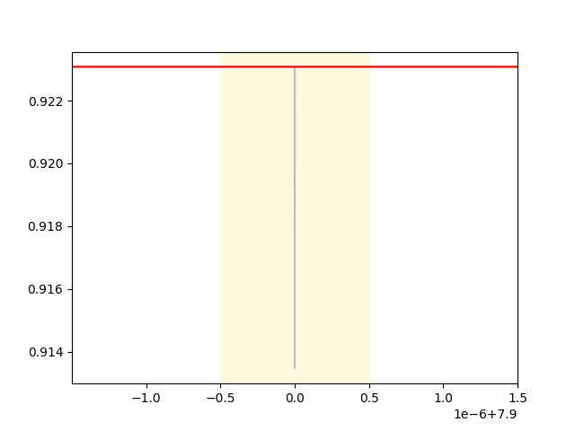
## New Eq:
((fabs(-7.9000000000000004 + membrane__V) < 4.9999999998662226e-7) ? ((-7899999.5000469172 + 1000000.0000059388 * membrane__V) * (1999999.9999702442 * (6.0 - 6.0 * exp(1.0000000000114084e-7)) / (1.0 + 0.29999999999999999 * exp(1.0000000000114084e-7)) + 2000000.000053511 * (6.0 - 6.0 * exp(-9.9999999997671396e-8)) / (1.0 + 0.29999999999999999 * exp(-9.9999999997671396e-8))) - 1999999.9999702442 * (6.0 - 6.0 * exp(1.0000000000114084e-7)) / (1.0 + 0.29999999999999999 * exp(1.0000000000114084e-7))) : ((6.0 - 6.0 * exp(1.5800000000000001 - 0.20000000000000001 * membrane__V)) / ((1.0 + 0.29999999999999999 * exp(1.5800000000000001 - 0.20000000000000001 * membrane__V)) * (-7.9000000000000004 + membrane__V))))

## Equation 2:
```
fast_sodium_current_m_gate__alpha_m = 0.32000000000000001 * (47.130000000000003 + membrane__V) / (1.0 - 0.00897780373069724 * exp(-0.10000000000000001 * membrane__V))
```
### Partially evaluated to: 
```
fast_sodium_current_m_gate__alpha_m = 0.32000000000000001 * (47.130000000000003 + membrane__V) / (1.0 - 0.00897780373069724 * exp(-0.10000000000000001 * membrane__V))
```
### Singulariy points detected:

{-47.130000000000003}
*U*
`-4.7130000000000001 - 0.10000000000000001 * membrane__V`

*V for 1e-07 range* 
`-47.130001 - -47.129999000000005`

*Singularity point: -47.130000000000003*


## New Eq:
((fabs(47.130000000000003 + membrane__V) < 1.0000000000287557e-6) ? (-3.200000000092018e-7 / (1.0 - exp(1.0000000000287557e-7)) + (23565000.499322373 + 499999.99998562218 * membrane__V) * (3.200000000092018e-7 / (1.0 - exp(1.0000000000287557e-7)) + 3.200000000092018e-7 / (1.0 - exp(-1.0000000000287557e-7)))) : (0.32000000000000001 * (47.130000000000003 + membrane__V) / (1.0 - exp(-4.7130000000000001 - 0.10000000000000001 * membrane__V))))

## Equation 3:
```
rapid_delayed_rectifier_K_current_xr_gate__alpha_xr = 0.040000000000000001 * (-248.0 + membrane__V) / (1.0 - 7024.3843766360014 * exp(-0.035714285714285712 * membrane__V))
```
### Partially evaluated to: 
```
rapid_delayed_rectifier_K_current_xr_gate__alpha_xr = 0.040000000000000001 * (-248.0 + membrane__V) / (1.0 - 7024.3843766360014 * exp(-0.035714285714285712 * membrane__V))
```
### Singulariy points detected:

{248.00000000000000}
*U*
`8.8571428571428577 - 0.035714285714285712 * membrane__V`

*V for 1e-07 range* 
`247.9999972 - 248.0000028`

*Singularity point: 248.00000000000000*

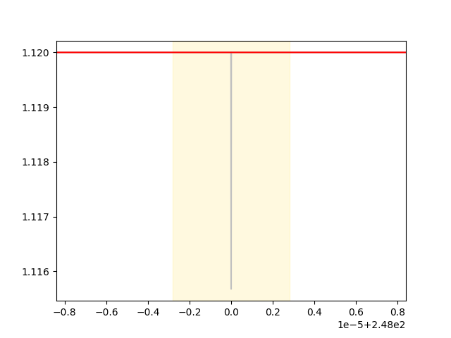
## New Eq:
((fabs(-248.0 + membrane__V) < 2.8000000000805159e-6) ? (-1.1200000000322064e-7 / (1.0 - exp(1.0000000000287557e-7)) + (-44285713.784440823 + 178571.42856629365 * membrane__V) * (1.1200000000322064e-7 / (1.0 - exp(1.0000000000287557e-7)) + 1.1200000000322064e-7 / (1.0 - exp(-1.0000000000287557e-7)))) : (0.040000000000000001 * (-248.0 + membrane__V) / (1.0 - exp(8.8571428571428577 - 0.035714285714285712 * membrane__V))))

## Equation 4:
```
rapid_delayed_rectifier_K_current_xr_gate__beta_xr = 0.028000000000000001 * (163.0 + membrane__V) / (-1.0 + 2349.375346735635 * exp(0.047619047619047616 * membrane__V))
```
### Partially evaluated to: 
```
rapid_delayed_rectifier_K_current_xr_gate__beta_xr = 0.028000000000000001 * (163.0 + membrane__V) / (-1.0 + 2349.375346735635 * exp(0.047619047619047616 * membrane__V))
```
### Singulariy points detected:

{-163.00000000000000}
*U*
`7.7619047619047619 + 0.047619047619047616 * membrane__V`

*V for 1e-07 range* 
`-163.00000209999999 - -162.99999790000001`

*Singularity point: -163.00000000000000*

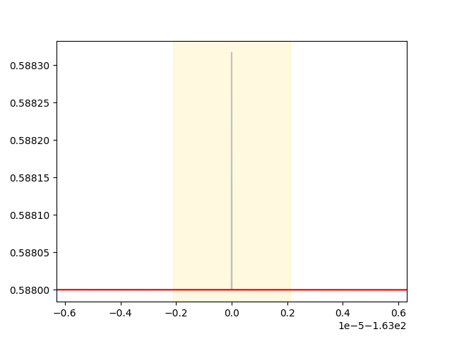
## New Eq:
((fabs(163.0 + membrane__V) < 2.100000000115898e-6) ? (-5.8799999997027897e-8 / (-1.0 + exp(-9.9999999995936673e-8)) + (38809524.309433699 + 238095.23809468528 * membrane__V) * (5.8799999997027897e-8 / (-1.0 + exp(-9.9999999995936673e-8)) + 5.8800000003245146e-8 / (-1.0 + exp(1.0000000000287557e-7)))) : (0.028000000000000001 * (163.0 + membrane__V) / (-1.0 + exp(7.7619047619047619 + 0.047619047619047616 * membrane__V))))

## Equation 5:
```
sarcolemmal_Ca_current_d_gate__tau_d = 28.571428571428569 * (1.0 - 0.20137949774492364 * exp(-0.16025641025641024 * membrane__V)) / ((1.0 + 0.20137949774492364 * exp(-0.16025641025641024 * membrane__V)) * (10.0 + membrane__V))
```
### Partially evaluated to: 
```
sarcolemmal_Ca_current_d_gate__tau_d = 28.571428571428569 * (1.0 - 0.20137949774492364 * exp(-0.16025641025641024 * membrane__V)) / ((1.0 + 0.20137949774492364 * exp(-0.16025641025641024 * membrane__V)) * (10.0 + membrane__V))
```
### Singulariy points detected:

{-10.000000000000000}
*U*
`-1.6025641025641024 - 0.16025641025641024 * membrane__V`

*V for 1e-07 range* 
`-10.000000624 - -9.9999993759999999`

*Singularity point: -10.000000000000000*


## New Eq:
((fabs(10.0 + membrane__V) < 6.2399999999074307e-7) ? ((8012821.0129393814 + 801282.05129393819 * membrane__V) * (45787545.788225032 * (1.0 - exp(9.9999999997671396e-8)) / (1.0 + exp(9.9999999997671396e-8)) + 45787545.788225032 * (1.0 - exp(-9.9999999997671396e-8)) / (1.0 + exp(-9.9999999997671396e-8))) - 45787545.788225032 * (1.0 - exp(9.9999999997671396e-8)) / (1.0 + exp(9.9999999997671396e-8))) : (28.571428571428569 * (1.0 - exp(-1.6025641025641024 - 0.16025641025641024 * membrane__V)) / ((1.0 + exp(-1.6025641025641024 - 0.16025641025641024 * membrane__V)) * (10.0 + membrane__V))))

## Equation 6:
```
slow_delayed_rectifier_K_current_xs_gate__alpha_xs = 1.0000000000000001e-5 * (28.5 + membrane__V) / (1.0 - 0.78049566985274699 * exp(-0.0086956521739130436 * membrane__V))
```
### Partially evaluated to: 
```
slow_delayed_rectifier_K_current_xs_gate__alpha_xs = 1.0000000000000001e-5 * (28.5 + membrane__V) / (1.0 - 0.78049566985274699 * exp(-0.0086956521739130436 * membrane__V))
```
### Singulariy points detected:

{-28.500000000000000}
*U*
`-0.24782608695652175 - 0.0086956521739130436 * membrane__V`

*V for 1e-07 range* 
`-28.500011499999999 - -28.499988500000001`

*Singularity point: -28.500000000000000*

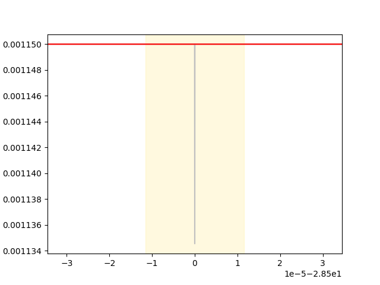
## New Eq:
((fabs(28.5 + membrane__V) < 1.1500000000053134e-5) ? (-1.1499999999997625e-10 / (1.0 - exp(9.99999999998398e-8)) + (1239130.9347813695 + 43478.260869521735 * membrane__V) * (1.1500000000025379e-10 / (1.0 - exp(-1.0000000000027348e-7)) + 1.1499999999997625e-10 / (1.0 - exp(9.99999999998398e-8)))) : (1.0000000000000001e-5 * (28.5 + membrane__V) / (1.0 - exp(-0.24782608695652175 - 0.0086956521739130436 * membrane__V))))

## Equation 7:
```
slow_delayed_rectifier_K_current_xs_gate__beta_xs = 0.00023000000000000001 * (28.5 + membrane__V) / (-1.0 + 5632.8095935605706 * exp(0.30303030303030304 * membrane__V))
```
### Partially evaluated to: 
```
slow_delayed_rectifier_K_current_xs_gate__beta_xs = 0.00023000000000000001 * (28.5 + membrane__V) / (-1.0 + 5632.8095935605706 * exp(0.30303030303030304 * membrane__V))
```
### Singulariy points detected:

{-28.500000000000000}
*U*
`8.6363636363636367 + 0.30303030303030304 * membrane__V`

*V for 1e-07 range* 
`-28.500000329999999 - -28.499999670000001`

*Singularity point: -28.500000000000000*

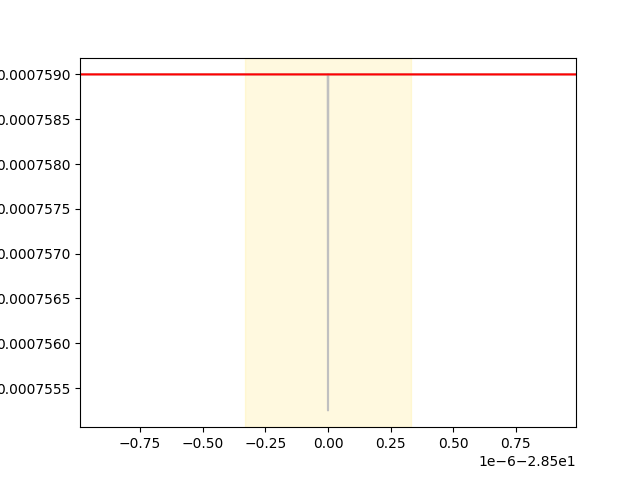
## New Eq:
((fabs(28.5 + membrane__V) < 3.300000000205916e-7) ? (-7.5900000004736066e-11 / (-1.0 + exp(-1.0000000000287557e-7)) + (43181818.679123692 + 1515151.5150569715 * membrane__V) * (7.5900000004736066e-11 / (-1.0 + exp(1.0000000000287557e-7)) + 7.5900000004736066e-11 / (-1.0 + exp(-1.0000000000287557e-7)))) : (0.00023000000000000001 * (28.5 + membrane__V) / (-1.0 + exp(8.6363636363636367 + 0.30303030303030304 * membrane__V))))

# Model: sachse_model_2007(sachse_moreno_abildskov_2008_b.cellml)
## Equation 1:
```
I_Shkr__I_Shkr = pow(model_parameters__F, 2) * (-model_parameters__Ko * exp(-membrane__Vm * model_parameters__F / (model_parameters__R * model_parameters__T)) + model_parameters__Ki) * I_Shkr__OShkr * I_Shkr__PShkr * membrane__Vm / ((1.0 - exp(-membrane__Vm * model_parameters__F / (model_parameters__R * model_parameters__T))) * model_parameters__R * model_parameters__T)
```
### Partially evaluated to: 
```
I_Shkr__I_Shkr = 1120607.7015643802 * (-model_parameters__Ko * exp(-11.612515042117931 * membrane__Vm / model_parameters__T) + model_parameters__Ki) * I_Shkr__OShkr * I_Shkr__PShkr * membrane__Vm / ((1.0 - exp(-11.612515042117931 * membrane__Vm / model_parameters__T)) * model_parameters__T)
```
### Singulariy points detected:

{0}
#### float * A

####Failed!

<class 'sympy.core.mul.Mul'>
_I_Shkr$OShkr*_I_Shkr$PShkr*_membrane$Vm*(_model_parameters$Ki - _model_parameters$Ko*exp(-11.61251504211793*_membrane$Vm/_model_parameters$T))/(_model_parameters$T*(1.0 - exp(-11.61251504211793*_membrane$Vm/_model_parameters$T)))

*try substituting parameters*

*U*
`0.039364457769891288 * membrane__Vm`

*V for 1e-07 range* 
`-2.5403626943005178e-6 - 2.5403626943005178e-6`

*Singularity point: 0*

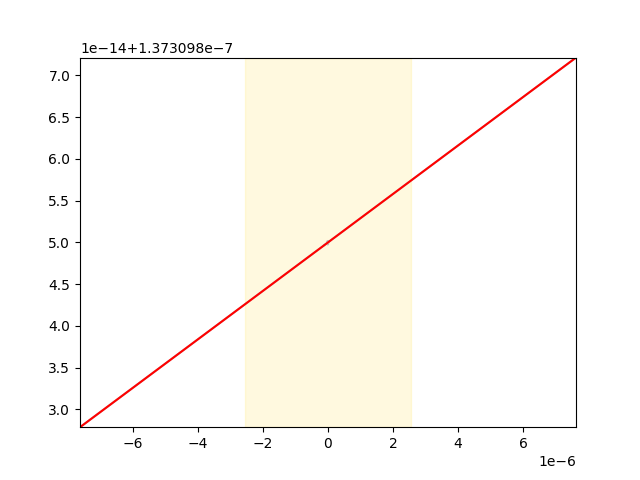
## New Eq:
((fabs(membrane__Vm) < 2.5403626943005178e-6) ? ((0.5 + 196822.28884945644 * membrane__Vm) * (2.8467499999999997 * (-model_parameters__Ko * exp(2.9499999999999999e-5 / model_parameters__T) + model_parameters__Ki) * I_Shkr__OShkr * I_Shkr__PShkr / ((1.0 - exp(2.9499999999999999e-5 / model_parameters__T)) * model_parameters__T) + 2.8467499999999997 * (-model_parameters__Ko * exp(-2.9499999999999999e-5 / model_parameters__T) + model_parameters__Ki) * I_Shkr__OShkr * I_Shkr__PShkr / ((1.0 - exp(-2.9499999999999999e-5 / model_parameters__T)) * model_parameters__T)) - 2.8467499999999997 * (-model_parameters__Ko * exp(2.9499999999999999e-5 / model_parameters__T) + model_parameters__Ki) * I_Shkr__OShkr * I_Shkr__PShkr / ((1.0 - exp(2.9499999999999999e-5 / model_parameters__T)) * model_parameters__T)) : (pow(model_parameters__F, 2) * (-model_parameters__Ko * exp(-membrane__Vm * model_parameters__F / (model_parameters__R * model_parameters__T)) + model_parameters__Ki) * I_Shkr__OShkr * I_Shkr__PShkr * membrane__Vm / ((1.0 - exp(-membrane__Vm * model_parameters__F / (model_parameters__R * model_parameters__T))) * model_parameters__R * model_parameters__T)))

# Model: sakmann_model_2000_epi(sakmann_model_2000_epi.cellml)
## Equation 1:
```
L_type_Ca_channel__i_Ca_L_Ca_cyt = 4.0 * (1.0 - L_type_Ca_channel__FrICa) * (-50.0 + membrane__V) * (intracellular_calcium_concentration__Ca_i * exp(100.0 * membrane__F / (membrane__R * membrane__T)) - extracellular_calcium_concentration__Ca_o * exp(2.0 * (50.0 - membrane__V) * membrane__F / (membrane__R * membrane__T))) * L_type_Ca_channel__P_Ca_L * L_type_Ca_channel_d_gate__d * L_type_Ca_channel_f2_gate__f2 * L_type_Ca_channel_f_gate__f * membrane__F / ((1.0 - exp(2.0 * (50.0 - membrane__V) * membrane__F / (membrane__R * membrane__T))) * membrane__R * membrane__T)
```
### Partially evaluated to: 
```
L_type_Ca_channel__i_Ca_L_Ca_cyt = 0
```
### Singulariy points detected:

{50.000000000000000}
#### Eq == 0!
## Equation 2:
```
L_type_Ca_channel__i_Ca_L_Ca_ds = 4.0 * (-50.0 + membrane__V) * (intracellular_calcium_concentration__Ca_i * exp(100.0 * membrane__F / (membrane__R * membrane__T)) - extracellular_calcium_concentration__Ca_o * exp(2.0 * (50.0 - membrane__V) * membrane__F / (membrane__R * membrane__T))) * L_type_Ca_channel__FrICa * L_type_Ca_channel__P_Ca_L * L_type_Ca_channel_d_gate__d * L_type_Ca_channel_f2ds_gate__f2ds * L_type_Ca_channel_f_gate__f * membrane__F / ((1.0 - exp(2.0 * (50.0 - membrane__V) * membrane__F / (membrane__R * membrane__T))) * membrane__R * membrane__T)
```
### Partially evaluated to: 
```
L_type_Ca_channel__i_Ca_L_Ca_ds = 0.016470911962008009 * (-50.0 + membrane__V) * (42.240905756816076 * intracellular_calcium_concentration__Ca_i - 42.240905756816076 * extracellular_calcium_concentration__Ca_o * exp(-0.074867781645490947 * membrane__V)) * L_type_Ca_channel_d_gate__d * L_type_Ca_channel_f2ds_gate__f2ds * L_type_Ca_channel_f_gate__f / (1.0 - 42.240905756816076 * exp(-0.074867781645490947 * membrane__V))
```
### Singulariy points detected:

{50.000000000000000}
*U*
`3.7433890822745473 - 0.074867781645490947 * membrane__V`

*V for 1e-07 range* 
`49.999998664311967 - 50.000001335688033`

*Singularity point: 50.000000000000000*


## New Eq:
((fabs(-50.0 + membrane__V) < 1.3356880329551402e-6) ? ((-18716944.911788113 + 374338.90823576227 * membrane__V) * (2.1999999999511763e-8 * (intracellular_calcium_concentration__Ca_i * exp(3.7433890822745473) - extracellular_calcium_concentration__Ca_o * exp(9.9999999999406119e-8)) * L_type_Ca_channel_d_gate__d * L_type_Ca_channel_f2ds_gate__f2ds * L_type_Ca_channel_f_gate__f / (1.0 - exp(9.9999999999406119e-8)) + 2.1999999999511763e-8 * (intracellular_calcium_concentration__Ca_i * exp(3.7433890822745473) - extracellular_calcium_concentration__Ca_o * exp(-9.9999999999406119e-8)) * L_type_Ca_channel_d_gate__d * L_type_Ca_channel_f2ds_gate__f2ds * L_type_Ca_channel_f_gate__f / (1.0 - exp(-9.9999999999406119e-8))) - 2.1999999999511763e-8 * (intracellular_calcium_concentration__Ca_i * exp(3.7433890822745473) - extracellular_calcium_concentration__Ca_o * exp(9.9999999999406119e-8)) * L_type_Ca_channel_d_gate__d * L_type_Ca_channel_f2ds_gate__f2ds * L_type_Ca_channel_f_gate__f / (1.0 - exp(9.9999999999406119e-8))) : (4.0 * (-50.0 + membrane__V) * (intracellular_calcium_concentration__Ca_i * exp(100.0 * membrane__F / (membrane__R * membrane__T)) - extracellular_calcium_concentration__Ca_o * exp(2.0 * (50.0 - membrane__V) * membrane__F / (membrane__R * membrane__T))) * L_type_Ca_channel__FrICa * L_type_Ca_channel__P_Ca_L * L_type_Ca_channel_d_gate__d * L_type_Ca_channel_f2ds_gate__f2ds * L_type_Ca_channel_f_gate__f * membrane__F / ((1.0 - exp(2.0 * (50.0 - membrane__V) * membrane__F / (membrane__R * membrane__T))) * membrane__R * membrane__T)))

## Equation 3:
```
L_type_Ca_channel__i_Ca_L_K_cyt = (1.0 - L_type_Ca_channel__FrICa) * (-50.0 + membrane__V) * (intracellular_potassium_concentration__K_i * exp(50.0 * membrane__F / (membrane__R * membrane__T)) - extracellular_potassium_concentration__K_o * exp((50.0 - membrane__V) * membrane__F / (membrane__R * membrane__T))) * L_type_Ca_channel__P_CaK * L_type_Ca_channel__P_Ca_L * L_type_Ca_channel_d_gate__d * L_type_Ca_channel_f2_gate__f2 * L_type_Ca_channel_f_gate__f * membrane__F / ((1.0 - exp((50.0 - membrane__V) * membrane__F / (membrane__R * membrane__T))) * membrane__R * membrane__T)
```
### Partially evaluated to: 
```
L_type_Ca_channel__i_Ca_L_K_cyt = 0
```
### Singulariy points detected:

{50.000000000000000}
#### Eq == 0!
## Equation 4:
```
L_type_Ca_channel__i_Ca_L_K_ds = (-50.0 + membrane__V) * (intracellular_potassium_concentration__K_i * exp(50.0 * membrane__F / (membrane__R * membrane__T)) - extracellular_potassium_concentration__K_o * exp((50.0 - membrane__V) * membrane__F / (membrane__R * membrane__T))) * L_type_Ca_channel__FrICa * L_type_Ca_channel__P_CaK * L_type_Ca_channel__P_Ca_L * L_type_Ca_channel_d_gate__d * L_type_Ca_channel_f2ds_gate__f2ds * L_type_Ca_channel_f_gate__f * membrane__F / ((1.0 - exp((50.0 - membrane__V) * membrane__F / (membrane__R * membrane__T))) * membrane__R * membrane__T)
```
### Partially evaluated to: 
```
L_type_Ca_channel__i_Ca_L_K_ds = 8.2354559810040044e-6 * (-50.0 + membrane__V) * (6.4993004051833205 * intracellular_potassium_concentration__K_i - 6.4993004051833205 * extracellular_potassium_concentration__K_o * exp(-0.037433890822745473 * membrane__V)) * L_type_Ca_channel_d_gate__d * L_type_Ca_channel_f2ds_gate__f2ds * L_type_Ca_channel_f_gate__f / (1.0 - 6.4993004051833205 * exp(-0.037433890822745473 * membrane__V))
```
### Singulariy points detected:

{50.000000000000000}
*U*
`1.8716945411372736 - 0.037433890822745473 * membrane__V`

*V for 1e-07 range* 
`49.999997328623934 - 50.000002671376066`

*Singularity point: 50.000000000000000*

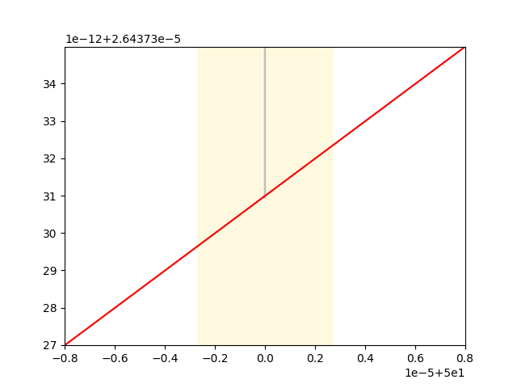
## New Eq:
((fabs(-50.0 + membrane__V) < 2.6713760659657915e-6) ? ((-9358472.2056995872 + 187169.45411399176 * membrane__V) * (2.1999999999968924e-11 * (intracellular_potassium_concentration__K_i * exp(1.8716945411372736) - extracellular_potassium_concentration__K_o * exp(9.9999999999406119e-8)) * L_type_Ca_channel_d_gate__d * L_type_Ca_channel_f2ds_gate__f2ds * L_type_Ca_channel_f_gate__f / (1.0 - exp(9.9999999999406119e-8)) + 2.1999999999968924e-11 * (intracellular_potassium_concentration__K_i * exp(1.8716945411372736) - extracellular_potassium_concentration__K_o * exp(-9.9999999999406119e-8)) * L_type_Ca_channel_d_gate__d * L_type_Ca_channel_f2ds_gate__f2ds * L_type_Ca_channel_f_gate__f / (1.0 - exp(-9.9999999999406119e-8))) - 2.1999999999968924e-11 * (intracellular_potassium_concentration__K_i * exp(1.8716945411372736) - extracellular_potassium_concentration__K_o * exp(9.9999999999406119e-8)) * L_type_Ca_channel_d_gate__d * L_type_Ca_channel_f2ds_gate__f2ds * L_type_Ca_channel_f_gate__f / (1.0 - exp(9.9999999999406119e-8))) : ((-50.0 + membrane__V) * (intracellular_potassium_concentration__K_i * exp(50.0 * membrane__F / (membrane__R * membrane__T)) - extracellular_potassium_concentration__K_o * exp((50.0 - membrane__V) * membrane__F / (membrane__R * membrane__T))) * L_type_Ca_channel__FrICa * L_type_Ca_channel__P_CaK * L_type_Ca_channel__P_Ca_L * L_type_Ca_channel_d_gate__d * L_type_Ca_channel_f2ds_gate__f2ds * L_type_Ca_channel_f_gate__f * membrane__F / ((1.0 - exp((50.0 - membrane__V) * membrane__F / (membrane__R * membrane__T))) * membrane__R * membrane__T)))

## Equation 5:
```
L_type_Ca_channel__i_Ca_L_Na_cyt = (1.0 - L_type_Ca_channel__FrICa) * (-50.0 + membrane__V) * (intracellular_sodium_concentration__Na_i * exp(50.0 * membrane__F / (membrane__R * membrane__T)) - extracellular_sodium_concentration__Na_o * exp((50.0 - membrane__V) * membrane__F / (membrane__R * membrane__T))) * L_type_Ca_channel__P_CaNa * L_type_Ca_channel__P_Ca_L * L_type_Ca_channel_d_gate__d * L_type_Ca_channel_f2_gate__f2 * L_type_Ca_channel_f_gate__f * membrane__F / ((1.0 - exp((50.0 - membrane__V) * membrane__F / (membrane__R * membrane__T))) * membrane__R * membrane__T)
```
### Partially evaluated to: 
```
L_type_Ca_channel__i_Ca_L_Na_cyt = 0
```
### Singulariy points detected:

{50.000000000000000}
#### Eq == 0!
## Equation 6:
```
L_type_Ca_channel__i_Ca_L_Na_ds = (-50.0 + membrane__V) * (intracellular_sodium_concentration__Na_i * exp(50.0 * membrane__F / (membrane__R * membrane__T)) - extracellular_sodium_concentration__Na_o * exp((50.0 - membrane__V) * membrane__F / (membrane__R * membrane__T))) * L_type_Ca_channel__FrICa * L_type_Ca_channel__P_CaNa * L_type_Ca_channel__P_Ca_L * L_type_Ca_channel_d_gate__d * L_type_Ca_channel_f2ds_gate__f2ds * L_type_Ca_channel_f_gate__f * membrane__F / ((1.0 - exp((50.0 - membrane__V) * membrane__F / (membrane__R * membrane__T))) * membrane__R * membrane__T)
```
### Partially evaluated to: 
```
L_type_Ca_channel__i_Ca_L_Na_ds = 4.1177279905020022e-5 * (-50.0 + membrane__V) * (6.4993004051833205 * intracellular_sodium_concentration__Na_i - 6.4993004051833205 * extracellular_sodium_concentration__Na_o * exp(-0.037433890822745473 * membrane__V)) * L_type_Ca_channel_d_gate__d * L_type_Ca_channel_f2ds_gate__f2ds * L_type_Ca_channel_f_gate__f / (1.0 - 6.4993004051833205 * exp(-0.037433890822745473 * membrane__V))
```
### Singulariy points detected:

{50.000000000000000}
*U*
`1.8716945411372736 - 0.037433890822745473 * membrane__V`

*V for 1e-07 range* 
`49.999997328623934 - 50.000002671376066`

*Singularity point: 50.000000000000000*


## New Eq:
((fabs(-50.0 + membrane__V) < 2.6713760659657915e-6) ? ((-9358472.2056995872 + 187169.45411399176 * membrane__V) * (1.0999999999984461e-10 * (intracellular_sodium_concentration__Na_i * exp(1.8716945411372736) - extracellular_sodium_concentration__Na_o * exp(9.9999999999406119e-8)) * L_type_Ca_channel_d_gate__d * L_type_Ca_channel_f2ds_gate__f2ds * L_type_Ca_channel_f_gate__f / (1.0 - exp(9.9999999999406119e-8)) + 1.0999999999984461e-10 * (intracellular_sodium_concentration__Na_i * exp(1.8716945411372736) - extracellular_sodium_concentration__Na_o * exp(-9.9999999999406119e-8)) * L_type_Ca_channel_d_gate__d * L_type_Ca_channel_f2ds_gate__f2ds * L_type_Ca_channel_f_gate__f / (1.0 - exp(-9.9999999999406119e-8))) - 1.0999999999984461e-10 * (intracellular_sodium_concentration__Na_i * exp(1.8716945411372736) - extracellular_sodium_concentration__Na_o * exp(9.9999999999406119e-8)) * L_type_Ca_channel_d_gate__d * L_type_Ca_channel_f2ds_gate__f2ds * L_type_Ca_channel_f_gate__f / (1.0 - exp(9.9999999999406119e-8))) : ((-50.0 + membrane__V) * (intracellular_sodium_concentration__Na_i * exp(50.0 * membrane__F / (membrane__R * membrane__T)) - extracellular_sodium_concentration__Na_o * exp((50.0 - membrane__V) * membrane__F / (membrane__R * membrane__T))) * L_type_Ca_channel__FrICa * L_type_Ca_channel__P_CaNa * L_type_Ca_channel__P_Ca_L * L_type_Ca_channel_d_gate__d * L_type_Ca_channel_f2ds_gate__f2ds * L_type_Ca_channel_f_gate__f * membrane__F / ((1.0 - exp((50.0 - membrane__V) * membrane__F / (membrane__R * membrane__T))) * membrane__R * membrane__T)))

## Equation 7:
```
rapid_delayed_rectifier_potassium_current_xr_gate__tau_xr = 0.001 / (0.00060999999999999997 * (38.899999999999999 + membrane__V) / (-1.0 + 281.60348502322194 * exp(0.14499999999999999 * membrane__V)) + 0.0013799999999999999 * (14.199999999999999 + membrane__V) / (1.0 - 0.17436578041087322 * exp(-0.123 * membrane__V)))
```
### Partially evaluated to: 
```
rapid_delayed_rectifier_potassium_current_xr_gate__tau_xr = 0.001 / (0.00060999999999999997 * (38.899999999999999 + membrane__V) / (-1.0 + 281.60348502322194 * exp(0.14499999999999999 * membrane__V)) + 0.0013799999999999999 * (14.199999999999999 + membrane__V) / (1.0 - 0.17436578041087322 * exp(-0.123 * membrane__V)))
```
### Singulariy points detected:

{-14.199999999999999, -38.899999999999999}
#### float * A

####1 / A


####A + B:

`0.0013799999999999999 * (14.199999999999999 + membrane__V) / (1.0 - 0.17436578041087322 * exp(-0.123 * membrane__V))`
`0.00060999999999999997 * (38.899999999999999 + membrane__V) / (-1.0 + 281.60348502322194 * exp(0.14499999999999999 * membrane__V))`

*U*
`-1.7465999999999999 - 0.123 * membrane__V`

*V for 1e-07 range* 
`-14.200000813008129 - -14.199999186991869`

*Singularity point: -14.199999999999999*


*U*
`5.6404999999999994 + 0.14499999999999999 * membrane__V`

*V for 1e-07 range* 
`-38.900000689655172 - -38.899999310344825`

*Singularity point: -38.899999999999999*


## New Eq:
((fabs(14.199999999999999 + membrane__V) < 8.1300813006834893e-7) ? (0.001 / (0.015066999504065039 / (-1.0 + exp(3.5814998821138206)) - 1.1219512194943214e-9 / (1.0 - exp(9.9999999999406119e-8))) + (8733000.5000645891 + 615000.00000454858 * membrane__V) * (0.001 / (1.1219512195134727e-9 / (1.0 - exp(-9.9999999999406119e-8)) + 0.015067000495934959 / (-1.0 + exp(3.5815001178861787))) - 0.001 / (0.015066999504065039 / (-1.0 + exp(3.5814998821138206)) - 1.1219512194943214e-9 / (1.0 - exp(9.9999999999406119e-8))))) : ((fabs(38.899999999999999 + membrane__V) < 6.8965517246999397e-7) ? (0.001 / (-0.034086000951724135 / (1.0 - exp(3.0381000848275859)) - 4.2068965517283451e-10 / (-1.0 + exp(-1.0000000000287557e-7))) + (28202500.498836767 + 724999.99997009686 * membrane__V) * (0.001 / (4.2068965520669629e-10 / (-1.0 + exp(1.0000000000287557e-7)) - 0.034085999048275861 / (1.0 - exp(3.0380999151724137))) - 0.001 / (-0.034086000951724135 / (1.0 - exp(3.0381000848275859)) - 4.2068965517283451e-10 / (-1.0 + exp(-1.0000000000287557e-7))))) : (0.001 / (0.00060999999999999997 * (38.899999999999999 + membrane__V) / (-1.0 + exp(5.6404999999999994 + 0.14499999999999999 * membrane__V)) + 0.0013799999999999999 * (14.199999999999999 + membrane__V) / (1.0 - exp(-1.7465999999999999 - 0.123 * membrane__V))))))

## Equation 8:
```
slow_delayed_rectifier_potassium_current_xs_gate__tau_xs = 0.001 / (0.00013100000000000001 * (30.0 + membrane__V) / (-1.0 + 7.8538197044216602 * exp(0.068699999999999997 * membrane__V)) + 7.1899999999999999e-5 * (30.0 + membrane__V) / (1.0 - 0.011795938519751569 * exp(-0.14799999999999999 * membrane__V)))
```
### Partially evaluated to: 
```
slow_delayed_rectifier_potassium_current_xs_gate__tau_xs = 0.001 / (0.00013100000000000001 * (30.0 + membrane__V) / (-1.0 + 7.8538197044216602 * exp(0.068699999999999997 * membrane__V)) + 7.1899999999999999e-5 * (30.0 + membrane__V) / (1.0 - 0.011795938519751569 * exp(-0.14799999999999999 * membrane__V)))
```
### Singulariy points detected:

{-30.000000000000000}
#### float * A

####1 / A


####A + B:

`7.1899999999999999e-5 * (30.0 + membrane__V) / (1.0 - 0.011795938519751569 * exp(-0.14799999999999999 * membrane__V))`
`0.00013100000000000001 * (30.0 + membrane__V) / (-1.0 + 7.8538197044216602 * exp(0.068699999999999997 * membrane__V))`

*U*
`-4.4399999999999995 - 0.14799999999999999 * membrane__V`

*V for 1e-07 range* 
`-30.000000675675675 - -29.999999324324325`

*Singularity point: -30.000000000000000*


## New Eq:
((fabs(30.0 + membrane__V) < 6.7567567568760367e-7) ? (0.001 / (-8.8513513515076093e-11 / (-1.0 + exp(-4.6418918920460017e-8)) - 4.8581081081938701e-11 / (1.0 - exp(1.0000000000287557e-7))) + (22200000.499608092 + 739999.99998693645 * membrane__V) * (0.001 / (8.8513513515076093e-11 / (-1.0 + exp(4.6418918920460017e-8)) + 4.8581081081938701e-11 / (1.0 - exp(-1.0000000000287557e-7))) - 0.001 / (-8.8513513515076093e-11 / (-1.0 + exp(-4.6418918920460017e-8)) - 4.8581081081938701e-11 / (1.0 - exp(1.0000000000287557e-7))))) : (0.001 / (0.00013100000000000001 * (30.0 + membrane__V) / (-1.0 + exp(2.0609999999999999 + 0.068699999999999997 * membrane__V)) + 7.1899999999999999e-5 * (30.0 + membrane__V) / (1.0 - exp(-4.4399999999999995 - 0.14799999999999999 * membrane__V)))))

# Model: shannon_wang_puglisi_weber_bers_2004_model_updated(shannon_wang_puglisi_weber_bers_2004.cellml)
## Equation 1:
```
ICaL_d_gate__tau_d = 28.571428571428569 * (1.0 - 0.089218517409260095 * exp(-0.16666666666666666 * cell__V)) * ICaL_d_gate__d_infinity / (14.5 + cell__V)
```
### Partially evaluated to: 
```
ICaL_d_gate__tau_d = 28.571428571428569 * (1.0 - 0.089218517409260095 * exp(-0.16666666666666666 * cell__V)) / ((1.0 + 0.089218517409260095 * exp(-0.16666666666666666 * cell__V)) * (14.5 + cell__V))
```
### Singulariy points detected:

{-14.500000000000000}
*U*
`-2.4166666666666665 - 0.16666666666666666 * cell__V`

*V for 1e-07 range* 
`-14.5000006 - -14.4999994`

*Singularity point: -14.500000000000000*

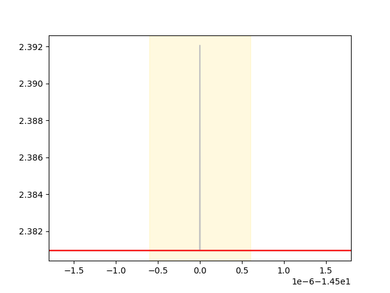
## New Eq:
((fabs(14.5 + cell__V) < 5.9999999998949782e-7) ? ((12083333.833405094 + 833333.3333382823 * cell__V) * (47619047.619881123 * (1.0 - exp(-9.9999999999406119e-8)) / (1.0 + exp(-9.9999999999406119e-8)) + 47619047.618779711 * (1.0 - exp(9.9999999999406119e-8)) / (1.0 + exp(9.9999999999406119e-8))) - 47619047.618779711 * (1.0 - exp(9.9999999999406119e-8)) / (1.0 + exp(9.9999999999406119e-8))) : (28.571428571428569 * (1.0 - exp(-2.4166666666666665 - 0.16666666666666666 * cell__V)) * ICaL_d_gate__d_infinity / (14.5 + cell__V)))

## Equation 2:
```
IKr_Xr_gate__tau_Xr = 1 / (0.00060999999999999997 * (10.0 + cell__V) / (-1.0 + 4.2631145151688168 * exp(0.14499999999999999 * cell__V)) + 0.0013799999999999999 * (7.0 + cell__V) / (1.0 - 0.42273913174596284 * exp(-0.123 * cell__V)))
```
### Partially evaluated to: 
```
IKr_Xr_gate__tau_Xr = 1 / (0.00060999999999999997 * (10.0 + cell__V) / (-1.0 + 4.2631145151688168 * exp(0.14499999999999999 * cell__V)) + 0.0013799999999999999 * (7.0 + cell__V) / (1.0 - 0.42273913174596284 * exp(-0.123 * cell__V)))
```
### Singulariy points detected:

{-7.0000000000000000, -7.0000000000000000, -10.000000000000000}
#### float * A

####1 / A


####A + B:

`0.0013799999999999999 * (7.0 + cell__V) / (1.0 - 0.42273913174596284 * exp(-0.123 * cell__V))`
`0.00060999999999999997 * (10.0 + cell__V) / (-1.0 + 4.2631145151688168 * exp(0.14499999999999999 * cell__V))`

*U*
`-0.86099999999999999 - 0.123 * cell__V`

*V for 1e-07 range* 
`-7.0000008130081302 - -6.9999991869918698`

*Singularity point: -7.0000000000000000*

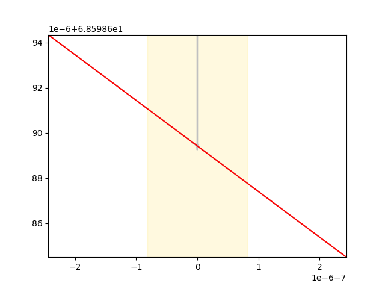
*U*
`1.45 + 0.14499999999999999 * cell__V`

*V for 1e-07 range* 
`-10.000000689655172 - -9.9999993103448279`

*Singularity point: -10.000000000000000*

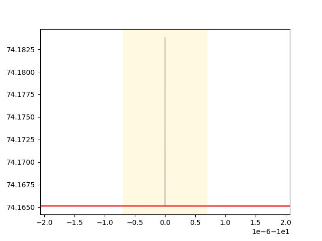
## New Eq:
((fabs(7.0 + cell__V) < 8.1300813006834893e-7) ? (1 / (0.0018299995040650405 / (-1.0 + exp(0.43499988211382112)) - 1.1219512195230486e-9 / (1.0 - exp(1.0000000000114084e-7))) + (4305000.4999950975 + 614999.99999929965 * cell__V) * (1 / (0.0018300004959349594 / (-1.0 + exp(0.43500011788617882)) + 1.1219512195038971e-9 / (1.0 - exp(-9.9999999999406119e-8))) - 1 / (0.0018299995040650405 / (-1.0 + exp(0.43499988211382112)) - 1.1219512195230486e-9 / (1.0 - exp(1.0000000000114084e-7))))) : ((fabs(10.0 + cell__V) < 6.8965517241448282e-7) ? (1 / (-0.0041400009517241374 / (1.0 - exp(0.36900008482758623)) - 4.2068965517283451e-10 / (-1.0 + exp(-9.9999999999406119e-8))) + (7250000.4999927497 + 724999.99999927497 * cell__V) * (1 / (4.2068965517283451e-10 / (-1.0 + exp(9.9999999999406119e-8)) - 0.0041399990482758617 / (1.0 - exp(0.36899991517241376))) - 1 / (-0.0041400009517241374 / (1.0 - exp(0.36900008482758623)) - 4.2068965517283451e-10 / (-1.0 + exp(-9.9999999999406119e-8))))) : (1 / (0.00060999999999999997 * (10.0 + cell__V) / (-1.0 + exp(1.45 + 0.14499999999999999 * cell__V)) + 0.0013799999999999999 * (7.0 + cell__V) / (1.0 - exp(-0.86099999999999999 - 0.123 * cell__V))))))

## Equation 3:
```
IKs_Xs_gate__tau_Xs = 1 / (0.00013100000000000001 * (30.0 + cell__V) / (-1.0 + 7.8538197044216602 * exp(0.068699999999999997 * cell__V)) + 7.1899999999999999e-5 * (30.0 + cell__V) / (1.0 - 0.011795938519751569 * exp(-0.14799999999999999 * cell__V)))
```
### Partially evaluated to: 
```
IKs_Xs_gate__tau_Xs = 1 / (0.00013100000000000001 * (30.0 + cell__V) / (-1.0 + 7.8538197044216602 * exp(0.068699999999999997 * cell__V)) + 7.1899999999999999e-5 * (30.0 + cell__V) / (1.0 - 0.011795938519751569 * exp(-0.14799999999999999 * cell__V)))
```
### Singulariy points detected:

{-30.000000000000000}
#### float * A

####1 / A


####A + B:

`7.1899999999999999e-5 * (30.0 + cell__V) / (1.0 - 0.011795938519751569 * exp(-0.14799999999999999 * cell__V))`
`0.00013100000000000001 * (30.0 + cell__V) / (-1.0 + 7.8538197044216602 * exp(0.068699999999999997 * cell__V))`

*U*
`-4.4399999999999995 - 0.14799999999999999 * cell__V`

*V for 1e-07 range* 
`-30.000000675675675 - -29.999999324324325`

*Singularity point: -30.000000000000000*


## New Eq:
((fabs(30.0 + cell__V) < 6.7567567568760367e-7) ? (1 / (-8.8513513515076093e-11 / (-1.0 + exp(-4.6418918920460017e-8)) - 4.8581081081938701e-11 / (1.0 - exp(1.0000000000287557e-7))) + (22200000.499608092 + 739999.99998693645 * cell__V) * (1 / (8.8513513515076093e-11 / (-1.0 + exp(4.6418918920460017e-8)) + 4.8581081081938701e-11 / (1.0 - exp(-1.0000000000287557e-7))) - 1 / (-8.8513513515076093e-11 / (-1.0 + exp(-4.6418918920460017e-8)) - 4.8581081081938701e-11 / (1.0 - exp(1.0000000000287557e-7))))) : (1 / (0.00013100000000000001 * (30.0 + cell__V) / (-1.0 + exp(2.0609999999999999 + 0.068699999999999997 * cell__V)) + 7.1899999999999999e-5 * (30.0 + cell__V) / (1.0 - exp(-4.4399999999999995 - 0.14799999999999999 * cell__V)))))

## Equation 4:
```
INa_m_gate__alpha_m = 0.32000000000000001 * (47.130000000000003 + cell__V) / (1.0 - 0.00897780373069724 * exp(-0.10000000000000001 * cell__V))
```
### Partially evaluated to: 
```
INa_m_gate__alpha_m = 0.32000000000000001 * (47.130000000000003 + cell__V) / (1.0 - 0.00897780373069724 * exp(-0.10000000000000001 * cell__V))
```
### Singulariy points detected:

{-47.130000000000003}
*U*
`-4.7130000000000001 - 0.10000000000000001 * cell__V`

*V for 1e-07 range* 
`-47.130001 - -47.129999000000005`

*Singularity point: -47.130000000000003*


## New Eq:
((fabs(47.130000000000003 + cell__V) < 1.0000000000287557e-6) ? (-3.200000000092018e-7 / (1.0 - exp(1.0000000000287557e-7)) + (23565000.499322373 + 499999.99998562218 * cell__V) * (3.200000000092018e-7 / (1.0 - exp(1.0000000000287557e-7)) + 3.200000000092018e-7 / (1.0 - exp(-1.0000000000287557e-7)))) : (0.32000000000000001 * (47.130000000000003 + cell__V) / (1.0 - exp(-4.7130000000000001 - 0.10000000000000001 * cell__V))))

## Equation 5:
```
ICaL__i_CaL_Ca_SL = 4.0 * (-ICaL__gamma_Cao * model_parameters__Cao + Ca_buffer__Ca_SL * ICaL__gamma_Cai * exp(2.0 * cell__V * model_parameters__F / (model_parameters__R * model_parameters__T))) * ICaL__Fx_ICaL_SL * ICaL__PCa * ICaL__temp * ICaL_fCa_gate__fCa_SL / (-1.0 + exp(2.0 * cell__V * model_parameters__F / (model_parameters__R * model_parameters__T)))
```
### Partially evaluated to: 
```
ICaL__i_CaL_Ca_SL = 0.18000000000000002 * pow(1.8, (-31.0 + 0.10000000000000001 * model_parameters__T)) * pow(model_parameters__F, 2) * (1.0 - ICaL_fCa_gate__fCaB_SL) * (-0.34100000000000003 * model_parameters__Cao + 0.34100000000000003 * Ca_buffer__Ca_SL * exp(2.0 * cell__V * model_parameters__F / (model_parameters__R * model_parameters__T))) * ICaL__PCa * ICaL_d_gate__d * ICaL_f_gate__f * cell__V / ((-1.0 + exp(2.0 * cell__V * model_parameters__F / (model_parameters__R * model_parameters__T))) * model_parameters__R * model_parameters__T)
```
### Singulariy points detected:

{0}
#### float * A

####Failed!

<class 'sympy.core.mul.Mul'>
1.8**(0.1*_model_parameters$T - 31.0)*_model_parameters$F**2*_ICaL$PCa*_ICaL_d_gate$d*_ICaL_f_gate$f*_cell$V*(1.0 - _ICaL_fCa_gate$fCaB_SL)*(0.34100000000000003*_Ca_buffer$Ca_SL*exp(2.0*_cell$V*_model_parameters$F/(_model_parameters$R*_model_parameters$T)) - 0.34100000000000003*_model_parameters$Cao)/(_model_parameters$R*_model_parameters$T*(exp(2.0*_cell$V*_model_parameters$F/(_model_parameters$R*_model_parameters$T)) - 1.0))

*try substituting parameters*

*U*
`0.074870384603595908 * cell__V`

*V for 1e-07 range* 
`-1.3356415961992688e-6 - 1.3356415961992688e-6`

*Singularity point: 0*

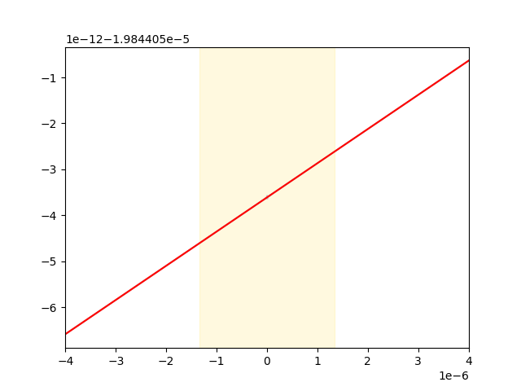
## New Eq:
((fabs(cell__V) < 1.3356415961992688e-6) ? ((0.5 + 374351.92301797954 * cell__V) * (2.404154873158684e-7 * pow(1.8, (-31.0 + 0.10000000000000001 * model_parameters__T)) * pow(model_parameters__F, 2) * (1.0 - ICaL_fCa_gate__fCaB_SL) * (-0.34100000000000003 * model_parameters__Cao + 0.34100000000000003 * Ca_buffer__Ca_SL * exp(2.6712831923985376e-6 * model_parameters__F / (model_parameters__R * model_parameters__T))) * ICaL__PCa * ICaL_d_gate__d * ICaL_f_gate__f / ((-1.0 + exp(2.6712831923985376e-6 * model_parameters__F / (model_parameters__R * model_parameters__T))) * model_parameters__R * model_parameters__T) + 2.404154873158684e-7 * pow(1.8, (-31.0 + 0.10000000000000001 * model_parameters__T)) * pow(model_parameters__F, 2) * (1.0 - ICaL_fCa_gate__fCaB_SL) * (-0.34100000000000003 * model_parameters__Cao + 0.34100000000000003 * Ca_buffer__Ca_SL * exp(-2.6712831923985376e-6 * model_parameters__F / (model_parameters__R * model_parameters__T))) * ICaL__PCa * ICaL_d_gate__d * ICaL_f_gate__f / ((-1.0 + exp(-2.6712831923985376e-6 * model_parameters__F / (model_parameters__R * model_parameters__T))) * model_parameters__R * model_parameters__T)) - 2.404154873158684e-7 * pow(1.8, (-31.0 + 0.10000000000000001 * model_parameters__T)) * pow(model_parameters__F, 2) * (1.0 - ICaL_fCa_gate__fCaB_SL) * (-0.34100000000000003 * model_parameters__Cao + 0.34100000000000003 * Ca_buffer__Ca_SL * exp(-2.6712831923985376e-6 * model_parameters__F / (model_parameters__R * model_parameters__T))) * ICaL__PCa * ICaL_d_gate__d * ICaL_f_gate__f / ((-1.0 + exp(-2.6712831923985376e-6 * model_parameters__F / (model_parameters__R * model_parameters__T))) * model_parameters__R * model_parameters__T)) : (4.0 * (-ICaL__gamma_Cao * model_parameters__Cao + Ca_buffer__Ca_SL * ICaL__gamma_Cai * exp(2.0 * cell__V * model_parameters__F / (model_parameters__R * model_parameters__T))) * ICaL__Fx_ICaL_SL * ICaL__PCa * ICaL__temp * ICaL_fCa_gate__fCa_SL / (-1.0 + exp(2.0 * cell__V * model_parameters__F / (model_parameters__R * model_parameters__T)))))

## Equation 6:
```
ICaL__i_CaL_Ca_jct = 4.0 * (-ICaL__gamma_Cao * model_parameters__Cao + Ca_buffer__Ca_jct * ICaL__gamma_Cai * exp(2.0 * cell__V * model_parameters__F / (model_parameters__R * model_parameters__T))) * ICaL__Fx_ICaL_jct * ICaL__PCa * ICaL__temp * ICaL_fCa_gate__fCa_jct / (-1.0 + exp(2.0 * cell__V * model_parameters__F / (model_parameters__R * model_parameters__T)))
```
### Partially evaluated to: 
```
ICaL__i_CaL_Ca_jct = 1.6200000000000001 * pow(1.8, (-31.0 + 0.10000000000000001 * model_parameters__T)) * pow(model_parameters__F, 2) * (1.0 - ICaL_fCa_gate__fCaB_jct) * (-0.34100000000000003 * model_parameters__Cao + 0.34100000000000003 * Ca_buffer__Ca_jct * exp(2.0 * cell__V * model_parameters__F / (model_parameters__R * model_parameters__T))) * ICaL__PCa * ICaL_d_gate__d * ICaL_f_gate__f * cell__V / ((-1.0 + exp(2.0 * cell__V * model_parameters__F / (model_parameters__R * model_parameters__T))) * model_parameters__R * model_parameters__T)
```
### Singulariy points detected:

{0}
#### float * A

####Failed!

<class 'sympy.core.mul.Mul'>
1.8**(0.1*_model_parameters$T - 31.0)*_model_parameters$F**2*_ICaL$PCa*_ICaL_d_gate$d*_ICaL_f_gate$f*_cell$V*(1.0 - _ICaL_fCa_gate$fCaB_jct)*(0.34100000000000003*_Ca_buffer$Ca_jct*exp(2.0*_cell$V*_model_parameters$F/(_model_parameters$R*_model_parameters$T)) - 0.34100000000000003*_model_parameters$Cao)/(_model_parameters$R*_model_parameters$T*(exp(2.0*_cell$V*_model_parameters$F/(_model_parameters$R*_model_parameters$T)) - 1.0))

*try substituting parameters*

*U*
`0.074870384603595908 * cell__V`

*V for 1e-07 range* 
`-1.3356415961992688e-6 - 1.3356415961992688e-6`

*Singularity point: 0*

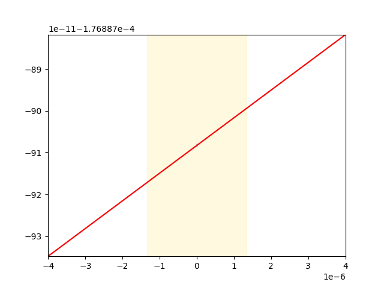
## New Eq:
((fabs(cell__V) < 1.3356415961992688e-6) ? ((0.5 + 374351.92301797954 * cell__V) * (2.1637393858428153e-6 * pow(1.8, (-31.0 + 0.10000000000000001 * model_parameters__T)) * pow(model_parameters__F, 2) * (1.0 - ICaL_fCa_gate__fCaB_jct) * (-0.34100000000000003 * model_parameters__Cao + 0.34100000000000003 * Ca_buffer__Ca_jct * exp(2.6712831923985376e-6 * model_parameters__F / (model_parameters__R * model_parameters__T))) * ICaL__PCa * ICaL_d_gate__d * ICaL_f_gate__f / ((-1.0 + exp(2.6712831923985376e-6 * model_parameters__F / (model_parameters__R * model_parameters__T))) * model_parameters__R * model_parameters__T) + 2.1637393858428153e-6 * pow(1.8, (-31.0 + 0.10000000000000001 * model_parameters__T)) * pow(model_parameters__F, 2) * (1.0 - ICaL_fCa_gate__fCaB_jct) * (-0.34100000000000003 * model_parameters__Cao + 0.34100000000000003 * Ca_buffer__Ca_jct * exp(-2.6712831923985376e-6 * model_parameters__F / (model_parameters__R * model_parameters__T))) * ICaL__PCa * ICaL_d_gate__d * ICaL_f_gate__f / ((-1.0 + exp(-2.6712831923985376e-6 * model_parameters__F / (model_parameters__R * model_parameters__T))) * model_parameters__R * model_parameters__T)) - 2.1637393858428153e-6 * pow(1.8, (-31.0 + 0.10000000000000001 * model_parameters__T)) * pow(model_parameters__F, 2) * (1.0 - ICaL_fCa_gate__fCaB_jct) * (-0.34100000000000003 * model_parameters__Cao + 0.34100000000000003 * Ca_buffer__Ca_jct * exp(-2.6712831923985376e-6 * model_parameters__F / (model_parameters__R * model_parameters__T))) * ICaL__PCa * ICaL_d_gate__d * ICaL_f_gate__f / ((-1.0 + exp(-2.6712831923985376e-6 * model_parameters__F / (model_parameters__R * model_parameters__T))) * model_parameters__R * model_parameters__T)) : (4.0 * (-ICaL__gamma_Cao * model_parameters__Cao + Ca_buffer__Ca_jct * ICaL__gamma_Cai * exp(2.0 * cell__V * model_parameters__F / (model_parameters__R * model_parameters__T))) * ICaL__Fx_ICaL_jct * ICaL__PCa * ICaL__temp * ICaL_fCa_gate__fCa_jct / (-1.0 + exp(2.0 * cell__V * model_parameters__F / (model_parameters__R * model_parameters__T)))))

## Equation 7:
```
ICaL__i_CaL_K = (ICaL__Fx_ICaL_SL * ICaL_fCa_gate__fCa_SL + ICaL__Fx_ICaL_jct * ICaL_fCa_gate__fCa_jct) * (-ICaL__gamma_Ko * model_parameters__Ko + ICaL__gamma_Ki * model_parameters__Ki * exp(cell__V * model_parameters__F / (model_parameters__R * model_parameters__T))) * ICaL__PK * ICaL__temp / (-1.0 + exp(cell__V * model_parameters__F / (model_parameters__R * model_parameters__T)))
```
### Partially evaluated to: 
```
ICaL__i_CaL_K = 1.215e-7 * pow(1.8, (-31.0 + 0.10000000000000001 * model_parameters__T)) * pow(model_parameters__F, 2) * (-0.75 * model_parameters__Ko + 0.75 * model_parameters__Ki * exp(cell__V * model_parameters__F / (model_parameters__R * model_parameters__T))) * (1.0 - 0.10000000000000001 * ICaL_fCa_gate__fCaB_SL - 0.90000000000000002 * ICaL_fCa_gate__fCaB_jct) * ICaL_d_gate__d * ICaL_f_gate__f * cell__V / ((-1.0 + exp(cell__V * model_parameters__F / (model_parameters__R * model_parameters__T))) * model_parameters__R * model_parameters__T)
```
### Singulariy points detected:

{0}
#### float * A

####Failed!

<class 'sympy.core.mul.Mul'>
1.8**(0.1*_model_parameters$T - 31.0)*_model_parameters$F**2*_ICaL_d_gate$d*_ICaL_f_gate$f*_cell$V*(0.75*_model_parameters$Ki*exp(_cell$V*_model_parameters$F/(_model_parameters$R*_model_parameters$T)) - 0.75*_model_parameters$Ko)*(-0.10000000000000001*_ICaL_fCa_gate$fCaB_SL - 0.90000000000000002*_ICaL_fCa_gate$fCaB_jct + 1.0)/(_model_parameters$R*_model_parameters$T*(exp(_cell$V*_model_parameters$F/(_model_parameters$R*_model_parameters$T)) - 1.0))

*try substituting parameters*

*U*
`0.037435192301797954 * cell__V`

*V for 1e-07 range* 
`-2.6712831923985376e-6 - 2.6712831923985376e-6`

*Singularity point: 0*


## New Eq:
((fabs(cell__V) < 2.6712831923985376e-6) ? ((0.5 + 187175.96150898977 * cell__V) * (3.2456090787642232e-13 * pow(1.8, (-31.0 + 0.10000000000000001 * model_parameters__T)) * pow(model_parameters__F, 2) * (-0.75 * model_parameters__Ko + 0.75 * model_parameters__Ki * exp(2.6712831923985376e-6 * model_parameters__F / (model_parameters__R * model_parameters__T))) * (1.0 - 0.10000000000000001 * ICaL_fCa_gate__fCaB_SL - 0.90000000000000002 * ICaL_fCa_gate__fCaB_jct) * ICaL_d_gate__d * ICaL_f_gate__f / ((-1.0 + exp(2.6712831923985376e-6 * model_parameters__F / (model_parameters__R * model_parameters__T))) * model_parameters__R * model_parameters__T) + 3.2456090787642232e-13 * pow(1.8, (-31.0 + 0.10000000000000001 * model_parameters__T)) * pow(model_parameters__F, 2) * (-0.75 * model_parameters__Ko + 0.75 * model_parameters__Ki * exp(-2.6712831923985376e-6 * model_parameters__F / (model_parameters__R * model_parameters__T))) * (1.0 - 0.10000000000000001 * ICaL_fCa_gate__fCaB_SL - 0.90000000000000002 * ICaL_fCa_gate__fCaB_jct) * ICaL_d_gate__d * ICaL_f_gate__f / ((-1.0 + exp(-2.6712831923985376e-6 * model_parameters__F / (model_parameters__R * model_parameters__T))) * model_parameters__R * model_parameters__T)) - 3.2456090787642232e-13 * pow(1.8, (-31.0 + 0.10000000000000001 * model_parameters__T)) * pow(model_parameters__F, 2) * (-0.75 * model_parameters__Ko + 0.75 * model_parameters__Ki * exp(-2.6712831923985376e-6 * model_parameters__F / (model_parameters__R * model_parameters__T))) * (1.0 - 0.10000000000000001 * ICaL_fCa_gate__fCaB_SL - 0.90000000000000002 * ICaL_fCa_gate__fCaB_jct) * ICaL_d_gate__d * ICaL_f_gate__f / ((-1.0 + exp(-2.6712831923985376e-6 * model_parameters__F / (model_parameters__R * model_parameters__T))) * model_parameters__R * model_parameters__T)) : ((ICaL__Fx_ICaL_SL * ICaL_fCa_gate__fCa_SL + ICaL__Fx_ICaL_jct * ICaL_fCa_gate__fCa_jct) * (-ICaL__gamma_Ko * model_parameters__Ko + ICaL__gamma_Ki * model_parameters__Ki * exp(cell__V * model_parameters__F / (model_parameters__R * model_parameters__T))) * ICaL__PK * ICaL__temp / (-1.0 + exp(cell__V * model_parameters__F / (model_parameters__R * model_parameters__T)))))

## Equation 8:
```
ICaL__i_CaL_Na_SL = (-ICaL__gamma_Nao * model_parameters__Nao + ICaL__gamma_Nai * Na_buffer__Na_SL * exp(cell__V * model_parameters__F / (model_parameters__R * model_parameters__T))) * ICaL__Fx_ICaL_SL * ICaL__PNa * ICaL__temp * ICaL_fCa_gate__fCa_SL / (-1.0 + exp(cell__V * model_parameters__F / (model_parameters__R * model_parameters__T)))
```
### Partially evaluated to: 
```
ICaL__i_CaL_Na_SL = 6.7499999999999994e-10 * pow(1.8, (-31.0 + 0.10000000000000001 * model_parameters__T)) * pow(model_parameters__F, 2) * (1.0 - ICaL_fCa_gate__fCaB_SL) * (-0.75 * model_parameters__Nao + 0.75 * Na_buffer__Na_SL * exp(cell__V * model_parameters__F / (model_parameters__R * model_parameters__T))) * ICaL_d_gate__d * ICaL_f_gate__f * cell__V / ((-1.0 + exp(cell__V * model_parameters__F / (model_parameters__R * model_parameters__T))) * model_parameters__R * model_parameters__T)
```
### Singulariy points detected:

{0}
#### float * A

####Failed!

<class 'sympy.core.mul.Mul'>
1.8**(0.1*_model_parameters$T - 31.0)*_model_parameters$F**2*_ICaL_d_gate$d*_ICaL_f_gate$f*_cell$V*(1.0 - _ICaL_fCa_gate$fCaB_SL)*(0.75*_Na_buffer$Na_SL*exp(_cell$V*_model_parameters$F/(_model_parameters$R*_model_parameters$T)) - 0.75*_model_parameters$Nao)/(_model_parameters$R*_model_parameters$T*(exp(_cell$V*_model_parameters$F/(_model_parameters$R*_model_parameters$T)) - 1.0))

*try substituting parameters*

*U*
`0.037435192301797954 * cell__V`

*V for 1e-07 range* 
`-2.6712831923985376e-6 - 2.6712831923985376e-6`

*Singularity point: 0*

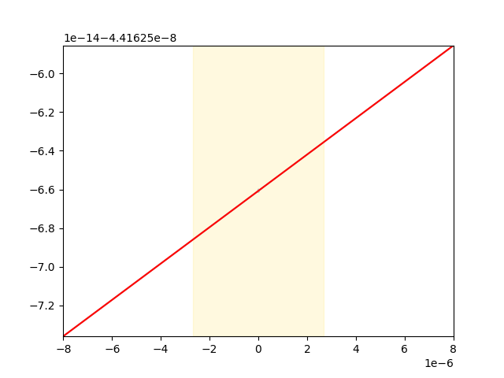
## New Eq:
((fabs(cell__V) < 2.6712831923985376e-6) ? ((0.5 + 187175.96150898977 * cell__V) * (1.8031161548690127e-15 * pow(1.8, (-31.0 + 0.10000000000000001 * model_parameters__T)) * pow(model_parameters__F, 2) * (1.0 - ICaL_fCa_gate__fCaB_SL) * (-0.75 * model_parameters__Nao + 0.75 * Na_buffer__Na_SL * exp(2.6712831923985376e-6 * model_parameters__F / (model_parameters__R * model_parameters__T))) * ICaL_d_gate__d * ICaL_f_gate__f / ((-1.0 + exp(2.6712831923985376e-6 * model_parameters__F / (model_parameters__R * model_parameters__T))) * model_parameters__R * model_parameters__T) + 1.8031161548690127e-15 * pow(1.8, (-31.0 + 0.10000000000000001 * model_parameters__T)) * pow(model_parameters__F, 2) * (1.0 - ICaL_fCa_gate__fCaB_SL) * (-0.75 * model_parameters__Nao + 0.75 * Na_buffer__Na_SL * exp(-2.6712831923985376e-6 * model_parameters__F / (model_parameters__R * model_parameters__T))) * ICaL_d_gate__d * ICaL_f_gate__f / ((-1.0 + exp(-2.6712831923985376e-6 * model_parameters__F / (model_parameters__R * model_parameters__T))) * model_parameters__R * model_parameters__T)) - 1.8031161548690127e-15 * pow(1.8, (-31.0 + 0.10000000000000001 * model_parameters__T)) * pow(model_parameters__F, 2) * (1.0 - ICaL_fCa_gate__fCaB_SL) * (-0.75 * model_parameters__Nao + 0.75 * Na_buffer__Na_SL * exp(-2.6712831923985376e-6 * model_parameters__F / (model_parameters__R * model_parameters__T))) * ICaL_d_gate__d * ICaL_f_gate__f / ((-1.0 + exp(-2.6712831923985376e-6 * model_parameters__F / (model_parameters__R * model_parameters__T))) * model_parameters__R * model_parameters__T)) : ((-ICaL__gamma_Nao * model_parameters__Nao + ICaL__gamma_Nai * Na_buffer__Na_SL * exp(cell__V * model_parameters__F / (model_parameters__R * model_parameters__T))) * ICaL__Fx_ICaL_SL * ICaL__PNa * ICaL__temp * ICaL_fCa_gate__fCa_SL / (-1.0 + exp(cell__V * model_parameters__F / (model_parameters__R * model_parameters__T)))))

## Equation 9:
```
ICaL__i_CaL_Na_jct = (-ICaL__gamma_Nao * model_parameters__Nao + ICaL__gamma_Nai * Na_buffer__Na_jct * exp(cell__V * model_parameters__F / (model_parameters__R * model_parameters__T))) * ICaL__Fx_ICaL_jct * ICaL__PNa * ICaL__temp * ICaL_fCa_gate__fCa_jct / (-1.0 + exp(cell__V * model_parameters__F / (model_parameters__R * model_parameters__T)))
```
### Partially evaluated to: 
```
ICaL__i_CaL_Na_jct = 6.0749999999999998e-9 * pow(1.8, (-31.0 + 0.10000000000000001 * model_parameters__T)) * pow(model_parameters__F, 2) * (1.0 - ICaL_fCa_gate__fCaB_jct) * (-0.75 * model_parameters__Nao + 0.75 * Na_buffer__Na_jct * exp(cell__V * model_parameters__F / (model_parameters__R * model_parameters__T))) * ICaL_d_gate__d * ICaL_f_gate__f * cell__V / ((-1.0 + exp(cell__V * model_parameters__F / (model_parameters__R * model_parameters__T))) * model_parameters__R * model_parameters__T)
```
### Singulariy points detected:

{0}
#### float * A

####Failed!

<class 'sympy.core.mul.Mul'>
1.8**(0.1*_model_parameters$T - 31.0)*_model_parameters$F**2*_ICaL_d_gate$d*_ICaL_f_gate$f*_cell$V*(1.0 - _ICaL_fCa_gate$fCaB_jct)*(0.75*_Na_buffer$Na_jct*exp(_cell$V*_model_parameters$F/(_model_parameters$R*_model_parameters$T)) - 0.75*_model_parameters$Nao)/(_model_parameters$R*_model_parameters$T*(exp(_cell$V*_model_parameters$F/(_model_parameters$R*_model_parameters$T)) - 1.0))

*try substituting parameters*

*U*
`0.037435192301797954 * cell__V`

*V for 1e-07 range* 
`-2.6712831923985376e-6 - 2.6712831923985376e-6`

*Singularity point: 0*

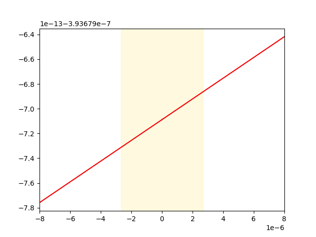
## New Eq:
((fabs(cell__V) < 2.6712831923985376e-6) ? ((0.5 + 187175.96150898977 * cell__V) * (1.6228045393821114e-14 * pow(1.8, (-31.0 + 0.10000000000000001 * model_parameters__T)) * pow(model_parameters__F, 2) * (1.0 - ICaL_fCa_gate__fCaB_jct) * (-0.75 * model_parameters__Nao + 0.75 * Na_buffer__Na_jct * exp(2.6712831923985376e-6 * model_parameters__F / (model_parameters__R * model_parameters__T))) * ICaL_d_gate__d * ICaL_f_gate__f / ((-1.0 + exp(2.6712831923985376e-6 * model_parameters__F / (model_parameters__R * model_parameters__T))) * model_parameters__R * model_parameters__T) + 1.6228045393821114e-14 * pow(1.8, (-31.0 + 0.10000000000000001 * model_parameters__T)) * pow(model_parameters__F, 2) * (1.0 - ICaL_fCa_gate__fCaB_jct) * (-0.75 * model_parameters__Nao + 0.75 * Na_buffer__Na_jct * exp(-2.6712831923985376e-6 * model_parameters__F / (model_parameters__R * model_parameters__T))) * ICaL_d_gate__d * ICaL_f_gate__f / ((-1.0 + exp(-2.6712831923985376e-6 * model_parameters__F / (model_parameters__R * model_parameters__T))) * model_parameters__R * model_parameters__T)) - 1.6228045393821114e-14 * pow(1.8, (-31.0 + 0.10000000000000001 * model_parameters__T)) * pow(model_parameters__F, 2) * (1.0 - ICaL_fCa_gate__fCaB_jct) * (-0.75 * model_parameters__Nao + 0.75 * Na_buffer__Na_jct * exp(-2.6712831923985376e-6 * model_parameters__F / (model_parameters__R * model_parameters__T))) * ICaL_d_gate__d * ICaL_f_gate__f / ((-1.0 + exp(-2.6712831923985376e-6 * model_parameters__F / (model_parameters__R * model_parameters__T))) * model_parameters__R * model_parameters__T)) : ((-ICaL__gamma_Nao * model_parameters__Nao + ICaL__gamma_Nai * Na_buffer__Na_jct * exp(cell__V * model_parameters__F / (model_parameters__R * model_parameters__T))) * ICaL__Fx_ICaL_jct * ICaL__PNa * ICaL__temp * ICaL_fCa_gate__fCa_jct / (-1.0 + exp(cell__V * model_parameters__F / (model_parameters__R * model_parameters__T)))))

# Model: stewart_zhang_model_2008(stewart_zhang_model_2008_ss.cellml)
## Equation 1:
```
L_type_Ca_current__i_CaL = 4.0 * pow(membrane__F, 2) * (-15.0 + membrane__V) * (-calcium_dynamics__Ca_o + 0.25 * calcium_dynamics__Ca_ss * exp(2.0 * (-15.0 + membrane__V) * membrane__F / (membrane__R * membrane__T))) * L_type_Ca_current__g_CaL * L_type_Ca_current_d_gate__d * L_type_Ca_current_f2_gate__f2 * L_type_Ca_current_fCass_gate__fCass * L_type_Ca_current_f_gate__f / ((-1.0 + exp(2.0 * (-15.0 + membrane__V) * membrane__F / (membrane__R * membrane__T))) * membrane__R * membrane__T)
```
### Partially evaluated to: 
```
L_type_Ca_current__i_CaL = 14447.286958825251 * (-15.0 + membrane__V) * (-calcium_dynamics__Ca_o + 0.081324245374225654 * calcium_dynamics__Ca_ss * exp(0.074867781645490947 * membrane__V)) * L_type_Ca_current__g_CaL * L_type_Ca_current_d_gate__d * L_type_Ca_current_f2_gate__f2 * L_type_Ca_current_fCass_gate__fCass * L_type_Ca_current_f_gate__f / (-1.0 + 0.32529698149690262 * exp(0.074867781645490947 * membrane__V))
```
### Singulariy points detected:

{15.000000000000000}
*U*
`-1.1230167246823641 + 0.074867781645490947 * membrane__V`

*V for 1e-07 range* 
`14.999998664311967 - 15.000001335688033`

*Singularity point: 15.000000000000000*


## New Eq:
((fabs(-15.0 + membrane__V) < 1.3356880329828957e-6) ? ((-5615083.1234197523 + 374338.90822798351 * membrane__V) * (0.019297068299972742 * (-calcium_dynamics__Ca_o + 0.25 * calcium_dynamics__Ca_ss * exp(9.9999999999406119e-8)) * L_type_Ca_current__g_CaL * L_type_Ca_current_d_gate__d * L_type_Ca_current_f2_gate__f2 * L_type_Ca_current_fCass_gate__fCass * L_type_Ca_current_f_gate__f / (-1.0 + exp(9.9999999999406119e-8)) + 0.019297068299972742 * (-calcium_dynamics__Ca_o + 0.25 * calcium_dynamics__Ca_ss * exp(-9.9999999999406119e-8)) * L_type_Ca_current__g_CaL * L_type_Ca_current_d_gate__d * L_type_Ca_current_f2_gate__f2 * L_type_Ca_current_fCass_gate__fCass * L_type_Ca_current_f_gate__f / (-1.0 + exp(-9.9999999999406119e-8))) - 0.019297068299972742 * (-calcium_dynamics__Ca_o + 0.25 * calcium_dynamics__Ca_ss * exp(-9.9999999999406119e-8)) * L_type_Ca_current__g_CaL * L_type_Ca_current_d_gate__d * L_type_Ca_current_f2_gate__f2 * L_type_Ca_current_fCass_gate__fCass * L_type_Ca_current_f_gate__f / (-1.0 + exp(-9.9999999999406119e-8))) : (4.0 * pow(membrane__F, 2) * (-15.0 + membrane__V) * (-calcium_dynamics__Ca_o + 0.25 * calcium_dynamics__Ca_ss * exp(2.0 * (-15.0 + membrane__V) * membrane__F / (membrane__R * membrane__T))) * L_type_Ca_current__g_CaL * L_type_Ca_current_d_gate__d * L_type_Ca_current_f2_gate__f2 * L_type_Ca_current_fCass_gate__fCass * L_type_Ca_current_f_gate__f / ((-1.0 + exp(2.0 * (-15.0 + membrane__V) * membrane__F / (membrane__R * membrane__T))) * membrane__R * membrane__T)))

# Model: tentusscher_model_2004_endo(ten_tusscher_model_2004_endo.cellml)
## Equation 1:
```
L_type_Ca_current__i_CaL = 4.0 * pow(membrane__F, 2) * (-0.34100000000000003 * calcium_dynamics__Ca_o + calcium_dynamics__Ca_i * exp(2.0 * membrane__F * membrane__V / (membrane__R * membrane__T))) * L_type_Ca_current__g_CaL * L_type_Ca_current_d_gate__d * L_type_Ca_current_fCa_gate__fCa * L_type_Ca_current_f_gate__f * membrane__V / ((-1.0 + exp(2.0 * membrane__F * membrane__V / (membrane__R * membrane__T))) * membrane__R * membrane__T)
```
### Partially evaluated to: 
```
L_type_Ca_current__i_CaL = 14447.286958825251 * (-0.34100000000000003 * calcium_dynamics__Ca_o + calcium_dynamics__Ca_i * exp(0.074867781645490947 * membrane__V)) * L_type_Ca_current__g_CaL * L_type_Ca_current_d_gate__d * L_type_Ca_current_fCa_gate__fCa * L_type_Ca_current_f_gate__f * membrane__V / (-1.0 + exp(0.074867781645490947 * membrane__V))
```
### Singulariy points detected:

{0}
*U*
`0.074867781645490947 * membrane__V`

*V for 1e-07 range* 
`-1.3356880329847825e-6 - 1.3356880329847825e-6`

*Singularity point: 0*

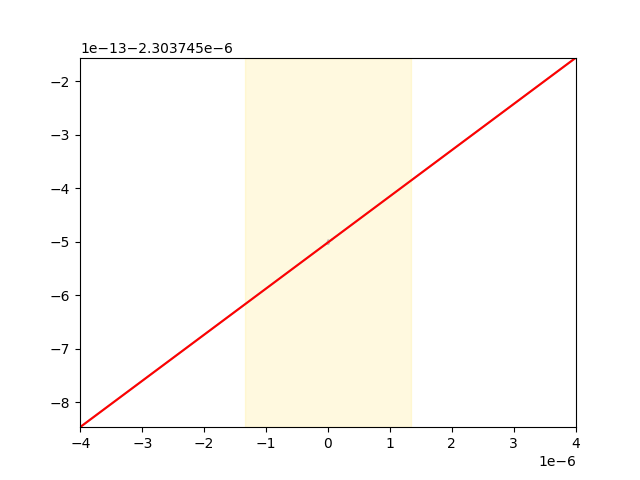
## New Eq:
((fabs(membrane__V) < 1.3356880329847825e-6) ? ((0.5 + 374338.90822745475 * membrane__V) * (0.019297068299999998 * (-0.34100000000000003 * calcium_dynamics__Ca_o + calcium_dynamics__Ca_i * exp(9.9999999999999995e-8)) * L_type_Ca_current__g_CaL * L_type_Ca_current_d_gate__d * L_type_Ca_current_fCa_gate__fCa * L_type_Ca_current_f_gate__f / (-1.0 + exp(9.9999999999999995e-8)) + 0.019297068299999998 * (-0.34100000000000003 * calcium_dynamics__Ca_o + calcium_dynamics__Ca_i * exp(-9.9999999999999995e-8)) * L_type_Ca_current__g_CaL * L_type_Ca_current_d_gate__d * L_type_Ca_current_fCa_gate__fCa * L_type_Ca_current_f_gate__f / (-1.0 + exp(-9.9999999999999995e-8))) - 0.019297068299999998 * (-0.34100000000000003 * calcium_dynamics__Ca_o + calcium_dynamics__Ca_i * exp(-9.9999999999999995e-8)) * L_type_Ca_current__g_CaL * L_type_Ca_current_d_gate__d * L_type_Ca_current_fCa_gate__fCa * L_type_Ca_current_f_gate__f / (-1.0 + exp(-9.9999999999999995e-8))) : (4.0 * pow(membrane__F, 2) * (-0.34100000000000003 * calcium_dynamics__Ca_o + calcium_dynamics__Ca_i * exp(2.0 * membrane__F * membrane__V / (membrane__R * membrane__T))) * L_type_Ca_current__g_CaL * L_type_Ca_current_d_gate__d * L_type_Ca_current_fCa_gate__fCa * L_type_Ca_current_f_gate__f * membrane__V / ((-1.0 + exp(2.0 * membrane__F * membrane__V / (membrane__R * membrane__T))) * membrane__R * membrane__T)))

# Model: tentusscher_model_2004_epi(ten_tusscher_model_2004_epi.cellml)
# Model: tentusscher_model_2004_M(ten_tusscher_model_2004_M.cellml)
## Equation 1:
```
L_type_Ca_current__i_CaL = 4.0 * pow(membrane__F, 2) * (-0.34100000000000003 * calcium_dynamics__Ca_o + calcium_dynamics__Ca_i * exp(2.0 * membrane__F * membrane__V / (membrane__R * membrane__T))) * L_type_Ca_current__g_CaL * L_type_Ca_current_d_gate__d * L_type_Ca_current_fCa_gate__fCa * L_type_Ca_current_f_gate__f * membrane__V / ((-1.0 + exp(2.0 * membrane__F * membrane__V / (membrane__R * membrane__T))) * membrane__R * membrane__T)
```
### Partially evaluated to: 
```
L_type_Ca_current__i_CaL = 14447.286958825251 * (-0.34100000000000003 * calcium_dynamics__Ca_o + calcium_dynamics__Ca_i * exp(0.074867781645490947 * membrane__V)) * L_type_Ca_current__g_CaL * L_type_Ca_current_d_gate__d * L_type_Ca_current_fCa_gate__fCa * L_type_Ca_current_f_gate__f * membrane__V / (-1.0 + exp(0.074867781645490947 * membrane__V))
```
### Singulariy points detected:

{0}
*U*
`0.074867781645490947 * membrane__V`

*V for 1e-07 range* 
`-1.3356880329847825e-6 - 1.3356880329847825e-6`

*Singularity point: 0*

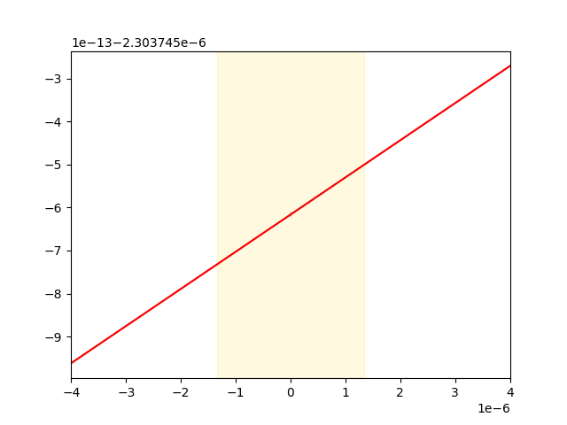
## New Eq:
((fabs(membrane__V) < 1.3356880329847825e-6) ? ((0.5 + 374338.90822745475 * membrane__V) * (0.019297068299999998 * (-0.34100000000000003 * calcium_dynamics__Ca_o + calcium_dynamics__Ca_i * exp(9.9999999999999995e-8)) * L_type_Ca_current__g_CaL * L_type_Ca_current_d_gate__d * L_type_Ca_current_fCa_gate__fCa * L_type_Ca_current_f_gate__f / (-1.0 + exp(9.9999999999999995e-8)) + 0.019297068299999998 * (-0.34100000000000003 * calcium_dynamics__Ca_o + calcium_dynamics__Ca_i * exp(-9.9999999999999995e-8)) * L_type_Ca_current__g_CaL * L_type_Ca_current_d_gate__d * L_type_Ca_current_fCa_gate__fCa * L_type_Ca_current_f_gate__f / (-1.0 + exp(-9.9999999999999995e-8))) - 0.019297068299999998 * (-0.34100000000000003 * calcium_dynamics__Ca_o + calcium_dynamics__Ca_i * exp(-9.9999999999999995e-8)) * L_type_Ca_current__g_CaL * L_type_Ca_current_d_gate__d * L_type_Ca_current_fCa_gate__fCa * L_type_Ca_current_f_gate__f / (-1.0 + exp(-9.9999999999999995e-8))) : (4.0 * pow(membrane__F, 2) * (-0.34100000000000003 * calcium_dynamics__Ca_o + calcium_dynamics__Ca_i * exp(2.0 * membrane__F * membrane__V / (membrane__R * membrane__T))) * L_type_Ca_current__g_CaL * L_type_Ca_current_d_gate__d * L_type_Ca_current_fCa_gate__fCa * L_type_Ca_current_f_gate__f * membrane__V / ((-1.0 + exp(2.0 * membrane__F * membrane__V / (membrane__R * membrane__T))) * membrane__R * membrane__T)))

# Model: tentusscher_model_2006_endo(ten_tusscher_model_2006_endo.cellml)
## Equation 1:
```
L_type_Ca_current__temp = (((L_type_Ca_current__V_low > membrane__V) || (L_type_Ca_current__V_high < membrane__V)) ? ((-15.0 + membrane__V) * (-calcium_dynamics__Ca_o + 0.25 * calcium_dynamics__Ca_ss * exp(2.0 * (-15.0 + membrane__V) * membrane__F / (membrane__R * membrane__T))) / (-1.0 + exp(2.0 * (-15.0 + membrane__V) * membrane__F / (membrane__R * membrane__T)))) : (0.5 * (-15.0 + L_type_Ca_current__V_high) * (-calcium_dynamics__Ca_o + 0.25 * calcium_dynamics__Ca_ss * exp(2.0 * (-15.0 + L_type_Ca_current__V_high) * membrane__F / (membrane__R * membrane__T))) / (-1.0 + exp(2.0 * (-15.0 + L_type_Ca_current__V_high) * membrane__F / (membrane__R * membrane__T))) + 0.5 * (-15.0 + L_type_Ca_current__V_low) * (-calcium_dynamics__Ca_o + 0.25 * calcium_dynamics__Ca_ss * exp(2.0 * (-15.0 + L_type_Ca_current__V_low) * membrane__F / (membrane__R * membrane__T))) / (-1.0 + exp(2.0 * (-15.0 + L_type_Ca_current__V_low) * membrane__F / (membrane__R * membrane__T)))))
```
### Partially evaluated to: 
```
L_type_Ca_current__temp = (((membrane__V > 15.000999999999999) || (membrane__V < 14.999000000000001)) ? ((-15.0 + membrane__V) * (-calcium_dynamics__Ca_o + 0.081324245374225654 * calcium_dynamics__Ca_ss * exp(0.074867781645490947 * membrane__V)) / (-1.0 + 0.32529698149690262 * exp(0.074867781645490947 * membrane__V))) : (3.3392200840217123 * calcium_dynamics__Ca_ss - 13.356880336086849 * calcium_dynamics__Ca_o))
```
### Singulariy points detected:

{15.000000000000000}
####Piecewise!
# Model: tentusscher_model_2006_epi(ten_tusscher_model_2006_epi.cellml)
## Equation 1:
```
L_type_Ca_current__temp = (((L_type_Ca_current__V_low > membrane__V) || (L_type_Ca_current__V_high < membrane__V)) ? ((-15.0 + membrane__V) * (-calcium_dynamics__Ca_o + 0.25 * calcium_dynamics__Ca_ss * exp(2.0 * (-15.0 + membrane__V) * membrane__F / (membrane__R * membrane__T))) / (-1.0 + exp(2.0 * (-15.0 + membrane__V) * membrane__F / (membrane__R * membrane__T)))) : (0.5 * (-15.0 + L_type_Ca_current__V_high) * (-calcium_dynamics__Ca_o + 0.25 * calcium_dynamics__Ca_ss * exp(2.0 * (-15.0 + L_type_Ca_current__V_high) * membrane__F / (membrane__R * membrane__T))) / (-1.0 + exp(2.0 * (-15.0 + L_type_Ca_current__V_high) * membrane__F / (membrane__R * membrane__T))) + 0.5 * (-15.0 + L_type_Ca_current__V_low) * (-calcium_dynamics__Ca_o + 0.25 * calcium_dynamics__Ca_ss * exp(2.0 * (-15.0 + L_type_Ca_current__V_low) * membrane__F / (membrane__R * membrane__T))) / (-1.0 + exp(2.0 * (-15.0 + L_type_Ca_current__V_low) * membrane__F / (membrane__R * membrane__T)))))
```
### Partially evaluated to: 
```
L_type_Ca_current__temp = (((membrane__V > 15.000999999999999) || (membrane__V < 14.999000000000001)) ? ((-15.0 + membrane__V) * (-calcium_dynamics__Ca_o + 0.25 * calcium_dynamics__Ca_ss * exp(2.0 * (-15.0 + membrane__V) * membrane__F / (membrane__R * membrane__T))) / (-1.0 + exp(2.0 * (-15.0 + membrane__V) * membrane__F / (membrane__R * membrane__T)))) : (0.00049999999999972289 * (-calcium_dynamics__Ca_o + 0.25 * calcium_dynamics__Ca_ss * exp(0.0019999999999988916 * membrane__F / (membrane__R * membrane__T))) / (-1.0 + exp(0.0019999999999988916 * membrane__F / (membrane__R * membrane__T))) - 0.00049999999999972289 * (-calcium_dynamics__Ca_o + 0.25 * calcium_dynamics__Ca_ss * exp(-0.0019999999999988916 * membrane__F / (membrane__R * membrane__T))) / (-1.0 + exp(-0.0019999999999988916 * membrane__F / (membrane__R * membrane__T)))))
```
### Singulariy points detected:

{15.000000000000000}
####Piecewise!
# Model: tentusscher_model_2006_M(ten_tusscher_model_2006_M.cellml)
## Equation 1:
```
L_type_Ca_current__temp = (((L_type_Ca_current__V_low > membrane__V) || (L_type_Ca_current__V_high < membrane__V)) ? ((-15.0 + membrane__V) * (-calcium_dynamics__Ca_o + 0.25 * calcium_dynamics__Ca_ss * exp(2.0 * (-15.0 + membrane__V) * membrane__F / (membrane__R * membrane__T))) / (-1.0 + exp(2.0 * (-15.0 + membrane__V) * membrane__F / (membrane__R * membrane__T)))) : (0.5 * (-15.0 + L_type_Ca_current__V_high) * (-calcium_dynamics__Ca_o + 0.25 * calcium_dynamics__Ca_ss * exp(2.0 * (-15.0 + L_type_Ca_current__V_high) * membrane__F / (membrane__R * membrane__T))) / (-1.0 + exp(2.0 * (-15.0 + L_type_Ca_current__V_high) * membrane__F / (membrane__R * membrane__T))) + 0.5 * (-15.0 + L_type_Ca_current__V_low) * (-calcium_dynamics__Ca_o + 0.25 * calcium_dynamics__Ca_ss * exp(2.0 * (-15.0 + L_type_Ca_current__V_low) * membrane__F / (membrane__R * membrane__T))) / (-1.0 + exp(2.0 * (-15.0 + L_type_Ca_current__V_low) * membrane__F / (membrane__R * membrane__T)))))
```
### Partially evaluated to: 
```
L_type_Ca_current__temp = (((membrane__V > 15.000999999999999) || (membrane__V < 14.999000000000001)) ? ((-15.0 + membrane__V) * (-calcium_dynamics__Ca_o + 0.081324245374225654 * calcium_dynamics__Ca_ss * exp(0.074867781645490947 * membrane__V)) / (-1.0 + 0.32529698149690262 * exp(0.074867781645490947 * membrane__V))) : (3.3392200840217123 * calcium_dynamics__Ca_ss - 13.356880336086849 * calcium_dynamics__Ca_o))
```
### Singulariy points detected:

{15.000000000000000}
####Piecewise!
# Model: Tomek_model13endo(ToRORd_fkatp_endo.cellml)
# Model: Tomek_model13epi(ToRORd_fkatp_epi.cellml)
# Model: Trovato2020(Trovato2020.cellml)
# Model: viswanathan_model_1999_epi(viswanathan_model_1999_epi.cellml)
## Equation 1:
```
L_type_Ca_channel__I_CaCa = 4.0 * pow(membrane__F, 2) * (-L_type_Ca_channel__gamma_Cao * calcium_dynamics__Cao + L_type_Ca_channel__gamma_Cai * calcium_dynamics__Cai * exp(2.0 * membrane__F * membrane__V / (membrane__R * membrane__T))) * L_type_Ca_channel__P_Ca * membrane__V / ((-1.0 + exp(2.0 * membrane__F * membrane__V / (membrane__R * membrane__T))) * membrane__R * membrane__T)
```
### Partially evaluated to: 
```
L_type_Ca_channel__I_CaCa = 7.8019226357407252 * (-0.34100000000000003 * calcium_dynamics__Cao + calcium_dynamics__Cai * exp(0.074871767015605231 * membrane__V)) * membrane__V / (-1.0 + exp(0.074871767015605231 * membrane__V))
```
### Singulariy points detected:

{0}
*U*
`0.074871767015605231 * membrane__V`

*V for 1e-07 range* 
`-1.3356169352749131e-6 - 1.3356169352749131e-6`

*Singularity point: 0*

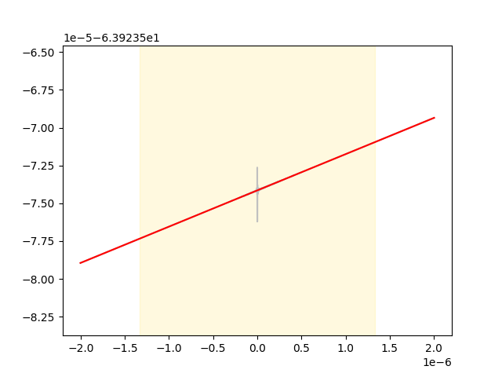
## New Eq:
((fabs(membrane__V) < 1.3356169352749131e-6) ? ((0.5 + 374358.83507802623 * membrane__V) * (1.042038e-5 * (-0.34100000000000003 * calcium_dynamics__Cao + calcium_dynamics__Cai * exp(9.9999999999999995e-8)) / (-1.0 + exp(9.9999999999999995e-8)) + 1.042038e-5 * (-0.34100000000000003 * calcium_dynamics__Cao + calcium_dynamics__Cai * exp(-9.9999999999999995e-8)) / (-1.0 + exp(-9.9999999999999995e-8))) - 1.042038e-5 * (-0.34100000000000003 * calcium_dynamics__Cao + calcium_dynamics__Cai * exp(-9.9999999999999995e-8)) / (-1.0 + exp(-9.9999999999999995e-8))) : (4.0 * pow(membrane__F, 2) * (-L_type_Ca_channel__gamma_Cao * calcium_dynamics__Cao + L_type_Ca_channel__gamma_Cai * calcium_dynamics__Cai * exp(2.0 * membrane__F * membrane__V / (membrane__R * membrane__T))) * L_type_Ca_channel__P_Ca * membrane__V / ((-1.0 + exp(2.0 * membrane__F * membrane__V / (membrane__R * membrane__T))) * membrane__R * membrane__T)))

## Equation 2:
```
L_type_Ca_channel__I_CaK = pow(membrane__F, 2) * (-L_type_Ca_channel__gamma_Ko * ionic_concentrations__Ko + L_type_Ca_channel__gamma_Ki * ionic_concentrations__Ki * exp(membrane__F * membrane__V / (membrane__R * membrane__T))) * L_type_Ca_channel__P_K * membrane__V / ((-1.0 + exp(membrane__F * membrane__V / (membrane__R * membrane__T))) * membrane__R * membrane__T)
```
### Partially evaluated to: 
```
L_type_Ca_channel__I_CaK = 0.00069711623550831479 * (-0.75 * ionic_concentrations__Ko + 0.75 * ionic_concentrations__Ki * exp(0.037435883507802616 * membrane__V)) * membrane__V / (-1.0 + exp(0.037435883507802616 * membrane__V))
```
### Singulariy points detected:

{0}
*U*
`0.037435883507802616 * membrane__V`

*V for 1e-07 range* 
`-2.6712338705498262e-6 - 2.6712338705498262e-6`

*Singularity point: 0*

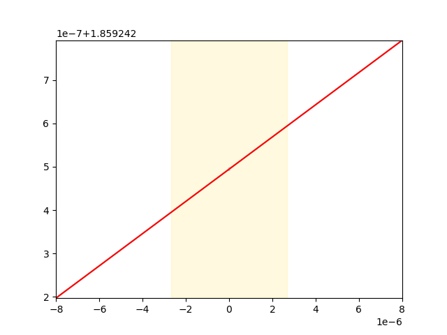
## New Eq:
((fabs(membrane__V) < 2.6712338705498262e-6) ? ((0.5 + 187179.41753901311 * membrane__V) * (1.8621604999999999e-9 * (-0.75 * ionic_concentrations__Ko + 0.75 * ionic_concentrations__Ki * exp(9.9999999999999995e-8)) / (-1.0 + exp(9.9999999999999995e-8)) + 1.8621604999999999e-9 * (-0.75 * ionic_concentrations__Ko + 0.75 * ionic_concentrations__Ki * exp(-9.9999999999999995e-8)) / (-1.0 + exp(-9.9999999999999995e-8))) - 1.8621604999999999e-9 * (-0.75 * ionic_concentrations__Ko + 0.75 * ionic_concentrations__Ki * exp(-9.9999999999999995e-8)) / (-1.0 + exp(-9.9999999999999995e-8))) : (pow(membrane__F, 2) * (-L_type_Ca_channel__gamma_Ko * ionic_concentrations__Ko + L_type_Ca_channel__gamma_Ki * ionic_concentrations__Ki * exp(membrane__F * membrane__V / (membrane__R * membrane__T))) * L_type_Ca_channel__P_K * membrane__V / ((-1.0 + exp(membrane__F * membrane__V / (membrane__R * membrane__T))) * membrane__R * membrane__T)))

## Equation 3:
```
L_type_Ca_channel__I_CaNa = pow(membrane__F, 2) * (-L_type_Ca_channel__gamma_Nao * ionic_concentrations__Nao + L_type_Ca_channel__gamma_Nai * ionic_concentrations__Nai * exp(membrane__F * membrane__V / (membrane__R * membrane__T))) * L_type_Ca_channel__P_Na * membrane__V / ((-1.0 + exp(membrane__F * membrane__V / (membrane__R * membrane__T))) * membrane__R * membrane__T)
```
### Partially evaluated to: 
```
L_type_Ca_channel__I_CaNa = 0.0024381008236689767 * (-0.75 * ionic_concentrations__Nao + 0.75 * ionic_concentrations__Nai * exp(0.037435883507802616 * membrane__V)) * membrane__V / (-1.0 + exp(0.037435883507802616 * membrane__V))
```
### Singulariy points detected:

{0}
*U*
`0.037435883507802616 * membrane__V`

*V for 1e-07 range* 
`-2.6712338705498262e-6 - 2.6712338705498262e-6`

*Singularity point: 0*

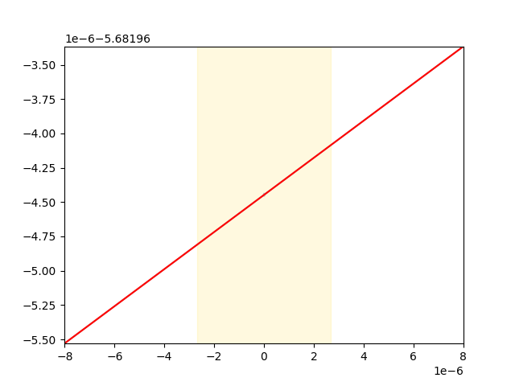
## New Eq:
((fabs(membrane__V) < 2.6712338705498262e-6) ? ((0.5 + 187179.41753901311 * membrane__V) * (6.5127375e-9 * (-0.75 * ionic_concentrations__Nao + 0.75 * ionic_concentrations__Nai * exp(9.9999999999999995e-8)) / (-1.0 + exp(9.9999999999999995e-8)) + 6.5127375e-9 * (-0.75 * ionic_concentrations__Nao + 0.75 * ionic_concentrations__Nai * exp(-9.9999999999999995e-8)) / (-1.0 + exp(-9.9999999999999995e-8))) - 6.5127375e-9 * (-0.75 * ionic_concentrations__Nao + 0.75 * ionic_concentrations__Nai * exp(-9.9999999999999995e-8)) / (-1.0 + exp(-9.9999999999999995e-8))) : (pow(membrane__F, 2) * (-L_type_Ca_channel__gamma_Nao * ionic_concentrations__Nao + L_type_Ca_channel__gamma_Nai * ionic_concentrations__Nai * exp(membrane__F * membrane__V / (membrane__R * membrane__T))) * L_type_Ca_channel__P_Na * membrane__V / ((-1.0 + exp(membrane__F * membrane__V / (membrane__R * membrane__T))) * membrane__R * membrane__T)))

## Equation 4:
```
non_specific_calcium_activated_current__I_ns_K = pow(membrane__F, 2) * (-L_type_Ca_channel__gamma_Ko * ionic_concentrations__Ko + L_type_Ca_channel__gamma_Ki * ionic_concentrations__Ki * exp(membrane__F * membrane__V / (membrane__R * membrane__T))) * membrane__V * non_specific_calcium_activated_current__P_ns_Ca / ((-1.0 + exp(membrane__F * membrane__V / (membrane__R * membrane__T))) * membrane__R * membrane__T)
```
### Partially evaluated to: 
```
non_specific_calcium_activated_current__I_ns_K = 0
```
### Singulariy points detected:

{0}
#### Eq == 0!
## Equation 5:
```
non_specific_calcium_activated_current__I_ns_Na = pow(membrane__F, 2) * (-L_type_Ca_channel__gamma_Nao * ionic_concentrations__Nao + L_type_Ca_channel__gamma_Nai * ionic_concentrations__Nai * exp(membrane__F * membrane__V / (membrane__R * membrane__T))) * membrane__V * non_specific_calcium_activated_current__P_ns_Ca / ((-1.0 + exp(membrane__F * membrane__V / (membrane__R * membrane__T))) * membrane__R * membrane__T)
```
### Partially evaluated to: 
```
non_specific_calcium_activated_current__I_ns_Na = 0
```
### Singulariy points detected:

{0}
#### Eq == 0!
## Equation 6:
```
rapid_delayed_rectifier_potassium_current_xr_gate__tau_xr = 0.001 / (0.00060999999999999997 * (38.899999999999999 + membrane__V) / (-1.0 + 281.60348502322194 * exp(0.14499999999999999 * membrane__V)) + 0.0013799999999999999 * (14.199999999999999 + membrane__V) / (1.0 - 0.17436578041087322 * exp(-0.123 * membrane__V)))
```
### Partially evaluated to: 
```
rapid_delayed_rectifier_potassium_current_xr_gate__tau_xr = 0.001 / (0.00060999999999999997 * (38.899999999999999 + membrane__V) / (-1.0 + 281.60348502322194 * exp(0.14499999999999999 * membrane__V)) + 0.0013799999999999999 * (14.199999999999999 + membrane__V) / (1.0 - 0.17436578041087322 * exp(-0.123 * membrane__V)))
```
### Singulariy points detected:

{-14.199999999999999, -38.899999999999999}
#### float * A

####1 / A


####A + B:

`0.0013799999999999999 * (14.199999999999999 + membrane__V) / (1.0 - 0.17436578041087322 * exp(-0.123 * membrane__V))`
`0.00060999999999999997 * (38.899999999999999 + membrane__V) / (-1.0 + 281.60348502322194 * exp(0.14499999999999999 * membrane__V))`

*U*
`-1.7465999999999999 - 0.123 * membrane__V`

*V for 1e-07 range* 
`-14.200000813008129 - -14.199999186991869`

*Singularity point: -14.199999999999999*


*U*
`5.6404999999999994 + 0.14499999999999999 * membrane__V`

*V for 1e-07 range* 
`-38.900000689655172 - -38.899999310344825`

*Singularity point: -38.899999999999999*


## New Eq:
((fabs(14.199999999999999 + membrane__V) < 8.1300813006834893e-7) ? (0.001 / (0.015066999504065039 / (-1.0 + exp(3.5814998821138206)) - 1.1219512194943214e-9 / (1.0 - exp(9.9999999999406119e-8))) + (8733000.5000645891 + 615000.00000454858 * membrane__V) * (0.001 / (1.1219512195134727e-9 / (1.0 - exp(-9.9999999999406119e-8)) + 0.015067000495934959 / (-1.0 + exp(3.5815001178861787))) - 0.001 / (0.015066999504065039 / (-1.0 + exp(3.5814998821138206)) - 1.1219512194943214e-9 / (1.0 - exp(9.9999999999406119e-8))))) : ((fabs(38.899999999999999 + membrane__V) < 6.8965517246999397e-7) ? (0.001 / (-0.034086000951724135 / (1.0 - exp(3.0381000848275859)) - 4.2068965517283451e-10 / (-1.0 + exp(-1.0000000000287557e-7))) + (28202500.498836767 + 724999.99997009686 * membrane__V) * (0.001 / (4.2068965520669629e-10 / (-1.0 + exp(1.0000000000287557e-7)) - 0.034085999048275861 / (1.0 - exp(3.0380999151724137))) - 0.001 / (-0.034086000951724135 / (1.0 - exp(3.0381000848275859)) - 4.2068965517283451e-10 / (-1.0 + exp(-1.0000000000287557e-7))))) : (0.001 / (0.00060999999999999997 * (38.899999999999999 + membrane__V) / (-1.0 + exp(5.6404999999999994 + 0.14499999999999999 * membrane__V)) + 0.0013799999999999999 * (14.199999999999999 + membrane__V) / (1.0 - exp(-1.7465999999999999 - 0.123 * membrane__V))))))

## Equation 7:
```
slow_delayed_rectifier_potassium_current_xs1_gate__tau_xs1 = 0.001 / (0.00013100000000000001 * (30.0 + membrane__V) / (-1.0 + 7.8538197044216602 * exp(0.068699999999999997 * membrane__V)) + 7.1899999999999999e-5 * (30.0 + membrane__V) / (1.0 - 0.011795938519751569 * exp(-0.14799999999999999 * membrane__V)))
```
### Partially evaluated to: 
```
slow_delayed_rectifier_potassium_current_xs1_gate__tau_xs1 = 0.001 / (0.00013100000000000001 * (30.0 + membrane__V) / (-1.0 + 7.8538197044216602 * exp(0.068699999999999997 * membrane__V)) + 7.1899999999999999e-5 * (30.0 + membrane__V) / (1.0 - 0.011795938519751569 * exp(-0.14799999999999999 * membrane__V)))
```
### Singulariy points detected:

{-30.000000000000000}
#### float * A

####1 / A


####A + B:

`7.1899999999999999e-5 * (30.0 + membrane__V) / (1.0 - 0.011795938519751569 * exp(-0.14799999999999999 * membrane__V))`
`0.00013100000000000001 * (30.0 + membrane__V) / (-1.0 + 7.8538197044216602 * exp(0.068699999999999997 * membrane__V))`

*U*
`-4.4399999999999995 - 0.14799999999999999 * membrane__V`

*V for 1e-07 range* 
`-30.000000675675675 - -29.999999324324325`

*Singularity point: -30.000000000000000*

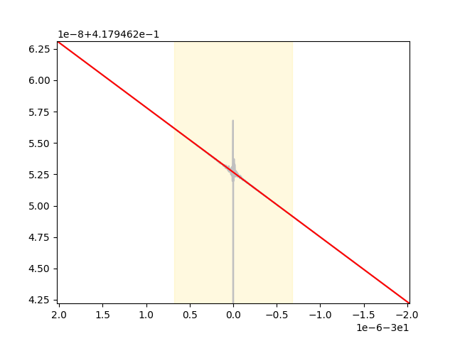
## New Eq:
((fabs(30.0 + membrane__V) < 6.7567567568760367e-7) ? (0.001 / (-8.8513513515076093e-11 / (-1.0 + exp(-4.6418918920460017e-8)) - 4.8581081081938701e-11 / (1.0 - exp(1.0000000000287557e-7))) + (22200000.499608092 + 739999.99998693645 * membrane__V) * (0.001 / (8.8513513515076093e-11 / (-1.0 + exp(4.6418918920460017e-8)) + 4.8581081081938701e-11 / (1.0 - exp(-1.0000000000287557e-7))) - 0.001 / (-8.8513513515076093e-11 / (-1.0 + exp(-4.6418918920460017e-8)) - 4.8581081081938701e-11 / (1.0 - exp(1.0000000000287557e-7))))) : (0.001 / (0.00013100000000000001 * (30.0 + membrane__V) / (-1.0 + exp(2.0609999999999999 + 0.068699999999999997 * membrane__V)) + 7.1899999999999999e-5 * (30.0 + membrane__V) / (1.0 - exp(-4.4399999999999995 - 0.14799999999999999 * membrane__V)))))

## Equation 8:
```
slow_delayed_rectifier_potassium_current_xs2_gate__tau_xs2 = 0.0040000000000000001 / (0.00013100000000000001 * (30.0 + membrane__V) / (-1.0 + 7.8538197044216602 * exp(0.068699999999999997 * membrane__V)) + 7.1899999999999999e-5 * (30.0 + membrane__V) / (1.0 - 0.011795938519751569 * exp(-0.14799999999999999 * membrane__V)))
```
### Partially evaluated to: 
```
slow_delayed_rectifier_potassium_current_xs2_gate__tau_xs2 = 0.0040000000000000001 / (0.00013100000000000001 * (30.0 + membrane__V) / (-1.0 + 7.8538197044216602 * exp(0.068699999999999997 * membrane__V)) + 7.1899999999999999e-5 * (30.0 + membrane__V) / (1.0 - 0.011795938519751569 * exp(-0.14799999999999999 * membrane__V)))
```
### Singulariy points detected:

{-30.000000000000000}
#### float * A

####1 / A


####A + B:

`7.1899999999999999e-5 * (30.0 + membrane__V) / (1.0 - 0.011795938519751569 * exp(-0.14799999999999999 * membrane__V))`
`0.00013100000000000001 * (30.0 + membrane__V) / (-1.0 + 7.8538197044216602 * exp(0.068699999999999997 * membrane__V))`

*U*
`-4.4399999999999995 - 0.14799999999999999 * membrane__V`

*V for 1e-07 range* 
`-30.000000675675675 - -29.999999324324325`

*Singularity point: -30.000000000000000*

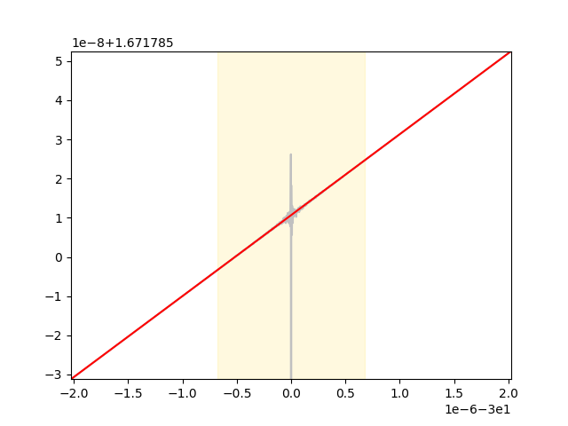
## New Eq:
((fabs(30.0 + membrane__V) < 6.7567567568760367e-7) ? (0.0040000000000000001 / (-8.8513513515076093e-11 / (-1.0 + exp(-4.6418918920460017e-8)) - 4.8581081081938701e-11 / (1.0 - exp(1.0000000000287557e-7))) + (22200000.499608092 + 739999.99998693645 * membrane__V) * (0.0040000000000000001 / (8.8513513515076093e-11 / (-1.0 + exp(4.6418918920460017e-8)) + 4.8581081081938701e-11 / (1.0 - exp(-1.0000000000287557e-7))) - 0.0040000000000000001 / (-8.8513513515076093e-11 / (-1.0 + exp(-4.6418918920460017e-8)) - 4.8581081081938701e-11 / (1.0 - exp(1.0000000000287557e-7))))) : (0.0040000000000000001 / (0.00013100000000000001 * (30.0 + membrane__V) / (-1.0 + exp(2.0609999999999999 + 0.068699999999999997 * membrane__V)) + 7.1899999999999999e-5 * (30.0 + membrane__V) / (1.0 - exp(-4.4399999999999995 - 0.14799999999999999 * membrane__V)))))

# Model: wang_model_2008(wang_sobie_2008.cellml)
## Equation 1:
```
calcium_activated_chloride_current__i_ClCa = pow(membrane__F, 2) * (-membrane__Cli + membrane__Clo * exp(membrane__F * membrane__V / (membrane__R * membrane__T))) * calcium_activated_chloride_current__P_ClCa * calcium_activated_chloride_current__f_ClCa * membrane__V / ((-1.0 + exp(membrane__F * membrane__V / (membrane__R * membrane__T))) * membrane__R * membrane__T)
```
### Partially evaluated to: 
```
calcium_activated_chloride_current__i_ClCa = 1.02986169524034e-6 * pow((calcium_concentration__Cass / (4.0 + calcium_concentration__Cass)), 3.0) * (-membrane__Cli + membrane__Clo * exp(0.038949423064193495 * membrane__V)) * membrane__V / (-1.0 + exp(0.038949423064193495 * membrane__V))
```
### Singulariy points detected:

{0}
*U*
`0.038949423064193495 * membrane__V`

*V for 1e-07 range* 
`-2.5674321243523316e-6 - 2.5674321243523316e-6`

*Singularity point: 0*


## New Eq:
((fabs(membrane__V) < 2.5674321243523316e-6) ? ((0.5 + 194747.11532096748 * membrane__V) * (2.6440999999999996e-12 * pow((calcium_concentration__Cass / (4.0 + calcium_concentration__Cass)), 3.0) * (-membrane__Cli + membrane__Clo * exp(9.9999999999999995e-8)) / (-1.0 + exp(9.9999999999999995e-8)) + 2.6440999999999996e-12 * pow((calcium_concentration__Cass / (4.0 + calcium_concentration__Cass)), 3.0) * (-membrane__Cli + membrane__Clo * exp(-9.9999999999999995e-8)) / (-1.0 + exp(-9.9999999999999995e-8))) - 2.6440999999999996e-12 * pow((calcium_concentration__Cass / (4.0 + calcium_concentration__Cass)), 3.0) * (-membrane__Cli + membrane__Clo * exp(-9.9999999999999995e-8)) / (-1.0 + exp(-9.9999999999999995e-8))) : (pow(membrane__F, 2) * (-membrane__Cli + membrane__Clo * exp(membrane__F * membrane__V / (membrane__R * membrane__T))) * calcium_activated_chloride_current__P_ClCa * calcium_activated_chloride_current__f_ClCa * membrane__V / ((-1.0 + exp(membrane__F * membrane__V / (membrane__R * membrane__T))) * membrane__R * membrane__T)))

## Equation 2:
```
fast_sodium_current_m_gate__alpha_m = 0.32000000000000001 * (47.130000000000003 + membrane__V) / (1.0 - 0.00897780373069724 * exp(-0.10000000000000001 * membrane__V))
```
### Partially evaluated to: 
```
fast_sodium_current_m_gate__alpha_m = 0.32000000000000001 * (47.130000000000003 + membrane__V) / (1.0 - 0.00897780373069724 * exp(-0.10000000000000001 * membrane__V))
```
### Singulariy points detected:

{-47.130000000000003}
*U*
`-4.7130000000000001 - 0.10000000000000001 * membrane__V`

*V for 1e-07 range* 
`-47.130001 - -47.129999000000005`

*Singularity point: -47.130000000000003*


## New Eq:
((fabs(47.130000000000003 + membrane__V) < 1.0000000000287557e-6) ? (-3.200000000092018e-7 / (1.0 - exp(1.0000000000287557e-7)) + (23565000.499322373 + 499999.99998562218 * membrane__V) * (3.200000000092018e-7 / (1.0 - exp(1.0000000000287557e-7)) + 3.200000000092018e-7 / (1.0 - exp(-1.0000000000287557e-7)))) : (0.32000000000000001 * (47.130000000000003 + membrane__V) / (1.0 - exp(-4.7130000000000001 - 0.10000000000000001 * membrane__V))))

## Equation 3:
```
slow_delayed_rectifier_potassium_current__alpha_n = 4.8133299999999997e-6 * (26.5 + membrane__V) / (1.0 - 0.033641326918204616 * exp(-0.128 * membrane__V))
```
### Partially evaluated to: 
```
slow_delayed_rectifier_potassium_current__alpha_n = 4.8133299999999997e-6 * (26.5 + membrane__V) / (1.0 - 0.033641326918204616 * exp(-0.128 * membrane__V))
```
### Singulariy points detected:

{-26.500000000000000}
*U*
`-3.3919999999999999 - 0.128 * membrane__V`

*V for 1e-07 range* 
`-26.500000781250002 - -26.499999218749998`

*Singularity point: -26.500000000000000*


## New Eq:
((fabs(26.5 + membrane__V) < 7.8124999999817923e-7) ? (-3.7604140624912359e-12 / (1.0 - exp(9.9999999999406119e-8)) + (16960000.500039525 + 640000.00000149151 * membrane__V) * (3.7604140624912359e-12 / (1.0 - exp(9.9999999999406119e-8)) + 3.7604140624912359e-12 / (1.0 - exp(-9.9999999999406119e-8)))) : (4.8133299999999997e-6 * (26.5 + membrane__V) / (1.0 - exp(-3.3919999999999999 - 0.128 * membrane__V))))

# Model: winslow_model_1999(winslow_model_1999.cellml)
## Equation 1:
```
slow_activating_delayed_rectifiyer_K_current_X_ks_gate__tau_X_ks = 0.001 / (0.00013100000000000001 * (-10.0 + membrane__V) / (-1.0 + 0.50308305662435071 * exp(0.068699999999999997 * membrane__V)) + 7.1899999999999999e-5 * (-10.0 + membrane__V) / (1.0 - 4.3929456809187561 * exp(-0.14799999999999999 * membrane__V)))
```
### Partially evaluated to: 
```
slow_activating_delayed_rectifiyer_K_current_X_ks_gate__tau_X_ks = 0.001 / (0.00013100000000000001 * (-10.0 + membrane__V) / (-1.0 + 0.50308305662435071 * exp(0.068699999999999997 * membrane__V)) + 7.1899999999999999e-5 * (-10.0 + membrane__V) / (1.0 - 4.3929456809187561 * exp(-0.14799999999999999 * membrane__V)))
```
### Singulariy points detected:

{10.000000000000000, 10.000000000000000}
*U*
`-1.48 + 0.14799999999999999 * membrane__V`

*V for 1e-07 range* 
`9.9999993243243246 - 10.000000675675675`

*Singularity point: 10.000000000000000*

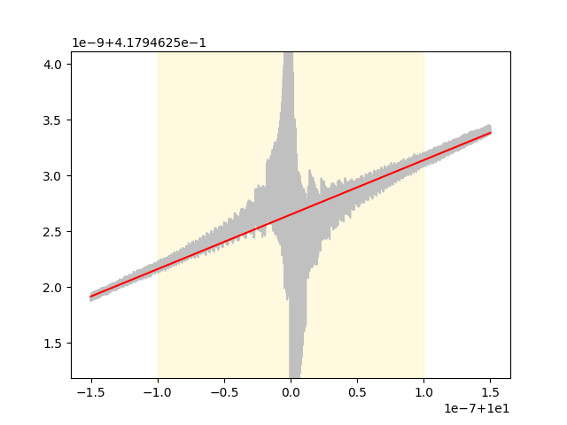

*Singularity point: 10.000000000000000*

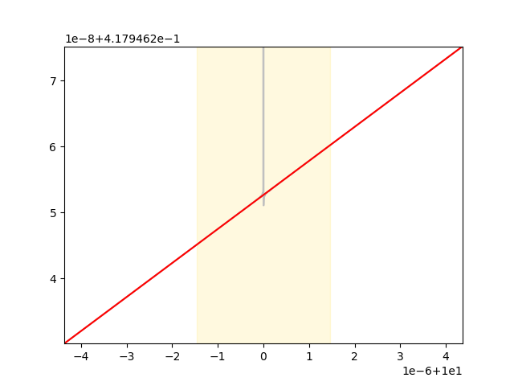
## New Eq:
(((membrane__V > 9.9999993243243246) && (membrane__V < 10.000000675675675)) ? (0.001 / (-4.8581081080940889e-11 / (1.0 - exp(9.9999999999406119e-8)) - 8.8513513513258105e-11 / (-1.0 + exp(-4.6418918918725294e-8))) + (-7399999.5000213543 + 740000.00000213541 * membrane__V) * (0.001 / (4.8581081080940889e-11 / (1.0 - exp(-9.9999999999406119e-8)) + 8.8513513513258105e-11 / (-1.0 + exp(4.6418918918725294e-8))) - 0.001 / (-4.8581081080940889e-11 / (1.0 - exp(9.9999999999406119e-8)) - 8.8513513513258105e-11 / (-1.0 + exp(-4.6418918918725294e-8))))) : (0.001 / (0.00013100000000000001 * (-10.0 + membrane__V) / (-1.0 + exp(-0.68699999999999994 + 0.068699999999999997 * membrane__V)) + 7.1899999999999999e-5 * (-10.0 + membrane__V) / (1.0 - exp(1.48 - 0.14799999999999999 * membrane__V)))))

## Equation 2:
```
L_type_Ca_current__i_Ca_max = 4000.0 * pow(membrane__F, 2) * (0.001 * exp(2.0 * membrane__F * membrane__V / (membrane__R * membrane__T)) - 0.34100000000000003 * standard_ionic_concentrations__Cao) * L_type_Ca_current__P_Ca * membrane__V / ((-1.0 + exp(2.0 * membrane__F * membrane__V / (membrane__R * membrane__T))) * membrane__R * membrane__T)
```
### Partially evaluated to: 
```
L_type_Ca_current__i_Ca_max = 14447.286958825252 * (0.001 * exp(0.074867781645490947 * membrane__V) - 0.34100000000000003 * standard_ionic_concentrations__Cao) * L_type_Ca_current__P_Ca * membrane__V / (-1.0 + exp(0.074867781645490947 * membrane__V))
```
### Singulariy points detected:

{0}
*U*
`0.074867781645490947 * membrane__V`

*V for 1e-07 range* 
`-1.3356880329847825e-6 - 1.3356880329847825e-6`

*Singularity point: 0*


## New Eq:
((fabs(membrane__V) < 1.3356880329847825e-6) ? ((0.5 + 374338.90822745475 * membrane__V) * (0.019297068300000001 * (0.001 * exp(9.9999999999999995e-8) - 0.34100000000000003 * standard_ionic_concentrations__Cao) * L_type_Ca_current__P_Ca / (-1.0 + exp(9.9999999999999995e-8)) + 0.019297068300000001 * (0.001 * exp(-9.9999999999999995e-8) - 0.34100000000000003 * standard_ionic_concentrations__Cao) * L_type_Ca_current__P_Ca / (-1.0 + exp(-9.9999999999999995e-8))) - 0.019297068300000001 * (0.001 * exp(-9.9999999999999995e-8) - 0.34100000000000003 * standard_ionic_concentrations__Cao) * L_type_Ca_current__P_Ca / (-1.0 + exp(-9.9999999999999995e-8))) : (4000.0 * pow(membrane__F, 2) * (0.001 * exp(2.0 * membrane__F * membrane__V / (membrane__R * membrane__T)) - 0.34100000000000003 * standard_ionic_concentrations__Cao) * L_type_Ca_current__P_Ca * membrane__V / ((-1.0 + exp(2.0 * membrane__F * membrane__V / (membrane__R * membrane__T))) * membrane__R * membrane__T)))

## Equation 3:
```
L_type_Ca_current__i_Ca_K = pow(membrane__F, 2) * (-standard_ionic_concentrations__Ko + intracellular_ion_concentrations__Ki * exp(membrane__F * membrane__V / (membrane__R * membrane__T))) * (L_type_Ca_current__O + L_type_Ca_current__O_Ca) * L_type_Ca_current__p_prime_k * L_type_Ca_current_y_gate__y * membrane__V / ((-1.0 + exp(membrane__F * membrane__V / (membrane__R * membrane__T))) * membrane__R * membrane__T)
```
### Partially evaluated to: 
```
L_type_Ca_current__i_Ca_K = 2.0912447872899554e-6 * (-standard_ionic_concentrations__Ko + intracellular_ion_concentrations__Ki * exp(0.037433890822745473 * membrane__V)) * (L_type_Ca_current__O + L_type_Ca_current__O_Ca) * L_type_Ca_current_y_gate__y * membrane__V / ((1.0 - 54518.063995566983 * (0.001 * exp(0.074867781645490947 * membrane__V) - 0.34100000000000003 * standard_ionic_concentrations__Cao) * L_type_Ca_current__P_Ca * membrane__V / (-1.0 + exp(0.074867781645490947 * membrane__V))) * (-1.0 + exp(0.037433890822745473 * membrane__V)))
```
### Singulariy points detected:

{0}
*U*
`0.037433890822745473 * membrane__V`

*V for 1e-07 range* 
`-2.671376065969565e-6 - 2.671376065969565e-6`

*Singularity point: 0*

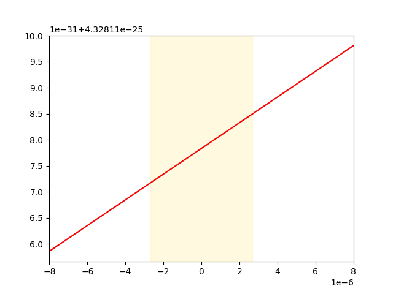
## New Eq:
((fabs(membrane__V) < 2.671376065969565e-6) ? ((0.5 + 187169.45411372738 * membrane__V) * (5.5865012728500001e-12 * (-standard_ionic_concentrations__Ko + intracellular_ion_concentrations__Ki * exp(-9.9999999999999995e-8)) * (L_type_Ca_current__O + L_type_Ca_current__O_Ca) * L_type_Ca_current_y_gate__y / ((1.0 + 0.1456382513207547 * (0.001 * exp(-1.9999999999999999e-7) - 0.34100000000000003 * standard_ionic_concentrations__Cao) * L_type_Ca_current__P_Ca / (-1.0 + exp(-1.9999999999999999e-7))) * (-1.0 + exp(-9.9999999999999995e-8))) + 5.5865012728500001e-12 * (-standard_ionic_concentrations__Ko + intracellular_ion_concentrations__Ki * exp(9.9999999999999995e-8)) * (L_type_Ca_current__O + L_type_Ca_current__O_Ca) * L_type_Ca_current_y_gate__y / ((1.0 - 0.1456382513207547 * (0.001 * exp(1.9999999999999999e-7) - 0.34100000000000003 * standard_ionic_concentrations__Cao) * L_type_Ca_current__P_Ca / (-1.0 + exp(1.9999999999999999e-7))) * (-1.0 + exp(9.9999999999999995e-8)))) - 5.5865012728500001e-12 * (-standard_ionic_concentrations__Ko + intracellular_ion_concentrations__Ki * exp(-9.9999999999999995e-8)) * (L_type_Ca_current__O + L_type_Ca_current__O_Ca) * L_type_Ca_current_y_gate__y / ((1.0 + 0.1456382513207547 * (0.001 * exp(-1.9999999999999999e-7) - 0.34100000000000003 * standard_ionic_concentrations__Cao) * L_type_Ca_current__P_Ca / (-1.0 + exp(-1.9999999999999999e-7))) * (-1.0 + exp(-9.9999999999999995e-8)))) : (pow(membrane__F, 2) * (-standard_ionic_concentrations__Ko + intracellular_ion_concentrations__Ki * exp(membrane__F * membrane__V / (membrane__R * membrane__T))) * (L_type_Ca_current__O + L_type_Ca_current__O_Ca) * L_type_Ca_current__p_prime_k * L_type_Ca_current_y_gate__y * membrane__V / ((-1.0 + exp(membrane__F * membrane__V / (membrane__R * membrane__T))) * membrane__R * membrane__T)))

# Model: zhang_SAN_model_2000_0D_capable(zhang_SAN_model_2000_0D_capable.cellml)
## Equation 1:
```
L_type_Ca_channel_d_gate__alpha_d_L = -28.390000000000001 * (35.0 + membrane__V) / (-1.0 + 8.3152871910356788e-7 * exp(-0.40000000000000002 * membrane__V)) - 84.900000000000006 * membrane__V / (-1.0 + exp(-0.20799999999999999 * membrane__V))
```
### Partially evaluated to: 
```
L_type_Ca_channel_d_gate__alpha_d_L = -28.390000000000001 * (35.0 + membrane__V) / (-1.0 + 8.3152871910356788e-7 * exp(-0.40000000000000002 * membrane__V)) - 84.900000000000006 * membrane__V / (-1.0 + exp(-0.20799999999999999 * membrane__V))
```
### Singulariy points detected:

{0, -35.000000000000000}
####A + B:

`84.900000000000006 * membrane__V / (1.0 - exp(-0.20799999999999999 * membrane__V))`
`-28.390000000000001 * (35.0 + membrane__V) / (-1.0 + 8.3152871910356788e-7 * exp(-0.40000000000000002 * membrane__V))`

*U*
`0.20799999999999999 * membrane__V`

*V for 1e-07 range* 
`-4.8076923076923074e-7 - 4.8076923076923074e-7`

*Singularity point: 0*


*U*
`-14.0 - 0.40000000000000002 * membrane__V`

*V for 1e-07 range* 
`-35.000000249999999 - -34.999999750000001`

*Singularity point: -35.000000000000000*

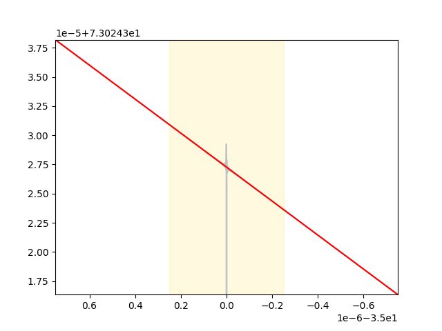
## New Eq:
((fabs(membrane__V) < 4.8076923076923074e-7) ? (4.0817307692307694e-5 / (-1.0 + exp(9.9999999999999995e-8)) - 993.64998635096151 / (-1.0 + exp(-13.999999807692308)) + (0.5 + 1040000.0 * membrane__V) * (993.64998635096151 / (-1.0 + exp(-13.999999807692308)) - 993.65001364903844 / (-1.0 + exp(-14.000000192307692)) - 4.0817307692307694e-5 / (-1.0 + exp(9.9999999999999995e-8)) - 4.0817307692307694e-5 / (-1.0 + exp(-9.9999999999999995e-8)))) : ((fabs(35.0 + membrane__V) < 2.5000000003494449e-7) ? (7.0974999994161125e-6 / (-1.0 + exp(9.9999999988997779e-8)) + 2971.5000212250002 / (-1.0 + exp(7.2800000519999992)) + (70000000.497987106 + 1999999.9999424887 * membrane__V) * (2971.4999787750003 / (-1.0 + exp(7.2799999479999995)) - 7.0974999994161125e-6 / (-1.0 + exp(9.9999999988997779e-8)) - 2971.5000212250002 / (-1.0 + exp(7.2800000519999992)) - 7.097500000992074e-6 / (-1.0 + exp(-1.0000000001675335e-7)))) : (-28.390000000000001 * (35.0 + membrane__V) / (-1.0 + exp(-14.0 - 0.40000000000000002 * membrane__V)) - 84.900000000000006 * membrane__V / (-1.0 + exp(-0.20799999999999999 * membrane__V)))))

## Equation 2:
```
L_type_Ca_channel_d_gate__beta_d_L = 11.43 * (-5.0 + membrane__V) / (-1.0 + 0.13533528323661267 * exp(0.40000000000000002 * membrane__V))
```
### Partially evaluated to: 
```
L_type_Ca_channel_d_gate__beta_d_L = 11.43 * (-5.0 + membrane__V) / (-1.0 + 0.13533528323661267 * exp(0.40000000000000002 * membrane__V))
```
### Singulariy points detected:

{5.0000000000000000}
*U*
`-2.0 + 0.40000000000000002 * membrane__V`

*V for 1e-07 range* 
`4.9999997499999997 - 5.0000002500000003`

*Singularity point: 5.0000000000000000*

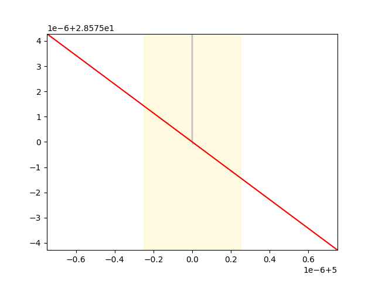
## New Eq:
((fabs(-5.0 + membrane__V) < 2.5000000000025002e-7) ? (-2.8575000000028576e-6 / (-1.0 + exp(-9.9999999999406119e-8)) + (-9999999.4999899995 + 1999999.9999979998 * membrane__V) * (2.8575000000028576e-6 / (-1.0 + exp(9.9999999999406119e-8)) + 2.8575000000028576e-6 / (-1.0 + exp(-9.9999999999406119e-8)))) : (11.43 * (-5.0 + membrane__V) / (-1.0 + exp(-2.0 + 0.40000000000000002 * membrane__V))))

## Equation 3:
```
L_type_Ca_channel_f_gate__alpha_f_L = 3.75 * (28.0 + membrane__V) / (-1.0 + 1096.6331584284585 * exp(0.25 * membrane__V))
```
### Partially evaluated to: 
```
L_type_Ca_channel_f_gate__alpha_f_L = 3.75 * (28.0 + membrane__V) / (-1.0 + 1096.6331584284585 * exp(0.25 * membrane__V))
```
### Singulariy points detected:

{-28.000000000000000}
*U*
`7.0 + 0.25 * membrane__V`

*V for 1e-07 range* 
`-28.000000400000001 - -27.999999599999999`

*Singularity point: -28.000000000000000*

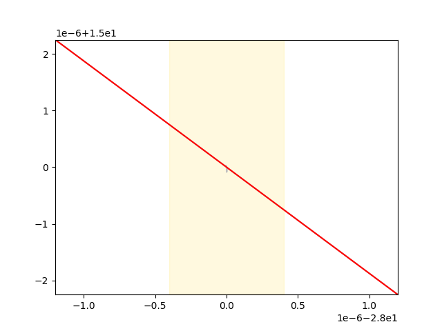
## New Eq:
((fabs(28.0 + membrane__V) < 4.0000000001150227e-7) ? (-1.5000000000431335e-6 / (-1.0 + exp(-1.0000000000287557e-7)) + (35000000.498993553 + 1249999.9999640554 * membrane__V) * (1.5000000000431335e-6 / (-1.0 + exp(1.0000000000287557e-7)) + 1.5000000000431335e-6 / (-1.0 + exp(-1.0000000000287557e-7)))) : (3.75 * (28.0 + membrane__V) / (-1.0 + exp(7.0 + 0.25 * membrane__V))))

## Equation 4:
```
sodium_current__i_Na = pow(membrane__F, 2) * pow(sodium_current_m_gate__m, 3) * (-1.0 + exp((-reversal_and_equilibrium_potentials__E_Na + membrane__V) * membrane__F / (membrane__R * membrane__T))) * ionic_concentrations__Na_o * membrane__V * sodium_current__g_Na * sodium_current_h_gate__h / ((-1.0 + exp(membrane__F * membrane__V / (membrane__R * membrane__T))) * membrane__R * membrane__T)
```
### Partially evaluated to: 
```
sodium_current__i_Na = 0
```
### Singulariy points detected:

{0}
#### Eq == 0!
