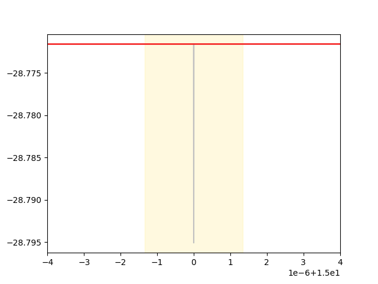
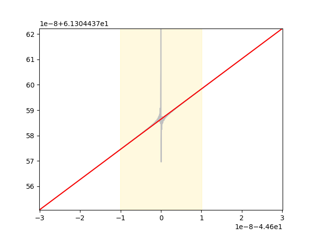
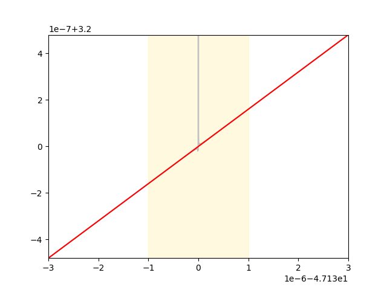
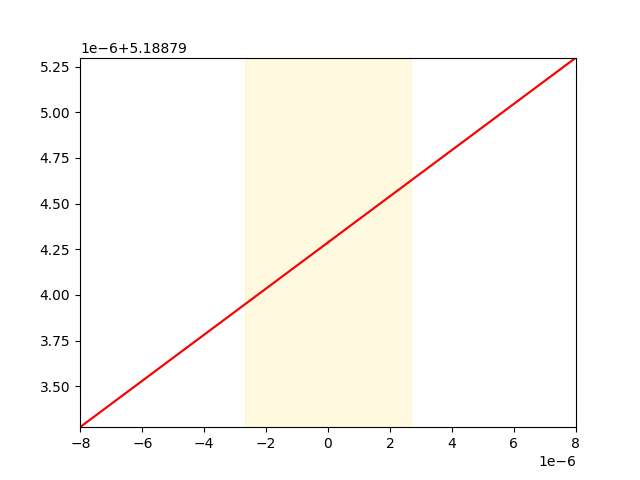

# Model: davies_isap_2012
## Equation 1:
```
ICaL__ibarca = 4.0 * (-15.0 + cell__V) * (-Environment__Ca_o * ICaL__gacao + Ca__Ca_ss * ICaL__gacai * exp(2.0 * (-15.0 + cell__V) * Environment__FonRT)) * Environment__F * Environment__FonRT * ICaL__pca / (-1.0 + exp(2.0 * (-15.0 + cell__V) * Environment__FonRT))
```
### Partially evaluated to: 
```
ICaL__ibarca = 3.5108651860830804 * (-15.0 + cell__V) * (-0.61380000000000001 + 7.3230071611651398e-5 * exp(0.074871767015599999 * cell__V)) / (-1.0 + 0.32527753564515088 * exp(0.074871767015599999 * cell__V))
```
### Singulariy points detected:

{15.000000000000000}
*U*
`-1.1230765052339999 + 0.074871767015599999 * cell__V`

*V for 1e-07 range* 
`14.999998664383064 - 15.000001335616936`

*Singularity point: 15.000000000000000*


## New Eq:
((fabs(-15.0 + cell__V) < 1.3356169352718439e-6) ? ((-5615382.0261832969 + 374358.83507888648 * cell__V) * (4.689170999988896e-6 * (-0.61380000000000001 + 0.00022513104529769601 * exp(9.9999999999406119e-8)) / (-1.0 + exp(9.9999999999406119e-8)) + 4.689170999988896e-6 * (-0.61380000000000001 + 0.00022513104529769601 * exp(-9.9999999999406119e-8)) / (-1.0 + exp(-9.9999999999406119e-8))) - 4.689170999988896e-6 * (-0.61380000000000001 + 0.00022513104529769601 * exp(-9.9999999999406119e-8)) / (-1.0 + exp(-9.9999999999406119e-8))) : (4.0 * (-15.0 + cell__V) * (-Environment__Ca_o * ICaL__gacao + Ca__Ca_ss * ICaL__gacai * exp(2.0 * (-15.0 + cell__V) * Environment__FonRT)) * Environment__F * Environment__FonRT * ICaL__pca / (-1.0 + exp(2.0 * (-15.0 + cell__V) * Environment__FonRT))))

## Equation 2:
```
ICab__ICab = (-0.34100000000000003 * Environment__Ca_o + Ca__Ca_i * exp(2.0 * Environment__FonRT * cell__V)) * Environment__F * Environment__FonRT * ICab__GCab * cell__V / (-1.0 + exp(2.0 * Environment__FonRT * cell__V))
```
### Partially evaluated to: 
```
ICab__ICab = 0.0028824983370005666 * (-0.61380000000000001 + 0.00022376833123175801 * exp(0.074871767015599999 * cell__V)) * cell__V / (-1.0 + exp(0.074871767015599999 * cell__V))
```
### Singulariy points detected:

{0}
*U*
`0.074871767015599999 * cell__V`

*V for 1e-07 range* 
`-1.3356169352750065e-6 - 1.3356169352750065e-6`

*Singularity point: 0*


## New Eq:
((fabs(cell__V) < 1.3356169352750065e-6) ? ((0.5 + 374358.83507800003 * cell__V) * (3.8499135947999997e-9 * (-0.61380000000000001 + 0.00022376833123175801 * exp(9.9999999999999995e-8)) / (-1.0 + exp(9.9999999999999995e-8)) + 3.8499135947999997e-9 * (-0.61380000000000001 + 0.00022376833123175801 * exp(-9.9999999999999995e-8)) / (-1.0 + exp(-9.9999999999999995e-8))) - 3.8499135947999997e-9 * (-0.61380000000000001 + 0.00022376833123175801 * exp(-9.9999999999999995e-8)) / (-1.0 + exp(-9.9999999999999995e-8))) : ((-0.34100000000000003 * Environment__Ca_o + Ca__Ca_i * exp(2.0 * Environment__FonRT * cell__V)) * Environment__F * Environment__FonRT * ICab__GCab * cell__V / (-1.0 + exp(2.0 * Environment__FonRT * cell__V))))

## Equation 3:
```
IKs__tauxs = 1 / (7.6100000000000007e-5 * (44.600000000000001 + cell__V) / (1.0 - 7.6868266637773744e-194 * exp(-9.9700000000000006 * cell__V)) + 0.00036000000000000002 * (-0.55000000000000004 + cell__V) / (-1.0 + 0.93202093695954691 * exp(0.128 * cell__V)))
```
### Partially evaluated to: 
```
IKs__tauxs = 1 / (7.6100000000000007e-5 * (44.600000000000001 + cell__V) / (1.0 - 7.6868266637773744e-194 * exp(-9.9700000000000006 * cell__V)) + 0.00036000000000000002 * (-0.55000000000000004 + cell__V) / (-1.0 + 0.93202093695954691 * exp(0.128 * cell__V)))
```
### Singulariy points detected:

{0.55000000000000005, -44.600000000000001}
#### float * A

####1 / A


####A + B:

`7.6100000000000007e-5 * (44.600000000000001 + cell__V) / (1.0 - 7.6868266637773744e-194 * exp(-9.9700000000000006 * cell__V))`
`0.00036000000000000002 * (-0.55000000000000004 + cell__V) / (-1.0 + 0.93202093695954691 * exp(0.128 * cell__V))`

*U*
`-444.66200000000003 - 9.9700000000000006 * cell__V`

*V for 1e-07 range* 
`-44.600000010030094 - -44.599999989969909`

*Singularity point: -44.600000000000001*


*U*
`-0.070400000000000004 + 0.128 * cell__V`

*V for 1e-07 range* 
`0.54999921875000002 - 0.55000078125000007`

*Singularity point: 0.55000000000000005*


## New Eq:
((fabs(44.600000000000001 + cell__V) < 1.0030090258350555e-8) ? (1 / (-0.016254000003610835 / (-1.0 + exp(-5.7792000012838516)) - 7.6328986866047728e-13 / (1.0 - exp(9.9999999836342113e-8))) + (2223310003.262351 + 49850000.061936118 * cell__V) * (1 / (7.6328986866047728e-13 / (1.0 - exp(-9.9999999836342113e-8)) - 0.016253999996389171 / (-1.0 + exp(-5.7791999987161491))) - 1 / (-0.016254000003610835 / (-1.0 + exp(-5.7792000012838516)) - 7.6328986866047728e-13 / (1.0 - exp(9.9999999836342113e-8))))) : ((fabs(-0.55000000000000004 + cell__V) < 7.8124999999557715e-7) ? (1 / (0.0034359149405468756 / (1.0 - exp(-450.14549221093756)) - 2.8124999999903229e-10 / (-1.0 + exp(-9.999999999962296e-8))) + (-351999.50000003882 + 640000.00000007043 * cell__V) * (1 / (2.812500000009058e-10 / (-1.0 + exp(1.0000000000027348e-7)) + 0.0034359150594531255 / (1.0 - exp(-450.14550778906255))) - 1 / (0.0034359149405468756 / (1.0 - exp(-450.14549221093756)) - 2.8124999999903229e-10 / (-1.0 + exp(-9.999999999962296e-8))))) : (1 / (7.6100000000000007e-5 * (44.600000000000001 + cell__V) / (1.0 - exp(-444.66200000000003 - 9.9700000000000006 * cell__V)) + 0.00036000000000000002 * (-0.55000000000000004 + cell__V) / (-1.0 + exp(-0.070400000000000004 + 0.128 * cell__V))))))

## Equation 4:
```
INa__am = 0.32000000000000001 * (47.130000000000003 + cell__V) / (1.0 - 0.00897780373069724 * exp(-0.10000000000000001 * cell__V))
```
### Partially evaluated to: 
```
INa__am = 0.32000000000000001 * (47.130000000000003 + cell__V) / (1.0 - 0.00897780373069724 * exp(-0.10000000000000001 * cell__V))
```
### Singulariy points detected:

{-47.130000000000003}
*U*
`-4.7130000000000001 - 0.10000000000000001 * cell__V`

*V for 1e-07 range* 
`-47.130001 - -47.129999000000005`

*Singularity point: -47.130000000000003*


## New Eq:
((fabs(47.130000000000003 + cell__V) < 1.0000000000287557e-6) ? (-3.200000000092018e-7 / (1.0 - exp(1.0000000000287557e-7)) + (23565000.499322373 + 499999.99998562218 * cell__V) * (3.200000000092018e-7 / (1.0 - exp(1.0000000000287557e-7)) + 3.200000000092018e-7 / (1.0 - exp(-1.0000000000287557e-7)))) : (0.32000000000000001 * (47.130000000000003 + cell__V) / (1.0 - exp(-4.7130000000000001 - 0.10000000000000001 * cell__V))))

## Equation 5:
```
INal__amL = 0.32000000000000001 * (47.130000000000003 + cell__V) / (1.0 - 0.00897780373069724 * exp(-0.10000000000000001 * cell__V))
```
### Partially evaluated to: 
```
INal__amL = 0.32000000000000001 * (47.130000000000003 + cell__V) / (1.0 - 0.00897780373069724 * exp(-0.10000000000000001 * cell__V))
```
### Singulariy points detected:

{-47.130000000000003}
*U*
`-4.7130000000000001 - 0.10000000000000001 * cell__V`

*V for 1e-07 range* 
`-47.130001 - -47.129999000000005`

*Singularity point: -47.130000000000003*


## New Eq:
((fabs(47.130000000000003 + cell__V) < 1.0000000000287557e-6) ? (-3.200000000092018e-7 / (1.0 - exp(1.0000000000287557e-7)) + (23565000.499322373 + 499999.99998562218 * cell__V) * (3.200000000092018e-7 / (1.0 - exp(1.0000000000287557e-7)) + 3.200000000092018e-7 / (1.0 - exp(-1.0000000000287557e-7)))) : (0.32000000000000001 * (47.130000000000003 + cell__V) / (1.0 - exp(-4.7130000000000001 - 0.10000000000000001 * cell__V))))

## Equation 6:
```
Ito2__Ito2_max = (-Environment__Cl_o * exp(Environment__FonRT * cell__V) + Cl__Cl_i) * Environment__F * Environment__FonRT * Ito2__PCl * cell__V / (1.0 - exp(Environment__FonRT * cell__V))
```
### Partially evaluated to: 
```
Ito2__Ito2_max = 0.001444800488100033 * (20.154379247109599 - 154.59999999999999 * exp(0.0374358835078 * cell__V)) * cell__V / (1.0 - exp(0.0374358835078 * cell__V))
```
### Singulariy points detected:

{0}
*U*
`0.0374358835078 * cell__V`

*V for 1e-07 range* 
`-2.671233870550013e-6 - 2.671233870550013e-6`

*Singularity point: 0*


## New Eq:
((fabs(cell__V) < 2.671233870550013e-6) ? ((0.5 + 187179.41753900002 * cell__V) * (3.8593999999999993e-9 * (20.154379247109599 - 154.59999999999999 * exp(9.9999999999999995e-8)) / (1.0 - exp(9.9999999999999995e-8)) + 3.8593999999999993e-9 * (20.154379247109599 - 154.59999999999999 * exp(-9.9999999999999995e-8)) / (1.0 - exp(-9.9999999999999995e-8))) - 3.8593999999999993e-9 * (20.154379247109599 - 154.59999999999999 * exp(-9.9999999999999995e-8)) / (1.0 - exp(-9.9999999999999995e-8))) : ((-Environment__Cl_o * exp(Environment__FonRT * cell__V) + Cl__Cl_i) * Environment__F * Environment__FonRT * Ito2__PCl * cell__V / (1.0 - exp(Environment__FonRT * cell__V))))

