# Model: davies_isap_2012
## Equation 1:
```
ICaL__ibarca = 4.0 * (-15.0 + cell__V) * (-Environment__Ca_o * ICaL__gacao + Ca__Ca_ss * ICaL__gacai * exp(2.0 * (-15.0 + cell__V) * Environment__FonRT)) * Environment__F * Environment__FonRT * ICaL__pca / (-1.0 + exp(2.0 * (-15.0 + cell__V) * Environment__FonRT))
```
### Partially evaluated to: 
```
ICaL__ibarca = 3.5108651860830804 * (-15.0 + cell__V) * (-0.61380000000000001 + 7.3230071611651398e-5 * exp(0.074871767015599999 * cell__V)) / (-1.0 + 0.32527753564515088 * exp(0.074871767015599999 * cell__V))
```
### Singulariy points detected:

{15.000000000000000}
*U*
`-1.1230765052339999 + 0.074871767015599999 * cell__V`

*V for 1e-07 range* 
`14.999998664383064 - 15.000001335616936`

*Singularity point: 15.000000000000000*


## New Eq:
((fabs(-15.0 + cell__V) < 1.3356169352718439e-6) ? ((-5615382.0261832969 + 374358.83507888648 * cell__V) * (4.689170999988896e-6 * (-0.61380000000000001 + 0.00022513104529769601 * exp(9.9999999999406119e-8)) / (-1.0 + exp(9.9999999999406119e-8)) + 4.689170999988896e-6 * (-0.61380000000000001 + 0.00022513104529769601 * exp(-9.9999999999406119e-8)) / (-1.0 + exp(-9.9999999999406119e-8))) - 4.689170999988896e-6 * (-0.61380000000000001 + 0.00022513104529769601 * exp(-9.9999999999406119e-8)) / (-1.0 + exp(-9.9999999999406119e-8))) : (4.0 * (-15.0 + cell__V) * (-Environment__Ca_o * ICaL__gacao + Ca__Ca_ss * ICaL__gacai * exp(2.0 * (-15.0 + cell__V) * Environment__FonRT)) * Environment__F * Environment__FonRT * ICaL__pca / (-1.0 + exp(2.0 * (-15.0 + cell__V) * Environment__FonRT))))

## Equation 2:
```
ICab__ICab = (-0.34100000000000003 * Environment__Ca_o + Ca__Ca_i * exp(2.0 * Environment__FonRT * cell__V)) * Environment__F * Environment__FonRT * ICab__GCab * cell__V / (-1.0 + exp(2.0 * Environment__FonRT * cell__V))
```
### Partially evaluated to: 
```
ICab__ICab = 0.0028824983370005666 * (-0.61380000000000001 + 0.00022376833123175801 * exp(0.074871767015599999 * cell__V)) * cell__V / (-1.0 + exp(0.074871767015599999 * cell__V))
```
### Singulariy points detected:

{0}
*U*
`0.074871767015599999 * cell__V`

*V for 1e-07 range* 
`-1.3356169352750065e-6 - 1.3356169352750065e-6`

*Singularity point: 0*


## New Eq:
((fabs(cell__V) < 1.3356169352750065e-6) ? ((0.5 + 374358.83507800003 * cell__V) * (3.8499135947999997e-9 * (-0.61380000000000001 + 0.00022376833123175801 * exp(9.9999999999999995e-8)) / (-1.0 + exp(9.9999999999999995e-8)) + 3.8499135947999997e-9 * (-0.61380000000000001 + 0.00022376833123175801 * exp(-9.9999999999999995e-8)) / (-1.0 + exp(-9.9999999999999995e-8))) - 3.8499135947999997e-9 * (-0.61380000000000001 + 0.00022376833123175801 * exp(-9.9999999999999995e-8)) / (-1.0 + exp(-9.9999999999999995e-8))) : ((-0.34100000000000003 * Environment__Ca_o + Ca__Ca_i * exp(2.0 * Environment__FonRT * cell__V)) * Environment__F * Environment__FonRT * ICab__GCab * cell__V / (-1.0 + exp(2.0 * Environment__FonRT * cell__V))))

## Equation 3:
```
IKs__tauxs = 1 / (7.6100000000000007e-5 * (44.600000000000001 + cell__V) / (1.0 - 7.6868266637773744e-194 * exp(-9.9700000000000006 * cell__V)) + 0.00036000000000000002 * (-0.55000000000000004 + cell__V) / (-1.0 + 0.93202093695954691 * exp(0.128 * cell__V)))
```
### Partially evaluated to: 
```
IKs__tauxs = 1 / (7.6100000000000007e-5 * (44.600000000000001 + cell__V) / (1.0 - 7.6868266637773744e-194 * exp(-9.9700000000000006 * cell__V)) + 0.00036000000000000002 * (-0.55000000000000004 + cell__V) / (-1.0 + 0.93202093695954691 * exp(0.128 * cell__V)))
```
### Singulariy points detected:

{-44.600000000000001, 0.55000000000000005}
#### float * A

####1 / A


####A + B:

`7.6100000000000007e-5 * (44.600000000000001 + cell__V) / (1.0 - 7.6868266637773744e-194 * exp(-9.9700000000000006 * cell__V))`
`0.00036000000000000002 * (-0.55000000000000004 + cell__V) / (-1.0 + 0.93202093695954691 * exp(0.128 * cell__V))`

*U*
`-444.66200000000003 - 9.9700000000000006 * cell__V`

*V for 1e-07 range* 
`-44.600000010030094 - -44.599999989969909`

*Singularity point: -44.600000000000001*


*U*
`-0.070400000000000004 + 0.128 * cell__V`

*V for 1e-07 range* 
`0.54999921875000002 - 0.55000078125000007`

*Singularity point: 0.55000000000000005*


## New Eq:
((fabs(44.600000000000001 + cell__V) < 1.0030090258350555e-8) ? (1 / (-0.016254000003610835 / (-1.0 + exp(-5.7792000012838516)) - 7.6328986866047728e-13 / (1.0 - exp(9.9999999836342113e-8))) + (2223310003.262351 + 49850000.061936118 * cell__V) * (1 / (7.6328986866047728e-13 / (1.0 - exp(-9.9999999836342113e-8)) - 0.016253999996389171 / (-1.0 + exp(-5.7791999987161491))) - 1 / (-0.016254000003610835 / (-1.0 + exp(-5.7792000012838516)) - 7.6328986866047728e-13 / (1.0 - exp(9.9999999836342113e-8))))) : ((fabs(-0.55000000000000004 + cell__V) < 7.8124999999557715e-7) ? (1 / (0.0034359149405468756 / (1.0 - exp(-450.14549221093756)) - 2.8124999999903229e-10 / (-1.0 + exp(-9.999999999962296e-8))) + (-351999.50000003882 + 640000.00000007043 * cell__V) * (1 / (2.812500000009058e-10 / (-1.0 + exp(1.0000000000027348e-7)) + 0.0034359150594531255 / (1.0 - exp(-450.14550778906255))) - 1 / (0.0034359149405468756 / (1.0 - exp(-450.14549221093756)) - 2.8124999999903229e-10 / (-1.0 + exp(-9.999999999962296e-8))))) : (1 / (7.6100000000000007e-5 * (44.600000000000001 + cell__V) / (1.0 - exp(-444.66200000000003 - 9.9700000000000006 * cell__V)) + 0.00036000000000000002 * (-0.55000000000000004 + cell__V) / (-1.0 + exp(-0.070400000000000004 + 0.128 * cell__V))))))

## Equation 4:
```
INa__am = 0.32000000000000001 * (47.130000000000003 + cell__V) / (1.0 - 0.00897780373069724 * exp(-0.10000000000000001 * cell__V))
```
### Partially evaluated to: 
```
INa__am = 0.32000000000000001 * (47.130000000000003 + cell__V) / (1.0 - 0.00897780373069724 * exp(-0.10000000000000001 * cell__V))
```
### Singulariy points detected:

{-47.130000000000003}
*U*
`-4.7130000000000001 - 0.10000000000000001 * cell__V`

*V for 1e-07 range* 
`-47.130001 - -47.129999000000005`

*Singularity point: -47.130000000000003*


## New Eq:
((fabs(47.130000000000003 + cell__V) < 1.0000000000287557e-6) ? (-3.200000000092018e-7 / (1.0 - exp(1.0000000000287557e-7)) + (23565000.499322373 + 499999.99998562218 * cell__V) * (3.200000000092018e-7 / (1.0 - exp(1.0000000000287557e-7)) + 3.200000000092018e-7 / (1.0 - exp(-1.0000000000287557e-7)))) : (0.32000000000000001 * (47.130000000000003 + cell__V) / (1.0 - exp(-4.7130000000000001 - 0.10000000000000001 * cell__V))))

## Equation 5:
```
INal__amL = 0.32000000000000001 * (47.130000000000003 + cell__V) / (1.0 - 0.00897780373069724 * exp(-0.10000000000000001 * cell__V))
```
### Partially evaluated to: 
```
INal__amL = 0.32000000000000001 * (47.130000000000003 + cell__V) / (1.0 - 0.00897780373069724 * exp(-0.10000000000000001 * cell__V))
```
### Singulariy points detected:

{-47.130000000000003}
*U*
`-4.7130000000000001 - 0.10000000000000001 * cell__V`

*V for 1e-07 range* 
`-47.130001 - -47.129999000000005`

*Singularity point: -47.130000000000003*


## New Eq:
((fabs(47.130000000000003 + cell__V) < 1.0000000000287557e-6) ? (-3.200000000092018e-7 / (1.0 - exp(1.0000000000287557e-7)) + (23565000.499322373 + 499999.99998562218 * cell__V) * (3.200000000092018e-7 / (1.0 - exp(1.0000000000287557e-7)) + 3.200000000092018e-7 / (1.0 - exp(-1.0000000000287557e-7)))) : (0.32000000000000001 * (47.130000000000003 + cell__V) / (1.0 - exp(-4.7130000000000001 - 0.10000000000000001 * cell__V))))

## Equation 6:
```
Ito2__Ito2_max = (-Environment__Cl_o * exp(Environment__FonRT * cell__V) + Cl__Cl_i) * Environment__F * Environment__FonRT * Ito2__PCl * cell__V / (1.0 - exp(Environment__FonRT * cell__V))
```
### Partially evaluated to: 
```
Ito2__Ito2_max = 0.001444800488100033 * (20.154379247109599 - 154.59999999999999 * exp(0.0374358835078 * cell__V)) * cell__V / (1.0 - exp(0.0374358835078 * cell__V))
```
### Singulariy points detected:

{0}
*U*
`0.0374358835078 * cell__V`

*V for 1e-07 range* 
`-2.671233870550013e-6 - 2.671233870550013e-6`

*Singularity point: 0*


## New Eq:
((fabs(cell__V) < 2.671233870550013e-6) ? ((0.5 + 187179.41753900002 * cell__V) * (3.8593999999999993e-9 * (20.154379247109599 - 154.59999999999999 * exp(9.9999999999999995e-8)) / (1.0 - exp(9.9999999999999995e-8)) + 3.8593999999999993e-9 * (20.154379247109599 - 154.59999999999999 * exp(-9.9999999999999995e-8)) / (1.0 - exp(-9.9999999999999995e-8))) - 3.8593999999999993e-9 * (20.154379247109599 - 154.59999999999999 * exp(-9.9999999999999995e-8)) / (1.0 - exp(-9.9999999999999995e-8))) : ((-Environment__Cl_o * exp(Environment__FonRT * cell__V) + Cl__Cl_i) * Environment__F * Environment__FonRT * Ito2__PCl * cell__V / (1.0 - exp(Environment__FonRT * cell__V))))

# Model: aslanidi_model_2009
## Equation 1:
```
sodium_current__i_Na = pow(membrane__F, 2) * pow(sodium_current_m_gate__m, 3) * (-1.0 + exp((-sodium_current__E_Na + membrane__V) * membrane__F / (membrane__R * membrane__T))) * (0.36499999999999999 * sodium_current_h2_gate__h2 + 0.63500000000000001 * sodium_current_h1_gate__h1) * cleft_space_ion_concentrations__Na_c * membrane__V * sodium_current__P_Na / ((-1.0 + exp(membrane__F * membrane__V / (membrane__R * membrane__T))) * membrane__R * membrane__T)
```
### Partially evaluated to: 
```
sodium_current__i_Na = 1.075255537963801e-6 * (-1.0 + 0.060000000000000005 * exp(0.037679754693225945 * membrane__V)) * membrane__V / (-1.0 + exp(0.037679754693225945 * membrane__V))
```
### Singulariy points detected:

{0}
*U*
`0.037679754693225945 * membrane__V`

*V for 1e-07 range* 
`-2.6539450910485349e-6 - 2.6539450910485349e-6`

*Singularity point: 0*


## New Eq:
((fabs(membrane__V) < 2.6539450910485349e-6) ? ((0.5 + 188398.77346612973 * membrane__V) * (2.8536691566017808e-12 * (-1.0 + exp(-2.8134106167600361)) / (-1.0 + exp(9.9999999999999995e-8)) + 2.8536691566017808e-12 * (-1.0 + exp(-2.8134108167600362)) / (-1.0 + exp(-9.9999999999999995e-8))) - 2.8536691566017808e-12 * (-1.0 + exp(-2.8134108167600362)) / (-1.0 + exp(-9.9999999999999995e-8))) : (pow(membrane__F, 2) * pow(sodium_current_m_gate__m, 3) * (-1.0 + exp((-sodium_current__E_Na + membrane__V) * membrane__F / (membrane__R * membrane__T))) * (0.36499999999999999 * sodium_current_h2_gate__h2 + 0.63500000000000001 * sodium_current_h1_gate__h1) * cleft_space_ion_concentrations__Na_c * membrane__V * sodium_current__P_Na / ((-1.0 + exp(membrane__F * membrane__V / (membrane__R * membrane__T))) * membrane__R * membrane__T)))

# Model: beeler_reuter_model_1977
## Equation 1:
```
sodium_current_m_gate__alpha_m = -(47.0 + membrane__V) / (-1.0 + 0.0090952771016958155 * exp(-0.10000000000000001 * membrane__V))
```
### Partially evaluated to: 
```
sodium_current_m_gate__alpha_m = -(47.0 + membrane__V) / (-1.0 + 0.0090952771016958155 * exp(-0.10000000000000001 * membrane__V))
```
### Singulariy points detected:

{-47.000000000000000}
*U*
`-4.7000000000000002 - 0.10000000000000001 * membrane__V`

*V for 1e-07 range* 
`-47.000000999999997 - -46.999999000000003`

*Singularity point: -47.000000000000000*


## New Eq:
((fabs(47.0 + membrane__V) < 1.0000000000287557e-6) ? (1.0000000000287557e-6 / (-1.0 + exp(1.0000000000287557e-7)) + (23500000.499324244 + 499999.99998562218 * membrane__V) * (-1.0000000000287557e-6 / (-1.0 + exp(1.0000000000287557e-7)) - 1.0000000000287557e-6 / (-1.0 + exp(-1.0000000000287557e-7)))) : (-(47.0 + membrane__V) / (-1.0 + exp(-4.7000000000000002 - 0.10000000000000001 * membrane__V))))

## Equation 2:
```
time_independent_outward_current__i_K1 = 0.014 * (-1.0 + 29.964100047397014 * exp(0.040000000000000001 * membrane__V)) / (8.3311374876876929 * exp(0.040000000000000001 * membrane__V) + 69.407851838755192 * exp(0.080000000000000002 * membrane__V)) + 0.0007000000000000001 * (23.0 + membrane__V) / (1.0 - 0.39851904108451419 * exp(-0.040000000000000001 * membrane__V))
```
### Partially evaluated to: 
```
time_independent_outward_current__i_K1 = 0.014 * (-1.0 + 29.964100047397014 * exp(0.040000000000000001 * membrane__V)) / (8.3311374876876929 * exp(0.040000000000000001 * membrane__V) + 69.407851838755192 * exp(0.080000000000000002 * membrane__V)) + 0.0007000000000000001 * (23.0 + membrane__V) / (1.0 - 0.39851904108451419 * exp(-0.040000000000000001 * membrane__V))
```
### Singulariy points detected:

{-23.000000000000000}
####A + B:

`0.0007000000000000001 * (23.0 + membrane__V) / (1.0 - 0.39851904108451419 * exp(-0.040000000000000001 * membrane__V))`
`0.014 * (-1.0 + 29.964100047397014 * exp(0.040000000000000001 * membrane__V)) / (8.3311374876876929 * exp(0.040000000000000001 * membrane__V) + 69.407851838755192 * exp(0.080000000000000002 * membrane__V))`

*U*
`-0.92000000000000004 - 0.040000000000000001 * membrane__V`

*V for 1e-07 range* 
`-23.000002500000001 - -22.999997499999999`

*Singularity point: -23.000000000000000*

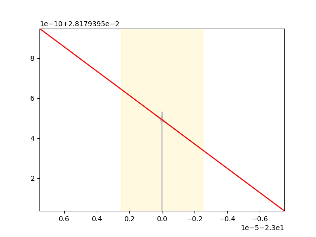
## New Eq:
((fabs(23.0 + membrane__V) < 2.500000000016378e-6) ? (-1.7500000000114647e-9 / (1.0 - exp(1.0000000000027348e-7)) + (4600000.4999698643 + 199999.99999868975 * membrane__V) * (1.7500000000114647e-9 / (1.0 - exp(1.0000000000027348e-7)) + 1.7500000000114647e-9 / (1.0 - exp(-1.0000000000027348e-7)) + 0.014 * (-1.0 + exp(2.4800001000000003)) / (exp(1.2000001) + exp(2.4000002)) - 0.014 * (-1.0 + exp(2.4799999000000001)) / (exp(1.1999999000000001) + exp(2.3999998000000002))) + 0.014 * (-1.0 + exp(2.4799999000000001)) / (exp(1.1999999000000001) + exp(2.3999998000000002))) : (0.014 * (-1.0 + exp(3.3999999999999999 + 0.040000000000000001 * membrane__V)) / (exp(2.1200000000000001 + 0.040000000000000001 * membrane__V) + exp(4.2400000000000002 + 0.080000000000000002 * membrane__V)) + 0.0007000000000000001 * (23.0 + membrane__V) / (1.0 - exp(-0.92000000000000004 - 0.040000000000000001 * membrane__V))))

# Model: bondarenko_model_2004_apex
## Equation 1:
```
slow_delayed_rectifier_potassium_current__alpha_n = 4.8133299999999997e-6 * (26.5 + membrane__V) / (1.0 - 0.033641326918204616 * exp(-0.128 * membrane__V))
```
### Partially evaluated to: 
```
slow_delayed_rectifier_potassium_current__alpha_n = 4.8133299999999997e-6 * (26.5 + membrane__V) / (1.0 - 0.033641326918204616 * exp(-0.128 * membrane__V))
```
### Singulariy points detected:

{-26.500000000000000}
*U*
`-3.3919999999999999 - 0.128 * membrane__V`

*V for 1e-07 range* 
`-26.500000781250002 - -26.499999218749998`

*Singularity point: -26.500000000000000*


## New Eq:
((fabs(26.5 + membrane__V) < 7.8124999999817923e-7) ? (-3.7604140624912359e-12 / (1.0 - exp(9.9999999999406119e-8)) + (16960000.500039525 + 640000.00000149151 * membrane__V) * (3.7604140624912359e-12 / (1.0 - exp(9.9999999999406119e-8)) + 3.7604140624912359e-12 / (1.0 - exp(-9.9999999999406119e-8)))) : (4.8133299999999997e-6 * (26.5 + membrane__V) / (1.0 - exp(-3.3919999999999999 - 0.128 * membrane__V))))

# Model: bondarenko_2004_apical
## Equation 1:
```
slow_delayed_rectifier_potassium_current__alpha_n = 4.8133299999999997e-6 * (26.5 + membrane__V) / (1.0 - 0.033641326918204616 * exp(-0.128 * membrane__V))
```
### Partially evaluated to: 
```
slow_delayed_rectifier_potassium_current__alpha_n = 4.8133299999999997e-6 * (26.5 + membrane__V) / (1.0 - 0.033641326918204616 * exp(-0.128 * membrane__V))
```
### Singulariy points detected:

{-26.500000000000000}
*U*
`-3.3919999999999999 - 0.128 * membrane__V`

*V for 1e-07 range* 
`-26.500000781250002 - -26.499999218749998`

*Singularity point: -26.500000000000000*


## New Eq:
((fabs(26.5 + membrane__V) < 7.8124999999817923e-7) ? (-3.7604140624912359e-12 / (1.0 - exp(9.9999999999406119e-8)) + (16960000.500039525 + 640000.00000149151 * membrane__V) * (3.7604140624912359e-12 / (1.0 - exp(9.9999999999406119e-8)) + 3.7604140624912359e-12 / (1.0 - exp(-9.9999999999406119e-8)))) : (4.8133299999999997e-6 * (26.5 + membrane__V) / (1.0 - exp(-3.3919999999999999 - 0.128 * membrane__V))))

# Model: courtemanche_ramirez_nattel_model_1998
## Equation 1:
```
Ca_release_current_from_JSR_w_gate__tau_w = ((fabs(-7.9000000000000004 + membrane__V) < 1.0e-10) ? (0.92307692307692313) : (6.0 * (1.0 - 4.854955811237434 * exp(-0.20000000000000001 * membrane__V)) / ((1.0 + 1.4564867433712301 * exp(-0.20000000000000001 * membrane__V)) * (-7.9000000000000004 + membrane__V))))
```
### Partially evaluated to: 
```
Ca_release_current_from_JSR_w_gate__tau_w = ((fabs(-7.9000000000000004 + membrane__V) < 1.0e-10) ? (0.92307692307692313) : (6.0 * (1.0 - 4.854955811237434 * exp(-0.20000000000000001 * membrane__V)) / ((1.0 + 1.4564867433712301 * exp(-0.20000000000000001 * membrane__V)) * (-7.9000000000000004 + membrane__V))))
```
### Singulariy points detected:

{7.9000000000000004}
####Piecewise!
## Equation 2:
```
L_type_Ca_channel_d_gate__tau_d = ((fabs(10.0 + membrane__V) < 1.0e-10) ? (4.5789999999999997 / (1.0 + 0.20137949774492364 * exp(-0.16025641025641024 * membrane__V))) : (28.571428571428569 * (1.0 - 0.20137949774492364 * exp(-0.16025641025641024 * membrane__V)) / ((1.0 + 0.20137949774492364 * exp(-0.16025641025641024 * membrane__V)) * (10.0 + membrane__V))))
```
### Partially evaluated to: 
```
L_type_Ca_channel_d_gate__tau_d = ((fabs(10.0 + membrane__V) < 1.0e-10) ? (4.5789999999999997 / (1.0 + 0.20137949774492364 * exp(-0.16025641025641024 * membrane__V))) : (28.571428571428569 * (1.0 - 0.20137949774492364 * exp(-0.16025641025641024 * membrane__V)) / ((1.0 + 0.20137949774492364 * exp(-0.16025641025641024 * membrane__V)) * (10.0 + membrane__V))))
```
### Singulariy points detected:

{-10.000000000000000}
####Piecewise!
## Equation 3:
```
fast_sodium_current_m_gate__alpha_m = ((membrane__V == (-47.130000000000003)) ? (3.2000000000000002) : (0.32000000000000001 * (47.130000000000003 + membrane__V) / (1.0 - 0.00897780373069724 * exp(-0.10000000000000001 * membrane__V))))
```
### Partially evaluated to: 
```
fast_sodium_current_m_gate__alpha_m = ((membrane__V == (-47.130000000000003)) ? (3.2000000000000002) : (0.32000000000000001 * (47.130000000000003 + membrane__V) / (1.0 - 0.00897780373069724 * exp(-0.10000000000000001 * membrane__V))))
```
### Singulariy points detected:

{-47.130000000000003}
####Piecewise!
## Equation 4:
```
rapid_delayed_rectifier_K_current_xr_gate__alpha_xr = ((fabs(14.1 + membrane__V) < 1.0e-10) ? (0.0015) : (0.00029999999999999997 * (14.1 + membrane__V) / (1.0 - 0.059605942708939361 * exp(-0.20000000000000001 * membrane__V))))
```
### Partially evaluated to: 
```
rapid_delayed_rectifier_K_current_xr_gate__alpha_xr = ((fabs(14.1 + membrane__V) < 1.0e-10) ? (0.0015) : (0.00029999999999999997 * (14.1 + membrane__V) / (1.0 - 0.059605942708939361 * exp(-0.20000000000000001 * membrane__V))))
```
### Singulariy points detected:

{-14.100000000000000}
####Piecewise!
## Equation 5:
```
rapid_delayed_rectifier_K_current_xr_gate__beta_xr = ((fabs(-3.3328000000000002 + membrane__V) < 1.0e-10) ? (0.00037836118) : (7.3898000000000003e-5 * (-3.3328000000000002 + membrane__V) / (-1.0 + 0.52180181098168432 * exp(0.19517145812596365 * membrane__V))))
```
### Partially evaluated to: 
```
rapid_delayed_rectifier_K_current_xr_gate__beta_xr = ((fabs(-3.3328000000000002 + membrane__V) < 1.0e-10) ? (0.00037836118) : (7.3898000000000003e-5 * (-3.3328000000000002 + membrane__V) / (-1.0 + 0.52180181098168432 * exp(0.19517145812596365 * membrane__V))))
```
### Singulariy points detected:

{3.3328000000000002}
####Piecewise!
## Equation 6:
```
slow_delayed_rectifier_K_current_xs_gate__alpha_xs = ((fabs(-19.899999999999999 + membrane__V) < 1.0e-10) ? (0.00068000000000000005) : (4.0000000000000003e-5 * (-19.899999999999999 + membrane__V) / (1.0 - 3.2238884858633599 * exp(-0.058823529411764705 * membrane__V))))
```
### Partially evaluated to: 
```
slow_delayed_rectifier_K_current_xs_gate__alpha_xs = ((fabs(-19.899999999999999 + membrane__V) < 1.0e-10) ? (0.00068000000000000005) : (4.0000000000000003e-5 * (-19.899999999999999 + membrane__V) / (1.0 - 3.2238884858633599 * exp(-0.058823529411764705 * membrane__V))))
```
### Singulariy points detected:

{19.899999999999999}
####Piecewise!
## Equation 7:
```
slow_delayed_rectifier_K_current_xs_gate__beta_xs = ((fabs(-19.899999999999999 + membrane__V) < 1.0e-10) ? (0.00031500000000000001) : (3.4999999999999997e-5 * (-19.899999999999999 + membrane__V) / (-1.0 + 0.10957882659742624 * exp(0.1111111111111111 * membrane__V))))
```
### Partially evaluated to: 
```
slow_delayed_rectifier_K_current_xs_gate__beta_xs = ((fabs(-19.899999999999999 + membrane__V) < 1.0e-10) ? (0.00031500000000000001) : (3.4999999999999997e-5 * (-19.899999999999999 + membrane__V) / (-1.0 + 0.10957882659742624 * exp(0.1111111111111111 * membrane__V))))
```
### Singulariy points detected:

{19.899999999999999}
####Piecewise!
# Model: decker_2009
## Equation 1:
```
IKr_xr_gate__tau_xr = 1 / (0.00029999999999999997 * (38.360799999999998 + membrane__Vm) / (-1.0 + 343.26878155836141 * exp(0.1522 * membrane__Vm)) + 0.00059999999999999995 * (-1.7383999999999999 + membrane__Vm) / (1.0 - 1.2667092551679247 * exp(-0.13600000000000001 * membrane__Vm)))
```
### Partially evaluated to: 
```
IKr_xr_gate__tau_xr = 1 / (0.00029999999999999997 * (38.360799999999998 + membrane__Vm) / (-1.0 + 343.26878155836141 * exp(0.1522 * membrane__Vm)) + 0.00059999999999999995 * (-1.7383999999999999 + membrane__Vm) / (1.0 - 1.2667092551679247 * exp(-0.13600000000000001 * membrane__Vm)))
```
### Singulariy points detected:

{1.7383999999999999, -38.360799999999998}
#### float * A

####1 / A


####A + B:

`0.00059999999999999995 * (-1.7383999999999999 + membrane__Vm) / (1.0 - 1.2667092551679247 * exp(-0.13600000000000001 * membrane__Vm))`
`0.00029999999999999997 * (38.360799999999998 + membrane__Vm) / (-1.0 + 343.26878155836141 * exp(0.1522 * membrane__Vm))`

*U*
`0.2364224 - 0.13600000000000001 * membrane__Vm`

*V for 1e-07 range* 
`1.7383992647058824 - 1.7384007352941175`

*Singularity point: 1.7383999999999999*

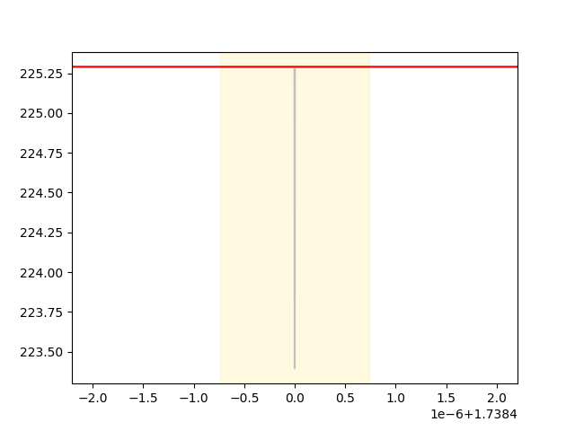
*U*
`5.8385137599999997 + 0.1522 * membrane__Vm`

*V for 1e-07 range* 
`-38.360800657030218 - -38.360799342969777`

*Singularity point: -38.360799999999998*


## New Eq:
((fabs(-1.7383999999999999 + membrane__Vm) < 7.3529411765034525e-7) ? (1 / (0.012029759779411764 / (-1.0 + exp(6.1030981280882353)) - 4.4117647058708463e-10 / (1.0 - exp(9.99999999998398e-8))) + (-1182111.4999988999 + 679999.99999936717 * membrane__Vm) * (1 / (0.012029760220588234 / (-1.0 + exp(6.1030983519117648)) + 4.4117647059020713e-10 / (1.0 - exp(-1.0000000000049032e-7))) - 1 / (0.012029759779411764 / (-1.0 + exp(6.1030981280882353)) - 4.4117647058708463e-10 / (1.0 - exp(9.99999999998398e-8))))) : ((fabs(38.360799999999998 + membrane__Vm) < 6.5703022339436146e-7) ? (1 / (-1.9710906701830842e-10 / (-1.0 + exp(-1.0000000000287557e-7)) - 0.024059520394218131 / (1.0 - exp(5.4534912893561103))) + (29192569.299818475 + 760999.99999526795 * membrane__Vm) * (1 / (1.9710906701830842e-10 / (-1.0 + exp(1.0000000000287557e-7)) - 0.024059519605781864 / (1.0 - exp(5.4534911106438893))) - 1 / (-1.9710906701830842e-10 / (-1.0 + exp(-1.0000000000287557e-7)) - 0.024059520394218131 / (1.0 - exp(5.4534912893561103))))) : (1 / (0.00029999999999999997 * (38.360799999999998 + membrane__Vm) / (-1.0 + exp(5.8385137599999997 + 0.1522 * membrane__Vm)) + 0.00059999999999999995 * (-1.7383999999999999 + membrane__Vm) / (1.0 - exp(0.2364224 - 0.13600000000000001 * membrane__Vm))))))

## Equation 2:
```
INaL_mL_gate__amL = 0.32000000000000001 * (47.130000000000003 + membrane__Vm) / (1.0 - 0.00897780373069724 * exp(-0.10000000000000001 * membrane__Vm))
```
### Partially evaluated to: 
```
INaL_mL_gate__amL = 0.32000000000000001 * (47.130000000000003 + membrane__Vm) / (1.0 - 0.00897780373069724 * exp(-0.10000000000000001 * membrane__Vm))
```
### Singulariy points detected:

{-47.130000000000003}
*U*
`-4.7130000000000001 - 0.10000000000000001 * membrane__Vm`

*V for 1e-07 range* 
`-47.130001 - -47.129999000000005`

*Singularity point: -47.130000000000003*


## New Eq:
((fabs(47.130000000000003 + membrane__Vm) < 1.0000000000287557e-6) ? (-3.200000000092018e-7 / (1.0 - exp(1.0000000000287557e-7)) + (23565000.499322373 + 499999.99998562218 * membrane__Vm) * (3.200000000092018e-7 / (1.0 - exp(1.0000000000287557e-7)) + 3.200000000092018e-7 / (1.0 - exp(-1.0000000000287557e-7)))) : (0.32000000000000001 * (47.130000000000003 + membrane__Vm) / (1.0 - exp(-4.7130000000000001 - 0.10000000000000001 * membrane__Vm))))

## Equation 3:
```
INa_m_gate__am = 0.32000000000000001 * (47.130000000000003 + membrane__Vm) / (1.0 - 0.00897780373069724 * exp(-0.10000000000000001 * membrane__Vm))
```
### Partially evaluated to: 
```
INa_m_gate__am = 0.32000000000000001 * (47.130000000000003 + membrane__Vm) / (1.0 - 0.00897780373069724 * exp(-0.10000000000000001 * membrane__Vm))
```
### Singulariy points detected:

{-47.130000000000003}
*U*
`-4.7130000000000001 - 0.10000000000000001 * membrane__Vm`

*V for 1e-07 range* 
`-47.130001 - -47.129999000000005`

*Singularity point: -47.130000000000003*

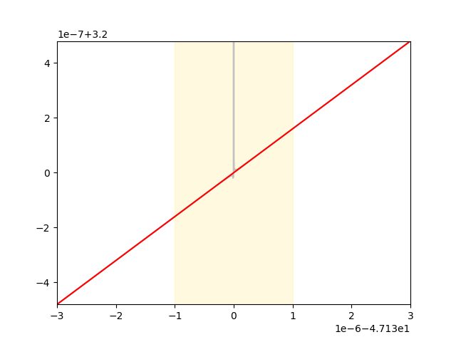
## New Eq:
((fabs(47.130000000000003 + membrane__Vm) < 1.0000000000287557e-6) ? (-3.200000000092018e-7 / (1.0 - exp(1.0000000000287557e-7)) + (23565000.499322373 + 499999.99998562218 * membrane__Vm) * (3.200000000092018e-7 / (1.0 - exp(1.0000000000287557e-7)) + 3.200000000092018e-7 / (1.0 - exp(-1.0000000000287557e-7)))) : (0.32000000000000001 * (47.130000000000003 + membrane__Vm) / (1.0 - exp(-4.7130000000000001 - 0.10000000000000001 * membrane__Vm))))

## Equation 4:
```
ICaL__ICaL_max = 4.0 * pow(model_parameters__F, 2) * (-ICaL__gamma_Cao * model_parameters__Ca_o + Ca__Ca_ss_CaL * ICaL__gamma_Cai * exp(2.0 * membrane__Vm * model_parameters__F / (model_parameters__R * model_parameters__T))) * ICaL__PCa * membrane__Vm / ((-1.0 + exp(2.0 * membrane__Vm * model_parameters__F / (model_parameters__R * model_parameters__T))) * model_parameters__R * model_parameters__T)
```
### Partially evaluated to: 
```
ICaL__ICaL_max = 2.2470468725164396 * (-0.61380000000000001 + 9.6154499999999996e-5 * exp(0.074873319003313496 * membrane__Vm)) * membrane__Vm / (-1.0 + exp(0.074873319003313496 * membrane__Vm))
```
### Singulariy points detected:

{0}
*U*
`0.074873319003313496 * membrane__Vm`

*V for 1e-07 range* 
`-1.3355892503653341e-6 - 1.3355892503653341e-6`

*Singularity point: 0*

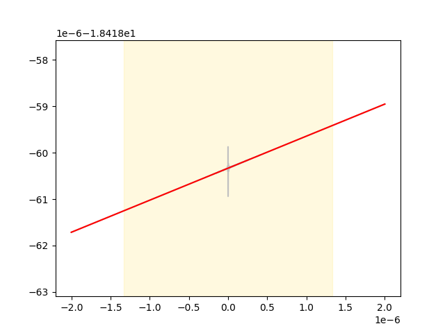
## New Eq:
((fabs(membrane__Vm) < 1.3355892503653341e-6) ? ((0.5 + 374366.5950165675 * membrane__Vm) * (3.001131648e-6 * (-0.61380000000000001 + 9.6154499999999996e-5 * exp(9.9999999999999995e-8)) / (-1.0 + exp(9.9999999999999995e-8)) + 3.001131648e-6 * (-0.61380000000000001 + 9.6154499999999996e-5 * exp(-9.9999999999999995e-8)) / (-1.0 + exp(-9.9999999999999995e-8))) - 3.001131648e-6 * (-0.61380000000000001 + 9.6154499999999996e-5 * exp(-9.9999999999999995e-8)) / (-1.0 + exp(-9.9999999999999995e-8))) : (4.0 * pow(model_parameters__F, 2) * (-ICaL__gamma_Cao * model_parameters__Ca_o + Ca__Ca_ss_CaL * ICaL__gamma_Cai * exp(2.0 * membrane__Vm * model_parameters__F / (model_parameters__R * model_parameters__T))) * ICaL__PCa * membrane__Vm / ((-1.0 + exp(2.0 * membrane__Vm * model_parameters__F / (model_parameters__R * model_parameters__T))) * model_parameters__R * model_parameters__T)))

## Equation 5:
```
ICab__ICab = 4.0 * pow(model_parameters__F, 2) * (-ICab__gamma_Ca_o * model_parameters__Ca_o + Ca__Ca_i * ICab__gamma_Ca_i * exp(2.0 * membrane__Vm * model_parameters__F / (model_parameters__R * model_parameters__T))) * ICab__PCab * membrane__Vm / ((-1.0 + exp(2.0 * membrane__Vm * model_parameters__F / (model_parameters__R * model_parameters__T))) * model_parameters__R * model_parameters__T)
```
### Partially evaluated to: 
```
ICab__ICab = 0.0028826178386108462 * (-0.61380000000000001 + 7.0994499999999999e-5 * exp(0.074873319003313496 * membrane__Vm)) * membrane__Vm / (-1.0 + exp(0.074873319003313496 * membrane__Vm))
```
### Singulariy points detected:

{0}
*U*
`0.074873319003313496 * membrane__Vm`

*V for 1e-07 range* 
`-1.3355892503653341e-6 - 1.3355892503653341e-6`

*Singularity point: 0*


## New Eq:
((fabs(membrane__Vm) < 1.3355892503653341e-6) ? ((0.5 + 374366.5950165675 * membrane__Vm) * (3.8499933981599997e-9 * (-0.61380000000000001 + 7.0994499999999999e-5 * exp(9.9999999999999995e-8)) / (-1.0 + exp(9.9999999999999995e-8)) + 3.8499933981599997e-9 * (-0.61380000000000001 + 7.0994499999999999e-5 * exp(-9.9999999999999995e-8)) / (-1.0 + exp(-9.9999999999999995e-8))) - 3.8499933981599997e-9 * (-0.61380000000000001 + 7.0994499999999999e-5 * exp(-9.9999999999999995e-8)) / (-1.0 + exp(-9.9999999999999995e-8))) : (4.0 * pow(model_parameters__F, 2) * (-ICab__gamma_Ca_o * model_parameters__Ca_o + Ca__Ca_i * ICab__gamma_Ca_i * exp(2.0 * membrane__Vm * model_parameters__F / (model_parameters__R * model_parameters__T))) * ICab__PCab * membrane__Vm / ((-1.0 + exp(2.0 * membrane__Vm * model_parameters__F / (model_parameters__R * model_parameters__T))) * model_parameters__R * model_parameters__T)))

## Equation 6:
```
Ito2__Ito2_max = pow(Ito2__zCl, 2) * pow(model_parameters__F, 2) * (-model_parameters__Cl_o * exp(membrane__Vm * model_parameters__F / (model_parameters__R * model_parameters__T)) + Cl__Cl_i) * Ito2__PCl * membrane__Vm / ((1.0 - exp(membrane__Vm * model_parameters__F / (model_parameters__R * model_parameters__T))) * model_parameters__R * model_parameters__T)
```
### Partially evaluated to: 
```
Ito2__Ito2_max = 0.0032509358688027189 * (20.268419999999999 - 100.0 * exp(0.037436659501656748 * membrane__Vm)) * membrane__Vm / (1.0 - exp(0.037436659501656748 * membrane__Vm))
```
### Singulariy points detected:

{0}
*U*
`0.037436659501656748 * membrane__Vm`

*V for 1e-07 range* 
`-2.6711785007306683e-6 - 2.6711785007306683e-6`

*Singularity point: 0*

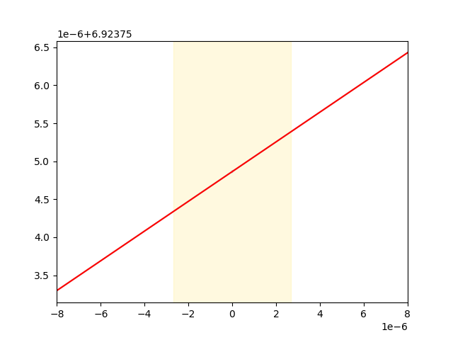
## New Eq:
((fabs(membrane__Vm) < 2.6711785007306683e-6) ? ((0.5 + 187183.29750828375 * membrane__Vm) * (8.683829999999999e-9 * (20.268419999999999 - 100.0 * exp(9.9999999999999995e-8)) / (1.0 - exp(9.9999999999999995e-8)) + 8.683829999999999e-9 * (20.268419999999999 - 100.0 * exp(-9.9999999999999995e-8)) / (1.0 - exp(-9.9999999999999995e-8))) - 8.683829999999999e-9 * (20.268419999999999 - 100.0 * exp(-9.9999999999999995e-8)) / (1.0 - exp(-9.9999999999999995e-8))) : (pow(Ito2__zCl, 2) * pow(model_parameters__F, 2) * (-model_parameters__Cl_o * exp(membrane__Vm * model_parameters__F / (model_parameters__R * model_parameters__T)) + Cl__Cl_i) * Ito2__PCl * membrane__Vm / ((1.0 - exp(membrane__Vm * model_parameters__F / (model_parameters__R * model_parameters__T))) * model_parameters__R * model_parameters__T)))

# Model: demir_model_1994
## Equation 1:
```
L_type_Ca_channel_d_gate__alpha_d_L = -28.390000000000001 * (35.0 + membrane__V) / (-1.0 + 8.3152871910356788e-7 * exp(-0.40000000000000002 * membrane__V)) - 84.900000000000006 * membrane__V / (-1.0 + exp(-0.20799999999999999 * membrane__V))
```
### Partially evaluated to: 
```
L_type_Ca_channel_d_gate__alpha_d_L = -28.390000000000001 * (35.0 + membrane__V) / (-1.0 + 8.3152871910356788e-7 * exp(-0.40000000000000002 * membrane__V)) - 84.900000000000006 * membrane__V / (-1.0 + exp(-0.20799999999999999 * membrane__V))
```
### Singulariy points detected:

{0, -35.000000000000000}
####A + B:

`84.900000000000006 * membrane__V / (1.0 - exp(-0.20799999999999999 * membrane__V))`
`-28.390000000000001 * (35.0 + membrane__V) / (-1.0 + 8.3152871910356788e-7 * exp(-0.40000000000000002 * membrane__V))`

*U*
`0.20799999999999999 * membrane__V`

*V for 1e-07 range* 
`-4.8076923076923074e-7 - 4.8076923076923074e-7`

*Singularity point: 0*


*U*
`-14.0 - 0.40000000000000002 * membrane__V`

*V for 1e-07 range* 
`-35.000000249999999 - -34.999999750000001`

*Singularity point: -35.000000000000000*


## New Eq:
((fabs(membrane__V) < 4.8076923076923074e-7) ? (4.0817307692307694e-5 / (-1.0 + exp(9.9999999999999995e-8)) - 993.64998635096151 / (-1.0 + exp(-13.999999807692308)) + (0.5 + 1040000.0 * membrane__V) * (993.64998635096151 / (-1.0 + exp(-13.999999807692308)) - 993.65001364903844 / (-1.0 + exp(-14.000000192307692)) - 4.0817307692307694e-5 / (-1.0 + exp(9.9999999999999995e-8)) - 4.0817307692307694e-5 / (-1.0 + exp(-9.9999999999999995e-8)))) : ((fabs(35.0 + membrane__V) < 2.5000000003494449e-7) ? (7.0974999994161125e-6 / (-1.0 + exp(9.9999999988997779e-8)) + 2971.5000212250002 / (-1.0 + exp(7.2800000519999992)) + (70000000.497987106 + 1999999.9999424887 * membrane__V) * (2971.4999787750003 / (-1.0 + exp(7.2799999479999995)) - 7.0974999994161125e-6 / (-1.0 + exp(9.9999999988997779e-8)) - 2971.5000212250002 / (-1.0 + exp(7.2800000519999992)) - 7.097500000992074e-6 / (-1.0 + exp(-1.0000000001675335e-7)))) : (-28.390000000000001 * (35.0 + membrane__V) / (-1.0 + exp(-14.0 - 0.40000000000000002 * membrane__V)) - 84.900000000000006 * membrane__V / (-1.0 + exp(-0.20799999999999999 * membrane__V)))))

## Equation 2:
```
L_type_Ca_channel_d_gate__beta_d_L = 11.43 * (-5.0 + membrane__V) / (-1.0 + 0.13533528323661267 * exp(0.40000000000000002 * membrane__V))
```
### Partially evaluated to: 
```
L_type_Ca_channel_d_gate__beta_d_L = 11.43 * (-5.0 + membrane__V) / (-1.0 + 0.13533528323661267 * exp(0.40000000000000002 * membrane__V))
```
### Singulariy points detected:

{5.0000000000000000}
*U*
`-2.0 + 0.40000000000000002 * membrane__V`

*V for 1e-07 range* 
`4.9999997499999997 - 5.0000002500000003`

*Singularity point: 5.0000000000000000*


## New Eq:
((fabs(-5.0 + membrane__V) < 2.5000000000025002e-7) ? (-2.8575000000028576e-6 / (-1.0 + exp(-9.9999999999406119e-8)) + (-9999999.4999899995 + 1999999.9999979998 * membrane__V) * (2.8575000000028576e-6 / (-1.0 + exp(9.9999999999406119e-8)) + 2.8575000000028576e-6 / (-1.0 + exp(-9.9999999999406119e-8)))) : (11.43 * (-5.0 + membrane__V) / (-1.0 + exp(-2.0 + 0.40000000000000002 * membrane__V))))

## Equation 3:
```
L_type_Ca_channel_f_gate__alpha_f_L = 3.75 * (28.0 + membrane__V) / (-1.0 + 1096.6331584284585 * exp(0.25 * membrane__V))
```
### Partially evaluated to: 
```
L_type_Ca_channel_f_gate__alpha_f_L = 3.75 * (28.0 + membrane__V) / (-1.0 + 1096.6331584284585 * exp(0.25 * membrane__V))
```
### Singulariy points detected:

{-28.000000000000000}
*U*
`7.0 + 0.25 * membrane__V`

*V for 1e-07 range* 
`-28.000000400000001 - -27.999999599999999`

*Singularity point: -28.000000000000000*


## New Eq:
((fabs(28.0 + membrane__V) < 4.0000000001150227e-7) ? (-1.5000000000431335e-6 / (-1.0 + exp(-1.0000000000287557e-7)) + (35000000.498993553 + 1249999.9999640554 * membrane__V) * (1.5000000000431335e-6 / (-1.0 + exp(1.0000000000287557e-7)) + 1.5000000000431335e-6 / (-1.0 + exp(-1.0000000000287557e-7)))) : (3.75 * (28.0 + membrane__V) / (-1.0 + exp(7.0 + 0.25 * membrane__V))))

## Equation 4:
```
sodium_current_m_gate__alpha_m = -824.0 * (51.899999999999999 + membrane__V) / (-1.0 + 0.0029337885398758403 * exp(-0.11235955056179775 * membrane__V))
```
### Partially evaluated to: 
```
sodium_current_m_gate__alpha_m = -824.0 * (51.899999999999999 + membrane__V) / (-1.0 + 0.0029337885398758403 * exp(-0.11235955056179775 * membrane__V))
```
### Singulariy points detected:

{-51.899999999999999}
*U*
`-5.8314606741573032 - 0.11235955056179775 * membrane__V`

*V for 1e-07 range* 
`-51.900000890000001 - -51.899999109999996`

*Singularity point: -51.899999999999999*


## New Eq:
((fabs(51.899999999999999 + membrane__V) < 8.8999999997563251e-7) ? (0.00073335999997992118 / (-1.0 + exp(1.0000000000287557e-7)) + (29157303.870675519 + 561797.75280685013 * membrane__V) * (-0.00073336000002566237 / (-1.0 + exp(-1.0000000000287557e-7)) - 0.00073335999997992118 / (-1.0 + exp(1.0000000000287557e-7)))) : (-824.0 * (51.899999999999999 + membrane__V) / (-1.0 + exp(-5.8314606741573032 - 0.11235955056179775 * membrane__V))))

## Equation 5:
```
sodium_current__i_Na = pow(membrane__F, 2) * pow(sodium_current_m_gate__m, 3) * (-1.0 + exp((-reversal_potentials__E_Na + membrane__V) * membrane__F / (membrane__R * membrane__T))) * cleft_space_equations__Na_c * membrane__V * sodium_current__P_Na * sodium_current_h_gate__h1 * sodium_current_h_gate__h2 / ((-1.0 + exp(membrane__F * membrane__V / (membrane__R * membrane__T))) * membrane__R * membrane__T)
```
### Partially evaluated to: 
```
sodium_current__i_Na = 7.7961374618353206e-5 * (-1.0 + 0.069297886839030043 * exp(0.037433890822745473 * membrane__V)) * membrane__V / (-1.0 + exp(0.037433890822745473 * membrane__V))
```
### Singulariy points detected:

{0}
*U*
`0.037433890822745473 * membrane__V`

*V for 1e-07 range* 
`-2.671376065969565e-6 - 2.671376065969565e-6`

*Singularity point: 0*


## New Eq:
((fabs(membrane__V) < 2.671376065969565e-6) ? ((0.5 + 187169.45411372738 * membrane__V) * (2.0826415022555589e-10 * (-1.0 + exp(-2.6693407661944883)) / (-1.0 + exp(9.9999999999999995e-8)) + 2.0826415022555589e-10 * (-1.0 + exp(-2.669340966194488)) / (-1.0 + exp(-9.9999999999999995e-8))) - 2.0826415022555589e-10 * (-1.0 + exp(-2.669340966194488)) / (-1.0 + exp(-9.9999999999999995e-8))) : (pow(membrane__F, 2) * pow(sodium_current_m_gate__m, 3) * (-1.0 + exp((-reversal_potentials__E_Na + membrane__V) * membrane__F / (membrane__R * membrane__T))) * cleft_space_equations__Na_c * membrane__V * sodium_current__P_Na * sodium_current_h_gate__h1 * sodium_current_h_gate__h2 / ((-1.0 + exp(membrane__F * membrane__V / (membrane__R * membrane__T))) * membrane__R * membrane__T)))

# Model: difrancesco_noble_model_1985
## Equation 1:
```
intracellular_calcium_concentration__alpha_p = 0.625 * (34.0 + membrane__V) / (-1.0 + 4914.7688402991344 * exp(0.25 * membrane__V))
```
### Partially evaluated to: 
```
intracellular_calcium_concentration__alpha_p = 0.625 * (34.0 + membrane__V) / (-1.0 + 4914.7688402991344 * exp(0.25 * membrane__V))
```
### Singulariy points detected:

{-34.000000000000000}
*U*
`8.5 + 0.25 * membrane__V`

*V for 1e-07 range* 
`-34.000000399999998 - -33.999999600000002`

*Singularity point: -34.000000000000000*


## New Eq:
((fabs(34.0 + membrane__V) < 4.0000000001150227e-7) ? (-2.5000000000718892e-7 / (-1.0 + exp(-1.0000000000287557e-7)) + (42500000.498777881 + 1249999.9999640554 * membrane__V) * (2.5000000000718892e-7 / (-1.0 + exp(1.0000000000287557e-7)) + 2.5000000000718892e-7 / (-1.0 + exp(-1.0000000000287557e-7)))) : (0.625 * (34.0 + membrane__V) / (-1.0 + exp(8.5 + 0.25 * membrane__V))))

## Equation 2:
```
second_inward_current__i_siCa = 4.0 * (-50.0 + membrane__V) * (intracellular_calcium_concentration__Cai * exp(100.0 / membrane__RTONF) - extracellular_calcium_concentration__Cao * exp(-2.0 * (-50.0 + membrane__V) / membrane__RTONF)) * second_inward_current__P_si * second_inward_current_d_gate__d * second_inward_current_f2_gate__f2 * second_inward_current_f_gate__f / ((1.0 - exp(-2.0 * (-50.0 + membrane__V) / membrane__RTONF)) * membrane__RTONF)
```
### Partially evaluated to: 
```
second_inward_current__i_siCa = 0.011230167246823642 * (0.002112045287840804 - 84.481811513632152 * exp(-0.074867781645490947 * membrane__V)) * (-50.0 + membrane__V) / (1.0 - 42.240905756816076 * exp(-0.074867781645490947 * membrane__V))
```
### Singulariy points detected:

{50.000000000000000}
*U*
`3.7433890822745473 - 0.074867781645490947 * membrane__V`

*V for 1e-07 range* 
`49.999998664311967 - 50.000001335688033`

*Singularity point: 50.000000000000000*


## New Eq:
((fabs(-50.0 + membrane__V) < 1.3356880329551402e-6) ? ((-18716944.911788113 + 374338.90823576227 * membrane__V) * (1.4999999999667111e-8 * (5.0000000000000002e-5 * exp(3.7433890822745473) - 2.0 * exp(9.9999999999406119e-8)) / (1.0 - exp(9.9999999999406119e-8)) + 1.4999999999667111e-8 * (5.0000000000000002e-5 * exp(3.7433890822745473) - 2.0 * exp(-9.9999999995936673e-8)) / (1.0 - exp(-9.9999999995936673e-8))) - 1.4999999999667111e-8 * (5.0000000000000002e-5 * exp(3.7433890822745473) - 2.0 * exp(9.9999999999406119e-8)) / (1.0 - exp(9.9999999999406119e-8))) : (4.0 * (-50.0 + membrane__V) * (intracellular_calcium_concentration__Cai * exp(100.0 / membrane__RTONF) - extracellular_calcium_concentration__Cao * exp(-2.0 * (-50.0 + membrane__V) / membrane__RTONF)) * second_inward_current__P_si * second_inward_current_d_gate__d * second_inward_current_f2_gate__f2 * second_inward_current_f_gate__f / ((1.0 - exp(-2.0 * (-50.0 + membrane__V) / membrane__RTONF)) * membrane__RTONF)))

## Equation 3:
```
second_inward_current__i_siK = 0.01 * (-50.0 + membrane__V) * (intracellular_potassium_concentration__Ki * exp(50.0 / membrane__RTONF) - extracellular_potassium_concentration__Kc * exp(-(-50.0 + membrane__V) / membrane__RTONF)) * second_inward_current__P_si * second_inward_current_d_gate__d * second_inward_current_f2_gate__f2 * second_inward_current_f_gate__f / ((1.0 - exp(-(-50.0 + membrane__V) / membrane__RTONF)) * membrane__RTONF)
```
### Partially evaluated to: 
```
second_inward_current__i_siK = 2.8075418117059104e-5 * (909.90205672566492 - 25.997201620733282 * exp(-0.037433890822745473 * membrane__V)) * (-50.0 + membrane__V) / (1.0 - 6.4993004051833205 * exp(-0.037433890822745473 * membrane__V))
```
### Singulariy points detected:

{50.000000000000000}
*U*
`1.8716945411372736 - 0.037433890822745473 * membrane__V`

*V for 1e-07 range* 
`49.999997328623934 - 50.000002671376066`

*Singularity point: 50.000000000000000*


## New Eq:
((fabs(-50.0 + membrane__V) < 2.6713760659657915e-6) ? ((-9358472.2056995872 + 187169.45411399176 * membrane__V) * (7.4999999999894056e-11 * (140.0 * exp(1.8716945411372736) - 4.0 * exp(9.9999999999406119e-8)) / (1.0 - exp(9.9999999999406119e-8)) + 7.4999999999894056e-11 * (140.0 * exp(1.8716945411372736) - 4.0 * exp(-9.9999999999406119e-8)) / (1.0 - exp(-9.9999999999406119e-8))) - 7.4999999999894056e-11 * (140.0 * exp(1.8716945411372736) - 4.0 * exp(9.9999999999406119e-8)) / (1.0 - exp(9.9999999999406119e-8))) : (0.01 * (-50.0 + membrane__V) * (intracellular_potassium_concentration__Ki * exp(50.0 / membrane__RTONF) - extracellular_potassium_concentration__Kc * exp(-(-50.0 + membrane__V) / membrane__RTONF)) * second_inward_current__P_si * second_inward_current_d_gate__d * second_inward_current_f2_gate__f2 * second_inward_current_f_gate__f / ((1.0 - exp(-(-50.0 + membrane__V) / membrane__RTONF)) * membrane__RTONF)))

## Equation 4:
```
second_inward_current__i_siNa = 0.01 * (-50.0 + membrane__V) * (intracellular_sodium_concentration__Nai * exp(50.0 / membrane__RTONF) - extracellular_sodium_concentration__Nao * exp(-(-50.0 + membrane__V) / membrane__RTONF)) * second_inward_current__P_si * second_inward_current_d_gate__d * second_inward_current_f2_gate__f2 * second_inward_current_f_gate__f / ((1.0 - exp(-(-50.0 + membrane__V) / membrane__RTONF)) * membrane__RTONF)
```
### Partially evaluated to: 
```
second_inward_current__i_siNa = 2.8075418117059104e-5 * (51.994403241466564 - 909.90205672566492 * exp(-0.037433890822745473 * membrane__V)) * (-50.0 + membrane__V) / (1.0 - 6.4993004051833205 * exp(-0.037433890822745473 * membrane__V))
```
### Singulariy points detected:

{50.000000000000000}
*U*
`1.8716945411372736 - 0.037433890822745473 * membrane__V`

*V for 1e-07 range* 
`49.999997328623934 - 50.000002671376066`

*Singularity point: 50.000000000000000*


## New Eq:
((fabs(-50.0 + membrane__V) < 2.6713760659657915e-6) ? ((-9358472.2056995872 + 187169.45411399176 * membrane__V) * (7.4999999999894056e-11 * (8.0 * exp(1.8716945411372736) - 140.0 * exp(9.9999999999406119e-8)) / (1.0 - exp(9.9999999999406119e-8)) + 7.4999999999894056e-11 * (8.0 * exp(1.8716945411372736) - 140.0 * exp(-9.9999999999406119e-8)) / (1.0 - exp(-9.9999999999406119e-8))) - 7.4999999999894056e-11 * (8.0 * exp(1.8716945411372736) - 140.0 * exp(9.9999999999406119e-8)) / (1.0 - exp(9.9999999999406119e-8))) : (0.01 * (-50.0 + membrane__V) * (intracellular_sodium_concentration__Nai * exp(50.0 / membrane__RTONF) - extracellular_sodium_concentration__Nao * exp(-(-50.0 + membrane__V) / membrane__RTONF)) * second_inward_current__P_si * second_inward_current_d_gate__d * second_inward_current_f2_gate__f2 * second_inward_current_f_gate__f / ((1.0 - exp(-(-50.0 + membrane__V) / membrane__RTONF)) * membrane__RTONF)))

## Equation 5:
```
transient_outward_current__i_to = (10.0 + membrane__V) * (0.20000000000000001 + extracellular_potassium_concentration__Kc / (extracellular_potassium_concentration__Kc + transient_outward_current__Km_to)) * (intracellular_potassium_concentration__Ki * exp(0.5 * membrane__V / membrane__RTONF) - extracellular_potassium_concentration__Kc * exp(-0.5 * membrane__V / membrane__RTONF)) * intracellular_calcium_concentration__Cai * transient_outward_current__g_to * transient_outward_current_s_gate__s / ((1.0 - 0.13533528323661267 * exp(-0.20000000000000001 * membrane__V)) * (intracellular_calcium_concentration__Cai + transient_outward_current__Km_Ca))
```
### Partially evaluated to: 
```
transient_outward_current__i_to = 0.012363636363636365 * (10.0 + membrane__V) * (140.0 * exp(0.018716945411372737 * membrane__V) - 4.0 * exp(-0.018716945411372737 * membrane__V)) / (1.0 - 0.13533528323661267 * exp(-0.20000000000000001 * membrane__V))
```
### Singulariy points detected:

{-10.000000000000000}
*U*
`-2.0 - 0.20000000000000001 * membrane__V`

*V for 1e-07 range* 
`-10.000000500000001 - -9.9999994999999995`

*Singularity point: -10.000000000000000*


## New Eq:
((fabs(10.0 + membrane__V) < 5.0000000000050004e-7) ? ((10000000.499989999 + 999999.99999899988 * membrane__V) * (6.1818181818243649e-9 * (140.0 * exp(-0.18716946347220006) - 4.0 * exp(0.18716946347220006)) / (1.0 - exp(9.9999999999406119e-8)) + 6.1818181818243649e-9 * (140.0 * exp(-0.18716944475525465) - 4.0 * exp(0.18716944475525465)) / (1.0 - exp(-9.9999999999406119e-8))) - 6.1818181818243649e-9 * (140.0 * exp(-0.18716946347220006) - 4.0 * exp(0.18716946347220006)) / (1.0 - exp(9.9999999999406119e-8))) : ((10.0 + membrane__V) * (0.20000000000000001 + extracellular_potassium_concentration__Kc / (extracellular_potassium_concentration__Kc + transient_outward_current__Km_to)) * (intracellular_potassium_concentration__Ki * exp(0.5 * membrane__V / membrane__RTONF) - extracellular_potassium_concentration__Kc * exp(-0.5 * membrane__V / membrane__RTONF)) * intracellular_calcium_concentration__Cai * transient_outward_current__g_to * transient_outward_current_s_gate__s / ((1.0 - exp(-2.0 - 0.20000000000000001 * membrane__V)) * (intracellular_calcium_concentration__Cai + transient_outward_current__Km_Ca))))

# Model: dokos_model_1996
## Equation 1:
```
fast_sodium_current_m_gate__alpha_m = 200.0 * (34.299999999999997 + membrane__E) / (1.0 - 0.045638665231542724 * exp(-0.089999999999999997 * membrane__E))
```
### Partially evaluated to: 
```
fast_sodium_current_m_gate__alpha_m = 200.0 * (34.299999999999997 + membrane__E) / (1.0 - 0.045638665231542724 * exp(-0.089999999999999997 * membrane__E))
```
### Singulariy points detected:

{-34.299999999999997}
*U*
`-3.0869999999999997 - 0.089999999999999997 * membrane__E`

*V for 1e-07 range* 
`-34.300001111111108 - -34.299998888888886`

*Singularity point: -34.299999999999997*


## New Eq:
((fabs(34.299999999999997 + membrane__E) < 1.1111111111183902e-6) ? (-0.00022222222222367805 / (1.0 - exp(9.9999999999406119e-8)) + (15435000.499898881 + 449999.99999705196 * membrane__E) * (0.00022222222222367805 / (1.0 - exp(9.9999999999406119e-8)) + 0.00022222222222367805 / (1.0 - exp(-9.9999999999406119e-8)))) : (200.0 * (34.299999999999997 + membrane__E) / (1.0 - exp(-3.0869999999999997 - 0.089999999999999997 * membrane__E))))

## Equation 2:
```
hyperpolarising_activated_current_y_gate__alpha_y = 0.35999999999999999 * (137.80000000000001 + membrane__E) / (-1.0 + 8908.846047390005 * exp(0.066000000000000003 * membrane__E))
```
### Partially evaluated to: 
```
hyperpolarising_activated_current_y_gate__alpha_y = 0.35999999999999999 * (137.80000000000001 + membrane__E) / (-1.0 + 8908.846047390005 * exp(0.066000000000000003 * membrane__E))
```
### Singulariy points detected:

{-137.80000000000001}
*U*
`9.0948000000000011 + 0.066000000000000003 * membrane__E`

*V for 1e-07 range* 
`-137.80000151515154 - -137.79999848484849`

*Singularity point: -137.80000000000001*


## New Eq:
((fabs(137.80000000000001 + membrane__E) < 1.5151515151412553e-6) ? (-5.4545454545085189e-7 / (-1.0 + exp(-1.0000000000287557e-7)) + (45474000.500307932 + 330000.00000223459 * membrane__E) * (5.4545454545085189e-7 / (-1.0 + exp(9.9999999988997779e-8)) + 5.4545454545085189e-7 / (-1.0 + exp(-1.0000000000287557e-7)))) : (0.35999999999999999 * (137.80000000000001 + membrane__E) / (-1.0 + exp(9.0948000000000011 + 0.066000000000000003 * membrane__E))))

## Equation 3:
```
hyperpolarising_activated_current_y_gate__beta_y = 0.10000000000000001 * (76.299999999999997 + membrane__E) / (1.0 - 1.0997640435800299e-7 * exp(-0.20999999999999999 * membrane__E))
```
### Partially evaluated to: 
```
hyperpolarising_activated_current_y_gate__beta_y = 0.10000000000000001 * (76.299999999999997 + membrane__E) / (1.0 - 1.0997640435800299e-7 * exp(-0.20999999999999999 * membrane__E))
```
### Singulariy points detected:

{-76.299999999999997}
*U*
`-16.023 - 0.20999999999999999 * membrane__E`

*V for 1e-07 range* 
`-76.300000476190476 - -76.299999523809518`

*Singularity point: -76.299999999999997*


## New Eq:
((fabs(76.299999999999997 + membrane__E) < 4.7619047616187515e-7) ? (-4.7619047616187521e-8 / (1.0 - exp(1.0000000000287557e-7)) + (80115000.495472595 + 1049999.9999406631 * membrane__E) * (4.7619047627289747e-8 / (1.0 - exp(-1.0000000000287557e-7)) + 4.7619047616187521e-8 / (1.0 - exp(1.0000000000287557e-7)))) : (0.10000000000000001 * (76.299999999999997 + membrane__E) / (1.0 - exp(-16.023 - 0.20999999999999999 * membrane__E))))

# Model: earm_noble_model_1990
## Equation 1:
```
L_type_calcium_current__i_Ca_L_Ca = 4.0 * (-50.0 + membrane__V) * (intracellular_calcium_concentration__Ca_i * exp(100.0 / membrane__RTONF) - extracellular_calcium_concentration__Ca_o * exp(2.0 * (50.0 - membrane__V) / membrane__RTONF)) * L_type_calcium_current__P_Ca_L * L_type_calcium_current_d_gate__d * L_type_calcium_current_f_Ca_gate__CaChon / ((1.0 - exp(2.0 * (50.0 - membrane__V) / membrane__RTONF)) * membrane__RTONF)
```
### Partially evaluated to: 
```
L_type_calcium_current__i_Ca_L_Ca = 1.753092114768179e-6 * (0.0004224090575681608 - 84.481811513632152 * exp(-0.074867781645490947 * membrane__V)) * (-50.0 + membrane__V) / (1.0 - 42.240905756816076 * exp(-0.074867781645490947 * membrane__V))
```
### Singulariy points detected:

{50.000000000000000}
*U*
`3.7433890822745473 - 0.074867781645490947 * membrane__V`

*V for 1e-07 range* 
`49.999998664311967 - 50.000001335688033`

*Singularity point: 50.000000000000000*


## New Eq:
((fabs(-50.0 + membrane__V) < 1.3356880329551402e-6) ? ((-18716944.911788113 + 374338.90823576227 * membrane__V) * (2.3415841583638758e-12 * (1.0000000000000001e-5 * exp(3.7433890822745473) - 2.0 * exp(9.9999999999406119e-8)) / (1.0 - exp(9.9999999999406119e-8)) + 2.3415841583638758e-12 * (1.0000000000000001e-5 * exp(3.7433890822745473) - 2.0 * exp(-9.9999999995936673e-8)) / (1.0 - exp(-9.9999999995936673e-8))) - 2.3415841583638758e-12 * (1.0000000000000001e-5 * exp(3.7433890822745473) - 2.0 * exp(9.9999999999406119e-8)) / (1.0 - exp(9.9999999999406119e-8))) : (4.0 * (-50.0 + membrane__V) * (intracellular_calcium_concentration__Ca_i * exp(100.0 / membrane__RTONF) - extracellular_calcium_concentration__Ca_o * exp(2.0 * (50.0 - membrane__V) / membrane__RTONF)) * L_type_calcium_current__P_Ca_L * L_type_calcium_current_d_gate__d * L_type_calcium_current_f_Ca_gate__CaChon / ((1.0 - exp(2.0 * (50.0 - membrane__V) / membrane__RTONF)) * membrane__RTONF)))

## Equation 2:
```
L_type_calcium_current__i_Ca_L_K = 0.002 * (-50.0 + membrane__V) * (intracellular_potassium_concentration__K_i * exp(50.0 / membrane__RTONF) - extracellular_potassium_concentration__K_c * exp((50.0 - membrane__V) / membrane__RTONF)) * L_type_calcium_current__P_Ca_L * L_type_calcium_current_d_gate__d * L_type_calcium_current_f_Ca_gate__CaChon / ((1.0 - exp((50.0 - membrane__V) / membrane__RTONF)) * membrane__RTONF)
```
### Partially evaluated to: 
```
L_type_calcium_current__i_Ca_L_K = 8.7654605738408946e-10 * (909.90205672566492 - 25.997201620733282 * exp(-0.037433890822745473 * membrane__V)) * (-50.0 + membrane__V) / (1.0 - 6.4993004051833205 * exp(-0.037433890822745473 * membrane__V))
```
### Singulariy points detected:

{50.000000000000000}
*U*
`1.8716945411372736 - 0.037433890822745473 * membrane__V`

*V for 1e-07 range* 
`49.999997328623934 - 50.000002671376066`

*Singularity point: 50.000000000000000*


## New Eq:
((fabs(-50.0 + membrane__V) < 2.6713760659657915e-6) ? ((-9358472.2056995872 + 187169.45411399176 * membrane__V) * (2.3415841584125339e-15 * (140.0 * exp(1.8716945411372736) - 4.0 * exp(9.9999999999406119e-8)) / (1.0 - exp(9.9999999999406119e-8)) + 2.3415841584125339e-15 * (140.0 * exp(1.8716945411372736) - 4.0 * exp(-9.9999999999406119e-8)) / (1.0 - exp(-9.9999999999406119e-8))) - 2.3415841584125339e-15 * (140.0 * exp(1.8716945411372736) - 4.0 * exp(9.9999999999406119e-8)) / (1.0 - exp(9.9999999999406119e-8))) : (0.002 * (-50.0 + membrane__V) * (intracellular_potassium_concentration__K_i * exp(50.0 / membrane__RTONF) - extracellular_potassium_concentration__K_c * exp((50.0 - membrane__V) / membrane__RTONF)) * L_type_calcium_current__P_Ca_L * L_type_calcium_current_d_gate__d * L_type_calcium_current_f_Ca_gate__CaChon / ((1.0 - exp((50.0 - membrane__V) / membrane__RTONF)) * membrane__RTONF)))

## Equation 3:
```
L_type_calcium_current__i_Ca_L_Na = 0.01 * (-50.0 + membrane__V) * (intracellular_sodium_concentration__Na_i * exp(50.0 / membrane__RTONF) - extracellular_sodium_concentration__Na_o * exp((50.0 - membrane__V) / membrane__RTONF)) * L_type_calcium_current__P_Ca_L * L_type_calcium_current_d_gate__d * L_type_calcium_current_f_Ca_gate__CaChon / ((1.0 - exp((50.0 - membrane__V) / membrane__RTONF)) * membrane__RTONF)
```
### Partially evaluated to: 
```
L_type_calcium_current__i_Ca_L_Na = 4.3827302869204476e-9 * (42.115466625587921 - 909.90205672566492 * exp(-0.037433890822745473 * membrane__V)) * (-50.0 + membrane__V) / (1.0 - 6.4993004051833205 * exp(-0.037433890822745473 * membrane__V))
```
### Singulariy points detected:

{50.000000000000000}
*U*
`1.8716945411372736 - 0.037433890822745473 * membrane__V`

*V for 1e-07 range* 
`49.999997328623934 - 50.000002671376066`

*Singularity point: 50.000000000000000*


## New Eq:
((fabs(-50.0 + membrane__V) < 2.6713760659657915e-6) ? ((-9358472.2056995872 + 187169.45411399176 * membrane__V) * (1.170792079206267e-14 * (6.4800000000000004 * exp(1.8716945411372736) - 140.0 * exp(9.9999999999406119e-8)) / (1.0 - exp(9.9999999999406119e-8)) + 1.170792079206267e-14 * (6.4800000000000004 * exp(1.8716945411372736) - 140.0 * exp(-9.9999999999406119e-8)) / (1.0 - exp(-9.9999999999406119e-8))) - 1.170792079206267e-14 * (6.4800000000000004 * exp(1.8716945411372736) - 140.0 * exp(9.9999999999406119e-8)) / (1.0 - exp(9.9999999999406119e-8))) : (0.01 * (-50.0 + membrane__V) * (intracellular_sodium_concentration__Na_i * exp(50.0 / membrane__RTONF) - extracellular_sodium_concentration__Na_o * exp((50.0 - membrane__V) / membrane__RTONF)) * L_type_calcium_current__P_Ca_L * L_type_calcium_current_d_gate__d * L_type_calcium_current_f_Ca_gate__CaChon / ((1.0 - exp((50.0 - membrane__V) / membrane__RTONF)) * membrane__RTONF)))

# Model: espinosa_model_1998_normal
## Equation 1:
```
L_type_Ca_channel__i_Ca_L_Ca_cyt = 4.0 * (1.0 - L_type_Ca_channel__FrICa) * (-50.0 + membrane__V) * (intracellular_calcium_concentration__Ca_i * exp(100.0 * membrane__F / (membrane__R * membrane__T)) - extracellular_calcium_concentration__Ca_o * exp(2.0 * (50.0 - membrane__V) * membrane__F / (membrane__R * membrane__T))) * L_type_Ca_channel__P_Ca_L * L_type_Ca_channel_d_gate__d * L_type_Ca_channel_f2_gate__f2 * L_type_Ca_channel_f_gate__f * membrane__F / ((1.0 - exp(2.0 * (50.0 - membrane__V) * membrane__F / (membrane__R * membrane__T))) * membrane__R * membrane__T)
```
### Partially evaluated to: 
```
L_type_Ca_channel__i_Ca_L_Ca_cyt = -8.9313468018079464e-17 * (0.0029945972040896895 - 105.6022643920402 * exp(-0.074867781645490947 * membrane__V)) * (-50.0 + membrane__V) / (1.0 - 42.240905756816076 * exp(-0.074867781645490947 * membrane__V))
```
### Singulariy points detected:

{50.000000000000000}
*U*
`3.7433890822745473 - 0.074867781645490947 * membrane__V`

*V for 1e-07 range* 
`49.999998664311967 - 50.000001335688033`

*Singularity point: 50.000000000000000*

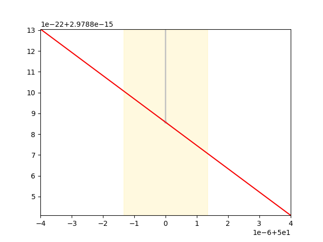
## New Eq:
((fabs(-50.0 + membrane__V) < 1.3356880329551402e-6) ? ((-18716944.911788113 + 374338.90823576227 * membrane__V) * (-1.1929493041347037e-22 * (7.0893300000000008e-5 * exp(3.7433890822745473) - 2.5 * exp(9.9999999999406119e-8)) / (1.0 - exp(9.9999999999406119e-8)) - 1.1929493041347037e-22 * (7.0893300000000008e-5 * exp(3.7433890822745473) - 2.5 * exp(-9.9999999999406119e-8)) / (1.0 - exp(-9.9999999999406119e-8))) + 1.1929493041347037e-22 * (7.0893300000000008e-5 * exp(3.7433890822745473) - 2.5 * exp(9.9999999999406119e-8)) / (1.0 - exp(9.9999999999406119e-8))) : (4.0 * (1.0 - L_type_Ca_channel__FrICa) * (-50.0 + membrane__V) * (intracellular_calcium_concentration__Ca_i * exp(100.0 * membrane__F / (membrane__R * membrane__T)) - extracellular_calcium_concentration__Ca_o * exp(2.0 * (50.0 - membrane__V) * membrane__F / (membrane__R * membrane__T))) * L_type_Ca_channel__P_Ca_L * L_type_Ca_channel_d_gate__d * L_type_Ca_channel_f2_gate__f2 * L_type_Ca_channel_f_gate__f * membrane__F / ((1.0 - exp(2.0 * (50.0 - membrane__V) * membrane__F / (membrane__R * membrane__T))) * membrane__R * membrane__T)))

## Equation 2:
```
L_type_Ca_channel__i_Ca_L_Ca_ds = 4.0 * (-50.0 + membrane__V) * (intracellular_calcium_concentration__Ca_i * exp(100.0 * membrane__F / (membrane__R * membrane__T)) - extracellular_calcium_concentration__Ca_o * exp(2.0 * (50.0 - membrane__V) * membrane__F / (membrane__R * membrane__T))) * L_type_Ca_channel__FrICa * L_type_Ca_channel__P_Ca_L * L_type_Ca_channel_d_gate__d * L_type_Ca_channel_f2ds_gate__f2ds * L_type_Ca_channel_f_gate__f * membrane__F / ((1.0 - exp(2.0 * (50.0 - membrane__V) * membrane__F / (membrane__R * membrane__T))) * membrane__R * membrane__T)
```
### Partially evaluated to: 
```
L_type_Ca_channel__i_Ca_L_Ca_ds = 1.2097697357220065e-14 * (0.0029903731135140078 - 105.6022643920402 * exp(-0.074867781645490947 * membrane__V)) * (-50.0 + membrane__V) / (1.0 - 42.240905756816076 * exp(-0.074867781645490947 * membrane__V))
```
### Singulariy points detected:

{50.000000000000000}
*U*
`3.7433890822745473 - 0.074867781645490947 * membrane__V`

*V for 1e-07 range* 
`49.999998664311967 - 50.000001335688033`

*Singularity point: 50.000000000000000*

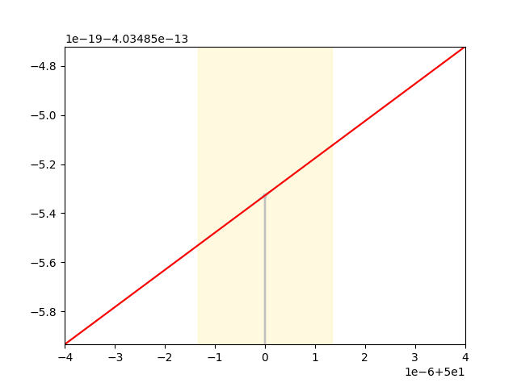
## New Eq:
((fabs(-50.0 + membrane__V) < 1.3356880329551402e-6) ? ((-18716944.911788113 + 374338.90823576227 * membrane__V) * (1.6158749586351868e-20 * (7.0793300000000005e-5 * exp(3.7433890822745473) - 2.5 * exp(9.9999999999406119e-8)) / (1.0 - exp(9.9999999999406119e-8)) + 1.6158749586351868e-20 * (7.0793300000000005e-5 * exp(3.7433890822745473) - 2.5 * exp(-9.9999999999406119e-8)) / (1.0 - exp(-9.9999999999406119e-8))) - 1.6158749586351868e-20 * (7.0793300000000005e-5 * exp(3.7433890822745473) - 2.5 * exp(9.9999999999406119e-8)) / (1.0 - exp(9.9999999999406119e-8))) : (4.0 * (-50.0 + membrane__V) * (intracellular_calcium_concentration__Ca_i * exp(100.0 * membrane__F / (membrane__R * membrane__T)) - extracellular_calcium_concentration__Ca_o * exp(2.0 * (50.0 - membrane__V) * membrane__F / (membrane__R * membrane__T))) * L_type_Ca_channel__FrICa * L_type_Ca_channel__P_Ca_L * L_type_Ca_channel_d_gate__d * L_type_Ca_channel_f2ds_gate__f2ds * L_type_Ca_channel_f_gate__f * membrane__F / ((1.0 - exp(2.0 * (50.0 - membrane__V) * membrane__F / (membrane__R * membrane__T))) * membrane__R * membrane__T)))

## Equation 3:
```
L_type_Ca_channel__i_Ca_L_K_cyt = (1.0 - L_type_Ca_channel__FrICa) * (-50.0 + membrane__V) * (intracellular_potassium_concentration__K_i * exp(50.0 * membrane__F / (membrane__R * membrane__T)) - extracellular_potassium_concentration__K_o * exp((50.0 - membrane__V) * membrane__F / (membrane__R * membrane__T))) * L_type_Ca_channel__P_CaK * L_type_Ca_channel__P_Ca_L * L_type_Ca_channel_d_gate__d * L_type_Ca_channel_f2_gate__f2 * L_type_Ca_channel_f_gate__f * membrane__F / ((1.0 - exp((50.0 - membrane__V) * membrane__F / (membrane__R * membrane__T))) * membrane__R * membrane__T)
```
### Partially evaluated to: 
```
L_type_Ca_channel__i_Ca_L_K_cyt = -6.6985101013559591e-20 * (910.76841411960584 - 34.57694693358696 * exp(-0.037433890822745473 * membrane__V)) * (-50.0 + membrane__V) / (1.0 - 6.4993004051833205 * exp(-0.037433890822745473 * membrane__V))
```
### Singulariy points detected:

{50.000000000000000}
*U*
`1.8716945411372736 - 0.037433890822745473 * membrane__V`

*V for 1e-07 range* 
`49.999997328623934 - 50.000002671376066`

*Singularity point: 50.000000000000000*

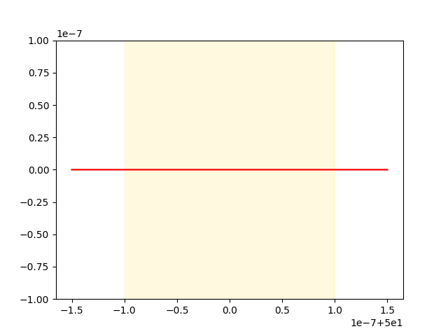
## New Eq:
((fabs(-50.0 + membrane__V) < 2.6713760659657915e-6) ? ((-9358472.2056995872 + 187169.45411399176 * membrane__V) * (-1.7894239562392399e-25 * (140.13330009999999 * exp(1.8716945411372736) - 5.3201029000000002 * exp(9.9999999999406119e-8)) / (1.0 - exp(9.9999999999406119e-8)) - 1.7894239562392399e-25 * (140.13330009999999 * exp(1.8716945411372736) - 5.3201029000000002 * exp(-9.9999999999406119e-8)) / (1.0 - exp(-9.9999999999406119e-8))) + 1.7894239562392399e-25 * (140.13330009999999 * exp(1.8716945411372736) - 5.3201029000000002 * exp(9.9999999999406119e-8)) / (1.0 - exp(9.9999999999406119e-8))) : ((1.0 - L_type_Ca_channel__FrICa) * (-50.0 + membrane__V) * (intracellular_potassium_concentration__K_i * exp(50.0 * membrane__F / (membrane__R * membrane__T)) - extracellular_potassium_concentration__K_o * exp((50.0 - membrane__V) * membrane__F / (membrane__R * membrane__T))) * L_type_Ca_channel__P_CaK * L_type_Ca_channel__P_Ca_L * L_type_Ca_channel_d_gate__d * L_type_Ca_channel_f2_gate__f2 * L_type_Ca_channel_f_gate__f * membrane__F / ((1.0 - exp((50.0 - membrane__V) * membrane__F / (membrane__R * membrane__T))) * membrane__R * membrane__T)))

## Equation 4:
```
L_type_Ca_channel__i_Ca_L_K_ds = (-50.0 + membrane__V) * (intracellular_potassium_concentration__K_i * exp(50.0 * membrane__F / (membrane__R * membrane__T)) - extracellular_potassium_concentration__K_o * exp((50.0 - membrane__V) * membrane__F / (membrane__R * membrane__T))) * L_type_Ca_channel__FrICa * L_type_Ca_channel__P_CaK * L_type_Ca_channel__P_Ca_L * L_type_Ca_channel_d_gate__d * L_type_Ca_channel_f2ds_gate__f2ds * L_type_Ca_channel_f_gate__f * membrane__F / ((1.0 - exp((50.0 - membrane__V) * membrane__F / (membrane__R * membrane__T))) * membrane__R * membrane__T)
```
### Partially evaluated to: 
```
L_type_Ca_channel__i_Ca_L_K_ds = 9.0732730179150498e-18 * (910.76841346967581 - 34.576946283656916 * exp(-0.037433890822745473 * membrane__V)) * (-50.0 + membrane__V) / (1.0 - 6.4993004051833205 * exp(-0.037433890822745473 * membrane__V))
```
### Singulariy points detected:

{50.000000000000000}
*U*
`1.8716945411372736 - 0.037433890822745473 * membrane__V`

*V for 1e-07 range* 
`49.999997328623934 - 50.000002671376066`

*Singularity point: 50.000000000000000*

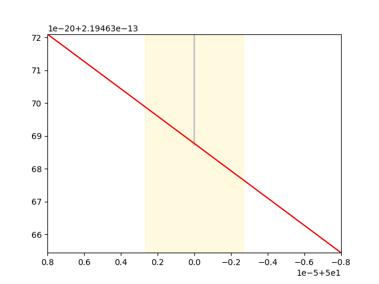
## New Eq:
((fabs(-50.0 + membrane__V) < 2.6713760659657915e-6) ? ((-9358472.2056995872 + 187169.45411399176 * membrane__V) * (2.4238124380031468e-23 * (140.13329999999999 * exp(1.8716945411372736) - 5.3201027999999999 * exp(9.9999999999406119e-8)) / (1.0 - exp(9.9999999999406119e-8)) + 2.4238124380031468e-23 * (140.13329999999999 * exp(1.8716945411372736) - 5.3201027999999999 * exp(-9.9999999999406119e-8)) / (1.0 - exp(-9.9999999999406119e-8))) - 2.4238124380031468e-23 * (140.13329999999999 * exp(1.8716945411372736) - 5.3201027999999999 * exp(9.9999999999406119e-8)) / (1.0 - exp(9.9999999999406119e-8))) : ((-50.0 + membrane__V) * (intracellular_potassium_concentration__K_i * exp(50.0 * membrane__F / (membrane__R * membrane__T)) - extracellular_potassium_concentration__K_o * exp((50.0 - membrane__V) * membrane__F / (membrane__R * membrane__T))) * L_type_Ca_channel__FrICa * L_type_Ca_channel__P_CaK * L_type_Ca_channel__P_Ca_L * L_type_Ca_channel_d_gate__d * L_type_Ca_channel_f2ds_gate__f2ds * L_type_Ca_channel_f_gate__f * membrane__F / ((1.0 - exp((50.0 - membrane__V) * membrane__F / (membrane__R * membrane__T))) * membrane__R * membrane__T)))

## Equation 5:
```
L_type_Ca_channel__i_Ca_L_Na_cyt = (1.0 - L_type_Ca_channel__FrICa) * (-50.0 + membrane__V) * (intracellular_sodium_concentration__Na_i * exp(50.0 * membrane__F / (membrane__R * membrane__T)) - extracellular_sodium_concentration__Na_o * exp((50.0 - membrane__V) * membrane__F / (membrane__R * membrane__T))) * L_type_Ca_channel__P_CaNa * L_type_Ca_channel__P_Ca_L * L_type_Ca_channel_d_gate__d * L_type_Ca_channel_f2_gate__f2 * L_type_Ca_channel_f_gate__f * membrane__F / ((1.0 - exp((50.0 - membrane__V) * membrane__F / (membrane__R * membrane__T))) * membrane__R * membrane__T)
```
### Partially evaluated to: 
```
L_type_Ca_channel__i_Ca_L_Na_cyt = -2.2328367004519866e-19 * (44.42271891935804 - 965.1461101697231 * exp(-0.037433890822745473 * membrane__V)) * (-50.0 + membrane__V) / (1.0 - 6.4993004051833205 * exp(-0.037433890822745473 * membrane__V))
```
### Singulariy points detected:

{50.000000000000000}
*U*
`1.8716945411372736 - 0.037433890822745473 * membrane__V`

*V for 1e-07 range* 
`49.999997328623934 - 50.000002671376066`

*Singularity point: 50.000000000000000*

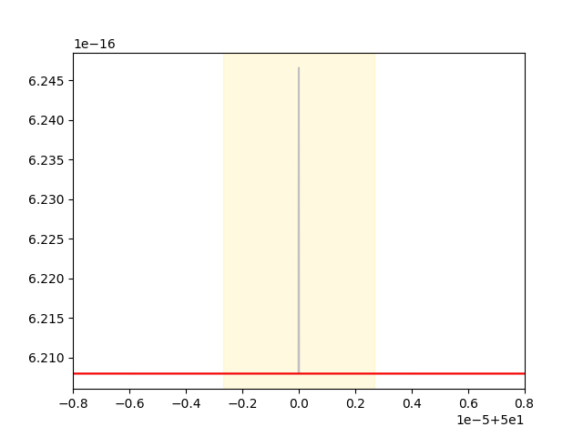
## New Eq:
((fabs(-50.0 + membrane__V) < 2.6713760659657915e-6) ? ((-9358472.2056995872 + 187169.45411399176 * membrane__V) * (-5.9647465207974658e-25 * (6.8350001000000002 * exp(1.8716945411372736) - 148.5 * exp(9.9999999999406119e-8)) / (1.0 - exp(9.9999999999406119e-8)) - 5.9647465207974658e-25 * (6.8350001000000002 * exp(1.8716945411372736) - 148.5 * exp(-9.9999999999406119e-8)) / (1.0 - exp(-9.9999999999406119e-8))) + 5.9647465207974658e-25 * (6.8350001000000002 * exp(1.8716945411372736) - 148.5 * exp(9.9999999999406119e-8)) / (1.0 - exp(9.9999999999406119e-8))) : ((1.0 - L_type_Ca_channel__FrICa) * (-50.0 + membrane__V) * (intracellular_sodium_concentration__Na_i * exp(50.0 * membrane__F / (membrane__R * membrane__T)) - extracellular_sodium_concentration__Na_o * exp((50.0 - membrane__V) * membrane__F / (membrane__R * membrane__T))) * L_type_Ca_channel__P_CaNa * L_type_Ca_channel__P_Ca_L * L_type_Ca_channel_d_gate__d * L_type_Ca_channel_f2_gate__f2 * L_type_Ca_channel_f_gate__f * membrane__F / ((1.0 - exp((50.0 - membrane__V) * membrane__F / (membrane__R * membrane__T))) * membrane__R * membrane__T)))

## Equation 6:
```
L_type_Ca_channel__i_Ca_L_Na_ds = (-50.0 + membrane__V) * (intracellular_sodium_concentration__Na_i * exp(50.0 * membrane__F / (membrane__R * membrane__T)) - extracellular_sodium_concentration__Na_o * exp((50.0 - membrane__V) * membrane__F / (membrane__R * membrane__T))) * L_type_Ca_channel__FrICa * L_type_Ca_channel__P_CaNa * L_type_Ca_channel__P_Ca_L * L_type_Ca_channel_d_gate__d * L_type_Ca_channel_f2ds_gate__f2ds * L_type_Ca_channel_f_gate__f * membrane__F / ((1.0 - exp((50.0 - membrane__V) * membrane__F / (membrane__R * membrane__T))) * membrane__R * membrane__T)
```
### Partially evaluated to: 
```
L_type_Ca_channel__i_Ca_L_Na_ds = 3.0244243393050165e-17 * (44.422718269427996 - 965.1461101697231 * exp(-0.037433890822745473 * membrane__V)) * (-50.0 + membrane__V) / (1.0 - 6.4993004051833205 * exp(-0.037433890822745473 * membrane__V))
```
### Singulariy points detected:

{50.000000000000000}
*U*
`1.8716945411372736 - 0.037433890822745473 * membrane__V`

*V for 1e-07 range* 
`49.999997328623934 - 50.000002671376066`

*Singularity point: 50.000000000000000*


## New Eq:
((fabs(-50.0 + membrane__V) < 2.6713760659657915e-6) ? ((-9358472.2056995872 + 187169.45411399176 * membrane__V) * (8.0793747933438226e-23 * (6.835 * exp(1.8716945411372736) - 148.5 * exp(9.9999999999406119e-8)) / (1.0 - exp(9.9999999999406119e-8)) + 8.0793747933438226e-23 * (6.835 * exp(1.8716945411372736) - 148.5 * exp(-9.9999999999406119e-8)) / (1.0 - exp(-9.9999999999406119e-8))) - 8.0793747933438226e-23 * (6.835 * exp(1.8716945411372736) - 148.5 * exp(9.9999999999406119e-8)) / (1.0 - exp(9.9999999999406119e-8))) : ((-50.0 + membrane__V) * (intracellular_sodium_concentration__Na_i * exp(50.0 * membrane__F / (membrane__R * membrane__T)) - extracellular_sodium_concentration__Na_o * exp((50.0 - membrane__V) * membrane__F / (membrane__R * membrane__T))) * L_type_Ca_channel__FrICa * L_type_Ca_channel__P_CaNa * L_type_Ca_channel__P_Ca_L * L_type_Ca_channel_d_gate__d * L_type_Ca_channel_f2ds_gate__f2ds * L_type_Ca_channel_f_gate__f * membrane__F / ((1.0 - exp((50.0 - membrane__V) * membrane__F / (membrane__R * membrane__T))) * membrane__R * membrane__T)))

# Model: LR_Dynamic_model_2000
## Equation 1:
```
L_type_Ca_channel__I_CaCa = 4.0 * pow(membrane__F, 2) * (-L_type_Ca_channel__gamma_Cao * calcium_dynamics__Cao + L_type_Ca_channel__gamma_Cai * calcium_dynamics__Cai * exp(2.0 * membrane__F * membrane__V / (membrane__R * membrane__T))) * L_type_Ca_channel__P_Ca * membrane__V / ((-1.0 + exp(2.0 * membrane__F * membrane__V / (membrane__R * membrane__T))) * membrane__R * membrane__T)
```
### Partially evaluated to: 
```
L_type_Ca_channel__I_CaCa = 7.8019226357407252 * (-0.61380000000000001 + 6.0000000000000002e-5 * exp(0.074871767015605231 * membrane__V)) * membrane__V / (-1.0 + exp(0.074871767015605231 * membrane__V))
```
### Singulariy points detected:

{0}
*U*
`0.074871767015605231 * membrane__V`

*V for 1e-07 range* 
`-1.3356169352749131e-6 - 1.3356169352749131e-6`

*Singularity point: 0*


## New Eq:
((fabs(membrane__V) < 1.3356169352749131e-6) ? ((0.5 + 374358.83507802623 * membrane__V) * (1.042038e-5 * (-0.61380000000000001 + 6.0000000000000002e-5 * exp(9.9999999999999995e-8)) / (-1.0 + exp(9.9999999999999995e-8)) + 1.042038e-5 * (-0.61380000000000001 + 6.0000000000000002e-5 * exp(-9.9999999999999995e-8)) / (-1.0 + exp(-9.9999999999999995e-8))) - 1.042038e-5 * (-0.61380000000000001 + 6.0000000000000002e-5 * exp(-9.9999999999999995e-8)) / (-1.0 + exp(-9.9999999999999995e-8))) : (4.0 * pow(membrane__F, 2) * (-L_type_Ca_channel__gamma_Cao * calcium_dynamics__Cao + L_type_Ca_channel__gamma_Cai * calcium_dynamics__Cai * exp(2.0 * membrane__F * membrane__V / (membrane__R * membrane__T))) * L_type_Ca_channel__P_Ca * membrane__V / ((-1.0 + exp(2.0 * membrane__F * membrane__V / (membrane__R * membrane__T))) * membrane__R * membrane__T)))

## Equation 2:
```
L_type_Ca_channel__I_CaK = pow(membrane__F, 2) * (-L_type_Ca_channel__gamma_Ko * ionic_concentrations__Ko + L_type_Ca_channel__gamma_Ki * ionic_concentrations__Ki * exp(membrane__F * membrane__V / (membrane__R * membrane__T))) * L_type_Ca_channel__P_K * membrane__V / ((-1.0 + exp(membrane__F * membrane__V / (membrane__R * membrane__T))) * membrane__R * membrane__T)
```
### Partially evaluated to: 
```
L_type_Ca_channel__I_CaK = 0.00069711623550831479 * (-3.375 + 105.89999999999999 * exp(0.037435883507802616 * membrane__V)) * membrane__V / (-1.0 + exp(0.037435883507802616 * membrane__V))
```
### Singulariy points detected:

{0}
*U*
`0.037435883507802616 * membrane__V`

*V for 1e-07 range* 
`-2.6712338705498262e-6 - 2.6712338705498262e-6`

*Singularity point: 0*


## New Eq:
((fabs(membrane__V) < 2.6712338705498262e-6) ? ((0.5 + 187179.41753901311 * membrane__V) * (1.8621604999999999e-9 * (-3.375 + 105.89999999999999 * exp(9.9999999999999995e-8)) / (-1.0 + exp(9.9999999999999995e-8)) + 1.8621604999999999e-9 * (-3.375 + 105.89999999999999 * exp(-9.9999999999999995e-8)) / (-1.0 + exp(-9.9999999999999995e-8))) - 1.8621604999999999e-9 * (-3.375 + 105.89999999999999 * exp(-9.9999999999999995e-8)) / (-1.0 + exp(-9.9999999999999995e-8))) : (pow(membrane__F, 2) * (-L_type_Ca_channel__gamma_Ko * ionic_concentrations__Ko + L_type_Ca_channel__gamma_Ki * ionic_concentrations__Ki * exp(membrane__F * membrane__V / (membrane__R * membrane__T))) * L_type_Ca_channel__P_K * membrane__V / ((-1.0 + exp(membrane__F * membrane__V / (membrane__R * membrane__T))) * membrane__R * membrane__T)))

## Equation 3:
```
L_type_Ca_channel__I_CaNa = pow(membrane__F, 2) * (-L_type_Ca_channel__gamma_Nao * ionic_concentrations__Nao + L_type_Ca_channel__gamma_Nai * ionic_concentrations__Nai * exp(membrane__F * membrane__V / (membrane__R * membrane__T))) * L_type_Ca_channel__P_Na * membrane__V / ((-1.0 + exp(membrane__F * membrane__V / (membrane__R * membrane__T))) * membrane__R * membrane__T)
```
### Partially evaluated to: 
```
L_type_Ca_channel__I_CaNa = 0.0024381008236689767 * (-99.0 + 6.75 * exp(0.037435883507802616 * membrane__V)) * membrane__V / (-1.0 + exp(0.037435883507802616 * membrane__V))
```
### Singulariy points detected:

{0}
*U*
`0.037435883507802616 * membrane__V`

*V for 1e-07 range* 
`-2.6712338705498262e-6 - 2.6712338705498262e-6`

*Singularity point: 0*

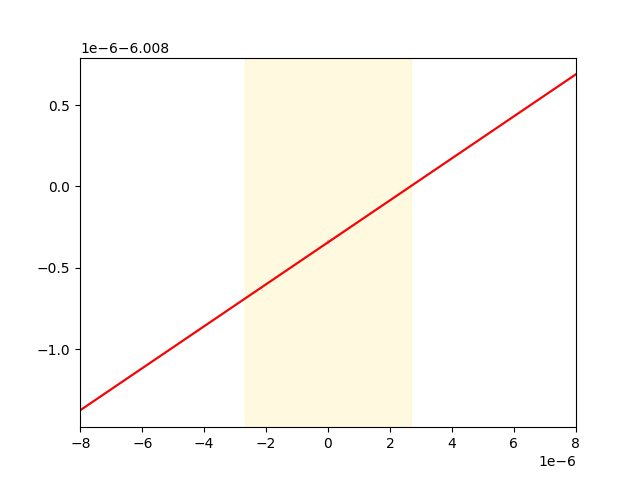
## New Eq:
((fabs(membrane__V) < 2.6712338705498262e-6) ? ((0.5 + 187179.41753901311 * membrane__V) * (6.5127375e-9 * (-99.0 + 6.75 * exp(9.9999999999999995e-8)) / (-1.0 + exp(9.9999999999999995e-8)) + 6.5127375e-9 * (-99.0 + 6.75 * exp(-9.9999999999999995e-8)) / (-1.0 + exp(-9.9999999999999995e-8))) - 6.5127375e-9 * (-99.0 + 6.75 * exp(-9.9999999999999995e-8)) / (-1.0 + exp(-9.9999999999999995e-8))) : (pow(membrane__F, 2) * (-L_type_Ca_channel__gamma_Nao * ionic_concentrations__Nao + L_type_Ca_channel__gamma_Nai * ionic_concentrations__Nai * exp(membrane__F * membrane__V / (membrane__R * membrane__T))) * L_type_Ca_channel__P_Na * membrane__V / ((-1.0 + exp(membrane__F * membrane__V / (membrane__R * membrane__T))) * membrane__R * membrane__T)))

## Equation 4:
```
non_specific_calcium_activated_current__I_ns_K = pow(membrane__F, 2) * (-L_type_Ca_channel__gamma_Ko * ionic_concentrations__Ko + L_type_Ca_channel__gamma_Ki * ionic_concentrations__Ki * exp(membrane__F * membrane__V / (membrane__R * membrane__T))) * membrane__V * non_specific_calcium_activated_current__P_ns_Ca / ((-1.0 + exp(membrane__F * membrane__V / (membrane__R * membrane__T))) * membrane__R * membrane__T)
```
### Partially evaluated to: 
```
non_specific_calcium_activated_current__I_ns_K = 6.3210021354380869e-5 * (-3.375 + 105.89999999999999 * exp(0.037435883507802616 * membrane__V)) * membrane__V / (-1.0 + exp(0.037435883507802616 * membrane__V))
```
### Singulariy points detected:

{0}
*U*
`0.037435883507802616 * membrane__V`

*V for 1e-07 range* 
`-2.6712338705498262e-6 - 2.6712338705498262e-6`

*Singularity point: 0*

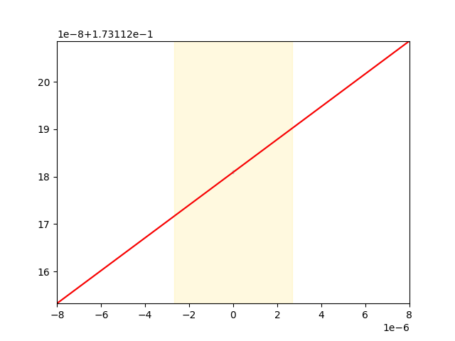
## New Eq:
((fabs(membrane__V) < 2.6712338705498262e-6) ? ((0.5 + 187179.41753901311 * membrane__V) * (1.6884875000000001e-10 * (-3.375 + 105.89999999999999 * exp(9.9999999999999995e-8)) / (-1.0 + exp(9.9999999999999995e-8)) + 1.6884875000000001e-10 * (-3.375 + 105.89999999999999 * exp(-9.9999999999999995e-8)) / (-1.0 + exp(-9.9999999999999995e-8))) - 1.6884875000000001e-10 * (-3.375 + 105.89999999999999 * exp(-9.9999999999999995e-8)) / (-1.0 + exp(-9.9999999999999995e-8))) : (pow(membrane__F, 2) * (-L_type_Ca_channel__gamma_Ko * ionic_concentrations__Ko + L_type_Ca_channel__gamma_Ki * ionic_concentrations__Ki * exp(membrane__F * membrane__V / (membrane__R * membrane__T))) * membrane__V * non_specific_calcium_activated_current__P_ns_Ca / ((-1.0 + exp(membrane__F * membrane__V / (membrane__R * membrane__T))) * membrane__R * membrane__T)))

## Equation 5:
```
non_specific_calcium_activated_current__I_ns_Na = pow(membrane__F, 2) * (-L_type_Ca_channel__gamma_Nao * ionic_concentrations__Nao + L_type_Ca_channel__gamma_Nai * ionic_concentrations__Nai * exp(membrane__F * membrane__V / (membrane__R * membrane__T))) * membrane__V * non_specific_calcium_activated_current__P_ns_Ca / ((-1.0 + exp(membrane__F * membrane__V / (membrane__R * membrane__T))) * membrane__R * membrane__T)
```
### Partially evaluated to: 
```
non_specific_calcium_activated_current__I_ns_Na = 6.3210021354380869e-5 * (-99.0 + 6.75 * exp(0.037435883507802616 * membrane__V)) * membrane__V / (-1.0 + exp(0.037435883507802616 * membrane__V))
```
### Singulariy points detected:

{0}
*U*
`0.037435883507802616 * membrane__V`

*V for 1e-07 range* 
`-2.6712338705498262e-6 - 2.6712338705498262e-6`

*Singularity point: 0*

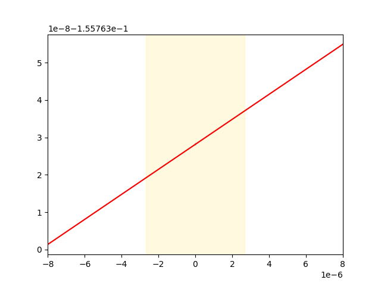
## New Eq:
((fabs(membrane__V) < 2.6712338705498262e-6) ? ((0.5 + 187179.41753901311 * membrane__V) * (1.6884875000000001e-10 * (-99.0 + 6.75 * exp(9.9999999999999995e-8)) / (-1.0 + exp(9.9999999999999995e-8)) + 1.6884875000000001e-10 * (-99.0 + 6.75 * exp(-9.9999999999999995e-8)) / (-1.0 + exp(-9.9999999999999995e-8))) - 1.6884875000000001e-10 * (-99.0 + 6.75 * exp(-9.9999999999999995e-8)) / (-1.0 + exp(-9.9999999999999995e-8))) : (pow(membrane__F, 2) * (-L_type_Ca_channel__gamma_Nao * ionic_concentrations__Nao + L_type_Ca_channel__gamma_Nai * ionic_concentrations__Nai * exp(membrane__F * membrane__V / (membrane__R * membrane__T))) * membrane__V * non_specific_calcium_activated_current__P_ns_Ca / ((-1.0 + exp(membrane__F * membrane__V / (membrane__R * membrane__T))) * membrane__R * membrane__T)))

## Equation 6:
```
rapid_delayed_rectifier_potassium_current_xr_gate__tau_xr = 0.001 / (0.00060999999999999997 * (38.899999999999999 + membrane__V) / (-1.0 + 281.60348502322194 * exp(0.14499999999999999 * membrane__V)) + 0.0013799999999999999 * (14.199999999999999 + membrane__V) / (1.0 - 0.17436578041087322 * exp(-0.123 * membrane__V)))
```
### Partially evaluated to: 
```
rapid_delayed_rectifier_potassium_current_xr_gate__tau_xr = 0.001 / (0.00060999999999999997 * (38.899999999999999 + membrane__V) / (-1.0 + 281.60348502322194 * exp(0.14499999999999999 * membrane__V)) + 0.0013799999999999999 * (14.199999999999999 + membrane__V) / (1.0 - 0.17436578041087322 * exp(-0.123 * membrane__V)))
```
### Singulariy points detected:

{-38.899999999999999, -14.199999999999999}
#### float * A

####1 / A


####A + B:

`0.0013799999999999999 * (14.199999999999999 + membrane__V) / (1.0 - 0.17436578041087322 * exp(-0.123 * membrane__V))`
`0.00060999999999999997 * (38.899999999999999 + membrane__V) / (-1.0 + 281.60348502322194 * exp(0.14499999999999999 * membrane__V))`

*U*
`-1.7465999999999999 - 0.123 * membrane__V`

*V for 1e-07 range* 
`-14.200000813008129 - -14.199999186991869`

*Singularity point: -14.199999999999999*

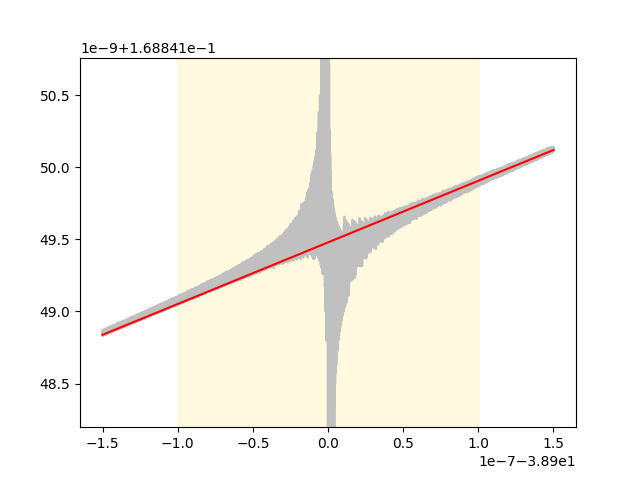
*U*
`5.6404999999999994 + 0.14499999999999999 * membrane__V`

*V for 1e-07 range* 
`-38.900000689655172 - -38.899999310344825`

*Singularity point: -38.899999999999999*

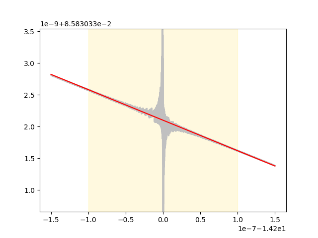
## New Eq:
((fabs(14.199999999999999 + membrane__V) < 8.1300813006834893e-7) ? (0.001 / (0.015066999504065039 / (-1.0 + exp(3.5814998821138206)) - 1.1219512194943214e-9 / (1.0 - exp(9.9999999999406119e-8))) + (8733000.5000645891 + 615000.00000454858 * membrane__V) * (0.001 / (1.1219512195134727e-9 / (1.0 - exp(-9.9999999999406119e-8)) + 0.015067000495934959 / (-1.0 + exp(3.5815001178861787))) - 0.001 / (0.015066999504065039 / (-1.0 + exp(3.5814998821138206)) - 1.1219512194943214e-9 / (1.0 - exp(9.9999999999406119e-8))))) : ((fabs(38.899999999999999 + membrane__V) < 6.8965517246999397e-7) ? (0.001 / (-0.034086000951724135 / (1.0 - exp(3.0381000848275859)) - 4.2068965517283451e-10 / (-1.0 + exp(-1.0000000000287557e-7))) + (28202500.498836767 + 724999.99997009686 * membrane__V) * (0.001 / (4.2068965520669629e-10 / (-1.0 + exp(1.0000000000287557e-7)) - 0.034085999048275861 / (1.0 - exp(3.0380999151724137))) - 0.001 / (-0.034086000951724135 / (1.0 - exp(3.0381000848275859)) - 4.2068965517283451e-10 / (-1.0 + exp(-1.0000000000287557e-7))))) : (0.001 / (0.00060999999999999997 * (38.899999999999999 + membrane__V) / (-1.0 + exp(5.6404999999999994 + 0.14499999999999999 * membrane__V)) + 0.0013799999999999999 * (14.199999999999999 + membrane__V) / (1.0 - exp(-1.7465999999999999 - 0.123 * membrane__V))))))

## Equation 7:
```
slow_delayed_rectifier_potassium_current_xs1_gate__tau_xs1 = 0.001 / (0.00013100000000000001 * (30.0 + membrane__V) / (-1.0 + 7.8538197044216602 * exp(0.068699999999999997 * membrane__V)) + 7.1899999999999999e-5 * (30.0 + membrane__V) / (1.0 - 0.011795938519751569 * exp(-0.14799999999999999 * membrane__V)))
```
### Partially evaluated to: 
```
slow_delayed_rectifier_potassium_current_xs1_gate__tau_xs1 = 0.001 / (0.00013100000000000001 * (30.0 + membrane__V) / (-1.0 + 7.8538197044216602 * exp(0.068699999999999997 * membrane__V)) + 7.1899999999999999e-5 * (30.0 + membrane__V) / (1.0 - 0.011795938519751569 * exp(-0.14799999999999999 * membrane__V)))
```
### Singulariy points detected:

{-30.000000000000000}
#### float * A

####1 / A


####A + B:

`7.1899999999999999e-5 * (30.0 + membrane__V) / (1.0 - 0.011795938519751569 * exp(-0.14799999999999999 * membrane__V))`
`0.00013100000000000001 * (30.0 + membrane__V) / (-1.0 + 7.8538197044216602 * exp(0.068699999999999997 * membrane__V))`

*U*
`-4.4399999999999995 - 0.14799999999999999 * membrane__V`

*V for 1e-07 range* 
`-30.000000675675675 - -29.999999324324325`

*Singularity point: -30.000000000000000*

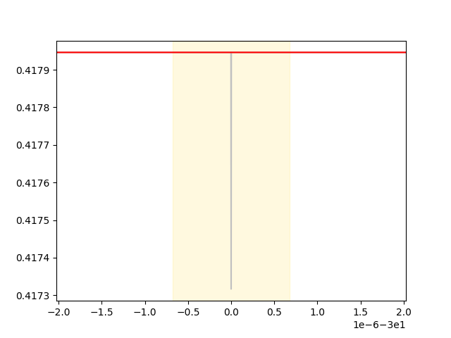
## New Eq:
((fabs(30.0 + membrane__V) < 6.7567567568760367e-7) ? (0.001 / (-8.8513513515076093e-11 / (-1.0 + exp(-4.6418918920460017e-8)) - 4.8581081081938701e-11 / (1.0 - exp(1.0000000000287557e-7))) + (22200000.499608092 + 739999.99998693645 * membrane__V) * (0.001 / (8.8513513515076093e-11 / (-1.0 + exp(4.6418918920460017e-8)) + 4.8581081081938701e-11 / (1.0 - exp(-1.0000000000287557e-7))) - 0.001 / (-8.8513513515076093e-11 / (-1.0 + exp(-4.6418918920460017e-8)) - 4.8581081081938701e-11 / (1.0 - exp(1.0000000000287557e-7))))) : (0.001 / (0.00013100000000000001 * (30.0 + membrane__V) / (-1.0 + exp(2.0609999999999999 + 0.068699999999999997 * membrane__V)) + 7.1899999999999999e-5 * (30.0 + membrane__V) / (1.0 - exp(-4.4399999999999995 - 0.14799999999999999 * membrane__V)))))

## Equation 8:
```
slow_delayed_rectifier_potassium_current_xs2_gate__tau_xs2 = 0.0040000000000000001 / (0.00013100000000000001 * (30.0 + membrane__V) / (-1.0 + 7.8538197044216602 * exp(0.068699999999999997 * membrane__V)) + 7.1899999999999999e-5 * (30.0 + membrane__V) / (1.0 - 0.011795938519751569 * exp(-0.14799999999999999 * membrane__V)))
```
### Partially evaluated to: 
```
slow_delayed_rectifier_potassium_current_xs2_gate__tau_xs2 = 0.0040000000000000001 / (0.00013100000000000001 * (30.0 + membrane__V) / (-1.0 + 7.8538197044216602 * exp(0.068699999999999997 * membrane__V)) + 7.1899999999999999e-5 * (30.0 + membrane__V) / (1.0 - 0.011795938519751569 * exp(-0.14799999999999999 * membrane__V)))
```
### Singulariy points detected:

{-30.000000000000000}
#### float * A

####1 / A


####A + B:

`7.1899999999999999e-5 * (30.0 + membrane__V) / (1.0 - 0.011795938519751569 * exp(-0.14799999999999999 * membrane__V))`
`0.00013100000000000001 * (30.0 + membrane__V) / (-1.0 + 7.8538197044216602 * exp(0.068699999999999997 * membrane__V))`

*U*
`-4.4399999999999995 - 0.14799999999999999 * membrane__V`

*V for 1e-07 range* 
`-30.000000675675675 - -29.999999324324325`

*Singularity point: -30.000000000000000*

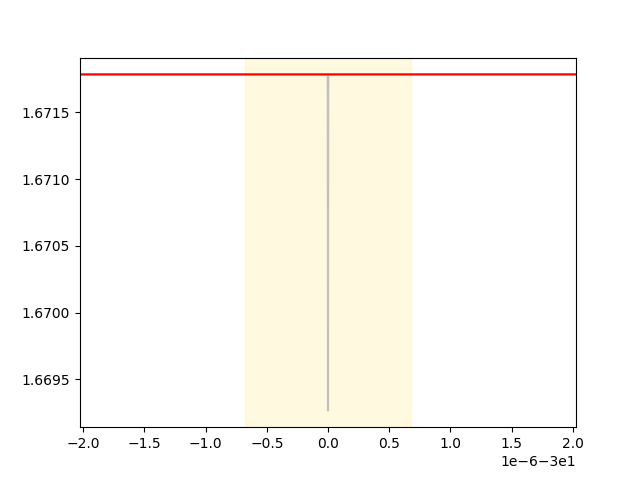
## New Eq:
((fabs(30.0 + membrane__V) < 6.7567567568760367e-7) ? (0.0040000000000000001 / (-8.8513513515076093e-11 / (-1.0 + exp(-4.6418918920460017e-8)) - 4.8581081081938701e-11 / (1.0 - exp(1.0000000000287557e-7))) + (22200000.499608092 + 739999.99998693645 * membrane__V) * (0.0040000000000000001 / (8.8513513515076093e-11 / (-1.0 + exp(4.6418918920460017e-8)) + 4.8581081081938701e-11 / (1.0 - exp(-1.0000000000287557e-7))) - 0.0040000000000000001 / (-8.8513513515076093e-11 / (-1.0 + exp(-4.6418918920460017e-8)) - 4.8581081081938701e-11 / (1.0 - exp(1.0000000000287557e-7))))) : (0.0040000000000000001 / (0.00013100000000000001 * (30.0 + membrane__V) / (-1.0 + exp(2.0609999999999999 + 0.068699999999999997 * membrane__V)) + 7.1899999999999999e-5 * (30.0 + membrane__V) / (1.0 - exp(-4.4399999999999995 - 0.14799999999999999 * membrane__V)))))

# Model: fink_noble_giles_model_2008
## Equation 1:
```
ICaL__i_CaL = pow(Environment__F, 2) * pow(ICaL__z, 2) * (-15.0 + cell__V) * (-Environment__Ca_o + 0.25 * Ca__Ca_ss * exp(2.0 * (-15.0 + cell__V) * Environment__F / (Environment__R * Environment__T))) * ICaL__g_CaL * iCaL_d_gate__d * iCaL_f2_gate__f2 * iCaL_fCass_gate__fCass * iCaL_f_gate__f / ((-1.0 + exp(2.0 * (-15.0 + cell__V) * Environment__F / (Environment__R * Environment__T))) * Environment__R * Environment__T)
```
### Partially evaluated to: 
```
ICaL__i_CaL = 1.4611882740722476e-6 * (-2.0 + 1.5394679649340915e-5 * exp(0.074867781645490947 * cell__V)) * (-15.0 + cell__V) / (-1.0 + 0.32529698149690262 * exp(0.074867781645490947 * cell__V))
```
### Singulariy points detected:

{15.000000000000000}
*U*
`-1.1230167246823641 + 0.074867781645490947 * cell__V`

*V for 1e-07 range* 
`14.999998664311967 - 15.000001335688033`

*Singularity point: 15.000000000000000*


## New Eq:
((fabs(-15.0 + cell__V) < 1.3356880329828957e-6) ? ((-5615083.1234197523 + 374338.90822798351 * cell__V) * (1.9516916916132326e-12 * (-2.0 + 4.7324999999999998e-5 * exp(9.9999999999406119e-8)) / (-1.0 + exp(9.9999999999406119e-8)) + 1.9516916916132326e-12 * (-2.0 + 4.7324999999999998e-5 * exp(-9.9999999999406119e-8)) / (-1.0 + exp(-9.9999999999406119e-8))) - 1.9516916916132326e-12 * (-2.0 + 4.7324999999999998e-5 * exp(-9.9999999999406119e-8)) / (-1.0 + exp(-9.9999999999406119e-8))) : (pow(Environment__F, 2) * pow(ICaL__z, 2) * (-15.0 + cell__V) * (-Environment__Ca_o + 0.25 * Ca__Ca_ss * exp(2.0 * (-15.0 + cell__V) * Environment__F / (Environment__R * Environment__T))) * ICaL__g_CaL * iCaL_d_gate__d * iCaL_f2_gate__f2 * iCaL_fCass_gate__fCass * iCaL_f_gate__f / ((-1.0 + exp(2.0 * (-15.0 + cell__V) * Environment__F / (Environment__R * Environment__T))) * Environment__R * Environment__T)))

# Model: grandi2010
## Equation 1:
```
cell__ibarca_j = 4.0 * (-0.34100000000000003 * cell__Cao + 0.34100000000000003 * cell__sCaj * exp(2.0 * cell__FoRT * cell__sVm)) * cell__FoRT * cell__Frdy * cell__pCa * cell__sVm / (-1.0 + exp(2.0 * cell__FoRT * cell__sVm))
```
### Partially evaluated to: 
```
cell__ibarca_j = 3.9009613178703626 * (-0.61380000000000001 + 5.9896099577487976e-5 * exp(0.074871767015605231 * cell__sVm)) * cell__sVm / (-1.0 + exp(0.074871767015605231 * cell__sVm))
```
### Singulariy points detected:

{0}
*U*
`0.074871767015605231 * cell__sVm`

*V for 1e-07 range* 
`-1.3356169352749131e-6 - 1.3356169352749131e-6`

*Singularity point: 0*

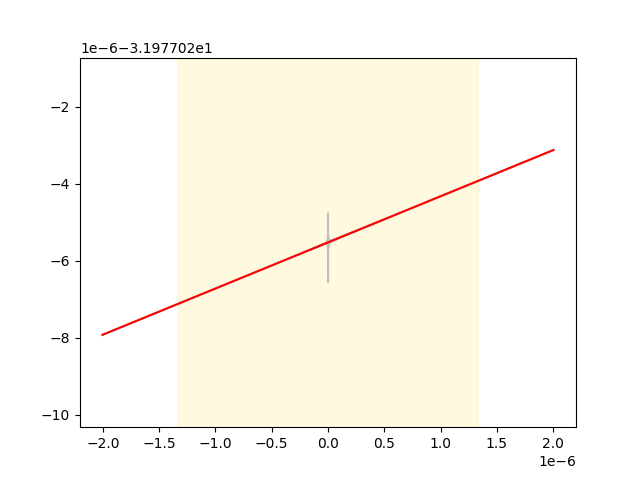
## New Eq:
((fabs(cell__sVm) < 1.3356169352749131e-6) ? ((0.5 + 374358.83507802623 * cell__sVm) * (5.2101899999999998e-6 * (-0.61380000000000001 + 5.9896099577487976e-5 * exp(9.9999999999999995e-8)) / (-1.0 + exp(9.9999999999999995e-8)) + 5.2101899999999998e-6 * (-0.61380000000000001 + 5.9896099577487976e-5 * exp(-9.9999999999999995e-8)) / (-1.0 + exp(-9.9999999999999995e-8))) - 5.2101899999999998e-6 * (-0.61380000000000001 + 5.9896099577487976e-5 * exp(-9.9999999999999995e-8)) / (-1.0 + exp(-9.9999999999999995e-8))) : (4.0 * (-0.34100000000000003 * cell__Cao + 0.34100000000000003 * cell__sCaj * exp(2.0 * cell__FoRT * cell__sVm)) * cell__FoRT * cell__Frdy * cell__pCa * cell__sVm / (-1.0 + exp(2.0 * cell__FoRT * cell__sVm))))

## Equation 2:
```
cell__ibarca_sl = 4.0 * (-0.34100000000000003 * cell__Cao + 0.34100000000000003 * cell__sCasl * exp(2.0 * cell__FoRT * cell__sVm)) * cell__FoRT * cell__Frdy * cell__pCa * cell__sVm / (-1.0 + exp(2.0 * cell__FoRT * cell__sVm))
```
### Partially evaluated to: 
```
cell__ibarca_sl = 3.9009613178703626 * (-0.61380000000000001 + 3.6014568509600627e-5 * exp(0.074871767015605231 * cell__sVm)) * cell__sVm / (-1.0 + exp(0.074871767015605231 * cell__sVm))
```
### Singulariy points detected:

{0}
*U*
`0.074871767015605231 * cell__sVm`

*V for 1e-07 range* 
`-1.3356169352749131e-6 - 1.3356169352749131e-6`

*Singularity point: 0*

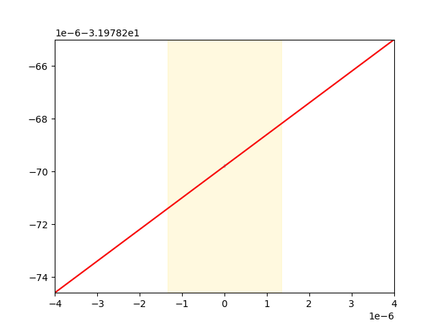
## New Eq:
((fabs(cell__sVm) < 1.3356169352749131e-6) ? ((0.5 + 374358.83507802623 * cell__sVm) * (5.2101899999999998e-6 * (-0.61380000000000001 + 3.6014568509600627e-5 * exp(9.9999999999999995e-8)) / (-1.0 + exp(9.9999999999999995e-8)) + 5.2101899999999998e-6 * (-0.61380000000000001 + 3.6014568509600627e-5 * exp(-9.9999999999999995e-8)) / (-1.0 + exp(-9.9999999999999995e-8))) - 5.2101899999999998e-6 * (-0.61380000000000001 + 3.6014568509600627e-5 * exp(-9.9999999999999995e-8)) / (-1.0 + exp(-9.9999999999999995e-8))) : (4.0 * (-0.34100000000000003 * cell__Cao + 0.34100000000000003 * cell__sCasl * exp(2.0 * cell__FoRT * cell__sVm)) * cell__FoRT * cell__Frdy * cell__pCa * cell__sVm / (-1.0 + exp(2.0 * cell__FoRT * cell__sVm))))

## Equation 3:
```
cell__ibark = (-0.75 * cell__Ko + 0.75 * cell__sKi * exp(cell__FoRT * cell__sVm)) * cell__FoRT * cell__Frdy * cell__pK * cell__sVm / (-1.0 + exp(cell__FoRT * cell__sVm))
```
### Partially evaluated to: 
```
cell__ibark = 0.00048762016473379531 * (-4.0500000000000007 + 90.0 * exp(0.037435883507802616 * cell__sVm)) * cell__sVm / (-1.0 + exp(0.037435883507802616 * cell__sVm))
```
### Singulariy points detected:

{0}
*U*
`0.037435883507802616 * cell__sVm`

*V for 1e-07 range* 
`-2.6712338705498262e-6 - 2.6712338705498262e-6`

*Singularity point: 0*

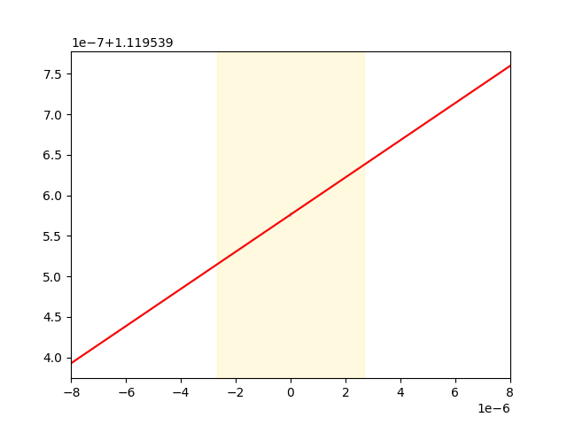
## New Eq:
((fabs(cell__sVm) < 2.6712338705498262e-6) ? ((0.5 + 187179.41753901311 * cell__sVm) * (1.3025475e-9 * (-4.0500000000000007 + 90.0 * exp(9.9999999999999995e-8)) / (-1.0 + exp(9.9999999999999995e-8)) + 1.3025475e-9 * (-4.0500000000000007 + 90.0 * exp(-9.9999999999999995e-8)) / (-1.0 + exp(-9.9999999999999995e-8))) - 1.3025475e-9 * (-4.0500000000000007 + 90.0 * exp(-9.9999999999999995e-8)) / (-1.0 + exp(-9.9999999999999995e-8))) : ((-0.75 * cell__Ko + 0.75 * cell__sKi * exp(cell__FoRT * cell__sVm)) * cell__FoRT * cell__Frdy * cell__pK * cell__sVm / (-1.0 + exp(cell__FoRT * cell__sVm))))

## Equation 4:
```
cell__ibarna_j = (-0.75 * cell__Nao + 0.75 * cell__sNaj * exp(cell__FoRT * cell__sVm)) * cell__FoRT * cell__Frdy * cell__pNa * cell__sVm / (-1.0 + exp(cell__FoRT * cell__sVm))
```
### Partially evaluated to: 
```
cell__ibarna_j = 2.7090009151877515e-5 * (-105.0 + 6.1605827729220159 * exp(0.037435883507802616 * cell__sVm)) * cell__sVm / (-1.0 + exp(0.037435883507802616 * cell__sVm))
```
### Singulariy points detected:

{0}
*U*
`0.037435883507802616 * cell__sVm`

*V for 1e-07 range* 
`-2.6712338705498262e-6 - 2.6712338705498262e-6`

*Singularity point: 0*

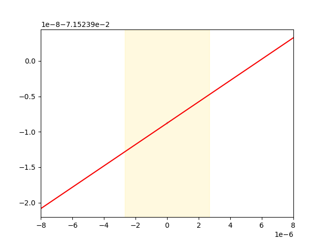
## New Eq:
((fabs(cell__sVm) < 2.6712338705498262e-6) ? ((0.5 + 187179.41753901311 * cell__sVm) * (7.236374999999999e-11 * (-105.0 + 6.1605827729220159 * exp(9.9999999999999995e-8)) / (-1.0 + exp(9.9999999999999995e-8)) + 7.236374999999999e-11 * (-105.0 + 6.1605827729220159 * exp(-9.9999999999999995e-8)) / (-1.0 + exp(-9.9999999999999995e-8))) - 7.236374999999999e-11 * (-105.0 + 6.1605827729220159 * exp(-9.9999999999999995e-8)) / (-1.0 + exp(-9.9999999999999995e-8))) : ((-0.75 * cell__Nao + 0.75 * cell__sNaj * exp(cell__FoRT * cell__sVm)) * cell__FoRT * cell__Frdy * cell__pNa * cell__sVm / (-1.0 + exp(cell__FoRT * cell__sVm))))

## Equation 5:
```
cell__ibarna_sl = (-0.75 * cell__Nao + 0.75 * cell__sNasl * exp(cell__FoRT * cell__sVm)) * cell__FoRT * cell__Frdy * cell__pNa * cell__sVm / (-1.0 + exp(cell__FoRT * cell__sVm))
```
### Partially evaluated to: 
```
cell__ibarna_sl = 2.7090009151877515e-5 * (-105.0 + 6.159920956184167 * exp(0.037435883507802616 * cell__sVm)) * cell__sVm / (-1.0 + exp(0.037435883507802616 * cell__sVm))
```
### Singulariy points detected:

{0}
*U*
`0.037435883507802616 * cell__sVm`

*V for 1e-07 range* 
`-2.6712338705498262e-6 - 2.6712338705498262e-6`

*Singularity point: 0*

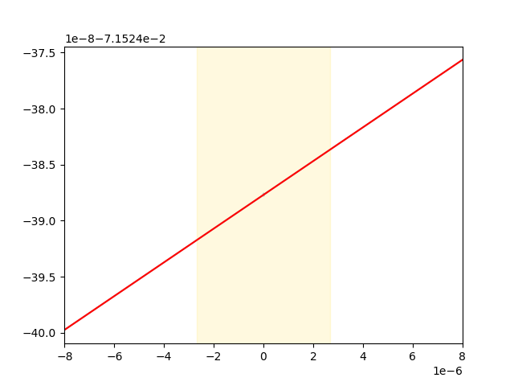
## New Eq:
((fabs(cell__sVm) < 2.6712338705498262e-6) ? ((0.5 + 187179.41753901311 * cell__sVm) * (7.236374999999999e-11 * (-105.0 + 6.159920956184167 * exp(9.9999999999999995e-8)) / (-1.0 + exp(9.9999999999999995e-8)) + 7.236374999999999e-11 * (-105.0 + 6.159920956184167 * exp(-9.9999999999999995e-8)) / (-1.0 + exp(-9.9999999999999995e-8))) - 7.236374999999999e-11 * (-105.0 + 6.159920956184167 * exp(-9.9999999999999995e-8)) / (-1.0 + exp(-9.9999999999999995e-8))) : ((-0.75 * cell__Nao + 0.75 * cell__sNasl * exp(cell__FoRT * cell__sVm)) * cell__FoRT * cell__Frdy * cell__pNa * cell__sVm / (-1.0 + exp(cell__FoRT * cell__sVm))))

## Equation 6:
```
cell__taud = 28.571428571428569 * (1.0 - 0.4345982085070782 * exp(-0.16666666666666666 * cell__sVm)) * cell__dss / (5.0 + cell__sVm)
```
### Partially evaluated to: 
```
cell__taud = 28.571428571428569 * (1.0 - 0.4345982085070782 * exp(-0.16666666666666666 * cell__sVm)) / ((1.0 + 0.4345982085070782 * exp(-0.16666666666666666 * cell__sVm)) * (5.0 + cell__sVm))
```
### Singulariy points detected:

{-5.0000000000000000}
*U*
`-0.83333333333333337 - 0.16666666666666666 * cell__sVm`

*V for 1e-07 range* 
`-5.0000005999999999 - -4.9999994000000001`

*Singularity point: -5.0000000000000000*

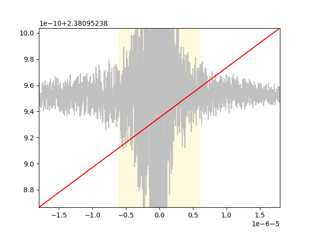
## New Eq:
((fabs(5.0 + cell__sVm) < 6.0000000000337561e-7) ? ((4166667.1666432251 + 833333.33332864498 * cell__sVm) * (47619047.618779711 * (1.0 - exp(1.0000000000027348e-7)) / (1.0 + exp(1.0000000000027348e-7)) + 47619047.618779711 * (1.0 - exp(-1.0000000000114084e-7)) / (1.0 + exp(-1.0000000000114084e-7))) - 47619047.618779711 * (1.0 - exp(1.0000000000027348e-7)) / (1.0 + exp(1.0000000000027348e-7))) : (28.571428571428569 * (1.0 - exp(-0.83333333333333337 - 0.16666666666666666 * cell__sVm)) * cell__dss / (5.0 + cell__sVm)))

# Model: hilgemann_noble_model_1987
## Equation 1:
```
second_inward_calcium_current__i_siCa = 4.0 * (-50.0 + membrane__V) * (intracellular_calcium_concentration__Ca_i * exp(100.0 / membrane__RTONF) - extracellular_calcium_concentration__Ca_o * exp(-2.0 * (-50.0 + membrane__V) / membrane__RTONF)) * second_inward_calcium_current__P_si * second_inward_calcium_current_d_gate__d * second_inward_calcium_current_f_Ca_gate__CaChon / ((1.0 - exp(-2.0 * (-50.0 + membrane__V) / membrane__RTONF)) * membrane__RTONF)
```
### Partially evaluated to: 
```
second_inward_calcium_current__i_siCa = 0.00017530921147681789 * (0.0004224090575681608 - 84.481811513632152 * exp(-0.074867781645490947 * membrane__V)) * (-50.0 + membrane__V) / (1.0 - 42.240905756816076 * exp(-0.074867781645490947 * membrane__V))
```
### Singulariy points detected:

{50.000000000000000}
*U*
`3.7433890822745473 - 0.074867781645490947 * membrane__V`

*V for 1e-07 range* 
`49.999998664311967 - 50.000001335688033`

*Singularity point: 50.000000000000000*


## New Eq:
((fabs(-50.0 + membrane__V) < 1.3356880329551402e-6) ? ((-18716944.911788113 + 374338.90823576227 * membrane__V) * (2.3415841583638756e-10 * (1.0000000000000001e-5 * exp(3.7433890822745473) - 2.0 * exp(9.9999999999406119e-8)) / (1.0 - exp(9.9999999999406119e-8)) + 2.3415841583638756e-10 * (1.0000000000000001e-5 * exp(3.7433890822745473) - 2.0 * exp(-9.9999999995936673e-8)) / (1.0 - exp(-9.9999999995936673e-8))) - 2.3415841583638756e-10 * (1.0000000000000001e-5 * exp(3.7433890822745473) - 2.0 * exp(9.9999999999406119e-8)) / (1.0 - exp(9.9999999999406119e-8))) : (4.0 * (-50.0 + membrane__V) * (intracellular_calcium_concentration__Ca_i * exp(100.0 / membrane__RTONF) - extracellular_calcium_concentration__Ca_o * exp(-2.0 * (-50.0 + membrane__V) / membrane__RTONF)) * second_inward_calcium_current__P_si * second_inward_calcium_current_d_gate__d * second_inward_calcium_current_f_Ca_gate__CaChon / ((1.0 - exp(-2.0 * (-50.0 + membrane__V) / membrane__RTONF)) * membrane__RTONF)))

## Equation 2:
```
second_inward_calcium_current__i_siK = 0.002 * (-50.0 + membrane__V) * (intracellular_potassium_concentration__K_i * exp(50.0 / membrane__RTONF) - extracellular_potassium_concentration__K_c * exp(-(-50.0 + membrane__V) / membrane__RTONF)) * second_inward_calcium_current__P_si * second_inward_calcium_current_d_gate__d * second_inward_calcium_current_f_Ca_gate__CaChon / ((1.0 - exp(-(-50.0 + membrane__V) / membrane__RTONF)) * membrane__RTONF)
```
### Partially evaluated to: 
```
second_inward_calcium_current__i_siK = 8.7654605738408949e-8 * (909.90205672566492 - 25.997201620733282 * exp(-0.037433890822745473 * membrane__V)) * (-50.0 + membrane__V) / (1.0 - 6.4993004051833205 * exp(-0.037433890822745473 * membrane__V))
```
### Singulariy points detected:

{50.000000000000000}
*U*
`1.8716945411372736 - 0.037433890822745473 * membrane__V`

*V for 1e-07 range* 
`49.999997328623934 - 50.000002671376066`

*Singularity point: 50.000000000000000*


## New Eq:
((fabs(-50.0 + membrane__V) < 2.6713760659657915e-6) ? ((-9358472.2056995872 + 187169.45411399176 * membrane__V) * (2.3415841584125338e-13 * (140.0 * exp(1.8716945411372736) - 4.0 * exp(9.9999999999406119e-8)) / (1.0 - exp(9.9999999999406119e-8)) + 2.3415841584125338e-13 * (140.0 * exp(1.8716945411372736) - 4.0 * exp(-9.9999999999406119e-8)) / (1.0 - exp(-9.9999999999406119e-8))) - 2.3415841584125338e-13 * (140.0 * exp(1.8716945411372736) - 4.0 * exp(9.9999999999406119e-8)) / (1.0 - exp(9.9999999999406119e-8))) : (0.002 * (-50.0 + membrane__V) * (intracellular_potassium_concentration__K_i * exp(50.0 / membrane__RTONF) - extracellular_potassium_concentration__K_c * exp(-(-50.0 + membrane__V) / membrane__RTONF)) * second_inward_calcium_current__P_si * second_inward_calcium_current_d_gate__d * second_inward_calcium_current_f_Ca_gate__CaChon / ((1.0 - exp(-(-50.0 + membrane__V) / membrane__RTONF)) * membrane__RTONF)))

## Equation 3:
```
second_inward_calcium_current__i_siNa = 0.01 * (-50.0 + membrane__V) * (intracellular_sodium_concentration__Na_i * exp(50.0 / membrane__RTONF) - extracellular_sodium_concentration__Na_o * exp(-(-50.0 + membrane__V) / membrane__RTONF)) * second_inward_calcium_current__P_si * second_inward_calcium_current_d_gate__d * second_inward_calcium_current_f_Ca_gate__CaChon / ((1.0 - exp(-(-50.0 + membrane__V) / membrane__RTONF)) * membrane__RTONF)
```
### Partially evaluated to: 
```
second_inward_calcium_current__i_siNa = 4.382730286920447e-7 * (42.245452633691585 - 909.90205672566492 * exp(-0.037433890822745473 * membrane__V)) * (-50.0 + membrane__V) / (1.0 - 6.4993004051833205 * exp(-0.037433890822745473 * membrane__V))
```
### Singulariy points detected:

{50.000000000000000}
*U*
`1.8716945411372736 - 0.037433890822745473 * membrane__V`

*V for 1e-07 range* 
`49.999997328623934 - 50.000002671376066`

*Singularity point: 50.000000000000000*


## New Eq:
((fabs(-50.0 + membrane__V) < 2.6713760659657915e-6) ? ((-9358472.2056995872 + 187169.45411399176 * membrane__V) * (1.1707920792062668e-12 * (6.5 * exp(1.8716945411372736) - 140.0 * exp(9.9999999999406119e-8)) / (1.0 - exp(9.9999999999406119e-8)) + 1.1707920792062668e-12 * (6.5 * exp(1.8716945411372736) - 140.0 * exp(-9.9999999999406119e-8)) / (1.0 - exp(-9.9999999999406119e-8))) - 1.1707920792062668e-12 * (6.5 * exp(1.8716945411372736) - 140.0 * exp(9.9999999999406119e-8)) / (1.0 - exp(9.9999999999406119e-8))) : (0.01 * (-50.0 + membrane__V) * (intracellular_sodium_concentration__Na_i * exp(50.0 / membrane__RTONF) - extracellular_sodium_concentration__Na_o * exp(-(-50.0 + membrane__V) / membrane__RTONF)) * second_inward_calcium_current__P_si * second_inward_calcium_current_d_gate__d * second_inward_calcium_current_f_Ca_gate__CaChon / ((1.0 - exp(-(-50.0 + membrane__V) / membrane__RTONF)) * membrane__RTONF)))

# Model: hodgkin_huxley_squid_axon_model_1952_modified
## Equation 1:
```
potassium_channel_n_gate__alpha_n = -0.01 * (65.0 + membrane__V) / (-1.0 + 0.0015034391929775724 * exp(-0.10000000000000001 * membrane__V))
```
### Partially evaluated to: 
```
potassium_channel_n_gate__alpha_n = -0.01 * (65.0 + membrane__V) / (-1.0 + 0.0015034391929775724 * exp(-0.10000000000000001 * membrane__V))
```
### Singulariy points detected:

{-65.000000000000000}
*U*
`-6.5 - 0.10000000000000001 * membrane__V`

*V for 1e-07 range* 
`-65.000000999999997 - -64.999999000000003`

*Singularity point: -65.000000000000000*

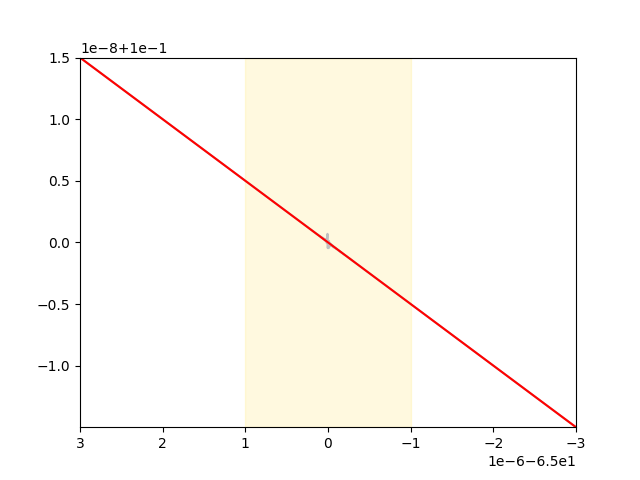
## New Eq:
((fabs(65.0 + membrane__V) < 1.0000000000287557e-6) ? (1.0000000000287556e-8 / (-1.0 + exp(1.0000000000287557e-7)) + (32500000.49906544 + 499999.99998562218 * membrane__V) * (-1.0000000000287556e-8 / (-1.0 + exp(1.0000000000287557e-7)) - 1.0000000000287556e-8 / (-1.0 + exp(-1.0000000000287557e-7)))) : (-0.01 * (65.0 + membrane__V) / (-1.0 + exp(-6.5 - 0.10000000000000001 * membrane__V))))

## Equation 2:
```
sodium_channel_m_gate__alpha_m = -0.10000000000000001 * (50.0 + membrane__V) / (-1.0 + 0.006737946999085467 * exp(-0.10000000000000001 * membrane__V))
```
### Partially evaluated to: 
```
sodium_channel_m_gate__alpha_m = -0.10000000000000001 * (50.0 + membrane__V) / (-1.0 + 0.006737946999085467 * exp(-0.10000000000000001 * membrane__V))
```
### Singulariy points detected:

{-50.000000000000000}
*U*
`-5.0 - 0.10000000000000001 * membrane__V`

*V for 1e-07 range* 
`-50.000000999999997 - -49.999999000000003`

*Singularity point: -50.000000000000000*

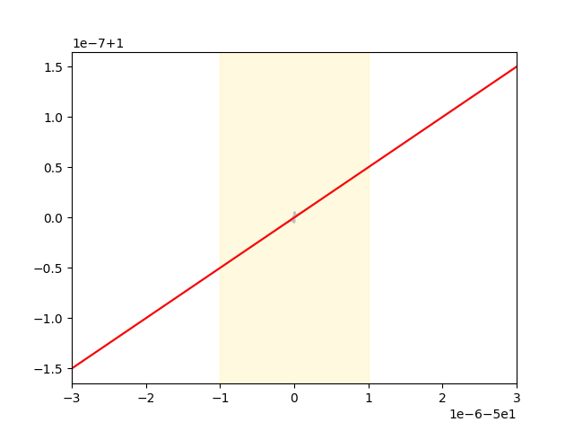
## New Eq:
((fabs(50.0 + membrane__V) < 1.0000000000287557e-6) ? (1.0000000000287557e-7 / (-1.0 + exp(1.0000000000287557e-7)) + (25000000.499281108 + 499999.99998562218 * membrane__V) * (-1.0000000000287557e-7 / (-1.0 + exp(1.0000000000287557e-7)) - 1.0000000000287557e-7 / (-1.0 + exp(-1.0000000000287557e-7)))) : (-0.10000000000000001 * (50.0 + membrane__V) / (-1.0 + exp(-5.0 - 0.10000000000000001 * membrane__V))))

# Model: hund_rudy_2004
## Equation 1:
```
ICaL__ibarca = 4.0 * (-15.0 + cell__V) * (-Environment__Ca_o * ICaL__gacao + Ca__Ca_ss * ICaL__gacai * exp(2.0 * (-15.0 + cell__V) * Environment__FonRT)) * Environment__F * Environment__FonRT * ICaL__G_CaL_mult * ICaL__pca / (-1.0 + exp(2.0 * (-15.0 + cell__V) * Environment__FonRT))
```
### Partially evaluated to: 
```
ICaL__ibarca = 3.5108651860830804 * (-15.0 + cell__V) * (-0.61380000000000001 + 3.9915668384485928e-5 * exp(0.074871767015599999 * cell__V)) / (-1.0 + 0.32527753564515088 * exp(0.074871767015599999 * cell__V))
```
### Singulariy points detected:

{15.000000000000000}
*U*
`-1.1230765052339999 + 0.074871767015599999 * cell__V`

*V for 1e-07 range* 
`14.999998664383064 - 15.000001335616936`

*Singularity point: 15.000000000000000*

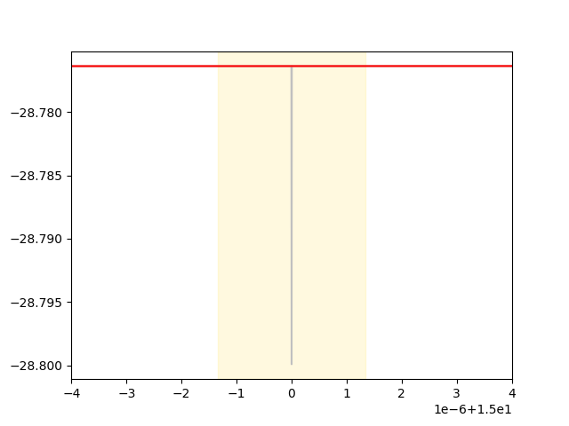
## New Eq:
((fabs(-15.0 + cell__V) < 1.3356169352718439e-6) ? ((-5615382.0261832969 + 374358.83507888648 * cell__V) * (4.689170999988896e-6 * (-0.61380000000000001 + 0.00012271265 * exp(9.9999999999406119e-8)) / (-1.0 + exp(9.9999999999406119e-8)) + 4.689170999988896e-6 * (-0.61380000000000001 + 0.00012271265 * exp(-9.9999999999406119e-8)) / (-1.0 + exp(-9.9999999999406119e-8))) - 4.689170999988896e-6 * (-0.61380000000000001 + 0.00012271265 * exp(-9.9999999999406119e-8)) / (-1.0 + exp(-9.9999999999406119e-8))) : (4.0 * (-15.0 + cell__V) * (-Environment__Ca_o * ICaL__gacao + Ca__Ca_ss * ICaL__gacai * exp(2.0 * (-15.0 + cell__V) * Environment__FonRT)) * Environment__F * Environment__FonRT * ICaL__G_CaL_mult * ICaL__pca / (-1.0 + exp(2.0 * (-15.0 + cell__V) * Environment__FonRT))))

## Equation 2:
```
ICab__ICab = 7.9803360000000004e-7 * (-0.34100000000000003 * Environment__Ca_o + Ca__Ca_i * exp(2.0 * Environment__FonRT * cell__V)) * Environment__F * Environment__FonRT * cell__V / (-1.0 + exp(2.0 * Environment__FonRT * cell__V))
```
### Partially evaluated to: 
```
ICab__ICab = 0.0028824983370005666 * (-0.61380000000000001 + 0.00012131665999999999 * exp(0.074871767015599999 * cell__V)) * cell__V / (-1.0 + exp(0.074871767015599999 * cell__V))
```
### Singulariy points detected:

{0}
*U*
`0.074871767015599999 * cell__V`

*V for 1e-07 range* 
`-1.3356169352750065e-6 - 1.3356169352750065e-6`

*Singularity point: 0*

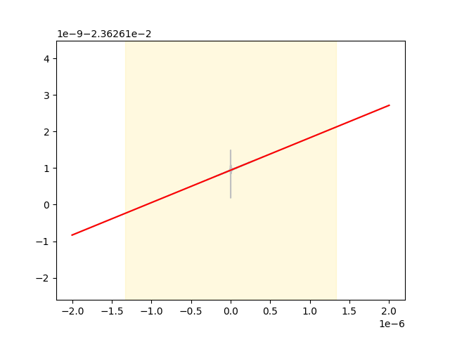
## New Eq:
((fabs(cell__V) < 1.3356169352750065e-6) ? ((0.5 + 374358.83507800003 * cell__V) * (3.8499135947999997e-9 * (-0.61380000000000001 + 0.00012131665999999999 * exp(9.9999999999999995e-8)) / (-1.0 + exp(9.9999999999999995e-8)) + 3.8499135947999997e-9 * (-0.61380000000000001 + 0.00012131665999999999 * exp(-9.9999999999999995e-8)) / (-1.0 + exp(-9.9999999999999995e-8))) - 3.8499135947999997e-9 * (-0.61380000000000001 + 0.00012131665999999999 * exp(-9.9999999999999995e-8)) / (-1.0 + exp(-9.9999999999999995e-8))) : (7.9803360000000004e-7 * (-0.34100000000000003 * Environment__Ca_o + Ca__Ca_i * exp(2.0 * Environment__FonRT * cell__V)) * Environment__F * Environment__FonRT * cell__V / (-1.0 + exp(2.0 * Environment__FonRT * cell__V))))

## Equation 3:
```
IKr__tauxr = 1 / (0.00029999999999999997 * (38.360799999999998 + cell__V) / (-1.0 + 343.26878155836141 * exp(0.1522 * cell__V)) + 0.00059999999999999995 * (-1.7383999999999999 + cell__V) / (1.0 - 1.2667092551679247 * exp(-0.13600000000000001 * cell__V)))
```
### Partially evaluated to: 
```
IKr__tauxr = 1 / (0.00029999999999999997 * (38.360799999999998 + cell__V) / (-1.0 + 343.26878155836141 * exp(0.1522 * cell__V)) + 0.00059999999999999995 * (-1.7383999999999999 + cell__V) / (1.0 - 1.2667092551679247 * exp(-0.13600000000000001 * cell__V)))
```
### Singulariy points detected:

{1.7383999999999999, -38.360799999999998}
#### float * A

####1 / A


####A + B:

`0.00059999999999999995 * (-1.7383999999999999 + cell__V) / (1.0 - 1.2667092551679247 * exp(-0.13600000000000001 * cell__V))`
`0.00029999999999999997 * (38.360799999999998 + cell__V) / (-1.0 + 343.26878155836141 * exp(0.1522 * cell__V))`

*U*
`0.2364224 - 0.13600000000000001 * cell__V`

*V for 1e-07 range* 
`1.7383992647058824 - 1.7384007352941175`

*Singularity point: 1.7383999999999999*


*U*
`5.8385137599999997 + 0.1522 * cell__V`

*V for 1e-07 range* 
`-38.360800657030218 - -38.360799342969777`

*Singularity point: -38.360799999999998*


## New Eq:
((fabs(-1.7383999999999999 + cell__V) < 7.3529411765034525e-7) ? (1 / (0.012029759779411764 / (-1.0 + exp(6.1030981280882353)) - 4.4117647058708463e-10 / (1.0 - exp(9.99999999998398e-8))) + (-1182111.4999988999 + 679999.99999936717 * cell__V) * (1 / (0.012029760220588234 / (-1.0 + exp(6.1030983519117648)) + 4.4117647059020713e-10 / (1.0 - exp(-1.0000000000049032e-7))) - 1 / (0.012029759779411764 / (-1.0 + exp(6.1030981280882353)) - 4.4117647058708463e-10 / (1.0 - exp(9.99999999998398e-8))))) : ((fabs(38.360799999999998 + cell__V) < 6.5703022339436146e-7) ? (1 / (-1.9710906701830842e-10 / (-1.0 + exp(-1.0000000000287557e-7)) - 0.024059520394218131 / (1.0 - exp(5.4534912893561103))) + (29192569.299818475 + 760999.99999526795 * cell__V) * (1 / (1.9710906701830842e-10 / (-1.0 + exp(1.0000000000287557e-7)) - 0.024059519605781864 / (1.0 - exp(5.4534911106438893))) - 1 / (-1.9710906701830842e-10 / (-1.0 + exp(-1.0000000000287557e-7)) - 0.024059520394218131 / (1.0 - exp(5.4534912893561103))))) : (1 / (0.00029999999999999997 * (38.360799999999998 + cell__V) / (-1.0 + exp(5.8385137599999997 + 0.1522 * cell__V)) + 0.00059999999999999995 * (-1.7383999999999999 + cell__V) / (1.0 - exp(0.2364224 - 0.13600000000000001 * cell__V))))))

## Equation 4:
```
IKs__tauxs = 1 / (7.6100000000000007e-5 * (44.600000000000001 + cell__V) / (1.0 - 7.6868266637773744e-194 * exp(-9.9700000000000006 * cell__V)) + 0.00036000000000000002 * (-0.55000000000000004 + cell__V) / (-1.0 + 0.93202093695954691 * exp(0.128 * cell__V)))
```
### Partially evaluated to: 
```
IKs__tauxs = 1 / (7.6100000000000007e-5 * (44.600000000000001 + cell__V) / (1.0 - 7.6868266637773744e-194 * exp(-9.9700000000000006 * cell__V)) + 0.00036000000000000002 * (-0.55000000000000004 + cell__V) / (-1.0 + 0.93202093695954691 * exp(0.128 * cell__V)))
```
### Singulariy points detected:

{-44.600000000000001, 0.55000000000000005}
#### float * A

####1 / A


####A + B:

`7.6100000000000007e-5 * (44.600000000000001 + cell__V) / (1.0 - 7.6868266637773744e-194 * exp(-9.9700000000000006 * cell__V))`
`0.00036000000000000002 * (-0.55000000000000004 + cell__V) / (-1.0 + 0.93202093695954691 * exp(0.128 * cell__V))`

*U*
`-444.66200000000003 - 9.9700000000000006 * cell__V`

*V for 1e-07 range* 
`-44.600000010030094 - -44.599999989969909`

*Singularity point: -44.600000000000001*

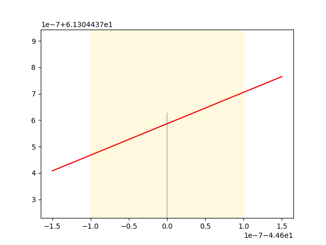
*U*
`-0.070400000000000004 + 0.128 * cell__V`

*V for 1e-07 range* 
`0.54999921875000002 - 0.55000078125000007`

*Singularity point: 0.55000000000000005*


## New Eq:
((fabs(44.600000000000001 + cell__V) < 1.0030090258350555e-8) ? (1 / (-0.016254000003610835 / (-1.0 + exp(-5.7792000012838516)) - 7.6328986866047728e-13 / (1.0 - exp(9.9999999836342113e-8))) + (2223310003.262351 + 49850000.061936118 * cell__V) * (1 / (7.6328986866047728e-13 / (1.0 - exp(-9.9999999836342113e-8)) - 0.016253999996389171 / (-1.0 + exp(-5.7791999987161491))) - 1 / (-0.016254000003610835 / (-1.0 + exp(-5.7792000012838516)) - 7.6328986866047728e-13 / (1.0 - exp(9.9999999836342113e-8))))) : ((fabs(-0.55000000000000004 + cell__V) < 7.8124999999557715e-7) ? (1 / (0.0034359149405468756 / (1.0 - exp(-450.14549221093756)) - 2.8124999999903229e-10 / (-1.0 + exp(-9.999999999962296e-8))) + (-351999.50000003882 + 640000.00000007043 * cell__V) * (1 / (2.812500000009058e-10 / (-1.0 + exp(1.0000000000027348e-7)) + 0.0034359150594531255 / (1.0 - exp(-450.14550778906255))) - 1 / (0.0034359149405468756 / (1.0 - exp(-450.14549221093756)) - 2.8124999999903229e-10 / (-1.0 + exp(-9.999999999962296e-8))))) : (1 / (7.6100000000000007e-5 * (44.600000000000001 + cell__V) / (1.0 - exp(-444.66200000000003 - 9.9700000000000006 * cell__V)) + 0.00036000000000000002 * (-0.55000000000000004 + cell__V) / (-1.0 + exp(-0.070400000000000004 + 0.128 * cell__V))))))

## Equation 5:
```
INa__am = 0.32000000000000001 * (47.130000000000003 + cell__V) / (1.0 - 0.00897780373069724 * exp(-0.10000000000000001 * cell__V))
```
### Partially evaluated to: 
```
INa__am = 0.32000000000000001 * (47.130000000000003 + cell__V) / (1.0 - 0.00897780373069724 * exp(-0.10000000000000001 * cell__V))
```
### Singulariy points detected:

{-47.130000000000003}
*U*
`-4.7130000000000001 - 0.10000000000000001 * cell__V`

*V for 1e-07 range* 
`-47.130001 - -47.129999000000005`

*Singularity point: -47.130000000000003*

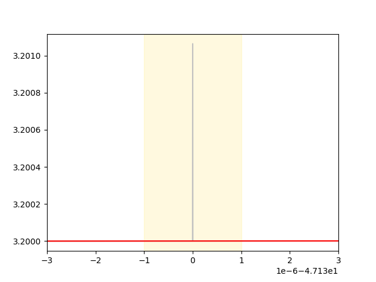
## New Eq:
((fabs(47.130000000000003 + cell__V) < 1.0000000000287557e-6) ? (-3.200000000092018e-7 / (1.0 - exp(1.0000000000287557e-7)) + (23565000.499322373 + 499999.99998562218 * cell__V) * (3.200000000092018e-7 / (1.0 - exp(1.0000000000287557e-7)) + 3.200000000092018e-7 / (1.0 - exp(-1.0000000000287557e-7)))) : (0.32000000000000001 * (47.130000000000003 + cell__V) / (1.0 - exp(-4.7130000000000001 - 0.10000000000000001 * cell__V))))

## Equation 6:
```
INal__amL = 0.32000000000000001 * (47.130000000000003 + cell__V) / (1.0 - 0.00897780373069724 * exp(-0.10000000000000001 * cell__V))
```
### Partially evaluated to: 
```
INal__amL = 0.32000000000000001 * (47.130000000000003 + cell__V) / (1.0 - 0.00897780373069724 * exp(-0.10000000000000001 * cell__V))
```
### Singulariy points detected:

{-47.130000000000003}
*U*
`-4.7130000000000001 - 0.10000000000000001 * cell__V`

*V for 1e-07 range* 
`-47.130001 - -47.129999000000005`

*Singularity point: -47.130000000000003*

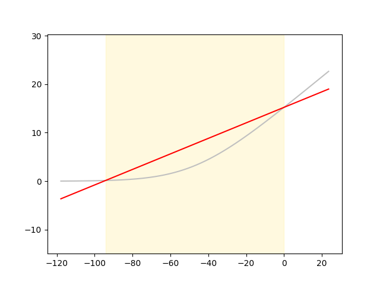
## New Eq:
((fabs(47.130000000000003 + cell__V) < 1.0000000000287557e-6) ? (-3.200000000092018e-7 / (1.0 - exp(1.0000000000287557e-7)) + (23565000.499322373 + 499999.99998562218 * cell__V) * (3.200000000092018e-7 / (1.0 - exp(1.0000000000287557e-7)) + 3.200000000092018e-7 / (1.0 - exp(-1.0000000000287557e-7)))) : (0.32000000000000001 * (47.130000000000003 + cell__V) / (1.0 - exp(-4.7130000000000001 - 0.10000000000000001 * cell__V))))

## Equation 7:
```
Ito2__Ito2_max = (-Environment__Cl_o * exp(Environment__FonRT * cell__V) + Cl__Cl_i) * Environment__F * Environment__FonRT * Ito2__PCl * cell__V / (1.0 - exp(Environment__FonRT * cell__V))
```
### Partially evaluated to: 
```
Ito2__Ito2_max = 0.001444800488100033 * (15.59207157178 - 100.0 * exp(0.0374358835078 * cell__V)) * cell__V / (1.0 - exp(0.0374358835078 * cell__V))
```
### Singulariy points detected:

{0}
*U*
`0.0374358835078 * cell__V`

*V for 1e-07 range* 
`-2.671233870550013e-6 - 2.671233870550013e-6`

*Singularity point: 0*


## New Eq:
((fabs(cell__V) < 2.671233870550013e-6) ? ((0.5 + 187179.41753900002 * cell__V) * (3.8593999999999993e-9 * (15.59207157178 - 100.0 * exp(9.9999999999999995e-8)) / (1.0 - exp(9.9999999999999995e-8)) + 3.8593999999999993e-9 * (15.59207157178 - 100.0 * exp(-9.9999999999999995e-8)) / (1.0 - exp(-9.9999999999999995e-8))) - 3.8593999999999993e-9 * (15.59207157178 - 100.0 * exp(-9.9999999999999995e-8)) / (1.0 - exp(-9.9999999999999995e-8))) : ((-Environment__Cl_o * exp(Environment__FonRT * cell__V) + Cl__Cl_i) * Environment__F * Environment__FonRT * Ito2__PCl * cell__V / (1.0 - exp(Environment__FonRT * cell__V))))

# Model: iribe_model_2006
## Equation 1:
```
L_type_Ca_channel__i_Ca_L_Ca = 4.0 * (-50.0 + membrane_potential__V) * (intracellular_calcium_concentration__Ca_i * exp(100.0 * cell_parameters__F / (cell_parameters__R * cell_parameters__T)) - cell_parameters__Ca_o * exp(-2.0 * (-50.0 + membrane_potential__V) * cell_parameters__F / (cell_parameters__R * cell_parameters__T))) * L_type_Ca_channel__P_Ca_L_Ca * L_type_Ca_channel_d_gate__d * L_type_Ca_channel_f_gate__f * cell_parameters__F / ((1.0 - exp(-2.0 * (-50.0 + membrane_potential__V) * cell_parameters__F / (cell_parameters__R * cell_parameters__T))) * cell_parameters__R * cell_parameters__T)
```
### Partially evaluated to: 
```
L_type_Ca_channel__i_Ca_L_Ca = 6.7036611685372591e-10 * (0.00041860737605004732 - 84.481811513632152 * exp(-0.074867781645490947 * membrane_potential__V)) * (-50.0 + membrane_potential__V) / (1.0 - 42.240905756816076 * exp(-0.074867781645490947 * membrane_potential__V))
```
### Singulariy points detected:

{50.000000000000000}
*U*
`3.7433890822745473 - 0.074867781645490947 * membrane_potential__V`

*V for 1e-07 range* 
`49.999998664311967 - 50.000001335688033`

*Singularity point: 50.000000000000000*


## New Eq:
((fabs(-50.0 + membrane_potential__V) < 1.3356880329551402e-6) ? ((-18716944.911788113 + 374338.90823576227 * membrane_potential__V) * (8.953999999801289e-16 * (9.91e-6 * exp(3.7433890822745473) - 2.0 * exp(9.9999999999406119e-8)) / (1.0 - exp(9.9999999999406119e-8)) + 8.953999999801289e-16 * (9.91e-6 * exp(3.7433890822745473) - 2.0 * exp(-9.9999999999406119e-8)) / (1.0 - exp(-9.9999999999406119e-8))) - 8.953999999801289e-16 * (9.91e-6 * exp(3.7433890822745473) - 2.0 * exp(9.9999999999406119e-8)) / (1.0 - exp(9.9999999999406119e-8))) : (4.0 * (-50.0 + membrane_potential__V) * (intracellular_calcium_concentration__Ca_i * exp(100.0 * cell_parameters__F / (cell_parameters__R * cell_parameters__T)) - cell_parameters__Ca_o * exp(-2.0 * (-50.0 + membrane_potential__V) * cell_parameters__F / (cell_parameters__R * cell_parameters__T))) * L_type_Ca_channel__P_Ca_L_Ca * L_type_Ca_channel_d_gate__d * L_type_Ca_channel_f_gate__f * cell_parameters__F / ((1.0 - exp(-2.0 * (-50.0 + membrane_potential__V) * cell_parameters__F / (cell_parameters__R * cell_parameters__T))) * cell_parameters__R * cell_parameters__T)))

## Equation 2:
```
L_type_Ca_channel__i_Ca_L_K = 0.002 * (-50.0 + membrane_potential__V) * (intracellular_potassium_concentration__K_i * exp(50.0 * cell_parameters__F / (cell_parameters__R * cell_parameters__T)) - cell_parameters__K_o * exp((50.0 - membrane_potential__V) * cell_parameters__F / (cell_parameters__R * cell_parameters__T))) * L_type_Ca_channel__P_Ca_L_Ca * L_type_Ca_channel_d_gate__d * L_type_Ca_channel_f_gate__f * cell_parameters__F / ((1.0 - exp((50.0 - membrane_potential__V) * cell_parameters__F / (cell_parameters__R * cell_parameters__T))) * cell_parameters__R * cell_parameters__T)
```
### Partially evaluated to: 
```
L_type_Ca_channel__i_Ca_L_K = 3.3518305842686299e-13 * (898.33330200443856 - 25.997201620733282 * exp(-0.037433890822745473 * membrane_potential__V)) * (-50.0 + membrane_potential__V) / (1.0 - 6.4993004051833205 * exp(-0.037433890822745473 * membrane_potential__V))
```
### Singulariy points detected:

{50.000000000000000}
*U*
`1.8716945411372736 - 0.037433890822745473 * membrane_potential__V`

*V for 1e-07 range* 
`49.999997328623934 - 50.000002671376066`

*Singularity point: 50.000000000000000*


## New Eq:
((fabs(-50.0 + membrane_potential__V) < 2.6713760659657915e-6) ? ((-9358472.2056995872 + 187169.45411399176 * membrane_potential__V) * (8.9539999999873531e-19 * (138.22 * exp(1.8716945411372736) - 4.0 * exp(9.9999999999406119e-8)) / (1.0 - exp(9.9999999999406119e-8)) + 8.9539999999873531e-19 * (138.22 * exp(1.8716945411372736) - 4.0 * exp(-9.9999999999406119e-8)) / (1.0 - exp(-9.9999999999406119e-8))) - 8.9539999999873531e-19 * (138.22 * exp(1.8716945411372736) - 4.0 * exp(9.9999999999406119e-8)) / (1.0 - exp(9.9999999999406119e-8))) : (0.002 * (-50.0 + membrane_potential__V) * (intracellular_potassium_concentration__K_i * exp(50.0 * cell_parameters__F / (cell_parameters__R * cell_parameters__T)) - cell_parameters__K_o * exp((50.0 - membrane_potential__V) * cell_parameters__F / (cell_parameters__R * cell_parameters__T))) * L_type_Ca_channel__P_Ca_L_Ca * L_type_Ca_channel_d_gate__d * L_type_Ca_channel_f_gate__f * cell_parameters__F / ((1.0 - exp((50.0 - membrane_potential__V) * cell_parameters__F / (cell_parameters__R * cell_parameters__T))) * cell_parameters__R * cell_parameters__T)))

## Equation 3:
```
L_type_Ca_channel__i_Ca_L_Na = 0.01 * (-50.0 + membrane_potential__V) * (intracellular_sodium_concentration__Na_i * exp(50.0 * cell_parameters__F / (cell_parameters__R * cell_parameters__T)) - cell_parameters__Na_o * exp((50.0 - membrane_potential__V) * cell_parameters__F / (cell_parameters__R * cell_parameters__T))) * L_type_Ca_channel__P_Ca_L_Ca * L_type_Ca_channel_d_gate__d * L_type_Ca_channel_f_gate__f * cell_parameters__F / ((1.0 - exp((50.0 - membrane_potential__V) * cell_parameters__F / (cell_parameters__R * cell_parameters__T))) * cell_parameters__R * cell_parameters__T)
```
### Partially evaluated to: 
```
L_type_Ca_channel__i_Ca_L_Na = 1.6759152921343148e-12 * (37.722589481724512 - 909.90205672566492 * exp(-0.037433890822745473 * membrane_potential__V)) * (-50.0 + membrane_potential__V) / (1.0 - 6.4993004051833205 * exp(-0.037433890822745473 * membrane_potential__V))
```
### Singulariy points detected:

{50.000000000000000}
*U*
`1.8716945411372736 - 0.037433890822745473 * membrane_potential__V`

*V for 1e-07 range* 
`49.999997328623934 - 50.000002671376066`

*Singularity point: 50.000000000000000*


## New Eq:
((fabs(-50.0 + membrane_potential__V) < 2.6713760659657915e-6) ? ((-9358472.2056995872 + 187169.45411399176 * membrane_potential__V) * (4.4769999999936762e-18 * (5.8041 * exp(1.8716945411372736) - 140.0 * exp(9.9999999999406119e-8)) / (1.0 - exp(9.9999999999406119e-8)) + 4.4769999999936762e-18 * (5.8041 * exp(1.8716945411372736) - 140.0 * exp(-9.9999999999406119e-8)) / (1.0 - exp(-9.9999999999406119e-8))) - 4.4769999999936762e-18 * (5.8041 * exp(1.8716945411372736) - 140.0 * exp(9.9999999999406119e-8)) / (1.0 - exp(9.9999999999406119e-8))) : (0.01 * (-50.0 + membrane_potential__V) * (intracellular_sodium_concentration__Na_i * exp(50.0 * cell_parameters__F / (cell_parameters__R * cell_parameters__T)) - cell_parameters__Na_o * exp((50.0 - membrane_potential__V) * cell_parameters__F / (cell_parameters__R * cell_parameters__T))) * L_type_Ca_channel__P_Ca_L_Ca * L_type_Ca_channel_d_gate__d * L_type_Ca_channel_f_gate__f * cell_parameters__F / ((1.0 - exp((50.0 - membrane_potential__V) * cell_parameters__F / (cell_parameters__R * cell_parameters__T))) * cell_parameters__R * cell_parameters__T)))

# Model: iyer_model_2004
# Model: iyer_model_2007
# Model: jafri_rice_winslow_1998
## Equation 1:
```
L_type_Ca_channel__i_Ca_L_Ca_max = 4.0 * pow(membrane__F, 2) * (0.001 * exp(2.0 * membrane__F * membrane__V / (membrane__R * membrane__T)) - 0.34100000000000003 * ionic_concentrations__Cao) * L_type_Ca_channel__P_Ca * membrane__V / ((-1.0 + exp(2.0 * membrane__F * membrane__V / (membrane__R * membrane__T))) * membrane__R * membrane__T)
```
### Partially evaluated to: 
```
L_type_Ca_channel__i_Ca_L_Ca_max = 0.49123617829520522 * (-0.61380000000000001 + 0.001 * exp(0.075146605522028176 * membrane__V)) * membrane__V / (-1.0 + exp(0.075146605522028176 * membrane__V))
```
### Singulariy points detected:

{0}
*U*
`0.075146605522028176 * membrane__V`

*V for 1e-07 range* 
`-1.3307320976818627e-6 - 1.3307320976818627e-6`

*Singularity point: 0*


## New Eq:
((fabs(membrane__V) < 1.3307320976818627e-6) ? ((0.5 + 375733.02761014085 * membrane__V) * (6.5370374999999993e-7 * (-0.61380000000000001 + 0.001 * exp(9.9999999999999995e-8)) / (-1.0 + exp(9.9999999999999995e-8)) + 6.5370374999999993e-7 * (-0.61380000000000001 + 0.001 * exp(-9.9999999999999995e-8)) / (-1.0 + exp(-9.9999999999999995e-8))) - 6.5370374999999993e-7 * (-0.61380000000000001 + 0.001 * exp(-9.9999999999999995e-8)) / (-1.0 + exp(-9.9999999999999995e-8))) : (4.0 * pow(membrane__F, 2) * (0.001 * exp(2.0 * membrane__F * membrane__V / (membrane__R * membrane__T)) - 0.34100000000000003 * ionic_concentrations__Cao) * L_type_Ca_channel__P_Ca * membrane__V / ((-1.0 + exp(2.0 * membrane__F * membrane__V / (membrane__R * membrane__T))) * membrane__R * membrane__T)))

## Equation 2:
```
L_type_Ca_channel__i_Ca_L_K = pow(membrane__F, 2) * (-ionic_concentrations__Ko + ionic_concentrations__Ki * exp(membrane__F * membrane__V / (membrane__R * membrane__T))) * (L_type_Ca_channel__O + L_type_Ca_channel__O_Ca) * L_type_Ca_channel__p_k * L_type_Ca_channel_y_gate__y * membrane__V / ((-1.0 + exp(membrane__F * membrane__V / (membrane__R * membrane__T))) * membrane__R * membrane__T)
```
### Partially evaluated to: 
```
L_type_Ca_channel__i_Ca_L_K = 3.5789092431332635e-26 * (-5.4000000000000004 + 143.727 * exp(0.037573302761014088 * membrane__V)) * membrane__V / ((1.0 - 107.25680748803607 * (-0.61380000000000001 + 0.001 * exp(0.075146605522028176 * membrane__V)) * membrane__V / (-1.0 + exp(0.075146605522028176 * membrane__V))) * (-1.0 + exp(0.037573302761014088 * membrane__V)))
```
### Singulariy points detected:

{0}
*U*
`0.037573302761014088 * membrane__V`

*V for 1e-07 range* 
`-2.6614641953637254e-6 - 2.6614641953637254e-6`

*Singularity point: 0*


## New Eq:
((fabs(membrane__V) < 2.6614641953637254e-6) ? ((0.5 + 187866.51380507043 * membrane__V) * (9.5251388090554711e-32 * (-5.4000000000000004 + 143.727 * exp(-9.9999999999999995e-8)) / ((1.0 + 0.00028546015283842797 * (-0.61380000000000001 + 0.001 * exp(-1.9999999999999999e-7)) / (-1.0 + exp(-1.9999999999999999e-7))) * (-1.0 + exp(-9.9999999999999995e-8))) + 9.5251388090554711e-32 * (-5.4000000000000004 + 143.727 * exp(9.9999999999999995e-8)) / ((1.0 - 0.00028546015283842797 * (-0.61380000000000001 + 0.001 * exp(1.9999999999999999e-7)) / (-1.0 + exp(1.9999999999999999e-7))) * (-1.0 + exp(9.9999999999999995e-8)))) - 9.5251388090554711e-32 * (-5.4000000000000004 + 143.727 * exp(-9.9999999999999995e-8)) / ((1.0 + 0.00028546015283842797 * (-0.61380000000000001 + 0.001 * exp(-1.9999999999999999e-7)) / (-1.0 + exp(-1.9999999999999999e-7))) * (-1.0 + exp(-9.9999999999999995e-8)))) : (pow(membrane__F, 2) * (-ionic_concentrations__Ko + ionic_concentrations__Ki * exp(membrane__F * membrane__V / (membrane__R * membrane__T))) * (L_type_Ca_channel__O + L_type_Ca_channel__O_Ca) * L_type_Ca_channel__p_k * L_type_Ca_channel_y_gate__y * membrane__V / ((-1.0 + exp(membrane__F * membrane__V / (membrane__R * membrane__T))) * membrane__R * membrane__T)))

## Equation 3:
```
fast_sodium_current_m_gate__alpha_m = 0.32000000000000001 * (47.130000000000003 + membrane__V) / (1.0 - 0.00897780373069724 * exp(-0.10000000000000001 * membrane__V))
```
### Partially evaluated to: 
```
fast_sodium_current_m_gate__alpha_m = 0.32000000000000001 * (47.130000000000003 + membrane__V) / (1.0 - 0.00897780373069724 * exp(-0.10000000000000001 * membrane__V))
```
### Singulariy points detected:

{-47.130000000000003}
*U*
`-4.7130000000000001 - 0.10000000000000001 * membrane__V`

*V for 1e-07 range* 
`-47.130001 - -47.129999000000005`

*Singularity point: -47.130000000000003*


## New Eq:
((fabs(47.130000000000003 + membrane__V) < 1.0000000000287557e-6) ? (-3.200000000092018e-7 / (1.0 - exp(1.0000000000287557e-7)) + (23565000.499322373 + 499999.99998562218 * membrane__V) * (3.200000000092018e-7 / (1.0 - exp(1.0000000000287557e-7)) + 3.200000000092018e-7 / (1.0 - exp(-1.0000000000287557e-7)))) : (0.32000000000000001 * (47.130000000000003 + membrane__V) / (1.0 - exp(-4.7130000000000001 - 0.10000000000000001 * membrane__V))))

## Equation 4:
```
time_dependent_potassium_current_X_gate__alpha_X = 7.1899999999999999e-5 * (30.0 + membrane__V) / (1.0 - 0.011795938519751569 * exp(-0.14799999999999999 * membrane__V))
```
### Partially evaluated to: 
```
time_dependent_potassium_current_X_gate__alpha_X = 7.1899999999999999e-5 * (30.0 + membrane__V) / (1.0 - 0.011795938519751569 * exp(-0.14799999999999999 * membrane__V))
```
### Singulariy points detected:

{-30.000000000000000}
*U*
`-4.4399999999999995 - 0.14799999999999999 * membrane__V`

*V for 1e-07 range* 
`-30.000000675675675 - -29.999999324324325`

*Singularity point: -30.000000000000000*


## New Eq:
((fabs(30.0 + membrane__V) < 6.7567567568760367e-7) ? (-4.8581081081938701e-11 / (1.0 - exp(1.0000000000287557e-7)) + (22200000.499608092 + 739999.99998693645 * membrane__V) * (4.8581081081938701e-11 / (1.0 - exp(1.0000000000287557e-7)) + 4.8581081081938701e-11 / (1.0 - exp(-1.0000000000287557e-7)))) : (7.1899999999999999e-5 * (30.0 + membrane__V) / (1.0 - exp(-4.4399999999999995 - 0.14799999999999999 * membrane__V))))

## Equation 5:
```
time_dependent_potassium_current_X_gate__beta_X = 0.00013100000000000001 * (30.0 + membrane__V) / (-1.0 + 7.8538197044216602 * exp(0.068699999999999997 * membrane__V))
```
### Partially evaluated to: 
```
time_dependent_potassium_current_X_gate__beta_X = 0.00013100000000000001 * (30.0 + membrane__V) / (-1.0 + 7.8538197044216602 * exp(0.068699999999999997 * membrane__V))
```
### Singulariy points detected:

{-30.000000000000000}
*U*
`2.0609999999999999 + 0.068699999999999997 * membrane__V`

*V for 1e-07 range* 
`-30.000001455604075 - -29.999998544395925`

*Singularity point: -30.000000000000000*


## New Eq:
((fabs(30.0 + membrane__V) < 1.455604075689676e-6) ? (-1.9068413391534758e-10 / (-1.0 + exp(-9.9999999999406119e-8)) + (10305000.50001229 + 343500.00000040967 * membrane__V) * (1.9068413391534758e-10 / (-1.0 + exp(9.9999999999406119e-8)) + 1.9068413391534758e-10 / (-1.0 + exp(-9.9999999999406119e-8)))) : (0.00013100000000000001 * (30.0 + membrane__V) / (-1.0 + exp(2.0609999999999999 + 0.068699999999999997 * membrane__V))))

# Model: kurata_model_2002
## Equation 1:
```
L_type_calcium_channel_current_d_gate__alpha_d = -0.028389999999999999 * (35.0 + membrane__V) / (-1.0 + 8.3152871910356788e-7 * exp(-0.40000000000000002 * membrane__V)) - 0.084900000000000003 * membrane__V / (-1.0 + exp(-0.20798668885191349 * membrane__V))
```
### Partially evaluated to: 
```
L_type_calcium_channel_current_d_gate__alpha_d = -0.028389999999999999 * (35.0 + membrane__V) / (-1.0 + 8.3152871910356788e-7 * exp(-0.40000000000000002 * membrane__V)) - 0.084900000000000003 * membrane__V / (-1.0 + exp(-0.20798668885191349 * membrane__V))
```
### Singulariy points detected:

{0, -35.000000000000000}
####A + B:

`0.084900000000000003 * membrane__V / (1.0 - exp(-0.20798668885191349 * membrane__V))`
`-0.028389999999999999 * (35.0 + membrane__V) / (-1.0 + 8.3152871910356788e-7 * exp(-0.40000000000000002 * membrane__V))`

*U*
`0.20798668885191349 * membrane__V`

*V for 1e-07 range* 
`-4.8079999999999991e-7 - 4.8079999999999991e-7`

*Singularity point: 0*


*U*
`-14.0 - 0.40000000000000002 * membrane__V`

*V for 1e-07 range* 
`-35.000000249999999 - -34.999999750000001`

*Singularity point: -35.000000000000000*


## New Eq:
((fabs(membrane__V) < 4.8079999999999991e-7) ? (4.0819919999999999e-8 / (-1.0 + exp(9.9999999999999995e-8)) - 0.99364998635008794 / (-1.0 + exp(-13.99999980768)) + (0.5 + 1039933.4442595674 * membrane__V) * (0.99364998635008794 / (-1.0 + exp(-13.99999980768)) - 0.9936500136499119 / (-1.0 + exp(-14.00000019232)) - 4.0819919999999999e-8 / (-1.0 + exp(9.9999999999999995e-8)) - 4.0819919999999999e-8 / (-1.0 + exp(-9.9999999999999995e-8)))) : ((fabs(35.0 + membrane__V) < 2.5000000003494449e-7) ? (2.9715000212250002 / (-1.0 + exp(7.2795341618136442)) + 7.0974999994161126e-9 / (-1.0 + exp(9.9999999988997779e-8)) + (70000000.497987106 + 1999999.9999424887 * membrane__V) * (2.9714999787750003 / (-1.0 + exp(7.2795340578202996)) - 7.0975000009920736e-9 / (-1.0 + exp(-1.0000000001675335e-7)) - 2.9715000212250002 / (-1.0 + exp(7.2795341618136442)) - 7.0974999994161126e-9 / (-1.0 + exp(9.9999999988997779e-8)))) : (-0.028389999999999999 * (35.0 + membrane__V) / (-1.0 + exp(-14.0 - 0.40000000000000002 * membrane__V)) - 0.084900000000000003 * membrane__V / (-1.0 + exp(-0.20798668885191349 * membrane__V)))))

## Equation 2:
```
L_type_calcium_channel_current_d_gate__beta_d = 0.011429999999999999 * (-5.0 + membrane__V) / (-1.0 + 0.1353352832366127 * exp(0.40000000000000002 * membrane__V))
```
### Partially evaluated to: 
```
L_type_calcium_channel_current_d_gate__beta_d = 0.011429999999999999 * (-5.0 + membrane__V) / (-1.0 + 0.1353352832366127 * exp(0.40000000000000002 * membrane__V))
```
### Singulariy points detected:

{5.0000000000000000}
*U*
`-2.0 + 0.40000000000000002 * membrane__V`

*V for 1e-07 range* 
`4.9999997499999997 - 5.0000002500000003`

*Singularity point: 5.0000000000000000*


## New Eq:
((fabs(-5.0 + membrane__V) < 2.5000000000025002e-7) ? (-2.8575000000028576e-9 / (-1.0 + exp(-9.9999999999406119e-8)) + (-9999999.4999899995 + 1999999.9999979998 * membrane__V) * (2.8575000000028576e-9 / (-1.0 + exp(9.9999999999406119e-8)) + 2.8575000000028576e-9 / (-1.0 + exp(-9.9999999999406119e-8)))) : (0.011429999999999999 * (-5.0 + membrane__V) / (-1.0 + exp(-2.0 + 0.40000000000000002 * membrane__V))))

# Model: LivshitzRudy2007
## Equation 1:
```
ICaL__ibarca = 4.0 * (-Environment__Ca_o * ICaL__gacao + Ca__Ca_i * ICaL__gacai * exp(2.0 * Environment__FonRT * cell__V)) * Environment__F * Environment__FonRT * ICaL__G_CaL_mult * ICaL__pca * cell__V / (-1.0 + exp(2.0 * Environment__FonRT * cell__V))
```
### Partially evaluated to: 
```
ICaL__ibarca = 7.8019226357407252 * (-0.61380000000000001 + 0.00021845056935893161 * exp(0.074871767015605231 * cell__V)) * cell__V / (-1.0 + exp(0.074871767015605231 * cell__V))
```
### Singulariy points detected:

{0}
*U*
`0.074871767015605231 * cell__V`

*V for 1e-07 range* 
`-1.3356169352749131e-6 - 1.3356169352749131e-6`

*Singularity point: 0*


## New Eq:
((fabs(cell__V) < 1.3356169352749131e-6) ? ((0.5 + 374358.83507802623 * cell__V) * (1.042038e-5 * (-0.61380000000000001 + (-0.03239133971347874 + 0.063548825220481692 * cos(1.0319508014091063)) * exp(9.9999999999999995e-8)) / (-1.0 + exp(9.9999999999999995e-8)) + 1.042038e-5 * (-0.61380000000000001 + (-0.03239133971347874 + 0.063548825220481692 * cos(1.0319508014091063)) * exp(-9.9999999999999995e-8)) / (-1.0 + exp(-9.9999999999999995e-8))) - 1.042038e-5 * (-0.61380000000000001 + (-0.03239133971347874 + 0.063548825220481692 * cos(1.0319508014091063)) * exp(-9.9999999999999995e-8)) / (-1.0 + exp(-9.9999999999999995e-8))) : (4.0 * (-Environment__Ca_o * ICaL__gacao + Ca__Ca_i * ICaL__gacai * exp(2.0 * Environment__FonRT * cell__V)) * Environment__F * Environment__FonRT * ICaL__G_CaL_mult * ICaL__pca * cell__V / (-1.0 + exp(2.0 * Environment__FonRT * cell__V))))

## Equation 2:
```
ICaL__ibark = (-Environment__K_o * ICaL__gako + ICaL__gaki * K__K_i * exp(Environment__FonRT * cell__V)) * Environment__F * Environment__FonRT * ICaL__G_CaL_mult * ICaL__pk * cell__V / (-1.0 + exp(Environment__FonRT * cell__V))
```
### Partially evaluated to: 
```
ICaL__ibark = 0.00069711623550831479 * (-3.375 + 104.79818557737076 * exp(0.037435883507802616 * cell__V)) * cell__V / (-1.0 + exp(0.037435883507802616 * cell__V))
```
### Singulariy points detected:

{0}
*U*
`0.037435883507802616 * cell__V`

*V for 1e-07 range* 
`-2.6712338705498262e-6 - 2.6712338705498262e-6`

*Singularity point: 0*


## New Eq:
((fabs(cell__V) < 2.6712338705498262e-6) ? ((0.5 + 187179.41753901311 * cell__V) * (1.8621604999999999e-9 * (-3.375 + 104.79818557737076 * exp(9.9999999999999995e-8)) / (-1.0 + exp(9.9999999999999995e-8)) + 1.8621604999999999e-9 * (-3.375 + 104.79818557737076 * exp(-9.9999999999999995e-8)) / (-1.0 + exp(-9.9999999999999995e-8))) - 1.8621604999999999e-9 * (-3.375 + 104.79818557737076 * exp(-9.9999999999999995e-8)) / (-1.0 + exp(-9.9999999999999995e-8))) : ((-Environment__K_o * ICaL__gako + ICaL__gaki * K__K_i * exp(Environment__FonRT * cell__V)) * Environment__F * Environment__FonRT * ICaL__G_CaL_mult * ICaL__pk * cell__V / (-1.0 + exp(Environment__FonRT * cell__V))))

## Equation 3:
```
ICaL__ibarna = (-Environment__Na_o * ICaL__ganao + ICaL__ganai * Na__Na_i * exp(Environment__FonRT * cell__V)) * Environment__F * Environment__FonRT * ICaL__G_CaL_mult * ICaL__pna * cell__V / (-1.0 + exp(Environment__FonRT * cell__V))
```
### Partially evaluated to: 
```
ICaL__ibarna = 0.0024381008236689767 * (-105.0 + 12.459554485166251 * exp(0.037435883507802616 * cell__V)) * cell__V / (-1.0 + exp(0.037435883507802616 * cell__V))
```
### Singulariy points detected:

{0}
*U*
`0.037435883507802616 * cell__V`

*V for 1e-07 range* 
`-2.6712338705498262e-6 - 2.6712338705498262e-6`

*Singularity point: 0*


## New Eq:
((fabs(cell__V) < 2.6712338705498262e-6) ? ((0.5 + 187179.41753901311 * cell__V) * (6.5127375e-9 * (-105.0 + 12.459554485166251 * exp(9.9999999999999995e-8)) / (-1.0 + exp(9.9999999999999995e-8)) + 6.5127375e-9 * (-105.0 + 12.459554485166251 * exp(-9.9999999999999995e-8)) / (-1.0 + exp(-9.9999999999999995e-8))) - 6.5127375e-9 * (-105.0 + 12.459554485166251 * exp(-9.9999999999999995e-8)) / (-1.0 + exp(-9.9999999999999995e-8))) : ((-Environment__Na_o * ICaL__ganao + ICaL__ganai * Na__Na_i * exp(Environment__FonRT * cell__V)) * Environment__F * Environment__FonRT * ICaL__G_CaL_mult * ICaL__pna * cell__V / (-1.0 + exp(Environment__FonRT * cell__V))))

## Equation 4:
```
ICaL__taud = 28.571428571428569 * (1.0 - 0.20137949774492364 * exp(-0.16025641025641024 * cell__V)) * ICaL__dss0 / (10.0 + cell__V)
```
### Partially evaluated to: 
```
ICaL__taud = 28.571428571428569 * (1.0 - 0.20137949774492364 * exp(-0.16025641025641024 * cell__V)) / ((1.0 + 0.20137949774492364 * exp(-0.16025641025641024 * cell__V)) * (10.0 + cell__V))
```
### Singulariy points detected:

{-10.000000000000000}
*U*
`-1.6025641025641024 - 0.16025641025641024 * cell__V`

*V for 1e-07 range* 
`-10.000000624 - -9.9999993759999999`

*Singularity point: -10.000000000000000*


## New Eq:
((fabs(10.0 + cell__V) < 6.2399999999074307e-7) ? ((8012821.0129393814 + 801282.05129393819 * cell__V) * (45787545.788225032 * (1.0 - exp(9.9999999997671396e-8)) / (1.0 + exp(9.9999999997671396e-8)) + 45787545.788225032 * (1.0 - exp(-9.9999999997671396e-8)) / (1.0 + exp(-9.9999999997671396e-8))) - 45787545.788225032 * (1.0 - exp(9.9999999997671396e-8)) / (1.0 + exp(9.9999999997671396e-8))) : (28.571428571428569 * (1.0 - exp(-1.6025641025641024 - 0.16025641025641024 * cell__V)) * ICaL__dss0 / (10.0 + cell__V)))

## Equation 5:
```
IKr__tauxr = 1 / (0.00060999999999999997 * (38.899999999999999 + cell__V) / (-1.0 + 281.60348502322194 * exp(0.14499999999999999 * cell__V)) + 0.0013799999999999999 * (14.199999999999999 + cell__V) / (1.0 - 0.17436578041087322 * exp(-0.123 * cell__V)))
```
### Partially evaluated to: 
```
IKr__tauxr = 1 / (0.00060999999999999997 * (38.899999999999999 + cell__V) / (-1.0 + 281.60348502322194 * exp(0.14499999999999999 * cell__V)) + 0.0013799999999999999 * (14.199999999999999 + cell__V) / (1.0 - 0.17436578041087322 * exp(-0.123 * cell__V)))
```
### Singulariy points detected:

{-38.899999999999999, -14.199999999999999}
#### float * A

####1 / A


####A + B:

`0.0013799999999999999 * (14.199999999999999 + cell__V) / (1.0 - 0.17436578041087322 * exp(-0.123 * cell__V))`
`0.00060999999999999997 * (38.899999999999999 + cell__V) / (-1.0 + 281.60348502322194 * exp(0.14499999999999999 * cell__V))`

*U*
`-1.7465999999999999 - 0.123 * cell__V`

*V for 1e-07 range* 
`-14.200000813008129 - -14.199999186991869`

*Singularity point: -14.199999999999999*


*U*
`5.6404999999999994 + 0.14499999999999999 * cell__V`

*V for 1e-07 range* 
`-38.900000689655172 - -38.899999310344825`

*Singularity point: -38.899999999999999*


## New Eq:
((fabs(14.199999999999999 + cell__V) < 8.1300813006834893e-7) ? (1 / (0.015066999504065039 / (-1.0 + exp(3.5814998821138206)) - 1.1219512194943214e-9 / (1.0 - exp(9.9999999999406119e-8))) + (8733000.5000645891 + 615000.00000454858 * cell__V) * (1 / (1.1219512195134727e-9 / (1.0 - exp(-9.9999999999406119e-8)) + 0.015067000495934959 / (-1.0 + exp(3.5815001178861787))) - 1 / (0.015066999504065039 / (-1.0 + exp(3.5814998821138206)) - 1.1219512194943214e-9 / (1.0 - exp(9.9999999999406119e-8))))) : ((fabs(38.899999999999999 + cell__V) < 6.8965517246999397e-7) ? (1 / (-0.034086000951724135 / (1.0 - exp(3.0381000848275859)) - 4.2068965517283451e-10 / (-1.0 + exp(-1.0000000000287557e-7))) + (28202500.498836767 + 724999.99997009686 * cell__V) * (1 / (4.2068965520669629e-10 / (-1.0 + exp(1.0000000000287557e-7)) - 0.034085999048275861 / (1.0 - exp(3.0380999151724137))) - 1 / (-0.034086000951724135 / (1.0 - exp(3.0381000848275859)) - 4.2068965517283451e-10 / (-1.0 + exp(-1.0000000000287557e-7))))) : (1 / (0.00060999999999999997 * (38.899999999999999 + cell__V) / (-1.0 + exp(5.6404999999999994 + 0.14499999999999999 * cell__V)) + 0.0013799999999999999 * (14.199999999999999 + cell__V) / (1.0 - exp(-1.7465999999999999 - 0.123 * cell__V))))))

## Equation 6:
```
IKs__tauxs = 1 / (0.00013100000000000001 * (30.0 + cell__V) / (-1.0 + 7.8538197044216602 * exp(0.068699999999999997 * cell__V)) + 7.1899999999999999e-5 * (30.0 + cell__V) / (1.0 - 0.011795938519751569 * exp(-0.14799999999999999 * cell__V)))
```
### Partially evaluated to: 
```
IKs__tauxs = 1 / (0.00013100000000000001 * (30.0 + cell__V) / (-1.0 + 7.8538197044216602 * exp(0.068699999999999997 * cell__V)) + 7.1899999999999999e-5 * (30.0 + cell__V) / (1.0 - 0.011795938519751569 * exp(-0.14799999999999999 * cell__V)))
```
### Singulariy points detected:

{-30.000000000000000}
#### float * A

####1 / A


####A + B:

`7.1899999999999999e-5 * (30.0 + cell__V) / (1.0 - 0.011795938519751569 * exp(-0.14799999999999999 * cell__V))`
`0.00013100000000000001 * (30.0 + cell__V) / (-1.0 + 7.8538197044216602 * exp(0.068699999999999997 * cell__V))`

*U*
`-4.4399999999999995 - 0.14799999999999999 * cell__V`

*V for 1e-07 range* 
`-30.000000675675675 - -29.999999324324325`

*Singularity point: -30.000000000000000*


## New Eq:
((fabs(30.0 + cell__V) < 6.7567567568760367e-7) ? (1 / (-8.8513513515076093e-11 / (-1.0 + exp(-4.6418918920460017e-8)) - 4.8581081081938701e-11 / (1.0 - exp(1.0000000000287557e-7))) + (22200000.499608092 + 739999.99998693645 * cell__V) * (1 / (8.8513513515076093e-11 / (-1.0 + exp(4.6418918920460017e-8)) + 4.8581081081938701e-11 / (1.0 - exp(-1.0000000000287557e-7))) - 1 / (-8.8513513515076093e-11 / (-1.0 + exp(-4.6418918920460017e-8)) - 4.8581081081938701e-11 / (1.0 - exp(1.0000000000287557e-7))))) : (1 / (0.00013100000000000001 * (30.0 + cell__V) / (-1.0 + exp(2.0609999999999999 + 0.068699999999999997 * cell__V)) + 7.1899999999999999e-5 * (30.0 + cell__V) / (1.0 - exp(-4.4399999999999995 - 0.14799999999999999 * cell__V)))))

## Equation 7:
```
INa__am = 0.32000000000000001 * (47.130000000000003 + cell__V) / (1.0 - 0.00897780373069724 * exp(-0.10000000000000001 * cell__V))
```
### Partially evaluated to: 
```
INa__am = 0.32000000000000001 * (47.130000000000003 + cell__V) / (1.0 - 0.00897780373069724 * exp(-0.10000000000000001 * cell__V))
```
### Singulariy points detected:

{-47.130000000000003}
*U*
`-4.7130000000000001 - 0.10000000000000001 * cell__V`

*V for 1e-07 range* 
`-47.130001 - -47.129999000000005`

*Singularity point: -47.130000000000003*


## New Eq:
((fabs(47.130000000000003 + cell__V) < 1.0000000000287557e-6) ? (-3.200000000092018e-7 / (1.0 - exp(1.0000000000287557e-7)) + (23565000.499322373 + 499999.99998562218 * cell__V) * (3.200000000092018e-7 / (1.0 - exp(1.0000000000287557e-7)) + 3.200000000092018e-7 / (1.0 - exp(-1.0000000000287557e-7)))) : (0.32000000000000001 * (47.130000000000003 + cell__V) / (1.0 - exp(-4.7130000000000001 - 0.10000000000000001 * cell__V))))

# Model: Li_Mouse_2010
## Equation 1:
```
slow_delayed_rectifier_K_I__alpha_n = 4.8133299999999997e-6 * (26.5 + cell__V) / (1.0 - 0.033641326918204616 * exp(-0.128 * cell__V))
```
### Partially evaluated to: 
```
slow_delayed_rectifier_K_I__alpha_n = 4.8133299999999997e-6 * (26.5 + cell__V) / (1.0 - 0.033641326918204616 * exp(-0.128 * cell__V))
```
### Singulariy points detected:

{-26.500000000000000}
*U*
`-3.3919999999999999 - 0.128 * cell__V`

*V for 1e-07 range* 
`-26.500000781250002 - -26.499999218749998`

*Singularity point: -26.500000000000000*


## New Eq:
((fabs(26.5 + cell__V) < 7.8124999999817923e-7) ? (-3.7604140624912359e-12 / (1.0 - exp(9.9999999999406119e-8)) + (16960000.500039525 + 640000.00000149151 * cell__V) * (3.7604140624912359e-12 / (1.0 - exp(9.9999999999406119e-8)) + 3.7604140624912359e-12 / (1.0 - exp(-9.9999999999406119e-8)))) : (4.8133299999999997e-6 * (26.5 + cell__V) / (1.0 - exp(-3.3919999999999999 - 0.128 * cell__V))))

# Model: luo_rudy_1994
## Equation 1:
```
L_type_Ca_channel__I_CaCa = 4.0 * pow(membrane__F, 2) * (-L_type_Ca_channel__gamma_Cao * ionic_concentrations__Cao + L_type_Ca_channel__gamma_Cai * ionic_concentrations__Cai * exp(2.0 * membrane__F * membrane__V / (membrane__R * membrane__T))) * L_type_Ca_channel__P_Ca * membrane__V / ((-1.0 + exp(2.0 * membrane__F * membrane__V / (membrane__R * membrane__T))) * membrane__R * membrane__T)
```
### Partially evaluated to: 
```
L_type_Ca_channel__I_CaCa = 0.078597788527232842 * (-0.6120000000000001 + 0.00012 * exp(0.075146605522028176 * membrane__V)) * membrane__V / (-1.0 + exp(0.075146605522028176 * membrane__V))
```
### Singulariy points detected:

{0}
*U*
`0.075146605522028176 * membrane__V`

*V for 1e-07 range* 
`-1.3307320976818627e-6 - 1.3307320976818627e-6`

*Singularity point: 0*


## New Eq:
((fabs(membrane__V) < 1.3307320976818627e-6) ? ((0.5 + 375733.02761014085 * membrane__V) * (1.0459259999999999e-7 * (-0.6120000000000001 + 0.00012 * exp(9.9999999999999995e-8)) / (-1.0 + exp(9.9999999999999995e-8)) + 1.0459259999999999e-7 * (-0.6120000000000001 + 0.00012 * exp(-9.9999999999999995e-8)) / (-1.0 + exp(-9.9999999999999995e-8))) - 1.0459259999999999e-7 * (-0.6120000000000001 + 0.00012 * exp(-9.9999999999999995e-8)) / (-1.0 + exp(-9.9999999999999995e-8))) : (4.0 * pow(membrane__F, 2) * (-L_type_Ca_channel__gamma_Cao * ionic_concentrations__Cao + L_type_Ca_channel__gamma_Cai * ionic_concentrations__Cai * exp(2.0 * membrane__F * membrane__V / (membrane__R * membrane__T))) * L_type_Ca_channel__P_Ca * membrane__V / ((-1.0 + exp(2.0 * membrane__F * membrane__V / (membrane__R * membrane__T))) * membrane__R * membrane__T)))

## Equation 2:
```
L_type_Ca_channel__I_CaK = pow(membrane__F, 2) * (-L_type_Ca_channel__gamma_Ko * ionic_concentrations__Ko + L_type_Ca_channel__gamma_Ki * ionic_concentrations__Ki * exp(membrane__F * membrane__V / (membrane__R * membrane__T))) * L_type_Ca_channel__P_K * membrane__V / ((-1.0 + exp(membrane__F * membrane__V / (membrane__R * membrane__T))) * membrane__R * membrane__T)
```
### Partially evaluated to: 
```
L_type_Ca_channel__I_CaK = 7.0228579563684903e-6 * (-4.0500000000000007 + 108.75 * exp(0.037573302761014088 * membrane__V)) * membrane__V / (-1.0 + exp(0.037573302761014088 * membrane__V))
```
### Singulariy points detected:

{0}
*U*
`0.037573302761014088 * membrane__V`

*V for 1e-07 range* 
`-2.6614641953637254e-6 - 2.6614641953637254e-6`

*Singularity point: 0*


## New Eq:
((fabs(membrane__V) < 2.6614641953637254e-6) ? ((0.5 + 187866.51380507043 * membrane__V) * (1.8691085000000002e-11 * (-4.0500000000000007 + 108.75 * exp(9.9999999999999995e-8)) / (-1.0 + exp(9.9999999999999995e-8)) + 1.8691085000000002e-11 * (-4.0500000000000007 + 108.75 * exp(-9.9999999999999995e-8)) / (-1.0 + exp(-9.9999999999999995e-8))) - 1.8691085000000002e-11 * (-4.0500000000000007 + 108.75 * exp(-9.9999999999999995e-8)) / (-1.0 + exp(-9.9999999999999995e-8))) : (pow(membrane__F, 2) * (-L_type_Ca_channel__gamma_Ko * ionic_concentrations__Ko + L_type_Ca_channel__gamma_Ki * ionic_concentrations__Ki * exp(membrane__F * membrane__V / (membrane__R * membrane__T))) * L_type_Ca_channel__P_K * membrane__V / ((-1.0 + exp(membrane__F * membrane__V / (membrane__R * membrane__T))) * membrane__R * membrane__T)))

## Equation 3:
```
L_type_Ca_channel__I_CaNa = pow(membrane__F, 2) * (-L_type_Ca_channel__gamma_Nao * ionic_concentrations__Nao + L_type_Ca_channel__gamma_Nai * ionic_concentrations__Nai * exp(membrane__F * membrane__V / (membrane__R * membrane__T))) * L_type_Ca_channel__P_Na * membrane__V / ((-1.0 + exp(membrane__F * membrane__V / (membrane__R * membrane__T))) * membrane__R * membrane__T)
```
### Partially evaluated to: 
```
L_type_Ca_channel__I_CaNa = 2.4561808914760263e-5 * (-105.0 + 7.5 * exp(0.037573302761014088 * membrane__V)) * membrane__V / (-1.0 + exp(0.037573302761014088 * membrane__V))
```
### Singulariy points detected:

{0}
*U*
`0.037573302761014088 * membrane__V`

*V for 1e-07 range* 
`-2.6614641953637254e-6 - 2.6614641953637254e-6`

*Singularity point: 0*


## New Eq:
((fabs(membrane__V) < 2.6614641953637254e-6) ? ((0.5 + 187866.51380507043 * membrane__V) * (6.5370374999999993e-11 * (-105.0 + 7.5 * exp(9.9999999999999995e-8)) / (-1.0 + exp(9.9999999999999995e-8)) + 6.5370374999999993e-11 * (-105.0 + 7.5 * exp(-9.9999999999999995e-8)) / (-1.0 + exp(-9.9999999999999995e-8))) - 6.5370374999999993e-11 * (-105.0 + 7.5 * exp(-9.9999999999999995e-8)) / (-1.0 + exp(-9.9999999999999995e-8))) : (pow(membrane__F, 2) * (-L_type_Ca_channel__gamma_Nao * ionic_concentrations__Nao + L_type_Ca_channel__gamma_Nai * ionic_concentrations__Nai * exp(membrane__F * membrane__V / (membrane__R * membrane__T))) * L_type_Ca_channel__P_Na * membrane__V / ((-1.0 + exp(membrane__F * membrane__V / (membrane__R * membrane__T))) * membrane__R * membrane__T)))

## Equation 4:
```
L_type_Ca_channel_d_gate__tau_d = 28.571428571428569 * (1.0 - 0.20137949774492364 * exp(-0.16025641025641024 * membrane__V)) * L_type_Ca_channel_d_gate__d_infinity / (10.0 + membrane__V)
```
### Partially evaluated to: 
```
L_type_Ca_channel_d_gate__tau_d = 28.571428571428569 * (1.0 - 0.20137949774492364 * exp(-0.16025641025641024 * membrane__V)) / ((1.0 + 0.20137949774492364 * exp(-0.16025641025641024 * membrane__V)) * (10.0 + membrane__V))
```
### Singulariy points detected:

{-10.000000000000000}
*U*
`-1.6025641025641024 - 0.16025641025641024 * membrane__V`

*V for 1e-07 range* 
`-10.000000624 - -9.9999993759999999`

*Singularity point: -10.000000000000000*


## New Eq:
((fabs(10.0 + membrane__V) < 6.2399999999074307e-7) ? ((8012821.0129393814 + 801282.05129393819 * membrane__V) * (45787545.788225032 * (1.0 - exp(9.9999999997671396e-8)) / (1.0 + exp(9.9999999997671396e-8)) + 45787545.788225032 * (1.0 - exp(-9.9999999997671396e-8)) / (1.0 + exp(-9.9999999997671396e-8))) - 45787545.788225032 * (1.0 - exp(9.9999999997671396e-8)) / (1.0 + exp(9.9999999997671396e-8))) : (28.571428571428569 * (1.0 - exp(-1.6025641025641024 - 0.16025641025641024 * membrane__V)) * L_type_Ca_channel_d_gate__d_infinity / (10.0 + membrane__V)))

## Equation 5:
```
fast_sodium_current_m_gate__alpha_m = 0.32000000000000001 * (47.130000000000003 + membrane__V) / (1.0 - 0.00897780373069724 * exp(-0.10000000000000001 * membrane__V))
```
### Partially evaluated to: 
```
fast_sodium_current_m_gate__alpha_m = 0.32000000000000001 * (47.130000000000003 + membrane__V) / (1.0 - 0.00897780373069724 * exp(-0.10000000000000001 * membrane__V))
```
### Singulariy points detected:

{-47.130000000000003}
*U*
`-4.7130000000000001 - 0.10000000000000001 * membrane__V`

*V for 1e-07 range* 
`-47.130001 - -47.129999000000005`

*Singularity point: -47.130000000000003*


## New Eq:
((fabs(47.130000000000003 + membrane__V) < 1.0000000000287557e-6) ? (-3.200000000092018e-7 / (1.0 - exp(1.0000000000287557e-7)) + (23565000.499322373 + 499999.99998562218 * membrane__V) * (3.200000000092018e-7 / (1.0 - exp(1.0000000000287557e-7)) + 3.200000000092018e-7 / (1.0 - exp(-1.0000000000287557e-7)))) : (0.32000000000000001 * (47.130000000000003 + membrane__V) / (1.0 - exp(-4.7130000000000001 - 0.10000000000000001 * membrane__V))))

## Equation 6:
```
time_dependent_potassium_current_X_gate__alpha_X = 7.1899999999999999e-5 * (30.0 + membrane__V) / (1.0 - 0.011795938519751569 * exp(-0.14799999999999999 * membrane__V))
```
### Partially evaluated to: 
```
time_dependent_potassium_current_X_gate__alpha_X = 7.1899999999999999e-5 * (30.0 + membrane__V) / (1.0 - 0.011795938519751569 * exp(-0.14799999999999999 * membrane__V))
```
### Singulariy points detected:

{-30.000000000000000}
*U*
`-4.4399999999999995 - 0.14799999999999999 * membrane__V`

*V for 1e-07 range* 
`-30.000000675675675 - -29.999999324324325`

*Singularity point: -30.000000000000000*


## New Eq:
((fabs(30.0 + membrane__V) < 6.7567567568760367e-7) ? (-4.8581081081938701e-11 / (1.0 - exp(1.0000000000287557e-7)) + (22200000.499608092 + 739999.99998693645 * membrane__V) * (4.8581081081938701e-11 / (1.0 - exp(1.0000000000287557e-7)) + 4.8581081081938701e-11 / (1.0 - exp(-1.0000000000287557e-7)))) : (7.1899999999999999e-5 * (30.0 + membrane__V) / (1.0 - exp(-4.4399999999999995 - 0.14799999999999999 * membrane__V))))

## Equation 7:
```
time_dependent_potassium_current_X_gate__beta_X = 0.00013100000000000001 * (30.0 + membrane__V) / (-1.0 + 7.8538197044216602 * exp(0.068699999999999997 * membrane__V))
```
### Partially evaluated to: 
```
time_dependent_potassium_current_X_gate__beta_X = 0.00013100000000000001 * (30.0 + membrane__V) / (-1.0 + 7.8538197044216602 * exp(0.068699999999999997 * membrane__V))
```
### Singulariy points detected:

{-30.000000000000000}
*U*
`2.0609999999999999 + 0.068699999999999997 * membrane__V`

*V for 1e-07 range* 
`-30.000001455604075 - -29.999998544395925`

*Singularity point: -30.000000000000000*


## New Eq:
((fabs(30.0 + membrane__V) < 1.455604075689676e-6) ? (-1.9068413391534758e-10 / (-1.0 + exp(-9.9999999999406119e-8)) + (10305000.50001229 + 343500.00000040967 * membrane__V) * (1.9068413391534758e-10 / (-1.0 + exp(9.9999999999406119e-8)) + 1.9068413391534758e-10 / (-1.0 + exp(-9.9999999999406119e-8)))) : (0.00013100000000000001 * (30.0 + membrane__V) / (-1.0 + exp(2.0609999999999999 + 0.068699999999999997 * membrane__V))))

# Model: mahajan_shiferaw_model_2008
## Equation 1:
```
IKr__xkrv1 = ((fabs(7.0 + cell__V) > 0.001) ? (0.0013799999999999999 * (7.0 + cell__V) / (1.0 - 0.42273913174596284 * exp(-0.123 * cell__V))) : (0.011219512195121951))
```
### Partially evaluated to: 
```
IKr__xkrv1 = ((fabs(7.0 + cell__V) > 0.001) ? (0.0013799999999999999 * (7.0 + cell__V) / (1.0 - 0.42273913174596284 * exp(-0.123 * cell__V))) : (0.011219512195121951))
```
### Singulariy points detected:

{-7.0000000000000000}
####Piecewise!
## Equation 2:
```
IKr__xkrv2 = ((fabs(10.0 + cell__V) > 0.001) ? (0.00060999999999999997 * (10.0 + cell__V) / (-1.0 + 4.2631145151688168 * exp(0.14499999999999999 * cell__V))) : (0.0042068965517241376))
```
### Partially evaluated to: 
```
IKr__xkrv2 = ((fabs(10.0 + cell__V) > 0.001) ? (0.00060999999999999997 * (10.0 + cell__V) / (-1.0 + 4.2631145151688168 * exp(0.14499999999999999 * cell__V))) : (0.0042068965517241376))
```
### Singulariy points detected:

{-10.000000000000000}
####Piecewise!
## Equation 3:
```
IKs__tauxs1 = ((fabs(30.0 + cell__V) < 0.014556040756914121) ? (417.94625266107982) : (1 / (0.00013100000000000001 * (30.0 + cell__V) / (-1.0 + 7.8538197044216602 * exp(0.068699999999999997 * cell__V)) + 7.1899999999999999e-5 * (30.0 + cell__V) / (1.0 - 0.011795938519751569 * exp(-0.14799999999999999 * cell__V)))))
```
### Partially evaluated to: 
```
IKs__tauxs1 = ((fabs(30.0 + cell__V) < 0.014556040756914121) ? (417.94625266107982) : (1 / (0.00013100000000000001 * (30.0 + cell__V) / (-1.0 + 7.8538197044216602 * exp(0.068699999999999997 * cell__V)) + 7.1899999999999999e-5 * (30.0 + cell__V) / (1.0 - 0.011795938519751569 * exp(-0.14799999999999999 * cell__V)))))
```
### Singulariy points detected:

{-30.000000000000000}
####Piecewise!
## Equation 4:
```
INa__am = ((fabs(47.130000000000003 + cell__V) > 0.001) ? (0.32000000000000001 * (47.130000000000003 + cell__V) / (1.0 - 0.00897780373069724 * exp(-0.10000000000000001 * cell__V))) : (3.2000000000000002))
```
### Partially evaluated to: 
```
INa__am = ((fabs(47.130000000000003 + cell__V) > 0.001) ? (0.32000000000000001 * (47.130000000000003 + cell__V) / (1.0 - 0.00897780373069724 * exp(-0.10000000000000001 * cell__V))) : (3.2000000000000002))
```
### Singulariy points detected:

{-47.130000000000003}
####Piecewise!
# Model: matsuoka_model_2003
## Equation 1:
```
constant_field_equations__CF_Ca = ((membrane__Vm == 0) ? (-external_ion_concentrations__Cao) : (2.0 * (-external_ion_concentrations__Cao * exp(-2.0 * membrane__F * membrane__Vm / (membrane__R * membrane__T)) + internal_ion_concentrations__Cai) * membrane__F * membrane__Vm / ((1.0 - exp(-2.0 * membrane__F * membrane__Vm / (membrane__R * membrane__T))) * membrane__R * membrane__T)))
```
### Partially evaluated to: 
```
constant_field_equations__CF_Ca = ((membrane__Vm == 0) ? (-1.8) : (0.074870384603595908 * (1.8391362547043745e-5 - 1.8 * exp(-0.074870384603595908 * membrane__Vm)) * membrane__Vm / (1.0 - exp(-0.074870384603595908 * membrane__Vm))))
```
### Singulariy points detected:

{0}
####Piecewise!
## Equation 2:
```
constant_field_equations__CF_K = ((membrane__Vm == 0) ? (internal_ion_concentrations__Ki) : ((-external_ion_concentrations__Ko * exp(-membrane__F * membrane__Vm / (membrane__R * membrane__T)) + internal_ion_concentrations__Ki) * membrane__F * membrane__Vm / ((1.0 - exp(-membrane__F * membrane__Vm / (membrane__R * membrane__T))) * membrane__R * membrane__T)))
```
### Partially evaluated to: 
```
constant_field_equations__CF_K = ((membrane__Vm == 0) ? (143.18373330004491) : (0.037435192301797954 * (143.18373330004491 - 5.4000000000000004 * exp(-0.037435192301797954 * membrane__Vm)) * membrane__Vm / (1.0 - exp(-0.037435192301797954 * membrane__Vm))))
```
### Singulariy points detected:

{0}
####Piecewise!
## Equation 3:
```
background_Kpl_current__i_Kpl = ((membrane__Vm == (-3.0)) ? (13.0077 * background_Kpl_current__P_Kpl * constant_field_equations__CF_K) : ((3.0 + membrane__Vm) * background_Kpl_current__P_Kpl * constant_field_equations__CF_K / (1.0 - 0.79392265781795135 * exp(-0.076923076923076927 * membrane__Vm))))
```
### Partially evaluated to: 
```
background_Kpl_current__i_Kpl = ((membrane__Vm == (-3.0)) ? (5.3564032599450697e-5 * (143.18373330004491 - 5.4000000000000004 * exp(-0.037435192301797954 * membrane__Vm)) * membrane__Vm / (1.0 - exp(-0.037435192301797954 * membrane__Vm))) : ((membrane__Vm == 0) ? (0.01575021066300494 * (3.0 + membrane__Vm) / (1.0 - 0.79392265781795135 * exp(-0.076923076923076927 * membrane__Vm))) : (4.1178711531977753e-6 * (3.0 + membrane__Vm) * (143.18373330004491 - 5.4000000000000004 * exp(-0.037435192301797954 * membrane__Vm)) * membrane__Vm / ((1.0 - exp(-0.037435192301797954 * membrane__Vm)) * (1.0 - 0.79392265781795135 * exp(-0.076923076923076927 * membrane__Vm))))))
```
### Singulariy points detected:

{-3.0000000000000000}
####Piecewise!
## Equation 4:
```
constant_field_equations__CF_Na = ((membrane__Vm == 0) ? (-external_ion_concentrations__Nao) : ((-external_ion_concentrations__Nao * exp(-membrane__F * membrane__Vm / (membrane__R * membrane__T)) + internal_ion_concentrations__Nai) * membrane__F * membrane__Vm / ((1.0 - exp(-membrane__F * membrane__Vm / (membrane__R * membrane__T))) * membrane__R * membrane__T)))
```
### Partially evaluated to: 
```
constant_field_equations__CF_Na = ((membrane__Vm == 0) ? (-140.0) : (0.037435192301797954 * (4.9257614396820246 - 140.0 * exp(-0.037435192301797954 * membrane__Vm)) * membrane__Vm / (1.0 - exp(-0.037435192301797954 * membrane__Vm))))
```
### Singulariy points detected:

{0}
####Piecewise!
# Model: luo_rudy_1991
# Model: noble_model_1991
## Equation 1:
```
L_type_Ca_channel__i_Ca_L_Ca = 4.0 * (-50.0 + membrane__V) * (intracellular_calcium_concentration__Ca_i * exp(100.0 * membrane__F / (membrane__R * membrane__T)) - extracellular_calcium_concentration__Ca_o * exp(2.0 * (50.0 - membrane__V) * membrane__F / (membrane__R * membrane__T))) * L_type_Ca_channel__P_Ca_L * L_type_Ca_channel_d_gate__d * L_type_Ca_channel_f_gate__f * membrane__F / ((1.0 - exp(2.0 * (50.0 - membrane__V) * membrane__F / (membrane__R * membrane__T))) * membrane__R * membrane__T)
```
### Partially evaluated to: 
```
L_type_Ca_channel__i_Ca_L_Ca = 3.7433894566134555e-9 * (0.00032652220150018832 - 84.481811513632152 * exp(-0.074867781645490947 * membrane__V)) * (-50.0 + membrane__V) / (1.0 - 42.240905756816076 * exp(-0.074867781645490947 * membrane__V))
```
### Singulariy points detected:

{50.000000000000000}
*U*
`3.7433890822745473 - 0.074867781645490947 * membrane__V`

*V for 1e-07 range* 
`49.999998664311967 - 50.000001335688033`

*Singularity point: 50.000000000000000*


## New Eq:
((fabs(-50.0 + membrane__V) < 1.3356880329551402e-6) ? ((-18716944.911788113 + 374338.90823576227 * membrane__V) * (5.0000004998890372e-15 * (7.7300000000000005e-6 * exp(3.7433890822745473) - 2.0 * exp(9.9999999999406119e-8)) / (1.0 - exp(9.9999999999406119e-8)) + 5.0000004998890372e-15 * (7.7300000000000005e-6 * exp(3.7433890822745473) - 2.0 * exp(-9.9999999999406119e-8)) / (1.0 - exp(-9.9999999999406119e-8))) - 5.0000004998890372e-15 * (7.7300000000000005e-6 * exp(3.7433890822745473) - 2.0 * exp(9.9999999999406119e-8)) / (1.0 - exp(9.9999999999406119e-8))) : (4.0 * (-50.0 + membrane__V) * (intracellular_calcium_concentration__Ca_i * exp(100.0 * membrane__F / (membrane__R * membrane__T)) - extracellular_calcium_concentration__Ca_o * exp(2.0 * (50.0 - membrane__V) * membrane__F / (membrane__R * membrane__T))) * L_type_Ca_channel__P_Ca_L * L_type_Ca_channel_d_gate__d * L_type_Ca_channel_f_gate__f * membrane__F / ((1.0 - exp(2.0 * (50.0 - membrane__V) * membrane__F / (membrane__R * membrane__T))) * membrane__R * membrane__T)))

## Equation 2:
```
L_type_Ca_channel__i_Ca_L_K = (-50.0 + membrane__V) * (intracellular_potassium_concentration__K_i * exp(50.0 * membrane__F / (membrane__R * membrane__T)) - extracellular_potassium_concentration__K_o * exp((50.0 - membrane__V) * membrane__F / (membrane__R * membrane__T))) * L_type_Ca_channel__P_CaK * L_type_Ca_channel__P_Ca_L * L_type_Ca_channel_d_gate__d * L_type_Ca_channel_f_gate__f * membrane__F / ((1.0 - exp((50.0 - membrane__V) * membrane__F / (membrane__R * membrane__T))) * membrane__R * membrane__T)
```
### Partially evaluated to: 
```
L_type_Ca_channel__i_Ca_L_K = 1.8716947283067276e-12 * (909.90205737559495 - 25.997201620733282 * exp(-0.037433890822745473 * membrane__V)) * (-50.0 + membrane__V) / (1.0 - 6.4993004051833205 * exp(-0.037433890822745473 * membrane__V))
```
### Singulariy points detected:

{50.000000000000000}
*U*
`1.8716945411372736 - 0.037433890822745473 * membrane__V`

*V for 1e-07 range* 
`49.999997328623934 - 50.000002671376066`

*Singularity point: 50.000000000000000*


## New Eq:
((fabs(-50.0 + membrane__V) < 2.6713760659657915e-6) ? ((-9358472.2056995872 + 187169.45411399176 * membrane__V) * (5.0000004999929373e-18 * (140.00000009999999 * exp(1.8716945411372736) - 4.0 * exp(9.9999999999406119e-8)) / (1.0 - exp(9.9999999999406119e-8)) + 5.0000004999929373e-18 * (140.00000009999999 * exp(1.8716945411372736) - 4.0 * exp(-9.9999999999406119e-8)) / (1.0 - exp(-9.9999999999406119e-8))) - 5.0000004999929373e-18 * (140.00000009999999 * exp(1.8716945411372736) - 4.0 * exp(9.9999999999406119e-8)) / (1.0 - exp(9.9999999999406119e-8))) : ((-50.0 + membrane__V) * (intracellular_potassium_concentration__K_i * exp(50.0 * membrane__F / (membrane__R * membrane__T)) - extracellular_potassium_concentration__K_o * exp((50.0 - membrane__V) * membrane__F / (membrane__R * membrane__T))) * L_type_Ca_channel__P_CaK * L_type_Ca_channel__P_Ca_L * L_type_Ca_channel_d_gate__d * L_type_Ca_channel_f_gate__f * membrane__F / ((1.0 - exp((50.0 - membrane__V) * membrane__F / (membrane__R * membrane__T))) * membrane__R * membrane__T)))

## Equation 3:
```
L_type_Ca_channel__i_Ca_L_Na = (-50.0 + membrane__V) * (intracellular_sodium_concentration__Na_i * exp(50.0 * membrane__F / (membrane__R * membrane__T)) - extracellular_sodium_concentration__Na_o * exp((50.0 - membrane__V) * membrane__F / (membrane__R * membrane__T))) * L_type_Ca_channel__P_CaNa * L_type_Ca_channel__P_Ca_L * L_type_Ca_channel_d_gate__d * L_type_Ca_channel_f_gate__f * membrane__F / ((1.0 - exp((50.0 - membrane__V) * membrane__F / (membrane__R * membrane__T))) * membrane__R * membrane__T)
```
### Partially evaluated to: 
```
L_type_Ca_channel__i_Ca_L_Na = 9.3584736415336383e-12 * (32.496502675846649 - 909.90205672566492 * exp(-0.037433890822745473 * membrane__V)) * (-50.0 + membrane__V) / (1.0 - 6.4993004051833205 * exp(-0.037433890822745473 * membrane__V))
```
### Singulariy points detected:

{50.000000000000000}
*U*
`1.8716945411372736 - 0.037433890822745473 * membrane__V`

*V for 1e-07 range* 
`49.999997328623934 - 50.000002671376066`

*Singularity point: 50.000000000000000*


## New Eq:
((fabs(-50.0 + membrane__V) < 2.6713760659657915e-6) ? ((-9358472.2056995872 + 187169.45411399176 * membrane__V) * (2.5000002499964685e-17 * (5.0000001000000003 * exp(1.8716945411372736) - 140.0 * exp(9.9999999999406119e-8)) / (1.0 - exp(9.9999999999406119e-8)) + 2.5000002499964685e-17 * (5.0000001000000003 * exp(1.8716945411372736) - 140.0 * exp(-9.9999999999406119e-8)) / (1.0 - exp(-9.9999999999406119e-8))) - 2.5000002499964685e-17 * (5.0000001000000003 * exp(1.8716945411372736) - 140.0 * exp(9.9999999999406119e-8)) / (1.0 - exp(9.9999999999406119e-8))) : ((-50.0 + membrane__V) * (intracellular_sodium_concentration__Na_i * exp(50.0 * membrane__F / (membrane__R * membrane__T)) - extracellular_sodium_concentration__Na_o * exp((50.0 - membrane__V) * membrane__F / (membrane__R * membrane__T))) * L_type_Ca_channel__P_CaNa * L_type_Ca_channel__P_Ca_L * L_type_Ca_channel_d_gate__d * L_type_Ca_channel_f_gate__f * membrane__F / ((1.0 - exp((50.0 - membrane__V) * membrane__F / (membrane__R * membrane__T))) * membrane__R * membrane__T)))

# Model: noble_model_1998
## Equation 1:
```
L_type_Ca_channel__i_Ca_L_Ca_cyt = 4.0 * (1.0 - L_type_Ca_channel__FrICa) * (-50.0 + membrane__V) * (intracellular_calcium_concentration__Ca_i * exp(100.0 * membrane__F / (membrane__R * membrane__T)) - extracellular_calcium_concentration__Ca_o * exp(2.0 * (50.0 - membrane__V) * membrane__F / (membrane__R * membrane__T))) * L_type_Ca_channel__P_Ca_L * L_type_Ca_channel_d_gate__d * L_type_Ca_channel_f2_gate__f2 * L_type_Ca_channel_f_gate__f * membrane__F / ((1.0 - exp(2.0 * (50.0 - membrane__V) * membrane__F / (membrane__R * membrane__T))) * membrane__R * membrane__T)
```
### Partially evaluated to: 
```
L_type_Ca_channel__i_Ca_L_Ca_cyt = -1.3999075688313505e-16 * (0.00059559677117110668 - 84.481811513632152 * exp(-0.074867781645490947 * membrane__V)) * (-50.0 + membrane__V) / (1.0 - 42.240905756816076 * exp(-0.074867781645490947 * membrane__V))
```
### Singulariy points detected:

{50.000000000000000}
*U*
`3.7433890822745473 - 0.074867781645490947 * membrane__V`

*V for 1e-07 range* 
`49.999998664311967 - 50.000001335688033`

*Singularity point: 50.000000000000000*

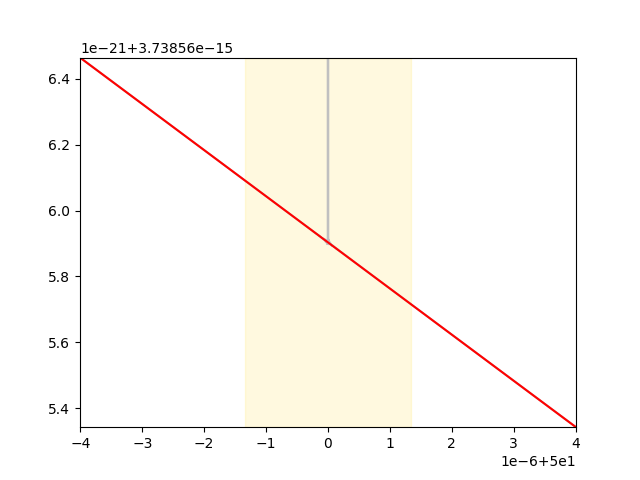
## New Eq:
((fabs(-50.0 + membrane__V) < 1.3356880329551402e-6) ? ((-18716944.911788113 + 374338.90823576227 * membrane__V) * (-1.8698397869313589e-22 * (1.4100000000000001e-5 * exp(3.7433890822745473) - 2.0 * exp(9.9999999999406119e-8)) / (1.0 - exp(9.9999999999406119e-8)) - 1.8698397869313589e-22 * (1.4100000000000001e-5 * exp(3.7433890822745473) - 2.0 * exp(-9.9999999999406119e-8)) / (1.0 - exp(-9.9999999999406119e-8))) + 1.8698397869313589e-22 * (1.4100000000000001e-5 * exp(3.7433890822745473) - 2.0 * exp(9.9999999999406119e-8)) / (1.0 - exp(9.9999999999406119e-8))) : (4.0 * (1.0 - L_type_Ca_channel__FrICa) * (-50.0 + membrane__V) * (intracellular_calcium_concentration__Ca_i * exp(100.0 * membrane__F / (membrane__R * membrane__T)) - extracellular_calcium_concentration__Ca_o * exp(2.0 * (50.0 - membrane__V) * membrane__F / (membrane__R * membrane__T))) * L_type_Ca_channel__P_Ca_L * L_type_Ca_channel_d_gate__d * L_type_Ca_channel_f2_gate__f2 * L_type_Ca_channel_f_gate__f * membrane__F / ((1.0 - exp(2.0 * (50.0 - membrane__V) * membrane__F / (membrane__R * membrane__T))) * membrane__R * membrane__T)))

## Equation 2:
```
L_type_Ca_channel__i_Ca_L_Ca_ds = 4.0 * (-50.0 + membrane__V) * (intracellular_calcium_concentration__Ca_i * exp(100.0 * membrane__F / (membrane__R * membrane__T)) - extracellular_calcium_concentration__Ca_o * exp(2.0 * (50.0 - membrane__V) * membrane__F / (membrane__R * membrane__T))) * L_type_Ca_channel__FrICa * L_type_Ca_channel__P_Ca_L * L_type_Ca_channel_d_gate__d * L_type_Ca_channel_f2ds_gate__f2ds * L_type_Ca_channel_f_gate__f * membrane__F / ((1.0 - exp(2.0 * (50.0 - membrane__V) * membrane__F / (membrane__R * membrane__T))) * membrane__R * membrane__T)
```
### Partially evaluated to: 
```
L_type_Ca_channel__i_Ca_L_Ca_ds = 1.4452418067747803e-9 * (0.00059559677117110668 - 84.481811513632152 * exp(-0.074867781645490947 * membrane__V)) * (-50.0 + membrane__V) / (1.0 - 42.240905756816076 * exp(-0.074867781645490947 * membrane__V))
```
### Singulariy points detected:

{50.000000000000000}
*U*
`3.7433890822745473 - 0.074867781645490947 * membrane__V`

*V for 1e-07 range* 
`49.999998664311967 - 50.000001335688033`

*Singularity point: 50.000000000000000*


## New Eq:
((fabs(-50.0 + membrane__V) < 1.3356880329551402e-6) ? ((-18716944.911788113 + 374338.90823576227 * membrane__V) * (1.9303921860355391e-15 * (1.4100000000000001e-5 * exp(3.7433890822745473) - 2.0 * exp(9.9999999999406119e-8)) / (1.0 - exp(9.9999999999406119e-8)) + 1.9303921860355391e-15 * (1.4100000000000001e-5 * exp(3.7433890822745473) - 2.0 * exp(-9.9999999999406119e-8)) / (1.0 - exp(-9.9999999999406119e-8))) - 1.9303921860355391e-15 * (1.4100000000000001e-5 * exp(3.7433890822745473) - 2.0 * exp(9.9999999999406119e-8)) / (1.0 - exp(9.9999999999406119e-8))) : (4.0 * (-50.0 + membrane__V) * (intracellular_calcium_concentration__Ca_i * exp(100.0 * membrane__F / (membrane__R * membrane__T)) - extracellular_calcium_concentration__Ca_o * exp(2.0 * (50.0 - membrane__V) * membrane__F / (membrane__R * membrane__T))) * L_type_Ca_channel__FrICa * L_type_Ca_channel__P_Ca_L * L_type_Ca_channel_d_gate__d * L_type_Ca_channel_f2ds_gate__f2ds * L_type_Ca_channel_f_gate__f * membrane__F / ((1.0 - exp(2.0 * (50.0 - membrane__V) * membrane__F / (membrane__R * membrane__T))) * membrane__R * membrane__T)))

## Equation 3:
```
L_type_Ca_channel__i_Ca_L_K_cyt = (1.0 - L_type_Ca_channel__FrICa) * (-50.0 + membrane__V) * (intracellular_potassium_concentration__K_i * exp(50.0 * membrane__F / (membrane__R * membrane__T)) - extracellular_potassium_concentration__K_o * exp((50.0 - membrane__V) * membrane__F / (membrane__R * membrane__T))) * L_type_Ca_channel__P_CaK * L_type_Ca_channel__P_Ca_L * L_type_Ca_channel_d_gate__d * L_type_Ca_channel_f2_gate__f2 * L_type_Ca_channel_f_gate__f * membrane__F / ((1.0 - exp((50.0 - membrane__V) * membrane__F / (membrane__R * membrane__T))) * membrane__R * membrane__T)
```
### Partially evaluated to: 
```
L_type_Ca_channel__i_Ca_L_K_cyt = -6.9995378441567521e-20 * (887.57324353388844 - 25.997201620733282 * exp(-0.037433890822745473 * membrane__V)) * (-50.0 + membrane__V) / (1.0 - 6.4993004051833205 * exp(-0.037433890822745473 * membrane__V))
```
### Singulariy points detected:

{50.000000000000000}
*U*
`1.8716945411372736 - 0.037433890822745473 * membrane__V`

*V for 1e-07 range* 
`49.999997328623934 - 50.000002671376066`

*Singularity point: 50.000000000000000*

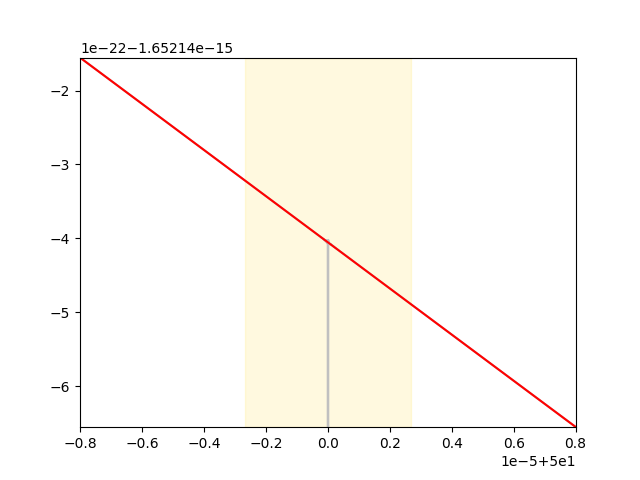
## New Eq:
((fabs(-50.0 + membrane__V) < 2.6713760659657915e-6) ? ((-9358472.2056995872 + 187169.45411399176 * membrane__V) * (-1.8698397869702141e-25 * (136.56442819999998 * exp(1.8716945411372736) - 4.0 * exp(9.9999999999406119e-8)) / (1.0 - exp(9.9999999999406119e-8)) - 1.8698397869702141e-25 * (136.56442819999998 * exp(1.8716945411372736) - 4.0 * exp(-9.9999999999406119e-8)) / (1.0 - exp(-9.9999999999406119e-8))) + 1.8698397869702141e-25 * (136.56442819999998 * exp(1.8716945411372736) - 4.0 * exp(9.9999999999406119e-8)) / (1.0 - exp(9.9999999999406119e-8))) : ((1.0 - L_type_Ca_channel__FrICa) * (-50.0 + membrane__V) * (intracellular_potassium_concentration__K_i * exp(50.0 * membrane__F / (membrane__R * membrane__T)) - extracellular_potassium_concentration__K_o * exp((50.0 - membrane__V) * membrane__F / (membrane__R * membrane__T))) * L_type_Ca_channel__P_CaK * L_type_Ca_channel__P_Ca_L * L_type_Ca_channel_d_gate__d * L_type_Ca_channel_f2_gate__f2 * L_type_Ca_channel_f_gate__f * membrane__F / ((1.0 - exp((50.0 - membrane__V) * membrane__F / (membrane__R * membrane__T))) * membrane__R * membrane__T)))

## Equation 4:
```
L_type_Ca_channel__i_Ca_L_K_ds = (-50.0 + membrane__V) * (intracellular_potassium_concentration__K_i * exp(50.0 * membrane__F / (membrane__R * membrane__T)) - extracellular_potassium_concentration__K_o * exp((50.0 - membrane__V) * membrane__F / (membrane__R * membrane__T))) * L_type_Ca_channel__FrICa * L_type_Ca_channel__P_CaK * L_type_Ca_channel__P_Ca_L * L_type_Ca_channel_d_gate__d * L_type_Ca_channel_f2ds_gate__f2ds * L_type_Ca_channel_f_gate__f * membrane__F / ((1.0 - exp((50.0 - membrane__V) * membrane__F / (membrane__R * membrane__T))) * membrane__R * membrane__T)
```
### Partially evaluated to: 
```
L_type_Ca_channel__i_Ca_L_K_ds = 7.2262090338739015e-13 * (887.57324353388844 - 25.997201620733282 * exp(-0.037433890822745473 * membrane__V)) * (-50.0 + membrane__V) / (1.0 - 6.4993004051833205 * exp(-0.037433890822745473 * membrane__V))
```
### Singulariy points detected:

{50.000000000000000}
*U*
`1.8716945411372736 - 0.037433890822745473 * membrane__V`

*V for 1e-07 range* 
`49.999997328623934 - 50.000002671376066`

*Singularity point: 50.000000000000000*


## New Eq:
((fabs(-50.0 + membrane__V) < 2.6713760659657915e-6) ? ((-9358472.2056995872 + 187169.45411399176 * membrane__V) * (1.9303921860756527e-18 * (136.56442819999998 * exp(1.8716945411372736) - 4.0 * exp(9.9999999999406119e-8)) / (1.0 - exp(9.9999999999406119e-8)) + 1.9303921860756527e-18 * (136.56442819999998 * exp(1.8716945411372736) - 4.0 * exp(-9.9999999999406119e-8)) / (1.0 - exp(-9.9999999999406119e-8))) - 1.9303921860756527e-18 * (136.56442819999998 * exp(1.8716945411372736) - 4.0 * exp(9.9999999999406119e-8)) / (1.0 - exp(9.9999999999406119e-8))) : ((-50.0 + membrane__V) * (intracellular_potassium_concentration__K_i * exp(50.0 * membrane__F / (membrane__R * membrane__T)) - extracellular_potassium_concentration__K_o * exp((50.0 - membrane__V) * membrane__F / (membrane__R * membrane__T))) * L_type_Ca_channel__FrICa * L_type_Ca_channel__P_CaK * L_type_Ca_channel__P_Ca_L * L_type_Ca_channel_d_gate__d * L_type_Ca_channel_f2ds_gate__f2ds * L_type_Ca_channel_f_gate__f * membrane__F / ((1.0 - exp((50.0 - membrane__V) * membrane__F / (membrane__R * membrane__T))) * membrane__R * membrane__T)))

## Equation 5:
```
L_type_Ca_channel__i_Ca_L_Na_cyt = (1.0 - L_type_Ca_channel__FrICa) * (-50.0 + membrane__V) * (intracellular_sodium_concentration__Na_i * exp(50.0 * membrane__F / (membrane__R * membrane__T)) - extracellular_sodium_concentration__Na_o * exp((50.0 - membrane__V) * membrane__F / (membrane__R * membrane__T))) * L_type_Ca_channel__P_CaNa * L_type_Ca_channel__P_Ca_L * L_type_Ca_channel_d_gate__d * L_type_Ca_channel_f2_gate__f2 * L_type_Ca_channel_f_gate__f * membrane__F / ((1.0 - exp((50.0 - membrane__V) * membrane__F / (membrane__R * membrane__T))) * membrane__R * membrane__T)
```
### Partially evaluated to: 
```
L_type_Ca_channel__i_Ca_L_Na_cyt = -3.4997689220783762e-19 * (47.653666085173704 - 909.90205672566492 * exp(-0.037433890822745473 * membrane__V)) * (-50.0 + membrane__V) / (1.0 - 6.4993004051833205 * exp(-0.037433890822745473 * membrane__V))
```
### Singulariy points detected:

{50.000000000000000}
*U*
`1.8716945411372736 - 0.037433890822745473 * membrane__V`

*V for 1e-07 range* 
`49.999997328623934 - 50.000002671376066`

*Singularity point: 50.000000000000000*

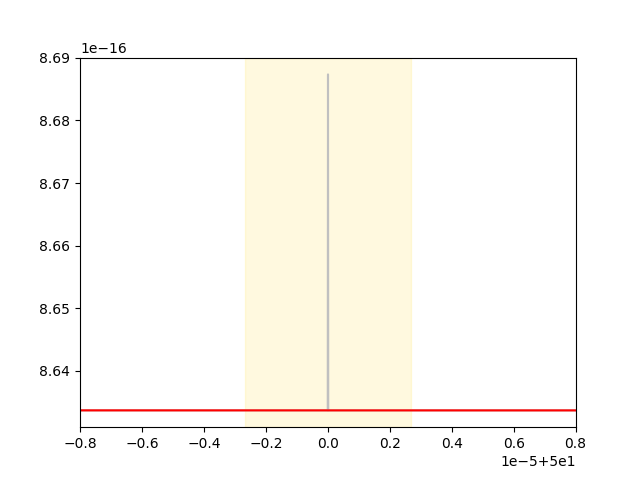
## New Eq:
((fabs(-50.0 + membrane__V) < 2.6713760659657915e-6) ? ((-9358472.2056995872 + 187169.45411399176 * membrane__V) * (-9.3491989348510715e-25 * (7.3321224000000003 * exp(1.8716945411372736) - 140.0 * exp(9.9999999999406119e-8)) / (1.0 - exp(9.9999999999406119e-8)) - 9.3491989348510715e-25 * (7.3321224000000003 * exp(1.8716945411372736) - 140.0 * exp(-9.9999999999406119e-8)) / (1.0 - exp(-9.9999999999406119e-8))) + 9.3491989348510715e-25 * (7.3321224000000003 * exp(1.8716945411372736) - 140.0 * exp(9.9999999999406119e-8)) / (1.0 - exp(9.9999999999406119e-8))) : ((1.0 - L_type_Ca_channel__FrICa) * (-50.0 + membrane__V) * (intracellular_sodium_concentration__Na_i * exp(50.0 * membrane__F / (membrane__R * membrane__T)) - extracellular_sodium_concentration__Na_o * exp((50.0 - membrane__V) * membrane__F / (membrane__R * membrane__T))) * L_type_Ca_channel__P_CaNa * L_type_Ca_channel__P_Ca_L * L_type_Ca_channel_d_gate__d * L_type_Ca_channel_f2_gate__f2 * L_type_Ca_channel_f_gate__f * membrane__F / ((1.0 - exp((50.0 - membrane__V) * membrane__F / (membrane__R * membrane__T))) * membrane__R * membrane__T)))

## Equation 6:
```
L_type_Ca_channel__i_Ca_L_Na_ds = (-50.0 + membrane__V) * (intracellular_sodium_concentration__Na_i * exp(50.0 * membrane__F / (membrane__R * membrane__T)) - extracellular_sodium_concentration__Na_o * exp((50.0 - membrane__V) * membrane__F / (membrane__R * membrane__T))) * L_type_Ca_channel__FrICa * L_type_Ca_channel__P_CaNa * L_type_Ca_channel__P_Ca_L * L_type_Ca_channel_d_gate__d * L_type_Ca_channel_f2ds_gate__f2ds * L_type_Ca_channel_f_gate__f * membrane__F / ((1.0 - exp((50.0 - membrane__V) * membrane__F / (membrane__R * membrane__T))) * membrane__R * membrane__T)
```
### Partially evaluated to: 
```
L_type_Ca_channel__i_Ca_L_Na_ds = 3.613104516936951e-12 * (47.653666085173704 - 909.90205672566492 * exp(-0.037433890822745473 * membrane__V)) * (-50.0 + membrane__V) / (1.0 - 6.4993004051833205 * exp(-0.037433890822745473 * membrane__V))
```
### Singulariy points detected:

{50.000000000000000}
*U*
`1.8716945411372736 - 0.037433890822745473 * membrane__V`

*V for 1e-07 range* 
`49.999997328623934 - 50.000002671376066`

*Singularity point: 50.000000000000000*


## New Eq:
((fabs(-50.0 + membrane__V) < 2.6713760659657915e-6) ? ((-9358472.2056995872 + 187169.45411399176 * membrane__V) * (9.6519609303782639e-18 * (7.3321224000000003 * exp(1.8716945411372736) - 140.0 * exp(9.9999999999406119e-8)) / (1.0 - exp(9.9999999999406119e-8)) + 9.6519609303782639e-18 * (7.3321224000000003 * exp(1.8716945411372736) - 140.0 * exp(-9.9999999999406119e-8)) / (1.0 - exp(-9.9999999999406119e-8))) - 9.6519609303782639e-18 * (7.3321224000000003 * exp(1.8716945411372736) - 140.0 * exp(9.9999999999406119e-8)) / (1.0 - exp(9.9999999999406119e-8))) : ((-50.0 + membrane__V) * (intracellular_sodium_concentration__Na_i * exp(50.0 * membrane__F / (membrane__R * membrane__T)) - extracellular_sodium_concentration__Na_o * exp((50.0 - membrane__V) * membrane__F / (membrane__R * membrane__T))) * L_type_Ca_channel__FrICa * L_type_Ca_channel__P_CaNa * L_type_Ca_channel__P_Ca_L * L_type_Ca_channel_d_gate__d * L_type_Ca_channel_f2ds_gate__f2ds * L_type_Ca_channel_f_gate__f * membrane__F / ((1.0 - exp((50.0 - membrane__V) * membrane__F / (membrane__R * membrane__T))) * membrane__R * membrane__T)))

# Model: NN_SAN_model_1984
## Equation 1:
```
second_inward_current__i_siCa = 4.0 * (-50.0 + membrane__V) * (intracellular_calcium_concentration__Cai * exp(100.0 / membrane__RTONF) - extracellular_calcium_concentration__Cao * exp(-2.0 * (-50.0 + membrane__V) / membrane__RTONF)) * second_inward_current__P_si * second_inward_current_d_gate__d * second_inward_current_f2_gate__f2 * second_inward_current_f_gate__f / ((1.0 - exp(-2.0 * (-50.0 + membrane__V) / membrane__RTONF)) * membrane__RTONF)
```
### Partially evaluated to: 
```
second_inward_current__i_siCa = 0.00076123407928412891 * (0.0024499725338953324 - 84.481811513632152 * exp(-0.074867781645490947 * membrane__V)) * (-50.0 + membrane__V) / (1.0 - 42.240905756816076 * exp(-0.074867781645490947 * membrane__V))
```
### Singulariy points detected:

{50.000000000000000}
*U*
`3.7433890822745473 - 0.074867781645490947 * membrane__V`

*V for 1e-07 range* 
`49.999998664311967 - 50.000001335688033`

*Singularity point: 50.000000000000000*


## New Eq:
((fabs(-50.0 + membrane__V) < 1.3356880329551402e-6) ? ((-18716944.911788113 + 374338.90823576227 * membrane__V) * (1.0167712499774353e-9 * (5.8e-5 * exp(3.7433890822745473) - 2.0 * exp(9.9999999999406119e-8)) / (1.0 - exp(9.9999999999406119e-8)) + 1.0167712499774353e-9 * (5.8e-5 * exp(3.7433890822745473) - 2.0 * exp(-9.9999999995936673e-8)) / (1.0 - exp(-9.9999999995936673e-8))) - 1.0167712499774353e-9 * (5.8e-5 * exp(3.7433890822745473) - 2.0 * exp(9.9999999999406119e-8)) / (1.0 - exp(9.9999999999406119e-8))) : (4.0 * (-50.0 + membrane__V) * (intracellular_calcium_concentration__Cai * exp(100.0 / membrane__RTONF) - extracellular_calcium_concentration__Cao * exp(-2.0 * (-50.0 + membrane__V) / membrane__RTONF)) * second_inward_current__P_si * second_inward_current_d_gate__d * second_inward_current_f2_gate__f2 * second_inward_current_f_gate__f / ((1.0 - exp(-2.0 * (-50.0 + membrane__V) / membrane__RTONF)) * membrane__RTONF)))

## Equation 2:
```
second_inward_current__i_siK = 0.01 * (-50.0 + membrane__V) * (intracellular_potassium_concentration__Ki * exp(50.0 / membrane__RTONF) - extracellular_potassium_concentration__Kc * exp(-(-50.0 + membrane__V) / membrane__RTONF)) * second_inward_current__P_si * second_inward_current_d_gate__d * second_inward_current_f2_gate__f2 * second_inward_current_f_gate__f / ((1.0 - exp(-(-50.0 + membrane__V) / membrane__RTONF)) * membrane__RTONF)
```
### Partially evaluated to: 
```
second_inward_current__i_siK = 1.9030851982103224e-6 * (909.90205672566492 - 19.497901215549962 * exp(-0.037433890822745473 * membrane__V)) * (-50.0 + membrane__V) / (1.0 - 6.4993004051833205 * exp(-0.037433890822745473 * membrane__V))
```
### Singulariy points detected:

{50.000000000000000}
*U*
`1.8716945411372736 - 0.037433890822745473 * membrane__V`

*V for 1e-07 range* 
`49.999997328623934 - 50.000002671376066`

*Singularity point: 50.000000000000000*


## New Eq:
((fabs(-50.0 + membrane__V) < 2.6713760659657915e-6) ? ((-9358472.2056995872 + 187169.45411399176 * membrane__V) * (5.0838562499928195e-12 * (140.0 * exp(1.8716945411372736) - 3.0 * exp(9.9999999999406119e-8)) / (1.0 - exp(9.9999999999406119e-8)) + 5.0838562499928195e-12 * (140.0 * exp(1.8716945411372736) - 3.0 * exp(-9.9999999999406119e-8)) / (1.0 - exp(-9.9999999999406119e-8))) - 5.0838562499928195e-12 * (140.0 * exp(1.8716945411372736) - 3.0 * exp(9.9999999999406119e-8)) / (1.0 - exp(9.9999999999406119e-8))) : (0.01 * (-50.0 + membrane__V) * (intracellular_potassium_concentration__Ki * exp(50.0 / membrane__RTONF) - extracellular_potassium_concentration__Kc * exp(-(-50.0 + membrane__V) / membrane__RTONF)) * second_inward_current__P_si * second_inward_current_d_gate__d * second_inward_current_f2_gate__f2 * second_inward_current_f_gate__f / ((1.0 - exp(-(-50.0 + membrane__V) / membrane__RTONF)) * membrane__RTONF)))

## Equation 3:
```
second_inward_current__i_siNa = 0.01 * (-50.0 + membrane__V) * (intracellular_sodium_concentration__Nai * exp(50.0 / membrane__RTONF) - extracellular_sodium_concentration__Nao * exp(-(-50.0 + membrane__V) / membrane__RTONF)) * second_inward_current__P_si * second_inward_current_d_gate__d * second_inward_current_f2_gate__f2 * second_inward_current_f_gate__f / ((1.0 - exp(-(-50.0 + membrane__V) / membrane__RTONF)) * membrane__RTONF)
```
### Partially evaluated to: 
```
second_inward_current__i_siNa = 1.9030851982103224e-6 * (48.744753038874904 - 909.90205672566492 * exp(-0.037433890822745473 * membrane__V)) * (-50.0 + membrane__V) / (1.0 - 6.4993004051833205 * exp(-0.037433890822745473 * membrane__V))
```
### Singulariy points detected:

{50.000000000000000}
*U*
`1.8716945411372736 - 0.037433890822745473 * membrane__V`

*V for 1e-07 range* 
`49.999997328623934 - 50.000002671376066`

*Singularity point: 50.000000000000000*


## New Eq:
((fabs(-50.0 + membrane__V) < 2.6713760659657915e-6) ? ((-9358472.2056995872 + 187169.45411399176 * membrane__V) * (5.0838562499928195e-12 * (7.5 * exp(1.8716945411372736) - 140.0 * exp(9.9999999999406119e-8)) / (1.0 - exp(9.9999999999406119e-8)) + 5.0838562499928195e-12 * (7.5 * exp(1.8716945411372736) - 140.0 * exp(-9.9999999999406119e-8)) / (1.0 - exp(-9.9999999999406119e-8))) - 5.0838562499928195e-12 * (7.5 * exp(1.8716945411372736) - 140.0 * exp(9.9999999999406119e-8)) / (1.0 - exp(9.9999999999406119e-8))) : (0.01 * (-50.0 + membrane__V) * (intracellular_sodium_concentration__Nai * exp(50.0 / membrane__RTONF) - extracellular_sodium_concentration__Nao * exp(-(-50.0 + membrane__V) / membrane__RTONF)) * second_inward_current__P_si * second_inward_current_d_gate__d * second_inward_current_f2_gate__f2 * second_inward_current_f_gate__f / ((1.0 - exp(-(-50.0 + membrane__V) / membrane__RTONF)) * membrane__RTONF)))

# Model: Noble_SAN_model_1989
## Equation 1:
```
second_inward_current__i_siCa = 4.0 * (-50.0 + membrane__V) * (intracellular_calcium_concentration__Cai * exp(100.0 / membrane__RTONF) - extracellular_calcium_concentration__Cao * exp(-2.0 * (-50.0 + membrane__V) / membrane__RTONF)) * second_inward_current__P_si * second_inward_current_d_gate__d * second_inward_current_f2_gate__f2 * second_inward_current_f_gate__f / ((1.0 - exp(-2.0 * (-50.0 + membrane__V) / membrane__RTONF)) * membrane__RTONF)
```
### Partially evaluated to: 
```
second_inward_current__i_siCa = 1.0355601488748101e-9 * (0.0023697148129573822 - 84.481811513632152 * exp(-0.074867781645490947 * membrane__V)) * (-50.0 + membrane__V) / (1.0 - 42.240905756816076 * exp(-0.074867781645490947 * membrane__V))
```
### Singulariy points detected:

{50.000000000000000}
*U*
`3.7433890822745473 - 0.074867781645490947 * membrane__V`

*V for 1e-07 range* 
`49.999998664311967 - 50.000001335688033`

*Singularity point: 50.000000000000000*


## New Eq:
((fabs(-50.0 + membrane__V) < 1.3356880329551402e-6) ? ((-18716944.911788113 + 374338.90823576227 * membrane__V) * (1.3831852982573273e-15 * (5.6100000000000002e-5 * exp(3.7433890822745473) - 2.0 * exp(9.9999999999406119e-8)) / (1.0 - exp(9.9999999999406119e-8)) + 1.3831852982573273e-15 * (5.6100000000000002e-5 * exp(3.7433890822745473) - 2.0 * exp(-9.9999999995936673e-8)) / (1.0 - exp(-9.9999999995936673e-8))) - 1.3831852982573273e-15 * (5.6100000000000002e-5 * exp(3.7433890822745473) - 2.0 * exp(9.9999999999406119e-8)) / (1.0 - exp(9.9999999999406119e-8))) : (4.0 * (-50.0 + membrane__V) * (intracellular_calcium_concentration__Cai * exp(100.0 / membrane__RTONF) - extracellular_calcium_concentration__Cao * exp(-2.0 * (-50.0 + membrane__V) / membrane__RTONF)) * second_inward_current__P_si * second_inward_current_d_gate__d * second_inward_current_f2_gate__f2 * second_inward_current_f_gate__f / ((1.0 - exp(-2.0 * (-50.0 + membrane__V) / membrane__RTONF)) * membrane__RTONF)))

## Equation 2:
```
second_inward_current__i_siK = 0.01 * (-50.0 + membrane__V) * (intracellular_potassium_concentration__Ki * exp(50.0 / membrane__RTONF) - extracellular_potassium_concentration__Kc * exp(-(-50.0 + membrane__V) / membrane__RTONF)) * second_inward_current__P_si * second_inward_current_d_gate__d * second_inward_current_f2_gate__f2 * second_inward_current_f_gate__f / ((1.0 - exp(-(-50.0 + membrane__V) / membrane__RTONF)) * membrane__RTONF)
```
### Partially evaluated to: 
```
second_inward_current__i_siK = 2.5889003721870255e-12 * (909.90205737559495 - 19.497901215549962 * exp(-0.037433890822745473 * membrane__V)) * (-50.0 + membrane__V) / (1.0 - 6.4993004051833205 * exp(-0.037433890822745473 * membrane__V))
```
### Singulariy points detected:

{50.000000000000000}
*U*
`1.8716945411372736 - 0.037433890822745473 * membrane__V`

*V for 1e-07 range* 
`49.999997328623934 - 50.000002671376066`

*Singularity point: 50.000000000000000*


## New Eq:
((fabs(-50.0 + membrane__V) < 2.6713760659657915e-6) ? ((-9358472.2056995872 + 187169.45411399176 * membrane__V) * (6.9159264914303495e-18 * (140.00000009999999 * exp(1.8716945411372736) - 3.0 * exp(9.9999999999406119e-8)) / (1.0 - exp(9.9999999999406119e-8)) + 6.9159264914303495e-18 * (140.00000009999999 * exp(1.8716945411372736) - 3.0 * exp(-9.9999999999406119e-8)) / (1.0 - exp(-9.9999999999406119e-8))) - 6.9159264914303495e-18 * (140.00000009999999 * exp(1.8716945411372736) - 3.0 * exp(9.9999999999406119e-8)) / (1.0 - exp(9.9999999999406119e-8))) : (0.01 * (-50.0 + membrane__V) * (intracellular_potassium_concentration__Ki * exp(50.0 / membrane__RTONF) - extracellular_potassium_concentration__Kc * exp(-(-50.0 + membrane__V) / membrane__RTONF)) * second_inward_current__P_si * second_inward_current_d_gate__d * second_inward_current_f2_gate__f2 * second_inward_current_f_gate__f / ((1.0 - exp(-(-50.0 + membrane__V) / membrane__RTONF)) * membrane__RTONF)))

## Equation 3:
```
second_inward_current__i_siNa = 0.01 * (-50.0 + membrane__V) * (intracellular_sodium_concentration__Nai * exp(50.0 / membrane__RTONF) - extracellular_sodium_concentration__Nao * exp(-(-50.0 + membrane__V) / membrane__RTONF)) * second_inward_current__P_si * second_inward_current_d_gate__d * second_inward_current_f2_gate__f2 * second_inward_current_f_gate__f / ((1.0 - exp(-(-50.0 + membrane__V) / membrane__RTONF)) * membrane__RTONF)
```
### Partially evaluated to: 
```
second_inward_current__i_siNa = 2.5889003721870255e-12 * (48.744753688804948 - 909.90205672566492 * exp(-0.037433890822745473 * membrane__V)) * (-50.0 + membrane__V) / (1.0 - 6.4993004051833205 * exp(-0.037433890822745473 * membrane__V))
```
### Singulariy points detected:

{50.000000000000000}
*U*
`1.8716945411372736 - 0.037433890822745473 * membrane__V`

*V for 1e-07 range* 
`49.999997328623934 - 50.000002671376066`

*Singularity point: 50.000000000000000*


## New Eq:
((fabs(-50.0 + membrane__V) < 2.6713760659657915e-6) ? ((-9358472.2056995872 + 187169.45411399176 * membrane__V) * (6.9159264914303495e-18 * (7.5000001000000003 * exp(1.8716945411372736) - 140.0 * exp(9.9999999999406119e-8)) / (1.0 - exp(9.9999999999406119e-8)) + 6.9159264914303495e-18 * (7.5000001000000003 * exp(1.8716945411372736) - 140.0 * exp(-9.9999999999406119e-8)) / (1.0 - exp(-9.9999999999406119e-8))) - 6.9159264914303495e-18 * (7.5000001000000003 * exp(1.8716945411372736) - 140.0 * exp(9.9999999999406119e-8)) / (1.0 - exp(9.9999999999406119e-8))) : (0.01 * (-50.0 + membrane__V) * (intracellular_sodium_concentration__Nai * exp(50.0 / membrane__RTONF) - extracellular_sodium_concentration__Nao * exp(-(-50.0 + membrane__V) / membrane__RTONF)) * second_inward_current__P_si * second_inward_current_d_gate__d * second_inward_current_f2_gate__f2 * second_inward_current_f_gate__f / ((1.0 - exp(-(-50.0 + membrane__V) / membrane__RTONF)) * membrane__RTONF)))

# Model: nygren_atrial_model_1998
## Equation 1:
```
sodium_current__i_Na = pow(membrane__F, 2) * pow(sodium_current_m_gate__m, 3) * (-1.0 + exp((-sodium_current__E_Na + membrane__V) * membrane__F / (membrane__R * membrane__T))) * (0.10000000000000001 * sodium_current_h2_gate__h2 + 0.90000000000000002 * sodium_current_h1_gate__h1) * cleft_space_ion_concentrations__Na_c * membrane__V * sodium_current__P_Na / ((-1.0 + exp(membrane__F * membrane__V / (membrane__R * membrane__T))) * membrane__R * membrane__T)
```
### Partially evaluated to: 
```
sodium_current__i_Na = 2.1991428764888377e-5 * (-1.0 + 0.065799816938566749 * exp(0.037907445518581065 * membrane__V)) * membrane__V / (-1.0 + exp(0.037907445518581065 * membrane__V))
```
### Singulariy points detected:

{0}
*U*
`0.037907445518581065 * membrane__V`

*V for 1e-07 range* 
`-2.6380041870925613e-6 - 2.6380041870925613e-6`

*Singularity point: 0*


## New Eq:
((fabs(membrane__V) < 2.6380041870925613e-6) ? ((0.5 + 189537.22759290531 * membrane__V) * (5.801348116192334e-11 * (-1.0 + exp(-2.7211381227433868)) / (-1.0 + exp(9.9999999999999995e-8)) + 5.801348116192334e-11 * (-1.0 + exp(-2.7211383227433865)) / (-1.0 + exp(-9.9999999999999995e-8))) - 5.801348116192334e-11 * (-1.0 + exp(-2.7211383227433865)) / (-1.0 + exp(-9.9999999999999995e-8))) : (pow(membrane__F, 2) * pow(sodium_current_m_gate__m, 3) * (-1.0 + exp((-sodium_current__E_Na + membrane__V) * membrane__F / (membrane__R * membrane__T))) * (0.10000000000000001 * sodium_current_h2_gate__h2 + 0.90000000000000002 * sodium_current_h1_gate__h1) * cleft_space_ion_concentrations__Na_c * membrane__V * sodium_current__P_Na / ((-1.0 + exp(membrane__F * membrane__V / (membrane__R * membrane__T))) * membrane__R * membrane__T)))

## Equation 2:
```
sodium_potassium_pump__i_NaK = pow(intracellular_ion_concentrations__Na_i, 1.5) * (150.0 + membrane__V) * cleft_space_ion_concentrations__K_c * sodium_potassium_pump__i_NaK_max / ((200.0 + membrane__V) * (pow(intracellular_ion_concentrations__Na_i, 1.5) + pow(sodium_potassium_pump__k_NaK_Na, 1.5)) * (cleft_space_ion_concentrations__K_c + sodium_potassium_pump__k_NaK_K))
```
### Partially evaluated to: 
```
sodium_potassium_pump__i_NaK = 24.281503485861936 * (150.0 + membrane__V) / (200.0 + membrane__V)
```
### Singulariy points detected:

{-200.00000000000000}
#### float * A

####Failed!
<class 'sympy.core.mul.Mul'>
(_membrane$V + 150.0)/(_membrane$V + 200.0)
(1/(_membrane$V + 200.0), _membrane$V + 150.0)
# Model: paci_hyttinen_aaltosetala_severi_ventricularVersion
# Model: pandit_model_2001_epi
## Equation 1:
```
sodium_current_m_gate__tau_m = 0.0013600000000000001 / (0.080000000000000002 * exp(-0.090909090909090912 * membrane__V) + 0.32000000000000001 * (47.130000000000003 + membrane__V) / (1.0 - 0.00897780373069724 * exp(-0.10000000000000001 * membrane__V)))
```
### Partially evaluated to: 
```
sodium_current_m_gate__tau_m = 0.0013600000000000001 / (0.080000000000000002 * exp(-0.090909090909090912 * membrane__V) + 0.32000000000000001 * (47.130000000000003 + membrane__V) / (1.0 - 0.00897780373069724 * exp(-0.10000000000000001 * membrane__V)))
```
### Singulariy points detected:

{-47.130000000000003}
#### float * A

####1 / A


####A + B:

`0.080000000000000002 * exp(-0.090909090909090912 * membrane__V)`
`0.32000000000000001 * (47.130000000000003 + membrane__V) / (1.0 - 0.00897780373069724 * exp(-0.10000000000000001 * membrane__V))`

*U*
`-4.7130000000000001 - 0.10000000000000001 * membrane__V`

*V for 1e-07 range* 
`-47.130001 - -47.129999000000005`

*Singularity point: -47.130000000000003*

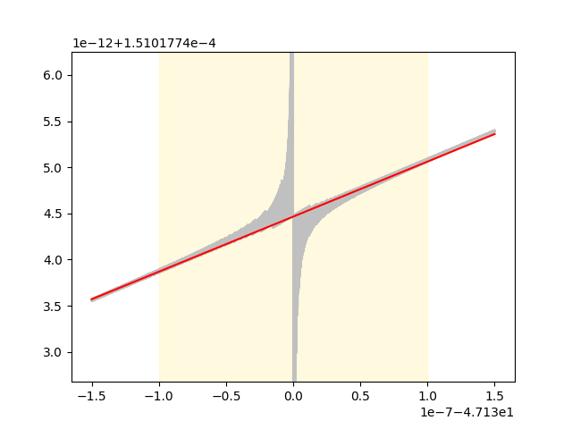
## New Eq:
((fabs(47.130000000000003 + membrane__V) < 1.0000000000287557e-6) ? (0.0013600000000000001 / (0.080000000000000002 * exp(4.284545545454546) - 3.200000000092018e-7 / (1.0 - exp(1.0000000000287557e-7))) + (23565000.499322373 + 499999.99998562218 * membrane__V) * (0.0013600000000000001 / (0.080000000000000002 * exp(4.2845453636363642) + 3.200000000092018e-7 / (1.0 - exp(-1.0000000000287557e-7))) - 0.0013600000000000001 / (0.080000000000000002 * exp(4.284545545454546) - 3.200000000092018e-7 / (1.0 - exp(1.0000000000287557e-7))))) : (0.0013600000000000001 / (0.080000000000000002 * exp(-0.090909090909090912 * membrane__V) + 0.32000000000000001 * (47.130000000000003 + membrane__V) / (1.0 - exp(-4.7130000000000001 - 0.10000000000000001 * membrane__V)))))

# Model: priebe_beuckelmann_model_1998
## Equation 1:
```
INa_m_gate__alpha_m = ((fabs(47.130000000000003 + cell__V) > 0.001) ? (0.32000000000000001 * (47.130000000000003 + cell__V) / (1.0 - 0.00897780373069724 * exp(-0.10000000000000001 * cell__V))) : (3.2000000000000002))
```
### Partially evaluated to: 
```
INa_m_gate__alpha_m = ((fabs(47.130000000000003 + cell__V) > 0.001) ? (0.32000000000000001 * (47.130000000000003 + cell__V) / (1.0 - 0.00897780373069724 * exp(-0.10000000000000001 * cell__V))) : (3.2000000000000002))
```
### Singulariy points detected:

{-47.130000000000003}
####Piecewise!
# Model: sachse_model_2007
## Equation 1:
```
I_Shkr__I_Shkr = pow(model_parameters__F, 2) * (-model_parameters__Ko * exp(-membrane__Vm * model_parameters__F / (model_parameters__R * model_parameters__T)) + model_parameters__Ki) * I_Shkr__OShkr * I_Shkr__PShkr * membrane__Vm / ((1.0 - exp(-membrane__Vm * model_parameters__F / (model_parameters__R * model_parameters__T))) * model_parameters__R * model_parameters__T)
```
### Partially evaluated to: 
```
I_Shkr__I_Shkr = 4.0037983628761927e-11 * (140.00000009999999 - 5.0000001000000003 * exp(-0.039364457756547407 * membrane__Vm)) * membrane__Vm / (1.0 - exp(-0.039364457756547407 * membrane__Vm))
```
### Singulariy points detected:

{0}
*U*
`0.039364457756547407 * membrane__Vm`

*V for 1e-07 range* 
`-2.5403626951616581e-6 - 2.5403626951616581e-6`

*Singularity point: 0*


## New Eq:
((fabs(membrane__Vm) < 2.5403626951616581e-6) ? ((0.5 + 196822.28878273704 * membrane__Vm) * (1.0171099999999999e-16 * (140.00000009999999 - 5.0000001000000003 * exp(9.9999999999999995e-8)) / (1.0 - exp(9.9999999999999995e-8)) + 1.0171099999999999e-16 * (140.00000009999999 - 5.0000001000000003 * exp(-9.9999999999999995e-8)) / (1.0 - exp(-9.9999999999999995e-8))) - 1.0171099999999999e-16 * (140.00000009999999 - 5.0000001000000003 * exp(9.9999999999999995e-8)) / (1.0 - exp(9.9999999999999995e-8))) : (pow(model_parameters__F, 2) * (-model_parameters__Ko * exp(-membrane__Vm * model_parameters__F / (model_parameters__R * model_parameters__T)) + model_parameters__Ki) * I_Shkr__OShkr * I_Shkr__PShkr * membrane__Vm / ((1.0 - exp(-membrane__Vm * model_parameters__F / (model_parameters__R * model_parameters__T))) * model_parameters__R * model_parameters__T)))

# Model: sakmann_model_2000_epi
## Equation 1:
```
L_type_Ca_channel__i_Ca_L_Ca_cyt = 4.0 * (1.0 - L_type_Ca_channel__FrICa) * (-50.0 + membrane__V) * (intracellular_calcium_concentration__Ca_i * exp(100.0 * membrane__F / (membrane__R * membrane__T)) - extracellular_calcium_concentration__Ca_o * exp(2.0 * (50.0 - membrane__V) * membrane__F / (membrane__R * membrane__T))) * L_type_Ca_channel__P_Ca_L * L_type_Ca_channel_d_gate__d * L_type_Ca_channel_f2_gate__f2 * L_type_Ca_channel_f_gate__f * membrane__F / ((1.0 - exp(2.0 * (50.0 - membrane__V) * membrane__F / (membrane__R * membrane__T))) * membrane__R * membrane__T)
```
### Partially evaluated to: 
```
L_type_Ca_channel__i_Ca_L_Ca_cyt = -6.0388601958980894e-14 * (0.0023021293637464765 - 84.481811513632152 * exp(-0.074867781645490947 * membrane__V)) * (-50.0 + membrane__V) / (1.0 - 42.240905756816076 * exp(-0.074867781645490947 * membrane__V))
```
### Singulariy points detected:

{50.000000000000000}
*U*
`3.7433890822745473 - 0.074867781645490947 * membrane__V`

*V for 1e-07 range* 
`49.999998664311967 - 50.000001335688033`

*Singularity point: 50.000000000000000*

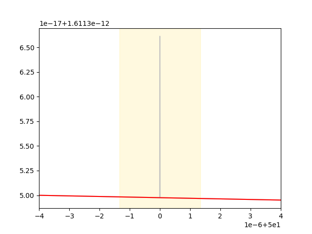
## New Eq:
((fabs(-50.0 + membrane__V) < 1.3356880329551402e-6) ? ((-18716944.911788113 + 374338.90823576227 * membrane__V) * (-8.0660332963502106e-20 * (5.4500000000000003e-5 * exp(3.7433890822745473) - 2.0 * exp(9.9999999999406119e-8)) / (1.0 - exp(9.9999999999406119e-8)) - 8.0660332963502106e-20 * (5.4500000000000003e-5 * exp(3.7433890822745473) - 2.0 * exp(-9.9999999999406119e-8)) / (1.0 - exp(-9.9999999999406119e-8))) + 8.0660332963502106e-20 * (5.4500000000000003e-5 * exp(3.7433890822745473) - 2.0 * exp(9.9999999999406119e-8)) / (1.0 - exp(9.9999999999406119e-8))) : (4.0 * (1.0 - L_type_Ca_channel__FrICa) * (-50.0 + membrane__V) * (intracellular_calcium_concentration__Ca_i * exp(100.0 * membrane__F / (membrane__R * membrane__T)) - extracellular_calcium_concentration__Ca_o * exp(2.0 * (50.0 - membrane__V) * membrane__F / (membrane__R * membrane__T))) * L_type_Ca_channel__P_Ca_L * L_type_Ca_channel_d_gate__d * L_type_Ca_channel_f2_gate__f2 * L_type_Ca_channel_f_gate__f * membrane__F / ((1.0 - exp(2.0 * (50.0 - membrane__V) * membrane__F / (membrane__R * membrane__T))) * membrane__R * membrane__T)))

## Equation 2:
```
L_type_Ca_channel__i_Ca_L_Ca_ds = 4.0 * (-50.0 + membrane__V) * (intracellular_calcium_concentration__Ca_i * exp(100.0 * membrane__F / (membrane__R * membrane__T)) - extracellular_calcium_concentration__Ca_o * exp(2.0 * (50.0 - membrane__V) * membrane__F / (membrane__R * membrane__T))) * L_type_Ca_channel__FrICa * L_type_Ca_channel__P_Ca_L * L_type_Ca_channel_d_gate__d * L_type_Ca_channel_f2ds_gate__f2ds * L_type_Ca_channel_f_gate__f * membrane__F / ((1.0 - exp(2.0 * (50.0 - membrane__V) * membrane__F / (membrane__R * membrane__T))) * membrane__R * membrane__T)
```
### Partially evaluated to: 
```
L_type_Ca_channel__i_Ca_L_Ca_ds = 2.203930365375749e-6 * (0.0022979052731707948 - 84.481811513632152 * exp(-0.074867781645490947 * membrane__V)) * (-50.0 + membrane__V) / (1.0 - 42.240905756816076 * exp(-0.074867781645490947 * membrane__V))
```
### Singulariy points detected:

{50.000000000000000}
*U*
`3.7433890822745473 - 0.074867781645490947 * membrane__V`

*V for 1e-07 range* 
`49.999998664311967 - 50.000001335688033`

*Singularity point: 50.000000000000000*


## New Eq:
((fabs(-50.0 + membrane__V) < 1.3356880329551402e-6) ? ((-18716944.911788113 + 374338.90823576227 * membrane__V) * (2.9437634144988378e-12 * (5.4400000000000001e-5 * exp(3.7433890822745473) - 2.0 * exp(9.9999999999406119e-8)) / (1.0 - exp(9.9999999999406119e-8)) + 2.9437634144988378e-12 * (5.4400000000000001e-5 * exp(3.7433890822745473) - 2.0 * exp(-9.9999999999406119e-8)) / (1.0 - exp(-9.9999999999406119e-8))) - 2.9437634144988378e-12 * (5.4400000000000001e-5 * exp(3.7433890822745473) - 2.0 * exp(9.9999999999406119e-8)) / (1.0 - exp(9.9999999999406119e-8))) : (4.0 * (-50.0 + membrane__V) * (intracellular_calcium_concentration__Ca_i * exp(100.0 * membrane__F / (membrane__R * membrane__T)) - extracellular_calcium_concentration__Ca_o * exp(2.0 * (50.0 - membrane__V) * membrane__F / (membrane__R * membrane__T))) * L_type_Ca_channel__FrICa * L_type_Ca_channel__P_Ca_L * L_type_Ca_channel_d_gate__d * L_type_Ca_channel_f2ds_gate__f2ds * L_type_Ca_channel_f_gate__f * membrane__F / ((1.0 - exp(2.0 * (50.0 - membrane__V) * membrane__F / (membrane__R * membrane__T))) * membrane__R * membrane__T)))

## Equation 3:
```
L_type_Ca_channel__i_Ca_L_K_cyt = (1.0 - L_type_Ca_channel__FrICa) * (-50.0 + membrane__V) * (intracellular_potassium_concentration__K_i * exp(50.0 * membrane__F / (membrane__R * membrane__T)) - extracellular_potassium_concentration__K_o * exp((50.0 - membrane__V) * membrane__F / (membrane__R * membrane__T))) * L_type_Ca_channel__P_CaK * L_type_Ca_channel__P_Ca_L * L_type_Ca_channel_d_gate__d * L_type_Ca_channel_f2_gate__f2 * L_type_Ca_channel_f_gate__f * membrane__F / ((1.0 - exp((50.0 - membrane__V) * membrane__F / (membrane__R * membrane__T))) * membrane__R * membrane__T)
```
### Partially evaluated to: 
```
L_type_Ca_channel__i_Ca_L_K_cyt = -3.0194300979490443e-17 * (902.07933887519619 - 25.997201620733282 * exp(-0.037433890822745473 * membrane__V)) * (-50.0 + membrane__V) / (1.0 - 6.4993004051833205 * exp(-0.037433890822745473 * membrane__V))
```
### Singulariy points detected:

{50.000000000000000}
*U*
`1.8716945411372736 - 0.037433890822745473 * membrane__V`

*V for 1e-07 range* 
`49.999997328623934 - 50.000002671376066`

*Singularity point: 50.000000000000000*


## New Eq:
((fabs(-50.0 + membrane__V) < 2.6713760659657915e-6) ? ((-9358472.2056995872 + 187169.45411399176 * membrane__V) * (-8.0660332965178233e-23 * (138.79637539999999 * exp(1.8716945411372736) - 4.0 * exp(9.9999999999406119e-8)) / (1.0 - exp(9.9999999999406119e-8)) - 8.0660332965178233e-23 * (138.79637539999999 * exp(1.8716945411372736) - 4.0 * exp(-9.9999999999406119e-8)) / (1.0 - exp(-9.9999999999406119e-8))) + 8.0660332965178233e-23 * (138.79637539999999 * exp(1.8716945411372736) - 4.0 * exp(9.9999999999406119e-8)) / (1.0 - exp(9.9999999999406119e-8))) : ((1.0 - L_type_Ca_channel__FrICa) * (-50.0 + membrane__V) * (intracellular_potassium_concentration__K_i * exp(50.0 * membrane__F / (membrane__R * membrane__T)) - extracellular_potassium_concentration__K_o * exp((50.0 - membrane__V) * membrane__F / (membrane__R * membrane__T))) * L_type_Ca_channel__P_CaK * L_type_Ca_channel__P_Ca_L * L_type_Ca_channel_d_gate__d * L_type_Ca_channel_f2_gate__f2 * L_type_Ca_channel_f_gate__f * membrane__F / ((1.0 - exp((50.0 - membrane__V) * membrane__F / (membrane__R * membrane__T))) * membrane__R * membrane__T)))

## Equation 4:
```
L_type_Ca_channel__i_Ca_L_K_ds = (-50.0 + membrane__V) * (intracellular_potassium_concentration__K_i * exp(50.0 * membrane__F / (membrane__R * membrane__T)) - extracellular_potassium_concentration__K_o * exp((50.0 - membrane__V) * membrane__F / (membrane__R * membrane__T))) * L_type_Ca_channel__FrICa * L_type_Ca_channel__P_CaK * L_type_Ca_channel__P_Ca_L * L_type_Ca_channel_d_gate__d * L_type_Ca_channel_f2ds_gate__f2ds * L_type_Ca_channel_f_gate__f * membrane__F / ((1.0 - exp((50.0 - membrane__V) * membrane__F / (membrane__R * membrane__T))) * membrane__R * membrane__T)
```
### Partially evaluated to: 
```
L_type_Ca_channel__i_Ca_L_K_ds = 1.1019651826878747e-9 * (902.07933822526627 - 25.997201620733282 * exp(-0.037433890822745473 * membrane__V)) * (-50.0 + membrane__V) / (1.0 - 6.4993004051833205 * exp(-0.037433890822745473 * membrane__V))
```
### Singulariy points detected:

{50.000000000000000}
*U*
`1.8716945411372736 - 0.037433890822745473 * membrane__V`

*V for 1e-07 range* 
`49.999997328623934 - 50.000002671376066`

*Singularity point: 50.000000000000000*


## New Eq:
((fabs(-50.0 + membrane__V) < 2.6713760659657915e-6) ? ((-9358472.2056995872 + 187169.45411399176 * membrane__V) * (2.9437634145600094e-15 * (138.79637529999999 * exp(1.8716945411372736) - 4.0 * exp(9.9999999999406119e-8)) / (1.0 - exp(9.9999999999406119e-8)) + 2.9437634145600094e-15 * (138.79637529999999 * exp(1.8716945411372736) - 4.0 * exp(-9.9999999999406119e-8)) / (1.0 - exp(-9.9999999999406119e-8))) - 2.9437634145600094e-15 * (138.79637529999999 * exp(1.8716945411372736) - 4.0 * exp(9.9999999999406119e-8)) / (1.0 - exp(9.9999999999406119e-8))) : ((-50.0 + membrane__V) * (intracellular_potassium_concentration__K_i * exp(50.0 * membrane__F / (membrane__R * membrane__T)) - extracellular_potassium_concentration__K_o * exp((50.0 - membrane__V) * membrane__F / (membrane__R * membrane__T))) * L_type_Ca_channel__FrICa * L_type_Ca_channel__P_CaK * L_type_Ca_channel__P_Ca_L * L_type_Ca_channel_d_gate__d * L_type_Ca_channel_f2ds_gate__f2ds * L_type_Ca_channel_f_gate__f * membrane__F / ((1.0 - exp((50.0 - membrane__V) * membrane__F / (membrane__R * membrane__T))) * membrane__R * membrane__T)))

## Equation 5:
```
L_type_Ca_channel__i_Ca_L_Na_cyt = (1.0 - L_type_Ca_channel__FrICa) * (-50.0 + membrane__V) * (intracellular_sodium_concentration__Na_i * exp(50.0 * membrane__F / (membrane__R * membrane__T)) - extracellular_sodium_concentration__Na_o * exp((50.0 - membrane__V) * membrane__F / (membrane__R * membrane__T))) * L_type_Ca_channel__P_CaNa * L_type_Ca_channel__P_Ca_L * L_type_Ca_channel_d_gate__d * L_type_Ca_channel_f2_gate__f2 * L_type_Ca_channel_f_gate__f * membrane__F / ((1.0 - exp((50.0 - membrane__V) * membrane__F / (membrane__R * membrane__T))) * membrane__R * membrane__T)
```
### Partially evaluated to: 
```
L_type_Ca_channel__i_Ca_L_Na_cyt = -1.5097150489745221e-16 * (36.807948135143391 - 909.90205672566492 * exp(-0.037433890822745473 * membrane__V)) * (-50.0 + membrane__V) / (1.0 - 6.4993004051833205 * exp(-0.037433890822745473 * membrane__V))
```
### Singulariy points detected:

{50.000000000000000}
*U*
`1.8716945411372736 - 0.037433890822745473 * membrane__V`

*V for 1e-07 range* 
`49.999997328623934 - 50.000002671376066`

*Singularity point: 50.000000000000000*

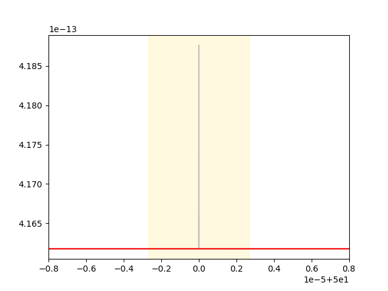
## New Eq:
((fabs(-50.0 + membrane__V) < 2.6713760659657915e-6) ? ((-9358472.2056995872 + 187169.45411399176 * membrane__V) * (-4.0330166482589114e-22 * (5.6633708 * exp(1.8716945411372736) - 140.0 * exp(9.9999999999406119e-8)) / (1.0 - exp(9.9999999999406119e-8)) - 4.0330166482589114e-22 * (5.6633708 * exp(1.8716945411372736) - 140.0 * exp(-9.9999999999406119e-8)) / (1.0 - exp(-9.9999999999406119e-8))) + 4.0330166482589114e-22 * (5.6633708 * exp(1.8716945411372736) - 140.0 * exp(9.9999999999406119e-8)) / (1.0 - exp(9.9999999999406119e-8))) : ((1.0 - L_type_Ca_channel__FrICa) * (-50.0 + membrane__V) * (intracellular_sodium_concentration__Na_i * exp(50.0 * membrane__F / (membrane__R * membrane__T)) - extracellular_sodium_concentration__Na_o * exp((50.0 - membrane__V) * membrane__F / (membrane__R * membrane__T))) * L_type_Ca_channel__P_CaNa * L_type_Ca_channel__P_Ca_L * L_type_Ca_channel_d_gate__d * L_type_Ca_channel_f2_gate__f2 * L_type_Ca_channel_f_gate__f * membrane__F / ((1.0 - exp((50.0 - membrane__V) * membrane__F / (membrane__R * membrane__T))) * membrane__R * membrane__T)))

## Equation 6:
```
L_type_Ca_channel__i_Ca_L_Na_ds = (-50.0 + membrane__V) * (intracellular_sodium_concentration__Na_i * exp(50.0 * membrane__F / (membrane__R * membrane__T)) - extracellular_sodium_concentration__Na_o * exp((50.0 - membrane__V) * membrane__F / (membrane__R * membrane__T))) * L_type_Ca_channel__FrICa * L_type_Ca_channel__P_CaNa * L_type_Ca_channel__P_Ca_L * L_type_Ca_channel_d_gate__d * L_type_Ca_channel_f2ds_gate__f2ds * L_type_Ca_channel_f_gate__f * membrane__F / ((1.0 - exp((50.0 - membrane__V) * membrane__F / (membrane__R * membrane__T))) * membrane__R * membrane__T)
```
### Partially evaluated to: 
```
L_type_Ca_channel__i_Ca_L_Na_ds = 5.5098259134393731e-9 * (36.807947485213347 - 909.90205672566492 * exp(-0.037433890822745473 * membrane__V)) * (-50.0 + membrane__V) / (1.0 - 6.4993004051833205 * exp(-0.037433890822745473 * membrane__V))
```
### Singulariy points detected:

{50.000000000000000}
*U*
`1.8716945411372736 - 0.037433890822745473 * membrane__V`

*V for 1e-07 range* 
`49.999997328623934 - 50.000002671376066`

*Singularity point: 50.000000000000000*


## New Eq:
((fabs(-50.0 + membrane__V) < 2.6713760659657915e-6) ? ((-9358472.2056995872 + 187169.45411399176 * membrane__V) * (1.4718817072800045e-14 * (5.6633706999999998 * exp(1.8716945411372736) - 140.0 * exp(9.9999999999406119e-8)) / (1.0 - exp(9.9999999999406119e-8)) + 1.4718817072800045e-14 * (5.6633706999999998 * exp(1.8716945411372736) - 140.0 * exp(-9.9999999999406119e-8)) / (1.0 - exp(-9.9999999999406119e-8))) - 1.4718817072800045e-14 * (5.6633706999999998 * exp(1.8716945411372736) - 140.0 * exp(9.9999999999406119e-8)) / (1.0 - exp(9.9999999999406119e-8))) : ((-50.0 + membrane__V) * (intracellular_sodium_concentration__Na_i * exp(50.0 * membrane__F / (membrane__R * membrane__T)) - extracellular_sodium_concentration__Na_o * exp((50.0 - membrane__V) * membrane__F / (membrane__R * membrane__T))) * L_type_Ca_channel__FrICa * L_type_Ca_channel__P_CaNa * L_type_Ca_channel__P_Ca_L * L_type_Ca_channel_d_gate__d * L_type_Ca_channel_f2ds_gate__f2ds * L_type_Ca_channel_f_gate__f * membrane__F / ((1.0 - exp((50.0 - membrane__V) * membrane__F / (membrane__R * membrane__T))) * membrane__R * membrane__T)))

## Equation 7:
```
rapid_delayed_rectifier_potassium_current_xr_gate__tau_xr = 0.001 / (0.00060999999999999997 * (38.899999999999999 + membrane__V) / (-1.0 + 281.60348502322194 * exp(0.14499999999999999 * membrane__V)) + 0.0013799999999999999 * (14.199999999999999 + membrane__V) / (1.0 - 0.17436578041087322 * exp(-0.123 * membrane__V)))
```
### Partially evaluated to: 
```
rapid_delayed_rectifier_potassium_current_xr_gate__tau_xr = 0.001 / (0.00060999999999999997 * (38.899999999999999 + membrane__V) / (-1.0 + 281.60348502322194 * exp(0.14499999999999999 * membrane__V)) + 0.0013799999999999999 * (14.199999999999999 + membrane__V) / (1.0 - 0.17436578041087322 * exp(-0.123 * membrane__V)))
```
### Singulariy points detected:

{-38.899999999999999, -14.199999999999999}
#### float * A

####1 / A


####A + B:

`0.0013799999999999999 * (14.199999999999999 + membrane__V) / (1.0 - 0.17436578041087322 * exp(-0.123 * membrane__V))`
`0.00060999999999999997 * (38.899999999999999 + membrane__V) / (-1.0 + 281.60348502322194 * exp(0.14499999999999999 * membrane__V))`

*U*
`-1.7465999999999999 - 0.123 * membrane__V`

*V for 1e-07 range* 
`-14.200000813008129 - -14.199999186991869`

*Singularity point: -14.199999999999999*


*U*
`5.6404999999999994 + 0.14499999999999999 * membrane__V`

*V for 1e-07 range* 
`-38.900000689655172 - -38.899999310344825`

*Singularity point: -38.899999999999999*


## New Eq:
((fabs(14.199999999999999 + membrane__V) < 8.1300813006834893e-7) ? (0.001 / (0.015066999504065039 / (-1.0 + exp(3.5814998821138206)) - 1.1219512194943214e-9 / (1.0 - exp(9.9999999999406119e-8))) + (8733000.5000645891 + 615000.00000454858 * membrane__V) * (0.001 / (1.1219512195134727e-9 / (1.0 - exp(-9.9999999999406119e-8)) + 0.015067000495934959 / (-1.0 + exp(3.5815001178861787))) - 0.001 / (0.015066999504065039 / (-1.0 + exp(3.5814998821138206)) - 1.1219512194943214e-9 / (1.0 - exp(9.9999999999406119e-8))))) : ((fabs(38.899999999999999 + membrane__V) < 6.8965517246999397e-7) ? (0.001 / (-0.034086000951724135 / (1.0 - exp(3.0381000848275859)) - 4.2068965517283451e-10 / (-1.0 + exp(-1.0000000000287557e-7))) + (28202500.498836767 + 724999.99997009686 * membrane__V) * (0.001 / (4.2068965520669629e-10 / (-1.0 + exp(1.0000000000287557e-7)) - 0.034085999048275861 / (1.0 - exp(3.0380999151724137))) - 0.001 / (-0.034086000951724135 / (1.0 - exp(3.0381000848275859)) - 4.2068965517283451e-10 / (-1.0 + exp(-1.0000000000287557e-7))))) : (0.001 / (0.00060999999999999997 * (38.899999999999999 + membrane__V) / (-1.0 + exp(5.6404999999999994 + 0.14499999999999999 * membrane__V)) + 0.0013799999999999999 * (14.199999999999999 + membrane__V) / (1.0 - exp(-1.7465999999999999 - 0.123 * membrane__V))))))

## Equation 8:
```
slow_delayed_rectifier_potassium_current_xs_gate__tau_xs = 0.001 / (0.00013100000000000001 * (30.0 + membrane__V) / (-1.0 + 7.8538197044216602 * exp(0.068699999999999997 * membrane__V)) + 7.1899999999999999e-5 * (30.0 + membrane__V) / (1.0 - 0.011795938519751569 * exp(-0.14799999999999999 * membrane__V)))
```
### Partially evaluated to: 
```
slow_delayed_rectifier_potassium_current_xs_gate__tau_xs = 0.001 / (0.00013100000000000001 * (30.0 + membrane__V) / (-1.0 + 7.8538197044216602 * exp(0.068699999999999997 * membrane__V)) + 7.1899999999999999e-5 * (30.0 + membrane__V) / (1.0 - 0.011795938519751569 * exp(-0.14799999999999999 * membrane__V)))
```
### Singulariy points detected:

{-30.000000000000000}
#### float * A

####1 / A


####A + B:

`7.1899999999999999e-5 * (30.0 + membrane__V) / (1.0 - 0.011795938519751569 * exp(-0.14799999999999999 * membrane__V))`
`0.00013100000000000001 * (30.0 + membrane__V) / (-1.0 + 7.8538197044216602 * exp(0.068699999999999997 * membrane__V))`

*U*
`-4.4399999999999995 - 0.14799999999999999 * membrane__V`

*V for 1e-07 range* 
`-30.000000675675675 - -29.999999324324325`

*Singularity point: -30.000000000000000*


## New Eq:
((fabs(30.0 + membrane__V) < 6.7567567568760367e-7) ? (0.001 / (-8.8513513515076093e-11 / (-1.0 + exp(-4.6418918920460017e-8)) - 4.8581081081938701e-11 / (1.0 - exp(1.0000000000287557e-7))) + (22200000.499608092 + 739999.99998693645 * membrane__V) * (0.001 / (8.8513513515076093e-11 / (-1.0 + exp(4.6418918920460017e-8)) + 4.8581081081938701e-11 / (1.0 - exp(-1.0000000000287557e-7))) - 0.001 / (-8.8513513515076093e-11 / (-1.0 + exp(-4.6418918920460017e-8)) - 4.8581081081938701e-11 / (1.0 - exp(1.0000000000287557e-7))))) : (0.001 / (0.00013100000000000001 * (30.0 + membrane__V) / (-1.0 + exp(2.0609999999999999 + 0.068699999999999997 * membrane__V)) + 7.1899999999999999e-5 * (30.0 + membrane__V) / (1.0 - exp(-4.4399999999999995 - 0.14799999999999999 * membrane__V)))))

# Model: shannon_wang_puglisi_weber_bers_2004_model_updated
## Equation 1:
```
ICaL_d_gate__tau_d = 28.571428571428569 * (1.0 - 0.089218517409260095 * exp(-0.16666666666666666 * cell__V)) * ICaL_d_gate__d_infinity / (14.5 + cell__V)
```
### Partially evaluated to: 
```
ICaL_d_gate__tau_d = 28.571428571428569 * (1.0 - 0.089218517409260095 * exp(-0.16666666666666666 * cell__V)) / ((1.0 + 0.089218517409260095 * exp(-0.16666666666666666 * cell__V)) * (14.5 + cell__V))
```
### Singulariy points detected:

{-14.500000000000000}
*U*
`-2.4166666666666665 - 0.16666666666666666 * cell__V`

*V for 1e-07 range* 
`-14.5000006 - -14.4999994`

*Singularity point: -14.500000000000000*


## New Eq:
((fabs(14.5 + cell__V) < 5.9999999998949782e-7) ? ((12083333.833405094 + 833333.3333382823 * cell__V) * (47619047.619881123 * (1.0 - exp(-9.9999999999406119e-8)) / (1.0 + exp(-9.9999999999406119e-8)) + 47619047.618779711 * (1.0 - exp(9.9999999999406119e-8)) / (1.0 + exp(9.9999999999406119e-8))) - 47619047.618779711 * (1.0 - exp(9.9999999999406119e-8)) / (1.0 + exp(9.9999999999406119e-8))) : (28.571428571428569 * (1.0 - exp(-2.4166666666666665 - 0.16666666666666666 * cell__V)) * ICaL_d_gate__d_infinity / (14.5 + cell__V)))

## Equation 2:
```
IKr_Xr_gate__tau_Xr = 1 / (0.00060999999999999997 * (10.0 + cell__V) / (-1.0 + 4.2631145151688168 * exp(0.14499999999999999 * cell__V)) + 0.0013799999999999999 * (7.0 + cell__V) / (1.0 - 0.42273913174596284 * exp(-0.123 * cell__V)))
```
### Partially evaluated to: 
```
IKr_Xr_gate__tau_Xr = 1 / (0.00060999999999999997 * (10.0 + cell__V) / (-1.0 + 4.2631145151688168 * exp(0.14499999999999999 * cell__V)) + 0.0013799999999999999 * (7.0 + cell__V) / (1.0 - 0.42273913174596284 * exp(-0.123 * cell__V)))
```
### Singulariy points detected:

{-7.0000000000000000, -10.000000000000000, -7.0000000000000000}
#### float * A

####1 / A


####A + B:

`0.0013799999999999999 * (7.0 + cell__V) / (1.0 - 0.42273913174596284 * exp(-0.123 * cell__V))`
`0.00060999999999999997 * (10.0 + cell__V) / (-1.0 + 4.2631145151688168 * exp(0.14499999999999999 * cell__V))`

*U*
`-0.86099999999999999 - 0.123 * cell__V`

*V for 1e-07 range* 
`-7.0000008130081302 - -6.9999991869918698`

*Singularity point: -7.0000000000000000*


*U*
`1.45 + 0.14499999999999999 * cell__V`

*V for 1e-07 range* 
`-10.000000689655172 - -9.9999993103448279`

*Singularity point: -10.000000000000000*


## New Eq:
((fabs(7.0 + cell__V) < 8.1300813006834893e-7) ? (1 / (0.0018299995040650405 / (-1.0 + exp(0.43499988211382112)) - 1.1219512195230486e-9 / (1.0 - exp(1.0000000000114084e-7))) + (4305000.4999950975 + 614999.99999929965 * cell__V) * (1 / (0.0018300004959349594 / (-1.0 + exp(0.43500011788617882)) + 1.1219512195038971e-9 / (1.0 - exp(-9.9999999999406119e-8))) - 1 / (0.0018299995040650405 / (-1.0 + exp(0.43499988211382112)) - 1.1219512195230486e-9 / (1.0 - exp(1.0000000000114084e-7))))) : ((fabs(10.0 + cell__V) < 6.8965517241448282e-7) ? (1 / (-0.0041400009517241374 / (1.0 - exp(0.36900008482758623)) - 4.2068965517283451e-10 / (-1.0 + exp(-9.9999999999406119e-8))) + (7250000.4999927497 + 724999.99999927497 * cell__V) * (1 / (4.2068965517283451e-10 / (-1.0 + exp(9.9999999999406119e-8)) - 0.0041399990482758617 / (1.0 - exp(0.36899991517241376))) - 1 / (-0.0041400009517241374 / (1.0 - exp(0.36900008482758623)) - 4.2068965517283451e-10 / (-1.0 + exp(-9.9999999999406119e-8))))) : (1 / (0.00060999999999999997 * (10.0 + cell__V) / (-1.0 + exp(1.45 + 0.14499999999999999 * cell__V)) + 0.0013799999999999999 * (7.0 + cell__V) / (1.0 - exp(-0.86099999999999999 - 0.123 * cell__V))))))

## Equation 3:
```
IKs_Xs_gate__tau_Xs = 1 / (0.00013100000000000001 * (30.0 + cell__V) / (-1.0 + 7.8538197044216602 * exp(0.068699999999999997 * cell__V)) + 7.1899999999999999e-5 * (30.0 + cell__V) / (1.0 - 0.011795938519751569 * exp(-0.14799999999999999 * cell__V)))
```
### Partially evaluated to: 
```
IKs_Xs_gate__tau_Xs = 1 / (0.00013100000000000001 * (30.0 + cell__V) / (-1.0 + 7.8538197044216602 * exp(0.068699999999999997 * cell__V)) + 7.1899999999999999e-5 * (30.0 + cell__V) / (1.0 - 0.011795938519751569 * exp(-0.14799999999999999 * cell__V)))
```
### Singulariy points detected:

{-30.000000000000000}
#### float * A

####1 / A


####A + B:

`7.1899999999999999e-5 * (30.0 + cell__V) / (1.0 - 0.011795938519751569 * exp(-0.14799999999999999 * cell__V))`
`0.00013100000000000001 * (30.0 + cell__V) / (-1.0 + 7.8538197044216602 * exp(0.068699999999999997 * cell__V))`

*U*
`-4.4399999999999995 - 0.14799999999999999 * cell__V`

*V for 1e-07 range* 
`-30.000000675675675 - -29.999999324324325`

*Singularity point: -30.000000000000000*


## New Eq:
((fabs(30.0 + cell__V) < 6.7567567568760367e-7) ? (1 / (-8.8513513515076093e-11 / (-1.0 + exp(-4.6418918920460017e-8)) - 4.8581081081938701e-11 / (1.0 - exp(1.0000000000287557e-7))) + (22200000.499608092 + 739999.99998693645 * cell__V) * (1 / (8.8513513515076093e-11 / (-1.0 + exp(4.6418918920460017e-8)) + 4.8581081081938701e-11 / (1.0 - exp(-1.0000000000287557e-7))) - 1 / (-8.8513513515076093e-11 / (-1.0 + exp(-4.6418918920460017e-8)) - 4.8581081081938701e-11 / (1.0 - exp(1.0000000000287557e-7))))) : (1 / (0.00013100000000000001 * (30.0 + cell__V) / (-1.0 + exp(2.0609999999999999 + 0.068699999999999997 * cell__V)) + 7.1899999999999999e-5 * (30.0 + cell__V) / (1.0 - exp(-4.4399999999999995 - 0.14799999999999999 * cell__V)))))

## Equation 4:
```
INa_m_gate__alpha_m = 0.32000000000000001 * (47.130000000000003 + cell__V) / (1.0 - 0.00897780373069724 * exp(-0.10000000000000001 * cell__V))
```
### Partially evaluated to: 
```
INa_m_gate__alpha_m = 0.32000000000000001 * (47.130000000000003 + cell__V) / (1.0 - 0.00897780373069724 * exp(-0.10000000000000001 * cell__V))
```
### Singulariy points detected:

{-47.130000000000003}
*U*
`-4.7130000000000001 - 0.10000000000000001 * cell__V`

*V for 1e-07 range* 
`-47.130001 - -47.129999000000005`

*Singularity point: -47.130000000000003*


## New Eq:
((fabs(47.130000000000003 + cell__V) < 1.0000000000287557e-6) ? (-3.200000000092018e-7 / (1.0 - exp(1.0000000000287557e-7)) + (23565000.499322373 + 499999.99998562218 * cell__V) * (3.200000000092018e-7 / (1.0 - exp(1.0000000000287557e-7)) + 3.200000000092018e-7 / (1.0 - exp(-1.0000000000287557e-7)))) : (0.32000000000000001 * (47.130000000000003 + cell__V) / (1.0 - exp(-4.7130000000000001 - 0.10000000000000001 * cell__V))))

## Equation 5:
```
ICaL__i_CaL_Ca_SL = 4.0 * (-ICaL__gamma_Cao * model_parameters__Cao + Ca_buffer__Ca_SL * ICaL__gamma_Cai * exp(2.0 * cell__V * model_parameters__F / (model_parameters__R * model_parameters__T))) * ICaL__Fx_ICaL_SL * ICaL__PCa * ICaL__temp * ICaL_fCa_gate__fCa_SL / (-1.0 + exp(2.0 * cell__V * model_parameters__F / (model_parameters__R * model_parameters__T)))
```
### Partially evaluated to: 
```
ICaL__i_CaL_Ca_SL = 2.4206884569550026e-6 * (-0.61380000000000001 + 3.5795216745958792e-5 * exp(0.074870384603595908 * cell__V)) * cell__V / (-1.0 + exp(0.074870384603595908 * cell__V))
```
### Singulariy points detected:

{0}
*U*
`0.074870384603595908 * cell__V`

*V for 1e-07 range* 
`-1.3356415961992688e-6 - 1.3356415961992688e-6`

*Singularity point: 0*


## New Eq:
((fabs(cell__V) < 1.3356415961992688e-6) ? ((0.5 + 374351.92301797954 * cell__V) * (3.2331721945485248e-12 * (-0.61380000000000001 + 3.5795216745958792e-5 * exp(9.9999999999999995e-8)) / (-1.0 + exp(9.9999999999999995e-8)) + 3.2331721945485248e-12 * (-0.61380000000000001 + 3.5795216745958792e-5 * exp(-9.9999999999999995e-8)) / (-1.0 + exp(-9.9999999999999995e-8))) - 3.2331721945485248e-12 * (-0.61380000000000001 + 3.5795216745958792e-5 * exp(-9.9999999999999995e-8)) / (-1.0 + exp(-9.9999999999999995e-8))) : (4.0 * (-ICaL__gamma_Cao * model_parameters__Cao + Ca_buffer__Ca_SL * ICaL__gamma_Cai * exp(2.0 * cell__V * model_parameters__F / (model_parameters__R * model_parameters__T))) * ICaL__Fx_ICaL_SL * ICaL__PCa * ICaL__temp * ICaL_fCa_gate__fCa_SL / (-1.0 + exp(2.0 * cell__V * model_parameters__F / (model_parameters__R * model_parameters__T)))))

## Equation 6:
```
ICaL__i_CaL_Ca_jct = 4.0 * (-ICaL__gamma_Cao * model_parameters__Cao + Ca_buffer__Ca_jct * ICaL__gamma_Cai * exp(2.0 * cell__V * model_parameters__F / (model_parameters__R * model_parameters__T))) * ICaL__Fx_ICaL_jct * ICaL__PCa * ICaL__temp * ICaL_fCa_gate__fCa_jct / (-1.0 + exp(2.0 * cell__V * model_parameters__F / (model_parameters__R * model_parameters__T)))
```
### Partially evaluated to: 
```
ICaL__i_CaL_Ca_jct = 2.157860280473536e-5 * (-0.61380000000000001 + 5.9349397044773433e-5 * exp(0.074870384603595908 * cell__V)) * cell__V / (-1.0 + exp(0.074870384603595908 * cell__V))
```
### Singulariy points detected:

{0}
*U*
`0.074870384603595908 * cell__V`

*V for 1e-07 range* 
`-1.3356415961992688e-6 - 1.3356415961992688e-6`

*Singularity point: 0*


## New Eq:
((fabs(cell__V) < 1.3356415961992688e-6) ? ((0.5 + 374351.92301797954 * cell__V) * (2.8821279493866755e-11 * (-0.61380000000000001 + 5.9349397044773433e-5 * exp(9.9999999999999995e-8)) / (-1.0 + exp(9.9999999999999995e-8)) + 2.8821279493866755e-11 * (-0.61380000000000001 + 5.9349397044773433e-5 * exp(-9.9999999999999995e-8)) / (-1.0 + exp(-9.9999999999999995e-8))) - 2.8821279493866755e-11 * (-0.61380000000000001 + 5.9349397044773433e-5 * exp(-9.9999999999999995e-8)) / (-1.0 + exp(-9.9999999999999995e-8))) : (4.0 * (-ICaL__gamma_Cao * model_parameters__Cao + Ca_buffer__Ca_jct * ICaL__gamma_Cai * exp(2.0 * cell__V * model_parameters__F / (model_parameters__R * model_parameters__T))) * ICaL__Fx_ICaL_jct * ICaL__PCa * ICaL__temp * ICaL_fCa_gate__fCa_jct / (-1.0 + exp(2.0 * cell__V * model_parameters__F / (model_parameters__R * model_parameters__T)))))

## Equation 7:
```
ICaL__i_CaL_K = (ICaL__Fx_ICaL_SL * ICaL_fCa_gate__fCa_SL + ICaL__Fx_ICaL_jct * ICaL_fCa_gate__fCa_jct) * (-ICaL__gamma_Ko * model_parameters__Ko + ICaL__gamma_Ki * model_parameters__Ki * exp(cell__V * model_parameters__F / (model_parameters__R * model_parameters__T))) * ICaL__PK * ICaL__temp / (-1.0 + exp(cell__V * model_parameters__F / (model_parameters__R * model_parameters__T)))
```
### Partially evaluated to: 
```
ICaL__i_CaL_K = 2.9999114077112956e-9 * (-4.0500000000000007 + 101.25 * exp(0.037435192301797954 * cell__V)) * cell__V / (-1.0 + exp(0.037435192301797954 * cell__V))
```
### Singulariy points detected:

{0}
*U*
`0.037435192301797954 * cell__V`

*V for 1e-07 range* 
`-2.6712831923985376e-6 - 2.6712831923985376e-6`

*Singularity point: 0*


## New Eq:
((fabs(cell__V) < 2.6712831923985376e-6) ? ((0.5 + 187175.96150898977 * cell__V) * (8.013612922103821e-15 * (-4.0500000000000007 + 101.25 * exp(9.9999999999999995e-8)) / (-1.0 + exp(9.9999999999999995e-8)) + 8.013612922103821e-15 * (-4.0500000000000007 + 101.25 * exp(-9.9999999999999995e-8)) / (-1.0 + exp(-9.9999999999999995e-8))) - 8.013612922103821e-15 * (-4.0500000000000007 + 101.25 * exp(-9.9999999999999995e-8)) / (-1.0 + exp(-9.9999999999999995e-8))) : ((ICaL__Fx_ICaL_SL * ICaL_fCa_gate__fCa_SL + ICaL__Fx_ICaL_jct * ICaL_fCa_gate__fCa_jct) * (-ICaL__gamma_Ko * model_parameters__Ko + ICaL__gamma_Ki * model_parameters__Ki * exp(cell__V * model_parameters__F / (model_parameters__R * model_parameters__T))) * ICaL__PK * ICaL__temp / (-1.0 + exp(cell__V * model_parameters__F / (model_parameters__R * model_parameters__T)))))

## Equation 8:
```
ICaL__i_CaL_Na_SL = (-ICaL__gamma_Nao * model_parameters__Nao + ICaL__gamma_Nai * Na_buffer__Na_SL * exp(cell__V * model_parameters__F / (model_parameters__R * model_parameters__T))) * ICaL__Fx_ICaL_SL * ICaL__PNa * ICaL__temp * ICaL_fCa_gate__fCa_SL / (-1.0 + exp(cell__V * model_parameters__F / (model_parameters__R * model_parameters__T)))
```
### Partially evaluated to: 
```
ICaL__i_CaL_Na_SL = 1.6810336506631961e-11 * (-105.0 + 6.6537144904403025 * exp(0.037435192301797954 * cell__V)) * cell__V / (-1.0 + exp(0.037435192301797954 * cell__V))
```
### Singulariy points detected:

{0}
*U*
`0.037435192301797954 * cell__V`

*V for 1e-07 range* 
`-2.6712831923985376e-6 - 2.6712831923985376e-6`

*Singularity point: 0*


## New Eq:
((fabs(cell__V) < 2.6712831923985376e-6) ? ((0.5 + 187175.96150898977 * cell__V) * (4.4905169368729505e-17 * (-105.0 + 6.6537144904403025 * exp(9.9999999999999995e-8)) / (-1.0 + exp(9.9999999999999995e-8)) + 4.4905169368729505e-17 * (-105.0 + 6.6537144904403025 * exp(-9.9999999999999995e-8)) / (-1.0 + exp(-9.9999999999999995e-8))) - 4.4905169368729505e-17 * (-105.0 + 6.6537144904403025 * exp(-9.9999999999999995e-8)) / (-1.0 + exp(-9.9999999999999995e-8))) : ((-ICaL__gamma_Nao * model_parameters__Nao + ICaL__gamma_Nai * Na_buffer__Na_SL * exp(cell__V * model_parameters__F / (model_parameters__R * model_parameters__T))) * ICaL__Fx_ICaL_SL * ICaL__PNa * ICaL__temp * ICaL_fCa_gate__fCa_SL / (-1.0 + exp(cell__V * model_parameters__F / (model_parameters__R * model_parameters__T)))))

## Equation 9:
```
ICaL__i_CaL_Na_jct = (-ICaL__gamma_Nao * model_parameters__Nao + ICaL__gamma_Nai * Na_buffer__Na_jct * exp(cell__V * model_parameters__F / (model_parameters__R * model_parameters__T))) * ICaL__Fx_ICaL_jct * ICaL__PNa * ICaL__temp * ICaL_fCa_gate__fCa_jct / (-1.0 + exp(cell__V * model_parameters__F / (model_parameters__R * model_parameters__T)))
```
### Partially evaluated to: 
```
ICaL__i_CaL_Na_jct = 1.4985140836621777e-10 * (-105.0 + 6.6527387631683705 * exp(0.037435192301797954 * cell__V)) * cell__V / (-1.0 + exp(0.037435192301797954 * cell__V))
```
### Singulariy points detected:

{0}
*U*
`0.037435192301797954 * cell__V`

*V for 1e-07 range* 
`-2.6712831923985376e-6 - 2.6712831923985376e-6`

*Singularity point: 0*


## New Eq:
((fabs(cell__V) < 2.6712831923985376e-6) ? ((0.5 + 187175.96150898977 * cell__V) * (4.002955485259271e-16 * (-105.0 + 6.6527387631683705 * exp(9.9999999999999995e-8)) / (-1.0 + exp(9.9999999999999995e-8)) + 4.002955485259271e-16 * (-105.0 + 6.6527387631683705 * exp(-9.9999999999999995e-8)) / (-1.0 + exp(-9.9999999999999995e-8))) - 4.002955485259271e-16 * (-105.0 + 6.6527387631683705 * exp(-9.9999999999999995e-8)) / (-1.0 + exp(-9.9999999999999995e-8))) : ((-ICaL__gamma_Nao * model_parameters__Nao + ICaL__gamma_Nai * Na_buffer__Na_jct * exp(cell__V * model_parameters__F / (model_parameters__R * model_parameters__T))) * ICaL__Fx_ICaL_jct * ICaL__PNa * ICaL__temp * ICaL_fCa_gate__fCa_jct / (-1.0 + exp(cell__V * model_parameters__F / (model_parameters__R * model_parameters__T)))))

# Model: stewart_zhang_model_2008
## Equation 1:
```
L_type_Ca_current__i_CaL = 4.0 * pow(membrane__F, 2) * (-15.0 + membrane__V) * (-calcium_dynamics__Ca_o + 0.25 * calcium_dynamics__Ca_ss * exp(2.0 * (-15.0 + membrane__V) * membrane__F / (membrane__R * membrane__T))) * L_type_Ca_current__g_CaL * L_type_Ca_current_d_gate__d * L_type_Ca_current_f2_gate__f2 * L_type_Ca_current_fCass_gate__fCass * L_type_Ca_current_f_gate__f / ((-1.0 + exp(2.0 * (-15.0 + membrane__V) * membrane__F / (membrane__R * membrane__T))) * membrane__R * membrane__T)
```
### Partially evaluated to: 
```
L_type_Ca_current__i_CaL = 0.00016303166834423906 * (-2.0 + 3.6337194739638214e-5 * exp(0.074867781645490947 * membrane__V)) * (-15.0 + membrane__V) / (-1.0 + 0.32529698149690262 * exp(0.074867781645490947 * membrane__V))
```
### Singulariy points detected:

{15.000000000000000}
*U*
`-1.1230167246823641 + 0.074867781645490947 * membrane__V`

*V for 1e-07 range* 
`14.999998664311967 - 15.000001335688033`

*Singularity point: 15.000000000000000*


## New Eq:
((fabs(-15.0 + membrane__V) < 1.3356880329828957e-6) ? ((-5615083.1234197523 + 374338.90822798351 * membrane__V) * (2.1775944840463649e-10 * (-2.0 + 0.00011170467851385276 * exp(9.9999999999406119e-8)) / (-1.0 + exp(9.9999999999406119e-8)) + 2.1775944840463649e-10 * (-2.0 + 0.00011170467851385276 * exp(-9.9999999999406119e-8)) / (-1.0 + exp(-9.9999999999406119e-8))) - 2.1775944840463649e-10 * (-2.0 + 0.00011170467851385276 * exp(-9.9999999999406119e-8)) / (-1.0 + exp(-9.9999999999406119e-8))) : (4.0 * pow(membrane__F, 2) * (-15.0 + membrane__V) * (-calcium_dynamics__Ca_o + 0.25 * calcium_dynamics__Ca_ss * exp(2.0 * (-15.0 + membrane__V) * membrane__F / (membrane__R * membrane__T))) * L_type_Ca_current__g_CaL * L_type_Ca_current_d_gate__d * L_type_Ca_current_f2_gate__f2 * L_type_Ca_current_fCass_gate__fCass * L_type_Ca_current_f_gate__f / ((-1.0 + exp(2.0 * (-15.0 + membrane__V) * membrane__F / (membrane__R * membrane__T))) * membrane__R * membrane__T)))

# Model: tentusscher_model_2004_endo
## Equation 1:
```
L_type_Ca_current__i_CaL = 4.0 * pow(membrane__F, 2) * (-0.34100000000000003 * calcium_dynamics__Ca_o + calcium_dynamics__Ca_i * exp(2.0 * membrane__F * membrane__V / (membrane__R * membrane__T))) * L_type_Ca_current__g_CaL * L_type_Ca_current_d_gate__d * L_type_Ca_current_fCa_gate__fCa * L_type_Ca_current_f_gate__f * membrane__V / ((-1.0 + exp(2.0 * membrane__F * membrane__V / (membrane__R * membrane__T))) * membrane__R * membrane__T)
```
### Partially evaluated to: 
```
L_type_Ca_current__i_CaL = 2.5297204524343163e-7 * (-0.68200000000000005 + 0.00020010000000000001 * exp(0.074867781645490947 * membrane__V)) * membrane__V / (-1.0 + exp(0.074867781645490947 * membrane__V))
```
### Singulariy points detected:

{0}
*U*
`0.074867781645490947 * membrane__V`

*V for 1e-07 range* 
`-1.3356880329847825e-6 - 1.3356880329847825e-6`

*Singularity point: 0*


## New Eq:
((fabs(membrane__V) < 1.3356880329847825e-6) ? ((0.5 + 374338.90822745475 * membrane__V) * (3.3789173351133653e-13 * (-0.68200000000000005 + 0.00020010000000000001 * exp(9.9999999999999995e-8)) / (-1.0 + exp(9.9999999999999995e-8)) + 3.3789173351133653e-13 * (-0.68200000000000005 + 0.00020010000000000001 * exp(-9.9999999999999995e-8)) / (-1.0 + exp(-9.9999999999999995e-8))) - 3.3789173351133653e-13 * (-0.68200000000000005 + 0.00020010000000000001 * exp(-9.9999999999999995e-8)) / (-1.0 + exp(-9.9999999999999995e-8))) : (4.0 * pow(membrane__F, 2) * (-0.34100000000000003 * calcium_dynamics__Ca_o + calcium_dynamics__Ca_i * exp(2.0 * membrane__F * membrane__V / (membrane__R * membrane__T))) * L_type_Ca_current__g_CaL * L_type_Ca_current_d_gate__d * L_type_Ca_current_fCa_gate__fCa * L_type_Ca_current_f_gate__f * membrane__V / ((-1.0 + exp(2.0 * membrane__F * membrane__V / (membrane__R * membrane__T))) * membrane__R * membrane__T)))

# Model: tentusscher_model_2004_epi
## Equation 1:
```
L_type_Ca_current__i_CaL = 4.0 * pow(membrane__F, 2) * (-0.34100000000000003 * calcium_dynamics__Ca_o + calcium_dynamics__Ca_i * exp(2.0 * membrane__F * membrane__V / (membrane__R * membrane__T))) * L_type_Ca_current__g_CaL * L_type_Ca_current_d_gate__d * L_type_Ca_current_fCa_gate__fCa * L_type_Ca_current_f_gate__f * membrane__V / ((-1.0 + exp(2.0 * membrane__F * membrane__V / (membrane__R * membrane__T))) * membrane__R * membrane__T)
```
### Partially evaluated to: 
```
L_type_Ca_current__i_CaL = 4.9724340271963296e-5 * (-0.68200000000000005 + 6.6200990301269099e-5 * exp(0.074867781645490947 * membrane__V)) * membrane__V / (-1.0 + exp(0.074867781645490947 * membrane__V))
```
### Singulariy points detected:

{0}
*U*
`0.074867781645490947 * membrane__V`

*V for 1e-07 range* 
`-1.3356880329847825e-6 - 1.3356880329847825e-6`

*Singularity point: 0*


## New Eq:
((fabs(membrane__V) < 1.3356880329847825e-6) ? ((0.5 + 374338.90822745475 * membrane__V) * (6.6416206249324653e-11 * (-0.68200000000000005 + 6.6200990301269099e-5 * exp(9.9999999999999995e-8)) / (-1.0 + exp(9.9999999999999995e-8)) + 6.6416206249324653e-11 * (-0.68200000000000005 + 6.6200990301269099e-5 * exp(-9.9999999999999995e-8)) / (-1.0 + exp(-9.9999999999999995e-8))) - 6.6416206249324653e-11 * (-0.68200000000000005 + 6.6200990301269099e-5 * exp(-9.9999999999999995e-8)) / (-1.0 + exp(-9.9999999999999995e-8))) : (4.0 * pow(membrane__F, 2) * (-0.34100000000000003 * calcium_dynamics__Ca_o + calcium_dynamics__Ca_i * exp(2.0 * membrane__F * membrane__V / (membrane__R * membrane__T))) * L_type_Ca_current__g_CaL * L_type_Ca_current_d_gate__d * L_type_Ca_current_fCa_gate__fCa * L_type_Ca_current_f_gate__f * membrane__V / ((-1.0 + exp(2.0 * membrane__F * membrane__V / (membrane__R * membrane__T))) * membrane__R * membrane__T)))

# Model: tentusscher_panfilov_2006_epi
## Equation 1:
```
L_type_Ca_current__i_CaL = 4.0 * pow(membrane__F, 2) * (-15.0 + membrane__V) * (-calcium_dynamics__Ca_o + 0.25 * calcium_dynamics__Ca_ss * exp(2.0 * (-15.0 + membrane__V) * membrane__F / (membrane__R * membrane__T))) * L_type_Ca_current__g_CaL * L_type_Ca_current_d_gate__d * L_type_Ca_current_f2_gate__f2 * L_type_Ca_current_fCass_gate__fCass * L_type_Ca_current_f_gate__f / ((-1.0 + exp(2.0 * (-15.0 + membrane__V) * membrane__F / (membrane__R * membrane__T))) * membrane__R * membrane__T)
```
### Partially evaluated to: 
```
L_type_Ca_current__i_CaL = 1.485367413663972e-5 * (-2.0 + 2.9276728334721234e-5 * exp(0.074867781645490947 * membrane__V)) * (-15.0 + membrane__V) / (-1.0 + 0.32529698149690262 * exp(0.074867781645490947 * membrane__V))
```
### Singulariy points detected:

{15.000000000000000}
*U*
`-1.1230167246823641 + 0.074867781645490947 * membrane__V`

*V for 1e-07 range* 
`14.999998664311967 - 15.000001335688033`

*Singularity point: 15.000000000000000*

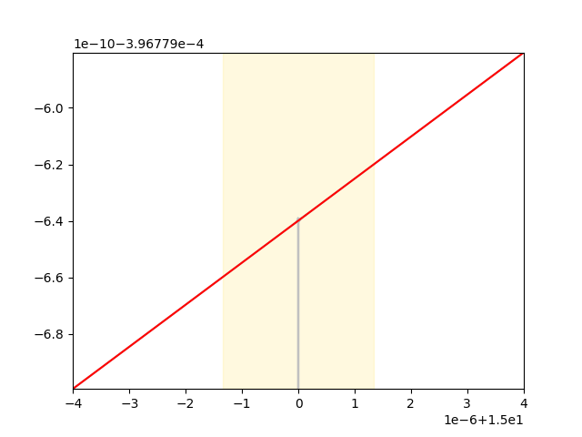
## New Eq:
((fabs(-15.0 + membrane__V) < 1.3356880329828957e-6) ? ((-5615083.1234197523 + 374338.90822798351 * membrane__V) * (1.983987479013722e-11 * (-2.0 + 9.0000000000000006e-5 * exp(9.9999999999406119e-8)) / (-1.0 + exp(9.9999999999406119e-8)) + 1.983987479013722e-11 * (-2.0 + 9.0000000000000006e-5 * exp(-9.9999999999406119e-8)) / (-1.0 + exp(-9.9999999999406119e-8))) - 1.983987479013722e-11 * (-2.0 + 9.0000000000000006e-5 * exp(-9.9999999999406119e-8)) / (-1.0 + exp(-9.9999999999406119e-8))) : (4.0 * pow(membrane__F, 2) * (-15.0 + membrane__V) * (-calcium_dynamics__Ca_o + 0.25 * calcium_dynamics__Ca_ss * exp(2.0 * (-15.0 + membrane__V) * membrane__F / (membrane__R * membrane__T))) * L_type_Ca_current__g_CaL * L_type_Ca_current_d_gate__d * L_type_Ca_current_f2_gate__f2 * L_type_Ca_current_fCass_gate__fCass * L_type_Ca_current_f_gate__f / ((-1.0 + exp(2.0 * (-15.0 + membrane__V) * membrane__F / (membrane__R * membrane__T))) * membrane__R * membrane__T)))

# Model: viswanathan_model_1999_epi
## Equation 1:
```
L_type_Ca_channel__I_CaCa = 4.0 * pow(membrane__F, 2) * (-L_type_Ca_channel__gamma_Cao * calcium_dynamics__Cao + L_type_Ca_channel__gamma_Cai * calcium_dynamics__Cai * exp(2.0 * membrane__F * membrane__V / (membrane__R * membrane__T))) * L_type_Ca_channel__P_Ca * membrane__V / ((-1.0 + exp(2.0 * membrane__F * membrane__V / (membrane__R * membrane__T))) * membrane__R * membrane__T)
```
### Partially evaluated to: 
```
L_type_Ca_channel__I_CaCa = 7.8019226357407252 * (-0.61380000000000001 + 0.00035237000000000002 * exp(0.074871767015605231 * membrane__V)) * membrane__V / (-1.0 + exp(0.074871767015605231 * membrane__V))
```
### Singulariy points detected:

{0}
*U*
`0.074871767015605231 * membrane__V`

*V for 1e-07 range* 
`-1.3356169352749131e-6 - 1.3356169352749131e-6`

*Singularity point: 0*


## New Eq:
((fabs(membrane__V) < 1.3356169352749131e-6) ? ((0.5 + 374358.83507802623 * membrane__V) * (1.042038e-5 * (-0.61380000000000001 + 0.00035237000000000002 * exp(9.9999999999999995e-8)) / (-1.0 + exp(9.9999999999999995e-8)) + 1.042038e-5 * (-0.61380000000000001 + 0.00035237000000000002 * exp(-9.9999999999999995e-8)) / (-1.0 + exp(-9.9999999999999995e-8))) - 1.042038e-5 * (-0.61380000000000001 + 0.00035237000000000002 * exp(-9.9999999999999995e-8)) / (-1.0 + exp(-9.9999999999999995e-8))) : (4.0 * pow(membrane__F, 2) * (-L_type_Ca_channel__gamma_Cao * calcium_dynamics__Cao + L_type_Ca_channel__gamma_Cai * calcium_dynamics__Cai * exp(2.0 * membrane__F * membrane__V / (membrane__R * membrane__T))) * L_type_Ca_channel__P_Ca * membrane__V / ((-1.0 + exp(2.0 * membrane__F * membrane__V / (membrane__R * membrane__T))) * membrane__R * membrane__T)))

## Equation 2:
```
L_type_Ca_channel__I_CaK = pow(membrane__F, 2) * (-L_type_Ca_channel__gamma_Ko * ionic_concentrations__Ko + L_type_Ca_channel__gamma_Ki * ionic_concentrations__Ki * exp(membrane__F * membrane__V / (membrane__R * membrane__T))) * L_type_Ca_channel__P_K * membrane__V / ((-1.0 + exp(membrane__F * membrane__V / (membrane__R * membrane__T))) * membrane__R * membrane__T)
```
### Partially evaluated to: 
```
L_type_Ca_channel__I_CaK = 0.00069711623550831479 * (-3.375 + 103.2183 * exp(0.037435883507802616 * membrane__V)) * membrane__V / (-1.0 + exp(0.037435883507802616 * membrane__V))
```
### Singulariy points detected:

{0}
*U*
`0.037435883507802616 * membrane__V`

*V for 1e-07 range* 
`-2.6712338705498262e-6 - 2.6712338705498262e-6`

*Singularity point: 0*


## New Eq:
((fabs(membrane__V) < 2.6712338705498262e-6) ? ((0.5 + 187179.41753901311 * membrane__V) * (1.8621604999999999e-9 * (-3.375 + 103.2183 * exp(9.9999999999999995e-8)) / (-1.0 + exp(9.9999999999999995e-8)) + 1.8621604999999999e-9 * (-3.375 + 103.2183 * exp(-9.9999999999999995e-8)) / (-1.0 + exp(-9.9999999999999995e-8))) - 1.8621604999999999e-9 * (-3.375 + 103.2183 * exp(-9.9999999999999995e-8)) / (-1.0 + exp(-9.9999999999999995e-8))) : (pow(membrane__F, 2) * (-L_type_Ca_channel__gamma_Ko * ionic_concentrations__Ko + L_type_Ca_channel__gamma_Ki * ionic_concentrations__Ki * exp(membrane__F * membrane__V / (membrane__R * membrane__T))) * L_type_Ca_channel__P_K * membrane__V / ((-1.0 + exp(membrane__F * membrane__V / (membrane__R * membrane__T))) * membrane__R * membrane__T)))

## Equation 3:
```
L_type_Ca_channel__I_CaNa = pow(membrane__F, 2) * (-L_type_Ca_channel__gamma_Nao * ionic_concentrations__Nao + L_type_Ca_channel__gamma_Nai * ionic_concentrations__Nai * exp(membrane__F * membrane__V / (membrane__R * membrane__T))) * L_type_Ca_channel__P_Na * membrane__V / ((-1.0 + exp(membrane__F * membrane__V / (membrane__R * membrane__T))) * membrane__R * membrane__T)
```
### Partially evaluated to: 
```
L_type_Ca_channel__I_CaNa = 0.0024381008236689767 * (-99.0 + 11.756126774999998 * exp(0.037435883507802616 * membrane__V)) * membrane__V / (-1.0 + exp(0.037435883507802616 * membrane__V))
```
### Singulariy points detected:

{0}
*U*
`0.037435883507802616 * membrane__V`

*V for 1e-07 range* 
`-2.6712338705498262e-6 - 2.6712338705498262e-6`

*Singularity point: 0*


## New Eq:
((fabs(membrane__V) < 2.6712338705498262e-6) ? ((0.5 + 187179.41753901311 * membrane__V) * (6.5127375e-9 * (-99.0 + 11.756126774999998 * exp(9.9999999999999995e-8)) / (-1.0 + exp(9.9999999999999995e-8)) + 6.5127375e-9 * (-99.0 + 11.756126774999998 * exp(-9.9999999999999995e-8)) / (-1.0 + exp(-9.9999999999999995e-8))) - 6.5127375e-9 * (-99.0 + 11.756126774999998 * exp(-9.9999999999999995e-8)) / (-1.0 + exp(-9.9999999999999995e-8))) : (pow(membrane__F, 2) * (-L_type_Ca_channel__gamma_Nao * ionic_concentrations__Nao + L_type_Ca_channel__gamma_Nai * ionic_concentrations__Nai * exp(membrane__F * membrane__V / (membrane__R * membrane__T))) * L_type_Ca_channel__P_Na * membrane__V / ((-1.0 + exp(membrane__F * membrane__V / (membrane__R * membrane__T))) * membrane__R * membrane__T)))

## Equation 4:
```
non_specific_calcium_activated_current__I_ns_K = pow(membrane__F, 2) * (-L_type_Ca_channel__gamma_Ko * ionic_concentrations__Ko + L_type_Ca_channel__gamma_Ki * ionic_concentrations__Ki * exp(membrane__F * membrane__V / (membrane__R * membrane__T))) * membrane__V * non_specific_calcium_activated_current__P_ns_Ca / ((-1.0 + exp(membrane__F * membrane__V / (membrane__R * membrane__T))) * membrane__R * membrane__T)
```
### Partially evaluated to: 
```
non_specific_calcium_activated_current__I_ns_K = 0.00063210021354380874 * (-3.375 + 103.2183 * exp(0.037435883507802616 * membrane__V)) * membrane__V / (-1.0 + exp(0.037435883507802616 * membrane__V))
```
### Singulariy points detected:

{0}
*U*
`0.037435883507802616 * membrane__V`

*V for 1e-07 range* 
`-2.6712338705498262e-6 - 2.6712338705498262e-6`

*Singularity point: 0*


## New Eq:
((fabs(membrane__V) < 2.6712338705498262e-6) ? ((0.5 + 187179.41753901311 * membrane__V) * (1.6884874999999999e-9 * (-3.375 + 103.2183 * exp(9.9999999999999995e-8)) / (-1.0 + exp(9.9999999999999995e-8)) + 1.6884874999999999e-9 * (-3.375 + 103.2183 * exp(-9.9999999999999995e-8)) / (-1.0 + exp(-9.9999999999999995e-8))) - 1.6884874999999999e-9 * (-3.375 + 103.2183 * exp(-9.9999999999999995e-8)) / (-1.0 + exp(-9.9999999999999995e-8))) : (pow(membrane__F, 2) * (-L_type_Ca_channel__gamma_Ko * ionic_concentrations__Ko + L_type_Ca_channel__gamma_Ki * ionic_concentrations__Ki * exp(membrane__F * membrane__V / (membrane__R * membrane__T))) * membrane__V * non_specific_calcium_activated_current__P_ns_Ca / ((-1.0 + exp(membrane__F * membrane__V / (membrane__R * membrane__T))) * membrane__R * membrane__T)))

## Equation 5:
```
non_specific_calcium_activated_current__I_ns_Na = pow(membrane__F, 2) * (-L_type_Ca_channel__gamma_Nao * ionic_concentrations__Nao + L_type_Ca_channel__gamma_Nai * ionic_concentrations__Nai * exp(membrane__F * membrane__V / (membrane__R * membrane__T))) * membrane__V * non_specific_calcium_activated_current__P_ns_Ca / ((-1.0 + exp(membrane__F * membrane__V / (membrane__R * membrane__T))) * membrane__R * membrane__T)
```
### Partially evaluated to: 
```
non_specific_calcium_activated_current__I_ns_Na = 0.00063210021354380874 * (-99.0 + 11.756126774999998 * exp(0.037435883507802616 * membrane__V)) * membrane__V / (-1.0 + exp(0.037435883507802616 * membrane__V))
```
### Singulariy points detected:

{0}
*U*
`0.037435883507802616 * membrane__V`

*V for 1e-07 range* 
`-2.6712338705498262e-6 - 2.6712338705498262e-6`

*Singularity point: 0*

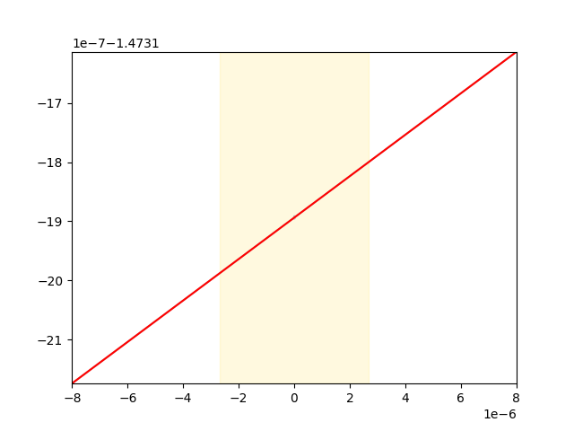
## New Eq:
((fabs(membrane__V) < 2.6712338705498262e-6) ? ((0.5 + 187179.41753901311 * membrane__V) * (1.6884874999999999e-9 * (-99.0 + 11.756126774999998 * exp(9.9999999999999995e-8)) / (-1.0 + exp(9.9999999999999995e-8)) + 1.6884874999999999e-9 * (-99.0 + 11.756126774999998 * exp(-9.9999999999999995e-8)) / (-1.0 + exp(-9.9999999999999995e-8))) - 1.6884874999999999e-9 * (-99.0 + 11.756126774999998 * exp(-9.9999999999999995e-8)) / (-1.0 + exp(-9.9999999999999995e-8))) : (pow(membrane__F, 2) * (-L_type_Ca_channel__gamma_Nao * ionic_concentrations__Nao + L_type_Ca_channel__gamma_Nai * ionic_concentrations__Nai * exp(membrane__F * membrane__V / (membrane__R * membrane__T))) * membrane__V * non_specific_calcium_activated_current__P_ns_Ca / ((-1.0 + exp(membrane__F * membrane__V / (membrane__R * membrane__T))) * membrane__R * membrane__T)))

## Equation 6:
```
rapid_delayed_rectifier_potassium_current_xr_gate__tau_xr = 0.001 / (0.00060999999999999997 * (38.899999999999999 + membrane__V) / (-1.0 + 281.60348502322194 * exp(0.14499999999999999 * membrane__V)) + 0.0013799999999999999 * (14.199999999999999 + membrane__V) / (1.0 - 0.17436578041087322 * exp(-0.123 * membrane__V)))
```
### Partially evaluated to: 
```
rapid_delayed_rectifier_potassium_current_xr_gate__tau_xr = 0.001 / (0.00060999999999999997 * (38.899999999999999 + membrane__V) / (-1.0 + 281.60348502322194 * exp(0.14499999999999999 * membrane__V)) + 0.0013799999999999999 * (14.199999999999999 + membrane__V) / (1.0 - 0.17436578041087322 * exp(-0.123 * membrane__V)))
```
### Singulariy points detected:

{-38.899999999999999, -14.199999999999999}
#### float * A

####1 / A


####A + B:

`0.0013799999999999999 * (14.199999999999999 + membrane__V) / (1.0 - 0.17436578041087322 * exp(-0.123 * membrane__V))`
`0.00060999999999999997 * (38.899999999999999 + membrane__V) / (-1.0 + 281.60348502322194 * exp(0.14499999999999999 * membrane__V))`

*U*
`-1.7465999999999999 - 0.123 * membrane__V`

*V for 1e-07 range* 
`-14.200000813008129 - -14.199999186991869`

*Singularity point: -14.199999999999999*


*U*
`5.6404999999999994 + 0.14499999999999999 * membrane__V`

*V for 1e-07 range* 
`-38.900000689655172 - -38.899999310344825`

*Singularity point: -38.899999999999999*


## New Eq:
((fabs(14.199999999999999 + membrane__V) < 8.1300813006834893e-7) ? (0.001 / (0.015066999504065039 / (-1.0 + exp(3.5814998821138206)) - 1.1219512194943214e-9 / (1.0 - exp(9.9999999999406119e-8))) + (8733000.5000645891 + 615000.00000454858 * membrane__V) * (0.001 / (1.1219512195134727e-9 / (1.0 - exp(-9.9999999999406119e-8)) + 0.015067000495934959 / (-1.0 + exp(3.5815001178861787))) - 0.001 / (0.015066999504065039 / (-1.0 + exp(3.5814998821138206)) - 1.1219512194943214e-9 / (1.0 - exp(9.9999999999406119e-8))))) : ((fabs(38.899999999999999 + membrane__V) < 6.8965517246999397e-7) ? (0.001 / (-0.034086000951724135 / (1.0 - exp(3.0381000848275859)) - 4.2068965517283451e-10 / (-1.0 + exp(-1.0000000000287557e-7))) + (28202500.498836767 + 724999.99997009686 * membrane__V) * (0.001 / (4.2068965520669629e-10 / (-1.0 + exp(1.0000000000287557e-7)) - 0.034085999048275861 / (1.0 - exp(3.0380999151724137))) - 0.001 / (-0.034086000951724135 / (1.0 - exp(3.0381000848275859)) - 4.2068965517283451e-10 / (-1.0 + exp(-1.0000000000287557e-7))))) : (0.001 / (0.00060999999999999997 * (38.899999999999999 + membrane__V) / (-1.0 + exp(5.6404999999999994 + 0.14499999999999999 * membrane__V)) + 0.0013799999999999999 * (14.199999999999999 + membrane__V) / (1.0 - exp(-1.7465999999999999 - 0.123 * membrane__V))))))

## Equation 7:
```
slow_delayed_rectifier_potassium_current_xs1_gate__tau_xs1 = 0.001 / (0.00013100000000000001 * (30.0 + membrane__V) / (-1.0 + 7.8538197044216602 * exp(0.068699999999999997 * membrane__V)) + 7.1899999999999999e-5 * (30.0 + membrane__V) / (1.0 - 0.011795938519751569 * exp(-0.14799999999999999 * membrane__V)))
```
### Partially evaluated to: 
```
slow_delayed_rectifier_potassium_current_xs1_gate__tau_xs1 = 0.001 / (0.00013100000000000001 * (30.0 + membrane__V) / (-1.0 + 7.8538197044216602 * exp(0.068699999999999997 * membrane__V)) + 7.1899999999999999e-5 * (30.0 + membrane__V) / (1.0 - 0.011795938519751569 * exp(-0.14799999999999999 * membrane__V)))
```
### Singulariy points detected:

{-30.000000000000000}
#### float * A

####1 / A


####A + B:

`7.1899999999999999e-5 * (30.0 + membrane__V) / (1.0 - 0.011795938519751569 * exp(-0.14799999999999999 * membrane__V))`
`0.00013100000000000001 * (30.0 + membrane__V) / (-1.0 + 7.8538197044216602 * exp(0.068699999999999997 * membrane__V))`

*U*
`-4.4399999999999995 - 0.14799999999999999 * membrane__V`

*V for 1e-07 range* 
`-30.000000675675675 - -29.999999324324325`

*Singularity point: -30.000000000000000*


## New Eq:
((fabs(30.0 + membrane__V) < 6.7567567568760367e-7) ? (0.001 / (-8.8513513515076093e-11 / (-1.0 + exp(-4.6418918920460017e-8)) - 4.8581081081938701e-11 / (1.0 - exp(1.0000000000287557e-7))) + (22200000.499608092 + 739999.99998693645 * membrane__V) * (0.001 / (8.8513513515076093e-11 / (-1.0 + exp(4.6418918920460017e-8)) + 4.8581081081938701e-11 / (1.0 - exp(-1.0000000000287557e-7))) - 0.001 / (-8.8513513515076093e-11 / (-1.0 + exp(-4.6418918920460017e-8)) - 4.8581081081938701e-11 / (1.0 - exp(1.0000000000287557e-7))))) : (0.001 / (0.00013100000000000001 * (30.0 + membrane__V) / (-1.0 + exp(2.0609999999999999 + 0.068699999999999997 * membrane__V)) + 7.1899999999999999e-5 * (30.0 + membrane__V) / (1.0 - exp(-4.4399999999999995 - 0.14799999999999999 * membrane__V)))))

## Equation 8:
```
slow_delayed_rectifier_potassium_current_xs2_gate__tau_xs2 = 0.0040000000000000001 / (0.00013100000000000001 * (30.0 + membrane__V) / (-1.0 + 7.8538197044216602 * exp(0.068699999999999997 * membrane__V)) + 7.1899999999999999e-5 * (30.0 + membrane__V) / (1.0 - 0.011795938519751569 * exp(-0.14799999999999999 * membrane__V)))
```
### Partially evaluated to: 
```
slow_delayed_rectifier_potassium_current_xs2_gate__tau_xs2 = 0.0040000000000000001 / (0.00013100000000000001 * (30.0 + membrane__V) / (-1.0 + 7.8538197044216602 * exp(0.068699999999999997 * membrane__V)) + 7.1899999999999999e-5 * (30.0 + membrane__V) / (1.0 - 0.011795938519751569 * exp(-0.14799999999999999 * membrane__V)))
```
### Singulariy points detected:

{-30.000000000000000}
#### float * A

####1 / A


####A + B:

`7.1899999999999999e-5 * (30.0 + membrane__V) / (1.0 - 0.011795938519751569 * exp(-0.14799999999999999 * membrane__V))`
`0.00013100000000000001 * (30.0 + membrane__V) / (-1.0 + 7.8538197044216602 * exp(0.068699999999999997 * membrane__V))`

*U*
`-4.4399999999999995 - 0.14799999999999999 * membrane__V`

*V for 1e-07 range* 
`-30.000000675675675 - -29.999999324324325`

*Singularity point: -30.000000000000000*


## New Eq:
((fabs(30.0 + membrane__V) < 6.7567567568760367e-7) ? (0.0040000000000000001 / (-8.8513513515076093e-11 / (-1.0 + exp(-4.6418918920460017e-8)) - 4.8581081081938701e-11 / (1.0 - exp(1.0000000000287557e-7))) + (22200000.499608092 + 739999.99998693645 * membrane__V) * (0.0040000000000000001 / (8.8513513515076093e-11 / (-1.0 + exp(4.6418918920460017e-8)) + 4.8581081081938701e-11 / (1.0 - exp(-1.0000000000287557e-7))) - 0.0040000000000000001 / (-8.8513513515076093e-11 / (-1.0 + exp(-4.6418918920460017e-8)) - 4.8581081081938701e-11 / (1.0 - exp(1.0000000000287557e-7))))) : (0.0040000000000000001 / (0.00013100000000000001 * (30.0 + membrane__V) / (-1.0 + exp(2.0609999999999999 + 0.068699999999999997 * membrane__V)) + 7.1899999999999999e-5 * (30.0 + membrane__V) / (1.0 - exp(-4.4399999999999995 - 0.14799999999999999 * membrane__V)))))

# Model: winslow_model_1999
## Equation 1:
```
slow_activating_delayed_rectifiyer_K_current_X_ks_gate__tau_X_ks = 0.001 / (0.00013100000000000001 * (-10.0 + membrane__V) / (-1.0 + 0.50308305662435071 * exp(0.068699999999999997 * membrane__V)) + 7.1899999999999999e-5 * (-10.0 + membrane__V) / (1.0 - 4.3929456809187561 * exp(-0.14799999999999999 * membrane__V)))
```
### Partially evaluated to: 
```
slow_activating_delayed_rectifiyer_K_current_X_ks_gate__tau_X_ks = 0.001 / (0.00013100000000000001 * (-10.0 + membrane__V) / (-1.0 + 0.50308305662435071 * exp(0.068699999999999997 * membrane__V)) + 7.1899999999999999e-5 * (-10.0 + membrane__V) / (1.0 - 4.3929456809187561 * exp(-0.14799999999999999 * membrane__V)))
```
### Singulariy points detected:

{10.000000000000000, 10.000000000000000}
*U*
`-1.48 + 0.14799999999999999 * membrane__V`

*V for 1e-07 range* 
`9.9999993243243246 - 10.000000675675675`

*Singularity point: 10.000000000000000*


*Singularity point: 10.000000000000000*


## New Eq:
(((membrane__V > 9.9999993243243246) && (membrane__V < 10.000000675675675)) ? (0.001 / (-4.8581081080940889e-11 / (1.0 - exp(9.9999999999406119e-8)) - 8.8513513513258105e-11 / (-1.0 + exp(-4.6418918918725294e-8))) + (-7399999.5000213543 + 740000.00000213541 * membrane__V) * (0.001 / (4.8581081080940889e-11 / (1.0 - exp(-9.9999999999406119e-8)) + 8.8513513513258105e-11 / (-1.0 + exp(4.6418918918725294e-8))) - 0.001 / (-4.8581081080940889e-11 / (1.0 - exp(9.9999999999406119e-8)) - 8.8513513513258105e-11 / (-1.0 + exp(-4.6418918918725294e-8))))) : (0.001 / (0.00013100000000000001 * (-10.0 + membrane__V) / (-1.0 + exp(-0.68699999999999994 + 0.068699999999999997 * membrane__V)) + 7.1899999999999999e-5 * (-10.0 + membrane__V) / (1.0 - exp(1.48 - 0.14799999999999999 * membrane__V)))))

## Equation 2:
```
L_type_Ca_current__i_Ca_max = 4000.0 * pow(membrane__F, 2) * (0.001 * exp(2.0 * membrane__F * membrane__V / (membrane__R * membrane__T)) - 0.34100000000000003 * standard_ionic_concentrations__Cao) * L_type_Ca_current__P_Ca * membrane__V / ((-1.0 + exp(2.0 * membrane__F * membrane__V / (membrane__R * membrane__T))) * membrane__R * membrane__T)
```
### Partially evaluated to: 
```
L_type_Ca_current__i_Ca_max = 4.5147771746328917 * (-0.68200000000000005 + 0.001 * exp(0.074867781645490947 * membrane__V)) * membrane__V / (-1.0 + exp(0.074867781645490947 * membrane__V))
```
### Singulariy points detected:

{0}
*U*
`0.074867781645490947 * membrane__V`

*V for 1e-07 range* 
`-1.3356880329847825e-6 - 1.3356880329847825e-6`

*Singularity point: 0*


## New Eq:
((fabs(membrane__V) < 1.3356880329847825e-6) ? ((0.5 + 374338.90822745475 * membrane__V) * (6.03033384375e-6 * (-0.68200000000000005 + 0.001 * exp(9.9999999999999995e-8)) / (-1.0 + exp(9.9999999999999995e-8)) + 6.03033384375e-6 * (-0.68200000000000005 + 0.001 * exp(-9.9999999999999995e-8)) / (-1.0 + exp(-9.9999999999999995e-8))) - 6.03033384375e-6 * (-0.68200000000000005 + 0.001 * exp(-9.9999999999999995e-8)) / (-1.0 + exp(-9.9999999999999995e-8))) : (4000.0 * pow(membrane__F, 2) * (0.001 * exp(2.0 * membrane__F * membrane__V / (membrane__R * membrane__T)) - 0.34100000000000003 * standard_ionic_concentrations__Cao) * L_type_Ca_current__P_Ca * membrane__V / ((-1.0 + exp(2.0 * membrane__F * membrane__V / (membrane__R * membrane__T))) * membrane__R * membrane__T)))

## Equation 3:
```
L_type_Ca_current__i_Ca_K = pow(membrane__F, 2) * (-standard_ionic_concentrations__Ko + intracellular_ion_concentrations__Ki * exp(membrane__F * membrane__V / (membrane__R * membrane__T))) * (L_type_Ca_current__O + L_type_Ca_current__O_Ca) * L_type_Ca_current__p_prime_k * L_type_Ca_current_y_gate__y * membrane__V / ((-1.0 + exp(membrane__F * membrane__V / (membrane__R * membrane__T))) * membrane__R * membrane__T)
```
### Partially evaluated to: 
```
L_type_Ca_current__i_Ca_K = 1.6430234988970467e-26 * (-4.0 + 157.80000000000001 * exp(0.037433890822745473 * membrane__V)) * membrane__V / ((1.0 - 17.036894998614684 * (-0.68200000000000005 + 0.001 * exp(0.074867781645490947 * membrane__V)) * membrane__V / (-1.0 + exp(0.074867781645490947 * membrane__V))) * (-1.0 + exp(0.037433890822745473 * membrane__V)))
```
### Singulariy points detected:

{0}
*U*
`0.037433890822745473 * membrane__V`

*V for 1e-07 range* 
`-2.671376065969565e-6 - 2.671376065969565e-6`

*Singularity point: 0*


## New Eq:
((fabs(membrane__V) < 2.671376065969565e-6) ? ((0.5 + 187169.45411372738 * membrane__V) * (4.3891336507791423e-32 * (-4.0 + 157.80000000000001 * exp(-9.9999999999999995e-8)) / ((1.0 + 4.551195353773585e-5 * (-0.68200000000000005 + 0.001 * exp(-1.9999999999999999e-7)) / (-1.0 + exp(-1.9999999999999999e-7))) * (-1.0 + exp(-9.9999999999999995e-8))) + 4.3891336507791423e-32 * (-4.0 + 157.80000000000001 * exp(9.9999999999999995e-8)) / ((1.0 - 4.551195353773585e-5 * (-0.68200000000000005 + 0.001 * exp(1.9999999999999999e-7)) / (-1.0 + exp(1.9999999999999999e-7))) * (-1.0 + exp(9.9999999999999995e-8)))) - 4.3891336507791423e-32 * (-4.0 + 157.80000000000001 * exp(-9.9999999999999995e-8)) / ((1.0 + 4.551195353773585e-5 * (-0.68200000000000005 + 0.001 * exp(-1.9999999999999999e-7)) / (-1.0 + exp(-1.9999999999999999e-7))) * (-1.0 + exp(-9.9999999999999995e-8)))) : (pow(membrane__F, 2) * (-standard_ionic_concentrations__Ko + intracellular_ion_concentrations__Ki * exp(membrane__F * membrane__V / (membrane__R * membrane__T))) * (L_type_Ca_current__O + L_type_Ca_current__O_Ca) * L_type_Ca_current__p_prime_k * L_type_Ca_current_y_gate__y * membrane__V / ((-1.0 + exp(membrane__F * membrane__V / (membrane__R * membrane__T))) * membrane__R * membrane__T)))

# Model: zhang_SAN_model_2000_0D_capable
## Equation 1:
```
L_type_Ca_channel_d_gate__alpha_d_L = -28.390000000000001 * (35.0 + membrane__V) / (-1.0 + 8.3152871910356788e-7 * exp(-0.40000000000000002 * membrane__V)) - 84.900000000000006 * membrane__V / (-1.0 + exp(-0.20799999999999999 * membrane__V))
```
### Partially evaluated to: 
```
L_type_Ca_channel_d_gate__alpha_d_L = -28.390000000000001 * (35.0 + membrane__V) / (-1.0 + 8.3152871910356788e-7 * exp(-0.40000000000000002 * membrane__V)) - 84.900000000000006 * membrane__V / (-1.0 + exp(-0.20799999999999999 * membrane__V))
```
### Singulariy points detected:

{0, -35.000000000000000}
####A + B:

`84.900000000000006 * membrane__V / (1.0 - exp(-0.20799999999999999 * membrane__V))`
`-28.390000000000001 * (35.0 + membrane__V) / (-1.0 + 8.3152871910356788e-7 * exp(-0.40000000000000002 * membrane__V))`

*U*
`0.20799999999999999 * membrane__V`

*V for 1e-07 range* 
`-4.8076923076923074e-7 - 4.8076923076923074e-7`

*Singularity point: 0*


*U*
`-14.0 - 0.40000000000000002 * membrane__V`

*V for 1e-07 range* 
`-35.000000249999999 - -34.999999750000001`

*Singularity point: -35.000000000000000*


## New Eq:
((fabs(membrane__V) < 4.8076923076923074e-7) ? (4.0817307692307694e-5 / (-1.0 + exp(9.9999999999999995e-8)) - 993.64998635096151 / (-1.0 + exp(-13.999999807692308)) + (0.5 + 1040000.0 * membrane__V) * (993.64998635096151 / (-1.0 + exp(-13.999999807692308)) - 993.65001364903844 / (-1.0 + exp(-14.000000192307692)) - 4.0817307692307694e-5 / (-1.0 + exp(9.9999999999999995e-8)) - 4.0817307692307694e-5 / (-1.0 + exp(-9.9999999999999995e-8)))) : ((fabs(35.0 + membrane__V) < 2.5000000003494449e-7) ? (7.0974999994161125e-6 / (-1.0 + exp(9.9999999988997779e-8)) + 2971.5000212250002 / (-1.0 + exp(7.2800000519999992)) + (70000000.497987106 + 1999999.9999424887 * membrane__V) * (2971.4999787750003 / (-1.0 + exp(7.2799999479999995)) - 7.0974999994161125e-6 / (-1.0 + exp(9.9999999988997779e-8)) - 2971.5000212250002 / (-1.0 + exp(7.2800000519999992)) - 7.097500000992074e-6 / (-1.0 + exp(-1.0000000001675335e-7)))) : (-28.390000000000001 * (35.0 + membrane__V) / (-1.0 + exp(-14.0 - 0.40000000000000002 * membrane__V)) - 84.900000000000006 * membrane__V / (-1.0 + exp(-0.20799999999999999 * membrane__V)))))

## Equation 2:
```
L_type_Ca_channel_d_gate__beta_d_L = 11.43 * (-5.0 + membrane__V) / (-1.0 + 0.13533528323661267 * exp(0.40000000000000002 * membrane__V))
```
### Partially evaluated to: 
```
L_type_Ca_channel_d_gate__beta_d_L = 11.43 * (-5.0 + membrane__V) / (-1.0 + 0.13533528323661267 * exp(0.40000000000000002 * membrane__V))
```
### Singulariy points detected:

{5.0000000000000000}
*U*
`-2.0 + 0.40000000000000002 * membrane__V`

*V for 1e-07 range* 
`4.9999997499999997 - 5.0000002500000003`

*Singularity point: 5.0000000000000000*


## New Eq:
((fabs(-5.0 + membrane__V) < 2.5000000000025002e-7) ? (-2.8575000000028576e-6 / (-1.0 + exp(-9.9999999999406119e-8)) + (-9999999.4999899995 + 1999999.9999979998 * membrane__V) * (2.8575000000028576e-6 / (-1.0 + exp(9.9999999999406119e-8)) + 2.8575000000028576e-6 / (-1.0 + exp(-9.9999999999406119e-8)))) : (11.43 * (-5.0 + membrane__V) / (-1.0 + exp(-2.0 + 0.40000000000000002 * membrane__V))))

## Equation 3:
```
L_type_Ca_channel_f_gate__alpha_f_L = 3.75 * (28.0 + membrane__V) / (-1.0 + 1096.6331584284585 * exp(0.25 * membrane__V))
```
### Partially evaluated to: 
```
L_type_Ca_channel_f_gate__alpha_f_L = 3.75 * (28.0 + membrane__V) / (-1.0 + 1096.6331584284585 * exp(0.25 * membrane__V))
```
### Singulariy points detected:

{-28.000000000000000}
*U*
`7.0 + 0.25 * membrane__V`

*V for 1e-07 range* 
`-28.000000400000001 - -27.999999599999999`

*Singularity point: -28.000000000000000*


## New Eq:
((fabs(28.0 + membrane__V) < 4.0000000001150227e-7) ? (-1.5000000000431335e-6 / (-1.0 + exp(-1.0000000000287557e-7)) + (35000000.498993553 + 1249999.9999640554 * membrane__V) * (1.5000000000431335e-6 / (-1.0 + exp(1.0000000000287557e-7)) + 1.5000000000431335e-6 / (-1.0 + exp(-1.0000000000287557e-7)))) : (3.75 * (28.0 + membrane__V) / (-1.0 + exp(7.0 + 0.25 * membrane__V))))

## Equation 4:
```
sodium_current__i_Na = pow(membrane__F, 2) * pow(sodium_current_m_gate__m, 3) * (-1.0 + exp((-reversal_and_equilibrium_potentials__E_Na + membrane__V) * membrane__F / (membrane__R * membrane__T))) * ionic_concentrations__Na_o * membrane__V * sodium_current__g_Na * sodium_current_h_gate__h / ((-1.0 + exp(membrane__F * membrane__V / (membrane__R * membrane__T))) * membrane__R * membrane__T)
```
### Partially evaluated to: 
```
sodium_current__i_Na = 6.164648345915821e-14 * (0.015779151918464969 - 1.580437893210501e-5 * exp(-0.063060000000000005 * membrane__V) / (1.0 + 9.8477927855808596e-7 * exp(-0.22509999999999999 * membrane__V))) * (-1.0 + 0.057142857142857141 * exp(0.037575562401545783 * membrane__V)) * membrane__V / (-1.0 + exp(0.037575562401545783 * membrane__V))
```
### Singulariy points detected:

{0}
*U*
`0.037575562401545783 * membrane__V`

*V for 1e-07 range* 
`-2.6613041457999895e-6 - 2.6613041457999895e-6`

*Singularity point: 0*

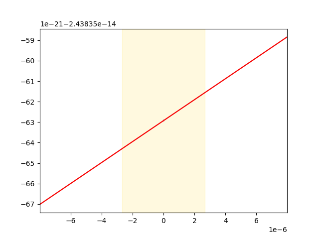
## New Eq:
((fabs(membrane__V) < 2.6613041457999895e-6) ? ((0.5 + 187877.81200772891 * membrane__V) * (1.3259894600183088e-16 * (0.015779151918464969 - 0.00013831740069577994 * exp(-2.1692641678218396) / (1.0 + 1.6619999999999999 * exp(-14.338870599059563))) * (-1.0 + exp(-2.8622007809294683)) / ((1.0 + 0.77449999999999997 * exp(6.9491515254237282)) * (-1.0 + exp(9.9999999999999995e-8))) + 1.3259894600183088e-16 * (0.015779151918464969 - 0.00013831740069577994 * exp(-2.1692638321781605) / (1.0 + 1.6619999999999999 * exp(-14.338869400940437))) * (-1.0 + exp(-2.8622009809294684)) / ((1.0 + 0.77449999999999997 * exp(6.9491515254237282)) * (-1.0 + exp(-9.9999999999999995e-8)))) - 1.3259894600183088e-16 * (0.015779151918464969 - 0.00013831740069577994 * exp(-2.1692638321781605) / (1.0 + 1.6619999999999999 * exp(-14.338869400940437))) * (-1.0 + exp(-2.8622009809294684)) / ((1.0 + 0.77449999999999997 * exp(6.9491515254237282)) * (-1.0 + exp(-9.9999999999999995e-8)))) : (pow(membrane__F, 2) * pow(sodium_current_m_gate__m, 3) * (-1.0 + exp((-reversal_and_equilibrium_potentials__E_Na + membrane__V) * membrane__F / (membrane__R * membrane__T))) * ionic_concentrations__Na_o * membrane__V * sodium_current__g_Na * sodium_current_h_gate__h / ((-1.0 + exp(membrane__F * membrane__V / (membrane__R * membrane__T))) * membrane__R * membrane__T)))

# Model: zhang_SAN_model_2000_all
## Equation 1:
```
L_type_Ca_channel_d_gate__alpha_d_L = ((membrane__Version == 0) ? (-84.900000000000006 * membrane__V / (-1.0 + exp(-0.20799999999999999 * membrane__V)) - 28.379999999999999 * (35.0 + membrane__V) / (-1.0 + 8.3152871910356788e-7 * exp(-0.40000000000000002 * membrane__V))) : ((membrane__Version == 1.0) ? (-28.390000000000001 * (35.0 + membrane__V) / (-1.0 + 8.3152871910356788e-7 * exp(-0.40000000000000002 * membrane__V)) - 84.900000000000006 * membrane__V / (-1.0 + exp(-0.20799999999999999 * membrane__V))) : (-84.900000000000006 * membrane__V / (-1.0 + exp(-0.20799999999999999 * membrane__V)) - 28.399999999999999 * (35.0 + membrane__V) / (-1.0 + 8.3152871910356788e-7 * exp(-0.40000000000000002 * membrane__V)))))
```
### Partially evaluated to: 
```
L_type_Ca_channel_d_gate__alpha_d_L = -28.390000000000001 * (35.0 + membrane__V) / (-1.0 + 8.3152871910356788e-7 * exp(-0.40000000000000002 * membrane__V)) - 84.900000000000006 * membrane__V / (-1.0 + exp(-0.20799999999999999 * membrane__V))
```
### Singulariy points detected:

{0, -35.000000000000000}
####A + B:

`84.900000000000006 * membrane__V / (1.0 - exp(-0.20799999999999999 * membrane__V))`
`-28.390000000000001 * (35.0 + membrane__V) / (-1.0 + 8.3152871910356788e-7 * exp(-0.40000000000000002 * membrane__V))`

*U*
`0.20799999999999999 * membrane__V`

*V for 1e-07 range* 
`-4.8076923076923074e-7 - 4.8076923076923074e-7`

*Singularity point: 0*

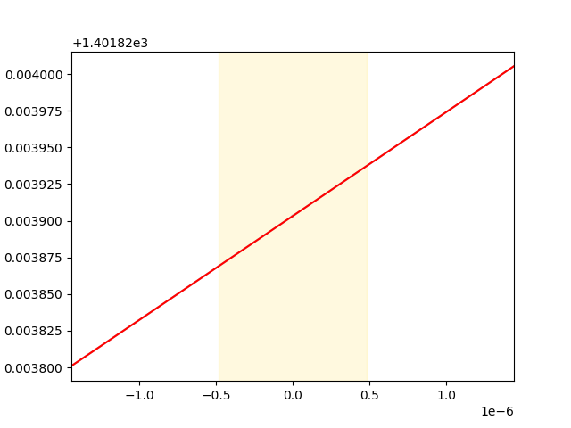
*U*
`-14.0 - 0.40000000000000002 * membrane__V`

*V for 1e-07 range* 
`-35.000000249999999 - -34.999999750000001`

*Singularity point: -35.000000000000000*

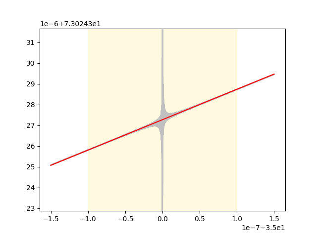
## New Eq:
((fabs(membrane__V) < 4.8076923076923074e-7) ? (4.0817307692307694e-5 / (-1.0 + exp(9.9999999999999995e-8)) - 993.64998635096151 / (-1.0 + exp(-13.999999807692308)) + (0.5 + 1040000.0 * membrane__V) * (993.64998635096151 / (-1.0 + exp(-13.999999807692308)) - 993.65001364903844 / (-1.0 + exp(-14.000000192307692)) - 4.0817307692307694e-5 / (-1.0 + exp(9.9999999999999995e-8)) - 4.0817307692307694e-5 / (-1.0 + exp(-9.9999999999999995e-8)))) : ((fabs(35.0 + membrane__V) < 2.5000000003494449e-7) ? (7.0974999994161125e-6 / (-1.0 + exp(9.9999999988997779e-8)) + 2971.5000212250002 / (-1.0 + exp(7.2800000519999992)) + (70000000.497987106 + 1999999.9999424887 * membrane__V) * (2971.4999787750003 / (-1.0 + exp(7.2799999479999995)) - 7.0974999994161125e-6 / (-1.0 + exp(9.9999999988997779e-8)) - 2971.5000212250002 / (-1.0 + exp(7.2800000519999992)) - 7.097500000992074e-6 / (-1.0 + exp(-1.0000000001675335e-7)))) : (((membrane__Version == 0) ? (-84.900000000000006 * membrane__V / (-1.0 + exp(-0.20799999999999999 * membrane__V)) - 28.379999999999999 * (35.0 + membrane__V) / (-1.0 + exp(-14.0 - 0.40000000000000002 * membrane__V))) : ((membrane__Version == 1.0) ? (-28.390000000000001 * (35.0 + membrane__V) / (-1.0 + exp(-14.0 - 0.40000000000000002 * membrane__V)) - 84.900000000000006 * membrane__V / (-1.0 + exp(-0.20799999999999999 * membrane__V))) : (-84.900000000000006 * membrane__V / (-1.0 + exp(-0.20799999999999999 * membrane__V)) - 28.399999999999999 * (35.0 + membrane__V) / (-1.0 + exp(-14.0 - 0.40000000000000002 * membrane__V))))))))

## Equation 2:
```
L_type_Ca_channel_d_gate__beta_d_L = ((membrane__Version == 1.0) ? (11.43 * (-5.0 + membrane__V) / (-1.0 + 0.13533528323661267 * exp(0.40000000000000002 * membrane__V))) : (11.42 * (-5.0 + membrane__V) / (-1.0 + 0.13533528323661267 * exp(0.40000000000000002 * membrane__V))))
```
### Partially evaluated to: 
```
L_type_Ca_channel_d_gate__beta_d_L = 11.43 * (-5.0 + membrane__V) / (-1.0 + 0.13533528323661267 * exp(0.40000000000000002 * membrane__V))
```
### Singulariy points detected:

{5.0000000000000000}
*U*
`-2.0 + 0.40000000000000002 * membrane__V`

*V for 1e-07 range* 
`4.9999997499999997 - 5.0000002500000003`

*Singularity point: 5.0000000000000000*

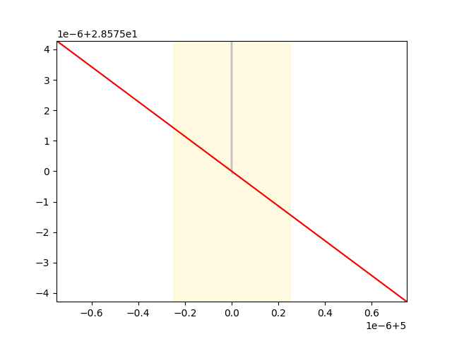
## New Eq:
((fabs(-5.0 + membrane__V) < 2.5000000000025002e-7) ? (-2.8575000000028576e-6 / (-1.0 + exp(-9.9999999999406119e-8)) + (-9999999.4999899995 + 1999999.9999979998 * membrane__V) * (2.8575000000028576e-6 / (-1.0 + exp(9.9999999999406119e-8)) + 2.8575000000028576e-6 / (-1.0 + exp(-9.9999999999406119e-8)))) : (((membrane__Version == 1.0) ? (11.43 * (-5.0 + membrane__V) / (-1.0 + exp(-2.0 + 0.40000000000000002 * membrane__V))) : (11.42 * (-5.0 + membrane__V) / (-1.0 + exp(-2.0 + 0.40000000000000002 * membrane__V))))))

## Equation 3:
```
L_type_Ca_channel_f_gate__alpha_f_L = ((membrane__Version == 1.0) ? (3.75 * (28.0 + membrane__V) / (-1.0 + 1096.6331584284585 * exp(0.25 * membrane__V))) : (3.1200000000000001 * (28.0 + membrane__V) / (-1.0 + 1096.6331584284585 * exp(0.25 * membrane__V))))
```
### Partially evaluated to: 
```
L_type_Ca_channel_f_gate__alpha_f_L = 3.75 * (28.0 + membrane__V) / (-1.0 + 1096.6331584284585 * exp(0.25 * membrane__V))
```
### Singulariy points detected:

{-28.000000000000000}
*U*
`7.0 + 0.25 * membrane__V`

*V for 1e-07 range* 
`-28.000000400000001 - -27.999999599999999`

*Singularity point: -28.000000000000000*

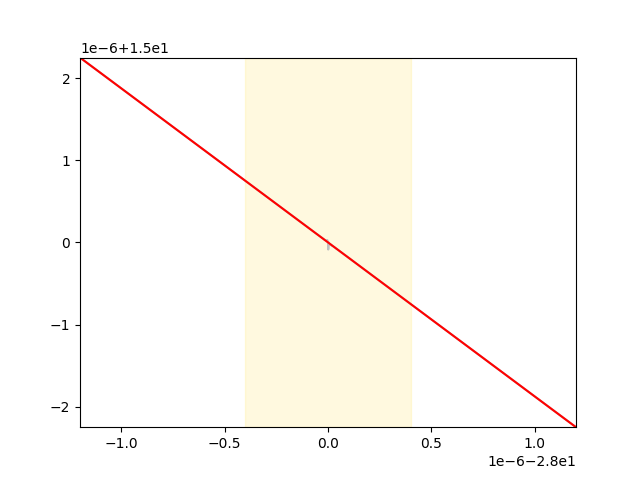
## New Eq:
((fabs(28.0 + membrane__V) < 4.0000000001150227e-7) ? (-1.5000000000431335e-6 / (-1.0 + exp(-1.0000000000287557e-7)) + (35000000.498993553 + 1249999.9999640554 * membrane__V) * (1.5000000000431335e-6 / (-1.0 + exp(1.0000000000287557e-7)) + 1.5000000000431335e-6 / (-1.0 + exp(-1.0000000000287557e-7)))) : (((membrane__Version == 1.0) ? (3.75 * (28.0 + membrane__V) / (-1.0 + exp(7.0 + 0.25 * membrane__V))) : (3.1200000000000001 * (28.0 + membrane__V) / (-1.0 + exp(7.0 + 0.25 * membrane__V))))))

## Equation 4:
```
sodium_current__i_Na = pow(membrane__F, 2) * pow(sodium_current_m_gate__m, 3) * (-1.0 + exp((-reversal_and_equilibrium_potentials__E_Na + membrane__V) * membrane__F / (membrane__R * membrane__T))) * ionic_concentrations__Na_o * membrane__V * sodium_current__g_Na * sodium_current_h_gate__h / ((-1.0 + exp(membrane__F * membrane__V / (membrane__R * membrane__T))) * membrane__R * membrane__T)
```
### Partially evaluated to: 
```
sodium_current__i_Na = 6.164648345915821e-14 * (0.015779151918464969 - 1.580437893210501e-5 * exp(-0.063060000000000005 * membrane__V) / (1.0 + 9.8477927855808596e-7 * exp(-0.22509999999999999 * membrane__V))) * (-1.0 + 0.057142857142857141 * exp(0.037575562401545783 * membrane__V)) * membrane__V / (-1.0 + exp(0.037575562401545783 * membrane__V))
```
### Singulariy points detected:

{0}
*U*
`0.037575562401545783 * membrane__V`

*V for 1e-07 range* 
`-2.6613041457999895e-6 - 2.6613041457999895e-6`

*Singularity point: 0*


## New Eq:
((fabs(membrane__V) < 2.6613041457999895e-6) ? ((0.5 + 187877.81200772891 * membrane__V) * (1.3259894600183088e-16 * (0.015779151918464969 - 0.00013831740069577994 * exp(-2.1692641678218396) / (1.0 + 1.6619999999999999 * exp(-14.338870599059563))) * (-1.0 + exp(-2.8622007809294683)) / ((1.0 + 0.77449999999999997 * exp(6.9491515254237282)) * (-1.0 + exp(9.9999999999999995e-8))) + 1.3259894600183088e-16 * (0.015779151918464969 - 0.00013831740069577994 * exp(-2.1692638321781605) / (1.0 + 1.6619999999999999 * exp(-14.338869400940437))) * (-1.0 + exp(-2.8622009809294684)) / ((1.0 + 0.77449999999999997 * exp(6.9491515254237282)) * (-1.0 + exp(-9.9999999999999995e-8)))) - 1.3259894600183088e-16 * (0.015779151918464969 - 0.00013831740069577994 * exp(-2.1692638321781605) / (1.0 + 1.6619999999999999 * exp(-14.338869400940437))) * (-1.0 + exp(-2.8622009809294684)) / ((1.0 + 0.77449999999999997 * exp(6.9491515254237282)) * (-1.0 + exp(-9.9999999999999995e-8)))) : (pow(membrane__F, 2) * pow(sodium_current_m_gate__m, 3) * (-1.0 + exp((-reversal_and_equilibrium_potentials__E_Na + membrane__V) * membrane__F / (membrane__R * membrane__T))) * ionic_concentrations__Na_o * membrane__V * sodium_current__g_Na * sodium_current_h_gate__h / ((-1.0 + exp(membrane__F * membrane__V / (membrane__R * membrane__T))) * membrane__R * membrane__T)))

