# Model: aslanidi_atrial_model_2009(aslanidi_atrial_model_2009.cellml)
Ca_independent_transient_outward_K_current__i_sus = (((environment__CT == 1.0) && (environment__PM == 0)) ? (0.098000000000000004 + 0.0014 * membrane__V) : (((environment__CT == 0) && (environment__PM == 1.0)) ? (0.16799999999999998 + 0.0023999999999999998 * membrane__V) : (0.070000000000000007 + 0.001 * membrane__V)))

####Piecewise!!

Ca_independent_transient_outward_K_current__i_to = (((environment__CT == 1.0) && (environment__PM == 0)) ? (0.20000000000000001 * (0.40000000000000002 + 0.59999999999999998 * pow(Ca_independent_transient_outward_K_current_s3_gate__s3, 6)) * (-Ca_independent_transient_outward_K_current__E_K + membrane__V) * (0.58999999999999997 * pow(Ca_independent_transient_outward_K_current_s1_gate__s1, 3) + 0.40999999999999998 * pow(Ca_independent_transient_outward_K_current_s2_gate__s2, 3)) * Ca_independent_transient_outward_K_current__g_to * Ca_independent_transient_outward_K_current_r_gate__r) : (((environment__CT == 0) && (environment__PM == 1.0)) ? (0.34999999999999998 * (0.40000000000000002 + 0.59999999999999998 * pow(Ca_independent_transient_outward_K_current_s3_gate__s3, 6)) * (-Ca_independent_transient_outward_K_current__E_K + membrane__V) * (0.58999999999999997 * pow(Ca_independent_transient_outward_K_current_s1_gate__s1, 3) + 0.40999999999999998 * pow(Ca_independent_transient_outward_K_current_s2_gate__s2, 3)) * Ca_independent_transient_outward_K_current__g_to * Ca_independent_transient_outward_K_current_r_gate__r) : ((0.40000000000000002 + 0.59999999999999998 * pow(Ca_independent_transient_outward_K_current_s3_gate__s3, 6)) * (-Ca_independent_transient_outward_K_current__E_K + membrane__V) * (0.58999999999999997 * pow(Ca_independent_transient_outward_K_current_s1_gate__s1, 3) + 0.40999999999999998 * pow(Ca_independent_transient_outward_K_current_s2_gate__s2, 3)) * Ca_independent_transient_outward_K_current__g_to * Ca_independent_transient_outward_K_current_r_gate__r)))

####Piecewise!!

L_type_Ca_channel__i_Ca_L = (((environment__CT == 1.0) && (environment__PM == 0)) ? (1.8 * (-L_type_Ca_channel__E_Ca_app + membrane__V) * (L_type_Ca_channel_d_L_gate__d_L * L_type_Ca_channel_f_L_gate__f_L + L_type_Ca_channel__d_prime) * L_type_Ca_channel__g_Ca_L) : (((environment__CT == 0) && (environment__PM == 1.0)) ? (2.1000000000000001 * (-L_type_Ca_channel__E_Ca_app + membrane__V) * (L_type_Ca_channel_d_L_gate__d_L * L_type_Ca_channel_f_L_gate__f_L + L_type_Ca_channel__d_prime) * L_type_Ca_channel__g_Ca_L) : ((-L_type_Ca_channel__E_Ca_app + membrane__V) * (L_type_Ca_channel_d_L_gate__d_L * L_type_Ca_channel_f_L_gate__f_L + L_type_Ca_channel__d_prime) * L_type_Ca_channel__g_Ca_L)))

####Piecewise!!

## Equation 1:
```
L_type_Ca_channel_d_L_gate__alpha_d_L = -50.0 * L_type_Ca_channel_d_L_gate__E10 / (-1.0 + exp(-0.20798668885191349 * L_type_Ca_channel_d_L_gate__E10)) - 16.719999999999999 * L_type_Ca_channel_d_L_gate__E0_alpha_d_L / (-1.0 + exp(-0.40000000000000002 * L_type_Ca_channel_d_L_gate__E0_alpha_d_L))
```
### Partially evaluated to: 
```
L_type_Ca_channel_d_L_gate__alpha_d_L = -50.0 * (10.0 + membrane__V) / (-1.0 + 0.12494684295098046 * exp(-0.20798668885191349 * membrane__V)) - 16.719999999999999 * (45.0 + membrane__V) / (-1.0 + 1.5229979744712629e-8 * exp(-0.40000000000000002 * membrane__V))
```
### Singulariy points detected:

{-10.000000000000000, -45.000000000000000}
####A + B:

`16.719999999999999 * (45.0 + membrane__V) / (1.0 - 1.5229979744712629e-8 * exp(-0.40000000000000002 * membrane__V))`
`-50.0 * (10.0 + membrane__V) / (-1.0 + 0.12494684295098046 * exp(-0.20798668885191349 * membrane__V))`

*U*
`-18.0 - 0.40000000000000002 * membrane__V`

*V for 1e-07 range* 
`-44.999999750000001 - -45.000000249999999`

*Singularity point: -45.000000000000000*

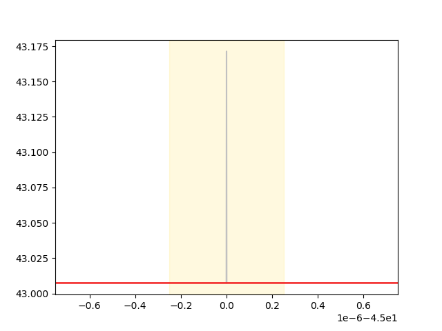
*U*
`-2.0798668885191347 - 0.20798668885191349 * membrane__V`

*V for 1e-07 range* 
`-9.9999995191999993 - -10.000000480800001`

*Singularity point: -10.000000000000000*

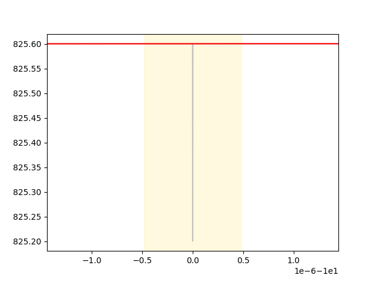
## New Eq:
((fabs(45.0 + membrane__V) < 2.5000000000718892e-7) ? (429.75968062441927 + 8.5944935844544048 * membrane__V) : ((fabs(10.0 + membrane__V) < 4.8080000000089163e-7) ? (1242.7001722212183 + 41.709968560833325 * membrane__V) : (-50.0 * L_type_Ca_channel_d_L_gate__E10 / (-1.0 + exp(-0.20798668885191349 * L_type_Ca_channel_d_L_gate__E10)) - 16.719999999999999 * L_type_Ca_channel_d_L_gate__E0_alpha_d_L / (-1.0 + exp(-0.40000000000000002 * L_type_Ca_channel_d_L_gate__E0_alpha_d_L)))))

## Equation 2:
```
L_type_Ca_channel_d_L_gate__beta_d_L = 4.4800000000000004 * L_type_Ca_channel_d_L_gate__E0_beta_d_L / (-1.0 + exp(0.40000000000000002 * L_type_Ca_channel_d_L_gate__E0_beta_d_L))
```
### Partially evaluated to: 
```
L_type_Ca_channel_d_L_gate__beta_d_L = 4.4800000000000004 * (5.0 + membrane__V) / (-1.0 + 7.3890560989306504 * exp(0.40000000000000002 * membrane__V))
```
### Singulariy points detected:

{-5.0000000000000000}
*U*
`2.0 + 0.40000000000000002 * membrane__V`

*V for 1e-07 range* 
`-5.0000002500000003 - -4.9999997499999997`

*Singularity point: -5.0000000000000000*

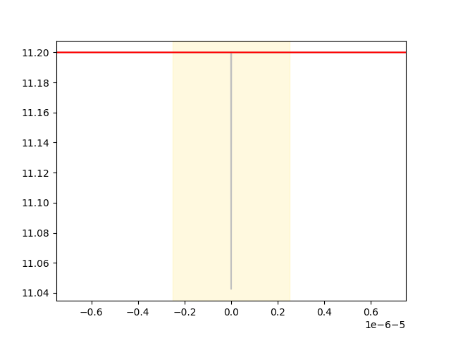
## New Eq:
((fabs(5.0 + membrane__V) < 2.5000000000025002e-7) ? (0.00020890531946092528 - 2.2399582189613714 * membrane__V) : (4.4800000000000004 * L_type_Ca_channel_d_L_gate__E0_beta_d_L / (-1.0 + exp(0.40000000000000002 * L_type_Ca_channel_d_L_gate__E0_beta_d_L))))

## Equation 3:
```
L_type_Ca_channel_f_L_gate__alpha_f_L = 8.4900000000000002 * L_type_Ca_channel_f_L_gate__E0_f_L / (-1.0 + exp(0.25 * L_type_Ca_channel_f_L_gate__E0_f_L))
```
### Partially evaluated to: 
```
L_type_Ca_channel_f_L_gate__alpha_f_L = 8.4900000000000002 * (18.0 + membrane__V) / (-1.0 + 90.017131300521811 * exp(0.25 * membrane__V))
```
### Singulariy points detected:

{-18.000000000000000}
*U*
`4.5 + 0.25 * membrane__V`

*V for 1e-07 range* 
`-18.000000400000001 - -17.999999599999999`

*Singularity point: -18.000000000000000*


## New Eq:
((fabs(18.0 + membrane__V) < 4.0000000001150227e-7) ? (-42.448574776213569 - 4.2449208209089404 * membrane__V) : (8.4900000000000002 * L_type_Ca_channel_f_L_gate__E0_f_L / (-1.0 + exp(0.25 * L_type_Ca_channel_f_L_gate__E0_f_L))))

background_currents__i_B_Ca = (((environment__CT == 1.0) && (environment__PM == 0)) ? (2.0000000000000002e-5 * membrane__V - 2.0000000000000002e-5 * background_currents__E_Ca) : (((environment__CT == 0) && (environment__PM == 1.0)) ? (3.0000000000000001e-5 * membrane__V - 3.0000000000000001e-5 * background_currents__E_Ca) : ((-background_currents__E_Ca + membrane__V) * background_currents__g_B_Ca)))

####Piecewise!!

inward_rectifier__i_K1 = (((environment__CT == 1.0) && (environment__PM == 0)) ? (2.0 * pow(cleft_space_ion_concentrations__K_c, 3) * (-Ca_independent_transient_outward_K_current__E_K + membrane__V) * inward_rectifier__g_K1 / ((1.0 + exp((-Ca_independent_transient_outward_K_current__E_K - inward_rectifier__shiftK1 + membrane__V) * inward_rectifier__steepK1 * membrane__F / (membrane__R * membrane__T))) * pow((cleft_space_ion_concentrations__K_c + inward_rectifier__KmK1), 3))) : (((environment__CT == 0) && (environment__PM == 1.0)) ? (2.5 * pow(cleft_space_ion_concentrations__K_c, 3) * (-Ca_independent_transient_outward_K_current__E_K + membrane__V) * inward_rectifier__g_K1 / ((1.0 + exp((-Ca_independent_transient_outward_K_current__E_K - inward_rectifier__shiftK1 + membrane__V) * inward_rectifier__steepK1 * membrane__F / (membrane__R * membrane__T))) * pow((cleft_space_ion_concentrations__K_c + inward_rectifier__KmK1), 3))) : (pow(cleft_space_ion_concentrations__K_c, 3) * (-Ca_independent_transient_outward_K_current__E_K + membrane__V) * inward_rectifier__g_K1 / ((1.0 + exp((-Ca_independent_transient_outward_K_current__E_K - inward_rectifier__shiftK1 + membrane__V) * inward_rectifier__steepK1 * membrane__F / (membrane__R * membrane__T))) * pow((cleft_space_ion_concentrations__K_c + inward_rectifier__KmK1), 3)))))

####Piecewise!!

background_currents__i_B_Na = (((environment__CT == 1.0) && (environment__PM == 0)) ? (2.0000000000000002e-5 * membrane__V - 2.0000000000000002e-5 * sodium_current__E_Na) : (((environment__CT == 0) && (environment__PM == 1.0)) ? (3.0000000000000001e-5 * membrane__V - 3.0000000000000001e-5 * sodium_current__E_Na) : ((-sodium_current__E_Na + membrane__V) * background_currents__g_B_Na)))

####Piecewise!!

## Equation 4:
```
sodium_current_m_gate__alpha_m = -460.0 * sodium_current_m_gate__E0_m / (-1.0 + exp(-0.078907914463820727 * sodium_current_m_gate__E0_m))
```
### Partially evaluated to: 
```
sodium_current_m_gate__alpha_m = -460.0 * (44.399999999999999 + membrane__V) / (-1.0 + 0.030091534212260941 * exp(-0.078907914463820727 * membrane__V))
```
### Singulariy points detected:

{-44.399999999999999}
*U*
`-3.5035114021936398 - 0.078907914463820727 * membrane__V`

*V for 1e-07 range* 
`-44.399998732699999 - -44.400001267299999`

*Singularity point: -44.399999999999999*


## New Eq:
((fabs(44.399999999999999 + membrane__V) < 1.2672999999963075e-6) ? (16043.161022403392 + 230.03560861286093 * membrane__V) : (-460.0 * sodium_current_m_gate__E0_m / (-1.0 + exp(-0.078907914463820727 * sodium_current_m_gate__E0_m))))

## Equation 5:
```
sodium_current__i_Na = pow(membrane__F, 2) * pow(sodium_current_m_gate__m, 3) * (-1.0 + exp((-sodium_current__E_Na + membrane__V) * membrane__F / (membrane__R * membrane__T))) * (0.36499999999999999 * sodium_current_h2_gate__h2 + 0.63500000000000001 * sodium_current_h1_gate__h1) * cleft_space_ion_concentrations__Na_c * membrane__V * sodium_current__P_Na / ((-1.0 + exp(membrane__F * membrane__V / (membrane__R * membrane__T))) * membrane__R * membrane__T)
```
### Partially evaluated to: 
```
sodium_current__i_Na = pow(membrane__F, 2) * pow(sodium_current_m_gate__m, 3) * (-1.0 + exp((-sodium_current__E_Na + membrane__V) * membrane__F / (membrane__R * membrane__T))) * (0.36499999999999999 * sodium_current_h2_gate__h2 + 0.63500000000000001 * sodium_current_h1_gate__h1) * cleft_space_ion_concentrations__Na_c * membrane__V * sodium_current__P_Na / ((-1.0 + exp(membrane__F * membrane__V / (membrane__R * membrane__T))) * membrane__R * membrane__T)
```
### Singulariy points detected:

{0}
####Failed to find U symbolically!

<class 'sympy.core.mul.Mul'>
_membrane$F**2*_sodium_current_m_gate$m**3*_cleft_space_ion_concentrations$Na_c*_membrane$V*_sodium_current$P_Na*(0.63500000000000001*_sodium_current_h1_gate$h1 + 0.36499999999999999*_sodium_current_h2_gate$h2)*(exp(_membrane$F*(_membrane$V - _sodium_current$E_Na)/(_membrane$R*_membrane$T)) - 1.0)/(_membrane$R*_membrane$T*(exp(_membrane$F*_membrane$V/(_membrane$R*_membrane$T)) - 1.0))

*try substituting parameters*

*U*
`0.037679754693225945 * membrane__V`

*V for 1e-07 range* 
`-2.6539450910485349e-6 - 2.6539450910485349e-6`

*Singularity point: 0*

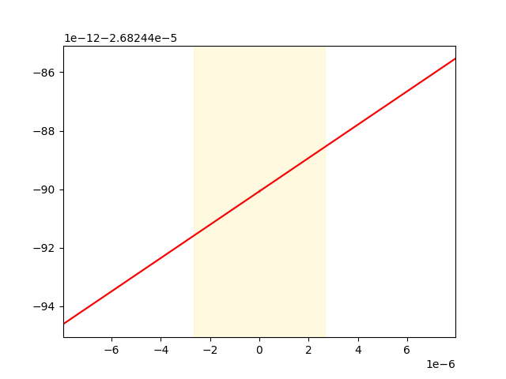
## New Eq:
((fabs(membrane__V) < 2.6539450910485349e-6) ? ((0.5 + 188398.77346612973 * membrane__V) * (2.6539450910485349e-6 * pow(membrane__F, 2) * pow(sodium_current_m_gate__m, 3) * (-1.0 + exp((2.6539450910485349e-6 - sodium_current__E_Na) * membrane__F / (membrane__R * membrane__T))) * (0.36499999999999999 * sodium_current_h2_gate__h2 + 0.63500000000000001 * sodium_current_h1_gate__h1) * cleft_space_ion_concentrations__Na_c * sodium_current__P_Na / ((-1.0 + exp(2.6539450910485349e-6 * membrane__F / (membrane__R * membrane__T))) * membrane__R * membrane__T) + 2.6539450910485349e-6 * pow(membrane__F, 2) * pow(sodium_current_m_gate__m, 3) * (-1.0 + exp((-2.6539450910485349e-6 - sodium_current__E_Na) * membrane__F / (membrane__R * membrane__T))) * (0.36499999999999999 * sodium_current_h2_gate__h2 + 0.63500000000000001 * sodium_current_h1_gate__h1) * cleft_space_ion_concentrations__Na_c * sodium_current__P_Na / ((-1.0 + exp(-2.6539450910485349e-6 * membrane__F / (membrane__R * membrane__T))) * membrane__R * membrane__T)) - 2.6539450910485349e-6 * pow(membrane__F, 2) * pow(sodium_current_m_gate__m, 3) * (-1.0 + exp((-2.6539450910485349e-6 - sodium_current__E_Na) * membrane__F / (membrane__R * membrane__T))) * (0.36499999999999999 * sodium_current_h2_gate__h2 + 0.63500000000000001 * sodium_current_h1_gate__h1) * cleft_space_ion_concentrations__Na_c * sodium_current__P_Na / ((-1.0 + exp(-2.6539450910485349e-6 * membrane__F / (membrane__R * membrane__T))) * membrane__R * membrane__T)) : (pow(membrane__F, 2) * pow(sodium_current_m_gate__m, 3) * (-1.0 + exp((-sodium_current__E_Na + membrane__V) * membrane__F / (membrane__R * membrane__T))) * (0.36499999999999999 * sodium_current_h2_gate__h2 + 0.63500000000000001 * sodium_current_h1_gate__h1) * cleft_space_ion_concentrations__Na_c * membrane__V * sodium_current__P_Na / ((-1.0 + exp(membrane__F * membrane__V / (membrane__R * membrane__T))) * membrane__R * membrane__T)))

# Model: aslanidi_2009(aslanidi_Purkinje_model_2009.cellml)
## Equation 1:
```
i_Ks_xs1_gate__tau_xs1 = 1 / (7.6100000000000007e-5 * (44.600000000000001 + membrane__V) / (1.0 - exp(-444.66200000000003 - 9.9700000000000006 * membrane__V)) + 0.00036000000000000002 * (-0.55000000000000004 + membrane__V) / (-1.0 + exp(-0.070400000000000004 + 0.128 * membrane__V)))
```
### Partially evaluated to: 
```
i_Ks_xs1_gate__tau_xs1 = 1 / (7.6100000000000007e-5 * (44.600000000000001 + membrane__V) / (1.0 - exp(-444.66200000000003 - 9.9700000000000006 * membrane__V)) + 0.00036000000000000002 * (-0.55000000000000004 + membrane__V) / (-1.0 + exp(-0.070400000000000004 + 0.128 * membrane__V)))
```
### Singulariy points detected:

{-44.600000000000001, 0.55000000000000005}
#### float * A

####1 / A


####A + B:

`7.6100000000000007e-5 * (44.600000000000001 + membrane__V) / (1.0 - 7.6868266637773744e-194 * exp(-9.9700000000000006 * membrane__V))`
`0.00036000000000000002 * (-0.55000000000000004 + membrane__V) / (-1.0 + 0.93202093695954691 * exp(0.128 * membrane__V))`

*U*
`-444.66200000000003 - 9.9700000000000006 * membrane__V`

*V for 1e-07 range* 
`-44.599999989969909 - -44.600000010030094`

*Singularity point: -44.600000000000001*


*U*
`-0.070400000000000004 + 0.128 * membrane__V`

*V for 1e-07 range* 
`0.54999921875000002 - 0.55000078125000007`

*Singularity point: 0.55000000000000005*


## New Eq:
((fabs(44.600000000000001 + membrane__V) < 1.0030090258350555e-8) ? (1 / (7.6328986866047728e-13 / (1.0 - exp(-9.9999999836342113e-8)) - 0.016253999996389171 / (-1.0 + exp(-5.7791999987161491))) + (-2223310002.262351 - 49850000.061936118 * membrane__V) * (1 / (-0.016254000003610835 / (-1.0 + exp(-5.7792000012838516)) - 7.6328986866047728e-13 / (1.0 - exp(9.9999999836342113e-8))) - 1 / (7.6328986866047728e-13 / (1.0 - exp(-9.9999999836342113e-8)) - 0.016253999996389171 / (-1.0 + exp(-5.7791999987161491))))) : ((fabs(-0.55000000000000004 + membrane__V) < 7.8124999999991396e-7) ? (1 / (0.0034359149405468756 / (1.0 - exp(-450.14549221093756)) - 2.8124999999903229e-10 / (-1.0 + exp(-9.999999999962296e-8))) + (-351999.50000003882 + 640000.00000007043 * membrane__V) * (1 / (2.812500000009058e-10 / (-1.0 + exp(1.0000000000027348e-7)) + 0.0034359150594531255 / (1.0 - exp(-450.14550778906255))) - 1 / (0.0034359149405468756 / (1.0 - exp(-450.14549221093756)) - 2.8124999999903229e-10 / (-1.0 + exp(-9.999999999962296e-8))))) : (1 / (7.6100000000000007e-5 * (44.600000000000001 + membrane__V) / (1.0 - exp(-444.66200000000003 - 9.9700000000000006 * membrane__V)) + 0.00036000000000000002 * (-0.55000000000000004 + membrane__V) / (-1.0 + exp(-0.070400000000000004 + 0.128 * membrane__V))))))

## Equation 2:
```
i_Ks_xs2_gate__tau_xs2 = 2.0 / (7.6100000000000007e-5 * (44.600000000000001 + membrane__V) / (1.0 - exp(-444.66200000000003 - 9.9700000000000006 * membrane__V)) + 0.00036000000000000002 * (-0.55000000000000004 + membrane__V) / (-1.0 + exp(-0.070400000000000004 + 0.128 * membrane__V)))
```
### Partially evaluated to: 
```
i_Ks_xs2_gate__tau_xs2 = 2.0 / (7.6100000000000007e-5 * (44.600000000000001 + membrane__V) / (1.0 - exp(-444.66200000000003 - 9.9700000000000006 * membrane__V)) + 0.00036000000000000002 * (-0.55000000000000004 + membrane__V) / (-1.0 + exp(-0.070400000000000004 + 0.128 * membrane__V)))
```
### Singulariy points detected:

{-44.600000000000001, 0.55000000000000005}
#### float * A

####1 / A


####A + B:

`7.6100000000000007e-5 * (44.600000000000001 + membrane__V) / (1.0 - 7.6868266637773744e-194 * exp(-9.9700000000000006 * membrane__V))`
`0.00036000000000000002 * (-0.55000000000000004 + membrane__V) / (-1.0 + 0.93202093695954691 * exp(0.128 * membrane__V))`

*U*
`-444.66200000000003 - 9.9700000000000006 * membrane__V`

*V for 1e-07 range* 
`-44.599999989969909 - -44.600000010030094`

*Singularity point: -44.600000000000001*

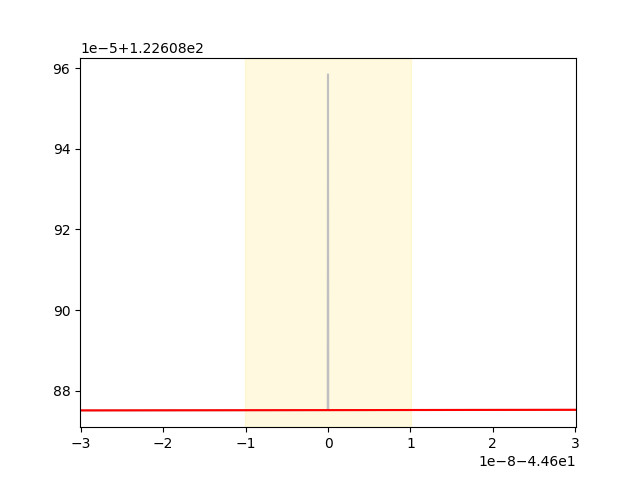
*U*
`-0.070400000000000004 + 0.128 * membrane__V`

*V for 1e-07 range* 
`0.54999921875000002 - 0.55000078125000007`

*Singularity point: 0.55000000000000005*


## New Eq:
((fabs(44.600000000000001 + membrane__V) < 1.0030090258350555e-8) ? (2.0 / (7.6328986866047728e-13 / (1.0 - exp(-9.9999999836342113e-8)) - 0.016253999996389171 / (-1.0 + exp(-5.7791999987161491))) + (-2223310002.262351 - 49850000.061936118 * membrane__V) * (2.0 / (-0.016254000003610835 / (-1.0 + exp(-5.7792000012838516)) - 7.6328986866047728e-13 / (1.0 - exp(9.9999999836342113e-8))) - 2.0 / (7.6328986866047728e-13 / (1.0 - exp(-9.9999999836342113e-8)) - 0.016253999996389171 / (-1.0 + exp(-5.7791999987161491))))) : ((fabs(-0.55000000000000004 + membrane__V) < 7.8124999999991396e-7) ? (2.0 / (0.0034359149405468756 / (1.0 - exp(-450.14549221093756)) - 2.8124999999903229e-10 / (-1.0 + exp(-9.999999999962296e-8))) + (-351999.50000003882 + 640000.00000007043 * membrane__V) * (2.0 / (2.812500000009058e-10 / (-1.0 + exp(1.0000000000027348e-7)) + 0.0034359150594531255 / (1.0 - exp(-450.14550778906255))) - 2.0 / (0.0034359149405468756 / (1.0 - exp(-450.14549221093756)) - 2.8124999999903229e-10 / (-1.0 + exp(-9.999999999962296e-8))))) : (2.0 / (7.6100000000000007e-5 * (44.600000000000001 + membrane__V) / (1.0 - exp(-444.66200000000003 - 9.9700000000000006 * membrane__V)) + 0.00036000000000000002 * (-0.55000000000000004 + membrane__V) / (-1.0 + exp(-0.070400000000000004 + 0.128 * membrane__V))))))

## Equation 3:
```
i_Na_L_m_L_gate__alpha_m_L = 0.32000000000000001 * (47.130000000000003 + membrane__V) / (1.0 - exp(-4.7130000000000001 - 0.10000000000000001 * membrane__V))
```
### Partially evaluated to: 
```
i_Na_L_m_L_gate__alpha_m_L = 0.32000000000000001 * (47.130000000000003 + membrane__V) / (1.0 - exp(-4.7130000000000001 - 0.10000000000000001 * membrane__V))
```
### Singulariy points detected:

{-47.130000000000003}
*U*
`-4.7130000000000001 - 0.10000000000000001 * membrane__V`

*V for 1e-07 range* 
`-47.129999000000005 - -47.130001`

*Singularity point: -47.130000000000003*

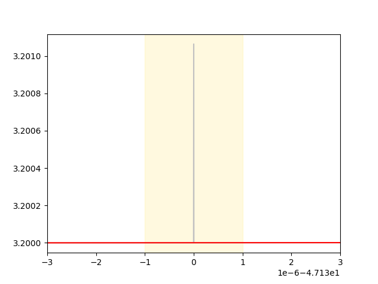
## New Eq:
((fabs(47.130000000000003 + membrane__V) < 1.0000000000287557e-6) ? (3.200000000092018e-7 / (1.0 - exp(-1.0000000000287557e-7)) + (-23564999.499322373 - 499999.99998562218 * membrane__V) * (-3.200000000092018e-7 / (1.0 - exp(1.0000000000287557e-7)) - 3.200000000092018e-7 / (1.0 - exp(-1.0000000000287557e-7)))) : (0.32000000000000001 * (47.130000000000003 + membrane__V) / (1.0 - exp(-4.7130000000000001 - 0.10000000000000001 * membrane__V))))

i_Na_h_gate__alpha_h = ((membrane__V < -40.0) ? (0.13500000000000001 * exp(-11.764705882352942 + 0.14705882352941177 * i_Na__shift_INa_inact - 0.14705882352941177 * membrane__V)) : (0))

####Piecewise!!

i_Na_h_gate__beta_h = ((membrane__V < -40.0) ? (310000.0 * exp(0.34999999999999998 * membrane__V - 0.34999999999999998 * i_Na__shift_INa_inact) + 3.5600000000000001 * exp(0.079000000000000001 * membrane__V - 0.079000000000000001 * i_Na__shift_INa_inact)) : (7.6923076923076916 / (1.0 + exp(-0.96036036036036043 + 0.0900900900900901 * i_Na__shift_INa_inact - 0.0900900900900901 * membrane__V))))

####Piecewise!!

i_Na_j_gate__alpha_j = ((membrane__V < -40.0) ? ((37.780000000000001 + membrane__V) * (-127140.0 * exp(0.24440000000000001 * membrane__V - 0.24440000000000001 * i_Na__shift_INa_inact) - 3.4740000000000003e-5 * exp(0.043909999999999998 * i_Na__shift_INa_inact - 0.043909999999999998 * membrane__V)) / (1.0 + exp(24.640530000000002 + 0.311 * membrane__V - 0.311 * i_Na__shift_INa_inact))) : (0))

####Piecewise!!

i_Na_j_gate__beta_j = ((membrane__V < -40.0) ? (0.1212 * exp(0.01052 * i_Na__shift_INa_inact - 0.01052 * membrane__V) / (1.0 + exp(-5.5312920000000005 + 0.13780000000000001 * i_Na__shift_INa_inact - 0.13780000000000001 * membrane__V))) : (0.29999999999999999 * exp(2.5349999999999999e-7 * i_Na__shift_INa_inact - 2.5349999999999999e-7 * membrane__V) / (1.0 + exp(-3.2000000000000002 + 0.10000000000000001 * i_Na__shift_INa_inact - 0.10000000000000001 * membrane__V))))

####Piecewise!!

## Equation 4:
```
i_Na_m_gate__alpha_m = 0.32000000000000001 * (47.130000000000003 + membrane__V) / (1.0 - exp(-4.7130000000000001 - 0.10000000000000001 * membrane__V))
```
### Partially evaluated to: 
```
i_Na_m_gate__alpha_m = 0.32000000000000001 * (47.130000000000003 + membrane__V) / (1.0 - exp(-4.7130000000000001 - 0.10000000000000001 * membrane__V))
```
### Singulariy points detected:

{-47.130000000000003}
*U*
`-4.7130000000000001 - 0.10000000000000001 * membrane__V`

*V for 1e-07 range* 
`-47.129999000000005 - -47.130001`

*Singularity point: -47.130000000000003*


## New Eq:
((fabs(47.130000000000003 + membrane__V) < 1.0000000000287557e-6) ? (3.200000000092018e-7 / (1.0 - exp(-1.0000000000287557e-7)) + (-23564999.499322373 - 499999.99998562218 * membrane__V) * (-3.200000000092018e-7 / (1.0 - exp(1.0000000000287557e-7)) - 3.200000000092018e-7 / (1.0 - exp(-1.0000000000287557e-7)))) : (0.32000000000000001 * (47.130000000000003 + membrane__V) / (1.0 - exp(-4.7130000000000001 - 0.10000000000000001 * membrane__V))))

Singularities cannot be found
1.0/(0.036499999999999998*(0.14285714285714286*exp(0.014858841010401189*_model_parameters$Na_o) - 0.14285714285714286)*exp(-0.037435883507802618*_membrane$V) + 1.0 + 0.1245*exp(-0.003743588350780262*_membrane$V))

## Equation 5:
```
i_to_2__i_to_2_max = pow(i_to_2__z_Cl, 2) * pow(model_parameters__F, 2) * (-model_parameters__Cl_o * exp(-i_to_2__z_Cl * membrane__V * model_parameters__F / (model_parameters__R * model_parameters__T)) + intracellular_ion_concentrations__Cl_i) * i_to_2__p_Cl * membrane__V / ((1.0 - exp(-i_to_2__z_Cl * membrane__V * model_parameters__F / (model_parameters__R * model_parameters__T))) * model_parameters__Cm * model_parameters__R * model_parameters__T)
```
### Partially evaluated to: 
```
i_to_2__i_to_2_max = pow(i_to_2__z_Cl, 2) * pow(model_parameters__F, 2) * (-model_parameters__Cl_o * exp(-i_to_2__z_Cl * membrane__V * model_parameters__F / (model_parameters__R * model_parameters__T)) + intracellular_ion_concentrations__Cl_i) * i_to_2__p_Cl * membrane__V / ((1.0 - exp(-i_to_2__z_Cl * membrane__V * model_parameters__F / (model_parameters__R * model_parameters__T))) * model_parameters__Cm * model_parameters__R * model_parameters__T)
```
### Singulariy points detected:

{0}
#### float * A

####Failed to find U symbolically!

<class 'sympy.core.mul.Mul'>
_i_to_2$z_Cl**2*_model_parameters$F**2*_i_to_2$p_Cl*_membrane$V*(_intracellular_ion_concentrations$Cl_i - _model_parameters$Cl_o*exp(-_i_to_2$z_Cl*_membrane$V*_model_parameters$F/(_model_parameters$R*_model_parameters$T)))/(_model_parameters$Cm*_model_parameters$R*_model_parameters$T*(1.0 - exp(-_i_to_2$z_Cl*_membrane$V*_model_parameters$F/(_model_parameters$R*_model_parameters$T))))

*try substituting parameters*

*U*
`0.037435883507802616 * membrane__V`

*V for 1e-07 range* 
`-2.6712338705498262e-6 - 2.6712338705498262e-6`

*Singularity point: 0*


## New Eq:
((fabs(membrane__V) < 2.6712338705498262e-6) ? ((0.5 + 187179.41753901311 * membrane__V) * (2.6712338705498262e-6 * pow(i_to_2__z_Cl, 2) * pow(model_parameters__F, 2) * (-model_parameters__Cl_o * exp(2.6712338705498262e-6 * i_to_2__z_Cl * model_parameters__F / (model_parameters__R * model_parameters__T)) + intracellular_ion_concentrations__Cl_i) * i_to_2__p_Cl / ((1.0 - exp(2.6712338705498262e-6 * i_to_2__z_Cl * model_parameters__F / (model_parameters__R * model_parameters__T))) * model_parameters__Cm * model_parameters__R * model_parameters__T) + 2.6712338705498262e-6 * pow(i_to_2__z_Cl, 2) * pow(model_parameters__F, 2) * (-model_parameters__Cl_o * exp(-2.6712338705498262e-6 * i_to_2__z_Cl * model_parameters__F / (model_parameters__R * model_parameters__T)) + intracellular_ion_concentrations__Cl_i) * i_to_2__p_Cl / ((1.0 - exp(-2.6712338705498262e-6 * i_to_2__z_Cl * model_parameters__F / (model_parameters__R * model_parameters__T))) * model_parameters__Cm * model_parameters__R * model_parameters__T)) - 2.6712338705498262e-6 * pow(i_to_2__z_Cl, 2) * pow(model_parameters__F, 2) * (-model_parameters__Cl_o * exp(2.6712338705498262e-6 * i_to_2__z_Cl * model_parameters__F / (model_parameters__R * model_parameters__T)) + intracellular_ion_concentrations__Cl_i) * i_to_2__p_Cl / ((1.0 - exp(2.6712338705498262e-6 * i_to_2__z_Cl * model_parameters__F / (model_parameters__R * model_parameters__T))) * model_parameters__Cm * model_parameters__R * model_parameters__T)) : (pow(i_to_2__z_Cl, 2) * pow(model_parameters__F, 2) * (-model_parameters__Cl_o * exp(-i_to_2__z_Cl * membrane__V * model_parameters__F / (model_parameters__R * model_parameters__T)) + intracellular_ion_concentrations__Cl_i) * i_to_2__p_Cl * membrane__V / ((1.0 - exp(-i_to_2__z_Cl * membrane__V * model_parameters__F / (model_parameters__R * model_parameters__T))) * model_parameters__Cm * model_parameters__R * model_parameters__T)))

## Equation 6:
```
background_currents__i_Ca_b = pow(model_parameters__F, 2) * pow(model_parameters__z_Ca, 2) * (-model_parameters__Ca_o * model_parameters__gamma_Cao + Ca_i__Ca_i * model_parameters__gamma_Cai * exp(membrane__V * model_parameters__F * model_parameters__z_Ca / (model_parameters__R * model_parameters__T))) * background_currents__p_Ca_b * membrane__V / ((-1.0 + exp(membrane__V * model_parameters__F * model_parameters__z_Ca / (model_parameters__R * model_parameters__T))) * model_parameters__Cm * model_parameters__R * model_parameters__T)
```
### Partially evaluated to: 
```
background_currents__i_Ca_b = pow(model_parameters__F, 2) * pow(model_parameters__z_Ca, 2) * (-model_parameters__Ca_o * model_parameters__gamma_Cao + Ca_i__Ca_i * model_parameters__gamma_Cai * exp(membrane__V * model_parameters__F * model_parameters__z_Ca / (model_parameters__R * model_parameters__T))) * background_currents__p_Ca_b * membrane__V / ((-1.0 + exp(membrane__V * model_parameters__F * model_parameters__z_Ca / (model_parameters__R * model_parameters__T))) * model_parameters__Cm * model_parameters__R * model_parameters__T)
```
### Singulariy points detected:

{0}
#### float * A

####Failed to find U symbolically!

<class 'sympy.core.mul.Mul'>
_model_parameters$F**2*_model_parameters$z_Ca**2*_background_currents$p_Ca_b*_membrane$V*(_Ca_i$Ca_i*_model_parameters$gamma_Cai*exp(_membrane$V*_model_parameters$F*_model_parameters$z_Ca/(_model_parameters$R*_model_parameters$T)) - _model_parameters$Ca_o*_model_parameters$gamma_Cao)/(_model_parameters$Cm*_model_parameters$R*_model_parameters$T*(exp(_membrane$V*_model_parameters$F*_model_parameters$z_Ca/(_model_parameters$R*_model_parameters$T)) - 1.0))

*try substituting parameters*

*U*
`0.074871767015605231 * membrane__V`

*V for 1e-07 range* 
`-1.3356169352749131e-6 - 1.3356169352749131e-6`

*Singularity point: 0*

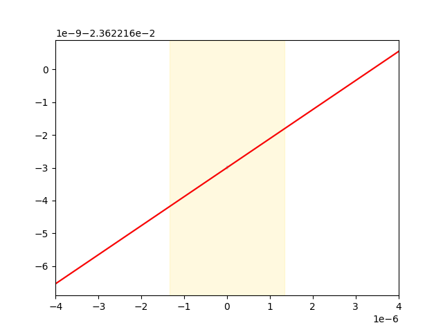
## New Eq:
((fabs(membrane__V) < 1.3356169352749131e-6) ? ((0.5 + 374358.83507802623 * membrane__V) * (1.3356169352749131e-6 * pow(model_parameters__F, 2) * pow(model_parameters__z_Ca, 2) * (-model_parameters__Ca_o * model_parameters__gamma_Cao + Ca_i__Ca_i * model_parameters__gamma_Cai * exp(1.3356169352749131e-6 * model_parameters__F * model_parameters__z_Ca / (model_parameters__R * model_parameters__T))) * background_currents__p_Ca_b / ((-1.0 + exp(1.3356169352749131e-6 * model_parameters__F * model_parameters__z_Ca / (model_parameters__R * model_parameters__T))) * model_parameters__Cm * model_parameters__R * model_parameters__T) + 1.3356169352749131e-6 * pow(model_parameters__F, 2) * pow(model_parameters__z_Ca, 2) * (-model_parameters__Ca_o * model_parameters__gamma_Cao + Ca_i__Ca_i * model_parameters__gamma_Cai * exp(-1.3356169352749131e-6 * model_parameters__F * model_parameters__z_Ca / (model_parameters__R * model_parameters__T))) * background_currents__p_Ca_b / ((-1.0 + exp(-1.3356169352749131e-6 * model_parameters__F * model_parameters__z_Ca / (model_parameters__R * model_parameters__T))) * model_parameters__Cm * model_parameters__R * model_parameters__T)) - 1.3356169352749131e-6 * pow(model_parameters__F, 2) * pow(model_parameters__z_Ca, 2) * (-model_parameters__Ca_o * model_parameters__gamma_Cao + Ca_i__Ca_i * model_parameters__gamma_Cai * exp(-1.3356169352749131e-6 * model_parameters__F * model_parameters__z_Ca / (model_parameters__R * model_parameters__T))) * background_currents__p_Ca_b / ((-1.0 + exp(-1.3356169352749131e-6 * model_parameters__F * model_parameters__z_Ca / (model_parameters__R * model_parameters__T))) * model_parameters__Cm * model_parameters__R * model_parameters__T)) : (pow(model_parameters__F, 2) * pow(model_parameters__z_Ca, 2) * (-model_parameters__Ca_o * model_parameters__gamma_Cao + Ca_i__Ca_i * model_parameters__gamma_Cai * exp(membrane__V * model_parameters__F * model_parameters__z_Ca / (model_parameters__R * model_parameters__T))) * background_currents__p_Ca_b * membrane__V / ((-1.0 + exp(membrane__V * model_parameters__F * model_parameters__z_Ca / (model_parameters__R * model_parameters__T))) * model_parameters__Cm * model_parameters__R * model_parameters__T)))

## Equation 7:
```
i_Ca_L__i_Ca_L_max = pow(model_parameters__F, 2) * pow(model_parameters__z_Ca, 2) * (-15.0 + membrane__V) * (-model_parameters__Ca_o * model_parameters__gamma_Cao + Ca_r__Ca_r * model_parameters__gamma_Cai * exp((-15.0 + membrane__V) * model_parameters__F * model_parameters__z_Ca / (model_parameters__R * model_parameters__T))) * i_Ca_L__p_Ca / ((-1.0 + exp((-15.0 + membrane__V) * model_parameters__F * model_parameters__z_Ca / (model_parameters__R * model_parameters__T))) * model_parameters__Cm * model_parameters__R * model_parameters__T)
```
### Partially evaluated to: 
```
i_Ca_L__i_Ca_L_max = pow(model_parameters__F, 2) * pow(model_parameters__z_Ca, 2) * (-15.0 + membrane__V) * (-model_parameters__Ca_o * model_parameters__gamma_Cao + Ca_r__Ca_r * model_parameters__gamma_Cai * exp((-15.0 + membrane__V) * model_parameters__F * model_parameters__z_Ca / (model_parameters__R * model_parameters__T))) * i_Ca_L__p_Ca / ((-1.0 + exp((-15.0 + membrane__V) * model_parameters__F * model_parameters__z_Ca / (model_parameters__R * model_parameters__T))) * model_parameters__Cm * model_parameters__R * model_parameters__T)
```
### Singulariy points detected:

{15.000000000000000}
#### float * A

####Failed to find U symbolically!

<class 'sympy.core.mul.Mul'>
_model_parameters$F**2*_model_parameters$z_Ca**2*_i_Ca_L$p_Ca*(_membrane$V - 15.0)*(_Ca_r$Ca_r*_model_parameters$gamma_Cai*exp(_model_parameters$F*_model_parameters$z_Ca*(_membrane$V - 15.0)/(_model_parameters$R*_model_parameters$T)) - _model_parameters$Ca_o*_model_parameters$gamma_Cao)/(_model_parameters$Cm*_model_parameters$R*_model_parameters$T*(exp(_model_parameters$F*_model_parameters$z_Ca*(_membrane$V - 15.0)/(_model_parameters$R*_model_parameters$T)) - 1.0))

*try substituting parameters*

*U*
`-1.1230765052340785 + 0.074871767015605231 * membrane__V`

*V for 1e-07 range* 
`14.999998664383064 - 15.000001335616936`

*Singularity point: 15.000000000000000*

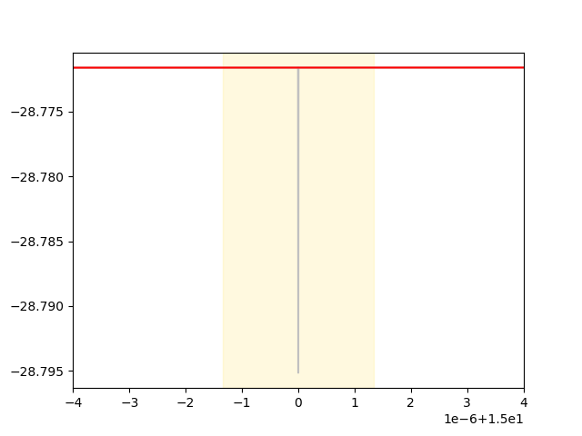
## New Eq:
((fabs(-15.0 + membrane__V) < 1.3356169352718439e-6) ? ((-5615382.0261832969 + 374358.83507888648 * membrane__V) * (1.3356169352718439e-6 * pow(model_parameters__F, 2) * pow(model_parameters__z_Ca, 2) * (-model_parameters__Ca_o * model_parameters__gamma_Cao + Ca_r__Ca_r * model_parameters__gamma_Cai * exp(1.3356169352718439e-6 * model_parameters__F * model_parameters__z_Ca / (model_parameters__R * model_parameters__T))) * i_Ca_L__p_Ca / ((-1.0 + exp(1.3356169352718439e-6 * model_parameters__F * model_parameters__z_Ca / (model_parameters__R * model_parameters__T))) * model_parameters__Cm * model_parameters__R * model_parameters__T) + 1.3356169352718439e-6 * pow(model_parameters__F, 2) * pow(model_parameters__z_Ca, 2) * (-model_parameters__Ca_o * model_parameters__gamma_Cao + Ca_r__Ca_r * model_parameters__gamma_Cai * exp(-1.3356169352718439e-6 * model_parameters__F * model_parameters__z_Ca / (model_parameters__R * model_parameters__T))) * i_Ca_L__p_Ca / ((-1.0 + exp(-1.3356169352718439e-6 * model_parameters__F * model_parameters__z_Ca / (model_parameters__R * model_parameters__T))) * model_parameters__Cm * model_parameters__R * model_parameters__T)) - 1.3356169352718439e-6 * pow(model_parameters__F, 2) * pow(model_parameters__z_Ca, 2) * (-model_parameters__Ca_o * model_parameters__gamma_Cao + Ca_r__Ca_r * model_parameters__gamma_Cai * exp(-1.3356169352718439e-6 * model_parameters__F * model_parameters__z_Ca / (model_parameters__R * model_parameters__T))) * i_Ca_L__p_Ca / ((-1.0 + exp(-1.3356169352718439e-6 * model_parameters__F * model_parameters__z_Ca / (model_parameters__R * model_parameters__T))) * model_parameters__Cm * model_parameters__R * model_parameters__T)) : (pow(model_parameters__F, 2) * pow(model_parameters__z_Ca, 2) * (-15.0 + membrane__V) * (-model_parameters__Ca_o * model_parameters__gamma_Cao + Ca_r__Ca_r * model_parameters__gamma_Cai * exp((-15.0 + membrane__V) * model_parameters__F * model_parameters__z_Ca / (model_parameters__R * model_parameters__T))) * i_Ca_L__p_Ca / ((-1.0 + exp((-15.0 + membrane__V) * model_parameters__F * model_parameters__z_Ca / (model_parameters__R * model_parameters__T))) * model_parameters__Cm * model_parameters__R * model_parameters__T)))

# Model: beeler_reuter_model_1977(beeler_reuter_model_1977.cellml)
sodium_current_m_gate__alpha_m = (((sodium_current_m_gate__U >= -9.9999999999999995e-8) && (sodium_current_m_gate__U <= 9.9999999999999995e-8)) ? ((1.0 - 0.5 * sodium_current_m_gate__U) * sodium_current_m_gate__A) : (sodium_current_m_gate__A * sodium_current_m_gate__U / (-1.0 + exp(sodium_current_m_gate__U))))

####Piecewise!!

time_independent_outward_current__temp_current = (((time_independent_outward_current__U >= -9.9999999999999995e-8) && (time_independent_outward_current__U <= 9.9999999999999995e-8)) ? ((1.0 - 0.5 * time_independent_outward_current__U) * time_independent_outward_current__A) : (time_independent_outward_current__A * time_independent_outward_current__U / (-1.0 + exp(time_independent_outward_current__U))))

####Piecewise!!

# Model: benson_epicardial_2008(benson_epicardial_2008.cellml)
INa__GNa = ((Environment__tissue == 0) ? (INa__GNa_max) : (4.0 * INa__GNa_max))

####Piecewise!!

## Equation 1:
```
ICaL__ibarca = 4.0 * (-15.0 + cell__V) * (-Environment__Ca_o * ICaL__gacao + Ca__Ca_ss * ICaL__gacai * exp(2.0 * (-15.0 + cell__V) * Environment__FonRT)) * Environment__F * Environment__FonRT * ICaL__pca / (-1.0 + exp(2.0 * (-15.0 + cell__V) * Environment__FonRT))
```
### Partially evaluated to: 
```
ICaL__ibarca = 4.0 * (-15.0 + cell__V) * (-Environment__Ca_o * ICaL__gacao + Ca__Ca_ss * ICaL__gacai * exp(2.0 * (-15.0 + cell__V) * Environment__FonRT)) * Environment__F * Environment__FonRT * ICaL__pca / (-1.0 + exp(2.0 * (-15.0 + cell__V) * Environment__FonRT))
```
### Singulariy points detected:

{15.000000000000000}
*U*
`2.0 * (-15.0 + cell__V) * Environment__FonRT`

*V for 1e-07 range* 
`15.0 - 4.9999999999999998e-8 / Environment__FonRT - 15.0 + 4.9999999999999998e-8 / Environment__FonRT`

*Singularity point: 15.000000000000000*


## New Eq:
((fabs(-15.0 + cell__V) < 4.9999999999999998e-8 / fabs(Environment__FonRT)) ? (10000000.0 * (1.9999999999999999e-7 * (-Environment__Ca_o * ICaL__gacao + Ca__Ca_ss * ICaL__gacai * exp(9.9999999999999995e-8)) * Environment__F * ICaL__pca / (-1.0 + exp(9.9999999999999995e-8)) + 1.9999999999999999e-7 * (-Environment__Ca_o * ICaL__gacao + Ca__Ca_ss * ICaL__gacai * exp(-9.9999999999999995e-8)) * Environment__F * ICaL__pca / (-1.0 + exp(-9.9999999999999995e-8))) * (-15.0 + 4.9999999999999998e-8 / Environment__FonRT + cell__V) * Environment__FonRT - 1.9999999999999999e-7 * (-Environment__Ca_o * ICaL__gacao + Ca__Ca_ss * ICaL__gacai * exp(-9.9999999999999995e-8)) * Environment__F * ICaL__pca / (-1.0 + exp(-9.9999999999999995e-8))) : (4.0 * (-15.0 + cell__V) * (-Environment__Ca_o * ICaL__gacao + Ca__Ca_ss * ICaL__gacai * exp(2.0 * (-15.0 + cell__V) * Environment__FonRT)) * Environment__F * Environment__FonRT * ICaL__pca / (-1.0 + exp(2.0 * (-15.0 + cell__V) * Environment__FonRT))))

ICaL__ICaL = ((Environment__tissue == 0) ? (pow(ICaL__d, ICaL__dp) * ICaL__f * ICaL__f2 * ICaL__fca * ICaL__fca2 * ICaL__ibarca) : (ICaL__d * ICaL__f * ICaL__f2 * ICaL__fca * ICaL__fca2 * ICaL__ibarca))

####Piecewise!!

## Equation 2:
```
ICab__ICab = 7.9803360000000004e-7 * (-0.34100000000000003 * Environment__Ca_o + Ca__Ca_i * exp(2.0 * Environment__FonRT * cell__V)) * Environment__F * Environment__FonRT * cell__V / (-1.0 + exp(2.0 * Environment__FonRT * cell__V))
```
### Partially evaluated to: 
```
ICab__ICab = 7.9803360000000004e-7 * (-0.34100000000000003 * Environment__Ca_o + Ca__Ca_i * exp(2.0 * Environment__FonRT * cell__V)) * Environment__F * Environment__FonRT * cell__V / (-1.0 + exp(2.0 * Environment__FonRT * cell__V))
```
### Singulariy points detected:

{0}
*U*
`2.0 * Environment__FonRT * cell__V`

*V for 1e-07 range* 
`-4.9999999999999998e-8 / Environment__FonRT - 4.9999999999999998e-8 / Environment__FonRT`

*Singularity point: 0*


## New Eq:
((fabs(cell__V) < 4.9999999999999998e-8 / fabs(Environment__FonRT)) ? (10000000.0 * (4.9999999999999998e-8 / Environment__FonRT + cell__V) * (3.990168e-14 * (-0.34100000000000003 * Environment__Ca_o + Ca__Ca_i * exp(9.9999999999999995e-8)) * Environment__F / (-1.0 + exp(9.9999999999999995e-8)) + 3.990168e-14 * (-0.34100000000000003 * Environment__Ca_o + Ca__Ca_i * exp(-9.9999999999999995e-8)) * Environment__F / (-1.0 + exp(-9.9999999999999995e-8))) * Environment__FonRT - 3.990168e-14 * (-0.34100000000000003 * Environment__Ca_o + Ca__Ca_i * exp(-9.9999999999999995e-8)) * Environment__F / (-1.0 + exp(-9.9999999999999995e-8))) : (7.9803360000000004e-7 * (-0.34100000000000003 * Environment__Ca_o + Ca__Ca_i * exp(2.0 * Environment__FonRT * cell__V)) * Environment__F * Environment__FonRT * cell__V / (-1.0 + exp(2.0 * Environment__FonRT * cell__V))))

## Equation 3:
```
IKr__tauxr = 1 / (0.00029999999999999997 * (38.360799999999998 + cell__V) / (-1.0 + exp(5.8385137599999997 + 0.1522 * cell__V)) + 0.00059999999999999995 * (-1.7383999999999999 + cell__V) / (1.0 - exp(0.2364224 - 0.13600000000000001 * cell__V)))
```
### Partially evaluated to: 
```
IKr__tauxr = 1 / (0.00029999999999999997 * (38.360799999999998 + cell__V) / (-1.0 + exp(5.8385137599999997 + 0.1522 * cell__V)) + 0.00059999999999999995 * (-1.7383999999999999 + cell__V) / (1.0 - exp(0.2364224 - 0.13600000000000001 * cell__V)))
```
### Singulariy points detected:

{-38.360799999999998, 1.7383999999999999}
#### float * A

####1 / A


####A + B:

`0.00059999999999999995 * (-1.7383999999999999 + cell__V) / (1.0 - 1.2667092551679247 * exp(-0.13600000000000001 * cell__V))`
`0.00029999999999999997 * (38.360799999999998 + cell__V) / (-1.0 + 343.26878155836141 * exp(0.1522 * cell__V))`

*U*
`0.2364224 - 0.13600000000000001 * cell__V`

*V for 1e-07 range* 
`1.7384007352941175 - 1.7383992647058824`

*Singularity point: 1.7383999999999999*


*U*
`5.8385137599999997 + 0.1522 * cell__V`

*V for 1e-07 range* 
`-38.360800657030218 - -38.360799342969777`

*Singularity point: -38.360799999999998*

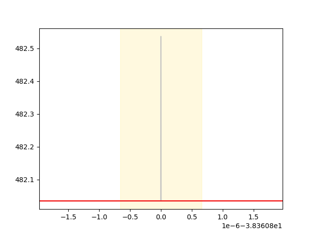
## New Eq:
((fabs(-1.7383999999999999 + cell__V) < 7.3529411764774316e-7) ? (1 / (0.012029760220588234 / (-1.0 + exp(6.1030983519117648)) + 4.4117647059020713e-10 / (1.0 - exp(-1.0000000000049032e-7))) + (1182112.4999988999 - 679999.99999936717 * cell__V) * (1 / (0.012029759779411764 / (-1.0 + exp(6.1030981280882353)) - 4.4117647058708463e-10 / (1.0 - exp(9.99999999998398e-8))) - 1 / (0.012029760220588234 / (-1.0 + exp(6.1030983519117648)) + 4.4117647059020713e-10 / (1.0 - exp(-1.0000000000049032e-7))))) : ((fabs(38.360799999999998 + cell__V) < 6.5703022339436146e-7) ? (1 / (-1.9710906701830842e-10 / (-1.0 + exp(-1.0000000000287557e-7)) - 0.024059520394218131 / (1.0 - exp(5.4534912893561103))) + (29192569.299818475 + 760999.99999526795 * cell__V) * (1 / (1.9710906701830842e-10 / (-1.0 + exp(1.0000000000287557e-7)) - 0.024059519605781864 / (1.0 - exp(5.4534911106438893))) - 1 / (-1.9710906701830842e-10 / (-1.0 + exp(-1.0000000000287557e-7)) - 0.024059520394218131 / (1.0 - exp(5.4534912893561103))))) : (1 / (0.00029999999999999997 * (38.360799999999998 + cell__V) / (-1.0 + exp(5.8385137599999997 + 0.1522 * cell__V)) + 0.00059999999999999995 * (-1.7383999999999999 + cell__V) / (1.0 - exp(0.2364224 - 0.13600000000000001 * cell__V))))))

## Equation 4:
```
IKs__tauxs = 1 / (7.6100000000000007e-5 * (44.600000000000001 + cell__V) / (1.0 - exp(-444.66200000000003 - 9.9700000000000006 * cell__V)) + 0.00036000000000000002 * (-0.55000000000000004 + cell__V) / (-1.0 + exp(-0.070400000000000004 + 0.128 * cell__V)))
```
### Partially evaluated to: 
```
IKs__tauxs = 1 / (7.6100000000000007e-5 * (44.600000000000001 + cell__V) / (1.0 - exp(-444.66200000000003 - 9.9700000000000006 * cell__V)) + 0.00036000000000000002 * (-0.55000000000000004 + cell__V) / (-1.0 + exp(-0.070400000000000004 + 0.128 * cell__V)))
```
### Singulariy points detected:

{-44.600000000000001, 0.55000000000000005}
#### float * A

####1 / A


####A + B:

`7.6100000000000007e-5 * (44.600000000000001 + cell__V) / (1.0 - 7.6868266637773744e-194 * exp(-9.9700000000000006 * cell__V))`
`0.00036000000000000002 * (-0.55000000000000004 + cell__V) / (-1.0 + 0.93202093695954691 * exp(0.128 * cell__V))`

*U*
`-444.66200000000003 - 9.9700000000000006 * cell__V`

*V for 1e-07 range* 
`-44.599999989969909 - -44.600000010030094`

*Singularity point: -44.600000000000001*

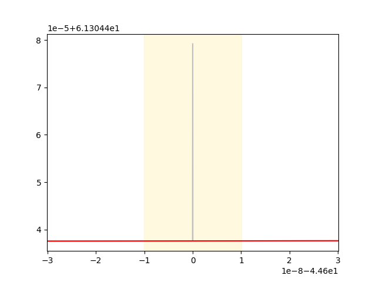
*U*
`-0.070400000000000004 + 0.128 * cell__V`

*V for 1e-07 range* 
`0.54999921875000002 - 0.55000078125000007`

*Singularity point: 0.55000000000000005*


## New Eq:
((fabs(44.600000000000001 + cell__V) < 1.0030090258350555e-8) ? (1 / (7.6328986866047728e-13 / (1.0 - exp(-9.9999999836342113e-8)) - 0.016253999996389171 / (-1.0 + exp(-5.7791999987161491))) + (-2223310002.262351 - 49850000.061936118 * cell__V) * (1 / (-0.016254000003610835 / (-1.0 + exp(-5.7792000012838516)) - 7.6328986866047728e-13 / (1.0 - exp(9.9999999836342113e-8))) - 1 / (7.6328986866047728e-13 / (1.0 - exp(-9.9999999836342113e-8)) - 0.016253999996389171 / (-1.0 + exp(-5.7791999987161491))))) : ((fabs(-0.55000000000000004 + cell__V) < 7.8124999999991396e-7) ? (1 / (0.0034359149405468756 / (1.0 - exp(-450.14549221093756)) - 2.8124999999903229e-10 / (-1.0 + exp(-9.999999999962296e-8))) + (-351999.50000003882 + 640000.00000007043 * cell__V) * (1 / (2.812500000009058e-10 / (-1.0 + exp(1.0000000000027348e-7)) + 0.0034359150594531255 / (1.0 - exp(-450.14550778906255))) - 1 / (0.0034359149405468756 / (1.0 - exp(-450.14549221093756)) - 2.8124999999903229e-10 / (-1.0 + exp(-9.999999999962296e-8))))) : (1 / (7.6100000000000007e-5 * (44.600000000000001 + cell__V) / (1.0 - exp(-444.66200000000003 - 9.9700000000000006 * cell__V)) + 0.00036000000000000002 * (-0.55000000000000004 + cell__V) / (-1.0 + exp(-0.070400000000000004 + 0.128 * cell__V))))))

INa__ah = ((cell__V >= -40.0) ? (0) : (0.13500000000000001 * exp(-11.764705882352942 - 0.14705882352941177 * cell__V)))

####Piecewise!!

INa__aj = ((cell__V >= -40.0) ? (0) : ((37.780000000000001 + cell__V) * (-127140.0 * exp(0.24440000000000001 * cell__V) - 3.4740000000000003e-5 * exp(-0.043909999999999998 * cell__V)) / (1.0 + exp(24.640530000000002 + 0.311 * cell__V))))

####Piecewise!!

## Equation 5:
```
INa__am = 0.32000000000000001 * (47.130000000000003 + cell__V) / (1.0 - exp(-4.7130000000000001 - 0.10000000000000001 * cell__V))
```
### Partially evaluated to: 
```
INa__am = 0.32000000000000001 * (47.130000000000003 + cell__V) / (1.0 - exp(-4.7130000000000001 - 0.10000000000000001 * cell__V))
```
### Singulariy points detected:

{-47.130000000000003}
*U*
`-4.7130000000000001 - 0.10000000000000001 * cell__V`

*V for 1e-07 range* 
`-47.129999000000005 - -47.130001`

*Singularity point: -47.130000000000003*


## New Eq:
((fabs(47.130000000000003 + cell__V) < 1.0000000000287557e-6) ? (3.200000000092018e-7 / (1.0 - exp(-1.0000000000287557e-7)) + (-23564999.499322373 - 499999.99998562218 * cell__V) * (-3.200000000092018e-7 / (1.0 - exp(1.0000000000287557e-7)) - 3.200000000092018e-7 / (1.0 - exp(-1.0000000000287557e-7)))) : (0.32000000000000001 * (47.130000000000003 + cell__V) / (1.0 - exp(-4.7130000000000001 - 0.10000000000000001 * cell__V))))

INa__bh = ((cell__V >= -40.0) ? (7.6923076923076916 / (1.0 + exp(-0.96036036036036043 - 0.0900900900900901 * cell__V))) : (310000.0 * exp(0.34999999999999998 * cell__V) + 3.5600000000000001 * exp(0.079000000000000001 * cell__V)))

####Piecewise!!

INa__bj = ((cell__V >= -40.0) ? (0.29999999999999999 * exp(-2.5349999999999999e-7 * cell__V) / (1.0 + exp(-3.2000000000000002 - 0.10000000000000001 * cell__V))) : (0.1212 * exp(-0.01052 * cell__V) / (1.0 + exp(-5.5312920000000005 - 0.13780000000000001 * cell__V))))

####Piecewise!!

Singularities cannot be found
1.0/(0.036499999999999998*(0.14285714285714286*exp(0.014858841010401189*_Environment$Na_o) - 0.14285714285714286)*exp(-0.0374358835078*_cell$V) + 1.0 + 0.1245*exp(-0.0037435883507800002*_cell$V))

## Equation 6:
```
INal__amL = 0.32000000000000001 * (47.130000000000003 + cell__V) / (1.0 - exp(-4.7130000000000001 - 0.10000000000000001 * cell__V))
```
### Partially evaluated to: 
```
INal__amL = 0.32000000000000001 * (47.130000000000003 + cell__V) / (1.0 - exp(-4.7130000000000001 - 0.10000000000000001 * cell__V))
```
### Singulariy points detected:

{-47.130000000000003}
*U*
`-4.7130000000000001 - 0.10000000000000001 * cell__V`

*V for 1e-07 range* 
`-47.129999000000005 - -47.130001`

*Singularity point: -47.130000000000003*


## New Eq:
((fabs(47.130000000000003 + cell__V) < 1.0000000000287557e-6) ? (3.200000000092018e-7 / (1.0 - exp(-1.0000000000287557e-7)) + (-23564999.499322373 - 499999.99998562218 * cell__V) * (-3.200000000092018e-7 / (1.0 - exp(1.0000000000287557e-7)) - 3.200000000092018e-7 / (1.0 - exp(-1.0000000000287557e-7)))) : (0.32000000000000001 * (47.130000000000003 + cell__V) / (1.0 - exp(-4.7130000000000001 - 0.10000000000000001 * cell__V))))

Irel__vg = ((Environment__tissue == 0) ? (1 / (1.0 + exp(2.6000000000000001 + 0.20000000000000001 * ICaL__ibarca))) : (1.0))

####Piecewise!!

## Equation 7:
```
Ito2__Ito2_max = (-Environment__Cl_o * exp(Environment__FonRT * cell__V) + Cl__Cl_i) * Environment__F * Environment__FonRT * Ito2__PCl * cell__V / (1.0 - exp(Environment__FonRT * cell__V))
```
### Partially evaluated to: 
```
Ito2__Ito2_max = (-Environment__Cl_o * exp(Environment__FonRT * cell__V) + Cl__Cl_i) * Environment__F * Environment__FonRT * Ito2__PCl * cell__V / (1.0 - exp(Environment__FonRT * cell__V))
```
### Singulariy points detected:

{0}
*U*
`Environment__FonRT * cell__V`

*V for 1e-07 range* 
`-9.9999999999999995e-8 / Environment__FonRT - 9.9999999999999995e-8 / Environment__FonRT`

*Singularity point: 0*


## New Eq:
((fabs(cell__V) < 9.9999999999999995e-8 / fabs(Environment__FonRT)) ? (5000000.0 * (9.9999999999999995e-8 / Environment__FonRT + cell__V) * (9.9999999999999995e-8 * (-Environment__Cl_o * exp(9.9999999999999995e-8) + Cl__Cl_i) * Environment__F * Ito2__PCl / (1.0 - exp(9.9999999999999995e-8)) + 9.9999999999999995e-8 * (-Environment__Cl_o * exp(-9.9999999999999995e-8) + Cl__Cl_i) * Environment__F * Ito2__PCl / (1.0 - exp(-9.9999999999999995e-8))) * Environment__FonRT - 9.9999999999999995e-8 * (-Environment__Cl_o * exp(-9.9999999999999995e-8) + Cl__Cl_i) * Environment__F * Ito2__PCl / (1.0 - exp(-9.9999999999999995e-8))) : ((-Environment__Cl_o * exp(Environment__FonRT * cell__V) + Cl__Cl_i) * Environment__F * Environment__FonRT * Ito2__PCl * cell__V / (1.0 - exp(Environment__FonRT * cell__V))))

# Model: bernus_wilders_zemlin_verschelde_panfilov_2002_version01(bernus_wilders_zemlin_verschelde_panfilov_2002.cellml)
## Equation 1:
```
sodium_current_m_gate__alpha_m = 0.32000000000000001 * (47.130000000000003 + membrane__V) / (1.0 - exp(-4.7130000000000001 - 0.10000000000000001 * membrane__V))
```
### Partially evaluated to: 
```
sodium_current_m_gate__alpha_m = 0.32000000000000001 * (47.130000000000003 + membrane__V) / (1.0 - exp(-4.7130000000000001 - 0.10000000000000001 * membrane__V))
```
### Singulariy points detected:

{-47.130000000000003}
*U*
`-4.7130000000000001 - 0.10000000000000001 * membrane__V`

*V for 1e-07 range* 
`-47.129999000000005 - -47.130001`

*Singularity point: -47.130000000000003*


## New Eq:
((fabs(47.130000000000003 + membrane__V) < 1.0000000000287557e-6) ? (3.200000000092018e-7 / (1.0 - exp(-1.0000000000287557e-7)) + (-23564999.499322373 - 499999.99998562218 * membrane__V) * (-3.200000000092018e-7 / (1.0 - exp(1.0000000000287557e-7)) - 3.200000000092018e-7 / (1.0 - exp(-1.0000000000287557e-7)))) : (0.32000000000000001 * (47.130000000000003 + membrane__V) / (1.0 - exp(-4.7130000000000001 - 0.10000000000000001 * membrane__V))))

Singularities cannot be found
1.0/(0.036499999999999998*(0.14280000000000001*exp(0.014858841010401189*_ionic_concentrations$Na_e) - 0.14280000000000001)*exp(-0.036999999999999998*_membrane$V) + 1.0 + 0.1245*exp(-0.0037000000000000002*_membrane$V))

# Model: bondarenko_2004_apical(bondarenko_szigeti_bett_kim_rasmusson_2004_apical.cellml)
## Equation 1:
```
slow_delayed_rectifier_potassium_current__alpha_n = 4.8133299999999997e-6 * (26.5 + membrane__V) / (1.0 - exp(-3.3919999999999999 - 0.128 * membrane__V))
```
### Partially evaluated to: 
```
slow_delayed_rectifier_potassium_current__alpha_n = 4.8133299999999997e-6 * (26.5 + membrane__V) / (1.0 - exp(-3.3919999999999999 - 0.128 * membrane__V))
```
### Singulariy points detected:

{-26.500000000000000}
*U*
`-3.3919999999999999 - 0.128 * membrane__V`

*V for 1e-07 range* 
`-26.499999218749998 - -26.500000781250002`

*Singularity point: -26.500000000000000*


## New Eq:
((fabs(26.5 + membrane__V) < 7.8124999999817923e-7) ? (3.7604140624912359e-12 / (1.0 - exp(-9.9999999999406119e-8)) + (-16959999.500039525 - 640000.00000149151 * membrane__V) * (-3.7604140624912359e-12 / (1.0 - exp(9.9999999999406119e-8)) - 3.7604140624912359e-12 / (1.0 - exp(-9.9999999999406119e-8)))) : (4.8133299999999997e-6 * (26.5 + membrane__V) / (1.0 - exp(-3.3919999999999999 - 0.128 * membrane__V))))

Singularities cannot be found
1.0/(0.036499999999999998*(0.14285714285714286*exp(1.4858841010401189e-5*_membrane$Nao) - 0.14285714285714286)*exp(-0.038949423064193492*_membrane$V) + 1.0 + 0.1245*exp(-0.0038949423064193495*_membrane$V))

# Model: bondarenko_2004_septum(bondarenko_szigeti_bett_kim_rasmusson_2004_septal.cellml)
## Equation 1:
```
slow_delayed_rectifier_potassium_current__alpha_n = 4.8133299999999997e-6 * (26.5 + membrane__V) / (1.0 - exp(-3.3919999999999999 - 0.128 * membrane__V))
```
### Partially evaluated to: 
```
slow_delayed_rectifier_potassium_current__alpha_n = 4.8133299999999997e-6 * (26.5 + membrane__V) / (1.0 - exp(-3.3919999999999999 - 0.128 * membrane__V))
```
### Singulariy points detected:

{-26.500000000000000}
*U*
`-3.3919999999999999 - 0.128 * membrane__V`

*V for 1e-07 range* 
`-26.499999218749998 - -26.500000781250002`

*Singularity point: -26.500000000000000*


## New Eq:
((fabs(26.5 + membrane__V) < 7.8124999999817923e-7) ? (3.7604140624912359e-12 / (1.0 - exp(-9.9999999999406119e-8)) + (-16959999.500039525 - 640000.00000149151 * membrane__V) * (-3.7604140624912359e-12 / (1.0 - exp(9.9999999999406119e-8)) - 3.7604140624912359e-12 / (1.0 - exp(-9.9999999999406119e-8)))) : (4.8133299999999997e-6 * (26.5 + membrane__V) / (1.0 - exp(-3.3919999999999999 - 0.128 * membrane__V))))

Singularities cannot be found
1.0/(0.036499999999999998*(0.14285714285714286*exp(1.4858841010401189e-5*_membrane$Nao) - 0.14285714285714286)*exp(-0.038949423064193492*_membrane$V) + 1.0 + 0.1245*exp(-0.0038949423064193495*_membrane$V))

# Model: bueno_2007(bueno_2007_endo.cellml)
m__m = ((m__u_m > membrane__u) ? (0) : (1.0))

####Piecewise!!

p__p = ((membrane__u < p__u_p) ? (0) : (1.0))

####Piecewise!!

fast_inward_current_v_gate__v_inf = ((membrane__u < q__u_q) ? (1.0) : (0))

####Piecewise!!

q__q = ((membrane__u < q__u_q) ? (0) : (1.0))

####Piecewise!!

r__r = ((membrane__u < r__u_r) ? (0) : (1.0))

####Piecewise!!

# Model: bueno_2007(bueno_2007_epi.cellml)
m__m = ((m__u_m > membrane__u) ? (0) : (1.0))

####Piecewise!!

p__p = ((membrane__u < p__u_p) ? (0) : (1.0))

####Piecewise!!

fast_inward_current_v_gate__v_inf = ((membrane__u < q__u_q) ? (1.0) : (0))

####Piecewise!!

q__q = ((membrane__u < q__u_q) ? (0) : (1.0))

####Piecewise!!

r__r = ((membrane__u < r__u_r) ? (0) : (1.0))

####Piecewise!!

# Model: Carro_Rodriguez_Laguna_Pueyo_CinC2010_EPI(carro_2011_endo.cellml)
Fast_Na_Current__a_h = ((membrane__V >= -40.0) ? (0) : (0.057000000000000002 * exp(-11.764705882352942 - 0.14705882352941177 * membrane__V)))

####Piecewise!!

Fast_Na_Current__a_j = ((membrane__V >= -40.0) ? (0) : ((37.780000000000001 + membrane__V) * (-25428.0 * exp(0.24440000000000001 * membrane__V) - 6.9480000000000002e-6 * exp(-0.043909999999999998 * membrane__V)) / (1.0 + exp(24.640530000000002 + 0.311 * membrane__V))))

####Piecewise!!

Fast_Na_Current__b_h = ((membrane__V >= -40.0) ? (5.9230999999999998 / (1.0 + exp(-0.96036036036036043 - 0.0900900900900901 * membrane__V))) : (310000.0 * exp(0.34849999999999998 * membrane__V) + 2.7000000000000002 * exp(0.079000000000000001 * membrane__V)))

####Piecewise!!

Fast_Na_Current__b_j = ((membrane__V >= -40.0) ? (0.59999999999999998 * exp(0.057000000000000002 * membrane__V) / (1.0 + exp(-3.2000000000000002 - 0.10000000000000001 * membrane__V))) : (0.024240000000000001 * exp(-0.01052 * membrane__V) / (1.0 + exp(-5.5312920000000005 - 0.13780000000000001 * membrane__V))))

####Piecewise!!

## Equation 1:
```
L_Type_Calcium_Current__Ibar_Ca_j = (-Calcium_Concentrations__Ca_o + Calcium_Concentrations__Ca_j * exp(2.0 * membrane__FoRT * membrane__V)) * L_Type_Calcium_Current__P_scale * L_Type_Calcium_Current__p_Ca * membrane__FoRT * membrane__Frdy * membrane__V / (-1.0 + exp(2.0 * membrane__FoRT * membrane__V))
```
### Partially evaluated to: 
```
L_Type_Calcium_Current__Ibar_Ca_j = (-Calcium_Concentrations__Ca_o + Calcium_Concentrations__Ca_j * exp(2.0 * membrane__FoRT * membrane__V)) * L_Type_Calcium_Current__P_scale * L_Type_Calcium_Current__p_Ca * membrane__FoRT * membrane__Frdy * membrane__V / (-1.0 + exp(2.0 * membrane__FoRT * membrane__V))
```
### Singulariy points detected:

{0}
*U*
`2.0 * membrane__FoRT * membrane__V`

*V for 1e-07 range* 
`-4.9999999999999998e-8 / membrane__FoRT - 4.9999999999999998e-8 / membrane__FoRT`

*Singularity point: 0*


## New Eq:
((fabs(membrane__V) < 4.9999999999999998e-8 / fabs(membrane__FoRT)) ? (10000000.0 * (4.9999999999999998e-8 / membrane__FoRT + membrane__V) * (4.9999999999999998e-8 * (-Calcium_Concentrations__Ca_o + Calcium_Concentrations__Ca_j * exp(9.9999999999999995e-8)) * L_Type_Calcium_Current__P_scale * L_Type_Calcium_Current__p_Ca * membrane__Frdy / (-1.0 + exp(9.9999999999999995e-8)) + 4.9999999999999998e-8 * (-Calcium_Concentrations__Ca_o + Calcium_Concentrations__Ca_j * exp(-9.9999999999999995e-8)) * L_Type_Calcium_Current__P_scale * L_Type_Calcium_Current__p_Ca * membrane__Frdy / (-1.0 + exp(-9.9999999999999995e-8))) * membrane__FoRT - 4.9999999999999998e-8 * (-Calcium_Concentrations__Ca_o + Calcium_Concentrations__Ca_j * exp(-9.9999999999999995e-8)) * L_Type_Calcium_Current__P_scale * L_Type_Calcium_Current__p_Ca * membrane__Frdy / (-1.0 + exp(-9.9999999999999995e-8))) : ((-Calcium_Concentrations__Ca_o + Calcium_Concentrations__Ca_j * exp(2.0 * membrane__FoRT * membrane__V)) * L_Type_Calcium_Current__P_scale * L_Type_Calcium_Current__p_Ca * membrane__FoRT * membrane__Frdy * membrane__V / (-1.0 + exp(2.0 * membrane__FoRT * membrane__V))))

## Equation 2:
```
L_Type_Calcium_Current__Ibar_Ca_sl = (-Calcium_Concentrations__Ca_o + Calcium_Concentrations__Ca_sl * exp(2.0 * membrane__FoRT * membrane__V)) * L_Type_Calcium_Current__P_scale * L_Type_Calcium_Current__p_Ca * membrane__FoRT * membrane__Frdy * membrane__V / (-1.0 + exp(2.0 * membrane__FoRT * membrane__V))
```
### Partially evaluated to: 
```
L_Type_Calcium_Current__Ibar_Ca_sl = (-Calcium_Concentrations__Ca_o + Calcium_Concentrations__Ca_sl * exp(2.0 * membrane__FoRT * membrane__V)) * L_Type_Calcium_Current__P_scale * L_Type_Calcium_Current__p_Ca * membrane__FoRT * membrane__Frdy * membrane__V / (-1.0 + exp(2.0 * membrane__FoRT * membrane__V))
```
### Singulariy points detected:

{0}
*U*
`2.0 * membrane__FoRT * membrane__V`

*V for 1e-07 range* 
`-4.9999999999999998e-8 / membrane__FoRT - 4.9999999999999998e-8 / membrane__FoRT`

*Singularity point: 0*


## New Eq:
((fabs(membrane__V) < 4.9999999999999998e-8 / fabs(membrane__FoRT)) ? (10000000.0 * (4.9999999999999998e-8 / membrane__FoRT + membrane__V) * (4.9999999999999998e-8 * (-Calcium_Concentrations__Ca_o + Calcium_Concentrations__Ca_sl * exp(9.9999999999999995e-8)) * L_Type_Calcium_Current__P_scale * L_Type_Calcium_Current__p_Ca * membrane__Frdy / (-1.0 + exp(9.9999999999999995e-8)) + 4.9999999999999998e-8 * (-Calcium_Concentrations__Ca_o + Calcium_Concentrations__Ca_sl * exp(-9.9999999999999995e-8)) * L_Type_Calcium_Current__P_scale * L_Type_Calcium_Current__p_Ca * membrane__Frdy / (-1.0 + exp(-9.9999999999999995e-8))) * membrane__FoRT - 4.9999999999999998e-8 * (-Calcium_Concentrations__Ca_o + Calcium_Concentrations__Ca_sl * exp(-9.9999999999999995e-8)) * L_Type_Calcium_Current__P_scale * L_Type_Calcium_Current__p_Ca * membrane__Frdy / (-1.0 + exp(-9.9999999999999995e-8))) : ((-Calcium_Concentrations__Ca_o + Calcium_Concentrations__Ca_sl * exp(2.0 * membrane__FoRT * membrane__V)) * L_Type_Calcium_Current__P_scale * L_Type_Calcium_Current__p_Ca * membrane__FoRT * membrane__Frdy * membrane__V / (-1.0 + exp(2.0 * membrane__FoRT * membrane__V))))

## Equation 3:
```
L_Type_Calcium_Current__Ibar_K = (-Potassium_Concentrations__K_o + Potassium_Concentrations__K_i * exp(membrane__FoRT * membrane__V)) * L_Type_Calcium_Current__P_scale * L_Type_Calcium_Current__p_K * membrane__FoRT * membrane__Frdy * membrane__V / (-1.0 + exp(membrane__FoRT * membrane__V))
```
### Partially evaluated to: 
```
L_Type_Calcium_Current__Ibar_K = (-Potassium_Concentrations__K_o + Potassium_Concentrations__K_i * exp(membrane__FoRT * membrane__V)) * L_Type_Calcium_Current__P_scale * L_Type_Calcium_Current__p_K * membrane__FoRT * membrane__Frdy * membrane__V / (-1.0 + exp(membrane__FoRT * membrane__V))
```
### Singulariy points detected:

{0}
*U*
`membrane__FoRT * membrane__V`

*V for 1e-07 range* 
`-9.9999999999999995e-8 / membrane__FoRT - 9.9999999999999995e-8 / membrane__FoRT`

*Singularity point: 0*


## New Eq:
((fabs(membrane__V) < 9.9999999999999995e-8 / fabs(membrane__FoRT)) ? (5000000.0 * (9.9999999999999995e-8 / membrane__FoRT + membrane__V) * (9.9999999999999995e-8 * (-Potassium_Concentrations__K_o + Potassium_Concentrations__K_i * exp(9.9999999999999995e-8)) * L_Type_Calcium_Current__P_scale * L_Type_Calcium_Current__p_K * membrane__Frdy / (-1.0 + exp(9.9999999999999995e-8)) + 9.9999999999999995e-8 * (-Potassium_Concentrations__K_o + Potassium_Concentrations__K_i * exp(-9.9999999999999995e-8)) * L_Type_Calcium_Current__P_scale * L_Type_Calcium_Current__p_K * membrane__Frdy / (-1.0 + exp(-9.9999999999999995e-8))) * membrane__FoRT - 9.9999999999999995e-8 * (-Potassium_Concentrations__K_o + Potassium_Concentrations__K_i * exp(-9.9999999999999995e-8)) * L_Type_Calcium_Current__P_scale * L_Type_Calcium_Current__p_K * membrane__Frdy / (-1.0 + exp(-9.9999999999999995e-8))) : ((-Potassium_Concentrations__K_o + Potassium_Concentrations__K_i * exp(membrane__FoRT * membrane__V)) * L_Type_Calcium_Current__P_scale * L_Type_Calcium_Current__p_K * membrane__FoRT * membrane__Frdy * membrane__V / (-1.0 + exp(membrane__FoRT * membrane__V))))

## Equation 4:
```
L_Type_Calcium_Current__Ibar_Na_j = (-Sodium_Concentrations__Na_o + Sodium_Concentrations__Na_j * exp(membrane__FoRT * membrane__V)) * L_Type_Calcium_Current__P_scale * L_Type_Calcium_Current__p_Na * membrane__FoRT * membrane__Frdy * membrane__V / (-1.0 + exp(membrane__FoRT * membrane__V))
```
### Partially evaluated to: 
```
L_Type_Calcium_Current__Ibar_Na_j = (-Sodium_Concentrations__Na_o + Sodium_Concentrations__Na_j * exp(membrane__FoRT * membrane__V)) * L_Type_Calcium_Current__P_scale * L_Type_Calcium_Current__p_Na * membrane__FoRT * membrane__Frdy * membrane__V / (-1.0 + exp(membrane__FoRT * membrane__V))
```
### Singulariy points detected:

{0}
*U*
`membrane__FoRT * membrane__V`

*V for 1e-07 range* 
`-9.9999999999999995e-8 / membrane__FoRT - 9.9999999999999995e-8 / membrane__FoRT`

*Singularity point: 0*

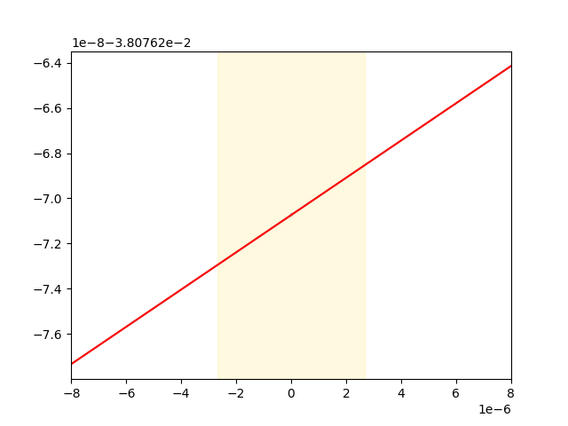
## New Eq:
((fabs(membrane__V) < 9.9999999999999995e-8 / fabs(membrane__FoRT)) ? (5000000.0 * (9.9999999999999995e-8 / membrane__FoRT + membrane__V) * (9.9999999999999995e-8 * (-Sodium_Concentrations__Na_o + Sodium_Concentrations__Na_j * exp(9.9999999999999995e-8)) * L_Type_Calcium_Current__P_scale * L_Type_Calcium_Current__p_Na * membrane__Frdy / (-1.0 + exp(9.9999999999999995e-8)) + 9.9999999999999995e-8 * (-Sodium_Concentrations__Na_o + Sodium_Concentrations__Na_j * exp(-9.9999999999999995e-8)) * L_Type_Calcium_Current__P_scale * L_Type_Calcium_Current__p_Na * membrane__Frdy / (-1.0 + exp(-9.9999999999999995e-8))) * membrane__FoRT - 9.9999999999999995e-8 * (-Sodium_Concentrations__Na_o + Sodium_Concentrations__Na_j * exp(-9.9999999999999995e-8)) * L_Type_Calcium_Current__P_scale * L_Type_Calcium_Current__p_Na * membrane__Frdy / (-1.0 + exp(-9.9999999999999995e-8))) : ((-Sodium_Concentrations__Na_o + Sodium_Concentrations__Na_j * exp(membrane__FoRT * membrane__V)) * L_Type_Calcium_Current__P_scale * L_Type_Calcium_Current__p_Na * membrane__FoRT * membrane__Frdy * membrane__V / (-1.0 + exp(membrane__FoRT * membrane__V))))

## Equation 5:
```
L_Type_Calcium_Current__Ibar_Na_sl = (-Sodium_Concentrations__Na_o + Sodium_Concentrations__Na_sl * exp(membrane__FoRT * membrane__V)) * L_Type_Calcium_Current__P_scale * L_Type_Calcium_Current__p_Na * membrane__FoRT * membrane__Frdy * membrane__V / (-1.0 + exp(membrane__FoRT * membrane__V))
```
### Partially evaluated to: 
```
L_Type_Calcium_Current__Ibar_Na_sl = (-Sodium_Concentrations__Na_o + Sodium_Concentrations__Na_sl * exp(membrane__FoRT * membrane__V)) * L_Type_Calcium_Current__P_scale * L_Type_Calcium_Current__p_Na * membrane__FoRT * membrane__Frdy * membrane__V / (-1.0 + exp(membrane__FoRT * membrane__V))
```
### Singulariy points detected:

{0}
*U*
`membrane__FoRT * membrane__V`

*V for 1e-07 range* 
`-9.9999999999999995e-8 / membrane__FoRT - 9.9999999999999995e-8 / membrane__FoRT`

*Singularity point: 0*

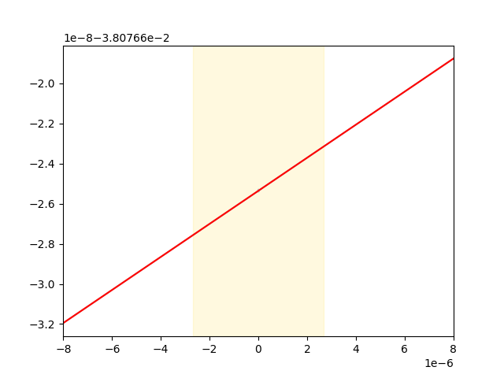
## New Eq:
((fabs(membrane__V) < 9.9999999999999995e-8 / fabs(membrane__FoRT)) ? (5000000.0 * (9.9999999999999995e-8 / membrane__FoRT + membrane__V) * (9.9999999999999995e-8 * (-Sodium_Concentrations__Na_o + Sodium_Concentrations__Na_sl * exp(9.9999999999999995e-8)) * L_Type_Calcium_Current__P_scale * L_Type_Calcium_Current__p_Na * membrane__Frdy / (-1.0 + exp(9.9999999999999995e-8)) + 9.9999999999999995e-8 * (-Sodium_Concentrations__Na_o + Sodium_Concentrations__Na_sl * exp(-9.9999999999999995e-8)) * L_Type_Calcium_Current__P_scale * L_Type_Calcium_Current__p_Na * membrane__Frdy / (-1.0 + exp(-9.9999999999999995e-8))) * membrane__FoRT - 9.9999999999999995e-8 * (-Sodium_Concentrations__Na_o + Sodium_Concentrations__Na_sl * exp(-9.9999999999999995e-8)) * L_Type_Calcium_Current__P_scale * L_Type_Calcium_Current__p_Na * membrane__Frdy / (-1.0 + exp(-9.9999999999999995e-8))) : ((-Sodium_Concentrations__Na_o + Sodium_Concentrations__Na_sl * exp(membrane__FoRT * membrane__V)) * L_Type_Calcium_Current__P_scale * L_Type_Calcium_Current__p_Na * membrane__FoRT * membrane__Frdy * membrane__V / (-1.0 + exp(membrane__FoRT * membrane__V))))

Singularities cannot be found
1.0/(0.036499999999999998*(0.14285714285714286*exp(0.014858841010401189*_Sodium_Concentrations$Na_o) - 0.14285714285714286)*exp(-0.037435883507802618*_membrane$V) + 1.0 + 0.1245*exp(-0.003743588350780262*_membrane$V))

# Model: Carro_Rodriguez_Laguna_Pueyo_CinC2010_EPI(carro_2011_epi.cellml)
Fast_Na_Current__a_h = ((membrane__V >= -40.0) ? (0) : (0.057000000000000002 * exp(-11.764705882352942 - 0.14705882352941177 * membrane__V)))

####Piecewise!!

Fast_Na_Current__a_j = ((membrane__V >= -40.0) ? (0) : ((37.780000000000001 + membrane__V) * (-25428.0 * exp(0.24440000000000001 * membrane__V) - 6.9480000000000002e-6 * exp(-0.043909999999999998 * membrane__V)) / (1.0 + exp(24.640530000000002 + 0.311 * membrane__V))))

####Piecewise!!

Fast_Na_Current__b_h = ((membrane__V >= -40.0) ? (5.9230999999999998 / (1.0 + exp(-0.96036036036036043 - 0.0900900900900901 * membrane__V))) : (310000.0 * exp(0.34849999999999998 * membrane__V) + 2.7000000000000002 * exp(0.079000000000000001 * membrane__V)))

####Piecewise!!

Fast_Na_Current__b_j = ((membrane__V >= -40.0) ? (0.59999999999999998 * exp(0.057000000000000002 * membrane__V) / (1.0 + exp(-3.2000000000000002 - 0.10000000000000001 * membrane__V))) : (0.024240000000000001 * exp(-0.01052 * membrane__V) / (1.0 + exp(-5.5312920000000005 - 0.13780000000000001 * membrane__V))))

####Piecewise!!

## Equation 1:
```
L_Type_Calcium_Current__Ibar_Ca_j = (-Calcium_Concentrations__Ca_o + Calcium_Concentrations__Ca_j * exp(2.0 * membrane__FoRT * membrane__V)) * L_Type_Calcium_Current__P_scale * L_Type_Calcium_Current__p_Ca * membrane__FoRT * membrane__Frdy * membrane__V / (-1.0 + exp(2.0 * membrane__FoRT * membrane__V))
```
### Partially evaluated to: 
```
L_Type_Calcium_Current__Ibar_Ca_j = (-Calcium_Concentrations__Ca_o + Calcium_Concentrations__Ca_j * exp(2.0 * membrane__FoRT * membrane__V)) * L_Type_Calcium_Current__P_scale * L_Type_Calcium_Current__p_Ca * membrane__FoRT * membrane__Frdy * membrane__V / (-1.0 + exp(2.0 * membrane__FoRT * membrane__V))
```
### Singulariy points detected:

{0}
*U*
`2.0 * membrane__FoRT * membrane__V`

*V for 1e-07 range* 
`-4.9999999999999998e-8 / membrane__FoRT - 4.9999999999999998e-8 / membrane__FoRT`

*Singularity point: 0*


## New Eq:
((fabs(membrane__V) < 4.9999999999999998e-8 / fabs(membrane__FoRT)) ? (10000000.0 * (4.9999999999999998e-8 / membrane__FoRT + membrane__V) * (4.9999999999999998e-8 * (-Calcium_Concentrations__Ca_o + Calcium_Concentrations__Ca_j * exp(9.9999999999999995e-8)) * L_Type_Calcium_Current__P_scale * L_Type_Calcium_Current__p_Ca * membrane__Frdy / (-1.0 + exp(9.9999999999999995e-8)) + 4.9999999999999998e-8 * (-Calcium_Concentrations__Ca_o + Calcium_Concentrations__Ca_j * exp(-9.9999999999999995e-8)) * L_Type_Calcium_Current__P_scale * L_Type_Calcium_Current__p_Ca * membrane__Frdy / (-1.0 + exp(-9.9999999999999995e-8))) * membrane__FoRT - 4.9999999999999998e-8 * (-Calcium_Concentrations__Ca_o + Calcium_Concentrations__Ca_j * exp(-9.9999999999999995e-8)) * L_Type_Calcium_Current__P_scale * L_Type_Calcium_Current__p_Ca * membrane__Frdy / (-1.0 + exp(-9.9999999999999995e-8))) : ((-Calcium_Concentrations__Ca_o + Calcium_Concentrations__Ca_j * exp(2.0 * membrane__FoRT * membrane__V)) * L_Type_Calcium_Current__P_scale * L_Type_Calcium_Current__p_Ca * membrane__FoRT * membrane__Frdy * membrane__V / (-1.0 + exp(2.0 * membrane__FoRT * membrane__V))))

## Equation 2:
```
L_Type_Calcium_Current__Ibar_Ca_sl = (-Calcium_Concentrations__Ca_o + Calcium_Concentrations__Ca_sl * exp(2.0 * membrane__FoRT * membrane__V)) * L_Type_Calcium_Current__P_scale * L_Type_Calcium_Current__p_Ca * membrane__FoRT * membrane__Frdy * membrane__V / (-1.0 + exp(2.0 * membrane__FoRT * membrane__V))
```
### Partially evaluated to: 
```
L_Type_Calcium_Current__Ibar_Ca_sl = (-Calcium_Concentrations__Ca_o + Calcium_Concentrations__Ca_sl * exp(2.0 * membrane__FoRT * membrane__V)) * L_Type_Calcium_Current__P_scale * L_Type_Calcium_Current__p_Ca * membrane__FoRT * membrane__Frdy * membrane__V / (-1.0 + exp(2.0 * membrane__FoRT * membrane__V))
```
### Singulariy points detected:

{0}
*U*
`2.0 * membrane__FoRT * membrane__V`

*V for 1e-07 range* 
`-4.9999999999999998e-8 / membrane__FoRT - 4.9999999999999998e-8 / membrane__FoRT`

*Singularity point: 0*


## New Eq:
((fabs(membrane__V) < 4.9999999999999998e-8 / fabs(membrane__FoRT)) ? (10000000.0 * (4.9999999999999998e-8 / membrane__FoRT + membrane__V) * (4.9999999999999998e-8 * (-Calcium_Concentrations__Ca_o + Calcium_Concentrations__Ca_sl * exp(9.9999999999999995e-8)) * L_Type_Calcium_Current__P_scale * L_Type_Calcium_Current__p_Ca * membrane__Frdy / (-1.0 + exp(9.9999999999999995e-8)) + 4.9999999999999998e-8 * (-Calcium_Concentrations__Ca_o + Calcium_Concentrations__Ca_sl * exp(-9.9999999999999995e-8)) * L_Type_Calcium_Current__P_scale * L_Type_Calcium_Current__p_Ca * membrane__Frdy / (-1.0 + exp(-9.9999999999999995e-8))) * membrane__FoRT - 4.9999999999999998e-8 * (-Calcium_Concentrations__Ca_o + Calcium_Concentrations__Ca_sl * exp(-9.9999999999999995e-8)) * L_Type_Calcium_Current__P_scale * L_Type_Calcium_Current__p_Ca * membrane__Frdy / (-1.0 + exp(-9.9999999999999995e-8))) : ((-Calcium_Concentrations__Ca_o + Calcium_Concentrations__Ca_sl * exp(2.0 * membrane__FoRT * membrane__V)) * L_Type_Calcium_Current__P_scale * L_Type_Calcium_Current__p_Ca * membrane__FoRT * membrane__Frdy * membrane__V / (-1.0 + exp(2.0 * membrane__FoRT * membrane__V))))

## Equation 3:
```
L_Type_Calcium_Current__Ibar_K = (-Potassium_Concentrations__K_o + Potassium_Concentrations__K_i * exp(membrane__FoRT * membrane__V)) * L_Type_Calcium_Current__P_scale * L_Type_Calcium_Current__p_K * membrane__FoRT * membrane__Frdy * membrane__V / (-1.0 + exp(membrane__FoRT * membrane__V))
```
### Partially evaluated to: 
```
L_Type_Calcium_Current__Ibar_K = (-Potassium_Concentrations__K_o + Potassium_Concentrations__K_i * exp(membrane__FoRT * membrane__V)) * L_Type_Calcium_Current__P_scale * L_Type_Calcium_Current__p_K * membrane__FoRT * membrane__Frdy * membrane__V / (-1.0 + exp(membrane__FoRT * membrane__V))
```
### Singulariy points detected:

{0}
*U*
`membrane__FoRT * membrane__V`

*V for 1e-07 range* 
`-9.9999999999999995e-8 / membrane__FoRT - 9.9999999999999995e-8 / membrane__FoRT`

*Singularity point: 0*


## New Eq:
((fabs(membrane__V) < 9.9999999999999995e-8 / fabs(membrane__FoRT)) ? (5000000.0 * (9.9999999999999995e-8 / membrane__FoRT + membrane__V) * (9.9999999999999995e-8 * (-Potassium_Concentrations__K_o + Potassium_Concentrations__K_i * exp(9.9999999999999995e-8)) * L_Type_Calcium_Current__P_scale * L_Type_Calcium_Current__p_K * membrane__Frdy / (-1.0 + exp(9.9999999999999995e-8)) + 9.9999999999999995e-8 * (-Potassium_Concentrations__K_o + Potassium_Concentrations__K_i * exp(-9.9999999999999995e-8)) * L_Type_Calcium_Current__P_scale * L_Type_Calcium_Current__p_K * membrane__Frdy / (-1.0 + exp(-9.9999999999999995e-8))) * membrane__FoRT - 9.9999999999999995e-8 * (-Potassium_Concentrations__K_o + Potassium_Concentrations__K_i * exp(-9.9999999999999995e-8)) * L_Type_Calcium_Current__P_scale * L_Type_Calcium_Current__p_K * membrane__Frdy / (-1.0 + exp(-9.9999999999999995e-8))) : ((-Potassium_Concentrations__K_o + Potassium_Concentrations__K_i * exp(membrane__FoRT * membrane__V)) * L_Type_Calcium_Current__P_scale * L_Type_Calcium_Current__p_K * membrane__FoRT * membrane__Frdy * membrane__V / (-1.0 + exp(membrane__FoRT * membrane__V))))

## Equation 4:
```
L_Type_Calcium_Current__Ibar_Na_j = (-Sodium_Concentrations__Na_o + Sodium_Concentrations__Na_j * exp(membrane__FoRT * membrane__V)) * L_Type_Calcium_Current__P_scale * L_Type_Calcium_Current__p_Na * membrane__FoRT * membrane__Frdy * membrane__V / (-1.0 + exp(membrane__FoRT * membrane__V))
```
### Partially evaluated to: 
```
L_Type_Calcium_Current__Ibar_Na_j = (-Sodium_Concentrations__Na_o + Sodium_Concentrations__Na_j * exp(membrane__FoRT * membrane__V)) * L_Type_Calcium_Current__P_scale * L_Type_Calcium_Current__p_Na * membrane__FoRT * membrane__Frdy * membrane__V / (-1.0 + exp(membrane__FoRT * membrane__V))
```
### Singulariy points detected:

{0}
*U*
`membrane__FoRT * membrane__V`

*V for 1e-07 range* 
`-9.9999999999999995e-8 / membrane__FoRT - 9.9999999999999995e-8 / membrane__FoRT`

*Singularity point: 0*


## New Eq:
((fabs(membrane__V) < 9.9999999999999995e-8 / fabs(membrane__FoRT)) ? (5000000.0 * (9.9999999999999995e-8 / membrane__FoRT + membrane__V) * (9.9999999999999995e-8 * (-Sodium_Concentrations__Na_o + Sodium_Concentrations__Na_j * exp(9.9999999999999995e-8)) * L_Type_Calcium_Current__P_scale * L_Type_Calcium_Current__p_Na * membrane__Frdy / (-1.0 + exp(9.9999999999999995e-8)) + 9.9999999999999995e-8 * (-Sodium_Concentrations__Na_o + Sodium_Concentrations__Na_j * exp(-9.9999999999999995e-8)) * L_Type_Calcium_Current__P_scale * L_Type_Calcium_Current__p_Na * membrane__Frdy / (-1.0 + exp(-9.9999999999999995e-8))) * membrane__FoRT - 9.9999999999999995e-8 * (-Sodium_Concentrations__Na_o + Sodium_Concentrations__Na_j * exp(-9.9999999999999995e-8)) * L_Type_Calcium_Current__P_scale * L_Type_Calcium_Current__p_Na * membrane__Frdy / (-1.0 + exp(-9.9999999999999995e-8))) : ((-Sodium_Concentrations__Na_o + Sodium_Concentrations__Na_j * exp(membrane__FoRT * membrane__V)) * L_Type_Calcium_Current__P_scale * L_Type_Calcium_Current__p_Na * membrane__FoRT * membrane__Frdy * membrane__V / (-1.0 + exp(membrane__FoRT * membrane__V))))

## Equation 5:
```
L_Type_Calcium_Current__Ibar_Na_sl = (-Sodium_Concentrations__Na_o + Sodium_Concentrations__Na_sl * exp(membrane__FoRT * membrane__V)) * L_Type_Calcium_Current__P_scale * L_Type_Calcium_Current__p_Na * membrane__FoRT * membrane__Frdy * membrane__V / (-1.0 + exp(membrane__FoRT * membrane__V))
```
### Partially evaluated to: 
```
L_Type_Calcium_Current__Ibar_Na_sl = (-Sodium_Concentrations__Na_o + Sodium_Concentrations__Na_sl * exp(membrane__FoRT * membrane__V)) * L_Type_Calcium_Current__P_scale * L_Type_Calcium_Current__p_Na * membrane__FoRT * membrane__Frdy * membrane__V / (-1.0 + exp(membrane__FoRT * membrane__V))
```
### Singulariy points detected:

{0}
*U*
`membrane__FoRT * membrane__V`

*V for 1e-07 range* 
`-9.9999999999999995e-8 / membrane__FoRT - 9.9999999999999995e-8 / membrane__FoRT`

*Singularity point: 0*


## New Eq:
((fabs(membrane__V) < 9.9999999999999995e-8 / fabs(membrane__FoRT)) ? (5000000.0 * (9.9999999999999995e-8 / membrane__FoRT + membrane__V) * (9.9999999999999995e-8 * (-Sodium_Concentrations__Na_o + Sodium_Concentrations__Na_sl * exp(9.9999999999999995e-8)) * L_Type_Calcium_Current__P_scale * L_Type_Calcium_Current__p_Na * membrane__Frdy / (-1.0 + exp(9.9999999999999995e-8)) + 9.9999999999999995e-8 * (-Sodium_Concentrations__Na_o + Sodium_Concentrations__Na_sl * exp(-9.9999999999999995e-8)) * L_Type_Calcium_Current__P_scale * L_Type_Calcium_Current__p_Na * membrane__Frdy / (-1.0 + exp(-9.9999999999999995e-8))) * membrane__FoRT - 9.9999999999999995e-8 * (-Sodium_Concentrations__Na_o + Sodium_Concentrations__Na_sl * exp(-9.9999999999999995e-8)) * L_Type_Calcium_Current__P_scale * L_Type_Calcium_Current__p_Na * membrane__Frdy / (-1.0 + exp(-9.9999999999999995e-8))) : ((-Sodium_Concentrations__Na_o + Sodium_Concentrations__Na_sl * exp(membrane__FoRT * membrane__V)) * L_Type_Calcium_Current__P_scale * L_Type_Calcium_Current__p_Na * membrane__FoRT * membrane__Frdy * membrane__V / (-1.0 + exp(membrane__FoRT * membrane__V))))

Singularities cannot be found
1.0/(0.036499999999999998*(0.14285714285714286*exp(0.014858841010401189*_Sodium_Concentrations$Na_o) - 0.14285714285714286)*exp(-0.037435883507802618*_membrane$V) + 1.0 + 0.1245*exp(-0.003743588350780262*_membrane$V))

# Model: clancy_rudy_2002(clancy_rudy_2002.cellml)
calcium_dynamics__APtrack2_orig_deriv = (((calcium_dynamics__APtrack > 0.17999999999999999) && (calcium_dynamics__APtrack < 0.20000000000000001)) ? (100000.0 - 100500.0 * calcium_dynamics__APtrack2) : (-500.0 * calcium_dynamics__APtrack2))

####Piecewise!!

calcium_dynamics__APtrack3_orig_deriv = (((calcium_dynamics__APtrack > 0.17999999999999999) && (calcium_dynamics__APtrack < 0.20000000000000001)) ? (100000.0 - 100500.0 * calcium_dynamics__APtrack3) : (-10.0 * calcium_dynamics__APtrack3))

####Piecewise!!

calcium_dynamics__OVRLDtrack2_orig_deriv = (((calcium_dynamics__Logicthresh > calcium_dynamics__OVRLDtrack2) && (calcium_dynamics__Logicthresh < calcium_dynamics__OVRLDtrack)) ? (50000.0 - 50000.0 * calcium_dynamics__OVRLDtrack2) : (-500.0 * calcium_dynamics__OVRLDtrack2))

####Piecewise!!

calcium_dynamics__OVRLDtrack3_orig_deriv = (((calcium_dynamics__Logicthresh > calcium_dynamics__OVRLDtrack3) && (calcium_dynamics__Logicthresh < calcium_dynamics__OVRLDtrack)) ? (50000.0 - 50000.0 * calcium_dynamics__OVRLDtrack3) : (-10.0 * calcium_dynamics__OVRLDtrack3))

####Piecewise!!

calcium_dynamics__OVRLDtrack_orig_deriv = (((calcium_dynamics__APtrack3 < 0.37) && (calcium_dynamics__OVRLDtrack3 < 0.37) && (calcium_dynamics__CSQNthresh < 1 / (1.0 + calcium_dynamics__K_mCSQN / calcium_dynamics__Ca_NSR))) ? (50000.0 - 50000.0 * calcium_dynamics__OVRLDtrack) : (-500.0 * calcium_dynamics__OVRLDtrack))

####Piecewise!!

calcium_dynamics__G_rel = ((calcium_dynamics__Cainfluxtrack > calcium_dynamics__delta_Ca_ith) ? ((1.0 - calcium_dynamics__APtrack2) * (-calcium_dynamics__delta_Ca_ith + calcium_dynamics__Cainfluxtrack) * calcium_dynamics__APtrack2 * calcium_dynamics__G_rel_max / (-calcium_dynamics__delta_Ca_ith + calcium_dynamics__Cainfluxtrack + calcium_dynamics__K_mrel)) : ((calcium_dynamics__OVRLDtrack2 > 0) ? ((1.0 - calcium_dynamics__OVRLDtrack2) * calcium_dynamics__G_rel_overload * calcium_dynamics__OVRLDtrack2) : (0)))

####Piecewise!!

## Equation 1:
```
L_type_Ca_channel__I_CaCa = 4.0 * pow(membrane__F, 2) * (-L_type_Ca_channel__gamma_Cao * calcium_dynamics__Cao + L_type_Ca_channel__gamma_Cai * calcium_dynamics__Cai * exp(2.0 * membrane__F * membrane__V / (membrane__R * membrane__T))) * L_type_Ca_channel__P_Ca * L_type_Ca_channel__P_scale * membrane__V / ((-1.0 + exp(2.0 * membrane__F * membrane__V / (membrane__R * membrane__T))) * membrane__R * membrane__T)
```
### Partially evaluated to: 
```
L_type_Ca_channel__I_CaCa = 4.0 * pow(membrane__F, 2) * (-L_type_Ca_channel__gamma_Cao * calcium_dynamics__Cao + L_type_Ca_channel__gamma_Cai * calcium_dynamics__Cai * exp(2.0 * membrane__F * membrane__V / (membrane__R * membrane__T))) * L_type_Ca_channel__P_Ca * L_type_Ca_channel__P_scale * membrane__V / ((-1.0 + exp(2.0 * membrane__F * membrane__V / (membrane__R * membrane__T))) * membrane__R * membrane__T)
```
### Singulariy points detected:

{0}
#### float * A

####Failed to find U symbolically!

<class 'sympy.core.mul.Mul'>
_membrane$F**2*_L_type_Ca_channel$P_Ca*_L_type_Ca_channel$P_scale*_membrane$V*(_L_type_Ca_channel$gamma_Cai*_calcium_dynamics$Cai*exp(2.0*_membrane$F*_membrane$V/(_membrane$R*_membrane$T)) - _L_type_Ca_channel$gamma_Cao*_calcium_dynamics$Cao)/(_membrane$R*_membrane$T*(exp(2.0*_membrane$F*_membrane$V/(_membrane$R*_membrane$T)) - 1.0))

*try substituting parameters*

*U*
`0.074871767015605231 * membrane__V`

*V for 1e-07 range* 
`-1.3356169352749131e-6 - 1.3356169352749131e-6`

*Singularity point: 0*


## New Eq:
((fabs(membrane__V) < 1.3356169352749131e-6) ? ((0.5 + 374358.83507802623 * membrane__V) * (5.3424677410996524e-6 * pow(membrane__F, 2) * (-L_type_Ca_channel__gamma_Cao * calcium_dynamics__Cao + L_type_Ca_channel__gamma_Cai * calcium_dynamics__Cai * exp(2.6712338705498262e-6 * membrane__F / (membrane__R * membrane__T))) * L_type_Ca_channel__P_Ca * L_type_Ca_channel__P_scale / ((-1.0 + exp(2.6712338705498262e-6 * membrane__F / (membrane__R * membrane__T))) * membrane__R * membrane__T) + 5.3424677410996524e-6 * pow(membrane__F, 2) * (-L_type_Ca_channel__gamma_Cao * calcium_dynamics__Cao + L_type_Ca_channel__gamma_Cai * calcium_dynamics__Cai * exp(-2.6712338705498262e-6 * membrane__F / (membrane__R * membrane__T))) * L_type_Ca_channel__P_Ca * L_type_Ca_channel__P_scale / ((-1.0 + exp(-2.6712338705498262e-6 * membrane__F / (membrane__R * membrane__T))) * membrane__R * membrane__T)) - 5.3424677410996524e-6 * pow(membrane__F, 2) * (-L_type_Ca_channel__gamma_Cao * calcium_dynamics__Cao + L_type_Ca_channel__gamma_Cai * calcium_dynamics__Cai * exp(-2.6712338705498262e-6 * membrane__F / (membrane__R * membrane__T))) * L_type_Ca_channel__P_Ca * L_type_Ca_channel__P_scale / ((-1.0 + exp(-2.6712338705498262e-6 * membrane__F / (membrane__R * membrane__T))) * membrane__R * membrane__T)) : (4.0 * pow(membrane__F, 2) * (-L_type_Ca_channel__gamma_Cao * calcium_dynamics__Cao + L_type_Ca_channel__gamma_Cai * calcium_dynamics__Cai * exp(2.0 * membrane__F * membrane__V / (membrane__R * membrane__T))) * L_type_Ca_channel__P_Ca * L_type_Ca_channel__P_scale * membrane__V / ((-1.0 + exp(2.0 * membrane__F * membrane__V / (membrane__R * membrane__T))) * membrane__R * membrane__T)))

## Equation 2:
```
L_type_Ca_channel__I_CaK = pow(membrane__F, 2) * (-L_type_Ca_channel__gamma_Ko * ionic_concentrations__Ko + L_type_Ca_channel__gamma_Ki * ionic_concentrations__Ki * exp(membrane__F * membrane__V / (membrane__R * membrane__T))) * L_type_Ca_channel__P_K * L_type_Ca_channel__P_scale * membrane__V / ((-1.0 + exp(membrane__F * membrane__V / (membrane__R * membrane__T))) * membrane__R * membrane__T)
```
### Partially evaluated to: 
```
L_type_Ca_channel__I_CaK = pow(membrane__F, 2) * (-L_type_Ca_channel__gamma_Ko * ionic_concentrations__Ko + L_type_Ca_channel__gamma_Ki * ionic_concentrations__Ki * exp(membrane__F * membrane__V / (membrane__R * membrane__T))) * L_type_Ca_channel__P_K * L_type_Ca_channel__P_scale * membrane__V / ((-1.0 + exp(membrane__F * membrane__V / (membrane__R * membrane__T))) * membrane__R * membrane__T)
```
### Singulariy points detected:

{0}
#### float * A

####Failed to find U symbolically!

<class 'sympy.core.mul.Mul'>
_membrane$F**2*_L_type_Ca_channel$P_K*_L_type_Ca_channel$P_scale*_membrane$V*(_L_type_Ca_channel$gamma_Ki*_ionic_concentrations$Ki*exp(1.0*_membrane$F*_membrane$V/(_membrane$R*_membrane$T)) - _L_type_Ca_channel$gamma_Ko*_ionic_concentrations$Ko)/(_membrane$R*_membrane$T*(exp(1.0*_membrane$F*_membrane$V/(_membrane$R*_membrane$T)) - 1.0))

*try substituting parameters*

*U*
`0.037435883507802616 * membrane__V`

*V for 1e-07 range* 
`-2.6712338705498262e-6 - 2.6712338705498262e-6`

*Singularity point: 0*

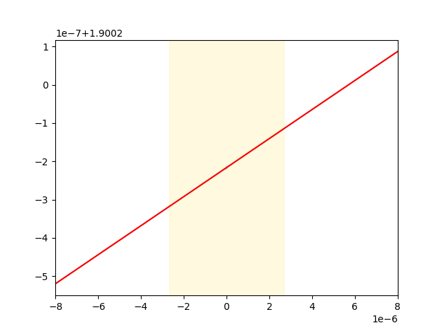
## New Eq:
((fabs(membrane__V) < 2.6712338705498262e-6) ? ((0.5 + 187179.41753901311 * membrane__V) * (2.6712338705498262e-6 * pow(membrane__F, 2) * (-L_type_Ca_channel__gamma_Ko * ionic_concentrations__Ko + L_type_Ca_channel__gamma_Ki * ionic_concentrations__Ki * exp(2.6712338705498262e-6 * membrane__F / (membrane__R * membrane__T))) * L_type_Ca_channel__P_K * L_type_Ca_channel__P_scale / ((-1.0 + exp(2.6712338705498262e-6 * membrane__F / (membrane__R * membrane__T))) * membrane__R * membrane__T) + 2.6712338705498262e-6 * pow(membrane__F, 2) * (-L_type_Ca_channel__gamma_Ko * ionic_concentrations__Ko + L_type_Ca_channel__gamma_Ki * ionic_concentrations__Ki * exp(-2.6712338705498262e-6 * membrane__F / (membrane__R * membrane__T))) * L_type_Ca_channel__P_K * L_type_Ca_channel__P_scale / ((-1.0 + exp(-2.6712338705498262e-6 * membrane__F / (membrane__R * membrane__T))) * membrane__R * membrane__T)) - 2.6712338705498262e-6 * pow(membrane__F, 2) * (-L_type_Ca_channel__gamma_Ko * ionic_concentrations__Ko + L_type_Ca_channel__gamma_Ki * ionic_concentrations__Ki * exp(-2.6712338705498262e-6 * membrane__F / (membrane__R * membrane__T))) * L_type_Ca_channel__P_K * L_type_Ca_channel__P_scale / ((-1.0 + exp(-2.6712338705498262e-6 * membrane__F / (membrane__R * membrane__T))) * membrane__R * membrane__T)) : (pow(membrane__F, 2) * (-L_type_Ca_channel__gamma_Ko * ionic_concentrations__Ko + L_type_Ca_channel__gamma_Ki * ionic_concentrations__Ki * exp(membrane__F * membrane__V / (membrane__R * membrane__T))) * L_type_Ca_channel__P_K * L_type_Ca_channel__P_scale * membrane__V / ((-1.0 + exp(membrane__F * membrane__V / (membrane__R * membrane__T))) * membrane__R * membrane__T)))

## Equation 3:
```
L_type_Ca_channel__I_CaNa = pow(membrane__F, 2) * (-L_type_Ca_channel__gamma_Nao * ionic_concentrations__Nao + L_type_Ca_channel__gamma_Nai * ionic_concentrations__Nai * exp(membrane__F * membrane__V / (membrane__R * membrane__T))) * L_type_Ca_channel__P_Na * L_type_Ca_channel__P_scale * membrane__V / ((-1.0 + exp(membrane__F * membrane__V / (membrane__R * membrane__T))) * membrane__R * membrane__T)
```
### Partially evaluated to: 
```
L_type_Ca_channel__I_CaNa = pow(membrane__F, 2) * (-L_type_Ca_channel__gamma_Nao * ionic_concentrations__Nao + L_type_Ca_channel__gamma_Nai * ionic_concentrations__Nai * exp(membrane__F * membrane__V / (membrane__R * membrane__T))) * L_type_Ca_channel__P_Na * L_type_Ca_channel__P_scale * membrane__V / ((-1.0 + exp(membrane__F * membrane__V / (membrane__R * membrane__T))) * membrane__R * membrane__T)
```
### Singulariy points detected:

{0}
#### float * A

####Failed to find U symbolically!

<class 'sympy.core.mul.Mul'>
_membrane$F**2*_L_type_Ca_channel$P_Na*_L_type_Ca_channel$P_scale*_membrane$V*(_L_type_Ca_channel$gamma_Nai*_ionic_concentrations$Nai*exp(1.0*_membrane$F*_membrane$V/(_membrane$R*_membrane$T)) - _L_type_Ca_channel$gamma_Nao*_ionic_concentrations$Nao)/(_membrane$R*_membrane$T*(exp(1.0*_membrane$F*_membrane$V/(_membrane$R*_membrane$T)) - 1.0))

*try substituting parameters*

*U*
`0.037435883507802616 * membrane__V`

*V for 1e-07 range* 
`-2.6712338705498262e-6 - 2.6712338705498262e-6`

*Singularity point: 0*


## New Eq:
((fabs(membrane__V) < 2.6712338705498262e-6) ? ((0.5 + 187179.41753901311 * membrane__V) * (2.6712338705498262e-6 * pow(membrane__F, 2) * (-L_type_Ca_channel__gamma_Nao * ionic_concentrations__Nao + L_type_Ca_channel__gamma_Nai * ionic_concentrations__Nai * exp(2.6712338705498262e-6 * membrane__F / (membrane__R * membrane__T))) * L_type_Ca_channel__P_Na * L_type_Ca_channel__P_scale / ((-1.0 + exp(2.6712338705498262e-6 * membrane__F / (membrane__R * membrane__T))) * membrane__R * membrane__T) + 2.6712338705498262e-6 * pow(membrane__F, 2) * (-L_type_Ca_channel__gamma_Nao * ionic_concentrations__Nao + L_type_Ca_channel__gamma_Nai * ionic_concentrations__Nai * exp(-2.6712338705498262e-6 * membrane__F / (membrane__R * membrane__T))) * L_type_Ca_channel__P_Na * L_type_Ca_channel__P_scale / ((-1.0 + exp(-2.6712338705498262e-6 * membrane__F / (membrane__R * membrane__T))) * membrane__R * membrane__T)) - 2.6712338705498262e-6 * pow(membrane__F, 2) * (-L_type_Ca_channel__gamma_Nao * ionic_concentrations__Nao + L_type_Ca_channel__gamma_Nai * ionic_concentrations__Nai * exp(-2.6712338705498262e-6 * membrane__F / (membrane__R * membrane__T))) * L_type_Ca_channel__P_Na * L_type_Ca_channel__P_scale / ((-1.0 + exp(-2.6712338705498262e-6 * membrane__F / (membrane__R * membrane__T))) * membrane__R * membrane__T)) : (pow(membrane__F, 2) * (-L_type_Ca_channel__gamma_Nao * ionic_concentrations__Nao + L_type_Ca_channel__gamma_Nai * ionic_concentrations__Nai * exp(membrane__F * membrane__V / (membrane__R * membrane__T))) * L_type_Ca_channel__P_Na * L_type_Ca_channel__P_scale * membrane__V / ((-1.0 + exp(membrane__F * membrane__V / (membrane__R * membrane__T))) * membrane__R * membrane__T)))

L_type_Ca_channel_d_gate__tau_d = ((fabs(L_type_Ca_channel_d_gate__E0_d) < 1.0000000000000001e-5) ? (0.0045787545787545781) : (0.028571428571428571 * (1.0 - exp(-0.16025641025641024 * L_type_Ca_channel_d_gate__E0_d)) * L_type_Ca_channel_d_gate__d_infinity / L_type_Ca_channel_d_gate__E0_d))

####Piecewise!!

T_type_Ca_channel_g_gate__tau_g = ((membrane__V <= 0) ? (0.012 - 0.00087500000000000002 * membrane__V) : (0.012))

####Piecewise!!

## Equation 4:
```
non_specific_calcium_activated_current__I_ns_K = pow(membrane__F, 2) * (-L_type_Ca_channel__gamma_Ko * ionic_concentrations__Ko + L_type_Ca_channel__gamma_Ki * ionic_concentrations__Ki * exp(membrane__F * membrane__V / (membrane__R * membrane__T))) * membrane__V * non_specific_calcium_activated_current__P_ns_Ca / ((-1.0 + exp(membrane__F * membrane__V / (membrane__R * membrane__T))) * membrane__R * membrane__T)
```
### Partially evaluated to: 
```
non_specific_calcium_activated_current__I_ns_K = pow(membrane__F, 2) * (-L_type_Ca_channel__gamma_Ko * ionic_concentrations__Ko + L_type_Ca_channel__gamma_Ki * ionic_concentrations__Ki * exp(membrane__F * membrane__V / (membrane__R * membrane__T))) * membrane__V * non_specific_calcium_activated_current__P_ns_Ca / ((-1.0 + exp(membrane__F * membrane__V / (membrane__R * membrane__T))) * membrane__R * membrane__T)
```
### Singulariy points detected:

{0}
#### float * A

####Failed to find U symbolically!

<class 'sympy.core.mul.Mul'>
_membrane$F**2*_membrane$V*_non_specific_calcium_activated_current$P_ns_Ca*(_L_type_Ca_channel$gamma_Ki*_ionic_concentrations$Ki*exp(1.0*_membrane$F*_membrane$V/(_membrane$R*_membrane$T)) - _L_type_Ca_channel$gamma_Ko*_ionic_concentrations$Ko)/(_membrane$R*_membrane$T*(exp(1.0*_membrane$F*_membrane$V/(_membrane$R*_membrane$T)) - 1.0))

*try substituting parameters*

#### Eq == 0!
## Equation 5:
```
non_specific_calcium_activated_current__I_ns_Na = pow(membrane__F, 2) * (-L_type_Ca_channel__gamma_Nao * ionic_concentrations__Nao + L_type_Ca_channel__gamma_Nai * ionic_concentrations__Nai * exp(membrane__F * membrane__V / (membrane__R * membrane__T))) * membrane__V * non_specific_calcium_activated_current__P_ns_Ca / ((-1.0 + exp(membrane__F * membrane__V / (membrane__R * membrane__T))) * membrane__R * membrane__T)
```
### Partially evaluated to: 
```
non_specific_calcium_activated_current__I_ns_Na = pow(membrane__F, 2) * (-L_type_Ca_channel__gamma_Nao * ionic_concentrations__Nao + L_type_Ca_channel__gamma_Nai * ionic_concentrations__Nai * exp(membrane__F * membrane__V / (membrane__R * membrane__T))) * membrane__V * non_specific_calcium_activated_current__P_ns_Ca / ((-1.0 + exp(membrane__F * membrane__V / (membrane__R * membrane__T))) * membrane__R * membrane__T)
```
### Singulariy points detected:

{0}
#### float * A

####Failed to find U symbolically!

<class 'sympy.core.mul.Mul'>
_membrane$F**2*_membrane$V*_non_specific_calcium_activated_current$P_ns_Ca*(_L_type_Ca_channel$gamma_Nai*_ionic_concentrations$Nai*exp(1.0*_membrane$F*_membrane$V/(_membrane$R*_membrane$T)) - _L_type_Ca_channel$gamma_Nao*_ionic_concentrations$Nao)/(_membrane$R*_membrane$T*(exp(1.0*_membrane$F*_membrane$V/(_membrane$R*_membrane$T)) - 1.0))

*try substituting parameters*

#### Eq == 0!
calcium_dynamics__Cainfluxtrack_orig_deriv = ((calcium_dynamics__APtrack > 0.20000000000000001) ? (-0.5 * (-Na_Ca_exchanger__i_NaCa + L_type_Ca_channel__i_CaCa + T_type_Ca_channel__i_Ca_T + calcium_background_current__i_Ca_b + sarcolemmal_calcium_pump__i_p_Ca) * ionic_concentrations__A_cap / (ionic_concentrations__V_myo * membrane__F)) : ((calcium_dynamics__APtrack2 > 0.01) ? (0) : (-500.0 * calcium_dynamics__Cainfluxtrack)))

####Piecewise!!

## Equation 6:
```
slow_delayed_rectifier_potassium_current_xs1_gate__tau_xs1 = 0.001 / (0.00013100000000000001 * (30.0 + membrane__V) / (-1.0 + exp(2.0609999999999999 + 0.068699999999999997 * membrane__V)) + 7.1899999999999999e-5 * (30.0 + membrane__V) / (1.0 - exp(-4.4399999999999995 - 0.14799999999999999 * membrane__V)))
```
### Partially evaluated to: 
```
slow_delayed_rectifier_potassium_current_xs1_gate__tau_xs1 = 0.001 / (0.00013100000000000001 * (30.0 + membrane__V) / (-1.0 + exp(2.0609999999999999 + 0.068699999999999997 * membrane__V)) + 7.1899999999999999e-5 * (30.0 + membrane__V) / (1.0 - exp(-4.4399999999999995 - 0.14799999999999999 * membrane__V)))
```
### Singulariy points detected:

{-30.000000000000000}
#### float * A

####1 / A


####A + B:

`7.1899999999999999e-5 * (30.0 + membrane__V) / (1.0 - 0.011795938519751569 * exp(-0.14799999999999999 * membrane__V))`
`0.00013100000000000001 * (30.0 + membrane__V) / (-1.0 + 7.8538197044216602 * exp(0.068699999999999997 * membrane__V))`

*U*
`-4.4399999999999995 - 0.14799999999999999 * membrane__V`

*V for 1e-07 range* 
`-29.999999324324325 - -30.000000675675675`

*Singularity point: -30.000000000000000*


## New Eq:
((fabs(30.0 + membrane__V) < 6.7567567568760367e-7) ? (0.001 / (8.8513513515076093e-11 / (-1.0 + exp(4.6418918920460017e-8)) + 4.8581081081938701e-11 / (1.0 - exp(-1.0000000000287557e-7))) + (-22199999.499608092 - 739999.99998693645 * membrane__V) * (0.001 / (-8.8513513515076093e-11 / (-1.0 + exp(-4.6418918920460017e-8)) - 4.8581081081938701e-11 / (1.0 - exp(1.0000000000287557e-7))) - 0.001 / (8.8513513515076093e-11 / (-1.0 + exp(4.6418918920460017e-8)) + 4.8581081081938701e-11 / (1.0 - exp(-1.0000000000287557e-7))))) : (0.001 / (0.00013100000000000001 * (30.0 + membrane__V) / (-1.0 + exp(2.0609999999999999 + 0.068699999999999997 * membrane__V)) + 7.1899999999999999e-5 * (30.0 + membrane__V) / (1.0 - exp(-4.4399999999999995 - 0.14799999999999999 * membrane__V)))))

## Equation 7:
```
slow_delayed_rectifier_potassium_current_xs2_gate__tau_xs2 = 0.0040000000000000001 / (0.00013100000000000001 * (30.0 + membrane__V) / (-1.0 + exp(2.0609999999999999 + 0.068699999999999997 * membrane__V)) + 7.1899999999999999e-5 * (30.0 + membrane__V) / (1.0 - exp(-4.4399999999999995 - 0.14799999999999999 * membrane__V)))
```
### Partially evaluated to: 
```
slow_delayed_rectifier_potassium_current_xs2_gate__tau_xs2 = 0.0040000000000000001 / (0.00013100000000000001 * (30.0 + membrane__V) / (-1.0 + exp(2.0609999999999999 + 0.068699999999999997 * membrane__V)) + 7.1899999999999999e-5 * (30.0 + membrane__V) / (1.0 - exp(-4.4399999999999995 - 0.14799999999999999 * membrane__V)))
```
### Singulariy points detected:

{-30.000000000000000}
#### float * A

####1 / A


####A + B:

`7.1899999999999999e-5 * (30.0 + membrane__V) / (1.0 - 0.011795938519751569 * exp(-0.14799999999999999 * membrane__V))`
`0.00013100000000000001 * (30.0 + membrane__V) / (-1.0 + 7.8538197044216602 * exp(0.068699999999999997 * membrane__V))`

*U*
`-4.4399999999999995 - 0.14799999999999999 * membrane__V`

*V for 1e-07 range* 
`-29.999999324324325 - -30.000000675675675`

*Singularity point: -30.000000000000000*


## New Eq:
((fabs(30.0 + membrane__V) < 6.7567567568760367e-7) ? (0.0040000000000000001 / (8.8513513515076093e-11 / (-1.0 + exp(4.6418918920460017e-8)) + 4.8581081081938701e-11 / (1.0 - exp(-1.0000000000287557e-7))) + (-22199999.499608092 - 739999.99998693645 * membrane__V) * (0.0040000000000000001 / (-8.8513513515076093e-11 / (-1.0 + exp(-4.6418918920460017e-8)) - 4.8581081081938701e-11 / (1.0 - exp(1.0000000000287557e-7))) - 0.0040000000000000001 / (8.8513513515076093e-11 / (-1.0 + exp(4.6418918920460017e-8)) + 4.8581081081938701e-11 / (1.0 - exp(-1.0000000000287557e-7))))) : (0.0040000000000000001 / (0.00013100000000000001 * (30.0 + membrane__V) / (-1.0 + exp(2.0609999999999999 + 0.068699999999999997 * membrane__V)) + 7.1899999999999999e-5 * (30.0 + membrane__V) / (1.0 - exp(-4.4399999999999995 - 0.14799999999999999 * membrane__V)))))

Singularities cannot be found
1.0/(0.036499999999999998*(0.14285714285714286*exp(0.014858841010401189*_ionic_concentrations$Nao) - 0.14285714285714286)*exp(-0.037435883507802618*_membrane$V) + 1.0 + 0.1245*exp(-0.003743588350780262*_membrane$V))

calcium_dynamics__APtrack_orig_deriv = ((membrane__dVdt > 150000.0) ? (100000.0 - 100500.0 * calcium_dynamics__APtrack) : (-500.0 * calcium_dynamics__APtrack))

####Piecewise!!

# Model: Corrias_rabbit_purkinje_model(corrias_purkinje_2011.cellml)
x_ks__tau_x_ks = ((fabs(30.0 + membrane__Vm) < 0.014500000000000001) ? (417.94619999999998) : (1 / (0.00013100000000000001 * (30.0 + membrane__Vm) / (-1.0 + exp(2.0609999999999999 + 0.068699999999999997 * membrane__Vm)) + 7.1899999999999999e-5 * (30.0 + membrane__Vm) / (1.0 - exp(-4.4399999999999995 - 0.14799999999999999 * membrane__Vm)))))

####Piecewise!!

y_kr__ykrv1 = ((fabs(7.0 + membrane__Vm) > 0.001) ? (0.0013799999999999999 * (7.0 + membrane__Vm) / (1.0 - exp(-0.86099999999999999 - 0.123 * membrane__Vm))) : (0.011219512195121951))

####Piecewise!!

y_kr__ykrv2 = ((fabs(10.0 + membrane__Vm) > 0.001) ? (6.0999999999999999e-5 * (10.0 + membrane__Vm) / (-1.0 + exp(1.45 + 0.14499999999999999 * membrane__Vm))) : (0.0042068965517241376))

####Piecewise!!

# Model: courtemanche_1998(courtemanche_ramirez_nattel_1998.cellml)
Ca_release_current_from_JSR_w_gate__tau_w = ((fabs(-7.9000000000000004 + membrane__V) < 1.0e-10) ? (0.92307692307692313) : (6.0 * (1.0 - exp(1.5800000000000001 - 0.20000000000000001 * membrane__V)) / ((1.0 + 0.29999999999999999 * exp(1.5800000000000001 - 0.20000000000000001 * membrane__V)) * (-7.9000000000000004 + membrane__V))))

####Piecewise!!

L_type_Ca_channel_d_gate__tau_d = ((fabs(10.0 + membrane__V) < 1.0e-10) ? (4.5789999999999997 / (1.0 + exp(-1.6025641025641024 - 0.16025641025641024 * membrane__V))) : (28.571428571428569 * (1.0 - exp(-1.6025641025641024 - 0.16025641025641024 * membrane__V)) / ((1.0 + exp(-1.6025641025641024 - 0.16025641025641024 * membrane__V)) * (10.0 + membrane__V))))

####Piecewise!!

fast_sodium_current_h_gate__alpha_h = ((membrane__V < -40.0) ? (0.13500000000000001 * exp(-11.764705882352942 + 0.14705882352941177 * fast_sodium_current__shift_INa_inact - 0.14705882352941177 * membrane__V)) : (0))

####Piecewise!!

fast_sodium_current_h_gate__beta_h = ((membrane__V < -40.0) ? (310000.0 * exp(0.34999999999999998 * membrane__V - 0.34999999999999998 * fast_sodium_current__shift_INa_inact) + 3.5600000000000001 * exp(0.079000000000000001 * membrane__V - 0.079000000000000001 * fast_sodium_current__shift_INa_inact)) : (7.6923076923076916 / (1.0 + exp(-0.96036036036036043 + 0.0900900900900901 * fast_sodium_current__shift_INa_inact - 0.0900900900900901 * membrane__V))))

####Piecewise!!

fast_sodium_current_j_gate__alpha_j = ((membrane__V < -40.0) ? ((37.780000000000001 + membrane__V) * (-127140.0 * exp(0.24440000000000001 * membrane__V - 0.24440000000000001 * fast_sodium_current__shift_INa_inact) - 3.4740000000000003e-5 * exp(0.043909999999999998 * fast_sodium_current__shift_INa_inact - 0.043909999999999998 * membrane__V)) / (1.0 + exp(24.640530000000002 + 0.311 * membrane__V - 0.311 * fast_sodium_current__shift_INa_inact))) : (0))

####Piecewise!!

fast_sodium_current_j_gate__beta_j = ((membrane__V < -40.0) ? (0.1212 * exp(0.01052 * fast_sodium_current__shift_INa_inact - 0.01052 * membrane__V) / (1.0 + exp(-5.5312920000000005 + 0.13780000000000001 * fast_sodium_current__shift_INa_inact - 0.13780000000000001 * membrane__V))) : (0.29999999999999999 * exp(2.5349999999999999e-7 * fast_sodium_current__shift_INa_inact - 2.5349999999999999e-7 * membrane__V) / (1.0 + exp(-3.2000000000000002 + 0.10000000000000001 * fast_sodium_current__shift_INa_inact - 0.10000000000000001 * membrane__V))))

####Piecewise!!

fast_sodium_current_m_gate__alpha_m = ((membrane__V == (-47.130000000000003)) ? (3.2000000000000002) : (0.32000000000000001 * (47.130000000000003 + membrane__V) / (1.0 - exp(-4.7130000000000001 - 0.10000000000000001 * membrane__V))))

####Piecewise!!

rapid_delayed_rectifier_K_current_xr_gate__alpha_xr = ((fabs(14.1 + membrane__V) < 1.0e-10) ? (0.0015) : (0.00029999999999999997 * (14.1 + membrane__V) / (1.0 - exp(-2.8199999999999998 - 0.20000000000000001 * membrane__V))))

####Piecewise!!

rapid_delayed_rectifier_K_current_xr_gate__beta_xr = ((fabs(-3.3328000000000002 + membrane__V) < 1.0e-10) ? (0.00037836118) : (7.3898000000000003e-5 * (-3.3328000000000002 + membrane__V) / (-1.0 + exp(-0.65046743564221166 + 0.19517145812596365 * membrane__V))))

####Piecewise!!

slow_delayed_rectifier_K_current_xs_gate__alpha_xs = ((fabs(-19.899999999999999 + membrane__V) < 1.0e-10) ? (0.00068000000000000005) : (4.0000000000000003e-5 * (-19.899999999999999 + membrane__V) / (1.0 - exp(1.1705882352941175 - 0.058823529411764705 * membrane__V))))

####Piecewise!!

slow_delayed_rectifier_K_current_xs_gate__beta_xs = ((fabs(-19.899999999999999 + membrane__V) < 1.0e-10) ? (0.00031500000000000001) : (3.4999999999999997e-5 * (-19.899999999999999 + membrane__V) / (-1.0 + exp(-2.2111111111111108 + 0.1111111111111111 * membrane__V))))

####Piecewise!!

Singularities cannot be found
1/(0.036499999999999998*(0.14285714285714286*exp(0.014858841010401189*_standard_ionic_concentrations$Na_o) - 0.14285714285714286)*exp(-0.037435192301797954*_membrane$V) + 1.0 + 0.1245*exp(-0.0037435192301797956*_membrane$V))

# Model: davies_isap_2012(davies_isap_2012.cellml)
ICaL__ibarca = (((ICaL__U >= -9.9999999999999995e-8) && (ICaL__U <= 9.9999999999999995e-8)) ? ((1.0 - 0.5 * ICaL__U) * ICaL__A) : (ICaL__A * ICaL__U / (-1.0 + exp(ICaL__U))))

####Piecewise!!

ICab__ICab = (((ICab__U >= -9.9999999999999995e-8) && (ICab__U <= 9.9999999999999995e-8)) ? ((1.0 - 0.5 * ICab__U) * ICab__A) : (ICab__A * ICab__U / (-1.0 + exp(ICab__U))))

####Piecewise!!

IKs__temp_part_1 = (((IKs__U_1 >= -9.9999999999999995e-8) && (IKs__U_1 <= 9.9999999999999995e-8)) ? ((1.0 - 0.5 * IKs__U_1) * IKs__A_1) : (IKs__A_1 * IKs__U_1 / (-1.0 + exp(IKs__U_1))))

####Piecewise!!

IKs__temp_part_2 = (((IKs__U_2 >= -9.9999999999999995e-8) && (IKs__U_2 <= 9.9999999999999995e-8)) ? ((1.0 - 0.5 * IKs__U_2) * IKs__A_2) : (IKs__A_2 * IKs__U_2 / (-1.0 + exp(IKs__U_2))))

####Piecewise!!

INa__ah = ((cell__V >= -40.0) ? (0) : (0.13500000000000001 * exp(-11.764705882352942 - 0.14705882352941177 * cell__V)))

####Piecewise!!

INa__aj = ((cell__V >= -40.0) ? (0) : ((37.780000000000001 + cell__V) * (-127140.0 * exp(0.24440000000000001 * cell__V) - 3.4740000000000003e-5 * exp(-0.043909999999999998 * cell__V)) / (1.0 + exp(24.640530000000002 + 0.311 * cell__V))))

####Piecewise!!

INa__am = (((INa__U >= -9.9999999999999995e-8) && (INa__U <= 9.9999999999999995e-8)) ? ((1.0 - 0.5 * INa__U) * INa__A) : (INa__A * INa__U / (-1.0 + exp(INa__U))))

####Piecewise!!

INa__bh = ((cell__V >= -40.0) ? (7.6923076923076916 / (1.0 + exp(-0.96036036036036043 - 0.0900900900900901 * cell__V))) : (310000.0 * exp(0.34999999999999998 * cell__V) + 3.5600000000000001 * exp(0.079000000000000001 * cell__V)))

####Piecewise!!

INa__bj = ((cell__V >= -40.0) ? (0.29999999999999999 * exp(-2.5349999999999999e-7 * cell__V) / (1.0 + exp(-3.2000000000000002 - 0.10000000000000001 * cell__V))) : (0.1212 * exp(-0.01052 * cell__V) / (1.0 + exp(-5.5312920000000005 - 0.13780000000000001 * cell__V))))

####Piecewise!!

Singularities cannot be found
1.0/(0.036499999999999998*(0.14285714285714286*exp(0.014858841010401189*_Environment$Na_o) - 0.14285714285714286)*exp(-0.0374358835078*_cell$V) + 1.0 + 0.1245*exp(-0.0037435883507800002*_cell$V))

INal__amL = (((INal__U >= -9.9999999999999995e-8) && (INal__U <= 9.9999999999999995e-8)) ? ((1.0 - 0.5 * INal__U) * INal__A) : (INal__A * INal__U / (-1.0 + exp(INal__U))))

####Piecewise!!

Ito__rv = ((cell__V <= 0) ? (exp(cell__V / Ito__Cto)) : (1.0))

####Piecewise!!

Ito2__Ito2_max = (((Ito2__U >= -9.9999999999999995e-8) && (Ito2__U <= 9.9999999999999995e-8)) ? ((1.0 - 0.5 * Ito2__U) * Ito2__A) : (Ito2__A * Ito2__U / (-1.0 + exp(Ito2__U))))

####Piecewise!!

# Model: decker_2009(decker_2009.cellml)
IKr_xr_gate__temp_part_1 = (((IKr_xr_gate__U_1 >= -9.9999999999999995e-8) && (IKr_xr_gate__U_1 <= 9.9999999999999995e-8)) ? ((1.0 - 0.5 * IKr_xr_gate__U_1) * IKr_xr_gate__A_1) : (IKr_xr_gate__A_1 * IKr_xr_gate__U_1 / (-1.0 + exp(IKr_xr_gate__U_1))))

####Piecewise!!

IKr_xr_gate__temp_part_2 = (((IKr_xr_gate__U_2 >= -9.9999999999999995e-8) && (IKr_xr_gate__U_2 <= 9.9999999999999995e-8)) ? ((1.0 - 0.5 * IKr_xr_gate__U_2) * IKr_xr_gate__A_2) : (IKr_xr_gate__A_2 * IKr_xr_gate__U_2 / (-1.0 + exp(IKr_xr_gate__U_2))))

####Piecewise!!

INaL_mL_gate__amL = (((INaL_mL_gate__U >= -9.9999999999999995e-8) && (INaL_mL_gate__U <= 9.9999999999999995e-8)) ? ((1.0 - 0.5 * INaL_mL_gate__U) * INaL_mL_gate__A) : (INaL_mL_gate__A * INaL_mL_gate__U / (-1.0 + exp(INaL_mL_gate__U))))

####Piecewise!!

INa_h_gate__ah = ((membrane__Vm >= -40.0) ? (0) : (0.13500000000000001 * exp(-11.764705882352942 - 0.14705882352941177 * membrane__Vm)))

####Piecewise!!

INa_h_gate__bh = ((membrane__Vm >= -40.0) ? (7.6923076923076916 / (1.0 + exp(-0.96036036036036043 - 0.0900900900900901 * membrane__Vm))) : (310000.0 * exp(0.34999999999999998 * membrane__Vm) + 3.5600000000000001 * exp(0.079000000000000001 * membrane__Vm)))

####Piecewise!!

INa_j_gate__aj = ((membrane__Vm >= -40.0) ? (0) : ((37.780000000000001 + membrane__Vm) * (-127140.0 * exp(0.24440000000000001 * membrane__Vm) - 6.9480000000000006e-5 * exp(-0.043909999999999998 * membrane__Vm)) / (1.0 + exp(24.640530000000002 + 0.311 * membrane__Vm))))

####Piecewise!!

INa_j_gate__bj = ((membrane__Vm >= -40.0) ? (0.29999999999999999 * exp(-2.5349999999999999e-7 * membrane__Vm) / (1.0 + exp(-3.2000000000000002 - 0.10000000000000001 * membrane__Vm))) : (0.1212 * exp(-0.01052 * membrane__Vm) / (1.0 + exp(-5.5312920000000005 - 0.13780000000000001 * membrane__Vm))))

####Piecewise!!

INa_m_gate__am = (((INa_m_gate__U >= -9.9999999999999995e-8) && (INa_m_gate__U <= 9.9999999999999995e-8)) ? ((1.0 - 0.5 * INa_m_gate__U) * INa_m_gate__A) : (INa_m_gate__A * INa_m_gate__U / (-1.0 + exp(INa_m_gate__U))))

####Piecewise!!

ICaL__ICaL_max = (((ICaL__U >= -9.9999999999999995e-8) && (ICaL__U <= 9.9999999999999995e-8)) ? ((1.0 - 0.5 * ICaL__U) * ICaL__A) : (ICaL__A * ICaL__U / (-1.0 + exp(ICaL__U))))

####Piecewise!!

ICab__ICab = (((ICab__U >= -9.9999999999999995e-8) && (ICab__U <= 9.9999999999999995e-8)) ? ((1.0 - 0.5 * ICab__U) * ICab__A) : (ICab__A * ICab__U / (-1.0 + exp(ICab__U))))

####Piecewise!!

INab__INab = (((INab__U >= -9.9999999999999995e-8) && (INab__U <= 9.9999999999999995e-8)) ? ((1.0 - 0.5 * INab__U) * INab__A) : (INab__A * INab__U / (-1.0 + exp(INab__U))))

####Piecewise!!

Ito2__Ito2_max = (((Ito2__U >= -9.9999999999999995e-8) && (Ito2__U <= 9.9999999999999995e-8)) ? ((1.0 - 0.5 * Ito2__U) * Ito2__A) : (Ito2__A * Ito2__U / (-1.0 + exp(Ito2__U))))

####Piecewise!!

# Model: demir_model_1994(demir_model_1994.cellml)
## Equation 1:
```
L_type_Ca_channel_d_gate__alpha_d_L = -28.390000000000001 * (35.0 + membrane__V) / (-1.0 + exp(-14.0 - 0.40000000000000002 * membrane__V)) - 84.900000000000006 * membrane__V / (-1.0 + exp(-0.20799999999999999 * membrane__V))
```
### Partially evaluated to: 
```
L_type_Ca_channel_d_gate__alpha_d_L = -28.390000000000001 * (35.0 + membrane__V) / (-1.0 + exp(-14.0 - 0.40000000000000002 * membrane__V)) - 84.900000000000006 * membrane__V / (-1.0 + exp(-0.20799999999999999 * membrane__V))
```
### Singulariy points detected:

{0, -35.000000000000000}
####A + B:

`84.900000000000006 * membrane__V / (1.0 - exp(-0.20799999999999999 * membrane__V))`
`-28.390000000000001 * (35.0 + membrane__V) / (-1.0 + 8.3152871910356788e-7 * exp(-0.40000000000000002 * membrane__V))`

#### float * A

####Failed to find U symbolically!

<class 'sympy.core.mul.Mul'>
_membrane$V/(1.0 - exp(-0.20799999999999999*_membrane$V))

*try substituting parameters*

####Failed to find U symbolically!

<class 'sympy.core.mul.Mul'>
_membrane$V/(1.0 - exp(-0.20799999999999999*_membrane$V))
*U*
`-14.0 - 0.40000000000000002 * membrane__V`

*V for 1e-07 range* 
`-34.999999750000001 - -35.000000249999999`

*Singularity point: -35.000000000000000*

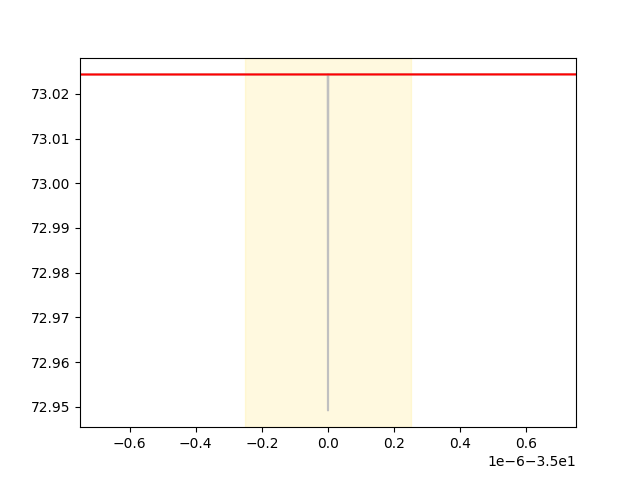
## New Eq:
((fabs(35.0 + membrane__V) < 2.5000000000718892e-7) ? (2971.4999787750003 / (-1.0 + exp(7.2799999479999995)) - 7.097500000992074e-6 / (-1.0 + exp(-1.0000000001675335e-7)) + (-69999999.497987106 - 1999999.9999424887 * membrane__V) * (7.0974999994161125e-6 / (-1.0 + exp(9.9999999988997779e-8)) + 2971.5000212250002 / (-1.0 + exp(7.2800000519999992)) + 7.097500000992074e-6 / (-1.0 + exp(-1.0000000001675335e-7)) - 2971.4999787750003 / (-1.0 + exp(7.2799999479999995)))) : (-28.390000000000001 * (35.0 + membrane__V) / (-1.0 + exp(-14.0 - 0.40000000000000002 * membrane__V)) - 84.900000000000006 * membrane__V / (-1.0 + exp(-0.20799999999999999 * membrane__V))))

## Equation 2:
```
L_type_Ca_channel_d_gate__beta_d_L = 11.43 * (-5.0 + membrane__V) / (-1.0 + exp(-2.0 + 0.40000000000000002 * membrane__V))
```
### Partially evaluated to: 
```
L_type_Ca_channel_d_gate__beta_d_L = 11.43 * (-5.0 + membrane__V) / (-1.0 + exp(-2.0 + 0.40000000000000002 * membrane__V))
```
### Singulariy points detected:

{5.0000000000000000}
*U*
`-2.0 + 0.40000000000000002 * membrane__V`

*V for 1e-07 range* 
`4.9999997499999997 - 5.0000002500000003`

*Singularity point: 5.0000000000000000*


## New Eq:
((fabs(-5.0 + membrane__V) < 2.5000000000025002e-7) ? (-2.8575000000028576e-6 / (-1.0 + exp(-9.9999999999406119e-8)) + (-9999999.4999899995 + 1999999.9999979998 * membrane__V) * (2.8575000000028576e-6 / (-1.0 + exp(9.9999999999406119e-8)) + 2.8575000000028576e-6 / (-1.0 + exp(-9.9999999999406119e-8)))) : (11.43 * (-5.0 + membrane__V) / (-1.0 + exp(-2.0 + 0.40000000000000002 * membrane__V))))

## Equation 3:
```
L_type_Ca_channel_f_gate__alpha_f_L = 3.75 * (28.0 + membrane__V) / (-1.0 + exp(7.0 + 0.25 * membrane__V))
```
### Partially evaluated to: 
```
L_type_Ca_channel_f_gate__alpha_f_L = 3.75 * (28.0 + membrane__V) / (-1.0 + exp(7.0 + 0.25 * membrane__V))
```
### Singulariy points detected:

{-28.000000000000000}
*U*
`7.0 + 0.25 * membrane__V`

*V for 1e-07 range* 
`-28.000000400000001 - -27.999999599999999`

*Singularity point: -28.000000000000000*


## New Eq:
((fabs(28.0 + membrane__V) < 4.0000000001150227e-7) ? (-1.5000000000431335e-6 / (-1.0 + exp(-1.0000000000287557e-7)) + (35000000.498993553 + 1249999.9999640554 * membrane__V) * (1.5000000000431335e-6 / (-1.0 + exp(1.0000000000287557e-7)) + 1.5000000000431335e-6 / (-1.0 + exp(-1.0000000000287557e-7)))) : (3.75 * (28.0 + membrane__V) / (-1.0 + exp(7.0 + 0.25 * membrane__V))))

## Equation 4:
```
sodium_current_m_gate__alpha_m = -824.0 * (51.899999999999999 + membrane__V) / (-1.0 + exp(-5.8314606741573032 - 0.11235955056179775 * membrane__V))
```
### Partially evaluated to: 
```
sodium_current_m_gate__alpha_m = -824.0 * (51.899999999999999 + membrane__V) / (-1.0 + exp(-5.8314606741573032 - 0.11235955056179775 * membrane__V))
```
### Singulariy points detected:

{-51.899999999999999}
*U*
`-5.8314606741573032 - 0.11235955056179775 * membrane__V`

*V for 1e-07 range* 
`-51.899999109999996 - -51.900000890000001`

*Singularity point: -51.899999999999999*

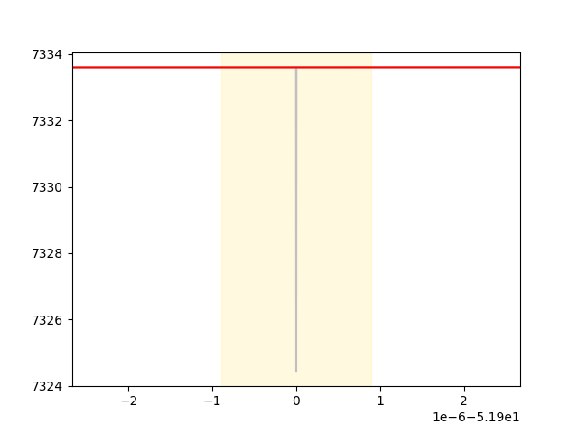
## New Eq:
((fabs(51.899999999999999 + membrane__V) < 8.9000000000338808e-7) ? (-0.00073336000002566237 / (-1.0 + exp(-1.0000000000287557e-7)) + (-29157302.870675519 - 561797.75280685013 * membrane__V) * (0.00073336000002566237 / (-1.0 + exp(-1.0000000000287557e-7)) + 0.00073335999997992118 / (-1.0 + exp(1.0000000000287557e-7)))) : (-824.0 * (51.899999999999999 + membrane__V) / (-1.0 + exp(-5.8314606741573032 - 0.11235955056179775 * membrane__V))))

## Equation 5:
```
sodium_current__i_Na = pow(membrane__F, 2) * pow(sodium_current_m_gate__m, 3) * (-1.0 + exp((-reversal_potentials__E_Na + membrane__V) * membrane__F / (membrane__R * membrane__T))) * cleft_space_equations__Na_c * membrane__V * sodium_current__P_Na * sodium_current_h_gate__h1 * sodium_current_h_gate__h2 / ((-1.0 + exp(membrane__F * membrane__V / (membrane__R * membrane__T))) * membrane__R * membrane__T)
```
### Partially evaluated to: 
```
sodium_current__i_Na = pow(membrane__F, 2) * pow(sodium_current_m_gate__m, 3) * (-1.0 + exp((-reversal_potentials__E_Na + membrane__V) * membrane__F / (membrane__R * membrane__T))) * cleft_space_equations__Na_c * membrane__V * sodium_current__P_Na * sodium_current_h_gate__h1 * sodium_current_h_gate__h2 / ((-1.0 + exp(membrane__F * membrane__V / (membrane__R * membrane__T))) * membrane__R * membrane__T)
```
### Singulariy points detected:

{0}
####Failed to find U symbolically!

<class 'sympy.core.mul.Mul'>
_membrane$F**2*_sodium_current_m_gate$m**3*_cleft_space_equations$Na_c*_membrane$V*_sodium_current$P_Na*_sodium_current_h_gate$h1*_sodium_current_h_gate$h2*(exp(_membrane$F*(_membrane$V - _reversal_potentials$E_Na)/(_membrane$R*_membrane$T)) - 1.0)/(_membrane$R*_membrane$T*(exp(_membrane$F*_membrane$V/(_membrane$R*_membrane$T)) - 1.0))

*try substituting parameters*

*U*
`0.037433890822745473 * membrane__V`

*V for 1e-07 range* 
`-2.671376065969565e-6 - 2.671376065969565e-6`

*Singularity point: 0*

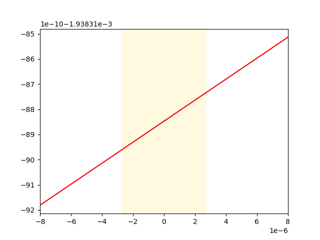
## New Eq:
((fabs(membrane__V) < 2.671376065969565e-6) ? ((0.5 + 187169.45411372738 * membrane__V) * (2.671376065969565e-6 * pow(membrane__F, 2) * pow(sodium_current_m_gate__m, 3) * (-1.0 + exp((2.671376065969565e-6 - reversal_potentials__E_Na) * membrane__F / (membrane__R * membrane__T))) * cleft_space_equations__Na_c * sodium_current__P_Na * sodium_current_h_gate__h1 * sodium_current_h_gate__h2 / ((-1.0 + exp(2.671376065969565e-6 * membrane__F / (membrane__R * membrane__T))) * membrane__R * membrane__T) + 2.671376065969565e-6 * pow(membrane__F, 2) * pow(sodium_current_m_gate__m, 3) * (-1.0 + exp((-2.671376065969565e-6 - reversal_potentials__E_Na) * membrane__F / (membrane__R * membrane__T))) * cleft_space_equations__Na_c * sodium_current__P_Na * sodium_current_h_gate__h1 * sodium_current_h_gate__h2 / ((-1.0 + exp(-2.671376065969565e-6 * membrane__F / (membrane__R * membrane__T))) * membrane__R * membrane__T)) - 2.671376065969565e-6 * pow(membrane__F, 2) * pow(sodium_current_m_gate__m, 3) * (-1.0 + exp((-2.671376065969565e-6 - reversal_potentials__E_Na) * membrane__F / (membrane__R * membrane__T))) * cleft_space_equations__Na_c * sodium_current__P_Na * sodium_current_h_gate__h1 * sodium_current_h_gate__h2 / ((-1.0 + exp(-2.671376065969565e-6 * membrane__F / (membrane__R * membrane__T))) * membrane__R * membrane__T)) : (pow(membrane__F, 2) * pow(sodium_current_m_gate__m, 3) * (-1.0 + exp((-reversal_potentials__E_Na + membrane__V) * membrane__F / (membrane__R * membrane__T))) * cleft_space_equations__Na_c * membrane__V * sodium_current__P_Na * sodium_current_h_gate__h1 * sodium_current_h_gate__h2 / ((-1.0 + exp(membrane__F * membrane__V / (membrane__R * membrane__T))) * membrane__R * membrane__T)))

# Model: difrancesco_noble_model_1985(difrancesco_noble_model_1985.cellml)
fast_sodium_current_m_gate__alpha_m = ((fast_sodium_current_m_gate__delta_m > fabs(fast_sodium_current_m_gate__E0_m)) ? (2000.0) : (200.0 * fast_sodium_current_m_gate__E0_m / (1.0 - exp(-0.10000000000000001 * fast_sodium_current_m_gate__E0_m))))

####Piecewise!!

hyperpolarising_activated_current_y_gate__beta_y = ((hyperpolarising_activated_current_y_gate__delta_y > fabs(hyperpolarising_activated_current_y_gate__E0_y)) ? (2.5) : (hyperpolarising_activated_current_y_gate__E0_y / (1.0 - exp(-0.20000000000000001 * hyperpolarising_activated_current_y_gate__E0_y))))

####Piecewise!!

## Equation 1:
```
intracellular_calcium_concentration__alpha_p = 0.625 * (34.0 + membrane__V) / (-1.0 + exp(8.5 + 0.25 * membrane__V))
```
### Partially evaluated to: 
```
intracellular_calcium_concentration__alpha_p = 0.625 * (34.0 + membrane__V) / (-1.0 + exp(8.5 + 0.25 * membrane__V))
```
### Singulariy points detected:

{-34.000000000000000}
*U*
`8.5 + 0.25 * membrane__V`

*V for 1e-07 range* 
`-34.000000399999998 - -33.999999600000002`

*Singularity point: -34.000000000000000*

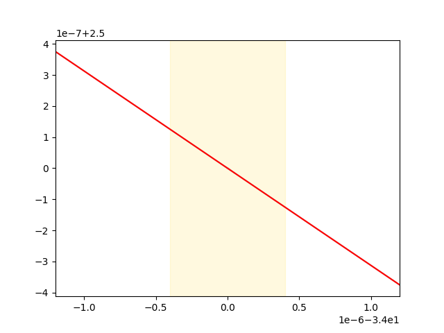
## New Eq:
((fabs(34.0 + membrane__V) < 4.0000000001150227e-7) ? (-2.5000000000718892e-7 / (-1.0 + exp(-1.0000000000287557e-7)) + (42500000.498777881 + 1249999.9999640554 * membrane__V) * (2.5000000000718892e-7 / (-1.0 + exp(1.0000000000287557e-7)) + 2.5000000000718892e-7 / (-1.0 + exp(-1.0000000000287557e-7)))) : (0.625 * (34.0 + membrane__V) / (-1.0 + exp(8.5 + 0.25 * membrane__V))))

second_inward_current_d_gate__alpha_d = ((second_inward_current_d_gate__delta_d > fabs(second_inward_current_d_gate__E0_d)) ? (120.0) : (30.0 * second_inward_current_d_gate__E0_d / (1.0 - exp(-0.25 * second_inward_current_d_gate__E0_d))))

####Piecewise!!

second_inward_current_d_gate__beta_d = ((second_inward_current_d_gate__delta_d > fabs(second_inward_current_d_gate__E0_d)) ? (120.0) : (12.0 * second_inward_current_d_gate__E0_d / (-1.0 + exp(0.10000000000000001 * second_inward_current_d_gate__E0_d))))

####Piecewise!!

second_inward_current_f_gate__alpha_f = ((second_inward_current_f_gate__delta_f > fabs(second_inward_current_f_gate__E0_f)) ? (25.0) : (6.25 * second_inward_current_f_gate__E0_f / (-1.0 + exp(0.25 * second_inward_current_f_gate__E0_f))))

####Piecewise!!

## Equation 2:
```
second_inward_current__i_siCa = 4.0 * (-50.0 + membrane__V) * (intracellular_calcium_concentration__Cai * exp(100.0 / membrane__RTONF) - extracellular_calcium_concentration__Cao * exp(-2.0 * (-50.0 + membrane__V) / membrane__RTONF)) * second_inward_current__P_si * second_inward_current_d_gate__d * second_inward_current_f2_gate__f2 * second_inward_current_f_gate__f / ((1.0 - exp(-2.0 * (-50.0 + membrane__V) / membrane__RTONF)) * membrane__RTONF)
```
### Partially evaluated to: 
```
second_inward_current__i_siCa = 4.0 * (-50.0 + membrane__V) * (intracellular_calcium_concentration__Cai * exp(100.0 / membrane__RTONF) - extracellular_calcium_concentration__Cao * exp(-2.0 * (-50.0 + membrane__V) / membrane__RTONF)) * second_inward_current__P_si * second_inward_current_d_gate__d * second_inward_current_f2_gate__f2 * second_inward_current_f_gate__f / ((1.0 - exp(-2.0 * (-50.0 + membrane__V) / membrane__RTONF)) * membrane__RTONF)
```
### Singulariy points detected:

{50.000000000000000}
#### float * A

####Failed to find U symbolically!

<class 'sympy.core.mul.Mul'>
_second_inward_current$P_si*_second_inward_current_d_gate$d*_second_inward_current_f2_gate$f2*_second_inward_current_f_gate$f*(_membrane$V - 50.0)*(-_extracellular_calcium_concentration$Cao*exp(-2.0*(_membrane$V - 50.0)/_membrane$RTONF) + _intracellular_calcium_concentration$Cai*exp(100.0/_membrane$RTONF))/(_membrane$RTONF*(1.0 - exp(-2.0*(_membrane$V - 50.0)/_membrane$RTONF)))

*try substituting parameters*

*U*
`3.7433890822745473 - 0.074867781645490947 * membrane__V`

*V for 1e-07 range* 
`50.000001335688033 - 49.999998664311967`

*Singularity point: 50.000000000000000*


## New Eq:
((fabs(-50.0 + membrane__V) < 1.3356880329828957e-6) ? ((18716945.911399174 - 374338.90822798351 * membrane__V) * (-5.3427521318205606e-6 * (intracellular_calcium_concentration__Cai * exp(100.0 / membrane__RTONF) - extracellular_calcium_concentration__Cao * exp(-2.6713760659102803e-6 / membrane__RTONF)) * second_inward_current__P_si * second_inward_current_d_gate__d * second_inward_current_f2_gate__f2 * second_inward_current_f_gate__f / ((1.0 - exp(-2.6713760659102803e-6 / membrane__RTONF)) * membrane__RTONF) - 5.3427521320426052e-6 * (intracellular_calcium_concentration__Cai * exp(100.0 / membrane__RTONF) - extracellular_calcium_concentration__Cao * exp(2.6713760660213026e-6 / membrane__RTONF)) * second_inward_current__P_si * second_inward_current_d_gate__d * second_inward_current_f2_gate__f2 * second_inward_current_f_gate__f / ((1.0 - exp(2.6713760660213026e-6 / membrane__RTONF)) * membrane__RTONF)) + 5.3427521318205606e-6 * (intracellular_calcium_concentration__Cai * exp(100.0 / membrane__RTONF) - extracellular_calcium_concentration__Cao * exp(-2.6713760659102803e-6 / membrane__RTONF)) * second_inward_current__P_si * second_inward_current_d_gate__d * second_inward_current_f2_gate__f2 * second_inward_current_f_gate__f / ((1.0 - exp(-2.6713760659102803e-6 / membrane__RTONF)) * membrane__RTONF)) : (4.0 * (-50.0 + membrane__V) * (intracellular_calcium_concentration__Cai * exp(100.0 / membrane__RTONF) - extracellular_calcium_concentration__Cao * exp(-2.0 * (-50.0 + membrane__V) / membrane__RTONF)) * second_inward_current__P_si * second_inward_current_d_gate__d * second_inward_current_f2_gate__f2 * second_inward_current_f_gate__f / ((1.0 - exp(-2.0 * (-50.0 + membrane__V) / membrane__RTONF)) * membrane__RTONF)))

## Equation 3:
```
second_inward_current__i_siK = 0.01 * (-50.0 + membrane__V) * (intracellular_potassium_concentration__Ki * exp(50.0 / membrane__RTONF) - extracellular_potassium_concentration__Kc * exp(-(-50.0 + membrane__V) / membrane__RTONF)) * second_inward_current__P_si * second_inward_current_d_gate__d * second_inward_current_f2_gate__f2 * second_inward_current_f_gate__f / ((1.0 - exp(-(-50.0 + membrane__V) / membrane__RTONF)) * membrane__RTONF)
```
### Partially evaluated to: 
```
second_inward_current__i_siK = 0.01 * (-50.0 + membrane__V) * (intracellular_potassium_concentration__Ki * exp(50.0 / membrane__RTONF) - extracellular_potassium_concentration__Kc * exp(-(-50.0 + membrane__V) / membrane__RTONF)) * second_inward_current__P_si * second_inward_current_d_gate__d * second_inward_current_f2_gate__f2 * second_inward_current_f_gate__f / ((1.0 - exp(-(-50.0 + membrane__V) / membrane__RTONF)) * membrane__RTONF)
```
### Singulariy points detected:

{50.000000000000000}
#### float * A

####Failed to find U symbolically!

<class 'sympy.core.mul.Mul'>
_second_inward_current$P_si*_second_inward_current_d_gate$d*_second_inward_current_f2_gate$f2*_second_inward_current_f_gate$f*(_membrane$V - 50.0)*(-_extracellular_potassium_concentration$Kc*exp(-1.0*(_membrane$V - 50.0)/_membrane$RTONF) + _intracellular_potassium_concentration$Ki*exp(50.0/_membrane$RTONF))/(_membrane$RTONF*(1.0 - exp(-1.0*(_membrane$V - 50.0)/_membrane$RTONF)))

*try substituting parameters*

*U*
`1.8716945411372736 - 0.037433890822745473 * membrane__V`

*V for 1e-07 range* 
`50.000002671376066 - 49.999997328623934`

*Singularity point: 50.000000000000000*


## New Eq:
((fabs(-50.0 + membrane__V) < 2.6713760659380359e-6) ? ((9358473.205796821 - 187169.45411593645 * membrane__V) * (-2.6713760659657917e-8 * (intracellular_potassium_concentration__Ki * exp(50.0 / membrane__RTONF) - extracellular_potassium_concentration__Kc * exp(2.6713760659657915e-6 / membrane__RTONF)) * second_inward_current__P_si * second_inward_current_d_gate__d * second_inward_current_f2_gate__f2 * second_inward_current_f_gate__f / ((1.0 - exp(2.6713760659657915e-6 / membrane__RTONF)) * membrane__RTONF) - 2.6713760659102803e-8 * (intracellular_potassium_concentration__Ki * exp(50.0 / membrane__RTONF) - extracellular_potassium_concentration__Kc * exp(-2.6713760659102803e-6 / membrane__RTONF)) * second_inward_current__P_si * second_inward_current_d_gate__d * second_inward_current_f2_gate__f2 * second_inward_current_f_gate__f / ((1.0 - exp(-2.6713760659102803e-6 / membrane__RTONF)) * membrane__RTONF)) + 2.6713760659102803e-8 * (intracellular_potassium_concentration__Ki * exp(50.0 / membrane__RTONF) - extracellular_potassium_concentration__Kc * exp(-2.6713760659102803e-6 / membrane__RTONF)) * second_inward_current__P_si * second_inward_current_d_gate__d * second_inward_current_f2_gate__f2 * second_inward_current_f_gate__f / ((1.0 - exp(-2.6713760659102803e-6 / membrane__RTONF)) * membrane__RTONF)) : (0.01 * (-50.0 + membrane__V) * (intracellular_potassium_concentration__Ki * exp(50.0 / membrane__RTONF) - extracellular_potassium_concentration__Kc * exp(-(-50.0 + membrane__V) / membrane__RTONF)) * second_inward_current__P_si * second_inward_current_d_gate__d * second_inward_current_f2_gate__f2 * second_inward_current_f_gate__f / ((1.0 - exp(-(-50.0 + membrane__V) / membrane__RTONF)) * membrane__RTONF)))

## Equation 4:
```
second_inward_current__i_siNa = 0.01 * (-50.0 + membrane__V) * (intracellular_sodium_concentration__Nai * exp(50.0 / membrane__RTONF) - extracellular_sodium_concentration__Nao * exp(-(-50.0 + membrane__V) / membrane__RTONF)) * second_inward_current__P_si * second_inward_current_d_gate__d * second_inward_current_f2_gate__f2 * second_inward_current_f_gate__f / ((1.0 - exp(-(-50.0 + membrane__V) / membrane__RTONF)) * membrane__RTONF)
```
### Partially evaluated to: 
```
second_inward_current__i_siNa = 0.01 * (-50.0 + membrane__V) * (intracellular_sodium_concentration__Nai * exp(50.0 / membrane__RTONF) - extracellular_sodium_concentration__Nao * exp(-(-50.0 + membrane__V) / membrane__RTONF)) * second_inward_current__P_si * second_inward_current_d_gate__d * second_inward_current_f2_gate__f2 * second_inward_current_f_gate__f / ((1.0 - exp(-(-50.0 + membrane__V) / membrane__RTONF)) * membrane__RTONF)
```
### Singulariy points detected:

{50.000000000000000}
#### float * A

####Failed to find U symbolically!

<class 'sympy.core.mul.Mul'>
_second_inward_current$P_si*_second_inward_current_d_gate$d*_second_inward_current_f2_gate$f2*_second_inward_current_f_gate$f*(_membrane$V - 50.0)*(-_extracellular_sodium_concentration$Nao*exp(-1.0*(_membrane$V - 50.0)/_membrane$RTONF) + _intracellular_sodium_concentration$Nai*exp(50.0/_membrane$RTONF))/(_membrane$RTONF*(1.0 - exp(-1.0*(_membrane$V - 50.0)/_membrane$RTONF)))

*try substituting parameters*

*U*
`1.8716945411372736 - 0.037433890822745473 * membrane__V`

*V for 1e-07 range* 
`50.000002671376066 - 49.999997328623934`

*Singularity point: 50.000000000000000*


## New Eq:
((fabs(-50.0 + membrane__V) < 2.6713760659380359e-6) ? ((9358473.205796821 - 187169.45411593645 * membrane__V) * (-2.6713760659657917e-8 * (intracellular_sodium_concentration__Nai * exp(50.0 / membrane__RTONF) - extracellular_sodium_concentration__Nao * exp(2.6713760659657915e-6 / membrane__RTONF)) * second_inward_current__P_si * second_inward_current_d_gate__d * second_inward_current_f2_gate__f2 * second_inward_current_f_gate__f / ((1.0 - exp(2.6713760659657915e-6 / membrane__RTONF)) * membrane__RTONF) - 2.6713760659102803e-8 * (intracellular_sodium_concentration__Nai * exp(50.0 / membrane__RTONF) - extracellular_sodium_concentration__Nao * exp(-2.6713760659102803e-6 / membrane__RTONF)) * second_inward_current__P_si * second_inward_current_d_gate__d * second_inward_current_f2_gate__f2 * second_inward_current_f_gate__f / ((1.0 - exp(-2.6713760659102803e-6 / membrane__RTONF)) * membrane__RTONF)) + 2.6713760659102803e-8 * (intracellular_sodium_concentration__Nai * exp(50.0 / membrane__RTONF) - extracellular_sodium_concentration__Nao * exp(-2.6713760659102803e-6 / membrane__RTONF)) * second_inward_current__P_si * second_inward_current_d_gate__d * second_inward_current_f2_gate__f2 * second_inward_current_f_gate__f / ((1.0 - exp(-2.6713760659102803e-6 / membrane__RTONF)) * membrane__RTONF)) : (0.01 * (-50.0 + membrane__V) * (intracellular_sodium_concentration__Nai * exp(50.0 / membrane__RTONF) - extracellular_sodium_concentration__Nao * exp(-(-50.0 + membrane__V) / membrane__RTONF)) * second_inward_current__P_si * second_inward_current_d_gate__d * second_inward_current_f2_gate__f2 * second_inward_current_f_gate__f / ((1.0 - exp(-(-50.0 + membrane__V) / membrane__RTONF)) * membrane__RTONF)))

## Equation 5:
```
transient_outward_current__i_to = (10.0 + membrane__V) * (0.20000000000000001 + extracellular_potassium_concentration__Kc / (extracellular_potassium_concentration__Kc + transient_outward_current__Km_to)) * (intracellular_potassium_concentration__Ki * exp(0.5 * membrane__V / membrane__RTONF) - extracellular_potassium_concentration__Kc * exp(-0.5 * membrane__V / membrane__RTONF)) * intracellular_calcium_concentration__Cai * transient_outward_current__g_to * transient_outward_current_s_gate__s / ((1.0 - exp(-2.0 - 0.20000000000000001 * membrane__V)) * (intracellular_calcium_concentration__Cai + transient_outward_current__Km_Ca))
```
### Partially evaluated to: 
```
transient_outward_current__i_to = (10.0 + membrane__V) * (0.20000000000000001 + extracellular_potassium_concentration__Kc / (extracellular_potassium_concentration__Kc + transient_outward_current__Km_to)) * (intracellular_potassium_concentration__Ki * exp(0.5 * membrane__V / membrane__RTONF) - extracellular_potassium_concentration__Kc * exp(-0.5 * membrane__V / membrane__RTONF)) * intracellular_calcium_concentration__Cai * transient_outward_current__g_to * transient_outward_current_s_gate__s / ((1.0 - exp(-2.0 - 0.20000000000000001 * membrane__V)) * (intracellular_calcium_concentration__Cai + transient_outward_current__Km_Ca))
```
### Singulariy points detected:

{-10.000000000000000}
*U*
`-2.0 - 0.20000000000000001 * membrane__V`

*V for 1e-07 range* 
`-9.9999994999999995 - -10.000000500000001`

*Singularity point: -10.000000000000000*

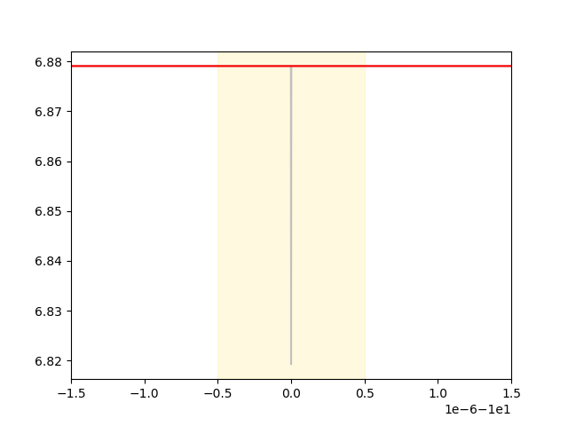
## New Eq:
((fabs(10.0 + membrane__V) < 5.0000000000050004e-7) ? ((-9999999.4999899995 - 999999.99999899988 * membrane__V) * (-5.0000000000050004e-7 * (0.20000000000000001 + extracellular_potassium_concentration__Kc / (extracellular_potassium_concentration__Kc + transient_outward_current__Km_to)) * (intracellular_potassium_concentration__Ki * exp(-5.0000002500000003 / membrane__RTONF) - extracellular_potassium_concentration__Kc * exp(5.0000002500000003 / membrane__RTONF)) * intracellular_calcium_concentration__Cai * transient_outward_current__g_to * transient_outward_current_s_gate__s / ((1.0 - exp(9.9999999999406119e-8)) * (intracellular_calcium_concentration__Cai + transient_outward_current__Km_Ca)) - 5.0000000000050004e-7 * (0.20000000000000001 + extracellular_potassium_concentration__Kc / (extracellular_potassium_concentration__Kc + transient_outward_current__Km_to)) * (intracellular_potassium_concentration__Ki * exp(-4.9999997499999997 / membrane__RTONF) - extracellular_potassium_concentration__Kc * exp(4.9999997499999997 / membrane__RTONF)) * intracellular_calcium_concentration__Cai * transient_outward_current__g_to * transient_outward_current_s_gate__s / ((1.0 - exp(-9.9999999999406119e-8)) * (intracellular_calcium_concentration__Cai + transient_outward_current__Km_Ca))) + 5.0000000000050004e-7 * (0.20000000000000001 + extracellular_potassium_concentration__Kc / (extracellular_potassium_concentration__Kc + transient_outward_current__Km_to)) * (intracellular_potassium_concentration__Ki * exp(-4.9999997499999997 / membrane__RTONF) - extracellular_potassium_concentration__Kc * exp(4.9999997499999997 / membrane__RTONF)) * intracellular_calcium_concentration__Cai * transient_outward_current__g_to * transient_outward_current_s_gate__s / ((1.0 - exp(-9.9999999999406119e-8)) * (intracellular_calcium_concentration__Cai + transient_outward_current__Km_Ca))) : ((10.0 + membrane__V) * (0.20000000000000001 + extracellular_potassium_concentration__Kc / (extracellular_potassium_concentration__Kc + transient_outward_current__Km_to)) * (intracellular_potassium_concentration__Ki * exp(0.5 * membrane__V / membrane__RTONF) - extracellular_potassium_concentration__Kc * exp(-0.5 * membrane__V / membrane__RTONF)) * intracellular_calcium_concentration__Cai * transient_outward_current__g_to * transient_outward_current_s_gate__s / ((1.0 - exp(-2.0 - 0.20000000000000001 * membrane__V)) * (intracellular_calcium_concentration__Cai + transient_outward_current__Km_Ca))))

# Model: dokos_model_1996(dokos_model_1996.cellml)
## Equation 1:
```
fast_sodium_current_m_gate__alpha_m = 200.0 * (34.299999999999997 + membrane__E) / (1.0 - exp(-3.0869999999999997 - 0.089999999999999997 * membrane__E))
```
### Partially evaluated to: 
```
fast_sodium_current_m_gate__alpha_m = 200.0 * (34.299999999999997 + membrane__E) / (1.0 - exp(-3.0869999999999997 - 0.089999999999999997 * membrane__E))
```
### Singulariy points detected:

{-34.299999999999997}
*U*
`-3.0869999999999997 - 0.089999999999999997 * membrane__E`

*V for 1e-07 range* 
`-34.299998888888886 - -34.300001111111108`

*Singularity point: -34.299999999999997*


## New Eq:
((fabs(34.299999999999997 + membrane__E) < 1.1111111111183902e-6) ? (0.00022222222222367805 / (1.0 - exp(-9.9999999999406119e-8)) + (-15434999.499898881 - 449999.99999705196 * membrane__E) * (-0.00022222222222367805 / (1.0 - exp(9.9999999999406119e-8)) - 0.00022222222222367805 / (1.0 - exp(-9.9999999999406119e-8)))) : (200.0 * (34.299999999999997 + membrane__E) / (1.0 - exp(-3.0869999999999997 - 0.089999999999999997 * membrane__E))))

## Equation 2:
```
hyperpolarising_activated_current_y_gate__alpha_y = 0.35999999999999999 * (137.80000000000001 + membrane__E) / (-1.0 + exp(9.0948000000000011 + 0.066000000000000003 * membrane__E))
```
### Partially evaluated to: 
```
hyperpolarising_activated_current_y_gate__alpha_y = 0.35999999999999999 * (137.80000000000001 + membrane__E) / (-1.0 + exp(9.0948000000000011 + 0.066000000000000003 * membrane__E))
```
### Singulariy points detected:

{-137.80000000000001}
*U*
`9.0948000000000011 + 0.066000000000000003 * membrane__E`

*V for 1e-07 range* 
`-137.80000151515154 - -137.79999848484849`

*Singularity point: -137.80000000000001*

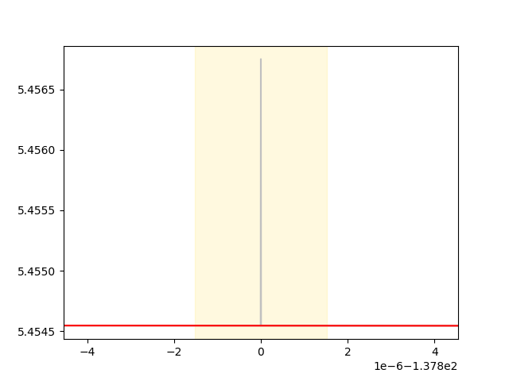
## New Eq:
((fabs(137.80000000000001 + membrane__E) < 1.5151515151412553e-6) ? (-5.4545454545085189e-7 / (-1.0 + exp(-1.0000000000287557e-7)) + (45474000.500307932 + 330000.00000223459 * membrane__E) * (5.4545454545085189e-7 / (-1.0 + exp(9.9999999988997779e-8)) + 5.4545454545085189e-7 / (-1.0 + exp(-1.0000000000287557e-7)))) : (0.35999999999999999 * (137.80000000000001 + membrane__E) / (-1.0 + exp(9.0948000000000011 + 0.066000000000000003 * membrane__E))))

## Equation 3:
```
hyperpolarising_activated_current_y_gate__beta_y = 0.10000000000000001 * (76.299999999999997 + membrane__E) / (1.0 - exp(-16.023 - 0.20999999999999999 * membrane__E))
```
### Partially evaluated to: 
```
hyperpolarising_activated_current_y_gate__beta_y = 0.10000000000000001 * (76.299999999999997 + membrane__E) / (1.0 - exp(-16.023 - 0.20999999999999999 * membrane__E))
```
### Singulariy points detected:

{-76.299999999999997}
*U*
`-16.023 - 0.20999999999999999 * membrane__E`

*V for 1e-07 range* 
`-76.299999523809518 - -76.300000476190476`

*Singularity point: -76.299999999999997*


## New Eq:
((fabs(76.299999999999997 + membrane__E) < 4.761904762173863e-7) ? (4.7619047627289747e-8 / (1.0 - exp(-1.0000000000287557e-7)) + (-80114999.495472595 - 1049999.9999406631 * membrane__E) * (-4.7619047627289747e-8 / (1.0 - exp(-1.0000000000287557e-7)) - 4.7619047616187521e-8 / (1.0 - exp(1.0000000000287557e-7)))) : (0.10000000000000001 * (76.299999999999997 + membrane__E) / (1.0 - exp(-16.023 - 0.20999999999999999 * membrane__E))))

# Model: earm_noble_model_1990(earm_noble_model_1990.cellml)
## Equation 1:
```
L_type_calcium_current__i_Ca_L_Ca = 4.0 * (-50.0 + membrane__V) * (intracellular_calcium_concentration__Ca_i * exp(100.0 / membrane__RTONF) - extracellular_calcium_concentration__Ca_o * exp(2.0 * (50.0 - membrane__V) / membrane__RTONF)) * L_type_calcium_current__P_Ca_L * L_type_calcium_current_d_gate__d * L_type_calcium_current_f_Ca_gate__CaChon / ((1.0 - exp(2.0 * (50.0 - membrane__V) / membrane__RTONF)) * membrane__RTONF)
```
### Partially evaluated to: 
```
L_type_calcium_current__i_Ca_L_Ca = 4.0 * (-50.0 + membrane__V) * (intracellular_calcium_concentration__Ca_i * exp(100.0 / membrane__RTONF) - extracellular_calcium_concentration__Ca_o * exp(2.0 * (50.0 - membrane__V) / membrane__RTONF)) * L_type_calcium_current__P_Ca_L * L_type_calcium_current_d_gate__d * L_type_calcium_current_f_Ca_gate__CaChon / ((1.0 - exp(2.0 * (50.0 - membrane__V) / membrane__RTONF)) * membrane__RTONF)
```
### Singulariy points detected:

{50.000000000000000}
#### float * A

####Failed to find U symbolically!

<class 'sympy.core.mul.Mul'>
_L_type_calcium_current$P_Ca_L*_L_type_calcium_current_d_gate$d*_L_type_calcium_current_f_Ca_gate$CaChon*(_membrane$V - 50.0)*(-_extracellular_calcium_concentration$Ca_o*exp(2.0*(50.0 - _membrane$V)/_membrane$RTONF) + _intracellular_calcium_concentration$Ca_i*exp(100.0/_membrane$RTONF))/(_membrane$RTONF*(1.0 - exp(2.0*(50.0 - _membrane$V)/_membrane$RTONF)))

*try substituting parameters*

*U*
`3.7433890822745473 - 0.074867781645490947 * membrane__V`

*V for 1e-07 range* 
`50.000001335688033 - 49.999998664311967`

*Singularity point: 50.000000000000000*


## New Eq:
((fabs(-50.0 + membrane__V) < 1.3356880329828957e-6) ? ((18716945.911399174 - 374338.90822798351 * membrane__V) * (-5.3427521318205606e-6 * (intracellular_calcium_concentration__Ca_i * exp(100.0 / membrane__RTONF) - extracellular_calcium_concentration__Ca_o * exp(-2.6713760659102803e-6 / membrane__RTONF)) * L_type_calcium_current__P_Ca_L * L_type_calcium_current_d_gate__d * L_type_calcium_current_f_Ca_gate__CaChon / ((1.0 - exp(-2.6713760659102803e-6 / membrane__RTONF)) * membrane__RTONF) - 5.3427521320426052e-6 * (intracellular_calcium_concentration__Ca_i * exp(100.0 / membrane__RTONF) - extracellular_calcium_concentration__Ca_o * exp(2.6713760660213026e-6 / membrane__RTONF)) * L_type_calcium_current__P_Ca_L * L_type_calcium_current_d_gate__d * L_type_calcium_current_f_Ca_gate__CaChon / ((1.0 - exp(2.6713760660213026e-6 / membrane__RTONF)) * membrane__RTONF)) + 5.3427521318205606e-6 * (intracellular_calcium_concentration__Ca_i * exp(100.0 / membrane__RTONF) - extracellular_calcium_concentration__Ca_o * exp(-2.6713760659102803e-6 / membrane__RTONF)) * L_type_calcium_current__P_Ca_L * L_type_calcium_current_d_gate__d * L_type_calcium_current_f_Ca_gate__CaChon / ((1.0 - exp(-2.6713760659102803e-6 / membrane__RTONF)) * membrane__RTONF)) : (4.0 * (-50.0 + membrane__V) * (intracellular_calcium_concentration__Ca_i * exp(100.0 / membrane__RTONF) - extracellular_calcium_concentration__Ca_o * exp(2.0 * (50.0 - membrane__V) / membrane__RTONF)) * L_type_calcium_current__P_Ca_L * L_type_calcium_current_d_gate__d * L_type_calcium_current_f_Ca_gate__CaChon / ((1.0 - exp(2.0 * (50.0 - membrane__V) / membrane__RTONF)) * membrane__RTONF)))

## Equation 2:
```
L_type_calcium_current__i_Ca_L_K = 0.002 * (-50.0 + membrane__V) * (intracellular_potassium_concentration__K_i * exp(50.0 / membrane__RTONF) - extracellular_potassium_concentration__K_c * exp((50.0 - membrane__V) / membrane__RTONF)) * L_type_calcium_current__P_Ca_L * L_type_calcium_current_d_gate__d * L_type_calcium_current_f_Ca_gate__CaChon / ((1.0 - exp((50.0 - membrane__V) / membrane__RTONF)) * membrane__RTONF)
```
### Partially evaluated to: 
```
L_type_calcium_current__i_Ca_L_K = 0.002 * (-50.0 + membrane__V) * (intracellular_potassium_concentration__K_i * exp(50.0 / membrane__RTONF) - extracellular_potassium_concentration__K_c * exp((50.0 - membrane__V) / membrane__RTONF)) * L_type_calcium_current__P_Ca_L * L_type_calcium_current_d_gate__d * L_type_calcium_current_f_Ca_gate__CaChon / ((1.0 - exp((50.0 - membrane__V) / membrane__RTONF)) * membrane__RTONF)
```
### Singulariy points detected:

{50.000000000000000}
#### float * A

####Failed to find U symbolically!

<class 'sympy.core.mul.Mul'>
_L_type_calcium_current$P_Ca_L*_L_type_calcium_current_d_gate$d*_L_type_calcium_current_f_Ca_gate$CaChon*(_membrane$V - 50.0)*(-_extracellular_potassium_concentration$K_c*exp((50.0 - _membrane$V)/_membrane$RTONF) + _intracellular_potassium_concentration$K_i*exp(50.0/_membrane$RTONF))/(_membrane$RTONF*(1.0 - exp((50.0 - _membrane$V)/_membrane$RTONF)))

*try substituting parameters*

*U*
`1.8716945411372736 - 0.037433890822745473 * membrane__V`

*V for 1e-07 range* 
`50.000002671376066 - 49.999997328623934`

*Singularity point: 50.000000000000000*


## New Eq:
((fabs(-50.0 + membrane__V) < 2.6713760659380359e-6) ? ((9358473.205796821 - 187169.45411593645 * membrane__V) * (-5.3427521319315827e-9 * (intracellular_potassium_concentration__K_i * exp(50.0 / membrane__RTONF) - extracellular_potassium_concentration__K_c * exp(2.6713760659657915e-6 / membrane__RTONF)) * L_type_calcium_current__P_Ca_L * L_type_calcium_current_d_gate__d * L_type_calcium_current_f_Ca_gate__CaChon / ((1.0 - exp(2.6713760659657915e-6 / membrane__RTONF)) * membrane__RTONF) - 5.342752131820561e-9 * (intracellular_potassium_concentration__K_i * exp(50.0 / membrane__RTONF) - extracellular_potassium_concentration__K_c * exp(-2.6713760659102803e-6 / membrane__RTONF)) * L_type_calcium_current__P_Ca_L * L_type_calcium_current_d_gate__d * L_type_calcium_current_f_Ca_gate__CaChon / ((1.0 - exp(-2.6713760659102803e-6 / membrane__RTONF)) * membrane__RTONF)) + 5.342752131820561e-9 * (intracellular_potassium_concentration__K_i * exp(50.0 / membrane__RTONF) - extracellular_potassium_concentration__K_c * exp(-2.6713760659102803e-6 / membrane__RTONF)) * L_type_calcium_current__P_Ca_L * L_type_calcium_current_d_gate__d * L_type_calcium_current_f_Ca_gate__CaChon / ((1.0 - exp(-2.6713760659102803e-6 / membrane__RTONF)) * membrane__RTONF)) : (0.002 * (-50.0 + membrane__V) * (intracellular_potassium_concentration__K_i * exp(50.0 / membrane__RTONF) - extracellular_potassium_concentration__K_c * exp((50.0 - membrane__V) / membrane__RTONF)) * L_type_calcium_current__P_Ca_L * L_type_calcium_current_d_gate__d * L_type_calcium_current_f_Ca_gate__CaChon / ((1.0 - exp((50.0 - membrane__V) / membrane__RTONF)) * membrane__RTONF)))

## Equation 3:
```
L_type_calcium_current__i_Ca_L_Na = 0.01 * (-50.0 + membrane__V) * (intracellular_sodium_concentration__Na_i * exp(50.0 / membrane__RTONF) - extracellular_sodium_concentration__Na_o * exp((50.0 - membrane__V) / membrane__RTONF)) * L_type_calcium_current__P_Ca_L * L_type_calcium_current_d_gate__d * L_type_calcium_current_f_Ca_gate__CaChon / ((1.0 - exp((50.0 - membrane__V) / membrane__RTONF)) * membrane__RTONF)
```
### Partially evaluated to: 
```
L_type_calcium_current__i_Ca_L_Na = 0.01 * (-50.0 + membrane__V) * (intracellular_sodium_concentration__Na_i * exp(50.0 / membrane__RTONF) - extracellular_sodium_concentration__Na_o * exp((50.0 - membrane__V) / membrane__RTONF)) * L_type_calcium_current__P_Ca_L * L_type_calcium_current_d_gate__d * L_type_calcium_current_f_Ca_gate__CaChon / ((1.0 - exp((50.0 - membrane__V) / membrane__RTONF)) * membrane__RTONF)
```
### Singulariy points detected:

{50.000000000000000}
#### float * A

####Failed to find U symbolically!

<class 'sympy.core.mul.Mul'>
_L_type_calcium_current$P_Ca_L*_L_type_calcium_current_d_gate$d*_L_type_calcium_current_f_Ca_gate$CaChon*(_membrane$V - 50.0)*(-_extracellular_sodium_concentration$Na_o*exp((50.0 - _membrane$V)/_membrane$RTONF) + _intracellular_sodium_concentration$Na_i*exp(50.0/_membrane$RTONF))/(_membrane$RTONF*(1.0 - exp((50.0 - _membrane$V)/_membrane$RTONF)))

*try substituting parameters*

*U*
`1.8716945411372736 - 0.037433890822745473 * membrane__V`

*V for 1e-07 range* 
`50.000002671376066 - 49.999997328623934`

*Singularity point: 50.000000000000000*


## New Eq:
((fabs(-50.0 + membrane__V) < 2.6713760659380359e-6) ? ((9358473.205796821 - 187169.45411593645 * membrane__V) * (-2.6713760659657917e-8 * (intracellular_sodium_concentration__Na_i * exp(50.0 / membrane__RTONF) - extracellular_sodium_concentration__Na_o * exp(2.6713760659657915e-6 / membrane__RTONF)) * L_type_calcium_current__P_Ca_L * L_type_calcium_current_d_gate__d * L_type_calcium_current_f_Ca_gate__CaChon / ((1.0 - exp(2.6713760659657915e-6 / membrane__RTONF)) * membrane__RTONF) - 2.6713760659102803e-8 * (intracellular_sodium_concentration__Na_i * exp(50.0 / membrane__RTONF) - extracellular_sodium_concentration__Na_o * exp(-2.6713760659102803e-6 / membrane__RTONF)) * L_type_calcium_current__P_Ca_L * L_type_calcium_current_d_gate__d * L_type_calcium_current_f_Ca_gate__CaChon / ((1.0 - exp(-2.6713760659102803e-6 / membrane__RTONF)) * membrane__RTONF)) + 2.6713760659102803e-8 * (intracellular_sodium_concentration__Na_i * exp(50.0 / membrane__RTONF) - extracellular_sodium_concentration__Na_o * exp(-2.6713760659102803e-6 / membrane__RTONF)) * L_type_calcium_current__P_Ca_L * L_type_calcium_current_d_gate__d * L_type_calcium_current_f_Ca_gate__CaChon / ((1.0 - exp(-2.6713760659102803e-6 / membrane__RTONF)) * membrane__RTONF)) : (0.01 * (-50.0 + membrane__V) * (intracellular_sodium_concentration__Na_i * exp(50.0 / membrane__RTONF) - extracellular_sodium_concentration__Na_o * exp((50.0 - membrane__V) / membrane__RTONF)) * L_type_calcium_current__P_Ca_L * L_type_calcium_current_d_gate__d * L_type_calcium_current_f_Ca_gate__CaChon / ((1.0 - exp((50.0 - membrane__V) / membrane__RTONF)) * membrane__RTONF)))

L_type_calcium_current_d_gate__alpha_d = ((fabs(L_type_calcium_current_d_gate__E0_d) < 0.0001) ? (120.0) : (30.0 * L_type_calcium_current_d_gate__E0_d / (1.0 - exp(-0.25 * L_type_calcium_current_d_gate__E0_d))))

####Piecewise!!

L_type_calcium_current_d_gate__beta_d = ((fabs(L_type_calcium_current_d_gate__E0_d) < 0.0001) ? (120.0) : (12.0 * L_type_calcium_current_d_gate__E0_d / (-1.0 + exp(0.10000000000000001 * L_type_calcium_current_d_gate__E0_d))))

####Piecewise!!

L_type_calcium_current_f_Ca_gate__alpha_f_Ca = ((fabs(L_type_calcium_current_f_Ca_gate__E0_f) < 0.0001) ? (25.0) : (6.25 * L_type_calcium_current_f_Ca_gate__E0_f / (-1.0 + exp(0.25 * L_type_calcium_current_f_Ca_gate__E0_f))))

####Piecewise!!

fast_sodium_current_m_gate__alpha_m = ((fast_sodium_current_m_gate__delta_m > fabs(fast_sodium_current_m_gate__E0_m)) ? (2000.0) : (200.0 * fast_sodium_current_m_gate__E0_m / (1.0 - exp(-0.10000000000000001 * fast_sodium_current_m_gate__E0_m))))

####Piecewise!!

# Model: espinosa_model_1998(espinosa_model_1998_normal.cellml)
## Equation 1:
```
L_type_Ca_channel__i_Ca_L_Ca_cyt = 4.0 * (1.0 - L_type_Ca_channel__FrICa) * (-50.0 + membrane__V) * (intracellular_calcium_concentration__Ca_i * exp(100.0 * membrane__F / (membrane__R * membrane__T)) - extracellular_calcium_concentration__Ca_o * exp(2.0 * (50.0 - membrane__V) * membrane__F / (membrane__R * membrane__T))) * L_type_Ca_channel__P_Ca_L * L_type_Ca_channel_d_gate__d * L_type_Ca_channel_f2_gate__f2 * L_type_Ca_channel_f_gate__f * membrane__F / ((1.0 - exp(2.0 * (50.0 - membrane__V) * membrane__F / (membrane__R * membrane__T))) * membrane__R * membrane__T)
```
### Partially evaluated to: 
```
L_type_Ca_channel__i_Ca_L_Ca_cyt = 4.0 * (1.0 - L_type_Ca_channel__FrICa) * (-50.0 + membrane__V) * (intracellular_calcium_concentration__Ca_i * exp(100.0 * membrane__F / (membrane__R * membrane__T)) - extracellular_calcium_concentration__Ca_o * exp(2.0 * (50.0 - membrane__V) * membrane__F / (membrane__R * membrane__T))) * L_type_Ca_channel__P_Ca_L * L_type_Ca_channel_d_gate__d * L_type_Ca_channel_f2_gate__f2 * L_type_Ca_channel_f_gate__f * membrane__F / ((1.0 - exp(2.0 * (50.0 - membrane__V) * membrane__F / (membrane__R * membrane__T))) * membrane__R * membrane__T)
```
### Singulariy points detected:

{50.000000000000000}
#### float * A

####Failed to find U symbolically!

<class 'sympy.core.mul.Mul'>
_L_type_Ca_channel$P_Ca_L*_L_type_Ca_channel_d_gate$d*_L_type_Ca_channel_f2_gate$f2*_L_type_Ca_channel_f_gate$f*_membrane$F*(1.0 - _L_type_Ca_channel$FrICa)*(_membrane$V - 50.0)*(-_extracellular_calcium_concentration$Ca_o*exp(2.0*_membrane$F*(50.0 - _membrane$V)/(_membrane$R*_membrane$T)) + _intracellular_calcium_concentration$Ca_i*exp(100.0*_membrane$F/(_membrane$R*_membrane$T)))/(_membrane$R*_membrane$T*(1.0 - exp(2.0*_membrane$F*(50.0 - _membrane$V)/(_membrane$R*_membrane$T))))

*try substituting parameters*

#### Eq == 0!
## Equation 2:
```
L_type_Ca_channel__i_Ca_L_Ca_ds = 4.0 * (-50.0 + membrane__V) * (intracellular_calcium_concentration__Ca_i * exp(100.0 * membrane__F / (membrane__R * membrane__T)) - extracellular_calcium_concentration__Ca_o * exp(2.0 * (50.0 - membrane__V) * membrane__F / (membrane__R * membrane__T))) * L_type_Ca_channel__FrICa * L_type_Ca_channel__P_Ca_L * L_type_Ca_channel_d_gate__d * L_type_Ca_channel_f2ds_gate__f2ds * L_type_Ca_channel_f_gate__f * membrane__F / ((1.0 - exp(2.0 * (50.0 - membrane__V) * membrane__F / (membrane__R * membrane__T))) * membrane__R * membrane__T)
```
### Partially evaluated to: 
```
L_type_Ca_channel__i_Ca_L_Ca_ds = 4.0 * (-50.0 + membrane__V) * (intracellular_calcium_concentration__Ca_i * exp(100.0 * membrane__F / (membrane__R * membrane__T)) - extracellular_calcium_concentration__Ca_o * exp(2.0 * (50.0 - membrane__V) * membrane__F / (membrane__R * membrane__T))) * L_type_Ca_channel__FrICa * L_type_Ca_channel__P_Ca_L * L_type_Ca_channel_d_gate__d * L_type_Ca_channel_f2ds_gate__f2ds * L_type_Ca_channel_f_gate__f * membrane__F / ((1.0 - exp(2.0 * (50.0 - membrane__V) * membrane__F / (membrane__R * membrane__T))) * membrane__R * membrane__T)
```
### Singulariy points detected:

{50.000000000000000}
#### float * A

####Failed to find U symbolically!

<class 'sympy.core.mul.Mul'>
_L_type_Ca_channel$FrICa*_L_type_Ca_channel$P_Ca_L*_L_type_Ca_channel_d_gate$d*_L_type_Ca_channel_f2ds_gate$f2ds*_L_type_Ca_channel_f_gate$f*_membrane$F*(_membrane$V - 50.0)*(-_extracellular_calcium_concentration$Ca_o*exp(2.0*_membrane$F*(50.0 - _membrane$V)/(_membrane$R*_membrane$T)) + _intracellular_calcium_concentration$Ca_i*exp(100.0*_membrane$F/(_membrane$R*_membrane$T)))/(_membrane$R*_membrane$T*(1.0 - exp(2.0*_membrane$F*(50.0 - _membrane$V)/(_membrane$R*_membrane$T))))

*try substituting parameters*

*U*
`3.7433890822745473 - 0.074867781645490947 * membrane__V`

*V for 1e-07 range* 
`50.000001335688033 - 49.999998664311967`

*Singularity point: 50.000000000000000*


## New Eq:
((fabs(-50.0 + membrane__V) < 1.3356880329828957e-6) ? ((18716945.911399174 - 374338.90822798351 * membrane__V) * (-5.3427521318205606e-6 * (intracellular_calcium_concentration__Ca_i * exp(100.0 * membrane__F / (membrane__R * membrane__T)) - extracellular_calcium_concentration__Ca_o * exp(-2.6713760659102803e-6 * membrane__F / (membrane__R * membrane__T))) * L_type_Ca_channel__FrICa * L_type_Ca_channel__P_Ca_L * L_type_Ca_channel_d_gate__d * L_type_Ca_channel_f2ds_gate__f2ds * L_type_Ca_channel_f_gate__f * membrane__F / ((1.0 - exp(-2.6713760659102803e-6 * membrane__F / (membrane__R * membrane__T))) * membrane__R * membrane__T) - 5.3427521320426052e-6 * (intracellular_calcium_concentration__Ca_i * exp(100.0 * membrane__F / (membrane__R * membrane__T)) - extracellular_calcium_concentration__Ca_o * exp(2.6713760660213026e-6 * membrane__F / (membrane__R * membrane__T))) * L_type_Ca_channel__FrICa * L_type_Ca_channel__P_Ca_L * L_type_Ca_channel_d_gate__d * L_type_Ca_channel_f2ds_gate__f2ds * L_type_Ca_channel_f_gate__f * membrane__F / ((1.0 - exp(2.6713760660213026e-6 * membrane__F / (membrane__R * membrane__T))) * membrane__R * membrane__T)) + 5.3427521318205606e-6 * (intracellular_calcium_concentration__Ca_i * exp(100.0 * membrane__F / (membrane__R * membrane__T)) - extracellular_calcium_concentration__Ca_o * exp(-2.6713760659102803e-6 * membrane__F / (membrane__R * membrane__T))) * L_type_Ca_channel__FrICa * L_type_Ca_channel__P_Ca_L * L_type_Ca_channel_d_gate__d * L_type_Ca_channel_f2ds_gate__f2ds * L_type_Ca_channel_f_gate__f * membrane__F / ((1.0 - exp(-2.6713760659102803e-6 * membrane__F / (membrane__R * membrane__T))) * membrane__R * membrane__T)) : (4.0 * (-50.0 + membrane__V) * (intracellular_calcium_concentration__Ca_i * exp(100.0 * membrane__F / (membrane__R * membrane__T)) - extracellular_calcium_concentration__Ca_o * exp(2.0 * (50.0 - membrane__V) * membrane__F / (membrane__R * membrane__T))) * L_type_Ca_channel__FrICa * L_type_Ca_channel__P_Ca_L * L_type_Ca_channel_d_gate__d * L_type_Ca_channel_f2ds_gate__f2ds * L_type_Ca_channel_f_gate__f * membrane__F / ((1.0 - exp(2.0 * (50.0 - membrane__V) * membrane__F / (membrane__R * membrane__T))) * membrane__R * membrane__T)))

## Equation 3:
```
L_type_Ca_channel__i_Ca_L_K_cyt = (1.0 - L_type_Ca_channel__FrICa) * (-50.0 + membrane__V) * (intracellular_potassium_concentration__K_i * exp(50.0 * membrane__F / (membrane__R * membrane__T)) - extracellular_potassium_concentration__K_o * exp((50.0 - membrane__V) * membrane__F / (membrane__R * membrane__T))) * L_type_Ca_channel__P_CaK * L_type_Ca_channel__P_Ca_L * L_type_Ca_channel_d_gate__d * L_type_Ca_channel_f2_gate__f2 * L_type_Ca_channel_f_gate__f * membrane__F / ((1.0 - exp((50.0 - membrane__V) * membrane__F / (membrane__R * membrane__T))) * membrane__R * membrane__T)
```
### Partially evaluated to: 
```
L_type_Ca_channel__i_Ca_L_K_cyt = (1.0 - L_type_Ca_channel__FrICa) * (-50.0 + membrane__V) * (intracellular_potassium_concentration__K_i * exp(50.0 * membrane__F / (membrane__R * membrane__T)) - extracellular_potassium_concentration__K_o * exp((50.0 - membrane__V) * membrane__F / (membrane__R * membrane__T))) * L_type_Ca_channel__P_CaK * L_type_Ca_channel__P_Ca_L * L_type_Ca_channel_d_gate__d * L_type_Ca_channel_f2_gate__f2 * L_type_Ca_channel_f_gate__f * membrane__F / ((1.0 - exp((50.0 - membrane__V) * membrane__F / (membrane__R * membrane__T))) * membrane__R * membrane__T)
```
### Singulariy points detected:

{50.000000000000000}
####Failed to find U symbolically!

<class 'sympy.core.mul.Mul'>
_L_type_Ca_channel$P_CaK*_L_type_Ca_channel$P_Ca_L*_L_type_Ca_channel_d_gate$d*_L_type_Ca_channel_f2_gate$f2*_L_type_Ca_channel_f_gate$f*_membrane$F*(1.0 - _L_type_Ca_channel$FrICa)*(_membrane$V - 50.0)*(-_extracellular_potassium_concentration$K_o*exp(_membrane$F*(50.0 - _membrane$V)/(_membrane$R*_membrane$T)) + _intracellular_potassium_concentration$K_i*exp(50.0*_membrane$F/(_membrane$R*_membrane$T)))/(_membrane$R*_membrane$T*(1.0 - exp(_membrane$F*(50.0 - _membrane$V)/(_membrane$R*_membrane$T))))

*try substituting parameters*

#### Eq == 0!
## Equation 4:
```
L_type_Ca_channel__i_Ca_L_K_ds = (-50.0 + membrane__V) * (intracellular_potassium_concentration__K_i * exp(50.0 * membrane__F / (membrane__R * membrane__T)) - extracellular_potassium_concentration__K_o * exp((50.0 - membrane__V) * membrane__F / (membrane__R * membrane__T))) * L_type_Ca_channel__FrICa * L_type_Ca_channel__P_CaK * L_type_Ca_channel__P_Ca_L * L_type_Ca_channel_d_gate__d * L_type_Ca_channel_f2ds_gate__f2ds * L_type_Ca_channel_f_gate__f * membrane__F / ((1.0 - exp((50.0 - membrane__V) * membrane__F / (membrane__R * membrane__T))) * membrane__R * membrane__T)
```
### Partially evaluated to: 
```
L_type_Ca_channel__i_Ca_L_K_ds = (-50.0 + membrane__V) * (intracellular_potassium_concentration__K_i * exp(50.0 * membrane__F / (membrane__R * membrane__T)) - extracellular_potassium_concentration__K_o * exp((50.0 - membrane__V) * membrane__F / (membrane__R * membrane__T))) * L_type_Ca_channel__FrICa * L_type_Ca_channel__P_CaK * L_type_Ca_channel__P_Ca_L * L_type_Ca_channel_d_gate__d * L_type_Ca_channel_f2ds_gate__f2ds * L_type_Ca_channel_f_gate__f * membrane__F / ((1.0 - exp((50.0 - membrane__V) * membrane__F / (membrane__R * membrane__T))) * membrane__R * membrane__T)
```
### Singulariy points detected:

{50.000000000000000}
####Failed to find U symbolically!

<class 'sympy.core.mul.Mul'>
_L_type_Ca_channel$FrICa*_L_type_Ca_channel$P_CaK*_L_type_Ca_channel$P_Ca_L*_L_type_Ca_channel_d_gate$d*_L_type_Ca_channel_f2ds_gate$f2ds*_L_type_Ca_channel_f_gate$f*_membrane$F*(_membrane$V - 50.0)*(-_extracellular_potassium_concentration$K_o*exp(_membrane$F*(50.0 - _membrane$V)/(_membrane$R*_membrane$T)) + _intracellular_potassium_concentration$K_i*exp(50.0*_membrane$F/(_membrane$R*_membrane$T)))/(_membrane$R*_membrane$T*(1.0 - exp(_membrane$F*(50.0 - _membrane$V)/(_membrane$R*_membrane$T))))

*try substituting parameters*

*U*
`1.8716945411372736 - 0.037433890822745473 * membrane__V`

*V for 1e-07 range* 
`50.000002671376066 - 49.999997328623934`

*Singularity point: 50.000000000000000*


## New Eq:
((fabs(-50.0 + membrane__V) < 2.6713760659380359e-6) ? ((9358473.205796821 - 187169.45411593645 * membrane__V) * (-2.6713760659102803e-6 * (intracellular_potassium_concentration__K_i * exp(50.0 * membrane__F / (membrane__R * membrane__T)) - extracellular_potassium_concentration__K_o * exp(-2.6713760659102803e-6 * membrane__F / (membrane__R * membrane__T))) * L_type_Ca_channel__FrICa * L_type_Ca_channel__P_CaK * L_type_Ca_channel__P_Ca_L * L_type_Ca_channel_d_gate__d * L_type_Ca_channel_f2ds_gate__f2ds * L_type_Ca_channel_f_gate__f * membrane__F / ((1.0 - exp(-2.6713760659102803e-6 * membrane__F / (membrane__R * membrane__T))) * membrane__R * membrane__T) - 2.6713760659657915e-6 * (intracellular_potassium_concentration__K_i * exp(50.0 * membrane__F / (membrane__R * membrane__T)) - extracellular_potassium_concentration__K_o * exp(2.6713760659657915e-6 * membrane__F / (membrane__R * membrane__T))) * L_type_Ca_channel__FrICa * L_type_Ca_channel__P_CaK * L_type_Ca_channel__P_Ca_L * L_type_Ca_channel_d_gate__d * L_type_Ca_channel_f2ds_gate__f2ds * L_type_Ca_channel_f_gate__f * membrane__F / ((1.0 - exp(2.6713760659657915e-6 * membrane__F / (membrane__R * membrane__T))) * membrane__R * membrane__T)) + 2.6713760659102803e-6 * (intracellular_potassium_concentration__K_i * exp(50.0 * membrane__F / (membrane__R * membrane__T)) - extracellular_potassium_concentration__K_o * exp(-2.6713760659102803e-6 * membrane__F / (membrane__R * membrane__T))) * L_type_Ca_channel__FrICa * L_type_Ca_channel__P_CaK * L_type_Ca_channel__P_Ca_L * L_type_Ca_channel_d_gate__d * L_type_Ca_channel_f2ds_gate__f2ds * L_type_Ca_channel_f_gate__f * membrane__F / ((1.0 - exp(-2.6713760659102803e-6 * membrane__F / (membrane__R * membrane__T))) * membrane__R * membrane__T)) : ((-50.0 + membrane__V) * (intracellular_potassium_concentration__K_i * exp(50.0 * membrane__F / (membrane__R * membrane__T)) - extracellular_potassium_concentration__K_o * exp((50.0 - membrane__V) * membrane__F / (membrane__R * membrane__T))) * L_type_Ca_channel__FrICa * L_type_Ca_channel__P_CaK * L_type_Ca_channel__P_Ca_L * L_type_Ca_channel_d_gate__d * L_type_Ca_channel_f2ds_gate__f2ds * L_type_Ca_channel_f_gate__f * membrane__F / ((1.0 - exp((50.0 - membrane__V) * membrane__F / (membrane__R * membrane__T))) * membrane__R * membrane__T)))

## Equation 5:
```
L_type_Ca_channel__i_Ca_L_Na_cyt = (1.0 - L_type_Ca_channel__FrICa) * (-50.0 + membrane__V) * (intracellular_sodium_concentration__Na_i * exp(50.0 * membrane__F / (membrane__R * membrane__T)) - extracellular_sodium_concentration__Na_o * exp((50.0 - membrane__V) * membrane__F / (membrane__R * membrane__T))) * L_type_Ca_channel__P_CaNa * L_type_Ca_channel__P_Ca_L * L_type_Ca_channel_d_gate__d * L_type_Ca_channel_f2_gate__f2 * L_type_Ca_channel_f_gate__f * membrane__F / ((1.0 - exp((50.0 - membrane__V) * membrane__F / (membrane__R * membrane__T))) * membrane__R * membrane__T)
```
### Partially evaluated to: 
```
L_type_Ca_channel__i_Ca_L_Na_cyt = (1.0 - L_type_Ca_channel__FrICa) * (-50.0 + membrane__V) * (intracellular_sodium_concentration__Na_i * exp(50.0 * membrane__F / (membrane__R * membrane__T)) - extracellular_sodium_concentration__Na_o * exp((50.0 - membrane__V) * membrane__F / (membrane__R * membrane__T))) * L_type_Ca_channel__P_CaNa * L_type_Ca_channel__P_Ca_L * L_type_Ca_channel_d_gate__d * L_type_Ca_channel_f2_gate__f2 * L_type_Ca_channel_f_gate__f * membrane__F / ((1.0 - exp((50.0 - membrane__V) * membrane__F / (membrane__R * membrane__T))) * membrane__R * membrane__T)
```
### Singulariy points detected:

{50.000000000000000}
####Failed to find U symbolically!

<class 'sympy.core.mul.Mul'>
_L_type_Ca_channel$P_CaNa*_L_type_Ca_channel$P_Ca_L*_L_type_Ca_channel_d_gate$d*_L_type_Ca_channel_f2_gate$f2*_L_type_Ca_channel_f_gate$f*_membrane$F*(1.0 - _L_type_Ca_channel$FrICa)*(_membrane$V - 50.0)*(-_extracellular_sodium_concentration$Na_o*exp(_membrane$F*(50.0 - _membrane$V)/(_membrane$R*_membrane$T)) + _intracellular_sodium_concentration$Na_i*exp(50.0*_membrane$F/(_membrane$R*_membrane$T)))/(_membrane$R*_membrane$T*(1.0 - exp(_membrane$F*(50.0 - _membrane$V)/(_membrane$R*_membrane$T))))

*try substituting parameters*

#### Eq == 0!
## Equation 6:
```
L_type_Ca_channel__i_Ca_L_Na_ds = (-50.0 + membrane__V) * (intracellular_sodium_concentration__Na_i * exp(50.0 * membrane__F / (membrane__R * membrane__T)) - extracellular_sodium_concentration__Na_o * exp((50.0 - membrane__V) * membrane__F / (membrane__R * membrane__T))) * L_type_Ca_channel__FrICa * L_type_Ca_channel__P_CaNa * L_type_Ca_channel__P_Ca_L * L_type_Ca_channel_d_gate__d * L_type_Ca_channel_f2ds_gate__f2ds * L_type_Ca_channel_f_gate__f * membrane__F / ((1.0 - exp((50.0 - membrane__V) * membrane__F / (membrane__R * membrane__T))) * membrane__R * membrane__T)
```
### Partially evaluated to: 
```
L_type_Ca_channel__i_Ca_L_Na_ds = (-50.0 + membrane__V) * (intracellular_sodium_concentration__Na_i * exp(50.0 * membrane__F / (membrane__R * membrane__T)) - extracellular_sodium_concentration__Na_o * exp((50.0 - membrane__V) * membrane__F / (membrane__R * membrane__T))) * L_type_Ca_channel__FrICa * L_type_Ca_channel__P_CaNa * L_type_Ca_channel__P_Ca_L * L_type_Ca_channel_d_gate__d * L_type_Ca_channel_f2ds_gate__f2ds * L_type_Ca_channel_f_gate__f * membrane__F / ((1.0 - exp((50.0 - membrane__V) * membrane__F / (membrane__R * membrane__T))) * membrane__R * membrane__T)
```
### Singulariy points detected:

{50.000000000000000}
####Failed to find U symbolically!

<class 'sympy.core.mul.Mul'>
_L_type_Ca_channel$FrICa*_L_type_Ca_channel$P_CaNa*_L_type_Ca_channel$P_Ca_L*_L_type_Ca_channel_d_gate$d*_L_type_Ca_channel_f2ds_gate$f2ds*_L_type_Ca_channel_f_gate$f*_membrane$F*(_membrane$V - 50.0)*(-_extracellular_sodium_concentration$Na_o*exp(_membrane$F*(50.0 - _membrane$V)/(_membrane$R*_membrane$T)) + _intracellular_sodium_concentration$Na_i*exp(50.0*_membrane$F/(_membrane$R*_membrane$T)))/(_membrane$R*_membrane$T*(1.0 - exp(_membrane$F*(50.0 - _membrane$V)/(_membrane$R*_membrane$T))))

*try substituting parameters*

*U*
`1.8716945411372736 - 0.037433890822745473 * membrane__V`

*V for 1e-07 range* 
`50.000002671376066 - 49.999997328623934`

*Singularity point: 50.000000000000000*


## New Eq:
((fabs(-50.0 + membrane__V) < 2.6713760659380359e-6) ? ((9358473.205796821 - 187169.45411593645 * membrane__V) * (-2.6713760659102803e-6 * (intracellular_sodium_concentration__Na_i * exp(50.0 * membrane__F / (membrane__R * membrane__T)) - extracellular_sodium_concentration__Na_o * exp(-2.6713760659102803e-6 * membrane__F / (membrane__R * membrane__T))) * L_type_Ca_channel__FrICa * L_type_Ca_channel__P_CaNa * L_type_Ca_channel__P_Ca_L * L_type_Ca_channel_d_gate__d * L_type_Ca_channel_f2ds_gate__f2ds * L_type_Ca_channel_f_gate__f * membrane__F / ((1.0 - exp(-2.6713760659102803e-6 * membrane__F / (membrane__R * membrane__T))) * membrane__R * membrane__T) - 2.6713760659657915e-6 * (intracellular_sodium_concentration__Na_i * exp(50.0 * membrane__F / (membrane__R * membrane__T)) - extracellular_sodium_concentration__Na_o * exp(2.6713760659657915e-6 * membrane__F / (membrane__R * membrane__T))) * L_type_Ca_channel__FrICa * L_type_Ca_channel__P_CaNa * L_type_Ca_channel__P_Ca_L * L_type_Ca_channel_d_gate__d * L_type_Ca_channel_f2ds_gate__f2ds * L_type_Ca_channel_f_gate__f * membrane__F / ((1.0 - exp(2.6713760659657915e-6 * membrane__F / (membrane__R * membrane__T))) * membrane__R * membrane__T)) + 2.6713760659102803e-6 * (intracellular_sodium_concentration__Na_i * exp(50.0 * membrane__F / (membrane__R * membrane__T)) - extracellular_sodium_concentration__Na_o * exp(-2.6713760659102803e-6 * membrane__F / (membrane__R * membrane__T))) * L_type_Ca_channel__FrICa * L_type_Ca_channel__P_CaNa * L_type_Ca_channel__P_Ca_L * L_type_Ca_channel_d_gate__d * L_type_Ca_channel_f2ds_gate__f2ds * L_type_Ca_channel_f_gate__f * membrane__F / ((1.0 - exp(-2.6713760659102803e-6 * membrane__F / (membrane__R * membrane__T))) * membrane__R * membrane__T)) : ((-50.0 + membrane__V) * (intracellular_sodium_concentration__Na_i * exp(50.0 * membrane__F / (membrane__R * membrane__T)) - extracellular_sodium_concentration__Na_o * exp((50.0 - membrane__V) * membrane__F / (membrane__R * membrane__T))) * L_type_Ca_channel__FrICa * L_type_Ca_channel__P_CaNa * L_type_Ca_channel__P_Ca_L * L_type_Ca_channel_d_gate__d * L_type_Ca_channel_f2ds_gate__f2ds * L_type_Ca_channel_f_gate__f * membrane__F / ((1.0 - exp((50.0 - membrane__V) * membrane__F / (membrane__R * membrane__T))) * membrane__R * membrane__T)))

L_type_Ca_channel_d_gate__alpha_d = ((fabs(L_type_Ca_channel_d_gate__E0_d) < 0.0001) ? (120.0) : (30.0 * L_type_Ca_channel_d_gate__E0_d / (1.0 - exp(-0.33333333333333331 * L_type_Ca_channel_d_gate__E0_d))))

####Piecewise!!

L_type_Ca_channel_d_gate__beta_d = ((fabs(L_type_Ca_channel_d_gate__E0_d) < 0.0001) ? (120.0) : (12.0 * L_type_Ca_channel_d_gate__E0_d / (-1.0 + exp(0.13333333333333333 * L_type_Ca_channel_d_gate__E0_d))))

####Piecewise!!

L_type_Ca_channel_f_gate__alpha_f = ((L_type_Ca_channel_f_gate__delta_f > fabs(L_type_Ca_channel_f_gate__E0_f)) ? (25.0) : (6.25 * L_type_Ca_channel_f_gate__E0_f / (-1.0 + exp(0.18181818181818182 * L_type_Ca_channel_f_gate__E0_f))))

####Piecewise!!

calcium_release__SpeedRel = ((membrane__V < -50.0) ? (5.0) : (1.0))

####Piecewise!!

fast_sodium_current_m_gate__alpha_m = ((fast_sodium_current_m_gate__delta_m > fabs(fast_sodium_current_m_gate__E0_m)) ? (2000.0) : (200.0 * fast_sodium_current_m_gate__E0_m / (1.0 - exp(-0.10000000000000001 * fast_sodium_current_m_gate__E0_m))))

####Piecewise!!

time_dependent_potassium_current_x_gate__alpha_x = ((time_dependent_potassium_current_x_gate__delta_x > fabs(time_dependent_potassium_current_x_gate__E0_x)) ? (2.5) : (1.5 * time_dependent_potassium_current_x_gate__E0_x / (1.0 - exp(-0.20000000000000001 * time_dependent_potassium_current_x_gate__E0_x))))

####Piecewise!!

time_dependent_potassium_current_x_gate__beta_x = ((time_dependent_potassium_current_x_gate__delta_x > fabs(time_dependent_potassium_current_x_gate__E0_x)) ? (2.5) : (0.53400000000000003 * time_dependent_potassium_current_x_gate__E0_x / (-1.0 + exp(0.066666666666666666 * time_dependent_potassium_current_x_gate__E0_x))))

####Piecewise!!

# Model: faber_rudy_2000(faber_rudy_2000.cellml)
Derivative(_calcium_dynamics__APtrack2, _environment__time) = (((calcium_dynamics__APtrack > 0.17999999999999999) && (calcium_dynamics__APtrack < 0.20000000000000001)) ? (100.0 - 100.5 * calcium_dynamics__APtrack2) : (-0.5 * calcium_dynamics__APtrack2))

####Piecewise!!

Derivative(_calcium_dynamics__APtrack3, _environment__time) = (((calcium_dynamics__APtrack > 0.17999999999999999) && (calcium_dynamics__APtrack < 0.20000000000000001)) ? (100.0 - 100.5 * calcium_dynamics__APtrack3) : (-0.01 * calcium_dynamics__APtrack3))

####Piecewise!!

Derivative(_calcium_dynamics__OVRLDtrack2, _environment__time) = (((calcium_dynamics__Logicthresh > calcium_dynamics__OVRLDtrack2) && (calcium_dynamics__Logicthresh < calcium_dynamics__OVRLDtrack)) ? (50.0 - 50.0 * calcium_dynamics__OVRLDtrack2) : (-0.5 * calcium_dynamics__OVRLDtrack2))

####Piecewise!!

Derivative(_calcium_dynamics__OVRLDtrack, _environment__time) = (((calcium_dynamics__APtrack3 < 0.37) && (calcium_dynamics__OVRLDtrack3 < 0.37) && (calcium_dynamics__CSQNthresh < 1 / (1.0 + calcium_dynamics__K_mCSQN / calcium_dynamics__Ca_JSR))) ? (50.0 - 50.0 * calcium_dynamics__OVRLDtrack) : (-0.5 * calcium_dynamics__OVRLDtrack))

####Piecewise!!

Derivative(_calcium_dynamics__OVRLDtrack3, _environment__time) = (((calcium_dynamics__Logicthresh > calcium_dynamics__OVRLDtrack3) && (calcium_dynamics__Logicthresh < calcium_dynamics__OVRLDtrack)) ? (50.0 - 50.0 * calcium_dynamics__OVRLDtrack3) : (-0.01 * calcium_dynamics__OVRLDtrack3))

####Piecewise!!

## Equation 1:
```
L_type_Ca_channel__I_CaCa = 4.0 * pow(cell__F, 2) * (-L_type_Ca_channel__gamma_Cao * calcium_dynamics__Cao + L_type_Ca_channel__gamma_Cai * calcium_dynamics__Cai * exp(2.0 * cell__F * cell__V / (cell__R * cell__T))) * L_type_Ca_channel__P_Ca * cell__V / ((-1.0 + exp(2.0 * cell__F * cell__V / (cell__R * cell__T))) * cell__R * cell__T)
```
### Partially evaluated to: 
```
L_type_Ca_channel__I_CaCa = 4.0 * pow(cell__F, 2) * (-L_type_Ca_channel__gamma_Cao * calcium_dynamics__Cao + L_type_Ca_channel__gamma_Cai * calcium_dynamics__Cai * exp(2.0 * cell__F * cell__V / (cell__R * cell__T))) * L_type_Ca_channel__P_Ca * cell__V / ((-1.0 + exp(2.0 * cell__F * cell__V / (cell__R * cell__T))) * cell__R * cell__T)
```
### Singulariy points detected:

{0}
#### float * A

####Failed to find U symbolically!

<class 'sympy.core.mul.Mul'>
_cell$F**2*_L_type_Ca_channel$P_Ca*_cell$V*(_L_type_Ca_channel$gamma_Cai*_calcium_dynamics$Cai*exp(2.0*_cell$F*_cell$V/(_cell$R*_cell$T)) - _L_type_Ca_channel$gamma_Cao*_calcium_dynamics$Cao)/(_cell$R*_cell$T*(exp(2.0*_cell$F*_cell$V/(_cell$R*_cell$T)) - 1.0))

*try substituting parameters*

*U*
`0.074871767015605231 * cell__V`

*V for 1e-07 range* 
`-1.3356169352749131e-6 - 1.3356169352749131e-6`

*Singularity point: 0*

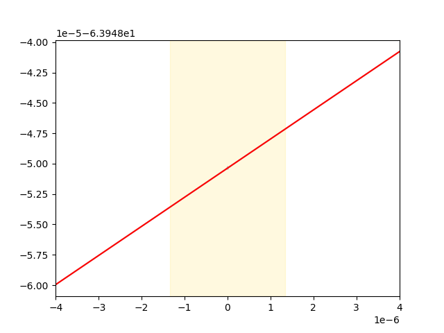
## New Eq:
((fabs(cell__V) < 1.3356169352749131e-6) ? ((0.5 + 374358.83507802623 * cell__V) * (5.3424677410996524e-6 * pow(cell__F, 2) * (-L_type_Ca_channel__gamma_Cao * calcium_dynamics__Cao + L_type_Ca_channel__gamma_Cai * calcium_dynamics__Cai * exp(2.6712338705498262e-6 * cell__F / (cell__R * cell__T))) * L_type_Ca_channel__P_Ca / ((-1.0 + exp(2.6712338705498262e-6 * cell__F / (cell__R * cell__T))) * cell__R * cell__T) + 5.3424677410996524e-6 * pow(cell__F, 2) * (-L_type_Ca_channel__gamma_Cao * calcium_dynamics__Cao + L_type_Ca_channel__gamma_Cai * calcium_dynamics__Cai * exp(-2.6712338705498262e-6 * cell__F / (cell__R * cell__T))) * L_type_Ca_channel__P_Ca / ((-1.0 + exp(-2.6712338705498262e-6 * cell__F / (cell__R * cell__T))) * cell__R * cell__T)) - 5.3424677410996524e-6 * pow(cell__F, 2) * (-L_type_Ca_channel__gamma_Cao * calcium_dynamics__Cao + L_type_Ca_channel__gamma_Cai * calcium_dynamics__Cai * exp(-2.6712338705498262e-6 * cell__F / (cell__R * cell__T))) * L_type_Ca_channel__P_Ca / ((-1.0 + exp(-2.6712338705498262e-6 * cell__F / (cell__R * cell__T))) * cell__R * cell__T)) : (4.0 * pow(cell__F, 2) * (-L_type_Ca_channel__gamma_Cao * calcium_dynamics__Cao + L_type_Ca_channel__gamma_Cai * calcium_dynamics__Cai * exp(2.0 * cell__F * cell__V / (cell__R * cell__T))) * L_type_Ca_channel__P_Ca * cell__V / ((-1.0 + exp(2.0 * cell__F * cell__V / (cell__R * cell__T))) * cell__R * cell__T)))

L_type_Ca_channel_d_gate__tau_d = ((fabs(L_type_Ca_channel_d_gate__E0_d) < 1.0000000000000001e-5) ? (2.2893772893772892) : (28.571428571428569 * (1.0 - exp(-0.16025641025641024 * L_type_Ca_channel_d_gate__E0_d)) * L_type_Ca_channel_d_gate__d_infinity / L_type_Ca_channel_d_gate__E0_d))

####Piecewise!!

T_type_Ca_channel_g_gate__tau_g = ((cell__V <= 0) ? (12.0 - 0.875 * cell__V) : (12.0))

####Piecewise!!

fast_sodium_current_h_gate__alpha_h = ((cell__V < -40.0) ? (0.13500000000000001 * exp(-11.764705882352942 + 0.14705882352941177 * fast_sodium_current__shift_INa_inact - 0.14705882352941177 * cell__V)) : (0))

####Piecewise!!

fast_sodium_current_h_gate__beta_h = ((cell__V < -40.0) ? (310000.0 * exp(0.34999999999999998 * cell__V - 0.34999999999999998 * fast_sodium_current__shift_INa_inact) + 3.5600000000000001 * exp(0.079000000000000001 * cell__V - 0.079000000000000001 * fast_sodium_current__shift_INa_inact)) : (7.6923076923076916 / (1.0 + exp(-0.96036036036036043 + 0.0900900900900901 * fast_sodium_current__shift_INa_inact - 0.0900900900900901 * cell__V))))

####Piecewise!!

fast_sodium_current_j_gate__alpha_j = ((cell__V < -40.0) ? ((37.780000000000001 + cell__V) * (-127140.0 * exp(0.24440000000000001 * cell__V - 0.24440000000000001 * fast_sodium_current__shift_INa_inact) - 3.4740000000000003e-5 * exp(0.043909999999999998 * fast_sodium_current__shift_INa_inact - 0.043909999999999998 * cell__V)) / (1.0 + exp(24.640530000000002 + 0.311 * cell__V - 0.311 * fast_sodium_current__shift_INa_inact))) : (0))

####Piecewise!!

fast_sodium_current_j_gate__beta_j = ((cell__V < -40.0) ? (0.1212 * exp(0.01052 * fast_sodium_current__shift_INa_inact - 0.01052 * cell__V) / (1.0 + exp(-5.5312920000000005 + 0.13780000000000001 * fast_sodium_current__shift_INa_inact - 0.13780000000000001 * cell__V))) : (0.29999999999999999 * exp(2.5349999999999999e-7 * fast_sodium_current__shift_INa_inact - 2.5349999999999999e-7 * cell__V) / (1.0 + exp(-3.2000000000000002 + 0.10000000000000001 * fast_sodium_current__shift_INa_inact - 0.10000000000000001 * cell__V))))

####Piecewise!!

fast_sodium_current_m_gate__alpha_m = ((fast_sodium_current_m_gate__delta_m <= fabs(fast_sodium_current_m_gate__E0_m)) ? (0.32000000000000001 * fast_sodium_current_m_gate__E0_m / (1.0 - exp(-0.10000000000000001 * fast_sodium_current_m_gate__E0_m))) : (3.2000000000000002))

####Piecewise!!

## Equation 2:
```
L_type_Ca_channel__I_CaK = pow(cell__F, 2) * (-L_type_Ca_channel__gamma_Ko * ionic_concentrations__Ko + L_type_Ca_channel__gamma_Ki * ionic_concentrations__Ki * exp(cell__F * cell__V / (cell__R * cell__T))) * L_type_Ca_channel__P_K * cell__V / ((-1.0 + exp(cell__F * cell__V / (cell__R * cell__T))) * cell__R * cell__T)
```
### Partially evaluated to: 
```
L_type_Ca_channel__I_CaK = pow(cell__F, 2) * (-L_type_Ca_channel__gamma_Ko * ionic_concentrations__Ko + L_type_Ca_channel__gamma_Ki * ionic_concentrations__Ki * exp(cell__F * cell__V / (cell__R * cell__T))) * L_type_Ca_channel__P_K * cell__V / ((-1.0 + exp(cell__F * cell__V / (cell__R * cell__T))) * cell__R * cell__T)
```
### Singulariy points detected:

{0}
#### float * A

####Failed to find U symbolically!

<class 'sympy.core.mul.Mul'>
_cell$F**2*_L_type_Ca_channel$P_K*_cell$V*(_L_type_Ca_channel$gamma_Ki*_ionic_concentrations$Ki*exp(1.0*_cell$F*_cell$V/(_cell$R*_cell$T)) - _L_type_Ca_channel$gamma_Ko*_ionic_concentrations$Ko)/(_cell$R*_cell$T*(exp(1.0*_cell$F*_cell$V/(_cell$R*_cell$T)) - 1.0))

*try substituting parameters*

*U*
`0.037435883507802616 * cell__V`

*V for 1e-07 range* 
`-2.6712338705498262e-6 - 2.6712338705498262e-6`

*Singularity point: 0*

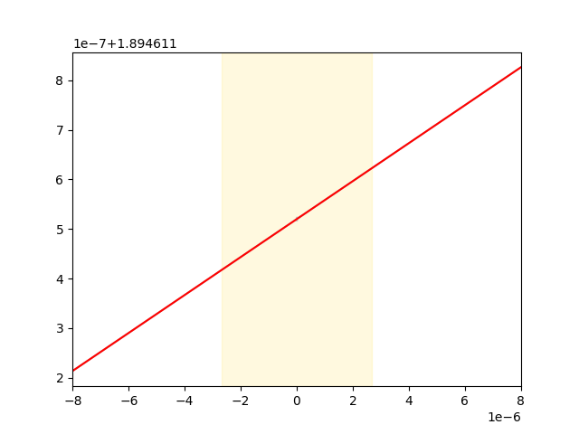
## New Eq:
((fabs(cell__V) < 2.6712338705498262e-6) ? ((0.5 + 187179.41753901311 * cell__V) * (2.6712338705498262e-6 * pow(cell__F, 2) * (-L_type_Ca_channel__gamma_Ko * ionic_concentrations__Ko + L_type_Ca_channel__gamma_Ki * ionic_concentrations__Ki * exp(2.6712338705498262e-6 * cell__F / (cell__R * cell__T))) * L_type_Ca_channel__P_K / ((-1.0 + exp(2.6712338705498262e-6 * cell__F / (cell__R * cell__T))) * cell__R * cell__T) + 2.6712338705498262e-6 * pow(cell__F, 2) * (-L_type_Ca_channel__gamma_Ko * ionic_concentrations__Ko + L_type_Ca_channel__gamma_Ki * ionic_concentrations__Ki * exp(-2.6712338705498262e-6 * cell__F / (cell__R * cell__T))) * L_type_Ca_channel__P_K / ((-1.0 + exp(-2.6712338705498262e-6 * cell__F / (cell__R * cell__T))) * cell__R * cell__T)) - 2.6712338705498262e-6 * pow(cell__F, 2) * (-L_type_Ca_channel__gamma_Ko * ionic_concentrations__Ko + L_type_Ca_channel__gamma_Ki * ionic_concentrations__Ki * exp(-2.6712338705498262e-6 * cell__F / (cell__R * cell__T))) * L_type_Ca_channel__P_K / ((-1.0 + exp(-2.6712338705498262e-6 * cell__F / (cell__R * cell__T))) * cell__R * cell__T)) : (pow(cell__F, 2) * (-L_type_Ca_channel__gamma_Ko * ionic_concentrations__Ko + L_type_Ca_channel__gamma_Ki * ionic_concentrations__Ki * exp(cell__F * cell__V / (cell__R * cell__T))) * L_type_Ca_channel__P_K * cell__V / ((-1.0 + exp(cell__F * cell__V / (cell__R * cell__T))) * cell__R * cell__T)))

## Equation 3:
```
L_type_Ca_channel__I_CaNa = pow(cell__F, 2) * (-L_type_Ca_channel__gamma_Nao * ionic_concentrations__Nao + L_type_Ca_channel__gamma_Nai * ionic_concentrations__Nai * exp(cell__F * cell__V / (cell__R * cell__T))) * L_type_Ca_channel__P_Na * cell__V / ((-1.0 + exp(cell__F * cell__V / (cell__R * cell__T))) * cell__R * cell__T)
```
### Partially evaluated to: 
```
L_type_Ca_channel__I_CaNa = pow(cell__F, 2) * (-L_type_Ca_channel__gamma_Nao * ionic_concentrations__Nao + L_type_Ca_channel__gamma_Nai * ionic_concentrations__Nai * exp(cell__F * cell__V / (cell__R * cell__T))) * L_type_Ca_channel__P_Na * cell__V / ((-1.0 + exp(cell__F * cell__V / (cell__R * cell__T))) * cell__R * cell__T)
```
### Singulariy points detected:

{0}
#### float * A

####Failed to find U symbolically!

<class 'sympy.core.mul.Mul'>
_cell$F**2*_L_type_Ca_channel$P_Na*_cell$V*(_L_type_Ca_channel$gamma_Nai*_ionic_concentrations$Nai*exp(1.0*_cell$F*_cell$V/(_cell$R*_cell$T)) - _L_type_Ca_channel$gamma_Nao*_ionic_concentrations$Nao)/(_cell$R*_cell$T*(exp(1.0*_cell$F*_cell$V/(_cell$R*_cell$T)) - 1.0))

*try substituting parameters*

*U*
`0.037435883507802616 * cell__V`

*V for 1e-07 range* 
`-2.6712338705498262e-6 - 2.6712338705498262e-6`

*Singularity point: 0*


## New Eq:
((fabs(cell__V) < 2.6712338705498262e-6) ? ((0.5 + 187179.41753901311 * cell__V) * (2.6712338705498262e-6 * pow(cell__F, 2) * (-L_type_Ca_channel__gamma_Nao * ionic_concentrations__Nao + L_type_Ca_channel__gamma_Nai * ionic_concentrations__Nai * exp(2.6712338705498262e-6 * cell__F / (cell__R * cell__T))) * L_type_Ca_channel__P_Na / ((-1.0 + exp(2.6712338705498262e-6 * cell__F / (cell__R * cell__T))) * cell__R * cell__T) + 2.6712338705498262e-6 * pow(cell__F, 2) * (-L_type_Ca_channel__gamma_Nao * ionic_concentrations__Nao + L_type_Ca_channel__gamma_Nai * ionic_concentrations__Nai * exp(-2.6712338705498262e-6 * cell__F / (cell__R * cell__T))) * L_type_Ca_channel__P_Na / ((-1.0 + exp(-2.6712338705498262e-6 * cell__F / (cell__R * cell__T))) * cell__R * cell__T)) - 2.6712338705498262e-6 * pow(cell__F, 2) * (-L_type_Ca_channel__gamma_Nao * ionic_concentrations__Nao + L_type_Ca_channel__gamma_Nai * ionic_concentrations__Nai * exp(-2.6712338705498262e-6 * cell__F / (cell__R * cell__T))) * L_type_Ca_channel__P_Na / ((-1.0 + exp(-2.6712338705498262e-6 * cell__F / (cell__R * cell__T))) * cell__R * cell__T)) : (pow(cell__F, 2) * (-L_type_Ca_channel__gamma_Nao * ionic_concentrations__Nao + L_type_Ca_channel__gamma_Nai * ionic_concentrations__Nai * exp(cell__F * cell__V / (cell__R * cell__T))) * L_type_Ca_channel__P_Na * cell__V / ((-1.0 + exp(cell__F * cell__V / (cell__R * cell__T))) * cell__R * cell__T)))

## Equation 4:
```
non_specific_calcium_activated_current__I_ns_K = pow(cell__F, 2) * (-L_type_Ca_channel__gamma_Ko * ionic_concentrations__Ko + L_type_Ca_channel__gamma_Ki * ionic_concentrations__Ki * exp(cell__F * cell__V / (cell__R * cell__T))) * cell__V * non_specific_calcium_activated_current__P_ns_Ca / ((-1.0 + exp(cell__F * cell__V / (cell__R * cell__T))) * cell__R * cell__T)
```
### Partially evaluated to: 
```
non_specific_calcium_activated_current__I_ns_K = pow(cell__F, 2) * (-L_type_Ca_channel__gamma_Ko * ionic_concentrations__Ko + L_type_Ca_channel__gamma_Ki * ionic_concentrations__Ki * exp(cell__F * cell__V / (cell__R * cell__T))) * cell__V * non_specific_calcium_activated_current__P_ns_Ca / ((-1.0 + exp(cell__F * cell__V / (cell__R * cell__T))) * cell__R * cell__T)
```
### Singulariy points detected:

{0}
#### float * A

####Failed to find U symbolically!

<class 'sympy.core.mul.Mul'>
_cell$F**2*_cell$V*_non_specific_calcium_activated_current$P_ns_Ca*(_L_type_Ca_channel$gamma_Ki*_ionic_concentrations$Ki*exp(1.0*_cell$F*_cell$V/(_cell$R*_cell$T)) - _L_type_Ca_channel$gamma_Ko*_ionic_concentrations$Ko)/(_cell$R*_cell$T*(exp(1.0*_cell$F*_cell$V/(_cell$R*_cell$T)) - 1.0))

*try substituting parameters*

*U*
`0.037435883507802616 * cell__V`

*V for 1e-07 range* 
`-2.6712338705498262e-6 - 2.6712338705498262e-6`

*Singularity point: 0*

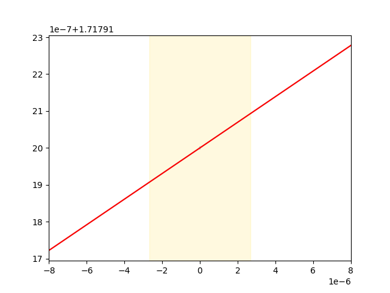
## New Eq:
((fabs(cell__V) < 2.6712338705498262e-6) ? ((0.5 + 187179.41753901311 * cell__V) * (2.6712338705498262e-6 * pow(cell__F, 2) * (-L_type_Ca_channel__gamma_Ko * ionic_concentrations__Ko + L_type_Ca_channel__gamma_Ki * ionic_concentrations__Ki * exp(2.6712338705498262e-6 * cell__F / (cell__R * cell__T))) * non_specific_calcium_activated_current__P_ns_Ca / ((-1.0 + exp(2.6712338705498262e-6 * cell__F / (cell__R * cell__T))) * cell__R * cell__T) + 2.6712338705498262e-6 * pow(cell__F, 2) * (-L_type_Ca_channel__gamma_Ko * ionic_concentrations__Ko + L_type_Ca_channel__gamma_Ki * ionic_concentrations__Ki * exp(-2.6712338705498262e-6 * cell__F / (cell__R * cell__T))) * non_specific_calcium_activated_current__P_ns_Ca / ((-1.0 + exp(-2.6712338705498262e-6 * cell__F / (cell__R * cell__T))) * cell__R * cell__T)) - 2.6712338705498262e-6 * pow(cell__F, 2) * (-L_type_Ca_channel__gamma_Ko * ionic_concentrations__Ko + L_type_Ca_channel__gamma_Ki * ionic_concentrations__Ki * exp(-2.6712338705498262e-6 * cell__F / (cell__R * cell__T))) * non_specific_calcium_activated_current__P_ns_Ca / ((-1.0 + exp(-2.6712338705498262e-6 * cell__F / (cell__R * cell__T))) * cell__R * cell__T)) : (pow(cell__F, 2) * (-L_type_Ca_channel__gamma_Ko * ionic_concentrations__Ko + L_type_Ca_channel__gamma_Ki * ionic_concentrations__Ki * exp(cell__F * cell__V / (cell__R * cell__T))) * cell__V * non_specific_calcium_activated_current__P_ns_Ca / ((-1.0 + exp(cell__F * cell__V / (cell__R * cell__T))) * cell__R * cell__T)))

## Equation 5:
```
non_specific_calcium_activated_current__I_ns_Na = pow(cell__F, 2) * (-L_type_Ca_channel__gamma_Nao * ionic_concentrations__Nao + L_type_Ca_channel__gamma_Nai * ionic_concentrations__Nai * exp(cell__F * cell__V / (cell__R * cell__T))) * cell__V * non_specific_calcium_activated_current__P_ns_Ca / ((-1.0 + exp(cell__F * cell__V / (cell__R * cell__T))) * cell__R * cell__T)
```
### Partially evaluated to: 
```
non_specific_calcium_activated_current__I_ns_Na = pow(cell__F, 2) * (-L_type_Ca_channel__gamma_Nao * ionic_concentrations__Nao + L_type_Ca_channel__gamma_Nai * ionic_concentrations__Nai * exp(cell__F * cell__V / (cell__R * cell__T))) * cell__V * non_specific_calcium_activated_current__P_ns_Ca / ((-1.0 + exp(cell__F * cell__V / (cell__R * cell__T))) * cell__R * cell__T)
```
### Singulariy points detected:

{0}
#### float * A

####Failed to find U symbolically!

<class 'sympy.core.mul.Mul'>
_cell$F**2*_cell$V*_non_specific_calcium_activated_current$P_ns_Ca*(_L_type_Ca_channel$gamma_Nai*_ionic_concentrations$Nai*exp(1.0*_cell$F*_cell$V/(_cell$R*_cell$T)) - _L_type_Ca_channel$gamma_Nao*_ionic_concentrations$Nao)/(_cell$R*_cell$T*(exp(1.0*_cell$F*_cell$V/(_cell$R*_cell$T)) - 1.0))

*try substituting parameters*

*U*
`0.037435883507802616 * cell__V`

*V for 1e-07 range* 
`-2.6712338705498262e-6 - 2.6712338705498262e-6`

*Singularity point: 0*


## New Eq:
((fabs(cell__V) < 2.6712338705498262e-6) ? ((0.5 + 187179.41753901311 * cell__V) * (2.6712338705498262e-6 * pow(cell__F, 2) * (-L_type_Ca_channel__gamma_Nao * ionic_concentrations__Nao + L_type_Ca_channel__gamma_Nai * ionic_concentrations__Nai * exp(2.6712338705498262e-6 * cell__F / (cell__R * cell__T))) * non_specific_calcium_activated_current__P_ns_Ca / ((-1.0 + exp(2.6712338705498262e-6 * cell__F / (cell__R * cell__T))) * cell__R * cell__T) + 2.6712338705498262e-6 * pow(cell__F, 2) * (-L_type_Ca_channel__gamma_Nao * ionic_concentrations__Nao + L_type_Ca_channel__gamma_Nai * ionic_concentrations__Nai * exp(-2.6712338705498262e-6 * cell__F / (cell__R * cell__T))) * non_specific_calcium_activated_current__P_ns_Ca / ((-1.0 + exp(-2.6712338705498262e-6 * cell__F / (cell__R * cell__T))) * cell__R * cell__T)) - 2.6712338705498262e-6 * pow(cell__F, 2) * (-L_type_Ca_channel__gamma_Nao * ionic_concentrations__Nao + L_type_Ca_channel__gamma_Nai * ionic_concentrations__Nai * exp(-2.6712338705498262e-6 * cell__F / (cell__R * cell__T))) * non_specific_calcium_activated_current__P_ns_Ca / ((-1.0 + exp(-2.6712338705498262e-6 * cell__F / (cell__R * cell__T))) * cell__R * cell__T)) : (pow(cell__F, 2) * (-L_type_Ca_channel__gamma_Nao * ionic_concentrations__Nao + L_type_Ca_channel__gamma_Nai * ionic_concentrations__Nai * exp(cell__F * cell__V / (cell__R * cell__T))) * cell__V * non_specific_calcium_activated_current__P_ns_Ca / ((-1.0 + exp(cell__F * cell__V / (cell__R * cell__T))) * cell__R * cell__T)))

## Equation 6:
```
rapid_delayed_rectifier_potassium_current_xr_gate__tau_xr = 1 / (0.00060999999999999997 * (38.899999999999999 + cell__V) / (-1.0 + exp(5.6404999999999994 + 0.14499999999999999 * cell__V)) + 0.0013799999999999999 * (14.199999999999999 + cell__V) / (1.0 - exp(-1.7465999999999999 - 0.123 * cell__V)))
```
### Partially evaluated to: 
```
rapid_delayed_rectifier_potassium_current_xr_gate__tau_xr = 1 / (0.00060999999999999997 * (38.899999999999999 + cell__V) / (-1.0 + exp(5.6404999999999994 + 0.14499999999999999 * cell__V)) + 0.0013799999999999999 * (14.199999999999999 + cell__V) / (1.0 - exp(-1.7465999999999999 - 0.123 * cell__V)))
```
### Singulariy points detected:

{-38.899999999999999, -14.199999999999999}
#### float * A

####1 / A


####A + B:

`0.0013799999999999999 * (14.199999999999999 + cell__V) / (1.0 - 0.17436578041087322 * exp(-0.123 * cell__V))`
`0.00060999999999999997 * (38.899999999999999 + cell__V) / (-1.0 + 281.60348502322194 * exp(0.14499999999999999 * cell__V))`

*U*
`-1.7465999999999999 - 0.123 * cell__V`

*V for 1e-07 range* 
`-14.199999186991869 - -14.200000813008129`

*Singularity point: -14.199999999999999*


*U*
`5.6404999999999994 + 0.14499999999999999 * cell__V`

*V for 1e-07 range* 
`-38.900000689655172 - -38.899999310344825`

*Singularity point: -38.899999999999999*


## New Eq:
((fabs(14.199999999999999 + cell__V) < 8.1300813007528783e-7) ? (1 / (1.1219512195134727e-9 / (1.0 - exp(-9.9999999999406119e-8)) + 0.015067000495934959 / (-1.0 + exp(3.5815001178861787))) + (-8732999.5000645891 - 615000.00000454858 * cell__V) * (1 / (0.015066999504065039 / (-1.0 + exp(3.5814998821138206)) - 1.1219512194943214e-9 / (1.0 - exp(9.9999999999406119e-8))) - 1 / (1.1219512195134727e-9 / (1.0 - exp(-9.9999999999406119e-8)) + 0.015067000495934959 / (-1.0 + exp(3.5815001178861787))))) : ((fabs(38.899999999999999 + cell__V) < 6.896551724422384e-7) ? (1 / (-0.034086000951724135 / (1.0 - exp(3.0381000848275859)) - 4.2068965517283451e-10 / (-1.0 + exp(-1.0000000000287557e-7))) + (28202500.498836767 + 724999.99997009686 * cell__V) * (1 / (4.2068965520669629e-10 / (-1.0 + exp(1.0000000000287557e-7)) - 0.034085999048275861 / (1.0 - exp(3.0380999151724137))) - 1 / (-0.034086000951724135 / (1.0 - exp(3.0381000848275859)) - 4.2068965517283451e-10 / (-1.0 + exp(-1.0000000000287557e-7))))) : (1 / (0.00060999999999999997 * (38.899999999999999 + cell__V) / (-1.0 + exp(5.6404999999999994 + 0.14499999999999999 * cell__V)) + 0.0013799999999999999 * (14.199999999999999 + cell__V) / (1.0 - exp(-1.7465999999999999 - 0.123 * cell__V))))))

Derivative(_calcium_dynamics__Cainfluxtrack, _environment__time) = ((calcium_dynamics__APtrack > 0.20000000000000001) ? (-0.5 * (-2.0 * Na_Ca_exchanger__i_NaCa + L_type_Ca_channel__i_CaCa + T_type_Ca_channel__i_Ca_T + calcium_background_current__i_Ca_b + sarcolemmal_calcium_pump__i_p_Ca) * geometry__A_cap / (cell__F * geometry__V_myo)) : ((calcium_dynamics__APtrack2 > 0.01) ? (0) : (-0.5 * calcium_dynamics__Cainfluxtrack)))

####Piecewise!!

## Equation 7:
```
slow_delayed_rectifier_potassium_current_xs1_gate__tau_xs1 = 1 / (0.00013100000000000001 * (30.0 + cell__V) / (-1.0 + exp(2.0609999999999999 + 0.068699999999999997 * cell__V)) + 7.1899999999999999e-5 * (30.0 + cell__V) / (1.0 - exp(-4.4399999999999995 - 0.14799999999999999 * cell__V)))
```
### Partially evaluated to: 
```
slow_delayed_rectifier_potassium_current_xs1_gate__tau_xs1 = 1 / (0.00013100000000000001 * (30.0 + cell__V) / (-1.0 + exp(2.0609999999999999 + 0.068699999999999997 * cell__V)) + 7.1899999999999999e-5 * (30.0 + cell__V) / (1.0 - exp(-4.4399999999999995 - 0.14799999999999999 * cell__V)))
```
### Singulariy points detected:

{-30.000000000000000}
#### float * A

####1 / A


####A + B:

`7.1899999999999999e-5 * (30.0 + cell__V) / (1.0 - 0.011795938519751569 * exp(-0.14799999999999999 * cell__V))`
`0.00013100000000000001 * (30.0 + cell__V) / (-1.0 + 7.8538197044216602 * exp(0.068699999999999997 * cell__V))`

*U*
`-4.4399999999999995 - 0.14799999999999999 * cell__V`

*V for 1e-07 range* 
`-29.999999324324325 - -30.000000675675675`

*Singularity point: -30.000000000000000*


## New Eq:
((fabs(30.0 + cell__V) < 6.7567567568760367e-7) ? (1 / (8.8513513515076093e-11 / (-1.0 + exp(4.6418918920460017e-8)) + 4.8581081081938701e-11 / (1.0 - exp(-1.0000000000287557e-7))) + (-22199999.499608092 - 739999.99998693645 * cell__V) * (1 / (-8.8513513515076093e-11 / (-1.0 + exp(-4.6418918920460017e-8)) - 4.8581081081938701e-11 / (1.0 - exp(1.0000000000287557e-7))) - 1 / (8.8513513515076093e-11 / (-1.0 + exp(4.6418918920460017e-8)) + 4.8581081081938701e-11 / (1.0 - exp(-1.0000000000287557e-7))))) : (1 / (0.00013100000000000001 * (30.0 + cell__V) / (-1.0 + exp(2.0609999999999999 + 0.068699999999999997 * cell__V)) + 7.1899999999999999e-5 * (30.0 + cell__V) / (1.0 - exp(-4.4399999999999995 - 0.14799999999999999 * cell__V)))))

## Equation 8:
```
slow_delayed_rectifier_potassium_current_xs2_gate__tau_xs2 = 4.0 / (0.00013100000000000001 * (30.0 + cell__V) / (-1.0 + exp(2.0609999999999999 + 0.068699999999999997 * cell__V)) + 7.1899999999999999e-5 * (30.0 + cell__V) / (1.0 - exp(-4.4399999999999995 - 0.14799999999999999 * cell__V)))
```
### Partially evaluated to: 
```
slow_delayed_rectifier_potassium_current_xs2_gate__tau_xs2 = 4.0 / (0.00013100000000000001 * (30.0 + cell__V) / (-1.0 + exp(2.0609999999999999 + 0.068699999999999997 * cell__V)) + 7.1899999999999999e-5 * (30.0 + cell__V) / (1.0 - exp(-4.4399999999999995 - 0.14799999999999999 * cell__V)))
```
### Singulariy points detected:

{-30.000000000000000}
#### float * A

####1 / A


####A + B:

`7.1899999999999999e-5 * (30.0 + cell__V) / (1.0 - 0.011795938519751569 * exp(-0.14799999999999999 * cell__V))`
`0.00013100000000000001 * (30.0 + cell__V) / (-1.0 + 7.8538197044216602 * exp(0.068699999999999997 * cell__V))`

*U*
`-4.4399999999999995 - 0.14799999999999999 * cell__V`

*V for 1e-07 range* 
`-29.999999324324325 - -30.000000675675675`

*Singularity point: -30.000000000000000*


## New Eq:
((fabs(30.0 + cell__V) < 6.7567567568760367e-7) ? (4.0 / (8.8513513515076093e-11 / (-1.0 + exp(4.6418918920460017e-8)) + 4.8581081081938701e-11 / (1.0 - exp(-1.0000000000287557e-7))) + (-22199999.499608092 - 739999.99998693645 * cell__V) * (4.0 / (-8.8513513515076093e-11 / (-1.0 + exp(-4.6418918920460017e-8)) - 4.8581081081938701e-11 / (1.0 - exp(1.0000000000287557e-7))) - 4.0 / (8.8513513515076093e-11 / (-1.0 + exp(4.6418918920460017e-8)) + 4.8581081081938701e-11 / (1.0 - exp(-1.0000000000287557e-7))))) : (4.0 / (0.00013100000000000001 * (30.0 + cell__V) / (-1.0 + exp(2.0609999999999999 + 0.068699999999999997 * cell__V)) + 7.1899999999999999e-5 * (30.0 + cell__V) / (1.0 - exp(-4.4399999999999995 - 0.14799999999999999 * cell__V)))))

Singularities cannot be found
1.0/(0.036499999999999998*(0.14285714285714286*exp(0.014858841010401189*_ionic_concentrations$Nao) - 0.14285714285714286)*exp(-0.037435883507802618*_cell$V) + 1.0 + 0.1245*exp(-0.003743588350780262*_cell$V))

Derivative(_calcium_dynamics__APtrack, _environment__time) = ((cell__dVdt > 150.0) ? (100.0 - 100.5 * calcium_dynamics__APtrack) : (-0.5 * calcium_dynamics__APtrack))

####Piecewise!!

# Model: fink_noble_giles_model_2008(fink_noble_giles_model_2008.cellml)
## Equation 1:
```
ICaL__i_CaL = pow(Environment__F, 2) * pow(ICaL__z, 2) * (-15.0 + cell__V) * (-Environment__Ca_o + 0.25 * Ca__Ca_ss * exp(2.0 * (-15.0 + cell__V) * Environment__F / (Environment__R * Environment__T))) * ICaL__g_CaL * iCaL_d_gate__d * iCaL_f2_gate__f2 * iCaL_fCass_gate__fCass * iCaL_f_gate__f / ((-1.0 + exp(2.0 * (-15.0 + cell__V) * Environment__F / (Environment__R * Environment__T))) * Environment__R * Environment__T)
```
### Partially evaluated to: 
```
ICaL__i_CaL = pow(Environment__F, 2) * pow(ICaL__z, 2) * (-15.0 + cell__V) * (-Environment__Ca_o + 0.25 * Ca__Ca_ss * exp(2.0 * (-15.0 + cell__V) * Environment__F / (Environment__R * Environment__T))) * ICaL__g_CaL * iCaL_d_gate__d * iCaL_f2_gate__f2 * iCaL_fCass_gate__fCass * iCaL_f_gate__f / ((-1.0 + exp(2.0 * (-15.0 + cell__V) * Environment__F / (Environment__R * Environment__T))) * Environment__R * Environment__T)
```
### Singulariy points detected:

{15.000000000000000}
####Failed to find U symbolically!

<class 'sympy.core.mul.Mul'>
_Environment$F**2*_ICaL$z**2*_ICaL$g_CaL*_iCaL_d_gate$d*_iCaL_f2_gate$f2*_iCaL_fCass_gate$fCass*_iCaL_f_gate$f*(_cell$V - 15.0)*(0.25*_Ca$Ca_ss*exp(2.0*_Environment$F*(_cell$V - 15.0)/(_Environment$R*_Environment$T)) - _Environment$Ca_o)/(_Environment$R*_Environment$T*(exp(2.0*_Environment$F*(_cell$V - 15.0)/(_Environment$R*_Environment$T)) - 1.0))

*try substituting parameters*

*U*
`-1.1230167246823641 + 0.074867781645490947 * cell__V`

*V for 1e-07 range* 
`14.999998664311967 - 15.000001335688033`

*Singularity point: 15.000000000000000*


## New Eq:
((fabs(-15.0 + cell__V) < 1.3356880329759568e-6) ? ((-5615083.1234489232 + 374338.90822992817 * cell__V) * (1.3356880329828957e-6 * pow(Environment__F, 2) * pow(ICaL__z, 2) * (-Environment__Ca_o + 0.25 * Ca__Ca_ss * exp(-2.6713760659657915e-6 * Environment__F / (Environment__R * Environment__T))) * ICaL__g_CaL * iCaL_d_gate__d * iCaL_f2_gate__f2 * iCaL_fCass_gate__fCass * iCaL_f_gate__f / ((-1.0 + exp(-2.6713760659657915e-6 * Environment__F / (Environment__R * Environment__T))) * Environment__R * Environment__T) + 1.3356880329690179e-6 * pow(Environment__F, 2) * pow(ICaL__z, 2) * (-Environment__Ca_o + 0.25 * Ca__Ca_ss * exp(2.6713760659380359e-6 * Environment__F / (Environment__R * Environment__T))) * ICaL__g_CaL * iCaL_d_gate__d * iCaL_f2_gate__f2 * iCaL_fCass_gate__fCass * iCaL_f_gate__f / ((-1.0 + exp(2.6713760659380359e-6 * Environment__F / (Environment__R * Environment__T))) * Environment__R * Environment__T)) - 1.3356880329828957e-6 * pow(Environment__F, 2) * pow(ICaL__z, 2) * (-Environment__Ca_o + 0.25 * Ca__Ca_ss * exp(-2.6713760659657915e-6 * Environment__F / (Environment__R * Environment__T))) * ICaL__g_CaL * iCaL_d_gate__d * iCaL_f2_gate__f2 * iCaL_fCass_gate__fCass * iCaL_f_gate__f / ((-1.0 + exp(-2.6713760659657915e-6 * Environment__F / (Environment__R * Environment__T))) * Environment__R * Environment__T)) : (pow(Environment__F, 2) * pow(ICaL__z, 2) * (-15.0 + cell__V) * (-Environment__Ca_o + 0.25 * Ca__Ca_ss * exp(2.0 * (-15.0 + cell__V) * Environment__F / (Environment__R * Environment__T))) * ICaL__g_CaL * iCaL_d_gate__d * iCaL_f2_gate__f2 * iCaL_fCass_gate__fCass * iCaL_f_gate__f / ((-1.0 + exp(2.0 * (-15.0 + cell__V) * Environment__F / (Environment__R * Environment__T))) * Environment__R * Environment__T)))

iNa_h_gate__alpha_h = ((cell__V < -40.0 + INa__shift_INa_inact) ? (0.057000000000000002 * exp(-11.764705882352942 + 0.14705882352941177 * INa__shift_INa_inact - 0.14705882352941177 * cell__V)) : (0))

####Piecewise!!

iNa_h_gate__beta_h = ((cell__V < -40.0 + INa__shift_INa_inact) ? (310000.0 * exp(0.34849999999999998 * cell__V - 0.34849999999999998 * INa__shift_INa_inact) + 2.7000000000000002 * exp(0.079000000000000001 * cell__V - 0.079000000000000001 * INa__shift_INa_inact)) : (5.9230769230769234 / (1.0 + exp(-0.96036036036036043 + 0.0900900900900901 * INa__shift_INa_inact - 0.0900900900900901 * cell__V))))

####Piecewise!!

iNa_j_gate__alpha_j = ((cell__V < -40.0 + INa__shift_INa_inact) ? ((37.780000000000001 + cell__V) * (-25428.0 * exp(0.24440000000000001 * cell__V - 0.24440000000000001 * INa__shift_INa_inact) - 6.9480000000000002e-6 * exp(0.043909999999999998 * INa__shift_INa_inact - 0.043909999999999998 * cell__V)) / (1.0 + exp(24.640530000000002 + 0.311 * cell__V - 0.311 * INa__shift_INa_inact))) : (0))

####Piecewise!!

iNa_j_gate__beta_j = ((cell__V < -40.0 + INa__shift_INa_inact) ? (0.024240000000000001 * exp(0.01052 * INa__shift_INa_inact - 0.01052 * cell__V) / (1.0 + exp(-5.5312920000000005 + 0.13780000000000001 * INa__shift_INa_inact - 0.13780000000000001 * cell__V))) : (0.59999999999999998 * exp(0.057000000000000002 * cell__V - 0.057000000000000002 * INa__shift_INa_inact) / (1.0 + exp(-3.2000000000000002 + 0.10000000000000001 * INa__shift_INa_inact - 0.10000000000000001 * cell__V))))

####Piecewise!!

# Model: fox_model_2001(fox_mcharg_gilmour_2002.cellml)
## Equation 1:
```
fast_sodium_current_m_gate__alpha_m = 0.32000000000000001 * fast_sodium_current_m_gate__E0_m / (1.0 - exp(-0.10000000000000001 * fast_sodium_current_m_gate__E0_m))
```
### Partially evaluated to: 
```
fast_sodium_current_m_gate__alpha_m = 0.32000000000000001 * (47.130000000000003 + membrane__V) / (1.0 - 0.00897780373069724 * exp(-0.10000000000000001 * membrane__V))
```
### Singulariy points detected:

{-47.130000000000003}
*U*
`-4.7130000000000001 - 0.10000000000000001 * membrane__V`

*V for 1e-07 range* 
`-47.129999000000005 - -47.130001`

*Singularity point: -47.130000000000003*


## New Eq:
((fabs(47.130000000000003 + membrane__V) < 1.0000000000287557e-6) ? (10.740659346653775 + 0.15999701562995733 * membrane__V) : (0.32000000000000001 * fast_sodium_current_m_gate__E0_m / (1.0 - exp(-0.10000000000000001 * fast_sodium_current_m_gate__E0_m))))

## Equation 2:
```
slow_activating_delayed_rectifiyer_K_current_X_ks_gate__tau_X_ks = 1 / (0.00013100000000000001 * (-10.0 + membrane__V) / (-1.0 + exp(-0.68699999999999994 + 0.068699999999999997 * membrane__V)) + 7.1899999999999999e-5 * (-10.0 + membrane__V) / (1.0 - exp(1.48 - 0.14799999999999999 * membrane__V)))
```
### Partially evaluated to: 
```
slow_activating_delayed_rectifiyer_K_current_X_ks_gate__tau_X_ks = 1 / (0.00013100000000000001 * (-10.0 + membrane__V) / (-1.0 + exp(-0.68699999999999994 + 0.068699999999999997 * membrane__V)) + 7.1899999999999999e-5 * (-10.0 + membrane__V) / (1.0 - exp(1.48 - 0.14799999999999999 * membrane__V)))
```
### Singulariy points detected:

{10.000000000000000, 10.000000000000000}
#### float * A

####1 / A


####A + B:

`7.1899999999999999e-5 * (-10.0 + membrane__V) / (1.0 - 4.3929456809187561 * exp(-0.14799999999999999 * membrane__V))`
`0.00013100000000000001 * (-10.0 + membrane__V) / (-1.0 + 0.50308305662435071 * exp(0.068699999999999997 * membrane__V))`

*U*
`1.48 - 0.14799999999999999 * membrane__V`

*V for 1e-07 range* 
`10.000000675675675 - 9.9999993243243246`

*Singularity point: 10.000000000000000*

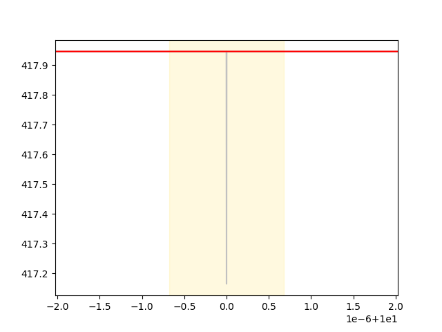
*U*
`-0.68699999999999994 + 0.068699999999999997 * membrane__V`

*V for 1e-07 range* 
`9.9999985443959236 - 10.000001455604076`

*Singularity point: 10.000000000000000*

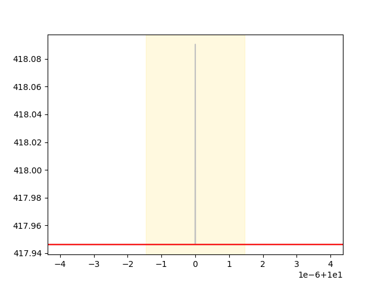
## New Eq:
((fabs(-10.0 + membrane__V) < 6.7567567567372588e-7) ? (1 / (4.8581081080940889e-11 / (1.0 - exp(-9.9999999999406119e-8)) + 8.8513513513258105e-11 / (-1.0 + exp(4.6418918918725294e-8))) + (7400000.5000213543 - 740000.00000213541 * membrane__V) * (1 / (-4.8581081080940889e-11 / (1.0 - exp(9.9999999999406119e-8)) - 8.8513513513258105e-11 / (-1.0 + exp(-4.6418918918725294e-8))) - 1 / (4.8581081080940889e-11 / (1.0 - exp(-9.9999999999406119e-8)) + 8.8513513513258105e-11 / (-1.0 + exp(4.6418918918725294e-8))))) : ((fabs(-10.0 + membrane__V) < 1.4556040756966149e-6) ? (1 / (-1.0465793304208771e-10 / (1.0 - exp(2.1542940320182224e-7)) - 1.9068413391534758e-10 / (-1.0 + exp(-1.0000000000027348e-7))) + (-3434999.4999877219 + 343499.99999877217 * membrane__V) * (1 / (1.9068413391716557e-10 / (-1.0 + exp(1.0000000000114084e-7)) + 1.0465793304308552e-10 / (1.0 - exp(-2.1542940320355697e-7))) - 1 / (-1.0465793304208771e-10 / (1.0 - exp(2.1542940320182224e-7)) - 1.9068413391534758e-10 / (-1.0 + exp(-1.0000000000027348e-7))))) : (1 / (0.00013100000000000001 * (-10.0 + membrane__V) / (-1.0 + exp(-0.68699999999999994 + 0.068699999999999997 * membrane__V)) + 7.1899999999999999e-5 * (-10.0 + membrane__V) / (1.0 - exp(1.48 - 0.14799999999999999 * membrane__V))))))

## Equation 3:
```
L_type_Ca_current__i_Ca_max = 4.0 * pow(membrane__F, 2) * (-0.34100000000000003 * standard_ionic_concentrations__Ca_o + calcium_dynamics__Ca_i * exp(2.0 * membrane__F * membrane__V / (membrane__R * membrane__T))) * L_type_Ca_current__P_Ca * membrane__V / ((-1.0 + exp(2.0 * membrane__F * membrane__V / (membrane__R * membrane__T))) * L_type_Ca_current__C_sc * membrane__R * membrane__T)
```
### Partially evaluated to: 
```
L_type_Ca_current__i_Ca_max = 4.0 * pow(membrane__F, 2) * (-0.34100000000000003 * standard_ionic_concentrations__Ca_o + calcium_dynamics__Ca_i * exp(2.0 * membrane__F * membrane__V / (membrane__R * membrane__T))) * L_type_Ca_current__P_Ca * membrane__V / ((-1.0 + exp(2.0 * membrane__F * membrane__V / (membrane__R * membrane__T))) * L_type_Ca_current__C_sc * membrane__R * membrane__T)
```
### Singulariy points detected:

{0}
#### float * A

####Failed to find U symbolically!

<class 'sympy.core.mul.Mul'>
_membrane$F**2*_L_type_Ca_current$P_Ca*_membrane$V*(_calcium_dynamics$Ca_i*exp(2.0*_membrane$F*_membrane$V/(_membrane$R*_membrane$T)) - 0.34100000000000003*_standard_ionic_concentrations$Ca_o)/(_L_type_Ca_current$C_sc*_membrane$R*_membrane$T*(exp(2.0*_membrane$F*_membrane$V/(_membrane$R*_membrane$T)) - 1.0))

*try substituting parameters*

*U*
`0.074883406923417162 * membrane__V`

*V for 1e-07 range* 
`-1.3354093264248704e-6 - 1.3354093264248704e-6`

*Singularity point: 0*


## New Eq:
((fabs(membrane__V) < 1.3354093264248704e-6) ? ((0.5 + 374417.03461708582 * membrane__V) * (5.3416373056994814e-6 * pow(membrane__F, 2) * (-0.34100000000000003 * standard_ionic_concentrations__Ca_o + calcium_dynamics__Ca_i * exp(2.6708186528497407e-6 * membrane__F / (membrane__R * membrane__T))) * L_type_Ca_current__P_Ca / ((-1.0 + exp(2.6708186528497407e-6 * membrane__F / (membrane__R * membrane__T))) * L_type_Ca_current__C_sc * membrane__R * membrane__T) + 5.3416373056994814e-6 * pow(membrane__F, 2) * (-0.34100000000000003 * standard_ionic_concentrations__Ca_o + calcium_dynamics__Ca_i * exp(-2.6708186528497407e-6 * membrane__F / (membrane__R * membrane__T))) * L_type_Ca_current__P_Ca / ((-1.0 + exp(-2.6708186528497407e-6 * membrane__F / (membrane__R * membrane__T))) * L_type_Ca_current__C_sc * membrane__R * membrane__T)) - 5.3416373056994814e-6 * pow(membrane__F, 2) * (-0.34100000000000003 * standard_ionic_concentrations__Ca_o + calcium_dynamics__Ca_i * exp(-2.6708186528497407e-6 * membrane__F / (membrane__R * membrane__T))) * L_type_Ca_current__P_Ca / ((-1.0 + exp(-2.6708186528497407e-6 * membrane__F / (membrane__R * membrane__T))) * L_type_Ca_current__C_sc * membrane__R * membrane__T)) : (4.0 * pow(membrane__F, 2) * (-0.34100000000000003 * standard_ionic_concentrations__Ca_o + calcium_dynamics__Ca_i * exp(2.0 * membrane__F * membrane__V / (membrane__R * membrane__T))) * L_type_Ca_current__P_Ca * membrane__V / ((-1.0 + exp(2.0 * membrane__F * membrane__V / (membrane__R * membrane__T))) * L_type_Ca_current__C_sc * membrane__R * membrane__T)))

## Equation 4:
```
L_type_Ca_current__i_CaK = 1000.0 * pow(membrane__F, 2) * (-standard_ionic_concentrations__K_o + standard_ionic_concentrations__K_i * exp(membrane__F * membrane__V / (membrane__R * membrane__T))) * L_type_Ca_current__P_CaK * L_type_Ca_current_d_gate__d * L_type_Ca_current_f_Ca_gate__f_Ca * L_type_Ca_current_f_gate__f * membrane__V / ((1.0 + L_type_Ca_current__i_Ca_max / L_type_Ca_current__i_Ca_half) * (-1.0 + exp(membrane__F * membrane__V / (membrane__R * membrane__T))) * L_type_Ca_current__C_sc * membrane__R * membrane__T)
```
### Partially evaluated to: 
```
L_type_Ca_current__i_CaK = 1000.0 * pow(membrane__F, 2) * (-standard_ionic_concentrations__K_o + standard_ionic_concentrations__K_i * exp(membrane__F * membrane__V / (membrane__R * membrane__T))) * L_type_Ca_current__P_CaK * L_type_Ca_current_d_gate__d * L_type_Ca_current_f_Ca_gate__f_Ca * L_type_Ca_current_f_gate__f * membrane__V / ((1.0 + L_type_Ca_current__i_Ca_max / L_type_Ca_current__i_Ca_half) * (-1.0 + exp(membrane__F * membrane__V / (membrane__R * membrane__T))) * L_type_Ca_current__C_sc * membrane__R * membrane__T)
```
### Singulariy points detected:

{0}
#### float * A

####Failed to find U symbolically!

<class 'sympy.core.mul.Mul'>
_membrane$F**2*_L_type_Ca_current$P_CaK*_L_type_Ca_current_d_gate$d*_L_type_Ca_current_f_Ca_gate$f_Ca*_L_type_Ca_current_f_gate$f*_membrane$V*(_standard_ionic_concentrations$K_i*exp(_membrane$F*_membrane$V/(_membrane$R*_membrane$T)) - _standard_ionic_concentrations$K_o)/(_L_type_Ca_current$C_sc*_membrane$R*_membrane$T*(1.0 + _L_type_Ca_current$i_Ca_max/_L_type_Ca_current$i_Ca_half)*(exp(_membrane$F*_membrane$V/(_membrane$R*_membrane$T)) - 1.0))

*try substituting parameters*

*U*
`0.037441703461708581 * membrane__V`

*V for 1e-07 range* 
`-2.6708186528497407e-6 - 2.6708186528497407e-6`

*Singularity point: 0*

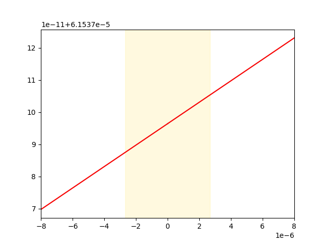
## New Eq:
((fabs(membrane__V) < 2.6708186528497407e-6) ? ((0.5 + 187208.51730854291 * membrane__V) * (0.002670818652849741 * pow(membrane__F, 2) * (-standard_ionic_concentrations__K_o + standard_ionic_concentrations__K_i * exp(2.6708186528497407e-6 * membrane__F / (membrane__R * membrane__T))) * L_type_Ca_current__P_CaK * L_type_Ca_current_d_gate__d * L_type_Ca_current_f_Ca_gate__f_Ca * L_type_Ca_current_f_gate__f / ((1.0 + L_type_Ca_current__i_Ca_max / L_type_Ca_current__i_Ca_half) * (-1.0 + exp(2.6708186528497407e-6 * membrane__F / (membrane__R * membrane__T))) * L_type_Ca_current__C_sc * membrane__R * membrane__T) + 0.002670818652849741 * pow(membrane__F, 2) * (-standard_ionic_concentrations__K_o + standard_ionic_concentrations__K_i * exp(-2.6708186528497407e-6 * membrane__F / (membrane__R * membrane__T))) * L_type_Ca_current__P_CaK * L_type_Ca_current_d_gate__d * L_type_Ca_current_f_Ca_gate__f_Ca * L_type_Ca_current_f_gate__f / ((1.0 + L_type_Ca_current__i_Ca_max / L_type_Ca_current__i_Ca_half) * (-1.0 + exp(-2.6708186528497407e-6 * membrane__F / (membrane__R * membrane__T))) * L_type_Ca_current__C_sc * membrane__R * membrane__T)) - 0.002670818652849741 * pow(membrane__F, 2) * (-standard_ionic_concentrations__K_o + standard_ionic_concentrations__K_i * exp(-2.6708186528497407e-6 * membrane__F / (membrane__R * membrane__T))) * L_type_Ca_current__P_CaK * L_type_Ca_current_d_gate__d * L_type_Ca_current_f_Ca_gate__f_Ca * L_type_Ca_current_f_gate__f / ((1.0 + L_type_Ca_current__i_Ca_max / L_type_Ca_current__i_Ca_half) * (-1.0 + exp(-2.6708186528497407e-6 * membrane__F / (membrane__R * membrane__T))) * L_type_Ca_current__C_sc * membrane__R * membrane__T)) : (1000.0 * pow(membrane__F, 2) * (-standard_ionic_concentrations__K_o + standard_ionic_concentrations__K_i * exp(membrane__F * membrane__V / (membrane__R * membrane__T))) * L_type_Ca_current__P_CaK * L_type_Ca_current_d_gate__d * L_type_Ca_current_f_Ca_gate__f_Ca * L_type_Ca_current_f_gate__f * membrane__V / ((1.0 + L_type_Ca_current__i_Ca_max / L_type_Ca_current__i_Ca_half) * (-1.0 + exp(membrane__F * membrane__V / (membrane__R * membrane__T))) * L_type_Ca_current__C_sc * membrane__R * membrane__T)))

Singularities cannot be found
1.0/(0.036499999999999998*(0.14285714285714286*exp(0.014858841010401189*_standard_ionic_concentrations$Na_o) - 0.14285714285714286)*exp(-0.037441703461708583*_membrane$V) + 1.0 + 0.1245*exp(-0.0037441703461708585*_membrane$V))

# Model: grandi_pasqualini_bers_2010(grandi_pasqualini_bers_2010_ss.cellml)
## Equation 1:
```
I_Ca__taud = 28.571428571428569 * (1.0 - exp(-0.83333333333333337 - 0.16666666666666666 * membrane_potential__V_m)) * I_Ca__dss / (5.0 + membrane_potential__V_m)
```
### Partially evaluated to: 
```
I_Ca__taud = 28.571428571428569 * (1.0 - exp(-0.83333333333333337 - 0.16666666666666666 * membrane_potential__V_m)) * I_Ca__dss / (5.0 + membrane_potential__V_m)
```
### Singulariy points detected:

{-5.0000000000000000}
*U*
`-0.83333333333333337 - 0.16666666666666666 * membrane_potential__V_m`

*V for 1e-07 range* 
`-4.9999994000000001 - -5.0000005999999999`

*Singularity point: -5.0000000000000000*


## New Eq:
((fabs(5.0 + membrane_potential__V_m) < 6.0000000000337561e-7) ? ((-4166666.1666432251 - 833333.33332864498 * membrane_potential__V_m) * (-47619047.618779711 * (1.0 - exp(1.0000000000027348e-7)) * I_Ca__dss - 47619047.618779711 * (1.0 - exp(-1.0000000000114084e-7)) * I_Ca__dss) + 47619047.618779711 * (1.0 - exp(-1.0000000000114084e-7)) * I_Ca__dss) : (28.571428571428569 * (1.0 - exp(-0.83333333333333337 - 0.16666666666666666 * membrane_potential__V_m)) * I_Ca__dss / (5.0 + membrane_potential__V_m)))

I_Na__ah = ((membrane_potential__V_m >= -40.0) ? (0) : (0.057000000000000002 * exp(-11.764705882352942 + 0.14705882352941177 * I_Na__shift_INa_inact - 0.14705882352941177 * membrane_potential__V_m)))

####Piecewise!!

I_Na__aj = ((membrane_potential__V_m >= -40.0) ? (0) : ((37.780000000000001 + membrane_potential__V_m) * (-25428.0 * exp(0.24440000000000001 * membrane_potential__V_m - 0.24440000000000001 * I_Na__shift_INa_inact) - 6.9480000000000002e-6 * exp(0.043909999999999998 * I_Na__shift_INa_inact - 0.043909999999999998 * membrane_potential__V_m)) / (1.0 + exp(24.640530000000002 + 0.311 * membrane_potential__V_m - 0.311 * I_Na__shift_INa_inact))))

####Piecewise!!

I_Na__bh = ((membrane_potential__V_m >= -40.0) ? (5.9230769230769234 / (1.0 + exp(-0.96036036036036043 + 0.0900900900900901 * I_Na__shift_INa_inact - 0.0900900900900901 * membrane_potential__V_m))) : (310000.0 * exp(0.34849999999999998 * membrane_potential__V_m - 0.34849999999999998 * I_Na__shift_INa_inact) + 2.7000000000000002 * exp(0.079000000000000001 * membrane_potential__V_m - 0.079000000000000001 * I_Na__shift_INa_inact)))

####Piecewise!!

I_Na__bj = ((membrane_potential__V_m >= -40.0) ? (0.59999999999999998 * exp(0.057000000000000002 * membrane_potential__V_m - 0.057000000000000002 * I_Na__shift_INa_inact) / (1.0 + exp(-3.2000000000000002 + 0.10000000000000001 * I_Na__shift_INa_inact - 0.10000000000000001 * membrane_potential__V_m))) : (0.024240000000000001 * exp(0.01052 * I_Na__shift_INa_inact - 0.01052 * membrane_potential__V_m) / (1.0 + exp(-5.5312920000000005 + 0.13780000000000001 * I_Na__shift_INa_inact - 0.13780000000000001 * membrane_potential__V_m))))

####Piecewise!!

Singularities cannot be found
1.0/(0.036499999999999998*(0.14285714285714286*exp(0.014858841010401189*_parameters$Nao) - 0.14285714285714286)*exp(-_membrane_potential$V_m*_parameters$Frdy/(_parameters$R*_parameters$Temp)) + 1.0 + 0.1245*exp(-0.10000000000000001*_membrane_potential$V_m*_parameters$Frdy/(_parameters$R*_parameters$Temp)))

I_to__GtoFast = ((parameters__epi == 1.0) ? (0.1144 * I_to__GtoFast_factor) : (0.0014039999999999999 * I_to__GtoFast_factor))

####Piecewise!!

I_to__GtoSlow = ((parameters__epi == 1.0) ? (0.015599999999999999 * I_to__GtoSlow_factor) : (0.037595999999999997 * I_to__GtoSlow_factor))

####Piecewise!!

## Equation 2:
```
I_Ca__ibarca_j = 4.0 * (-0.34100000000000003 * parameters__Cao + 0.34100000000000003 * Ca_Concentrations__Ca_j * exp(2.0 * membrane_potential__V_m * parameters__FoRT)) * membrane_potential__V_m * parameters__FoRT * parameters__Frdy * parameters__pCa / (-1.0 + exp(2.0 * membrane_potential__V_m * parameters__FoRT))
```
### Partially evaluated to: 
```
I_Ca__ibarca_j = 4.0 * (-0.34100000000000003 * parameters__Cao + 0.34100000000000003 * Ca_Concentrations__Ca_j * exp(2.0 * membrane_potential__V_m * parameters__FoRT)) * membrane_potential__V_m * parameters__FoRT * parameters__Frdy * parameters__pCa / (-1.0 + exp(2.0 * membrane_potential__V_m * parameters__FoRT))
```
### Singulariy points detected:

{0}
*U*
`2.0 * membrane_potential__V_m * parameters__FoRT`

*V for 1e-07 range* 
`-4.9999999999999998e-8 / parameters__FoRT - 4.9999999999999998e-8 / parameters__FoRT`

*Singularity point: 0*


## New Eq:
((fabs(membrane_potential__V_m) < 4.9999999999999998e-8 / fabs(parameters__FoRT)) ? (10000000.0 * (4.9999999999999998e-8 / parameters__FoRT + membrane_potential__V_m) * (1.9999999999999999e-7 * (-0.34100000000000003 * parameters__Cao + 0.34100000000000003 * Ca_Concentrations__Ca_j * exp(9.9999999999999995e-8)) * parameters__Frdy * parameters__pCa / (-1.0 + exp(9.9999999999999995e-8)) + 1.9999999999999999e-7 * (-0.34100000000000003 * parameters__Cao + 0.34100000000000003 * Ca_Concentrations__Ca_j * exp(-9.9999999999999995e-8)) * parameters__Frdy * parameters__pCa / (-1.0 + exp(-9.9999999999999995e-8))) * parameters__FoRT - 1.9999999999999999e-7 * (-0.34100000000000003 * parameters__Cao + 0.34100000000000003 * Ca_Concentrations__Ca_j * exp(-9.9999999999999995e-8)) * parameters__Frdy * parameters__pCa / (-1.0 + exp(-9.9999999999999995e-8))) : (4.0 * (-0.34100000000000003 * parameters__Cao + 0.34100000000000003 * Ca_Concentrations__Ca_j * exp(2.0 * membrane_potential__V_m * parameters__FoRT)) * membrane_potential__V_m * parameters__FoRT * parameters__Frdy * parameters__pCa / (-1.0 + exp(2.0 * membrane_potential__V_m * parameters__FoRT))))

## Equation 3:
```
I_Ca__ibarca_sl = 4.0 * (-0.34100000000000003 * parameters__Cao + 0.34100000000000003 * Ca_Concentrations__Ca_sl * exp(2.0 * membrane_potential__V_m * parameters__FoRT)) * membrane_potential__V_m * parameters__FoRT * parameters__Frdy * parameters__pCa / (-1.0 + exp(2.0 * membrane_potential__V_m * parameters__FoRT))
```
### Partially evaluated to: 
```
I_Ca__ibarca_sl = 4.0 * (-0.34100000000000003 * parameters__Cao + 0.34100000000000003 * Ca_Concentrations__Ca_sl * exp(2.0 * membrane_potential__V_m * parameters__FoRT)) * membrane_potential__V_m * parameters__FoRT * parameters__Frdy * parameters__pCa / (-1.0 + exp(2.0 * membrane_potential__V_m * parameters__FoRT))
```
### Singulariy points detected:

{0}
*U*
`2.0 * membrane_potential__V_m * parameters__FoRT`

*V for 1e-07 range* 
`-4.9999999999999998e-8 / parameters__FoRT - 4.9999999999999998e-8 / parameters__FoRT`

*Singularity point: 0*


## New Eq:
((fabs(membrane_potential__V_m) < 4.9999999999999998e-8 / fabs(parameters__FoRT)) ? (10000000.0 * (4.9999999999999998e-8 / parameters__FoRT + membrane_potential__V_m) * (1.9999999999999999e-7 * (-0.34100000000000003 * parameters__Cao + 0.34100000000000003 * Ca_Concentrations__Ca_sl * exp(9.9999999999999995e-8)) * parameters__Frdy * parameters__pCa / (-1.0 + exp(9.9999999999999995e-8)) + 1.9999999999999999e-7 * (-0.34100000000000003 * parameters__Cao + 0.34100000000000003 * Ca_Concentrations__Ca_sl * exp(-9.9999999999999995e-8)) * parameters__Frdy * parameters__pCa / (-1.0 + exp(-9.9999999999999995e-8))) * parameters__FoRT - 1.9999999999999999e-7 * (-0.34100000000000003 * parameters__Cao + 0.34100000000000003 * Ca_Concentrations__Ca_sl * exp(-9.9999999999999995e-8)) * parameters__Frdy * parameters__pCa / (-1.0 + exp(-9.9999999999999995e-8))) : (4.0 * (-0.34100000000000003 * parameters__Cao + 0.34100000000000003 * Ca_Concentrations__Ca_sl * exp(2.0 * membrane_potential__V_m * parameters__FoRT)) * membrane_potential__V_m * parameters__FoRT * parameters__Frdy * parameters__pCa / (-1.0 + exp(2.0 * membrane_potential__V_m * parameters__FoRT))))

## Equation 4:
```
I_Ca__ibark = (-0.75 * parameters__Ko + 0.75 * K_Concentration__K_i * exp(membrane_potential__V_m * parameters__FoRT)) * membrane_potential__V_m * parameters__FoRT * parameters__Frdy * parameters__pK / (-1.0 + exp(membrane_potential__V_m * parameters__FoRT))
```
### Partially evaluated to: 
```
I_Ca__ibark = (-0.75 * parameters__Ko + 0.75 * K_Concentration__K_i * exp(membrane_potential__V_m * parameters__FoRT)) * membrane_potential__V_m * parameters__FoRT * parameters__Frdy * parameters__pK / (-1.0 + exp(membrane_potential__V_m * parameters__FoRT))
```
### Singulariy points detected:

{0}
*U*
`membrane_potential__V_m * parameters__FoRT`

*V for 1e-07 range* 
`-9.9999999999999995e-8 / parameters__FoRT - 9.9999999999999995e-8 / parameters__FoRT`

*Singularity point: 0*

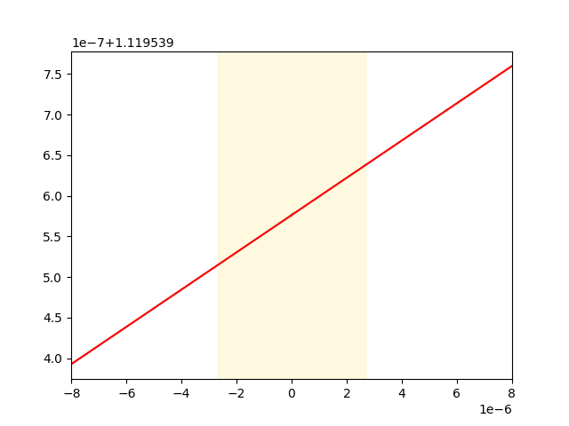
## New Eq:
((fabs(membrane_potential__V_m) < 9.9999999999999995e-8 / fabs(parameters__FoRT)) ? (5000000.0 * (9.9999999999999995e-8 / parameters__FoRT + membrane_potential__V_m) * (9.9999999999999995e-8 * (-0.75 * parameters__Ko + 0.75 * K_Concentration__K_i * exp(9.9999999999999995e-8)) * parameters__Frdy * parameters__pK / (-1.0 + exp(9.9999999999999995e-8)) + 9.9999999999999995e-8 * (-0.75 * parameters__Ko + 0.75 * K_Concentration__K_i * exp(-9.9999999999999995e-8)) * parameters__Frdy * parameters__pK / (-1.0 + exp(-9.9999999999999995e-8))) * parameters__FoRT - 9.9999999999999995e-8 * (-0.75 * parameters__Ko + 0.75 * K_Concentration__K_i * exp(-9.9999999999999995e-8)) * parameters__Frdy * parameters__pK / (-1.0 + exp(-9.9999999999999995e-8))) : ((-0.75 * parameters__Ko + 0.75 * K_Concentration__K_i * exp(membrane_potential__V_m * parameters__FoRT)) * membrane_potential__V_m * parameters__FoRT * parameters__Frdy * parameters__pK / (-1.0 + exp(membrane_potential__V_m * parameters__FoRT))))

## Equation 5:
```
I_Ca__ibarna_j = (-0.75 * parameters__Nao + 0.75 * Na_Concentrations__Na_j * exp(membrane_potential__V_m * parameters__FoRT)) * membrane_potential__V_m * parameters__FoRT * parameters__Frdy * parameters__pNa / (-1.0 + exp(membrane_potential__V_m * parameters__FoRT))
```
### Partially evaluated to: 
```
I_Ca__ibarna_j = (-0.75 * parameters__Nao + 0.75 * Na_Concentrations__Na_j * exp(membrane_potential__V_m * parameters__FoRT)) * membrane_potential__V_m * parameters__FoRT * parameters__Frdy * parameters__pNa / (-1.0 + exp(membrane_potential__V_m * parameters__FoRT))
```
### Singulariy points detected:

{0}
*U*
`membrane_potential__V_m * parameters__FoRT`

*V for 1e-07 range* 
`-9.9999999999999995e-8 / parameters__FoRT - 9.9999999999999995e-8 / parameters__FoRT`

*Singularity point: 0*

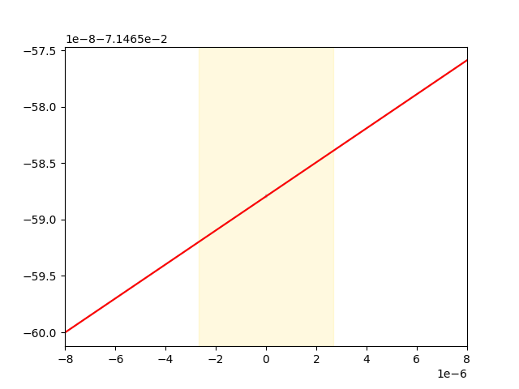
## New Eq:
((fabs(membrane_potential__V_m) < 9.9999999999999995e-8 / fabs(parameters__FoRT)) ? (5000000.0 * (9.9999999999999995e-8 / parameters__FoRT + membrane_potential__V_m) * (9.9999999999999995e-8 * (-0.75 * parameters__Nao + 0.75 * Na_Concentrations__Na_j * exp(9.9999999999999995e-8)) * parameters__Frdy * parameters__pNa / (-1.0 + exp(9.9999999999999995e-8)) + 9.9999999999999995e-8 * (-0.75 * parameters__Nao + 0.75 * Na_Concentrations__Na_j * exp(-9.9999999999999995e-8)) * parameters__Frdy * parameters__pNa / (-1.0 + exp(-9.9999999999999995e-8))) * parameters__FoRT - 9.9999999999999995e-8 * (-0.75 * parameters__Nao + 0.75 * Na_Concentrations__Na_j * exp(-9.9999999999999995e-8)) * parameters__Frdy * parameters__pNa / (-1.0 + exp(-9.9999999999999995e-8))) : ((-0.75 * parameters__Nao + 0.75 * Na_Concentrations__Na_j * exp(membrane_potential__V_m * parameters__FoRT)) * membrane_potential__V_m * parameters__FoRT * parameters__Frdy * parameters__pNa / (-1.0 + exp(membrane_potential__V_m * parameters__FoRT))))

## Equation 6:
```
I_Ca__ibarna_sl = (-0.75 * parameters__Nao + 0.75 * Na_Concentrations__Na_sl * exp(membrane_potential__V_m * parameters__FoRT)) * membrane_potential__V_m * parameters__FoRT * parameters__Frdy * parameters__pNa / (-1.0 + exp(membrane_potential__V_m * parameters__FoRT))
```
### Partially evaluated to: 
```
I_Ca__ibarna_sl = (-0.75 * parameters__Nao + 0.75 * Na_Concentrations__Na_sl * exp(membrane_potential__V_m * parameters__FoRT)) * membrane_potential__V_m * parameters__FoRT * parameters__Frdy * parameters__pNa / (-1.0 + exp(membrane_potential__V_m * parameters__FoRT))
```
### Singulariy points detected:

{0}
*U*
`membrane_potential__V_m * parameters__FoRT`

*V for 1e-07 range* 
`-9.9999999999999995e-8 / parameters__FoRT - 9.9999999999999995e-8 / parameters__FoRT`

*Singularity point: 0*

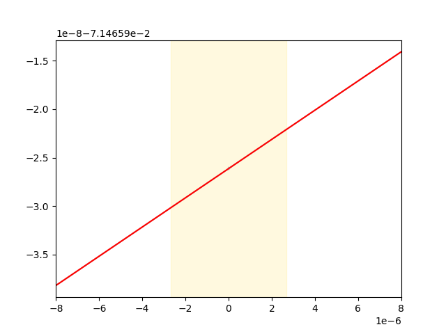
## New Eq:
((fabs(membrane_potential__V_m) < 9.9999999999999995e-8 / fabs(parameters__FoRT)) ? (5000000.0 * (9.9999999999999995e-8 / parameters__FoRT + membrane_potential__V_m) * (9.9999999999999995e-8 * (-0.75 * parameters__Nao + 0.75 * Na_Concentrations__Na_sl * exp(9.9999999999999995e-8)) * parameters__Frdy * parameters__pNa / (-1.0 + exp(9.9999999999999995e-8)) + 9.9999999999999995e-8 * (-0.75 * parameters__Nao + 0.75 * Na_Concentrations__Na_sl * exp(-9.9999999999999995e-8)) * parameters__Frdy * parameters__pNa / (-1.0 + exp(-9.9999999999999995e-8))) * parameters__FoRT - 9.9999999999999995e-8 * (-0.75 * parameters__Nao + 0.75 * Na_Concentrations__Na_sl * exp(-9.9999999999999995e-8)) * parameters__Frdy * parameters__pNa / (-1.0 + exp(-9.9999999999999995e-8))) : ((-0.75 * parameters__Nao + 0.75 * Na_Concentrations__Na_sl * exp(membrane_potential__V_m * parameters__FoRT)) * membrane_potential__V_m * parameters__FoRT * parameters__Frdy * parameters__pNa / (-1.0 + exp(membrane_potential__V_m * parameters__FoRT))))

# Model: grandi_pasqualini_bers_2010(grandi_pasqualini_bers_2010_ss_endo.cellml)
## Equation 1:
```
I_Ca__taud = 28.571428571428569 * (1.0 - exp(-0.83333333333333337 - 0.16666666666666666 * membrane_potential__V_m)) * I_Ca__dss / (5.0 + membrane_potential__V_m)
```
### Partially evaluated to: 
```
I_Ca__taud = 28.571428571428569 * (1.0 - exp(-0.83333333333333337 - 0.16666666666666666 * membrane_potential__V_m)) * I_Ca__dss / (5.0 + membrane_potential__V_m)
```
### Singulariy points detected:

{-5.0000000000000000}
*U*
`-0.83333333333333337 - 0.16666666666666666 * membrane_potential__V_m`

*V for 1e-07 range* 
`-4.9999994000000001 - -5.0000005999999999`

*Singularity point: -5.0000000000000000*


## New Eq:
((fabs(5.0 + membrane_potential__V_m) < 6.0000000000337561e-7) ? ((-4166666.1666432251 - 833333.33332864498 * membrane_potential__V_m) * (-47619047.618779711 * (1.0 - exp(1.0000000000027348e-7)) * I_Ca__dss - 47619047.618779711 * (1.0 - exp(-1.0000000000114084e-7)) * I_Ca__dss) + 47619047.618779711 * (1.0 - exp(-1.0000000000114084e-7)) * I_Ca__dss) : (28.571428571428569 * (1.0 - exp(-0.83333333333333337 - 0.16666666666666666 * membrane_potential__V_m)) * I_Ca__dss / (5.0 + membrane_potential__V_m)))

I_Na__ah = ((membrane_potential__V_m >= -40.0) ? (0) : (0.057000000000000002 * exp(-11.764705882352942 + 0.14705882352941177 * I_Na__shift_INa_inact - 0.14705882352941177 * membrane_potential__V_m)))

####Piecewise!!

I_Na__aj = ((membrane_potential__V_m >= -40.0) ? (0) : ((37.780000000000001 + membrane_potential__V_m) * (-25428.0 * exp(0.24440000000000001 * membrane_potential__V_m - 0.24440000000000001 * I_Na__shift_INa_inact) - 6.9480000000000002e-6 * exp(0.043909999999999998 * I_Na__shift_INa_inact - 0.043909999999999998 * membrane_potential__V_m)) / (1.0 + exp(24.640530000000002 + 0.311 * membrane_potential__V_m - 0.311 * I_Na__shift_INa_inact))))

####Piecewise!!

I_Na__bh = ((membrane_potential__V_m >= -40.0) ? (5.9230769230769234 / (1.0 + exp(-0.96036036036036043 + 0.0900900900900901 * I_Na__shift_INa_inact - 0.0900900900900901 * membrane_potential__V_m))) : (310000.0 * exp(0.34849999999999998 * membrane_potential__V_m - 0.34849999999999998 * I_Na__shift_INa_inact) + 2.7000000000000002 * exp(0.079000000000000001 * membrane_potential__V_m - 0.079000000000000001 * I_Na__shift_INa_inact)))

####Piecewise!!

I_Na__bj = ((membrane_potential__V_m >= -40.0) ? (0.59999999999999998 * exp(0.057000000000000002 * membrane_potential__V_m - 0.057000000000000002 * I_Na__shift_INa_inact) / (1.0 + exp(-3.2000000000000002 + 0.10000000000000001 * I_Na__shift_INa_inact - 0.10000000000000001 * membrane_potential__V_m))) : (0.024240000000000001 * exp(0.01052 * I_Na__shift_INa_inact - 0.01052 * membrane_potential__V_m) / (1.0 + exp(-5.5312920000000005 + 0.13780000000000001 * I_Na__shift_INa_inact - 0.13780000000000001 * membrane_potential__V_m))))

####Piecewise!!

Singularities cannot be found
1.0/(0.036499999999999998*(0.14285714285714286*exp(0.014858841010401189*_parameters$Nao) - 0.14285714285714286)*exp(-0.037435883507802618*_membrane_potential$V_m) + 1.0 + 0.1245*exp(-0.003743588350780262*_membrane_potential$V_m))

I_to__GtoFast = ((parameters__epi == 1.0) ? (0.1144 * I_to__GtoFast_factor) : (0.0014039999999999999 * I_to__GtoFast_factor))

####Piecewise!!

I_to__GtoSlow = ((parameters__epi == 1.0) ? (0.015599999999999999 * I_to__GtoSlow_factor) : (0.037595999999999997 * I_to__GtoSlow_factor))

####Piecewise!!

## Equation 2:
```
I_Ca__ibarca_j = 4.0 * (-0.34100000000000003 * parameters__Cao + 0.34100000000000003 * Ca_Concentrations__Ca_j * exp(2.0 * membrane_potential__V_m * parameters__FoRT)) * membrane_potential__V_m * parameters__FoRT * parameters__Frdy * parameters__pCa / (-1.0 + exp(2.0 * membrane_potential__V_m * parameters__FoRT))
```
### Partially evaluated to: 
```
I_Ca__ibarca_j = 4.0 * (-0.34100000000000003 * parameters__Cao + 0.34100000000000003 * Ca_Concentrations__Ca_j * exp(2.0 * membrane_potential__V_m * parameters__FoRT)) * membrane_potential__V_m * parameters__FoRT * parameters__Frdy * parameters__pCa / (-1.0 + exp(2.0 * membrane_potential__V_m * parameters__FoRT))
```
### Singulariy points detected:

{0}
*U*
`2.0 * membrane_potential__V_m * parameters__FoRT`

*V for 1e-07 range* 
`-4.9999999999999998e-8 / parameters__FoRT - 4.9999999999999998e-8 / parameters__FoRT`

*Singularity point: 0*


## New Eq:
((fabs(membrane_potential__V_m) < 4.9999999999999998e-8 / fabs(parameters__FoRT)) ? (10000000.0 * (4.9999999999999998e-8 / parameters__FoRT + membrane_potential__V_m) * (1.9999999999999999e-7 * (-0.34100000000000003 * parameters__Cao + 0.34100000000000003 * Ca_Concentrations__Ca_j * exp(9.9999999999999995e-8)) * parameters__Frdy * parameters__pCa / (-1.0 + exp(9.9999999999999995e-8)) + 1.9999999999999999e-7 * (-0.34100000000000003 * parameters__Cao + 0.34100000000000003 * Ca_Concentrations__Ca_j * exp(-9.9999999999999995e-8)) * parameters__Frdy * parameters__pCa / (-1.0 + exp(-9.9999999999999995e-8))) * parameters__FoRT - 1.9999999999999999e-7 * (-0.34100000000000003 * parameters__Cao + 0.34100000000000003 * Ca_Concentrations__Ca_j * exp(-9.9999999999999995e-8)) * parameters__Frdy * parameters__pCa / (-1.0 + exp(-9.9999999999999995e-8))) : (4.0 * (-0.34100000000000003 * parameters__Cao + 0.34100000000000003 * Ca_Concentrations__Ca_j * exp(2.0 * membrane_potential__V_m * parameters__FoRT)) * membrane_potential__V_m * parameters__FoRT * parameters__Frdy * parameters__pCa / (-1.0 + exp(2.0 * membrane_potential__V_m * parameters__FoRT))))

## Equation 3:
```
I_Ca__ibarca_sl = 4.0 * (-0.34100000000000003 * parameters__Cao + 0.34100000000000003 * Ca_Concentrations__Ca_sl * exp(2.0 * membrane_potential__V_m * parameters__FoRT)) * membrane_potential__V_m * parameters__FoRT * parameters__Frdy * parameters__pCa / (-1.0 + exp(2.0 * membrane_potential__V_m * parameters__FoRT))
```
### Partially evaluated to: 
```
I_Ca__ibarca_sl = 4.0 * (-0.34100000000000003 * parameters__Cao + 0.34100000000000003 * Ca_Concentrations__Ca_sl * exp(2.0 * membrane_potential__V_m * parameters__FoRT)) * membrane_potential__V_m * parameters__FoRT * parameters__Frdy * parameters__pCa / (-1.0 + exp(2.0 * membrane_potential__V_m * parameters__FoRT))
```
### Singulariy points detected:

{0}
*U*
`2.0 * membrane_potential__V_m * parameters__FoRT`

*V for 1e-07 range* 
`-4.9999999999999998e-8 / parameters__FoRT - 4.9999999999999998e-8 / parameters__FoRT`

*Singularity point: 0*


## New Eq:
((fabs(membrane_potential__V_m) < 4.9999999999999998e-8 / fabs(parameters__FoRT)) ? (10000000.0 * (4.9999999999999998e-8 / parameters__FoRT + membrane_potential__V_m) * (1.9999999999999999e-7 * (-0.34100000000000003 * parameters__Cao + 0.34100000000000003 * Ca_Concentrations__Ca_sl * exp(9.9999999999999995e-8)) * parameters__Frdy * parameters__pCa / (-1.0 + exp(9.9999999999999995e-8)) + 1.9999999999999999e-7 * (-0.34100000000000003 * parameters__Cao + 0.34100000000000003 * Ca_Concentrations__Ca_sl * exp(-9.9999999999999995e-8)) * parameters__Frdy * parameters__pCa / (-1.0 + exp(-9.9999999999999995e-8))) * parameters__FoRT - 1.9999999999999999e-7 * (-0.34100000000000003 * parameters__Cao + 0.34100000000000003 * Ca_Concentrations__Ca_sl * exp(-9.9999999999999995e-8)) * parameters__Frdy * parameters__pCa / (-1.0 + exp(-9.9999999999999995e-8))) : (4.0 * (-0.34100000000000003 * parameters__Cao + 0.34100000000000003 * Ca_Concentrations__Ca_sl * exp(2.0 * membrane_potential__V_m * parameters__FoRT)) * membrane_potential__V_m * parameters__FoRT * parameters__Frdy * parameters__pCa / (-1.0 + exp(2.0 * membrane_potential__V_m * parameters__FoRT))))

## Equation 4:
```
I_Ca__ibark = (-0.75 * parameters__Ko + 0.75 * K_Concentration__K_i * exp(membrane_potential__V_m * parameters__FoRT)) * membrane_potential__V_m * parameters__FoRT * parameters__Frdy * parameters__pK / (-1.0 + exp(membrane_potential__V_m * parameters__FoRT))
```
### Partially evaluated to: 
```
I_Ca__ibark = (-0.75 * parameters__Ko + 0.75 * K_Concentration__K_i * exp(membrane_potential__V_m * parameters__FoRT)) * membrane_potential__V_m * parameters__FoRT * parameters__Frdy * parameters__pK / (-1.0 + exp(membrane_potential__V_m * parameters__FoRT))
```
### Singulariy points detected:

{0}
*U*
`membrane_potential__V_m * parameters__FoRT`

*V for 1e-07 range* 
`-9.9999999999999995e-8 / parameters__FoRT - 9.9999999999999995e-8 / parameters__FoRT`

*Singularity point: 0*


## New Eq:
((fabs(membrane_potential__V_m) < 9.9999999999999995e-8 / fabs(parameters__FoRT)) ? (5000000.0 * (9.9999999999999995e-8 / parameters__FoRT + membrane_potential__V_m) * (9.9999999999999995e-8 * (-0.75 * parameters__Ko + 0.75 * K_Concentration__K_i * exp(9.9999999999999995e-8)) * parameters__Frdy * parameters__pK / (-1.0 + exp(9.9999999999999995e-8)) + 9.9999999999999995e-8 * (-0.75 * parameters__Ko + 0.75 * K_Concentration__K_i * exp(-9.9999999999999995e-8)) * parameters__Frdy * parameters__pK / (-1.0 + exp(-9.9999999999999995e-8))) * parameters__FoRT - 9.9999999999999995e-8 * (-0.75 * parameters__Ko + 0.75 * K_Concentration__K_i * exp(-9.9999999999999995e-8)) * parameters__Frdy * parameters__pK / (-1.0 + exp(-9.9999999999999995e-8))) : ((-0.75 * parameters__Ko + 0.75 * K_Concentration__K_i * exp(membrane_potential__V_m * parameters__FoRT)) * membrane_potential__V_m * parameters__FoRT * parameters__Frdy * parameters__pK / (-1.0 + exp(membrane_potential__V_m * parameters__FoRT))))

## Equation 5:
```
I_Ca__ibarna_j = (-0.75 * parameters__Nao + 0.75 * Na_Concentrations__Na_j * exp(membrane_potential__V_m * parameters__FoRT)) * membrane_potential__V_m * parameters__FoRT * parameters__Frdy * parameters__pNa / (-1.0 + exp(membrane_potential__V_m * parameters__FoRT))
```
### Partially evaluated to: 
```
I_Ca__ibarna_j = (-0.75 * parameters__Nao + 0.75 * Na_Concentrations__Na_j * exp(membrane_potential__V_m * parameters__FoRT)) * membrane_potential__V_m * parameters__FoRT * parameters__Frdy * parameters__pNa / (-1.0 + exp(membrane_potential__V_m * parameters__FoRT))
```
### Singulariy points detected:

{0}
*U*
`membrane_potential__V_m * parameters__FoRT`

*V for 1e-07 range* 
`-9.9999999999999995e-8 / parameters__FoRT - 9.9999999999999995e-8 / parameters__FoRT`

*Singularity point: 0*


## New Eq:
((fabs(membrane_potential__V_m) < 9.9999999999999995e-8 / fabs(parameters__FoRT)) ? (5000000.0 * (9.9999999999999995e-8 / parameters__FoRT + membrane_potential__V_m) * (9.9999999999999995e-8 * (-0.75 * parameters__Nao + 0.75 * Na_Concentrations__Na_j * exp(9.9999999999999995e-8)) * parameters__Frdy * parameters__pNa / (-1.0 + exp(9.9999999999999995e-8)) + 9.9999999999999995e-8 * (-0.75 * parameters__Nao + 0.75 * Na_Concentrations__Na_j * exp(-9.9999999999999995e-8)) * parameters__Frdy * parameters__pNa / (-1.0 + exp(-9.9999999999999995e-8))) * parameters__FoRT - 9.9999999999999995e-8 * (-0.75 * parameters__Nao + 0.75 * Na_Concentrations__Na_j * exp(-9.9999999999999995e-8)) * parameters__Frdy * parameters__pNa / (-1.0 + exp(-9.9999999999999995e-8))) : ((-0.75 * parameters__Nao + 0.75 * Na_Concentrations__Na_j * exp(membrane_potential__V_m * parameters__FoRT)) * membrane_potential__V_m * parameters__FoRT * parameters__Frdy * parameters__pNa / (-1.0 + exp(membrane_potential__V_m * parameters__FoRT))))

## Equation 6:
```
I_Ca__ibarna_sl = (-0.75 * parameters__Nao + 0.75 * Na_Concentrations__Na_sl * exp(membrane_potential__V_m * parameters__FoRT)) * membrane_potential__V_m * parameters__FoRT * parameters__Frdy * parameters__pNa / (-1.0 + exp(membrane_potential__V_m * parameters__FoRT))
```
### Partially evaluated to: 
```
I_Ca__ibarna_sl = (-0.75 * parameters__Nao + 0.75 * Na_Concentrations__Na_sl * exp(membrane_potential__V_m * parameters__FoRT)) * membrane_potential__V_m * parameters__FoRT * parameters__Frdy * parameters__pNa / (-1.0 + exp(membrane_potential__V_m * parameters__FoRT))
```
### Singulariy points detected:

{0}
*U*
`membrane_potential__V_m * parameters__FoRT`

*V for 1e-07 range* 
`-9.9999999999999995e-8 / parameters__FoRT - 9.9999999999999995e-8 / parameters__FoRT`

*Singularity point: 0*


## New Eq:
((fabs(membrane_potential__V_m) < 9.9999999999999995e-8 / fabs(parameters__FoRT)) ? (5000000.0 * (9.9999999999999995e-8 / parameters__FoRT + membrane_potential__V_m) * (9.9999999999999995e-8 * (-0.75 * parameters__Nao + 0.75 * Na_Concentrations__Na_sl * exp(9.9999999999999995e-8)) * parameters__Frdy * parameters__pNa / (-1.0 + exp(9.9999999999999995e-8)) + 9.9999999999999995e-8 * (-0.75 * parameters__Nao + 0.75 * Na_Concentrations__Na_sl * exp(-9.9999999999999995e-8)) * parameters__Frdy * parameters__pNa / (-1.0 + exp(-9.9999999999999995e-8))) * parameters__FoRT - 9.9999999999999995e-8 * (-0.75 * parameters__Nao + 0.75 * Na_Concentrations__Na_sl * exp(-9.9999999999999995e-8)) * parameters__Frdy * parameters__pNa / (-1.0 + exp(-9.9999999999999995e-8))) : ((-0.75 * parameters__Nao + 0.75 * Na_Concentrations__Na_sl * exp(membrane_potential__V_m * parameters__FoRT)) * membrane_potential__V_m * parameters__FoRT * parameters__Frdy * parameters__pNa / (-1.0 + exp(membrane_potential__V_m * parameters__FoRT))))

# Model: hilgemann_noble_model_1987(hilgemann_noble_model_1987.cellml)
fast_sodium_current_m_gate__alpha_m = ((fast_sodium_current_m_gate__delta_m > fabs(fast_sodium_current_m_gate__E0_m)) ? (2000.0) : (200.0 * fast_sodium_current_m_gate__E0_m / (1.0 - exp(-0.10000000000000001 * fast_sodium_current_m_gate__E0_m))))

####Piecewise!!

second_inward_calcium_current_d_gate__alpha_d = ((second_inward_calcium_current_d_gate__delta_d > fabs(second_inward_calcium_current_d_gate__E0_d)) ? (120.0) : (30.0 * second_inward_calcium_current_d_gate__E0_d / (1.0 - exp(-0.25 * second_inward_calcium_current_d_gate__E0_d))))

####Piecewise!!

second_inward_calcium_current_d_gate__beta_d = ((second_inward_calcium_current_d_gate__delta_d > fabs(second_inward_calcium_current_d_gate__E0_d)) ? (120.0) : (12.0 * second_inward_calcium_current_d_gate__E0_d / (-1.0 + exp(0.10000000000000001 * second_inward_calcium_current_d_gate__E0_d))))

####Piecewise!!

second_inward_calcium_current_f_Ca_gate__alpha_f_Ca = ((second_inward_calcium_current_f_Ca_gate__delta_f > fabs(second_inward_calcium_current_f_Ca_gate__E0_f)) ? (25.0) : (6.25 * second_inward_calcium_current_f_Ca_gate__E0_f / (-1.0 + exp(0.25 * second_inward_calcium_current_f_Ca_gate__E0_f))))

####Piecewise!!

## Equation 1:
```
second_inward_calcium_current__i_siCa = 4.0 * (-50.0 + membrane__V) * (intracellular_calcium_concentration__Ca_i * exp(100.0 / membrane__RTONF) - extracellular_calcium_concentration__Ca_o * exp(-2.0 * (-50.0 + membrane__V) / membrane__RTONF)) * second_inward_calcium_current__P_si * second_inward_calcium_current_d_gate__d * second_inward_calcium_current_f_Ca_gate__CaChon / ((1.0 - exp(-2.0 * (-50.0 + membrane__V) / membrane__RTONF)) * membrane__RTONF)
```
### Partially evaluated to: 
```
second_inward_calcium_current__i_siCa = 4.0 * (-50.0 + membrane__V) * (intracellular_calcium_concentration__Ca_i * exp(100.0 / membrane__RTONF) - extracellular_calcium_concentration__Ca_o * exp(-2.0 * (-50.0 + membrane__V) / membrane__RTONF)) * second_inward_calcium_current__P_si * second_inward_calcium_current_d_gate__d * second_inward_calcium_current_f_Ca_gate__CaChon / ((1.0 - exp(-2.0 * (-50.0 + membrane__V) / membrane__RTONF)) * membrane__RTONF)
```
### Singulariy points detected:

{50.000000000000000}
#### float * A

####Failed to find U symbolically!

<class 'sympy.core.mul.Mul'>
_second_inward_calcium_current$P_si*_second_inward_calcium_current_d_gate$d*_second_inward_calcium_current_f_Ca_gate$CaChon*(_membrane$V - 50.0)*(-_extracellular_calcium_concentration$Ca_o*exp(-2.0*(_membrane$V - 50.0)/_membrane$RTONF) + _intracellular_calcium_concentration$Ca_i*exp(100.0/_membrane$RTONF))/(_membrane$RTONF*(1.0 - exp(-2.0*(_membrane$V - 50.0)/_membrane$RTONF)))

*try substituting parameters*

*U*
`3.7433890822745473 - 0.074867781645490947 * membrane__V`

*V for 1e-07 range* 
`50.000001335688033 - 49.999998664311967`

*Singularity point: 50.000000000000000*


## New Eq:
((fabs(-50.0 + membrane__V) < 1.3356880329828957e-6) ? ((18716945.911399174 - 374338.90822798351 * membrane__V) * (-5.3427521318205606e-6 * (intracellular_calcium_concentration__Ca_i * exp(100.0 / membrane__RTONF) - extracellular_calcium_concentration__Ca_o * exp(-2.6713760659102803e-6 / membrane__RTONF)) * second_inward_calcium_current__P_si * second_inward_calcium_current_d_gate__d * second_inward_calcium_current_f_Ca_gate__CaChon / ((1.0 - exp(-2.6713760659102803e-6 / membrane__RTONF)) * membrane__RTONF) - 5.3427521320426052e-6 * (intracellular_calcium_concentration__Ca_i * exp(100.0 / membrane__RTONF) - extracellular_calcium_concentration__Ca_o * exp(2.6713760660213026e-6 / membrane__RTONF)) * second_inward_calcium_current__P_si * second_inward_calcium_current_d_gate__d * second_inward_calcium_current_f_Ca_gate__CaChon / ((1.0 - exp(2.6713760660213026e-6 / membrane__RTONF)) * membrane__RTONF)) + 5.3427521318205606e-6 * (intracellular_calcium_concentration__Ca_i * exp(100.0 / membrane__RTONF) - extracellular_calcium_concentration__Ca_o * exp(-2.6713760659102803e-6 / membrane__RTONF)) * second_inward_calcium_current__P_si * second_inward_calcium_current_d_gate__d * second_inward_calcium_current_f_Ca_gate__CaChon / ((1.0 - exp(-2.6713760659102803e-6 / membrane__RTONF)) * membrane__RTONF)) : (4.0 * (-50.0 + membrane__V) * (intracellular_calcium_concentration__Ca_i * exp(100.0 / membrane__RTONF) - extracellular_calcium_concentration__Ca_o * exp(-2.0 * (-50.0 + membrane__V) / membrane__RTONF)) * second_inward_calcium_current__P_si * second_inward_calcium_current_d_gate__d * second_inward_calcium_current_f_Ca_gate__CaChon / ((1.0 - exp(-2.0 * (-50.0 + membrane__V) / membrane__RTONF)) * membrane__RTONF)))

## Equation 2:
```
second_inward_calcium_current__i_siK = 0.002 * (-50.0 + membrane__V) * (intracellular_potassium_concentration__K_i * exp(50.0 / membrane__RTONF) - extracellular_potassium_concentration__K_c * exp(-(-50.0 + membrane__V) / membrane__RTONF)) * second_inward_calcium_current__P_si * second_inward_calcium_current_d_gate__d * second_inward_calcium_current_f_Ca_gate__CaChon / ((1.0 - exp(-(-50.0 + membrane__V) / membrane__RTONF)) * membrane__RTONF)
```
### Partially evaluated to: 
```
second_inward_calcium_current__i_siK = 0.002 * (-50.0 + membrane__V) * (intracellular_potassium_concentration__K_i * exp(50.0 / membrane__RTONF) - extracellular_potassium_concentration__K_c * exp(-(-50.0 + membrane__V) / membrane__RTONF)) * second_inward_calcium_current__P_si * second_inward_calcium_current_d_gate__d * second_inward_calcium_current_f_Ca_gate__CaChon / ((1.0 - exp(-(-50.0 + membrane__V) / membrane__RTONF)) * membrane__RTONF)
```
### Singulariy points detected:

{50.000000000000000}
#### float * A

####Failed to find U symbolically!

<class 'sympy.core.mul.Mul'>
_second_inward_calcium_current$P_si*_second_inward_calcium_current_d_gate$d*_second_inward_calcium_current_f_Ca_gate$CaChon*(_membrane$V - 50.0)*(-_extracellular_potassium_concentration$K_c*exp(-1.0*(_membrane$V - 50.0)/_membrane$RTONF) + _intracellular_potassium_concentration$K_i*exp(50.0/_membrane$RTONF))/(_membrane$RTONF*(1.0 - exp(-1.0*(_membrane$V - 50.0)/_membrane$RTONF)))

*try substituting parameters*

*U*
`1.8716945411372736 - 0.037433890822745473 * membrane__V`

*V for 1e-07 range* 
`50.000002671376066 - 49.999997328623934`

*Singularity point: 50.000000000000000*


## New Eq:
((fabs(-50.0 + membrane__V) < 2.6713760659380359e-6) ? ((9358473.205796821 - 187169.45411593645 * membrane__V) * (-5.3427521319315827e-9 * (intracellular_potassium_concentration__K_i * exp(50.0 / membrane__RTONF) - extracellular_potassium_concentration__K_c * exp(2.6713760659657915e-6 / membrane__RTONF)) * second_inward_calcium_current__P_si * second_inward_calcium_current_d_gate__d * second_inward_calcium_current_f_Ca_gate__CaChon / ((1.0 - exp(2.6713760659657915e-6 / membrane__RTONF)) * membrane__RTONF) - 5.342752131820561e-9 * (intracellular_potassium_concentration__K_i * exp(50.0 / membrane__RTONF) - extracellular_potassium_concentration__K_c * exp(-2.6713760659102803e-6 / membrane__RTONF)) * second_inward_calcium_current__P_si * second_inward_calcium_current_d_gate__d * second_inward_calcium_current_f_Ca_gate__CaChon / ((1.0 - exp(-2.6713760659102803e-6 / membrane__RTONF)) * membrane__RTONF)) + 5.342752131820561e-9 * (intracellular_potassium_concentration__K_i * exp(50.0 / membrane__RTONF) - extracellular_potassium_concentration__K_c * exp(-2.6713760659102803e-6 / membrane__RTONF)) * second_inward_calcium_current__P_si * second_inward_calcium_current_d_gate__d * second_inward_calcium_current_f_Ca_gate__CaChon / ((1.0 - exp(-2.6713760659102803e-6 / membrane__RTONF)) * membrane__RTONF)) : (0.002 * (-50.0 + membrane__V) * (intracellular_potassium_concentration__K_i * exp(50.0 / membrane__RTONF) - extracellular_potassium_concentration__K_c * exp(-(-50.0 + membrane__V) / membrane__RTONF)) * second_inward_calcium_current__P_si * second_inward_calcium_current_d_gate__d * second_inward_calcium_current_f_Ca_gate__CaChon / ((1.0 - exp(-(-50.0 + membrane__V) / membrane__RTONF)) * membrane__RTONF)))

## Equation 3:
```
second_inward_calcium_current__i_siNa = 0.01 * (-50.0 + membrane__V) * (intracellular_sodium_concentration__Na_i * exp(50.0 / membrane__RTONF) - extracellular_sodium_concentration__Na_o * exp(-(-50.0 + membrane__V) / membrane__RTONF)) * second_inward_calcium_current__P_si * second_inward_calcium_current_d_gate__d * second_inward_calcium_current_f_Ca_gate__CaChon / ((1.0 - exp(-(-50.0 + membrane__V) / membrane__RTONF)) * membrane__RTONF)
```
### Partially evaluated to: 
```
second_inward_calcium_current__i_siNa = 0.01 * (-50.0 + membrane__V) * (intracellular_sodium_concentration__Na_i * exp(50.0 / membrane__RTONF) - extracellular_sodium_concentration__Na_o * exp(-(-50.0 + membrane__V) / membrane__RTONF)) * second_inward_calcium_current__P_si * second_inward_calcium_current_d_gate__d * second_inward_calcium_current_f_Ca_gate__CaChon / ((1.0 - exp(-(-50.0 + membrane__V) / membrane__RTONF)) * membrane__RTONF)
```
### Singulariy points detected:

{50.000000000000000}
#### float * A

####Failed to find U symbolically!

<class 'sympy.core.mul.Mul'>
_second_inward_calcium_current$P_si*_second_inward_calcium_current_d_gate$d*_second_inward_calcium_current_f_Ca_gate$CaChon*(_membrane$V - 50.0)*(-_extracellular_sodium_concentration$Na_o*exp(-1.0*(_membrane$V - 50.0)/_membrane$RTONF) + _intracellular_sodium_concentration$Na_i*exp(50.0/_membrane$RTONF))/(_membrane$RTONF*(1.0 - exp(-1.0*(_membrane$V - 50.0)/_membrane$RTONF)))

*try substituting parameters*

*U*
`1.8716945411372736 - 0.037433890822745473 * membrane__V`

*V for 1e-07 range* 
`50.000002671376066 - 49.999997328623934`

*Singularity point: 50.000000000000000*


## New Eq:
((fabs(-50.0 + membrane__V) < 2.6713760659380359e-6) ? ((9358473.205796821 - 187169.45411593645 * membrane__V) * (-2.6713760659657917e-8 * (intracellular_sodium_concentration__Na_i * exp(50.0 / membrane__RTONF) - extracellular_sodium_concentration__Na_o * exp(2.6713760659657915e-6 / membrane__RTONF)) * second_inward_calcium_current__P_si * second_inward_calcium_current_d_gate__d * second_inward_calcium_current_f_Ca_gate__CaChon / ((1.0 - exp(2.6713760659657915e-6 / membrane__RTONF)) * membrane__RTONF) - 2.6713760659102803e-8 * (intracellular_sodium_concentration__Na_i * exp(50.0 / membrane__RTONF) - extracellular_sodium_concentration__Na_o * exp(-2.6713760659102803e-6 / membrane__RTONF)) * second_inward_calcium_current__P_si * second_inward_calcium_current_d_gate__d * second_inward_calcium_current_f_Ca_gate__CaChon / ((1.0 - exp(-2.6713760659102803e-6 / membrane__RTONF)) * membrane__RTONF)) + 2.6713760659102803e-8 * (intracellular_sodium_concentration__Na_i * exp(50.0 / membrane__RTONF) - extracellular_sodium_concentration__Na_o * exp(-2.6713760659102803e-6 / membrane__RTONF)) * second_inward_calcium_current__P_si * second_inward_calcium_current_d_gate__d * second_inward_calcium_current_f_Ca_gate__CaChon / ((1.0 - exp(-2.6713760659102803e-6 / membrane__RTONF)) * membrane__RTONF)) : (0.01 * (-50.0 + membrane__V) * (intracellular_sodium_concentration__Na_i * exp(50.0 / membrane__RTONF) - extracellular_sodium_concentration__Na_o * exp(-(-50.0 + membrane__V) / membrane__RTONF)) * second_inward_calcium_current__P_si * second_inward_calcium_current_d_gate__d * second_inward_calcium_current_f_Ca_gate__CaChon / ((1.0 - exp(-(-50.0 + membrane__V) / membrane__RTONF)) * membrane__RTONF)))

# Model: hodgkin_huxley_squid_axon_model_1952_modified(hodgkin_huxley_squid_axon_model_1952_modified.cellml)
potassium_channel_n_gate__alpha_n = (((potassium_channel_n_gate__U >= -9.9999999999999995e-8) && (potassium_channel_n_gate__U <= 9.9999999999999995e-8)) ? ((1.0 - 0.5 * potassium_channel_n_gate__U) * potassium_channel_n_gate__A) : (potassium_channel_n_gate__A * potassium_channel_n_gate__U / (-1.0 + exp(potassium_channel_n_gate__U))))

####Piecewise!!

sodium_channel_m_gate__alpha_m = (((sodium_channel_m_gate__U >= -9.9999999999999995e-8) && (sodium_channel_m_gate__U <= 9.9999999999999995e-8)) ? ((1.0 - 0.5 * sodium_channel_m_gate__U) * sodium_channel_m_gate__A) : (sodium_channel_m_gate__A * sodium_channel_m_gate__U / (-1.0 + exp(sodium_channel_m_gate__U))))

####Piecewise!!

# Model: HundRudy2004_units(hund_rudy_2004.cellml)
INa__GNa = ((Environment__tissue == 0) ? (INa__GNa_max) : (4.0 * INa__GNa_max))

####Piecewise!!

## Equation 1:
```
ICaL__ibarca = 4.0 * (-15.0 + cell__V) * (-Environment__Ca_o * ICaL__gacao + Ca__Ca_ss * ICaL__gacai * exp(2.0 * (-15.0 + cell__V) * Environment__FonRT)) * Environment__F * Environment__FonRT * ICaL__pca / (-1.0 + exp(2.0 * (-15.0 + cell__V) * Environment__FonRT))
```
### Partially evaluated to: 
```
ICaL__ibarca = 4.0 * (-15.0 + cell__V) * (-Environment__Ca_o * ICaL__gacao + Ca__Ca_ss * ICaL__gacai * exp(2.0 * (-15.0 + cell__V) * Environment__FonRT)) * Environment__F * Environment__FonRT * ICaL__pca / (-1.0 + exp(2.0 * (-15.0 + cell__V) * Environment__FonRT))
```
### Singulariy points detected:

{15.000000000000000}
*U*
`2.0 * (-15.0 + cell__V) * Environment__FonRT`

*V for 1e-07 range* 
`15.0 - 4.9999999999999998e-8 / Environment__FonRT - 15.0 + 4.9999999999999998e-8 / Environment__FonRT`

*Singularity point: 15.000000000000000*

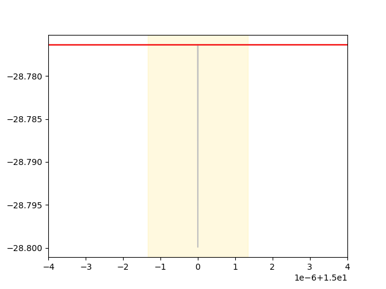
## New Eq:
((fabs(-15.0 + cell__V) < 4.9999999999999998e-8 / fabs(Environment__FonRT)) ? (10000000.0 * (1.9999999999999999e-7 * (-Environment__Ca_o * ICaL__gacao + Ca__Ca_ss * ICaL__gacai * exp(9.9999999999999995e-8)) * Environment__F * ICaL__pca / (-1.0 + exp(9.9999999999999995e-8)) + 1.9999999999999999e-7 * (-Environment__Ca_o * ICaL__gacao + Ca__Ca_ss * ICaL__gacai * exp(-9.9999999999999995e-8)) * Environment__F * ICaL__pca / (-1.0 + exp(-9.9999999999999995e-8))) * (-15.0 + 4.9999999999999998e-8 / Environment__FonRT + cell__V) * Environment__FonRT - 1.9999999999999999e-7 * (-Environment__Ca_o * ICaL__gacao + Ca__Ca_ss * ICaL__gacai * exp(-9.9999999999999995e-8)) * Environment__F * ICaL__pca / (-1.0 + exp(-9.9999999999999995e-8))) : (4.0 * (-15.0 + cell__V) * (-Environment__Ca_o * ICaL__gacao + Ca__Ca_ss * ICaL__gacai * exp(2.0 * (-15.0 + cell__V) * Environment__FonRT)) * Environment__F * Environment__FonRT * ICaL__pca / (-1.0 + exp(2.0 * (-15.0 + cell__V) * Environment__FonRT))))

ICaL__ICaL = ((Environment__tissue == 0) ? (pow(ICaL__d, ICaL__dp) * ICaL__f * ICaL__f2 * ICaL__fca * ICaL__fca2 * ICaL__ibarca) : (ICaL__d * ICaL__f * ICaL__f2 * ICaL__fca * ICaL__fca2 * ICaL__ibarca))

####Piecewise!!

## Equation 2:
```
ICab__ICab = 7.9803360000000004e-7 * (-0.34100000000000003 * Environment__Ca_o + Ca__Ca_i * exp(2.0 * Environment__FonRT * cell__V)) * Environment__F * Environment__FonRT * cell__V / (-1.0 + exp(2.0 * Environment__FonRT * cell__V))
```
### Partially evaluated to: 
```
ICab__ICab = 7.9803360000000004e-7 * (-0.34100000000000003 * Environment__Ca_o + Ca__Ca_i * exp(2.0 * Environment__FonRT * cell__V)) * Environment__F * Environment__FonRT * cell__V / (-1.0 + exp(2.0 * Environment__FonRT * cell__V))
```
### Singulariy points detected:

{0}
*U*
`2.0 * Environment__FonRT * cell__V`

*V for 1e-07 range* 
`-4.9999999999999998e-8 / Environment__FonRT - 4.9999999999999998e-8 / Environment__FonRT`

*Singularity point: 0*


## New Eq:
((fabs(cell__V) < 4.9999999999999998e-8 / fabs(Environment__FonRT)) ? (10000000.0 * (4.9999999999999998e-8 / Environment__FonRT + cell__V) * (3.990168e-14 * (-0.34100000000000003 * Environment__Ca_o + Ca__Ca_i * exp(9.9999999999999995e-8)) * Environment__F / (-1.0 + exp(9.9999999999999995e-8)) + 3.990168e-14 * (-0.34100000000000003 * Environment__Ca_o + Ca__Ca_i * exp(-9.9999999999999995e-8)) * Environment__F / (-1.0 + exp(-9.9999999999999995e-8))) * Environment__FonRT - 3.990168e-14 * (-0.34100000000000003 * Environment__Ca_o + Ca__Ca_i * exp(-9.9999999999999995e-8)) * Environment__F / (-1.0 + exp(-9.9999999999999995e-8))) : (7.9803360000000004e-7 * (-0.34100000000000003 * Environment__Ca_o + Ca__Ca_i * exp(2.0 * Environment__FonRT * cell__V)) * Environment__F * Environment__FonRT * cell__V / (-1.0 + exp(2.0 * Environment__FonRT * cell__V))))

## Equation 3:
```
IKr__tauxr = 1 / (0.00029999999999999997 * (38.360799999999998 + cell__V) / (-1.0 + exp(5.8385137599999997 + 0.1522 * cell__V)) + 0.00059999999999999995 * (-1.7383999999999999 + cell__V) / (1.0 - exp(0.2364224 - 0.13600000000000001 * cell__V)))
```
### Partially evaluated to: 
```
IKr__tauxr = 1 / (0.00029999999999999997 * (38.360799999999998 + cell__V) / (-1.0 + exp(5.8385137599999997 + 0.1522 * cell__V)) + 0.00059999999999999995 * (-1.7383999999999999 + cell__V) / (1.0 - exp(0.2364224 - 0.13600000000000001 * cell__V)))
```
### Singulariy points detected:

{-38.360799999999998, 1.7383999999999999}
#### float * A

####1 / A


####A + B:

`0.00059999999999999995 * (-1.7383999999999999 + cell__V) / (1.0 - 1.2667092551679247 * exp(-0.13600000000000001 * cell__V))`
`0.00029999999999999997 * (38.360799999999998 + cell__V) / (-1.0 + 343.26878155836141 * exp(0.1522 * cell__V))`

*U*
`0.2364224 - 0.13600000000000001 * cell__V`

*V for 1e-07 range* 
`1.7384007352941175 - 1.7383992647058824`

*Singularity point: 1.7383999999999999*


*U*
`5.8385137599999997 + 0.1522 * cell__V`

*V for 1e-07 range* 
`-38.360800657030218 - -38.360799342969777`

*Singularity point: -38.360799999999998*


## New Eq:
((fabs(-1.7383999999999999 + cell__V) < 7.3529411764774316e-7) ? (1 / (0.012029760220588234 / (-1.0 + exp(6.1030983519117648)) + 4.4117647059020713e-10 / (1.0 - exp(-1.0000000000049032e-7))) + (1182112.4999988999 - 679999.99999936717 * cell__V) * (1 / (0.012029759779411764 / (-1.0 + exp(6.1030981280882353)) - 4.4117647058708463e-10 / (1.0 - exp(9.99999999998398e-8))) - 1 / (0.012029760220588234 / (-1.0 + exp(6.1030983519117648)) + 4.4117647059020713e-10 / (1.0 - exp(-1.0000000000049032e-7))))) : ((fabs(38.360799999999998 + cell__V) < 6.5703022339436146e-7) ? (1 / (-1.9710906701830842e-10 / (-1.0 + exp(-1.0000000000287557e-7)) - 0.024059520394218131 / (1.0 - exp(5.4534912893561103))) + (29192569.299818475 + 760999.99999526795 * cell__V) * (1 / (1.9710906701830842e-10 / (-1.0 + exp(1.0000000000287557e-7)) - 0.024059519605781864 / (1.0 - exp(5.4534911106438893))) - 1 / (-1.9710906701830842e-10 / (-1.0 + exp(-1.0000000000287557e-7)) - 0.024059520394218131 / (1.0 - exp(5.4534912893561103))))) : (1 / (0.00029999999999999997 * (38.360799999999998 + cell__V) / (-1.0 + exp(5.8385137599999997 + 0.1522 * cell__V)) + 0.00059999999999999995 * (-1.7383999999999999 + cell__V) / (1.0 - exp(0.2364224 - 0.13600000000000001 * cell__V))))))

## Equation 4:
```
IKs__tauxs = 1 / (7.6100000000000007e-5 * (44.600000000000001 + cell__V) / (1.0 - exp(-444.66200000000003 - 9.9700000000000006 * cell__V)) + 0.00036000000000000002 * (-0.55000000000000004 + cell__V) / (-1.0 + exp(-0.070400000000000004 + 0.128 * cell__V)))
```
### Partially evaluated to: 
```
IKs__tauxs = 1 / (7.6100000000000007e-5 * (44.600000000000001 + cell__V) / (1.0 - exp(-444.66200000000003 - 9.9700000000000006 * cell__V)) + 0.00036000000000000002 * (-0.55000000000000004 + cell__V) / (-1.0 + exp(-0.070400000000000004 + 0.128 * cell__V)))
```
### Singulariy points detected:

{-44.600000000000001, 0.55000000000000005}
#### float * A

####1 / A


####A + B:

`7.6100000000000007e-5 * (44.600000000000001 + cell__V) / (1.0 - 7.6868266637773744e-194 * exp(-9.9700000000000006 * cell__V))`
`0.00036000000000000002 * (-0.55000000000000004 + cell__V) / (-1.0 + 0.93202093695954691 * exp(0.128 * cell__V))`

*U*
`-444.66200000000003 - 9.9700000000000006 * cell__V`

*V for 1e-07 range* 
`-44.599999989969909 - -44.600000010030094`

*Singularity point: -44.600000000000001*


*U*
`-0.070400000000000004 + 0.128 * cell__V`

*V for 1e-07 range* 
`0.54999921875000002 - 0.55000078125000007`

*Singularity point: 0.55000000000000005*


## New Eq:
((fabs(44.600000000000001 + cell__V) < 1.0030090258350555e-8) ? (1 / (7.6328986866047728e-13 / (1.0 - exp(-9.9999999836342113e-8)) - 0.016253999996389171 / (-1.0 + exp(-5.7791999987161491))) + (-2223310002.262351 - 49850000.061936118 * cell__V) * (1 / (-0.016254000003610835 / (-1.0 + exp(-5.7792000012838516)) - 7.6328986866047728e-13 / (1.0 - exp(9.9999999836342113e-8))) - 1 / (7.6328986866047728e-13 / (1.0 - exp(-9.9999999836342113e-8)) - 0.016253999996389171 / (-1.0 + exp(-5.7791999987161491))))) : ((fabs(-0.55000000000000004 + cell__V) < 7.8124999999991396e-7) ? (1 / (0.0034359149405468756 / (1.0 - exp(-450.14549221093756)) - 2.8124999999903229e-10 / (-1.0 + exp(-9.999999999962296e-8))) + (-351999.50000003882 + 640000.00000007043 * cell__V) * (1 / (2.812500000009058e-10 / (-1.0 + exp(1.0000000000027348e-7)) + 0.0034359150594531255 / (1.0 - exp(-450.14550778906255))) - 1 / (0.0034359149405468756 / (1.0 - exp(-450.14549221093756)) - 2.8124999999903229e-10 / (-1.0 + exp(-9.999999999962296e-8))))) : (1 / (7.6100000000000007e-5 * (44.600000000000001 + cell__V) / (1.0 - exp(-444.66200000000003 - 9.9700000000000006 * cell__V)) + 0.00036000000000000002 * (-0.55000000000000004 + cell__V) / (-1.0 + exp(-0.070400000000000004 + 0.128 * cell__V))))))

INa__ah = ((cell__V >= -40.0) ? (0) : (0.13500000000000001 * exp(-11.764705882352942 + 0.14705882352941177 * INa__shift_INa_inact - 0.14705882352941177 * cell__V)))

####Piecewise!!

INa__aj = ((cell__V >= -40.0) ? (0) : ((37.780000000000001 + cell__V) * (-127140.0 * exp(0.24440000000000001 * cell__V - 0.24440000000000001 * INa__shift_INa_inact) - 3.4740000000000003e-5 * exp(0.043909999999999998 * INa__shift_INa_inact - 0.043909999999999998 * cell__V)) / (1.0 + exp(24.640530000000002 + 0.311 * cell__V - 0.311 * INa__shift_INa_inact))))

####Piecewise!!

## Equation 5:
```
INa__am = 0.32000000000000001 * (47.130000000000003 + cell__V) / (1.0 - exp(-4.7130000000000001 - 0.10000000000000001 * cell__V))
```
### Partially evaluated to: 
```
INa__am = 0.32000000000000001 * (47.130000000000003 + cell__V) / (1.0 - exp(-4.7130000000000001 - 0.10000000000000001 * cell__V))
```
### Singulariy points detected:

{-47.130000000000003}
*U*
`-4.7130000000000001 - 0.10000000000000001 * cell__V`

*V for 1e-07 range* 
`-47.129999000000005 - -47.130001`

*Singularity point: -47.130000000000003*


## New Eq:
((fabs(47.130000000000003 + cell__V) < 1.0000000000287557e-6) ? (3.200000000092018e-7 / (1.0 - exp(-1.0000000000287557e-7)) + (-23564999.499322373 - 499999.99998562218 * cell__V) * (-3.200000000092018e-7 / (1.0 - exp(1.0000000000287557e-7)) - 3.200000000092018e-7 / (1.0 - exp(-1.0000000000287557e-7)))) : (0.32000000000000001 * (47.130000000000003 + cell__V) / (1.0 - exp(-4.7130000000000001 - 0.10000000000000001 * cell__V))))

INa__bh = ((cell__V >= -40.0) ? (7.6923076923076916 / (1.0 + exp(-0.96036036036036043 + 0.0900900900900901 * INa__shift_INa_inact - 0.0900900900900901 * cell__V))) : (310000.0 * exp(0.34999999999999998 * cell__V - 0.34999999999999998 * INa__shift_INa_inact) + 3.5600000000000001 * exp(0.079000000000000001 * cell__V - 0.079000000000000001 * INa__shift_INa_inact)))

####Piecewise!!

INa__bj = ((cell__V >= -40.0) ? (0.29999999999999999 * exp(2.5349999999999999e-7 * INa__shift_INa_inact - 2.5349999999999999e-7 * cell__V) / (1.0 + exp(-3.2000000000000002 + 0.10000000000000001 * INa__shift_INa_inact - 0.10000000000000001 * cell__V))) : (0.1212 * exp(0.01052 * INa__shift_INa_inact - 0.01052 * cell__V) / (1.0 + exp(-5.5312920000000005 + 0.13780000000000001 * INa__shift_INa_inact - 0.13780000000000001 * cell__V))))

####Piecewise!!

Singularities cannot be found
1.0/(0.036499999999999998*(0.14285714285714286*exp(0.014858841010401189*_Environment$Na_o) - 0.14285714285714286)*exp(-0.0374358835078*_cell$V) + 1.0 + 0.1245*exp(-0.0037435883507800002*_cell$V))

## Equation 6:
```
INal__amL = 0.32000000000000001 * (47.130000000000003 + cell__V) / (1.0 - exp(-4.7130000000000001 - 0.10000000000000001 * cell__V))
```
### Partially evaluated to: 
```
INal__amL = 0.32000000000000001 * (47.130000000000003 + cell__V) / (1.0 - exp(-4.7130000000000001 - 0.10000000000000001 * cell__V))
```
### Singulariy points detected:

{-47.130000000000003}
*U*
`-4.7130000000000001 - 0.10000000000000001 * cell__V`

*V for 1e-07 range* 
`-47.129999000000005 - -47.130001`

*Singularity point: -47.130000000000003*


## New Eq:
((fabs(47.130000000000003 + cell__V) < 1.0000000000287557e-6) ? (3.200000000092018e-7 / (1.0 - exp(-1.0000000000287557e-7)) + (-23564999.499322373 - 499999.99998562218 * cell__V) * (-3.200000000092018e-7 / (1.0 - exp(1.0000000000287557e-7)) - 3.200000000092018e-7 / (1.0 - exp(-1.0000000000287557e-7)))) : (0.32000000000000001 * (47.130000000000003 + cell__V) / (1.0 - exp(-4.7130000000000001 - 0.10000000000000001 * cell__V))))

Irel__vg = ((Environment__tissue == 0) ? (1 / (1.0 + exp(2.6000000000000001 + 0.20000000000000001 * ICaL__ibarca))) : (1.0))

####Piecewise!!

## Equation 7:
```
Ito2__Ito2_max = (-Environment__Cl_o * exp(Environment__FonRT * cell__V) + Cl__Cl_i) * Environment__F * Environment__FonRT * Ito2__PCl * cell__V / (1.0 - exp(Environment__FonRT * cell__V))
```
### Partially evaluated to: 
```
Ito2__Ito2_max = (-Environment__Cl_o * exp(Environment__FonRT * cell__V) + Cl__Cl_i) * Environment__F * Environment__FonRT * Ito2__PCl * cell__V / (1.0 - exp(Environment__FonRT * cell__V))
```
### Singulariy points detected:

{0}
*U*
`Environment__FonRT * cell__V`

*V for 1e-07 range* 
`-9.9999999999999995e-8 / Environment__FonRT - 9.9999999999999995e-8 / Environment__FonRT`

*Singularity point: 0*

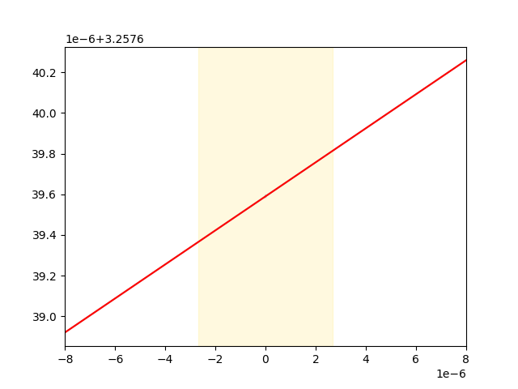
## New Eq:
((fabs(cell__V) < 9.9999999999999995e-8 / fabs(Environment__FonRT)) ? (5000000.0 * (9.9999999999999995e-8 / Environment__FonRT + cell__V) * (9.9999999999999995e-8 * (-Environment__Cl_o * exp(9.9999999999999995e-8) + Cl__Cl_i) * Environment__F * Ito2__PCl / (1.0 - exp(9.9999999999999995e-8)) + 9.9999999999999995e-8 * (-Environment__Cl_o * exp(-9.9999999999999995e-8) + Cl__Cl_i) * Environment__F * Ito2__PCl / (1.0 - exp(-9.9999999999999995e-8))) * Environment__FonRT - 9.9999999999999995e-8 * (-Environment__Cl_o * exp(-9.9999999999999995e-8) + Cl__Cl_i) * Environment__F * Ito2__PCl / (1.0 - exp(-9.9999999999999995e-8))) : ((-Environment__Cl_o * exp(Environment__FonRT * cell__V) + Cl__Cl_i) * Environment__F * Environment__FonRT * Ito2__PCl * cell__V / (1.0 - exp(Environment__FonRT * cell__V))))

# Model: iribe_model_2006(iribe_model_2006.cellml)
Force__phi_SL = (((Force__SL >= 1.7) && (Force__SL <= 2.0)) ? (-0.4285714285714286 + 0.7142857142857143 * Force__SL) : (((Force__SL <= 2.2000000000000002) && (Force__SL > 2.0)) ? (1.0) : (((Force__SL <= 2.2999999999999998) && (Force__SL > 2.2000000000000002)) ? (2.5714285714285716 - 0.7142857142857143 * Force__SL) : (NAN))))

####Piecewise!!

## Equation 1:
```
L_type_Ca_channel__i_Ca_L_Ca = 4.0 * (-50.0 + membrane_potential__V) * (intracellular_calcium_concentration__Ca_i * exp(100.0 * cell_parameters__F / (cell_parameters__R * cell_parameters__T)) - cell_parameters__Ca_o * exp(-2.0 * (-50.0 + membrane_potential__V) * cell_parameters__F / (cell_parameters__R * cell_parameters__T))) * L_type_Ca_channel__P_Ca_L_Ca * L_type_Ca_channel_d_gate__d * L_type_Ca_channel_f_gate__f * cell_parameters__F / ((1.0 - exp(-2.0 * (-50.0 + membrane_potential__V) * cell_parameters__F / (cell_parameters__R * cell_parameters__T))) * cell_parameters__R * cell_parameters__T)
```
### Partially evaluated to: 
```
L_type_Ca_channel__i_Ca_L_Ca = 4.0 * (-50.0 + membrane_potential__V) * (intracellular_calcium_concentration__Ca_i * exp(100.0 * cell_parameters__F / (cell_parameters__R * cell_parameters__T)) - cell_parameters__Ca_o * exp(-2.0 * (-50.0 + membrane_potential__V) * cell_parameters__F / (cell_parameters__R * cell_parameters__T))) * L_type_Ca_channel__P_Ca_L_Ca * L_type_Ca_channel_d_gate__d * L_type_Ca_channel_f_gate__f * cell_parameters__F / ((1.0 - exp(-2.0 * (-50.0 + membrane_potential__V) * cell_parameters__F / (cell_parameters__R * cell_parameters__T))) * cell_parameters__R * cell_parameters__T)
```
### Singulariy points detected:

{50.000000000000000}
#### float * A

####Failed to find U symbolically!

<class 'sympy.core.mul.Mul'>
_L_type_Ca_channel$P_Ca_L_Ca*_L_type_Ca_channel_d_gate$d*_L_type_Ca_channel_f_gate$f*_cell_parameters$F*(_membrane_potential$V - 50.0)*(-_cell_parameters$Ca_o*exp(-2.0*_cell_parameters$F*(_membrane_potential$V - 50.0)/(_cell_parameters$R*_cell_parameters$T)) + _intracellular_calcium_concentration$Ca_i*exp(100.0*_cell_parameters$F/(_cell_parameters$R*_cell_parameters$T)))/(_cell_parameters$R*_cell_parameters$T*(1.0 - exp(-2.0*_cell_parameters$F*(_membrane_potential$V - 50.0)/(_cell_parameters$R*_cell_parameters$T))))

*try substituting parameters*

*U*
`3.7433890822745473 - 0.074867781645490947 * membrane_potential__V`

*V for 1e-07 range* 
`50.000001335688033 - 49.999998664311967`

*Singularity point: 50.000000000000000*


## New Eq:
((fabs(-50.0 + membrane_potential__V) < 1.3356880329828957e-6) ? ((18716945.911399174 - 374338.90822798351 * membrane_potential__V) * (-5.3427521318205606e-6 * (intracellular_calcium_concentration__Ca_i * exp(100.0 * cell_parameters__F / (cell_parameters__R * cell_parameters__T)) - cell_parameters__Ca_o * exp(-2.6713760659102803e-6 * cell_parameters__F / (cell_parameters__R * cell_parameters__T))) * L_type_Ca_channel__P_Ca_L_Ca * L_type_Ca_channel_d_gate__d * L_type_Ca_channel_f_gate__f * cell_parameters__F / ((1.0 - exp(-2.6713760659102803e-6 * cell_parameters__F / (cell_parameters__R * cell_parameters__T))) * cell_parameters__R * cell_parameters__T) - 5.3427521320426052e-6 * (intracellular_calcium_concentration__Ca_i * exp(100.0 * cell_parameters__F / (cell_parameters__R * cell_parameters__T)) - cell_parameters__Ca_o * exp(2.6713760660213026e-6 * cell_parameters__F / (cell_parameters__R * cell_parameters__T))) * L_type_Ca_channel__P_Ca_L_Ca * L_type_Ca_channel_d_gate__d * L_type_Ca_channel_f_gate__f * cell_parameters__F / ((1.0 - exp(2.6713760660213026e-6 * cell_parameters__F / (cell_parameters__R * cell_parameters__T))) * cell_parameters__R * cell_parameters__T)) + 5.3427521318205606e-6 * (intracellular_calcium_concentration__Ca_i * exp(100.0 * cell_parameters__F / (cell_parameters__R * cell_parameters__T)) - cell_parameters__Ca_o * exp(-2.6713760659102803e-6 * cell_parameters__F / (cell_parameters__R * cell_parameters__T))) * L_type_Ca_channel__P_Ca_L_Ca * L_type_Ca_channel_d_gate__d * L_type_Ca_channel_f_gate__f * cell_parameters__F / ((1.0 - exp(-2.6713760659102803e-6 * cell_parameters__F / (cell_parameters__R * cell_parameters__T))) * cell_parameters__R * cell_parameters__T)) : (4.0 * (-50.0 + membrane_potential__V) * (intracellular_calcium_concentration__Ca_i * exp(100.0 * cell_parameters__F / (cell_parameters__R * cell_parameters__T)) - cell_parameters__Ca_o * exp(-2.0 * (-50.0 + membrane_potential__V) * cell_parameters__F / (cell_parameters__R * cell_parameters__T))) * L_type_Ca_channel__P_Ca_L_Ca * L_type_Ca_channel_d_gate__d * L_type_Ca_channel_f_gate__f * cell_parameters__F / ((1.0 - exp(-2.0 * (-50.0 + membrane_potential__V) * cell_parameters__F / (cell_parameters__R * cell_parameters__T))) * cell_parameters__R * cell_parameters__T)))

## Equation 2:
```
L_type_Ca_channel__i_Ca_L_K = 0.002 * (-50.0 + membrane_potential__V) * (intracellular_potassium_concentration__K_i * exp(50.0 * cell_parameters__F / (cell_parameters__R * cell_parameters__T)) - cell_parameters__K_o * exp((50.0 - membrane_potential__V) * cell_parameters__F / (cell_parameters__R * cell_parameters__T))) * L_type_Ca_channel__P_Ca_L_Ca * L_type_Ca_channel_d_gate__d * L_type_Ca_channel_f_gate__f * cell_parameters__F / ((1.0 - exp((50.0 - membrane_potential__V) * cell_parameters__F / (cell_parameters__R * cell_parameters__T))) * cell_parameters__R * cell_parameters__T)
```
### Partially evaluated to: 
```
L_type_Ca_channel__i_Ca_L_K = 0.002 * (-50.0 + membrane_potential__V) * (intracellular_potassium_concentration__K_i * exp(50.0 * cell_parameters__F / (cell_parameters__R * cell_parameters__T)) - cell_parameters__K_o * exp((50.0 - membrane_potential__V) * cell_parameters__F / (cell_parameters__R * cell_parameters__T))) * L_type_Ca_channel__P_Ca_L_Ca * L_type_Ca_channel_d_gate__d * L_type_Ca_channel_f_gate__f * cell_parameters__F / ((1.0 - exp((50.0 - membrane_potential__V) * cell_parameters__F / (cell_parameters__R * cell_parameters__T))) * cell_parameters__R * cell_parameters__T)
```
### Singulariy points detected:

{50.000000000000000}
#### float * A

####Failed to find U symbolically!

<class 'sympy.core.mul.Mul'>
_L_type_Ca_channel$P_Ca_L_Ca*_L_type_Ca_channel_d_gate$d*_L_type_Ca_channel_f_gate$f*_cell_parameters$F*(_membrane_potential$V - 50.0)*(-_cell_parameters$K_o*exp(_cell_parameters$F*(50.0 - _membrane_potential$V)/(_cell_parameters$R*_cell_parameters$T)) + _intracellular_potassium_concentration$K_i*exp(50.0*_cell_parameters$F/(_cell_parameters$R*_cell_parameters$T)))/(_cell_parameters$R*_cell_parameters$T*(1.0 - exp(_cell_parameters$F*(50.0 - _membrane_potential$V)/(_cell_parameters$R*_cell_parameters$T))))

*try substituting parameters*

*U*
`1.8716945411372736 - 0.037433890822745473 * membrane_potential__V`

*V for 1e-07 range* 
`50.000002671376066 - 49.999997328623934`

*Singularity point: 50.000000000000000*


## New Eq:
((fabs(-50.0 + membrane_potential__V) < 2.6713760659380359e-6) ? ((9358473.205796821 - 187169.45411593645 * membrane_potential__V) * (-5.3427521319315827e-9 * (intracellular_potassium_concentration__K_i * exp(50.0 * cell_parameters__F / (cell_parameters__R * cell_parameters__T)) - cell_parameters__K_o * exp(2.6713760659657915e-6 * cell_parameters__F / (cell_parameters__R * cell_parameters__T))) * L_type_Ca_channel__P_Ca_L_Ca * L_type_Ca_channel_d_gate__d * L_type_Ca_channel_f_gate__f * cell_parameters__F / ((1.0 - exp(2.6713760659657915e-6 * cell_parameters__F / (cell_parameters__R * cell_parameters__T))) * cell_parameters__R * cell_parameters__T) - 5.342752131820561e-9 * (intracellular_potassium_concentration__K_i * exp(50.0 * cell_parameters__F / (cell_parameters__R * cell_parameters__T)) - cell_parameters__K_o * exp(-2.6713760659102803e-6 * cell_parameters__F / (cell_parameters__R * cell_parameters__T))) * L_type_Ca_channel__P_Ca_L_Ca * L_type_Ca_channel_d_gate__d * L_type_Ca_channel_f_gate__f * cell_parameters__F / ((1.0 - exp(-2.6713760659102803e-6 * cell_parameters__F / (cell_parameters__R * cell_parameters__T))) * cell_parameters__R * cell_parameters__T)) + 5.342752131820561e-9 * (intracellular_potassium_concentration__K_i * exp(50.0 * cell_parameters__F / (cell_parameters__R * cell_parameters__T)) - cell_parameters__K_o * exp(-2.6713760659102803e-6 * cell_parameters__F / (cell_parameters__R * cell_parameters__T))) * L_type_Ca_channel__P_Ca_L_Ca * L_type_Ca_channel_d_gate__d * L_type_Ca_channel_f_gate__f * cell_parameters__F / ((1.0 - exp(-2.6713760659102803e-6 * cell_parameters__F / (cell_parameters__R * cell_parameters__T))) * cell_parameters__R * cell_parameters__T)) : (0.002 * (-50.0 + membrane_potential__V) * (intracellular_potassium_concentration__K_i * exp(50.0 * cell_parameters__F / (cell_parameters__R * cell_parameters__T)) - cell_parameters__K_o * exp((50.0 - membrane_potential__V) * cell_parameters__F / (cell_parameters__R * cell_parameters__T))) * L_type_Ca_channel__P_Ca_L_Ca * L_type_Ca_channel_d_gate__d * L_type_Ca_channel_f_gate__f * cell_parameters__F / ((1.0 - exp((50.0 - membrane_potential__V) * cell_parameters__F / (cell_parameters__R * cell_parameters__T))) * cell_parameters__R * cell_parameters__T)))

## Equation 3:
```
L_type_Ca_channel__i_Ca_L_Na = 0.01 * (-50.0 + membrane_potential__V) * (intracellular_sodium_concentration__Na_i * exp(50.0 * cell_parameters__F / (cell_parameters__R * cell_parameters__T)) - cell_parameters__Na_o * exp((50.0 - membrane_potential__V) * cell_parameters__F / (cell_parameters__R * cell_parameters__T))) * L_type_Ca_channel__P_Ca_L_Ca * L_type_Ca_channel_d_gate__d * L_type_Ca_channel_f_gate__f * cell_parameters__F / ((1.0 - exp((50.0 - membrane_potential__V) * cell_parameters__F / (cell_parameters__R * cell_parameters__T))) * cell_parameters__R * cell_parameters__T)
```
### Partially evaluated to: 
```
L_type_Ca_channel__i_Ca_L_Na = 0.01 * (-50.0 + membrane_potential__V) * (intracellular_sodium_concentration__Na_i * exp(50.0 * cell_parameters__F / (cell_parameters__R * cell_parameters__T)) - cell_parameters__Na_o * exp((50.0 - membrane_potential__V) * cell_parameters__F / (cell_parameters__R * cell_parameters__T))) * L_type_Ca_channel__P_Ca_L_Ca * L_type_Ca_channel_d_gate__d * L_type_Ca_channel_f_gate__f * cell_parameters__F / ((1.0 - exp((50.0 - membrane_potential__V) * cell_parameters__F / (cell_parameters__R * cell_parameters__T))) * cell_parameters__R * cell_parameters__T)
```
### Singulariy points detected:

{50.000000000000000}
#### float * A

####Failed to find U symbolically!

<class 'sympy.core.mul.Mul'>
_L_type_Ca_channel$P_Ca_L_Ca*_L_type_Ca_channel_d_gate$d*_L_type_Ca_channel_f_gate$f*_cell_parameters$F*(_membrane_potential$V - 50.0)*(-_cell_parameters$Na_o*exp(_cell_parameters$F*(50.0 - _membrane_potential$V)/(_cell_parameters$R*_cell_parameters$T)) + _intracellular_sodium_concentration$Na_i*exp(50.0*_cell_parameters$F/(_cell_parameters$R*_cell_parameters$T)))/(_cell_parameters$R*_cell_parameters$T*(1.0 - exp(_cell_parameters$F*(50.0 - _membrane_potential$V)/(_cell_parameters$R*_cell_parameters$T))))

*try substituting parameters*

*U*
`1.8716945411372736 - 0.037433890822745473 * membrane_potential__V`

*V for 1e-07 range* 
`50.000002671376066 - 49.999997328623934`

*Singularity point: 50.000000000000000*


## New Eq:
((fabs(-50.0 + membrane_potential__V) < 2.6713760659380359e-6) ? ((9358473.205796821 - 187169.45411593645 * membrane_potential__V) * (-2.6713760659657917e-8 * (intracellular_sodium_concentration__Na_i * exp(50.0 * cell_parameters__F / (cell_parameters__R * cell_parameters__T)) - cell_parameters__Na_o * exp(2.6713760659657915e-6 * cell_parameters__F / (cell_parameters__R * cell_parameters__T))) * L_type_Ca_channel__P_Ca_L_Ca * L_type_Ca_channel_d_gate__d * L_type_Ca_channel_f_gate__f * cell_parameters__F / ((1.0 - exp(2.6713760659657915e-6 * cell_parameters__F / (cell_parameters__R * cell_parameters__T))) * cell_parameters__R * cell_parameters__T) - 2.6713760659102803e-8 * (intracellular_sodium_concentration__Na_i * exp(50.0 * cell_parameters__F / (cell_parameters__R * cell_parameters__T)) - cell_parameters__Na_o * exp(-2.6713760659102803e-6 * cell_parameters__F / (cell_parameters__R * cell_parameters__T))) * L_type_Ca_channel__P_Ca_L_Ca * L_type_Ca_channel_d_gate__d * L_type_Ca_channel_f_gate__f * cell_parameters__F / ((1.0 - exp(-2.6713760659102803e-6 * cell_parameters__F / (cell_parameters__R * cell_parameters__T))) * cell_parameters__R * cell_parameters__T)) + 2.6713760659102803e-8 * (intracellular_sodium_concentration__Na_i * exp(50.0 * cell_parameters__F / (cell_parameters__R * cell_parameters__T)) - cell_parameters__Na_o * exp(-2.6713760659102803e-6 * cell_parameters__F / (cell_parameters__R * cell_parameters__T))) * L_type_Ca_channel__P_Ca_L_Ca * L_type_Ca_channel_d_gate__d * L_type_Ca_channel_f_gate__f * cell_parameters__F / ((1.0 - exp(-2.6713760659102803e-6 * cell_parameters__F / (cell_parameters__R * cell_parameters__T))) * cell_parameters__R * cell_parameters__T)) : (0.01 * (-50.0 + membrane_potential__V) * (intracellular_sodium_concentration__Na_i * exp(50.0 * cell_parameters__F / (cell_parameters__R * cell_parameters__T)) - cell_parameters__Na_o * exp((50.0 - membrane_potential__V) * cell_parameters__F / (cell_parameters__R * cell_parameters__T))) * L_type_Ca_channel__P_Ca_L_Ca * L_type_Ca_channel_d_gate__d * L_type_Ca_channel_f_gate__f * cell_parameters__F / ((1.0 - exp((50.0 - membrane_potential__V) * cell_parameters__F / (cell_parameters__R * cell_parameters__T))) * cell_parameters__R * cell_parameters__T)))

L_type_Ca_channel_d_gate__alpha_d = ((fabs(L_type_Ca_channel_d_gate__E0_d) < 1.0000000000000001e-5) ? (120.0 * L_type_Ca_channel_d_gate__speed_d) : (30.0 * L_type_Ca_channel_d_gate__E0_d * L_type_Ca_channel_d_gate__speed_d / (1.0 - exp(-0.25 * L_type_Ca_channel_d_gate__E0_d))))

####Piecewise!!

L_type_Ca_channel_d_gate__beta_d = ((fabs(L_type_Ca_channel_d_gate__E0_d) < 1.0000000000000001e-5) ? (120.0 * L_type_Ca_channel_d_gate__speed_d) : (-12.0 * L_type_Ca_channel_d_gate__E0_d * L_type_Ca_channel_d_gate__speed_d / (1.0 - exp(0.10000000000000001 * L_type_Ca_channel_d_gate__E0_d))))

####Piecewise!!

L_type_Ca_channel_f_gate__alpha_f = ((fabs(L_type_Ca_channel_f_gate__E0_f) < 1.0000000000000001e-5) ? (25.0 * L_type_Ca_channel_f_gate__speed_f) : (6.25 * L_type_Ca_channel_f_gate__E0_f * L_type_Ca_channel_f_gate__speed_f / (-1.0 + exp(0.25 * L_type_Ca_channel_f_gate__E0_f))))

####Piecewise!!

fast_sodium_current_m_gate__alpha_m = ((fast_sodium_current_m_gate__delta_m > fabs(fast_sodium_current_m_gate__E0_m)) ? (2000.0) : (200.0 * fast_sodium_current_m_gate__E0_m / (1.0 - exp(-0.10000000000000001 * fast_sodium_current_m_gate__E0_m))))

####Piecewise!!

# Model: IyerMazhariWinslow2004(iyer_2004.cellml)
COMPUTE_ICa_ICaK__Icabar = ((COMPUTE_ICa_ICaK__ICamax >= 0) ? (0) : (COMPUTE_ICa_ICaK__ICamax))

####Piecewise!!

# Model: iyer_model_2007(iyer_model_2007.cellml)
COMPUTE_DERIVATIVES_OF_RyR_RECEPTOR_STATES__H50C2O1 = ((environment__CSQN2 == 1.0) ? (0.5) : (1.0))

####Piecewise!!

COMPUTE_DERIVATIVES_OF_RyR_RECEPTOR_STATES__HmaxO1C2 = ((environment__CSQN2 == 1.0) ? (0.20000000000000001) : (0.5))

####Piecewise!!

COMPUTE_DERIVATIVES_OF_RyR_RECEPTOR_STATES__kryr = ((environment__RyR2 == 1.0) ? (0.80000000000000004) : (1.0))

####Piecewise!!

COMPUTE_Jtrpn_and_BUFFER_SCALE_FACTORS__CSQNtot = ((environment__RyR2 == 1.0) ? (15.0) : (7.5))

####Piecewise!!

COMPUTE_ICa_ICaK__PCa = ((environment__iso == 0) ? (COMPUTE_ICa_ICaK__PCa_max * COMPUTE_ICa_ICaK__Pscale) : (1.5 * COMPUTE_ICa_ICaK__PCa_max * COMPUTE_ICa_ICaK__Pscale))

####Piecewise!!

COMPUTE_ICa_ICaK__Icabar = ((COMPUTE_ICa_ICaK__ICamax >= 0) ? (0) : (COMPUTE_ICa_ICaK__ICamax))

####Piecewise!!

COMPUTE_INTRACELLULAR_CALCIUM_FLUXES__Jup = ((environment__iso == 0) ? ((COMPUTE_INTRACELLULAR_CALCIUM_FLUXES__fb * COMPUTE_INTRACELLULAR_CALCIUM_FLUXES__vmaxf - COMPUTE_INTRACELLULAR_CALCIUM_FLUXES__rb * COMPUTE_INTRACELLULAR_CALCIUM_FLUXES__vmaxr) * COMPUTE_INTRACELLULAR_CALCIUM_FLUXES__KSR / (1.0 + COMPUTE_INTRACELLULAR_CALCIUM_FLUXES__fb + COMPUTE_INTRACELLULAR_CALCIUM_FLUXES__rb)) : (1.5 * (COMPUTE_INTRACELLULAR_CALCIUM_FLUXES__fb * COMPUTE_INTRACELLULAR_CALCIUM_FLUXES__vmaxf - COMPUTE_INTRACELLULAR_CALCIUM_FLUXES__rb * COMPUTE_INTRACELLULAR_CALCIUM_FLUXES__vmaxr) * COMPUTE_INTRACELLULAR_CALCIUM_FLUXES__KSR / (1.0 + COMPUTE_INTRACELLULAR_CALCIUM_FLUXES__fb + COMPUTE_INTRACELLULAR_CALCIUM_FLUXES__rb)))

####Piecewise!!

# Model: jafri_rice_winslow_1998(jafri_rice_winslow_model_1998.cellml)
## Equation 1:
```
L_type_Ca_channel__i_Ca_L_Ca_max = 4.0 * pow(membrane__F, 2) * (0.001 * exp(2.0 * membrane__F * membrane__V / (membrane__R * membrane__T)) - 0.34100000000000003 * ionic_concentrations__Cao) * L_type_Ca_channel__P_Ca * membrane__V / ((-1.0 + exp(2.0 * membrane__F * membrane__V / (membrane__R * membrane__T))) * membrane__R * membrane__T)
```
### Partially evaluated to: 
```
L_type_Ca_channel__i_Ca_L_Ca_max = 4.0 * pow(membrane__F, 2) * (0.001 * exp(2.0 * membrane__F * membrane__V / (membrane__R * membrane__T)) - 0.34100000000000003 * ionic_concentrations__Cao) * L_type_Ca_channel__P_Ca * membrane__V / ((-1.0 + exp(2.0 * membrane__F * membrane__V / (membrane__R * membrane__T))) * membrane__R * membrane__T)
```
### Singulariy points detected:

{0}
#### float * A

####Failed to find U symbolically!

<class 'sympy.core.mul.Mul'>
_membrane$F**2*_L_type_Ca_channel$P_Ca*_membrane$V*(-0.34100000000000003*_ionic_concentrations$Cao + 0.001*exp(2.0*_membrane$F*_membrane$V/(_membrane$R*_membrane$T)))/(_membrane$R*_membrane$T*(exp(2.0*_membrane$F*_membrane$V/(_membrane$R*_membrane$T)) - 1.0))

*try substituting parameters*

*U*
`0.075146605522028176 * membrane__V`

*V for 1e-07 range* 
`-1.3307320976818627e-6 - 1.3307320976818627e-6`

*Singularity point: 0*


## New Eq:
((fabs(membrane__V) < 1.3307320976818627e-6) ? ((0.5 + 375733.02761014085 * membrane__V) * (5.3229283907274507e-6 * pow(membrane__F, 2) * (0.001 * exp(2.6614641953637254e-6 * membrane__F / (membrane__R * membrane__T)) - 0.34100000000000003 * ionic_concentrations__Cao) * L_type_Ca_channel__P_Ca / ((-1.0 + exp(2.6614641953637254e-6 * membrane__F / (membrane__R * membrane__T))) * membrane__R * membrane__T) + 5.3229283907274507e-6 * pow(membrane__F, 2) * (0.001 * exp(-2.6614641953637254e-6 * membrane__F / (membrane__R * membrane__T)) - 0.34100000000000003 * ionic_concentrations__Cao) * L_type_Ca_channel__P_Ca / ((-1.0 + exp(-2.6614641953637254e-6 * membrane__F / (membrane__R * membrane__T))) * membrane__R * membrane__T)) - 5.3229283907274507e-6 * pow(membrane__F, 2) * (0.001 * exp(-2.6614641953637254e-6 * membrane__F / (membrane__R * membrane__T)) - 0.34100000000000003 * ionic_concentrations__Cao) * L_type_Ca_channel__P_Ca / ((-1.0 + exp(-2.6614641953637254e-6 * membrane__F / (membrane__R * membrane__T))) * membrane__R * membrane__T)) : (4.0 * pow(membrane__F, 2) * (0.001 * exp(2.0 * membrane__F * membrane__V / (membrane__R * membrane__T)) - 0.34100000000000003 * ionic_concentrations__Cao) * L_type_Ca_channel__P_Ca * membrane__V / ((-1.0 + exp(2.0 * membrane__F * membrane__V / (membrane__R * membrane__T))) * membrane__R * membrane__T)))

## Equation 2:
```
L_type_Ca_channel__i_Ca_L_K = pow(membrane__F, 2) * (-ionic_concentrations__Ko + ionic_concentrations__Ki * exp(membrane__F * membrane__V / (membrane__R * membrane__T))) * (L_type_Ca_channel__O + L_type_Ca_channel__O_Ca) * L_type_Ca_channel__p_k * L_type_Ca_channel_y_gate__y * membrane__V / ((-1.0 + exp(membrane__F * membrane__V / (membrane__R * membrane__T))) * membrane__R * membrane__T)
```
### Partially evaluated to: 
```
L_type_Ca_channel__i_Ca_L_K = pow(membrane__F, 2) * (-ionic_concentrations__Ko + ionic_concentrations__Ki * exp(membrane__F * membrane__V / (membrane__R * membrane__T))) * (L_type_Ca_channel__O + L_type_Ca_channel__O_Ca) * L_type_Ca_channel__p_k * L_type_Ca_channel_y_gate__y * membrane__V / ((-1.0 + exp(membrane__F * membrane__V / (membrane__R * membrane__T))) * membrane__R * membrane__T)
```
### Singulariy points detected:

{0}
####Failed to find U symbolically!

<class 'sympy.core.mul.Mul'>
_membrane$F**2*_L_type_Ca_channel$p_k*_L_type_Ca_channel_y_gate$y*_membrane$V*(_L_type_Ca_channel$O + _L_type_Ca_channel$O_Ca)*(_ionic_concentrations$Ki*exp(_membrane$F*_membrane$V/(_membrane$R*_membrane$T)) - _ionic_concentrations$Ko)/(_membrane$R*_membrane$T*(exp(_membrane$F*_membrane$V/(_membrane$R*_membrane$T)) - 1.0))

*try substituting parameters*

*U*
`0.037573302761014088 * membrane__V`

*V for 1e-07 range* 
`-2.6614641953637254e-6 - 2.6614641953637254e-6`

*Singularity point: 0*

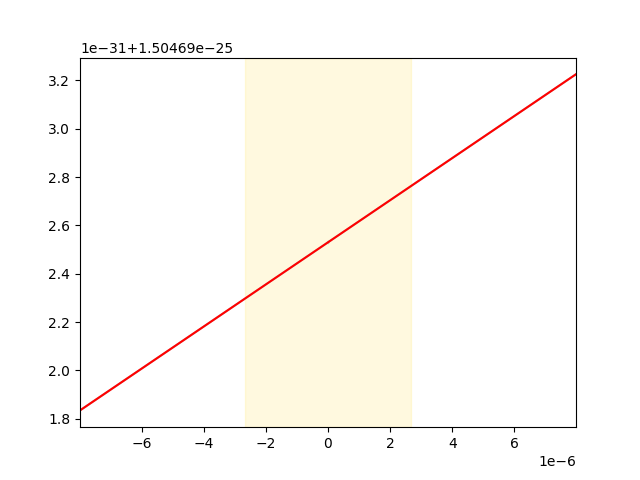
## New Eq:
((fabs(membrane__V) < 2.6614641953637254e-6) ? ((0.5 + 187866.51380507043 * membrane__V) * (2.6614641953637254e-6 * pow(membrane__F, 2) * (-ionic_concentrations__Ko + ionic_concentrations__Ki * exp(2.6614641953637254e-6 * membrane__F / (membrane__R * membrane__T))) * (L_type_Ca_channel__O + L_type_Ca_channel__O_Ca) * L_type_Ca_channel__p_k * L_type_Ca_channel_y_gate__y / ((-1.0 + exp(2.6614641953637254e-6 * membrane__F / (membrane__R * membrane__T))) * membrane__R * membrane__T) + 2.6614641953637254e-6 * pow(membrane__F, 2) * (-ionic_concentrations__Ko + ionic_concentrations__Ki * exp(-2.6614641953637254e-6 * membrane__F / (membrane__R * membrane__T))) * (L_type_Ca_channel__O + L_type_Ca_channel__O_Ca) * L_type_Ca_channel__p_k * L_type_Ca_channel_y_gate__y / ((-1.0 + exp(-2.6614641953637254e-6 * membrane__F / (membrane__R * membrane__T))) * membrane__R * membrane__T)) - 2.6614641953637254e-6 * pow(membrane__F, 2) * (-ionic_concentrations__Ko + ionic_concentrations__Ki * exp(-2.6614641953637254e-6 * membrane__F / (membrane__R * membrane__T))) * (L_type_Ca_channel__O + L_type_Ca_channel__O_Ca) * L_type_Ca_channel__p_k * L_type_Ca_channel_y_gate__y / ((-1.0 + exp(-2.6614641953637254e-6 * membrane__F / (membrane__R * membrane__T))) * membrane__R * membrane__T)) : (pow(membrane__F, 2) * (-ionic_concentrations__Ko + ionic_concentrations__Ki * exp(membrane__F * membrane__V / (membrane__R * membrane__T))) * (L_type_Ca_channel__O + L_type_Ca_channel__O_Ca) * L_type_Ca_channel__p_k * L_type_Ca_channel_y_gate__y * membrane__V / ((-1.0 + exp(membrane__F * membrane__V / (membrane__R * membrane__T))) * membrane__R * membrane__T)))

fast_sodium_current_h_gate__alpha_h = ((membrane__V < -40.0) ? (0.13500000000000001 * exp(-11.764705882352942 + 0.14705882352941177 * fast_sodium_current__shift_INa_inact - 0.14705882352941177 * membrane__V)) : (0))

####Piecewise!!

fast_sodium_current_h_gate__beta_h = ((membrane__V < -40.0) ? (310000.0 * exp(0.34999999999999998 * membrane__V - 0.34999999999999998 * fast_sodium_current__shift_INa_inact) + 3.5600000000000001 * exp(0.079000000000000001 * membrane__V - 0.079000000000000001 * fast_sodium_current__shift_INa_inact)) : (7.6923076923076916 / (1.0 + exp(-0.96036036036036043 + 0.0900900900900901 * fast_sodium_current__shift_INa_inact - 0.0900900900900901 * membrane__V))))

####Piecewise!!

fast_sodium_current_j_gate__alpha_j = ((membrane__V < -40.0) ? ((37.780000000000001 + membrane__V) * (-127140.0 * exp(0.24440000000000001 * membrane__V - 0.24440000000000001 * fast_sodium_current__shift_INa_inact) - 3.4740000000000003e-5 * exp(0.043909999999999998 * fast_sodium_current__shift_INa_inact - 0.043909999999999998 * membrane__V)) / (1.0 + exp(24.640530000000002 + 0.311 * membrane__V - 0.311 * fast_sodium_current__shift_INa_inact))) : (0))

####Piecewise!!

fast_sodium_current_j_gate__beta_j = ((membrane__V < -40.0) ? (0.1212 * exp(0.01052 * fast_sodium_current__shift_INa_inact - 0.01052 * membrane__V) / (1.0 + exp(-5.5312920000000005 + 0.13780000000000001 * fast_sodium_current__shift_INa_inact - 0.13780000000000001 * membrane__V))) : (0.29999999999999999 * exp(2.5349999999999999e-7 * fast_sodium_current__shift_INa_inact - 2.5349999999999999e-7 * membrane__V) / (1.0 + exp(-3.2000000000000002 + 0.10000000000000001 * fast_sodium_current__shift_INa_inact - 0.10000000000000001 * membrane__V))))

####Piecewise!!

## Equation 3:
```
fast_sodium_current_m_gate__alpha_m = 0.32000000000000001 * (47.130000000000003 + membrane__V) / (1.0 - exp(-4.7130000000000001 - 0.10000000000000001 * membrane__V))
```
### Partially evaluated to: 
```
fast_sodium_current_m_gate__alpha_m = 0.32000000000000001 * (47.130000000000003 + membrane__V) / (1.0 - exp(-4.7130000000000001 - 0.10000000000000001 * membrane__V))
```
### Singulariy points detected:

{-47.130000000000003}
*U*
`-4.7130000000000001 - 0.10000000000000001 * membrane__V`

*V for 1e-07 range* 
`-47.129999000000005 - -47.130001`

*Singularity point: -47.130000000000003*


## New Eq:
((fabs(47.130000000000003 + membrane__V) < 1.0000000000287557e-6) ? (3.200000000092018e-7 / (1.0 - exp(-1.0000000000287557e-7)) + (-23564999.499322373 - 499999.99998562218 * membrane__V) * (-3.200000000092018e-7 / (1.0 - exp(1.0000000000287557e-7)) - 3.200000000092018e-7 / (1.0 - exp(-1.0000000000287557e-7)))) : (0.32000000000000001 * (47.130000000000003 + membrane__V) / (1.0 - exp(-4.7130000000000001 - 0.10000000000000001 * membrane__V))))

## Equation 4:
```
non_specific_calcium_activated_current__I_ns_K = pow(membrane__F, 2) * (-0.75 * ionic_concentrations__Ko + 0.75 * ionic_concentrations__Ki * exp(membrane__F * non_specific_calcium_activated_current__VnsCa / (membrane__R * membrane__T))) * non_specific_calcium_activated_current__P_ns_Ca * non_specific_calcium_activated_current__VnsCa / ((-1.0 + exp(membrane__F * non_specific_calcium_activated_current__VnsCa / (membrane__R * membrane__T))) * membrane__R * membrane__T)
```
### Partially evaluated to: 
```
non_specific_calcium_activated_current__I_ns_K = 6.3678763853082156e-6 * (-non_specific_calcium_activated_current__EnsCa + membrane__V) * (-0.75 * ionic_concentrations__Ko + 0.75 * ionic_concentrations__Ki * exp(0.037573302761014088 * membrane__V - 0.037573302761014088 * non_specific_calcium_activated_current__EnsCa)) / (-1.0 + exp(0.037573302761014088 * membrane__V - 0.037573302761014088 * non_specific_calcium_activated_current__EnsCa))
```
### Singulariy points detected:

{1.0*_non_specific_calcium_activated_current$EnsCa}
*U*
`0.037573302761014088 * membrane__V - 0.037573302761014088 * non_specific_calcium_activated_current__EnsCa`

*V for 1e-07 range* 
`-2.6614641953637254e-6 + non_specific_calcium_activated_current__EnsCa - 2.6614641953637254e-6 + non_specific_calcium_activated_current__EnsCa`

*Singularity point: 1.0*_non_specific_calcium_activated_current$EnsCa*


## New Eq:
((fabs(-non_specific_calcium_activated_current__EnsCa + membrane__V) < 2.6614641953637254e-6) ? (0.00012710905614463227 * ionic_concentrations__Ki - 0.00012710906885553852 * ionic_concentrations__Ko + (1.2710040841965042e-11 * ionic_concentrations__Ki + 1.2711771657866275e-11 * ionic_concentrations__Ko) * (0.5 + 187866.51380507043 * membrane__V - 187866.51380507043 * non_specific_calcium_activated_current__EnsCa)) : (pow(membrane__F, 2) * (-0.75 * ionic_concentrations__Ko + 0.75 * ionic_concentrations__Ki * exp(membrane__F * non_specific_calcium_activated_current__VnsCa / (membrane__R * membrane__T))) * non_specific_calcium_activated_current__P_ns_Ca * non_specific_calcium_activated_current__VnsCa / ((-1.0 + exp(membrane__F * non_specific_calcium_activated_current__VnsCa / (membrane__R * membrane__T))) * membrane__R * membrane__T)))

## Equation 5:
```
non_specific_calcium_activated_current__I_ns_Na = pow(membrane__F, 2) * (-0.75 * ionic_concentrations__Nao + 0.75 * ionic_concentrations__Nai * exp(membrane__F * non_specific_calcium_activated_current__VnsCa / (membrane__R * membrane__T))) * non_specific_calcium_activated_current__P_ns_Ca * non_specific_calcium_activated_current__VnsCa / ((-1.0 + exp(membrane__F * non_specific_calcium_activated_current__VnsCa / (membrane__R * membrane__T))) * membrane__R * membrane__T)
```
### Partially evaluated to: 
```
non_specific_calcium_activated_current__I_ns_Na = 6.3678763853082156e-6 * (-non_specific_calcium_activated_current__EnsCa + membrane__V) * (-0.75 * ionic_concentrations__Nao + 0.75 * ionic_concentrations__Nai * exp(0.037573302761014088 * membrane__V - 0.037573302761014088 * non_specific_calcium_activated_current__EnsCa)) / (-1.0 + exp(0.037573302761014088 * membrane__V - 0.037573302761014088 * non_specific_calcium_activated_current__EnsCa))
```
### Singulariy points detected:

{1.0*_non_specific_calcium_activated_current$EnsCa}
*U*
`0.037573302761014088 * membrane__V - 0.037573302761014088 * non_specific_calcium_activated_current__EnsCa`

*V for 1e-07 range* 
`-2.6614641953637254e-6 + non_specific_calcium_activated_current__EnsCa - 2.6614641953637254e-6 + non_specific_calcium_activated_current__EnsCa`

*Singularity point: 1.0*_non_specific_calcium_activated_current$EnsCa*


## New Eq:
((fabs(-non_specific_calcium_activated_current__EnsCa + membrane__V) < 2.6614641953637254e-6) ? (0.00012710905614463227 * ionic_concentrations__Nai - 0.00012710906885553852 * ionic_concentrations__Nao + (1.2710040841965042e-11 * ionic_concentrations__Nai + 1.2711771657866275e-11 * ionic_concentrations__Nao) * (0.5 + 187866.51380507043 * membrane__V - 187866.51380507043 * non_specific_calcium_activated_current__EnsCa)) : (pow(membrane__F, 2) * (-0.75 * ionic_concentrations__Nao + 0.75 * ionic_concentrations__Nai * exp(membrane__F * non_specific_calcium_activated_current__VnsCa / (membrane__R * membrane__T))) * non_specific_calcium_activated_current__P_ns_Ca * non_specific_calcium_activated_current__VnsCa / ((-1.0 + exp(membrane__F * non_specific_calcium_activated_current__VnsCa / (membrane__R * membrane__T))) * membrane__R * membrane__T)))

Singularities cannot be found
1.0/(0.036499999999999998*(0.14285714285714286*exp(0.014858841010401189*_ionic_concentrations$Nao) - 0.14285714285714286)*exp(-0.037573302761014085*_membrane$V) + 1.0 + 0.1245*exp(-0.0037573302761014088*_membrane$V))

## Equation 6:
```
time_dependent_potassium_current_X_gate__alpha_X = 7.1899999999999999e-5 * (30.0 + membrane__V) / (1.0 - exp(-4.4399999999999995 - 0.14799999999999999 * membrane__V))
```
### Partially evaluated to: 
```
time_dependent_potassium_current_X_gate__alpha_X = 7.1899999999999999e-5 * (30.0 + membrane__V) / (1.0 - exp(-4.4399999999999995 - 0.14799999999999999 * membrane__V))
```
### Singulariy points detected:

{-30.000000000000000}
*U*
`-4.4399999999999995 - 0.14799999999999999 * membrane__V`

*V for 1e-07 range* 
`-29.999999324324325 - -30.000000675675675`

*Singularity point: -30.000000000000000*

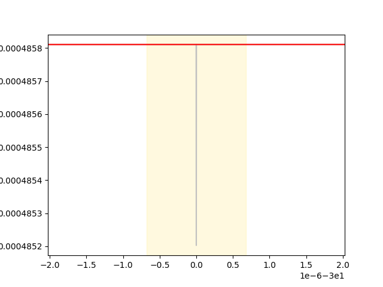
## New Eq:
((fabs(30.0 + membrane__V) < 6.7567567568760367e-7) ? (4.8581081081938701e-11 / (1.0 - exp(-1.0000000000287557e-7)) + (-22199999.499608092 - 739999.99998693645 * membrane__V) * (-4.8581081081938701e-11 / (1.0 - exp(1.0000000000287557e-7)) - 4.8581081081938701e-11 / (1.0 - exp(-1.0000000000287557e-7)))) : (7.1899999999999999e-5 * (30.0 + membrane__V) / (1.0 - exp(-4.4399999999999995 - 0.14799999999999999 * membrane__V))))

## Equation 7:
```
time_dependent_potassium_current_X_gate__beta_X = 0.00013100000000000001 * (30.0 + membrane__V) / (-1.0 + exp(2.0609999999999999 + 0.068699999999999997 * membrane__V))
```
### Partially evaluated to: 
```
time_dependent_potassium_current_X_gate__beta_X = 0.00013100000000000001 * (30.0 + membrane__V) / (-1.0 + exp(2.0609999999999999 + 0.068699999999999997 * membrane__V))
```
### Singulariy points detected:

{-30.000000000000000}
*U*
`2.0609999999999999 + 0.068699999999999997 * membrane__V`

*V for 1e-07 range* 
`-30.000001455604075 - -29.999998544395925`

*Singularity point: -30.000000000000000*


## New Eq:
((fabs(30.0 + membrane__V) < 1.455604075689676e-6) ? (-1.9068413391534758e-10 / (-1.0 + exp(-9.9999999999406119e-8)) + (10305000.50001229 + 343500.00000040967 * membrane__V) * (1.9068413391534758e-10 / (-1.0 + exp(9.9999999999406119e-8)) + 1.9068413391534758e-10 / (-1.0 + exp(-9.9999999999406119e-8)))) : (0.00013100000000000001 * (30.0 + membrane__V) / (-1.0 + exp(2.0609999999999999 + 0.068699999999999997 * membrane__V))))

# Model: kurata_model_2002(kurata_model_2002.cellml)
## Equation 1:
```
L_type_calcium_channel_current_d_gate__alpha_d = -0.028389999999999999 * (35.0 + membrane__V) / (-1.0 + exp(-14.0 - 0.40000000000000002 * membrane__V)) - 0.084900000000000003 * membrane__V / (-1.0 + exp(-0.20798668885191349 * membrane__V))
```
### Partially evaluated to: 
```
L_type_calcium_channel_current_d_gate__alpha_d = -0.028389999999999999 * (35.0 + membrane__V) / (-1.0 + exp(-14.0 - 0.40000000000000002 * membrane__V)) - 0.084900000000000003 * membrane__V / (-1.0 + exp(-0.20798668885191349 * membrane__V))
```
### Singulariy points detected:

{0, -35.000000000000000}
####A + B:

`0.084900000000000003 * membrane__V / (1.0 - exp(-0.20798668885191349 * membrane__V))`
`-0.028389999999999999 * (35.0 + membrane__V) / (-1.0 + 8.3152871910356788e-7 * exp(-0.40000000000000002 * membrane__V))`

#### float * A

####Failed to find U symbolically!

<class 'sympy.core.mul.Mul'>
_membrane$V/(1.0 - exp(-0.20798668885191348*_membrane$V))

*try substituting parameters*

####Failed to find U symbolically!

<class 'sympy.core.mul.Mul'>
_membrane$V/(1.0 - exp(-0.20798668885191348*_membrane$V))
*U*
`-14.0 - 0.40000000000000002 * membrane__V`

*V for 1e-07 range* 
`-34.999999750000001 - -35.000000249999999`

*Singularity point: -35.000000000000000*

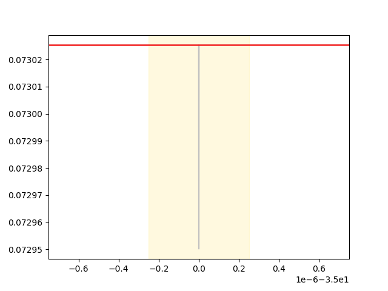
## New Eq:
((fabs(35.0 + membrane__V) < 2.5000000000718892e-7) ? (2.9714999787750003 / (-1.0 + exp(7.2795340578202996)) - 7.0975000009920736e-9 / (-1.0 + exp(-1.0000000001675335e-7)) + (-69999999.497987106 - 1999999.9999424887 * membrane__V) * (7.0975000009920736e-9 / (-1.0 + exp(-1.0000000001675335e-7)) + 2.9715000212250002 / (-1.0 + exp(7.2795341618136442)) + 7.0974999994161126e-9 / (-1.0 + exp(9.9999999988997779e-8)) - 2.9714999787750003 / (-1.0 + exp(7.2795340578202996)))) : (-0.028389999999999999 * (35.0 + membrane__V) / (-1.0 + exp(-14.0 - 0.40000000000000002 * membrane__V)) - 0.084900000000000003 * membrane__V / (-1.0 + exp(-0.20798668885191349 * membrane__V))))

## Equation 2:
```
L_type_calcium_channel_current_d_gate__beta_d = 0.011429999999999999 * (-5.0 + membrane__V) / (-1.0 + exp(-2.0 + 0.40000000000000002 * membrane__V))
```
### Partially evaluated to: 
```
L_type_calcium_channel_current_d_gate__beta_d = 0.011429999999999999 * (-5.0 + membrane__V) / (-1.0 + exp(-2.0 + 0.40000000000000002 * membrane__V))
```
### Singulariy points detected:

{5.0000000000000000}
*U*
`-2.0 + 0.40000000000000002 * membrane__V`

*V for 1e-07 range* 
`4.9999997499999997 - 5.0000002500000003`

*Singularity point: 5.0000000000000000*


## New Eq:
((fabs(-5.0 + membrane__V) < 2.5000000000025002e-7) ? (-2.8575000000028576e-9 / (-1.0 + exp(-9.9999999999406119e-8)) + (-9999999.4999899995 + 1999999.9999979998 * membrane__V) * (2.8575000000028576e-9 / (-1.0 + exp(9.9999999999406119e-8)) + 2.8575000000028576e-9 / (-1.0 + exp(-9.9999999999406119e-8)))) : (0.011429999999999999 * (-5.0 + membrane__V) / (-1.0 + exp(-2.0 + 0.40000000000000002 * membrane__V))))

# Model: lindblad_atrial_model_1996(lindblad_model_1996.cellml)
## Equation 1:
```
L_type_Ca_channel_d_L_gate__alpha_d_L = -50.0 * membrane__V / (-1.0 + exp(-0.20798668885191349 * membrane__V)) - 16.719999999999999 * L_type_Ca_channel_d_L_gate__E0_alpha_d_L / (-1.0 + exp(-0.40000000000000002 * L_type_Ca_channel_d_L_gate__E0_alpha_d_L))
```
### Partially evaluated to: 
```
L_type_Ca_channel_d_L_gate__alpha_d_L = -50.0 * membrane__V / (-1.0 + exp(-0.20798668885191349 * membrane__V)) - 16.719999999999999 * L_type_Ca_channel_d_L_gate__E0_alpha_d_L / (-1.0 + exp(-0.40000000000000002 * L_type_Ca_channel_d_L_gate__E0_alpha_d_L))
```
### Singulariy points detected:

{0}
####A + B:

`16.719999999999999 * L_type_Ca_channel_d_L_gate__E0_alpha_d_L / (1.0 - exp(-0.40000000000000002 * L_type_Ca_channel_d_L_gate__E0_alpha_d_L))`
`-50.0 * membrane__V / (-1.0 + exp(-0.20798668885191349 * membrane__V))`

*U*
`-0.20798668885191349 * membrane__V`

*V for 1e-07 range* 
`4.8079999999999991e-7 - -4.8079999999999991e-7`

*Singularity point: 0*

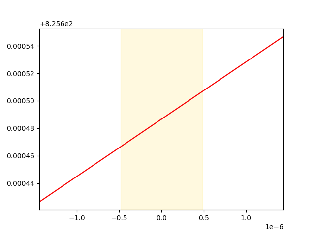
## New Eq:
((fabs(membrane__V) < 4.8079999999999991e-7) ? (-2.4039999999999997e-5 / (-1.0 + exp(-9.9999999999999995e-8)) + (0.5 - 1039933.4442595674 * membrane__V) * (2.4039999999999997e-5 / (-1.0 + exp(9.9999999999999995e-8)) + 2.4039999999999997e-5 / (-1.0 + exp(-9.9999999999999995e-8))) - 16.719999999999999 * L_type_Ca_channel_d_L_gate__E0_alpha_d_L / (-1.0 + exp(-0.40000000000000002 * L_type_Ca_channel_d_L_gate__E0_alpha_d_L))) : (-50.0 * membrane__V / (-1.0 + exp(-0.20798668885191349 * membrane__V)) - 16.719999999999999 * L_type_Ca_channel_d_L_gate__E0_alpha_d_L / (-1.0 + exp(-0.40000000000000002 * L_type_Ca_channel_d_L_gate__E0_alpha_d_L))))

## Equation 2:
```
L_type_Ca_channel_d_L_gate__beta_d_L = 4.4800000000000004 * L_type_Ca_channel_d_L_gate__E0_beta_d_L / (-1.0 + exp(0.40000000000000002 * L_type_Ca_channel_d_L_gate__E0_beta_d_L))
```
### Partially evaluated to: 
```
L_type_Ca_channel_d_L_gate__beta_d_L = 4.4800000000000004 * (-5.0 + membrane__V) / (-1.0 + 0.1353352832366127 * exp(0.40000000000000002 * membrane__V))
```
### Singulariy points detected:

{5.0000000000000000}
*U*
`-2.0 + 0.40000000000000002 * membrane__V`

*V for 1e-07 range* 
`4.9999997499999997 - 5.0000002500000003`

*Singularity point: 5.0000000000000000*

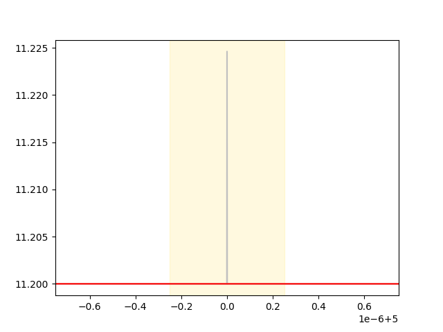
## New Eq:
((fabs(-5.0 + membrane__V) < 2.5000000000025002e-7) ? (22.399791094933175 - 2.2399582189613714 * membrane__V) : (4.4800000000000004 * L_type_Ca_channel_d_L_gate__E0_beta_d_L / (-1.0 + exp(0.40000000000000002 * L_type_Ca_channel_d_L_gate__E0_beta_d_L))))

## Equation 3:
```
L_type_Ca_channel_f_L_gate__alpha_f_L = 8.4900000000000002 * L_type_Ca_channel_f_L_gate__E0_f_L / (-1.0 + exp(0.25 * L_type_Ca_channel_f_L_gate__E0_f_L))
```
### Partially evaluated to: 
```
L_type_Ca_channel_f_L_gate__alpha_f_L = 8.4900000000000002 * (28.0 + membrane__V) / (-1.0 + 1096.6331584284585 * exp(0.25 * membrane__V))
```
### Singulariy points detected:

{-28.000000000000000}
*U*
`7.0 + 0.25 * membrane__V`

*V for 1e-07 range* 
`-28.000000400000001 - -27.999999599999999`

*Singularity point: -28.000000000000000*

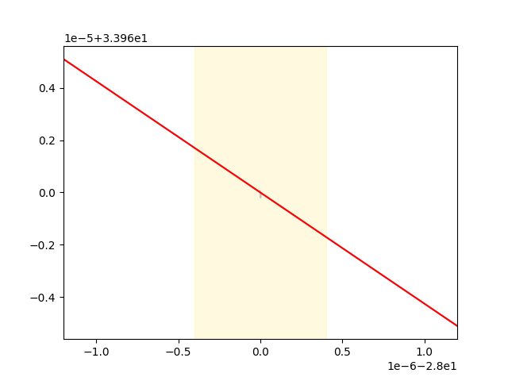
## New Eq:
((fabs(28.0 + membrane__V) < 4.0000000001150227e-7) ? (-84.928711368359671 - 4.2460254060128486 * membrane__V) : (8.4900000000000002 * L_type_Ca_channel_f_L_gate__E0_f_L / (-1.0 + exp(0.25 * L_type_Ca_channel_f_L_gate__E0_f_L))))

## Equation 4:
```
sodium_current_m_gate__alpha_m = -460.0 * sodium_current_m_gate__E0_m / (-1.0 + exp(-0.078907914463820727 * sodium_current_m_gate__E0_m))
```
### Partially evaluated to: 
```
sodium_current_m_gate__alpha_m = -460.0 * (44.399999999999999 + membrane__V) / (-1.0 + 0.030091534212260941 * exp(-0.078907914463820727 * membrane__V))
```
### Singulariy points detected:

{-44.399999999999999}
*U*
`-3.5035114021936398 - 0.078907914463820727 * membrane__V`

*V for 1e-07 range* 
`-44.399998732699999 - -44.400001267299999`

*Singularity point: -44.399999999999999*

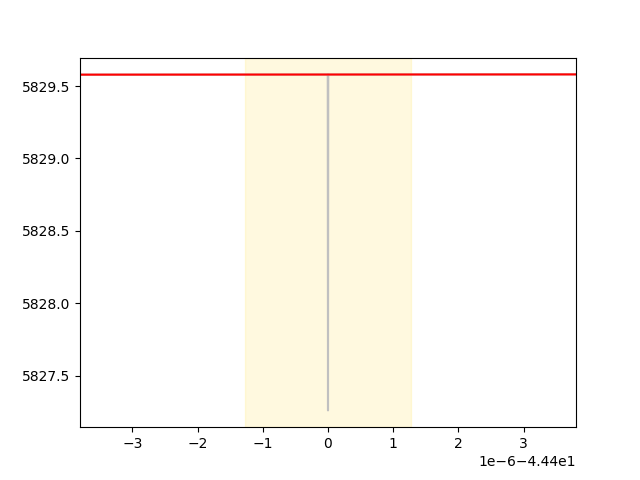
## New Eq:
((fabs(44.399999999999999 + membrane__V) < 1.2672999999963075e-6) ? (16043.161022403392 + 230.03560861286093 * membrane__V) : (-460.0 * sodium_current_m_gate__E0_m / (-1.0 + exp(-0.078907914463820727 * sodium_current_m_gate__E0_m))))

## Equation 5:
```
sodium_current__i_Na = pow(membrane__F, 2) * pow(sodium_current_m_gate__m, 3) * (-1.0 + exp((-sodium_current__E_Na + membrane__V) * membrane__F / (membrane__R * membrane__T))) * (0.36499999999999999 * sodium_current_h2_gate__h2 + 0.63500000000000001 * sodium_current_h1_gate__h1) * cleft_space_ion_concentrations__Na_c * membrane__V * sodium_current__P_Na / ((-1.0 + exp(membrane__F * membrane__V / (membrane__R * membrane__T))) * membrane__R * membrane__T)
```
### Partially evaluated to: 
```
sodium_current__i_Na = pow(membrane__F, 2) * pow(sodium_current_m_gate__m, 3) * (-1.0 + exp((-sodium_current__E_Na + membrane__V) * membrane__F / (membrane__R * membrane__T))) * (0.36499999999999999 * sodium_current_h2_gate__h2 + 0.63500000000000001 * sodium_current_h1_gate__h1) * cleft_space_ion_concentrations__Na_c * membrane__V * sodium_current__P_Na / ((-1.0 + exp(membrane__F * membrane__V / (membrane__R * membrane__T))) * membrane__R * membrane__T)
```
### Singulariy points detected:

{0}
####Failed to find U symbolically!

<class 'sympy.core.mul.Mul'>
_membrane$F**2*_sodium_current_m_gate$m**3*_cleft_space_ion_concentrations$Na_c*_membrane$V*_sodium_current$P_Na*(0.63500000000000001*_sodium_current_h1_gate$h1 + 0.36499999999999999*_sodium_current_h2_gate$h2)*(exp(_membrane$F*(_membrane$V - _sodium_current$E_Na)/(_membrane$R*_membrane$T)) - 1.0)/(_membrane$R*_membrane$T*(exp(_membrane$F*_membrane$V/(_membrane$R*_membrane$T)) - 1.0))

*try substituting parameters*

*U*
`0.037676968035880179 * membrane__V`

*V for 1e-07 range* 
`-2.6541413816729869e-6 - 2.6541413816729869e-6`

*Singularity point: 0*

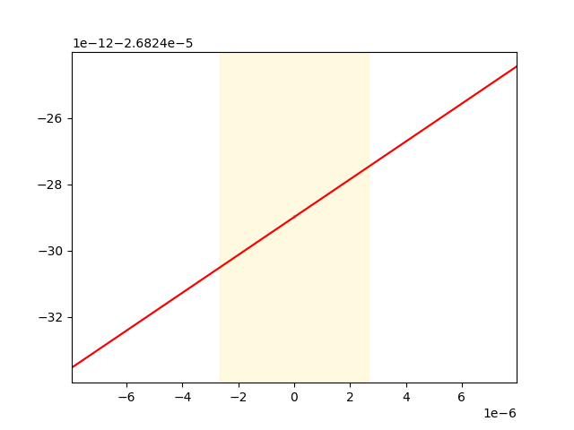
## New Eq:
((fabs(membrane__V) < 2.6541413816729869e-6) ? ((0.5 + 188384.84017940093 * membrane__V) * (2.6541413816729869e-6 * pow(membrane__F, 2) * pow(sodium_current_m_gate__m, 3) * (-1.0 + exp((2.6541413816729869e-6 - sodium_current__E_Na) * membrane__F / (membrane__R * membrane__T))) * (0.36499999999999999 * sodium_current_h2_gate__h2 + 0.63500000000000001 * sodium_current_h1_gate__h1) * cleft_space_ion_concentrations__Na_c * sodium_current__P_Na / ((-1.0 + exp(2.6541413816729869e-6 * membrane__F / (membrane__R * membrane__T))) * membrane__R * membrane__T) + 2.6541413816729869e-6 * pow(membrane__F, 2) * pow(sodium_current_m_gate__m, 3) * (-1.0 + exp((-2.6541413816729869e-6 - sodium_current__E_Na) * membrane__F / (membrane__R * membrane__T))) * (0.36499999999999999 * sodium_current_h2_gate__h2 + 0.63500000000000001 * sodium_current_h1_gate__h1) * cleft_space_ion_concentrations__Na_c * sodium_current__P_Na / ((-1.0 + exp(-2.6541413816729869e-6 * membrane__F / (membrane__R * membrane__T))) * membrane__R * membrane__T)) - 2.6541413816729869e-6 * pow(membrane__F, 2) * pow(sodium_current_m_gate__m, 3) * (-1.0 + exp((-2.6541413816729869e-6 - sodium_current__E_Na) * membrane__F / (membrane__R * membrane__T))) * (0.36499999999999999 * sodium_current_h2_gate__h2 + 0.63500000000000001 * sodium_current_h1_gate__h1) * cleft_space_ion_concentrations__Na_c * sodium_current__P_Na / ((-1.0 + exp(-2.6541413816729869e-6 * membrane__F / (membrane__R * membrane__T))) * membrane__R * membrane__T)) : (pow(membrane__F, 2) * pow(sodium_current_m_gate__m, 3) * (-1.0 + exp((-sodium_current__E_Na + membrane__V) * membrane__F / (membrane__R * membrane__T))) * (0.36499999999999999 * sodium_current_h2_gate__h2 + 0.63500000000000001 * sodium_current_h1_gate__h1) * cleft_space_ion_concentrations__Na_c * membrane__V * sodium_current__P_Na / ((-1.0 + exp(membrane__F * membrane__V / (membrane__R * membrane__T))) * membrane__R * membrane__T)))

# Model: LivshitzRudy2007(livshitz_rudy_2007.cellml)
## Equation 1:
```
ICaL__ibarca = 4.0 * (-Environment__Ca_o * ICaL__gacao + Ca__Ca_i * ICaL__gacai * exp(2.0 * Environment__FonRT * cell__V)) * Environment__F * Environment__FonRT * ICaL__pca * cell__V / (-1.0 + exp(2.0 * Environment__FonRT * cell__V))
```
### Partially evaluated to: 
```
ICaL__ibarca = 4.0 * (-Environment__Ca_o * ICaL__gacao + Ca__Ca_i * ICaL__gacai * exp(2.0 * Environment__FonRT * cell__V)) * Environment__F * Environment__FonRT * ICaL__pca * cell__V / (-1.0 + exp(2.0 * Environment__FonRT * cell__V))
```
### Singulariy points detected:

{0}
*U*
`2.0 * Environment__FonRT * cell__V`

*V for 1e-07 range* 
`-4.9999999999999998e-8 / Environment__FonRT - 4.9999999999999998e-8 / Environment__FonRT`

*Singularity point: 0*

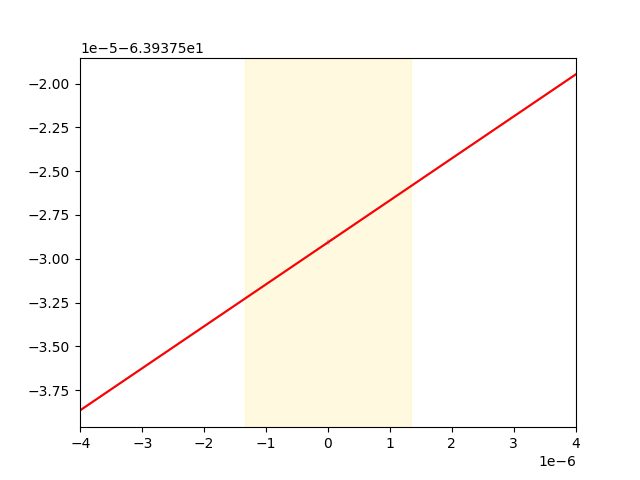
## New Eq:
((fabs(cell__V) < 4.9999999999999998e-8 / fabs(Environment__FonRT)) ? (10000000.0 * (4.9999999999999998e-8 / Environment__FonRT + cell__V) * (1.9999999999999999e-7 * (-Environment__Ca_o * ICaL__gacao + Ca__Ca_i * ICaL__gacai * exp(9.9999999999999995e-8)) * Environment__F * ICaL__pca / (-1.0 + exp(9.9999999999999995e-8)) + 1.9999999999999999e-7 * (-Environment__Ca_o * ICaL__gacao + Ca__Ca_i * ICaL__gacai * exp(-9.9999999999999995e-8)) * Environment__F * ICaL__pca / (-1.0 + exp(-9.9999999999999995e-8))) * Environment__FonRT - 1.9999999999999999e-7 * (-Environment__Ca_o * ICaL__gacao + Ca__Ca_i * ICaL__gacai * exp(-9.9999999999999995e-8)) * Environment__F * ICaL__pca / (-1.0 + exp(-9.9999999999999995e-8))) : (4.0 * (-Environment__Ca_o * ICaL__gacao + Ca__Ca_i * ICaL__gacai * exp(2.0 * Environment__FonRT * cell__V)) * Environment__F * Environment__FonRT * ICaL__pca * cell__V / (-1.0 + exp(2.0 * Environment__FonRT * cell__V))))

## Equation 2:
```
ICaL__ibark = (-Environment__K_o * ICaL__gako + ICaL__gaki * K__K_i * exp(Environment__FonRT * cell__V)) * Environment__F * Environment__FonRT * ICaL__pk * cell__V / (-1.0 + exp(Environment__FonRT * cell__V))
```
### Partially evaluated to: 
```
ICaL__ibark = (-Environment__K_o * ICaL__gako + ICaL__gaki * K__K_i * exp(Environment__FonRT * cell__V)) * Environment__F * Environment__FonRT * ICaL__pk * cell__V / (-1.0 + exp(Environment__FonRT * cell__V))
```
### Singulariy points detected:

{0}
*U*
`Environment__FonRT * cell__V`

*V for 1e-07 range* 
`-9.9999999999999995e-8 / Environment__FonRT - 9.9999999999999995e-8 / Environment__FonRT`

*Singularity point: 0*


## New Eq:
((fabs(cell__V) < 9.9999999999999995e-8 / fabs(Environment__FonRT)) ? (5000000.0 * (9.9999999999999995e-8 / Environment__FonRT + cell__V) * (9.9999999999999995e-8 * (-Environment__K_o * ICaL__gako + ICaL__gaki * K__K_i * exp(9.9999999999999995e-8)) * Environment__F * ICaL__pk / (-1.0 + exp(9.9999999999999995e-8)) + 9.9999999999999995e-8 * (-Environment__K_o * ICaL__gako + ICaL__gaki * K__K_i * exp(-9.9999999999999995e-8)) * Environment__F * ICaL__pk / (-1.0 + exp(-9.9999999999999995e-8))) * Environment__FonRT - 9.9999999999999995e-8 * (-Environment__K_o * ICaL__gako + ICaL__gaki * K__K_i * exp(-9.9999999999999995e-8)) * Environment__F * ICaL__pk / (-1.0 + exp(-9.9999999999999995e-8))) : ((-Environment__K_o * ICaL__gako + ICaL__gaki * K__K_i * exp(Environment__FonRT * cell__V)) * Environment__F * Environment__FonRT * ICaL__pk * cell__V / (-1.0 + exp(Environment__FonRT * cell__V))))

## Equation 3:
```
ICaL__ibarna = (-Environment__Na_o * ICaL__ganao + ICaL__ganai * Na__Na_i * exp(Environment__FonRT * cell__V)) * Environment__F * Environment__FonRT * ICaL__pna * cell__V / (-1.0 + exp(Environment__FonRT * cell__V))
```
### Partially evaluated to: 
```
ICaL__ibarna = (-Environment__Na_o * ICaL__ganao + ICaL__ganai * Na__Na_i * exp(Environment__FonRT * cell__V)) * Environment__F * Environment__FonRT * ICaL__pna * cell__V / (-1.0 + exp(Environment__FonRT * cell__V))
```
### Singulariy points detected:

{0}
*U*
`Environment__FonRT * cell__V`

*V for 1e-07 range* 
`-9.9999999999999995e-8 / Environment__FonRT - 9.9999999999999995e-8 / Environment__FonRT`

*Singularity point: 0*

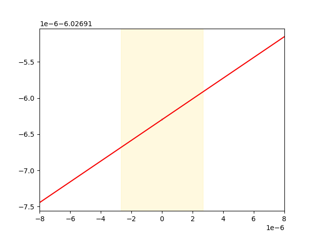
## New Eq:
((fabs(cell__V) < 9.9999999999999995e-8 / fabs(Environment__FonRT)) ? (5000000.0 * (9.9999999999999995e-8 / Environment__FonRT + cell__V) * (9.9999999999999995e-8 * (-Environment__Na_o * ICaL__ganao + ICaL__ganai * Na__Na_i * exp(9.9999999999999995e-8)) * Environment__F * ICaL__pna / (-1.0 + exp(9.9999999999999995e-8)) + 9.9999999999999995e-8 * (-Environment__Na_o * ICaL__ganao + ICaL__ganai * Na__Na_i * exp(-9.9999999999999995e-8)) * Environment__F * ICaL__pna / (-1.0 + exp(-9.9999999999999995e-8))) * Environment__FonRT - 9.9999999999999995e-8 * (-Environment__Na_o * ICaL__ganao + ICaL__ganai * Na__Na_i * exp(-9.9999999999999995e-8)) * Environment__F * ICaL__pna / (-1.0 + exp(-9.9999999999999995e-8))) : ((-Environment__Na_o * ICaL__ganao + ICaL__ganai * Na__Na_i * exp(Environment__FonRT * cell__V)) * Environment__F * Environment__FonRT * ICaL__pna * cell__V / (-1.0 + exp(Environment__FonRT * cell__V))))

## Equation 4:
```
ICaL__taud = 28.571428571428569 * (1.0 - exp(-1.6025641025641024 - 0.16025641025641024 * cell__V)) * ICaL__dss0 / (10.0 + cell__V)
```
### Partially evaluated to: 
```
ICaL__taud = 28.571428571428569 * (1.0 - exp(-1.6025641025641024 - 0.16025641025641024 * cell__V)) * ICaL__dss0 / (10.0 + cell__V)
```
### Singulariy points detected:

{-10.000000000000000}
*U*
`-1.6025641025641024 - 0.16025641025641024 * cell__V`

*V for 1e-07 range* 
`-9.9999993759999999 - -10.000000624`

*Singularity point: -10.000000000000000*


## New Eq:
((fabs(10.0 + cell__V) < 6.2399999999074307e-7) ? ((-8012820.0129393814 - 801282.05129393819 * cell__V) * (-45787545.788225032 * (1.0 - exp(9.9999999997671396e-8)) * ICaL__dss0 - 45787545.788225032 * (1.0 - exp(-9.9999999997671396e-8)) * ICaL__dss0) + 45787545.788225032 * (1.0 - exp(-9.9999999997671396e-8)) * ICaL__dss0) : (28.571428571428569 * (1.0 - exp(-1.6025641025641024 - 0.16025641025641024 * cell__V)) * ICaL__dss0 / (10.0 + cell__V)))

## Equation 5:
```
IKr__tauxr = 1 / (0.00060999999999999997 * (38.899999999999999 + cell__V) / (-1.0 + exp(5.6404999999999994 + 0.14499999999999999 * cell__V)) + 0.0013799999999999999 * (14.199999999999999 + cell__V) / (1.0 - exp(-1.7465999999999999 - 0.123 * cell__V)))
```
### Partially evaluated to: 
```
IKr__tauxr = 1 / (0.00060999999999999997 * (38.899999999999999 + cell__V) / (-1.0 + exp(5.6404999999999994 + 0.14499999999999999 * cell__V)) + 0.0013799999999999999 * (14.199999999999999 + cell__V) / (1.0 - exp(-1.7465999999999999 - 0.123 * cell__V)))
```
### Singulariy points detected:

{-38.899999999999999, -14.199999999999999}
#### float * A

####1 / A


####A + B:

`0.0013799999999999999 * (14.199999999999999 + cell__V) / (1.0 - 0.17436578041087322 * exp(-0.123 * cell__V))`
`0.00060999999999999997 * (38.899999999999999 + cell__V) / (-1.0 + 281.60348502322194 * exp(0.14499999999999999 * cell__V))`

*U*
`-1.7465999999999999 - 0.123 * cell__V`

*V for 1e-07 range* 
`-14.199999186991869 - -14.200000813008129`

*Singularity point: -14.199999999999999*


*U*
`5.6404999999999994 + 0.14499999999999999 * cell__V`

*V for 1e-07 range* 
`-38.900000689655172 - -38.899999310344825`

*Singularity point: -38.899999999999999*

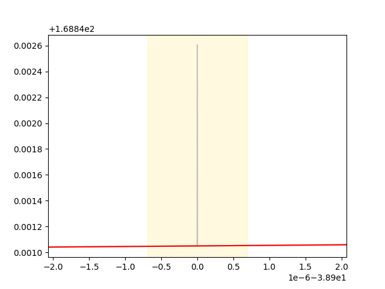
## New Eq:
((fabs(14.199999999999999 + cell__V) < 8.1300813007528783e-7) ? (1 / (1.1219512195134727e-9 / (1.0 - exp(-9.9999999999406119e-8)) + 0.015067000495934959 / (-1.0 + exp(3.5815001178861787))) + (-8732999.5000645891 - 615000.00000454858 * cell__V) * (1 / (0.015066999504065039 / (-1.0 + exp(3.5814998821138206)) - 1.1219512194943214e-9 / (1.0 - exp(9.9999999999406119e-8))) - 1 / (1.1219512195134727e-9 / (1.0 - exp(-9.9999999999406119e-8)) + 0.015067000495934959 / (-1.0 + exp(3.5815001178861787))))) : ((fabs(38.899999999999999 + cell__V) < 6.896551724422384e-7) ? (1 / (-0.034086000951724135 / (1.0 - exp(3.0381000848275859)) - 4.2068965517283451e-10 / (-1.0 + exp(-1.0000000000287557e-7))) + (28202500.498836767 + 724999.99997009686 * cell__V) * (1 / (4.2068965520669629e-10 / (-1.0 + exp(1.0000000000287557e-7)) - 0.034085999048275861 / (1.0 - exp(3.0380999151724137))) - 1 / (-0.034086000951724135 / (1.0 - exp(3.0381000848275859)) - 4.2068965517283451e-10 / (-1.0 + exp(-1.0000000000287557e-7))))) : (1 / (0.00060999999999999997 * (38.899999999999999 + cell__V) / (-1.0 + exp(5.6404999999999994 + 0.14499999999999999 * cell__V)) + 0.0013799999999999999 * (14.199999999999999 + cell__V) / (1.0 - exp(-1.7465999999999999 - 0.123 * cell__V))))))

## Equation 6:
```
IKs__tauxs = 1 / (0.00013100000000000001 * (30.0 + cell__V) / (-1.0 + exp(2.0609999999999999 + 0.068699999999999997 * cell__V)) + 7.1899999999999999e-5 * (30.0 + cell__V) / (1.0 - exp(-4.4399999999999995 - 0.14799999999999999 * cell__V)))
```
### Partially evaluated to: 
```
IKs__tauxs = 1 / (0.00013100000000000001 * (30.0 + cell__V) / (-1.0 + exp(2.0609999999999999 + 0.068699999999999997 * cell__V)) + 7.1899999999999999e-5 * (30.0 + cell__V) / (1.0 - exp(-4.4399999999999995 - 0.14799999999999999 * cell__V)))
```
### Singulariy points detected:

{-30.000000000000000}
#### float * A

####1 / A


####A + B:

`7.1899999999999999e-5 * (30.0 + cell__V) / (1.0 - 0.011795938519751569 * exp(-0.14799999999999999 * cell__V))`
`0.00013100000000000001 * (30.0 + cell__V) / (-1.0 + 7.8538197044216602 * exp(0.068699999999999997 * cell__V))`

*U*
`-4.4399999999999995 - 0.14799999999999999 * cell__V`

*V for 1e-07 range* 
`-29.999999324324325 - -30.000000675675675`

*Singularity point: -30.000000000000000*


## New Eq:
((fabs(30.0 + cell__V) < 6.7567567568760367e-7) ? (1 / (8.8513513515076093e-11 / (-1.0 + exp(4.6418918920460017e-8)) + 4.8581081081938701e-11 / (1.0 - exp(-1.0000000000287557e-7))) + (-22199999.499608092 - 739999.99998693645 * cell__V) * (1 / (-8.8513513515076093e-11 / (-1.0 + exp(-4.6418918920460017e-8)) - 4.8581081081938701e-11 / (1.0 - exp(1.0000000000287557e-7))) - 1 / (8.8513513515076093e-11 / (-1.0 + exp(4.6418918920460017e-8)) + 4.8581081081938701e-11 / (1.0 - exp(-1.0000000000287557e-7))))) : (1 / (0.00013100000000000001 * (30.0 + cell__V) / (-1.0 + exp(2.0609999999999999 + 0.068699999999999997 * cell__V)) + 7.1899999999999999e-5 * (30.0 + cell__V) / (1.0 - exp(-4.4399999999999995 - 0.14799999999999999 * cell__V)))))

## Equation 7:
```
INa__am = 0.32000000000000001 * (47.130000000000003 + cell__V) / (1.0 - exp(-4.7130000000000001 - 0.10000000000000001 * cell__V))
```
### Partially evaluated to: 
```
INa__am = 0.32000000000000001 * (47.130000000000003 + cell__V) / (1.0 - exp(-4.7130000000000001 - 0.10000000000000001 * cell__V))
```
### Singulariy points detected:

{-47.130000000000003}
*U*
`-4.7130000000000001 - 0.10000000000000001 * cell__V`

*V for 1e-07 range* 
`-47.129999000000005 - -47.130001`

*Singularity point: -47.130000000000003*


## New Eq:
((fabs(47.130000000000003 + cell__V) < 1.0000000000287557e-6) ? (3.200000000092018e-7 / (1.0 - exp(-1.0000000000287557e-7)) + (-23564999.499322373 - 499999.99998562218 * cell__V) * (-3.200000000092018e-7 / (1.0 - exp(1.0000000000287557e-7)) - 3.200000000092018e-7 / (1.0 - exp(-1.0000000000287557e-7)))) : (0.32000000000000001 * (47.130000000000003 + cell__V) / (1.0 - exp(-4.7130000000000001 - 0.10000000000000001 * cell__V))))

Singularities cannot be found
1.0/(0.036499999999999998*(0.14285714285714286*exp(0.014858841010401189*_Environment$Na_o) - 0.14285714285714286)*exp(-3.8799692706433765e-7*_Environment$F*_cell$V) + 1.0 + 0.1245*exp(-3.8799692706433767e-8*_Environment$F*_cell$V))

# Model: Li_Mouse_2010(li_mouse_2010.cellml)
L_type_calcium_current__i_CaL = ((fabs(L_type_calcium_current__FVRT_Ca) > 1.0000000000000001e-5) ? (-2.0 * (-calcium_concentration__Cass + cell__Cao * exp(-L_type_calcium_current__FVRT_Ca)) * L_type_calcium_current__FVRT_Ca * L_type_calcium_current__O * L_type_calcium_current__P_CaL * L_type_calcium_current__y_gate * cell__F * cell__Vss / ((1.0 - exp(-L_type_calcium_current__FVRT_Ca)) * cell__Acap * cell__Cm)) : (-2.0000000000000002e-5 * (-calcium_concentration__Cass + cell__Cao * exp(-1.0000000000000001e-5)) * L_type_calcium_current__O * L_type_calcium_current__P_CaL * L_type_calcium_current__y_gate * cell__F * cell__Vss / ((1.0 - exp(-1.0000000000000001e-5)) * cell__Acap * cell__Cm)))

####Piecewise!!

calcium_fluxes__J_leak = ((environment__time < cell__prepulses_number * cell__stim_period) ? ((-calcium_concentration__Cai + calcium_concentration__CaNSR) * calcium_fluxes__v2) : ((-calcium_concentration__Cai + calcium_concentration__CaNSR) * calcium_fluxes__v2_caff))

####Piecewise!!

calcium_fluxes__J_rel = ((environment__time < cell__prepulses_number * cell__stim_period) ? ((-calcium_concentration__Cass + calcium_concentration__CaJSR) * (ryanodine_receptors__P_O1 + ryanodine_receptors__P_O2) * calcium_fluxes__P_RyR * calcium_fluxes__v1) : ((-calcium_concentration__Cass + calcium_concentration__CaJSR) * calcium_fluxes__v1_caff))

####Piecewise!!

## Equation 1:
```
slow_delayed_rectifier_K_I__alpha_n = 4.8133299999999997e-6 * (26.5 + cell__V) / (1.0 - exp(-3.3919999999999999 - 0.128 * cell__V))
```
### Partially evaluated to: 
```
slow_delayed_rectifier_K_I__alpha_n = 4.8133299999999997e-6 * (26.5 + cell__V) / (1.0 - exp(-3.3919999999999999 - 0.128 * cell__V))
```
### Singulariy points detected:

{-26.500000000000000}
*U*
`-3.3919999999999999 - 0.128 * cell__V`

*V for 1e-07 range* 
`-26.499999218749998 - -26.500000781250002`

*Singularity point: -26.500000000000000*

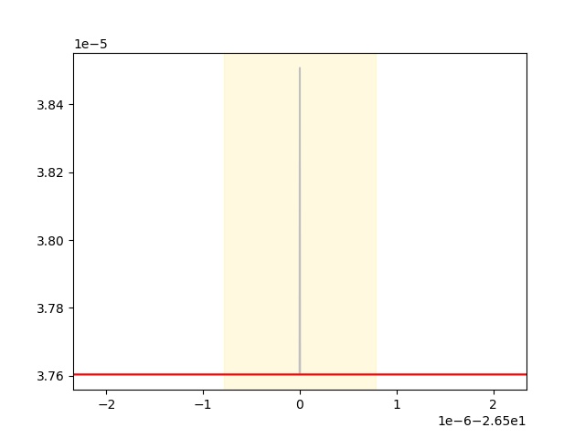
## New Eq:
((fabs(26.5 + cell__V) < 7.8124999999817923e-7) ? (3.7604140624912359e-12 / (1.0 - exp(-9.9999999999406119e-8)) + (-16959999.500039525 - 640000.00000149151 * cell__V) * (-3.7604140624912359e-12 / (1.0 - exp(9.9999999999406119e-8)) - 3.7604140624912359e-12 / (1.0 - exp(-9.9999999999406119e-8)))) : (4.8133299999999997e-6 * (26.5 + cell__V) / (1.0 - exp(-3.3919999999999999 - 0.128 * cell__V))))

Singularities cannot be found
1.0/(0.036499999999999998*(0.14285714285714286*exp(1.4858841010401189e-5*_cell$Nao) - 0.14285714285714286)*exp(-0.037684831406265132*_cell$V) + 1.0 + 0.1245*exp(-0.0037684831406265134*_cell$V))

# Model: luo_rudy_1991(luo_rudy_1991.cellml)
fast_sodium_current_h_gate__alpha_h = ((membrane__V < -40.0) ? (0.13500000000000001 * exp(-11.764705882352942 + 0.14705882352941177 * fast_sodium_current__shift_INa_inact - 0.14705882352941177 * membrane__V)) : (0))

####Piecewise!!

fast_sodium_current_h_gate__beta_h = ((membrane__V < -40.0) ? (310000.0 * exp(0.34999999999999998 * membrane__V - 0.34999999999999998 * fast_sodium_current__shift_INa_inact) + 3.5600000000000001 * exp(0.079000000000000001 * membrane__V - 0.079000000000000001 * fast_sodium_current__shift_INa_inact)) : (7.6923076923076916 / (1.0 + exp(-0.96036036036036043 + 0.0900900900900901 * fast_sodium_current__shift_INa_inact - 0.0900900900900901 * membrane__V))))

####Piecewise!!

fast_sodium_current_j_gate__alpha_j = ((membrane__V < -40.0) ? ((37.780000000000001 + membrane__V) * (-127140.0 * exp(0.24440000000000001 * membrane__V - 0.24440000000000001 * fast_sodium_current__shift_INa_inact) - 3.4740000000000003e-5 * exp(0.043909999999999998 * fast_sodium_current__shift_INa_inact - 0.043909999999999998 * membrane__V)) / (1.0 + exp(24.640530000000002 + 0.311 * membrane__V - 0.311 * fast_sodium_current__shift_INa_inact))) : (0))

####Piecewise!!

fast_sodium_current_j_gate__beta_j = ((membrane__V < -40.0) ? (0.1212 * exp(0.01052 * fast_sodium_current__shift_INa_inact - 0.01052 * membrane__V) / (1.0 + exp(-5.5312920000000005 + 0.13780000000000001 * fast_sodium_current__shift_INa_inact - 0.13780000000000001 * membrane__V))) : (0.29999999999999999 * exp(2.5349999999999999e-7 * fast_sodium_current__shift_INa_inact - 2.5349999999999999e-7 * membrane__V) / (1.0 + exp(-3.2000000000000002 + 0.10000000000000001 * fast_sodium_current__shift_INa_inact - 0.10000000000000001 * membrane__V))))

####Piecewise!!

fast_sodium_current_m_gate__alpha_m = (((fast_sodium_current_m_gate__U >= -9.9999999999999995e-8) && (fast_sodium_current_m_gate__U <= 9.9999999999999995e-8)) ? ((1.0 - 0.5 * fast_sodium_current_m_gate__U) * fast_sodium_current_m_gate__A) : (fast_sodium_current_m_gate__A * fast_sodium_current_m_gate__U / (-1.0 + exp(fast_sodium_current_m_gate__U))))

####Piecewise!!

time_dependent_potassium_current_Xi_gate__temp_Xi = (((time_dependent_potassium_current_Xi_gate__U >= -9.9999999999999995e-8) && (time_dependent_potassium_current_Xi_gate__U <= 9.9999999999999995e-8)) ? ((1.0 + 0.5 * time_dependent_potassium_current_Xi_gate__U) * time_dependent_potassium_current_Xi_gate__A) : ((-1.0 + exp(time_dependent_potassium_current_Xi_gate__U)) * time_dependent_potassium_current_Xi_gate__A / time_dependent_potassium_current_Xi_gate__U))

####Piecewise!!

time_dependent_potassium_current_Xi_gate__Xi = ((membrane__V > -100.0) ? (time_dependent_potassium_current_Xi_gate__temp_Xi / exp(1.4000000000000001 + 0.040000000000000001 * membrane__V)) : (1.0))

####Piecewise!!

# Model: luo_rudy_1994(luo_rudy_1994.cellml)
calcium_fluxes_in_the_SR__G_rel_peak = ((calcium_fluxes_in_the_SR__delta_Ca_i2 < calcium_fluxes_in_the_SR__delta_Ca_ith) ? (0) : (calcium_fluxes_in_the_SR__G_rel_max))

####Piecewise!!

## Equation 1:
```
L_type_Ca_channel__I_CaCa = 4.0 * pow(membrane__F, 2) * (-L_type_Ca_channel__gamma_Cao * ionic_concentrations__Cao + L_type_Ca_channel__gamma_Cai * ionic_concentrations__Cai * exp(2.0 * membrane__F * membrane__V / (membrane__R * membrane__T))) * L_type_Ca_channel__P_Ca * membrane__V / ((-1.0 + exp(2.0 * membrane__F * membrane__V / (membrane__R * membrane__T))) * membrane__R * membrane__T)
```
### Partially evaluated to: 
```
L_type_Ca_channel__I_CaCa = 4.0 * pow(membrane__F, 2) * (-L_type_Ca_channel__gamma_Cao * ionic_concentrations__Cao + L_type_Ca_channel__gamma_Cai * ionic_concentrations__Cai * exp(2.0 * membrane__F * membrane__V / (membrane__R * membrane__T))) * L_type_Ca_channel__P_Ca * membrane__V / ((-1.0 + exp(2.0 * membrane__F * membrane__V / (membrane__R * membrane__T))) * membrane__R * membrane__T)
```
### Singulariy points detected:

{0}
#### float * A

####Failed to find U symbolically!

<class 'sympy.core.mul.Mul'>
_membrane$F**2*_L_type_Ca_channel$P_Ca*_membrane$V*(_L_type_Ca_channel$gamma_Cai*_ionic_concentrations$Cai*exp(2.0*_membrane$F*_membrane$V/(_membrane$R*_membrane$T)) - _L_type_Ca_channel$gamma_Cao*_ionic_concentrations$Cao)/(_membrane$R*_membrane$T*(exp(2.0*_membrane$F*_membrane$V/(_membrane$R*_membrane$T)) - 1.0))

*try substituting parameters*

*U*
`0.075146605522028176 * membrane__V`

*V for 1e-07 range* 
`-1.3307320976818627e-6 - 1.3307320976818627e-6`

*Singularity point: 0*

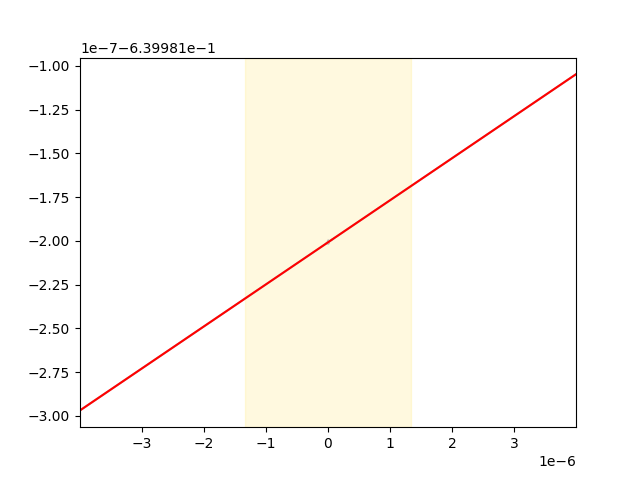
## New Eq:
((fabs(membrane__V) < 1.3307320976818627e-6) ? ((0.5 + 375733.02761014085 * membrane__V) * (5.3229283907274507e-6 * pow(membrane__F, 2) * (-L_type_Ca_channel__gamma_Cao * ionic_concentrations__Cao + L_type_Ca_channel__gamma_Cai * ionic_concentrations__Cai * exp(2.6614641953637254e-6 * membrane__F / (membrane__R * membrane__T))) * L_type_Ca_channel__P_Ca / ((-1.0 + exp(2.6614641953637254e-6 * membrane__F / (membrane__R * membrane__T))) * membrane__R * membrane__T) + 5.3229283907274507e-6 * pow(membrane__F, 2) * (-L_type_Ca_channel__gamma_Cao * ionic_concentrations__Cao + L_type_Ca_channel__gamma_Cai * ionic_concentrations__Cai * exp(-2.6614641953637254e-6 * membrane__F / (membrane__R * membrane__T))) * L_type_Ca_channel__P_Ca / ((-1.0 + exp(-2.6614641953637254e-6 * membrane__F / (membrane__R * membrane__T))) * membrane__R * membrane__T)) - 5.3229283907274507e-6 * pow(membrane__F, 2) * (-L_type_Ca_channel__gamma_Cao * ionic_concentrations__Cao + L_type_Ca_channel__gamma_Cai * ionic_concentrations__Cai * exp(-2.6614641953637254e-6 * membrane__F / (membrane__R * membrane__T))) * L_type_Ca_channel__P_Ca / ((-1.0 + exp(-2.6614641953637254e-6 * membrane__F / (membrane__R * membrane__T))) * membrane__R * membrane__T)) : (4.0 * pow(membrane__F, 2) * (-L_type_Ca_channel__gamma_Cao * ionic_concentrations__Cao + L_type_Ca_channel__gamma_Cai * ionic_concentrations__Cai * exp(2.0 * membrane__F * membrane__V / (membrane__R * membrane__T))) * L_type_Ca_channel__P_Ca * membrane__V / ((-1.0 + exp(2.0 * membrane__F * membrane__V / (membrane__R * membrane__T))) * membrane__R * membrane__T)))

## Equation 2:
```
L_type_Ca_channel__I_CaK = pow(membrane__F, 2) * (-L_type_Ca_channel__gamma_Ko * ionic_concentrations__Ko + L_type_Ca_channel__gamma_Ki * ionic_concentrations__Ki * exp(membrane__F * membrane__V / (membrane__R * membrane__T))) * L_type_Ca_channel__P_K * membrane__V / ((-1.0 + exp(membrane__F * membrane__V / (membrane__R * membrane__T))) * membrane__R * membrane__T)
```
### Partially evaluated to: 
```
L_type_Ca_channel__I_CaK = pow(membrane__F, 2) * (-L_type_Ca_channel__gamma_Ko * ionic_concentrations__Ko + L_type_Ca_channel__gamma_Ki * ionic_concentrations__Ki * exp(membrane__F * membrane__V / (membrane__R * membrane__T))) * L_type_Ca_channel__P_K * membrane__V / ((-1.0 + exp(membrane__F * membrane__V / (membrane__R * membrane__T))) * membrane__R * membrane__T)
```
### Singulariy points detected:

{0}
#### float * A

####Failed to find U symbolically!

<class 'sympy.core.mul.Mul'>
_membrane$F**2*_L_type_Ca_channel$P_K*_membrane$V*(_L_type_Ca_channel$gamma_Ki*_ionic_concentrations$Ki*exp(1.0*_membrane$F*_membrane$V/(_membrane$R*_membrane$T)) - _L_type_Ca_channel$gamma_Ko*_ionic_concentrations$Ko)/(_membrane$R*_membrane$T*(exp(1.0*_membrane$F*_membrane$V/(_membrane$R*_membrane$T)) - 1.0))

*try substituting parameters*

*U*
`0.037573302761014088 * membrane__V`

*V for 1e-07 range* 
`-2.6614641953637254e-6 - 2.6614641953637254e-6`

*Singularity point: 0*

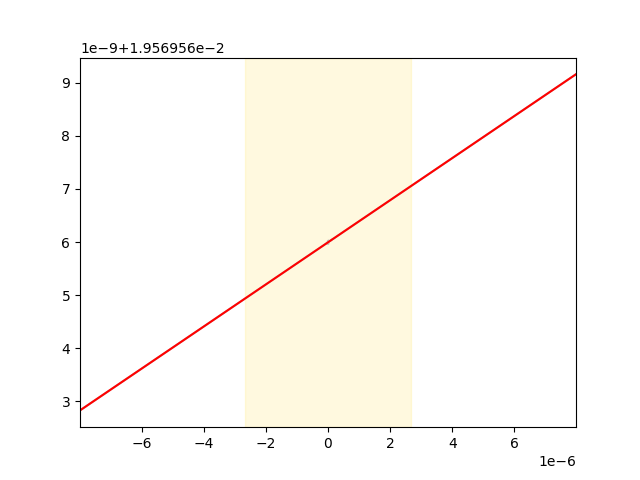
## New Eq:
((fabs(membrane__V) < 2.6614641953637254e-6) ? ((0.5 + 187866.51380507043 * membrane__V) * (2.6614641953637254e-6 * pow(membrane__F, 2) * (-L_type_Ca_channel__gamma_Ko * ionic_concentrations__Ko + L_type_Ca_channel__gamma_Ki * ionic_concentrations__Ki * exp(2.6614641953637254e-6 * membrane__F / (membrane__R * membrane__T))) * L_type_Ca_channel__P_K / ((-1.0 + exp(2.6614641953637254e-6 * membrane__F / (membrane__R * membrane__T))) * membrane__R * membrane__T) + 2.6614641953637254e-6 * pow(membrane__F, 2) * (-L_type_Ca_channel__gamma_Ko * ionic_concentrations__Ko + L_type_Ca_channel__gamma_Ki * ionic_concentrations__Ki * exp(-2.6614641953637254e-6 * membrane__F / (membrane__R * membrane__T))) * L_type_Ca_channel__P_K / ((-1.0 + exp(-2.6614641953637254e-6 * membrane__F / (membrane__R * membrane__T))) * membrane__R * membrane__T)) - 2.6614641953637254e-6 * pow(membrane__F, 2) * (-L_type_Ca_channel__gamma_Ko * ionic_concentrations__Ko + L_type_Ca_channel__gamma_Ki * ionic_concentrations__Ki * exp(-2.6614641953637254e-6 * membrane__F / (membrane__R * membrane__T))) * L_type_Ca_channel__P_K / ((-1.0 + exp(-2.6614641953637254e-6 * membrane__F / (membrane__R * membrane__T))) * membrane__R * membrane__T)) : (pow(membrane__F, 2) * (-L_type_Ca_channel__gamma_Ko * ionic_concentrations__Ko + L_type_Ca_channel__gamma_Ki * ionic_concentrations__Ki * exp(membrane__F * membrane__V / (membrane__R * membrane__T))) * L_type_Ca_channel__P_K * membrane__V / ((-1.0 + exp(membrane__F * membrane__V / (membrane__R * membrane__T))) * membrane__R * membrane__T)))

## Equation 3:
```
L_type_Ca_channel__I_CaNa = pow(membrane__F, 2) * (-L_type_Ca_channel__gamma_Nao * ionic_concentrations__Nao + L_type_Ca_channel__gamma_Nai * ionic_concentrations__Nai * exp(membrane__F * membrane__V / (membrane__R * membrane__T))) * L_type_Ca_channel__P_Na * membrane__V / ((-1.0 + exp(membrane__F * membrane__V / (membrane__R * membrane__T))) * membrane__R * membrane__T)
```
### Partially evaluated to: 
```
L_type_Ca_channel__I_CaNa = pow(membrane__F, 2) * (-L_type_Ca_channel__gamma_Nao * ionic_concentrations__Nao + L_type_Ca_channel__gamma_Nai * ionic_concentrations__Nai * exp(membrane__F * membrane__V / (membrane__R * membrane__T))) * L_type_Ca_channel__P_Na * membrane__V / ((-1.0 + exp(membrane__F * membrane__V / (membrane__R * membrane__T))) * membrane__R * membrane__T)
```
### Singulariy points detected:

{0}
#### float * A

####Failed to find U symbolically!

<class 'sympy.core.mul.Mul'>
_membrane$F**2*_L_type_Ca_channel$P_Na*_membrane$V*(_L_type_Ca_channel$gamma_Nai*_ionic_concentrations$Nai*exp(1.0*_membrane$F*_membrane$V/(_membrane$R*_membrane$T)) - _L_type_Ca_channel$gamma_Nao*_ionic_concentrations$Nao)/(_membrane$R*_membrane$T*(exp(1.0*_membrane$F*_membrane$V/(_membrane$R*_membrane$T)) - 1.0))

*try substituting parameters*

*U*
`0.037573302761014088 * membrane__V`

*V for 1e-07 range* 
`-2.6614641953637254e-6 - 2.6614641953637254e-6`

*Singularity point: 0*

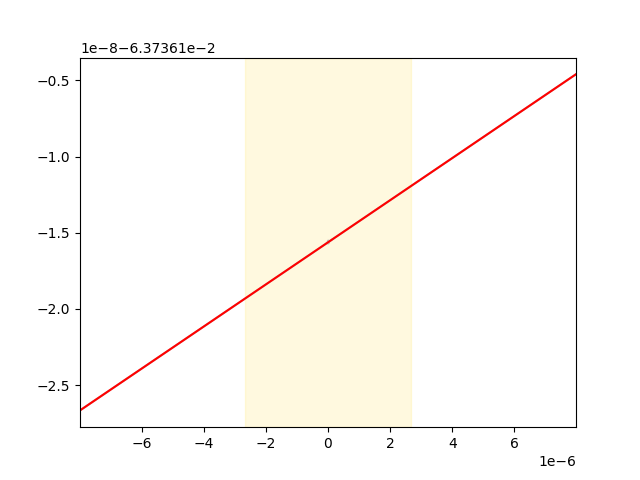
## New Eq:
((fabs(membrane__V) < 2.6614641953637254e-6) ? ((0.5 + 187866.51380507043 * membrane__V) * (2.6614641953637254e-6 * pow(membrane__F, 2) * (-L_type_Ca_channel__gamma_Nao * ionic_concentrations__Nao + L_type_Ca_channel__gamma_Nai * ionic_concentrations__Nai * exp(2.6614641953637254e-6 * membrane__F / (membrane__R * membrane__T))) * L_type_Ca_channel__P_Na / ((-1.0 + exp(2.6614641953637254e-6 * membrane__F / (membrane__R * membrane__T))) * membrane__R * membrane__T) + 2.6614641953637254e-6 * pow(membrane__F, 2) * (-L_type_Ca_channel__gamma_Nao * ionic_concentrations__Nao + L_type_Ca_channel__gamma_Nai * ionic_concentrations__Nai * exp(-2.6614641953637254e-6 * membrane__F / (membrane__R * membrane__T))) * L_type_Ca_channel__P_Na / ((-1.0 + exp(-2.6614641953637254e-6 * membrane__F / (membrane__R * membrane__T))) * membrane__R * membrane__T)) - 2.6614641953637254e-6 * pow(membrane__F, 2) * (-L_type_Ca_channel__gamma_Nao * ionic_concentrations__Nao + L_type_Ca_channel__gamma_Nai * ionic_concentrations__Nai * exp(-2.6614641953637254e-6 * membrane__F / (membrane__R * membrane__T))) * L_type_Ca_channel__P_Na / ((-1.0 + exp(-2.6614641953637254e-6 * membrane__F / (membrane__R * membrane__T))) * membrane__R * membrane__T)) : (pow(membrane__F, 2) * (-L_type_Ca_channel__gamma_Nao * ionic_concentrations__Nao + L_type_Ca_channel__gamma_Nai * ionic_concentrations__Nai * exp(membrane__F * membrane__V / (membrane__R * membrane__T))) * L_type_Ca_channel__P_Na * membrane__V / ((-1.0 + exp(membrane__F * membrane__V / (membrane__R * membrane__T))) * membrane__R * membrane__T)))

## Equation 4:
```
L_type_Ca_channel_d_gate__tau_d = 28.571428571428569 * (1.0 - exp(-1.6025641025641024 - 0.16025641025641024 * membrane__V)) * L_type_Ca_channel_d_gate__d_infinity / (10.0 + membrane__V)
```
### Partially evaluated to: 
```
L_type_Ca_channel_d_gate__tau_d = 28.571428571428569 * (1.0 - exp(-1.6025641025641024 - 0.16025641025641024 * membrane__V)) * L_type_Ca_channel_d_gate__d_infinity / (10.0 + membrane__V)
```
### Singulariy points detected:

{-10.000000000000000}
*U*
`-1.6025641025641024 - 0.16025641025641024 * membrane__V`

*V for 1e-07 range* 
`-9.9999993759999999 - -10.000000624`

*Singularity point: -10.000000000000000*


## New Eq:
((fabs(10.0 + membrane__V) < 6.2399999999074307e-7) ? ((-8012820.0129393814 - 801282.05129393819 * membrane__V) * (-45787545.788225032 * (1.0 - exp(9.9999999997671396e-8)) * L_type_Ca_channel_d_gate__d_infinity - 45787545.788225032 * (1.0 - exp(-9.9999999997671396e-8)) * L_type_Ca_channel_d_gate__d_infinity) + 45787545.788225032 * (1.0 - exp(-9.9999999997671396e-8)) * L_type_Ca_channel_d_gate__d_infinity) : (28.571428571428569 * (1.0 - exp(-1.6025641025641024 - 0.16025641025641024 * membrane__V)) * L_type_Ca_channel_d_gate__d_infinity / (10.0 + membrane__V)))

fast_sodium_current_h_gate__alpha_h = ((membrane__V < -40.0) ? (0.13500000000000001 * exp(-11.764705882352942 - 0.14705882352941177 * membrane__V)) : (0))

####Piecewise!!

fast_sodium_current_h_gate__beta_h = ((membrane__V < -40.0) ? (310000.0 * exp(0.34999999999999998 * membrane__V) + 3.5600000000000001 * exp(0.079000000000000001 * membrane__V)) : (7.6923076923076916 / (1.0 + exp(-0.96036036036036043 - 0.0900900900900901 * membrane__V))))

####Piecewise!!

fast_sodium_current_j_gate__alpha_j = ((membrane__V < -40.0) ? ((37.780000000000001 + membrane__V) * (-127140.0 * exp(0.24440000000000001 * membrane__V) - 3.4740000000000003e-5 * exp(-0.043909999999999998 * membrane__V)) / (1.0 + exp(24.640530000000002 + 0.311 * membrane__V))) : (0))

####Piecewise!!

fast_sodium_current_j_gate__beta_j = ((membrane__V < -40.0) ? (0.1212 * exp(-0.01052 * membrane__V) / (1.0 + exp(-5.5312920000000005 - 0.13780000000000001 * membrane__V))) : (0.29999999999999999 * exp(-2.5349999999999999e-7 * membrane__V) / (1.0 + exp(-3.2000000000000002 - 0.10000000000000001 * membrane__V))))

####Piecewise!!

## Equation 5:
```
fast_sodium_current_m_gate__alpha_m = 0.32000000000000001 * (47.130000000000003 + membrane__V) / (1.0 - exp(-4.7130000000000001 - 0.10000000000000001 * membrane__V))
```
### Partially evaluated to: 
```
fast_sodium_current_m_gate__alpha_m = 0.32000000000000001 * (47.130000000000003 + membrane__V) / (1.0 - exp(-4.7130000000000001 - 0.10000000000000001 * membrane__V))
```
### Singulariy points detected:

{-47.130000000000003}
*U*
`-4.7130000000000001 - 0.10000000000000001 * membrane__V`

*V for 1e-07 range* 
`-47.129999000000005 - -47.130001`

*Singularity point: -47.130000000000003*


## New Eq:
((fabs(47.130000000000003 + membrane__V) < 1.0000000000287557e-6) ? (3.200000000092018e-7 / (1.0 - exp(-1.0000000000287557e-7)) + (-23564999.499322373 - 499999.99998562218 * membrane__V) * (-3.200000000092018e-7 / (1.0 - exp(1.0000000000287557e-7)) - 3.200000000092018e-7 / (1.0 - exp(-1.0000000000287557e-7)))) : (0.32000000000000001 * (47.130000000000003 + membrane__V) / (1.0 - exp(-4.7130000000000001 - 0.10000000000000001 * membrane__V))))

## Equation 6:
```
non_specific_calcium_activated_current__I_ns_K = pow(membrane__F, 2) * (-L_type_Ca_channel__gamma_Ko * ionic_concentrations__Ko + L_type_Ca_channel__gamma_Ki * ionic_concentrations__Ki * exp(membrane__F * non_specific_calcium_activated_current__Vns / (membrane__R * membrane__T))) * non_specific_calcium_activated_current__P_ns_Ca * non_specific_calcium_activated_current__Vns / ((-1.0 + exp(membrane__F * non_specific_calcium_activated_current__Vns / (membrane__R * membrane__T))) * membrane__R * membrane__T)
```
### Partially evaluated to: 
```
non_specific_calcium_activated_current__I_ns_K = 6.3678763853082156e-6 * (-non_specific_calcium_activated_current__EnsCa + membrane__V) * (-0.75 * ionic_concentrations__Ko + 0.75 * ionic_concentrations__Ki * exp(0.037573302761014088 * membrane__V - 0.037573302761014088 * non_specific_calcium_activated_current__EnsCa)) / (-1.0 + exp(0.037573302761014088 * membrane__V - 0.037573302761014088 * non_specific_calcium_activated_current__EnsCa))
```
### Singulariy points detected:

{1.0*_non_specific_calcium_activated_current$EnsCa}
*U*
`0.037573302761014088 * membrane__V - 0.037573302761014088 * non_specific_calcium_activated_current__EnsCa`

*V for 1e-07 range* 
`-2.6614641953637254e-6 + non_specific_calcium_activated_current__EnsCa - 2.6614641953637254e-6 + non_specific_calcium_activated_current__EnsCa`

*Singularity point: 1.0*_non_specific_calcium_activated_current$EnsCa*

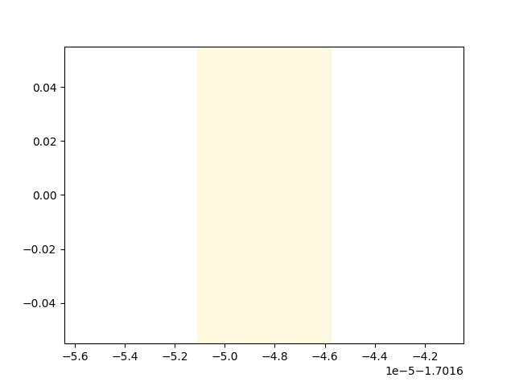
## New Eq:
((fabs(-non_specific_calcium_activated_current__EnsCa + membrane__V) < 2.6614641953637254e-6) ? (0.00012710905614463227 * ionic_concentrations__Ki - 0.00012710906885553852 * ionic_concentrations__Ko + (1.2710040841965042e-11 * ionic_concentrations__Ki + 1.2711771657866275e-11 * ionic_concentrations__Ko) * (0.5 + 187866.51380507043 * membrane__V - 187866.51380507043 * non_specific_calcium_activated_current__EnsCa)) : (pow(membrane__F, 2) * (-L_type_Ca_channel__gamma_Ko * ionic_concentrations__Ko + L_type_Ca_channel__gamma_Ki * ionic_concentrations__Ki * exp(membrane__F * non_specific_calcium_activated_current__Vns / (membrane__R * membrane__T))) * non_specific_calcium_activated_current__P_ns_Ca * non_specific_calcium_activated_current__Vns / ((-1.0 + exp(membrane__F * non_specific_calcium_activated_current__Vns / (membrane__R * membrane__T))) * membrane__R * membrane__T)))

## Equation 7:
```
non_specific_calcium_activated_current__I_ns_Na = pow(membrane__F, 2) * (-L_type_Ca_channel__gamma_Nao * ionic_concentrations__Nao + L_type_Ca_channel__gamma_Nai * ionic_concentrations__Nai * exp(membrane__F * non_specific_calcium_activated_current__Vns / (membrane__R * membrane__T))) * non_specific_calcium_activated_current__P_ns_Ca * non_specific_calcium_activated_current__Vns / ((-1.0 + exp(membrane__F * non_specific_calcium_activated_current__Vns / (membrane__R * membrane__T))) * membrane__R * membrane__T)
```
### Partially evaluated to: 
```
non_specific_calcium_activated_current__I_ns_Na = 6.3678763853082156e-6 * (-non_specific_calcium_activated_current__EnsCa + membrane__V) * (-0.75 * ionic_concentrations__Nao + 0.75 * ionic_concentrations__Nai * exp(0.037573302761014088 * membrane__V - 0.037573302761014088 * non_specific_calcium_activated_current__EnsCa)) / (-1.0 + exp(0.037573302761014088 * membrane__V - 0.037573302761014088 * non_specific_calcium_activated_current__EnsCa))
```
### Singulariy points detected:

{1.0*_non_specific_calcium_activated_current$EnsCa}
*U*
`0.037573302761014088 * membrane__V - 0.037573302761014088 * non_specific_calcium_activated_current__EnsCa`

*V for 1e-07 range* 
`-2.6614641953637254e-6 + non_specific_calcium_activated_current__EnsCa - 2.6614641953637254e-6 + non_specific_calcium_activated_current__EnsCa`

*Singularity point: 1.0*_non_specific_calcium_activated_current$EnsCa*


## New Eq:
((fabs(-non_specific_calcium_activated_current__EnsCa + membrane__V) < 2.6614641953637254e-6) ? (0.00012710905614463227 * ionic_concentrations__Nai - 0.00012710906885553852 * ionic_concentrations__Nao + (1.2710040841965042e-11 * ionic_concentrations__Nai + 1.2711771657866275e-11 * ionic_concentrations__Nao) * (0.5 + 187866.51380507043 * membrane__V - 187866.51380507043 * non_specific_calcium_activated_current__EnsCa)) : (pow(membrane__F, 2) * (-L_type_Ca_channel__gamma_Nao * ionic_concentrations__Nao + L_type_Ca_channel__gamma_Nai * ionic_concentrations__Nai * exp(membrane__F * non_specific_calcium_activated_current__Vns / (membrane__R * membrane__T))) * non_specific_calcium_activated_current__P_ns_Ca * non_specific_calcium_activated_current__Vns / ((-1.0 + exp(membrane__F * non_specific_calcium_activated_current__Vns / (membrane__R * membrane__T))) * membrane__R * membrane__T)))

Singularities cannot be found
1.0/(0.036499999999999998*(0.14285714285714286*exp(0.014858841010401189*_ionic_concentrations$Nao) - 0.14285714285714286)*exp(-0.037573302761014085*_membrane$V) + 1.0 + 0.1245*exp(-0.0037573302761014088*_membrane$V))

## Equation 8:
```
time_dependent_potassium_current_X_gate__alpha_X = 7.1899999999999999e-5 * (30.0 + membrane__V) / (1.0 - exp(-4.4399999999999995 - 0.14799999999999999 * membrane__V))
```
### Partially evaluated to: 
```
time_dependent_potassium_current_X_gate__alpha_X = 7.1899999999999999e-5 * (30.0 + membrane__V) / (1.0 - exp(-4.4399999999999995 - 0.14799999999999999 * membrane__V))
```
### Singulariy points detected:

{-30.000000000000000}
*U*
`-4.4399999999999995 - 0.14799999999999999 * membrane__V`

*V for 1e-07 range* 
`-29.999999324324325 - -30.000000675675675`

*Singularity point: -30.000000000000000*


## New Eq:
((fabs(30.0 + membrane__V) < 6.7567567568760367e-7) ? (4.8581081081938701e-11 / (1.0 - exp(-1.0000000000287557e-7)) + (-22199999.499608092 - 739999.99998693645 * membrane__V) * (-4.8581081081938701e-11 / (1.0 - exp(1.0000000000287557e-7)) - 4.8581081081938701e-11 / (1.0 - exp(-1.0000000000287557e-7)))) : (7.1899999999999999e-5 * (30.0 + membrane__V) / (1.0 - exp(-4.4399999999999995 - 0.14799999999999999 * membrane__V))))

## Equation 9:
```
time_dependent_potassium_current_X_gate__beta_X = 0.00013100000000000001 * (30.0 + membrane__V) / (-1.0 + exp(2.0609999999999999 + 0.068699999999999997 * membrane__V))
```
### Partially evaluated to: 
```
time_dependent_potassium_current_X_gate__beta_X = 0.00013100000000000001 * (30.0 + membrane__V) / (-1.0 + exp(2.0609999999999999 + 0.068699999999999997 * membrane__V))
```
### Singulariy points detected:

{-30.000000000000000}
*U*
`2.0609999999999999 + 0.068699999999999997 * membrane__V`

*V for 1e-07 range* 
`-30.000001455604075 - -29.999998544395925`

*Singularity point: -30.000000000000000*

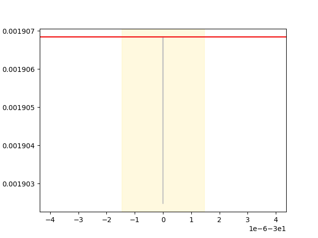
## New Eq:
((fabs(30.0 + membrane__V) < 1.455604075689676e-6) ? (-1.9068413391534758e-10 / (-1.0 + exp(-9.9999999999406119e-8)) + (10305000.50001229 + 343500.00000040967 * membrane__V) * (1.9068413391534758e-10 / (-1.0 + exp(9.9999999999406119e-8)) + 1.9068413391534758e-10 / (-1.0 + exp(-9.9999999999406119e-8)))) : (0.00013100000000000001 * (30.0 + membrane__V) / (-1.0 + exp(2.0609999999999999 + 0.068699999999999997 * membrane__V))))

# Model: MahajanShiferaw2008_units(mahajan_shiferaw_2008.cellml)
Irel__Qr0 = (((Irel__Ca_JSR > 50.0) && (Irel__Ca_JSR < Irel__cstar)) ? (-50.0 + Irel__Ca_JSR) : ((Irel__Ca_JSR >= Irel__cstar) ? (Irel__Ca_JSR * Irel__av + Irel__bv) : (0)))

####Piecewise!!

ICaL__rxa = ((fabs(ICaL__za) < 0.001) ? (2.0 * (-0.34100000000000003 * Environment__Ca_o + Ca__csm * exp(ICaL__za)) * Environment__F * ICaL__pca) : (4.0 * (-0.34100000000000003 * Environment__Ca_o + Ca__csm * exp(ICaL__za)) * Environment__F * Environment__FonRT * ICaL__pca * cell__V / (-1.0 + exp(ICaL__za))))

####Piecewise!!

IKr__xkrv1 = ((fabs(7.0 + cell__V) > 0.001) ? (0.0013799999999999999 * (7.0 + cell__V) / (1.0 - exp(-0.86099999999999999 - 0.123 * cell__V))) : (0.011219512195121951))

####Piecewise!!

IKr__xkrv2 = ((fabs(10.0 + cell__V) > 0.001) ? (0.00060999999999999997 * (10.0 + cell__V) / (-1.0 + exp(1.45 + 0.14499999999999999 * cell__V))) : (0.0042068965517241376))

####Piecewise!!

IKs__tauxs1 = ((fabs(30.0 + cell__V) < 0.014556040756914121) ? (417.94625266107982) : (1 / (0.00013100000000000001 * (30.0 + cell__V) / (-1.0 + exp(2.0609999999999999 + 0.068699999999999997 * cell__V)) + 7.1899999999999999e-5 * (30.0 + cell__V) / (1.0 - exp(-4.4399999999999995 - 0.14799999999999999 * cell__V)))))

####Piecewise!!

INa__ah = ((cell__V < -40.0) ? (0.13500000000000001 * exp(-11.764705882352942 + 0.14705882352941177 * INa__shift_h - 0.14705882352941177 * cell__V)) : (0))

####Piecewise!!

INa__aj = ((cell__V < -40.0) ? ((37.780000000000001 + cell__V) * (-127140.0 * exp(0.24440000000000001 * cell__V - 0.24440000000000001 * INa__shift_h) - 3.4740000000000003e-5 * exp(0.043909999999999998 * INa__shift_h - 0.043909999999999998 * cell__V)) / (1.0 + exp(24.640530000000002 + 0.311 * cell__V))) : (0))

####Piecewise!!

INa__am = ((fabs(47.130000000000003 + cell__V) > 0.001) ? (0.32000000000000001 * (47.130000000000003 + cell__V) / (1.0 - exp(-4.7130000000000001 - 0.10000000000000001 * cell__V))) : (3.2000000000000002))

####Piecewise!!

INa__bh = ((cell__V < -40.0) ? (310000.0 * exp(0.34999999999999998 * cell__V - 0.34999999999999998 * INa__shift_h) + 3.5600000000000001 * exp(0.079000000000000001 * cell__V - 0.079000000000000001 * INa__shift_h)) : (7.6923076923076916 / (1.0 + exp(-0.96036036036036043 + 0.0900900900900901 * INa__shift_h - 0.0900900900900901 * cell__V))))

####Piecewise!!

INa__bj = ((cell__V < -40.0) ? (0.1212 * exp(0.01052 * INa__shift_h - 0.01052 * cell__V) / (1.0 + exp(-5.5312920000000005 - 0.13780000000000001 * cell__V))) : (0.29999999999999999 * exp(2.5349999999999999e-7 * INa__shift_h - 2.5349999999999999e-7 * cell__V) / (1.0 + exp(-3.2000000000000002 - 0.10000000000000001 * cell__V))))

####Piecewise!!

Singularities cannot be found
1.0/(0.036499999999999998*(0.14285714285714286*exp(0.014858841010401189*_Environment$Na_o) - 0.14285714285714286)*exp(-_Environment$F*_cell$V/(_Environment$R*_Environment$T)) + 1.0 + 0.1245*exp(-0.10000000000000001*_Environment$F*_cell$V/(_Environment$R*_Environment$T)))

## Equation 1:
```
Irel__spark_rate = ICaL__po * Irel__gryr * Irel__sparkV * fabs(ICaL__rxa)
```
### Partially evaluated to: 
```
Irel__spark_rate = 2.5807899999999999 * (1.0 - ICaL__c1 - ICaL__c2 - ICaL__xi1ba - ICaL__xi1ca - ICaL__xi2ba - ICaL__xi2ca) * fabs(((fabs(2.0 * Environment__FonRT * cell__V) < 0.001) ? (2.0 * (-0.34100000000000003 * Environment__Ca_o + Ca__csm * exp(2.0 * Environment__FonRT * cell__V)) * Environment__F * ICaL__pca) : (4.0 * (-0.34100000000000003 * Environment__Ca_o + Ca__csm * exp(2.0 * Environment__FonRT * cell__V)) * Environment__F * Environment__FonRT * ICaL__pca * cell__V / (-1.0 + exp(2.0 * Environment__FonRT * cell__V))))) * exp(-(30.0 + cell__V) * Irel__ay) / (1.0 + exp(-(30.0 + cell__V) * Irel__ay))
```
### Singulariy points detected:

{0}
#### float * A

####Failed to find U symbolically!

<class 'sympy.core.mul.Mul'>
(-_ICaL$c1 - _ICaL$c2 - _ICaL$xi1ba - _ICaL$xi1ca - _ICaL$xi2ba - _ICaL$xi2ca + 1.0)*exp_(-_Irel$ay*(_cell$V + 30.0))*Abs(Piecewise((2.0*_Environment$F*_ICaL$pca*(_Ca$csm*exp_(2.0*_Environment$FonRT*_cell$V) - 0.34100000000000003*_Environment$Ca_o), abs_(2.0*_Environment$FonRT*_cell$V) < 0.001), (4.0*_Environment$F*_Environment$FonRT*_ICaL$pca*_cell$V*(_Ca$csm*exp_(2.0*_Environment$FonRT*_cell$V) - 0.34100000000000003*_Environment$Ca_o)/(exp_(2.0*_Environment$FonRT*_cell$V) - 1.0), True)))/(exp_(-_Irel$ay*(_cell$V + 30.0)) + 1.0)

*try substituting parameters*

#### float * A

####Failed to find U symbolically!

<class 'sympy.core.mul.Mul'>
(-_ICaL$c1 - _ICaL$c2 - _ICaL$xi1ba - _ICaL$xi1ca - _ICaL$xi2ba - _ICaL$xi2ca + 1.0)*exp(-0.050000000000000003*_cell$V)*Abs(Piecewise((0.00010420416882000001*_Ca$Ca_submem*exp(0.075353936071760367*_cell$V) - 0.06396051882171601, 0.075353936071760367*Abs(_cell$V) < 0.001), (0.0078521942756732053*_cell$V*(0.001*_Ca$Ca_submem*exp(0.075353936071760367*_cell$V) - 0.61380000000000006)/(exp(0.075353936071760367*_cell$V) - 1.0), True)))/(1.0 + 0.22313016014842981*exp(-0.050000000000000003*_cell$V))
## Equation 2:
```
Irel__xicap = ICaL__po * Irel__gdyad * fabs(ICaL__rxa)
```
### Partially evaluated to: 
```
Irel__xicap = 9000.0 * (1.0 - ICaL__c1 - ICaL__c2 - ICaL__xi1ba - ICaL__xi1ca - ICaL__xi2ba - ICaL__xi2ca) * fabs(((fabs(2.0 * Environment__FonRT * cell__V) < 0.001) ? (2.0 * (-0.34100000000000003 * Environment__Ca_o + Ca__csm * exp(2.0 * Environment__FonRT * cell__V)) * Environment__F * ICaL__pca) : (4.0 * (-0.34100000000000003 * Environment__Ca_o + Ca__csm * exp(2.0 * Environment__FonRT * cell__V)) * Environment__F * Environment__FonRT * ICaL__pca * cell__V / (-1.0 + exp(2.0 * Environment__FonRT * cell__V)))))
```
### Singulariy points detected:

{0}
#### float * A

####Failed to find U symbolically!

<class 'sympy.core.mul.Mul'>
(-_ICaL$c1 - _ICaL$c2 - _ICaL$xi1ba - _ICaL$xi1ca - _ICaL$xi2ba - _ICaL$xi2ca + 1.0)*Abs(Piecewise((2.0*_Environment$F*_ICaL$pca*(_Ca$csm*exp_(2.0*_Environment$FonRT*_cell$V) - 0.34100000000000003*_Environment$Ca_o), abs_(2.0*_Environment$FonRT*_cell$V) < 0.001), (4.0*_Environment$F*_Environment$FonRT*_ICaL$pca*_cell$V*(_Ca$csm*exp_(2.0*_Environment$FonRT*_cell$V) - 0.34100000000000003*_Environment$Ca_o)/(exp_(2.0*_Environment$FonRT*_cell$V) - 1.0), True)))

*try substituting parameters*

####Failed to find U symbolically!

<class 'sympy.core.mul.Mul'>
(-_ICaL$c1 - _ICaL$c2 - _ICaL$xi1ba - _ICaL$xi1ca - _ICaL$xi2ba - _ICaL$xi2ca + 1.0)*Abs(Piecewise((0.00010420416882000001*_Ca$Ca_submem*exp(0.075353936071760367*_cell$V) - 0.06396051882171601, 0.075353936071760367*Abs(_cell$V) < 0.001), (0.0078521942756732053*_cell$V*(0.001*_Ca$Ca_submem*exp(0.075353936071760367*_cell$V) - 0.61380000000000006)/(exp(0.075353936071760367*_cell$V) - 1.0), True)))
## Equation 3:
```
Irel__xirp = ICaL__po * Irel__Qr * Irel__gbarsr * fabs(ICaL__rxa) * exp(-(30.0 + cell__V) * Irel__ax) / (1.0 + exp(-(30.0 + cell__V) * Irel__ax))
```
### Partially evaluated to: 
```
Irel__xirp = 0.0065381958374137635 * (1.0 - ICaL__c1 - ICaL__c2 - ICaL__xi1ba - ICaL__xi1ca - ICaL__xi2ba - ICaL__xi2ca) * fabs(((fabs(2.0 * Environment__FonRT * cell__V) < 0.001) ? (2.0 * (-0.34100000000000003 * Environment__Ca_o + Ca__csm * exp(2.0 * Environment__FonRT * cell__V)) * Environment__F * ICaL__pca) : (4.0 * (-0.34100000000000003 * Environment__Ca_o + Ca__csm * exp(2.0 * Environment__FonRT * cell__V)) * Environment__F * Environment__FonRT * ICaL__pca * cell__V / (-1.0 + exp(2.0 * Environment__FonRT * cell__V))))) * (((Irel__Ca_JSR > 50.0) && (Irel__Ca_JSR < 90.0)) ? (-50.0 + Irel__Ca_JSR) : ((Irel__Ca_JSR >= 90.0) ? (40.0 + 11.300000000000001 * Irel__Ca_JSR - 90.0 * Irel__av) : (0))) * Ca__Ca_NSR * exp(-0.35759999999999997 * cell__V) / (1.0 + 2.1922435357063935e-5 * exp(-0.35759999999999997 * cell__V))
```
### Singulariy points detected:

{0}
#### float * A

####Failed to find U symbolically!

<class 'sympy.core.mul.Mul'>
_Ca$Ca_NSR*(-_ICaL$c1 - _ICaL$c2 - _ICaL$xi1ba - _ICaL$xi1ca - _ICaL$xi2ba - _ICaL$xi2ca + 1.0)*Piecewise((1.0*_Irel$Ca_JSR - 50.0, (_Irel$Ca_JSR > 50.0) & (_Irel$Ca_JSR < 90.0)), (11.300000000000001*_Irel$Ca_JSR - 90.0*_Irel$av + 40.0, _Irel$Ca_JSR >= 90.0), (0, True))*exp(-0.35759999999999997*_cell$V)*Abs(Piecewise((2.0*_Environment$F*_ICaL$pca*(_Ca$csm*exp_(2.0*_Environment$FonRT*_cell$V) - 0.34100000000000003*_Environment$Ca_o), abs_(2.0*_Environment$FonRT*_cell$V) < 0.001), (4.0*_Environment$F*_Environment$FonRT*_ICaL$pca*_cell$V*(_Ca$csm*exp_(2.0*_Environment$FonRT*_cell$V) - 0.34100000000000003*_Environment$Ca_o)/(exp_(2.0*_Environment$FonRT*_cell$V) - 1.0), True)))/(1.0 + 2.1922435357063934e-5*exp(-0.35759999999999997*_cell$V))

*try substituting parameters*

####Failed to find U symbolically!

<class 'sympy.core.mul.Mul'>
_Ca$Ca_NSR*(-_ICaL$c1 - _ICaL$c2 - _ICaL$xi1ba - _ICaL$xi1ca - _ICaL$xi2ba - _ICaL$xi2ca + 1.0)*Piecewise((1.0*_Irel$Ca_JSR - 50.0, (_Irel$Ca_JSR > 50.0) & (_Irel$Ca_JSR < 90.0)), (11.300000000000001*_Irel$Ca_JSR - 977.00000000000006, _Irel$Ca_JSR >= 90.0), (0, True))*exp(-0.35759999999999997*_cell$V)*Abs(Piecewise((0.00010420416882000001*_Ca$Ca_submem*exp(0.075353936071760367*_cell$V) - 0.06396051882171601, 0.075353936071760367*Abs(_cell$V) < 0.001), (0.0078521942756732053*_cell$V*(0.001*_Ca$Ca_submem*exp(0.075353936071760367*_cell$V) - 0.61380000000000006)/(exp(0.075353936071760367*_cell$V) - 1.0), True)))/(1.0 + 2.1922435357063934e-5*exp(-0.35759999999999997*_cell$V))
# Model: Maleckar(maleckar_model_2009.cellml)
## Equation 1:
```
sodium_current__i_Na = pow(membrane__F, 2) * pow(sodium_current_m_gate__m, 3) * (-1.0 + exp((-sodium_current__E_Na + membrane__V) * membrane__F / (membrane__R * membrane__T))) * (0.10000000000000001 * sodium_current_h2_gate__h2 + 0.90000000000000002 * sodium_current_h1_gate__h1) * cleft_space_ion_concentrations__Na_c * membrane__V * sodium_current__P_Na / ((-1.0 + exp(membrane__F * membrane__V / (membrane__R * membrane__T))) * membrane__R * membrane__T)
```
### Partially evaluated to: 
```
sodium_current__i_Na = pow(membrane__F, 2) * pow(sodium_current_m_gate__m, 3) * (-1.0 + exp((-sodium_current__E_Na + membrane__V) * membrane__F / (membrane__R * membrane__T))) * (0.10000000000000001 * sodium_current_h2_gate__h2 + 0.90000000000000002 * sodium_current_h1_gate__h1) * cleft_space_ion_concentrations__Na_c * membrane__V * sodium_current__P_Na / ((-1.0 + exp(membrane__F * membrane__V / (membrane__R * membrane__T))) * membrane__R * membrane__T)
```
### Singulariy points detected:

{0}
####Failed to find U symbolically!

<class 'sympy.core.mul.Mul'>
_membrane$F**2*_sodium_current_m_gate$m**3*_cleft_space_ion_concentrations$Na_c*_membrane$V*_sodium_current$P_Na*(0.90000000000000002*_sodium_current_h1_gate$h1 + 0.10000000000000001*_sodium_current_h2_gate$h2)*(exp(_membrane$F*(_membrane$V - _sodium_current$E_Na)/(_membrane$R*_membrane$T)) - 1.0)/(_membrane$R*_membrane$T*(exp(_membrane$F*_membrane$V/(_membrane$R*_membrane$T)) - 1.0))

*try substituting parameters*

*U*
`0.037907445518581065 * membrane__V`

*V for 1e-07 range* 
`-2.6380041870925613e-6 - 2.6380041870925613e-6`

*Singularity point: 0*

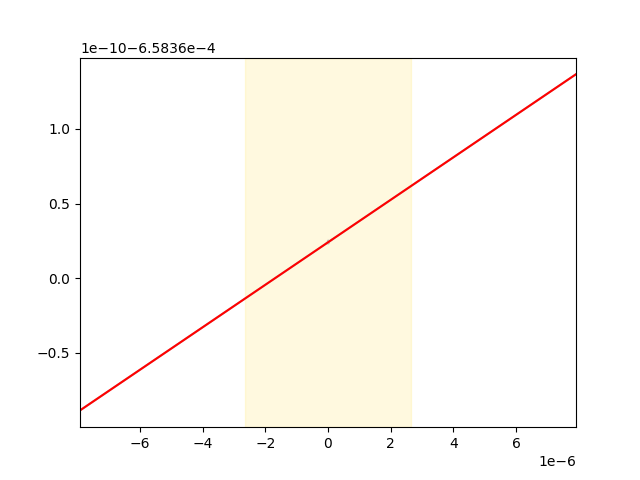
## New Eq:
((fabs(membrane__V) < 2.6380041870925613e-6) ? ((0.5 + 189537.22759290531 * membrane__V) * (2.6380041870925613e-6 * pow(membrane__F, 2) * pow(sodium_current_m_gate__m, 3) * (-1.0 + exp((2.6380041870925613e-6 - sodium_current__E_Na) * membrane__F / (membrane__R * membrane__T))) * (0.10000000000000001 * sodium_current_h2_gate__h2 + 0.90000000000000002 * sodium_current_h1_gate__h1) * cleft_space_ion_concentrations__Na_c * sodium_current__P_Na / ((-1.0 + exp(2.6380041870925613e-6 * membrane__F / (membrane__R * membrane__T))) * membrane__R * membrane__T) + 2.6380041870925613e-6 * pow(membrane__F, 2) * pow(sodium_current_m_gate__m, 3) * (-1.0 + exp((-2.6380041870925613e-6 - sodium_current__E_Na) * membrane__F / (membrane__R * membrane__T))) * (0.10000000000000001 * sodium_current_h2_gate__h2 + 0.90000000000000002 * sodium_current_h1_gate__h1) * cleft_space_ion_concentrations__Na_c * sodium_current__P_Na / ((-1.0 + exp(-2.6380041870925613e-6 * membrane__F / (membrane__R * membrane__T))) * membrane__R * membrane__T)) - 2.6380041870925613e-6 * pow(membrane__F, 2) * pow(sodium_current_m_gate__m, 3) * (-1.0 + exp((-2.6380041870925613e-6 - sodium_current__E_Na) * membrane__F / (membrane__R * membrane__T))) * (0.10000000000000001 * sodium_current_h2_gate__h2 + 0.90000000000000002 * sodium_current_h1_gate__h1) * cleft_space_ion_concentrations__Na_c * sodium_current__P_Na / ((-1.0 + exp(-2.6380041870925613e-6 * membrane__F / (membrane__R * membrane__T))) * membrane__R * membrane__T)) : (pow(membrane__F, 2) * pow(sodium_current_m_gate__m, 3) * (-1.0 + exp((-sodium_current__E_Na + membrane__V) * membrane__F / (membrane__R * membrane__T))) * (0.10000000000000001 * sodium_current_h2_gate__h2 + 0.90000000000000002 * sodium_current_h1_gate__h1) * cleft_space_ion_concentrations__Na_c * membrane__V * sodium_current__P_Na / ((-1.0 + exp(membrane__F * membrane__V / (membrane__R * membrane__T))) * membrane__R * membrane__T)))

## Equation 2:
```
sodium_potassium_pump__i_NaK = (150.0 + membrane__V) * cleft_space_ion_concentrations__K_c * sodium_potassium_pump__i_NaK_max * sodium_potassium_pump__pow_Na_i_15 / ((200.0 + membrane__V) * (cleft_space_ion_concentrations__K_c + sodium_potassium_pump__K_NaK_K) * (sodium_potassium_pump__pow_K_NaK_Na_15 + sodium_potassium_pump__pow_Na_i_15))
```
### Partially evaluated to: 
```
sodium_potassium_pump__i_NaK = (150.0 + membrane__V) * cleft_space_ion_concentrations__K_c * sodium_potassium_pump__i_NaK_max * sodium_potassium_pump__pow_Na_i_15 / ((200.0 + membrane__V) * (cleft_space_ion_concentrations__K_c + sodium_potassium_pump__K_NaK_K) * (sodium_potassium_pump__pow_K_NaK_Na_15 + sodium_potassium_pump__pow_Na_i_15))
```
### Singulariy points detected:

{-200.00000000000000}
####Failed to find U symbolically!

<class 'sympy.core.mul.Mul'>
_cleft_space_ion_concentrations$K_c*_sodium_potassium_pump$i_NaK_max*_sodium_potassium_pump$pow_Na_i_15*(_membrane$V + 150.0)/((_cleft_space_ion_concentrations$K_c + _sodium_potassium_pump$K_NaK_K)*(_membrane$V + 200.0)*(_sodium_potassium_pump$pow_K_NaK_Na_15 + _sodium_potassium_pump$pow_Na_i_15))

*try substituting parameters*

#### float * A

####Failed to find U symbolically!

<class 'sympy.core.mul.Mul'>
_intracellular_ion_concentrations$Na_i**1.5*_cleft_space_ion_concentrations$K_c*(_membrane$V + 150.0)/((_intracellular_ion_concentrations$Na_i**1.5 + 36.482900000000001)*(_cleft_space_ion_concentrations$K_c + 1.0)*(_membrane$V + 200.0))
# Model: maltsev_2009(maltsev_2009.cellml)
i_CaL_dL_gate__adVm = ((Vm__Vm == (-35.0)) ? (-35.000010000000003) : ((Vm__Vm == 0) ? (1.0000000000000001e-5) : (Vm__Vm)))

####Piecewise!!

i_CaL_dL_gate__bdVm = ((Vm__Vm == 5.0) ? (5.0000099999999996) : (Vm__Vm))

####Piecewise!!

# Model: matsuoka_model_2003(matsuoka_model_2003.cellml)
constant_field_equations__CF_Ca = ((membrane__Vm == 0) ? (-external_ion_concentrations__Cao) : (2.0 * (-external_ion_concentrations__Cao * exp(-2.0 * membrane__F * membrane__Vm / (membrane__R * membrane__T)) + internal_ion_concentrations__Cai) * membrane__F * membrane__Vm / ((1.0 - exp(-2.0 * membrane__F * membrane__Vm / (membrane__R * membrane__T))) * membrane__R * membrane__T)))

####Piecewise!!

constant_field_equations__CF_K = ((membrane__Vm == 0) ? (internal_ion_concentrations__Ki) : ((-external_ion_concentrations__Ko * exp(-membrane__F * membrane__Vm / (membrane__R * membrane__T)) + internal_ion_concentrations__Ki) * membrane__F * membrane__Vm / ((1.0 - exp(-membrane__F * membrane__Vm / (membrane__R * membrane__T))) * membrane__R * membrane__T)))

####Piecewise!!

background_Kpl_current__i_Kpl = ((membrane__Vm == (-3.0)) ? (13.0077 * background_Kpl_current__P_Kpl * constant_field_equations__CF_K) : ((3.0 + membrane__Vm) * background_Kpl_current__P_Kpl * constant_field_equations__CF_K / (1.0 - exp(-0.23076923076923078 - 0.076923076923076927 * membrane__Vm))))

####Piecewise!!

constant_field_equations__CF_Na = ((membrane__Vm == 0) ? (-external_ion_concentrations__Nao) : ((-external_ion_concentrations__Nao * exp(-membrane__F * membrane__Vm / (membrane__R * membrane__T)) + internal_ion_concentrations__Nai) * membrane__F * membrane__Vm / ((1.0 - exp(-membrane__F * membrane__Vm / (membrane__R * membrane__T))) * membrane__R * membrane__T)))

####Piecewise!!

# Model: mcallister_noble_tsien_1975_modelB(mcallister_noble_tsien_1975_b.cellml)
## Equation 1:
```
fast_sodium_current_m_gate__alpha_m = (47.0 + membrane__V) / (1.0 - exp(-4.7000000000000002 - 0.10000000000000001 * membrane__V))
```
### Partially evaluated to: 
```
fast_sodium_current_m_gate__alpha_m = (47.0 + membrane__V) / (1.0 - exp(-4.7000000000000002 - 0.10000000000000001 * membrane__V))
```
### Singulariy points detected:

{-47.000000000000000}
*U*
`-4.7000000000000002 - 0.10000000000000001 * membrane__V`

*V for 1e-07 range* 
`-46.999999000000003 - -47.000000999999997`

*Singularity point: -47.000000000000000*


## New Eq:
((fabs(47.0 + membrane__V) < 1.0000000000287557e-6) ? (9.9999999997324451e-7 / (1.0 - exp(-1.0000000000287557e-7)) + (-23499999.499324244 - 499999.99998562218 * membrane__V) * (-9.9999999997324451e-7 / (1.0 - exp(-1.0000000000287557e-7)) - 1.0000000000842668e-6 / (1.0 - exp(1.0000000000287557e-7)))) : ((47.0 + membrane__V) / (1.0 - exp(-4.7000000000000002 - 0.10000000000000001 * membrane__V))))

## Equation 2:
```
pacemaker_potassium_current_s_gate__alpha_s = 0.001 * (-pacemaker_potassium_current_s_gate__E_s + membrane__V) / (1.0 - exp(0.20000000000000001 * pacemaker_potassium_current_s_gate__E_s - 0.20000000000000001 * membrane__V))
```
### Partially evaluated to: 
```
pacemaker_potassium_current_s_gate__alpha_s = 0.001 * (-pacemaker_potassium_current_s_gate__E_s + membrane__V) / (1.0 - exp(0.20000000000000001 * pacemaker_potassium_current_s_gate__E_s - 0.20000000000000001 * membrane__V))
```
### Singulariy points detected:

{1.0*_pacemaker_potassium_current_s_gate$E_s}
*U*
`0.20000000000000001 * pacemaker_potassium_current_s_gate__E_s - 0.20000000000000001 * membrane__V`

*V for 1e-07 range* 
`4.9999999999999998e-7 + pacemaker_potassium_current_s_gate__E_s - -4.9999999999999998e-7 + pacemaker_potassium_current_s_gate__E_s`

*Singularity point: 1.0*_pacemaker_potassium_current_s_gate$E_s*


## New Eq:
((fabs(-pacemaker_potassium_current_s_gate__E_s + membrane__V) < 4.9999999999999998e-7) ? (4.9999999999999993e-10 / (1.0 - exp(-9.9999999999999995e-8)) + (-4.9999999999999993e-10 / (1.0 - exp(9.9999999999999995e-8)) - 4.9999999999999993e-10 / (1.0 - exp(-9.9999999999999995e-8))) * (0.5 + 1000000.0000000001 * pacemaker_potassium_current_s_gate__E_s - 1000000.0000000001 * membrane__V)) : (0.001 * (-pacemaker_potassium_current_s_gate__E_s + membrane__V) / (1.0 - exp(0.20000000000000001 * pacemaker_potassium_current_s_gate__E_s - 0.20000000000000001 * membrane__V))))

## Equation 3:
```
secondary_inward_current_d_gate__alpha_d = 0.002 * (40.0 + membrane__V) / (1.0 - exp(-4.0 - 0.10000000000000001 * membrane__V))
```
### Partially evaluated to: 
```
secondary_inward_current_d_gate__alpha_d = 0.002 * (40.0 + membrane__V) / (1.0 - exp(-4.0 - 0.10000000000000001 * membrane__V))
```
### Singulariy points detected:

{-40.000000000000000}
*U*
`-4.0 - 0.10000000000000001 * membrane__V`

*V for 1e-07 range* 
`-39.999999000000003 - -40.000000999999997`

*Singularity point: -40.000000000000000*

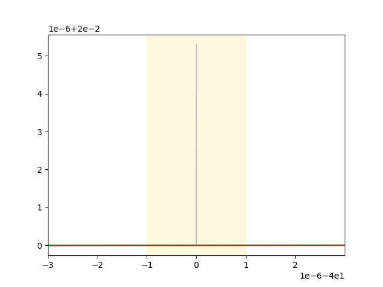
## New Eq:
((fabs(40.0 + membrane__V) < 1.0000000000010001e-6) ? (1.999999999946489e-9 / (1.0 - exp(-9.9999999995936673e-8)) + (-19999999.499979999 - 499999.99999949994 * membrane__V) * (-1.999999999946489e-9 / (1.0 - exp(-9.9999999995936673e-8)) - 2.0000000000575115e-9 / (1.0 - exp(1.0000000000287557e-7)))) : (0.002 * (40.0 + membrane__V) / (1.0 - exp(-4.0 - 0.10000000000000001 * membrane__V))))

## Equation 4:
```
time_independent_outward_current__i_K1 = 0.35714285714285715 * pacemaker_potassium_current__I_K2 + 0.20000000000000001 * (-time_independent_outward_current__E_K1 + membrane__V) / (1.0 - exp(0.040000000000000001 * time_independent_outward_current__E_K1 - 0.040000000000000001 * membrane__V))
```
### Partially evaluated to: 
```
time_independent_outward_current__i_K1 = 0.35714285714285715 * pacemaker_potassium_current__I_K2 + 0.20000000000000001 * (-time_independent_outward_current__E_K1 + membrane__V) / (1.0 - exp(0.040000000000000001 * time_independent_outward_current__E_K1 - 0.040000000000000001 * membrane__V))
```
### Singulariy points detected:

{1.0*_time_independent_outward_current$E_K1}
*U*
`0.040000000000000001 * time_independent_outward_current__E_K1 - 0.040000000000000001 * membrane__V`

*V for 1e-07 range* 
`2.4999999999999998e-6 + time_independent_outward_current__E_K1 - -2.4999999999999998e-6 + time_independent_outward_current__E_K1`

*Singularity point: 1.0*_time_independent_outward_current$E_K1*


## New Eq:
((fabs(-time_independent_outward_current__E_K1 + membrane__V) < 2.4999999999999998e-6) ? (4.9999999999999998e-7 / (1.0 - exp(-9.9999999999999995e-8)) + 0.35714285714285715 * pacemaker_potassium_current__I_K2 + (-4.9999999999999998e-7 / (1.0 - exp(9.9999999999999995e-8)) - 4.9999999999999998e-7 / (1.0 - exp(-9.9999999999999995e-8))) * (0.5 + 200000.0 * time_independent_outward_current__E_K1 - 200000.0 * membrane__V)) : (0.35714285714285715 * pacemaker_potassium_current__I_K2 + 0.20000000000000001 * (-time_independent_outward_current__E_K1 + membrane__V) / (1.0 - exp(0.040000000000000001 * time_independent_outward_current__E_K1 - 0.040000000000000001 * membrane__V))))

## Equation 5:
```
transient_chloride_current_q_gate__alpha_q = 0.0080000000000000002 * membrane__V / (1.0 - exp(-0.10000000000000001 * membrane__V))
```
### Partially evaluated to: 
```
transient_chloride_current_q_gate__alpha_q = 0.0080000000000000002 * membrane__V / (1.0 - exp(-0.10000000000000001 * membrane__V))
```
### Singulariy points detected:

{0}
#### float * A

####Failed to find U symbolically!

<class 'sympy.core.mul.Mul'>
_membrane$V/(1.0 - exp(-0.10000000000000001*_membrane$V))

*try substituting parameters*

####Failed to find U symbolically!

<class 'sympy.core.mul.Mul'>
_membrane$V/(1.0 - exp(-0.10000000000000001*_membrane$V))
# Model: noble_model_1962(noble_model_1962.cellml)
## Equation 1:
```
potassium_channel_n_gate__alpha_n = 0.0001 * (-50.0 - membrane__V) / (-1.0 + exp(-5.0 - 0.10000000000000001 * membrane__V))
```
### Partially evaluated to: 
```
potassium_channel_n_gate__alpha_n = 0.0001 * (-50.0 - membrane__V) / (-1.0 + exp(-5.0 - 0.10000000000000001 * membrane__V))
```
### Singulariy points detected:

{-50.000000000000000}
*U*
`-5.0 - 0.10000000000000001 * membrane__V`

*V for 1e-07 range* 
`-49.999999000000003 - -50.000000999999997`

*Singularity point: -50.000000000000000*

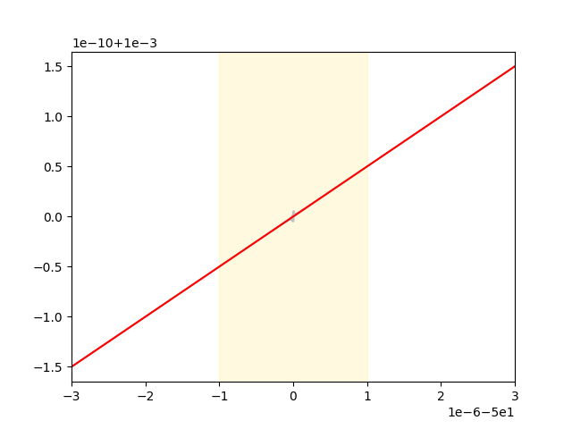
## New Eq:
((fabs(50.0 + membrane__V) < 1.0000000000287557e-6) ? (-1.0000000000287557e-10 / (-1.0 + exp(-1.0000000000287557e-7)) + (-24999999.499281108 - 499999.99998562218 * membrane__V) * (1.0000000000287557e-10 / (-1.0 + exp(1.0000000000287557e-7)) + 1.0000000000287557e-10 / (-1.0 + exp(-1.0000000000287557e-7)))) : (0.0001 * (-50.0 - membrane__V) / (-1.0 + exp(-5.0 - 0.10000000000000001 * membrane__V))))

## Equation 2:
```
sodium_channel_m_gate__alpha_m = 0.10000000000000001 * (-48.0 - membrane__V) / (-1.0 + exp(-3.2000000000000002 - 0.066666666666666666 * membrane__V))
```
### Partially evaluated to: 
```
sodium_channel_m_gate__alpha_m = 0.10000000000000001 * (-48.0 - membrane__V) / (-1.0 + exp(-3.2000000000000002 - 0.066666666666666666 * membrane__V))
```
### Singulariy points detected:

{-48.000000000000000}
*U*
`-3.2000000000000002 - 0.066666666666666666 * membrane__V`

*V for 1e-07 range* 
`-47.999998499999997 - -48.000001500000003`

*Singularity point: -48.000000000000000*

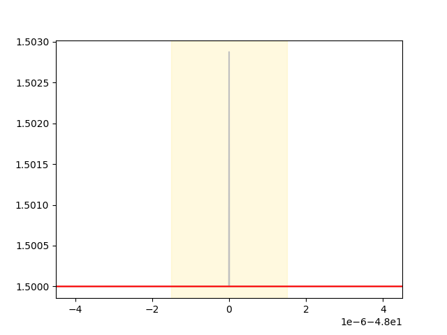
## New Eq:
((fabs(48.0 + membrane__V) < 1.5000000000153779e-6) ? (-1.4999999999876224e-7 / (-1.0 + exp(-9.9999999999406119e-8)) + (-15999999.499835968 - 333333.333329916 * membrane__V) * (1.5000000000431335e-7 / (-1.0 + exp(1.0000000000287557e-7)) + 1.4999999999876224e-7 / (-1.0 + exp(-9.9999999999406119e-8)))) : (0.10000000000000001 * (-48.0 - membrane__V) / (-1.0 + exp(-3.2000000000000002 - 0.066666666666666666 * membrane__V))))

## Equation 3:
```
sodium_channel_m_gate__beta_m = 0.12 * (8.0 + membrane__V) / (-1.0 + exp(1.6000000000000001 + 0.20000000000000001 * membrane__V))
```
### Partially evaluated to: 
```
sodium_channel_m_gate__beta_m = 0.12 * (8.0 + membrane__V) / (-1.0 + exp(1.6000000000000001 + 0.20000000000000001 * membrane__V))
```
### Singulariy points detected:

{-8.0000000000000000}
*U*
`1.6000000000000001 + 0.20000000000000001 * membrane__V`

*V for 1e-07 range* 
`-8.0000005000000005 - -7.9999995000000004`

*Singularity point: -8.0000000000000000*

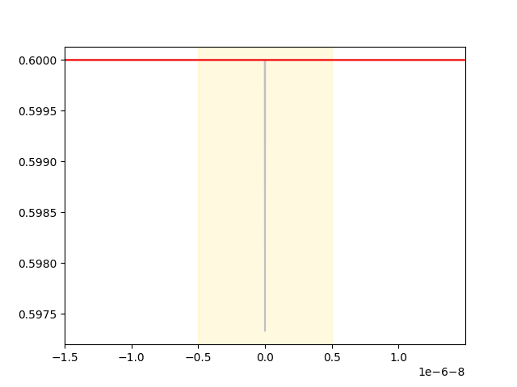
## New Eq:
((fabs(8.0 + membrane__V) < 4.999999999970306e-7) ? (-6.0000000000060002e-8 / (-1.0 + exp(-9.9999999999406119e-8)) + (8000000.5000475105 + 1000000.0000059388 * membrane__V) * (6.0000000000060002e-8 / (-1.0 + exp(-9.9999999999406119e-8)) + 5.9999999999227342e-8 / (-1.0 + exp(9.9999999999406119e-8)))) : (0.12 * (8.0 + membrane__V) / (-1.0 + exp(1.6000000000000001 + 0.20000000000000001 * membrane__V))))

# Model: noble_model_1991(noble_model_1991.cellml)
## Equation 1:
```
L_type_Ca_channel__i_Ca_L_Ca = 4.0 * (-50.0 + membrane__V) * (intracellular_calcium_concentration__Ca_i * exp(100.0 * membrane__F / (membrane__R * membrane__T)) - extracellular_calcium_concentration__Ca_o * exp(2.0 * (50.0 - membrane__V) * membrane__F / (membrane__R * membrane__T))) * L_type_Ca_channel__P_Ca_L * L_type_Ca_channel_d_gate__d * L_type_Ca_channel_f_gate__f * membrane__F / ((1.0 - exp(2.0 * (50.0 - membrane__V) * membrane__F / (membrane__R * membrane__T))) * membrane__R * membrane__T)
```
### Partially evaluated to: 
```
L_type_Ca_channel__i_Ca_L_Ca = 4.0 * (-50.0 + membrane__V) * (intracellular_calcium_concentration__Ca_i * exp(100.0 * membrane__F / (membrane__R * membrane__T)) - extracellular_calcium_concentration__Ca_o * exp(2.0 * (50.0 - membrane__V) * membrane__F / (membrane__R * membrane__T))) * L_type_Ca_channel__P_Ca_L * L_type_Ca_channel_d_gate__d * L_type_Ca_channel_f_gate__f * membrane__F / ((1.0 - exp(2.0 * (50.0 - membrane__V) * membrane__F / (membrane__R * membrane__T))) * membrane__R * membrane__T)
```
### Singulariy points detected:

{50.000000000000000}
#### float * A

####Failed to find U symbolically!

<class 'sympy.core.mul.Mul'>
_L_type_Ca_channel$P_Ca_L*_L_type_Ca_channel_d_gate$d*_L_type_Ca_channel_f_gate$f*_membrane$F*(_membrane$V - 50.0)*(-_extracellular_calcium_concentration$Ca_o*exp(2.0*_membrane$F*(50.0 - _membrane$V)/(_membrane$R*_membrane$T)) + _intracellular_calcium_concentration$Ca_i*exp(100.0*_membrane$F/(_membrane$R*_membrane$T)))/(_membrane$R*_membrane$T*(1.0 - exp(2.0*_membrane$F*(50.0 - _membrane$V)/(_membrane$R*_membrane$T))))

*try substituting parameters*

*U*
`3.7433890822745473 - 0.074867781645490947 * membrane__V`

*V for 1e-07 range* 
`50.000001335688033 - 49.999998664311967`

*Singularity point: 50.000000000000000*


## New Eq:
((fabs(-50.0 + membrane__V) < 1.3356880329828957e-6) ? ((18716945.911399174 - 374338.90822798351 * membrane__V) * (-5.3427521318205606e-6 * (intracellular_calcium_concentration__Ca_i * exp(100.0 * membrane__F / (membrane__R * membrane__T)) - extracellular_calcium_concentration__Ca_o * exp(-2.6713760659102803e-6 * membrane__F / (membrane__R * membrane__T))) * L_type_Ca_channel__P_Ca_L * L_type_Ca_channel_d_gate__d * L_type_Ca_channel_f_gate__f * membrane__F / ((1.0 - exp(-2.6713760659102803e-6 * membrane__F / (membrane__R * membrane__T))) * membrane__R * membrane__T) - 5.3427521320426052e-6 * (intracellular_calcium_concentration__Ca_i * exp(100.0 * membrane__F / (membrane__R * membrane__T)) - extracellular_calcium_concentration__Ca_o * exp(2.6713760660213026e-6 * membrane__F / (membrane__R * membrane__T))) * L_type_Ca_channel__P_Ca_L * L_type_Ca_channel_d_gate__d * L_type_Ca_channel_f_gate__f * membrane__F / ((1.0 - exp(2.6713760660213026e-6 * membrane__F / (membrane__R * membrane__T))) * membrane__R * membrane__T)) + 5.3427521318205606e-6 * (intracellular_calcium_concentration__Ca_i * exp(100.0 * membrane__F / (membrane__R * membrane__T)) - extracellular_calcium_concentration__Ca_o * exp(-2.6713760659102803e-6 * membrane__F / (membrane__R * membrane__T))) * L_type_Ca_channel__P_Ca_L * L_type_Ca_channel_d_gate__d * L_type_Ca_channel_f_gate__f * membrane__F / ((1.0 - exp(-2.6713760659102803e-6 * membrane__F / (membrane__R * membrane__T))) * membrane__R * membrane__T)) : (4.0 * (-50.0 + membrane__V) * (intracellular_calcium_concentration__Ca_i * exp(100.0 * membrane__F / (membrane__R * membrane__T)) - extracellular_calcium_concentration__Ca_o * exp(2.0 * (50.0 - membrane__V) * membrane__F / (membrane__R * membrane__T))) * L_type_Ca_channel__P_Ca_L * L_type_Ca_channel_d_gate__d * L_type_Ca_channel_f_gate__f * membrane__F / ((1.0 - exp(2.0 * (50.0 - membrane__V) * membrane__F / (membrane__R * membrane__T))) * membrane__R * membrane__T)))

## Equation 2:
```
L_type_Ca_channel__i_Ca_L_K = (-50.0 + membrane__V) * (intracellular_potassium_concentration__K_i * exp(50.0 * membrane__F / (membrane__R * membrane__T)) - extracellular_potassium_concentration__K_o * exp((50.0 - membrane__V) * membrane__F / (membrane__R * membrane__T))) * L_type_Ca_channel__P_CaK * L_type_Ca_channel__P_Ca_L * L_type_Ca_channel_d_gate__d * L_type_Ca_channel_f_gate__f * membrane__F / ((1.0 - exp((50.0 - membrane__V) * membrane__F / (membrane__R * membrane__T))) * membrane__R * membrane__T)
```
### Partially evaluated to: 
```
L_type_Ca_channel__i_Ca_L_K = (-50.0 + membrane__V) * (intracellular_potassium_concentration__K_i * exp(50.0 * membrane__F / (membrane__R * membrane__T)) - extracellular_potassium_concentration__K_o * exp((50.0 - membrane__V) * membrane__F / (membrane__R * membrane__T))) * L_type_Ca_channel__P_CaK * L_type_Ca_channel__P_Ca_L * L_type_Ca_channel_d_gate__d * L_type_Ca_channel_f_gate__f * membrane__F / ((1.0 - exp((50.0 - membrane__V) * membrane__F / (membrane__R * membrane__T))) * membrane__R * membrane__T)
```
### Singulariy points detected:

{50.000000000000000}
####Failed to find U symbolically!

<class 'sympy.core.mul.Mul'>
_L_type_Ca_channel$P_CaK*_L_type_Ca_channel$P_Ca_L*_L_type_Ca_channel_d_gate$d*_L_type_Ca_channel_f_gate$f*_membrane$F*(_membrane$V - 50.0)*(-_extracellular_potassium_concentration$K_o*exp(_membrane$F*(50.0 - _membrane$V)/(_membrane$R*_membrane$T)) + _intracellular_potassium_concentration$K_i*exp(50.0*_membrane$F/(_membrane$R*_membrane$T)))/(_membrane$R*_membrane$T*(1.0 - exp(_membrane$F*(50.0 - _membrane$V)/(_membrane$R*_membrane$T))))

*try substituting parameters*

*U*
`1.8716945411372736 - 0.037433890822745473 * membrane__V`

*V for 1e-07 range* 
`50.000002671376066 - 49.999997328623934`

*Singularity point: 50.000000000000000*


## New Eq:
((fabs(-50.0 + membrane__V) < 2.6713760659380359e-6) ? ((9358473.205796821 - 187169.45411593645 * membrane__V) * (-2.6713760659102803e-6 * (intracellular_potassium_concentration__K_i * exp(50.0 * membrane__F / (membrane__R * membrane__T)) - extracellular_potassium_concentration__K_o * exp(-2.6713760659102803e-6 * membrane__F / (membrane__R * membrane__T))) * L_type_Ca_channel__P_CaK * L_type_Ca_channel__P_Ca_L * L_type_Ca_channel_d_gate__d * L_type_Ca_channel_f_gate__f * membrane__F / ((1.0 - exp(-2.6713760659102803e-6 * membrane__F / (membrane__R * membrane__T))) * membrane__R * membrane__T) - 2.6713760659657915e-6 * (intracellular_potassium_concentration__K_i * exp(50.0 * membrane__F / (membrane__R * membrane__T)) - extracellular_potassium_concentration__K_o * exp(2.6713760659657915e-6 * membrane__F / (membrane__R * membrane__T))) * L_type_Ca_channel__P_CaK * L_type_Ca_channel__P_Ca_L * L_type_Ca_channel_d_gate__d * L_type_Ca_channel_f_gate__f * membrane__F / ((1.0 - exp(2.6713760659657915e-6 * membrane__F / (membrane__R * membrane__T))) * membrane__R * membrane__T)) + 2.6713760659102803e-6 * (intracellular_potassium_concentration__K_i * exp(50.0 * membrane__F / (membrane__R * membrane__T)) - extracellular_potassium_concentration__K_o * exp(-2.6713760659102803e-6 * membrane__F / (membrane__R * membrane__T))) * L_type_Ca_channel__P_CaK * L_type_Ca_channel__P_Ca_L * L_type_Ca_channel_d_gate__d * L_type_Ca_channel_f_gate__f * membrane__F / ((1.0 - exp(-2.6713760659102803e-6 * membrane__F / (membrane__R * membrane__T))) * membrane__R * membrane__T)) : ((-50.0 + membrane__V) * (intracellular_potassium_concentration__K_i * exp(50.0 * membrane__F / (membrane__R * membrane__T)) - extracellular_potassium_concentration__K_o * exp((50.0 - membrane__V) * membrane__F / (membrane__R * membrane__T))) * L_type_Ca_channel__P_CaK * L_type_Ca_channel__P_Ca_L * L_type_Ca_channel_d_gate__d * L_type_Ca_channel_f_gate__f * membrane__F / ((1.0 - exp((50.0 - membrane__V) * membrane__F / (membrane__R * membrane__T))) * membrane__R * membrane__T)))

## Equation 3:
```
L_type_Ca_channel__i_Ca_L_Na = (-50.0 + membrane__V) * (intracellular_sodium_concentration__Na_i * exp(50.0 * membrane__F / (membrane__R * membrane__T)) - extracellular_sodium_concentration__Na_o * exp((50.0 - membrane__V) * membrane__F / (membrane__R * membrane__T))) * L_type_Ca_channel__P_CaNa * L_type_Ca_channel__P_Ca_L * L_type_Ca_channel_d_gate__d * L_type_Ca_channel_f_gate__f * membrane__F / ((1.0 - exp((50.0 - membrane__V) * membrane__F / (membrane__R * membrane__T))) * membrane__R * membrane__T)
```
### Partially evaluated to: 
```
L_type_Ca_channel__i_Ca_L_Na = (-50.0 + membrane__V) * (intracellular_sodium_concentration__Na_i * exp(50.0 * membrane__F / (membrane__R * membrane__T)) - extracellular_sodium_concentration__Na_o * exp((50.0 - membrane__V) * membrane__F / (membrane__R * membrane__T))) * L_type_Ca_channel__P_CaNa * L_type_Ca_channel__P_Ca_L * L_type_Ca_channel_d_gate__d * L_type_Ca_channel_f_gate__f * membrane__F / ((1.0 - exp((50.0 - membrane__V) * membrane__F / (membrane__R * membrane__T))) * membrane__R * membrane__T)
```
### Singulariy points detected:

{50.000000000000000}
####Failed to find U symbolically!

<class 'sympy.core.mul.Mul'>
_L_type_Ca_channel$P_CaNa*_L_type_Ca_channel$P_Ca_L*_L_type_Ca_channel_d_gate$d*_L_type_Ca_channel_f_gate$f*_membrane$F*(_membrane$V - 50.0)*(-_extracellular_sodium_concentration$Na_o*exp(_membrane$F*(50.0 - _membrane$V)/(_membrane$R*_membrane$T)) + _intracellular_sodium_concentration$Na_i*exp(50.0*_membrane$F/(_membrane$R*_membrane$T)))/(_membrane$R*_membrane$T*(1.0 - exp(_membrane$F*(50.0 - _membrane$V)/(_membrane$R*_membrane$T))))

*try substituting parameters*

*U*
`1.8716945411372736 - 0.037433890822745473 * membrane__V`

*V for 1e-07 range* 
`50.000002671376066 - 49.999997328623934`

*Singularity point: 50.000000000000000*


## New Eq:
((fabs(-50.0 + membrane__V) < 2.6713760659380359e-6) ? ((9358473.205796821 - 187169.45411593645 * membrane__V) * (-2.6713760659102803e-6 * (intracellular_sodium_concentration__Na_i * exp(50.0 * membrane__F / (membrane__R * membrane__T)) - extracellular_sodium_concentration__Na_o * exp(-2.6713760659102803e-6 * membrane__F / (membrane__R * membrane__T))) * L_type_Ca_channel__P_CaNa * L_type_Ca_channel__P_Ca_L * L_type_Ca_channel_d_gate__d * L_type_Ca_channel_f_gate__f * membrane__F / ((1.0 - exp(-2.6713760659102803e-6 * membrane__F / (membrane__R * membrane__T))) * membrane__R * membrane__T) - 2.6713760659657915e-6 * (intracellular_sodium_concentration__Na_i * exp(50.0 * membrane__F / (membrane__R * membrane__T)) - extracellular_sodium_concentration__Na_o * exp(2.6713760659657915e-6 * membrane__F / (membrane__R * membrane__T))) * L_type_Ca_channel__P_CaNa * L_type_Ca_channel__P_Ca_L * L_type_Ca_channel_d_gate__d * L_type_Ca_channel_f_gate__f * membrane__F / ((1.0 - exp(2.6713760659657915e-6 * membrane__F / (membrane__R * membrane__T))) * membrane__R * membrane__T)) + 2.6713760659102803e-6 * (intracellular_sodium_concentration__Na_i * exp(50.0 * membrane__F / (membrane__R * membrane__T)) - extracellular_sodium_concentration__Na_o * exp(-2.6713760659102803e-6 * membrane__F / (membrane__R * membrane__T))) * L_type_Ca_channel__P_CaNa * L_type_Ca_channel__P_Ca_L * L_type_Ca_channel_d_gate__d * L_type_Ca_channel_f_gate__f * membrane__F / ((1.0 - exp(-2.6713760659102803e-6 * membrane__F / (membrane__R * membrane__T))) * membrane__R * membrane__T)) : ((-50.0 + membrane__V) * (intracellular_sodium_concentration__Na_i * exp(50.0 * membrane__F / (membrane__R * membrane__T)) - extracellular_sodium_concentration__Na_o * exp((50.0 - membrane__V) * membrane__F / (membrane__R * membrane__T))) * L_type_Ca_channel__P_CaNa * L_type_Ca_channel__P_Ca_L * L_type_Ca_channel_d_gate__d * L_type_Ca_channel_f_gate__f * membrane__F / ((1.0 - exp((50.0 - membrane__V) * membrane__F / (membrane__R * membrane__T))) * membrane__R * membrane__T)))

L_type_Ca_channel_d_gate__alpha_d = ((fabs(L_type_Ca_channel_d_gate__E0_d) < 0.0001) ? (120.0) : (30.0 * L_type_Ca_channel_d_gate__E0_d / (1.0 - exp(-0.25 * L_type_Ca_channel_d_gate__E0_d))))

####Piecewise!!

L_type_Ca_channel_d_gate__beta_d = ((fabs(L_type_Ca_channel_d_gate__E0_d) < 0.0001) ? (120.0) : (12.0 * L_type_Ca_channel_d_gate__E0_d / (-1.0 + exp(0.10000000000000001 * L_type_Ca_channel_d_gate__E0_d))))

####Piecewise!!

L_type_Ca_channel_f_gate__alpha_f = ((L_type_Ca_channel_f_gate__delta_f > fabs(L_type_Ca_channel_f_gate__E0_f)) ? (25.0) : (6.25 * L_type_Ca_channel_f_gate__E0_f / (-1.0 + exp(0.25 * L_type_Ca_channel_f_gate__E0_f))))

####Piecewise!!

fast_sodium_current_m_gate__alpha_m = ((fast_sodium_current_m_gate__delta_m > fabs(fast_sodium_current_m_gate__E0_m)) ? (2000.0) : (200.0 * fast_sodium_current_m_gate__E0_m / (1.0 - exp(-0.10000000000000001 * fast_sodium_current_m_gate__E0_m))))

####Piecewise!!

# Model: noble_model_1998(noble_model_1998.cellml)
## Equation 1:
```
L_type_Ca_channel__i_Ca_L_Ca_cyt = 4.0 * (1.0 - L_type_Ca_channel__FrICa) * (-50.0 + membrane__V) * (intracellular_calcium_concentration__Ca_i * exp(100.0 * membrane__F / (membrane__R * membrane__T)) - extracellular_calcium_concentration__Ca_o * exp(2.0 * (50.0 - membrane__V) * membrane__F / (membrane__R * membrane__T))) * L_type_Ca_channel__P_Ca_L * L_type_Ca_channel_d_gate__d * L_type_Ca_channel_f2_gate__f2 * L_type_Ca_channel_f_gate__f * membrane__F / ((1.0 - exp(2.0 * (50.0 - membrane__V) * membrane__F / (membrane__R * membrane__T))) * membrane__R * membrane__T)
```
### Partially evaluated to: 
```
L_type_Ca_channel__i_Ca_L_Ca_cyt = 4.0 * (1.0 - L_type_Ca_channel__FrICa) * (-50.0 + membrane__V) * (intracellular_calcium_concentration__Ca_i * exp(100.0 * membrane__F / (membrane__R * membrane__T)) - extracellular_calcium_concentration__Ca_o * exp(2.0 * (50.0 - membrane__V) * membrane__F / (membrane__R * membrane__T))) * L_type_Ca_channel__P_Ca_L * L_type_Ca_channel_d_gate__d * L_type_Ca_channel_f2_gate__f2 * L_type_Ca_channel_f_gate__f * membrane__F / ((1.0 - exp(2.0 * (50.0 - membrane__V) * membrane__F / (membrane__R * membrane__T))) * membrane__R * membrane__T)
```
### Singulariy points detected:

{50.000000000000000}
#### float * A

####Failed to find U symbolically!

<class 'sympy.core.mul.Mul'>
_L_type_Ca_channel$P_Ca_L*_L_type_Ca_channel_d_gate$d*_L_type_Ca_channel_f2_gate$f2*_L_type_Ca_channel_f_gate$f*_membrane$F*(1.0 - _L_type_Ca_channel$FrICa)*(_membrane$V - 50.0)*(-_extracellular_calcium_concentration$Ca_o*exp(2.0*_membrane$F*(50.0 - _membrane$V)/(_membrane$R*_membrane$T)) + _intracellular_calcium_concentration$Ca_i*exp(100.0*_membrane$F/(_membrane$R*_membrane$T)))/(_membrane$R*_membrane$T*(1.0 - exp(2.0*_membrane$F*(50.0 - _membrane$V)/(_membrane$R*_membrane$T))))

*try substituting parameters*

#### Eq == 0!
## Equation 2:
```
L_type_Ca_channel__i_Ca_L_Ca_ds = 4.0 * (-50.0 + membrane__V) * (intracellular_calcium_concentration__Ca_i * exp(100.0 * membrane__F / (membrane__R * membrane__T)) - extracellular_calcium_concentration__Ca_o * exp(2.0 * (50.0 - membrane__V) * membrane__F / (membrane__R * membrane__T))) * L_type_Ca_channel__FrICa * L_type_Ca_channel__P_Ca_L * L_type_Ca_channel_d_gate__d * L_type_Ca_channel_f2ds_gate__f2ds * L_type_Ca_channel_f_gate__f * membrane__F / ((1.0 - exp(2.0 * (50.0 - membrane__V) * membrane__F / (membrane__R * membrane__T))) * membrane__R * membrane__T)
```
### Partially evaluated to: 
```
L_type_Ca_channel__i_Ca_L_Ca_ds = 4.0 * (-50.0 + membrane__V) * (intracellular_calcium_concentration__Ca_i * exp(100.0 * membrane__F / (membrane__R * membrane__T)) - extracellular_calcium_concentration__Ca_o * exp(2.0 * (50.0 - membrane__V) * membrane__F / (membrane__R * membrane__T))) * L_type_Ca_channel__FrICa * L_type_Ca_channel__P_Ca_L * L_type_Ca_channel_d_gate__d * L_type_Ca_channel_f2ds_gate__f2ds * L_type_Ca_channel_f_gate__f * membrane__F / ((1.0 - exp(2.0 * (50.0 - membrane__V) * membrane__F / (membrane__R * membrane__T))) * membrane__R * membrane__T)
```
### Singulariy points detected:

{50.000000000000000}
#### float * A

####Failed to find U symbolically!

<class 'sympy.core.mul.Mul'>
_L_type_Ca_channel$FrICa*_L_type_Ca_channel$P_Ca_L*_L_type_Ca_channel_d_gate$d*_L_type_Ca_channel_f2ds_gate$f2ds*_L_type_Ca_channel_f_gate$f*_membrane$F*(_membrane$V - 50.0)*(-_extracellular_calcium_concentration$Ca_o*exp(2.0*_membrane$F*(50.0 - _membrane$V)/(_membrane$R*_membrane$T)) + _intracellular_calcium_concentration$Ca_i*exp(100.0*_membrane$F/(_membrane$R*_membrane$T)))/(_membrane$R*_membrane$T*(1.0 - exp(2.0*_membrane$F*(50.0 - _membrane$V)/(_membrane$R*_membrane$T))))

*try substituting parameters*

*U*
`3.7433890822745473 - 0.074867781645490947 * membrane__V`

*V for 1e-07 range* 
`50.000001335688033 - 49.999998664311967`

*Singularity point: 50.000000000000000*


## New Eq:
((fabs(-50.0 + membrane__V) < 1.3356880329828957e-6) ? ((18716945.911399174 - 374338.90822798351 * membrane__V) * (-5.3427521318205606e-6 * (intracellular_calcium_concentration__Ca_i * exp(100.0 * membrane__F / (membrane__R * membrane__T)) - extracellular_calcium_concentration__Ca_o * exp(-2.6713760659102803e-6 * membrane__F / (membrane__R * membrane__T))) * L_type_Ca_channel__FrICa * L_type_Ca_channel__P_Ca_L * L_type_Ca_channel_d_gate__d * L_type_Ca_channel_f2ds_gate__f2ds * L_type_Ca_channel_f_gate__f * membrane__F / ((1.0 - exp(-2.6713760659102803e-6 * membrane__F / (membrane__R * membrane__T))) * membrane__R * membrane__T) - 5.3427521320426052e-6 * (intracellular_calcium_concentration__Ca_i * exp(100.0 * membrane__F / (membrane__R * membrane__T)) - extracellular_calcium_concentration__Ca_o * exp(2.6713760660213026e-6 * membrane__F / (membrane__R * membrane__T))) * L_type_Ca_channel__FrICa * L_type_Ca_channel__P_Ca_L * L_type_Ca_channel_d_gate__d * L_type_Ca_channel_f2ds_gate__f2ds * L_type_Ca_channel_f_gate__f * membrane__F / ((1.0 - exp(2.6713760660213026e-6 * membrane__F / (membrane__R * membrane__T))) * membrane__R * membrane__T)) + 5.3427521318205606e-6 * (intracellular_calcium_concentration__Ca_i * exp(100.0 * membrane__F / (membrane__R * membrane__T)) - extracellular_calcium_concentration__Ca_o * exp(-2.6713760659102803e-6 * membrane__F / (membrane__R * membrane__T))) * L_type_Ca_channel__FrICa * L_type_Ca_channel__P_Ca_L * L_type_Ca_channel_d_gate__d * L_type_Ca_channel_f2ds_gate__f2ds * L_type_Ca_channel_f_gate__f * membrane__F / ((1.0 - exp(-2.6713760659102803e-6 * membrane__F / (membrane__R * membrane__T))) * membrane__R * membrane__T)) : (4.0 * (-50.0 + membrane__V) * (intracellular_calcium_concentration__Ca_i * exp(100.0 * membrane__F / (membrane__R * membrane__T)) - extracellular_calcium_concentration__Ca_o * exp(2.0 * (50.0 - membrane__V) * membrane__F / (membrane__R * membrane__T))) * L_type_Ca_channel__FrICa * L_type_Ca_channel__P_Ca_L * L_type_Ca_channel_d_gate__d * L_type_Ca_channel_f2ds_gate__f2ds * L_type_Ca_channel_f_gate__f * membrane__F / ((1.0 - exp(2.0 * (50.0 - membrane__V) * membrane__F / (membrane__R * membrane__T))) * membrane__R * membrane__T)))

## Equation 3:
```
L_type_Ca_channel__i_Ca_L_K_cyt = (1.0 - L_type_Ca_channel__FrICa) * (-50.0 + membrane__V) * (intracellular_potassium_concentration__K_i * exp(50.0 * membrane__F / (membrane__R * membrane__T)) - extracellular_potassium_concentration__K_o * exp((50.0 - membrane__V) * membrane__F / (membrane__R * membrane__T))) * L_type_Ca_channel__P_CaK * L_type_Ca_channel__P_Ca_L * L_type_Ca_channel_d_gate__d * L_type_Ca_channel_f2_gate__f2 * L_type_Ca_channel_f_gate__f * membrane__F / ((1.0 - exp((50.0 - membrane__V) * membrane__F / (membrane__R * membrane__T))) * membrane__R * membrane__T)
```
### Partially evaluated to: 
```
L_type_Ca_channel__i_Ca_L_K_cyt = (1.0 - L_type_Ca_channel__FrICa) * (-50.0 + membrane__V) * (intracellular_potassium_concentration__K_i * exp(50.0 * membrane__F / (membrane__R * membrane__T)) - extracellular_potassium_concentration__K_o * exp((50.0 - membrane__V) * membrane__F / (membrane__R * membrane__T))) * L_type_Ca_channel__P_CaK * L_type_Ca_channel__P_Ca_L * L_type_Ca_channel_d_gate__d * L_type_Ca_channel_f2_gate__f2 * L_type_Ca_channel_f_gate__f * membrane__F / ((1.0 - exp((50.0 - membrane__V) * membrane__F / (membrane__R * membrane__T))) * membrane__R * membrane__T)
```
### Singulariy points detected:

{50.000000000000000}
####Failed to find U symbolically!

<class 'sympy.core.mul.Mul'>
_L_type_Ca_channel$P_CaK*_L_type_Ca_channel$P_Ca_L*_L_type_Ca_channel_d_gate$d*_L_type_Ca_channel_f2_gate$f2*_L_type_Ca_channel_f_gate$f*_membrane$F*(1.0 - _L_type_Ca_channel$FrICa)*(_membrane$V - 50.0)*(-_extracellular_potassium_concentration$K_o*exp(_membrane$F*(50.0 - _membrane$V)/(_membrane$R*_membrane$T)) + _intracellular_potassium_concentration$K_i*exp(50.0*_membrane$F/(_membrane$R*_membrane$T)))/(_membrane$R*_membrane$T*(1.0 - exp(_membrane$F*(50.0 - _membrane$V)/(_membrane$R*_membrane$T))))

*try substituting parameters*

#### Eq == 0!
## Equation 4:
```
L_type_Ca_channel__i_Ca_L_K_ds = (-50.0 + membrane__V) * (intracellular_potassium_concentration__K_i * exp(50.0 * membrane__F / (membrane__R * membrane__T)) - extracellular_potassium_concentration__K_o * exp((50.0 - membrane__V) * membrane__F / (membrane__R * membrane__T))) * L_type_Ca_channel__FrICa * L_type_Ca_channel__P_CaK * L_type_Ca_channel__P_Ca_L * L_type_Ca_channel_d_gate__d * L_type_Ca_channel_f2ds_gate__f2ds * L_type_Ca_channel_f_gate__f * membrane__F / ((1.0 - exp((50.0 - membrane__V) * membrane__F / (membrane__R * membrane__T))) * membrane__R * membrane__T)
```
### Partially evaluated to: 
```
L_type_Ca_channel__i_Ca_L_K_ds = (-50.0 + membrane__V) * (intracellular_potassium_concentration__K_i * exp(50.0 * membrane__F / (membrane__R * membrane__T)) - extracellular_potassium_concentration__K_o * exp((50.0 - membrane__V) * membrane__F / (membrane__R * membrane__T))) * L_type_Ca_channel__FrICa * L_type_Ca_channel__P_CaK * L_type_Ca_channel__P_Ca_L * L_type_Ca_channel_d_gate__d * L_type_Ca_channel_f2ds_gate__f2ds * L_type_Ca_channel_f_gate__f * membrane__F / ((1.0 - exp((50.0 - membrane__V) * membrane__F / (membrane__R * membrane__T))) * membrane__R * membrane__T)
```
### Singulariy points detected:

{50.000000000000000}
####Failed to find U symbolically!

<class 'sympy.core.mul.Mul'>
_L_type_Ca_channel$FrICa*_L_type_Ca_channel$P_CaK*_L_type_Ca_channel$P_Ca_L*_L_type_Ca_channel_d_gate$d*_L_type_Ca_channel_f2ds_gate$f2ds*_L_type_Ca_channel_f_gate$f*_membrane$F*(_membrane$V - 50.0)*(-_extracellular_potassium_concentration$K_o*exp(_membrane$F*(50.0 - _membrane$V)/(_membrane$R*_membrane$T)) + _intracellular_potassium_concentration$K_i*exp(50.0*_membrane$F/(_membrane$R*_membrane$T)))/(_membrane$R*_membrane$T*(1.0 - exp(_membrane$F*(50.0 - _membrane$V)/(_membrane$R*_membrane$T))))

*try substituting parameters*

*U*
`1.8716945411372736 - 0.037433890822745473 * membrane__V`

*V for 1e-07 range* 
`50.000002671376066 - 49.999997328623934`

*Singularity point: 50.000000000000000*


## New Eq:
((fabs(-50.0 + membrane__V) < 2.6713760659380359e-6) ? ((9358473.205796821 - 187169.45411593645 * membrane__V) * (-2.6713760659102803e-6 * (intracellular_potassium_concentration__K_i * exp(50.0 * membrane__F / (membrane__R * membrane__T)) - extracellular_potassium_concentration__K_o * exp(-2.6713760659102803e-6 * membrane__F / (membrane__R * membrane__T))) * L_type_Ca_channel__FrICa * L_type_Ca_channel__P_CaK * L_type_Ca_channel__P_Ca_L * L_type_Ca_channel_d_gate__d * L_type_Ca_channel_f2ds_gate__f2ds * L_type_Ca_channel_f_gate__f * membrane__F / ((1.0 - exp(-2.6713760659102803e-6 * membrane__F / (membrane__R * membrane__T))) * membrane__R * membrane__T) - 2.6713760659657915e-6 * (intracellular_potassium_concentration__K_i * exp(50.0 * membrane__F / (membrane__R * membrane__T)) - extracellular_potassium_concentration__K_o * exp(2.6713760659657915e-6 * membrane__F / (membrane__R * membrane__T))) * L_type_Ca_channel__FrICa * L_type_Ca_channel__P_CaK * L_type_Ca_channel__P_Ca_L * L_type_Ca_channel_d_gate__d * L_type_Ca_channel_f2ds_gate__f2ds * L_type_Ca_channel_f_gate__f * membrane__F / ((1.0 - exp(2.6713760659657915e-6 * membrane__F / (membrane__R * membrane__T))) * membrane__R * membrane__T)) + 2.6713760659102803e-6 * (intracellular_potassium_concentration__K_i * exp(50.0 * membrane__F / (membrane__R * membrane__T)) - extracellular_potassium_concentration__K_o * exp(-2.6713760659102803e-6 * membrane__F / (membrane__R * membrane__T))) * L_type_Ca_channel__FrICa * L_type_Ca_channel__P_CaK * L_type_Ca_channel__P_Ca_L * L_type_Ca_channel_d_gate__d * L_type_Ca_channel_f2ds_gate__f2ds * L_type_Ca_channel_f_gate__f * membrane__F / ((1.0 - exp(-2.6713760659102803e-6 * membrane__F / (membrane__R * membrane__T))) * membrane__R * membrane__T)) : ((-50.0 + membrane__V) * (intracellular_potassium_concentration__K_i * exp(50.0 * membrane__F / (membrane__R * membrane__T)) - extracellular_potassium_concentration__K_o * exp((50.0 - membrane__V) * membrane__F / (membrane__R * membrane__T))) * L_type_Ca_channel__FrICa * L_type_Ca_channel__P_CaK * L_type_Ca_channel__P_Ca_L * L_type_Ca_channel_d_gate__d * L_type_Ca_channel_f2ds_gate__f2ds * L_type_Ca_channel_f_gate__f * membrane__F / ((1.0 - exp((50.0 - membrane__V) * membrane__F / (membrane__R * membrane__T))) * membrane__R * membrane__T)))

## Equation 5:
```
L_type_Ca_channel__i_Ca_L_Na_cyt = (1.0 - L_type_Ca_channel__FrICa) * (-50.0 + membrane__V) * (intracellular_sodium_concentration__Na_i * exp(50.0 * membrane__F / (membrane__R * membrane__T)) - extracellular_sodium_concentration__Na_o * exp((50.0 - membrane__V) * membrane__F / (membrane__R * membrane__T))) * L_type_Ca_channel__P_CaNa * L_type_Ca_channel__P_Ca_L * L_type_Ca_channel_d_gate__d * L_type_Ca_channel_f2_gate__f2 * L_type_Ca_channel_f_gate__f * membrane__F / ((1.0 - exp((50.0 - membrane__V) * membrane__F / (membrane__R * membrane__T))) * membrane__R * membrane__T)
```
### Partially evaluated to: 
```
L_type_Ca_channel__i_Ca_L_Na_cyt = (1.0 - L_type_Ca_channel__FrICa) * (-50.0 + membrane__V) * (intracellular_sodium_concentration__Na_i * exp(50.0 * membrane__F / (membrane__R * membrane__T)) - extracellular_sodium_concentration__Na_o * exp((50.0 - membrane__V) * membrane__F / (membrane__R * membrane__T))) * L_type_Ca_channel__P_CaNa * L_type_Ca_channel__P_Ca_L * L_type_Ca_channel_d_gate__d * L_type_Ca_channel_f2_gate__f2 * L_type_Ca_channel_f_gate__f * membrane__F / ((1.0 - exp((50.0 - membrane__V) * membrane__F / (membrane__R * membrane__T))) * membrane__R * membrane__T)
```
### Singulariy points detected:

{50.000000000000000}
####Failed to find U symbolically!

<class 'sympy.core.mul.Mul'>
_L_type_Ca_channel$P_CaNa*_L_type_Ca_channel$P_Ca_L*_L_type_Ca_channel_d_gate$d*_L_type_Ca_channel_f2_gate$f2*_L_type_Ca_channel_f_gate$f*_membrane$F*(1.0 - _L_type_Ca_channel$FrICa)*(_membrane$V - 50.0)*(-_extracellular_sodium_concentration$Na_o*exp(_membrane$F*(50.0 - _membrane$V)/(_membrane$R*_membrane$T)) + _intracellular_sodium_concentration$Na_i*exp(50.0*_membrane$F/(_membrane$R*_membrane$T)))/(_membrane$R*_membrane$T*(1.0 - exp(_membrane$F*(50.0 - _membrane$V)/(_membrane$R*_membrane$T))))

*try substituting parameters*

#### Eq == 0!
## Equation 6:
```
L_type_Ca_channel__i_Ca_L_Na_ds = (-50.0 + membrane__V) * (intracellular_sodium_concentration__Na_i * exp(50.0 * membrane__F / (membrane__R * membrane__T)) - extracellular_sodium_concentration__Na_o * exp((50.0 - membrane__V) * membrane__F / (membrane__R * membrane__T))) * L_type_Ca_channel__FrICa * L_type_Ca_channel__P_CaNa * L_type_Ca_channel__P_Ca_L * L_type_Ca_channel_d_gate__d * L_type_Ca_channel_f2ds_gate__f2ds * L_type_Ca_channel_f_gate__f * membrane__F / ((1.0 - exp((50.0 - membrane__V) * membrane__F / (membrane__R * membrane__T))) * membrane__R * membrane__T)
```
### Partially evaluated to: 
```
L_type_Ca_channel__i_Ca_L_Na_ds = (-50.0 + membrane__V) * (intracellular_sodium_concentration__Na_i * exp(50.0 * membrane__F / (membrane__R * membrane__T)) - extracellular_sodium_concentration__Na_o * exp((50.0 - membrane__V) * membrane__F / (membrane__R * membrane__T))) * L_type_Ca_channel__FrICa * L_type_Ca_channel__P_CaNa * L_type_Ca_channel__P_Ca_L * L_type_Ca_channel_d_gate__d * L_type_Ca_channel_f2ds_gate__f2ds * L_type_Ca_channel_f_gate__f * membrane__F / ((1.0 - exp((50.0 - membrane__V) * membrane__F / (membrane__R * membrane__T))) * membrane__R * membrane__T)
```
### Singulariy points detected:

{50.000000000000000}
####Failed to find U symbolically!

<class 'sympy.core.mul.Mul'>
_L_type_Ca_channel$FrICa*_L_type_Ca_channel$P_CaNa*_L_type_Ca_channel$P_Ca_L*_L_type_Ca_channel_d_gate$d*_L_type_Ca_channel_f2ds_gate$f2ds*_L_type_Ca_channel_f_gate$f*_membrane$F*(_membrane$V - 50.0)*(-_extracellular_sodium_concentration$Na_o*exp(_membrane$F*(50.0 - _membrane$V)/(_membrane$R*_membrane$T)) + _intracellular_sodium_concentration$Na_i*exp(50.0*_membrane$F/(_membrane$R*_membrane$T)))/(_membrane$R*_membrane$T*(1.0 - exp(_membrane$F*(50.0 - _membrane$V)/(_membrane$R*_membrane$T))))

*try substituting parameters*

*U*
`1.8716945411372736 - 0.037433890822745473 * membrane__V`

*V for 1e-07 range* 
`50.000002671376066 - 49.999997328623934`

*Singularity point: 50.000000000000000*


## New Eq:
((fabs(-50.0 + membrane__V) < 2.6713760659380359e-6) ? ((9358473.205796821 - 187169.45411593645 * membrane__V) * (-2.6713760659102803e-6 * (intracellular_sodium_concentration__Na_i * exp(50.0 * membrane__F / (membrane__R * membrane__T)) - extracellular_sodium_concentration__Na_o * exp(-2.6713760659102803e-6 * membrane__F / (membrane__R * membrane__T))) * L_type_Ca_channel__FrICa * L_type_Ca_channel__P_CaNa * L_type_Ca_channel__P_Ca_L * L_type_Ca_channel_d_gate__d * L_type_Ca_channel_f2ds_gate__f2ds * L_type_Ca_channel_f_gate__f * membrane__F / ((1.0 - exp(-2.6713760659102803e-6 * membrane__F / (membrane__R * membrane__T))) * membrane__R * membrane__T) - 2.6713760659657915e-6 * (intracellular_sodium_concentration__Na_i * exp(50.0 * membrane__F / (membrane__R * membrane__T)) - extracellular_sodium_concentration__Na_o * exp(2.6713760659657915e-6 * membrane__F / (membrane__R * membrane__T))) * L_type_Ca_channel__FrICa * L_type_Ca_channel__P_CaNa * L_type_Ca_channel__P_Ca_L * L_type_Ca_channel_d_gate__d * L_type_Ca_channel_f2ds_gate__f2ds * L_type_Ca_channel_f_gate__f * membrane__F / ((1.0 - exp(2.6713760659657915e-6 * membrane__F / (membrane__R * membrane__T))) * membrane__R * membrane__T)) + 2.6713760659102803e-6 * (intracellular_sodium_concentration__Na_i * exp(50.0 * membrane__F / (membrane__R * membrane__T)) - extracellular_sodium_concentration__Na_o * exp(-2.6713760659102803e-6 * membrane__F / (membrane__R * membrane__T))) * L_type_Ca_channel__FrICa * L_type_Ca_channel__P_CaNa * L_type_Ca_channel__P_Ca_L * L_type_Ca_channel_d_gate__d * L_type_Ca_channel_f2ds_gate__f2ds * L_type_Ca_channel_f_gate__f * membrane__F / ((1.0 - exp(-2.6713760659102803e-6 * membrane__F / (membrane__R * membrane__T))) * membrane__R * membrane__T)) : ((-50.0 + membrane__V) * (intracellular_sodium_concentration__Na_i * exp(50.0 * membrane__F / (membrane__R * membrane__T)) - extracellular_sodium_concentration__Na_o * exp((50.0 - membrane__V) * membrane__F / (membrane__R * membrane__T))) * L_type_Ca_channel__FrICa * L_type_Ca_channel__P_CaNa * L_type_Ca_channel__P_Ca_L * L_type_Ca_channel_d_gate__d * L_type_Ca_channel_f2ds_gate__f2ds * L_type_Ca_channel_f_gate__f * membrane__F / ((1.0 - exp((50.0 - membrane__V) * membrane__F / (membrane__R * membrane__T))) * membrane__R * membrane__T)))

L_type_Ca_channel_d_gate__alpha_d = ((fabs(L_type_Ca_channel_d_gate__E0_d) < 0.0001) ? (120.0) : (30.0 * L_type_Ca_channel_d_gate__E0_d / (1.0 - exp(-0.25 * L_type_Ca_channel_d_gate__E0_d))))

####Piecewise!!

L_type_Ca_channel_d_gate__beta_d = ((fabs(L_type_Ca_channel_d_gate__E0_d) < 0.0001) ? (120.0) : (12.0 * L_type_Ca_channel_d_gate__E0_d / (-1.0 + exp(0.10000000000000001 * L_type_Ca_channel_d_gate__E0_d))))

####Piecewise!!

L_type_Ca_channel_f_gate__alpha_f = ((L_type_Ca_channel_f_gate__delta_f > fabs(L_type_Ca_channel_f_gate__E0_f)) ? (25.0) : (6.25 * L_type_Ca_channel_f_gate__E0_f / (-1.0 + exp(0.25 * L_type_Ca_channel_f_gate__E0_f))))

####Piecewise!!

calcium_release__SpeedRel = ((membrane__V < -50.0) ? (5.0) : (1.0))

####Piecewise!!

fast_sodium_current_m_gate__alpha_m = ((fast_sodium_current_m_gate__delta_m > fabs(fast_sodium_current_m_gate__E0_m)) ? (2000.0) : (200.0 * fast_sodium_current_m_gate__E0_m / (1.0 - exp(-0.10000000000000001 * fast_sodium_current_m_gate__E0_m))))

####Piecewise!!

# Model: noble_model_2001(noble_model_2001.cellml)
## Equation 1:
```
L_type_Ca_channel__i_Ca_L_Ca_cyt = 4.0 * (1.0 - L_type_Ca_channel__FrICa) * (-50.0 + membrane__V) * (intracellular_calcium_concentration__Ca_i * exp(100.0 * membrane__F / (membrane__R * membrane__T)) - extracellular_calcium_concentration__Ca_o * exp(2.0 * (50.0 - membrane__V) * membrane__F / (membrane__R * membrane__T))) * L_type_Ca_channel__P_Ca_L * L_type_Ca_channel_d_gate__d * L_type_Ca_channel_f_gate__CaChoncyt * membrane__F / ((1.0 - exp(2.0 * (50.0 - membrane__V) * membrane__F / (membrane__R * membrane__T))) * membrane__R * membrane__T)
```
### Partially evaluated to: 
```
L_type_Ca_channel__i_Ca_L_Ca_cyt = 4.0 * (1.0 - L_type_Ca_channel__FrICa) * (-50.0 + membrane__V) * (intracellular_calcium_concentration__Ca_i * exp(100.0 * membrane__F / (membrane__R * membrane__T)) - extracellular_calcium_concentration__Ca_o * exp(2.0 * (50.0 - membrane__V) * membrane__F / (membrane__R * membrane__T))) * L_type_Ca_channel__P_Ca_L * L_type_Ca_channel_d_gate__d * L_type_Ca_channel_f_gate__CaChoncyt * membrane__F / ((1.0 - exp(2.0 * (50.0 - membrane__V) * membrane__F / (membrane__R * membrane__T))) * membrane__R * membrane__T)
```
### Singulariy points detected:

{50.000000000000000}
#### float * A

####Failed to find U symbolically!

<class 'sympy.core.mul.Mul'>
_L_type_Ca_channel$P_Ca_L*_L_type_Ca_channel_d_gate$d*_L_type_Ca_channel_f_gate$CaChoncyt*_membrane$F*(1.0 - _L_type_Ca_channel$FrICa)*(_membrane$V - 50.0)*(-_extracellular_calcium_concentration$Ca_o*exp(2.0*_membrane$F*(50.0 - _membrane$V)/(_membrane$R*_membrane$T)) + _intracellular_calcium_concentration$Ca_i*exp(100.0*_membrane$F/(_membrane$R*_membrane$T)))/(_membrane$R*_membrane$T*(1.0 - exp(2.0*_membrane$F*(50.0 - _membrane$V)/(_membrane$R*_membrane$T))))

*try substituting parameters*

*U*
`3.7433890822745473 - 0.074867781645490947 * membrane__V`

*V for 1e-07 range* 
`50.000001335688033 - 49.999998664311967`

*Singularity point: 50.000000000000000*


## New Eq:
((fabs(-50.0 + membrane__V) < 1.3356880329828957e-6) ? ((18716945.911399174 - 374338.90822798351 * membrane__V) * (-5.3427521318205606e-6 * (1.0 - L_type_Ca_channel__FrICa) * (intracellular_calcium_concentration__Ca_i * exp(100.0 * membrane__F / (membrane__R * membrane__T)) - extracellular_calcium_concentration__Ca_o * exp(-2.6713760659102803e-6 * membrane__F / (membrane__R * membrane__T))) * L_type_Ca_channel__P_Ca_L * L_type_Ca_channel_d_gate__d * L_type_Ca_channel_f_gate__CaChoncyt * membrane__F / ((1.0 - exp(-2.6713760659102803e-6 * membrane__F / (membrane__R * membrane__T))) * membrane__R * membrane__T) - 5.3427521320426052e-6 * (1.0 - L_type_Ca_channel__FrICa) * (intracellular_calcium_concentration__Ca_i * exp(100.0 * membrane__F / (membrane__R * membrane__T)) - extracellular_calcium_concentration__Ca_o * exp(2.6713760660213026e-6 * membrane__F / (membrane__R * membrane__T))) * L_type_Ca_channel__P_Ca_L * L_type_Ca_channel_d_gate__d * L_type_Ca_channel_f_gate__CaChoncyt * membrane__F / ((1.0 - exp(2.6713760660213026e-6 * membrane__F / (membrane__R * membrane__T))) * membrane__R * membrane__T)) + 5.3427521318205606e-6 * (1.0 - L_type_Ca_channel__FrICa) * (intracellular_calcium_concentration__Ca_i * exp(100.0 * membrane__F / (membrane__R * membrane__T)) - extracellular_calcium_concentration__Ca_o * exp(-2.6713760659102803e-6 * membrane__F / (membrane__R * membrane__T))) * L_type_Ca_channel__P_Ca_L * L_type_Ca_channel_d_gate__d * L_type_Ca_channel_f_gate__CaChoncyt * membrane__F / ((1.0 - exp(-2.6713760659102803e-6 * membrane__F / (membrane__R * membrane__T))) * membrane__R * membrane__T)) : (4.0 * (1.0 - L_type_Ca_channel__FrICa) * (-50.0 + membrane__V) * (intracellular_calcium_concentration__Ca_i * exp(100.0 * membrane__F / (membrane__R * membrane__T)) - extracellular_calcium_concentration__Ca_o * exp(2.0 * (50.0 - membrane__V) * membrane__F / (membrane__R * membrane__T))) * L_type_Ca_channel__P_Ca_L * L_type_Ca_channel_d_gate__d * L_type_Ca_channel_f_gate__CaChoncyt * membrane__F / ((1.0 - exp(2.0 * (50.0 - membrane__V) * membrane__F / (membrane__R * membrane__T))) * membrane__R * membrane__T)))

## Equation 2:
```
L_type_Ca_channel__i_Ca_L_Ca_ds = 4.0 * (-50.0 + membrane__V) * (intracellular_calcium_concentration__Ca_i * exp(100.0 * membrane__F / (membrane__R * membrane__T)) - extracellular_calcium_concentration__Ca_o * exp(2.0 * (50.0 - membrane__V) * membrane__F / (membrane__R * membrane__T))) * L_type_Ca_channel__FrICa * L_type_Ca_channel__P_Ca_L * L_type_Ca_channel_d_gate__d * L_type_Ca_channel_f_gate__CaChonds * membrane__F / ((1.0 - exp(2.0 * (50.0 - membrane__V) * membrane__F / (membrane__R * membrane__T))) * membrane__R * membrane__T)
```
### Partially evaluated to: 
```
L_type_Ca_channel__i_Ca_L_Ca_ds = 4.0 * (-50.0 + membrane__V) * (intracellular_calcium_concentration__Ca_i * exp(100.0 * membrane__F / (membrane__R * membrane__T)) - extracellular_calcium_concentration__Ca_o * exp(2.0 * (50.0 - membrane__V) * membrane__F / (membrane__R * membrane__T))) * L_type_Ca_channel__FrICa * L_type_Ca_channel__P_Ca_L * L_type_Ca_channel_d_gate__d * L_type_Ca_channel_f_gate__CaChonds * membrane__F / ((1.0 - exp(2.0 * (50.0 - membrane__V) * membrane__F / (membrane__R * membrane__T))) * membrane__R * membrane__T)
```
### Singulariy points detected:

{50.000000000000000}
#### float * A

####Failed to find U symbolically!

<class 'sympy.core.mul.Mul'>
_L_type_Ca_channel$FrICa*_L_type_Ca_channel$P_Ca_L*_L_type_Ca_channel_d_gate$d*_L_type_Ca_channel_f_gate$CaChonds*_membrane$F*(_membrane$V - 50.0)*(-_extracellular_calcium_concentration$Ca_o*exp(2.0*_membrane$F*(50.0 - _membrane$V)/(_membrane$R*_membrane$T)) + _intracellular_calcium_concentration$Ca_i*exp(100.0*_membrane$F/(_membrane$R*_membrane$T)))/(_membrane$R*_membrane$T*(1.0 - exp(2.0*_membrane$F*(50.0 - _membrane$V)/(_membrane$R*_membrane$T))))

*try substituting parameters*

*U*
`3.7433890822745473 - 0.074867781645490947 * membrane__V`

*V for 1e-07 range* 
`50.000001335688033 - 49.999998664311967`

*Singularity point: 50.000000000000000*


## New Eq:
((fabs(-50.0 + membrane__V) < 1.3356880329828957e-6) ? ((18716945.911399174 - 374338.90822798351 * membrane__V) * (-5.3427521318205606e-6 * (intracellular_calcium_concentration__Ca_i * exp(100.0 * membrane__F / (membrane__R * membrane__T)) - extracellular_calcium_concentration__Ca_o * exp(-2.6713760659102803e-6 * membrane__F / (membrane__R * membrane__T))) * L_type_Ca_channel__FrICa * L_type_Ca_channel__P_Ca_L * L_type_Ca_channel_d_gate__d * L_type_Ca_channel_f_gate__CaChonds * membrane__F / ((1.0 - exp(-2.6713760659102803e-6 * membrane__F / (membrane__R * membrane__T))) * membrane__R * membrane__T) - 5.3427521320426052e-6 * (intracellular_calcium_concentration__Ca_i * exp(100.0 * membrane__F / (membrane__R * membrane__T)) - extracellular_calcium_concentration__Ca_o * exp(2.6713760660213026e-6 * membrane__F / (membrane__R * membrane__T))) * L_type_Ca_channel__FrICa * L_type_Ca_channel__P_Ca_L * L_type_Ca_channel_d_gate__d * L_type_Ca_channel_f_gate__CaChonds * membrane__F / ((1.0 - exp(2.6713760660213026e-6 * membrane__F / (membrane__R * membrane__T))) * membrane__R * membrane__T)) + 5.3427521318205606e-6 * (intracellular_calcium_concentration__Ca_i * exp(100.0 * membrane__F / (membrane__R * membrane__T)) - extracellular_calcium_concentration__Ca_o * exp(-2.6713760659102803e-6 * membrane__F / (membrane__R * membrane__T))) * L_type_Ca_channel__FrICa * L_type_Ca_channel__P_Ca_L * L_type_Ca_channel_d_gate__d * L_type_Ca_channel_f_gate__CaChonds * membrane__F / ((1.0 - exp(-2.6713760659102803e-6 * membrane__F / (membrane__R * membrane__T))) * membrane__R * membrane__T)) : (4.0 * (-50.0 + membrane__V) * (intracellular_calcium_concentration__Ca_i * exp(100.0 * membrane__F / (membrane__R * membrane__T)) - extracellular_calcium_concentration__Ca_o * exp(2.0 * (50.0 - membrane__V) * membrane__F / (membrane__R * membrane__T))) * L_type_Ca_channel__FrICa * L_type_Ca_channel__P_Ca_L * L_type_Ca_channel_d_gate__d * L_type_Ca_channel_f_gate__CaChonds * membrane__F / ((1.0 - exp(2.0 * (50.0 - membrane__V) * membrane__F / (membrane__R * membrane__T))) * membrane__R * membrane__T)))

## Equation 3:
```
L_type_Ca_channel__i_Ca_L_K_cyt = (1.0 - L_type_Ca_channel__FrICa) * (-50.0 + membrane__V) * (intracellular_potassium_concentration__K_i * exp(50.0 * membrane__F / (membrane__R * membrane__T)) - extracellular_potassium_concentration__K_o * exp((50.0 - membrane__V) * membrane__F / (membrane__R * membrane__T))) * L_type_Ca_channel__P_CaK * L_type_Ca_channel__P_Ca_L * L_type_Ca_channel_d_gate__d * L_type_Ca_channel_f_gate__CaChoncyt * membrane__F / ((1.0 - exp((50.0 - membrane__V) * membrane__F / (membrane__R * membrane__T))) * membrane__R * membrane__T)
```
### Partially evaluated to: 
```
L_type_Ca_channel__i_Ca_L_K_cyt = (1.0 - L_type_Ca_channel__FrICa) * (-50.0 + membrane__V) * (intracellular_potassium_concentration__K_i * exp(50.0 * membrane__F / (membrane__R * membrane__T)) - extracellular_potassium_concentration__K_o * exp((50.0 - membrane__V) * membrane__F / (membrane__R * membrane__T))) * L_type_Ca_channel__P_CaK * L_type_Ca_channel__P_Ca_L * L_type_Ca_channel_d_gate__d * L_type_Ca_channel_f_gate__CaChoncyt * membrane__F / ((1.0 - exp((50.0 - membrane__V) * membrane__F / (membrane__R * membrane__T))) * membrane__R * membrane__T)
```
### Singulariy points detected:

{50.000000000000000}
####Failed to find U symbolically!

<class 'sympy.core.mul.Mul'>
_L_type_Ca_channel$P_CaK*_L_type_Ca_channel$P_Ca_L*_L_type_Ca_channel_d_gate$d*_L_type_Ca_channel_f_gate$CaChoncyt*_membrane$F*(1.0 - _L_type_Ca_channel$FrICa)*(_membrane$V - 50.0)*(-_extracellular_potassium_concentration$K_o*exp(_membrane$F*(50.0 - _membrane$V)/(_membrane$R*_membrane$T)) + _intracellular_potassium_concentration$K_i*exp(50.0*_membrane$F/(_membrane$R*_membrane$T)))/(_membrane$R*_membrane$T*(1.0 - exp(_membrane$F*(50.0 - _membrane$V)/(_membrane$R*_membrane$T))))

*try substituting parameters*

*U*
`1.8716945411372736 - 0.037433890822745473 * membrane__V`

*V for 1e-07 range* 
`50.000002671376066 - 49.999997328623934`

*Singularity point: 50.000000000000000*


## New Eq:
((fabs(-50.0 + membrane__V) < 2.6713760659380359e-6) ? ((9358473.205796821 - 187169.45411593645 * membrane__V) * (-2.6713760659102803e-6 * (1.0 - L_type_Ca_channel__FrICa) * (intracellular_potassium_concentration__K_i * exp(50.0 * membrane__F / (membrane__R * membrane__T)) - extracellular_potassium_concentration__K_o * exp(-2.6713760659102803e-6 * membrane__F / (membrane__R * membrane__T))) * L_type_Ca_channel__P_CaK * L_type_Ca_channel__P_Ca_L * L_type_Ca_channel_d_gate__d * L_type_Ca_channel_f_gate__CaChoncyt * membrane__F / ((1.0 - exp(-2.6713760659102803e-6 * membrane__F / (membrane__R * membrane__T))) * membrane__R * membrane__T) - 2.6713760659657915e-6 * (1.0 - L_type_Ca_channel__FrICa) * (intracellular_potassium_concentration__K_i * exp(50.0 * membrane__F / (membrane__R * membrane__T)) - extracellular_potassium_concentration__K_o * exp(2.6713760659657915e-6 * membrane__F / (membrane__R * membrane__T))) * L_type_Ca_channel__P_CaK * L_type_Ca_channel__P_Ca_L * L_type_Ca_channel_d_gate__d * L_type_Ca_channel_f_gate__CaChoncyt * membrane__F / ((1.0 - exp(2.6713760659657915e-6 * membrane__F / (membrane__R * membrane__T))) * membrane__R * membrane__T)) + 2.6713760659102803e-6 * (1.0 - L_type_Ca_channel__FrICa) * (intracellular_potassium_concentration__K_i * exp(50.0 * membrane__F / (membrane__R * membrane__T)) - extracellular_potassium_concentration__K_o * exp(-2.6713760659102803e-6 * membrane__F / (membrane__R * membrane__T))) * L_type_Ca_channel__P_CaK * L_type_Ca_channel__P_Ca_L * L_type_Ca_channel_d_gate__d * L_type_Ca_channel_f_gate__CaChoncyt * membrane__F / ((1.0 - exp(-2.6713760659102803e-6 * membrane__F / (membrane__R * membrane__T))) * membrane__R * membrane__T)) : ((1.0 - L_type_Ca_channel__FrICa) * (-50.0 + membrane__V) * (intracellular_potassium_concentration__K_i * exp(50.0 * membrane__F / (membrane__R * membrane__T)) - extracellular_potassium_concentration__K_o * exp((50.0 - membrane__V) * membrane__F / (membrane__R * membrane__T))) * L_type_Ca_channel__P_CaK * L_type_Ca_channel__P_Ca_L * L_type_Ca_channel_d_gate__d * L_type_Ca_channel_f_gate__CaChoncyt * membrane__F / ((1.0 - exp((50.0 - membrane__V) * membrane__F / (membrane__R * membrane__T))) * membrane__R * membrane__T)))

## Equation 4:
```
L_type_Ca_channel__i_Ca_L_K_ds = (-50.0 + membrane__V) * (intracellular_potassium_concentration__K_i * exp(50.0 * membrane__F / (membrane__R * membrane__T)) - extracellular_potassium_concentration__K_o * exp((50.0 - membrane__V) * membrane__F / (membrane__R * membrane__T))) * L_type_Ca_channel__FrICa * L_type_Ca_channel__P_CaK * L_type_Ca_channel__P_Ca_L * L_type_Ca_channel_d_gate__d * L_type_Ca_channel_f_gate__CaChonds * membrane__F / ((1.0 - exp((50.0 - membrane__V) * membrane__F / (membrane__R * membrane__T))) * membrane__R * membrane__T)
```
### Partially evaluated to: 
```
L_type_Ca_channel__i_Ca_L_K_ds = (-50.0 + membrane__V) * (intracellular_potassium_concentration__K_i * exp(50.0 * membrane__F / (membrane__R * membrane__T)) - extracellular_potassium_concentration__K_o * exp((50.0 - membrane__V) * membrane__F / (membrane__R * membrane__T))) * L_type_Ca_channel__FrICa * L_type_Ca_channel__P_CaK * L_type_Ca_channel__P_Ca_L * L_type_Ca_channel_d_gate__d * L_type_Ca_channel_f_gate__CaChonds * membrane__F / ((1.0 - exp((50.0 - membrane__V) * membrane__F / (membrane__R * membrane__T))) * membrane__R * membrane__T)
```
### Singulariy points detected:

{50.000000000000000}
####Failed to find U symbolically!

<class 'sympy.core.mul.Mul'>
_L_type_Ca_channel$FrICa*_L_type_Ca_channel$P_CaK*_L_type_Ca_channel$P_Ca_L*_L_type_Ca_channel_d_gate$d*_L_type_Ca_channel_f_gate$CaChonds*_membrane$F*(_membrane$V - 50.0)*(-_extracellular_potassium_concentration$K_o*exp(_membrane$F*(50.0 - _membrane$V)/(_membrane$R*_membrane$T)) + _intracellular_potassium_concentration$K_i*exp(50.0*_membrane$F/(_membrane$R*_membrane$T)))/(_membrane$R*_membrane$T*(1.0 - exp(_membrane$F*(50.0 - _membrane$V)/(_membrane$R*_membrane$T))))

*try substituting parameters*

*U*
`1.8716945411372736 - 0.037433890822745473 * membrane__V`

*V for 1e-07 range* 
`50.000002671376066 - 49.999997328623934`

*Singularity point: 50.000000000000000*


## New Eq:
((fabs(-50.0 + membrane__V) < 2.6713760659380359e-6) ? ((9358473.205796821 - 187169.45411593645 * membrane__V) * (-2.6713760659102803e-6 * (intracellular_potassium_concentration__K_i * exp(50.0 * membrane__F / (membrane__R * membrane__T)) - extracellular_potassium_concentration__K_o * exp(-2.6713760659102803e-6 * membrane__F / (membrane__R * membrane__T))) * L_type_Ca_channel__FrICa * L_type_Ca_channel__P_CaK * L_type_Ca_channel__P_Ca_L * L_type_Ca_channel_d_gate__d * L_type_Ca_channel_f_gate__CaChonds * membrane__F / ((1.0 - exp(-2.6713760659102803e-6 * membrane__F / (membrane__R * membrane__T))) * membrane__R * membrane__T) - 2.6713760659657915e-6 * (intracellular_potassium_concentration__K_i * exp(50.0 * membrane__F / (membrane__R * membrane__T)) - extracellular_potassium_concentration__K_o * exp(2.6713760659657915e-6 * membrane__F / (membrane__R * membrane__T))) * L_type_Ca_channel__FrICa * L_type_Ca_channel__P_CaK * L_type_Ca_channel__P_Ca_L * L_type_Ca_channel_d_gate__d * L_type_Ca_channel_f_gate__CaChonds * membrane__F / ((1.0 - exp(2.6713760659657915e-6 * membrane__F / (membrane__R * membrane__T))) * membrane__R * membrane__T)) + 2.6713760659102803e-6 * (intracellular_potassium_concentration__K_i * exp(50.0 * membrane__F / (membrane__R * membrane__T)) - extracellular_potassium_concentration__K_o * exp(-2.6713760659102803e-6 * membrane__F / (membrane__R * membrane__T))) * L_type_Ca_channel__FrICa * L_type_Ca_channel__P_CaK * L_type_Ca_channel__P_Ca_L * L_type_Ca_channel_d_gate__d * L_type_Ca_channel_f_gate__CaChonds * membrane__F / ((1.0 - exp(-2.6713760659102803e-6 * membrane__F / (membrane__R * membrane__T))) * membrane__R * membrane__T)) : ((-50.0 + membrane__V) * (intracellular_potassium_concentration__K_i * exp(50.0 * membrane__F / (membrane__R * membrane__T)) - extracellular_potassium_concentration__K_o * exp((50.0 - membrane__V) * membrane__F / (membrane__R * membrane__T))) * L_type_Ca_channel__FrICa * L_type_Ca_channel__P_CaK * L_type_Ca_channel__P_Ca_L * L_type_Ca_channel_d_gate__d * L_type_Ca_channel_f_gate__CaChonds * membrane__F / ((1.0 - exp((50.0 - membrane__V) * membrane__F / (membrane__R * membrane__T))) * membrane__R * membrane__T)))

## Equation 5:
```
L_type_Ca_channel__i_Ca_L_Na_cyt = (1.0 - L_type_Ca_channel__FrICa) * (-50.0 + membrane__V) * (intracellular_sodium_concentration__Na_i * exp(50.0 * membrane__F / (membrane__R * membrane__T)) - extracellular_sodium_concentration__Na_o * exp((50.0 - membrane__V) * membrane__F / (membrane__R * membrane__T))) * L_type_Ca_channel__P_CaNa * L_type_Ca_channel__P_Ca_L * L_type_Ca_channel_d_gate__d * L_type_Ca_channel_f_gate__CaChoncyt * membrane__F / ((1.0 - exp((50.0 - membrane__V) * membrane__F / (membrane__R * membrane__T))) * membrane__R * membrane__T)
```
### Partially evaluated to: 
```
L_type_Ca_channel__i_Ca_L_Na_cyt = (1.0 - L_type_Ca_channel__FrICa) * (-50.0 + membrane__V) * (intracellular_sodium_concentration__Na_i * exp(50.0 * membrane__F / (membrane__R * membrane__T)) - extracellular_sodium_concentration__Na_o * exp((50.0 - membrane__V) * membrane__F / (membrane__R * membrane__T))) * L_type_Ca_channel__P_CaNa * L_type_Ca_channel__P_Ca_L * L_type_Ca_channel_d_gate__d * L_type_Ca_channel_f_gate__CaChoncyt * membrane__F / ((1.0 - exp((50.0 - membrane__V) * membrane__F / (membrane__R * membrane__T))) * membrane__R * membrane__T)
```
### Singulariy points detected:

{50.000000000000000}
####Failed to find U symbolically!

<class 'sympy.core.mul.Mul'>
_L_type_Ca_channel$P_CaNa*_L_type_Ca_channel$P_Ca_L*_L_type_Ca_channel_d_gate$d*_L_type_Ca_channel_f_gate$CaChoncyt*_membrane$F*(1.0 - _L_type_Ca_channel$FrICa)*(_membrane$V - 50.0)*(-_extracellular_sodium_concentration$Na_o*exp(_membrane$F*(50.0 - _membrane$V)/(_membrane$R*_membrane$T)) + _intracellular_sodium_concentration$Na_i*exp(50.0*_membrane$F/(_membrane$R*_membrane$T)))/(_membrane$R*_membrane$T*(1.0 - exp(_membrane$F*(50.0 - _membrane$V)/(_membrane$R*_membrane$T))))

*try substituting parameters*

*U*
`1.8716945411372736 - 0.037433890822745473 * membrane__V`

*V for 1e-07 range* 
`50.000002671376066 - 49.999997328623934`

*Singularity point: 50.000000000000000*


## New Eq:
((fabs(-50.0 + membrane__V) < 2.6713760659380359e-6) ? ((9358473.205796821 - 187169.45411593645 * membrane__V) * (-2.6713760659102803e-6 * (1.0 - L_type_Ca_channel__FrICa) * (intracellular_sodium_concentration__Na_i * exp(50.0 * membrane__F / (membrane__R * membrane__T)) - extracellular_sodium_concentration__Na_o * exp(-2.6713760659102803e-6 * membrane__F / (membrane__R * membrane__T))) * L_type_Ca_channel__P_CaNa * L_type_Ca_channel__P_Ca_L * L_type_Ca_channel_d_gate__d * L_type_Ca_channel_f_gate__CaChoncyt * membrane__F / ((1.0 - exp(-2.6713760659102803e-6 * membrane__F / (membrane__R * membrane__T))) * membrane__R * membrane__T) - 2.6713760659657915e-6 * (1.0 - L_type_Ca_channel__FrICa) * (intracellular_sodium_concentration__Na_i * exp(50.0 * membrane__F / (membrane__R * membrane__T)) - extracellular_sodium_concentration__Na_o * exp(2.6713760659657915e-6 * membrane__F / (membrane__R * membrane__T))) * L_type_Ca_channel__P_CaNa * L_type_Ca_channel__P_Ca_L * L_type_Ca_channel_d_gate__d * L_type_Ca_channel_f_gate__CaChoncyt * membrane__F / ((1.0 - exp(2.6713760659657915e-6 * membrane__F / (membrane__R * membrane__T))) * membrane__R * membrane__T)) + 2.6713760659102803e-6 * (1.0 - L_type_Ca_channel__FrICa) * (intracellular_sodium_concentration__Na_i * exp(50.0 * membrane__F / (membrane__R * membrane__T)) - extracellular_sodium_concentration__Na_o * exp(-2.6713760659102803e-6 * membrane__F / (membrane__R * membrane__T))) * L_type_Ca_channel__P_CaNa * L_type_Ca_channel__P_Ca_L * L_type_Ca_channel_d_gate__d * L_type_Ca_channel_f_gate__CaChoncyt * membrane__F / ((1.0 - exp(-2.6713760659102803e-6 * membrane__F / (membrane__R * membrane__T))) * membrane__R * membrane__T)) : ((1.0 - L_type_Ca_channel__FrICa) * (-50.0 + membrane__V) * (intracellular_sodium_concentration__Na_i * exp(50.0 * membrane__F / (membrane__R * membrane__T)) - extracellular_sodium_concentration__Na_o * exp((50.0 - membrane__V) * membrane__F / (membrane__R * membrane__T))) * L_type_Ca_channel__P_CaNa * L_type_Ca_channel__P_Ca_L * L_type_Ca_channel_d_gate__d * L_type_Ca_channel_f_gate__CaChoncyt * membrane__F / ((1.0 - exp((50.0 - membrane__V) * membrane__F / (membrane__R * membrane__T))) * membrane__R * membrane__T)))

## Equation 6:
```
L_type_Ca_channel__i_Ca_L_Na_ds = (-50.0 + membrane__V) * (intracellular_sodium_concentration__Na_i * exp(50.0 * membrane__F / (membrane__R * membrane__T)) - extracellular_sodium_concentration__Na_o * exp((50.0 - membrane__V) * membrane__F / (membrane__R * membrane__T))) * L_type_Ca_channel__FrICa * L_type_Ca_channel__P_CaNa * L_type_Ca_channel__P_Ca_L * L_type_Ca_channel_d_gate__d * L_type_Ca_channel_f_gate__CaChonds * membrane__F / ((1.0 - exp((50.0 - membrane__V) * membrane__F / (membrane__R * membrane__T))) * membrane__R * membrane__T)
```
### Partially evaluated to: 
```
L_type_Ca_channel__i_Ca_L_Na_ds = (-50.0 + membrane__V) * (intracellular_sodium_concentration__Na_i * exp(50.0 * membrane__F / (membrane__R * membrane__T)) - extracellular_sodium_concentration__Na_o * exp((50.0 - membrane__V) * membrane__F / (membrane__R * membrane__T))) * L_type_Ca_channel__FrICa * L_type_Ca_channel__P_CaNa * L_type_Ca_channel__P_Ca_L * L_type_Ca_channel_d_gate__d * L_type_Ca_channel_f_gate__CaChonds * membrane__F / ((1.0 - exp((50.0 - membrane__V) * membrane__F / (membrane__R * membrane__T))) * membrane__R * membrane__T)
```
### Singulariy points detected:

{50.000000000000000}
####Failed to find U symbolically!

<class 'sympy.core.mul.Mul'>
_L_type_Ca_channel$FrICa*_L_type_Ca_channel$P_CaNa*_L_type_Ca_channel$P_Ca_L*_L_type_Ca_channel_d_gate$d*_L_type_Ca_channel_f_gate$CaChonds*_membrane$F*(_membrane$V - 50.0)*(-_extracellular_sodium_concentration$Na_o*exp(_membrane$F*(50.0 - _membrane$V)/(_membrane$R*_membrane$T)) + _intracellular_sodium_concentration$Na_i*exp(50.0*_membrane$F/(_membrane$R*_membrane$T)))/(_membrane$R*_membrane$T*(1.0 - exp(_membrane$F*(50.0 - _membrane$V)/(_membrane$R*_membrane$T))))

*try substituting parameters*

*U*
`1.8716945411372736 - 0.037433890822745473 * membrane__V`

*V for 1e-07 range* 
`50.000002671376066 - 49.999997328623934`

*Singularity point: 50.000000000000000*


## New Eq:
((fabs(-50.0 + membrane__V) < 2.6713760659380359e-6) ? ((9358473.205796821 - 187169.45411593645 * membrane__V) * (-2.6713760659102803e-6 * (intracellular_sodium_concentration__Na_i * exp(50.0 * membrane__F / (membrane__R * membrane__T)) - extracellular_sodium_concentration__Na_o * exp(-2.6713760659102803e-6 * membrane__F / (membrane__R * membrane__T))) * L_type_Ca_channel__FrICa * L_type_Ca_channel__P_CaNa * L_type_Ca_channel__P_Ca_L * L_type_Ca_channel_d_gate__d * L_type_Ca_channel_f_gate__CaChonds * membrane__F / ((1.0 - exp(-2.6713760659102803e-6 * membrane__F / (membrane__R * membrane__T))) * membrane__R * membrane__T) - 2.6713760659657915e-6 * (intracellular_sodium_concentration__Na_i * exp(50.0 * membrane__F / (membrane__R * membrane__T)) - extracellular_sodium_concentration__Na_o * exp(2.6713760659657915e-6 * membrane__F / (membrane__R * membrane__T))) * L_type_Ca_channel__FrICa * L_type_Ca_channel__P_CaNa * L_type_Ca_channel__P_Ca_L * L_type_Ca_channel_d_gate__d * L_type_Ca_channel_f_gate__CaChonds * membrane__F / ((1.0 - exp(2.6713760659657915e-6 * membrane__F / (membrane__R * membrane__T))) * membrane__R * membrane__T)) + 2.6713760659102803e-6 * (intracellular_sodium_concentration__Na_i * exp(50.0 * membrane__F / (membrane__R * membrane__T)) - extracellular_sodium_concentration__Na_o * exp(-2.6713760659102803e-6 * membrane__F / (membrane__R * membrane__T))) * L_type_Ca_channel__FrICa * L_type_Ca_channel__P_CaNa * L_type_Ca_channel__P_Ca_L * L_type_Ca_channel_d_gate__d * L_type_Ca_channel_f_gate__CaChonds * membrane__F / ((1.0 - exp(-2.6713760659102803e-6 * membrane__F / (membrane__R * membrane__T))) * membrane__R * membrane__T)) : ((-50.0 + membrane__V) * (intracellular_sodium_concentration__Na_i * exp(50.0 * membrane__F / (membrane__R * membrane__T)) - extracellular_sodium_concentration__Na_o * exp((50.0 - membrane__V) * membrane__F / (membrane__R * membrane__T))) * L_type_Ca_channel__FrICa * L_type_Ca_channel__P_CaNa * L_type_Ca_channel__P_Ca_L * L_type_Ca_channel_d_gate__d * L_type_Ca_channel_f_gate__CaChonds * membrane__F / ((1.0 - exp((50.0 - membrane__V) * membrane__F / (membrane__R * membrane__T))) * membrane__R * membrane__T)))

L_type_Ca_channel_d_gate__alpha_d = ((fabs(L_type_Ca_channel_d_gate__E0_d) < 0.0001) ? (120.0) : (30.0 * L_type_Ca_channel_d_gate__E0_d / (1.0 - exp(-0.25 * L_type_Ca_channel_d_gate__E0_d))))

####Piecewise!!

L_type_Ca_channel_d_gate__beta_d = ((fabs(L_type_Ca_channel_d_gate__E0_d) < 0.0001) ? (120.0) : (12.0 * L_type_Ca_channel_d_gate__E0_d / (-1.0 + exp(0.10000000000000001 * L_type_Ca_channel_d_gate__E0_d))))

####Piecewise!!

L_type_Ca_channel_f_gate__alpha_f = ((L_type_Ca_channel_f_gate__delta_f > fabs(L_type_Ca_channel_f_gate__E0_f)) ? (25.0) : (6.25 * L_type_Ca_channel_f_gate__E0_f / (-1.0 + exp(0.25 * L_type_Ca_channel_f_gate__E0_f))))

####Piecewise!!

calcium_release__SpeedRel = ((membrane__V < -50.0) ? (5.0) : (1.0))

####Piecewise!!

fast_sodium_current_m_gate__alpha_m = ((fast_sodium_current_m_gate__delta_m > fabs(fast_sodium_current_m_gate__E0_m)) ? (2000.0) : (200.0 * fast_sodium_current_m_gate__E0_m / (1.0 - exp(-0.10000000000000001 * fast_sodium_current_m_gate__E0_m))))

####Piecewise!!

# Model: NN_SAN_model_1984(noble_noble_SAN_model_1984.cellml)
fast_sodium_current_m_gate__alpha_m = ((fast_sodium_current_m_gate__delta_m > fabs(fast_sodium_current_m_gate__E0_m)) ? (2000.0) : (200.0 * fast_sodium_current_m_gate__E0_m / (1.0 - exp(-0.10000000000000001 * fast_sodium_current_m_gate__E0_m))))

####Piecewise!!

hyperpolarising_activated_current_y_gate__beta_y = ((hyperpolarising_activated_current_y_gate__delta_y > fabs(hyperpolarising_activated_current_y_gate__E0_y)) ? (2.5) : (hyperpolarising_activated_current_y_gate__E0_y / (1.0 - exp(-0.20000000000000001 * hyperpolarising_activated_current_y_gate__E0_y))))

####Piecewise!!

## Equation 1:
```
intracellular_calcium_concentration__alpha_p = 0.625 * intracellular_calcium_concentration__E0_p / (-1.0 + exp(0.25 * intracellular_calcium_concentration__E0_p))
```
### Partially evaluated to: 
```
intracellular_calcium_concentration__alpha_p = 0.625 * (64.0 + membrane__V) / (-1.0 + 8886110.5205078721 * exp(0.25 * membrane__V))
```
### Singulariy points detected:

{-64.000000000000000}
*U*
`16.0 + 0.25 * membrane__V`

*V for 1e-07 range* 
`-64.000000400000005 - -63.999999600000002`

*Singularity point: -64.000000000000000*

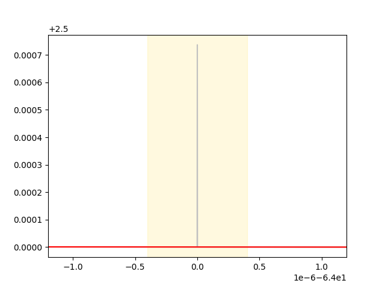
## New Eq:
((fabs(64.0 + membrane__V) < 4.0000000001150227e-7) ? (-17.501361677138188 - 0.31252127620562309 * membrane__V) : (0.625 * intracellular_calcium_concentration__E0_p / (-1.0 + exp(0.25 * intracellular_calcium_concentration__E0_p))))

second_inward_current_d_gate__alpha_d = ((second_inward_current_d_gate__delta_d > fabs(second_inward_current_d_gate__E0_d)) ? (120.0) : (30.0 * second_inward_current_d_gate__E0_d / (1.0 - exp(-0.25 * second_inward_current_d_gate__E0_d))))

####Piecewise!!

second_inward_current_d_gate__beta_d = ((second_inward_current_d_gate__delta_d > fabs(second_inward_current_d_gate__E0_d)) ? (120.0) : (12.0 * second_inward_current_d_gate__E0_d / (-1.0 + exp(0.10000000000000001 * second_inward_current_d_gate__E0_d))))

####Piecewise!!

second_inward_current_f_gate__alpha_f = ((second_inward_current_f_gate__delta_f > fabs(second_inward_current_f_gate__E0_f)) ? (25.0) : (6.25 * second_inward_current_f_gate__E0_f / (-1.0 + exp(0.25 * second_inward_current_f_gate__E0_f))))

####Piecewise!!

## Equation 2:
```
second_inward_current__i_siCa = 4.0 * (-50.0 + membrane__V) * (intracellular_calcium_concentration__Cai * exp(100.0 / membrane__RTONF) - extracellular_calcium_concentration__Cao * exp(-2.0 * (-50.0 + membrane__V) / membrane__RTONF)) * second_inward_current__P_si * second_inward_current_d_gate__d * second_inward_current_f2_gate__f2 * second_inward_current_f_gate__f / ((1.0 - exp(-2.0 * (-50.0 + membrane__V) / membrane__RTONF)) * membrane__RTONF)
```
### Partially evaluated to: 
```
second_inward_current__i_siCa = 4.0 * (-50.0 + membrane__V) * (intracellular_calcium_concentration__Cai * exp(100.0 / membrane__RTONF) - extracellular_calcium_concentration__Cao * exp(-2.0 * (-50.0 + membrane__V) / membrane__RTONF)) * second_inward_current__P_si * second_inward_current_d_gate__d * second_inward_current_f2_gate__f2 * second_inward_current_f_gate__f / ((1.0 - exp(-2.0 * (-50.0 + membrane__V) / membrane__RTONF)) * membrane__RTONF)
```
### Singulariy points detected:

{50.000000000000000}
#### float * A

####Failed to find U symbolically!

<class 'sympy.core.mul.Mul'>
_second_inward_current$P_si*_second_inward_current_d_gate$d*_second_inward_current_f2_gate$f2*_second_inward_current_f_gate$f*(_membrane$V - 50.0)*(-_extracellular_calcium_concentration$Cao*exp(-2.0*(_membrane$V - 50.0)/_membrane$RTONF) + _intracellular_calcium_concentration$Cai*exp(100.0/_membrane$RTONF))/(_membrane$RTONF*(1.0 - exp(-2.0*(_membrane$V - 50.0)/_membrane$RTONF)))

*try substituting parameters*

*U*
`3.7433890822745473 - 0.074867781645490947 * membrane__V`

*V for 1e-07 range* 
`50.000001335688033 - 49.999998664311967`

*Singularity point: 50.000000000000000*


## New Eq:
((fabs(-50.0 + membrane__V) < 1.3356880329828957e-6) ? ((18716945.911399174 - 374338.90822798351 * membrane__V) * (-5.3427521318205606e-6 * (intracellular_calcium_concentration__Cai * exp(100.0 / membrane__RTONF) - extracellular_calcium_concentration__Cao * exp(-2.6713760659102803e-6 / membrane__RTONF)) * second_inward_current__P_si * second_inward_current_d_gate__d * second_inward_current_f2_gate__f2 * second_inward_current_f_gate__f / ((1.0 - exp(-2.6713760659102803e-6 / membrane__RTONF)) * membrane__RTONF) - 5.3427521320426052e-6 * (intracellular_calcium_concentration__Cai * exp(100.0 / membrane__RTONF) - extracellular_calcium_concentration__Cao * exp(2.6713760660213026e-6 / membrane__RTONF)) * second_inward_current__P_si * second_inward_current_d_gate__d * second_inward_current_f2_gate__f2 * second_inward_current_f_gate__f / ((1.0 - exp(2.6713760660213026e-6 / membrane__RTONF)) * membrane__RTONF)) + 5.3427521318205606e-6 * (intracellular_calcium_concentration__Cai * exp(100.0 / membrane__RTONF) - extracellular_calcium_concentration__Cao * exp(-2.6713760659102803e-6 / membrane__RTONF)) * second_inward_current__P_si * second_inward_current_d_gate__d * second_inward_current_f2_gate__f2 * second_inward_current_f_gate__f / ((1.0 - exp(-2.6713760659102803e-6 / membrane__RTONF)) * membrane__RTONF)) : (4.0 * (-50.0 + membrane__V) * (intracellular_calcium_concentration__Cai * exp(100.0 / membrane__RTONF) - extracellular_calcium_concentration__Cao * exp(-2.0 * (-50.0 + membrane__V) / membrane__RTONF)) * second_inward_current__P_si * second_inward_current_d_gate__d * second_inward_current_f2_gate__f2 * second_inward_current_f_gate__f / ((1.0 - exp(-2.0 * (-50.0 + membrane__V) / membrane__RTONF)) * membrane__RTONF)))

## Equation 3:
```
second_inward_current__i_siK = 0.01 * (-50.0 + membrane__V) * (intracellular_potassium_concentration__Ki * exp(50.0 / membrane__RTONF) - extracellular_potassium_concentration__Kc * exp(-(-50.0 + membrane__V) / membrane__RTONF)) * second_inward_current__P_si * second_inward_current_d_gate__d * second_inward_current_f2_gate__f2 * second_inward_current_f_gate__f / ((1.0 - exp(-(-50.0 + membrane__V) / membrane__RTONF)) * membrane__RTONF)
```
### Partially evaluated to: 
```
second_inward_current__i_siK = 0.01 * (-50.0 + membrane__V) * (intracellular_potassium_concentration__Ki * exp(50.0 / membrane__RTONF) - extracellular_potassium_concentration__Kc * exp(-(-50.0 + membrane__V) / membrane__RTONF)) * second_inward_current__P_si * second_inward_current_d_gate__d * second_inward_current_f2_gate__f2 * second_inward_current_f_gate__f / ((1.0 - exp(-(-50.0 + membrane__V) / membrane__RTONF)) * membrane__RTONF)
```
### Singulariy points detected:

{50.000000000000000}
#### float * A

####Failed to find U symbolically!

<class 'sympy.core.mul.Mul'>
_second_inward_current$P_si*_second_inward_current_d_gate$d*_second_inward_current_f2_gate$f2*_second_inward_current_f_gate$f*(_membrane$V - 50.0)*(-_extracellular_potassium_concentration$Kc*exp(-1.0*(_membrane$V - 50.0)/_membrane$RTONF) + _intracellular_potassium_concentration$Ki*exp(50.0/_membrane$RTONF))/(_membrane$RTONF*(1.0 - exp(-1.0*(_membrane$V - 50.0)/_membrane$RTONF)))

*try substituting parameters*

*U*
`1.8716945411372736 - 0.037433890822745473 * membrane__V`

*V for 1e-07 range* 
`50.000002671376066 - 49.999997328623934`

*Singularity point: 50.000000000000000*


## New Eq:
((fabs(-50.0 + membrane__V) < 2.6713760659380359e-6) ? ((9358473.205796821 - 187169.45411593645 * membrane__V) * (-2.6713760659657917e-8 * (intracellular_potassium_concentration__Ki * exp(50.0 / membrane__RTONF) - extracellular_potassium_concentration__Kc * exp(2.6713760659657915e-6 / membrane__RTONF)) * second_inward_current__P_si * second_inward_current_d_gate__d * second_inward_current_f2_gate__f2 * second_inward_current_f_gate__f / ((1.0 - exp(2.6713760659657915e-6 / membrane__RTONF)) * membrane__RTONF) - 2.6713760659102803e-8 * (intracellular_potassium_concentration__Ki * exp(50.0 / membrane__RTONF) - extracellular_potassium_concentration__Kc * exp(-2.6713760659102803e-6 / membrane__RTONF)) * second_inward_current__P_si * second_inward_current_d_gate__d * second_inward_current_f2_gate__f2 * second_inward_current_f_gate__f / ((1.0 - exp(-2.6713760659102803e-6 / membrane__RTONF)) * membrane__RTONF)) + 2.6713760659102803e-8 * (intracellular_potassium_concentration__Ki * exp(50.0 / membrane__RTONF) - extracellular_potassium_concentration__Kc * exp(-2.6713760659102803e-6 / membrane__RTONF)) * second_inward_current__P_si * second_inward_current_d_gate__d * second_inward_current_f2_gate__f2 * second_inward_current_f_gate__f / ((1.0 - exp(-2.6713760659102803e-6 / membrane__RTONF)) * membrane__RTONF)) : (0.01 * (-50.0 + membrane__V) * (intracellular_potassium_concentration__Ki * exp(50.0 / membrane__RTONF) - extracellular_potassium_concentration__Kc * exp(-(-50.0 + membrane__V) / membrane__RTONF)) * second_inward_current__P_si * second_inward_current_d_gate__d * second_inward_current_f2_gate__f2 * second_inward_current_f_gate__f / ((1.0 - exp(-(-50.0 + membrane__V) / membrane__RTONF)) * membrane__RTONF)))

## Equation 4:
```
second_inward_current__i_siNa = 0.01 * (-50.0 + membrane__V) * (intracellular_sodium_concentration__Nai * exp(50.0 / membrane__RTONF) - extracellular_sodium_concentration__Nao * exp(-(-50.0 + membrane__V) / membrane__RTONF)) * second_inward_current__P_si * second_inward_current_d_gate__d * second_inward_current_f2_gate__f2 * second_inward_current_f_gate__f / ((1.0 - exp(-(-50.0 + membrane__V) / membrane__RTONF)) * membrane__RTONF)
```
### Partially evaluated to: 
```
second_inward_current__i_siNa = 0.01 * (-50.0 + membrane__V) * (intracellular_sodium_concentration__Nai * exp(50.0 / membrane__RTONF) - extracellular_sodium_concentration__Nao * exp(-(-50.0 + membrane__V) / membrane__RTONF)) * second_inward_current__P_si * second_inward_current_d_gate__d * second_inward_current_f2_gate__f2 * second_inward_current_f_gate__f / ((1.0 - exp(-(-50.0 + membrane__V) / membrane__RTONF)) * membrane__RTONF)
```
### Singulariy points detected:

{50.000000000000000}
#### float * A

####Failed to find U symbolically!

<class 'sympy.core.mul.Mul'>
_second_inward_current$P_si*_second_inward_current_d_gate$d*_second_inward_current_f2_gate$f2*_second_inward_current_f_gate$f*(_membrane$V - 50.0)*(-_extracellular_sodium_concentration$Nao*exp(-1.0*(_membrane$V - 50.0)/_membrane$RTONF) + _intracellular_sodium_concentration$Nai*exp(50.0/_membrane$RTONF))/(_membrane$RTONF*(1.0 - exp(-1.0*(_membrane$V - 50.0)/_membrane$RTONF)))

*try substituting parameters*

*U*
`1.8716945411372736 - 0.037433890822745473 * membrane__V`

*V for 1e-07 range* 
`50.000002671376066 - 49.999997328623934`

*Singularity point: 50.000000000000000*


## New Eq:
((fabs(-50.0 + membrane__V) < 2.6713760659380359e-6) ? ((9358473.205796821 - 187169.45411593645 * membrane__V) * (-2.6713760659657917e-8 * (intracellular_sodium_concentration__Nai * exp(50.0 / membrane__RTONF) - extracellular_sodium_concentration__Nao * exp(2.6713760659657915e-6 / membrane__RTONF)) * second_inward_current__P_si * second_inward_current_d_gate__d * second_inward_current_f2_gate__f2 * second_inward_current_f_gate__f / ((1.0 - exp(2.6713760659657915e-6 / membrane__RTONF)) * membrane__RTONF) - 2.6713760659102803e-8 * (intracellular_sodium_concentration__Nai * exp(50.0 / membrane__RTONF) - extracellular_sodium_concentration__Nao * exp(-2.6713760659102803e-6 / membrane__RTONF)) * second_inward_current__P_si * second_inward_current_d_gate__d * second_inward_current_f2_gate__f2 * second_inward_current_f_gate__f / ((1.0 - exp(-2.6713760659102803e-6 / membrane__RTONF)) * membrane__RTONF)) + 2.6713760659102803e-8 * (intracellular_sodium_concentration__Nai * exp(50.0 / membrane__RTONF) - extracellular_sodium_concentration__Nao * exp(-2.6713760659102803e-6 / membrane__RTONF)) * second_inward_current__P_si * second_inward_current_d_gate__d * second_inward_current_f2_gate__f2 * second_inward_current_f_gate__f / ((1.0 - exp(-2.6713760659102803e-6 / membrane__RTONF)) * membrane__RTONF)) : (0.01 * (-50.0 + membrane__V) * (intracellular_sodium_concentration__Nai * exp(50.0 / membrane__RTONF) - extracellular_sodium_concentration__Nao * exp(-(-50.0 + membrane__V) / membrane__RTONF)) * second_inward_current__P_si * second_inward_current_d_gate__d * second_inward_current_f2_gate__f2 * second_inward_current_f_gate__f / ((1.0 - exp(-(-50.0 + membrane__V) / membrane__RTONF)) * membrane__RTONF)))

time_dependent_potassium_current_x_gate__alpha_x = ((time_dependent_potassium_current_x_gate__delta_x > fabs(time_dependent_potassium_current_x_gate__E0_x)) ? (2.5) : (0.5 * time_dependent_potassium_current_x_gate__E0_x / (1.0 - exp(-0.20000000000000001 * time_dependent_potassium_current_x_gate__E0_x))))

####Piecewise!!

time_dependent_potassium_current_x_gate__beta_x = ((time_dependent_potassium_current_x_gate__delta_x > fabs(time_dependent_potassium_current_x_gate__E0_x)) ? (2.5) : (0.17799999999999999 * time_dependent_potassium_current_x_gate__E0_x / (-1.0 + exp(0.066666666666666666 * time_dependent_potassium_current_x_gate__E0_x))))

####Piecewise!!

# Model: Noble_SAN_model_1989(noble_SAN_model_1989.cellml)
fast_sodium_current_m_gate__alpha_m = ((fast_sodium_current_m_gate__delta_m > fabs(fast_sodium_current_m_gate__E0_m)) ? (2000.0) : (200.0 * fast_sodium_current_m_gate__E0_m / (1.0 - exp(-0.10000000000000001 * fast_sodium_current_m_gate__E0_m))))

####Piecewise!!

## Equation 1:
```
intracellular_calcium_concentration__alpha_p = 0.625 * intracellular_calcium_concentration__E0_p / (-1.0 + exp(0.25 * intracellular_calcium_concentration__E0_p))
```
### Partially evaluated to: 
```
intracellular_calcium_concentration__alpha_p = 0.625 * (64.0 + membrane__V) / (-1.0 + 8886110.5205078721 * exp(0.25 * membrane__V))
```
### Singulariy points detected:

{-64.000000000000000}
*U*
`16.0 + 0.25 * membrane__V`

*V for 1e-07 range* 
`-64.000000400000005 - -63.999999600000002`

*Singularity point: -64.000000000000000*


## New Eq:
((fabs(64.0 + membrane__V) < 4.0000000001150227e-7) ? (-17.501361677138188 - 0.31252127620562309 * membrane__V) : (0.625 * intracellular_calcium_concentration__E0_p / (-1.0 + exp(0.25 * intracellular_calcium_concentration__E0_p))))

second_inward_current_d_gate__alpha_d = ((second_inward_current_d_gate__delta_d > fabs(second_inward_current_d_gate__E0_d)) ? (120.0) : (30.0 * second_inward_current_d_gate__E0_d / (1.0 - exp(-0.25 * second_inward_current_d_gate__E0_d))))

####Piecewise!!

second_inward_current_d_gate__beta_d = ((second_inward_current_d_gate__delta_d > fabs(second_inward_current_d_gate__E0_d)) ? (120.0) : (12.0 * second_inward_current_d_gate__E0_d / (-1.0 + exp(0.10000000000000001 * second_inward_current_d_gate__E0_d))))

####Piecewise!!

second_inward_current_f_gate__alpha_f = ((second_inward_current_f_gate__delta_f > fabs(second_inward_current_f_gate__E0_f)) ? (25.0) : (6.25 * second_inward_current_f_gate__E0_f / (-1.0 + exp(0.25 * second_inward_current_f_gate__E0_f))))

####Piecewise!!

## Equation 2:
```
second_inward_current__i_siCa = 4.0 * (-50.0 + membrane__V) * (intracellular_calcium_concentration__Cai * exp(100.0 / membrane__RTONF) - extracellular_calcium_concentration__Cao * exp(-2.0 * (-50.0 + membrane__V) / membrane__RTONF)) * second_inward_current__P_si * second_inward_current_d_gate__d * second_inward_current_f2_gate__f2 * second_inward_current_f_gate__f / ((1.0 - exp(-2.0 * (-50.0 + membrane__V) / membrane__RTONF)) * membrane__RTONF)
```
### Partially evaluated to: 
```
second_inward_current__i_siCa = 4.0 * (-50.0 + membrane__V) * (intracellular_calcium_concentration__Cai * exp(100.0 / membrane__RTONF) - extracellular_calcium_concentration__Cao * exp(-2.0 * (-50.0 + membrane__V) / membrane__RTONF)) * second_inward_current__P_si * second_inward_current_d_gate__d * second_inward_current_f2_gate__f2 * second_inward_current_f_gate__f / ((1.0 - exp(-2.0 * (-50.0 + membrane__V) / membrane__RTONF)) * membrane__RTONF)
```
### Singulariy points detected:

{50.000000000000000}
#### float * A

####Failed to find U symbolically!

<class 'sympy.core.mul.Mul'>
_second_inward_current$P_si*_second_inward_current_d_gate$d*_second_inward_current_f2_gate$f2*_second_inward_current_f_gate$f*(_membrane$V - 50.0)*(-_extracellular_calcium_concentration$Cao*exp(-2.0*(_membrane$V - 50.0)/_membrane$RTONF) + _intracellular_calcium_concentration$Cai*exp(100.0/_membrane$RTONF))/(_membrane$RTONF*(1.0 - exp(-2.0*(_membrane$V - 50.0)/_membrane$RTONF)))

*try substituting parameters*

*U*
`3.7433890822745473 - 0.074867781645490947 * membrane__V`

*V for 1e-07 range* 
`50.000001335688033 - 49.999998664311967`

*Singularity point: 50.000000000000000*


## New Eq:
((fabs(-50.0 + membrane__V) < 1.3356880329828957e-6) ? ((18716945.911399174 - 374338.90822798351 * membrane__V) * (-5.3427521318205606e-6 * (intracellular_calcium_concentration__Cai * exp(100.0 / membrane__RTONF) - extracellular_calcium_concentration__Cao * exp(-2.6713760659102803e-6 / membrane__RTONF)) * second_inward_current__P_si * second_inward_current_d_gate__d * second_inward_current_f2_gate__f2 * second_inward_current_f_gate__f / ((1.0 - exp(-2.6713760659102803e-6 / membrane__RTONF)) * membrane__RTONF) - 5.3427521320426052e-6 * (intracellular_calcium_concentration__Cai * exp(100.0 / membrane__RTONF) - extracellular_calcium_concentration__Cao * exp(2.6713760660213026e-6 / membrane__RTONF)) * second_inward_current__P_si * second_inward_current_d_gate__d * second_inward_current_f2_gate__f2 * second_inward_current_f_gate__f / ((1.0 - exp(2.6713760660213026e-6 / membrane__RTONF)) * membrane__RTONF)) + 5.3427521318205606e-6 * (intracellular_calcium_concentration__Cai * exp(100.0 / membrane__RTONF) - extracellular_calcium_concentration__Cao * exp(-2.6713760659102803e-6 / membrane__RTONF)) * second_inward_current__P_si * second_inward_current_d_gate__d * second_inward_current_f2_gate__f2 * second_inward_current_f_gate__f / ((1.0 - exp(-2.6713760659102803e-6 / membrane__RTONF)) * membrane__RTONF)) : (4.0 * (-50.0 + membrane__V) * (intracellular_calcium_concentration__Cai * exp(100.0 / membrane__RTONF) - extracellular_calcium_concentration__Cao * exp(-2.0 * (-50.0 + membrane__V) / membrane__RTONF)) * second_inward_current__P_si * second_inward_current_d_gate__d * second_inward_current_f2_gate__f2 * second_inward_current_f_gate__f / ((1.0 - exp(-2.0 * (-50.0 + membrane__V) / membrane__RTONF)) * membrane__RTONF)))

## Equation 3:
```
second_inward_current__i_siK = 0.01 * (-50.0 + membrane__V) * (intracellular_potassium_concentration__Ki * exp(50.0 / membrane__RTONF) - extracellular_potassium_concentration__Kc * exp(-(-50.0 + membrane__V) / membrane__RTONF)) * second_inward_current__P_si * second_inward_current_d_gate__d * second_inward_current_f2_gate__f2 * second_inward_current_f_gate__f / ((1.0 - exp(-(-50.0 + membrane__V) / membrane__RTONF)) * membrane__RTONF)
```
### Partially evaluated to: 
```
second_inward_current__i_siK = 0.01 * (-50.0 + membrane__V) * (intracellular_potassium_concentration__Ki * exp(50.0 / membrane__RTONF) - extracellular_potassium_concentration__Kc * exp(-(-50.0 + membrane__V) / membrane__RTONF)) * second_inward_current__P_si * second_inward_current_d_gate__d * second_inward_current_f2_gate__f2 * second_inward_current_f_gate__f / ((1.0 - exp(-(-50.0 + membrane__V) / membrane__RTONF)) * membrane__RTONF)
```
### Singulariy points detected:

{50.000000000000000}
#### float * A

####Failed to find U symbolically!

<class 'sympy.core.mul.Mul'>
_second_inward_current$P_si*_second_inward_current_d_gate$d*_second_inward_current_f2_gate$f2*_second_inward_current_f_gate$f*(_membrane$V - 50.0)*(-_extracellular_potassium_concentration$Kc*exp(-1.0*(_membrane$V - 50.0)/_membrane$RTONF) + _intracellular_potassium_concentration$Ki*exp(50.0/_membrane$RTONF))/(_membrane$RTONF*(1.0 - exp(-1.0*(_membrane$V - 50.0)/_membrane$RTONF)))

*try substituting parameters*

*U*
`1.8716945411372736 - 0.037433890822745473 * membrane__V`

*V for 1e-07 range* 
`50.000002671376066 - 49.999997328623934`

*Singularity point: 50.000000000000000*


## New Eq:
((fabs(-50.0 + membrane__V) < 2.6713760659380359e-6) ? ((9358473.205796821 - 187169.45411593645 * membrane__V) * (-2.6713760659657917e-8 * (intracellular_potassium_concentration__Ki * exp(50.0 / membrane__RTONF) - extracellular_potassium_concentration__Kc * exp(2.6713760659657915e-6 / membrane__RTONF)) * second_inward_current__P_si * second_inward_current_d_gate__d * second_inward_current_f2_gate__f2 * second_inward_current_f_gate__f / ((1.0 - exp(2.6713760659657915e-6 / membrane__RTONF)) * membrane__RTONF) - 2.6713760659102803e-8 * (intracellular_potassium_concentration__Ki * exp(50.0 / membrane__RTONF) - extracellular_potassium_concentration__Kc * exp(-2.6713760659102803e-6 / membrane__RTONF)) * second_inward_current__P_si * second_inward_current_d_gate__d * second_inward_current_f2_gate__f2 * second_inward_current_f_gate__f / ((1.0 - exp(-2.6713760659102803e-6 / membrane__RTONF)) * membrane__RTONF)) + 2.6713760659102803e-8 * (intracellular_potassium_concentration__Ki * exp(50.0 / membrane__RTONF) - extracellular_potassium_concentration__Kc * exp(-2.6713760659102803e-6 / membrane__RTONF)) * second_inward_current__P_si * second_inward_current_d_gate__d * second_inward_current_f2_gate__f2 * second_inward_current_f_gate__f / ((1.0 - exp(-2.6713760659102803e-6 / membrane__RTONF)) * membrane__RTONF)) : (0.01 * (-50.0 + membrane__V) * (intracellular_potassium_concentration__Ki * exp(50.0 / membrane__RTONF) - extracellular_potassium_concentration__Kc * exp(-(-50.0 + membrane__V) / membrane__RTONF)) * second_inward_current__P_si * second_inward_current_d_gate__d * second_inward_current_f2_gate__f2 * second_inward_current_f_gate__f / ((1.0 - exp(-(-50.0 + membrane__V) / membrane__RTONF)) * membrane__RTONF)))

## Equation 4:
```
second_inward_current__i_siNa = 0.01 * (-50.0 + membrane__V) * (intracellular_sodium_concentration__Nai * exp(50.0 / membrane__RTONF) - extracellular_sodium_concentration__Nao * exp(-(-50.0 + membrane__V) / membrane__RTONF)) * second_inward_current__P_si * second_inward_current_d_gate__d * second_inward_current_f2_gate__f2 * second_inward_current_f_gate__f / ((1.0 - exp(-(-50.0 + membrane__V) / membrane__RTONF)) * membrane__RTONF)
```
### Partially evaluated to: 
```
second_inward_current__i_siNa = 0.01 * (-50.0 + membrane__V) * (intracellular_sodium_concentration__Nai * exp(50.0 / membrane__RTONF) - extracellular_sodium_concentration__Nao * exp(-(-50.0 + membrane__V) / membrane__RTONF)) * second_inward_current__P_si * second_inward_current_d_gate__d * second_inward_current_f2_gate__f2 * second_inward_current_f_gate__f / ((1.0 - exp(-(-50.0 + membrane__V) / membrane__RTONF)) * membrane__RTONF)
```
### Singulariy points detected:

{50.000000000000000}
#### float * A

####Failed to find U symbolically!

<class 'sympy.core.mul.Mul'>
_second_inward_current$P_si*_second_inward_current_d_gate$d*_second_inward_current_f2_gate$f2*_second_inward_current_f_gate$f*(_membrane$V - 50.0)*(-_extracellular_sodium_concentration$Nao*exp(-1.0*(_membrane$V - 50.0)/_membrane$RTONF) + _intracellular_sodium_concentration$Nai*exp(50.0/_membrane$RTONF))/(_membrane$RTONF*(1.0 - exp(-1.0*(_membrane$V - 50.0)/_membrane$RTONF)))

*try substituting parameters*

*U*
`1.8716945411372736 - 0.037433890822745473 * membrane__V`

*V for 1e-07 range* 
`50.000002671376066 - 49.999997328623934`

*Singularity point: 50.000000000000000*


## New Eq:
((fabs(-50.0 + membrane__V) < 2.6713760659380359e-6) ? ((9358473.205796821 - 187169.45411593645 * membrane__V) * (-2.6713760659657917e-8 * (intracellular_sodium_concentration__Nai * exp(50.0 / membrane__RTONF) - extracellular_sodium_concentration__Nao * exp(2.6713760659657915e-6 / membrane__RTONF)) * second_inward_current__P_si * second_inward_current_d_gate__d * second_inward_current_f2_gate__f2 * second_inward_current_f_gate__f / ((1.0 - exp(2.6713760659657915e-6 / membrane__RTONF)) * membrane__RTONF) - 2.6713760659102803e-8 * (intracellular_sodium_concentration__Nai * exp(50.0 / membrane__RTONF) - extracellular_sodium_concentration__Nao * exp(-2.6713760659102803e-6 / membrane__RTONF)) * second_inward_current__P_si * second_inward_current_d_gate__d * second_inward_current_f2_gate__f2 * second_inward_current_f_gate__f / ((1.0 - exp(-2.6713760659102803e-6 / membrane__RTONF)) * membrane__RTONF)) + 2.6713760659102803e-8 * (intracellular_sodium_concentration__Nai * exp(50.0 / membrane__RTONF) - extracellular_sodium_concentration__Nao * exp(-2.6713760659102803e-6 / membrane__RTONF)) * second_inward_current__P_si * second_inward_current_d_gate__d * second_inward_current_f2_gate__f2 * second_inward_current_f_gate__f / ((1.0 - exp(-2.6713760659102803e-6 / membrane__RTONF)) * membrane__RTONF)) : (0.01 * (-50.0 + membrane__V) * (intracellular_sodium_concentration__Nai * exp(50.0 / membrane__RTONF) - extracellular_sodium_concentration__Nao * exp(-(-50.0 + membrane__V) / membrane__RTONF)) * second_inward_current__P_si * second_inward_current_d_gate__d * second_inward_current_f2_gate__f2 * second_inward_current_f_gate__f / ((1.0 - exp(-(-50.0 + membrane__V) / membrane__RTONF)) * membrane__RTONF)))

# Model: nygren_atrial_model_1998(nygren_atrial_model_1998.cellml)
## Equation 1:
```
sodium_current__i_Na = pow(membrane__F, 2) * pow(sodium_current_m_gate__m, 3) * (-1.0 + exp((-sodium_current__E_Na + membrane__V) * membrane__F / (membrane__R * membrane__T))) * (0.10000000000000001 * sodium_current_h2_gate__h2 + 0.90000000000000002 * sodium_current_h1_gate__h1) * cleft_space_ion_concentrations__Na_c * membrane__V * sodium_current__P_Na / ((-1.0 + exp(membrane__F * membrane__V / (membrane__R * membrane__T))) * membrane__R * membrane__T)
```
### Partially evaluated to: 
```
sodium_current__i_Na = pow(membrane__F, 2) * pow(sodium_current_m_gate__m, 3) * (-1.0 + exp((-sodium_current__E_Na + membrane__V) * membrane__F / (membrane__R * membrane__T))) * (0.10000000000000001 * sodium_current_h2_gate__h2 + 0.90000000000000002 * sodium_current_h1_gate__h1) * cleft_space_ion_concentrations__Na_c * membrane__V * sodium_current__P_Na / ((-1.0 + exp(membrane__F * membrane__V / (membrane__R * membrane__T))) * membrane__R * membrane__T)
```
### Singulariy points detected:

{0}
####Failed to find U symbolically!

<class 'sympy.core.mul.Mul'>
_membrane$F**2*_sodium_current_m_gate$m**3*_cleft_space_ion_concentrations$Na_c*_membrane$V*_sodium_current$P_Na*(0.90000000000000002*_sodium_current_h1_gate$h1 + 0.10000000000000001*_sodium_current_h2_gate$h2)*(exp(_membrane$F*(_membrane$V - _sodium_current$E_Na)/(_membrane$R*_membrane$T)) - 1.0)/(_membrane$R*_membrane$T*(exp(_membrane$F*_membrane$V/(_membrane$R*_membrane$T)) - 1.0))

*try substituting parameters*

*U*
`0.037907445518581065 * membrane__V`

*V for 1e-07 range* 
`-2.6380041870925613e-6 - 2.6380041870925613e-6`

*Singularity point: 0*

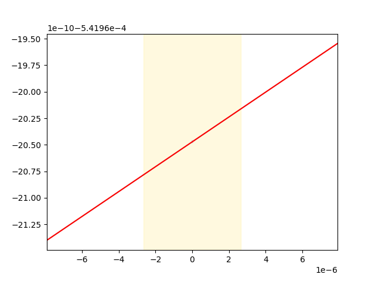
## New Eq:
((fabs(membrane__V) < 2.6380041870925613e-6) ? ((0.5 + 189537.22759290531 * membrane__V) * (2.6380041870925613e-6 * pow(membrane__F, 2) * pow(sodium_current_m_gate__m, 3) * (-1.0 + exp((2.6380041870925613e-6 - sodium_current__E_Na) * membrane__F / (membrane__R * membrane__T))) * (0.10000000000000001 * sodium_current_h2_gate__h2 + 0.90000000000000002 * sodium_current_h1_gate__h1) * cleft_space_ion_concentrations__Na_c * sodium_current__P_Na / ((-1.0 + exp(2.6380041870925613e-6 * membrane__F / (membrane__R * membrane__T))) * membrane__R * membrane__T) + 2.6380041870925613e-6 * pow(membrane__F, 2) * pow(sodium_current_m_gate__m, 3) * (-1.0 + exp((-2.6380041870925613e-6 - sodium_current__E_Na) * membrane__F / (membrane__R * membrane__T))) * (0.10000000000000001 * sodium_current_h2_gate__h2 + 0.90000000000000002 * sodium_current_h1_gate__h1) * cleft_space_ion_concentrations__Na_c * sodium_current__P_Na / ((-1.0 + exp(-2.6380041870925613e-6 * membrane__F / (membrane__R * membrane__T))) * membrane__R * membrane__T)) - 2.6380041870925613e-6 * pow(membrane__F, 2) * pow(sodium_current_m_gate__m, 3) * (-1.0 + exp((-2.6380041870925613e-6 - sodium_current__E_Na) * membrane__F / (membrane__R * membrane__T))) * (0.10000000000000001 * sodium_current_h2_gate__h2 + 0.90000000000000002 * sodium_current_h1_gate__h1) * cleft_space_ion_concentrations__Na_c * sodium_current__P_Na / ((-1.0 + exp(-2.6380041870925613e-6 * membrane__F / (membrane__R * membrane__T))) * membrane__R * membrane__T)) : (pow(membrane__F, 2) * pow(sodium_current_m_gate__m, 3) * (-1.0 + exp((-sodium_current__E_Na + membrane__V) * membrane__F / (membrane__R * membrane__T))) * (0.10000000000000001 * sodium_current_h2_gate__h2 + 0.90000000000000002 * sodium_current_h1_gate__h1) * cleft_space_ion_concentrations__Na_c * membrane__V * sodium_current__P_Na / ((-1.0 + exp(membrane__F * membrane__V / (membrane__R * membrane__T))) * membrane__R * membrane__T)))

## Equation 2:
```
sodium_potassium_pump__i_NaK = pow(intracellular_ion_concentrations__Na_i, 1.5) * (150.0 + membrane__V) * cleft_space_ion_concentrations__K_c * sodium_potassium_pump__i_NaK_max / ((200.0 + membrane__V) * (pow(intracellular_ion_concentrations__Na_i, 1.5) + pow(sodium_potassium_pump__k_NaK_Na, 1.5)) * (cleft_space_ion_concentrations__K_c + sodium_potassium_pump__k_NaK_K))
```
### Partially evaluated to: 
```
sodium_potassium_pump__i_NaK = pow(intracellular_ion_concentrations__Na_i, 1.5) * (150.0 + membrane__V) * cleft_space_ion_concentrations__K_c * sodium_potassium_pump__i_NaK_max / ((200.0 + membrane__V) * (pow(intracellular_ion_concentrations__Na_i, 1.5) + pow(sodium_potassium_pump__k_NaK_Na, 1.5)) * (cleft_space_ion_concentrations__K_c + sodium_potassium_pump__k_NaK_K))
```
### Singulariy points detected:

{-200.00000000000000}
####Failed to find U symbolically!

<class 'sympy.core.mul.Mul'>
_intracellular_ion_concentrations$Na_i**1.5*_cleft_space_ion_concentrations$K_c*_sodium_potassium_pump$i_NaK_max*(_membrane$V + 150.0)/((_intracellular_ion_concentrations$Na_i**1.5 + _sodium_potassium_pump$k_NaK_Na**1.5)*(_cleft_space_ion_concentrations$K_c + _sodium_potassium_pump$k_NaK_K)*(_membrane$V + 200.0))

*try substituting parameters*

#### float * A

####Failed to find U symbolically!

<class 'sympy.core.mul.Mul'>
_intracellular_ion_concentrations$Na_i**1.5*_cleft_space_ion_concentrations$K_c*(_membrane$V + 150.0)/((_intracellular_ion_concentrations$Na_i**1.5 + 36.482872693909398)*(_cleft_space_ion_concentrations$K_c + 1.0)*(_membrane$V + 200.0))
# Model: ohara_rudy_2011_endo(ohara_rudy_2011_endo.cellml)
ICaL__PCa = ((environment__celltype == 1.0) ? (1.2 * ICaL__PCa_b) : ((environment__celltype == 2.0) ? (2.5 * ICaL__PCa_b) : (ICaL__PCa_b)))

####Piecewise!!

IK1__GK1 = ((environment__celltype == 1.0) ? (1.2 * IK1__GK1_b) : ((environment__celltype == 2.0) ? (1.3 * IK1__GK1_b) : (IK1__GK1_b)))

####Piecewise!!

IKb__GKb = ((environment__celltype == 1.0) ? (0.59999999999999998 * IKb__GKb_b) : (IKb__GKb_b))

####Piecewise!!

IKr__GKr = ((environment__celltype == 1.0) ? (1.3 * IKr__GKr_b) : ((environment__celltype == 2.0) ? (0.80000000000000004 * IKr__GKr_b) : (IKr__GKr_b)))

####Piecewise!!

IKs__GKs = ((environment__celltype == 1.0) ? (1.3999999999999999 * IKs__GKs_b) : (IKs__GKs_b))

####Piecewise!!

INaCa_i__Gncx = ((environment__celltype == 1.0) ? (1.1000000000000001 * INaCa_i__Gncx_b) : ((environment__celltype == 2.0) ? (1.3999999999999999 * INaCa_i__Gncx_b) : (INaCa_i__Gncx_b)))

####Piecewise!!

INaK__Pnak = ((environment__celltype == 1.0) ? (0.90000000000000002 * INaK__Pnak_b) : ((environment__celltype == 2.0) ? (0.69999999999999996 * INaK__Pnak_b) : (INaK__Pnak_b)))

####Piecewise!!

INaL__GNaL = ((environment__celltype == 1.0) ? (0.59999999999999998 * INaL__GNaL_b) : (INaL__GNaL_b))

####Piecewise!!

Ito__Gto = (((environment__celltype == 1.0) || (environment__celltype == 2.0)) ? (4.0 * Ito__Gto_b) : (Ito__Gto_b))

####Piecewise!!

SERCA__upScale = ((environment__celltype == 1.0) ? (1.3) : (1.0))

####Piecewise!!

intracellular_ions__cmdnmax = ((environment__celltype == 1.0) ? (1.3 * intracellular_ions__cmdnmax_b) : (intracellular_ions__cmdnmax_b))

####Piecewise!!

Ito__delta_epi = ((environment__celltype == 1.0) ? (1.0 - 0.94999999999999996 / (1.0 + exp(14.0 + 0.20000000000000001 * membrane__v))) : (1.0))

####Piecewise!!

## Equation 1:
```
ICaL__PhiCaK = (-0.75 * extracellular__ko + 0.75 * intracellular_ions__kss * exp(membrane__vfrt)) * membrane__vffrt / (-1.0 + exp(membrane__vfrt))
```
### Partially evaluated to: 
```
ICaL__PhiCaK = pow(physical_constants__F, 2) * (-0.75 * extracellular__ko + 0.75 * intracellular_ions__kss * exp(membrane__v * physical_constants__F / (physical_constants__R * physical_constants__T))) * membrane__v / ((-1.0 + exp(membrane__v * physical_constants__F / (physical_constants__R * physical_constants__T))) * physical_constants__R * physical_constants__T)
```
### Singulariy points detected:

{0}
#### float * A

####Failed to find U symbolically!

<class 'sympy.core.mul.Mul'>
_physical_constants$F**2*_membrane$v*(-0.75*_extracellular$ko + 0.75*_intracellular_ions$kss*exp(1.0*_membrane$v*_physical_constants$F/(_physical_constants$R*_physical_constants$T)))/(_physical_constants$R*_physical_constants$T*(exp(1.0*_membrane$v*_physical_constants$F/(_physical_constants$R*_physical_constants$T)) - 1.0))

*try substituting parameters*

*U*
`0.037435883507802616 * membrane__v`

*V for 1e-07 range* 
`-2.6712338705498262e-6 - 2.6712338705498262e-6`

*Singularity point: 0*


## New Eq:
((fabs(membrane__v) < 2.6712338705498262e-6) ? ((0.5 + 187179.41753901311 * membrane__v) * (2.6712338705498262e-6 * pow(physical_constants__F, 2) * (-0.75 * extracellular__ko + 0.75 * intracellular_ions__kss * exp(2.6712338705498262e-6 * physical_constants__F / (physical_constants__R * physical_constants__T))) / ((-1.0 + exp(2.6712338705498262e-6 * physical_constants__F / (physical_constants__R * physical_constants__T))) * physical_constants__R * physical_constants__T) + 2.6712338705498262e-6 * pow(physical_constants__F, 2) * (-0.75 * extracellular__ko + 0.75 * intracellular_ions__kss * exp(-2.6712338705498262e-6 * physical_constants__F / (physical_constants__R * physical_constants__T))) / ((-1.0 + exp(-2.6712338705498262e-6 * physical_constants__F / (physical_constants__R * physical_constants__T))) * physical_constants__R * physical_constants__T)) - 2.6712338705498262e-6 * pow(physical_constants__F, 2) * (-0.75 * extracellular__ko + 0.75 * intracellular_ions__kss * exp(-2.6712338705498262e-6 * physical_constants__F / (physical_constants__R * physical_constants__T))) / ((-1.0 + exp(-2.6712338705498262e-6 * physical_constants__F / (physical_constants__R * physical_constants__T))) * physical_constants__R * physical_constants__T)) : ((-0.75 * extracellular__ko + 0.75 * intracellular_ions__kss * exp(membrane__vfrt)) * membrane__vffrt / (-1.0 + exp(membrane__vfrt))))

## Equation 2:
```
ICaL__PhiCaL = 4.0 * (-0.34100000000000003 * extracellular__cao + intracellular_ions__cass * exp(2.0 * membrane__vfrt)) * membrane__vffrt / (-1.0 + exp(2.0 * membrane__vfrt))
```
### Partially evaluated to: 
```
ICaL__PhiCaL = 4.0 * pow(physical_constants__F, 2) * (-0.34100000000000003 * extracellular__cao + intracellular_ions__cass * exp(2.0 * membrane__v * physical_constants__F / (physical_constants__R * physical_constants__T))) * membrane__v / ((-1.0 + exp(2.0 * membrane__v * physical_constants__F / (physical_constants__R * physical_constants__T))) * physical_constants__R * physical_constants__T)
```
### Singulariy points detected:

{0}
#### float * A

####Failed to find U symbolically!

<class 'sympy.core.mul.Mul'>
_physical_constants$F**2*_membrane$v*(-0.34100000000000003*_extracellular$cao + _intracellular_ions$cass*exp(2.0*_membrane$v*_physical_constants$F/(_physical_constants$R*_physical_constants$T)))/(_physical_constants$R*_physical_constants$T*(exp(2.0*_membrane$v*_physical_constants$F/(_physical_constants$R*_physical_constants$T)) - 1.0))

*try substituting parameters*

*U*
`0.074871767015605231 * membrane__v`

*V for 1e-07 range* 
`-1.3356169352749131e-6 - 1.3356169352749131e-6`

*Singularity point: 0*


## New Eq:
((fabs(membrane__v) < 1.3356169352749131e-6) ? ((0.5 + 374358.83507802623 * membrane__v) * (5.3424677410996524e-6 * pow(physical_constants__F, 2) * (-0.34100000000000003 * extracellular__cao + intracellular_ions__cass * exp(2.6712338705498262e-6 * physical_constants__F / (physical_constants__R * physical_constants__T))) / ((-1.0 + exp(2.6712338705498262e-6 * physical_constants__F / (physical_constants__R * physical_constants__T))) * physical_constants__R * physical_constants__T) + 5.3424677410996524e-6 * pow(physical_constants__F, 2) * (-0.34100000000000003 * extracellular__cao + intracellular_ions__cass * exp(-2.6712338705498262e-6 * physical_constants__F / (physical_constants__R * physical_constants__T))) / ((-1.0 + exp(-2.6712338705498262e-6 * physical_constants__F / (physical_constants__R * physical_constants__T))) * physical_constants__R * physical_constants__T)) - 5.3424677410996524e-6 * pow(physical_constants__F, 2) * (-0.34100000000000003 * extracellular__cao + intracellular_ions__cass * exp(-2.6712338705498262e-6 * physical_constants__F / (physical_constants__R * physical_constants__T))) / ((-1.0 + exp(-2.6712338705498262e-6 * physical_constants__F / (physical_constants__R * physical_constants__T))) * physical_constants__R * physical_constants__T)) : (4.0 * (-0.34100000000000003 * extracellular__cao + intracellular_ions__cass * exp(2.0 * membrane__vfrt)) * membrane__vffrt / (-1.0 + exp(2.0 * membrane__vfrt))))

## Equation 3:
```
ICaL__PhiCaNa = (-0.75 * extracellular__nao + 0.75 * intracellular_ions__nass * exp(membrane__vfrt)) * membrane__vffrt / (-1.0 + exp(membrane__vfrt))
```
### Partially evaluated to: 
```
ICaL__PhiCaNa = pow(physical_constants__F, 2) * (-0.75 * extracellular__nao + 0.75 * intracellular_ions__nass * exp(membrane__v * physical_constants__F / (physical_constants__R * physical_constants__T))) * membrane__v / ((-1.0 + exp(membrane__v * physical_constants__F / (physical_constants__R * physical_constants__T))) * physical_constants__R * physical_constants__T)
```
### Singulariy points detected:

{0}
#### float * A

####Failed to find U symbolically!

<class 'sympy.core.mul.Mul'>
_physical_constants$F**2*_membrane$v*(-0.75*_extracellular$nao + 0.75*_intracellular_ions$nass*exp(1.0*_membrane$v*_physical_constants$F/(_physical_constants$R*_physical_constants$T)))/(_physical_constants$R*_physical_constants$T*(exp(1.0*_membrane$v*_physical_constants$F/(_physical_constants$R*_physical_constants$T)) - 1.0))

*try substituting parameters*

*U*
`0.037435883507802616 * membrane__v`

*V for 1e-07 range* 
`-2.6712338705498262e-6 - 2.6712338705498262e-6`

*Singularity point: 0*


## New Eq:
((fabs(membrane__v) < 2.6712338705498262e-6) ? ((0.5 + 187179.41753901311 * membrane__v) * (2.6712338705498262e-6 * pow(physical_constants__F, 2) * (-0.75 * extracellular__nao + 0.75 * intracellular_ions__nass * exp(2.6712338705498262e-6 * physical_constants__F / (physical_constants__R * physical_constants__T))) / ((-1.0 + exp(2.6712338705498262e-6 * physical_constants__F / (physical_constants__R * physical_constants__T))) * physical_constants__R * physical_constants__T) + 2.6712338705498262e-6 * pow(physical_constants__F, 2) * (-0.75 * extracellular__nao + 0.75 * intracellular_ions__nass * exp(-2.6712338705498262e-6 * physical_constants__F / (physical_constants__R * physical_constants__T))) / ((-1.0 + exp(-2.6712338705498262e-6 * physical_constants__F / (physical_constants__R * physical_constants__T))) * physical_constants__R * physical_constants__T)) - 2.6712338705498262e-6 * pow(physical_constants__F, 2) * (-0.75 * extracellular__nao + 0.75 * intracellular_ions__nass * exp(-2.6712338705498262e-6 * physical_constants__F / (physical_constants__R * physical_constants__T))) / ((-1.0 + exp(-2.6712338705498262e-6 * physical_constants__F / (physical_constants__R * physical_constants__T))) * physical_constants__R * physical_constants__T)) : ((-0.75 * extracellular__nao + 0.75 * intracellular_ions__nass * exp(membrane__vfrt)) * membrane__vffrt / (-1.0 + exp(membrane__vfrt))))

## Equation 4:
```
ICab__ICab = 4.0 * (-0.34100000000000003 * extracellular__cao + intracellular_ions__cai * exp(2.0 * membrane__vfrt)) * ICab__PCab * membrane__vffrt / (-1.0 + exp(2.0 * membrane__vfrt))
```
### Partially evaluated to: 
```
ICab__ICab = 4.0 * pow(physical_constants__F, 2) * (-0.34100000000000003 * extracellular__cao + intracellular_ions__cai * exp(2.0 * membrane__v * physical_constants__F / (physical_constants__R * physical_constants__T))) * ICab__PCab * membrane__v / ((-1.0 + exp(2.0 * membrane__v * physical_constants__F / (physical_constants__R * physical_constants__T))) * physical_constants__R * physical_constants__T)
```
### Singulariy points detected:

{0}
#### float * A

####Failed to find U symbolically!

<class 'sympy.core.mul.Mul'>
_physical_constants$F**2*_ICab$PCab*_membrane$v*(-0.34100000000000003*_extracellular$cao + _intracellular_ions$cai*exp(2.0*_membrane$v*_physical_constants$F/(_physical_constants$R*_physical_constants$T)))/(_physical_constants$R*_physical_constants$T*(exp(2.0*_membrane$v*_physical_constants$F/(_physical_constants$R*_physical_constants$T)) - 1.0))

*try substituting parameters*

*U*
`0.074871767015605231 * membrane__v`

*V for 1e-07 range* 
`-1.3356169352749131e-6 - 1.3356169352749131e-6`

*Singularity point: 0*

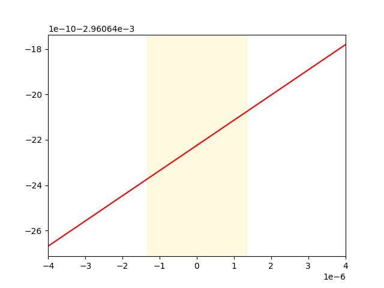
## New Eq:
((fabs(membrane__v) < 1.3356169352749131e-6) ? ((0.5 + 374358.83507802623 * membrane__v) * (5.3424677410996524e-6 * pow(physical_constants__F, 2) * (-0.34100000000000003 * extracellular__cao + intracellular_ions__cai * exp(2.6712338705498262e-6 * physical_constants__F / (physical_constants__R * physical_constants__T))) * ICab__PCab / ((-1.0 + exp(2.6712338705498262e-6 * physical_constants__F / (physical_constants__R * physical_constants__T))) * physical_constants__R * physical_constants__T) + 5.3424677410996524e-6 * pow(physical_constants__F, 2) * (-0.34100000000000003 * extracellular__cao + intracellular_ions__cai * exp(-2.6712338705498262e-6 * physical_constants__F / (physical_constants__R * physical_constants__T))) * ICab__PCab / ((-1.0 + exp(-2.6712338705498262e-6 * physical_constants__F / (physical_constants__R * physical_constants__T))) * physical_constants__R * physical_constants__T)) - 5.3424677410996524e-6 * pow(physical_constants__F, 2) * (-0.34100000000000003 * extracellular__cao + intracellular_ions__cai * exp(-2.6712338705498262e-6 * physical_constants__F / (physical_constants__R * physical_constants__T))) * ICab__PCab / ((-1.0 + exp(-2.6712338705498262e-6 * physical_constants__F / (physical_constants__R * physical_constants__T))) * physical_constants__R * physical_constants__T)) : (4.0 * (-0.34100000000000003 * extracellular__cao + intracellular_ions__cai * exp(2.0 * membrane__vfrt)) * ICab__PCab * membrane__vffrt / (-1.0 + exp(2.0 * membrane__vfrt))))

## Equation 5:
```
INab__INab = (-extracellular__nao + intracellular_ions__nai * exp(membrane__vfrt)) * INab__PNab * membrane__vffrt / (-1.0 + exp(membrane__vfrt))
```
### Partially evaluated to: 
```
INab__INab = 3.75e-10 * pow(physical_constants__F, 2) * (-extracellular__nao + intracellular_ions__nai * exp(membrane__v * physical_constants__F / (physical_constants__R * physical_constants__T))) * membrane__v / ((-1.0 + exp(membrane__v * physical_constants__F / (physical_constants__R * physical_constants__T))) * physical_constants__R * physical_constants__T)
```
### Singulariy points detected:

{0}
#### float * A

####Failed to find U symbolically!

<class 'sympy.core.mul.Mul'>
_physical_constants$F**2*_membrane$v*(-_extracellular$nao + _intracellular_ions$nai*exp(_membrane$v*_physical_constants$F/(_physical_constants$R*_physical_constants$T)))/(_physical_constants$R*_physical_constants$T*(exp(_membrane$v*_physical_constants$F/(_physical_constants$R*_physical_constants$T)) - 1.0))

*try substituting parameters*

*U*
`0.037435883507802616 * membrane__v`

*V for 1e-07 range* 
`-2.6712338705498262e-6 - 2.6712338705498262e-6`

*Singularity point: 0*


## New Eq:
((fabs(membrane__v) < 2.6712338705498262e-6) ? ((0.5 + 187179.41753901311 * membrane__v) * (1.0017127014561849e-15 * pow(physical_constants__F, 2) * (-extracellular__nao + intracellular_ions__nai * exp(2.6712338705498262e-6 * physical_constants__F / (physical_constants__R * physical_constants__T))) / ((-1.0 + exp(2.6712338705498262e-6 * physical_constants__F / (physical_constants__R * physical_constants__T))) * physical_constants__R * physical_constants__T) + 1.0017127014561849e-15 * pow(physical_constants__F, 2) * (-extracellular__nao + intracellular_ions__nai * exp(-2.6712338705498262e-6 * physical_constants__F / (physical_constants__R * physical_constants__T))) / ((-1.0 + exp(-2.6712338705498262e-6 * physical_constants__F / (physical_constants__R * physical_constants__T))) * physical_constants__R * physical_constants__T)) - 1.0017127014561849e-15 * pow(physical_constants__F, 2) * (-extracellular__nao + intracellular_ions__nai * exp(-2.6712338705498262e-6 * physical_constants__F / (physical_constants__R * physical_constants__T))) / ((-1.0 + exp(-2.6712338705498262e-6 * physical_constants__F / (physical_constants__R * physical_constants__T))) * physical_constants__R * physical_constants__T)) : ((-extracellular__nao + intracellular_ions__nai * exp(membrane__vfrt)) * INab__PNab * membrane__vffrt / (-1.0 + exp(membrane__vfrt))))

ryr__Jrel_inf = ((environment__celltype == 2.0) ? (1.7 * ryr__Jrel_inf_temp) : (ryr__Jrel_inf_temp))

####Piecewise!!

ryr__Jrel_infp = ((environment__celltype == 2.0) ? (1.7 * ryr__Jrel_temp) : (ryr__Jrel_temp))

####Piecewise!!

ryr__tau_rel = ((ryr__tau_rel_temp < 0.001) ? (0.001) : (ryr__tau_rel_temp))

####Piecewise!!

ryr__tau_relp = ((ryr__tau_relp_temp < 0.001) ? (0.001) : (ryr__tau_relp_temp))

####Piecewise!!

# Model: ohara_rudy_2011_epi(ohara_rudy_2011_epi.cellml)
ICaL__PCa = ((environment__celltype == 1.0) ? (1.2 * ICaL__PCa_b) : ((environment__celltype == 2.0) ? (2.5 * ICaL__PCa_b) : (ICaL__PCa_b)))

####Piecewise!!

IK1__GK1 = ((environment__celltype == 1.0) ? (1.2 * IK1__GK1_b) : ((environment__celltype == 2.0) ? (1.3 * IK1__GK1_b) : (IK1__GK1_b)))

####Piecewise!!

IKb__GKb = ((environment__celltype == 1.0) ? (0.59999999999999998 * IKb__GKb_b) : (IKb__GKb_b))

####Piecewise!!

IKr__GKr = ((environment__celltype == 1.0) ? (1.3 * IKr__GKr_b) : ((environment__celltype == 2.0) ? (0.80000000000000004 * IKr__GKr_b) : (IKr__GKr_b)))

####Piecewise!!

IKs__GKs = ((environment__celltype == 1.0) ? (1.3999999999999999 * IKs__GKs_b) : (IKs__GKs_b))

####Piecewise!!

INaCa_i__Gncx = ((environment__celltype == 1.0) ? (1.1000000000000001 * INaCa_i__Gncx_b) : ((environment__celltype == 2.0) ? (1.3999999999999999 * INaCa_i__Gncx_b) : (INaCa_i__Gncx_b)))

####Piecewise!!

INaK__Pnak = ((environment__celltype == 1.0) ? (0.90000000000000002 * INaK__Pnak_b) : ((environment__celltype == 2.0) ? (0.69999999999999996 * INaK__Pnak_b) : (INaK__Pnak_b)))

####Piecewise!!

INaL__GNaL = ((environment__celltype == 1.0) ? (0.59999999999999998 * INaL__GNaL_b) : (INaL__GNaL_b))

####Piecewise!!

Ito__Gto = (((environment__celltype == 1.0) || (environment__celltype == 2.0)) ? (4.0 * Ito__Gto_b) : (Ito__Gto_b))

####Piecewise!!

SERCA__upScale = ((environment__celltype == 1.0) ? (1.3) : (1.0))

####Piecewise!!

intracellular_ions__cmdnmax = ((environment__celltype == 1.0) ? (1.3 * intracellular_ions__cmdnmax_b) : (intracellular_ions__cmdnmax_b))

####Piecewise!!

Ito__delta_epi = ((environment__celltype == 1.0) ? (1.0 - 0.94999999999999996 / (1.0 + exp(14.0 + 0.20000000000000001 * membrane__v))) : (1.0))

####Piecewise!!

## Equation 1:
```
ICaL__PhiCaK = (-0.75 * extracellular__ko + 0.75 * intracellular_ions__kss * exp(membrane__vfrt)) * membrane__vffrt / (-1.0 + exp(membrane__vfrt))
```
### Partially evaluated to: 
```
ICaL__PhiCaK = pow(physical_constants__F, 2) * (-0.75 * extracellular__ko + 0.75 * intracellular_ions__kss * exp(membrane__v * physical_constants__F / (physical_constants__R * physical_constants__T))) * membrane__v / ((-1.0 + exp(membrane__v * physical_constants__F / (physical_constants__R * physical_constants__T))) * physical_constants__R * physical_constants__T)
```
### Singulariy points detected:

{0}
#### float * A

####Failed to find U symbolically!

<class 'sympy.core.mul.Mul'>
_physical_constants$F**2*_membrane$v*(-0.75*_extracellular$ko + 0.75*_intracellular_ions$kss*exp(1.0*_membrane$v*_physical_constants$F/(_physical_constants$R*_physical_constants$T)))/(_physical_constants$R*_physical_constants$T*(exp(1.0*_membrane$v*_physical_constants$F/(_physical_constants$R*_physical_constants$T)) - 1.0))

*try substituting parameters*

*U*
`0.037435883507802616 * membrane__v`

*V for 1e-07 range* 
`-2.6712338705498262e-6 - 2.6712338705498262e-6`

*Singularity point: 0*

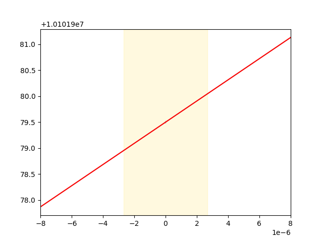
## New Eq:
((fabs(membrane__v) < 2.6712338705498262e-6) ? ((0.5 + 187179.41753901311 * membrane__v) * (2.6712338705498262e-6 * pow(physical_constants__F, 2) * (-0.75 * extracellular__ko + 0.75 * intracellular_ions__kss * exp(2.6712338705498262e-6 * physical_constants__F / (physical_constants__R * physical_constants__T))) / ((-1.0 + exp(2.6712338705498262e-6 * physical_constants__F / (physical_constants__R * physical_constants__T))) * physical_constants__R * physical_constants__T) + 2.6712338705498262e-6 * pow(physical_constants__F, 2) * (-0.75 * extracellular__ko + 0.75 * intracellular_ions__kss * exp(-2.6712338705498262e-6 * physical_constants__F / (physical_constants__R * physical_constants__T))) / ((-1.0 + exp(-2.6712338705498262e-6 * physical_constants__F / (physical_constants__R * physical_constants__T))) * physical_constants__R * physical_constants__T)) - 2.6712338705498262e-6 * pow(physical_constants__F, 2) * (-0.75 * extracellular__ko + 0.75 * intracellular_ions__kss * exp(-2.6712338705498262e-6 * physical_constants__F / (physical_constants__R * physical_constants__T))) / ((-1.0 + exp(-2.6712338705498262e-6 * physical_constants__F / (physical_constants__R * physical_constants__T))) * physical_constants__R * physical_constants__T)) : ((-0.75 * extracellular__ko + 0.75 * intracellular_ions__kss * exp(membrane__vfrt)) * membrane__vffrt / (-1.0 + exp(membrane__vfrt))))

## Equation 2:
```
ICaL__PhiCaL = 4.0 * (-0.34100000000000003 * extracellular__cao + intracellular_ions__cass * exp(2.0 * membrane__vfrt)) * membrane__vffrt / (-1.0 + exp(2.0 * membrane__vfrt))
```
### Partially evaluated to: 
```
ICaL__PhiCaL = 4.0 * pow(physical_constants__F, 2) * (-0.34100000000000003 * extracellular__cao + intracellular_ions__cass * exp(2.0 * membrane__v * physical_constants__F / (physical_constants__R * physical_constants__T))) * membrane__v / ((-1.0 + exp(2.0 * membrane__v * physical_constants__F / (physical_constants__R * physical_constants__T))) * physical_constants__R * physical_constants__T)
```
### Singulariy points detected:

{0}
#### float * A

####Failed to find U symbolically!

<class 'sympy.core.mul.Mul'>
_physical_constants$F**2*_membrane$v*(-0.34100000000000003*_extracellular$cao + _intracellular_ions$cass*exp(2.0*_membrane$v*_physical_constants$F/(_physical_constants$R*_physical_constants$T)))/(_physical_constants$R*_physical_constants$T*(exp(2.0*_membrane$v*_physical_constants$F/(_physical_constants$R*_physical_constants$T)) - 1.0))

*try substituting parameters*

*U*
`0.074871767015605231 * membrane__v`

*V for 1e-07 range* 
`-1.3356169352749131e-6 - 1.3356169352749131e-6`

*Singularity point: 0*


## New Eq:
((fabs(membrane__v) < 1.3356169352749131e-6) ? ((0.5 + 374358.83507802623 * membrane__v) * (5.3424677410996524e-6 * pow(physical_constants__F, 2) * (-0.34100000000000003 * extracellular__cao + intracellular_ions__cass * exp(2.6712338705498262e-6 * physical_constants__F / (physical_constants__R * physical_constants__T))) / ((-1.0 + exp(2.6712338705498262e-6 * physical_constants__F / (physical_constants__R * physical_constants__T))) * physical_constants__R * physical_constants__T) + 5.3424677410996524e-6 * pow(physical_constants__F, 2) * (-0.34100000000000003 * extracellular__cao + intracellular_ions__cass * exp(-2.6712338705498262e-6 * physical_constants__F / (physical_constants__R * physical_constants__T))) / ((-1.0 + exp(-2.6712338705498262e-6 * physical_constants__F / (physical_constants__R * physical_constants__T))) * physical_constants__R * physical_constants__T)) - 5.3424677410996524e-6 * pow(physical_constants__F, 2) * (-0.34100000000000003 * extracellular__cao + intracellular_ions__cass * exp(-2.6712338705498262e-6 * physical_constants__F / (physical_constants__R * physical_constants__T))) / ((-1.0 + exp(-2.6712338705498262e-6 * physical_constants__F / (physical_constants__R * physical_constants__T))) * physical_constants__R * physical_constants__T)) : (4.0 * (-0.34100000000000003 * extracellular__cao + intracellular_ions__cass * exp(2.0 * membrane__vfrt)) * membrane__vffrt / (-1.0 + exp(2.0 * membrane__vfrt))))

## Equation 3:
```
ICaL__PhiCaNa = (-0.75 * extracellular__nao + 0.75 * intracellular_ions__nass * exp(membrane__vfrt)) * membrane__vffrt / (-1.0 + exp(membrane__vfrt))
```
### Partially evaluated to: 
```
ICaL__PhiCaNa = pow(physical_constants__F, 2) * (-0.75 * extracellular__nao + 0.75 * intracellular_ions__nass * exp(membrane__v * physical_constants__F / (physical_constants__R * physical_constants__T))) * membrane__v / ((-1.0 + exp(membrane__v * physical_constants__F / (physical_constants__R * physical_constants__T))) * physical_constants__R * physical_constants__T)
```
### Singulariy points detected:

{0}
#### float * A

####Failed to find U symbolically!

<class 'sympy.core.mul.Mul'>
_physical_constants$F**2*_membrane$v*(-0.75*_extracellular$nao + 0.75*_intracellular_ions$nass*exp(1.0*_membrane$v*_physical_constants$F/(_physical_constants$R*_physical_constants$T)))/(_physical_constants$R*_physical_constants$T*(exp(1.0*_membrane$v*_physical_constants$F/(_physical_constants$R*_physical_constants$T)) - 1.0))

*try substituting parameters*

*U*
`0.037435883507802616 * membrane__v`

*V for 1e-07 range* 
`-2.6712338705498262e-6 - 2.6712338705498262e-6`

*Singularity point: 0*

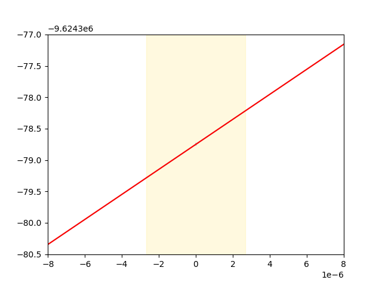
## New Eq:
((fabs(membrane__v) < 2.6712338705498262e-6) ? ((0.5 + 187179.41753901311 * membrane__v) * (2.6712338705498262e-6 * pow(physical_constants__F, 2) * (-0.75 * extracellular__nao + 0.75 * intracellular_ions__nass * exp(2.6712338705498262e-6 * physical_constants__F / (physical_constants__R * physical_constants__T))) / ((-1.0 + exp(2.6712338705498262e-6 * physical_constants__F / (physical_constants__R * physical_constants__T))) * physical_constants__R * physical_constants__T) + 2.6712338705498262e-6 * pow(physical_constants__F, 2) * (-0.75 * extracellular__nao + 0.75 * intracellular_ions__nass * exp(-2.6712338705498262e-6 * physical_constants__F / (physical_constants__R * physical_constants__T))) / ((-1.0 + exp(-2.6712338705498262e-6 * physical_constants__F / (physical_constants__R * physical_constants__T))) * physical_constants__R * physical_constants__T)) - 2.6712338705498262e-6 * pow(physical_constants__F, 2) * (-0.75 * extracellular__nao + 0.75 * intracellular_ions__nass * exp(-2.6712338705498262e-6 * physical_constants__F / (physical_constants__R * physical_constants__T))) / ((-1.0 + exp(-2.6712338705498262e-6 * physical_constants__F / (physical_constants__R * physical_constants__T))) * physical_constants__R * physical_constants__T)) : ((-0.75 * extracellular__nao + 0.75 * intracellular_ions__nass * exp(membrane__vfrt)) * membrane__vffrt / (-1.0 + exp(membrane__vfrt))))

## Equation 4:
```
ICab__ICab = 4.0 * (-0.34100000000000003 * extracellular__cao + intracellular_ions__cai * exp(2.0 * membrane__vfrt)) * ICab__PCab * membrane__vffrt / (-1.0 + exp(2.0 * membrane__vfrt))
```
### Partially evaluated to: 
```
ICab__ICab = 4.0 * pow(physical_constants__F, 2) * (-0.34100000000000003 * extracellular__cao + intracellular_ions__cai * exp(2.0 * membrane__v * physical_constants__F / (physical_constants__R * physical_constants__T))) * ICab__PCab * membrane__v / ((-1.0 + exp(2.0 * membrane__v * physical_constants__F / (physical_constants__R * physical_constants__T))) * physical_constants__R * physical_constants__T)
```
### Singulariy points detected:

{0}
#### float * A

####Failed to find U symbolically!

<class 'sympy.core.mul.Mul'>
_physical_constants$F**2*_ICab$PCab*_membrane$v*(-0.34100000000000003*_extracellular$cao + _intracellular_ions$cai*exp(2.0*_membrane$v*_physical_constants$F/(_physical_constants$R*_physical_constants$T)))/(_physical_constants$R*_physical_constants$T*(exp(2.0*_membrane$v*_physical_constants$F/(_physical_constants$R*_physical_constants$T)) - 1.0))

*try substituting parameters*

*U*
`0.074871767015605231 * membrane__v`

*V for 1e-07 range* 
`-1.3356169352749131e-6 - 1.3356169352749131e-6`

*Singularity point: 0*


## New Eq:
((fabs(membrane__v) < 1.3356169352749131e-6) ? ((0.5 + 374358.83507802623 * membrane__v) * (5.3424677410996524e-6 * pow(physical_constants__F, 2) * (-0.34100000000000003 * extracellular__cao + intracellular_ions__cai * exp(2.6712338705498262e-6 * physical_constants__F / (physical_constants__R * physical_constants__T))) * ICab__PCab / ((-1.0 + exp(2.6712338705498262e-6 * physical_constants__F / (physical_constants__R * physical_constants__T))) * physical_constants__R * physical_constants__T) + 5.3424677410996524e-6 * pow(physical_constants__F, 2) * (-0.34100000000000003 * extracellular__cao + intracellular_ions__cai * exp(-2.6712338705498262e-6 * physical_constants__F / (physical_constants__R * physical_constants__T))) * ICab__PCab / ((-1.0 + exp(-2.6712338705498262e-6 * physical_constants__F / (physical_constants__R * physical_constants__T))) * physical_constants__R * physical_constants__T)) - 5.3424677410996524e-6 * pow(physical_constants__F, 2) * (-0.34100000000000003 * extracellular__cao + intracellular_ions__cai * exp(-2.6712338705498262e-6 * physical_constants__F / (physical_constants__R * physical_constants__T))) * ICab__PCab / ((-1.0 + exp(-2.6712338705498262e-6 * physical_constants__F / (physical_constants__R * physical_constants__T))) * physical_constants__R * physical_constants__T)) : (4.0 * (-0.34100000000000003 * extracellular__cao + intracellular_ions__cai * exp(2.0 * membrane__vfrt)) * ICab__PCab * membrane__vffrt / (-1.0 + exp(2.0 * membrane__vfrt))))

## Equation 5:
```
INab__INab = (-extracellular__nao + intracellular_ions__nai * exp(membrane__vfrt)) * INab__PNab * membrane__vffrt / (-1.0 + exp(membrane__vfrt))
```
### Partially evaluated to: 
```
INab__INab = 3.75e-10 * pow(physical_constants__F, 2) * (-extracellular__nao + intracellular_ions__nai * exp(membrane__v * physical_constants__F / (physical_constants__R * physical_constants__T))) * membrane__v / ((-1.0 + exp(membrane__v * physical_constants__F / (physical_constants__R * physical_constants__T))) * physical_constants__R * physical_constants__T)
```
### Singulariy points detected:

{0}
#### float * A

####Failed to find U symbolically!

<class 'sympy.core.mul.Mul'>
_physical_constants$F**2*_membrane$v*(-_extracellular$nao + _intracellular_ions$nai*exp(_membrane$v*_physical_constants$F/(_physical_constants$R*_physical_constants$T)))/(_physical_constants$R*_physical_constants$T*(exp(_membrane$v*_physical_constants$F/(_physical_constants$R*_physical_constants$T)) - 1.0))

*try substituting parameters*

*U*
`0.037435883507802616 * membrane__v`

*V for 1e-07 range* 
`-2.6712338705498262e-6 - 2.6712338705498262e-6`

*Singularity point: 0*

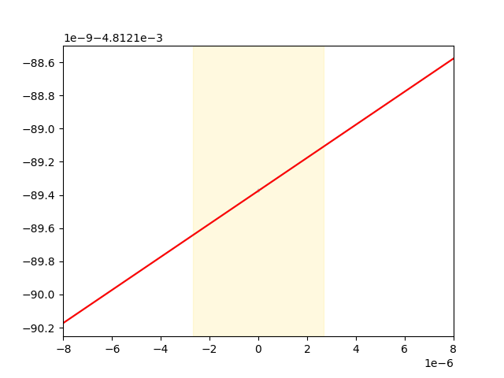
## New Eq:
((fabs(membrane__v) < 2.6712338705498262e-6) ? ((0.5 + 187179.41753901311 * membrane__v) * (1.0017127014561849e-15 * pow(physical_constants__F, 2) * (-extracellular__nao + intracellular_ions__nai * exp(2.6712338705498262e-6 * physical_constants__F / (physical_constants__R * physical_constants__T))) / ((-1.0 + exp(2.6712338705498262e-6 * physical_constants__F / (physical_constants__R * physical_constants__T))) * physical_constants__R * physical_constants__T) + 1.0017127014561849e-15 * pow(physical_constants__F, 2) * (-extracellular__nao + intracellular_ions__nai * exp(-2.6712338705498262e-6 * physical_constants__F / (physical_constants__R * physical_constants__T))) / ((-1.0 + exp(-2.6712338705498262e-6 * physical_constants__F / (physical_constants__R * physical_constants__T))) * physical_constants__R * physical_constants__T)) - 1.0017127014561849e-15 * pow(physical_constants__F, 2) * (-extracellular__nao + intracellular_ions__nai * exp(-2.6712338705498262e-6 * physical_constants__F / (physical_constants__R * physical_constants__T))) / ((-1.0 + exp(-2.6712338705498262e-6 * physical_constants__F / (physical_constants__R * physical_constants__T))) * physical_constants__R * physical_constants__T)) : ((-extracellular__nao + intracellular_ions__nai * exp(membrane__vfrt)) * INab__PNab * membrane__vffrt / (-1.0 + exp(membrane__vfrt))))

ryr__Jrel_inf = ((environment__celltype == 2.0) ? (1.7 * ryr__Jrel_inf_temp) : (ryr__Jrel_inf_temp))

####Piecewise!!

ryr__Jrel_infp = ((environment__celltype == 2.0) ? (1.7 * ryr__Jrel_temp) : (ryr__Jrel_temp))

####Piecewise!!

ryr__tau_rel = ((ryr__tau_rel_temp < 0.001) ? (0.001) : (ryr__tau_rel_temp))

####Piecewise!!

ryr__tau_relp = ((ryr__tau_relp_temp < 0.001) ? (0.001) : (ryr__tau_relp_temp))

####Piecewise!!

# Model: ohara_rudy_cipa_v1_2017(ohara_rudy_cipa_v1_2017.cellml)
ICaL__PCa = ((environment__celltype == 1.0) ? (1.2 * ICaL__PCa_b) : ((environment__celltype == 2.0) ? (2.5 * ICaL__PCa_b) : (ICaL__PCa_b)))

####Piecewise!!

IK1__GK1 = ((environment__celltype == 1.0) ? (1.2 * IK1__GK1_b) : ((environment__celltype == 2.0) ? (1.3 * IK1__GK1_b) : (IK1__GK1_b)))

####Piecewise!!

IKb__GKb = ((environment__celltype == 1.0) ? (0.59999999999999998 * IKb__GKb_b) : (IKb__GKb_b))

####Piecewise!!

IKr__GKr = ((environment__celltype == 1.0) ? (1.3 * IKr__GKr_b) : ((environment__celltype == 2.0) ? (0.80000000000000004 * IKr__GKr_b) : (IKr__GKr_b)))

####Piecewise!!

IKs__GKs = ((environment__celltype == 1.0) ? (1.3999999999999999 * IKs__GKs_b) : (IKs__GKs_b))

####Piecewise!!

INaCa_i__Gncx = ((environment__celltype == 1.0) ? (1.1000000000000001 * INaCa_i__Gncx_b) : ((environment__celltype == 2.0) ? (1.3999999999999999 * INaCa_i__Gncx_b) : (INaCa_i__Gncx_b)))

####Piecewise!!

INaK__Pnak = ((environment__celltype == 1.0) ? (0.90000000000000002 * INaK__Pnak_b) : ((environment__celltype == 2.0) ? (0.69999999999999996 * INaK__Pnak_b) : (INaK__Pnak_b)))

####Piecewise!!

INaL__GNaL = ((environment__celltype == 1.0) ? (0.59999999999999998 * INaL__GNaL_b) : (INaL__GNaL_b))

####Piecewise!!

Ito__Gto = (((environment__celltype == 1.0) || (environment__celltype == 2.0)) ? (4.0 * Ito__Gto_b) : (Ito__Gto_b))

####Piecewise!!

SERCA__upScale = ((environment__celltype == 1.0) ? (1.3) : (1.0))

####Piecewise!!

intracellular_ions__cmdnmax = ((environment__celltype == 1.0) ? (1.3 * intracellular_ions__cmdnmax_b) : (intracellular_ions__cmdnmax_b))

####Piecewise!!

Ito__delta_epi = ((environment__celltype == 1.0) ? (1.0 - 0.94999999999999996 / (1.0 + exp(14.0 + 0.20000000000000001 * membrane__v))) : (1.0))

####Piecewise!!

ICaL__PhiCaK = (((ICaL__U_3 >= -9.9999999999999995e-8) && (ICaL__U_3 <= 9.9999999999999995e-8)) ? ((1.0 - 0.5 * ICaL__U_3) * ICaL__A_3) : (ICaL__A_3 * ICaL__U_3 / (-1.0 + exp(ICaL__U_3))))

####Piecewise!!

ICaL__PhiCaL = (((ICaL__U_1 >= -9.9999999999999995e-8) && (ICaL__U_1 <= 9.9999999999999995e-8)) ? ((1.0 - 0.5 * ICaL__U_1) * ICaL__A_1) : (ICaL__A_1 * ICaL__U_1 / (-1.0 + exp(ICaL__U_1))))

####Piecewise!!

ICaL__PhiCaNa = (((ICaL__U_2 >= -9.9999999999999995e-8) && (ICaL__U_2 <= 9.9999999999999995e-8)) ? ((1.0 - 0.5 * ICaL__U_2) * ICaL__A_2) : (ICaL__A_2 * ICaL__U_2 / (-1.0 + exp(ICaL__U_2))))

####Piecewise!!

ICab__ICab = (((ICab__U >= -9.9999999999999995e-8) && (ICab__U <= 9.9999999999999995e-8)) ? ((1.0 - 0.5 * ICab__U) * ICab__A) : (ICab__A * ICab__U / (-1.0 + exp(ICab__U))))

####Piecewise!!

INab__INab = (((INab__U >= -9.9999999999999995e-8) && (INab__U <= 9.9999999999999995e-8)) ? ((1.0 - 0.5 * INab__U) * INab__A) : (INab__A * INab__U / (-1.0 + exp(INab__U))))

####Piecewise!!

ryr__Jrel_inf = ((environment__celltype == 2.0) ? (1.7 * ryr__Jrel_inf_temp) : (ryr__Jrel_inf_temp))

####Piecewise!!

ryr__Jrel_infp = ((environment__celltype == 2.0) ? (1.7 * ryr__Jrel_temp) : (ryr__Jrel_temp))

####Piecewise!!

ryr__tau_rel = ((ryr__tau_rel_temp < 0.001) ? (0.001) : (ryr__tau_rel_temp))

####Piecewise!!

ryr__tau_relp = ((ryr__tau_relp_temp < 0.001) ? (0.001) : (ryr__tau_relp_temp))

####Piecewise!!

# Model: paci_hyttinen_aaltosetala_severi_atrialVersion(paci_hyttinen_aaltosetala_severi_atrialVersion.cellml)
calcium_dynamics__g_inf = ((calcium_dynamics__Cai <= 0.00035) ? (1 / (1.0 + 5.439910241481016e+20 * pow(calcium_dynamics__Cai, 6))) : (1 / (1.0 + 1.9720198874049176e+55 * pow(calcium_dynamics__Cai, 16))))

####Piecewise!!

calcium_dynamics__const2 = (((Membrane__Vm > -0.059999999999999998) && (calcium_dynamics__g < calcium_dynamics__g_inf)) ? (0) : (1.0))

####Piecewise!!

i_CaL_f1_gate__constf1 = ((-i_CaL_f1_gate__f1_inf + i_CaL_f1_gate__f1 < 0) ? (0.92835000000000001 + 1433.0 * calcium_dynamics__Cai) : (1.0))

####Piecewise!!

i_CaL_fCa_gate__constfCa = (((Membrane__Vm > -0.059999999999999998) && (i_CaL_fCa_gate__fCa < i_CaL_fCa_gate__fCa_inf)) ? (0) : (1.0))

####Piecewise!!

i_Na_h_gate__alpha_h = ((Membrane__Vm < -0.040000000000000001) ? (0.057000000000000002 * exp(-11.764705882352942 - 147.05882352941177 * Membrane__Vm)) : (0))

####Piecewise!!

i_Na_h_gate__beta_h = ((Membrane__Vm < -0.040000000000000001) ? (2.7000000000000002 * exp(79.0 * Membrane__Vm) + 310000.0 * exp(348.5 * Membrane__Vm)) : (5.9230769230769234 / (1.0 + exp(-0.96036036036036043 - 90.090090090090087 * Membrane__Vm))))

####Piecewise!!

i_Na_h_gate__tau_h = ((Membrane__Vm < -0.040000000000000001) ? (0.0015 / (i_Na_h_gate__alpha_h + i_Na_h_gate__beta_h)) : (0.002542))

####Piecewise!!

i_Na_j_gate__alpha_j = ((Membrane__Vm < -0.040000000000000001) ? ((37.780000000000001 + 1000.0 * Membrane__Vm) * (-25428.0 * exp(244.40000000000001 * Membrane__Vm) - 6.9480000000000002e-6 * exp(-43.909999999999997 * Membrane__Vm)) / (1.0 + exp(24.640530000000002 + 311.0 * Membrane__Vm))) : (0))

####Piecewise!!

i_Na_j_gate__beta_j = ((Membrane__Vm < -0.040000000000000001) ? (0.024240000000000001 * exp(-10.52 * Membrane__Vm) / (1.0 + exp(-5.5312920000000005 - 137.80000000000001 * Membrane__Vm))) : (0.59999999999999998 * exp(57.0 * Membrane__Vm) / (1.0 + exp(-3.2000000000000002 - 100.0 * Membrane__Vm))))

####Piecewise!!

## Equation 1:
```
i_CaL__i_CaL = 4.0 * pow(model_parameters__F, 2) * (-0.34100000000000003 * model_parameters__Cao + calcium_dynamics__Cai * exp(2.0 * Membrane__Vm * model_parameters__F / (model_parameters__R * model_parameters__T))) * Membrane__Vm * i_CaL__g_CaL * i_CaL_d_gate__d * i_CaL_f1_gate__f1 * i_CaL_f2_gate__f2 * i_CaL_fCa_gate__fCa / ((-1.0 + exp(2.0 * Membrane__Vm * model_parameters__F / (model_parameters__R * model_parameters__T))) * model_parameters__R * model_parameters__T)
```
### Partially evaluated to: 
```
i_CaL__i_CaL = 4478658.9572358271 * (-0.34100000000000003 * model_parameters__Cao + calcium_dynamics__Cai * exp(23.209012310102192 * Membrane__Vm_converted / model_parameters__T)) * Membrane__Vm_converted * i_CaL__g_CaL * i_CaL_d_gate__d * i_CaL_f1_gate__f1 * i_CaL_f2_gate__f2 * i_CaL_fCa_gate__fCa / ((-1.0 + exp(23.209012310102192 * Membrane__Vm_converted / model_parameters__T)) * model_parameters__T)
```
### Singulariy points detected:

{0}
#### float * A

####Failed to find U symbolically!

<class 'sympy.core.mul.Mul'>
_Membrane$Vm_converted*_i_CaL$g_CaL*_i_CaL_d_gate$d*_i_CaL_f1_gate$f1*_i_CaL_f2_gate$f2*_i_CaL_fCa_gate$fCa*(_calcium_dynamics$Cai*exp(23.209012310102191*_Membrane$Vm_converted/_model_parameters$T) - 0.34100000000000003*_model_parameters$Cao)/(_model_parameters$T*(exp(23.209012310102191*_Membrane$Vm_converted/_model_parameters$T) - 1.0))

*try substituting parameters*

*U*
`0.074867781645490933 * Membrane__Vm_converted`

*V for 1e-07 range* 
`-1.3356880329847825e-6 - 1.3356880329847825e-6`

*Singularity point: 0*


## New Eq:
((fabs(Membrane__Vm_converted) < 1.3356880329847825e-6) ? ((0.5 + 374338.9082274547 * Membrane__Vm_converted) * (5.9820911729999997 * (-0.34100000000000003 * model_parameters__Cao + calcium_dynamics__Cai * exp(3.1000000000000001e-5 / model_parameters__T)) * i_CaL__g_CaL * i_CaL_d_gate__d * i_CaL_f1_gate__f1 * i_CaL_f2_gate__f2 * i_CaL_fCa_gate__fCa / ((-1.0 + exp(3.1000000000000001e-5 / model_parameters__T)) * model_parameters__T) + 5.9820911729999997 * (-0.34100000000000003 * model_parameters__Cao + calcium_dynamics__Cai * exp(-3.1000000000000001e-5 / model_parameters__T)) * i_CaL__g_CaL * i_CaL_d_gate__d * i_CaL_f1_gate__f1 * i_CaL_f2_gate__f2 * i_CaL_fCa_gate__fCa / ((-1.0 + exp(-3.1000000000000001e-5 / model_parameters__T)) * model_parameters__T)) - 5.9820911729999997 * (-0.34100000000000003 * model_parameters__Cao + calcium_dynamics__Cai * exp(-3.1000000000000001e-5 / model_parameters__T)) * i_CaL__g_CaL * i_CaL_d_gate__d * i_CaL_f1_gate__f1 * i_CaL_f2_gate__f2 * i_CaL_fCa_gate__fCa / ((-1.0 + exp(-3.1000000000000001e-5 / model_parameters__T)) * model_parameters__T)) : (4.0 * pow(model_parameters__F, 2) * (-0.34100000000000003 * model_parameters__Cao + calcium_dynamics__Cai * exp(2.0 * Membrane__Vm * model_parameters__F / (model_parameters__R * model_parameters__T))) * Membrane__Vm * i_CaL__g_CaL * i_CaL_d_gate__d * i_CaL_f1_gate__f1 * i_CaL_f2_gate__f2 * i_CaL_fCa_gate__fCa / ((-1.0 + exp(2.0 * Membrane__Vm * model_parameters__F / (model_parameters__R * model_parameters__T))) * model_parameters__R * model_parameters__T)))

# Model: paci_hyttinen_aaltosetala_severi_ventricularVersion(paci_hyttinen_aaltosetala_severi_ventricularVersion.cellml)
calcium_dynamics__g_inf = ((calcium_dynamics__Cai <= 0.00035) ? (1 / (1.0 + 5.439910241481016e+20 * pow(calcium_dynamics__Cai, 6))) : (1 / (1.0 + 1.9720198874049176e+55 * pow(calcium_dynamics__Cai, 16))))

####Piecewise!!

calcium_dynamics__const2 = (((Membrane__Vm > -0.059999999999999998) && (calcium_dynamics__g < calcium_dynamics__g_inf)) ? (0) : (1.0))

####Piecewise!!

i_CaL_f1_gate__constf1 = ((-i_CaL_f1_gate__f1_inf + i_CaL_f1_gate__f1 < 0) ? (0.92835000000000001 + 1433.0 * calcium_dynamics__Cai) : (1.0))

####Piecewise!!

i_CaL_fCa_gate__constfCa = (((Membrane__Vm > -0.059999999999999998) && (i_CaL_fCa_gate__fCa < i_CaL_fCa_gate__fCa_inf)) ? (0) : (1.0))

####Piecewise!!

i_Kr__E4031_coeff = ((current_blockers__E4031_30nM == 1.0) ? (0.77000000000000002) : ((current_blockers__E4031_100nM == 1.0) ? (0.5) : (1.0)))

####Piecewise!!

i_Ks__Chromanol_coeff = ((current_blockers__Chromanol_iKs30 == 1.0) ? (0.69999999999999996) : ((current_blockers__Chromanol_iKs50 == 1.0) ? (0.5) : ((current_blockers__Chromanol_iKs70 == 1.0) ? (0.29999999999999999) : ((current_blockers__Chromanol_iKs90 == 1.0) ? (0.10000000000000001) : (1.0)))))

####Piecewise!!

i_Na__TTX_coeff = ((current_blockers__TTX_3uM == 1.0) ? (0.17999999999999999) : ((current_blockers__TTX_10uM == 1.0) ? (0.059999999999999998) : ((current_blockers__TTX_30uM == 1.0) ? (0.02) : (1.0))))

####Piecewise!!

i_Na_h_gate__alpha_h = ((Membrane__Vm < -0.040000000000000001) ? (0.057000000000000002 * exp(-11.764705882352942 - 147.05882352941177 * Membrane__Vm)) : (0))

####Piecewise!!

i_Na_h_gate__beta_h = ((Membrane__Vm < -0.040000000000000001) ? (2.7000000000000002 * exp(79.0 * Membrane__Vm) + 310000.0 * exp(348.5 * Membrane__Vm)) : (5.9230769230769234 / (1.0 + exp(-0.96036036036036043 - 90.090090090090087 * Membrane__Vm))))

####Piecewise!!

i_Na_h_gate__tau_h = ((Membrane__Vm < -0.040000000000000001) ? (0.0015 / (i_Na_h_gate__alpha_h + i_Na_h_gate__beta_h)) : (0.002542))

####Piecewise!!

i_Na_j_gate__alpha_j = ((Membrane__Vm < -0.040000000000000001) ? ((37.780000000000001 + 1000.0 * Membrane__Vm) * (-25428.0 * exp(244.40000000000001 * Membrane__Vm) - 6.9480000000000002e-6 * exp(-43.909999999999997 * Membrane__Vm)) / (1.0 + exp(24.640530000000002 + 311.0 * Membrane__Vm))) : (0))

####Piecewise!!

i_Na_j_gate__beta_j = ((Membrane__Vm < -0.040000000000000001) ? (0.024240000000000001 * exp(-10.52 * Membrane__Vm) / (1.0 + exp(-5.5312920000000005 - 137.80000000000001 * Membrane__Vm))) : (0.59999999999999998 * exp(57.0 * Membrane__Vm) / (1.0 + exp(-3.2000000000000002 - 100.0 * Membrane__Vm))))

####Piecewise!!

## Equation 1:
```
i_CaL__i_CaL = 4.0 * pow(model_parameters__F, 2) * (-0.34100000000000003 * model_parameters__Cao + calcium_dynamics__Cai * exp(2.0 * Membrane__Vm * model_parameters__F / (model_parameters__R * model_parameters__T))) * Membrane__Vm * i_CaL__g_CaL * i_CaL_d_gate__d * i_CaL_f1_gate__f1 * i_CaL_f2_gate__f2 * i_CaL_fCa_gate__fCa / ((-1.0 + exp(2.0 * Membrane__Vm * model_parameters__F / (model_parameters__R * model_parameters__T))) * model_parameters__R * model_parameters__T)
```
### Partially evaluated to: 
```
i_CaL__i_CaL = 4478658.9572358271 * (-0.34100000000000003 * model_parameters__Cao + calcium_dynamics__Cai * exp(23.209012310102192 * Membrane__Vm_converted / model_parameters__T)) * Membrane__Vm_converted * i_CaL__g_CaL * i_CaL_d_gate__d * i_CaL_f1_gate__f1 * i_CaL_f2_gate__f2 * i_CaL_fCa_gate__fCa / ((-1.0 + exp(23.209012310102192 * Membrane__Vm_converted / model_parameters__T)) * model_parameters__T)
```
### Singulariy points detected:

{0}
#### float * A

####Failed to find U symbolically!

<class 'sympy.core.mul.Mul'>
_Membrane$Vm_converted*_i_CaL$g_CaL*_i_CaL_d_gate$d*_i_CaL_f1_gate$f1*_i_CaL_f2_gate$f2*_i_CaL_fCa_gate$fCa*(_calcium_dynamics$Cai*exp(23.209012310102191*_Membrane$Vm_converted/_model_parameters$T) - 0.34100000000000003*_model_parameters$Cao)/(_model_parameters$T*(exp(23.209012310102191*_Membrane$Vm_converted/_model_parameters$T) - 1.0))

*try substituting parameters*

*U*
`0.074867781645490933 * Membrane__Vm_converted`

*V for 1e-07 range* 
`-1.3356880329847825e-6 - 1.3356880329847825e-6`

*Singularity point: 0*


## New Eq:
((fabs(Membrane__Vm_converted) < 1.3356880329847825e-6) ? ((0.5 + 374338.9082274547 * Membrane__Vm_converted) * (5.9820911729999997 * (-0.34100000000000003 * model_parameters__Cao + calcium_dynamics__Cai * exp(3.1000000000000001e-5 / model_parameters__T)) * i_CaL__g_CaL * i_CaL_d_gate__d * i_CaL_f1_gate__f1 * i_CaL_f2_gate__f2 * i_CaL_fCa_gate__fCa / ((-1.0 + exp(3.1000000000000001e-5 / model_parameters__T)) * model_parameters__T) + 5.9820911729999997 * (-0.34100000000000003 * model_parameters__Cao + calcium_dynamics__Cai * exp(-3.1000000000000001e-5 / model_parameters__T)) * i_CaL__g_CaL * i_CaL_d_gate__d * i_CaL_f1_gate__f1 * i_CaL_f2_gate__f2 * i_CaL_fCa_gate__fCa / ((-1.0 + exp(-3.1000000000000001e-5 / model_parameters__T)) * model_parameters__T)) - 5.9820911729999997 * (-0.34100000000000003 * model_parameters__Cao + calcium_dynamics__Cai * exp(-3.1000000000000001e-5 / model_parameters__T)) * i_CaL__g_CaL * i_CaL_d_gate__d * i_CaL_f1_gate__f1 * i_CaL_f2_gate__f2 * i_CaL_fCa_gate__fCa / ((-1.0 + exp(-3.1000000000000001e-5 / model_parameters__T)) * model_parameters__T)) : (4.0 * pow(model_parameters__F, 2) * (-0.34100000000000003 * model_parameters__Cao + calcium_dynamics__Cai * exp(2.0 * Membrane__Vm * model_parameters__F / (model_parameters__R * model_parameters__T))) * Membrane__Vm * i_CaL__g_CaL * i_CaL_d_gate__d * i_CaL_f1_gate__f1 * i_CaL_f2_gate__f2 * i_CaL_fCa_gate__fCa / ((-1.0 + exp(2.0 * Membrane__Vm * model_parameters__F / (model_parameters__R * model_parameters__T))) * model_parameters__R * model_parameters__T)))

# Model: pandit_clark_giles_demir_2001_version06_variant01(pandit_clark_giles_demir_2001_endocardial_cell.cellml)
sodium_current_h_gate__tau_h = ((membrane__V >= -40.0) ? (0.00045370000000000002 + 0.00045370000000000002 * exp(-0.96036036036036043 + 0.0900900900900901 * sodium_current__shift_INa_inact - 0.0900900900900901 * membrane__V)) : (0.00349 / (310000.0 * exp(0.34999999999999998 * membrane__V - 0.34999999999999998 * sodium_current__shift_INa_inact) + 0.13500000000000001 * exp(-11.764705882352942 + 0.14705882352941177 * sodium_current__shift_INa_inact - 0.14705882352941177 * membrane__V) + 3.5600000000000001 * exp(0.079000000000000001 * membrane__V - 0.079000000000000001 * sodium_current__shift_INa_inact))))

####Piecewise!!

sodium_current_j_gate__tau_j = ((membrane__V >= -40.0) ? (0.01163 * (1.0 + exp(-3.2000000000000002 + 0.10000000000000001 * sodium_current__shift_INa_inact - 0.10000000000000001 * membrane__V)) / exp(-2.5349999999999999e-7 * membrane__V)) : (0.00349 / (0.1212 * exp(0.01052 * sodium_current__shift_INa_inact - 0.01052 * membrane__V) / (1.0 + exp(-5.5312920000000005 - 0.13780000000000001 * membrane__V)) + (37.780000000000001 + membrane__V) * (-127140.0 * exp(0.24440000000000001 * membrane__V - 0.24440000000000001 * sodium_current__shift_INa_inact) - 3.4740000000000003e-5 * exp(0.043909999999999998 * sodium_current__shift_INa_inact - 0.043909999999999998 * membrane__V)) / (1.0 + exp(24.640530000000002 + 0.311 * membrane__V)))))

####Piecewise!!

## Equation 1:
```
sodium_current_m_gate__tau_m = 0.0013600000000000001 / (0.080000000000000002 * exp(-0.090909090909090912 * membrane__V) + 0.32000000000000001 * (47.130000000000003 + membrane__V) / (1.0 - exp(-4.7130000000000001 - 0.10000000000000001 * membrane__V)))
```
### Partially evaluated to: 
```
sodium_current_m_gate__tau_m = 0.0013600000000000001 / (0.080000000000000002 * exp(-0.090909090909090912 * membrane__V) + 0.32000000000000001 * (47.130000000000003 + membrane__V) / (1.0 - exp(-4.7130000000000001 - 0.10000000000000001 * membrane__V)))
```
### Singulariy points detected:

{-47.130000000000003}
#### float * A

####1 / A


####A + B:

`0.080000000000000002 * exp(-0.090909090909090912 * membrane__V)`
`0.32000000000000001 * (47.130000000000003 + membrane__V) / (1.0 - 0.00897780373069724 * exp(-0.10000000000000001 * membrane__V))`

*U*
`-4.7130000000000001 - 0.10000000000000001 * membrane__V`

*V for 1e-07 range* 
`-47.129999000000005 - -47.130001`

*Singularity point: -47.130000000000003*

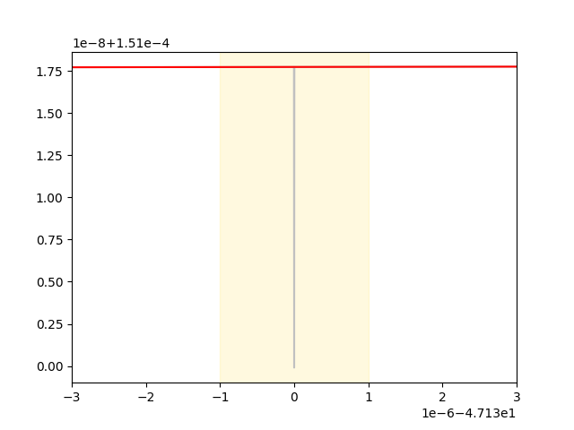
## New Eq:
((fabs(47.130000000000003 + membrane__V) < 1.0000000000287557e-6) ? (0.0013600000000000001 / (0.080000000000000002 * exp(4.2845453636363642) + 3.200000000092018e-7 / (1.0 - exp(-1.0000000000287557e-7))) + (-23564999.499322373 - 499999.99998562218 * membrane__V) * (0.0013600000000000001 / (0.080000000000000002 * exp(4.284545545454546) - 3.200000000092018e-7 / (1.0 - exp(1.0000000000287557e-7))) - 0.0013600000000000001 / (0.080000000000000002 * exp(4.2845453636363642) + 3.200000000092018e-7 / (1.0 - exp(-1.0000000000287557e-7))))) : (0.0013600000000000001 / (0.080000000000000002 * exp(-0.090909090909090912 * membrane__V) + 0.32000000000000001 * (47.130000000000003 + membrane__V) / (1.0 - exp(-4.7130000000000001 - 0.10000000000000001 * membrane__V)))))

Singularities cannot be found
0.080000000000000002*_standard_ionic_concentrations$K_o/((_standard_ionic_concentrations$K_o + 1.5)*(31.622776601683793*(1/_intracellular_ion_concentrations$Na_i)**1.5 + 1.0)*(0.036499999999999998*(0.14285714285714286*exp(0.014858841010401189*_standard_ionic_concentrations$Na_o) - 0.14285714285714286)*exp(-0.039337852699643567*_membrane$V) + 1.0 + 0.1245*exp(-0.0039337852699643569*_membrane$V)))

# Model: pandit_clark_giles_demir_2001(pandit_clark_giles_demir_2001_epicardial_cell.cellml)
sodium_current_h_gate__tau_h = ((membrane__V >= -40.0) ? (0.00045370000000000002 + 0.00045370000000000002 * exp(-0.96036036036036043 + 0.0900900900900901 * sodium_current__shift_INa_inact - 0.0900900900900901 * membrane__V)) : (0.00349 / (310000.0 * exp(0.34999999999999998 * membrane__V - 0.34999999999999998 * sodium_current__shift_INa_inact) + 0.13500000000000001 * exp(-11.764705882352942 + 0.14705882352941177 * sodium_current__shift_INa_inact - 0.14705882352941177 * membrane__V) + 3.5600000000000001 * exp(0.079000000000000001 * membrane__V - 0.079000000000000001 * sodium_current__shift_INa_inact))))

####Piecewise!!

sodium_current_j_gate__tau_j = ((membrane__V >= -40.0) ? (0.01163 * (1.0 + exp(-3.2000000000000002 + 0.10000000000000001 * sodium_current__shift_INa_inact - 0.10000000000000001 * membrane__V)) / exp(-2.5349999999999999e-7 * membrane__V)) : (0.00349 / (0.1212 * exp(0.01052 * sodium_current__shift_INa_inact - 0.01052 * membrane__V) / (1.0 + exp(-5.5312920000000005 - 0.13780000000000001 * membrane__V)) + (37.780000000000001 + membrane__V) * (-127140.0 * exp(0.24440000000000001 * membrane__V - 0.24440000000000001 * sodium_current__shift_INa_inact) - 3.4740000000000003e-5 * exp(0.043909999999999998 * sodium_current__shift_INa_inact - 0.043909999999999998 * membrane__V)) / (1.0 + exp(24.640530000000002 + 0.311 * membrane__V)))))

####Piecewise!!

## Equation 1:
```
sodium_current_m_gate__tau_m = 0.0013600000000000001 / (0.080000000000000002 * exp(-0.090909090909090912 * membrane__V) + 0.32000000000000001 * (47.130000000000003 + membrane__V) / (1.0 - exp(-4.7130000000000001 - 0.10000000000000001 * membrane__V)))
```
### Partially evaluated to: 
```
sodium_current_m_gate__tau_m = 0.0013600000000000001 / (0.080000000000000002 * exp(-0.090909090909090912 * membrane__V) + 0.32000000000000001 * (47.130000000000003 + membrane__V) / (1.0 - exp(-4.7130000000000001 - 0.10000000000000001 * membrane__V)))
```
### Singulariy points detected:

{-47.130000000000003}
#### float * A

####1 / A


####A + B:

`0.080000000000000002 * exp(-0.090909090909090912 * membrane__V)`
`0.32000000000000001 * (47.130000000000003 + membrane__V) / (1.0 - 0.00897780373069724 * exp(-0.10000000000000001 * membrane__V))`

*U*
`-4.7130000000000001 - 0.10000000000000001 * membrane__V`

*V for 1e-07 range* 
`-47.129999000000005 - -47.130001`

*Singularity point: -47.130000000000003*


## New Eq:
((fabs(47.130000000000003 + membrane__V) < 1.0000000000287557e-6) ? (0.0013600000000000001 / (0.080000000000000002 * exp(4.2845453636363642) + 3.200000000092018e-7 / (1.0 - exp(-1.0000000000287557e-7))) + (-23564999.499322373 - 499999.99998562218 * membrane__V) * (0.0013600000000000001 / (0.080000000000000002 * exp(4.284545545454546) - 3.200000000092018e-7 / (1.0 - exp(1.0000000000287557e-7))) - 0.0013600000000000001 / (0.080000000000000002 * exp(4.2845453636363642) + 3.200000000092018e-7 / (1.0 - exp(-1.0000000000287557e-7))))) : (0.0013600000000000001 / (0.080000000000000002 * exp(-0.090909090909090912 * membrane__V) + 0.32000000000000001 * (47.130000000000003 + membrane__V) / (1.0 - exp(-4.7130000000000001 - 0.10000000000000001 * membrane__V)))))

Singularities cannot be found
0.080000000000000002*_standard_ionic_concentrations$K_o/((_standard_ionic_concentrations$K_o + 1.5)*(31.622776601683793*(1/_intracellular_ion_concentrations$Na_i)**1.5 + 1.0)*(0.036499999999999998*(0.14285714285714286*exp(0.014858841010401189*_standard_ionic_concentrations$Na_o) - 0.14285714285714286)*exp(-0.039337852699643567*_membrane$V) + 1.0 + 0.1245*exp(-0.0039337852699643569*_membrane$V)))

# Model: pasek_simurda_christe_2006(pasek_simurda_christe_2006.cellml)
## Equation 1:
```
i_Nas_h_gate__beta_h = 18.77 * (64.400000000000006 + Vms__Vms) / (1.0 - exp(-14.168000000000001 - 0.22 * Vms__Vms))
```
### Partially evaluated to: 
```
i_Nas_h_gate__beta_h = 18.77 * (64.400000000000006 + Vms__Vms) / (1.0 - exp(-14.168000000000001 - 0.22 * Vms__Vms))
```
### Singulariy points detected:

{-64.400000000000006}
*U*
`-14.168000000000001 - 0.22 * Vms__Vms`

*V for 1e-07 range* 
`-64.399999545454548 - -64.400000454545463`

*Singularity point: -64.400000000000006*


## New Eq:
((fabs(64.400000000000006 + Vms__Vms) < 4.5454545455347883e-7) ? (8.5318181809268536e-6 / (1.0 - exp(-1.0000000000287557e-7)) + (-70839999.498749435 - 1099999.9999805812 * Vms__Vms) * (-8.5318181809268536e-6 / (1.0 - exp(-1.0000000000287557e-7)) - 8.531818183010741e-6 / (1.0 - exp(1.0000000000287557e-7)))) : (18.77 * (64.400000000000006 + Vms__Vms) / (1.0 - exp(-14.168000000000001 - 0.22 * Vms__Vms))))

## Equation 2:
```
i_Nas_m_gate__alpha_m = 117.26000000000001 * (59.299999999999997 + Vms__Vms) / (1.0 - exp(-32.615000000000002 - 0.55000000000000004 * Vms__Vms))
```
### Partially evaluated to: 
```
i_Nas_m_gate__alpha_m = 117.26000000000001 * (59.299999999999997 + Vms__Vms) / (1.0 - exp(-32.615000000000002 - 0.55000000000000004 * Vms__Vms))
```
### Singulariy points detected:

{-59.299999999999997}
*U*
`-32.615000000000002 - 0.55000000000000004 * Vms__Vms`

*V for 1e-07 range* 
`-59.299999818181817 - -59.300000181818177`

*Singularity point: -59.299999999999997*

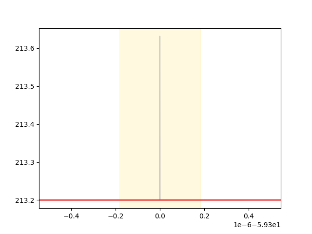
## New Eq:
((fabs(59.299999999999997 + Vms__Vms) < 1.8181818181584042e-7) ? (2.1320000002980068e-5 / (1.0 - exp(-1.0000000000287557e-7)) + (-163074999.50210002 - 2750000.0000354135 * Vms__Vms) * (-2.131999999647083e-5 / (1.0 - exp(1.0000000000287557e-7)) - 2.1320000002980068e-5 / (1.0 - exp(-1.0000000000287557e-7)))) : (117.26000000000001 * (59.299999999999997 + Vms__Vms) / (1.0 - exp(-32.615000000000002 - 0.55000000000000004 * Vms__Vms))))

## Equation 3:
```
i_Cas__i_Cas = 4.0 * pow(model_parameters__F, 2) * (-0.34100000000000003 * model_parameters__Cae + ion_concentrations__Cass * exp(2.0 * Vms__Vms * model_parameters__F / (model_parameters__R * model_parameters__T))) * ((0.10000000000000001 - 0.10000000000000001 * i_Cas__Ccast) * i_Cas__C2 + (0.90000000000000002 + 0.10000000000000001 * i_Cas__Ccast) * i_Cas__C1) * Vms__Vms * i_Cas__Co * membrane_permeabilities__gCas / ((-1.0 + exp(2.0 * Vms__Vms * model_parameters__F / (model_parameters__R * model_parameters__T))) * model_parameters__R * model_parameters__T)
```
### Partially evaluated to: 
```
i_Cas__i_Cas = 4.0 * pow(model_parameters__F, 2) * (-0.34100000000000003 * model_parameters__Cae + ion_concentrations__Cass * exp(2.0 * Vms__Vms * model_parameters__F / (model_parameters__R * model_parameters__T))) * ((0.10000000000000001 - 0.10000000000000001 * i_Cas__Ccast) * i_Cas__C2 + (0.90000000000000002 + 0.10000000000000001 * i_Cas__Ccast) * i_Cas__C1) * Vms__Vms * i_Cas__Co * membrane_permeabilities__gCas / ((-1.0 + exp(2.0 * Vms__Vms * model_parameters__F / (model_parameters__R * model_parameters__T))) * model_parameters__R * model_parameters__T)
```
### Singulariy points detected:

{0}
#### float * A

####Failed to find U symbolically!

<class 'sympy.core.mul.Mul'>
_model_parameters$F**2*_Vms$Vms*_i_Cas$Co*_membrane_permeabilities$gCas*(_i_Cas$C1*(0.1*_i_Cas$Ccast + 0.90000000000000002) + _i_Cas$C2*(0.10000000000000001 - 0.1*_i_Cas$Ccast))*(_ion_concentrations$Cass*exp(2.0*_Vms$Vms*_model_parameters$F/(_model_parameters$R*_model_parameters$T)) - 0.34100000000000003*_model_parameters$Cae)/(_model_parameters$R*_model_parameters$T*(exp(2.0*_Vms$Vms*_model_parameters$F/(_model_parameters$R*_model_parameters$T)) - 1.0))

*try substituting parameters*

*U*
`0.078728915539782576 * Vms__Vms`

*V for 1e-07 range* 
`-1.2701813471502589e-6 - 1.2701813471502589e-6`

*Singularity point: 0*


## New Eq:
((fabs(Vms__Vms) < 1.2701813471502589e-6) ? ((0.5 + 393644.57769891288 * Vms__Vms) * (5.0807253886010356e-6 * pow(model_parameters__F, 2) * (-0.34100000000000003 * model_parameters__Cae + ion_concentrations__Cass * exp(2.5403626943005178e-6 * model_parameters__F / (model_parameters__R * model_parameters__T))) * ((0.10000000000000001 - 0.10000000000000001 * i_Cas__Ccast) * i_Cas__C2 + (0.90000000000000002 + 0.10000000000000001 * i_Cas__Ccast) * i_Cas__C1) * i_Cas__Co * membrane_permeabilities__gCas / ((-1.0 + exp(2.5403626943005178e-6 * model_parameters__F / (model_parameters__R * model_parameters__T))) * model_parameters__R * model_parameters__T) + 5.0807253886010356e-6 * pow(model_parameters__F, 2) * (-0.34100000000000003 * model_parameters__Cae + ion_concentrations__Cass * exp(-2.5403626943005178e-6 * model_parameters__F / (model_parameters__R * model_parameters__T))) * ((0.10000000000000001 - 0.10000000000000001 * i_Cas__Ccast) * i_Cas__C2 + (0.90000000000000002 + 0.10000000000000001 * i_Cas__Ccast) * i_Cas__C1) * i_Cas__Co * membrane_permeabilities__gCas / ((-1.0 + exp(-2.5403626943005178e-6 * model_parameters__F / (model_parameters__R * model_parameters__T))) * model_parameters__R * model_parameters__T)) - 5.0807253886010356e-6 * pow(model_parameters__F, 2) * (-0.34100000000000003 * model_parameters__Cae + ion_concentrations__Cass * exp(-2.5403626943005178e-6 * model_parameters__F / (model_parameters__R * model_parameters__T))) * ((0.10000000000000001 - 0.10000000000000001 * i_Cas__Ccast) * i_Cas__C2 + (0.90000000000000002 + 0.10000000000000001 * i_Cas__Ccast) * i_Cas__C1) * i_Cas__Co * membrane_permeabilities__gCas / ((-1.0 + exp(-2.5403626943005178e-6 * model_parameters__F / (model_parameters__R * model_parameters__T))) * model_parameters__R * model_parameters__T)) : (4.0 * pow(model_parameters__F, 2) * (-0.34100000000000003 * model_parameters__Cae + ion_concentrations__Cass * exp(2.0 * Vms__Vms * model_parameters__F / (model_parameters__R * model_parameters__T))) * ((0.10000000000000001 - 0.10000000000000001 * i_Cas__Ccast) * i_Cas__C2 + (0.90000000000000002 + 0.10000000000000001 * i_Cas__Ccast) * i_Cas__C1) * Vms__Vms * i_Cas__Co * membrane_permeabilities__gCas / ((-1.0 + exp(2.0 * Vms__Vms * model_parameters__F / (model_parameters__R * model_parameters__T))) * model_parameters__R * model_parameters__T)))

Singularities cannot be found
1.0*_membrane_permeabilities$i_NaK_maxs*_model_parameters$Ke/((_model_parameters$Ke + 1.5)*(31.622776601683793*(1/_ion_concentrations$Nai)**1.5 + 1.0)*(0.005214285714285714*(exp(0.014858841010401189*_model_parameters$Nae) - 1.0)*exp(-_Vms$Vms*_model_parameters$F/(_model_parameters$R*_model_parameters$T)) + 1.0 + 0.1245*exp(-0.10000000000000001*_Vms$Vms*_model_parameters$F/(_model_parameters$R*_model_parameters$T))))

# Model: pasek_model_2008(pasek_simurda_orchard_christe_2008.cellml)
## Equation 1:
```
i_Kr_s_xr_gate__tau_xr = 0.001 / (0.00060999999999999997 * (38.899999999999999 + Vm_s__Vm_s) / (-1.0 + exp(5.6404999999999994 + 0.14499999999999999 * Vm_s__Vm_s)) + 0.0013799999999999999 * (14.199999999999999 + Vm_s__Vm_s) / (1.0 - exp(-1.7465999999999999 - 0.123 * Vm_s__Vm_s)))
```
### Partially evaluated to: 
```
i_Kr_s_xr_gate__tau_xr = 0.001 / (0.00060999999999999997 * (38.899999999999999 + Vm_s__Vm_s) / (-1.0 + exp(5.6404999999999994 + 0.14499999999999999 * Vm_s__Vm_s)) + 0.0013799999999999999 * (14.199999999999999 + Vm_s__Vm_s) / (1.0 - exp(-1.7465999999999999 - 0.123 * Vm_s__Vm_s)))
```
### Singulariy points detected:

{-38.899999999999999, -14.199999999999999}
#### float * A

####1 / A


####A + B:

`0.0013799999999999999 * (14.199999999999999 + Vm_s__Vm_s) / (1.0 - 0.17436578041087322 * exp(-0.123 * Vm_s__Vm_s))`
`0.00060999999999999997 * (38.899999999999999 + Vm_s__Vm_s) / (-1.0 + 281.60348502322194 * exp(0.14499999999999999 * Vm_s__Vm_s))`

*U*
`-1.7465999999999999 - 0.123 * Vm_s__Vm_s`

*V for 1e-07 range* 
`-14.199999186991869 - -14.200000813008129`

*Singularity point: -14.199999999999999*


*U*
`5.6404999999999994 + 0.14499999999999999 * Vm_s__Vm_s`

*V for 1e-07 range* 
`-38.900000689655172 - -38.899999310344825`

*Singularity point: -38.899999999999999*

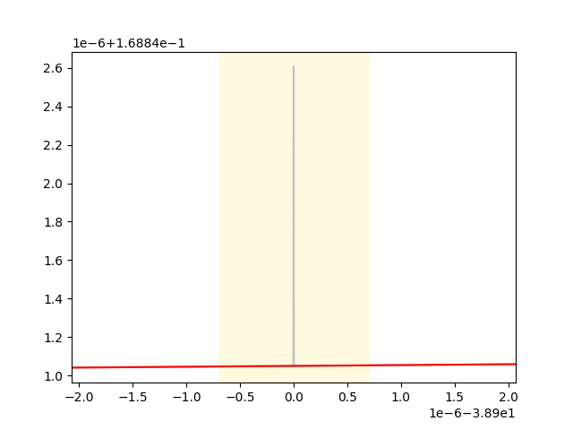
## New Eq:
((fabs(14.199999999999999 + Vm_s__Vm_s) < 8.1300813007528783e-7) ? (0.001 / (1.1219512195134727e-9 / (1.0 - exp(-9.9999999999406119e-8)) + 0.015067000495934959 / (-1.0 + exp(3.5815001178861787))) + (-8732999.5000645891 - 615000.00000454858 * Vm_s__Vm_s) * (0.001 / (0.015066999504065039 / (-1.0 + exp(3.5814998821138206)) - 1.1219512194943214e-9 / (1.0 - exp(9.9999999999406119e-8))) - 0.001 / (1.1219512195134727e-9 / (1.0 - exp(-9.9999999999406119e-8)) + 0.015067000495934959 / (-1.0 + exp(3.5815001178861787))))) : ((fabs(38.899999999999999 + Vm_s__Vm_s) < 6.896551724422384e-7) ? (0.001 / (-0.034086000951724135 / (1.0 - exp(3.0381000848275859)) - 4.2068965517283451e-10 / (-1.0 + exp(-1.0000000000287557e-7))) + (28202500.498836767 + 724999.99997009686 * Vm_s__Vm_s) * (0.001 / (4.2068965520669629e-10 / (-1.0 + exp(1.0000000000287557e-7)) - 0.034085999048275861 / (1.0 - exp(3.0380999151724137))) - 0.001 / (-0.034086000951724135 / (1.0 - exp(3.0381000848275859)) - 4.2068965517283451e-10 / (-1.0 + exp(-1.0000000000287557e-7))))) : (0.001 / (0.00060999999999999997 * (38.899999999999999 + Vm_s__Vm_s) / (-1.0 + exp(5.6404999999999994 + 0.14499999999999999 * Vm_s__Vm_s)) + 0.0013799999999999999 * (14.199999999999999 + Vm_s__Vm_s) / (1.0 - exp(-1.7465999999999999 - 0.123 * Vm_s__Vm_s))))))

## Equation 2:
```
i_Ks_s_xs_gate__tau_xs = 0.001 / (0.00013100000000000001 * (30.0 + Vm_s__Vm_s) / (-1.0 + exp(2.0609999999999999 + 0.068699999999999997 * Vm_s__Vm_s)) + 7.1899999999999999e-5 * (30.0 + Vm_s__Vm_s) / (1.0 - exp(-4.4399999999999995 - 0.14799999999999999 * Vm_s__Vm_s)))
```
### Partially evaluated to: 
```
i_Ks_s_xs_gate__tau_xs = 0.001 / (0.00013100000000000001 * (30.0 + Vm_s__Vm_s) / (-1.0 + exp(2.0609999999999999 + 0.068699999999999997 * Vm_s__Vm_s)) + 7.1899999999999999e-5 * (30.0 + Vm_s__Vm_s) / (1.0 - exp(-4.4399999999999995 - 0.14799999999999999 * Vm_s__Vm_s)))
```
### Singulariy points detected:

{-30.000000000000000}
#### float * A

####1 / A


####A + B:

`7.1899999999999999e-5 * (30.0 + Vm_s__Vm_s) / (1.0 - 0.011795938519751569 * exp(-0.14799999999999999 * Vm_s__Vm_s))`
`0.00013100000000000001 * (30.0 + Vm_s__Vm_s) / (-1.0 + 7.8538197044216602 * exp(0.068699999999999997 * Vm_s__Vm_s))`

*U*
`-4.4399999999999995 - 0.14799999999999999 * Vm_s__Vm_s`

*V for 1e-07 range* 
`-29.999999324324325 - -30.000000675675675`

*Singularity point: -30.000000000000000*


## New Eq:
((fabs(30.0 + Vm_s__Vm_s) < 6.7567567568760367e-7) ? (0.001 / (8.8513513515076093e-11 / (-1.0 + exp(4.6418918920460017e-8)) + 4.8581081081938701e-11 / (1.0 - exp(-1.0000000000287557e-7))) + (-22199999.499608092 - 739999.99998693645 * Vm_s__Vm_s) * (0.001 / (-8.8513513515076093e-11 / (-1.0 + exp(-4.6418918920460017e-8)) - 4.8581081081938701e-11 / (1.0 - exp(1.0000000000287557e-7))) - 0.001 / (8.8513513515076093e-11 / (-1.0 + exp(4.6418918920460017e-8)) + 4.8581081081938701e-11 / (1.0 - exp(-1.0000000000287557e-7))))) : (0.001 / (0.00013100000000000001 * (30.0 + Vm_s__Vm_s) / (-1.0 + exp(2.0609999999999999 + 0.068699999999999997 * Vm_s__Vm_s)) + 7.1899999999999999e-5 * (30.0 + Vm_s__Vm_s) / (1.0 - exp(-4.4399999999999995 - 0.14799999999999999 * Vm_s__Vm_s)))))

## Equation 3:
```
i_CaL_s__i_CaL_s = 4.0 * pow(model_parameters__F, 2) * (0.001 * exp(2.0 * Vm_s__Vm_s * model_parameters__F / (model_parameters__R * model_parameters__T)) - 0.34100000000000003 * model_parameters__Ca_e) * (i_CaL_s__Ccao + i_CaL_s__Co) * Vm_s__Vm_s * i_CaL_s_y_gate__y * membrane_permeabilities__P_CaL_s / ((-1.0 + exp(2.0 * Vm_s__Vm_s * model_parameters__F / (model_parameters__R * model_parameters__T))) * model_parameters__R * model_parameters__T)
```
### Partially evaluated to: 
```
i_CaL_s__i_CaL_s = 4.0 * pow(model_parameters__F, 2) * (0.001 * exp(2.0 * Vm_s__Vm_s * model_parameters__F / (model_parameters__R * model_parameters__T)) - 0.34100000000000003 * model_parameters__Ca_e) * (i_CaL_s__Ccao + i_CaL_s__Co) * Vm_s__Vm_s * i_CaL_s_y_gate__y * membrane_permeabilities__P_CaL_s / ((-1.0 + exp(2.0 * Vm_s__Vm_s * model_parameters__F / (model_parameters__R * model_parameters__T))) * model_parameters__R * model_parameters__T)
```
### Singulariy points detected:

{0}
#### float * A

####Failed to find U symbolically!

<class 'sympy.core.mul.Mul'>
_model_parameters$F**2*_Vm_s$Vm_s*_i_CaL_s_y_gate$y*_membrane_permeabilities$P_CaL_s*(-0.34100000000000003*_model_parameters$Ca_e + 0.001*exp(2.0*_Vm_s$Vm_s*_model_parameters$F/(_model_parameters$R*_model_parameters$T)))*(_i_CaL_s$Ccao + _i_CaL_s$Co)/(_model_parameters$R*_model_parameters$T*(exp(2.0*_Vm_s$Vm_s*_model_parameters$F/(_model_parameters$R*_model_parameters$T)) - 1.0))

*try substituting parameters*

*U*
`0.07491945188463181 * Vm_s__Vm_s`

*V for 1e-07 range* 
`-1.3347668393782383e-6 - 1.3347668393782383e-6`

*Singularity point: 0*

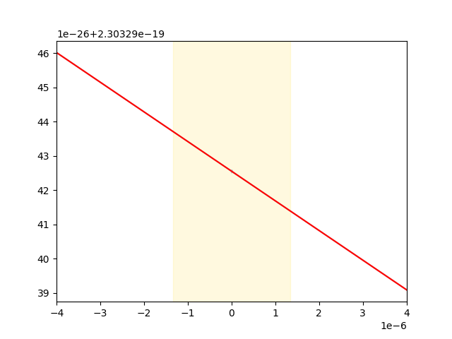
## New Eq:
((fabs(Vm_s__Vm_s) < 1.3347668393782383e-6) ? ((0.5 + 374597.25942315906 * Vm_s__Vm_s) * (5.3390673575129533e-6 * pow(model_parameters__F, 2) * (0.001 * exp(2.6695336787564767e-6 * model_parameters__F / (model_parameters__R * model_parameters__T)) - 0.34100000000000003 * model_parameters__Ca_e) * (i_CaL_s__Ccao + i_CaL_s__Co) * i_CaL_s_y_gate__y * membrane_permeabilities__P_CaL_s / ((-1.0 + exp(2.6695336787564767e-6 * model_parameters__F / (model_parameters__R * model_parameters__T))) * model_parameters__R * model_parameters__T) + 5.3390673575129533e-6 * pow(model_parameters__F, 2) * (0.001 * exp(-2.6695336787564767e-6 * model_parameters__F / (model_parameters__R * model_parameters__T)) - 0.34100000000000003 * model_parameters__Ca_e) * (i_CaL_s__Ccao + i_CaL_s__Co) * i_CaL_s_y_gate__y * membrane_permeabilities__P_CaL_s / ((-1.0 + exp(-2.6695336787564767e-6 * model_parameters__F / (model_parameters__R * model_parameters__T))) * model_parameters__R * model_parameters__T)) - 5.3390673575129533e-6 * pow(model_parameters__F, 2) * (0.001 * exp(-2.6695336787564767e-6 * model_parameters__F / (model_parameters__R * model_parameters__T)) - 0.34100000000000003 * model_parameters__Ca_e) * (i_CaL_s__Ccao + i_CaL_s__Co) * i_CaL_s_y_gate__y * membrane_permeabilities__P_CaL_s / ((-1.0 + exp(-2.6695336787564767e-6 * model_parameters__F / (model_parameters__R * model_parameters__T))) * model_parameters__R * model_parameters__T)) : (4.0 * pow(model_parameters__F, 2) * (0.001 * exp(2.0 * Vm_s__Vm_s * model_parameters__F / (model_parameters__R * model_parameters__T)) - 0.34100000000000003 * model_parameters__Ca_e) * (i_CaL_s__Ccao + i_CaL_s__Co) * Vm_s__Vm_s * i_CaL_s_y_gate__y * membrane_permeabilities__P_CaL_s / ((-1.0 + exp(2.0 * Vm_s__Vm_s * model_parameters__F / (model_parameters__R * model_parameters__T))) * model_parameters__R * model_parameters__T)))

## Equation 4:
```
i_CaL_s__i_KL_s = pow(model_parameters__F, 2) * (-model_parameters__K_e + ion_concentrations__K_i * exp(Vm_s__Vm_s * model_parameters__F / (model_parameters__R * model_parameters__T))) * (i_CaL_s__Ccao + i_CaL_s__Co) * Vm_s__Vm_s * i_CaL_s_y_gate__y * membrane_permeabilities__P_KL_s / ((1.0 - 2.1834061135371177 * (i_CaL_s__i_CaL_s + i_CaL_t__i_CaL_t) / (model_parameters__Sms + model_parameters__Smt)) * (-1.0 + exp(Vm_s__Vm_s * model_parameters__F / (model_parameters__R * model_parameters__T))) * model_parameters__R * model_parameters__T)
```
### Partially evaluated to: 
```
i_CaL_s__i_KL_s = pow(model_parameters__F, 2) * (-model_parameters__K_e + ion_concentrations__K_i * exp(Vm_s__Vm_s * model_parameters__F / (model_parameters__R * model_parameters__T))) * (i_CaL_s__Ccao + i_CaL_s__Co) * Vm_s__Vm_s * i_CaL_s_y_gate__y * membrane_permeabilities__P_KL_s / ((1.0 - 2.1834061135371177 * (i_CaL_s__i_CaL_s + i_CaL_t__i_CaL_t) / (model_parameters__Sms + model_parameters__Smt)) * (-1.0 + exp(Vm_s__Vm_s * model_parameters__F / (model_parameters__R * model_parameters__T))) * model_parameters__R * model_parameters__T)
```
### Singulariy points detected:

{0}
#### float * A

####Failed to find U symbolically!

<class 'sympy.core.mul.Mul'>
_model_parameters$F**2*_Vm_s$Vm_s*_i_CaL_s_y_gate$y*_membrane_permeabilities$P_KL_s*(_i_CaL_s$Ccao + _i_CaL_s$Co)*(_ion_concentrations$K_i*exp(_Vm_s$Vm_s*_model_parameters$F/(_model_parameters$R*_model_parameters$T)) - _model_parameters$K_e)/(_model_parameters$R*_model_parameters$T*(-2.1834061135371178*(_i_CaL_s$i_CaL_s + _i_CaL_t$i_CaL_t)/(_model_parameters$Sms + _model_parameters$Smt) + 1.0)*(exp(_Vm_s$Vm_s*_model_parameters$F/(_model_parameters$R*_model_parameters$T)) - 1.0))

*try substituting parameters*

*U*
`0.037459725942315905 * Vm_s__Vm_s`

*V for 1e-07 range* 
`-2.6695336787564767e-6 - 2.6695336787564767e-6`

*Singularity point: 0*

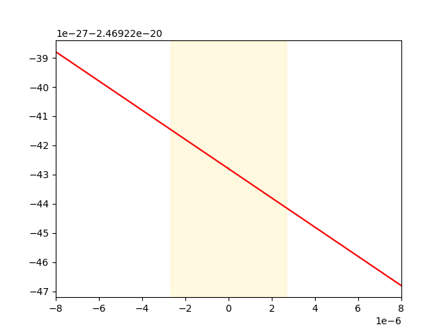
## New Eq:
((fabs(Vm_s__Vm_s) < 2.6695336787564767e-6) ? ((0.5 + 187298.62971157953 * Vm_s__Vm_s) * (2.6695336787564767e-6 * pow(model_parameters__F, 2) * (-model_parameters__K_e + ion_concentrations__K_i * exp(2.6695336787564767e-6 * model_parameters__F / (model_parameters__R * model_parameters__T))) * (i_CaL_s__Ccao + i_CaL_s__Co) * i_CaL_s_y_gate__y * membrane_permeabilities__P_KL_s / ((1.0 - 2.1834061135371177 * (i_CaL_s__i_CaL_s + i_CaL_t__i_CaL_t) / (model_parameters__Sms + model_parameters__Smt)) * (-1.0 + exp(2.6695336787564767e-6 * model_parameters__F / (model_parameters__R * model_parameters__T))) * model_parameters__R * model_parameters__T) + 2.6695336787564767e-6 * pow(model_parameters__F, 2) * (-model_parameters__K_e + ion_concentrations__K_i * exp(-2.6695336787564767e-6 * model_parameters__F / (model_parameters__R * model_parameters__T))) * (i_CaL_s__Ccao + i_CaL_s__Co) * i_CaL_s_y_gate__y * membrane_permeabilities__P_KL_s / ((1.0 - 2.1834061135371177 * (i_CaL_s__i_CaL_s + i_CaL_t__i_CaL_t) / (model_parameters__Sms + model_parameters__Smt)) * (-1.0 + exp(-2.6695336787564767e-6 * model_parameters__F / (model_parameters__R * model_parameters__T))) * model_parameters__R * model_parameters__T)) - 2.6695336787564767e-6 * pow(model_parameters__F, 2) * (-model_parameters__K_e + ion_concentrations__K_i * exp(-2.6695336787564767e-6 * model_parameters__F / (model_parameters__R * model_parameters__T))) * (i_CaL_s__Ccao + i_CaL_s__Co) * i_CaL_s_y_gate__y * membrane_permeabilities__P_KL_s / ((1.0 - 2.1834061135371177 * (i_CaL_s__i_CaL_s + i_CaL_t__i_CaL_t) / (model_parameters__Sms + model_parameters__Smt)) * (-1.0 + exp(-2.6695336787564767e-6 * model_parameters__F / (model_parameters__R * model_parameters__T))) * model_parameters__R * model_parameters__T)) : (pow(model_parameters__F, 2) * (-model_parameters__K_e + ion_concentrations__K_i * exp(Vm_s__Vm_s * model_parameters__F / (model_parameters__R * model_parameters__T))) * (i_CaL_s__Ccao + i_CaL_s__Co) * Vm_s__Vm_s * i_CaL_s_y_gate__y * membrane_permeabilities__P_KL_s / ((1.0 - 2.1834061135371177 * (i_CaL_s__i_CaL_s + i_CaL_t__i_CaL_t) / (model_parameters__Sms + model_parameters__Smt)) * (-1.0 + exp(Vm_s__Vm_s * model_parameters__F / (model_parameters__R * model_parameters__T))) * model_parameters__R * model_parameters__T)))

## Equation 5:
```
i_nsK_s__i_nsK_s = pow(model_parameters__F, 2) * (-0.75 * model_parameters__K_e + 0.75 * ion_concentrations__K_i * exp(Vm_s__Vm_s * model_parameters__F / (model_parameters__R * model_parameters__T))) * Vm_s__Vm_s * membrane_permeabilities__P_nsK_s / ((1.0 + 1.5625000000000003e-8 / pow(ion_concentrations__Ca_i, 3)) * (-1.0 + exp(Vm_s__Vm_s * model_parameters__F / (model_parameters__R * model_parameters__T))) * model_parameters__R * model_parameters__T)
```
### Partially evaluated to: 
```
i_nsK_s__i_nsK_s = pow(model_parameters__F, 2) * (-0.75 * model_parameters__K_e + 0.75 * ion_concentrations__K_i * exp(Vm_s__Vm_s * model_parameters__F / (model_parameters__R * model_parameters__T))) * Vm_s__Vm_s * membrane_permeabilities__P_nsK_s / ((1.0 + 1.5625000000000003e-8 / pow(ion_concentrations__Ca_i, 3)) * (-1.0 + exp(Vm_s__Vm_s * model_parameters__F / (model_parameters__R * model_parameters__T))) * model_parameters__R * model_parameters__T)
```
### Singulariy points detected:

{0}
#### float * A

####Failed to find U symbolically!

<class 'sympy.core.mul.Mul'>
_model_parameters$F**2*_Vm_s$Vm_s*_membrane_permeabilities$P_nsK_s*(0.75*_ion_concentrations$K_i*exp(_Vm_s$Vm_s*_model_parameters$F/(_model_parameters$R*_model_parameters$T)) - 0.75*_model_parameters$K_e)/(_model_parameters$R*_model_parameters$T*(1.0 + 1.5625000000000001e-8/_ion_concentrations$Ca_i**3)*(exp(_Vm_s$Vm_s*_model_parameters$F/(_model_parameters$R*_model_parameters$T)) - 1.0))

*try substituting parameters*

*U*
`0.037459725942315905 * Vm_s__Vm_s`

*V for 1e-07 range* 
`-2.6695336787564767e-6 - 2.6695336787564767e-6`

*Singularity point: 0*

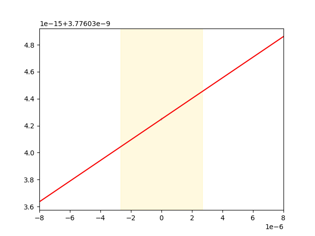
## New Eq:
((fabs(Vm_s__Vm_s) < 2.6695336787564767e-6) ? ((0.5 + 187298.62971157953 * Vm_s__Vm_s) * (2.6695336787564767e-6 * pow(model_parameters__F, 2) * (-0.75 * model_parameters__K_e + 0.75 * ion_concentrations__K_i * exp(2.6695336787564767e-6 * model_parameters__F / (model_parameters__R * model_parameters__T))) * membrane_permeabilities__P_nsK_s / ((1.0 + 1.5625000000000003e-8 / pow(ion_concentrations__Ca_i, 3)) * (-1.0 + exp(2.6695336787564767e-6 * model_parameters__F / (model_parameters__R * model_parameters__T))) * model_parameters__R * model_parameters__T) + 2.6695336787564767e-6 * pow(model_parameters__F, 2) * (-0.75 * model_parameters__K_e + 0.75 * ion_concentrations__K_i * exp(-2.6695336787564767e-6 * model_parameters__F / (model_parameters__R * model_parameters__T))) * membrane_permeabilities__P_nsK_s / ((1.0 + 1.5625000000000003e-8 / pow(ion_concentrations__Ca_i, 3)) * (-1.0 + exp(-2.6695336787564767e-6 * model_parameters__F / (model_parameters__R * model_parameters__T))) * model_parameters__R * model_parameters__T)) - 2.6695336787564767e-6 * pow(model_parameters__F, 2) * (-0.75 * model_parameters__K_e + 0.75 * ion_concentrations__K_i * exp(-2.6695336787564767e-6 * model_parameters__F / (model_parameters__R * model_parameters__T))) * membrane_permeabilities__P_nsK_s / ((1.0 + 1.5625000000000003e-8 / pow(ion_concentrations__Ca_i, 3)) * (-1.0 + exp(-2.6695336787564767e-6 * model_parameters__F / (model_parameters__R * model_parameters__T))) * model_parameters__R * model_parameters__T)) : (pow(model_parameters__F, 2) * (-0.75 * model_parameters__K_e + 0.75 * ion_concentrations__K_i * exp(Vm_s__Vm_s * model_parameters__F / (model_parameters__R * model_parameters__T))) * Vm_s__Vm_s * membrane_permeabilities__P_nsK_s / ((1.0 + 1.5625000000000003e-8 / pow(ion_concentrations__Ca_i, 3)) * (-1.0 + exp(Vm_s__Vm_s * model_parameters__F / (model_parameters__R * model_parameters__T))) * model_parameters__R * model_parameters__T)))

## Equation 6:
```
i_nsNa_s__i_nsNa_s = pow(model_parameters__F, 2) * (-0.75 * model_parameters__Na_e + 0.75 * ion_concentrations__Na_i * exp(Vm_s__Vm_s * model_parameters__F / (model_parameters__R * model_parameters__T))) * Vm_s__Vm_s * membrane_permeabilities__P_nsNa_s / ((1.0 + 1.5625000000000003e-8 / pow(ion_concentrations__Ca_i, 3)) * (-1.0 + exp(Vm_s__Vm_s * model_parameters__F / (model_parameters__R * model_parameters__T))) * model_parameters__R * model_parameters__T)
```
### Partially evaluated to: 
```
i_nsNa_s__i_nsNa_s = pow(model_parameters__F, 2) * (-0.75 * model_parameters__Na_e + 0.75 * ion_concentrations__Na_i * exp(Vm_s__Vm_s * model_parameters__F / (model_parameters__R * model_parameters__T))) * Vm_s__Vm_s * membrane_permeabilities__P_nsNa_s / ((1.0 + 1.5625000000000003e-8 / pow(ion_concentrations__Ca_i, 3)) * (-1.0 + exp(Vm_s__Vm_s * model_parameters__F / (model_parameters__R * model_parameters__T))) * model_parameters__R * model_parameters__T)
```
### Singulariy points detected:

{0}
#### float * A

####Failed to find U symbolically!

<class 'sympy.core.mul.Mul'>
_model_parameters$F**2*_Vm_s$Vm_s*_membrane_permeabilities$P_nsNa_s*(0.75*_ion_concentrations$Na_i*exp(_Vm_s$Vm_s*_model_parameters$F/(_model_parameters$R*_model_parameters$T)) - 0.75*_model_parameters$Na_e)/(_model_parameters$R*_model_parameters$T*(1.0 + 1.5625000000000001e-8/_ion_concentrations$Ca_i**3)*(exp(_Vm_s$Vm_s*_model_parameters$F/(_model_parameters$R*_model_parameters$T)) - 1.0))

*try substituting parameters*

*U*
`0.037459725942315905 * Vm_s__Vm_s`

*V for 1e-07 range* 
`-2.6695336787564767e-6 - 2.6695336787564767e-6`

*Singularity point: 0*


## New Eq:
((fabs(Vm_s__Vm_s) < 2.6695336787564767e-6) ? ((0.5 + 187298.62971157953 * Vm_s__Vm_s) * (2.6695336787564767e-6 * pow(model_parameters__F, 2) * (-0.75 * model_parameters__Na_e + 0.75 * ion_concentrations__Na_i * exp(2.6695336787564767e-6 * model_parameters__F / (model_parameters__R * model_parameters__T))) * membrane_permeabilities__P_nsNa_s / ((1.0 + 1.5625000000000003e-8 / pow(ion_concentrations__Ca_i, 3)) * (-1.0 + exp(2.6695336787564767e-6 * model_parameters__F / (model_parameters__R * model_parameters__T))) * model_parameters__R * model_parameters__T) + 2.6695336787564767e-6 * pow(model_parameters__F, 2) * (-0.75 * model_parameters__Na_e + 0.75 * ion_concentrations__Na_i * exp(-2.6695336787564767e-6 * model_parameters__F / (model_parameters__R * model_parameters__T))) * membrane_permeabilities__P_nsNa_s / ((1.0 + 1.5625000000000003e-8 / pow(ion_concentrations__Ca_i, 3)) * (-1.0 + exp(-2.6695336787564767e-6 * model_parameters__F / (model_parameters__R * model_parameters__T))) * model_parameters__R * model_parameters__T)) - 2.6695336787564767e-6 * pow(model_parameters__F, 2) * (-0.75 * model_parameters__Na_e + 0.75 * ion_concentrations__Na_i * exp(-2.6695336787564767e-6 * model_parameters__F / (model_parameters__R * model_parameters__T))) * membrane_permeabilities__P_nsNa_s / ((1.0 + 1.5625000000000003e-8 / pow(ion_concentrations__Ca_i, 3)) * (-1.0 + exp(-2.6695336787564767e-6 * model_parameters__F / (model_parameters__R * model_parameters__T))) * model_parameters__R * model_parameters__T)) : (pow(model_parameters__F, 2) * (-0.75 * model_parameters__Na_e + 0.75 * ion_concentrations__Na_i * exp(Vm_s__Vm_s * model_parameters__F / (model_parameters__R * model_parameters__T))) * Vm_s__Vm_s * membrane_permeabilities__P_nsNa_s / ((1.0 + 1.5625000000000003e-8 / pow(ion_concentrations__Ca_i, 3)) * (-1.0 + exp(Vm_s__Vm_s * model_parameters__F / (model_parameters__R * model_parameters__T))) * model_parameters__R * model_parameters__T)))

Singularities cannot be found
1.0*_membrane_permeabilities$i_NaK_max_s*_model_parameters$K_e/((_model_parameters$K_e + 1.5)*(31.622776601683793*(1/_ion_concentrations$Na_i)**1.5 + 1.0)*(0.005214285714285714*(exp(0.014858841010401189*_model_parameters$Na_e) - 1.0)*exp(-_Vm_s$Vm_s*_model_parameters$F/(_model_parameters$R*_model_parameters$T)) + 1.0 + 0.1245*exp(-0.10000000000000001*_Vm_s$Vm_s*_model_parameters$F/(_model_parameters$R*_model_parameters$T))))

# Model: priebe_beuckelmann_1998(priebe_beuckelmann_1998.cellml)
Derivative(_Irel__APtrack2, _environment__time) = (((Irel__APtrack > 0.17999999999999999) && (Irel__APtrack < 0.20000000000000001)) ? (100.0 - 100.5 * Irel__APtrack2) : (-0.5 * Irel__APtrack2))

####Piecewise!!

Derivative(_Irel__APtrack3, _environment__time) = (((Irel__APtrack > 0.17999999999999999) && (Irel__APtrack < 0.20000000000000001)) ? (100.0 - 100.5 * Irel__APtrack3) : (-0.01 * Irel__APtrack3))

####Piecewise!!

Irel__G_rel = ((Irel__Cainfluxtrack > Irel__delta_Ca_ith) ? ((1.0 - Irel__APtrack2) * (-Irel__delta_Ca_ith + Irel__Cainfluxtrack) * Irel__APtrack2 * Irel__G_rel_max / (-Irel__delta_Ca_ith + Irel__Cainfluxtrack + Irel__K_mrel)) : (0))

####Piecewise!!

Singularities cannot be found
1.0/(0.036499999999999998*(0.14285714285714286*exp(0.014858841010401189*_Ionic_concentrations$Nao) - 0.14285714285714286)*exp(-0.00038779528431976202*_cell$F*_cell$V) + 1.0 + 0.1245*exp(-3.8779528431976204e-5*_cell$F*_cell$V))

INa_h_gate__alpha_h = ((cell__V < -40.0) ? (0.13500000000000001 * exp(-11.764705882352942 + 0.14705882352941177 * INa__shift_INa_inact - 0.14705882352941177 * cell__V)) : (0))

####Piecewise!!

INa_h_gate__beta_h = ((cell__V < -40.0) ? (310000.0 * exp(0.34999999999999998 * cell__V - 0.34999999999999998 * INa__shift_INa_inact) + 3.5600000000000001 * exp(0.079000000000000001 * cell__V - 0.079000000000000001 * INa__shift_INa_inact)) : (7.6923076923076916 / (1.0 + exp(-0.96036036036036043 - 0.0900900900900901 * INa__shift_INa_inact - 0.0900900900900901 * cell__V))))

####Piecewise!!

INa_j_gate__alpha_j = ((cell__V < -40.0) ? ((37.780000000000001 + cell__V) * (-127140.0 * exp(0.24399999999999999 * cell__V - 0.24399999999999999 * INa__shift_INa_inact) - 3.4740000000000003e-5 * exp(0.043909999999999998 * INa__shift_INa_inact - 0.043909999999999998 * cell__V)) / (1.0 + exp(24.640530000000002 + 0.311 * cell__V - 0.311 * INa__shift_INa_inact))) : (0))

####Piecewise!!

INa_j_gate__beta_j = ((cell__V < -40.0) ? (0.1212 * exp(0.01052 * INa__shift_INa_inact - 0.01052 * cell__V) / (1.0 + exp(-5.5312920000000005 + 0.13780000000000001 * INa__shift_INa_inact - 0.13780000000000001 * cell__V))) : (0.29999999999999999 * exp(2.5349999999999999e-7 * INa__shift_INa_inact - 2.5349999999999999e-7 * cell__V) / (1.0 + exp(-3.2000000000000002 + 0.10000000000000001 * INa__shift_INa_inact - 0.10000000000000001 * cell__V))))

####Piecewise!!

INa_m_gate__alpha_m = ((fabs(47.130000000000003 + cell__V) > 0.001) ? (0.32000000000000001 * (47.130000000000003 + cell__V) / (1.0 - exp(-4.7130000000000001 - 0.10000000000000001 * cell__V))) : (3.2000000000000002))

####Piecewise!!

ICab__g_b_Ca_max = ((cell__failing == 0) ? (0.00084999999999999995) : (0.0012999999999999999))

####Piecewise!!

IK1__g_K1_max = ((cell__failing == 0) ? (2.5) : (2.0))

####Piecewise!!

INaCa__K_NaCa = ((cell__failing == 0) ? (INaCa__K_NaCa_normal) : (1650.0))

####Piecewise!!

Derivative(_Irel__Cainfluxtrack, _environment__time) = ((Irel__APtrack > 0.20000000000000001) ? (-0.5 * (-INaCa__i_NaCa + ICa__i_Ca + ICab__i_b_Ca) * cell__Cm / (Ionic_concentrations__V_myo * cell__F)) : ((Irel__APtrack2 > 0.01) ? (0) : (-0.5 * Irel__Cainfluxtrack)))

####Piecewise!!

INaK__I_NaK_max = ((cell__failing == 0) ? (1.3) : (0.75))

####Piecewise!!

INab__g_b_Na_max = ((cell__failing == 0) ? (0.001) : (0))

####Piecewise!!

Ileak__K_leak = ((cell__failing == 0) ? (0.00025999999999999998) : (0.00017000000000000001))

####Piecewise!!

Ito__g_to_max = ((cell__failing == 0) ? (0.29999999999999999) : (0.191)) * Ito__g_to_max_factor

####Piecewise!!

Iup__I_up_max = ((cell__failing == 0) ? (0.0044999999999999997) : (0.0015))

####Piecewise!!

Derivative(_Irel__APtrack, _environment__time) = ((cell__dVdt > 150.0) ? (100.0 - 100.5 * Irel__APtrack) : (-0.5 * Irel__APtrack))

####Piecewise!!

# Model: ramirez_2000(ramirez_nattel_courtemanche_2000.cellml)
## Equation 1:
```
Ca_release_current_from_JSR_w_gate__tau_w = (6.0 - 6.0 * exp(1.5800000000000001 - 0.20000000000000001 * membrane__V)) / ((1.0 + 0.29999999999999999 * exp(1.5800000000000001 - 0.20000000000000001 * membrane__V)) * (-7.9000000000000004 + membrane__V))
```
### Partially evaluated to: 
```
Ca_release_current_from_JSR_w_gate__tau_w = (6.0 - 6.0 * exp(1.5800000000000001 - 0.20000000000000001 * membrane__V)) / ((1.0 + 0.29999999999999999 * exp(1.5800000000000001 - 0.20000000000000001 * membrane__V)) * (-7.9000000000000004 + membrane__V))
```
### Singulariy points detected:

{7.9000000000000004}
####Failed to find U symbolically!

<class 'sympy.core.mul.Mul'>
(6.0 - 29.129734867424602*exp(-0.2*_membrane$V))/((1.0 + 1.45648674337123*exp(-0.2*_membrane$V))*(_membrane$V - 7.9000000000000004))

*try substituting parameters*

####Failed to find U symbolically!

<class 'sympy.core.mul.Mul'>
(6.0 - 29.129734867424602*exp(-0.2*_membrane$V))/((1.0 + 1.45648674337123*exp(-0.2*_membrane$V))*(_membrane$V - 7.9000000000000004))
fast_sodium_current_h_gate__alpha_h = ((membrane__V < -40.0) ? (0.13500000000000001 * exp(-11.764705882352942 - 0.14705882352941177 * membrane__V)) : (0))

####Piecewise!!

fast_sodium_current_h_gate__beta_h = ((membrane__V < -40.0) ? (310000.0 * exp(0.34999999999999998 * membrane__V) + 3.5600000000000001 * exp(0.079000000000000001 * membrane__V)) : (7.6923076923076916 / (1.0 + exp(-0.96036036036036043 - 0.0900900900900901 * membrane__V))))

####Piecewise!!

fast_sodium_current_j_gate__alpha_j = ((membrane__V < -40.0) ? ((37.780000000000001 + membrane__V) * (-127140.0 * exp(0.24440000000000001 * membrane__V) - 3.4740000000000003e-5 * exp(-0.043909999999999998 * membrane__V)) / (1.0 + exp(24.640530000000002 + 0.311 * membrane__V))) : (0))

####Piecewise!!

fast_sodium_current_j_gate__beta_j = ((membrane__V < -40.0) ? (0.1212 * exp(-0.01052 * membrane__V) / (1.0 + exp(-5.5312920000000005 - 0.13780000000000001 * membrane__V))) : (0.29999999999999999 * exp(-2.5349999999999999e-7 * membrane__V) / (1.0 + exp(-3.2000000000000002 - 0.10000000000000001 * membrane__V))))

####Piecewise!!

## Equation 2:
```
fast_sodium_current_m_gate__alpha_m = 0.32000000000000001 * (47.130000000000003 + membrane__V) / (1.0 - exp(-4.7130000000000001 - 0.10000000000000001 * membrane__V))
```
### Partially evaluated to: 
```
fast_sodium_current_m_gate__alpha_m = 0.32000000000000001 * (47.130000000000003 + membrane__V) / (1.0 - exp(-4.7130000000000001 - 0.10000000000000001 * membrane__V))
```
### Singulariy points detected:

{-47.130000000000003}
*U*
`-4.7130000000000001 - 0.10000000000000001 * membrane__V`

*V for 1e-07 range* 
`-47.129999000000005 - -47.130001`

*Singularity point: -47.130000000000003*


## New Eq:
((fabs(47.130000000000003 + membrane__V) < 1.0000000000287557e-6) ? (3.200000000092018e-7 / (1.0 - exp(-1.0000000000287557e-7)) + (-23564999.499322373 - 499999.99998562218 * membrane__V) * (-3.200000000092018e-7 / (1.0 - exp(1.0000000000287557e-7)) - 3.200000000092018e-7 / (1.0 - exp(-1.0000000000287557e-7)))) : (0.32000000000000001 * (47.130000000000003 + membrane__V) / (1.0 - exp(-4.7130000000000001 - 0.10000000000000001 * membrane__V))))

## Equation 3:
```
rapid_delayed_rectifier_K_current_xr_gate__alpha_xr = 0.040000000000000001 * (-248.0 + membrane__V) / (1.0 - exp(8.8571428571428577 - 0.035714285714285712 * membrane__V))
```
### Partially evaluated to: 
```
rapid_delayed_rectifier_K_current_xr_gate__alpha_xr = 0.040000000000000001 * (-248.0 + membrane__V) / (1.0 - exp(8.8571428571428577 - 0.035714285714285712 * membrane__V))
```
### Singulariy points detected:

{248.00000000000000}
*U*
`8.8571428571428577 - 0.035714285714285712 * membrane__V`

*V for 1e-07 range* 
`248.0000028 - 247.9999972`

*Singularity point: 248.00000000000000*

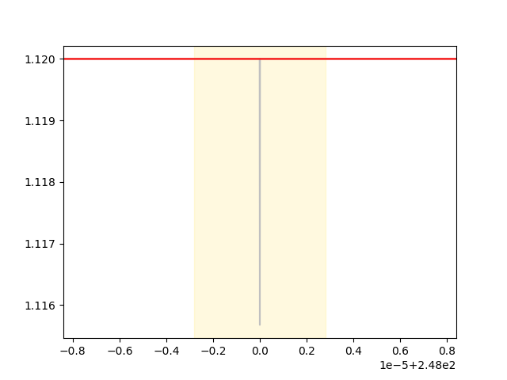
## New Eq:
((fabs(-248.0 + membrane__V) < 2.8000000000805159e-6) ? (1.1200000000322064e-7 / (1.0 - exp(-1.0000000000287557e-7)) + (44285714.784440823 - 178571.42856629365 * membrane__V) * (-1.1200000000322064e-7 / (1.0 - exp(1.0000000000287557e-7)) - 1.1200000000322064e-7 / (1.0 - exp(-1.0000000000287557e-7)))) : (0.040000000000000001 * (-248.0 + membrane__V) / (1.0 - exp(8.8571428571428577 - 0.035714285714285712 * membrane__V))))

## Equation 4:
```
rapid_delayed_rectifier_K_current_xr_gate__beta_xr = 0.028000000000000001 * (163.0 + membrane__V) / (-1.0 + exp(7.7619047619047619 + 0.047619047619047616 * membrane__V))
```
### Partially evaluated to: 
```
rapid_delayed_rectifier_K_current_xr_gate__beta_xr = 0.028000000000000001 * (163.0 + membrane__V) / (-1.0 + exp(7.7619047619047619 + 0.047619047619047616 * membrane__V))
```
### Singulariy points detected:

{-163.00000000000000}
*U*
`7.7619047619047619 + 0.047619047619047616 * membrane__V`

*V for 1e-07 range* 
`-163.00000209999999 - -162.99999790000001`

*Singularity point: -163.00000000000000*

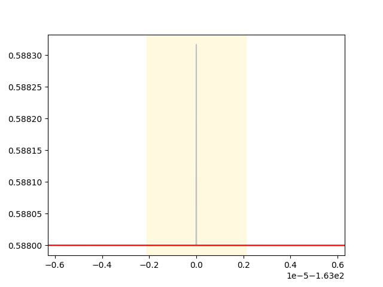
## New Eq:
((fabs(163.0 + membrane__V) < 2.1000000000048757e-6) ? (-5.8799999997027897e-8 / (-1.0 + exp(-9.9999999995936673e-8)) + (38809524.309433699 + 238095.23809468528 * membrane__V) * (5.8799999997027897e-8 / (-1.0 + exp(-9.9999999995936673e-8)) + 5.8800000003245146e-8 / (-1.0 + exp(1.0000000000287557e-7)))) : (0.028000000000000001 * (163.0 + membrane__V) / (-1.0 + exp(7.7619047619047619 + 0.047619047619047616 * membrane__V))))

## Equation 5:
```
sarcolemmal_Ca_current_d_gate__tau_d = 28.571428571428569 * (1.0 - exp(-1.6025641025641024 - 0.16025641025641024 * membrane__V)) / ((1.0 + exp(-1.6025641025641024 - 0.16025641025641024 * membrane__V)) * (10.0 + membrane__V))
```
### Partially evaluated to: 
```
sarcolemmal_Ca_current_d_gate__tau_d = 28.571428571428569 * (1.0 - exp(-1.6025641025641024 - 0.16025641025641024 * membrane__V)) / ((1.0 + exp(-1.6025641025641024 - 0.16025641025641024 * membrane__V)) * (10.0 + membrane__V))
```
### Singulariy points detected:

{-10.000000000000000}
*U*
`-1.6025641025641024 - 0.16025641025641024 * membrane__V`

*V for 1e-07 range* 
`-9.9999993759999999 - -10.000000624`

*Singularity point: -10.000000000000000*

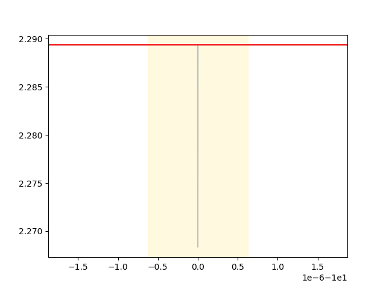
## New Eq:
((fabs(10.0 + membrane__V) < 6.2399999999074307e-7) ? ((-8012820.0129393814 - 801282.05129393819 * membrane__V) * (-45787545.788225032 * (1.0 - exp(9.9999999997671396e-8)) / (1.0 + exp(9.9999999997671396e-8)) - 45787545.788225032 * (1.0 - exp(-9.9999999997671396e-8)) / (1.0 + exp(-9.9999999997671396e-8))) + 45787545.788225032 * (1.0 - exp(-9.9999999997671396e-8)) / (1.0 + exp(-9.9999999997671396e-8))) : (28.571428571428569 * (1.0 - exp(-1.6025641025641024 - 0.16025641025641024 * membrane__V)) / ((1.0 + exp(-1.6025641025641024 - 0.16025641025641024 * membrane__V)) * (10.0 + membrane__V))))

## Equation 6:
```
slow_delayed_rectifier_K_current_xs_gate__alpha_xs = 1.0000000000000001e-5 * (28.5 + membrane__V) / (1.0 - exp(-0.24782608695652175 - 0.0086956521739130436 * membrane__V))
```
### Partially evaluated to: 
```
slow_delayed_rectifier_K_current_xs_gate__alpha_xs = 1.0000000000000001e-5 * (28.5 + membrane__V) / (1.0 - exp(-0.24782608695652175 - 0.0086956521739130436 * membrane__V))
```
### Singulariy points detected:

{-28.500000000000000}
*U*
`-0.24782608695652175 - 0.0086956521739130436 * membrane__V`

*V for 1e-07 range* 
`-28.499988500000001 - -28.500011499999999`

*Singularity point: -28.500000000000000*


## New Eq:
((fabs(28.5 + membrane__V) < 1.1500000000011501e-5) ? (1.1500000000025379e-10 / (1.0 - exp(-1.0000000000027348e-7)) + (-1239129.9347813695 - 43478.260869521735 * membrane__V) * (-1.1500000000025379e-10 / (1.0 - exp(-1.0000000000027348e-7)) - 1.1499999999997625e-10 / (1.0 - exp(9.99999999998398e-8)))) : (1.0000000000000001e-5 * (28.5 + membrane__V) / (1.0 - exp(-0.24782608695652175 - 0.0086956521739130436 * membrane__V))))

## Equation 7:
```
slow_delayed_rectifier_K_current_xs_gate__beta_xs = 0.00023000000000000001 * (28.5 + membrane__V) / (-1.0 + exp(8.6363636363636367 + 0.30303030303030304 * membrane__V))
```
### Partially evaluated to: 
```
slow_delayed_rectifier_K_current_xs_gate__beta_xs = 0.00023000000000000001 * (28.5 + membrane__V) / (-1.0 + exp(8.6363636363636367 + 0.30303030303030304 * membrane__V))
```
### Singulariy points detected:

{-28.500000000000000}
*U*
`8.6363636363636367 + 0.30303030303030304 * membrane__V`

*V for 1e-07 range* 
`-28.500000329999999 - -28.499999670000001`

*Singularity point: -28.500000000000000*

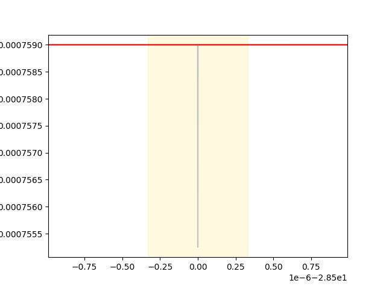
## New Eq:
((fabs(28.5 + membrane__V) < 3.300000000205916e-7) ? (-7.5900000004736066e-11 / (-1.0 + exp(-1.0000000000287557e-7)) + (43181818.679123692 + 1515151.5150569715 * membrane__V) * (7.5900000004736066e-11 / (-1.0 + exp(1.0000000000287557e-7)) + 7.5900000004736066e-11 / (-1.0 + exp(-1.0000000000287557e-7)))) : (0.00023000000000000001 * (28.5 + membrane__V) / (-1.0 + exp(8.6363636363636367 + 0.30303030303030304 * membrane__V))))

Singularities cannot be found
1/(0.036499999999999998*(0.14285714285714286*exp(0.014858841010401189*_standard_ionic_concentrations$Na_o) - 0.14285714285714286)*exp(-0.037435192301797954*_membrane$V) + 1.0 + 0.1245*exp(-0.0037435192301797956*_membrane$V))

# Model: sachse_model_2007(sachse_moreno_abildskov_2008_b.cellml)
## Equation 1:
```
I_Shkr__I_Shkr = pow(model_parameters__F, 2) * (-model_parameters__Ko * exp(-membrane__Vm * model_parameters__F / (model_parameters__R * model_parameters__T)) + model_parameters__Ki) * I_Shkr__OShkr * I_Shkr__PShkr * membrane__Vm / ((1.0 - exp(-membrane__Vm * model_parameters__F / (model_parameters__R * model_parameters__T))) * model_parameters__R * model_parameters__T)
```
### Partially evaluated to: 
```
I_Shkr__I_Shkr = pow(model_parameters__F, 2) * (-model_parameters__Ko * exp(-membrane__Vm * model_parameters__F / (model_parameters__R * model_parameters__T)) + model_parameters__Ki) * I_Shkr__OShkr * I_Shkr__PShkr * membrane__Vm / ((1.0 - exp(-membrane__Vm * model_parameters__F / (model_parameters__R * model_parameters__T))) * model_parameters__R * model_parameters__T)
```
### Singulariy points detected:

{0}
####Failed to find U symbolically!

<class 'sympy.core.mul.Mul'>
_model_parameters$F**2*_I_Shkr$OShkr*_I_Shkr$PShkr*_membrane$Vm*(_model_parameters$Ki - _model_parameters$Ko*exp(-_membrane$Vm*_model_parameters$F/(_model_parameters$R*_model_parameters$T)))/(_model_parameters$R*_model_parameters$T*(1.0 - exp(-_membrane$Vm*_model_parameters$F/(_model_parameters$R*_model_parameters$T))))

*try substituting parameters*

#### float * A

####Failed to find U symbolically!

<class 'sympy.core.mul.Mul'>
_I_Shkr$OShkr*_membrane$Vm*(140.0 - 5.0*exp(-0.039364457769891289*_membrane$Vm))/(1.0 - exp(-0.039364457769891289*_membrane$Vm))
# Model: sakmann_model_2000_epi(sakmann_model_2000_epi.cellml)
## Equation 1:
```
L_type_Ca_channel__i_Ca_L_Ca_cyt = 4.0 * (1.0 - L_type_Ca_channel__FrICa) * (-50.0 + membrane__V) * (intracellular_calcium_concentration__Ca_i * exp(100.0 * membrane__F / (membrane__R * membrane__T)) - extracellular_calcium_concentration__Ca_o * exp(2.0 * (50.0 - membrane__V) * membrane__F / (membrane__R * membrane__T))) * L_type_Ca_channel__P_Ca_L * L_type_Ca_channel_d_gate__d * L_type_Ca_channel_f2_gate__f2 * L_type_Ca_channel_f_gate__f * membrane__F / ((1.0 - exp(2.0 * (50.0 - membrane__V) * membrane__F / (membrane__R * membrane__T))) * membrane__R * membrane__T)
```
### Partially evaluated to: 
```
L_type_Ca_channel__i_Ca_L_Ca_cyt = 4.0 * (1.0 - L_type_Ca_channel__FrICa) * (-50.0 + membrane__V) * (intracellular_calcium_concentration__Ca_i * exp(100.0 * membrane__F / (membrane__R * membrane__T)) - extracellular_calcium_concentration__Ca_o * exp(2.0 * (50.0 - membrane__V) * membrane__F / (membrane__R * membrane__T))) * L_type_Ca_channel__P_Ca_L * L_type_Ca_channel_d_gate__d * L_type_Ca_channel_f2_gate__f2 * L_type_Ca_channel_f_gate__f * membrane__F / ((1.0 - exp(2.0 * (50.0 - membrane__V) * membrane__F / (membrane__R * membrane__T))) * membrane__R * membrane__T)
```
### Singulariy points detected:

{50.000000000000000}
#### float * A

####Failed to find U symbolically!

<class 'sympy.core.mul.Mul'>
_L_type_Ca_channel$P_Ca_L*_L_type_Ca_channel_d_gate$d*_L_type_Ca_channel_f2_gate$f2*_L_type_Ca_channel_f_gate$f*_membrane$F*(1.0 - _L_type_Ca_channel$FrICa)*(_membrane$V - 50.0)*(-_extracellular_calcium_concentration$Ca_o*exp(2.0*_membrane$F*(50.0 - _membrane$V)/(_membrane$R*_membrane$T)) + _intracellular_calcium_concentration$Ca_i*exp(100.0*_membrane$F/(_membrane$R*_membrane$T)))/(_membrane$R*_membrane$T*(1.0 - exp(2.0*_membrane$F*(50.0 - _membrane$V)/(_membrane$R*_membrane$T))))

*try substituting parameters*

#### Eq == 0!
## Equation 2:
```
L_type_Ca_channel__i_Ca_L_Ca_ds = 4.0 * (-50.0 + membrane__V) * (intracellular_calcium_concentration__Ca_i * exp(100.0 * membrane__F / (membrane__R * membrane__T)) - extracellular_calcium_concentration__Ca_o * exp(2.0 * (50.0 - membrane__V) * membrane__F / (membrane__R * membrane__T))) * L_type_Ca_channel__FrICa * L_type_Ca_channel__P_Ca_L * L_type_Ca_channel_d_gate__d * L_type_Ca_channel_f2ds_gate__f2ds * L_type_Ca_channel_f_gate__f * membrane__F / ((1.0 - exp(2.0 * (50.0 - membrane__V) * membrane__F / (membrane__R * membrane__T))) * membrane__R * membrane__T)
```
### Partially evaluated to: 
```
L_type_Ca_channel__i_Ca_L_Ca_ds = 4.0 * (-50.0 + membrane__V) * (intracellular_calcium_concentration__Ca_i * exp(100.0 * membrane__F / (membrane__R * membrane__T)) - extracellular_calcium_concentration__Ca_o * exp(2.0 * (50.0 - membrane__V) * membrane__F / (membrane__R * membrane__T))) * L_type_Ca_channel__FrICa * L_type_Ca_channel__P_Ca_L * L_type_Ca_channel_d_gate__d * L_type_Ca_channel_f2ds_gate__f2ds * L_type_Ca_channel_f_gate__f * membrane__F / ((1.0 - exp(2.0 * (50.0 - membrane__V) * membrane__F / (membrane__R * membrane__T))) * membrane__R * membrane__T)
```
### Singulariy points detected:

{50.000000000000000}
#### float * A

####Failed to find U symbolically!

<class 'sympy.core.mul.Mul'>
_L_type_Ca_channel$FrICa*_L_type_Ca_channel$P_Ca_L*_L_type_Ca_channel_d_gate$d*_L_type_Ca_channel_f2ds_gate$f2ds*_L_type_Ca_channel_f_gate$f*_membrane$F*(_membrane$V - 50.0)*(-_extracellular_calcium_concentration$Ca_o*exp(2.0*_membrane$F*(50.0 - _membrane$V)/(_membrane$R*_membrane$T)) + _intracellular_calcium_concentration$Ca_i*exp(100.0*_membrane$F/(_membrane$R*_membrane$T)))/(_membrane$R*_membrane$T*(1.0 - exp(2.0*_membrane$F*(50.0 - _membrane$V)/(_membrane$R*_membrane$T))))

*try substituting parameters*

*U*
`3.7433890822745473 - 0.074867781645490947 * membrane__V`

*V for 1e-07 range* 
`50.000001335688033 - 49.999998664311967`

*Singularity point: 50.000000000000000*


## New Eq:
((fabs(-50.0 + membrane__V) < 1.3356880329828957e-6) ? ((18716945.911399174 - 374338.90822798351 * membrane__V) * (-5.3427521318205606e-6 * (intracellular_calcium_concentration__Ca_i * exp(100.0 * membrane__F / (membrane__R * membrane__T)) - extracellular_calcium_concentration__Ca_o * exp(-2.6713760659102803e-6 * membrane__F / (membrane__R * membrane__T))) * L_type_Ca_channel__FrICa * L_type_Ca_channel__P_Ca_L * L_type_Ca_channel_d_gate__d * L_type_Ca_channel_f2ds_gate__f2ds * L_type_Ca_channel_f_gate__f * membrane__F / ((1.0 - exp(-2.6713760659102803e-6 * membrane__F / (membrane__R * membrane__T))) * membrane__R * membrane__T) - 5.3427521320426052e-6 * (intracellular_calcium_concentration__Ca_i * exp(100.0 * membrane__F / (membrane__R * membrane__T)) - extracellular_calcium_concentration__Ca_o * exp(2.6713760660213026e-6 * membrane__F / (membrane__R * membrane__T))) * L_type_Ca_channel__FrICa * L_type_Ca_channel__P_Ca_L * L_type_Ca_channel_d_gate__d * L_type_Ca_channel_f2ds_gate__f2ds * L_type_Ca_channel_f_gate__f * membrane__F / ((1.0 - exp(2.6713760660213026e-6 * membrane__F / (membrane__R * membrane__T))) * membrane__R * membrane__T)) + 5.3427521318205606e-6 * (intracellular_calcium_concentration__Ca_i * exp(100.0 * membrane__F / (membrane__R * membrane__T)) - extracellular_calcium_concentration__Ca_o * exp(-2.6713760659102803e-6 * membrane__F / (membrane__R * membrane__T))) * L_type_Ca_channel__FrICa * L_type_Ca_channel__P_Ca_L * L_type_Ca_channel_d_gate__d * L_type_Ca_channel_f2ds_gate__f2ds * L_type_Ca_channel_f_gate__f * membrane__F / ((1.0 - exp(-2.6713760659102803e-6 * membrane__F / (membrane__R * membrane__T))) * membrane__R * membrane__T)) : (4.0 * (-50.0 + membrane__V) * (intracellular_calcium_concentration__Ca_i * exp(100.0 * membrane__F / (membrane__R * membrane__T)) - extracellular_calcium_concentration__Ca_o * exp(2.0 * (50.0 - membrane__V) * membrane__F / (membrane__R * membrane__T))) * L_type_Ca_channel__FrICa * L_type_Ca_channel__P_Ca_L * L_type_Ca_channel_d_gate__d * L_type_Ca_channel_f2ds_gate__f2ds * L_type_Ca_channel_f_gate__f * membrane__F / ((1.0 - exp(2.0 * (50.0 - membrane__V) * membrane__F / (membrane__R * membrane__T))) * membrane__R * membrane__T)))

## Equation 3:
```
L_type_Ca_channel__i_Ca_L_K_cyt = (1.0 - L_type_Ca_channel__FrICa) * (-50.0 + membrane__V) * (intracellular_potassium_concentration__K_i * exp(50.0 * membrane__F / (membrane__R * membrane__T)) - extracellular_potassium_concentration__K_o * exp((50.0 - membrane__V) * membrane__F / (membrane__R * membrane__T))) * L_type_Ca_channel__P_CaK * L_type_Ca_channel__P_Ca_L * L_type_Ca_channel_d_gate__d * L_type_Ca_channel_f2_gate__f2 * L_type_Ca_channel_f_gate__f * membrane__F / ((1.0 - exp((50.0 - membrane__V) * membrane__F / (membrane__R * membrane__T))) * membrane__R * membrane__T)
```
### Partially evaluated to: 
```
L_type_Ca_channel__i_Ca_L_K_cyt = (1.0 - L_type_Ca_channel__FrICa) * (-50.0 + membrane__V) * (intracellular_potassium_concentration__K_i * exp(50.0 * membrane__F / (membrane__R * membrane__T)) - extracellular_potassium_concentration__K_o * exp((50.0 - membrane__V) * membrane__F / (membrane__R * membrane__T))) * L_type_Ca_channel__P_CaK * L_type_Ca_channel__P_Ca_L * L_type_Ca_channel_d_gate__d * L_type_Ca_channel_f2_gate__f2 * L_type_Ca_channel_f_gate__f * membrane__F / ((1.0 - exp((50.0 - membrane__V) * membrane__F / (membrane__R * membrane__T))) * membrane__R * membrane__T)
```
### Singulariy points detected:

{50.000000000000000}
####Failed to find U symbolically!

<class 'sympy.core.mul.Mul'>
_L_type_Ca_channel$P_CaK*_L_type_Ca_channel$P_Ca_L*_L_type_Ca_channel_d_gate$d*_L_type_Ca_channel_f2_gate$f2*_L_type_Ca_channel_f_gate$f*_membrane$F*(1.0 - _L_type_Ca_channel$FrICa)*(_membrane$V - 50.0)*(-_extracellular_potassium_concentration$K_o*exp(_membrane$F*(50.0 - _membrane$V)/(_membrane$R*_membrane$T)) + _intracellular_potassium_concentration$K_i*exp(50.0*_membrane$F/(_membrane$R*_membrane$T)))/(_membrane$R*_membrane$T*(1.0 - exp(_membrane$F*(50.0 - _membrane$V)/(_membrane$R*_membrane$T))))

*try substituting parameters*

#### Eq == 0!
## Equation 4:
```
L_type_Ca_channel__i_Ca_L_K_ds = (-50.0 + membrane__V) * (intracellular_potassium_concentration__K_i * exp(50.0 * membrane__F / (membrane__R * membrane__T)) - extracellular_potassium_concentration__K_o * exp((50.0 - membrane__V) * membrane__F / (membrane__R * membrane__T))) * L_type_Ca_channel__FrICa * L_type_Ca_channel__P_CaK * L_type_Ca_channel__P_Ca_L * L_type_Ca_channel_d_gate__d * L_type_Ca_channel_f2ds_gate__f2ds * L_type_Ca_channel_f_gate__f * membrane__F / ((1.0 - exp((50.0 - membrane__V) * membrane__F / (membrane__R * membrane__T))) * membrane__R * membrane__T)
```
### Partially evaluated to: 
```
L_type_Ca_channel__i_Ca_L_K_ds = (-50.0 + membrane__V) * (intracellular_potassium_concentration__K_i * exp(50.0 * membrane__F / (membrane__R * membrane__T)) - extracellular_potassium_concentration__K_o * exp((50.0 - membrane__V) * membrane__F / (membrane__R * membrane__T))) * L_type_Ca_channel__FrICa * L_type_Ca_channel__P_CaK * L_type_Ca_channel__P_Ca_L * L_type_Ca_channel_d_gate__d * L_type_Ca_channel_f2ds_gate__f2ds * L_type_Ca_channel_f_gate__f * membrane__F / ((1.0 - exp((50.0 - membrane__V) * membrane__F / (membrane__R * membrane__T))) * membrane__R * membrane__T)
```
### Singulariy points detected:

{50.000000000000000}
####Failed to find U symbolically!

<class 'sympy.core.mul.Mul'>
_L_type_Ca_channel$FrICa*_L_type_Ca_channel$P_CaK*_L_type_Ca_channel$P_Ca_L*_L_type_Ca_channel_d_gate$d*_L_type_Ca_channel_f2ds_gate$f2ds*_L_type_Ca_channel_f_gate$f*_membrane$F*(_membrane$V - 50.0)*(-_extracellular_potassium_concentration$K_o*exp(_membrane$F*(50.0 - _membrane$V)/(_membrane$R*_membrane$T)) + _intracellular_potassium_concentration$K_i*exp(50.0*_membrane$F/(_membrane$R*_membrane$T)))/(_membrane$R*_membrane$T*(1.0 - exp(_membrane$F*(50.0 - _membrane$V)/(_membrane$R*_membrane$T))))

*try substituting parameters*

*U*
`1.8716945411372736 - 0.037433890822745473 * membrane__V`

*V for 1e-07 range* 
`50.000002671376066 - 49.999997328623934`

*Singularity point: 50.000000000000000*


## New Eq:
((fabs(-50.0 + membrane__V) < 2.6713760659380359e-6) ? ((9358473.205796821 - 187169.45411593645 * membrane__V) * (-2.6713760659102803e-6 * (intracellular_potassium_concentration__K_i * exp(50.0 * membrane__F / (membrane__R * membrane__T)) - extracellular_potassium_concentration__K_o * exp(-2.6713760659102803e-6 * membrane__F / (membrane__R * membrane__T))) * L_type_Ca_channel__FrICa * L_type_Ca_channel__P_CaK * L_type_Ca_channel__P_Ca_L * L_type_Ca_channel_d_gate__d * L_type_Ca_channel_f2ds_gate__f2ds * L_type_Ca_channel_f_gate__f * membrane__F / ((1.0 - exp(-2.6713760659102803e-6 * membrane__F / (membrane__R * membrane__T))) * membrane__R * membrane__T) - 2.6713760659657915e-6 * (intracellular_potassium_concentration__K_i * exp(50.0 * membrane__F / (membrane__R * membrane__T)) - extracellular_potassium_concentration__K_o * exp(2.6713760659657915e-6 * membrane__F / (membrane__R * membrane__T))) * L_type_Ca_channel__FrICa * L_type_Ca_channel__P_CaK * L_type_Ca_channel__P_Ca_L * L_type_Ca_channel_d_gate__d * L_type_Ca_channel_f2ds_gate__f2ds * L_type_Ca_channel_f_gate__f * membrane__F / ((1.0 - exp(2.6713760659657915e-6 * membrane__F / (membrane__R * membrane__T))) * membrane__R * membrane__T)) + 2.6713760659102803e-6 * (intracellular_potassium_concentration__K_i * exp(50.0 * membrane__F / (membrane__R * membrane__T)) - extracellular_potassium_concentration__K_o * exp(-2.6713760659102803e-6 * membrane__F / (membrane__R * membrane__T))) * L_type_Ca_channel__FrICa * L_type_Ca_channel__P_CaK * L_type_Ca_channel__P_Ca_L * L_type_Ca_channel_d_gate__d * L_type_Ca_channel_f2ds_gate__f2ds * L_type_Ca_channel_f_gate__f * membrane__F / ((1.0 - exp(-2.6713760659102803e-6 * membrane__F / (membrane__R * membrane__T))) * membrane__R * membrane__T)) : ((-50.0 + membrane__V) * (intracellular_potassium_concentration__K_i * exp(50.0 * membrane__F / (membrane__R * membrane__T)) - extracellular_potassium_concentration__K_o * exp((50.0 - membrane__V) * membrane__F / (membrane__R * membrane__T))) * L_type_Ca_channel__FrICa * L_type_Ca_channel__P_CaK * L_type_Ca_channel__P_Ca_L * L_type_Ca_channel_d_gate__d * L_type_Ca_channel_f2ds_gate__f2ds * L_type_Ca_channel_f_gate__f * membrane__F / ((1.0 - exp((50.0 - membrane__V) * membrane__F / (membrane__R * membrane__T))) * membrane__R * membrane__T)))

## Equation 5:
```
L_type_Ca_channel__i_Ca_L_Na_cyt = (1.0 - L_type_Ca_channel__FrICa) * (-50.0 + membrane__V) * (intracellular_sodium_concentration__Na_i * exp(50.0 * membrane__F / (membrane__R * membrane__T)) - extracellular_sodium_concentration__Na_o * exp((50.0 - membrane__V) * membrane__F / (membrane__R * membrane__T))) * L_type_Ca_channel__P_CaNa * L_type_Ca_channel__P_Ca_L * L_type_Ca_channel_d_gate__d * L_type_Ca_channel_f2_gate__f2 * L_type_Ca_channel_f_gate__f * membrane__F / ((1.0 - exp((50.0 - membrane__V) * membrane__F / (membrane__R * membrane__T))) * membrane__R * membrane__T)
```
### Partially evaluated to: 
```
L_type_Ca_channel__i_Ca_L_Na_cyt = (1.0 - L_type_Ca_channel__FrICa) * (-50.0 + membrane__V) * (intracellular_sodium_concentration__Na_i * exp(50.0 * membrane__F / (membrane__R * membrane__T)) - extracellular_sodium_concentration__Na_o * exp((50.0 - membrane__V) * membrane__F / (membrane__R * membrane__T))) * L_type_Ca_channel__P_CaNa * L_type_Ca_channel__P_Ca_L * L_type_Ca_channel_d_gate__d * L_type_Ca_channel_f2_gate__f2 * L_type_Ca_channel_f_gate__f * membrane__F / ((1.0 - exp((50.0 - membrane__V) * membrane__F / (membrane__R * membrane__T))) * membrane__R * membrane__T)
```
### Singulariy points detected:

{50.000000000000000}
####Failed to find U symbolically!

<class 'sympy.core.mul.Mul'>
_L_type_Ca_channel$P_CaNa*_L_type_Ca_channel$P_Ca_L*_L_type_Ca_channel_d_gate$d*_L_type_Ca_channel_f2_gate$f2*_L_type_Ca_channel_f_gate$f*_membrane$F*(1.0 - _L_type_Ca_channel$FrICa)*(_membrane$V - 50.0)*(-_extracellular_sodium_concentration$Na_o*exp(_membrane$F*(50.0 - _membrane$V)/(_membrane$R*_membrane$T)) + _intracellular_sodium_concentration$Na_i*exp(50.0*_membrane$F/(_membrane$R*_membrane$T)))/(_membrane$R*_membrane$T*(1.0 - exp(_membrane$F*(50.0 - _membrane$V)/(_membrane$R*_membrane$T))))

*try substituting parameters*

#### Eq == 0!
## Equation 6:
```
L_type_Ca_channel__i_Ca_L_Na_ds = (-50.0 + membrane__V) * (intracellular_sodium_concentration__Na_i * exp(50.0 * membrane__F / (membrane__R * membrane__T)) - extracellular_sodium_concentration__Na_o * exp((50.0 - membrane__V) * membrane__F / (membrane__R * membrane__T))) * L_type_Ca_channel__FrICa * L_type_Ca_channel__P_CaNa * L_type_Ca_channel__P_Ca_L * L_type_Ca_channel_d_gate__d * L_type_Ca_channel_f2ds_gate__f2ds * L_type_Ca_channel_f_gate__f * membrane__F / ((1.0 - exp((50.0 - membrane__V) * membrane__F / (membrane__R * membrane__T))) * membrane__R * membrane__T)
```
### Partially evaluated to: 
```
L_type_Ca_channel__i_Ca_L_Na_ds = (-50.0 + membrane__V) * (intracellular_sodium_concentration__Na_i * exp(50.0 * membrane__F / (membrane__R * membrane__T)) - extracellular_sodium_concentration__Na_o * exp((50.0 - membrane__V) * membrane__F / (membrane__R * membrane__T))) * L_type_Ca_channel__FrICa * L_type_Ca_channel__P_CaNa * L_type_Ca_channel__P_Ca_L * L_type_Ca_channel_d_gate__d * L_type_Ca_channel_f2ds_gate__f2ds * L_type_Ca_channel_f_gate__f * membrane__F / ((1.0 - exp((50.0 - membrane__V) * membrane__F / (membrane__R * membrane__T))) * membrane__R * membrane__T)
```
### Singulariy points detected:

{50.000000000000000}
####Failed to find U symbolically!

<class 'sympy.core.mul.Mul'>
_L_type_Ca_channel$FrICa*_L_type_Ca_channel$P_CaNa*_L_type_Ca_channel$P_Ca_L*_L_type_Ca_channel_d_gate$d*_L_type_Ca_channel_f2ds_gate$f2ds*_L_type_Ca_channel_f_gate$f*_membrane$F*(_membrane$V - 50.0)*(-_extracellular_sodium_concentration$Na_o*exp(_membrane$F*(50.0 - _membrane$V)/(_membrane$R*_membrane$T)) + _intracellular_sodium_concentration$Na_i*exp(50.0*_membrane$F/(_membrane$R*_membrane$T)))/(_membrane$R*_membrane$T*(1.0 - exp(_membrane$F*(50.0 - _membrane$V)/(_membrane$R*_membrane$T))))

*try substituting parameters*

*U*
`1.8716945411372736 - 0.037433890822745473 * membrane__V`

*V for 1e-07 range* 
`50.000002671376066 - 49.999997328623934`

*Singularity point: 50.000000000000000*


## New Eq:
((fabs(-50.0 + membrane__V) < 2.6713760659380359e-6) ? ((9358473.205796821 - 187169.45411593645 * membrane__V) * (-2.6713760659102803e-6 * (intracellular_sodium_concentration__Na_i * exp(50.0 * membrane__F / (membrane__R * membrane__T)) - extracellular_sodium_concentration__Na_o * exp(-2.6713760659102803e-6 * membrane__F / (membrane__R * membrane__T))) * L_type_Ca_channel__FrICa * L_type_Ca_channel__P_CaNa * L_type_Ca_channel__P_Ca_L * L_type_Ca_channel_d_gate__d * L_type_Ca_channel_f2ds_gate__f2ds * L_type_Ca_channel_f_gate__f * membrane__F / ((1.0 - exp(-2.6713760659102803e-6 * membrane__F / (membrane__R * membrane__T))) * membrane__R * membrane__T) - 2.6713760659657915e-6 * (intracellular_sodium_concentration__Na_i * exp(50.0 * membrane__F / (membrane__R * membrane__T)) - extracellular_sodium_concentration__Na_o * exp(2.6713760659657915e-6 * membrane__F / (membrane__R * membrane__T))) * L_type_Ca_channel__FrICa * L_type_Ca_channel__P_CaNa * L_type_Ca_channel__P_Ca_L * L_type_Ca_channel_d_gate__d * L_type_Ca_channel_f2ds_gate__f2ds * L_type_Ca_channel_f_gate__f * membrane__F / ((1.0 - exp(2.6713760659657915e-6 * membrane__F / (membrane__R * membrane__T))) * membrane__R * membrane__T)) + 2.6713760659102803e-6 * (intracellular_sodium_concentration__Na_i * exp(50.0 * membrane__F / (membrane__R * membrane__T)) - extracellular_sodium_concentration__Na_o * exp(-2.6713760659102803e-6 * membrane__F / (membrane__R * membrane__T))) * L_type_Ca_channel__FrICa * L_type_Ca_channel__P_CaNa * L_type_Ca_channel__P_Ca_L * L_type_Ca_channel_d_gate__d * L_type_Ca_channel_f2ds_gate__f2ds * L_type_Ca_channel_f_gate__f * membrane__F / ((1.0 - exp(-2.6713760659102803e-6 * membrane__F / (membrane__R * membrane__T))) * membrane__R * membrane__T)) : ((-50.0 + membrane__V) * (intracellular_sodium_concentration__Na_i * exp(50.0 * membrane__F / (membrane__R * membrane__T)) - extracellular_sodium_concentration__Na_o * exp((50.0 - membrane__V) * membrane__F / (membrane__R * membrane__T))) * L_type_Ca_channel__FrICa * L_type_Ca_channel__P_CaNa * L_type_Ca_channel__P_Ca_L * L_type_Ca_channel_d_gate__d * L_type_Ca_channel_f2ds_gate__f2ds * L_type_Ca_channel_f_gate__f * membrane__F / ((1.0 - exp((50.0 - membrane__V) * membrane__F / (membrane__R * membrane__T))) * membrane__R * membrane__T)))

L_type_Ca_channel_d_gate__alpha_d = ((fabs(L_type_Ca_channel_d_gate__E0_d) < 0.0001) ? (120.0) : (30.0 * L_type_Ca_channel_d_gate__E0_d / (1.0 - exp(-0.1388888888888889 * L_type_Ca_channel_d_gate__E0_d))))

####Piecewise!!

L_type_Ca_channel_d_gate__beta_d = ((fabs(L_type_Ca_channel_d_gate__E0_d) < 0.0001) ? (120.0) : (12.0 * L_type_Ca_channel_d_gate__E0_d / (-1.0 + exp(0.055555555555555552 * L_type_Ca_channel_d_gate__E0_d))))

####Piecewise!!

L_type_Ca_channel_f_gate__alpha_f = ((L_type_Ca_channel_f_gate__delta_f > fabs(L_type_Ca_channel_f_gate__E0_f)) ? (25.0) : (6.25 * L_type_Ca_channel_f_gate__E0_f / (-1.0 + exp(0.19607843137254904 * L_type_Ca_channel_f_gate__E0_f))))

####Piecewise!!

calcium_release__SpeedRel = ((membrane__V < -50.0) ? (5.0) : (1.0))

####Piecewise!!

fast_sodium_current_m_gate__alpha_m = ((fast_sodium_current_m_gate__delta_m > fabs(fast_sodium_current_m_gate__E0_m)) ? (2000.0) : (200.0 * fast_sodium_current_m_gate__E0_m / (1.0 - exp(-0.10000000000000001 * fast_sodium_current_m_gate__E0_m))))

####Piecewise!!

## Equation 7:
```
rapid_delayed_rectifier_potassium_current_xr_gate__tau_xr = 0.001 / (0.00060999999999999997 * (38.899999999999999 + membrane__V) / (-1.0 + exp(5.6404999999999994 + 0.14499999999999999 * membrane__V)) + 0.0013799999999999999 * (14.199999999999999 + membrane__V) / (1.0 - exp(-1.7465999999999999 - 0.123 * membrane__V)))
```
### Partially evaluated to: 
```
rapid_delayed_rectifier_potassium_current_xr_gate__tau_xr = 0.001 / (0.00060999999999999997 * (38.899999999999999 + membrane__V) / (-1.0 + exp(5.6404999999999994 + 0.14499999999999999 * membrane__V)) + 0.0013799999999999999 * (14.199999999999999 + membrane__V) / (1.0 - exp(-1.7465999999999999 - 0.123 * membrane__V)))
```
### Singulariy points detected:

{-38.899999999999999, -14.199999999999999}
#### float * A

####1 / A


####A + B:

`0.0013799999999999999 * (14.199999999999999 + membrane__V) / (1.0 - 0.17436578041087322 * exp(-0.123 * membrane__V))`
`0.00060999999999999997 * (38.899999999999999 + membrane__V) / (-1.0 + 281.60348502322194 * exp(0.14499999999999999 * membrane__V))`

*U*
`-1.7465999999999999 - 0.123 * membrane__V`

*V for 1e-07 range* 
`-14.199999186991869 - -14.200000813008129`

*Singularity point: -14.199999999999999*


*U*
`5.6404999999999994 + 0.14499999999999999 * membrane__V`

*V for 1e-07 range* 
`-38.900000689655172 - -38.899999310344825`

*Singularity point: -38.899999999999999*


## New Eq:
((fabs(14.199999999999999 + membrane__V) < 8.1300813007528783e-7) ? (0.001 / (1.1219512195134727e-9 / (1.0 - exp(-9.9999999999406119e-8)) + 0.015067000495934959 / (-1.0 + exp(3.5815001178861787))) + (-8732999.5000645891 - 615000.00000454858 * membrane__V) * (0.001 / (0.015066999504065039 / (-1.0 + exp(3.5814998821138206)) - 1.1219512194943214e-9 / (1.0 - exp(9.9999999999406119e-8))) - 0.001 / (1.1219512195134727e-9 / (1.0 - exp(-9.9999999999406119e-8)) + 0.015067000495934959 / (-1.0 + exp(3.5815001178861787))))) : ((fabs(38.899999999999999 + membrane__V) < 6.896551724422384e-7) ? (0.001 / (-0.034086000951724135 / (1.0 - exp(3.0381000848275859)) - 4.2068965517283451e-10 / (-1.0 + exp(-1.0000000000287557e-7))) + (28202500.498836767 + 724999.99997009686 * membrane__V) * (0.001 / (4.2068965520669629e-10 / (-1.0 + exp(1.0000000000287557e-7)) - 0.034085999048275861 / (1.0 - exp(3.0380999151724137))) - 0.001 / (-0.034086000951724135 / (1.0 - exp(3.0381000848275859)) - 4.2068965517283451e-10 / (-1.0 + exp(-1.0000000000287557e-7))))) : (0.001 / (0.00060999999999999997 * (38.899999999999999 + membrane__V) / (-1.0 + exp(5.6404999999999994 + 0.14499999999999999 * membrane__V)) + 0.0013799999999999999 * (14.199999999999999 + membrane__V) / (1.0 - exp(-1.7465999999999999 - 0.123 * membrane__V))))))

## Equation 8:
```
slow_delayed_rectifier_potassium_current_xs_gate__tau_xs = 0.001 / (0.00013100000000000001 * (30.0 + membrane__V) / (-1.0 + exp(2.0609999999999999 + 0.068699999999999997 * membrane__V)) + 7.1899999999999999e-5 * (30.0 + membrane__V) / (1.0 - exp(-4.4399999999999995 - 0.14799999999999999 * membrane__V)))
```
### Partially evaluated to: 
```
slow_delayed_rectifier_potassium_current_xs_gate__tau_xs = 0.001 / (0.00013100000000000001 * (30.0 + membrane__V) / (-1.0 + exp(2.0609999999999999 + 0.068699999999999997 * membrane__V)) + 7.1899999999999999e-5 * (30.0 + membrane__V) / (1.0 - exp(-4.4399999999999995 - 0.14799999999999999 * membrane__V)))
```
### Singulariy points detected:

{-30.000000000000000}
#### float * A

####1 / A


####A + B:

`7.1899999999999999e-5 * (30.0 + membrane__V) / (1.0 - 0.011795938519751569 * exp(-0.14799999999999999 * membrane__V))`
`0.00013100000000000001 * (30.0 + membrane__V) / (-1.0 + 7.8538197044216602 * exp(0.068699999999999997 * membrane__V))`

*U*
`-4.4399999999999995 - 0.14799999999999999 * membrane__V`

*V for 1e-07 range* 
`-29.999999324324325 - -30.000000675675675`

*Singularity point: -30.000000000000000*


## New Eq:
((fabs(30.0 + membrane__V) < 6.7567567568760367e-7) ? (0.001 / (8.8513513515076093e-11 / (-1.0 + exp(4.6418918920460017e-8)) + 4.8581081081938701e-11 / (1.0 - exp(-1.0000000000287557e-7))) + (-22199999.499608092 - 739999.99998693645 * membrane__V) * (0.001 / (-8.8513513515076093e-11 / (-1.0 + exp(-4.6418918920460017e-8)) - 4.8581081081938701e-11 / (1.0 - exp(1.0000000000287557e-7))) - 0.001 / (8.8513513515076093e-11 / (-1.0 + exp(4.6418918920460017e-8)) + 4.8581081081938701e-11 / (1.0 - exp(-1.0000000000287557e-7))))) : (0.001 / (0.00013100000000000001 * (30.0 + membrane__V) / (-1.0 + exp(2.0609999999999999 + 0.068699999999999997 * membrane__V)) + 7.1899999999999999e-5 * (30.0 + membrane__V) / (1.0 - exp(-4.4399999999999995 - 0.14799999999999999 * membrane__V)))))

# Model: shannon_wang_puglisi_weber_bers_2004_model_updated(shannon_wang_puglisi_weber_bers_2004.cellml)
## Equation 1:
```
ICaL_d_gate__tau_d = 28.571428571428569 * (1.0 - exp(-2.4166666666666665 - 0.16666666666666666 * cell__V)) * ICaL_d_gate__d_infinity / (14.5 + cell__V)
```
### Partially evaluated to: 
```
ICaL_d_gate__tau_d = 28.571428571428569 * (1.0 - exp(-2.4166666666666665 - 0.16666666666666666 * cell__V)) * ICaL_d_gate__d_infinity / (14.5 + cell__V)
```
### Singulariy points detected:

{-14.500000000000000}
*U*
`-2.4166666666666665 - 0.16666666666666666 * cell__V`

*V for 1e-07 range* 
`-14.4999994 - -14.5000006`

*Singularity point: -14.500000000000000*

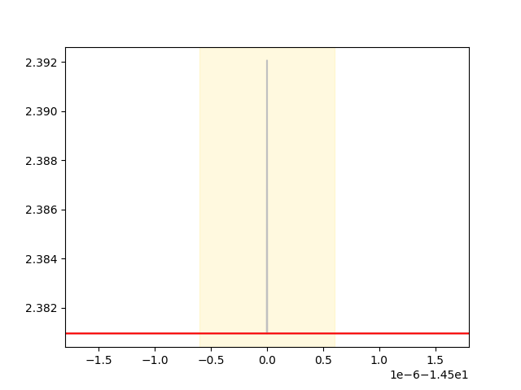
## New Eq:
((fabs(14.5 + cell__V) < 5.9999999999643672e-7) ? ((-12083332.833405094 - 833333.3333382823 * cell__V) * (-47619047.619881123 * (1.0 - exp(-9.9999999999406119e-8)) * ICaL_d_gate__d_infinity - 47619047.618779711 * (1.0 - exp(9.9999999999406119e-8)) * ICaL_d_gate__d_infinity) + 47619047.619881123 * (1.0 - exp(-9.9999999999406119e-8)) * ICaL_d_gate__d_infinity) : (28.571428571428569 * (1.0 - exp(-2.4166666666666665 - 0.16666666666666666 * cell__V)) * ICaL_d_gate__d_infinity / (14.5 + cell__V)))

## Equation 2:
```
IKr_Xr_gate__tau_Xr = 1 / (0.00060999999999999997 * (10.0 + cell__V) / (-1.0 + exp(1.45 + 0.14499999999999999 * cell__V)) + 0.0013799999999999999 * (7.0 + cell__V) / (1.0 - exp(-0.86099999999999999 - 0.123 * cell__V)))
```
### Partially evaluated to: 
```
IKr_Xr_gate__tau_Xr = 1 / (0.00060999999999999997 * (10.0 + cell__V) / (-1.0 + exp(1.45 + 0.14499999999999999 * cell__V)) + 0.0013799999999999999 * (7.0 + cell__V) / (1.0 - exp(-0.86099999999999999 - 0.123 * cell__V)))
```
### Singulariy points detected:

{-10.000000000000000, -7.0000000000000000, -7.0000000000000000}
#### float * A

####1 / A


####A + B:

`0.0013799999999999999 * (7.0 + cell__V) / (1.0 - 0.42273913174596284 * exp(-0.123 * cell__V))`
`0.00060999999999999997 * (10.0 + cell__V) / (-1.0 + 4.2631145151688168 * exp(0.14499999999999999 * cell__V))`

*U*
`-0.86099999999999999 - 0.123 * cell__V`

*V for 1e-07 range* 
`-6.9999991869918698 - -7.0000008130081302`

*Singularity point: -7.0000000000000000*


*U*
`1.45 + 0.14499999999999999 * cell__V`

*V for 1e-07 range* 
`-10.000000689655172 - -9.9999993103448279`

*Singularity point: -10.000000000000000*

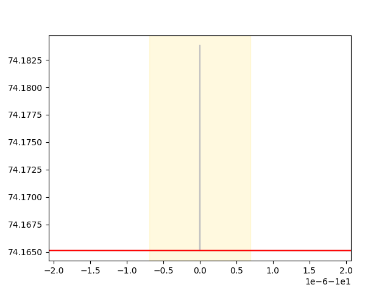
## New Eq:
((fabs(7.0 + cell__V) < 8.1300813008222672e-7) ? (1 / (0.0018300004959349594 / (-1.0 + exp(0.43500011788617882)) + 1.1219512195038971e-9 / (1.0 - exp(-9.9999999999406119e-8))) + (-4304999.4999950975 - 614999.99999929965 * cell__V) * (1 / (0.0018299995040650405 / (-1.0 + exp(0.43499988211382112)) - 1.1219512195230486e-9 / (1.0 - exp(1.0000000000114084e-7))) - 1 / (0.0018300004959349594 / (-1.0 + exp(0.43500011788617882)) + 1.1219512195038971e-9 / (1.0 - exp(-9.9999999999406119e-8))))) : ((fabs(10.0 + cell__V) < 6.8965517241448282e-7) ? (1 / (-0.0041400009517241374 / (1.0 - exp(0.36900008482758623)) - 4.2068965517283451e-10 / (-1.0 + exp(-9.9999999999406119e-8))) + (7250000.4999927497 + 724999.99999927497 * cell__V) * (1 / (4.2068965517283451e-10 / (-1.0 + exp(9.9999999999406119e-8)) - 0.0041399990482758617 / (1.0 - exp(0.36899991517241376))) - 1 / (-0.0041400009517241374 / (1.0 - exp(0.36900008482758623)) - 4.2068965517283451e-10 / (-1.0 + exp(-9.9999999999406119e-8))))) : (1 / (0.00060999999999999997 * (10.0 + cell__V) / (-1.0 + exp(1.45 + 0.14499999999999999 * cell__V)) + 0.0013799999999999999 * (7.0 + cell__V) / (1.0 - exp(-0.86099999999999999 - 0.123 * cell__V))))))

## Equation 3:
```
IKs_Xs_gate__tau_Xs = 1 / (0.00013100000000000001 * (30.0 + cell__V) / (-1.0 + exp(2.0609999999999999 + 0.068699999999999997 * cell__V)) + 7.1899999999999999e-5 * (30.0 + cell__V) / (1.0 - exp(-4.4399999999999995 - 0.14799999999999999 * cell__V)))
```
### Partially evaluated to: 
```
IKs_Xs_gate__tau_Xs = 1 / (0.00013100000000000001 * (30.0 + cell__V) / (-1.0 + exp(2.0609999999999999 + 0.068699999999999997 * cell__V)) + 7.1899999999999999e-5 * (30.0 + cell__V) / (1.0 - exp(-4.4399999999999995 - 0.14799999999999999 * cell__V)))
```
### Singulariy points detected:

{-30.000000000000000}
#### float * A

####1 / A


####A + B:

`7.1899999999999999e-5 * (30.0 + cell__V) / (1.0 - 0.011795938519751569 * exp(-0.14799999999999999 * cell__V))`
`0.00013100000000000001 * (30.0 + cell__V) / (-1.0 + 7.8538197044216602 * exp(0.068699999999999997 * cell__V))`

*U*
`-4.4399999999999995 - 0.14799999999999999 * cell__V`

*V for 1e-07 range* 
`-29.999999324324325 - -30.000000675675675`

*Singularity point: -30.000000000000000*


## New Eq:
((fabs(30.0 + cell__V) < 6.7567567568760367e-7) ? (1 / (8.8513513515076093e-11 / (-1.0 + exp(4.6418918920460017e-8)) + 4.8581081081938701e-11 / (1.0 - exp(-1.0000000000287557e-7))) + (-22199999.499608092 - 739999.99998693645 * cell__V) * (1 / (-8.8513513515076093e-11 / (-1.0 + exp(-4.6418918920460017e-8)) - 4.8581081081938701e-11 / (1.0 - exp(1.0000000000287557e-7))) - 1 / (8.8513513515076093e-11 / (-1.0 + exp(4.6418918920460017e-8)) + 4.8581081081938701e-11 / (1.0 - exp(-1.0000000000287557e-7))))) : (1 / (0.00013100000000000001 * (30.0 + cell__V) / (-1.0 + exp(2.0609999999999999 + 0.068699999999999997 * cell__V)) + 7.1899999999999999e-5 * (30.0 + cell__V) / (1.0 - exp(-4.4399999999999995 - 0.14799999999999999 * cell__V)))))

INa_h_gate__alpha_h = ((cell__V < -40.0) ? (0.13500000000000001 * exp(-11.764705882352942 + 0.14705882352941177 * INa__shift_INa_inact - 0.14705882352941177 * cell__V)) : (0))

####Piecewise!!

INa_h_gate__beta_h = ((cell__V < -40.0) ? (310000.0 * exp(0.34999999999999998 * cell__V - 0.34999999999999998 * INa__shift_INa_inact) + 3.5600000000000001 * exp(0.079000000000000001 * cell__V - 0.079000000000000001 * INa__shift_INa_inact)) : (7.6923076923076916 / (1.0 + exp(-0.96036036036036043 + 0.0900900900900901 * INa__shift_INa_inact - 0.0900900900900901 * cell__V))))

####Piecewise!!

INa_j_gate__alpha_j = ((cell__V < -40.0) ? ((37.780000000000001 + cell__V) * (-127140.0 * exp(0.24440000000000001 * cell__V - 0.24440000000000001 * INa__shift_INa_inact) - 3.4740000000000003e-5 * exp(0.043909999999999998 * INa__shift_INa_inact - 0.043909999999999998 * cell__V)) / (1.0 + exp(24.640530000000002 + 0.311 * cell__V - 0.311 * INa__shift_INa_inact))) : (0))

####Piecewise!!

INa_j_gate__beta_j = ((cell__V < -40.0) ? (0.1212 * exp(0.01052 * INa__shift_INa_inact - 0.01052 * cell__V) / (1.0 + exp(-5.5312920000000005 + 0.13780000000000001 * INa__shift_INa_inact - 0.13780000000000001 * cell__V))) : (0.29999999999999999 * exp(2.5349999999999999e-7 * INa__shift_INa_inact - 2.5349999999999999e-7 * cell__V) / (1.0 + exp(-3.2000000000000002 + 0.10000000000000001 * INa__shift_INa_inact - 0.10000000000000001 * cell__V))))

####Piecewise!!

## Equation 4:
```
INa_m_gate__alpha_m = 0.32000000000000001 * (47.130000000000003 + cell__V) / (1.0 - exp(-4.7130000000000001 - 0.10000000000000001 * cell__V))
```
### Partially evaluated to: 
```
INa_m_gate__alpha_m = 0.32000000000000001 * (47.130000000000003 + cell__V) / (1.0 - exp(-4.7130000000000001 - 0.10000000000000001 * cell__V))
```
### Singulariy points detected:

{-47.130000000000003}
*U*
`-4.7130000000000001 - 0.10000000000000001 * cell__V`

*V for 1e-07 range* 
`-47.129999000000005 - -47.130001`

*Singularity point: -47.130000000000003*


## New Eq:
((fabs(47.130000000000003 + cell__V) < 1.0000000000287557e-6) ? (3.200000000092018e-7 / (1.0 - exp(-1.0000000000287557e-7)) + (-23564999.499322373 - 499999.99998562218 * cell__V) * (-3.200000000092018e-7 / (1.0 - exp(1.0000000000287557e-7)) - 3.200000000092018e-7 / (1.0 - exp(-1.0000000000287557e-7)))) : (0.32000000000000001 * (47.130000000000003 + cell__V) / (1.0 - exp(-4.7130000000000001 - 0.10000000000000001 * cell__V))))

## Equation 5:
```
ICaL__i_CaL_Ca_SL = 4.0 * (-ICaL__gamma_Cao * model_parameters__Cao + Ca_buffer__Ca_SL * ICaL__gamma_Cai * exp(2.0 * cell__V * model_parameters__F / (model_parameters__R * model_parameters__T))) * ICaL__Fx_ICaL_SL * ICaL__PCa * ICaL__temp * ICaL_fCa_gate__fCa_SL / (-1.0 + exp(2.0 * cell__V * model_parameters__F / (model_parameters__R * model_parameters__T)))
```
### Partially evaluated to: 
```
ICaL__i_CaL_Ca_SL = 4.0 * (-ICaL__gamma_Cao * model_parameters__Cao + Ca_buffer__Ca_SL * ICaL__gamma_Cai * exp(2.0 * cell__V * model_parameters__F / (model_parameters__R * model_parameters__T))) * ICaL__Fx_ICaL_SL * ICaL__PCa * ICaL__temp * ICaL_fCa_gate__fCa_SL / (-1.0 + exp(2.0 * cell__V * model_parameters__F / (model_parameters__R * model_parameters__T)))
```
### Singulariy points detected:

{0}
#### float * A

####Failed to find U symbolically!

<class 'sympy.core.mul.Mul'>
_ICaL$Fx_ICaL_SL*_ICaL$PCa*_ICaL$temp*_ICaL_fCa_gate$fCa_SL*(_Ca_buffer$Ca_SL*_ICaL$gamma_Cai*exp(2.0*_cell$V*_model_parameters$F/(_model_parameters$R*_model_parameters$T)) - _ICaL$gamma_Cao*_model_parameters$Cao)/(exp(2.0*_cell$V*_model_parameters$F/(_model_parameters$R*_model_parameters$T)) - 1.0)

*try substituting parameters*

*U*
`0.074870384603595908 * cell__V`

*V for 1e-07 range* 
`-1.3356415961992688e-6 - 1.3356415961992688e-6`

*Singularity point: 0*

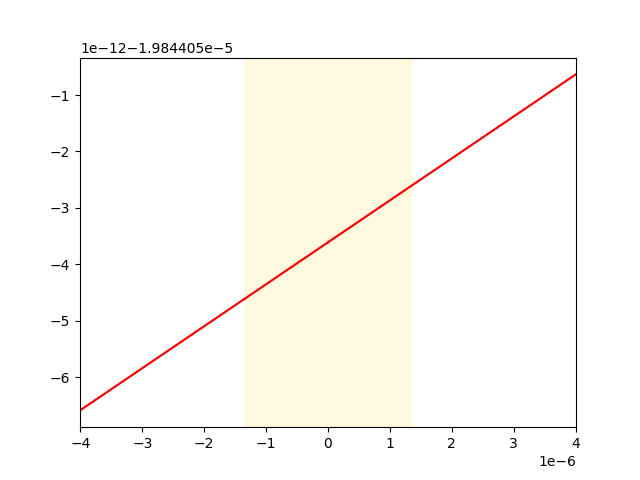
## New Eq:
((fabs(cell__V) < 1.3356415961992688e-6) ? ((0.5 + 374351.92301797954 * cell__V) * (4.0 * (-ICaL__gamma_Cao * model_parameters__Cao + Ca_buffer__Ca_SL * ICaL__gamma_Cai * exp(2.6712831923985376e-6 * model_parameters__F / (model_parameters__R * model_parameters__T))) * ICaL__Fx_ICaL_SL * ICaL__PCa * ICaL__temp * ICaL_fCa_gate__fCa_SL / (-1.0 + exp(2.6712831923985376e-6 * model_parameters__F / (model_parameters__R * model_parameters__T))) - 4.0 * (-ICaL__gamma_Cao * model_parameters__Cao + Ca_buffer__Ca_SL * ICaL__gamma_Cai * exp(-2.6712831923985376e-6 * model_parameters__F / (model_parameters__R * model_parameters__T))) * ICaL__Fx_ICaL_SL * ICaL__PCa * ICaL__temp * ICaL_fCa_gate__fCa_SL / (-1.0 + exp(-2.6712831923985376e-6 * model_parameters__F / (model_parameters__R * model_parameters__T)))) + 4.0 * (-ICaL__gamma_Cao * model_parameters__Cao + Ca_buffer__Ca_SL * ICaL__gamma_Cai * exp(-2.6712831923985376e-6 * model_parameters__F / (model_parameters__R * model_parameters__T))) * ICaL__Fx_ICaL_SL * ICaL__PCa * ICaL__temp * ICaL_fCa_gate__fCa_SL / (-1.0 + exp(-2.6712831923985376e-6 * model_parameters__F / (model_parameters__R * model_parameters__T)))) : (4.0 * (-ICaL__gamma_Cao * model_parameters__Cao + Ca_buffer__Ca_SL * ICaL__gamma_Cai * exp(2.0 * cell__V * model_parameters__F / (model_parameters__R * model_parameters__T))) * ICaL__Fx_ICaL_SL * ICaL__PCa * ICaL__temp * ICaL_fCa_gate__fCa_SL / (-1.0 + exp(2.0 * cell__V * model_parameters__F / (model_parameters__R * model_parameters__T)))))

## Equation 6:
```
ICaL__i_CaL_Ca_jct = 4.0 * (-ICaL__gamma_Cao * model_parameters__Cao + Ca_buffer__Ca_jct * ICaL__gamma_Cai * exp(2.0 * cell__V * model_parameters__F / (model_parameters__R * model_parameters__T))) * ICaL__Fx_ICaL_jct * ICaL__PCa * ICaL__temp * ICaL_fCa_gate__fCa_jct / (-1.0 + exp(2.0 * cell__V * model_parameters__F / (model_parameters__R * model_parameters__T)))
```
### Partially evaluated to: 
```
ICaL__i_CaL_Ca_jct = 4.0 * (-ICaL__gamma_Cao * model_parameters__Cao + Ca_buffer__Ca_jct * ICaL__gamma_Cai * exp(2.0 * cell__V * model_parameters__F / (model_parameters__R * model_parameters__T))) * ICaL__Fx_ICaL_jct * ICaL__PCa * ICaL__temp * ICaL_fCa_gate__fCa_jct / (-1.0 + exp(2.0 * cell__V * model_parameters__F / (model_parameters__R * model_parameters__T)))
```
### Singulariy points detected:

{0}
#### float * A

####Failed to find U symbolically!

<class 'sympy.core.mul.Mul'>
_ICaL$Fx_ICaL_jct*_ICaL$PCa*_ICaL$temp*_ICaL_fCa_gate$fCa_jct*(_Ca_buffer$Ca_jct*_ICaL$gamma_Cai*exp(2.0*_cell$V*_model_parameters$F/(_model_parameters$R*_model_parameters$T)) - _ICaL$gamma_Cao*_model_parameters$Cao)/(exp(2.0*_cell$V*_model_parameters$F/(_model_parameters$R*_model_parameters$T)) - 1.0)

*try substituting parameters*

*U*
`0.074870384603595908 * cell__V`

*V for 1e-07 range* 
`-1.3356415961992688e-6 - 1.3356415961992688e-6`

*Singularity point: 0*

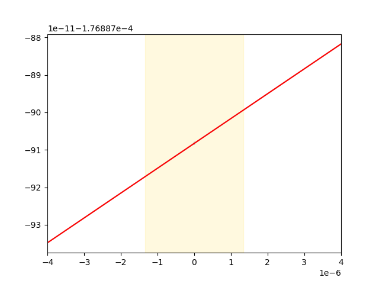
## New Eq:
((fabs(cell__V) < 1.3356415961992688e-6) ? ((0.5 + 374351.92301797954 * cell__V) * (4.0 * (-ICaL__gamma_Cao * model_parameters__Cao + Ca_buffer__Ca_jct * ICaL__gamma_Cai * exp(2.6712831923985376e-6 * model_parameters__F / (model_parameters__R * model_parameters__T))) * ICaL__Fx_ICaL_jct * ICaL__PCa * ICaL__temp * ICaL_fCa_gate__fCa_jct / (-1.0 + exp(2.6712831923985376e-6 * model_parameters__F / (model_parameters__R * model_parameters__T))) - 4.0 * (-ICaL__gamma_Cao * model_parameters__Cao + Ca_buffer__Ca_jct * ICaL__gamma_Cai * exp(-2.6712831923985376e-6 * model_parameters__F / (model_parameters__R * model_parameters__T))) * ICaL__Fx_ICaL_jct * ICaL__PCa * ICaL__temp * ICaL_fCa_gate__fCa_jct / (-1.0 + exp(-2.6712831923985376e-6 * model_parameters__F / (model_parameters__R * model_parameters__T)))) + 4.0 * (-ICaL__gamma_Cao * model_parameters__Cao + Ca_buffer__Ca_jct * ICaL__gamma_Cai * exp(-2.6712831923985376e-6 * model_parameters__F / (model_parameters__R * model_parameters__T))) * ICaL__Fx_ICaL_jct * ICaL__PCa * ICaL__temp * ICaL_fCa_gate__fCa_jct / (-1.0 + exp(-2.6712831923985376e-6 * model_parameters__F / (model_parameters__R * model_parameters__T)))) : (4.0 * (-ICaL__gamma_Cao * model_parameters__Cao + Ca_buffer__Ca_jct * ICaL__gamma_Cai * exp(2.0 * cell__V * model_parameters__F / (model_parameters__R * model_parameters__T))) * ICaL__Fx_ICaL_jct * ICaL__PCa * ICaL__temp * ICaL_fCa_gate__fCa_jct / (-1.0 + exp(2.0 * cell__V * model_parameters__F / (model_parameters__R * model_parameters__T)))))

## Equation 7:
```
ICaL__i_CaL_K = (ICaL__Fx_ICaL_SL * ICaL_fCa_gate__fCa_SL + ICaL__Fx_ICaL_jct * ICaL_fCa_gate__fCa_jct) * (-ICaL__gamma_Ko * model_parameters__Ko + ICaL__gamma_Ki * model_parameters__Ki * exp(cell__V * model_parameters__F / (model_parameters__R * model_parameters__T))) * ICaL__PK * ICaL__temp / (-1.0 + exp(cell__V * model_parameters__F / (model_parameters__R * model_parameters__T)))
```
### Partially evaluated to: 
```
ICaL__i_CaL_K = (ICaL__Fx_ICaL_SL * ICaL_fCa_gate__fCa_SL + ICaL__Fx_ICaL_jct * ICaL_fCa_gate__fCa_jct) * (-ICaL__gamma_Ko * model_parameters__Ko + ICaL__gamma_Ki * model_parameters__Ki * exp(cell__V * model_parameters__F / (model_parameters__R * model_parameters__T))) * ICaL__PK * ICaL__temp / (-1.0 + exp(cell__V * model_parameters__F / (model_parameters__R * model_parameters__T)))
```
### Singulariy points detected:

{0}
####Failed to find U symbolically!

<class 'sympy.core.mul.Mul'>
_ICaL$PK*_ICaL$temp*(_ICaL$Fx_ICaL_SL*_ICaL_fCa_gate$fCa_SL + _ICaL$Fx_ICaL_jct*_ICaL_fCa_gate$fCa_jct)*(_ICaL$gamma_Ki*_model_parameters$Ki*exp(_cell$V*_model_parameters$F/(_model_parameters$R*_model_parameters$T)) - _ICaL$gamma_Ko*_model_parameters$Ko)/(exp(_cell$V*_model_parameters$F/(_model_parameters$R*_model_parameters$T)) - 1.0)

*try substituting parameters*

*U*
`0.037435192301797954 * cell__V`

*V for 1e-07 range* 
`-2.6712831923985376e-6 - 2.6712831923985376e-6`

*Singularity point: 0*


## New Eq:
((fabs(cell__V) < 2.6712831923985376e-6) ? ((0.5 + 187175.96150898977 * cell__V) * ((ICaL__Fx_ICaL_SL * ICaL_fCa_gate__fCa_SL + ICaL__Fx_ICaL_jct * ICaL_fCa_gate__fCa_jct) * (-ICaL__gamma_Ko * model_parameters__Ko + ICaL__gamma_Ki * model_parameters__Ki * exp(2.6712831923985376e-6 * model_parameters__F / (model_parameters__R * model_parameters__T))) * ICaL__PK * ICaL__temp / (-1.0 + exp(2.6712831923985376e-6 * model_parameters__F / (model_parameters__R * model_parameters__T))) - (ICaL__Fx_ICaL_SL * ICaL_fCa_gate__fCa_SL + ICaL__Fx_ICaL_jct * ICaL_fCa_gate__fCa_jct) * (-ICaL__gamma_Ko * model_parameters__Ko + ICaL__gamma_Ki * model_parameters__Ki * exp(-2.6712831923985376e-6 * model_parameters__F / (model_parameters__R * model_parameters__T))) * ICaL__PK * ICaL__temp / (-1.0 + exp(-2.6712831923985376e-6 * model_parameters__F / (model_parameters__R * model_parameters__T)))) + (ICaL__Fx_ICaL_SL * ICaL_fCa_gate__fCa_SL + ICaL__Fx_ICaL_jct * ICaL_fCa_gate__fCa_jct) * (-ICaL__gamma_Ko * model_parameters__Ko + ICaL__gamma_Ki * model_parameters__Ki * exp(-2.6712831923985376e-6 * model_parameters__F / (model_parameters__R * model_parameters__T))) * ICaL__PK * ICaL__temp / (-1.0 + exp(-2.6712831923985376e-6 * model_parameters__F / (model_parameters__R * model_parameters__T)))) : ((ICaL__Fx_ICaL_SL * ICaL_fCa_gate__fCa_SL + ICaL__Fx_ICaL_jct * ICaL_fCa_gate__fCa_jct) * (-ICaL__gamma_Ko * model_parameters__Ko + ICaL__gamma_Ki * model_parameters__Ki * exp(cell__V * model_parameters__F / (model_parameters__R * model_parameters__T))) * ICaL__PK * ICaL__temp / (-1.0 + exp(cell__V * model_parameters__F / (model_parameters__R * model_parameters__T)))))

## Equation 8:
```
ICaL__i_CaL_Na_SL = (-ICaL__gamma_Nao * model_parameters__Nao + ICaL__gamma_Nai * Na_buffer__Na_SL * exp(cell__V * model_parameters__F / (model_parameters__R * model_parameters__T))) * ICaL__Fx_ICaL_SL * ICaL__PNa * ICaL__temp * ICaL_fCa_gate__fCa_SL / (-1.0 + exp(cell__V * model_parameters__F / (model_parameters__R * model_parameters__T)))
```
### Partially evaluated to: 
```
ICaL__i_CaL_Na_SL = (-ICaL__gamma_Nao * model_parameters__Nao + ICaL__gamma_Nai * Na_buffer__Na_SL * exp(cell__V * model_parameters__F / (model_parameters__R * model_parameters__T))) * ICaL__Fx_ICaL_SL * ICaL__PNa * ICaL__temp * ICaL_fCa_gate__fCa_SL / (-1.0 + exp(cell__V * model_parameters__F / (model_parameters__R * model_parameters__T)))
```
### Singulariy points detected:

{0}
####Failed to find U symbolically!

<class 'sympy.core.mul.Mul'>
_ICaL$Fx_ICaL_SL*_ICaL$PNa*_ICaL$temp*_ICaL_fCa_gate$fCa_SL*(_ICaL$gamma_Nai*_Na_buffer$Na_SL*exp(_cell$V*_model_parameters$F/(_model_parameters$R*_model_parameters$T)) - _ICaL$gamma_Nao*_model_parameters$Nao)/(exp(_cell$V*_model_parameters$F/(_model_parameters$R*_model_parameters$T)) - 1.0)

*try substituting parameters*

*U*
`0.037435192301797954 * cell__V`

*V for 1e-07 range* 
`-2.6712831923985376e-6 - 2.6712831923985376e-6`

*Singularity point: 0*

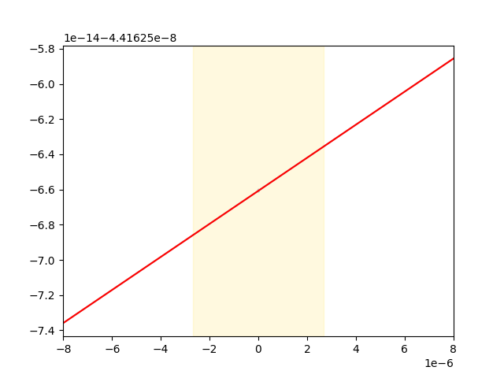
## New Eq:
((fabs(cell__V) < 2.6712831923985376e-6) ? ((0.5 + 187175.96150898977 * cell__V) * ((-ICaL__gamma_Nao * model_parameters__Nao + ICaL__gamma_Nai * Na_buffer__Na_SL * exp(2.6712831923985376e-6 * model_parameters__F / (model_parameters__R * model_parameters__T))) * ICaL__Fx_ICaL_SL * ICaL__PNa * ICaL__temp * ICaL_fCa_gate__fCa_SL / (-1.0 + exp(2.6712831923985376e-6 * model_parameters__F / (model_parameters__R * model_parameters__T))) - (-ICaL__gamma_Nao * model_parameters__Nao + ICaL__gamma_Nai * Na_buffer__Na_SL * exp(-2.6712831923985376e-6 * model_parameters__F / (model_parameters__R * model_parameters__T))) * ICaL__Fx_ICaL_SL * ICaL__PNa * ICaL__temp * ICaL_fCa_gate__fCa_SL / (-1.0 + exp(-2.6712831923985376e-6 * model_parameters__F / (model_parameters__R * model_parameters__T)))) + (-ICaL__gamma_Nao * model_parameters__Nao + ICaL__gamma_Nai * Na_buffer__Na_SL * exp(-2.6712831923985376e-6 * model_parameters__F / (model_parameters__R * model_parameters__T))) * ICaL__Fx_ICaL_SL * ICaL__PNa * ICaL__temp * ICaL_fCa_gate__fCa_SL / (-1.0 + exp(-2.6712831923985376e-6 * model_parameters__F / (model_parameters__R * model_parameters__T)))) : ((-ICaL__gamma_Nao * model_parameters__Nao + ICaL__gamma_Nai * Na_buffer__Na_SL * exp(cell__V * model_parameters__F / (model_parameters__R * model_parameters__T))) * ICaL__Fx_ICaL_SL * ICaL__PNa * ICaL__temp * ICaL_fCa_gate__fCa_SL / (-1.0 + exp(cell__V * model_parameters__F / (model_parameters__R * model_parameters__T)))))

## Equation 9:
```
ICaL__i_CaL_Na_jct = (-ICaL__gamma_Nao * model_parameters__Nao + ICaL__gamma_Nai * Na_buffer__Na_jct * exp(cell__V * model_parameters__F / (model_parameters__R * model_parameters__T))) * ICaL__Fx_ICaL_jct * ICaL__PNa * ICaL__temp * ICaL_fCa_gate__fCa_jct / (-1.0 + exp(cell__V * model_parameters__F / (model_parameters__R * model_parameters__T)))
```
### Partially evaluated to: 
```
ICaL__i_CaL_Na_jct = (-ICaL__gamma_Nao * model_parameters__Nao + ICaL__gamma_Nai * Na_buffer__Na_jct * exp(cell__V * model_parameters__F / (model_parameters__R * model_parameters__T))) * ICaL__Fx_ICaL_jct * ICaL__PNa * ICaL__temp * ICaL_fCa_gate__fCa_jct / (-1.0 + exp(cell__V * model_parameters__F / (model_parameters__R * model_parameters__T)))
```
### Singulariy points detected:

{0}
####Failed to find U symbolically!

<class 'sympy.core.mul.Mul'>
_ICaL$Fx_ICaL_jct*_ICaL$PNa*_ICaL$temp*_ICaL_fCa_gate$fCa_jct*(_ICaL$gamma_Nai*_Na_buffer$Na_jct*exp(_cell$V*_model_parameters$F/(_model_parameters$R*_model_parameters$T)) - _ICaL$gamma_Nao*_model_parameters$Nao)/(exp(_cell$V*_model_parameters$F/(_model_parameters$R*_model_parameters$T)) - 1.0)

*try substituting parameters*

*U*
`0.037435192301797954 * cell__V`

*V for 1e-07 range* 
`-2.6712831923985376e-6 - 2.6712831923985376e-6`

*Singularity point: 0*

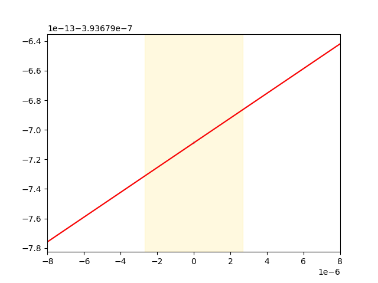
## New Eq:
((fabs(cell__V) < 2.6712831923985376e-6) ? ((0.5 + 187175.96150898977 * cell__V) * ((-ICaL__gamma_Nao * model_parameters__Nao + ICaL__gamma_Nai * Na_buffer__Na_jct * exp(2.6712831923985376e-6 * model_parameters__F / (model_parameters__R * model_parameters__T))) * ICaL__Fx_ICaL_jct * ICaL__PNa * ICaL__temp * ICaL_fCa_gate__fCa_jct / (-1.0 + exp(2.6712831923985376e-6 * model_parameters__F / (model_parameters__R * model_parameters__T))) - (-ICaL__gamma_Nao * model_parameters__Nao + ICaL__gamma_Nai * Na_buffer__Na_jct * exp(-2.6712831923985376e-6 * model_parameters__F / (model_parameters__R * model_parameters__T))) * ICaL__Fx_ICaL_jct * ICaL__PNa * ICaL__temp * ICaL_fCa_gate__fCa_jct / (-1.0 + exp(-2.6712831923985376e-6 * model_parameters__F / (model_parameters__R * model_parameters__T)))) + (-ICaL__gamma_Nao * model_parameters__Nao + ICaL__gamma_Nai * Na_buffer__Na_jct * exp(-2.6712831923985376e-6 * model_parameters__F / (model_parameters__R * model_parameters__T))) * ICaL__Fx_ICaL_jct * ICaL__PNa * ICaL__temp * ICaL_fCa_gate__fCa_jct / (-1.0 + exp(-2.6712831923985376e-6 * model_parameters__F / (model_parameters__R * model_parameters__T)))) : ((-ICaL__gamma_Nao * model_parameters__Nao + ICaL__gamma_Nai * Na_buffer__Na_jct * exp(cell__V * model_parameters__F / (model_parameters__R * model_parameters__T))) * ICaL__Fx_ICaL_jct * ICaL__PNa * ICaL__temp * ICaL_fCa_gate__fCa_jct / (-1.0 + exp(cell__V * model_parameters__F / (model_parameters__R * model_parameters__T)))))

Singularities cannot be found
1.0/(0.036499999999999998*(0.14285714285714286*exp(0.014858841010401189*_model_parameters$Nao) - 0.14285714285714286)*exp(-_cell$V*_model_parameters$F/(_model_parameters$R*_model_parameters$T)) + 1.0 + 0.1245*exp(-0.10000000000000001*_cell$V*_model_parameters$F/(_model_parameters$R*_model_parameters$T)))

# Model: stewart_zhang_model_2008(stewart_zhang_model_2008_ss.cellml)
## Equation 1:
```
L_type_Ca_current__i_CaL = 4.0 * pow(membrane__F, 2) * (-15.0 + membrane__V) * (-calcium_dynamics__Ca_o + 0.25 * calcium_dynamics__Ca_ss * exp(2.0 * (-15.0 + membrane__V) * membrane__F / (membrane__R * membrane__T))) * L_type_Ca_current__g_CaL * L_type_Ca_current_d_gate__d * L_type_Ca_current_f2_gate__f2 * L_type_Ca_current_fCass_gate__fCass * L_type_Ca_current_f_gate__f / ((-1.0 + exp(2.0 * (-15.0 + membrane__V) * membrane__F / (membrane__R * membrane__T))) * membrane__R * membrane__T)
```
### Partially evaluated to: 
```
L_type_Ca_current__i_CaL = 4.0 * pow(membrane__F, 2) * (-15.0 + membrane__V) * (-calcium_dynamics__Ca_o + 0.25 * calcium_dynamics__Ca_ss * exp(2.0 * (-15.0 + membrane__V) * membrane__F / (membrane__R * membrane__T))) * L_type_Ca_current__g_CaL * L_type_Ca_current_d_gate__d * L_type_Ca_current_f2_gate__f2 * L_type_Ca_current_fCass_gate__fCass * L_type_Ca_current_f_gate__f / ((-1.0 + exp(2.0 * (-15.0 + membrane__V) * membrane__F / (membrane__R * membrane__T))) * membrane__R * membrane__T)
```
### Singulariy points detected:

{15.000000000000000}
#### float * A

####Failed to find U symbolically!

<class 'sympy.core.mul.Mul'>
_membrane$F**2*_L_type_Ca_current$g_CaL*_L_type_Ca_current_d_gate$d*_L_type_Ca_current_f2_gate$f2*_L_type_Ca_current_fCass_gate$fCass*_L_type_Ca_current_f_gate$f*(-_calcium_dynamics$Ca_o + 0.25*_calcium_dynamics$Ca_ss*exp(2.0*_membrane$F*(_membrane$V - 15.0)/(_membrane$R*_membrane$T)))*(_membrane$V - 15.0)/(_membrane$R*_membrane$T*(exp(2.0*_membrane$F*(_membrane$V - 15.0)/(_membrane$R*_membrane$T)) - 1.0))

*try substituting parameters*

*U*
`-1.1230167246823641 + 0.074867781645490947 * membrane__V`

*V for 1e-07 range* 
`14.999998664311967 - 15.000001335688033`

*Singularity point: 15.000000000000000*


## New Eq:
((fabs(-15.0 + membrane__V) < 1.3356880329759568e-6) ? ((-5615083.1234489232 + 374338.90822992817 * membrane__V) * (5.3427521319315829e-6 * pow(membrane__F, 2) * (-calcium_dynamics__Ca_o + 0.25 * calcium_dynamics__Ca_ss * exp(-2.6713760659657915e-6 * membrane__F / (membrane__R * membrane__T))) * L_type_Ca_current__g_CaL * L_type_Ca_current_d_gate__d * L_type_Ca_current_f2_gate__f2 * L_type_Ca_current_fCass_gate__fCass * L_type_Ca_current_f_gate__f / ((-1.0 + exp(-2.6713760659657915e-6 * membrane__F / (membrane__R * membrane__T))) * membrane__R * membrane__T) + 5.3427521318760718e-6 * pow(membrane__F, 2) * (-calcium_dynamics__Ca_o + 0.25 * calcium_dynamics__Ca_ss * exp(2.6713760659380359e-6 * membrane__F / (membrane__R * membrane__T))) * L_type_Ca_current__g_CaL * L_type_Ca_current_d_gate__d * L_type_Ca_current_f2_gate__f2 * L_type_Ca_current_fCass_gate__fCass * L_type_Ca_current_f_gate__f / ((-1.0 + exp(2.6713760659380359e-6 * membrane__F / (membrane__R * membrane__T))) * membrane__R * membrane__T)) - 5.3427521319315829e-6 * pow(membrane__F, 2) * (-calcium_dynamics__Ca_o + 0.25 * calcium_dynamics__Ca_ss * exp(-2.6713760659657915e-6 * membrane__F / (membrane__R * membrane__T))) * L_type_Ca_current__g_CaL * L_type_Ca_current_d_gate__d * L_type_Ca_current_f2_gate__f2 * L_type_Ca_current_fCass_gate__fCass * L_type_Ca_current_f_gate__f / ((-1.0 + exp(-2.6713760659657915e-6 * membrane__F / (membrane__R * membrane__T))) * membrane__R * membrane__T)) : (4.0 * pow(membrane__F, 2) * (-15.0 + membrane__V) * (-calcium_dynamics__Ca_o + 0.25 * calcium_dynamics__Ca_ss * exp(2.0 * (-15.0 + membrane__V) * membrane__F / (membrane__R * membrane__T))) * L_type_Ca_current__g_CaL * L_type_Ca_current_d_gate__d * L_type_Ca_current_f2_gate__f2 * L_type_Ca_current_fCass_gate__fCass * L_type_Ca_current_f_gate__f / ((-1.0 + exp(2.0 * (-15.0 + membrane__V) * membrane__F / (membrane__R * membrane__T))) * membrane__R * membrane__T)))

fast_sodium_current_h_gate__alpha_h = ((membrane__V < -40.0) ? (0.057000000000000002 * exp(-11.764705882352942 + 0.14705882352941177 * fast_sodium_current__shift_INa_inact - 0.14705882352941177 * membrane__V)) : (0))

####Piecewise!!

fast_sodium_current_h_gate__beta_h = ((membrane__V < -40.0) ? (310000.0 * exp(0.34849999999999998 * membrane__V - 0.34849999999999998 * fast_sodium_current__shift_INa_inact) + 2.7000000000000002 * exp(0.079000000000000001 * membrane__V - 0.079000000000000001 * fast_sodium_current__shift_INa_inact)) : (5.9230769230769234 / (1.0 + exp(-0.96036036036036043 + 0.0900900900900901 * fast_sodium_current__shift_INa_inact - 0.0900900900900901 * membrane__V))))

####Piecewise!!

fast_sodium_current_j_gate__alpha_j = ((membrane__V < -40.0) ? ((37.780000000000001 + membrane__V) * (-25428.0 * exp(0.24440000000000001 * membrane__V - 0.24440000000000001 * fast_sodium_current__shift_INa_inact) - 6.9480000000000002e-6 * exp(0.043909999999999998 * fast_sodium_current__shift_INa_inact - 0.043909999999999998 * membrane__V)) / (1.0 + exp(24.640530000000002 + 0.311 * membrane__V - 0.311 * fast_sodium_current__shift_INa_inact))) : (0))

####Piecewise!!

fast_sodium_current_j_gate__beta_j = ((membrane__V < -40.0) ? (0.024240000000000001 * exp(0.01052 * fast_sodium_current__shift_INa_inact - 0.01052 * membrane__V) / (1.0 + exp(-5.5312920000000005 + 0.13780000000000001 * fast_sodium_current__shift_INa_inact - 0.13780000000000001 * membrane__V))) : (0.59999999999999998 * exp(0.057000000000000002 * membrane__V - 0.057000000000000002 * fast_sodium_current__shift_INa_inact) / (1.0 + exp(-3.2000000000000002 + 0.10000000000000001 * fast_sodium_current__shift_INa_inact - 0.10000000000000001 * membrane__V))))

####Piecewise!!

# Model: tentusscher_model_2004_endo(ten_tusscher_model_2004_endo.cellml)
calcium_dynamics__g_inf = ((calcium_dynamics__Ca_i < 0.00035) ? (1 / (1.0 + 5.439910241481016e+20 * pow(calcium_dynamics__Ca_i, 6))) : (1 / (1.0 + 1.9720198874049176e+55 * pow(calcium_dynamics__Ca_i, 16))))

####Piecewise!!

Derivative(_L_type_Ca_current_fCa_gate__fCa, _environment__time) = (((membrane__V > -60.0) && (L_type_Ca_current_fCa_gate__fCa < L_type_Ca_current_fCa_gate__fCa_inf)) ? (0) : (L_type_Ca_current_fCa_gate__d_fCa))

####Piecewise!!

Derivative(_calcium_dynamics__g, _environment__time) = (((membrane__V > -60.0) && (calcium_dynamics__g < calcium_dynamics__g_inf)) ? (0) : (calcium_dynamics__d_g))

####Piecewise!!

## Equation 1:
```
L_type_Ca_current__i_CaL = 4.0 * pow(membrane__F, 2) * (-0.34100000000000003 * calcium_dynamics__Ca_o + calcium_dynamics__Ca_i * exp(2.0 * membrane__F * membrane__V / (membrane__R * membrane__T))) * L_type_Ca_current__g_CaL * L_type_Ca_current_d_gate__d * L_type_Ca_current_fCa_gate__fCa * L_type_Ca_current_f_gate__f * membrane__V / ((-1.0 + exp(2.0 * membrane__F * membrane__V / (membrane__R * membrane__T))) * membrane__R * membrane__T)
```
### Partially evaluated to: 
```
L_type_Ca_current__i_CaL = 4.0 * pow(membrane__F, 2) * (-0.34100000000000003 * calcium_dynamics__Ca_o + calcium_dynamics__Ca_i * exp(2.0 * membrane__F * membrane__V / (membrane__R * membrane__T))) * L_type_Ca_current__g_CaL * L_type_Ca_current_d_gate__d * L_type_Ca_current_fCa_gate__fCa * L_type_Ca_current_f_gate__f * membrane__V / ((-1.0 + exp(2.0 * membrane__F * membrane__V / (membrane__R * membrane__T))) * membrane__R * membrane__T)
```
### Singulariy points detected:

{0}
#### float * A

####Failed to find U symbolically!

<class 'sympy.core.mul.Mul'>
_membrane$F**2*_L_type_Ca_current$g_CaL*_L_type_Ca_current_d_gate$d*_L_type_Ca_current_fCa_gate$fCa*_L_type_Ca_current_f_gate$f*_membrane$V*(_calcium_dynamics$Ca_i*exp(2.0*_membrane$F*_membrane$V/(_membrane$R*_membrane$T)) - 0.34100000000000003*_calcium_dynamics$Ca_o)/(_membrane$R*_membrane$T*(exp(2.0*_membrane$F*_membrane$V/(_membrane$R*_membrane$T)) - 1.0))

*try substituting parameters*

*U*
`0.074867781645490947 * membrane__V`

*V for 1e-07 range* 
`-1.3356880329847825e-6 - 1.3356880329847825e-6`

*Singularity point: 0*

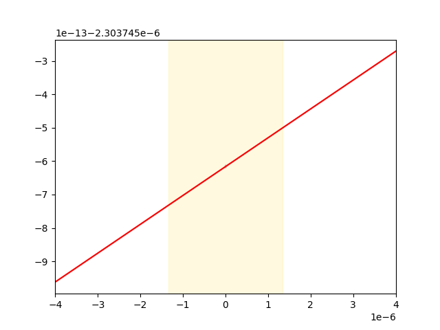
## New Eq:
((fabs(membrane__V) < 1.3356880329847825e-6) ? ((0.5 + 374338.90822745475 * membrane__V) * (5.34275213193913e-6 * pow(membrane__F, 2) * (-0.34100000000000003 * calcium_dynamics__Ca_o + calcium_dynamics__Ca_i * exp(2.671376065969565e-6 * membrane__F / (membrane__R * membrane__T))) * L_type_Ca_current__g_CaL * L_type_Ca_current_d_gate__d * L_type_Ca_current_fCa_gate__fCa * L_type_Ca_current_f_gate__f / ((-1.0 + exp(2.671376065969565e-6 * membrane__F / (membrane__R * membrane__T))) * membrane__R * membrane__T) + 5.34275213193913e-6 * pow(membrane__F, 2) * (-0.34100000000000003 * calcium_dynamics__Ca_o + calcium_dynamics__Ca_i * exp(-2.671376065969565e-6 * membrane__F / (membrane__R * membrane__T))) * L_type_Ca_current__g_CaL * L_type_Ca_current_d_gate__d * L_type_Ca_current_fCa_gate__fCa * L_type_Ca_current_f_gate__f / ((-1.0 + exp(-2.671376065969565e-6 * membrane__F / (membrane__R * membrane__T))) * membrane__R * membrane__T)) - 5.34275213193913e-6 * pow(membrane__F, 2) * (-0.34100000000000003 * calcium_dynamics__Ca_o + calcium_dynamics__Ca_i * exp(-2.671376065969565e-6 * membrane__F / (membrane__R * membrane__T))) * L_type_Ca_current__g_CaL * L_type_Ca_current_d_gate__d * L_type_Ca_current_fCa_gate__fCa * L_type_Ca_current_f_gate__f / ((-1.0 + exp(-2.671376065969565e-6 * membrane__F / (membrane__R * membrane__T))) * membrane__R * membrane__T)) : (4.0 * pow(membrane__F, 2) * (-0.34100000000000003 * calcium_dynamics__Ca_o + calcium_dynamics__Ca_i * exp(2.0 * membrane__F * membrane__V / (membrane__R * membrane__T))) * L_type_Ca_current__g_CaL * L_type_Ca_current_d_gate__d * L_type_Ca_current_fCa_gate__fCa * L_type_Ca_current_f_gate__f * membrane__V / ((-1.0 + exp(2.0 * membrane__F * membrane__V / (membrane__R * membrane__T))) * membrane__R * membrane__T)))

fast_sodium_current_h_gate__alpha_h = ((membrane__V < -40.0) ? (0.057000000000000002 * exp(-11.764705882352942 - 0.14705882352941177 * membrane__V)) : (0))

####Piecewise!!

fast_sodium_current_h_gate__beta_h = ((membrane__V < -40.0) ? (310000.0 * exp(0.34849999999999998 * membrane__V) + 2.7000000000000002 * exp(0.079000000000000001 * membrane__V)) : (5.9230769230769234 / (1.0 + exp(-0.96036036036036043 - 0.0900900900900901 * membrane__V))))

####Piecewise!!

fast_sodium_current_j_gate__alpha_j = ((membrane__V < -40.0) ? ((37.780000000000001 + membrane__V) * (-25428.0 * exp(0.24440000000000001 * membrane__V) - 6.9480000000000002e-6 * exp(-0.043909999999999998 * membrane__V)) / (1.0 + exp(24.640530000000002 + 0.311 * membrane__V))) : (0))

####Piecewise!!

fast_sodium_current_j_gate__beta_j = ((membrane__V < -40.0) ? (0.024240000000000001 * exp(-0.01052 * membrane__V) / (1.0 + exp(-5.5312920000000005 - 0.13780000000000001 * membrane__V))) : (0.59999999999999998 * exp(0.057000000000000002 * membrane__V) / (1.0 + exp(-3.2000000000000002 - 0.10000000000000001 * membrane__V))))

####Piecewise!!

# Model: tentusscher_model_2004_epi(ten_tusscher_model_2004_epi.cellml)
calcium_dynamics__g_inf = ((calcium_dynamics__Ca_i < 0.00035) ? (1 / (1.0 + 5.439910241481016e+20 * pow(calcium_dynamics__Ca_i, 6))) : (1 / (1.0 + 1.9720198874049176e+55 * pow(calcium_dynamics__Ca_i, 16))))

####Piecewise!!

Derivative(_L_type_Ca_current_fCa_gate__fCa, _environment__time) = (((membrane__V > -60.0) && (L_type_Ca_current_fCa_gate__fCa < L_type_Ca_current_fCa_gate__fCa_inf)) ? (0) : (L_type_Ca_current_fCa_gate__d_fCa))

####Piecewise!!

Derivative(_calcium_dynamics__g, _environment__time) = (((membrane__V > -60.0) && (calcium_dynamics__g < calcium_dynamics__g_inf)) ? (0) : (calcium_dynamics__d_g))

####Piecewise!!

L_type_Ca_current__i_CaL = (((L_type_Ca_current__U >= -9.9999999999999995e-8) && (L_type_Ca_current__U <= 9.9999999999999995e-8)) ? ((1.0 - 0.5 * L_type_Ca_current__U) * L_type_Ca_current__A) : (L_type_Ca_current__A * L_type_Ca_current__U / (-1.0 + exp(L_type_Ca_current__U))))

####Piecewise!!

fast_sodium_current_h_gate__alpha_h = ((membrane__V < -40.0) ? (0.057000000000000002 * exp(-11.764705882352942 - 0.14705882352941177 * membrane__V)) : (0))

####Piecewise!!

fast_sodium_current_h_gate__beta_h = ((membrane__V < -40.0) ? (310000.0 * exp(0.34849999999999998 * membrane__V) + 2.7000000000000002 * exp(0.079000000000000001 * membrane__V)) : (5.9230769230769234 / (1.0 + exp(-0.96036036036036043 - 0.0900900900900901 * membrane__V))))

####Piecewise!!

fast_sodium_current_j_gate__alpha_j = ((membrane__V < -40.0) ? ((37.780000000000001 + membrane__V) * (-25428.0 * exp(0.24440000000000001 * membrane__V) - 6.9480000000000002e-6 * exp(-0.043909999999999998 * membrane__V)) / (1.0 + exp(24.640530000000002 + 0.311 * membrane__V))) : (0))

####Piecewise!!

fast_sodium_current_j_gate__beta_j = ((membrane__V < -40.0) ? (0.024240000000000001 * exp(-0.01052 * membrane__V) / (1.0 + exp(-5.5312920000000005 - 0.13780000000000001 * membrane__V))) : (0.59999999999999998 * exp(0.057000000000000002 * membrane__V) / (1.0 + exp(-3.2000000000000002 - 0.10000000000000001 * membrane__V))))

####Piecewise!!

# Model: tentusscher_model_2004_M(ten_tusscher_model_2004_M.cellml)
calcium_dynamics__g_inf = ((calcium_dynamics__Ca_i < 0.00035) ? (1 / (1.0 + 5.439910241481016e+20 * pow(calcium_dynamics__Ca_i, 6))) : (1 / (1.0 + 1.9720198874049176e+55 * pow(calcium_dynamics__Ca_i, 16))))

####Piecewise!!

Derivative(_L_type_Ca_current_fCa_gate__fCa, _environment__time) = (((membrane__V > -60.0) && (L_type_Ca_current_fCa_gate__fCa < L_type_Ca_current_fCa_gate__fCa_inf)) ? (0) : (L_type_Ca_current_fCa_gate__d_fCa))

####Piecewise!!

Derivative(_calcium_dynamics__g, _environment__time) = (((membrane__V > -60.0) && (calcium_dynamics__g < calcium_dynamics__g_inf)) ? (0) : (calcium_dynamics__d_g))

####Piecewise!!

## Equation 1:
```
L_type_Ca_current__i_CaL = 4.0 * pow(membrane__F, 2) * (-0.34100000000000003 * calcium_dynamics__Ca_o + calcium_dynamics__Ca_i * exp(2.0 * membrane__F * membrane__V / (membrane__R * membrane__T))) * L_type_Ca_current__g_CaL * L_type_Ca_current_d_gate__d * L_type_Ca_current_fCa_gate__fCa * L_type_Ca_current_f_gate__f * membrane__V / ((-1.0 + exp(2.0 * membrane__F * membrane__V / (membrane__R * membrane__T))) * membrane__R * membrane__T)
```
### Partially evaluated to: 
```
L_type_Ca_current__i_CaL = 4.0 * pow(membrane__F, 2) * (-0.34100000000000003 * calcium_dynamics__Ca_o + calcium_dynamics__Ca_i * exp(2.0 * membrane__F * membrane__V / (membrane__R * membrane__T))) * L_type_Ca_current__g_CaL * L_type_Ca_current_d_gate__d * L_type_Ca_current_fCa_gate__fCa * L_type_Ca_current_f_gate__f * membrane__V / ((-1.0 + exp(2.0 * membrane__F * membrane__V / (membrane__R * membrane__T))) * membrane__R * membrane__T)
```
### Singulariy points detected:

{0}
#### float * A

####Failed to find U symbolically!

<class 'sympy.core.mul.Mul'>
_membrane$F**2*_L_type_Ca_current$g_CaL*_L_type_Ca_current_d_gate$d*_L_type_Ca_current_fCa_gate$fCa*_L_type_Ca_current_f_gate$f*_membrane$V*(_calcium_dynamics$Ca_i*exp(2.0*_membrane$F*_membrane$V/(_membrane$R*_membrane$T)) - 0.34100000000000003*_calcium_dynamics$Ca_o)/(_membrane$R*_membrane$T*(exp(2.0*_membrane$F*_membrane$V/(_membrane$R*_membrane$T)) - 1.0))

*try substituting parameters*

*U*
`0.074867781645490947 * membrane__V`

*V for 1e-07 range* 
`-1.3356880329847825e-6 - 1.3356880329847825e-6`

*Singularity point: 0*


## New Eq:
((fabs(membrane__V) < 1.3356880329847825e-6) ? ((0.5 + 374338.90822745475 * membrane__V) * (5.34275213193913e-6 * pow(membrane__F, 2) * (-0.34100000000000003 * calcium_dynamics__Ca_o + calcium_dynamics__Ca_i * exp(2.671376065969565e-6 * membrane__F / (membrane__R * membrane__T))) * L_type_Ca_current__g_CaL * L_type_Ca_current_d_gate__d * L_type_Ca_current_fCa_gate__fCa * L_type_Ca_current_f_gate__f / ((-1.0 + exp(2.671376065969565e-6 * membrane__F / (membrane__R * membrane__T))) * membrane__R * membrane__T) + 5.34275213193913e-6 * pow(membrane__F, 2) * (-0.34100000000000003 * calcium_dynamics__Ca_o + calcium_dynamics__Ca_i * exp(-2.671376065969565e-6 * membrane__F / (membrane__R * membrane__T))) * L_type_Ca_current__g_CaL * L_type_Ca_current_d_gate__d * L_type_Ca_current_fCa_gate__fCa * L_type_Ca_current_f_gate__f / ((-1.0 + exp(-2.671376065969565e-6 * membrane__F / (membrane__R * membrane__T))) * membrane__R * membrane__T)) - 5.34275213193913e-6 * pow(membrane__F, 2) * (-0.34100000000000003 * calcium_dynamics__Ca_o + calcium_dynamics__Ca_i * exp(-2.671376065969565e-6 * membrane__F / (membrane__R * membrane__T))) * L_type_Ca_current__g_CaL * L_type_Ca_current_d_gate__d * L_type_Ca_current_fCa_gate__fCa * L_type_Ca_current_f_gate__f / ((-1.0 + exp(-2.671376065969565e-6 * membrane__F / (membrane__R * membrane__T))) * membrane__R * membrane__T)) : (4.0 * pow(membrane__F, 2) * (-0.34100000000000003 * calcium_dynamics__Ca_o + calcium_dynamics__Ca_i * exp(2.0 * membrane__F * membrane__V / (membrane__R * membrane__T))) * L_type_Ca_current__g_CaL * L_type_Ca_current_d_gate__d * L_type_Ca_current_fCa_gate__fCa * L_type_Ca_current_f_gate__f * membrane__V / ((-1.0 + exp(2.0 * membrane__F * membrane__V / (membrane__R * membrane__T))) * membrane__R * membrane__T)))

fast_sodium_current_h_gate__alpha_h = ((membrane__V < -40.0) ? (0.057000000000000002 * exp(-11.764705882352942 - 0.14705882352941177 * membrane__V)) : (0))

####Piecewise!!

fast_sodium_current_h_gate__beta_h = ((membrane__V < -40.0) ? (310000.0 * exp(0.34849999999999998 * membrane__V) + 2.7000000000000002 * exp(0.079000000000000001 * membrane__V)) : (5.9230769230769234 / (1.0 + exp(-0.96036036036036043 - 0.0900900900900901 * membrane__V))))

####Piecewise!!

fast_sodium_current_j_gate__alpha_j = ((membrane__V < -40.0) ? ((37.780000000000001 + membrane__V) * (-25428.0 * exp(0.24440000000000001 * membrane__V) - 6.9480000000000002e-6 * exp(-0.043909999999999998 * membrane__V)) / (1.0 + exp(24.640530000000002 + 0.311 * membrane__V))) : (0))

####Piecewise!!

fast_sodium_current_j_gate__beta_j = ((membrane__V < -40.0) ? (0.024240000000000001 * exp(-0.01052 * membrane__V) / (1.0 + exp(-5.5312920000000005 - 0.13780000000000001 * membrane__V))) : (0.59999999999999998 * exp(0.057000000000000002 * membrane__V) / (1.0 + exp(-3.2000000000000002 - 0.10000000000000001 * membrane__V))))

####Piecewise!!

# Model: tentusscher_model_2006_endo(ten_tusscher_model_2006_endo.cellml)
L_type_Ca_current__temp = (((L_type_Ca_current__V_low > membrane__V) || (L_type_Ca_current__V_high < membrane__V)) ? ((-15.0 + membrane__V) * (-calcium_dynamics__Ca_o + 0.25 * calcium_dynamics__Ca_ss * exp(2.0 * (-15.0 + membrane__V) * membrane__F / (membrane__R * membrane__T))) / (-1.0 + exp(2.0 * (-15.0 + membrane__V) * membrane__F / (membrane__R * membrane__T)))) : (0.5 * (-15.0 + L_type_Ca_current__V_high) * (-calcium_dynamics__Ca_o + 0.25 * calcium_dynamics__Ca_ss * exp(2.0 * (-15.0 + L_type_Ca_current__V_high) * membrane__F / (membrane__R * membrane__T))) / (-1.0 + exp(2.0 * (-15.0 + L_type_Ca_current__V_high) * membrane__F / (membrane__R * membrane__T))) + 0.5 * (-15.0 + L_type_Ca_current__V_low) * (-calcium_dynamics__Ca_o + 0.25 * calcium_dynamics__Ca_ss * exp(2.0 * (-15.0 + L_type_Ca_current__V_low) * membrane__F / (membrane__R * membrane__T))) / (-1.0 + exp(2.0 * (-15.0 + L_type_Ca_current__V_low) * membrane__F / (membrane__R * membrane__T)))))

####Piecewise!!

fast_sodium_current_h_gate__alpha_h = ((membrane__V < -40.0 + fast_sodium_current__shift_INa_inact) ? (0.057000000000000002 * exp(-11.764705882352942 + 0.14705882352941177 * fast_sodium_current__shift_INa_inact - 0.14705882352941177 * membrane__V)) : (0))

####Piecewise!!

fast_sodium_current_h_gate__beta_h = ((membrane__V < -40.0 + fast_sodium_current__shift_INa_inact) ? (310000.0 * exp(0.34849999999999998 * membrane__V - 0.34849999999999998 * fast_sodium_current__shift_INa_inact) + 2.7000000000000002 * exp(0.079000000000000001 * membrane__V - 0.079000000000000001 * fast_sodium_current__shift_INa_inact)) : (5.9230769230769234 / (1.0 + exp(-0.96036036036036043 + 0.0900900900900901 * fast_sodium_current__shift_INa_inact - 0.0900900900900901 * membrane__V))))

####Piecewise!!

fast_sodium_current_j_gate__alpha_j = ((membrane__V < -40.0 + fast_sodium_current__shift_INa_inact) ? ((37.780000000000001 + membrane__V) * (-25428.0 * exp(0.24440000000000001 * membrane__V - 0.24440000000000001 * fast_sodium_current__shift_INa_inact) - 6.9480000000000002e-6 * exp(0.043909999999999998 * fast_sodium_current__shift_INa_inact - 0.043909999999999998 * membrane__V)) / (1.0 + exp(24.640530000000002 + 0.311 * membrane__V - 0.311 * fast_sodium_current__shift_INa_inact))) : (0))

####Piecewise!!

fast_sodium_current_j_gate__beta_j = ((membrane__V < -40.0 + fast_sodium_current__shift_INa_inact) ? (0.024240000000000001 * exp(0.01052 * fast_sodium_current__shift_INa_inact - 0.01052 * membrane__V) / (1.0 + exp(-5.5312920000000005 + 0.13780000000000001 * fast_sodium_current__shift_INa_inact - 0.13780000000000001 * membrane__V))) : (0.59999999999999998 * exp(0.057000000000000002 * membrane__V - 0.057000000000000002 * fast_sodium_current__shift_INa_inact) / (1.0 + exp(-3.2000000000000002 + 0.10000000000000001 * fast_sodium_current__shift_INa_inact - 0.10000000000000001 * membrane__V))))

####Piecewise!!

# Model: tentusscher_model_2006_epi(ten_tusscher_model_2006_epi.cellml)
L_type_Ca_current__temp = (((L_type_Ca_current__V_low > membrane__V) || (L_type_Ca_current__V_high < membrane__V)) ? ((-15.0 + membrane__V) * (-calcium_dynamics__Ca_o + 0.25 * calcium_dynamics__Ca_ss * exp(2.0 * (-15.0 + membrane__V) * membrane__F / (membrane__R * membrane__T))) / (-1.0 + exp(2.0 * (-15.0 + membrane__V) * membrane__F / (membrane__R * membrane__T)))) : (0.5 * (-15.0 + L_type_Ca_current__V_high) * (-calcium_dynamics__Ca_o + 0.25 * calcium_dynamics__Ca_ss * exp(2.0 * (-15.0 + L_type_Ca_current__V_high) * membrane__F / (membrane__R * membrane__T))) / (-1.0 + exp(2.0 * (-15.0 + L_type_Ca_current__V_high) * membrane__F / (membrane__R * membrane__T))) + 0.5 * (-15.0 + L_type_Ca_current__V_low) * (-calcium_dynamics__Ca_o + 0.25 * calcium_dynamics__Ca_ss * exp(2.0 * (-15.0 + L_type_Ca_current__V_low) * membrane__F / (membrane__R * membrane__T))) / (-1.0 + exp(2.0 * (-15.0 + L_type_Ca_current__V_low) * membrane__F / (membrane__R * membrane__T)))))

####Piecewise!!

fast_sodium_current_h_gate__alpha_h = ((membrane__V < -40.0 + fast_sodium_current__shift_INa_inact) ? (0.057000000000000002 * exp(-11.764705882352942 + 0.14705882352941177 * fast_sodium_current__shift_INa_inact - 0.14705882352941177 * membrane__V)) : (0))

####Piecewise!!

fast_sodium_current_h_gate__beta_h = ((membrane__V < -40.0 + fast_sodium_current__shift_INa_inact) ? (310000.0 * exp(0.34849999999999998 * membrane__V - 0.34849999999999998 * fast_sodium_current__shift_INa_inact) + 2.7000000000000002 * exp(0.079000000000000001 * membrane__V - 0.079000000000000001 * fast_sodium_current__shift_INa_inact)) : (5.9230769230769234 / (1.0 + exp(-0.96036036036036043 + 0.0900900900900901 * fast_sodium_current__shift_INa_inact - 0.0900900900900901 * membrane__V))))

####Piecewise!!

fast_sodium_current_j_gate__alpha_j = ((membrane__V < -40.0 + fast_sodium_current__shift_INa_inact) ? ((37.780000000000001 + membrane__V) * (-25428.0 * exp(0.24440000000000001 * membrane__V - 0.24440000000000001 * fast_sodium_current__shift_INa_inact) - 6.9480000000000002e-6 * exp(0.043909999999999998 * fast_sodium_current__shift_INa_inact - 0.043909999999999998 * membrane__V)) / (1.0 + exp(24.640530000000002 + 0.311 * membrane__V - 0.311 * fast_sodium_current__shift_INa_inact))) : (0))

####Piecewise!!

fast_sodium_current_j_gate__beta_j = ((membrane__V < -40.0 + fast_sodium_current__shift_INa_inact) ? (0.024240000000000001 * exp(0.01052 * fast_sodium_current__shift_INa_inact - 0.01052 * membrane__V) / (1.0 + exp(-5.5312920000000005 + 0.13780000000000001 * fast_sodium_current__shift_INa_inact - 0.13780000000000001 * membrane__V))) : (0.59999999999999998 * exp(0.057000000000000002 * membrane__V - 0.057000000000000002 * fast_sodium_current__shift_INa_inact) / (1.0 + exp(-3.2000000000000002 + 0.10000000000000001 * fast_sodium_current__shift_INa_inact - 0.10000000000000001 * membrane__V))))

####Piecewise!!

# Model: tentusscher_model_2006_M(ten_tusscher_model_2006_M.cellml)
L_type_Ca_current__temp = (((L_type_Ca_current__V_low > membrane__V) || (L_type_Ca_current__V_high < membrane__V)) ? ((-15.0 + membrane__V) * (-calcium_dynamics__Ca_o + 0.25 * calcium_dynamics__Ca_ss * exp(2.0 * (-15.0 + membrane__V) * membrane__F / (membrane__R * membrane__T))) / (-1.0 + exp(2.0 * (-15.0 + membrane__V) * membrane__F / (membrane__R * membrane__T)))) : (0.5 * (-15.0 + L_type_Ca_current__V_high) * (-calcium_dynamics__Ca_o + 0.25 * calcium_dynamics__Ca_ss * exp(2.0 * (-15.0 + L_type_Ca_current__V_high) * membrane__F / (membrane__R * membrane__T))) / (-1.0 + exp(2.0 * (-15.0 + L_type_Ca_current__V_high) * membrane__F / (membrane__R * membrane__T))) + 0.5 * (-15.0 + L_type_Ca_current__V_low) * (-calcium_dynamics__Ca_o + 0.25 * calcium_dynamics__Ca_ss * exp(2.0 * (-15.0 + L_type_Ca_current__V_low) * membrane__F / (membrane__R * membrane__T))) / (-1.0 + exp(2.0 * (-15.0 + L_type_Ca_current__V_low) * membrane__F / (membrane__R * membrane__T)))))

####Piecewise!!

fast_sodium_current_h_gate__alpha_h = ((membrane__V < -40.0 + fast_sodium_current__shift_INa_inact) ? (0.057000000000000002 * exp(-11.764705882352942 + 0.14705882352941177 * fast_sodium_current__shift_INa_inact - 0.14705882352941177 * membrane__V)) : (0))

####Piecewise!!

fast_sodium_current_h_gate__beta_h = ((membrane__V < -40.0 + fast_sodium_current__shift_INa_inact) ? (310000.0 * exp(0.34849999999999998 * membrane__V - 0.34849999999999998 * fast_sodium_current__shift_INa_inact) + 2.7000000000000002 * exp(0.079000000000000001 * membrane__V - 0.079000000000000001 * fast_sodium_current__shift_INa_inact)) : (5.9230769230769234 / (1.0 + exp(-0.96036036036036043 + 0.0900900900900901 * fast_sodium_current__shift_INa_inact - 0.0900900900900901 * membrane__V))))

####Piecewise!!

fast_sodium_current_j_gate__alpha_j = ((membrane__V < -40.0 + fast_sodium_current__shift_INa_inact) ? ((37.780000000000001 + membrane__V) * (-25428.0 * exp(0.24440000000000001 * membrane__V - 0.24440000000000001 * fast_sodium_current__shift_INa_inact) - 6.9480000000000002e-6 * exp(0.043909999999999998 * fast_sodium_current__shift_INa_inact - 0.043909999999999998 * membrane__V)) / (1.0 + exp(24.640530000000002 + 0.311 * membrane__V - 0.311 * fast_sodium_current__shift_INa_inact))) : (0))

####Piecewise!!

fast_sodium_current_j_gate__beta_j = ((membrane__V < -40.0 + fast_sodium_current__shift_INa_inact) ? (0.024240000000000001 * exp(0.01052 * fast_sodium_current__shift_INa_inact - 0.01052 * membrane__V) / (1.0 + exp(-5.5312920000000005 + 0.13780000000000001 * fast_sodium_current__shift_INa_inact - 0.13780000000000001 * membrane__V))) : (0.59999999999999998 * exp(0.057000000000000002 * membrane__V - 0.057000000000000002 * fast_sodium_current__shift_INa_inact) / (1.0 + exp(-3.2000000000000002 + 0.10000000000000001 * fast_sodium_current__shift_INa_inact - 0.10000000000000001 * membrane__V))))

####Piecewise!!

# Model: Tomek_model13endo(ToRORd_fkatp_endo.cellml)
ICaL__PCa = ((environment__celltype == 1.0) ? (1.2 * ICaL__PCa_b) : ((environment__celltype == 2.0) ? (2.0 * ICaL__PCa_b) : (ICaL__PCa_b)))

####Piecewise!!

IK1__GK1 = ((environment__celltype == 1.0) ? (1.2 * IK1__GK1_b) : ((environment__celltype == 2.0) ? (1.3 * IK1__GK1_b) : (IK1__GK1_b)))

####Piecewise!!

IKb__GKb = ((environment__celltype == 1.0) ? (0.59999999999999998 * IKb__GKb_b) : (IKb__GKb_b))

####Piecewise!!

IKr__GKr = ((environment__celltype == 1.0) ? (1.3 * IKr__GKr_b) : ((environment__celltype == 2.0) ? (0.80000000000000004 * IKr__GKr_b) : (IKr__GKr_b)))

####Piecewise!!

IKs__GKs = ((environment__celltype == 1.0) ? (1.3999999999999999 * IKs__GKs_b) : (IKs__GKs_b))

####Piecewise!!

INaCa__Gncx = ((environment__celltype == 1.0) ? (1.1000000000000001 * INaCa__Gncx_b) : ((environment__celltype == 2.0) ? (1.3999999999999999 * INaCa__Gncx_b) : (INaCa__Gncx_b)))

####Piecewise!!

INaK__Pnak = ((environment__celltype == 1.0) ? (0.90000000000000002 * INaK__Pnak_b) : ((environment__celltype == 2.0) ? (0.69999999999999996 * INaK__Pnak_b) : (INaK__Pnak_b)))

####Piecewise!!

INaL__GNaL = ((environment__celltype == 1.0) ? (0.59999999999999998 * INaL__GNaL_b) : (INaL__GNaL_b))

####Piecewise!!

Ito__Gto = (((environment__celltype == 1.0) || (environment__celltype == 2.0)) ? (2.0 * Ito__Gto_b) : (Ito__Gto_b))

####Piecewise!!

SERCA__upScale = ((environment__celltype == 1.0) ? (1.3) : (1.0))

####Piecewise!!

intracellular_ions__cmdnmax = ((environment__celltype == 1.0) ? (1.3 * intracellular_ions__cmdnmax_b) : (intracellular_ions__cmdnmax_b))

####Piecewise!!

ICaL__dss = ((membrane__v >= 31.497800000000002) ? (1.0) : (1.0763 * exp(-1.0069999999999999 * exp(-0.082900000000000001 * membrane__v))))

####Piecewise!!

INa__ah = ((membrane__v >= -40.0) ? (0) : (0.057000000000000002 * exp(-11.764705882352942 - 0.14705882352941177 * membrane__v)))

####Piecewise!!

INa__aj = ((membrane__v >= -40.0) ? (0) : ((37.780000000000001 + membrane__v) * (-25428.0 * exp(0.24440000000000001 * membrane__v) - 6.9480000000000002e-6 * exp(-0.043909999999999998 * membrane__v)) / (1.0 + exp(24.640530000000002 + 0.311 * membrane__v))))

####Piecewise!!

INa__bh = ((membrane__v >= -40.0) ? (5.9230769230769234 / (1.0 + exp(-0.96036036036036043 - 0.0900900900900901 * membrane__v))) : (310000.0 * exp(0.34849999999999998 * membrane__v) + 2.7000000000000002 * exp(0.079000000000000001 * membrane__v)))

####Piecewise!!

INa__bj = ((membrane__v >= -40.0) ? (0.59999999999999998 * exp(0.057000000000000002 * membrane__v) / (1.0 + exp(-3.2000000000000002 - 0.10000000000000001 * membrane__v))) : (0.024240000000000001 * exp(-0.01052 * membrane__v) / (1.0 + exp(-5.5312920000000005 - 0.13780000000000001 * membrane__v))))

####Piecewise!!

Ito__delta_epi = ((environment__celltype == 1.0) ? (1.0 - 0.94999999999999996 / (1.0 + exp(14.0 + 0.20000000000000001 * Ito__EKshift + 0.20000000000000001 * membrane__v))) : (1.0))

####Piecewise!!

## Equation 1:
```
ICaL__PhiCaK_i = (-ICaL__gamma_ko * extracellular__ko + ICaL__gamma_ki * intracellular_ions__ki * exp(membrane__vfrt)) * membrane__vffrt / (-1.0 + exp(membrane__vfrt))
```
### Partially evaluated to: 
```
ICaL__PhiCaK_i = pow(physical_constants__F, 2) * (-extracellular__ko * exp(-(-0.29999999999999999 * ICaL__Io + sqrt(ICaL__Io) / (1.0 + sqrt(ICaL__Io))) * ICaL__constA) + intracellular_ions__ki * exp(membrane__v * physical_constants__F / (physical_constants__R * physical_constants__T)) * exp(-(-0.29999999999999999 * ICaL__Ii + sqrt(ICaL__Ii) / (1.0 + sqrt(ICaL__Ii))) * ICaL__constA)) * membrane__v / ((-1.0 + exp(membrane__v * physical_constants__F / (physical_constants__R * physical_constants__T))) * physical_constants__R * physical_constants__T)
```
### Singulariy points detected:

{0}
#### float * A

####Failed to find U symbolically!

<class 'sympy.core.mul.Mul'>
_physical_constants$F**2*_membrane$v*(-_extracellular$ko*exp_(-1.0*_ICaL$constA*(sqrt(_ICaL$Io)/(sqrt(_ICaL$Io) + 1.0) - 0.29999999999999999*_ICaL$Io)) + _intracellular_ions$ki*exp_(-1.0*_ICaL$constA*(sqrt(_ICaL$Ii)/(sqrt(_ICaL$Ii) + 1.0) - 0.29999999999999999*_ICaL$Ii))*exp(1.0*_membrane$v*_physical_constants$F/(_physical_constants$R*_physical_constants$T)))/(_physical_constants$R*_physical_constants$T*(exp(1.0*_membrane$v*_physical_constants$F/(_physical_constants$R*_physical_constants$T)) - 1.0))

*try substituting parameters*

*U*
`0.037435883507802616 * membrane__v`

*V for 1e-07 range* 
`-2.6712338705498262e-6 - 2.6712338705498262e-6`

*Singularity point: 0*

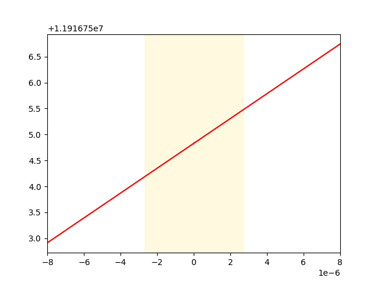
## New Eq:
((fabs(membrane__v) < 2.6712338705498262e-6) ? ((0.5 + 187179.41753901311 * membrane__v) * (2.6712338705498262e-6 * pow(physical_constants__F, 2) * (-extracellular__ko * exp(-(-0.29999999999999999 * ICaL__Io + sqrt(ICaL__Io) / (1.0 + sqrt(ICaL__Io))) * ICaL__constA) + intracellular_ions__ki * exp(2.6712338705498262e-6 * physical_constants__F / (physical_constants__R * physical_constants__T)) * exp(-(-0.29999999999999999 * ICaL__Ii + sqrt(ICaL__Ii) / (1.0 + sqrt(ICaL__Ii))) * ICaL__constA)) / ((-1.0 + exp(2.6712338705498262e-6 * physical_constants__F / (physical_constants__R * physical_constants__T))) * physical_constants__R * physical_constants__T) + 2.6712338705498262e-6 * pow(physical_constants__F, 2) * (-extracellular__ko * exp(-(-0.29999999999999999 * ICaL__Io + sqrt(ICaL__Io) / (1.0 + sqrt(ICaL__Io))) * ICaL__constA) + intracellular_ions__ki * exp(-2.6712338705498262e-6 * physical_constants__F / (physical_constants__R * physical_constants__T)) * exp(-(-0.29999999999999999 * ICaL__Ii + sqrt(ICaL__Ii) / (1.0 + sqrt(ICaL__Ii))) * ICaL__constA)) / ((-1.0 + exp(-2.6712338705498262e-6 * physical_constants__F / (physical_constants__R * physical_constants__T))) * physical_constants__R * physical_constants__T)) - 2.6712338705498262e-6 * pow(physical_constants__F, 2) * (-extracellular__ko * exp(-(-0.29999999999999999 * ICaL__Io + sqrt(ICaL__Io) / (1.0 + sqrt(ICaL__Io))) * ICaL__constA) + intracellular_ions__ki * exp(-2.6712338705498262e-6 * physical_constants__F / (physical_constants__R * physical_constants__T)) * exp(-(-0.29999999999999999 * ICaL__Ii + sqrt(ICaL__Ii) / (1.0 + sqrt(ICaL__Ii))) * ICaL__constA)) / ((-1.0 + exp(-2.6712338705498262e-6 * physical_constants__F / (physical_constants__R * physical_constants__T))) * physical_constants__R * physical_constants__T)) : ((-ICaL__gamma_ko * extracellular__ko + ICaL__gamma_ki * intracellular_ions__ki * exp(membrane__vfrt)) * membrane__vffrt / (-1.0 + exp(membrane__vfrt))))

## Equation 2:
```
ICaL__PhiCaK_ss = (-ICaL__gamma_ko * extracellular__ko + ICaL__gamma_kss * intracellular_ions__kss * exp(membrane__vfrt)) * membrane__vffrt / (-1.0 + exp(membrane__vfrt))
```
### Partially evaluated to: 
```
ICaL__PhiCaK_ss = pow(physical_constants__F, 2) * (-extracellular__ko * exp(-(-0.29999999999999999 * ICaL__Io + sqrt(ICaL__Io) / (1.0 + sqrt(ICaL__Io))) * ICaL__constA) + intracellular_ions__kss * exp(membrane__v * physical_constants__F / (physical_constants__R * physical_constants__T)) * exp(-(-0.29999999999999999 * ICaL__Iss + sqrt(ICaL__Iss) / (1.0 + sqrt(ICaL__Iss))) * ICaL__constA)) * membrane__v / ((-1.0 + exp(membrane__v * physical_constants__F / (physical_constants__R * physical_constants__T))) * physical_constants__R * physical_constants__T)
```
### Singulariy points detected:

{0}
#### float * A

####Failed to find U symbolically!

<class 'sympy.core.mul.Mul'>
_physical_constants$F**2*_membrane$v*(-_extracellular$ko*exp_(-1.0*_ICaL$constA*(sqrt(_ICaL$Io)/(sqrt(_ICaL$Io) + 1.0) - 0.29999999999999999*_ICaL$Io)) + _intracellular_ions$kss*exp_(-1.0*_ICaL$constA*(sqrt(_ICaL$Iss)/(sqrt(_ICaL$Iss) + 1.0) - 0.29999999999999999*_ICaL$Iss))*exp(1.0*_membrane$v*_physical_constants$F/(_physical_constants$R*_physical_constants$T)))/(_physical_constants$R*_physical_constants$T*(exp(1.0*_membrane$v*_physical_constants$F/(_physical_constants$R*_physical_constants$T)) - 1.0))

*try substituting parameters*

*U*
`0.037435883507802616 * membrane__v`

*V for 1e-07 range* 
`-2.6712338705498262e-6 - 2.6712338705498262e-6`

*Singularity point: 0*


## New Eq:
((fabs(membrane__v) < 2.6712338705498262e-6) ? ((0.5 + 187179.41753901311 * membrane__v) * (2.6712338705498262e-6 * pow(physical_constants__F, 2) * (-extracellular__ko * exp(-(-0.29999999999999999 * ICaL__Io + sqrt(ICaL__Io) / (1.0 + sqrt(ICaL__Io))) * ICaL__constA) + intracellular_ions__kss * exp(2.6712338705498262e-6 * physical_constants__F / (physical_constants__R * physical_constants__T)) * exp(-(-0.29999999999999999 * ICaL__Iss + sqrt(ICaL__Iss) / (1.0 + sqrt(ICaL__Iss))) * ICaL__constA)) / ((-1.0 + exp(2.6712338705498262e-6 * physical_constants__F / (physical_constants__R * physical_constants__T))) * physical_constants__R * physical_constants__T) + 2.6712338705498262e-6 * pow(physical_constants__F, 2) * (-extracellular__ko * exp(-(-0.29999999999999999 * ICaL__Io + sqrt(ICaL__Io) / (1.0 + sqrt(ICaL__Io))) * ICaL__constA) + intracellular_ions__kss * exp(-2.6712338705498262e-6 * physical_constants__F / (physical_constants__R * physical_constants__T)) * exp(-(-0.29999999999999999 * ICaL__Iss + sqrt(ICaL__Iss) / (1.0 + sqrt(ICaL__Iss))) * ICaL__constA)) / ((-1.0 + exp(-2.6712338705498262e-6 * physical_constants__F / (physical_constants__R * physical_constants__T))) * physical_constants__R * physical_constants__T)) - 2.6712338705498262e-6 * pow(physical_constants__F, 2) * (-extracellular__ko * exp(-(-0.29999999999999999 * ICaL__Io + sqrt(ICaL__Io) / (1.0 + sqrt(ICaL__Io))) * ICaL__constA) + intracellular_ions__kss * exp(-2.6712338705498262e-6 * physical_constants__F / (physical_constants__R * physical_constants__T)) * exp(-(-0.29999999999999999 * ICaL__Iss + sqrt(ICaL__Iss) / (1.0 + sqrt(ICaL__Iss))) * ICaL__constA)) / ((-1.0 + exp(-2.6712338705498262e-6 * physical_constants__F / (physical_constants__R * physical_constants__T))) * physical_constants__R * physical_constants__T)) : ((-ICaL__gamma_ko * extracellular__ko + ICaL__gamma_kss * intracellular_ions__kss * exp(membrane__vfrt)) * membrane__vffrt / (-1.0 + exp(membrane__vfrt))))

## Equation 3:
```
ICaL__PhiCaL_i = 4.0 * (-ICaL__gamma_cao * extracellular__cao + ICaL__gamma_cai * intracellular_ions__cai * exp(2.0 * membrane__vfrt)) * membrane__vffrt / (-1.0 + exp(2.0 * membrane__vfrt))
```
### Partially evaluated to: 
```
ICaL__PhiCaL_i = 4.0 * pow(physical_constants__F, 2) * (-extracellular__cao * exp(-4.0 * (-0.29999999999999999 * ICaL__Io + sqrt(ICaL__Io) / (1.0 + sqrt(ICaL__Io))) * ICaL__constA) + intracellular_ions__cai * exp(2.0 * membrane__v * physical_constants__F / (physical_constants__R * physical_constants__T)) * exp(-4.0 * (-0.29999999999999999 * ICaL__Ii + sqrt(ICaL__Ii) / (1.0 + sqrt(ICaL__Ii))) * ICaL__constA)) * membrane__v / ((-1.0 + exp(2.0 * membrane__v * physical_constants__F / (physical_constants__R * physical_constants__T))) * physical_constants__R * physical_constants__T)
```
### Singulariy points detected:

{0}
#### float * A

####Failed to find U symbolically!

<class 'sympy.core.mul.Mul'>
_physical_constants$F**2*_membrane$v*(-_extracellular$cao*exp_(-4.0*_ICaL$constA*(sqrt(_ICaL$Io)/(sqrt(_ICaL$Io) + 1.0) - 0.29999999999999999*_ICaL$Io)) + _intracellular_ions$cai*exp_(-4.0*_ICaL$constA*(sqrt(_ICaL$Ii)/(sqrt(_ICaL$Ii) + 1.0) - 0.29999999999999999*_ICaL$Ii))*exp(2.0*_membrane$v*_physical_constants$F/(_physical_constants$R*_physical_constants$T)))/(_physical_constants$R*_physical_constants$T*(exp(2.0*_membrane$v*_physical_constants$F/(_physical_constants$R*_physical_constants$T)) - 1.0))

*try substituting parameters*

*U*
`0.074871767015605231 * membrane__v`

*V for 1e-07 range* 
`-1.3356169352749131e-6 - 1.3356169352749131e-6`

*Singularity point: 0*


## New Eq:
((fabs(membrane__v) < 1.3356169352749131e-6) ? ((0.5 + 374358.83507802623 * membrane__v) * (5.3424677410996524e-6 * pow(physical_constants__F, 2) * (-extracellular__cao * exp(-4.0 * (-0.29999999999999999 * ICaL__Io + sqrt(ICaL__Io) / (1.0 + sqrt(ICaL__Io))) * ICaL__constA) + intracellular_ions__cai * exp(2.6712338705498262e-6 * physical_constants__F / (physical_constants__R * physical_constants__T)) * exp(-4.0 * (-0.29999999999999999 * ICaL__Ii + sqrt(ICaL__Ii) / (1.0 + sqrt(ICaL__Ii))) * ICaL__constA)) / ((-1.0 + exp(2.6712338705498262e-6 * physical_constants__F / (physical_constants__R * physical_constants__T))) * physical_constants__R * physical_constants__T) + 5.3424677410996524e-6 * pow(physical_constants__F, 2) * (-extracellular__cao * exp(-4.0 * (-0.29999999999999999 * ICaL__Io + sqrt(ICaL__Io) / (1.0 + sqrt(ICaL__Io))) * ICaL__constA) + intracellular_ions__cai * exp(-2.6712338705498262e-6 * physical_constants__F / (physical_constants__R * physical_constants__T)) * exp(-4.0 * (-0.29999999999999999 * ICaL__Ii + sqrt(ICaL__Ii) / (1.0 + sqrt(ICaL__Ii))) * ICaL__constA)) / ((-1.0 + exp(-2.6712338705498262e-6 * physical_constants__F / (physical_constants__R * physical_constants__T))) * physical_constants__R * physical_constants__T)) - 5.3424677410996524e-6 * pow(physical_constants__F, 2) * (-extracellular__cao * exp(-4.0 * (-0.29999999999999999 * ICaL__Io + sqrt(ICaL__Io) / (1.0 + sqrt(ICaL__Io))) * ICaL__constA) + intracellular_ions__cai * exp(-2.6712338705498262e-6 * physical_constants__F / (physical_constants__R * physical_constants__T)) * exp(-4.0 * (-0.29999999999999999 * ICaL__Ii + sqrt(ICaL__Ii) / (1.0 + sqrt(ICaL__Ii))) * ICaL__constA)) / ((-1.0 + exp(-2.6712338705498262e-6 * physical_constants__F / (physical_constants__R * physical_constants__T))) * physical_constants__R * physical_constants__T)) : (4.0 * (-ICaL__gamma_cao * extracellular__cao + ICaL__gamma_cai * intracellular_ions__cai * exp(2.0 * membrane__vfrt)) * membrane__vffrt / (-1.0 + exp(2.0 * membrane__vfrt))))

## Equation 4:
```
ICaL__PhiCaL_ss = 4.0 * (-ICaL__gamma_cao * extracellular__cao + ICaL__gamma_cass * intracellular_ions__cass * exp(2.0 * membrane__vfrt)) * membrane__vffrt / (-1.0 + exp(2.0 * membrane__vfrt))
```
### Partially evaluated to: 
```
ICaL__PhiCaL_ss = 4.0 * pow(physical_constants__F, 2) * (-extracellular__cao * exp(-4.0 * (-0.29999999999999999 * ICaL__Io + sqrt(ICaL__Io) / (1.0 + sqrt(ICaL__Io))) * ICaL__constA) + intracellular_ions__cass * exp(2.0 * membrane__v * physical_constants__F / (physical_constants__R * physical_constants__T)) * exp(-4.0 * (-0.29999999999999999 * ICaL__Iss + sqrt(ICaL__Iss) / (1.0 + sqrt(ICaL__Iss))) * ICaL__constA)) * membrane__v / ((-1.0 + exp(2.0 * membrane__v * physical_constants__F / (physical_constants__R * physical_constants__T))) * physical_constants__R * physical_constants__T)
```
### Singulariy points detected:

{0}
#### float * A

####Failed to find U symbolically!

<class 'sympy.core.mul.Mul'>
_physical_constants$F**2*_membrane$v*(-_extracellular$cao*exp_(-4.0*_ICaL$constA*(sqrt(_ICaL$Io)/(sqrt(_ICaL$Io) + 1.0) - 0.29999999999999999*_ICaL$Io)) + _intracellular_ions$cass*exp_(-4.0*_ICaL$constA*(sqrt(_ICaL$Iss)/(sqrt(_ICaL$Iss) + 1.0) - 0.29999999999999999*_ICaL$Iss))*exp(2.0*_membrane$v*_physical_constants$F/(_physical_constants$R*_physical_constants$T)))/(_physical_constants$R*_physical_constants$T*(exp(2.0*_membrane$v*_physical_constants$F/(_physical_constants$R*_physical_constants$T)) - 1.0))

*try substituting parameters*

*U*
`0.074871767015605231 * membrane__v`

*V for 1e-07 range* 
`-1.3356169352749131e-6 - 1.3356169352749131e-6`

*Singularity point: 0*

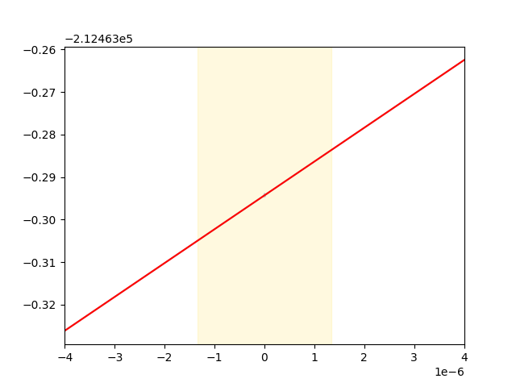
## New Eq:
((fabs(membrane__v) < 1.3356169352749131e-6) ? ((0.5 + 374358.83507802623 * membrane__v) * (5.3424677410996524e-6 * pow(physical_constants__F, 2) * (-extracellular__cao * exp(-4.0 * (-0.29999999999999999 * ICaL__Io + sqrt(ICaL__Io) / (1.0 + sqrt(ICaL__Io))) * ICaL__constA) + intracellular_ions__cass * exp(2.6712338705498262e-6 * physical_constants__F / (physical_constants__R * physical_constants__T)) * exp(-4.0 * (-0.29999999999999999 * ICaL__Iss + sqrt(ICaL__Iss) / (1.0 + sqrt(ICaL__Iss))) * ICaL__constA)) / ((-1.0 + exp(2.6712338705498262e-6 * physical_constants__F / (physical_constants__R * physical_constants__T))) * physical_constants__R * physical_constants__T) + 5.3424677410996524e-6 * pow(physical_constants__F, 2) * (-extracellular__cao * exp(-4.0 * (-0.29999999999999999 * ICaL__Io + sqrt(ICaL__Io) / (1.0 + sqrt(ICaL__Io))) * ICaL__constA) + intracellular_ions__cass * exp(-2.6712338705498262e-6 * physical_constants__F / (physical_constants__R * physical_constants__T)) * exp(-4.0 * (-0.29999999999999999 * ICaL__Iss + sqrt(ICaL__Iss) / (1.0 + sqrt(ICaL__Iss))) * ICaL__constA)) / ((-1.0 + exp(-2.6712338705498262e-6 * physical_constants__F / (physical_constants__R * physical_constants__T))) * physical_constants__R * physical_constants__T)) - 5.3424677410996524e-6 * pow(physical_constants__F, 2) * (-extracellular__cao * exp(-4.0 * (-0.29999999999999999 * ICaL__Io + sqrt(ICaL__Io) / (1.0 + sqrt(ICaL__Io))) * ICaL__constA) + intracellular_ions__cass * exp(-2.6712338705498262e-6 * physical_constants__F / (physical_constants__R * physical_constants__T)) * exp(-4.0 * (-0.29999999999999999 * ICaL__Iss + sqrt(ICaL__Iss) / (1.0 + sqrt(ICaL__Iss))) * ICaL__constA)) / ((-1.0 + exp(-2.6712338705498262e-6 * physical_constants__F / (physical_constants__R * physical_constants__T))) * physical_constants__R * physical_constants__T)) : (4.0 * (-ICaL__gamma_cao * extracellular__cao + ICaL__gamma_cass * intracellular_ions__cass * exp(2.0 * membrane__vfrt)) * membrane__vffrt / (-1.0 + exp(2.0 * membrane__vfrt))))

## Equation 5:
```
ICaL__PhiCaNa_i = (-ICaL__gamma_nao * extracellular__nao + ICaL__gamma_nai * intracellular_ions__nai * exp(membrane__vfrt)) * membrane__vffrt / (-1.0 + exp(membrane__vfrt))
```
### Partially evaluated to: 
```
ICaL__PhiCaNa_i = pow(physical_constants__F, 2) * (-extracellular__nao * exp(-(-0.29999999999999999 * ICaL__Io + sqrt(ICaL__Io) / (1.0 + sqrt(ICaL__Io))) * ICaL__constA) + intracellular_ions__nai * exp(membrane__v * physical_constants__F / (physical_constants__R * physical_constants__T)) * exp(-(-0.29999999999999999 * ICaL__Ii + sqrt(ICaL__Ii) / (1.0 + sqrt(ICaL__Ii))) * ICaL__constA)) * membrane__v / ((-1.0 + exp(membrane__v * physical_constants__F / (physical_constants__R * physical_constants__T))) * physical_constants__R * physical_constants__T)
```
### Singulariy points detected:

{0}
#### float * A

####Failed to find U symbolically!

<class 'sympy.core.mul.Mul'>
_physical_constants$F**2*_membrane$v*(-_extracellular$nao*exp_(-1.0*_ICaL$constA*(sqrt(_ICaL$Io)/(sqrt(_ICaL$Io) + 1.0) - 0.29999999999999999*_ICaL$Io)) + _intracellular_ions$nai*exp_(-1.0*_ICaL$constA*(sqrt(_ICaL$Ii)/(sqrt(_ICaL$Ii) + 1.0) - 0.29999999999999999*_ICaL$Ii))*exp(1.0*_membrane$v*_physical_constants$F/(_physical_constants$R*_physical_constants$T)))/(_physical_constants$R*_physical_constants$T*(exp(1.0*_membrane$v*_physical_constants$F/(_physical_constants$R*_physical_constants$T)) - 1.0))

*try substituting parameters*

*U*
`0.037435883507802616 * membrane__v`

*V for 1e-07 range* 
`-2.6712338705498262e-6 - 2.6712338705498262e-6`

*Singularity point: 0*

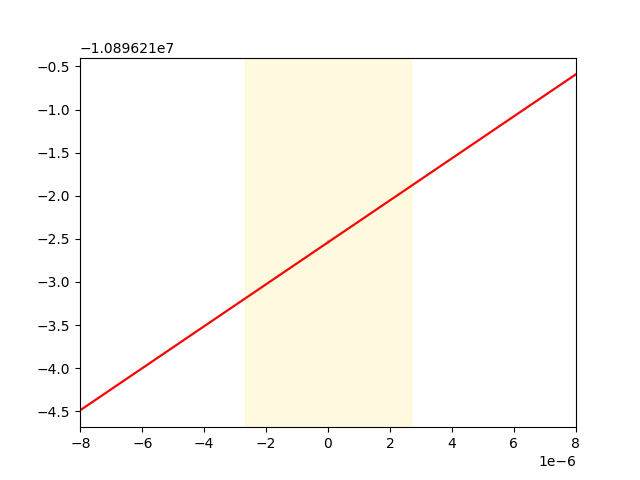
## New Eq:
((fabs(membrane__v) < 2.6712338705498262e-6) ? ((0.5 + 187179.41753901311 * membrane__v) * (2.6712338705498262e-6 * pow(physical_constants__F, 2) * (-extracellular__nao * exp(-(-0.29999999999999999 * ICaL__Io + sqrt(ICaL__Io) / (1.0 + sqrt(ICaL__Io))) * ICaL__constA) + intracellular_ions__nai * exp(2.6712338705498262e-6 * physical_constants__F / (physical_constants__R * physical_constants__T)) * exp(-(-0.29999999999999999 * ICaL__Ii + sqrt(ICaL__Ii) / (1.0 + sqrt(ICaL__Ii))) * ICaL__constA)) / ((-1.0 + exp(2.6712338705498262e-6 * physical_constants__F / (physical_constants__R * physical_constants__T))) * physical_constants__R * physical_constants__T) + 2.6712338705498262e-6 * pow(physical_constants__F, 2) * (-extracellular__nao * exp(-(-0.29999999999999999 * ICaL__Io + sqrt(ICaL__Io) / (1.0 + sqrt(ICaL__Io))) * ICaL__constA) + intracellular_ions__nai * exp(-2.6712338705498262e-6 * physical_constants__F / (physical_constants__R * physical_constants__T)) * exp(-(-0.29999999999999999 * ICaL__Ii + sqrt(ICaL__Ii) / (1.0 + sqrt(ICaL__Ii))) * ICaL__constA)) / ((-1.0 + exp(-2.6712338705498262e-6 * physical_constants__F / (physical_constants__R * physical_constants__T))) * physical_constants__R * physical_constants__T)) - 2.6712338705498262e-6 * pow(physical_constants__F, 2) * (-extracellular__nao * exp(-(-0.29999999999999999 * ICaL__Io + sqrt(ICaL__Io) / (1.0 + sqrt(ICaL__Io))) * ICaL__constA) + intracellular_ions__nai * exp(-2.6712338705498262e-6 * physical_constants__F / (physical_constants__R * physical_constants__T)) * exp(-(-0.29999999999999999 * ICaL__Ii + sqrt(ICaL__Ii) / (1.0 + sqrt(ICaL__Ii))) * ICaL__constA)) / ((-1.0 + exp(-2.6712338705498262e-6 * physical_constants__F / (physical_constants__R * physical_constants__T))) * physical_constants__R * physical_constants__T)) : ((-ICaL__gamma_nao * extracellular__nao + ICaL__gamma_nai * intracellular_ions__nai * exp(membrane__vfrt)) * membrane__vffrt / (-1.0 + exp(membrane__vfrt))))

## Equation 6:
```
ICaL__PhiCaNa_ss = (-ICaL__gamma_nao * extracellular__nao + ICaL__gamma_nass * intracellular_ions__nass * exp(membrane__vfrt)) * membrane__vffrt / (-1.0 + exp(membrane__vfrt))
```
### Partially evaluated to: 
```
ICaL__PhiCaNa_ss = pow(physical_constants__F, 2) * (-extracellular__nao * exp(-(-0.29999999999999999 * ICaL__Io + sqrt(ICaL__Io) / (1.0 + sqrt(ICaL__Io))) * ICaL__constA) + intracellular_ions__nass * exp(membrane__v * physical_constants__F / (physical_constants__R * physical_constants__T)) * exp(-(-0.29999999999999999 * ICaL__Iss + sqrt(ICaL__Iss) / (1.0 + sqrt(ICaL__Iss))) * ICaL__constA)) * membrane__v / ((-1.0 + exp(membrane__v * physical_constants__F / (physical_constants__R * physical_constants__T))) * physical_constants__R * physical_constants__T)
```
### Singulariy points detected:

{0}
#### float * A

####Failed to find U symbolically!

<class 'sympy.core.mul.Mul'>
_physical_constants$F**2*_membrane$v*(-_extracellular$nao*exp_(-1.0*_ICaL$constA*(sqrt(_ICaL$Io)/(sqrt(_ICaL$Io) + 1.0) - 0.29999999999999999*_ICaL$Io)) + _intracellular_ions$nass*exp_(-1.0*_ICaL$constA*(sqrt(_ICaL$Iss)/(sqrt(_ICaL$Iss) + 1.0) - 0.29999999999999999*_ICaL$Iss))*exp(1.0*_membrane$v*_physical_constants$F/(_physical_constants$R*_physical_constants$T)))/(_physical_constants$R*_physical_constants$T*(exp(1.0*_membrane$v*_physical_constants$F/(_physical_constants$R*_physical_constants$T)) - 1.0))

*try substituting parameters*

*U*
`0.037435883507802616 * membrane__v`

*V for 1e-07 range* 
`-2.6712338705498262e-6 - 2.6712338705498262e-6`

*Singularity point: 0*

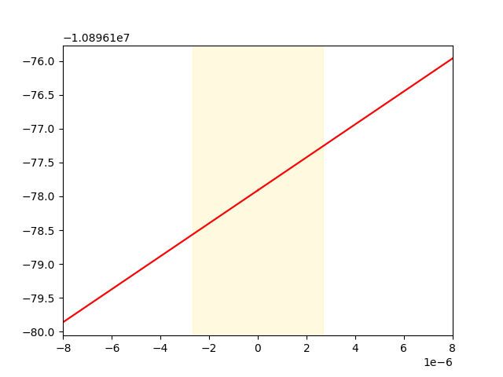
## New Eq:
((fabs(membrane__v) < 2.6712338705498262e-6) ? ((0.5 + 187179.41753901311 * membrane__v) * (2.6712338705498262e-6 * pow(physical_constants__F, 2) * (-extracellular__nao * exp(-(-0.29999999999999999 * ICaL__Io + sqrt(ICaL__Io) / (1.0 + sqrt(ICaL__Io))) * ICaL__constA) + intracellular_ions__nass * exp(2.6712338705498262e-6 * physical_constants__F / (physical_constants__R * physical_constants__T)) * exp(-(-0.29999999999999999 * ICaL__Iss + sqrt(ICaL__Iss) / (1.0 + sqrt(ICaL__Iss))) * ICaL__constA)) / ((-1.0 + exp(2.6712338705498262e-6 * physical_constants__F / (physical_constants__R * physical_constants__T))) * physical_constants__R * physical_constants__T) + 2.6712338705498262e-6 * pow(physical_constants__F, 2) * (-extracellular__nao * exp(-(-0.29999999999999999 * ICaL__Io + sqrt(ICaL__Io) / (1.0 + sqrt(ICaL__Io))) * ICaL__constA) + intracellular_ions__nass * exp(-2.6712338705498262e-6 * physical_constants__F / (physical_constants__R * physical_constants__T)) * exp(-(-0.29999999999999999 * ICaL__Iss + sqrt(ICaL__Iss) / (1.0 + sqrt(ICaL__Iss))) * ICaL__constA)) / ((-1.0 + exp(-2.6712338705498262e-6 * physical_constants__F / (physical_constants__R * physical_constants__T))) * physical_constants__R * physical_constants__T)) - 2.6712338705498262e-6 * pow(physical_constants__F, 2) * (-extracellular__nao * exp(-(-0.29999999999999999 * ICaL__Io + sqrt(ICaL__Io) / (1.0 + sqrt(ICaL__Io))) * ICaL__constA) + intracellular_ions__nass * exp(-2.6712338705498262e-6 * physical_constants__F / (physical_constants__R * physical_constants__T)) * exp(-(-0.29999999999999999 * ICaL__Iss + sqrt(ICaL__Iss) / (1.0 + sqrt(ICaL__Iss))) * ICaL__constA)) / ((-1.0 + exp(-2.6712338705498262e-6 * physical_constants__F / (physical_constants__R * physical_constants__T))) * physical_constants__R * physical_constants__T)) : ((-ICaL__gamma_nao * extracellular__nao + ICaL__gamma_nass * intracellular_ions__nass * exp(membrane__vfrt)) * membrane__vffrt / (-1.0 + exp(membrane__vfrt))))

## Equation 7:
```
ICab__ICab = 4.0 * (-ICaL__gamma_cao * extracellular__cao + ICaL__gamma_cai * intracellular_ions__cai * exp(2.0 * membrane__vfrt)) * ICab__PCab * membrane__vffrt / (-1.0 + exp(2.0 * membrane__vfrt))
```
### Partially evaluated to: 
```
ICab__ICab = 2.36776e-7 * pow(physical_constants__F, 2) * (-extracellular__cao * exp(-4.0 * (-0.29999999999999999 * ICaL__Io + sqrt(ICaL__Io) / (1.0 + sqrt(ICaL__Io))) * ICaL__constA) + intracellular_ions__cai * exp(2.0 * membrane__v * physical_constants__F / (physical_constants__R * physical_constants__T)) * exp(-4.0 * (-0.29999999999999999 * ICaL__Ii + sqrt(ICaL__Ii) / (1.0 + sqrt(ICaL__Ii))) * ICaL__constA)) * membrane__v / ((-1.0 + exp(2.0 * membrane__v * physical_constants__F / (physical_constants__R * physical_constants__T))) * physical_constants__R * physical_constants__T)
```
### Singulariy points detected:

{0}
#### float * A

####Failed to find U symbolically!

<class 'sympy.core.mul.Mul'>
_physical_constants$F**2*_membrane$v*(-_extracellular$cao*exp_(-4.0*_ICaL$constA*(sqrt(_ICaL$Io)/(sqrt(_ICaL$Io) + 1.0) - 0.29999999999999999*_ICaL$Io)) + _intracellular_ions$cai*exp_(-4.0*_ICaL$constA*(sqrt(_ICaL$Ii)/(sqrt(_ICaL$Ii) + 1.0) - 0.29999999999999999*_ICaL$Ii))*exp(2.0*_membrane$v*_physical_constants$F/(_physical_constants$R*_physical_constants$T)))/(_physical_constants$R*_physical_constants$T*(exp(2.0*_membrane$v*_physical_constants$F/(_physical_constants$R*_physical_constants$T)) - 1.0))

*try substituting parameters*

*U*
`0.074871767015605231 * membrane__v`

*V for 1e-07 range* 
`-1.3356169352749131e-6 - 1.3356169352749131e-6`

*Singularity point: 0*

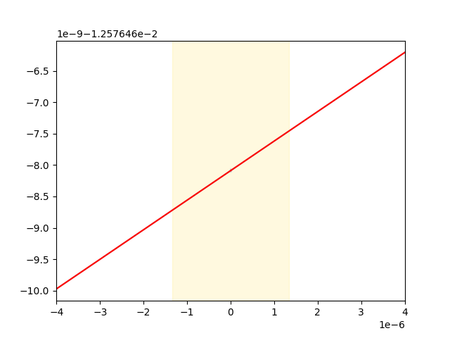
## New Eq:
((fabs(membrane__v) < 1.3356169352749131e-6) ? ((0.5 + 374358.83507802623 * membrane__v) * (3.1624203546665282e-13 * pow(physical_constants__F, 2) * (-extracellular__cao * exp(-4.0 * (-0.29999999999999999 * ICaL__Io + sqrt(ICaL__Io) / (1.0 + sqrt(ICaL__Io))) * ICaL__constA) + intracellular_ions__cai * exp(2.6712338705498262e-6 * physical_constants__F / (physical_constants__R * physical_constants__T)) * exp(-4.0 * (-0.29999999999999999 * ICaL__Ii + sqrt(ICaL__Ii) / (1.0 + sqrt(ICaL__Ii))) * ICaL__constA)) / ((-1.0 + exp(2.6712338705498262e-6 * physical_constants__F / (physical_constants__R * physical_constants__T))) * physical_constants__R * physical_constants__T) + 3.1624203546665282e-13 * pow(physical_constants__F, 2) * (-extracellular__cao * exp(-4.0 * (-0.29999999999999999 * ICaL__Io + sqrt(ICaL__Io) / (1.0 + sqrt(ICaL__Io))) * ICaL__constA) + intracellular_ions__cai * exp(-2.6712338705498262e-6 * physical_constants__F / (physical_constants__R * physical_constants__T)) * exp(-4.0 * (-0.29999999999999999 * ICaL__Ii + sqrt(ICaL__Ii) / (1.0 + sqrt(ICaL__Ii))) * ICaL__constA)) / ((-1.0 + exp(-2.6712338705498262e-6 * physical_constants__F / (physical_constants__R * physical_constants__T))) * physical_constants__R * physical_constants__T)) - 3.1624203546665282e-13 * pow(physical_constants__F, 2) * (-extracellular__cao * exp(-4.0 * (-0.29999999999999999 * ICaL__Io + sqrt(ICaL__Io) / (1.0 + sqrt(ICaL__Io))) * ICaL__constA) + intracellular_ions__cai * exp(-2.6712338705498262e-6 * physical_constants__F / (physical_constants__R * physical_constants__T)) * exp(-4.0 * (-0.29999999999999999 * ICaL__Ii + sqrt(ICaL__Ii) / (1.0 + sqrt(ICaL__Ii))) * ICaL__constA)) / ((-1.0 + exp(-2.6712338705498262e-6 * physical_constants__F / (physical_constants__R * physical_constants__T))) * physical_constants__R * physical_constants__T)) : (4.0 * (-ICaL__gamma_cao * extracellular__cao + ICaL__gamma_cai * intracellular_ions__cai * exp(2.0 * membrane__vfrt)) * ICab__PCab * membrane__vffrt / (-1.0 + exp(2.0 * membrane__vfrt))))

## Equation 8:
```
INab__INab = (-extracellular__nao + intracellular_ions__nai * exp(membrane__vfrt)) * INab__PNab * membrane__vffrt / (-1.0 + exp(membrane__vfrt))
```
### Partially evaluated to: 
```
INab__INab = 1.9238999999999999e-9 * pow(physical_constants__F, 2) * (-extracellular__nao + intracellular_ions__nai * exp(membrane__v * physical_constants__F / (physical_constants__R * physical_constants__T))) * membrane__v / ((-1.0 + exp(membrane__v * physical_constants__F / (physical_constants__R * physical_constants__T))) * physical_constants__R * physical_constants__T)
```
### Singulariy points detected:

{0}
#### float * A

####Failed to find U symbolically!

<class 'sympy.core.mul.Mul'>
_physical_constants$F**2*_membrane$v*(-_extracellular$nao + _intracellular_ions$nai*exp(_membrane$v*_physical_constants$F/(_physical_constants$R*_physical_constants$T)))/(_physical_constants$R*_physical_constants$T*(exp(_membrane$v*_physical_constants$F/(_physical_constants$R*_physical_constants$T)) - 1.0))

*try substituting parameters*

*U*
`0.037435883507802616 * membrane__v`

*V for 1e-07 range* 
`-2.6712338705498262e-6 - 2.6712338705498262e-6`

*Singularity point: 0*


## New Eq:
((fabs(membrane__v) < 2.6712338705498262e-6) ? ((0.5 + 187179.41753901311 * membrane__v) * (5.1391868435508108e-15 * pow(physical_constants__F, 2) * (-extracellular__nao + intracellular_ions__nai * exp(2.6712338705498262e-6 * physical_constants__F / (physical_constants__R * physical_constants__T))) / ((-1.0 + exp(2.6712338705498262e-6 * physical_constants__F / (physical_constants__R * physical_constants__T))) * physical_constants__R * physical_constants__T) + 5.1391868435508108e-15 * pow(physical_constants__F, 2) * (-extracellular__nao + intracellular_ions__nai * exp(-2.6712338705498262e-6 * physical_constants__F / (physical_constants__R * physical_constants__T))) / ((-1.0 + exp(-2.6712338705498262e-6 * physical_constants__F / (physical_constants__R * physical_constants__T))) * physical_constants__R * physical_constants__T)) - 5.1391868435508108e-15 * pow(physical_constants__F, 2) * (-extracellular__nao + intracellular_ions__nai * exp(-2.6712338705498262e-6 * physical_constants__F / (physical_constants__R * physical_constants__T))) / ((-1.0 + exp(-2.6712338705498262e-6 * physical_constants__F / (physical_constants__R * physical_constants__T))) * physical_constants__R * physical_constants__T)) : ((-extracellular__nao + intracellular_ions__nai * exp(membrane__vfrt)) * INab__PNab * membrane__vffrt / (-1.0 + exp(membrane__vfrt))))

ryr__Jrel_inf = ((environment__celltype == 2.0) ? (1.7 * ryr__Jrel_inf_b) : (ryr__Jrel_inf_b))

####Piecewise!!

ryr__Jrel_infp = ((environment__celltype == 2.0) ? (1.7 * ryr__Jrel_infp_b) : (ryr__Jrel_infp_b))

####Piecewise!!

ryr__tau_rel = ((ryr__tau_rel_b < 0.001) ? (0.001) : (ryr__tau_rel_b))

####Piecewise!!

ryr__tau_relp = ((ryr__tau_relp_b < 0.001) ? (0.001) : (ryr__tau_relp_b))

####Piecewise!!

# Model: Tomek_model13epi(ToRORd_fkatp_epi.cellml)
ICaL__PCa = ((environment__celltype == 1.0) ? (1.2 * ICaL__PCa_b) : ((environment__celltype == 2.0) ? (2.0 * ICaL__PCa_b) : (ICaL__PCa_b)))

####Piecewise!!

IK1__GK1 = ((environment__celltype == 1.0) ? (1.2 * IK1__GK1_b) : ((environment__celltype == 2.0) ? (1.3 * IK1__GK1_b) : (IK1__GK1_b)))

####Piecewise!!

IKb__GKb = ((environment__celltype == 1.0) ? (0.59999999999999998 * IKb__GKb_b) : (IKb__GKb_b))

####Piecewise!!

IKr__GKr = ((environment__celltype == 1.0) ? (1.3 * IKr__GKr_b) : ((environment__celltype == 2.0) ? (0.80000000000000004 * IKr__GKr_b) : (IKr__GKr_b)))

####Piecewise!!

IKs__GKs = ((environment__celltype == 1.0) ? (1.3999999999999999 * IKs__GKs_b) : (IKs__GKs_b))

####Piecewise!!

INaCa__Gncx = ((environment__celltype == 1.0) ? (1.1000000000000001 * INaCa__Gncx_b) : ((environment__celltype == 2.0) ? (1.3999999999999999 * INaCa__Gncx_b) : (INaCa__Gncx_b)))

####Piecewise!!

INaK__Pnak = ((environment__celltype == 1.0) ? (0.90000000000000002 * INaK__Pnak_b) : ((environment__celltype == 2.0) ? (0.69999999999999996 * INaK__Pnak_b) : (INaK__Pnak_b)))

####Piecewise!!

INaL__GNaL = ((environment__celltype == 1.0) ? (0.59999999999999998 * INaL__GNaL_b) : (INaL__GNaL_b))

####Piecewise!!

Ito__Gto = (((environment__celltype == 1.0) || (environment__celltype == 2.0)) ? (2.0 * Ito__Gto_b) : (Ito__Gto_b))

####Piecewise!!

SERCA__upScale = ((environment__celltype == 1.0) ? (1.3) : (1.0))

####Piecewise!!

intracellular_ions__cmdnmax = ((environment__celltype == 1.0) ? (1.3 * intracellular_ions__cmdnmax_b) : (intracellular_ions__cmdnmax_b))

####Piecewise!!

ICaL__dss = ((membrane__v >= 31.497800000000002) ? (1.0) : (1.0763 * exp(-1.0069999999999999 * exp(-0.082900000000000001 * membrane__v))))

####Piecewise!!

INa__ah = ((membrane__v >= -40.0) ? (0) : (0.057000000000000002 * exp(-11.764705882352942 - 0.14705882352941177 * membrane__v)))

####Piecewise!!

INa__aj = ((membrane__v >= -40.0) ? (0) : ((37.780000000000001 + membrane__v) * (-25428.0 * exp(0.24440000000000001 * membrane__v) - 6.9480000000000002e-6 * exp(-0.043909999999999998 * membrane__v)) / (1.0 + exp(24.640530000000002 + 0.311 * membrane__v))))

####Piecewise!!

INa__bh = ((membrane__v >= -40.0) ? (5.9230769230769234 / (1.0 + exp(-0.96036036036036043 - 0.0900900900900901 * membrane__v))) : (310000.0 * exp(0.34849999999999998 * membrane__v) + 2.7000000000000002 * exp(0.079000000000000001 * membrane__v)))

####Piecewise!!

INa__bj = ((membrane__v >= -40.0) ? (0.59999999999999998 * exp(0.057000000000000002 * membrane__v) / (1.0 + exp(-3.2000000000000002 - 0.10000000000000001 * membrane__v))) : (0.024240000000000001 * exp(-0.01052 * membrane__v) / (1.0 + exp(-5.5312920000000005 - 0.13780000000000001 * membrane__v))))

####Piecewise!!

Ito__delta_epi = ((environment__celltype == 1.0) ? (1.0 - 0.94999999999999996 / (1.0 + exp(14.0 + 0.20000000000000001 * Ito__EKshift + 0.20000000000000001 * membrane__v))) : (1.0))

####Piecewise!!

## Equation 1:
```
ICaL__PhiCaK_i = (-ICaL__gamma_ko * extracellular__ko + ICaL__gamma_ki * intracellular_ions__ki * exp(membrane__vfrt)) * membrane__vffrt / (-1.0 + exp(membrane__vfrt))
```
### Partially evaluated to: 
```
ICaL__PhiCaK_i = pow(physical_constants__F, 2) * (-extracellular__ko * exp(-(-0.29999999999999999 * ICaL__Io + sqrt(ICaL__Io) / (1.0 + sqrt(ICaL__Io))) * ICaL__constA) + intracellular_ions__ki * exp(membrane__v * physical_constants__F / (physical_constants__R * physical_constants__T)) * exp(-(-0.29999999999999999 * ICaL__Ii + sqrt(ICaL__Ii) / (1.0 + sqrt(ICaL__Ii))) * ICaL__constA)) * membrane__v / ((-1.0 + exp(membrane__v * physical_constants__F / (physical_constants__R * physical_constants__T))) * physical_constants__R * physical_constants__T)
```
### Singulariy points detected:

{0}
#### float * A

####Failed to find U symbolically!

<class 'sympy.core.mul.Mul'>
_physical_constants$F**2*_membrane$v*(-_extracellular$ko*exp_(-1.0*_ICaL$constA*(sqrt(_ICaL$Io)/(sqrt(_ICaL$Io) + 1.0) - 0.29999999999999999*_ICaL$Io)) + _intracellular_ions$ki*exp_(-1.0*_ICaL$constA*(sqrt(_ICaL$Ii)/(sqrt(_ICaL$Ii) + 1.0) - 0.29999999999999999*_ICaL$Ii))*exp(1.0*_membrane$v*_physical_constants$F/(_physical_constants$R*_physical_constants$T)))/(_physical_constants$R*_physical_constants$T*(exp(1.0*_membrane$v*_physical_constants$F/(_physical_constants$R*_physical_constants$T)) - 1.0))

*try substituting parameters*

*U*
`0.037435883507802616 * membrane__v`

*V for 1e-07 range* 
`-2.6712338705498262e-6 - 2.6712338705498262e-6`

*Singularity point: 0*


## New Eq:
((fabs(membrane__v) < 2.6712338705498262e-6) ? ((0.5 + 187179.41753901311 * membrane__v) * (2.6712338705498262e-6 * pow(physical_constants__F, 2) * (-extracellular__ko * exp(-(-0.29999999999999999 * ICaL__Io + sqrt(ICaL__Io) / (1.0 + sqrt(ICaL__Io))) * ICaL__constA) + intracellular_ions__ki * exp(2.6712338705498262e-6 * physical_constants__F / (physical_constants__R * physical_constants__T)) * exp(-(-0.29999999999999999 * ICaL__Ii + sqrt(ICaL__Ii) / (1.0 + sqrt(ICaL__Ii))) * ICaL__constA)) / ((-1.0 + exp(2.6712338705498262e-6 * physical_constants__F / (physical_constants__R * physical_constants__T))) * physical_constants__R * physical_constants__T) + 2.6712338705498262e-6 * pow(physical_constants__F, 2) * (-extracellular__ko * exp(-(-0.29999999999999999 * ICaL__Io + sqrt(ICaL__Io) / (1.0 + sqrt(ICaL__Io))) * ICaL__constA) + intracellular_ions__ki * exp(-2.6712338705498262e-6 * physical_constants__F / (physical_constants__R * physical_constants__T)) * exp(-(-0.29999999999999999 * ICaL__Ii + sqrt(ICaL__Ii) / (1.0 + sqrt(ICaL__Ii))) * ICaL__constA)) / ((-1.0 + exp(-2.6712338705498262e-6 * physical_constants__F / (physical_constants__R * physical_constants__T))) * physical_constants__R * physical_constants__T)) - 2.6712338705498262e-6 * pow(physical_constants__F, 2) * (-extracellular__ko * exp(-(-0.29999999999999999 * ICaL__Io + sqrt(ICaL__Io) / (1.0 + sqrt(ICaL__Io))) * ICaL__constA) + intracellular_ions__ki * exp(-2.6712338705498262e-6 * physical_constants__F / (physical_constants__R * physical_constants__T)) * exp(-(-0.29999999999999999 * ICaL__Ii + sqrt(ICaL__Ii) / (1.0 + sqrt(ICaL__Ii))) * ICaL__constA)) / ((-1.0 + exp(-2.6712338705498262e-6 * physical_constants__F / (physical_constants__R * physical_constants__T))) * physical_constants__R * physical_constants__T)) : ((-ICaL__gamma_ko * extracellular__ko + ICaL__gamma_ki * intracellular_ions__ki * exp(membrane__vfrt)) * membrane__vffrt / (-1.0 + exp(membrane__vfrt))))

## Equation 2:
```
ICaL__PhiCaK_ss = (-ICaL__gamma_ko * extracellular__ko + ICaL__gamma_kss * intracellular_ions__kss * exp(membrane__vfrt)) * membrane__vffrt / (-1.0 + exp(membrane__vfrt))
```
### Partially evaluated to: 
```
ICaL__PhiCaK_ss = pow(physical_constants__F, 2) * (-extracellular__ko * exp(-(-0.29999999999999999 * ICaL__Io + sqrt(ICaL__Io) / (1.0 + sqrt(ICaL__Io))) * ICaL__constA) + intracellular_ions__kss * exp(membrane__v * physical_constants__F / (physical_constants__R * physical_constants__T)) * exp(-(-0.29999999999999999 * ICaL__Iss + sqrt(ICaL__Iss) / (1.0 + sqrt(ICaL__Iss))) * ICaL__constA)) * membrane__v / ((-1.0 + exp(membrane__v * physical_constants__F / (physical_constants__R * physical_constants__T))) * physical_constants__R * physical_constants__T)
```
### Singulariy points detected:

{0}
#### float * A

####Failed to find U symbolically!

<class 'sympy.core.mul.Mul'>
_physical_constants$F**2*_membrane$v*(-_extracellular$ko*exp_(-1.0*_ICaL$constA*(sqrt(_ICaL$Io)/(sqrt(_ICaL$Io) + 1.0) - 0.29999999999999999*_ICaL$Io)) + _intracellular_ions$kss*exp_(-1.0*_ICaL$constA*(sqrt(_ICaL$Iss)/(sqrt(_ICaL$Iss) + 1.0) - 0.29999999999999999*_ICaL$Iss))*exp(1.0*_membrane$v*_physical_constants$F/(_physical_constants$R*_physical_constants$T)))/(_physical_constants$R*_physical_constants$T*(exp(1.0*_membrane$v*_physical_constants$F/(_physical_constants$R*_physical_constants$T)) - 1.0))

*try substituting parameters*

*U*
`0.037435883507802616 * membrane__v`

*V for 1e-07 range* 
`-2.6712338705498262e-6 - 2.6712338705498262e-6`

*Singularity point: 0*

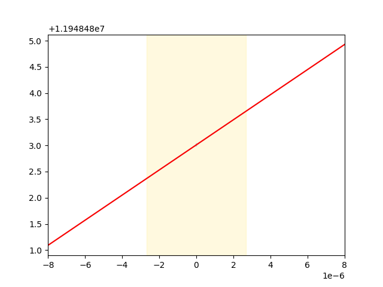
## New Eq:
((fabs(membrane__v) < 2.6712338705498262e-6) ? ((0.5 + 187179.41753901311 * membrane__v) * (2.6712338705498262e-6 * pow(physical_constants__F, 2) * (-extracellular__ko * exp(-(-0.29999999999999999 * ICaL__Io + sqrt(ICaL__Io) / (1.0 + sqrt(ICaL__Io))) * ICaL__constA) + intracellular_ions__kss * exp(2.6712338705498262e-6 * physical_constants__F / (physical_constants__R * physical_constants__T)) * exp(-(-0.29999999999999999 * ICaL__Iss + sqrt(ICaL__Iss) / (1.0 + sqrt(ICaL__Iss))) * ICaL__constA)) / ((-1.0 + exp(2.6712338705498262e-6 * physical_constants__F / (physical_constants__R * physical_constants__T))) * physical_constants__R * physical_constants__T) + 2.6712338705498262e-6 * pow(physical_constants__F, 2) * (-extracellular__ko * exp(-(-0.29999999999999999 * ICaL__Io + sqrt(ICaL__Io) / (1.0 + sqrt(ICaL__Io))) * ICaL__constA) + intracellular_ions__kss * exp(-2.6712338705498262e-6 * physical_constants__F / (physical_constants__R * physical_constants__T)) * exp(-(-0.29999999999999999 * ICaL__Iss + sqrt(ICaL__Iss) / (1.0 + sqrt(ICaL__Iss))) * ICaL__constA)) / ((-1.0 + exp(-2.6712338705498262e-6 * physical_constants__F / (physical_constants__R * physical_constants__T))) * physical_constants__R * physical_constants__T)) - 2.6712338705498262e-6 * pow(physical_constants__F, 2) * (-extracellular__ko * exp(-(-0.29999999999999999 * ICaL__Io + sqrt(ICaL__Io) / (1.0 + sqrt(ICaL__Io))) * ICaL__constA) + intracellular_ions__kss * exp(-2.6712338705498262e-6 * physical_constants__F / (physical_constants__R * physical_constants__T)) * exp(-(-0.29999999999999999 * ICaL__Iss + sqrt(ICaL__Iss) / (1.0 + sqrt(ICaL__Iss))) * ICaL__constA)) / ((-1.0 + exp(-2.6712338705498262e-6 * physical_constants__F / (physical_constants__R * physical_constants__T))) * physical_constants__R * physical_constants__T)) : ((-ICaL__gamma_ko * extracellular__ko + ICaL__gamma_kss * intracellular_ions__kss * exp(membrane__vfrt)) * membrane__vffrt / (-1.0 + exp(membrane__vfrt))))

## Equation 3:
```
ICaL__PhiCaL_i = 4.0 * (-ICaL__gamma_cao * extracellular__cao + ICaL__gamma_cai * intracellular_ions__cai * exp(2.0 * membrane__vfrt)) * membrane__vffrt / (-1.0 + exp(2.0 * membrane__vfrt))
```
### Partially evaluated to: 
```
ICaL__PhiCaL_i = 4.0 * pow(physical_constants__F, 2) * (-extracellular__cao * exp(-4.0 * (-0.29999999999999999 * ICaL__Io + sqrt(ICaL__Io) / (1.0 + sqrt(ICaL__Io))) * ICaL__constA) + intracellular_ions__cai * exp(2.0 * membrane__v * physical_constants__F / (physical_constants__R * physical_constants__T)) * exp(-4.0 * (-0.29999999999999999 * ICaL__Ii + sqrt(ICaL__Ii) / (1.0 + sqrt(ICaL__Ii))) * ICaL__constA)) * membrane__v / ((-1.0 + exp(2.0 * membrane__v * physical_constants__F / (physical_constants__R * physical_constants__T))) * physical_constants__R * physical_constants__T)
```
### Singulariy points detected:

{0}
#### float * A

####Failed to find U symbolically!

<class 'sympy.core.mul.Mul'>
_physical_constants$F**2*_membrane$v*(-_extracellular$cao*exp_(-4.0*_ICaL$constA*(sqrt(_ICaL$Io)/(sqrt(_ICaL$Io) + 1.0) - 0.29999999999999999*_ICaL$Io)) + _intracellular_ions$cai*exp_(-4.0*_ICaL$constA*(sqrt(_ICaL$Ii)/(sqrt(_ICaL$Ii) + 1.0) - 0.29999999999999999*_ICaL$Ii))*exp(2.0*_membrane$v*_physical_constants$F/(_physical_constants$R*_physical_constants$T)))/(_physical_constants$R*_physical_constants$T*(exp(2.0*_membrane$v*_physical_constants$F/(_physical_constants$R*_physical_constants$T)) - 1.0))

*try substituting parameters*

*U*
`0.074871767015605231 * membrane__v`

*V for 1e-07 range* 
`-1.3356169352749131e-6 - 1.3356169352749131e-6`

*Singularity point: 0*


## New Eq:
((fabs(membrane__v) < 1.3356169352749131e-6) ? ((0.5 + 374358.83507802623 * membrane__v) * (5.3424677410996524e-6 * pow(physical_constants__F, 2) * (-extracellular__cao * exp(-4.0 * (-0.29999999999999999 * ICaL__Io + sqrt(ICaL__Io) / (1.0 + sqrt(ICaL__Io))) * ICaL__constA) + intracellular_ions__cai * exp(2.6712338705498262e-6 * physical_constants__F / (physical_constants__R * physical_constants__T)) * exp(-4.0 * (-0.29999999999999999 * ICaL__Ii + sqrt(ICaL__Ii) / (1.0 + sqrt(ICaL__Ii))) * ICaL__constA)) / ((-1.0 + exp(2.6712338705498262e-6 * physical_constants__F / (physical_constants__R * physical_constants__T))) * physical_constants__R * physical_constants__T) + 5.3424677410996524e-6 * pow(physical_constants__F, 2) * (-extracellular__cao * exp(-4.0 * (-0.29999999999999999 * ICaL__Io + sqrt(ICaL__Io) / (1.0 + sqrt(ICaL__Io))) * ICaL__constA) + intracellular_ions__cai * exp(-2.6712338705498262e-6 * physical_constants__F / (physical_constants__R * physical_constants__T)) * exp(-4.0 * (-0.29999999999999999 * ICaL__Ii + sqrt(ICaL__Ii) / (1.0 + sqrt(ICaL__Ii))) * ICaL__constA)) / ((-1.0 + exp(-2.6712338705498262e-6 * physical_constants__F / (physical_constants__R * physical_constants__T))) * physical_constants__R * physical_constants__T)) - 5.3424677410996524e-6 * pow(physical_constants__F, 2) * (-extracellular__cao * exp(-4.0 * (-0.29999999999999999 * ICaL__Io + sqrt(ICaL__Io) / (1.0 + sqrt(ICaL__Io))) * ICaL__constA) + intracellular_ions__cai * exp(-2.6712338705498262e-6 * physical_constants__F / (physical_constants__R * physical_constants__T)) * exp(-4.0 * (-0.29999999999999999 * ICaL__Ii + sqrt(ICaL__Ii) / (1.0 + sqrt(ICaL__Ii))) * ICaL__constA)) / ((-1.0 + exp(-2.6712338705498262e-6 * physical_constants__F / (physical_constants__R * physical_constants__T))) * physical_constants__R * physical_constants__T)) : (4.0 * (-ICaL__gamma_cao * extracellular__cao + ICaL__gamma_cai * intracellular_ions__cai * exp(2.0 * membrane__vfrt)) * membrane__vffrt / (-1.0 + exp(2.0 * membrane__vfrt))))

## Equation 4:
```
ICaL__PhiCaL_ss = 4.0 * (-ICaL__gamma_cao * extracellular__cao + ICaL__gamma_cass * intracellular_ions__cass * exp(2.0 * membrane__vfrt)) * membrane__vffrt / (-1.0 + exp(2.0 * membrane__vfrt))
```
### Partially evaluated to: 
```
ICaL__PhiCaL_ss = 4.0 * pow(physical_constants__F, 2) * (-extracellular__cao * exp(-4.0 * (-0.29999999999999999 * ICaL__Io + sqrt(ICaL__Io) / (1.0 + sqrt(ICaL__Io))) * ICaL__constA) + intracellular_ions__cass * exp(2.0 * membrane__v * physical_constants__F / (physical_constants__R * physical_constants__T)) * exp(-4.0 * (-0.29999999999999999 * ICaL__Iss + sqrt(ICaL__Iss) / (1.0 + sqrt(ICaL__Iss))) * ICaL__constA)) * membrane__v / ((-1.0 + exp(2.0 * membrane__v * physical_constants__F / (physical_constants__R * physical_constants__T))) * physical_constants__R * physical_constants__T)
```
### Singulariy points detected:

{0}
#### float * A

####Failed to find U symbolically!

<class 'sympy.core.mul.Mul'>
_physical_constants$F**2*_membrane$v*(-_extracellular$cao*exp_(-4.0*_ICaL$constA*(sqrt(_ICaL$Io)/(sqrt(_ICaL$Io) + 1.0) - 0.29999999999999999*_ICaL$Io)) + _intracellular_ions$cass*exp_(-4.0*_ICaL$constA*(sqrt(_ICaL$Iss)/(sqrt(_ICaL$Iss) + 1.0) - 0.29999999999999999*_ICaL$Iss))*exp(2.0*_membrane$v*_physical_constants$F/(_physical_constants$R*_physical_constants$T)))/(_physical_constants$R*_physical_constants$T*(exp(2.0*_membrane$v*_physical_constants$F/(_physical_constants$R*_physical_constants$T)) - 1.0))

*try substituting parameters*

*U*
`0.074871767015605231 * membrane__v`

*V for 1e-07 range* 
`-1.3356169352749131e-6 - 1.3356169352749131e-6`

*Singularity point: 0*

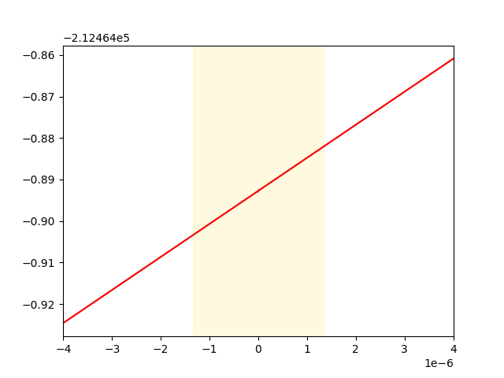
## New Eq:
((fabs(membrane__v) < 1.3356169352749131e-6) ? ((0.5 + 374358.83507802623 * membrane__v) * (5.3424677410996524e-6 * pow(physical_constants__F, 2) * (-extracellular__cao * exp(-4.0 * (-0.29999999999999999 * ICaL__Io + sqrt(ICaL__Io) / (1.0 + sqrt(ICaL__Io))) * ICaL__constA) + intracellular_ions__cass * exp(2.6712338705498262e-6 * physical_constants__F / (physical_constants__R * physical_constants__T)) * exp(-4.0 * (-0.29999999999999999 * ICaL__Iss + sqrt(ICaL__Iss) / (1.0 + sqrt(ICaL__Iss))) * ICaL__constA)) / ((-1.0 + exp(2.6712338705498262e-6 * physical_constants__F / (physical_constants__R * physical_constants__T))) * physical_constants__R * physical_constants__T) + 5.3424677410996524e-6 * pow(physical_constants__F, 2) * (-extracellular__cao * exp(-4.0 * (-0.29999999999999999 * ICaL__Io + sqrt(ICaL__Io) / (1.0 + sqrt(ICaL__Io))) * ICaL__constA) + intracellular_ions__cass * exp(-2.6712338705498262e-6 * physical_constants__F / (physical_constants__R * physical_constants__T)) * exp(-4.0 * (-0.29999999999999999 * ICaL__Iss + sqrt(ICaL__Iss) / (1.0 + sqrt(ICaL__Iss))) * ICaL__constA)) / ((-1.0 + exp(-2.6712338705498262e-6 * physical_constants__F / (physical_constants__R * physical_constants__T))) * physical_constants__R * physical_constants__T)) - 5.3424677410996524e-6 * pow(physical_constants__F, 2) * (-extracellular__cao * exp(-4.0 * (-0.29999999999999999 * ICaL__Io + sqrt(ICaL__Io) / (1.0 + sqrt(ICaL__Io))) * ICaL__constA) + intracellular_ions__cass * exp(-2.6712338705498262e-6 * physical_constants__F / (physical_constants__R * physical_constants__T)) * exp(-4.0 * (-0.29999999999999999 * ICaL__Iss + sqrt(ICaL__Iss) / (1.0 + sqrt(ICaL__Iss))) * ICaL__constA)) / ((-1.0 + exp(-2.6712338705498262e-6 * physical_constants__F / (physical_constants__R * physical_constants__T))) * physical_constants__R * physical_constants__T)) : (4.0 * (-ICaL__gamma_cao * extracellular__cao + ICaL__gamma_cass * intracellular_ions__cass * exp(2.0 * membrane__vfrt)) * membrane__vffrt / (-1.0 + exp(2.0 * membrane__vfrt))))

## Equation 5:
```
ICaL__PhiCaNa_i = (-ICaL__gamma_nao * extracellular__nao + ICaL__gamma_nai * intracellular_ions__nai * exp(membrane__vfrt)) * membrane__vffrt / (-1.0 + exp(membrane__vfrt))
```
### Partially evaluated to: 
```
ICaL__PhiCaNa_i = pow(physical_constants__F, 2) * (-extracellular__nao * exp(-(-0.29999999999999999 * ICaL__Io + sqrt(ICaL__Io) / (1.0 + sqrt(ICaL__Io))) * ICaL__constA) + intracellular_ions__nai * exp(membrane__v * physical_constants__F / (physical_constants__R * physical_constants__T)) * exp(-(-0.29999999999999999 * ICaL__Ii + sqrt(ICaL__Ii) / (1.0 + sqrt(ICaL__Ii))) * ICaL__constA)) * membrane__v / ((-1.0 + exp(membrane__v * physical_constants__F / (physical_constants__R * physical_constants__T))) * physical_constants__R * physical_constants__T)
```
### Singulariy points detected:

{0}
#### float * A

####Failed to find U symbolically!

<class 'sympy.core.mul.Mul'>
_physical_constants$F**2*_membrane$v*(-_extracellular$nao*exp_(-1.0*_ICaL$constA*(sqrt(_ICaL$Io)/(sqrt(_ICaL$Io) + 1.0) - 0.29999999999999999*_ICaL$Io)) + _intracellular_ions$nai*exp_(-1.0*_ICaL$constA*(sqrt(_ICaL$Ii)/(sqrt(_ICaL$Ii) + 1.0) - 0.29999999999999999*_ICaL$Ii))*exp(1.0*_membrane$v*_physical_constants$F/(_physical_constants$R*_physical_constants$T)))/(_physical_constants$R*_physical_constants$T*(exp(1.0*_membrane$v*_physical_constants$F/(_physical_constants$R*_physical_constants$T)) - 1.0))

*try substituting parameters*

*U*
`0.037435883507802616 * membrane__v`

*V for 1e-07 range* 
`-2.6712338705498262e-6 - 2.6712338705498262e-6`

*Singularity point: 0*

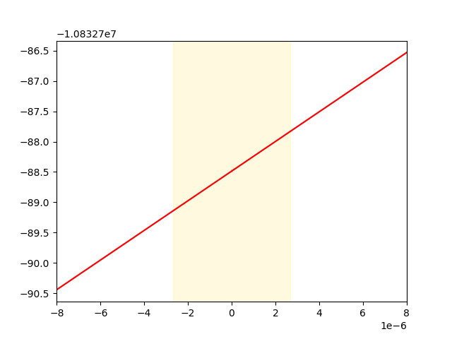
## New Eq:
((fabs(membrane__v) < 2.6712338705498262e-6) ? ((0.5 + 187179.41753901311 * membrane__v) * (2.6712338705498262e-6 * pow(physical_constants__F, 2) * (-extracellular__nao * exp(-(-0.29999999999999999 * ICaL__Io + sqrt(ICaL__Io) / (1.0 + sqrt(ICaL__Io))) * ICaL__constA) + intracellular_ions__nai * exp(2.6712338705498262e-6 * physical_constants__F / (physical_constants__R * physical_constants__T)) * exp(-(-0.29999999999999999 * ICaL__Ii + sqrt(ICaL__Ii) / (1.0 + sqrt(ICaL__Ii))) * ICaL__constA)) / ((-1.0 + exp(2.6712338705498262e-6 * physical_constants__F / (physical_constants__R * physical_constants__T))) * physical_constants__R * physical_constants__T) + 2.6712338705498262e-6 * pow(physical_constants__F, 2) * (-extracellular__nao * exp(-(-0.29999999999999999 * ICaL__Io + sqrt(ICaL__Io) / (1.0 + sqrt(ICaL__Io))) * ICaL__constA) + intracellular_ions__nai * exp(-2.6712338705498262e-6 * physical_constants__F / (physical_constants__R * physical_constants__T)) * exp(-(-0.29999999999999999 * ICaL__Ii + sqrt(ICaL__Ii) / (1.0 + sqrt(ICaL__Ii))) * ICaL__constA)) / ((-1.0 + exp(-2.6712338705498262e-6 * physical_constants__F / (physical_constants__R * physical_constants__T))) * physical_constants__R * physical_constants__T)) - 2.6712338705498262e-6 * pow(physical_constants__F, 2) * (-extracellular__nao * exp(-(-0.29999999999999999 * ICaL__Io + sqrt(ICaL__Io) / (1.0 + sqrt(ICaL__Io))) * ICaL__constA) + intracellular_ions__nai * exp(-2.6712338705498262e-6 * physical_constants__F / (physical_constants__R * physical_constants__T)) * exp(-(-0.29999999999999999 * ICaL__Ii + sqrt(ICaL__Ii) / (1.0 + sqrt(ICaL__Ii))) * ICaL__constA)) / ((-1.0 + exp(-2.6712338705498262e-6 * physical_constants__F / (physical_constants__R * physical_constants__T))) * physical_constants__R * physical_constants__T)) : ((-ICaL__gamma_nao * extracellular__nao + ICaL__gamma_nai * intracellular_ions__nai * exp(membrane__vfrt)) * membrane__vffrt / (-1.0 + exp(membrane__vfrt))))

## Equation 6:
```
ICaL__PhiCaNa_ss = (-ICaL__gamma_nao * extracellular__nao + ICaL__gamma_nass * intracellular_ions__nass * exp(membrane__vfrt)) * membrane__vffrt / (-1.0 + exp(membrane__vfrt))
```
### Partially evaluated to: 
```
ICaL__PhiCaNa_ss = pow(physical_constants__F, 2) * (-extracellular__nao * exp(-(-0.29999999999999999 * ICaL__Io + sqrt(ICaL__Io) / (1.0 + sqrt(ICaL__Io))) * ICaL__constA) + intracellular_ions__nass * exp(membrane__v * physical_constants__F / (physical_constants__R * physical_constants__T)) * exp(-(-0.29999999999999999 * ICaL__Iss + sqrt(ICaL__Iss) / (1.0 + sqrt(ICaL__Iss))) * ICaL__constA)) * membrane__v / ((-1.0 + exp(membrane__v * physical_constants__F / (physical_constants__R * physical_constants__T))) * physical_constants__R * physical_constants__T)
```
### Singulariy points detected:

{0}
#### float * A

####Failed to find U symbolically!

<class 'sympy.core.mul.Mul'>
_physical_constants$F**2*_membrane$v*(-_extracellular$nao*exp_(-1.0*_ICaL$constA*(sqrt(_ICaL$Io)/(sqrt(_ICaL$Io) + 1.0) - 0.29999999999999999*_ICaL$Io)) + _intracellular_ions$nass*exp_(-1.0*_ICaL$constA*(sqrt(_ICaL$Iss)/(sqrt(_ICaL$Iss) + 1.0) - 0.29999999999999999*_ICaL$Iss))*exp(1.0*_membrane$v*_physical_constants$F/(_physical_constants$R*_physical_constants$T)))/(_physical_constants$R*_physical_constants$T*(exp(1.0*_membrane$v*_physical_constants$F/(_physical_constants$R*_physical_constants$T)) - 1.0))

*try substituting parameters*

*U*
`0.037435883507802616 * membrane__v`

*V for 1e-07 range* 
`-2.6712338705498262e-6 - 2.6712338705498262e-6`

*Singularity point: 0*

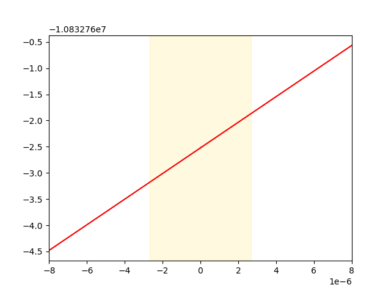
## New Eq:
((fabs(membrane__v) < 2.6712338705498262e-6) ? ((0.5 + 187179.41753901311 * membrane__v) * (2.6712338705498262e-6 * pow(physical_constants__F, 2) * (-extracellular__nao * exp(-(-0.29999999999999999 * ICaL__Io + sqrt(ICaL__Io) / (1.0 + sqrt(ICaL__Io))) * ICaL__constA) + intracellular_ions__nass * exp(2.6712338705498262e-6 * physical_constants__F / (physical_constants__R * physical_constants__T)) * exp(-(-0.29999999999999999 * ICaL__Iss + sqrt(ICaL__Iss) / (1.0 + sqrt(ICaL__Iss))) * ICaL__constA)) / ((-1.0 + exp(2.6712338705498262e-6 * physical_constants__F / (physical_constants__R * physical_constants__T))) * physical_constants__R * physical_constants__T) + 2.6712338705498262e-6 * pow(physical_constants__F, 2) * (-extracellular__nao * exp(-(-0.29999999999999999 * ICaL__Io + sqrt(ICaL__Io) / (1.0 + sqrt(ICaL__Io))) * ICaL__constA) + intracellular_ions__nass * exp(-2.6712338705498262e-6 * physical_constants__F / (physical_constants__R * physical_constants__T)) * exp(-(-0.29999999999999999 * ICaL__Iss + sqrt(ICaL__Iss) / (1.0 + sqrt(ICaL__Iss))) * ICaL__constA)) / ((-1.0 + exp(-2.6712338705498262e-6 * physical_constants__F / (physical_constants__R * physical_constants__T))) * physical_constants__R * physical_constants__T)) - 2.6712338705498262e-6 * pow(physical_constants__F, 2) * (-extracellular__nao * exp(-(-0.29999999999999999 * ICaL__Io + sqrt(ICaL__Io) / (1.0 + sqrt(ICaL__Io))) * ICaL__constA) + intracellular_ions__nass * exp(-2.6712338705498262e-6 * physical_constants__F / (physical_constants__R * physical_constants__T)) * exp(-(-0.29999999999999999 * ICaL__Iss + sqrt(ICaL__Iss) / (1.0 + sqrt(ICaL__Iss))) * ICaL__constA)) / ((-1.0 + exp(-2.6712338705498262e-6 * physical_constants__F / (physical_constants__R * physical_constants__T))) * physical_constants__R * physical_constants__T)) : ((-ICaL__gamma_nao * extracellular__nao + ICaL__gamma_nass * intracellular_ions__nass * exp(membrane__vfrt)) * membrane__vffrt / (-1.0 + exp(membrane__vfrt))))

## Equation 7:
```
ICab__ICab = 4.0 * (-ICaL__gamma_cao * extracellular__cao + ICaL__gamma_cai * intracellular_ions__cai * exp(2.0 * membrane__vfrt)) * ICab__PCab * membrane__vffrt / (-1.0 + exp(2.0 * membrane__vfrt))
```
### Partially evaluated to: 
```
ICab__ICab = 2.36776e-7 * pow(physical_constants__F, 2) * (-extracellular__cao * exp(-4.0 * (-0.29999999999999999 * ICaL__Io + sqrt(ICaL__Io) / (1.0 + sqrt(ICaL__Io))) * ICaL__constA) + intracellular_ions__cai * exp(2.0 * membrane__v * physical_constants__F / (physical_constants__R * physical_constants__T)) * exp(-4.0 * (-0.29999999999999999 * ICaL__Ii + sqrt(ICaL__Ii) / (1.0 + sqrt(ICaL__Ii))) * ICaL__constA)) * membrane__v / ((-1.0 + exp(2.0 * membrane__v * physical_constants__F / (physical_constants__R * physical_constants__T))) * physical_constants__R * physical_constants__T)
```
### Singulariy points detected:

{0}
#### float * A

####Failed to find U symbolically!

<class 'sympy.core.mul.Mul'>
_physical_constants$F**2*_membrane$v*(-_extracellular$cao*exp_(-4.0*_ICaL$constA*(sqrt(_ICaL$Io)/(sqrt(_ICaL$Io) + 1.0) - 0.29999999999999999*_ICaL$Io)) + _intracellular_ions$cai*exp_(-4.0*_ICaL$constA*(sqrt(_ICaL$Ii)/(sqrt(_ICaL$Ii) + 1.0) - 0.29999999999999999*_ICaL$Ii))*exp(2.0*_membrane$v*_physical_constants$F/(_physical_constants$R*_physical_constants$T)))/(_physical_constants$R*_physical_constants$T*(exp(2.0*_membrane$v*_physical_constants$F/(_physical_constants$R*_physical_constants$T)) - 1.0))

*try substituting parameters*

*U*
`0.074871767015605231 * membrane__v`

*V for 1e-07 range* 
`-1.3356169352749131e-6 - 1.3356169352749131e-6`

*Singularity point: 0*


## New Eq:
((fabs(membrane__v) < 1.3356169352749131e-6) ? ((0.5 + 374358.83507802623 * membrane__v) * (3.1624203546665282e-13 * pow(physical_constants__F, 2) * (-extracellular__cao * exp(-4.0 * (-0.29999999999999999 * ICaL__Io + sqrt(ICaL__Io) / (1.0 + sqrt(ICaL__Io))) * ICaL__constA) + intracellular_ions__cai * exp(2.6712338705498262e-6 * physical_constants__F / (physical_constants__R * physical_constants__T)) * exp(-4.0 * (-0.29999999999999999 * ICaL__Ii + sqrt(ICaL__Ii) / (1.0 + sqrt(ICaL__Ii))) * ICaL__constA)) / ((-1.0 + exp(2.6712338705498262e-6 * physical_constants__F / (physical_constants__R * physical_constants__T))) * physical_constants__R * physical_constants__T) + 3.1624203546665282e-13 * pow(physical_constants__F, 2) * (-extracellular__cao * exp(-4.0 * (-0.29999999999999999 * ICaL__Io + sqrt(ICaL__Io) / (1.0 + sqrt(ICaL__Io))) * ICaL__constA) + intracellular_ions__cai * exp(-2.6712338705498262e-6 * physical_constants__F / (physical_constants__R * physical_constants__T)) * exp(-4.0 * (-0.29999999999999999 * ICaL__Ii + sqrt(ICaL__Ii) / (1.0 + sqrt(ICaL__Ii))) * ICaL__constA)) / ((-1.0 + exp(-2.6712338705498262e-6 * physical_constants__F / (physical_constants__R * physical_constants__T))) * physical_constants__R * physical_constants__T)) - 3.1624203546665282e-13 * pow(physical_constants__F, 2) * (-extracellular__cao * exp(-4.0 * (-0.29999999999999999 * ICaL__Io + sqrt(ICaL__Io) / (1.0 + sqrt(ICaL__Io))) * ICaL__constA) + intracellular_ions__cai * exp(-2.6712338705498262e-6 * physical_constants__F / (physical_constants__R * physical_constants__T)) * exp(-4.0 * (-0.29999999999999999 * ICaL__Ii + sqrt(ICaL__Ii) / (1.0 + sqrt(ICaL__Ii))) * ICaL__constA)) / ((-1.0 + exp(-2.6712338705498262e-6 * physical_constants__F / (physical_constants__R * physical_constants__T))) * physical_constants__R * physical_constants__T)) : (4.0 * (-ICaL__gamma_cao * extracellular__cao + ICaL__gamma_cai * intracellular_ions__cai * exp(2.0 * membrane__vfrt)) * ICab__PCab * membrane__vffrt / (-1.0 + exp(2.0 * membrane__vfrt))))

## Equation 8:
```
INab__INab = (-extracellular__nao + intracellular_ions__nai * exp(membrane__vfrt)) * INab__PNab * membrane__vffrt / (-1.0 + exp(membrane__vfrt))
```
### Partially evaluated to: 
```
INab__INab = 1.9238999999999999e-9 * pow(physical_constants__F, 2) * (-extracellular__nao + intracellular_ions__nai * exp(membrane__v * physical_constants__F / (physical_constants__R * physical_constants__T))) * membrane__v / ((-1.0 + exp(membrane__v * physical_constants__F / (physical_constants__R * physical_constants__T))) * physical_constants__R * physical_constants__T)
```
### Singulariy points detected:

{0}
#### float * A

####Failed to find U symbolically!

<class 'sympy.core.mul.Mul'>
_physical_constants$F**2*_membrane$v*(-_extracellular$nao + _intracellular_ions$nai*exp(_membrane$v*_physical_constants$F/(_physical_constants$R*_physical_constants$T)))/(_physical_constants$R*_physical_constants$T*(exp(_membrane$v*_physical_constants$F/(_physical_constants$R*_physical_constants$T)) - 1.0))

*try substituting parameters*

*U*
`0.037435883507802616 * membrane__v`

*V for 1e-07 range* 
`-2.6712338705498262e-6 - 2.6712338705498262e-6`

*Singularity point: 0*

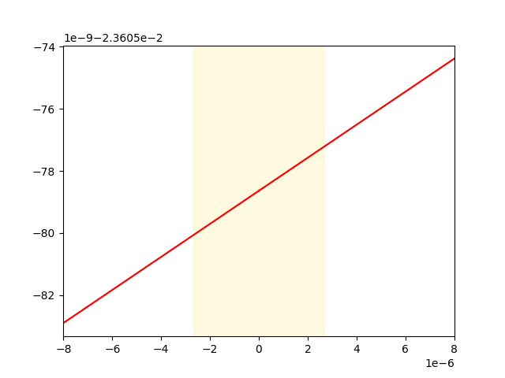
## New Eq:
((fabs(membrane__v) < 2.6712338705498262e-6) ? ((0.5 + 187179.41753901311 * membrane__v) * (5.1391868435508108e-15 * pow(physical_constants__F, 2) * (-extracellular__nao + intracellular_ions__nai * exp(2.6712338705498262e-6 * physical_constants__F / (physical_constants__R * physical_constants__T))) / ((-1.0 + exp(2.6712338705498262e-6 * physical_constants__F / (physical_constants__R * physical_constants__T))) * physical_constants__R * physical_constants__T) + 5.1391868435508108e-15 * pow(physical_constants__F, 2) * (-extracellular__nao + intracellular_ions__nai * exp(-2.6712338705498262e-6 * physical_constants__F / (physical_constants__R * physical_constants__T))) / ((-1.0 + exp(-2.6712338705498262e-6 * physical_constants__F / (physical_constants__R * physical_constants__T))) * physical_constants__R * physical_constants__T)) - 5.1391868435508108e-15 * pow(physical_constants__F, 2) * (-extracellular__nao + intracellular_ions__nai * exp(-2.6712338705498262e-6 * physical_constants__F / (physical_constants__R * physical_constants__T))) / ((-1.0 + exp(-2.6712338705498262e-6 * physical_constants__F / (physical_constants__R * physical_constants__T))) * physical_constants__R * physical_constants__T)) : ((-extracellular__nao + intracellular_ions__nai * exp(membrane__vfrt)) * INab__PNab * membrane__vffrt / (-1.0 + exp(membrane__vfrt))))

ryr__Jrel_inf = ((environment__celltype == 2.0) ? (1.7 * ryr__Jrel_inf_b) : (ryr__Jrel_inf_b))

####Piecewise!!

ryr__Jrel_infp = ((environment__celltype == 2.0) ? (1.7 * ryr__Jrel_infp_b) : (ryr__Jrel_infp_b))

####Piecewise!!

ryr__tau_rel = ((ryr__tau_rel_b < 0.001) ? (0.001) : (ryr__tau_rel_b))

####Piecewise!!

ryr__tau_relp = ((ryr__tau_relp_b < 0.001) ? (0.001) : (ryr__tau_relp_b))

####Piecewise!!

# Model: Trovato2020(Trovato2020.cellml)
## Equation 1:
```
ICaL__PhiCaK = (-0.75 * extracellular__ko + 0.75 * intracellular_ions__kss * exp(membrane__vfrt)) * membrane__vffrt / (-1.0 + exp(membrane__vfrt))
```
### Partially evaluated to: 
```
ICaL__PhiCaK = pow(physical_constants__F, 2) * (-0.75 * extracellular__ko + 0.75 * intracellular_ions__kss * exp(membrane__v * physical_constants__F / (physical_constants__R * physical_constants__T))) * membrane__v / ((-1.0 + exp(membrane__v * physical_constants__F / (physical_constants__R * physical_constants__T))) * physical_constants__R * physical_constants__T)
```
### Singulariy points detected:

{0}
#### float * A

####Failed to find U symbolically!

<class 'sympy.core.mul.Mul'>
_physical_constants$F**2*_membrane$v*(-0.75*_extracellular$ko + 0.75*_intracellular_ions$kss*exp(1.0*_membrane$v*_physical_constants$F/(_physical_constants$R*_physical_constants$T)))/(_physical_constants$R*_physical_constants$T*(exp(1.0*_membrane$v*_physical_constants$F/(_physical_constants$R*_physical_constants$T)) - 1.0))

*try substituting parameters*

*U*
`0.037435883507802616 * membrane__v`

*V for 1e-07 range* 
`-2.6712338705498262e-6 - 2.6712338705498262e-6`

*Singularity point: 0*

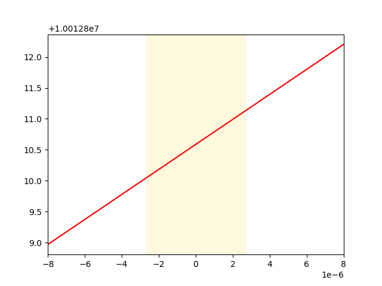
## New Eq:
((fabs(membrane__v) < 2.6712338705498262e-6) ? ((0.5 + 187179.41753901311 * membrane__v) * (2.6712338705498262e-6 * pow(physical_constants__F, 2) * (-0.75 * extracellular__ko + 0.75 * intracellular_ions__kss * exp(2.6712338705498262e-6 * physical_constants__F / (physical_constants__R * physical_constants__T))) / ((-1.0 + exp(2.6712338705498262e-6 * physical_constants__F / (physical_constants__R * physical_constants__T))) * physical_constants__R * physical_constants__T) + 2.6712338705498262e-6 * pow(physical_constants__F, 2) * (-0.75 * extracellular__ko + 0.75 * intracellular_ions__kss * exp(-2.6712338705498262e-6 * physical_constants__F / (physical_constants__R * physical_constants__T))) / ((-1.0 + exp(-2.6712338705498262e-6 * physical_constants__F / (physical_constants__R * physical_constants__T))) * physical_constants__R * physical_constants__T)) - 2.6712338705498262e-6 * pow(physical_constants__F, 2) * (-0.75 * extracellular__ko + 0.75 * intracellular_ions__kss * exp(-2.6712338705498262e-6 * physical_constants__F / (physical_constants__R * physical_constants__T))) / ((-1.0 + exp(-2.6712338705498262e-6 * physical_constants__F / (physical_constants__R * physical_constants__T))) * physical_constants__R * physical_constants__T)) : ((-0.75 * extracellular__ko + 0.75 * intracellular_ions__kss * exp(membrane__vfrt)) * membrane__vffrt / (-1.0 + exp(membrane__vfrt))))

## Equation 2:
```
ICaL__PhiCaL = 4.0 * (-0.34100000000000003 * extracellular__cao + intracellular_ions__cass * exp(2.0 * membrane__vfrt)) * membrane__vffrt / (-1.0 + exp(2.0 * membrane__vfrt))
```
### Partially evaluated to: 
```
ICaL__PhiCaL = 4.0 * pow(physical_constants__F, 2) * (-0.34100000000000003 * extracellular__cao + intracellular_ions__cass * exp(2.0 * membrane__v * physical_constants__F / (physical_constants__R * physical_constants__T))) * membrane__v / ((-1.0 + exp(2.0 * membrane__v * physical_constants__F / (physical_constants__R * physical_constants__T))) * physical_constants__R * physical_constants__T)
```
### Singulariy points detected:

{0}
#### float * A

####Failed to find U symbolically!

<class 'sympy.core.mul.Mul'>
_physical_constants$F**2*_membrane$v*(-0.34100000000000003*_extracellular$cao + _intracellular_ions$cass*exp(2.0*_membrane$v*_physical_constants$F/(_physical_constants$R*_physical_constants$T)))/(_physical_constants$R*_physical_constants$T*(exp(2.0*_membrane$v*_physical_constants$F/(_physical_constants$R*_physical_constants$T)) - 1.0))

*try substituting parameters*

*U*
`0.074871767015605231 * membrane__v`

*V for 1e-07 range* 
`-1.3356169352749131e-6 - 1.3356169352749131e-6`

*Singularity point: 0*

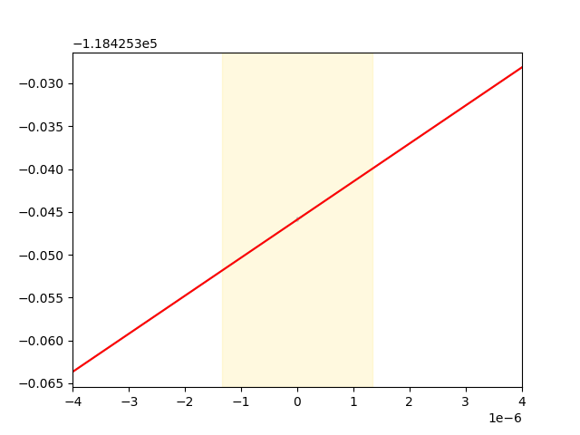
## New Eq:
((fabs(membrane__v) < 1.3356169352749131e-6) ? ((0.5 + 374358.83507802623 * membrane__v) * (5.3424677410996524e-6 * pow(physical_constants__F, 2) * (-0.34100000000000003 * extracellular__cao + intracellular_ions__cass * exp(2.6712338705498262e-6 * physical_constants__F / (physical_constants__R * physical_constants__T))) / ((-1.0 + exp(2.6712338705498262e-6 * physical_constants__F / (physical_constants__R * physical_constants__T))) * physical_constants__R * physical_constants__T) + 5.3424677410996524e-6 * pow(physical_constants__F, 2) * (-0.34100000000000003 * extracellular__cao + intracellular_ions__cass * exp(-2.6712338705498262e-6 * physical_constants__F / (physical_constants__R * physical_constants__T))) / ((-1.0 + exp(-2.6712338705498262e-6 * physical_constants__F / (physical_constants__R * physical_constants__T))) * physical_constants__R * physical_constants__T)) - 5.3424677410996524e-6 * pow(physical_constants__F, 2) * (-0.34100000000000003 * extracellular__cao + intracellular_ions__cass * exp(-2.6712338705498262e-6 * physical_constants__F / (physical_constants__R * physical_constants__T))) / ((-1.0 + exp(-2.6712338705498262e-6 * physical_constants__F / (physical_constants__R * physical_constants__T))) * physical_constants__R * physical_constants__T)) : (4.0 * (-0.34100000000000003 * extracellular__cao + intracellular_ions__cass * exp(2.0 * membrane__vfrt)) * membrane__vffrt / (-1.0 + exp(2.0 * membrane__vfrt))))

## Equation 3:
```
ICaL__PhiCaNa = (-0.75 * extracellular__nao + 0.75 * intracellular_ions__nass * exp(membrane__vfrt)) * membrane__vffrt / (-1.0 + exp(membrane__vfrt))
```
### Partially evaluated to: 
```
ICaL__PhiCaNa = pow(physical_constants__F, 2) * (-0.75 * extracellular__nao + 0.75 * intracellular_ions__nass * exp(membrane__v * physical_constants__F / (physical_constants__R * physical_constants__T))) * membrane__v / ((-1.0 + exp(membrane__v * physical_constants__F / (physical_constants__R * physical_constants__T))) * physical_constants__R * physical_constants__T)
```
### Singulariy points detected:

{0}
#### float * A

####Failed to find U symbolically!

<class 'sympy.core.mul.Mul'>
_physical_constants$F**2*_membrane$v*(-0.75*_extracellular$nao + 0.75*_intracellular_ions$nass*exp(1.0*_membrane$v*_physical_constants$F/(_physical_constants$R*_physical_constants$T)))/(_physical_constants$R*_physical_constants$T*(exp(1.0*_membrane$v*_physical_constants$F/(_physical_constants$R*_physical_constants$T)) - 1.0))

*try substituting parameters*

*U*
`0.037435883507802616 * membrane__v`

*V for 1e-07 range* 
`-2.6712338705498262e-6 - 2.6712338705498262e-6`

*Singularity point: 0*

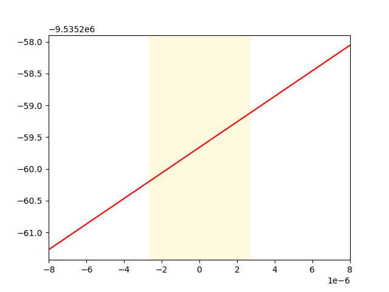
## New Eq:
((fabs(membrane__v) < 2.6712338705498262e-6) ? ((0.5 + 187179.41753901311 * membrane__v) * (2.6712338705498262e-6 * pow(physical_constants__F, 2) * (-0.75 * extracellular__nao + 0.75 * intracellular_ions__nass * exp(2.6712338705498262e-6 * physical_constants__F / (physical_constants__R * physical_constants__T))) / ((-1.0 + exp(2.6712338705498262e-6 * physical_constants__F / (physical_constants__R * physical_constants__T))) * physical_constants__R * physical_constants__T) + 2.6712338705498262e-6 * pow(physical_constants__F, 2) * (-0.75 * extracellular__nao + 0.75 * intracellular_ions__nass * exp(-2.6712338705498262e-6 * physical_constants__F / (physical_constants__R * physical_constants__T))) / ((-1.0 + exp(-2.6712338705498262e-6 * physical_constants__F / (physical_constants__R * physical_constants__T))) * physical_constants__R * physical_constants__T)) - 2.6712338705498262e-6 * pow(physical_constants__F, 2) * (-0.75 * extracellular__nao + 0.75 * intracellular_ions__nass * exp(-2.6712338705498262e-6 * physical_constants__F / (physical_constants__R * physical_constants__T))) / ((-1.0 + exp(-2.6712338705498262e-6 * physical_constants__F / (physical_constants__R * physical_constants__T))) * physical_constants__R * physical_constants__T)) : ((-0.75 * extracellular__nao + 0.75 * intracellular_ions__nass * exp(membrane__vfrt)) * membrane__vffrt / (-1.0 + exp(membrane__vfrt))))

## Equation 4:
```
ICab__ICab = 4.0 * (-0.34100000000000003 * extracellular__cao + intracellular_ions__casl * exp(2.0 * membrane__vfrt)) * ICab__PCab * membrane__vffrt / (-1.0 + exp(2.0 * membrane__vfrt))
```
### Partially evaluated to: 
```
ICab__ICab = 9.9999999999999995e-8 * pow(physical_constants__F, 2) * (-0.34100000000000003 * extracellular__cao + intracellular_ions__casl * exp(2.0 * membrane__v * physical_constants__F / (physical_constants__R * physical_constants__T))) * membrane__v / ((-1.0 + exp(2.0 * membrane__v * physical_constants__F / (physical_constants__R * physical_constants__T))) * physical_constants__R * physical_constants__T)
```
### Singulariy points detected:

{0}
#### float * A

####Failed to find U symbolically!

<class 'sympy.core.mul.Mul'>
_physical_constants$F**2*_membrane$v*(-0.34100000000000003*_extracellular$cao + _intracellular_ions$casl*exp(2.0*_membrane$v*_physical_constants$F/(_physical_constants$R*_physical_constants$T)))/(_physical_constants$R*_physical_constants$T*(exp(2.0*_membrane$v*_physical_constants$F/(_physical_constants$R*_physical_constants$T)) - 1.0))

*try substituting parameters*

*U*
`0.074871767015605231 * membrane__v`

*V for 1e-07 range* 
`-1.3356169352749131e-6 - 1.3356169352749131e-6`

*Singularity point: 0*

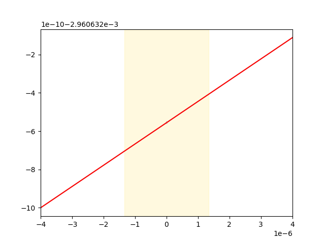
## New Eq:
((fabs(membrane__v) < 1.3356169352749131e-6) ? ((0.5 + 374358.83507802623 * membrane__v) * (1.335616935274913e-13 * pow(physical_constants__F, 2) * (-0.34100000000000003 * extracellular__cao + intracellular_ions__casl * exp(2.6712338705498262e-6 * physical_constants__F / (physical_constants__R * physical_constants__T))) / ((-1.0 + exp(2.6712338705498262e-6 * physical_constants__F / (physical_constants__R * physical_constants__T))) * physical_constants__R * physical_constants__T) + 1.335616935274913e-13 * pow(physical_constants__F, 2) * (-0.34100000000000003 * extracellular__cao + intracellular_ions__casl * exp(-2.6712338705498262e-6 * physical_constants__F / (physical_constants__R * physical_constants__T))) / ((-1.0 + exp(-2.6712338705498262e-6 * physical_constants__F / (physical_constants__R * physical_constants__T))) * physical_constants__R * physical_constants__T)) - 1.335616935274913e-13 * pow(physical_constants__F, 2) * (-0.34100000000000003 * extracellular__cao + intracellular_ions__casl * exp(-2.6712338705498262e-6 * physical_constants__F / (physical_constants__R * physical_constants__T))) / ((-1.0 + exp(-2.6712338705498262e-6 * physical_constants__F / (physical_constants__R * physical_constants__T))) * physical_constants__R * physical_constants__T)) : (4.0 * (-0.34100000000000003 * extracellular__cao + intracellular_ions__casl * exp(2.0 * membrane__vfrt)) * ICab__PCab * membrane__vffrt / (-1.0 + exp(2.0 * membrane__vfrt))))

## Equation 5:
```
INab__INab = (-extracellular__nao + intracellular_ions__nasl * exp(membrane__vfrt)) * INab__PNab * membrane__vffrt / (-1.0 + exp(membrane__vfrt))
```
### Partially evaluated to: 
```
INab__INab = 9.3749999999999992e-10 * pow(physical_constants__F, 2) * (-extracellular__nao + intracellular_ions__nasl * exp(membrane__v * physical_constants__F / (physical_constants__R * physical_constants__T))) * membrane__v / ((-1.0 + exp(membrane__v * physical_constants__F / (physical_constants__R * physical_constants__T))) * physical_constants__R * physical_constants__T)
```
### Singulariy points detected:

{0}
#### float * A

####Failed to find U symbolically!

<class 'sympy.core.mul.Mul'>
_physical_constants$F**2*_membrane$v*(-_extracellular$nao + _intracellular_ions$nasl*exp(_membrane$v*_physical_constants$F/(_physical_constants$R*_physical_constants$T)))/(_physical_constants$R*_physical_constants$T*(exp(_membrane$v*_physical_constants$F/(_physical_constants$R*_physical_constants$T)) - 1.0))

*try substituting parameters*

*U*
`0.037435883507802616 * membrane__v`

*V for 1e-07 range* 
`-2.6712338705498262e-6 - 2.6712338705498262e-6`

*Singularity point: 0*

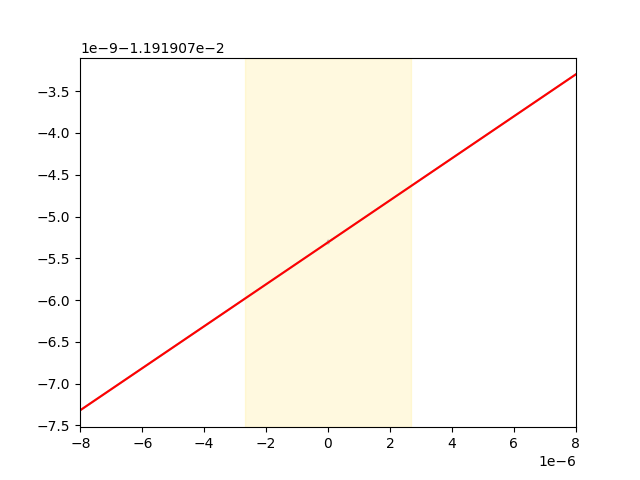
## New Eq:
((fabs(membrane__v) < 2.6712338705498262e-6) ? ((0.5 + 187179.41753901311 * membrane__v) * (2.5042817536404619e-15 * pow(physical_constants__F, 2) * (-extracellular__nao + intracellular_ions__nasl * exp(2.6712338705498262e-6 * physical_constants__F / (physical_constants__R * physical_constants__T))) / ((-1.0 + exp(2.6712338705498262e-6 * physical_constants__F / (physical_constants__R * physical_constants__T))) * physical_constants__R * physical_constants__T) + 2.5042817536404619e-15 * pow(physical_constants__F, 2) * (-extracellular__nao + intracellular_ions__nasl * exp(-2.6712338705498262e-6 * physical_constants__F / (physical_constants__R * physical_constants__T))) / ((-1.0 + exp(-2.6712338705498262e-6 * physical_constants__F / (physical_constants__R * physical_constants__T))) * physical_constants__R * physical_constants__T)) - 2.5042817536404619e-15 * pow(physical_constants__F, 2) * (-extracellular__nao + intracellular_ions__nasl * exp(-2.6712338705498262e-6 * physical_constants__F / (physical_constants__R * physical_constants__T))) / ((-1.0 + exp(-2.6712338705498262e-6 * physical_constants__F / (physical_constants__R * physical_constants__T))) * physical_constants__R * physical_constants__T)) : ((-extracellular__nao + intracellular_ions__nasl * exp(membrane__vfrt)) * INab__PNab * membrane__vffrt / (-1.0 + exp(membrane__vfrt))))

ryr__irelss = ((ryr__REL > 0) ? (15.0 * (1.0 + 1 / (1.0 + 3.7780199833600026e-5 / pow(CaMK__CaMKa, 8))) * ryr__REL / (1.0 + 1 / pow(intracellular_ions__cajsr, 8))) : (0))

####Piecewise!!

ryr__irelss2 = ((ryr__REL2 > 0) ? (91.0 * (1.0 + 1 / (1.0 + 3.7780199833600026e-5 / pow(CaMK__CaMKa, 8))) * ryr__REL2 / (1.0 + 1 / pow(intracellular_ions__cacsr, 8))) : (0))

####Piecewise!!

# Model: viswanathan_model_1999_epi(viswanathan_model_1999_epi.cellml)
calcium_dynamics__APtrack2_orig_deriv = (((calcium_dynamics__APtrack > 0.17999999999999999) && (calcium_dynamics__APtrack < 0.20000000000000001)) ? (100000.0 - 100500.0 * calcium_dynamics__APtrack2) : (-500.0 * calcium_dynamics__APtrack2))

####Piecewise!!

calcium_dynamics__APtrack3_orig_deriv = (((calcium_dynamics__APtrack > 0.17999999999999999) && (calcium_dynamics__APtrack < 0.20000000000000001)) ? (100000.0 - 100500.0 * calcium_dynamics__APtrack3) : (-10.0 * calcium_dynamics__APtrack3))

####Piecewise!!

calcium_dynamics__OVRLDtrack2_orig_deriv = (((calcium_dynamics__Logicthresh > calcium_dynamics__OVRLDtrack2) && (calcium_dynamics__Logicthresh < calcium_dynamics__OVRLDtrack)) ? (50000.0 - 50000.0 * calcium_dynamics__OVRLDtrack2) : (-500.0 * calcium_dynamics__OVRLDtrack2))

####Piecewise!!

calcium_dynamics__OVRLDtrack3_orig_deriv = (((calcium_dynamics__Logicthresh > calcium_dynamics__OVRLDtrack3) && (calcium_dynamics__Logicthresh < calcium_dynamics__OVRLDtrack)) ? (50000.0 - 50000.0 * calcium_dynamics__OVRLDtrack3) : (-10.0 * calcium_dynamics__OVRLDtrack3))

####Piecewise!!

calcium_dynamics__OVRLDtrack_orig_deriv = (((calcium_dynamics__APtrack3 < 0.37) && (calcium_dynamics__OVRLDtrack3 < 0.37) && (calcium_dynamics__CSQNthresh < 1 / (1.0 + calcium_dynamics__K_mCSQN / calcium_dynamics__Ca_JSR))) ? (50000.0 - 50000.0 * calcium_dynamics__OVRLDtrack) : (-500.0 * calcium_dynamics__OVRLDtrack))

####Piecewise!!

calcium_dynamics__G_rel = ((calcium_dynamics__Cainfluxtrack > calcium_dynamics__delta_Ca_ith) ? ((1.0 - calcium_dynamics__APtrack2) * (-calcium_dynamics__delta_Ca_ith + calcium_dynamics__Cainfluxtrack) * calcium_dynamics__APtrack2 * calcium_dynamics__G_rel_max / (-calcium_dynamics__delta_Ca_ith + calcium_dynamics__Cainfluxtrack + calcium_dynamics__K_mrel)) : ((calcium_dynamics__OVRLDtrack2 > 0) ? ((1.0 - calcium_dynamics__OVRLDtrack2) * calcium_dynamics__G_rel_overload * calcium_dynamics__OVRLDtrack2) : (0)))

####Piecewise!!

## Equation 1:
```
L_type_Ca_channel__I_CaCa = 4.0 * pow(membrane__F, 2) * (-L_type_Ca_channel__gamma_Cao * calcium_dynamics__Cao + L_type_Ca_channel__gamma_Cai * calcium_dynamics__Cai * exp(2.0 * membrane__F * membrane__V / (membrane__R * membrane__T))) * L_type_Ca_channel__P_Ca * membrane__V / ((-1.0 + exp(2.0 * membrane__F * membrane__V / (membrane__R * membrane__T))) * membrane__R * membrane__T)
```
### Partially evaluated to: 
```
L_type_Ca_channel__I_CaCa = 4.0 * pow(membrane__F, 2) * (-L_type_Ca_channel__gamma_Cao * calcium_dynamics__Cao + L_type_Ca_channel__gamma_Cai * calcium_dynamics__Cai * exp(2.0 * membrane__F * membrane__V / (membrane__R * membrane__T))) * L_type_Ca_channel__P_Ca * membrane__V / ((-1.0 + exp(2.0 * membrane__F * membrane__V / (membrane__R * membrane__T))) * membrane__R * membrane__T)
```
### Singulariy points detected:

{0}
#### float * A

####Failed to find U symbolically!

<class 'sympy.core.mul.Mul'>
_membrane$F**2*_L_type_Ca_channel$P_Ca*_membrane$V*(_L_type_Ca_channel$gamma_Cai*_calcium_dynamics$Cai*exp(2.0*_membrane$F*_membrane$V/(_membrane$R*_membrane$T)) - _L_type_Ca_channel$gamma_Cao*_calcium_dynamics$Cao)/(_membrane$R*_membrane$T*(exp(2.0*_membrane$F*_membrane$V/(_membrane$R*_membrane$T)) - 1.0))

*try substituting parameters*

*U*
`0.074871767015605231 * membrane__V`

*V for 1e-07 range* 
`-1.3356169352749131e-6 - 1.3356169352749131e-6`

*Singularity point: 0*

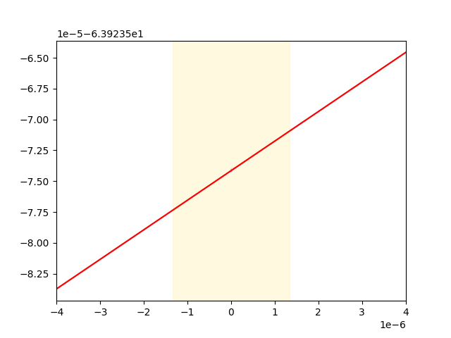
## New Eq:
((fabs(membrane__V) < 1.3356169352749131e-6) ? ((0.5 + 374358.83507802623 * membrane__V) * (5.3424677410996524e-6 * pow(membrane__F, 2) * (-L_type_Ca_channel__gamma_Cao * calcium_dynamics__Cao + L_type_Ca_channel__gamma_Cai * calcium_dynamics__Cai * exp(2.6712338705498262e-6 * membrane__F / (membrane__R * membrane__T))) * L_type_Ca_channel__P_Ca / ((-1.0 + exp(2.6712338705498262e-6 * membrane__F / (membrane__R * membrane__T))) * membrane__R * membrane__T) + 5.3424677410996524e-6 * pow(membrane__F, 2) * (-L_type_Ca_channel__gamma_Cao * calcium_dynamics__Cao + L_type_Ca_channel__gamma_Cai * calcium_dynamics__Cai * exp(-2.6712338705498262e-6 * membrane__F / (membrane__R * membrane__T))) * L_type_Ca_channel__P_Ca / ((-1.0 + exp(-2.6712338705498262e-6 * membrane__F / (membrane__R * membrane__T))) * membrane__R * membrane__T)) - 5.3424677410996524e-6 * pow(membrane__F, 2) * (-L_type_Ca_channel__gamma_Cao * calcium_dynamics__Cao + L_type_Ca_channel__gamma_Cai * calcium_dynamics__Cai * exp(-2.6712338705498262e-6 * membrane__F / (membrane__R * membrane__T))) * L_type_Ca_channel__P_Ca / ((-1.0 + exp(-2.6712338705498262e-6 * membrane__F / (membrane__R * membrane__T))) * membrane__R * membrane__T)) : (4.0 * pow(membrane__F, 2) * (-L_type_Ca_channel__gamma_Cao * calcium_dynamics__Cao + L_type_Ca_channel__gamma_Cai * calcium_dynamics__Cai * exp(2.0 * membrane__F * membrane__V / (membrane__R * membrane__T))) * L_type_Ca_channel__P_Ca * membrane__V / ((-1.0 + exp(2.0 * membrane__F * membrane__V / (membrane__R * membrane__T))) * membrane__R * membrane__T)))

## Equation 2:
```
L_type_Ca_channel__I_CaK = pow(membrane__F, 2) * (-L_type_Ca_channel__gamma_Ko * ionic_concentrations__Ko + L_type_Ca_channel__gamma_Ki * ionic_concentrations__Ki * exp(membrane__F * membrane__V / (membrane__R * membrane__T))) * L_type_Ca_channel__P_K * membrane__V / ((-1.0 + exp(membrane__F * membrane__V / (membrane__R * membrane__T))) * membrane__R * membrane__T)
```
### Partially evaluated to: 
```
L_type_Ca_channel__I_CaK = pow(membrane__F, 2) * (-L_type_Ca_channel__gamma_Ko * ionic_concentrations__Ko + L_type_Ca_channel__gamma_Ki * ionic_concentrations__Ki * exp(membrane__F * membrane__V / (membrane__R * membrane__T))) * L_type_Ca_channel__P_K * membrane__V / ((-1.0 + exp(membrane__F * membrane__V / (membrane__R * membrane__T))) * membrane__R * membrane__T)
```
### Singulariy points detected:

{0}
#### float * A

####Failed to find U symbolically!

<class 'sympy.core.mul.Mul'>
_membrane$F**2*_L_type_Ca_channel$P_K*_membrane$V*(_L_type_Ca_channel$gamma_Ki*_ionic_concentrations$Ki*exp(1.0*_membrane$F*_membrane$V/(_membrane$R*_membrane$T)) - _L_type_Ca_channel$gamma_Ko*_ionic_concentrations$Ko)/(_membrane$R*_membrane$T*(exp(1.0*_membrane$F*_membrane$V/(_membrane$R*_membrane$T)) - 1.0))

*try substituting parameters*

*U*
`0.037435883507802616 * membrane__V`

*V for 1e-07 range* 
`-2.6712338705498262e-6 - 2.6712338705498262e-6`

*Singularity point: 0*

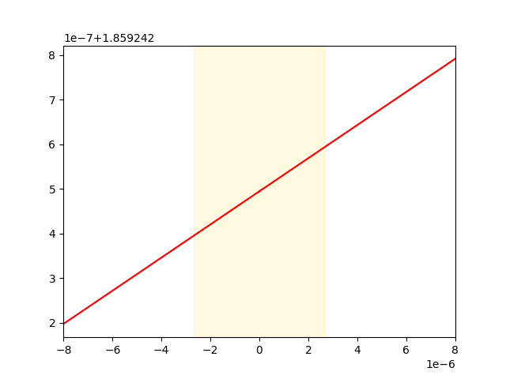
## New Eq:
((fabs(membrane__V) < 2.6712338705498262e-6) ? ((0.5 + 187179.41753901311 * membrane__V) * (2.6712338705498262e-6 * pow(membrane__F, 2) * (-L_type_Ca_channel__gamma_Ko * ionic_concentrations__Ko + L_type_Ca_channel__gamma_Ki * ionic_concentrations__Ki * exp(2.6712338705498262e-6 * membrane__F / (membrane__R * membrane__T))) * L_type_Ca_channel__P_K / ((-1.0 + exp(2.6712338705498262e-6 * membrane__F / (membrane__R * membrane__T))) * membrane__R * membrane__T) + 2.6712338705498262e-6 * pow(membrane__F, 2) * (-L_type_Ca_channel__gamma_Ko * ionic_concentrations__Ko + L_type_Ca_channel__gamma_Ki * ionic_concentrations__Ki * exp(-2.6712338705498262e-6 * membrane__F / (membrane__R * membrane__T))) * L_type_Ca_channel__P_K / ((-1.0 + exp(-2.6712338705498262e-6 * membrane__F / (membrane__R * membrane__T))) * membrane__R * membrane__T)) - 2.6712338705498262e-6 * pow(membrane__F, 2) * (-L_type_Ca_channel__gamma_Ko * ionic_concentrations__Ko + L_type_Ca_channel__gamma_Ki * ionic_concentrations__Ki * exp(-2.6712338705498262e-6 * membrane__F / (membrane__R * membrane__T))) * L_type_Ca_channel__P_K / ((-1.0 + exp(-2.6712338705498262e-6 * membrane__F / (membrane__R * membrane__T))) * membrane__R * membrane__T)) : (pow(membrane__F, 2) * (-L_type_Ca_channel__gamma_Ko * ionic_concentrations__Ko + L_type_Ca_channel__gamma_Ki * ionic_concentrations__Ki * exp(membrane__F * membrane__V / (membrane__R * membrane__T))) * L_type_Ca_channel__P_K * membrane__V / ((-1.0 + exp(membrane__F * membrane__V / (membrane__R * membrane__T))) * membrane__R * membrane__T)))

## Equation 3:
```
L_type_Ca_channel__I_CaNa = pow(membrane__F, 2) * (-L_type_Ca_channel__gamma_Nao * ionic_concentrations__Nao + L_type_Ca_channel__gamma_Nai * ionic_concentrations__Nai * exp(membrane__F * membrane__V / (membrane__R * membrane__T))) * L_type_Ca_channel__P_Na * membrane__V / ((-1.0 + exp(membrane__F * membrane__V / (membrane__R * membrane__T))) * membrane__R * membrane__T)
```
### Partially evaluated to: 
```
L_type_Ca_channel__I_CaNa = pow(membrane__F, 2) * (-L_type_Ca_channel__gamma_Nao * ionic_concentrations__Nao + L_type_Ca_channel__gamma_Nai * ionic_concentrations__Nai * exp(membrane__F * membrane__V / (membrane__R * membrane__T))) * L_type_Ca_channel__P_Na * membrane__V / ((-1.0 + exp(membrane__F * membrane__V / (membrane__R * membrane__T))) * membrane__R * membrane__T)
```
### Singulariy points detected:

{0}
#### float * A

####Failed to find U symbolically!

<class 'sympy.core.mul.Mul'>
_membrane$F**2*_L_type_Ca_channel$P_Na*_membrane$V*(_L_type_Ca_channel$gamma_Nai*_ionic_concentrations$Nai*exp(1.0*_membrane$F*_membrane$V/(_membrane$R*_membrane$T)) - _L_type_Ca_channel$gamma_Nao*_ionic_concentrations$Nao)/(_membrane$R*_membrane$T*(exp(1.0*_membrane$F*_membrane$V/(_membrane$R*_membrane$T)) - 1.0))

*try substituting parameters*

*U*
`0.037435883507802616 * membrane__V`

*V for 1e-07 range* 
`-2.6712338705498262e-6 - 2.6712338705498262e-6`

*Singularity point: 0*


## New Eq:
((fabs(membrane__V) < 2.6712338705498262e-6) ? ((0.5 + 187179.41753901311 * membrane__V) * (2.6712338705498262e-6 * pow(membrane__F, 2) * (-L_type_Ca_channel__gamma_Nao * ionic_concentrations__Nao + L_type_Ca_channel__gamma_Nai * ionic_concentrations__Nai * exp(2.6712338705498262e-6 * membrane__F / (membrane__R * membrane__T))) * L_type_Ca_channel__P_Na / ((-1.0 + exp(2.6712338705498262e-6 * membrane__F / (membrane__R * membrane__T))) * membrane__R * membrane__T) + 2.6712338705498262e-6 * pow(membrane__F, 2) * (-L_type_Ca_channel__gamma_Nao * ionic_concentrations__Nao + L_type_Ca_channel__gamma_Nai * ionic_concentrations__Nai * exp(-2.6712338705498262e-6 * membrane__F / (membrane__R * membrane__T))) * L_type_Ca_channel__P_Na / ((-1.0 + exp(-2.6712338705498262e-6 * membrane__F / (membrane__R * membrane__T))) * membrane__R * membrane__T)) - 2.6712338705498262e-6 * pow(membrane__F, 2) * (-L_type_Ca_channel__gamma_Nao * ionic_concentrations__Nao + L_type_Ca_channel__gamma_Nai * ionic_concentrations__Nai * exp(-2.6712338705498262e-6 * membrane__F / (membrane__R * membrane__T))) * L_type_Ca_channel__P_Na / ((-1.0 + exp(-2.6712338705498262e-6 * membrane__F / (membrane__R * membrane__T))) * membrane__R * membrane__T)) : (pow(membrane__F, 2) * (-L_type_Ca_channel__gamma_Nao * ionic_concentrations__Nao + L_type_Ca_channel__gamma_Nai * ionic_concentrations__Nai * exp(membrane__F * membrane__V / (membrane__R * membrane__T))) * L_type_Ca_channel__P_Na * membrane__V / ((-1.0 + exp(membrane__F * membrane__V / (membrane__R * membrane__T))) * membrane__R * membrane__T)))

L_type_Ca_channel_d_gate__tau_d = ((fabs(L_type_Ca_channel_d_gate__E0_d) < 1.0000000000000001e-5) ? (0.0045787545787545781) : (0.028571428571428571 * (1.0 - exp(-0.16025641025641024 * L_type_Ca_channel_d_gate__E0_d)) * L_type_Ca_channel_d_gate__d_infinity / L_type_Ca_channel_d_gate__E0_d))

####Piecewise!!

T_type_Ca_channel_g_gate__tau_g = ((membrane__V <= 0) ? (0.012 - 0.00087500000000000002 * membrane__V) : (0.012))

####Piecewise!!

fast_sodium_current_h_gate__alpha_h = ((membrane__V < -40.0) ? (135.0 * exp(-11.764705882352942 - 0.14705882352941177 * membrane__V)) : (0))

####Piecewise!!

fast_sodium_current_h_gate__beta_h = ((membrane__V < -40.0) ? (3560.0 * exp(0.079000000000000001 * membrane__V) + 310000000.0 * exp(0.34999999999999998 * membrane__V)) : (7692.3076923076933 / (1.0 + exp(-0.96036036036036043 - 0.0900900900900901 * membrane__V))))

####Piecewise!!

fast_sodium_current_j_gate__alpha_j = ((membrane__V < -40.0) ? (1000.0 * (37.780000000000001 + membrane__V) * (-127140.0 * exp(0.24440000000000001 * membrane__V) - 3.4740000000000003e-5 * exp(-0.043909999999999998 * membrane__V)) / (1.0 + exp(24.640530000000002 + 0.311 * membrane__V))) : (0))

####Piecewise!!

fast_sodium_current_j_gate__beta_j = ((membrane__V < -40.0) ? (121.2 * exp(-0.01052 * membrane__V) / (1.0 + exp(-5.5312920000000005 - 0.13780000000000001 * membrane__V))) : (300.0 * exp(-2.5349999999999999e-7 * membrane__V) / (1.0 + exp(-3.2000000000000002 - 0.10000000000000001 * membrane__V))))

####Piecewise!!

fast_sodium_current_m_gate__alpha_m = ((fast_sodium_current_m_gate__delta_m <= fabs(fast_sodium_current_m_gate__E0_m)) ? (320.0 * fast_sodium_current_m_gate__E0_m / (1.0 - exp(-0.10000000000000001 * fast_sodium_current_m_gate__E0_m))) : (3200.0))

####Piecewise!!

## Equation 4:
```
non_specific_calcium_activated_current__I_ns_K = pow(membrane__F, 2) * (-L_type_Ca_channel__gamma_Ko * ionic_concentrations__Ko + L_type_Ca_channel__gamma_Ki * ionic_concentrations__Ki * exp(membrane__F * membrane__V / (membrane__R * membrane__T))) * membrane__V * non_specific_calcium_activated_current__P_ns_Ca / ((-1.0 + exp(membrane__F * membrane__V / (membrane__R * membrane__T))) * membrane__R * membrane__T)
```
### Partially evaluated to: 
```
non_specific_calcium_activated_current__I_ns_K = pow(membrane__F, 2) * (-L_type_Ca_channel__gamma_Ko * ionic_concentrations__Ko + L_type_Ca_channel__gamma_Ki * ionic_concentrations__Ki * exp(membrane__F * membrane__V / (membrane__R * membrane__T))) * membrane__V * non_specific_calcium_activated_current__P_ns_Ca / ((-1.0 + exp(membrane__F * membrane__V / (membrane__R * membrane__T))) * membrane__R * membrane__T)
```
### Singulariy points detected:

{0}
#### float * A

####Failed to find U symbolically!

<class 'sympy.core.mul.Mul'>
_membrane$F**2*_membrane$V*_non_specific_calcium_activated_current$P_ns_Ca*(_L_type_Ca_channel$gamma_Ki*_ionic_concentrations$Ki*exp(1.0*_membrane$F*_membrane$V/(_membrane$R*_membrane$T)) - _L_type_Ca_channel$gamma_Ko*_ionic_concentrations$Ko)/(_membrane$R*_membrane$T*(exp(1.0*_membrane$F*_membrane$V/(_membrane$R*_membrane$T)) - 1.0))

*try substituting parameters*

#### Eq == 0!
## Equation 5:
```
non_specific_calcium_activated_current__I_ns_Na = pow(membrane__F, 2) * (-L_type_Ca_channel__gamma_Nao * ionic_concentrations__Nao + L_type_Ca_channel__gamma_Nai * ionic_concentrations__Nai * exp(membrane__F * membrane__V / (membrane__R * membrane__T))) * membrane__V * non_specific_calcium_activated_current__P_ns_Ca / ((-1.0 + exp(membrane__F * membrane__V / (membrane__R * membrane__T))) * membrane__R * membrane__T)
```
### Partially evaluated to: 
```
non_specific_calcium_activated_current__I_ns_Na = pow(membrane__F, 2) * (-L_type_Ca_channel__gamma_Nao * ionic_concentrations__Nao + L_type_Ca_channel__gamma_Nai * ionic_concentrations__Nai * exp(membrane__F * membrane__V / (membrane__R * membrane__T))) * membrane__V * non_specific_calcium_activated_current__P_ns_Ca / ((-1.0 + exp(membrane__F * membrane__V / (membrane__R * membrane__T))) * membrane__R * membrane__T)
```
### Singulariy points detected:

{0}
#### float * A

####Failed to find U symbolically!

<class 'sympy.core.mul.Mul'>
_membrane$F**2*_membrane$V*_non_specific_calcium_activated_current$P_ns_Ca*(_L_type_Ca_channel$gamma_Nai*_ionic_concentrations$Nai*exp(1.0*_membrane$F*_membrane$V/(_membrane$R*_membrane$T)) - _L_type_Ca_channel$gamma_Nao*_ionic_concentrations$Nao)/(_membrane$R*_membrane$T*(exp(1.0*_membrane$F*_membrane$V/(_membrane$R*_membrane$T)) - 1.0))

*try substituting parameters*

#### Eq == 0!
## Equation 6:
```
rapid_delayed_rectifier_potassium_current_xr_gate__tau_xr = 0.001 / (0.00060999999999999997 * (38.899999999999999 + membrane__V) / (-1.0 + exp(5.6404999999999994 + 0.14499999999999999 * membrane__V)) + 0.0013799999999999999 * (14.199999999999999 + membrane__V) / (1.0 - exp(-1.7465999999999999 - 0.123 * membrane__V)))
```
### Partially evaluated to: 
```
rapid_delayed_rectifier_potassium_current_xr_gate__tau_xr = 0.001 / (0.00060999999999999997 * (38.899999999999999 + membrane__V) / (-1.0 + exp(5.6404999999999994 + 0.14499999999999999 * membrane__V)) + 0.0013799999999999999 * (14.199999999999999 + membrane__V) / (1.0 - exp(-1.7465999999999999 - 0.123 * membrane__V)))
```
### Singulariy points detected:

{-38.899999999999999, -14.199999999999999}
#### float * A

####1 / A


####A + B:

`0.0013799999999999999 * (14.199999999999999 + membrane__V) / (1.0 - 0.17436578041087322 * exp(-0.123 * membrane__V))`
`0.00060999999999999997 * (38.899999999999999 + membrane__V) / (-1.0 + 281.60348502322194 * exp(0.14499999999999999 * membrane__V))`

*U*
`-1.7465999999999999 - 0.123 * membrane__V`

*V for 1e-07 range* 
`-14.199999186991869 - -14.200000813008129`

*Singularity point: -14.199999999999999*


*U*
`5.6404999999999994 + 0.14499999999999999 * membrane__V`

*V for 1e-07 range* 
`-38.900000689655172 - -38.899999310344825`

*Singularity point: -38.899999999999999*


## New Eq:
((fabs(14.199999999999999 + membrane__V) < 8.1300813007528783e-7) ? (0.001 / (1.1219512195134727e-9 / (1.0 - exp(-9.9999999999406119e-8)) + 0.015067000495934959 / (-1.0 + exp(3.5815001178861787))) + (-8732999.5000645891 - 615000.00000454858 * membrane__V) * (0.001 / (0.015066999504065039 / (-1.0 + exp(3.5814998821138206)) - 1.1219512194943214e-9 / (1.0 - exp(9.9999999999406119e-8))) - 0.001 / (1.1219512195134727e-9 / (1.0 - exp(-9.9999999999406119e-8)) + 0.015067000495934959 / (-1.0 + exp(3.5815001178861787))))) : ((fabs(38.899999999999999 + membrane__V) < 6.896551724422384e-7) ? (0.001 / (-0.034086000951724135 / (1.0 - exp(3.0381000848275859)) - 4.2068965517283451e-10 / (-1.0 + exp(-1.0000000000287557e-7))) + (28202500.498836767 + 724999.99997009686 * membrane__V) * (0.001 / (4.2068965520669629e-10 / (-1.0 + exp(1.0000000000287557e-7)) - 0.034085999048275861 / (1.0 - exp(3.0380999151724137))) - 0.001 / (-0.034086000951724135 / (1.0 - exp(3.0381000848275859)) - 4.2068965517283451e-10 / (-1.0 + exp(-1.0000000000287557e-7))))) : (0.001 / (0.00060999999999999997 * (38.899999999999999 + membrane__V) / (-1.0 + exp(5.6404999999999994 + 0.14499999999999999 * membrane__V)) + 0.0013799999999999999 * (14.199999999999999 + membrane__V) / (1.0 - exp(-1.7465999999999999 - 0.123 * membrane__V))))))

calcium_dynamics__Cainfluxtrack_orig_deriv = ((calcium_dynamics__APtrack > 0.20000000000000001) ? (-0.5 * (-Na_Ca_exchanger__i_NaCa + L_type_Ca_channel__i_CaCa + T_type_Ca_channel__i_Ca_T + calcium_background_current__i_Ca_b + sarcolemmal_calcium_pump__i_p_Ca) * ionic_concentrations__A_cap / (ionic_concentrations__V_myo * membrane__F)) : ((calcium_dynamics__APtrack2 > 0.01) ? (0) : (-500.0 * calcium_dynamics__Cainfluxtrack)))

####Piecewise!!

## Equation 7:
```
slow_delayed_rectifier_potassium_current_xs1_gate__tau_xs1 = 0.001 / (0.00013100000000000001 * (30.0 + membrane__V) / (-1.0 + exp(2.0609999999999999 + 0.068699999999999997 * membrane__V)) + 7.1899999999999999e-5 * (30.0 + membrane__V) / (1.0 - exp(-4.4399999999999995 - 0.14799999999999999 * membrane__V)))
```
### Partially evaluated to: 
```
slow_delayed_rectifier_potassium_current_xs1_gate__tau_xs1 = 0.001 / (0.00013100000000000001 * (30.0 + membrane__V) / (-1.0 + exp(2.0609999999999999 + 0.068699999999999997 * membrane__V)) + 7.1899999999999999e-5 * (30.0 + membrane__V) / (1.0 - exp(-4.4399999999999995 - 0.14799999999999999 * membrane__V)))
```
### Singulariy points detected:

{-30.000000000000000}
#### float * A

####1 / A


####A + B:

`7.1899999999999999e-5 * (30.0 + membrane__V) / (1.0 - 0.011795938519751569 * exp(-0.14799999999999999 * membrane__V))`
`0.00013100000000000001 * (30.0 + membrane__V) / (-1.0 + 7.8538197044216602 * exp(0.068699999999999997 * membrane__V))`

*U*
`-4.4399999999999995 - 0.14799999999999999 * membrane__V`

*V for 1e-07 range* 
`-29.999999324324325 - -30.000000675675675`

*Singularity point: -30.000000000000000*


## New Eq:
((fabs(30.0 + membrane__V) < 6.7567567568760367e-7) ? (0.001 / (8.8513513515076093e-11 / (-1.0 + exp(4.6418918920460017e-8)) + 4.8581081081938701e-11 / (1.0 - exp(-1.0000000000287557e-7))) + (-22199999.499608092 - 739999.99998693645 * membrane__V) * (0.001 / (-8.8513513515076093e-11 / (-1.0 + exp(-4.6418918920460017e-8)) - 4.8581081081938701e-11 / (1.0 - exp(1.0000000000287557e-7))) - 0.001 / (8.8513513515076093e-11 / (-1.0 + exp(4.6418918920460017e-8)) + 4.8581081081938701e-11 / (1.0 - exp(-1.0000000000287557e-7))))) : (0.001 / (0.00013100000000000001 * (30.0 + membrane__V) / (-1.0 + exp(2.0609999999999999 + 0.068699999999999997 * membrane__V)) + 7.1899999999999999e-5 * (30.0 + membrane__V) / (1.0 - exp(-4.4399999999999995 - 0.14799999999999999 * membrane__V)))))

## Equation 8:
```
slow_delayed_rectifier_potassium_current_xs2_gate__tau_xs2 = 0.0040000000000000001 / (0.00013100000000000001 * (30.0 + membrane__V) / (-1.0 + exp(2.0609999999999999 + 0.068699999999999997 * membrane__V)) + 7.1899999999999999e-5 * (30.0 + membrane__V) / (1.0 - exp(-4.4399999999999995 - 0.14799999999999999 * membrane__V)))
```
### Partially evaluated to: 
```
slow_delayed_rectifier_potassium_current_xs2_gate__tau_xs2 = 0.0040000000000000001 / (0.00013100000000000001 * (30.0 + membrane__V) / (-1.0 + exp(2.0609999999999999 + 0.068699999999999997 * membrane__V)) + 7.1899999999999999e-5 * (30.0 + membrane__V) / (1.0 - exp(-4.4399999999999995 - 0.14799999999999999 * membrane__V)))
```
### Singulariy points detected:

{-30.000000000000000}
#### float * A

####1 / A


####A + B:

`7.1899999999999999e-5 * (30.0 + membrane__V) / (1.0 - 0.011795938519751569 * exp(-0.14799999999999999 * membrane__V))`
`0.00013100000000000001 * (30.0 + membrane__V) / (-1.0 + 7.8538197044216602 * exp(0.068699999999999997 * membrane__V))`

*U*
`-4.4399999999999995 - 0.14799999999999999 * membrane__V`

*V for 1e-07 range* 
`-29.999999324324325 - -30.000000675675675`

*Singularity point: -30.000000000000000*

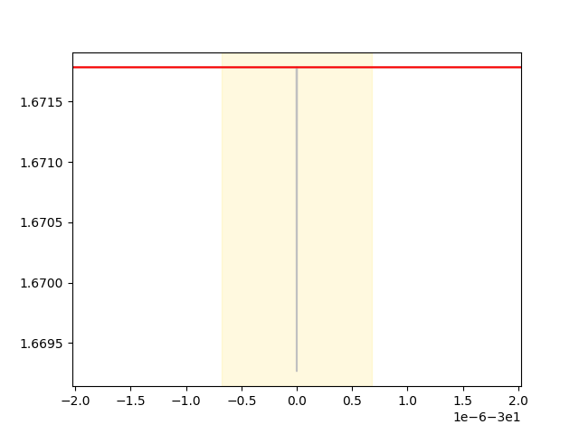
## New Eq:
((fabs(30.0 + membrane__V) < 6.7567567568760367e-7) ? (0.0040000000000000001 / (8.8513513515076093e-11 / (-1.0 + exp(4.6418918920460017e-8)) + 4.8581081081938701e-11 / (1.0 - exp(-1.0000000000287557e-7))) + (-22199999.499608092 - 739999.99998693645 * membrane__V) * (0.0040000000000000001 / (-8.8513513515076093e-11 / (-1.0 + exp(-4.6418918920460017e-8)) - 4.8581081081938701e-11 / (1.0 - exp(1.0000000000287557e-7))) - 0.0040000000000000001 / (8.8513513515076093e-11 / (-1.0 + exp(4.6418918920460017e-8)) + 4.8581081081938701e-11 / (1.0 - exp(-1.0000000000287557e-7))))) : (0.0040000000000000001 / (0.00013100000000000001 * (30.0 + membrane__V) / (-1.0 + exp(2.0609999999999999 + 0.068699999999999997 * membrane__V)) + 7.1899999999999999e-5 * (30.0 + membrane__V) / (1.0 - exp(-4.4399999999999995 - 0.14799999999999999 * membrane__V)))))

Singularities cannot be found
1.0/(0.036499999999999998*(0.14285714285714286*exp(0.014858841010401189*_ionic_concentrations$Nao) - 0.14285714285714286)*exp(-0.037435883507802618*_membrane$V) + 1.0 + 0.1245*exp(-0.003743588350780262*_membrane$V))

calcium_dynamics__APtrack_orig_deriv = ((membrane__dVdt > 150000.0) ? (100000.0 - 100500.0 * calcium_dynamics__APtrack) : (-500.0 * calcium_dynamics__APtrack))

####Piecewise!!

# Model: wang_model_2008(wang_sobie_2008.cellml)
## Equation 1:
```
calcium_activated_chloride_current__i_ClCa = pow(membrane__F, 2) * (-membrane__Cli + membrane__Clo * exp(membrane__F * membrane__V / (membrane__R * membrane__T))) * calcium_activated_chloride_current__P_ClCa * calcium_activated_chloride_current__f_ClCa * membrane__V / ((-1.0 + exp(membrane__F * membrane__V / (membrane__R * membrane__T))) * membrane__R * membrane__T)
```
### Partially evaluated to: 
```
calcium_activated_chloride_current__i_ClCa = pow(membrane__F, 2) * (-membrane__Cli + membrane__Clo * exp(membrane__F * membrane__V / (membrane__R * membrane__T))) * calcium_activated_chloride_current__P_ClCa * calcium_activated_chloride_current__f_ClCa * membrane__V / ((-1.0 + exp(membrane__F * membrane__V / (membrane__R * membrane__T))) * membrane__R * membrane__T)
```
### Singulariy points detected:

{0}
#### float * A

####Failed to find U symbolically!

<class 'sympy.core.mul.Mul'>
_membrane$F**2*_calcium_activated_chloride_current$P_ClCa*_calcium_activated_chloride_current$f_ClCa*_membrane$V*(-_membrane$Cli + _membrane$Clo*exp(_membrane$F*_membrane$V/(_membrane$R*_membrane$T)))/(_membrane$R*_membrane$T*(exp(_membrane$F*_membrane$V/(_membrane$R*_membrane$T)) - 1.0))

*try substituting parameters*

*U*
`0.038949423064193495 * membrane__V`

*V for 1e-07 range* 
`-2.5674321243523316e-6 - 2.5674321243523316e-6`

*Singularity point: 0*


## New Eq:
((fabs(membrane__V) < 2.5674321243523316e-6) ? ((0.5 + 194747.11532096748 * membrane__V) * (2.5674321243523316e-6 * pow(membrane__F, 2) * (-membrane__Cli + membrane__Clo * exp(2.5674321243523316e-6 * membrane__F / (membrane__R * membrane__T))) * calcium_activated_chloride_current__P_ClCa * calcium_activated_chloride_current__f_ClCa / ((-1.0 + exp(2.5674321243523316e-6 * membrane__F / (membrane__R * membrane__T))) * membrane__R * membrane__T) + 2.5674321243523316e-6 * pow(membrane__F, 2) * (-membrane__Cli + membrane__Clo * exp(-2.5674321243523316e-6 * membrane__F / (membrane__R * membrane__T))) * calcium_activated_chloride_current__P_ClCa * calcium_activated_chloride_current__f_ClCa / ((-1.0 + exp(-2.5674321243523316e-6 * membrane__F / (membrane__R * membrane__T))) * membrane__R * membrane__T)) - 2.5674321243523316e-6 * pow(membrane__F, 2) * (-membrane__Cli + membrane__Clo * exp(-2.5674321243523316e-6 * membrane__F / (membrane__R * membrane__T))) * calcium_activated_chloride_current__P_ClCa * calcium_activated_chloride_current__f_ClCa / ((-1.0 + exp(-2.5674321243523316e-6 * membrane__F / (membrane__R * membrane__T))) * membrane__R * membrane__T)) : (pow(membrane__F, 2) * (-membrane__Cli + membrane__Clo * exp(membrane__F * membrane__V / (membrane__R * membrane__T))) * calcium_activated_chloride_current__P_ClCa * calcium_activated_chloride_current__f_ClCa * membrane__V / ((-1.0 + exp(membrane__F * membrane__V / (membrane__R * membrane__T))) * membrane__R * membrane__T)))

fast_sodium_current_h_gate__alpha_h = ((membrane__V < -40.0) ? (0.13500000000000001 * exp(-11.764705882352942 - 0.14705882352941177 * membrane__V)) : (0))

####Piecewise!!

fast_sodium_current_h_gate__beta_h = ((membrane__V < -40.0) ? (310000.0 * exp(0.34999999999999998 * membrane__V) + 3.5600000000000001 * exp(0.079000000000000001 * membrane__V)) : (7.6923076923076916 / (1.0 + exp(-0.96036036036036043 - 0.0900900900900901 * membrane__V))))

####Piecewise!!

fast_sodium_current_j_gate__alpha_j = ((membrane__V < -40.0) ? ((37.780000000000001 + membrane__V) * (-127140.0 * exp(0.24440000000000001 * membrane__V) - 3.4740000000000003e-5 * exp(-0.043909999999999998 * membrane__V)) / (1.0 + exp(24.640530000000002 + 0.311 * membrane__V))) : (0))

####Piecewise!!

fast_sodium_current_j_gate__beta_j = ((membrane__V < -40.0) ? (0.1212 * exp(-0.01052 * membrane__V) / (1.0 + exp(-5.5312920000000005 - 0.13780000000000001 * membrane__V))) : (0.29999999999999999 * exp(-2.5349999999999999e-7 * membrane__V) / (1.0 + exp(-3.2000000000000002 - 0.10000000000000001 * membrane__V))))

####Piecewise!!

## Equation 2:
```
fast_sodium_current_m_gate__alpha_m = 0.32000000000000001 * (47.130000000000003 + membrane__V) / (1.0 - exp(-4.7130000000000001 - 0.10000000000000001 * membrane__V))
```
### Partially evaluated to: 
```
fast_sodium_current_m_gate__alpha_m = 0.32000000000000001 * (47.130000000000003 + membrane__V) / (1.0 - exp(-4.7130000000000001 - 0.10000000000000001 * membrane__V))
```
### Singulariy points detected:

{-47.130000000000003}
*U*
`-4.7130000000000001 - 0.10000000000000001 * membrane__V`

*V for 1e-07 range* 
`-47.129999000000005 - -47.130001`

*Singularity point: -47.130000000000003*


## New Eq:
((fabs(47.130000000000003 + membrane__V) < 1.0000000000287557e-6) ? (3.200000000092018e-7 / (1.0 - exp(-1.0000000000287557e-7)) + (-23564999.499322373 - 499999.99998562218 * membrane__V) * (-3.200000000092018e-7 / (1.0 - exp(1.0000000000287557e-7)) - 3.200000000092018e-7 / (1.0 - exp(-1.0000000000287557e-7)))) : (0.32000000000000001 * (47.130000000000003 + membrane__V) / (1.0 - exp(-4.7130000000000001 - 0.10000000000000001 * membrane__V))))

## Equation 3:
```
slow_delayed_rectifier_potassium_current__alpha_n = 4.8133299999999997e-6 * (26.5 + membrane__V) / (1.0 - exp(-3.3919999999999999 - 0.128 * membrane__V))
```
### Partially evaluated to: 
```
slow_delayed_rectifier_potassium_current__alpha_n = 4.8133299999999997e-6 * (26.5 + membrane__V) / (1.0 - exp(-3.3919999999999999 - 0.128 * membrane__V))
```
### Singulariy points detected:

{-26.500000000000000}
*U*
`-3.3919999999999999 - 0.128 * membrane__V`

*V for 1e-07 range* 
`-26.499999218749998 - -26.500000781250002`

*Singularity point: -26.500000000000000*


## New Eq:
((fabs(26.5 + membrane__V) < 7.8124999999817923e-7) ? (3.7604140624912359e-12 / (1.0 - exp(-9.9999999999406119e-8)) + (-16959999.500039525 - 640000.00000149151 * membrane__V) * (-3.7604140624912359e-12 / (1.0 - exp(9.9999999999406119e-8)) - 3.7604140624912359e-12 / (1.0 - exp(-9.9999999999406119e-8)))) : (4.8133299999999997e-6 * (26.5 + membrane__V) / (1.0 - exp(-3.3919999999999999 - 0.128 * membrane__V))))

Singularities cannot be found
1.0/(0.036499999999999998*(0.14285714285714286*exp(1.4858841010401189e-5*_membrane$Nao) - 0.14285714285714286)*exp(-0.038949423064193492*_membrane$V) + 1.0 + 0.1245*exp(-0.0038949423064193495*_membrane$V))

# Model: winslow_model_1999(winslow_model_1999.cellml)
fast_sodium_current_h_gate__alpha_h = ((membrane__V < -40.0) ? (135.0 * exp(-11.764705882352942 + 0.14705882352941177 * fast_sodium_current__shift_INa_inact - 0.14705882352941177 * membrane__V)) : (0))

####Piecewise!!

fast_sodium_current_h_gate__beta_h = ((membrane__V < -40.0) ? (3560.0 * exp(0.079000000000000001 * membrane__V - 0.079000000000000001 * fast_sodium_current__shift_INa_inact) + 310000.0 * exp(0.34999999999999998 * membrane__V - 0.34999999999999998 * fast_sodium_current__shift_INa_inact)) : (7692.3076923076924 / (1.0 + exp(-0.96036036036036043 + 0.0900900900900901 * fast_sodium_current__shift_INa_inact - 0.0900900900900901 * membrane__V))))

####Piecewise!!

fast_sodium_current_j_gate__alpha_j = ((membrane__V < -40.0) ? (1000.0 * (37.780000000000001 + membrane__V) * (-127140.0 * exp(0.24440000000000001 * membrane__V - 0.24440000000000001 * fast_sodium_current__shift_INa_inact) - 3.4740000000000003e-5 * exp(0.043909999999999998 * fast_sodium_current__shift_INa_inact - 0.043909999999999998 * membrane__V)) / (1.0 + exp(24.640530000000002 + 0.311 * membrane__V - 0.311 * fast_sodium_current__shift_INa_inact))) : (0))

####Piecewise!!

fast_sodium_current_j_gate__beta_j = ((membrane__V < -40.0) ? (121.2 * exp(0.01052 * fast_sodium_current__shift_INa_inact - 0.01052 * membrane__V) / (1.0 + exp(-5.5312920000000005 + 0.13780000000000001 * fast_sodium_current__shift_INa_inact - 0.13780000000000001 * membrane__V))) : (300.0 * exp(2.5349999999999999e-7 * fast_sodium_current__shift_INa_inact - 2.5349999999999999e-7 * membrane__V) / (1.0 + exp(-3.2000000000000002 + 0.10000000000000001 * fast_sodium_current__shift_INa_inact - 0.10000000000000001 * membrane__V))))

####Piecewise!!

fast_sodium_current_m_gate__alpha_m = ((fabs(fast_sodium_current_m_gate__E0_m) < 1.0000000000000001e-5) ? (1000.0 / (0.10000000000000001 - 0.0050000000000000001 * fast_sodium_current_m_gate__E0_m)) : (320.0 * fast_sodium_current_m_gate__E0_m / (1.0 - exp(-0.10000000000000001 * fast_sodium_current_m_gate__E0_m))))

####Piecewise!!

fast_sodium_current_m_gate__m_orig_deriv = ((membrane__V >= -90.0) ? ((1.0 - fast_sodium_current_m_gate__m) * fast_sodium_current_m_gate__alpha_m - fast_sodium_current_m_gate__beta_m * fast_sodium_current_m_gate__m) : (0))

####Piecewise!!

## Equation 1:
```
slow_activating_delayed_rectifiyer_K_current_X_ks_gate__tau_X_ks = 0.001 / (0.00013100000000000001 * (-10.0 + membrane__V) / (-1.0 + exp(-0.68699999999999994 + 0.068699999999999997 * membrane__V)) + 7.1899999999999999e-5 * (-10.0 + membrane__V) / (1.0 - exp(1.48 - 0.14799999999999999 * membrane__V)))
```
### Partially evaluated to: 
```
slow_activating_delayed_rectifiyer_K_current_X_ks_gate__tau_X_ks = 0.001 / (0.00013100000000000001 * (-10.0 + membrane__V) / (-1.0 + exp(-0.68699999999999994 + 0.068699999999999997 * membrane__V)) + 7.1899999999999999e-5 * (-10.0 + membrane__V) / (1.0 - exp(1.48 - 0.14799999999999999 * membrane__V)))
```
### Singulariy points detected:

{10.000000000000000, 10.000000000000000}
#### float * A

####1 / A


####A + B:

`7.1899999999999999e-5 * (-10.0 + membrane__V) / (1.0 - 4.3929456809187561 * exp(-0.14799999999999999 * membrane__V))`
`0.00013100000000000001 * (-10.0 + membrane__V) / (-1.0 + 0.50308305662435071 * exp(0.068699999999999997 * membrane__V))`

*U*
`1.48 - 0.14799999999999999 * membrane__V`

*V for 1e-07 range* 
`10.000000675675675 - 9.9999993243243246`

*Singularity point: 10.000000000000000*


*U*
`-0.68699999999999994 + 0.068699999999999997 * membrane__V`

*V for 1e-07 range* 
`9.9999985443959236 - 10.000001455604076`

*Singularity point: 10.000000000000000*

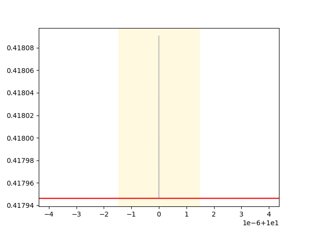
## New Eq:
((fabs(-10.0 + membrane__V) < 6.7567567567372588e-7) ? (0.001 / (4.8581081080940889e-11 / (1.0 - exp(-9.9999999999406119e-8)) + 8.8513513513258105e-11 / (-1.0 + exp(4.6418918918725294e-8))) + (7400000.5000213543 - 740000.00000213541 * membrane__V) * (0.001 / (-4.8581081080940889e-11 / (1.0 - exp(9.9999999999406119e-8)) - 8.8513513513258105e-11 / (-1.0 + exp(-4.6418918918725294e-8))) - 0.001 / (4.8581081080940889e-11 / (1.0 - exp(-9.9999999999406119e-8)) + 8.8513513513258105e-11 / (-1.0 + exp(4.6418918918725294e-8))))) : ((fabs(-10.0 + membrane__V) < 1.4556040756966149e-6) ? (0.001 / (-1.0465793304208771e-10 / (1.0 - exp(2.1542940320182224e-7)) - 1.9068413391534758e-10 / (-1.0 + exp(-1.0000000000027348e-7))) + (-3434999.4999877219 + 343499.99999877217 * membrane__V) * (0.001 / (1.9068413391716557e-10 / (-1.0 + exp(1.0000000000114084e-7)) + 1.0465793304308552e-10 / (1.0 - exp(-2.1542940320355697e-7))) - 0.001 / (-1.0465793304208771e-10 / (1.0 - exp(2.1542940320182224e-7)) - 1.9068413391534758e-10 / (-1.0 + exp(-1.0000000000027348e-7))))) : (0.001 / (0.00013100000000000001 * (-10.0 + membrane__V) / (-1.0 + exp(-0.68699999999999994 + 0.068699999999999997 * membrane__V)) + 7.1899999999999999e-5 * (-10.0 + membrane__V) / (1.0 - exp(1.48 - 0.14799999999999999 * membrane__V))))))

## Equation 2:
```
L_type_Ca_current__i_Ca_max = 4000.0 * pow(membrane__F, 2) * (0.001 * exp(2.0 * membrane__F * membrane__V / (membrane__R * membrane__T)) - 0.34100000000000003 * standard_ionic_concentrations__Cao) * L_type_Ca_current__P_Ca * membrane__V / ((-1.0 + exp(2.0 * membrane__F * membrane__V / (membrane__R * membrane__T))) * membrane__R * membrane__T)
```
### Partially evaluated to: 
```
L_type_Ca_current__i_Ca_max = 4000.0 * pow(membrane__F, 2) * (0.001 * exp(2.0 * membrane__F * membrane__V / (membrane__R * membrane__T)) - 0.34100000000000003 * standard_ionic_concentrations__Cao) * L_type_Ca_current__P_Ca * membrane__V / ((-1.0 + exp(2.0 * membrane__F * membrane__V / (membrane__R * membrane__T))) * membrane__R * membrane__T)
```
### Singulariy points detected:

{0}
#### float * A

####Failed to find U symbolically!

<class 'sympy.core.mul.Mul'>
_membrane$F**2*_L_type_Ca_current$P_Ca*_membrane$V*(-0.34100000000000003*_standard_ionic_concentrations$Cao + 0.001*exp(2.0*_membrane$F*_membrane$V/(_membrane$R*_membrane$T)))/(_membrane$R*_membrane$T*(exp(2.0*_membrane$F*_membrane$V/(_membrane$R*_membrane$T)) - 1.0))

*try substituting parameters*

*U*
`0.074867781645490947 * membrane__V`

*V for 1e-07 range* 
`-1.3356880329847825e-6 - 1.3356880329847825e-6`

*Singularity point: 0*


## New Eq:
((fabs(membrane__V) < 1.3356880329847825e-6) ? ((0.5 + 374338.90822745475 * membrane__V) * (0.0053427521319391299 * pow(membrane__F, 2) * (0.001 * exp(2.671376065969565e-6 * membrane__F / (membrane__R * membrane__T)) - 0.34100000000000003 * standard_ionic_concentrations__Cao) * L_type_Ca_current__P_Ca / ((-1.0 + exp(2.671376065969565e-6 * membrane__F / (membrane__R * membrane__T))) * membrane__R * membrane__T) + 0.0053427521319391299 * pow(membrane__F, 2) * (0.001 * exp(-2.671376065969565e-6 * membrane__F / (membrane__R * membrane__T)) - 0.34100000000000003 * standard_ionic_concentrations__Cao) * L_type_Ca_current__P_Ca / ((-1.0 + exp(-2.671376065969565e-6 * membrane__F / (membrane__R * membrane__T))) * membrane__R * membrane__T)) - 0.0053427521319391299 * pow(membrane__F, 2) * (0.001 * exp(-2.671376065969565e-6 * membrane__F / (membrane__R * membrane__T)) - 0.34100000000000003 * standard_ionic_concentrations__Cao) * L_type_Ca_current__P_Ca / ((-1.0 + exp(-2.671376065969565e-6 * membrane__F / (membrane__R * membrane__T))) * membrane__R * membrane__T)) : (4000.0 * pow(membrane__F, 2) * (0.001 * exp(2.0 * membrane__F * membrane__V / (membrane__R * membrane__T)) - 0.34100000000000003 * standard_ionic_concentrations__Cao) * L_type_Ca_current__P_Ca * membrane__V / ((-1.0 + exp(2.0 * membrane__F * membrane__V / (membrane__R * membrane__T))) * membrane__R * membrane__T)))

## Equation 3:
```
L_type_Ca_current__i_Ca_K = pow(membrane__F, 2) * (-standard_ionic_concentrations__Ko + intracellular_ion_concentrations__Ki * exp(membrane__F * membrane__V / (membrane__R * membrane__T))) * (L_type_Ca_current__O + L_type_Ca_current__O_Ca) * L_type_Ca_current__p_prime_k * L_type_Ca_current_y_gate__y * membrane__V / ((-1.0 + exp(membrane__F * membrane__V / (membrane__R * membrane__T))) * membrane__R * membrane__T)
```
### Partially evaluated to: 
```
L_type_Ca_current__i_Ca_K = pow(membrane__F, 2) * (-standard_ionic_concentrations__Ko + intracellular_ion_concentrations__Ki * exp(membrane__F * membrane__V / (membrane__R * membrane__T))) * (L_type_Ca_current__O + L_type_Ca_current__O_Ca) * L_type_Ca_current__p_prime_k * L_type_Ca_current_y_gate__y * membrane__V / ((-1.0 + exp(membrane__F * membrane__V / (membrane__R * membrane__T))) * membrane__R * membrane__T)
```
### Singulariy points detected:

{0}
#### float * A

####Failed to find U symbolically!

<class 'sympy.core.mul.Mul'>
_membrane$F**2*_L_type_Ca_current$p_prime_k*_L_type_Ca_current_y_gate$y*_membrane$V*(_L_type_Ca_current$O + _L_type_Ca_current$O_Ca)*(_intracellular_ion_concentrations$Ki*exp(_membrane$F*_membrane$V/(_membrane$R*_membrane$T)) - _standard_ionic_concentrations$Ko)/(_membrane$R*_membrane$T*(exp(_membrane$F*_membrane$V/(_membrane$R*_membrane$T)) - 1.0))

*try substituting parameters*

*U*
`0.037433890822745473 * membrane__V`

*V for 1e-07 range* 
`-2.671376065969565e-6 - 2.671376065969565e-6`

*Singularity point: 0*

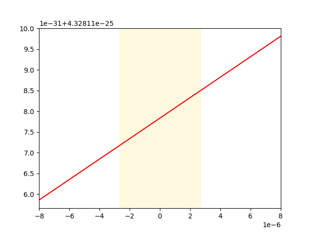
## New Eq:
((fabs(membrane__V) < 2.671376065969565e-6) ? ((0.5 + 187169.45411372738 * membrane__V) * (2.671376065969565e-6 * pow(membrane__F, 2) * (-standard_ionic_concentrations__Ko + intracellular_ion_concentrations__Ki * exp(2.671376065969565e-6 * membrane__F / (membrane__R * membrane__T))) * (L_type_Ca_current__O + L_type_Ca_current__O_Ca) * L_type_Ca_current__p_prime_k * L_type_Ca_current_y_gate__y / ((-1.0 + exp(2.671376065969565e-6 * membrane__F / (membrane__R * membrane__T))) * membrane__R * membrane__T) + 2.671376065969565e-6 * pow(membrane__F, 2) * (-standard_ionic_concentrations__Ko + intracellular_ion_concentrations__Ki * exp(-2.671376065969565e-6 * membrane__F / (membrane__R * membrane__T))) * (L_type_Ca_current__O + L_type_Ca_current__O_Ca) * L_type_Ca_current__p_prime_k * L_type_Ca_current_y_gate__y / ((-1.0 + exp(-2.671376065969565e-6 * membrane__F / (membrane__R * membrane__T))) * membrane__R * membrane__T)) - 2.671376065969565e-6 * pow(membrane__F, 2) * (-standard_ionic_concentrations__Ko + intracellular_ion_concentrations__Ki * exp(-2.671376065969565e-6 * membrane__F / (membrane__R * membrane__T))) * (L_type_Ca_current__O + L_type_Ca_current__O_Ca) * L_type_Ca_current__p_prime_k * L_type_Ca_current_y_gate__y / ((-1.0 + exp(-2.671376065969565e-6 * membrane__F / (membrane__R * membrane__T))) * membrane__R * membrane__T)) : (pow(membrane__F, 2) * (-standard_ionic_concentrations__Ko + intracellular_ion_concentrations__Ki * exp(membrane__F * membrane__V / (membrane__R * membrane__T))) * (L_type_Ca_current__O + L_type_Ca_current__O_Ca) * L_type_Ca_current__p_prime_k * L_type_Ca_current_y_gate__y * membrane__V / ((-1.0 + exp(membrane__F * membrane__V / (membrane__R * membrane__T))) * membrane__R * membrane__T)))

Singularities cannot be found
1.0/(0.036499999999999998*(0.14285714285714286*exp(0.014858841010401189*_standard_ionic_concentrations$Nao) - 0.14285714285714286)*exp(-0.037433890822745473*_membrane$V) + 1.0 + 0.1245*exp(-0.0037433890822745475*_membrane$V))

# Model: zhang_SAN_model_2000_0D_capable(zhang_SAN_model_2000_0D_capable.cellml)
## Equation 1:
```
L_type_Ca_channel_d_gate__alpha_d_L = -28.390000000000001 * (35.0 + membrane__V) / (-1.0 + exp(-14.0 - 0.40000000000000002 * membrane__V)) - 84.900000000000006 * membrane__V / (-1.0 + exp(-0.20799999999999999 * membrane__V))
```
### Partially evaluated to: 
```
L_type_Ca_channel_d_gate__alpha_d_L = -28.390000000000001 * (35.0 + membrane__V) / (-1.0 + exp(-14.0 - 0.40000000000000002 * membrane__V)) - 84.900000000000006 * membrane__V / (-1.0 + exp(-0.20799999999999999 * membrane__V))
```
### Singulariy points detected:

{0, -35.000000000000000}
####A + B:

`84.900000000000006 * membrane__V / (1.0 - exp(-0.20799999999999999 * membrane__V))`
`-28.390000000000001 * (35.0 + membrane__V) / (-1.0 + 8.3152871910356788e-7 * exp(-0.40000000000000002 * membrane__V))`

#### float * A

####Failed to find U symbolically!

<class 'sympy.core.mul.Mul'>
_membrane$V/(1.0 - exp(-0.20799999999999999*_membrane$V))

*try substituting parameters*

####Failed to find U symbolically!

<class 'sympy.core.mul.Mul'>
_membrane$V/(1.0 - exp(-0.20799999999999999*_membrane$V))
*U*
`-14.0 - 0.40000000000000002 * membrane__V`

*V for 1e-07 range* 
`-34.999999750000001 - -35.000000249999999`

*Singularity point: -35.000000000000000*


## New Eq:
((fabs(35.0 + membrane__V) < 2.5000000000718892e-7) ? (2971.4999787750003 / (-1.0 + exp(7.2799999479999995)) - 7.097500000992074e-6 / (-1.0 + exp(-1.0000000001675335e-7)) + (-69999999.497987106 - 1999999.9999424887 * membrane__V) * (7.0974999994161125e-6 / (-1.0 + exp(9.9999999988997779e-8)) + 2971.5000212250002 / (-1.0 + exp(7.2800000519999992)) + 7.097500000992074e-6 / (-1.0 + exp(-1.0000000001675335e-7)) - 2971.4999787750003 / (-1.0 + exp(7.2799999479999995)))) : (-28.390000000000001 * (35.0 + membrane__V) / (-1.0 + exp(-14.0 - 0.40000000000000002 * membrane__V)) - 84.900000000000006 * membrane__V / (-1.0 + exp(-0.20799999999999999 * membrane__V))))

## Equation 2:
```
L_type_Ca_channel_d_gate__beta_d_L = 11.43 * (-5.0 + membrane__V) / (-1.0 + exp(-2.0 + 0.40000000000000002 * membrane__V))
```
### Partially evaluated to: 
```
L_type_Ca_channel_d_gate__beta_d_L = 11.43 * (-5.0 + membrane__V) / (-1.0 + exp(-2.0 + 0.40000000000000002 * membrane__V))
```
### Singulariy points detected:

{5.0000000000000000}
*U*
`-2.0 + 0.40000000000000002 * membrane__V`

*V for 1e-07 range* 
`4.9999997499999997 - 5.0000002500000003`

*Singularity point: 5.0000000000000000*

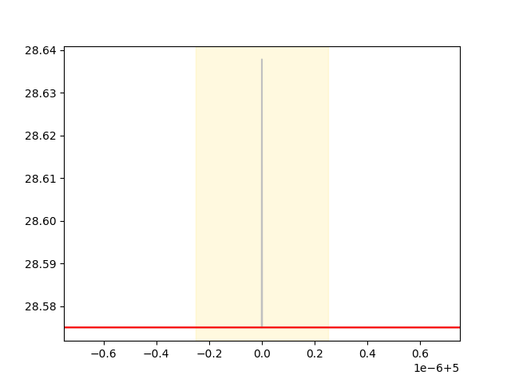
## New Eq:
((fabs(-5.0 + membrane__V) < 2.5000000000025002e-7) ? (-2.8575000000028576e-6 / (-1.0 + exp(-9.9999999999406119e-8)) + (-9999999.4999899995 + 1999999.9999979998 * membrane__V) * (2.8575000000028576e-6 / (-1.0 + exp(9.9999999999406119e-8)) + 2.8575000000028576e-6 / (-1.0 + exp(-9.9999999999406119e-8)))) : (11.43 * (-5.0 + membrane__V) / (-1.0 + exp(-2.0 + 0.40000000000000002 * membrane__V))))

## Equation 3:
```
L_type_Ca_channel_f_gate__alpha_f_L = 3.75 * (28.0 + membrane__V) / (-1.0 + exp(7.0 + 0.25 * membrane__V))
```
### Partially evaluated to: 
```
L_type_Ca_channel_f_gate__alpha_f_L = 3.75 * (28.0 + membrane__V) / (-1.0 + exp(7.0 + 0.25 * membrane__V))
```
### Singulariy points detected:

{-28.000000000000000}
*U*
`7.0 + 0.25 * membrane__V`

*V for 1e-07 range* 
`-28.000000400000001 - -27.999999599999999`

*Singularity point: -28.000000000000000*

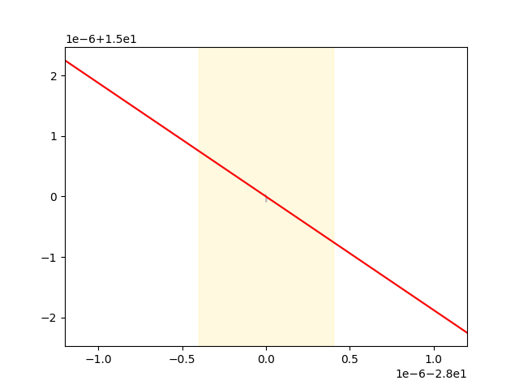
## New Eq:
((fabs(28.0 + membrane__V) < 4.0000000001150227e-7) ? (-1.5000000000431335e-6 / (-1.0 + exp(-1.0000000000287557e-7)) + (35000000.498993553 + 1249999.9999640554 * membrane__V) * (1.5000000000431335e-6 / (-1.0 + exp(1.0000000000287557e-7)) + 1.5000000000431335e-6 / (-1.0 + exp(-1.0000000000287557e-7)))) : (3.75 * (28.0 + membrane__V) / (-1.0 + exp(7.0 + 0.25 * membrane__V))))

## Equation 4:
```
sodium_current__i_Na = pow(membrane__F, 2) * pow(sodium_current_m_gate__m, 3) * (-1.0 + exp((-reversal_and_equilibrium_potentials__E_Na + membrane__V) * membrane__F / (membrane__R * membrane__T))) * ionic_concentrations__Na_o * membrane__V * sodium_current__g_Na * sodium_current_h_gate__h / ((-1.0 + exp(membrane__F * membrane__V / (membrane__R * membrane__T))) * membrane__R * membrane__T)
```
### Partially evaluated to: 
```
sodium_current__i_Na = pow(membrane__F, 2) * pow(sodium_current_m_gate__m, 3) * (-1.0 + exp((-reversal_and_equilibrium_potentials__E_Na + membrane__V) * membrane__F / (membrane__R * membrane__T))) * ionic_concentrations__Na_o * membrane__V * sodium_current__g_Na * sodium_current_h_gate__h / ((-1.0 + exp(membrane__F * membrane__V / (membrane__R * membrane__T))) * membrane__R * membrane__T)
```
### Singulariy points detected:

{0}
####Failed to find U symbolically!

<class 'sympy.core.mul.Mul'>
_membrane$F**2*_sodium_current_m_gate$m**3*_ionic_concentrations$Na_o*_membrane$V*_sodium_current$g_Na*_sodium_current_h_gate$h*(exp(_membrane$F*(_membrane$V - _reversal_and_equilibrium_potentials$E_Na)/(_membrane$R*_membrane$T)) - 1.0)/(_membrane$R*_membrane$T*(exp(_membrane$F*_membrane$V/(_membrane$R*_membrane$T)) - 1.0))

*try substituting parameters*

#### Eq == 0!
